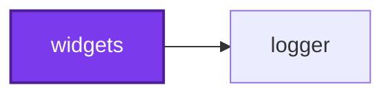

# Running a codependix export

Codependix reads what each project in an Nx workspace depends on and renders it
four ways — the Nx project graph, a NestJS project's module graph, a TypeScript
project's file-level import graph, and a Python project's — then delivers each
one to whichever destinations the configuration names for that project: a JSON
file, a Markdown anchor block spliced into an existing file, or both.

## The configuration decides everything

**There is no flag that selects a graph type, and no per-graph-type
subcommand.** Which graphs run, for which projects, and where each export
lands is entirely a function of `codependix.config.ts`. Looking for
`--nestjs`, `--imports`, or `--only nx` is looking for something that does not
exist.

The corollary is the failure mode worth learning first:

> **A workspace with no configuration file resolves every graph type for every
> project to `target: "none"` and produces nothing.** The run succeeds, exits
> 0, logs that every configured export is current, and writes no files —
> because nothing was configured. That is correct behavior, not a bug.

So a `--write` that wrote nothing is a configuration question, never a
debugging one. Before looking for a defect, confirm in this order:

1. A configuration file was actually found — an absent one is legal and
   silent, while a `--config` path that was named explicitly and does not
   exist fails loudly.
2. The graph types you expected carry a `target` other than `"none"`, which is
   what every unset target defaults to.
3. The projects you expected match the configured `include` globs and no
   `exclude` glob.

The `codependix-configure` skill covers all three.

## Exactly two run modes

| Mode | Meaning |
| ---- | ------- |
| `--check` | Verifies every configured export is current, writing nothing |
| `--write` | Writes every configured export |

`--check` and `--write` are mutually exclusive, and **one of them is
required**. A command line naming neither, or both, is rejected outright
before anything is read — no mode is inferred and no default write happens.

Two options qualify whichever mode was picked:

| Option | Meaning |
| ------ | ------- |
| `--config [config]` | Path to a `codependix.config.ts`. Searched for upward from the directory when omitted |
| `-d, --directory [directory]` | Workspace root whose Nx project graph this run reads. Defaults to the working directory |

```bash
codependix --write
codependix --check --directory . --config configuration/codependix.config.ts
```

## Codependix reads the Nx project graph

This is the trait that separates it from measurement tools that walk a
directory. Nx resolves the project graph itself, from the process working
directory — no flag points at it. What `--directory` names is the **workspace
root every project's path is resolved against**, and the directory the
configuration search starts from.

So `--directory` is not a subtree to scan, and pointing it at a single project's
folder does not export that project alone. It makes every project's root
resolve underneath that folder, and the exports land in the wrong place — or
fail on a readme that is not there — while the graph itself is unaffected.

Run codependix from the workspace root, pass `--directory .`, and select
projects through the configuration's `include`/`exclude` globs rather than
through the directory.

## Four graph types, plus the workspace

Each is keyed by name in the configuration:

| Key | What it exports | Which projects appear |
| --- | --------------- | --------------------- |
| `nx` | A project's one-hop Neighborhood — what it depends on, and what depends on it | Every project the Nx graph knows, except the workspace root itself |
| `nestjs` | A project's NestJS module import graph | Only projects tagged `framework:nestjs` |
| `imports` | A project's own file-level TypeScript import graph | Every project carrying its own `tsconfig.json` |
| `pythonImports` | The Python equivalent, parsed from `import` / `from ... import` statements | Only projects tagged `language:python` |

The whole-workspace Nx graph is configured separately, under `workspace.nx`.
It is exported **once for the repository** rather than once per project, has no
per-project override, and is unaffected by `include`/`exclude`.

**Participation is per graph type and is not one rule.** A project a given
graph type does not apply to simply never appears in that type's results, which
is why configuring a graph type for every project costs nothing: a project with
no NestJS container is absent from the NestJS pass rather than failing it.

## What the run reports

Every pass is attempted regardless of whether an earlier one failed, and one
project's failure is isolated to that project — a missing README, or a NestJS
project that fails to boot its container, is collected as a failure while every
other project still runs. `--write` either fully succeeds or names exactly
which projects failed.

Two findings are reported separately, and either one fails the run:

- **Failures** — projects that raised before their exports could be resolved.
- **Stale exports** — in `--check`, configured exports that disagree with a
  freshly built graph.

A project resolving to `target: "none"` is left out of the results **entirely**
rather than reported as up to date, so an exit code depends only on exports
codependix was actually configured to produce. A `--check` run reporting `0`
projects is telling you it was configured to produce nothing.

## Reading an export

A Markdown destination writes a Mermaid diagram. In anchor mode the diagram is
spliced between two HTML comment markers naming the anchor:

````markdown
<!-- codependix:start name="codependix-nx" -->

<!-- codependix:end name="codependix-nx" -->
````

The highlighted `subject` node is the project the Neighborhood is centered on.
Node identifiers are sanitized from names and paths, so read the quoted label
rather than the identifier.

A JSON destination writes the graph's own shape — an Nx Neighborhood carries
`dependencies`, `dependents`, `edges`, and `projectName`; an import graph
carries `fileNames`, `edges`, `isolatedFileNames`, and `projectName`; a NestJS
module graph adds `ambientModuleNames` for the global modules whose edges were
deliberately left out of the diagram.

For using a committed graph to answer a question about the codebase — what
depends on this, what a rename would touch, whether an import cycle is real —
reach for the `codependix-navigate` skill.

## Never hand-edit inside the markers

The next `--write` replaces an anchor block wholesale. A diagram edited by hand
is a diff that silently disappears on the following run, and reviewers see a
change that reverts itself for no visible reason.

**Re-running `--write` is the entire fix for a stale `--check`.** Reach for the
`codependix-triage` skill when a run fails for any other reason.
