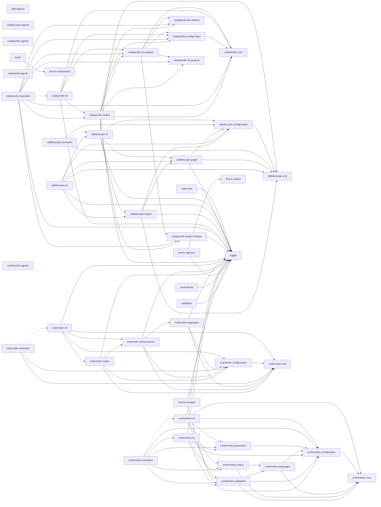

# Codebase v2.23.0

[](https://nx.dev)
[](https://www.typescriptlang.org/)
[](https://pnpm.io/)
[](https://nodejs.org/)
[](https://www.python.org/)
[](https://docs.astral.sh/uv/)
[](https://jupyter.org/)
[](https://react.dev/)
[](https://tanstack.com/start)
[](https://ui.shadcn.com/)
[](https://radix-ui.com/)
[](https://tailwindcss.com/)
[](https://lucide.dev/)
[](https://recharts.org/)
[](https://zod.dev/)
[](https://vitejs.dev/)
[](https://swc.rs/)
[](https://vitest.dev/)
[](https://nestjs.com/)
[](https://graphql.org/)
[](https://typeorm.io/)
[](https://www.postgresql.org/)
[](https://python.langchain.com/)
[](https://langchain-ai.github.io/langgraph/)
[](https://ollama.com/)
[](https://docs.pydantic.dev/)
[](https://eslint.org/)
[](https://oxc.rs/docs/guide/usage/linter)
[](https://prettier.io/)
[](https://stylelint.io/)
[](https://docs.astral.sh/ruff/)
[](https://semantic-release.gitbook.io/)
[](https://www.docker.com/)
[](https://helm.sh/)
[](https://kubernetes.io/)
[](https://www.terraform.io/)

[](https://github.com/JimmyPaolini/codebase/actions/workflows/continuous-integration.yml)
[](https://github.com/JimmyPaolini/codebase/actions/workflows/continuous-deployment.yml)
[](https://github.com/JimmyPaolini/codebase/actions/workflows/continuous-compliance.yml)

A modern TypeScript codebase with Nx, featuring automated releases, comprehensive code quality tools, and strict type safety.

## 💽 Projects

**🔮 [affirmations](applications/affirmations)** - Python LangChain + Ollama affirmation generator (LangGraph ReAct agent, SearxNG)\
**🛰️ [caelundas](applications/caelundas)** - Swiss Ephemeris calendar generator that turns astronomical events into an `.ics` file
<details>
<summary><strong>🔭 callidescope</strong> - Call stack tracing toolchain that follows control flow through injected dependencies and reports where a stack got too deep</summary>

&nbsp;&nbsp;&nbsp;&nbsp;**[callidescope-agents](packages/ic-suite/callidescope/callidescope-agents)** - Agent skills for the callidescope toolchain, published and installed back from the lockfile like any other vendored skill\
&nbsp;&nbsp;&nbsp;&nbsp;**[callidescope-cli](packages/ic-suite/callidescope/callidescope-cli)** - Command-line host that builds the call graph with the TypeScript compiler API, resolves NestJS injected dependencies, and reports the deepest stack below every entry point\
&nbsp;&nbsp;&nbsp;&nbsp;**[callidescope-configuration](packages/ic-suite/callidescope/callidescope-configuration)** - Reads `callidescope.config.ts` for entry-point rules, depth and breadth limits, exclusion globs, and output destinations\
&nbsp;&nbsp;&nbsp;&nbsp;**[callidescope-core](packages/ic-suite/callidescope/callidescope-core)** - The contracts leaf: the call graph, stack, frame, and finding vocabulary every other callidescope package speaks, holding no service and no NestJS module\
&nbsp;&nbsp;&nbsp;&nbsp;**[callidescope-examples](packages/ic-suite/callidescope/callidescope-examples)** - A small codebase built to be traced, carrying one worked example per rule, finding, and output the toolchain has\
&nbsp;&nbsp;&nbsp;&nbsp;**[callidescope-graph](packages/ic-suite/callidescope/callidescope-graph)** - Builds the call graph from traced TypeScript source and measures its depth and breadth\
&nbsp;&nbsp;&nbsp;&nbsp;**[callidescope-nx](packages/ic-suite/callidescope/callidescope-nx)** - Nx plugin inferring per-project `trace`, `depth`, and `breadth` targets that follow the Nx dependency graph, keeping every Nx dependency out of the packages that trace\
&nbsp;&nbsp;&nbsp;&nbsp;**[callidescope-output](packages/ic-suite/callidescope/callidescope-output)** - Renders call-graph findings into markdown, mermaid, and JSON output formats

</details>

<details>
<summary><strong>🕸️ codependix</strong> - Dependency graph export toolchain that reads what each project depends on, renders it as JSON and Markdown diagrams, and gates the rules those graphs are judged against</summary>

&nbsp;&nbsp;&nbsp;&nbsp;**[codependix-agents](packages/ic-suite/codependix/codependix-agents)** - Agent skills for the codependix toolchain, installable by any workspace that uses codependix\
&nbsp;&nbsp;&nbsp;&nbsp;**[codependix-boundaries](packages/ic-suite/codependix/codependix-boundaries)** - Builds each level's graph for a workspace, judges it against the declared rules, and reports the edges and cycles that break them\
&nbsp;&nbsp;&nbsp;&nbsp;**[codependix-cli](packages/ic-suite/codependix/codependix-cli)** - Command-line host that exports a project's Nx, NestJS, and file-level dependency graphs as JSON and Markdown anchor blocks, and gates the rules over them\
&nbsp;&nbsp;&nbsp;&nbsp;**[codependix-configuration](packages/ic-suite/codependix/codependix-configuration)** - Reads `codependix.config.ts`, resolves the command line over it, and produces one resolved run configuration\
&nbsp;&nbsp;&nbsp;&nbsp;**[codependix-core](packages/ic-suite/codependix/codependix-core)** - The contracts leaf: the run and result vocabulary every other codependix package states its types in\
&nbsp;&nbsp;&nbsp;&nbsp;**[codependix-examples](packages/ic-suite/codependix/codependix-examples)** - Sixteen subjects built to be graphed, each carrying the guide codependix renders from it\
&nbsp;&nbsp;&nbsp;&nbsp;**[codependix-file-imports](packages/ic-suite/codependix/codependix-file-imports)** - Builds a project's file-level import graph — a `typescript` module walking its own `ts.Program`, and a `python` module parsing `import`/`from ... import` statements\
&nbsp;&nbsp;&nbsp;&nbsp;**[codependix-nestjs-modules](packages/ic-suite/codependix/codependix-nestjs-modules)** - Explores a NestJS project's container and builds its module graph\
&nbsp;&nbsp;&nbsp;&nbsp;**[codependix-nx-projects](packages/ic-suite/codependix/codependix-nx-projects)** - Builds a project's one-hop Nx dependency neighborhood from the Nx project graph\
&nbsp;&nbsp;&nbsp;&nbsp;**[codependix-output](packages/ic-suite/codependix/codependix-output)** - Renders every graph as JSON, Markdown, and mermaid, routes each to its configured destination, and splices anchor blocks into place

</details>

<details>
<summary><strong>⏲️ codometer</strong> - Repository measurement toolchain that counts a codebase and reports what it found</summary>

&nbsp;&nbsp;&nbsp;&nbsp;**[codometer-agents](packages/ic-suite/codometer/codometer-agents)** - Agent skills for the codometer toolchain, published and installed back from the lockfile like any other vendored skill\
&nbsp;&nbsp;&nbsp;&nbsp;**[codometer-cli](packages/ic-suite/codometer/codometer-cli)** - Command-line host that measures TypeScript, JavaScript, Python, JSON, markdown, and Jupyter notebooks, then writes the badge block in this README, a JSON report, or both\
&nbsp;&nbsp;&nbsp;&nbsp;**[codometer-configuration](packages/ic-suite/codometer/codometer-configuration)** - Reads `codometer.config.ts` for exclusion globs, output destinations and their render/write callbacks, and the Python interpreter, and reads the command line that runs over it\
&nbsp;&nbsp;&nbsp;&nbsp;**[codometer-core](packages/ic-suite/codometer/codometer-core)** - The contracts leaf: the statistics and report vocabulary a measurement produces, and the errors a configuration is refused with\
&nbsp;&nbsp;&nbsp;&nbsp;**[codometer-examples](packages/ic-suite/codometer/codometer-examples)** - A sample corpus with known contents and one runnable example per thing codometer does, with tests that assert every number the guides quote\
&nbsp;&nbsp;&nbsp;&nbsp;**[codometer-languages](packages/ic-suite/codometer/codometer-languages)** - Every input language analyzer codometer measures, behind one `analyze()` call\
&nbsp;&nbsp;&nbsp;&nbsp;**[codometer-measurement](packages/ic-suite/codometer/codometer-measurement)** - Finds the files a run measures, counts their size and whatever a configuration declares its own counters for, and holds every metric to its declared limit\
&nbsp;&nbsp;&nbsp;&nbsp;**[codometer-output](packages/ic-suite/codometer/codometer-output)** - Every codometer output format - JSON reports, README badges, and the pull request change report - plus the destinations a run writes them to

</details>

<details>
<summary><strong>👔 conformetry</strong> - Template-driven code generation and conformance validation toolchain</summary>

&nbsp;&nbsp;&nbsp;&nbsp;**[conformetry-agents](packages/ic-suite/conformetry/conformetry-agents)** - Agent skills for the conformetry toolchain, published and installed back from the lockfile like any other vendored skill\
&nbsp;&nbsp;&nbsp;&nbsp;**[conformetry-cli](packages/ic-suite/conformetry/conformetry-cli)** - Command-line host that expands globs, prompts for inputs, and runs generation and validation\
&nbsp;&nbsp;&nbsp;&nbsp;**[conformetry-configuration](packages/ic-suite/conformetry/conformetry-configuration)** - Configuration loading, template and instance discovery, generator input resolution, and the placeholder rendering every template path needs\
&nbsp;&nbsp;&nbsp;&nbsp;**[conformetry-core](packages/ic-suite/conformetry/conformetry-core)** - Contracts leaf: difference, score, inventory, and language validator types, and nothing executable\
&nbsp;&nbsp;&nbsp;&nbsp;**[conformetry-examples](packages/ic-suite/conformetry/conformetry-examples)** - Eleven runnable examples of the toolchain, each with its own configuration, template, instances, and guide, executed by CI so the guides cannot rot\
&nbsp;&nbsp;&nbsp;&nbsp;**[conformetry-generation](packages/ic-suite/conformetry/conformetry-generation)** - Scaffold file generation, rendering each template through the configuration layer\
&nbsp;&nbsp;&nbsp;&nbsp;**[conformetry-languages](packages/ic-suite/conformetry/conformetry-languages)** - Every language conformetry compares files with, as modules of one package, plus the resolution that picks them, the text fallback, the extension-agnostic existence pass, and the difference and scoring primitives they share\
&nbsp;&nbsp;&nbsp;&nbsp;**[conformetry-nx](packages/ic-suite/conformetry/conformetry-nx)** - Nx plugin host with generators, executors, and the emitted-plugin bootstrap\
&nbsp;&nbsp;&nbsp;&nbsp;**[conformetry-output](packages/ic-suite/conformetry/conformetry-output)** - Every render target: the validation report and the template and instance inventory\
&nbsp;&nbsp;&nbsp;&nbsp;**[conformetry-validation](packages/ic-suite/conformetry/conformetry-validation)** - Validation orchestration, language routing, and finding deduplication

</details>

<details>
<summary><strong>🐺 lexico</strong> - Latin-English dictionary suite: the web application, its components, its schema, and the ingestion that fills it</summary>

&nbsp;&nbsp;&nbsp;&nbsp;**[lexico](applications/lexico)** - TanStack Start SSR dictionary web application\
&nbsp;&nbsp;&nbsp;&nbsp;**[lexico-components](packages/lexico-components)** - Shared React component library using shadcn/ui and Radix primitives\
&nbsp;&nbsp;&nbsp;&nbsp;**[lexico-entities](packages/lexico-entities)** - TypeORM entities, migrations, and grammatical enumerations for the dictionary and literature schema\
&nbsp;&nbsp;&nbsp;&nbsp;**[lexico-ingestion](applications/lexico-ingestion)** - NestJS CLI that scrapes and loads dictionary, literature, and etymology sources

</details>

**🪵 [logger](packages/logger)** - Shared pino-backed NestJS `LoggerService` and `LoggerModule`\
**🏺 [meanderaw](applications/meanderaw)** - CLI that generates Greek meander (key/fret) SVG patterns programmatically from a type, row count, and repeat count

**[JimmyPaolini](applications/JimmyPaolini)** - GitHub profile site\
**↔️ [synchronization](tools/synchronization)** - NestJS CLI that regenerates the workspace's derived configuration and documentation, and fails CI when they drift\
**🧑‍⚖️ [validation](tools/validation)** - NestJS CLI for the repository's one-sided checks, the ones with a check and no write, such as the pull request metadata gate

## 📖 Documentation

### Getting Started & Workflow

- [Contributing Guide](.github/CONTRIBUTING.md) - **Start here.** Local and dev container setup, the commands to run, code standards, branch and commit conventions, pull requests, and releases
- [AGENTS.md](AGENTS.md) - Commands, project layout, conventions, code quality gates, and git workflow
- [Release Process](documentation/development/release-process.md) - Automated semantic versioning and changelogs

### Architecture & Systems

- [CI/CD Workflows](.github/workflows) - GitHub Actions workflows and the shared `setup-codebase` composite action
- [Infrastructure](infrastructure/README.md) - Helm charts, Terraform, and the Kubernetes deployment pipeline
- [Dev Container](.devcontainer/README.md) - Containerized development environment
- [Scripts](scripts/README.md) - Local setup and maintenance scripts

### Conventions & Guidelines

Conventions live in [AGENTS.md](AGENTS.md) and the agent skills below, which are the single sources of truth. Every project also has its own `AGENTS.md` with project-specific patterns.

**🤖 Agent Skills (Domain Knowledge)**
Skills are specialized instruction files used by our automated agents, but they also serve as excellent deep-dive documentation for human developers.

- [View all Skills](.agents/skills) - Complete index of available skills
- **Languages:** [TypeScript](.agents/skills/write-typescript/SKILL.md) / [React](.agents/skills/write-react/SKILL.md) / [Python](.agents/skills/write-python/SKILL.md) / [Comments](.agents/skills/write-comments/SKILL.md)
- **Quality:** [Validate Code](.agents/skills/validate-code/SKILL.md) / [Testing Strategy](.agents/skills/testing-strategy/SKILL.md) / [Testing Mocks](.agents/skills/testing-mocks/SKILL.md) / [Error Handling](.agents/skills/handle-errors/SKILL.md)
- **Workflows:** [Git Commits](.agents/skills/commit-code/SKILL.md) / [PR Management](.agents/skills/create-pull-request/SKILL.md) / [Branch Naming](.agents/skills/checkout-branch/SKILL.md)
- **Tooling:** [Nx Workspaces](.agents/skills/nx-workspace/SKILL.md) / [Generators](.agents/skills/nx-generate/SKILL.md) / [Task Running](.agents/skills/nx-run-tasks/SKILL.md)
- **Triage:** [Failing CI](.agents/skills/triage-integration/SKILL.md) / [Rejected Commits](.agents/skills/triage-integration/SKILL.md) / [Spell Check](.agents/skills/spell-check/SKILL.md)

Other important files include [CHANGELOG.md](CHANGELOG.md) and [SECURITY.md](.github/SECURITY.md).

## 👔 Conformetry

Template-driven code generation and conformance validation, templates synced from [configuration/conformetry.config.ts](configuration/conformetry.config.ts) by `nx run synchronization:conformetry-generators:write`.

<!-- conformetry:start -->
| Template | Description |
| -------- | ----------- |
| `jupyter-notebook-application` | A standalone Python application template with a Jupyter notebook entry point, pytest/pyright/ruff tooling, and a shared uv workspace venv |
| `nestjs-command-project` | A standalone NestJS CLI application template built on nest-commander, for a new command-line tool in applications/, packages/, or tools/ |
| `nestjs-graphql-application` | A standalone NestJS GraphQL API application template, for a new backend service exposing a GraphQL schema over HTTP |
| `nestjs-service-project` | A standalone NestJS library package template for internal workspace code shared across projects, with no CLI entry point or HTTP server |
| `nestjs-command-module` | A nest-commander command module template — command, module, constants, types, and unit test — for an existing NestJS command-line project |
| `nestjs-dataloader-module` | A GraphQL dataloader module template — dataloader, module, types, and unit test — for batching lookups inside an existing NestJS project |
| `nestjs-graphql-module` | A GraphQL module template — resolver, entities, args/input types, factories, constants, and unit test — for an existing NestJS project |
| `nestjs-service-file` | A service and unit test file template for an existing NestJS module, without the surrounding module files |
| `nestjs-service-module` | A plain service module template — module, service, constants, types, and unit test — for an existing NestJS project |
| `react-component` | A React component and test file template for an existing React project |
<!-- conformetry:end -->

## 🕸️ Codependix

The workspace's dependency graph, exported by [codependix](packages/ic-suite/codependix/codependix-cli), regenerated by `nx run codebase:codependix:write`.

<!-- codependix:start name="codependix-nx-projects" -->


_Dashed edges are dependencies Nx inferred from configuration rather than from code._
<!-- codependix:end name="codependix-nx-projects" -->

<!-- codometer:start -->

## ⏲️ Codometer

Repository statistics measured by [codometer](packages/ic-suite/codometer/codometer-cli), regenerated by `nx run codebase:codometer`.

### Repository


### TypeScript


### JavaScript


### Python


### JSON


### YAML


### TOML


### Shell


### SQL


### HCL


### CSS


### Conventions


### Jupyter


### Markdown


<!-- codometer:end -->

<!-- callidescope:start -->

## 🔭 Callidescope

The workspace's call graph, traced by [callidescope](packages/ic-suite/callidescope/callidescope-cli), regenerated by `nx run codebase:callidescope:write`. Projects are listed tightest-first: the rows at the top are the ones a ratchet cannot descend past.

| Measure | Value |
| --- | --- |
| Callables | 5117 |
| Files | 1423 |
| Calls traced | 5722 |
| Call stacks | 1330 |
| Deepest stack | 17 |
| Stacks through recursion | 12 |
| Unfollowable calls | 338 |

### Projects

| Project | Deepest | Limit | Headroom | Widest |
| --- | --- | --- | --- | --- |
| `applications/meanderaw` | 17 | 16 | -1 | 13 |
| `applications/caelundas` | 16 | 16 | 0 | 12 |
| `applications/lexico` | 9 | 9 | 0 | 9 |
| `applications/lexico-ingestion` | 17 | 17 | 0 | 8 |
| `packages/ic-suite/callidescope/callidescope-cli` | 15 | 15 | 0 | 10 |
| `packages/ic-suite/callidescope/callidescope-nx` | 17 | 17 | 0 | 7 |
| `packages/ic-suite/codependix/codependix-boundaries` | 12 | 12 | 0 | 7 |
| `packages/ic-suite/codependix/codependix-cli` | 15 | 15 | 0 | 7 |
| `packages/ic-suite/codometer/codometer-cli` | 15 | 15 | 0 | 9 |
| `packages/ic-suite/conformetry/conformetry-cli` | 15 | 15 | 0 | 9 |
| `packages/ic-suite/conformetry/conformetry-languages` | 13 | 13 | 0 | 11 |
| `packages/ic-suite/conformetry/conformetry-nx` | 15 | 15 | 0 | 9 |
| `packages/lexico-components` | 3 | 3 | 0 | 7 |
| `packages/lexico-entities` | 3 | 3 | 0 | 3 |
| `packages/logger` | 4 | 4 | 0 | 2 |
| `tools/synchronization` | 10 | 10 | 0 | 10 |
| `tools/validation` | 8 | 8 | 0 | 9 |
| `packages/ic-suite/codependix/codependix-core` | 0 | 1 | 1 | 0 |
| `packages/ic-suite/codometer/codometer-core` | 0 | 1 | 1 | 0 |
| `packages/ic-suite/conformetry/conformetry-core` | 0 | 1 | 1 | 0 |
| `packages/ic-suite/callidescope/callidescope-configuration` | 5 | 8 | 3 | 7 |
| `packages/ic-suite/codependix/codependix-output` | 11 | 14 | 3 | 7 |
| `packages/ic-suite/codependix/codependix-nx-projects` | 0 | 4 | 4 | 8 |
| `packages/ic-suite/conformetry/conformetry-configuration` | 10 | 14 | 4 | 5 |
| `packages/ic-suite/codependix/codependix-configuration` | 2 | 7 | 5 | 4 |
| `packages/ic-suite/codependix/codependix-nestjs-modules` | 0 | 5 | 5 | 7 |
| `packages/ic-suite/callidescope/callidescope-graph` | 5 | 11 | 6 | 8 |
| `packages/ic-suite/codometer/codometer-configuration` | 3 | 9 | 6 | 4 |
| `packages/ic-suite/codometer/codometer-languages` | 5 | 11 | 6 | 12 |
| `packages/ic-suite/conformetry/conformetry-generation` | 2 | 8 | 6 | 4 |
| `packages/ic-suite/conformetry/conformetry-output` | 0 | 6 | 6 | 4 |
| `packages/ic-suite/codometer/codometer-output` | 4 | 11 | 7 | 16 |
| `packages/ic-suite/codependix/codependix-file-imports` | 0 | 8 | 8 | 8 |
| `packages/ic-suite/callidescope/callidescope-output` | 4 | 13 | 9 | 7 |
| `packages/ic-suite/conformetry/conformetry-validation` | 0 | 13 | 13 | 10 |
| `configuration` | 3 | 17 | 14 | 2 |
| `packages/ic-suite/codometer/codometer-measurement` | 0 | 14 | 14 | 9 |
| `packages/ic-suite/callidescope/callidescope-core` | 0 | 17 | 17 | 0 |

### Depth headroom

| Headroom | Projects |
| --- | --- |
| over limit | 1 |
| 0 — at limit | 16 |
| 1 | 0 |
| 2–3 | 2 |
| 4+ | 9 |
| no stacks | 10 |

### Call stacks over the depth limit (1)

**1. `DrawCommand.run`** — depth ≥ 17 · decorated-method

```text
🚀 DrawCommand.run(_passedParameters: string[], options: DrawCommandOptions): Promise<void> [applications/meanderaw/src/modules/draw/draw.command.ts:229]
   ↳ Checks for drift when `--check` is given, sweeps every meander into the database when no Code is named, or draws the…
  └─> DrawCheckService.check(): Promise<MeanderDriftReport> [applications/meanderaw/src/modules/draw/draw-check.service.ts:162]
     ↳ Regenerates the whole corpus into a throwaway database, diffs it against the committed one, and throws {@link…
    └─> DrawEnumerationService.sweep(): Promise<number> [applications/meanderaw/src/modules/draw/draw-enumeration.service.ts:80]
       ↳ Every shape the budget admits, swept and written — which is what `draw` with no drawing named now does.
      └─> DrawEnumerationService.persist(shapes: readonly MeanderShape[]): Promise<number> [applications/meanderaw/src/modules/draw/draw-enumeration.service.ts:60]
         ↳ Enumerates the shapes named and writes every meander they hold, one shape's rows at a time, answering with how many…
        └─> DrawEnumerationService.records(shape: MeanderShape): MeanderRecord[] [applications/meanderaw/src/modules/draw/draw-enumeration.service.ts:71]
           ↳ Every meander of one shape, as the rows the database holds for them.
          └─> DrawEnumerationService.map(…)({ code }: EnumeratedMeander): MeanderRecord [applications/meanderaw/src/modules/draw/draw-enumeration.service.ts:74]
            └─> DrawRecordService.record(…): MeanderRecord [applications/meanderaw/src/modules/draw/draw-record.service.ts:57]
               ↳ The row one Code describes at one shape, every field of it derived from that Code alone.
              └─> CharacteristicsService.compute(code: CodeObject): Characteristics [applications/meanderaw/src/modules/characteristics/characteristics.service.ts:463]
                 ↳ Computes every characteristic for a given parsed code (delegates to measure).
                └─> CharacteristicsService.measure(…): Characteristics [applications/meanderaw/src/modules/characteristics/characteristics.service.ts:468]
                   ↳ Computes every characteristic for a given Matrix, CodeObject, or code string.
                  └─> CharacteristicsService.computeFromMatrix(matrix: Matrix, isReducible?: boolean): Characteristics [applications/meanderaw/src/modules/characteristics/characteristics.service.ts:89]
                     ↳ Computes every characteristic from a 2D Matrix representation.
                    └─> CharacteristicsService.measureGraphs(…): { unwrappedEdges: CodeEdge[]; unwrappedGraph: Connectivity; unwrappedJunctions: { tJunctions: number; xJunctions: number; }; wrappedEdges: CodeEdge[]; wrappedGraph: Connectivity; wrappedJunctions: { ...; }; } [applications/meanderaw/src/modules/characteristics/characteristics.service.ts:292]
                       ↳ Computes graph connectivity and junctions.
                      └─> ConnectivityService.connectivity(matrix: Matrix, unwrapped?: boolean): Connectivity [applications/meanderaw/src/modules/characteristics/connectivity.service.ts:133]
                         ↳ How many pieces one repeat's ink falls into, how many independent loops it closes, and how many of its points…
                        └─> ConnectivityService.adjacency(matrix: Matrix, edges: readonly CodeEdge[]): InkAdjacency<string> [applications/meanderaw/src/modules/characteristics/connectivity.service.ts:61]
                           ↳ The Matrix's edges as an {@link InkAdjacency}, which is all {@link GraphService.components} needs of it.
                          └─> ConnectivityService.nodes(matrix: Matrix): string[] [applications/meanderaw/src/modules/characteristics/connectivity.service.ts:114]
                             ↳ Every point the Matrix spells, inked dots included — a point on no edge at all is a component of its own.
                            └─> ConnectivityService.from(…)(_unused: unknown, row: number): string[] [applications/meanderaw/src/modules/characteristics/connectivity.service.ts:117]
                              └─> ConnectivityService.from(…)(_column: unknown, column: number): string [applications/meanderaw/src/modules/characteristics/connectivity.service.ts:118]
                                └─> ConnectivityService.key(row: number, column: number): string [applications/meanderaw/src/modules/characteristics/connectivity.service.ts:109]
                                   ↳ One point's identity in the graph, which is its position and nothing else.
```

### Callables over the breadth limit (1)

| Callable | Breadth | Calls directly | Location |
| --- | --- | --- | --- |
| `ModuleGraphService.buildGraph` | 7 | `ModuleGraphService.findAmbientModuleNames`, `ModuleGraphService.collectEdgesAndNodes`, `ModuleGraphService.toSorted(…)`, `ModuleGraphService.sortNames`, `ModuleGraphService.map(…)`, `ModuleGraphService.toSorted(…)`, `ModuleGraphService.filter(…)` | `packages/ic-suite/codependix/codependix-nestjs-modules/src/modules/module-graph/module-graph.service.ts:169` |

<!-- callidescope:end -->
