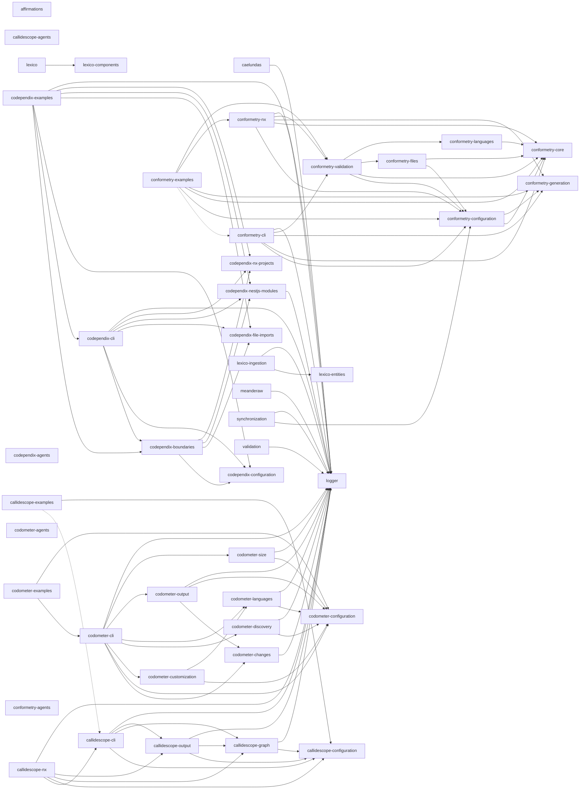

# codebase

[](https://nx.dev)
[](https://www.typescriptlang.org/)
[](https://pnpm.io/)
[](https://nodejs.org/)
[](https://www.python.org/)
[](https://docs.astral.sh/uv/)
[](https://jupyter.org/)
[](https://react.dev/)
[](https://tanstack.com/start)
[](https://ui.shadcn.com/)
[](https://radix-ui.com/)
[](https://tailwindcss.com/)
[](https://lucide.dev/)
[](https://recharts.org/)
[](https://zod.dev/)
[](https://vitejs.dev/)
[](https://swc.rs/)
[](https://vitest.dev/)
[](https://nestjs.com/)
[](https://graphql.org/)
[](https://typeorm.io/)
[](https://www.postgresql.org/)
[](https://python.langchain.com/)
[](https://langchain-ai.github.io/langgraph/)
[](https://ollama.com/)
[](https://docs.pydantic.dev/)
[](https://eslint.org/)
[](https://oxc.rs/docs/guide/usage/linter)
[](https://prettier.io/)
[](https://stylelint.io/)
[](https://docs.astral.sh/ruff/)
[](https://semantic-release.gitbook.io/)
[](https://www.docker.com/)
[](https://helm.sh/)
[](https://kubernetes.io/)
[](https://www.terraform.io/)

[](https://github.com/JimmyPaolini/codebase/actions/workflows/lint-codebase.yml)
[](https://github.com/JimmyPaolini/codebase/actions/workflows/test-coverage.yml)
[](https://github.com/JimmyPaolini/codebase/actions/workflows/scan-security.yml)
[](https://github.com/JimmyPaolini/codebase/actions/workflows/validate-conventions.yml)
[](https://github.com/JimmyPaolini/codebase/actions/workflows/make-projects.yml)
[](https://github.com/JimmyPaolini/codebase/actions/workflows/audit-issues.yml)
[](https://github.com/JimmyPaolini/codebase/actions/workflows/make-codebase.yml)
[](https://github.com/JimmyPaolini/codebase/actions/workflows/push-releases.yml)

A modern TypeScript codebase with Nx, featuring automated releases, comprehensive code quality tools, and strict type safety.

## 💽 Projects

**🔮 [affirmations](applications/affirmations)** - Python LangChain + Ollama affirmation generator (LangGraph ReAct agent, SearxNG)\
**🛰️ [caelundas](applications/caelundas)** - Swiss Ephemeris calendar generator that turns astronomical events into an `.ics` file
<details>
<summary><strong>🔭 callidescope</strong> - Call stack tracing toolchain that follows control flow through injected dependencies and reports where a stack got too deep</summary>

&nbsp;&nbsp;&nbsp;&nbsp;**[callidescope-agents](packages/ic-suite/callidescope/callidescope-agents)** - Agent skills for the callidescope toolchain, published and installed back from the lockfile like any other vendored skill\
&nbsp;&nbsp;&nbsp;&nbsp;**[callidescope-cli](packages/ic-suite/callidescope/callidescope-cli)** - Command-line host that builds the call graph with the TypeScript compiler API, resolves NestJS injected dependencies, and reports the deepest stack below every entry point\
&nbsp;&nbsp;&nbsp;&nbsp;**[callidescope-configuration](packages/ic-suite/callidescope/callidescope-configuration)** - Reads `callidescope.config.ts` for entry-point rules, depth and breadth limits, exclusion globs, and output destinations\
&nbsp;&nbsp;&nbsp;&nbsp;**[callidescope-examples](packages/ic-suite/callidescope/callidescope-examples)** - A small codebase built to be traced, carrying one worked example per rule, finding, and output the toolchain has\
&nbsp;&nbsp;&nbsp;&nbsp;**[callidescope-graph](packages/ic-suite/callidescope/callidescope-graph)** - Builds the call graph from traced TypeScript source and measures its depth and breadth\
&nbsp;&nbsp;&nbsp;&nbsp;**[callidescope-nx](packages/ic-suite/callidescope/callidescope-nx)** - Nx plugin inferring per-project `trace`, `depth`, and `breadth` targets that follow the Nx dependency graph, keeping every Nx dependency out of the packages that trace\
&nbsp;&nbsp;&nbsp;&nbsp;**[callidescope-output](packages/ic-suite/callidescope/callidescope-output)** - Renders call-graph findings into markdown, mermaid, and JSON output formats

</details>

<details>
<summary><strong>🕸️ codependix</strong> - Dependency graph export toolchain that reads what each project depends on, renders it as JSON and Markdown diagrams, and gates the rules those graphs are judged against</summary>

&nbsp;&nbsp;&nbsp;&nbsp;**[codependix-agents](packages/ic-suite/codependix/codependix-agents)** - Agent skills for the codependix toolchain, installable by any workspace that uses codependix\
&nbsp;&nbsp;&nbsp;&nbsp;**[codependix-boundaries](packages/ic-suite/codependix/codependix-boundaries)** - Builds each level's graph for a workspace, judges it against the declared rules, and reports the edges and cycles that break them\
&nbsp;&nbsp;&nbsp;&nbsp;**[codependix-cli](packages/ic-suite/codependix/codependix-cli)** - Command-line host that exports a project's Nx, NestJS, and file-level dependency graphs as JSON and Markdown anchor blocks, and gates the rules over them\
&nbsp;&nbsp;&nbsp;&nbsp;**[codependix-configuration](packages/ic-suite/codependix/codependix-configuration)** - Reads `codependix.config.ts` and resolves per-project export destinations and boundary rules\
&nbsp;&nbsp;&nbsp;&nbsp;**[codependix-examples](packages/ic-suite/codependix/codependix-examples)** - Sixteen subjects built to be graphed, each carrying the guide codependix renders from it\
&nbsp;&nbsp;&nbsp;&nbsp;**[codependix-file-imports](packages/ic-suite/codependix/codependix-file-imports)** - Builds a project's file-level import graph — a `typescript` module walking its own `ts.Program`, and a `python` module parsing `import`/`from ... import` statements\
&nbsp;&nbsp;&nbsp;&nbsp;**[codependix-nestjs-modules](packages/ic-suite/codependix/codependix-nestjs-modules)** - Explores a NestJS project's container and builds its module graph\
&nbsp;&nbsp;&nbsp;&nbsp;**[codependix-nx-projects](packages/ic-suite/codependix/codependix-nx-projects)** - Builds a project's one-hop Nx dependency neighborhood from the Nx project graph

</details>

<details>
<summary><strong>⏲️ codometer</strong> - Repository measurement toolchain that counts a codebase and reports what it found</summary>

&nbsp;&nbsp;&nbsp;&nbsp;**[codometer-agents](packages/ic-suite/codometer/codometer-agents)** - Agent skills for the codometer toolchain, published and installed back from the lockfile like any other vendored skill\
&nbsp;&nbsp;&nbsp;&nbsp;**[codometer-changes](packages/ic-suite/codometer/codometer-changes)** - Diffs codometer reports against a baseline snapshot\
&nbsp;&nbsp;&nbsp;&nbsp;**[codometer-cli](packages/ic-suite/codometer/codometer-cli)** - Command-line host that measures TypeScript, JavaScript, Python, JSON, markdown, and Jupyter notebooks, then writes the badge block in this README, a JSON report, or both\
&nbsp;&nbsp;&nbsp;&nbsp;**[codometer-configuration](packages/ic-suite/codometer/codometer-configuration)** - Reads `codometer.config.ts` for exclusion globs, output destinations and their render/write callbacks, and the Python interpreter\
&nbsp;&nbsp;&nbsp;&nbsp;**[codometer-customization](packages/ic-suite/codometer/codometer-customization)** - Evaluates codometer's configured custom counters\
&nbsp;&nbsp;&nbsp;&nbsp;**[codometer-discovery](packages/ic-suite/codometer/codometer-discovery)** - Glob matching and gitignore-aware file walking, plus resolving configured measurement targets to file sets\
&nbsp;&nbsp;&nbsp;&nbsp;**[codometer-examples](packages/ic-suite/codometer/codometer-examples)** - A sample corpus with known contents and one runnable example per thing codometer does, with tests that assert every number the guides quote\
&nbsp;&nbsp;&nbsp;&nbsp;**[codometer-languages](packages/ic-suite/codometer/codometer-languages)** - Every input language analyzer codometer measures, behind one `analyze()` call\
&nbsp;&nbsp;&nbsp;&nbsp;**[codometer-output](packages/ic-suite/codometer/codometer-output)** - Every codometer output format - JSON reports, README badges, and the pull request change report\
&nbsp;&nbsp;&nbsp;&nbsp;**[codometer-size](packages/ic-suite/codometer/codometer-size)** - Compresses a target's matched files and measures their size

</details>

<details>
<summary><strong>👔 conformetry</strong> - Template-driven code generation and conformance validation toolchain</summary>

&nbsp;&nbsp;&nbsp;&nbsp;**[conformetry-agents](packages/ic-suite/conformetry/conformetry-agents)** - Agent skills for the conformetry toolchain, published and installed back from the lockfile like any other vendored skill\
&nbsp;&nbsp;&nbsp;&nbsp;**[conformetry-cli](packages/ic-suite/conformetry/conformetry-cli)** - Command-line host that expands globs, prompts for inputs, and runs generation and validation\
&nbsp;&nbsp;&nbsp;&nbsp;**[conformetry-configuration](packages/ic-suite/conformetry/conformetry-configuration)** - Configuration loading, template discovery, and generator input resolution\
&nbsp;&nbsp;&nbsp;&nbsp;**[conformetry-core](packages/ic-suite/conformetry/conformetry-core)** - Shared error types, language validator contracts, and finding reporting\
&nbsp;&nbsp;&nbsp;&nbsp;**[conformetry-examples](packages/ic-suite/conformetry/conformetry-examples)** - Eleven runnable examples of the toolchain, each with its own configuration, template, instances, and guide, executed by CI so the guides cannot rot\
&nbsp;&nbsp;&nbsp;&nbsp;**[conformetry-files](packages/ic-suite/conformetry/conformetry-files)** - Checks that every file a template declares exists, whatever its extension\
&nbsp;&nbsp;&nbsp;&nbsp;**[conformetry-generation](packages/ic-suite/conformetry/conformetry-generation)** - Mustache template rendering and scaffold file generation\
&nbsp;&nbsp;&nbsp;&nbsp;**[conformetry-languages](packages/ic-suite/conformetry/conformetry-languages)** - Every language conformetry compares files with, as modules of one package, plus the resolution that picks them and the text fallback\
&nbsp;&nbsp;&nbsp;&nbsp;**[conformetry-nx](packages/ic-suite/conformetry/conformetry-nx)** - Nx plugin host with generators, executors, and the emitted-plugin bootstrap\
&nbsp;&nbsp;&nbsp;&nbsp;**[conformetry-validation](packages/ic-suite/conformetry/conformetry-validation)** - Validation orchestration, language routing, and finding deduplication

</details>

**[infrastructure](infrastructure)** - Helm charts, Terraform, Kubernetes infrastructure\
**[JimmyPaolini](applications/JimmyPaolini)** - GitHub profile site
<details>
<summary><strong>🐺 lexico</strong> - Latin-English dictionary suite: the web application, its components, its schema, and the ingestion that fills it</summary>

&nbsp;&nbsp;&nbsp;&nbsp;**[lexico](applications/lexico)** - TanStack Start SSR dictionary web application\
&nbsp;&nbsp;&nbsp;&nbsp;**[lexico-components](packages/lexico-components)** - Shared React component library using shadcn/ui and Radix primitives\
&nbsp;&nbsp;&nbsp;&nbsp;**[lexico-entities](packages/lexico-entities)** - TypeORM entities, migrations, and grammatical enumerations for the dictionary and literature schema\
&nbsp;&nbsp;&nbsp;&nbsp;**[lexico-ingestion](applications/lexico-ingestion)** - NestJS CLI that scrapes and loads dictionary, literature, and etymology sources

</details>

**🪵 [logger](packages/logger)** - Shared pino-backed NestJS `LoggerService` and `LoggerModule`\
**🏺 [meanderaw](applications/meanderaw)** - CLI that generates Greek meander (key/fret) SVG patterns programmatically from a type, row count, and repeat count\
**↔️ [synchronization](tools/synchronization)** - NestJS CLI that regenerates the workspace's derived configuration and documentation, and fails CI when they drift\
**🧑‍⚖️ [validation](tools/validation)** - NestJS CLI for the repository's one-sided checks, the ones with a check and no write, such as the pull request metadata gate

## 📖 Documentation

### Getting Started & Workflow

- [Contributing Guide](CONTRIBUTING.md) - **Start here.** Local and dev container setup, the commands to run, code standards, branch and commit conventions, pull requests, and releases
- [AGENTS.md](AGENTS.md) - Commands, project layout, conventions, code quality gates, and git workflow
- [Release Process](documentation/development/release-process.md) - Automated semantic versioning and changelogs

### Architecture & Systems

- [CI/CD Workflows](.github/workflows) - GitHub Actions workflows and the shared `setup-codebase` composite action
- [Infrastructure](infrastructure/README.md) - Helm charts, Terraform, and the Kubernetes deployment pipeline
- [Dev Container](.devcontainer/README.md) - Containerized development environment
- [Scripts](scripts/README.md) - Local setup and maintenance scripts

### Conventions & Guidelines

Conventions live in [AGENTS.md](AGENTS.md) and the agent skills below, which are the single sources of truth. Every project also has its own `AGENTS.md` with project-specific patterns.

**🤖 Agent Skills (Domain Knowledge)**
Skills are specialized instruction files used by our automated agents, but they also serve as excellent deep-dive documentation for human developers.

- [View all Skills](.agents/skills) - Complete index of available skills
- **Languages:** [TypeScript](.agents/skills/write-typescript/SKILL.md) / [React](.agents/skills/write-react/SKILL.md) / [Python](.agents/skills/write-python/SKILL.md) / [Comments](.agents/skills/write-comments/SKILL.md)
- **Quality:** [Validate Code](.agents/skills/validate-code/SKILL.md) / [Testing Strategy](.agents/skills/testing-strategy/SKILL.md) / [Testing Mocks](.agents/skills/testing-mocks/SKILL.md) / [Error Handling](.agents/skills/handle-errors/SKILL.md)
- **Workflows:** [Git Commits](.agents/skills/commit-code/SKILL.md) / [PR Management](.agents/skills/create-pull-request/SKILL.md) / [Branch Naming](.agents/skills/checkout-branch/SKILL.md)
- **Tooling:** [Nx Workspaces](.agents/skills/nx-workspace/SKILL.md) / [Generators](.agents/skills/nx-generate/SKILL.md) / [Task Running](.agents/skills/nx-run-tasks/SKILL.md)
- **Triage:** [Failing CI](.agents/skills/triage-deployment/SKILL.md) / [Rejected Commits](.agents/skills/triage-submission/SKILL.md) / [Spell Check](.agents/skills/spell-check/SKILL.md)

Other important files include [CHANGELOG.md](CHANGELOG.md) and [SECURITY.md](SECURITY.md).

## 👔 Conformetry

Template-driven code generation and conformance validation, templates synced from [configuration/conformetry.config.ts](configuration/conformetry.config.ts) by `nx run synchronization:conformetry-generators:write`.

<!-- conformetry-generators-table start -->
| Template | Description |
| -------- | ----------- |
| `jupyter-notebook-application` | A standalone Python application template with a Jupyter notebook entry point, pytest/pyright/ruff tooling, and a shared uv workspace venv |
| `nestjs-command-project` | A standalone NestJS CLI application template built on nest-commander, for a new command-line tool in applications/, packages/, or tools/ |
| `nestjs-graphql-application` | A standalone NestJS GraphQL API application template, for a new backend service exposing a GraphQL schema over HTTP |
| `nestjs-service-project` | A standalone NestJS library package template for internal workspace code shared across projects, with no CLI entry point or HTTP server |
| `nestjs-command-module` | A nest-commander command module template — command, module, constants, types, and unit test — for an existing NestJS command-line project |
| `nestjs-dataloader-module` | A GraphQL dataloader module template — dataloader, module, types, and unit test — for batching lookups inside an existing NestJS project |
| `nestjs-graphql-module` | A GraphQL module template — resolver, entities, args/input types, factories, constants, and unit test — for an existing NestJS project |
| `nestjs-service-file` | A service and unit test file template for an existing NestJS module, without the surrounding module files |
| `nestjs-service-module` | A plain service module template — module, service, constants, types, and unit test — for an existing NestJS project |
| `react-component` | A React component and test file template for an existing React project |
<!-- conformetry-generators-table end -->

## 🕸️ Codependix

The workspace's dependency graph, exported by [codependix](packages/ic-suite/codependix/codependix-cli), regenerated by `nx run codebase:codependix:write`.

<!-- codependix:start name="codependix-workspace" -->


_Dashed edges are dependencies Nx inferred from configuration rather than from code._
<!-- codependix:end name="codependix-workspace" -->

<!-- CODE_STATISTICS_START -->

### NestJS Module Graph

<!-- codependix:start name="codependix-workspace-nestjs-modules" -->
```mermaid
graph LR
  module_caelundas_AnnualSolarCycleModule["caelundas/AnnualSolarCycleModule"]
  module_caelundas_AspectsModule["caelundas/AspectsModule"]
  module_caelundas_AspectsUtilitiesModule["caelundas/AspectsUtilitiesModule"]
  module_caelundas_CaelundasModule["caelundas/CaelundasModule"]
  module_caelundas_CalendarModule["caelundas/CalendarModule"]
  module_caelundas_ConfigModule["caelundas/ConfigModule"]
  module_caelundas_DailyCyclesModule["caelundas/DailyCyclesModule"]
  module_caelundas_DatetimeModule["caelundas/DatetimeModule"]
  module_caelundas_DiscoveryModule["caelundas/DiscoveryModule"]
  module_caelundas_EclipsesModule["caelundas/EclipsesModule"]
  module_caelundas_EphemerisModule["caelundas/EphemerisModule"]
  module_caelundas_IngressesModule["caelundas/IngressesModule"]
  module_caelundas_InputModule["caelundas/InputModule"]
  module_caelundas_LoggerModule["caelundas/LoggerModule"]
  module_caelundas_MainModule["caelundas/MainModule"]
  module_caelundas_MajorAspectsModule["caelundas/MajorAspectsModule"]
  module_caelundas_MathModule["caelundas/MathModule"]
  module_caelundas_MinorAspectsModule["caelundas/MinorAspectsModule"]
  module_caelundas_MonthlyLunarCycleModule["caelundas/MonthlyLunarCycleModule"]
  module_caelundas_PerfectiveModule["caelundas/PerfectiveModule"]
  module_caelundas_PhasesModule["caelundas/PhasesModule"]
  module_caelundas_ProgressiveModule["caelundas/ProgressiveModule"]
  module_caelundas_ProgressiveUtilitiesModule["caelundas/ProgressiveUtilitiesModule"]
  module_caelundas_QuadrupleAspectsModule["caelundas/QuadrupleAspectsModule"]
  module_caelundas_QuintupleAspectsModule["caelundas/QuintupleAspectsModule"]
  module_caelundas_RetrogradesModule["caelundas/RetrogradesModule"]
  module_caelundas_SextupleAspectsModule["caelundas/SextupleAspectsModule"]
  module_caelundas_SpecialtyAspectsModule["caelundas/SpecialtyAspectsModule"]
  module_caelundas_StelliumModule["caelundas/StelliumModule"]
  module_caelundas_TripleAspectsModule["caelundas/TripleAspectsModule"]
  module_caelundas_TwilightsModule["caelundas/TwilightsModule"]
  module_callidescope_cli_AddressLookupModule["callidescope-cli/AddressLookupModule"]
  module_callidescope_cli_AddressReportModule["callidescope-cli/AddressReportModule"]
  module_callidescope_cli_BreadthModule["callidescope-cli/BreadthModule"]
  module_callidescope_cli_CallablesModule["callidescope-cli/CallablesModule"]
  module_callidescope_cli_CallidescopeModule["callidescope-cli/CallidescopeModule"]
  module_callidescope_cli_ClassesModule["callidescope-cli/ClassesModule"]
  module_callidescope_cli_ConfigModule["callidescope-cli/ConfigModule"]
  module_callidescope_cli_ConfigurationModule["callidescope-cli/ConfigurationModule"]
  module_callidescope_cli_DepthModule["callidescope-cli/DepthModule"]
  module_callidescope_cli_DiscoveryModule["callidescope-cli/DiscoveryModule"]
  module_callidescope_cli_DocumentationModule["callidescope-cli/DocumentationModule"]
  module_callidescope_cli_EdgesModule["callidescope-cli/EdgesModule"]
  module_callidescope_cli_EntriesModule["callidescope-cli/EntriesModule"]
  module_callidescope_cli_FlagResolutionModule["callidescope-cli/FlagResolutionModule"]
  module_callidescope_cli_GraphModule["callidescope-cli/GraphModule"]
  module_callidescope_cli_InputModule["callidescope-cli/InputModule"]
  module_callidescope_cli_LimitsModule["callidescope-cli/LimitsModule"]
  module_callidescope_cli_LoggerModule["callidescope-cli/LoggerModule"]
  module_callidescope_cli_MainModule["callidescope-cli/MainModule"]
  module_callidescope_cli_OutputJsonModule["callidescope-cli/OutputJsonModule"]
  module_callidescope_cli_OutputMarkdownModule["callidescope-cli/OutputMarkdownModule"]
  module_callidescope_cli_ProgramModule["callidescope-cli/ProgramModule"]
  module_callidescope_cli_ProjectReportsModule["callidescope-cli/ProjectReportsModule"]
  module_callidescope_cli_ReportFindingsModule["callidescope-cli/ReportFindingsModule"]
  module_callidescope_cli_ReportModule["callidescope-cli/ReportModule"]
  module_callidescope_cli_RunPlanModule["callidescope-cli/RunPlanModule"]
  module_callidescope_cli_SignaturesModule["callidescope-cli/SignaturesModule"]
  module_callidescope_cli_WorkspaceModule["callidescope-cli/WorkspaceModule"]
  module_callidescope_cli_WriteDestinationsModule["callidescope-cli/WriteDestinationsModule"]
  module_callidescope_configuration_ConfigurationModule["callidescope-configuration/ConfigurationModule"]
  module_callidescope_configuration_FlagResolutionModule["callidescope-configuration/FlagResolutionModule"]
  module_callidescope_configuration_InputModule["callidescope-configuration/InputModule"]
  module_callidescope_graph_CallablesModule["callidescope-graph/CallablesModule"]
  module_callidescope_graph_ClassesModule["callidescope-graph/ClassesModule"]
  module_callidescope_graph_DocumentationModule["callidescope-graph/DocumentationModule"]
  module_callidescope_graph_EdgesModule["callidescope-graph/EdgesModule"]
  module_callidescope_graph_EntriesModule["callidescope-graph/EntriesModule"]
  module_callidescope_graph_GraphModule["callidescope-graph/GraphModule"]
  module_callidescope_graph_LoggerModule["callidescope-graph/LoggerModule"]
  module_callidescope_graph_ProgramModule["callidescope-graph/ProgramModule"]
  module_callidescope_graph_SignaturesModule["callidescope-graph/SignaturesModule"]
  module_callidescope_graph_WorkspaceModule["callidescope-graph/WorkspaceModule"]
  module_callidescope_nx_AddressLookupModule["callidescope-nx/AddressLookupModule"]
  module_callidescope_nx_AddressModule["callidescope-nx/AddressModule"]
  module_callidescope_nx_AddressReportModule["callidescope-nx/AddressReportModule"]
  module_callidescope_nx_CallablesModule["callidescope-nx/CallablesModule"]
  module_callidescope_nx_CallidescopeModule["callidescope-nx/CallidescopeModule"]
  module_callidescope_nx_ClassesModule["callidescope-nx/ClassesModule"]
  module_callidescope_nx_ConfigurationModule["callidescope-nx/ConfigurationModule"]
  module_callidescope_nx_DocumentationModule["callidescope-nx/DocumentationModule"]
  module_callidescope_nx_EdgesModule["callidescope-nx/EdgesModule"]
  module_callidescope_nx_EntriesModule["callidescope-nx/EntriesModule"]
  module_callidescope_nx_FlagResolutionModule["callidescope-nx/FlagResolutionModule"]
  module_callidescope_nx_GraphModule["callidescope-nx/GraphModule"]
  module_callidescope_nx_InputModule["callidescope-nx/InputModule"]
  module_callidescope_nx_LoggerModule["callidescope-nx/LoggerModule"]
  module_callidescope_nx_MainModule["callidescope-nx/MainModule"]
  module_callidescope_nx_OptionsModule["callidescope-nx/OptionsModule"]
  module_callidescope_nx_OutputJsonModule["callidescope-nx/OutputJsonModule"]
  module_callidescope_nx_OutputMarkdownModule["callidescope-nx/OutputMarkdownModule"]
  module_callidescope_nx_PluginModule["callidescope-nx/PluginModule"]
  module_callidescope_nx_ProgramModule["callidescope-nx/ProgramModule"]
  module_callidescope_nx_ProjectReportsModule["callidescope-nx/ProjectReportsModule"]
  module_callidescope_nx_ProjectsModule["callidescope-nx/ProjectsModule"]
  module_callidescope_nx_ReportFindingsModule["callidescope-nx/ReportFindingsModule"]
  module_callidescope_nx_ReportModule["callidescope-nx/ReportModule"]
  module_callidescope_nx_RunConfigurationModule["callidescope-nx/RunConfigurationModule"]
  module_callidescope_nx_RunPlanModule["callidescope-nx/RunPlanModule"]
  module_callidescope_nx_SignaturesModule["callidescope-nx/SignaturesModule"]
  module_callidescope_nx_WorkspaceModule["callidescope-nx/WorkspaceModule"]
  module_callidescope_nx_WriteDestinationsModule["callidescope-nx/WriteDestinationsModule"]
  module_callidescope_output_CallablesModule["callidescope-output/CallablesModule"]
  module_callidescope_output_ClassesModule["callidescope-output/ClassesModule"]
  module_callidescope_output_DocumentationModule["callidescope-output/DocumentationModule"]
  module_callidescope_output_EdgesModule["callidescope-output/EdgesModule"]
  module_callidescope_output_GraphModule["callidescope-output/GraphModule"]
  module_callidescope_output_LoggerModule["callidescope-output/LoggerModule"]
  module_callidescope_output_OutputJsonModule["callidescope-output/OutputJsonModule"]
  module_callidescope_output_OutputMarkdownModule["callidescope-output/OutputMarkdownModule"]
  module_callidescope_output_ProgramModule["callidescope-output/ProgramModule"]
  module_callidescope_output_ProjectReportsModule["callidescope-output/ProjectReportsModule"]
  module_callidescope_output_ReportModule["callidescope-output/ReportModule"]
  module_callidescope_output_SignaturesModule["callidescope-output/SignaturesModule"]
  module_callidescope_output_WorkspaceModule["callidescope-output/WorkspaceModule"]
  module_codependix_boundaries_BoundariesModule["codependix-boundaries/BoundariesModule"]
  module_codependix_boundaries_BoundaryCheckModule["codependix-boundaries/BoundaryCheckModule"]
  module_codependix_boundaries_LoggerModule["codependix-boundaries/LoggerModule"]
  module_codependix_boundaries_ModuleGraphModule["codependix-boundaries/ModuleGraphModule"]
  module_codependix_boundaries_NeighborhoodModule["codependix-boundaries/NeighborhoodModule"]
  module_codependix_boundaries_NestjsProjectModule["codependix-boundaries/NestjsProjectModule"]
  module_codependix_boundaries_PythonModule["codependix-boundaries/PythonModule"]
  module_codependix_boundaries_TypescriptModule["codependix-boundaries/TypescriptModule"]
  module_codependix_boundaries_WorkspaceGraphModule["codependix-boundaries/WorkspaceGraphModule"]
  module_codependix_cli_AnchorsModule["codependix-cli/AnchorsModule"]
  module_codependix_cli_BoundariesModule["codependix-cli/BoundariesModule"]
  module_codependix_cli_BoundaryCheckModule["codependix-cli/BoundaryCheckModule"]
  module_codependix_cli_ConfigModule["codependix-cli/ConfigModule"]
  module_codependix_cli_ConfigurationModule["codependix-cli/ConfigurationModule"]
  module_codependix_cli_DeliveryModule["codependix-cli/DeliveryModule"]
  module_codependix_cli_DiscoveryModule["codependix-cli/DiscoveryModule"]
  module_codependix_cli_FileImportsWorkspaceGraphModule["codependix-cli/FileImportsWorkspaceGraphModule"]
  module_codependix_cli_InputModule["codependix-cli/InputModule"]
  module_codependix_cli_LoggerModule["codependix-cli/LoggerModule"]
  module_codependix_cli_MainModule["codependix-cli/MainModule"]
  module_codependix_cli_MapModule["codependix-cli/MapModule"]
  module_codependix_cli_ModuleGraphModule["codependix-cli/ModuleGraphModule"]
  module_codependix_cli_NeighborhoodModule["codependix-cli/NeighborhoodModule"]
  module_codependix_cli_NestjsModulesWorkspaceGraphModule["codependix-cli/NestjsModulesWorkspaceGraphModule"]
  module_codependix_cli_NestjsProjectModule["codependix-cli/NestjsProjectModule"]
  module_codependix_cli_PythonImportsModule["codependix-cli/PythonImportsModule"]
  module_codependix_cli_PythonModule["codependix-cli/PythonModule"]
  module_codependix_cli_RunContextModule["codependix-cli/RunContextModule"]
  module_codependix_cli_RunPlanModule["codependix-cli/RunPlanModule"]
  module_codependix_cli_TypescriptModule["codependix-cli/TypescriptModule"]
  module_codependix_cli_WorkspaceGraphModule["codependix-cli/WorkspaceGraphModule"]
  module_codependix_configuration_ConfigurationModule["codependix-configuration/ConfigurationModule"]
  module_codependix_configuration_InputModule["codependix-configuration/InputModule"]
  module_codependix_file_imports_FileImportsWorkspaceGraphModule["codependix-file-imports/FileImportsWorkspaceGraphModule"]
  module_codependix_file_imports_PythonModule["codependix-file-imports/PythonModule"]
  module_codependix_file_imports_TypescriptModule["codependix-file-imports/TypescriptModule"]
  module_codependix_nestjs_modules_LoggerModule["codependix-nestjs-modules/LoggerModule"]
  module_codependix_nestjs_modules_ModuleGraphModule["codependix-nestjs-modules/ModuleGraphModule"]
  module_codependix_nestjs_modules_NestjsModulesWorkspaceGraphModule["codependix-nestjs-modules/NestjsModulesWorkspaceGraphModule"]
  module_codependix_nestjs_modules_NestjsProjectModule["codependix-nestjs-modules/NestjsProjectModule"]
  module_codependix_nx_projects_NeighborhoodModule["codependix-nx-projects/NeighborhoodModule"]
  module_codependix_nx_projects_WorkspaceGraphModule["codependix-nx-projects/WorkspaceGraphModule"]
  module_codometer_changes_ChangesModule["codometer-changes/ChangesModule"]
  module_codometer_changes_LoggerModule["codometer-changes/LoggerModule"]
  module_codometer_cli_ChangesModule["codometer-cli/ChangesModule"]
  module_codometer_cli_CommentsModule["codometer-cli/CommentsModule"]
  module_codometer_cli_ConfigModule["codometer-cli/ConfigModule"]
  module_codometer_cli_ConfigurationModule["codometer-cli/ConfigurationModule"]
  module_codometer_cli_CssModule["codometer-cli/CssModule"]
  module_codometer_cli_CustomizationModule["codometer-cli/CustomizationModule"]
  module_codometer_cli_DeliveryModule["codometer-cli/DeliveryModule"]
  module_codometer_cli_DiscoveryModule["codometer-cli/DiscoveryModule"]
  module_codometer_cli_DocumentsModule["codometer-cli/DocumentsModule"]
  module_codometer_cli_HclModule["codometer-cli/HclModule"]
  module_codometer_cli_InputModule["codometer-cli/InputModule"]
  module_codometer_cli_InputsModule["codometer-cli/InputsModule"]
  module_codometer_cli_JsonModule["codometer-cli/JsonModule"]
  module_codometer_cli_JupyterModule["codometer-cli/JupyterModule"]
  module_codometer_cli_LanguagesModule["codometer-cli/LanguagesModule"]
  module_codometer_cli_LimitsModule["codometer-cli/LimitsModule"]
  module_codometer_cli_LoggerModule["codometer-cli/LoggerModule"]
  module_codometer_cli_MainModule["codometer-cli/MainModule"]
  module_codometer_cli_MarkdownModule["codometer-cli/MarkdownModule"]
  module_codometer_cli_MeasureModule["codometer-cli/MeasureModule"]
  module_codometer_cli_PythonModule["codometer-cli/PythonModule"]
  module_codometer_cli_RenderModule["codometer-cli/RenderModule"]
  module_codometer_cli_ReportModule["codometer-cli/ReportModule"]
  module_codometer_cli_RunPlanModule["codometer-cli/RunPlanModule"]
  module_codometer_cli_ShellModule["codometer-cli/ShellModule"]
  module_codometer_cli_SizeModule["codometer-cli/SizeModule"]
  module_codometer_cli_SqlModule["codometer-cli/SqlModule"]
  module_codometer_cli_TomlModule["codometer-cli/TomlModule"]
  module_codometer_cli_TypescriptModule["codometer-cli/TypescriptModule"]
  module_codometer_cli_YamlModule["codometer-cli/YamlModule"]
  module_codometer_configuration_ConfigurationModule["codometer-configuration/ConfigurationModule"]
  module_codometer_configuration_InputModule["codometer-configuration/InputModule"]
  module_codometer_customization_CustomizationModule["codometer-customization/CustomizationModule"]
  module_codometer_discovery_DiscoveryModule["codometer-discovery/DiscoveryModule"]
  module_codometer_discovery_InputsModule["codometer-discovery/InputsModule"]
  module_codometer_discovery_LoggerModule["codometer-discovery/LoggerModule"]
  module_codometer_languages_CommentsModule["codometer-languages/CommentsModule"]
  module_codometer_languages_CssModule["codometer-languages/CssModule"]
  module_codometer_languages_HclModule["codometer-languages/HclModule"]
  module_codometer_languages_JsonModule["codometer-languages/JsonModule"]
  module_codometer_languages_JupyterModule["codometer-languages/JupyterModule"]
  module_codometer_languages_LanguagesModule["codometer-languages/LanguagesModule"]
  module_codometer_languages_LoggerModule["codometer-languages/LoggerModule"]
  module_codometer_languages_MarkdownModule["codometer-languages/MarkdownModule"]
  module_codometer_languages_PythonModule["codometer-languages/PythonModule"]
  module_codometer_languages_ShellModule["codometer-languages/ShellModule"]
  module_codometer_languages_SqlModule["codometer-languages/SqlModule"]
  module_codometer_languages_TomlModule["codometer-languages/TomlModule"]
  module_codometer_languages_TypescriptModule["codometer-languages/TypescriptModule"]
  module_codometer_languages_YamlModule["codometer-languages/YamlModule"]
  module_codometer_output_DocumentsModule["codometer-output/DocumentsModule"]
  module_codometer_output_JsonModule["codometer-output/JsonModule"]
  module_codometer_output_LoggerModule["codometer-output/LoggerModule"]
  module_codometer_output_MarkdownModule["codometer-output/MarkdownModule"]
  module_codometer_output_RenderModule["codometer-output/RenderModule"]
  module_codometer_size_LoggerModule["codometer-size/LoggerModule"]
  module_codometer_size_SizeModule["codometer-size/SizeModule"]
  module_conformetry_cli_ConfigModule["conformetry-cli/ConfigModule"]
  module_conformetry_cli_ConfigurationModule["conformetry-cli/ConfigurationModule"]
  module_conformetry_cli_DifferencesModule["conformetry-cli/DifferencesModule"]
  module_conformetry_cli_DiscoveryModule["conformetry-cli/DiscoveryModule"]
  module_conformetry_cli_FilesModule["conformetry-cli/FilesModule"]
  module_conformetry_cli_GenerateModule["conformetry-cli/GenerateModule"]
  module_conformetry_cli_GenerationModule["conformetry-cli/GenerationModule"]
  module_conformetry_cli_InputModule["conformetry-cli/InputModule"]
  module_conformetry_cli_InstanceDiscoveryModule["conformetry-cli/InstanceDiscoveryModule"]
  module_conformetry_cli_InstancesModule["conformetry-cli/InstancesModule"]
  module_conformetry_cli_InventoryModule["conformetry-cli/InventoryModule"]
  module_conformetry_cli_JsonModule["conformetry-cli/JsonModule"]
  module_conformetry_cli_JupyterModule["conformetry-cli/JupyterModule"]
  module_conformetry_cli_LanguagesModule["conformetry-cli/LanguagesModule"]
  module_conformetry_cli_LoggerModule["conformetry-cli/LoggerModule"]
  module_conformetry_cli_MainModule["conformetry-cli/MainModule"]
  module_conformetry_cli_MarkdownModule["conformetry-cli/MarkdownModule"]
  module_conformetry_cli_PythonModule["conformetry-cli/PythonModule"]
  module_conformetry_cli_RenderingModule["conformetry-cli/RenderingModule"]
  module_conformetry_cli_ReportingModule["conformetry-cli/ReportingModule"]
  module_conformetry_cli_RunnerModule["conformetry-cli/RunnerModule"]
  module_conformetry_cli_ScoringModule["conformetry-cli/ScoringModule"]
  module_conformetry_cli_TemplateDiscoveryModule["conformetry-cli/TemplateDiscoveryModule"]
  module_conformetry_cli_TemplatesModule["conformetry-cli/TemplatesModule"]
  module_conformetry_cli_TextModule["conformetry-cli/TextModule"]
  module_conformetry_cli_TypescriptModule["conformetry-cli/TypescriptModule"]
  module_conformetry_cli_ValidateModule["conformetry-cli/ValidateModule"]
  module_conformetry_cli_ValidationModule["conformetry-cli/ValidationModule"]
  module_conformetry_configuration_ConfigurationModule["conformetry-configuration/ConfigurationModule"]
  module_conformetry_configuration_InputModule["conformetry-configuration/InputModule"]
  module_conformetry_configuration_InstanceDiscoveryModule["conformetry-configuration/InstanceDiscoveryModule"]
  module_conformetry_configuration_RenderingModule["conformetry-configuration/RenderingModule"]
  module_conformetry_configuration_TemplateDiscoveryModule["conformetry-configuration/TemplateDiscoveryModule"]
  module_conformetry_core_DifferencesModule["conformetry-core/DifferencesModule"]
  module_conformetry_core_InventoryModule["conformetry-core/InventoryModule"]
  module_conformetry_core_ReportingModule["conformetry-core/ReportingModule"]
  module_conformetry_core_RunnerModule["conformetry-core/RunnerModule"]
  module_conformetry_core_ScoringModule["conformetry-core/ScoringModule"]
  module_conformetry_files_ConfigurationModule["conformetry-files/ConfigurationModule"]
  module_conformetry_files_DifferencesModule["conformetry-files/DifferencesModule"]
  module_conformetry_files_FilesModule["conformetry-files/FilesModule"]
  module_conformetry_files_InstanceDiscoveryModule["conformetry-files/InstanceDiscoveryModule"]
  module_conformetry_files_RenderingModule["conformetry-files/RenderingModule"]
  module_conformetry_files_TemplateDiscoveryModule["conformetry-files/TemplateDiscoveryModule"]
  module_conformetry_generation_GenerationModule["conformetry-generation/GenerationModule"]
  module_conformetry_generation_RenderingModule["conformetry-generation/RenderingModule"]
  module_conformetry_languages_DifferencesModule["conformetry-languages/DifferencesModule"]
  module_conformetry_languages_JsonModule["conformetry-languages/JsonModule"]
  module_conformetry_languages_JupyterModule["conformetry-languages/JupyterModule"]
  module_conformetry_languages_LanguagesModule["conformetry-languages/LanguagesModule"]
  module_conformetry_languages_MarkdownModule["conformetry-languages/MarkdownModule"]
  module_conformetry_languages_PythonModule["conformetry-languages/PythonModule"]
  module_conformetry_languages_ScoringModule["conformetry-languages/ScoringModule"]
  module_conformetry_languages_TextModule["conformetry-languages/TextModule"]
  module_conformetry_languages_TypescriptModule["conformetry-languages/TypescriptModule"]
  module_conformetry_nx_AdapterModule["conformetry-nx/AdapterModule"]
  module_conformetry_nx_ConfigurationModule["conformetry-nx/ConfigurationModule"]
  module_conformetry_nx_DifferencesModule["conformetry-nx/DifferencesModule"]
  module_conformetry_nx_FilesModule["conformetry-nx/FilesModule"]
  module_conformetry_nx_GenerationModule["conformetry-nx/GenerationModule"]
  module_conformetry_nx_GeneratorModule["conformetry-nx/GeneratorModule"]
  module_conformetry_nx_InstanceDiscoveryModule["conformetry-nx/InstanceDiscoveryModule"]
  module_conformetry_nx_InstancesModule["conformetry-nx/InstancesModule"]
  module_conformetry_nx_JsonModule["conformetry-nx/JsonModule"]
  module_conformetry_nx_JupyterModule["conformetry-nx/JupyterModule"]
  module_conformetry_nx_LanguagesModule["conformetry-nx/LanguagesModule"]
  module_conformetry_nx_LoggerModule["conformetry-nx/LoggerModule"]
  module_conformetry_nx_MainModule["conformetry-nx/MainModule"]
  module_conformetry_nx_MarkdownModule["conformetry-nx/MarkdownModule"]
  module_conformetry_nx_OptionsModule["conformetry-nx/OptionsModule"]
  module_conformetry_nx_PathsModule["conformetry-nx/PathsModule"]
  module_conformetry_nx_PluginModule["conformetry-nx/PluginModule"]
  module_conformetry_nx_ProjectsModule["conformetry-nx/ProjectsModule"]
  module_conformetry_nx_PythonModule["conformetry-nx/PythonModule"]
  module_conformetry_nx_RenderingModule["conformetry-nx/RenderingModule"]
  module_conformetry_nx_ReportingModule["conformetry-nx/ReportingModule"]
  module_conformetry_nx_RunnerModule["conformetry-nx/RunnerModule"]
  module_conformetry_nx_ScopeModule["conformetry-nx/ScopeModule"]
  module_conformetry_nx_ScoringModule["conformetry-nx/ScoringModule"]
  module_conformetry_nx_TemplateDiscoveryModule["conformetry-nx/TemplateDiscoveryModule"]
  module_conformetry_nx_TextModule["conformetry-nx/TextModule"]
  module_conformetry_nx_TypescriptModule["conformetry-nx/TypescriptModule"]
  module_conformetry_nx_ValidationModule["conformetry-nx/ValidationModule"]
  module_conformetry_validation_ConfigurationModule["conformetry-validation/ConfigurationModule"]
  module_conformetry_validation_DifferencesModule["conformetry-validation/DifferencesModule"]
  module_conformetry_validation_FilesModule["conformetry-validation/FilesModule"]
  module_conformetry_validation_InstanceDiscoveryModule["conformetry-validation/InstanceDiscoveryModule"]
  module_conformetry_validation_JsonModule["conformetry-validation/JsonModule"]
  module_conformetry_validation_JupyterModule["conformetry-validation/JupyterModule"]
  module_conformetry_validation_LanguagesModule["conformetry-validation/LanguagesModule"]
  module_conformetry_validation_MarkdownModule["conformetry-validation/MarkdownModule"]
  module_conformetry_validation_PythonModule["conformetry-validation/PythonModule"]
  module_conformetry_validation_RenderingModule["conformetry-validation/RenderingModule"]
  module_conformetry_validation_ReportingModule["conformetry-validation/ReportingModule"]
  module_conformetry_validation_RunnerModule["conformetry-validation/RunnerModule"]
  module_conformetry_validation_ScoringModule["conformetry-validation/ScoringModule"]
  module_conformetry_validation_TemplateDiscoveryModule["conformetry-validation/TemplateDiscoveryModule"]
  module_conformetry_validation_TextModule["conformetry-validation/TextModule"]
  module_conformetry_validation_TypescriptModule["conformetry-validation/TypescriptModule"]
  module_conformetry_validation_ValidationModule["conformetry-validation/ValidationModule"]
  module_lexico_entities_DatabaseModule["lexico-entities/DatabaseModule"]
  module_lexico_entities_EntitiesModule["lexico-entities/EntitiesModule"]
  module_lexico_entities_TypeOrmModule["lexico-entities/TypeOrmModule"]
  module_lexico_ingestion_ClearModule["lexico-ingestion/ClearModule"]
  module_lexico_ingestion_ConfigModule["lexico-ingestion/ConfigModule"]
  module_lexico_ingestion_CorpusScriptorumEcclesiasticorumLatinorumModule["lexico-ingestion/CorpusScriptorumEcclesiasticorumLatinorumModule"]
  module_lexico_ingestion_DatabaseModule["lexico-ingestion/DatabaseModule"]
  module_lexico_ingestion_DictionaryModule["lexico-ingestion/DictionaryModule"]
  module_lexico_ingestion_DiscoveryModule["lexico-ingestion/DiscoveryModule"]
  module_lexico_ingestion_EpigraphikDatenbankClaussSlabyModule["lexico-ingestion/EpigraphikDatenbankClaussSlabyModule"]
  module_lexico_ingestion_EtymologyModule["lexico-ingestion/EtymologyModule"]
  module_lexico_ingestion_FormsModule["lexico-ingestion/FormsModule"]
  module_lexico_ingestion_LatinLibraryModule["lexico-ingestion/LatinLibraryModule"]
  module_lexico_ingestion_LexemesModule["lexico-ingestion/LexemesModule"]
  module_lexico_ingestion_LexicoIngestionModule["lexico-ingestion/LexicoIngestionModule"]
  module_lexico_ingestion_LibraryModule["lexico-ingestion/LibraryModule"]
  module_lexico_ingestion_LiteratureModule["lexico-ingestion/LiteratureModule"]
  module_lexico_ingestion_LoggerModule["lexico-ingestion/LoggerModule"]
  module_lexico_ingestion_MainModule["lexico-ingestion/MainModule"]
  module_lexico_ingestion_ManualModule["lexico-ingestion/ManualModule"]
  module_lexico_ingestion_NumeralsModule["lexico-ingestion/NumeralsModule"]
  module_lexico_ingestion_PartOfSpeechModule["lexico-ingestion/PartOfSpeechModule"]
  module_lexico_ingestion_PerseusModule["lexico-ingestion/PerseusModule"]
  module_lexico_ingestion_PrincipalPartsModule["lexico-ingestion/PrincipalPartsModule"]
  module_lexico_ingestion_PronunciationModule["lexico-ingestion/PronunciationModule"]
  module_lexico_ingestion_TranslationsModule["lexico-ingestion/TranslationsModule"]
  module_lexico_ingestion_TypeOrmModule["lexico-ingestion/TypeOrmModule"]
  module_lexico_ingestion_WiktionaryModule["lexico-ingestion/WiktionaryModule"]
  module_lexico_ingestion_WordsModule["lexico-ingestion/WordsModule"]
  module_logger_LoggerModule["logger/LoggerModule"]
  module_meanderaw_BoxesMotifModule["meanderaw/BoxesMotifModule"]
  module_meanderaw_BranchMotifModule["meanderaw/BranchMotifModule"]
  module_meanderaw_ChainMotifModule["meanderaw/ChainMotifModule"]
  module_meanderaw_ConfigModule["meanderaw/ConfigModule"]
  module_meanderaw_CrossMotifModule["meanderaw/CrossMotifModule"]
  module_meanderaw_DiscoveryModule["meanderaw/DiscoveryModule"]
  module_meanderaw_DrawModule["meanderaw/DrawModule"]
  module_meanderaw_GridGeometryModule["meanderaw/GridGeometryModule"]
  module_meanderaw_LatticeIdentificationModule["meanderaw/LatticeIdentificationModule"]
  module_meanderaw_LoggerModule["meanderaw/LoggerModule"]
  module_meanderaw_MainModule["meanderaw/MainModule"]
  module_meanderaw_MeanderGenerationModule["meanderaw/MeanderGenerationModule"]
  module_meanderaw_MeanderLatticeModule["meanderaw/MeanderLatticeModule"]
  module_meanderaw_MeanderTopologyModule["meanderaw/MeanderTopologyModule"]
  module_meanderaw_MosaicNamingModule["meanderaw/MosaicNamingModule"]
  module_meanderaw_MosaicTileModule["meanderaw/MosaicTileModule"]
  module_meanderaw_MotifTransformsModule["meanderaw/MotifTransformsModule"]
  module_meanderaw_NegativeMotifModule["meanderaw/NegativeMotifModule"]
  module_meanderaw_ParallelMotifModule["meanderaw/ParallelMotifModule"]
  module_meanderaw_SnakeMotifModule["meanderaw/SnakeMotifModule"]
  module_meanderaw_SvgRenderingModule["meanderaw/SvgRenderingModule"]
  module_meanderaw_SwirlMotifModule["meanderaw/SwirlMotifModule"]
  module_meanderaw_WhirlMotifModule["meanderaw/WhirlMotifModule"]
  module_synchronization_ConfigModule["synchronization/ConfigModule"]
  module_synchronization_ConfigurationModule["synchronization/ConfigurationModule"]
  module_synchronization_ConformetryGeneratorsModule["synchronization/ConformetryGeneratorsModule"]
  module_synchronization_ConventionalConfigModule["synchronization/ConventionalConfigModule"]
  module_synchronization_DevcontainerConfigurationModule["synchronization/DevcontainerConfigurationModule"]
  module_synchronization_DiscoveryModule["synchronization/DiscoveryModule"]
  module_synchronization_IssueLabelsModule["synchronization/IssueLabelsModule"]
  module_synchronization_LoggerModule["synchronization/LoggerModule"]
  module_synchronization_MainModule["synchronization/MainModule"]
  module_synchronization_PullRequestLabelsModule["synchronization/PullRequestLabelsModule"]
  module_synchronization_PullRequestTemplateModule["synchronization/PullRequestTemplateModule"]
  module_synchronization_SkillExclusionsModule["synchronization/SkillExclusionsModule"]
  module_synchronization_SynchronizationModule["synchronization/SynchronizationModule"]
  module_validation_CatalogManifestsModule["validation/CatalogManifestsModule"]
  module_validation_ConfigModule["validation/ConfigModule"]
  module_validation_DiscoveryModule["validation/DiscoveryModule"]
  module_validation_IssueMetadataModule["validation/IssueMetadataModule"]
  module_validation_LockfileModule["validation/LockfileModule"]
  module_validation_LoggerModule["validation/LoggerModule"]
  module_validation_MainModule["validation/MainModule"]
  module_validation_PullRequestBodyModule["validation/PullRequestBodyModule"]
  module_validation_PullRequestMetadataModule["validation/PullRequestMetadataModule"]
  module_validation_PullRequestReleaseSignificanceModule["validation/PullRequestReleaseSignificanceModule"]
  module_validation_ReadmeProjectsModule["validation/ReadmeProjectsModule"]
  module_caelundas_AnnualSolarCycleModule --> module_caelundas_EphemerisModule
  module_caelundas_AnnualSolarCycleModule --> module_caelundas_MathModule
  module_caelundas_AnnualSolarCycleModule --> module_caelundas_ProgressiveUtilitiesModule
  module_caelundas_AspectsModule --> module_caelundas_MajorAspectsModule
  module_caelundas_AspectsModule --> module_caelundas_MinorAspectsModule
  module_caelundas_AspectsModule --> module_caelundas_QuadrupleAspectsModule
  module_caelundas_AspectsModule --> module_caelundas_QuintupleAspectsModule
  module_caelundas_AspectsModule --> module_caelundas_SextupleAspectsModule
  module_caelundas_AspectsModule --> module_caelundas_SpecialtyAspectsModule
  module_caelundas_AspectsModule --> module_caelundas_StelliumModule
  module_caelundas_AspectsModule --> module_caelundas_TripleAspectsModule
  module_caelundas_AspectsUtilitiesModule --> module_caelundas_EphemerisModule
  module_caelundas_AspectsUtilitiesModule --> module_caelundas_MathModule
  module_caelundas_CaelundasModule --> module_caelundas_AnnualSolarCycleModule
  module_caelundas_CaelundasModule --> module_caelundas_AspectsModule
  module_caelundas_CaelundasModule --> module_caelundas_CalendarModule
  module_caelundas_CaelundasModule --> module_caelundas_DailyCyclesModule
  module_caelundas_CaelundasModule --> module_caelundas_EclipsesModule
  module_caelundas_CaelundasModule --> module_caelundas_EphemerisModule
  module_caelundas_CaelundasModule --> module_caelundas_IngressesModule
  module_caelundas_CaelundasModule --> module_caelundas_InputModule
  module_caelundas_CaelundasModule --> module_caelundas_MajorAspectsModule
  module_caelundas_CaelundasModule --> module_caelundas_MathModule
  module_caelundas_CaelundasModule --> module_caelundas_MinorAspectsModule
  module_caelundas_CaelundasModule --> module_caelundas_MonthlyLunarCycleModule
  module_caelundas_CaelundasModule --> module_caelundas_PerfectiveModule
  module_caelundas_CaelundasModule --> module_caelundas_PhasesModule
  module_caelundas_CaelundasModule --> module_caelundas_ProgressiveModule
  module_caelundas_CaelundasModule --> module_caelundas_QuadrupleAspectsModule
  module_caelundas_CaelundasModule --> module_caelundas_QuintupleAspectsModule
  module_caelundas_CaelundasModule --> module_caelundas_RetrogradesModule
  module_caelundas_CaelundasModule --> module_caelundas_SextupleAspectsModule
  module_caelundas_CaelundasModule --> module_caelundas_SpecialtyAspectsModule
  module_caelundas_CaelundasModule --> module_caelundas_StelliumModule
  module_caelundas_CaelundasModule --> module_caelundas_TripleAspectsModule
  module_caelundas_CaelundasModule --> module_caelundas_TwilightsModule
  module_caelundas_DailyCyclesModule --> module_caelundas_CalendarModule
  module_caelundas_DailyCyclesModule --> module_caelundas_EphemerisModule
  module_caelundas_DailyCyclesModule --> module_caelundas_MathModule
  module_caelundas_EclipsesModule --> module_caelundas_EphemerisModule
  module_caelundas_EclipsesModule --> module_caelundas_MathModule
  module_caelundas_EclipsesModule --> module_caelundas_ProgressiveUtilitiesModule
  module_caelundas_EphemerisModule --> module_caelundas_MathModule
  module_caelundas_IngressesModule --> module_caelundas_EphemerisModule
  module_caelundas_MainModule --> module_caelundas_CaelundasModule
  module_caelundas_MainModule --> module_caelundas_DiscoveryModule
  module_caelundas_MajorAspectsModule --> module_caelundas_AspectsUtilitiesModule
  module_caelundas_MajorAspectsModule --> module_caelundas_EphemerisModule
  module_caelundas_MajorAspectsModule --> module_caelundas_ProgressiveUtilitiesModule
  module_caelundas_MinorAspectsModule --> module_caelundas_AspectsUtilitiesModule
  module_caelundas_MinorAspectsModule --> module_caelundas_EphemerisModule
  module_caelundas_MinorAspectsModule --> module_caelundas_ProgressiveUtilitiesModule
  module_caelundas_MonthlyLunarCycleModule --> module_caelundas_CalendarModule
  module_caelundas_MonthlyLunarCycleModule --> module_caelundas_EphemerisModule
  module_caelundas_PerfectiveModule --> module_caelundas_AnnualSolarCycleModule
  module_caelundas_PerfectiveModule --> module_caelundas_AspectsModule
  module_caelundas_PerfectiveModule --> module_caelundas_DailyCyclesModule
  module_caelundas_PerfectiveModule --> module_caelundas_DatetimeModule
  module_caelundas_PerfectiveModule --> module_caelundas_EclipsesModule
  module_caelundas_PerfectiveModule --> module_caelundas_EphemerisModule
  module_caelundas_PerfectiveModule --> module_caelundas_IngressesModule
  module_caelundas_PerfectiveModule --> module_caelundas_MonthlyLunarCycleModule
  module_caelundas_PerfectiveModule --> module_caelundas_PhasesModule
  module_caelundas_PerfectiveModule --> module_caelundas_RetrogradesModule
  module_caelundas_PerfectiveModule --> module_caelundas_TwilightsModule
  module_caelundas_PhasesModule --> module_caelundas_EphemerisModule
  module_caelundas_PhasesModule --> module_caelundas_MathModule
  module_caelundas_PhasesModule --> module_caelundas_ProgressiveUtilitiesModule
  module_caelundas_ProgressiveModule --> module_caelundas_AnnualSolarCycleModule
  module_caelundas_ProgressiveModule --> module_caelundas_AspectsModule
  module_caelundas_ProgressiveModule --> module_caelundas_EclipsesModule
  module_caelundas_ProgressiveModule --> module_caelundas_IngressesModule
  module_caelundas_ProgressiveModule --> module_caelundas_MonthlyLunarCycleModule
  module_caelundas_ProgressiveModule --> module_caelundas_PhasesModule
  module_caelundas_ProgressiveModule --> module_caelundas_RetrogradesModule
  module_caelundas_ProgressiveModule --> module_caelundas_TwilightsModule
  module_caelundas_QuadrupleAspectsModule --> module_caelundas_AspectsUtilitiesModule
  module_caelundas_QuintupleAspectsModule --> module_caelundas_AspectsUtilitiesModule
  module_caelundas_QuintupleAspectsModule --> module_caelundas_MathModule
  module_caelundas_RetrogradesModule --> module_caelundas_EphemerisModule
  module_caelundas_RetrogradesModule --> module_caelundas_MathModule
  module_caelundas_RetrogradesModule --> module_caelundas_ProgressiveUtilitiesModule
  module_caelundas_SextupleAspectsModule --> module_caelundas_AspectsUtilitiesModule
  module_caelundas_SextupleAspectsModule --> module_caelundas_MathModule
  module_caelundas_SpecialtyAspectsModule --> module_caelundas_AspectsUtilitiesModule
  module_caelundas_SpecialtyAspectsModule --> module_caelundas_EphemerisModule
  module_caelundas_SpecialtyAspectsModule --> module_caelundas_ProgressiveUtilitiesModule
  module_caelundas_StelliumModule --> module_caelundas_AspectsUtilitiesModule
  module_caelundas_TripleAspectsModule --> module_caelundas_AspectsUtilitiesModule
  module_caelundas_TwilightsModule --> module_caelundas_EphemerisModule
  module_caelundas_TwilightsModule --> module_caelundas_MathModule
  module_caelundas_TwilightsModule --> module_caelundas_ProgressiveUtilitiesModule
  module_callidescope_cli_AddressLookupModule --> module_callidescope_cli_CallablesModule
  module_callidescope_cli_AddressLookupModule --> module_callidescope_cli_CallidescopeModule
  module_callidescope_cli_AddressLookupModule --> module_callidescope_cli_RunPlanModule
  module_callidescope_cli_AddressReportModule --> module_callidescope_cli_ReportModule
  module_callidescope_cli_BreadthModule --> module_callidescope_cli_AddressLookupModule
  module_callidescope_cli_BreadthModule --> module_callidescope_cli_AddressReportModule
  module_callidescope_cli_BreadthModule --> module_callidescope_cli_GraphModule
  module_callidescope_cli_BreadthModule --> module_callidescope_cli_InputModule
  module_callidescope_cli_CallablesModule --> module_callidescope_cli_ProgramModule
  module_callidescope_cli_CallablesModule --> module_callidescope_cli_WorkspaceModule
  module_callidescope_cli_CallidescopeModule --> module_callidescope_cli_CallablesModule
  module_callidescope_cli_CallidescopeModule --> module_callidescope_cli_ClassesModule
  module_callidescope_cli_CallidescopeModule --> module_callidescope_cli_ConfigurationModule
  module_callidescope_cli_CallidescopeModule --> module_callidescope_cli_EdgesModule
  module_callidescope_cli_CallidescopeModule --> module_callidescope_cli_EntriesModule
  module_callidescope_cli_CallidescopeModule --> module_callidescope_cli_GraphModule
  module_callidescope_cli_CallidescopeModule --> module_callidescope_cli_InputModule
  module_callidescope_cli_CallidescopeModule --> module_callidescope_cli_OutputJsonModule
  module_callidescope_cli_CallidescopeModule --> module_callidescope_cli_OutputMarkdownModule
  module_callidescope_cli_CallidescopeModule --> module_callidescope_cli_ProgramModule
  module_callidescope_cli_CallidescopeModule --> module_callidescope_cli_ProjectReportsModule
  module_callidescope_cli_CallidescopeModule --> module_callidescope_cli_ReportFindingsModule
  module_callidescope_cli_CallidescopeModule --> module_callidescope_cli_ReportModule
  module_callidescope_cli_CallidescopeModule --> module_callidescope_cli_RunPlanModule
  module_callidescope_cli_CallidescopeModule --> module_callidescope_cli_WorkspaceModule
  module_callidescope_cli_CallidescopeModule --> module_callidescope_cli_WriteDestinationsModule
  module_callidescope_cli_DepthModule --> module_callidescope_cli_AddressLookupModule
  module_callidescope_cli_DepthModule --> module_callidescope_cli_AddressReportModule
  module_callidescope_cli_DepthModule --> module_callidescope_cli_GraphModule
  module_callidescope_cli_DepthModule --> module_callidescope_cli_InputModule
  module_callidescope_cli_EdgesModule --> module_callidescope_cli_CallablesModule
  module_callidescope_cli_EdgesModule --> module_callidescope_cli_ClassesModule
  module_callidescope_cli_EdgesModule --> module_callidescope_cli_ProgramModule
  module_callidescope_cli_EdgesModule --> module_callidescope_cli_WorkspaceModule
  module_callidescope_cli_EntriesModule --> module_callidescope_cli_CallablesModule
  module_callidescope_cli_GraphModule --> module_callidescope_cli_DocumentationModule
  module_callidescope_cli_GraphModule --> module_callidescope_cli_EdgesModule
  module_callidescope_cli_GraphModule --> module_callidescope_cli_SignaturesModule
  module_callidescope_cli_LimitsModule --> module_callidescope_cli_ConfigurationModule
  module_callidescope_cli_LimitsModule --> module_callidescope_cli_InputModule
  module_callidescope_cli_LimitsModule --> module_callidescope_cli_WorkspaceModule
  module_callidescope_cli_MainModule --> module_callidescope_cli_BreadthModule
  module_callidescope_cli_MainModule --> module_callidescope_cli_CallidescopeModule
  module_callidescope_cli_MainModule --> module_callidescope_cli_ConfigurationModule
  module_callidescope_cli_MainModule --> module_callidescope_cli_DepthModule
  module_callidescope_cli_MainModule --> module_callidescope_cli_DiscoveryModule
  module_callidescope_cli_MainModule --> module_callidescope_cli_LimitsModule
  module_callidescope_cli_ProgramModule --> module_callidescope_cli_WorkspaceModule
  module_callidescope_cli_ProjectReportsModule --> module_callidescope_cli_GraphModule
  module_callidescope_cli_ProjectReportsModule --> module_callidescope_cli_SignaturesModule
  module_callidescope_cli_RunPlanModule --> module_callidescope_cli_ConfigurationModule
  module_callidescope_cli_RunPlanModule --> module_callidescope_cli_FlagResolutionModule
  module_callidescope_cli_WriteDestinationsModule --> module_callidescope_cli_OutputJsonModule
  module_callidescope_cli_WriteDestinationsModule --> module_callidescope_cli_OutputMarkdownModule
  module_callidescope_cli_WriteDestinationsModule --> module_callidescope_cli_ReportModule
  module_callidescope_graph_CallablesModule --> module_callidescope_graph_ProgramModule
  module_callidescope_graph_CallablesModule --> module_callidescope_graph_WorkspaceModule
  module_callidescope_graph_EdgesModule --> module_callidescope_graph_CallablesModule
  module_callidescope_graph_EdgesModule --> module_callidescope_graph_ClassesModule
  module_callidescope_graph_EdgesModule --> module_callidescope_graph_ProgramModule
  module_callidescope_graph_EdgesModule --> module_callidescope_graph_WorkspaceModule
  module_callidescope_graph_EntriesModule --> module_callidescope_graph_CallablesModule
  module_callidescope_graph_GraphModule --> module_callidescope_graph_DocumentationModule
  module_callidescope_graph_GraphModule --> module_callidescope_graph_EdgesModule
  module_callidescope_graph_GraphModule --> module_callidescope_graph_SignaturesModule
  module_callidescope_graph_ProgramModule --> module_callidescope_graph_WorkspaceModule
  module_callidescope_nx_AddressLookupModule --> module_callidescope_nx_CallablesModule
  module_callidescope_nx_AddressLookupModule --> module_callidescope_nx_CallidescopeModule
  module_callidescope_nx_AddressLookupModule --> module_callidescope_nx_RunPlanModule
  module_callidescope_nx_AddressModule --> module_callidescope_nx_AddressLookupModule
  module_callidescope_nx_AddressModule --> module_callidescope_nx_AddressReportModule
  module_callidescope_nx_AddressModule --> module_callidescope_nx_GraphModule
  module_callidescope_nx_AddressReportModule --> module_callidescope_nx_ReportModule
  module_callidescope_nx_CallablesModule --> module_callidescope_nx_ProgramModule
  module_callidescope_nx_CallablesModule --> module_callidescope_nx_WorkspaceModule
  module_callidescope_nx_CallidescopeModule --> module_callidescope_nx_CallablesModule
  module_callidescope_nx_CallidescopeModule --> module_callidescope_nx_ClassesModule
  module_callidescope_nx_CallidescopeModule --> module_callidescope_nx_ConfigurationModule
  module_callidescope_nx_CallidescopeModule --> module_callidescope_nx_EdgesModule
  module_callidescope_nx_CallidescopeModule --> module_callidescope_nx_EntriesModule
  module_callidescope_nx_CallidescopeModule --> module_callidescope_nx_GraphModule
  module_callidescope_nx_CallidescopeModule --> module_callidescope_nx_InputModule
  module_callidescope_nx_CallidescopeModule --> module_callidescope_nx_OutputJsonModule
  module_callidescope_nx_CallidescopeModule --> module_callidescope_nx_OutputMarkdownModule
  module_callidescope_nx_CallidescopeModule --> module_callidescope_nx_ProgramModule
  module_callidescope_nx_CallidescopeModule --> module_callidescope_nx_ProjectReportsModule
  module_callidescope_nx_CallidescopeModule --> module_callidescope_nx_ReportFindingsModule
  module_callidescope_nx_CallidescopeModule --> module_callidescope_nx_ReportModule
  module_callidescope_nx_CallidescopeModule --> module_callidescope_nx_RunPlanModule
  module_callidescope_nx_CallidescopeModule --> module_callidescope_nx_WorkspaceModule
  module_callidescope_nx_CallidescopeModule --> module_callidescope_nx_WriteDestinationsModule
  module_callidescope_nx_EdgesModule --> module_callidescope_nx_CallablesModule
  module_callidescope_nx_EdgesModule --> module_callidescope_nx_ClassesModule
  module_callidescope_nx_EdgesModule --> module_callidescope_nx_ProgramModule
  module_callidescope_nx_EdgesModule --> module_callidescope_nx_WorkspaceModule
  module_callidescope_nx_EntriesModule --> module_callidescope_nx_CallablesModule
  module_callidescope_nx_GraphModule --> module_callidescope_nx_DocumentationModule
  module_callidescope_nx_GraphModule --> module_callidescope_nx_EdgesModule
  module_callidescope_nx_GraphModule --> module_callidescope_nx_SignaturesModule
  module_callidescope_nx_MainModule --> module_callidescope_nx_AddressModule
  module_callidescope_nx_MainModule --> module_callidescope_nx_PluginModule
  module_callidescope_nx_PluginModule --> module_callidescope_nx_CallidescopeModule
  module_callidescope_nx_PluginModule --> module_callidescope_nx_ConfigurationModule
  module_callidescope_nx_PluginModule --> module_callidescope_nx_OptionsModule
  module_callidescope_nx_PluginModule --> module_callidescope_nx_ProjectReportsModule
  module_callidescope_nx_PluginModule --> module_callidescope_nx_ProjectsModule
  module_callidescope_nx_PluginModule --> module_callidescope_nx_ReportModule
  module_callidescope_nx_PluginModule --> module_callidescope_nx_RunConfigurationModule
  module_callidescope_nx_PluginModule --> module_callidescope_nx_WorkspaceModule
  module_callidescope_nx_ProgramModule --> module_callidescope_nx_WorkspaceModule
  module_callidescope_nx_ProjectReportsModule --> module_callidescope_nx_GraphModule
  module_callidescope_nx_ProjectReportsModule --> module_callidescope_nx_SignaturesModule
  module_callidescope_nx_RunConfigurationModule --> module_callidescope_nx_ConfigurationModule
  module_callidescope_nx_RunConfigurationModule --> module_callidescope_nx_OptionsModule
  module_callidescope_nx_RunPlanModule --> module_callidescope_nx_ConfigurationModule
  module_callidescope_nx_RunPlanModule --> module_callidescope_nx_FlagResolutionModule
  module_callidescope_nx_WriteDestinationsModule --> module_callidescope_nx_OutputJsonModule
  module_callidescope_nx_WriteDestinationsModule --> module_callidescope_nx_OutputMarkdownModule
  module_callidescope_nx_WriteDestinationsModule --> module_callidescope_nx_ReportModule
  module_callidescope_output_CallablesModule --> module_callidescope_output_ProgramModule
  module_callidescope_output_CallablesModule --> module_callidescope_output_WorkspaceModule
  module_callidescope_output_EdgesModule --> module_callidescope_output_CallablesModule
  module_callidescope_output_EdgesModule --> module_callidescope_output_ClassesModule
  module_callidescope_output_EdgesModule --> module_callidescope_output_ProgramModule
  module_callidescope_output_EdgesModule --> module_callidescope_output_WorkspaceModule
  module_callidescope_output_GraphModule --> module_callidescope_output_DocumentationModule
  module_callidescope_output_GraphModule --> module_callidescope_output_EdgesModule
  module_callidescope_output_GraphModule --> module_callidescope_output_SignaturesModule
  module_callidescope_output_ProgramModule --> module_callidescope_output_WorkspaceModule
  module_callidescope_output_ProjectReportsModule --> module_callidescope_output_GraphModule
  module_callidescope_output_ProjectReportsModule --> module_callidescope_output_SignaturesModule
  module_codependix_boundaries_BoundaryCheckModule --> module_codependix_boundaries_BoundariesModule
  module_codependix_boundaries_BoundaryCheckModule --> module_codependix_boundaries_ModuleGraphModule
  module_codependix_boundaries_BoundaryCheckModule --> module_codependix_boundaries_NestjsProjectModule
  module_codependix_boundaries_BoundaryCheckModule --> module_codependix_boundaries_PythonModule
  module_codependix_boundaries_BoundaryCheckModule --> module_codependix_boundaries_TypescriptModule
  module_codependix_boundaries_BoundaryCheckModule --> module_codependix_boundaries_WorkspaceGraphModule
  module_codependix_boundaries_WorkspaceGraphModule --> module_codependix_boundaries_NeighborhoodModule
  module_codependix_cli_BoundaryCheckModule --> module_codependix_cli_BoundariesModule
  module_codependix_cli_BoundaryCheckModule --> module_codependix_cli_ModuleGraphModule
  module_codependix_cli_BoundaryCheckModule --> module_codependix_cli_NestjsProjectModule
  module_codependix_cli_BoundaryCheckModule --> module_codependix_cli_PythonModule
  module_codependix_cli_BoundaryCheckModule --> module_codependix_cli_TypescriptModule
  module_codependix_cli_BoundaryCheckModule --> module_codependix_cli_WorkspaceGraphModule
  module_codependix_cli_DeliveryModule --> module_codependix_cli_AnchorsModule
  module_codependix_cli_MainModule --> module_codependix_cli_DiscoveryModule
  module_codependix_cli_MainModule --> module_codependix_cli_MapModule
  module_codependix_cli_MapModule --> module_codependix_cli_BoundaryCheckModule
  module_codependix_cli_MapModule --> module_codependix_cli_ConfigurationModule
  module_codependix_cli_MapModule --> module_codependix_cli_DeliveryModule
  module_codependix_cli_MapModule --> module_codependix_cli_FileImportsWorkspaceGraphModule
  module_codependix_cli_MapModule --> module_codependix_cli_InputModule
  module_codependix_cli_MapModule --> module_codependix_cli_ModuleGraphModule
  module_codependix_cli_MapModule --> module_codependix_cli_NeighborhoodModule
  module_codependix_cli_MapModule --> module_codependix_cli_NestjsModulesWorkspaceGraphModule
  module_codependix_cli_MapModule --> module_codependix_cli_NestjsProjectModule
  module_codependix_cli_MapModule --> module_codependix_cli_PythonImportsModule
  module_codependix_cli_MapModule --> module_codependix_cli_PythonModule
  module_codependix_cli_MapModule --> module_codependix_cli_RunContextModule
  module_codependix_cli_MapModule --> module_codependix_cli_RunPlanModule
  module_codependix_cli_MapModule --> module_codependix_cli_TypescriptModule
  module_codependix_cli_MapModule --> module_codependix_cli_WorkspaceGraphModule
  module_codependix_cli_PythonImportsModule --> module_codependix_cli_ConfigurationModule
  module_codependix_cli_PythonImportsModule --> module_codependix_cli_DeliveryModule
  module_codependix_cli_PythonImportsModule --> module_codependix_cli_PythonModule
  module_codependix_cli_RunContextModule --> module_codependix_cli_ConfigurationModule
  module_codependix_cli_RunContextModule --> module_codependix_cli_NeighborhoodModule
  module_codependix_cli_RunPlanModule --> module_codependix_cli_InputModule
  module_codependix_cli_WorkspaceGraphModule --> module_codependix_cli_NeighborhoodModule
  module_codependix_nx_projects_WorkspaceGraphModule --> module_codependix_nx_projects_NeighborhoodModule
  module_codometer_changes_ChangesModule --> module_codometer_changes_LoggerModule
  module_codometer_cli_ChangesModule --> module_codometer_cli_ChangesModule
  module_codometer_cli_ChangesModule --> module_codometer_cli_DocumentsModule
  module_codometer_cli_ChangesModule --> module_codometer_cli_InputModule
  module_codometer_cli_ChangesModule --> module_codometer_cli_RenderModule
  module_codometer_cli_ConfigurationModule --> module_codometer_cli_ConfigurationModule
  module_codometer_cli_ConfigurationModule --> module_codometer_cli_DiscoveryModule
  module_codometer_cli_ConfigurationModule --> module_codometer_cli_InputModule
  module_codometer_cli_DeliveryModule --> module_codometer_cli_JsonModule
  module_codometer_cli_DeliveryModule --> module_codometer_cli_MarkdownModule
  module_codometer_cli_JupyterModule --> module_codometer_cli_JsonModule
  module_codometer_cli_JupyterModule --> module_codometer_cli_MarkdownModule
  module_codometer_cli_JupyterModule --> module_codometer_cli_PythonModule
  module_codometer_cli_LanguagesModule --> module_codometer_cli_CommentsModule
  module_codometer_cli_LanguagesModule --> module_codometer_cli_CssModule
  module_codometer_cli_LanguagesModule --> module_codometer_cli_HclModule
  module_codometer_cli_LanguagesModule --> module_codometer_cli_JsonModule
  module_codometer_cli_LanguagesModule --> module_codometer_cli_JupyterModule
  module_codometer_cli_LanguagesModule --> module_codometer_cli_MarkdownModule
  module_codometer_cli_LanguagesModule --> module_codometer_cli_PythonModule
  module_codometer_cli_LanguagesModule --> module_codometer_cli_ShellModule
  module_codometer_cli_LanguagesModule --> module_codometer_cli_SqlModule
  module_codometer_cli_LanguagesModule --> module_codometer_cli_TomlModule
  module_codometer_cli_LanguagesModule --> module_codometer_cli_TypescriptModule
  module_codometer_cli_LanguagesModule --> module_codometer_cli_YamlModule
  module_codometer_cli_MainModule --> module_codometer_cli_ChangesModule
  module_codometer_cli_MainModule --> module_codometer_cli_ConfigurationModule
  module_codometer_cli_MainModule --> module_codometer_cli_ConfigurationModule
  module_codometer_cli_MainModule --> module_codometer_cli_CustomizationModule
  module_codometer_cli_MainModule --> module_codometer_cli_DiscoveryModule
  module_codometer_cli_MainModule --> module_codometer_cli_DiscoveryModule
  module_codometer_cli_MainModule --> module_codometer_cli_InputModule
  module_codometer_cli_MainModule --> module_codometer_cli_JsonModule
  module_codometer_cli_MainModule --> module_codometer_cli_LanguagesModule
  module_codometer_cli_MainModule --> module_codometer_cli_MarkdownModule
  module_codometer_cli_MainModule --> module_codometer_cli_MeasureModule
  module_codometer_cli_MeasureModule --> module_codometer_cli_ConfigurationModule
  module_codometer_cli_MeasureModule --> module_codometer_cli_CustomizationModule
  module_codometer_cli_MeasureModule --> module_codometer_cli_DeliveryModule
  module_codometer_cli_MeasureModule --> module_codometer_cli_DiscoveryModule
  module_codometer_cli_MeasureModule --> module_codometer_cli_InputsModule
  module_codometer_cli_MeasureModule --> module_codometer_cli_LanguagesModule
  module_codometer_cli_MeasureModule --> module_codometer_cli_LimitsModule
  module_codometer_cli_MeasureModule --> module_codometer_cli_ReportModule
  module_codometer_cli_MeasureModule --> module_codometer_cli_RunPlanModule
  module_codometer_cli_MeasureModule --> module_codometer_cli_SizeModule
  module_codometer_cli_TypescriptModule --> module_codometer_cli_CommentsModule
  module_codometer_discovery_DiscoveryModule --> module_codometer_discovery_LoggerModule
  module_codometer_discovery_InputsModule --> module_codometer_discovery_LoggerModule
  module_codometer_languages_JupyterModule --> module_codometer_languages_JsonModule
  module_codometer_languages_JupyterModule --> module_codometer_languages_MarkdownModule
  module_codometer_languages_JupyterModule --> module_codometer_languages_PythonModule
  module_codometer_languages_LanguagesModule --> module_codometer_languages_CommentsModule
  module_codometer_languages_LanguagesModule --> module_codometer_languages_CssModule
  module_codometer_languages_LanguagesModule --> module_codometer_languages_HclModule
  module_codometer_languages_LanguagesModule --> module_codometer_languages_JsonModule
  module_codometer_languages_LanguagesModule --> module_codometer_languages_JupyterModule
  module_codometer_languages_LanguagesModule --> module_codometer_languages_MarkdownModule
  module_codometer_languages_LanguagesModule --> module_codometer_languages_PythonModule
  module_codometer_languages_LanguagesModule --> module_codometer_languages_ShellModule
  module_codometer_languages_LanguagesModule --> module_codometer_languages_SqlModule
  module_codometer_languages_LanguagesModule --> module_codometer_languages_TomlModule
  module_codometer_languages_LanguagesModule --> module_codometer_languages_TypescriptModule
  module_codometer_languages_LanguagesModule --> module_codometer_languages_YamlModule
  module_codometer_languages_TypescriptModule --> module_codometer_languages_CommentsModule
  module_codometer_size_SizeModule --> module_codometer_size_LoggerModule
  module_conformetry_cli_FilesModule --> module_conformetry_cli_DifferencesModule
  module_conformetry_cli_FilesModule --> module_conformetry_cli_InstanceDiscoveryModule
  module_conformetry_cli_GenerateModule --> module_conformetry_cli_ConfigurationModule
  module_conformetry_cli_GenerateModule --> module_conformetry_cli_GenerationModule
  module_conformetry_cli_GenerateModule --> module_conformetry_cli_InputModule
  module_conformetry_cli_GenerationModule --> module_conformetry_cli_RenderingModule
  module_conformetry_cli_InstanceDiscoveryModule --> module_conformetry_cli_ConfigurationModule
  module_conformetry_cli_InstanceDiscoveryModule --> module_conformetry_cli_RenderingModule
  module_conformetry_cli_InstanceDiscoveryModule --> module_conformetry_cli_TemplateDiscoveryModule
  module_conformetry_cli_InstancesModule --> module_conformetry_cli_ConfigurationModule
  module_conformetry_cli_InstancesModule --> module_conformetry_cli_InputModule
  module_conformetry_cli_InstancesModule --> module_conformetry_cli_InstanceDiscoveryModule
  module_conformetry_cli_InstancesModule --> module_conformetry_cli_InventoryModule
  module_conformetry_cli_JsonModule --> module_conformetry_cli_ScoringModule
  module_conformetry_cli_JupyterModule --> module_conformetry_cli_JsonModule
  module_conformetry_cli_JupyterModule --> module_conformetry_cli_MarkdownModule
  module_conformetry_cli_JupyterModule --> module_conformetry_cli_PythonModule
  module_conformetry_cli_LanguagesModule --> module_conformetry_cli_JsonModule
  module_conformetry_cli_LanguagesModule --> module_conformetry_cli_JupyterModule
  module_conformetry_cli_LanguagesModule --> module_conformetry_cli_MarkdownModule
  module_conformetry_cli_LanguagesModule --> module_conformetry_cli_PythonModule
  module_conformetry_cli_LanguagesModule --> module_conformetry_cli_TextModule
  module_conformetry_cli_LanguagesModule --> module_conformetry_cli_TypescriptModule
  module_conformetry_cli_MainModule --> module_conformetry_cli_DiscoveryModule
  module_conformetry_cli_MainModule --> module_conformetry_cli_GenerateModule
  module_conformetry_cli_MainModule --> module_conformetry_cli_InstancesModule
  module_conformetry_cli_MainModule --> module_conformetry_cli_TemplatesModule
  module_conformetry_cli_MainModule --> module_conformetry_cli_ValidateModule
  module_conformetry_cli_MarkdownModule --> module_conformetry_cli_ScoringModule
  module_conformetry_cli_PythonModule --> module_conformetry_cli_DifferencesModule
  module_conformetry_cli_PythonModule --> module_conformetry_cli_ScoringModule
  module_conformetry_cli_ReportingModule --> module_conformetry_cli_ScoringModule
  module_conformetry_cli_TemplateDiscoveryModule --> module_conformetry_cli_RenderingModule
  module_conformetry_cli_TemplatesModule --> module_conformetry_cli_ConfigurationModule
  module_conformetry_cli_TemplatesModule --> module_conformetry_cli_InputModule
  module_conformetry_cli_TemplatesModule --> module_conformetry_cli_InstanceDiscoveryModule
  module_conformetry_cli_TemplatesModule --> module_conformetry_cli_InventoryModule
  module_conformetry_cli_TypescriptModule --> module_conformetry_cli_ScoringModule
  module_conformetry_cli_ValidateModule --> module_conformetry_cli_ConfigurationModule
  module_conformetry_cli_ValidateModule --> module_conformetry_cli_InputModule
  module_conformetry_cli_ValidateModule --> module_conformetry_cli_InstanceDiscoveryModule
  module_conformetry_cli_ValidateModule --> module_conformetry_cli_ReportingModule
  module_conformetry_cli_ValidateModule --> module_conformetry_cli_TemplateDiscoveryModule
  module_conformetry_cli_ValidateModule --> module_conformetry_cli_ValidationModule
  module_conformetry_cli_ValidationModule --> module_conformetry_cli_FilesModule
  module_conformetry_cli_ValidationModule --> module_conformetry_cli_InstanceDiscoveryModule
  module_conformetry_cli_ValidationModule --> module_conformetry_cli_LanguagesModule
  module_conformetry_cli_ValidationModule --> module_conformetry_cli_ReportingModule
  module_conformetry_cli_ValidationModule --> module_conformetry_cli_RunnerModule
  module_conformetry_cli_ValidationModule --> module_conformetry_cli_ScoringModule
  module_conformetry_configuration_InstanceDiscoveryModule --> module_conformetry_configuration_ConfigurationModule
  module_conformetry_configuration_InstanceDiscoveryModule --> module_conformetry_configuration_RenderingModule
  module_conformetry_configuration_InstanceDiscoveryModule --> module_conformetry_configuration_TemplateDiscoveryModule
  module_conformetry_configuration_TemplateDiscoveryModule --> module_conformetry_configuration_RenderingModule
  module_conformetry_core_ReportingModule --> module_conformetry_core_ScoringModule
  module_conformetry_files_FilesModule --> module_conformetry_files_DifferencesModule
  module_conformetry_files_FilesModule --> module_conformetry_files_InstanceDiscoveryModule
  module_conformetry_files_InstanceDiscoveryModule --> module_conformetry_files_ConfigurationModule
  module_conformetry_files_InstanceDiscoveryModule --> module_conformetry_files_RenderingModule
  module_conformetry_files_InstanceDiscoveryModule --> module_conformetry_files_TemplateDiscoveryModule
  module_conformetry_files_TemplateDiscoveryModule --> module_conformetry_files_RenderingModule
  module_conformetry_generation_GenerationModule --> module_conformetry_generation_RenderingModule
  module_conformetry_languages_JsonModule --> module_conformetry_languages_ScoringModule
  module_conformetry_languages_JupyterModule --> module_conformetry_languages_JsonModule
  module_conformetry_languages_JupyterModule --> module_conformetry_languages_MarkdownModule
  module_conformetry_languages_JupyterModule --> module_conformetry_languages_PythonModule
  module_conformetry_languages_LanguagesModule --> module_conformetry_languages_JsonModule
  module_conformetry_languages_LanguagesModule --> module_conformetry_languages_JupyterModule
  module_conformetry_languages_LanguagesModule --> module_conformetry_languages_MarkdownModule
  module_conformetry_languages_LanguagesModule --> module_conformetry_languages_PythonModule
  module_conformetry_languages_LanguagesModule --> module_conformetry_languages_TextModule
  module_conformetry_languages_LanguagesModule --> module_conformetry_languages_TypescriptModule
  module_conformetry_languages_MarkdownModule --> module_conformetry_languages_ScoringModule
  module_conformetry_languages_PythonModule --> module_conformetry_languages_DifferencesModule
  module_conformetry_languages_PythonModule --> module_conformetry_languages_ScoringModule
  module_conformetry_languages_TypescriptModule --> module_conformetry_languages_ScoringModule
  module_conformetry_nx_FilesModule --> module_conformetry_nx_DifferencesModule
  module_conformetry_nx_FilesModule --> module_conformetry_nx_InstanceDiscoveryModule
  module_conformetry_nx_GenerationModule --> module_conformetry_nx_RenderingModule
  module_conformetry_nx_GeneratorModule --> module_conformetry_nx_ConfigurationModule
  module_conformetry_nx_GeneratorModule --> module_conformetry_nx_ScopeModule
  module_conformetry_nx_InstanceDiscoveryModule --> module_conformetry_nx_ConfigurationModule
  module_conformetry_nx_InstanceDiscoveryModule --> module_conformetry_nx_RenderingModule
  module_conformetry_nx_InstanceDiscoveryModule --> module_conformetry_nx_TemplateDiscoveryModule
  module_conformetry_nx_InstancesModule --> module_conformetry_nx_ConfigurationModule
  module_conformetry_nx_InstancesModule --> module_conformetry_nx_InstanceDiscoveryModule
  module_conformetry_nx_InstancesModule --> module_conformetry_nx_ScopeModule
  module_conformetry_nx_JsonModule --> module_conformetry_nx_ScoringModule
  module_conformetry_nx_JupyterModule --> module_conformetry_nx_JsonModule
  module_conformetry_nx_JupyterModule --> module_conformetry_nx_MarkdownModule
  module_conformetry_nx_JupyterModule --> module_conformetry_nx_PythonModule
  module_conformetry_nx_LanguagesModule --> module_conformetry_nx_JsonModule
  module_conformetry_nx_LanguagesModule --> module_conformetry_nx_JupyterModule
  module_conformetry_nx_LanguagesModule --> module_conformetry_nx_MarkdownModule
  module_conformetry_nx_LanguagesModule --> module_conformetry_nx_PythonModule
  module_conformetry_nx_LanguagesModule --> module_conformetry_nx_TextModule
  module_conformetry_nx_LanguagesModule --> module_conformetry_nx_TypescriptModule
  module_conformetry_nx_MainModule --> module_conformetry_nx_GeneratorModule
  module_conformetry_nx_MainModule --> module_conformetry_nx_PluginModule
  module_conformetry_nx_MarkdownModule --> module_conformetry_nx_ScoringModule
  module_conformetry_nx_PathsModule --> module_conformetry_nx_ConfigurationModule
  module_conformetry_nx_PathsModule --> module_conformetry_nx_InstancesModule
  module_conformetry_nx_PathsModule --> module_conformetry_nx_ScopeModule
  module_conformetry_nx_PluginModule --> module_conformetry_nx_AdapterModule
  module_conformetry_nx_PluginModule --> module_conformetry_nx_ConfigurationModule
  module_conformetry_nx_PluginModule --> module_conformetry_nx_GenerationModule
  module_conformetry_nx_PluginModule --> module_conformetry_nx_GeneratorModule
  module_conformetry_nx_PluginModule --> module_conformetry_nx_InstanceDiscoveryModule
  module_conformetry_nx_PluginModule --> module_conformetry_nx_InstancesModule
  module_conformetry_nx_PluginModule --> module_conformetry_nx_OptionsModule
  module_conformetry_nx_PluginModule --> module_conformetry_nx_PathsModule
  module_conformetry_nx_PluginModule --> module_conformetry_nx_ProjectsModule
  module_conformetry_nx_PluginModule --> module_conformetry_nx_ReportingModule
  module_conformetry_nx_PluginModule --> module_conformetry_nx_ScopeModule
  module_conformetry_nx_PluginModule --> module_conformetry_nx_TemplateDiscoveryModule
  module_conformetry_nx_PluginModule --> module_conformetry_nx_ValidationModule
  module_conformetry_nx_PythonModule --> module_conformetry_nx_DifferencesModule
  module_conformetry_nx_PythonModule --> module_conformetry_nx_ScoringModule
  module_conformetry_nx_ReportingModule --> module_conformetry_nx_ScoringModule
  module_conformetry_nx_ScopeModule --> module_conformetry_nx_ConfigurationModule
  module_conformetry_nx_TemplateDiscoveryModule --> module_conformetry_nx_RenderingModule
  module_conformetry_nx_TypescriptModule --> module_conformetry_nx_ScoringModule
  module_conformetry_nx_ValidationModule --> module_conformetry_nx_FilesModule
  module_conformetry_nx_ValidationModule --> module_conformetry_nx_InstanceDiscoveryModule
  module_conformetry_nx_ValidationModule --> module_conformetry_nx_LanguagesModule
  module_conformetry_nx_ValidationModule --> module_conformetry_nx_ReportingModule
  module_conformetry_nx_ValidationModule --> module_conformetry_nx_RunnerModule
  module_conformetry_nx_ValidationModule --> module_conformetry_nx_ScoringModule
  module_conformetry_validation_FilesModule --> module_conformetry_validation_DifferencesModule
  module_conformetry_validation_FilesModule --> module_conformetry_validation_InstanceDiscoveryModule
  module_conformetry_validation_InstanceDiscoveryModule --> module_conformetry_validation_ConfigurationModule
  module_conformetry_validation_InstanceDiscoveryModule --> module_conformetry_validation_RenderingModule
  module_conformetry_validation_InstanceDiscoveryModule --> module_conformetry_validation_TemplateDiscoveryModule
  module_conformetry_validation_JsonModule --> module_conformetry_validation_ScoringModule
  module_conformetry_validation_JupyterModule --> module_conformetry_validation_JsonModule
  module_conformetry_validation_JupyterModule --> module_conformetry_validation_MarkdownModule
  module_conformetry_validation_JupyterModule --> module_conformetry_validation_PythonModule
  module_conformetry_validation_LanguagesModule --> module_conformetry_validation_JsonModule
  module_conformetry_validation_LanguagesModule --> module_conformetry_validation_JupyterModule
  module_conformetry_validation_LanguagesModule --> module_conformetry_validation_MarkdownModule
  module_conformetry_validation_LanguagesModule --> module_conformetry_validation_PythonModule
  module_conformetry_validation_LanguagesModule --> module_conformetry_validation_TextModule
  module_conformetry_validation_LanguagesModule --> module_conformetry_validation_TypescriptModule
  module_conformetry_validation_MarkdownModule --> module_conformetry_validation_ScoringModule
  module_conformetry_validation_PythonModule --> module_conformetry_validation_DifferencesModule
  module_conformetry_validation_PythonModule --> module_conformetry_validation_ScoringModule
  module_conformetry_validation_ReportingModule --> module_conformetry_validation_ScoringModule
  module_conformetry_validation_TemplateDiscoveryModule --> module_conformetry_validation_RenderingModule
  module_conformetry_validation_TypescriptModule --> module_conformetry_validation_ScoringModule
  module_conformetry_validation_ValidationModule --> module_conformetry_validation_FilesModule
  module_conformetry_validation_ValidationModule --> module_conformetry_validation_InstanceDiscoveryModule
  module_conformetry_validation_ValidationModule --> module_conformetry_validation_LanguagesModule
  module_conformetry_validation_ValidationModule --> module_conformetry_validation_ReportingModule
  module_conformetry_validation_ValidationModule --> module_conformetry_validation_RunnerModule
  module_conformetry_validation_ValidationModule --> module_conformetry_validation_ScoringModule
  module_lexico_entities_DatabaseModule --> module_lexico_entities_TypeOrmModule
  module_lexico_ingestion_ClearModule --> module_lexico_ingestion_DatabaseModule
  module_lexico_ingestion_ClearModule --> module_lexico_ingestion_TypeOrmModule
  module_lexico_ingestion_DatabaseModule --> module_lexico_ingestion_TypeOrmModule
  module_lexico_ingestion_DictionaryModule --> module_lexico_ingestion_FormsModule
  module_lexico_ingestion_DictionaryModule --> module_lexico_ingestion_LexemesModule
  module_lexico_ingestion_DictionaryModule --> module_lexico_ingestion_ManualModule
  module_lexico_ingestion_DictionaryModule --> module_lexico_ingestion_PrincipalPartsModule
  module_lexico_ingestion_DictionaryModule --> module_lexico_ingestion_PronunciationModule
  module_lexico_ingestion_DictionaryModule --> module_lexico_ingestion_TranslationsModule
  module_lexico_ingestion_DictionaryModule --> module_lexico_ingestion_WordsModule
  module_lexico_ingestion_FormsModule --> module_lexico_ingestion_TypeOrmModule
  module_lexico_ingestion_FormsModule --> module_lexico_ingestion_WordsModule
  module_lexico_ingestion_LexemesModule --> module_lexico_ingestion_EtymologyModule
  module_lexico_ingestion_LexemesModule --> module_lexico_ingestion_FormsModule
  module_lexico_ingestion_LexemesModule --> module_lexico_ingestion_PartOfSpeechModule
  module_lexico_ingestion_LexemesModule --> module_lexico_ingestion_PrincipalPartsModule
  module_lexico_ingestion_LexemesModule --> module_lexico_ingestion_PronunciationModule
  module_lexico_ingestion_LexemesModule --> module_lexico_ingestion_TranslationsModule
  module_lexico_ingestion_LexemesModule --> module_lexico_ingestion_TypeOrmModule
  module_lexico_ingestion_LexemesModule --> module_lexico_ingestion_WordsModule
  module_lexico_ingestion_LexicoIngestionModule --> module_lexico_ingestion_ClearModule
  module_lexico_ingestion_LexicoIngestionModule --> module_lexico_ingestion_CorpusScriptorumEcclesiasticorumLatinorumModule
  module_lexico_ingestion_LexicoIngestionModule --> module_lexico_ingestion_DatabaseModule
  module_lexico_ingestion_LexicoIngestionModule --> module_lexico_ingestion_DictionaryModule
  module_lexico_ingestion_LexicoIngestionModule --> module_lexico_ingestion_EpigraphikDatenbankClaussSlabyModule
  module_lexico_ingestion_LexicoIngestionModule --> module_lexico_ingestion_LatinLibraryModule
  module_lexico_ingestion_LexicoIngestionModule --> module_lexico_ingestion_LibraryModule
  module_lexico_ingestion_LexicoIngestionModule --> module_lexico_ingestion_LiteratureModule
  module_lexico_ingestion_LexicoIngestionModule --> module_lexico_ingestion_ManualModule
  module_lexico_ingestion_LexicoIngestionModule --> module_lexico_ingestion_PerseusModule
  module_lexico_ingestion_LexicoIngestionModule --> module_lexico_ingestion_WiktionaryModule
  module_lexico_ingestion_LexicoIngestionModule --> module_lexico_ingestion_WordsModule
  module_lexico_ingestion_LiteratureModule --> module_lexico_ingestion_DatabaseModule
  module_lexico_ingestion_LiteratureModule --> module_lexico_ingestion_NumeralsModule
  module_lexico_ingestion_LiteratureModule --> module_lexico_ingestion_TypeOrmModule
  module_lexico_ingestion_MainModule --> module_lexico_ingestion_DiscoveryModule
  module_lexico_ingestion_MainModule --> module_lexico_ingestion_LexicoIngestionModule
  module_lexico_ingestion_ManualModule --> module_lexico_ingestion_NumeralsModule
  module_lexico_ingestion_ManualModule --> module_lexico_ingestion_TypeOrmModule
  module_lexico_ingestion_ManualModule --> module_lexico_ingestion_WordsModule
  module_lexico_ingestion_PrincipalPartsModule --> module_lexico_ingestion_TypeOrmModule
  module_lexico_ingestion_PronunciationModule --> module_lexico_ingestion_TypeOrmModule
  module_lexico_ingestion_TranslationsModule --> module_lexico_ingestion_TypeOrmModule
  module_lexico_ingestion_WiktionaryModule --> module_lexico_ingestion_TypeOrmModule
  module_lexico_ingestion_WordsModule --> module_lexico_ingestion_TypeOrmModule
  module_meanderaw_BoxesMotifModule --> module_meanderaw_GridGeometryModule
  module_meanderaw_BoxesMotifModule --> module_meanderaw_MotifTransformsModule
  module_meanderaw_BranchMotifModule --> module_meanderaw_GridGeometryModule
  module_meanderaw_ChainMotifModule --> module_meanderaw_GridGeometryModule
  module_meanderaw_ChainMotifModule --> module_meanderaw_MotifTransformsModule
  module_meanderaw_ChainMotifModule --> module_meanderaw_SnakeMotifModule
  module_meanderaw_CrossMotifModule --> module_meanderaw_GridGeometryModule
  module_meanderaw_DrawModule --> module_meanderaw_LatticeIdentificationModule
  module_meanderaw_DrawModule --> module_meanderaw_MeanderGenerationModule
  module_meanderaw_DrawModule --> module_meanderaw_MosaicNamingModule
  module_meanderaw_DrawModule --> module_meanderaw_ParallelMotifModule
  module_meanderaw_LatticeIdentificationModule --> module_meanderaw_MeanderLatticeModule
  module_meanderaw_LatticeIdentificationModule --> module_meanderaw_MosaicNamingModule
  module_meanderaw_LatticeIdentificationModule --> module_meanderaw_MosaicTileModule
  module_meanderaw_MainModule --> module_meanderaw_DiscoveryModule
  module_meanderaw_MainModule --> module_meanderaw_DrawModule
  module_meanderaw_MainModule --> module_meanderaw_MeanderTopologyModule
  module_meanderaw_MeanderGenerationModule --> module_meanderaw_BoxesMotifModule
  module_meanderaw_MeanderGenerationModule --> module_meanderaw_BranchMotifModule
  module_meanderaw_MeanderGenerationModule --> module_meanderaw_ChainMotifModule
  module_meanderaw_MeanderGenerationModule --> module_meanderaw_CrossMotifModule
  module_meanderaw_MeanderGenerationModule --> module_meanderaw_GridGeometryModule
  module_meanderaw_MeanderGenerationModule --> module_meanderaw_MosaicTileModule
  module_meanderaw_MeanderGenerationModule --> module_meanderaw_NegativeMotifModule
  module_meanderaw_MeanderGenerationModule --> module_meanderaw_ParallelMotifModule
  module_meanderaw_MeanderGenerationModule --> module_meanderaw_SnakeMotifModule
  module_meanderaw_MeanderGenerationModule --> module_meanderaw_SvgRenderingModule
  module_meanderaw_MeanderGenerationModule --> module_meanderaw_SwirlMotifModule
  module_meanderaw_MeanderGenerationModule --> module_meanderaw_WhirlMotifModule
  module_meanderaw_MeanderTopologyModule --> module_meanderaw_MeanderLatticeModule
  module_meanderaw_MosaicNamingModule --> module_meanderaw_MosaicTileModule
  module_meanderaw_MosaicTileModule --> module_meanderaw_GridGeometryModule
  module_meanderaw_MosaicTileModule --> module_meanderaw_MeanderTopologyModule
  module_meanderaw_MosaicTileModule --> module_meanderaw_SvgRenderingModule
  module_meanderaw_NegativeMotifModule --> module_meanderaw_GridGeometryModule
  module_meanderaw_NegativeMotifModule --> module_meanderaw_MosaicTileModule
  module_meanderaw_NegativeMotifModule --> module_meanderaw_SvgRenderingModule
  module_meanderaw_ParallelMotifModule --> module_meanderaw_GridGeometryModule
  module_meanderaw_SnakeMotifModule --> module_meanderaw_GridGeometryModule
  module_meanderaw_SnakeMotifModule --> module_meanderaw_MotifTransformsModule
  module_meanderaw_SwirlMotifModule --> module_meanderaw_GridGeometryModule
  module_meanderaw_SwirlMotifModule --> module_meanderaw_MotifTransformsModule
  module_meanderaw_WhirlMotifModule --> module_meanderaw_GridGeometryModule
  module_meanderaw_WhirlMotifModule --> module_meanderaw_MotifTransformsModule
  module_synchronization_ConformetryGeneratorsModule --> module_synchronization_ConfigurationModule
  module_synchronization_MainModule --> module_synchronization_DiscoveryModule
  module_synchronization_MainModule --> module_synchronization_IssueLabelsModule
  module_synchronization_MainModule --> module_synchronization_SynchronizationModule
  module_synchronization_SynchronizationModule --> module_synchronization_ConformetryGeneratorsModule
  module_synchronization_SynchronizationModule --> module_synchronization_ConventionalConfigModule
  module_synchronization_SynchronizationModule --> module_synchronization_DevcontainerConfigurationModule
  module_synchronization_SynchronizationModule --> module_synchronization_PullRequestLabelsModule
  module_synchronization_SynchronizationModule --> module_synchronization_PullRequestTemplateModule
  module_synchronization_SynchronizationModule --> module_synchronization_SkillExclusionsModule
  module_validation_MainModule --> module_validation_CatalogManifestsModule
  module_validation_MainModule --> module_validation_DiscoveryModule
  module_validation_MainModule --> module_validation_IssueMetadataModule
  module_validation_MainModule --> module_validation_LockfileModule
  module_validation_MainModule --> module_validation_PullRequestBodyModule
  module_validation_MainModule --> module_validation_PullRequestMetadataModule
  module_validation_MainModule --> module_validation_PullRequestReleaseSignificanceModule
  module_validation_MainModule --> module_validation_ReadmeProjectsModule
```
<!-- codependix:end name="codependix-workspace-nestjs-modules" -->

### File Imports

<!-- codependix:start name="codependix-workspace-file-imports" -->
```mermaid
graph LR
  file_affirmations__vulture_whitelist_py["affirmations/.vulture_whitelist.py"]
  file_affirmations_src___init___py["affirmations/src/__init__.py"]
  file_affirmations_src_grammars_py["affirmations/src/grammars.py"]
  file_affirmations_src_models_py["affirmations/src/models.py"]
  file_affirmations_src_output_py["affirmations/src/output.py"]
  file_affirmations_src_prompts_py["affirmations/src/prompts.py"]
  file_affirmations_src_subjects_py["affirmations/src/subjects.py"]
  file_affirmations_testing___init___py["affirmations/testing/__init__.py"]
  file_affirmations_testing_test_grammars_py["affirmations/testing/test_grammars.py"]
  file_affirmations_testing_test_models_py["affirmations/testing/test_models.py"]
  file_affirmations_testing_test_output_py["affirmations/testing/test_output.py"]
  file_affirmations_testing_test_prompts_py["affirmations/testing/test_prompts.py"]
  file_affirmations_testing_test_subjects_py["affirmations/testing/test_subjects.py"]
  file_caelundas_callidescope_config_ts["caelundas/callidescope.config.ts"]
  file_caelundas_codometer_config_ts["caelundas/codometer.config.ts"]
  file_caelundas_eslint_config_ts["caelundas/eslint.config.ts"]
  file_caelundas_scripts_download_ephemeris_ts["caelundas/scripts/download-ephemeris.ts"]
  file_caelundas_src_constants_ts["caelundas/src/constants.ts"]
  file_caelundas_src_main_end_to_end_test_ts["caelundas/src/main.end-to-end.test.ts"]
  file_caelundas_src_main_module_ts["caelundas/src/main.module.ts"]
  file_caelundas_src_main_ts["caelundas/src/main.ts"]
  file_caelundas_src_main_unit_test_ts["caelundas/src/main.unit.test.ts"]
  file_caelundas_src_modules_annual_solar_cycle_annual_solar_cycle_events_service_ts["caelundas/src/modules/annual-solar-cycle/annual-solar-cycle-events.service.ts"]
  file_caelundas_src_modules_annual_solar_cycle_annual_solar_cycle_events_service_unit_test_ts["caelundas/src/modules/annual-solar-cycle/annual-solar-cycle-events.service.unit.test.ts"]
  file_caelundas_src_modules_annual_solar_cycle_annual_solar_cycle_constants_ts["caelundas/src/modules/annual-solar-cycle/annual-solar-cycle.constants.ts"]
  file_caelundas_src_modules_annual_solar_cycle_annual_solar_cycle_module_ts["caelundas/src/modules/annual-solar-cycle/annual-solar-cycle.module.ts"]
  file_caelundas_src_modules_annual_solar_cycle_annual_solar_cycle_service_ts["caelundas/src/modules/annual-solar-cycle/annual-solar-cycle.service.ts"]
  file_caelundas_src_modules_annual_solar_cycle_annual_solar_cycle_service_unit_test_ts["caelundas/src/modules/annual-solar-cycle/annual-solar-cycle.service.unit.test.ts"]
  file_caelundas_src_modules_annual_solar_cycle_annual_solar_cycle_types_ts["caelundas/src/modules/annual-solar-cycle/annual-solar-cycle.types.ts"]
  file_caelundas_src_modules_aspects_aspect_calculation_support_service_ts["caelundas/src/modules/aspects/aspect-calculation-support.service.ts"]
  file_caelundas_src_modules_aspects_aspect_calculation_support_service_unit_test_ts["caelundas/src/modules/aspects/aspect-calculation-support.service.unit.test.ts"]
  file_caelundas_src_modules_aspects_aspect_ephemeris_service_ts["caelundas/src/modules/aspects/aspect-ephemeris.service.ts"]
  file_caelundas_src_modules_aspects_aspect_ephemeris_service_unit_test_ts["caelundas/src/modules/aspects/aspect-ephemeris.service.unit.test.ts"]
  file_caelundas_src_modules_aspects_aspect_event_formatting_service_ts["caelundas/src/modules/aspects/aspect-event-formatting.service.ts"]
  file_caelundas_src_modules_aspects_aspect_event_formatting_service_unit_test_ts["caelundas/src/modules/aspects/aspect-event-formatting.service.unit.test.ts"]
  file_caelundas_src_modules_aspects_aspect_graph_service_ts["caelundas/src/modules/aspects/aspect-graph.service.ts"]
  file_caelundas_src_modules_aspects_aspect_graph_service_unit_test_ts["caelundas/src/modules/aspects/aspect-graph.service.unit.test.ts"]
  file_caelundas_src_modules_aspects_aspect_phase_emoji_service_ts["caelundas/src/modules/aspects/aspect-phase-emoji.service.ts"]
  file_caelundas_src_modules_aspects_aspect_phase_emoji_service_unit_test_ts["caelundas/src/modules/aspects/aspect-phase-emoji.service.unit.test.ts"]
  file_caelundas_src_modules_aspects_aspects_utilities_module_ts["caelundas/src/modules/aspects/aspects-utilities.module.ts"]
  file_caelundas_src_modules_aspects_aspects_utilities_service_ts["caelundas/src/modules/aspects/aspects-utilities.service.ts"]
  file_caelundas_src_modules_aspects_aspects_utilities_service_unit_test_ts["caelundas/src/modules/aspects/aspects-utilities.service.unit.test.ts"]
  file_caelundas_src_modules_aspects_aspects_constants_ts["caelundas/src/modules/aspects/aspects.constants.ts"]
  file_caelundas_src_modules_aspects_aspects_module_ts["caelundas/src/modules/aspects/aspects.module.ts"]
  file_caelundas_src_modules_aspects_aspects_service_ts["caelundas/src/modules/aspects/aspects.service.ts"]
  file_caelundas_src_modules_aspects_aspects_service_unit_test_ts["caelundas/src/modules/aspects/aspects.service.unit.test.ts"]
  file_caelundas_src_modules_aspects_aspects_types_ts["caelundas/src/modules/aspects/aspects.types.ts"]
  file_caelundas_src_modules_aspects_compound_phase_service_ts["caelundas/src/modules/aspects/compound-phase.service.ts"]
  file_caelundas_src_modules_aspects_compound_phase_service_unit_test_ts["caelundas/src/modules/aspects/compound-phase.service.unit.test.ts"]
  file_caelundas_src_modules_aspects_progressive_compound_event_service_ts["caelundas/src/modules/aspects/progressive-compound-event.service.ts"]
  file_caelundas_src_modules_aspects_progressive_compound_event_service_unit_test_ts["caelundas/src/modules/aspects/progressive-compound-event.service.unit.test.ts"]
  file_caelundas_src_modules_caelundas_caelundas_command_ts["caelundas/src/modules/caelundas/caelundas.command.ts"]
  file_caelundas_src_modules_caelundas_caelundas_command_unit_test_ts["caelundas/src/modules/caelundas/caelundas.command.unit.test.ts"]
  file_caelundas_src_modules_caelundas_caelundas_constants_ts["caelundas/src/modules/caelundas/caelundas.constants.ts"]
  file_caelundas_src_modules_caelundas_caelundas_module_ts["caelundas/src/modules/caelundas/caelundas.module.ts"]
  file_caelundas_src_modules_caelundas_caelundas_module_unit_test_ts["caelundas/src/modules/caelundas/caelundas.module.unit.test.ts"]
  file_caelundas_src_modules_caelundas_caelundas_types_ts["caelundas/src/modules/caelundas/caelundas.types.ts"]
  file_caelundas_src_modules_caelundas_caelundas_types_unit_test_ts["caelundas/src/modules/caelundas/caelundas.types.unit.test.ts"]
  file_caelundas_src_modules_caelundas_caelundas_utilities_ts["caelundas/src/modules/caelundas/caelundas.utilities.ts"]
  file_caelundas_src_modules_caelundas_symbol_caelundas_constants_ts["caelundas/src/modules/caelundas/symbol-caelundas.constants.ts"]
  file_caelundas_src_modules_calendar_calendar_constants_ts["caelundas/src/modules/calendar/calendar.constants.ts"]
  file_caelundas_src_modules_calendar_calendar_module_ts["caelundas/src/modules/calendar/calendar.module.ts"]
  file_caelundas_src_modules_calendar_calendar_service_ts["caelundas/src/modules/calendar/calendar.service.ts"]
  file_caelundas_src_modules_calendar_calendar_service_unit_test_ts["caelundas/src/modules/calendar/calendar.service.unit.test.ts"]
  file_caelundas_src_modules_calendar_calendar_types_ts["caelundas/src/modules/calendar/calendar.types.ts"]
  file_caelundas_src_modules_daily_cycles_daily_cycles_builder_service_ts["caelundas/src/modules/daily-cycles/daily-cycles-builder.service.ts"]
  file_caelundas_src_modules_daily_cycles_daily_cycles_builder_service_unit_test_ts["caelundas/src/modules/daily-cycles/daily-cycles-builder.service.unit.test.ts"]
  file_caelundas_src_modules_daily_cycles_daily_cycles_constants_ts["caelundas/src/modules/daily-cycles/daily-cycles.constants.ts"]
  file_caelundas_src_modules_daily_cycles_daily_cycles_module_ts["caelundas/src/modules/daily-cycles/daily-cycles.module.ts"]
  file_caelundas_src_modules_daily_cycles_daily_cycles_service_ts["caelundas/src/modules/daily-cycles/daily-cycles.service.ts"]
  file_caelundas_src_modules_daily_cycles_daily_cycles_service_unit_test_ts["caelundas/src/modules/daily-cycles/daily-cycles.service.unit.test.ts"]
  file_caelundas_src_modules_daily_cycles_daily_cycles_types_ts["caelundas/src/modules/daily-cycles/daily-cycles.types.ts"]
  file_caelundas_src_modules_datetime_datetime_constants_ts["caelundas/src/modules/datetime/datetime.constants.ts"]
  file_caelundas_src_modules_datetime_datetime_module_ts["caelundas/src/modules/datetime/datetime.module.ts"]
  file_caelundas_src_modules_datetime_datetime_service_ts["caelundas/src/modules/datetime/datetime.service.ts"]
  file_caelundas_src_modules_datetime_datetime_service_unit_test_ts["caelundas/src/modules/datetime/datetime.service.unit.test.ts"]
  file_caelundas_src_modules_datetime_datetime_types_ts["caelundas/src/modules/datetime/datetime.types.ts"]
  file_caelundas_src_modules_eclipses_eclipse_calculation_service_ts["caelundas/src/modules/eclipses/eclipse-calculation.service.ts"]
  file_caelundas_src_modules_eclipses_eclipse_calculation_service_unit_test_ts["caelundas/src/modules/eclipses/eclipse-calculation.service.unit.test.ts"]
  file_caelundas_src_modules_eclipses_eclipse_event_service_ts["caelundas/src/modules/eclipses/eclipse-event.service.ts"]
  file_caelundas_src_modules_eclipses_eclipse_event_service_unit_test_ts["caelundas/src/modules/eclipses/eclipse-event.service.unit.test.ts"]
  file_caelundas_src_modules_eclipses_eclipse_geometry_service_ts["caelundas/src/modules/eclipses/eclipse-geometry.service.ts"]
  file_caelundas_src_modules_eclipses_eclipse_geometry_service_unit_test_ts["caelundas/src/modules/eclipses/eclipse-geometry.service.unit.test.ts"]
  file_caelundas_src_modules_eclipses_eclipse_topocentric_service_ts["caelundas/src/modules/eclipses/eclipse-topocentric.service.ts"]
  file_caelundas_src_modules_eclipses_eclipse_topocentric_service_unit_test_ts["caelundas/src/modules/eclipses/eclipse-topocentric.service.unit.test.ts"]
  file_caelundas_src_modules_eclipses_eclipses_constants_ts["caelundas/src/modules/eclipses/eclipses.constants.ts"]
  file_caelundas_src_modules_eclipses_eclipses_module_ts["caelundas/src/modules/eclipses/eclipses.module.ts"]
  file_caelundas_src_modules_eclipses_eclipses_service_ts["caelundas/src/modules/eclipses/eclipses.service.ts"]
  file_caelundas_src_modules_eclipses_eclipses_service_unit_test_ts["caelundas/src/modules/eclipses/eclipses.service.unit.test.ts"]
  file_caelundas_src_modules_eclipses_eclipses_types_ts["caelundas/src/modules/eclipses/eclipses.types.ts"]
  file_caelundas_src_modules_ephemeris_ephemeris_aggregation_service_ts["caelundas/src/modules/ephemeris/ephemeris-aggregation.service.ts"]
  file_caelundas_src_modules_ephemeris_ephemeris_aggregation_service_unit_test_ts["caelundas/src/modules/ephemeris/ephemeris-aggregation.service.unit.test.ts"]
  file_caelundas_src_modules_ephemeris_ephemeris_constants_service_ts["caelundas/src/modules/ephemeris/ephemeris-constants.service.ts"]
  file_caelundas_src_modules_ephemeris_ephemeris_constants_service_unit_test_ts["caelundas/src/modules/ephemeris/ephemeris-constants.service.unit.test.ts"]
  file_caelundas_src_modules_ephemeris_ephemeris_coordinate_service_ts["caelundas/src/modules/ephemeris/ephemeris-coordinate.service.ts"]
  file_caelundas_src_modules_ephemeris_ephemeris_coordinate_service_unit_test_ts["caelundas/src/modules/ephemeris/ephemeris-coordinate.service.unit.test.ts"]
  file_caelundas_src_modules_ephemeris_ephemeris_horizon_service_ts["caelundas/src/modules/ephemeris/ephemeris-horizon.service.ts"]
  file_caelundas_src_modules_ephemeris_ephemeris_horizon_service_unit_test_ts["caelundas/src/modules/ephemeris/ephemeris-horizon.service.unit.test.ts"]
  file_caelundas_src_modules_ephemeris_ephemeris_phenomena_service_ts["caelundas/src/modules/ephemeris/ephemeris-phenomena.service.ts"]
  file_caelundas_src_modules_ephemeris_ephemeris_phenomena_service_unit_test_ts["caelundas/src/modules/ephemeris/ephemeris-phenomena.service.unit.test.ts"]
  file_caelundas_src_modules_ephemeris_ephemeris_time_service_ts["caelundas/src/modules/ephemeris/ephemeris-time.service.ts"]
  file_caelundas_src_modules_ephemeris_ephemeris_time_service_unit_test_ts["caelundas/src/modules/ephemeris/ephemeris-time.service.unit.test.ts"]
  file_caelundas_src_modules_ephemeris_ephemeris_constants_ts["caelundas/src/modules/ephemeris/ephemeris.constants.ts"]
  file_caelundas_src_modules_ephemeris_ephemeris_constants_unit_test_ts["caelundas/src/modules/ephemeris/ephemeris.constants.unit.test.ts"]
  file_caelundas_src_modules_ephemeris_ephemeris_module_ts["caelundas/src/modules/ephemeris/ephemeris.module.ts"]
  file_caelundas_src_modules_ephemeris_ephemeris_service_ts["caelundas/src/modules/ephemeris/ephemeris.service.ts"]
  file_caelundas_src_modules_ephemeris_ephemeris_service_unit_test_ts["caelundas/src/modules/ephemeris/ephemeris.service.unit.test.ts"]
  file_caelundas_src_modules_ephemeris_ephemeris_types_ts["caelundas/src/modules/ephemeris/ephemeris.types.ts"]
  file_caelundas_src_modules_ephemeris_ephemeris_types_unit_test_ts["caelundas/src/modules/ephemeris/ephemeris.types.unit.test.ts"]
  file_caelundas_src_modules_ephemeris_internal_ephemeris_types_ts["caelundas/src/modules/ephemeris/internal-ephemeris.types.ts"]
  file_caelundas_src_modules_ingresses_ingresses_composer_service_ts["caelundas/src/modules/ingresses/ingresses-composer.service.ts"]
  file_caelundas_src_modules_ingresses_ingresses_composer_service_unit_test_ts["caelundas/src/modules/ingresses/ingresses-composer.service.unit.test.ts"]
  file_caelundas_src_modules_ingresses_ingresses_constants_ts["caelundas/src/modules/ingresses/ingresses.constants.ts"]
  file_caelundas_src_modules_ingresses_ingresses_module_ts["caelundas/src/modules/ingresses/ingresses.module.ts"]
  file_caelundas_src_modules_ingresses_ingresses_service_integration_test_ts["caelundas/src/modules/ingresses/ingresses.service.integration.test.ts"]
  file_caelundas_src_modules_ingresses_ingresses_service_ts["caelundas/src/modules/ingresses/ingresses.service.ts"]
  file_caelundas_src_modules_ingresses_ingresses_service_unit_test_ts["caelundas/src/modules/ingresses/ingresses.service.unit.test.ts"]
  file_caelundas_src_modules_ingresses_ingresses_types_ts["caelundas/src/modules/ingresses/ingresses.types.ts"]
  file_caelundas_src_modules_input_input_constants_ts["caelundas/src/modules/input/input.constants.ts"]
  file_caelundas_src_modules_input_input_module_ts["caelundas/src/modules/input/input.module.ts"]
  file_caelundas_src_modules_input_input_service_ts["caelundas/src/modules/input/input.service.ts"]
  file_caelundas_src_modules_input_input_service_unit_test_ts["caelundas/src/modules/input/input.service.unit.test.ts"]
  file_caelundas_src_modules_input_input_types_ts["caelundas/src/modules/input/input.types.ts"]
  file_caelundas_src_modules_major_aspects_major_aspect_event_service_ts["caelundas/src/modules/major-aspects/major-aspect-event.service.ts"]
  file_caelundas_src_modules_major_aspects_major_aspect_event_service_unit_test_ts["caelundas/src/modules/major-aspects/major-aspect-event.service.unit.test.ts"]
  file_caelundas_src_modules_major_aspects_major_aspect_progressive_service_ts["caelundas/src/modules/major-aspects/major-aspect-progressive.service.ts"]
  file_caelundas_src_modules_major_aspects_major_aspect_progressive_service_unit_test_ts["caelundas/src/modules/major-aspects/major-aspect-progressive.service.unit.test.ts"]
  file_caelundas_src_modules_major_aspects_major_aspects_constants_ts["caelundas/src/modules/major-aspects/major-aspects.constants.ts"]
  file_caelundas_src_modules_major_aspects_major_aspects_module_ts["caelundas/src/modules/major-aspects/major-aspects.module.ts"]
  file_caelundas_src_modules_major_aspects_major_aspects_service_integration_test_ts["caelundas/src/modules/major-aspects/major-aspects.service.integration.test.ts"]
  file_caelundas_src_modules_major_aspects_major_aspects_service_ts["caelundas/src/modules/major-aspects/major-aspects.service.ts"]
  file_caelundas_src_modules_major_aspects_major_aspects_service_unit_test_ts["caelundas/src/modules/major-aspects/major-aspects.service.unit.test.ts"]
  file_caelundas_src_modules_major_aspects_major_aspects_types_ts["caelundas/src/modules/major-aspects/major-aspects.types.ts"]
  file_caelundas_src_modules_math_math_constants_ts["caelundas/src/modules/math/math.constants.ts"]
  file_caelundas_src_modules_math_math_module_ts["caelundas/src/modules/math/math.module.ts"]
  file_caelundas_src_modules_math_math_service_ts["caelundas/src/modules/math/math.service.ts"]
  file_caelundas_src_modules_math_math_service_unit_test_ts["caelundas/src/modules/math/math.service.unit.test.ts"]
  file_caelundas_src_modules_math_math_types_ts["caelundas/src/modules/math/math.types.ts"]
  file_caelundas_src_modules_minor_aspects_minor_aspects_composer_service_ts["caelundas/src/modules/minor-aspects/minor-aspects-composer.service.ts"]
  file_caelundas_src_modules_minor_aspects_minor_aspects_composer_service_unit_test_ts["caelundas/src/modules/minor-aspects/minor-aspects-composer.service.unit.test.ts"]
  file_caelundas_src_modules_minor_aspects_minor_aspects_event_service_ts["caelundas/src/modules/minor-aspects/minor-aspects-event.service.ts"]
  file_caelundas_src_modules_minor_aspects_minor_aspects_event_service_unit_test_ts["caelundas/src/modules/minor-aspects/minor-aspects-event.service.unit.test.ts"]
  file_caelundas_src_modules_minor_aspects_minor_aspects_progressive_service_ts["caelundas/src/modules/minor-aspects/minor-aspects-progressive.service.ts"]
  file_caelundas_src_modules_minor_aspects_minor_aspects_progressive_service_unit_test_ts["caelundas/src/modules/minor-aspects/minor-aspects-progressive.service.unit.test.ts"]
  file_caelundas_src_modules_minor_aspects_minor_aspects_constants_ts["caelundas/src/modules/minor-aspects/minor-aspects.constants.ts"]
  file_caelundas_src_modules_minor_aspects_minor_aspects_module_ts["caelundas/src/modules/minor-aspects/minor-aspects.module.ts"]
  file_caelundas_src_modules_minor_aspects_minor_aspects_service_integration_test_ts["caelundas/src/modules/minor-aspects/minor-aspects.service.integration.test.ts"]
  file_caelundas_src_modules_minor_aspects_minor_aspects_service_ts["caelundas/src/modules/minor-aspects/minor-aspects.service.ts"]
  file_caelundas_src_modules_minor_aspects_minor_aspects_service_unit_test_ts["caelundas/src/modules/minor-aspects/minor-aspects.service.unit.test.ts"]
  file_caelundas_src_modules_minor_aspects_minor_aspects_types_ts["caelundas/src/modules/minor-aspects/minor-aspects.types.ts"]
  file_caelundas_src_modules_monthly_lunar_cycle_monthly_lunar_cycle_constants_ts["caelundas/src/modules/monthly-lunar-cycle/monthly-lunar-cycle.constants.ts"]
  file_caelundas_src_modules_monthly_lunar_cycle_monthly_lunar_cycle_module_ts["caelundas/src/modules/monthly-lunar-cycle/monthly-lunar-cycle.module.ts"]
  file_caelundas_src_modules_monthly_lunar_cycle_monthly_lunar_cycle_service_integration_test_ts["caelundas/src/modules/monthly-lunar-cycle/monthly-lunar-cycle.service.integration.test.ts"]
  file_caelundas_src_modules_monthly_lunar_cycle_monthly_lunar_cycle_service_ts["caelundas/src/modules/monthly-lunar-cycle/monthly-lunar-cycle.service.ts"]
  file_caelundas_src_modules_monthly_lunar_cycle_monthly_lunar_cycle_service_unit_test_ts["caelundas/src/modules/monthly-lunar-cycle/monthly-lunar-cycle.service.unit.test.ts"]
  file_caelundas_src_modules_monthly_lunar_cycle_monthly_lunar_cycle_types_ts["caelundas/src/modules/monthly-lunar-cycle/monthly-lunar-cycle.types.ts"]
  file_caelundas_src_modules_perfective_perfective_constants_ts["caelundas/src/modules/perfective/perfective.constants.ts"]
  file_caelundas_src_modules_perfective_perfective_module_ts["caelundas/src/modules/perfective/perfective.module.ts"]
  file_caelundas_src_modules_perfective_perfective_service_ts["caelundas/src/modules/perfective/perfective.service.ts"]
  file_caelundas_src_modules_perfective_perfective_service_unit_test_ts["caelundas/src/modules/perfective/perfective.service.unit.test.ts"]
  file_caelundas_src_modules_perfective_perfective_types_ts["caelundas/src/modules/perfective/perfective.types.ts"]
  file_caelundas_src_modules_phases_martian_phase_service_ts["caelundas/src/modules/phases/martian-phase.service.ts"]
  file_caelundas_src_modules_phases_martian_phase_service_unit_test_ts["caelundas/src/modules/phases/martian-phase.service.unit.test.ts"]
  file_caelundas_src_modules_phases_mercurian_phase_service_ts["caelundas/src/modules/phases/mercurian-phase.service.ts"]
  file_caelundas_src_modules_phases_mercurian_phase_service_unit_test_ts["caelundas/src/modules/phases/mercurian-phase.service.unit.test.ts"]
  file_caelundas_src_modules_phases_phase_calculation_service_ts["caelundas/src/modules/phases/phase-calculation.service.ts"]
  file_caelundas_src_modules_phases_phase_calculation_service_unit_test_ts["caelundas/src/modules/phases/phase-calculation.service.unit.test.ts"]
  file_caelundas_src_modules_phases_phases_constants_ts["caelundas/src/modules/phases/phases.constants.ts"]
  file_caelundas_src_modules_phases_phases_module_ts["caelundas/src/modules/phases/phases.module.ts"]
  file_caelundas_src_modules_phases_phases_service_integration_test_ts["caelundas/src/modules/phases/phases.service.integration.test.ts"]
  file_caelundas_src_modules_phases_phases_service_ts["caelundas/src/modules/phases/phases.service.ts"]
  file_caelundas_src_modules_phases_phases_service_unit_test_ts["caelundas/src/modules/phases/phases.service.unit.test.ts"]
  file_caelundas_src_modules_phases_phases_types_ts["caelundas/src/modules/phases/phases.types.ts"]
  file_caelundas_src_modules_phases_venusian_phase_service_ts["caelundas/src/modules/phases/venusian-phase.service.ts"]
  file_caelundas_src_modules_phases_venusian_phase_service_unit_test_ts["caelundas/src/modules/phases/venusian-phase.service.unit.test.ts"]
  file_caelundas_src_modules_progressive_progressive_aspect_service_ts["caelundas/src/modules/progressive/progressive-aspect.service.ts"]
  file_caelundas_src_modules_progressive_progressive_aspect_service_unit_test_ts["caelundas/src/modules/progressive/progressive-aspect.service.unit.test.ts"]
  file_caelundas_src_modules_progressive_progressive_utilities_module_ts["caelundas/src/modules/progressive/progressive-utilities.module.ts"]
  file_caelundas_src_modules_progressive_progressive_utilities_service_ts["caelundas/src/modules/progressive/progressive-utilities.service.ts"]
  file_caelundas_src_modules_progressive_progressive_utilities_service_unit_test_ts["caelundas/src/modules/progressive/progressive-utilities.service.unit.test.ts"]
  file_caelundas_src_modules_progressive_progressive_constants_ts["caelundas/src/modules/progressive/progressive.constants.ts"]
  file_caelundas_src_modules_progressive_progressive_module_ts["caelundas/src/modules/progressive/progressive.module.ts"]
  file_caelundas_src_modules_progressive_progressive_service_ts["caelundas/src/modules/progressive/progressive.service.ts"]
  file_caelundas_src_modules_progressive_progressive_service_unit_test_ts["caelundas/src/modules/progressive/progressive.service.unit.test.ts"]
  file_caelundas_src_modules_progressive_progressive_types_ts["caelundas/src/modules/progressive/progressive.types.ts"]
  file_caelundas_src_modules_quadruple_aspects_quadruple_aspects_base_service_ts["caelundas/src/modules/quadruple-aspects/quadruple-aspects-base.service.ts"]
  file_caelundas_src_modules_quadruple_aspects_quadruple_aspects_base_service_unit_test_ts["caelundas/src/modules/quadruple-aspects/quadruple-aspects-base.service.unit.test.ts"]
  file_caelundas_src_modules_quadruple_aspects_quadruple_aspects_composer_service_ts["caelundas/src/modules/quadruple-aspects/quadruple-aspects-composer.service.ts"]
  file_caelundas_src_modules_quadruple_aspects_quadruple_aspects_composer_service_unit_test_ts["caelundas/src/modules/quadruple-aspects/quadruple-aspects-composer.service.unit.test.ts"]
  file_caelundas_src_modules_quadruple_aspects_quadruple_aspects_constants_ts["caelundas/src/modules/quadruple-aspects/quadruple-aspects.constants.ts"]
  file_caelundas_src_modules_quadruple_aspects_quadruple_aspects_module_ts["caelundas/src/modules/quadruple-aspects/quadruple-aspects.module.ts"]
  file_caelundas_src_modules_quadruple_aspects_quadruple_aspects_service_integration_test_ts["caelundas/src/modules/quadruple-aspects/quadruple-aspects.service.integration.test.ts"]
  file_caelundas_src_modules_quadruple_aspects_quadruple_aspects_service_ts["caelundas/src/modules/quadruple-aspects/quadruple-aspects.service.ts"]
  file_caelundas_src_modules_quadruple_aspects_quadruple_aspects_service_unit_test_ts["caelundas/src/modules/quadruple-aspects/quadruple-aspects.service.unit.test.ts"]
  file_caelundas_src_modules_quadruple_aspects_quadruple_aspects_types_ts["caelundas/src/modules/quadruple-aspects/quadruple-aspects.types.ts"]
  file_caelundas_src_modules_quintuple_aspects_quintuple_aspects_composer_service_ts["caelundas/src/modules/quintuple-aspects/quintuple-aspects-composer.service.ts"]
  file_caelundas_src_modules_quintuple_aspects_quintuple_aspects_composer_service_unit_test_ts["caelundas/src/modules/quintuple-aspects/quintuple-aspects-composer.service.unit.test.ts"]
  file_caelundas_src_modules_quintuple_aspects_quintuple_aspects_constants_ts["caelundas/src/modules/quintuple-aspects/quintuple-aspects.constants.ts"]
  file_caelundas_src_modules_quintuple_aspects_quintuple_aspects_module_ts["caelundas/src/modules/quintuple-aspects/quintuple-aspects.module.ts"]
  file_caelundas_src_modules_quintuple_aspects_quintuple_aspects_service_integration_test_ts["caelundas/src/modules/quintuple-aspects/quintuple-aspects.service.integration.test.ts"]
  file_caelundas_src_modules_quintuple_aspects_quintuple_aspects_service_ts["caelundas/src/modules/quintuple-aspects/quintuple-aspects.service.ts"]
  file_caelundas_src_modules_quintuple_aspects_quintuple_aspects_service_unit_test_ts["caelundas/src/modules/quintuple-aspects/quintuple-aspects.service.unit.test.ts"]
  file_caelundas_src_modules_quintuple_aspects_quintuple_aspects_types_ts["caelundas/src/modules/quintuple-aspects/quintuple-aspects.types.ts"]
  file_caelundas_src_modules_retrogrades_retrogrades_constants_ts["caelundas/src/modules/retrogrades/retrogrades.constants.ts"]
  file_caelundas_src_modules_retrogrades_retrogrades_module_ts["caelundas/src/modules/retrogrades/retrogrades.module.ts"]
  file_caelundas_src_modules_retrogrades_retrogrades_service_integration_test_ts["caelundas/src/modules/retrogrades/retrogrades.service.integration.test.ts"]
  file_caelundas_src_modules_retrogrades_retrogrades_service_ts["caelundas/src/modules/retrogrades/retrogrades.service.ts"]
  file_caelundas_src_modules_retrogrades_retrogrades_service_unit_test_ts["caelundas/src/modules/retrogrades/retrogrades.service.unit.test.ts"]
  file_caelundas_src_modules_retrogrades_retrogrades_types_ts["caelundas/src/modules/retrogrades/retrogrades.types.ts"]
  file_caelundas_src_modules_sextuple_aspects_sextuple_aspects_composer_service_ts["caelundas/src/modules/sextuple-aspects/sextuple-aspects-composer.service.ts"]
  file_caelundas_src_modules_sextuple_aspects_sextuple_aspects_composer_service_unit_test_ts["caelundas/src/modules/sextuple-aspects/sextuple-aspects-composer.service.unit.test.ts"]
  file_caelundas_src_modules_sextuple_aspects_sextuple_aspects_constants_ts["caelundas/src/modules/sextuple-aspects/sextuple-aspects.constants.ts"]
  file_caelundas_src_modules_sextuple_aspects_sextuple_aspects_module_ts["caelundas/src/modules/sextuple-aspects/sextuple-aspects.module.ts"]
  file_caelundas_src_modules_sextuple_aspects_sextuple_aspects_service_integration_test_ts["caelundas/src/modules/sextuple-aspects/sextuple-aspects.service.integration.test.ts"]
  file_caelundas_src_modules_sextuple_aspects_sextuple_aspects_service_ts["caelundas/src/modules/sextuple-aspects/sextuple-aspects.service.ts"]
  file_caelundas_src_modules_sextuple_aspects_sextuple_aspects_service_unit_test_ts["caelundas/src/modules/sextuple-aspects/sextuple-aspects.service.unit.test.ts"]
  file_caelundas_src_modules_sextuple_aspects_sextuple_aspects_types_ts["caelundas/src/modules/sextuple-aspects/sextuple-aspects.types.ts"]
  file_caelundas_src_modules_specialty_aspects_specialty_aspects_composer_service_ts["caelundas/src/modules/specialty-aspects/specialty-aspects-composer.service.ts"]
  file_caelundas_src_modules_specialty_aspects_specialty_aspects_composer_service_unit_test_ts["caelundas/src/modules/specialty-aspects/specialty-aspects-composer.service.unit.test.ts"]
  file_caelundas_src_modules_specialty_aspects_specialty_aspects_event_service_ts["caelundas/src/modules/specialty-aspects/specialty-aspects-event.service.ts"]
  file_caelundas_src_modules_specialty_aspects_specialty_aspects_event_service_unit_test_ts["caelundas/src/modules/specialty-aspects/specialty-aspects-event.service.unit.test.ts"]
  file_caelundas_src_modules_specialty_aspects_specialty_aspects_progressive_service_ts["caelundas/src/modules/specialty-aspects/specialty-aspects-progressive.service.ts"]
  file_caelundas_src_modules_specialty_aspects_specialty_aspects_progressive_service_unit_test_ts["caelundas/src/modules/specialty-aspects/specialty-aspects-progressive.service.unit.test.ts"]
  file_caelundas_src_modules_specialty_aspects_specialty_aspects_constants_ts["caelundas/src/modules/specialty-aspects/specialty-aspects.constants.ts"]
  file_caelundas_src_modules_specialty_aspects_specialty_aspects_module_ts["caelundas/src/modules/specialty-aspects/specialty-aspects.module.ts"]
  file_caelundas_src_modules_specialty_aspects_specialty_aspects_service_ts["caelundas/src/modules/specialty-aspects/specialty-aspects.service.ts"]
  file_caelundas_src_modules_specialty_aspects_specialty_aspects_service_unit_test_ts["caelundas/src/modules/specialty-aspects/specialty-aspects.service.unit.test.ts"]
  file_caelundas_src_modules_specialty_aspects_specialty_aspects_types_ts["caelundas/src/modules/specialty-aspects/specialty-aspects.types.ts"]
  file_caelundas_src_modules_stellium_stellium_constants_ts["caelundas/src/modules/stellium/stellium.constants.ts"]
  file_caelundas_src_modules_stellium_stellium_module_ts["caelundas/src/modules/stellium/stellium.module.ts"]
  file_caelundas_src_modules_stellium_stellium_service_ts["caelundas/src/modules/stellium/stellium.service.ts"]
  file_caelundas_src_modules_stellium_stellium_service_unit_test_ts["caelundas/src/modules/stellium/stellium.service.unit.test.ts"]
  file_caelundas_src_modules_stellium_stellium_types_ts["caelundas/src/modules/stellium/stellium.types.ts"]
  file_caelundas_src_modules_triple_aspects_triple_aspects_composer_service_ts["caelundas/src/modules/triple-aspects/triple-aspects-composer.service.ts"]
  file_caelundas_src_modules_triple_aspects_triple_aspects_composer_service_unit_test_ts["caelundas/src/modules/triple-aspects/triple-aspects-composer.service.unit.test.ts"]
  file_caelundas_src_modules_triple_aspects_triple_aspects_detector_service_ts["caelundas/src/modules/triple-aspects/triple-aspects-detector.service.ts"]
  file_caelundas_src_modules_triple_aspects_triple_aspects_detector_service_unit_test_ts["caelundas/src/modules/triple-aspects/triple-aspects-detector.service.unit.test.ts"]
  file_caelundas_src_modules_triple_aspects_triple_aspects_constants_ts["caelundas/src/modules/triple-aspects/triple-aspects.constants.ts"]
  file_caelundas_src_modules_triple_aspects_triple_aspects_module_ts["caelundas/src/modules/triple-aspects/triple-aspects.module.ts"]
  file_caelundas_src_modules_triple_aspects_triple_aspects_service_integration_test_ts["caelundas/src/modules/triple-aspects/triple-aspects.service.integration.test.ts"]
  file_caelundas_src_modules_triple_aspects_triple_aspects_service_ts["caelundas/src/modules/triple-aspects/triple-aspects.service.ts"]
  file_caelundas_src_modules_triple_aspects_triple_aspects_service_unit_test_ts["caelundas/src/modules/triple-aspects/triple-aspects.service.unit.test.ts"]
  file_caelundas_src_modules_triple_aspects_triple_aspects_types_ts["caelundas/src/modules/triple-aspects/triple-aspects.types.ts"]
  file_caelundas_src_modules_twilights_twilights_builder_service_ts["caelundas/src/modules/twilights/twilights-builder.service.ts"]
  file_caelundas_src_modules_twilights_twilights_builder_service_unit_test_ts["caelundas/src/modules/twilights/twilights-builder.service.unit.test.ts"]
  file_caelundas_src_modules_twilights_twilights_composer_service_ts["caelundas/src/modules/twilights/twilights-composer.service.ts"]
  file_caelundas_src_modules_twilights_twilights_composer_service_unit_test_ts["caelundas/src/modules/twilights/twilights-composer.service.unit.test.ts"]
  file_caelundas_src_modules_twilights_twilights_detector_service_ts["caelundas/src/modules/twilights/twilights-detector.service.ts"]
  file_caelundas_src_modules_twilights_twilights_detector_service_unit_test_ts["caelundas/src/modules/twilights/twilights-detector.service.unit.test.ts"]
  file_caelundas_src_modules_twilights_twilights_constants_ts["caelundas/src/modules/twilights/twilights.constants.ts"]
  file_caelundas_src_modules_twilights_twilights_module_ts["caelundas/src/modules/twilights/twilights.module.ts"]
  file_caelundas_src_modules_twilights_twilights_service_ts["caelundas/src/modules/twilights/twilights.service.ts"]
  file_caelundas_src_modules_twilights_twilights_service_unit_test_ts["caelundas/src/modules/twilights/twilights.service.unit.test.ts"]
  file_caelundas_src_modules_twilights_twilights_types_ts["caelundas/src/modules/twilights/twilights.types.ts"]
  file_caelundas_src_repl_ts["caelundas/src/repl.ts"]
  file_caelundas_testing_aspect_test_utilities_ts["caelundas/testing/aspect-test.utilities.ts"]
  file_caelundas_testing_mocks_ts["caelundas/testing/mocks.ts"]
  file_caelundas_testing_setup_ts["caelundas/testing/setup.ts"]
  file_caelundas_vitest_config_ts["caelundas/vitest.config.ts"]
  file_callidescope_agents_codometer_config_ts["callidescope-agents/codometer.config.ts"]
  file_callidescope_agents_eslint_config_ts["callidescope-agents/eslint.config.ts"]
  file_callidescope_agents_testing_setup_ts["callidescope-agents/testing/setup.ts"]
  file_callidescope_agents_testing_skills_unit_test_ts["callidescope-agents/testing/skills.unit.test.ts"]
  file_callidescope_agents_vitest_config_ts["callidescope-agents/vitest.config.ts"]
  file_callidescope_cli_callidescope_config_ts["callidescope-cli/callidescope.config.ts"]
  file_callidescope_cli_codometer_config_ts["callidescope-cli/codometer.config.ts"]
  file_callidescope_cli_eslint_config_ts["callidescope-cli/eslint.config.ts"]
  file_callidescope_cli_src_constants_ts["callidescope-cli/src/constants.ts"]
  file_callidescope_cli_src_index_ts["callidescope-cli/src/index.ts"]
  file_callidescope_cli_src_main_end_to_end_test_ts["callidescope-cli/src/main.end-to-end.test.ts"]
  file_callidescope_cli_src_main_module_ts["callidescope-cli/src/main.module.ts"]
  file_callidescope_cli_src_main_ts["callidescope-cli/src/main.ts"]
  file_callidescope_cli_src_modules_address_lookup_address_lookup_constants_ts["callidescope-cli/src/modules/address-lookup/address-lookup.constants.ts"]
  file_callidescope_cli_src_modules_address_lookup_address_lookup_constants_unit_test_ts["callidescope-cli/src/modules/address-lookup/address-lookup.constants.unit.test.ts"]
  file_callidescope_cli_src_modules_address_lookup_address_lookup_module_ts["callidescope-cli/src/modules/address-lookup/address-lookup.module.ts"]
  file_callidescope_cli_src_modules_address_lookup_address_lookup_service_ts["callidescope-cli/src/modules/address-lookup/address-lookup.service.ts"]
  file_callidescope_cli_src_modules_address_lookup_address_lookup_service_unit_test_ts["callidescope-cli/src/modules/address-lookup/address-lookup.service.unit.test.ts"]
  file_callidescope_cli_src_modules_address_lookup_address_lookup_types_ts["callidescope-cli/src/modules/address-lookup/address-lookup.types.ts"]
  file_callidescope_cli_src_modules_address_report_address_report_constants_ts["callidescope-cli/src/modules/address-report/address-report.constants.ts"]
  file_callidescope_cli_src_modules_address_report_address_report_module_ts["callidescope-cli/src/modules/address-report/address-report.module.ts"]
  file_callidescope_cli_src_modules_address_report_address_report_service_ts["callidescope-cli/src/modules/address-report/address-report.service.ts"]
  file_callidescope_cli_src_modules_address_report_address_report_service_unit_test_ts["callidescope-cli/src/modules/address-report/address-report.service.unit.test.ts"]
  file_callidescope_cli_src_modules_address_report_address_report_types_ts["callidescope-cli/src/modules/address-report/address-report.types.ts"]
  file_callidescope_cli_src_modules_breadth_breadth_command_ts["callidescope-cli/src/modules/breadth/breadth.command.ts"]
  file_callidescope_cli_src_modules_breadth_breadth_command_unit_test_ts["callidescope-cli/src/modules/breadth/breadth.command.unit.test.ts"]
  file_callidescope_cli_src_modules_breadth_breadth_constants_ts["callidescope-cli/src/modules/breadth/breadth.constants.ts"]
  file_callidescope_cli_src_modules_breadth_breadth_module_ts["callidescope-cli/src/modules/breadth/breadth.module.ts"]
  file_callidescope_cli_src_modules_breadth_breadth_types_ts["callidescope-cli/src/modules/breadth/breadth.types.ts"]
  file_callidescope_cli_src_modules_callidescope_callidescope_command_ts["callidescope-cli/src/modules/callidescope/callidescope.command.ts"]
  file_callidescope_cli_src_modules_callidescope_callidescope_command_unit_test_ts["callidescope-cli/src/modules/callidescope/callidescope.command.unit.test.ts"]
  file_callidescope_cli_src_modules_callidescope_callidescope_constants_ts["callidescope-cli/src/modules/callidescope/callidescope.constants.ts"]
  file_callidescope_cli_src_modules_callidescope_callidescope_module_ts["callidescope-cli/src/modules/callidescope/callidescope.module.ts"]
  file_callidescope_cli_src_modules_callidescope_callidescope_service_integration_test_ts["callidescope-cli/src/modules/callidescope/callidescope.service.integration.test.ts"]
  file_callidescope_cli_src_modules_callidescope_callidescope_service_ts["callidescope-cli/src/modules/callidescope/callidescope.service.ts"]
  file_callidescope_cli_src_modules_callidescope_callidescope_service_unit_test_ts["callidescope-cli/src/modules/callidescope/callidescope.service.unit.test.ts"]
  file_callidescope_cli_src_modules_callidescope_callidescope_types_ts["callidescope-cli/src/modules/callidescope/callidescope.types.ts"]
  file_callidescope_cli_src_modules_depth_depth_command_ts["callidescope-cli/src/modules/depth/depth.command.ts"]
  file_callidescope_cli_src_modules_depth_depth_command_unit_test_ts["callidescope-cli/src/modules/depth/depth.command.unit.test.ts"]
  file_callidescope_cli_src_modules_depth_depth_constants_ts["callidescope-cli/src/modules/depth/depth.constants.ts"]
  file_callidescope_cli_src_modules_depth_depth_module_ts["callidescope-cli/src/modules/depth/depth.module.ts"]
  file_callidescope_cli_src_modules_depth_depth_types_ts["callidescope-cli/src/modules/depth/depth.types.ts"]
  file_callidescope_cli_src_modules_limits_limits_command_ts["callidescope-cli/src/modules/limits/limits.command.ts"]
  file_callidescope_cli_src_modules_limits_limits_command_unit_test_ts["callidescope-cli/src/modules/limits/limits.command.unit.test.ts"]
  file_callidescope_cli_src_modules_limits_limits_constants_ts["callidescope-cli/src/modules/limits/limits.constants.ts"]
  file_callidescope_cli_src_modules_limits_limits_module_ts["callidescope-cli/src/modules/limits/limits.module.ts"]
  file_callidescope_cli_src_modules_limits_limits_service_ts["callidescope-cli/src/modules/limits/limits.service.ts"]
  file_callidescope_cli_src_modules_limits_limits_service_unit_test_ts["callidescope-cli/src/modules/limits/limits.service.unit.test.ts"]
  file_callidescope_cli_src_modules_limits_limits_types_ts["callidescope-cli/src/modules/limits/limits.types.ts"]
  file_callidescope_cli_src_modules_limits_render_limits_service_ts["callidescope-cli/src/modules/limits/render-limits.service.ts"]
  file_callidescope_cli_src_modules_limits_render_limits_service_unit_test_ts["callidescope-cli/src/modules/limits/render-limits.service.unit.test.ts"]
  file_callidescope_cli_src_modules_report_findings_report_findings_constants_ts["callidescope-cli/src/modules/report-findings/report-findings.constants.ts"]
  file_callidescope_cli_src_modules_report_findings_report_findings_module_ts["callidescope-cli/src/modules/report-findings/report-findings.module.ts"]
  file_callidescope_cli_src_modules_report_findings_report_findings_service_ts["callidescope-cli/src/modules/report-findings/report-findings.service.ts"]
  file_callidescope_cli_src_modules_report_findings_report_findings_service_unit_test_ts["callidescope-cli/src/modules/report-findings/report-findings.service.unit.test.ts"]
  file_callidescope_cli_src_modules_report_findings_report_findings_types_ts["callidescope-cli/src/modules/report-findings/report-findings.types.ts"]
  file_callidescope_cli_src_modules_run_plan_run_plan_constants_ts["callidescope-cli/src/modules/run-plan/run-plan.constants.ts"]
  file_callidescope_cli_src_modules_run_plan_run_plan_module_ts["callidescope-cli/src/modules/run-plan/run-plan.module.ts"]
  file_callidescope_cli_src_modules_run_plan_run_plan_service_ts["callidescope-cli/src/modules/run-plan/run-plan.service.ts"]
  file_callidescope_cli_src_modules_run_plan_run_plan_service_unit_test_ts["callidescope-cli/src/modules/run-plan/run-plan.service.unit.test.ts"]
  file_callidescope_cli_src_modules_run_plan_run_plan_types_ts["callidescope-cli/src/modules/run-plan/run-plan.types.ts"]
  file_callidescope_cli_src_modules_write_destinations_write_destinations_constants_ts["callidescope-cli/src/modules/write-destinations/write-destinations.constants.ts"]
  file_callidescope_cli_src_modules_write_destinations_write_destinations_module_ts["callidescope-cli/src/modules/write-destinations/write-destinations.module.ts"]
  file_callidescope_cli_src_modules_write_destinations_write_destinations_service_ts["callidescope-cli/src/modules/write-destinations/write-destinations.service.ts"]
  file_callidescope_cli_src_modules_write_destinations_write_destinations_service_unit_test_ts["callidescope-cli/src/modules/write-destinations/write-destinations.service.unit.test.ts"]
  file_callidescope_cli_src_modules_write_destinations_write_destinations_types_ts["callidescope-cli/src/modules/write-destinations/write-destinations.types.ts"]
  file_callidescope_cli_src_repl_ts["callidescope-cli/src/repl.ts"]
  file_callidescope_cli_src_repl_unit_test_ts["callidescope-cli/src/repl.unit.test.ts"]
  file_callidescope_cli_testing_mocks_ts["callidescope-cli/testing/mocks.ts"]
  file_callidescope_cli_testing_modules_ts["callidescope-cli/testing/modules.ts"]
  file_callidescope_cli_testing_programs_ts["callidescope-cli/testing/programs.ts"]
  file_callidescope_cli_testing_setup_ts["callidescope-cli/testing/setup.ts"]
  file_callidescope_cli_vitest_config_ts["callidescope-cli/vitest.config.ts"]
  file_callidescope_configuration_callidescope_config_ts["callidescope-configuration/callidescope.config.ts"]
  file_callidescope_configuration_codometer_config_ts["callidescope-configuration/codometer.config.ts"]
  file_callidescope_configuration_eslint_config_ts["callidescope-configuration/eslint.config.ts"]
  file_callidescope_configuration_src_index_ts["callidescope-configuration/src/index.ts"]
  file_callidescope_configuration_src_index_unit_test_ts["callidescope-configuration/src/index.unit.test.ts"]
  file_callidescope_configuration_src_modules_configuration_call_graph_types_ts["callidescope-configuration/src/modules/configuration/call-graph.types.ts"]
  file_callidescope_configuration_src_modules_configuration_configuration_constants_ts["callidescope-configuration/src/modules/configuration/configuration.constants.ts"]
  file_callidescope_configuration_src_modules_configuration_configuration_module_ts["callidescope-configuration/src/modules/configuration/configuration.module.ts"]
  file_callidescope_configuration_src_modules_configuration_configuration_module_unit_test_ts["callidescope-configuration/src/modules/configuration/configuration.module.unit.test.ts"]
  file_callidescope_configuration_src_modules_configuration_configuration_service_ts["callidescope-configuration/src/modules/configuration/configuration.service.ts"]
  file_callidescope_configuration_src_modules_configuration_configuration_service_unit_test_ts["callidescope-configuration/src/modules/configuration/configuration.service.unit.test.ts"]
  file_callidescope_configuration_src_modules_configuration_configuration_types_ts["callidescope-configuration/src/modules/configuration/configuration.types.ts"]
  file_callidescope_configuration_src_modules_configuration_project_configuration_service_ts["callidescope-configuration/src/modules/configuration/project-configuration.service.ts"]
  file_callidescope_configuration_src_modules_configuration_project_configuration_service_unit_test_ts["callidescope-configuration/src/modules/configuration/project-configuration.service.unit.test.ts"]
  file_callidescope_configuration_src_modules_flag_resolution_flag_resolution_constants_ts["callidescope-configuration/src/modules/flag-resolution/flag-resolution.constants.ts"]
  file_callidescope_configuration_src_modules_flag_resolution_flag_resolution_module_ts["callidescope-configuration/src/modules/flag-resolution/flag-resolution.module.ts"]
  file_callidescope_configuration_src_modules_flag_resolution_flag_resolution_service_ts["callidescope-configuration/src/modules/flag-resolution/flag-resolution.service.ts"]
  file_callidescope_configuration_src_modules_flag_resolution_flag_resolution_service_unit_test_ts["callidescope-configuration/src/modules/flag-resolution/flag-resolution.service.unit.test.ts"]
  file_callidescope_configuration_src_modules_flag_resolution_flag_resolution_types_ts["callidescope-configuration/src/modules/flag-resolution/flag-resolution.types.ts"]
  file_callidescope_configuration_src_modules_input_input_constants_ts["callidescope-configuration/src/modules/input/input.constants.ts"]
  file_callidescope_configuration_src_modules_input_input_module_ts["callidescope-configuration/src/modules/input/input.module.ts"]
  file_callidescope_configuration_src_modules_input_input_service_ts["callidescope-configuration/src/modules/input/input.service.ts"]
  file_callidescope_configuration_src_modules_input_input_service_unit_test_ts["callidescope-configuration/src/modules/input/input.service.unit.test.ts"]
  file_callidescope_configuration_src_modules_input_input_types_ts["callidescope-configuration/src/modules/input/input.types.ts"]
  file_callidescope_configuration_testing_mocks_ts["callidescope-configuration/testing/mocks.ts"]
  file_callidescope_configuration_testing_setup_ts["callidescope-configuration/testing/setup.ts"]
  file_callidescope_configuration_vitest_config_ts["callidescope-configuration/vitest.config.ts"]
  file_callidescope_examples_callidescope_config_ts["callidescope-examples/callidescope.config.ts"]
  file_callidescope_examples_callidescope_workspace_config_ts["callidescope-examples/callidescope.workspace.config.ts"]
  file_callidescope_examples_codometer_config_ts["callidescope-examples/codometer.config.ts"]
  file_callidescope_examples_eslint_config_ts["callidescope-examples/eslint.config.ts"]
  file_callidescope_examples_examples_base_class_base_class_ts["callidescope-examples/examples/base-class/base-class.ts"]
  file_callidescope_examples_examples_base_class_base_task_ts["callidescope-examples/examples/base-class/base-task.ts"]
  file_callidescope_examples_examples_callback_argument_callback_argument_ts["callidescope-examples/examples/callback-argument/callback-argument.ts"]
  file_callidescope_examples_examples_computed_member_computed_member_ts["callidescope-examples/examples/computed-member/computed-member.ts"]
  file_callidescope_examples_examples_constructed_class_constructed_class_ts["callidescope-examples/examples/constructed-class/constructed-class.ts"]
  file_callidescope_examples_examples_constructed_class_parser_ts["callidescope-examples/examples/constructed-class/parser.ts"]
  file_callidescope_examples_examples_declared_entry_points_declared_entry_points_ts["callidescope-examples/examples/declared-entry-points/declared-entry-points.ts"]
  file_callidescope_examples_examples_deep_stack_deep_stack_ts["callidescope-examples/examples/deep-stack/deep-stack.ts"]
  file_callidescope_examples_examples_dependency_closure_dependency_closure_ts["callidescope-examples/examples/dependency-closure/dependency-closure.ts"]
  file_callidescope_examples_examples_entry_points_entry_points_ts["callidescope-examples/examples/entry-points/entry-points.ts"]
  file_callidescope_examples_examples_forwarding_stack_forwarding_stack_ts["callidescope-examples/examples/forwarding-stack/forwarding-stack.ts"]
  file_callidescope_examples_examples_frame_annotations_frame_annotations_ts["callidescope-examples/examples/frame-annotations/frame-annotations.ts"]
  file_callidescope_examples_examples_gated_leaf_callidescope_config_ts["callidescope-examples/examples/gated-leaf/callidescope.config.ts"]
  file_callidescope_examples_examples_gated_leaf_gated_leaf_generated_ts["callidescope-examples/examples/gated-leaf/gated-leaf.generated.ts"]
  file_callidescope_examples_examples_gated_leaf_gated_leaf_ts["callidescope-examples/examples/gated-leaf/gated-leaf.ts"]
  file_callidescope_examples_examples_implementation_fan_out_api_sink_ts["callidescope-examples/examples/implementation-fan-out/api-sink.ts"]
  file_callidescope_examples_examples_implementation_fan_out_console_sink_ts["callidescope-examples/examples/implementation-fan-out/console-sink.ts"]
  file_callidescope_examples_examples_implementation_fan_out_database_sink_ts["callidescope-examples/examples/implementation-fan-out/database-sink.ts"]
  file_callidescope_examples_examples_implementation_fan_out_file_sink_ts["callidescope-examples/examples/implementation-fan-out/file-sink.ts"]
  file_callidescope_examples_examples_implementation_fan_out_line_sink_ts["callidescope-examples/examples/implementation-fan-out/line-sink.ts"]
  file_callidescope_examples_examples_implementation_fan_out_memory_sink_ts["callidescope-examples/examples/implementation-fan-out/memory-sink.ts"]
  file_callidescope_examples_examples_implementation_fan_out_network_sink_ts["callidescope-examples/examples/implementation-fan-out/network-sink.ts"]
  file_callidescope_examples_examples_implementation_fan_out_queue_sink_ts["callidescope-examples/examples/implementation-fan-out/queue-sink.ts"]
  file_callidescope_examples_examples_implementation_fan_out_stream_sink_ts["callidescope-examples/examples/implementation-fan-out/stream-sink.ts"]
  file_callidescope_examples_examples_implementation_fan_out_telemetry_sink_ts["callidescope-examples/examples/implementation-fan-out/telemetry-sink.ts"]
  file_callidescope_examples_examples_inherited_limits_callidescope_config_ts["callidescope-examples/examples/inherited-limits/callidescope.config.ts"]
  file_callidescope_examples_examples_inherited_limits_inherited_limits_generated_ts["callidescope-examples/examples/inherited-limits/inherited-limits.generated.ts"]
  file_callidescope_examples_examples_inherited_limits_inherited_limits_ts["callidescope-examples/examples/inherited-limits/inherited-limits.ts"]
  file_callidescope_examples_examples_injected_dependency_injected_dependency_module_ts["callidescope-examples/examples/injected-dependency/injected-dependency.module.ts"]
  file_callidescope_examples_examples_injected_dependency_inventory_ts["callidescope-examples/examples/injected-dependency/inventory.ts"]
  file_callidescope_examples_examples_injected_dependency_orders_ts["callidescope-examples/examples/injected-dependency/orders.ts"]
  file_callidescope_examples_examples_mutual_recursion_mutual_recursion_ts["callidescope-examples/examples/mutual-recursion/mutual-recursion.ts"]
  file_callidescope_examples_examples_plain_call_normalize_label_ts["callidescope-examples/examples/plain-call/normalize-label.ts"]
  file_callidescope_examples_examples_plain_call_plain_call_ts["callidescope-examples/examples/plain-call/plain-call.ts"]
  file_callidescope_examples_examples_project_depth_limit_project_depth_limit_ts["callidescope-examples/examples/project-depth-limit/project-depth-limit.ts"]
  file_callidescope_examples_examples_shared_tail_round_to_cents_ts["callidescope-examples/examples/shared-tail/round-to-cents.ts"]
  file_callidescope_examples_examples_structural_interface_structural_interface_ts["callidescope-examples/examples/structural-interface/structural-interface.ts"]
  file_callidescope_examples_examples_structural_interface_structural_provider_ts["callidescope-examples/examples/structural-interface/structural-provider.ts"]
  file_callidescope_examples_src_index_ts["callidescope-examples/src/index.ts"]
  file_callidescope_examples_src_main_ts["callidescope-examples/src/main.ts"]
  file_callidescope_examples_testing_examples_integration_test_ts["callidescope-examples/testing/examples.integration.test.ts"]
  file_callidescope_examples_testing_setup_ts["callidescope-examples/testing/setup.ts"]
  file_callidescope_examples_vitest_config_ts["callidescope-examples/vitest.config.ts"]
  file_callidescope_graph_callidescope_config_ts["callidescope-graph/callidescope.config.ts"]
  file_callidescope_graph_codometer_config_ts["callidescope-graph/codometer.config.ts"]
  file_callidescope_graph_eslint_config_ts["callidescope-graph/eslint.config.ts"]
  file_callidescope_graph_src_index_ts["callidescope-graph/src/index.ts"]
  file_callidescope_graph_src_modules_callables_address_constants_ts["callidescope-graph/src/modules/callables/address.constants.ts"]
  file_callidescope_graph_src_modules_callables_address_service_ts["callidescope-graph/src/modules/callables/address.service.ts"]
  file_callidescope_graph_src_modules_callables_address_service_unit_test_ts["callidescope-graph/src/modules/callables/address.service.unit.test.ts"]
  file_callidescope_graph_src_modules_callables_address_types_ts["callidescope-graph/src/modules/callables/address.types.ts"]
  file_callidescope_graph_src_modules_callables_callable_identity_service_ts["callidescope-graph/src/modules/callables/callable-identity.service.ts"]
  file_callidescope_graph_src_modules_callables_callable_identity_service_unit_test_ts["callidescope-graph/src/modules/callables/callable-identity.service.unit.test.ts"]
  file_callidescope_graph_src_modules_callables_callables_constants_ts["callidescope-graph/src/modules/callables/callables.constants.ts"]
  file_callidescope_graph_src_modules_callables_callables_module_ts["callidescope-graph/src/modules/callables/callables.module.ts"]
  file_callidescope_graph_src_modules_callables_callables_service_ts["callidescope-graph/src/modules/callables/callables.service.ts"]
  file_callidescope_graph_src_modules_callables_callables_service_unit_test_ts["callidescope-graph/src/modules/callables/callables.service.unit.test.ts"]
  file_callidescope_graph_src_modules_callables_callables_types_ts["callidescope-graph/src/modules/callables/callables.types.ts"]
  file_callidescope_graph_src_modules_classes_classes_constants_ts["callidescope-graph/src/modules/classes/classes.constants.ts"]
  file_callidescope_graph_src_modules_classes_classes_module_ts["callidescope-graph/src/modules/classes/classes.module.ts"]
  file_callidescope_graph_src_modules_classes_classes_service_ts["callidescope-graph/src/modules/classes/classes.service.ts"]
  file_callidescope_graph_src_modules_classes_classes_service_unit_test_ts["callidescope-graph/src/modules/classes/classes.service.unit.test.ts"]
  file_callidescope_graph_src_modules_classes_classes_types_ts["callidescope-graph/src/modules/classes/classes.types.ts"]
  file_callidescope_graph_src_modules_classes_external_service_ts["callidescope-graph/src/modules/classes/external.service.ts"]
  file_callidescope_graph_src_modules_classes_external_service_unit_test_ts["callidescope-graph/src/modules/classes/external.service.unit.test.ts"]
  file_callidescope_graph_src_modules_documentation_documentation_constants_ts["callidescope-graph/src/modules/documentation/documentation.constants.ts"]
  file_callidescope_graph_src_modules_documentation_documentation_module_ts["callidescope-graph/src/modules/documentation/documentation.module.ts"]
  file_callidescope_graph_src_modules_documentation_documentation_service_ts["callidescope-graph/src/modules/documentation/documentation.service.ts"]
  file_callidescope_graph_src_modules_documentation_documentation_service_unit_test_ts["callidescope-graph/src/modules/documentation/documentation.service.unit.test.ts"]
  file_callidescope_graph_src_modules_documentation_documentation_types_ts["callidescope-graph/src/modules/documentation/documentation.types.ts"]
  file_callidescope_graph_src_modules_edges_call_sites_service_ts["callidescope-graph/src/modules/edges/call-sites.service.ts"]
  file_callidescope_graph_src_modules_edges_call_sites_service_unit_test_ts["callidescope-graph/src/modules/edges/call-sites.service.unit.test.ts"]
  file_callidescope_graph_src_modules_edges_edges_constants_ts["callidescope-graph/src/modules/edges/edges.constants.ts"]
  file_callidescope_graph_src_modules_edges_edges_module_ts["callidescope-graph/src/modules/edges/edges.module.ts"]
  file_callidescope_graph_src_modules_edges_edges_service_ts["callidescope-graph/src/modules/edges/edges.service.ts"]
  file_callidescope_graph_src_modules_edges_edges_service_unit_test_ts["callidescope-graph/src/modules/edges/edges.service.unit.test.ts"]
  file_callidescope_graph_src_modules_edges_edges_types_ts["callidescope-graph/src/modules/edges/edges.types.ts"]
  file_callidescope_graph_src_modules_edges_symbol_resolution_service_ts["callidescope-graph/src/modules/edges/symbol-resolution.service.ts"]
  file_callidescope_graph_src_modules_edges_symbol_resolution_service_unit_test_ts["callidescope-graph/src/modules/edges/symbol-resolution.service.unit.test.ts"]
  file_callidescope_graph_src_modules_entries_entries_constants_ts["callidescope-graph/src/modules/entries/entries.constants.ts"]
  file_callidescope_graph_src_modules_entries_entries_module_ts["callidescope-graph/src/modules/entries/entries.module.ts"]
  file_callidescope_graph_src_modules_entries_entries_service_ts["callidescope-graph/src/modules/entries/entries.service.ts"]
  file_callidescope_graph_src_modules_entries_entries_service_unit_test_ts["callidescope-graph/src/modules/entries/entries.service.unit.test.ts"]
  file_callidescope_graph_src_modules_entries_entries_types_ts["callidescope-graph/src/modules/entries/entries.types.ts"]
  file_callidescope_graph_src_modules_graph_address_depth_constants_ts["callidescope-graph/src/modules/graph/address-depth.constants.ts"]
  file_callidescope_graph_src_modules_graph_address_depth_service_ts["callidescope-graph/src/modules/graph/address-depth.service.ts"]
  file_callidescope_graph_src_modules_graph_address_depth_service_unit_test_ts["callidescope-graph/src/modules/graph/address-depth.service.unit.test.ts"]
  file_callidescope_graph_src_modules_graph_address_depth_types_ts["callidescope-graph/src/modules/graph/address-depth.types.ts"]
  file_callidescope_graph_src_modules_graph_breadth_service_ts["callidescope-graph/src/modules/graph/breadth.service.ts"]
  file_callidescope_graph_src_modules_graph_breadth_service_unit_test_ts["callidescope-graph/src/modules/graph/breadth.service.unit.test.ts"]
  file_callidescope_graph_src_modules_graph_components_constants_ts["callidescope-graph/src/modules/graph/components.constants.ts"]
  file_callidescope_graph_src_modules_graph_components_service_ts["callidescope-graph/src/modules/graph/components.service.ts"]
  file_callidescope_graph_src_modules_graph_components_service_unit_test_ts["callidescope-graph/src/modules/graph/components.service.unit.test.ts"]
  file_callidescope_graph_src_modules_graph_components_types_ts["callidescope-graph/src/modules/graph/components.types.ts"]
  file_callidescope_graph_src_modules_graph_graph_assembly_service_ts["callidescope-graph/src/modules/graph/graph-assembly.service.ts"]
  file_callidescope_graph_src_modules_graph_graph_assembly_service_unit_test_ts["callidescope-graph/src/modules/graph/graph-assembly.service.unit.test.ts"]
  file_callidescope_graph_src_modules_graph_graph_assembly_types_ts["callidescope-graph/src/modules/graph/graph-assembly.types.ts"]
  file_callidescope_graph_src_modules_graph_graph_depth_service_ts["callidescope-graph/src/modules/graph/graph-depth.service.ts"]
  file_callidescope_graph_src_modules_graph_graph_depth_service_unit_test_ts["callidescope-graph/src/modules/graph/graph-depth.service.unit.test.ts"]
  file_callidescope_graph_src_modules_graph_graph_constants_ts["callidescope-graph/src/modules/graph/graph.constants.ts"]
  file_callidescope_graph_src_modules_graph_graph_module_ts["callidescope-graph/src/modules/graph/graph.module.ts"]
  file_callidescope_graph_src_modules_graph_graph_service_ts["callidescope-graph/src/modules/graph/graph.service.ts"]
  file_callidescope_graph_src_modules_graph_graph_service_unit_test_ts["callidescope-graph/src/modules/graph/graph.service.unit.test.ts"]
  file_callidescope_graph_src_modules_graph_graph_types_ts["callidescope-graph/src/modules/graph/graph.types.ts"]
  file_callidescope_graph_src_modules_graph_paths_service_ts["callidescope-graph/src/modules/graph/paths.service.ts"]
  file_callidescope_graph_src_modules_graph_paths_service_unit_test_ts["callidescope-graph/src/modules/graph/paths.service.unit.test.ts"]
  file_callidescope_graph_src_modules_program_compiler_host_service_ts["callidescope-graph/src/modules/program/compiler-host.service.ts"]
  file_callidescope_graph_src_modules_program_compiler_host_service_unit_test_ts["callidescope-graph/src/modules/program/compiler-host.service.unit.test.ts"]
  file_callidescope_graph_src_modules_program_program_constants_ts["callidescope-graph/src/modules/program/program.constants.ts"]
  file_callidescope_graph_src_modules_program_program_module_ts["callidescope-graph/src/modules/program/program.module.ts"]
  file_callidescope_graph_src_modules_program_program_service_ts["callidescope-graph/src/modules/program/program.service.ts"]
  file_callidescope_graph_src_modules_program_program_service_unit_test_ts["callidescope-graph/src/modules/program/program.service.unit.test.ts"]
  file_callidescope_graph_src_modules_program_program_types_ts["callidescope-graph/src/modules/program/program.types.ts"]
  file_callidescope_graph_src_modules_signatures_signatures_constants_ts["callidescope-graph/src/modules/signatures/signatures.constants.ts"]
  file_callidescope_graph_src_modules_signatures_signatures_module_ts["callidescope-graph/src/modules/signatures/signatures.module.ts"]
  file_callidescope_graph_src_modules_signatures_signatures_service_ts["callidescope-graph/src/modules/signatures/signatures.service.ts"]
  file_callidescope_graph_src_modules_signatures_signatures_service_unit_test_ts["callidescope-graph/src/modules/signatures/signatures.service.unit.test.ts"]
  file_callidescope_graph_src_modules_signatures_signatures_types_ts["callidescope-graph/src/modules/signatures/signatures.types.ts"]
  file_callidescope_graph_src_modules_workspace_file_filter_service_ts["callidescope-graph/src/modules/workspace/file-filter.service.ts"]
  file_callidescope_graph_src_modules_workspace_file_filter_service_unit_test_ts["callidescope-graph/src/modules/workspace/file-filter.service.unit.test.ts"]
  file_callidescope_graph_src_modules_workspace_workspace_constants_ts["callidescope-graph/src/modules/workspace/workspace.constants.ts"]
  file_callidescope_graph_src_modules_workspace_workspace_module_ts["callidescope-graph/src/modules/workspace/workspace.module.ts"]
  file_callidescope_graph_src_modules_workspace_workspace_service_ts["callidescope-graph/src/modules/workspace/workspace.service.ts"]
  file_callidescope_graph_src_modules_workspace_workspace_service_unit_test_ts["callidescope-graph/src/modules/workspace/workspace.service.unit.test.ts"]
  file_callidescope_graph_src_modules_workspace_workspace_types_ts["callidescope-graph/src/modules/workspace/workspace.types.ts"]
  file_callidescope_graph_testing_mocks_ts["callidescope-graph/testing/mocks.ts"]
  file_callidescope_graph_testing_modules_ts["callidescope-graph/testing/modules.ts"]
  file_callidescope_graph_testing_programs_ts["callidescope-graph/testing/programs.ts"]
  file_callidescope_graph_testing_setup_ts["callidescope-graph/testing/setup.ts"]
  file_callidescope_graph_vitest_config_ts["callidescope-graph/vitest.config.ts"]
  file_callidescope_nx_callidescope_config_ts["callidescope-nx/callidescope.config.ts"]
  file_callidescope_nx_codometer_config_ts["callidescope-nx/codometer.config.ts"]
  file_callidescope_nx_eslint_config_ts["callidescope-nx/eslint.config.ts"]
  file_callidescope_nx_src_executors_address_types_ts["callidescope-nx/src/executors/address.types.ts"]
  file_callidescope_nx_src_executors_breadth_executor_ts["callidescope-nx/src/executors/breadth/executor.ts"]
  file_callidescope_nx_src_executors_breadth_executor_unit_test_ts["callidescope-nx/src/executors/breadth/executor.unit.test.ts"]
  file_callidescope_nx_src_executors_depth_executor_ts["callidescope-nx/src/executors/depth/executor.ts"]
  file_callidescope_nx_src_executors_depth_executor_unit_test_ts["callidescope-nx/src/executors/depth/executor.unit.test.ts"]
  file_callidescope_nx_src_executors_gate_executor_integration_test_ts["callidescope-nx/src/executors/gate/executor.integration.test.ts"]
  file_callidescope_nx_src_executors_gate_executor_ts["callidescope-nx/src/executors/gate/executor.ts"]
  file_callidescope_nx_src_executors_gate_executor_types_ts["callidescope-nx/src/executors/gate/executor.types.ts"]
  file_callidescope_nx_src_executors_gate_executor_unit_test_ts["callidescope-nx/src/executors/gate/executor.unit.test.ts"]
  file_callidescope_nx_src_executors_trace_executor_ts["callidescope-nx/src/executors/trace/executor.ts"]
  file_callidescope_nx_src_executors_trace_executor_types_ts["callidescope-nx/src/executors/trace/executor.types.ts"]
  file_callidescope_nx_src_executors_trace_executor_unit_test_ts["callidescope-nx/src/executors/trace/executor.unit.test.ts"]
  file_callidescope_nx_src_index_ts["callidescope-nx/src/index.ts"]
  file_callidescope_nx_src_index_unit_test_ts["callidescope-nx/src/index.unit.test.ts"]
  file_callidescope_nx_src_main_module_ts["callidescope-nx/src/main.module.ts"]
  file_callidescope_nx_src_modules_address_address_constants_ts["callidescope-nx/src/modules/address/address.constants.ts"]
  file_callidescope_nx_src_modules_address_address_module_ts["callidescope-nx/src/modules/address/address.module.ts"]
  file_callidescope_nx_src_modules_address_address_service_ts["callidescope-nx/src/modules/address/address.service.ts"]
  file_callidescope_nx_src_modules_address_address_service_unit_test_ts["callidescope-nx/src/modules/address/address.service.unit.test.ts"]
  file_callidescope_nx_src_modules_address_address_types_ts["callidescope-nx/src/modules/address/address.types.ts"]
  file_callidescope_nx_src_modules_address_address_utilities_ts["callidescope-nx/src/modules/address/address.utilities.ts"]
  file_callidescope_nx_src_modules_address_address_utilities_unit_test_ts["callidescope-nx/src/modules/address/address.utilities.unit.test.ts"]
  file_callidescope_nx_src_modules_options_options_constants_ts["callidescope-nx/src/modules/options/options.constants.ts"]
  file_callidescope_nx_src_modules_options_options_module_ts["callidescope-nx/src/modules/options/options.module.ts"]
  file_callidescope_nx_src_modules_options_options_service_ts["callidescope-nx/src/modules/options/options.service.ts"]
  file_callidescope_nx_src_modules_options_options_service_unit_test_ts["callidescope-nx/src/modules/options/options.service.unit.test.ts"]
  file_callidescope_nx_src_modules_options_options_types_ts["callidescope-nx/src/modules/options/options.types.ts"]
  file_callidescope_nx_src_modules_plugin_plugin_context_utilities_ts["callidescope-nx/src/modules/plugin/plugin-context.utilities.ts"]
  file_callidescope_nx_src_modules_plugin_plugin_context_utilities_unit_test_ts["callidescope-nx/src/modules/plugin/plugin-context.utilities.unit.test.ts"]
  file_callidescope_nx_src_modules_plugin_plugin_constants_ts["callidescope-nx/src/modules/plugin/plugin.constants.ts"]
  file_callidescope_nx_src_modules_plugin_plugin_module_ts["callidescope-nx/src/modules/plugin/plugin.module.ts"]
  file_callidescope_nx_src_modules_plugin_plugin_service_ts["callidescope-nx/src/modules/plugin/plugin.service.ts"]
  file_callidescope_nx_src_modules_plugin_plugin_service_unit_test_ts["callidescope-nx/src/modules/plugin/plugin.service.unit.test.ts"]
  file_callidescope_nx_src_modules_plugin_plugin_types_ts["callidescope-nx/src/modules/plugin/plugin.types.ts"]
  file_callidescope_nx_src_modules_plugin_plugin_utilities_ts["callidescope-nx/src/modules/plugin/plugin.utilities.ts"]
  file_callidescope_nx_src_modules_projects_projects_constants_ts["callidescope-nx/src/modules/projects/projects.constants.ts"]
  file_callidescope_nx_src_modules_projects_projects_module_ts["callidescope-nx/src/modules/projects/projects.module.ts"]
  file_callidescope_nx_src_modules_projects_projects_service_ts["callidescope-nx/src/modules/projects/projects.service.ts"]
  file_callidescope_nx_src_modules_projects_projects_service_unit_test_ts["callidescope-nx/src/modules/projects/projects.service.unit.test.ts"]
  file_callidescope_nx_src_modules_projects_projects_types_ts["callidescope-nx/src/modules/projects/projects.types.ts"]
  file_callidescope_nx_src_modules_run_configuration_run_configuration_constants_ts["callidescope-nx/src/modules/run-configuration/run-configuration.constants.ts"]
  file_callidescope_nx_src_modules_run_configuration_run_configuration_module_ts["callidescope-nx/src/modules/run-configuration/run-configuration.module.ts"]
  file_callidescope_nx_src_modules_run_configuration_run_configuration_service_ts["callidescope-nx/src/modules/run-configuration/run-configuration.service.ts"]
  file_callidescope_nx_src_modules_run_configuration_run_configuration_service_unit_test_ts["callidescope-nx/src/modules/run-configuration/run-configuration.service.unit.test.ts"]
  file_callidescope_nx_src_modules_run_configuration_run_configuration_types_ts["callidescope-nx/src/modules/run-configuration/run-configuration.types.ts"]
  file_callidescope_nx_testing_mocks_ts["callidescope-nx/testing/mocks.ts"]
  file_callidescope_nx_testing_setup_ts["callidescope-nx/testing/setup.ts"]
  file_callidescope_nx_vitest_config_ts["callidescope-nx/vitest.config.ts"]
  file_callidescope_output_callidescope_config_ts["callidescope-output/callidescope.config.ts"]
  file_callidescope_output_codometer_config_ts["callidescope-output/codometer.config.ts"]
  file_callidescope_output_eslint_config_ts["callidescope-output/eslint.config.ts"]
  file_callidescope_output_src_index_ts["callidescope-output/src/index.ts"]
  file_callidescope_output_src_modules_output_json_output_json_constants_ts["callidescope-output/src/modules/output-json/output-json.constants.ts"]
  file_callidescope_output_src_modules_output_json_output_json_module_ts["callidescope-output/src/modules/output-json/output-json.module.ts"]
  file_callidescope_output_src_modules_output_json_output_json_service_ts["callidescope-output/src/modules/output-json/output-json.service.ts"]
  file_callidescope_output_src_modules_output_json_output_json_service_unit_test_ts["callidescope-output/src/modules/output-json/output-json.service.unit.test.ts"]
  file_callidescope_output_src_modules_output_json_output_json_types_ts["callidescope-output/src/modules/output-json/output-json.types.ts"]
  file_callidescope_output_src_modules_output_markdown_output_markdown_constants_ts["callidescope-output/src/modules/output-markdown/output-markdown.constants.ts"]
  file_callidescope_output_src_modules_output_markdown_output_markdown_module_ts["callidescope-output/src/modules/output-markdown/output-markdown.module.ts"]
  file_callidescope_output_src_modules_output_markdown_output_markdown_service_ts["callidescope-output/src/modules/output-markdown/output-markdown.service.ts"]
  file_callidescope_output_src_modules_output_markdown_output_markdown_service_unit_test_ts["callidescope-output/src/modules/output-markdown/output-markdown.service.unit.test.ts"]
  file_callidescope_output_src_modules_output_markdown_output_markdown_types_ts["callidescope-output/src/modules/output-markdown/output-markdown.types.ts"]
  file_callidescope_output_src_modules_project_reports_project_reports_constants_ts["callidescope-output/src/modules/project-reports/project-reports.constants.ts"]
  file_callidescope_output_src_modules_project_reports_project_reports_module_ts["callidescope-output/src/modules/project-reports/project-reports.module.ts"]
  file_callidescope_output_src_modules_project_reports_project_reports_service_ts["callidescope-output/src/modules/project-reports/project-reports.service.ts"]
  file_callidescope_output_src_modules_project_reports_project_reports_service_unit_test_ts["callidescope-output/src/modules/project-reports/project-reports.service.unit.test.ts"]
  file_callidescope_output_src_modules_project_reports_project_reports_types_ts["callidescope-output/src/modules/project-reports/project-reports.types.ts"]
  file_callidescope_output_src_modules_report_markdown_report_service_ts["callidescope-output/src/modules/report/markdown-report.service.ts"]
  file_callidescope_output_src_modules_report_markdown_report_service_unit_test_ts["callidescope-output/src/modules/report/markdown-report.service.unit.test.ts"]
  file_callidescope_output_src_modules_report_mermaid_report_service_ts["callidescope-output/src/modules/report/mermaid-report.service.ts"]
  file_callidescope_output_src_modules_report_mermaid_report_service_unit_test_ts["callidescope-output/src/modules/report/mermaid-report.service.unit.test.ts"]
  file_callidescope_output_src_modules_report_report_constants_ts["callidescope-output/src/modules/report/report.constants.ts"]
  file_callidescope_output_src_modules_report_report_module_ts["callidescope-output/src/modules/report/report.module.ts"]
  file_callidescope_output_src_modules_report_report_service_ts["callidescope-output/src/modules/report/report.service.ts"]
  file_callidescope_output_src_modules_report_report_service_unit_test_ts["callidescope-output/src/modules/report/report.service.unit.test.ts"]
  file_callidescope_output_src_modules_report_report_types_ts["callidescope-output/src/modules/report/report.types.ts"]
  file_callidescope_output_src_modules_report_workspace_report_service_ts["callidescope-output/src/modules/report/workspace-report.service.ts"]
  file_callidescope_output_src_modules_report_workspace_report_service_unit_test_ts["callidescope-output/src/modules/report/workspace-report.service.unit.test.ts"]
  file_callidescope_output_testing_mocks_ts["callidescope-output/testing/mocks.ts"]
  file_callidescope_output_testing_modules_ts["callidescope-output/testing/modules.ts"]
  file_callidescope_output_testing_setup_ts["callidescope-output/testing/setup.ts"]
  file_callidescope_output_vitest_config_ts["callidescope-output/vitest.config.ts"]
  file_codependix_agents_codometer_config_ts["codependix-agents/codometer.config.ts"]
  file_codependix_agents_eslint_config_ts["codependix-agents/eslint.config.ts"]
  file_codependix_agents_testing_setup_ts["codependix-agents/testing/setup.ts"]
  file_codependix_agents_testing_skills_unit_test_ts["codependix-agents/testing/skills.unit.test.ts"]
  file_codependix_agents_vitest_config_ts["codependix-agents/vitest.config.ts"]
  file_codependix_boundaries_callidescope_config_ts["codependix-boundaries/callidescope.config.ts"]
  file_codependix_boundaries_codometer_config_ts["codependix-boundaries/codometer.config.ts"]
  file_codependix_boundaries_eslint_config_ts["codependix-boundaries/eslint.config.ts"]
  file_codependix_boundaries_src_index_ts["codependix-boundaries/src/index.ts"]
  file_codependix_boundaries_src_modules_boundaries_boundaries_constants_ts["codependix-boundaries/src/modules/boundaries/boundaries.constants.ts"]
  file_codependix_boundaries_src_modules_boundaries_boundaries_module_ts["codependix-boundaries/src/modules/boundaries/boundaries.module.ts"]
  file_codependix_boundaries_src_modules_boundaries_boundaries_module_unit_test_ts["codependix-boundaries/src/modules/boundaries/boundaries.module.unit.test.ts"]
  file_codependix_boundaries_src_modules_boundaries_boundaries_service_ts["codependix-boundaries/src/modules/boundaries/boundaries.service.ts"]
  file_codependix_boundaries_src_modules_boundaries_boundaries_service_unit_test_ts["codependix-boundaries/src/modules/boundaries/boundaries.service.unit.test.ts"]
  file_codependix_boundaries_src_modules_boundaries_boundaries_types_ts["codependix-boundaries/src/modules/boundaries/boundaries.types.ts"]
  file_codependix_boundaries_src_modules_boundaries_boundary_cycles_service_ts["codependix-boundaries/src/modules/boundaries/boundary-cycles.service.ts"]
  file_codependix_boundaries_src_modules_boundaries_boundary_cycles_service_unit_test_ts["codependix-boundaries/src/modules/boundaries/boundary-cycles.service.unit.test.ts"]
  file_codependix_boundaries_src_modules_boundaries_boundary_report_service_ts["codependix-boundaries/src/modules/boundaries/boundary-report.service.ts"]
  file_codependix_boundaries_src_modules_boundaries_boundary_report_service_unit_test_ts["codependix-boundaries/src/modules/boundaries/boundary-report.service.unit.test.ts"]
  file_codependix_boundaries_src_modules_boundaries_boundary_selector_service_ts["codependix-boundaries/src/modules/boundaries/boundary-selector.service.ts"]
  file_codependix_boundaries_src_modules_boundaries_boundary_selector_service_unit_test_ts["codependix-boundaries/src/modules/boundaries/boundary-selector.service.unit.test.ts"]
  file_codependix_boundaries_src_modules_boundary_check_boundary_check_constants_ts["codependix-boundaries/src/modules/boundary-check/boundary-check.constants.ts"]
  file_codependix_boundaries_src_modules_boundary_check_boundary_check_module_ts["codependix-boundaries/src/modules/boundary-check/boundary-check.module.ts"]
  file_codependix_boundaries_src_modules_boundary_check_boundary_check_module_unit_test_ts["codependix-boundaries/src/modules/boundary-check/boundary-check.module.unit.test.ts"]
  file_codependix_boundaries_src_modules_boundary_check_boundary_check_service_ts["codependix-boundaries/src/modules/boundary-check/boundary-check.service.ts"]
  file_codependix_boundaries_src_modules_boundary_check_boundary_check_service_unit_test_ts["codependix-boundaries/src/modules/boundary-check/boundary-check.service.unit.test.ts"]
  file_codependix_boundaries_src_modules_boundary_check_boundary_check_types_ts["codependix-boundaries/src/modules/boundary-check/boundary-check.types.ts"]
  file_codependix_boundaries_src_modules_boundary_check_boundary_graph_service_ts["codependix-boundaries/src/modules/boundary-check/boundary-graph.service.ts"]
  file_codependix_boundaries_src_modules_boundary_check_boundary_graph_service_unit_test_ts["codependix-boundaries/src/modules/boundary-check/boundary-graph.service.unit.test.ts"]
  file_codependix_boundaries_testing_mocks_ts["codependix-boundaries/testing/mocks.ts"]
  file_codependix_boundaries_testing_setup_ts["codependix-boundaries/testing/setup.ts"]
  file_codependix_boundaries_vitest_config_ts["codependix-boundaries/vitest.config.ts"]
  file_codependix_cli_callidescope_config_ts["codependix-cli/callidescope.config.ts"]
  file_codependix_cli_codometer_config_ts["codependix-cli/codometer.config.ts"]
  file_codependix_cli_eslint_config_ts["codependix-cli/eslint.config.ts"]
  file_codependix_cli_src_constants_ts["codependix-cli/src/constants.ts"]
  file_codependix_cli_src_index_ts["codependix-cli/src/index.ts"]
  file_codependix_cli_src_index_unit_test_ts["codependix-cli/src/index.unit.test.ts"]
  file_codependix_cli_src_main_end_to_end_test_ts["codependix-cli/src/main.end-to-end.test.ts"]
  file_codependix_cli_src_main_module_ts["codependix-cli/src/main.module.ts"]
  file_codependix_cli_src_main_ts["codependix-cli/src/main.ts"]
  file_codependix_cli_src_modules_anchors_anchors_constants_ts["codependix-cli/src/modules/anchors/anchors.constants.ts"]
  file_codependix_cli_src_modules_anchors_anchors_module_ts["codependix-cli/src/modules/anchors/anchors.module.ts"]
  file_codependix_cli_src_modules_anchors_anchors_module_unit_test_ts["codependix-cli/src/modules/anchors/anchors.module.unit.test.ts"]
  file_codependix_cli_src_modules_anchors_anchors_service_ts["codependix-cli/src/modules/anchors/anchors.service.ts"]
  file_codependix_cli_src_modules_anchors_anchors_service_unit_test_ts["codependix-cli/src/modules/anchors/anchors.service.unit.test.ts"]
  file_codependix_cli_src_modules_anchors_anchors_types_ts["codependix-cli/src/modules/anchors/anchors.types.ts"]
  file_codependix_cli_src_modules_delivery_delivery_constants_ts["codependix-cli/src/modules/delivery/delivery.constants.ts"]
  file_codependix_cli_src_modules_delivery_delivery_module_ts["codependix-cli/src/modules/delivery/delivery.module.ts"]
  file_codependix_cli_src_modules_delivery_delivery_module_unit_test_ts["codependix-cli/src/modules/delivery/delivery.module.unit.test.ts"]
  file_codependix_cli_src_modules_delivery_delivery_service_ts["codependix-cli/src/modules/delivery/delivery.service.ts"]
  file_codependix_cli_src_modules_delivery_delivery_service_unit_test_ts["codependix-cli/src/modules/delivery/delivery.service.unit.test.ts"]
  file_codependix_cli_src_modules_delivery_delivery_types_ts["codependix-cli/src/modules/delivery/delivery.types.ts"]
  file_codependix_cli_src_modules_map_map_command_ts["codependix-cli/src/modules/map/map.command.ts"]
  file_codependix_cli_src_modules_map_map_command_unit_test_ts["codependix-cli/src/modules/map/map.command.unit.test.ts"]
  file_codependix_cli_src_modules_map_map_constants_ts["codependix-cli/src/modules/map/map.constants.ts"]
  file_codependix_cli_src_modules_map_map_module_ts["codependix-cli/src/modules/map/map.module.ts"]
  file_codependix_cli_src_modules_map_map_module_unit_test_ts["codependix-cli/src/modules/map/map.module.unit.test.ts"]
  file_codependix_cli_src_modules_map_map_service_ts["codependix-cli/src/modules/map/map.service.ts"]
  file_codependix_cli_src_modules_map_map_service_unit_test_ts["codependix-cli/src/modules/map/map.service.unit.test.ts"]
  file_codependix_cli_src_modules_map_map_types_ts["codependix-cli/src/modules/map/map.types.ts"]
  file_codependix_cli_src_modules_python_imports_python_imports_constants_ts["codependix-cli/src/modules/python-imports/python-imports.constants.ts"]
  file_codependix_cli_src_modules_python_imports_python_imports_module_ts["codependix-cli/src/modules/python-imports/python-imports.module.ts"]
  file_codependix_cli_src_modules_python_imports_python_imports_module_unit_test_ts["codependix-cli/src/modules/python-imports/python-imports.module.unit.test.ts"]
  file_codependix_cli_src_modules_python_imports_python_imports_service_ts["codependix-cli/src/modules/python-imports/python-imports.service.ts"]
  file_codependix_cli_src_modules_python_imports_python_imports_service_unit_test_ts["codependix-cli/src/modules/python-imports/python-imports.service.unit.test.ts"]
  file_codependix_cli_src_modules_python_imports_python_imports_types_ts["codependix-cli/src/modules/python-imports/python-imports.types.ts"]
  file_codependix_cli_src_modules_run_context_run_context_constants_ts["codependix-cli/src/modules/run-context/run-context.constants.ts"]
  file_codependix_cli_src_modules_run_context_run_context_module_ts["codependix-cli/src/modules/run-context/run-context.module.ts"]
  file_codependix_cli_src_modules_run_context_run_context_module_unit_test_ts["codependix-cli/src/modules/run-context/run-context.module.unit.test.ts"]
  file_codependix_cli_src_modules_run_context_run_context_service_ts["codependix-cli/src/modules/run-context/run-context.service.ts"]
  file_codependix_cli_src_modules_run_context_run_context_service_unit_test_ts["codependix-cli/src/modules/run-context/run-context.service.unit.test.ts"]
  file_codependix_cli_src_modules_run_context_run_context_types_ts["codependix-cli/src/modules/run-context/run-context.types.ts"]
  file_codependix_cli_src_modules_run_plan_run_plan_constants_ts["codependix-cli/src/modules/run-plan/run-plan.constants.ts"]
  file_codependix_cli_src_modules_run_plan_run_plan_module_ts["codependix-cli/src/modules/run-plan/run-plan.module.ts"]
  file_codependix_cli_src_modules_run_plan_run_plan_module_unit_test_ts["codependix-cli/src/modules/run-plan/run-plan.module.unit.test.ts"]
  file_codependix_cli_src_modules_run_plan_run_plan_service_ts["codependix-cli/src/modules/run-plan/run-plan.service.ts"]
  file_codependix_cli_src_modules_run_plan_run_plan_service_unit_test_ts["codependix-cli/src/modules/run-plan/run-plan.service.unit.test.ts"]
  file_codependix_cli_src_modules_run_plan_run_plan_types_ts["codependix-cli/src/modules/run-plan/run-plan.types.ts"]
  file_codependix_cli_src_repl_ts["codependix-cli/src/repl.ts"]
  file_codependix_cli_src_repl_unit_test_ts["codependix-cli/src/repl.unit.test.ts"]
  file_codependix_cli_testing_mocks_ts["codependix-cli/testing/mocks.ts"]
  file_codependix_cli_testing_setup_ts["codependix-cli/testing/setup.ts"]
  file_codependix_cli_vitest_config_ts["codependix-cli/vitest.config.ts"]
  file_codependix_configuration_callidescope_config_ts["codependix-configuration/callidescope.config.ts"]
  file_codependix_configuration_codometer_config_ts["codependix-configuration/codometer.config.ts"]
  file_codependix_configuration_eslint_config_ts["codependix-configuration/eslint.config.ts"]
  file_codependix_configuration_src_index_ts["codependix-configuration/src/index.ts"]
  file_codependix_configuration_src_index_unit_test_ts["codependix-configuration/src/index.unit.test.ts"]
  file_codependix_configuration_src_modules_configuration_configuration_constants_ts["codependix-configuration/src/modules/configuration/configuration.constants.ts"]
  file_codependix_configuration_src_modules_configuration_configuration_module_ts["codependix-configuration/src/modules/configuration/configuration.module.ts"]
  file_codependix_configuration_src_modules_configuration_configuration_module_unit_test_ts["codependix-configuration/src/modules/configuration/configuration.module.unit.test.ts"]
  file_codependix_configuration_src_modules_configuration_configuration_service_ts["codependix-configuration/src/modules/configuration/configuration.service.ts"]
  file_codependix_configuration_src_modules_configuration_configuration_service_unit_test_ts["codependix-configuration/src/modules/configuration/configuration.service.unit.test.ts"]
  file_codependix_configuration_src_modules_configuration_configuration_types_ts["codependix-configuration/src/modules/configuration/configuration.types.ts"]
  file_codependix_configuration_src_modules_input_input_constants_ts["codependix-configuration/src/modules/input/input.constants.ts"]
  file_codependix_configuration_src_modules_input_input_module_ts["codependix-configuration/src/modules/input/input.module.ts"]
  file_codependix_configuration_src_modules_input_input_module_unit_test_ts["codependix-configuration/src/modules/input/input.module.unit.test.ts"]
  file_codependix_configuration_src_modules_input_input_service_ts["codependix-configuration/src/modules/input/input.service.ts"]
  file_codependix_configuration_src_modules_input_input_service_unit_test_ts["codependix-configuration/src/modules/input/input.service.unit.test.ts"]
  file_codependix_configuration_src_modules_input_input_types_ts["codependix-configuration/src/modules/input/input.types.ts"]
  file_codependix_configuration_testing_mocks_ts["codependix-configuration/testing/mocks.ts"]
  file_codependix_configuration_testing_setup_ts["codependix-configuration/testing/setup.ts"]
  file_codependix_configuration_vitest_config_ts["codependix-configuration/vitest.config.ts"]
  file_codependix_examples_codometer_config_ts["codependix-examples/codometer.config.ts"]
  file_codependix_examples_eslint_config_ts["codependix-examples/eslint.config.ts"]
  file_codependix_examples_testing_examples_integration_test_ts["codependix-examples/testing/examples.integration.test.ts"]
  file_codependix_examples_testing_graphs_integration_test_ts["codependix-examples/testing/graphs.integration.test.ts"]
  file_codependix_examples_testing_render_examples_ts["codependix-examples/testing/render-examples.ts"]
  file_codependix_examples_testing_render_anchor_placement_ts["codependix-examples/testing/render/anchor-placement.ts"]
  file_codependix_examples_testing_render_boundary_rules_ts["codependix-examples/testing/render/boundary-rules.ts"]
  file_codependix_examples_testing_render_builders_ts["codependix-examples/testing/render/builders.ts"]
  file_codependix_examples_testing_render_catalog_ts["codependix-examples/testing/render/catalog.ts"]
  file_codependix_examples_testing_render_configuration_ts["codependix-examples/testing/render/configuration.ts"]
  file_codependix_examples_testing_render_document_ts["codependix-examples/testing/render/document.ts"]
  file_codependix_examples_testing_render_export_delivery_ts["codependix-examples/testing/render/export-delivery.ts"]
  file_codependix_examples_testing_render_graph_levels_ts["codependix-examples/testing/render/graph-levels.ts"]
  file_codependix_examples_testing_render_nestjs_graphs_ts["codependix-examples/testing/render/nestjs-graphs.ts"]
  file_codependix_examples_testing_render_nx_graphs_ts["codependix-examples/testing/render/nx-graphs.ts"]
  file_codependix_examples_testing_render_paths_ts["codependix-examples/testing/render/paths.ts"]
  file_codependix_examples_testing_render_python_imports_ts["codependix-examples/testing/render/python-imports.ts"]
  file_codependix_examples_testing_render_reading_order_ts["codependix-examples/testing/render/reading-order.ts"]
  file_codependix_examples_testing_render_run_ts["codependix-examples/testing/render/run.ts"]
  file_codependix_examples_testing_render_types_ts["codependix-examples/testing/render/types.ts"]
  file_codependix_examples_testing_render_typescript_imports_ts["codependix-examples/testing/render/typescript-imports.ts"]
  file_codependix_examples_testing_setup_ts["codependix-examples/testing/setup.ts"]
  file_codependix_examples_vitest_config_ts["codependix-examples/vitest.config.ts"]
  file_codependix_file_imports_callidescope_config_ts["codependix-file-imports/callidescope.config.ts"]
  file_codependix_file_imports_codometer_config_ts["codependix-file-imports/codometer.config.ts"]
  file_codependix_file_imports_eslint_config_ts["codependix-file-imports/eslint.config.ts"]
  file_codependix_file_imports_src_index_ts["codependix-file-imports/src/index.ts"]
  file_codependix_file_imports_src_modules_python_python_import_graph_service_ts["codependix-file-imports/src/modules/python/python-import-graph.service.ts"]
  file_codependix_file_imports_src_modules_python_python_import_graph_service_unit_test_ts["codependix-file-imports/src/modules/python/python-import-graph.service.unit.test.ts"]
  file_codependix_file_imports_src_modules_python_python_import_parser_constants_ts["codependix-file-imports/src/modules/python/python-import-parser.constants.ts"]
  file_codependix_file_imports_src_modules_python_python_import_parser_service_ts["codependix-file-imports/src/modules/python/python-import-parser.service.ts"]
  file_codependix_file_imports_src_modules_python_python_import_parser_service_unit_test_ts["codependix-file-imports/src/modules/python/python-import-parser.service.unit.test.ts"]
  file_codependix_file_imports_src_modules_python_python_import_parser_types_ts["codependix-file-imports/src/modules/python/python-import-parser.types.ts"]
  file_codependix_file_imports_src_modules_python_python_project_service_ts["codependix-file-imports/src/modules/python/python-project.service.ts"]
  file_codependix_file_imports_src_modules_python_python_project_service_unit_test_ts["codependix-file-imports/src/modules/python/python-project.service.unit.test.ts"]
  file_codependix_file_imports_src_modules_python_python_constants_ts["codependix-file-imports/src/modules/python/python.constants.ts"]
  file_codependix_file_imports_src_modules_python_python_module_ts["codependix-file-imports/src/modules/python/python.module.ts"]
  file_codependix_file_imports_src_modules_python_python_module_unit_test_ts["codependix-file-imports/src/modules/python/python.module.unit.test.ts"]
  file_codependix_file_imports_src_modules_python_python_service_ts["codependix-file-imports/src/modules/python/python.service.ts"]
  file_codependix_file_imports_src_modules_python_python_service_unit_test_ts["codependix-file-imports/src/modules/python/python.service.unit.test.ts"]
  file_codependix_file_imports_src_modules_python_python_types_ts["codependix-file-imports/src/modules/python/python.types.ts"]
  file_codependix_file_imports_src_modules_typescript_typescript_import_graph_service_ts["codependix-file-imports/src/modules/typescript/typescript-import-graph.service.ts"]
  file_codependix_file_imports_src_modules_typescript_typescript_import_graph_service_unit_test_ts["codependix-file-imports/src/modules/typescript/typescript-import-graph.service.unit.test.ts"]
  file_codependix_file_imports_src_modules_typescript_typescript_project_service_ts["codependix-file-imports/src/modules/typescript/typescript-project.service.ts"]
  file_codependix_file_imports_src_modules_typescript_typescript_project_service_unit_test_ts["codependix-file-imports/src/modules/typescript/typescript-project.service.unit.test.ts"]
  file_codependix_file_imports_src_modules_typescript_typescript_constants_ts["codependix-file-imports/src/modules/typescript/typescript.constants.ts"]
  file_codependix_file_imports_src_modules_typescript_typescript_module_ts["codependix-file-imports/src/modules/typescript/typescript.module.ts"]
  file_codependix_file_imports_src_modules_typescript_typescript_module_unit_test_ts["codependix-file-imports/src/modules/typescript/typescript.module.unit.test.ts"]
  file_codependix_file_imports_src_modules_typescript_typescript_service_ts["codependix-file-imports/src/modules/typescript/typescript.service.ts"]
  file_codependix_file_imports_src_modules_typescript_typescript_service_unit_test_ts["codependix-file-imports/src/modules/typescript/typescript.service.unit.test.ts"]
  file_codependix_file_imports_src_modules_typescript_typescript_types_ts["codependix-file-imports/src/modules/typescript/typescript.types.ts"]
  file_codependix_file_imports_src_modules_workspace_graph_workspace_graph_constants_ts["codependix-file-imports/src/modules/workspace-graph/workspace-graph.constants.ts"]
  file_codependix_file_imports_src_modules_workspace_graph_workspace_graph_module_ts["codependix-file-imports/src/modules/workspace-graph/workspace-graph.module.ts"]
  file_codependix_file_imports_src_modules_workspace_graph_workspace_graph_module_unit_test_ts["codependix-file-imports/src/modules/workspace-graph/workspace-graph.module.unit.test.ts"]
  file_codependix_file_imports_src_modules_workspace_graph_workspace_graph_service_ts["codependix-file-imports/src/modules/workspace-graph/workspace-graph.service.ts"]
  file_codependix_file_imports_src_modules_workspace_graph_workspace_graph_service_unit_test_ts["codependix-file-imports/src/modules/workspace-graph/workspace-graph.service.unit.test.ts"]
  file_codependix_file_imports_src_modules_workspace_graph_workspace_graph_types_ts["codependix-file-imports/src/modules/workspace-graph/workspace-graph.types.ts"]
  file_codependix_file_imports_testing_mocks_ts["codependix-file-imports/testing/mocks.ts"]
  file_codependix_file_imports_testing_programs_ts["codependix-file-imports/testing/programs.ts"]
  file_codependix_file_imports_testing_setup_ts["codependix-file-imports/testing/setup.ts"]
  file_codependix_file_imports_vitest_config_ts["codependix-file-imports/vitest.config.ts"]
  file_codependix_nestjs_modules_callidescope_config_ts["codependix-nestjs-modules/callidescope.config.ts"]
  file_codependix_nestjs_modules_codometer_config_ts["codependix-nestjs-modules/codometer.config.ts"]
  file_codependix_nestjs_modules_eslint_config_ts["codependix-nestjs-modules/eslint.config.ts"]
  file_codependix_nestjs_modules_src_index_ts["codependix-nestjs-modules/src/index.ts"]
  file_codependix_nestjs_modules_src_index_unit_test_ts["codependix-nestjs-modules/src/index.unit.test.ts"]
  file_codependix_nestjs_modules_src_modules_module_graph_module_graph_constants_ts["codependix-nestjs-modules/src/modules/module-graph/module-graph.constants.ts"]
  file_codependix_nestjs_modules_src_modules_module_graph_module_graph_module_ts["codependix-nestjs-modules/src/modules/module-graph/module-graph.module.ts"]
  file_codependix_nestjs_modules_src_modules_module_graph_module_graph_module_unit_test_ts["codependix-nestjs-modules/src/modules/module-graph/module-graph.module.unit.test.ts"]
  file_codependix_nestjs_modules_src_modules_module_graph_module_graph_service_ts["codependix-nestjs-modules/src/modules/module-graph/module-graph.service.ts"]
  file_codependix_nestjs_modules_src_modules_module_graph_module_graph_service_unit_test_ts["codependix-nestjs-modules/src/modules/module-graph/module-graph.service.unit.test.ts"]
  file_codependix_nestjs_modules_src_modules_module_graph_module_graph_types_ts["codependix-nestjs-modules/src/modules/module-graph/module-graph.types.ts"]
  file_codependix_nestjs_modules_src_modules_nestjs_project_nestjs_project_synthetic_module_ts["codependix-nestjs-modules/src/modules/nestjs-project/nestjs-project-synthetic.module.ts"]
  file_codependix_nestjs_modules_src_modules_nestjs_project_nestjs_project_constants_ts["codependix-nestjs-modules/src/modules/nestjs-project/nestjs-project.constants.ts"]
  file_codependix_nestjs_modules_src_modules_nestjs_project_nestjs_project_module_ts["codependix-nestjs-modules/src/modules/nestjs-project/nestjs-project.module.ts"]
  file_codependix_nestjs_modules_src_modules_nestjs_project_nestjs_project_module_unit_test_ts["codependix-nestjs-modules/src/modules/nestjs-project/nestjs-project.module.unit.test.ts"]
  file_codependix_nestjs_modules_src_modules_nestjs_project_nestjs_project_service_ts["codependix-nestjs-modules/src/modules/nestjs-project/nestjs-project.service.ts"]
  file_codependix_nestjs_modules_src_modules_nestjs_project_nestjs_project_service_unit_test_ts["codependix-nestjs-modules/src/modules/nestjs-project/nestjs-project.service.unit.test.ts"]
  file_codependix_nestjs_modules_src_modules_nestjs_project_nestjs_project_types_ts["codependix-nestjs-modules/src/modules/nestjs-project/nestjs-project.types.ts"]
  file_codependix_nestjs_modules_src_modules_workspace_graph_workspace_graph_constants_ts["codependix-nestjs-modules/src/modules/workspace-graph/workspace-graph.constants.ts"]
  file_codependix_nestjs_modules_src_modules_workspace_graph_workspace_graph_module_ts["codependix-nestjs-modules/src/modules/workspace-graph/workspace-graph.module.ts"]
  file_codependix_nestjs_modules_src_modules_workspace_graph_workspace_graph_module_unit_test_ts["codependix-nestjs-modules/src/modules/workspace-graph/workspace-graph.module.unit.test.ts"]
  file_codependix_nestjs_modules_src_modules_workspace_graph_workspace_graph_service_ts["codependix-nestjs-modules/src/modules/workspace-graph/workspace-graph.service.ts"]
  file_codependix_nestjs_modules_src_modules_workspace_graph_workspace_graph_service_unit_test_ts["codependix-nestjs-modules/src/modules/workspace-graph/workspace-graph.service.unit.test.ts"]
  file_codependix_nestjs_modules_src_modules_workspace_graph_workspace_graph_types_ts["codependix-nestjs-modules/src/modules/workspace-graph/workspace-graph.types.ts"]
  file_codependix_nestjs_modules_testing_main_module_ts["codependix-nestjs-modules/testing/main.module.ts"]
  file_codependix_nestjs_modules_testing_mocks_ts["codependix-nestjs-modules/testing/mocks.ts"]
  file_codependix_nestjs_modules_testing_setup_ts["codependix-nestjs-modules/testing/setup.ts"]
  file_codependix_nestjs_modules_vitest_config_ts["codependix-nestjs-modules/vitest.config.ts"]
  file_codependix_nx_projects_callidescope_config_ts["codependix-nx-projects/callidescope.config.ts"]
  file_codependix_nx_projects_codometer_config_ts["codependix-nx-projects/codometer.config.ts"]
  file_codependix_nx_projects_eslint_config_ts["codependix-nx-projects/eslint.config.ts"]
  file_codependix_nx_projects_src_index_ts["codependix-nx-projects/src/index.ts"]
  file_codependix_nx_projects_src_index_unit_test_ts["codependix-nx-projects/src/index.unit.test.ts"]
  file_codependix_nx_projects_src_modules_neighborhood_neighborhood_constants_ts["codependix-nx-projects/src/modules/neighborhood/neighborhood.constants.ts"]
  file_codependix_nx_projects_src_modules_neighborhood_neighborhood_module_ts["codependix-nx-projects/src/modules/neighborhood/neighborhood.module.ts"]
  file_codependix_nx_projects_src_modules_neighborhood_neighborhood_module_unit_test_ts["codependix-nx-projects/src/modules/neighborhood/neighborhood.module.unit.test.ts"]
  file_codependix_nx_projects_src_modules_neighborhood_neighborhood_service_ts["codependix-nx-projects/src/modules/neighborhood/neighborhood.service.ts"]
  file_codependix_nx_projects_src_modules_neighborhood_neighborhood_service_unit_test_ts["codependix-nx-projects/src/modules/neighborhood/neighborhood.service.unit.test.ts"]
  file_codependix_nx_projects_src_modules_neighborhood_neighborhood_types_ts["codependix-nx-projects/src/modules/neighborhood/neighborhood.types.ts"]
  file_codependix_nx_projects_src_modules_workspace_graph_workspace_graph_constants_ts["codependix-nx-projects/src/modules/workspace-graph/workspace-graph.constants.ts"]
  file_codependix_nx_projects_src_modules_workspace_graph_workspace_graph_module_ts["codependix-nx-projects/src/modules/workspace-graph/workspace-graph.module.ts"]
  file_codependix_nx_projects_src_modules_workspace_graph_workspace_graph_module_unit_test_ts["codependix-nx-projects/src/modules/workspace-graph/workspace-graph.module.unit.test.ts"]
  file_codependix_nx_projects_src_modules_workspace_graph_workspace_graph_service_ts["codependix-nx-projects/src/modules/workspace-graph/workspace-graph.service.ts"]
  file_codependix_nx_projects_src_modules_workspace_graph_workspace_graph_service_unit_test_ts["codependix-nx-projects/src/modules/workspace-graph/workspace-graph.service.unit.test.ts"]
  file_codependix_nx_projects_src_modules_workspace_graph_workspace_graph_types_ts["codependix-nx-projects/src/modules/workspace-graph/workspace-graph.types.ts"]
  file_codependix_nx_projects_testing_mocks_ts["codependix-nx-projects/testing/mocks.ts"]
  file_codependix_nx_projects_testing_setup_ts["codependix-nx-projects/testing/setup.ts"]
  file_codependix_nx_projects_vitest_config_ts["codependix-nx-projects/vitest.config.ts"]
  file_codometer_agents_codometer_config_ts["codometer-agents/codometer.config.ts"]
  file_codometer_agents_eslint_config_ts["codometer-agents/eslint.config.ts"]
  file_codometer_agents_testing_setup_ts["codometer-agents/testing/setup.ts"]
  file_codometer_agents_testing_skills_unit_test_ts["codometer-agents/testing/skills.unit.test.ts"]
  file_codometer_agents_vitest_config_ts["codometer-agents/vitest.config.ts"]
  file_codometer_changes_callidescope_config_ts["codometer-changes/callidescope.config.ts"]
  file_codometer_changes_codometer_config_ts["codometer-changes/codometer.config.ts"]
  file_codometer_changes_eslint_config_ts["codometer-changes/eslint.config.ts"]
  file_codometer_changes_src_index_ts["codometer-changes/src/index.ts"]
  file_codometer_changes_src_index_unit_test_ts["codometer-changes/src/index.unit.test.ts"]
  file_codometer_changes_src_modules_changes_changes_constants_ts["codometer-changes/src/modules/changes/changes.constants.ts"]
  file_codometer_changes_src_modules_changes_changes_module_ts["codometer-changes/src/modules/changes/changes.module.ts"]
  file_codometer_changes_src_modules_changes_changes_module_unit_test_ts["codometer-changes/src/modules/changes/changes.module.unit.test.ts"]
  file_codometer_changes_src_modules_changes_changes_service_ts["codometer-changes/src/modules/changes/changes.service.ts"]
  file_codometer_changes_src_modules_changes_changes_service_unit_test_ts["codometer-changes/src/modules/changes/changes.service.unit.test.ts"]
  file_codometer_changes_src_modules_changes_changes_types_ts["codometer-changes/src/modules/changes/changes.types.ts"]
  file_codometer_changes_testing_mocks_ts["codometer-changes/testing/mocks.ts"]
  file_codometer_changes_testing_setup_ts["codometer-changes/testing/setup.ts"]
  file_codometer_changes_vitest_config_ts["codometer-changes/vitest.config.ts"]
  file_codometer_cli_callidescope_config_ts["codometer-cli/callidescope.config.ts"]
  file_codometer_cli_codometer_config_ts["codometer-cli/codometer.config.ts"]
  file_codometer_cli_eslint_config_ts["codometer-cli/eslint.config.ts"]
  file_codometer_cli_src_constants_ts["codometer-cli/src/constants.ts"]
  file_codometer_cli_src_index_ts["codometer-cli/src/index.ts"]
  file_codometer_cli_src_main_end_to_end_test_ts["codometer-cli/src/main.end-to-end.test.ts"]
  file_codometer_cli_src_main_module_ts["codometer-cli/src/main.module.ts"]
  file_codometer_cli_src_main_ts["codometer-cli/src/main.ts"]
  file_codometer_cli_src_main_utilities_ts["codometer-cli/src/main.utilities.ts"]
  file_codometer_cli_src_main_utilities_unit_test_ts["codometer-cli/src/main.utilities.unit.test.ts"]
  file_codometer_cli_src_modules_changes_changes_command_ts["codometer-cli/src/modules/changes/changes.command.ts"]
  file_codometer_cli_src_modules_changes_changes_command_unit_test_ts["codometer-cli/src/modules/changes/changes.command.unit.test.ts"]
  file_codometer_cli_src_modules_changes_changes_constants_ts["codometer-cli/src/modules/changes/changes.constants.ts"]
  file_codometer_cli_src_modules_changes_changes_module_ts["codometer-cli/src/modules/changes/changes.module.ts"]
  file_codometer_cli_src_modules_changes_changes_types_ts["codometer-cli/src/modules/changes/changes.types.ts"]
  file_codometer_cli_src_modules_configuration_configuration_command_ts["codometer-cli/src/modules/configuration/configuration.command.ts"]
  file_codometer_cli_src_modules_configuration_configuration_command_unit_test_ts["codometer-cli/src/modules/configuration/configuration.command.unit.test.ts"]
  file_codometer_cli_src_modules_configuration_configuration_constants_ts["codometer-cli/src/modules/configuration/configuration.constants.ts"]
  file_codometer_cli_src_modules_configuration_configuration_module_ts["codometer-cli/src/modules/configuration/configuration.module.ts"]
  file_codometer_cli_src_modules_configuration_configuration_service_ts["codometer-cli/src/modules/configuration/configuration.service.ts"]
  file_codometer_cli_src_modules_configuration_configuration_service_unit_test_ts["codometer-cli/src/modules/configuration/configuration.service.unit.test.ts"]
  file_codometer_cli_src_modules_configuration_configuration_types_ts["codometer-cli/src/modules/configuration/configuration.types.ts"]
  file_codometer_cli_src_modules_configuration_render_configuration_service_ts["codometer-cli/src/modules/configuration/render-configuration.service.ts"]
  file_codometer_cli_src_modules_configuration_render_configuration_service_unit_test_ts["codometer-cli/src/modules/configuration/render-configuration.service.unit.test.ts"]
  file_codometer_cli_src_modules_delivery_delivery_constants_ts["codometer-cli/src/modules/delivery/delivery.constants.ts"]
  file_codometer_cli_src_modules_delivery_delivery_module_ts["codometer-cli/src/modules/delivery/delivery.module.ts"]
  file_codometer_cli_src_modules_delivery_delivery_service_ts["codometer-cli/src/modules/delivery/delivery.service.ts"]
  file_codometer_cli_src_modules_delivery_delivery_service_unit_test_ts["codometer-cli/src/modules/delivery/delivery.service.unit.test.ts"]
  file_codometer_cli_src_modules_delivery_delivery_types_ts["codometer-cli/src/modules/delivery/delivery.types.ts"]
  file_codometer_cli_src_modules_limits_limits_constants_ts["codometer-cli/src/modules/limits/limits.constants.ts"]
  file_codometer_cli_src_modules_limits_limits_module_ts["codometer-cli/src/modules/limits/limits.module.ts"]
  file_codometer_cli_src_modules_limits_limits_service_integration_test_ts["codometer-cli/src/modules/limits/limits.service.integration.test.ts"]
  file_codometer_cli_src_modules_limits_limits_service_ts["codometer-cli/src/modules/limits/limits.service.ts"]
  file_codometer_cli_src_modules_limits_limits_service_unit_test_ts["codometer-cli/src/modules/limits/limits.service.unit.test.ts"]
  file_codometer_cli_src_modules_limits_limits_types_ts["codometer-cli/src/modules/limits/limits.types.ts"]
  file_codometer_cli_src_modules_limits_metric_index_service_ts["codometer-cli/src/modules/limits/metric-index.service.ts"]
  file_codometer_cli_src_modules_limits_metric_index_service_unit_test_ts["codometer-cli/src/modules/limits/metric-index.service.unit.test.ts"]
  file_codometer_cli_src_modules_measure_measure_command_integration_test_ts["codometer-cli/src/modules/measure/measure.command.integration.test.ts"]
  file_codometer_cli_src_modules_measure_measure_command_ts["codometer-cli/src/modules/measure/measure.command.ts"]
  file_codometer_cli_src_modules_measure_measure_command_unit_test_ts["codometer-cli/src/modules/measure/measure.command.unit.test.ts"]
  file_codometer_cli_src_modules_measure_measure_constants_ts["codometer-cli/src/modules/measure/measure.constants.ts"]
  file_codometer_cli_src_modules_measure_measure_module_ts["codometer-cli/src/modules/measure/measure.module.ts"]
  file_codometer_cli_src_modules_measure_measure_service_ts["codometer-cli/src/modules/measure/measure.service.ts"]
  file_codometer_cli_src_modules_measure_measure_service_unit_test_ts["codometer-cli/src/modules/measure/measure.service.unit.test.ts"]
  file_codometer_cli_src_modules_measure_measure_types_ts["codometer-cli/src/modules/measure/measure.types.ts"]
  file_codometer_cli_src_modules_report_report_constants_ts["codometer-cli/src/modules/report/report.constants.ts"]
  file_codometer_cli_src_modules_report_report_module_ts["codometer-cli/src/modules/report/report.module.ts"]
  file_codometer_cli_src_modules_report_report_service_ts["codometer-cli/src/modules/report/report.service.ts"]
  file_codometer_cli_src_modules_report_report_service_unit_test_ts["codometer-cli/src/modules/report/report.service.unit.test.ts"]
  file_codometer_cli_src_modules_report_report_types_ts["codometer-cli/src/modules/report/report.types.ts"]
  file_codometer_cli_src_modules_run_plan_run_plan_constants_ts["codometer-cli/src/modules/run-plan/run-plan.constants.ts"]
  file_codometer_cli_src_modules_run_plan_run_plan_module_ts["codometer-cli/src/modules/run-plan/run-plan.module.ts"]
  file_codometer_cli_src_modules_run_plan_run_plan_service_ts["codometer-cli/src/modules/run-plan/run-plan.service.ts"]
  file_codometer_cli_src_modules_run_plan_run_plan_service_unit_test_ts["codometer-cli/src/modules/run-plan/run-plan.service.unit.test.ts"]
  file_codometer_cli_src_modules_run_plan_run_plan_types_ts["codometer-cli/src/modules/run-plan/run-plan.types.ts"]
  file_codometer_cli_src_repl_ts["codometer-cli/src/repl.ts"]
  file_codometer_cli_src_repl_unit_test_ts["codometer-cli/src/repl.unit.test.ts"]
  file_codometer_cli_testing_fixture_tree_ts["codometer-cli/testing/fixture-tree.ts"]
  file_codometer_cli_testing_mocks_ts["codometer-cli/testing/mocks.ts"]
  file_codometer_cli_testing_setup_ts["codometer-cli/testing/setup.ts"]
  file_codometer_cli_testing_target_tree_ts["codometer-cli/testing/target-tree.ts"]
  file_codometer_cli_vitest_config_ts["codometer-cli/vitest.config.ts"]
  file_codometer_configuration_callidescope_config_ts["codometer-configuration/callidescope.config.ts"]
  file_codometer_configuration_codometer_config_ts["codometer-configuration/codometer.config.ts"]
  file_codometer_configuration_eslint_config_ts["codometer-configuration/eslint.config.ts"]
  file_codometer_configuration_src_index_ts["codometer-configuration/src/index.ts"]
  file_codometer_configuration_src_index_unit_test_ts["codometer-configuration/src/index.unit.test.ts"]
  file_codometer_configuration_src_modules_configuration_configuration_loader_service_ts["codometer-configuration/src/modules/configuration/configuration-loader.service.ts"]
  file_codometer_configuration_src_modules_configuration_configuration_loader_service_unit_test_ts["codometer-configuration/src/modules/configuration/configuration-loader.service.unit.test.ts"]
  file_codometer_configuration_src_modules_configuration_configuration_loader_types_ts["codometer-configuration/src/modules/configuration/configuration-loader.types.ts"]
  file_codometer_configuration_src_modules_configuration_configuration_schema_constants_ts["codometer-configuration/src/modules/configuration/configuration-schema.constants.ts"]
  file_codometer_configuration_src_modules_configuration_configuration_constants_ts["codometer-configuration/src/modules/configuration/configuration.constants.ts"]
  file_codometer_configuration_src_modules_configuration_configuration_module_ts["codometer-configuration/src/modules/configuration/configuration.module.ts"]
  file_codometer_configuration_src_modules_configuration_configuration_module_unit_test_ts["codometer-configuration/src/modules/configuration/configuration.module.unit.test.ts"]
  file_codometer_configuration_src_modules_configuration_configuration_service_ts["codometer-configuration/src/modules/configuration/configuration.service.ts"]
  file_codometer_configuration_src_modules_configuration_configuration_service_unit_test_ts["codometer-configuration/src/modules/configuration/configuration.service.unit.test.ts"]
  file_codometer_configuration_src_modules_configuration_configuration_types_ts["codometer-configuration/src/modules/configuration/configuration.types.ts"]
  file_codometer_configuration_src_modules_configuration_output_types_ts["codometer-configuration/src/modules/configuration/output.types.ts"]
  file_codometer_configuration_src_modules_configuration_resolved_types_ts["codometer-configuration/src/modules/configuration/resolved.types.ts"]
  file_codometer_configuration_src_modules_configuration_statistics_types_ts["codometer-configuration/src/modules/configuration/statistics.types.ts"]
  file_codometer_configuration_src_modules_input_input_constants_ts["codometer-configuration/src/modules/input/input.constants.ts"]
  file_codometer_configuration_src_modules_input_input_module_ts["codometer-configuration/src/modules/input/input.module.ts"]
  file_codometer_configuration_src_modules_input_input_service_ts["codometer-configuration/src/modules/input/input.service.ts"]
  file_codometer_configuration_src_modules_input_input_service_unit_test_ts["codometer-configuration/src/modules/input/input.service.unit.test.ts"]
  file_codometer_configuration_src_modules_input_input_types_ts["codometer-configuration/src/modules/input/input.types.ts"]
  file_codometer_configuration_testing_mocks_ts["codometer-configuration/testing/mocks.ts"]
  file_codometer_configuration_testing_setup_ts["codometer-configuration/testing/setup.ts"]
  file_codometer_configuration_vitest_config_ts["codometer-configuration/vitest.config.ts"]
  file_codometer_customization_callidescope_config_ts["codometer-customization/callidescope.config.ts"]
  file_codometer_customization_codometer_config_ts["codometer-customization/codometer.config.ts"]
  file_codometer_customization_eslint_config_ts["codometer-customization/eslint.config.ts"]
  file_codometer_customization_src_index_ts["codometer-customization/src/index.ts"]
  file_codometer_customization_src_modules_customization_customization_constants_ts["codometer-customization/src/modules/customization/customization.constants.ts"]
  file_codometer_customization_src_modules_customization_customization_module_ts["codometer-customization/src/modules/customization/customization.module.ts"]
  file_codometer_customization_src_modules_customization_customization_module_unit_test_ts["codometer-customization/src/modules/customization/customization.module.unit.test.ts"]
  file_codometer_customization_src_modules_customization_customization_service_ts["codometer-customization/src/modules/customization/customization.service.ts"]
  file_codometer_customization_src_modules_customization_customization_service_unit_test_ts["codometer-customization/src/modules/customization/customization.service.unit.test.ts"]
  file_codometer_customization_src_modules_customization_customization_types_ts["codometer-customization/src/modules/customization/customization.types.ts"]
  file_codometer_customization_testing_mocks_ts["codometer-customization/testing/mocks.ts"]
  file_codometer_customization_testing_setup_ts["codometer-customization/testing/setup.ts"]
  file_codometer_customization_vitest_config_ts["codometer-customization/vitest.config.ts"]
  file_codometer_discovery_callidescope_config_ts["codometer-discovery/callidescope.config.ts"]
  file_codometer_discovery_codometer_config_ts["codometer-discovery/codometer.config.ts"]
  file_codometer_discovery_eslint_config_ts["codometer-discovery/eslint.config.ts"]
  file_codometer_discovery_src_index_ts["codometer-discovery/src/index.ts"]
  file_codometer_discovery_src_modules_discovery_discovery_constants_ts["codometer-discovery/src/modules/discovery/discovery.constants.ts"]
  file_codometer_discovery_src_modules_discovery_discovery_module_ts["codometer-discovery/src/modules/discovery/discovery.module.ts"]
  file_codometer_discovery_src_modules_discovery_discovery_service_integration_test_ts["codometer-discovery/src/modules/discovery/discovery.service.integration.test.ts"]
  file_codometer_discovery_src_modules_discovery_discovery_service_ts["codometer-discovery/src/modules/discovery/discovery.service.ts"]
  file_codometer_discovery_src_modules_discovery_discovery_service_unit_test_ts["codometer-discovery/src/modules/discovery/discovery.service.unit.test.ts"]
  file_codometer_discovery_src_modules_discovery_discovery_types_ts["codometer-discovery/src/modules/discovery/discovery.types.ts"]
  file_codometer_discovery_src_modules_discovery_ignore_rules_service_ts["codometer-discovery/src/modules/discovery/ignore-rules.service.ts"]
  file_codometer_discovery_src_modules_discovery_ignore_rules_service_unit_test_ts["codometer-discovery/src/modules/discovery/ignore-rules.service.unit.test.ts"]
  file_codometer_discovery_src_modules_discovery_ignore_rules_types_ts["codometer-discovery/src/modules/discovery/ignore-rules.types.ts"]
  file_codometer_discovery_src_modules_inputs_inputs_constants_ts["codometer-discovery/src/modules/inputs/inputs.constants.ts"]
  file_codometer_discovery_src_modules_inputs_inputs_module_ts["codometer-discovery/src/modules/inputs/inputs.module.ts"]
  file_codometer_discovery_src_modules_inputs_inputs_service_integration_test_ts["codometer-discovery/src/modules/inputs/inputs.service.integration.test.ts"]
  file_codometer_discovery_src_modules_inputs_inputs_service_ts["codometer-discovery/src/modules/inputs/inputs.service.ts"]
  file_codometer_discovery_src_modules_inputs_inputs_service_unit_test_ts["codometer-discovery/src/modules/inputs/inputs.service.unit.test.ts"]
  file_codometer_discovery_src_modules_inputs_inputs_types_ts["codometer-discovery/src/modules/inputs/inputs.types.ts"]
  file_codometer_discovery_testing_fixture_tree_ts["codometer-discovery/testing/fixture-tree.ts"]
  file_codometer_discovery_testing_input_tree_ts["codometer-discovery/testing/input-tree.ts"]
  file_codometer_discovery_testing_mocks_ts["codometer-discovery/testing/mocks.ts"]
  file_codometer_discovery_testing_setup_ts["codometer-discovery/testing/setup.ts"]
  file_codometer_discovery_vitest_config_ts["codometer-discovery/vitest.config.ts"]
  file_codometer_examples_codometer_config_ts["codometer-examples/codometer.config.ts"]
  file_codometer_examples_eslint_config_ts["codometer-examples/eslint.config.ts"]
  file_codometer_examples_examples_compression_brotli_config_ts["codometer-examples/examples/compression/brotli.config.ts"]
  file_codometer_examples_examples_compression_gzip_config_ts["codometer-examples/examples/compression/gzip.config.ts"]
  file_codometer_examples_examples_compression_none_config_ts["codometer-examples/examples/compression/none.config.ts"]
  file_codometer_examples_examples_discovery_nested_codometer_config_ts["codometer-examples/examples/discovery/nested/codometer.config.ts"]
  file_codometer_examples_examples_documentation_codometer_config_ts["codometer-examples/examples/documentation/codometer.config.ts"]
  file_codometer_examples_examples_documentation_comments_config_ts["codometer-examples/examples/documentation/comments.config.ts"]
  file_codometer_examples_examples_documentation_yaml_comments_config_ts["codometer-examples/examples/documentation/yaml-comments.config.ts"]
  file_codometer_examples_examples_limits_ambiguous_config_ts["codometer-examples/examples/limits/ambiguous.config.ts"]
  file_codometer_examples_examples_limits_default_target_config_ts["codometer-examples/examples/limits/default-target.config.ts"]
  file_codometer_examples_examples_limits_empty_target_limited_config_ts["codometer-examples/examples/limits/empty-target-limited.config.ts"]
  file_codometer_examples_examples_limits_empty_target_unlimited_config_ts["codometer-examples/examples/limits/empty-target-unlimited.config.ts"]
  file_codometer_examples_examples_limits_fail_config_ts["codometer-examples/examples/limits/fail.config.ts"]
  file_codometer_examples_examples_limits_unbound_config_ts["codometer-examples/examples/limits/unbound.config.ts"]
  file_codometer_examples_examples_limits_units_config_ts["codometer-examples/examples/limits/units.config.ts"]
  file_codometer_examples_examples_limits_unprefixed_config_ts["codometer-examples/examples/limits/unprefixed.config.ts"]
  file_codometer_examples_examples_limits_unreadable_unit_config_ts["codometer-examples/examples/limits/unreadable-unit.config.ts"]
  file_codometer_examples_examples_limits_warn_config_ts["codometer-examples/examples/limits/warn.config.ts"]
  file_codometer_examples_examples_output_codometer_config_ts["codometer-examples/examples/output/codometer.config.ts"]
  file_codometer_examples_examples_output_custom_render_config_ts["codometer-examples/examples/output/custom-render.config.ts"]
  file_codometer_examples_examples_output_custom_write_config_ts["codometer-examples/examples/output/custom-write.config.ts"]
  file_codometer_examples_examples_output_renamed_markers_config_ts["codometer-examples/examples/output/renamed-markers.config.ts"]
  file_codometer_examples_examples_output_self_excluded_config_ts["codometer-examples/examples/output/self-excluded.config.ts"]
  file_codometer_examples_examples_python_default_interpreter_config_ts["codometer-examples/examples/python/default-interpreter.config.ts"]
  file_codometer_examples_examples_python_unreachable_interpreter_config_ts["codometer-examples/examples/python/unreachable-interpreter.config.ts"]
  file_codometer_examples_examples_python_uv_config_ts["codometer-examples/examples/python/uv.config.ts"]
  file_codometer_examples_examples_staleness_codometer_config_ts["codometer-examples/examples/staleness/codometer.config.ts"]
  file_codometer_examples_examples_statistics_codometer_config_ts["codometer-examples/examples/statistics/codometer.config.ts"]
  file_codometer_examples_examples_targets_codometer_config_ts["codometer-examples/examples/targets/codometer.config.ts"]
  file_codometer_examples_examples_targets_ignored_config_ts["codometer-examples/examples/targets/ignored.config.ts"]
  file_codometer_examples_examples_targets_reordered_config_ts["codometer-examples/examples/targets/reordered.config.ts"]
  file_codometer_examples_examples_write_check_codometer_config_ts["codometer-examples/examples/write-check/codometer.config.ts"]
  file_codometer_examples_testing_codometer_ts["codometer-examples/testing/codometer.ts"]
  file_codometer_examples_testing_corpus_integration_test_ts["codometer-examples/testing/corpus.integration.test.ts"]
  file_codometer_examples_testing_examples_integration_test_ts["codometer-examples/testing/examples.integration.test.ts"]
  file_codometer_examples_testing_run_examples_ts["codometer-examples/testing/run-examples.ts"]
  file_codometer_examples_testing_setup_ts["codometer-examples/testing/setup.ts"]
  file_codometer_examples_vitest_config_ts["codometer-examples/vitest.config.ts"]
  file_codometer_languages_callidescope_config_ts["codometer-languages/callidescope.config.ts"]
  file_codometer_languages_codometer_config_ts["codometer-languages/codometer.config.ts"]
  file_codometer_languages_eslint_config_ts["codometer-languages/eslint.config.ts"]
  file_codometer_languages_src_index_ts["codometer-languages/src/index.ts"]
  file_codometer_languages_src_modules_comments_comments_constants_ts["codometer-languages/src/modules/comments/comments.constants.ts"]
  file_codometer_languages_src_modules_comments_comments_module_ts["codometer-languages/src/modules/comments/comments.module.ts"]
  file_codometer_languages_src_modules_comments_comments_module_unit_test_ts["codometer-languages/src/modules/comments/comments.module.unit.test.ts"]
  file_codometer_languages_src_modules_comments_comments_service_ts["codometer-languages/src/modules/comments/comments.service.ts"]
  file_codometer_languages_src_modules_comments_comments_service_unit_test_ts["codometer-languages/src/modules/comments/comments.service.unit.test.ts"]
  file_codometer_languages_src_modules_comments_comments_types_ts["codometer-languages/src/modules/comments/comments.types.ts"]
  file_codometer_languages_src_modules_comments_css_comments_service_ts["codometer-languages/src/modules/comments/css-comments.service.ts"]
  file_codometer_languages_src_modules_comments_css_comments_service_unit_test_ts["codometer-languages/src/modules/comments/css-comments.service.unit.test.ts"]
  file_codometer_languages_src_modules_comments_hash_comments_service_ts["codometer-languages/src/modules/comments/hash-comments.service.ts"]
  file_codometer_languages_src_modules_comments_hash_comments_service_unit_test_ts["codometer-languages/src/modules/comments/hash-comments.service.unit.test.ts"]
  file_codometer_languages_src_modules_comments_hcl_comments_service_ts["codometer-languages/src/modules/comments/hcl-comments.service.ts"]
  file_codometer_languages_src_modules_comments_hcl_comments_service_unit_test_ts["codometer-languages/src/modules/comments/hcl-comments.service.unit.test.ts"]
  file_codometer_languages_src_modules_comments_language_comments_service_ts["codometer-languages/src/modules/comments/language-comments.service.ts"]
  file_codometer_languages_src_modules_comments_language_comments_service_unit_test_ts["codometer-languages/src/modules/comments/language-comments.service.unit.test.ts"]
  file_codometer_languages_src_modules_comments_sql_comments_service_ts["codometer-languages/src/modules/comments/sql-comments.service.ts"]
  file_codometer_languages_src_modules_comments_sql_comments_service_unit_test_ts["codometer-languages/src/modules/comments/sql-comments.service.unit.test.ts"]
  file_codometer_languages_src_modules_comments_typescript_comments_constants_ts["codometer-languages/src/modules/comments/typescript-comments.constants.ts"]
  file_codometer_languages_src_modules_comments_typescript_comments_service_ts["codometer-languages/src/modules/comments/typescript-comments.service.ts"]
  file_codometer_languages_src_modules_comments_typescript_comments_service_unit_test_ts["codometer-languages/src/modules/comments/typescript-comments.service.unit.test.ts"]
  file_codometer_languages_src_modules_comments_yaml_comments_service_ts["codometer-languages/src/modules/comments/yaml-comments.service.ts"]
  file_codometer_languages_src_modules_comments_yaml_comments_service_unit_test_ts["codometer-languages/src/modules/comments/yaml-comments.service.unit.test.ts"]
  file_codometer_languages_src_modules_css_css_constants_ts["codometer-languages/src/modules/css/css.constants.ts"]
  file_codometer_languages_src_modules_css_css_module_ts["codometer-languages/src/modules/css/css.module.ts"]
  file_codometer_languages_src_modules_css_css_module_unit_test_ts["codometer-languages/src/modules/css/css.module.unit.test.ts"]
  file_codometer_languages_src_modules_css_css_service_ts["codometer-languages/src/modules/css/css.service.ts"]
  file_codometer_languages_src_modules_css_css_service_unit_test_ts["codometer-languages/src/modules/css/css.service.unit.test.ts"]
  file_codometer_languages_src_modules_css_css_types_ts["codometer-languages/src/modules/css/css.types.ts"]
  file_codometer_languages_src_modules_hcl_hcl_constants_ts["codometer-languages/src/modules/hcl/hcl.constants.ts"]
  file_codometer_languages_src_modules_hcl_hcl_module_ts["codometer-languages/src/modules/hcl/hcl.module.ts"]
  file_codometer_languages_src_modules_hcl_hcl_module_unit_test_ts["codometer-languages/src/modules/hcl/hcl.module.unit.test.ts"]
  file_codometer_languages_src_modules_hcl_hcl_service_ts["codometer-languages/src/modules/hcl/hcl.service.ts"]
  file_codometer_languages_src_modules_hcl_hcl_service_unit_test_ts["codometer-languages/src/modules/hcl/hcl.service.unit.test.ts"]
  file_codometer_languages_src_modules_hcl_hcl_types_ts["codometer-languages/src/modules/hcl/hcl.types.ts"]
  file_codometer_languages_src_modules_json_json_constants_ts["codometer-languages/src/modules/json/json.constants.ts"]
  file_codometer_languages_src_modules_json_json_module_ts["codometer-languages/src/modules/json/json.module.ts"]
  file_codometer_languages_src_modules_json_json_module_unit_test_ts["codometer-languages/src/modules/json/json.module.unit.test.ts"]
  file_codometer_languages_src_modules_json_json_service_ts["codometer-languages/src/modules/json/json.service.ts"]
  file_codometer_languages_src_modules_json_json_service_unit_test_ts["codometer-languages/src/modules/json/json.service.unit.test.ts"]
  file_codometer_languages_src_modules_json_json_types_ts["codometer-languages/src/modules/json/json.types.ts"]
  file_codometer_languages_src_modules_jupyter_jupyter_constants_ts["codometer-languages/src/modules/jupyter/jupyter.constants.ts"]
  file_codometer_languages_src_modules_jupyter_jupyter_module_ts["codometer-languages/src/modules/jupyter/jupyter.module.ts"]
  file_codometer_languages_src_modules_jupyter_jupyter_module_unit_test_ts["codometer-languages/src/modules/jupyter/jupyter.module.unit.test.ts"]
  file_codometer_languages_src_modules_jupyter_jupyter_service_ts["codometer-languages/src/modules/jupyter/jupyter.service.ts"]
  file_codometer_languages_src_modules_jupyter_jupyter_service_unit_test_ts["codometer-languages/src/modules/jupyter/jupyter.service.unit.test.ts"]
  file_codometer_languages_src_modules_jupyter_jupyter_types_ts["codometer-languages/src/modules/jupyter/jupyter.types.ts"]
  file_codometer_languages_src_modules_languages_languages_constants_ts["codometer-languages/src/modules/languages/languages.constants.ts"]
  file_codometer_languages_src_modules_languages_languages_module_ts["codometer-languages/src/modules/languages/languages.module.ts"]
  file_codometer_languages_src_modules_languages_languages_module_unit_test_ts["codometer-languages/src/modules/languages/languages.module.unit.test.ts"]
  file_codometer_languages_src_modules_languages_languages_service_ts["codometer-languages/src/modules/languages/languages.service.ts"]
  file_codometer_languages_src_modules_languages_languages_service_unit_test_ts["codometer-languages/src/modules/languages/languages.service.unit.test.ts"]
  file_codometer_languages_src_modules_languages_languages_types_ts["codometer-languages/src/modules/languages/languages.types.ts"]
  file_codometer_languages_src_modules_markdown_markdown_constants_ts["codometer-languages/src/modules/markdown/markdown.constants.ts"]
  file_codometer_languages_src_modules_markdown_markdown_module_ts["codometer-languages/src/modules/markdown/markdown.module.ts"]
  file_codometer_languages_src_modules_markdown_markdown_module_unit_test_ts["codometer-languages/src/modules/markdown/markdown.module.unit.test.ts"]
  file_codometer_languages_src_modules_markdown_markdown_service_ts["codometer-languages/src/modules/markdown/markdown.service.ts"]
  file_codometer_languages_src_modules_markdown_markdown_service_unit_test_ts["codometer-languages/src/modules/markdown/markdown.service.unit.test.ts"]
  file_codometer_languages_src_modules_markdown_markdown_types_ts["codometer-languages/src/modules/markdown/markdown.types.ts"]
  file_codometer_languages_src_modules_python_python_constants_ts["codometer-languages/src/modules/python/python.constants.ts"]
  file_codometer_languages_src_modules_python_python_module_ts["codometer-languages/src/modules/python/python.module.ts"]
  file_codometer_languages_src_modules_python_python_module_unit_test_ts["codometer-languages/src/modules/python/python.module.unit.test.ts"]
  file_codometer_languages_src_modules_python_python_service_ts["codometer-languages/src/modules/python/python.service.ts"]
  file_codometer_languages_src_modules_python_python_service_unit_test_ts["codometer-languages/src/modules/python/python.service.unit.test.ts"]
  file_codometer_languages_src_modules_python_python_types_ts["codometer-languages/src/modules/python/python.types.ts"]
  file_codometer_languages_src_modules_shell_shell_constants_ts["codometer-languages/src/modules/shell/shell.constants.ts"]
  file_codometer_languages_src_modules_shell_shell_module_ts["codometer-languages/src/modules/shell/shell.module.ts"]
  file_codometer_languages_src_modules_shell_shell_module_unit_test_ts["codometer-languages/src/modules/shell/shell.module.unit.test.ts"]
  file_codometer_languages_src_modules_shell_shell_service_ts["codometer-languages/src/modules/shell/shell.service.ts"]
  file_codometer_languages_src_modules_shell_shell_service_unit_test_ts["codometer-languages/src/modules/shell/shell.service.unit.test.ts"]
  file_codometer_languages_src_modules_shell_shell_types_ts["codometer-languages/src/modules/shell/shell.types.ts"]
  file_codometer_languages_src_modules_sql_sql_constants_ts["codometer-languages/src/modules/sql/sql.constants.ts"]
  file_codometer_languages_src_modules_sql_sql_module_ts["codometer-languages/src/modules/sql/sql.module.ts"]
  file_codometer_languages_src_modules_sql_sql_module_unit_test_ts["codometer-languages/src/modules/sql/sql.module.unit.test.ts"]
  file_codometer_languages_src_modules_sql_sql_service_ts["codometer-languages/src/modules/sql/sql.service.ts"]
  file_codometer_languages_src_modules_sql_sql_service_unit_test_ts["codometer-languages/src/modules/sql/sql.service.unit.test.ts"]
  file_codometer_languages_src_modules_sql_sql_types_ts["codometer-languages/src/modules/sql/sql.types.ts"]
  file_codometer_languages_src_modules_toml_toml_constants_ts["codometer-languages/src/modules/toml/toml.constants.ts"]
  file_codometer_languages_src_modules_toml_toml_module_ts["codometer-languages/src/modules/toml/toml.module.ts"]
  file_codometer_languages_src_modules_toml_toml_module_unit_test_ts["codometer-languages/src/modules/toml/toml.module.unit.test.ts"]
  file_codometer_languages_src_modules_toml_toml_service_ts["codometer-languages/src/modules/toml/toml.service.ts"]
  file_codometer_languages_src_modules_toml_toml_service_unit_test_ts["codometer-languages/src/modules/toml/toml.service.unit.test.ts"]
  file_codometer_languages_src_modules_toml_toml_types_ts["codometer-languages/src/modules/toml/toml.types.ts"]
  file_codometer_languages_src_modules_typescript_declaration_comments_service_ts["codometer-languages/src/modules/typescript/declaration-comments.service.ts"]
  file_codometer_languages_src_modules_typescript_declaration_comments_service_unit_test_ts["codometer-languages/src/modules/typescript/declaration-comments.service.unit.test.ts"]
  file_codometer_languages_src_modules_typescript_typescript_constants_ts["codometer-languages/src/modules/typescript/typescript.constants.ts"]
  file_codometer_languages_src_modules_typescript_typescript_module_ts["codometer-languages/src/modules/typescript/typescript.module.ts"]
  file_codometer_languages_src_modules_typescript_typescript_module_unit_test_ts["codometer-languages/src/modules/typescript/typescript.module.unit.test.ts"]
  file_codometer_languages_src_modules_typescript_typescript_service_ts["codometer-languages/src/modules/typescript/typescript.service.ts"]
  file_codometer_languages_src_modules_typescript_typescript_service_unit_test_ts["codometer-languages/src/modules/typescript/typescript.service.unit.test.ts"]
  file_codometer_languages_src_modules_typescript_typescript_types_ts["codometer-languages/src/modules/typescript/typescript.types.ts"]
  file_codometer_languages_src_modules_yaml_yaml_constants_ts["codometer-languages/src/modules/yaml/yaml.constants.ts"]
  file_codometer_languages_src_modules_yaml_yaml_module_ts["codometer-languages/src/modules/yaml/yaml.module.ts"]
  file_codometer_languages_src_modules_yaml_yaml_module_unit_test_ts["codometer-languages/src/modules/yaml/yaml.module.unit.test.ts"]
  file_codometer_languages_src_modules_yaml_yaml_service_ts["codometer-languages/src/modules/yaml/yaml.service.ts"]
  file_codometer_languages_src_modules_yaml_yaml_service_unit_test_ts["codometer-languages/src/modules/yaml/yaml.service.unit.test.ts"]
  file_codometer_languages_src_modules_yaml_yaml_types_ts["codometer-languages/src/modules/yaml/yaml.types.ts"]
  file_codometer_languages_testing_mocks_ts["codometer-languages/testing/mocks.ts"]
  file_codometer_languages_testing_setup_ts["codometer-languages/testing/setup.ts"]
  file_codometer_languages_vitest_config_ts["codometer-languages/vitest.config.ts"]
  file_codometer_output_callidescope_config_ts["codometer-output/callidescope.config.ts"]
  file_codometer_output_codometer_config_ts["codometer-output/codometer.config.ts"]
  file_codometer_output_eslint_config_ts["codometer-output/eslint.config.ts"]
  file_codometer_output_src_index_ts["codometer-output/src/index.ts"]
  file_codometer_output_src_modules_documents_documents_constants_ts["codometer-output/src/modules/documents/documents.constants.ts"]
  file_codometer_output_src_modules_documents_documents_module_ts["codometer-output/src/modules/documents/documents.module.ts"]
  file_codometer_output_src_modules_documents_documents_module_unit_test_ts["codometer-output/src/modules/documents/documents.module.unit.test.ts"]
  file_codometer_output_src_modules_documents_documents_service_ts["codometer-output/src/modules/documents/documents.service.ts"]
  file_codometer_output_src_modules_documents_documents_service_unit_test_ts["codometer-output/src/modules/documents/documents.service.unit.test.ts"]
  file_codometer_output_src_modules_documents_documents_types_ts["codometer-output/src/modules/documents/documents.types.ts"]
  file_codometer_output_src_modules_json_json_constants_ts["codometer-output/src/modules/json/json.constants.ts"]
  file_codometer_output_src_modules_json_json_module_ts["codometer-output/src/modules/json/json.module.ts"]
  file_codometer_output_src_modules_json_json_module_unit_test_ts["codometer-output/src/modules/json/json.module.unit.test.ts"]
  file_codometer_output_src_modules_json_json_service_ts["codometer-output/src/modules/json/json.service.ts"]
  file_codometer_output_src_modules_json_json_service_unit_test_ts["codometer-output/src/modules/json/json.service.unit.test.ts"]
  file_codometer_output_src_modules_json_json_types_ts["codometer-output/src/modules/json/json.types.ts"]
  file_codometer_output_src_modules_markdown_markdown_constants_ts["codometer-output/src/modules/markdown/markdown.constants.ts"]
  file_codometer_output_src_modules_markdown_markdown_module_ts["codometer-output/src/modules/markdown/markdown.module.ts"]
  file_codometer_output_src_modules_markdown_markdown_module_unit_test_ts["codometer-output/src/modules/markdown/markdown.module.unit.test.ts"]
  file_codometer_output_src_modules_markdown_markdown_service_ts["codometer-output/src/modules/markdown/markdown.service.ts"]
  file_codometer_output_src_modules_markdown_markdown_service_unit_test_ts["codometer-output/src/modules/markdown/markdown.service.unit.test.ts"]
  file_codometer_output_src_modules_markdown_markdown_types_ts["codometer-output/src/modules/markdown/markdown.types.ts"]
  file_codometer_output_src_modules_markdown_markdown_utilities_ts["codometer-output/src/modules/markdown/markdown.utilities.ts"]
  file_codometer_output_src_modules_markdown_markdown_utilities_unit_test_ts["codometer-output/src/modules/markdown/markdown.utilities.unit.test.ts"]
  file_codometer_output_src_modules_render_render_constants_ts["codometer-output/src/modules/render/render.constants.ts"]
  file_codometer_output_src_modules_render_render_module_ts["codometer-output/src/modules/render/render.module.ts"]
  file_codometer_output_src_modules_render_render_module_unit_test_ts["codometer-output/src/modules/render/render.module.unit.test.ts"]
  file_codometer_output_src_modules_render_render_service_ts["codometer-output/src/modules/render/render.service.ts"]
  file_codometer_output_src_modules_render_render_service_unit_test_ts["codometer-output/src/modules/render/render.service.unit.test.ts"]
  file_codometer_output_src_modules_render_render_types_ts["codometer-output/src/modules/render/render.types.ts"]
  file_codometer_output_src_modules_render_render_utilities_ts["codometer-output/src/modules/render/render.utilities.ts"]
  file_codometer_output_src_modules_render_render_utilities_unit_test_ts["codometer-output/src/modules/render/render.utilities.unit.test.ts"]
  file_codometer_output_testing_mocks_ts["codometer-output/testing/mocks.ts"]
  file_codometer_output_testing_setup_ts["codometer-output/testing/setup.ts"]
  file_codometer_output_vitest_config_ts["codometer-output/vitest.config.ts"]
  file_codometer_size_callidescope_config_ts["codometer-size/callidescope.config.ts"]
  file_codometer_size_codometer_config_ts["codometer-size/codometer.config.ts"]
  file_codometer_size_eslint_config_ts["codometer-size/eslint.config.ts"]
  file_codometer_size_src_index_ts["codometer-size/src/index.ts"]
  file_codometer_size_src_modules_size_size_constants_ts["codometer-size/src/modules/size/size.constants.ts"]
  file_codometer_size_src_modules_size_size_module_ts["codometer-size/src/modules/size/size.module.ts"]
  file_codometer_size_src_modules_size_size_module_unit_test_ts["codometer-size/src/modules/size/size.module.unit.test.ts"]
  file_codometer_size_src_modules_size_size_service_integration_test_ts["codometer-size/src/modules/size/size.service.integration.test.ts"]
  file_codometer_size_src_modules_size_size_service_ts["codometer-size/src/modules/size/size.service.ts"]
  file_codometer_size_src_modules_size_size_service_unit_test_ts["codometer-size/src/modules/size/size.service.unit.test.ts"]
  file_codometer_size_src_modules_size_size_types_ts["codometer-size/src/modules/size/size.types.ts"]
  file_codometer_size_testing_mocks_ts["codometer-size/testing/mocks.ts"]
  file_codometer_size_testing_setup_ts["codometer-size/testing/setup.ts"]
  file_codometer_size_testing_target_tree_ts["codometer-size/testing/target-tree.ts"]
  file_codometer_size_vitest_config_ts["codometer-size/vitest.config.ts"]
  file_conformetry_agents_codometer_config_ts["conformetry-agents/codometer.config.ts"]
  file_conformetry_agents_eslint_config_ts["conformetry-agents/eslint.config.ts"]
  file_conformetry_agents_testing_setup_ts["conformetry-agents/testing/setup.ts"]
  file_conformetry_agents_testing_skills_unit_test_ts["conformetry-agents/testing/skills.unit.test.ts"]
  file_conformetry_agents_vitest_config_ts["conformetry-agents/vitest.config.ts"]
  file_conformetry_cli_callidescope_config_ts["conformetry-cli/callidescope.config.ts"]
  file_conformetry_cli_codometer_config_ts["conformetry-cli/codometer.config.ts"]
  file_conformetry_cli_eslint_config_ts["conformetry-cli/eslint.config.ts"]
  file_conformetry_cli_src_constants_ts["conformetry-cli/src/constants.ts"]
  file_conformetry_cli_src_index_ts["conformetry-cli/src/index.ts"]
  file_conformetry_cli_src_main_end_to_end_test_ts["conformetry-cli/src/main.end-to-end.test.ts"]
  file_conformetry_cli_src_main_integration_test_ts["conformetry-cli/src/main.integration.test.ts"]
  file_conformetry_cli_src_main_module_ts["conformetry-cli/src/main.module.ts"]
  file_conformetry_cli_src_main_ts["conformetry-cli/src/main.ts"]
  file_conformetry_cli_src_main_unit_test_ts["conformetry-cli/src/main.unit.test.ts"]
  file_conformetry_cli_src_modules_generate_generate_command_ts["conformetry-cli/src/modules/generate/generate.command.ts"]
  file_conformetry_cli_src_modules_generate_generate_command_unit_test_ts["conformetry-cli/src/modules/generate/generate.command.unit.test.ts"]
  file_conformetry_cli_src_modules_generate_generate_constants_ts["conformetry-cli/src/modules/generate/generate.constants.ts"]
  file_conformetry_cli_src_modules_generate_generate_module_ts["conformetry-cli/src/modules/generate/generate.module.ts"]
  file_conformetry_cli_src_modules_generate_generate_types_ts["conformetry-cli/src/modules/generate/generate.types.ts"]
  file_conformetry_cli_src_modules_instances_instances_command_ts["conformetry-cli/src/modules/instances/instances.command.ts"]
  file_conformetry_cli_src_modules_instances_instances_command_unit_test_ts["conformetry-cli/src/modules/instances/instances.command.unit.test.ts"]
  file_conformetry_cli_src_modules_instances_instances_constants_ts["conformetry-cli/src/modules/instances/instances.constants.ts"]
  file_conformetry_cli_src_modules_instances_instances_module_ts["conformetry-cli/src/modules/instances/instances.module.ts"]
  file_conformetry_cli_src_modules_instances_instances_types_ts["conformetry-cli/src/modules/instances/instances.types.ts"]
  file_conformetry_cli_src_modules_templates_templates_command_ts["conformetry-cli/src/modules/templates/templates.command.ts"]
  file_conformetry_cli_src_modules_templates_templates_command_unit_test_ts["conformetry-cli/src/modules/templates/templates.command.unit.test.ts"]
  file_conformetry_cli_src_modules_templates_templates_constants_ts["conformetry-cli/src/modules/templates/templates.constants.ts"]
  file_conformetry_cli_src_modules_templates_templates_module_ts["conformetry-cli/src/modules/templates/templates.module.ts"]
  file_conformetry_cli_src_modules_templates_templates_types_ts["conformetry-cli/src/modules/templates/templates.types.ts"]
  file_conformetry_cli_src_modules_validate_validate_command_ts["conformetry-cli/src/modules/validate/validate.command.ts"]
  file_conformetry_cli_src_modules_validate_validate_command_unit_test_ts["conformetry-cli/src/modules/validate/validate.command.unit.test.ts"]
  file_conformetry_cli_src_modules_validate_validate_constants_ts["conformetry-cli/src/modules/validate/validate.constants.ts"]
  file_conformetry_cli_src_modules_validate_validate_module_ts["conformetry-cli/src/modules/validate/validate.module.ts"]
  file_conformetry_cli_src_modules_validate_validate_types_ts["conformetry-cli/src/modules/validate/validate.types.ts"]
  file_conformetry_cli_src_repl_ts["conformetry-cli/src/repl.ts"]
  file_conformetry_cli_src_repl_unit_test_ts["conformetry-cli/src/repl.unit.test.ts"]
  file_conformetry_cli_testing_mocks_ts["conformetry-cli/testing/mocks.ts"]
  file_conformetry_cli_testing_setup_ts["conformetry-cli/testing/setup.ts"]
  file_conformetry_cli_vitest_config_ts["conformetry-cli/vitest.config.ts"]
  file_conformetry_configuration_callidescope_config_ts["conformetry-configuration/callidescope.config.ts"]
  file_conformetry_configuration_codometer_config_ts["conformetry-configuration/codometer.config.ts"]
  file_conformetry_configuration_eslint_config_ts["conformetry-configuration/eslint.config.ts"]
  file_conformetry_configuration_src_index_ts["conformetry-configuration/src/index.ts"]
  file_conformetry_configuration_src_index_unit_test_ts["conformetry-configuration/src/index.unit.test.ts"]
  file_conformetry_configuration_src_modules_configuration_configuration_constants_ts["conformetry-configuration/src/modules/configuration/configuration.constants.ts"]
  file_conformetry_configuration_src_modules_configuration_configuration_module_ts["conformetry-configuration/src/modules/configuration/configuration.module.ts"]
  file_conformetry_configuration_src_modules_configuration_configuration_module_unit_test_ts["conformetry-configuration/src/modules/configuration/configuration.module.unit.test.ts"]
  file_conformetry_configuration_src_modules_configuration_configuration_service_ts["conformetry-configuration/src/modules/configuration/configuration.service.ts"]
  file_conformetry_configuration_src_modules_configuration_configuration_service_unit_test_ts["conformetry-configuration/src/modules/configuration/configuration.service.unit.test.ts"]
  file_conformetry_configuration_src_modules_configuration_configuration_types_ts["conformetry-configuration/src/modules/configuration/configuration.types.ts"]
  file_conformetry_configuration_src_modules_configuration_configuration_utilities_ts["conformetry-configuration/src/modules/configuration/configuration.utilities.ts"]
  file_conformetry_configuration_src_modules_configuration_instance_group_service_ts["conformetry-configuration/src/modules/configuration/instance-group.service.ts"]
  file_conformetry_configuration_src_modules_configuration_instance_group_service_unit_test_ts["conformetry-configuration/src/modules/configuration/instance-group.service.unit.test.ts"]
  file_conformetry_configuration_src_modules_input_input_options_service_ts["conformetry-configuration/src/modules/input/input-options.service.ts"]
  file_conformetry_configuration_src_modules_input_input_options_service_unit_test_ts["conformetry-configuration/src/modules/input/input-options.service.unit.test.ts"]
  file_conformetry_configuration_src_modules_input_input_prompting_service_ts["conformetry-configuration/src/modules/input/input-prompting.service.ts"]
  file_conformetry_configuration_src_modules_input_input_prompting_service_unit_test_ts["conformetry-configuration/src/modules/input/input-prompting.service.unit.test.ts"]
  file_conformetry_configuration_src_modules_input_input_schema_service_ts["conformetry-configuration/src/modules/input/input-schema.service.ts"]
  file_conformetry_configuration_src_modules_input_input_schema_service_unit_test_ts["conformetry-configuration/src/modules/input/input-schema.service.unit.test.ts"]
  file_conformetry_configuration_src_modules_input_input_constants_ts["conformetry-configuration/src/modules/input/input.constants.ts"]
  file_conformetry_configuration_src_modules_input_input_module_ts["conformetry-configuration/src/modules/input/input.module.ts"]
  file_conformetry_configuration_src_modules_input_input_service_ts["conformetry-configuration/src/modules/input/input.service.ts"]
  file_conformetry_configuration_src_modules_input_input_service_unit_test_ts["conformetry-configuration/src/modules/input/input.service.unit.test.ts"]
  file_conformetry_configuration_src_modules_input_input_types_ts["conformetry-configuration/src/modules/input/input.types.ts"]
  file_conformetry_configuration_src_modules_instance_discovery_instance_discovery_locating_service_ts["conformetry-configuration/src/modules/instance-discovery/instance-discovery-locating.service.ts"]
  file_conformetry_configuration_src_modules_instance_discovery_instance_discovery_locating_service_unit_test_ts["conformetry-configuration/src/modules/instance-discovery/instance-discovery-locating.service.unit.test.ts"]
  file_conformetry_configuration_src_modules_instance_discovery_instance_discovery_matching_service_ts["conformetry-configuration/src/modules/instance-discovery/instance-discovery-matching.service.ts"]
  file_conformetry_configuration_src_modules_instance_discovery_instance_discovery_matching_service_unit_test_ts["conformetry-configuration/src/modules/instance-discovery/instance-discovery-matching.service.unit.test.ts"]
  file_conformetry_configuration_src_modules_instance_discovery_instance_discovery_constants_ts["conformetry-configuration/src/modules/instance-discovery/instance-discovery.constants.ts"]
  file_conformetry_configuration_src_modules_instance_discovery_instance_discovery_module_ts["conformetry-configuration/src/modules/instance-discovery/instance-discovery.module.ts"]
  file_conformetry_configuration_src_modules_instance_discovery_instance_discovery_service_ts["conformetry-configuration/src/modules/instance-discovery/instance-discovery.service.ts"]
  file_conformetry_configuration_src_modules_instance_discovery_instance_discovery_service_unit_test_ts["conformetry-configuration/src/modules/instance-discovery/instance-discovery.service.unit.test.ts"]
  file_conformetry_configuration_src_modules_instance_discovery_instance_discovery_types_ts["conformetry-configuration/src/modules/instance-discovery/instance-discovery.types.ts"]
  file_conformetry_configuration_src_modules_template_discovery_template_discovery_constants_ts["conformetry-configuration/src/modules/template-discovery/template-discovery.constants.ts"]
  file_conformetry_configuration_src_modules_template_discovery_template_discovery_module_ts["conformetry-configuration/src/modules/template-discovery/template-discovery.module.ts"]
  file_conformetry_configuration_src_modules_template_discovery_template_discovery_service_ts["conformetry-configuration/src/modules/template-discovery/template-discovery.service.ts"]
  file_conformetry_configuration_src_modules_template_discovery_template_discovery_service_unit_test_ts["conformetry-configuration/src/modules/template-discovery/template-discovery.service.unit.test.ts"]
  file_conformetry_configuration_src_modules_template_discovery_template_discovery_types_ts["conformetry-configuration/src/modules/template-discovery/template-discovery.types.ts"]
  file_conformetry_configuration_testing_mocks_ts["conformetry-configuration/testing/mocks.ts"]
  file_conformetry_configuration_testing_setup_ts["conformetry-configuration/testing/setup.ts"]
  file_conformetry_configuration_vitest_config_ts["conformetry-configuration/vitest.config.ts"]
  file_conformetry_core_callidescope_config_ts["conformetry-core/callidescope.config.ts"]
  file_conformetry_core_codometer_config_ts["conformetry-core/codometer.config.ts"]
  file_conformetry_core_eslint_config_ts["conformetry-core/eslint.config.ts"]
  file_conformetry_core_src_index_ts["conformetry-core/src/index.ts"]
  file_conformetry_core_src_modules_differences_differences_constants_ts["conformetry-core/src/modules/differences/differences.constants.ts"]
  file_conformetry_core_src_modules_differences_differences_module_ts["conformetry-core/src/modules/differences/differences.module.ts"]
  file_conformetry_core_src_modules_differences_differences_module_unit_test_ts["conformetry-core/src/modules/differences/differences.module.unit.test.ts"]
  file_conformetry_core_src_modules_differences_differences_service_ts["conformetry-core/src/modules/differences/differences.service.ts"]
  file_conformetry_core_src_modules_differences_differences_service_unit_test_ts["conformetry-core/src/modules/differences/differences.service.unit.test.ts"]
  file_conformetry_core_src_modules_differences_differences_types_ts["conformetry-core/src/modules/differences/differences.types.ts"]
  file_conformetry_core_src_modules_inventory_inventory_constants_ts["conformetry-core/src/modules/inventory/inventory.constants.ts"]
  file_conformetry_core_src_modules_inventory_inventory_module_ts["conformetry-core/src/modules/inventory/inventory.module.ts"]
  file_conformetry_core_src_modules_inventory_inventory_module_unit_test_ts["conformetry-core/src/modules/inventory/inventory.module.unit.test.ts"]
  file_conformetry_core_src_modules_inventory_inventory_service_ts["conformetry-core/src/modules/inventory/inventory.service.ts"]
  file_conformetry_core_src_modules_inventory_inventory_service_unit_test_ts["conformetry-core/src/modules/inventory/inventory.service.unit.test.ts"]
  file_conformetry_core_src_modules_inventory_inventory_types_ts["conformetry-core/src/modules/inventory/inventory.types.ts"]
  file_conformetry_core_src_modules_reporting_reporting_constants_ts["conformetry-core/src/modules/reporting/reporting.constants.ts"]
  file_conformetry_core_src_modules_reporting_reporting_module_ts["conformetry-core/src/modules/reporting/reporting.module.ts"]
  file_conformetry_core_src_modules_reporting_reporting_module_unit_test_ts["conformetry-core/src/modules/reporting/reporting.module.unit.test.ts"]
  file_conformetry_core_src_modules_reporting_reporting_service_ts["conformetry-core/src/modules/reporting/reporting.service.ts"]
  file_conformetry_core_src_modules_reporting_reporting_service_unit_test_ts["conformetry-core/src/modules/reporting/reporting.service.unit.test.ts"]
  file_conformetry_core_src_modules_reporting_reporting_types_ts["conformetry-core/src/modules/reporting/reporting.types.ts"]
  file_conformetry_core_src_modules_runner_runner_constants_ts["conformetry-core/src/modules/runner/runner.constants.ts"]
  file_conformetry_core_src_modules_runner_runner_module_ts["conformetry-core/src/modules/runner/runner.module.ts"]
  file_conformetry_core_src_modules_runner_runner_module_unit_test_ts["conformetry-core/src/modules/runner/runner.module.unit.test.ts"]
  file_conformetry_core_src_modules_runner_runner_service_ts["conformetry-core/src/modules/runner/runner.service.ts"]
  file_conformetry_core_src_modules_runner_runner_service_unit_test_ts["conformetry-core/src/modules/runner/runner.service.unit.test.ts"]
  file_conformetry_core_src_modules_runner_runner_types_ts["conformetry-core/src/modules/runner/runner.types.ts"]
  file_conformetry_core_src_modules_scoring_scoring_constants_ts["conformetry-core/src/modules/scoring/scoring.constants.ts"]
  file_conformetry_core_src_modules_scoring_scoring_module_ts["conformetry-core/src/modules/scoring/scoring.module.ts"]
  file_conformetry_core_src_modules_scoring_scoring_module_unit_test_ts["conformetry-core/src/modules/scoring/scoring.module.unit.test.ts"]
  file_conformetry_core_src_modules_scoring_scoring_service_ts["conformetry-core/src/modules/scoring/scoring.service.ts"]
  file_conformetry_core_src_modules_scoring_scoring_service_unit_test_ts["conformetry-core/src/modules/scoring/scoring.service.unit.test.ts"]
  file_conformetry_core_src_modules_scoring_scoring_types_ts["conformetry-core/src/modules/scoring/scoring.types.ts"]
  file_conformetry_core_testing_mocks_ts["conformetry-core/testing/mocks.ts"]
  file_conformetry_core_testing_setup_ts["conformetry-core/testing/setup.ts"]
  file_conformetry_core_vitest_config_ts["conformetry-core/vitest.config.ts"]
  file_conformetry_examples_codometer_config_ts["conformetry-examples/codometer.config.ts"]
  file_conformetry_examples_eslint_config_ts["conformetry-examples/eslint.config.ts"]
  file_conformetry_examples_examples_ambiguous_attribution_conformetry_config_ts["conformetry-examples/examples/ambiguous-attribution/conformetry.config.ts"]
  file_conformetry_examples_examples_case_variants_conformetry_config_ts["conformetry-examples/examples/case-variants/conformetry.config.ts"]
  file_conformetry_examples_examples_drift_catalogue_conformetry_config_ts["conformetry-examples/examples/drift-catalogue/conformetry.config.ts"]
  file_conformetry_examples_examples_embedding_conformetry_config_ts["conformetry-examples/examples/embedding/conformetry.config.ts"]
  file_conformetry_examples_examples_embedding_embed_ts["conformetry-examples/examples/embedding/embed.ts"]
  file_conformetry_examples_examples_failure_modes_conformetry_config_ts["conformetry-examples/examples/failure-modes/conformetry.config.ts"]
  file_conformetry_examples_examples_hello_template_conformetry_config_ts["conformetry-examples/examples/hello-template/conformetry.config.ts"]
  file_conformetry_examples_examples_language_validators_conformetry_config_ts["conformetry-examples/examples/language-validators/conformetry.config.ts"]
  file_conformetry_examples_examples_nx_host_conformetry_config_ts["conformetry-examples/examples/nx-host/conformetry.config.ts"]
  file_conformetry_examples_examples_scoring_thresholds_conformetry_config_ts["conformetry-examples/examples/scoring-thresholds/conformetry.config.ts"]
  file_conformetry_examples_examples_structural_not_textual_conformetry_config_ts["conformetry-examples/examples/structural-not-textual/conformetry.config.ts"]
  file_conformetry_examples_examples_two_directions_conformetry_config_ts["conformetry-examples/examples/two-directions/conformetry.config.ts"]
  file_conformetry_examples_testing_examples_integration_test_ts["conformetry-examples/testing/examples.integration.test.ts"]
  file_conformetry_examples_testing_setup_ts["conformetry-examples/testing/setup.ts"]
  file_conformetry_examples_vitest_config_ts["conformetry-examples/vitest.config.ts"]
  file_conformetry_files_callidescope_config_ts["conformetry-files/callidescope.config.ts"]
  file_conformetry_files_codometer_config_ts["conformetry-files/codometer.config.ts"]
  file_conformetry_files_eslint_config_ts["conformetry-files/eslint.config.ts"]
  file_conformetry_files_src_index_ts["conformetry-files/src/index.ts"]
  file_conformetry_files_src_modules_files_files_constants_ts["conformetry-files/src/modules/files/files.constants.ts"]
  file_conformetry_files_src_modules_files_files_module_ts["conformetry-files/src/modules/files/files.module.ts"]
  file_conformetry_files_src_modules_files_files_module_unit_test_ts["conformetry-files/src/modules/files/files.module.unit.test.ts"]
  file_conformetry_files_src_modules_files_files_service_ts["conformetry-files/src/modules/files/files.service.ts"]
  file_conformetry_files_src_modules_files_files_service_unit_test_ts["conformetry-files/src/modules/files/files.service.unit.test.ts"]
  file_conformetry_files_src_modules_files_files_types_ts["conformetry-files/src/modules/files/files.types.ts"]
  file_conformetry_files_testing_mocks_ts["conformetry-files/testing/mocks.ts"]
  file_conformetry_files_testing_setup_ts["conformetry-files/testing/setup.ts"]
  file_conformetry_files_vitest_config_ts["conformetry-files/vitest.config.ts"]
  file_conformetry_generation_callidescope_config_ts["conformetry-generation/callidescope.config.ts"]
  file_conformetry_generation_codometer_config_ts["conformetry-generation/codometer.config.ts"]
  file_conformetry_generation_eslint_config_ts["conformetry-generation/eslint.config.ts"]
  file_conformetry_generation_src_index_ts["conformetry-generation/src/index.ts"]
  file_conformetry_generation_src_modules_generation_generation_constants_ts["conformetry-generation/src/modules/generation/generation.constants.ts"]
  file_conformetry_generation_src_modules_generation_generation_module_ts["conformetry-generation/src/modules/generation/generation.module.ts"]
  file_conformetry_generation_src_modules_generation_generation_module_unit_test_ts["conformetry-generation/src/modules/generation/generation.module.unit.test.ts"]
  file_conformetry_generation_src_modules_generation_generation_service_ts["conformetry-generation/src/modules/generation/generation.service.ts"]
  file_conformetry_generation_src_modules_generation_generation_service_unit_test_ts["conformetry-generation/src/modules/generation/generation.service.unit.test.ts"]
  file_conformetry_generation_src_modules_generation_generation_types_ts["conformetry-generation/src/modules/generation/generation.types.ts"]
  file_conformetry_generation_src_modules_rendering_rendering_constants_ts["conformetry-generation/src/modules/rendering/rendering.constants.ts"]
  file_conformetry_generation_src_modules_rendering_rendering_module_ts["conformetry-generation/src/modules/rendering/rendering.module.ts"]
  file_conformetry_generation_src_modules_rendering_rendering_service_ts["conformetry-generation/src/modules/rendering/rendering.service.ts"]
  file_conformetry_generation_src_modules_rendering_rendering_service_unit_test_ts["conformetry-generation/src/modules/rendering/rendering.service.unit.test.ts"]
  file_conformetry_generation_src_modules_rendering_rendering_types_ts["conformetry-generation/src/modules/rendering/rendering.types.ts"]
  file_conformetry_generation_testing_mocks_ts["conformetry-generation/testing/mocks.ts"]
  file_conformetry_generation_testing_setup_ts["conformetry-generation/testing/setup.ts"]
  file_conformetry_generation_vitest_config_ts["conformetry-generation/vitest.config.ts"]
  file_conformetry_languages_callidescope_config_ts["conformetry-languages/callidescope.config.ts"]
  file_conformetry_languages_codometer_config_ts["conformetry-languages/codometer.config.ts"]
  file_conformetry_languages_eslint_config_ts["conformetry-languages/eslint.config.ts"]
  file_conformetry_languages_src_index_ts["conformetry-languages/src/index.ts"]
  file_conformetry_languages_src_modules_json_json_comparison_service_ts["conformetry-languages/src/modules/json/json-comparison.service.ts"]
  file_conformetry_languages_src_modules_json_json_comparison_service_unit_test_ts["conformetry-languages/src/modules/json/json-comparison.service.unit.test.ts"]
  file_conformetry_languages_src_modules_json_json_constants_ts["conformetry-languages/src/modules/json/json.constants.ts"]
  file_conformetry_languages_src_modules_json_json_module_ts["conformetry-languages/src/modules/json/json.module.ts"]
  file_conformetry_languages_src_modules_json_json_module_unit_test_ts["conformetry-languages/src/modules/json/json.module.unit.test.ts"]
  file_conformetry_languages_src_modules_json_json_service_ts["conformetry-languages/src/modules/json/json.service.ts"]
  file_conformetry_languages_src_modules_json_json_service_unit_test_ts["conformetry-languages/src/modules/json/json.service.unit.test.ts"]
  file_conformetry_languages_src_modules_json_json_types_ts["conformetry-languages/src/modules/json/json.types.ts"]
  file_conformetry_languages_src_modules_jupyter_jupyter_notebook_service_ts["conformetry-languages/src/modules/jupyter/jupyter-notebook.service.ts"]
  file_conformetry_languages_src_modules_jupyter_jupyter_notebook_service_unit_test_ts["conformetry-languages/src/modules/jupyter/jupyter-notebook.service.unit.test.ts"]
  file_conformetry_languages_src_modules_jupyter_jupyter_constants_ts["conformetry-languages/src/modules/jupyter/jupyter.constants.ts"]
  file_conformetry_languages_src_modules_jupyter_jupyter_module_ts["conformetry-languages/src/modules/jupyter/jupyter.module.ts"]
  file_conformetry_languages_src_modules_jupyter_jupyter_module_unit_test_ts["conformetry-languages/src/modules/jupyter/jupyter.module.unit.test.ts"]
  file_conformetry_languages_src_modules_jupyter_jupyter_service_ts["conformetry-languages/src/modules/jupyter/jupyter.service.ts"]
  file_conformetry_languages_src_modules_jupyter_jupyter_service_unit_test_ts["conformetry-languages/src/modules/jupyter/jupyter.service.unit.test.ts"]
  file_conformetry_languages_src_modules_jupyter_jupyter_types_ts["conformetry-languages/src/modules/jupyter/jupyter.types.ts"]
  file_conformetry_languages_src_modules_languages_languages_constants_ts["conformetry-languages/src/modules/languages/languages.constants.ts"]
  file_conformetry_languages_src_modules_languages_languages_module_ts["conformetry-languages/src/modules/languages/languages.module.ts"]
  file_conformetry_languages_src_modules_languages_languages_module_unit_test_ts["conformetry-languages/src/modules/languages/languages.module.unit.test.ts"]
  file_conformetry_languages_src_modules_languages_languages_service_ts["conformetry-languages/src/modules/languages/languages.service.ts"]
  file_conformetry_languages_src_modules_languages_languages_service_unit_test_ts["conformetry-languages/src/modules/languages/languages.service.unit.test.ts"]
  file_conformetry_languages_src_modules_languages_languages_types_ts["conformetry-languages/src/modules/languages/languages.types.ts"]
  file_conformetry_languages_src_modules_markdown_markdown_nodes_service_ts["conformetry-languages/src/modules/markdown/markdown-nodes.service.ts"]
  file_conformetry_languages_src_modules_markdown_markdown_nodes_service_unit_test_ts["conformetry-languages/src/modules/markdown/markdown-nodes.service.unit.test.ts"]
  file_conformetry_languages_src_modules_markdown_markdown_tree_service_ts["conformetry-languages/src/modules/markdown/markdown-tree.service.ts"]
  file_conformetry_languages_src_modules_markdown_markdown_tree_service_unit_test_ts["conformetry-languages/src/modules/markdown/markdown-tree.service.unit.test.ts"]
  file_conformetry_languages_src_modules_markdown_markdown_constants_ts["conformetry-languages/src/modules/markdown/markdown.constants.ts"]
  file_conformetry_languages_src_modules_markdown_markdown_module_ts["conformetry-languages/src/modules/markdown/markdown.module.ts"]
  file_conformetry_languages_src_modules_markdown_markdown_module_unit_test_ts["conformetry-languages/src/modules/markdown/markdown.module.unit.test.ts"]
  file_conformetry_languages_src_modules_markdown_markdown_service_ts["conformetry-languages/src/modules/markdown/markdown.service.ts"]
  file_conformetry_languages_src_modules_markdown_markdown_service_unit_test_ts["conformetry-languages/src/modules/markdown/markdown.service.unit.test.ts"]
  file_conformetry_languages_src_modules_markdown_markdown_types_ts["conformetry-languages/src/modules/markdown/markdown.types.ts"]
  file_conformetry_languages_src_modules_python_python_bridge_service_ts["conformetry-languages/src/modules/python/python-bridge.service.ts"]
  file_conformetry_languages_src_modules_python_python_bridge_service_unit_test_ts["conformetry-languages/src/modules/python/python-bridge.service.unit.test.ts"]
  file_conformetry_languages_src_modules_python_python_constants_ts["conformetry-languages/src/modules/python/python.constants.ts"]
  file_conformetry_languages_src_modules_python_python_module_ts["conformetry-languages/src/modules/python/python.module.ts"]
  file_conformetry_languages_src_modules_python_python_module_unit_test_ts["conformetry-languages/src/modules/python/python.module.unit.test.ts"]
  file_conformetry_languages_src_modules_python_python_service_ts["conformetry-languages/src/modules/python/python.service.ts"]
  file_conformetry_languages_src_modules_python_python_service_unit_test_ts["conformetry-languages/src/modules/python/python.service.unit.test.ts"]
  file_conformetry_languages_src_modules_python_python_types_ts["conformetry-languages/src/modules/python/python.types.ts"]
  file_conformetry_languages_src_modules_text_text_constants_ts["conformetry-languages/src/modules/text/text.constants.ts"]
  file_conformetry_languages_src_modules_text_text_module_ts["conformetry-languages/src/modules/text/text.module.ts"]
  file_conformetry_languages_src_modules_text_text_module_unit_test_ts["conformetry-languages/src/modules/text/text.module.unit.test.ts"]
  file_conformetry_languages_src_modules_text_text_service_ts["conformetry-languages/src/modules/text/text.service.ts"]
  file_conformetry_languages_src_modules_text_text_service_unit_test_ts["conformetry-languages/src/modules/text/text.service.unit.test.ts"]
  file_conformetry_languages_src_modules_text_text_types_ts["conformetry-languages/src/modules/text/text.types.ts"]
  file_conformetry_languages_src_modules_typescript_typescript_comments_service_ts["conformetry-languages/src/modules/typescript/typescript-comments.service.ts"]
  file_conformetry_languages_src_modules_typescript_typescript_comments_service_unit_test_ts["conformetry-languages/src/modules/typescript/typescript-comments.service.unit.test.ts"]
  file_conformetry_languages_src_modules_typescript_typescript_nodes_service_ts["conformetry-languages/src/modules/typescript/typescript-nodes.service.ts"]
  file_conformetry_languages_src_modules_typescript_typescript_nodes_service_unit_test_ts["conformetry-languages/src/modules/typescript/typescript-nodes.service.unit.test.ts"]
  file_conformetry_languages_src_modules_typescript_typescript_tree_service_ts["conformetry-languages/src/modules/typescript/typescript-tree.service.ts"]
  file_conformetry_languages_src_modules_typescript_typescript_tree_service_unit_test_ts["conformetry-languages/src/modules/typescript/typescript-tree.service.unit.test.ts"]
  file_conformetry_languages_src_modules_typescript_typescript_constants_ts["conformetry-languages/src/modules/typescript/typescript.constants.ts"]
  file_conformetry_languages_src_modules_typescript_typescript_module_ts["conformetry-languages/src/modules/typescript/typescript.module.ts"]
  file_conformetry_languages_src_modules_typescript_typescript_module_unit_test_ts["conformetry-languages/src/modules/typescript/typescript.module.unit.test.ts"]
  file_conformetry_languages_src_modules_typescript_typescript_service_ts["conformetry-languages/src/modules/typescript/typescript.service.ts"]
  file_conformetry_languages_src_modules_typescript_typescript_service_unit_test_ts["conformetry-languages/src/modules/typescript/typescript.service.unit.test.ts"]
  file_conformetry_languages_src_modules_typescript_typescript_types_ts["conformetry-languages/src/modules/typescript/typescript.types.ts"]
  file_conformetry_languages_testing_mocks_ts["conformetry-languages/testing/mocks.ts"]
  file_conformetry_languages_testing_setup_ts["conformetry-languages/testing/setup.ts"]
  file_conformetry_languages_vitest_config_ts["conformetry-languages/vitest.config.ts"]
  file_conformetry_nx_callidescope_config_ts["conformetry-nx/callidescope.config.ts"]
  file_conformetry_nx_codometer_config_ts["conformetry-nx/codometer.config.ts"]
  file_conformetry_nx_eslint_config_ts["conformetry-nx/eslint.config.ts"]
  file_conformetry_nx_src_executors_validate_executor_ts["conformetry-nx/src/executors/validate/executor.ts"]
  file_conformetry_nx_src_executors_validate_executor_types_ts["conformetry-nx/src/executors/validate/executor.types.ts"]
  file_conformetry_nx_src_executors_validate_executor_unit_test_ts["conformetry-nx/src/executors/validate/executor.unit.test.ts"]
  file_conformetry_nx_src_generators_sync_generator_ts["conformetry-nx/src/generators/sync/generator.ts"]
  file_conformetry_nx_src_generators_sync_generator_types_ts["conformetry-nx/src/generators/sync/generator.types.ts"]
  file_conformetry_nx_src_generators_sync_generator_unit_test_ts["conformetry-nx/src/generators/sync/generator.unit.test.ts"]
  file_conformetry_nx_src_index_ts["conformetry-nx/src/index.ts"]
  file_conformetry_nx_src_index_unit_test_ts["conformetry-nx/src/index.unit.test.ts"]
  file_conformetry_nx_src_main_module_ts["conformetry-nx/src/main.module.ts"]
  file_conformetry_nx_src_modules_adapter_adapter_constants_ts["conformetry-nx/src/modules/adapter/adapter.constants.ts"]
  file_conformetry_nx_src_modules_adapter_adapter_module_ts["conformetry-nx/src/modules/adapter/adapter.module.ts"]
  file_conformetry_nx_src_modules_adapter_adapter_service_ts["conformetry-nx/src/modules/adapter/adapter.service.ts"]
  file_conformetry_nx_src_modules_adapter_adapter_service_unit_test_ts["conformetry-nx/src/modules/adapter/adapter.service.unit.test.ts"]
  file_conformetry_nx_src_modules_adapter_adapter_types_ts["conformetry-nx/src/modules/adapter/adapter.types.ts"]
  file_conformetry_nx_src_modules_generator_bootstrap_utilities_ts["conformetry-nx/src/modules/generator/bootstrap.utilities.ts"]
  file_conformetry_nx_src_modules_generator_bootstrap_utilities_unit_test_ts["conformetry-nx/src/modules/generator/bootstrap.utilities.unit.test.ts"]
  file_conformetry_nx_src_modules_generator_generator_constants_ts["conformetry-nx/src/modules/generator/generator.constants.ts"]
  file_conformetry_nx_src_modules_generator_generator_module_ts["conformetry-nx/src/modules/generator/generator.module.ts"]
  file_conformetry_nx_src_modules_generator_generator_service_ts["conformetry-nx/src/modules/generator/generator.service.ts"]
  file_conformetry_nx_src_modules_generator_generator_service_unit_test_ts["conformetry-nx/src/modules/generator/generator.service.unit.test.ts"]
  file_conformetry_nx_src_modules_generator_generator_types_ts["conformetry-nx/src/modules/generator/generator.types.ts"]
  file_conformetry_nx_src_modules_instances_instances_constants_ts["conformetry-nx/src/modules/instances/instances.constants.ts"]
  file_conformetry_nx_src_modules_instances_instances_module_ts["conformetry-nx/src/modules/instances/instances.module.ts"]
  file_conformetry_nx_src_modules_instances_instances_service_ts["conformetry-nx/src/modules/instances/instances.service.ts"]
  file_conformetry_nx_src_modules_instances_instances_service_unit_test_ts["conformetry-nx/src/modules/instances/instances.service.unit.test.ts"]
  file_conformetry_nx_src_modules_instances_instances_types_ts["conformetry-nx/src/modules/instances/instances.types.ts"]
  file_conformetry_nx_src_modules_options_options_constants_ts["conformetry-nx/src/modules/options/options.constants.ts"]
  file_conformetry_nx_src_modules_options_options_module_ts["conformetry-nx/src/modules/options/options.module.ts"]
  file_conformetry_nx_src_modules_options_options_service_ts["conformetry-nx/src/modules/options/options.service.ts"]
  file_conformetry_nx_src_modules_options_options_service_unit_test_ts["conformetry-nx/src/modules/options/options.service.unit.test.ts"]
  file_conformetry_nx_src_modules_options_options_types_ts["conformetry-nx/src/modules/options/options.types.ts"]
  file_conformetry_nx_src_modules_paths_paths_constants_ts["conformetry-nx/src/modules/paths/paths.constants.ts"]
  file_conformetry_nx_src_modules_paths_paths_module_ts["conformetry-nx/src/modules/paths/paths.module.ts"]
  file_conformetry_nx_src_modules_paths_paths_service_ts["conformetry-nx/src/modules/paths/paths.service.ts"]
  file_conformetry_nx_src_modules_paths_paths_service_unit_test_ts["conformetry-nx/src/modules/paths/paths.service.unit.test.ts"]
  file_conformetry_nx_src_modules_paths_paths_types_ts["conformetry-nx/src/modules/paths/paths.types.ts"]
  file_conformetry_nx_src_modules_plugin_plugin_context_utilities_ts["conformetry-nx/src/modules/plugin/plugin-context.utilities.ts"]
  file_conformetry_nx_src_modules_plugin_plugin_context_utilities_unit_test_ts["conformetry-nx/src/modules/plugin/plugin-context.utilities.unit.test.ts"]
  file_conformetry_nx_src_modules_plugin_plugin_constants_ts["conformetry-nx/src/modules/plugin/plugin.constants.ts"]
  file_conformetry_nx_src_modules_plugin_plugin_module_ts["conformetry-nx/src/modules/plugin/plugin.module.ts"]
  file_conformetry_nx_src_modules_plugin_plugin_service_ts["conformetry-nx/src/modules/plugin/plugin.service.ts"]
  file_conformetry_nx_src_modules_plugin_plugin_service_unit_test_ts["conformetry-nx/src/modules/plugin/plugin.service.unit.test.ts"]
  file_conformetry_nx_src_modules_plugin_plugin_types_ts["conformetry-nx/src/modules/plugin/plugin.types.ts"]
  file_conformetry_nx_src_modules_projects_projects_constants_ts["conformetry-nx/src/modules/projects/projects.constants.ts"]
  file_conformetry_nx_src_modules_projects_projects_module_ts["conformetry-nx/src/modules/projects/projects.module.ts"]
  file_conformetry_nx_src_modules_projects_projects_service_ts["conformetry-nx/src/modules/projects/projects.service.ts"]
  file_conformetry_nx_src_modules_projects_projects_service_unit_test_ts["conformetry-nx/src/modules/projects/projects.service.unit.test.ts"]
  file_conformetry_nx_src_modules_projects_projects_types_ts["conformetry-nx/src/modules/projects/projects.types.ts"]
  file_conformetry_nx_src_modules_scope_scope_constants_ts["conformetry-nx/src/modules/scope/scope.constants.ts"]
  file_conformetry_nx_src_modules_scope_scope_module_ts["conformetry-nx/src/modules/scope/scope.module.ts"]
  file_conformetry_nx_src_modules_scope_scope_service_ts["conformetry-nx/src/modules/scope/scope.service.ts"]
  file_conformetry_nx_src_modules_scope_scope_service_unit_test_ts["conformetry-nx/src/modules/scope/scope.service.unit.test.ts"]
  file_conformetry_nx_src_modules_scope_scope_types_ts["conformetry-nx/src/modules/scope/scope.types.ts"]
  file_conformetry_nx_testing_mocks_ts["conformetry-nx/testing/mocks.ts"]
  file_conformetry_nx_testing_setup_ts["conformetry-nx/testing/setup.ts"]
  file_conformetry_nx_vitest_config_ts["conformetry-nx/vitest.config.ts"]
  file_conformetry_validation_callidescope_config_ts["conformetry-validation/callidescope.config.ts"]
  file_conformetry_validation_codometer_config_ts["conformetry-validation/codometer.config.ts"]
  file_conformetry_validation_eslint_config_ts["conformetry-validation/eslint.config.ts"]
  file_conformetry_validation_src_index_ts["conformetry-validation/src/index.ts"]
  file_conformetry_validation_src_modules_validation_validation_deduplication_service_ts["conformetry-validation/src/modules/validation/validation-deduplication.service.ts"]
  file_conformetry_validation_src_modules_validation_validation_deduplication_service_unit_test_ts["conformetry-validation/src/modules/validation/validation-deduplication.service.unit.test.ts"]
  file_conformetry_validation_src_modules_validation_validation_findings_service_ts["conformetry-validation/src/modules/validation/validation-findings.service.ts"]
  file_conformetry_validation_src_modules_validation_validation_findings_service_unit_test_ts["conformetry-validation/src/modules/validation/validation-findings.service.unit.test.ts"]
  file_conformetry_validation_src_modules_validation_validation_scoring_service_ts["conformetry-validation/src/modules/validation/validation-scoring.service.ts"]
  file_conformetry_validation_src_modules_validation_validation_scoring_service_unit_test_ts["conformetry-validation/src/modules/validation/validation-scoring.service.unit.test.ts"]
  file_conformetry_validation_src_modules_validation_validation_constants_ts["conformetry-validation/src/modules/validation/validation.constants.ts"]
  file_conformetry_validation_src_modules_validation_validation_module_ts["conformetry-validation/src/modules/validation/validation.module.ts"]
  file_conformetry_validation_src_modules_validation_validation_service_ts["conformetry-validation/src/modules/validation/validation.service.ts"]
  file_conformetry_validation_src_modules_validation_validation_service_unit_test_ts["conformetry-validation/src/modules/validation/validation.service.unit.test.ts"]
  file_conformetry_validation_src_modules_validation_validation_types_ts["conformetry-validation/src/modules/validation/validation.types.ts"]
  file_conformetry_validation_testing_mocks_ts["conformetry-validation/testing/mocks.ts"]
  file_conformetry_validation_testing_setup_ts["conformetry-validation/testing/setup.ts"]
  file_conformetry_validation_vitest_config_ts["conformetry-validation/vitest.config.ts"]
  file_lexico_components_callidescope_config_ts["lexico-components/callidescope.config.ts"]
  file_lexico_components_codometer_config_ts["lexico-components/codometer.config.ts"]
  file_lexico_components_eslint_config_ts["lexico-components/eslint.config.ts"]
  file_lexico_components_src_components_ui_accordion_tsx["lexico-components/src/components/ui/accordion.tsx"]
  file_lexico_components_src_components_ui_alert_dialog_tsx["lexico-components/src/components/ui/alert-dialog.tsx"]
  file_lexico_components_src_components_ui_alert_tsx["lexico-components/src/components/ui/alert.tsx"]
  file_lexico_components_src_components_ui_aspect_ratio_tsx["lexico-components/src/components/ui/aspect-ratio.tsx"]
  file_lexico_components_src_components_ui_avatar_tsx["lexico-components/src/components/ui/avatar.tsx"]
  file_lexico_components_src_components_ui_badge_tsx["lexico-components/src/components/ui/badge.tsx"]
  file_lexico_components_src_components_ui_breadcrumb_tsx["lexico-components/src/components/ui/breadcrumb.tsx"]
  file_lexico_components_src_components_ui_button_group_tsx["lexico-components/src/components/ui/button-group.tsx"]
  file_lexico_components_src_components_ui_button_tsx["lexico-components/src/components/ui/button.tsx"]
  file_lexico_components_src_components_ui_calendar_tsx["lexico-components/src/components/ui/calendar.tsx"]
  file_lexico_components_src_components_ui_card_tsx["lexico-components/src/components/ui/card.tsx"]
  file_lexico_components_src_components_ui_carousel_tsx["lexico-components/src/components/ui/carousel.tsx"]
  file_lexico_components_src_components_ui_chart_tsx["lexico-components/src/components/ui/chart.tsx"]
  file_lexico_components_src_components_ui_checkbox_tsx["lexico-components/src/components/ui/checkbox.tsx"]
  file_lexico_components_src_components_ui_collapsible_tsx["lexico-components/src/components/ui/collapsible.tsx"]
  file_lexico_components_src_components_ui_command_tsx["lexico-components/src/components/ui/command.tsx"]
  file_lexico_components_src_components_ui_context_menu_tsx["lexico-components/src/components/ui/context-menu.tsx"]
  file_lexico_components_src_components_ui_dialog_tsx["lexico-components/src/components/ui/dialog.tsx"]
  file_lexico_components_src_components_ui_drawer_tsx["lexico-components/src/components/ui/drawer.tsx"]
  file_lexico_components_src_components_ui_dropdown_menu_tsx["lexico-components/src/components/ui/dropdown-menu.tsx"]
  file_lexico_components_src_components_ui_empty_tsx["lexico-components/src/components/ui/empty.tsx"]
  file_lexico_components_src_components_ui_field_tsx["lexico-components/src/components/ui/field.tsx"]
  file_lexico_components_src_components_ui_form_tsx["lexico-components/src/components/ui/form.tsx"]
  file_lexico_components_src_components_ui_hover_card_tsx["lexico-components/src/components/ui/hover-card.tsx"]
  file_lexico_components_src_components_ui_input_group_tsx["lexico-components/src/components/ui/input-group.tsx"]
  file_lexico_components_src_components_ui_input_otp_tsx["lexico-components/src/components/ui/input-otp.tsx"]
  file_lexico_components_src_components_ui_input_tsx["lexico-components/src/components/ui/input.tsx"]
  file_lexico_components_src_components_ui_item_tsx["lexico-components/src/components/ui/item.tsx"]
  file_lexico_components_src_components_ui_kbd_tsx["lexico-components/src/components/ui/kbd.tsx"]
  file_lexico_components_src_components_ui_label_tsx["lexico-components/src/components/ui/label.tsx"]
  file_lexico_components_src_components_ui_menubar_tsx["lexico-components/src/components/ui/menubar.tsx"]
  file_lexico_components_src_components_ui_navigation_menu_tsx["lexico-components/src/components/ui/navigation-menu.tsx"]
  file_lexico_components_src_components_ui_pagination_tsx["lexico-components/src/components/ui/pagination.tsx"]
  file_lexico_components_src_components_ui_popover_tsx["lexico-components/src/components/ui/popover.tsx"]
  file_lexico_components_src_components_ui_progress_tsx["lexico-components/src/components/ui/progress.tsx"]
  file_lexico_components_src_components_ui_radio_group_tsx["lexico-components/src/components/ui/radio-group.tsx"]
  file_lexico_components_src_components_ui_resizable_tsx["lexico-components/src/components/ui/resizable.tsx"]
  file_lexico_components_src_components_ui_scroll_area_tsx["lexico-components/src/components/ui/scroll-area.tsx"]
  file_lexico_components_src_components_ui_select_tsx["lexico-components/src/components/ui/select.tsx"]
  file_lexico_components_src_components_ui_separator_tsx["lexico-components/src/components/ui/separator.tsx"]
  file_lexico_components_src_components_ui_sheet_tsx["lexico-components/src/components/ui/sheet.tsx"]
  file_lexico_components_src_components_ui_sidebar_tsx["lexico-components/src/components/ui/sidebar.tsx"]
  file_lexico_components_src_components_ui_skeleton_tsx["lexico-components/src/components/ui/skeleton.tsx"]
  file_lexico_components_src_components_ui_slider_tsx["lexico-components/src/components/ui/slider.tsx"]
  file_lexico_components_src_components_ui_sonner_tsx["lexico-components/src/components/ui/sonner.tsx"]
  file_lexico_components_src_components_ui_spinner_tsx["lexico-components/src/components/ui/spinner.tsx"]
  file_lexico_components_src_components_ui_switch_tsx["lexico-components/src/components/ui/switch.tsx"]
  file_lexico_components_src_components_ui_table_tsx["lexico-components/src/components/ui/table.tsx"]
  file_lexico_components_src_components_ui_tabs_tsx["lexico-components/src/components/ui/tabs.tsx"]
  file_lexico_components_src_components_ui_textarea_tsx["lexico-components/src/components/ui/textarea.tsx"]
  file_lexico_components_src_components_ui_toggle_group_tsx["lexico-components/src/components/ui/toggle-group.tsx"]
  file_lexico_components_src_components_ui_toggle_tsx["lexico-components/src/components/ui/toggle.tsx"]
  file_lexico_components_src_components_ui_tooltip_tsx["lexico-components/src/components/ui/tooltip.tsx"]
  file_lexico_components_src_hooks_use_media_query_ts["lexico-components/src/hooks/use-media-query.ts"]
  file_lexico_components_src_hooks_use_mobile_tsx["lexico-components/src/hooks/use-mobile.tsx"]
  file_lexico_components_src_index_ts["lexico-components/src/index.ts"]
  file_lexico_components_src_lib_utils_ts["lexico-components/src/lib/utils.ts"]
  file_lexico_components_vite_config_mts["lexico-components/vite.config.mts"]
  file_lexico_entities_callidescope_config_ts["lexico-entities/callidescope.config.ts"]
  file_lexico_entities_codometer_config_ts["lexico-entities/codometer.config.ts"]
  file_lexico_entities_eslint_config_ts["lexico-entities/eslint.config.ts"]
  file_lexico_entities_scripts_extract_migration_sql_ts["lexico-entities/scripts/extract-migration-sql.ts"]
  file_lexico_entities_src_index_ts["lexico-entities/src/index.ts"]
  file_lexico_entities_src_modules_database_data_source_constants_ts["lexico-entities/src/modules/database/data-source.constants.ts"]
  file_lexico_entities_src_modules_database_data_source_constants_unit_test_ts["lexico-entities/src/modules/database/data-source.constants.unit.test.ts"]
  file_lexico_entities_src_modules_database_data_source_utilities_unit_test_ts["lexico-entities/src/modules/database/data-source.utilities.unit.test.ts"]
  file_lexico_entities_src_modules_database_database_constants_ts["lexico-entities/src/modules/database/database.constants.ts"]
  file_lexico_entities_src_modules_database_database_module_ts["lexico-entities/src/modules/database/database.module.ts"]
  file_lexico_entities_src_modules_database_database_service_ts["lexico-entities/src/modules/database/database.service.ts"]
  file_lexico_entities_src_modules_database_database_service_unit_test_ts["lexico-entities/src/modules/database/database.service.unit.test.ts"]
  file_lexico_entities_src_modules_database_database_types_ts["lexico-entities/src/modules/database/database.types.ts"]
  file_lexico_entities_src_modules_database_migrations_1781126991393_migration_ts["lexico-entities/src/modules/database/migrations/1781126991393-migration.ts"]
  file_lexico_entities_src_modules_entities_base_Auditable_entity_ts["lexico-entities/src/modules/entities/base/Auditable.entity.ts"]
  file_lexico_entities_src_modules_entities_base_Creatable_entity_ts["lexico-entities/src/modules/entities/base/Creatable.entity.ts"]
  file_lexico_entities_src_modules_entities_base_Deletable_entity_ts["lexico-entities/src/modules/entities/base/Deletable.entity.ts"]
  file_lexico_entities_src_modules_entities_base_Identifiable_entity_ts["lexico-entities/src/modules/entities/base/Identifiable.entity.ts"]
  file_lexico_entities_src_modules_entities_base_Updatable_entity_ts["lexico-entities/src/modules/entities/base/Updatable.entity.ts"]
  file_lexico_entities_src_modules_entities_dictionary_form_AdjectivalForm_entity_ts["lexico-entities/src/modules/entities/dictionary/form/AdjectivalForm.entity.ts"]
  file_lexico_entities_src_modules_entities_dictionary_form_AdverbForm_entity_ts["lexico-entities/src/modules/entities/dictionary/form/AdverbForm.entity.ts"]
  file_lexico_entities_src_modules_entities_dictionary_form_FiniteVerbForm_entity_ts["lexico-entities/src/modules/entities/dictionary/form/FiniteVerbForm.entity.ts"]
  file_lexico_entities_src_modules_entities_dictionary_form_Form_entity_ts["lexico-entities/src/modules/entities/dictionary/form/Form.entity.ts"]
  file_lexico_entities_src_modules_entities_dictionary_form_GerundForm_entity_ts["lexico-entities/src/modules/entities/dictionary/form/GerundForm.entity.ts"]
  file_lexico_entities_src_modules_entities_dictionary_form_InfinitiveForm_entity_ts["lexico-entities/src/modules/entities/dictionary/form/InfinitiveForm.entity.ts"]
  file_lexico_entities_src_modules_entities_dictionary_form_NominalForm_entity_ts["lexico-entities/src/modules/entities/dictionary/form/NominalForm.entity.ts"]
  file_lexico_entities_src_modules_entities_dictionary_form_ParticipleForm_entity_ts["lexico-entities/src/modules/entities/dictionary/form/ParticipleForm.entity.ts"]
  file_lexico_entities_src_modules_entities_dictionary_form_SupineForm_entity_ts["lexico-entities/src/modules/entities/dictionary/form/SupineForm.entity.ts"]
  file_lexico_entities_src_modules_entities_dictionary_inflection_AdjectiveInflection_entity_ts["lexico-entities/src/modules/entities/dictionary/inflection/AdjectiveInflection.entity.ts"]
  file_lexico_entities_src_modules_entities_dictionary_inflection_AdverbInflection_entity_ts["lexico-entities/src/modules/entities/dictionary/inflection/AdverbInflection.entity.ts"]
  file_lexico_entities_src_modules_entities_dictionary_inflection_Inflection_entity_ts["lexico-entities/src/modules/entities/dictionary/inflection/Inflection.entity.ts"]
  file_lexico_entities_src_modules_entities_dictionary_inflection_NounInflection_entity_ts["lexico-entities/src/modules/entities/dictionary/inflection/NounInflection.entity.ts"]
  file_lexico_entities_src_modules_entities_dictionary_inflection_PrepositionInflection_entity_ts["lexico-entities/src/modules/entities/dictionary/inflection/PrepositionInflection.entity.ts"]
  file_lexico_entities_src_modules_entities_dictionary_inflection_Uninflected_entity_ts["lexico-entities/src/modules/entities/dictionary/inflection/Uninflected.entity.ts"]
  file_lexico_entities_src_modules_entities_dictionary_inflection_VerbInflection_entity_ts["lexico-entities/src/modules/entities/dictionary/inflection/VerbInflection.entity.ts"]
  file_lexico_entities_src_modules_entities_dictionary_Lexeme_entity_ts["lexico-entities/src/modules/entities/dictionary/Lexeme.entity.ts"]
  file_lexico_entities_src_modules_entities_dictionary_PartOfSpeech_entity_ts["lexico-entities/src/modules/entities/dictionary/PartOfSpeech.entity.ts"]
  file_lexico_entities_src_modules_entities_dictionary_PrincipalPart_entity_ts["lexico-entities/src/modules/entities/dictionary/PrincipalPart.entity.ts"]
  file_lexico_entities_src_modules_entities_dictionary_Pronunciation_entity_ts["lexico-entities/src/modules/entities/dictionary/Pronunciation.entity.ts"]
  file_lexico_entities_src_modules_entities_dictionary_Translation_entity_ts["lexico-entities/src/modules/entities/dictionary/Translation.entity.ts"]
  file_lexico_entities_src_modules_entities_dictionary_Word_entity_ts["lexico-entities/src/modules/entities/dictionary/Word.entity.ts"]
  file_lexico_entities_src_modules_entities_dictionary_WordForm_entity_ts["lexico-entities/src/modules/entities/dictionary/WordForm.entity.ts"]
  file_lexico_entities_src_modules_entities_dictionary_WordLexeme_entity_ts["lexico-entities/src/modules/entities/dictionary/WordLexeme.entity.ts"]
  file_lexico_entities_src_modules_entities_entities_constants_ts["lexico-entities/src/modules/entities/entities.constants.ts"]
  file_lexico_entities_src_modules_entities_entities_module_ts["lexico-entities/src/modules/entities/entities.module.ts"]
  file_lexico_entities_src_modules_entities_entities_service_integration_test_ts["lexico-entities/src/modules/entities/entities.service.integration.test.ts"]
  file_lexico_entities_src_modules_entities_entities_service_ts["lexico-entities/src/modules/entities/entities.service.ts"]
  file_lexico_entities_src_modules_entities_entities_service_unit_test_ts["lexico-entities/src/modules/entities/entities.service.unit.test.ts"]
  file_lexico_entities_src_modules_entities_entities_types_ts["lexico-entities/src/modules/entities/entities.types.ts"]
  file_lexico_entities_src_modules_entities_literature_Author_entity_ts["lexico-entities/src/modules/entities/literature/Author.entity.ts"]
  file_lexico_entities_src_modules_entities_literature_Line_entity_ts["lexico-entities/src/modules/entities/literature/Line.entity.ts"]
  file_lexico_entities_src_modules_entities_literature_Text_entity_ts["lexico-entities/src/modules/entities/literature/Text.entity.ts"]
  file_lexico_entities_src_modules_entities_literature_Token_entity_ts["lexico-entities/src/modules/entities/literature/Token.entity.ts"]
  file_lexico_entities_testing_entity_definition_assertions_ts["lexico-entities/testing/entity-definition-assertions.ts"]
  file_lexico_entities_testing_integration_test_data_source_ts["lexico-entities/testing/integration-test-data-source.ts"]
  file_lexico_entities_testing_setup_ts["lexico-entities/testing/setup.ts"]
  file_lexico_entities_vitest_config_ts["lexico-entities/vitest.config.ts"]
  file_lexico_ingestion_callidescope_config_ts["lexico-ingestion/callidescope.config.ts"]
  file_lexico_ingestion_codometer_config_ts["lexico-ingestion/codometer.config.ts"]
  file_lexico_ingestion_eslint_config_ts["lexico-ingestion/eslint.config.ts"]
  file_lexico_ingestion_src_constants_ts["lexico-ingestion/src/constants.ts"]
  file_lexico_ingestion_src_main_end_to_end_test_ts["lexico-ingestion/src/main.end-to-end.test.ts"]
  file_lexico_ingestion_src_main_module_ts["lexico-ingestion/src/main.module.ts"]
  file_lexico_ingestion_src_main_ts["lexico-ingestion/src/main.ts"]
  file_lexico_ingestion_src_main_unit_test_ts["lexico-ingestion/src/main.unit.test.ts"]
  file_lexico_ingestion_src_modules_clear_clear_command_ts["lexico-ingestion/src/modules/clear/clear.command.ts"]
  file_lexico_ingestion_src_modules_clear_clear_command_unit_test_ts["lexico-ingestion/src/modules/clear/clear.command.unit.test.ts"]
  file_lexico_ingestion_src_modules_clear_clear_constants_ts["lexico-ingestion/src/modules/clear/clear.constants.ts"]
  file_lexico_ingestion_src_modules_clear_clear_module_ts["lexico-ingestion/src/modules/clear/clear.module.ts"]
  file_lexico_ingestion_src_modules_clear_clear_types_ts["lexico-ingestion/src/modules/clear/clear.types.ts"]
  file_lexico_ingestion_src_modules_corpus_scriptorum_ecclesiasticorum_latinorum_corpus_scriptorum_ecclesiasticorum_latinorum_command_ts["lexico-ingestion/src/modules/corpus-scriptorum-ecclesiasticorum-latinorum/corpus-scriptorum-ecclesiasticorum-latinorum.command.ts"]
  file_lexico_ingestion_src_modules_corpus_scriptorum_ecclesiasticorum_latinorum_corpus_scriptorum_ecclesiasticorum_latinorum_command_unit_test_ts["lexico-ingestion/src/modules/corpus-scriptorum-ecclesiasticorum-latinorum/corpus-scriptorum-ecclesiasticorum-latinorum.command.unit.test.ts"]
  file_lexico_ingestion_src_modules_corpus_scriptorum_ecclesiasticorum_latinorum_corpus_scriptorum_ecclesiasticorum_latinorum_constants_ts["lexico-ingestion/src/modules/corpus-scriptorum-ecclesiasticorum-latinorum/corpus-scriptorum-ecclesiasticorum-latinorum.constants.ts"]
  file_lexico_ingestion_src_modules_corpus_scriptorum_ecclesiasticorum_latinorum_corpus_scriptorum_ecclesiasticorum_latinorum_module_ts["lexico-ingestion/src/modules/corpus-scriptorum-ecclesiasticorum-latinorum/corpus-scriptorum-ecclesiasticorum-latinorum.module.ts"]
  file_lexico_ingestion_src_modules_corpus_scriptorum_ecclesiasticorum_latinorum_corpus_scriptorum_ecclesiasticorum_latinorum_types_ts["lexico-ingestion/src/modules/corpus-scriptorum-ecclesiasticorum-latinorum/corpus-scriptorum-ecclesiasticorum-latinorum.types.ts"]
  file_lexico_ingestion_src_modules_dictionary_dictionary_command_ts["lexico-ingestion/src/modules/dictionary/dictionary.command.ts"]
  file_lexico_ingestion_src_modules_dictionary_dictionary_command_unit_test_ts["lexico-ingestion/src/modules/dictionary/dictionary.command.unit.test.ts"]
  file_lexico_ingestion_src_modules_dictionary_dictionary_constants_ts["lexico-ingestion/src/modules/dictionary/dictionary.constants.ts"]
  file_lexico_ingestion_src_modules_dictionary_dictionary_module_ts["lexico-ingestion/src/modules/dictionary/dictionary.module.ts"]
  file_lexico_ingestion_src_modules_dictionary_dictionary_types_ts["lexico-ingestion/src/modules/dictionary/dictionary.types.ts"]
  file_lexico_ingestion_src_modules_epigraphik_datenbank_clauss_slaby_epigraphik_datenbank_clauss_slaby_command_ts["lexico-ingestion/src/modules/epigraphik-datenbank-clauss-slaby/epigraphik-datenbank-clauss-slaby.command.ts"]
  file_lexico_ingestion_src_modules_epigraphik_datenbank_clauss_slaby_epigraphik_datenbank_clauss_slaby_command_unit_test_ts["lexico-ingestion/src/modules/epigraphik-datenbank-clauss-slaby/epigraphik-datenbank-clauss-slaby.command.unit.test.ts"]
  file_lexico_ingestion_src_modules_epigraphik_datenbank_clauss_slaby_epigraphik_datenbank_clauss_slaby_constants_ts["lexico-ingestion/src/modules/epigraphik-datenbank-clauss-slaby/epigraphik-datenbank-clauss-slaby.constants.ts"]
  file_lexico_ingestion_src_modules_epigraphik_datenbank_clauss_slaby_epigraphik_datenbank_clauss_slaby_module_ts["lexico-ingestion/src/modules/epigraphik-datenbank-clauss-slaby/epigraphik-datenbank-clauss-slaby.module.ts"]
  file_lexico_ingestion_src_modules_epigraphik_datenbank_clauss_slaby_epigraphik_datenbank_clauss_slaby_types_ts["lexico-ingestion/src/modules/epigraphik-datenbank-clauss-slaby/epigraphik-datenbank-clauss-slaby.types.ts"]
  file_lexico_ingestion_src_modules_etymology_etymology_constants_ts["lexico-ingestion/src/modules/etymology/etymology.constants.ts"]
  file_lexico_ingestion_src_modules_etymology_etymology_module_ts["lexico-ingestion/src/modules/etymology/etymology.module.ts"]
  file_lexico_ingestion_src_modules_etymology_etymology_service_ts["lexico-ingestion/src/modules/etymology/etymology.service.ts"]
  file_lexico_ingestion_src_modules_etymology_etymology_service_unit_test_ts["lexico-ingestion/src/modules/etymology/etymology.service.unit.test.ts"]
  file_lexico_ingestion_src_modules_etymology_etymology_types_ts["lexico-ingestion/src/modules/etymology/etymology.types.ts"]
  file_lexico_ingestion_src_modules_forms_forms_builder_guards_service_ts["lexico-ingestion/src/modules/forms/forms-builder-guards.service.ts"]
  file_lexico_ingestion_src_modules_forms_forms_builder_guards_service_unit_test_ts["lexico-ingestion/src/modules/forms/forms-builder-guards.service.unit.test.ts"]
  file_lexico_ingestion_src_modules_forms_forms_builder_verb_service_ts["lexico-ingestion/src/modules/forms/forms-builder-verb.service.ts"]
  file_lexico_ingestion_src_modules_forms_forms_builder_verb_service_unit_test_ts["lexico-ingestion/src/modules/forms/forms-builder-verb.service.unit.test.ts"]
  file_lexico_ingestion_src_modules_forms_forms_builder_service_ts["lexico-ingestion/src/modules/forms/forms-builder.service.ts"]
  file_lexico_ingestion_src_modules_forms_forms_builder_service_unit_test_ts["lexico-ingestion/src/modules/forms/forms-builder.service.unit.test.ts"]
  file_lexico_ingestion_src_modules_forms_forms_transient_words_service_ts["lexico-ingestion/src/modules/forms/forms-transient-words.service.ts"]
  file_lexico_ingestion_src_modules_forms_forms_transient_words_service_unit_test_ts["lexico-ingestion/src/modules/forms/forms-transient-words.service.unit.test.ts"]
  file_lexico_ingestion_src_modules_forms_forms_constants_ts["lexico-ingestion/src/modules/forms/forms.constants.ts"]
  file_lexico_ingestion_src_modules_forms_forms_constants_unit_test_ts["lexico-ingestion/src/modules/forms/forms.constants.unit.test.ts"]
  file_lexico_ingestion_src_modules_forms_forms_module_ts["lexico-ingestion/src/modules/forms/forms.module.ts"]
  file_lexico_ingestion_src_modules_forms_forms_service_ts["lexico-ingestion/src/modules/forms/forms.service.ts"]
  file_lexico_ingestion_src_modules_forms_forms_service_unit_test_ts["lexico-ingestion/src/modules/forms/forms.service.unit.test.ts"]
  file_lexico_ingestion_src_modules_forms_forms_types_ts["lexico-ingestion/src/modules/forms/forms.types.ts"]
  file_lexico_ingestion_src_modules_latin_library_latin_library_command_ts["lexico-ingestion/src/modules/latin-library/latin-library.command.ts"]
  file_lexico_ingestion_src_modules_latin_library_latin_library_command_unit_test_ts["lexico-ingestion/src/modules/latin-library/latin-library.command.unit.test.ts"]
  file_lexico_ingestion_src_modules_latin_library_latin_library_constants_ts["lexico-ingestion/src/modules/latin-library/latin-library.constants.ts"]
  file_lexico_ingestion_src_modules_latin_library_latin_library_module_ts["lexico-ingestion/src/modules/latin-library/latin-library.module.ts"]
  file_lexico_ingestion_src_modules_latin_library_latin_library_types_ts["lexico-ingestion/src/modules/latin-library/latin-library.types.ts"]
  file_lexico_ingestion_src_modules_lexemes_lexemes_constants_ts["lexico-ingestion/src/modules/lexemes/lexemes.constants.ts"]
  file_lexico_ingestion_src_modules_lexemes_lexemes_module_ts["lexico-ingestion/src/modules/lexemes/lexemes.module.ts"]
  file_lexico_ingestion_src_modules_lexemes_lexemes_service_ts["lexico-ingestion/src/modules/lexemes/lexemes.service.ts"]
  file_lexico_ingestion_src_modules_lexemes_lexemes_service_unit_test_ts["lexico-ingestion/src/modules/lexemes/lexemes.service.unit.test.ts"]
  file_lexico_ingestion_src_modules_lexemes_lexemes_types_ts["lexico-ingestion/src/modules/lexemes/lexemes.types.ts"]
  file_lexico_ingestion_src_modules_lexico_ingestion_lexico_ingestion_command_ts["lexico-ingestion/src/modules/lexico-ingestion/lexico-ingestion.command.ts"]
  file_lexico_ingestion_src_modules_lexico_ingestion_lexico_ingestion_command_unit_test_ts["lexico-ingestion/src/modules/lexico-ingestion/lexico-ingestion.command.unit.test.ts"]
  file_lexico_ingestion_src_modules_lexico_ingestion_lexico_ingestion_constants_ts["lexico-ingestion/src/modules/lexico-ingestion/lexico-ingestion.constants.ts"]
  file_lexico_ingestion_src_modules_lexico_ingestion_lexico_ingestion_module_ts["lexico-ingestion/src/modules/lexico-ingestion/lexico-ingestion.module.ts"]
  file_lexico_ingestion_src_modules_lexico_ingestion_lexico_ingestion_types_ts["lexico-ingestion/src/modules/lexico-ingestion/lexico-ingestion.types.ts"]
  file_lexico_ingestion_src_modules_library_library_command_ts["lexico-ingestion/src/modules/library/library.command.ts"]
  file_lexico_ingestion_src_modules_library_library_command_unit_test_ts["lexico-ingestion/src/modules/library/library.command.unit.test.ts"]
  file_lexico_ingestion_src_modules_library_library_constants_ts["lexico-ingestion/src/modules/library/library.constants.ts"]
  file_lexico_ingestion_src_modules_library_library_module_ts["lexico-ingestion/src/modules/library/library.module.ts"]
  file_lexico_ingestion_src_modules_library_library_types_ts["lexico-ingestion/src/modules/library/library.types.ts"]
  file_lexico_ingestion_src_modules_library_library_utilities_ts["lexico-ingestion/src/modules/library/library.utilities.ts"]
  file_lexico_ingestion_src_modules_library_library_utilities_unit_test_ts["lexico-ingestion/src/modules/library/library.utilities.unit.test.ts"]
  file_lexico_ingestion_src_modules_library_providers_corpus_scriptorum_ecclesiasticorum_latinorum_library_provider_ts["lexico-ingestion/src/modules/library/providers/corpus-scriptorum-ecclesiasticorum-latinorum-library.provider.ts"]
  file_lexico_ingestion_src_modules_library_providers_corpus_scriptorum_ecclesiasticorum_latinorum_library_provider_unit_test_ts["lexico-ingestion/src/modules/library/providers/corpus-scriptorum-ecclesiasticorum-latinorum-library.provider.unit.test.ts"]
  file_lexico_ingestion_src_modules_library_providers_epigraphik_datenbank_clauss_slaby_library_provider_ts["lexico-ingestion/src/modules/library/providers/epigraphik-datenbank-clauss-slaby-library.provider.ts"]
  file_lexico_ingestion_src_modules_library_providers_epigraphik_datenbank_clauss_slaby_library_provider_unit_test_ts["lexico-ingestion/src/modules/library/providers/epigraphik-datenbank-clauss-slaby-library.provider.unit.test.ts"]
  file_lexico_ingestion_src_modules_library_providers_latin_library_builder_ts["lexico-ingestion/src/modules/library/providers/latin-library.builder.ts"]
  file_lexico_ingestion_src_modules_library_providers_latin_library_builder_unit_test_ts["lexico-ingestion/src/modules/library/providers/latin-library.builder.unit.test.ts"]
  file_lexico_ingestion_src_modules_library_providers_latin_library_provider_ts["lexico-ingestion/src/modules/library/providers/latin-library.provider.ts"]
  file_lexico_ingestion_src_modules_library_providers_latin_library_provider_unit_test_ts["lexico-ingestion/src/modules/library/providers/latin-library.provider.unit.test.ts"]
  file_lexico_ingestion_src_modules_library_providers_perseus_library_text_extraction_provider_ts["lexico-ingestion/src/modules/library/providers/perseus-library-text-extraction.provider.ts"]
  file_lexico_ingestion_src_modules_library_providers_perseus_library_text_extraction_provider_unit_test_ts["lexico-ingestion/src/modules/library/providers/perseus-library-text-extraction.provider.unit.test.ts"]
  file_lexico_ingestion_src_modules_library_providers_perseus_library_provider_ts["lexico-ingestion/src/modules/library/providers/perseus-library.provider.ts"]
  file_lexico_ingestion_src_modules_library_providers_perseus_library_provider_unit_test_ts["lexico-ingestion/src/modules/library/providers/perseus-library.provider.unit.test.ts"]
  file_lexico_ingestion_src_modules_literature_literature_library_scan_service_ts["lexico-ingestion/src/modules/literature/literature-library-scan.service.ts"]
  file_lexico_ingestion_src_modules_literature_literature_library_scan_service_unit_test_ts["lexico-ingestion/src/modules/literature/literature-library-scan.service.unit.test.ts"]
  file_lexico_ingestion_src_modules_literature_literature_text_ingestion_service_ts["lexico-ingestion/src/modules/literature/literature-text-ingestion.service.ts"]
  file_lexico_ingestion_src_modules_literature_literature_text_ingestion_service_unit_test_ts["lexico-ingestion/src/modules/literature/literature-text-ingestion.service.unit.test.ts"]
  file_lexico_ingestion_src_modules_literature_literature_word_normalization_service_ts["lexico-ingestion/src/modules/literature/literature-word-normalization.service.ts"]
  file_lexico_ingestion_src_modules_literature_literature_word_normalization_service_unit_test_ts["lexico-ingestion/src/modules/literature/literature-word-normalization.service.unit.test.ts"]
  file_lexico_ingestion_src_modules_literature_literature_command_ts["lexico-ingestion/src/modules/literature/literature.command.ts"]
  file_lexico_ingestion_src_modules_literature_literature_command_unit_test_ts["lexico-ingestion/src/modules/literature/literature.command.unit.test.ts"]
  file_lexico_ingestion_src_modules_literature_literature_constants_ts["lexico-ingestion/src/modules/literature/literature.constants.ts"]
  file_lexico_ingestion_src_modules_literature_literature_module_ts["lexico-ingestion/src/modules/literature/literature.module.ts"]
  file_lexico_ingestion_src_modules_literature_literature_service_ts["lexico-ingestion/src/modules/literature/literature.service.ts"]
  file_lexico_ingestion_src_modules_literature_literature_service_unit_test_ts["lexico-ingestion/src/modules/literature/literature.service.unit.test.ts"]
  file_lexico_ingestion_src_modules_literature_literature_types_ts["lexico-ingestion/src/modules/literature/literature.types.ts"]
  file_lexico_ingestion_src_modules_manual_manual_constants_ts["lexico-ingestion/src/modules/manual/manual.constants.ts"]
  file_lexico_ingestion_src_modules_manual_manual_module_ts["lexico-ingestion/src/modules/manual/manual.module.ts"]
  file_lexico_ingestion_src_modules_manual_manual_service_ts["lexico-ingestion/src/modules/manual/manual.service.ts"]
  file_lexico_ingestion_src_modules_manual_manual_service_unit_test_ts["lexico-ingestion/src/modules/manual/manual.service.unit.test.ts"]
  file_lexico_ingestion_src_modules_manual_manual_types_ts["lexico-ingestion/src/modules/manual/manual.types.ts"]
  file_lexico_ingestion_src_modules_manual_manual_utilities_ts["lexico-ingestion/src/modules/manual/manual.utilities.ts"]
  file_lexico_ingestion_src_modules_numerals_numerals_constants_ts["lexico-ingestion/src/modules/numerals/numerals.constants.ts"]
  file_lexico_ingestion_src_modules_numerals_numerals_module_ts["lexico-ingestion/src/modules/numerals/numerals.module.ts"]
  file_lexico_ingestion_src_modules_numerals_numerals_service_ts["lexico-ingestion/src/modules/numerals/numerals.service.ts"]
  file_lexico_ingestion_src_modules_numerals_numerals_service_unit_test_ts["lexico-ingestion/src/modules/numerals/numerals.service.unit.test.ts"]
  file_lexico_ingestion_src_modules_numerals_numerals_types_ts["lexico-ingestion/src/modules/numerals/numerals.types.ts"]
  file_lexico_ingestion_src_modules_part_of_speech_part_of_speech_forms_service_ts["lexico-ingestion/src/modules/part-of-speech/part-of-speech-forms.service.ts"]
  file_lexico_ingestion_src_modules_part_of_speech_part_of_speech_forms_service_unit_test_ts["lexico-ingestion/src/modules/part-of-speech/part-of-speech-forms.service.unit.test.ts"]
  file_lexico_ingestion_src_modules_part_of_speech_part_of_speech_constants_ts["lexico-ingestion/src/modules/part-of-speech/part-of-speech.constants.ts"]
  file_lexico_ingestion_src_modules_part_of_speech_part_of_speech_module_ts["lexico-ingestion/src/modules/part-of-speech/part-of-speech.module.ts"]
  file_lexico_ingestion_src_modules_part_of_speech_part_of_speech_service_ts["lexico-ingestion/src/modules/part-of-speech/part-of-speech.service.ts"]
  file_lexico_ingestion_src_modules_part_of_speech_part_of_speech_service_unit_test_ts["lexico-ingestion/src/modules/part-of-speech/part-of-speech.service.unit.test.ts"]
  file_lexico_ingestion_src_modules_part_of_speech_part_of_speech_types_ts["lexico-ingestion/src/modules/part-of-speech/part-of-speech.types.ts"]
  file_lexico_ingestion_src_modules_perseus_perseus_command_ts["lexico-ingestion/src/modules/perseus/perseus.command.ts"]
  file_lexico_ingestion_src_modules_perseus_perseus_command_unit_test_ts["lexico-ingestion/src/modules/perseus/perseus.command.unit.test.ts"]
  file_lexico_ingestion_src_modules_perseus_perseus_constants_ts["lexico-ingestion/src/modules/perseus/perseus.constants.ts"]
  file_lexico_ingestion_src_modules_perseus_perseus_module_ts["lexico-ingestion/src/modules/perseus/perseus.module.ts"]
  file_lexico_ingestion_src_modules_perseus_perseus_types_ts["lexico-ingestion/src/modules/perseus/perseus.types.ts"]
  file_lexico_ingestion_src_modules_principal_parts_principal_parts_constants_ts["lexico-ingestion/src/modules/principal-parts/principal-parts.constants.ts"]
  file_lexico_ingestion_src_modules_principal_parts_principal_parts_module_ts["lexico-ingestion/src/modules/principal-parts/principal-parts.module.ts"]
  file_lexico_ingestion_src_modules_principal_parts_principal_parts_service_ts["lexico-ingestion/src/modules/principal-parts/principal-parts.service.ts"]
  file_lexico_ingestion_src_modules_principal_parts_principal_parts_service_unit_test_ts["lexico-ingestion/src/modules/principal-parts/principal-parts.service.unit.test.ts"]
  file_lexico_ingestion_src_modules_principal_parts_principal_parts_types_ts["lexico-ingestion/src/modules/principal-parts/principal-parts.types.ts"]
  file_lexico_ingestion_src_modules_pronunciation_pronunciation_classical_service_ts["lexico-ingestion/src/modules/pronunciation/pronunciation-classical.service.ts"]
  file_lexico_ingestion_src_modules_pronunciation_pronunciation_classical_service_unit_test_ts["lexico-ingestion/src/modules/pronunciation/pronunciation-classical.service.unit.test.ts"]
  file_lexico_ingestion_src_modules_pronunciation_pronunciation_classifier_service_ts["lexico-ingestion/src/modules/pronunciation/pronunciation-classifier.service.ts"]
  file_lexico_ingestion_src_modules_pronunciation_pronunciation_classifier_service_unit_test_ts["lexico-ingestion/src/modules/pronunciation/pronunciation-classifier.service.unit.test.ts"]
  file_lexico_ingestion_src_modules_pronunciation_pronunciation_ecclesiastical_service_ts["lexico-ingestion/src/modules/pronunciation/pronunciation-ecclesiastical.service.ts"]
  file_lexico_ingestion_src_modules_pronunciation_pronunciation_ecclesiastical_service_unit_test_ts["lexico-ingestion/src/modules/pronunciation/pronunciation-ecclesiastical.service.unit.test.ts"]
  file_lexico_ingestion_src_modules_pronunciation_pronunciation_phonemes_service_ts["lexico-ingestion/src/modules/pronunciation/pronunciation-phonemes.service.ts"]
  file_lexico_ingestion_src_modules_pronunciation_pronunciation_phonemes_service_unit_test_ts["lexico-ingestion/src/modules/pronunciation/pronunciation-phonemes.service.unit.test.ts"]
  file_lexico_ingestion_src_modules_pronunciation_pronunciation_constants_ts["lexico-ingestion/src/modules/pronunciation/pronunciation.constants.ts"]
  file_lexico_ingestion_src_modules_pronunciation_pronunciation_module_ts["lexico-ingestion/src/modules/pronunciation/pronunciation.module.ts"]
  file_lexico_ingestion_src_modules_pronunciation_pronunciation_service_ts["lexico-ingestion/src/modules/pronunciation/pronunciation.service.ts"]
  file_lexico_ingestion_src_modules_pronunciation_pronunciation_service_unit_test_ts["lexico-ingestion/src/modules/pronunciation/pronunciation.service.unit.test.ts"]
  file_lexico_ingestion_src_modules_pronunciation_pronunciation_types_ts["lexico-ingestion/src/modules/pronunciation/pronunciation.types.ts"]
  file_lexico_ingestion_src_modules_translations_translations_constants_ts["lexico-ingestion/src/modules/translations/translations.constants.ts"]
  file_lexico_ingestion_src_modules_translations_translations_module_ts["lexico-ingestion/src/modules/translations/translations.module.ts"]
  file_lexico_ingestion_src_modules_translations_translations_service_ts["lexico-ingestion/src/modules/translations/translations.service.ts"]
  file_lexico_ingestion_src_modules_translations_translations_service_unit_test_ts["lexico-ingestion/src/modules/translations/translations.service.unit.test.ts"]
  file_lexico_ingestion_src_modules_translations_translations_types_ts["lexico-ingestion/src/modules/translations/translations.types.ts"]
  file_lexico_ingestion_src_modules_wiktionary_wiktionary_command_ts["lexico-ingestion/src/modules/wiktionary/wiktionary.command.ts"]
  file_lexico_ingestion_src_modules_wiktionary_wiktionary_command_unit_test_ts["lexico-ingestion/src/modules/wiktionary/wiktionary.command.unit.test.ts"]
  file_lexico_ingestion_src_modules_wiktionary_wiktionary_constants_ts["lexico-ingestion/src/modules/wiktionary/wiktionary.constants.ts"]
  file_lexico_ingestion_src_modules_wiktionary_wiktionary_module_ts["lexico-ingestion/src/modules/wiktionary/wiktionary.module.ts"]
  file_lexico_ingestion_src_modules_wiktionary_wiktionary_types_ts["lexico-ingestion/src/modules/wiktionary/wiktionary.types.ts"]
  file_lexico_ingestion_src_modules_words_words_constants_ts["lexico-ingestion/src/modules/words/words.constants.ts"]
  file_lexico_ingestion_src_modules_words_words_module_ts["lexico-ingestion/src/modules/words/words.module.ts"]
  file_lexico_ingestion_src_modules_words_words_service_ts["lexico-ingestion/src/modules/words/words.service.ts"]
  file_lexico_ingestion_src_modules_words_words_service_unit_test_ts["lexico-ingestion/src/modules/words/words.service.unit.test.ts"]
  file_lexico_ingestion_src_modules_words_words_types_ts["lexico-ingestion/src/modules/words/words.types.ts"]
  file_lexico_ingestion_src_repl_ts["lexico-ingestion/src/repl.ts"]
  file_lexico_ingestion_src_repl_unit_test_ts["lexico-ingestion/src/repl.unit.test.ts"]
  file_lexico_ingestion_testing_command_harness_ts["lexico-ingestion/testing/command-harness.ts"]
  file_lexico_ingestion_testing_mocks_ts["lexico-ingestion/testing/mocks.ts"]
  file_lexico_ingestion_testing_setup_ts["lexico-ingestion/testing/setup.ts"]
  file_lexico_ingestion_vitest_config_ts["lexico-ingestion/vitest.config.ts"]
  file_lexico_callidescope_config_ts["lexico/callidescope.config.ts"]
  file_lexico_codometer_config_ts["lexico/codometer.config.ts"]
  file_lexico_eslint_config_ts["lexico/eslint.config.ts"]
  file_lexico_src_components_entry_adjective_forms_table_tsx["lexico/src/components/entry/adjective-forms-table.tsx"]
  file_lexico_src_components_entry_entry_card_tsx["lexico/src/components/entry/entry-card.tsx"]
  file_lexico_src_components_entry_form_cell_tsx["lexico/src/components/entry/form-cell.tsx"]
  file_lexico_src_components_entry_form_tabs_tsx["lexico/src/components/entry/form-tabs.tsx"]
  file_lexico_src_components_entry_forms_table_tsx["lexico/src/components/entry/forms-table.tsx"]
  file_lexico_src_components_entry_identifier_tsx["lexico/src/components/entry/identifier.tsx"]
  file_lexico_src_components_entry_noun_forms_table_tsx["lexico/src/components/entry/noun-forms-table.tsx"]
  file_lexico_src_components_entry_principal_parts_tsx["lexico/src/components/entry/principal-parts.tsx"]
  file_lexico_src_components_entry_translations_tsx["lexico/src/components/entry/translations.tsx"]
  file_lexico_src_components_entry_verb_forms_table_tsx["lexico/src/components/entry/verb-forms-table.tsx"]
  file_lexico_src_components_layout_index_ts["lexico/src/components/layout/index.ts"]
  file_lexico_src_components_layout_logo_tsx["lexico/src/components/layout/logo.tsx"]
  file_lexico_src_components_PronunciationButton_test_tsx["lexico/src/components/PronunciationButton.test.tsx"]
  file_lexico_src_components_PronunciationButton_tsx["lexico/src/components/PronunciationButton.tsx"]
  file_lexico_src_lib_auth_ts["lexico/src/lib/auth.ts"]
  file_lexico_src_lib_bookmarks_ts["lexico/src/lib/bookmarks.ts"]
  file_lexico_src_lib_client_tsx["lexico/src/lib/client.tsx"]
  file_lexico_src_lib_forms_ts["lexico/src/lib/forms.ts"]
  file_lexico_src_lib_library_ts["lexico/src/lib/library.ts"]
  file_lexico_src_lib_pronunciation_ts["lexico/src/lib/pronunciation.ts"]
  file_lexico_src_lib_routeTree_gen_ts["lexico/src/lib/routeTree.gen.ts"]
  file_lexico_src_lib_search_ts["lexico/src/lib/search.ts"]
  file_lexico_src_lib_types_ts["lexico/src/lib/types.ts"]
  file_lexico_src_router_tsx["lexico/src/router.tsx"]
  file_lexico_src_routes___root_tsx["lexico/src/routes/__root.tsx"]
  file_lexico_src_routes_bookmarks_tsx["lexico/src/routes/bookmarks.tsx"]
  file_lexico_src_routes_hooks_useLibraryPage_ts["lexico/src/routes/hooks/useLibraryPage.ts"]
  file_lexico_src_routes_index_tsx["lexico/src/routes/index.tsx"]
  file_lexico_src_routes_library_tsx["lexico/src/routes/library.tsx"]
  file_lexico_src_routes_search_tsx["lexico/src/routes/search.tsx"]
  file_lexico_src_routes_settings_tsx["lexico/src/routes/settings.tsx"]
  file_lexico_src_routes_tools_tsx["lexico/src/routes/tools.tsx"]
  file_lexico_src_routes_word__id_tsx["lexico/src/routes/word.$id.tsx"]
  file_lexico_vite_config_mts["lexico/vite.config.mts"]
  file_lexico_vitest_config_ts["lexico/vitest.config.ts"]
  file_logger_callidescope_config_ts["logger/callidescope.config.ts"]
  file_logger_codometer_config_ts["logger/codometer.config.ts"]
  file_logger_eslint_config_ts["logger/eslint.config.ts"]
  file_logger_src_index_ts["logger/src/index.ts"]
  file_logger_src_lib_conventional_log_message_eslint_rule_ts["logger/src/lib/conventional-log-message.eslint-rule.ts"]
  file_logger_src_lib_conventional_log_message_eslint_rule_unit_test_ts["logger/src/lib/conventional-log-message.eslint-rule.unit.test.ts"]
  file_logger_src_modules_logger_logger_constants_ts["logger/src/modules/logger/logger.constants.ts"]
  file_logger_src_modules_logger_logger_module_ts["logger/src/modules/logger/logger.module.ts"]
  file_logger_src_modules_logger_logger_module_unit_test_ts["logger/src/modules/logger/logger.module.unit.test.ts"]
  file_logger_src_modules_logger_logger_service_ts["logger/src/modules/logger/logger.service.ts"]
  file_logger_src_modules_logger_logger_service_unit_test_ts["logger/src/modules/logger/logger.service.unit.test.ts"]
  file_logger_src_modules_logger_logger_types_ts["logger/src/modules/logger/logger.types.ts"]
  file_logger_testing_mocks_ts["logger/testing/mocks.ts"]
  file_logger_testing_setup_ts["logger/testing/setup.ts"]
  file_logger_vitest_config_ts["logger/vitest.config.ts"]
  file_meanderaw_callidescope_config_ts["meanderaw/callidescope.config.ts"]
  file_meanderaw_codometer_config_ts["meanderaw/codometer.config.ts"]
  file_meanderaw_eslint_config_ts["meanderaw/eslint.config.ts"]
  file_meanderaw_src_constants_ts["meanderaw/src/constants.ts"]
  file_meanderaw_src_main_end_to_end_test_ts["meanderaw/src/main.end-to-end.test.ts"]
  file_meanderaw_src_main_module_ts["meanderaw/src/main.module.ts"]
  file_meanderaw_src_main_ts["meanderaw/src/main.ts"]
  file_meanderaw_src_main_unit_test_ts["meanderaw/src/main.unit.test.ts"]
  file_meanderaw_src_modules_boxes_motif_boxes_motif_constants_ts["meanderaw/src/modules/boxes-motif/boxes-motif.constants.ts"]
  file_meanderaw_src_modules_boxes_motif_boxes_motif_module_ts["meanderaw/src/modules/boxes-motif/boxes-motif.module.ts"]
  file_meanderaw_src_modules_boxes_motif_boxes_motif_service_ts["meanderaw/src/modules/boxes-motif/boxes-motif.service.ts"]
  file_meanderaw_src_modules_boxes_motif_boxes_motif_service_unit_test_ts["meanderaw/src/modules/boxes-motif/boxes-motif.service.unit.test.ts"]
  file_meanderaw_src_modules_boxes_motif_boxes_motif_types_ts["meanderaw/src/modules/boxes-motif/boxes-motif.types.ts"]
  file_meanderaw_src_modules_branch_motif_branch_motif_constants_ts["meanderaw/src/modules/branch-motif/branch-motif.constants.ts"]
  file_meanderaw_src_modules_branch_motif_branch_motif_module_ts["meanderaw/src/modules/branch-motif/branch-motif.module.ts"]
  file_meanderaw_src_modules_branch_motif_branch_motif_service_ts["meanderaw/src/modules/branch-motif/branch-motif.service.ts"]
  file_meanderaw_src_modules_branch_motif_branch_motif_service_unit_test_ts["meanderaw/src/modules/branch-motif/branch-motif.service.unit.test.ts"]
  file_meanderaw_src_modules_branch_motif_branch_motif_types_ts["meanderaw/src/modules/branch-motif/branch-motif.types.ts"]
  file_meanderaw_src_modules_chain_motif_chain_motif_constants_ts["meanderaw/src/modules/chain-motif/chain-motif.constants.ts"]
  file_meanderaw_src_modules_chain_motif_chain_motif_module_ts["meanderaw/src/modules/chain-motif/chain-motif.module.ts"]
  file_meanderaw_src_modules_chain_motif_chain_motif_service_ts["meanderaw/src/modules/chain-motif/chain-motif.service.ts"]
  file_meanderaw_src_modules_chain_motif_chain_motif_service_unit_test_ts["meanderaw/src/modules/chain-motif/chain-motif.service.unit.test.ts"]
  file_meanderaw_src_modules_chain_motif_chain_motif_types_ts["meanderaw/src/modules/chain-motif/chain-motif.types.ts"]
  file_meanderaw_src_modules_cross_motif_cross_motif_constants_ts["meanderaw/src/modules/cross-motif/cross-motif.constants.ts"]
  file_meanderaw_src_modules_cross_motif_cross_motif_module_ts["meanderaw/src/modules/cross-motif/cross-motif.module.ts"]
  file_meanderaw_src_modules_cross_motif_cross_motif_service_ts["meanderaw/src/modules/cross-motif/cross-motif.service.ts"]
  file_meanderaw_src_modules_cross_motif_cross_motif_service_unit_test_ts["meanderaw/src/modules/cross-motif/cross-motif.service.unit.test.ts"]
  file_meanderaw_src_modules_cross_motif_cross_motif_types_ts["meanderaw/src/modules/cross-motif/cross-motif.types.ts"]
  file_meanderaw_src_modules_draw_draw_combinations_service_ts["meanderaw/src/modules/draw/draw-combinations.service.ts"]
  file_meanderaw_src_modules_draw_draw_combinations_service_unit_test_ts["meanderaw/src/modules/draw/draw-combinations.service.unit.test.ts"]
  file_meanderaw_src_modules_draw_draw_index_service_ts["meanderaw/src/modules/draw/draw-index.service.ts"]
  file_meanderaw_src_modules_draw_draw_index_service_unit_test_ts["meanderaw/src/modules/draw/draw-index.service.unit.test.ts"]
  file_meanderaw_src_modules_draw_draw_negative_permutations_service_ts["meanderaw/src/modules/draw/draw-negative-permutations.service.ts"]
  file_meanderaw_src_modules_draw_draw_negative_permutations_service_unit_test_ts["meanderaw/src/modules/draw/draw-negative-permutations.service.unit.test.ts"]
  file_meanderaw_src_modules_draw_draw_parameters_service_ts["meanderaw/src/modules/draw/draw-parameters.service.ts"]
  file_meanderaw_src_modules_draw_draw_parameters_service_unit_test_ts["meanderaw/src/modules/draw/draw-parameters.service.unit.test.ts"]
  file_meanderaw_src_modules_draw_draw_permutations_service_integration_test_ts["meanderaw/src/modules/draw/draw-permutations.service.integration.test.ts"]
  file_meanderaw_src_modules_draw_draw_permutations_service_ts["meanderaw/src/modules/draw/draw-permutations.service.ts"]
  file_meanderaw_src_modules_draw_draw_permutations_service_unit_test_ts["meanderaw/src/modules/draw/draw-permutations.service.unit.test.ts"]
  file_meanderaw_src_modules_draw_draw_rendering_service_ts["meanderaw/src/modules/draw/draw-rendering.service.ts"]
  file_meanderaw_src_modules_draw_draw_rendering_service_unit_test_ts["meanderaw/src/modules/draw/draw-rendering.service.unit.test.ts"]
  file_meanderaw_src_modules_draw_draw_command_ts["meanderaw/src/modules/draw/draw.command.ts"]
  file_meanderaw_src_modules_draw_draw_command_unit_test_ts["meanderaw/src/modules/draw/draw.command.unit.test.ts"]
  file_meanderaw_src_modules_draw_draw_constants_ts["meanderaw/src/modules/draw/draw.constants.ts"]
  file_meanderaw_src_modules_draw_draw_module_ts["meanderaw/src/modules/draw/draw.module.ts"]
  file_meanderaw_src_modules_draw_draw_types_ts["meanderaw/src/modules/draw/draw.types.ts"]
  file_meanderaw_src_modules_grid_geometry_grid_geometry_constants_ts["meanderaw/src/modules/grid-geometry/grid-geometry.constants.ts"]
  file_meanderaw_src_modules_grid_geometry_grid_geometry_module_ts["meanderaw/src/modules/grid-geometry/grid-geometry.module.ts"]
  file_meanderaw_src_modules_grid_geometry_grid_geometry_service_ts["meanderaw/src/modules/grid-geometry/grid-geometry.service.ts"]
  file_meanderaw_src_modules_grid_geometry_grid_geometry_service_unit_test_ts["meanderaw/src/modules/grid-geometry/grid-geometry.service.unit.test.ts"]
  file_meanderaw_src_modules_grid_geometry_grid_geometry_types_ts["meanderaw/src/modules/grid-geometry/grid-geometry.types.ts"]
  file_meanderaw_src_modules_lattice_identification_lattice_identification_constants_ts["meanderaw/src/modules/lattice-identification/lattice-identification.constants.ts"]
  file_meanderaw_src_modules_lattice_identification_lattice_identification_module_ts["meanderaw/src/modules/lattice-identification/lattice-identification.module.ts"]
  file_meanderaw_src_modules_lattice_identification_lattice_identification_service_integration_test_ts["meanderaw/src/modules/lattice-identification/lattice-identification.service.integration.test.ts"]
  file_meanderaw_src_modules_lattice_identification_lattice_identification_service_ts["meanderaw/src/modules/lattice-identification/lattice-identification.service.ts"]
  file_meanderaw_src_modules_lattice_identification_lattice_identification_service_unit_test_ts["meanderaw/src/modules/lattice-identification/lattice-identification.service.unit.test.ts"]
  file_meanderaw_src_modules_lattice_identification_lattice_identification_types_ts["meanderaw/src/modules/lattice-identification/lattice-identification.types.ts"]
  file_meanderaw_src_modules_meander_generation_meander_generation_constants_ts["meanderaw/src/modules/meander-generation/meander-generation.constants.ts"]
  file_meanderaw_src_modules_meander_generation_meander_generation_constants_unit_test_ts["meanderaw/src/modules/meander-generation/meander-generation.constants.unit.test.ts"]
  file_meanderaw_src_modules_meander_generation_meander_generation_module_ts["meanderaw/src/modules/meander-generation/meander-generation.module.ts"]
  file_meanderaw_src_modules_meander_generation_meander_generation_service_ts["meanderaw/src/modules/meander-generation/meander-generation.service.ts"]
  file_meanderaw_src_modules_meander_generation_meander_generation_service_unit_test_ts["meanderaw/src/modules/meander-generation/meander-generation.service.unit.test.ts"]
  file_meanderaw_src_modules_meander_generation_meander_generation_types_ts["meanderaw/src/modules/meander-generation/meander-generation.types.ts"]
  file_meanderaw_src_modules_meander_generation_meander_generation_utilities_ts["meanderaw/src/modules/meander-generation/meander-generation.utilities.ts"]
  file_meanderaw_src_modules_meander_generation_motif_pitch_service_ts["meanderaw/src/modules/meander-generation/motif-pitch.service.ts"]
  file_meanderaw_src_modules_meander_generation_motif_pitch_service_unit_test_ts["meanderaw/src/modules/meander-generation/motif-pitch.service.unit.test.ts"]
  file_meanderaw_src_modules_meander_generation_motif_registry_service_ts["meanderaw/src/modules/meander-generation/motif-registry.service.ts"]
  file_meanderaw_src_modules_meander_generation_motif_registry_service_unit_test_ts["meanderaw/src/modules/meander-generation/motif-registry.service.unit.test.ts"]
  file_meanderaw_src_modules_meander_generation_sub_family_constants_ts["meanderaw/src/modules/meander-generation/sub-family.constants.ts"]
  file_meanderaw_src_modules_meander_lattice_meander_lattice_constants_ts["meanderaw/src/modules/meander-lattice/meander-lattice.constants.ts"]
  file_meanderaw_src_modules_meander_lattice_meander_lattice_module_ts["meanderaw/src/modules/meander-lattice/meander-lattice.module.ts"]
  file_meanderaw_src_modules_meander_lattice_meander_lattice_service_ts["meanderaw/src/modules/meander-lattice/meander-lattice.service.ts"]
  file_meanderaw_src_modules_meander_lattice_meander_lattice_service_unit_test_ts["meanderaw/src/modules/meander-lattice/meander-lattice.service.unit.test.ts"]
  file_meanderaw_src_modules_meander_lattice_meander_lattice_types_ts["meanderaw/src/modules/meander-lattice/meander-lattice.types.ts"]
  file_meanderaw_src_modules_meander_topology_meander_topology_constants_ts["meanderaw/src/modules/meander-topology/meander-topology.constants.ts"]
  file_meanderaw_src_modules_meander_topology_meander_topology_module_ts["meanderaw/src/modules/meander-topology/meander-topology.module.ts"]
  file_meanderaw_src_modules_meander_topology_meander_topology_service_integration_test_ts["meanderaw/src/modules/meander-topology/meander-topology.service.integration.test.ts"]
  file_meanderaw_src_modules_meander_topology_meander_topology_service_ts["meanderaw/src/modules/meander-topology/meander-topology.service.ts"]
  file_meanderaw_src_modules_meander_topology_meander_topology_service_unit_test_ts["meanderaw/src/modules/meander-topology/meander-topology.service.unit.test.ts"]
  file_meanderaw_src_modules_meander_topology_meander_topology_types_ts["meanderaw/src/modules/meander-topology/meander-topology.types.ts"]
  file_meanderaw_src_modules_mosaic_naming_mosaic_naming_constants_ts["meanderaw/src/modules/mosaic-naming/mosaic-naming.constants.ts"]
  file_meanderaw_src_modules_mosaic_naming_mosaic_naming_module_ts["meanderaw/src/modules/mosaic-naming/mosaic-naming.module.ts"]
  file_meanderaw_src_modules_mosaic_naming_mosaic_naming_service_ts["meanderaw/src/modules/mosaic-naming/mosaic-naming.service.ts"]
  file_meanderaw_src_modules_mosaic_naming_mosaic_naming_service_unit_test_ts["meanderaw/src/modules/mosaic-naming/mosaic-naming.service.unit.test.ts"]
  file_meanderaw_src_modules_mosaic_naming_mosaic_naming_types_ts["meanderaw/src/modules/mosaic-naming/mosaic-naming.types.ts"]
  file_meanderaw_src_modules_mosaic_tile_mosaic_connectivity_service_integration_test_ts["meanderaw/src/modules/mosaic-tile/mosaic-connectivity.service.integration.test.ts"]
  file_meanderaw_src_modules_mosaic_tile_mosaic_connectivity_service_ts["meanderaw/src/modules/mosaic-tile/mosaic-connectivity.service.ts"]
  file_meanderaw_src_modules_mosaic_tile_mosaic_connectivity_service_unit_test_ts["meanderaw/src/modules/mosaic-tile/mosaic-connectivity.service.unit.test.ts"]
  file_meanderaw_src_modules_mosaic_tile_mosaic_sub_family_service_ts["meanderaw/src/modules/mosaic-tile/mosaic-sub-family.service.ts"]
  file_meanderaw_src_modules_mosaic_tile_mosaic_sub_family_service_unit_test_ts["meanderaw/src/modules/mosaic-tile/mosaic-sub-family.service.unit.test.ts"]
  file_meanderaw_src_modules_mosaic_tile_mosaic_symmetry_service_ts["meanderaw/src/modules/mosaic-tile/mosaic-symmetry.service.ts"]
  file_meanderaw_src_modules_mosaic_tile_mosaic_symmetry_service_unit_test_ts["meanderaw/src/modules/mosaic-tile/mosaic-symmetry.service.unit.test.ts"]
  file_meanderaw_src_modules_mosaic_tile_mosaic_tile_generation_service_ts["meanderaw/src/modules/mosaic-tile/mosaic-tile-generation.service.ts"]
  file_meanderaw_src_modules_mosaic_tile_mosaic_tile_generation_service_unit_test_ts["meanderaw/src/modules/mosaic-tile/mosaic-tile-generation.service.unit.test.ts"]
  file_meanderaw_src_modules_mosaic_tile_mosaic_tile_motif_service_ts["meanderaw/src/modules/mosaic-tile/mosaic-tile-motif.service.ts"]
  file_meanderaw_src_modules_mosaic_tile_mosaic_tile_motif_service_unit_test_ts["meanderaw/src/modules/mosaic-tile/mosaic-tile-motif.service.unit.test.ts"]
  file_meanderaw_src_modules_mosaic_tile_mosaic_tile_constants_ts["meanderaw/src/modules/mosaic-tile/mosaic-tile.constants.ts"]
  file_meanderaw_src_modules_mosaic_tile_mosaic_tile_module_ts["meanderaw/src/modules/mosaic-tile/mosaic-tile.module.ts"]
  file_meanderaw_src_modules_mosaic_tile_mosaic_tile_service_ts["meanderaw/src/modules/mosaic-tile/mosaic-tile.service.ts"]
  file_meanderaw_src_modules_mosaic_tile_mosaic_tile_service_unit_test_ts["meanderaw/src/modules/mosaic-tile/mosaic-tile.service.unit.test.ts"]
  file_meanderaw_src_modules_mosaic_tile_mosaic_tile_types_ts["meanderaw/src/modules/mosaic-tile/mosaic-tile.types.ts"]
  file_meanderaw_src_modules_mosaic_tile_mosaic_tiles_service_ts["meanderaw/src/modules/mosaic-tile/mosaic-tiles.service.ts"]
  file_meanderaw_src_modules_mosaic_tile_mosaic_tiles_service_unit_test_ts["meanderaw/src/modules/mosaic-tile/mosaic-tiles.service.unit.test.ts"]
  file_meanderaw_src_modules_motif_transforms_motif_transforms_constants_ts["meanderaw/src/modules/motif-transforms/motif-transforms.constants.ts"]
  file_meanderaw_src_modules_motif_transforms_motif_transforms_module_ts["meanderaw/src/modules/motif-transforms/motif-transforms.module.ts"]
  file_meanderaw_src_modules_motif_transforms_motif_transforms_service_ts["meanderaw/src/modules/motif-transforms/motif-transforms.service.ts"]
  file_meanderaw_src_modules_motif_transforms_motif_transforms_service_unit_test_ts["meanderaw/src/modules/motif-transforms/motif-transforms.service.unit.test.ts"]
  file_meanderaw_src_modules_motif_transforms_motif_transforms_types_ts["meanderaw/src/modules/motif-transforms/motif-transforms.types.ts"]
  file_meanderaw_src_modules_negative_motif_negative_motif_constants_ts["meanderaw/src/modules/negative-motif/negative-motif.constants.ts"]
  file_meanderaw_src_modules_negative_motif_negative_motif_module_ts["meanderaw/src/modules/negative-motif/negative-motif.module.ts"]
  file_meanderaw_src_modules_negative_motif_negative_motif_service_ts["meanderaw/src/modules/negative-motif/negative-motif.service.ts"]
  file_meanderaw_src_modules_negative_motif_negative_motif_service_unit_test_ts["meanderaw/src/modules/negative-motif/negative-motif.service.unit.test.ts"]
  file_meanderaw_src_modules_negative_motif_negative_motif_types_ts["meanderaw/src/modules/negative-motif/negative-motif.types.ts"]
  file_meanderaw_src_modules_negative_motif_negative_source_service_ts["meanderaw/src/modules/negative-motif/negative-source.service.ts"]
  file_meanderaw_src_modules_negative_motif_negative_source_service_unit_test_ts["meanderaw/src/modules/negative-motif/negative-source.service.unit.test.ts"]
  file_meanderaw_src_modules_negative_motif_negative_tile_generation_service_ts["meanderaw/src/modules/negative-motif/negative-tile-generation.service.ts"]
  file_meanderaw_src_modules_negative_motif_negative_tile_generation_service_unit_test_ts["meanderaw/src/modules/negative-motif/negative-tile-generation.service.unit.test.ts"]
  file_meanderaw_src_modules_parallel_motif_parallel_motif_constants_ts["meanderaw/src/modules/parallel-motif/parallel-motif.constants.ts"]
  file_meanderaw_src_modules_parallel_motif_parallel_motif_module_ts["meanderaw/src/modules/parallel-motif/parallel-motif.module.ts"]
  file_meanderaw_src_modules_parallel_motif_parallel_motif_service_ts["meanderaw/src/modules/parallel-motif/parallel-motif.service.ts"]
  file_meanderaw_src_modules_parallel_motif_parallel_motif_service_unit_test_ts["meanderaw/src/modules/parallel-motif/parallel-motif.service.unit.test.ts"]
  file_meanderaw_src_modules_parallel_motif_parallel_motif_types_ts["meanderaw/src/modules/parallel-motif/parallel-motif.types.ts"]
  file_meanderaw_src_modules_parallel_motif_parallel_serpentine_service_ts["meanderaw/src/modules/parallel-motif/parallel-serpentine.service.ts"]
  file_meanderaw_src_modules_parallel_motif_parallel_serpentine_service_unit_test_ts["meanderaw/src/modules/parallel-motif/parallel-serpentine.service.unit.test.ts"]
  file_meanderaw_src_modules_snake_motif_snake_motif_constants_ts["meanderaw/src/modules/snake-motif/snake-motif.constants.ts"]
  file_meanderaw_src_modules_snake_motif_snake_motif_module_ts["meanderaw/src/modules/snake-motif/snake-motif.module.ts"]
  file_meanderaw_src_modules_snake_motif_snake_motif_service_ts["meanderaw/src/modules/snake-motif/snake-motif.service.ts"]
  file_meanderaw_src_modules_snake_motif_snake_motif_service_unit_test_ts["meanderaw/src/modules/snake-motif/snake-motif.service.unit.test.ts"]
  file_meanderaw_src_modules_snake_motif_snake_motif_types_ts["meanderaw/src/modules/snake-motif/snake-motif.types.ts"]
  file_meanderaw_src_modules_snake_motif_snake_sequence_service_ts["meanderaw/src/modules/snake-motif/snake-sequence.service.ts"]
  file_meanderaw_src_modules_snake_motif_snake_sequence_service_unit_test_ts["meanderaw/src/modules/snake-motif/snake-sequence.service.unit.test.ts"]
  file_meanderaw_src_modules_svg_rendering_output_path_service_integration_test_ts["meanderaw/src/modules/svg-rendering/output-path.service.integration.test.ts"]
  file_meanderaw_src_modules_svg_rendering_output_path_service_ts["meanderaw/src/modules/svg-rendering/output-path.service.ts"]
  file_meanderaw_src_modules_svg_rendering_output_path_service_unit_test_ts["meanderaw/src/modules/svg-rendering/output-path.service.unit.test.ts"]
  file_meanderaw_src_modules_svg_rendering_svg_rendering_constants_ts["meanderaw/src/modules/svg-rendering/svg-rendering.constants.ts"]
  file_meanderaw_src_modules_svg_rendering_svg_rendering_module_ts["meanderaw/src/modules/svg-rendering/svg-rendering.module.ts"]
  file_meanderaw_src_modules_svg_rendering_svg_rendering_service_ts["meanderaw/src/modules/svg-rendering/svg-rendering.service.ts"]
  file_meanderaw_src_modules_svg_rendering_svg_rendering_service_unit_test_ts["meanderaw/src/modules/svg-rendering/svg-rendering.service.unit.test.ts"]
  file_meanderaw_src_modules_svg_rendering_svg_rendering_types_ts["meanderaw/src/modules/svg-rendering/svg-rendering.types.ts"]
  file_meanderaw_src_modules_swirl_motif_swirl_motif_constants_ts["meanderaw/src/modules/swirl-motif/swirl-motif.constants.ts"]
  file_meanderaw_src_modules_swirl_motif_swirl_motif_module_ts["meanderaw/src/modules/swirl-motif/swirl-motif.module.ts"]
  file_meanderaw_src_modules_swirl_motif_swirl_motif_service_ts["meanderaw/src/modules/swirl-motif/swirl-motif.service.ts"]
  file_meanderaw_src_modules_swirl_motif_swirl_motif_service_unit_test_ts["meanderaw/src/modules/swirl-motif/swirl-motif.service.unit.test.ts"]
  file_meanderaw_src_modules_swirl_motif_swirl_motif_types_ts["meanderaw/src/modules/swirl-motif/swirl-motif.types.ts"]
  file_meanderaw_src_modules_whirl_motif_whirl_motif_constants_ts["meanderaw/src/modules/whirl-motif/whirl-motif.constants.ts"]
  file_meanderaw_src_modules_whirl_motif_whirl_motif_module_ts["meanderaw/src/modules/whirl-motif/whirl-motif.module.ts"]
  file_meanderaw_src_modules_whirl_motif_whirl_motif_service_ts["meanderaw/src/modules/whirl-motif/whirl-motif.service.ts"]
  file_meanderaw_src_modules_whirl_motif_whirl_motif_service_unit_test_ts["meanderaw/src/modules/whirl-motif/whirl-motif.service.unit.test.ts"]
  file_meanderaw_src_modules_whirl_motif_whirl_motif_types_ts["meanderaw/src/modules/whirl-motif/whirl-motif.types.ts"]
  file_meanderaw_src_repl_ts["meanderaw/src/repl.ts"]
  file_meanderaw_testing_address_table_integration_test_ts["meanderaw/testing/address-table.integration.test.ts"]
  file_meanderaw_testing_address_table_ts["meanderaw/testing/address-table.ts"]
  file_meanderaw_testing_address_table_constants_ts["meanderaw/testing/address-table/constants.ts"]
  file_meanderaw_testing_address_table_corpus_ts["meanderaw/testing/address-table/corpus.ts"]
  file_meanderaw_testing_address_table_duplicates_ts["meanderaw/testing/address-table/duplicates.ts"]
  file_meanderaw_testing_address_table_run_ts["meanderaw/testing/address-table/run.ts"]
  file_meanderaw_testing_address_table_table_ts["meanderaw/testing/address-table/table.ts"]
  file_meanderaw_testing_address_table_types_ts["meanderaw/testing/address-table/types.ts"]
  file_meanderaw_testing_mocks_ts["meanderaw/testing/mocks.ts"]
  file_meanderaw_testing_mosaic_tiles_ts["meanderaw/testing/mosaic-tiles.ts"]
  file_meanderaw_testing_path_data_ts["meanderaw/testing/path-data.ts"]
  file_meanderaw_testing_setup_ts["meanderaw/testing/setup.ts"]
  file_meanderaw_vitest_config_ts["meanderaw/vitest.config.ts"]
  file_synchronization_callidescope_config_ts["synchronization/callidescope.config.ts"]
  file_synchronization_codometer_config_ts["synchronization/codometer.config.ts"]
  file_synchronization_eslint_config_ts["synchronization/eslint.config.ts"]
  file_synchronization_src_constants_ts["synchronization/src/constants.ts"]
  file_synchronization_src_main_end_to_end_test_ts["synchronization/src/main.end-to-end.test.ts"]
  file_synchronization_src_main_module_ts["synchronization/src/main.module.ts"]
  file_synchronization_src_main_ts["synchronization/src/main.ts"]
  file_synchronization_src_main_unit_test_ts["synchronization/src/main.unit.test.ts"]
  file_synchronization_src_modules_conformetry_generators_conformetry_generators_command_ts["synchronization/src/modules/conformetry-generators/conformetry-generators.command.ts"]
  file_synchronization_src_modules_conformetry_generators_conformetry_generators_command_unit_test_ts["synchronization/src/modules/conformetry-generators/conformetry-generators.command.unit.test.ts"]
  file_synchronization_src_modules_conformetry_generators_conformetry_generators_constants_ts["synchronization/src/modules/conformetry-generators/conformetry-generators.constants.ts"]
  file_synchronization_src_modules_conformetry_generators_conformetry_generators_module_ts["synchronization/src/modules/conformetry-generators/conformetry-generators.module.ts"]
  file_synchronization_src_modules_conformetry_generators_conformetry_generators_types_ts["synchronization/src/modules/conformetry-generators/conformetry-generators.types.ts"]
  file_synchronization_src_modules_conventional_config_conventional_config_io_service_ts["synchronization/src/modules/conventional-config/conventional-config-io.service.ts"]
  file_synchronization_src_modules_conventional_config_conventional_config_io_service_unit_test_ts["synchronization/src/modules/conventional-config/conventional-config-io.service.unit.test.ts"]
  file_synchronization_src_modules_conventional_config_conventional_config_validators_service_ts["synchronization/src/modules/conventional-config/conventional-config-validators.service.ts"]
  file_synchronization_src_modules_conventional_config_conventional_config_validators_service_unit_test_ts["synchronization/src/modules/conventional-config/conventional-config-validators.service.unit.test.ts"]
  file_synchronization_src_modules_conventional_config_conventional_config_command_ts["synchronization/src/modules/conventional-config/conventional-config.command.ts"]
  file_synchronization_src_modules_conventional_config_conventional_config_command_unit_test_ts["synchronization/src/modules/conventional-config/conventional-config.command.unit.test.ts"]
  file_synchronization_src_modules_conventional_config_conventional_config_constants_integration_test_ts["synchronization/src/modules/conventional-config/conventional-config.constants.integration.test.ts"]
  file_synchronization_src_modules_conventional_config_conventional_config_constants_ts["synchronization/src/modules/conventional-config/conventional-config.constants.ts"]
  file_synchronization_src_modules_conventional_config_conventional_config_module_ts["synchronization/src/modules/conventional-config/conventional-config.module.ts"]
  file_synchronization_src_modules_conventional_config_conventional_config_service_ts["synchronization/src/modules/conventional-config/conventional-config.service.ts"]
  file_synchronization_src_modules_conventional_config_conventional_config_service_unit_test_ts["synchronization/src/modules/conventional-config/conventional-config.service.unit.test.ts"]
  file_synchronization_src_modules_conventional_config_conventional_config_types_ts["synchronization/src/modules/conventional-config/conventional-config.types.ts"]
  file_synchronization_src_modules_devcontainer_configuration_devcontainer_configuration_command_ts["synchronization/src/modules/devcontainer-configuration/devcontainer-configuration.command.ts"]
  file_synchronization_src_modules_devcontainer_configuration_devcontainer_configuration_command_unit_test_ts["synchronization/src/modules/devcontainer-configuration/devcontainer-configuration.command.unit.test.ts"]
  file_synchronization_src_modules_devcontainer_configuration_devcontainer_configuration_constants_ts["synchronization/src/modules/devcontainer-configuration/devcontainer-configuration.constants.ts"]
  file_synchronization_src_modules_devcontainer_configuration_devcontainer_configuration_module_ts["synchronization/src/modules/devcontainer-configuration/devcontainer-configuration.module.ts"]
  file_synchronization_src_modules_devcontainer_configuration_devcontainer_configuration_types_ts["synchronization/src/modules/devcontainer-configuration/devcontainer-configuration.types.ts"]
  file_synchronization_src_modules_issue_labels_issue_labels_github_service_ts["synchronization/src/modules/issue-labels/issue-labels-github.service.ts"]
  file_synchronization_src_modules_issue_labels_issue_labels_github_service_unit_test_ts["synchronization/src/modules/issue-labels/issue-labels-github.service.unit.test.ts"]
  file_synchronization_src_modules_issue_labels_issue_labels_command_ts["synchronization/src/modules/issue-labels/issue-labels.command.ts"]
  file_synchronization_src_modules_issue_labels_issue_labels_command_unit_test_ts["synchronization/src/modules/issue-labels/issue-labels.command.unit.test.ts"]
  file_synchronization_src_modules_issue_labels_issue_labels_constants_ts["synchronization/src/modules/issue-labels/issue-labels.constants.ts"]
  file_synchronization_src_modules_issue_labels_issue_labels_module_ts["synchronization/src/modules/issue-labels/issue-labels.module.ts"]
  file_synchronization_src_modules_issue_labels_issue_labels_module_unit_test_ts["synchronization/src/modules/issue-labels/issue-labels.module.unit.test.ts"]
  file_synchronization_src_modules_issue_labels_issue_labels_service_ts["synchronization/src/modules/issue-labels/issue-labels.service.ts"]
  file_synchronization_src_modules_issue_labels_issue_labels_service_unit_test_ts["synchronization/src/modules/issue-labels/issue-labels.service.unit.test.ts"]
  file_synchronization_src_modules_issue_labels_issue_labels_types_ts["synchronization/src/modules/issue-labels/issue-labels.types.ts"]
  file_synchronization_src_modules_pull_request_labels_pull_request_labels_github_service_ts["synchronization/src/modules/pull-request-labels/pull-request-labels-github.service.ts"]
  file_synchronization_src_modules_pull_request_labels_pull_request_labels_github_service_unit_test_ts["synchronization/src/modules/pull-request-labels/pull-request-labels-github.service.unit.test.ts"]
  file_synchronization_src_modules_pull_request_labels_pull_request_labels_command_ts["synchronization/src/modules/pull-request-labels/pull-request-labels.command.ts"]
  file_synchronization_src_modules_pull_request_labels_pull_request_labels_command_unit_test_ts["synchronization/src/modules/pull-request-labels/pull-request-labels.command.unit.test.ts"]
  file_synchronization_src_modules_pull_request_labels_pull_request_labels_constants_ts["synchronization/src/modules/pull-request-labels/pull-request-labels.constants.ts"]
  file_synchronization_src_modules_pull_request_labels_pull_request_labels_module_ts["synchronization/src/modules/pull-request-labels/pull-request-labels.module.ts"]
  file_synchronization_src_modules_pull_request_labels_pull_request_labels_service_ts["synchronization/src/modules/pull-request-labels/pull-request-labels.service.ts"]
  file_synchronization_src_modules_pull_request_labels_pull_request_labels_service_unit_test_ts["synchronization/src/modules/pull-request-labels/pull-request-labels.service.unit.test.ts"]
  file_synchronization_src_modules_pull_request_labels_pull_request_labels_types_ts["synchronization/src/modules/pull-request-labels/pull-request-labels.types.ts"]
  file_synchronization_src_modules_pull_request_template_pull_request_template_command_ts["synchronization/src/modules/pull-request-template/pull-request-template.command.ts"]
  file_synchronization_src_modules_pull_request_template_pull_request_template_command_unit_test_ts["synchronization/src/modules/pull-request-template/pull-request-template.command.unit.test.ts"]
  file_synchronization_src_modules_pull_request_template_pull_request_template_constants_ts["synchronization/src/modules/pull-request-template/pull-request-template.constants.ts"]
  file_synchronization_src_modules_pull_request_template_pull_request_template_module_ts["synchronization/src/modules/pull-request-template/pull-request-template.module.ts"]
  file_synchronization_src_modules_pull_request_template_pull_request_template_types_ts["synchronization/src/modules/pull-request-template/pull-request-template.types.ts"]
  file_synchronization_src_modules_skill_exclusions_skill_exclusions_command_ts["synchronization/src/modules/skill-exclusions/skill-exclusions.command.ts"]
  file_synchronization_src_modules_skill_exclusions_skill_exclusions_command_unit_test_ts["synchronization/src/modules/skill-exclusions/skill-exclusions.command.unit.test.ts"]
  file_synchronization_src_modules_skill_exclusions_skill_exclusions_constants_ts["synchronization/src/modules/skill-exclusions/skill-exclusions.constants.ts"]
  file_synchronization_src_modules_skill_exclusions_skill_exclusions_module_ts["synchronization/src/modules/skill-exclusions/skill-exclusions.module.ts"]
  file_synchronization_src_modules_skill_exclusions_skill_exclusions_types_ts["synchronization/src/modules/skill-exclusions/skill-exclusions.types.ts"]
  file_synchronization_src_modules_synchronization_synchronization_markers_service_ts["synchronization/src/modules/synchronization/synchronization-markers.service.ts"]
  file_synchronization_src_modules_synchronization_synchronization_markers_service_unit_test_ts["synchronization/src/modules/synchronization/synchronization-markers.service.unit.test.ts"]
  file_synchronization_src_modules_synchronization_synchronization_command_ts["synchronization/src/modules/synchronization/synchronization.command.ts"]
  file_synchronization_src_modules_synchronization_synchronization_command_unit_test_ts["synchronization/src/modules/synchronization/synchronization.command.unit.test.ts"]
  file_synchronization_src_modules_synchronization_synchronization_constants_ts["synchronization/src/modules/synchronization/synchronization.constants.ts"]
  file_synchronization_src_modules_synchronization_synchronization_module_ts["synchronization/src/modules/synchronization/synchronization.module.ts"]
  file_synchronization_src_modules_synchronization_synchronization_module_unit_test_ts["synchronization/src/modules/synchronization/synchronization.module.unit.test.ts"]
  file_synchronization_src_modules_synchronization_synchronization_service_ts["synchronization/src/modules/synchronization/synchronization.service.ts"]
  file_synchronization_src_modules_synchronization_synchronization_service_unit_test_ts["synchronization/src/modules/synchronization/synchronization.service.unit.test.ts"]
  file_synchronization_src_modules_synchronization_synchronization_types_ts["synchronization/src/modules/synchronization/synchronization.types.ts"]
  file_synchronization_src_repl_ts["synchronization/src/repl.ts"]
  file_synchronization_src_repl_unit_test_ts["synchronization/src/repl.unit.test.ts"]
  file_synchronization_testing_mocks_ts["synchronization/testing/mocks.ts"]
  file_synchronization_testing_setup_ts["synchronization/testing/setup.ts"]
  file_synchronization_vitest_config_ts["synchronization/vitest.config.ts"]
  file_validation_callidescope_config_ts["validation/callidescope.config.ts"]
  file_validation_codometer_config_ts["validation/codometer.config.ts"]
  file_validation_eslint_config_ts["validation/eslint.config.ts"]
  file_validation_src_constants_ts["validation/src/constants.ts"]
  file_validation_src_main_end_to_end_test_ts["validation/src/main.end-to-end.test.ts"]
  file_validation_src_main_module_ts["validation/src/main.module.ts"]
  file_validation_src_main_ts["validation/src/main.ts"]
  file_validation_src_main_unit_test_ts["validation/src/main.unit.test.ts"]
  file_validation_src_modules_catalog_manifests_catalog_manifests_command_ts["validation/src/modules/catalog-manifests/catalog-manifests.command.ts"]
  file_validation_src_modules_catalog_manifests_catalog_manifests_command_unit_test_ts["validation/src/modules/catalog-manifests/catalog-manifests.command.unit.test.ts"]
  file_validation_src_modules_catalog_manifests_catalog_manifests_constants_ts["validation/src/modules/catalog-manifests/catalog-manifests.constants.ts"]
  file_validation_src_modules_catalog_manifests_catalog_manifests_module_ts["validation/src/modules/catalog-manifests/catalog-manifests.module.ts"]
  file_validation_src_modules_catalog_manifests_catalog_manifests_module_unit_test_ts["validation/src/modules/catalog-manifests/catalog-manifests.module.unit.test.ts"]
  file_validation_src_modules_catalog_manifests_catalog_manifests_service_ts["validation/src/modules/catalog-manifests/catalog-manifests.service.ts"]
  file_validation_src_modules_catalog_manifests_catalog_manifests_service_unit_test_ts["validation/src/modules/catalog-manifests/catalog-manifests.service.unit.test.ts"]
  file_validation_src_modules_catalog_manifests_catalog_manifests_types_ts["validation/src/modules/catalog-manifests/catalog-manifests.types.ts"]
  file_validation_src_modules_issue_metadata_issue_metadata_github_service_ts["validation/src/modules/issue-metadata/issue-metadata-github.service.ts"]
  file_validation_src_modules_issue_metadata_issue_metadata_github_service_unit_test_ts["validation/src/modules/issue-metadata/issue-metadata-github.service.unit.test.ts"]
  file_validation_src_modules_issue_metadata_issue_metadata_command_ts["validation/src/modules/issue-metadata/issue-metadata.command.ts"]
  file_validation_src_modules_issue_metadata_issue_metadata_command_unit_test_ts["validation/src/modules/issue-metadata/issue-metadata.command.unit.test.ts"]
  file_validation_src_modules_issue_metadata_issue_metadata_constants_ts["validation/src/modules/issue-metadata/issue-metadata.constants.ts"]
  file_validation_src_modules_issue_metadata_issue_metadata_module_ts["validation/src/modules/issue-metadata/issue-metadata.module.ts"]
  file_validation_src_modules_issue_metadata_issue_metadata_module_unit_test_ts["validation/src/modules/issue-metadata/issue-metadata.module.unit.test.ts"]
  file_validation_src_modules_issue_metadata_issue_metadata_service_ts["validation/src/modules/issue-metadata/issue-metadata.service.ts"]
  file_validation_src_modules_issue_metadata_issue_metadata_service_unit_test_ts["validation/src/modules/issue-metadata/issue-metadata.service.unit.test.ts"]
  file_validation_src_modules_issue_metadata_issue_metadata_types_ts["validation/src/modules/issue-metadata/issue-metadata.types.ts"]
  file_validation_src_modules_lockfile_lockfile_command_ts["validation/src/modules/lockfile/lockfile.command.ts"]
  file_validation_src_modules_lockfile_lockfile_command_unit_test_ts["validation/src/modules/lockfile/lockfile.command.unit.test.ts"]
  file_validation_src_modules_lockfile_lockfile_constants_ts["validation/src/modules/lockfile/lockfile.constants.ts"]
  file_validation_src_modules_lockfile_lockfile_module_ts["validation/src/modules/lockfile/lockfile.module.ts"]
  file_validation_src_modules_lockfile_lockfile_module_unit_test_ts["validation/src/modules/lockfile/lockfile.module.unit.test.ts"]
  file_validation_src_modules_lockfile_lockfile_service_ts["validation/src/modules/lockfile/lockfile.service.ts"]
  file_validation_src_modules_lockfile_lockfile_service_unit_test_ts["validation/src/modules/lockfile/lockfile.service.unit.test.ts"]
  file_validation_src_modules_lockfile_lockfile_types_ts["validation/src/modules/lockfile/lockfile.types.ts"]
  file_validation_src_modules_pull_request_body_pull_request_body_command_ts["validation/src/modules/pull-request-body/pull-request-body.command.ts"]
  file_validation_src_modules_pull_request_body_pull_request_body_command_unit_test_ts["validation/src/modules/pull-request-body/pull-request-body.command.unit.test.ts"]
  file_validation_src_modules_pull_request_body_pull_request_body_constants_ts["validation/src/modules/pull-request-body/pull-request-body.constants.ts"]
  file_validation_src_modules_pull_request_body_pull_request_body_module_ts["validation/src/modules/pull-request-body/pull-request-body.module.ts"]
  file_validation_src_modules_pull_request_body_pull_request_body_module_unit_test_ts["validation/src/modules/pull-request-body/pull-request-body.module.unit.test.ts"]
  file_validation_src_modules_pull_request_body_pull_request_body_service_ts["validation/src/modules/pull-request-body/pull-request-body.service.ts"]
  file_validation_src_modules_pull_request_body_pull_request_body_service_unit_test_ts["validation/src/modules/pull-request-body/pull-request-body.service.unit.test.ts"]
  file_validation_src_modules_pull_request_body_pull_request_body_types_ts["validation/src/modules/pull-request-body/pull-request-body.types.ts"]
  file_validation_src_modules_pull_request_metadata_pull_request_metadata_github_service_ts["validation/src/modules/pull-request-metadata/pull-request-metadata-github.service.ts"]
  file_validation_src_modules_pull_request_metadata_pull_request_metadata_github_service_unit_test_ts["validation/src/modules/pull-request-metadata/pull-request-metadata-github.service.unit.test.ts"]
  file_validation_src_modules_pull_request_metadata_pull_request_metadata_command_ts["validation/src/modules/pull-request-metadata/pull-request-metadata.command.ts"]
  file_validation_src_modules_pull_request_metadata_pull_request_metadata_command_unit_test_ts["validation/src/modules/pull-request-metadata/pull-request-metadata.command.unit.test.ts"]
  file_validation_src_modules_pull_request_metadata_pull_request_metadata_constants_ts["validation/src/modules/pull-request-metadata/pull-request-metadata.constants.ts"]
  file_validation_src_modules_pull_request_metadata_pull_request_metadata_module_ts["validation/src/modules/pull-request-metadata/pull-request-metadata.module.ts"]
  file_validation_src_modules_pull_request_metadata_pull_request_metadata_module_unit_test_ts["validation/src/modules/pull-request-metadata/pull-request-metadata.module.unit.test.ts"]
  file_validation_src_modules_pull_request_metadata_pull_request_metadata_service_ts["validation/src/modules/pull-request-metadata/pull-request-metadata.service.ts"]
  file_validation_src_modules_pull_request_metadata_pull_request_metadata_service_unit_test_ts["validation/src/modules/pull-request-metadata/pull-request-metadata.service.unit.test.ts"]
  file_validation_src_modules_pull_request_metadata_pull_request_metadata_types_ts["validation/src/modules/pull-request-metadata/pull-request-metadata.types.ts"]
  file_validation_src_modules_pull_request_release_significance_pull_request_release_significance_github_service_ts["validation/src/modules/pull-request-release-significance/pull-request-release-significance-github.service.ts"]
  file_validation_src_modules_pull_request_release_significance_pull_request_release_significance_github_service_unit_test_ts["validation/src/modules/pull-request-release-significance/pull-request-release-significance-github.service.unit.test.ts"]
  file_validation_src_modules_pull_request_release_significance_pull_request_release_significance_command_ts["validation/src/modules/pull-request-release-significance/pull-request-release-significance.command.ts"]
  file_validation_src_modules_pull_request_release_significance_pull_request_release_significance_command_unit_test_ts["validation/src/modules/pull-request-release-significance/pull-request-release-significance.command.unit.test.ts"]
  file_validation_src_modules_pull_request_release_significance_pull_request_release_significance_constants_ts["validation/src/modules/pull-request-release-significance/pull-request-release-significance.constants.ts"]
  file_validation_src_modules_pull_request_release_significance_pull_request_release_significance_module_ts["validation/src/modules/pull-request-release-significance/pull-request-release-significance.module.ts"]
  file_validation_src_modules_pull_request_release_significance_pull_request_release_significance_module_unit_test_ts["validation/src/modules/pull-request-release-significance/pull-request-release-significance.module.unit.test.ts"]
  file_validation_src_modules_pull_request_release_significance_pull_request_release_significance_service_ts["validation/src/modules/pull-request-release-significance/pull-request-release-significance.service.ts"]
  file_validation_src_modules_pull_request_release_significance_pull_request_release_significance_service_unit_test_ts["validation/src/modules/pull-request-release-significance/pull-request-release-significance.service.unit.test.ts"]
  file_validation_src_modules_pull_request_release_significance_pull_request_release_significance_types_ts["validation/src/modules/pull-request-release-significance/pull-request-release-significance.types.ts"]
  file_validation_src_modules_readme_projects_readme_projects_command_ts["validation/src/modules/readme-projects/readme-projects.command.ts"]
  file_validation_src_modules_readme_projects_readme_projects_command_unit_test_ts["validation/src/modules/readme-projects/readme-projects.command.unit.test.ts"]
  file_validation_src_modules_readme_projects_readme_projects_constants_ts["validation/src/modules/readme-projects/readme-projects.constants.ts"]
  file_validation_src_modules_readme_projects_readme_projects_module_ts["validation/src/modules/readme-projects/readme-projects.module.ts"]
  file_validation_src_modules_readme_projects_readme_projects_module_unit_test_ts["validation/src/modules/readme-projects/readme-projects.module.unit.test.ts"]
  file_validation_src_modules_readme_projects_readme_projects_service_ts["validation/src/modules/readme-projects/readme-projects.service.ts"]
  file_validation_src_modules_readme_projects_readme_projects_service_unit_test_ts["validation/src/modules/readme-projects/readme-projects.service.unit.test.ts"]
  file_validation_src_modules_readme_projects_readme_projects_types_ts["validation/src/modules/readme-projects/readme-projects.types.ts"]
  file_validation_src_repl_ts["validation/src/repl.ts"]
  file_validation_src_repl_unit_test_ts["validation/src/repl.unit.test.ts"]
  file_validation_testing_mocks_ts["validation/testing/mocks.ts"]
  file_validation_testing_setup_ts["validation/testing/setup.ts"]
  file_validation_vitest_config_ts["validation/vitest.config.ts"]
  file_affirmations_src_models_py --> file_affirmations_src_grammars_py
  file_affirmations_src_models_py --> file_affirmations_src_subjects_py
  file_affirmations_testing_test_grammars_py --> file_affirmations_src_grammars_py
  file_affirmations_testing_test_models_py --> file_affirmations_src_grammars_py
  file_affirmations_testing_test_models_py --> file_affirmations_src_models_py
  file_affirmations_testing_test_models_py --> file_affirmations_src_subjects_py
  file_affirmations_testing_test_output_py --> file_affirmations_src_grammars_py
  file_affirmations_testing_test_output_py --> file_affirmations_src_models_py
  file_affirmations_testing_test_output_py --> file_affirmations_src_output_py
  file_affirmations_testing_test_output_py --> file_affirmations_src_subjects_py
  file_affirmations_testing_test_prompts_py --> file_affirmations_src_prompts_py
  file_affirmations_testing_test_subjects_py --> file_affirmations_src_subjects_py
  file_caelundas_src_main_end_to_end_test_ts --> file_caelundas_src_constants_ts
  file_caelundas_src_main_end_to_end_test_ts --> file_caelundas_src_modules_calendar_calendar_service_ts
  file_caelundas_src_main_end_to_end_test_ts --> file_caelundas_src_modules_ephemeris_ephemeris_aggregation_service_ts
  file_caelundas_src_main_end_to_end_test_ts --> file_caelundas_src_modules_ephemeris_ephemeris_constants_service_ts
  file_caelundas_src_main_end_to_end_test_ts --> file_caelundas_src_modules_ephemeris_ephemeris_coordinate_service_ts
  file_caelundas_src_main_end_to_end_test_ts --> file_caelundas_src_modules_ephemeris_ephemeris_horizon_service_ts
  file_caelundas_src_main_end_to_end_test_ts --> file_caelundas_src_modules_ephemeris_ephemeris_phenomena_service_ts
  file_caelundas_src_main_end_to_end_test_ts --> file_caelundas_src_modules_ephemeris_ephemeris_time_service_ts
  file_caelundas_src_main_end_to_end_test_ts --> file_caelundas_src_modules_input_input_types_ts
  file_caelundas_src_main_module_ts --> file_caelundas_src_constants_ts
  file_caelundas_src_main_module_ts --> file_caelundas_src_modules_caelundas_caelundas_module_ts
  file_caelundas_src_main_ts --> file_caelundas_src_main_module_ts
  file_caelundas_src_main_unit_test_ts --> file_caelundas_src_main_module_ts
  file_caelundas_src_modules_annual_solar_cycle_annual_solar_cycle_events_service_ts --> file_caelundas_src_modules_annual_solar_cycle_annual_solar_cycle_constants_ts
  file_caelundas_src_modules_annual_solar_cycle_annual_solar_cycle_events_service_ts --> file_caelundas_src_modules_annual_solar_cycle_annual_solar_cycle_types_ts
  file_caelundas_src_modules_annual_solar_cycle_annual_solar_cycle_events_service_ts --> file_caelundas_src_modules_calendar_calendar_types_ts
  file_caelundas_src_modules_annual_solar_cycle_annual_solar_cycle_events_service_unit_test_ts --> file_caelundas_src_modules_annual_solar_cycle_annual_solar_cycle_events_service_ts
  file_caelundas_src_modules_annual_solar_cycle_annual_solar_cycle_module_ts --> file_caelundas_src_modules_annual_solar_cycle_annual_solar_cycle_events_service_ts
  file_caelundas_src_modules_annual_solar_cycle_annual_solar_cycle_module_ts --> file_caelundas_src_modules_annual_solar_cycle_annual_solar_cycle_service_ts
  file_caelundas_src_modules_annual_solar_cycle_annual_solar_cycle_module_ts --> file_caelundas_src_modules_ephemeris_ephemeris_module_ts
  file_caelundas_src_modules_annual_solar_cycle_annual_solar_cycle_module_ts --> file_caelundas_src_modules_math_math_module_ts
  file_caelundas_src_modules_annual_solar_cycle_annual_solar_cycle_module_ts --> file_caelundas_src_modules_progressive_progressive_utilities_module_ts
  file_caelundas_src_modules_annual_solar_cycle_annual_solar_cycle_service_ts --> file_caelundas_src_modules_annual_solar_cycle_annual_solar_cycle_events_service_ts
  file_caelundas_src_modules_annual_solar_cycle_annual_solar_cycle_service_ts --> file_caelundas_src_modules_annual_solar_cycle_annual_solar_cycle_constants_ts
  file_caelundas_src_modules_annual_solar_cycle_annual_solar_cycle_service_ts --> file_caelundas_src_modules_annual_solar_cycle_annual_solar_cycle_types_ts
  file_caelundas_src_modules_annual_solar_cycle_annual_solar_cycle_service_ts --> file_caelundas_src_modules_calendar_calendar_types_ts
  file_caelundas_src_modules_annual_solar_cycle_annual_solar_cycle_service_ts --> file_caelundas_src_modules_ephemeris_ephemeris_service_ts
  file_caelundas_src_modules_annual_solar_cycle_annual_solar_cycle_service_ts --> file_caelundas_src_modules_ephemeris_ephemeris_types_ts
  file_caelundas_src_modules_annual_solar_cycle_annual_solar_cycle_service_ts --> file_caelundas_src_modules_math_math_service_ts
  file_caelundas_src_modules_annual_solar_cycle_annual_solar_cycle_service_ts --> file_caelundas_src_modules_progressive_progressive_utilities_service_ts
  file_caelundas_src_modules_annual_solar_cycle_annual_solar_cycle_service_unit_test_ts --> file_caelundas_src_modules_annual_solar_cycle_annual_solar_cycle_events_service_ts
  file_caelundas_src_modules_annual_solar_cycle_annual_solar_cycle_service_unit_test_ts --> file_caelundas_src_modules_annual_solar_cycle_annual_solar_cycle_service_ts
  file_caelundas_src_modules_annual_solar_cycle_annual_solar_cycle_service_unit_test_ts --> file_caelundas_src_modules_caelundas_caelundas_constants_ts
  file_caelundas_src_modules_annual_solar_cycle_annual_solar_cycle_service_unit_test_ts --> file_caelundas_src_modules_calendar_calendar_types_ts
  file_caelundas_src_modules_annual_solar_cycle_annual_solar_cycle_service_unit_test_ts --> file_caelundas_src_modules_ephemeris_ephemeris_module_ts
  file_caelundas_src_modules_annual_solar_cycle_annual_solar_cycle_service_unit_test_ts --> file_caelundas_src_modules_ephemeris_ephemeris_types_ts
  file_caelundas_src_modules_annual_solar_cycle_annual_solar_cycle_service_unit_test_ts --> file_caelundas_src_modules_math_math_service_ts
  file_caelundas_src_modules_annual_solar_cycle_annual_solar_cycle_service_unit_test_ts --> file_caelundas_src_modules_progressive_progressive_utilities_service_ts
  file_caelundas_src_modules_annual_solar_cycle_annual_solar_cycle_types_ts --> file_caelundas_src_modules_ephemeris_ephemeris_types_ts
  file_caelundas_src_modules_aspects_aspect_calculation_support_service_ts --> file_caelundas_src_modules_aspects_aspects_types_ts
  file_caelundas_src_modules_aspects_aspect_calculation_support_service_ts --> file_caelundas_src_modules_caelundas_caelundas_types_ts
  file_caelundas_src_modules_aspects_aspect_calculation_support_service_ts --> file_caelundas_src_modules_ephemeris_ephemeris_service_ts
  file_caelundas_src_modules_aspects_aspect_calculation_support_service_ts --> file_caelundas_src_modules_ephemeris_ephemeris_types_ts
  file_caelundas_src_modules_aspects_aspect_calculation_support_service_unit_test_ts --> file_caelundas_src_modules_aspects_aspect_calculation_support_service_ts
  file_caelundas_src_modules_aspects_aspect_ephemeris_service_ts --> file_caelundas_src_modules_aspects_aspect_calculation_support_service_ts
  file_caelundas_src_modules_aspects_aspect_ephemeris_service_ts --> file_caelundas_src_modules_ephemeris_ephemeris_service_ts
  file_caelundas_src_modules_aspects_aspect_ephemeris_service_unit_test_ts --> file_caelundas_src_modules_aspects_aspect_ephemeris_service_ts
  file_caelundas_src_modules_aspects_aspect_ephemeris_service_unit_test_ts --> file_caelundas_src_modules_ephemeris_ephemeris_service_ts
  file_caelundas_src_modules_aspects_aspect_event_formatting_service_ts --> file_caelundas_src_modules_caelundas_caelundas_types_ts
  file_caelundas_src_modules_aspects_aspect_event_formatting_service_ts --> file_caelundas_src_modules_caelundas_symbol_caelundas_constants_ts
  file_caelundas_src_modules_aspects_aspect_event_formatting_service_ts --> file_caelundas_src_modules_calendar_calendar_types_ts
  file_caelundas_src_modules_aspects_aspect_event_formatting_service_unit_test_ts --> file_caelundas_src_modules_aspects_aspect_event_formatting_service_ts
  file_caelundas_src_modules_aspects_aspect_graph_service_ts --> file_caelundas_src_modules_aspects_aspects_types_ts
  file_caelundas_src_modules_aspects_aspect_graph_service_ts --> file_caelundas_src_modules_caelundas_caelundas_types_ts
  file_caelundas_src_modules_aspects_aspect_graph_service_unit_test_ts --> file_caelundas_src_modules_aspects_aspect_graph_service_ts
  file_caelundas_src_modules_aspects_aspect_phase_emoji_service_ts --> file_caelundas_src_modules_aspects_aspect_event_formatting_service_ts
  file_caelundas_src_modules_aspects_aspect_phase_emoji_service_unit_test_ts --> file_caelundas_src_modules_aspects_aspect_phase_emoji_service_ts
  file_caelundas_src_modules_aspects_aspects_utilities_module_ts --> file_caelundas_src_modules_aspects_aspect_calculation_support_service_ts
  file_caelundas_src_modules_aspects_aspects_utilities_module_ts --> file_caelundas_src_modules_aspects_aspect_ephemeris_service_ts
  file_caelundas_src_modules_aspects_aspects_utilities_module_ts --> file_caelundas_src_modules_aspects_aspect_event_formatting_service_ts
  file_caelundas_src_modules_aspects_aspects_utilities_module_ts --> file_caelundas_src_modules_aspects_aspect_graph_service_ts
  file_caelundas_src_modules_aspects_aspects_utilities_module_ts --> file_caelundas_src_modules_aspects_aspect_phase_emoji_service_ts
  file_caelundas_src_modules_aspects_aspects_utilities_module_ts --> file_caelundas_src_modules_aspects_aspects_utilities_service_ts
  file_caelundas_src_modules_aspects_aspects_utilities_module_ts --> file_caelundas_src_modules_aspects_compound_phase_service_ts
  file_caelundas_src_modules_aspects_aspects_utilities_module_ts --> file_caelundas_src_modules_aspects_progressive_compound_event_service_ts
  file_caelundas_src_modules_aspects_aspects_utilities_module_ts --> file_caelundas_src_modules_ephemeris_ephemeris_module_ts
  file_caelundas_src_modules_aspects_aspects_utilities_module_ts --> file_caelundas_src_modules_math_math_module_ts
  file_caelundas_src_modules_aspects_aspects_utilities_service_ts --> file_caelundas_src_modules_caelundas_caelundas_constants_ts
  file_caelundas_src_modules_aspects_aspects_utilities_service_ts --> file_caelundas_src_modules_caelundas_caelundas_types_ts
  file_caelundas_src_modules_aspects_aspects_utilities_service_ts --> file_caelundas_src_modules_math_math_service_ts
  file_caelundas_src_modules_aspects_aspects_utilities_service_unit_test_ts --> file_caelundas_src_modules_aspects_aspects_utilities_service_ts
  file_caelundas_src_modules_aspects_aspects_utilities_service_unit_test_ts --> file_caelundas_src_modules_math_math_service_ts
  file_caelundas_src_modules_aspects_aspects_module_ts --> file_caelundas_src_modules_aspects_aspects_constants_ts
  file_caelundas_src_modules_aspects_aspects_module_ts --> file_caelundas_src_modules_aspects_aspects_service_ts
  file_caelundas_src_modules_aspects_aspects_module_ts --> file_caelundas_src_modules_aspects_aspects_types_ts
  file_caelundas_src_modules_aspects_aspects_module_ts --> file_caelundas_src_modules_major_aspects_major_aspects_module_ts
  file_caelundas_src_modules_aspects_aspects_module_ts --> file_caelundas_src_modules_major_aspects_major_aspects_service_ts
  file_caelundas_src_modules_aspects_aspects_module_ts --> file_caelundas_src_modules_minor_aspects_minor_aspects_module_ts
  file_caelundas_src_modules_aspects_aspects_module_ts --> file_caelundas_src_modules_minor_aspects_minor_aspects_service_ts
  file_caelundas_src_modules_aspects_aspects_module_ts --> file_caelundas_src_modules_quadruple_aspects_quadruple_aspects_module_ts
  file_caelundas_src_modules_aspects_aspects_module_ts --> file_caelundas_src_modules_quadruple_aspects_quadruple_aspects_service_ts
  file_caelundas_src_modules_aspects_aspects_module_ts --> file_caelundas_src_modules_quintuple_aspects_quintuple_aspects_module_ts
  file_caelundas_src_modules_aspects_aspects_module_ts --> file_caelundas_src_modules_quintuple_aspects_quintuple_aspects_service_ts
  file_caelundas_src_modules_aspects_aspects_module_ts --> file_caelundas_src_modules_sextuple_aspects_sextuple_aspects_module_ts
  file_caelundas_src_modules_aspects_aspects_module_ts --> file_caelundas_src_modules_sextuple_aspects_sextuple_aspects_service_ts
  file_caelundas_src_modules_aspects_aspects_module_ts --> file_caelundas_src_modules_specialty_aspects_specialty_aspects_module_ts
  file_caelundas_src_modules_aspects_aspects_module_ts --> file_caelundas_src_modules_specialty_aspects_specialty_aspects_service_ts
  file_caelundas_src_modules_aspects_aspects_module_ts --> file_caelundas_src_modules_stellium_stellium_module_ts
  file_caelundas_src_modules_aspects_aspects_module_ts --> file_caelundas_src_modules_stellium_stellium_service_ts
  file_caelundas_src_modules_aspects_aspects_module_ts --> file_caelundas_src_modules_triple_aspects_triple_aspects_module_ts
  file_caelundas_src_modules_aspects_aspects_module_ts --> file_caelundas_src_modules_triple_aspects_triple_aspects_service_ts
  file_caelundas_src_modules_aspects_aspects_service_ts --> file_caelundas_src_modules_aspects_aspects_constants_ts
  file_caelundas_src_modules_aspects_aspects_service_ts --> file_caelundas_src_modules_aspects_aspects_types_ts
  file_caelundas_src_modules_aspects_aspects_service_ts --> file_caelundas_src_modules_caelundas_caelundas_constants_ts
  file_caelundas_src_modules_aspects_aspects_service_ts --> file_caelundas_src_modules_caelundas_caelundas_types_ts
  file_caelundas_src_modules_aspects_aspects_service_ts --> file_caelundas_src_modules_calendar_calendar_types_ts
  file_caelundas_src_modules_aspects_aspects_service_ts --> file_caelundas_src_modules_ephemeris_ephemeris_types_ts
  file_caelundas_src_modules_aspects_aspects_service_unit_test_ts --> file_caelundas_src_modules_aspects_aspect_ephemeris_service_ts
  file_caelundas_src_modules_aspects_aspects_service_unit_test_ts --> file_caelundas_src_modules_aspects_aspect_event_formatting_service_ts
  file_caelundas_src_modules_aspects_aspects_service_unit_test_ts --> file_caelundas_src_modules_aspects_aspect_graph_service_ts
  file_caelundas_src_modules_aspects_aspects_service_unit_test_ts --> file_caelundas_src_modules_aspects_aspect_phase_emoji_service_ts
  file_caelundas_src_modules_aspects_aspects_service_unit_test_ts --> file_caelundas_src_modules_aspects_aspects_utilities_service_ts
  file_caelundas_src_modules_aspects_aspects_service_unit_test_ts --> file_caelundas_src_modules_aspects_aspects_constants_ts
  file_caelundas_src_modules_aspects_aspects_service_unit_test_ts --> file_caelundas_src_modules_aspects_aspects_service_ts
  file_caelundas_src_modules_aspects_aspects_service_unit_test_ts --> file_caelundas_src_modules_aspects_aspects_types_ts
  file_caelundas_src_modules_aspects_aspects_service_unit_test_ts --> file_caelundas_src_modules_aspects_compound_phase_service_ts
  file_caelundas_src_modules_aspects_aspects_service_unit_test_ts --> file_caelundas_src_modules_aspects_progressive_compound_event_service_ts
  file_caelundas_src_modules_aspects_aspects_service_unit_test_ts --> file_caelundas_src_modules_caelundas_caelundas_types_ts
  file_caelundas_src_modules_aspects_aspects_service_unit_test_ts --> file_caelundas_src_modules_calendar_calendar_types_ts
  file_caelundas_src_modules_aspects_aspects_service_unit_test_ts --> file_caelundas_src_modules_ephemeris_ephemeris_module_ts
  file_caelundas_src_modules_aspects_aspects_service_unit_test_ts --> file_caelundas_src_modules_ephemeris_ephemeris_types_ts
  file_caelundas_src_modules_aspects_aspects_service_unit_test_ts --> file_caelundas_src_modules_major_aspects_major_aspect_event_service_ts
  file_caelundas_src_modules_aspects_aspects_service_unit_test_ts --> file_caelundas_src_modules_major_aspects_major_aspect_progressive_service_ts
  file_caelundas_src_modules_aspects_aspects_service_unit_test_ts --> file_caelundas_src_modules_major_aspects_major_aspects_service_ts
  file_caelundas_src_modules_aspects_aspects_service_unit_test_ts --> file_caelundas_src_modules_math_math_service_ts
  file_caelundas_src_modules_aspects_aspects_service_unit_test_ts --> file_caelundas_src_modules_minor_aspects_minor_aspects_composer_service_ts
  file_caelundas_src_modules_aspects_aspects_service_unit_test_ts --> file_caelundas_src_modules_minor_aspects_minor_aspects_event_service_ts
  file_caelundas_src_modules_aspects_aspects_service_unit_test_ts --> file_caelundas_src_modules_minor_aspects_minor_aspects_progressive_service_ts
  file_caelundas_src_modules_aspects_aspects_service_unit_test_ts --> file_caelundas_src_modules_minor_aspects_minor_aspects_service_ts
  file_caelundas_src_modules_aspects_aspects_service_unit_test_ts --> file_caelundas_src_modules_progressive_progressive_aspect_service_ts
  file_caelundas_src_modules_aspects_aspects_service_unit_test_ts --> file_caelundas_src_modules_progressive_progressive_utilities_service_ts
  file_caelundas_src_modules_aspects_aspects_service_unit_test_ts --> file_caelundas_src_modules_quadruple_aspects_quadruple_aspects_base_service_ts
  file_caelundas_src_modules_aspects_aspects_service_unit_test_ts --> file_caelundas_src_modules_quadruple_aspects_quadruple_aspects_composer_service_ts
  file_caelundas_src_modules_aspects_aspects_service_unit_test_ts --> file_caelundas_src_modules_quadruple_aspects_quadruple_aspects_service_ts
  file_caelundas_src_modules_aspects_aspects_service_unit_test_ts --> file_caelundas_src_modules_quintuple_aspects_quintuple_aspects_composer_service_ts
  file_caelundas_src_modules_aspects_aspects_service_unit_test_ts --> file_caelundas_src_modules_quintuple_aspects_quintuple_aspects_service_ts
  file_caelundas_src_modules_aspects_aspects_service_unit_test_ts --> file_caelundas_src_modules_sextuple_aspects_sextuple_aspects_composer_service_ts
  file_caelundas_src_modules_aspects_aspects_service_unit_test_ts --> file_caelundas_src_modules_sextuple_aspects_sextuple_aspects_service_ts
  file_caelundas_src_modules_aspects_aspects_service_unit_test_ts --> file_caelundas_src_modules_specialty_aspects_specialty_aspects_composer_service_ts
  file_caelundas_src_modules_aspects_aspects_service_unit_test_ts --> file_caelundas_src_modules_specialty_aspects_specialty_aspects_event_service_ts
  file_caelundas_src_modules_aspects_aspects_service_unit_test_ts --> file_caelundas_src_modules_specialty_aspects_specialty_aspects_progressive_service_ts
  file_caelundas_src_modules_aspects_aspects_service_unit_test_ts --> file_caelundas_src_modules_specialty_aspects_specialty_aspects_service_ts
  file_caelundas_src_modules_aspects_aspects_service_unit_test_ts --> file_caelundas_src_modules_stellium_stellium_service_ts
  file_caelundas_src_modules_aspects_aspects_service_unit_test_ts --> file_caelundas_src_modules_triple_aspects_triple_aspects_composer_service_ts
  file_caelundas_src_modules_aspects_aspects_service_unit_test_ts --> file_caelundas_src_modules_triple_aspects_triple_aspects_detector_service_ts
  file_caelundas_src_modules_aspects_aspects_service_unit_test_ts --> file_caelundas_src_modules_triple_aspects_triple_aspects_service_ts
  file_caelundas_src_modules_aspects_aspects_types_ts --> file_caelundas_src_modules_caelundas_caelundas_types_ts
  file_caelundas_src_modules_aspects_aspects_types_ts --> file_caelundas_src_modules_calendar_calendar_types_ts
  file_caelundas_src_modules_aspects_aspects_types_ts --> file_caelundas_src_modules_ephemeris_ephemeris_types_ts
  file_caelundas_src_modules_aspects_compound_phase_service_ts --> file_caelundas_src_modules_aspects_aspect_calculation_support_service_ts
  file_caelundas_src_modules_aspects_compound_phase_service_ts --> file_caelundas_src_modules_ephemeris_ephemeris_service_ts
  file_caelundas_src_modules_aspects_compound_phase_service_unit_test_ts --> file_caelundas_src_modules_aspects_compound_phase_service_ts
  file_caelundas_src_modules_aspects_progressive_compound_event_service_ts --> file_caelundas_src_modules_aspects_aspect_event_formatting_service_ts
  file_caelundas_src_modules_aspects_progressive_compound_event_service_unit_test_ts --> file_caelundas_src_modules_aspects_progressive_compound_event_service_ts
  file_caelundas_src_modules_caelundas_caelundas_command_ts --> file_caelundas_src_modules_calendar_calendar_service_ts
  file_caelundas_src_modules_caelundas_caelundas_command_ts --> file_caelundas_src_modules_input_input_service_ts
  file_caelundas_src_modules_caelundas_caelundas_command_ts --> file_caelundas_src_modules_perfective_perfective_service_ts
  file_caelundas_src_modules_caelundas_caelundas_command_ts --> file_caelundas_src_modules_progressive_progressive_service_ts
  file_caelundas_src_modules_caelundas_caelundas_command_unit_test_ts --> file_caelundas_src_modules_caelundas_caelundas_command_ts
  file_caelundas_src_modules_caelundas_caelundas_command_unit_test_ts --> file_caelundas_src_modules_calendar_calendar_service_ts
  file_caelundas_src_modules_caelundas_caelundas_command_unit_test_ts --> file_caelundas_src_modules_input_input_service_ts
  file_caelundas_src_modules_caelundas_caelundas_command_unit_test_ts --> file_caelundas_src_modules_perfective_perfective_service_ts
  file_caelundas_src_modules_caelundas_caelundas_command_unit_test_ts --> file_caelundas_src_modules_progressive_progressive_service_ts
  file_caelundas_src_modules_caelundas_caelundas_constants_ts --> file_caelundas_src_modules_caelundas_caelundas_utilities_ts
  file_caelundas_src_modules_caelundas_caelundas_constants_ts --> file_caelundas_src_modules_caelundas_symbol_caelundas_constants_ts
  file_caelundas_src_modules_caelundas_caelundas_module_ts --> file_caelundas_src_modules_annual_solar_cycle_annual_solar_cycle_module_ts
  file_caelundas_src_modules_caelundas_caelundas_module_ts --> file_caelundas_src_modules_aspects_aspects_module_ts
  file_caelundas_src_modules_caelundas_caelundas_module_ts --> file_caelundas_src_modules_caelundas_caelundas_command_ts
  file_caelundas_src_modules_caelundas_caelundas_module_ts --> file_caelundas_src_modules_calendar_calendar_module_ts
  file_caelundas_src_modules_caelundas_caelundas_module_ts --> file_caelundas_src_modules_daily_cycles_daily_cycles_module_ts
  file_caelundas_src_modules_caelundas_caelundas_module_ts --> file_caelundas_src_modules_eclipses_eclipses_module_ts
  file_caelundas_src_modules_caelundas_caelundas_module_ts --> file_caelundas_src_modules_ephemeris_ephemeris_module_ts
  file_caelundas_src_modules_caelundas_caelundas_module_ts --> file_caelundas_src_modules_ingresses_ingresses_module_ts
  file_caelundas_src_modules_caelundas_caelundas_module_ts --> file_caelundas_src_modules_input_input_module_ts
  file_caelundas_src_modules_caelundas_caelundas_module_ts --> file_caelundas_src_modules_major_aspects_major_aspects_module_ts
  file_caelundas_src_modules_caelundas_caelundas_module_ts --> file_caelundas_src_modules_math_math_module_ts
  file_caelundas_src_modules_caelundas_caelundas_module_ts --> file_caelundas_src_modules_minor_aspects_minor_aspects_module_ts
  file_caelundas_src_modules_caelundas_caelundas_module_ts --> file_caelundas_src_modules_monthly_lunar_cycle_monthly_lunar_cycle_module_ts
  file_caelundas_src_modules_caelundas_caelundas_module_ts --> file_caelundas_src_modules_perfective_perfective_module_ts
  file_caelundas_src_modules_caelundas_caelundas_module_ts --> file_caelundas_src_modules_phases_phases_module_ts
  file_caelundas_src_modules_caelundas_caelundas_module_ts --> file_caelundas_src_modules_progressive_progressive_module_ts
  file_caelundas_src_modules_caelundas_caelundas_module_ts --> file_caelundas_src_modules_quadruple_aspects_quadruple_aspects_module_ts
  file_caelundas_src_modules_caelundas_caelundas_module_ts --> file_caelundas_src_modules_quintuple_aspects_quintuple_aspects_module_ts
  file_caelundas_src_modules_caelundas_caelundas_module_ts --> file_caelundas_src_modules_retrogrades_retrogrades_module_ts
  file_caelundas_src_modules_caelundas_caelundas_module_ts --> file_caelundas_src_modules_sextuple_aspects_sextuple_aspects_module_ts
  file_caelundas_src_modules_caelundas_caelundas_module_ts --> file_caelundas_src_modules_specialty_aspects_specialty_aspects_module_ts
  file_caelundas_src_modules_caelundas_caelundas_module_ts --> file_caelundas_src_modules_stellium_stellium_module_ts
  file_caelundas_src_modules_caelundas_caelundas_module_ts --> file_caelundas_src_modules_triple_aspects_triple_aspects_module_ts
  file_caelundas_src_modules_caelundas_caelundas_module_ts --> file_caelundas_src_modules_twilights_twilights_module_ts
  file_caelundas_src_modules_caelundas_caelundas_types_ts --> file_caelundas_src_modules_caelundas_caelundas_constants_ts
  file_caelundas_src_modules_caelundas_caelundas_types_ts --> file_caelundas_src_modules_caelundas_symbol_caelundas_constants_ts
  file_caelundas_src_modules_caelundas_caelundas_types_unit_test_ts --> file_caelundas_src_modules_caelundas_caelundas_types_ts
  file_caelundas_src_modules_calendar_calendar_module_ts --> file_caelundas_src_modules_calendar_calendar_service_ts
  file_caelundas_src_modules_calendar_calendar_service_ts --> file_caelundas_src_modules_calendar_calendar_types_ts
  file_caelundas_src_modules_calendar_calendar_service_ts --> file_caelundas_src_modules_input_input_types_ts
  file_caelundas_src_modules_calendar_calendar_service_unit_test_ts --> file_caelundas_src_modules_calendar_calendar_service_ts
  file_caelundas_src_modules_calendar_calendar_service_unit_test_ts --> file_caelundas_src_modules_calendar_calendar_types_ts
  file_caelundas_src_modules_calendar_calendar_service_unit_test_ts --> file_caelundas_testing_mocks_ts
  file_caelundas_src_modules_daily_cycles_daily_cycles_builder_service_ts --> file_caelundas_src_modules_calendar_calendar_service_ts
  file_caelundas_src_modules_daily_cycles_daily_cycles_builder_service_ts --> file_caelundas_src_modules_calendar_calendar_types_ts
  file_caelundas_src_modules_daily_cycles_daily_cycles_builder_service_ts --> file_caelundas_src_modules_ephemeris_ephemeris_service_ts
  file_caelundas_src_modules_daily_cycles_daily_cycles_builder_service_ts --> file_caelundas_src_modules_ephemeris_ephemeris_types_ts
  file_caelundas_src_modules_daily_cycles_daily_cycles_builder_service_ts --> file_caelundas_src_modules_math_math_service_ts
  file_caelundas_src_modules_daily_cycles_daily_cycles_builder_service_unit_test_ts --> file_caelundas_src_modules_calendar_calendar_service_ts
  file_caelundas_src_modules_daily_cycles_daily_cycles_builder_service_unit_test_ts --> file_caelundas_src_modules_daily_cycles_daily_cycles_builder_service_ts
  file_caelundas_src_modules_daily_cycles_daily_cycles_builder_service_unit_test_ts --> file_caelundas_src_modules_ephemeris_ephemeris_service_ts
  file_caelundas_src_modules_daily_cycles_daily_cycles_module_ts --> file_caelundas_src_modules_calendar_calendar_module_ts
  file_caelundas_src_modules_daily_cycles_daily_cycles_module_ts --> file_caelundas_src_modules_daily_cycles_daily_cycles_builder_service_ts
  file_caelundas_src_modules_daily_cycles_daily_cycles_module_ts --> file_caelundas_src_modules_daily_cycles_daily_cycles_service_ts
  file_caelundas_src_modules_daily_cycles_daily_cycles_module_ts --> file_caelundas_src_modules_ephemeris_ephemeris_module_ts
  file_caelundas_src_modules_daily_cycles_daily_cycles_module_ts --> file_caelundas_src_modules_math_math_module_ts
  file_caelundas_src_modules_daily_cycles_daily_cycles_service_ts --> file_caelundas_src_modules_calendar_calendar_types_ts
  file_caelundas_src_modules_daily_cycles_daily_cycles_service_ts --> file_caelundas_src_modules_daily_cycles_daily_cycles_builder_service_ts
  file_caelundas_src_modules_daily_cycles_daily_cycles_service_ts --> file_caelundas_src_modules_ephemeris_ephemeris_types_ts
  file_caelundas_src_modules_daily_cycles_daily_cycles_service_ts --> file_caelundas_src_modules_math_math_service_ts
  file_caelundas_src_modules_daily_cycles_daily_cycles_service_unit_test_ts --> file_caelundas_src_modules_calendar_calendar_service_ts
  file_caelundas_src_modules_daily_cycles_daily_cycles_service_unit_test_ts --> file_caelundas_src_modules_daily_cycles_daily_cycles_builder_service_ts
  file_caelundas_src_modules_daily_cycles_daily_cycles_service_unit_test_ts --> file_caelundas_src_modules_daily_cycles_daily_cycles_service_ts
  file_caelundas_src_modules_daily_cycles_daily_cycles_service_unit_test_ts --> file_caelundas_src_modules_ephemeris_ephemeris_module_ts
  file_caelundas_src_modules_daily_cycles_daily_cycles_service_unit_test_ts --> file_caelundas_src_modules_ephemeris_ephemeris_types_ts
  file_caelundas_src_modules_daily_cycles_daily_cycles_service_unit_test_ts --> file_caelundas_src_modules_math_math_service_ts
  file_caelundas_src_modules_datetime_datetime_module_ts --> file_caelundas_src_modules_datetime_datetime_service_ts
  file_caelundas_src_modules_datetime_datetime_service_unit_test_ts --> file_caelundas_src_modules_datetime_datetime_service_ts
  file_caelundas_src_modules_eclipses_eclipse_calculation_service_ts --> file_caelundas_src_modules_caelundas_caelundas_types_ts
  file_caelundas_src_modules_eclipses_eclipse_calculation_service_ts --> file_caelundas_src_modules_calendar_calendar_types_ts
  file_caelundas_src_modules_eclipses_eclipse_calculation_service_ts --> file_caelundas_src_modules_eclipses_eclipse_event_service_ts
  file_caelundas_src_modules_eclipses_eclipse_calculation_service_ts --> file_caelundas_src_modules_eclipses_eclipse_geometry_service_ts
  file_caelundas_src_modules_eclipses_eclipse_calculation_service_ts --> file_caelundas_src_modules_eclipses_eclipse_topocentric_service_ts
  file_caelundas_src_modules_eclipses_eclipse_calculation_service_ts --> file_caelundas_src_modules_eclipses_eclipses_types_ts
  file_caelundas_src_modules_eclipses_eclipse_calculation_service_ts --> file_caelundas_src_modules_ephemeris_ephemeris_types_ts
  file_caelundas_src_modules_eclipses_eclipse_calculation_service_ts --> file_caelundas_src_modules_math_math_service_ts
  file_caelundas_src_modules_eclipses_eclipse_calculation_service_unit_test_ts --> file_caelundas_src_modules_caelundas_caelundas_types_ts
  file_caelundas_src_modules_eclipses_eclipse_calculation_service_unit_test_ts --> file_caelundas_src_modules_calendar_calendar_types_ts
  file_caelundas_src_modules_eclipses_eclipse_calculation_service_unit_test_ts --> file_caelundas_src_modules_eclipses_eclipse_calculation_service_ts
  file_caelundas_src_modules_eclipses_eclipse_calculation_service_unit_test_ts --> file_caelundas_src_modules_eclipses_eclipse_event_service_ts
  file_caelundas_src_modules_eclipses_eclipse_calculation_service_unit_test_ts --> file_caelundas_src_modules_eclipses_eclipse_geometry_service_ts
  file_caelundas_src_modules_eclipses_eclipse_calculation_service_unit_test_ts --> file_caelundas_src_modules_eclipses_eclipse_topocentric_service_ts
  file_caelundas_src_modules_eclipses_eclipse_calculation_service_unit_test_ts --> file_caelundas_src_modules_eclipses_eclipses_types_ts
  file_caelundas_src_modules_eclipses_eclipse_calculation_service_unit_test_ts --> file_caelundas_src_modules_ephemeris_ephemeris_service_ts
  file_caelundas_src_modules_eclipses_eclipse_calculation_service_unit_test_ts --> file_caelundas_src_modules_math_math_service_ts
  file_caelundas_src_modules_eclipses_eclipse_calculation_service_unit_test_ts --> file_caelundas_src_modules_math_math_types_ts
  file_caelundas_src_modules_eclipses_eclipse_event_service_ts --> file_caelundas_src_modules_caelundas_caelundas_types_ts
  file_caelundas_src_modules_eclipses_eclipse_event_service_ts --> file_caelundas_src_modules_calendar_calendar_types_ts
  file_caelundas_src_modules_eclipses_eclipse_event_service_ts --> file_caelundas_src_modules_eclipses_eclipses_types_ts
  file_caelundas_src_modules_eclipses_eclipse_event_service_ts --> file_caelundas_src_modules_progressive_progressive_utilities_service_ts
  file_caelundas_src_modules_eclipses_eclipse_event_service_unit_test_ts --> file_caelundas_src_modules_calendar_calendar_types_ts
  file_caelundas_src_modules_eclipses_eclipse_event_service_unit_test_ts --> file_caelundas_src_modules_eclipses_eclipse_event_service_ts
  file_caelundas_src_modules_eclipses_eclipse_event_service_unit_test_ts --> file_caelundas_src_modules_progressive_progressive_utilities_service_ts
  file_caelundas_src_modules_eclipses_eclipse_geometry_service_ts --> file_caelundas_src_modules_eclipses_eclipses_types_ts
  file_caelundas_src_modules_eclipses_eclipse_geometry_service_ts --> file_caelundas_src_modules_ephemeris_ephemeris_service_ts
  file_caelundas_src_modules_eclipses_eclipse_geometry_service_ts --> file_caelundas_src_modules_ephemeris_ephemeris_types_ts
  file_caelundas_src_modules_eclipses_eclipse_geometry_service_ts --> file_caelundas_src_modules_math_math_service_ts
  file_caelundas_src_modules_eclipses_eclipse_geometry_service_unit_test_ts --> file_caelundas_src_modules_eclipses_eclipse_geometry_service_ts
  file_caelundas_src_modules_eclipses_eclipse_geometry_service_unit_test_ts --> file_caelundas_src_modules_ephemeris_ephemeris_service_ts
  file_caelundas_src_modules_eclipses_eclipse_geometry_service_unit_test_ts --> file_caelundas_src_modules_math_math_service_ts
  file_caelundas_src_modules_eclipses_eclipse_topocentric_service_ts --> file_caelundas_src_modules_caelundas_caelundas_types_ts
  file_caelundas_src_modules_eclipses_eclipse_topocentric_service_ts --> file_caelundas_src_modules_calendar_calendar_types_ts
  file_caelundas_src_modules_eclipses_eclipse_topocentric_service_ts --> file_caelundas_src_modules_eclipses_eclipse_event_service_ts
  file_caelundas_src_modules_eclipses_eclipse_topocentric_service_ts --> file_caelundas_src_modules_eclipses_eclipse_geometry_service_ts
  file_caelundas_src_modules_eclipses_eclipse_topocentric_service_ts --> file_caelundas_src_modules_eclipses_eclipses_types_ts
  file_caelundas_src_modules_eclipses_eclipse_topocentric_service_ts --> file_caelundas_src_modules_ephemeris_ephemeris_types_ts
  file_caelundas_src_modules_eclipses_eclipse_topocentric_service_ts --> file_caelundas_src_modules_math_math_service_ts
  file_caelundas_src_modules_eclipses_eclipse_topocentric_service_unit_test_ts --> file_caelundas_src_modules_calendar_calendar_types_ts
  file_caelundas_src_modules_eclipses_eclipse_topocentric_service_unit_test_ts --> file_caelundas_src_modules_eclipses_eclipse_event_service_ts
  file_caelundas_src_modules_eclipses_eclipse_topocentric_service_unit_test_ts --> file_caelundas_src_modules_eclipses_eclipse_geometry_service_ts
  file_caelundas_src_modules_eclipses_eclipse_topocentric_service_unit_test_ts --> file_caelundas_src_modules_eclipses_eclipse_topocentric_service_ts
  file_caelundas_src_modules_eclipses_eclipse_topocentric_service_unit_test_ts --> file_caelundas_src_modules_eclipses_eclipses_types_ts
  file_caelundas_src_modules_eclipses_eclipse_topocentric_service_unit_test_ts --> file_caelundas_src_modules_math_math_service_ts
  file_caelundas_src_modules_eclipses_eclipses_module_ts --> file_caelundas_src_modules_eclipses_eclipse_calculation_service_ts
  file_caelundas_src_modules_eclipses_eclipses_module_ts --> file_caelundas_src_modules_eclipses_eclipse_event_service_ts
  file_caelundas_src_modules_eclipses_eclipses_module_ts --> file_caelundas_src_modules_eclipses_eclipse_geometry_service_ts
  file_caelundas_src_modules_eclipses_eclipses_module_ts --> file_caelundas_src_modules_eclipses_eclipse_topocentric_service_ts
  file_caelundas_src_modules_eclipses_eclipses_module_ts --> file_caelundas_src_modules_eclipses_eclipses_service_ts
  file_caelundas_src_modules_eclipses_eclipses_module_ts --> file_caelundas_src_modules_ephemeris_ephemeris_module_ts
  file_caelundas_src_modules_eclipses_eclipses_module_ts --> file_caelundas_src_modules_math_math_module_ts
  file_caelundas_src_modules_eclipses_eclipses_module_ts --> file_caelundas_src_modules_progressive_progressive_utilities_module_ts
  file_caelundas_src_modules_eclipses_eclipses_service_ts --> file_caelundas_src_modules_caelundas_caelundas_types_ts
  file_caelundas_src_modules_eclipses_eclipses_service_ts --> file_caelundas_src_modules_calendar_calendar_types_ts
  file_caelundas_src_modules_eclipses_eclipses_service_ts --> file_caelundas_src_modules_eclipses_eclipse_calculation_service_ts
  file_caelundas_src_modules_eclipses_eclipses_service_ts --> file_caelundas_src_modules_eclipses_eclipse_event_service_ts
  file_caelundas_src_modules_eclipses_eclipses_service_ts --> file_caelundas_src_modules_eclipses_eclipses_types_ts
  file_caelundas_src_modules_eclipses_eclipses_service_ts --> file_caelundas_src_modules_ephemeris_ephemeris_types_ts
  file_caelundas_src_modules_eclipses_eclipses_service_unit_test_ts --> file_caelundas_src_modules_calendar_calendar_types_ts
  file_caelundas_src_modules_eclipses_eclipses_service_unit_test_ts --> file_caelundas_src_modules_eclipses_eclipse_calculation_service_ts
  file_caelundas_src_modules_eclipses_eclipses_service_unit_test_ts --> file_caelundas_src_modules_eclipses_eclipse_event_service_ts
  file_caelundas_src_modules_eclipses_eclipses_service_unit_test_ts --> file_caelundas_src_modules_eclipses_eclipses_service_ts
  file_caelundas_src_modules_ephemeris_ephemeris_aggregation_service_ts --> file_caelundas_src_modules_caelundas_caelundas_types_ts
  file_caelundas_src_modules_ephemeris_ephemeris_aggregation_service_ts --> file_caelundas_src_modules_ephemeris_ephemeris_constants_service_ts
  file_caelundas_src_modules_ephemeris_ephemeris_aggregation_service_ts --> file_caelundas_src_modules_ephemeris_ephemeris_coordinate_service_ts
  file_caelundas_src_modules_ephemeris_ephemeris_aggregation_service_ts --> file_caelundas_src_modules_ephemeris_ephemeris_horizon_service_ts
  file_caelundas_src_modules_ephemeris_ephemeris_aggregation_service_ts --> file_caelundas_src_modules_ephemeris_ephemeris_phenomena_service_ts
  file_caelundas_src_modules_ephemeris_ephemeris_aggregation_service_ts --> file_caelundas_src_modules_ephemeris_ephemeris_time_service_ts
  file_caelundas_src_modules_ephemeris_ephemeris_aggregation_service_ts --> file_caelundas_src_modules_ephemeris_ephemeris_types_ts
  file_caelundas_src_modules_ephemeris_ephemeris_aggregation_service_ts --> file_caelundas_src_modules_ephemeris_internal_ephemeris_types_ts
  file_caelundas_src_modules_ephemeris_ephemeris_aggregation_service_unit_test_ts --> file_caelundas_src_modules_ephemeris_ephemeris_aggregation_service_ts
  file_caelundas_src_modules_ephemeris_ephemeris_aggregation_service_unit_test_ts --> file_caelundas_src_modules_ephemeris_ephemeris_constants_service_ts
  file_caelundas_src_modules_ephemeris_ephemeris_aggregation_service_unit_test_ts --> file_caelundas_src_modules_ephemeris_ephemeris_coordinate_service_ts
  file_caelundas_src_modules_ephemeris_ephemeris_aggregation_service_unit_test_ts --> file_caelundas_src_modules_ephemeris_ephemeris_horizon_service_ts
  file_caelundas_src_modules_ephemeris_ephemeris_aggregation_service_unit_test_ts --> file_caelundas_src_modules_ephemeris_ephemeris_phenomena_service_ts
  file_caelundas_src_modules_ephemeris_ephemeris_aggregation_service_unit_test_ts --> file_caelundas_src_modules_ephemeris_ephemeris_time_service_ts
  file_caelundas_src_modules_ephemeris_ephemeris_constants_service_ts --> file_caelundas_src_modules_caelundas_caelundas_constants_ts
  file_caelundas_src_modules_ephemeris_ephemeris_constants_service_ts --> file_caelundas_src_modules_caelundas_caelundas_types_ts
  file_caelundas_src_modules_ephemeris_ephemeris_constants_service_ts --> file_caelundas_src_modules_ephemeris_ephemeris_constants_ts
  file_caelundas_src_modules_ephemeris_ephemeris_constants_service_unit_test_ts --> file_caelundas_src_modules_ephemeris_ephemeris_constants_service_ts
  file_caelundas_src_modules_ephemeris_ephemeris_coordinate_service_ts --> file_caelundas_src_modules_caelundas_caelundas_types_ts
  file_caelundas_src_modules_ephemeris_ephemeris_coordinate_service_ts --> file_caelundas_src_modules_ephemeris_ephemeris_constants_service_ts
  file_caelundas_src_modules_ephemeris_ephemeris_coordinate_service_ts --> file_caelundas_src_modules_ephemeris_ephemeris_time_service_ts
  file_caelundas_src_modules_ephemeris_ephemeris_coordinate_service_ts --> file_caelundas_src_modules_ephemeris_ephemeris_constants_ts
  file_caelundas_src_modules_ephemeris_ephemeris_coordinate_service_ts --> file_caelundas_src_modules_ephemeris_ephemeris_types_ts
  file_caelundas_src_modules_ephemeris_ephemeris_coordinate_service_ts --> file_caelundas_src_modules_math_math_service_ts
  file_caelundas_src_modules_ephemeris_ephemeris_coordinate_service_unit_test_ts --> file_caelundas_src_modules_ephemeris_ephemeris_constants_service_ts
  file_caelundas_src_modules_ephemeris_ephemeris_coordinate_service_unit_test_ts --> file_caelundas_src_modules_ephemeris_ephemeris_coordinate_service_ts
  file_caelundas_src_modules_ephemeris_ephemeris_coordinate_service_unit_test_ts --> file_caelundas_src_modules_ephemeris_ephemeris_time_service_ts
  file_caelundas_src_modules_ephemeris_ephemeris_coordinate_service_unit_test_ts --> file_caelundas_src_modules_math_math_service_ts
  file_caelundas_src_modules_ephemeris_ephemeris_horizon_service_ts --> file_caelundas_src_modules_caelundas_caelundas_types_ts
  file_caelundas_src_modules_ephemeris_ephemeris_horizon_service_ts --> file_caelundas_src_modules_ephemeris_ephemeris_coordinate_service_ts
  file_caelundas_src_modules_ephemeris_ephemeris_horizon_service_ts --> file_caelundas_src_modules_ephemeris_ephemeris_time_service_ts
  file_caelundas_src_modules_ephemeris_ephemeris_horizon_service_ts --> file_caelundas_src_modules_ephemeris_ephemeris_constants_ts
  file_caelundas_src_modules_ephemeris_ephemeris_horizon_service_ts --> file_caelundas_src_modules_ephemeris_ephemeris_types_ts
  file_caelundas_src_modules_ephemeris_ephemeris_horizon_service_unit_test_ts --> file_caelundas_src_modules_ephemeris_ephemeris_coordinate_service_ts
  file_caelundas_src_modules_ephemeris_ephemeris_horizon_service_unit_test_ts --> file_caelundas_src_modules_ephemeris_ephemeris_horizon_service_ts
  file_caelundas_src_modules_ephemeris_ephemeris_horizon_service_unit_test_ts --> file_caelundas_src_modules_ephemeris_ephemeris_time_service_ts
  file_caelundas_src_modules_ephemeris_ephemeris_phenomena_service_ts --> file_caelundas_src_modules_caelundas_caelundas_types_ts
  file_caelundas_src_modules_ephemeris_ephemeris_phenomena_service_ts --> file_caelundas_src_modules_ephemeris_ephemeris_constants_service_ts
  file_caelundas_src_modules_ephemeris_ephemeris_phenomena_service_ts --> file_caelundas_src_modules_ephemeris_ephemeris_time_service_ts
  file_caelundas_src_modules_ephemeris_ephemeris_phenomena_service_ts --> file_caelundas_src_modules_ephemeris_ephemeris_constants_ts
  file_caelundas_src_modules_ephemeris_ephemeris_phenomena_service_ts --> file_caelundas_src_modules_ephemeris_ephemeris_types_ts
  file_caelundas_src_modules_ephemeris_ephemeris_phenomena_service_unit_test_ts --> file_caelundas_src_modules_ephemeris_ephemeris_constants_service_ts
  file_caelundas_src_modules_ephemeris_ephemeris_phenomena_service_unit_test_ts --> file_caelundas_src_modules_ephemeris_ephemeris_phenomena_service_ts
  file_caelundas_src_modules_ephemeris_ephemeris_phenomena_service_unit_test_ts --> file_caelundas_src_modules_ephemeris_ephemeris_time_service_ts
  file_caelundas_src_modules_ephemeris_ephemeris_time_service_ts --> file_caelundas_src_modules_ephemeris_ephemeris_constants_ts
  file_caelundas_src_modules_ephemeris_ephemeris_time_service_ts --> file_caelundas_src_modules_ephemeris_internal_ephemeris_types_ts
  file_caelundas_src_modules_ephemeris_ephemeris_time_service_unit_test_ts --> file_caelundas_src_modules_ephemeris_ephemeris_time_service_ts
  file_caelundas_src_modules_ephemeris_ephemeris_constants_ts --> file_caelundas_src_modules_caelundas_caelundas_types_ts
  file_caelundas_src_modules_ephemeris_ephemeris_constants_unit_test_ts --> file_caelundas_src_modules_ephemeris_ephemeris_constants_ts
  file_caelundas_src_modules_ephemeris_ephemeris_module_ts --> file_caelundas_src_modules_ephemeris_ephemeris_aggregation_service_ts
  file_caelundas_src_modules_ephemeris_ephemeris_module_ts --> file_caelundas_src_modules_ephemeris_ephemeris_constants_service_ts
  file_caelundas_src_modules_ephemeris_ephemeris_module_ts --> file_caelundas_src_modules_ephemeris_ephemeris_coordinate_service_ts
  file_caelundas_src_modules_ephemeris_ephemeris_module_ts --> file_caelundas_src_modules_ephemeris_ephemeris_horizon_service_ts
  file_caelundas_src_modules_ephemeris_ephemeris_module_ts --> file_caelundas_src_modules_ephemeris_ephemeris_phenomena_service_ts
  file_caelundas_src_modules_ephemeris_ephemeris_module_ts --> file_caelundas_src_modules_ephemeris_ephemeris_time_service_ts
  file_caelundas_src_modules_ephemeris_ephemeris_module_ts --> file_caelundas_src_modules_ephemeris_ephemeris_service_ts
  file_caelundas_src_modules_ephemeris_ephemeris_module_ts --> file_caelundas_src_modules_math_math_module_ts
  file_caelundas_src_modules_ephemeris_ephemeris_service_ts --> file_caelundas_src_modules_caelundas_caelundas_constants_ts
  file_caelundas_src_modules_ephemeris_ephemeris_service_ts --> file_caelundas_src_modules_caelundas_caelundas_types_ts
  file_caelundas_src_modules_ephemeris_ephemeris_service_ts --> file_caelundas_src_modules_ephemeris_ephemeris_aggregation_service_ts
  file_caelundas_src_modules_ephemeris_ephemeris_service_ts --> file_caelundas_src_modules_ephemeris_ephemeris_constants_service_ts
  file_caelundas_src_modules_ephemeris_ephemeris_service_ts --> file_caelundas_src_modules_ephemeris_ephemeris_coordinate_service_ts
  file_caelundas_src_modules_ephemeris_ephemeris_service_ts --> file_caelundas_src_modules_ephemeris_ephemeris_horizon_service_ts
  file_caelundas_src_modules_ephemeris_ephemeris_service_ts --> file_caelundas_src_modules_ephemeris_ephemeris_phenomena_service_ts
  file_caelundas_src_modules_ephemeris_ephemeris_service_ts --> file_caelundas_src_modules_ephemeris_ephemeris_time_service_ts
  file_caelundas_src_modules_ephemeris_ephemeris_service_ts --> file_caelundas_src_modules_ephemeris_ephemeris_constants_ts
  file_caelundas_src_modules_ephemeris_ephemeris_service_ts --> file_caelundas_src_modules_ephemeris_ephemeris_types_ts
  file_caelundas_src_modules_ephemeris_ephemeris_service_unit_test_ts --> file_caelundas_src_modules_ephemeris_ephemeris_aggregation_service_ts
  file_caelundas_src_modules_ephemeris_ephemeris_service_unit_test_ts --> file_caelundas_src_modules_ephemeris_ephemeris_constants_service_ts
  file_caelundas_src_modules_ephemeris_ephemeris_service_unit_test_ts --> file_caelundas_src_modules_ephemeris_ephemeris_coordinate_service_ts
  file_caelundas_src_modules_ephemeris_ephemeris_service_unit_test_ts --> file_caelundas_src_modules_ephemeris_ephemeris_horizon_service_ts
  file_caelundas_src_modules_ephemeris_ephemeris_service_unit_test_ts --> file_caelundas_src_modules_ephemeris_ephemeris_phenomena_service_ts
  file_caelundas_src_modules_ephemeris_ephemeris_service_unit_test_ts --> file_caelundas_src_modules_ephemeris_ephemeris_time_service_ts
  file_caelundas_src_modules_ephemeris_ephemeris_service_unit_test_ts --> file_caelundas_src_modules_ephemeris_ephemeris_constants_ts
  file_caelundas_src_modules_ephemeris_ephemeris_service_unit_test_ts --> file_caelundas_src_modules_ephemeris_ephemeris_service_ts
  file_caelundas_src_modules_ephemeris_ephemeris_service_unit_test_ts --> file_caelundas_src_modules_ephemeris_ephemeris_types_ts
  file_caelundas_src_modules_ephemeris_ephemeris_service_unit_test_ts --> file_caelundas_src_modules_ephemeris_internal_ephemeris_types_ts
  file_caelundas_src_modules_ephemeris_ephemeris_types_ts --> file_caelundas_src_modules_caelundas_caelundas_types_ts
  file_caelundas_src_modules_ephemeris_ephemeris_types_unit_test_ts --> file_caelundas_src_modules_ephemeris_ephemeris_types_ts
  file_caelundas_src_modules_ephemeris_internal_ephemeris_types_ts --> file_caelundas_src_modules_caelundas_caelundas_types_ts
  file_caelundas_src_modules_ephemeris_internal_ephemeris_types_ts --> file_caelundas_src_modules_ephemeris_ephemeris_types_ts
  file_caelundas_src_modules_ingresses_ingresses_composer_service_ts --> file_caelundas_src_modules_caelundas_caelundas_constants_ts
  file_caelundas_src_modules_ingresses_ingresses_composer_service_ts --> file_caelundas_src_modules_caelundas_caelundas_types_ts
  file_caelundas_src_modules_ingresses_ingresses_composer_service_ts --> file_caelundas_src_modules_caelundas_symbol_caelundas_constants_ts
  file_caelundas_src_modules_ingresses_ingresses_composer_service_ts --> file_caelundas_src_modules_calendar_calendar_types_ts
  file_caelundas_src_modules_ingresses_ingresses_composer_service_ts --> file_caelundas_src_modules_ephemeris_ephemeris_service_ts
  file_caelundas_src_modules_ingresses_ingresses_composer_service_ts --> file_caelundas_src_modules_ephemeris_ephemeris_types_ts
  file_caelundas_src_modules_ingresses_ingresses_composer_service_unit_test_ts --> file_caelundas_src_modules_ephemeris_ephemeris_service_ts
  file_caelundas_src_modules_ingresses_ingresses_composer_service_unit_test_ts --> file_caelundas_src_modules_ingresses_ingresses_composer_service_ts
  file_caelundas_src_modules_ingresses_ingresses_module_ts --> file_caelundas_src_modules_ephemeris_ephemeris_module_ts
  file_caelundas_src_modules_ingresses_ingresses_module_ts --> file_caelundas_src_modules_ingresses_ingresses_composer_service_ts
  file_caelundas_src_modules_ingresses_ingresses_module_ts --> file_caelundas_src_modules_ingresses_ingresses_service_ts
  file_caelundas_src_modules_ingresses_ingresses_service_integration_test_ts --> file_caelundas_src_modules_caelundas_caelundas_constants_ts
  file_caelundas_src_modules_ingresses_ingresses_service_integration_test_ts --> file_caelundas_src_modules_caelundas_caelundas_types_ts
  file_caelundas_src_modules_ingresses_ingresses_service_integration_test_ts --> file_caelundas_src_modules_calendar_calendar_types_ts
  file_caelundas_src_modules_ingresses_ingresses_service_integration_test_ts --> file_caelundas_src_modules_ephemeris_ephemeris_aggregation_service_ts
  file_caelundas_src_modules_ingresses_ingresses_service_integration_test_ts --> file_caelundas_src_modules_ephemeris_ephemeris_constants_service_ts
  file_caelundas_src_modules_ingresses_ingresses_service_integration_test_ts --> file_caelundas_src_modules_ephemeris_ephemeris_coordinate_service_ts
  file_caelundas_src_modules_ingresses_ingresses_service_integration_test_ts --> file_caelundas_src_modules_ephemeris_ephemeris_horizon_service_ts
  file_caelundas_src_modules_ingresses_ingresses_service_integration_test_ts --> file_caelundas_src_modules_ephemeris_ephemeris_phenomena_service_ts
  file_caelundas_src_modules_ingresses_ingresses_service_integration_test_ts --> file_caelundas_src_modules_ephemeris_ephemeris_time_service_ts
  file_caelundas_src_modules_ingresses_ingresses_service_integration_test_ts --> file_caelundas_src_modules_ephemeris_ephemeris_service_ts
  file_caelundas_src_modules_ingresses_ingresses_service_integration_test_ts --> file_caelundas_src_modules_ephemeris_ephemeris_types_ts
  file_caelundas_src_modules_ingresses_ingresses_service_integration_test_ts --> file_caelundas_src_modules_ingresses_ingresses_composer_service_ts
  file_caelundas_src_modules_ingresses_ingresses_service_integration_test_ts --> file_caelundas_src_modules_ingresses_ingresses_service_ts
  file_caelundas_src_modules_ingresses_ingresses_service_ts --> file_caelundas_src_modules_caelundas_caelundas_constants_ts
  file_caelundas_src_modules_ingresses_ingresses_service_ts --> file_caelundas_src_modules_caelundas_caelundas_types_ts
  file_caelundas_src_modules_ingresses_ingresses_service_ts --> file_caelundas_src_modules_calendar_calendar_types_ts
  file_caelundas_src_modules_ingresses_ingresses_service_ts --> file_caelundas_src_modules_ephemeris_ephemeris_types_ts
  file_caelundas_src_modules_ingresses_ingresses_service_ts --> file_caelundas_src_modules_ingresses_ingresses_composer_service_ts
  file_caelundas_src_modules_ingresses_ingresses_service_unit_test_ts --> file_caelundas_src_modules_caelundas_caelundas_constants_ts
  file_caelundas_src_modules_ingresses_ingresses_service_unit_test_ts --> file_caelundas_src_modules_caelundas_caelundas_types_ts
  file_caelundas_src_modules_ingresses_ingresses_service_unit_test_ts --> file_caelundas_src_modules_ephemeris_ephemeris_module_ts
  file_caelundas_src_modules_ingresses_ingresses_service_unit_test_ts --> file_caelundas_src_modules_ephemeris_ephemeris_types_ts
  file_caelundas_src_modules_ingresses_ingresses_service_unit_test_ts --> file_caelundas_src_modules_ingresses_ingresses_composer_service_ts
  file_caelundas_src_modules_ingresses_ingresses_service_unit_test_ts --> file_caelundas_src_modules_ingresses_ingresses_service_ts
  file_caelundas_src_modules_ingresses_ingresses_service_unit_test_ts --> file_caelundas_src_modules_math_math_service_ts
  file_caelundas_src_modules_input_input_module_ts --> file_caelundas_src_modules_input_input_service_ts
  file_caelundas_src_modules_input_input_service_ts --> file_caelundas_src_modules_input_input_constants_ts
  file_caelundas_src_modules_input_input_service_ts --> file_caelundas_src_modules_input_input_types_ts
  file_caelundas_src_modules_input_input_service_unit_test_ts --> file_caelundas_src_constants_ts
  file_caelundas_src_modules_input_input_service_unit_test_ts --> file_caelundas_src_modules_input_input_constants_ts
  file_caelundas_src_modules_input_input_service_unit_test_ts --> file_caelundas_src_modules_input_input_service_ts
  file_caelundas_src_modules_input_input_service_unit_test_ts --> file_caelundas_src_modules_input_input_types_ts
  file_caelundas_src_modules_input_input_service_unit_test_ts --> file_caelundas_testing_mocks_ts
  file_caelundas_src_modules_input_input_types_ts --> file_caelundas_src_constants_ts
  file_caelundas_src_modules_input_input_types_ts --> file_caelundas_src_modules_input_input_constants_ts
  file_caelundas_src_modules_major_aspects_major_aspect_event_service_ts --> file_caelundas_src_modules_aspects_aspects_utilities_service_ts
  file_caelundas_src_modules_major_aspects_major_aspect_event_service_ts --> file_caelundas_src_modules_caelundas_caelundas_constants_ts
  file_caelundas_src_modules_major_aspects_major_aspect_event_service_ts --> file_caelundas_src_modules_caelundas_caelundas_types_ts
  file_caelundas_src_modules_major_aspects_major_aspect_event_service_ts --> file_caelundas_src_modules_caelundas_symbol_caelundas_constants_ts
  file_caelundas_src_modules_major_aspects_major_aspect_event_service_ts --> file_caelundas_src_modules_calendar_calendar_types_ts
  file_caelundas_src_modules_major_aspects_major_aspect_event_service_unit_test_ts --> file_caelundas_src_modules_aspects_aspects_utilities_service_ts
  file_caelundas_src_modules_major_aspects_major_aspect_event_service_unit_test_ts --> file_caelundas_src_modules_major_aspects_major_aspect_event_service_ts
  file_caelundas_src_modules_major_aspects_major_aspect_event_service_unit_test_ts --> file_caelundas_src_modules_math_math_service_ts
  file_caelundas_src_modules_major_aspects_major_aspect_progressive_service_ts --> file_caelundas_src_modules_caelundas_caelundas_constants_ts
  file_caelundas_src_modules_major_aspects_major_aspect_progressive_service_ts --> file_caelundas_src_modules_caelundas_caelundas_types_ts
  file_caelundas_src_modules_major_aspects_major_aspect_progressive_service_ts --> file_caelundas_src_modules_caelundas_symbol_caelundas_constants_ts
  file_caelundas_src_modules_major_aspects_major_aspect_progressive_service_ts --> file_caelundas_src_modules_calendar_calendar_types_ts
  file_caelundas_src_modules_major_aspects_major_aspect_progressive_service_ts --> file_caelundas_src_modules_progressive_progressive_aspect_service_ts
  file_caelundas_src_modules_major_aspects_major_aspect_progressive_service_ts --> file_caelundas_src_modules_progressive_progressive_utilities_service_ts
  file_caelundas_src_modules_major_aspects_major_aspect_progressive_service_unit_test_ts --> file_caelundas_src_modules_calendar_calendar_types_ts
  file_caelundas_src_modules_major_aspects_major_aspect_progressive_service_unit_test_ts --> file_caelundas_src_modules_major_aspects_major_aspect_progressive_service_ts
  file_caelundas_src_modules_major_aspects_major_aspect_progressive_service_unit_test_ts --> file_caelundas_src_modules_progressive_progressive_aspect_service_ts
  file_caelundas_src_modules_major_aspects_major_aspect_progressive_service_unit_test_ts --> file_caelundas_src_modules_progressive_progressive_utilities_service_ts
  file_caelundas_src_modules_major_aspects_major_aspects_module_ts --> file_caelundas_src_modules_aspects_aspects_utilities_module_ts
  file_caelundas_src_modules_major_aspects_major_aspects_module_ts --> file_caelundas_src_modules_ephemeris_ephemeris_module_ts
  file_caelundas_src_modules_major_aspects_major_aspects_module_ts --> file_caelundas_src_modules_major_aspects_major_aspect_event_service_ts
  file_caelundas_src_modules_major_aspects_major_aspects_module_ts --> file_caelundas_src_modules_major_aspects_major_aspect_progressive_service_ts
  file_caelundas_src_modules_major_aspects_major_aspects_module_ts --> file_caelundas_src_modules_major_aspects_major_aspects_service_ts
  file_caelundas_src_modules_major_aspects_major_aspects_module_ts --> file_caelundas_src_modules_progressive_progressive_utilities_module_ts
  file_caelundas_src_modules_major_aspects_major_aspects_service_integration_test_ts --> file_caelundas_src_modules_aspects_aspect_ephemeris_service_ts
  file_caelundas_src_modules_major_aspects_major_aspects_service_integration_test_ts --> file_caelundas_src_modules_aspects_aspects_utilities_service_ts
  file_caelundas_src_modules_major_aspects_major_aspects_service_integration_test_ts --> file_caelundas_src_modules_caelundas_caelundas_constants_ts
  file_caelundas_src_modules_major_aspects_major_aspects_service_integration_test_ts --> file_caelundas_src_modules_caelundas_caelundas_types_ts
  file_caelundas_src_modules_major_aspects_major_aspects_service_integration_test_ts --> file_caelundas_src_modules_ephemeris_ephemeris_module_ts
  file_caelundas_src_modules_major_aspects_major_aspects_service_integration_test_ts --> file_caelundas_src_modules_ephemeris_ephemeris_types_ts
  file_caelundas_src_modules_major_aspects_major_aspects_service_integration_test_ts --> file_caelundas_src_modules_major_aspects_major_aspect_event_service_ts
  file_caelundas_src_modules_major_aspects_major_aspects_service_integration_test_ts --> file_caelundas_src_modules_major_aspects_major_aspect_progressive_service_ts
  file_caelundas_src_modules_major_aspects_major_aspects_service_integration_test_ts --> file_caelundas_src_modules_major_aspects_major_aspects_service_ts
  file_caelundas_src_modules_major_aspects_major_aspects_service_integration_test_ts --> file_caelundas_src_modules_math_math_service_ts
  file_caelundas_src_modules_major_aspects_major_aspects_service_integration_test_ts --> file_caelundas_src_modules_progressive_progressive_aspect_service_ts
  file_caelundas_src_modules_major_aspects_major_aspects_service_integration_test_ts --> file_caelundas_src_modules_progressive_progressive_utilities_service_ts
  file_caelundas_src_modules_major_aspects_major_aspects_service_ts --> file_caelundas_src_modules_aspects_aspect_ephemeris_service_ts
  file_caelundas_src_modules_major_aspects_major_aspects_service_ts --> file_caelundas_src_modules_aspects_aspects_utilities_service_ts
  file_caelundas_src_modules_major_aspects_major_aspects_service_ts --> file_caelundas_src_modules_caelundas_caelundas_constants_ts
  file_caelundas_src_modules_major_aspects_major_aspects_service_ts --> file_caelundas_src_modules_caelundas_caelundas_types_ts
  file_caelundas_src_modules_major_aspects_major_aspects_service_ts --> file_caelundas_src_modules_calendar_calendar_types_ts
  file_caelundas_src_modules_major_aspects_major_aspects_service_ts --> file_caelundas_src_modules_ephemeris_ephemeris_types_ts
  file_caelundas_src_modules_major_aspects_major_aspects_service_ts --> file_caelundas_src_modules_major_aspects_major_aspect_event_service_ts
  file_caelundas_src_modules_major_aspects_major_aspects_service_ts --> file_caelundas_src_modules_major_aspects_major_aspect_progressive_service_ts
  file_caelundas_src_modules_major_aspects_major_aspects_service_ts --> file_caelundas_src_modules_major_aspects_major_aspects_types_ts
  file_caelundas_src_modules_major_aspects_major_aspects_service_unit_test_ts --> file_caelundas_src_modules_aspects_aspect_ephemeris_service_ts
  file_caelundas_src_modules_major_aspects_major_aspects_service_unit_test_ts --> file_caelundas_src_modules_aspects_aspects_utilities_service_ts
  file_caelundas_src_modules_major_aspects_major_aspects_service_unit_test_ts --> file_caelundas_src_modules_caelundas_caelundas_constants_ts
  file_caelundas_src_modules_major_aspects_major_aspects_service_unit_test_ts --> file_caelundas_src_modules_caelundas_caelundas_types_ts
  file_caelundas_src_modules_major_aspects_major_aspects_service_unit_test_ts --> file_caelundas_src_modules_ephemeris_ephemeris_module_ts
  file_caelundas_src_modules_major_aspects_major_aspects_service_unit_test_ts --> file_caelundas_src_modules_ephemeris_ephemeris_types_ts
  file_caelundas_src_modules_major_aspects_major_aspects_service_unit_test_ts --> file_caelundas_src_modules_major_aspects_major_aspect_event_service_ts
  file_caelundas_src_modules_major_aspects_major_aspects_service_unit_test_ts --> file_caelundas_src_modules_major_aspects_major_aspect_progressive_service_ts
  file_caelundas_src_modules_major_aspects_major_aspects_service_unit_test_ts --> file_caelundas_src_modules_major_aspects_major_aspects_service_ts
  file_caelundas_src_modules_major_aspects_major_aspects_service_unit_test_ts --> file_caelundas_src_modules_math_math_service_ts
  file_caelundas_src_modules_major_aspects_major_aspects_service_unit_test_ts --> file_caelundas_src_modules_progressive_progressive_aspect_service_ts
  file_caelundas_src_modules_major_aspects_major_aspects_service_unit_test_ts --> file_caelundas_src_modules_progressive_progressive_utilities_service_ts
  file_caelundas_src_modules_major_aspects_major_aspects_types_ts --> file_caelundas_src_modules_caelundas_caelundas_types_ts
  file_caelundas_src_modules_major_aspects_major_aspects_types_ts --> file_caelundas_src_modules_ephemeris_ephemeris_types_ts
  file_caelundas_src_modules_math_math_module_ts --> file_caelundas_src_modules_math_math_service_ts
  file_caelundas_src_modules_math_math_service_ts --> file_caelundas_src_modules_ephemeris_ephemeris_types_ts
  file_caelundas_src_modules_math_math_service_ts --> file_caelundas_src_modules_math_math_types_ts
  file_caelundas_src_modules_math_math_service_unit_test_ts --> file_caelundas_src_modules_math_math_service_ts
  file_caelundas_src_modules_minor_aspects_minor_aspects_composer_service_ts --> file_caelundas_src_modules_aspects_aspect_ephemeris_service_ts
  file_caelundas_src_modules_minor_aspects_minor_aspects_composer_service_ts --> file_caelundas_src_modules_caelundas_caelundas_constants_ts
  file_caelundas_src_modules_minor_aspects_minor_aspects_composer_service_ts --> file_caelundas_src_modules_caelundas_caelundas_types_ts
  file_caelundas_src_modules_minor_aspects_minor_aspects_composer_service_ts --> file_caelundas_src_modules_caelundas_symbol_caelundas_constants_ts
  file_caelundas_src_modules_minor_aspects_minor_aspects_composer_service_ts --> file_caelundas_src_modules_calendar_calendar_types_ts
  file_caelundas_src_modules_minor_aspects_minor_aspects_composer_service_ts --> file_caelundas_src_modules_ephemeris_ephemeris_types_ts
  file_caelundas_src_modules_minor_aspects_minor_aspects_composer_service_ts --> file_caelundas_src_modules_minor_aspects_minor_aspects_types_ts
  file_caelundas_src_modules_minor_aspects_minor_aspects_composer_service_ts --> file_caelundas_src_modules_progressive_progressive_utilities_service_ts
  file_caelundas_src_modules_minor_aspects_minor_aspects_composer_service_unit_test_ts --> file_caelundas_src_modules_aspects_aspect_ephemeris_service_ts
  file_caelundas_src_modules_minor_aspects_minor_aspects_composer_service_unit_test_ts --> file_caelundas_src_modules_minor_aspects_minor_aspects_composer_service_ts
  file_caelundas_src_modules_minor_aspects_minor_aspects_composer_service_unit_test_ts --> file_caelundas_src_modules_progressive_progressive_utilities_service_ts
  file_caelundas_src_modules_minor_aspects_minor_aspects_event_service_ts --> file_caelundas_src_modules_aspects_aspect_ephemeris_service_ts
  file_caelundas_src_modules_minor_aspects_minor_aspects_event_service_ts --> file_caelundas_src_modules_aspects_aspect_event_formatting_service_ts
  file_caelundas_src_modules_minor_aspects_minor_aspects_event_service_ts --> file_caelundas_src_modules_aspects_aspects_utilities_service_ts
  file_caelundas_src_modules_minor_aspects_minor_aspects_event_service_ts --> file_caelundas_src_modules_caelundas_caelundas_constants_ts
  file_caelundas_src_modules_minor_aspects_minor_aspects_event_service_ts --> file_caelundas_src_modules_caelundas_caelundas_types_ts
  file_caelundas_src_modules_minor_aspects_minor_aspects_event_service_ts --> file_caelundas_src_modules_caelundas_symbol_caelundas_constants_ts
  file_caelundas_src_modules_minor_aspects_minor_aspects_event_service_ts --> file_caelundas_src_modules_calendar_calendar_types_ts
  file_caelundas_src_modules_minor_aspects_minor_aspects_event_service_ts --> file_caelundas_src_modules_ephemeris_ephemeris_types_ts
  file_caelundas_src_modules_minor_aspects_minor_aspects_event_service_unit_test_ts --> file_caelundas_src_modules_aspects_aspect_ephemeris_service_ts
  file_caelundas_src_modules_minor_aspects_minor_aspects_event_service_unit_test_ts --> file_caelundas_src_modules_aspects_aspect_event_formatting_service_ts
  file_caelundas_src_modules_minor_aspects_minor_aspects_event_service_unit_test_ts --> file_caelundas_src_modules_aspects_aspects_utilities_service_ts
  file_caelundas_src_modules_minor_aspects_minor_aspects_event_service_unit_test_ts --> file_caelundas_src_modules_minor_aspects_minor_aspects_event_service_ts
  file_caelundas_src_modules_minor_aspects_minor_aspects_progressive_service_ts --> file_caelundas_src_modules_caelundas_caelundas_constants_ts
  file_caelundas_src_modules_minor_aspects_minor_aspects_progressive_service_ts --> file_caelundas_src_modules_caelundas_caelundas_types_ts
  file_caelundas_src_modules_minor_aspects_minor_aspects_progressive_service_ts --> file_caelundas_src_modules_caelundas_symbol_caelundas_constants_ts
  file_caelundas_src_modules_minor_aspects_minor_aspects_progressive_service_ts --> file_caelundas_src_modules_calendar_calendar_types_ts
  file_caelundas_src_modules_minor_aspects_minor_aspects_progressive_service_ts --> file_caelundas_src_modules_progressive_progressive_aspect_service_ts
  file_caelundas_src_modules_minor_aspects_minor_aspects_progressive_service_ts --> file_caelundas_src_modules_progressive_progressive_utilities_service_ts
  file_caelundas_src_modules_minor_aspects_minor_aspects_progressive_service_unit_test_ts --> file_caelundas_src_modules_calendar_calendar_types_ts
  file_caelundas_src_modules_minor_aspects_minor_aspects_progressive_service_unit_test_ts --> file_caelundas_src_modules_minor_aspects_minor_aspects_progressive_service_ts
  file_caelundas_src_modules_minor_aspects_minor_aspects_progressive_service_unit_test_ts --> file_caelundas_src_modules_progressive_progressive_aspect_service_ts
  file_caelundas_src_modules_minor_aspects_minor_aspects_progressive_service_unit_test_ts --> file_caelundas_src_modules_progressive_progressive_utilities_service_ts
  file_caelundas_src_modules_minor_aspects_minor_aspects_module_ts --> file_caelundas_src_modules_aspects_aspects_utilities_module_ts
  file_caelundas_src_modules_minor_aspects_minor_aspects_module_ts --> file_caelundas_src_modules_ephemeris_ephemeris_module_ts
  file_caelundas_src_modules_minor_aspects_minor_aspects_module_ts --> file_caelundas_src_modules_minor_aspects_minor_aspects_event_service_ts
  file_caelundas_src_modules_minor_aspects_minor_aspects_module_ts --> file_caelundas_src_modules_minor_aspects_minor_aspects_progressive_service_ts
  file_caelundas_src_modules_minor_aspects_minor_aspects_module_ts --> file_caelundas_src_modules_minor_aspects_minor_aspects_service_ts
  file_caelundas_src_modules_minor_aspects_minor_aspects_module_ts --> file_caelundas_src_modules_progressive_progressive_utilities_module_ts
  file_caelundas_src_modules_minor_aspects_minor_aspects_service_integration_test_ts --> file_caelundas_src_modules_aspects_aspect_ephemeris_service_ts
  file_caelundas_src_modules_minor_aspects_minor_aspects_service_integration_test_ts --> file_caelundas_src_modules_aspects_aspect_event_formatting_service_ts
  file_caelundas_src_modules_minor_aspects_minor_aspects_service_integration_test_ts --> file_caelundas_src_modules_aspects_aspects_utilities_service_ts
  file_caelundas_src_modules_minor_aspects_minor_aspects_service_integration_test_ts --> file_caelundas_src_modules_caelundas_caelundas_constants_ts
  file_caelundas_src_modules_minor_aspects_minor_aspects_service_integration_test_ts --> file_caelundas_src_modules_caelundas_caelundas_types_ts
  file_caelundas_src_modules_minor_aspects_minor_aspects_service_integration_test_ts --> file_caelundas_src_modules_ephemeris_ephemeris_module_ts
  file_caelundas_src_modules_minor_aspects_minor_aspects_service_integration_test_ts --> file_caelundas_src_modules_ephemeris_ephemeris_types_ts
  file_caelundas_src_modules_minor_aspects_minor_aspects_service_integration_test_ts --> file_caelundas_src_modules_math_math_service_ts
  file_caelundas_src_modules_minor_aspects_minor_aspects_service_integration_test_ts --> file_caelundas_src_modules_minor_aspects_minor_aspects_event_service_ts
  file_caelundas_src_modules_minor_aspects_minor_aspects_service_integration_test_ts --> file_caelundas_src_modules_minor_aspects_minor_aspects_progressive_service_ts
  file_caelundas_src_modules_minor_aspects_minor_aspects_service_integration_test_ts --> file_caelundas_src_modules_minor_aspects_minor_aspects_service_ts
  file_caelundas_src_modules_minor_aspects_minor_aspects_service_integration_test_ts --> file_caelundas_src_modules_progressive_progressive_aspect_service_ts
  file_caelundas_src_modules_minor_aspects_minor_aspects_service_integration_test_ts --> file_caelundas_src_modules_progressive_progressive_utilities_service_ts
  file_caelundas_src_modules_minor_aspects_minor_aspects_service_ts --> file_caelundas_src_modules_aspects_aspects_utilities_service_ts
  file_caelundas_src_modules_minor_aspects_minor_aspects_service_ts --> file_caelundas_src_modules_caelundas_caelundas_constants_ts
  file_caelundas_src_modules_minor_aspects_minor_aspects_service_ts --> file_caelundas_src_modules_caelundas_caelundas_types_ts
  file_caelundas_src_modules_minor_aspects_minor_aspects_service_ts --> file_caelundas_src_modules_calendar_calendar_types_ts
  file_caelundas_src_modules_minor_aspects_minor_aspects_service_ts --> file_caelundas_src_modules_ephemeris_ephemeris_types_ts
  file_caelundas_src_modules_minor_aspects_minor_aspects_service_ts --> file_caelundas_src_modules_minor_aspects_minor_aspects_event_service_ts
  file_caelundas_src_modules_minor_aspects_minor_aspects_service_ts --> file_caelundas_src_modules_minor_aspects_minor_aspects_progressive_service_ts
  file_caelundas_src_modules_minor_aspects_minor_aspects_service_ts --> file_caelundas_src_modules_minor_aspects_minor_aspects_types_ts
  file_caelundas_src_modules_minor_aspects_minor_aspects_service_unit_test_ts --> file_caelundas_src_modules_aspects_aspect_ephemeris_service_ts
  file_caelundas_src_modules_minor_aspects_minor_aspects_service_unit_test_ts --> file_caelundas_src_modules_aspects_aspect_event_formatting_service_ts
  file_caelundas_src_modules_minor_aspects_minor_aspects_service_unit_test_ts --> file_caelundas_src_modules_aspects_aspects_utilities_service_ts
  file_caelundas_src_modules_minor_aspects_minor_aspects_service_unit_test_ts --> file_caelundas_src_modules_caelundas_caelundas_constants_ts
  file_caelundas_src_modules_minor_aspects_minor_aspects_service_unit_test_ts --> file_caelundas_src_modules_caelundas_caelundas_types_ts
  file_caelundas_src_modules_minor_aspects_minor_aspects_service_unit_test_ts --> file_caelundas_src_modules_calendar_calendar_types_ts
  file_caelundas_src_modules_minor_aspects_minor_aspects_service_unit_test_ts --> file_caelundas_src_modules_ephemeris_ephemeris_module_ts
  file_caelundas_src_modules_minor_aspects_minor_aspects_service_unit_test_ts --> file_caelundas_src_modules_ephemeris_ephemeris_types_ts
  file_caelundas_src_modules_minor_aspects_minor_aspects_service_unit_test_ts --> file_caelundas_src_modules_math_math_service_ts
  file_caelundas_src_modules_minor_aspects_minor_aspects_service_unit_test_ts --> file_caelundas_src_modules_minor_aspects_minor_aspects_event_service_ts
  file_caelundas_src_modules_minor_aspects_minor_aspects_service_unit_test_ts --> file_caelundas_src_modules_minor_aspects_minor_aspects_progressive_service_ts
  file_caelundas_src_modules_minor_aspects_minor_aspects_service_unit_test_ts --> file_caelundas_src_modules_minor_aspects_minor_aspects_service_ts
  file_caelundas_src_modules_minor_aspects_minor_aspects_service_unit_test_ts --> file_caelundas_src_modules_progressive_progressive_aspect_service_ts
  file_caelundas_src_modules_minor_aspects_minor_aspects_service_unit_test_ts --> file_caelundas_src_modules_progressive_progressive_utilities_service_ts
  file_caelundas_src_modules_minor_aspects_minor_aspects_types_ts --> file_caelundas_src_modules_caelundas_caelundas_types_ts
  file_caelundas_src_modules_minor_aspects_minor_aspects_types_ts --> file_caelundas_src_modules_ephemeris_ephemeris_types_ts
  file_caelundas_src_modules_monthly_lunar_cycle_monthly_lunar_cycle_module_ts --> file_caelundas_src_modules_calendar_calendar_module_ts
  file_caelundas_src_modules_monthly_lunar_cycle_monthly_lunar_cycle_module_ts --> file_caelundas_src_modules_ephemeris_ephemeris_module_ts
  file_caelundas_src_modules_monthly_lunar_cycle_monthly_lunar_cycle_module_ts --> file_caelundas_src_modules_monthly_lunar_cycle_monthly_lunar_cycle_service_ts
  file_caelundas_src_modules_monthly_lunar_cycle_monthly_lunar_cycle_service_integration_test_ts --> file_caelundas_src_modules_caelundas_caelundas_constants_ts
  file_caelundas_src_modules_monthly_lunar_cycle_monthly_lunar_cycle_service_integration_test_ts --> file_caelundas_src_modules_calendar_calendar_service_ts
  file_caelundas_src_modules_monthly_lunar_cycle_monthly_lunar_cycle_service_integration_test_ts --> file_caelundas_src_modules_ephemeris_ephemeris_module_ts
  file_caelundas_src_modules_monthly_lunar_cycle_monthly_lunar_cycle_service_integration_test_ts --> file_caelundas_src_modules_ephemeris_ephemeris_types_ts
  file_caelundas_src_modules_monthly_lunar_cycle_monthly_lunar_cycle_service_integration_test_ts --> file_caelundas_src_modules_math_math_service_ts
  file_caelundas_src_modules_monthly_lunar_cycle_monthly_lunar_cycle_service_integration_test_ts --> file_caelundas_src_modules_monthly_lunar_cycle_monthly_lunar_cycle_service_ts
  file_caelundas_src_modules_monthly_lunar_cycle_monthly_lunar_cycle_service_ts --> file_caelundas_src_modules_caelundas_caelundas_constants_ts
  file_caelundas_src_modules_monthly_lunar_cycle_monthly_lunar_cycle_service_ts --> file_caelundas_src_modules_caelundas_caelundas_types_ts
  file_caelundas_src_modules_monthly_lunar_cycle_monthly_lunar_cycle_service_ts --> file_caelundas_src_modules_caelundas_symbol_caelundas_constants_ts
  file_caelundas_src_modules_monthly_lunar_cycle_monthly_lunar_cycle_service_ts --> file_caelundas_src_modules_calendar_calendar_service_ts
  file_caelundas_src_modules_monthly_lunar_cycle_monthly_lunar_cycle_service_ts --> file_caelundas_src_modules_calendar_calendar_types_ts
  file_caelundas_src_modules_monthly_lunar_cycle_monthly_lunar_cycle_service_ts --> file_caelundas_src_modules_ephemeris_ephemeris_service_ts
  file_caelundas_src_modules_monthly_lunar_cycle_monthly_lunar_cycle_service_ts --> file_caelundas_src_modules_ephemeris_ephemeris_types_ts
  file_caelundas_src_modules_monthly_lunar_cycle_monthly_lunar_cycle_service_unit_test_ts --> file_caelundas_src_modules_caelundas_caelundas_constants_ts
  file_caelundas_src_modules_monthly_lunar_cycle_monthly_lunar_cycle_service_unit_test_ts --> file_caelundas_src_modules_caelundas_caelundas_types_ts
  file_caelundas_src_modules_monthly_lunar_cycle_monthly_lunar_cycle_service_unit_test_ts --> file_caelundas_src_modules_caelundas_symbol_caelundas_constants_ts
  file_caelundas_src_modules_monthly_lunar_cycle_monthly_lunar_cycle_service_unit_test_ts --> file_caelundas_src_modules_calendar_calendar_service_ts
  file_caelundas_src_modules_monthly_lunar_cycle_monthly_lunar_cycle_service_unit_test_ts --> file_caelundas_src_modules_calendar_calendar_types_ts
  file_caelundas_src_modules_monthly_lunar_cycle_monthly_lunar_cycle_service_unit_test_ts --> file_caelundas_src_modules_ephemeris_ephemeris_module_ts
  file_caelundas_src_modules_monthly_lunar_cycle_monthly_lunar_cycle_service_unit_test_ts --> file_caelundas_src_modules_ephemeris_ephemeris_types_ts
  file_caelundas_src_modules_monthly_lunar_cycle_monthly_lunar_cycle_service_unit_test_ts --> file_caelundas_src_modules_math_math_service_ts
  file_caelundas_src_modules_monthly_lunar_cycle_monthly_lunar_cycle_service_unit_test_ts --> file_caelundas_src_modules_monthly_lunar_cycle_monthly_lunar_cycle_service_ts
  file_caelundas_src_modules_perfective_perfective_module_ts --> file_caelundas_src_modules_annual_solar_cycle_annual_solar_cycle_module_ts
  file_caelundas_src_modules_perfective_perfective_module_ts --> file_caelundas_src_modules_aspects_aspects_module_ts
  file_caelundas_src_modules_perfective_perfective_module_ts --> file_caelundas_src_modules_daily_cycles_daily_cycles_module_ts
  file_caelundas_src_modules_perfective_perfective_module_ts --> file_caelundas_src_modules_datetime_datetime_module_ts
  file_caelundas_src_modules_perfective_perfective_module_ts --> file_caelundas_src_modules_eclipses_eclipses_module_ts
  file_caelundas_src_modules_perfective_perfective_module_ts --> file_caelundas_src_modules_ephemeris_ephemeris_module_ts
  file_caelundas_src_modules_perfective_perfective_module_ts --> file_caelundas_src_modules_ingresses_ingresses_module_ts
  file_caelundas_src_modules_perfective_perfective_module_ts --> file_caelundas_src_modules_monthly_lunar_cycle_monthly_lunar_cycle_module_ts
  file_caelundas_src_modules_perfective_perfective_module_ts --> file_caelundas_src_modules_perfective_perfective_service_ts
  file_caelundas_src_modules_perfective_perfective_module_ts --> file_caelundas_src_modules_phases_phases_module_ts
  file_caelundas_src_modules_perfective_perfective_module_ts --> file_caelundas_src_modules_retrogrades_retrogrades_module_ts
  file_caelundas_src_modules_perfective_perfective_module_ts --> file_caelundas_src_modules_twilights_twilights_module_ts
  file_caelundas_src_modules_perfective_perfective_service_ts --> file_caelundas_src_modules_annual_solar_cycle_annual_solar_cycle_service_ts
  file_caelundas_src_modules_perfective_perfective_service_ts --> file_caelundas_src_modules_aspects_aspects_service_ts
  file_caelundas_src_modules_perfective_perfective_service_ts --> file_caelundas_src_modules_aspects_aspects_types_ts
  file_caelundas_src_modules_perfective_perfective_service_ts --> file_caelundas_src_modules_caelundas_caelundas_constants_ts
  file_caelundas_src_modules_perfective_perfective_service_ts --> file_caelundas_src_modules_calendar_calendar_types_ts
  file_caelundas_src_modules_perfective_perfective_service_ts --> file_caelundas_src_modules_daily_cycles_daily_cycles_service_ts
  file_caelundas_src_modules_perfective_perfective_service_ts --> file_caelundas_src_modules_datetime_datetime_service_ts
  file_caelundas_src_modules_perfective_perfective_service_ts --> file_caelundas_src_modules_eclipses_eclipses_service_ts
  file_caelundas_src_modules_perfective_perfective_service_ts --> file_caelundas_src_modules_ephemeris_ephemeris_service_ts
  file_caelundas_src_modules_perfective_perfective_service_ts --> file_caelundas_src_modules_ephemeris_ephemeris_types_ts
  file_caelundas_src_modules_perfective_perfective_service_ts --> file_caelundas_src_modules_ingresses_ingresses_service_ts
  file_caelundas_src_modules_perfective_perfective_service_ts --> file_caelundas_src_modules_input_input_types_ts
  file_caelundas_src_modules_perfective_perfective_service_ts --> file_caelundas_src_modules_monthly_lunar_cycle_monthly_lunar_cycle_service_ts
  file_caelundas_src_modules_perfective_perfective_service_ts --> file_caelundas_src_modules_phases_phases_service_ts
  file_caelundas_src_modules_perfective_perfective_service_ts --> file_caelundas_src_modules_retrogrades_retrogrades_service_ts
  file_caelundas_src_modules_perfective_perfective_service_ts --> file_caelundas_src_modules_twilights_twilights_service_ts
  file_caelundas_src_modules_perfective_perfective_service_unit_test_ts --> file_caelundas_src_modules_annual_solar_cycle_annual_solar_cycle_service_ts
  file_caelundas_src_modules_perfective_perfective_service_unit_test_ts --> file_caelundas_src_modules_aspects_aspects_service_ts
  file_caelundas_src_modules_perfective_perfective_service_unit_test_ts --> file_caelundas_src_modules_calendar_calendar_types_ts
  file_caelundas_src_modules_perfective_perfective_service_unit_test_ts --> file_caelundas_src_modules_daily_cycles_daily_cycles_service_ts
  file_caelundas_src_modules_perfective_perfective_service_unit_test_ts --> file_caelundas_src_modules_datetime_datetime_service_ts
  file_caelundas_src_modules_perfective_perfective_service_unit_test_ts --> file_caelundas_src_modules_eclipses_eclipses_service_ts
  file_caelundas_src_modules_perfective_perfective_service_unit_test_ts --> file_caelundas_src_modules_ephemeris_ephemeris_service_ts
  file_caelundas_src_modules_perfective_perfective_service_unit_test_ts --> file_caelundas_src_modules_ingresses_ingresses_service_ts
  file_caelundas_src_modules_perfective_perfective_service_unit_test_ts --> file_caelundas_src_modules_input_input_types_ts
  file_caelundas_src_modules_perfective_perfective_service_unit_test_ts --> file_caelundas_src_modules_monthly_lunar_cycle_monthly_lunar_cycle_service_ts
  file_caelundas_src_modules_perfective_perfective_service_unit_test_ts --> file_caelundas_src_modules_perfective_perfective_service_ts
  file_caelundas_src_modules_perfective_perfective_service_unit_test_ts --> file_caelundas_src_modules_phases_phases_service_ts
  file_caelundas_src_modules_perfective_perfective_service_unit_test_ts --> file_caelundas_src_modules_phases_phases_types_ts
  file_caelundas_src_modules_perfective_perfective_service_unit_test_ts --> file_caelundas_src_modules_retrogrades_retrogrades_service_ts
  file_caelundas_src_modules_perfective_perfective_service_unit_test_ts --> file_caelundas_src_modules_twilights_twilights_service_ts
  file_caelundas_src_modules_perfective_perfective_types_ts --> file_caelundas_src_modules_aspects_aspects_types_ts
  file_caelundas_src_modules_phases_martian_phase_service_ts --> file_caelundas_src_modules_caelundas_caelundas_types_ts
  file_caelundas_src_modules_phases_martian_phase_service_ts --> file_caelundas_src_modules_caelundas_symbol_caelundas_constants_ts
  file_caelundas_src_modules_phases_martian_phase_service_ts --> file_caelundas_src_modules_calendar_calendar_types_ts
  file_caelundas_src_modules_phases_martian_phase_service_ts --> file_caelundas_src_modules_phases_phase_calculation_service_ts
  file_caelundas_src_modules_phases_martian_phase_service_ts --> file_caelundas_src_modules_phases_phases_constants_ts
  file_caelundas_src_modules_phases_martian_phase_service_ts --> file_caelundas_src_modules_phases_phases_types_ts
  file_caelundas_src_modules_phases_martian_phase_service_ts --> file_caelundas_src_modules_progressive_progressive_utilities_service_ts
  file_caelundas_src_modules_phases_martian_phase_service_unit_test_ts --> file_caelundas_src_modules_caelundas_symbol_caelundas_constants_ts
  file_caelundas_src_modules_phases_martian_phase_service_unit_test_ts --> file_caelundas_src_modules_calendar_calendar_types_ts
  file_caelundas_src_modules_phases_martian_phase_service_unit_test_ts --> file_caelundas_src_modules_phases_martian_phase_service_ts
  file_caelundas_src_modules_phases_martian_phase_service_unit_test_ts --> file_caelundas_src_modules_phases_phase_calculation_service_ts
  file_caelundas_src_modules_phases_martian_phase_service_unit_test_ts --> file_caelundas_src_modules_phases_phases_constants_ts
  file_caelundas_src_modules_phases_martian_phase_service_unit_test_ts --> file_caelundas_src_modules_phases_phases_types_ts
  file_caelundas_src_modules_phases_martian_phase_service_unit_test_ts --> file_caelundas_src_modules_progressive_progressive_utilities_service_ts
  file_caelundas_src_modules_phases_mercurian_phase_service_ts --> file_caelundas_src_modules_caelundas_caelundas_types_ts
  file_caelundas_src_modules_phases_mercurian_phase_service_ts --> file_caelundas_src_modules_caelundas_symbol_caelundas_constants_ts
  file_caelundas_src_modules_phases_mercurian_phase_service_ts --> file_caelundas_src_modules_calendar_calendar_types_ts
  file_caelundas_src_modules_phases_mercurian_phase_service_ts --> file_caelundas_src_modules_phases_phase_calculation_service_ts
  file_caelundas_src_modules_phases_mercurian_phase_service_ts --> file_caelundas_src_modules_phases_phases_constants_ts
  file_caelundas_src_modules_phases_mercurian_phase_service_ts --> file_caelundas_src_modules_phases_phases_types_ts
  file_caelundas_src_modules_phases_mercurian_phase_service_ts --> file_caelundas_src_modules_progressive_progressive_utilities_service_ts
  file_caelundas_src_modules_phases_mercurian_phase_service_unit_test_ts --> file_caelundas_src_modules_caelundas_symbol_caelundas_constants_ts
  file_caelundas_src_modules_phases_mercurian_phase_service_unit_test_ts --> file_caelundas_src_modules_calendar_calendar_types_ts
  file_caelundas_src_modules_phases_mercurian_phase_service_unit_test_ts --> file_caelundas_src_modules_phases_mercurian_phase_service_ts
  file_caelundas_src_modules_phases_mercurian_phase_service_unit_test_ts --> file_caelundas_src_modules_phases_phase_calculation_service_ts
  file_caelundas_src_modules_phases_mercurian_phase_service_unit_test_ts --> file_caelundas_src_modules_phases_phases_constants_ts
  file_caelundas_src_modules_phases_mercurian_phase_service_unit_test_ts --> file_caelundas_src_modules_phases_phases_types_ts
  file_caelundas_src_modules_phases_mercurian_phase_service_unit_test_ts --> file_caelundas_src_modules_progressive_progressive_utilities_service_ts
  file_caelundas_src_modules_phases_phase_calculation_service_ts --> file_caelundas_src_modules_caelundas_caelundas_constants_ts
  file_caelundas_src_modules_phases_phase_calculation_service_ts --> file_caelundas_src_modules_calendar_calendar_types_ts
  file_caelundas_src_modules_phases_phase_calculation_service_ts --> file_caelundas_src_modules_ephemeris_ephemeris_service_ts
  file_caelundas_src_modules_phases_phase_calculation_service_ts --> file_caelundas_src_modules_math_math_service_ts
  file_caelundas_src_modules_phases_phase_calculation_service_ts --> file_caelundas_src_modules_phases_phases_types_ts
  file_caelundas_src_modules_phases_phase_calculation_service_ts --> file_caelundas_src_modules_twilights_twilights_service_ts
  file_caelundas_src_modules_phases_phase_calculation_service_unit_test_ts --> file_caelundas_src_modules_ephemeris_ephemeris_service_ts
  file_caelundas_src_modules_phases_phase_calculation_service_unit_test_ts --> file_caelundas_src_modules_math_math_service_ts
  file_caelundas_src_modules_phases_phase_calculation_service_unit_test_ts --> file_caelundas_src_modules_phases_phase_calculation_service_ts
  file_caelundas_src_modules_phases_phases_module_ts --> file_caelundas_src_modules_ephemeris_ephemeris_module_ts
  file_caelundas_src_modules_phases_phases_module_ts --> file_caelundas_src_modules_math_math_module_ts
  file_caelundas_src_modules_phases_phases_module_ts --> file_caelundas_src_modules_phases_martian_phase_service_ts
  file_caelundas_src_modules_phases_phases_module_ts --> file_caelundas_src_modules_phases_mercurian_phase_service_ts
  file_caelundas_src_modules_phases_phases_module_ts --> file_caelundas_src_modules_phases_phase_calculation_service_ts
  file_caelundas_src_modules_phases_phases_module_ts --> file_caelundas_src_modules_phases_phases_service_ts
  file_caelundas_src_modules_phases_phases_module_ts --> file_caelundas_src_modules_phases_venusian_phase_service_ts
  file_caelundas_src_modules_phases_phases_module_ts --> file_caelundas_src_modules_progressive_progressive_utilities_module_ts
  file_caelundas_src_modules_phases_phases_service_integration_test_ts --> file_caelundas_src_modules_caelundas_caelundas_constants_ts
  file_caelundas_src_modules_phases_phases_service_integration_test_ts --> file_caelundas_src_modules_ephemeris_ephemeris_service_ts
  file_caelundas_src_modules_phases_phases_service_integration_test_ts --> file_caelundas_src_modules_math_math_service_ts
  file_caelundas_src_modules_phases_phases_service_integration_test_ts --> file_caelundas_src_modules_phases_martian_phase_service_ts
  file_caelundas_src_modules_phases_phases_service_integration_test_ts --> file_caelundas_src_modules_phases_mercurian_phase_service_ts
  file_caelundas_src_modules_phases_phases_service_integration_test_ts --> file_caelundas_src_modules_phases_phase_calculation_service_ts
  file_caelundas_src_modules_phases_phases_service_integration_test_ts --> file_caelundas_src_modules_phases_phases_service_ts
  file_caelundas_src_modules_phases_phases_service_integration_test_ts --> file_caelundas_src_modules_phases_venusian_phase_service_ts
  file_caelundas_src_modules_phases_phases_service_integration_test_ts --> file_caelundas_src_modules_progressive_progressive_utilities_service_ts
  file_caelundas_src_modules_phases_phases_service_ts --> file_caelundas_src_modules_calendar_calendar_types_ts
  file_caelundas_src_modules_phases_phases_service_ts --> file_caelundas_src_modules_phases_martian_phase_service_ts
  file_caelundas_src_modules_phases_phases_service_ts --> file_caelundas_src_modules_phases_mercurian_phase_service_ts
  file_caelundas_src_modules_phases_phases_service_ts --> file_caelundas_src_modules_phases_phases_constants_ts
  file_caelundas_src_modules_phases_phases_service_ts --> file_caelundas_src_modules_phases_phases_types_ts
  file_caelundas_src_modules_phases_phases_service_ts --> file_caelundas_src_modules_phases_venusian_phase_service_ts
  file_caelundas_src_modules_phases_phases_service_unit_test_ts --> file_caelundas_src_modules_calendar_calendar_types_ts
  file_caelundas_src_modules_phases_phases_service_unit_test_ts --> file_caelundas_src_modules_phases_martian_phase_service_ts
  file_caelundas_src_modules_phases_phases_service_unit_test_ts --> file_caelundas_src_modules_phases_mercurian_phase_service_ts
  file_caelundas_src_modules_phases_phases_service_unit_test_ts --> file_caelundas_src_modules_phases_phases_service_ts
  file_caelundas_src_modules_phases_phases_service_unit_test_ts --> file_caelundas_src_modules_phases_phases_types_ts
  file_caelundas_src_modules_phases_phases_service_unit_test_ts --> file_caelundas_src_modules_phases_venusian_phase_service_ts
  file_caelundas_src_modules_phases_phases_types_ts --> file_caelundas_src_modules_ephemeris_ephemeris_types_ts
  file_caelundas_src_modules_phases_venusian_phase_service_ts --> file_caelundas_src_modules_caelundas_caelundas_types_ts
  file_caelundas_src_modules_phases_venusian_phase_service_ts --> file_caelundas_src_modules_caelundas_symbol_caelundas_constants_ts
  file_caelundas_src_modules_phases_venusian_phase_service_ts --> file_caelundas_src_modules_calendar_calendar_types_ts
  file_caelundas_src_modules_phases_venusian_phase_service_ts --> file_caelundas_src_modules_phases_phase_calculation_service_ts
  file_caelundas_src_modules_phases_venusian_phase_service_ts --> file_caelundas_src_modules_phases_phases_constants_ts
  file_caelundas_src_modules_phases_venusian_phase_service_ts --> file_caelundas_src_modules_phases_phases_types_ts
  file_caelundas_src_modules_phases_venusian_phase_service_ts --> file_caelundas_src_modules_progressive_progressive_utilities_service_ts
  file_caelundas_src_modules_phases_venusian_phase_service_unit_test_ts --> file_caelundas_src_modules_caelundas_symbol_caelundas_constants_ts
  file_caelundas_src_modules_phases_venusian_phase_service_unit_test_ts --> file_caelundas_src_modules_calendar_calendar_types_ts
  file_caelundas_src_modules_phases_venusian_phase_service_unit_test_ts --> file_caelundas_src_modules_phases_phase_calculation_service_ts
  file_caelundas_src_modules_phases_venusian_phase_service_unit_test_ts --> file_caelundas_src_modules_phases_phases_constants_ts
  file_caelundas_src_modules_phases_venusian_phase_service_unit_test_ts --> file_caelundas_src_modules_phases_phases_types_ts
  file_caelundas_src_modules_phases_venusian_phase_service_unit_test_ts --> file_caelundas_src_modules_phases_venusian_phase_service_ts
  file_caelundas_src_modules_phases_venusian_phase_service_unit_test_ts --> file_caelundas_src_modules_progressive_progressive_utilities_service_ts
  file_caelundas_src_modules_progressive_progressive_aspect_service_ts --> file_caelundas_src_modules_calendar_calendar_types_ts
  file_caelundas_src_modules_progressive_progressive_aspect_service_ts --> file_caelundas_src_modules_progressive_progressive_types_ts
  file_caelundas_src_modules_progressive_progressive_aspect_service_unit_test_ts --> file_caelundas_src_modules_progressive_progressive_aspect_service_ts
  file_caelundas_src_modules_progressive_progressive_utilities_module_ts --> file_caelundas_src_modules_progressive_progressive_aspect_service_ts
  file_caelundas_src_modules_progressive_progressive_utilities_module_ts --> file_caelundas_src_modules_progressive_progressive_utilities_service_ts
  file_caelundas_src_modules_progressive_progressive_utilities_service_ts --> file_caelundas_src_modules_calendar_calendar_types_ts
  file_caelundas_src_modules_progressive_progressive_utilities_service_unit_test_ts --> file_caelundas_src_modules_calendar_calendar_types_ts
  file_caelundas_src_modules_progressive_progressive_utilities_service_unit_test_ts --> file_caelundas_src_modules_progressive_progressive_utilities_service_ts
  file_caelundas_src_modules_progressive_progressive_module_ts --> file_caelundas_src_modules_annual_solar_cycle_annual_solar_cycle_module_ts
  file_caelundas_src_modules_progressive_progressive_module_ts --> file_caelundas_src_modules_aspects_aspects_module_ts
  file_caelundas_src_modules_progressive_progressive_module_ts --> file_caelundas_src_modules_eclipses_eclipses_module_ts
  file_caelundas_src_modules_progressive_progressive_module_ts --> file_caelundas_src_modules_ingresses_ingresses_module_ts
  file_caelundas_src_modules_progressive_progressive_module_ts --> file_caelundas_src_modules_monthly_lunar_cycle_monthly_lunar_cycle_module_ts
  file_caelundas_src_modules_progressive_progressive_module_ts --> file_caelundas_src_modules_phases_phases_module_ts
  file_caelundas_src_modules_progressive_progressive_module_ts --> file_caelundas_src_modules_progressive_progressive_service_ts
  file_caelundas_src_modules_progressive_progressive_module_ts --> file_caelundas_src_modules_retrogrades_retrogrades_module_ts
  file_caelundas_src_modules_progressive_progressive_module_ts --> file_caelundas_src_modules_twilights_twilights_module_ts
  file_caelundas_src_modules_progressive_progressive_service_ts --> file_caelundas_src_modules_annual_solar_cycle_annual_solar_cycle_service_ts
  file_caelundas_src_modules_progressive_progressive_service_ts --> file_caelundas_src_modules_aspects_aspects_service_ts
  file_caelundas_src_modules_progressive_progressive_service_ts --> file_caelundas_src_modules_calendar_calendar_types_ts
  file_caelundas_src_modules_progressive_progressive_service_ts --> file_caelundas_src_modules_eclipses_eclipses_service_ts
  file_caelundas_src_modules_progressive_progressive_service_ts --> file_caelundas_src_modules_ingresses_ingresses_service_ts
  file_caelundas_src_modules_progressive_progressive_service_ts --> file_caelundas_src_modules_monthly_lunar_cycle_monthly_lunar_cycle_service_ts
  file_caelundas_src_modules_progressive_progressive_service_ts --> file_caelundas_src_modules_phases_phases_service_ts
  file_caelundas_src_modules_progressive_progressive_service_ts --> file_caelundas_src_modules_retrogrades_retrogrades_service_ts
  file_caelundas_src_modules_progressive_progressive_service_ts --> file_caelundas_src_modules_twilights_twilights_service_ts
  file_caelundas_src_modules_progressive_progressive_service_unit_test_ts --> file_caelundas_src_modules_annual_solar_cycle_annual_solar_cycle_service_ts
  file_caelundas_src_modules_progressive_progressive_service_unit_test_ts --> file_caelundas_src_modules_aspects_aspects_service_ts
  file_caelundas_src_modules_progressive_progressive_service_unit_test_ts --> file_caelundas_src_modules_calendar_calendar_types_ts
  file_caelundas_src_modules_progressive_progressive_service_unit_test_ts --> file_caelundas_src_modules_eclipses_eclipses_service_ts
  file_caelundas_src_modules_progressive_progressive_service_unit_test_ts --> file_caelundas_src_modules_ingresses_ingresses_service_ts
  file_caelundas_src_modules_progressive_progressive_service_unit_test_ts --> file_caelundas_src_modules_monthly_lunar_cycle_monthly_lunar_cycle_service_ts
  file_caelundas_src_modules_progressive_progressive_service_unit_test_ts --> file_caelundas_src_modules_phases_phases_service_ts
  file_caelundas_src_modules_progressive_progressive_service_unit_test_ts --> file_caelundas_src_modules_progressive_progressive_utilities_service_ts
  file_caelundas_src_modules_progressive_progressive_service_unit_test_ts --> file_caelundas_src_modules_progressive_progressive_service_ts
  file_caelundas_src_modules_progressive_progressive_service_unit_test_ts --> file_caelundas_src_modules_retrogrades_retrogrades_service_ts
  file_caelundas_src_modules_progressive_progressive_service_unit_test_ts --> file_caelundas_src_modules_twilights_twilights_service_ts
  file_caelundas_src_modules_quadruple_aspects_quadruple_aspects_base_service_ts --> file_caelundas_src_modules_aspects_aspect_graph_service_ts
  file_caelundas_src_modules_quadruple_aspects_quadruple_aspects_base_service_ts --> file_caelundas_src_modules_aspects_aspect_phase_emoji_service_ts
  file_caelundas_src_modules_quadruple_aspects_quadruple_aspects_base_service_ts --> file_caelundas_src_modules_aspects_aspects_types_ts
  file_caelundas_src_modules_quadruple_aspects_quadruple_aspects_base_service_ts --> file_caelundas_src_modules_caelundas_caelundas_constants_ts
  file_caelundas_src_modules_quadruple_aspects_quadruple_aspects_base_service_ts --> file_caelundas_src_modules_caelundas_caelundas_types_ts
  file_caelundas_src_modules_quadruple_aspects_quadruple_aspects_base_service_ts --> file_caelundas_src_modules_caelundas_symbol_caelundas_constants_ts
  file_caelundas_src_modules_quadruple_aspects_quadruple_aspects_base_service_ts --> file_caelundas_src_modules_calendar_calendar_types_ts
  file_caelundas_src_modules_quadruple_aspects_quadruple_aspects_base_service_ts --> file_caelundas_src_modules_quadruple_aspects_quadruple_aspects_types_ts
  file_caelundas_src_modules_quadruple_aspects_quadruple_aspects_base_service_unit_test_ts --> file_caelundas_src_modules_aspects_aspect_graph_service_ts
  file_caelundas_src_modules_quadruple_aspects_quadruple_aspects_base_service_unit_test_ts --> file_caelundas_src_modules_aspects_aspect_phase_emoji_service_ts
  file_caelundas_src_modules_quadruple_aspects_quadruple_aspects_base_service_unit_test_ts --> file_caelundas_src_modules_aspects_aspects_types_ts
  file_caelundas_src_modules_quadruple_aspects_quadruple_aspects_base_service_unit_test_ts --> file_caelundas_src_modules_caelundas_caelundas_types_ts
  file_caelundas_src_modules_quadruple_aspects_quadruple_aspects_base_service_unit_test_ts --> file_caelundas_src_modules_calendar_calendar_types_ts
  file_caelundas_src_modules_quadruple_aspects_quadruple_aspects_base_service_unit_test_ts --> file_caelundas_src_modules_quadruple_aspects_quadruple_aspects_base_service_ts
  file_caelundas_src_modules_quadruple_aspects_quadruple_aspects_composer_service_ts --> file_caelundas_src_modules_aspects_aspects_types_ts
  file_caelundas_src_modules_quadruple_aspects_quadruple_aspects_composer_service_ts --> file_caelundas_src_modules_aspects_compound_phase_service_ts
  file_caelundas_src_modules_quadruple_aspects_quadruple_aspects_composer_service_ts --> file_caelundas_src_modules_caelundas_caelundas_types_ts
  file_caelundas_src_modules_quadruple_aspects_quadruple_aspects_composer_service_ts --> file_caelundas_src_modules_calendar_calendar_types_ts
  file_caelundas_src_modules_quadruple_aspects_quadruple_aspects_composer_service_ts --> file_caelundas_src_modules_quadruple_aspects_quadruple_aspects_base_service_ts
  file_caelundas_src_modules_quadruple_aspects_quadruple_aspects_composer_service_unit_test_ts --> file_caelundas_src_modules_aspects_aspect_graph_service_ts
  file_caelundas_src_modules_quadruple_aspects_quadruple_aspects_composer_service_unit_test_ts --> file_caelundas_src_modules_aspects_aspect_phase_emoji_service_ts
  file_caelundas_src_modules_quadruple_aspects_quadruple_aspects_composer_service_unit_test_ts --> file_caelundas_src_modules_aspects_aspects_types_ts
  file_caelundas_src_modules_quadruple_aspects_quadruple_aspects_composer_service_unit_test_ts --> file_caelundas_src_modules_aspects_compound_phase_service_ts
  file_caelundas_src_modules_quadruple_aspects_quadruple_aspects_composer_service_unit_test_ts --> file_caelundas_src_modules_caelundas_caelundas_types_ts
  file_caelundas_src_modules_quadruple_aspects_quadruple_aspects_composer_service_unit_test_ts --> file_caelundas_src_modules_calendar_calendar_types_ts
  file_caelundas_src_modules_quadruple_aspects_quadruple_aspects_composer_service_unit_test_ts --> file_caelundas_src_modules_quadruple_aspects_quadruple_aspects_base_service_ts
  file_caelundas_src_modules_quadruple_aspects_quadruple_aspects_composer_service_unit_test_ts --> file_caelundas_src_modules_quadruple_aspects_quadruple_aspects_composer_service_ts
  file_caelundas_src_modules_quadruple_aspects_quadruple_aspects_module_ts --> file_caelundas_src_modules_aspects_aspects_utilities_module_ts
  file_caelundas_src_modules_quadruple_aspects_quadruple_aspects_module_ts --> file_caelundas_src_modules_quadruple_aspects_quadruple_aspects_base_service_ts
  file_caelundas_src_modules_quadruple_aspects_quadruple_aspects_module_ts --> file_caelundas_src_modules_quadruple_aspects_quadruple_aspects_composer_service_ts
  file_caelundas_src_modules_quadruple_aspects_quadruple_aspects_module_ts --> file_caelundas_src_modules_quadruple_aspects_quadruple_aspects_service_ts
  file_caelundas_src_modules_quadruple_aspects_quadruple_aspects_service_integration_test_ts --> file_caelundas_src_modules_aspects_aspect_graph_service_ts
  file_caelundas_src_modules_quadruple_aspects_quadruple_aspects_service_integration_test_ts --> file_caelundas_src_modules_aspects_aspect_phase_emoji_service_ts
  file_caelundas_src_modules_quadruple_aspects_quadruple_aspects_service_integration_test_ts --> file_caelundas_src_modules_aspects_aspects_types_ts
  file_caelundas_src_modules_quadruple_aspects_quadruple_aspects_service_integration_test_ts --> file_caelundas_src_modules_aspects_compound_phase_service_ts
  file_caelundas_src_modules_quadruple_aspects_quadruple_aspects_service_integration_test_ts --> file_caelundas_src_modules_calendar_calendar_types_ts
  file_caelundas_src_modules_quadruple_aspects_quadruple_aspects_service_integration_test_ts --> file_caelundas_src_modules_quadruple_aspects_quadruple_aspects_base_service_ts
  file_caelundas_src_modules_quadruple_aspects_quadruple_aspects_service_integration_test_ts --> file_caelundas_src_modules_quadruple_aspects_quadruple_aspects_composer_service_ts
  file_caelundas_src_modules_quadruple_aspects_quadruple_aspects_service_integration_test_ts --> file_caelundas_src_modules_quadruple_aspects_quadruple_aspects_service_ts
  file_caelundas_src_modules_quadruple_aspects_quadruple_aspects_service_ts --> file_caelundas_src_modules_aspects_aspects_types_ts
  file_caelundas_src_modules_quadruple_aspects_quadruple_aspects_service_ts --> file_caelundas_src_modules_caelundas_caelundas_types_ts
  file_caelundas_src_modules_quadruple_aspects_quadruple_aspects_service_ts --> file_caelundas_src_modules_calendar_calendar_types_ts
  file_caelundas_src_modules_quadruple_aspects_quadruple_aspects_service_ts --> file_caelundas_src_modules_quadruple_aspects_quadruple_aspects_base_service_ts
  file_caelundas_src_modules_quadruple_aspects_quadruple_aspects_service_ts --> file_caelundas_src_modules_quadruple_aspects_quadruple_aspects_composer_service_ts
  file_caelundas_src_modules_quadruple_aspects_quadruple_aspects_service_unit_test_ts --> file_caelundas_src_modules_aspects_aspect_graph_service_ts
  file_caelundas_src_modules_quadruple_aspects_quadruple_aspects_service_unit_test_ts --> file_caelundas_src_modules_aspects_aspect_phase_emoji_service_ts
  file_caelundas_src_modules_quadruple_aspects_quadruple_aspects_service_unit_test_ts --> file_caelundas_src_modules_aspects_aspects_types_ts
  file_caelundas_src_modules_quadruple_aspects_quadruple_aspects_service_unit_test_ts --> file_caelundas_src_modules_aspects_compound_phase_service_ts
  file_caelundas_src_modules_quadruple_aspects_quadruple_aspects_service_unit_test_ts --> file_caelundas_src_modules_calendar_calendar_types_ts
  file_caelundas_src_modules_quadruple_aspects_quadruple_aspects_service_unit_test_ts --> file_caelundas_src_modules_quadruple_aspects_quadruple_aspects_base_service_ts
  file_caelundas_src_modules_quadruple_aspects_quadruple_aspects_service_unit_test_ts --> file_caelundas_src_modules_quadruple_aspects_quadruple_aspects_composer_service_ts
  file_caelundas_src_modules_quadruple_aspects_quadruple_aspects_service_unit_test_ts --> file_caelundas_src_modules_quadruple_aspects_quadruple_aspects_service_ts
  file_caelundas_src_modules_quadruple_aspects_quadruple_aspects_types_ts --> file_caelundas_src_modules_caelundas_caelundas_types_ts
  file_caelundas_src_modules_quintuple_aspects_quintuple_aspects_composer_service_ts --> file_caelundas_src_modules_aspects_aspect_phase_emoji_service_ts
  file_caelundas_src_modules_quintuple_aspects_quintuple_aspects_composer_service_ts --> file_caelundas_src_modules_aspects_aspects_types_ts
  file_caelundas_src_modules_quintuple_aspects_quintuple_aspects_composer_service_ts --> file_caelundas_src_modules_aspects_compound_phase_service_ts
  file_caelundas_src_modules_quintuple_aspects_quintuple_aspects_composer_service_ts --> file_caelundas_src_modules_aspects_progressive_compound_event_service_ts
  file_caelundas_src_modules_quintuple_aspects_quintuple_aspects_composer_service_ts --> file_caelundas_src_modules_caelundas_caelundas_constants_ts
  file_caelundas_src_modules_quintuple_aspects_quintuple_aspects_composer_service_ts --> file_caelundas_src_modules_caelundas_caelundas_types_ts
  file_caelundas_src_modules_quintuple_aspects_quintuple_aspects_composer_service_ts --> file_caelundas_src_modules_caelundas_symbol_caelundas_constants_ts
  file_caelundas_src_modules_quintuple_aspects_quintuple_aspects_composer_service_ts --> file_caelundas_src_modules_calendar_calendar_types_ts
  file_caelundas_src_modules_quintuple_aspects_quintuple_aspects_composer_service_ts --> file_caelundas_src_modules_math_math_service_ts
  file_caelundas_src_modules_quintuple_aspects_quintuple_aspects_composer_service_ts --> file_caelundas_src_modules_quintuple_aspects_quintuple_aspects_types_ts
  file_caelundas_src_modules_quintuple_aspects_quintuple_aspects_composer_service_unit_test_ts --> file_caelundas_src_modules_aspects_aspect_phase_emoji_service_ts
  file_caelundas_src_modules_quintuple_aspects_quintuple_aspects_composer_service_unit_test_ts --> file_caelundas_src_modules_aspects_compound_phase_service_ts
  file_caelundas_src_modules_quintuple_aspects_quintuple_aspects_composer_service_unit_test_ts --> file_caelundas_src_modules_aspects_progressive_compound_event_service_ts
  file_caelundas_src_modules_quintuple_aspects_quintuple_aspects_composer_service_unit_test_ts --> file_caelundas_src_modules_caelundas_caelundas_types_ts
  file_caelundas_src_modules_quintuple_aspects_quintuple_aspects_composer_service_unit_test_ts --> file_caelundas_src_modules_math_math_service_ts
  file_caelundas_src_modules_quintuple_aspects_quintuple_aspects_composer_service_unit_test_ts --> file_caelundas_src_modules_quintuple_aspects_quintuple_aspects_composer_service_ts
  file_caelundas_src_modules_quintuple_aspects_quintuple_aspects_module_ts --> file_caelundas_src_modules_aspects_aspects_utilities_module_ts
  file_caelundas_src_modules_quintuple_aspects_quintuple_aspects_module_ts --> file_caelundas_src_modules_math_math_module_ts
  file_caelundas_src_modules_quintuple_aspects_quintuple_aspects_module_ts --> file_caelundas_src_modules_quintuple_aspects_quintuple_aspects_composer_service_ts
  file_caelundas_src_modules_quintuple_aspects_quintuple_aspects_module_ts --> file_caelundas_src_modules_quintuple_aspects_quintuple_aspects_service_ts
  file_caelundas_src_modules_quintuple_aspects_quintuple_aspects_service_integration_test_ts --> file_caelundas_src_modules_aspects_aspect_phase_emoji_service_ts
  file_caelundas_src_modules_quintuple_aspects_quintuple_aspects_service_integration_test_ts --> file_caelundas_src_modules_aspects_aspects_types_ts
  file_caelundas_src_modules_quintuple_aspects_quintuple_aspects_service_integration_test_ts --> file_caelundas_src_modules_aspects_compound_phase_service_ts
  file_caelundas_src_modules_quintuple_aspects_quintuple_aspects_service_integration_test_ts --> file_caelundas_src_modules_aspects_progressive_compound_event_service_ts
  file_caelundas_src_modules_quintuple_aspects_quintuple_aspects_service_integration_test_ts --> file_caelundas_src_modules_calendar_calendar_types_ts
  file_caelundas_src_modules_quintuple_aspects_quintuple_aspects_service_integration_test_ts --> file_caelundas_src_modules_math_math_service_ts
  file_caelundas_src_modules_quintuple_aspects_quintuple_aspects_service_integration_test_ts --> file_caelundas_src_modules_quintuple_aspects_quintuple_aspects_composer_service_ts
  file_caelundas_src_modules_quintuple_aspects_quintuple_aspects_service_integration_test_ts --> file_caelundas_src_modules_quintuple_aspects_quintuple_aspects_service_ts
  file_caelundas_src_modules_quintuple_aspects_quintuple_aspects_service_ts --> file_caelundas_src_modules_aspects_aspects_types_ts
  file_caelundas_src_modules_quintuple_aspects_quintuple_aspects_service_ts --> file_caelundas_src_modules_calendar_calendar_types_ts
  file_caelundas_src_modules_quintuple_aspects_quintuple_aspects_service_ts --> file_caelundas_src_modules_quintuple_aspects_quintuple_aspects_composer_service_ts
  file_caelundas_src_modules_quintuple_aspects_quintuple_aspects_service_unit_test_ts --> file_caelundas_src_modules_aspects_aspect_phase_emoji_service_ts
  file_caelundas_src_modules_quintuple_aspects_quintuple_aspects_service_unit_test_ts --> file_caelundas_src_modules_aspects_aspects_types_ts
  file_caelundas_src_modules_quintuple_aspects_quintuple_aspects_service_unit_test_ts --> file_caelundas_src_modules_aspects_compound_phase_service_ts
  file_caelundas_src_modules_quintuple_aspects_quintuple_aspects_service_unit_test_ts --> file_caelundas_src_modules_aspects_progressive_compound_event_service_ts
  file_caelundas_src_modules_quintuple_aspects_quintuple_aspects_service_unit_test_ts --> file_caelundas_src_modules_calendar_calendar_types_ts
  file_caelundas_src_modules_quintuple_aspects_quintuple_aspects_service_unit_test_ts --> file_caelundas_src_modules_math_math_service_ts
  file_caelundas_src_modules_quintuple_aspects_quintuple_aspects_service_unit_test_ts --> file_caelundas_src_modules_quintuple_aspects_quintuple_aspects_composer_service_ts
  file_caelundas_src_modules_quintuple_aspects_quintuple_aspects_service_unit_test_ts --> file_caelundas_src_modules_quintuple_aspects_quintuple_aspects_service_ts
  file_caelundas_src_modules_quintuple_aspects_quintuple_aspects_types_ts --> file_caelundas_src_modules_aspects_aspects_types_ts
  file_caelundas_src_modules_quintuple_aspects_quintuple_aspects_types_ts --> file_caelundas_src_modules_caelundas_caelundas_types_ts
  file_caelundas_src_modules_retrogrades_retrogrades_module_ts --> file_caelundas_src_modules_ephemeris_ephemeris_module_ts
  file_caelundas_src_modules_retrogrades_retrogrades_module_ts --> file_caelundas_src_modules_math_math_module_ts
  file_caelundas_src_modules_retrogrades_retrogrades_module_ts --> file_caelundas_src_modules_progressive_progressive_utilities_module_ts
  file_caelundas_src_modules_retrogrades_retrogrades_module_ts --> file_caelundas_src_modules_retrogrades_retrogrades_service_ts
  file_caelundas_src_modules_retrogrades_retrogrades_service_integration_test_ts --> file_caelundas_src_modules_caelundas_caelundas_constants_ts
  file_caelundas_src_modules_retrogrades_retrogrades_service_integration_test_ts --> file_caelundas_src_modules_caelundas_caelundas_types_ts
  file_caelundas_src_modules_retrogrades_retrogrades_service_integration_test_ts --> file_caelundas_src_modules_ephemeris_ephemeris_module_ts
  file_caelundas_src_modules_retrogrades_retrogrades_service_integration_test_ts --> file_caelundas_src_modules_ephemeris_ephemeris_types_ts
  file_caelundas_src_modules_retrogrades_retrogrades_service_integration_test_ts --> file_caelundas_src_modules_math_math_service_ts
  file_caelundas_src_modules_retrogrades_retrogrades_service_integration_test_ts --> file_caelundas_src_modules_progressive_progressive_utilities_service_ts
  file_caelundas_src_modules_retrogrades_retrogrades_service_integration_test_ts --> file_caelundas_src_modules_retrogrades_retrogrades_service_ts
  file_caelundas_src_modules_retrogrades_retrogrades_service_ts --> file_caelundas_src_modules_caelundas_caelundas_constants_ts
  file_caelundas_src_modules_retrogrades_retrogrades_service_ts --> file_caelundas_src_modules_caelundas_caelundas_types_ts
  file_caelundas_src_modules_retrogrades_retrogrades_service_ts --> file_caelundas_src_modules_caelundas_symbol_caelundas_constants_ts
  file_caelundas_src_modules_retrogrades_retrogrades_service_ts --> file_caelundas_src_modules_calendar_calendar_types_ts
  file_caelundas_src_modules_retrogrades_retrogrades_service_ts --> file_caelundas_src_modules_ephemeris_ephemeris_service_ts
  file_caelundas_src_modules_retrogrades_retrogrades_service_ts --> file_caelundas_src_modules_ephemeris_ephemeris_types_ts
  file_caelundas_src_modules_retrogrades_retrogrades_service_ts --> file_caelundas_src_modules_math_math_service_ts
  file_caelundas_src_modules_retrogrades_retrogrades_service_ts --> file_caelundas_src_modules_progressive_progressive_utilities_service_ts
  file_caelundas_src_modules_retrogrades_retrogrades_service_unit_test_ts --> file_caelundas_src_modules_caelundas_caelundas_constants_ts
  file_caelundas_src_modules_retrogrades_retrogrades_service_unit_test_ts --> file_caelundas_src_modules_caelundas_caelundas_types_ts
  file_caelundas_src_modules_retrogrades_retrogrades_service_unit_test_ts --> file_caelundas_src_modules_calendar_calendar_types_ts
  file_caelundas_src_modules_retrogrades_retrogrades_service_unit_test_ts --> file_caelundas_src_modules_ephemeris_ephemeris_module_ts
  file_caelundas_src_modules_retrogrades_retrogrades_service_unit_test_ts --> file_caelundas_src_modules_ephemeris_ephemeris_types_ts
  file_caelundas_src_modules_retrogrades_retrogrades_service_unit_test_ts --> file_caelundas_src_modules_math_math_service_ts
  file_caelundas_src_modules_retrogrades_retrogrades_service_unit_test_ts --> file_caelundas_src_modules_progressive_progressive_utilities_service_ts
  file_caelundas_src_modules_retrogrades_retrogrades_service_unit_test_ts --> file_caelundas_src_modules_retrogrades_retrogrades_service_ts
  file_caelundas_src_modules_sextuple_aspects_sextuple_aspects_composer_service_ts --> file_caelundas_src_modules_aspects_aspect_phase_emoji_service_ts
  file_caelundas_src_modules_sextuple_aspects_sextuple_aspects_composer_service_ts --> file_caelundas_src_modules_aspects_aspects_types_ts
  file_caelundas_src_modules_sextuple_aspects_sextuple_aspects_composer_service_ts --> file_caelundas_src_modules_aspects_progressive_compound_event_service_ts
  file_caelundas_src_modules_sextuple_aspects_sextuple_aspects_composer_service_ts --> file_caelundas_src_modules_caelundas_caelundas_constants_ts
  file_caelundas_src_modules_sextuple_aspects_sextuple_aspects_composer_service_ts --> file_caelundas_src_modules_caelundas_caelundas_types_ts
  file_caelundas_src_modules_sextuple_aspects_sextuple_aspects_composer_service_ts --> file_caelundas_src_modules_caelundas_symbol_caelundas_constants_ts
  file_caelundas_src_modules_sextuple_aspects_sextuple_aspects_composer_service_ts --> file_caelundas_src_modules_calendar_calendar_types_ts
  file_caelundas_src_modules_sextuple_aspects_sextuple_aspects_composer_service_ts --> file_caelundas_src_modules_sextuple_aspects_sextuple_aspects_types_ts
  file_caelundas_src_modules_sextuple_aspects_sextuple_aspects_composer_service_unit_test_ts --> file_caelundas_src_modules_aspects_aspect_phase_emoji_service_ts
  file_caelundas_src_modules_sextuple_aspects_sextuple_aspects_composer_service_unit_test_ts --> file_caelundas_src_modules_aspects_progressive_compound_event_service_ts
  file_caelundas_src_modules_sextuple_aspects_sextuple_aspects_composer_service_unit_test_ts --> file_caelundas_src_modules_caelundas_caelundas_types_ts
  file_caelundas_src_modules_sextuple_aspects_sextuple_aspects_composer_service_unit_test_ts --> file_caelundas_src_modules_sextuple_aspects_sextuple_aspects_composer_service_ts
  file_caelundas_src_modules_sextuple_aspects_sextuple_aspects_module_ts --> file_caelundas_src_modules_aspects_aspects_utilities_module_ts
  file_caelundas_src_modules_sextuple_aspects_sextuple_aspects_module_ts --> file_caelundas_src_modules_math_math_module_ts
  file_caelundas_src_modules_sextuple_aspects_sextuple_aspects_module_ts --> file_caelundas_src_modules_sextuple_aspects_sextuple_aspects_composer_service_ts
  file_caelundas_src_modules_sextuple_aspects_sextuple_aspects_module_ts --> file_caelundas_src_modules_sextuple_aspects_sextuple_aspects_service_ts
  file_caelundas_src_modules_sextuple_aspects_sextuple_aspects_service_integration_test_ts --> file_caelundas_src_modules_aspects_aspect_phase_emoji_service_ts
  file_caelundas_src_modules_sextuple_aspects_sextuple_aspects_service_integration_test_ts --> file_caelundas_src_modules_aspects_aspects_types_ts
  file_caelundas_src_modules_sextuple_aspects_sextuple_aspects_service_integration_test_ts --> file_caelundas_src_modules_aspects_compound_phase_service_ts
  file_caelundas_src_modules_sextuple_aspects_sextuple_aspects_service_integration_test_ts --> file_caelundas_src_modules_aspects_progressive_compound_event_service_ts
  file_caelundas_src_modules_sextuple_aspects_sextuple_aspects_service_integration_test_ts --> file_caelundas_src_modules_calendar_calendar_types_ts
  file_caelundas_src_modules_sextuple_aspects_sextuple_aspects_service_integration_test_ts --> file_caelundas_src_modules_math_math_service_ts
  file_caelundas_src_modules_sextuple_aspects_sextuple_aspects_service_integration_test_ts --> file_caelundas_src_modules_sextuple_aspects_sextuple_aspects_composer_service_ts
  file_caelundas_src_modules_sextuple_aspects_sextuple_aspects_service_integration_test_ts --> file_caelundas_src_modules_sextuple_aspects_sextuple_aspects_service_ts
  file_caelundas_src_modules_sextuple_aspects_sextuple_aspects_service_ts --> file_caelundas_src_modules_aspects_aspects_types_ts
  file_caelundas_src_modules_sextuple_aspects_sextuple_aspects_service_ts --> file_caelundas_src_modules_aspects_compound_phase_service_ts
  file_caelundas_src_modules_sextuple_aspects_sextuple_aspects_service_ts --> file_caelundas_src_modules_caelundas_caelundas_types_ts
  file_caelundas_src_modules_sextuple_aspects_sextuple_aspects_service_ts --> file_caelundas_src_modules_calendar_calendar_types_ts
  file_caelundas_src_modules_sextuple_aspects_sextuple_aspects_service_ts --> file_caelundas_src_modules_math_math_service_ts
  file_caelundas_src_modules_sextuple_aspects_sextuple_aspects_service_ts --> file_caelundas_src_modules_sextuple_aspects_sextuple_aspects_composer_service_ts
  file_caelundas_src_modules_sextuple_aspects_sextuple_aspects_service_ts --> file_caelundas_src_modules_sextuple_aspects_sextuple_aspects_types_ts
  file_caelundas_src_modules_sextuple_aspects_sextuple_aspects_service_unit_test_ts --> file_caelundas_src_modules_aspects_aspect_phase_emoji_service_ts
  file_caelundas_src_modules_sextuple_aspects_sextuple_aspects_service_unit_test_ts --> file_caelundas_src_modules_aspects_aspects_types_ts
  file_caelundas_src_modules_sextuple_aspects_sextuple_aspects_service_unit_test_ts --> file_caelundas_src_modules_aspects_compound_phase_service_ts
  file_caelundas_src_modules_sextuple_aspects_sextuple_aspects_service_unit_test_ts --> file_caelundas_src_modules_aspects_progressive_compound_event_service_ts
  file_caelundas_src_modules_sextuple_aspects_sextuple_aspects_service_unit_test_ts --> file_caelundas_src_modules_calendar_calendar_types_ts
  file_caelundas_src_modules_sextuple_aspects_sextuple_aspects_service_unit_test_ts --> file_caelundas_src_modules_math_math_service_ts
  file_caelundas_src_modules_sextuple_aspects_sextuple_aspects_service_unit_test_ts --> file_caelundas_src_modules_sextuple_aspects_sextuple_aspects_composer_service_ts
  file_caelundas_src_modules_sextuple_aspects_sextuple_aspects_service_unit_test_ts --> file_caelundas_src_modules_sextuple_aspects_sextuple_aspects_service_ts
  file_caelundas_src_modules_sextuple_aspects_sextuple_aspects_types_ts --> file_caelundas_src_modules_aspects_aspects_types_ts
  file_caelundas_src_modules_sextuple_aspects_sextuple_aspects_types_ts --> file_caelundas_src_modules_caelundas_caelundas_types_ts
  file_caelundas_src_modules_specialty_aspects_specialty_aspects_composer_service_ts --> file_caelundas_src_modules_caelundas_caelundas_constants_ts
  file_caelundas_src_modules_specialty_aspects_specialty_aspects_composer_service_ts --> file_caelundas_src_modules_caelundas_caelundas_types_ts
  file_caelundas_src_modules_specialty_aspects_specialty_aspects_composer_service_ts --> file_caelundas_src_modules_caelundas_symbol_caelundas_constants_ts
  file_caelundas_src_modules_specialty_aspects_specialty_aspects_composer_service_ts --> file_caelundas_src_modules_calendar_calendar_types_ts
  file_caelundas_src_modules_specialty_aspects_specialty_aspects_composer_service_ts --> file_caelundas_src_modules_ephemeris_ephemeris_service_ts
  file_caelundas_src_modules_specialty_aspects_specialty_aspects_composer_service_ts --> file_caelundas_src_modules_ephemeris_ephemeris_types_ts
  file_caelundas_src_modules_specialty_aspects_specialty_aspects_composer_service_unit_test_ts --> file_caelundas_src_modules_ephemeris_ephemeris_service_ts
  file_caelundas_src_modules_specialty_aspects_specialty_aspects_composer_service_unit_test_ts --> file_caelundas_src_modules_specialty_aspects_specialty_aspects_composer_service_ts
  file_caelundas_src_modules_specialty_aspects_specialty_aspects_event_service_ts --> file_caelundas_src_modules_aspects_aspect_event_formatting_service_ts
  file_caelundas_src_modules_specialty_aspects_specialty_aspects_event_service_ts --> file_caelundas_src_modules_aspects_aspects_utilities_service_ts
  file_caelundas_src_modules_specialty_aspects_specialty_aspects_event_service_ts --> file_caelundas_src_modules_caelundas_caelundas_constants_ts
  file_caelundas_src_modules_specialty_aspects_specialty_aspects_event_service_ts --> file_caelundas_src_modules_caelundas_caelundas_types_ts
  file_caelundas_src_modules_specialty_aspects_specialty_aspects_event_service_ts --> file_caelundas_src_modules_caelundas_symbol_caelundas_constants_ts
  file_caelundas_src_modules_specialty_aspects_specialty_aspects_event_service_ts --> file_caelundas_src_modules_calendar_calendar_types_ts
  file_caelundas_src_modules_specialty_aspects_specialty_aspects_event_service_ts --> file_caelundas_src_modules_ephemeris_ephemeris_service_ts
  file_caelundas_src_modules_specialty_aspects_specialty_aspects_event_service_ts --> file_caelundas_src_modules_ephemeris_ephemeris_types_ts
  file_caelundas_src_modules_specialty_aspects_specialty_aspects_event_service_unit_test_ts --> file_caelundas_src_modules_aspects_aspect_event_formatting_service_ts
  file_caelundas_src_modules_specialty_aspects_specialty_aspects_event_service_unit_test_ts --> file_caelundas_src_modules_aspects_aspects_utilities_service_ts
  file_caelundas_src_modules_specialty_aspects_specialty_aspects_event_service_unit_test_ts --> file_caelundas_src_modules_ephemeris_ephemeris_service_ts
  file_caelundas_src_modules_specialty_aspects_specialty_aspects_event_service_unit_test_ts --> file_caelundas_src_modules_specialty_aspects_specialty_aspects_event_service_ts
  file_caelundas_src_modules_specialty_aspects_specialty_aspects_progressive_service_ts --> file_caelundas_src_modules_caelundas_caelundas_constants_ts
  file_caelundas_src_modules_specialty_aspects_specialty_aspects_progressive_service_ts --> file_caelundas_src_modules_caelundas_caelundas_types_ts
  file_caelundas_src_modules_specialty_aspects_specialty_aspects_progressive_service_ts --> file_caelundas_src_modules_caelundas_symbol_caelundas_constants_ts
  file_caelundas_src_modules_specialty_aspects_specialty_aspects_progressive_service_ts --> file_caelundas_src_modules_calendar_calendar_types_ts
  file_caelundas_src_modules_specialty_aspects_specialty_aspects_progressive_service_ts --> file_caelundas_src_modules_progressive_progressive_aspect_service_ts
  file_caelundas_src_modules_specialty_aspects_specialty_aspects_progressive_service_ts --> file_caelundas_src_modules_progressive_progressive_utilities_service_ts
  file_caelundas_src_modules_specialty_aspects_specialty_aspects_progressive_service_unit_test_ts --> file_caelundas_src_modules_calendar_calendar_types_ts
  file_caelundas_src_modules_specialty_aspects_specialty_aspects_progressive_service_unit_test_ts --> file_caelundas_src_modules_progressive_progressive_aspect_service_ts
  file_caelundas_src_modules_specialty_aspects_specialty_aspects_progressive_service_unit_test_ts --> file_caelundas_src_modules_progressive_progressive_utilities_service_ts
  file_caelundas_src_modules_specialty_aspects_specialty_aspects_progressive_service_unit_test_ts --> file_caelundas_src_modules_specialty_aspects_specialty_aspects_progressive_service_ts
  file_caelundas_src_modules_specialty_aspects_specialty_aspects_module_ts --> file_caelundas_src_modules_aspects_aspects_utilities_module_ts
  file_caelundas_src_modules_specialty_aspects_specialty_aspects_module_ts --> file_caelundas_src_modules_ephemeris_ephemeris_module_ts
  file_caelundas_src_modules_specialty_aspects_specialty_aspects_module_ts --> file_caelundas_src_modules_progressive_progressive_utilities_module_ts
  file_caelundas_src_modules_specialty_aspects_specialty_aspects_module_ts --> file_caelundas_src_modules_specialty_aspects_specialty_aspects_event_service_ts
  file_caelundas_src_modules_specialty_aspects_specialty_aspects_module_ts --> file_caelundas_src_modules_specialty_aspects_specialty_aspects_progressive_service_ts
  file_caelundas_src_modules_specialty_aspects_specialty_aspects_module_ts --> file_caelundas_src_modules_specialty_aspects_specialty_aspects_service_ts
  file_caelundas_src_modules_specialty_aspects_specialty_aspects_service_ts --> file_caelundas_src_modules_aspects_aspects_utilities_service_ts
  file_caelundas_src_modules_specialty_aspects_specialty_aspects_service_ts --> file_caelundas_src_modules_caelundas_caelundas_constants_ts
  file_caelundas_src_modules_specialty_aspects_specialty_aspects_service_ts --> file_caelundas_src_modules_caelundas_caelundas_types_ts
  file_caelundas_src_modules_specialty_aspects_specialty_aspects_service_ts --> file_caelundas_src_modules_calendar_calendar_types_ts
  file_caelundas_src_modules_specialty_aspects_specialty_aspects_service_ts --> file_caelundas_src_modules_ephemeris_ephemeris_types_ts
  file_caelundas_src_modules_specialty_aspects_specialty_aspects_service_ts --> file_caelundas_src_modules_specialty_aspects_specialty_aspects_event_service_ts
  file_caelundas_src_modules_specialty_aspects_specialty_aspects_service_ts --> file_caelundas_src_modules_specialty_aspects_specialty_aspects_progressive_service_ts
  file_caelundas_src_modules_specialty_aspects_specialty_aspects_service_ts --> file_caelundas_src_modules_specialty_aspects_specialty_aspects_types_ts
  file_caelundas_src_modules_specialty_aspects_specialty_aspects_service_unit_test_ts --> file_caelundas_src_modules_aspects_aspect_event_formatting_service_ts
  file_caelundas_src_modules_specialty_aspects_specialty_aspects_service_unit_test_ts --> file_caelundas_src_modules_aspects_aspects_utilities_service_ts
  file_caelundas_src_modules_specialty_aspects_specialty_aspects_service_unit_test_ts --> file_caelundas_src_modules_caelundas_caelundas_constants_ts
  file_caelundas_src_modules_specialty_aspects_specialty_aspects_service_unit_test_ts --> file_caelundas_src_modules_caelundas_caelundas_types_ts
  file_caelundas_src_modules_specialty_aspects_specialty_aspects_service_unit_test_ts --> file_caelundas_src_modules_calendar_calendar_types_ts
  file_caelundas_src_modules_specialty_aspects_specialty_aspects_service_unit_test_ts --> file_caelundas_src_modules_ephemeris_ephemeris_module_ts
  file_caelundas_src_modules_specialty_aspects_specialty_aspects_service_unit_test_ts --> file_caelundas_src_modules_ephemeris_ephemeris_types_ts
  file_caelundas_src_modules_specialty_aspects_specialty_aspects_service_unit_test_ts --> file_caelundas_src_modules_math_math_service_ts
  file_caelundas_src_modules_specialty_aspects_specialty_aspects_service_unit_test_ts --> file_caelundas_src_modules_progressive_progressive_aspect_service_ts
  file_caelundas_src_modules_specialty_aspects_specialty_aspects_service_unit_test_ts --> file_caelundas_src_modules_progressive_progressive_utilities_service_ts
  file_caelundas_src_modules_specialty_aspects_specialty_aspects_service_unit_test_ts --> file_caelundas_src_modules_specialty_aspects_specialty_aspects_event_service_ts
  file_caelundas_src_modules_specialty_aspects_specialty_aspects_service_unit_test_ts --> file_caelundas_src_modules_specialty_aspects_specialty_aspects_progressive_service_ts
  file_caelundas_src_modules_specialty_aspects_specialty_aspects_service_unit_test_ts --> file_caelundas_src_modules_specialty_aspects_specialty_aspects_service_ts
  file_caelundas_src_modules_stellium_stellium_module_ts --> file_caelundas_src_modules_aspects_aspects_utilities_module_ts
  file_caelundas_src_modules_stellium_stellium_module_ts --> file_caelundas_src_modules_stellium_stellium_service_ts
  file_caelundas_src_modules_stellium_stellium_service_ts --> file_caelundas_src_modules_aspects_aspect_graph_service_ts
  file_caelundas_src_modules_stellium_stellium_service_ts --> file_caelundas_src_modules_aspects_aspects_types_ts
  file_caelundas_src_modules_stellium_stellium_service_ts --> file_caelundas_src_modules_aspects_compound_phase_service_ts
  file_caelundas_src_modules_stellium_stellium_service_ts --> file_caelundas_src_modules_aspects_progressive_compound_event_service_ts
  file_caelundas_src_modules_stellium_stellium_service_ts --> file_caelundas_src_modules_caelundas_caelundas_constants_ts
  file_caelundas_src_modules_stellium_stellium_service_ts --> file_caelundas_src_modules_caelundas_caelundas_types_ts
  file_caelundas_src_modules_stellium_stellium_service_ts --> file_caelundas_src_modules_caelundas_symbol_caelundas_constants_ts
  file_caelundas_src_modules_stellium_stellium_service_ts --> file_caelundas_src_modules_calendar_calendar_types_ts
  file_caelundas_src_modules_stellium_stellium_service_unit_test_ts --> file_caelundas_src_modules_aspects_aspect_graph_service_ts
  file_caelundas_src_modules_stellium_stellium_service_unit_test_ts --> file_caelundas_src_modules_aspects_aspects_types_ts
  file_caelundas_src_modules_stellium_stellium_service_unit_test_ts --> file_caelundas_src_modules_aspects_compound_phase_service_ts
  file_caelundas_src_modules_stellium_stellium_service_unit_test_ts --> file_caelundas_src_modules_aspects_progressive_compound_event_service_ts
  file_caelundas_src_modules_stellium_stellium_service_unit_test_ts --> file_caelundas_src_modules_calendar_calendar_types_ts
  file_caelundas_src_modules_stellium_stellium_service_unit_test_ts --> file_caelundas_src_modules_stellium_stellium_service_ts
  file_caelundas_src_modules_triple_aspects_triple_aspects_composer_service_ts --> file_caelundas_src_modules_aspects_aspect_graph_service_ts
  file_caelundas_src_modules_triple_aspects_triple_aspects_composer_service_ts --> file_caelundas_src_modules_aspects_aspect_phase_emoji_service_ts
  file_caelundas_src_modules_triple_aspects_triple_aspects_composer_service_ts --> file_caelundas_src_modules_aspects_aspects_types_ts
  file_caelundas_src_modules_triple_aspects_triple_aspects_composer_service_ts --> file_caelundas_src_modules_caelundas_caelundas_constants_ts
  file_caelundas_src_modules_triple_aspects_triple_aspects_composer_service_ts --> file_caelundas_src_modules_caelundas_caelundas_types_ts
  file_caelundas_src_modules_triple_aspects_triple_aspects_composer_service_ts --> file_caelundas_src_modules_caelundas_symbol_caelundas_constants_ts
  file_caelundas_src_modules_triple_aspects_triple_aspects_composer_service_ts --> file_caelundas_src_modules_calendar_calendar_types_ts
  file_caelundas_src_modules_triple_aspects_triple_aspects_composer_service_ts --> file_caelundas_src_modules_triple_aspects_triple_aspects_types_ts
  file_caelundas_src_modules_triple_aspects_triple_aspects_composer_service_unit_test_ts --> file_caelundas_src_modules_aspects_aspect_graph_service_ts
  file_caelundas_src_modules_triple_aspects_triple_aspects_composer_service_unit_test_ts --> file_caelundas_src_modules_aspects_aspect_phase_emoji_service_ts
  file_caelundas_src_modules_triple_aspects_triple_aspects_composer_service_unit_test_ts --> file_caelundas_src_modules_aspects_aspects_types_ts
  file_caelundas_src_modules_triple_aspects_triple_aspects_composer_service_unit_test_ts --> file_caelundas_src_modules_aspects_compound_phase_service_ts
  file_caelundas_src_modules_triple_aspects_triple_aspects_composer_service_unit_test_ts --> file_caelundas_src_modules_calendar_calendar_types_ts
  file_caelundas_src_modules_triple_aspects_triple_aspects_composer_service_unit_test_ts --> file_caelundas_src_modules_triple_aspects_triple_aspects_composer_service_ts
  file_caelundas_src_modules_triple_aspects_triple_aspects_detector_service_ts --> file_caelundas_src_modules_aspects_aspect_graph_service_ts
  file_caelundas_src_modules_triple_aspects_triple_aspects_detector_service_ts --> file_caelundas_src_modules_aspects_aspects_types_ts
  file_caelundas_src_modules_triple_aspects_triple_aspects_detector_service_ts --> file_caelundas_src_modules_aspects_compound_phase_service_ts
  file_caelundas_src_modules_triple_aspects_triple_aspects_detector_service_ts --> file_caelundas_src_modules_caelundas_caelundas_types_ts
  file_caelundas_src_modules_triple_aspects_triple_aspects_detector_service_ts --> file_caelundas_src_modules_calendar_calendar_types_ts
  file_caelundas_src_modules_triple_aspects_triple_aspects_detector_service_ts --> file_caelundas_src_modules_triple_aspects_triple_aspects_composer_service_ts
  file_caelundas_src_modules_triple_aspects_triple_aspects_detector_service_unit_test_ts --> file_caelundas_src_modules_aspects_aspect_graph_service_ts
  file_caelundas_src_modules_triple_aspects_triple_aspects_detector_service_unit_test_ts --> file_caelundas_src_modules_aspects_aspect_phase_emoji_service_ts
  file_caelundas_src_modules_triple_aspects_triple_aspects_detector_service_unit_test_ts --> file_caelundas_src_modules_aspects_aspects_types_ts
  file_caelundas_src_modules_triple_aspects_triple_aspects_detector_service_unit_test_ts --> file_caelundas_src_modules_aspects_compound_phase_service_ts
  file_caelundas_src_modules_triple_aspects_triple_aspects_detector_service_unit_test_ts --> file_caelundas_src_modules_caelundas_caelundas_types_ts
  file_caelundas_src_modules_triple_aspects_triple_aspects_detector_service_unit_test_ts --> file_caelundas_src_modules_triple_aspects_triple_aspects_composer_service_ts
  file_caelundas_src_modules_triple_aspects_triple_aspects_detector_service_unit_test_ts --> file_caelundas_src_modules_triple_aspects_triple_aspects_detector_service_ts
  file_caelundas_src_modules_triple_aspects_triple_aspects_module_ts --> file_caelundas_src_modules_aspects_aspects_utilities_module_ts
  file_caelundas_src_modules_triple_aspects_triple_aspects_module_ts --> file_caelundas_src_modules_triple_aspects_triple_aspects_composer_service_ts
  file_caelundas_src_modules_triple_aspects_triple_aspects_module_ts --> file_caelundas_src_modules_triple_aspects_triple_aspects_detector_service_ts
  file_caelundas_src_modules_triple_aspects_triple_aspects_module_ts --> file_caelundas_src_modules_triple_aspects_triple_aspects_service_ts
  file_caelundas_src_modules_triple_aspects_triple_aspects_service_integration_test_ts --> file_caelundas_src_modules_aspects_aspect_graph_service_ts
  file_caelundas_src_modules_triple_aspects_triple_aspects_service_integration_test_ts --> file_caelundas_src_modules_aspects_aspect_phase_emoji_service_ts
  file_caelundas_src_modules_triple_aspects_triple_aspects_service_integration_test_ts --> file_caelundas_src_modules_aspects_aspects_types_ts
  file_caelundas_src_modules_triple_aspects_triple_aspects_service_integration_test_ts --> file_caelundas_src_modules_aspects_compound_phase_service_ts
  file_caelundas_src_modules_triple_aspects_triple_aspects_service_integration_test_ts --> file_caelundas_src_modules_calendar_calendar_types_ts
  file_caelundas_src_modules_triple_aspects_triple_aspects_service_integration_test_ts --> file_caelundas_src_modules_triple_aspects_triple_aspects_composer_service_ts
  file_caelundas_src_modules_triple_aspects_triple_aspects_service_integration_test_ts --> file_caelundas_src_modules_triple_aspects_triple_aspects_detector_service_ts
  file_caelundas_src_modules_triple_aspects_triple_aspects_service_integration_test_ts --> file_caelundas_src_modules_triple_aspects_triple_aspects_service_ts
  file_caelundas_src_modules_triple_aspects_triple_aspects_service_ts --> file_caelundas_src_modules_aspects_aspects_types_ts
  file_caelundas_src_modules_triple_aspects_triple_aspects_service_ts --> file_caelundas_src_modules_caelundas_caelundas_types_ts
  file_caelundas_src_modules_triple_aspects_triple_aspects_service_ts --> file_caelundas_src_modules_calendar_calendar_types_ts
  file_caelundas_src_modules_triple_aspects_triple_aspects_service_ts --> file_caelundas_src_modules_triple_aspects_triple_aspects_composer_service_ts
  file_caelundas_src_modules_triple_aspects_triple_aspects_service_ts --> file_caelundas_src_modules_triple_aspects_triple_aspects_detector_service_ts
  file_caelundas_src_modules_triple_aspects_triple_aspects_service_unit_test_ts --> file_caelundas_src_modules_aspects_aspect_graph_service_ts
  file_caelundas_src_modules_triple_aspects_triple_aspects_service_unit_test_ts --> file_caelundas_src_modules_aspects_aspect_phase_emoji_service_ts
  file_caelundas_src_modules_triple_aspects_triple_aspects_service_unit_test_ts --> file_caelundas_src_modules_aspects_aspects_types_ts
  file_caelundas_src_modules_triple_aspects_triple_aspects_service_unit_test_ts --> file_caelundas_src_modules_aspects_compound_phase_service_ts
  file_caelundas_src_modules_triple_aspects_triple_aspects_service_unit_test_ts --> file_caelundas_src_modules_calendar_calendar_types_ts
  file_caelundas_src_modules_triple_aspects_triple_aspects_service_unit_test_ts --> file_caelundas_src_modules_triple_aspects_triple_aspects_composer_service_ts
  file_caelundas_src_modules_triple_aspects_triple_aspects_service_unit_test_ts --> file_caelundas_src_modules_triple_aspects_triple_aspects_detector_service_ts
  file_caelundas_src_modules_triple_aspects_triple_aspects_service_unit_test_ts --> file_caelundas_src_modules_triple_aspects_triple_aspects_service_ts
  file_caelundas_src_modules_triple_aspects_triple_aspects_types_ts --> file_caelundas_src_modules_caelundas_caelundas_types_ts
  file_caelundas_src_modules_twilights_twilights_builder_service_ts --> file_caelundas_src_modules_calendar_calendar_types_ts
  file_caelundas_src_modules_twilights_twilights_builder_service_unit_test_ts --> file_caelundas_src_modules_calendar_calendar_types_ts
  file_caelundas_src_modules_twilights_twilights_builder_service_unit_test_ts --> file_caelundas_src_modules_twilights_twilights_builder_service_ts
  file_caelundas_src_modules_twilights_twilights_composer_service_ts --> file_caelundas_src_modules_calendar_calendar_types_ts
  file_caelundas_src_modules_twilights_twilights_composer_service_ts --> file_caelundas_src_modules_progressive_progressive_utilities_service_ts
  file_caelundas_src_modules_twilights_twilights_composer_service_ts --> file_caelundas_src_modules_twilights_twilights_builder_service_ts
  file_caelundas_src_modules_twilights_twilights_composer_service_unit_test_ts --> file_caelundas_src_modules_calendar_calendar_types_ts
  file_caelundas_src_modules_twilights_twilights_composer_service_unit_test_ts --> file_caelundas_src_modules_progressive_progressive_utilities_service_ts
  file_caelundas_src_modules_twilights_twilights_composer_service_unit_test_ts --> file_caelundas_src_modules_twilights_twilights_builder_service_ts
  file_caelundas_src_modules_twilights_twilights_composer_service_unit_test_ts --> file_caelundas_src_modules_twilights_twilights_composer_service_ts
  file_caelundas_src_modules_twilights_twilights_detector_service_ts --> file_caelundas_src_modules_calendar_calendar_types_ts
  file_caelundas_src_modules_twilights_twilights_detector_service_ts --> file_caelundas_src_modules_ephemeris_ephemeris_service_ts
  file_caelundas_src_modules_twilights_twilights_detector_service_ts --> file_caelundas_src_modules_ephemeris_ephemeris_types_ts
  file_caelundas_src_modules_twilights_twilights_detector_service_ts --> file_caelundas_src_modules_twilights_twilights_builder_service_ts
  file_caelundas_src_modules_twilights_twilights_detector_service_ts --> file_caelundas_src_modules_twilights_twilights_types_ts
  file_caelundas_src_modules_twilights_twilights_detector_service_unit_test_ts --> file_caelundas_src_modules_ephemeris_ephemeris_service_ts
  file_caelundas_src_modules_twilights_twilights_detector_service_unit_test_ts --> file_caelundas_src_modules_ephemeris_ephemeris_types_ts
  file_caelundas_src_modules_twilights_twilights_detector_service_unit_test_ts --> file_caelundas_src_modules_twilights_twilights_builder_service_ts
  file_caelundas_src_modules_twilights_twilights_detector_service_unit_test_ts --> file_caelundas_src_modules_twilights_twilights_detector_service_ts
  file_caelundas_src_modules_twilights_twilights_module_ts --> file_caelundas_src_modules_ephemeris_ephemeris_module_ts
  file_caelundas_src_modules_twilights_twilights_module_ts --> file_caelundas_src_modules_math_math_module_ts
  file_caelundas_src_modules_twilights_twilights_module_ts --> file_caelundas_src_modules_progressive_progressive_utilities_module_ts
  file_caelundas_src_modules_twilights_twilights_module_ts --> file_caelundas_src_modules_twilights_twilights_builder_service_ts
  file_caelundas_src_modules_twilights_twilights_module_ts --> file_caelundas_src_modules_twilights_twilights_composer_service_ts
  file_caelundas_src_modules_twilights_twilights_module_ts --> file_caelundas_src_modules_twilights_twilights_detector_service_ts
  file_caelundas_src_modules_twilights_twilights_module_ts --> file_caelundas_src_modules_twilights_twilights_service_ts
  file_caelundas_src_modules_twilights_twilights_service_ts --> file_caelundas_src_modules_calendar_calendar_types_ts
  file_caelundas_src_modules_twilights_twilights_service_ts --> file_caelundas_src_modules_ephemeris_ephemeris_types_ts
  file_caelundas_src_modules_twilights_twilights_service_ts --> file_caelundas_src_modules_math_math_service_ts
  file_caelundas_src_modules_twilights_twilights_service_ts --> file_caelundas_src_modules_twilights_twilights_builder_service_ts
  file_caelundas_src_modules_twilights_twilights_service_ts --> file_caelundas_src_modules_twilights_twilights_composer_service_ts
  file_caelundas_src_modules_twilights_twilights_service_ts --> file_caelundas_src_modules_twilights_twilights_detector_service_ts
  file_caelundas_src_modules_twilights_twilights_service_ts --> file_caelundas_src_modules_twilights_twilights_types_ts
  file_caelundas_src_modules_twilights_twilights_service_unit_test_ts --> file_caelundas_src_modules_calendar_calendar_types_ts
  file_caelundas_src_modules_twilights_twilights_service_unit_test_ts --> file_caelundas_src_modules_ephemeris_ephemeris_module_ts
  file_caelundas_src_modules_twilights_twilights_service_unit_test_ts --> file_caelundas_src_modules_ephemeris_ephemeris_types_ts
  file_caelundas_src_modules_twilights_twilights_service_unit_test_ts --> file_caelundas_src_modules_math_math_service_ts
  file_caelundas_src_modules_twilights_twilights_service_unit_test_ts --> file_caelundas_src_modules_progressive_progressive_utilities_service_ts
  file_caelundas_src_modules_twilights_twilights_service_unit_test_ts --> file_caelundas_src_modules_twilights_twilights_builder_service_ts
  file_caelundas_src_modules_twilights_twilights_service_unit_test_ts --> file_caelundas_src_modules_twilights_twilights_composer_service_ts
  file_caelundas_src_modules_twilights_twilights_service_unit_test_ts --> file_caelundas_src_modules_twilights_twilights_detector_service_ts
  file_caelundas_src_modules_twilights_twilights_service_unit_test_ts --> file_caelundas_src_modules_twilights_twilights_service_ts
  file_caelundas_src_repl_ts --> file_caelundas_src_main_module_ts
  file_caelundas_testing_aspect_test_utilities_ts --> file_caelundas_src_modules_caelundas_caelundas_constants_ts
  file_caelundas_testing_aspect_test_utilities_ts --> file_caelundas_src_modules_caelundas_caelundas_types_ts
  file_caelundas_testing_aspect_test_utilities_ts --> file_caelundas_src_modules_calendar_calendar_types_ts
  file_caelundas_testing_aspect_test_utilities_ts --> file_caelundas_src_modules_ephemeris_ephemeris_types_ts
  file_callidescope_cli_src_main_end_to_end_test_ts --> file_callidescope_cli_src_constants_ts
  file_callidescope_cli_src_main_module_ts --> file_callidescope_cli_src_constants_ts
  file_callidescope_cli_src_main_module_ts --> file_callidescope_cli_src_modules_breadth_breadth_module_ts
  file_callidescope_cli_src_main_module_ts --> file_callidescope_cli_src_modules_callidescope_callidescope_module_ts
  file_callidescope_cli_src_main_module_ts --> file_callidescope_cli_src_modules_depth_depth_module_ts
  file_callidescope_cli_src_main_module_ts --> file_callidescope_cli_src_modules_limits_limits_module_ts
  file_callidescope_cli_src_main_ts --> file_callidescope_cli_src_main_module_ts
  file_callidescope_cli_src_modules_address_lookup_address_lookup_constants_unit_test_ts --> file_callidescope_cli_src_modules_address_lookup_address_lookup_constants_ts
  file_callidescope_cli_src_modules_address_lookup_address_lookup_module_ts --> file_callidescope_cli_src_modules_address_lookup_address_lookup_service_ts
  file_callidescope_cli_src_modules_address_lookup_address_lookup_module_ts --> file_callidescope_cli_src_modules_callidescope_callidescope_module_ts
  file_callidescope_cli_src_modules_address_lookup_address_lookup_module_ts --> file_callidescope_cli_src_modules_run_plan_run_plan_module_ts
  file_callidescope_cli_src_modules_address_lookup_address_lookup_service_ts --> file_callidescope_cli_src_modules_address_lookup_address_lookup_constants_ts
  file_callidescope_cli_src_modules_address_lookup_address_lookup_service_ts --> file_callidescope_cli_src_modules_address_lookup_address_lookup_types_ts
  file_callidescope_cli_src_modules_address_lookup_address_lookup_service_ts --> file_callidescope_cli_src_modules_callidescope_callidescope_service_ts
  file_callidescope_cli_src_modules_address_lookup_address_lookup_service_ts --> file_callidescope_cli_src_modules_run_plan_run_plan_service_ts
  file_callidescope_cli_src_modules_address_lookup_address_lookup_service_unit_test_ts --> file_callidescope_cli_src_modules_address_lookup_address_lookup_service_ts
  file_callidescope_cli_src_modules_address_lookup_address_lookup_service_unit_test_ts --> file_callidescope_cli_src_modules_callidescope_callidescope_service_ts
  file_callidescope_cli_src_modules_address_lookup_address_lookup_service_unit_test_ts --> file_callidescope_cli_src_modules_callidescope_callidescope_types_ts
  file_callidescope_cli_src_modules_address_lookup_address_lookup_service_unit_test_ts --> file_callidescope_cli_src_modules_run_plan_run_plan_service_ts
  file_callidescope_cli_src_modules_address_lookup_address_lookup_types_ts --> file_callidescope_cli_src_modules_callidescope_callidescope_types_ts
  file_callidescope_cli_src_modules_address_report_address_report_module_ts --> file_callidescope_cli_src_modules_address_report_address_report_service_ts
  file_callidescope_cli_src_modules_address_report_address_report_service_ts --> file_callidescope_cli_src_modules_address_report_address_report_types_ts
  file_callidescope_cli_src_modules_address_report_address_report_service_unit_test_ts --> file_callidescope_cli_src_modules_address_report_address_report_service_ts
  file_callidescope_cli_src_modules_address_report_address_report_service_unit_test_ts --> file_callidescope_cli_testing_mocks_ts
  file_callidescope_cli_src_modules_breadth_breadth_command_ts --> file_callidescope_cli_src_modules_address_lookup_address_lookup_constants_ts
  file_callidescope_cli_src_modules_breadth_breadth_command_ts --> file_callidescope_cli_src_modules_address_lookup_address_lookup_service_ts
  file_callidescope_cli_src_modules_breadth_breadth_command_ts --> file_callidescope_cli_src_modules_address_lookup_address_lookup_types_ts
  file_callidescope_cli_src_modules_breadth_breadth_command_ts --> file_callidescope_cli_src_modules_address_report_address_report_service_ts
  file_callidescope_cli_src_modules_breadth_breadth_command_ts --> file_callidescope_cli_src_modules_address_report_address_report_types_ts
  file_callidescope_cli_src_modules_breadth_breadth_command_ts --> file_callidescope_cli_src_modules_callidescope_callidescope_constants_ts
  file_callidescope_cli_src_modules_breadth_breadth_command_unit_test_ts --> file_callidescope_cli_src_modules_address_lookup_address_lookup_service_ts
  file_callidescope_cli_src_modules_breadth_breadth_command_unit_test_ts --> file_callidescope_cli_src_modules_address_lookup_address_lookup_types_ts
  file_callidescope_cli_src_modules_breadth_breadth_command_unit_test_ts --> file_callidescope_cli_src_modules_address_report_address_report_service_ts
  file_callidescope_cli_src_modules_breadth_breadth_command_unit_test_ts --> file_callidescope_cli_src_modules_breadth_breadth_command_ts
  file_callidescope_cli_src_modules_breadth_breadth_command_unit_test_ts --> file_callidescope_cli_testing_mocks_ts
  file_callidescope_cli_src_modules_breadth_breadth_module_ts --> file_callidescope_cli_src_modules_address_lookup_address_lookup_module_ts
  file_callidescope_cli_src_modules_breadth_breadth_module_ts --> file_callidescope_cli_src_modules_address_report_address_report_module_ts
  file_callidescope_cli_src_modules_breadth_breadth_module_ts --> file_callidescope_cli_src_modules_breadth_breadth_command_ts
  file_callidescope_cli_src_modules_callidescope_callidescope_command_ts --> file_callidescope_cli_src_modules_address_lookup_address_lookup_constants_ts
  file_callidescope_cli_src_modules_callidescope_callidescope_command_ts --> file_callidescope_cli_src_modules_callidescope_callidescope_constants_ts
  file_callidescope_cli_src_modules_callidescope_callidescope_command_ts --> file_callidescope_cli_src_modules_callidescope_callidescope_service_ts
  file_callidescope_cli_src_modules_callidescope_callidescope_command_ts --> file_callidescope_cli_src_modules_callidescope_callidescope_types_ts
  file_callidescope_cli_src_modules_callidescope_callidescope_command_ts --> file_callidescope_cli_src_modules_report_findings_report_findings_service_ts
  file_callidescope_cli_src_modules_callidescope_callidescope_command_ts --> file_callidescope_cli_src_modules_run_plan_run_plan_constants_ts
  file_callidescope_cli_src_modules_callidescope_callidescope_command_ts --> file_callidescope_cli_src_modules_run_plan_run_plan_service_ts
  file_callidescope_cli_src_modules_callidescope_callidescope_command_ts --> file_callidescope_cli_src_modules_write_destinations_write_destinations_service_ts
  file_callidescope_cli_src_modules_callidescope_callidescope_command_unit_test_ts --> file_callidescope_cli_src_modules_callidescope_callidescope_command_ts
  file_callidescope_cli_src_modules_callidescope_callidescope_command_unit_test_ts --> file_callidescope_cli_src_modules_callidescope_callidescope_constants_ts
  file_callidescope_cli_src_modules_callidescope_callidescope_command_unit_test_ts --> file_callidescope_cli_src_modules_callidescope_callidescope_service_ts
  file_callidescope_cli_src_modules_callidescope_callidescope_command_unit_test_ts --> file_callidescope_cli_src_modules_report_findings_report_findings_service_ts
  file_callidescope_cli_src_modules_callidescope_callidescope_command_unit_test_ts --> file_callidescope_cli_src_modules_run_plan_run_plan_service_ts
  file_callidescope_cli_src_modules_callidescope_callidescope_command_unit_test_ts --> file_callidescope_cli_src_modules_write_destinations_write_destinations_service_ts
  file_callidescope_cli_src_modules_callidescope_callidescope_command_unit_test_ts --> file_callidescope_cli_testing_mocks_ts
  file_callidescope_cli_src_modules_callidescope_callidescope_constants_ts --> file_callidescope_cli_src_modules_address_lookup_address_lookup_constants_ts
  file_callidescope_cli_src_modules_callidescope_callidescope_module_ts --> file_callidescope_cli_src_modules_callidescope_callidescope_command_ts
  file_callidescope_cli_src_modules_callidescope_callidescope_module_ts --> file_callidescope_cli_src_modules_callidescope_callidescope_service_ts
  file_callidescope_cli_src_modules_callidescope_callidescope_module_ts --> file_callidescope_cli_src_modules_report_findings_report_findings_module_ts
  file_callidescope_cli_src_modules_callidescope_callidescope_module_ts --> file_callidescope_cli_src_modules_run_plan_run_plan_module_ts
  file_callidescope_cli_src_modules_callidescope_callidescope_module_ts --> file_callidescope_cli_src_modules_write_destinations_write_destinations_module_ts
  file_callidescope_cli_src_modules_callidescope_callidescope_service_integration_test_ts --> file_callidescope_cli_src_modules_callidescope_callidescope_service_ts
  file_callidescope_cli_src_modules_callidescope_callidescope_service_integration_test_ts --> file_callidescope_cli_testing_modules_ts
  file_callidescope_cli_src_modules_callidescope_callidescope_service_ts --> file_callidescope_cli_src_modules_callidescope_callidescope_constants_ts
  file_callidescope_cli_src_modules_callidescope_callidescope_service_ts --> file_callidescope_cli_src_modules_callidescope_callidescope_types_ts
  file_callidescope_cli_src_modules_callidescope_callidescope_service_unit_test_ts --> file_callidescope_cli_src_modules_callidescope_callidescope_service_ts
  file_callidescope_cli_src_modules_callidescope_callidescope_service_unit_test_ts --> file_callidescope_cli_testing_modules_ts
  file_callidescope_cli_src_modules_callidescope_callidescope_service_unit_test_ts --> file_callidescope_cli_testing_programs_ts
  file_callidescope_cli_src_modules_depth_depth_command_ts --> file_callidescope_cli_src_modules_address_lookup_address_lookup_constants_ts
  file_callidescope_cli_src_modules_depth_depth_command_ts --> file_callidescope_cli_src_modules_address_lookup_address_lookup_service_ts
  file_callidescope_cli_src_modules_depth_depth_command_ts --> file_callidescope_cli_src_modules_address_lookup_address_lookup_types_ts
  file_callidescope_cli_src_modules_depth_depth_command_ts --> file_callidescope_cli_src_modules_address_report_address_report_service_ts
  file_callidescope_cli_src_modules_depth_depth_command_ts --> file_callidescope_cli_src_modules_callidescope_callidescope_constants_ts
  file_callidescope_cli_src_modules_depth_depth_command_unit_test_ts --> file_callidescope_cli_src_modules_address_lookup_address_lookup_service_ts
  file_callidescope_cli_src_modules_depth_depth_command_unit_test_ts --> file_callidescope_cli_src_modules_address_lookup_address_lookup_types_ts
  file_callidescope_cli_src_modules_depth_depth_command_unit_test_ts --> file_callidescope_cli_src_modules_address_report_address_report_service_ts
  file_callidescope_cli_src_modules_depth_depth_command_unit_test_ts --> file_callidescope_cli_src_modules_callidescope_callidescope_types_ts
  file_callidescope_cli_src_modules_depth_depth_command_unit_test_ts --> file_callidescope_cli_src_modules_depth_depth_command_ts
  file_callidescope_cli_src_modules_depth_depth_module_ts --> file_callidescope_cli_src_modules_address_lookup_address_lookup_module_ts
  file_callidescope_cli_src_modules_depth_depth_module_ts --> file_callidescope_cli_src_modules_address_report_address_report_module_ts
  file_callidescope_cli_src_modules_depth_depth_module_ts --> file_callidescope_cli_src_modules_depth_depth_command_ts
  file_callidescope_cli_src_modules_limits_limits_command_ts --> file_callidescope_cli_src_modules_callidescope_callidescope_constants_ts
  file_callidescope_cli_src_modules_limits_limits_command_ts --> file_callidescope_cli_src_modules_limits_limits_service_ts
  file_callidescope_cli_src_modules_limits_limits_command_ts --> file_callidescope_cli_src_modules_limits_limits_types_ts
  file_callidescope_cli_src_modules_limits_limits_command_ts --> file_callidescope_cli_src_modules_limits_render_limits_service_ts
  file_callidescope_cli_src_modules_limits_limits_command_unit_test_ts --> file_callidescope_cli_src_modules_limits_limits_command_ts
  file_callidescope_cli_src_modules_limits_limits_command_unit_test_ts --> file_callidescope_cli_src_modules_limits_limits_service_ts
  file_callidescope_cli_src_modules_limits_limits_command_unit_test_ts --> file_callidescope_cli_src_modules_limits_render_limits_service_ts
  file_callidescope_cli_src_modules_limits_limits_module_ts --> file_callidescope_cli_src_modules_limits_limits_command_ts
  file_callidescope_cli_src_modules_limits_limits_module_ts --> file_callidescope_cli_src_modules_limits_limits_service_ts
  file_callidescope_cli_src_modules_limits_limits_module_ts --> file_callidescope_cli_src_modules_limits_render_limits_service_ts
  file_callidescope_cli_src_modules_limits_limits_service_ts --> file_callidescope_cli_src_modules_limits_limits_types_ts
  file_callidescope_cli_src_modules_limits_limits_service_unit_test_ts --> file_callidescope_cli_src_modules_limits_limits_service_ts
  file_callidescope_cli_src_modules_limits_render_limits_service_ts --> file_callidescope_cli_src_modules_limits_limits_constants_ts
  file_callidescope_cli_src_modules_limits_render_limits_service_ts --> file_callidescope_cli_src_modules_limits_limits_types_ts
  file_callidescope_cli_src_modules_limits_render_limits_service_unit_test_ts --> file_callidescope_cli_src_modules_limits_limits_types_ts
  file_callidescope_cli_src_modules_limits_render_limits_service_unit_test_ts --> file_callidescope_cli_src_modules_limits_render_limits_service_ts
  file_callidescope_cli_src_modules_report_findings_report_findings_module_ts --> file_callidescope_cli_src_modules_report_findings_report_findings_service_ts
  file_callidescope_cli_src_modules_report_findings_report_findings_service_ts --> file_callidescope_cli_src_modules_report_findings_report_findings_types_ts
  file_callidescope_cli_src_modules_report_findings_report_findings_service_unit_test_ts --> file_callidescope_cli_src_modules_report_findings_report_findings_service_ts
  file_callidescope_cli_src_modules_report_findings_report_findings_service_unit_test_ts --> file_callidescope_cli_src_modules_report_findings_report_findings_types_ts
  file_callidescope_cli_src_modules_report_findings_report_findings_service_unit_test_ts --> file_callidescope_cli_testing_mocks_ts
  file_callidescope_cli_src_modules_report_findings_report_findings_types_ts --> file_callidescope_cli_src_modules_run_plan_run_plan_types_ts
  file_callidescope_cli_src_modules_run_plan_run_plan_module_ts --> file_callidescope_cli_src_modules_run_plan_run_plan_service_ts
  file_callidescope_cli_src_modules_run_plan_run_plan_service_ts --> file_callidescope_cli_src_modules_address_lookup_address_lookup_types_ts
  file_callidescope_cli_src_modules_run_plan_run_plan_service_ts --> file_callidescope_cli_src_modules_callidescope_callidescope_types_ts
  file_callidescope_cli_src_modules_run_plan_run_plan_service_ts --> file_callidescope_cli_src_modules_run_plan_run_plan_constants_ts
  file_callidescope_cli_src_modules_run_plan_run_plan_service_ts --> file_callidescope_cli_src_modules_run_plan_run_plan_types_ts
  file_callidescope_cli_src_modules_run_plan_run_plan_service_unit_test_ts --> file_callidescope_cli_src_modules_run_plan_run_plan_service_ts
  file_callidescope_cli_src_modules_run_plan_run_plan_service_unit_test_ts --> file_callidescope_cli_src_modules_run_plan_run_plan_types_ts
  file_callidescope_cli_src_modules_write_destinations_write_destinations_module_ts --> file_callidescope_cli_src_modules_write_destinations_write_destinations_service_ts
  file_callidescope_cli_src_modules_write_destinations_write_destinations_service_ts --> file_callidescope_cli_src_modules_write_destinations_write_destinations_constants_ts
  file_callidescope_cli_src_modules_write_destinations_write_destinations_service_ts --> file_callidescope_cli_src_modules_write_destinations_write_destinations_types_ts
  file_callidescope_cli_src_modules_write_destinations_write_destinations_service_unit_test_ts --> file_callidescope_cli_src_modules_write_destinations_write_destinations_service_ts
  file_callidescope_cli_src_modules_write_destinations_write_destinations_service_unit_test_ts --> file_callidescope_cli_src_modules_write_destinations_write_destinations_types_ts
  file_callidescope_cli_src_modules_write_destinations_write_destinations_service_unit_test_ts --> file_callidescope_cli_testing_mocks_ts
  file_callidescope_cli_src_repl_ts --> file_callidescope_cli_src_main_module_ts
  file_callidescope_configuration_src_index_unit_test_ts --> file_callidescope_configuration_src_index_ts
  file_callidescope_configuration_src_modules_configuration_configuration_constants_ts --> file_callidescope_configuration_src_modules_configuration_configuration_types_ts
  file_callidescope_configuration_src_modules_configuration_configuration_module_ts --> file_callidescope_configuration_src_modules_configuration_configuration_service_ts
  file_callidescope_configuration_src_modules_configuration_configuration_module_ts --> file_callidescope_configuration_src_modules_configuration_project_configuration_service_ts
  file_callidescope_configuration_src_modules_configuration_configuration_module_unit_test_ts --> file_callidescope_configuration_src_modules_configuration_configuration_module_ts
  file_callidescope_configuration_src_modules_configuration_configuration_module_unit_test_ts --> file_callidescope_configuration_src_modules_configuration_configuration_service_ts
  file_callidescope_configuration_src_modules_configuration_configuration_module_unit_test_ts --> file_callidescope_configuration_src_modules_configuration_project_configuration_service_ts
  file_callidescope_configuration_src_modules_configuration_configuration_service_ts --> file_callidescope_configuration_src_modules_configuration_configuration_constants_ts
  file_callidescope_configuration_src_modules_configuration_configuration_service_ts --> file_callidescope_configuration_src_modules_configuration_configuration_types_ts
  file_callidescope_configuration_src_modules_configuration_configuration_service_unit_test_ts --> file_callidescope_configuration_src_modules_configuration_configuration_constants_ts
  file_callidescope_configuration_src_modules_configuration_configuration_service_unit_test_ts --> file_callidescope_configuration_src_modules_configuration_configuration_service_ts
  file_callidescope_configuration_src_modules_configuration_configuration_types_ts --> file_callidescope_configuration_src_modules_configuration_call_graph_types_ts
  file_callidescope_configuration_src_modules_configuration_project_configuration_service_ts --> file_callidescope_configuration_src_modules_configuration_configuration_constants_ts
  file_callidescope_configuration_src_modules_configuration_project_configuration_service_ts --> file_callidescope_configuration_src_modules_configuration_configuration_service_ts
  file_callidescope_configuration_src_modules_configuration_project_configuration_service_ts --> file_callidescope_configuration_src_modules_configuration_configuration_types_ts
  file_callidescope_configuration_src_modules_configuration_project_configuration_service_unit_test_ts --> file_callidescope_configuration_src_modules_configuration_configuration_constants_ts
  file_callidescope_configuration_src_modules_configuration_project_configuration_service_unit_test_ts --> file_callidescope_configuration_src_modules_configuration_configuration_service_ts
  file_callidescope_configuration_src_modules_configuration_project_configuration_service_unit_test_ts --> file_callidescope_configuration_src_modules_configuration_configuration_types_ts
  file_callidescope_configuration_src_modules_configuration_project_configuration_service_unit_test_ts --> file_callidescope_configuration_src_modules_configuration_project_configuration_service_ts
  file_callidescope_configuration_src_modules_flag_resolution_flag_resolution_constants_ts --> file_callidescope_configuration_src_modules_configuration_configuration_constants_ts
  file_callidescope_configuration_src_modules_flag_resolution_flag_resolution_constants_ts --> file_callidescope_configuration_src_modules_input_input_constants_ts
  file_callidescope_configuration_src_modules_flag_resolution_flag_resolution_module_ts --> file_callidescope_configuration_src_modules_flag_resolution_flag_resolution_service_ts
  file_callidescope_configuration_src_modules_flag_resolution_flag_resolution_service_ts --> file_callidescope_configuration_src_modules_configuration_configuration_constants_ts
  file_callidescope_configuration_src_modules_flag_resolution_flag_resolution_service_ts --> file_callidescope_configuration_src_modules_configuration_configuration_types_ts
  file_callidescope_configuration_src_modules_flag_resolution_flag_resolution_service_ts --> file_callidescope_configuration_src_modules_flag_resolution_flag_resolution_constants_ts
  file_callidescope_configuration_src_modules_flag_resolution_flag_resolution_service_ts --> file_callidescope_configuration_src_modules_flag_resolution_flag_resolution_types_ts
  file_callidescope_configuration_src_modules_flag_resolution_flag_resolution_service_unit_test_ts --> file_callidescope_configuration_src_modules_configuration_configuration_constants_ts
  file_callidescope_configuration_src_modules_flag_resolution_flag_resolution_service_unit_test_ts --> file_callidescope_configuration_src_modules_configuration_configuration_service_ts
  file_callidescope_configuration_src_modules_flag_resolution_flag_resolution_service_unit_test_ts --> file_callidescope_configuration_src_modules_configuration_configuration_types_ts
  file_callidescope_configuration_src_modules_flag_resolution_flag_resolution_service_unit_test_ts --> file_callidescope_configuration_src_modules_flag_resolution_flag_resolution_service_ts
  file_callidescope_configuration_src_modules_flag_resolution_flag_resolution_service_unit_test_ts --> file_callidescope_configuration_src_modules_flag_resolution_flag_resolution_types_ts
  file_callidescope_configuration_src_modules_flag_resolution_flag_resolution_types_ts --> file_callidescope_configuration_src_modules_configuration_configuration_types_ts
  file_callidescope_configuration_src_modules_input_input_module_ts --> file_callidescope_configuration_src_modules_input_input_service_ts
  file_callidescope_configuration_src_modules_input_input_service_ts --> file_callidescope_configuration_src_modules_configuration_configuration_constants_ts
  file_callidescope_configuration_src_modules_input_input_service_ts --> file_callidescope_configuration_src_modules_input_input_constants_ts
  file_callidescope_configuration_src_modules_input_input_service_ts --> file_callidescope_configuration_src_modules_input_input_types_ts
  file_callidescope_configuration_src_modules_input_input_service_unit_test_ts --> file_callidescope_configuration_src_modules_input_input_service_ts
  file_callidescope_configuration_src_modules_input_input_service_unit_test_ts --> file_callidescope_configuration_src_modules_input_input_types_ts
  file_callidescope_examples_examples_base_class_base_class_ts --> file_callidescope_examples_examples_base_class_base_task_ts
  file_callidescope_examples_examples_constructed_class_constructed_class_ts --> file_callidescope_examples_examples_constructed_class_parser_ts
  file_callidescope_examples_examples_deep_stack_deep_stack_ts --> file_callidescope_examples_examples_shared_tail_round_to_cents_ts
  file_callidescope_examples_examples_forwarding_stack_forwarding_stack_ts --> file_callidescope_examples_examples_shared_tail_round_to_cents_ts
  file_callidescope_examples_examples_inherited_limits_inherited_limits_ts --> file_callidescope_examples_examples_gated_leaf_gated_leaf_ts
  file_callidescope_examples_examples_injected_dependency_injected_dependency_module_ts --> file_callidescope_examples_examples_injected_dependency_inventory_ts
  file_callidescope_examples_examples_injected_dependency_injected_dependency_module_ts --> file_callidescope_examples_examples_injected_dependency_orders_ts
  file_callidescope_examples_examples_injected_dependency_orders_ts --> file_callidescope_examples_examples_injected_dependency_inventory_ts
  file_callidescope_examples_examples_plain_call_plain_call_ts --> file_callidescope_examples_examples_plain_call_normalize_label_ts
  file_callidescope_examples_examples_structural_interface_structural_interface_ts --> file_callidescope_examples_examples_structural_interface_structural_provider_ts
  file_callidescope_examples_src_index_ts --> file_callidescope_examples_examples_plain_call_normalize_label_ts
  file_callidescope_examples_src_main_ts --> file_callidescope_examples_examples_injected_dependency_inventory_ts
  file_callidescope_examples_src_main_ts --> file_callidescope_examples_examples_injected_dependency_orders_ts
  file_callidescope_examples_testing_examples_integration_test_ts --> file_callidescope_examples_callidescope_workspace_config_ts
  file_callidescope_graph_src_modules_callables_address_service_ts --> file_callidescope_graph_src_modules_callables_address_constants_ts
  file_callidescope_graph_src_modules_callables_address_service_ts --> file_callidescope_graph_src_modules_callables_address_types_ts
  file_callidescope_graph_src_modules_callables_address_service_ts --> file_callidescope_graph_src_modules_callables_callables_types_ts
  file_callidescope_graph_src_modules_callables_address_service_unit_test_ts --> file_callidescope_graph_src_modules_callables_address_service_ts
  file_callidescope_graph_src_modules_callables_address_service_unit_test_ts --> file_callidescope_graph_src_modules_callables_callables_types_ts
  file_callidescope_graph_src_modules_callables_address_service_unit_test_ts --> file_callidescope_graph_testing_mocks_ts
  file_callidescope_graph_src_modules_callables_address_service_unit_test_ts --> file_callidescope_graph_testing_modules_ts
  file_callidescope_graph_src_modules_callables_address_types_ts --> file_callidescope_graph_src_modules_callables_callables_types_ts
  file_callidescope_graph_src_modules_callables_callable_identity_service_ts --> file_callidescope_graph_src_modules_callables_callables_constants_ts
  file_callidescope_graph_src_modules_callables_callable_identity_service_ts --> file_callidescope_graph_src_modules_callables_callables_types_ts
  file_callidescope_graph_src_modules_callables_callable_identity_service_unit_test_ts --> file_callidescope_graph_src_modules_callables_callable_identity_service_ts
  file_callidescope_graph_src_modules_callables_callable_identity_service_unit_test_ts --> file_callidescope_graph_testing_modules_ts
  file_callidescope_graph_src_modules_callables_callable_identity_service_unit_test_ts --> file_callidescope_graph_testing_programs_ts
  file_callidescope_graph_src_modules_callables_callables_module_ts --> file_callidescope_graph_src_modules_callables_address_service_ts
  file_callidescope_graph_src_modules_callables_callables_module_ts --> file_callidescope_graph_src_modules_callables_callable_identity_service_ts
  file_callidescope_graph_src_modules_callables_callables_module_ts --> file_callidescope_graph_src_modules_callables_callables_service_ts
  file_callidescope_graph_src_modules_callables_callables_module_ts --> file_callidescope_graph_src_modules_program_program_module_ts
  file_callidescope_graph_src_modules_callables_callables_module_ts --> file_callidescope_graph_src_modules_workspace_workspace_module_ts
  file_callidescope_graph_src_modules_callables_callables_service_ts --> file_callidescope_graph_src_modules_callables_callable_identity_service_ts
  file_callidescope_graph_src_modules_callables_callables_service_ts --> file_callidescope_graph_src_modules_callables_callables_types_ts
  file_callidescope_graph_src_modules_callables_callables_service_ts --> file_callidescope_graph_src_modules_program_program_service_ts
  file_callidescope_graph_src_modules_callables_callables_service_ts --> file_callidescope_graph_src_modules_program_program_types_ts
  file_callidescope_graph_src_modules_callables_callables_service_ts --> file_callidescope_graph_src_modules_workspace_workspace_service_ts
  file_callidescope_graph_src_modules_callables_callables_service_unit_test_ts --> file_callidescope_graph_src_modules_callables_callables_service_ts
  file_callidescope_graph_src_modules_callables_callables_service_unit_test_ts --> file_callidescope_graph_src_modules_callables_callables_types_ts
  file_callidescope_graph_src_modules_callables_callables_service_unit_test_ts --> file_callidescope_graph_testing_modules_ts
  file_callidescope_graph_src_modules_callables_callables_service_unit_test_ts --> file_callidescope_graph_testing_programs_ts
  file_callidescope_graph_src_modules_callables_callables_types_ts --> file_callidescope_graph_src_modules_program_program_types_ts
  file_callidescope_graph_src_modules_callables_callables_types_ts --> file_callidescope_graph_src_modules_workspace_workspace_types_ts
  file_callidescope_graph_src_modules_classes_classes_module_ts --> file_callidescope_graph_src_modules_classes_classes_service_ts
  file_callidescope_graph_src_modules_classes_classes_module_ts --> file_callidescope_graph_src_modules_classes_external_service_ts
  file_callidescope_graph_src_modules_classes_classes_service_ts --> file_callidescope_graph_src_modules_classes_classes_constants_ts
  file_callidescope_graph_src_modules_classes_classes_service_ts --> file_callidescope_graph_src_modules_classes_classes_types_ts
  file_callidescope_graph_src_modules_classes_classes_service_ts --> file_callidescope_graph_src_modules_classes_external_service_ts
  file_callidescope_graph_src_modules_classes_classes_service_ts --> file_callidescope_graph_src_modules_program_program_types_ts
  file_callidescope_graph_src_modules_classes_classes_service_unit_test_ts --> file_callidescope_graph_src_modules_classes_classes_constants_ts
  file_callidescope_graph_src_modules_classes_classes_service_unit_test_ts --> file_callidescope_graph_src_modules_classes_classes_service_ts
  file_callidescope_graph_src_modules_classes_classes_service_unit_test_ts --> file_callidescope_graph_src_modules_classes_classes_types_ts
  file_callidescope_graph_src_modules_classes_classes_service_unit_test_ts --> file_callidescope_graph_src_modules_classes_external_service_ts
  file_callidescope_graph_src_modules_classes_classes_service_unit_test_ts --> file_callidescope_graph_testing_modules_ts
  file_callidescope_graph_src_modules_classes_classes_service_unit_test_ts --> file_callidescope_graph_testing_programs_ts
  file_callidescope_graph_src_modules_classes_classes_types_ts --> file_callidescope_graph_src_modules_program_program_types_ts
  file_callidescope_graph_src_modules_classes_external_service_unit_test_ts --> file_callidescope_graph_src_modules_classes_external_service_ts
  file_callidescope_graph_src_modules_classes_external_service_unit_test_ts --> file_callidescope_graph_testing_modules_ts
  file_callidescope_graph_src_modules_documentation_documentation_module_ts --> file_callidescope_graph_src_modules_documentation_documentation_service_ts
  file_callidescope_graph_src_modules_documentation_documentation_service_ts --> file_callidescope_graph_src_modules_documentation_documentation_constants_ts
  file_callidescope_graph_src_modules_documentation_documentation_service_ts --> file_callidescope_graph_src_modules_documentation_documentation_types_ts
  file_callidescope_graph_src_modules_documentation_documentation_service_unit_test_ts --> file_callidescope_graph_src_modules_documentation_documentation_service_ts
  file_callidescope_graph_src_modules_documentation_documentation_service_unit_test_ts --> file_callidescope_graph_src_modules_documentation_documentation_types_ts
  file_callidescope_graph_src_modules_documentation_documentation_service_unit_test_ts --> file_callidescope_graph_testing_modules_ts
  file_callidescope_graph_src_modules_documentation_documentation_service_unit_test_ts --> file_callidescope_graph_testing_programs_ts
  file_callidescope_graph_src_modules_documentation_documentation_types_ts --> file_callidescope_graph_src_modules_callables_callables_types_ts
  file_callidescope_graph_src_modules_edges_call_sites_service_ts --> file_callidescope_graph_src_modules_callables_callables_types_ts
  file_callidescope_graph_src_modules_edges_call_sites_service_ts --> file_callidescope_graph_src_modules_edges_edges_types_ts
  file_callidescope_graph_src_modules_edges_call_sites_service_unit_test_ts --> file_callidescope_graph_src_modules_edges_call_sites_service_ts
  file_callidescope_graph_src_modules_edges_call_sites_service_unit_test_ts --> file_callidescope_graph_testing_modules_ts
  file_callidescope_graph_src_modules_edges_call_sites_service_unit_test_ts --> file_callidescope_graph_testing_programs_ts
  file_callidescope_graph_src_modules_edges_edges_constants_ts --> file_callidescope_graph_src_modules_edges_edges_types_ts
  file_callidescope_graph_src_modules_edges_edges_module_ts --> file_callidescope_graph_src_modules_callables_callables_module_ts
  file_callidescope_graph_src_modules_edges_edges_module_ts --> file_callidescope_graph_src_modules_classes_classes_module_ts
  file_callidescope_graph_src_modules_edges_edges_module_ts --> file_callidescope_graph_src_modules_edges_call_sites_service_ts
  file_callidescope_graph_src_modules_edges_edges_module_ts --> file_callidescope_graph_src_modules_edges_edges_service_ts
  file_callidescope_graph_src_modules_edges_edges_module_ts --> file_callidescope_graph_src_modules_edges_symbol_resolution_service_ts
  file_callidescope_graph_src_modules_edges_edges_module_ts --> file_callidescope_graph_src_modules_program_program_module_ts
  file_callidescope_graph_src_modules_edges_edges_module_ts --> file_callidescope_graph_src_modules_workspace_workspace_module_ts
  file_callidescope_graph_src_modules_edges_edges_service_ts --> file_callidescope_graph_src_modules_callables_callables_types_ts
  file_callidescope_graph_src_modules_edges_edges_service_ts --> file_callidescope_graph_src_modules_classes_external_service_ts
  file_callidescope_graph_src_modules_edges_edges_service_ts --> file_callidescope_graph_src_modules_edges_call_sites_service_ts
  file_callidescope_graph_src_modules_edges_edges_service_ts --> file_callidescope_graph_src_modules_edges_edges_types_ts
  file_callidescope_graph_src_modules_edges_edges_service_ts --> file_callidescope_graph_src_modules_edges_symbol_resolution_service_ts
  file_callidescope_graph_src_modules_edges_edges_service_ts --> file_callidescope_graph_src_modules_program_program_service_ts
  file_callidescope_graph_src_modules_edges_edges_service_ts --> file_callidescope_graph_src_modules_workspace_workspace_service_ts
  file_callidescope_graph_src_modules_edges_edges_service_unit_test_ts --> file_callidescope_graph_src_modules_classes_classes_constants_ts
  file_callidescope_graph_src_modules_edges_edges_service_unit_test_ts --> file_callidescope_graph_src_modules_edges_call_sites_service_ts
  file_callidescope_graph_src_modules_edges_edges_service_unit_test_ts --> file_callidescope_graph_src_modules_edges_edges_service_ts
  file_callidescope_graph_src_modules_edges_edges_service_unit_test_ts --> file_callidescope_graph_src_modules_edges_symbol_resolution_service_ts
  file_callidescope_graph_src_modules_edges_edges_service_unit_test_ts --> file_callidescope_graph_testing_modules_ts
  file_callidescope_graph_src_modules_edges_edges_service_unit_test_ts --> file_callidescope_graph_testing_programs_ts
  file_callidescope_graph_src_modules_edges_edges_types_ts --> file_callidescope_graph_src_modules_callables_callables_types_ts
  file_callidescope_graph_src_modules_edges_symbol_resolution_service_ts --> file_callidescope_graph_src_modules_classes_classes_service_ts
  file_callidescope_graph_src_modules_edges_symbol_resolution_service_ts --> file_callidescope_graph_src_modules_classes_external_service_ts
  file_callidescope_graph_src_modules_edges_symbol_resolution_service_ts --> file_callidescope_graph_src_modules_edges_edges_constants_ts
  file_callidescope_graph_src_modules_edges_symbol_resolution_service_ts --> file_callidescope_graph_src_modules_edges_edges_types_ts
  file_callidescope_graph_src_modules_edges_symbol_resolution_service_unit_test_ts --> file_callidescope_graph_src_modules_classes_classes_service_ts
  file_callidescope_graph_src_modules_edges_symbol_resolution_service_unit_test_ts --> file_callidescope_graph_src_modules_classes_external_service_ts
  file_callidescope_graph_src_modules_edges_symbol_resolution_service_unit_test_ts --> file_callidescope_graph_src_modules_edges_edges_constants_ts
  file_callidescope_graph_src_modules_edges_symbol_resolution_service_unit_test_ts --> file_callidescope_graph_src_modules_edges_edges_types_ts
  file_callidescope_graph_src_modules_edges_symbol_resolution_service_unit_test_ts --> file_callidescope_graph_src_modules_edges_symbol_resolution_service_ts
  file_callidescope_graph_src_modules_edges_symbol_resolution_service_unit_test_ts --> file_callidescope_graph_testing_modules_ts
  file_callidescope_graph_src_modules_edges_symbol_resolution_service_unit_test_ts --> file_callidescope_graph_testing_programs_ts
  file_callidescope_graph_src_modules_entries_entries_module_ts --> file_callidescope_graph_src_modules_callables_callables_module_ts
  file_callidescope_graph_src_modules_entries_entries_module_ts --> file_callidescope_graph_src_modules_entries_entries_service_ts
  file_callidescope_graph_src_modules_entries_entries_service_ts --> file_callidescope_graph_src_modules_callables_address_service_ts
  file_callidescope_graph_src_modules_entries_entries_service_ts --> file_callidescope_graph_src_modules_callables_callables_types_ts
  file_callidescope_graph_src_modules_entries_entries_service_ts --> file_callidescope_graph_src_modules_entries_entries_constants_ts
  file_callidescope_graph_src_modules_entries_entries_service_ts --> file_callidescope_graph_src_modules_entries_entries_types_ts
  file_callidescope_graph_src_modules_entries_entries_service_unit_test_ts --> file_callidescope_graph_src_modules_callables_address_service_ts
  file_callidescope_graph_src_modules_entries_entries_service_unit_test_ts --> file_callidescope_graph_src_modules_callables_callables_types_ts
  file_callidescope_graph_src_modules_entries_entries_service_unit_test_ts --> file_callidescope_graph_src_modules_entries_entries_service_ts
  file_callidescope_graph_src_modules_entries_entries_service_unit_test_ts --> file_callidescope_graph_src_modules_entries_entries_types_ts
  file_callidescope_graph_src_modules_entries_entries_service_unit_test_ts --> file_callidescope_graph_src_modules_graph_graph_service_ts
  file_callidescope_graph_src_modules_entries_entries_service_unit_test_ts --> file_callidescope_graph_src_modules_graph_graph_types_ts
  file_callidescope_graph_src_modules_entries_entries_service_unit_test_ts --> file_callidescope_graph_testing_mocks_ts
  file_callidescope_graph_src_modules_entries_entries_service_unit_test_ts --> file_callidescope_graph_testing_modules_ts
  file_callidescope_graph_src_modules_entries_entries_service_unit_test_ts --> file_callidescope_graph_testing_programs_ts
  file_callidescope_graph_src_modules_entries_entries_types_ts --> file_callidescope_graph_src_modules_callables_address_types_ts
  file_callidescope_graph_src_modules_entries_entries_types_ts --> file_callidescope_graph_src_modules_callables_callables_types_ts
  file_callidescope_graph_src_modules_entries_entries_types_ts --> file_callidescope_graph_src_modules_graph_graph_types_ts
  file_callidescope_graph_src_modules_graph_address_depth_service_ts --> file_callidescope_graph_src_modules_callables_callables_types_ts
  file_callidescope_graph_src_modules_graph_address_depth_service_ts --> file_callidescope_graph_src_modules_graph_address_depth_constants_ts
  file_callidescope_graph_src_modules_graph_address_depth_service_ts --> file_callidescope_graph_src_modules_graph_address_depth_types_ts
  file_callidescope_graph_src_modules_graph_address_depth_service_ts --> file_callidescope_graph_src_modules_graph_paths_service_ts
  file_callidescope_graph_src_modules_graph_address_depth_service_unit_test_ts --> file_callidescope_graph_src_modules_callables_callables_types_ts
  file_callidescope_graph_src_modules_graph_address_depth_service_unit_test_ts --> file_callidescope_graph_src_modules_documentation_documentation_service_ts
  file_callidescope_graph_src_modules_graph_address_depth_service_unit_test_ts --> file_callidescope_graph_src_modules_graph_address_depth_service_ts
  file_callidescope_graph_src_modules_graph_address_depth_service_unit_test_ts --> file_callidescope_graph_src_modules_graph_graph_service_ts
  file_callidescope_graph_src_modules_graph_address_depth_service_unit_test_ts --> file_callidescope_graph_src_modules_graph_paths_service_ts
  file_callidescope_graph_src_modules_graph_address_depth_service_unit_test_ts --> file_callidescope_graph_src_modules_signatures_signatures_service_ts
  file_callidescope_graph_src_modules_graph_address_depth_service_unit_test_ts --> file_callidescope_graph_testing_mocks_ts
  file_callidescope_graph_src_modules_graph_address_depth_service_unit_test_ts --> file_callidescope_graph_testing_modules_ts
  file_callidescope_graph_src_modules_graph_address_depth_types_ts --> file_callidescope_graph_src_modules_callables_callables_types_ts
  file_callidescope_graph_src_modules_graph_address_depth_types_ts --> file_callidescope_graph_src_modules_graph_graph_types_ts
  file_callidescope_graph_src_modules_graph_breadth_service_ts --> file_callidescope_graph_src_modules_callables_callables_types_ts
  file_callidescope_graph_src_modules_graph_breadth_service_ts --> file_callidescope_graph_src_modules_graph_graph_types_ts
  file_callidescope_graph_src_modules_graph_breadth_service_unit_test_ts --> file_callidescope_graph_src_modules_graph_breadth_service_ts
  file_callidescope_graph_src_modules_graph_breadth_service_unit_test_ts --> file_callidescope_graph_src_modules_graph_graph_service_ts
  file_callidescope_graph_src_modules_graph_breadth_service_unit_test_ts --> file_callidescope_graph_src_modules_graph_graph_types_ts
  file_callidescope_graph_src_modules_graph_breadth_service_unit_test_ts --> file_callidescope_graph_testing_mocks_ts
  file_callidescope_graph_src_modules_graph_breadth_service_unit_test_ts --> file_callidescope_graph_testing_modules_ts
  file_callidescope_graph_src_modules_graph_components_service_ts --> file_callidescope_graph_src_modules_graph_components_constants_ts
  file_callidescope_graph_src_modules_graph_components_service_ts --> file_callidescope_graph_src_modules_graph_components_types_ts
  file_callidescope_graph_src_modules_graph_components_service_ts --> file_callidescope_graph_src_modules_graph_graph_types_ts
  file_callidescope_graph_src_modules_graph_components_service_unit_test_ts --> file_callidescope_graph_src_modules_graph_components_service_ts
  file_callidescope_graph_src_modules_graph_components_service_unit_test_ts --> file_callidescope_graph_src_modules_graph_graph_service_ts
  file_callidescope_graph_src_modules_graph_components_service_unit_test_ts --> file_callidescope_graph_src_modules_graph_graph_types_ts
  file_callidescope_graph_src_modules_graph_components_service_unit_test_ts --> file_callidescope_graph_testing_modules_ts
  file_callidescope_graph_src_modules_graph_graph_assembly_service_ts --> file_callidescope_graph_src_modules_edges_edges_service_ts
  file_callidescope_graph_src_modules_graph_graph_assembly_service_ts --> file_callidescope_graph_src_modules_graph_breadth_service_ts
  file_callidescope_graph_src_modules_graph_graph_assembly_service_ts --> file_callidescope_graph_src_modules_graph_components_service_ts
  file_callidescope_graph_src_modules_graph_graph_assembly_service_ts --> file_callidescope_graph_src_modules_graph_graph_assembly_types_ts
  file_callidescope_graph_src_modules_graph_graph_assembly_service_ts --> file_callidescope_graph_src_modules_graph_graph_depth_service_ts
  file_callidescope_graph_src_modules_graph_graph_assembly_service_ts --> file_callidescope_graph_src_modules_graph_graph_service_ts
  file_callidescope_graph_src_modules_graph_graph_assembly_service_unit_test_ts --> file_callidescope_graph_src_modules_graph_breadth_service_ts
  file_callidescope_graph_src_modules_graph_graph_assembly_service_unit_test_ts --> file_callidescope_graph_src_modules_graph_components_service_ts
  file_callidescope_graph_src_modules_graph_graph_assembly_service_unit_test_ts --> file_callidescope_graph_src_modules_graph_graph_assembly_service_ts
  file_callidescope_graph_src_modules_graph_graph_assembly_service_unit_test_ts --> file_callidescope_graph_src_modules_graph_graph_assembly_types_ts
  file_callidescope_graph_src_modules_graph_graph_assembly_service_unit_test_ts --> file_callidescope_graph_src_modules_graph_graph_depth_service_ts
  file_callidescope_graph_src_modules_graph_graph_assembly_service_unit_test_ts --> file_callidescope_graph_src_modules_graph_graph_service_ts
  file_callidescope_graph_src_modules_graph_graph_assembly_service_unit_test_ts --> file_callidescope_graph_testing_modules_ts
  file_callidescope_graph_src_modules_graph_graph_assembly_service_unit_test_ts --> file_callidescope_graph_testing_programs_ts
  file_callidescope_graph_src_modules_graph_graph_assembly_types_ts --> file_callidescope_graph_src_modules_callables_callables_types_ts
  file_callidescope_graph_src_modules_graph_graph_assembly_types_ts --> file_callidescope_graph_src_modules_graph_graph_types_ts
  file_callidescope_graph_src_modules_graph_graph_depth_service_ts --> file_callidescope_graph_src_modules_graph_graph_types_ts
  file_callidescope_graph_src_modules_graph_graph_depth_service_unit_test_ts --> file_callidescope_graph_src_modules_graph_components_service_ts
  file_callidescope_graph_src_modules_graph_graph_depth_service_unit_test_ts --> file_callidescope_graph_src_modules_graph_graph_depth_service_ts
  file_callidescope_graph_src_modules_graph_graph_depth_service_unit_test_ts --> file_callidescope_graph_src_modules_graph_graph_service_ts
  file_callidescope_graph_src_modules_graph_graph_depth_service_unit_test_ts --> file_callidescope_graph_src_modules_graph_graph_types_ts
  file_callidescope_graph_src_modules_graph_graph_depth_service_unit_test_ts --> file_callidescope_graph_testing_modules_ts
  file_callidescope_graph_src_modules_graph_graph_module_ts --> file_callidescope_graph_src_modules_documentation_documentation_module_ts
  file_callidescope_graph_src_modules_graph_graph_module_ts --> file_callidescope_graph_src_modules_edges_edges_module_ts
  file_callidescope_graph_src_modules_graph_graph_module_ts --> file_callidescope_graph_src_modules_graph_address_depth_service_ts
  file_callidescope_graph_src_modules_graph_graph_module_ts --> file_callidescope_graph_src_modules_graph_breadth_service_ts
  file_callidescope_graph_src_modules_graph_graph_module_ts --> file_callidescope_graph_src_modules_graph_components_service_ts
  file_callidescope_graph_src_modules_graph_graph_module_ts --> file_callidescope_graph_src_modules_graph_graph_assembly_service_ts
  file_callidescope_graph_src_modules_graph_graph_module_ts --> file_callidescope_graph_src_modules_graph_graph_depth_service_ts
  file_callidescope_graph_src_modules_graph_graph_module_ts --> file_callidescope_graph_src_modules_graph_graph_service_ts
  file_callidescope_graph_src_modules_graph_graph_module_ts --> file_callidescope_graph_src_modules_graph_paths_service_ts
  file_callidescope_graph_src_modules_graph_graph_module_ts --> file_callidescope_graph_src_modules_signatures_signatures_module_ts
  file_callidescope_graph_src_modules_graph_graph_service_ts --> file_callidescope_graph_src_modules_edges_edges_types_ts
  file_callidescope_graph_src_modules_graph_graph_service_ts --> file_callidescope_graph_src_modules_graph_graph_types_ts
  file_callidescope_graph_src_modules_graph_graph_service_unit_test_ts --> file_callidescope_graph_src_modules_graph_graph_service_ts
  file_callidescope_graph_src_modules_graph_graph_service_unit_test_ts --> file_callidescope_graph_testing_modules_ts
  file_callidescope_graph_src_modules_graph_paths_service_ts --> file_callidescope_graph_src_modules_callables_callables_types_ts
  file_callidescope_graph_src_modules_graph_paths_service_ts --> file_callidescope_graph_src_modules_documentation_documentation_service_ts
  file_callidescope_graph_src_modules_graph_paths_service_ts --> file_callidescope_graph_src_modules_graph_graph_types_ts
  file_callidescope_graph_src_modules_graph_paths_service_ts --> file_callidescope_graph_src_modules_signatures_signatures_service_ts
  file_callidescope_graph_src_modules_graph_paths_service_unit_test_ts --> file_callidescope_graph_src_modules_callables_callables_types_ts
  file_callidescope_graph_src_modules_graph_paths_service_unit_test_ts --> file_callidescope_graph_src_modules_documentation_documentation_service_ts
  file_callidescope_graph_src_modules_graph_paths_service_unit_test_ts --> file_callidescope_graph_src_modules_graph_components_service_ts
  file_callidescope_graph_src_modules_graph_paths_service_unit_test_ts --> file_callidescope_graph_src_modules_graph_graph_depth_service_ts
  file_callidescope_graph_src_modules_graph_paths_service_unit_test_ts --> file_callidescope_graph_src_modules_graph_graph_service_ts
  file_callidescope_graph_src_modules_graph_paths_service_unit_test_ts --> file_callidescope_graph_src_modules_graph_paths_service_ts
  file_callidescope_graph_src_modules_graph_paths_service_unit_test_ts --> file_callidescope_graph_src_modules_signatures_signatures_service_ts
  file_callidescope_graph_src_modules_graph_paths_service_unit_test_ts --> file_callidescope_graph_testing_mocks_ts
  file_callidescope_graph_src_modules_graph_paths_service_unit_test_ts --> file_callidescope_graph_testing_modules_ts
  file_callidescope_graph_src_modules_program_compiler_host_service_unit_test_ts --> file_callidescope_graph_src_modules_program_compiler_host_service_ts
  file_callidescope_graph_src_modules_program_compiler_host_service_unit_test_ts --> file_callidescope_graph_testing_modules_ts
  file_callidescope_graph_src_modules_program_program_module_ts --> file_callidescope_graph_src_modules_program_compiler_host_service_ts
  file_callidescope_graph_src_modules_program_program_module_ts --> file_callidescope_graph_src_modules_program_program_service_ts
  file_callidescope_graph_src_modules_program_program_module_ts --> file_callidescope_graph_src_modules_workspace_workspace_module_ts
  file_callidescope_graph_src_modules_program_program_service_ts --> file_callidescope_graph_src_modules_program_compiler_host_service_ts
  file_callidescope_graph_src_modules_program_program_service_ts --> file_callidescope_graph_src_modules_program_program_constants_ts
  file_callidescope_graph_src_modules_program_program_service_ts --> file_callidescope_graph_src_modules_program_program_types_ts
  file_callidescope_graph_src_modules_program_program_service_ts --> file_callidescope_graph_src_modules_workspace_workspace_service_ts
  file_callidescope_graph_src_modules_program_program_service_ts --> file_callidescope_graph_src_modules_workspace_workspace_types_ts
  file_callidescope_graph_src_modules_program_program_service_unit_test_ts --> file_callidescope_graph_src_modules_program_compiler_host_service_ts
  file_callidescope_graph_src_modules_program_program_service_unit_test_ts --> file_callidescope_graph_src_modules_program_program_constants_ts
  file_callidescope_graph_src_modules_program_program_service_unit_test_ts --> file_callidescope_graph_src_modules_program_program_service_ts
  file_callidescope_graph_src_modules_program_program_service_unit_test_ts --> file_callidescope_graph_src_modules_workspace_workspace_service_ts
  file_callidescope_graph_src_modules_program_program_service_unit_test_ts --> file_callidescope_graph_src_modules_workspace_workspace_types_ts
  file_callidescope_graph_src_modules_program_program_service_unit_test_ts --> file_callidescope_graph_testing_modules_ts
  file_callidescope_graph_src_modules_program_program_types_ts --> file_callidescope_graph_src_modules_workspace_workspace_types_ts
  file_callidescope_graph_src_modules_signatures_signatures_module_ts --> file_callidescope_graph_src_modules_signatures_signatures_service_ts
  file_callidescope_graph_src_modules_signatures_signatures_service_ts --> file_callidescope_graph_src_modules_callables_callables_types_ts
  file_callidescope_graph_src_modules_signatures_signatures_service_ts --> file_callidescope_graph_src_modules_signatures_signatures_constants_ts
  file_callidescope_graph_src_modules_signatures_signatures_service_ts --> file_callidescope_graph_src_modules_signatures_signatures_types_ts
  file_callidescope_graph_src_modules_signatures_signatures_service_unit_test_ts --> file_callidescope_graph_src_modules_signatures_signatures_service_ts
  file_callidescope_graph_src_modules_signatures_signatures_service_unit_test_ts --> file_callidescope_graph_src_modules_signatures_signatures_types_ts
  file_callidescope_graph_src_modules_signatures_signatures_service_unit_test_ts --> file_callidescope_graph_testing_modules_ts
  file_callidescope_graph_src_modules_signatures_signatures_service_unit_test_ts --> file_callidescope_graph_testing_programs_ts
  file_callidescope_graph_src_modules_signatures_signatures_types_ts --> file_callidescope_graph_src_modules_callables_callables_types_ts
  file_callidescope_graph_src_modules_workspace_file_filter_service_ts --> file_callidescope_graph_src_modules_workspace_workspace_service_ts
  file_callidescope_graph_src_modules_workspace_file_filter_service_ts --> file_callidescope_graph_src_modules_workspace_workspace_types_ts
  file_callidescope_graph_src_modules_workspace_file_filter_service_unit_test_ts --> file_callidescope_graph_src_modules_workspace_file_filter_service_ts
  file_callidescope_graph_src_modules_workspace_file_filter_service_unit_test_ts --> file_callidescope_graph_src_modules_workspace_workspace_service_ts
  file_callidescope_graph_src_modules_workspace_file_filter_service_unit_test_ts --> file_callidescope_graph_src_modules_workspace_workspace_types_ts
  file_callidescope_graph_src_modules_workspace_file_filter_service_unit_test_ts --> file_callidescope_graph_testing_modules_ts
  file_callidescope_graph_src_modules_workspace_workspace_module_ts --> file_callidescope_graph_src_modules_workspace_file_filter_service_ts
  file_callidescope_graph_src_modules_workspace_workspace_module_ts --> file_callidescope_graph_src_modules_workspace_workspace_service_ts
  file_callidescope_graph_src_modules_workspace_workspace_service_ts --> file_callidescope_graph_src_modules_program_program_constants_ts
  file_callidescope_graph_src_modules_workspace_workspace_service_ts --> file_callidescope_graph_src_modules_workspace_workspace_constants_ts
  file_callidescope_graph_src_modules_workspace_workspace_service_ts --> file_callidescope_graph_src_modules_workspace_workspace_types_ts
  file_callidescope_graph_src_modules_workspace_workspace_service_unit_test_ts --> file_callidescope_graph_src_modules_program_program_constants_ts
  file_callidescope_graph_src_modules_workspace_workspace_service_unit_test_ts --> file_callidescope_graph_src_modules_workspace_workspace_service_ts
  file_callidescope_graph_src_modules_workspace_workspace_service_unit_test_ts --> file_callidescope_graph_src_modules_workspace_workspace_types_ts
  file_callidescope_graph_src_modules_workspace_workspace_service_unit_test_ts --> file_callidescope_graph_testing_modules_ts
  file_callidescope_graph_testing_mocks_ts --> file_callidescope_graph_src_modules_callables_callables_types_ts
  file_callidescope_graph_testing_modules_ts --> file_callidescope_graph_src_modules_callables_callables_module_ts
  file_callidescope_graph_testing_modules_ts --> file_callidescope_graph_src_modules_classes_classes_module_ts
  file_callidescope_graph_testing_modules_ts --> file_callidescope_graph_src_modules_documentation_documentation_module_ts
  file_callidescope_graph_testing_modules_ts --> file_callidescope_graph_src_modules_edges_edges_module_ts
  file_callidescope_graph_testing_modules_ts --> file_callidescope_graph_src_modules_entries_entries_module_ts
  file_callidescope_graph_testing_modules_ts --> file_callidescope_graph_src_modules_graph_graph_module_ts
  file_callidescope_graph_testing_modules_ts --> file_callidescope_graph_src_modules_program_program_module_ts
  file_callidescope_graph_testing_modules_ts --> file_callidescope_graph_src_modules_signatures_signatures_module_ts
  file_callidescope_graph_testing_modules_ts --> file_callidescope_graph_src_modules_workspace_workspace_module_ts
  file_callidescope_graph_testing_programs_ts --> file_callidescope_graph_src_modules_callables_callable_identity_service_ts
  file_callidescope_graph_testing_programs_ts --> file_callidescope_graph_src_modules_callables_callables_service_ts
  file_callidescope_graph_testing_programs_ts --> file_callidescope_graph_src_modules_classes_classes_service_ts
  file_callidescope_graph_testing_programs_ts --> file_callidescope_graph_src_modules_classes_external_service_ts
  file_callidescope_graph_testing_programs_ts --> file_callidescope_graph_src_modules_edges_call_sites_service_ts
  file_callidescope_graph_testing_programs_ts --> file_callidescope_graph_src_modules_edges_edges_service_ts
  file_callidescope_graph_testing_programs_ts --> file_callidescope_graph_src_modules_edges_symbol_resolution_service_ts
  file_callidescope_graph_testing_programs_ts --> file_callidescope_graph_src_modules_program_compiler_host_service_ts
  file_callidescope_graph_testing_programs_ts --> file_callidescope_graph_src_modules_program_program_service_ts
  file_callidescope_graph_testing_programs_ts --> file_callidescope_graph_src_modules_program_program_types_ts
  file_callidescope_graph_testing_programs_ts --> file_callidescope_graph_src_modules_workspace_workspace_service_ts
  file_callidescope_nx_src_executors_breadth_executor_ts --> file_callidescope_nx_src_executors_address_types_ts
  file_callidescope_nx_src_executors_breadth_executor_ts --> file_callidescope_nx_src_modules_address_address_utilities_ts
  file_callidescope_nx_src_executors_breadth_executor_unit_test_ts --> file_callidescope_nx_src_executors_breadth_executor_ts
  file_callidescope_nx_src_executors_breadth_executor_unit_test_ts --> file_callidescope_nx_src_modules_address_address_utilities_ts
  file_callidescope_nx_src_executors_depth_executor_ts --> file_callidescope_nx_src_executors_address_types_ts
  file_callidescope_nx_src_executors_depth_executor_ts --> file_callidescope_nx_src_modules_address_address_utilities_ts
  file_callidescope_nx_src_executors_depth_executor_unit_test_ts --> file_callidescope_nx_src_executors_depth_executor_ts
  file_callidescope_nx_src_executors_depth_executor_unit_test_ts --> file_callidescope_nx_src_modules_address_address_utilities_ts
  file_callidescope_nx_src_executors_gate_executor_integration_test_ts --> file_callidescope_nx_src_executors_gate_executor_ts
  file_callidescope_nx_src_executors_gate_executor_integration_test_ts --> file_callidescope_nx_src_executors_gate_executor_types_ts
  file_callidescope_nx_src_executors_gate_executor_integration_test_ts --> file_callidescope_nx_src_modules_plugin_plugin_constants_ts
  file_callidescope_nx_src_executors_gate_executor_integration_test_ts --> file_callidescope_nx_src_modules_projects_projects_service_ts
  file_callidescope_nx_src_executors_gate_executor_ts --> file_callidescope_nx_src_executors_gate_executor_types_ts
  file_callidescope_nx_src_executors_gate_executor_ts --> file_callidescope_nx_src_modules_plugin_plugin_context_utilities_ts
  file_callidescope_nx_src_executors_gate_executor_ts --> file_callidescope_nx_src_modules_plugin_plugin_constants_ts
  file_callidescope_nx_src_executors_gate_executor_ts --> file_callidescope_nx_src_modules_plugin_plugin_utilities_ts
  file_callidescope_nx_src_executors_gate_executor_unit_test_ts --> file_callidescope_nx_src_executors_gate_executor_ts
  file_callidescope_nx_src_executors_gate_executor_unit_test_ts --> file_callidescope_nx_src_modules_options_options_service_ts
  file_callidescope_nx_src_executors_gate_executor_unit_test_ts --> file_callidescope_nx_src_modules_plugin_plugin_constants_ts
  file_callidescope_nx_src_executors_gate_executor_unit_test_ts --> file_callidescope_nx_src_modules_plugin_plugin_service_ts
  file_callidescope_nx_src_executors_gate_executor_unit_test_ts --> file_callidescope_nx_src_modules_plugin_plugin_types_ts
  file_callidescope_nx_src_executors_trace_executor_ts --> file_callidescope_nx_src_executors_trace_executor_types_ts
  file_callidescope_nx_src_executors_trace_executor_ts --> file_callidescope_nx_src_modules_plugin_plugin_context_utilities_ts
  file_callidescope_nx_src_executors_trace_executor_ts --> file_callidescope_nx_src_modules_plugin_plugin_utilities_ts
  file_callidescope_nx_src_executors_trace_executor_unit_test_ts --> file_callidescope_nx_src_executors_trace_executor_ts
  file_callidescope_nx_src_executors_trace_executor_unit_test_ts --> file_callidescope_nx_src_modules_options_options_service_ts
  file_callidescope_nx_src_executors_trace_executor_unit_test_ts --> file_callidescope_nx_src_modules_plugin_plugin_service_ts
  file_callidescope_nx_src_executors_trace_executor_unit_test_ts --> file_callidescope_nx_src_modules_plugin_plugin_types_ts
  file_callidescope_nx_src_index_ts --> file_callidescope_nx_src_modules_plugin_plugin_context_utilities_ts
  file_callidescope_nx_src_index_ts --> file_callidescope_nx_src_modules_plugin_plugin_constants_ts
  file_callidescope_nx_src_index_unit_test_ts --> file_callidescope_nx_src_index_ts
  file_callidescope_nx_src_index_unit_test_ts --> file_callidescope_nx_src_modules_plugin_plugin_service_ts
  file_callidescope_nx_src_index_unit_test_ts --> file_callidescope_nx_src_modules_plugin_plugin_types_ts
  file_callidescope_nx_src_main_module_ts --> file_callidescope_nx_src_modules_address_address_module_ts
  file_callidescope_nx_src_main_module_ts --> file_callidescope_nx_src_modules_plugin_plugin_module_ts
  file_callidescope_nx_src_modules_address_address_module_ts --> file_callidescope_nx_src_modules_address_address_service_ts
  file_callidescope_nx_src_modules_address_address_service_ts --> file_callidescope_nx_src_modules_address_address_types_ts
  file_callidescope_nx_src_modules_address_address_service_unit_test_ts --> file_callidescope_nx_src_modules_address_address_service_ts
  file_callidescope_nx_src_modules_address_address_utilities_ts --> file_callidescope_nx_src_executors_address_types_ts
  file_callidescope_nx_src_modules_address_address_utilities_ts --> file_callidescope_nx_src_modules_plugin_plugin_context_utilities_ts
  file_callidescope_nx_src_modules_address_address_utilities_ts --> file_callidescope_nx_src_modules_plugin_plugin_utilities_ts
  file_callidescope_nx_src_modules_address_address_utilities_unit_test_ts --> file_callidescope_nx_src_modules_address_address_service_ts
  file_callidescope_nx_src_modules_address_address_utilities_unit_test_ts --> file_callidescope_nx_src_modules_address_address_utilities_ts
  file_callidescope_nx_src_modules_address_address_utilities_unit_test_ts --> file_callidescope_nx_src_modules_options_options_service_ts
  file_callidescope_nx_src_modules_address_address_utilities_unit_test_ts --> file_callidescope_nx_src_modules_plugin_plugin_service_ts
  file_callidescope_nx_src_modules_address_address_utilities_unit_test_ts --> file_callidescope_nx_src_modules_plugin_plugin_types_ts
  file_callidescope_nx_src_modules_options_options_module_ts --> file_callidescope_nx_src_modules_options_options_service_ts
  file_callidescope_nx_src_modules_options_options_service_ts --> file_callidescope_nx_src_modules_options_options_constants_ts
  file_callidescope_nx_src_modules_options_options_service_ts --> file_callidescope_nx_src_modules_options_options_types_ts
  file_callidescope_nx_src_modules_options_options_service_unit_test_ts --> file_callidescope_nx_src_modules_options_options_service_ts
  file_callidescope_nx_src_modules_plugin_plugin_context_utilities_ts --> file_callidescope_nx_src_main_module_ts
  file_callidescope_nx_src_modules_plugin_plugin_context_utilities_ts --> file_callidescope_nx_src_modules_address_address_service_ts
  file_callidescope_nx_src_modules_plugin_plugin_context_utilities_ts --> file_callidescope_nx_src_modules_options_options_service_ts
  file_callidescope_nx_src_modules_plugin_plugin_context_utilities_ts --> file_callidescope_nx_src_modules_plugin_plugin_constants_ts
  file_callidescope_nx_src_modules_plugin_plugin_context_utilities_ts --> file_callidescope_nx_src_modules_plugin_plugin_service_ts
  file_callidescope_nx_src_modules_plugin_plugin_context_utilities_ts --> file_callidescope_nx_src_modules_plugin_plugin_types_ts
  file_callidescope_nx_src_modules_plugin_plugin_context_utilities_ts --> file_callidescope_nx_src_modules_projects_projects_service_ts
  file_callidescope_nx_src_modules_plugin_plugin_context_utilities_unit_test_ts --> file_callidescope_nx_src_modules_address_address_service_ts
  file_callidescope_nx_src_modules_plugin_plugin_context_utilities_unit_test_ts --> file_callidescope_nx_src_modules_options_options_service_ts
  file_callidescope_nx_src_modules_plugin_plugin_context_utilities_unit_test_ts --> file_callidescope_nx_src_modules_plugin_plugin_context_utilities_ts
  file_callidescope_nx_src_modules_plugin_plugin_context_utilities_unit_test_ts --> file_callidescope_nx_src_modules_plugin_plugin_service_ts
  file_callidescope_nx_src_modules_plugin_plugin_context_utilities_unit_test_ts --> file_callidescope_nx_src_modules_projects_projects_service_ts
  file_callidescope_nx_src_modules_plugin_plugin_module_ts --> file_callidescope_nx_src_modules_options_options_module_ts
  file_callidescope_nx_src_modules_plugin_plugin_module_ts --> file_callidescope_nx_src_modules_plugin_plugin_service_ts
  file_callidescope_nx_src_modules_plugin_plugin_module_ts --> file_callidescope_nx_src_modules_projects_projects_module_ts
  file_callidescope_nx_src_modules_plugin_plugin_module_ts --> file_callidescope_nx_src_modules_run_configuration_run_configuration_module_ts
  file_callidescope_nx_src_modules_plugin_plugin_service_ts --> file_callidescope_nx_src_modules_options_options_constants_ts
  file_callidescope_nx_src_modules_plugin_plugin_service_ts --> file_callidescope_nx_src_modules_options_options_service_ts
  file_callidescope_nx_src_modules_plugin_plugin_service_ts --> file_callidescope_nx_src_modules_options_options_types_ts
  file_callidescope_nx_src_modules_plugin_plugin_service_ts --> file_callidescope_nx_src_modules_plugin_plugin_constants_ts
  file_callidescope_nx_src_modules_plugin_plugin_service_ts --> file_callidescope_nx_src_modules_plugin_plugin_types_ts
  file_callidescope_nx_src_modules_plugin_plugin_service_ts --> file_callidescope_nx_src_modules_projects_projects_service_ts
  file_callidescope_nx_src_modules_plugin_plugin_service_ts --> file_callidescope_nx_src_modules_run_configuration_run_configuration_service_ts
  file_callidescope_nx_src_modules_plugin_plugin_service_unit_test_ts --> file_callidescope_nx_src_modules_options_options_service_ts
  file_callidescope_nx_src_modules_plugin_plugin_service_unit_test_ts --> file_callidescope_nx_src_modules_plugin_plugin_constants_ts
  file_callidescope_nx_src_modules_plugin_plugin_service_unit_test_ts --> file_callidescope_nx_src_modules_plugin_plugin_service_ts
  file_callidescope_nx_src_modules_plugin_plugin_service_unit_test_ts --> file_callidescope_nx_src_modules_plugin_plugin_types_ts
  file_callidescope_nx_src_modules_plugin_plugin_service_unit_test_ts --> file_callidescope_nx_src_modules_projects_projects_service_ts
  file_callidescope_nx_src_modules_plugin_plugin_service_unit_test_ts --> file_callidescope_nx_src_modules_run_configuration_run_configuration_service_ts
  file_callidescope_nx_src_modules_plugin_plugin_types_ts --> file_callidescope_nx_src_modules_plugin_plugin_constants_ts
  file_callidescope_nx_src_modules_plugin_plugin_utilities_ts --> file_callidescope_nx_src_modules_plugin_plugin_context_utilities_ts
  file_callidescope_nx_src_modules_plugin_plugin_utilities_ts --> file_callidescope_nx_src_modules_plugin_plugin_types_ts
  file_callidescope_nx_src_modules_projects_projects_module_ts --> file_callidescope_nx_src_modules_projects_projects_service_ts
  file_callidescope_nx_src_modules_projects_projects_service_ts --> file_callidescope_nx_src_modules_projects_projects_types_ts
  file_callidescope_nx_src_modules_projects_projects_service_unit_test_ts --> file_callidescope_nx_src_modules_projects_projects_service_ts
  file_callidescope_nx_src_modules_run_configuration_run_configuration_module_ts --> file_callidescope_nx_src_modules_options_options_module_ts
  file_callidescope_nx_src_modules_run_configuration_run_configuration_module_ts --> file_callidescope_nx_src_modules_run_configuration_run_configuration_service_ts
  file_callidescope_nx_src_modules_run_configuration_run_configuration_service_ts --> file_callidescope_nx_src_modules_options_options_service_ts
  file_callidescope_nx_src_modules_run_configuration_run_configuration_service_ts --> file_callidescope_nx_src_modules_run_configuration_run_configuration_constants_ts
  file_callidescope_nx_src_modules_run_configuration_run_configuration_service_ts --> file_callidescope_nx_src_modules_run_configuration_run_configuration_types_ts
  file_callidescope_nx_src_modules_run_configuration_run_configuration_service_unit_test_ts --> file_callidescope_nx_src_modules_options_options_service_ts
  file_callidescope_nx_src_modules_run_configuration_run_configuration_service_unit_test_ts --> file_callidescope_nx_src_modules_run_configuration_run_configuration_service_ts
  file_callidescope_output_src_modules_output_json_output_json_module_ts --> file_callidescope_output_src_modules_output_json_output_json_service_ts
  file_callidescope_output_src_modules_output_json_output_json_service_ts --> file_callidescope_output_src_modules_output_json_output_json_types_ts
  file_callidescope_output_src_modules_output_json_output_json_service_unit_test_ts --> file_callidescope_output_src_modules_output_json_output_json_service_ts
  file_callidescope_output_src_modules_output_json_output_json_service_unit_test_ts --> file_callidescope_output_testing_mocks_ts
  file_callidescope_output_src_modules_output_json_output_json_service_unit_test_ts --> file_callidescope_output_testing_modules_ts
  file_callidescope_output_src_modules_output_markdown_output_markdown_module_ts --> file_callidescope_output_src_modules_output_markdown_output_markdown_service_ts
  file_callidescope_output_src_modules_output_markdown_output_markdown_service_ts --> file_callidescope_output_src_modules_output_markdown_output_markdown_constants_ts
  file_callidescope_output_src_modules_output_markdown_output_markdown_service_ts --> file_callidescope_output_src_modules_output_markdown_output_markdown_types_ts
  file_callidescope_output_src_modules_output_markdown_output_markdown_service_unit_test_ts --> file_callidescope_output_src_modules_output_markdown_output_markdown_constants_ts
  file_callidescope_output_src_modules_output_markdown_output_markdown_service_unit_test_ts --> file_callidescope_output_src_modules_output_markdown_output_markdown_service_ts
  file_callidescope_output_src_modules_output_markdown_output_markdown_service_unit_test_ts --> file_callidescope_output_testing_mocks_ts
  file_callidescope_output_src_modules_output_markdown_output_markdown_service_unit_test_ts --> file_callidescope_output_testing_modules_ts
  file_callidescope_output_src_modules_project_reports_project_reports_module_ts --> file_callidescope_output_src_modules_project_reports_project_reports_service_ts
  file_callidescope_output_src_modules_project_reports_project_reports_service_ts --> file_callidescope_output_src_modules_project_reports_project_reports_constants_ts
  file_callidescope_output_src_modules_project_reports_project_reports_service_ts --> file_callidescope_output_src_modules_project_reports_project_reports_types_ts
  file_callidescope_output_src_modules_project_reports_project_reports_service_unit_test_ts --> file_callidescope_output_src_modules_project_reports_project_reports_service_ts
  file_callidescope_output_src_modules_project_reports_project_reports_service_unit_test_ts --> file_callidescope_output_src_modules_project_reports_project_reports_types_ts
  file_callidescope_output_src_modules_project_reports_project_reports_service_unit_test_ts --> file_callidescope_output_testing_mocks_ts
  file_callidescope_output_src_modules_project_reports_project_reports_service_unit_test_ts --> file_callidescope_output_testing_modules_ts
  file_callidescope_output_src_modules_report_markdown_report_service_ts --> file_callidescope_output_src_modules_report_mermaid_report_service_ts
  file_callidescope_output_src_modules_report_markdown_report_service_ts --> file_callidescope_output_src_modules_report_report_constants_ts
  file_callidescope_output_src_modules_report_markdown_report_service_ts --> file_callidescope_output_src_modules_report_report_service_ts
  file_callidescope_output_src_modules_report_markdown_report_service_ts --> file_callidescope_output_src_modules_report_report_types_ts
  file_callidescope_output_src_modules_report_markdown_report_service_ts --> file_callidescope_output_src_modules_report_workspace_report_service_ts
  file_callidescope_output_src_modules_report_markdown_report_service_unit_test_ts --> file_callidescope_output_src_modules_report_markdown_report_service_ts
  file_callidescope_output_src_modules_report_markdown_report_service_unit_test_ts --> file_callidescope_output_src_modules_report_report_constants_ts
  file_callidescope_output_src_modules_report_markdown_report_service_unit_test_ts --> file_callidescope_output_testing_mocks_ts
  file_callidescope_output_src_modules_report_markdown_report_service_unit_test_ts --> file_callidescope_output_testing_modules_ts
  file_callidescope_output_src_modules_report_mermaid_report_service_ts --> file_callidescope_output_src_modules_report_report_constants_ts
  file_callidescope_output_src_modules_report_mermaid_report_service_ts --> file_callidescope_output_src_modules_report_report_types_ts
  file_callidescope_output_src_modules_report_mermaid_report_service_unit_test_ts --> file_callidescope_output_src_modules_report_mermaid_report_service_ts
  file_callidescope_output_src_modules_report_mermaid_report_service_unit_test_ts --> file_callidescope_output_src_modules_report_report_constants_ts
  file_callidescope_output_src_modules_report_mermaid_report_service_unit_test_ts --> file_callidescope_output_testing_mocks_ts
  file_callidescope_output_src_modules_report_mermaid_report_service_unit_test_ts --> file_callidescope_output_testing_modules_ts
  file_callidescope_output_src_modules_report_report_module_ts --> file_callidescope_output_src_modules_report_markdown_report_service_ts
  file_callidescope_output_src_modules_report_report_module_ts --> file_callidescope_output_src_modules_report_mermaid_report_service_ts
  file_callidescope_output_src_modules_report_report_module_ts --> file_callidescope_output_src_modules_report_report_service_ts
  file_callidescope_output_src_modules_report_report_module_ts --> file_callidescope_output_src_modules_report_workspace_report_service_ts
  file_callidescope_output_src_modules_report_report_service_ts --> file_callidescope_output_src_modules_report_report_constants_ts
  file_callidescope_output_src_modules_report_report_service_unit_test_ts --> file_callidescope_output_src_modules_report_report_service_ts
  file_callidescope_output_src_modules_report_report_service_unit_test_ts --> file_callidescope_output_testing_mocks_ts
  file_callidescope_output_src_modules_report_report_service_unit_test_ts --> file_callidescope_output_testing_modules_ts
  file_callidescope_output_src_modules_report_report_types_ts --> file_callidescope_output_src_modules_project_reports_project_reports_types_ts
  file_callidescope_output_src_modules_report_workspace_report_service_ts --> file_callidescope_output_src_modules_report_report_constants_ts
  file_callidescope_output_src_modules_report_workspace_report_service_ts --> file_callidescope_output_src_modules_report_report_types_ts
  file_callidescope_output_src_modules_report_workspace_report_service_unit_test_ts --> file_callidescope_output_src_modules_report_report_constants_ts
  file_callidescope_output_src_modules_report_workspace_report_service_unit_test_ts --> file_callidescope_output_src_modules_report_workspace_report_service_ts
  file_callidescope_output_src_modules_report_workspace_report_service_unit_test_ts --> file_callidescope_output_testing_mocks_ts
  file_callidescope_output_src_modules_report_workspace_report_service_unit_test_ts --> file_callidescope_output_testing_modules_ts
  file_callidescope_output_testing_modules_ts --> file_callidescope_output_src_modules_output_json_output_json_module_ts
  file_callidescope_output_testing_modules_ts --> file_callidescope_output_src_modules_output_markdown_output_markdown_module_ts
  file_callidescope_output_testing_modules_ts --> file_callidescope_output_src_modules_project_reports_project_reports_module_ts
  file_callidescope_output_testing_modules_ts --> file_callidescope_output_src_modules_report_report_module_ts
  file_codependix_boundaries_src_modules_boundaries_boundaries_module_ts --> file_codependix_boundaries_src_modules_boundaries_boundaries_service_ts
  file_codependix_boundaries_src_modules_boundaries_boundaries_module_ts --> file_codependix_boundaries_src_modules_boundaries_boundary_cycles_service_ts
  file_codependix_boundaries_src_modules_boundaries_boundaries_module_ts --> file_codependix_boundaries_src_modules_boundaries_boundary_report_service_ts
  file_codependix_boundaries_src_modules_boundaries_boundaries_module_ts --> file_codependix_boundaries_src_modules_boundaries_boundary_selector_service_ts
  file_codependix_boundaries_src_modules_boundaries_boundaries_module_unit_test_ts --> file_codependix_boundaries_src_modules_boundaries_boundaries_module_ts
  file_codependix_boundaries_src_modules_boundaries_boundaries_module_unit_test_ts --> file_codependix_boundaries_src_modules_boundaries_boundaries_service_ts
  file_codependix_boundaries_src_modules_boundaries_boundaries_module_unit_test_ts --> file_codependix_boundaries_src_modules_boundaries_boundary_cycles_service_ts
  file_codependix_boundaries_src_modules_boundaries_boundaries_module_unit_test_ts --> file_codependix_boundaries_src_modules_boundaries_boundary_report_service_ts
  file_codependix_boundaries_src_modules_boundaries_boundaries_module_unit_test_ts --> file_codependix_boundaries_src_modules_boundaries_boundary_selector_service_ts
  file_codependix_boundaries_src_modules_boundaries_boundaries_service_ts --> file_codependix_boundaries_src_modules_boundaries_boundaries_constants_ts
  file_codependix_boundaries_src_modules_boundaries_boundaries_service_ts --> file_codependix_boundaries_src_modules_boundaries_boundaries_types_ts
  file_codependix_boundaries_src_modules_boundaries_boundaries_service_ts --> file_codependix_boundaries_src_modules_boundaries_boundary_cycles_service_ts
  file_codependix_boundaries_src_modules_boundaries_boundaries_service_ts --> file_codependix_boundaries_src_modules_boundaries_boundary_selector_service_ts
  file_codependix_boundaries_src_modules_boundaries_boundaries_service_unit_test_ts --> file_codependix_boundaries_src_modules_boundaries_boundaries_service_ts
  file_codependix_boundaries_src_modules_boundaries_boundaries_service_unit_test_ts --> file_codependix_boundaries_src_modules_boundaries_boundaries_types_ts
  file_codependix_boundaries_src_modules_boundaries_boundaries_service_unit_test_ts --> file_codependix_boundaries_src_modules_boundaries_boundary_cycles_service_ts
  file_codependix_boundaries_src_modules_boundaries_boundaries_service_unit_test_ts --> file_codependix_boundaries_src_modules_boundaries_boundary_selector_service_ts
  file_codependix_boundaries_src_modules_boundaries_boundary_cycles_service_ts --> file_codependix_boundaries_src_modules_boundaries_boundaries_types_ts
  file_codependix_boundaries_src_modules_boundaries_boundary_cycles_service_unit_test_ts --> file_codependix_boundaries_src_modules_boundaries_boundaries_types_ts
  file_codependix_boundaries_src_modules_boundaries_boundary_cycles_service_unit_test_ts --> file_codependix_boundaries_src_modules_boundaries_boundary_cycles_service_ts
  file_codependix_boundaries_src_modules_boundaries_boundary_report_service_ts --> file_codependix_boundaries_src_modules_boundaries_boundaries_types_ts
  file_codependix_boundaries_src_modules_boundaries_boundary_report_service_unit_test_ts --> file_codependix_boundaries_src_modules_boundaries_boundaries_types_ts
  file_codependix_boundaries_src_modules_boundaries_boundary_report_service_unit_test_ts --> file_codependix_boundaries_src_modules_boundaries_boundary_report_service_ts
  file_codependix_boundaries_src_modules_boundaries_boundary_selector_service_ts --> file_codependix_boundaries_src_modules_boundaries_boundaries_types_ts
  file_codependix_boundaries_src_modules_boundaries_boundary_selector_service_unit_test_ts --> file_codependix_boundaries_src_modules_boundaries_boundaries_types_ts
  file_codependix_boundaries_src_modules_boundaries_boundary_selector_service_unit_test_ts --> file_codependix_boundaries_src_modules_boundaries_boundary_selector_service_ts
  file_codependix_boundaries_src_modules_boundary_check_boundary_check_constants_ts --> file_codependix_boundaries_src_modules_boundaries_boundaries_types_ts
  file_codependix_boundaries_src_modules_boundary_check_boundary_check_module_ts --> file_codependix_boundaries_src_modules_boundaries_boundaries_module_ts
  file_codependix_boundaries_src_modules_boundary_check_boundary_check_module_ts --> file_codependix_boundaries_src_modules_boundary_check_boundary_check_service_ts
  file_codependix_boundaries_src_modules_boundary_check_boundary_check_module_ts --> file_codependix_boundaries_src_modules_boundary_check_boundary_graph_service_ts
  file_codependix_boundaries_src_modules_boundary_check_boundary_check_module_unit_test_ts --> file_codependix_boundaries_src_modules_boundary_check_boundary_check_module_ts
  file_codependix_boundaries_src_modules_boundary_check_boundary_check_module_unit_test_ts --> file_codependix_boundaries_src_modules_boundary_check_boundary_check_service_ts
  file_codependix_boundaries_src_modules_boundary_check_boundary_check_module_unit_test_ts --> file_codependix_boundaries_src_modules_boundary_check_boundary_graph_service_ts
  file_codependix_boundaries_src_modules_boundary_check_boundary_check_service_ts --> file_codependix_boundaries_src_modules_boundaries_boundaries_service_ts
  file_codependix_boundaries_src_modules_boundary_check_boundary_check_service_ts --> file_codependix_boundaries_src_modules_boundaries_boundaries_types_ts
  file_codependix_boundaries_src_modules_boundary_check_boundary_check_service_ts --> file_codependix_boundaries_src_modules_boundary_check_boundary_check_constants_ts
  file_codependix_boundaries_src_modules_boundary_check_boundary_check_service_ts --> file_codependix_boundaries_src_modules_boundary_check_boundary_check_types_ts
  file_codependix_boundaries_src_modules_boundary_check_boundary_check_service_ts --> file_codependix_boundaries_src_modules_boundary_check_boundary_graph_service_ts
  file_codependix_boundaries_src_modules_boundary_check_boundary_check_service_unit_test_ts --> file_codependix_boundaries_src_modules_boundaries_boundaries_service_ts
  file_codependix_boundaries_src_modules_boundary_check_boundary_check_service_unit_test_ts --> file_codependix_boundaries_src_modules_boundaries_boundaries_types_ts
  file_codependix_boundaries_src_modules_boundary_check_boundary_check_service_unit_test_ts --> file_codependix_boundaries_src_modules_boundary_check_boundary_check_service_ts
  file_codependix_boundaries_src_modules_boundary_check_boundary_check_service_unit_test_ts --> file_codependix_boundaries_src_modules_boundary_check_boundary_check_types_ts
  file_codependix_boundaries_src_modules_boundary_check_boundary_check_service_unit_test_ts --> file_codependix_boundaries_src_modules_boundary_check_boundary_graph_service_ts
  file_codependix_boundaries_src_modules_boundary_check_boundary_check_types_ts --> file_codependix_boundaries_src_modules_boundaries_boundaries_types_ts
  file_codependix_boundaries_src_modules_boundary_check_boundary_graph_service_ts --> file_codependix_boundaries_src_modules_boundaries_boundaries_types_ts
  file_codependix_boundaries_src_modules_boundary_check_boundary_graph_service_unit_test_ts --> file_codependix_boundaries_src_modules_boundary_check_boundary_graph_service_ts
  file_codependix_cli_src_index_unit_test_ts --> file_codependix_cli_src_index_ts
  file_codependix_cli_src_main_end_to_end_test_ts --> file_codependix_cli_src_constants_ts
  file_codependix_cli_src_main_module_ts --> file_codependix_cli_src_constants_ts
  file_codependix_cli_src_main_module_ts --> file_codependix_cli_src_modules_map_map_module_ts
  file_codependix_cli_src_main_ts --> file_codependix_cli_src_main_module_ts
  file_codependix_cli_src_modules_anchors_anchors_module_ts --> file_codependix_cli_src_modules_anchors_anchors_service_ts
  file_codependix_cli_src_modules_anchors_anchors_module_unit_test_ts --> file_codependix_cli_src_modules_anchors_anchors_module_ts
  file_codependix_cli_src_modules_anchors_anchors_module_unit_test_ts --> file_codependix_cli_src_modules_anchors_anchors_service_ts
  file_codependix_cli_src_modules_anchors_anchors_service_ts --> file_codependix_cli_src_modules_anchors_anchors_constants_ts
  file_codependix_cli_src_modules_anchors_anchors_service_ts --> file_codependix_cli_src_modules_anchors_anchors_types_ts
  file_codependix_cli_src_modules_anchors_anchors_service_unit_test_ts --> file_codependix_cli_src_modules_anchors_anchors_constants_ts
  file_codependix_cli_src_modules_anchors_anchors_service_unit_test_ts --> file_codependix_cli_src_modules_anchors_anchors_service_ts
  file_codependix_cli_src_modules_delivery_delivery_module_ts --> file_codependix_cli_src_modules_anchors_anchors_module_ts
  file_codependix_cli_src_modules_delivery_delivery_module_ts --> file_codependix_cli_src_modules_delivery_delivery_service_ts
  file_codependix_cli_src_modules_delivery_delivery_module_unit_test_ts --> file_codependix_cli_src_modules_delivery_delivery_module_ts
  file_codependix_cli_src_modules_delivery_delivery_module_unit_test_ts --> file_codependix_cli_src_modules_delivery_delivery_service_ts
  file_codependix_cli_src_modules_delivery_delivery_service_ts --> file_codependix_cli_src_modules_anchors_anchors_constants_ts
  file_codependix_cli_src_modules_delivery_delivery_service_ts --> file_codependix_cli_src_modules_anchors_anchors_service_ts
  file_codependix_cli_src_modules_delivery_delivery_service_ts --> file_codependix_cli_src_modules_delivery_delivery_constants_ts
  file_codependix_cli_src_modules_delivery_delivery_service_ts --> file_codependix_cli_src_modules_delivery_delivery_types_ts
  file_codependix_cli_src_modules_delivery_delivery_service_unit_test_ts --> file_codependix_cli_src_modules_anchors_anchors_constants_ts
  file_codependix_cli_src_modules_delivery_delivery_service_unit_test_ts --> file_codependix_cli_src_modules_anchors_anchors_service_ts
  file_codependix_cli_src_modules_delivery_delivery_service_unit_test_ts --> file_codependix_cli_src_modules_delivery_delivery_service_ts
  file_codependix_cli_src_modules_map_map_command_ts --> file_codependix_cli_src_modules_delivery_delivery_types_ts
  file_codependix_cli_src_modules_map_map_command_ts --> file_codependix_cli_src_modules_map_map_service_ts
  file_codependix_cli_src_modules_map_map_command_ts --> file_codependix_cli_src_modules_map_map_types_ts
  file_codependix_cli_src_modules_map_map_command_ts --> file_codependix_cli_src_modules_run_context_run_context_service_ts
  file_codependix_cli_src_modules_map_map_command_ts --> file_codependix_cli_src_modules_run_plan_run_plan_constants_ts
  file_codependix_cli_src_modules_map_map_command_ts --> file_codependix_cli_src_modules_run_plan_run_plan_service_ts
  file_codependix_cli_src_modules_map_map_command_ts --> file_codependix_cli_src_modules_run_plan_run_plan_types_ts
  file_codependix_cli_src_modules_map_map_command_unit_test_ts --> file_codependix_cli_src_modules_delivery_delivery_types_ts
  file_codependix_cli_src_modules_map_map_command_unit_test_ts --> file_codependix_cli_src_modules_map_map_command_ts
  file_codependix_cli_src_modules_map_map_command_unit_test_ts --> file_codependix_cli_src_modules_map_map_service_ts
  file_codependix_cli_src_modules_map_map_command_unit_test_ts --> file_codependix_cli_src_modules_map_map_types_ts
  file_codependix_cli_src_modules_map_map_command_unit_test_ts --> file_codependix_cli_src_modules_run_context_run_context_service_ts
  file_codependix_cli_src_modules_map_map_command_unit_test_ts --> file_codependix_cli_src_modules_run_plan_run_plan_constants_ts
  file_codependix_cli_src_modules_map_map_command_unit_test_ts --> file_codependix_cli_src_modules_run_plan_run_plan_service_ts
  file_codependix_cli_src_modules_map_map_command_unit_test_ts --> file_codependix_cli_src_modules_run_plan_run_plan_types_ts
  file_codependix_cli_src_modules_map_map_module_ts --> file_codependix_cli_src_modules_delivery_delivery_module_ts
  file_codependix_cli_src_modules_map_map_module_ts --> file_codependix_cli_src_modules_map_map_command_ts
  file_codependix_cli_src_modules_map_map_module_ts --> file_codependix_cli_src_modules_map_map_service_ts
  file_codependix_cli_src_modules_map_map_module_ts --> file_codependix_cli_src_modules_python_imports_python_imports_module_ts
  file_codependix_cli_src_modules_map_map_module_ts --> file_codependix_cli_src_modules_run_context_run_context_module_ts
  file_codependix_cli_src_modules_map_map_module_ts --> file_codependix_cli_src_modules_run_plan_run_plan_module_ts
  file_codependix_cli_src_modules_map_map_module_unit_test_ts --> file_codependix_cli_src_modules_map_map_command_ts
  file_codependix_cli_src_modules_map_map_module_unit_test_ts --> file_codependix_cli_src_modules_map_map_module_ts
  file_codependix_cli_src_modules_map_map_module_unit_test_ts --> file_codependix_cli_src_modules_map_map_service_ts
  file_codependix_cli_src_modules_map_map_service_ts --> file_codependix_cli_src_modules_delivery_delivery_service_ts
  file_codependix_cli_src_modules_map_map_service_ts --> file_codependix_cli_src_modules_delivery_delivery_types_ts
  file_codependix_cli_src_modules_map_map_service_ts --> file_codependix_cli_src_modules_map_map_constants_ts
  file_codependix_cli_src_modules_map_map_service_ts --> file_codependix_cli_src_modules_map_map_types_ts
  file_codependix_cli_src_modules_map_map_service_ts --> file_codependix_cli_src_modules_python_imports_python_imports_service_ts
  file_codependix_cli_src_modules_map_map_service_unit_test_ts --> file_codependix_cli_src_modules_anchors_anchors_service_ts
  file_codependix_cli_src_modules_map_map_service_unit_test_ts --> file_codependix_cli_src_modules_delivery_delivery_service_ts
  file_codependix_cli_src_modules_map_map_service_unit_test_ts --> file_codependix_cli_src_modules_delivery_delivery_types_ts
  file_codependix_cli_src_modules_map_map_service_unit_test_ts --> file_codependix_cli_src_modules_map_map_service_ts
  file_codependix_cli_src_modules_map_map_service_unit_test_ts --> file_codependix_cli_src_modules_map_map_types_ts
  file_codependix_cli_src_modules_map_map_service_unit_test_ts --> file_codependix_cli_src_modules_python_imports_python_imports_service_ts
  file_codependix_cli_src_modules_map_map_types_ts --> file_codependix_cli_src_modules_delivery_delivery_types_ts
  file_codependix_cli_src_modules_python_imports_python_imports_module_ts --> file_codependix_cli_src_modules_delivery_delivery_module_ts
  file_codependix_cli_src_modules_python_imports_python_imports_module_ts --> file_codependix_cli_src_modules_python_imports_python_imports_service_ts
  file_codependix_cli_src_modules_python_imports_python_imports_module_unit_test_ts --> file_codependix_cli_src_modules_python_imports_python_imports_module_ts
  file_codependix_cli_src_modules_python_imports_python_imports_module_unit_test_ts --> file_codependix_cli_src_modules_python_imports_python_imports_service_ts
  file_codependix_cli_src_modules_python_imports_python_imports_service_ts --> file_codependix_cli_src_modules_delivery_delivery_service_ts
  file_codependix_cli_src_modules_python_imports_python_imports_service_ts --> file_codependix_cli_src_modules_delivery_delivery_types_ts
  file_codependix_cli_src_modules_python_imports_python_imports_service_ts --> file_codependix_cli_src_modules_map_map_constants_ts
  file_codependix_cli_src_modules_python_imports_python_imports_service_ts --> file_codependix_cli_src_modules_map_map_types_ts
  file_codependix_cli_src_modules_python_imports_python_imports_service_unit_test_ts --> file_codependix_cli_src_modules_anchors_anchors_service_ts
  file_codependix_cli_src_modules_python_imports_python_imports_service_unit_test_ts --> file_codependix_cli_src_modules_delivery_delivery_service_ts
  file_codependix_cli_src_modules_python_imports_python_imports_service_unit_test_ts --> file_codependix_cli_src_modules_map_map_types_ts
  file_codependix_cli_src_modules_python_imports_python_imports_service_unit_test_ts --> file_codependix_cli_src_modules_python_imports_python_imports_service_ts
  file_codependix_cli_src_modules_run_context_run_context_module_ts --> file_codependix_cli_src_modules_run_context_run_context_service_ts
  file_codependix_cli_src_modules_run_context_run_context_module_unit_test_ts --> file_codependix_cli_src_modules_run_context_run_context_module_ts
  file_codependix_cli_src_modules_run_context_run_context_module_unit_test_ts --> file_codependix_cli_src_modules_run_context_run_context_service_ts
  file_codependix_cli_src_modules_run_context_run_context_service_ts --> file_codependix_cli_src_modules_delivery_delivery_types_ts
  file_codependix_cli_src_modules_run_context_run_context_service_ts --> file_codependix_cli_src_modules_map_map_types_ts
  file_codependix_cli_src_modules_run_context_run_context_service_unit_test_ts --> file_codependix_cli_src_modules_run_context_run_context_service_ts
  file_codependix_cli_src_modules_run_plan_run_plan_module_ts --> file_codependix_cli_src_modules_run_plan_run_plan_service_ts
  file_codependix_cli_src_modules_run_plan_run_plan_module_unit_test_ts --> file_codependix_cli_src_modules_run_plan_run_plan_module_ts
  file_codependix_cli_src_modules_run_plan_run_plan_module_unit_test_ts --> file_codependix_cli_src_modules_run_plan_run_plan_service_ts
  file_codependix_cli_src_modules_run_plan_run_plan_service_ts --> file_codependix_cli_src_modules_map_map_types_ts
  file_codependix_cli_src_modules_run_plan_run_plan_service_ts --> file_codependix_cli_src_modules_run_plan_run_plan_constants_ts
  file_codependix_cli_src_modules_run_plan_run_plan_service_ts --> file_codependix_cli_src_modules_run_plan_run_plan_types_ts
  file_codependix_cli_src_modules_run_plan_run_plan_service_unit_test_ts --> file_codependix_cli_src_modules_run_plan_run_plan_constants_ts
  file_codependix_cli_src_modules_run_plan_run_plan_service_unit_test_ts --> file_codependix_cli_src_modules_run_plan_run_plan_service_ts
  file_codependix_cli_src_modules_run_plan_run_plan_service_unit_test_ts --> file_codependix_cli_src_modules_run_plan_run_plan_types_ts
  file_codependix_cli_src_repl_ts --> file_codependix_cli_src_main_module_ts
  file_codependix_configuration_src_index_unit_test_ts --> file_codependix_configuration_src_index_ts
  file_codependix_configuration_src_modules_configuration_configuration_constants_ts --> file_codependix_configuration_src_modules_configuration_configuration_types_ts
  file_codependix_configuration_src_modules_configuration_configuration_module_ts --> file_codependix_configuration_src_modules_configuration_configuration_service_ts
  file_codependix_configuration_src_modules_configuration_configuration_module_unit_test_ts --> file_codependix_configuration_src_modules_configuration_configuration_module_ts
  file_codependix_configuration_src_modules_configuration_configuration_module_unit_test_ts --> file_codependix_configuration_src_modules_configuration_configuration_service_ts
  file_codependix_configuration_src_modules_configuration_configuration_service_ts --> file_codependix_configuration_src_modules_configuration_configuration_constants_ts
  file_codependix_configuration_src_modules_configuration_configuration_service_ts --> file_codependix_configuration_src_modules_configuration_configuration_types_ts
  file_codependix_configuration_src_modules_configuration_configuration_service_unit_test_ts --> file_codependix_configuration_src_modules_configuration_configuration_constants_ts
  file_codependix_configuration_src_modules_configuration_configuration_service_unit_test_ts --> file_codependix_configuration_src_modules_configuration_configuration_service_ts
  file_codependix_configuration_src_modules_configuration_configuration_service_unit_test_ts --> file_codependix_configuration_src_modules_configuration_configuration_types_ts
  file_codependix_configuration_src_modules_input_input_module_ts --> file_codependix_configuration_src_modules_input_input_service_ts
  file_codependix_configuration_src_modules_input_input_module_unit_test_ts --> file_codependix_configuration_src_modules_input_input_module_ts
  file_codependix_configuration_src_modules_input_input_module_unit_test_ts --> file_codependix_configuration_src_modules_input_input_service_ts
  file_codependix_configuration_src_modules_input_input_service_ts --> file_codependix_configuration_src_modules_input_input_constants_ts
  file_codependix_configuration_src_modules_input_input_service_ts --> file_codependix_configuration_src_modules_input_input_types_ts
  file_codependix_configuration_src_modules_input_input_service_unit_test_ts --> file_codependix_configuration_src_modules_input_input_constants_ts
  file_codependix_configuration_src_modules_input_input_service_unit_test_ts --> file_codependix_configuration_src_modules_input_input_service_ts
  file_codependix_examples_testing_examples_integration_test_ts --> file_codependix_examples_testing_render_anchor_placement_ts
  file_codependix_examples_testing_examples_integration_test_ts --> file_codependix_examples_testing_render_catalog_ts
  file_codependix_examples_testing_examples_integration_test_ts --> file_codependix_examples_testing_render_configuration_ts
  file_codependix_examples_testing_examples_integration_test_ts --> file_codependix_examples_testing_render_document_ts
  file_codependix_examples_testing_examples_integration_test_ts --> file_codependix_examples_testing_render_export_delivery_ts
  file_codependix_examples_testing_examples_integration_test_ts --> file_codependix_examples_testing_render_paths_ts
  file_codependix_examples_testing_examples_integration_test_ts --> file_codependix_examples_testing_render_reading_order_ts
  file_codependix_examples_testing_examples_integration_test_ts --> file_codependix_examples_testing_render_run_ts
  file_codependix_examples_testing_graphs_integration_test_ts --> file_codependix_examples_testing_render_nestjs_graphs_ts
  file_codependix_examples_testing_graphs_integration_test_ts --> file_codependix_examples_testing_render_nx_graphs_ts
  file_codependix_examples_testing_graphs_integration_test_ts --> file_codependix_examples_testing_render_paths_ts
  file_codependix_examples_testing_graphs_integration_test_ts --> file_codependix_examples_testing_render_python_imports_ts
  file_codependix_examples_testing_graphs_integration_test_ts --> file_codependix_examples_testing_render_typescript_imports_ts
  file_codependix_examples_testing_render_examples_ts --> file_codependix_examples_testing_render_run_ts
  file_codependix_examples_testing_render_anchor_placement_ts --> file_codependix_examples_testing_render_builders_ts
  file_codependix_examples_testing_render_anchor_placement_ts --> file_codependix_examples_testing_render_document_ts
  file_codependix_examples_testing_render_anchor_placement_ts --> file_codependix_examples_testing_render_export_delivery_ts
  file_codependix_examples_testing_render_anchor_placement_ts --> file_codependix_examples_testing_render_paths_ts
  file_codependix_examples_testing_render_anchor_placement_ts --> file_codependix_examples_testing_render_types_ts
  file_codependix_examples_testing_render_boundary_rules_ts --> file_codependix_examples_testing_render_builders_ts
  file_codependix_examples_testing_render_boundary_rules_ts --> file_codependix_examples_testing_render_document_ts
  file_codependix_examples_testing_render_boundary_rules_ts --> file_codependix_examples_testing_render_types_ts
  file_codependix_examples_testing_render_catalog_ts --> file_codependix_examples_testing_render_anchor_placement_ts
  file_codependix_examples_testing_render_catalog_ts --> file_codependix_examples_testing_render_boundary_rules_ts
  file_codependix_examples_testing_render_catalog_ts --> file_codependix_examples_testing_render_configuration_ts
  file_codependix_examples_testing_render_catalog_ts --> file_codependix_examples_testing_render_export_delivery_ts
  file_codependix_examples_testing_render_catalog_ts --> file_codependix_examples_testing_render_graph_levels_ts
  file_codependix_examples_testing_render_catalog_ts --> file_codependix_examples_testing_render_nestjs_graphs_ts
  file_codependix_examples_testing_render_catalog_ts --> file_codependix_examples_testing_render_nx_graphs_ts
  file_codependix_examples_testing_render_catalog_ts --> file_codependix_examples_testing_render_python_imports_ts
  file_codependix_examples_testing_render_catalog_ts --> file_codependix_examples_testing_render_reading_order_ts
  file_codependix_examples_testing_render_catalog_ts --> file_codependix_examples_testing_render_types_ts
  file_codependix_examples_testing_render_catalog_ts --> file_codependix_examples_testing_render_typescript_imports_ts
  file_codependix_examples_testing_render_configuration_ts --> file_codependix_examples_testing_render_builders_ts
  file_codependix_examples_testing_render_configuration_ts --> file_codependix_examples_testing_render_document_ts
  file_codependix_examples_testing_render_configuration_ts --> file_codependix_examples_testing_render_paths_ts
  file_codependix_examples_testing_render_configuration_ts --> file_codependix_examples_testing_render_types_ts
  file_codependix_examples_testing_render_document_ts --> file_codependix_examples_testing_render_reading_order_ts
  file_codependix_examples_testing_render_document_ts --> file_codependix_examples_testing_render_types_ts
  file_codependix_examples_testing_render_export_delivery_ts --> file_codependix_examples_testing_render_builders_ts
  file_codependix_examples_testing_render_export_delivery_ts --> file_codependix_examples_testing_render_document_ts
  file_codependix_examples_testing_render_export_delivery_ts --> file_codependix_examples_testing_render_graph_levels_ts
  file_codependix_examples_testing_render_export_delivery_ts --> file_codependix_examples_testing_render_paths_ts
  file_codependix_examples_testing_render_export_delivery_ts --> file_codependix_examples_testing_render_types_ts
  file_codependix_examples_testing_render_graph_levels_ts --> file_codependix_examples_testing_render_builders_ts
  file_codependix_examples_testing_render_graph_levels_ts --> file_codependix_examples_testing_render_nestjs_graphs_ts
  file_codependix_examples_testing_render_graph_levels_ts --> file_codependix_examples_testing_render_nx_graphs_ts
  file_codependix_examples_testing_render_graph_levels_ts --> file_codependix_examples_testing_render_paths_ts
  file_codependix_examples_testing_render_graph_levels_ts --> file_codependix_examples_testing_render_python_imports_ts
  file_codependix_examples_testing_render_graph_levels_ts --> file_codependix_examples_testing_render_types_ts
  file_codependix_examples_testing_render_graph_levels_ts --> file_codependix_examples_testing_render_typescript_imports_ts
  file_codependix_examples_testing_render_nestjs_graphs_ts --> file_codependix_examples_testing_render_builders_ts
  file_codependix_examples_testing_render_nestjs_graphs_ts --> file_codependix_examples_testing_render_document_ts
  file_codependix_examples_testing_render_nestjs_graphs_ts --> file_codependix_examples_testing_render_paths_ts
  file_codependix_examples_testing_render_nestjs_graphs_ts --> file_codependix_examples_testing_render_types_ts
  file_codependix_examples_testing_render_nx_graphs_ts --> file_codependix_examples_testing_render_builders_ts
  file_codependix_examples_testing_render_nx_graphs_ts --> file_codependix_examples_testing_render_document_ts
  file_codependix_examples_testing_render_nx_graphs_ts --> file_codependix_examples_testing_render_types_ts
  file_codependix_examples_testing_render_python_imports_ts --> file_codependix_examples_testing_render_builders_ts
  file_codependix_examples_testing_render_python_imports_ts --> file_codependix_examples_testing_render_document_ts
  file_codependix_examples_testing_render_python_imports_ts --> file_codependix_examples_testing_render_paths_ts
  file_codependix_examples_testing_render_python_imports_ts --> file_codependix_examples_testing_render_types_ts
  file_codependix_examples_testing_render_run_ts --> file_codependix_examples_testing_render_catalog_ts
  file_codependix_examples_testing_render_run_ts --> file_codependix_examples_testing_render_document_ts
  file_codependix_examples_testing_render_run_ts --> file_codependix_examples_testing_render_paths_ts
  file_codependix_examples_testing_render_run_ts --> file_codependix_examples_testing_render_types_ts
  file_codependix_examples_testing_render_typescript_imports_ts --> file_codependix_examples_testing_render_builders_ts
  file_codependix_examples_testing_render_typescript_imports_ts --> file_codependix_examples_testing_render_document_ts
  file_codependix_examples_testing_render_typescript_imports_ts --> file_codependix_examples_testing_render_paths_ts
  file_codependix_examples_testing_render_typescript_imports_ts --> file_codependix_examples_testing_render_types_ts
  file_codependix_file_imports_src_modules_python_python_import_graph_service_ts --> file_codependix_file_imports_src_modules_python_python_import_parser_service_ts
  file_codependix_file_imports_src_modules_python_python_import_graph_service_ts --> file_codependix_file_imports_src_modules_python_python_import_parser_types_ts
  file_codependix_file_imports_src_modules_python_python_import_graph_service_ts --> file_codependix_file_imports_src_modules_python_python_project_service_ts
  file_codependix_file_imports_src_modules_python_python_import_graph_service_ts --> file_codependix_file_imports_src_modules_python_python_constants_ts
  file_codependix_file_imports_src_modules_python_python_import_graph_service_ts --> file_codependix_file_imports_src_modules_python_python_types_ts
  file_codependix_file_imports_src_modules_python_python_import_graph_service_unit_test_ts --> file_codependix_file_imports_src_modules_python_python_import_graph_service_ts
  file_codependix_file_imports_src_modules_python_python_import_graph_service_unit_test_ts --> file_codependix_file_imports_src_modules_python_python_import_parser_service_ts
  file_codependix_file_imports_src_modules_python_python_import_graph_service_unit_test_ts --> file_codependix_file_imports_src_modules_python_python_project_service_ts
  file_codependix_file_imports_src_modules_python_python_import_graph_service_unit_test_ts --> file_codependix_file_imports_src_modules_python_python_constants_ts
  file_codependix_file_imports_src_modules_python_python_import_graph_service_unit_test_ts --> file_codependix_file_imports_src_modules_python_python_types_ts
  file_codependix_file_imports_src_modules_python_python_import_parser_service_ts --> file_codependix_file_imports_src_modules_python_python_import_parser_constants_ts
  file_codependix_file_imports_src_modules_python_python_import_parser_service_ts --> file_codependix_file_imports_src_modules_python_python_import_parser_types_ts
  file_codependix_file_imports_src_modules_python_python_import_parser_service_unit_test_ts --> file_codependix_file_imports_src_modules_python_python_import_parser_service_ts
  file_codependix_file_imports_src_modules_python_python_project_service_ts --> file_codependix_file_imports_src_modules_python_python_constants_ts
  file_codependix_file_imports_src_modules_python_python_project_service_ts --> file_codependix_file_imports_src_modules_python_python_types_ts
  file_codependix_file_imports_src_modules_python_python_project_service_unit_test_ts --> file_codependix_file_imports_src_modules_python_python_project_service_ts
  file_codependix_file_imports_src_modules_python_python_module_ts --> file_codependix_file_imports_src_modules_python_python_import_graph_service_ts
  file_codependix_file_imports_src_modules_python_python_module_ts --> file_codependix_file_imports_src_modules_python_python_import_parser_service_ts
  file_codependix_file_imports_src_modules_python_python_module_ts --> file_codependix_file_imports_src_modules_python_python_project_service_ts
  file_codependix_file_imports_src_modules_python_python_module_ts --> file_codependix_file_imports_src_modules_python_python_service_ts
  file_codependix_file_imports_src_modules_python_python_module_unit_test_ts --> file_codependix_file_imports_src_modules_python_python_module_ts
  file_codependix_file_imports_src_modules_python_python_module_unit_test_ts --> file_codependix_file_imports_src_modules_python_python_service_ts
  file_codependix_file_imports_src_modules_python_python_service_ts --> file_codependix_file_imports_src_modules_python_python_import_graph_service_ts
  file_codependix_file_imports_src_modules_python_python_service_ts --> file_codependix_file_imports_src_modules_python_python_project_service_ts
  file_codependix_file_imports_src_modules_python_python_service_ts --> file_codependix_file_imports_src_modules_python_python_types_ts
  file_codependix_file_imports_src_modules_python_python_service_unit_test_ts --> file_codependix_file_imports_src_modules_python_python_import_graph_service_ts
  file_codependix_file_imports_src_modules_python_python_service_unit_test_ts --> file_codependix_file_imports_src_modules_python_python_project_service_ts
  file_codependix_file_imports_src_modules_python_python_service_unit_test_ts --> file_codependix_file_imports_src_modules_python_python_service_ts
  file_codependix_file_imports_src_modules_python_python_service_unit_test_ts --> file_codependix_file_imports_src_modules_python_python_types_ts
  file_codependix_file_imports_src_modules_typescript_typescript_import_graph_service_ts --> file_codependix_file_imports_src_modules_typescript_typescript_project_service_ts
  file_codependix_file_imports_src_modules_typescript_typescript_import_graph_service_ts --> file_codependix_file_imports_src_modules_typescript_typescript_constants_ts
  file_codependix_file_imports_src_modules_typescript_typescript_import_graph_service_ts --> file_codependix_file_imports_src_modules_typescript_typescript_types_ts
  file_codependix_file_imports_src_modules_typescript_typescript_import_graph_service_unit_test_ts --> file_codependix_file_imports_src_modules_typescript_typescript_import_graph_service_ts
  file_codependix_file_imports_src_modules_typescript_typescript_import_graph_service_unit_test_ts --> file_codependix_file_imports_src_modules_typescript_typescript_project_service_ts
  file_codependix_file_imports_src_modules_typescript_typescript_import_graph_service_unit_test_ts --> file_codependix_file_imports_src_modules_typescript_typescript_constants_ts
  file_codependix_file_imports_src_modules_typescript_typescript_import_graph_service_unit_test_ts --> file_codependix_file_imports_testing_programs_ts
  file_codependix_file_imports_src_modules_typescript_typescript_project_service_ts --> file_codependix_file_imports_src_modules_typescript_typescript_constants_ts
  file_codependix_file_imports_src_modules_typescript_typescript_project_service_ts --> file_codependix_file_imports_src_modules_typescript_typescript_types_ts
  file_codependix_file_imports_src_modules_typescript_typescript_project_service_unit_test_ts --> file_codependix_file_imports_src_modules_typescript_typescript_project_service_ts
  file_codependix_file_imports_src_modules_typescript_typescript_project_service_unit_test_ts --> file_codependix_file_imports_src_modules_typescript_typescript_constants_ts
  file_codependix_file_imports_src_modules_typescript_typescript_project_service_unit_test_ts --> file_codependix_file_imports_src_modules_typescript_typescript_types_ts
  file_codependix_file_imports_src_modules_typescript_typescript_module_ts --> file_codependix_file_imports_src_modules_typescript_typescript_import_graph_service_ts
  file_codependix_file_imports_src_modules_typescript_typescript_module_ts --> file_codependix_file_imports_src_modules_typescript_typescript_project_service_ts
  file_codependix_file_imports_src_modules_typescript_typescript_module_ts --> file_codependix_file_imports_src_modules_typescript_typescript_service_ts
  file_codependix_file_imports_src_modules_typescript_typescript_module_unit_test_ts --> file_codependix_file_imports_src_modules_typescript_typescript_module_ts
  file_codependix_file_imports_src_modules_typescript_typescript_module_unit_test_ts --> file_codependix_file_imports_src_modules_typescript_typescript_service_ts
  file_codependix_file_imports_src_modules_typescript_typescript_service_ts --> file_codependix_file_imports_src_modules_typescript_typescript_import_graph_service_ts
  file_codependix_file_imports_src_modules_typescript_typescript_service_ts --> file_codependix_file_imports_src_modules_typescript_typescript_project_service_ts
  file_codependix_file_imports_src_modules_typescript_typescript_service_ts --> file_codependix_file_imports_src_modules_typescript_typescript_types_ts
  file_codependix_file_imports_src_modules_typescript_typescript_service_unit_test_ts --> file_codependix_file_imports_src_modules_typescript_typescript_import_graph_service_ts
  file_codependix_file_imports_src_modules_typescript_typescript_service_unit_test_ts --> file_codependix_file_imports_src_modules_typescript_typescript_project_service_ts
  file_codependix_file_imports_src_modules_typescript_typescript_service_unit_test_ts --> file_codependix_file_imports_src_modules_typescript_typescript_service_ts
  file_codependix_file_imports_src_modules_typescript_typescript_service_unit_test_ts --> file_codependix_file_imports_src_modules_typescript_typescript_types_ts
  file_codependix_file_imports_src_modules_workspace_graph_workspace_graph_module_ts --> file_codependix_file_imports_src_modules_workspace_graph_workspace_graph_service_ts
  file_codependix_file_imports_src_modules_workspace_graph_workspace_graph_module_unit_test_ts --> file_codependix_file_imports_src_modules_workspace_graph_workspace_graph_module_ts
  file_codependix_file_imports_src_modules_workspace_graph_workspace_graph_module_unit_test_ts --> file_codependix_file_imports_src_modules_workspace_graph_workspace_graph_service_ts
  file_codependix_file_imports_src_modules_workspace_graph_workspace_graph_service_ts --> file_codependix_file_imports_src_modules_python_python_types_ts
  file_codependix_file_imports_src_modules_workspace_graph_workspace_graph_service_ts --> file_codependix_file_imports_src_modules_typescript_typescript_types_ts
  file_codependix_file_imports_src_modules_workspace_graph_workspace_graph_service_ts --> file_codependix_file_imports_src_modules_workspace_graph_workspace_graph_constants_ts
  file_codependix_file_imports_src_modules_workspace_graph_workspace_graph_service_ts --> file_codependix_file_imports_src_modules_workspace_graph_workspace_graph_types_ts
  file_codependix_file_imports_src_modules_workspace_graph_workspace_graph_service_unit_test_ts --> file_codependix_file_imports_src_modules_python_python_types_ts
  file_codependix_file_imports_src_modules_workspace_graph_workspace_graph_service_unit_test_ts --> file_codependix_file_imports_src_modules_typescript_typescript_types_ts
  file_codependix_file_imports_src_modules_workspace_graph_workspace_graph_service_unit_test_ts --> file_codependix_file_imports_src_modules_workspace_graph_workspace_graph_service_ts
  file_codependix_file_imports_testing_programs_ts --> file_codependix_file_imports_src_modules_typescript_typescript_types_ts
  file_codependix_nestjs_modules_src_index_unit_test_ts --> file_codependix_nestjs_modules_src_index_ts
  file_codependix_nestjs_modules_src_modules_module_graph_module_graph_module_ts --> file_codependix_nestjs_modules_src_modules_module_graph_module_graph_service_ts
  file_codependix_nestjs_modules_src_modules_module_graph_module_graph_module_unit_test_ts --> file_codependix_nestjs_modules_src_modules_module_graph_module_graph_module_ts
  file_codependix_nestjs_modules_src_modules_module_graph_module_graph_module_unit_test_ts --> file_codependix_nestjs_modules_src_modules_module_graph_module_graph_service_ts
  file_codependix_nestjs_modules_src_modules_module_graph_module_graph_service_ts --> file_codependix_nestjs_modules_src_modules_module_graph_module_graph_constants_ts
  file_codependix_nestjs_modules_src_modules_module_graph_module_graph_service_ts --> file_codependix_nestjs_modules_src_modules_module_graph_module_graph_types_ts
  file_codependix_nestjs_modules_src_modules_module_graph_module_graph_service_unit_test_ts --> file_codependix_nestjs_modules_src_modules_module_graph_module_graph_service_ts
  file_codependix_nestjs_modules_src_modules_nestjs_project_nestjs_project_module_ts --> file_codependix_nestjs_modules_src_modules_nestjs_project_nestjs_project_service_ts
  file_codependix_nestjs_modules_src_modules_nestjs_project_nestjs_project_module_unit_test_ts --> file_codependix_nestjs_modules_src_modules_nestjs_project_nestjs_project_module_ts
  file_codependix_nestjs_modules_src_modules_nestjs_project_nestjs_project_module_unit_test_ts --> file_codependix_nestjs_modules_src_modules_nestjs_project_nestjs_project_service_ts
  file_codependix_nestjs_modules_src_modules_nestjs_project_nestjs_project_service_ts --> file_codependix_nestjs_modules_src_modules_nestjs_project_nestjs_project_synthetic_module_ts
  file_codependix_nestjs_modules_src_modules_nestjs_project_nestjs_project_service_ts --> file_codependix_nestjs_modules_src_modules_nestjs_project_nestjs_project_constants_ts
  file_codependix_nestjs_modules_src_modules_nestjs_project_nestjs_project_service_ts --> file_codependix_nestjs_modules_src_modules_nestjs_project_nestjs_project_types_ts
  file_codependix_nestjs_modules_src_modules_nestjs_project_nestjs_project_service_unit_test_ts --> file_codependix_nestjs_modules_src_modules_nestjs_project_nestjs_project_service_ts
  file_codependix_nestjs_modules_src_modules_nestjs_project_nestjs_project_service_unit_test_ts --> file_codependix_nestjs_modules_src_modules_nestjs_project_nestjs_project_types_ts
  file_codependix_nestjs_modules_src_modules_nestjs_project_nestjs_project_service_unit_test_ts --> file_codependix_nestjs_modules_testing_main_module_ts
  file_codependix_nestjs_modules_src_modules_workspace_graph_workspace_graph_module_ts --> file_codependix_nestjs_modules_src_modules_workspace_graph_workspace_graph_service_ts
  file_codependix_nestjs_modules_src_modules_workspace_graph_workspace_graph_module_unit_test_ts --> file_codependix_nestjs_modules_src_modules_workspace_graph_workspace_graph_module_ts
  file_codependix_nestjs_modules_src_modules_workspace_graph_workspace_graph_module_unit_test_ts --> file_codependix_nestjs_modules_src_modules_workspace_graph_workspace_graph_service_ts
  file_codependix_nestjs_modules_src_modules_workspace_graph_workspace_graph_service_ts --> file_codependix_nestjs_modules_src_modules_module_graph_module_graph_types_ts
  file_codependix_nestjs_modules_src_modules_workspace_graph_workspace_graph_service_ts --> file_codependix_nestjs_modules_src_modules_workspace_graph_workspace_graph_constants_ts
  file_codependix_nestjs_modules_src_modules_workspace_graph_workspace_graph_service_ts --> file_codependix_nestjs_modules_src_modules_workspace_graph_workspace_graph_types_ts
  file_codependix_nestjs_modules_src_modules_workspace_graph_workspace_graph_service_unit_test_ts --> file_codependix_nestjs_modules_src_modules_module_graph_module_graph_types_ts
  file_codependix_nestjs_modules_src_modules_workspace_graph_workspace_graph_service_unit_test_ts --> file_codependix_nestjs_modules_src_modules_workspace_graph_workspace_graph_service_ts
  file_codependix_nx_projects_src_index_unit_test_ts --> file_codependix_nx_projects_src_index_ts
  file_codependix_nx_projects_src_modules_neighborhood_neighborhood_module_ts --> file_codependix_nx_projects_src_modules_neighborhood_neighborhood_service_ts
  file_codependix_nx_projects_src_modules_neighborhood_neighborhood_module_unit_test_ts --> file_codependix_nx_projects_src_modules_neighborhood_neighborhood_module_ts
  file_codependix_nx_projects_src_modules_neighborhood_neighborhood_module_unit_test_ts --> file_codependix_nx_projects_src_modules_neighborhood_neighborhood_service_ts
  file_codependix_nx_projects_src_modules_neighborhood_neighborhood_service_ts --> file_codependix_nx_projects_src_modules_neighborhood_neighborhood_constants_ts
  file_codependix_nx_projects_src_modules_neighborhood_neighborhood_service_ts --> file_codependix_nx_projects_src_modules_neighborhood_neighborhood_types_ts
  file_codependix_nx_projects_src_modules_neighborhood_neighborhood_service_unit_test_ts --> file_codependix_nx_projects_src_modules_neighborhood_neighborhood_constants_ts
  file_codependix_nx_projects_src_modules_neighborhood_neighborhood_service_unit_test_ts --> file_codependix_nx_projects_src_modules_neighborhood_neighborhood_service_ts
  file_codependix_nx_projects_src_modules_neighborhood_neighborhood_service_unit_test_ts --> file_codependix_nx_projects_src_modules_neighborhood_neighborhood_types_ts
  file_codependix_nx_projects_src_modules_workspace_graph_workspace_graph_module_ts --> file_codependix_nx_projects_src_modules_neighborhood_neighborhood_module_ts
  file_codependix_nx_projects_src_modules_workspace_graph_workspace_graph_module_ts --> file_codependix_nx_projects_src_modules_workspace_graph_workspace_graph_service_ts
  file_codependix_nx_projects_src_modules_workspace_graph_workspace_graph_module_unit_test_ts --> file_codependix_nx_projects_src_modules_workspace_graph_workspace_graph_module_ts
  file_codependix_nx_projects_src_modules_workspace_graph_workspace_graph_module_unit_test_ts --> file_codependix_nx_projects_src_modules_workspace_graph_workspace_graph_service_ts
  file_codependix_nx_projects_src_modules_workspace_graph_workspace_graph_service_ts --> file_codependix_nx_projects_src_modules_neighborhood_neighborhood_constants_ts
  file_codependix_nx_projects_src_modules_workspace_graph_workspace_graph_service_ts --> file_codependix_nx_projects_src_modules_neighborhood_neighborhood_service_ts
  file_codependix_nx_projects_src_modules_workspace_graph_workspace_graph_service_ts --> file_codependix_nx_projects_src_modules_neighborhood_neighborhood_types_ts
  file_codependix_nx_projects_src_modules_workspace_graph_workspace_graph_service_ts --> file_codependix_nx_projects_src_modules_workspace_graph_workspace_graph_constants_ts
  file_codependix_nx_projects_src_modules_workspace_graph_workspace_graph_service_ts --> file_codependix_nx_projects_src_modules_workspace_graph_workspace_graph_types_ts
  file_codependix_nx_projects_src_modules_workspace_graph_workspace_graph_service_unit_test_ts --> file_codependix_nx_projects_src_modules_neighborhood_neighborhood_service_ts
  file_codependix_nx_projects_src_modules_workspace_graph_workspace_graph_service_unit_test_ts --> file_codependix_nx_projects_src_modules_neighborhood_neighborhood_types_ts
  file_codependix_nx_projects_src_modules_workspace_graph_workspace_graph_service_unit_test_ts --> file_codependix_nx_projects_src_modules_workspace_graph_workspace_graph_service_ts
  file_codependix_nx_projects_src_modules_workspace_graph_workspace_graph_types_ts --> file_codependix_nx_projects_src_modules_neighborhood_neighborhood_types_ts
  file_codometer_changes_src_index_unit_test_ts --> file_codometer_changes_src_index_ts
  file_codometer_changes_src_modules_changes_changes_module_ts --> file_codometer_changes_src_modules_changes_changes_service_ts
  file_codometer_changes_src_modules_changes_changes_module_unit_test_ts --> file_codometer_changes_src_modules_changes_changes_module_ts
  file_codometer_changes_src_modules_changes_changes_module_unit_test_ts --> file_codometer_changes_src_modules_changes_changes_service_ts
  file_codometer_changes_src_modules_changes_changes_service_ts --> file_codometer_changes_src_modules_changes_changes_constants_ts
  file_codometer_changes_src_modules_changes_changes_service_ts --> file_codometer_changes_src_modules_changes_changes_types_ts
  file_codometer_changes_src_modules_changes_changes_service_unit_test_ts --> file_codometer_changes_src_modules_changes_changes_service_ts
  file_codometer_changes_src_modules_changes_changes_service_unit_test_ts --> file_codometer_changes_src_modules_changes_changes_types_ts
  file_codometer_changes_src_modules_changes_changes_types_ts --> file_codometer_changes_src_modules_changes_changes_constants_ts
  file_codometer_cli_src_main_end_to_end_test_ts --> file_codometer_cli_src_constants_ts
  file_codometer_cli_src_main_end_to_end_test_ts --> file_codometer_cli_src_modules_report_report_types_ts
  file_codometer_cli_src_main_end_to_end_test_ts --> file_codometer_cli_testing_fixture_tree_ts
  file_codometer_cli_src_main_module_ts --> file_codometer_cli_src_constants_ts
  file_codometer_cli_src_main_module_ts --> file_codometer_cli_src_modules_changes_changes_module_ts
  file_codometer_cli_src_main_module_ts --> file_codometer_cli_src_modules_configuration_configuration_module_ts
  file_codometer_cli_src_main_module_ts --> file_codometer_cli_src_modules_measure_measure_module_ts
  file_codometer_cli_src_main_ts --> file_codometer_cli_src_main_module_ts
  file_codometer_cli_src_main_ts --> file_codometer_cli_src_main_utilities_ts
  file_codometer_cli_src_main_utilities_unit_test_ts --> file_codometer_cli_src_main_utilities_ts
  file_codometer_cli_src_modules_changes_changes_command_ts --> file_codometer_cli_src_modules_changes_changes_types_ts
  file_codometer_cli_src_modules_changes_changes_command_unit_test_ts --> file_codometer_cli_src_modules_changes_changes_command_ts
  file_codometer_cli_src_modules_changes_changes_module_ts --> file_codometer_cli_src_modules_changes_changes_command_ts
  file_codometer_cli_src_modules_configuration_configuration_command_ts --> file_codometer_cli_src_modules_configuration_configuration_constants_ts
  file_codometer_cli_src_modules_configuration_configuration_command_ts --> file_codometer_cli_src_modules_configuration_configuration_service_ts
  file_codometer_cli_src_modules_configuration_configuration_command_ts --> file_codometer_cli_src_modules_configuration_configuration_types_ts
  file_codometer_cli_src_modules_configuration_configuration_command_ts --> file_codometer_cli_src_modules_configuration_render_configuration_service_ts
  file_codometer_cli_src_modules_configuration_configuration_command_unit_test_ts --> file_codometer_cli_src_modules_configuration_configuration_command_ts
  file_codometer_cli_src_modules_configuration_configuration_command_unit_test_ts --> file_codometer_cli_src_modules_configuration_configuration_service_ts
  file_codometer_cli_src_modules_configuration_configuration_command_unit_test_ts --> file_codometer_cli_src_modules_configuration_render_configuration_service_ts
  file_codometer_cli_src_modules_configuration_configuration_module_ts --> file_codometer_cli_src_modules_configuration_configuration_command_ts
  file_codometer_cli_src_modules_configuration_configuration_module_ts --> file_codometer_cli_src_modules_configuration_configuration_service_ts
  file_codometer_cli_src_modules_configuration_configuration_module_ts --> file_codometer_cli_src_modules_configuration_render_configuration_service_ts
  file_codometer_cli_src_modules_configuration_configuration_service_ts --> file_codometer_cli_src_modules_configuration_configuration_constants_ts
  file_codometer_cli_src_modules_configuration_configuration_service_ts --> file_codometer_cli_src_modules_configuration_configuration_types_ts
  file_codometer_cli_src_modules_configuration_configuration_service_unit_test_ts --> file_codometer_cli_src_modules_configuration_configuration_service_ts
  file_codometer_cli_src_modules_configuration_render_configuration_service_ts --> file_codometer_cli_src_modules_configuration_configuration_constants_ts
  file_codometer_cli_src_modules_configuration_render_configuration_service_ts --> file_codometer_cli_src_modules_configuration_configuration_types_ts
  file_codometer_cli_src_modules_configuration_render_configuration_service_unit_test_ts --> file_codometer_cli_src_modules_configuration_configuration_types_ts
  file_codometer_cli_src_modules_configuration_render_configuration_service_unit_test_ts --> file_codometer_cli_src_modules_configuration_render_configuration_service_ts
  file_codometer_cli_src_modules_delivery_delivery_constants_ts --> file_codometer_cli_src_modules_run_plan_run_plan_types_ts
  file_codometer_cli_src_modules_delivery_delivery_module_ts --> file_codometer_cli_src_modules_delivery_delivery_service_ts
  file_codometer_cli_src_modules_delivery_delivery_service_ts --> file_codometer_cli_src_modules_delivery_delivery_constants_ts
  file_codometer_cli_src_modules_delivery_delivery_service_ts --> file_codometer_cli_src_modules_delivery_delivery_types_ts
  file_codometer_cli_src_modules_delivery_delivery_service_ts --> file_codometer_cli_src_modules_measure_measure_types_ts
  file_codometer_cli_src_modules_delivery_delivery_service_ts --> file_codometer_cli_src_modules_run_plan_run_plan_types_ts
  file_codometer_cli_src_modules_delivery_delivery_service_unit_test_ts --> file_codometer_cli_src_modules_delivery_delivery_service_ts
  file_codometer_cli_src_modules_delivery_delivery_service_unit_test_ts --> file_codometer_cli_src_modules_measure_measure_types_ts
  file_codometer_cli_src_modules_delivery_delivery_service_unit_test_ts --> file_codometer_cli_src_modules_run_plan_run_plan_types_ts
  file_codometer_cli_src_modules_delivery_delivery_service_unit_test_ts --> file_codometer_cli_testing_mocks_ts
  file_codometer_cli_src_modules_delivery_delivery_types_ts --> file_codometer_cli_src_modules_measure_measure_types_ts
  file_codometer_cli_src_modules_delivery_delivery_types_ts --> file_codometer_cli_src_modules_report_report_types_ts
  file_codometer_cli_src_modules_delivery_delivery_types_ts --> file_codometer_cli_src_modules_run_plan_run_plan_types_ts
  file_codometer_cli_src_modules_limits_limits_module_ts --> file_codometer_cli_src_modules_limits_limits_service_ts
  file_codometer_cli_src_modules_limits_limits_module_ts --> file_codometer_cli_src_modules_limits_metric_index_service_ts
  file_codometer_cli_src_modules_limits_limits_service_integration_test_ts --> file_codometer_cli_src_modules_limits_limits_service_ts
  file_codometer_cli_src_modules_limits_limits_service_integration_test_ts --> file_codometer_cli_src_modules_limits_limits_types_ts
  file_codometer_cli_src_modules_limits_limits_service_integration_test_ts --> file_codometer_cli_src_modules_limits_metric_index_service_ts
  file_codometer_cli_src_modules_limits_limits_service_integration_test_ts --> file_codometer_cli_testing_fixture_tree_ts
  file_codometer_cli_src_modules_limits_limits_service_integration_test_ts --> file_codometer_cli_testing_mocks_ts
  file_codometer_cli_src_modules_limits_limits_service_ts --> file_codometer_cli_src_modules_limits_limits_constants_ts
  file_codometer_cli_src_modules_limits_limits_service_ts --> file_codometer_cli_src_modules_limits_limits_types_ts
  file_codometer_cli_src_modules_limits_limits_service_unit_test_ts --> file_codometer_cli_src_modules_limits_limits_service_ts
  file_codometer_cli_src_modules_limits_limits_service_unit_test_ts --> file_codometer_cli_src_modules_limits_limits_types_ts
  file_codometer_cli_src_modules_limits_limits_service_unit_test_ts --> file_codometer_cli_src_modules_limits_metric_index_service_ts
  file_codometer_cli_src_modules_limits_limits_service_unit_test_ts --> file_codometer_cli_testing_mocks_ts
  file_codometer_cli_src_modules_limits_metric_index_service_ts --> file_codometer_cli_src_modules_limits_limits_constants_ts
  file_codometer_cli_src_modules_limits_metric_index_service_ts --> file_codometer_cli_src_modules_limits_limits_types_ts
  file_codometer_cli_src_modules_limits_metric_index_service_unit_test_ts --> file_codometer_cli_src_modules_limits_limits_types_ts
  file_codometer_cli_src_modules_limits_metric_index_service_unit_test_ts --> file_codometer_cli_src_modules_limits_metric_index_service_ts
  file_codometer_cli_src_modules_limits_metric_index_service_unit_test_ts --> file_codometer_cli_testing_mocks_ts
  file_codometer_cli_src_modules_measure_measure_command_integration_test_ts --> file_codometer_cli_src_main_module_ts
  file_codometer_cli_src_modules_measure_measure_command_integration_test_ts --> file_codometer_cli_src_modules_measure_measure_command_ts
  file_codometer_cli_src_modules_measure_measure_command_integration_test_ts --> file_codometer_cli_src_modules_report_report_types_ts
  file_codometer_cli_src_modules_measure_measure_command_integration_test_ts --> file_codometer_cli_testing_fixture_tree_ts
  file_codometer_cli_src_modules_measure_measure_command_ts --> file_codometer_cli_src_modules_delivery_delivery_service_ts
  file_codometer_cli_src_modules_measure_measure_command_ts --> file_codometer_cli_src_modules_measure_measure_service_ts
  file_codometer_cli_src_modules_measure_measure_command_ts --> file_codometer_cli_src_modules_measure_measure_types_ts
  file_codometer_cli_src_modules_measure_measure_command_ts --> file_codometer_cli_src_modules_report_report_service_ts
  file_codometer_cli_src_modules_measure_measure_command_ts --> file_codometer_cli_src_modules_run_plan_run_plan_constants_ts
  file_codometer_cli_src_modules_measure_measure_command_ts --> file_codometer_cli_src_modules_run_plan_run_plan_service_ts
  file_codometer_cli_src_modules_measure_measure_command_ts --> file_codometer_cli_src_modules_run_plan_run_plan_types_ts
  file_codometer_cli_src_modules_measure_measure_command_unit_test_ts --> file_codometer_cli_src_modules_delivery_delivery_service_ts
  file_codometer_cli_src_modules_measure_measure_command_unit_test_ts --> file_codometer_cli_src_modules_limits_limits_types_ts
  file_codometer_cli_src_modules_measure_measure_command_unit_test_ts --> file_codometer_cli_src_modules_measure_measure_command_ts
  file_codometer_cli_src_modules_measure_measure_command_unit_test_ts --> file_codometer_cli_src_modules_measure_measure_service_ts
  file_codometer_cli_src_modules_measure_measure_command_unit_test_ts --> file_codometer_cli_src_modules_measure_measure_types_ts
  file_codometer_cli_src_modules_measure_measure_command_unit_test_ts --> file_codometer_cli_src_modules_report_report_service_ts
  file_codometer_cli_src_modules_measure_measure_command_unit_test_ts --> file_codometer_cli_src_modules_run_plan_run_plan_service_ts
  file_codometer_cli_src_modules_measure_measure_command_unit_test_ts --> file_codometer_cli_src_modules_run_plan_run_plan_types_ts
  file_codometer_cli_src_modules_measure_measure_command_unit_test_ts --> file_codometer_cli_testing_mocks_ts
  file_codometer_cli_src_modules_measure_measure_module_ts --> file_codometer_cli_src_modules_delivery_delivery_module_ts
  file_codometer_cli_src_modules_measure_measure_module_ts --> file_codometer_cli_src_modules_limits_limits_module_ts
  file_codometer_cli_src_modules_measure_measure_module_ts --> file_codometer_cli_src_modules_measure_measure_command_ts
  file_codometer_cli_src_modules_measure_measure_module_ts --> file_codometer_cli_src_modules_measure_measure_service_ts
  file_codometer_cli_src_modules_measure_measure_module_ts --> file_codometer_cli_src_modules_report_report_module_ts
  file_codometer_cli_src_modules_measure_measure_module_ts --> file_codometer_cli_src_modules_run_plan_run_plan_module_ts
  file_codometer_cli_src_modules_measure_measure_service_ts --> file_codometer_cli_src_modules_limits_limits_service_ts
  file_codometer_cli_src_modules_measure_measure_service_ts --> file_codometer_cli_src_modules_limits_limits_types_ts
  file_codometer_cli_src_modules_measure_measure_service_ts --> file_codometer_cli_src_modules_limits_metric_index_service_ts
  file_codometer_cli_src_modules_measure_measure_service_ts --> file_codometer_cli_src_modules_measure_measure_constants_ts
  file_codometer_cli_src_modules_measure_measure_service_ts --> file_codometer_cli_src_modules_measure_measure_types_ts
  file_codometer_cli_src_modules_measure_measure_service_unit_test_ts --> file_codometer_cli_src_modules_limits_limits_service_ts
  file_codometer_cli_src_modules_measure_measure_service_unit_test_ts --> file_codometer_cli_src_modules_limits_metric_index_service_ts
  file_codometer_cli_src_modules_measure_measure_service_unit_test_ts --> file_codometer_cli_src_modules_measure_measure_service_ts
  file_codometer_cli_src_modules_measure_measure_service_unit_test_ts --> file_codometer_cli_testing_mocks_ts
  file_codometer_cli_src_modules_measure_measure_types_ts --> file_codometer_cli_src_modules_limits_limits_types_ts
  file_codometer_cli_src_modules_report_report_module_ts --> file_codometer_cli_src_modules_report_report_service_ts
  file_codometer_cli_src_modules_report_report_service_ts --> file_codometer_cli_src_modules_limits_limits_types_ts
  file_codometer_cli_src_modules_report_report_service_ts --> file_codometer_cli_src_modules_report_report_constants_ts
  file_codometer_cli_src_modules_report_report_service_ts --> file_codometer_cli_src_modules_report_report_types_ts
  file_codometer_cli_src_modules_report_report_service_unit_test_ts --> file_codometer_cli_src_modules_limits_limits_types_ts
  file_codometer_cli_src_modules_report_report_service_unit_test_ts --> file_codometer_cli_src_modules_report_report_service_ts
  file_codometer_cli_src_modules_report_report_service_unit_test_ts --> file_codometer_cli_src_modules_report_report_types_ts
  file_codometer_cli_src_modules_report_report_types_ts --> file_codometer_cli_src_modules_limits_limits_types_ts
  file_codometer_cli_src_modules_report_report_types_ts --> file_codometer_cli_src_modules_measure_measure_types_ts
  file_codometer_cli_src_modules_run_plan_run_plan_module_ts --> file_codometer_cli_src_modules_run_plan_run_plan_service_ts
  file_codometer_cli_src_modules_run_plan_run_plan_service_ts --> file_codometer_cli_src_modules_measure_measure_types_ts
  file_codometer_cli_src_modules_run_plan_run_plan_service_ts --> file_codometer_cli_src_modules_run_plan_run_plan_constants_ts
  file_codometer_cli_src_modules_run_plan_run_plan_service_ts --> file_codometer_cli_src_modules_run_plan_run_plan_types_ts
  file_codometer_cli_src_modules_run_plan_run_plan_service_unit_test_ts --> file_codometer_cli_src_modules_measure_measure_types_ts
  file_codometer_cli_src_modules_run_plan_run_plan_service_unit_test_ts --> file_codometer_cli_src_modules_run_plan_run_plan_service_ts
  file_codometer_cli_src_modules_run_plan_run_plan_service_unit_test_ts --> file_codometer_cli_src_modules_run_plan_run_plan_types_ts
  file_codometer_cli_src_modules_run_plan_run_plan_types_ts --> file_codometer_cli_src_modules_measure_measure_types_ts
  file_codometer_cli_src_modules_run_plan_run_plan_types_ts --> file_codometer_cli_src_modules_run_plan_run_plan_constants_ts
  file_codometer_cli_src_repl_ts --> file_codometer_cli_src_main_module_ts
  file_codometer_cli_testing_mocks_ts --> file_codometer_cli_src_modules_report_report_types_ts
  file_codometer_configuration_src_index_unit_test_ts --> file_codometer_configuration_src_index_ts
  file_codometer_configuration_src_modules_configuration_configuration_loader_service_ts --> file_codometer_configuration_src_modules_configuration_configuration_loader_types_ts
  file_codometer_configuration_src_modules_configuration_configuration_loader_service_ts --> file_codometer_configuration_src_modules_configuration_configuration_constants_ts
  file_codometer_configuration_src_modules_configuration_configuration_loader_service_ts --> file_codometer_configuration_src_modules_configuration_configuration_types_ts
  file_codometer_configuration_src_modules_configuration_configuration_loader_service_unit_test_ts --> file_codometer_configuration_src_modules_configuration_configuration_loader_service_ts
  file_codometer_configuration_src_modules_configuration_configuration_loader_service_unit_test_ts --> file_codometer_configuration_src_modules_configuration_configuration_constants_ts
  file_codometer_configuration_src_modules_configuration_configuration_schema_constants_ts --> file_codometer_configuration_src_modules_configuration_configuration_constants_ts
  file_codometer_configuration_src_modules_configuration_configuration_schema_constants_ts --> file_codometer_configuration_src_modules_configuration_output_types_ts
  file_codometer_configuration_src_modules_configuration_configuration_constants_ts --> file_codometer_configuration_src_modules_configuration_configuration_types_ts
  file_codometer_configuration_src_modules_configuration_configuration_constants_ts --> file_codometer_configuration_src_modules_configuration_statistics_types_ts
  file_codometer_configuration_src_modules_configuration_configuration_module_ts --> file_codometer_configuration_src_modules_configuration_configuration_loader_service_ts
  file_codometer_configuration_src_modules_configuration_configuration_module_ts --> file_codometer_configuration_src_modules_configuration_configuration_service_ts
  file_codometer_configuration_src_modules_configuration_configuration_module_unit_test_ts --> file_codometer_configuration_src_modules_configuration_configuration_loader_service_ts
  file_codometer_configuration_src_modules_configuration_configuration_module_unit_test_ts --> file_codometer_configuration_src_modules_configuration_configuration_module_ts
  file_codometer_configuration_src_modules_configuration_configuration_module_unit_test_ts --> file_codometer_configuration_src_modules_configuration_configuration_service_ts
  file_codometer_configuration_src_modules_configuration_configuration_service_ts --> file_codometer_configuration_src_modules_configuration_configuration_loader_service_ts
  file_codometer_configuration_src_modules_configuration_configuration_service_ts --> file_codometer_configuration_src_modules_configuration_configuration_schema_constants_ts
  file_codometer_configuration_src_modules_configuration_configuration_service_ts --> file_codometer_configuration_src_modules_configuration_configuration_constants_ts
  file_codometer_configuration_src_modules_configuration_configuration_service_ts --> file_codometer_configuration_src_modules_configuration_configuration_types_ts
  file_codometer_configuration_src_modules_configuration_configuration_service_ts --> file_codometer_configuration_src_modules_configuration_resolved_types_ts
  file_codometer_configuration_src_modules_configuration_configuration_service_ts --> file_codometer_configuration_src_modules_configuration_statistics_types_ts
  file_codometer_configuration_src_modules_configuration_configuration_service_unit_test_ts --> file_codometer_configuration_src_modules_configuration_configuration_loader_service_ts
  file_codometer_configuration_src_modules_configuration_configuration_service_unit_test_ts --> file_codometer_configuration_src_modules_configuration_configuration_constants_ts
  file_codometer_configuration_src_modules_configuration_configuration_service_unit_test_ts --> file_codometer_configuration_src_modules_configuration_configuration_service_ts
  file_codometer_configuration_src_modules_configuration_configuration_service_unit_test_ts --> file_codometer_configuration_src_modules_configuration_configuration_types_ts
  file_codometer_configuration_src_modules_configuration_configuration_types_ts --> file_codometer_configuration_src_modules_configuration_output_types_ts
  file_codometer_configuration_src_modules_configuration_configuration_types_ts --> file_codometer_configuration_src_modules_configuration_statistics_types_ts
  file_codometer_configuration_src_modules_configuration_output_types_ts --> file_codometer_configuration_src_modules_configuration_statistics_types_ts
  file_codometer_configuration_src_modules_configuration_resolved_types_ts --> file_codometer_configuration_src_modules_configuration_configuration_types_ts
  file_codometer_configuration_src_modules_configuration_resolved_types_ts --> file_codometer_configuration_src_modules_configuration_output_types_ts
  file_codometer_configuration_src_modules_configuration_resolved_types_ts --> file_codometer_configuration_src_modules_configuration_statistics_types_ts
  file_codometer_configuration_src_modules_input_input_module_ts --> file_codometer_configuration_src_modules_input_input_service_ts
  file_codometer_configuration_src_modules_input_input_service_unit_test_ts --> file_codometer_configuration_src_modules_input_input_service_ts
  file_codometer_customization_src_modules_customization_customization_module_ts --> file_codometer_customization_src_modules_customization_customization_service_ts
  file_codometer_customization_src_modules_customization_customization_module_unit_test_ts --> file_codometer_customization_src_modules_customization_customization_module_ts
  file_codometer_customization_src_modules_customization_customization_module_unit_test_ts --> file_codometer_customization_src_modules_customization_customization_service_ts
  file_codometer_customization_src_modules_customization_customization_service_ts --> file_codometer_customization_src_modules_customization_customization_types_ts
  file_codometer_customization_src_modules_customization_customization_service_unit_test_ts --> file_codometer_customization_src_modules_customization_customization_service_ts
  file_codometer_discovery_src_modules_discovery_discovery_module_ts --> file_codometer_discovery_src_modules_discovery_discovery_service_ts
  file_codometer_discovery_src_modules_discovery_discovery_module_ts --> file_codometer_discovery_src_modules_discovery_ignore_rules_service_ts
  file_codometer_discovery_src_modules_discovery_discovery_service_integration_test_ts --> file_codometer_discovery_src_modules_discovery_discovery_service_ts
  file_codometer_discovery_src_modules_discovery_discovery_service_integration_test_ts --> file_codometer_discovery_src_modules_discovery_discovery_types_ts
  file_codometer_discovery_src_modules_discovery_discovery_service_integration_test_ts --> file_codometer_discovery_src_modules_discovery_ignore_rules_service_ts
  file_codometer_discovery_src_modules_discovery_discovery_service_integration_test_ts --> file_codometer_discovery_testing_fixture_tree_ts
  file_codometer_discovery_src_modules_discovery_discovery_service_ts --> file_codometer_discovery_src_modules_discovery_discovery_constants_ts
  file_codometer_discovery_src_modules_discovery_discovery_service_ts --> file_codometer_discovery_src_modules_discovery_discovery_types_ts
  file_codometer_discovery_src_modules_discovery_discovery_service_ts --> file_codometer_discovery_src_modules_discovery_ignore_rules_service_ts
  file_codometer_discovery_src_modules_discovery_discovery_service_ts --> file_codometer_discovery_src_modules_discovery_ignore_rules_types_ts
  file_codometer_discovery_src_modules_discovery_discovery_service_unit_test_ts --> file_codometer_discovery_src_modules_discovery_discovery_service_ts
  file_codometer_discovery_src_modules_discovery_discovery_service_unit_test_ts --> file_codometer_discovery_src_modules_discovery_discovery_types_ts
  file_codometer_discovery_src_modules_discovery_discovery_service_unit_test_ts --> file_codometer_discovery_src_modules_discovery_ignore_rules_service_ts
  file_codometer_discovery_src_modules_discovery_discovery_types_ts --> file_codometer_discovery_src_modules_discovery_ignore_rules_types_ts
  file_codometer_discovery_src_modules_discovery_ignore_rules_service_ts --> file_codometer_discovery_src_modules_discovery_ignore_rules_types_ts
  file_codometer_discovery_src_modules_discovery_ignore_rules_service_unit_test_ts --> file_codometer_discovery_src_modules_discovery_ignore_rules_service_ts
  file_codometer_discovery_src_modules_discovery_ignore_rules_service_unit_test_ts --> file_codometer_discovery_src_modules_discovery_ignore_rules_types_ts
  file_codometer_discovery_src_modules_inputs_inputs_module_ts --> file_codometer_discovery_src_modules_inputs_inputs_service_ts
  file_codometer_discovery_src_modules_inputs_inputs_service_integration_test_ts --> file_codometer_discovery_src_modules_inputs_inputs_service_ts
  file_codometer_discovery_src_modules_inputs_inputs_service_integration_test_ts --> file_codometer_discovery_testing_input_tree_ts
  file_codometer_discovery_src_modules_inputs_inputs_service_ts --> file_codometer_discovery_src_modules_inputs_inputs_constants_ts
  file_codometer_discovery_src_modules_inputs_inputs_service_ts --> file_codometer_discovery_src_modules_inputs_inputs_types_ts
  file_codometer_discovery_src_modules_inputs_inputs_service_unit_test_ts --> file_codometer_discovery_src_modules_inputs_inputs_constants_ts
  file_codometer_discovery_src_modules_inputs_inputs_service_unit_test_ts --> file_codometer_discovery_src_modules_inputs_inputs_service_ts
  file_codometer_examples_testing_corpus_integration_test_ts --> file_codometer_examples_testing_codometer_ts
  file_codometer_examples_testing_examples_integration_test_ts --> file_codometer_examples_testing_codometer_ts
  file_codometer_examples_testing_run_examples_ts --> file_codometer_examples_testing_codometer_ts
  file_codometer_languages_src_modules_comments_comments_module_ts --> file_codometer_languages_src_modules_comments_comments_service_ts
  file_codometer_languages_src_modules_comments_comments_module_ts --> file_codometer_languages_src_modules_comments_css_comments_service_ts
  file_codometer_languages_src_modules_comments_comments_module_ts --> file_codometer_languages_src_modules_comments_hash_comments_service_ts
  file_codometer_languages_src_modules_comments_comments_module_ts --> file_codometer_languages_src_modules_comments_hcl_comments_service_ts
  file_codometer_languages_src_modules_comments_comments_module_ts --> file_codometer_languages_src_modules_comments_language_comments_service_ts
  file_codometer_languages_src_modules_comments_comments_module_ts --> file_codometer_languages_src_modules_comments_sql_comments_service_ts
  file_codometer_languages_src_modules_comments_comments_module_ts --> file_codometer_languages_src_modules_comments_typescript_comments_service_ts
  file_codometer_languages_src_modules_comments_comments_module_ts --> file_codometer_languages_src_modules_comments_yaml_comments_service_ts
  file_codometer_languages_src_modules_comments_comments_module_unit_test_ts --> file_codometer_languages_src_modules_comments_comments_module_ts
  file_codometer_languages_src_modules_comments_comments_module_unit_test_ts --> file_codometer_languages_src_modules_comments_comments_service_ts
  file_codometer_languages_src_modules_comments_comments_module_unit_test_ts --> file_codometer_languages_src_modules_comments_css_comments_service_ts
  file_codometer_languages_src_modules_comments_comments_module_unit_test_ts --> file_codometer_languages_src_modules_comments_hash_comments_service_ts
  file_codometer_languages_src_modules_comments_comments_module_unit_test_ts --> file_codometer_languages_src_modules_comments_hcl_comments_service_ts
  file_codometer_languages_src_modules_comments_comments_module_unit_test_ts --> file_codometer_languages_src_modules_comments_language_comments_service_ts
  file_codometer_languages_src_modules_comments_comments_module_unit_test_ts --> file_codometer_languages_src_modules_comments_sql_comments_service_ts
  file_codometer_languages_src_modules_comments_comments_module_unit_test_ts --> file_codometer_languages_src_modules_comments_typescript_comments_service_ts
  file_codometer_languages_src_modules_comments_comments_module_unit_test_ts --> file_codometer_languages_src_modules_comments_yaml_comments_service_ts
  file_codometer_languages_src_modules_comments_comments_service_ts --> file_codometer_languages_src_modules_comments_comments_constants_ts
  file_codometer_languages_src_modules_comments_comments_service_ts --> file_codometer_languages_src_modules_comments_comments_types_ts
  file_codometer_languages_src_modules_comments_comments_service_unit_test_ts --> file_codometer_languages_src_modules_comments_comments_service_ts
  file_codometer_languages_src_modules_comments_comments_service_unit_test_ts --> file_codometer_languages_src_modules_comments_comments_types_ts
  file_codometer_languages_src_modules_comments_comments_service_unit_test_ts --> file_codometer_languages_src_modules_comments_hash_comments_service_ts
  file_codometer_languages_src_modules_comments_css_comments_service_ts --> file_codometer_languages_src_modules_comments_comments_types_ts
  file_codometer_languages_src_modules_comments_css_comments_service_unit_test_ts --> file_codometer_languages_src_modules_comments_css_comments_service_ts
  file_codometer_languages_src_modules_comments_hash_comments_service_ts --> file_codometer_languages_src_modules_comments_comments_constants_ts
  file_codometer_languages_src_modules_comments_hash_comments_service_ts --> file_codometer_languages_src_modules_comments_comments_types_ts
  file_codometer_languages_src_modules_comments_hash_comments_service_unit_test_ts --> file_codometer_languages_src_modules_comments_hash_comments_service_ts
  file_codometer_languages_src_modules_comments_hcl_comments_service_ts --> file_codometer_languages_src_modules_comments_comments_constants_ts
  file_codometer_languages_src_modules_comments_hcl_comments_service_ts --> file_codometer_languages_src_modules_comments_comments_types_ts
  file_codometer_languages_src_modules_comments_hcl_comments_service_unit_test_ts --> file_codometer_languages_src_modules_comments_hcl_comments_service_ts
  file_codometer_languages_src_modules_comments_language_comments_service_ts --> file_codometer_languages_src_modules_comments_comments_service_ts
  file_codometer_languages_src_modules_comments_language_comments_service_ts --> file_codometer_languages_src_modules_comments_comments_types_ts
  file_codometer_languages_src_modules_comments_language_comments_service_ts --> file_codometer_languages_src_modules_comments_css_comments_service_ts
  file_codometer_languages_src_modules_comments_language_comments_service_ts --> file_codometer_languages_src_modules_comments_hash_comments_service_ts
  file_codometer_languages_src_modules_comments_language_comments_service_ts --> file_codometer_languages_src_modules_comments_hcl_comments_service_ts
  file_codometer_languages_src_modules_comments_language_comments_service_ts --> file_codometer_languages_src_modules_comments_sql_comments_service_ts
  file_codometer_languages_src_modules_comments_language_comments_service_ts --> file_codometer_languages_src_modules_comments_typescript_comments_service_ts
  file_codometer_languages_src_modules_comments_language_comments_service_ts --> file_codometer_languages_src_modules_comments_yaml_comments_service_ts
  file_codometer_languages_src_modules_comments_language_comments_service_unit_test_ts --> file_codometer_languages_src_modules_comments_comments_service_ts
  file_codometer_languages_src_modules_comments_language_comments_service_unit_test_ts --> file_codometer_languages_src_modules_comments_comments_types_ts
  file_codometer_languages_src_modules_comments_language_comments_service_unit_test_ts --> file_codometer_languages_src_modules_comments_css_comments_service_ts
  file_codometer_languages_src_modules_comments_language_comments_service_unit_test_ts --> file_codometer_languages_src_modules_comments_hash_comments_service_ts
  file_codometer_languages_src_modules_comments_language_comments_service_unit_test_ts --> file_codometer_languages_src_modules_comments_hcl_comments_service_ts
  file_codometer_languages_src_modules_comments_language_comments_service_unit_test_ts --> file_codometer_languages_src_modules_comments_language_comments_service_ts
  file_codometer_languages_src_modules_comments_language_comments_service_unit_test_ts --> file_codometer_languages_src_modules_comments_sql_comments_service_ts
  file_codometer_languages_src_modules_comments_language_comments_service_unit_test_ts --> file_codometer_languages_src_modules_comments_typescript_comments_service_ts
  file_codometer_languages_src_modules_comments_language_comments_service_unit_test_ts --> file_codometer_languages_src_modules_comments_yaml_comments_service_ts
  file_codometer_languages_src_modules_comments_sql_comments_service_ts --> file_codometer_languages_src_modules_comments_comments_types_ts
  file_codometer_languages_src_modules_comments_sql_comments_service_ts --> file_codometer_languages_src_modules_sql_sql_constants_ts
  file_codometer_languages_src_modules_comments_sql_comments_service_unit_test_ts --> file_codometer_languages_src_modules_comments_sql_comments_service_ts
  file_codometer_languages_src_modules_comments_typescript_comments_service_ts --> file_codometer_languages_src_modules_comments_comments_types_ts
  file_codometer_languages_src_modules_comments_typescript_comments_service_ts --> file_codometer_languages_src_modules_comments_typescript_comments_constants_ts
  file_codometer_languages_src_modules_comments_typescript_comments_service_unit_test_ts --> file_codometer_languages_src_modules_comments_typescript_comments_service_ts
  file_codometer_languages_src_modules_comments_yaml_comments_service_ts --> file_codometer_languages_src_modules_comments_comments_constants_ts
  file_codometer_languages_src_modules_comments_yaml_comments_service_ts --> file_codometer_languages_src_modules_comments_comments_types_ts
  file_codometer_languages_src_modules_comments_yaml_comments_service_unit_test_ts --> file_codometer_languages_src_modules_comments_yaml_comments_service_ts
  file_codometer_languages_src_modules_css_css_constants_ts --> file_codometer_languages_src_modules_css_css_types_ts
  file_codometer_languages_src_modules_css_css_module_ts --> file_codometer_languages_src_modules_css_css_service_ts
  file_codometer_languages_src_modules_css_css_module_unit_test_ts --> file_codometer_languages_src_modules_css_css_module_ts
  file_codometer_languages_src_modules_css_css_module_unit_test_ts --> file_codometer_languages_src_modules_css_css_service_ts
  file_codometer_languages_src_modules_css_css_service_ts --> file_codometer_languages_src_modules_css_css_constants_ts
  file_codometer_languages_src_modules_css_css_service_ts --> file_codometer_languages_src_modules_css_css_types_ts
  file_codometer_languages_src_modules_css_css_service_unit_test_ts --> file_codometer_languages_src_modules_css_css_service_ts
  file_codometer_languages_src_modules_hcl_hcl_constants_ts --> file_codometer_languages_src_modules_hcl_hcl_types_ts
  file_codometer_languages_src_modules_hcl_hcl_module_ts --> file_codometer_languages_src_modules_hcl_hcl_service_ts
  file_codometer_languages_src_modules_hcl_hcl_module_unit_test_ts --> file_codometer_languages_src_modules_hcl_hcl_module_ts
  file_codometer_languages_src_modules_hcl_hcl_module_unit_test_ts --> file_codometer_languages_src_modules_hcl_hcl_service_ts
  file_codometer_languages_src_modules_hcl_hcl_service_ts --> file_codometer_languages_src_modules_hcl_hcl_constants_ts
  file_codometer_languages_src_modules_hcl_hcl_service_ts --> file_codometer_languages_src_modules_hcl_hcl_types_ts
  file_codometer_languages_src_modules_hcl_hcl_service_unit_test_ts --> file_codometer_languages_src_modules_hcl_hcl_service_ts
  file_codometer_languages_src_modules_json_json_constants_ts --> file_codometer_languages_src_modules_json_json_types_ts
  file_codometer_languages_src_modules_json_json_module_ts --> file_codometer_languages_src_modules_json_json_service_ts
  file_codometer_languages_src_modules_json_json_module_unit_test_ts --> file_codometer_languages_src_modules_json_json_module_ts
  file_codometer_languages_src_modules_json_json_module_unit_test_ts --> file_codometer_languages_src_modules_json_json_service_ts
  file_codometer_languages_src_modules_json_json_service_ts --> file_codometer_languages_src_modules_json_json_constants_ts
  file_codometer_languages_src_modules_json_json_service_ts --> file_codometer_languages_src_modules_json_json_types_ts
  file_codometer_languages_src_modules_json_json_service_unit_test_ts --> file_codometer_languages_src_modules_json_json_service_ts
  file_codometer_languages_src_modules_jupyter_jupyter_constants_ts --> file_codometer_languages_src_modules_jupyter_jupyter_types_ts
  file_codometer_languages_src_modules_jupyter_jupyter_module_ts --> file_codometer_languages_src_modules_json_json_module_ts
  file_codometer_languages_src_modules_jupyter_jupyter_module_ts --> file_codometer_languages_src_modules_jupyter_jupyter_service_ts
  file_codometer_languages_src_modules_jupyter_jupyter_module_ts --> file_codometer_languages_src_modules_markdown_markdown_module_ts
  file_codometer_languages_src_modules_jupyter_jupyter_module_ts --> file_codometer_languages_src_modules_python_python_module_ts
  file_codometer_languages_src_modules_jupyter_jupyter_module_unit_test_ts --> file_codometer_languages_src_modules_jupyter_jupyter_module_ts
  file_codometer_languages_src_modules_jupyter_jupyter_module_unit_test_ts --> file_codometer_languages_src_modules_jupyter_jupyter_service_ts
  file_codometer_languages_src_modules_jupyter_jupyter_service_ts --> file_codometer_languages_src_modules_json_json_service_ts
  file_codometer_languages_src_modules_jupyter_jupyter_service_ts --> file_codometer_languages_src_modules_jupyter_jupyter_constants_ts
  file_codometer_languages_src_modules_jupyter_jupyter_service_ts --> file_codometer_languages_src_modules_jupyter_jupyter_types_ts
  file_codometer_languages_src_modules_jupyter_jupyter_service_ts --> file_codometer_languages_src_modules_markdown_markdown_service_ts
  file_codometer_languages_src_modules_jupyter_jupyter_service_ts --> file_codometer_languages_src_modules_markdown_markdown_types_ts
  file_codometer_languages_src_modules_jupyter_jupyter_service_ts --> file_codometer_languages_src_modules_python_python_service_ts
  file_codometer_languages_src_modules_jupyter_jupyter_service_unit_test_ts --> file_codometer_languages_src_modules_json_json_service_ts
  file_codometer_languages_src_modules_jupyter_jupyter_service_unit_test_ts --> file_codometer_languages_src_modules_jupyter_jupyter_service_ts
  file_codometer_languages_src_modules_jupyter_jupyter_service_unit_test_ts --> file_codometer_languages_src_modules_markdown_markdown_service_ts
  file_codometer_languages_src_modules_jupyter_jupyter_service_unit_test_ts --> file_codometer_languages_src_modules_python_python_constants_ts
  file_codometer_languages_src_modules_jupyter_jupyter_service_unit_test_ts --> file_codometer_languages_src_modules_python_python_service_ts
  file_codometer_languages_src_modules_languages_languages_module_ts --> file_codometer_languages_src_modules_comments_comments_module_ts
  file_codometer_languages_src_modules_languages_languages_module_ts --> file_codometer_languages_src_modules_css_css_module_ts
  file_codometer_languages_src_modules_languages_languages_module_ts --> file_codometer_languages_src_modules_hcl_hcl_module_ts
  file_codometer_languages_src_modules_languages_languages_module_ts --> file_codometer_languages_src_modules_json_json_module_ts
  file_codometer_languages_src_modules_languages_languages_module_ts --> file_codometer_languages_src_modules_jupyter_jupyter_module_ts
  file_codometer_languages_src_modules_languages_languages_module_ts --> file_codometer_languages_src_modules_languages_languages_service_ts
  file_codometer_languages_src_modules_languages_languages_module_ts --> file_codometer_languages_src_modules_markdown_markdown_module_ts
  file_codometer_languages_src_modules_languages_languages_module_ts --> file_codometer_languages_src_modules_python_python_module_ts
  file_codometer_languages_src_modules_languages_languages_module_ts --> file_codometer_languages_src_modules_shell_shell_module_ts
  file_codometer_languages_src_modules_languages_languages_module_ts --> file_codometer_languages_src_modules_sql_sql_module_ts
  file_codometer_languages_src_modules_languages_languages_module_ts --> file_codometer_languages_src_modules_toml_toml_module_ts
  file_codometer_languages_src_modules_languages_languages_module_ts --> file_codometer_languages_src_modules_typescript_typescript_module_ts
  file_codometer_languages_src_modules_languages_languages_module_ts --> file_codometer_languages_src_modules_yaml_yaml_module_ts
  file_codometer_languages_src_modules_languages_languages_module_unit_test_ts --> file_codometer_languages_src_modules_languages_languages_module_ts
  file_codometer_languages_src_modules_languages_languages_module_unit_test_ts --> file_codometer_languages_src_modules_languages_languages_service_ts
  file_codometer_languages_src_modules_languages_languages_service_ts --> file_codometer_languages_src_modules_comments_language_comments_service_ts
  file_codometer_languages_src_modules_languages_languages_service_ts --> file_codometer_languages_src_modules_css_css_service_ts
  file_codometer_languages_src_modules_languages_languages_service_ts --> file_codometer_languages_src_modules_hcl_hcl_service_ts
  file_codometer_languages_src_modules_languages_languages_service_ts --> file_codometer_languages_src_modules_json_json_service_ts
  file_codometer_languages_src_modules_languages_languages_service_ts --> file_codometer_languages_src_modules_jupyter_jupyter_service_ts
  file_codometer_languages_src_modules_languages_languages_service_ts --> file_codometer_languages_src_modules_languages_languages_types_ts
  file_codometer_languages_src_modules_languages_languages_service_ts --> file_codometer_languages_src_modules_markdown_markdown_service_ts
  file_codometer_languages_src_modules_languages_languages_service_ts --> file_codometer_languages_src_modules_python_python_service_ts
  file_codometer_languages_src_modules_languages_languages_service_ts --> file_codometer_languages_src_modules_shell_shell_service_ts
  file_codometer_languages_src_modules_languages_languages_service_ts --> file_codometer_languages_src_modules_sql_sql_service_ts
  file_codometer_languages_src_modules_languages_languages_service_ts --> file_codometer_languages_src_modules_toml_toml_service_ts
  file_codometer_languages_src_modules_languages_languages_service_ts --> file_codometer_languages_src_modules_typescript_typescript_service_ts
  file_codometer_languages_src_modules_languages_languages_service_ts --> file_codometer_languages_src_modules_yaml_yaml_service_ts
  file_codometer_languages_src_modules_languages_languages_service_unit_test_ts --> file_codometer_languages_src_modules_comments_comments_service_ts
  file_codometer_languages_src_modules_languages_languages_service_unit_test_ts --> file_codometer_languages_src_modules_comments_comments_types_ts
  file_codometer_languages_src_modules_languages_languages_service_unit_test_ts --> file_codometer_languages_src_modules_comments_css_comments_service_ts
  file_codometer_languages_src_modules_languages_languages_service_unit_test_ts --> file_codometer_languages_src_modules_comments_hash_comments_service_ts
  file_codometer_languages_src_modules_languages_languages_service_unit_test_ts --> file_codometer_languages_src_modules_comments_hcl_comments_service_ts
  file_codometer_languages_src_modules_languages_languages_service_unit_test_ts --> file_codometer_languages_src_modules_comments_language_comments_service_ts
  file_codometer_languages_src_modules_languages_languages_service_unit_test_ts --> file_codometer_languages_src_modules_comments_sql_comments_service_ts
  file_codometer_languages_src_modules_languages_languages_service_unit_test_ts --> file_codometer_languages_src_modules_comments_typescript_comments_service_ts
  file_codometer_languages_src_modules_languages_languages_service_unit_test_ts --> file_codometer_languages_src_modules_comments_yaml_comments_service_ts
  file_codometer_languages_src_modules_languages_languages_service_unit_test_ts --> file_codometer_languages_src_modules_css_css_service_ts
  file_codometer_languages_src_modules_languages_languages_service_unit_test_ts --> file_codometer_languages_src_modules_hcl_hcl_service_ts
  file_codometer_languages_src_modules_languages_languages_service_unit_test_ts --> file_codometer_languages_src_modules_json_json_service_ts
  file_codometer_languages_src_modules_languages_languages_service_unit_test_ts --> file_codometer_languages_src_modules_jupyter_jupyter_service_ts
  file_codometer_languages_src_modules_languages_languages_service_unit_test_ts --> file_codometer_languages_src_modules_languages_languages_service_ts
  file_codometer_languages_src_modules_languages_languages_service_unit_test_ts --> file_codometer_languages_src_modules_languages_languages_types_ts
  file_codometer_languages_src_modules_languages_languages_service_unit_test_ts --> file_codometer_languages_src_modules_markdown_markdown_service_ts
  file_codometer_languages_src_modules_languages_languages_service_unit_test_ts --> file_codometer_languages_src_modules_python_python_service_ts
  file_codometer_languages_src_modules_languages_languages_service_unit_test_ts --> file_codometer_languages_src_modules_shell_shell_service_ts
  file_codometer_languages_src_modules_languages_languages_service_unit_test_ts --> file_codometer_languages_src_modules_sql_sql_service_ts
  file_codometer_languages_src_modules_languages_languages_service_unit_test_ts --> file_codometer_languages_src_modules_toml_toml_service_ts
  file_codometer_languages_src_modules_languages_languages_service_unit_test_ts --> file_codometer_languages_src_modules_typescript_typescript_service_ts
  file_codometer_languages_src_modules_languages_languages_service_unit_test_ts --> file_codometer_languages_src_modules_yaml_yaml_service_ts
  file_codometer_languages_src_modules_languages_languages_types_ts --> file_codometer_languages_src_modules_comments_comments_types_ts
  file_codometer_languages_src_modules_languages_languages_types_ts --> file_codometer_languages_src_modules_css_css_types_ts
  file_codometer_languages_src_modules_languages_languages_types_ts --> file_codometer_languages_src_modules_hcl_hcl_types_ts
  file_codometer_languages_src_modules_languages_languages_types_ts --> file_codometer_languages_src_modules_json_json_types_ts
  file_codometer_languages_src_modules_languages_languages_types_ts --> file_codometer_languages_src_modules_jupyter_jupyter_types_ts
  file_codometer_languages_src_modules_languages_languages_types_ts --> file_codometer_languages_src_modules_markdown_markdown_types_ts
  file_codometer_languages_src_modules_languages_languages_types_ts --> file_codometer_languages_src_modules_python_python_types_ts
  file_codometer_languages_src_modules_languages_languages_types_ts --> file_codometer_languages_src_modules_shell_shell_types_ts
  file_codometer_languages_src_modules_languages_languages_types_ts --> file_codometer_languages_src_modules_sql_sql_types_ts
  file_codometer_languages_src_modules_languages_languages_types_ts --> file_codometer_languages_src_modules_toml_toml_types_ts
  file_codometer_languages_src_modules_languages_languages_types_ts --> file_codometer_languages_src_modules_typescript_typescript_types_ts
  file_codometer_languages_src_modules_languages_languages_types_ts --> file_codometer_languages_src_modules_yaml_yaml_types_ts
  file_codometer_languages_src_modules_markdown_markdown_constants_ts --> file_codometer_languages_src_modules_markdown_markdown_types_ts
  file_codometer_languages_src_modules_markdown_markdown_module_ts --> file_codometer_languages_src_modules_markdown_markdown_service_ts
  file_codometer_languages_src_modules_markdown_markdown_module_unit_test_ts --> file_codometer_languages_src_modules_markdown_markdown_module_ts
  file_codometer_languages_src_modules_markdown_markdown_module_unit_test_ts --> file_codometer_languages_src_modules_markdown_markdown_service_ts
  file_codometer_languages_src_modules_markdown_markdown_service_ts --> file_codometer_languages_src_modules_markdown_markdown_constants_ts
  file_codometer_languages_src_modules_markdown_markdown_service_ts --> file_codometer_languages_src_modules_markdown_markdown_types_ts
  file_codometer_languages_src_modules_markdown_markdown_service_unit_test_ts --> file_codometer_languages_src_modules_markdown_markdown_service_ts
  file_codometer_languages_src_modules_python_python_constants_ts --> file_codometer_languages_src_modules_python_python_types_ts
  file_codometer_languages_src_modules_python_python_module_ts --> file_codometer_languages_src_modules_python_python_service_ts
  file_codometer_languages_src_modules_python_python_module_unit_test_ts --> file_codometer_languages_src_modules_python_python_module_ts
  file_codometer_languages_src_modules_python_python_module_unit_test_ts --> file_codometer_languages_src_modules_python_python_service_ts
  file_codometer_languages_src_modules_python_python_service_ts --> file_codometer_languages_src_modules_python_python_constants_ts
  file_codometer_languages_src_modules_python_python_service_ts --> file_codometer_languages_src_modules_python_python_types_ts
  file_codometer_languages_src_modules_python_python_service_unit_test_ts --> file_codometer_languages_src_modules_python_python_constants_ts
  file_codometer_languages_src_modules_python_python_service_unit_test_ts --> file_codometer_languages_src_modules_python_python_service_ts
  file_codometer_languages_src_modules_python_python_types_ts --> file_codometer_languages_src_modules_comments_comments_types_ts
  file_codometer_languages_src_modules_shell_shell_constants_ts --> file_codometer_languages_src_modules_shell_shell_types_ts
  file_codometer_languages_src_modules_shell_shell_module_ts --> file_codometer_languages_src_modules_shell_shell_service_ts
  file_codometer_languages_src_modules_shell_shell_module_unit_test_ts --> file_codometer_languages_src_modules_shell_shell_module_ts
  file_codometer_languages_src_modules_shell_shell_module_unit_test_ts --> file_codometer_languages_src_modules_shell_shell_service_ts
  file_codometer_languages_src_modules_shell_shell_service_ts --> file_codometer_languages_src_modules_shell_shell_constants_ts
  file_codometer_languages_src_modules_shell_shell_service_ts --> file_codometer_languages_src_modules_shell_shell_types_ts
  file_codometer_languages_src_modules_shell_shell_service_unit_test_ts --> file_codometer_languages_src_modules_shell_shell_service_ts
  file_codometer_languages_src_modules_sql_sql_constants_ts --> file_codometer_languages_src_modules_sql_sql_types_ts
  file_codometer_languages_src_modules_sql_sql_module_ts --> file_codometer_languages_src_modules_sql_sql_service_ts
  file_codometer_languages_src_modules_sql_sql_module_unit_test_ts --> file_codometer_languages_src_modules_sql_sql_module_ts
  file_codometer_languages_src_modules_sql_sql_module_unit_test_ts --> file_codometer_languages_src_modules_sql_sql_service_ts
  file_codometer_languages_src_modules_sql_sql_service_ts --> file_codometer_languages_src_modules_sql_sql_constants_ts
  file_codometer_languages_src_modules_sql_sql_service_ts --> file_codometer_languages_src_modules_sql_sql_types_ts
  file_codometer_languages_src_modules_sql_sql_service_unit_test_ts --> file_codometer_languages_src_modules_sql_sql_service_ts
  file_codometer_languages_src_modules_toml_toml_constants_ts --> file_codometer_languages_src_modules_toml_toml_types_ts
  file_codometer_languages_src_modules_toml_toml_module_ts --> file_codometer_languages_src_modules_toml_toml_service_ts
  file_codometer_languages_src_modules_toml_toml_module_unit_test_ts --> file_codometer_languages_src_modules_toml_toml_module_ts
  file_codometer_languages_src_modules_toml_toml_module_unit_test_ts --> file_codometer_languages_src_modules_toml_toml_service_ts
  file_codometer_languages_src_modules_toml_toml_service_ts --> file_codometer_languages_src_modules_toml_toml_constants_ts
  file_codometer_languages_src_modules_toml_toml_service_ts --> file_codometer_languages_src_modules_toml_toml_types_ts
  file_codometer_languages_src_modules_toml_toml_service_unit_test_ts --> file_codometer_languages_src_modules_toml_toml_service_ts
  file_codometer_languages_src_modules_typescript_declaration_comments_service_ts --> file_codometer_languages_src_modules_comments_comments_service_ts
  file_codometer_languages_src_modules_typescript_declaration_comments_service_ts --> file_codometer_languages_src_modules_comments_comments_types_ts
  file_codometer_languages_src_modules_typescript_declaration_comments_service_ts --> file_codometer_languages_src_modules_typescript_typescript_constants_ts
  file_codometer_languages_src_modules_typescript_declaration_comments_service_ts --> file_codometer_languages_src_modules_typescript_typescript_types_ts
  file_codometer_languages_src_modules_typescript_declaration_comments_service_unit_test_ts --> file_codometer_languages_src_modules_comments_comments_service_ts
  file_codometer_languages_src_modules_typescript_declaration_comments_service_unit_test_ts --> file_codometer_languages_src_modules_comments_comments_types_ts
  file_codometer_languages_src_modules_typescript_declaration_comments_service_unit_test_ts --> file_codometer_languages_src_modules_typescript_declaration_comments_service_ts
  file_codometer_languages_src_modules_typescript_declaration_comments_service_unit_test_ts --> file_codometer_languages_src_modules_typescript_typescript_types_ts
  file_codometer_languages_src_modules_typescript_typescript_constants_ts --> file_codometer_languages_src_modules_typescript_typescript_types_ts
  file_codometer_languages_src_modules_typescript_typescript_module_ts --> file_codometer_languages_src_modules_comments_comments_module_ts
  file_codometer_languages_src_modules_typescript_typescript_module_ts --> file_codometer_languages_src_modules_typescript_declaration_comments_service_ts
  file_codometer_languages_src_modules_typescript_typescript_module_ts --> file_codometer_languages_src_modules_typescript_typescript_service_ts
  file_codometer_languages_src_modules_typescript_typescript_module_unit_test_ts --> file_codometer_languages_src_modules_typescript_declaration_comments_service_ts
  file_codometer_languages_src_modules_typescript_typescript_module_unit_test_ts --> file_codometer_languages_src_modules_typescript_typescript_module_ts
  file_codometer_languages_src_modules_typescript_typescript_module_unit_test_ts --> file_codometer_languages_src_modules_typescript_typescript_service_ts
  file_codometer_languages_src_modules_typescript_typescript_service_ts --> file_codometer_languages_src_modules_comments_comments_types_ts
  file_codometer_languages_src_modules_typescript_typescript_service_ts --> file_codometer_languages_src_modules_typescript_declaration_comments_service_ts
  file_codometer_languages_src_modules_typescript_typescript_service_ts --> file_codometer_languages_src_modules_typescript_typescript_constants_ts
  file_codometer_languages_src_modules_typescript_typescript_service_ts --> file_codometer_languages_src_modules_typescript_typescript_types_ts
  file_codometer_languages_src_modules_typescript_typescript_service_unit_test_ts --> file_codometer_languages_src_modules_comments_comments_service_ts
  file_codometer_languages_src_modules_typescript_typescript_service_unit_test_ts --> file_codometer_languages_src_modules_comments_comments_types_ts
  file_codometer_languages_src_modules_typescript_typescript_service_unit_test_ts --> file_codometer_languages_src_modules_typescript_declaration_comments_service_ts
  file_codometer_languages_src_modules_typescript_typescript_service_unit_test_ts --> file_codometer_languages_src_modules_typescript_typescript_service_ts
  file_codometer_languages_src_modules_typescript_typescript_service_unit_test_ts --> file_codometer_languages_src_modules_typescript_typescript_types_ts
  file_codometer_languages_src_modules_typescript_typescript_types_ts --> file_codometer_languages_src_modules_comments_comments_types_ts
  file_codometer_languages_src_modules_yaml_yaml_constants_ts --> file_codometer_languages_src_modules_yaml_yaml_types_ts
  file_codometer_languages_src_modules_yaml_yaml_module_ts --> file_codometer_languages_src_modules_yaml_yaml_service_ts
  file_codometer_languages_src_modules_yaml_yaml_module_unit_test_ts --> file_codometer_languages_src_modules_yaml_yaml_module_ts
  file_codometer_languages_src_modules_yaml_yaml_module_unit_test_ts --> file_codometer_languages_src_modules_yaml_yaml_service_ts
  file_codometer_languages_src_modules_yaml_yaml_service_ts --> file_codometer_languages_src_modules_yaml_yaml_constants_ts
  file_codometer_languages_src_modules_yaml_yaml_service_ts --> file_codometer_languages_src_modules_yaml_yaml_types_ts
  file_codometer_languages_src_modules_yaml_yaml_service_unit_test_ts --> file_codometer_languages_src_modules_yaml_yaml_service_ts
  file_codometer_output_src_modules_documents_documents_module_ts --> file_codometer_output_src_modules_documents_documents_service_ts
  file_codometer_output_src_modules_documents_documents_module_unit_test_ts --> file_codometer_output_src_modules_documents_documents_module_ts
  file_codometer_output_src_modules_documents_documents_module_unit_test_ts --> file_codometer_output_src_modules_documents_documents_service_ts
  file_codometer_output_src_modules_documents_documents_service_ts --> file_codometer_output_src_modules_documents_documents_types_ts
  file_codometer_output_src_modules_documents_documents_service_unit_test_ts --> file_codometer_output_src_modules_documents_documents_service_ts
  file_codometer_output_src_modules_documents_documents_service_unit_test_ts --> file_codometer_output_src_modules_documents_documents_types_ts
  file_codometer_output_src_modules_json_json_module_ts --> file_codometer_output_src_modules_json_json_service_ts
  file_codometer_output_src_modules_json_json_module_unit_test_ts --> file_codometer_output_src_modules_json_json_module_ts
  file_codometer_output_src_modules_json_json_module_unit_test_ts --> file_codometer_output_src_modules_json_json_service_ts
  file_codometer_output_src_modules_json_json_service_ts --> file_codometer_output_src_modules_json_json_types_ts
  file_codometer_output_src_modules_json_json_service_unit_test_ts --> file_codometer_output_src_modules_json_json_service_ts
  file_codometer_output_src_modules_markdown_markdown_module_ts --> file_codometer_output_src_modules_markdown_markdown_service_ts
  file_codometer_output_src_modules_markdown_markdown_module_unit_test_ts --> file_codometer_output_src_modules_markdown_markdown_module_ts
  file_codometer_output_src_modules_markdown_markdown_module_unit_test_ts --> file_codometer_output_src_modules_markdown_markdown_service_ts
  file_codometer_output_src_modules_markdown_markdown_service_ts --> file_codometer_output_src_modules_markdown_markdown_constants_ts
  file_codometer_output_src_modules_markdown_markdown_service_ts --> file_codometer_output_src_modules_markdown_markdown_types_ts
  file_codometer_output_src_modules_markdown_markdown_service_ts --> file_codometer_output_src_modules_markdown_markdown_utilities_ts
  file_codometer_output_src_modules_markdown_markdown_service_unit_test_ts --> file_codometer_output_src_modules_markdown_markdown_constants_ts
  file_codometer_output_src_modules_markdown_markdown_service_unit_test_ts --> file_codometer_output_src_modules_markdown_markdown_service_ts
  file_codometer_output_src_modules_markdown_markdown_utilities_ts --> file_codometer_output_src_modules_markdown_markdown_types_ts
  file_codometer_output_src_modules_markdown_markdown_utilities_ts --> file_codometer_output_src_modules_render_render_utilities_ts
  file_codometer_output_src_modules_markdown_markdown_utilities_unit_test_ts --> file_codometer_output_src_modules_markdown_markdown_utilities_ts
  file_codometer_output_src_modules_render_render_module_ts --> file_codometer_output_src_modules_render_render_service_ts
  file_codometer_output_src_modules_render_render_module_unit_test_ts --> file_codometer_output_src_modules_render_render_module_ts
  file_codometer_output_src_modules_render_render_module_unit_test_ts --> file_codometer_output_src_modules_render_render_service_ts
  file_codometer_output_src_modules_render_render_service_ts --> file_codometer_output_src_modules_render_render_constants_ts
  file_codometer_output_src_modules_render_render_service_ts --> file_codometer_output_src_modules_render_render_types_ts
  file_codometer_output_src_modules_render_render_service_ts --> file_codometer_output_src_modules_render_render_utilities_ts
  file_codometer_output_src_modules_render_render_service_unit_test_ts --> file_codometer_output_src_modules_render_render_service_ts
  file_codometer_output_src_modules_render_render_utilities_unit_test_ts --> file_codometer_output_src_modules_render_render_utilities_ts
  file_codometer_size_src_modules_size_size_module_ts --> file_codometer_size_src_modules_size_size_service_ts
  file_codometer_size_src_modules_size_size_module_unit_test_ts --> file_codometer_size_src_modules_size_size_module_ts
  file_codometer_size_src_modules_size_size_module_unit_test_ts --> file_codometer_size_src_modules_size_size_service_ts
  file_codometer_size_src_modules_size_size_service_integration_test_ts --> file_codometer_size_src_modules_size_size_constants_ts
  file_codometer_size_src_modules_size_size_service_integration_test_ts --> file_codometer_size_src_modules_size_size_service_ts
  file_codometer_size_src_modules_size_size_service_integration_test_ts --> file_codometer_size_testing_target_tree_ts
  file_codometer_size_src_modules_size_size_service_ts --> file_codometer_size_src_modules_size_size_constants_ts
  file_codometer_size_src_modules_size_size_service_ts --> file_codometer_size_src_modules_size_size_types_ts
  file_codometer_size_src_modules_size_size_service_unit_test_ts --> file_codometer_size_src_modules_size_size_constants_ts
  file_codometer_size_src_modules_size_size_service_unit_test_ts --> file_codometer_size_src_modules_size_size_service_ts
  file_conformetry_cli_src_main_end_to_end_test_ts --> file_conformetry_cli_src_constants_ts
  file_conformetry_cli_src_main_integration_test_ts --> file_conformetry_cli_src_main_module_ts
  file_conformetry_cli_src_main_integration_test_ts --> file_conformetry_cli_src_modules_generate_generate_command_ts
  file_conformetry_cli_src_main_integration_test_ts --> file_conformetry_cli_src_modules_instances_instances_command_ts
  file_conformetry_cli_src_main_integration_test_ts --> file_conformetry_cli_src_modules_templates_templates_command_ts
  file_conformetry_cli_src_main_integration_test_ts --> file_conformetry_cli_src_modules_validate_validate_command_ts
  file_conformetry_cli_src_main_module_ts --> file_conformetry_cli_src_constants_ts
  file_conformetry_cli_src_main_module_ts --> file_conformetry_cli_src_modules_generate_generate_module_ts
  file_conformetry_cli_src_main_module_ts --> file_conformetry_cli_src_modules_instances_instances_module_ts
  file_conformetry_cli_src_main_module_ts --> file_conformetry_cli_src_modules_templates_templates_module_ts
  file_conformetry_cli_src_main_module_ts --> file_conformetry_cli_src_modules_validate_validate_module_ts
  file_conformetry_cli_src_main_ts --> file_conformetry_cli_src_main_module_ts
  file_conformetry_cli_src_modules_generate_generate_command_ts --> file_conformetry_cli_src_constants_ts
  file_conformetry_cli_src_modules_generate_generate_command_ts --> file_conformetry_cli_src_modules_generate_generate_constants_ts
  file_conformetry_cli_src_modules_generate_generate_command_ts --> file_conformetry_cli_src_modules_generate_generate_types_ts
  file_conformetry_cli_src_modules_generate_generate_command_unit_test_ts --> file_conformetry_cli_src_modules_generate_generate_command_ts
  file_conformetry_cli_src_modules_generate_generate_module_ts --> file_conformetry_cli_src_modules_generate_generate_command_ts
  file_conformetry_cli_src_modules_instances_instances_command_ts --> file_conformetry_cli_src_constants_ts
  file_conformetry_cli_src_modules_instances_instances_command_ts --> file_conformetry_cli_src_modules_instances_instances_constants_ts
  file_conformetry_cli_src_modules_instances_instances_command_ts --> file_conformetry_cli_src_modules_instances_instances_types_ts
  file_conformetry_cli_src_modules_instances_instances_command_unit_test_ts --> file_conformetry_cli_src_modules_instances_instances_command_ts
  file_conformetry_cli_src_modules_instances_instances_module_ts --> file_conformetry_cli_src_modules_instances_instances_command_ts
  file_conformetry_cli_src_modules_templates_templates_command_ts --> file_conformetry_cli_src_constants_ts
  file_conformetry_cli_src_modules_templates_templates_command_ts --> file_conformetry_cli_src_modules_templates_templates_constants_ts
  file_conformetry_cli_src_modules_templates_templates_command_ts --> file_conformetry_cli_src_modules_templates_templates_types_ts
  file_conformetry_cli_src_modules_templates_templates_command_unit_test_ts --> file_conformetry_cli_src_modules_templates_templates_command_ts
  file_conformetry_cli_src_modules_templates_templates_module_ts --> file_conformetry_cli_src_modules_templates_templates_command_ts
  file_conformetry_cli_src_modules_validate_validate_command_ts --> file_conformetry_cli_src_constants_ts
  file_conformetry_cli_src_modules_validate_validate_command_ts --> file_conformetry_cli_src_modules_validate_validate_types_ts
  file_conformetry_cli_src_modules_validate_validate_command_unit_test_ts --> file_conformetry_cli_src_modules_validate_validate_command_ts
  file_conformetry_cli_src_modules_validate_validate_module_ts --> file_conformetry_cli_src_modules_validate_validate_command_ts
  file_conformetry_cli_src_repl_ts --> file_conformetry_cli_src_main_module_ts
  file_conformetry_configuration_src_index_unit_test_ts --> file_conformetry_configuration_src_index_ts
  file_conformetry_configuration_src_modules_configuration_configuration_constants_ts --> file_conformetry_configuration_src_modules_configuration_configuration_utilities_ts
  file_conformetry_configuration_src_modules_configuration_configuration_module_ts --> file_conformetry_configuration_src_modules_configuration_configuration_service_ts
  file_conformetry_configuration_src_modules_configuration_configuration_module_ts --> file_conformetry_configuration_src_modules_configuration_instance_group_service_ts
  file_conformetry_configuration_src_modules_configuration_configuration_module_unit_test_ts --> file_conformetry_configuration_src_modules_configuration_configuration_module_ts
  file_conformetry_configuration_src_modules_configuration_configuration_service_ts --> file_conformetry_configuration_src_modules_configuration_configuration_constants_ts
  file_conformetry_configuration_src_modules_configuration_configuration_service_ts --> file_conformetry_configuration_src_modules_configuration_configuration_types_ts
  file_conformetry_configuration_src_modules_configuration_configuration_service_unit_test_ts --> file_conformetry_configuration_src_modules_configuration_configuration_constants_ts
  file_conformetry_configuration_src_modules_configuration_configuration_service_unit_test_ts --> file_conformetry_configuration_src_modules_configuration_configuration_service_ts
  file_conformetry_configuration_src_modules_configuration_configuration_service_unit_test_ts --> file_conformetry_configuration_src_modules_configuration_configuration_types_ts
  file_conformetry_configuration_src_modules_configuration_configuration_types_ts --> file_conformetry_configuration_src_modules_configuration_configuration_constants_ts
  file_conformetry_configuration_src_modules_configuration_configuration_utilities_ts --> file_conformetry_configuration_src_modules_input_input_constants_ts
  file_conformetry_configuration_src_modules_configuration_instance_group_service_ts --> file_conformetry_configuration_src_modules_configuration_configuration_types_ts
  file_conformetry_configuration_src_modules_configuration_instance_group_service_unit_test_ts --> file_conformetry_configuration_src_modules_configuration_instance_group_service_ts
  file_conformetry_configuration_src_modules_input_input_options_service_ts --> file_conformetry_configuration_src_modules_configuration_configuration_types_ts
  file_conformetry_configuration_src_modules_input_input_options_service_ts --> file_conformetry_configuration_src_modules_input_input_constants_ts
  file_conformetry_configuration_src_modules_input_input_options_service_unit_test_ts --> file_conformetry_configuration_src_modules_input_input_options_service_ts
  file_conformetry_configuration_src_modules_input_input_prompting_service_ts --> file_conformetry_configuration_src_modules_input_input_schema_service_ts
  file_conformetry_configuration_src_modules_input_input_prompting_service_ts --> file_conformetry_configuration_src_modules_input_input_constants_ts
  file_conformetry_configuration_src_modules_input_input_prompting_service_ts --> file_conformetry_configuration_src_modules_input_input_types_ts
  file_conformetry_configuration_src_modules_input_input_prompting_service_unit_test_ts --> file_conformetry_configuration_src_modules_input_input_prompting_service_ts
  file_conformetry_configuration_src_modules_input_input_prompting_service_unit_test_ts --> file_conformetry_configuration_src_modules_input_input_schema_service_ts
  file_conformetry_configuration_src_modules_input_input_schema_service_ts --> file_conformetry_configuration_src_modules_configuration_configuration_types_ts
  file_conformetry_configuration_src_modules_input_input_schema_service_ts --> file_conformetry_configuration_src_modules_input_input_types_ts
  file_conformetry_configuration_src_modules_input_input_schema_service_unit_test_ts --> file_conformetry_configuration_src_modules_input_input_schema_service_ts
  file_conformetry_configuration_src_modules_input_input_module_ts --> file_conformetry_configuration_src_modules_input_input_options_service_ts
  file_conformetry_configuration_src_modules_input_input_module_ts --> file_conformetry_configuration_src_modules_input_input_prompting_service_ts
  file_conformetry_configuration_src_modules_input_input_module_ts --> file_conformetry_configuration_src_modules_input_input_schema_service_ts
  file_conformetry_configuration_src_modules_input_input_module_ts --> file_conformetry_configuration_src_modules_input_input_service_ts
  file_conformetry_configuration_src_modules_input_input_service_ts --> file_conformetry_configuration_src_modules_input_input_options_service_ts
  file_conformetry_configuration_src_modules_input_input_service_ts --> file_conformetry_configuration_src_modules_input_input_prompting_service_ts
  file_conformetry_configuration_src_modules_input_input_service_ts --> file_conformetry_configuration_src_modules_input_input_schema_service_ts
  file_conformetry_configuration_src_modules_input_input_service_ts --> file_conformetry_configuration_src_modules_input_input_constants_ts
  file_conformetry_configuration_src_modules_input_input_service_ts --> file_conformetry_configuration_src_modules_input_input_types_ts
  file_conformetry_configuration_src_modules_input_input_service_unit_test_ts --> file_conformetry_configuration_src_modules_input_input_options_service_ts
  file_conformetry_configuration_src_modules_input_input_service_unit_test_ts --> file_conformetry_configuration_src_modules_input_input_prompting_service_ts
  file_conformetry_configuration_src_modules_input_input_service_unit_test_ts --> file_conformetry_configuration_src_modules_input_input_schema_service_ts
  file_conformetry_configuration_src_modules_input_input_service_unit_test_ts --> file_conformetry_configuration_src_modules_input_input_service_ts
  file_conformetry_configuration_src_modules_input_input_types_ts --> file_conformetry_configuration_src_modules_configuration_configuration_types_ts
  file_conformetry_configuration_src_modules_instance_discovery_instance_discovery_locating_service_ts --> file_conformetry_configuration_src_modules_instance_discovery_instance_discovery_constants_ts
  file_conformetry_configuration_src_modules_instance_discovery_instance_discovery_locating_service_ts --> file_conformetry_configuration_src_modules_instance_discovery_instance_discovery_types_ts
  file_conformetry_configuration_src_modules_instance_discovery_instance_discovery_locating_service_unit_test_ts --> file_conformetry_configuration_src_modules_instance_discovery_instance_discovery_locating_service_ts
  file_conformetry_configuration_src_modules_instance_discovery_instance_discovery_matching_service_ts --> file_conformetry_configuration_src_modules_instance_discovery_instance_discovery_constants_ts
  file_conformetry_configuration_src_modules_instance_discovery_instance_discovery_matching_service_ts --> file_conformetry_configuration_src_modules_instance_discovery_instance_discovery_types_ts
  file_conformetry_configuration_src_modules_instance_discovery_instance_discovery_matching_service_ts --> file_conformetry_configuration_src_modules_template_discovery_template_discovery_service_ts
  file_conformetry_configuration_src_modules_instance_discovery_instance_discovery_matching_service_ts --> file_conformetry_configuration_src_modules_template_discovery_template_discovery_types_ts
  file_conformetry_configuration_src_modules_instance_discovery_instance_discovery_matching_service_unit_test_ts --> file_conformetry_configuration_src_modules_instance_discovery_instance_discovery_matching_service_ts
  file_conformetry_configuration_src_modules_instance_discovery_instance_discovery_matching_service_unit_test_ts --> file_conformetry_configuration_src_modules_template_discovery_template_discovery_service_ts
  file_conformetry_configuration_src_modules_instance_discovery_instance_discovery_matching_service_unit_test_ts --> file_conformetry_configuration_src_modules_template_discovery_template_discovery_types_ts
  file_conformetry_configuration_src_modules_instance_discovery_instance_discovery_module_ts --> file_conformetry_configuration_src_modules_configuration_configuration_module_ts
  file_conformetry_configuration_src_modules_instance_discovery_instance_discovery_module_ts --> file_conformetry_configuration_src_modules_instance_discovery_instance_discovery_locating_service_ts
  file_conformetry_configuration_src_modules_instance_discovery_instance_discovery_module_ts --> file_conformetry_configuration_src_modules_instance_discovery_instance_discovery_matching_service_ts
  file_conformetry_configuration_src_modules_instance_discovery_instance_discovery_module_ts --> file_conformetry_configuration_src_modules_instance_discovery_instance_discovery_service_ts
  file_conformetry_configuration_src_modules_instance_discovery_instance_discovery_module_ts --> file_conformetry_configuration_src_modules_template_discovery_template_discovery_module_ts
  file_conformetry_configuration_src_modules_instance_discovery_instance_discovery_service_ts --> file_conformetry_configuration_src_modules_configuration_configuration_types_ts
  file_conformetry_configuration_src_modules_instance_discovery_instance_discovery_service_ts --> file_conformetry_configuration_src_modules_configuration_instance_group_service_ts
  file_conformetry_configuration_src_modules_instance_discovery_instance_discovery_service_ts --> file_conformetry_configuration_src_modules_instance_discovery_instance_discovery_locating_service_ts
  file_conformetry_configuration_src_modules_instance_discovery_instance_discovery_service_ts --> file_conformetry_configuration_src_modules_instance_discovery_instance_discovery_matching_service_ts
  file_conformetry_configuration_src_modules_instance_discovery_instance_discovery_service_ts --> file_conformetry_configuration_src_modules_instance_discovery_instance_discovery_types_ts
  file_conformetry_configuration_src_modules_instance_discovery_instance_discovery_service_ts --> file_conformetry_configuration_src_modules_template_discovery_template_discovery_service_ts
  file_conformetry_configuration_src_modules_instance_discovery_instance_discovery_service_ts --> file_conformetry_configuration_src_modules_template_discovery_template_discovery_types_ts
  file_conformetry_configuration_src_modules_instance_discovery_instance_discovery_service_unit_test_ts --> file_conformetry_configuration_src_modules_configuration_configuration_types_ts
  file_conformetry_configuration_src_modules_instance_discovery_instance_discovery_service_unit_test_ts --> file_conformetry_configuration_src_modules_configuration_instance_group_service_ts
  file_conformetry_configuration_src_modules_instance_discovery_instance_discovery_service_unit_test_ts --> file_conformetry_configuration_src_modules_instance_discovery_instance_discovery_module_ts
  file_conformetry_configuration_src_modules_instance_discovery_instance_discovery_service_unit_test_ts --> file_conformetry_configuration_src_modules_instance_discovery_instance_discovery_service_ts
  file_conformetry_configuration_src_modules_instance_discovery_instance_discovery_types_ts --> file_conformetry_configuration_src_modules_configuration_configuration_types_ts
  file_conformetry_configuration_src_modules_instance_discovery_instance_discovery_types_ts --> file_conformetry_configuration_src_modules_template_discovery_template_discovery_types_ts
  file_conformetry_configuration_src_modules_template_discovery_template_discovery_module_ts --> file_conformetry_configuration_src_modules_template_discovery_template_discovery_service_ts
  file_conformetry_configuration_src_modules_template_discovery_template_discovery_service_ts --> file_conformetry_configuration_src_modules_configuration_configuration_types_ts
  file_conformetry_configuration_src_modules_template_discovery_template_discovery_service_ts --> file_conformetry_configuration_src_modules_template_discovery_template_discovery_types_ts
  file_conformetry_configuration_src_modules_template_discovery_template_discovery_service_unit_test_ts --> file_conformetry_configuration_src_modules_template_discovery_template_discovery_service_ts
  file_conformetry_configuration_src_modules_template_discovery_template_discovery_service_unit_test_ts --> file_conformetry_configuration_src_modules_template_discovery_template_discovery_types_ts
  file_conformetry_core_src_modules_differences_differences_constants_ts --> file_conformetry_core_src_modules_differences_differences_types_ts
  file_conformetry_core_src_modules_differences_differences_module_ts --> file_conformetry_core_src_modules_differences_differences_service_ts
  file_conformetry_core_src_modules_differences_differences_module_unit_test_ts --> file_conformetry_core_src_modules_differences_differences_module_ts
  file_conformetry_core_src_modules_differences_differences_module_unit_test_ts --> file_conformetry_core_src_modules_differences_differences_service_ts
  file_conformetry_core_src_modules_differences_differences_service_ts --> file_conformetry_core_src_modules_differences_differences_constants_ts
  file_conformetry_core_src_modules_differences_differences_service_ts --> file_conformetry_core_src_modules_differences_differences_types_ts
  file_conformetry_core_src_modules_differences_differences_service_unit_test_ts --> file_conformetry_core_src_modules_differences_differences_service_ts
  file_conformetry_core_src_modules_inventory_inventory_module_ts --> file_conformetry_core_src_modules_inventory_inventory_service_ts
  file_conformetry_core_src_modules_inventory_inventory_module_unit_test_ts --> file_conformetry_core_src_modules_inventory_inventory_module_ts
  file_conformetry_core_src_modules_inventory_inventory_module_unit_test_ts --> file_conformetry_core_src_modules_inventory_inventory_service_ts
  file_conformetry_core_src_modules_inventory_inventory_service_ts --> file_conformetry_core_src_modules_inventory_inventory_constants_ts
  file_conformetry_core_src_modules_inventory_inventory_service_ts --> file_conformetry_core_src_modules_inventory_inventory_types_ts
  file_conformetry_core_src_modules_inventory_inventory_service_unit_test_ts --> file_conformetry_core_src_modules_inventory_inventory_service_ts
  file_conformetry_core_src_modules_inventory_inventory_service_unit_test_ts --> file_conformetry_core_src_modules_inventory_inventory_types_ts
  file_conformetry_core_src_modules_reporting_reporting_module_ts --> file_conformetry_core_src_modules_reporting_reporting_service_ts
  file_conformetry_core_src_modules_reporting_reporting_module_ts --> file_conformetry_core_src_modules_scoring_scoring_module_ts
  file_conformetry_core_src_modules_reporting_reporting_module_unit_test_ts --> file_conformetry_core_src_modules_reporting_reporting_module_ts
  file_conformetry_core_src_modules_reporting_reporting_module_unit_test_ts --> file_conformetry_core_src_modules_reporting_reporting_service_ts
  file_conformetry_core_src_modules_reporting_reporting_service_ts --> file_conformetry_core_src_modules_differences_differences_types_ts
  file_conformetry_core_src_modules_reporting_reporting_service_ts --> file_conformetry_core_src_modules_reporting_reporting_constants_ts
  file_conformetry_core_src_modules_reporting_reporting_service_ts --> file_conformetry_core_src_modules_reporting_reporting_types_ts
  file_conformetry_core_src_modules_reporting_reporting_service_ts --> file_conformetry_core_src_modules_runner_runner_types_ts
  file_conformetry_core_src_modules_reporting_reporting_service_ts --> file_conformetry_core_src_modules_scoring_scoring_constants_ts
  file_conformetry_core_src_modules_reporting_reporting_service_ts --> file_conformetry_core_src_modules_scoring_scoring_service_ts
  file_conformetry_core_src_modules_reporting_reporting_service_ts --> file_conformetry_core_src_modules_scoring_scoring_types_ts
  file_conformetry_core_src_modules_reporting_reporting_service_unit_test_ts --> file_conformetry_core_src_modules_reporting_reporting_service_ts
  file_conformetry_core_src_modules_reporting_reporting_service_unit_test_ts --> file_conformetry_core_src_modules_runner_runner_types_ts
  file_conformetry_core_src_modules_reporting_reporting_service_unit_test_ts --> file_conformetry_core_src_modules_scoring_scoring_service_ts
  file_conformetry_core_src_modules_reporting_reporting_service_unit_test_ts --> file_conformetry_core_src_modules_scoring_scoring_types_ts
  file_conformetry_core_src_modules_reporting_reporting_types_ts --> file_conformetry_core_src_modules_runner_runner_types_ts
  file_conformetry_core_src_modules_reporting_reporting_types_ts --> file_conformetry_core_src_modules_scoring_scoring_types_ts
  file_conformetry_core_src_modules_runner_runner_module_ts --> file_conformetry_core_src_modules_runner_runner_service_ts
  file_conformetry_core_src_modules_runner_runner_module_unit_test_ts --> file_conformetry_core_src_modules_runner_runner_module_ts
  file_conformetry_core_src_modules_runner_runner_module_unit_test_ts --> file_conformetry_core_src_modules_runner_runner_service_ts
  file_conformetry_core_src_modules_runner_runner_service_ts --> file_conformetry_core_src_modules_runner_runner_types_ts
  file_conformetry_core_src_modules_runner_runner_service_unit_test_ts --> file_conformetry_core_src_modules_runner_runner_service_ts
  file_conformetry_core_src_modules_runner_runner_service_unit_test_ts --> file_conformetry_core_src_modules_runner_runner_types_ts
  file_conformetry_core_src_modules_runner_runner_types_ts --> file_conformetry_core_src_modules_differences_differences_types_ts
  file_conformetry_core_src_modules_scoring_scoring_module_ts --> file_conformetry_core_src_modules_scoring_scoring_service_ts
  file_conformetry_core_src_modules_scoring_scoring_module_unit_test_ts --> file_conformetry_core_src_modules_scoring_scoring_module_ts
  file_conformetry_core_src_modules_scoring_scoring_module_unit_test_ts --> file_conformetry_core_src_modules_scoring_scoring_service_ts
  file_conformetry_core_src_modules_scoring_scoring_service_ts --> file_conformetry_core_src_modules_scoring_scoring_constants_ts
  file_conformetry_core_src_modules_scoring_scoring_service_ts --> file_conformetry_core_src_modules_scoring_scoring_types_ts
  file_conformetry_core_src_modules_scoring_scoring_service_unit_test_ts --> file_conformetry_core_src_modules_scoring_scoring_service_ts
  file_conformetry_files_src_modules_files_files_module_ts --> file_conformetry_files_src_modules_files_files_service_ts
  file_conformetry_files_src_modules_files_files_module_unit_test_ts --> file_conformetry_files_src_modules_files_files_module_ts
  file_conformetry_files_src_modules_files_files_module_unit_test_ts --> file_conformetry_files_src_modules_files_files_service_ts
  file_conformetry_files_src_modules_files_files_service_ts --> file_conformetry_files_src_modules_files_files_types_ts
  file_conformetry_files_src_modules_files_files_service_unit_test_ts --> file_conformetry_files_src_modules_files_files_service_ts
  file_conformetry_generation_src_modules_generation_generation_module_ts --> file_conformetry_generation_src_modules_generation_generation_service_ts
  file_conformetry_generation_src_modules_generation_generation_module_ts --> file_conformetry_generation_src_modules_rendering_rendering_module_ts
  file_conformetry_generation_src_modules_generation_generation_module_unit_test_ts --> file_conformetry_generation_src_modules_generation_generation_module_ts
  file_conformetry_generation_src_modules_generation_generation_service_ts --> file_conformetry_generation_src_modules_generation_generation_types_ts
  file_conformetry_generation_src_modules_generation_generation_service_ts --> file_conformetry_generation_src_modules_rendering_rendering_service_ts
  file_conformetry_generation_src_modules_generation_generation_service_ts --> file_conformetry_generation_src_modules_rendering_rendering_types_ts
  file_conformetry_generation_src_modules_generation_generation_service_unit_test_ts --> file_conformetry_generation_src_modules_generation_generation_service_ts
  file_conformetry_generation_src_modules_generation_generation_service_unit_test_ts --> file_conformetry_generation_src_modules_generation_generation_types_ts
  file_conformetry_generation_src_modules_generation_generation_service_unit_test_ts --> file_conformetry_generation_src_modules_rendering_rendering_service_ts
  file_conformetry_generation_src_modules_rendering_rendering_module_ts --> file_conformetry_generation_src_modules_rendering_rendering_service_ts
  file_conformetry_generation_src_modules_rendering_rendering_service_ts --> file_conformetry_generation_src_modules_rendering_rendering_constants_ts
  file_conformetry_generation_src_modules_rendering_rendering_service_ts --> file_conformetry_generation_src_modules_rendering_rendering_types_ts
  file_conformetry_generation_src_modules_rendering_rendering_service_unit_test_ts --> file_conformetry_generation_src_modules_rendering_rendering_constants_ts
  file_conformetry_generation_src_modules_rendering_rendering_service_unit_test_ts --> file_conformetry_generation_src_modules_rendering_rendering_service_ts
  file_conformetry_languages_src_modules_json_json_comparison_service_ts --> file_conformetry_languages_src_modules_json_json_types_ts
  file_conformetry_languages_src_modules_json_json_comparison_service_unit_test_ts --> file_conformetry_languages_src_modules_json_json_comparison_service_ts
  file_conformetry_languages_src_modules_json_json_comparison_service_unit_test_ts --> file_conformetry_languages_src_modules_json_json_types_ts
  file_conformetry_languages_src_modules_json_json_module_ts --> file_conformetry_languages_src_modules_json_json_comparison_service_ts
  file_conformetry_languages_src_modules_json_json_module_ts --> file_conformetry_languages_src_modules_json_json_service_ts
  file_conformetry_languages_src_modules_json_json_module_unit_test_ts --> file_conformetry_languages_src_modules_json_json_module_ts
  file_conformetry_languages_src_modules_json_json_module_unit_test_ts --> file_conformetry_languages_src_modules_json_json_service_ts
  file_conformetry_languages_src_modules_json_json_service_ts --> file_conformetry_languages_src_modules_json_json_comparison_service_ts
  file_conformetry_languages_src_modules_json_json_service_ts --> file_conformetry_languages_src_modules_json_json_constants_ts
  file_conformetry_languages_src_modules_json_json_service_ts --> file_conformetry_languages_src_modules_json_json_types_ts
  file_conformetry_languages_src_modules_json_json_service_unit_test_ts --> file_conformetry_languages_src_modules_json_json_comparison_service_ts
  file_conformetry_languages_src_modules_json_json_service_unit_test_ts --> file_conformetry_languages_src_modules_json_json_service_ts
  file_conformetry_languages_src_modules_jupyter_jupyter_notebook_service_ts --> file_conformetry_languages_src_modules_jupyter_jupyter_types_ts
  file_conformetry_languages_src_modules_jupyter_jupyter_notebook_service_unit_test_ts --> file_conformetry_languages_src_modules_jupyter_jupyter_notebook_service_ts
  file_conformetry_languages_src_modules_jupyter_jupyter_module_ts --> file_conformetry_languages_src_modules_json_json_module_ts
  file_conformetry_languages_src_modules_jupyter_jupyter_module_ts --> file_conformetry_languages_src_modules_jupyter_jupyter_notebook_service_ts
  file_conformetry_languages_src_modules_jupyter_jupyter_module_ts --> file_conformetry_languages_src_modules_jupyter_jupyter_service_ts
  file_conformetry_languages_src_modules_jupyter_jupyter_module_ts --> file_conformetry_languages_src_modules_markdown_markdown_module_ts
  file_conformetry_languages_src_modules_jupyter_jupyter_module_ts --> file_conformetry_languages_src_modules_python_python_module_ts
  file_conformetry_languages_src_modules_jupyter_jupyter_module_unit_test_ts --> file_conformetry_languages_src_modules_jupyter_jupyter_module_ts
  file_conformetry_languages_src_modules_jupyter_jupyter_module_unit_test_ts --> file_conformetry_languages_src_modules_jupyter_jupyter_service_ts
  file_conformetry_languages_src_modules_jupyter_jupyter_service_ts --> file_conformetry_languages_src_modules_json_json_comparison_service_ts
  file_conformetry_languages_src_modules_jupyter_jupyter_service_ts --> file_conformetry_languages_src_modules_json_json_types_ts
  file_conformetry_languages_src_modules_jupyter_jupyter_service_ts --> file_conformetry_languages_src_modules_jupyter_jupyter_notebook_service_ts
  file_conformetry_languages_src_modules_jupyter_jupyter_service_ts --> file_conformetry_languages_src_modules_jupyter_jupyter_constants_ts
  file_conformetry_languages_src_modules_jupyter_jupyter_service_ts --> file_conformetry_languages_src_modules_jupyter_jupyter_types_ts
  file_conformetry_languages_src_modules_jupyter_jupyter_service_ts --> file_conformetry_languages_src_modules_markdown_markdown_service_ts
  file_conformetry_languages_src_modules_jupyter_jupyter_service_ts --> file_conformetry_languages_src_modules_python_python_bridge_service_ts
  file_conformetry_languages_src_modules_jupyter_jupyter_service_unit_test_ts --> file_conformetry_languages_src_modules_json_json_comparison_service_ts
  file_conformetry_languages_src_modules_jupyter_jupyter_service_unit_test_ts --> file_conformetry_languages_src_modules_jupyter_jupyter_notebook_service_ts
  file_conformetry_languages_src_modules_jupyter_jupyter_service_unit_test_ts --> file_conformetry_languages_src_modules_jupyter_jupyter_service_ts
  file_conformetry_languages_src_modules_jupyter_jupyter_service_unit_test_ts --> file_conformetry_languages_src_modules_markdown_markdown_nodes_service_ts
  file_conformetry_languages_src_modules_jupyter_jupyter_service_unit_test_ts --> file_conformetry_languages_src_modules_markdown_markdown_tree_service_ts
  file_conformetry_languages_src_modules_jupyter_jupyter_service_unit_test_ts --> file_conformetry_languages_src_modules_markdown_markdown_service_ts
  file_conformetry_languages_src_modules_jupyter_jupyter_service_unit_test_ts --> file_conformetry_languages_src_modules_python_python_bridge_service_ts
  file_conformetry_languages_src_modules_languages_languages_module_ts --> file_conformetry_languages_src_modules_json_json_module_ts
  file_conformetry_languages_src_modules_languages_languages_module_ts --> file_conformetry_languages_src_modules_jupyter_jupyter_module_ts
  file_conformetry_languages_src_modules_languages_languages_module_ts --> file_conformetry_languages_src_modules_languages_languages_service_ts
  file_conformetry_languages_src_modules_languages_languages_module_ts --> file_conformetry_languages_src_modules_markdown_markdown_module_ts
  file_conformetry_languages_src_modules_languages_languages_module_ts --> file_conformetry_languages_src_modules_python_python_module_ts
  file_conformetry_languages_src_modules_languages_languages_module_ts --> file_conformetry_languages_src_modules_text_text_module_ts
  file_conformetry_languages_src_modules_languages_languages_module_ts --> file_conformetry_languages_src_modules_typescript_typescript_module_ts
  file_conformetry_languages_src_modules_languages_languages_module_unit_test_ts --> file_conformetry_languages_src_modules_json_json_module_ts
  file_conformetry_languages_src_modules_languages_languages_module_unit_test_ts --> file_conformetry_languages_src_modules_jupyter_jupyter_module_ts
  file_conformetry_languages_src_modules_languages_languages_module_unit_test_ts --> file_conformetry_languages_src_modules_languages_languages_module_ts
  file_conformetry_languages_src_modules_languages_languages_module_unit_test_ts --> file_conformetry_languages_src_modules_languages_languages_service_ts
  file_conformetry_languages_src_modules_languages_languages_module_unit_test_ts --> file_conformetry_languages_src_modules_markdown_markdown_module_ts
  file_conformetry_languages_src_modules_languages_languages_module_unit_test_ts --> file_conformetry_languages_src_modules_python_python_module_ts
  file_conformetry_languages_src_modules_languages_languages_module_unit_test_ts --> file_conformetry_languages_src_modules_text_text_module_ts
  file_conformetry_languages_src_modules_languages_languages_module_unit_test_ts --> file_conformetry_languages_src_modules_typescript_typescript_module_ts
  file_conformetry_languages_src_modules_languages_languages_service_ts --> file_conformetry_languages_src_modules_json_json_service_ts
  file_conformetry_languages_src_modules_languages_languages_service_ts --> file_conformetry_languages_src_modules_jupyter_jupyter_service_ts
  file_conformetry_languages_src_modules_languages_languages_service_ts --> file_conformetry_languages_src_modules_languages_languages_types_ts
  file_conformetry_languages_src_modules_languages_languages_service_ts --> file_conformetry_languages_src_modules_markdown_markdown_service_ts
  file_conformetry_languages_src_modules_languages_languages_service_ts --> file_conformetry_languages_src_modules_python_python_service_ts
  file_conformetry_languages_src_modules_languages_languages_service_ts --> file_conformetry_languages_src_modules_text_text_service_ts
  file_conformetry_languages_src_modules_languages_languages_service_ts --> file_conformetry_languages_src_modules_typescript_typescript_service_ts
  file_conformetry_languages_src_modules_languages_languages_service_unit_test_ts --> file_conformetry_languages_src_modules_languages_languages_module_ts
  file_conformetry_languages_src_modules_languages_languages_service_unit_test_ts --> file_conformetry_languages_src_modules_languages_languages_service_ts
  file_conformetry_languages_src_modules_markdown_markdown_nodes_service_ts --> file_conformetry_languages_src_modules_markdown_markdown_constants_ts
  file_conformetry_languages_src_modules_markdown_markdown_nodes_service_ts --> file_conformetry_languages_src_modules_markdown_markdown_types_ts
  file_conformetry_languages_src_modules_markdown_markdown_nodes_service_unit_test_ts --> file_conformetry_languages_src_modules_markdown_markdown_nodes_service_ts
  file_conformetry_languages_src_modules_markdown_markdown_nodes_service_unit_test_ts --> file_conformetry_languages_src_modules_markdown_markdown_types_ts
  file_conformetry_languages_src_modules_markdown_markdown_tree_service_ts --> file_conformetry_languages_src_modules_markdown_markdown_nodes_service_ts
  file_conformetry_languages_src_modules_markdown_markdown_tree_service_ts --> file_conformetry_languages_src_modules_markdown_markdown_constants_ts
  file_conformetry_languages_src_modules_markdown_markdown_tree_service_ts --> file_conformetry_languages_src_modules_markdown_markdown_types_ts
  file_conformetry_languages_src_modules_markdown_markdown_tree_service_unit_test_ts --> file_conformetry_languages_src_modules_markdown_markdown_nodes_service_ts
  file_conformetry_languages_src_modules_markdown_markdown_tree_service_unit_test_ts --> file_conformetry_languages_src_modules_markdown_markdown_tree_service_ts
  file_conformetry_languages_src_modules_markdown_markdown_tree_service_unit_test_ts --> file_conformetry_languages_src_modules_markdown_markdown_types_ts
  file_conformetry_languages_src_modules_markdown_markdown_module_ts --> file_conformetry_languages_src_modules_markdown_markdown_nodes_service_ts
  file_conformetry_languages_src_modules_markdown_markdown_module_ts --> file_conformetry_languages_src_modules_markdown_markdown_tree_service_ts
  file_conformetry_languages_src_modules_markdown_markdown_module_ts --> file_conformetry_languages_src_modules_markdown_markdown_service_ts
  file_conformetry_languages_src_modules_markdown_markdown_module_unit_test_ts --> file_conformetry_languages_src_modules_markdown_markdown_module_ts
  file_conformetry_languages_src_modules_markdown_markdown_module_unit_test_ts --> file_conformetry_languages_src_modules_markdown_markdown_service_ts
  file_conformetry_languages_src_modules_markdown_markdown_service_ts --> file_conformetry_languages_src_modules_markdown_markdown_nodes_service_ts
  file_conformetry_languages_src_modules_markdown_markdown_service_ts --> file_conformetry_languages_src_modules_markdown_markdown_tree_service_ts
  file_conformetry_languages_src_modules_markdown_markdown_service_ts --> file_conformetry_languages_src_modules_markdown_markdown_constants_ts
  file_conformetry_languages_src_modules_markdown_markdown_service_unit_test_ts --> file_conformetry_languages_src_modules_markdown_markdown_nodes_service_ts
  file_conformetry_languages_src_modules_markdown_markdown_service_unit_test_ts --> file_conformetry_languages_src_modules_markdown_markdown_tree_service_ts
  file_conformetry_languages_src_modules_markdown_markdown_service_unit_test_ts --> file_conformetry_languages_src_modules_markdown_markdown_service_ts
  file_conformetry_languages_src_modules_python_python_bridge_service_ts --> file_conformetry_languages_src_modules_python_python_constants_ts
  file_conformetry_languages_src_modules_python_python_bridge_service_ts --> file_conformetry_languages_src_modules_python_python_types_ts
  file_conformetry_languages_src_modules_python_python_bridge_service_unit_test_ts --> file_conformetry_languages_src_modules_python_python_bridge_service_ts
  file_conformetry_languages_src_modules_python_python_module_ts --> file_conformetry_languages_src_modules_python_python_bridge_service_ts
  file_conformetry_languages_src_modules_python_python_module_ts --> file_conformetry_languages_src_modules_python_python_service_ts
  file_conformetry_languages_src_modules_python_python_module_unit_test_ts --> file_conformetry_languages_src_modules_python_python_module_ts
  file_conformetry_languages_src_modules_python_python_module_unit_test_ts --> file_conformetry_languages_src_modules_python_python_service_ts
  file_conformetry_languages_src_modules_python_python_service_ts --> file_conformetry_languages_src_modules_python_python_bridge_service_ts
  file_conformetry_languages_src_modules_python_python_service_ts --> file_conformetry_languages_src_modules_python_python_constants_ts
  file_conformetry_languages_src_modules_python_python_service_unit_test_ts --> file_conformetry_languages_src_modules_python_python_bridge_service_ts
  file_conformetry_languages_src_modules_python_python_service_unit_test_ts --> file_conformetry_languages_src_modules_python_python_service_ts
  file_conformetry_languages_src_modules_text_text_module_ts --> file_conformetry_languages_src_modules_text_text_service_ts
  file_conformetry_languages_src_modules_text_text_module_unit_test_ts --> file_conformetry_languages_src_modules_text_text_module_ts
  file_conformetry_languages_src_modules_text_text_module_unit_test_ts --> file_conformetry_languages_src_modules_text_text_service_ts
  file_conformetry_languages_src_modules_text_text_service_ts --> file_conformetry_languages_src_modules_text_text_constants_ts
  file_conformetry_languages_src_modules_text_text_service_ts --> file_conformetry_languages_src_modules_text_text_types_ts
  file_conformetry_languages_src_modules_text_text_service_unit_test_ts --> file_conformetry_languages_src_modules_text_text_service_ts
  file_conformetry_languages_src_modules_typescript_typescript_comments_service_ts --> file_conformetry_languages_src_modules_typescript_typescript_constants_ts
  file_conformetry_languages_src_modules_typescript_typescript_comments_service_ts --> file_conformetry_languages_src_modules_typescript_typescript_types_ts
  file_conformetry_languages_src_modules_typescript_typescript_comments_service_unit_test_ts --> file_conformetry_languages_src_modules_typescript_typescript_comments_service_ts
  file_conformetry_languages_src_modules_typescript_typescript_nodes_service_unit_test_ts --> file_conformetry_languages_src_modules_typescript_typescript_nodes_service_ts
  file_conformetry_languages_src_modules_typescript_typescript_tree_service_ts --> file_conformetry_languages_src_modules_typescript_typescript_nodes_service_ts
  file_conformetry_languages_src_modules_typescript_typescript_tree_service_ts --> file_conformetry_languages_src_modules_typescript_typescript_types_ts
  file_conformetry_languages_src_modules_typescript_typescript_tree_service_unit_test_ts --> file_conformetry_languages_src_modules_typescript_typescript_nodes_service_ts
  file_conformetry_languages_src_modules_typescript_typescript_tree_service_unit_test_ts --> file_conformetry_languages_src_modules_typescript_typescript_tree_service_ts
  file_conformetry_languages_src_modules_typescript_typescript_module_ts --> file_conformetry_languages_src_modules_typescript_typescript_comments_service_ts
  file_conformetry_languages_src_modules_typescript_typescript_module_ts --> file_conformetry_languages_src_modules_typescript_typescript_nodes_service_ts
  file_conformetry_languages_src_modules_typescript_typescript_module_ts --> file_conformetry_languages_src_modules_typescript_typescript_tree_service_ts
  file_conformetry_languages_src_modules_typescript_typescript_module_ts --> file_conformetry_languages_src_modules_typescript_typescript_service_ts
  file_conformetry_languages_src_modules_typescript_typescript_module_unit_test_ts --> file_conformetry_languages_src_modules_typescript_typescript_module_ts
  file_conformetry_languages_src_modules_typescript_typescript_module_unit_test_ts --> file_conformetry_languages_src_modules_typescript_typescript_service_ts
  file_conformetry_languages_src_modules_typescript_typescript_service_ts --> file_conformetry_languages_src_modules_typescript_typescript_comments_service_ts
  file_conformetry_languages_src_modules_typescript_typescript_service_ts --> file_conformetry_languages_src_modules_typescript_typescript_tree_service_ts
  file_conformetry_languages_src_modules_typescript_typescript_service_ts --> file_conformetry_languages_src_modules_typescript_typescript_constants_ts
  file_conformetry_languages_src_modules_typescript_typescript_service_unit_test_ts --> file_conformetry_languages_src_modules_typescript_typescript_comments_service_ts
  file_conformetry_languages_src_modules_typescript_typescript_service_unit_test_ts --> file_conformetry_languages_src_modules_typescript_typescript_nodes_service_ts
  file_conformetry_languages_src_modules_typescript_typescript_service_unit_test_ts --> file_conformetry_languages_src_modules_typescript_typescript_tree_service_ts
  file_conformetry_languages_src_modules_typescript_typescript_service_unit_test_ts --> file_conformetry_languages_src_modules_typescript_typescript_service_ts
  file_conformetry_nx_src_executors_validate_executor_ts --> file_conformetry_nx_src_executors_validate_executor_types_ts
  file_conformetry_nx_src_executors_validate_executor_ts --> file_conformetry_nx_src_modules_plugin_plugin_context_utilities_ts
  file_conformetry_nx_src_executors_validate_executor_unit_test_ts --> file_conformetry_nx_src_executors_validate_executor_ts
  file_conformetry_nx_src_executors_validate_executor_unit_test_ts --> file_conformetry_nx_src_modules_plugin_plugin_context_utilities_ts
  file_conformetry_nx_src_generators_sync_generator_ts --> file_conformetry_nx_src_generators_sync_generator_types_ts
  file_conformetry_nx_src_generators_sync_generator_ts --> file_conformetry_nx_src_modules_generator_generator_constants_ts
  file_conformetry_nx_src_generators_sync_generator_ts --> file_conformetry_nx_src_modules_options_options_constants_ts
  file_conformetry_nx_src_generators_sync_generator_ts --> file_conformetry_nx_src_modules_plugin_plugin_context_utilities_ts
  file_conformetry_nx_src_generators_sync_generator_unit_test_ts --> file_conformetry_nx_src_generators_sync_generator_ts
  file_conformetry_nx_src_generators_sync_generator_unit_test_ts --> file_conformetry_nx_src_modules_plugin_plugin_context_utilities_ts
  file_conformetry_nx_src_index_ts --> file_conformetry_nx_src_modules_plugin_plugin_context_utilities_ts
  file_conformetry_nx_src_index_ts --> file_conformetry_nx_src_modules_plugin_plugin_constants_ts
  file_conformetry_nx_src_index_unit_test_ts --> file_conformetry_nx_src_index_ts
  file_conformetry_nx_src_index_unit_test_ts --> file_conformetry_nx_src_modules_plugin_plugin_context_utilities_ts
  file_conformetry_nx_src_main_module_ts --> file_conformetry_nx_src_modules_generator_generator_module_ts
  file_conformetry_nx_src_main_module_ts --> file_conformetry_nx_src_modules_plugin_plugin_module_ts
  file_conformetry_nx_src_modules_adapter_adapter_module_ts --> file_conformetry_nx_src_modules_adapter_adapter_service_ts
  file_conformetry_nx_src_modules_adapter_adapter_service_ts --> file_conformetry_nx_src_modules_adapter_adapter_constants_ts
  file_conformetry_nx_src_modules_adapter_adapter_service_ts --> file_conformetry_nx_src_modules_adapter_adapter_types_ts
  file_conformetry_nx_src_modules_adapter_adapter_service_unit_test_ts --> file_conformetry_nx_src_modules_adapter_adapter_service_ts
  file_conformetry_nx_src_modules_generator_bootstrap_utilities_ts --> file_conformetry_nx_src_modules_generator_generator_constants_ts
  file_conformetry_nx_src_modules_generator_bootstrap_utilities_ts --> file_conformetry_nx_src_modules_generator_generator_types_ts
  file_conformetry_nx_src_modules_generator_bootstrap_utilities_ts --> file_conformetry_nx_src_modules_options_options_constants_ts
  file_conformetry_nx_src_modules_generator_bootstrap_utilities_ts --> file_conformetry_nx_src_modules_plugin_plugin_context_utilities_ts
  file_conformetry_nx_src_modules_generator_bootstrap_utilities_unit_test_ts --> file_conformetry_nx_src_modules_generator_bootstrap_utilities_ts
  file_conformetry_nx_src_modules_generator_bootstrap_utilities_unit_test_ts --> file_conformetry_nx_src_modules_generator_generator_constants_ts
  file_conformetry_nx_src_modules_generator_bootstrap_utilities_unit_test_ts --> file_conformetry_nx_src_modules_plugin_plugin_context_utilities_ts
  file_conformetry_nx_src_modules_generator_generator_module_ts --> file_conformetry_nx_src_modules_generator_generator_service_ts
  file_conformetry_nx_src_modules_generator_generator_module_ts --> file_conformetry_nx_src_modules_scope_scope_module_ts
  file_conformetry_nx_src_modules_generator_generator_service_ts --> file_conformetry_nx_src_modules_generator_generator_constants_ts
  file_conformetry_nx_src_modules_generator_generator_service_ts --> file_conformetry_nx_src_modules_generator_generator_types_ts
  file_conformetry_nx_src_modules_generator_generator_service_ts --> file_conformetry_nx_src_modules_instances_instances_types_ts
  file_conformetry_nx_src_modules_generator_generator_service_ts --> file_conformetry_nx_src_modules_paths_paths_constants_ts
  file_conformetry_nx_src_modules_generator_generator_service_ts --> file_conformetry_nx_src_modules_scope_scope_service_ts
  file_conformetry_nx_src_modules_generator_generator_service_unit_test_ts --> file_conformetry_nx_src_modules_generator_generator_module_ts
  file_conformetry_nx_src_modules_generator_generator_service_unit_test_ts --> file_conformetry_nx_src_modules_generator_generator_service_ts
  file_conformetry_nx_src_modules_generator_generator_service_unit_test_ts --> file_conformetry_nx_src_modules_generator_generator_types_ts
  file_conformetry_nx_src_modules_generator_generator_types_ts --> file_conformetry_nx_src_modules_instances_instances_types_ts
  file_conformetry_nx_src_modules_instances_instances_module_ts --> file_conformetry_nx_src_modules_instances_instances_service_ts
  file_conformetry_nx_src_modules_instances_instances_module_ts --> file_conformetry_nx_src_modules_scope_scope_module_ts
  file_conformetry_nx_src_modules_instances_instances_service_ts --> file_conformetry_nx_src_modules_instances_instances_types_ts
  file_conformetry_nx_src_modules_instances_instances_service_ts --> file_conformetry_nx_src_modules_scope_scope_service_ts
  file_conformetry_nx_src_modules_instances_instances_service_unit_test_ts --> file_conformetry_nx_src_modules_instances_instances_service_ts
  file_conformetry_nx_src_modules_instances_instances_service_unit_test_ts --> file_conformetry_nx_src_modules_instances_instances_types_ts
  file_conformetry_nx_src_modules_instances_instances_service_unit_test_ts --> file_conformetry_nx_src_modules_scope_scope_module_ts
  file_conformetry_nx_src_modules_options_options_module_ts --> file_conformetry_nx_src_modules_options_options_service_ts
  file_conformetry_nx_src_modules_options_options_service_ts --> file_conformetry_nx_src_modules_options_options_constants_ts
  file_conformetry_nx_src_modules_options_options_service_ts --> file_conformetry_nx_src_modules_options_options_types_ts
  file_conformetry_nx_src_modules_options_options_service_unit_test_ts --> file_conformetry_nx_src_modules_options_options_constants_ts
  file_conformetry_nx_src_modules_options_options_service_unit_test_ts --> file_conformetry_nx_src_modules_options_options_service_ts
  file_conformetry_nx_src_modules_paths_paths_module_ts --> file_conformetry_nx_src_modules_instances_instances_module_ts
  file_conformetry_nx_src_modules_paths_paths_module_ts --> file_conformetry_nx_src_modules_paths_paths_service_ts
  file_conformetry_nx_src_modules_paths_paths_module_ts --> file_conformetry_nx_src_modules_scope_scope_module_ts
  file_conformetry_nx_src_modules_paths_paths_service_ts --> file_conformetry_nx_src_modules_instances_instances_service_ts
  file_conformetry_nx_src_modules_paths_paths_service_ts --> file_conformetry_nx_src_modules_paths_paths_constants_ts
  file_conformetry_nx_src_modules_paths_paths_service_ts --> file_conformetry_nx_src_modules_paths_paths_types_ts
  file_conformetry_nx_src_modules_paths_paths_service_ts --> file_conformetry_nx_src_modules_scope_scope_service_ts
  file_conformetry_nx_src_modules_paths_paths_service_unit_test_ts --> file_conformetry_nx_src_modules_instances_instances_service_ts
  file_conformetry_nx_src_modules_paths_paths_service_unit_test_ts --> file_conformetry_nx_src_modules_paths_paths_module_ts
  file_conformetry_nx_src_modules_paths_paths_service_unit_test_ts --> file_conformetry_nx_src_modules_paths_paths_service_ts
  file_conformetry_nx_src_modules_paths_paths_service_unit_test_ts --> file_conformetry_nx_src_modules_scope_scope_service_ts
  file_conformetry_nx_src_modules_plugin_plugin_context_utilities_ts --> file_conformetry_nx_src_main_module_ts
  file_conformetry_nx_src_modules_plugin_plugin_context_utilities_ts --> file_conformetry_nx_src_modules_generator_generator_service_ts
  file_conformetry_nx_src_modules_plugin_plugin_context_utilities_ts --> file_conformetry_nx_src_modules_options_options_service_ts
  file_conformetry_nx_src_modules_plugin_plugin_context_utilities_ts --> file_conformetry_nx_src_modules_plugin_plugin_constants_ts
  file_conformetry_nx_src_modules_plugin_plugin_context_utilities_ts --> file_conformetry_nx_src_modules_plugin_plugin_service_ts
  file_conformetry_nx_src_modules_plugin_plugin_context_utilities_ts --> file_conformetry_nx_src_modules_plugin_plugin_types_ts
  file_conformetry_nx_src_modules_plugin_plugin_context_utilities_ts --> file_conformetry_nx_src_modules_projects_projects_service_ts
  file_conformetry_nx_src_modules_plugin_plugin_context_utilities_unit_test_ts --> file_conformetry_nx_src_modules_generator_generator_service_ts
  file_conformetry_nx_src_modules_plugin_plugin_context_utilities_unit_test_ts --> file_conformetry_nx_src_modules_options_options_service_ts
  file_conformetry_nx_src_modules_plugin_plugin_context_utilities_unit_test_ts --> file_conformetry_nx_src_modules_plugin_plugin_context_utilities_ts
  file_conformetry_nx_src_modules_plugin_plugin_context_utilities_unit_test_ts --> file_conformetry_nx_src_modules_plugin_plugin_constants_ts
  file_conformetry_nx_src_modules_plugin_plugin_context_utilities_unit_test_ts --> file_conformetry_nx_src_modules_plugin_plugin_service_ts
  file_conformetry_nx_src_modules_plugin_plugin_context_utilities_unit_test_ts --> file_conformetry_nx_src_modules_projects_projects_service_ts
  file_conformetry_nx_src_modules_plugin_plugin_module_ts --> file_conformetry_nx_src_modules_adapter_adapter_module_ts
  file_conformetry_nx_src_modules_plugin_plugin_module_ts --> file_conformetry_nx_src_modules_generator_generator_module_ts
  file_conformetry_nx_src_modules_plugin_plugin_module_ts --> file_conformetry_nx_src_modules_instances_instances_module_ts
  file_conformetry_nx_src_modules_plugin_plugin_module_ts --> file_conformetry_nx_src_modules_options_options_module_ts
  file_conformetry_nx_src_modules_plugin_plugin_module_ts --> file_conformetry_nx_src_modules_paths_paths_module_ts
  file_conformetry_nx_src_modules_plugin_plugin_module_ts --> file_conformetry_nx_src_modules_plugin_plugin_service_ts
  file_conformetry_nx_src_modules_plugin_plugin_module_ts --> file_conformetry_nx_src_modules_projects_projects_module_ts
  file_conformetry_nx_src_modules_plugin_plugin_module_ts --> file_conformetry_nx_src_modules_scope_scope_module_ts
  file_conformetry_nx_src_modules_plugin_plugin_service_ts --> file_conformetry_nx_src_modules_adapter_adapter_service_ts
  file_conformetry_nx_src_modules_plugin_plugin_service_ts --> file_conformetry_nx_src_modules_generator_generator_constants_ts
  file_conformetry_nx_src_modules_plugin_plugin_service_ts --> file_conformetry_nx_src_modules_generator_generator_service_ts
  file_conformetry_nx_src_modules_plugin_plugin_service_ts --> file_conformetry_nx_src_modules_instances_instances_service_ts
  file_conformetry_nx_src_modules_plugin_plugin_service_ts --> file_conformetry_nx_src_modules_options_options_constants_ts
  file_conformetry_nx_src_modules_plugin_plugin_service_ts --> file_conformetry_nx_src_modules_options_options_service_ts
  file_conformetry_nx_src_modules_plugin_plugin_service_ts --> file_conformetry_nx_src_modules_options_options_types_ts
  file_conformetry_nx_src_modules_plugin_plugin_service_ts --> file_conformetry_nx_src_modules_paths_paths_service_ts
  file_conformetry_nx_src_modules_plugin_plugin_service_ts --> file_conformetry_nx_src_modules_plugin_plugin_constants_ts
  file_conformetry_nx_src_modules_plugin_plugin_service_ts --> file_conformetry_nx_src_modules_plugin_plugin_types_ts
  file_conformetry_nx_src_modules_plugin_plugin_service_ts --> file_conformetry_nx_src_modules_projects_projects_service_ts
  file_conformetry_nx_src_modules_plugin_plugin_service_unit_test_ts --> file_conformetry_nx_src_modules_generator_generator_constants_ts
  file_conformetry_nx_src_modules_plugin_plugin_service_unit_test_ts --> file_conformetry_nx_src_modules_generator_generator_service_ts
  file_conformetry_nx_src_modules_plugin_plugin_service_unit_test_ts --> file_conformetry_nx_src_modules_instances_instances_types_ts
  file_conformetry_nx_src_modules_plugin_plugin_service_unit_test_ts --> file_conformetry_nx_src_modules_plugin_plugin_module_ts
  file_conformetry_nx_src_modules_plugin_plugin_service_unit_test_ts --> file_conformetry_nx_src_modules_plugin_plugin_service_ts
  file_conformetry_nx_src_modules_plugin_plugin_types_ts --> file_conformetry_nx_src_modules_instances_instances_types_ts
  file_conformetry_nx_src_modules_plugin_plugin_types_ts --> file_conformetry_nx_src_modules_plugin_plugin_constants_ts
  file_conformetry_nx_src_modules_projects_projects_module_ts --> file_conformetry_nx_src_modules_projects_projects_service_ts
  file_conformetry_nx_src_modules_projects_projects_service_ts --> file_conformetry_nx_src_modules_instances_instances_types_ts
  file_conformetry_nx_src_modules_projects_projects_service_ts --> file_conformetry_nx_src_modules_projects_projects_constants_ts
  file_conformetry_nx_src_modules_projects_projects_service_ts --> file_conformetry_nx_src_modules_projects_projects_types_ts
  file_conformetry_nx_src_modules_projects_projects_service_unit_test_ts --> file_conformetry_nx_src_modules_projects_projects_service_ts
  file_conformetry_nx_src_modules_scope_scope_module_ts --> file_conformetry_nx_src_modules_scope_scope_service_ts
  file_conformetry_nx_src_modules_scope_scope_service_ts --> file_conformetry_nx_src_modules_instances_instances_types_ts
  file_conformetry_nx_src_modules_scope_scope_service_ts --> file_conformetry_nx_src_modules_scope_scope_constants_ts
  file_conformetry_nx_src_modules_scope_scope_service_unit_test_ts --> file_conformetry_nx_src_modules_instances_instances_types_ts
  file_conformetry_nx_src_modules_scope_scope_service_unit_test_ts --> file_conformetry_nx_src_modules_scope_scope_service_ts
  file_conformetry_validation_src_modules_validation_validation_deduplication_service_ts --> file_conformetry_validation_src_modules_validation_validation_constants_ts
  file_conformetry_validation_src_modules_validation_validation_deduplication_service_ts --> file_conformetry_validation_src_modules_validation_validation_types_ts
  file_conformetry_validation_src_modules_validation_validation_deduplication_service_unit_test_ts --> file_conformetry_validation_src_modules_validation_validation_deduplication_service_ts
  file_conformetry_validation_src_modules_validation_validation_deduplication_service_unit_test_ts --> file_conformetry_validation_src_modules_validation_validation_types_ts
  file_conformetry_validation_src_modules_validation_validation_findings_service_unit_test_ts --> file_conformetry_validation_src_modules_validation_validation_findings_service_ts
  file_conformetry_validation_src_modules_validation_validation_scoring_service_ts --> file_conformetry_validation_src_modules_validation_validation_constants_ts
  file_conformetry_validation_src_modules_validation_validation_scoring_service_ts --> file_conformetry_validation_src_modules_validation_validation_types_ts
  file_conformetry_validation_src_modules_validation_validation_scoring_service_unit_test_ts --> file_conformetry_validation_src_modules_validation_validation_scoring_service_ts
  file_conformetry_validation_src_modules_validation_validation_module_ts --> file_conformetry_validation_src_modules_validation_validation_deduplication_service_ts
  file_conformetry_validation_src_modules_validation_validation_module_ts --> file_conformetry_validation_src_modules_validation_validation_findings_service_ts
  file_conformetry_validation_src_modules_validation_validation_module_ts --> file_conformetry_validation_src_modules_validation_validation_scoring_service_ts
  file_conformetry_validation_src_modules_validation_validation_module_ts --> file_conformetry_validation_src_modules_validation_validation_service_ts
  file_conformetry_validation_src_modules_validation_validation_service_ts --> file_conformetry_validation_src_modules_validation_validation_deduplication_service_ts
  file_conformetry_validation_src_modules_validation_validation_service_ts --> file_conformetry_validation_src_modules_validation_validation_findings_service_ts
  file_conformetry_validation_src_modules_validation_validation_service_ts --> file_conformetry_validation_src_modules_validation_validation_scoring_service_ts
  file_conformetry_validation_src_modules_validation_validation_service_ts --> file_conformetry_validation_src_modules_validation_validation_types_ts
  file_conformetry_validation_src_modules_validation_validation_service_unit_test_ts --> file_conformetry_validation_src_modules_validation_validation_module_ts
  file_conformetry_validation_src_modules_validation_validation_service_unit_test_ts --> file_conformetry_validation_src_modules_validation_validation_service_ts
  file_lexico_components_src_components_ui_accordion_tsx --> file_lexico_components_src_lib_utils_ts
  file_lexico_components_src_components_ui_alert_dialog_tsx --> file_lexico_components_src_components_ui_button_tsx
  file_lexico_components_src_components_ui_alert_dialog_tsx --> file_lexico_components_src_lib_utils_ts
  file_lexico_components_src_components_ui_alert_tsx --> file_lexico_components_src_lib_utils_ts
  file_lexico_components_src_components_ui_avatar_tsx --> file_lexico_components_src_lib_utils_ts
  file_lexico_components_src_components_ui_badge_tsx --> file_lexico_components_src_lib_utils_ts
  file_lexico_components_src_components_ui_breadcrumb_tsx --> file_lexico_components_src_lib_utils_ts
  file_lexico_components_src_components_ui_button_group_tsx --> file_lexico_components_src_components_ui_separator_tsx
  file_lexico_components_src_components_ui_button_group_tsx --> file_lexico_components_src_lib_utils_ts
  file_lexico_components_src_components_ui_button_tsx --> file_lexico_components_src_lib_utils_ts
  file_lexico_components_src_components_ui_calendar_tsx --> file_lexico_components_src_components_ui_button_tsx
  file_lexico_components_src_components_ui_calendar_tsx --> file_lexico_components_src_lib_utils_ts
  file_lexico_components_src_components_ui_card_tsx --> file_lexico_components_src_lib_utils_ts
  file_lexico_components_src_components_ui_carousel_tsx --> file_lexico_components_src_components_ui_button_tsx
  file_lexico_components_src_components_ui_carousel_tsx --> file_lexico_components_src_lib_utils_ts
  file_lexico_components_src_components_ui_chart_tsx --> file_lexico_components_src_lib_utils_ts
  file_lexico_components_src_components_ui_checkbox_tsx --> file_lexico_components_src_lib_utils_ts
  file_lexico_components_src_components_ui_command_tsx --> file_lexico_components_src_components_ui_dialog_tsx
  file_lexico_components_src_components_ui_command_tsx --> file_lexico_components_src_lib_utils_ts
  file_lexico_components_src_components_ui_context_menu_tsx --> file_lexico_components_src_lib_utils_ts
  file_lexico_components_src_components_ui_dialog_tsx --> file_lexico_components_src_lib_utils_ts
  file_lexico_components_src_components_ui_drawer_tsx --> file_lexico_components_src_lib_utils_ts
  file_lexico_components_src_components_ui_dropdown_menu_tsx --> file_lexico_components_src_lib_utils_ts
  file_lexico_components_src_components_ui_empty_tsx --> file_lexico_components_src_lib_utils_ts
  file_lexico_components_src_components_ui_field_tsx --> file_lexico_components_src_components_ui_label_tsx
  file_lexico_components_src_components_ui_field_tsx --> file_lexico_components_src_components_ui_separator_tsx
  file_lexico_components_src_components_ui_field_tsx --> file_lexico_components_src_lib_utils_ts
  file_lexico_components_src_components_ui_form_tsx --> file_lexico_components_src_components_ui_label_tsx
  file_lexico_components_src_components_ui_form_tsx --> file_lexico_components_src_lib_utils_ts
  file_lexico_components_src_components_ui_hover_card_tsx --> file_lexico_components_src_lib_utils_ts
  file_lexico_components_src_components_ui_input_group_tsx --> file_lexico_components_src_components_ui_button_tsx
  file_lexico_components_src_components_ui_input_group_tsx --> file_lexico_components_src_components_ui_input_tsx
  file_lexico_components_src_components_ui_input_group_tsx --> file_lexico_components_src_components_ui_textarea_tsx
  file_lexico_components_src_components_ui_input_group_tsx --> file_lexico_components_src_lib_utils_ts
  file_lexico_components_src_components_ui_input_otp_tsx --> file_lexico_components_src_lib_utils_ts
  file_lexico_components_src_components_ui_input_tsx --> file_lexico_components_src_lib_utils_ts
  file_lexico_components_src_components_ui_item_tsx --> file_lexico_components_src_components_ui_separator_tsx
  file_lexico_components_src_components_ui_item_tsx --> file_lexico_components_src_lib_utils_ts
  file_lexico_components_src_components_ui_kbd_tsx --> file_lexico_components_src_lib_utils_ts
  file_lexico_components_src_components_ui_label_tsx --> file_lexico_components_src_lib_utils_ts
  file_lexico_components_src_components_ui_menubar_tsx --> file_lexico_components_src_lib_utils_ts
  file_lexico_components_src_components_ui_navigation_menu_tsx --> file_lexico_components_src_lib_utils_ts
  file_lexico_components_src_components_ui_pagination_tsx --> file_lexico_components_src_components_ui_button_tsx
  file_lexico_components_src_components_ui_pagination_tsx --> file_lexico_components_src_lib_utils_ts
  file_lexico_components_src_components_ui_popover_tsx --> file_lexico_components_src_lib_utils_ts
  file_lexico_components_src_components_ui_progress_tsx --> file_lexico_components_src_lib_utils_ts
  file_lexico_components_src_components_ui_radio_group_tsx --> file_lexico_components_src_lib_utils_ts
  file_lexico_components_src_components_ui_resizable_tsx --> file_lexico_components_src_lib_utils_ts
  file_lexico_components_src_components_ui_scroll_area_tsx --> file_lexico_components_src_lib_utils_ts
  file_lexico_components_src_components_ui_select_tsx --> file_lexico_components_src_lib_utils_ts
  file_lexico_components_src_components_ui_separator_tsx --> file_lexico_components_src_lib_utils_ts
  file_lexico_components_src_components_ui_sheet_tsx --> file_lexico_components_src_lib_utils_ts
  file_lexico_components_src_components_ui_sidebar_tsx --> file_lexico_components_src_components_ui_button_tsx
  file_lexico_components_src_components_ui_sidebar_tsx --> file_lexico_components_src_components_ui_input_tsx
  file_lexico_components_src_components_ui_sidebar_tsx --> file_lexico_components_src_components_ui_separator_tsx
  file_lexico_components_src_components_ui_sidebar_tsx --> file_lexico_components_src_components_ui_sheet_tsx
  file_lexico_components_src_components_ui_sidebar_tsx --> file_lexico_components_src_components_ui_skeleton_tsx
  file_lexico_components_src_components_ui_sidebar_tsx --> file_lexico_components_src_components_ui_tooltip_tsx
  file_lexico_components_src_components_ui_sidebar_tsx --> file_lexico_components_src_hooks_use_mobile_tsx
  file_lexico_components_src_components_ui_sidebar_tsx --> file_lexico_components_src_lib_utils_ts
  file_lexico_components_src_components_ui_skeleton_tsx --> file_lexico_components_src_lib_utils_ts
  file_lexico_components_src_components_ui_slider_tsx --> file_lexico_components_src_lib_utils_ts
  file_lexico_components_src_components_ui_spinner_tsx --> file_lexico_components_src_lib_utils_ts
  file_lexico_components_src_components_ui_switch_tsx --> file_lexico_components_src_lib_utils_ts
  file_lexico_components_src_components_ui_table_tsx --> file_lexico_components_src_lib_utils_ts
  file_lexico_components_src_components_ui_tabs_tsx --> file_lexico_components_src_lib_utils_ts
  file_lexico_components_src_components_ui_textarea_tsx --> file_lexico_components_src_lib_utils_ts
  file_lexico_components_src_components_ui_toggle_group_tsx --> file_lexico_components_src_components_ui_toggle_tsx
  file_lexico_components_src_components_ui_toggle_group_tsx --> file_lexico_components_src_lib_utils_ts
  file_lexico_components_src_components_ui_toggle_tsx --> file_lexico_components_src_lib_utils_ts
  file_lexico_components_src_components_ui_tooltip_tsx --> file_lexico_components_src_lib_utils_ts
  file_lexico_entities_src_modules_database_data_source_constants_ts --> file_lexico_entities_src_modules_database_database_constants_ts
  file_lexico_entities_src_modules_database_data_source_constants_ts --> file_lexico_entities_src_modules_entities_dictionary_form_AdjectivalForm_entity_ts
  file_lexico_entities_src_modules_database_data_source_constants_ts --> file_lexico_entities_src_modules_entities_dictionary_form_AdverbForm_entity_ts
  file_lexico_entities_src_modules_database_data_source_constants_ts --> file_lexico_entities_src_modules_entities_dictionary_form_FiniteVerbForm_entity_ts
  file_lexico_entities_src_modules_database_data_source_constants_ts --> file_lexico_entities_src_modules_entities_dictionary_form_Form_entity_ts
  file_lexico_entities_src_modules_database_data_source_constants_ts --> file_lexico_entities_src_modules_entities_dictionary_form_GerundForm_entity_ts
  file_lexico_entities_src_modules_database_data_source_constants_ts --> file_lexico_entities_src_modules_entities_dictionary_form_InfinitiveForm_entity_ts
  file_lexico_entities_src_modules_database_data_source_constants_ts --> file_lexico_entities_src_modules_entities_dictionary_form_NominalForm_entity_ts
  file_lexico_entities_src_modules_database_data_source_constants_ts --> file_lexico_entities_src_modules_entities_dictionary_form_ParticipleForm_entity_ts
  file_lexico_entities_src_modules_database_data_source_constants_ts --> file_lexico_entities_src_modules_entities_dictionary_form_SupineForm_entity_ts
  file_lexico_entities_src_modules_database_data_source_constants_ts --> file_lexico_entities_src_modules_entities_dictionary_inflection_AdjectiveInflection_entity_ts
  file_lexico_entities_src_modules_database_data_source_constants_ts --> file_lexico_entities_src_modules_entities_dictionary_inflection_AdverbInflection_entity_ts
  file_lexico_entities_src_modules_database_data_source_constants_ts --> file_lexico_entities_src_modules_entities_dictionary_inflection_Inflection_entity_ts
  file_lexico_entities_src_modules_database_data_source_constants_ts --> file_lexico_entities_src_modules_entities_dictionary_inflection_NounInflection_entity_ts
  file_lexico_entities_src_modules_database_data_source_constants_ts --> file_lexico_entities_src_modules_entities_dictionary_inflection_PrepositionInflection_entity_ts
  file_lexico_entities_src_modules_database_data_source_constants_ts --> file_lexico_entities_src_modules_entities_dictionary_inflection_Uninflected_entity_ts
  file_lexico_entities_src_modules_database_data_source_constants_ts --> file_lexico_entities_src_modules_entities_dictionary_inflection_VerbInflection_entity_ts
  file_lexico_entities_src_modules_database_data_source_constants_ts --> file_lexico_entities_src_modules_entities_dictionary_Lexeme_entity_ts
  file_lexico_entities_src_modules_database_data_source_constants_ts --> file_lexico_entities_src_modules_entities_dictionary_PrincipalPart_entity_ts
  file_lexico_entities_src_modules_database_data_source_constants_ts --> file_lexico_entities_src_modules_entities_dictionary_Pronunciation_entity_ts
  file_lexico_entities_src_modules_database_data_source_constants_ts --> file_lexico_entities_src_modules_entities_dictionary_Translation_entity_ts
  file_lexico_entities_src_modules_database_data_source_constants_ts --> file_lexico_entities_src_modules_entities_dictionary_Word_entity_ts
  file_lexico_entities_src_modules_database_data_source_constants_ts --> file_lexico_entities_src_modules_entities_dictionary_WordForm_entity_ts
  file_lexico_entities_src_modules_database_data_source_constants_ts --> file_lexico_entities_src_modules_entities_dictionary_WordLexeme_entity_ts
  file_lexico_entities_src_modules_database_data_source_constants_ts --> file_lexico_entities_src_modules_entities_literature_Author_entity_ts
  file_lexico_entities_src_modules_database_data_source_constants_ts --> file_lexico_entities_src_modules_entities_literature_Line_entity_ts
  file_lexico_entities_src_modules_database_data_source_constants_ts --> file_lexico_entities_src_modules_entities_literature_Text_entity_ts
  file_lexico_entities_src_modules_database_data_source_constants_ts --> file_lexico_entities_src_modules_entities_literature_Token_entity_ts
  file_lexico_entities_src_modules_database_database_module_ts --> file_lexico_entities_src_modules_database_data_source_constants_ts
  file_lexico_entities_src_modules_database_database_module_ts --> file_lexico_entities_src_modules_database_database_constants_ts
  file_lexico_entities_src_modules_database_database_module_ts --> file_lexico_entities_src_modules_database_database_service_ts
  file_lexico_entities_src_modules_database_database_service_unit_test_ts --> file_lexico_entities_src_modules_database_database_service_ts
  file_lexico_entities_src_modules_entities_base_Auditable_entity_ts --> file_lexico_entities_src_modules_entities_base_Deletable_entity_ts
  file_lexico_entities_src_modules_entities_base_Creatable_entity_ts --> file_lexico_entities_src_modules_entities_base_Identifiable_entity_ts
  file_lexico_entities_src_modules_entities_base_Deletable_entity_ts --> file_lexico_entities_src_modules_entities_base_Updatable_entity_ts
  file_lexico_entities_src_modules_entities_base_Updatable_entity_ts --> file_lexico_entities_src_modules_entities_base_Creatable_entity_ts
  file_lexico_entities_src_modules_entities_dictionary_form_AdjectivalForm_entity_ts --> file_lexico_entities_src_modules_database_database_constants_ts
  file_lexico_entities_src_modules_entities_dictionary_form_AdjectivalForm_entity_ts --> file_lexico_entities_src_modules_entities_dictionary_form_Form_entity_ts
  file_lexico_entities_src_modules_entities_dictionary_form_AdverbForm_entity_ts --> file_lexico_entities_src_modules_database_database_constants_ts
  file_lexico_entities_src_modules_entities_dictionary_form_AdverbForm_entity_ts --> file_lexico_entities_src_modules_entities_dictionary_form_Form_entity_ts
  file_lexico_entities_src_modules_entities_dictionary_form_FiniteVerbForm_entity_ts --> file_lexico_entities_src_modules_database_database_constants_ts
  file_lexico_entities_src_modules_entities_dictionary_form_FiniteVerbForm_entity_ts --> file_lexico_entities_src_modules_entities_dictionary_form_Form_entity_ts
  file_lexico_entities_src_modules_entities_dictionary_form_Form_entity_ts --> file_lexico_entities_src_modules_entities_base_Auditable_entity_ts
  file_lexico_entities_src_modules_entities_dictionary_form_Form_entity_ts --> file_lexico_entities_src_modules_entities_dictionary_Lexeme_entity_ts
  file_lexico_entities_src_modules_entities_dictionary_form_Form_entity_ts --> file_lexico_entities_src_modules_entities_dictionary_WordForm_entity_ts
  file_lexico_entities_src_modules_entities_dictionary_form_GerundForm_entity_ts --> file_lexico_entities_src_modules_database_database_constants_ts
  file_lexico_entities_src_modules_entities_dictionary_form_GerundForm_entity_ts --> file_lexico_entities_src_modules_entities_dictionary_form_Form_entity_ts
  file_lexico_entities_src_modules_entities_dictionary_form_InfinitiveForm_entity_ts --> file_lexico_entities_src_modules_database_database_constants_ts
  file_lexico_entities_src_modules_entities_dictionary_form_InfinitiveForm_entity_ts --> file_lexico_entities_src_modules_entities_dictionary_form_Form_entity_ts
  file_lexico_entities_src_modules_entities_dictionary_form_NominalForm_entity_ts --> file_lexico_entities_src_modules_database_database_constants_ts
  file_lexico_entities_src_modules_entities_dictionary_form_NominalForm_entity_ts --> file_lexico_entities_src_modules_entities_dictionary_form_Form_entity_ts
  file_lexico_entities_src_modules_entities_dictionary_form_ParticipleForm_entity_ts --> file_lexico_entities_src_modules_database_database_constants_ts
  file_lexico_entities_src_modules_entities_dictionary_form_ParticipleForm_entity_ts --> file_lexico_entities_src_modules_entities_dictionary_form_Form_entity_ts
  file_lexico_entities_src_modules_entities_dictionary_form_SupineForm_entity_ts --> file_lexico_entities_src_modules_database_database_constants_ts
  file_lexico_entities_src_modules_entities_dictionary_form_SupineForm_entity_ts --> file_lexico_entities_src_modules_entities_dictionary_form_Form_entity_ts
  file_lexico_entities_src_modules_entities_dictionary_inflection_AdjectiveInflection_entity_ts --> file_lexico_entities_src_modules_database_database_constants_ts
  file_lexico_entities_src_modules_entities_dictionary_inflection_AdjectiveInflection_entity_ts --> file_lexico_entities_src_modules_entities_dictionary_inflection_Inflection_entity_ts
  file_lexico_entities_src_modules_entities_dictionary_inflection_AdverbInflection_entity_ts --> file_lexico_entities_src_modules_database_database_constants_ts
  file_lexico_entities_src_modules_entities_dictionary_inflection_AdverbInflection_entity_ts --> file_lexico_entities_src_modules_entities_dictionary_inflection_Inflection_entity_ts
  file_lexico_entities_src_modules_entities_dictionary_inflection_Inflection_entity_ts --> file_lexico_entities_src_modules_entities_dictionary_Lexeme_entity_ts
  file_lexico_entities_src_modules_entities_dictionary_inflection_NounInflection_entity_ts --> file_lexico_entities_src_modules_database_database_constants_ts
  file_lexico_entities_src_modules_entities_dictionary_inflection_NounInflection_entity_ts --> file_lexico_entities_src_modules_entities_dictionary_inflection_Inflection_entity_ts
  file_lexico_entities_src_modules_entities_dictionary_inflection_PrepositionInflection_entity_ts --> file_lexico_entities_src_modules_database_database_constants_ts
  file_lexico_entities_src_modules_entities_dictionary_inflection_PrepositionInflection_entity_ts --> file_lexico_entities_src_modules_entities_dictionary_inflection_Inflection_entity_ts
  file_lexico_entities_src_modules_entities_dictionary_inflection_Uninflected_entity_ts --> file_lexico_entities_src_modules_entities_dictionary_inflection_Inflection_entity_ts
  file_lexico_entities_src_modules_entities_dictionary_inflection_VerbInflection_entity_ts --> file_lexico_entities_src_modules_database_database_constants_ts
  file_lexico_entities_src_modules_entities_dictionary_inflection_VerbInflection_entity_ts --> file_lexico_entities_src_modules_entities_dictionary_inflection_Inflection_entity_ts
  file_lexico_entities_src_modules_entities_dictionary_Lexeme_entity_ts --> file_lexico_entities_src_modules_entities_base_Auditable_entity_ts
  file_lexico_entities_src_modules_entities_dictionary_Lexeme_entity_ts --> file_lexico_entities_src_modules_entities_dictionary_form_Form_entity_ts
  file_lexico_entities_src_modules_entities_dictionary_Lexeme_entity_ts --> file_lexico_entities_src_modules_entities_dictionary_inflection_Inflection_entity_ts
  file_lexico_entities_src_modules_entities_dictionary_Lexeme_entity_ts --> file_lexico_entities_src_modules_entities_dictionary_PartOfSpeech_entity_ts
  file_lexico_entities_src_modules_entities_dictionary_Lexeme_entity_ts --> file_lexico_entities_src_modules_entities_dictionary_PrincipalPart_entity_ts
  file_lexico_entities_src_modules_entities_dictionary_Lexeme_entity_ts --> file_lexico_entities_src_modules_entities_dictionary_Pronunciation_entity_ts
  file_lexico_entities_src_modules_entities_dictionary_Lexeme_entity_ts --> file_lexico_entities_src_modules_entities_dictionary_Translation_entity_ts
  file_lexico_entities_src_modules_entities_dictionary_Lexeme_entity_ts --> file_lexico_entities_src_modules_entities_dictionary_WordLexeme_entity_ts
  file_lexico_entities_src_modules_entities_dictionary_PrincipalPart_entity_ts --> file_lexico_entities_src_modules_entities_base_Auditable_entity_ts
  file_lexico_entities_src_modules_entities_dictionary_PrincipalPart_entity_ts --> file_lexico_entities_src_modules_entities_dictionary_Lexeme_entity_ts
  file_lexico_entities_src_modules_entities_dictionary_Pronunciation_entity_ts --> file_lexico_entities_src_modules_entities_base_Auditable_entity_ts
  file_lexico_entities_src_modules_entities_dictionary_Pronunciation_entity_ts --> file_lexico_entities_src_modules_entities_dictionary_Lexeme_entity_ts
  file_lexico_entities_src_modules_entities_dictionary_Translation_entity_ts --> file_lexico_entities_src_modules_entities_base_Auditable_entity_ts
  file_lexico_entities_src_modules_entities_dictionary_Translation_entity_ts --> file_lexico_entities_src_modules_entities_dictionary_Lexeme_entity_ts
  file_lexico_entities_src_modules_entities_dictionary_Word_entity_ts --> file_lexico_entities_src_modules_entities_base_Auditable_entity_ts
  file_lexico_entities_src_modules_entities_dictionary_Word_entity_ts --> file_lexico_entities_src_modules_entities_dictionary_WordForm_entity_ts
  file_lexico_entities_src_modules_entities_dictionary_Word_entity_ts --> file_lexico_entities_src_modules_entities_dictionary_WordLexeme_entity_ts
  file_lexico_entities_src_modules_entities_dictionary_WordForm_entity_ts --> file_lexico_entities_src_modules_entities_base_Auditable_entity_ts
  file_lexico_entities_src_modules_entities_dictionary_WordForm_entity_ts --> file_lexico_entities_src_modules_entities_dictionary_form_Form_entity_ts
  file_lexico_entities_src_modules_entities_dictionary_WordForm_entity_ts --> file_lexico_entities_src_modules_entities_dictionary_Word_entity_ts
  file_lexico_entities_src_modules_entities_dictionary_WordLexeme_entity_ts --> file_lexico_entities_src_modules_entities_base_Auditable_entity_ts
  file_lexico_entities_src_modules_entities_dictionary_WordLexeme_entity_ts --> file_lexico_entities_src_modules_entities_dictionary_Lexeme_entity_ts
  file_lexico_entities_src_modules_entities_dictionary_WordLexeme_entity_ts --> file_lexico_entities_src_modules_entities_dictionary_Word_entity_ts
  file_lexico_entities_src_modules_entities_entities_module_ts --> file_lexico_entities_src_modules_entities_entities_service_ts
  file_lexico_entities_src_modules_entities_entities_service_integration_test_ts --> file_lexico_entities_testing_integration_test_data_source_ts
  file_lexico_entities_src_modules_entities_entities_service_unit_test_ts --> file_lexico_entities_src_modules_database_data_source_constants_ts
  file_lexico_entities_src_modules_entities_entities_service_unit_test_ts --> file_lexico_entities_src_modules_database_database_constants_ts
  file_lexico_entities_src_modules_entities_entities_service_unit_test_ts --> file_lexico_entities_src_modules_entities_dictionary_PartOfSpeech_entity_ts
  file_lexico_entities_src_modules_entities_entities_service_unit_test_ts --> file_lexico_entities_src_modules_entities_dictionary_Pronunciation_entity_ts
  file_lexico_entities_src_modules_entities_entities_service_unit_test_ts --> file_lexico_entities_src_modules_entities_entities_service_ts
  file_lexico_entities_src_modules_entities_entities_service_unit_test_ts --> file_lexico_entities_testing_entity_definition_assertions_ts
  file_lexico_entities_src_modules_entities_literature_Author_entity_ts --> file_lexico_entities_src_modules_entities_base_Auditable_entity_ts
  file_lexico_entities_src_modules_entities_literature_Author_entity_ts --> file_lexico_entities_src_modules_entities_literature_Text_entity_ts
  file_lexico_entities_src_modules_entities_literature_Line_entity_ts --> file_lexico_entities_src_modules_entities_base_Auditable_entity_ts
  file_lexico_entities_src_modules_entities_literature_Line_entity_ts --> file_lexico_entities_src_modules_entities_literature_Author_entity_ts
  file_lexico_entities_src_modules_entities_literature_Line_entity_ts --> file_lexico_entities_src_modules_entities_literature_Text_entity_ts
  file_lexico_entities_src_modules_entities_literature_Line_entity_ts --> file_lexico_entities_src_modules_entities_literature_Token_entity_ts
  file_lexico_entities_src_modules_entities_literature_Text_entity_ts --> file_lexico_entities_src_modules_entities_base_Auditable_entity_ts
  file_lexico_entities_src_modules_entities_literature_Text_entity_ts --> file_lexico_entities_src_modules_entities_literature_Author_entity_ts
  file_lexico_entities_src_modules_entities_literature_Text_entity_ts --> file_lexico_entities_src_modules_entities_literature_Line_entity_ts
  file_lexico_entities_src_modules_entities_literature_Token_entity_ts --> file_lexico_entities_src_modules_entities_base_Auditable_entity_ts
  file_lexico_entities_src_modules_entities_literature_Token_entity_ts --> file_lexico_entities_src_modules_entities_dictionary_Word_entity_ts
  file_lexico_entities_src_modules_entities_literature_Token_entity_ts --> file_lexico_entities_src_modules_entities_literature_Author_entity_ts
  file_lexico_entities_src_modules_entities_literature_Token_entity_ts --> file_lexico_entities_src_modules_entities_literature_Line_entity_ts
  file_lexico_entities_src_modules_entities_literature_Token_entity_ts --> file_lexico_entities_src_modules_entities_literature_Text_entity_ts
  file_lexico_entities_testing_integration_test_data_source_ts --> file_lexico_entities_src_modules_database_data_source_constants_ts
  file_lexico_ingestion_src_main_end_to_end_test_ts --> file_lexico_ingestion_src_constants_ts
  file_lexico_ingestion_src_main_module_ts --> file_lexico_ingestion_src_constants_ts
  file_lexico_ingestion_src_main_module_ts --> file_lexico_ingestion_src_modules_lexico_ingestion_lexico_ingestion_module_ts
  file_lexico_ingestion_src_main_ts --> file_lexico_ingestion_src_main_module_ts
  file_lexico_ingestion_src_modules_clear_clear_command_ts --> file_lexico_ingestion_src_modules_clear_clear_types_ts
  file_lexico_ingestion_src_modules_clear_clear_command_unit_test_ts --> file_lexico_ingestion_src_modules_clear_clear_command_ts
  file_lexico_ingestion_src_modules_clear_clear_command_unit_test_ts --> file_lexico_ingestion_testing_command_harness_ts
  file_lexico_ingestion_src_modules_clear_clear_command_unit_test_ts --> file_lexico_ingestion_testing_mocks_ts
  file_lexico_ingestion_src_modules_clear_clear_module_ts --> file_lexico_ingestion_src_modules_clear_clear_command_ts
  file_lexico_ingestion_src_modules_corpus_scriptorum_ecclesiasticorum_latinorum_corpus_scriptorum_ecclesiasticorum_latinorum_command_ts --> file_lexico_ingestion_src_modules_corpus_scriptorum_ecclesiasticorum_latinorum_corpus_scriptorum_ecclesiasticorum_latinorum_constants_ts
  file_lexico_ingestion_src_modules_corpus_scriptorum_ecclesiasticorum_latinorum_corpus_scriptorum_ecclesiasticorum_latinorum_command_ts --> file_lexico_ingestion_src_modules_corpus_scriptorum_ecclesiasticorum_latinorum_corpus_scriptorum_ecclesiasticorum_latinorum_types_ts
  file_lexico_ingestion_src_modules_corpus_scriptorum_ecclesiasticorum_latinorum_corpus_scriptorum_ecclesiasticorum_latinorum_command_unit_test_ts --> file_lexico_ingestion_src_modules_corpus_scriptorum_ecclesiasticorum_latinorum_corpus_scriptorum_ecclesiasticorum_latinorum_command_ts
  file_lexico_ingestion_src_modules_corpus_scriptorum_ecclesiasticorum_latinorum_corpus_scriptorum_ecclesiasticorum_latinorum_command_unit_test_ts --> file_lexico_ingestion_testing_command_harness_ts
  file_lexico_ingestion_src_modules_corpus_scriptorum_ecclesiasticorum_latinorum_corpus_scriptorum_ecclesiasticorum_latinorum_module_ts --> file_lexico_ingestion_src_modules_corpus_scriptorum_ecclesiasticorum_latinorum_corpus_scriptorum_ecclesiasticorum_latinorum_command_ts
  file_lexico_ingestion_src_modules_dictionary_dictionary_command_ts --> file_lexico_ingestion_src_modules_dictionary_dictionary_types_ts
  file_lexico_ingestion_src_modules_dictionary_dictionary_command_ts --> file_lexico_ingestion_src_modules_lexemes_lexemes_service_ts
  file_lexico_ingestion_src_modules_dictionary_dictionary_command_ts --> file_lexico_ingestion_src_modules_lexico_ingestion_lexico_ingestion_types_ts
  file_lexico_ingestion_src_modules_dictionary_dictionary_command_ts --> file_lexico_ingestion_src_modules_manual_manual_service_ts
  file_lexico_ingestion_src_modules_dictionary_dictionary_command_ts --> file_lexico_ingestion_src_modules_translations_translations_service_ts
  file_lexico_ingestion_src_modules_dictionary_dictionary_command_unit_test_ts --> file_lexico_ingestion_src_modules_dictionary_dictionary_command_ts
  file_lexico_ingestion_src_modules_dictionary_dictionary_command_unit_test_ts --> file_lexico_ingestion_src_modules_lexemes_lexemes_service_ts
  file_lexico_ingestion_src_modules_dictionary_dictionary_command_unit_test_ts --> file_lexico_ingestion_src_modules_manual_manual_service_ts
  file_lexico_ingestion_src_modules_dictionary_dictionary_command_unit_test_ts --> file_lexico_ingestion_src_modules_translations_translations_service_ts
  file_lexico_ingestion_src_modules_dictionary_dictionary_command_unit_test_ts --> file_lexico_ingestion_testing_command_harness_ts
  file_lexico_ingestion_src_modules_dictionary_dictionary_command_unit_test_ts --> file_lexico_ingestion_testing_mocks_ts
  file_lexico_ingestion_src_modules_dictionary_dictionary_module_ts --> file_lexico_ingestion_src_modules_dictionary_dictionary_command_ts
  file_lexico_ingestion_src_modules_dictionary_dictionary_module_ts --> file_lexico_ingestion_src_modules_forms_forms_module_ts
  file_lexico_ingestion_src_modules_dictionary_dictionary_module_ts --> file_lexico_ingestion_src_modules_lexemes_lexemes_module_ts
  file_lexico_ingestion_src_modules_dictionary_dictionary_module_ts --> file_lexico_ingestion_src_modules_manual_manual_module_ts
  file_lexico_ingestion_src_modules_dictionary_dictionary_module_ts --> file_lexico_ingestion_src_modules_principal_parts_principal_parts_module_ts
  file_lexico_ingestion_src_modules_dictionary_dictionary_module_ts --> file_lexico_ingestion_src_modules_pronunciation_pronunciation_module_ts
  file_lexico_ingestion_src_modules_dictionary_dictionary_module_ts --> file_lexico_ingestion_src_modules_translations_translations_module_ts
  file_lexico_ingestion_src_modules_dictionary_dictionary_module_ts --> file_lexico_ingestion_src_modules_words_words_module_ts
  file_lexico_ingestion_src_modules_epigraphik_datenbank_clauss_slaby_epigraphik_datenbank_clauss_slaby_command_ts --> file_lexico_ingestion_src_modules_epigraphik_datenbank_clauss_slaby_epigraphik_datenbank_clauss_slaby_constants_ts
  file_lexico_ingestion_src_modules_epigraphik_datenbank_clauss_slaby_epigraphik_datenbank_clauss_slaby_command_ts --> file_lexico_ingestion_src_modules_epigraphik_datenbank_clauss_slaby_epigraphik_datenbank_clauss_slaby_types_ts
  file_lexico_ingestion_src_modules_epigraphik_datenbank_clauss_slaby_epigraphik_datenbank_clauss_slaby_command_unit_test_ts --> file_lexico_ingestion_src_modules_epigraphik_datenbank_clauss_slaby_epigraphik_datenbank_clauss_slaby_command_ts
  file_lexico_ingestion_src_modules_epigraphik_datenbank_clauss_slaby_epigraphik_datenbank_clauss_slaby_command_unit_test_ts --> file_lexico_ingestion_testing_command_harness_ts
  file_lexico_ingestion_src_modules_epigraphik_datenbank_clauss_slaby_epigraphik_datenbank_clauss_slaby_module_ts --> file_lexico_ingestion_src_modules_epigraphik_datenbank_clauss_slaby_epigraphik_datenbank_clauss_slaby_command_ts
  file_lexico_ingestion_src_modules_etymology_etymology_module_ts --> file_lexico_ingestion_src_modules_etymology_etymology_service_ts
  file_lexico_ingestion_src_modules_etymology_etymology_service_unit_test_ts --> file_lexico_ingestion_src_modules_etymology_etymology_service_ts
  file_lexico_ingestion_src_modules_forms_forms_builder_guards_service_ts --> file_lexico_ingestion_src_modules_forms_forms_constants_ts
  file_lexico_ingestion_src_modules_forms_forms_builder_guards_service_ts --> file_lexico_ingestion_src_modules_forms_forms_types_ts
  file_lexico_ingestion_src_modules_forms_forms_builder_guards_service_unit_test_ts --> file_lexico_ingestion_src_modules_forms_forms_builder_guards_service_ts
  file_lexico_ingestion_src_modules_forms_forms_builder_verb_service_ts --> file_lexico_ingestion_src_modules_forms_forms_builder_guards_service_ts
  file_lexico_ingestion_src_modules_forms_forms_builder_verb_service_ts --> file_lexico_ingestion_src_modules_forms_forms_transient_words_service_ts
  file_lexico_ingestion_src_modules_forms_forms_builder_verb_service_ts --> file_lexico_ingestion_src_modules_forms_forms_types_ts
  file_lexico_ingestion_src_modules_forms_forms_builder_verb_service_unit_test_ts --> file_lexico_ingestion_src_modules_forms_forms_builder_guards_service_ts
  file_lexico_ingestion_src_modules_forms_forms_builder_verb_service_unit_test_ts --> file_lexico_ingestion_src_modules_forms_forms_builder_verb_service_ts
  file_lexico_ingestion_src_modules_forms_forms_builder_verb_service_unit_test_ts --> file_lexico_ingestion_src_modules_forms_forms_transient_words_service_ts
  file_lexico_ingestion_src_modules_forms_forms_builder_service_ts --> file_lexico_ingestion_src_modules_forms_forms_builder_guards_service_ts
  file_lexico_ingestion_src_modules_forms_forms_builder_service_ts --> file_lexico_ingestion_src_modules_forms_forms_builder_verb_service_ts
  file_lexico_ingestion_src_modules_forms_forms_builder_service_ts --> file_lexico_ingestion_src_modules_forms_forms_transient_words_service_ts
  file_lexico_ingestion_src_modules_forms_forms_builder_service_ts --> file_lexico_ingestion_src_modules_forms_forms_constants_ts
  file_lexico_ingestion_src_modules_forms_forms_builder_service_ts --> file_lexico_ingestion_src_modules_forms_forms_types_ts
  file_lexico_ingestion_src_modules_forms_forms_builder_service_unit_test_ts --> file_lexico_ingestion_src_modules_forms_forms_builder_guards_service_ts
  file_lexico_ingestion_src_modules_forms_forms_builder_service_unit_test_ts --> file_lexico_ingestion_src_modules_forms_forms_builder_verb_service_ts
  file_lexico_ingestion_src_modules_forms_forms_builder_service_unit_test_ts --> file_lexico_ingestion_src_modules_forms_forms_builder_service_ts
  file_lexico_ingestion_src_modules_forms_forms_builder_service_unit_test_ts --> file_lexico_ingestion_src_modules_forms_forms_transient_words_service_ts
  file_lexico_ingestion_src_modules_forms_forms_transient_words_service_unit_test_ts --> file_lexico_ingestion_src_modules_forms_forms_transient_words_service_ts
  file_lexico_ingestion_src_modules_forms_forms_module_ts --> file_lexico_ingestion_src_modules_forms_forms_builder_guards_service_ts
  file_lexico_ingestion_src_modules_forms_forms_module_ts --> file_lexico_ingestion_src_modules_forms_forms_builder_verb_service_ts
  file_lexico_ingestion_src_modules_forms_forms_module_ts --> file_lexico_ingestion_src_modules_forms_forms_builder_service_ts
  file_lexico_ingestion_src_modules_forms_forms_module_ts --> file_lexico_ingestion_src_modules_forms_forms_transient_words_service_ts
  file_lexico_ingestion_src_modules_forms_forms_module_ts --> file_lexico_ingestion_src_modules_forms_forms_service_ts
  file_lexico_ingestion_src_modules_forms_forms_module_ts --> file_lexico_ingestion_src_modules_words_words_module_ts
  file_lexico_ingestion_src_modules_forms_forms_service_ts --> file_lexico_ingestion_src_modules_forms_forms_transient_words_service_ts
  file_lexico_ingestion_src_modules_forms_forms_service_ts --> file_lexico_ingestion_src_modules_words_words_service_ts
  file_lexico_ingestion_src_modules_forms_forms_service_unit_test_ts --> file_lexico_ingestion_src_modules_forms_forms_transient_words_service_ts
  file_lexico_ingestion_src_modules_forms_forms_service_unit_test_ts --> file_lexico_ingestion_src_modules_forms_forms_service_ts
  file_lexico_ingestion_src_modules_forms_forms_service_unit_test_ts --> file_lexico_ingestion_src_modules_words_words_service_ts
  file_lexico_ingestion_src_modules_forms_forms_service_unit_test_ts --> file_lexico_ingestion_testing_mocks_ts
  file_lexico_ingestion_src_modules_latin_library_latin_library_command_unit_test_ts --> file_lexico_ingestion_src_modules_latin_library_latin_library_command_ts
  file_lexico_ingestion_src_modules_latin_library_latin_library_command_unit_test_ts --> file_lexico_ingestion_testing_command_harness_ts
  file_lexico_ingestion_src_modules_latin_library_latin_library_module_ts --> file_lexico_ingestion_src_modules_latin_library_latin_library_command_ts
  file_lexico_ingestion_src_modules_lexemes_lexemes_module_ts --> file_lexico_ingestion_src_modules_etymology_etymology_module_ts
  file_lexico_ingestion_src_modules_lexemes_lexemes_module_ts --> file_lexico_ingestion_src_modules_forms_forms_module_ts
  file_lexico_ingestion_src_modules_lexemes_lexemes_module_ts --> file_lexico_ingestion_src_modules_lexemes_lexemes_service_ts
  file_lexico_ingestion_src_modules_lexemes_lexemes_module_ts --> file_lexico_ingestion_src_modules_part_of_speech_part_of_speech_module_ts
  file_lexico_ingestion_src_modules_lexemes_lexemes_module_ts --> file_lexico_ingestion_src_modules_principal_parts_principal_parts_module_ts
  file_lexico_ingestion_src_modules_lexemes_lexemes_module_ts --> file_lexico_ingestion_src_modules_pronunciation_pronunciation_module_ts
  file_lexico_ingestion_src_modules_lexemes_lexemes_module_ts --> file_lexico_ingestion_src_modules_translations_translations_module_ts
  file_lexico_ingestion_src_modules_lexemes_lexemes_module_ts --> file_lexico_ingestion_src_modules_words_words_module_ts
  file_lexico_ingestion_src_modules_lexemes_lexemes_service_ts --> file_lexico_ingestion_src_modules_etymology_etymology_service_ts
  file_lexico_ingestion_src_modules_lexemes_lexemes_service_ts --> file_lexico_ingestion_src_modules_forms_forms_builder_service_ts
  file_lexico_ingestion_src_modules_lexemes_lexemes_service_ts --> file_lexico_ingestion_src_modules_forms_forms_service_ts
  file_lexico_ingestion_src_modules_lexemes_lexemes_service_ts --> file_lexico_ingestion_src_modules_lexemes_lexemes_constants_ts
  file_lexico_ingestion_src_modules_lexemes_lexemes_service_ts --> file_lexico_ingestion_src_modules_lexico_ingestion_lexico_ingestion_constants_ts
  file_lexico_ingestion_src_modules_lexemes_lexemes_service_ts --> file_lexico_ingestion_src_modules_lexico_ingestion_lexico_ingestion_types_ts
  file_lexico_ingestion_src_modules_lexemes_lexemes_service_ts --> file_lexico_ingestion_src_modules_part_of_speech_part_of_speech_service_ts
  file_lexico_ingestion_src_modules_lexemes_lexemes_service_ts --> file_lexico_ingestion_src_modules_principal_parts_principal_parts_service_ts
  file_lexico_ingestion_src_modules_lexemes_lexemes_service_ts --> file_lexico_ingestion_src_modules_pronunciation_pronunciation_service_ts
  file_lexico_ingestion_src_modules_lexemes_lexemes_service_ts --> file_lexico_ingestion_src_modules_translations_translations_service_ts
  file_lexico_ingestion_src_modules_lexemes_lexemes_service_ts --> file_lexico_ingestion_src_modules_words_words_service_ts
  file_lexico_ingestion_src_modules_lexemes_lexemes_service_unit_test_ts --> file_lexico_ingestion_src_modules_etymology_etymology_service_ts
  file_lexico_ingestion_src_modules_lexemes_lexemes_service_unit_test_ts --> file_lexico_ingestion_src_modules_forms_forms_builder_service_ts
  file_lexico_ingestion_src_modules_lexemes_lexemes_service_unit_test_ts --> file_lexico_ingestion_src_modules_forms_forms_service_ts
  file_lexico_ingestion_src_modules_lexemes_lexemes_service_unit_test_ts --> file_lexico_ingestion_src_modules_lexemes_lexemes_service_ts
  file_lexico_ingestion_src_modules_lexemes_lexemes_service_unit_test_ts --> file_lexico_ingestion_src_modules_lexico_ingestion_lexico_ingestion_types_ts
  file_lexico_ingestion_src_modules_lexemes_lexemes_service_unit_test_ts --> file_lexico_ingestion_src_modules_part_of_speech_part_of_speech_service_ts
  file_lexico_ingestion_src_modules_lexemes_lexemes_service_unit_test_ts --> file_lexico_ingestion_src_modules_principal_parts_principal_parts_service_ts
  file_lexico_ingestion_src_modules_lexemes_lexemes_service_unit_test_ts --> file_lexico_ingestion_src_modules_pronunciation_pronunciation_service_ts
  file_lexico_ingestion_src_modules_lexemes_lexemes_service_unit_test_ts --> file_lexico_ingestion_src_modules_translations_translations_service_ts
  file_lexico_ingestion_src_modules_lexemes_lexemes_service_unit_test_ts --> file_lexico_ingestion_src_modules_words_words_service_ts
  file_lexico_ingestion_src_modules_lexemes_lexemes_service_unit_test_ts --> file_lexico_ingestion_testing_mocks_ts
  file_lexico_ingestion_src_modules_lexico_ingestion_lexico_ingestion_command_ts --> file_lexico_ingestion_src_modules_corpus_scriptorum_ecclesiasticorum_latinorum_corpus_scriptorum_ecclesiasticorum_latinorum_command_ts
  file_lexico_ingestion_src_modules_lexico_ingestion_lexico_ingestion_command_ts --> file_lexico_ingestion_src_modules_dictionary_dictionary_command_ts
  file_lexico_ingestion_src_modules_lexico_ingestion_lexico_ingestion_command_ts --> file_lexico_ingestion_src_modules_epigraphik_datenbank_clauss_slaby_epigraphik_datenbank_clauss_slaby_command_ts
  file_lexico_ingestion_src_modules_lexico_ingestion_lexico_ingestion_command_ts --> file_lexico_ingestion_src_modules_latin_library_latin_library_command_ts
  file_lexico_ingestion_src_modules_lexico_ingestion_lexico_ingestion_command_ts --> file_lexico_ingestion_src_modules_lexico_ingestion_lexico_ingestion_types_ts
  file_lexico_ingestion_src_modules_lexico_ingestion_lexico_ingestion_command_ts --> file_lexico_ingestion_src_modules_library_library_command_ts
  file_lexico_ingestion_src_modules_lexico_ingestion_lexico_ingestion_command_ts --> file_lexico_ingestion_src_modules_literature_literature_command_ts
  file_lexico_ingestion_src_modules_lexico_ingestion_lexico_ingestion_command_ts --> file_lexico_ingestion_src_modules_perseus_perseus_command_ts
  file_lexico_ingestion_src_modules_lexico_ingestion_lexico_ingestion_command_ts --> file_lexico_ingestion_src_modules_wiktionary_wiktionary_command_ts
  file_lexico_ingestion_src_modules_lexico_ingestion_lexico_ingestion_command_unit_test_ts --> file_lexico_ingestion_src_modules_corpus_scriptorum_ecclesiasticorum_latinorum_corpus_scriptorum_ecclesiasticorum_latinorum_command_ts
  file_lexico_ingestion_src_modules_lexico_ingestion_lexico_ingestion_command_unit_test_ts --> file_lexico_ingestion_src_modules_dictionary_dictionary_command_ts
  file_lexico_ingestion_src_modules_lexico_ingestion_lexico_ingestion_command_unit_test_ts --> file_lexico_ingestion_src_modules_epigraphik_datenbank_clauss_slaby_epigraphik_datenbank_clauss_slaby_command_ts
  file_lexico_ingestion_src_modules_lexico_ingestion_lexico_ingestion_command_unit_test_ts --> file_lexico_ingestion_src_modules_latin_library_latin_library_command_ts
  file_lexico_ingestion_src_modules_lexico_ingestion_lexico_ingestion_command_unit_test_ts --> file_lexico_ingestion_src_modules_lexico_ingestion_lexico_ingestion_command_ts
  file_lexico_ingestion_src_modules_lexico_ingestion_lexico_ingestion_command_unit_test_ts --> file_lexico_ingestion_src_modules_lexico_ingestion_lexico_ingestion_types_ts
  file_lexico_ingestion_src_modules_lexico_ingestion_lexico_ingestion_command_unit_test_ts --> file_lexico_ingestion_src_modules_library_library_command_ts
  file_lexico_ingestion_src_modules_lexico_ingestion_lexico_ingestion_command_unit_test_ts --> file_lexico_ingestion_src_modules_literature_literature_command_ts
  file_lexico_ingestion_src_modules_lexico_ingestion_lexico_ingestion_command_unit_test_ts --> file_lexico_ingestion_src_modules_perseus_perseus_command_ts
  file_lexico_ingestion_src_modules_lexico_ingestion_lexico_ingestion_command_unit_test_ts --> file_lexico_ingestion_src_modules_wiktionary_wiktionary_command_ts
  file_lexico_ingestion_src_modules_lexico_ingestion_lexico_ingestion_command_unit_test_ts --> file_lexico_ingestion_testing_mocks_ts
  file_lexico_ingestion_src_modules_lexico_ingestion_lexico_ingestion_module_ts --> file_lexico_ingestion_src_modules_clear_clear_module_ts
  file_lexico_ingestion_src_modules_lexico_ingestion_lexico_ingestion_module_ts --> file_lexico_ingestion_src_modules_corpus_scriptorum_ecclesiasticorum_latinorum_corpus_scriptorum_ecclesiasticorum_latinorum_module_ts
  file_lexico_ingestion_src_modules_lexico_ingestion_lexico_ingestion_module_ts --> file_lexico_ingestion_src_modules_dictionary_dictionary_module_ts
  file_lexico_ingestion_src_modules_lexico_ingestion_lexico_ingestion_module_ts --> file_lexico_ingestion_src_modules_epigraphik_datenbank_clauss_slaby_epigraphik_datenbank_clauss_slaby_module_ts
  file_lexico_ingestion_src_modules_lexico_ingestion_lexico_ingestion_module_ts --> file_lexico_ingestion_src_modules_latin_library_latin_library_module_ts
  file_lexico_ingestion_src_modules_lexico_ingestion_lexico_ingestion_module_ts --> file_lexico_ingestion_src_modules_lexico_ingestion_lexico_ingestion_command_ts
  file_lexico_ingestion_src_modules_lexico_ingestion_lexico_ingestion_module_ts --> file_lexico_ingestion_src_modules_library_library_module_ts
  file_lexico_ingestion_src_modules_lexico_ingestion_lexico_ingestion_module_ts --> file_lexico_ingestion_src_modules_literature_literature_module_ts
  file_lexico_ingestion_src_modules_lexico_ingestion_lexico_ingestion_module_ts --> file_lexico_ingestion_src_modules_manual_manual_module_ts
  file_lexico_ingestion_src_modules_lexico_ingestion_lexico_ingestion_module_ts --> file_lexico_ingestion_src_modules_perseus_perseus_module_ts
  file_lexico_ingestion_src_modules_lexico_ingestion_lexico_ingestion_module_ts --> file_lexico_ingestion_src_modules_wiktionary_wiktionary_module_ts
  file_lexico_ingestion_src_modules_lexico_ingestion_lexico_ingestion_module_ts --> file_lexico_ingestion_src_modules_words_words_module_ts
  file_lexico_ingestion_src_modules_library_library_command_ts --> file_lexico_ingestion_src_modules_library_library_constants_ts
  file_lexico_ingestion_src_modules_library_library_command_ts --> file_lexico_ingestion_src_modules_library_library_types_ts
  file_lexico_ingestion_src_modules_library_library_command_unit_test_ts --> file_lexico_ingestion_src_modules_library_library_command_ts
  file_lexico_ingestion_src_modules_library_library_command_unit_test_ts --> file_lexico_ingestion_src_modules_library_library_constants_ts
  file_lexico_ingestion_src_modules_library_library_command_unit_test_ts --> file_lexico_ingestion_src_modules_library_library_types_ts
  file_lexico_ingestion_src_modules_library_library_command_unit_test_ts --> file_lexico_ingestion_testing_command_harness_ts
  file_lexico_ingestion_src_modules_library_library_command_unit_test_ts --> file_lexico_ingestion_testing_mocks_ts
  file_lexico_ingestion_src_modules_library_library_module_ts --> file_lexico_ingestion_src_modules_library_library_command_ts
  file_lexico_ingestion_src_modules_library_library_module_ts --> file_lexico_ingestion_src_modules_library_library_constants_ts
  file_lexico_ingestion_src_modules_library_library_module_ts --> file_lexico_ingestion_src_modules_library_library_types_ts
  file_lexico_ingestion_src_modules_library_library_module_ts --> file_lexico_ingestion_src_modules_library_providers_corpus_scriptorum_ecclesiasticorum_latinorum_library_provider_ts
  file_lexico_ingestion_src_modules_library_library_module_ts --> file_lexico_ingestion_src_modules_library_providers_epigraphik_datenbank_clauss_slaby_library_provider_ts
  file_lexico_ingestion_src_modules_library_library_module_ts --> file_lexico_ingestion_src_modules_library_providers_latin_library_builder_ts
  file_lexico_ingestion_src_modules_library_library_module_ts --> file_lexico_ingestion_src_modules_library_providers_latin_library_provider_ts
  file_lexico_ingestion_src_modules_library_library_module_ts --> file_lexico_ingestion_src_modules_library_providers_perseus_library_text_extraction_provider_ts
  file_lexico_ingestion_src_modules_library_library_module_ts --> file_lexico_ingestion_src_modules_library_providers_perseus_library_provider_ts
  file_lexico_ingestion_src_modules_library_library_utilities_unit_test_ts --> file_lexico_ingestion_src_modules_library_library_utilities_ts
  file_lexico_ingestion_src_modules_library_providers_corpus_scriptorum_ecclesiasticorum_latinorum_library_provider_ts --> file_lexico_ingestion_src_modules_library_library_utilities_ts
  file_lexico_ingestion_src_modules_library_providers_corpus_scriptorum_ecclesiasticorum_latinorum_library_provider_unit_test_ts --> file_lexico_ingestion_src_modules_library_providers_corpus_scriptorum_ecclesiasticorum_latinorum_library_provider_ts
  file_lexico_ingestion_src_modules_library_providers_epigraphik_datenbank_clauss_slaby_library_provider_unit_test_ts --> file_lexico_ingestion_src_modules_library_providers_epigraphik_datenbank_clauss_slaby_library_provider_ts
  file_lexico_ingestion_src_modules_library_providers_latin_library_builder_ts --> file_lexico_ingestion_src_modules_library_library_utilities_ts
  file_lexico_ingestion_src_modules_library_providers_latin_library_builder_ts --> file_lexico_ingestion_src_modules_literature_literature_constants_ts
  file_lexico_ingestion_src_modules_library_providers_latin_library_builder_unit_test_ts --> file_lexico_ingestion_src_modules_library_providers_latin_library_builder_ts
  file_lexico_ingestion_src_modules_library_providers_latin_library_provider_ts --> file_lexico_ingestion_src_modules_library_library_utilities_ts
  file_lexico_ingestion_src_modules_library_providers_latin_library_provider_ts --> file_lexico_ingestion_src_modules_library_providers_latin_library_builder_ts
  file_lexico_ingestion_src_modules_library_providers_latin_library_provider_unit_test_ts --> file_lexico_ingestion_src_modules_library_providers_latin_library_builder_ts
  file_lexico_ingestion_src_modules_library_providers_latin_library_provider_unit_test_ts --> file_lexico_ingestion_src_modules_library_providers_latin_library_provider_ts
  file_lexico_ingestion_src_modules_library_providers_perseus_library_text_extraction_provider_ts --> file_lexico_ingestion_src_modules_library_library_utilities_ts
  file_lexico_ingestion_src_modules_library_providers_perseus_library_text_extraction_provider_unit_test_ts --> file_lexico_ingestion_src_modules_library_providers_perseus_library_text_extraction_provider_ts
  file_lexico_ingestion_src_modules_library_providers_perseus_library_provider_ts --> file_lexico_ingestion_src_modules_library_providers_perseus_library_text_extraction_provider_ts
  file_lexico_ingestion_src_modules_library_providers_perseus_library_provider_unit_test_ts --> file_lexico_ingestion_src_modules_library_providers_perseus_library_text_extraction_provider_ts
  file_lexico_ingestion_src_modules_library_providers_perseus_library_provider_unit_test_ts --> file_lexico_ingestion_src_modules_library_providers_perseus_library_provider_ts
  file_lexico_ingestion_src_modules_literature_literature_library_scan_service_ts --> file_lexico_ingestion_src_modules_literature_literature_types_ts
  file_lexico_ingestion_src_modules_literature_literature_library_scan_service_unit_test_ts --> file_lexico_ingestion_src_modules_literature_literature_library_scan_service_ts
  file_lexico_ingestion_src_modules_literature_literature_text_ingestion_service_ts --> file_lexico_ingestion_src_modules_literature_literature_types_ts
  file_lexico_ingestion_src_modules_literature_literature_text_ingestion_service_unit_test_ts --> file_lexico_ingestion_src_modules_literature_literature_text_ingestion_service_ts
  file_lexico_ingestion_src_modules_literature_literature_text_ingestion_service_unit_test_ts --> file_lexico_ingestion_src_modules_literature_literature_types_ts
  file_lexico_ingestion_src_modules_literature_literature_word_normalization_service_ts --> file_lexico_ingestion_src_modules_literature_literature_constants_ts
  file_lexico_ingestion_src_modules_literature_literature_word_normalization_service_unit_test_ts --> file_lexico_ingestion_src_modules_literature_literature_word_normalization_service_ts
  file_lexico_ingestion_src_modules_literature_literature_command_ts --> file_lexico_ingestion_src_modules_literature_literature_service_ts
  file_lexico_ingestion_src_modules_literature_literature_command_ts --> file_lexico_ingestion_src_modules_literature_literature_types_ts
  file_lexico_ingestion_src_modules_literature_literature_command_unit_test_ts --> file_lexico_ingestion_src_modules_literature_literature_command_ts
  file_lexico_ingestion_src_modules_literature_literature_command_unit_test_ts --> file_lexico_ingestion_src_modules_literature_literature_service_ts
  file_lexico_ingestion_src_modules_literature_literature_command_unit_test_ts --> file_lexico_ingestion_src_modules_literature_literature_types_ts
  file_lexico_ingestion_src_modules_literature_literature_command_unit_test_ts --> file_lexico_ingestion_testing_command_harness_ts
  file_lexico_ingestion_src_modules_literature_literature_command_unit_test_ts --> file_lexico_ingestion_testing_mocks_ts
  file_lexico_ingestion_src_modules_literature_literature_module_ts --> file_lexico_ingestion_src_modules_literature_literature_library_scan_service_ts
  file_lexico_ingestion_src_modules_literature_literature_module_ts --> file_lexico_ingestion_src_modules_literature_literature_text_ingestion_service_ts
  file_lexico_ingestion_src_modules_literature_literature_module_ts --> file_lexico_ingestion_src_modules_literature_literature_word_normalization_service_ts
  file_lexico_ingestion_src_modules_literature_literature_module_ts --> file_lexico_ingestion_src_modules_literature_literature_command_ts
  file_lexico_ingestion_src_modules_literature_literature_module_ts --> file_lexico_ingestion_src_modules_literature_literature_service_ts
  file_lexico_ingestion_src_modules_literature_literature_module_ts --> file_lexico_ingestion_src_modules_numerals_numerals_module_ts
  file_lexico_ingestion_src_modules_literature_literature_service_ts --> file_lexico_ingestion_src_modules_literature_literature_library_scan_service_ts
  file_lexico_ingestion_src_modules_literature_literature_service_ts --> file_lexico_ingestion_src_modules_literature_literature_text_ingestion_service_ts
  file_lexico_ingestion_src_modules_literature_literature_service_ts --> file_lexico_ingestion_src_modules_literature_literature_word_normalization_service_ts
  file_lexico_ingestion_src_modules_literature_literature_service_ts --> file_lexico_ingestion_src_modules_literature_literature_constants_ts
  file_lexico_ingestion_src_modules_literature_literature_service_ts --> file_lexico_ingestion_src_modules_literature_literature_types_ts
  file_lexico_ingestion_src_modules_literature_literature_service_ts --> file_lexico_ingestion_src_modules_numerals_numerals_service_ts
  file_lexico_ingestion_src_modules_literature_literature_service_unit_test_ts --> file_lexico_ingestion_src_modules_literature_literature_library_scan_service_ts
  file_lexico_ingestion_src_modules_literature_literature_service_unit_test_ts --> file_lexico_ingestion_src_modules_literature_literature_text_ingestion_service_ts
  file_lexico_ingestion_src_modules_literature_literature_service_unit_test_ts --> file_lexico_ingestion_src_modules_literature_literature_word_normalization_service_ts
  file_lexico_ingestion_src_modules_literature_literature_service_unit_test_ts --> file_lexico_ingestion_src_modules_literature_literature_service_ts
  file_lexico_ingestion_src_modules_literature_literature_service_unit_test_ts --> file_lexico_ingestion_src_modules_literature_literature_types_ts
  file_lexico_ingestion_src_modules_literature_literature_service_unit_test_ts --> file_lexico_ingestion_src_modules_numerals_numerals_service_ts
  file_lexico_ingestion_src_modules_literature_literature_service_unit_test_ts --> file_lexico_ingestion_testing_mocks_ts
  file_lexico_ingestion_src_modules_manual_manual_constants_ts --> file_lexico_ingestion_src_modules_manual_manual_types_ts
  file_lexico_ingestion_src_modules_manual_manual_module_ts --> file_lexico_ingestion_src_modules_manual_manual_service_ts
  file_lexico_ingestion_src_modules_manual_manual_module_ts --> file_lexico_ingestion_src_modules_numerals_numerals_module_ts
  file_lexico_ingestion_src_modules_manual_manual_module_ts --> file_lexico_ingestion_src_modules_words_words_module_ts
  file_lexico_ingestion_src_modules_manual_manual_service_ts --> file_lexico_ingestion_src_modules_manual_manual_constants_ts
  file_lexico_ingestion_src_modules_manual_manual_service_ts --> file_lexico_ingestion_src_modules_manual_manual_types_ts
  file_lexico_ingestion_src_modules_manual_manual_service_ts --> file_lexico_ingestion_src_modules_manual_manual_utilities_ts
  file_lexico_ingestion_src_modules_manual_manual_service_ts --> file_lexico_ingestion_src_modules_numerals_numerals_service_ts
  file_lexico_ingestion_src_modules_manual_manual_service_ts --> file_lexico_ingestion_src_modules_words_words_service_ts
  file_lexico_ingestion_src_modules_manual_manual_service_unit_test_ts --> file_lexico_ingestion_src_modules_manual_manual_constants_ts
  file_lexico_ingestion_src_modules_manual_manual_service_unit_test_ts --> file_lexico_ingestion_src_modules_manual_manual_service_ts
  file_lexico_ingestion_src_modules_manual_manual_service_unit_test_ts --> file_lexico_ingestion_src_modules_manual_manual_types_ts
  file_lexico_ingestion_src_modules_manual_manual_service_unit_test_ts --> file_lexico_ingestion_src_modules_manual_manual_utilities_ts
  file_lexico_ingestion_src_modules_manual_manual_service_unit_test_ts --> file_lexico_ingestion_src_modules_numerals_numerals_service_ts
  file_lexico_ingestion_src_modules_manual_manual_service_unit_test_ts --> file_lexico_ingestion_src_modules_words_words_service_ts
  file_lexico_ingestion_src_modules_manual_manual_service_unit_test_ts --> file_lexico_ingestion_testing_mocks_ts
  file_lexico_ingestion_src_modules_numerals_numerals_module_ts --> file_lexico_ingestion_src_modules_numerals_numerals_service_ts
  file_lexico_ingestion_src_modules_numerals_numerals_service_ts --> file_lexico_ingestion_src_modules_numerals_numerals_constants_ts
  file_lexico_ingestion_src_modules_numerals_numerals_service_unit_test_ts --> file_lexico_ingestion_src_modules_numerals_numerals_service_ts
  file_lexico_ingestion_src_modules_part_of_speech_part_of_speech_forms_service_ts --> file_lexico_ingestion_src_modules_part_of_speech_part_of_speech_constants_ts
  file_lexico_ingestion_src_modules_part_of_speech_part_of_speech_forms_service_unit_test_ts --> file_lexico_ingestion_src_modules_part_of_speech_part_of_speech_forms_service_ts
  file_lexico_ingestion_src_modules_part_of_speech_part_of_speech_forms_service_unit_test_ts --> file_lexico_ingestion_testing_mocks_ts
  file_lexico_ingestion_src_modules_part_of_speech_part_of_speech_module_ts --> file_lexico_ingestion_src_modules_part_of_speech_part_of_speech_forms_service_ts
  file_lexico_ingestion_src_modules_part_of_speech_part_of_speech_module_ts --> file_lexico_ingestion_src_modules_part_of_speech_part_of_speech_service_ts
  file_lexico_ingestion_src_modules_part_of_speech_part_of_speech_service_ts --> file_lexico_ingestion_src_modules_part_of_speech_part_of_speech_forms_service_ts
  file_lexico_ingestion_src_modules_part_of_speech_part_of_speech_service_ts --> file_lexico_ingestion_src_modules_part_of_speech_part_of_speech_constants_ts
  file_lexico_ingestion_src_modules_part_of_speech_part_of_speech_service_unit_test_ts --> file_lexico_ingestion_src_modules_part_of_speech_part_of_speech_forms_service_ts
  file_lexico_ingestion_src_modules_part_of_speech_part_of_speech_service_unit_test_ts --> file_lexico_ingestion_src_modules_part_of_speech_part_of_speech_module_ts
  file_lexico_ingestion_src_modules_part_of_speech_part_of_speech_service_unit_test_ts --> file_lexico_ingestion_src_modules_part_of_speech_part_of_speech_service_ts
  file_lexico_ingestion_src_modules_perseus_perseus_command_ts --> file_lexico_ingestion_src_modules_perseus_perseus_constants_ts
  file_lexico_ingestion_src_modules_perseus_perseus_command_ts --> file_lexico_ingestion_src_modules_perseus_perseus_types_ts
  file_lexico_ingestion_src_modules_perseus_perseus_command_unit_test_ts --> file_lexico_ingestion_src_modules_perseus_perseus_command_ts
  file_lexico_ingestion_src_modules_perseus_perseus_command_unit_test_ts --> file_lexico_ingestion_testing_command_harness_ts
  file_lexico_ingestion_src_modules_perseus_perseus_module_ts --> file_lexico_ingestion_src_modules_perseus_perseus_command_ts
  file_lexico_ingestion_src_modules_principal_parts_principal_parts_module_ts --> file_lexico_ingestion_src_modules_principal_parts_principal_parts_service_ts
  file_lexico_ingestion_src_modules_principal_parts_principal_parts_service_unit_test_ts --> file_lexico_ingestion_src_modules_principal_parts_principal_parts_service_ts
  file_lexico_ingestion_src_modules_principal_parts_principal_parts_service_unit_test_ts --> file_lexico_ingestion_testing_mocks_ts
  file_lexico_ingestion_src_modules_pronunciation_pronunciation_classical_service_ts --> file_lexico_ingestion_src_modules_pronunciation_pronunciation_constants_ts
  file_lexico_ingestion_src_modules_pronunciation_pronunciation_classical_service_ts --> file_lexico_ingestion_src_modules_pronunciation_pronunciation_types_ts
  file_lexico_ingestion_src_modules_pronunciation_pronunciation_classical_service_unit_test_ts --> file_lexico_ingestion_src_modules_pronunciation_pronunciation_classical_service_ts
  file_lexico_ingestion_src_modules_pronunciation_pronunciation_classifier_service_ts --> file_lexico_ingestion_src_modules_pronunciation_pronunciation_classical_service_ts
  file_lexico_ingestion_src_modules_pronunciation_pronunciation_classifier_service_ts --> file_lexico_ingestion_src_modules_pronunciation_pronunciation_ecclesiastical_service_ts
  file_lexico_ingestion_src_modules_pronunciation_pronunciation_classifier_service_ts --> file_lexico_ingestion_src_modules_pronunciation_pronunciation_types_ts
  file_lexico_ingestion_src_modules_pronunciation_pronunciation_classifier_service_unit_test_ts --> file_lexico_ingestion_src_modules_pronunciation_pronunciation_classical_service_ts
  file_lexico_ingestion_src_modules_pronunciation_pronunciation_classifier_service_unit_test_ts --> file_lexico_ingestion_src_modules_pronunciation_pronunciation_classifier_service_ts
  file_lexico_ingestion_src_modules_pronunciation_pronunciation_classifier_service_unit_test_ts --> file_lexico_ingestion_src_modules_pronunciation_pronunciation_ecclesiastical_service_ts
  file_lexico_ingestion_src_modules_pronunciation_pronunciation_classifier_service_unit_test_ts --> file_lexico_ingestion_src_modules_pronunciation_pronunciation_types_ts
  file_lexico_ingestion_src_modules_pronunciation_pronunciation_ecclesiastical_service_ts --> file_lexico_ingestion_src_modules_pronunciation_pronunciation_phonemes_service_ts
  file_lexico_ingestion_src_modules_pronunciation_pronunciation_ecclesiastical_service_ts --> file_lexico_ingestion_src_modules_pronunciation_pronunciation_constants_ts
  file_lexico_ingestion_src_modules_pronunciation_pronunciation_ecclesiastical_service_ts --> file_lexico_ingestion_src_modules_pronunciation_pronunciation_types_ts
  file_lexico_ingestion_src_modules_pronunciation_pronunciation_ecclesiastical_service_unit_test_ts --> file_lexico_ingestion_src_modules_pronunciation_pronunciation_ecclesiastical_service_ts
  file_lexico_ingestion_src_modules_pronunciation_pronunciation_ecclesiastical_service_unit_test_ts --> file_lexico_ingestion_src_modules_pronunciation_pronunciation_phonemes_service_ts
  file_lexico_ingestion_src_modules_pronunciation_pronunciation_ecclesiastical_service_unit_test_ts --> file_lexico_ingestion_src_modules_pronunciation_pronunciation_types_ts
  file_lexico_ingestion_src_modules_pronunciation_pronunciation_phonemes_service_ts --> file_lexico_ingestion_src_modules_pronunciation_pronunciation_types_ts
  file_lexico_ingestion_src_modules_pronunciation_pronunciation_phonemes_service_unit_test_ts --> file_lexico_ingestion_src_modules_pronunciation_pronunciation_phonemes_service_ts
  file_lexico_ingestion_src_modules_pronunciation_pronunciation_constants_ts --> file_lexico_ingestion_src_modules_pronunciation_pronunciation_types_ts
  file_lexico_ingestion_src_modules_pronunciation_pronunciation_module_ts --> file_lexico_ingestion_src_modules_pronunciation_pronunciation_classical_service_ts
  file_lexico_ingestion_src_modules_pronunciation_pronunciation_module_ts --> file_lexico_ingestion_src_modules_pronunciation_pronunciation_classifier_service_ts
  file_lexico_ingestion_src_modules_pronunciation_pronunciation_module_ts --> file_lexico_ingestion_src_modules_pronunciation_pronunciation_ecclesiastical_service_ts
  file_lexico_ingestion_src_modules_pronunciation_pronunciation_module_ts --> file_lexico_ingestion_src_modules_pronunciation_pronunciation_phonemes_service_ts
  file_lexico_ingestion_src_modules_pronunciation_pronunciation_module_ts --> file_lexico_ingestion_src_modules_pronunciation_pronunciation_service_ts
  file_lexico_ingestion_src_modules_pronunciation_pronunciation_service_ts --> file_lexico_ingestion_src_modules_pronunciation_pronunciation_classifier_service_ts
  file_lexico_ingestion_src_modules_pronunciation_pronunciation_service_ts --> file_lexico_ingestion_src_modules_pronunciation_pronunciation_constants_ts
  file_lexico_ingestion_src_modules_pronunciation_pronunciation_service_ts --> file_lexico_ingestion_src_modules_pronunciation_pronunciation_types_ts
  file_lexico_ingestion_src_modules_pronunciation_pronunciation_service_unit_test_ts --> file_lexico_ingestion_src_modules_pronunciation_pronunciation_classical_service_ts
  file_lexico_ingestion_src_modules_pronunciation_pronunciation_service_unit_test_ts --> file_lexico_ingestion_src_modules_pronunciation_pronunciation_classifier_service_ts
  file_lexico_ingestion_src_modules_pronunciation_pronunciation_service_unit_test_ts --> file_lexico_ingestion_src_modules_pronunciation_pronunciation_ecclesiastical_service_ts
  file_lexico_ingestion_src_modules_pronunciation_pronunciation_service_unit_test_ts --> file_lexico_ingestion_src_modules_pronunciation_pronunciation_phonemes_service_ts
  file_lexico_ingestion_src_modules_pronunciation_pronunciation_service_unit_test_ts --> file_lexico_ingestion_src_modules_pronunciation_pronunciation_service_ts
  file_lexico_ingestion_src_modules_pronunciation_pronunciation_service_unit_test_ts --> file_lexico_ingestion_src_modules_pronunciation_pronunciation_types_ts
  file_lexico_ingestion_src_modules_pronunciation_pronunciation_service_unit_test_ts --> file_lexico_ingestion_testing_mocks_ts
  file_lexico_ingestion_src_modules_translations_translations_module_ts --> file_lexico_ingestion_src_modules_translations_translations_service_ts
  file_lexico_ingestion_src_modules_translations_translations_service_ts --> file_lexico_ingestion_src_modules_translations_translations_constants_ts
  file_lexico_ingestion_src_modules_translations_translations_service_unit_test_ts --> file_lexico_ingestion_src_modules_translations_translations_service_ts
  file_lexico_ingestion_src_modules_translations_translations_service_unit_test_ts --> file_lexico_ingestion_testing_mocks_ts
  file_lexico_ingestion_src_modules_wiktionary_wiktionary_command_ts --> file_lexico_ingestion_src_modules_lexico_ingestion_lexico_ingestion_types_ts
  file_lexico_ingestion_src_modules_wiktionary_wiktionary_command_ts --> file_lexico_ingestion_src_modules_wiktionary_wiktionary_constants_ts
  file_lexico_ingestion_src_modules_wiktionary_wiktionary_command_ts --> file_lexico_ingestion_src_modules_wiktionary_wiktionary_types_ts
  file_lexico_ingestion_src_modules_wiktionary_wiktionary_command_unit_test_ts --> file_lexico_ingestion_src_modules_wiktionary_wiktionary_command_ts
  file_lexico_ingestion_src_modules_wiktionary_wiktionary_command_unit_test_ts --> file_lexico_ingestion_testing_command_harness_ts
  file_lexico_ingestion_src_modules_wiktionary_wiktionary_module_ts --> file_lexico_ingestion_src_modules_wiktionary_wiktionary_command_ts
  file_lexico_ingestion_src_modules_wiktionary_wiktionary_types_ts --> file_lexico_ingestion_src_modules_wiktionary_wiktionary_constants_ts
  file_lexico_ingestion_src_modules_words_words_module_ts --> file_lexico_ingestion_src_modules_words_words_service_ts
  file_lexico_ingestion_src_modules_words_words_service_ts --> file_lexico_ingestion_src_modules_lexico_ingestion_lexico_ingestion_constants_ts
  file_lexico_ingestion_src_modules_words_words_service_unit_test_ts --> file_lexico_ingestion_src_modules_lexico_ingestion_lexico_ingestion_constants_ts
  file_lexico_ingestion_src_modules_words_words_service_unit_test_ts --> file_lexico_ingestion_src_modules_words_words_service_ts
  file_lexico_ingestion_src_modules_words_words_service_unit_test_ts --> file_lexico_ingestion_testing_mocks_ts
  file_lexico_ingestion_src_repl_ts --> file_lexico_ingestion_src_main_module_ts
  file_lexico_src_components_entry_adjective_forms_table_tsx --> file_lexico_src_components_entry_form_cell_tsx
  file_lexico_src_components_entry_adjective_forms_table_tsx --> file_lexico_src_components_entry_form_tabs_tsx
  file_lexico_src_components_entry_adjective_forms_table_tsx --> file_lexico_src_components_entry_forms_table_tsx
  file_lexico_src_components_entry_entry_card_tsx --> file_lexico_src_components_entry_adjective_forms_table_tsx
  file_lexico_src_components_entry_entry_card_tsx --> file_lexico_src_components_entry_noun_forms_table_tsx
  file_lexico_src_components_entry_entry_card_tsx --> file_lexico_src_components_entry_principal_parts_tsx
  file_lexico_src_components_entry_entry_card_tsx --> file_lexico_src_components_entry_translations_tsx
  file_lexico_src_components_entry_entry_card_tsx --> file_lexico_src_components_entry_verb_forms_table_tsx
  file_lexico_src_components_entry_entry_card_tsx --> file_lexico_src_lib_types_ts
  file_lexico_src_components_entry_form_cell_tsx --> file_lexico_src_components_entry_identifier_tsx
  file_lexico_src_components_entry_form_tabs_tsx --> file_lexico_src_components_entry_identifier_tsx
  file_lexico_src_components_entry_forms_table_tsx --> file_lexico_src_components_entry_form_cell_tsx
  file_lexico_src_components_entry_noun_forms_table_tsx --> file_lexico_src_components_entry_form_cell_tsx
  file_lexico_src_components_entry_noun_forms_table_tsx --> file_lexico_src_components_entry_forms_table_tsx
  file_lexico_src_components_entry_principal_parts_tsx --> file_lexico_src_components_entry_identifier_tsx
  file_lexico_src_components_entry_principal_parts_tsx --> file_lexico_src_lib_types_ts
  file_lexico_src_components_entry_verb_forms_table_tsx --> file_lexico_src_components_entry_form_cell_tsx
  file_lexico_src_components_entry_verb_forms_table_tsx --> file_lexico_src_components_entry_form_tabs_tsx
  file_lexico_src_components_entry_verb_forms_table_tsx --> file_lexico_src_components_entry_forms_table_tsx
  file_lexico_src_components_PronunciationButton_test_tsx --> file_lexico_src_components_PronunciationButton_tsx
  file_lexico_src_components_PronunciationButton_tsx --> file_lexico_src_lib_pronunciation_ts
  file_lexico_src_lib_bookmarks_ts --> file_lexico_src_lib_types_ts
  file_lexico_src_lib_forms_ts --> file_lexico_src_components_entry_adjective_forms_table_tsx
  file_lexico_src_lib_forms_ts --> file_lexico_src_components_entry_noun_forms_table_tsx
  file_lexico_src_lib_forms_ts --> file_lexico_src_components_entry_verb_forms_table_tsx
  file_lexico_src_lib_forms_ts --> file_lexico_src_lib_types_ts
  file_lexico_src_lib_routeTree_gen_ts --> file_lexico_src_router_tsx
  file_lexico_src_lib_routeTree_gen_ts --> file_lexico_src_routes___root_tsx
  file_lexico_src_lib_routeTree_gen_ts --> file_lexico_src_routes_bookmarks_tsx
  file_lexico_src_lib_routeTree_gen_ts --> file_lexico_src_routes_index_tsx
  file_lexico_src_lib_routeTree_gen_ts --> file_lexico_src_routes_library_tsx
  file_lexico_src_lib_routeTree_gen_ts --> file_lexico_src_routes_search_tsx
  file_lexico_src_lib_routeTree_gen_ts --> file_lexico_src_routes_settings_tsx
  file_lexico_src_lib_routeTree_gen_ts --> file_lexico_src_routes_tools_tsx
  file_lexico_src_lib_routeTree_gen_ts --> file_lexico_src_routes_word__id_tsx
  file_lexico_src_lib_search_ts --> file_lexico_src_lib_types_ts
  file_lexico_src_router_tsx --> file_lexico_src_lib_routeTree_gen_ts
  file_lexico_src_routes___root_tsx --> file_lexico_src_components_layout_index_ts
  file_lexico_src_routes___root_tsx --> file_lexico_src_lib_auth_ts
  file_lexico_src_routes_bookmarks_tsx --> file_lexico_src_components_entry_entry_card_tsx
  file_lexico_src_routes_bookmarks_tsx --> file_lexico_src_lib_bookmarks_ts
  file_lexico_src_routes_hooks_useLibraryPage_ts --> file_lexico_src_lib_library_ts
  file_lexico_src_routes_library_tsx --> file_lexico_src_lib_library_ts
  file_lexico_src_routes_library_tsx --> file_lexico_src_routes_hooks_useLibraryPage_ts
  file_lexico_src_routes_search_tsx --> file_lexico_src_components_entry_entry_card_tsx
  file_lexico_src_routes_search_tsx --> file_lexico_src_lib_forms_ts
  file_lexico_src_routes_search_tsx --> file_lexico_src_lib_search_ts
  file_lexico_src_routes_search_tsx --> file_lexico_src_lib_types_ts
  file_lexico_src_routes_settings_tsx --> file_lexico_src_lib_auth_ts
  file_lexico_src_routes_word__id_tsx --> file_lexico_src_components_entry_adjective_forms_table_tsx
  file_lexico_src_routes_word__id_tsx --> file_lexico_src_components_entry_noun_forms_table_tsx
  file_lexico_src_routes_word__id_tsx --> file_lexico_src_components_entry_principal_parts_tsx
  file_lexico_src_routes_word__id_tsx --> file_lexico_src_components_entry_verb_forms_table_tsx
  file_lexico_src_routes_word__id_tsx --> file_lexico_src_components_PronunciationButton_tsx
  file_lexico_src_routes_word__id_tsx --> file_lexico_src_lib_bookmarks_ts
  file_lexico_src_routes_word__id_tsx --> file_lexico_src_lib_forms_ts
  file_lexico_src_routes_word__id_tsx --> file_lexico_src_lib_search_ts
  file_lexico_src_routes_word__id_tsx --> file_lexico_src_lib_types_ts
  file_lexico_vitest_config_ts --> file_lexico_vite_config_mts
  file_logger_src_lib_conventional_log_message_eslint_rule_ts --> file_logger_src_modules_logger_logger_constants_ts
  file_logger_src_lib_conventional_log_message_eslint_rule_unit_test_ts --> file_logger_src_lib_conventional_log_message_eslint_rule_ts
  file_logger_src_modules_logger_logger_module_ts --> file_logger_src_modules_logger_logger_service_ts
  file_logger_src_modules_logger_logger_module_unit_test_ts --> file_logger_src_modules_logger_logger_module_ts
  file_logger_src_modules_logger_logger_module_unit_test_ts --> file_logger_src_modules_logger_logger_service_ts
  file_logger_src_modules_logger_logger_service_ts --> file_logger_src_modules_logger_logger_constants_ts
  file_logger_src_modules_logger_logger_service_ts --> file_logger_src_modules_logger_logger_types_ts
  file_logger_src_modules_logger_logger_service_unit_test_ts --> file_logger_src_modules_logger_logger_service_ts
  file_meanderaw_src_main_end_to_end_test_ts --> file_meanderaw_src_constants_ts
  file_meanderaw_src_main_module_ts --> file_meanderaw_src_constants_ts
  file_meanderaw_src_main_module_ts --> file_meanderaw_src_modules_draw_draw_module_ts
  file_meanderaw_src_main_module_ts --> file_meanderaw_src_modules_meander_topology_meander_topology_module_ts
  file_meanderaw_src_main_ts --> file_meanderaw_src_main_module_ts
  file_meanderaw_src_main_unit_test_ts --> file_meanderaw_src_main_module_ts
  file_meanderaw_src_modules_boxes_motif_boxes_motif_module_ts --> file_meanderaw_src_modules_boxes_motif_boxes_motif_service_ts
  file_meanderaw_src_modules_boxes_motif_boxes_motif_module_ts --> file_meanderaw_src_modules_grid_geometry_grid_geometry_module_ts
  file_meanderaw_src_modules_boxes_motif_boxes_motif_module_ts --> file_meanderaw_src_modules_motif_transforms_motif_transforms_module_ts
  file_meanderaw_src_modules_boxes_motif_boxes_motif_service_ts --> file_meanderaw_src_modules_boxes_motif_boxes_motif_types_ts
  file_meanderaw_src_modules_boxes_motif_boxes_motif_service_ts --> file_meanderaw_src_modules_grid_geometry_grid_geometry_service_ts
  file_meanderaw_src_modules_boxes_motif_boxes_motif_service_ts --> file_meanderaw_src_modules_grid_geometry_grid_geometry_types_ts
  file_meanderaw_src_modules_boxes_motif_boxes_motif_service_ts --> file_meanderaw_src_modules_meander_generation_meander_generation_constants_ts
  file_meanderaw_src_modules_boxes_motif_boxes_motif_service_ts --> file_meanderaw_src_modules_meander_generation_meander_generation_types_ts
  file_meanderaw_src_modules_boxes_motif_boxes_motif_service_ts --> file_meanderaw_src_modules_motif_transforms_motif_transforms_service_ts
  file_meanderaw_src_modules_boxes_motif_boxes_motif_service_ts --> file_meanderaw_src_modules_motif_transforms_motif_transforms_types_ts
  file_meanderaw_src_modules_boxes_motif_boxes_motif_service_unit_test_ts --> file_meanderaw_src_modules_boxes_motif_boxes_motif_service_ts
  file_meanderaw_src_modules_boxes_motif_boxes_motif_service_unit_test_ts --> file_meanderaw_src_modules_grid_geometry_grid_geometry_service_ts
  file_meanderaw_src_modules_boxes_motif_boxes_motif_service_unit_test_ts --> file_meanderaw_src_modules_motif_transforms_motif_transforms_service_ts
  file_meanderaw_src_modules_boxes_motif_boxes_motif_service_unit_test_ts --> file_meanderaw_testing_path_data_ts
  file_meanderaw_src_modules_branch_motif_branch_motif_constants_ts --> file_meanderaw_src_modules_branch_motif_branch_motif_types_ts
  file_meanderaw_src_modules_branch_motif_branch_motif_module_ts --> file_meanderaw_src_modules_branch_motif_branch_motif_service_ts
  file_meanderaw_src_modules_branch_motif_branch_motif_module_ts --> file_meanderaw_src_modules_grid_geometry_grid_geometry_module_ts
  file_meanderaw_src_modules_branch_motif_branch_motif_service_ts --> file_meanderaw_src_modules_branch_motif_branch_motif_constants_ts
  file_meanderaw_src_modules_branch_motif_branch_motif_service_ts --> file_meanderaw_src_modules_branch_motif_branch_motif_types_ts
  file_meanderaw_src_modules_branch_motif_branch_motif_service_ts --> file_meanderaw_src_modules_grid_geometry_grid_geometry_service_ts
  file_meanderaw_src_modules_branch_motif_branch_motif_service_ts --> file_meanderaw_src_modules_grid_geometry_grid_geometry_types_ts
  file_meanderaw_src_modules_branch_motif_branch_motif_service_ts --> file_meanderaw_src_modules_meander_generation_meander_generation_types_ts
  file_meanderaw_src_modules_branch_motif_branch_motif_service_unit_test_ts --> file_meanderaw_src_modules_boxes_motif_boxes_motif_service_ts
  file_meanderaw_src_modules_branch_motif_branch_motif_service_unit_test_ts --> file_meanderaw_src_modules_branch_motif_branch_motif_constants_ts
  file_meanderaw_src_modules_branch_motif_branch_motif_service_unit_test_ts --> file_meanderaw_src_modules_branch_motif_branch_motif_service_ts
  file_meanderaw_src_modules_branch_motif_branch_motif_service_unit_test_ts --> file_meanderaw_src_modules_branch_motif_branch_motif_types_ts
  file_meanderaw_src_modules_branch_motif_branch_motif_service_unit_test_ts --> file_meanderaw_src_modules_chain_motif_chain_motif_service_ts
  file_meanderaw_src_modules_branch_motif_branch_motif_service_unit_test_ts --> file_meanderaw_src_modules_cross_motif_cross_motif_service_ts
  file_meanderaw_src_modules_branch_motif_branch_motif_service_unit_test_ts --> file_meanderaw_src_modules_grid_geometry_grid_geometry_constants_ts
  file_meanderaw_src_modules_branch_motif_branch_motif_service_unit_test_ts --> file_meanderaw_src_modules_grid_geometry_grid_geometry_service_ts
  file_meanderaw_src_modules_branch_motif_branch_motif_service_unit_test_ts --> file_meanderaw_src_modules_meander_generation_meander_generation_constants_ts
  file_meanderaw_src_modules_branch_motif_branch_motif_service_unit_test_ts --> file_meanderaw_src_modules_meander_generation_meander_generation_service_ts
  file_meanderaw_src_modules_branch_motif_branch_motif_service_unit_test_ts --> file_meanderaw_src_modules_meander_generation_meander_generation_types_ts
  file_meanderaw_src_modules_branch_motif_branch_motif_service_unit_test_ts --> file_meanderaw_src_modules_meander_generation_motif_registry_service_ts
  file_meanderaw_src_modules_branch_motif_branch_motif_service_unit_test_ts --> file_meanderaw_src_modules_meander_lattice_meander_lattice_service_ts
  file_meanderaw_src_modules_branch_motif_branch_motif_service_unit_test_ts --> file_meanderaw_src_modules_meander_topology_meander_topology_service_ts
  file_meanderaw_src_modules_branch_motif_branch_motif_service_unit_test_ts --> file_meanderaw_src_modules_mosaic_tile_mosaic_sub_family_service_ts
  file_meanderaw_src_modules_branch_motif_branch_motif_service_unit_test_ts --> file_meanderaw_src_modules_mosaic_tile_mosaic_tile_generation_service_ts
  file_meanderaw_src_modules_branch_motif_branch_motif_service_unit_test_ts --> file_meanderaw_src_modules_mosaic_tile_mosaic_tile_motif_service_ts
  file_meanderaw_src_modules_branch_motif_branch_motif_service_unit_test_ts --> file_meanderaw_src_modules_mosaic_tile_mosaic_tile_service_ts
  file_meanderaw_src_modules_branch_motif_branch_motif_service_unit_test_ts --> file_meanderaw_src_modules_motif_transforms_motif_transforms_service_ts
  file_meanderaw_src_modules_branch_motif_branch_motif_service_unit_test_ts --> file_meanderaw_src_modules_negative_motif_negative_motif_service_ts
  file_meanderaw_src_modules_branch_motif_branch_motif_service_unit_test_ts --> file_meanderaw_src_modules_negative_motif_negative_source_service_ts
  file_meanderaw_src_modules_branch_motif_branch_motif_service_unit_test_ts --> file_meanderaw_src_modules_parallel_motif_parallel_motif_service_ts
  file_meanderaw_src_modules_branch_motif_branch_motif_service_unit_test_ts --> file_meanderaw_src_modules_parallel_motif_parallel_serpentine_service_ts
  file_meanderaw_src_modules_branch_motif_branch_motif_service_unit_test_ts --> file_meanderaw_src_modules_snake_motif_snake_motif_service_ts
  file_meanderaw_src_modules_branch_motif_branch_motif_service_unit_test_ts --> file_meanderaw_src_modules_snake_motif_snake_sequence_service_ts
  file_meanderaw_src_modules_branch_motif_branch_motif_service_unit_test_ts --> file_meanderaw_src_modules_svg_rendering_svg_rendering_service_ts
  file_meanderaw_src_modules_branch_motif_branch_motif_service_unit_test_ts --> file_meanderaw_src_modules_swirl_motif_swirl_motif_service_ts
  file_meanderaw_src_modules_branch_motif_branch_motif_service_unit_test_ts --> file_meanderaw_src_modules_whirl_motif_whirl_motif_service_ts
  file_meanderaw_src_modules_chain_motif_chain_motif_module_ts --> file_meanderaw_src_modules_chain_motif_chain_motif_service_ts
  file_meanderaw_src_modules_chain_motif_chain_motif_module_ts --> file_meanderaw_src_modules_grid_geometry_grid_geometry_module_ts
  file_meanderaw_src_modules_chain_motif_chain_motif_module_ts --> file_meanderaw_src_modules_motif_transforms_motif_transforms_module_ts
  file_meanderaw_src_modules_chain_motif_chain_motif_module_ts --> file_meanderaw_src_modules_snake_motif_snake_motif_module_ts
  file_meanderaw_src_modules_chain_motif_chain_motif_service_ts --> file_meanderaw_src_modules_grid_geometry_grid_geometry_service_ts
  file_meanderaw_src_modules_chain_motif_chain_motif_service_ts --> file_meanderaw_src_modules_grid_geometry_grid_geometry_types_ts
  file_meanderaw_src_modules_chain_motif_chain_motif_service_ts --> file_meanderaw_src_modules_meander_generation_meander_generation_types_ts
  file_meanderaw_src_modules_chain_motif_chain_motif_service_ts --> file_meanderaw_src_modules_motif_transforms_motif_transforms_service_ts
  file_meanderaw_src_modules_chain_motif_chain_motif_service_ts --> file_meanderaw_src_modules_motif_transforms_motif_transforms_types_ts
  file_meanderaw_src_modules_chain_motif_chain_motif_service_ts --> file_meanderaw_src_modules_snake_motif_snake_motif_constants_ts
  file_meanderaw_src_modules_chain_motif_chain_motif_service_ts --> file_meanderaw_src_modules_snake_motif_snake_motif_service_ts
  file_meanderaw_src_modules_chain_motif_chain_motif_service_ts --> file_meanderaw_src_modules_snake_motif_snake_sequence_service_ts
  file_meanderaw_src_modules_chain_motif_chain_motif_service_unit_test_ts --> file_meanderaw_src_modules_chain_motif_chain_motif_service_ts
  file_meanderaw_src_modules_chain_motif_chain_motif_service_unit_test_ts --> file_meanderaw_src_modules_grid_geometry_grid_geometry_service_ts
  file_meanderaw_src_modules_chain_motif_chain_motif_service_unit_test_ts --> file_meanderaw_src_modules_motif_transforms_motif_transforms_service_ts
  file_meanderaw_src_modules_chain_motif_chain_motif_service_unit_test_ts --> file_meanderaw_src_modules_snake_motif_snake_motif_service_ts
  file_meanderaw_src_modules_chain_motif_chain_motif_service_unit_test_ts --> file_meanderaw_src_modules_snake_motif_snake_sequence_service_ts
  file_meanderaw_src_modules_chain_motif_chain_motif_service_unit_test_ts --> file_meanderaw_testing_path_data_ts
  file_meanderaw_src_modules_cross_motif_cross_motif_module_ts --> file_meanderaw_src_modules_cross_motif_cross_motif_service_ts
  file_meanderaw_src_modules_cross_motif_cross_motif_module_ts --> file_meanderaw_src_modules_grid_geometry_grid_geometry_module_ts
  file_meanderaw_src_modules_cross_motif_cross_motif_service_ts --> file_meanderaw_src_modules_cross_motif_cross_motif_constants_ts
  file_meanderaw_src_modules_cross_motif_cross_motif_service_ts --> file_meanderaw_src_modules_cross_motif_cross_motif_types_ts
  file_meanderaw_src_modules_cross_motif_cross_motif_service_ts --> file_meanderaw_src_modules_grid_geometry_grid_geometry_service_ts
  file_meanderaw_src_modules_cross_motif_cross_motif_service_ts --> file_meanderaw_src_modules_grid_geometry_grid_geometry_types_ts
  file_meanderaw_src_modules_cross_motif_cross_motif_service_ts --> file_meanderaw_src_modules_meander_generation_meander_generation_types_ts
  file_meanderaw_src_modules_cross_motif_cross_motif_service_unit_test_ts --> file_meanderaw_src_modules_boxes_motif_boxes_motif_service_ts
  file_meanderaw_src_modules_cross_motif_cross_motif_service_unit_test_ts --> file_meanderaw_src_modules_branch_motif_branch_motif_service_ts
  file_meanderaw_src_modules_cross_motif_cross_motif_service_unit_test_ts --> file_meanderaw_src_modules_chain_motif_chain_motif_service_ts
  file_meanderaw_src_modules_cross_motif_cross_motif_service_unit_test_ts --> file_meanderaw_src_modules_cross_motif_cross_motif_constants_ts
  file_meanderaw_src_modules_cross_motif_cross_motif_service_unit_test_ts --> file_meanderaw_src_modules_cross_motif_cross_motif_service_ts
  file_meanderaw_src_modules_cross_motif_cross_motif_service_unit_test_ts --> file_meanderaw_src_modules_grid_geometry_grid_geometry_service_ts
  file_meanderaw_src_modules_cross_motif_cross_motif_service_unit_test_ts --> file_meanderaw_src_modules_meander_generation_meander_generation_service_ts
  file_meanderaw_src_modules_cross_motif_cross_motif_service_unit_test_ts --> file_meanderaw_src_modules_meander_generation_meander_generation_types_ts
  file_meanderaw_src_modules_cross_motif_cross_motif_service_unit_test_ts --> file_meanderaw_src_modules_meander_generation_motif_registry_service_ts
  file_meanderaw_src_modules_cross_motif_cross_motif_service_unit_test_ts --> file_meanderaw_src_modules_meander_lattice_meander_lattice_service_ts
  file_meanderaw_src_modules_cross_motif_cross_motif_service_unit_test_ts --> file_meanderaw_src_modules_meander_topology_meander_topology_service_ts
  file_meanderaw_src_modules_cross_motif_cross_motif_service_unit_test_ts --> file_meanderaw_src_modules_mosaic_tile_mosaic_sub_family_service_ts
  file_meanderaw_src_modules_cross_motif_cross_motif_service_unit_test_ts --> file_meanderaw_src_modules_mosaic_tile_mosaic_tile_generation_service_ts
  file_meanderaw_src_modules_cross_motif_cross_motif_service_unit_test_ts --> file_meanderaw_src_modules_mosaic_tile_mosaic_tile_motif_service_ts
  file_meanderaw_src_modules_cross_motif_cross_motif_service_unit_test_ts --> file_meanderaw_src_modules_mosaic_tile_mosaic_tile_service_ts
  file_meanderaw_src_modules_cross_motif_cross_motif_service_unit_test_ts --> file_meanderaw_src_modules_motif_transforms_motif_transforms_service_ts
  file_meanderaw_src_modules_cross_motif_cross_motif_service_unit_test_ts --> file_meanderaw_src_modules_negative_motif_negative_motif_service_ts
  file_meanderaw_src_modules_cross_motif_cross_motif_service_unit_test_ts --> file_meanderaw_src_modules_negative_motif_negative_source_service_ts
  file_meanderaw_src_modules_cross_motif_cross_motif_service_unit_test_ts --> file_meanderaw_src_modules_parallel_motif_parallel_motif_service_ts
  file_meanderaw_src_modules_cross_motif_cross_motif_service_unit_test_ts --> file_meanderaw_src_modules_parallel_motif_parallel_serpentine_service_ts
  file_meanderaw_src_modules_cross_motif_cross_motif_service_unit_test_ts --> file_meanderaw_src_modules_snake_motif_snake_motif_service_ts
  file_meanderaw_src_modules_cross_motif_cross_motif_service_unit_test_ts --> file_meanderaw_src_modules_snake_motif_snake_sequence_service_ts
  file_meanderaw_src_modules_cross_motif_cross_motif_service_unit_test_ts --> file_meanderaw_src_modules_svg_rendering_svg_rendering_service_ts
  file_meanderaw_src_modules_cross_motif_cross_motif_service_unit_test_ts --> file_meanderaw_src_modules_swirl_motif_swirl_motif_service_ts
  file_meanderaw_src_modules_cross_motif_cross_motif_service_unit_test_ts --> file_meanderaw_src_modules_whirl_motif_whirl_motif_service_ts
  file_meanderaw_src_modules_draw_draw_combinations_service_ts --> file_meanderaw_src_modules_branch_motif_branch_motif_constants_ts
  file_meanderaw_src_modules_draw_draw_combinations_service_ts --> file_meanderaw_src_modules_draw_draw_constants_ts
  file_meanderaw_src_modules_draw_draw_combinations_service_ts --> file_meanderaw_src_modules_meander_generation_meander_generation_constants_ts
  file_meanderaw_src_modules_draw_draw_combinations_service_ts --> file_meanderaw_src_modules_meander_generation_meander_generation_types_ts
  file_meanderaw_src_modules_draw_draw_combinations_service_ts --> file_meanderaw_src_modules_parallel_motif_parallel_serpentine_service_ts
  file_meanderaw_src_modules_draw_draw_combinations_service_unit_test_ts --> file_meanderaw_src_modules_draw_draw_combinations_service_ts
  file_meanderaw_src_modules_draw_draw_combinations_service_unit_test_ts --> file_meanderaw_src_modules_grid_geometry_grid_geometry_service_ts
  file_meanderaw_src_modules_draw_draw_combinations_service_unit_test_ts --> file_meanderaw_src_modules_meander_generation_meander_generation_constants_ts
  file_meanderaw_src_modules_draw_draw_combinations_service_unit_test_ts --> file_meanderaw_src_modules_meander_generation_meander_generation_types_ts
  file_meanderaw_src_modules_draw_draw_combinations_service_unit_test_ts --> file_meanderaw_src_modules_parallel_motif_parallel_motif_constants_ts
  file_meanderaw_src_modules_draw_draw_combinations_service_unit_test_ts --> file_meanderaw_src_modules_parallel_motif_parallel_serpentine_service_ts
  file_meanderaw_src_modules_draw_draw_index_service_ts --> file_meanderaw_src_modules_draw_draw_types_ts
  file_meanderaw_src_modules_draw_draw_index_service_ts --> file_meanderaw_src_modules_meander_generation_meander_generation_constants_ts
  file_meanderaw_src_modules_draw_draw_index_service_unit_test_ts --> file_meanderaw_src_modules_draw_draw_index_service_ts
  file_meanderaw_src_modules_draw_draw_index_service_unit_test_ts --> file_meanderaw_src_modules_draw_draw_types_ts
  file_meanderaw_src_modules_draw_draw_negative_permutations_service_ts --> file_meanderaw_src_modules_draw_draw_constants_ts
  file_meanderaw_src_modules_draw_draw_negative_permutations_service_ts --> file_meanderaw_src_modules_draw_draw_types_ts
  file_meanderaw_src_modules_draw_draw_negative_permutations_service_ts --> file_meanderaw_src_modules_lattice_identification_lattice_identification_service_ts
  file_meanderaw_src_modules_draw_draw_negative_permutations_service_ts --> file_meanderaw_src_modules_meander_generation_meander_generation_constants_ts
  file_meanderaw_src_modules_draw_draw_negative_permutations_service_ts --> file_meanderaw_src_modules_mosaic_tile_mosaic_tile_constants_ts
  file_meanderaw_src_modules_draw_draw_negative_permutations_service_ts --> file_meanderaw_src_modules_mosaic_tile_mosaic_tile_service_ts
  file_meanderaw_src_modules_draw_draw_negative_permutations_service_ts --> file_meanderaw_src_modules_mosaic_tile_mosaic_tile_types_ts
  file_meanderaw_src_modules_draw_draw_negative_permutations_service_ts --> file_meanderaw_src_modules_mosaic_tile_mosaic_tiles_service_ts
  file_meanderaw_src_modules_draw_draw_negative_permutations_service_ts --> file_meanderaw_src_modules_negative_motif_negative_motif_constants_ts
  file_meanderaw_src_modules_draw_draw_negative_permutations_service_ts --> file_meanderaw_src_modules_negative_motif_negative_motif_types_ts
  file_meanderaw_src_modules_draw_draw_negative_permutations_service_ts --> file_meanderaw_src_modules_negative_motif_negative_source_service_ts
  file_meanderaw_src_modules_draw_draw_negative_permutations_service_ts --> file_meanderaw_src_modules_negative_motif_negative_tile_generation_service_ts
  file_meanderaw_src_modules_draw_draw_negative_permutations_service_ts --> file_meanderaw_src_modules_svg_rendering_output_path_service_ts
  file_meanderaw_src_modules_draw_draw_negative_permutations_service_unit_test_ts --> file_meanderaw_src_modules_draw_draw_negative_permutations_service_ts
  file_meanderaw_src_modules_draw_draw_negative_permutations_service_unit_test_ts --> file_meanderaw_src_modules_grid_geometry_grid_geometry_service_ts
  file_meanderaw_src_modules_draw_draw_negative_permutations_service_unit_test_ts --> file_meanderaw_src_modules_lattice_identification_lattice_identification_service_ts
  file_meanderaw_src_modules_draw_draw_negative_permutations_service_unit_test_ts --> file_meanderaw_src_modules_meander_lattice_meander_lattice_service_ts
  file_meanderaw_src_modules_draw_draw_negative_permutations_service_unit_test_ts --> file_meanderaw_src_modules_mosaic_naming_mosaic_naming_service_ts
  file_meanderaw_src_modules_draw_draw_negative_permutations_service_unit_test_ts --> file_meanderaw_src_modules_mosaic_tile_mosaic_symmetry_service_ts
  file_meanderaw_src_modules_draw_draw_negative_permutations_service_unit_test_ts --> file_meanderaw_src_modules_mosaic_tile_mosaic_tile_service_ts
  file_meanderaw_src_modules_draw_draw_negative_permutations_service_unit_test_ts --> file_meanderaw_src_modules_mosaic_tile_mosaic_tiles_service_ts
  file_meanderaw_src_modules_draw_draw_negative_permutations_service_unit_test_ts --> file_meanderaw_src_modules_negative_motif_negative_motif_service_ts
  file_meanderaw_src_modules_draw_draw_negative_permutations_service_unit_test_ts --> file_meanderaw_src_modules_negative_motif_negative_source_service_ts
  file_meanderaw_src_modules_draw_draw_negative_permutations_service_unit_test_ts --> file_meanderaw_src_modules_negative_motif_negative_tile_generation_service_ts
  file_meanderaw_src_modules_draw_draw_negative_permutations_service_unit_test_ts --> file_meanderaw_src_modules_svg_rendering_output_path_service_ts
  file_meanderaw_src_modules_draw_draw_negative_permutations_service_unit_test_ts --> file_meanderaw_src_modules_svg_rendering_svg_rendering_service_ts
  file_meanderaw_src_modules_draw_draw_parameters_service_ts --> file_meanderaw_src_modules_branch_motif_branch_motif_constants_ts
  file_meanderaw_src_modules_draw_draw_parameters_service_ts --> file_meanderaw_src_modules_branch_motif_branch_motif_types_ts
  file_meanderaw_src_modules_draw_draw_parameters_service_ts --> file_meanderaw_src_modules_draw_draw_constants_ts
  file_meanderaw_src_modules_draw_draw_parameters_service_ts --> file_meanderaw_src_modules_draw_draw_types_ts
  file_meanderaw_src_modules_draw_draw_parameters_service_ts --> file_meanderaw_src_modules_meander_generation_meander_generation_constants_ts
  file_meanderaw_src_modules_draw_draw_parameters_service_ts --> file_meanderaw_src_modules_meander_generation_meander_generation_types_ts
  file_meanderaw_src_modules_draw_draw_parameters_service_ts --> file_meanderaw_src_modules_mosaic_tile_mosaic_tile_constants_ts
  file_meanderaw_src_modules_draw_draw_parameters_service_ts --> file_meanderaw_src_modules_mosaic_tile_mosaic_tile_types_ts
  file_meanderaw_src_modules_draw_draw_parameters_service_ts --> file_meanderaw_src_modules_parallel_motif_parallel_motif_constants_ts
  file_meanderaw_src_modules_draw_draw_parameters_service_unit_test_ts --> file_meanderaw_src_modules_branch_motif_branch_motif_constants_ts
  file_meanderaw_src_modules_draw_draw_parameters_service_unit_test_ts --> file_meanderaw_src_modules_draw_draw_parameters_service_ts
  file_meanderaw_src_modules_draw_draw_parameters_service_unit_test_ts --> file_meanderaw_src_modules_draw_draw_types_ts
  file_meanderaw_src_modules_draw_draw_permutations_service_integration_test_ts --> file_meanderaw_src_modules_draw_draw_permutations_service_ts
  file_meanderaw_src_modules_draw_draw_permutations_service_integration_test_ts --> file_meanderaw_src_modules_grid_geometry_grid_geometry_service_ts
  file_meanderaw_src_modules_draw_draw_permutations_service_integration_test_ts --> file_meanderaw_src_modules_lattice_identification_lattice_identification_service_ts
  file_meanderaw_src_modules_draw_draw_permutations_service_integration_test_ts --> file_meanderaw_src_modules_meander_lattice_meander_lattice_service_ts
  file_meanderaw_src_modules_draw_draw_permutations_service_integration_test_ts --> file_meanderaw_src_modules_mosaic_naming_mosaic_naming_service_ts
  file_meanderaw_src_modules_draw_draw_permutations_service_integration_test_ts --> file_meanderaw_src_modules_mosaic_tile_mosaic_symmetry_service_ts
  file_meanderaw_src_modules_draw_draw_permutations_service_integration_test_ts --> file_meanderaw_src_modules_mosaic_tile_mosaic_tile_generation_service_ts
  file_meanderaw_src_modules_draw_draw_permutations_service_integration_test_ts --> file_meanderaw_src_modules_mosaic_tile_mosaic_tile_motif_service_ts
  file_meanderaw_src_modules_draw_draw_permutations_service_integration_test_ts --> file_meanderaw_src_modules_mosaic_tile_mosaic_tile_service_ts
  file_meanderaw_src_modules_draw_draw_permutations_service_integration_test_ts --> file_meanderaw_src_modules_mosaic_tile_mosaic_tiles_service_ts
  file_meanderaw_src_modules_draw_draw_permutations_service_integration_test_ts --> file_meanderaw_src_modules_svg_rendering_output_path_service_ts
  file_meanderaw_src_modules_draw_draw_permutations_service_integration_test_ts --> file_meanderaw_src_modules_svg_rendering_svg_rendering_service_ts
  file_meanderaw_src_modules_draw_draw_permutations_service_ts --> file_meanderaw_src_modules_draw_draw_constants_ts
  file_meanderaw_src_modules_draw_draw_permutations_service_ts --> file_meanderaw_src_modules_draw_draw_types_ts
  file_meanderaw_src_modules_draw_draw_permutations_service_ts --> file_meanderaw_src_modules_lattice_identification_lattice_identification_service_ts
  file_meanderaw_src_modules_draw_draw_permutations_service_ts --> file_meanderaw_src_modules_mosaic_naming_mosaic_naming_service_ts
  file_meanderaw_src_modules_draw_draw_permutations_service_ts --> file_meanderaw_src_modules_mosaic_tile_mosaic_tile_generation_service_ts
  file_meanderaw_src_modules_draw_draw_permutations_service_ts --> file_meanderaw_src_modules_mosaic_tile_mosaic_tile_constants_ts
  file_meanderaw_src_modules_draw_draw_permutations_service_ts --> file_meanderaw_src_modules_mosaic_tile_mosaic_tiles_service_ts
  file_meanderaw_src_modules_draw_draw_permutations_service_ts --> file_meanderaw_src_modules_svg_rendering_output_path_service_ts
  file_meanderaw_src_modules_draw_draw_permutations_service_unit_test_ts --> file_meanderaw_src_modules_draw_draw_permutations_service_ts
  file_meanderaw_src_modules_draw_draw_permutations_service_unit_test_ts --> file_meanderaw_src_modules_grid_geometry_grid_geometry_service_ts
  file_meanderaw_src_modules_draw_draw_permutations_service_unit_test_ts --> file_meanderaw_src_modules_lattice_identification_lattice_identification_service_ts
  file_meanderaw_src_modules_draw_draw_permutations_service_unit_test_ts --> file_meanderaw_src_modules_meander_lattice_meander_lattice_service_ts
  file_meanderaw_src_modules_draw_draw_permutations_service_unit_test_ts --> file_meanderaw_src_modules_mosaic_naming_mosaic_naming_service_ts
  file_meanderaw_src_modules_draw_draw_permutations_service_unit_test_ts --> file_meanderaw_src_modules_mosaic_tile_mosaic_symmetry_service_ts
  file_meanderaw_src_modules_draw_draw_permutations_service_unit_test_ts --> file_meanderaw_src_modules_mosaic_tile_mosaic_tile_generation_service_ts
  file_meanderaw_src_modules_draw_draw_permutations_service_unit_test_ts --> file_meanderaw_src_modules_mosaic_tile_mosaic_tile_motif_service_ts
  file_meanderaw_src_modules_draw_draw_permutations_service_unit_test_ts --> file_meanderaw_src_modules_mosaic_tile_mosaic_tile_service_ts
  file_meanderaw_src_modules_draw_draw_permutations_service_unit_test_ts --> file_meanderaw_src_modules_mosaic_tile_mosaic_tiles_service_ts
  file_meanderaw_src_modules_draw_draw_permutations_service_unit_test_ts --> file_meanderaw_src_modules_svg_rendering_output_path_service_ts
  file_meanderaw_src_modules_draw_draw_permutations_service_unit_test_ts --> file_meanderaw_src_modules_svg_rendering_svg_rendering_service_ts
  file_meanderaw_src_modules_draw_draw_rendering_service_ts --> file_meanderaw_src_modules_draw_draw_constants_ts
  file_meanderaw_src_modules_draw_draw_rendering_service_ts --> file_meanderaw_src_modules_draw_draw_types_ts
  file_meanderaw_src_modules_draw_draw_rendering_service_ts --> file_meanderaw_src_modules_lattice_identification_lattice_identification_constants_ts
  file_meanderaw_src_modules_draw_draw_rendering_service_ts --> file_meanderaw_src_modules_lattice_identification_lattice_identification_service_ts
  file_meanderaw_src_modules_draw_draw_rendering_service_ts --> file_meanderaw_src_modules_lattice_identification_lattice_identification_types_ts
  file_meanderaw_src_modules_draw_draw_rendering_service_ts --> file_meanderaw_src_modules_meander_generation_meander_generation_constants_ts
  file_meanderaw_src_modules_draw_draw_rendering_service_ts --> file_meanderaw_src_modules_meander_generation_meander_generation_service_ts
  file_meanderaw_src_modules_draw_draw_rendering_service_ts --> file_meanderaw_src_modules_meander_generation_meander_generation_types_ts
  file_meanderaw_src_modules_draw_draw_rendering_service_ts --> file_meanderaw_src_modules_meander_generation_meander_generation_utilities_ts
  file_meanderaw_src_modules_draw_draw_rendering_service_ts --> file_meanderaw_src_modules_meander_generation_motif_pitch_service_ts
  file_meanderaw_src_modules_draw_draw_rendering_service_ts --> file_meanderaw_src_modules_svg_rendering_output_path_service_ts
  file_meanderaw_src_modules_draw_draw_rendering_service_unit_test_ts --> file_meanderaw_src_modules_draw_draw_rendering_service_ts
  file_meanderaw_src_modules_draw_draw_rendering_service_unit_test_ts --> file_meanderaw_src_modules_draw_draw_constants_ts
  file_meanderaw_src_modules_draw_draw_rendering_service_unit_test_ts --> file_meanderaw_src_modules_lattice_identification_lattice_identification_service_ts
  file_meanderaw_src_modules_draw_draw_rendering_service_unit_test_ts --> file_meanderaw_src_modules_lattice_identification_lattice_identification_types_ts
  file_meanderaw_src_modules_draw_draw_rendering_service_unit_test_ts --> file_meanderaw_src_modules_meander_generation_meander_generation_service_ts
  file_meanderaw_src_modules_draw_draw_rendering_service_unit_test_ts --> file_meanderaw_src_modules_meander_generation_motif_pitch_service_ts
  file_meanderaw_src_modules_draw_draw_rendering_service_unit_test_ts --> file_meanderaw_src_modules_svg_rendering_output_path_service_ts
  file_meanderaw_src_modules_draw_draw_command_ts --> file_meanderaw_src_modules_branch_motif_branch_motif_constants_ts
  file_meanderaw_src_modules_draw_draw_command_ts --> file_meanderaw_src_modules_branch_motif_branch_motif_types_ts
  file_meanderaw_src_modules_draw_draw_command_ts --> file_meanderaw_src_modules_draw_draw_combinations_service_ts
  file_meanderaw_src_modules_draw_draw_command_ts --> file_meanderaw_src_modules_draw_draw_index_service_ts
  file_meanderaw_src_modules_draw_draw_command_ts --> file_meanderaw_src_modules_draw_draw_negative_permutations_service_ts
  file_meanderaw_src_modules_draw_draw_command_ts --> file_meanderaw_src_modules_draw_draw_parameters_service_ts
  file_meanderaw_src_modules_draw_draw_command_ts --> file_meanderaw_src_modules_draw_draw_permutations_service_ts
  file_meanderaw_src_modules_draw_draw_command_ts --> file_meanderaw_src_modules_draw_draw_rendering_service_ts
  file_meanderaw_src_modules_draw_draw_command_ts --> file_meanderaw_src_modules_draw_draw_constants_ts
  file_meanderaw_src_modules_draw_draw_command_ts --> file_meanderaw_src_modules_draw_draw_types_ts
  file_meanderaw_src_modules_draw_draw_command_ts --> file_meanderaw_src_modules_meander_generation_meander_generation_constants_ts
  file_meanderaw_src_modules_draw_draw_command_ts --> file_meanderaw_src_modules_meander_generation_meander_generation_types_ts
  file_meanderaw_src_modules_draw_draw_command_ts --> file_meanderaw_src_modules_mosaic_tile_mosaic_tile_constants_ts
  file_meanderaw_src_modules_draw_draw_command_ts --> file_meanderaw_src_modules_mosaic_tile_mosaic_tile_types_ts
  file_meanderaw_src_modules_draw_draw_command_ts --> file_meanderaw_src_modules_parallel_motif_parallel_motif_constants_ts
  file_meanderaw_src_modules_draw_draw_command_unit_test_ts --> file_meanderaw_src_modules_branch_motif_branch_motif_constants_ts
  file_meanderaw_src_modules_draw_draw_command_unit_test_ts --> file_meanderaw_src_modules_draw_draw_combinations_service_ts
  file_meanderaw_src_modules_draw_draw_command_unit_test_ts --> file_meanderaw_src_modules_draw_draw_index_service_ts
  file_meanderaw_src_modules_draw_draw_command_unit_test_ts --> file_meanderaw_src_modules_draw_draw_negative_permutations_service_ts
  file_meanderaw_src_modules_draw_draw_command_unit_test_ts --> file_meanderaw_src_modules_draw_draw_parameters_service_ts
  file_meanderaw_src_modules_draw_draw_command_unit_test_ts --> file_meanderaw_src_modules_draw_draw_permutations_service_ts
  file_meanderaw_src_modules_draw_draw_command_unit_test_ts --> file_meanderaw_src_modules_draw_draw_rendering_service_ts
  file_meanderaw_src_modules_draw_draw_command_unit_test_ts --> file_meanderaw_src_modules_draw_draw_command_ts
  file_meanderaw_src_modules_draw_draw_command_unit_test_ts --> file_meanderaw_src_modules_draw_draw_constants_ts
  file_meanderaw_src_modules_draw_draw_command_unit_test_ts --> file_meanderaw_src_modules_grid_geometry_grid_geometry_service_ts
  file_meanderaw_src_modules_draw_draw_command_unit_test_ts --> file_meanderaw_src_modules_lattice_identification_lattice_identification_module_ts
  file_meanderaw_src_modules_draw_draw_command_unit_test_ts --> file_meanderaw_src_modules_lattice_identification_lattice_identification_service_ts
  file_meanderaw_src_modules_draw_draw_command_unit_test_ts --> file_meanderaw_src_modules_lattice_identification_lattice_identification_types_ts
  file_meanderaw_src_modules_draw_draw_command_unit_test_ts --> file_meanderaw_src_modules_meander_generation_meander_generation_module_ts
  file_meanderaw_src_modules_draw_draw_command_unit_test_ts --> file_meanderaw_src_modules_meander_generation_meander_generation_service_ts
  file_meanderaw_src_modules_draw_draw_command_unit_test_ts --> file_meanderaw_src_modules_meander_generation_motif_pitch_service_ts
  file_meanderaw_src_modules_draw_draw_command_unit_test_ts --> file_meanderaw_src_modules_meander_lattice_meander_lattice_service_ts
  file_meanderaw_src_modules_draw_draw_command_unit_test_ts --> file_meanderaw_src_modules_mosaic_naming_mosaic_naming_module_ts
  file_meanderaw_src_modules_draw_draw_command_unit_test_ts --> file_meanderaw_src_modules_mosaic_naming_mosaic_naming_service_ts
  file_meanderaw_src_modules_draw_draw_command_unit_test_ts --> file_meanderaw_src_modules_mosaic_tile_mosaic_symmetry_service_ts
  file_meanderaw_src_modules_draw_draw_command_unit_test_ts --> file_meanderaw_src_modules_mosaic_tile_mosaic_tile_generation_service_ts
  file_meanderaw_src_modules_draw_draw_command_unit_test_ts --> file_meanderaw_src_modules_mosaic_tile_mosaic_tile_motif_service_ts
  file_meanderaw_src_modules_draw_draw_command_unit_test_ts --> file_meanderaw_src_modules_mosaic_tile_mosaic_tile_service_ts
  file_meanderaw_src_modules_draw_draw_command_unit_test_ts --> file_meanderaw_src_modules_mosaic_tile_mosaic_tiles_service_ts
  file_meanderaw_src_modules_draw_draw_command_unit_test_ts --> file_meanderaw_src_modules_negative_motif_negative_motif_service_ts
  file_meanderaw_src_modules_draw_draw_command_unit_test_ts --> file_meanderaw_src_modules_negative_motif_negative_source_service_ts
  file_meanderaw_src_modules_draw_draw_command_unit_test_ts --> file_meanderaw_src_modules_negative_motif_negative_tile_generation_service_ts
  file_meanderaw_src_modules_draw_draw_command_unit_test_ts --> file_meanderaw_src_modules_parallel_motif_parallel_serpentine_service_ts
  file_meanderaw_src_modules_draw_draw_command_unit_test_ts --> file_meanderaw_src_modules_svg_rendering_output_path_service_ts
  file_meanderaw_src_modules_draw_draw_command_unit_test_ts --> file_meanderaw_src_modules_svg_rendering_svg_rendering_service_ts
  file_meanderaw_src_modules_draw_draw_constants_ts --> file_meanderaw_src_modules_meander_generation_meander_generation_types_ts
  file_meanderaw_src_modules_draw_draw_module_ts --> file_meanderaw_src_modules_draw_draw_combinations_service_ts
  file_meanderaw_src_modules_draw_draw_module_ts --> file_meanderaw_src_modules_draw_draw_index_service_ts
  file_meanderaw_src_modules_draw_draw_module_ts --> file_meanderaw_src_modules_draw_draw_negative_permutations_service_ts
  file_meanderaw_src_modules_draw_draw_module_ts --> file_meanderaw_src_modules_draw_draw_parameters_service_ts
  file_meanderaw_src_modules_draw_draw_module_ts --> file_meanderaw_src_modules_draw_draw_permutations_service_ts
  file_meanderaw_src_modules_draw_draw_module_ts --> file_meanderaw_src_modules_draw_draw_rendering_service_ts
  file_meanderaw_src_modules_draw_draw_module_ts --> file_meanderaw_src_modules_draw_draw_command_ts
  file_meanderaw_src_modules_draw_draw_module_ts --> file_meanderaw_src_modules_lattice_identification_lattice_identification_module_ts
  file_meanderaw_src_modules_draw_draw_module_ts --> file_meanderaw_src_modules_meander_generation_meander_generation_module_ts
  file_meanderaw_src_modules_draw_draw_module_ts --> file_meanderaw_src_modules_mosaic_naming_mosaic_naming_module_ts
  file_meanderaw_src_modules_draw_draw_module_ts --> file_meanderaw_src_modules_parallel_motif_parallel_motif_module_ts
  file_meanderaw_src_modules_draw_draw_types_ts --> file_meanderaw_src_modules_branch_motif_branch_motif_types_ts
  file_meanderaw_src_modules_draw_draw_types_ts --> file_meanderaw_src_modules_meander_generation_meander_generation_types_ts
  file_meanderaw_src_modules_draw_draw_types_ts --> file_meanderaw_src_modules_mosaic_tile_mosaic_tile_types_ts
  file_meanderaw_src_modules_grid_geometry_grid_geometry_module_ts --> file_meanderaw_src_modules_grid_geometry_grid_geometry_service_ts
  file_meanderaw_src_modules_grid_geometry_grid_geometry_service_ts --> file_meanderaw_src_modules_grid_geometry_grid_geometry_constants_ts
  file_meanderaw_src_modules_grid_geometry_grid_geometry_service_ts --> file_meanderaw_src_modules_grid_geometry_grid_geometry_types_ts
  file_meanderaw_src_modules_grid_geometry_grid_geometry_service_unit_test_ts --> file_meanderaw_src_modules_grid_geometry_grid_geometry_service_ts
  file_meanderaw_src_modules_lattice_identification_lattice_identification_module_ts --> file_meanderaw_src_modules_lattice_identification_lattice_identification_service_ts
  file_meanderaw_src_modules_lattice_identification_lattice_identification_module_ts --> file_meanderaw_src_modules_meander_lattice_meander_lattice_module_ts
  file_meanderaw_src_modules_lattice_identification_lattice_identification_module_ts --> file_meanderaw_src_modules_mosaic_naming_mosaic_naming_module_ts
  file_meanderaw_src_modules_lattice_identification_lattice_identification_module_ts --> file_meanderaw_src_modules_mosaic_tile_mosaic_tile_module_ts
  file_meanderaw_src_modules_lattice_identification_lattice_identification_service_integration_test_ts --> file_meanderaw_src_modules_draw_draw_combinations_service_ts
  file_meanderaw_src_modules_lattice_identification_lattice_identification_service_integration_test_ts --> file_meanderaw_src_modules_grid_geometry_grid_geometry_service_ts
  file_meanderaw_src_modules_lattice_identification_lattice_identification_service_integration_test_ts --> file_meanderaw_src_modules_lattice_identification_lattice_identification_constants_ts
  file_meanderaw_src_modules_lattice_identification_lattice_identification_service_integration_test_ts --> file_meanderaw_src_modules_lattice_identification_lattice_identification_module_ts
  file_meanderaw_src_modules_lattice_identification_lattice_identification_service_integration_test_ts --> file_meanderaw_src_modules_lattice_identification_lattice_identification_service_ts
  file_meanderaw_src_modules_lattice_identification_lattice_identification_service_integration_test_ts --> file_meanderaw_src_modules_meander_generation_meander_generation_constants_ts
  file_meanderaw_src_modules_lattice_identification_lattice_identification_service_integration_test_ts --> file_meanderaw_src_modules_meander_generation_meander_generation_module_ts
  file_meanderaw_src_modules_lattice_identification_lattice_identification_service_integration_test_ts --> file_meanderaw_src_modules_meander_generation_meander_generation_service_ts
  file_meanderaw_src_modules_lattice_identification_lattice_identification_service_integration_test_ts --> file_meanderaw_src_modules_meander_generation_meander_generation_types_ts
  file_meanderaw_src_modules_lattice_identification_lattice_identification_service_integration_test_ts --> file_meanderaw_src_modules_meander_generation_meander_generation_utilities_ts
  file_meanderaw_src_modules_lattice_identification_lattice_identification_service_integration_test_ts --> file_meanderaw_src_modules_meander_generation_motif_pitch_service_ts
  file_meanderaw_src_modules_lattice_identification_lattice_identification_service_integration_test_ts --> file_meanderaw_src_modules_meander_lattice_meander_lattice_module_ts
  file_meanderaw_src_modules_lattice_identification_lattice_identification_service_integration_test_ts --> file_meanderaw_src_modules_meander_lattice_meander_lattice_service_ts
  file_meanderaw_src_modules_lattice_identification_lattice_identification_service_integration_test_ts --> file_meanderaw_src_modules_mosaic_naming_mosaic_naming_service_ts
  file_meanderaw_src_modules_lattice_identification_lattice_identification_service_integration_test_ts --> file_meanderaw_src_modules_mosaic_tile_mosaic_tile_generation_service_ts
  file_meanderaw_src_modules_lattice_identification_lattice_identification_service_integration_test_ts --> file_meanderaw_src_modules_mosaic_tile_mosaic_tile_constants_ts
  file_meanderaw_src_modules_lattice_identification_lattice_identification_service_integration_test_ts --> file_meanderaw_src_modules_mosaic_tile_mosaic_tile_module_ts
  file_meanderaw_src_modules_lattice_identification_lattice_identification_service_integration_test_ts --> file_meanderaw_src_modules_mosaic_tile_mosaic_tile_types_ts
  file_meanderaw_src_modules_lattice_identification_lattice_identification_service_integration_test_ts --> file_meanderaw_src_modules_mosaic_tile_mosaic_tiles_service_ts
  file_meanderaw_src_modules_lattice_identification_lattice_identification_service_integration_test_ts --> file_meanderaw_src_modules_parallel_motif_parallel_motif_constants_ts
  file_meanderaw_src_modules_lattice_identification_lattice_identification_service_integration_test_ts --> file_meanderaw_src_modules_parallel_motif_parallel_serpentine_service_ts
  file_meanderaw_src_modules_lattice_identification_lattice_identification_service_ts --> file_meanderaw_src_modules_lattice_identification_lattice_identification_constants_ts
  file_meanderaw_src_modules_lattice_identification_lattice_identification_service_ts --> file_meanderaw_src_modules_lattice_identification_lattice_identification_types_ts
  file_meanderaw_src_modules_lattice_identification_lattice_identification_service_ts --> file_meanderaw_src_modules_meander_lattice_meander_lattice_service_ts
  file_meanderaw_src_modules_lattice_identification_lattice_identification_service_ts --> file_meanderaw_src_modules_meander_lattice_meander_lattice_types_ts
  file_meanderaw_src_modules_lattice_identification_lattice_identification_service_ts --> file_meanderaw_src_modules_mosaic_naming_mosaic_naming_service_ts
  file_meanderaw_src_modules_lattice_identification_lattice_identification_service_ts --> file_meanderaw_src_modules_mosaic_tile_mosaic_symmetry_service_ts
  file_meanderaw_src_modules_lattice_identification_lattice_identification_service_ts --> file_meanderaw_src_modules_mosaic_tile_mosaic_tile_service_ts
  file_meanderaw_src_modules_lattice_identification_lattice_identification_service_ts --> file_meanderaw_src_modules_mosaic_tile_mosaic_tile_types_ts
  file_meanderaw_src_modules_lattice_identification_lattice_identification_service_unit_test_ts --> file_meanderaw_src_modules_lattice_identification_lattice_identification_constants_ts
  file_meanderaw_src_modules_lattice_identification_lattice_identification_service_unit_test_ts --> file_meanderaw_src_modules_lattice_identification_lattice_identification_service_ts
  file_meanderaw_src_modules_lattice_identification_lattice_identification_service_unit_test_ts --> file_meanderaw_src_modules_lattice_identification_lattice_identification_types_ts
  file_meanderaw_src_modules_lattice_identification_lattice_identification_service_unit_test_ts --> file_meanderaw_src_modules_meander_lattice_meander_lattice_constants_ts
  file_meanderaw_src_modules_lattice_identification_lattice_identification_service_unit_test_ts --> file_meanderaw_src_modules_meander_lattice_meander_lattice_service_ts
  file_meanderaw_src_modules_lattice_identification_lattice_identification_service_unit_test_ts --> file_meanderaw_src_modules_mosaic_naming_mosaic_naming_service_ts
  file_meanderaw_src_modules_lattice_identification_lattice_identification_service_unit_test_ts --> file_meanderaw_src_modules_mosaic_tile_mosaic_symmetry_service_ts
  file_meanderaw_src_modules_lattice_identification_lattice_identification_service_unit_test_ts --> file_meanderaw_src_modules_mosaic_tile_mosaic_tile_service_ts
  file_meanderaw_src_modules_lattice_identification_lattice_identification_service_unit_test_ts --> file_meanderaw_testing_mosaic_tiles_ts
  file_meanderaw_src_modules_lattice_identification_lattice_identification_types_ts --> file_meanderaw_src_modules_mosaic_tile_mosaic_tile_types_ts
  file_meanderaw_src_modules_meander_generation_meander_generation_constants_ts --> file_meanderaw_src_modules_meander_generation_meander_generation_types_ts
  file_meanderaw_src_modules_meander_generation_meander_generation_constants_ts --> file_meanderaw_src_modules_mosaic_tile_mosaic_tile_constants_ts
  file_meanderaw_src_modules_meander_generation_meander_generation_constants_unit_test_ts --> file_meanderaw_src_modules_meander_generation_meander_generation_constants_ts
  file_meanderaw_src_modules_meander_generation_meander_generation_constants_unit_test_ts --> file_meanderaw_src_modules_meander_generation_sub_family_constants_ts
  file_meanderaw_src_modules_meander_generation_meander_generation_module_ts --> file_meanderaw_src_modules_boxes_motif_boxes_motif_module_ts
  file_meanderaw_src_modules_meander_generation_meander_generation_module_ts --> file_meanderaw_src_modules_branch_motif_branch_motif_module_ts
  file_meanderaw_src_modules_meander_generation_meander_generation_module_ts --> file_meanderaw_src_modules_chain_motif_chain_motif_module_ts
  file_meanderaw_src_modules_meander_generation_meander_generation_module_ts --> file_meanderaw_src_modules_cross_motif_cross_motif_module_ts
  file_meanderaw_src_modules_meander_generation_meander_generation_module_ts --> file_meanderaw_src_modules_grid_geometry_grid_geometry_module_ts
  file_meanderaw_src_modules_meander_generation_meander_generation_module_ts --> file_meanderaw_src_modules_meander_generation_meander_generation_service_ts
  file_meanderaw_src_modules_meander_generation_meander_generation_module_ts --> file_meanderaw_src_modules_meander_generation_motif_pitch_service_ts
  file_meanderaw_src_modules_meander_generation_meander_generation_module_ts --> file_meanderaw_src_modules_meander_generation_motif_registry_service_ts
  file_meanderaw_src_modules_meander_generation_meander_generation_module_ts --> file_meanderaw_src_modules_mosaic_tile_mosaic_tile_module_ts
  file_meanderaw_src_modules_meander_generation_meander_generation_module_ts --> file_meanderaw_src_modules_negative_motif_negative_motif_module_ts
  file_meanderaw_src_modules_meander_generation_meander_generation_module_ts --> file_meanderaw_src_modules_parallel_motif_parallel_motif_module_ts
  file_meanderaw_src_modules_meander_generation_meander_generation_module_ts --> file_meanderaw_src_modules_snake_motif_snake_motif_module_ts
  file_meanderaw_src_modules_meander_generation_meander_generation_module_ts --> file_meanderaw_src_modules_svg_rendering_svg_rendering_module_ts
  file_meanderaw_src_modules_meander_generation_meander_generation_module_ts --> file_meanderaw_src_modules_swirl_motif_swirl_motif_module_ts
  file_meanderaw_src_modules_meander_generation_meander_generation_module_ts --> file_meanderaw_src_modules_whirl_motif_whirl_motif_module_ts
  file_meanderaw_src_modules_meander_generation_meander_generation_service_ts --> file_meanderaw_src_modules_branch_motif_branch_motif_constants_ts
  file_meanderaw_src_modules_meander_generation_meander_generation_service_ts --> file_meanderaw_src_modules_grid_geometry_grid_geometry_service_ts
  file_meanderaw_src_modules_meander_generation_meander_generation_service_ts --> file_meanderaw_src_modules_grid_geometry_grid_geometry_types_ts
  file_meanderaw_src_modules_meander_generation_meander_generation_service_ts --> file_meanderaw_src_modules_meander_generation_meander_generation_constants_ts
  file_meanderaw_src_modules_meander_generation_meander_generation_service_ts --> file_meanderaw_src_modules_meander_generation_meander_generation_types_ts
  file_meanderaw_src_modules_meander_generation_meander_generation_service_ts --> file_meanderaw_src_modules_meander_generation_motif_registry_service_ts
  file_meanderaw_src_modules_meander_generation_meander_generation_service_ts --> file_meanderaw_src_modules_meander_generation_sub_family_constants_ts
  file_meanderaw_src_modules_meander_generation_meander_generation_service_ts --> file_meanderaw_src_modules_mosaic_tile_mosaic_sub_family_service_ts
  file_meanderaw_src_modules_meander_generation_meander_generation_service_ts --> file_meanderaw_src_modules_mosaic_tile_mosaic_tile_generation_service_ts
  file_meanderaw_src_modules_meander_generation_meander_generation_service_ts --> file_meanderaw_src_modules_mosaic_tile_mosaic_tile_types_ts
  file_meanderaw_src_modules_meander_generation_meander_generation_service_ts --> file_meanderaw_src_modules_svg_rendering_svg_rendering_service_ts
  file_meanderaw_src_modules_meander_generation_meander_generation_service_unit_test_ts --> file_meanderaw_src_modules_boxes_motif_boxes_motif_service_ts
  file_meanderaw_src_modules_meander_generation_meander_generation_service_unit_test_ts --> file_meanderaw_src_modules_branch_motif_branch_motif_constants_ts
  file_meanderaw_src_modules_meander_generation_meander_generation_service_unit_test_ts --> file_meanderaw_src_modules_branch_motif_branch_motif_service_ts
  file_meanderaw_src_modules_meander_generation_meander_generation_service_unit_test_ts --> file_meanderaw_src_modules_chain_motif_chain_motif_service_ts
  file_meanderaw_src_modules_meander_generation_meander_generation_service_unit_test_ts --> file_meanderaw_src_modules_cross_motif_cross_motif_service_ts
  file_meanderaw_src_modules_meander_generation_meander_generation_service_unit_test_ts --> file_meanderaw_src_modules_draw_draw_constants_ts
  file_meanderaw_src_modules_meander_generation_meander_generation_service_unit_test_ts --> file_meanderaw_src_modules_grid_geometry_grid_geometry_service_ts
  file_meanderaw_src_modules_meander_generation_meander_generation_service_unit_test_ts --> file_meanderaw_src_modules_meander_generation_meander_generation_constants_ts
  file_meanderaw_src_modules_meander_generation_meander_generation_service_unit_test_ts --> file_meanderaw_src_modules_meander_generation_meander_generation_service_ts
  file_meanderaw_src_modules_meander_generation_meander_generation_service_unit_test_ts --> file_meanderaw_src_modules_meander_generation_meander_generation_types_ts
  file_meanderaw_src_modules_meander_generation_meander_generation_service_unit_test_ts --> file_meanderaw_src_modules_meander_generation_motif_registry_service_ts
  file_meanderaw_src_modules_meander_generation_meander_generation_service_unit_test_ts --> file_meanderaw_src_modules_meander_generation_sub_family_constants_ts
  file_meanderaw_src_modules_meander_generation_meander_generation_service_unit_test_ts --> file_meanderaw_src_modules_mosaic_tile_mosaic_sub_family_service_ts
  file_meanderaw_src_modules_meander_generation_meander_generation_service_unit_test_ts --> file_meanderaw_src_modules_mosaic_tile_mosaic_tile_generation_service_ts
  file_meanderaw_src_modules_meander_generation_meander_generation_service_unit_test_ts --> file_meanderaw_src_modules_mosaic_tile_mosaic_tile_motif_service_ts
  file_meanderaw_src_modules_meander_generation_meander_generation_service_unit_test_ts --> file_meanderaw_src_modules_mosaic_tile_mosaic_tile_service_ts
  file_meanderaw_src_modules_meander_generation_meander_generation_service_unit_test_ts --> file_meanderaw_src_modules_mosaic_tile_mosaic_tile_types_ts
  file_meanderaw_src_modules_meander_generation_meander_generation_service_unit_test_ts --> file_meanderaw_src_modules_motif_transforms_motif_transforms_service_ts
  file_meanderaw_src_modules_meander_generation_meander_generation_service_unit_test_ts --> file_meanderaw_src_modules_negative_motif_negative_motif_service_ts
  file_meanderaw_src_modules_meander_generation_meander_generation_service_unit_test_ts --> file_meanderaw_src_modules_negative_motif_negative_source_service_ts
  file_meanderaw_src_modules_meander_generation_meander_generation_service_unit_test_ts --> file_meanderaw_src_modules_parallel_motif_parallel_motif_service_ts
  file_meanderaw_src_modules_meander_generation_meander_generation_service_unit_test_ts --> file_meanderaw_src_modules_parallel_motif_parallel_serpentine_service_ts
  file_meanderaw_src_modules_meander_generation_meander_generation_service_unit_test_ts --> file_meanderaw_src_modules_snake_motif_snake_motif_service_ts
  file_meanderaw_src_modules_meander_generation_meander_generation_service_unit_test_ts --> file_meanderaw_src_modules_snake_motif_snake_sequence_service_ts
  file_meanderaw_src_modules_meander_generation_meander_generation_service_unit_test_ts --> file_meanderaw_src_modules_svg_rendering_svg_rendering_service_ts
  file_meanderaw_src_modules_meander_generation_meander_generation_service_unit_test_ts --> file_meanderaw_src_modules_swirl_motif_swirl_motif_service_ts
  file_meanderaw_src_modules_meander_generation_meander_generation_service_unit_test_ts --> file_meanderaw_src_modules_whirl_motif_whirl_motif_service_ts
  file_meanderaw_src_modules_meander_generation_meander_generation_service_unit_test_ts --> file_meanderaw_testing_path_data_ts
  file_meanderaw_src_modules_meander_generation_meander_generation_types_ts --> file_meanderaw_src_modules_branch_motif_branch_motif_types_ts
  file_meanderaw_src_modules_meander_generation_meander_generation_types_ts --> file_meanderaw_src_modules_grid_geometry_grid_geometry_types_ts
  file_meanderaw_src_modules_meander_generation_meander_generation_types_ts --> file_meanderaw_src_modules_mosaic_tile_mosaic_tile_types_ts
  file_meanderaw_src_modules_meander_generation_meander_generation_utilities_ts --> file_meanderaw_src_modules_meander_generation_meander_generation_constants_ts
  file_meanderaw_src_modules_meander_generation_meander_generation_utilities_ts --> file_meanderaw_src_modules_meander_generation_meander_generation_types_ts
  file_meanderaw_src_modules_meander_generation_motif_pitch_service_ts --> file_meanderaw_src_modules_grid_geometry_grid_geometry_service_ts
  file_meanderaw_src_modules_meander_generation_motif_pitch_service_ts --> file_meanderaw_src_modules_meander_generation_meander_generation_constants_ts
  file_meanderaw_src_modules_meander_generation_motif_pitch_service_ts --> file_meanderaw_src_modules_meander_generation_meander_generation_types_ts
  file_meanderaw_src_modules_meander_generation_motif_pitch_service_ts --> file_meanderaw_src_modules_meander_generation_motif_registry_service_ts
  file_meanderaw_src_modules_meander_generation_motif_pitch_service_unit_test_ts --> file_meanderaw_src_modules_boxes_motif_boxes_motif_service_ts
  file_meanderaw_src_modules_meander_generation_motif_pitch_service_unit_test_ts --> file_meanderaw_src_modules_branch_motif_branch_motif_service_ts
  file_meanderaw_src_modules_meander_generation_motif_pitch_service_unit_test_ts --> file_meanderaw_src_modules_chain_motif_chain_motif_service_ts
  file_meanderaw_src_modules_meander_generation_motif_pitch_service_unit_test_ts --> file_meanderaw_src_modules_cross_motif_cross_motif_service_ts
  file_meanderaw_src_modules_meander_generation_motif_pitch_service_unit_test_ts --> file_meanderaw_src_modules_draw_draw_combinations_service_ts
  file_meanderaw_src_modules_meander_generation_motif_pitch_service_unit_test_ts --> file_meanderaw_src_modules_grid_geometry_grid_geometry_service_ts
  file_meanderaw_src_modules_meander_generation_motif_pitch_service_unit_test_ts --> file_meanderaw_src_modules_meander_generation_meander_generation_constants_ts
  file_meanderaw_src_modules_meander_generation_motif_pitch_service_unit_test_ts --> file_meanderaw_src_modules_meander_generation_meander_generation_service_ts
  file_meanderaw_src_modules_meander_generation_motif_pitch_service_unit_test_ts --> file_meanderaw_src_modules_meander_generation_meander_generation_types_ts
  file_meanderaw_src_modules_meander_generation_motif_pitch_service_unit_test_ts --> file_meanderaw_src_modules_meander_generation_meander_generation_utilities_ts
  file_meanderaw_src_modules_meander_generation_motif_pitch_service_unit_test_ts --> file_meanderaw_src_modules_meander_generation_motif_pitch_service_ts
  file_meanderaw_src_modules_meander_generation_motif_pitch_service_unit_test_ts --> file_meanderaw_src_modules_meander_generation_motif_registry_service_ts
  file_meanderaw_src_modules_meander_generation_motif_pitch_service_unit_test_ts --> file_meanderaw_src_modules_meander_lattice_meander_lattice_service_ts
  file_meanderaw_src_modules_meander_generation_motif_pitch_service_unit_test_ts --> file_meanderaw_src_modules_mosaic_tile_mosaic_sub_family_service_ts
  file_meanderaw_src_modules_meander_generation_motif_pitch_service_unit_test_ts --> file_meanderaw_src_modules_mosaic_tile_mosaic_symmetry_service_ts
  file_meanderaw_src_modules_meander_generation_motif_pitch_service_unit_test_ts --> file_meanderaw_src_modules_mosaic_tile_mosaic_tile_generation_service_ts
  file_meanderaw_src_modules_meander_generation_motif_pitch_service_unit_test_ts --> file_meanderaw_src_modules_mosaic_tile_mosaic_tile_motif_service_ts
  file_meanderaw_src_modules_meander_generation_motif_pitch_service_unit_test_ts --> file_meanderaw_src_modules_mosaic_tile_mosaic_tile_service_ts
  file_meanderaw_src_modules_meander_generation_motif_pitch_service_unit_test_ts --> file_meanderaw_src_modules_motif_transforms_motif_transforms_service_ts
  file_meanderaw_src_modules_meander_generation_motif_pitch_service_unit_test_ts --> file_meanderaw_src_modules_negative_motif_negative_motif_service_ts
  file_meanderaw_src_modules_meander_generation_motif_pitch_service_unit_test_ts --> file_meanderaw_src_modules_negative_motif_negative_source_service_ts
  file_meanderaw_src_modules_meander_generation_motif_pitch_service_unit_test_ts --> file_meanderaw_src_modules_parallel_motif_parallel_motif_service_ts
  file_meanderaw_src_modules_meander_generation_motif_pitch_service_unit_test_ts --> file_meanderaw_src_modules_parallel_motif_parallel_serpentine_service_ts
  file_meanderaw_src_modules_meander_generation_motif_pitch_service_unit_test_ts --> file_meanderaw_src_modules_snake_motif_snake_motif_service_ts
  file_meanderaw_src_modules_meander_generation_motif_pitch_service_unit_test_ts --> file_meanderaw_src_modules_snake_motif_snake_sequence_service_ts
  file_meanderaw_src_modules_meander_generation_motif_pitch_service_unit_test_ts --> file_meanderaw_src_modules_svg_rendering_svg_rendering_service_ts
  file_meanderaw_src_modules_meander_generation_motif_pitch_service_unit_test_ts --> file_meanderaw_src_modules_swirl_motif_swirl_motif_service_ts
  file_meanderaw_src_modules_meander_generation_motif_pitch_service_unit_test_ts --> file_meanderaw_src_modules_whirl_motif_whirl_motif_service_ts
  file_meanderaw_src_modules_meander_generation_motif_registry_service_ts --> file_meanderaw_src_modules_boxes_motif_boxes_motif_service_ts
  file_meanderaw_src_modules_meander_generation_motif_registry_service_ts --> file_meanderaw_src_modules_branch_motif_branch_motif_service_ts
  file_meanderaw_src_modules_meander_generation_motif_registry_service_ts --> file_meanderaw_src_modules_chain_motif_chain_motif_service_ts
  file_meanderaw_src_modules_meander_generation_motif_registry_service_ts --> file_meanderaw_src_modules_cross_motif_cross_motif_service_ts
  file_meanderaw_src_modules_meander_generation_motif_registry_service_ts --> file_meanderaw_src_modules_meander_generation_meander_generation_types_ts
  file_meanderaw_src_modules_meander_generation_motif_registry_service_ts --> file_meanderaw_src_modules_negative_motif_negative_motif_service_ts
  file_meanderaw_src_modules_meander_generation_motif_registry_service_ts --> file_meanderaw_src_modules_parallel_motif_parallel_motif_service_ts
  file_meanderaw_src_modules_meander_generation_motif_registry_service_ts --> file_meanderaw_src_modules_snake_motif_snake_motif_service_ts
  file_meanderaw_src_modules_meander_generation_motif_registry_service_ts --> file_meanderaw_src_modules_swirl_motif_swirl_motif_service_ts
  file_meanderaw_src_modules_meander_generation_motif_registry_service_ts --> file_meanderaw_src_modules_whirl_motif_whirl_motif_service_ts
  file_meanderaw_src_modules_meander_generation_motif_registry_service_unit_test_ts --> file_meanderaw_src_modules_boxes_motif_boxes_motif_service_ts
  file_meanderaw_src_modules_meander_generation_motif_registry_service_unit_test_ts --> file_meanderaw_src_modules_branch_motif_branch_motif_service_ts
  file_meanderaw_src_modules_meander_generation_motif_registry_service_unit_test_ts --> file_meanderaw_src_modules_chain_motif_chain_motif_service_ts
  file_meanderaw_src_modules_meander_generation_motif_registry_service_unit_test_ts --> file_meanderaw_src_modules_cross_motif_cross_motif_service_ts
  file_meanderaw_src_modules_meander_generation_motif_registry_service_unit_test_ts --> file_meanderaw_src_modules_grid_geometry_grid_geometry_service_ts
  file_meanderaw_src_modules_meander_generation_motif_registry_service_unit_test_ts --> file_meanderaw_src_modules_meander_generation_meander_generation_constants_ts
  file_meanderaw_src_modules_meander_generation_motif_registry_service_unit_test_ts --> file_meanderaw_src_modules_meander_generation_meander_generation_types_ts
  file_meanderaw_src_modules_meander_generation_motif_registry_service_unit_test_ts --> file_meanderaw_src_modules_meander_generation_motif_registry_service_ts
  file_meanderaw_src_modules_meander_generation_motif_registry_service_unit_test_ts --> file_meanderaw_src_modules_mosaic_tile_mosaic_tile_motif_service_ts
  file_meanderaw_src_modules_meander_generation_motif_registry_service_unit_test_ts --> file_meanderaw_src_modules_mosaic_tile_mosaic_tile_service_ts
  file_meanderaw_src_modules_meander_generation_motif_registry_service_unit_test_ts --> file_meanderaw_src_modules_motif_transforms_motif_transforms_service_ts
  file_meanderaw_src_modules_meander_generation_motif_registry_service_unit_test_ts --> file_meanderaw_src_modules_negative_motif_negative_motif_service_ts
  file_meanderaw_src_modules_meander_generation_motif_registry_service_unit_test_ts --> file_meanderaw_src_modules_negative_motif_negative_source_service_ts
  file_meanderaw_src_modules_meander_generation_motif_registry_service_unit_test_ts --> file_meanderaw_src_modules_parallel_motif_parallel_motif_service_ts
  file_meanderaw_src_modules_meander_generation_motif_registry_service_unit_test_ts --> file_meanderaw_src_modules_parallel_motif_parallel_serpentine_service_ts
  file_meanderaw_src_modules_meander_generation_motif_registry_service_unit_test_ts --> file_meanderaw_src_modules_snake_motif_snake_motif_service_ts
  file_meanderaw_src_modules_meander_generation_motif_registry_service_unit_test_ts --> file_meanderaw_src_modules_snake_motif_snake_sequence_service_ts
  file_meanderaw_src_modules_meander_generation_motif_registry_service_unit_test_ts --> file_meanderaw_src_modules_swirl_motif_swirl_motif_service_ts
  file_meanderaw_src_modules_meander_generation_motif_registry_service_unit_test_ts --> file_meanderaw_src_modules_whirl_motif_whirl_motif_service_ts
  file_meanderaw_src_modules_meander_generation_sub_family_constants_ts --> file_meanderaw_src_modules_meander_generation_meander_generation_types_ts
  file_meanderaw_src_modules_meander_generation_sub_family_constants_ts --> file_meanderaw_src_modules_mosaic_tile_mosaic_tile_constants_ts
  file_meanderaw_src_modules_meander_lattice_meander_lattice_module_ts --> file_meanderaw_src_modules_meander_lattice_meander_lattice_service_ts
  file_meanderaw_src_modules_meander_lattice_meander_lattice_service_ts --> file_meanderaw_src_modules_meander_lattice_meander_lattice_constants_ts
  file_meanderaw_src_modules_meander_lattice_meander_lattice_service_ts --> file_meanderaw_src_modules_meander_lattice_meander_lattice_types_ts
  file_meanderaw_src_modules_meander_lattice_meander_lattice_service_unit_test_ts --> file_meanderaw_src_modules_meander_lattice_meander_lattice_constants_ts
  file_meanderaw_src_modules_meander_lattice_meander_lattice_service_unit_test_ts --> file_meanderaw_src_modules_meander_lattice_meander_lattice_service_ts
  file_meanderaw_src_modules_meander_topology_meander_topology_module_ts --> file_meanderaw_src_modules_meander_lattice_meander_lattice_module_ts
  file_meanderaw_src_modules_meander_topology_meander_topology_module_ts --> file_meanderaw_src_modules_meander_topology_meander_topology_service_ts
  file_meanderaw_src_modules_meander_topology_meander_topology_service_integration_test_ts --> file_meanderaw_src_modules_boxes_motif_boxes_motif_service_ts
  file_meanderaw_src_modules_meander_topology_meander_topology_service_integration_test_ts --> file_meanderaw_src_modules_branch_motif_branch_motif_service_ts
  file_meanderaw_src_modules_meander_topology_meander_topology_service_integration_test_ts --> file_meanderaw_src_modules_chain_motif_chain_motif_service_ts
  file_meanderaw_src_modules_meander_topology_meander_topology_service_integration_test_ts --> file_meanderaw_src_modules_cross_motif_cross_motif_service_ts
  file_meanderaw_src_modules_meander_topology_meander_topology_service_integration_test_ts --> file_meanderaw_src_modules_draw_draw_combinations_service_ts
  file_meanderaw_src_modules_meander_topology_meander_topology_service_integration_test_ts --> file_meanderaw_src_modules_draw_draw_constants_ts
  file_meanderaw_src_modules_meander_topology_meander_topology_service_integration_test_ts --> file_meanderaw_src_modules_grid_geometry_grid_geometry_service_ts
  file_meanderaw_src_modules_meander_topology_meander_topology_service_integration_test_ts --> file_meanderaw_src_modules_lattice_identification_lattice_identification_service_ts
  file_meanderaw_src_modules_meander_topology_meander_topology_service_integration_test_ts --> file_meanderaw_src_modules_meander_generation_meander_generation_constants_ts
  file_meanderaw_src_modules_meander_topology_meander_topology_service_integration_test_ts --> file_meanderaw_src_modules_meander_generation_meander_generation_service_ts
  file_meanderaw_src_modules_meander_topology_meander_topology_service_integration_test_ts --> file_meanderaw_src_modules_meander_generation_meander_generation_types_ts
  file_meanderaw_src_modules_meander_topology_meander_topology_service_integration_test_ts --> file_meanderaw_src_modules_meander_generation_motif_registry_service_ts
  file_meanderaw_src_modules_meander_topology_meander_topology_service_integration_test_ts --> file_meanderaw_src_modules_meander_lattice_meander_lattice_service_ts
  file_meanderaw_src_modules_meander_topology_meander_topology_service_integration_test_ts --> file_meanderaw_src_modules_meander_lattice_meander_lattice_types_ts
  file_meanderaw_src_modules_meander_topology_meander_topology_service_integration_test_ts --> file_meanderaw_src_modules_meander_topology_meander_topology_service_ts
  file_meanderaw_src_modules_meander_topology_meander_topology_service_integration_test_ts --> file_meanderaw_src_modules_mosaic_naming_mosaic_naming_service_ts
  file_meanderaw_src_modules_meander_topology_meander_topology_service_integration_test_ts --> file_meanderaw_src_modules_mosaic_tile_mosaic_sub_family_service_ts
  file_meanderaw_src_modules_meander_topology_meander_topology_service_integration_test_ts --> file_meanderaw_src_modules_mosaic_tile_mosaic_symmetry_service_ts
  file_meanderaw_src_modules_meander_topology_meander_topology_service_integration_test_ts --> file_meanderaw_src_modules_mosaic_tile_mosaic_tile_generation_service_ts
  file_meanderaw_src_modules_meander_topology_meander_topology_service_integration_test_ts --> file_meanderaw_src_modules_mosaic_tile_mosaic_tile_motif_service_ts
  file_meanderaw_src_modules_meander_topology_meander_topology_service_integration_test_ts --> file_meanderaw_src_modules_mosaic_tile_mosaic_tile_service_ts
  file_meanderaw_src_modules_meander_topology_meander_topology_service_integration_test_ts --> file_meanderaw_src_modules_mosaic_tile_mosaic_tiles_service_ts
  file_meanderaw_src_modules_meander_topology_meander_topology_service_integration_test_ts --> file_meanderaw_src_modules_motif_transforms_motif_transforms_service_ts
  file_meanderaw_src_modules_meander_topology_meander_topology_service_integration_test_ts --> file_meanderaw_src_modules_negative_motif_negative_motif_service_ts
  file_meanderaw_src_modules_meander_topology_meander_topology_service_integration_test_ts --> file_meanderaw_src_modules_negative_motif_negative_source_service_ts
  file_meanderaw_src_modules_meander_topology_meander_topology_service_integration_test_ts --> file_meanderaw_src_modules_parallel_motif_parallel_motif_service_ts
  file_meanderaw_src_modules_meander_topology_meander_topology_service_integration_test_ts --> file_meanderaw_src_modules_parallel_motif_parallel_serpentine_service_ts
  file_meanderaw_src_modules_meander_topology_meander_topology_service_integration_test_ts --> file_meanderaw_src_modules_snake_motif_snake_motif_service_ts
  file_meanderaw_src_modules_meander_topology_meander_topology_service_integration_test_ts --> file_meanderaw_src_modules_snake_motif_snake_sequence_service_ts
  file_meanderaw_src_modules_meander_topology_meander_topology_service_integration_test_ts --> file_meanderaw_src_modules_svg_rendering_svg_rendering_constants_ts
  file_meanderaw_src_modules_meander_topology_meander_topology_service_integration_test_ts --> file_meanderaw_src_modules_svg_rendering_svg_rendering_service_ts
  file_meanderaw_src_modules_meander_topology_meander_topology_service_integration_test_ts --> file_meanderaw_src_modules_swirl_motif_swirl_motif_service_ts
  file_meanderaw_src_modules_meander_topology_meander_topology_service_integration_test_ts --> file_meanderaw_src_modules_whirl_motif_whirl_motif_service_ts
  file_meanderaw_src_modules_meander_topology_meander_topology_service_ts --> file_meanderaw_src_modules_meander_lattice_meander_lattice_service_ts
  file_meanderaw_src_modules_meander_topology_meander_topology_service_ts --> file_meanderaw_src_modules_meander_lattice_meander_lattice_types_ts
  file_meanderaw_src_modules_meander_topology_meander_topology_service_ts --> file_meanderaw_src_modules_meander_topology_meander_topology_types_ts
  file_meanderaw_src_modules_meander_topology_meander_topology_service_unit_test_ts --> file_meanderaw_src_modules_meander_lattice_meander_lattice_service_ts
  file_meanderaw_src_modules_meander_topology_meander_topology_service_unit_test_ts --> file_meanderaw_src_modules_meander_topology_meander_topology_service_ts
  file_meanderaw_src_modules_meander_topology_meander_topology_service_unit_test_ts --> file_meanderaw_src_modules_meander_topology_meander_topology_types_ts
  file_meanderaw_src_modules_mosaic_naming_mosaic_naming_module_ts --> file_meanderaw_src_modules_mosaic_naming_mosaic_naming_service_ts
  file_meanderaw_src_modules_mosaic_naming_mosaic_naming_module_ts --> file_meanderaw_src_modules_mosaic_tile_mosaic_tile_module_ts
  file_meanderaw_src_modules_mosaic_naming_mosaic_naming_service_ts --> file_meanderaw_src_modules_mosaic_naming_mosaic_naming_types_ts
  file_meanderaw_src_modules_mosaic_naming_mosaic_naming_service_ts --> file_meanderaw_src_modules_mosaic_tile_mosaic_tile_service_ts
  file_meanderaw_src_modules_mosaic_naming_mosaic_naming_service_ts --> file_meanderaw_src_modules_mosaic_tile_mosaic_tile_types_ts
  file_meanderaw_src_modules_mosaic_naming_mosaic_naming_service_unit_test_ts --> file_meanderaw_src_modules_meander_lattice_meander_lattice_service_ts
  file_meanderaw_src_modules_mosaic_naming_mosaic_naming_service_unit_test_ts --> file_meanderaw_src_modules_meander_topology_meander_topology_service_ts
  file_meanderaw_src_modules_mosaic_naming_mosaic_naming_service_unit_test_ts --> file_meanderaw_src_modules_mosaic_naming_mosaic_naming_service_ts
  file_meanderaw_src_modules_mosaic_naming_mosaic_naming_service_unit_test_ts --> file_meanderaw_src_modules_mosaic_tile_mosaic_connectivity_service_ts
  file_meanderaw_src_modules_mosaic_naming_mosaic_naming_service_unit_test_ts --> file_meanderaw_src_modules_mosaic_tile_mosaic_sub_family_service_ts
  file_meanderaw_src_modules_mosaic_naming_mosaic_naming_service_unit_test_ts --> file_meanderaw_src_modules_mosaic_tile_mosaic_symmetry_service_ts
  file_meanderaw_src_modules_mosaic_naming_mosaic_naming_service_unit_test_ts --> file_meanderaw_src_modules_mosaic_tile_mosaic_tile_service_ts
  file_meanderaw_src_modules_mosaic_naming_mosaic_naming_service_unit_test_ts --> file_meanderaw_src_modules_mosaic_tile_mosaic_tile_types_ts
  file_meanderaw_src_modules_mosaic_naming_mosaic_naming_service_unit_test_ts --> file_meanderaw_src_modules_mosaic_tile_mosaic_tiles_service_ts
  file_meanderaw_src_modules_mosaic_naming_mosaic_naming_service_unit_test_ts --> file_meanderaw_testing_mosaic_tiles_ts
  file_meanderaw_src_modules_mosaic_naming_mosaic_naming_types_ts --> file_meanderaw_src_modules_mosaic_tile_mosaic_tile_types_ts
  file_meanderaw_src_modules_mosaic_tile_mosaic_connectivity_service_integration_test_ts --> file_meanderaw_src_modules_grid_geometry_grid_geometry_service_ts
  file_meanderaw_src_modules_mosaic_tile_mosaic_connectivity_service_integration_test_ts --> file_meanderaw_src_modules_meander_lattice_meander_lattice_service_ts
  file_meanderaw_src_modules_mosaic_tile_mosaic_connectivity_service_integration_test_ts --> file_meanderaw_src_modules_meander_topology_meander_topology_service_ts
  file_meanderaw_src_modules_mosaic_tile_mosaic_connectivity_service_integration_test_ts --> file_meanderaw_src_modules_mosaic_tile_mosaic_connectivity_service_ts
  file_meanderaw_src_modules_mosaic_tile_mosaic_connectivity_service_integration_test_ts --> file_meanderaw_src_modules_mosaic_tile_mosaic_sub_family_service_ts
  file_meanderaw_src_modules_mosaic_tile_mosaic_connectivity_service_integration_test_ts --> file_meanderaw_src_modules_mosaic_tile_mosaic_symmetry_service_ts
  file_meanderaw_src_modules_mosaic_tile_mosaic_connectivity_service_integration_test_ts --> file_meanderaw_src_modules_mosaic_tile_mosaic_tile_generation_service_ts
  file_meanderaw_src_modules_mosaic_tile_mosaic_connectivity_service_integration_test_ts --> file_meanderaw_src_modules_mosaic_tile_mosaic_tile_motif_service_ts
  file_meanderaw_src_modules_mosaic_tile_mosaic_connectivity_service_integration_test_ts --> file_meanderaw_src_modules_mosaic_tile_mosaic_tile_service_ts
  file_meanderaw_src_modules_mosaic_tile_mosaic_connectivity_service_integration_test_ts --> file_meanderaw_src_modules_mosaic_tile_mosaic_tile_types_ts
  file_meanderaw_src_modules_mosaic_tile_mosaic_connectivity_service_integration_test_ts --> file_meanderaw_src_modules_mosaic_tile_mosaic_tiles_service_ts
  file_meanderaw_src_modules_mosaic_tile_mosaic_connectivity_service_integration_test_ts --> file_meanderaw_src_modules_svg_rendering_svg_rendering_service_ts
  file_meanderaw_src_modules_mosaic_tile_mosaic_connectivity_service_ts --> file_meanderaw_src_modules_meander_topology_meander_topology_service_ts
  file_meanderaw_src_modules_mosaic_tile_mosaic_connectivity_service_ts --> file_meanderaw_src_modules_meander_topology_meander_topology_types_ts
  file_meanderaw_src_modules_mosaic_tile_mosaic_connectivity_service_ts --> file_meanderaw_src_modules_mosaic_tile_mosaic_tile_service_ts
  file_meanderaw_src_modules_mosaic_tile_mosaic_connectivity_service_ts --> file_meanderaw_src_modules_mosaic_tile_mosaic_tile_types_ts
  file_meanderaw_src_modules_mosaic_tile_mosaic_connectivity_service_unit_test_ts --> file_meanderaw_src_modules_meander_lattice_meander_lattice_service_ts
  file_meanderaw_src_modules_mosaic_tile_mosaic_connectivity_service_unit_test_ts --> file_meanderaw_src_modules_meander_topology_meander_topology_service_ts
  file_meanderaw_src_modules_mosaic_tile_mosaic_connectivity_service_unit_test_ts --> file_meanderaw_src_modules_mosaic_tile_mosaic_connectivity_service_ts
  file_meanderaw_src_modules_mosaic_tile_mosaic_connectivity_service_unit_test_ts --> file_meanderaw_src_modules_mosaic_tile_mosaic_sub_family_service_ts
  file_meanderaw_src_modules_mosaic_tile_mosaic_connectivity_service_unit_test_ts --> file_meanderaw_src_modules_mosaic_tile_mosaic_symmetry_service_ts
  file_meanderaw_src_modules_mosaic_tile_mosaic_connectivity_service_unit_test_ts --> file_meanderaw_src_modules_mosaic_tile_mosaic_tile_service_ts
  file_meanderaw_src_modules_mosaic_tile_mosaic_connectivity_service_unit_test_ts --> file_meanderaw_src_modules_mosaic_tile_mosaic_tile_types_ts
  file_meanderaw_src_modules_mosaic_tile_mosaic_connectivity_service_unit_test_ts --> file_meanderaw_src_modules_mosaic_tile_mosaic_tiles_service_ts
  file_meanderaw_src_modules_mosaic_tile_mosaic_sub_family_service_ts --> file_meanderaw_src_modules_mosaic_tile_mosaic_tile_constants_ts
  file_meanderaw_src_modules_mosaic_tile_mosaic_sub_family_service_ts --> file_meanderaw_src_modules_mosaic_tile_mosaic_tile_service_ts
  file_meanderaw_src_modules_mosaic_tile_mosaic_sub_family_service_ts --> file_meanderaw_src_modules_mosaic_tile_mosaic_tile_types_ts
  file_meanderaw_src_modules_mosaic_tile_mosaic_sub_family_service_unit_test_ts --> file_meanderaw_src_modules_lattice_identification_lattice_identification_service_ts
  file_meanderaw_src_modules_mosaic_tile_mosaic_sub_family_service_unit_test_ts --> file_meanderaw_src_modules_meander_lattice_meander_lattice_service_ts
  file_meanderaw_src_modules_mosaic_tile_mosaic_sub_family_service_unit_test_ts --> file_meanderaw_src_modules_mosaic_naming_mosaic_naming_service_ts
  file_meanderaw_src_modules_mosaic_tile_mosaic_sub_family_service_unit_test_ts --> file_meanderaw_src_modules_mosaic_tile_mosaic_sub_family_service_ts
  file_meanderaw_src_modules_mosaic_tile_mosaic_sub_family_service_unit_test_ts --> file_meanderaw_src_modules_mosaic_tile_mosaic_symmetry_service_ts
  file_meanderaw_src_modules_mosaic_tile_mosaic_sub_family_service_unit_test_ts --> file_meanderaw_src_modules_mosaic_tile_mosaic_tile_constants_ts
  file_meanderaw_src_modules_mosaic_tile_mosaic_sub_family_service_unit_test_ts --> file_meanderaw_src_modules_mosaic_tile_mosaic_tile_service_ts
  file_meanderaw_src_modules_mosaic_tile_mosaic_sub_family_service_unit_test_ts --> file_meanderaw_src_modules_mosaic_tile_mosaic_tile_types_ts
  file_meanderaw_src_modules_mosaic_tile_mosaic_sub_family_service_unit_test_ts --> file_meanderaw_src_modules_mosaic_tile_mosaic_tiles_service_ts
  file_meanderaw_src_modules_mosaic_tile_mosaic_symmetry_service_ts --> file_meanderaw_src_modules_mosaic_tile_mosaic_tile_service_ts
  file_meanderaw_src_modules_mosaic_tile_mosaic_symmetry_service_ts --> file_meanderaw_src_modules_mosaic_tile_mosaic_tile_types_ts
  file_meanderaw_src_modules_mosaic_tile_mosaic_symmetry_service_unit_test_ts --> file_meanderaw_src_modules_mosaic_tile_mosaic_symmetry_service_ts
  file_meanderaw_src_modules_mosaic_tile_mosaic_symmetry_service_unit_test_ts --> file_meanderaw_src_modules_mosaic_tile_mosaic_tile_service_ts
  file_meanderaw_src_modules_mosaic_tile_mosaic_symmetry_service_unit_test_ts --> file_meanderaw_testing_mosaic_tiles_ts
  file_meanderaw_src_modules_mosaic_tile_mosaic_tile_generation_service_ts --> file_meanderaw_src_modules_grid_geometry_grid_geometry_service_ts
  file_meanderaw_src_modules_mosaic_tile_mosaic_tile_generation_service_ts --> file_meanderaw_src_modules_meander_generation_meander_generation_constants_ts
  file_meanderaw_src_modules_mosaic_tile_mosaic_tile_generation_service_ts --> file_meanderaw_src_modules_mosaic_tile_mosaic_tile_motif_service_ts
  file_meanderaw_src_modules_mosaic_tile_mosaic_tile_generation_service_ts --> file_meanderaw_src_modules_mosaic_tile_mosaic_tile_constants_ts
  file_meanderaw_src_modules_mosaic_tile_mosaic_tile_generation_service_ts --> file_meanderaw_src_modules_mosaic_tile_mosaic_tile_types_ts
  file_meanderaw_src_modules_mosaic_tile_mosaic_tile_generation_service_ts --> file_meanderaw_src_modules_svg_rendering_svg_rendering_service_ts
  file_meanderaw_src_modules_mosaic_tile_mosaic_tile_generation_service_unit_test_ts --> file_meanderaw_src_modules_grid_geometry_grid_geometry_service_ts
  file_meanderaw_src_modules_mosaic_tile_mosaic_tile_generation_service_unit_test_ts --> file_meanderaw_src_modules_meander_generation_meander_generation_constants_ts
  file_meanderaw_src_modules_mosaic_tile_mosaic_tile_generation_service_unit_test_ts --> file_meanderaw_src_modules_mosaic_tile_mosaic_symmetry_service_ts
  file_meanderaw_src_modules_mosaic_tile_mosaic_tile_generation_service_unit_test_ts --> file_meanderaw_src_modules_mosaic_tile_mosaic_tile_generation_service_ts
  file_meanderaw_src_modules_mosaic_tile_mosaic_tile_generation_service_unit_test_ts --> file_meanderaw_src_modules_mosaic_tile_mosaic_tile_motif_service_ts
  file_meanderaw_src_modules_mosaic_tile_mosaic_tile_generation_service_unit_test_ts --> file_meanderaw_src_modules_mosaic_tile_mosaic_tile_constants_ts
  file_meanderaw_src_modules_mosaic_tile_mosaic_tile_generation_service_unit_test_ts --> file_meanderaw_src_modules_mosaic_tile_mosaic_tile_service_ts
  file_meanderaw_src_modules_mosaic_tile_mosaic_tile_generation_service_unit_test_ts --> file_meanderaw_src_modules_mosaic_tile_mosaic_tiles_service_ts
  file_meanderaw_src_modules_mosaic_tile_mosaic_tile_generation_service_unit_test_ts --> file_meanderaw_src_modules_svg_rendering_svg_rendering_service_ts
  file_meanderaw_src_modules_mosaic_tile_mosaic_tile_generation_service_unit_test_ts --> file_meanderaw_testing_mosaic_tiles_ts
  file_meanderaw_src_modules_mosaic_tile_mosaic_tile_motif_service_ts --> file_meanderaw_src_modules_grid_geometry_grid_geometry_service_ts
  file_meanderaw_src_modules_mosaic_tile_mosaic_tile_motif_service_ts --> file_meanderaw_src_modules_grid_geometry_grid_geometry_types_ts
  file_meanderaw_src_modules_mosaic_tile_mosaic_tile_motif_service_ts --> file_meanderaw_src_modules_mosaic_tile_mosaic_tile_service_ts
  file_meanderaw_src_modules_mosaic_tile_mosaic_tile_motif_service_ts --> file_meanderaw_src_modules_mosaic_tile_mosaic_tile_types_ts
  file_meanderaw_src_modules_mosaic_tile_mosaic_tile_motif_service_unit_test_ts --> file_meanderaw_src_modules_grid_geometry_grid_geometry_service_ts
  file_meanderaw_src_modules_mosaic_tile_mosaic_tile_motif_service_unit_test_ts --> file_meanderaw_src_modules_mosaic_tile_mosaic_tile_motif_service_ts
  file_meanderaw_src_modules_mosaic_tile_mosaic_tile_motif_service_unit_test_ts --> file_meanderaw_src_modules_mosaic_tile_mosaic_tile_service_ts
  file_meanderaw_src_modules_mosaic_tile_mosaic_tile_motif_service_unit_test_ts --> file_meanderaw_src_modules_mosaic_tile_mosaic_tile_types_ts
  file_meanderaw_src_modules_mosaic_tile_mosaic_tile_motif_service_unit_test_ts --> file_meanderaw_testing_mosaic_tiles_ts
  file_meanderaw_src_modules_mosaic_tile_mosaic_tile_motif_service_unit_test_ts --> file_meanderaw_testing_path_data_ts
  file_meanderaw_src_modules_mosaic_tile_mosaic_tile_constants_ts --> file_meanderaw_src_modules_mosaic_tile_mosaic_tile_types_ts
  file_meanderaw_src_modules_mosaic_tile_mosaic_tile_module_ts --> file_meanderaw_src_modules_grid_geometry_grid_geometry_module_ts
  file_meanderaw_src_modules_mosaic_tile_mosaic_tile_module_ts --> file_meanderaw_src_modules_meander_topology_meander_topology_module_ts
  file_meanderaw_src_modules_mosaic_tile_mosaic_tile_module_ts --> file_meanderaw_src_modules_mosaic_tile_mosaic_connectivity_service_ts
  file_meanderaw_src_modules_mosaic_tile_mosaic_tile_module_ts --> file_meanderaw_src_modules_mosaic_tile_mosaic_sub_family_service_ts
  file_meanderaw_src_modules_mosaic_tile_mosaic_tile_module_ts --> file_meanderaw_src_modules_mosaic_tile_mosaic_symmetry_service_ts
  file_meanderaw_src_modules_mosaic_tile_mosaic_tile_module_ts --> file_meanderaw_src_modules_mosaic_tile_mosaic_tile_generation_service_ts
  file_meanderaw_src_modules_mosaic_tile_mosaic_tile_module_ts --> file_meanderaw_src_modules_mosaic_tile_mosaic_tile_motif_service_ts
  file_meanderaw_src_modules_mosaic_tile_mosaic_tile_module_ts --> file_meanderaw_src_modules_mosaic_tile_mosaic_tile_service_ts
  file_meanderaw_src_modules_mosaic_tile_mosaic_tile_module_ts --> file_meanderaw_src_modules_mosaic_tile_mosaic_tiles_service_ts
  file_meanderaw_src_modules_mosaic_tile_mosaic_tile_module_ts --> file_meanderaw_src_modules_svg_rendering_svg_rendering_module_ts
  file_meanderaw_src_modules_mosaic_tile_mosaic_tile_service_ts --> file_meanderaw_src_modules_mosaic_tile_mosaic_tile_constants_ts
  file_meanderaw_src_modules_mosaic_tile_mosaic_tile_service_ts --> file_meanderaw_src_modules_mosaic_tile_mosaic_tile_types_ts
  file_meanderaw_src_modules_mosaic_tile_mosaic_tile_service_unit_test_ts --> file_meanderaw_src_modules_mosaic_tile_mosaic_tile_constants_ts
  file_meanderaw_src_modules_mosaic_tile_mosaic_tile_service_unit_test_ts --> file_meanderaw_src_modules_mosaic_tile_mosaic_tile_service_ts
  file_meanderaw_src_modules_mosaic_tile_mosaic_tile_service_unit_test_ts --> file_meanderaw_src_modules_mosaic_tile_mosaic_tile_types_ts
  file_meanderaw_src_modules_mosaic_tile_mosaic_tile_service_unit_test_ts --> file_meanderaw_testing_mosaic_tiles_ts
  file_meanderaw_src_modules_mosaic_tile_mosaic_tiles_service_ts --> file_meanderaw_src_modules_mosaic_tile_mosaic_symmetry_service_ts
  file_meanderaw_src_modules_mosaic_tile_mosaic_tiles_service_ts --> file_meanderaw_src_modules_mosaic_tile_mosaic_tile_constants_ts
  file_meanderaw_src_modules_mosaic_tile_mosaic_tiles_service_ts --> file_meanderaw_src_modules_mosaic_tile_mosaic_tile_service_ts
  file_meanderaw_src_modules_mosaic_tile_mosaic_tiles_service_ts --> file_meanderaw_src_modules_mosaic_tile_mosaic_tile_types_ts
  file_meanderaw_src_modules_mosaic_tile_mosaic_tiles_service_unit_test_ts --> file_meanderaw_src_modules_lattice_identification_lattice_identification_service_ts
  file_meanderaw_src_modules_mosaic_tile_mosaic_tiles_service_unit_test_ts --> file_meanderaw_src_modules_meander_lattice_meander_lattice_service_ts
  file_meanderaw_src_modules_mosaic_tile_mosaic_tiles_service_unit_test_ts --> file_meanderaw_src_modules_mosaic_naming_mosaic_naming_service_ts
  file_meanderaw_src_modules_mosaic_tile_mosaic_tiles_service_unit_test_ts --> file_meanderaw_src_modules_mosaic_tile_mosaic_symmetry_service_ts
  file_meanderaw_src_modules_mosaic_tile_mosaic_tiles_service_unit_test_ts --> file_meanderaw_src_modules_mosaic_tile_mosaic_tile_constants_ts
  file_meanderaw_src_modules_mosaic_tile_mosaic_tiles_service_unit_test_ts --> file_meanderaw_src_modules_mosaic_tile_mosaic_tile_service_ts
  file_meanderaw_src_modules_mosaic_tile_mosaic_tiles_service_unit_test_ts --> file_meanderaw_src_modules_mosaic_tile_mosaic_tiles_service_ts
  file_meanderaw_src_modules_motif_transforms_motif_transforms_module_ts --> file_meanderaw_src_modules_motif_transforms_motif_transforms_service_ts
  file_meanderaw_src_modules_motif_transforms_motif_transforms_service_ts --> file_meanderaw_src_modules_motif_transforms_motif_transforms_types_ts
  file_meanderaw_src_modules_motif_transforms_motif_transforms_service_unit_test_ts --> file_meanderaw_src_modules_motif_transforms_motif_transforms_service_ts
  file_meanderaw_src_modules_motif_transforms_motif_transforms_service_unit_test_ts --> file_meanderaw_src_modules_motif_transforms_motif_transforms_types_ts
  file_meanderaw_src_modules_negative_motif_negative_motif_constants_ts --> file_meanderaw_src_modules_negative_motif_negative_motif_types_ts
  file_meanderaw_src_modules_negative_motif_negative_motif_module_ts --> file_meanderaw_src_modules_grid_geometry_grid_geometry_module_ts
  file_meanderaw_src_modules_negative_motif_negative_motif_module_ts --> file_meanderaw_src_modules_mosaic_tile_mosaic_tile_module_ts
  file_meanderaw_src_modules_negative_motif_negative_motif_module_ts --> file_meanderaw_src_modules_negative_motif_negative_motif_service_ts
  file_meanderaw_src_modules_negative_motif_negative_motif_module_ts --> file_meanderaw_src_modules_negative_motif_negative_source_service_ts
  file_meanderaw_src_modules_negative_motif_negative_motif_module_ts --> file_meanderaw_src_modules_negative_motif_negative_tile_generation_service_ts
  file_meanderaw_src_modules_negative_motif_negative_motif_module_ts --> file_meanderaw_src_modules_svg_rendering_svg_rendering_module_ts
  file_meanderaw_src_modules_negative_motif_negative_motif_service_ts --> file_meanderaw_src_modules_grid_geometry_grid_geometry_service_ts
  file_meanderaw_src_modules_negative_motif_negative_motif_service_ts --> file_meanderaw_src_modules_grid_geometry_grid_geometry_types_ts
  file_meanderaw_src_modules_negative_motif_negative_motif_service_ts --> file_meanderaw_src_modules_meander_generation_meander_generation_types_ts
  file_meanderaw_src_modules_negative_motif_negative_motif_service_ts --> file_meanderaw_src_modules_mosaic_tile_mosaic_tile_types_ts
  file_meanderaw_src_modules_negative_motif_negative_motif_service_ts --> file_meanderaw_src_modules_negative_motif_negative_motif_types_ts
  file_meanderaw_src_modules_negative_motif_negative_motif_service_ts --> file_meanderaw_src_modules_negative_motif_negative_source_service_ts
  file_meanderaw_src_modules_negative_motif_negative_motif_service_unit_test_ts --> file_meanderaw_src_modules_boxes_motif_boxes_motif_service_ts
  file_meanderaw_src_modules_negative_motif_negative_motif_service_unit_test_ts --> file_meanderaw_src_modules_branch_motif_branch_motif_service_ts
  file_meanderaw_src_modules_negative_motif_negative_motif_service_unit_test_ts --> file_meanderaw_src_modules_chain_motif_chain_motif_service_ts
  file_meanderaw_src_modules_negative_motif_negative_motif_service_unit_test_ts --> file_meanderaw_src_modules_cross_motif_cross_motif_service_ts
  file_meanderaw_src_modules_negative_motif_negative_motif_service_unit_test_ts --> file_meanderaw_src_modules_grid_geometry_grid_geometry_constants_ts
  file_meanderaw_src_modules_negative_motif_negative_motif_service_unit_test_ts --> file_meanderaw_src_modules_grid_geometry_grid_geometry_service_ts
  file_meanderaw_src_modules_negative_motif_negative_motif_service_unit_test_ts --> file_meanderaw_src_modules_meander_generation_meander_generation_constants_ts
  file_meanderaw_src_modules_negative_motif_negative_motif_service_unit_test_ts --> file_meanderaw_src_modules_meander_generation_meander_generation_service_ts
  file_meanderaw_src_modules_negative_motif_negative_motif_service_unit_test_ts --> file_meanderaw_src_modules_meander_generation_meander_generation_types_ts
  file_meanderaw_src_modules_negative_motif_negative_motif_service_unit_test_ts --> file_meanderaw_src_modules_meander_generation_motif_registry_service_ts
  file_meanderaw_src_modules_negative_motif_negative_motif_service_unit_test_ts --> file_meanderaw_src_modules_meander_lattice_meander_lattice_service_ts
  file_meanderaw_src_modules_negative_motif_negative_motif_service_unit_test_ts --> file_meanderaw_src_modules_meander_topology_meander_topology_service_ts
  file_meanderaw_src_modules_negative_motif_negative_motif_service_unit_test_ts --> file_meanderaw_src_modules_mosaic_tile_mosaic_sub_family_service_ts
  file_meanderaw_src_modules_negative_motif_negative_motif_service_unit_test_ts --> file_meanderaw_src_modules_mosaic_tile_mosaic_tile_generation_service_ts
  file_meanderaw_src_modules_negative_motif_negative_motif_service_unit_test_ts --> file_meanderaw_src_modules_mosaic_tile_mosaic_tile_motif_service_ts
  file_meanderaw_src_modules_negative_motif_negative_motif_service_unit_test_ts --> file_meanderaw_src_modules_mosaic_tile_mosaic_tile_service_ts
  file_meanderaw_src_modules_negative_motif_negative_motif_service_unit_test_ts --> file_meanderaw_src_modules_motif_transforms_motif_transforms_service_ts
  file_meanderaw_src_modules_negative_motif_negative_motif_service_unit_test_ts --> file_meanderaw_src_modules_negative_motif_negative_motif_service_ts
  file_meanderaw_src_modules_negative_motif_negative_motif_service_unit_test_ts --> file_meanderaw_src_modules_negative_motif_negative_source_service_ts
  file_meanderaw_src_modules_negative_motif_negative_motif_service_unit_test_ts --> file_meanderaw_src_modules_parallel_motif_parallel_motif_service_ts
  file_meanderaw_src_modules_negative_motif_negative_motif_service_unit_test_ts --> file_meanderaw_src_modules_parallel_motif_parallel_serpentine_service_ts
  file_meanderaw_src_modules_negative_motif_negative_motif_service_unit_test_ts --> file_meanderaw_src_modules_snake_motif_snake_motif_service_ts
  file_meanderaw_src_modules_negative_motif_negative_motif_service_unit_test_ts --> file_meanderaw_src_modules_snake_motif_snake_sequence_service_ts
  file_meanderaw_src_modules_negative_motif_negative_motif_service_unit_test_ts --> file_meanderaw_src_modules_svg_rendering_svg_rendering_service_ts
  file_meanderaw_src_modules_negative_motif_negative_motif_service_unit_test_ts --> file_meanderaw_src_modules_swirl_motif_swirl_motif_service_ts
  file_meanderaw_src_modules_negative_motif_negative_motif_service_unit_test_ts --> file_meanderaw_src_modules_whirl_motif_whirl_motif_service_ts
  file_meanderaw_src_modules_negative_motif_negative_source_service_ts --> file_meanderaw_src_modules_meander_generation_meander_generation_types_ts
  file_meanderaw_src_modules_negative_motif_negative_source_service_ts --> file_meanderaw_src_modules_mosaic_tile_mosaic_tile_service_ts
  file_meanderaw_src_modules_negative_motif_negative_source_service_ts --> file_meanderaw_src_modules_mosaic_tile_mosaic_tile_types_ts
  file_meanderaw_src_modules_negative_motif_negative_source_service_ts --> file_meanderaw_src_modules_negative_motif_negative_motif_constants_ts
  file_meanderaw_src_modules_negative_motif_negative_source_service_ts --> file_meanderaw_src_modules_negative_motif_negative_motif_types_ts
  file_meanderaw_src_modules_negative_motif_negative_source_service_unit_test_ts --> file_meanderaw_src_modules_lattice_identification_lattice_identification_service_ts
  file_meanderaw_src_modules_negative_motif_negative_source_service_unit_test_ts --> file_meanderaw_src_modules_meander_generation_meander_generation_constants_ts
  file_meanderaw_src_modules_negative_motif_negative_source_service_unit_test_ts --> file_meanderaw_src_modules_meander_lattice_meander_lattice_service_ts
  file_meanderaw_src_modules_negative_motif_negative_source_service_unit_test_ts --> file_meanderaw_src_modules_mosaic_naming_mosaic_naming_service_ts
  file_meanderaw_src_modules_negative_motif_negative_source_service_unit_test_ts --> file_meanderaw_src_modules_mosaic_tile_mosaic_sub_family_service_ts
  file_meanderaw_src_modules_negative_motif_negative_source_service_unit_test_ts --> file_meanderaw_src_modules_mosaic_tile_mosaic_symmetry_service_ts
  file_meanderaw_src_modules_negative_motif_negative_source_service_unit_test_ts --> file_meanderaw_src_modules_mosaic_tile_mosaic_tile_service_ts
  file_meanderaw_src_modules_negative_motif_negative_source_service_unit_test_ts --> file_meanderaw_src_modules_mosaic_tile_mosaic_tile_types_ts
  file_meanderaw_src_modules_negative_motif_negative_source_service_unit_test_ts --> file_meanderaw_src_modules_negative_motif_negative_motif_constants_ts
  file_meanderaw_src_modules_negative_motif_negative_source_service_unit_test_ts --> file_meanderaw_src_modules_negative_motif_negative_motif_types_ts
  file_meanderaw_src_modules_negative_motif_negative_source_service_unit_test_ts --> file_meanderaw_src_modules_negative_motif_negative_source_service_ts
  file_meanderaw_src_modules_negative_motif_negative_tile_generation_service_ts --> file_meanderaw_src_modules_grid_geometry_grid_geometry_service_ts
  file_meanderaw_src_modules_negative_motif_negative_tile_generation_service_ts --> file_meanderaw_src_modules_meander_generation_meander_generation_constants_ts
  file_meanderaw_src_modules_negative_motif_negative_tile_generation_service_ts --> file_meanderaw_src_modules_mosaic_tile_mosaic_tile_types_ts
  file_meanderaw_src_modules_negative_motif_negative_tile_generation_service_ts --> file_meanderaw_src_modules_negative_motif_negative_motif_constants_ts
  file_meanderaw_src_modules_negative_motif_negative_tile_generation_service_ts --> file_meanderaw_src_modules_negative_motif_negative_motif_service_ts
  file_meanderaw_src_modules_negative_motif_negative_tile_generation_service_ts --> file_meanderaw_src_modules_svg_rendering_svg_rendering_service_ts
  file_meanderaw_src_modules_negative_motif_negative_tile_generation_service_unit_test_ts --> file_meanderaw_src_modules_grid_geometry_grid_geometry_service_ts
  file_meanderaw_src_modules_negative_motif_negative_tile_generation_service_unit_test_ts --> file_meanderaw_src_modules_meander_generation_meander_generation_constants_ts
  file_meanderaw_src_modules_negative_motif_negative_tile_generation_service_unit_test_ts --> file_meanderaw_src_modules_mosaic_tile_mosaic_tile_service_ts
  file_meanderaw_src_modules_negative_motif_negative_tile_generation_service_unit_test_ts --> file_meanderaw_src_modules_mosaic_tile_mosaic_tile_types_ts
  file_meanderaw_src_modules_negative_motif_negative_tile_generation_service_unit_test_ts --> file_meanderaw_src_modules_negative_motif_negative_motif_constants_ts
  file_meanderaw_src_modules_negative_motif_negative_tile_generation_service_unit_test_ts --> file_meanderaw_src_modules_negative_motif_negative_motif_service_ts
  file_meanderaw_src_modules_negative_motif_negative_tile_generation_service_unit_test_ts --> file_meanderaw_src_modules_negative_motif_negative_source_service_ts
  file_meanderaw_src_modules_negative_motif_negative_tile_generation_service_unit_test_ts --> file_meanderaw_src_modules_negative_motif_negative_tile_generation_service_ts
  file_meanderaw_src_modules_negative_motif_negative_tile_generation_service_unit_test_ts --> file_meanderaw_src_modules_svg_rendering_svg_rendering_service_ts
  file_meanderaw_src_modules_negative_motif_negative_tile_generation_service_unit_test_ts --> file_meanderaw_testing_mosaic_tiles_ts
  file_meanderaw_src_modules_parallel_motif_parallel_motif_constants_ts --> file_meanderaw_src_modules_meander_generation_meander_generation_types_ts
  file_meanderaw_src_modules_parallel_motif_parallel_motif_module_ts --> file_meanderaw_src_modules_grid_geometry_grid_geometry_module_ts
  file_meanderaw_src_modules_parallel_motif_parallel_motif_module_ts --> file_meanderaw_src_modules_parallel_motif_parallel_motif_service_ts
  file_meanderaw_src_modules_parallel_motif_parallel_motif_module_ts --> file_meanderaw_src_modules_parallel_motif_parallel_serpentine_service_ts
  file_meanderaw_src_modules_parallel_motif_parallel_motif_service_ts --> file_meanderaw_src_modules_grid_geometry_grid_geometry_service_ts
  file_meanderaw_src_modules_parallel_motif_parallel_motif_service_ts --> file_meanderaw_src_modules_grid_geometry_grid_geometry_types_ts
  file_meanderaw_src_modules_parallel_motif_parallel_motif_service_ts --> file_meanderaw_src_modules_meander_generation_meander_generation_types_ts
  file_meanderaw_src_modules_parallel_motif_parallel_motif_service_ts --> file_meanderaw_src_modules_parallel_motif_parallel_motif_constants_ts
  file_meanderaw_src_modules_parallel_motif_parallel_motif_service_ts --> file_meanderaw_src_modules_parallel_motif_parallel_motif_types_ts
  file_meanderaw_src_modules_parallel_motif_parallel_motif_service_ts --> file_meanderaw_src_modules_parallel_motif_parallel_serpentine_service_ts
  file_meanderaw_src_modules_parallel_motif_parallel_motif_service_unit_test_ts --> file_meanderaw_src_modules_boxes_motif_boxes_motif_service_ts
  file_meanderaw_src_modules_parallel_motif_parallel_motif_service_unit_test_ts --> file_meanderaw_src_modules_branch_motif_branch_motif_service_ts
  file_meanderaw_src_modules_parallel_motif_parallel_motif_service_unit_test_ts --> file_meanderaw_src_modules_chain_motif_chain_motif_service_ts
  file_meanderaw_src_modules_parallel_motif_parallel_motif_service_unit_test_ts --> file_meanderaw_src_modules_cross_motif_cross_motif_service_ts
  file_meanderaw_src_modules_parallel_motif_parallel_motif_service_unit_test_ts --> file_meanderaw_src_modules_grid_geometry_grid_geometry_service_ts
  file_meanderaw_src_modules_parallel_motif_parallel_motif_service_unit_test_ts --> file_meanderaw_src_modules_meander_generation_meander_generation_constants_ts
  file_meanderaw_src_modules_parallel_motif_parallel_motif_service_unit_test_ts --> file_meanderaw_src_modules_meander_generation_meander_generation_service_ts
  file_meanderaw_src_modules_parallel_motif_parallel_motif_service_unit_test_ts --> file_meanderaw_src_modules_meander_generation_meander_generation_types_ts
  file_meanderaw_src_modules_parallel_motif_parallel_motif_service_unit_test_ts --> file_meanderaw_src_modules_meander_generation_motif_registry_service_ts
  file_meanderaw_src_modules_parallel_motif_parallel_motif_service_unit_test_ts --> file_meanderaw_src_modules_meander_lattice_meander_lattice_service_ts
  file_meanderaw_src_modules_parallel_motif_parallel_motif_service_unit_test_ts --> file_meanderaw_src_modules_meander_topology_meander_topology_service_ts
  file_meanderaw_src_modules_parallel_motif_parallel_motif_service_unit_test_ts --> file_meanderaw_src_modules_mosaic_tile_mosaic_sub_family_service_ts
  file_meanderaw_src_modules_parallel_motif_parallel_motif_service_unit_test_ts --> file_meanderaw_src_modules_mosaic_tile_mosaic_tile_generation_service_ts
  file_meanderaw_src_modules_parallel_motif_parallel_motif_service_unit_test_ts --> file_meanderaw_src_modules_mosaic_tile_mosaic_tile_motif_service_ts
  file_meanderaw_src_modules_parallel_motif_parallel_motif_service_unit_test_ts --> file_meanderaw_src_modules_mosaic_tile_mosaic_tile_service_ts
  file_meanderaw_src_modules_parallel_motif_parallel_motif_service_unit_test_ts --> file_meanderaw_src_modules_motif_transforms_motif_transforms_service_ts
  file_meanderaw_src_modules_parallel_motif_parallel_motif_service_unit_test_ts --> file_meanderaw_src_modules_negative_motif_negative_motif_service_ts
  file_meanderaw_src_modules_parallel_motif_parallel_motif_service_unit_test_ts --> file_meanderaw_src_modules_negative_motif_negative_source_service_ts
  file_meanderaw_src_modules_parallel_motif_parallel_motif_service_unit_test_ts --> file_meanderaw_src_modules_parallel_motif_parallel_motif_constants_ts
  file_meanderaw_src_modules_parallel_motif_parallel_motif_service_unit_test_ts --> file_meanderaw_src_modules_parallel_motif_parallel_motif_service_ts
  file_meanderaw_src_modules_parallel_motif_parallel_motif_service_unit_test_ts --> file_meanderaw_src_modules_parallel_motif_parallel_serpentine_service_ts
  file_meanderaw_src_modules_parallel_motif_parallel_motif_service_unit_test_ts --> file_meanderaw_src_modules_snake_motif_snake_motif_service_ts
  file_meanderaw_src_modules_parallel_motif_parallel_motif_service_unit_test_ts --> file_meanderaw_src_modules_snake_motif_snake_sequence_service_ts
  file_meanderaw_src_modules_parallel_motif_parallel_motif_service_unit_test_ts --> file_meanderaw_src_modules_svg_rendering_svg_rendering_service_ts
  file_meanderaw_src_modules_parallel_motif_parallel_motif_service_unit_test_ts --> file_meanderaw_src_modules_swirl_motif_swirl_motif_service_ts
  file_meanderaw_src_modules_parallel_motif_parallel_motif_service_unit_test_ts --> file_meanderaw_src_modules_whirl_motif_whirl_motif_service_ts
  file_meanderaw_src_modules_parallel_motif_parallel_motif_types_ts --> file_meanderaw_src_modules_meander_generation_meander_generation_types_ts
  file_meanderaw_src_modules_parallel_motif_parallel_serpentine_service_ts --> file_meanderaw_src_modules_grid_geometry_grid_geometry_service_ts
  file_meanderaw_src_modules_parallel_motif_parallel_serpentine_service_ts --> file_meanderaw_src_modules_grid_geometry_grid_geometry_types_ts
  file_meanderaw_src_modules_parallel_motif_parallel_serpentine_service_ts --> file_meanderaw_src_modules_meander_generation_meander_generation_types_ts
  file_meanderaw_src_modules_parallel_motif_parallel_serpentine_service_ts --> file_meanderaw_src_modules_parallel_motif_parallel_motif_constants_ts
  file_meanderaw_src_modules_parallel_motif_parallel_serpentine_service_ts --> file_meanderaw_src_modules_parallel_motif_parallel_motif_types_ts
  file_meanderaw_src_modules_parallel_motif_parallel_serpentine_service_unit_test_ts --> file_meanderaw_src_modules_grid_geometry_grid_geometry_service_ts
  file_meanderaw_src_modules_parallel_motif_parallel_serpentine_service_unit_test_ts --> file_meanderaw_src_modules_parallel_motif_parallel_motif_constants_ts
  file_meanderaw_src_modules_parallel_motif_parallel_serpentine_service_unit_test_ts --> file_meanderaw_src_modules_parallel_motif_parallel_serpentine_service_ts
  file_meanderaw_src_modules_snake_motif_snake_motif_constants_ts --> file_meanderaw_src_modules_meander_generation_meander_generation_types_ts
  file_meanderaw_src_modules_snake_motif_snake_motif_module_ts --> file_meanderaw_src_modules_grid_geometry_grid_geometry_module_ts
  file_meanderaw_src_modules_snake_motif_snake_motif_module_ts --> file_meanderaw_src_modules_motif_transforms_motif_transforms_module_ts
  file_meanderaw_src_modules_snake_motif_snake_motif_module_ts --> file_meanderaw_src_modules_snake_motif_snake_motif_service_ts
  file_meanderaw_src_modules_snake_motif_snake_motif_module_ts --> file_meanderaw_src_modules_snake_motif_snake_sequence_service_ts
  file_meanderaw_src_modules_snake_motif_snake_motif_service_ts --> file_meanderaw_src_modules_grid_geometry_grid_geometry_service_ts
  file_meanderaw_src_modules_snake_motif_snake_motif_service_ts --> file_meanderaw_src_modules_grid_geometry_grid_geometry_types_ts
  file_meanderaw_src_modules_snake_motif_snake_motif_service_ts --> file_meanderaw_src_modules_meander_generation_meander_generation_types_ts
  file_meanderaw_src_modules_snake_motif_snake_motif_service_ts --> file_meanderaw_src_modules_motif_transforms_motif_transforms_service_ts
  file_meanderaw_src_modules_snake_motif_snake_motif_service_ts --> file_meanderaw_src_modules_snake_motif_snake_sequence_service_ts
  file_meanderaw_src_modules_snake_motif_snake_motif_service_unit_test_ts --> file_meanderaw_src_modules_grid_geometry_grid_geometry_service_ts
  file_meanderaw_src_modules_snake_motif_snake_motif_service_unit_test_ts --> file_meanderaw_src_modules_motif_transforms_motif_transforms_service_ts
  file_meanderaw_src_modules_snake_motif_snake_motif_service_unit_test_ts --> file_meanderaw_src_modules_snake_motif_snake_motif_service_ts
  file_meanderaw_src_modules_snake_motif_snake_motif_service_unit_test_ts --> file_meanderaw_src_modules_snake_motif_snake_sequence_service_ts
  file_meanderaw_src_modules_snake_motif_snake_motif_service_unit_test_ts --> file_meanderaw_testing_path_data_ts
  file_meanderaw_src_modules_snake_motif_snake_sequence_service_ts --> file_meanderaw_src_modules_meander_generation_meander_generation_types_ts
  file_meanderaw_src_modules_snake_motif_snake_sequence_service_ts --> file_meanderaw_src_modules_motif_transforms_motif_transforms_service_ts
  file_meanderaw_src_modules_snake_motif_snake_sequence_service_ts --> file_meanderaw_src_modules_motif_transforms_motif_transforms_types_ts
  file_meanderaw_src_modules_snake_motif_snake_sequence_service_ts --> file_meanderaw_src_modules_snake_motif_snake_motif_constants_ts
  file_meanderaw_src_modules_snake_motif_snake_sequence_service_unit_test_ts --> file_meanderaw_src_modules_meander_generation_meander_generation_constants_ts
  file_meanderaw_src_modules_snake_motif_snake_sequence_service_unit_test_ts --> file_meanderaw_src_modules_motif_transforms_motif_transforms_service_ts
  file_meanderaw_src_modules_snake_motif_snake_sequence_service_unit_test_ts --> file_meanderaw_src_modules_snake_motif_snake_sequence_service_ts
  file_meanderaw_src_modules_svg_rendering_output_path_service_integration_test_ts --> file_meanderaw_src_modules_draw_draw_combinations_service_ts
  file_meanderaw_src_modules_svg_rendering_output_path_service_integration_test_ts --> file_meanderaw_src_modules_draw_draw_rendering_service_ts
  file_meanderaw_src_modules_svg_rendering_output_path_service_integration_test_ts --> file_meanderaw_src_modules_grid_geometry_grid_geometry_service_ts
  file_meanderaw_src_modules_svg_rendering_output_path_service_integration_test_ts --> file_meanderaw_src_modules_lattice_identification_lattice_identification_module_ts
  file_meanderaw_src_modules_svg_rendering_output_path_service_integration_test_ts --> file_meanderaw_src_modules_meander_generation_meander_generation_module_ts
  file_meanderaw_src_modules_svg_rendering_output_path_service_integration_test_ts --> file_meanderaw_src_modules_meander_generation_meander_generation_types_ts
  file_meanderaw_src_modules_svg_rendering_output_path_service_integration_test_ts --> file_meanderaw_src_modules_meander_generation_meander_generation_utilities_ts
  file_meanderaw_src_modules_svg_rendering_output_path_service_integration_test_ts --> file_meanderaw_src_modules_mosaic_naming_mosaic_naming_module_ts
  file_meanderaw_src_modules_svg_rendering_output_path_service_integration_test_ts --> file_meanderaw_src_modules_parallel_motif_parallel_serpentine_service_ts
  file_meanderaw_src_modules_svg_rendering_output_path_service_integration_test_ts --> file_meanderaw_src_modules_svg_rendering_output_path_service_ts
  file_meanderaw_src_modules_svg_rendering_output_path_service_integration_test_ts --> file_meanderaw_src_modules_svg_rendering_svg_rendering_constants_ts
  file_meanderaw_src_modules_svg_rendering_output_path_service_integration_test_ts --> file_meanderaw_src_modules_svg_rendering_svg_rendering_types_ts
  file_meanderaw_src_modules_svg_rendering_output_path_service_ts --> file_meanderaw_src_modules_lattice_identification_lattice_identification_types_ts
  file_meanderaw_src_modules_svg_rendering_output_path_service_ts --> file_meanderaw_src_modules_meander_generation_meander_generation_types_ts
  file_meanderaw_src_modules_svg_rendering_output_path_service_ts --> file_meanderaw_src_modules_svg_rendering_svg_rendering_constants_ts
  file_meanderaw_src_modules_svg_rendering_output_path_service_unit_test_ts --> file_meanderaw_src_modules_lattice_identification_lattice_identification_types_ts
  file_meanderaw_src_modules_svg_rendering_output_path_service_unit_test_ts --> file_meanderaw_src_modules_svg_rendering_output_path_service_ts
  file_meanderaw_src_modules_svg_rendering_output_path_service_unit_test_ts --> file_meanderaw_src_modules_svg_rendering_svg_rendering_constants_ts
  file_meanderaw_src_modules_svg_rendering_svg_rendering_constants_ts --> file_meanderaw_src_modules_meander_generation_meander_generation_types_ts
  file_meanderaw_src_modules_svg_rendering_svg_rendering_constants_ts --> file_meanderaw_src_modules_svg_rendering_svg_rendering_types_ts
  file_meanderaw_src_modules_svg_rendering_svg_rendering_module_ts --> file_meanderaw_src_modules_svg_rendering_output_path_service_ts
  file_meanderaw_src_modules_svg_rendering_svg_rendering_module_ts --> file_meanderaw_src_modules_svg_rendering_svg_rendering_service_ts
  file_meanderaw_src_modules_svg_rendering_svg_rendering_service_ts --> file_meanderaw_src_modules_svg_rendering_svg_rendering_constants_ts
  file_meanderaw_src_modules_svg_rendering_svg_rendering_service_ts --> file_meanderaw_src_modules_svg_rendering_svg_rendering_types_ts
  file_meanderaw_src_modules_svg_rendering_svg_rendering_service_unit_test_ts --> file_meanderaw_src_modules_svg_rendering_svg_rendering_service_ts
  file_meanderaw_src_modules_swirl_motif_swirl_motif_module_ts --> file_meanderaw_src_modules_grid_geometry_grid_geometry_module_ts
  file_meanderaw_src_modules_swirl_motif_swirl_motif_module_ts --> file_meanderaw_src_modules_motif_transforms_motif_transforms_module_ts
  file_meanderaw_src_modules_swirl_motif_swirl_motif_module_ts --> file_meanderaw_src_modules_swirl_motif_swirl_motif_service_ts
  file_meanderaw_src_modules_swirl_motif_swirl_motif_service_ts --> file_meanderaw_src_modules_grid_geometry_grid_geometry_service_ts
  file_meanderaw_src_modules_swirl_motif_swirl_motif_service_ts --> file_meanderaw_src_modules_grid_geometry_grid_geometry_types_ts
  file_meanderaw_src_modules_swirl_motif_swirl_motif_service_ts --> file_meanderaw_src_modules_meander_generation_meander_generation_types_ts
  file_meanderaw_src_modules_swirl_motif_swirl_motif_service_ts --> file_meanderaw_src_modules_motif_transforms_motif_transforms_service_ts
  file_meanderaw_src_modules_swirl_motif_swirl_motif_service_ts --> file_meanderaw_src_modules_motif_transforms_motif_transforms_types_ts
  file_meanderaw_src_modules_swirl_motif_swirl_motif_service_unit_test_ts --> file_meanderaw_src_modules_grid_geometry_grid_geometry_service_ts
  file_meanderaw_src_modules_swirl_motif_swirl_motif_service_unit_test_ts --> file_meanderaw_src_modules_motif_transforms_motif_transforms_service_ts
  file_meanderaw_src_modules_swirl_motif_swirl_motif_service_unit_test_ts --> file_meanderaw_src_modules_snake_motif_snake_motif_service_ts
  file_meanderaw_src_modules_swirl_motif_swirl_motif_service_unit_test_ts --> file_meanderaw_src_modules_snake_motif_snake_sequence_service_ts
  file_meanderaw_src_modules_swirl_motif_swirl_motif_service_unit_test_ts --> file_meanderaw_src_modules_swirl_motif_swirl_motif_service_ts
  file_meanderaw_src_modules_swirl_motif_swirl_motif_service_unit_test_ts --> file_meanderaw_testing_path_data_ts
  file_meanderaw_src_modules_whirl_motif_whirl_motif_module_ts --> file_meanderaw_src_modules_grid_geometry_grid_geometry_module_ts
  file_meanderaw_src_modules_whirl_motif_whirl_motif_module_ts --> file_meanderaw_src_modules_motif_transforms_motif_transforms_module_ts
  file_meanderaw_src_modules_whirl_motif_whirl_motif_module_ts --> file_meanderaw_src_modules_whirl_motif_whirl_motif_service_ts
  file_meanderaw_src_modules_whirl_motif_whirl_motif_service_ts --> file_meanderaw_src_modules_grid_geometry_grid_geometry_service_ts
  file_meanderaw_src_modules_whirl_motif_whirl_motif_service_ts --> file_meanderaw_src_modules_grid_geometry_grid_geometry_types_ts
  file_meanderaw_src_modules_whirl_motif_whirl_motif_service_ts --> file_meanderaw_src_modules_meander_generation_meander_generation_types_ts
  file_meanderaw_src_modules_whirl_motif_whirl_motif_service_ts --> file_meanderaw_src_modules_motif_transforms_motif_transforms_service_ts
  file_meanderaw_src_modules_whirl_motif_whirl_motif_service_ts --> file_meanderaw_src_modules_motif_transforms_motif_transforms_types_ts
  file_meanderaw_src_modules_whirl_motif_whirl_motif_service_unit_test_ts --> file_meanderaw_src_modules_grid_geometry_grid_geometry_service_ts
  file_meanderaw_src_modules_whirl_motif_whirl_motif_service_unit_test_ts --> file_meanderaw_src_modules_motif_transforms_motif_transforms_service_ts
  file_meanderaw_src_modules_whirl_motif_whirl_motif_service_unit_test_ts --> file_meanderaw_src_modules_snake_motif_snake_motif_service_ts
  file_meanderaw_src_modules_whirl_motif_whirl_motif_service_unit_test_ts --> file_meanderaw_src_modules_snake_motif_snake_sequence_service_ts
  file_meanderaw_src_modules_whirl_motif_whirl_motif_service_unit_test_ts --> file_meanderaw_src_modules_whirl_motif_whirl_motif_service_ts
  file_meanderaw_src_modules_whirl_motif_whirl_motif_service_unit_test_ts --> file_meanderaw_testing_path_data_ts
  file_meanderaw_src_repl_ts --> file_meanderaw_src_main_module_ts
  file_meanderaw_testing_address_table_integration_test_ts --> file_meanderaw_testing_address_table_constants_ts
  file_meanderaw_testing_address_table_integration_test_ts --> file_meanderaw_testing_address_table_corpus_ts
  file_meanderaw_testing_address_table_integration_test_ts --> file_meanderaw_testing_address_table_duplicates_ts
  file_meanderaw_testing_address_table_integration_test_ts --> file_meanderaw_testing_address_table_run_ts
  file_meanderaw_testing_address_table_integration_test_ts --> file_meanderaw_testing_address_table_table_ts
  file_meanderaw_testing_address_table_integration_test_ts --> file_meanderaw_testing_address_table_types_ts
  file_meanderaw_testing_address_table_ts --> file_meanderaw_testing_address_table_run_ts
  file_meanderaw_testing_address_table_corpus_ts --> file_meanderaw_src_main_module_ts
  file_meanderaw_testing_address_table_corpus_ts --> file_meanderaw_src_modules_draw_draw_combinations_service_ts
  file_meanderaw_testing_address_table_corpus_ts --> file_meanderaw_src_modules_lattice_identification_lattice_identification_service_ts
  file_meanderaw_testing_address_table_corpus_ts --> file_meanderaw_src_modules_lattice_identification_lattice_identification_types_ts
  file_meanderaw_testing_address_table_corpus_ts --> file_meanderaw_src_modules_meander_generation_meander_generation_utilities_ts
  file_meanderaw_testing_address_table_corpus_ts --> file_meanderaw_src_modules_meander_generation_motif_pitch_service_ts
  file_meanderaw_testing_address_table_corpus_ts --> file_meanderaw_src_modules_svg_rendering_output_path_service_ts
  file_meanderaw_testing_address_table_corpus_ts --> file_meanderaw_src_modules_svg_rendering_svg_rendering_constants_ts
  file_meanderaw_testing_address_table_corpus_ts --> file_meanderaw_testing_address_table_constants_ts
  file_meanderaw_testing_address_table_corpus_ts --> file_meanderaw_testing_address_table_types_ts
  file_meanderaw_testing_address_table_duplicates_ts --> file_meanderaw_testing_address_table_constants_ts
  file_meanderaw_testing_address_table_duplicates_ts --> file_meanderaw_testing_address_table_types_ts
  file_meanderaw_testing_address_table_run_ts --> file_meanderaw_testing_address_table_constants_ts
  file_meanderaw_testing_address_table_run_ts --> file_meanderaw_testing_address_table_corpus_ts
  file_meanderaw_testing_address_table_run_ts --> file_meanderaw_testing_address_table_duplicates_ts
  file_meanderaw_testing_address_table_run_ts --> file_meanderaw_testing_address_table_table_ts
  file_meanderaw_testing_address_table_run_ts --> file_meanderaw_testing_address_table_types_ts
  file_meanderaw_testing_address_table_table_ts --> file_meanderaw_src_modules_meander_generation_meander_generation_constants_ts
  file_meanderaw_testing_address_table_table_ts --> file_meanderaw_testing_address_table_constants_ts
  file_meanderaw_testing_address_table_table_ts --> file_meanderaw_testing_address_table_types_ts
  file_meanderaw_testing_address_table_types_ts --> file_meanderaw_src_modules_mosaic_tile_mosaic_tile_types_ts
  file_meanderaw_testing_mosaic_tiles_ts --> file_meanderaw_src_modules_mosaic_tile_mosaic_tile_service_ts
  file_meanderaw_testing_mosaic_tiles_ts --> file_meanderaw_src_modules_mosaic_tile_mosaic_tile_types_ts
  file_synchronization_src_main_end_to_end_test_ts --> file_synchronization_src_constants_ts
  file_synchronization_src_main_module_ts --> file_synchronization_src_constants_ts
  file_synchronization_src_main_module_ts --> file_synchronization_src_modules_issue_labels_issue_labels_module_ts
  file_synchronization_src_main_module_ts --> file_synchronization_src_modules_synchronization_synchronization_module_ts
  file_synchronization_src_main_ts --> file_synchronization_src_main_module_ts
  file_synchronization_src_main_unit_test_ts --> file_synchronization_src_modules_issue_labels_issue_labels_module_ts
  file_synchronization_src_main_unit_test_ts --> file_synchronization_src_modules_synchronization_synchronization_module_ts
  file_synchronization_src_modules_conformetry_generators_conformetry_generators_command_ts --> file_synchronization_src_modules_conformetry_generators_conformetry_generators_types_ts
  file_synchronization_src_modules_conformetry_generators_conformetry_generators_command_ts --> file_synchronization_src_modules_synchronization_synchronization_service_ts
  file_synchronization_src_modules_conformetry_generators_conformetry_generators_command_ts --> file_synchronization_src_modules_synchronization_synchronization_types_ts
  file_synchronization_src_modules_conformetry_generators_conformetry_generators_command_unit_test_ts --> file_synchronization_src_modules_conformetry_generators_conformetry_generators_command_ts
  file_synchronization_src_modules_conformetry_generators_conformetry_generators_command_unit_test_ts --> file_synchronization_src_modules_synchronization_synchronization_service_ts
  file_synchronization_src_modules_conformetry_generators_conformetry_generators_command_unit_test_ts --> file_synchronization_testing_mocks_ts
  file_synchronization_src_modules_conformetry_generators_conformetry_generators_module_ts --> file_synchronization_src_modules_conformetry_generators_conformetry_generators_command_ts
  file_synchronization_src_modules_conformetry_generators_conformetry_generators_module_ts --> file_synchronization_src_modules_synchronization_synchronization_service_ts
  file_synchronization_src_modules_conventional_config_conventional_config_io_service_ts --> file_synchronization_src_modules_conventional_config_conventional_config_constants_ts
  file_synchronization_src_modules_conventional_config_conventional_config_io_service_ts --> file_synchronization_src_modules_conventional_config_conventional_config_types_ts
  file_synchronization_src_modules_conventional_config_conventional_config_io_service_unit_test_ts --> file_synchronization_src_modules_conventional_config_conventional_config_io_service_ts
  file_synchronization_src_modules_conventional_config_conventional_config_io_service_unit_test_ts --> file_synchronization_src_modules_conventional_config_conventional_config_types_ts
  file_synchronization_src_modules_conventional_config_conventional_config_validators_service_ts --> file_synchronization_src_modules_conventional_config_conventional_config_io_service_ts
  file_synchronization_src_modules_conventional_config_conventional_config_validators_service_ts --> file_synchronization_src_modules_conventional_config_conventional_config_constants_ts
  file_synchronization_src_modules_conventional_config_conventional_config_validators_service_ts --> file_synchronization_src_modules_conventional_config_conventional_config_types_ts
  file_synchronization_src_modules_conventional_config_conventional_config_validators_service_unit_test_ts --> file_synchronization_src_modules_conventional_config_conventional_config_io_service_ts
  file_synchronization_src_modules_conventional_config_conventional_config_validators_service_unit_test_ts --> file_synchronization_src_modules_conventional_config_conventional_config_validators_service_ts
  file_synchronization_src_modules_conventional_config_conventional_config_validators_service_unit_test_ts --> file_synchronization_src_modules_conventional_config_conventional_config_types_ts
  file_synchronization_src_modules_conventional_config_conventional_config_command_ts --> file_synchronization_src_modules_conventional_config_conventional_config_service_ts
  file_synchronization_src_modules_conventional_config_conventional_config_command_ts --> file_synchronization_src_modules_synchronization_synchronization_service_ts
  file_synchronization_src_modules_conventional_config_conventional_config_command_ts --> file_synchronization_src_modules_synchronization_synchronization_types_ts
  file_synchronization_src_modules_conventional_config_conventional_config_command_unit_test_ts --> file_synchronization_src_modules_conventional_config_conventional_config_command_ts
  file_synchronization_src_modules_conventional_config_conventional_config_command_unit_test_ts --> file_synchronization_src_modules_conventional_config_conventional_config_service_ts
  file_synchronization_src_modules_conventional_config_conventional_config_command_unit_test_ts --> file_synchronization_src_modules_synchronization_synchronization_service_ts
  file_synchronization_src_modules_conventional_config_conventional_config_command_unit_test_ts --> file_synchronization_testing_mocks_ts
  file_synchronization_src_modules_conventional_config_conventional_config_constants_integration_test_ts --> file_synchronization_src_modules_conventional_config_conventional_config_constants_ts
  file_synchronization_src_modules_conventional_config_conventional_config_module_ts --> file_synchronization_src_modules_conventional_config_conventional_config_io_service_ts
  file_synchronization_src_modules_conventional_config_conventional_config_module_ts --> file_synchronization_src_modules_conventional_config_conventional_config_validators_service_ts
  file_synchronization_src_modules_conventional_config_conventional_config_module_ts --> file_synchronization_src_modules_conventional_config_conventional_config_command_ts
  file_synchronization_src_modules_conventional_config_conventional_config_module_ts --> file_synchronization_src_modules_conventional_config_conventional_config_service_ts
  file_synchronization_src_modules_conventional_config_conventional_config_module_ts --> file_synchronization_src_modules_synchronization_synchronization_service_ts
  file_synchronization_src_modules_conventional_config_conventional_config_service_ts --> file_synchronization_src_modules_conventional_config_conventional_config_io_service_ts
  file_synchronization_src_modules_conventional_config_conventional_config_service_ts --> file_synchronization_src_modules_conventional_config_conventional_config_validators_service_ts
  file_synchronization_src_modules_conventional_config_conventional_config_service_ts --> file_synchronization_src_modules_conventional_config_conventional_config_constants_ts
  file_synchronization_src_modules_conventional_config_conventional_config_service_ts --> file_synchronization_src_modules_conventional_config_conventional_config_types_ts
  file_synchronization_src_modules_conventional_config_conventional_config_service_unit_test_ts --> file_synchronization_src_modules_conventional_config_conventional_config_io_service_ts
  file_synchronization_src_modules_conventional_config_conventional_config_service_unit_test_ts --> file_synchronization_src_modules_conventional_config_conventional_config_validators_service_ts
  file_synchronization_src_modules_conventional_config_conventional_config_service_unit_test_ts --> file_synchronization_src_modules_conventional_config_conventional_config_constants_ts
  file_synchronization_src_modules_conventional_config_conventional_config_service_unit_test_ts --> file_synchronization_src_modules_conventional_config_conventional_config_service_ts
  file_synchronization_src_modules_conventional_config_conventional_config_service_unit_test_ts --> file_synchronization_src_modules_conventional_config_conventional_config_types_ts
  file_synchronization_src_modules_devcontainer_configuration_devcontainer_configuration_command_ts --> file_synchronization_src_modules_devcontainer_configuration_devcontainer_configuration_constants_ts
  file_synchronization_src_modules_devcontainer_configuration_devcontainer_configuration_command_ts --> file_synchronization_src_modules_devcontainer_configuration_devcontainer_configuration_types_ts
  file_synchronization_src_modules_devcontainer_configuration_devcontainer_configuration_command_ts --> file_synchronization_src_modules_synchronization_synchronization_service_ts
  file_synchronization_src_modules_devcontainer_configuration_devcontainer_configuration_command_ts --> file_synchronization_src_modules_synchronization_synchronization_types_ts
  file_synchronization_src_modules_devcontainer_configuration_devcontainer_configuration_command_unit_test_ts --> file_synchronization_src_modules_devcontainer_configuration_devcontainer_configuration_command_ts
  file_synchronization_src_modules_devcontainer_configuration_devcontainer_configuration_command_unit_test_ts --> file_synchronization_src_modules_synchronization_synchronization_service_ts
  file_synchronization_src_modules_devcontainer_configuration_devcontainer_configuration_command_unit_test_ts --> file_synchronization_testing_mocks_ts
  file_synchronization_src_modules_devcontainer_configuration_devcontainer_configuration_module_ts --> file_synchronization_src_modules_devcontainer_configuration_devcontainer_configuration_command_ts
  file_synchronization_src_modules_devcontainer_configuration_devcontainer_configuration_module_ts --> file_synchronization_src_modules_synchronization_synchronization_service_ts
  file_synchronization_src_modules_issue_labels_issue_labels_github_service_ts --> file_synchronization_src_modules_issue_labels_issue_labels_constants_ts
  file_synchronization_src_modules_issue_labels_issue_labels_github_service_ts --> file_synchronization_src_modules_issue_labels_issue_labels_types_ts
  file_synchronization_src_modules_issue_labels_issue_labels_github_service_unit_test_ts --> file_synchronization_src_modules_issue_labels_issue_labels_github_service_ts
  file_synchronization_src_modules_issue_labels_issue_labels_github_service_unit_test_ts --> file_synchronization_src_modules_issue_labels_issue_labels_constants_ts
  file_synchronization_src_modules_issue_labels_issue_labels_command_ts --> file_synchronization_src_modules_issue_labels_issue_labels_github_service_ts
  file_synchronization_src_modules_issue_labels_issue_labels_command_ts --> file_synchronization_src_modules_issue_labels_issue_labels_constants_ts
  file_synchronization_src_modules_issue_labels_issue_labels_command_ts --> file_synchronization_src_modules_issue_labels_issue_labels_service_ts
  file_synchronization_src_modules_issue_labels_issue_labels_command_unit_test_ts --> file_synchronization_src_modules_issue_labels_issue_labels_github_service_ts
  file_synchronization_src_modules_issue_labels_issue_labels_command_unit_test_ts --> file_synchronization_src_modules_issue_labels_issue_labels_command_ts
  file_synchronization_src_modules_issue_labels_issue_labels_command_unit_test_ts --> file_synchronization_src_modules_issue_labels_issue_labels_service_ts
  file_synchronization_src_modules_issue_labels_issue_labels_command_unit_test_ts --> file_synchronization_src_modules_issue_labels_issue_labels_types_ts
  file_synchronization_src_modules_issue_labels_issue_labels_module_ts --> file_synchronization_src_modules_issue_labels_issue_labels_github_service_ts
  file_synchronization_src_modules_issue_labels_issue_labels_module_ts --> file_synchronization_src_modules_issue_labels_issue_labels_command_ts
  file_synchronization_src_modules_issue_labels_issue_labels_module_ts --> file_synchronization_src_modules_issue_labels_issue_labels_service_ts
  file_synchronization_src_modules_issue_labels_issue_labels_module_unit_test_ts --> file_synchronization_src_modules_issue_labels_issue_labels_github_service_ts
  file_synchronization_src_modules_issue_labels_issue_labels_module_unit_test_ts --> file_synchronization_src_modules_issue_labels_issue_labels_command_ts
  file_synchronization_src_modules_issue_labels_issue_labels_module_unit_test_ts --> file_synchronization_src_modules_issue_labels_issue_labels_module_ts
  file_synchronization_src_modules_issue_labels_issue_labels_module_unit_test_ts --> file_synchronization_src_modules_issue_labels_issue_labels_service_ts
  file_synchronization_src_modules_issue_labels_issue_labels_service_ts --> file_synchronization_src_modules_issue_labels_issue_labels_constants_ts
  file_synchronization_src_modules_issue_labels_issue_labels_service_ts --> file_synchronization_src_modules_issue_labels_issue_labels_types_ts
  file_synchronization_src_modules_issue_labels_issue_labels_service_unit_test_ts --> file_synchronization_src_modules_issue_labels_issue_labels_service_ts
  file_synchronization_src_modules_pull_request_labels_pull_request_labels_github_service_ts --> file_synchronization_src_modules_pull_request_labels_pull_request_labels_constants_ts
  file_synchronization_src_modules_pull_request_labels_pull_request_labels_github_service_ts --> file_synchronization_src_modules_pull_request_labels_pull_request_labels_types_ts
  file_synchronization_src_modules_pull_request_labels_pull_request_labels_github_service_unit_test_ts --> file_synchronization_src_modules_pull_request_labels_pull_request_labels_github_service_ts
  file_synchronization_src_modules_pull_request_labels_pull_request_labels_command_ts --> file_synchronization_src_modules_pull_request_labels_pull_request_labels_github_service_ts
  file_synchronization_src_modules_pull_request_labels_pull_request_labels_command_ts --> file_synchronization_src_modules_pull_request_labels_pull_request_labels_constants_ts
  file_synchronization_src_modules_pull_request_labels_pull_request_labels_command_ts --> file_synchronization_src_modules_pull_request_labels_pull_request_labels_service_ts
  file_synchronization_src_modules_pull_request_labels_pull_request_labels_command_ts --> file_synchronization_src_modules_pull_request_labels_pull_request_labels_types_ts
  file_synchronization_src_modules_pull_request_labels_pull_request_labels_command_ts --> file_synchronization_src_modules_synchronization_synchronization_service_ts
  file_synchronization_src_modules_pull_request_labels_pull_request_labels_command_ts --> file_synchronization_src_modules_synchronization_synchronization_types_ts
  file_synchronization_src_modules_pull_request_labels_pull_request_labels_command_unit_test_ts --> file_synchronization_src_modules_pull_request_labels_pull_request_labels_github_service_ts
  file_synchronization_src_modules_pull_request_labels_pull_request_labels_command_unit_test_ts --> file_synchronization_src_modules_pull_request_labels_pull_request_labels_command_ts
  file_synchronization_src_modules_pull_request_labels_pull_request_labels_command_unit_test_ts --> file_synchronization_src_modules_pull_request_labels_pull_request_labels_constants_ts
  file_synchronization_src_modules_pull_request_labels_pull_request_labels_command_unit_test_ts --> file_synchronization_src_modules_pull_request_labels_pull_request_labels_service_ts
  file_synchronization_src_modules_pull_request_labels_pull_request_labels_command_unit_test_ts --> file_synchronization_src_modules_pull_request_labels_pull_request_labels_types_ts
  file_synchronization_src_modules_pull_request_labels_pull_request_labels_command_unit_test_ts --> file_synchronization_src_modules_synchronization_synchronization_service_ts
  file_synchronization_src_modules_pull_request_labels_pull_request_labels_command_unit_test_ts --> file_synchronization_testing_mocks_ts
  file_synchronization_src_modules_pull_request_labels_pull_request_labels_constants_ts --> file_synchronization_src_modules_pull_request_labels_pull_request_labels_types_ts
  file_synchronization_src_modules_pull_request_labels_pull_request_labels_module_ts --> file_synchronization_src_modules_pull_request_labels_pull_request_labels_github_service_ts
  file_synchronization_src_modules_pull_request_labels_pull_request_labels_module_ts --> file_synchronization_src_modules_pull_request_labels_pull_request_labels_command_ts
  file_synchronization_src_modules_pull_request_labels_pull_request_labels_module_ts --> file_synchronization_src_modules_pull_request_labels_pull_request_labels_service_ts
  file_synchronization_src_modules_pull_request_labels_pull_request_labels_module_ts --> file_synchronization_src_modules_synchronization_synchronization_service_ts
  file_synchronization_src_modules_pull_request_labels_pull_request_labels_service_ts --> file_synchronization_src_modules_pull_request_labels_pull_request_labels_constants_ts
  file_synchronization_src_modules_pull_request_labels_pull_request_labels_service_ts --> file_synchronization_src_modules_pull_request_labels_pull_request_labels_types_ts
  file_synchronization_src_modules_pull_request_labels_pull_request_labels_service_unit_test_ts --> file_synchronization_src_modules_pull_request_labels_pull_request_labels_service_ts
  file_synchronization_src_modules_pull_request_labels_pull_request_labels_service_unit_test_ts --> file_synchronization_src_modules_pull_request_labels_pull_request_labels_types_ts
  file_synchronization_src_modules_pull_request_template_pull_request_template_command_ts --> file_synchronization_src_modules_pull_request_template_pull_request_template_constants_ts
  file_synchronization_src_modules_pull_request_template_pull_request_template_command_ts --> file_synchronization_src_modules_synchronization_synchronization_service_ts
  file_synchronization_src_modules_pull_request_template_pull_request_template_command_ts --> file_synchronization_src_modules_synchronization_synchronization_types_ts
  file_synchronization_src_modules_pull_request_template_pull_request_template_command_unit_test_ts --> file_synchronization_src_modules_pull_request_template_pull_request_template_command_ts
  file_synchronization_src_modules_pull_request_template_pull_request_template_command_unit_test_ts --> file_synchronization_src_modules_pull_request_template_pull_request_template_constants_ts
  file_synchronization_src_modules_pull_request_template_pull_request_template_command_unit_test_ts --> file_synchronization_src_modules_synchronization_synchronization_service_ts
  file_synchronization_src_modules_pull_request_template_pull_request_template_command_unit_test_ts --> file_synchronization_testing_mocks_ts
  file_synchronization_src_modules_pull_request_template_pull_request_template_module_ts --> file_synchronization_src_modules_pull_request_template_pull_request_template_command_ts
  file_synchronization_src_modules_pull_request_template_pull_request_template_module_ts --> file_synchronization_src_modules_synchronization_synchronization_service_ts
  file_synchronization_src_modules_skill_exclusions_skill_exclusions_command_ts --> file_synchronization_src_modules_skill_exclusions_skill_exclusions_constants_ts
  file_synchronization_src_modules_skill_exclusions_skill_exclusions_command_ts --> file_synchronization_src_modules_skill_exclusions_skill_exclusions_types_ts
  file_synchronization_src_modules_skill_exclusions_skill_exclusions_command_ts --> file_synchronization_src_modules_synchronization_synchronization_service_ts
  file_synchronization_src_modules_skill_exclusions_skill_exclusions_command_ts --> file_synchronization_src_modules_synchronization_synchronization_types_ts
  file_synchronization_src_modules_skill_exclusions_skill_exclusions_command_unit_test_ts --> file_synchronization_src_modules_skill_exclusions_skill_exclusions_command_ts
  file_synchronization_src_modules_skill_exclusions_skill_exclusions_command_unit_test_ts --> file_synchronization_src_modules_skill_exclusions_skill_exclusions_constants_ts
  file_synchronization_src_modules_skill_exclusions_skill_exclusions_command_unit_test_ts --> file_synchronization_src_modules_skill_exclusions_skill_exclusions_types_ts
  file_synchronization_src_modules_skill_exclusions_skill_exclusions_command_unit_test_ts --> file_synchronization_src_modules_synchronization_synchronization_service_ts
  file_synchronization_src_modules_skill_exclusions_skill_exclusions_command_unit_test_ts --> file_synchronization_testing_mocks_ts
  file_synchronization_src_modules_skill_exclusions_skill_exclusions_constants_ts --> file_synchronization_src_modules_skill_exclusions_skill_exclusions_types_ts
  file_synchronization_src_modules_skill_exclusions_skill_exclusions_module_ts --> file_synchronization_src_modules_skill_exclusions_skill_exclusions_command_ts
  file_synchronization_src_modules_skill_exclusions_skill_exclusions_module_ts --> file_synchronization_src_modules_synchronization_synchronization_service_ts
  file_synchronization_src_modules_synchronization_synchronization_markers_service_unit_test_ts --> file_synchronization_src_modules_synchronization_synchronization_markers_service_ts
  file_synchronization_src_modules_synchronization_synchronization_command_ts --> file_synchronization_src_modules_conformetry_generators_conformetry_generators_command_ts
  file_synchronization_src_modules_synchronization_synchronization_command_ts --> file_synchronization_src_modules_conventional_config_conventional_config_command_ts
  file_synchronization_src_modules_synchronization_synchronization_command_ts --> file_synchronization_src_modules_devcontainer_configuration_devcontainer_configuration_command_ts
  file_synchronization_src_modules_synchronization_synchronization_command_ts --> file_synchronization_src_modules_pull_request_labels_pull_request_labels_command_ts
  file_synchronization_src_modules_synchronization_synchronization_command_ts --> file_synchronization_src_modules_pull_request_template_pull_request_template_command_ts
  file_synchronization_src_modules_synchronization_synchronization_command_ts --> file_synchronization_src_modules_skill_exclusions_skill_exclusions_command_ts
  file_synchronization_src_modules_synchronization_synchronization_command_ts --> file_synchronization_src_modules_synchronization_synchronization_service_ts
  file_synchronization_src_modules_synchronization_synchronization_command_ts --> file_synchronization_src_modules_synchronization_synchronization_types_ts
  file_synchronization_src_modules_synchronization_synchronization_command_unit_test_ts --> file_synchronization_src_modules_conformetry_generators_conformetry_generators_command_ts
  file_synchronization_src_modules_synchronization_synchronization_command_unit_test_ts --> file_synchronization_src_modules_conventional_config_conventional_config_command_ts
  file_synchronization_src_modules_synchronization_synchronization_command_unit_test_ts --> file_synchronization_src_modules_devcontainer_configuration_devcontainer_configuration_command_ts
  file_synchronization_src_modules_synchronization_synchronization_command_unit_test_ts --> file_synchronization_src_modules_pull_request_labels_pull_request_labels_command_ts
  file_synchronization_src_modules_synchronization_synchronization_command_unit_test_ts --> file_synchronization_src_modules_pull_request_template_pull_request_template_command_ts
  file_synchronization_src_modules_synchronization_synchronization_command_unit_test_ts --> file_synchronization_src_modules_skill_exclusions_skill_exclusions_command_ts
  file_synchronization_src_modules_synchronization_synchronization_command_unit_test_ts --> file_synchronization_src_modules_synchronization_synchronization_command_ts
  file_synchronization_src_modules_synchronization_synchronization_command_unit_test_ts --> file_synchronization_src_modules_synchronization_synchronization_service_ts
  file_synchronization_src_modules_synchronization_synchronization_command_unit_test_ts --> file_synchronization_src_modules_synchronization_synchronization_types_ts
  file_synchronization_src_modules_synchronization_synchronization_command_unit_test_ts --> file_synchronization_testing_mocks_ts
  file_synchronization_src_modules_synchronization_synchronization_module_ts --> file_synchronization_src_modules_conformetry_generators_conformetry_generators_module_ts
  file_synchronization_src_modules_synchronization_synchronization_module_ts --> file_synchronization_src_modules_conventional_config_conventional_config_module_ts
  file_synchronization_src_modules_synchronization_synchronization_module_ts --> file_synchronization_src_modules_devcontainer_configuration_devcontainer_configuration_module_ts
  file_synchronization_src_modules_synchronization_synchronization_module_ts --> file_synchronization_src_modules_pull_request_labels_pull_request_labels_module_ts
  file_synchronization_src_modules_synchronization_synchronization_module_ts --> file_synchronization_src_modules_pull_request_template_pull_request_template_module_ts
  file_synchronization_src_modules_synchronization_synchronization_module_ts --> file_synchronization_src_modules_skill_exclusions_skill_exclusions_module_ts
  file_synchronization_src_modules_synchronization_synchronization_module_ts --> file_synchronization_src_modules_synchronization_synchronization_command_ts
  file_synchronization_src_modules_synchronization_synchronization_module_ts --> file_synchronization_src_modules_synchronization_synchronization_service_ts
  file_synchronization_src_modules_synchronization_synchronization_module_unit_test_ts --> file_synchronization_src_modules_conformetry_generators_conformetry_generators_module_ts
  file_synchronization_src_modules_synchronization_synchronization_module_unit_test_ts --> file_synchronization_src_modules_conventional_config_conventional_config_module_ts
  file_synchronization_src_modules_synchronization_synchronization_module_unit_test_ts --> file_synchronization_src_modules_devcontainer_configuration_devcontainer_configuration_module_ts
  file_synchronization_src_modules_synchronization_synchronization_module_unit_test_ts --> file_synchronization_src_modules_pull_request_labels_pull_request_labels_module_ts
  file_synchronization_src_modules_synchronization_synchronization_module_unit_test_ts --> file_synchronization_src_modules_pull_request_template_pull_request_template_module_ts
  file_synchronization_src_modules_synchronization_synchronization_module_unit_test_ts --> file_synchronization_src_modules_skill_exclusions_skill_exclusions_module_ts
  file_synchronization_src_modules_synchronization_synchronization_module_unit_test_ts --> file_synchronization_src_modules_synchronization_synchronization_command_ts
  file_synchronization_src_modules_synchronization_synchronization_module_unit_test_ts --> file_synchronization_src_modules_synchronization_synchronization_module_ts
  file_synchronization_src_modules_synchronization_synchronization_module_unit_test_ts --> file_synchronization_src_modules_synchronization_synchronization_service_ts
  file_synchronization_src_modules_synchronization_synchronization_service_ts --> file_synchronization_src_modules_synchronization_synchronization_types_ts
  file_synchronization_src_modules_synchronization_synchronization_service_unit_test_ts --> file_synchronization_src_modules_synchronization_synchronization_service_ts
  file_synchronization_src_repl_ts --> file_synchronization_src_main_module_ts
  file_synchronization_src_repl_unit_test_ts --> file_synchronization_src_modules_synchronization_synchronization_module_ts
  file_validation_src_main_end_to_end_test_ts --> file_validation_src_constants_ts
  file_validation_src_main_module_ts --> file_validation_src_constants_ts
  file_validation_src_main_module_ts --> file_validation_src_modules_catalog_manifests_catalog_manifests_module_ts
  file_validation_src_main_module_ts --> file_validation_src_modules_issue_metadata_issue_metadata_module_ts
  file_validation_src_main_module_ts --> file_validation_src_modules_lockfile_lockfile_module_ts
  file_validation_src_main_module_ts --> file_validation_src_modules_pull_request_body_pull_request_body_module_ts
  file_validation_src_main_module_ts --> file_validation_src_modules_pull_request_metadata_pull_request_metadata_module_ts
  file_validation_src_main_module_ts --> file_validation_src_modules_pull_request_release_significance_pull_request_release_significance_module_ts
  file_validation_src_main_module_ts --> file_validation_src_modules_readme_projects_readme_projects_module_ts
  file_validation_src_main_ts --> file_validation_src_main_module_ts
  file_validation_src_main_unit_test_ts --> file_validation_src_modules_catalog_manifests_catalog_manifests_module_ts
  file_validation_src_main_unit_test_ts --> file_validation_src_modules_issue_metadata_issue_metadata_module_ts
  file_validation_src_main_unit_test_ts --> file_validation_src_modules_lockfile_lockfile_module_ts
  file_validation_src_main_unit_test_ts --> file_validation_src_modules_pull_request_body_pull_request_body_module_ts
  file_validation_src_main_unit_test_ts --> file_validation_src_modules_pull_request_metadata_pull_request_metadata_module_ts
  file_validation_src_main_unit_test_ts --> file_validation_src_modules_pull_request_release_significance_pull_request_release_significance_module_ts
  file_validation_src_main_unit_test_ts --> file_validation_src_modules_readme_projects_readme_projects_module_ts
  file_validation_src_modules_catalog_manifests_catalog_manifests_command_ts --> file_validation_src_modules_catalog_manifests_catalog_manifests_service_ts
  file_validation_src_modules_catalog_manifests_catalog_manifests_command_unit_test_ts --> file_validation_src_modules_catalog_manifests_catalog_manifests_command_ts
  file_validation_src_modules_catalog_manifests_catalog_manifests_command_unit_test_ts --> file_validation_src_modules_catalog_manifests_catalog_manifests_service_ts
  file_validation_src_modules_catalog_manifests_catalog_manifests_command_unit_test_ts --> file_validation_testing_mocks_ts
  file_validation_src_modules_catalog_manifests_catalog_manifests_constants_ts --> file_validation_src_modules_catalog_manifests_catalog_manifests_types_ts
  file_validation_src_modules_catalog_manifests_catalog_manifests_module_ts --> file_validation_src_modules_catalog_manifests_catalog_manifests_command_ts
  file_validation_src_modules_catalog_manifests_catalog_manifests_module_ts --> file_validation_src_modules_catalog_manifests_catalog_manifests_service_ts
  file_validation_src_modules_catalog_manifests_catalog_manifests_module_unit_test_ts --> file_validation_src_modules_catalog_manifests_catalog_manifests_command_ts
  file_validation_src_modules_catalog_manifests_catalog_manifests_module_unit_test_ts --> file_validation_src_modules_catalog_manifests_catalog_manifests_module_ts
  file_validation_src_modules_catalog_manifests_catalog_manifests_module_unit_test_ts --> file_validation_src_modules_catalog_manifests_catalog_manifests_service_ts
  file_validation_src_modules_catalog_manifests_catalog_manifests_service_ts --> file_validation_src_modules_catalog_manifests_catalog_manifests_constants_ts
  file_validation_src_modules_catalog_manifests_catalog_manifests_service_ts --> file_validation_src_modules_catalog_manifests_catalog_manifests_types_ts
  file_validation_src_modules_catalog_manifests_catalog_manifests_service_unit_test_ts --> file_validation_src_modules_catalog_manifests_catalog_manifests_service_ts
  file_validation_src_modules_catalog_manifests_catalog_manifests_service_unit_test_ts --> file_validation_src_modules_catalog_manifests_catalog_manifests_types_ts
  file_validation_src_modules_issue_metadata_issue_metadata_github_service_ts --> file_validation_src_modules_issue_metadata_issue_metadata_constants_ts
  file_validation_src_modules_issue_metadata_issue_metadata_github_service_ts --> file_validation_src_modules_issue_metadata_issue_metadata_types_ts
  file_validation_src_modules_issue_metadata_issue_metadata_github_service_unit_test_ts --> file_validation_src_modules_issue_metadata_issue_metadata_github_service_ts
  file_validation_src_modules_issue_metadata_issue_metadata_github_service_unit_test_ts --> file_validation_src_modules_issue_metadata_issue_metadata_constants_ts
  file_validation_src_modules_issue_metadata_issue_metadata_command_ts --> file_validation_src_modules_issue_metadata_issue_metadata_github_service_ts
  file_validation_src_modules_issue_metadata_issue_metadata_command_ts --> file_validation_src_modules_issue_metadata_issue_metadata_constants_ts
  file_validation_src_modules_issue_metadata_issue_metadata_command_ts --> file_validation_src_modules_issue_metadata_issue_metadata_service_ts
  file_validation_src_modules_issue_metadata_issue_metadata_command_ts --> file_validation_src_modules_issue_metadata_issue_metadata_types_ts
  file_validation_src_modules_issue_metadata_issue_metadata_command_unit_test_ts --> file_validation_src_modules_issue_metadata_issue_metadata_github_service_ts
  file_validation_src_modules_issue_metadata_issue_metadata_command_unit_test_ts --> file_validation_src_modules_issue_metadata_issue_metadata_command_ts
  file_validation_src_modules_issue_metadata_issue_metadata_command_unit_test_ts --> file_validation_src_modules_issue_metadata_issue_metadata_constants_ts
  file_validation_src_modules_issue_metadata_issue_metadata_command_unit_test_ts --> file_validation_src_modules_issue_metadata_issue_metadata_service_ts
  file_validation_src_modules_issue_metadata_issue_metadata_command_unit_test_ts --> file_validation_src_modules_issue_metadata_issue_metadata_types_ts
  file_validation_src_modules_issue_metadata_issue_metadata_command_unit_test_ts --> file_validation_testing_mocks_ts
  file_validation_src_modules_issue_metadata_issue_metadata_module_ts --> file_validation_src_modules_issue_metadata_issue_metadata_github_service_ts
  file_validation_src_modules_issue_metadata_issue_metadata_module_ts --> file_validation_src_modules_issue_metadata_issue_metadata_command_ts
  file_validation_src_modules_issue_metadata_issue_metadata_module_ts --> file_validation_src_modules_issue_metadata_issue_metadata_service_ts
  file_validation_src_modules_issue_metadata_issue_metadata_module_unit_test_ts --> file_validation_src_modules_issue_metadata_issue_metadata_github_service_ts
  file_validation_src_modules_issue_metadata_issue_metadata_module_unit_test_ts --> file_validation_src_modules_issue_metadata_issue_metadata_command_ts
  file_validation_src_modules_issue_metadata_issue_metadata_module_unit_test_ts --> file_validation_src_modules_issue_metadata_issue_metadata_module_ts
  file_validation_src_modules_issue_metadata_issue_metadata_module_unit_test_ts --> file_validation_src_modules_issue_metadata_issue_metadata_service_ts
  file_validation_src_modules_issue_metadata_issue_metadata_service_ts --> file_validation_src_modules_issue_metadata_issue_metadata_constants_ts
  file_validation_src_modules_issue_metadata_issue_metadata_service_ts --> file_validation_src_modules_issue_metadata_issue_metadata_types_ts
  file_validation_src_modules_issue_metadata_issue_metadata_service_unit_test_ts --> file_validation_src_modules_issue_metadata_issue_metadata_service_ts
  file_validation_src_modules_issue_metadata_issue_metadata_service_unit_test_ts --> file_validation_src_modules_issue_metadata_issue_metadata_types_ts
  file_validation_src_modules_lockfile_lockfile_command_ts --> file_validation_src_modules_lockfile_lockfile_constants_ts
  file_validation_src_modules_lockfile_lockfile_command_ts --> file_validation_src_modules_lockfile_lockfile_service_ts
  file_validation_src_modules_lockfile_lockfile_command_unit_test_ts --> file_validation_src_modules_lockfile_lockfile_command_ts
  file_validation_src_modules_lockfile_lockfile_command_unit_test_ts --> file_validation_src_modules_lockfile_lockfile_service_ts
  file_validation_src_modules_lockfile_lockfile_command_unit_test_ts --> file_validation_testing_mocks_ts
  file_validation_src_modules_lockfile_lockfile_module_ts --> file_validation_src_modules_lockfile_lockfile_command_ts
  file_validation_src_modules_lockfile_lockfile_module_ts --> file_validation_src_modules_lockfile_lockfile_service_ts
  file_validation_src_modules_lockfile_lockfile_module_unit_test_ts --> file_validation_src_modules_lockfile_lockfile_command_ts
  file_validation_src_modules_lockfile_lockfile_module_unit_test_ts --> file_validation_src_modules_lockfile_lockfile_module_ts
  file_validation_src_modules_lockfile_lockfile_module_unit_test_ts --> file_validation_src_modules_lockfile_lockfile_service_ts
  file_validation_src_modules_lockfile_lockfile_service_ts --> file_validation_src_modules_lockfile_lockfile_constants_ts
  file_validation_src_modules_lockfile_lockfile_service_ts --> file_validation_src_modules_lockfile_lockfile_types_ts
  file_validation_src_modules_lockfile_lockfile_service_unit_test_ts --> file_validation_src_modules_lockfile_lockfile_constants_ts
  file_validation_src_modules_lockfile_lockfile_service_unit_test_ts --> file_validation_src_modules_lockfile_lockfile_service_ts
  file_validation_src_modules_pull_request_body_pull_request_body_command_ts --> file_validation_src_modules_pull_request_body_pull_request_body_constants_ts
  file_validation_src_modules_pull_request_body_pull_request_body_command_ts --> file_validation_src_modules_pull_request_body_pull_request_body_service_ts
  file_validation_src_modules_pull_request_body_pull_request_body_command_ts --> file_validation_src_modules_pull_request_body_pull_request_body_types_ts
  file_validation_src_modules_pull_request_body_pull_request_body_command_unit_test_ts --> file_validation_src_modules_pull_request_body_pull_request_body_command_ts
  file_validation_src_modules_pull_request_body_pull_request_body_command_unit_test_ts --> file_validation_src_modules_pull_request_body_pull_request_body_constants_ts
  file_validation_src_modules_pull_request_body_pull_request_body_command_unit_test_ts --> file_validation_src_modules_pull_request_body_pull_request_body_service_ts
  file_validation_src_modules_pull_request_body_pull_request_body_command_unit_test_ts --> file_validation_testing_mocks_ts
  file_validation_src_modules_pull_request_body_pull_request_body_module_ts --> file_validation_src_modules_pull_request_body_pull_request_body_command_ts
  file_validation_src_modules_pull_request_body_pull_request_body_module_ts --> file_validation_src_modules_pull_request_body_pull_request_body_service_ts
  file_validation_src_modules_pull_request_body_pull_request_body_module_unit_test_ts --> file_validation_src_modules_pull_request_body_pull_request_body_command_ts
  file_validation_src_modules_pull_request_body_pull_request_body_module_unit_test_ts --> file_validation_src_modules_pull_request_body_pull_request_body_module_ts
  file_validation_src_modules_pull_request_body_pull_request_body_module_unit_test_ts --> file_validation_src_modules_pull_request_body_pull_request_body_service_ts
  file_validation_src_modules_pull_request_body_pull_request_body_service_ts --> file_validation_src_modules_pull_request_body_pull_request_body_constants_ts
  file_validation_src_modules_pull_request_body_pull_request_body_service_ts --> file_validation_src_modules_pull_request_body_pull_request_body_types_ts
  file_validation_src_modules_pull_request_body_pull_request_body_service_unit_test_ts --> file_validation_src_modules_pull_request_body_pull_request_body_service_ts
  file_validation_src_modules_pull_request_metadata_pull_request_metadata_github_service_ts --> file_validation_src_modules_pull_request_metadata_pull_request_metadata_constants_ts
  file_validation_src_modules_pull_request_metadata_pull_request_metadata_github_service_ts --> file_validation_src_modules_pull_request_metadata_pull_request_metadata_types_ts
  file_validation_src_modules_pull_request_metadata_pull_request_metadata_github_service_unit_test_ts --> file_validation_src_modules_pull_request_metadata_pull_request_metadata_github_service_ts
  file_validation_src_modules_pull_request_metadata_pull_request_metadata_github_service_unit_test_ts --> file_validation_src_modules_pull_request_metadata_pull_request_metadata_constants_ts
  file_validation_src_modules_pull_request_metadata_pull_request_metadata_command_ts --> file_validation_src_modules_pull_request_metadata_pull_request_metadata_github_service_ts
  file_validation_src_modules_pull_request_metadata_pull_request_metadata_command_ts --> file_validation_src_modules_pull_request_metadata_pull_request_metadata_constants_ts
  file_validation_src_modules_pull_request_metadata_pull_request_metadata_command_ts --> file_validation_src_modules_pull_request_metadata_pull_request_metadata_service_ts
  file_validation_src_modules_pull_request_metadata_pull_request_metadata_command_ts --> file_validation_src_modules_pull_request_metadata_pull_request_metadata_types_ts
  file_validation_src_modules_pull_request_metadata_pull_request_metadata_command_unit_test_ts --> file_validation_src_modules_pull_request_metadata_pull_request_metadata_github_service_ts
  file_validation_src_modules_pull_request_metadata_pull_request_metadata_command_unit_test_ts --> file_validation_src_modules_pull_request_metadata_pull_request_metadata_command_ts
  file_validation_src_modules_pull_request_metadata_pull_request_metadata_command_unit_test_ts --> file_validation_src_modules_pull_request_metadata_pull_request_metadata_constants_ts
  file_validation_src_modules_pull_request_metadata_pull_request_metadata_command_unit_test_ts --> file_validation_src_modules_pull_request_metadata_pull_request_metadata_service_ts
  file_validation_src_modules_pull_request_metadata_pull_request_metadata_command_unit_test_ts --> file_validation_src_modules_pull_request_metadata_pull_request_metadata_types_ts
  file_validation_src_modules_pull_request_metadata_pull_request_metadata_command_unit_test_ts --> file_validation_testing_mocks_ts
  file_validation_src_modules_pull_request_metadata_pull_request_metadata_module_ts --> file_validation_src_modules_pull_request_metadata_pull_request_metadata_github_service_ts
  file_validation_src_modules_pull_request_metadata_pull_request_metadata_module_ts --> file_validation_src_modules_pull_request_metadata_pull_request_metadata_command_ts
  file_validation_src_modules_pull_request_metadata_pull_request_metadata_module_ts --> file_validation_src_modules_pull_request_metadata_pull_request_metadata_service_ts
  file_validation_src_modules_pull_request_metadata_pull_request_metadata_module_unit_test_ts --> file_validation_src_modules_pull_request_metadata_pull_request_metadata_github_service_ts
  file_validation_src_modules_pull_request_metadata_pull_request_metadata_module_unit_test_ts --> file_validation_src_modules_pull_request_metadata_pull_request_metadata_command_ts
  file_validation_src_modules_pull_request_metadata_pull_request_metadata_module_unit_test_ts --> file_validation_src_modules_pull_request_metadata_pull_request_metadata_module_ts
  file_validation_src_modules_pull_request_metadata_pull_request_metadata_module_unit_test_ts --> file_validation_src_modules_pull_request_metadata_pull_request_metadata_service_ts
  file_validation_src_modules_pull_request_metadata_pull_request_metadata_service_ts --> file_validation_src_modules_pull_request_metadata_pull_request_metadata_constants_ts
  file_validation_src_modules_pull_request_metadata_pull_request_metadata_service_ts --> file_validation_src_modules_pull_request_metadata_pull_request_metadata_types_ts
  file_validation_src_modules_pull_request_metadata_pull_request_metadata_service_unit_test_ts --> file_validation_src_modules_pull_request_metadata_pull_request_metadata_service_ts
  file_validation_src_modules_pull_request_metadata_pull_request_metadata_service_unit_test_ts --> file_validation_src_modules_pull_request_metadata_pull_request_metadata_types_ts
  file_validation_src_modules_pull_request_release_significance_pull_request_release_significance_github_service_ts --> file_validation_src_modules_pull_request_release_significance_pull_request_release_significance_constants_ts
  file_validation_src_modules_pull_request_release_significance_pull_request_release_significance_github_service_ts --> file_validation_src_modules_pull_request_release_significance_pull_request_release_significance_types_ts
  file_validation_src_modules_pull_request_release_significance_pull_request_release_significance_github_service_unit_test_ts --> file_validation_src_modules_pull_request_release_significance_pull_request_release_significance_github_service_ts
  file_validation_src_modules_pull_request_release_significance_pull_request_release_significance_github_service_unit_test_ts --> file_validation_src_modules_pull_request_release_significance_pull_request_release_significance_constants_ts
  file_validation_src_modules_pull_request_release_significance_pull_request_release_significance_command_ts --> file_validation_src_modules_pull_request_release_significance_pull_request_release_significance_github_service_ts
  file_validation_src_modules_pull_request_release_significance_pull_request_release_significance_command_ts --> file_validation_src_modules_pull_request_release_significance_pull_request_release_significance_constants_ts
  file_validation_src_modules_pull_request_release_significance_pull_request_release_significance_command_ts --> file_validation_src_modules_pull_request_release_significance_pull_request_release_significance_service_ts
  file_validation_src_modules_pull_request_release_significance_pull_request_release_significance_command_ts --> file_validation_src_modules_pull_request_release_significance_pull_request_release_significance_types_ts
  file_validation_src_modules_pull_request_release_significance_pull_request_release_significance_command_unit_test_ts --> file_validation_src_modules_pull_request_release_significance_pull_request_release_significance_github_service_ts
  file_validation_src_modules_pull_request_release_significance_pull_request_release_significance_command_unit_test_ts --> file_validation_src_modules_pull_request_release_significance_pull_request_release_significance_command_ts
  file_validation_src_modules_pull_request_release_significance_pull_request_release_significance_command_unit_test_ts --> file_validation_src_modules_pull_request_release_significance_pull_request_release_significance_constants_ts
  file_validation_src_modules_pull_request_release_significance_pull_request_release_significance_command_unit_test_ts --> file_validation_src_modules_pull_request_release_significance_pull_request_release_significance_service_ts
  file_validation_src_modules_pull_request_release_significance_pull_request_release_significance_command_unit_test_ts --> file_validation_src_modules_pull_request_release_significance_pull_request_release_significance_types_ts
  file_validation_src_modules_pull_request_release_significance_pull_request_release_significance_command_unit_test_ts --> file_validation_testing_mocks_ts
  file_validation_src_modules_pull_request_release_significance_pull_request_release_significance_module_ts --> file_validation_src_modules_pull_request_release_significance_pull_request_release_significance_github_service_ts
  file_validation_src_modules_pull_request_release_significance_pull_request_release_significance_module_ts --> file_validation_src_modules_pull_request_release_significance_pull_request_release_significance_command_ts
  file_validation_src_modules_pull_request_release_significance_pull_request_release_significance_module_ts --> file_validation_src_modules_pull_request_release_significance_pull_request_release_significance_service_ts
  file_validation_src_modules_pull_request_release_significance_pull_request_release_significance_module_unit_test_ts --> file_validation_src_modules_pull_request_release_significance_pull_request_release_significance_github_service_ts
  file_validation_src_modules_pull_request_release_significance_pull_request_release_significance_module_unit_test_ts --> file_validation_src_modules_pull_request_release_significance_pull_request_release_significance_command_ts
  file_validation_src_modules_pull_request_release_significance_pull_request_release_significance_module_unit_test_ts --> file_validation_src_modules_pull_request_release_significance_pull_request_release_significance_module_ts
  file_validation_src_modules_pull_request_release_significance_pull_request_release_significance_module_unit_test_ts --> file_validation_src_modules_pull_request_release_significance_pull_request_release_significance_service_ts
  file_validation_src_modules_pull_request_release_significance_pull_request_release_significance_service_ts --> file_validation_src_modules_pull_request_release_significance_pull_request_release_significance_constants_ts
  file_validation_src_modules_pull_request_release_significance_pull_request_release_significance_service_ts --> file_validation_src_modules_pull_request_release_significance_pull_request_release_significance_types_ts
  file_validation_src_modules_pull_request_release_significance_pull_request_release_significance_service_unit_test_ts --> file_validation_src_modules_pull_request_release_significance_pull_request_release_significance_service_ts
  file_validation_src_modules_pull_request_release_significance_pull_request_release_significance_service_unit_test_ts --> file_validation_src_modules_pull_request_release_significance_pull_request_release_significance_types_ts
  file_validation_src_modules_readme_projects_readme_projects_command_ts --> file_validation_src_modules_readme_projects_readme_projects_service_ts
  file_validation_src_modules_readme_projects_readme_projects_command_unit_test_ts --> file_validation_src_modules_readme_projects_readme_projects_command_ts
  file_validation_src_modules_readme_projects_readme_projects_command_unit_test_ts --> file_validation_src_modules_readme_projects_readme_projects_service_ts
  file_validation_src_modules_readme_projects_readme_projects_command_unit_test_ts --> file_validation_testing_mocks_ts
  file_validation_src_modules_readme_projects_readme_projects_module_ts --> file_validation_src_modules_readme_projects_readme_projects_command_ts
  file_validation_src_modules_readme_projects_readme_projects_module_ts --> file_validation_src_modules_readme_projects_readme_projects_service_ts
  file_validation_src_modules_readme_projects_readme_projects_module_unit_test_ts --> file_validation_src_modules_readme_projects_readme_projects_command_ts
  file_validation_src_modules_readme_projects_readme_projects_module_unit_test_ts --> file_validation_src_modules_readme_projects_readme_projects_module_ts
  file_validation_src_modules_readme_projects_readme_projects_module_unit_test_ts --> file_validation_src_modules_readme_projects_readme_projects_service_ts
  file_validation_src_modules_readme_projects_readme_projects_service_ts --> file_validation_src_modules_readme_projects_readme_projects_constants_ts
  file_validation_src_modules_readme_projects_readme_projects_service_unit_test_ts --> file_validation_src_modules_readme_projects_readme_projects_service_ts
  file_validation_src_repl_ts --> file_validation_src_main_module_ts
```
<!-- codependix:end name="codependix-workspace-file-imports" -->

## ⏲️ Codometer

Repository statistics measured by [codometer](packages/ic-suite/codometer/codometer-cli), regenerated by `nx run codebase:codometer`.

### Repository


### TypeScript


### JavaScript


### Python


### JSON


### YAML


### TOML


### Shell


### SQL


### HCL


### CSS


### Conventions


### Jupyter


### Markdown


<!-- CODE_STATISTICS_END -->

<!-- CALL_STACKS_START -->

## 🔭 Callidescope

The workspace's call graph, traced by [callidescope](packages/ic-suite/callidescope/callidescope-cli), regenerated by `nx run codebase:callidescope:write`. Projects are listed tightest-first: the rows at the top are the ones a ratchet cannot descend past.

| Measure | Value |
| --- | --- |
| Callables | 4867 |
| Files | 1321 |
| Calls traced | 5449 |
| Call stacks | 1285 |
| Deepest stack | 17 |
| Stacks through recursion | 12 |
| Unfollowable calls | 334 |

### Projects

| Project | Deepest | Limit | Headroom | Widest |
| --- | --- | --- | --- | --- |
| `packages/ic-suite/conformetry/conformetry-languages` | 13 | 4 | -9 | 11 |
| `applications/caelundas` | 16 | 16 | 0 | 12 |
| `applications/lexico` | 9 | 9 | 0 | 9 |
| `applications/lexico-ingestion` | 17 | 17 | 0 | 8 |
| `applications/meanderaw` | 16 | 16 | 0 | 8 |
| `packages/ic-suite/callidescope/callidescope-cli` | 15 | 15 | 0 | 9 |
| `packages/ic-suite/callidescope/callidescope-nx` | 17 | 17 | 0 | 7 |
| `packages/ic-suite/codependix/codependix-boundaries` | 12 | 12 | 0 | 5 |
| `packages/ic-suite/codependix/codependix-cli` | 15 | 15 | 0 | 7 |
| `packages/ic-suite/conformetry/conformetry-cli` | 14 | 14 | 0 | 9 |
| `packages/ic-suite/conformetry/conformetry-nx` | 14 | 14 | 0 | 9 |
| `packages/lexico-components` | 3 | 3 | 0 | 7 |
| `packages/lexico-entities` | 3 | 3 | 0 | 3 |
| `packages/logger` | 4 | 4 | 0 | 2 |
| `tools/synchronization` | 10 | 10 | 0 | 9 |
| `tools/validation` | 8 | 8 | 0 | 9 |
| `packages/ic-suite/callidescope/callidescope-configuration` | 5 | 6 | 1 | 7 |
| `packages/ic-suite/codometer/codometer-cli` | 15 | 16 | 1 | 9 |
| `packages/ic-suite/codometer/codometer-size` | 0 | 3 | 3 | 2 |
| `packages/ic-suite/conformetry/conformetry-configuration` | 10 | 13 | 3 | 5 |
| `packages/ic-suite/codependix/codependix-configuration` | 2 | 6 | 4 | 4 |
| `packages/ic-suite/codependix/codependix-nx-projects` | 0 | 4 | 4 | 8 |
| `packages/ic-suite/codependix/codependix-nestjs-modules` | 0 | 5 | 5 | 5 |
| `packages/ic-suite/codometer/codometer-configuration` | 3 | 8 | 5 | 4 |
| `packages/ic-suite/codometer/codometer-customization` | 0 | 5 | 5 | 2 |
| `packages/ic-suite/conformetry/conformetry-generation` | 2 | 7 | 5 | 4 |
| `packages/ic-suite/callidescope/callidescope-graph` | 5 | 11 | 6 | 8 |
| `packages/ic-suite/callidescope/callidescope-output` | 4 | 10 | 6 | 7 |
| `packages/ic-suite/codometer/codometer-languages` | 5 | 11 | 6 | 12 |
| `packages/ic-suite/conformetry/conformetry-core` | 0 | 6 | 6 | 4 |
| `packages/ic-suite/codometer/codometer-discovery` | 0 | 7 | 7 | 7 |
| `packages/ic-suite/codometer/codometer-output` | 4 | 11 | 7 | 16 |
| `packages/ic-suite/codependix/codependix-file-imports` | 0 | 8 | 8 | 8 |
| `packages/ic-suite/conformetry/conformetry-files` | 0 | 9 | 9 | 3 |
| `packages/ic-suite/codometer/codometer-changes` | 0 | 10 | 10 | 7 |
| `packages/ic-suite/conformetry/conformetry-validation` | 0 | 12 | 12 | 10 |
| `configuration` | 3 | 17 | 14 | 2 |

### Depth headroom

| Headroom | Projects |
| --- | --- |
| over limit | 1 |
| 0 — at limit | 15 |
| 1 | 2 |
| 2–3 | 1 |
| 4+ | 8 |
| no stacks | 10 |

### Call stacks over the depth limit (4)

**1. `JupyterService.validateDocument`** — depth 13 · orphan-root

```text
🚀 JupyterService.validateDocument(document: PreparedValidationDocument): DocumentValidationResult [packages/ic-suite/conformetry/conformetry-languages/src/modules/jupyter/jupyter.service.ts:153]
   ↳ Reports every notebook difference: envelope, missing cells, cell contents.
  └─> JupyterService.map(…)(…): { error: { differenceType: "code"; expected: string; fix: string; language: "python"; message: string; weight: number; }; weight: number; } [packages/ic-suite/conformetry/conformetry-languages/src/modules/jupyter/jupyter.service.ts:173]
    └─> JupyterService.weighMissingCell(args: { cell: PairedCells; document: PreparedValidationDocument; }): number [packages/ic-suite/conformetry/conformetry-languages/src/modules/jupyter/jupyter.service.ts:140]
       ↳ Weighs a cell the notebook does not have.
      └─> JupyterService.validateCell(…): DocumentValidationResult [packages/ic-suite/conformetry/conformetry-languages/src/modules/jupyter/jupyter.service.ts:90]
         ↳ Validates one paired cell with the validator matching its kind.
        └─> MarkdownService.validateDocument(document: PreparedValidationDocument): DocumentValidationResult [packages/ic-suite/conformetry/conformetry-languages/src/modules/markdown/markdown.service.ts:48]
           ↳ Reports every markdown structure the template requires and the file lacks.
          └─> MarkdownTreeService.compareContainer(args: CompareNodeArguments): CompareNodeResult (cycle) [packages/ic-suite/conformetry/conformetry-languages/src/modules/markdown/markdown-tree.service.ts:64]
             ↳ Matches a container node, then descends into it.
            └─> MarkdownTreeService.map(…)(…): { differences: MarkdownComparisonError[]; lastMatchedNode: MarkdownNode; totalWeight: number; } (cycle) [packages/ic-suite/conformetry/conformetry-languages/src/modules/markdown/markdown-tree.service.ts:90]
              └─> MarkdownTreeService.compareChildren(args: CompareChildrenArguments): CompareChildrenResult (cycle) [packages/ic-suite/conformetry/conformetry-languages/src/modules/markdown/markdown-tree.service.ts:146]
                 ↳ Compares one level of two trees, descending into containers.
                └─> MarkdownTreeService.compareLeaf(args: CompareNodeArguments): CompareNodeResult [packages/ic-suite/conformetry/conformetry-languages/src/modules/markdown/markdown-tree.service.ts:114]
                   ↳ Matches a leaf node on its own identity, without descending.
                  └─> MarkdownTreeService.findCandidates(args: CompareNodeArguments): MarkdownNode[] [packages/ic-suite/conformetry/conformetry-languages/src/modules/markdown/markdown-tree.service.ts:134]
                     ↳ Finds every instance sibling satisfying the template node.
                    └─> MarkdownTreeService.filter(…)(instanceNode: MarkdownNode): boolean [packages/ic-suite/conformetry/conformetry-languages/src/modules/markdown/markdown-tree.service.ts:135]
                      └─> MarkdownNodesService.matches(args: { instanceNode: MarkdownNode; templateNode: MarkdownNode; }): boolean [packages/ic-suite/conformetry/conformetry-languages/src/modules/markdown/markdown-nodes.service.ts:140]
                         ↳ Returns whether an instance node satisfies a template node.
                        └─> MarkdownNodesService.readText(node: MarkdownNode): string [packages/ic-suite/conformetry/conformetry-languages/src/modules/markdown/markdown-nodes.service.ts:163]
                           ↳ Reads a node's rendered plain text.
```

**2. `JsonService.validateDocument`** — depth 12 · orphan-root

```text
🚀 JsonService.validateDocument(document: PreparedValidationDocument): DocumentValidationResult [packages/ic-suite/conformetry/conformetry-languages/src/modules/json/json.service.ts:39]
   ↳ Reports every key or value the template requires and the instance lacks.
  └─> JsonComparisonService.compareArrayItem(…): JsonComparison (cycle) [packages/ic-suite/conformetry/conformetry-languages/src/modules/json/json-comparison.service.ts:79]
     ↳ Matches one required array entry against the instance array.
    └─> JsonComparisonService.map(…)(instanceItem: JsonValue, index: number): JsonComparison (cycle) [packages/ic-suite/conformetry/conformetry-languages/src/modules/json/json-comparison.service.ts:122]
      └─> JsonComparisonService.compare(args: CompareJsonArguments): JsonComparison (cycle) [packages/ic-suite/conformetry/conformetry-languages/src/modules/json/json-comparison.service.ts:268]
         ↳ Compares a template value against an instance value, returning every way the instance fails to contain what the…
        └─> JsonComparisonService.compareArrays(…): JsonComparison (cycle) [packages/ic-suite/conformetry/conformetry-languages/src/modules/json/json-comparison.service.ts:141]
           ↳ Compares two arrays.
          └─> JsonComparisonService.map(…)(templateItem: JsonValue): JsonComparison (cycle) [packages/ic-suite/conformetry/conformetry-languages/src/modules/json/json-comparison.service.ts:148]
            └─> JsonComparisonService.compareObjects(…): JsonComparison (cycle) [packages/ic-suite/conformetry/conformetry-languages/src/modules/json/json-comparison.service.ts:155]
               ↳ Compares two objects, requiring every template key to be present.
              └─> JsonComparisonService.map(…)([key, templateValue]: [string, JsonValue]): JsonComparison (cycle) [packages/ic-suite/conformetry/conformetry-languages/src/modules/json/json-comparison.service.ts:164]
                └─> JsonComparisonService.countNodes(value: JsonValue): number (cycle) [packages/ic-suite/conformetry/conformetry-languages/src/modules/json/json-comparison.service.ts:207]
                   ↳ Counts a JSON value and every value nested inside it.
                  └─> JsonComparisonService.reduce(…)(total: number, item: JsonValue): number (cycle) [packages/ic-suite/conformetry/conformetry-languages/src/modules/json/json-comparison.service.ts:209]
                    └─> JsonComparisonService.reduce(…)(total: number, nested: JsonValue): number (cycle) [packages/ic-suite/conformetry/conformetry-languages/src/modules/json/json-comparison.service.ts:215]
                      └─> JsonComparisonService.isJsonObject(value: JsonValue): value is Record<string, JsonValue> [packages/ic-suite/conformetry/conformetry-languages/src/modules/json/json-comparison.service.ts:235]
                         ↳ Returns whether a value is a plain JSON object.
```

**3. `TypescriptService.validateDocument`** — depth 12 · orphan-root

```text
🚀 TypescriptService.validateDocument(document: PreparedValidationDocument): DocumentValidationResult [packages/ic-suite/conformetry/conformetry-languages/src/modules/typescript/typescript.service.ts:164]
   ↳ Reports every declaration and comment the template requires.
  └─> TypescriptService.validateStructure(…): DocumentValidationResult [packages/ic-suite/conformetry/conformetry-languages/src/modules/typescript/typescript.service.ts:107]
     ↳ Compares the syntax trees and describes each missing declaration.
    └─> TypescriptTreeService.compareBestCandidate(args: { candidates: Node[]; templateChild: Node; }): TreeComparison (cycle) [packages/ic-suite/conformetry/conformetry-languages/src/modules/typescript/typescript-tree.service.ts:67]
       ↳ Descends into whichever candidate explains the template best.
      └─> TypescriptTreeService.map(…)(candidate: Node): TreeComparison (cycle) [packages/ic-suite/conformetry/conformetry-languages/src/modules/typescript/typescript-tree.service.ts:72]
        └─> TypescriptTreeService.compareTree(args: CompareTreeArguments): TreeComparison (cycle) [packages/ic-suite/conformetry/conformetry-languages/src/modules/typescript/typescript-tree.service.ts:126]
           ↳ Compares one level of two trees, descending into every match.
          └─> TypescriptTreeService.map(…)(templateChild: Node): TreeComparison (cycle) [packages/ic-suite/conformetry/conformetry-languages/src/modules/typescript/typescript-tree.service.ts:133]
            └─> TypescriptTreeService.compareChild(…): TreeComparison (cycle) [packages/ic-suite/conformetry/conformetry-languages/src/modules/typescript/typescript-tree.service.ts:87]
               ↳ Matches one template child against the instance's children.
              └─> TypescriptTreeService.buildError(…): TypescriptComparisonError [packages/ic-suite/conformetry/conformetry-languages/src/modules/typescript/typescript-tree.service.ts:42]
                 ↳ Describes a template node with no instance counterpart.
                └─> TypescriptNodesService.countSubtree(node: Node): number (cycle) [packages/ic-suite/conformetry/conformetry-languages/src/modules/typescript/typescript-nodes.service.ts:176]
                   ↳ Counts a node and everything beneath it.
                  └─> TypescriptNodesService.reduce(…)(total: number, child: Node): number (cycle) [packages/ic-suite/conformetry/conformetry-languages/src/modules/typescript/typescript-nodes.service.ts:177]
                    └─> TypescriptNodesService.readChildren(node: Node): Node[] [packages/ic-suite/conformetry/conformetry-languages/src/modules/typescript/typescript-nodes.service.ts:183]
                       ↳ Reads a node's direct children, skipping the end-of-file token.
                      └─> TypescriptNodesService.forEachChild(…)(childNode: Node): undefined [packages/ic-suite/conformetry/conformetry-languages/src/modules/typescript/typescript-nodes.service.ts:186]
```

<details>
<summary>1 more call stacks</summary>

**4. `PythonService.validateDocument`** — depth 6 · orphan-root

```text
🚀 PythonService.validateDocument(document: PreparedValidationDocument): DocumentValidationResult [packages/ic-suite/conformetry/conformetry-languages/src/modules/python/python.service.ts:38]
   ↳ Reports every declaration and comment the template requires.
  └─> PythonBridgeService.validatePythonSource(args: RunPythonBridgeArguments): DocumentValidationResult [packages/ic-suite/conformetry/conformetry-languages/src/modules/python/python-bridge.service.ts:160]
     ↳ Compares one Python source against its rendered template.
    └─> PythonBridgeService.map(…)(error: Readonly<Record<string, unknown>>): ConformetryDifference [packages/ic-suite/conformetry/conformetry-languages/src/modules/python/python-bridge.service.ts:185]
      └─> PythonBridgeService.toConformetryDifference(error: PythonBridgeError): ConformetryDifference [packages/ic-suite/conformetry/conformetry-languages/src/modules/python/python-bridge.service.ts:132]
         ↳ Maps one snake_case bridge error onto the shared error shape.
        └─> PythonBridgeService.readValues(error: PythonBridgeError): Partial<ConformetryDifference> [packages/ic-suite/conformetry/conformetry-languages/src/modules/python/python-bridge.service.ts:121]
           ↳ Reads the optional expected and actual values.
          └─> PythonBridgeService.readString(error: PythonBridgeError, key: string): string | undefined [packages/ic-suite/conformetry/conformetry-languages/src/modules/python/python-bridge.service.ts:111]
             ↳ Narrows an untrusted string field from the bridge payload.
```

</details>

### Callables over the breadth limit (0)

None.

<!-- CALL_STACKS_END -->
