# codebase

[](https://nx.dev)
[](https://www.typescriptlang.org/)
[](https://pnpm.io/)
[](https://nodejs.org/)
[](https://www.python.org/)
[](https://docs.astral.sh/uv/)
[](https://jupyter.org/)

[](https://react.dev/)
[](https://tanstack.com/start)
[](https://ui.shadcn.com/)
[](https://radix-ui.com/)
[](https://tailwindcss.com/)
[](https://lucide.dev/)
[](https://recharts.org/)
[](https://zod.dev/)
[](https://vitejs.dev/)
[](https://swc.rs/)
[](https://vitest.dev/)
[](https://nestjs.com/)
[](https://graphql.org/)
[](https://typeorm.io/)
[](https://www.postgresql.org/)
[](https://python.langchain.com/)
[](https://langchain-ai.github.io/langgraph/)
[](https://ollama.com/)
[](https://docs.pydantic.dev/)
[](https://eslint.org/)
[](https://oxc.rs/docs/guide/usage/linter)
[](https://prettier.io/)
[](https://stylelint.io/)
[](https://docs.astral.sh/ruff/)
[](https://semantic-release.gitbook.io/)
[](https://www.docker.com/)
[](https://helm.sh/)
[](https://kubernetes.io/)
[](https://www.terraform.io/)

[](https://github.com/JimmyPaolini/codebase/actions/workflows/lint-codebase.yml)
[](https://github.com/JimmyPaolini/codebase/actions/workflows/test-coverage.yml)
[](https://github.com/JimmyPaolini/codebase/actions/workflows/scan-security.yml)
[](https://github.com/JimmyPaolini/codebase/actions/workflows/validate-conventions.yml)
[](https://github.com/JimmyPaolini/codebase/actions/workflows/audit-issues.yml)
[](https://github.com/JimmyPaolini/codebase/actions/workflows/make-projects.yml)
[](https://github.com/JimmyPaolini/codebase/actions/workflows/make-codebase.yml)
[](https://github.com/JimmyPaolini/codebase/actions/workflows/push-releases.yml)

A modern TypeScript codebase with Nx, featuring automated releases, comprehensive code quality tools, and strict type safety.

## 🚀 Quick Start

### 💻 Local Setup (macOS, Recommended)

```bash
./scripts/local/setup.sh
```

### 🐳 Dev Container Setup

Install [Docker Desktop](https://www.docker.com/products/docker-desktop/), [VSCode](https://code.visualstudio.com), and the [Dev Containers extension](https://marketplace.visualstudio.com/items?itemName=ms-vscode-remote.remote-containers), then open this repository and run the command **Reopen in Container** (it should prompt the command)

## 💽 Projects

- **🤲 [affirmations](applications/affirmations)** - Python LangChain + Ollama affirmation generator (LangGraph ReAct agent, SearxNG)
- **🛰️ [caelundas](applications/caelundas)** - Swiss Ephemeris calendar generator that turns astronomical events into an `.ics` file
- **🔭 callidescope** - Call stack tracing toolchain that follows control flow through injected dependencies and reports where a stack got too deep
  - **[callidescope-agents](packages/callidescope-agents)** - Agent skills for the callidescope toolchain, published and installed back from the lockfile like any other vendored skill
  - **[callidescope-cli](packages/callidescope-cli)** - Command-line host that builds the call graph with the TypeScript compiler API, resolves NestJS injected dependencies, and reports the deepest stack below every entry point
  - **[callidescope-configuration](packages/callidescope-configuration)** - Reads `callidescope.config.ts` for entry-point rules, depth and cohesion limits, exclusion globs, and output destinations
  - **[callidescope-examples](packages/callidescope-examples)** - A small codebase built to be traced, carrying one worked example per rule, finding, and output the toolchain has
  - **[callidescope-graph](packages/callidescope-graph)** - Builds the call graph from traced TypeScript source and measures its depth, breadth, and cohesion
  - **[callidescope-nx](packages/callidescope-nx)** - Nx plugin inferring per-project `trace`, `depth`, and `breadth` targets that follow the Nx dependency graph, keeping every Nx dependency out of the packages that trace
  - **[callidescope-output](packages/callidescope-output)** - Renders call-graph findings into markdown, mermaid, and JSON output formats
- **🕸️ codependix** - Dependency graph export toolchain that reads what each project depends on, renders it as JSON and Markdown diagrams, and gates the rules those graphs are judged against
  - **[codependix-agents](packages/codependix-agents)** - Agent skills for the codependix toolchain, installable by any workspace that uses codependix
  - **[codependix-boundaries](packages/codependix-boundaries)** - Builds each level's graph for a workspace, judges it against the declared rules, and reports the edges and cycles that break them
  - **[codependix-cli](packages/codependix-cli)** - Command-line host that exports a project's Nx, NestJS, and file-level dependency graphs as JSON and Markdown anchor blocks, and gates the rules over them
  - **[codependix-configuration](packages/codependix-configuration)** - Reads `codependix.config.ts` and resolves per-project export destinations and boundary rules
  - **[codependix-examples](packages/codependix-examples)** - Sixteen subjects built to be graphed, each carrying the guide codependix renders from it
  - **[codependix-imports](packages/codependix-imports)** - Builds a project's file-level import graph — a `typescript` module walking its own `ts.Program`, and a `python` module parsing `import`/`from ... import` statements
  - **[codependix-nestjs](packages/codependix-nestjs)** - Explores a NestJS project's container and builds its module graph
  - **[codependix-nx](packages/codependix-nx)** - Builds a project's one-hop Nx dependency neighborhood from the Nx project graph
- **⏲️ codometer** - Repository measurement toolchain that counts a codebase and reports what it found
  - **[codometer-agents](packages/codometer-agents)** - Agent skills for the codometer toolchain, published and installed back from the lockfile like any other vendored skill
  - **[codometer-changes](packages/codometer-changes)** - Diffs codometer reports against a baseline snapshot
  - **[codometer-cli](packages/codometer-cli)** - Command-line host that measures TypeScript, JavaScript, Python, JSON, markdown, and Jupyter notebooks, then writes the badge block in this README, a JSON report, or both
  - **[codometer-configuration](packages/codometer-configuration)** - Reads `codometer.config.ts` for exclusion globs, output destinations and their render/write callbacks, and the Python interpreter
  - **[codometer-customization](packages/codometer-customization)** - Evaluates codometer's configured custom counters
  - **[codometer-discovery](packages/codometer-discovery)** - Glob matching and gitignore-aware file walking, plus resolving configured measurement targets to file sets
  - **[codometer-examples](packages/codometer-examples)** - A sample corpus with known contents and one runnable example per thing codometer does, with tests that assert every number the guides quote
  - **[codometer-languages](packages/codometer-languages)** - Every input language analyzer codometer measures, behind one `analyze()` call
  - **[codometer-output](packages/codometer-output)** - Every codometer output format - JSON reports, README badges, and the pull request change report
  - **[codometer-size](packages/codometer-size)** - Compresses a target's matched files and measures their size
- **👔 conformetry** - Template-driven code generation and conformance validation toolchain
  - **[conformetry-agents](packages/conformetry-agents)** - Agent skills for the conformetry toolchain, published and installed back from the lockfile like any other vendored skill
  - **[conformetry-cli](packages/conformetry-cli)** - Command-line host that expands globs, prompts for inputs, and runs generation and validation
  - **[conformetry-configuration](packages/conformetry-configuration)** - Configuration loading, template discovery, and generator input resolution
  - **[conformetry-core](packages/conformetry-core)** - Shared error types, language validator contracts, and finding reporting
  - **[conformetry-examples](packages/conformetry-examples)** - Eleven runnable examples of the toolchain, each with its own configuration, template, instances, and guide, executed by CI so the guides cannot rot
  - **[conformetry-files](packages/conformetry-files)** - Checks that every file a template declares exists, whatever its extension
  - **[conformetry-generation](packages/conformetry-generation)** - Mustache template rendering and scaffold file generation
  - **[conformetry-json](packages/conformetry-json)** - JSON and JSONC validator parsing through `jsonc-parser`
  - **[conformetry-jupyter](packages/conformetry-jupyter)** - Notebook validator composing the JSON, markdown, and Python validators
  - **[conformetry-markdown](packages/conformetry-markdown)** - Markdown validator comparing mdast structure rather than text
  - **[conformetry-nx](packages/conformetry-nx)** - Nx plugin host with generators, executors, and the emitted-plugin bootstrap
  - **[conformetry-python](packages/conformetry-python)** - Python validator comparing structure through Python's `ast` module
  - **[conformetry-text](packages/conformetry-text)** - Plain-text validator matching the lines a template requires
  - **[conformetry-typescript](packages/conformetry-typescript)** - TypeScript validator checking syntax tree and comment section markers
  - **[conformetry-validation](packages/conformetry-validation)** - Validation orchestration, language routing, and finding deduplication
- **[infrastructure](infrastructure)** - Helm charts, Terraform, Kubernetes infrastructure
- **[JimmyPaolini](applications/JimmyPaolini)** - GitHub profile site
- **🐺 lexico** - Latin-English dictionary suite: the web application, its components, its schema, and the ingestion that fills it
  - **[lexico](applications/lexico)** - TanStack Start SSR dictionary web application
  - **[lexico-components](packages/lexico-components)** - Shared React component library using shadcn/ui and Radix primitives
  - **[lexico-entities](packages/lexico-entities)** - TypeORM entities, migrations, and grammatical enumerations for the dictionary and literature schema
  - **[lexico-ingestion](applications/lexico-ingestion)** - NestJS CLI that scrapes and loads dictionary, literature, and etymology sources
- **🪵 [logger](packages/logger)** - Shared pino-backed NestJS `LoggerService` and `LoggerModule`
- **🌀 [meanderaw](applications/meanderaw)** - CLI that generates Greek meander (key/fret) SVG patterns programmatically from a type, row count, and repeat count
- **↔️ [synchronization](tools/synchronization)** - NestJS CLI that regenerates the workspace's derived configuration and documentation, and fails CI when they drift
- **🧑‍⚖️ [validation](tools/validation)** - NestJS CLI for the repository's one-sided checks, the ones with a check and no write, such as the pull request metadata gate

## 📖 Documentation

### Getting Started & Workflow

- [Contributing Guide](CONTRIBUTING.md) - Local setup, PR conventions, and workflows
- [AGENTS.md](AGENTS.md) - Commands, project layout, conventions, code quality gates, and git workflow
- [Release Process](documentation/development/release-process.md) - Automated semantic versioning and changelogs

### Architecture & Systems

- [CI/CD Workflows](.github/workflows) - GitHub Actions workflows and the shared `setup-codebase` composite action
- [Infrastructure](infrastructure/README.md) - Helm charts, Terraform, and the Kubernetes deployment pipeline
- [Dev Container](.devcontainer/README.md) - Containerized development environment
- [Scripts](scripts/README.md) - Local setup and maintenance scripts

### Conventions & Guidelines

Conventions live in [AGENTS.md](AGENTS.md) and the agent skills below, which are the single sources of truth. Every project also has its own `AGENTS.md` with project-specific patterns.

**🤖 Agent Skills (Domain Knowledge)**
Skills are specialized instruction files used by our automated agents, but they also serve as excellent deep-dive documentation for human developers.

- [View all Skills](.agents/skills) - Complete index of available skills
- **Languages:** [TypeScript](.agents/skills/write-typescript/SKILL.md) / [React](.agents/skills/write-react/SKILL.md) / [Python](.agents/skills/write-python/SKILL.md) / [Comments](.agents/skills/write-comments/SKILL.md)
- **Quality:** [Validate Code](.agents/skills/validate-code/SKILL.md) / [Testing Strategy](.agents/skills/testing-strategy/SKILL.md) / [Testing Mocks](.agents/skills/testing-mocks/SKILL.md) / [Error Handling](.agents/skills/handle-errors/SKILL.md)
- **Workflows:** [Git Commits](.agents/skills/commit-code/SKILL.md) / [PR Management](.agents/skills/create-pull-request/SKILL.md) / [Branch Naming](.agents/skills/checkout-branch/SKILL.md)
- **Tooling:** [Nx Workspaces](.agents/skills/nx-workspace/SKILL.md) / [Generators](.agents/skills/nx-generate/SKILL.md) / [Task Running](.agents/skills/nx-run-tasks/SKILL.md)
- **Triage:** [Failing CI](.agents/skills/triage-deployment/SKILL.md) / [Rejected Commits](.agents/skills/triage-submission/SKILL.md) / [Spell Check](.agents/skills/spell-check/SKILL.md)

Other important files include [CHANGELOG.md](CHANGELOG.md) and [SECURITY.md](SECURITY.md).

## 👔 Conformetry

Template-driven code generation and conformance validation, templates synced from [configuration/conformetry.config.ts](configuration/conformetry.config.ts) by `nx run synchronization:conformetry-generators:write`.

<!-- conformetry-generators-table start -->
| Template | Description |
| -------- | ----------- |
| `jupyter-notebook-application` | A standalone Python application template with a Jupyter notebook entry point, pytest/pyright/ruff tooling, and a shared uv workspace venv |
| `nestjs-command-project` | A standalone NestJS CLI application template built on nest-commander, for a new command-line tool in applications/, packages/, or tools/ |
| `nestjs-graphql-application` | A standalone NestJS GraphQL API application template, for a new backend service exposing a GraphQL schema over HTTP |
| `nestjs-service-project` | A standalone NestJS library package template for internal workspace code shared across projects, with no CLI entry point or HTTP server |
| `nestjs-command-module` | A nest-commander command module template — command, module, constants, types, and unit test — for an existing NestJS command-line project |
| `nestjs-dataloader-module` | A GraphQL dataloader module template — dataloader, module, types, and unit test — for batching lookups inside an existing NestJS project |
| `nestjs-graphql-module` | A GraphQL module template — resolver, entities, args/input types, factories, constants, and unit test — for an existing NestJS project |
| `nestjs-service-file` | A service and unit test file template for an existing NestJS module, without the surrounding module files |
| `nestjs-service-module` | A plain service module template — module, service, constants, types, and unit test — for an existing NestJS project |
| `react-component` | A React component and test file template for an existing React project |
<!-- conformetry-generators-table end -->

## 🕸️ Codependix

The workspace's dependency graph, exported by [codependix](packages/codependix-cli), regenerated by `nx run codebase:codependix:write`.

```mermaid
graph LR
  affirmations["affirmations"]
  caelundas["caelundas"]
  callidescope_agents["callidescope-agents"]
  callidescope_cli["callidescope-cli"]
  callidescope_configuration["callidescope-configuration"]
  callidescope_examples["callidescope-examples"]
  callidescope_graph["callidescope-graph"]
  callidescope_nx["callidescope-nx"]
  callidescope_output["callidescope-output"]
  codependix_agents["codependix-agents"]
  codependix_boundaries["codependix-boundaries"]
  codependix_cli["codependix-cli"]
  codependix_configuration["codependix-configuration"]
  codependix_examples["codependix-examples"]
  codependix_imports["codependix-imports"]
  codependix_nestjs["codependix-nestjs"]
  codependix_nx["codependix-nx"]
  codometer_agents["codometer-agents"]
  codometer_changes["codometer-changes"]
  codometer_cli["codometer-cli"]
  codometer_configuration["codometer-configuration"]
  codometer_customization["codometer-customization"]
  codometer_discovery["codometer-discovery"]
  codometer_examples["codometer-examples"]
  codometer_languages["codometer-languages"]
  codometer_output["codometer-output"]
  codometer_size["codometer-size"]
  conformetry_agents["conformetry-agents"]
  conformetry_cli["conformetry-cli"]
  conformetry_configuration["conformetry-configuration"]
  conformetry_core["conformetry-core"]
  conformetry_examples["conformetry-examples"]
  conformetry_files["conformetry-files"]
  conformetry_generation["conformetry-generation"]
  conformetry_json["conformetry-json"]
  conformetry_jupyter["conformetry-jupyter"]
  conformetry_markdown["conformetry-markdown"]
  conformetry_nx["conformetry-nx"]
  conformetry_python["conformetry-python"]
  conformetry_text["conformetry-text"]
  conformetry_typescript["conformetry-typescript"]
  conformetry_validation["conformetry-validation"]
  lexico["lexico"]
  lexico_components["lexico-components"]
  lexico_entities["lexico-entities"]
  lexico_ingestion["lexico-ingestion"]
  logger["logger"]
  meanderaw["meanderaw"]
  synchronization["synchronization"]
  validation["validation"]
  caelundas --> logger
  callidescope_cli --> callidescope_configuration
  callidescope_cli --> callidescope_graph
  callidescope_cli --> callidescope_output
  callidescope_cli --> logger
  callidescope_examples -.-> callidescope_cli
  callidescope_examples --> callidescope_configuration
  callidescope_graph --> callidescope_configuration
  callidescope_graph --> logger
  callidescope_nx --> callidescope_cli
  callidescope_nx --> callidescope_configuration
  callidescope_nx --> callidescope_graph
  callidescope_nx --> callidescope_output
  callidescope_nx --> logger
  callidescope_output --> callidescope_configuration
  callidescope_output --> callidescope_graph
  callidescope_output --> logger
  codependix_boundaries --> codependix_configuration
  codependix_boundaries --> codependix_imports
  codependix_boundaries --> codependix_nestjs
  codependix_boundaries --> codependix_nx
  codependix_cli --> codependix_boundaries
  codependix_cli --> codependix_configuration
  codependix_cli --> codependix_imports
  codependix_cli --> codependix_nestjs
  codependix_cli --> codependix_nx
  codependix_cli --> logger
  codependix_examples --> codependix_boundaries
  codependix_examples --> codependix_cli
  codependix_examples --> codependix_configuration
  codependix_examples --> codependix_imports
  codependix_examples --> codependix_nestjs
  codependix_examples --> codependix_nx
  codependix_examples --> logger
  codependix_nestjs --> logger
  codometer_changes --> logger
  codometer_cli --> codometer_changes
  codometer_cli --> codometer_configuration
  codometer_cli --> codometer_customization
  codometer_cli --> codometer_discovery
  codometer_cli --> codometer_languages
  codometer_cli --> codometer_output
  codometer_cli --> codometer_size
  codometer_cli --> logger
  codometer_customization --> codometer_configuration
  codometer_customization --> codometer_languages
  codometer_discovery --> codometer_configuration
  codometer_discovery --> logger
  codometer_examples --> codometer_cli
  codometer_examples --> codometer_configuration
  codometer_languages --> codometer_configuration
  codometer_languages --> logger
  codometer_output --> codometer_changes
  codometer_output --> codometer_configuration
  codometer_output --> logger
  codometer_size --> codometer_configuration
  codometer_size --> logger
  conformetry_cli --> conformetry_configuration
  conformetry_cli --> conformetry_core
  conformetry_cli --> conformetry_generation
  conformetry_cli --> conformetry_validation
  conformetry_cli --> logger
  conformetry_configuration --> conformetry_core
  conformetry_configuration --> conformetry_generation
  conformetry_examples -.-> conformetry_cli
  conformetry_examples --> conformetry_configuration
  conformetry_examples --> conformetry_core
  conformetry_examples --> conformetry_generation
  conformetry_examples --> conformetry_nx
  conformetry_examples --> conformetry_validation
  conformetry_files --> conformetry_configuration
  conformetry_files --> conformetry_core
  conformetry_json --> conformetry_core
  conformetry_jupyter --> conformetry_core
  conformetry_jupyter --> conformetry_json
  conformetry_jupyter --> conformetry_markdown
  conformetry_jupyter --> conformetry_python
  conformetry_markdown --> conformetry_core
  conformetry_nx --> conformetry_configuration
  conformetry_nx --> conformetry_core
  conformetry_nx --> conformetry_generation
  conformetry_nx --> conformetry_json
  conformetry_nx --> conformetry_jupyter
  conformetry_nx --> conformetry_markdown
  conformetry_nx --> conformetry_python
  conformetry_nx --> conformetry_text
  conformetry_nx --> conformetry_typescript
  conformetry_nx --> conformetry_validation
  conformetry_nx --> logger
  conformetry_python --> conformetry_core
  conformetry_text --> conformetry_core
  conformetry_typescript --> conformetry_core
  conformetry_validation --> conformetry_configuration
  conformetry_validation --> conformetry_core
  conformetry_validation --> conformetry_files
  conformetry_validation --> conformetry_json
  conformetry_validation --> conformetry_jupyter
  conformetry_validation --> conformetry_markdown
  conformetry_validation --> conformetry_python
  conformetry_validation --> conformetry_text
  conformetry_validation --> conformetry_typescript
  lexico --> lexico_components
  lexico_ingestion --> lexico_entities
  lexico_ingestion --> logger
  meanderaw --> logger
  synchronization --> conformetry_configuration
  synchronization --> logger
  validation --> logger
```

<!-- codependix:start name="codependix-workspace" -->


_Dashed edges are dependencies Nx inferred from configuration rather than from code._
<!-- codependix:end name="codependix-workspace" -->

<!-- CODE_STATISTICS_START -->

## ⏲️ Codometer

Repository statistics measured by [codometer](packages/codometer-cli), regenerated by `nx run codebase:codometer`.

### Repository


### TypeScript


### JavaScript


### Python


### JSON


### YAML


### TOML


### Shell


### SQL


### HCL


### CSS


### Conventions


### Jupyter


### Markdown


<!-- CODE_STATISTICS_END -->

<!-- CALL_STACKS_START -->

## 🔭 Callidescope

Call stacks traced through ``, deepest first. Each frame shows what it takes, what it returns, and what its documentation says.

| Measure | Value |
| --- | --- |
| Callables | 74 |
| Files | 17 |
| Calls traced | 70 |
| Call stacks | 8 |
| Deepest stack | 8 |
| Stacks through recursion | 0 |
| Unfollowable calls | 3 |

### Call stacks (depth)

**1. `main`** — depth ≥ 8 · orphan-root

```text
🚀 main(): Promise<void> [scripts/orchestrate-agents.ts:216]
   ↳ Run all configured Copilot prompts in parallel or sequentially based on the input file's mode.
  └─> runSessions(…): Promise<void> [scripts/orchestrate-agents.ts:321]
     ↳ Run configured sessions in the selected mode.
    └─> runCopilotCommand(copilotArguments: string[]): Promise<void> [scripts/orchestrate-agents.ts:258]
       ↳ Run a single Copilot command and resolve when the process exits.
      └─> anonymous(…): void [scripts/orchestrate-agents.ts:259]
        └─> on(…)(exitCode: number | null, signal: NodeJS.Signals | null): void [scripts/orchestrate-agents.ts:283]
          └─> buildSessionFailureMessage(context: SessionFailureContext): string [scripts/orchestrate-agents.ts:119]
             ↳ Build a detailed failure message when a session exits non-zero.
            └─> formatLabeledMessage(heading: string, entries: [label: string, value: string][]): string [scripts/orchestrate-agents.ts:154]
               ↳ Build labeled multi-line log messages with consistent formatting.
              └─> map(…)([label, value]: [label: string, value: string]): string [scripts/orchestrate-agents.ts:160]
```

**2. `main`** — depth 6 · orphan-root

```text
🚀 main(): void [scripts/sync-vscode-extensions.ts:153]
   ↳ Script entrypoint that reads the source extension manifest and runs the selected mode.
  └─> handleCheckMode(extensions: ExtensionsJson): void [scripts/sync-vscode-extensions.ts:117]
     ↳ Verifies both devcontainer files are synchronized with .vscode/extensions.json.
    └─> checkSync(…): boolean [scripts/sync-vscode-extensions.ts:65]
       ↳ Compares one devcontainer's extension fields against the canonical extension lists.
      └─> reportExtensionsDiff(recommendations: string[], devcontainerExtensions: string[]): void [scripts/sync-vscode-extensions.ts:174]
         ↳ Reports differences for the auto-installed devcontainer extension list.
        └─> showDifference(source: string[], target: string[]): void [scripts/sync-vscode-extensions.ts:214]
           ↳ Prints missing and extra extension identifiers for a compared list.
          └─> forEach(…)(item: string): void [scripts/sync-vscode-extensions.ts:220]
```

**3. `main`** — depth 4 · orphan-root

```text
🚀 main(): void [.devcontainer/scripts/sync-vscode-extensions.ts:154]
  └─> checkSync(…): boolean [.devcontainer/scripts/sync-vscode-extensions.ts:70]
    └─> showDifference(source: string[], target: string[]): void [.devcontainer/scripts/sync-vscode-extensions.ts:56]
      └─> forEach(…)(item: string): void [.devcontainer/scripts/sync-vscode-extensions.ts:62]
```

<details>
<summary>5 more call stacks</summary>

**4. `codometerConfiguration`** — depth 3 · orphan-root

```text
🚀 codometerConfiguration(context: CodometerConfigurationContext): CodometerConfiguration [configuration/codometer.config.ts:238]
   ↳ Everything codometer needs to know about this repository in particular.
  └─> buildProjectConfiguration(…): CodometerConfiguration [configuration/codometer.config.ts:168]
     ↳ What a run measuring one project measures, derived from where that project is.
    └─> toConfiguredPath(systemPath: string): string [configuration/codometer.config.ts:81]
       ↳ Rewrites a path in the separator globs and configured paths are written with.
```

**5. `main`** — depth 3 · orphan-root

```text
🚀 main(): void [.devcontainer/scripts/sync-vscode-settings.ts:96]
  └─> checkSync(workspace: Settings, machine: Settings): boolean [.devcontainer/scripts/sync-vscode-settings.ts:48]
    └─> forEach(…)(key: string): void [.devcontainer/scripts/sync-vscode-settings.ts:66]
```

**6. `anonymous`** — depth 3 · orphan-root

```text
🚀 anonymous(files: string[]): string[] [configuration/lint-staged.config.ts:113]
  └─> getStagedFilesFlags(files: string[]): string [configuration/lint-staged.config.ts:45]
     ↳ Renders staged paths as one workspace-relative `--files=` flag each. `--files` also accepts a single comma-separated…
    └─> map(…)(file: string): string [configuration/lint-staged.config.ts:47]
```

**7. `bodyCoAuthoredOnly`** — depth 2 · orphan-root

```text
🚀 bodyCoAuthoredOnly(parsed: Commit): RuleOutcome [configuration/commitlint.config.ts:20]
   ↳ Every non-empty body line must be a `Co-authored-by:` trailer.
  └─> filter(…)(line: string): boolean [configuration/commitlint.config.ts:23]
```

**8. `footerCoAuthoredOnly`** — depth 2 · orphan-root

```text
🚀 footerCoAuthoredOnly(parsed: Commit): RuleOutcome [configuration/commitlint.config.ts:34]
   ↳ Every non-empty footer line must be a `Co-authored-by:` trailer.
  └─> filter(…)(line: string): boolean [configuration/commitlint.config.ts:37]
```

</details>

### Module spread

None.

### Breadth

| Callable | Breadth | Calls directly | Location |
| --- | --- | --- | --- |
| `anonymous` | 6 | `readCopilotArgumentValue`, `formatTimestamp`, `on(…)`, `on(…)`, `on(…)`, `on(…)` | `scripts/orchestrate-agents.ts:259` |
| `main` | 5 | `formatTimestamp`, `loadPlan`, `resolveCopilotArguments`, `runSessions`, `logScriptCompletion` | `scripts/orchestrate-agents.ts:216` |
| `codometerConfiguration` | 4 | `findWorkspaceDirectory`, `buildWorkspaceConfiguration`, `holdsProject`, `buildProjectConfiguration` | `configuration/codometer.config.ts:238` |

<details>
<summary>28 more callables</summary>

| Callable | Breadth | Calls directly | Location |
| --- | --- | --- | --- |
| `main` | 4 | `loadWorkspaceSettings`, `loadMachineSettings`, `checkSync`, `writeSync` | `.devcontainer/scripts/sync-vscode-settings.ts:96` |
| `buildSessionFailureMessage` | 4 | `getTailLines`, `formatLabeledMessage`, `formatTimestamp`, `formatDuration` | `scripts/orchestrate-agents.ts:119` |
| `on(…)` | 3 | `formatTimestamp`, `formatDuration`, `buildSessionFailureMessage` | `scripts/orchestrate-agents.ts:283` |
| `checkSync` | 3 | `reportExtensionsDiff`, `reportRecommendationsDiff`, `reportUnwantedRecommendationsDiff` | `scripts/sync-vscode-extensions.ts:65` |
| `showDifference` | 2 | `forEach(…)`, `forEach(…)` | `.devcontainer/scripts/sync-vscode-extensions.ts:56` |
| `main` | 2 | `checkSync`, `writeSync` | `.devcontainer/scripts/sync-vscode-extensions.ts:154` |
| `checkSync` | 2 | `forEach(…)`, `forEach(…)` | `.devcontainer/scripts/sync-vscode-settings.ts:48` |
| `bodyCoAuthoredOnly` | 2 | `filter(…)`, `every(…)` | `configuration/commitlint.config.ts:20` |
| `footerCoAuthoredOnly` | 2 | `filter(…)`, `every(…)` | `configuration/commitlint.config.ts:34` |
| `loadPlan` | 2 | `catch(…)`, `then(…)` | `scripts/orchestrate-agents.ts:187` |
| `logScriptCompletion` | 2 | `formatTimestamp`, `formatDuration` | `scripts/orchestrate-agents.ts:203` |
| `runSessions` | 2 | `map(…)`, `runCopilotCommand` | `scripts/orchestrate-agents.ts:321` |
| `handleWriteMode` | 2 | `checkSync`, `writeSync` | `scripts/sync-vscode-extensions.ts:136` |
| `main` | 2 | `handleCheckMode`, `handleWriteMode` | `scripts/sync-vscode-extensions.ts:153` |
| `showDifference` | 2 | `forEach(…)`, `forEach(…)` | `scripts/sync-vscode-extensions.ts:214` |
| `buildProjectConfiguration` | 1 | `toConfiguredPath` | `configuration/codometer.config.ts:168` |
| `checkSync` | 1 | `showDifference` | `.devcontainer/scripts/sync-vscode-extensions.ts:70` |
| `getStagedFilesFlags` | 1 | `map(…)` | `configuration/lint-staged.config.ts:45` |
| `anonymous` | 1 | `getStagedFilesFlags` | `configuration/lint-staged.config.ts:113` |
| `buildProcessStartFailureMessage` | 1 | `formatLabeledMessage` | `scripts/orchestrate-agents.ts:106` |
| `formatLabeledMessage` | 1 | `map(…)` | `scripts/orchestrate-agents.ts:154` |
| `resolveCopilotArguments` | 1 | `map(…)` | `scripts/orchestrate-agents.ts:251` |
| `runCopilotCommand` | 1 | `anonymous` | `scripts/orchestrate-agents.ts:258` |
| `on(…)` | 1 | `buildProcessStartFailureMessage` | `scripts/orchestrate-agents.ts:312` |
| `handleCheckMode` | 1 | `checkSync` | `scripts/sync-vscode-extensions.ts:117` |
| `reportExtensionsDiff` | 1 | `showDifference` | `scripts/sync-vscode-extensions.ts:174` |
| `reportRecommendationsDiff` | 1 | `showDifference` | `scripts/sync-vscode-extensions.ts:188` |
| `reportUnwantedRecommendationsDiff` | 1 | `showDifference` | `scripts/sync-vscode-extensions.ts:202` |

</details>

### Possibly misplaced

None.
<!-- CALL_STACKS_END -->
