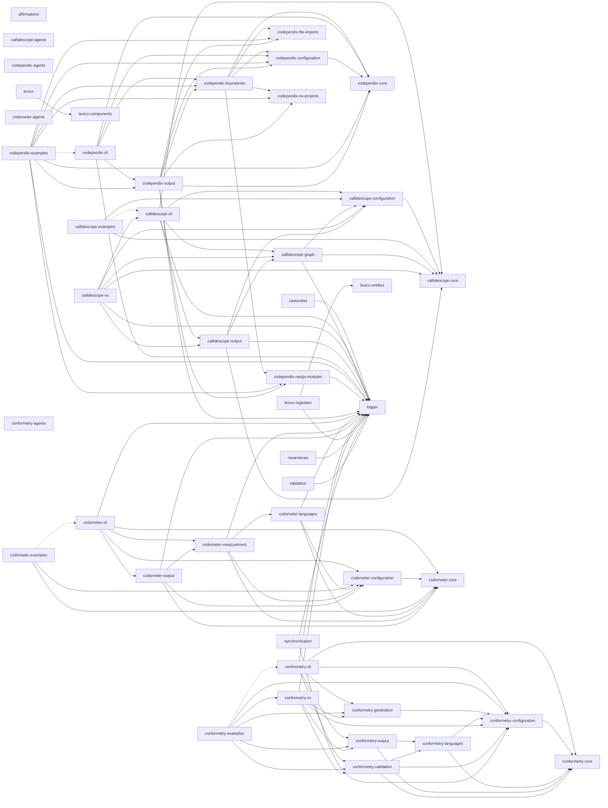

# codebase

[](https://nx.dev)
[](https://www.typescriptlang.org/)
[](https://pnpm.io/)
[](https://nodejs.org/)
[](https://www.python.org/)
[](https://docs.astral.sh/uv/)
[](https://jupyter.org/)
[](https://react.dev/)
[](https://tanstack.com/start)
[](https://ui.shadcn.com/)
[](https://radix-ui.com/)
[](https://tailwindcss.com/)
[](https://lucide.dev/)
[](https://recharts.org/)
[](https://zod.dev/)
[](https://vitejs.dev/)
[](https://swc.rs/)
[](https://vitest.dev/)
[](https://nestjs.com/)
[](https://graphql.org/)
[](https://typeorm.io/)
[](https://www.postgresql.org/)
[](https://python.langchain.com/)
[](https://langchain-ai.github.io/langgraph/)
[](https://ollama.com/)
[](https://docs.pydantic.dev/)
[](https://eslint.org/)
[](https://oxc.rs/docs/guide/usage/linter)
[](https://prettier.io/)
[](https://stylelint.io/)
[](https://docs.astral.sh/ruff/)
[](https://semantic-release.gitbook.io/)
[](https://www.docker.com/)
[](https://helm.sh/)
[](https://kubernetes.io/)
[](https://www.terraform.io/)

[](https://github.com/JimmyPaolini/codebase/actions/workflows/lint-codebase.yml)
[](https://github.com/JimmyPaolini/codebase/actions/workflows/test-coverage.yml)
[](https://github.com/JimmyPaolini/codebase/actions/workflows/scan-security.yml)
[](https://github.com/JimmyPaolini/codebase/actions/workflows/validate-conventions.yml)
[](https://github.com/JimmyPaolini/codebase/actions/workflows/make-projects.yml)
[](https://github.com/JimmyPaolini/codebase/actions/workflows/audit-issues.yml)
[](https://github.com/JimmyPaolini/codebase/actions/workflows/make-codebase.yml)
[](https://github.com/JimmyPaolini/codebase/actions/workflows/push-releases.yml)

A modern TypeScript codebase with Nx, featuring automated releases, comprehensive code quality tools, and strict type safety.

## 💽 Projects

**🔮 [affirmations](applications/affirmations)** - Python LangChain + Ollama affirmation generator (LangGraph ReAct agent, SearxNG)\
**🛰️ [caelundas](applications/caelundas)** - Swiss Ephemeris calendar generator that turns astronomical events into an `.ics` file
<details>
<summary><strong>🔭 callidescope</strong> - Call stack tracing toolchain that follows control flow through injected dependencies and reports where a stack got too deep</summary>

&nbsp;&nbsp;&nbsp;&nbsp;**[callidescope-agents](packages/ic-suite/callidescope/callidescope-agents)** - Agent skills for the callidescope toolchain, published and installed back from the lockfile like any other vendored skill\
&nbsp;&nbsp;&nbsp;&nbsp;**[callidescope-cli](packages/ic-suite/callidescope/callidescope-cli)** - Command-line host that builds the call graph with the TypeScript compiler API, resolves NestJS injected dependencies, and reports the deepest stack below every entry point\
&nbsp;&nbsp;&nbsp;&nbsp;**[callidescope-configuration](packages/ic-suite/callidescope/callidescope-configuration)** - Reads `callidescope.config.ts` for entry-point rules, depth and breadth limits, exclusion globs, and output destinations\
&nbsp;&nbsp;&nbsp;&nbsp;**[callidescope-core](packages/ic-suite/callidescope/callidescope-core)** - The contracts leaf: the call graph, stack, frame, and finding vocabulary every other callidescope package speaks, holding no service and no NestJS module\
&nbsp;&nbsp;&nbsp;&nbsp;**[callidescope-examples](packages/ic-suite/callidescope/callidescope-examples)** - A small codebase built to be traced, carrying one worked example per rule, finding, and output the toolchain has\
&nbsp;&nbsp;&nbsp;&nbsp;**[callidescope-graph](packages/ic-suite/callidescope/callidescope-graph)** - Builds the call graph from traced TypeScript source and measures its depth and breadth\
&nbsp;&nbsp;&nbsp;&nbsp;**[callidescope-nx](packages/ic-suite/callidescope/callidescope-nx)** - Nx plugin inferring per-project `trace`, `depth`, and `breadth` targets that follow the Nx dependency graph, keeping every Nx dependency out of the packages that trace\
&nbsp;&nbsp;&nbsp;&nbsp;**[callidescope-output](packages/ic-suite/callidescope/callidescope-output)** - Renders call-graph findings into markdown, mermaid, and JSON output formats

</details>

<details>
<summary><strong>🕸️ codependix</strong> - Dependency graph export toolchain that reads what each project depends on, renders it as JSON and Markdown diagrams, and gates the rules those graphs are judged against</summary>

&nbsp;&nbsp;&nbsp;&nbsp;**[codependix-agents](packages/ic-suite/codependix/codependix-agents)** - Agent skills for the codependix toolchain, installable by any workspace that uses codependix\
&nbsp;&nbsp;&nbsp;&nbsp;**[codependix-boundaries](packages/ic-suite/codependix/codependix-boundaries)** - Builds each level's graph for a workspace, judges it against the declared rules, and reports the edges and cycles that break them\
&nbsp;&nbsp;&nbsp;&nbsp;**[codependix-cli](packages/ic-suite/codependix/codependix-cli)** - Command-line host that exports a project's Nx, NestJS, and file-level dependency graphs as JSON and Markdown anchor blocks, and gates the rules over them\
&nbsp;&nbsp;&nbsp;&nbsp;**[codependix-configuration](packages/ic-suite/codependix/codependix-configuration)** - Reads `codependix.config.ts`, resolves the command line over it, and produces one resolved run configuration\
&nbsp;&nbsp;&nbsp;&nbsp;**[codependix-core](packages/ic-suite/codependix/codependix-core)** - The contracts leaf: the run and result vocabulary every other codependix package states its types in\
&nbsp;&nbsp;&nbsp;&nbsp;**[codependix-examples](packages/ic-suite/codependix/codependix-examples)** - Sixteen subjects built to be graphed, each carrying the guide codependix renders from it\
&nbsp;&nbsp;&nbsp;&nbsp;**[codependix-file-imports](packages/ic-suite/codependix/codependix-file-imports)** - Builds a project's file-level import graph — a `typescript` module walking its own `ts.Program`, and a `python` module parsing `import`/`from ... import` statements\
&nbsp;&nbsp;&nbsp;&nbsp;**[codependix-nestjs-modules](packages/ic-suite/codependix/codependix-nestjs-modules)** - Explores a NestJS project's container and builds its module graph\
&nbsp;&nbsp;&nbsp;&nbsp;**[codependix-nx-projects](packages/ic-suite/codependix/codependix-nx-projects)** - Builds a project's one-hop Nx dependency neighborhood from the Nx project graph\
&nbsp;&nbsp;&nbsp;&nbsp;**[codependix-output](packages/ic-suite/codependix/codependix-output)** - Renders every graph as JSON, Markdown, and mermaid, routes each to its configured destination, and splices anchor blocks into place

</details>

<details>
<summary><strong>⏲️ codometer</strong> - Repository measurement toolchain that counts a codebase and reports what it found</summary>

&nbsp;&nbsp;&nbsp;&nbsp;**[codometer-agents](packages/ic-suite/codometer/codometer-agents)** - Agent skills for the codometer toolchain, published and installed back from the lockfile like any other vendored skill\
&nbsp;&nbsp;&nbsp;&nbsp;**[codometer-changes](packages/ic-suite/codometer/codometer-changes)** - Diffs codometer reports against a baseline snapshot\
&nbsp;&nbsp;&nbsp;&nbsp;**[codometer-cli](packages/ic-suite/codometer/codometer-cli)** - Command-line host that measures TypeScript, JavaScript, Python, JSON, markdown, and Jupyter notebooks, then writes the badge block in this README, a JSON report, or both\
&nbsp;&nbsp;&nbsp;&nbsp;**[codometer-configuration](packages/ic-suite/codometer/codometer-configuration)** - Reads `codometer.config.ts` for exclusion globs, output destinations and their render/write callbacks, and the Python interpreter\
&nbsp;&nbsp;&nbsp;&nbsp;**[codometer-customization](packages/ic-suite/codometer/codometer-customization)** - Evaluates codometer's configured custom counters\
&nbsp;&nbsp;&nbsp;&nbsp;**[codometer-discovery](packages/ic-suite/codometer/codometer-discovery)** - Glob matching and gitignore-aware file walking, plus resolving configured measurement targets to file sets\
&nbsp;&nbsp;&nbsp;&nbsp;**[codometer-examples](packages/ic-suite/codometer/codometer-examples)** - A sample corpus with known contents and one runnable example per thing codometer does, with tests that assert every number the guides quote\
&nbsp;&nbsp;&nbsp;&nbsp;**[codometer-languages](packages/ic-suite/codometer/codometer-languages)** - Every input language analyzer codometer measures, behind one `analyze()` call\
&nbsp;&nbsp;&nbsp;&nbsp;**[codometer-output](packages/ic-suite/codometer/codometer-output)** - Every codometer output format - JSON reports, README badges, and the pull request change report\
&nbsp;&nbsp;&nbsp;&nbsp;**[codometer-size](packages/ic-suite/codometer/codometer-size)** - Compresses a target's matched files and measures their size

</details>

<details>
<summary><strong>👔 conformetry</strong> - Template-driven code generation and conformance validation toolchain</summary>

&nbsp;&nbsp;&nbsp;&nbsp;**[conformetry-agents](packages/ic-suite/conformetry/conformetry-agents)** - Agent skills for the conformetry toolchain, published and installed back from the lockfile like any other vendored skill\
&nbsp;&nbsp;&nbsp;&nbsp;**[conformetry-cli](packages/ic-suite/conformetry/conformetry-cli)** - Command-line host that expands globs, prompts for inputs, and runs generation and validation\
&nbsp;&nbsp;&nbsp;&nbsp;**[conformetry-configuration](packages/ic-suite/conformetry/conformetry-configuration)** - Configuration loading, template and instance discovery, generator input resolution, and the placeholder rendering every template path needs\
&nbsp;&nbsp;&nbsp;&nbsp;**[conformetry-core](packages/ic-suite/conformetry/conformetry-core)** - Contracts leaf: difference, score, inventory, and language validator types, and nothing executable\
&nbsp;&nbsp;&nbsp;&nbsp;**[conformetry-examples](packages/ic-suite/conformetry/conformetry-examples)** - Eleven runnable examples of the toolchain, each with its own configuration, template, instances, and guide, executed by CI so the guides cannot rot\
&nbsp;&nbsp;&nbsp;&nbsp;**[conformetry-generation](packages/ic-suite/conformetry/conformetry-generation)** - Scaffold file generation, rendering each template through the configuration layer\
&nbsp;&nbsp;&nbsp;&nbsp;**[conformetry-languages](packages/ic-suite/conformetry/conformetry-languages)** - Every language conformetry compares files with, as modules of one package, plus the resolution that picks them, the text fallback, the extension-agnostic existence pass, and the difference and scoring primitives they share\
&nbsp;&nbsp;&nbsp;&nbsp;**[conformetry-nx](packages/ic-suite/conformetry/conformetry-nx)** - Nx plugin host with generators, executors, and the emitted-plugin bootstrap\
&nbsp;&nbsp;&nbsp;&nbsp;**[conformetry-output](packages/ic-suite/conformetry/conformetry-output)** - Every render target: the validation report and the template and instance inventory\
&nbsp;&nbsp;&nbsp;&nbsp;**[conformetry-validation](packages/ic-suite/conformetry/conformetry-validation)** - Validation orchestration, language routing, and finding deduplication

</details>

**[infrastructure](infrastructure)** - Helm charts, Terraform, Kubernetes infrastructure\
**[JimmyPaolini](applications/JimmyPaolini)** - GitHub profile site
<details>
<summary><strong>🐺 lexico</strong> - Latin-English dictionary suite: the web application, its components, its schema, and the ingestion that fills it</summary>

&nbsp;&nbsp;&nbsp;&nbsp;**[lexico](applications/lexico)** - TanStack Start SSR dictionary web application\
&nbsp;&nbsp;&nbsp;&nbsp;**[lexico-components](packages/lexico-components)** - Shared React component library using shadcn/ui and Radix primitives\
&nbsp;&nbsp;&nbsp;&nbsp;**[lexico-entities](packages/lexico-entities)** - TypeORM entities, migrations, and grammatical enumerations for the dictionary and literature schema\
&nbsp;&nbsp;&nbsp;&nbsp;**[lexico-ingestion](applications/lexico-ingestion)** - NestJS CLI that scrapes and loads dictionary, literature, and etymology sources

</details>

**🪵 [logger](packages/logger)** - Shared pino-backed NestJS `LoggerService` and `LoggerModule`\
**🏺 [meanderaw](applications/meanderaw)** - CLI that generates Greek meander (key/fret) SVG patterns programmatically from a type, row count, and repeat count\
**↔️ [synchronization](tools/synchronization)** - NestJS CLI that regenerates the workspace's derived configuration and documentation, and fails CI when they drift\
**🧑‍⚖️ [validation](tools/validation)** - NestJS CLI for the repository's one-sided checks, the ones with a check and no write, such as the pull request metadata gate

## 📖 Documentation

### Getting Started & Workflow

- [Contributing Guide](CONTRIBUTING.md) - **Start here.** Local and dev container setup, the commands to run, code standards, branch and commit conventions, pull requests, and releases
- [AGENTS.md](AGENTS.md) - Commands, project layout, conventions, code quality gates, and git workflow
- [Release Process](documentation/development/release-process.md) - Automated semantic versioning and changelogs

### Architecture & Systems

- [CI/CD Workflows](.github/workflows) - GitHub Actions workflows and the shared `setup-codebase` composite action
- [Infrastructure](infrastructure/README.md) - Helm charts, Terraform, and the Kubernetes deployment pipeline
- [Dev Container](.devcontainer/README.md) - Containerized development environment
- [Scripts](scripts/README.md) - Local setup and maintenance scripts

### Conventions & Guidelines

Conventions live in [AGENTS.md](AGENTS.md) and the agent skills below, which are the single sources of truth. Every project also has its own `AGENTS.md` with project-specific patterns.

**🤖 Agent Skills (Domain Knowledge)**
Skills are specialized instruction files used by our automated agents, but they also serve as excellent deep-dive documentation for human developers.

- [View all Skills](.agents/skills) - Complete index of available skills
- **Languages:** [TypeScript](.agents/skills/write-typescript/SKILL.md) / [React](.agents/skills/write-react/SKILL.md) / [Python](.agents/skills/write-python/SKILL.md) / [Comments](.agents/skills/write-comments/SKILL.md)
- **Quality:** [Validate Code](.agents/skills/validate-code/SKILL.md) / [Testing Strategy](.agents/skills/testing-strategy/SKILL.md) / [Testing Mocks](.agents/skills/testing-mocks/SKILL.md) / [Error Handling](.agents/skills/handle-errors/SKILL.md)
- **Workflows:** [Git Commits](.agents/skills/commit-code/SKILL.md) / [PR Management](.agents/skills/create-pull-request/SKILL.md) / [Branch Naming](.agents/skills/checkout-branch/SKILL.md)
- **Tooling:** [Nx Workspaces](.agents/skills/nx-workspace/SKILL.md) / [Generators](.agents/skills/nx-generate/SKILL.md) / [Task Running](.agents/skills/nx-run-tasks/SKILL.md)
- **Triage:** [Failing CI](.agents/skills/triage-deployment/SKILL.md) / [Rejected Commits](.agents/skills/triage-submission/SKILL.md) / [Spell Check](.agents/skills/spell-check/SKILL.md)

Other important files include [CHANGELOG.md](CHANGELOG.md) and [SECURITY.md](SECURITY.md).

## 👔 Conformetry

Template-driven code generation and conformance validation, templates synced from [configuration/conformetry.config.ts](configuration/conformetry.config.ts) by `nx run synchronization:conformetry-generators:write`.

<!-- conformetry-generators-table start -->
| Template | Description |
| -------- | ----------- |
| `jupyter-notebook-application` | A standalone Python application template with a Jupyter notebook entry point, pytest/pyright/ruff tooling, and a shared uv workspace venv |
| `nestjs-command-project` | A standalone NestJS CLI application template built on nest-commander, for a new command-line tool in applications/, packages/, or tools/ |
| `nestjs-graphql-application` | A standalone NestJS GraphQL API application template, for a new backend service exposing a GraphQL schema over HTTP |
| `nestjs-service-project` | A standalone NestJS library package template for internal workspace code shared across projects, with no CLI entry point or HTTP server |
| `nestjs-command-module` | A nest-commander command module template — command, module, constants, types, and unit test — for an existing NestJS command-line project |
| `nestjs-dataloader-module` | A GraphQL dataloader module template — dataloader, module, types, and unit test — for batching lookups inside an existing NestJS project |
| `nestjs-graphql-module` | A GraphQL module template — resolver, entities, args/input types, factories, constants, and unit test — for an existing NestJS project |
| `nestjs-service-file` | A service and unit test file template for an existing NestJS module, without the surrounding module files |
| `nestjs-service-module` | A plain service module template — module, service, constants, types, and unit test — for an existing NestJS project |
| `react-component` | A React component and test file template for an existing React project |
<!-- conformetry-generators-table end -->

## 🕸️ Codependix

The workspace's dependency graph, exported by [codependix](packages/ic-suite/codependix/codependix-cli), regenerated by `nx run codebase:codependix:write`.

<!-- codependix:start name="codependix-nx-projects" -->


_Dashed edges are dependencies Nx inferred from configuration rather than from code._
<!-- codependix:end name="codependix-nx-projects" -->

<!-- CODE_STATISTICS_START -->

### NestJS Module Graph

<!-- codependix:start name="codependix-nestjs-modules" -->
```mermaid
graph LR
  module_caelundas_AnnualSolarCycleModule["caelundas/AnnualSolarCycleModule"]
  module_caelundas_AspectsModule["caelundas/AspectsModule"]
  module_caelundas_AspectsUtilitiesModule["caelundas/AspectsUtilitiesModule"]
  module_caelundas_CaelundasModule["caelundas/CaelundasModule"]
  module_caelundas_CalendarModule["caelundas/CalendarModule"]
  module_caelundas_ConfigModule["caelundas/ConfigModule"]
  module_caelundas_DailyCyclesModule["caelundas/DailyCyclesModule"]
  module_caelundas_DatetimeModule["caelundas/DatetimeModule"]
  module_caelundas_DiscoveryModule["caelundas/DiscoveryModule"]
  module_caelundas_EclipsesModule["caelundas/EclipsesModule"]
  module_caelundas_EphemerisModule["caelundas/EphemerisModule"]
  module_caelundas_IngressesModule["caelundas/IngressesModule"]
  module_caelundas_InputModule["caelundas/InputModule"]
  module_caelundas_LoggerModule["caelundas/LoggerModule"]
  module_caelundas_MainModule["caelundas/MainModule"]
  module_caelundas_MajorAspectsModule["caelundas/MajorAspectsModule"]
  module_caelundas_MathModule["caelundas/MathModule"]
  module_caelundas_MinorAspectsModule["caelundas/MinorAspectsModule"]
  module_caelundas_MonthlyLunarCycleModule["caelundas/MonthlyLunarCycleModule"]
  module_caelundas_PerfectiveModule["caelundas/PerfectiveModule"]
  module_caelundas_PhasesModule["caelundas/PhasesModule"]
  module_caelundas_ProgressiveModule["caelundas/ProgressiveModule"]
  module_caelundas_ProgressiveUtilitiesModule["caelundas/ProgressiveUtilitiesModule"]
  module_caelundas_QuadrupleAspectsModule["caelundas/QuadrupleAspectsModule"]
  module_caelundas_QuintupleAspectsModule["caelundas/QuintupleAspectsModule"]
  module_caelundas_RetrogradesModule["caelundas/RetrogradesModule"]
  module_caelundas_SextupleAspectsModule["caelundas/SextupleAspectsModule"]
  module_caelundas_SpecialtyAspectsModule["caelundas/SpecialtyAspectsModule"]
  module_caelundas_StelliumModule["caelundas/StelliumModule"]
  module_caelundas_TripleAspectsModule["caelundas/TripleAspectsModule"]
  module_caelundas_TwilightsModule["caelundas/TwilightsModule"]
  module_callidescope_cli_AddressLookupModule["callidescope-cli/AddressLookupModule"]
  module_callidescope_cli_AddressReportModule["callidescope-cli/AddressReportModule"]
  module_callidescope_cli_BreadthModule["callidescope-cli/BreadthModule"]
  module_callidescope_cli_CallablesModule["callidescope-cli/CallablesModule"]
  module_callidescope_cli_CallidescopeModule["callidescope-cli/CallidescopeModule"]
  module_callidescope_cli_ClassesModule["callidescope-cli/ClassesModule"]
  module_callidescope_cli_ConfigModule["callidescope-cli/ConfigModule"]
  module_callidescope_cli_ConfigurationFileModule["callidescope-cli/ConfigurationFileModule"]
  module_callidescope_cli_ConfigurationModule["callidescope-cli/ConfigurationModule"]
  module_callidescope_cli_DepthModule["callidescope-cli/DepthModule"]
  module_callidescope_cli_DiscoveryModule["callidescope-cli/DiscoveryModule"]
  module_callidescope_cli_DocumentationModule["callidescope-cli/DocumentationModule"]
  module_callidescope_cli_EdgesModule["callidescope-cli/EdgesModule"]
  module_callidescope_cli_EntriesModule["callidescope-cli/EntriesModule"]
  module_callidescope_cli_FlagResolutionModule["callidescope-cli/FlagResolutionModule"]
  module_callidescope_cli_GraphModule["callidescope-cli/GraphModule"]
  module_callidescope_cli_InputModule["callidescope-cli/InputModule"]
  module_callidescope_cli_LimitsModule["callidescope-cli/LimitsModule"]
  module_callidescope_cli_LoggerModule["callidescope-cli/LoggerModule"]
  module_callidescope_cli_MainModule["callidescope-cli/MainModule"]
  module_callidescope_cli_OutputJsonModule["callidescope-cli/OutputJsonModule"]
  module_callidescope_cli_OutputMarkdownModule["callidescope-cli/OutputMarkdownModule"]
  module_callidescope_cli_ProgramModule["callidescope-cli/ProgramModule"]
  module_callidescope_cli_ProjectReportsModule["callidescope-cli/ProjectReportsModule"]
  module_callidescope_cli_ReportFindingsModule["callidescope-cli/ReportFindingsModule"]
  module_callidescope_cli_ReportModule["callidescope-cli/ReportModule"]
  module_callidescope_cli_RunPlanModule["callidescope-cli/RunPlanModule"]
  module_callidescope_cli_SignaturesModule["callidescope-cli/SignaturesModule"]
  module_callidescope_cli_WorkspaceModule["callidescope-cli/WorkspaceModule"]
  module_callidescope_cli_WriteDestinationsModule["callidescope-cli/WriteDestinationsModule"]
  module_callidescope_configuration_ConfigurationFileModule["callidescope-configuration/ConfigurationFileModule"]
  module_callidescope_configuration_ConfigurationModule["callidescope-configuration/ConfigurationModule"]
  module_callidescope_configuration_FlagResolutionModule["callidescope-configuration/FlagResolutionModule"]
  module_callidescope_configuration_InputModule["callidescope-configuration/InputModule"]
  module_callidescope_configuration_RunPlanModule["callidescope-configuration/RunPlanModule"]
  module_callidescope_graph_CallablesModule["callidescope-graph/CallablesModule"]
  module_callidescope_graph_ClassesModule["callidescope-graph/ClassesModule"]
  module_callidescope_graph_DocumentationModule["callidescope-graph/DocumentationModule"]
  module_callidescope_graph_EdgesModule["callidescope-graph/EdgesModule"]
  module_callidescope_graph_EntriesModule["callidescope-graph/EntriesModule"]
  module_callidescope_graph_GraphModule["callidescope-graph/GraphModule"]
  module_callidescope_graph_LoggerModule["callidescope-graph/LoggerModule"]
  module_callidescope_graph_ProgramModule["callidescope-graph/ProgramModule"]
  module_callidescope_graph_SignaturesModule["callidescope-graph/SignaturesModule"]
  module_callidescope_graph_WorkspaceModule["callidescope-graph/WorkspaceModule"]
  module_callidescope_nx_AddressLookupModule["callidescope-nx/AddressLookupModule"]
  module_callidescope_nx_AddressModule["callidescope-nx/AddressModule"]
  module_callidescope_nx_AddressReportModule["callidescope-nx/AddressReportModule"]
  module_callidescope_nx_CallablesModule["callidescope-nx/CallablesModule"]
  module_callidescope_nx_CallidescopeModule["callidescope-nx/CallidescopeModule"]
  module_callidescope_nx_ClassesModule["callidescope-nx/ClassesModule"]
  module_callidescope_nx_ConfigurationFileModule["callidescope-nx/ConfigurationFileModule"]
  module_callidescope_nx_ConfigurationModule["callidescope-nx/ConfigurationModule"]
  module_callidescope_nx_DocumentationModule["callidescope-nx/DocumentationModule"]
  module_callidescope_nx_EdgesModule["callidescope-nx/EdgesModule"]
  module_callidescope_nx_EntriesModule["callidescope-nx/EntriesModule"]
  module_callidescope_nx_FlagResolutionModule["callidescope-nx/FlagResolutionModule"]
  module_callidescope_nx_GraphModule["callidescope-nx/GraphModule"]
  module_callidescope_nx_InputModule["callidescope-nx/InputModule"]
  module_callidescope_nx_LoggerModule["callidescope-nx/LoggerModule"]
  module_callidescope_nx_MainModule["callidescope-nx/MainModule"]
  module_callidescope_nx_OptionsModule["callidescope-nx/OptionsModule"]
  module_callidescope_nx_OutputJsonModule["callidescope-nx/OutputJsonModule"]
  module_callidescope_nx_OutputMarkdownModule["callidescope-nx/OutputMarkdownModule"]
  module_callidescope_nx_PluginModule["callidescope-nx/PluginModule"]
  module_callidescope_nx_ProgramModule["callidescope-nx/ProgramModule"]
  module_callidescope_nx_ProjectReportsModule["callidescope-nx/ProjectReportsModule"]
  module_callidescope_nx_ProjectsModule["callidescope-nx/ProjectsModule"]
  module_callidescope_nx_ReportFindingsModule["callidescope-nx/ReportFindingsModule"]
  module_callidescope_nx_ReportModule["callidescope-nx/ReportModule"]
  module_callidescope_nx_RunConfigurationModule["callidescope-nx/RunConfigurationModule"]
  module_callidescope_nx_RunPlanModule["callidescope-nx/RunPlanModule"]
  module_callidescope_nx_SignaturesModule["callidescope-nx/SignaturesModule"]
  module_callidescope_nx_WorkspaceModule["callidescope-nx/WorkspaceModule"]
  module_callidescope_nx_WriteDestinationsModule["callidescope-nx/WriteDestinationsModule"]
  module_callidescope_output_AddressReportModule["callidescope-output/AddressReportModule"]
  module_callidescope_output_CallablesModule["callidescope-output/CallablesModule"]
  module_callidescope_output_ClassesModule["callidescope-output/ClassesModule"]
  module_callidescope_output_DocumentationModule["callidescope-output/DocumentationModule"]
  module_callidescope_output_EdgesModule["callidescope-output/EdgesModule"]
  module_callidescope_output_GraphModule["callidescope-output/GraphModule"]
  module_callidescope_output_LoggerModule["callidescope-output/LoggerModule"]
  module_callidescope_output_OutputJsonModule["callidescope-output/OutputJsonModule"]
  module_callidescope_output_OutputMarkdownModule["callidescope-output/OutputMarkdownModule"]
  module_callidescope_output_ProgramModule["callidescope-output/ProgramModule"]
  module_callidescope_output_ProjectReportsModule["callidescope-output/ProjectReportsModule"]
  module_callidescope_output_ReportFindingsModule["callidescope-output/ReportFindingsModule"]
  module_callidescope_output_ReportModule["callidescope-output/ReportModule"]
  module_callidescope_output_SignaturesModule["callidescope-output/SignaturesModule"]
  module_callidescope_output_WorkspaceModule["callidescope-output/WorkspaceModule"]
  module_callidescope_output_WriteDestinationsModule["callidescope-output/WriteDestinationsModule"]
  module_codependix_boundaries_BoundariesModule["codependix-boundaries/BoundariesModule"]
  module_codependix_boundaries_BoundaryCheckModule["codependix-boundaries/BoundaryCheckModule"]
  module_codependix_boundaries_ConfigurationModule["codependix-boundaries/ConfigurationModule"]
  module_codependix_boundaries_InputModule["codependix-boundaries/InputModule"]
  module_codependix_boundaries_LoggerModule["codependix-boundaries/LoggerModule"]
  module_codependix_boundaries_ModuleGraphModule["codependix-boundaries/ModuleGraphModule"]
  module_codependix_boundaries_NeighborhoodModule["codependix-boundaries/NeighborhoodModule"]
  module_codependix_boundaries_NestjsProjectModule["codependix-boundaries/NestjsProjectModule"]
  module_codependix_boundaries_OverrideResolutionModule["codependix-boundaries/OverrideResolutionModule"]
  module_codependix_boundaries_PythonModule["codependix-boundaries/PythonModule"]
  module_codependix_boundaries_RunContextModule["codependix-boundaries/RunContextModule"]
  module_codependix_boundaries_TypescriptModule["codependix-boundaries/TypescriptModule"]
  module_codependix_boundaries_WorkspaceGraphModule["codependix-boundaries/WorkspaceGraphModule"]
  module_codependix_cli_AnchorsModule["codependix-cli/AnchorsModule"]
  module_codependix_cli_BoundariesModule["codependix-cli/BoundariesModule"]
  module_codependix_cli_BoundaryCheckModule["codependix-cli/BoundaryCheckModule"]
  module_codependix_cli_CombinedOutputModule["codependix-cli/CombinedOutputModule"]
  module_codependix_cli_ConfigModule["codependix-cli/ConfigModule"]
  module_codependix_cli_ConfigurationModule["codependix-cli/ConfigurationModule"]
  module_codependix_cli_DeliveryModule["codependix-cli/DeliveryModule"]
  module_codependix_cli_DiscoveryModule["codependix-cli/DiscoveryModule"]
  module_codependix_cli_FileImportsWorkspaceGraphModule["codependix-cli/FileImportsWorkspaceGraphModule"]
  module_codependix_cli_GraphRunModule["codependix-cli/GraphRunModule"]
  module_codependix_cli_InputModule["codependix-cli/InputModule"]
  module_codependix_cli_LoggerModule["codependix-cli/LoggerModule"]
  module_codependix_cli_MainModule["codependix-cli/MainModule"]
  module_codependix_cli_MapModule["codependix-cli/MapModule"]
  module_codependix_cli_ModuleGraphModule["codependix-cli/ModuleGraphModule"]
  module_codependix_cli_NeighborhoodModule["codependix-cli/NeighborhoodModule"]
  module_codependix_cli_NestjsModulesWorkspaceGraphModule["codependix-cli/NestjsModulesWorkspaceGraphModule"]
  module_codependix_cli_NestjsProjectModule["codependix-cli/NestjsProjectModule"]
  module_codependix_cli_OverrideResolutionModule["codependix-cli/OverrideResolutionModule"]
  module_codependix_cli_ProjectGraphsModule["codependix-cli/ProjectGraphsModule"]
  module_codependix_cli_PythonImportsModule["codependix-cli/PythonImportsModule"]
  module_codependix_cli_PythonModule["codependix-cli/PythonModule"]
  module_codependix_cli_ReportingModule["codependix-cli/ReportingModule"]
  module_codependix_cli_RunContextModule["codependix-cli/RunContextModule"]
  module_codependix_cli_TypescriptModule["codependix-cli/TypescriptModule"]
  module_codependix_cli_WorkspaceGraphModule["codependix-cli/WorkspaceGraphModule"]
  module_codependix_cli_WorkspaceGraphsModule["codependix-cli/WorkspaceGraphsModule"]
  module_codependix_configuration_ConfigurationModule["codependix-configuration/ConfigurationModule"]
  module_codependix_configuration_InputModule["codependix-configuration/InputModule"]
  module_codependix_configuration_OverrideResolutionModule["codependix-configuration/OverrideResolutionModule"]
  module_codependix_file_imports_FileImportsWorkspaceGraphModule["codependix-file-imports/FileImportsWorkspaceGraphModule"]
  module_codependix_file_imports_PythonModule["codependix-file-imports/PythonModule"]
  module_codependix_file_imports_TypescriptModule["codependix-file-imports/TypescriptModule"]
  module_codependix_nestjs_modules_LoggerModule["codependix-nestjs-modules/LoggerModule"]
  module_codependix_nestjs_modules_ModuleGraphModule["codependix-nestjs-modules/ModuleGraphModule"]
  module_codependix_nestjs_modules_NestjsModulesWorkspaceGraphModule["codependix-nestjs-modules/NestjsModulesWorkspaceGraphModule"]
  module_codependix_nestjs_modules_NestjsProjectModule["codependix-nestjs-modules/NestjsProjectModule"]
  module_codependix_nx_projects_NeighborhoodModule["codependix-nx-projects/NeighborhoodModule"]
  module_codependix_nx_projects_WorkspaceGraphModule["codependix-nx-projects/WorkspaceGraphModule"]
  module_codependix_output_AnchorsModule["codependix-output/AnchorsModule"]
  module_codependix_output_BoundariesModule["codependix-output/BoundariesModule"]
  module_codependix_output_BoundaryCheckModule["codependix-output/BoundaryCheckModule"]
  module_codependix_output_CombinedOutputModule["codependix-output/CombinedOutputModule"]
  module_codependix_output_ConfigurationModule["codependix-output/ConfigurationModule"]
  module_codependix_output_DeliveryModule["codependix-output/DeliveryModule"]
  module_codependix_output_FileImportsWorkspaceGraphModule["codependix-output/FileImportsWorkspaceGraphModule"]
  module_codependix_output_GraphRunModule["codependix-output/GraphRunModule"]
  module_codependix_output_InputModule["codependix-output/InputModule"]
  module_codependix_output_LoggerModule["codependix-output/LoggerModule"]
  module_codependix_output_ModuleGraphModule["codependix-output/ModuleGraphModule"]
  module_codependix_output_NeighborhoodModule["codependix-output/NeighborhoodModule"]
  module_codependix_output_NestjsModulesWorkspaceGraphModule["codependix-output/NestjsModulesWorkspaceGraphModule"]
  module_codependix_output_NestjsProjectModule["codependix-output/NestjsProjectModule"]
  module_codependix_output_OverrideResolutionModule["codependix-output/OverrideResolutionModule"]
  module_codependix_output_ProjectGraphsModule["codependix-output/ProjectGraphsModule"]
  module_codependix_output_PythonImportsModule["codependix-output/PythonImportsModule"]
  module_codependix_output_PythonModule["codependix-output/PythonModule"]
  module_codependix_output_ReportingModule["codependix-output/ReportingModule"]
  module_codependix_output_TypescriptModule["codependix-output/TypescriptModule"]
  module_codependix_output_WorkspaceGraphModule["codependix-output/WorkspaceGraphModule"]
  module_codependix_output_WorkspaceGraphsModule["codependix-output/WorkspaceGraphsModule"]
  module_codometer_cli_ChangesModule["codometer-cli/ChangesModule"]
  module_codometer_cli_CommentsModule["codometer-cli/CommentsModule"]
  module_codometer_cli_ConfigModule["codometer-cli/ConfigModule"]
  module_codometer_cli_ConfigurationModule["codometer-cli/ConfigurationModule"]
  module_codometer_cli_CssModule["codometer-cli/CssModule"]
  module_codometer_cli_CustomizationModule["codometer-cli/CustomizationModule"]
  module_codometer_cli_DeliveryModule["codometer-cli/DeliveryModule"]
  module_codometer_cli_DestinationsModule["codometer-cli/DestinationsModule"]
  module_codometer_cli_DiscoveryModule["codometer-cli/DiscoveryModule"]
  module_codometer_cli_DocumentsModule["codometer-cli/DocumentsModule"]
  module_codometer_cli_HclModule["codometer-cli/HclModule"]
  module_codometer_cli_InputsModule["codometer-cli/InputsModule"]
  module_codometer_cli_JsonModule["codometer-cli/JsonModule"]
  module_codometer_cli_JupyterModule["codometer-cli/JupyterModule"]
  module_codometer_cli_LanguagesModule["codometer-cli/LanguagesModule"]
  module_codometer_cli_LimitsModule["codometer-cli/LimitsModule"]
  module_codometer_cli_LoggerModule["codometer-cli/LoggerModule"]
  module_codometer_cli_MainModule["codometer-cli/MainModule"]
  module_codometer_cli_MarkdownModule["codometer-cli/MarkdownModule"]
  module_codometer_cli_MeasureModule["codometer-cli/MeasureModule"]
  module_codometer_cli_PythonModule["codometer-cli/PythonModule"]
  module_codometer_cli_RenderModule["codometer-cli/RenderModule"]
  module_codometer_cli_ReportModule["codometer-cli/ReportModule"]
  module_codometer_cli_ShellModule["codometer-cli/ShellModule"]
  module_codometer_cli_SizeModule["codometer-cli/SizeModule"]
  module_codometer_cli_SqlModule["codometer-cli/SqlModule"]
  module_codometer_cli_TomlModule["codometer-cli/TomlModule"]
  module_codometer_cli_TypescriptModule["codometer-cli/TypescriptModule"]
  module_codometer_cli_YamlModule["codometer-cli/YamlModule"]
  module_codometer_configuration_ConfigurationModule["codometer-configuration/ConfigurationModule"]
  module_codometer_languages_CommentsModule["codometer-languages/CommentsModule"]
  module_codometer_languages_CssModule["codometer-languages/CssModule"]
  module_codometer_languages_HclModule["codometer-languages/HclModule"]
  module_codometer_languages_JsonModule["codometer-languages/JsonModule"]
  module_codometer_languages_JupyterModule["codometer-languages/JupyterModule"]
  module_codometer_languages_LanguagesModule["codometer-languages/LanguagesModule"]
  module_codometer_languages_LoggerModule["codometer-languages/LoggerModule"]
  module_codometer_languages_MarkdownModule["codometer-languages/MarkdownModule"]
  module_codometer_languages_PythonModule["codometer-languages/PythonModule"]
  module_codometer_languages_ShellModule["codometer-languages/ShellModule"]
  module_codometer_languages_SqlModule["codometer-languages/SqlModule"]
  module_codometer_languages_TomlModule["codometer-languages/TomlModule"]
  module_codometer_languages_TypescriptModule["codometer-languages/TypescriptModule"]
  module_codometer_languages_YamlModule["codometer-languages/YamlModule"]
  module_codometer_measurement_CommentsModule["codometer-measurement/CommentsModule"]
  module_codometer_measurement_ConfigurationModule["codometer-measurement/ConfigurationModule"]
  module_codometer_measurement_CssModule["codometer-measurement/CssModule"]
  module_codometer_measurement_CustomizationModule["codometer-measurement/CustomizationModule"]
  module_codometer_measurement_DiscoveryModule["codometer-measurement/DiscoveryModule"]
  module_codometer_measurement_HclModule["codometer-measurement/HclModule"]
  module_codometer_measurement_InputsModule["codometer-measurement/InputsModule"]
  module_codometer_measurement_JsonModule["codometer-measurement/JsonModule"]
  module_codometer_measurement_JupyterModule["codometer-measurement/JupyterModule"]
  module_codometer_measurement_LanguagesModule["codometer-measurement/LanguagesModule"]
  module_codometer_measurement_LimitsModule["codometer-measurement/LimitsModule"]
  module_codometer_measurement_LoggerModule["codometer-measurement/LoggerModule"]
  module_codometer_measurement_MarkdownModule["codometer-measurement/MarkdownModule"]
  module_codometer_measurement_MeasureModule["codometer-measurement/MeasureModule"]
  module_codometer_measurement_PythonModule["codometer-measurement/PythonModule"]
  module_codometer_measurement_ShellModule["codometer-measurement/ShellModule"]
  module_codometer_measurement_SizeModule["codometer-measurement/SizeModule"]
  module_codometer_measurement_SqlModule["codometer-measurement/SqlModule"]
  module_codometer_measurement_TomlModule["codometer-measurement/TomlModule"]
  module_codometer_measurement_TypescriptModule["codometer-measurement/TypescriptModule"]
  module_codometer_measurement_YamlModule["codometer-measurement/YamlModule"]
  module_codometer_output_ChangesModule["codometer-output/ChangesModule"]
  module_codometer_output_ConfigurationModule["codometer-output/ConfigurationModule"]
  module_codometer_output_DeliveryModule["codometer-output/DeliveryModule"]
  module_codometer_output_DestinationsModule["codometer-output/DestinationsModule"]
  module_codometer_output_DiscoveryModule["codometer-output/DiscoveryModule"]
  module_codometer_output_DocumentsModule["codometer-output/DocumentsModule"]
  module_codometer_output_JsonModule["codometer-output/JsonModule"]
  module_codometer_output_LoggerModule["codometer-output/LoggerModule"]
  module_codometer_output_MarkdownModule["codometer-output/MarkdownModule"]
  module_codometer_output_RenderModule["codometer-output/RenderModule"]
  module_codometer_output_ReportModule["codometer-output/ReportModule"]
  module_conformetry_cli_ConfigModule["conformetry-cli/ConfigModule"]
  module_conformetry_cli_ConfigurationModule["conformetry-cli/ConfigurationModule"]
  module_conformetry_cli_DifferencesModule["conformetry-cli/DifferencesModule"]
  module_conformetry_cli_DiscoveryModule["conformetry-cli/DiscoveryModule"]
  module_conformetry_cli_FilesModule["conformetry-cli/FilesModule"]
  module_conformetry_cli_GenerateModule["conformetry-cli/GenerateModule"]
  module_conformetry_cli_GenerationModule["conformetry-cli/GenerationModule"]
  module_conformetry_cli_InputModule["conformetry-cli/InputModule"]
  module_conformetry_cli_InstanceDiscoveryModule["conformetry-cli/InstanceDiscoveryModule"]
  module_conformetry_cli_InstancesModule["conformetry-cli/InstancesModule"]
  module_conformetry_cli_InventoryModule["conformetry-cli/InventoryModule"]
  module_conformetry_cli_JsonModule["conformetry-cli/JsonModule"]
  module_conformetry_cli_JupyterModule["conformetry-cli/JupyterModule"]
  module_conformetry_cli_LanguagesModule["conformetry-cli/LanguagesModule"]
  module_conformetry_cli_LoggerModule["conformetry-cli/LoggerModule"]
  module_conformetry_cli_MainModule["conformetry-cli/MainModule"]
  module_conformetry_cli_MarkdownModule["conformetry-cli/MarkdownModule"]
  module_conformetry_cli_PythonModule["conformetry-cli/PythonModule"]
  module_conformetry_cli_RenderingModule["conformetry-cli/RenderingModule"]
  module_conformetry_cli_ReportingModule["conformetry-cli/ReportingModule"]
  module_conformetry_cli_RunnerModule["conformetry-cli/RunnerModule"]
  module_conformetry_cli_ScoringModule["conformetry-cli/ScoringModule"]
  module_conformetry_cli_TemplateDiscoveryModule["conformetry-cli/TemplateDiscoveryModule"]
  module_conformetry_cli_TemplatesModule["conformetry-cli/TemplatesModule"]
  module_conformetry_cli_TextModule["conformetry-cli/TextModule"]
  module_conformetry_cli_TypescriptModule["conformetry-cli/TypescriptModule"]
  module_conformetry_cli_ValidateModule["conformetry-cli/ValidateModule"]
  module_conformetry_cli_ValidationModule["conformetry-cli/ValidationModule"]
  module_conformetry_configuration_ConfigurationModule["conformetry-configuration/ConfigurationModule"]
  module_conformetry_configuration_InputModule["conformetry-configuration/InputModule"]
  module_conformetry_configuration_InstanceDiscoveryModule["conformetry-configuration/InstanceDiscoveryModule"]
  module_conformetry_configuration_RenderingModule["conformetry-configuration/RenderingModule"]
  module_conformetry_configuration_TemplateDiscoveryModule["conformetry-configuration/TemplateDiscoveryModule"]
  module_conformetry_generation_GenerationModule["conformetry-generation/GenerationModule"]
  module_conformetry_generation_RenderingModule["conformetry-generation/RenderingModule"]
  module_conformetry_languages_ConfigurationModule["conformetry-languages/ConfigurationModule"]
  module_conformetry_languages_DifferencesModule["conformetry-languages/DifferencesModule"]
  module_conformetry_languages_FilesModule["conformetry-languages/FilesModule"]
  module_conformetry_languages_InstanceDiscoveryModule["conformetry-languages/InstanceDiscoveryModule"]
  module_conformetry_languages_JsonModule["conformetry-languages/JsonModule"]
  module_conformetry_languages_JupyterModule["conformetry-languages/JupyterModule"]
  module_conformetry_languages_LanguagesModule["conformetry-languages/LanguagesModule"]
  module_conformetry_languages_MarkdownModule["conformetry-languages/MarkdownModule"]
  module_conformetry_languages_PythonModule["conformetry-languages/PythonModule"]
  module_conformetry_languages_RenderingModule["conformetry-languages/RenderingModule"]
  module_conformetry_languages_ScoringModule["conformetry-languages/ScoringModule"]
  module_conformetry_languages_TemplateDiscoveryModule["conformetry-languages/TemplateDiscoveryModule"]
  module_conformetry_languages_TextModule["conformetry-languages/TextModule"]
  module_conformetry_languages_TypescriptModule["conformetry-languages/TypescriptModule"]
  module_conformetry_nx_AdapterModule["conformetry-nx/AdapterModule"]
  module_conformetry_nx_ConfigurationModule["conformetry-nx/ConfigurationModule"]
  module_conformetry_nx_DifferencesModule["conformetry-nx/DifferencesModule"]
  module_conformetry_nx_FilesModule["conformetry-nx/FilesModule"]
  module_conformetry_nx_GenerationModule["conformetry-nx/GenerationModule"]
  module_conformetry_nx_GeneratorModule["conformetry-nx/GeneratorModule"]
  module_conformetry_nx_InstanceDiscoveryModule["conformetry-nx/InstanceDiscoveryModule"]
  module_conformetry_nx_InstancesModule["conformetry-nx/InstancesModule"]
  module_conformetry_nx_JsonModule["conformetry-nx/JsonModule"]
  module_conformetry_nx_JupyterModule["conformetry-nx/JupyterModule"]
  module_conformetry_nx_LanguagesModule["conformetry-nx/LanguagesModule"]
  module_conformetry_nx_LoggerModule["conformetry-nx/LoggerModule"]
  module_conformetry_nx_MainModule["conformetry-nx/MainModule"]
  module_conformetry_nx_MarkdownModule["conformetry-nx/MarkdownModule"]
  module_conformetry_nx_OptionsModule["conformetry-nx/OptionsModule"]
  module_conformetry_nx_PathsModule["conformetry-nx/PathsModule"]
  module_conformetry_nx_PluginModule["conformetry-nx/PluginModule"]
  module_conformetry_nx_ProjectsModule["conformetry-nx/ProjectsModule"]
  module_conformetry_nx_PythonModule["conformetry-nx/PythonModule"]
  module_conformetry_nx_RenderingModule["conformetry-nx/RenderingModule"]
  module_conformetry_nx_ReportingModule["conformetry-nx/ReportingModule"]
  module_conformetry_nx_RunnerModule["conformetry-nx/RunnerModule"]
  module_conformetry_nx_ScopeModule["conformetry-nx/ScopeModule"]
  module_conformetry_nx_ScoringModule["conformetry-nx/ScoringModule"]
  module_conformetry_nx_TemplateDiscoveryModule["conformetry-nx/TemplateDiscoveryModule"]
  module_conformetry_nx_TextModule["conformetry-nx/TextModule"]
  module_conformetry_nx_TypescriptModule["conformetry-nx/TypescriptModule"]
  module_conformetry_nx_ValidationModule["conformetry-nx/ValidationModule"]
  module_conformetry_output_InventoryModule["conformetry-output/InventoryModule"]
  module_conformetry_output_ReportingModule["conformetry-output/ReportingModule"]
  module_conformetry_output_ScoringModule["conformetry-output/ScoringModule"]
  module_conformetry_validation_ConfigurationModule["conformetry-validation/ConfigurationModule"]
  module_conformetry_validation_DifferencesModule["conformetry-validation/DifferencesModule"]
  module_conformetry_validation_FilesModule["conformetry-validation/FilesModule"]
  module_conformetry_validation_InstanceDiscoveryModule["conformetry-validation/InstanceDiscoveryModule"]
  module_conformetry_validation_JsonModule["conformetry-validation/JsonModule"]
  module_conformetry_validation_JupyterModule["conformetry-validation/JupyterModule"]
  module_conformetry_validation_LanguagesModule["conformetry-validation/LanguagesModule"]
  module_conformetry_validation_MarkdownModule["conformetry-validation/MarkdownModule"]
  module_conformetry_validation_PythonModule["conformetry-validation/PythonModule"]
  module_conformetry_validation_RenderingModule["conformetry-validation/RenderingModule"]
  module_conformetry_validation_RunnerModule["conformetry-validation/RunnerModule"]
  module_conformetry_validation_ScoringModule["conformetry-validation/ScoringModule"]
  module_conformetry_validation_TemplateDiscoveryModule["conformetry-validation/TemplateDiscoveryModule"]
  module_conformetry_validation_TextModule["conformetry-validation/TextModule"]
  module_conformetry_validation_TypescriptModule["conformetry-validation/TypescriptModule"]
  module_conformetry_validation_ValidationModule["conformetry-validation/ValidationModule"]
  module_lexico_entities_DatabaseModule["lexico-entities/DatabaseModule"]
  module_lexico_entities_EntitiesModule["lexico-entities/EntitiesModule"]
  module_lexico_entities_TypeOrmModule["lexico-entities/TypeOrmModule"]
  module_lexico_ingestion_ClearModule["lexico-ingestion/ClearModule"]
  module_lexico_ingestion_ConfigModule["lexico-ingestion/ConfigModule"]
  module_lexico_ingestion_CorpusScriptorumEcclesiasticorumLatinorumModule["lexico-ingestion/CorpusScriptorumEcclesiasticorumLatinorumModule"]
  module_lexico_ingestion_DatabaseModule["lexico-ingestion/DatabaseModule"]
  module_lexico_ingestion_DictionaryModule["lexico-ingestion/DictionaryModule"]
  module_lexico_ingestion_DiscoveryModule["lexico-ingestion/DiscoveryModule"]
  module_lexico_ingestion_EpigraphikDatenbankClaussSlabyModule["lexico-ingestion/EpigraphikDatenbankClaussSlabyModule"]
  module_lexico_ingestion_EtymologyModule["lexico-ingestion/EtymologyModule"]
  module_lexico_ingestion_FormsModule["lexico-ingestion/FormsModule"]
  module_lexico_ingestion_LatinLibraryModule["lexico-ingestion/LatinLibraryModule"]
  module_lexico_ingestion_LexemesModule["lexico-ingestion/LexemesModule"]
  module_lexico_ingestion_LexicoIngestionModule["lexico-ingestion/LexicoIngestionModule"]
  module_lexico_ingestion_LibraryModule["lexico-ingestion/LibraryModule"]
  module_lexico_ingestion_LiteratureModule["lexico-ingestion/LiteratureModule"]
  module_lexico_ingestion_LoggerModule["lexico-ingestion/LoggerModule"]
  module_lexico_ingestion_MainModule["lexico-ingestion/MainModule"]
  module_lexico_ingestion_ManualModule["lexico-ingestion/ManualModule"]
  module_lexico_ingestion_NumeralsModule["lexico-ingestion/NumeralsModule"]
  module_lexico_ingestion_PartOfSpeechModule["lexico-ingestion/PartOfSpeechModule"]
  module_lexico_ingestion_PerseusModule["lexico-ingestion/PerseusModule"]
  module_lexico_ingestion_PrincipalPartsModule["lexico-ingestion/PrincipalPartsModule"]
  module_lexico_ingestion_PronunciationModule["lexico-ingestion/PronunciationModule"]
  module_lexico_ingestion_TranslationsModule["lexico-ingestion/TranslationsModule"]
  module_lexico_ingestion_TypeOrmModule["lexico-ingestion/TypeOrmModule"]
  module_lexico_ingestion_WiktionaryModule["lexico-ingestion/WiktionaryModule"]
  module_lexico_ingestion_WordsModule["lexico-ingestion/WordsModule"]
  module_logger_LoggerModule["logger/LoggerModule"]
  module_meanderaw_CharacteristicsModule["meanderaw/CharacteristicsModule"]
  module_meanderaw_ClassificationModule["meanderaw/ClassificationModule"]
  module_meanderaw_CodeModule["meanderaw/CodeModule"]
  module_meanderaw_ConfigModule["meanderaw/ConfigModule"]
  module_meanderaw_CorpusModule["meanderaw/CorpusModule"]
  module_meanderaw_DatabaseModule["meanderaw/DatabaseModule"]
  module_meanderaw_DiscoveryModule["meanderaw/DiscoveryModule"]
  module_meanderaw_DrawingModule["meanderaw/DrawingModule"]
  module_meanderaw_DrawModule["meanderaw/DrawModule"]
  module_meanderaw_EnumerationModule["meanderaw/EnumerationModule"]
  module_meanderaw_GeometryModule["meanderaw/GeometryModule"]
  module_meanderaw_GraphModule["meanderaw/GraphModule"]
  module_meanderaw_LoggerModule["meanderaw/LoggerModule"]
  module_meanderaw_MainModule["meanderaw/MainModule"]
  module_meanderaw_SvgModule["meanderaw/SvgModule"]
  module_meanderaw_SymmetryModule["meanderaw/SymmetryModule"]
  module_meanderaw_TileModule["meanderaw/TileModule"]
  module_meanderaw_TypeOrmModule["meanderaw/TypeOrmModule"]
  module_synchronization_ConfigModule["synchronization/ConfigModule"]
  module_synchronization_ConfigurationModule["synchronization/ConfigurationModule"]
  module_synchronization_ConformetryGeneratorsModule["synchronization/ConformetryGeneratorsModule"]
  module_synchronization_ConventionalConfigModule["synchronization/ConventionalConfigModule"]
  module_synchronization_DevcontainerConfigurationModule["synchronization/DevcontainerConfigurationModule"]
  module_synchronization_DiscoveryModule["synchronization/DiscoveryModule"]
  module_synchronization_IssueLabelsModule["synchronization/IssueLabelsModule"]
  module_synchronization_LoggerModule["synchronization/LoggerModule"]
  module_synchronization_MainModule["synchronization/MainModule"]
  module_synchronization_PullRequestLabelsModule["synchronization/PullRequestLabelsModule"]
  module_synchronization_PullRequestTemplateModule["synchronization/PullRequestTemplateModule"]
  module_synchronization_SkillExclusionsModule["synchronization/SkillExclusionsModule"]
  module_synchronization_SynchronizationModule["synchronization/SynchronizationModule"]
  module_validation_CatalogManifestsModule["validation/CatalogManifestsModule"]
  module_validation_ConfigModule["validation/ConfigModule"]
  module_validation_DiscoveryModule["validation/DiscoveryModule"]
  module_validation_IssueMetadataModule["validation/IssueMetadataModule"]
  module_validation_LockfileModule["validation/LockfileModule"]
  module_validation_LoggerModule["validation/LoggerModule"]
  module_validation_MainModule["validation/MainModule"]
  module_validation_PullRequestBodyModule["validation/PullRequestBodyModule"]
  module_validation_PullRequestMetadataModule["validation/PullRequestMetadataModule"]
  module_validation_PullRequestReleaseSignificanceModule["validation/PullRequestReleaseSignificanceModule"]
  module_validation_ReadmeProjectsModule["validation/ReadmeProjectsModule"]
  module_caelundas_AnnualSolarCycleModule --> module_caelundas_EphemerisModule
  module_caelundas_AnnualSolarCycleModule --> module_caelundas_MathModule
  module_caelundas_AnnualSolarCycleModule --> module_caelundas_ProgressiveUtilitiesModule
  module_caelundas_AspectsModule --> module_caelundas_MajorAspectsModule
  module_caelundas_AspectsModule --> module_caelundas_MinorAspectsModule
  module_caelundas_AspectsModule --> module_caelundas_QuadrupleAspectsModule
  module_caelundas_AspectsModule --> module_caelundas_QuintupleAspectsModule
  module_caelundas_AspectsModule --> module_caelundas_SextupleAspectsModule
  module_caelundas_AspectsModule --> module_caelundas_SpecialtyAspectsModule
  module_caelundas_AspectsModule --> module_caelundas_StelliumModule
  module_caelundas_AspectsModule --> module_caelundas_TripleAspectsModule
  module_caelundas_AspectsUtilitiesModule --> module_caelundas_EphemerisModule
  module_caelundas_AspectsUtilitiesModule --> module_caelundas_MathModule
  module_caelundas_CaelundasModule --> module_caelundas_AnnualSolarCycleModule
  module_caelundas_CaelundasModule --> module_caelundas_AspectsModule
  module_caelundas_CaelundasModule --> module_caelundas_CalendarModule
  module_caelundas_CaelundasModule --> module_caelundas_DailyCyclesModule
  module_caelundas_CaelundasModule --> module_caelundas_EclipsesModule
  module_caelundas_CaelundasModule --> module_caelundas_EphemerisModule
  module_caelundas_CaelundasModule --> module_caelundas_IngressesModule
  module_caelundas_CaelundasModule --> module_caelundas_InputModule
  module_caelundas_CaelundasModule --> module_caelundas_MajorAspectsModule
  module_caelundas_CaelundasModule --> module_caelundas_MathModule
  module_caelundas_CaelundasModule --> module_caelundas_MinorAspectsModule
  module_caelundas_CaelundasModule --> module_caelundas_MonthlyLunarCycleModule
  module_caelundas_CaelundasModule --> module_caelundas_PerfectiveModule
  module_caelundas_CaelundasModule --> module_caelundas_PhasesModule
  module_caelundas_CaelundasModule --> module_caelundas_ProgressiveModule
  module_caelundas_CaelundasModule --> module_caelundas_QuadrupleAspectsModule
  module_caelundas_CaelundasModule --> module_caelundas_QuintupleAspectsModule
  module_caelundas_CaelundasModule --> module_caelundas_RetrogradesModule
  module_caelundas_CaelundasModule --> module_caelundas_SextupleAspectsModule
  module_caelundas_CaelundasModule --> module_caelundas_SpecialtyAspectsModule
  module_caelundas_CaelundasModule --> module_caelundas_StelliumModule
  module_caelundas_CaelundasModule --> module_caelundas_TripleAspectsModule
  module_caelundas_CaelundasModule --> module_caelundas_TwilightsModule
  module_caelundas_DailyCyclesModule --> module_caelundas_CalendarModule
  module_caelundas_DailyCyclesModule --> module_caelundas_EphemerisModule
  module_caelundas_DailyCyclesModule --> module_caelundas_MathModule
  module_caelundas_EclipsesModule --> module_caelundas_EphemerisModule
  module_caelundas_EclipsesModule --> module_caelundas_MathModule
  module_caelundas_EclipsesModule --> module_caelundas_ProgressiveUtilitiesModule
  module_caelundas_EphemerisModule --> module_caelundas_MathModule
  module_caelundas_IngressesModule --> module_caelundas_EphemerisModule
  module_caelundas_MainModule --> module_caelundas_CaelundasModule
  module_caelundas_MainModule --> module_caelundas_DiscoveryModule
  module_caelundas_MajorAspectsModule --> module_caelundas_AspectsUtilitiesModule
  module_caelundas_MajorAspectsModule --> module_caelundas_EphemerisModule
  module_caelundas_MajorAspectsModule --> module_caelundas_ProgressiveUtilitiesModule
  module_caelundas_MinorAspectsModule --> module_caelundas_AspectsUtilitiesModule
  module_caelundas_MinorAspectsModule --> module_caelundas_EphemerisModule
  module_caelundas_MinorAspectsModule --> module_caelundas_ProgressiveUtilitiesModule
  module_caelundas_MonthlyLunarCycleModule --> module_caelundas_CalendarModule
  module_caelundas_MonthlyLunarCycleModule --> module_caelundas_EphemerisModule
  module_caelundas_PerfectiveModule --> module_caelundas_AnnualSolarCycleModule
  module_caelundas_PerfectiveModule --> module_caelundas_AspectsModule
  module_caelundas_PerfectiveModule --> module_caelundas_DailyCyclesModule
  module_caelundas_PerfectiveModule --> module_caelundas_DatetimeModule
  module_caelundas_PerfectiveModule --> module_caelundas_EclipsesModule
  module_caelundas_PerfectiveModule --> module_caelundas_EphemerisModule
  module_caelundas_PerfectiveModule --> module_caelundas_IngressesModule
  module_caelundas_PerfectiveModule --> module_caelundas_MonthlyLunarCycleModule
  module_caelundas_PerfectiveModule --> module_caelundas_PhasesModule
  module_caelundas_PerfectiveModule --> module_caelundas_RetrogradesModule
  module_caelundas_PerfectiveModule --> module_caelundas_TwilightsModule
  module_caelundas_PhasesModule --> module_caelundas_EphemerisModule
  module_caelundas_PhasesModule --> module_caelundas_MathModule
  module_caelundas_PhasesModule --> module_caelundas_ProgressiveUtilitiesModule
  module_caelundas_ProgressiveModule --> module_caelundas_AnnualSolarCycleModule
  module_caelundas_ProgressiveModule --> module_caelundas_AspectsModule
  module_caelundas_ProgressiveModule --> module_caelundas_EclipsesModule
  module_caelundas_ProgressiveModule --> module_caelundas_IngressesModule
  module_caelundas_ProgressiveModule --> module_caelundas_MonthlyLunarCycleModule
  module_caelundas_ProgressiveModule --> module_caelundas_PhasesModule
  module_caelundas_ProgressiveModule --> module_caelundas_RetrogradesModule
  module_caelundas_ProgressiveModule --> module_caelundas_TwilightsModule
  module_caelundas_QuadrupleAspectsModule --> module_caelundas_AspectsUtilitiesModule
  module_caelundas_QuintupleAspectsModule --> module_caelundas_AspectsUtilitiesModule
  module_caelundas_QuintupleAspectsModule --> module_caelundas_MathModule
  module_caelundas_RetrogradesModule --> module_caelundas_EphemerisModule
  module_caelundas_RetrogradesModule --> module_caelundas_MathModule
  module_caelundas_RetrogradesModule --> module_caelundas_ProgressiveUtilitiesModule
  module_caelundas_SextupleAspectsModule --> module_caelundas_AspectsUtilitiesModule
  module_caelundas_SextupleAspectsModule --> module_caelundas_MathModule
  module_caelundas_SpecialtyAspectsModule --> module_caelundas_AspectsUtilitiesModule
  module_caelundas_SpecialtyAspectsModule --> module_caelundas_EphemerisModule
  module_caelundas_SpecialtyAspectsModule --> module_caelundas_ProgressiveUtilitiesModule
  module_caelundas_StelliumModule --> module_caelundas_AspectsUtilitiesModule
  module_caelundas_TripleAspectsModule --> module_caelundas_AspectsUtilitiesModule
  module_caelundas_TwilightsModule --> module_caelundas_EphemerisModule
  module_caelundas_TwilightsModule --> module_caelundas_MathModule
  module_caelundas_TwilightsModule --> module_caelundas_ProgressiveUtilitiesModule
  module_callidescope_cli_AddressLookupModule --> module_callidescope_cli_CallablesModule
  module_callidescope_cli_AddressLookupModule --> module_callidescope_cli_CallidescopeModule
  module_callidescope_cli_AddressLookupModule --> module_callidescope_cli_ConfigurationModule
  module_callidescope_cli_AddressReportModule --> module_callidescope_cli_ReportModule
  module_callidescope_cli_BreadthModule --> module_callidescope_cli_AddressLookupModule
  module_callidescope_cli_BreadthModule --> module_callidescope_cli_AddressReportModule
  module_callidescope_cli_BreadthModule --> module_callidescope_cli_ConfigurationModule
  module_callidescope_cli_BreadthModule --> module_callidescope_cli_GraphModule
  module_callidescope_cli_CallablesModule --> module_callidescope_cli_ProgramModule
  module_callidescope_cli_CallablesModule --> module_callidescope_cli_WorkspaceModule
  module_callidescope_cli_CallidescopeModule --> module_callidescope_cli_CallablesModule
  module_callidescope_cli_CallidescopeModule --> module_callidescope_cli_ClassesModule
  module_callidescope_cli_CallidescopeModule --> module_callidescope_cli_ConfigurationModule
  module_callidescope_cli_CallidescopeModule --> module_callidescope_cli_EdgesModule
  module_callidescope_cli_CallidescopeModule --> module_callidescope_cli_EntriesModule
  module_callidescope_cli_CallidescopeModule --> module_callidescope_cli_GraphModule
  module_callidescope_cli_CallidescopeModule --> module_callidescope_cli_OutputJsonModule
  module_callidescope_cli_CallidescopeModule --> module_callidescope_cli_OutputMarkdownModule
  module_callidescope_cli_CallidescopeModule --> module_callidescope_cli_ProgramModule
  module_callidescope_cli_CallidescopeModule --> module_callidescope_cli_ProjectReportsModule
  module_callidescope_cli_CallidescopeModule --> module_callidescope_cli_ReportFindingsModule
  module_callidescope_cli_CallidescopeModule --> module_callidescope_cli_ReportModule
  module_callidescope_cli_CallidescopeModule --> module_callidescope_cli_WorkspaceModule
  module_callidescope_cli_CallidescopeModule --> module_callidescope_cli_WriteDestinationsModule
  module_callidescope_cli_ConfigurationModule --> module_callidescope_cli_ConfigurationFileModule
  module_callidescope_cli_ConfigurationModule --> module_callidescope_cli_InputModule
  module_callidescope_cli_ConfigurationModule --> module_callidescope_cli_RunPlanModule
  module_callidescope_cli_DepthModule --> module_callidescope_cli_AddressLookupModule
  module_callidescope_cli_DepthModule --> module_callidescope_cli_AddressReportModule
  module_callidescope_cli_DepthModule --> module_callidescope_cli_ConfigurationModule
  module_callidescope_cli_DepthModule --> module_callidescope_cli_GraphModule
  module_callidescope_cli_EdgesModule --> module_callidescope_cli_CallablesModule
  module_callidescope_cli_EdgesModule --> module_callidescope_cli_ClassesModule
  module_callidescope_cli_EdgesModule --> module_callidescope_cli_ProgramModule
  module_callidescope_cli_EdgesModule --> module_callidescope_cli_WorkspaceModule
  module_callidescope_cli_EntriesModule --> module_callidescope_cli_CallablesModule
  module_callidescope_cli_GraphModule --> module_callidescope_cli_DocumentationModule
  module_callidescope_cli_GraphModule --> module_callidescope_cli_EdgesModule
  module_callidescope_cli_GraphModule --> module_callidescope_cli_SignaturesModule
  module_callidescope_cli_LimitsModule --> module_callidescope_cli_ConfigurationModule
  module_callidescope_cli_LimitsModule --> module_callidescope_cli_WorkspaceModule
  module_callidescope_cli_MainModule --> module_callidescope_cli_BreadthModule
  module_callidescope_cli_MainModule --> module_callidescope_cli_CallidescopeModule
  module_callidescope_cli_MainModule --> module_callidescope_cli_ConfigurationModule
  module_callidescope_cli_MainModule --> module_callidescope_cli_DepthModule
  module_callidescope_cli_MainModule --> module_callidescope_cli_DiscoveryModule
  module_callidescope_cli_MainModule --> module_callidescope_cli_LimitsModule
  module_callidescope_cli_ProgramModule --> module_callidescope_cli_WorkspaceModule
  module_callidescope_cli_ProjectReportsModule --> module_callidescope_cli_GraphModule
  module_callidescope_cli_ProjectReportsModule --> module_callidescope_cli_SignaturesModule
  module_callidescope_cli_RunPlanModule --> module_callidescope_cli_FlagResolutionModule
  module_callidescope_cli_WriteDestinationsModule --> module_callidescope_cli_OutputJsonModule
  module_callidescope_cli_WriteDestinationsModule --> module_callidescope_cli_OutputMarkdownModule
  module_callidescope_cli_WriteDestinationsModule --> module_callidescope_cli_ReportModule
  module_callidescope_configuration_ConfigurationModule --> module_callidescope_configuration_ConfigurationFileModule
  module_callidescope_configuration_ConfigurationModule --> module_callidescope_configuration_InputModule
  module_callidescope_configuration_ConfigurationModule --> module_callidescope_configuration_RunPlanModule
  module_callidescope_configuration_RunPlanModule --> module_callidescope_configuration_FlagResolutionModule
  module_callidescope_graph_CallablesModule --> module_callidescope_graph_ProgramModule
  module_callidescope_graph_CallablesModule --> module_callidescope_graph_WorkspaceModule
  module_callidescope_graph_EdgesModule --> module_callidescope_graph_CallablesModule
  module_callidescope_graph_EdgesModule --> module_callidescope_graph_ClassesModule
  module_callidescope_graph_EdgesModule --> module_callidescope_graph_ProgramModule
  module_callidescope_graph_EdgesModule --> module_callidescope_graph_WorkspaceModule
  module_callidescope_graph_EntriesModule --> module_callidescope_graph_CallablesModule
  module_callidescope_graph_GraphModule --> module_callidescope_graph_DocumentationModule
  module_callidescope_graph_GraphModule --> module_callidescope_graph_EdgesModule
  module_callidescope_graph_GraphModule --> module_callidescope_graph_SignaturesModule
  module_callidescope_graph_ProgramModule --> module_callidescope_graph_WorkspaceModule
  module_callidescope_nx_AddressLookupModule --> module_callidescope_nx_CallablesModule
  module_callidescope_nx_AddressLookupModule --> module_callidescope_nx_CallidescopeModule
  module_callidescope_nx_AddressLookupModule --> module_callidescope_nx_ConfigurationModule
  module_callidescope_nx_AddressModule --> module_callidescope_nx_AddressLookupModule
  module_callidescope_nx_AddressModule --> module_callidescope_nx_AddressReportModule
  module_callidescope_nx_AddressModule --> module_callidescope_nx_GraphModule
  module_callidescope_nx_AddressReportModule --> module_callidescope_nx_ReportModule
  module_callidescope_nx_CallablesModule --> module_callidescope_nx_ProgramModule
  module_callidescope_nx_CallablesModule --> module_callidescope_nx_WorkspaceModule
  module_callidescope_nx_CallidescopeModule --> module_callidescope_nx_CallablesModule
  module_callidescope_nx_CallidescopeModule --> module_callidescope_nx_ClassesModule
  module_callidescope_nx_CallidescopeModule --> module_callidescope_nx_ConfigurationModule
  module_callidescope_nx_CallidescopeModule --> module_callidescope_nx_EdgesModule
  module_callidescope_nx_CallidescopeModule --> module_callidescope_nx_EntriesModule
  module_callidescope_nx_CallidescopeModule --> module_callidescope_nx_GraphModule
  module_callidescope_nx_CallidescopeModule --> module_callidescope_nx_OutputJsonModule
  module_callidescope_nx_CallidescopeModule --> module_callidescope_nx_OutputMarkdownModule
  module_callidescope_nx_CallidescopeModule --> module_callidescope_nx_ProgramModule
  module_callidescope_nx_CallidescopeModule --> module_callidescope_nx_ProjectReportsModule
  module_callidescope_nx_CallidescopeModule --> module_callidescope_nx_ReportFindingsModule
  module_callidescope_nx_CallidescopeModule --> module_callidescope_nx_ReportModule
  module_callidescope_nx_CallidescopeModule --> module_callidescope_nx_WorkspaceModule
  module_callidescope_nx_CallidescopeModule --> module_callidescope_nx_WriteDestinationsModule
  module_callidescope_nx_ConfigurationModule --> module_callidescope_nx_ConfigurationFileModule
  module_callidescope_nx_ConfigurationModule --> module_callidescope_nx_InputModule
  module_callidescope_nx_ConfigurationModule --> module_callidescope_nx_RunPlanModule
  module_callidescope_nx_EdgesModule --> module_callidescope_nx_CallablesModule
  module_callidescope_nx_EdgesModule --> module_callidescope_nx_ClassesModule
  module_callidescope_nx_EdgesModule --> module_callidescope_nx_ProgramModule
  module_callidescope_nx_EdgesModule --> module_callidescope_nx_WorkspaceModule
  module_callidescope_nx_EntriesModule --> module_callidescope_nx_CallablesModule
  module_callidescope_nx_GraphModule --> module_callidescope_nx_DocumentationModule
  module_callidescope_nx_GraphModule --> module_callidescope_nx_EdgesModule
  module_callidescope_nx_GraphModule --> module_callidescope_nx_SignaturesModule
  module_callidescope_nx_MainModule --> module_callidescope_nx_AddressModule
  module_callidescope_nx_MainModule --> module_callidescope_nx_PluginModule
  module_callidescope_nx_PluginModule --> module_callidescope_nx_CallidescopeModule
  module_callidescope_nx_PluginModule --> module_callidescope_nx_ConfigurationModule
  module_callidescope_nx_PluginModule --> module_callidescope_nx_OptionsModule
  module_callidescope_nx_PluginModule --> module_callidescope_nx_ProjectReportsModule
  module_callidescope_nx_PluginModule --> module_callidescope_nx_ProjectsModule
  module_callidescope_nx_PluginModule --> module_callidescope_nx_ReportModule
  module_callidescope_nx_PluginModule --> module_callidescope_nx_RunConfigurationModule
  module_callidescope_nx_PluginModule --> module_callidescope_nx_WorkspaceModule
  module_callidescope_nx_ProgramModule --> module_callidescope_nx_WorkspaceModule
  module_callidescope_nx_ProjectReportsModule --> module_callidescope_nx_GraphModule
  module_callidescope_nx_ProjectReportsModule --> module_callidescope_nx_SignaturesModule
  module_callidescope_nx_RunConfigurationModule --> module_callidescope_nx_ConfigurationModule
  module_callidescope_nx_RunConfigurationModule --> module_callidescope_nx_OptionsModule
  module_callidescope_nx_RunPlanModule --> module_callidescope_nx_FlagResolutionModule
  module_callidescope_nx_WriteDestinationsModule --> module_callidescope_nx_OutputJsonModule
  module_callidescope_nx_WriteDestinationsModule --> module_callidescope_nx_OutputMarkdownModule
  module_callidescope_nx_WriteDestinationsModule --> module_callidescope_nx_ReportModule
  module_callidescope_output_AddressReportModule --> module_callidescope_output_ReportModule
  module_callidescope_output_CallablesModule --> module_callidescope_output_ProgramModule
  module_callidescope_output_CallablesModule --> module_callidescope_output_WorkspaceModule
  module_callidescope_output_EdgesModule --> module_callidescope_output_CallablesModule
  module_callidescope_output_EdgesModule --> module_callidescope_output_ClassesModule
  module_callidescope_output_EdgesModule --> module_callidescope_output_ProgramModule
  module_callidescope_output_EdgesModule --> module_callidescope_output_WorkspaceModule
  module_callidescope_output_GraphModule --> module_callidescope_output_DocumentationModule
  module_callidescope_output_GraphModule --> module_callidescope_output_EdgesModule
  module_callidescope_output_GraphModule --> module_callidescope_output_SignaturesModule
  module_callidescope_output_ProgramModule --> module_callidescope_output_WorkspaceModule
  module_callidescope_output_ProjectReportsModule --> module_callidescope_output_GraphModule
  module_callidescope_output_ProjectReportsModule --> module_callidescope_output_SignaturesModule
  module_callidescope_output_WriteDestinationsModule --> module_callidescope_output_OutputJsonModule
  module_callidescope_output_WriteDestinationsModule --> module_callidescope_output_OutputMarkdownModule
  module_callidescope_output_WriteDestinationsModule --> module_callidescope_output_ReportModule
  module_codependix_boundaries_BoundaryCheckModule --> module_codependix_boundaries_BoundariesModule
  module_codependix_boundaries_BoundaryCheckModule --> module_codependix_boundaries_ModuleGraphModule
  module_codependix_boundaries_BoundaryCheckModule --> module_codependix_boundaries_NestjsProjectModule
  module_codependix_boundaries_BoundaryCheckModule --> module_codependix_boundaries_PythonModule
  module_codependix_boundaries_BoundaryCheckModule --> module_codependix_boundaries_TypescriptModule
  module_codependix_boundaries_BoundaryCheckModule --> module_codependix_boundaries_WorkspaceGraphModule
  module_codependix_boundaries_ConfigurationModule --> module_codependix_boundaries_InputModule
  module_codependix_boundaries_ConfigurationModule --> module_codependix_boundaries_OverrideResolutionModule
  module_codependix_boundaries_RunContextModule --> module_codependix_boundaries_ConfigurationModule
  module_codependix_boundaries_RunContextModule --> module_codependix_boundaries_NeighborhoodModule
  module_codependix_boundaries_WorkspaceGraphModule --> module_codependix_boundaries_NeighborhoodModule
  module_codependix_cli_BoundaryCheckModule --> module_codependix_cli_BoundariesModule
  module_codependix_cli_BoundaryCheckModule --> module_codependix_cli_ModuleGraphModule
  module_codependix_cli_BoundaryCheckModule --> module_codependix_cli_NestjsProjectModule
  module_codependix_cli_BoundaryCheckModule --> module_codependix_cli_PythonModule
  module_codependix_cli_BoundaryCheckModule --> module_codependix_cli_TypescriptModule
  module_codependix_cli_BoundaryCheckModule --> module_codependix_cli_WorkspaceGraphModule
  module_codependix_cli_CombinedOutputModule --> module_codependix_cli_AnchorsModule
  module_codependix_cli_ConfigurationModule --> module_codependix_cli_InputModule
  module_codependix_cli_ConfigurationModule --> module_codependix_cli_OverrideResolutionModule
  module_codependix_cli_DeliveryModule --> module_codependix_cli_AnchorsModule
  module_codependix_cli_GraphRunModule --> module_codependix_cli_NeighborhoodModule
  module_codependix_cli_GraphRunModule --> module_codependix_cli_ProjectGraphsModule
  module_codependix_cli_GraphRunModule --> module_codependix_cli_PythonImportsModule
  module_codependix_cli_GraphRunModule --> module_codependix_cli_WorkspaceGraphsModule
  module_codependix_cli_MainModule --> module_codependix_cli_DiscoveryModule
  module_codependix_cli_MainModule --> module_codependix_cli_MapModule
  module_codependix_cli_MapModule --> module_codependix_cli_BoundaryCheckModule
  module_codependix_cli_MapModule --> module_codependix_cli_CombinedOutputModule
  module_codependix_cli_MapModule --> module_codependix_cli_ConfigurationModule
  module_codependix_cli_MapModule --> module_codependix_cli_GraphRunModule
  module_codependix_cli_MapModule --> module_codependix_cli_ReportingModule
  module_codependix_cli_MapModule --> module_codependix_cli_RunContextModule
  module_codependix_cli_ProjectGraphsModule --> module_codependix_cli_ConfigurationModule
  module_codependix_cli_ProjectGraphsModule --> module_codependix_cli_DeliveryModule
  module_codependix_cli_ProjectGraphsModule --> module_codependix_cli_ModuleGraphModule
  module_codependix_cli_ProjectGraphsModule --> module_codependix_cli_NeighborhoodModule
  module_codependix_cli_ProjectGraphsModule --> module_codependix_cli_NestjsProjectModule
  module_codependix_cli_ProjectGraphsModule --> module_codependix_cli_TypescriptModule
  module_codependix_cli_PythonImportsModule --> module_codependix_cli_ConfigurationModule
  module_codependix_cli_PythonImportsModule --> module_codependix_cli_DeliveryModule
  module_codependix_cli_PythonImportsModule --> module_codependix_cli_PythonModule
  module_codependix_cli_ReportingModule --> module_codependix_cli_BoundaryCheckModule
  module_codependix_cli_RunContextModule --> module_codependix_cli_ConfigurationModule
  module_codependix_cli_RunContextModule --> module_codependix_cli_NeighborhoodModule
  module_codependix_cli_WorkspaceGraphModule --> module_codependix_cli_NeighborhoodModule
  module_codependix_cli_WorkspaceGraphsModule --> module_codependix_cli_ConfigurationModule
  module_codependix_cli_WorkspaceGraphsModule --> module_codependix_cli_DeliveryModule
  module_codependix_cli_WorkspaceGraphsModule --> module_codependix_cli_FileImportsWorkspaceGraphModule
  module_codependix_cli_WorkspaceGraphsModule --> module_codependix_cli_ModuleGraphModule
  module_codependix_cli_WorkspaceGraphsModule --> module_codependix_cli_NestjsModulesWorkspaceGraphModule
  module_codependix_cli_WorkspaceGraphsModule --> module_codependix_cli_NestjsProjectModule
  module_codependix_cli_WorkspaceGraphsModule --> module_codependix_cli_PythonModule
  module_codependix_cli_WorkspaceGraphsModule --> module_codependix_cli_TypescriptModule
  module_codependix_cli_WorkspaceGraphsModule --> module_codependix_cli_WorkspaceGraphModule
  module_codependix_configuration_ConfigurationModule --> module_codependix_configuration_InputModule
  module_codependix_configuration_ConfigurationModule --> module_codependix_configuration_OverrideResolutionModule
  module_codependix_nx_projects_WorkspaceGraphModule --> module_codependix_nx_projects_NeighborhoodModule
  module_codependix_output_BoundaryCheckModule --> module_codependix_output_BoundariesModule
  module_codependix_output_BoundaryCheckModule --> module_codependix_output_ModuleGraphModule
  module_codependix_output_BoundaryCheckModule --> module_codependix_output_NestjsProjectModule
  module_codependix_output_BoundaryCheckModule --> module_codependix_output_PythonModule
  module_codependix_output_BoundaryCheckModule --> module_codependix_output_TypescriptModule
  module_codependix_output_BoundaryCheckModule --> module_codependix_output_WorkspaceGraphModule
  module_codependix_output_CombinedOutputModule --> module_codependix_output_AnchorsModule
  module_codependix_output_ConfigurationModule --> module_codependix_output_InputModule
  module_codependix_output_ConfigurationModule --> module_codependix_output_OverrideResolutionModule
  module_codependix_output_DeliveryModule --> module_codependix_output_AnchorsModule
  module_codependix_output_GraphRunModule --> module_codependix_output_NeighborhoodModule
  module_codependix_output_GraphRunModule --> module_codependix_output_ProjectGraphsModule
  module_codependix_output_GraphRunModule --> module_codependix_output_PythonImportsModule
  module_codependix_output_GraphRunModule --> module_codependix_output_WorkspaceGraphsModule
  module_codependix_output_ProjectGraphsModule --> module_codependix_output_ConfigurationModule
  module_codependix_output_ProjectGraphsModule --> module_codependix_output_DeliveryModule
  module_codependix_output_ProjectGraphsModule --> module_codependix_output_ModuleGraphModule
  module_codependix_output_ProjectGraphsModule --> module_codependix_output_NeighborhoodModule
  module_codependix_output_ProjectGraphsModule --> module_codependix_output_NestjsProjectModule
  module_codependix_output_ProjectGraphsModule --> module_codependix_output_TypescriptModule
  module_codependix_output_PythonImportsModule --> module_codependix_output_ConfigurationModule
  module_codependix_output_PythonImportsModule --> module_codependix_output_DeliveryModule
  module_codependix_output_PythonImportsModule --> module_codependix_output_PythonModule
  module_codependix_output_ReportingModule --> module_codependix_output_BoundaryCheckModule
  module_codependix_output_WorkspaceGraphModule --> module_codependix_output_NeighborhoodModule
  module_codependix_output_WorkspaceGraphsModule --> module_codependix_output_ConfigurationModule
  module_codependix_output_WorkspaceGraphsModule --> module_codependix_output_DeliveryModule
  module_codependix_output_WorkspaceGraphsModule --> module_codependix_output_FileImportsWorkspaceGraphModule
  module_codependix_output_WorkspaceGraphsModule --> module_codependix_output_ModuleGraphModule
  module_codependix_output_WorkspaceGraphsModule --> module_codependix_output_NestjsModulesWorkspaceGraphModule
  module_codependix_output_WorkspaceGraphsModule --> module_codependix_output_NestjsProjectModule
  module_codependix_output_WorkspaceGraphsModule --> module_codependix_output_PythonModule
  module_codependix_output_WorkspaceGraphsModule --> module_codependix_output_TypescriptModule
  module_codependix_output_WorkspaceGraphsModule --> module_codependix_output_WorkspaceGraphModule
  module_codometer_cli_ChangesModule --> module_codometer_cli_ChangesModule
  module_codometer_cli_ChangesModule --> module_codometer_cli_ConfigurationModule
  module_codometer_cli_ChangesModule --> module_codometer_cli_DocumentsModule
  module_codometer_cli_ChangesModule --> module_codometer_cli_RenderModule
  module_codometer_cli_ConfigurationModule --> module_codometer_cli_ConfigurationModule
  module_codometer_cli_ConfigurationModule --> module_codometer_cli_ConfigurationModule
  module_codometer_cli_ConfigurationModule --> module_codometer_cli_ConfigurationModule
  module_codometer_cli_ConfigurationModule --> module_codometer_cli_DiscoveryModule
  module_codometer_cli_DeliveryModule --> module_codometer_cli_JsonModule
  module_codometer_cli_DeliveryModule --> module_codometer_cli_MarkdownModule
  module_codometer_cli_JupyterModule --> module_codometer_cli_JsonModule
  module_codometer_cli_JupyterModule --> module_codometer_cli_MarkdownModule
  module_codometer_cli_JupyterModule --> module_codometer_cli_PythonModule
  module_codometer_cli_LanguagesModule --> module_codometer_cli_CommentsModule
  module_codometer_cli_LanguagesModule --> module_codometer_cli_CssModule
  module_codometer_cli_LanguagesModule --> module_codometer_cli_HclModule
  module_codometer_cli_LanguagesModule --> module_codometer_cli_JsonModule
  module_codometer_cli_LanguagesModule --> module_codometer_cli_JupyterModule
  module_codometer_cli_LanguagesModule --> module_codometer_cli_MarkdownModule
  module_codometer_cli_LanguagesModule --> module_codometer_cli_PythonModule
  module_codometer_cli_LanguagesModule --> module_codometer_cli_ShellModule
  module_codometer_cli_LanguagesModule --> module_codometer_cli_SqlModule
  module_codometer_cli_LanguagesModule --> module_codometer_cli_TomlModule
  module_codometer_cli_LanguagesModule --> module_codometer_cli_TypescriptModule
  module_codometer_cli_LanguagesModule --> module_codometer_cli_YamlModule
  module_codometer_cli_MainModule --> module_codometer_cli_ChangesModule
  module_codometer_cli_MainModule --> module_codometer_cli_ConfigurationModule
  module_codometer_cli_MainModule --> module_codometer_cli_ConfigurationModule
  module_codometer_cli_MainModule --> module_codometer_cli_DiscoveryModule
  module_codometer_cli_MainModule --> module_codometer_cli_DiscoveryModule
  module_codometer_cli_MainModule --> module_codometer_cli_JsonModule
  module_codometer_cli_MainModule --> module_codometer_cli_MarkdownModule
  module_codometer_cli_MainModule --> module_codometer_cli_MeasureModule
  module_codometer_cli_MeasureModule --> module_codometer_cli_ConfigurationModule
  module_codometer_cli_MeasureModule --> module_codometer_cli_ConfigurationModule
  module_codometer_cli_MeasureModule --> module_codometer_cli_CustomizationModule
  module_codometer_cli_MeasureModule --> module_codometer_cli_DeliveryModule
  module_codometer_cli_MeasureModule --> module_codometer_cli_DestinationsModule
  module_codometer_cli_MeasureModule --> module_codometer_cli_DiscoveryModule
  module_codometer_cli_MeasureModule --> module_codometer_cli_InputsModule
  module_codometer_cli_MeasureModule --> module_codometer_cli_LanguagesModule
  module_codometer_cli_MeasureModule --> module_codometer_cli_LimitsModule
  module_codometer_cli_MeasureModule --> module_codometer_cli_MeasureModule
  module_codometer_cli_MeasureModule --> module_codometer_cli_ReportModule
  module_codometer_cli_MeasureModule --> module_codometer_cli_SizeModule
  module_codometer_cli_TypescriptModule --> module_codometer_cli_CommentsModule
  module_codometer_languages_JupyterModule --> module_codometer_languages_JsonModule
  module_codometer_languages_JupyterModule --> module_codometer_languages_MarkdownModule
  module_codometer_languages_JupyterModule --> module_codometer_languages_PythonModule
  module_codometer_languages_LanguagesModule --> module_codometer_languages_CommentsModule
  module_codometer_languages_LanguagesModule --> module_codometer_languages_CssModule
  module_codometer_languages_LanguagesModule --> module_codometer_languages_HclModule
  module_codometer_languages_LanguagesModule --> module_codometer_languages_JsonModule
  module_codometer_languages_LanguagesModule --> module_codometer_languages_JupyterModule
  module_codometer_languages_LanguagesModule --> module_codometer_languages_MarkdownModule
  module_codometer_languages_LanguagesModule --> module_codometer_languages_PythonModule
  module_codometer_languages_LanguagesModule --> module_codometer_languages_ShellModule
  module_codometer_languages_LanguagesModule --> module_codometer_languages_SqlModule
  module_codometer_languages_LanguagesModule --> module_codometer_languages_TomlModule
  module_codometer_languages_LanguagesModule --> module_codometer_languages_TypescriptModule
  module_codometer_languages_LanguagesModule --> module_codometer_languages_YamlModule
  module_codometer_languages_TypescriptModule --> module_codometer_languages_CommentsModule
  module_codometer_measurement_JupyterModule --> module_codometer_measurement_JsonModule
  module_codometer_measurement_JupyterModule --> module_codometer_measurement_MarkdownModule
  module_codometer_measurement_JupyterModule --> module_codometer_measurement_PythonModule
  module_codometer_measurement_LanguagesModule --> module_codometer_measurement_CommentsModule
  module_codometer_measurement_LanguagesModule --> module_codometer_measurement_CssModule
  module_codometer_measurement_LanguagesModule --> module_codometer_measurement_HclModule
  module_codometer_measurement_LanguagesModule --> module_codometer_measurement_JsonModule
  module_codometer_measurement_LanguagesModule --> module_codometer_measurement_JupyterModule
  module_codometer_measurement_LanguagesModule --> module_codometer_measurement_MarkdownModule
  module_codometer_measurement_LanguagesModule --> module_codometer_measurement_PythonModule
  module_codometer_measurement_LanguagesModule --> module_codometer_measurement_ShellModule
  module_codometer_measurement_LanguagesModule --> module_codometer_measurement_SqlModule
  module_codometer_measurement_LanguagesModule --> module_codometer_measurement_TomlModule
  module_codometer_measurement_LanguagesModule --> module_codometer_measurement_TypescriptModule
  module_codometer_measurement_LanguagesModule --> module_codometer_measurement_YamlModule
  module_codometer_measurement_MeasureModule --> module_codometer_measurement_ConfigurationModule
  module_codometer_measurement_MeasureModule --> module_codometer_measurement_CustomizationModule
  module_codometer_measurement_MeasureModule --> module_codometer_measurement_DiscoveryModule
  module_codometer_measurement_MeasureModule --> module_codometer_measurement_InputsModule
  module_codometer_measurement_MeasureModule --> module_codometer_measurement_LanguagesModule
  module_codometer_measurement_MeasureModule --> module_codometer_measurement_LimitsModule
  module_codometer_measurement_MeasureModule --> module_codometer_measurement_SizeModule
  module_codometer_measurement_TypescriptModule --> module_codometer_measurement_CommentsModule
  module_codometer_output_ConfigurationModule --> module_codometer_output_ConfigurationModule
  module_codometer_output_ConfigurationModule --> module_codometer_output_DiscoveryModule
  module_codometer_output_DeliveryModule --> module_codometer_output_JsonModule
  module_codometer_output_DeliveryModule --> module_codometer_output_MarkdownModule
  module_conformetry_cli_FilesModule --> module_conformetry_cli_DifferencesModule
  module_conformetry_cli_FilesModule --> module_conformetry_cli_InstanceDiscoveryModule
  module_conformetry_cli_GenerateModule --> module_conformetry_cli_ConfigurationModule
  module_conformetry_cli_GenerateModule --> module_conformetry_cli_GenerationModule
  module_conformetry_cli_GenerateModule --> module_conformetry_cli_InputModule
  module_conformetry_cli_GenerationModule --> module_conformetry_cli_RenderingModule
  module_conformetry_cli_InstanceDiscoveryModule --> module_conformetry_cli_ConfigurationModule
  module_conformetry_cli_InstanceDiscoveryModule --> module_conformetry_cli_RenderingModule
  module_conformetry_cli_InstanceDiscoveryModule --> module_conformetry_cli_TemplateDiscoveryModule
  module_conformetry_cli_InstancesModule --> module_conformetry_cli_ConfigurationModule
  module_conformetry_cli_InstancesModule --> module_conformetry_cli_InputModule
  module_conformetry_cli_InstancesModule --> module_conformetry_cli_InstanceDiscoveryModule
  module_conformetry_cli_InstancesModule --> module_conformetry_cli_InventoryModule
  module_conformetry_cli_JsonModule --> module_conformetry_cli_ScoringModule
  module_conformetry_cli_JupyterModule --> module_conformetry_cli_JsonModule
  module_conformetry_cli_JupyterModule --> module_conformetry_cli_MarkdownModule
  module_conformetry_cli_JupyterModule --> module_conformetry_cli_PythonModule
  module_conformetry_cli_LanguagesModule --> module_conformetry_cli_JsonModule
  module_conformetry_cli_LanguagesModule --> module_conformetry_cli_JupyterModule
  module_conformetry_cli_LanguagesModule --> module_conformetry_cli_MarkdownModule
  module_conformetry_cli_LanguagesModule --> module_conformetry_cli_PythonModule
  module_conformetry_cli_LanguagesModule --> module_conformetry_cli_TextModule
  module_conformetry_cli_LanguagesModule --> module_conformetry_cli_TypescriptModule
  module_conformetry_cli_MainModule --> module_conformetry_cli_DiscoveryModule
  module_conformetry_cli_MainModule --> module_conformetry_cli_GenerateModule
  module_conformetry_cli_MainModule --> module_conformetry_cli_InstancesModule
  module_conformetry_cli_MainModule --> module_conformetry_cli_TemplatesModule
  module_conformetry_cli_MainModule --> module_conformetry_cli_ValidateModule
  module_conformetry_cli_MarkdownModule --> module_conformetry_cli_ScoringModule
  module_conformetry_cli_PythonModule --> module_conformetry_cli_DifferencesModule
  module_conformetry_cli_PythonModule --> module_conformetry_cli_ScoringModule
  module_conformetry_cli_ReportingModule --> module_conformetry_cli_ScoringModule
  module_conformetry_cli_TemplateDiscoveryModule --> module_conformetry_cli_RenderingModule
  module_conformetry_cli_TemplatesModule --> module_conformetry_cli_ConfigurationModule
  module_conformetry_cli_TemplatesModule --> module_conformetry_cli_InputModule
  module_conformetry_cli_TemplatesModule --> module_conformetry_cli_InstanceDiscoveryModule
  module_conformetry_cli_TemplatesModule --> module_conformetry_cli_InventoryModule
  module_conformetry_cli_TypescriptModule --> module_conformetry_cli_ScoringModule
  module_conformetry_cli_ValidateModule --> module_conformetry_cli_ConfigurationModule
  module_conformetry_cli_ValidateModule --> module_conformetry_cli_InputModule
  module_conformetry_cli_ValidateModule --> module_conformetry_cli_InstanceDiscoveryModule
  module_conformetry_cli_ValidateModule --> module_conformetry_cli_ReportingModule
  module_conformetry_cli_ValidateModule --> module_conformetry_cli_TemplateDiscoveryModule
  module_conformetry_cli_ValidateModule --> module_conformetry_cli_ValidationModule
  module_conformetry_cli_ValidationModule --> module_conformetry_cli_FilesModule
  module_conformetry_cli_ValidationModule --> module_conformetry_cli_InstanceDiscoveryModule
  module_conformetry_cli_ValidationModule --> module_conformetry_cli_LanguagesModule
  module_conformetry_cli_ValidationModule --> module_conformetry_cli_RunnerModule
  module_conformetry_cli_ValidationModule --> module_conformetry_cli_ScoringModule
  module_conformetry_configuration_InstanceDiscoveryModule --> module_conformetry_configuration_ConfigurationModule
  module_conformetry_configuration_InstanceDiscoveryModule --> module_conformetry_configuration_RenderingModule
  module_conformetry_configuration_InstanceDiscoveryModule --> module_conformetry_configuration_TemplateDiscoveryModule
  module_conformetry_configuration_TemplateDiscoveryModule --> module_conformetry_configuration_RenderingModule
  module_conformetry_generation_GenerationModule --> module_conformetry_generation_RenderingModule
  module_conformetry_languages_FilesModule --> module_conformetry_languages_DifferencesModule
  module_conformetry_languages_FilesModule --> module_conformetry_languages_InstanceDiscoveryModule
  module_conformetry_languages_InstanceDiscoveryModule --> module_conformetry_languages_ConfigurationModule
  module_conformetry_languages_InstanceDiscoveryModule --> module_conformetry_languages_RenderingModule
  module_conformetry_languages_InstanceDiscoveryModule --> module_conformetry_languages_TemplateDiscoveryModule
  module_conformetry_languages_JsonModule --> module_conformetry_languages_ScoringModule
  module_conformetry_languages_JupyterModule --> module_conformetry_languages_JsonModule
  module_conformetry_languages_JupyterModule --> module_conformetry_languages_MarkdownModule
  module_conformetry_languages_JupyterModule --> module_conformetry_languages_PythonModule
  module_conformetry_languages_LanguagesModule --> module_conformetry_languages_JsonModule
  module_conformetry_languages_LanguagesModule --> module_conformetry_languages_JupyterModule
  module_conformetry_languages_LanguagesModule --> module_conformetry_languages_MarkdownModule
  module_conformetry_languages_LanguagesModule --> module_conformetry_languages_PythonModule
  module_conformetry_languages_LanguagesModule --> module_conformetry_languages_TextModule
  module_conformetry_languages_LanguagesModule --> module_conformetry_languages_TypescriptModule
  module_conformetry_languages_MarkdownModule --> module_conformetry_languages_ScoringModule
  module_conformetry_languages_PythonModule --> module_conformetry_languages_DifferencesModule
  module_conformetry_languages_PythonModule --> module_conformetry_languages_ScoringModule
  module_conformetry_languages_TemplateDiscoveryModule --> module_conformetry_languages_RenderingModule
  module_conformetry_languages_TypescriptModule --> module_conformetry_languages_ScoringModule
  module_conformetry_nx_FilesModule --> module_conformetry_nx_DifferencesModule
  module_conformetry_nx_FilesModule --> module_conformetry_nx_InstanceDiscoveryModule
  module_conformetry_nx_GenerationModule --> module_conformetry_nx_RenderingModule
  module_conformetry_nx_GeneratorModule --> module_conformetry_nx_ConfigurationModule
  module_conformetry_nx_GeneratorModule --> module_conformetry_nx_ScopeModule
  module_conformetry_nx_InstanceDiscoveryModule --> module_conformetry_nx_ConfigurationModule
  module_conformetry_nx_InstanceDiscoveryModule --> module_conformetry_nx_RenderingModule
  module_conformetry_nx_InstanceDiscoveryModule --> module_conformetry_nx_TemplateDiscoveryModule
  module_conformetry_nx_InstancesModule --> module_conformetry_nx_ConfigurationModule
  module_conformetry_nx_InstancesModule --> module_conformetry_nx_InstanceDiscoveryModule
  module_conformetry_nx_InstancesModule --> module_conformetry_nx_ScopeModule
  module_conformetry_nx_JsonModule --> module_conformetry_nx_ScoringModule
  module_conformetry_nx_JupyterModule --> module_conformetry_nx_JsonModule
  module_conformetry_nx_JupyterModule --> module_conformetry_nx_MarkdownModule
  module_conformetry_nx_JupyterModule --> module_conformetry_nx_PythonModule
  module_conformetry_nx_LanguagesModule --> module_conformetry_nx_JsonModule
  module_conformetry_nx_LanguagesModule --> module_conformetry_nx_JupyterModule
  module_conformetry_nx_LanguagesModule --> module_conformetry_nx_MarkdownModule
  module_conformetry_nx_LanguagesModule --> module_conformetry_nx_PythonModule
  module_conformetry_nx_LanguagesModule --> module_conformetry_nx_TextModule
  module_conformetry_nx_LanguagesModule --> module_conformetry_nx_TypescriptModule
  module_conformetry_nx_MainModule --> module_conformetry_nx_GeneratorModule
  module_conformetry_nx_MainModule --> module_conformetry_nx_PluginModule
  module_conformetry_nx_MarkdownModule --> module_conformetry_nx_ScoringModule
  module_conformetry_nx_PathsModule --> module_conformetry_nx_ConfigurationModule
  module_conformetry_nx_PathsModule --> module_conformetry_nx_InstancesModule
  module_conformetry_nx_PathsModule --> module_conformetry_nx_ScopeModule
  module_conformetry_nx_PluginModule --> module_conformetry_nx_AdapterModule
  module_conformetry_nx_PluginModule --> module_conformetry_nx_ConfigurationModule
  module_conformetry_nx_PluginModule --> module_conformetry_nx_GenerationModule
  module_conformetry_nx_PluginModule --> module_conformetry_nx_GeneratorModule
  module_conformetry_nx_PluginModule --> module_conformetry_nx_InstanceDiscoveryModule
  module_conformetry_nx_PluginModule --> module_conformetry_nx_InstancesModule
  module_conformetry_nx_PluginModule --> module_conformetry_nx_OptionsModule
  module_conformetry_nx_PluginModule --> module_conformetry_nx_PathsModule
  module_conformetry_nx_PluginModule --> module_conformetry_nx_ProjectsModule
  module_conformetry_nx_PluginModule --> module_conformetry_nx_ReportingModule
  module_conformetry_nx_PluginModule --> module_conformetry_nx_ScopeModule
  module_conformetry_nx_PluginModule --> module_conformetry_nx_TemplateDiscoveryModule
  module_conformetry_nx_PluginModule --> module_conformetry_nx_ValidationModule
  module_conformetry_nx_PythonModule --> module_conformetry_nx_DifferencesModule
  module_conformetry_nx_PythonModule --> module_conformetry_nx_ScoringModule
  module_conformetry_nx_ReportingModule --> module_conformetry_nx_ScoringModule
  module_conformetry_nx_ScopeModule --> module_conformetry_nx_ConfigurationModule
  module_conformetry_nx_TemplateDiscoveryModule --> module_conformetry_nx_RenderingModule
  module_conformetry_nx_TypescriptModule --> module_conformetry_nx_ScoringModule
  module_conformetry_nx_ValidationModule --> module_conformetry_nx_FilesModule
  module_conformetry_nx_ValidationModule --> module_conformetry_nx_InstanceDiscoveryModule
  module_conformetry_nx_ValidationModule --> module_conformetry_nx_LanguagesModule
  module_conformetry_nx_ValidationModule --> module_conformetry_nx_RunnerModule
  module_conformetry_nx_ValidationModule --> module_conformetry_nx_ScoringModule
  module_conformetry_output_ReportingModule --> module_conformetry_output_ScoringModule
  module_conformetry_validation_FilesModule --> module_conformetry_validation_DifferencesModule
  module_conformetry_validation_FilesModule --> module_conformetry_validation_InstanceDiscoveryModule
  module_conformetry_validation_InstanceDiscoveryModule --> module_conformetry_validation_ConfigurationModule
  module_conformetry_validation_InstanceDiscoveryModule --> module_conformetry_validation_RenderingModule
  module_conformetry_validation_InstanceDiscoveryModule --> module_conformetry_validation_TemplateDiscoveryModule
  module_conformetry_validation_JsonModule --> module_conformetry_validation_ScoringModule
  module_conformetry_validation_JupyterModule --> module_conformetry_validation_JsonModule
  module_conformetry_validation_JupyterModule --> module_conformetry_validation_MarkdownModule
  module_conformetry_validation_JupyterModule --> module_conformetry_validation_PythonModule
  module_conformetry_validation_LanguagesModule --> module_conformetry_validation_JsonModule
  module_conformetry_validation_LanguagesModule --> module_conformetry_validation_JupyterModule
  module_conformetry_validation_LanguagesModule --> module_conformetry_validation_MarkdownModule
  module_conformetry_validation_LanguagesModule --> module_conformetry_validation_PythonModule
  module_conformetry_validation_LanguagesModule --> module_conformetry_validation_TextModule
  module_conformetry_validation_LanguagesModule --> module_conformetry_validation_TypescriptModule
  module_conformetry_validation_MarkdownModule --> module_conformetry_validation_ScoringModule
  module_conformetry_validation_PythonModule --> module_conformetry_validation_DifferencesModule
  module_conformetry_validation_PythonModule --> module_conformetry_validation_ScoringModule
  module_conformetry_validation_TemplateDiscoveryModule --> module_conformetry_validation_RenderingModule
  module_conformetry_validation_TypescriptModule --> module_conformetry_validation_ScoringModule
  module_conformetry_validation_ValidationModule --> module_conformetry_validation_FilesModule
  module_conformetry_validation_ValidationModule --> module_conformetry_validation_InstanceDiscoveryModule
  module_conformetry_validation_ValidationModule --> module_conformetry_validation_LanguagesModule
  module_conformetry_validation_ValidationModule --> module_conformetry_validation_RunnerModule
  module_conformetry_validation_ValidationModule --> module_conformetry_validation_ScoringModule
  module_lexico_entities_DatabaseModule --> module_lexico_entities_TypeOrmModule
  module_lexico_ingestion_ClearModule --> module_lexico_ingestion_DatabaseModule
  module_lexico_ingestion_ClearModule --> module_lexico_ingestion_TypeOrmModule
  module_lexico_ingestion_DatabaseModule --> module_lexico_ingestion_TypeOrmModule
  module_lexico_ingestion_DictionaryModule --> module_lexico_ingestion_FormsModule
  module_lexico_ingestion_DictionaryModule --> module_lexico_ingestion_LexemesModule
  module_lexico_ingestion_DictionaryModule --> module_lexico_ingestion_ManualModule
  module_lexico_ingestion_DictionaryModule --> module_lexico_ingestion_PrincipalPartsModule
  module_lexico_ingestion_DictionaryModule --> module_lexico_ingestion_PronunciationModule
  module_lexico_ingestion_DictionaryModule --> module_lexico_ingestion_TranslationsModule
  module_lexico_ingestion_DictionaryModule --> module_lexico_ingestion_WordsModule
  module_lexico_ingestion_FormsModule --> module_lexico_ingestion_TypeOrmModule
  module_lexico_ingestion_FormsModule --> module_lexico_ingestion_WordsModule
  module_lexico_ingestion_LexemesModule --> module_lexico_ingestion_EtymologyModule
  module_lexico_ingestion_LexemesModule --> module_lexico_ingestion_FormsModule
  module_lexico_ingestion_LexemesModule --> module_lexico_ingestion_PartOfSpeechModule
  module_lexico_ingestion_LexemesModule --> module_lexico_ingestion_PrincipalPartsModule
  module_lexico_ingestion_LexemesModule --> module_lexico_ingestion_PronunciationModule
  module_lexico_ingestion_LexemesModule --> module_lexico_ingestion_TranslationsModule
  module_lexico_ingestion_LexemesModule --> module_lexico_ingestion_TypeOrmModule
  module_lexico_ingestion_LexemesModule --> module_lexico_ingestion_WordsModule
  module_lexico_ingestion_LexicoIngestionModule --> module_lexico_ingestion_ClearModule
  module_lexico_ingestion_LexicoIngestionModule --> module_lexico_ingestion_CorpusScriptorumEcclesiasticorumLatinorumModule
  module_lexico_ingestion_LexicoIngestionModule --> module_lexico_ingestion_DatabaseModule
  module_lexico_ingestion_LexicoIngestionModule --> module_lexico_ingestion_DictionaryModule
  module_lexico_ingestion_LexicoIngestionModule --> module_lexico_ingestion_EpigraphikDatenbankClaussSlabyModule
  module_lexico_ingestion_LexicoIngestionModule --> module_lexico_ingestion_LatinLibraryModule
  module_lexico_ingestion_LexicoIngestionModule --> module_lexico_ingestion_LibraryModule
  module_lexico_ingestion_LexicoIngestionModule --> module_lexico_ingestion_LiteratureModule
  module_lexico_ingestion_LexicoIngestionModule --> module_lexico_ingestion_ManualModule
  module_lexico_ingestion_LexicoIngestionModule --> module_lexico_ingestion_PerseusModule
  module_lexico_ingestion_LexicoIngestionModule --> module_lexico_ingestion_WiktionaryModule
  module_lexico_ingestion_LexicoIngestionModule --> module_lexico_ingestion_WordsModule
  module_lexico_ingestion_LiteratureModule --> module_lexico_ingestion_DatabaseModule
  module_lexico_ingestion_LiteratureModule --> module_lexico_ingestion_NumeralsModule
  module_lexico_ingestion_LiteratureModule --> module_lexico_ingestion_TypeOrmModule
  module_lexico_ingestion_MainModule --> module_lexico_ingestion_DiscoveryModule
  module_lexico_ingestion_MainModule --> module_lexico_ingestion_LexicoIngestionModule
  module_lexico_ingestion_ManualModule --> module_lexico_ingestion_NumeralsModule
  module_lexico_ingestion_ManualModule --> module_lexico_ingestion_TypeOrmModule
  module_lexico_ingestion_ManualModule --> module_lexico_ingestion_WordsModule
  module_lexico_ingestion_PrincipalPartsModule --> module_lexico_ingestion_TypeOrmModule
  module_lexico_ingestion_PronunciationModule --> module_lexico_ingestion_TypeOrmModule
  module_lexico_ingestion_TranslationsModule --> module_lexico_ingestion_TypeOrmModule
  module_lexico_ingestion_WiktionaryModule --> module_lexico_ingestion_TypeOrmModule
  module_lexico_ingestion_WordsModule --> module_lexico_ingestion_TypeOrmModule
  module_meanderaw_CharacteristicsModule --> module_meanderaw_CodeModule
  module_meanderaw_CharacteristicsModule --> module_meanderaw_GraphModule
  module_meanderaw_ClassificationModule --> module_meanderaw_CodeModule
  module_meanderaw_ClassificationModule --> module_meanderaw_TileModule
  module_meanderaw_CodeModule --> module_meanderaw_SymmetryModule
  module_meanderaw_CorpusModule --> module_meanderaw_CharacteristicsModule
  module_meanderaw_CorpusModule --> module_meanderaw_CodeModule
  module_meanderaw_CorpusModule --> module_meanderaw_DatabaseModule
  module_meanderaw_CorpusModule --> module_meanderaw_DrawingModule
  module_meanderaw_DatabaseModule --> module_meanderaw_TypeOrmModule
  module_meanderaw_DatabaseModule --> module_meanderaw_TypeOrmModule
  module_meanderaw_DrawingModule --> module_meanderaw_ClassificationModule
  module_meanderaw_DrawingModule --> module_meanderaw_CodeModule
  module_meanderaw_DrawingModule --> module_meanderaw_GeometryModule
  module_meanderaw_DrawingModule --> module_meanderaw_GraphModule
  module_meanderaw_DrawingModule --> module_meanderaw_SvgModule
  module_meanderaw_DrawingModule --> module_meanderaw_TileModule
  module_meanderaw_DrawModule --> module_meanderaw_CharacteristicsModule
  module_meanderaw_DrawModule --> module_meanderaw_ClassificationModule
  module_meanderaw_DrawModule --> module_meanderaw_CodeModule
  module_meanderaw_DrawModule --> module_meanderaw_CorpusModule
  module_meanderaw_DrawModule --> module_meanderaw_DatabaseModule
  module_meanderaw_DrawModule --> module_meanderaw_DrawingModule
  module_meanderaw_DrawModule --> module_meanderaw_EnumerationModule
  module_meanderaw_DrawModule --> module_meanderaw_GeometryModule
  module_meanderaw_EnumerationModule --> module_meanderaw_CodeModule
  module_meanderaw_EnumerationModule --> module_meanderaw_SymmetryModule
  module_meanderaw_EnumerationModule --> module_meanderaw_TileModule
  module_meanderaw_MainModule --> module_meanderaw_DiscoveryModule
  module_meanderaw_MainModule --> module_meanderaw_DrawingModule
  module_meanderaw_MainModule --> module_meanderaw_DrawModule
  module_meanderaw_SymmetryModule --> module_meanderaw_TileModule
  module_synchronization_ConformetryGeneratorsModule --> module_synchronization_ConfigurationModule
  module_synchronization_MainModule --> module_synchronization_DiscoveryModule
  module_synchronization_MainModule --> module_synchronization_IssueLabelsModule
  module_synchronization_MainModule --> module_synchronization_SynchronizationModule
  module_synchronization_SynchronizationModule --> module_synchronization_ConformetryGeneratorsModule
  module_synchronization_SynchronizationModule --> module_synchronization_ConventionalConfigModule
  module_synchronization_SynchronizationModule --> module_synchronization_DevcontainerConfigurationModule
  module_synchronization_SynchronizationModule --> module_synchronization_PullRequestLabelsModule
  module_synchronization_SynchronizationModule --> module_synchronization_PullRequestTemplateModule
  module_synchronization_SynchronizationModule --> module_synchronization_SkillExclusionsModule
  module_validation_MainModule --> module_validation_CatalogManifestsModule
  module_validation_MainModule --> module_validation_DiscoveryModule
  module_validation_MainModule --> module_validation_IssueMetadataModule
  module_validation_MainModule --> module_validation_LockfileModule
  module_validation_MainModule --> module_validation_PullRequestBodyModule
  module_validation_MainModule --> module_validation_PullRequestMetadataModule
  module_validation_MainModule --> module_validation_PullRequestReleaseSignificanceModule
  module_validation_MainModule --> module_validation_ReadmeProjectsModule
```
<!-- codependix:end name="codependix-nestjs-modules" -->

## ⏲️ Codometer

Repository statistics measured by [codometer](packages/ic-suite/codometer/codometer-cli), regenerated by `nx run codebase:codometer`.

### Repository


### TypeScript


### JavaScript


### Python


### JSON


### YAML


### TOML


### Shell


### SQL


### HCL


### CSS


### Conventions


### Jupyter


### Markdown


<!-- CODE_STATISTICS_END -->

<!-- CALL_STACKS_START -->

## 🔭 Callidescope

The workspace's call graph, traced by [callidescope](packages/ic-suite/callidescope/callidescope-cli), regenerated by `nx run codebase:callidescope:write`. Projects are listed tightest-first: the rows at the top are the ones a ratchet cannot descend past.

| Measure | Value |
| --- | --- |
| Callables | 4918 |
| Files | 1399 |
| Calls traced | 5513 |
| Call stacks | 1290 |
| Deepest stack | 17 |
| Stacks through recursion | 12 |
| Unfollowable calls | 334 |

### Projects

| Project | Deepest | Limit | Headroom | Widest |
| --- | --- | --- | --- | --- |
| `applications/caelundas` | 16 | 16 | 0 | 12 |
| `applications/lexico` | 9 | 9 | 0 | 9 |
| `applications/lexico-ingestion` | 17 | 17 | 0 | 8 |
| `applications/meanderaw` | 16 | 16 | 0 | 7 |
| `packages/ic-suite/callidescope/callidescope-cli` | 15 | 15 | 0 | 9 |
| `packages/ic-suite/callidescope/callidescope-nx` | 17 | 17 | 0 | 7 |
| `packages/ic-suite/codependix/codependix-boundaries` | 12 | 12 | 0 | 7 |
| `packages/ic-suite/codependix/codependix-cli` | 15 | 15 | 0 | 7 |
| `packages/ic-suite/conformetry/conformetry-cli` | 14 | 14 | 0 | 9 |
| `packages/ic-suite/conformetry/conformetry-languages` | 13 | 13 | 0 | 11 |
| `packages/ic-suite/conformetry/conformetry-nx` | 14 | 14 | 0 | 9 |
| `packages/lexico-components` | 3 | 3 | 0 | 7 |
| `packages/lexico-entities` | 3 | 3 | 0 | 3 |
| `packages/logger` | 4 | 4 | 0 | 2 |
| `tools/synchronization` | 10 | 10 | 0 | 9 |
| `tools/validation` | 8 | 8 | 0 | 9 |
| `packages/ic-suite/callidescope/callidescope-configuration` | 5 | 6 | 1 | 7 |
| `packages/ic-suite/codependix/codependix-core` | 0 | 1 | 1 | 0 |
| `packages/ic-suite/codometer/codometer-cli` | 15 | 16 | 1 | 9 |
| `packages/ic-suite/conformetry/conformetry-core` | 0 | 1 | 1 | 0 |
| `packages/ic-suite/codependix/codependix-output` | 11 | 14 | 3 | 7 |
| `packages/ic-suite/codometer/codometer-size` | 0 | 3 | 3 | 2 |
| `packages/ic-suite/conformetry/conformetry-configuration` | 10 | 13 | 3 | 5 |
| `packages/ic-suite/codependix/codependix-nx-projects` | 0 | 4 | 4 | 8 |
| `packages/ic-suite/codependix/codependix-configuration` | 2 | 7 | 5 | 4 |
| `packages/ic-suite/codependix/codependix-nestjs-modules` | 0 | 5 | 5 | 5 |
| `packages/ic-suite/codometer/codometer-configuration` | 3 | 8 | 5 | 4 |
| `packages/ic-suite/codometer/codometer-customization` | 0 | 5 | 5 | 2 |
| `packages/ic-suite/conformetry/conformetry-generation` | 2 | 7 | 5 | 4 |
| `packages/ic-suite/callidescope/callidescope-graph` | 5 | 11 | 6 | 8 |
| `packages/ic-suite/callidescope/callidescope-output` | 4 | 10 | 6 | 7 |
| `packages/ic-suite/codometer/codometer-languages` | 5 | 11 | 6 | 12 |
| `packages/ic-suite/conformetry/conformetry-output` | 0 | 6 | 6 | 4 |
| `packages/ic-suite/codometer/codometer-discovery` | 0 | 7 | 7 | 7 |
| `packages/ic-suite/codometer/codometer-output` | 4 | 11 | 7 | 16 |
| `packages/ic-suite/codependix/codependix-file-imports` | 0 | 8 | 8 | 8 |
| `packages/ic-suite/codometer/codometer-changes` | 0 | 10 | 10 | 7 |
| `packages/ic-suite/conformetry/conformetry-validation` | 0 | 12 | 12 | 10 |
| `configuration` | 3 | 17 | 14 | 2 |

### Depth headroom

| Headroom | Projects |
| --- | --- |
| over limit | 0 |
| 0 — at limit | 16 |
| 1 | 2 |
| 2–3 | 2 |
| 4+ | 8 |
| no stacks | 11 |

### Call stacks over the depth limit (0)

None.

### Callables over the breadth limit (0)

None.

<!-- CALL_STACKS_END -->
