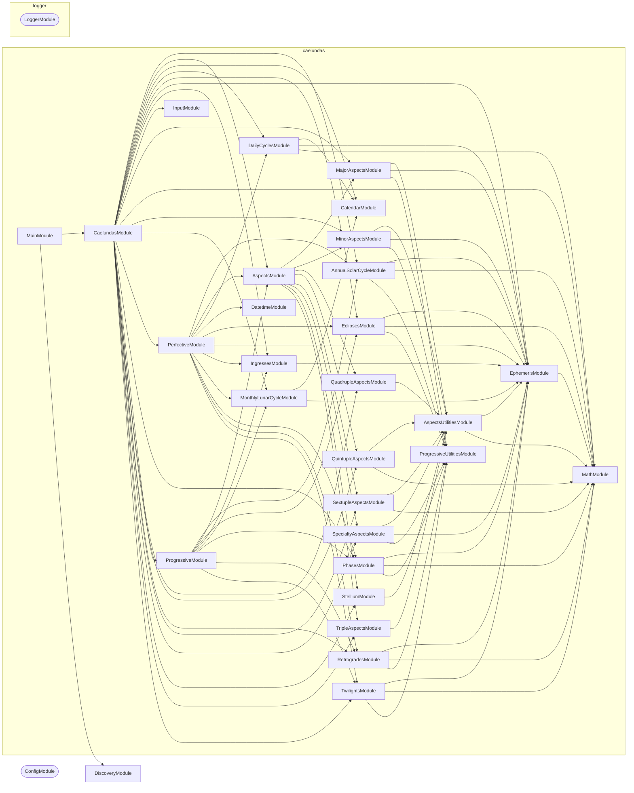

# Caelundas: NestJS Command-Line Application

## Quick Start

**Type**: Node.js CLI application (NestJS + `nest-commander`)

**Purpose**: <!-- Briefly describe the specific purpose of this CLI application -->

Generate astronomical event calendars using NASA's JPL Horizons API (Outputs: iCalendar `.ics` and JSON files)

### Run Locally

```bash
cp .env.default .env  # Fill in required environment variables
nx run caelundas:start
```

## Architecture Overview

### Tech Stack

- **Framework**: NestJS (modules, dependency injection, providers)
- **CLI runner**: `nest-commander` (`CommandRunner` + `@Command()` decorator)
- **Env validation**: `@nestjs/config` + `zod` (`environmentSchema` in `.constants.ts`)
- **Logging**: `@codebase/logger` — a `pino`-backed `LoggerService` (`Scope.TRANSIENT`)
- **Database**: SQLite (local caching of NASA API responses)
- **Language**: Strict TypeScript

### Execution Flow

```text
src/main.ts
  └─ CommandFactory.run(MainModule)
       └─ domain command modules            ← add under src/modules/
```

**Project Implementation**:

```text
src/main.ts
  └─ CommandFactory.run(MainModule)
       └─ CaelundasCommand.run()
            ├─ Input (ENV) Validation      ← InputService.parse()
            ├─ NASA API + SQLite Ephemeris ← EphemerisService (via Perfective/Progressive)
            ├─ Perfective Event Detection  ← PerfectiveService.detect()
            ├─ Progressive Event Synthesis ← ProgressiveService.detect()
            └─ iCal Output Generation      ← CalendarService.write()
```

### Directory Layout

```text
src/
  main.ts                           # Bootstrap — do not modify
  main.module.ts                    # Root NestJS module (imports ConfigModule, LoggerModule)
  constants.ts                      # Zod environmentSchema for env validation
  modules/
    <domain>/                       # Add feature modules here
      <domain>.module.ts
      <domain>.command.ts
      <domain>.service.ts
      <domain>.types.ts
      <domain>.constants.ts
      <domain>.<tier>.test.ts
testing/                            # Shared test utilities
```

**Project Domain Modules**:

```text
src/modules/
  input/                               # Zod environmentSchema and config parsing
  calendar/                            # ICS and JSON file output formatting
  ephemeris/                           # NASA JPL Horizons API client and SQLite caching
  perfective/                          # Exact moment event detection (aspects, phases)
  progressive/                         # Duration event synthesis (retrogrades)
  math/                                # Astronomical math utilities
  <domain>/                            # Other specialized astronomical domain modules
```

**Key Domain Components**:

- **Input Validation** ([input.constants.ts](src/modules/input/input.constants.ts)): Zod schema for environment variables
- **Ephemeris Retrieval** ([ephemeris/](src/modules/ephemeris/)): NASA JPL Horizons API with SQLite caching
- **Event Detection** ([perfective/](src/modules/perfective/) and domain modules): Aspects, phases, eclipses, retrogrades
- **Progressive Synthesis** ([progressive/](src/modules/progressive/)): Pairs start/end moments into calendar events
- **Output** ([calendar/](src/modules/calendar/)): iCal and JSON formatters

### Module Graph

The modules this project defines and the imports between them, published by `nx run synchronization:synchronize --configuration=write`.

<!-- nestjs-module-graph-start -->



_Rounded modules are global: every module can inject them, so their edges are left out._

<!-- nestjs-module-graph-end -->

### Event Types

- **Aspects**: Conjunctions (0°), oppositions (180°), squares (90°), trines (120°), sextiles (60°)
- **Phases**: New moon, full moon, first/last quarters
- **Retrogrades**: Apparent backward motion of planets
- **Eclipses**: Solar and lunar
- **Ingresses**: Planets entering zodiac signs
- **Cycles**: Solstices, equinoxes, moonrise/moonset, sunrise/sunset, twilights

## Domain Knowledge

See [ephemeris-pipeline skill](../../.agents/skills/ephemeris-pipeline/SKILL.md) for:

- NASA JPL Horizons API details (endpoints, parameters, rate limits)
- Astronomical concepts (aspects, retrogrades, phases explained)
- Caching strategy (SQLite schema, temporal margins)
- Event detection algorithms

## Development

### Adding Business Logic

1. **Implement the root command** — add logic to `caelundas.command.ts` `run()`, or delegate to injected services.
2. **Add domain command modules** — create `src/modules/<domain>/` with a NestJS module, command, service, types, and constants.
3. **Register in root module** — import the new module in `main.module.ts`.
4. **Validate env vars** — extend `environmentSchema` in `constants.ts` with all required environment variables.

### Logging

`LoggerService` and `LoggerModule` come from `@codebase/logger` — this project does not define its own logger. Add `"@codebase/logger": "workspace:*"` to `dependencies`, then import `LoggerModule` once in the root module; it is `@Global()`, so feature modules inject `LoggerService` without importing it.

`LoggerService` is `Scope.TRANSIENT` — each injecting class gets its own instance. Always call `setContext` in the constructor:

```ts
constructor(private readonly logger: LoggerService) {
  super();
  this.logger.setContext(MyService.name);
}
```

Outputs structured JSON in production (`NODE_ENV=production`) and pretty-printed logs in development.

### Key Commands

Always prefer running tasks through Nx rather than calling the underlying tools directly.

```bash
nx run caelundas:start           # Run the command-line application
nx run caelundas:lint-codebase   # Every static check, in one graph
nx run caelundas:typecheck       # tsc --noEmit
nx run caelundas:oxfmt           # Formatting
```

### Testing

Follow the codebase's strict three-tier testing strategy. Co-locate test files with the source they test.

```bash
nx run caelundas:vitest:unit          # Fast (<100ms) — pure logic, mocked DI
nx run caelundas:vitest:integration   # Moderate (1-2s) — real database/API I/O
nx run caelundas:vitest:end-to-end    # Slow (30-60s) — full CLI execution
```

| Tier | File pattern | What to test |
| ---- | ------------ | ------------ |
| Unit | `*.unit.test.ts` | Pure functions, service methods with mocked deps |
| Integration | `*.integration.test.ts` | Database queries, external API clients |
| End-to-end | `*.end-to-end.test.ts` | Full `CommandFactory.run()` execution |

See the [testing-strategy skill](../../.agents/skills/testing-strategy/SKILL.md) and [testing-mocks skill](../../.agents/skills/testing-mocks/SKILL.md) for patterns and mock conventions.

### Environment Variables

Required:

- `START_DATE`, `END_DATE`: YYYY-MM-DD (inclusive range)
- `LATITUDE`, `LONGITUDE`: Decimal degrees
- `TIMEZONE`: IANA timezone (e.g., "America/New_York")

Optional:

- `EVENT_TYPES`: Comma-separated list (defaults to all)
- `OUTPUT_FORMAT`: `ical` or `json` (defaults to `ical`)
- `OUTPUT_DIRECTORY`: Directory path (defaults to `./output`)

Full schema: [src/modules/input/input.constants.ts](src/modules/input/input.constants.ts)

### Database

SQLite with three tables:

- `ephemeris`: Cached NASA API responses
- `events`: Detected calendar events
- `active_aspects`: Currently active aspect patterns

Inspect: `sqlite3 caelundas.db`

## Kubernetes Deployment

### Architecture

Caelundas runs as a **Kubernetes Job** (not Deployment):

- Single execution, terminates on completion
- Output stored in PersistentVolumeClaim
- No network exposure needed

### Workflow

```bash
# 1. Build and push image
nx run caelundas:docker-build
docker push ghcr.io/jimmypaolini/caelundas:latest

# 2. Deploy Job (auto-generated release name)
nx run caelundas:helm-upgrade

# 3. Monitor completion
kubectl wait --for=condition=complete job/<job-name> --timeout=600s

# 4. Retrieve output files
nx run caelundas:kubernetes-copy-files

# 5. Clean up
nx run caelundas:helm-uninstall
kubectl delete pvc caelundas-output
```

### Helm Chart

Uses [infrastructure/helm/kubernetes-job](../../infrastructure/helm/kubernetes-job) - reusable chart for batch jobs with PVC storage.

**Values**: [infrastructure/helm/kubernetes-job/values/caelundas-production.yaml](../../infrastructure/helm/kubernetes-job/values/caelundas-production.yaml)

See [kubernetes-deployment skill](../../.agents/skills/kubernetes-deployment/SKILL.md) for Helm chart details.

### Environment Variables in K8s

Stored as Kubernetes Secret (`caelundas-env-secret`):

```bash
kubectl apply -f applications/caelundas/kubernetes/secret.yaml
```

## Docker Workflow

### Build

```bash
nx run caelundas:docker-build  # Builds for linux/amd64
```

**Platform targeting**: Always use `linux/amd64` for K8s deployment (Apple Silicon compatibility).

See [docker-workflows skill](../../.agents/skills/docker-workflows/SKILL.md) for multi-stage builds and GHCR integration.

### Dockerfile

Single-stage build:

- Base: Node.js 20 Alpine
- Native deps: python3, make, g++ (for sqlite3 compilation)
- Workspace: Full codebase copied (needed for path resolution)
- Entry: `pnpm start` (runs TypeScript directly via tsx)

## Performance

**Execution times** (1-year range, all event types):

- First run (empty cache): 8-12 minutes (NASA API calls)
- Subsequent runs (warm cache): 1-2 minutes (local computation)

**Optimization strategies**:

- Temporal margins: Fetch beyond date boundaries to catch edge events
- SQLite caching: ~95% hit rate after first run
- Batch API calls: Multiple days per request when possible
- Lazy evaluation: Minute-resolution only for detected event windows

## Writing Modules

Use the generator to scaffold new domain modules, then implement the service:

```bash
nx g conformetry:nestjs-service-module --name=<domain>
```

This creates five files in `src/modules/<domain>/`:

| File | Purpose |
| ---- | ------- |
| `<domain>.module.ts` | Declares providers, imports, and exports |
| `<domain>.service.ts` | Business logic — the only place you write domain code |
| `<domain>.constants.ts` | Regex, enums, static config — never inline magic values |
| `<domain>.types.ts` | TypeScript types scoped to this module |
| `<domain>.service.unit.test.ts` | Unit tests bootstrapped with `Test.createTestingModule` |

### Module file

Register the service in both `providers` and `exports` so consumers can inject it:

```ts
@Module({
  controllers: [],
  exports: [MyDomainService],
  imports: [TypeOrmModule.forFeature([MyEntity]), LoggerModule],
  providers: [MyDomainService],
})
export class MyDomainModule {}
```

Add a JSDoc comment on the module class describing what domain it owns.

### Service file

Follow the section-comment layout from the template — it keeps large services scannable:

```ts
@Injectable()
export class MyDomainService {
  // 🏗 Dependency Injection
  constructor(
    @InjectRepository(MyEntity)
    private readonly repo: Repository<MyEntity>,
    private readonly logger: LoggerService,
  ) {
    this.logger.setContext(MyDomainService.name);
  }

  // 🔐 Private Fields

  // 🔑 Public Fields

  // 🔏 Private Methods

  // 🌎 Public Methods
}
```

Key rules:

- **Call `setContext` in every constructor** — always use `MyClass.name`, never a string literal.
- **Inject `LoggerService` as the last constructor parameter** (after repository/domain deps).
- **Private first** — keep internal helpers in the `🔏 Private Methods` section, expose only what callers need under `🌎 Public Methods`.
- **`readonly` everything in the constructor** — all injected deps must be `private readonly`.
- **One service per module** — if a service grows too large, extract a sub-domain into its own module.
- **Class-only top level** — keep NestJS class files to imports plus the class declaration only. Move helper interfaces/types to `<domain>.types.ts`, constants/init helpers to `<domain>.constants.ts` or class members, and do not re-export aliases or types from `*.service.ts`.

### Constants file

Move all inline values to `.constants.ts` to keep services readable:

```ts
// ♟️ Constants
export const MY_SKIP_REGEX = /(alternative)|(archaic)|(synonym)/i;
export const DEFAULT_PAGE_SIZE = 100;
```

### Types file

Put all module-local TypeScript types and interfaces in `.types.ts`:

```ts
// 🏷️ Types
export interface ParsedEntry {
  word: string;
  partOfSpeech: string;
}
```

Do not re-export types from `index.ts` unless they are part of the public API consumed by other modules.

### Registering in the root module

After generating a module, import it in main.module.ts:

```ts
@Module({
  imports: [
    ConfigModule.forRoot({ ... }),
    LoggerModule,
    MyDomainModule,   // ← add here
  ],
  providers: [],
})
export class MainModule {}
```

### Conformetry validation

Conformetry validation measures generated and existing module structures against the templates they came from. It runs for one project, or for every project at once.

```bash
pnpm nx run-many --targets=conformetry-validate
```

## Best Practices

- **Never** put business logic in `main.ts` — it bootstraps `CommandFactory` only.
- **One command per class** — split sub-commands into separate `CommandRunner` subclasses.
- **Validate at the boundary** — all env vars must be declared in `environmentSchema`; access via `ConfigService`, not `process.env`.
- **Type imports** — use `import { type Foo }` for type-only imports (enforced by ESLint).
- **No `any` types** — use `unknown` or proper typing; strict mode is enabled.

See the [write-typescript skill](../../.agents/skills/write-typescript/SKILL.md) for strict mode patterns.

## Troubleshooting

- **Command not found at runtime** — ensure the command class is listed in `providers` of its module and the module is imported by the root module.
- **Dependency injection failure** — verify the service is `@Injectable()`, exported from its module, and that module is imported by the consuming module.
- **Unrecognized CLI flag** — check that `@Option()` decorators in the command class exactly match the flag names passed.
- **Env var validation error on startup** — add the missing variable to environmentSchema in src/constants.ts and to .env.default.
- **TypeORM entity not found** — register the entity via `TypeOrmModule.forFeature([MyEntity])` in the module that uses it.

See the [triage-submission skill](../../.agents/skills/triage-submission/SKILL.md) for lint and git hook failures.

**Project-Specific Gotchas**:

- Docker platform mismatch (exec format error)
- K8s Job not starting (image pull, PVC issues)
- PVC cleanup after job completion

## Key Files

- [src/main.ts](src/main.ts): Application bootstrap
- [src/modules/caelundas/caelundas.command.ts](src/modules/caelundas/caelundas.command.ts): Root CLI command
- [src/main.module.ts](src/main.module.ts): Root NestJS module
- [src/constants.ts](src/constants.ts): environmentSchema (Zod)
- `@codebase/logger` (`packages/logger`): shared pino-backed `LoggerService` and `LoggerModule`
- [project.json](project.json): Nx targets (`develop`, `build`, `test`, `lint`, `typecheck`, `format`)
- [.env.default](.env.default): Environment variable template

**Project Files**:

- `caelundas.command.ts` includes pipeline orchestration
- `input.constants.ts` includes Zod validation
- `ephemeris.service.ts` includes NASA API client
- `calendar.service.ts` includes ICS/JSON generation
- `Dockerfile` includes container build config
