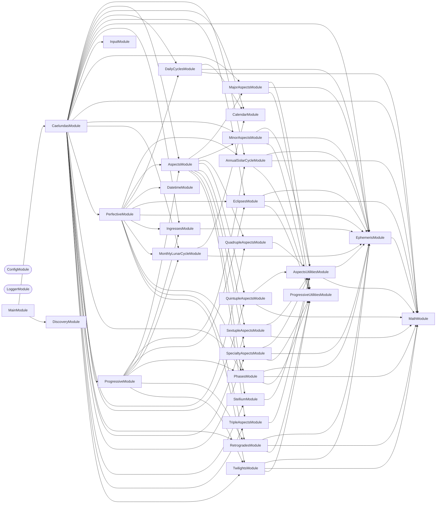

# 🛰️ Caelundas

**Turn the sky into a calendar.**

Caelundas computes planetary positions minute by minute over a date range,
detects the astronomical events in them — aspects, phases, eclipses,
retrogrades, ingresses, solstices, twilights — and writes an iCalendar file you
can subscribe to in Google Calendar, Apple Calendar, or anything else that
reads `.ics`.

## Quick Start

```bash
# 1. Download the Swiss Ephemeris data files (one-time, ~90 MB)
nx run caelundas:download-ephemeris

# 2. Configure your observer location and date range
cp applications/caelundas/.env.default applications/caelundas/.env

# 3. Generate the calendar
nx run caelundas:start
```

The result lands in `output/caelundas_<start>_<end>.ics`. Import it, or point a
calendar subscription at it.

## Configuration

All input comes from environment variables, validated on startup.

```bash
LATITUDE="39.949309"          # Observer latitude, -90 to 90
LONGITUDE="-75.17169"         # Observer longitude, -180 to 180
START_DATE="2026-07-01"       # YYYY-MM-DD
END_DATE="2026-07-31"         # YYYY-MM-DD
OUTPUT_DIRECTORY="./output"
```

Every field is optional. Location defaults to Philadelphia, and the date range
to a two-month window centered on today.

The **timezone is derived from your coordinates** rather than configured
separately — a calendar whose location and timezone could disagree is a
calendar with silently wrong sunrise times. Supported dates run from
`1900-01-01` to `2100-12-31`, the span of the ephemeris data.

## Ephemeris

Positions come from the [Swiss Ephemeris](https://www.astro.com/swisseph/)
(`sweph`), computed locally from JPL DE431 data files — no network calls, no
API keys, no rate limits. The data files are not committed; download them once
with `nx run caelundas:download-ephemeris` into `data/ephemeris/`.

## Events

Detection runs in two passes.

**Perfective** — the moment something is exact. Ephemerides are computed
day by day and scanned at minute resolution for the instant an aspect
perfects, a planet stations, or a body crosses a sign boundary.

**Progressive** — the span around it. The same domain services turn those exact
moments into the periods a reader actually wants on a calendar: the days an
aspect is in orb, the weeks a planet is retrograde.

| Category | Events |
| -------- | ------ |
| Aspects | Major and minor aspects, plus triple, quadruple, quintuple, and sextuple configurations and stelliums |
| Phases | New moon, first quarter, full moon, last quarter |
| Eclipses | Solar and lunar |
| Retrogrades | Stations and retrograde periods |
| Ingresses | Bodies entering a zodiac sign |
| Annual solar cycle | Solstices, equinoxes, cross-quarter points |
| Monthly lunar cycle | Apogee and perigee |
| Daily cycles | Sunrise, sunset, moonrise, moonset |
| Twilights | Civil, nautical, and astronomical |

## Structure

```text
src/
├── main.ts                  # CommandFactory bootstrap
├── constants.ts             # Environment schema (Zod)
└── modules/
    ├── caelundas/           # Root command — the pipeline
    ├── input/               # Coordinate and date validation, timezone lookup
    ├── ephemeris/           # Swiss Ephemeris access: positions, horizons, phenomena
    ├── perfective/          # Exact-moment detection across every event service
    ├── progressive/         # Spans derived from those moments
    ├── calendar/            # iCalendar rendering and output
    ├── datetime/, math/     # Time stepping and angular arithmetic
    └── aspects/, phases/, eclipses/, retrogrades/, ingresses/,
        annual-solar-cycle/, monthly-lunar-cycle/, daily-cycles/,
        twilights/, stellium/, …   # One service per event family
```

## Start

Generate a calendar from the configured location and date range:

```bash
nx run caelundas:start
```

## Test

```bash
nx run caelundas:vitest
```

```bash
nx run caelundas:vitest:unit          # Fast tests only
nx run caelundas:vitest:end-to-end    # Full pipeline
```

## Development

```bash
nx run caelundas:repl                 # NestJS REPL against the graph
nx run caelundas:typecheck
nx run caelundas:lint-codebase --configuration=write
```

See [AGENTS.md](AGENTS.md) for the astronomical domain concepts, event
detection algorithms, and testing strategy.

## Etymology

**Caelundas** — a portmanteau of _caelum_ (Latin: sky, heavens) and _calendar_.

## License

MIT — see [LICENSE](../../LICENSE).

## 👔 Conformetry

This project was generated from the [nestjs-command-project](../../configuration/conformetry-templates/nestjs-command-project) conformetry template.

<!-- CALL_STACKS_START -->

## 🔭 Callidescope

Call stacks traced through `applications/caelundas`, deepest first. Each frame shows what it takes, what it returns, and what its documentation says.

| Measure | Value |
| --- | --- |
| Callables | 838 |
| Files | 156 |
| Calls traced | 990 |
| Call stacks | 80 |
| Deepest stack | 17 |
| Stacks through recursion | 0 |
| Unfollowable calls | 26 |

### Call stacks (depth)

**1. `CaelundasCommand.run`** — depth ≥ 17 · decorated-method

```text
🚀 CaelundasCommand.run(): Promise<void> [applications/caelundas/src/modules/caelundas/caelundas.command.ts:59]
   ↳ Executes the full calendar generation pipeline.
  └─> PerfectiveService.detect(input: Input): Event[] [applications/caelundas/src/modules/perfective/perfective.service.ts:203]
     ↳ Detects all perfective (instantaneous) astronomical events within the given date range.
    └─> PerfectiveService.detectDayEvents(…): { events: Event[]; previousAspectBodies: AspectBodies[]; } [applications/caelundas/src/modules/perfective/perfective.service.ts:59]
       ↳ Sweeps one day minute-by-minute, aggregating perfective events and rolling aspect state forward.
      └─> PerfectiveService.detectMinuteEvents(…): { aspectBodies: AspectBodies[]; events: Event[]; } [applications/caelundas/src/modules/perfective/perfective.service.ts:97]
         ↳ Detects all minute-level event families and returns both events and updated aspect-body state.
        └─> AspectsService.detect(…): { aspectBodies: AspectBodies[]; events: Event[]; } [applications/caelundas/src/modules/aspects/aspects.service.ts:185]
           ↳ Detects all aspect events at a single minute, including 2-body and multi-body patterns.
          └─> AspectsService.detectSimpleAspects(…): Event[] [applications/caelundas/src/modules/aspects/aspects.service.ts:90]
             ↳ Runs all simple-aspect detectors for a minute and flattens their detected events.
            └─> PhasesService.detect(args: DetectPlanetaryEventsArguments): Event[] ⚠ deprecated [applications/caelundas/src/modules/phases/phases.service.ts:52]
               ↳ Detects all planetary phase events for a given minute. Combines detection from all three planets (Venus, Mercury, Mars).
              └─> PhasesService.getMercurianPhaseEvents(args: MercurianPhaseEventArguments): Event[] [applications/caelundas/src/modules/phases/phases.service.ts:161]
                 ↳ Produces Mercurian morning/evening phase events for one minute.
                └─> MercurianPhaseService.getMercurianPhaseEvents(args: MercurianPhaseEventArguments): Event[] [applications/caelundas/src/modules/phases/mercurian-phase.service.ts:213]
                   ↳ Produces Mercurian morning/evening phase events for one minute.
                  └─> MercurianPhaseService.detectMercurianMorningPhases(parameters: PhaseParameters, minute: Moment): Event[] [applications/caelundas/src/modules/phases/mercurian-phase.service.ts:91]
                     ↳ Detects mercurian morning phases.
                    └─> PhaseCalculationService.isWesternBrightest(args: BrightnessLongitudeArguments): boolean [applications/caelundas/src/modules/phases/phase-calculation.service.ts:469]
                       ↳ Determines whether planet is brightest while western.
                      └─> PhaseCalculationService.isBrightest(args: BrightnessesArguments): boolean [applications/caelundas/src/modules/phases/phase-calculation.service.ts:308]
                         ↳ Determines whether planet is brightest among previous and next margin samples.
                        └─> PhaseCalculationService.getBrightnesses(…): { currentBrightness: number; nextBrightnesses: number[]; previousBrightnesses: number[]; } [applications/caelundas/src/modules/phases/phase-calculation.service.ts:275]
                           ↳ Derives brightnesses from current and margin illumination/distance samples.
                          └─> PhaseCalculationService.getBrightnessesResult(…): { currentBrightness: number; nextBrightnesses: number[]; previousBrightnesses: number[]; } [applications/caelundas/src/modules/phases/phase-calculation.service.ts:59]
                             ↳ Derives brightnesses result.
                            └─> PhaseCalculationService.mapBrightnessArray(distances: number[], illuminations: number[], label: string): number[] [applications/caelundas/src/modules/phases/phase-calculation.service.ts:92]
                               ↳ Handles map brightness array.
                              └─> PhaseCalculationService.map(…)(distance: number, index: number): number [applications/caelundas/src/modules/phases/phase-calculation.service.ts:102]
                                └─> PhaseCalculationService.getBrightness(args: BrightnessArguments): number [applications/caelundas/src/modules/phases/phase-calculation.service.ts:52]
                                   ↳ Derives brightness.
```

**2. `IngressesService.buildDecanIngressEvent`** — depth 7 · orphan-root

```text
🚀 IngressesService.buildDecanIngressEvent(args: { body: Body; date: Moment; longitude: number; }): Event [applications/caelundas/src/modules/ingresses/ingresses.service.ts:91]
   ↳ Delegates decan-ingress event construction to the composer service.
  └─> IngressesComposerService.buildDecanIngressEvent(args: { body: Body; date: Moment; longitude: number; }): Event [applications/caelundas/src/modules/ingresses/ingresses-composer.service.ts:94]
     ↳ Creates a decan ingress calendar event.
    └─> IngressesComposerService.buildDecanIngressEventObject(args: { body: Body; date: Moment; longitude: number; }): Event [applications/caelundas/src/modules/ingresses/ingresses-composer.service.ts:110]
       ↳ Builds the decan ingress payload without logging side effects.
      └─> IngressesComposerService.resolveDecan(longitude: number): Decan [applications/caelundas/src/modules/ingresses/ingresses-composer.service.ts:414]
         ↳ Converts numeric decan to the validated `Decan` union and throws on invalid values.
        └─> IngressesComposerService.getDecan(longitude: number): number [applications/caelundas/src/modules/ingresses/ingresses-composer.service.ts:291]
           ↳ Maps longitude to decan number (1-3) relative to the current sign start degree.
          └─> IngressesComposerService.getSign(longitude: number): Sign [applications/caelundas/src/modules/ingresses/ingresses-composer.service.ts:73]
             ↳ Maps an ecliptic longitude to its containing zodiac sign range.
            └─> IngressesComposerService.find(…)(…): boolean [applications/caelundas/src/modules/ingresses/ingresses-composer.service.ts:76]
```

**3. `MajorAspectsService.detectAspectForBodyPair`** — depth ≥ 7 · orphan-root

```text
🚀 MajorAspectsService.detectAspectForBodyPair(args: DetectAspectForBodyPairArguments): Event | null [applications/caelundas/src/modules/major-aspects/major-aspects.service.ts:59]
   ↳ Detects aspect for body pair.
  └─> MajorAspectsService.buildMajorAspectEvent(…): Event [applications/caelundas/src/modules/major-aspects/major-aspects.service.ts:124]
     ↳ Resolves the active major aspect for two bodies and assembles a typed event.
    └─> MajorAspectEventService.buildMajorAspectEvent(…): Event [applications/caelundas/src/modules/major-aspects/major-aspect-event.service.ts:121]
       ↳ Resolves and builds a typed major-aspect event for two body longitudes.
      └─> MajorAspectEventService.getMajorAspect(args: { longitudeBody1: number; longitudeBody2: number; }): MajorAspect | null [applications/caelundas/src/modules/major-aspects/major-aspect-event.service.ts:156]
         ↳ Returns the first in-orb major aspect for two longitudes.
        └─> AspectsUtilitiesService.isAspect(…): boolean [applications/caelundas/src/modules/aspects/aspects-utilities.service.ts:309]
           ↳ Returns `true` when the angular separation between two bodies falls within the configured orb for the given aspect.
          └─> MathService.getAngle(longitude1: Longitude, longitude2: Longitude): number [applications/caelundas/src/modules/math/math.service.ts:69]
             ↳ Calculates the shortest angular distance between two ecliptic longitudes.
            └─> MathService.normalizeDegrees(degrees: number): number [applications/caelundas/src/modules/math/math.service.ts:155]
               ↳ Normalizes an angle in degrees to the range [0, 360).
```

<details>
<summary>77 more call stacks</summary>

**4. `SextupleAspectsService.checkPatternExists`** — depth 6 · orphan-root

```text
🚀 SextupleAspectsService.checkPatternExists(edges: AspectBodies[]): boolean [applications/caelundas/src/modules/sextuple-aspects/sextuple-aspects.service.ts:80]
  └─> SextupleAspectsComposerService.findHexagramPattern(bodies: Body[], edges: AspectBodies[]): Body[] | null [applications/caelundas/src/modules/sextuple-aspects/sextuple-aspects-composer.service.ts:269]
     ↳ Checks if 6 bodies form a valid hexagram (Star of David) pattern.
    └─> SextupleAspectsComposerService.findValidHexagonArrangement(…): ("lunar apogee" | "lunar perigee" | "north lunar node" | "south lunar node" | "ceres" | "chiron" | "juno" | "lilith" | "pallas" | "vesta" | "jupiter" | "mars" | "mercury" | ... 6 more ... | "venus")[] | null [applications/caelundas/src/modules/sextuple-aspects/sextuple-aspects-composer.service.ts:292]
       ↳ Finds valid hexagon arrangement.
      └─> SextupleAspectsComposerService.tryHexagonArrangement(…): ("lunar apogee" | "lunar perigee" | "north lunar node" | "south lunar node" | "ceres" | "chiron" | "juno" | "lilith" | "pallas" | "vesta" | "jupiter" | "mars" | "mercury" | ... 6 more ... | "venus")[] | null [applications/caelundas/src/modules/sextuple-aspects/sextuple-aspects-composer.service.ts:454]
         ↳ Tries to hexagon arrangement.
        └─> SextupleAspectsComposerService.tryArrangementForPair(…): ("lunar apogee" | "lunar perigee" | "north lunar node" | "south lunar node" | "ceres" | "chiron" | "juno" | "lilith" | "pallas" | "vesta" | "jupiter" | "mars" | "mercury" | ... 6 more ... | "venus")[] | null [applications/caelundas/src/modules/sextuple-aspects/sextuple-aspects-composer.service.ts:420]
           ↳ Tries to arrangement for pair.
          └─> SextupleAspectsComposerService.find(…)(x: number): boolean [applications/caelundas/src/modules/sextuple-aspects/sextuple-aspects-composer.service.ts:431]
```

**5. `TripleAspectsService.detectProgressive`** — depth 6 · orphan-root

```text
🚀 TripleAspectsService.detectProgressive(events: Event[]): Event[] [applications/caelundas/src/modules/triple-aspects/triple-aspects.service.ts:111]
   ↳ Builds duration events by pairing forming/dissolving events per triple-aspect group key.
  └─> TripleAspectsComposerService.pairProgressiveGroup(groupEvents: Event[]): Event[] [applications/caelundas/src/modules/triple-aspects/triple-aspects-composer.service.ts:434]
     ↳ Pairs sorted forming/dissolving events for one triple-aspect group key.
    └─> TripleAspectsComposerService.pairProgressiveGroupPairs(formingEvents: Event[], dissolvingEvents: Event[]): Event[] [applications/caelundas/src/modules/triple-aspects/triple-aspects-composer.service.ts:166]
       ↳ Pairs progressive group pairs.
      └─> TripleAspectsComposerService.buildProgressiveEvent(…): Event | null [applications/caelundas/src/modules/triple-aspects/triple-aspects-composer.service.ts:281]
         ↳ Builds one triple-aspect duration event from a forming/dissolving pair.
        └─> TripleAspectsComposerService.buildProgressiveBodiesMeta(forming: Event, aspectCapitalized: string): null | ProgressiveBodiesMeta [applications/caelundas/src/modules/triple-aspects/triple-aspects-composer.service.ts:49]
           ↳ Builds progressive bodies meta.
          └─> TripleAspectsComposerService.map(…)(…): string [applications/caelundas/src/modules/triple-aspects/triple-aspects-composer.service.ts:54]
```

**6. `EclipseCalculationService.isLunarTopocentricActive`** — depth 6 · orphan-root

```text
🚀 EclipseCalculationService.isLunarTopocentricActive(coordinates: EclipseCoordinates, isVisible: boolean): boolean [applications/caelundas/src/modules/eclipses/eclipse-calculation.service.ts:336]
   ↳ Checks whether lunar eclipse is active and visible from observer location.
  └─> EclipseTopocentricService.isLunarTopocentricActive(coordinates: EclipseCoordinates, isVisible: boolean): boolean [applications/caelundas/src/modules/eclipses/eclipse-topocentric.service.ts:239]
     ↳ Checks whether lunar eclipse is active and visible from observer location.
    └─> EclipseTopocentricService.isLunarEclipseActive(current: EclipseCoordinates): boolean [applications/caelundas/src/modules/eclipses/eclipse-topocentric.service.ts:225]
       ↳ Checks whether lunar geometry is currently within eclipse limits.
      └─> EclipseTopocentricService.getCurrentAnglesAndDiameter(…): { currentDiameter: number; currentLatitudeAngle: number; currentLongitudeAngle: number; } [applications/caelundas/src/modules/eclipses/eclipse-topocentric.service.ts:41]
         ↳ Derives current longitude/latitude separation angles and eclipse diameter sum.
        └─> MathService.getAngle(longitude1: Longitude, longitude2: Longitude): number [applications/caelundas/src/modules/math/math.service.ts:69]
           ↳ Calculates the shortest angular distance between two ecliptic longitudes.
          └─> MathService.normalizeDegrees(degrees: number): number [applications/caelundas/src/modules/math/math.service.ts:155]
             ↳ Normalizes an angle in degrees to the range [0, 360).
```

**7. `EclipseCalculationService.isSolarTopocentricActive`** — depth 6 · orphan-root

```text
🚀 EclipseCalculationService.isSolarTopocentricActive(coordinates: EclipseCoordinates, isVisible: boolean): boolean [applications/caelundas/src/modules/eclipses/eclipse-calculation.service.ts:389]
   ↳ Checks whether solar eclipse is active and visible from observer location.
  └─> EclipseTopocentricService.isSolarTopocentricActive(coordinates: EclipseCoordinates, isVisible: boolean): boolean [applications/caelundas/src/modules/eclipses/eclipse-topocentric.service.ts:262]
     ↳ Checks whether solar eclipse is active and visible from observer location.
    └─> EclipseTopocentricService.isSolarEclipseActive(current: EclipseCoordinates): boolean [applications/caelundas/src/modules/eclipses/eclipse-topocentric.service.ts:249]
       ↳ Checks whether solar geometry is currently within eclipse limits.
      └─> EclipseTopocentricService.getCurrentAnglesAndDiameter(…): { currentDiameter: number; currentLatitudeAngle: number; currentLongitudeAngle: number; } [applications/caelundas/src/modules/eclipses/eclipse-topocentric.service.ts:41]
         ↳ Derives current longitude/latitude separation angles and eclipse diameter sum.
        └─> MathService.getAngle(longitude1: Longitude, longitude2: Longitude): number [applications/caelundas/src/modules/math/math.service.ts:69]
           ↳ Calculates the shortest angular distance between two ecliptic longitudes.
          └─> MathService.normalizeDegrees(degrees: number): number [applications/caelundas/src/modules/math/math.service.ts:155]
             ↳ Normalizes an angle in degrees to the range [0, 360).
```

**8. `downloadEphemerisFiles`** — depth ≥ 5 · orphan-root

```text
🚀 downloadEphemerisFiles(): Promise<void> [applications/caelundas/scripts/download-ephemeris.ts:25]
   ↳ Downloads required ephemeris data files into the local data directory.
  └─> downloadFile(url: string, destination: string): Promise<void> [applications/caelundas/scripts/download-ephemeris.ts:48]
     ↳ Streams a remote ephemeris file to disk and removes partial files on failure.
    └─> anonymous(…): void [applications/caelundas/scripts/download-ephemeris.ts:49]
      └─> get(…)(response: IncomingMessage): void [applications/caelundas/scripts/download-ephemeris.ts:52]
        └─> on(…)(): void [applications/caelundas/scripts/download-ephemeris.ts:64]
```

**9. `EphemerisService.getAzimuthElevationEphemerisByBody`** — depth 5 · orphan-root

```text
🚀 EphemerisService.getAzimuthElevationEphemerisByBody(…): Record<"lunar apogee" | "lunar perigee" | "north lunar node" | "south lunar node" | "ceres" | "chiron" | "juno" | "lilith" | "pallas" | "vesta" | "jupiter" | "mars" | "mercury" | ... 6 more ... | "venus", AzimuthElevationEphemeris> [applications/caelundas/src/modules/ephemeris/ephemeris.service.ts:173]
   ↳ Computes minute-by-minute horizontal coordinates (azimuth, apparent elevation) for the requested bodies at the…
  └─> EphemerisHorizonService.computeAzimuthElevationForBody(…): AzimuthElevationEphemeris [applications/caelundas/src/modules/ephemeris/ephemeris-horizon.service.ts:42]
     ↳ Computes minute-by-minute horizontal coordinates (azimuth, apparent elevation) for a single body at the observer's…
    └─> EphemerisCoordinateService.getBodyCoordinatesWithDistance(…): { distance: number; latitude: number; longitude: number; } [applications/caelundas/src/modules/ephemeris/ephemeris-coordinate.service.ts:197]
       ↳ Computes body ecliptic coordinates (longitude, latitude, distance). Used internally by horizon and aggregation services.
      └─> EphemerisCoordinateService.computeBodyCoordinates(…): { distance: number; latitude: number; longitude: number; } [applications/caelundas/src/modules/ephemeris/ephemeris-coordinate.service.ts:40]
         ↳ Computes body ecliptic coordinates (longitude, latitude, distance).
        └─> EphemerisConstantsService.getSwissEphemerisConstantForBody(body: Exclude<Body, Node>): number [applications/caelundas/src/modules/ephemeris/ephemeris-constants.service.ts:36]
           ↳ Looks up the Swiss Ephemeris constant for a non-node body (planet or asteroid).
```

**10. `EphemerisService.getCoordinateEphemerisByBody`** — depth 5 · orphan-root

```text
🚀 EphemerisService.getCoordinateEphemerisByBody(…): Record<"lunar apogee" | "lunar perigee" | "north lunar node" | "south lunar node" | "ceres" | "chiron" | "juno" | "lilith" | "pallas" | "vesta" | "jupiter" | "mars" | "mercury" | ... 6 more ... | "venus", CoordinateEphemeris> [applications/caelundas/src/modules/ephemeris/ephemeris.service.ts:218]
   ↳ Computes minute-by-minute ecliptic coordinates for all requested bodies.
  └─> EphemerisCoordinateService.computeNodeBodyMinutes(args: { body: Node; end: Moment; start: Moment; }): CoordinateEphemeris [applications/caelundas/src/modules/ephemeris/ephemeris-coordinate.service.ts:173]
     ↳ Computes minute-by-minute coordinates for a node (lunar/solar nodes and lunar perigee).
    └─> EphemerisCoordinateService.computeNodeCoordinate(…): { latitude: number; longitude: number; } [applications/caelundas/src/modules/ephemeris/ephemeris-coordinate.service.ts:87]
       ↳ Computes node coordinate (lunar node or perigee). Dispatches to the appropriate computation based on node type.
      └─> EphemerisCoordinateService.computeLunarPerigeeCoordinate(julianDayUniversalTime: number): { latitude: number; longitude: number; } [applications/caelundas/src/modules/ephemeris/ephemeris-coordinate.service.ts:64]
         ↳ Computes lunar perigee (apogee in modern terms) ecliptic coordinates.
        └─> MathService.normalizeDegrees(degrees: number): number [applications/caelundas/src/modules/math/math.service.ts:155]
           ↳ Normalizes an angle in degrees to the range [0, 360).
```

**11. `AspectsUtilitiesService.anonymous`** — depth 5 · orphan-root

```text
🚀 AspectsUtilitiesService.anonymous(…): "forming" | "perfective" | "dissolving" | null [applications/caelundas/src/modules/aspects/aspects-utilities.service.ts:287]
  └─> AspectsUtilitiesService.getAspectPhase(…): "forming" | "perfective" | "dissolving" | null [applications/caelundas/src/modules/aspects/aspects-utilities.service.ts:150]
     ↳ Resolves whether the aspect is entering, exacting, or leaving orb at the current minute.
    └─> AspectsUtilitiesService.getPerfectivePhaseWhenCurrentInOrb(…): "perfective" | null [applications/caelundas/src/modules/aspects/aspects-utilities.service.ts:185]
       ↳ Returns perfective when the current angle is in orb and trend indicates exactness.
      └─> AspectsUtilitiesService.isPerfective(…): boolean [applications/caelundas/src/modules/aspects/aspects-utilities.service.ts:221]
         ↳ Checks whether the aspect is exact at the current minute based on angular trend.
        └─> AspectsUtilitiesService.isPerfectiveConjunct(…): boolean [applications/caelundas/src/modules/aspects/aspects-utilities.service.ts:241]
           ↳ Uses local-angle minima to detect exact conjunctions where wrap-around can occur.
```

**12. `MajorAspectsService.detectProgressive`** — depth ≥ 5 · orphan-root

```text
🚀 MajorAspectsService.detectProgressive(events: Event[]): Event[] [applications/caelundas/src/modules/major-aspects/major-aspects.service.ts:154]
   ↳ Builds duration events by pairing forming and dissolving events per body-pair/aspect key.
  └─> MajorAspectProgressiveService.detectProgressive(events: Event[]): Event[] [applications/caelundas/src/modules/major-aspects/major-aspect-progressive.service.ts:98]
     ↳ Builds progressive major-aspect events from detected minute-level events.
    └─> ProgressiveAspectService.buildSimpleAspectFamilyProgressiveEvents(…): Event[] [applications/caelundas/src/modules/progressive/progressive-aspect.service.ts:121]
       ↳ Builds progressive events for one simple-aspect family, optionally constrained to one precomputed group key.
      └─> ProgressiveAspectService.buildProgressiveAspectEvents(…): Event[] [applications/caelundas/src/modules/progressive/progressive-aspect.service.ts:60]
         ↳ Build progressive duration events for an aspect category by pairing Forming/Dissolving boundaries.
        └─> ProgressiveAspectService.filter(…)(event: Event): boolean [applications/caelundas/src/modules/progressive/progressive-aspect.service.ts:79]
```

**13. `MajorAspectsService.getMajorAspect`** — depth 5 · orphan-root

```text
🚀 MajorAspectsService.getMajorAspect(…): "conjunct" | "opposite" | "sextile" | "square" | "trine" | null [applications/caelundas/src/modules/major-aspects/major-aspects.service.ts:161]
   ↳ Returns the first major aspect between two bodies, or `null` if none is within orb.
  └─> MajorAspectEventService.getMajorAspect(args: { longitudeBody1: number; longitudeBody2: number; }): MajorAspect | null [applications/caelundas/src/modules/major-aspects/major-aspect-event.service.ts:156]
     ↳ Returns the first in-orb major aspect for two longitudes.
    └─> AspectsUtilitiesService.isAspect(…): boolean [applications/caelundas/src/modules/aspects/aspects-utilities.service.ts:309]
       ↳ Returns `true` when the angular separation between two bodies falls within the configured orb for the given aspect.
      └─> MathService.getAngle(longitude1: Longitude, longitude2: Longitude): number [applications/caelundas/src/modules/math/math.service.ts:69]
         ↳ Calculates the shortest angular distance between two ecliptic longitudes.
        └─> MathService.normalizeDegrees(degrees: number): number [applications/caelundas/src/modules/math/math.service.ts:155]
           ↳ Normalizes an angle in degrees to the range [0, 360).
```

**14. `MinorAspectsService.detectBodyPairAspect`** — depth ≥ 5 · orphan-root

```text
🚀 MinorAspectsService.detectBodyPairAspect(args: DetectBodyPairAspectArguments): Event | null [applications/caelundas/src/modules/minor-aspects/minor-aspects.service.ts:60]
   ↳ Detects a minor-aspect event for one body pair at a specific minute window.
  └─> MinorAspectsEventService.getLongitudesWindowForBody(…): { current: number; next: number; previous: number; } [applications/caelundas/src/modules/minor-aspects/minor-aspects-event.service.ts:72]
     ↳ Returns previous/current/next longitudes for one body at minute resolution.
    └─> AspectCalculationSupportService.getLongitudesWindowForBody(…): { current: number; next: number; previous: number; } [applications/caelundas/src/modules/aspects/aspect-calculation-support.service.ts:75]
       ↳ Returns previous/current/next longitudes for one body from a body-keyed ephemeris map.
      └─> EphemerisService.getLongitudesWindow(…): { current: number; next: number; previous: number; } [applications/caelundas/src/modules/ephemeris/ephemeris.service.ts:440]
         ↳ Extracts the ecliptic longitude for a body at the previous, current, and next minute.
        └─> EphemerisService.getCoordinateFromEphemeris(…): number [applications/caelundas/src/modules/ephemeris/ephemeris.service.ts:261]
           ↳ Safely extracts coordinate data (longitude or latitude) from ephemeris at a timestamp.
```

**15. `MinorAspectsService.detectProgressive`** — depth ≥ 5 · orphan-root

```text
🚀 MinorAspectsService.detectProgressive(events: Event[]): Event[] [applications/caelundas/src/modules/minor-aspects/minor-aspects.service.ts:193]
   ↳ Converts instantaneous minor aspect events into progressive events.
  └─> MinorAspectsProgressiveService.detectProgressive(events: Event[]): Event[] [applications/caelundas/src/modules/minor-aspects/minor-aspects-progressive.service.ts:78]
     ↳ Builds progressive minor-aspect events from detected minute-level events.
    └─> ProgressiveAspectService.buildSimpleAspectFamilyProgressiveEvents(…): Event[] [applications/caelundas/src/modules/progressive/progressive-aspect.service.ts:121]
       ↳ Builds progressive events for one simple-aspect family, optionally constrained to one precomputed group key.
      └─> ProgressiveAspectService.buildProgressiveAspectEvents(…): Event[] [applications/caelundas/src/modules/progressive/progressive-aspect.service.ts:60]
         ↳ Build progressive duration events for an aspect category by pairing Forming/Dissolving boundaries.
        └─> ProgressiveAspectService.filter(…)(event: Event): boolean [applications/caelundas/src/modules/progressive/progressive-aspect.service.ts:79]
```

**16. `QuadrupleAspectsBaseService.checkGrandCrossPattern`** — depth ≥ 5 · orphan-root

```text
🚀 QuadrupleAspectsBaseService.checkGrandCrossPattern(…): boolean [applications/caelundas/src/modules/quadruple-aspects/quadruple-aspects-base.service.ts:93]
   ↳ Checks grand cross pattern.
  └─> QuadrupleAspectsBaseService.verifyGrandCrossSquares(…): boolean [applications/caelundas/src/modules/quadruple-aspects/quadruple-aspects-base.service.ts:403]
     ↳ Verifies grand cross squares.
    └─> QuadrupleAspectsBaseService.haveAspect(…): boolean [applications/caelundas/src/modules/quadruple-aspects/quadruple-aspects-base.service.ts:335]
       ↳ Returns `true` when an undirected body pair has the requested aspect in the edge set.
      └─> AspectGraphService.haveAspect(…): boolean [applications/caelundas/src/modules/aspects/aspect-graph.service.ts:54]
         ↳ Returns `true` when an undirected body pair has the requested aspect in the edge set.
        └─> AspectGraphService.some(…)(edge: AspectBodies): boolean [applications/caelundas/src/modules/aspects/aspect-graph.service.ts:62]
```

**17. `QuintupleAspectsService.detectProgressive`** — depth 5 · orphan-root

```text
🚀 QuintupleAspectsService.detectProgressive(events: Event[]): Event[] [applications/caelundas/src/modules/quintuple-aspects/quintuple-aspects.service.ts:56]
   ↳ Converts instantaneous quintuple aspect events into progressive events.
  └─> QuintupleAspectsComposerService.groupQuintupleEventsByKey(events: Event[]): Record<string, Event[]> [applications/caelundas/src/modules/quintuple-aspects/quintuple-aspects-composer.service.ts:325]
     ↳ Groups quintuple events by key.
    └─> QuintupleAspectsComposerService.groupBy(…)(event: Event): string [applications/caelundas/src/modules/quintuple-aspects/quintuple-aspects-composer.service.ts:330]
      └─> QuintupleAspectsComposerService.filter(…)(category: string): boolean [applications/caelundas/src/modules/quintuple-aspects/quintuple-aspects-composer.service.ts:331]
        └─> QuintupleAspectsComposerService.map(…)(…): string [applications/caelundas/src/modules/quintuple-aspects/quintuple-aspects-composer.service.ts:332]
```

**18. `SextupleAspectsService.detectProgressive`** — depth 5 · orphan-root

```text
🚀 SextupleAspectsService.detectProgressive(events: Event[]): Event[] [applications/caelundas/src/modules/sextuple-aspects/sextuple-aspects.service.ts:130]
   ↳ Converts instantaneous sextuple aspect events into progressive events.
  └─> SextupleAspectsComposerService.groupSextupleEventsByKey(events: Event[]): Record<string, Event[]> [applications/caelundas/src/modules/sextuple-aspects/sextuple-aspects-composer.service.ts:384]
     ↳ Groups sextuple events by key.
    └─> SextupleAspectsComposerService.groupBy(…)(event: Event): string [applications/caelundas/src/modules/sextuple-aspects/sextuple-aspects-composer.service.ts:389]
      └─> SextupleAspectsComposerService.filter(…)(category: string): boolean [applications/caelundas/src/modules/sextuple-aspects/sextuple-aspects-composer.service.ts:390]
        └─> SextupleAspectsComposerService.map(…)(…): string [applications/caelundas/src/modules/sextuple-aspects/sextuple-aspects-composer.service.ts:391]
```

**19. `SpecialtyAspectsService.detectBodyPairEvent`** — depth ≥ 5 · orphan-root

```text
🚀 SpecialtyAspectsService.detectBodyPairEvent(…): Event | null [applications/caelundas/src/modules/specialty-aspects/specialty-aspects.service.ts:60]
   ↳ Detects a specialty-aspect event for one body pair using three-point longitude sampling.
  └─> SpecialtyAspectsService.detectBodyPairLongitudes(…): LongitudesWindow [applications/caelundas/src/modules/specialty-aspects/specialty-aspects.service.ts:97]
     ↳ Reads previous/current/next longitudes for a body pair from coordinate ephemerides.
    └─> SpecialtyAspectsEventService.getBodyLongitudesWindow(…): { current: number; next: number; previous: number; } [applications/caelundas/src/modules/specialty-aspects/specialty-aspects-event.service.ts:72]
       ↳ Returns previous/current/next longitudes for one body at minute resolution.
      └─> EphemerisService.getLongitudesWindow(…): { current: number; next: number; previous: number; } [applications/caelundas/src/modules/ephemeris/ephemeris.service.ts:440]
         ↳ Extracts the ecliptic longitude for a body at the previous, current, and next minute.
        └─> EphemerisService.getCoordinateFromEphemeris(…): number [applications/caelundas/src/modules/ephemeris/ephemeris.service.ts:261]
           ↳ Safely extracts coordinate data (longitude or latitude) from ephemeris at a timestamp.
```

**20. `SpecialtyAspectsService.detectProgressive`** — depth ≥ 5 · orphan-root

```text
🚀 SpecialtyAspectsService.detectProgressive(events: Event[]): Event[] [applications/caelundas/src/modules/specialty-aspects/specialty-aspects.service.ts:211]
   ↳ Converts instantaneous specialty aspect events into progressive events.
  └─> SpecialtyAspectsProgressiveService.detectProgressive(events: Event[]): Event[] [applications/caelundas/src/modules/specialty-aspects/specialty-aspects-progressive.service.ts:41]
     ↳ Builds progressive specialty-aspect events from detected minute-level events.
    └─> ProgressiveAspectService.buildSimpleAspectFamilyProgressiveEvents(…): Event[] [applications/caelundas/src/modules/progressive/progressive-aspect.service.ts:121]
       ↳ Builds progressive events for one simple-aspect family, optionally constrained to one precomputed group key.
      └─> ProgressiveAspectService.buildProgressiveAspectEvents(…): Event[] [applications/caelundas/src/modules/progressive/progressive-aspect.service.ts:60]
         ↳ Build progressive duration events for an aspect category by pairing Forming/Dissolving boundaries.
        └─> ProgressiveAspectService.filter(…)(event: Event): boolean [applications/caelundas/src/modules/progressive/progressive-aspect.service.ts:79]
```

**21. `StelliumService.detectProgressive`** — depth 5 · orphan-root

```text
🚀 StelliumService.detectProgressive(events: Event[]): Event[] [applications/caelundas/src/modules/stellium/stellium.service.ts:337]
   ↳ Converts instantaneous stellium events into progressive events.
  └─> StelliumService.pairStelliumGroup(group: Event[]): Event[] [applications/caelundas/src/modules/stellium/stellium.service.ts:252]
     ↳ Pairs stellium group.
    └─> StelliumService.buildProgressiveStelliumEvent(forming: Event, dissolving: Event): Event [applications/caelundas/src/modules/stellium/stellium.service.ts:117]
       ↳ Builds progressive stellium event.
      └─> AspectEventFormattingService.buildProgressiveCompoundEvent(…): Event [applications/caelundas/src/modules/aspects/aspect-event-formatting.service.ts:131]
         ↳ Builds one progressive compound event from a forming and dissolving pair.
        └─> AspectEventFormattingService.filter(…)(category: string): boolean [applications/caelundas/src/modules/aspects/aspect-event-formatting.service.ts:143]
```

**22. `EclipseCalculationService.isLunarEclipseActive`** — depth 5 · orphan-root

```text
🚀 EclipseCalculationService.isLunarEclipseActive(current: EclipseCoordinates): boolean [applications/caelundas/src/modules/eclipses/eclipse-calculation.service.ts:329]
   ↳ Checks whether lunar geometry is currently within eclipse limits.
  └─> EclipseTopocentricService.isLunarEclipseActive(current: EclipseCoordinates): boolean [applications/caelundas/src/modules/eclipses/eclipse-topocentric.service.ts:225]
     ↳ Checks whether lunar geometry is currently within eclipse limits.
    └─> EclipseTopocentricService.getCurrentAnglesAndDiameter(…): { currentDiameter: number; currentLatitudeAngle: number; currentLongitudeAngle: number; } [applications/caelundas/src/modules/eclipses/eclipse-topocentric.service.ts:41]
       ↳ Derives current longitude/latitude separation angles and eclipse diameter sum.
      └─> MathService.getAngle(longitude1: Longitude, longitude2: Longitude): number [applications/caelundas/src/modules/math/math.service.ts:69]
         ↳ Calculates the shortest angular distance between two ecliptic longitudes.
        └─> MathService.normalizeDegrees(degrees: number): number [applications/caelundas/src/modules/math/math.service.ts:155]
           ↳ Normalizes an angle in degrees to the range [0, 360).
```

**23. `EclipseCalculationService.isSolarEclipseActive`** — depth 5 · orphan-root

```text
🚀 EclipseCalculationService.isSolarEclipseActive(current: EclipseCoordinates): boolean [applications/caelundas/src/modules/eclipses/eclipse-calculation.service.ts:382]
   ↳ Checks whether solar geometry is currently within eclipse limits.
  └─> EclipseTopocentricService.isSolarEclipseActive(current: EclipseCoordinates): boolean [applications/caelundas/src/modules/eclipses/eclipse-topocentric.service.ts:249]
     ↳ Checks whether solar geometry is currently within eclipse limits.
    └─> EclipseTopocentricService.getCurrentAnglesAndDiameter(…): { currentDiameter: number; currentLatitudeAngle: number; currentLongitudeAngle: number; } [applications/caelundas/src/modules/eclipses/eclipse-topocentric.service.ts:41]
       ↳ Derives current longitude/latitude separation angles and eclipse diameter sum.
      └─> MathService.getAngle(longitude1: Longitude, longitude2: Longitude): number [applications/caelundas/src/modules/math/math.service.ts:69]
         ↳ Calculates the shortest angular distance between two ecliptic longitudes.
        └─> MathService.normalizeDegrees(degrees: number): number [applications/caelundas/src/modules/math/math.service.ts:155]
           ↳ Normalizes an angle in degrees to the range [0, 360).
```

**24. `EphemerisService.getDistanceEphemerisByBody`** — depth 4 · orphan-root

```text
🚀 EphemerisService.getDistanceEphemerisByBody(…): Record<"lunar apogee" | "lunar perigee" | "north lunar node" | "south lunar node" | "ceres" | "chiron" | "juno" | "lilith" | "pallas" | "vesta" | "jupiter" | "mars" | "mercury" | ... 6 more ... | "venus", DistanceEphemeris> [applications/caelundas/src/modules/ephemeris/ephemeris.service.ts:320]
   ↳ Computes minute-by-minute geocentric distance for the requested bodies.
  └─> EphemerisCoordinateService.computeDistanceForBody(…): DistanceEphemeris [applications/caelundas/src/modules/ephemeris/ephemeris-coordinate.service.ts:149]
     ↳ * Computes minute-by-minute geocentric distance for a single body.
    └─> EphemerisCoordinateService.computeBodyCoordinates(…): { distance: number; latitude: number; longitude: number; } [applications/caelundas/src/modules/ephemeris/ephemeris-coordinate.service.ts:40]
       ↳ Computes body ecliptic coordinates (longitude, latitude, distance).
      └─> EphemerisConstantsService.getSwissEphemerisConstantForBody(body: Exclude<Body, Node>): number [applications/caelundas/src/modules/ephemeris/ephemeris-constants.service.ts:36]
         ↳ Looks up the Swiss Ephemeris constant for a non-node body (planet or asteroid).
```

**25. `IngressesService.buildPeakIngressEvent`** — depth 4 · orphan-root

```text
🚀 IngressesService.buildPeakIngressEvent(args: { body: Body; date: Moment; longitude: number; }): Event [applications/caelundas/src/modules/ingresses/ingresses.service.ts:106]
   ↳ Creates a sign peak ingress calendar event.
  └─> IngressesComposerService.buildPeakIngressEvent(args: { body: Body; date: Moment; longitude: number; }): Event [applications/caelundas/src/modules/ingresses/ingresses-composer.service.ts:143]
     ↳ Creates a sign peak ingress calendar event.
    └─> IngressesComposerService.getSign(longitude: number): Sign [applications/caelundas/src/modules/ingresses/ingresses-composer.service.ts:73]
       ↳ Maps an ecliptic longitude to its containing zodiac sign range.
      └─> IngressesComposerService.find(…)(…): boolean [applications/caelundas/src/modules/ingresses/ingresses-composer.service.ts:76]
```

**26. `IngressesService.buildSignIngressEvent`** — depth 4 · orphan-root

```text
🚀 IngressesService.buildSignIngressEvent(args: { body: Body; date: Moment; longitude: number; }): Event [applications/caelundas/src/modules/ingresses/ingresses.service.ts:119]
   ↳ Creates a zodiac sign ingress calendar event.
  └─> IngressesComposerService.buildSignIngressEvent(args: { body: Body; date: Moment; longitude: number; }): Event [applications/caelundas/src/modules/ingresses/ingresses-composer.service.ts:206]
     ↳ Creates a zodiac sign ingress calendar event.
    └─> IngressesComposerService.getSign(longitude: number): Sign [applications/caelundas/src/modules/ingresses/ingresses-composer.service.ts:73]
       ↳ Maps an ecliptic longitude to its containing zodiac sign range.
      └─> IngressesComposerService.find(…)(…): boolean [applications/caelundas/src/modules/ingresses/ingresses-composer.service.ts:76]
```

**27. `MajorAspectProgressiveService.getMajorAspectProgressiveEvent`** — depth ≥ 4 · orphan-root

```text
🚀 MajorAspectProgressiveService.getMajorAspectProgressiveEvent(beginning: Event, ending: Event): Event [applications/caelundas/src/modules/major-aspects/major-aspect-progressive.service.ts:50]
   ↳ Builds one progressive duration event from a forming/dissolving pair.
  └─> ProgressiveAspectService.createSimpleAspectProgressiveEvent(…): Event [applications/caelundas/src/modules/progressive/progressive-aspect.service.ts:158]
     ↳ Create a single progressive event for a simple aspect (major, minor, or specialty).
    └─> ProgressiveAspectService.extractTypedAspectParts(…): TypedAspectParts<TAspect, TBody> [applications/caelundas/src/modules/progressive/progressive-aspect.service.ts:221]
       ↳ Extract typed body/aspect values from event categories using aspect/body registries.
      └─> ProgressiveAspectService.map(…)(body: TBody): string [applications/caelundas/src/modules/progressive/progressive-aspect.service.ts:234]
```

**28. `MajorAspectProgressiveService.castAspectPartsToTypes`** — depth ≥ 4 · orphan-root

```text
🚀 MajorAspectProgressiveService.castAspectPartsToTypes(…): { aspect: "conjunct" | "opposite" | "sextile" | "square" | "trine"; body1: "lunar apogee" | "lunar perigee" | "north lunar node" | "south lunar node" | "ceres" | "chiron" | "juno" | ... 12 more ... | "venus"; body2: "lunar apogee" | ... 18 more ... | "venus"; } [applications/caelundas/src/modules/major-aspects/major-aspect-progressive.service.ts:72]
   ↳ Backward-compatible wrapper retained for existing unit tests.
  └─> ProgressiveAspectService.extractTypedAspectPartsOrThrow(…): TypedAspectParts<TAspect, TBody> [applications/caelundas/src/modules/progressive/progressive-aspect.service.ts:275]
     ↳ Typed extraction wrapper with a normalized error message for compatibility call sites.
    └─> ProgressiveAspectService.extractTypedAspectParts(…): TypedAspectParts<TAspect, TBody> [applications/caelundas/src/modules/progressive/progressive-aspect.service.ts:221]
       ↳ Extract typed body/aspect values from event categories using aspect/body registries.
      └─> ProgressiveAspectService.map(…)(body: TBody): string [applications/caelundas/src/modules/progressive/progressive-aspect.service.ts:234]
```

**29. `MajorAspectProgressiveService.processAspectGroup`** — depth ≥ 4 · orphan-root

```text
🚀 MajorAspectProgressiveService.processAspectGroup(aspectGroupKey: string, aspectGroupEvents: Event[]): Event[] [applications/caelundas/src/modules/major-aspects/major-aspect-progressive.service.ts:120]
   ↳ Pairs forming and dissolving events for one grouped body-pair/aspect key.
  └─> ProgressiveAspectService.buildSimpleAspectFamilyProgressiveEvents(…): Event[] [applications/caelundas/src/modules/progressive/progressive-aspect.service.ts:121]
     ↳ Builds progressive events for one simple-aspect family, optionally constrained to one precomputed group key.
    └─> ProgressiveAspectService.buildProgressiveAspectEvents(…): Event[] [applications/caelundas/src/modules/progressive/progressive-aspect.service.ts:60]
       ↳ Build progressive duration events for an aspect category by pairing Forming/Dissolving boundaries.
      └─> ProgressiveAspectService.filter(…)(event: Event): boolean [applications/caelundas/src/modules/progressive/progressive-aspect.service.ts:79]
```

**30. `MinorAspectsProgressiveService.castAspectComponentsToTypes`** — depth ≥ 4 · orphan-root

```text
🚀 MinorAspectsProgressiveService.castAspectComponentsToTypes(…): { aspect: "quincunx" | "semisextile" | "semisquare" | "sesquiquadrate"; body1: "lunar apogee" | "lunar perigee" | "north lunar node" | "south lunar node" | "ceres" | "chiron" | ... 13 more ... | "venus"; body2: "lunar apogee" | ... 18 more ... | "venus"; } [applications/caelundas/src/modules/minor-aspects/minor-aspects-progressive.service.ts:52]
   ↳ Backward-compatible wrapper retained for existing unit tests.
  └─> ProgressiveAspectService.extractTypedAspectPartsOrThrow(…): TypedAspectParts<TAspect, TBody> [applications/caelundas/src/modules/progressive/progressive-aspect.service.ts:275]
     ↳ Typed extraction wrapper with a normalized error message for compatibility call sites.
    └─> ProgressiveAspectService.extractTypedAspectParts(…): TypedAspectParts<TAspect, TBody> [applications/caelundas/src/modules/progressive/progressive-aspect.service.ts:221]
       ↳ Extract typed body/aspect values from event categories using aspect/body registries.
      └─> ProgressiveAspectService.map(…)(body: TBody): string [applications/caelundas/src/modules/progressive/progressive-aspect.service.ts:234]
```

**31. `MinorAspectsProgressiveService.getMinorAspectProgressiveEvent`** — depth ≥ 4 · orphan-root

```text
🚀 MinorAspectsProgressiveService.getMinorAspectProgressiveEvent(beginning: Event, ending: Event): Event [applications/caelundas/src/modules/minor-aspects/minor-aspects-progressive.service.ts:100]
   ↳ Creates one minor-aspect duration event from a matched forming/dissolving pair.
  └─> ProgressiveAspectService.createSimpleAspectProgressiveEvent(…): Event [applications/caelundas/src/modules/progressive/progressive-aspect.service.ts:158]
     ↳ Create a single progressive event for a simple aspect (major, minor, or specialty).
    └─> ProgressiveAspectService.extractTypedAspectParts(…): TypedAspectParts<TAspect, TBody> [applications/caelundas/src/modules/progressive/progressive-aspect.service.ts:221]
       ↳ Extract typed body/aspect values from event categories using aspect/body registries.
      └─> ProgressiveAspectService.map(…)(body: TBody): string [applications/caelundas/src/modules/progressive/progressive-aspect.service.ts:234]
```

**32. `MinorAspectsProgressiveService.processAspectGroup`** — depth ≥ 4 · orphan-root

```text
🚀 MinorAspectsProgressiveService.processAspectGroup(aspectGroupKey: string, aspectGroupEvents: Event[]): Event[] [applications/caelundas/src/modules/minor-aspects/minor-aspects-progressive.service.ts:117]
   ↳ Pairs forming and dissolving events for one grouped body-pair/aspect key.
  └─> ProgressiveAspectService.buildSimpleAspectFamilyProgressiveEvents(…): Event[] [applications/caelundas/src/modules/progressive/progressive-aspect.service.ts:121]
     ↳ Builds progressive events for one simple-aspect family, optionally constrained to one precomputed group key.
    └─> ProgressiveAspectService.buildProgressiveAspectEvents(…): Event[] [applications/caelundas/src/modules/progressive/progressive-aspect.service.ts:60]
       ↳ Build progressive duration events for an aspect category by pairing Forming/Dissolving boundaries.
      └─> ProgressiveAspectService.filter(…)(event: Event): boolean [applications/caelundas/src/modules/progressive/progressive-aspect.service.ts:79]
```

**33. `QuadrupleAspectsBaseService.checkKitePattern`** — depth 4 · orphan-root

```text
🚀 QuadrupleAspectsBaseService.checkKitePattern(…): boolean [applications/caelundas/src/modules/quadruple-aspects/quadruple-aspects-base.service.ts:129]
   ↳ Checks kite pattern.
  └─> QuadrupleAspectsBaseService.haveAspect(…): boolean [applications/caelundas/src/modules/quadruple-aspects/quadruple-aspects-base.service.ts:335]
     ↳ Returns `true` when an undirected body pair has the requested aspect in the edge set.
    └─> AspectGraphService.haveAspect(…): boolean [applications/caelundas/src/modules/aspects/aspect-graph.service.ts:54]
       ↳ Returns `true` when an undirected body pair has the requested aspect in the edge set.
      └─> AspectGraphService.some(…)(edge: AspectBodies): boolean [applications/caelundas/src/modules/aspects/aspect-graph.service.ts:62]
```

**34. `QuadrupleAspectsService.detectProgressive`** — depth 4 · orphan-root

```text
🚀 QuadrupleAspectsService.detectProgressive(events: Event[]): Event[] [applications/caelundas/src/modules/quadruple-aspects/quadruple-aspects.service.ts:75]
   ↳ Converts instantaneous quadruple aspect events into progressive events.
  └─> QuadrupleAspectsComposerService.collectProgressiveEventsFromGroup(group: Event[], progressiveEvents: Event[]): void [applications/caelundas/src/modules/quadruple-aspects/quadruple-aspects-composer.service.ts:110]
     ↳ Collects progressive events from group.
    └─> QuadrupleAspectsBaseService.buildProgressiveEvent(formingEvent: Event, dissolvingEvent: Event): Event [applications/caelundas/src/modules/quadruple-aspects/quadruple-aspects-base.service.ts:58]
       ↳ Collapses forming+dissolving boundary events into one duration event.
      └─> QuadrupleAspectsBaseService.filter(…)(c: string): boolean [applications/caelundas/src/modules/quadruple-aspects/quadruple-aspects-base.service.ts:60]
```

**35. `QuintupleAspectsComposerService.checkPatternExists`** — depth 4 · orphan-root

```text
🚀 QuintupleAspectsComposerService.checkPatternExists(edges: AspectBodies[]): boolean [applications/caelundas/src/modules/quintuple-aspects/quintuple-aspects-composer.service.ts:367]
  └─> QuintupleAspectsComposerService.findPentagramPattern(bodies: Body[], edges: AspectBodies[]): Body[] | null [applications/caelundas/src/modules/quintuple-aspects/quintuple-aspects-composer.service.ts:255]
     ↳ Checks if 5 bodies form a valid pentagram pattern (5-pointed star).
    └─> QuintupleAspectsComposerService.traversePentagramPath(connections: Map<Body, Set<Body>>, bodies: Body[]): Body[] | null [applications/caelundas/src/modules/quintuple-aspects/quintuple-aspects-composer.service.ts:388]
       ↳ Traverses pentagram path.
      └─> QuintupleAspectsComposerService.find(…)(…): boolean [applications/caelundas/src/modules/quintuple-aspects/quintuple-aspects-composer.service.ts:399]
```

**36. `SpecialtyAspectsProgressiveService.extractTypedAspectValues`** — depth ≥ 4 · orphan-root

```text
🚀 SpecialtyAspectsProgressiveService.extractTypedAspectValues(…): { aspect: "biquintile" | "decile" | "novile" | "quintile" | "septile" | "tredecile" | "undecile"; body1: "lunar apogee" | "lunar perigee" | "north lunar node" | "south lunar node" | ... 15 more ... | "venus"; body2: "lunar apogee" | ... 18 more ... | "venus"; } [applications/caelundas/src/modules/specialty-aspects/specialty-aspects-progressive.service.ts:63]
   ↳ Backward-compatible wrapper retained for existing unit tests.
  └─> ProgressiveAspectService.extractTypedAspectPartsOrThrow(…): TypedAspectParts<TAspect, TBody> [applications/caelundas/src/modules/progressive/progressive-aspect.service.ts:275]
     ↳ Typed extraction wrapper with a normalized error message for compatibility call sites.
    └─> ProgressiveAspectService.extractTypedAspectParts(…): TypedAspectParts<TAspect, TBody> [applications/caelundas/src/modules/progressive/progressive-aspect.service.ts:221]
       ↳ Extract typed body/aspect values from event categories using aspect/body registries.
      └─> ProgressiveAspectService.map(…)(body: TBody): string [applications/caelundas/src/modules/progressive/progressive-aspect.service.ts:234]
```

**37. `SpecialtyAspectsProgressiveService.getSpecialtyAspectProgressiveEvent`** — depth ≥ 4 · orphan-root

```text
🚀 SpecialtyAspectsProgressiveService.getSpecialtyAspectProgressiveEvent(beginning: Event, ending: Event): Event [applications/caelundas/src/modules/specialty-aspects/specialty-aspects-progressive.service.ts:89]
   ↳ Creates one specialty-aspect duration event from a forming/dissolving pair.
  └─> ProgressiveAspectService.createSimpleAspectProgressiveEvent(…): Event [applications/caelundas/src/modules/progressive/progressive-aspect.service.ts:158]
     ↳ Create a single progressive event for a simple aspect (major, minor, or specialty).
    └─> ProgressiveAspectService.extractTypedAspectParts(…): TypedAspectParts<TAspect, TBody> [applications/caelundas/src/modules/progressive/progressive-aspect.service.ts:221]
       ↳ Extract typed body/aspect values from event categories using aspect/body registries.
      └─> ProgressiveAspectService.map(…)(body: TBody): string [applications/caelundas/src/modules/progressive/progressive-aspect.service.ts:234]
```

**38. `SpecialtyAspectsProgressiveService.processAspectGroup`** — depth ≥ 4 · orphan-root

```text
🚀 SpecialtyAspectsProgressiveService.processAspectGroup(aspectGroupKey: string, aspectGroupEvents: Event[]): Event[] [applications/caelundas/src/modules/specialty-aspects/specialty-aspects-progressive.service.ts:106]
   ↳ Pairs forming and dissolving events for one grouped body-pair/aspect key.
  └─> ProgressiveAspectService.buildSimpleAspectFamilyProgressiveEvents(…): Event[] [applications/caelundas/src/modules/progressive/progressive-aspect.service.ts:121]
     ↳ Builds progressive events for one simple-aspect family, optionally constrained to one precomputed group key.
    └─> ProgressiveAspectService.buildProgressiveAspectEvents(…): Event[] [applications/caelundas/src/modules/progressive/progressive-aspect.service.ts:60]
       ↳ Build progressive duration events for an aspect category by pairing Forming/Dissolving boundaries.
      └─> ProgressiveAspectService.filter(…)(event: Event): boolean [applications/caelundas/src/modules/progressive/progressive-aspect.service.ts:79]
```

**39. `MinorAspectsComposerService.getLongitudesWindowForBody`** — depth 4 · orphan-root

```text
🚀 MinorAspectsComposerService.getLongitudesWindowForBody(…): { current: number; next: number; previous: number; } [applications/caelundas/src/modules/minor-aspects/minor-aspects-composer.service.ts:182]
   ↳ Returns previous/current/next longitudes for one body at minute resolution.
  └─> AspectCalculationSupportService.getLongitudesWindowForBody(…): { current: number; next: number; previous: number; } [applications/caelundas/src/modules/aspects/aspect-calculation-support.service.ts:75]
     ↳ Returns previous/current/next longitudes for one body from a body-keyed ephemeris map.
    └─> EphemerisService.getLongitudesWindow(…): { current: number; next: number; previous: number; } [applications/caelundas/src/modules/ephemeris/ephemeris.service.ts:440]
       ↳ Extracts the ecliptic longitude for a body at the previous, current, and next minute.
      └─> EphemerisService.getCoordinateFromEphemeris(…): number [applications/caelundas/src/modules/ephemeris/ephemeris.service.ts:261]
         ↳ Safely extracts coordinate data (longitude or latitude) from ephemeris at a timestamp.
```

**40. `MinorAspectsComposerService.getMinorAspectProgressiveEvent`** — depth 4 · orphan-root

```text
🚀 MinorAspectsComposerService.getMinorAspectProgressiveEvent(beginning: Event, ending: Event): Event [applications/caelundas/src/modules/minor-aspects/minor-aspects-composer.service.ts:195]
   ↳ Creates one minor-aspect duration event from a matched forming/dissolving pair.
  └─> MinorAspectsComposerService.extractAspectComponents(categories: string[]): ExtractAspectComponentsResult [applications/caelundas/src/modules/minor-aspects/minor-aspects-composer.service.ts:148]
     ↳ Extracts aspect components.
    └─> MinorAspectsComposerService.filter(…)(c: string): boolean [applications/caelundas/src/modules/minor-aspects/minor-aspects-composer.service.ts:150]
      └─> MinorAspectsComposerService.map(…)(b: string): string [applications/caelundas/src/modules/minor-aspects/minor-aspects-composer.service.ts:151]
```

**41. `SpecialtyAspectsComposerService.getSpecialtyAspectProgressiveEvent`** — depth 4 · orphan-root

```text
🚀 SpecialtyAspectsComposerService.getSpecialtyAspectProgressiveEvent(beginning: Event, ending: Event): Event [applications/caelundas/src/modules/specialty-aspects/specialty-aspects-composer.service.ts:163]
   ↳ Creates one specialty-aspect duration event from a forming/dissolving pair.
  └─> SpecialtyAspectsComposerService.extractAspectBodiesFromCategories(…): { aspectCapitalized: string; body1Capitalized: string; body2Capitalized: string; } [applications/caelundas/src/modules/specialty-aspects/specialty-aspects-composer.service.ts:87]
     ↳ Extracts aspect bodies from categories.
    └─> SpecialtyAspectsComposerService.filter(…)(category: string): boolean [applications/caelundas/src/modules/specialty-aspects/specialty-aspects-composer.service.ts:93]
      └─> SpecialtyAspectsComposerService.map(…)(…): string [applications/caelundas/src/modules/specialty-aspects/specialty-aspects-composer.service.ts:94]
```

**42. `EphemerisService.getDiameterEphemerisByBody`** — depth 3 · orphan-root

```text
🚀 EphemerisService.getDiameterEphemerisByBody(…): Record<"lunar apogee" | "lunar perigee" | "north lunar node" | "south lunar node" | "ceres" | "chiron" | "juno" | "lilith" | "pallas" | "vesta" | "jupiter" | "mars" | "mercury" | ... 6 more ... | "venus", DiameterEphemeris> [applications/caelundas/src/modules/ephemeris/ephemeris.service.ts:277]
   ↳ Computes minute-by-minute apparent angular diameter for the requested bodies. pheno_ut() returns apparent diameter in…
  └─> EphemerisPhenomenaService.computeDiameterForBody(…): DiameterEphemeris [applications/caelundas/src/modules/ephemeris/ephemeris-phenomena.service.ts:81]
     ↳ Computes minute-by-minute apparent angular diameter for a single body.
    └─> EphemerisConstantsService.getSwissEphemerisConstantForBody(body: Exclude<Body, Node>): number [applications/caelundas/src/modules/ephemeris/ephemeris-constants.service.ts:36]
       ↳ Looks up the Swiss Ephemeris constant for a non-node body (planet or asteroid).
```

**43. `EphemerisService.getIlluminationEphemerisByBody`** — depth 3 · orphan-root

```text
🚀 EphemerisService.getIlluminationEphemerisByBody(…): Record<"lunar apogee" | "lunar perigee" | "north lunar node" | "south lunar node" | "ceres" | "chiron" | "juno" | "lilith" | "pallas" | "vesta" | "jupiter" | "mars" | "mercury" | ... 6 more ... | "venus", IlluminationEphemeris> [applications/caelundas/src/modules/ephemeris/ephemeris.service.ts:392]
   ↳ Computes per-body illumination series for the requested range.
  └─> EphemerisPhenomenaService.computeIlluminationForBody(…): IlluminationEphemeris [applications/caelundas/src/modules/ephemeris/ephemeris-phenomena.service.ts:115]
     ↳ Computes minute-by-minute illumination fraction for requested bodies.
    └─> EphemerisConstantsService.getSwissEphemerisConstantForBody(body: Exclude<Body, Node>): number [applications/caelundas/src/modules/ephemeris/ephemeris-constants.service.ts:36]
       ↳ Looks up the Swiss Ephemeris constant for a non-node body (planet or asteroid).
```

**44. `MajorAspectProgressiveService.getAspectGroupKey`** — depth 3 · orphan-root

```text
🚀 MajorAspectProgressiveService.getAspectGroupKey(event: Event): string [applications/caelundas/src/modules/major-aspects/major-aspect-progressive.service.ts:39]
   ↳ Builds a stable grouping key from sorted bodies plus major-aspect label.
  └─> ProgressiveAspectService.buildAspectGroupKeyFromCategories(…): string [applications/caelundas/src/modules/progressive/progressive-aspect.service.ts:31]
     ↳ Create a stable group key from sorted body labels and aspect label.
    └─> ProgressiveAspectService.map(…)(body: string): string [applications/caelundas/src/modules/progressive/progressive-aspect.service.ts:40]
```

**45. `MinorAspectsProgressiveService.buildGroupKey`** — depth 3 · orphan-root

```text
🚀 MinorAspectsProgressiveService.buildGroupKey(event: Event): string [applications/caelundas/src/modules/minor-aspects/minor-aspects-progressive.service.ts:41]
   ↳ Builds a stable grouping key from sorted bodies plus aspect name for pairing.
  └─> ProgressiveAspectService.buildAspectGroupKeyFromCategories(…): string [applications/caelundas/src/modules/progressive/progressive-aspect.service.ts:31]
     ↳ Create a stable group key from sorted body labels and aspect label.
    └─> ProgressiveAspectService.map(…)(body: string): string [applications/caelundas/src/modules/progressive/progressive-aspect.service.ts:40]
```

**46. `QuadrupleAspectsBaseService.makeProgressiveGroupKey`** — depth 3 · orphan-root

```text
🚀 QuadrupleAspectsBaseService.makeProgressiveGroupKey(event: Event): string [applications/caelundas/src/modules/quadruple-aspects/quadruple-aspects-base.service.ts:347]
   ↳ Makes progressive group key.
  └─> QuadrupleAspectsBaseService.filter(…)(category: string): boolean [applications/caelundas/src/modules/quadruple-aspects/quadruple-aspects-base.service.ts:349]
    └─> QuadrupleAspectsBaseService.map(…)(…): string [applications/caelundas/src/modules/quadruple-aspects/quadruple-aspects-base.service.ts:351]
```

**47. `SpecialtyAspectsProgressiveService.specialtyAspectGroupKey`** — depth 3 · orphan-root

```text
🚀 SpecialtyAspectsProgressiveService.specialtyAspectGroupKey(event: Event): string [applications/caelundas/src/modules/specialty-aspects/specialty-aspects-progressive.service.ts:132]
   ↳ Builds a stable grouping key from sorted bodies plus specialty-aspect label.
  └─> ProgressiveAspectService.buildAspectGroupKeyFromCategories(…): string [applications/caelundas/src/modules/progressive/progressive-aspect.service.ts:31]
     ↳ Create a stable group key from sorted body labels and aspect label.
    └─> ProgressiveAspectService.map(…)(body: string): string [applications/caelundas/src/modules/progressive/progressive-aspect.service.ts:40]
```

**48. `StelliumService.stelliumGroupKey`** — depth 3 · orphan-root

```text
🚀 StelliumService.stelliumGroupKey(event: Event): string [applications/caelundas/src/modules/stellium/stellium.service.ts:286]
   ↳ Handles stellium group key.
  └─> StelliumService.filter(…)(category: string): boolean [applications/caelundas/src/modules/stellium/stellium.service.ts:288]
    └─> StelliumService.map(…)(…): string [applications/caelundas/src/modules/stellium/stellium.service.ts:289]
```

**49. `DailyCyclesService.buildLunarNadirEvent`** — depth ≥ 3 · orphan-root

```text
🚀 DailyCyclesService.buildLunarNadirEvent(date: Moment): Event [applications/caelundas/src/modules/daily-cycles/daily-cycles.service.ts:82]
   ↳ Creates a lunar nadir calendar event.
  └─> DailyCyclesBuilderService.buildLunarNadirEvent(date: Moment): Event [applications/caelundas/src/modules/daily-cycles/daily-cycles-builder.service.ts:66]
     ↳ Creates a lunar nadir calendar event.
    └─> CalendarService.buildInstantEvent(args: BuildInstantEventArguments): Event [applications/caelundas/src/modules/calendar/calendar.service.ts:184]
       ↳ Builds a one-minute-point event where start and end are the same timestamp.
```

**50. `DailyCyclesService.buildLunarZenithEvent`** — depth ≥ 3 · orphan-root

```text
🚀 DailyCyclesService.buildLunarZenithEvent(date: Moment): Event [applications/caelundas/src/modules/daily-cycles/daily-cycles.service.ts:89]
   ↳ Creates a lunar zenith (culmination) calendar event.
  └─> DailyCyclesBuilderService.buildLunarZenithEvent(date: Moment): Event [applications/caelundas/src/modules/daily-cycles/daily-cycles-builder.service.ts:97]
     ↳ Creates a lunar zenith (culmination) calendar event.
    └─> CalendarService.buildInstantEvent(args: BuildInstantEventArguments): Event [applications/caelundas/src/modules/calendar/calendar.service.ts:184]
       ↳ Builds a one-minute-point event where start and end are the same timestamp.
```

**51. `DailyCyclesService.buildMoonriseEvent`** — depth ≥ 3 · orphan-root

```text
🚀 DailyCyclesService.buildMoonriseEvent(date: Moment): Event [applications/caelundas/src/modules/daily-cycles/daily-cycles.service.ts:96]
   ↳ Creates a moonrise calendar event.
  └─> DailyCyclesBuilderService.buildMoonriseEvent(date: Moment): Event [applications/caelundas/src/modules/daily-cycles/daily-cycles-builder.service.ts:128]
     ↳ Creates a moonrise calendar event.
    └─> CalendarService.buildInstantEvent(args: BuildInstantEventArguments): Event [applications/caelundas/src/modules/calendar/calendar.service.ts:184]
       ↳ Builds a one-minute-point event where start and end are the same timestamp.
```

**52. `DailyCyclesService.buildMoonsetEvent`** — depth ≥ 3 · orphan-root

```text
🚀 DailyCyclesService.buildMoonsetEvent(date: Moment): Event [applications/caelundas/src/modules/daily-cycles/daily-cycles.service.ts:103]
   ↳ Creates a moonset calendar event.
  └─> DailyCyclesBuilderService.buildMoonsetEvent(date: Moment): Event [applications/caelundas/src/modules/daily-cycles/daily-cycles-builder.service.ts:159]
     ↳ Creates a moonset calendar event.
    └─> CalendarService.buildInstantEvent(args: BuildInstantEventArguments): Event [applications/caelundas/src/modules/calendar/calendar.service.ts:184]
       ↳ Builds a one-minute-point event where start and end are the same timestamp.
```

**53. `DailyCyclesService.buildSolarNadirEvent`** — depth ≥ 3 · orphan-root

```text
🚀 DailyCyclesService.buildSolarNadirEvent(date: Moment): Event [applications/caelundas/src/modules/daily-cycles/daily-cycles.service.ts:110]
   ↳ Creates a formatted calendar event for solar nadir (solar midnight).
  └─> DailyCyclesBuilderService.buildSolarNadirEvent(date: Moment): Event [applications/caelundas/src/modules/daily-cycles/daily-cycles-builder.service.ts:202]
     ↳ Creates a formatted calendar event for solar nadir (solar midnight).
    └─> CalendarService.buildInstantEvent(args: BuildInstantEventArguments): Event [applications/caelundas/src/modules/calendar/calendar.service.ts:184]
       ↳ Builds a one-minute-point event where start and end are the same timestamp.
```

**54. `DailyCyclesService.buildSolarZenithEvent`** — depth ≥ 3 · orphan-root

```text
🚀 DailyCyclesService.buildSolarZenithEvent(date: Moment): Event [applications/caelundas/src/modules/daily-cycles/daily-cycles.service.ts:117]
   ↳ Creates a formatted calendar event for solar zenith (solar noon).
  └─> DailyCyclesBuilderService.buildSolarZenithEvent(date: Moment): Event [applications/caelundas/src/modules/daily-cycles/daily-cycles-builder.service.ts:244]
     ↳ Creates a formatted calendar event for solar zenith (solar noon).
    └─> CalendarService.buildInstantEvent(args: BuildInstantEventArguments): Event [applications/caelundas/src/modules/calendar/calendar.service.ts:184]
       ↳ Builds a one-minute-point event where start and end are the same timestamp.
```

**55. `DailyCyclesService.buildSunriseEvent`** — depth ≥ 3 · orphan-root

```text
🚀 DailyCyclesService.buildSunriseEvent(date: Moment): Event [applications/caelundas/src/modules/daily-cycles/daily-cycles.service.ts:124]
   ↳ Creates a formatted calendar event for sunrise.
  └─> DailyCyclesBuilderService.buildSunriseEvent(date: Moment): Event [applications/caelundas/src/modules/daily-cycles/daily-cycles-builder.service.ts:284]
     ↳ Creates a formatted calendar event for sunrise.
    └─> CalendarService.buildInstantEvent(args: BuildInstantEventArguments): Event [applications/caelundas/src/modules/calendar/calendar.service.ts:184]
       ↳ Builds a one-minute-point event where start and end are the same timestamp.
```

**56. `DailyCyclesService.buildSunsetEvent`** — depth ≥ 3 · orphan-root

```text
🚀 DailyCyclesService.buildSunsetEvent(date: Moment): Event [applications/caelundas/src/modules/daily-cycles/daily-cycles.service.ts:131]
   ↳ Creates a formatted calendar event for sunset.
  └─> DailyCyclesBuilderService.buildSunsetEvent(date: Moment): Event [applications/caelundas/src/modules/daily-cycles/daily-cycles-builder.service.ts:325]
     ↳ Creates a formatted calendar event for sunset.
    └─> CalendarService.buildInstantEvent(args: BuildInstantEventArguments): Event [applications/caelundas/src/modules/calendar/calendar.service.ts:184]
       ↳ Builds a one-minute-point event where start and end are the same timestamp.
```

**57. `EclipsesService.buildLunarEclipseEvent`** — depth 3 · orphan-root

```text
🚀 EclipsesService.buildLunarEclipseEvent(args: { date: Moment; frame: EclipseFrame; phase: EclipsePhase; }): Event [applications/caelundas/src/modules/eclipses/eclipses.service.ts:44]
   ↳ Creates a lunar eclipse calendar event.
  └─> EclipseEventService.buildLunarEclipseEvent(args: { date: Moment; frame: EclipseFrame; phase: EclipsePhase; }): Event [applications/caelundas/src/modules/eclipses/eclipse-event.service.ts:190]
     ↳ Creates a lunar eclipse calendar event.
    └─> EclipseEventService.getLunarEclipsePhaseLabels(phase: EclipsePhase): { description: string; summary: string; } [applications/caelundas/src/modules/eclipses/eclipse-event.service.ts:87]
       ↳ Derives lunar eclipse phase labels.
```

**58. `EclipsesService.buildSolarEclipseEvent`** — depth 3 · orphan-root

```text
🚀 EclipsesService.buildSolarEclipseEvent(args: { date: Moment; frame: EclipseFrame; phase: EclipsePhase; }): Event [applications/caelundas/src/modules/eclipses/eclipses.service.ts:55]
   ↳ Creates a solar eclipse calendar event.
  └─> EclipseEventService.buildSolarEclipseEvent(args: { date: Moment; frame: EclipseFrame; phase: EclipsePhase; }): Event [applications/caelundas/src/modules/eclipses/eclipse-event.service.ts:209]
     ↳ Creates a solar eclipse calendar event.
    └─> EclipseEventService.getSolarEclipsePhaseLabels(phase: EclipsePhase): { description: string; summary: string; } [applications/caelundas/src/modules/eclipses/eclipse-event.service.ts:163]
       ↳ Derives solar eclipse phase labels.
```

**59. `TwilightsService.buildAstronomicalDawnEvent`** — depth 3 · orphan-root

```text
🚀 TwilightsService.buildAstronomicalDawnEvent(date: Moment): Event [applications/caelundas/src/modules/twilights/twilights.service.ts:61]
   ↳ Creates an astronomical dawn calendar event. Marks when the sky begins to lighten (Sun at -18° elevation).
  └─> TwilightsBuilderService.buildAstronomicalDawnEvent(date: Moment): Event [applications/caelundas/src/modules/twilights/twilights-builder.service.ts:61]
     ↳ Builds the instant when Sun crosses -18 degrees upward.
    └─> TwilightsBuilderService.buildTransitionEvent(date: Moment, description: string, emoji: string): Event [applications/caelundas/src/modules/twilights/twilights-builder.service.ts:32]
       ↳ Creates a timestamped twilight transition event and logs the detected boundary.
```

**60. `TwilightsService.buildAstronomicalDuskEvent`** — depth 3 · orphan-root

```text
🚀 TwilightsService.buildAstronomicalDuskEvent(date: Moment): Event [applications/caelundas/src/modules/twilights/twilights.service.ts:71]
   ↳ Creates an astronomical dusk calendar event.
  └─> TwilightsBuilderService.buildAstronomicalDuskEvent(date: Moment): Event [applications/caelundas/src/modules/twilights/twilights-builder.service.ts:68]
     ↳ Builds the instant when Sun crosses -18 degrees downward.
    └─> TwilightsBuilderService.buildTransitionEvent(date: Moment, description: string, emoji: string): Event [applications/caelundas/src/modules/twilights/twilights-builder.service.ts:32]
       ↳ Creates a timestamped twilight transition event and logs the detected boundary.
```

**61. `TwilightsService.buildCivilDawnEvent`** — depth 3 · orphan-root

```text
🚀 TwilightsService.buildCivilDawnEvent(date: Moment): Event [applications/caelundas/src/modules/twilights/twilights.service.ts:81]
   ↳ Creates a civil dawn calendar event.
  └─> TwilightsBuilderService.buildCivilDawnEvent(date: Moment): Event [applications/caelundas/src/modules/twilights/twilights-builder.service.ts:75]
     ↳ Builds the instant when Sun crosses -6 degrees upward.
    └─> TwilightsBuilderService.buildTransitionEvent(date: Moment, description: string, emoji: string): Event [applications/caelundas/src/modules/twilights/twilights-builder.service.ts:32]
       ↳ Creates a timestamped twilight transition event and logs the detected boundary.
```

**62. `TwilightsService.buildCivilDuskEvent`** — depth 3 · orphan-root

```text
🚀 TwilightsService.buildCivilDuskEvent(date: Moment): Event [applications/caelundas/src/modules/twilights/twilights.service.ts:91]
   ↳ Creates a civil dusk calendar event.
  └─> TwilightsBuilderService.buildCivilDuskEvent(date: Moment): Event [applications/caelundas/src/modules/twilights/twilights-builder.service.ts:82]
     ↳ Builds the instant when Sun crosses -6 degrees downward.
    └─> TwilightsBuilderService.buildTransitionEvent(date: Moment, description: string, emoji: string): Event [applications/caelundas/src/modules/twilights/twilights-builder.service.ts:32]
       ↳ Creates a timestamped twilight transition event and logs the detected boundary.
```

**63. `TwilightsService.buildNauticalDawnEvent`** — depth 3 · orphan-root

```text
🚀 TwilightsService.buildNauticalDawnEvent(date: Moment): Event [applications/caelundas/src/modules/twilights/twilights.service.ts:101]
   ↳ Creates a nautical dawn calendar event. Marks when the horizon becomes visible at sea (Sun at −12° elevation).
  └─> TwilightsBuilderService.buildNauticalDawnEvent(date: Moment): Event [applications/caelundas/src/modules/twilights/twilights-builder.service.ts:89]
     ↳ Builds the instant when Sun crosses -12 degrees upward.
    └─> TwilightsBuilderService.buildTransitionEvent(date: Moment, description: string, emoji: string): Event [applications/caelundas/src/modules/twilights/twilights-builder.service.ts:32]
       ↳ Creates a timestamped twilight transition event and logs the detected boundary.
```

**64. `TwilightsService.buildNauticalDuskEvent`** — depth 3 · orphan-root

```text
🚀 TwilightsService.buildNauticalDuskEvent(date: Moment): Event [applications/caelundas/src/modules/twilights/twilights.service.ts:111]
   ↳ Creates a nautical dusk calendar event. Marks when the sea horizon becomes indistinguishable (Sun at −12° elevation).
  └─> TwilightsBuilderService.buildNauticalDuskEvent(date: Moment): Event [applications/caelundas/src/modules/twilights/twilights-builder.service.ts:96]
     ↳ Builds the instant when Sun crosses -12 degrees downward.
    └─> TwilightsBuilderService.buildTransitionEvent(date: Moment, description: string, emoji: string): Event [applications/caelundas/src/modules/twilights/twilights-builder.service.ts:32]
       ↳ Creates a timestamped twilight transition event and logs the detected boundary.
```

**65. `MinorAspectsComposerService.buildGroupKey`** — depth 3 · orphan-root

```text
🚀 MinorAspectsComposerService.buildGroupKey(event: Event): string [applications/caelundas/src/modules/minor-aspects/minor-aspects-composer.service.ts:96]
   ↳ Builds a stable grouping key from sorted bodies plus aspect name for pairing.
  └─> MinorAspectsComposerService.filter(…)(category: string): boolean [applications/caelundas/src/modules/minor-aspects/minor-aspects-composer.service.ts:98]
    └─> MinorAspectsComposerService.map(…)(…): string [applications/caelundas/src/modules/minor-aspects/minor-aspects-composer.service.ts:100]
```

**66. `SpecialtyAspectsComposerService.getBodyLongitudesWindow`** — depth 3 · orphan-root

```text
🚀 SpecialtyAspectsComposerService.getBodyLongitudesWindow(…): { current: number; next: number; previous: number; } [applications/caelundas/src/modules/specialty-aspects/specialty-aspects-composer.service.ts:145]
   ↳ Returns previous/current/next longitudes for one body at minute resolution.
  └─> EphemerisService.getLongitudesWindow(…): { current: number; next: number; previous: number; } [applications/caelundas/src/modules/ephemeris/ephemeris.service.ts:440]
     ↳ Extracts the ecliptic longitude for a body at the previous, current, and next minute.
    └─> EphemerisService.getCoordinateFromEphemeris(…): number [applications/caelundas/src/modules/ephemeris/ephemeris.service.ts:261]
       ↳ Safely extracts coordinate data (longitude or latitude) from ephemeris at a timestamp.
```

**67. `SpecialtyAspectsComposerService.specialtyAspectGroupKey`** — depth 3 · orphan-root

```text
🚀 SpecialtyAspectsComposerService.specialtyAspectGroupKey(event: Event): string [applications/caelundas/src/modules/specialty-aspects/specialty-aspects-composer.service.ts:233]
   ↳ Builds a stable grouping key from sorted bodies plus specialty-aspect label.
  └─> SpecialtyAspectsComposerService.filter(…)(category: string): boolean [applications/caelundas/src/modules/specialty-aspects/specialty-aspects-composer.service.ts:235]
    └─> SpecialtyAspectsComposerService.map(…)(…): string [applications/caelundas/src/modules/specialty-aspects/specialty-aspects-composer.service.ts:236]
```

**68. `CalendarService.buildEventContent`** — depth 2 · orphan-root

```text
🚀 CalendarService.buildEventContent(event: Event, timezone?: string): string [applications/caelundas/src/modules/calendar/calendar.service.ts:114]
   ↳ Converts a single Event to VEVENT format for iCalendar inclusion.
  └─> CalendarService.generateUid(event: Event): string [applications/caelundas/src/modules/calendar/calendar.service.ts:98]
     ↳ Generates a deterministic event identity string used as the VEVENT UID source.
```

**69. `EphemerisService.constructor`** — depth 2 · orphan-root

```text
🚀 EphemerisService.constructor(…): EphemerisService [applications/caelundas/src/modules/ephemeris/ephemeris.service.ts:46]
  └─> initializeSwissEphemeris(): void [applications/caelundas/src/modules/ephemeris/ephemeris.constants.ts:62]
     ↳ Configures the Swiss Ephemeris data path before any calculations are performed.
```

**70. `IngressesService.getSign`** — depth 2 · orphan-root

```text
🚀 IngressesService.getSign(longitude: number): Sign [applications/caelundas/src/modules/ingresses/ingresses.service.ts:72]
   ↳ Determines which zodiac sign corresponds to an ecliptic longitude.
  └─> IngressesService.find(…)(…): boolean [applications/caelundas/src/modules/ingresses/ingresses.service.ts:75]
```

**71. `MajorAspectsService.constructor`** — depth 2 · orphan-root

```text
🚀 MajorAspectsService.constructor(…): MajorAspectsService [applications/caelundas/src/modules/major-aspects/major-aspects.service.ts:33]
  └─> AspectsUtilitiesService.getIsAspect(…): (args: { currentLongitudeBody1: number; currentLongitudeBody2: number; nextLongitudeBody1: number; nextLongitudeBody2: number; previousLongitudeBody1: number; previousLongitudeBody2: number; }) => "forming" | ... 2 more ... | null [applications/caelundas/src/modules/aspects/aspects-utilities.service.ts:277]
     ↳ Returns a phase-detection function bound to a specific set of aspects.
```

**72. `MinorAspectsService.constructor`** — depth 2 · orphan-root

```text
🚀 MinorAspectsService.constructor(…): MinorAspectsService [applications/caelundas/src/modules/minor-aspects/minor-aspects.service.ts:37]
  └─> AspectsUtilitiesService.getIsAspect(…): (args: { currentLongitudeBody1: number; currentLongitudeBody2: number; nextLongitudeBody1: number; nextLongitudeBody2: number; previousLongitudeBody1: number; previousLongitudeBody2: number; }) => "forming" | ... 2 more ... | null [applications/caelundas/src/modules/aspects/aspects-utilities.service.ts:277]
     ↳ Returns a phase-detection function bound to a specific set of aspects.
```

**73. `QuadrupleAspectsService.getOtherBody`** — depth 2 · orphan-root

```text
🚀 QuadrupleAspectsService.getOtherBody(edge: AspectBodies, body: Body): Body | null [applications/caelundas/src/modules/quadruple-aspects/quadruple-aspects.service.ts:100]
   ↳ Returns the other body in an aspect edge relative to the given body.
  └─> QuadrupleAspectsBaseService.getOtherBody(edge: AspectBodies, body: Body): Body | null [applications/caelundas/src/modules/quadruple-aspects/quadruple-aspects-base.service.ts:256]
     ↳ Returns the other body in an aspect edge relative to the given body.
```

**74. `SpecialtyAspectsService.constructor`** — depth 2 · orphan-root

```text
🚀 SpecialtyAspectsService.constructor(…): SpecialtyAspectsService [applications/caelundas/src/modules/specialty-aspects/specialty-aspects.service.ts:37]
  └─> AspectsUtilitiesService.getIsAspect(…): (args: { currentLongitudeBody1: number; currentLongitudeBody2: number; nextLongitudeBody1: number; nextLongitudeBody2: number; previousLongitudeBody1: number; previousLongitudeBody2: number; }) => "forming" | ... 2 more ... | null [applications/caelundas/src/modules/aspects/aspects-utilities.service.ts:277]
     ↳ Returns a phase-detection function bound to a specific set of aspects.
```

**75. `TripleAspectsComposerService.getProgressiveGroupKey`** — depth 2 · orphan-root

```text
🚀 TripleAspectsComposerService.getProgressiveGroupKey(event: Event): string [applications/caelundas/src/modules/triple-aspects/triple-aspects-composer.service.ts:400]
   ↳ Builds a stable progressive grouping key from sorted bodies plus aspect label.
  └─> TripleAspectsComposerService.map(…)(…): string [applications/caelundas/src/modules/triple-aspects/triple-aspects-composer.service.ts:402]
```

**76. `TripleAspectsService.findBodiesWithAspectTo`** — depth 2 · orphan-root

```text
🚀 TripleAspectsService.findBodiesWithAspectTo(body: Body, aspectType: Aspect, edges: AspectBodies[]): Body[] [applications/caelundas/src/modules/triple-aspects/triple-aspects.service.ts:36]
   ↳ Backward-compatible static utility retained for existing unit tests.
  └─> TripleAspectsService.map(…)(…): "lunar apogee" | "lunar perigee" | "north lunar node" | "south lunar node" | "ceres" | "chiron" | "juno" | "lilith" | "pallas" | "vesta" | "jupiter" | "mars" | "mercury" | "moon" | ... 5 more ... | "venus" [applications/caelundas/src/modules/triple-aspects/triple-aspects.service.ts:47]
```

**77. `TripleAspectsService.groupAspectsByType`** — depth ≥ 2 · orphan-root

```text
🚀 TripleAspectsService.groupAspectsByType<T extends AspectBodies>(edges: T[]): Map<Aspect, T[]> [applications/caelundas/src/modules/triple-aspects/triple-aspects.service.ts:55]
   ↳ Backward-compatible static utility retained for existing unit tests.
  └─> TripleAspectsService.groupByToMap(…)(…): "biquintile" | "decile" | "novile" | "quintile" | "septile" | "tredecile" | "undecile" | "quincunx" | "semisextile" | "semisquare" | "sesquiquadrate" | "conjunct" | "opposite" | "sextile" | "square" | "trine" [applications/caelundas/src/modules/triple-aspects/triple-aspects.service.ts:58]
```

**78. `TripleAspectsService.haveAspect`** — depth 2 · orphan-root

```text
🚀 TripleAspectsService.haveAspect(…): boolean [applications/caelundas/src/modules/triple-aspects/triple-aspects.service.ts:64]
   ↳ Backward-compatible static utility retained for existing unit tests.
  └─> TripleAspectsService.some(…)(edge: AspectBodies): boolean [applications/caelundas/src/modules/triple-aspects/triple-aspects.service.ts:72]
```

**79. `MinorAspectsComposerService.assembleMinorAspectEvent`** — depth 2 · orphan-root

```text
🚀 MinorAspectsComposerService.assembleMinorAspectEvent(args: AssembleMinorAspectEventArguments): Event [applications/caelundas/src/modules/minor-aspects/minor-aspects-composer.service.ts:59]
   ↳ Assembles minor aspect event.
  └─> capitalize<T extends string>(str: T): Capitalize<T> [applications/caelundas/src/modules/caelundas/caelundas.types.ts:300]
     ↳ Uppercases the first character of a string literal type.
```

**80. `MinorAspectsComposerService.processAspectGroup`** — depth 2 · orphan-root

```text
🚀 MinorAspectsComposerService.processAspectGroup(aspectGroupKey: string, aspectGroupEvents: Event[]): Event[] [applications/caelundas/src/modules/minor-aspects/minor-aspects-composer.service.ts:229]
   ↳ Processes aspect group.
  └─> MinorAspectsComposerService.filter(…)(event: Event): boolean [applications/caelundas/src/modules/minor-aspects/minor-aspects-composer.service.ts:236]
```

</details>

### Module spread

| Callable | Spread | Calls directly | Location |
| --- | --- | --- | --- |
| `AspectsService.detectSimpleAspects` | 10 | `applications/caelundas:modules/ingresses`, `applications/caelundas:modules/major-aspects`, `applications/caelundas:modules/minor-aspects`, `applications/caelundas:modules/phases`, `applications/caelundas:modules/retrogrades`, `applications/caelundas:modules/specialty-aspects` | `applications/caelundas/src/modules/aspects/aspects.service.ts:90` |
| `PerfectiveService.detectOrbitalEvents` | 10 | `applications/caelundas:modules/annual-solar-cycle`, `applications/caelundas:modules/ingresses`, `applications/caelundas:modules/monthly-lunar-cycle`, `applications/caelundas:modules/phases`, `applications/caelundas:modules/retrogrades` | `applications/caelundas/src/modules/perfective/perfective.service.ts:149` |
| `ProgressiveService.detect` | 10 | `applications/caelundas:modules/annual-solar-cycle`, `applications/caelundas:modules/aspects`, `applications/caelundas:modules/eclipses`, `applications/caelundas:modules/ingresses`, `applications/caelundas:modules/monthly-lunar-cycle`, `applications/caelundas:modules/phases`, `applications/caelundas:modules/retrogrades`, `applications/caelundas:modules/twilights` | `applications/caelundas/src/modules/progressive/progressive.service.ts:47` |
| `AspectsService.detectCompositeAspects` | 8 | `applications/caelundas:modules/quadruple-aspects`, `applications/caelundas:modules/quintuple-aspects`, `applications/caelundas:modules/sextuple-aspects`, `applications/caelundas:modules/stellium`, `applications/caelundas:modules/triple-aspects` | `applications/caelundas/src/modules/aspects/aspects.service.ts:72` |
| `PerfectiveService.detectObservationalEvents` | 7 | `applications/caelundas:modules/daily-cycles`, `applications/caelundas:modules/eclipses`, `applications/caelundas:modules/twilights` | `applications/caelundas/src/modules/perfective/perfective.service.ts:117` |

### Breadth

| Callable | Breadth | Calls directly | Location |
| --- | --- | --- | --- |
| `TwilightsDetectorService.buildTwilightTransitionEvents` | 12 | `TwilightsDetectorService.isAstronomicalDawn`, `TwilightsBuilderService.buildAstronomicalDawnEvent`, `TwilightsDetectorService.isNauticalDawn`, `TwilightsBuilderService.buildNauticalDawnEvent`, `TwilightsDetectorService.isCivilDawn`, `TwilightsBuilderService.buildCivilDawnEvent`, `TwilightsDetectorService.isCivilDusk`, `TwilightsBuilderService.buildCivilDuskEvent`, `TwilightsDetectorService.isNauticalDusk`, `TwilightsBuilderService.buildNauticalDuskEvent`, `TwilightsDetectorService.isAstronomicalDusk`, `TwilightsBuilderService.buildAstronomicalDuskEvent` | `applications/caelundas/src/modules/twilights/twilights-detector.service.ts:41` |
| `EphemerisService.getCoordinateEphemerisByBody` | 9 | `EphemerisConstantsService.isNode`, `EphemerisService.getConstantsService`, `EphemerisCoordinateService.computeNodeBodyMinutes`, `EphemerisService.getCoordinateService`, `EphemerisTimeService.generateMinutes`, `EphemerisService.getTimeService`, `EphemerisTimeService.dateToJulianDays`, `EphemerisCoordinateService.computeBodyCoordinate`, `typedFromEntries` | `applications/caelundas/src/modules/ephemeris/ephemeris.service.ts:218` |
| `DailyCyclesService.getDailyLunarCycleEvents` | 9 | `DailyCyclesBuilderService.getElevationWindow`, `DailyCyclesBuilderService.isRise`, `DailyCyclesBuilderService.buildMoonriseEvent`, `MathService.isMaximum`, `DailyCyclesBuilderService.buildLunarZenithEvent`, `DailyCyclesBuilderService.isSet`, `DailyCyclesBuilderService.buildMoonsetEvent`, `MathService.isMinimum`, `DailyCyclesBuilderService.buildLunarNadirEvent` | `applications/caelundas/src/modules/daily-cycles/daily-cycles.service.ts:175` |

<details>
<summary>464 more callables</summary>

| Callable | Breadth | Calls directly | Location |
| --- | --- | --- | --- |
| `DailyCyclesService.getDailySolarCycleEvents` | 9 | `DailyCyclesBuilderService.getElevationWindow`, `DailyCyclesBuilderService.isRise`, `DailyCyclesBuilderService.buildSunriseEvent`, `MathService.isMaximum`, `DailyCyclesBuilderService.buildSolarZenithEvent`, `DailyCyclesBuilderService.isSet`, `DailyCyclesBuilderService.buildSunsetEvent`, `MathService.isMinimum`, `DailyCyclesBuilderService.buildSolarNadirEvent` | `applications/caelundas/src/modules/daily-cycles/daily-cycles.service.ts:218` |
| `AnnualSolarCycleEventsService.getAutumnEvents` | 8 | `AnnualSolarCycleEventsService.isAutumnalEquinox`, `AnnualSolarCycleEventsService.buildAutumnalEquinoxEvent`, `AnnualSolarCycleEventsService.isNinthHexadecan`, `AnnualSolarCycleEventsService.buildNinthHexadecanEvent`, `AnnualSolarCycleEventsService.isSamhain`, `AnnualSolarCycleEventsService.buildSamhainEvent`, `AnnualSolarCycleEventsService.isEleventhHexadecan`, `AnnualSolarCycleEventsService.buildEleventhHexadecanEvent` | `applications/caelundas/src/modules/annual-solar-cycle/annual-solar-cycle-events.service.ts:58` |
| `AnnualSolarCycleEventsService.getSpringEvents` | 8 | `AnnualSolarCycleEventsService.isVernalEquinox`, `AnnualSolarCycleEventsService.buildVernalEquinoxEvent`, `AnnualSolarCycleEventsService.isFirstHexadecan`, `AnnualSolarCycleEventsService.buildFirstHexadecanEvent`, `AnnualSolarCycleEventsService.isBeltane`, `AnnualSolarCycleEventsService.buildBeltaneEvent`, `AnnualSolarCycleEventsService.isThirdHexadecan`, `AnnualSolarCycleEventsService.buildThirdHexadecanEvent` | `applications/caelundas/src/modules/annual-solar-cycle/annual-solar-cycle-events.service.ts:79` |
| `AnnualSolarCycleEventsService.getSummerEvents` | 8 | `AnnualSolarCycleEventsService.isSummerSolstice`, `AnnualSolarCycleEventsService.buildSummerSolsticeEvent`, `AnnualSolarCycleEventsService.isFifthHexadecan`, `AnnualSolarCycleEventsService.buildFifthHexadecanEvent`, `AnnualSolarCycleEventsService.isLammas`, `AnnualSolarCycleEventsService.buildLammasEvent`, `AnnualSolarCycleEventsService.isSeventhHexadecan`, `AnnualSolarCycleEventsService.buildSeventhHexadecanEvent` | `applications/caelundas/src/modules/annual-solar-cycle/annual-solar-cycle-events.service.ts:100` |
| `AnnualSolarCycleEventsService.getWinterEvents` | 8 | `AnnualSolarCycleEventsService.isWinterSolstice`, `AnnualSolarCycleEventsService.buildWinterSolsticeEvent`, `AnnualSolarCycleEventsService.isThirteenthHexadecan`, `AnnualSolarCycleEventsService.buildThirteenthHexadecanEvent`, `AnnualSolarCycleEventsService.isImbolc`, `AnnualSolarCycleEventsService.buildImbolcEvent`, `AnnualSolarCycleEventsService.isFifteenthHexadecan`, `AnnualSolarCycleEventsService.buildFifteenthHexadecanEvent` | `applications/caelundas/src/modules/annual-solar-cycle/annual-solar-cycle-events.service.ts:121` |
| `ProgressiveService.detect` | 8 | `AspectsService.detectProgressive`, `RetrogradesService.detectProgressive`, `EclipsesService.detectProgressive`, `IngressesService.detectProgressive`, `MonthlyLunarCycleService.detectProgressive`, `TwilightsService.detectProgressive`, `PhasesService.detectProgressive`, `AnnualSolarCycleService.detectProgressive` | `applications/caelundas/src/modules/progressive/progressive.service.ts:47` |
| `PhasesService.detectProgressive` | 7 | `PhasesService.filter(…)`, `PhasesService.filter(…)`, `VenusianPhaseService.getVenusianPhaseProgressiveEvents`, `PhasesService.filter(…)`, `MercurianPhaseService.getMercurianPhaseProgressiveEvents`, `PhasesService.filter(…)`, `MartianPhaseService.getMartianPhaseProgressiveEvents` | `applications/caelundas/src/modules/phases/phases.service.ts:104` |
| `PerfectiveService.detectOrbitalEvents` | 7 | `RetrogradesService.detect`, `IngressesService.detect`, `MonthlyLunarCycleService.detect`, `AnnualSolarCycleService.detect`, `PhasesService.getMartianPhaseEvents`, `PhasesService.getMercurianPhaseEvents`, `PhasesService.getVenusianPhaseEvents` | `applications/caelundas/src/modules/perfective/perfective.service.ts:149` |
| `AspectsService.detectSimpleAspects` | 6 | `IngressesService.detect`, `MajorAspectsService.detect`, `MinorAspectsService.detect`, `SpecialtyAspectsService.detect`, `PhasesService.detect`, `RetrogradesService.detect` | `applications/caelundas/src/modules/aspects/aspects.service.ts:90` |
| `RetrogradesService.detectBodyStations` | 6 | `EphemerisService.getCoordinateFromEphemeris`, `RetrogradesService.getPreviousLongitudes`, `RetrogradesService.getNextLongitudes`, `RetrogradesService.isRetrograde`, `RetrogradesService.buildRetrogradeEvent`, `RetrogradesService.isDirect` | `applications/caelundas/src/modules/retrogrades/retrogrades.service.ts:56` |
| `EphemerisService.computeAllEphemerides` | 5 | `EphemerisService.getAggregationService`, `EphemerisAggregationService.buildEphemerisFeatureSets`, `EphemerisAggregationService.buildEphemerisEntries`, `EphemerisAggregationService.accumulateBodyEphemeris`, `EphemerisAggregationService.entriesToEphemerides` | `applications/caelundas/src/modules/ephemeris/ephemeris.service.ts:120` |
| `ProgressiveAspectService.buildProgressiveAspectEvents` | 5 | `ProgressiveAspectService.filter(…)`, `ProgressiveAspectService.groupBy(…)`, `ProgressiveAspectService.filter(…)`, `ProgressiveAspectService.filter(…)`, `ProgressiveAspectService.map(…)` | `applications/caelundas/src/modules/progressive/progressive-aspect.service.ts:60` |
| `AnnualSolarCycleService.detectProgressive` | 5 | `AnnualSolarCycleService.filter(…)`, `AnnualSolarCycleService.filter(…)`, `AnnualSolarCycleService.filter(…)`, `AnnualSolarCycleService.getAdvancingProgressiveEvents`, `AnnualSolarCycleService.getRetreatingProgressiveEvents` | `applications/caelundas/src/modules/annual-solar-cycle/annual-solar-cycle.service.ts:201` |
| `AnnualSolarCycleService.getSolarApsisEvents` | 5 | `AnnualSolarCycleService.getSolarDistances`, `MathService.isMaximum`, `AnnualSolarCycleEventsService.buildAphelionEvent`, `MathService.isMinimum`, `AnnualSolarCycleEventsService.buildPerihelionEvent` | `applications/caelundas/src/modules/annual-solar-cycle/annual-solar-cycle.service.ts:281` |
| `StelliumService.composeStelliums` | 5 | `StelliumService.groupAspectsByType`, `StelliumService.buildConjunctionClusters`, `StelliumService.allPairsConjunct`, `AspectCalculationSupportService.determineCompoundPhaseFromSnapshots`, `StelliumService.createStelliumEvent` | `applications/caelundas/src/modules/stellium/stellium.service.ts:148` |
| `TripleAspectsComposerService.pairProgressiveGroup` | 5 | `TripleAspectsComposerService.toSorted(…)`, `TripleAspectsComposerService.filter(…)`, `TripleAspectsComposerService.toSorted(…)`, `TripleAspectsComposerService.filter(…)`, `TripleAspectsComposerService.pairProgressiveGroupPairs` | `applications/caelundas/src/modules/triple-aspects/triple-aspects-composer.service.ts:434` |
| `AspectsService.detectCompositeAspects` | 5 | `QuadrupleAspectsService.detect`, `QuintupleAspectsService.detect`, `SextupleAspectsService.detect`, `StelliumService.detect`, `TripleAspectsService.detect` | `applications/caelundas/src/modules/aspects/aspects.service.ts:72` |
| `EclipseEventService.getProgressiveEventsForFrame` | 5 | `EclipseEventService.filter(…)`, `EclipseEventService.filter(…)`, `EclipseEventService.filter(…)`, `ProgressiveUtilitiesService.pairProgressiveEvents`, `EclipseEventService.map(…)` | `applications/caelundas/src/modules/eclipses/eclipse-event.service.ts:112` |
| `MonthlyLunarCycleService.detect` | 5 | `EphemerisService.getIlluminationFromEphemeris`, `MonthlyLunarCycleService.getPreviousIlluminations`, `MonthlyLunarCycleService.getNextIlluminations`, `MonthlyLunarCycleService.isLunarPhase`, `MonthlyLunarCycleService.buildMonthlyLunarCycleEvent` | `applications/caelundas/src/modules/monthly-lunar-cycle/monthly-lunar-cycle.service.ts:372` |
| `TwilightsService.detectProgressive` | 5 | `TwilightsService.filter(…)`, `TwilightsService.getEventsByCategory`, `TwilightsComposerService.buildDawnProgressiveEvents`, `TwilightsComposerService.buildDuskProgressiveEvents`, `TwilightsComposerService.pairAndBuild` | `applications/caelundas/src/modules/twilights/twilights.service.ts:163` |
| `MartianPhaseService.detectMartianPhases` | 5 | `PhaseCalculationService.isMorningRise`, `PhaseCalculationService.isMorningSet`, `PhaseCalculationService.isEveningRise`, `PhaseCalculationService.isEveningSet`, `MartianPhaseService.buildMartianPhaseEvent` | `applications/caelundas/src/modules/phases/martian-phase.service.ts:61` |
| `MercurianPhaseService.detectMercurianEveningPhases` | 5 | `PhaseCalculationService.isEveningRise`, `PhaseCalculationService.isEasternElongation`, `PhaseCalculationService.isEasternBrightest`, `PhaseCalculationService.isEveningSet`, `MercurianPhaseService.buildMercurianPhaseEvent` | `applications/caelundas/src/modules/phases/mercurian-phase.service.ts:61` |
| `MercurianPhaseService.detectMercurianMorningPhases` | 5 | `PhaseCalculationService.isMorningRise`, `PhaseCalculationService.isWesternBrightest`, `PhaseCalculationService.isWesternElongation`, `PhaseCalculationService.isMorningSet`, `MercurianPhaseService.buildMercurianPhaseEvent` | `applications/caelundas/src/modules/phases/mercurian-phase.service.ts:91` |
| `VenusianPhaseService.detectVenusianEveningPhases` | 5 | `PhaseCalculationService.isEveningRise`, `PhaseCalculationService.isEasternElongation`, `PhaseCalculationService.isEasternBrightest`, `PhaseCalculationService.isEveningSet`, `VenusianPhaseService.buildVenusianPhaseEvent` | `applications/caelundas/src/modules/phases/venusian-phase.service.ts:61` |
| `VenusianPhaseService.detectVenusianMorningPhases` | 5 | `PhaseCalculationService.isMorningRise`, `PhaseCalculationService.isWesternBrightest`, `PhaseCalculationService.isWesternElongation`, `PhaseCalculationService.isMorningSet`, `VenusianPhaseService.buildVenusianPhaseEvent` | `applications/caelundas/src/modules/phases/venusian-phase.service.ts:89` |
| `RetrogradesService.detectProgressive` | 5 | `RetrogradesService.filter(…)`, `RetrogradesService.filter(…)`, `RetrogradesService.filter(…)`, `ProgressiveUtilitiesService.pairProgressiveEvents`, `RetrogradesService.map(…)` | `applications/caelundas/src/modules/retrogrades/retrogrades.service.ts:358` |
| `CaelundasCommand.run` | 5 | `InputService.parse`, `PerfectiveService.detect`, `ProgressiveService.detect`, `CaelundasCommand.toSorted(…)`, `CalendarService.write` | `applications/caelundas/src/modules/caelundas/caelundas.command.ts:59` |
| `EphemerisHorizonService.computeAzimuthElevationForBody` | 4 | `EphemerisTimeService.generateMinutes`, `EphemerisTimeService.dateToJulianDays`, `EphemerisCoordinateService.getBodyCoordinatesWithDistance`, `EphemerisHorizonService.computeAzimuthElevationForMinute` | `applications/caelundas/src/modules/ephemeris/ephemeris-horizon.service.ts:42` |
| `EphemerisAggregationService.processNonNodeBodyMinute` | 4 | `EphemerisTimeService.dateToJulianDays`, `EphemerisCoordinateService.getBodyCoordinatesWithDistance`, `EphemerisHorizonService.computeAzimuthElevationForMinute`, `EphemerisPhenomenaService.computePhenoForMinute` | `applications/caelundas/src/modules/ephemeris/ephemeris-aggregation.service.ts:109` |
| `EphemerisAggregationService.accumulateBodyEphemeris` | 4 | `EphemerisConstantsService.isNode`, `EphemerisCoordinateService.computeNodeBodyMinutes`, `EphemerisConstantsService.getSwissEphemerisConstantForBody`, `EphemerisAggregationService.computeNonNodeBodyMinutes` | `applications/caelundas/src/modules/ephemeris/ephemeris-aggregation.service.ts:167` |
| `IngressesService.getDecanIngressEvents` | 4 | `IngressesComposerService.getLongitudes`, `IngressesComposerService.isSignIngress`, `IngressesComposerService.isDecanIngress`, `IngressesComposerService.buildDecanIngressEvent` | `applications/caelundas/src/modules/ingresses/ingresses.service.ts:195` |
| `ProgressiveAspectService.buildAspectGroupKeyFromCategories` | 4 | `ProgressiveAspectService.map(…)`, `ProgressiveAspectService.map(…)`, `ProgressiveAspectService.filter(…)`, `ProgressiveAspectService.find(…)` | `applications/caelundas/src/modules/progressive/progressive-aspect.service.ts:31` |
| `ProgressiveAspectService.extractTypedAspectParts` | 4 | `ProgressiveAspectService.map(…)`, `ProgressiveAspectService.map(…)`, `ProgressiveAspectService.filter(…)`, `ProgressiveAspectService.find(…)` | `applications/caelundas/src/modules/progressive/progressive-aspect.service.ts:221` |
| `QuadrupleAspectsBaseService.checkGrandCrossPattern` | 4 | `QuadrupleAspectsBaseService.groupAspectsByType`, `QuadrupleAspectsBaseService.haveAspect`, `QuadrupleAspectsBaseService.buildGrandCrossOppositeMap`, `QuadrupleAspectsBaseService.verifyGrandCrossSquares` | `applications/caelundas/src/modules/quadruple-aspects/quadruple-aspects-base.service.ts:93` |
| `QuadrupleAspectsComposerService.tryBuildKite` | 4 | `QuadrupleAspectsComposerService.involvesBody`, `QuadrupleAspectsBaseService.getOtherBody`, `QuadrupleAspectsBaseService.haveAspect`, `QuadrupleAspectsComposerService.resolveKiteEvent` | `applications/caelundas/src/modules/quadruple-aspects/quadruple-aspects-composer.service.ts:416` |
| `QuintupleAspectsComposerService.composePentagrams` | 4 | `QuintupleAspectsComposerService.groupAspectsByType`, `QuintupleAspectsComposerService.collectQuintileBodies`, `QuintupleAspectsComposerService.processPentagramCombinations`, `MathService.getCombinations` | `applications/caelundas/src/modules/quintuple-aspects/quintuple-aspects-composer.service.ts:209` |
| `SextupleAspectsComposerService.tryArrangementForPair` | 4 | `SextupleAspectsComposerService.find(…)`, `SextupleAspectsComposerService.find(…)`, `SextupleAspectsComposerService.filter(…)`, `SextupleAspectsComposerService.checkHexagonSextiles` | `applications/caelundas/src/modules/sextuple-aspects/sextuple-aspects-composer.service.ts:420` |
| `SextupleAspectsService.composeHexagrams` | 4 | `SextupleAspectsComposerService.groupAspectsByType`, `SextupleAspectsComposerService.collectTrineBodies`, `SextupleAspectsService.processHexagramCombinations`, `MathService.getCombinations` | `applications/caelundas/src/modules/sextuple-aspects/sextuple-aspects.service.ts:35` |
| `StelliumService.createStelliumEvent` | 4 | `StelliumService.map(…)`, `StelliumService.map(…)`, `isKeyOf`, `StelliumService.phaseEmojiFor` | `applications/caelundas/src/modules/stellium/stellium.service.ts:185` |
| `TripleAspectsComposerService.buildProgressiveBodiesMeta` | 4 | `TripleAspectsComposerService.map(…)`, `TripleAspectsComposerService.filter(…)`, `TripleAspectsComposerService.resolveAspectType`, `TripleAspectsComposerService.resolveProgressiveMeta` | `applications/caelundas/src/modules/triple-aspects/triple-aspects-composer.service.ts:49` |
| `MinorAspectsComposerService.processAspectGroup` | 4 | `MinorAspectsComposerService.filter(…)`, `MinorAspectsComposerService.filter(…)`, `ProgressiveUtilitiesService.pairProgressiveEvents`, `MinorAspectsComposerService.map(…)` | `applications/caelundas/src/modules/minor-aspects/minor-aspects-composer.service.ts:229` |
| `EphemerisCoordinateService.computeDistanceForBody` | 3 | `EphemerisTimeService.generateMinutes`, `EphemerisTimeService.dateToJulianDays`, `EphemerisCoordinateService.computeBodyCoordinates` | `applications/caelundas/src/modules/ephemeris/ephemeris-coordinate.service.ts:149` |
| `EphemerisCoordinateService.computeNodeBodyMinutes` | 3 | `EphemerisTimeService.generateMinutes`, `EphemerisTimeService.dateToJulianDays`, `EphemerisCoordinateService.computeNodeCoordinate` | `applications/caelundas/src/modules/ephemeris/ephemeris-coordinate.service.ts:173` |
| `EphemerisPhenomenaService.computeDiameterForBody` | 3 | `EphemerisConstantsService.getSwissEphemerisConstantForBody`, `EphemerisTimeService.generateMinutes`, `EphemerisTimeService.dateToJulianDays` | `applications/caelundas/src/modules/ephemeris/ephemeris-phenomena.service.ts:81` |
| `EphemerisPhenomenaService.computeIlluminationForBody` | 3 | `EphemerisConstantsService.getSwissEphemerisConstantForBody`, `EphemerisTimeService.generateMinutes`, `EphemerisTimeService.dateToJulianDays` | `applications/caelundas/src/modules/ephemeris/ephemeris-phenomena.service.ts:115` |
| `EphemerisService.getAzimuthElevationEphemerisByBody` | 3 | `EphemerisHorizonService.computeAzimuthElevationForBody`, `EphemerisService.getHorizonService`, `typedFromEntries` | `applications/caelundas/src/modules/ephemeris/ephemeris.service.ts:173` |
| `EphemerisService.getDiameterEphemerisByBody` | 3 | `EphemerisPhenomenaService.computeDiameterForBody`, `EphemerisService.getPhenomenaService`, `typedFromEntries` | `applications/caelundas/src/modules/ephemeris/ephemeris.service.ts:277` |
| `EphemerisService.getDistanceEphemerisByBody` | 3 | `EphemerisCoordinateService.computeDistanceForBody`, `EphemerisService.getCoordinateService`, `typedFromEntries` | `applications/caelundas/src/modules/ephemeris/ephemeris.service.ts:320` |
| `EphemerisService.getIlluminationEphemerisByBody` | 3 | `EphemerisPhenomenaService.computeIlluminationForBody`, `EphemerisService.getPhenomenaService`, `typedFromEntries` | `applications/caelundas/src/modules/ephemeris/ephemeris.service.ts:392` |
| `IngressesComposerService.buildDecanIngressEventObject` | 3 | `IngressesComposerService.getSign`, `IngressesComposerService.resolveDecan`, `capitalize` | `applications/caelundas/src/modules/ingresses/ingresses-composer.service.ts:110` |
| `IngressesComposerService.extractSignAndBodyFromCategories` | 3 | `IngressesComposerService.find(…)`, `isBody`, `isSign` | `applications/caelundas/src/modules/ingresses/ingresses-composer.service.ts:244` |
| `IngressesService.detect` | 3 | `IngressesService.getSignIngressEvents`, `IngressesService.getDecanIngressEvents`, `IngressesService.getPeakIngressEvents` | `applications/caelundas/src/modules/ingresses/ingresses.service.ts:131` |
| `IngressesService.detectProgressive` | 3 | `IngressesComposerService.filterSignIngressEvents`, `IngressesComposerService.groupSignIngressEventsByBody`, `IngressesComposerService.buildProgressiveSpansForBody` | `applications/caelundas/src/modules/ingresses/ingresses.service.ts:153` |
| `IngressesService.getPeakIngressEvents` | 3 | `IngressesComposerService.getLongitudes`, `IngressesComposerService.isPeakIngress`, `IngressesComposerService.buildPeakIngressEvent` | `applications/caelundas/src/modules/ingresses/ingresses.service.ts:252` |
| `IngressesService.getSignIngressEvents` | 3 | `IngressesComposerService.getLongitudes`, `IngressesComposerService.isSignIngress`, `IngressesComposerService.buildSignIngressEvent` | `applications/caelundas/src/modules/ingresses/ingresses.service.ts:309` |
| `MajorAspectsService.detectAspectForBodyPair` | 3 | `MajorAspectsService.getLongitudesWindowForBody`, `MajorAspectsService.detectPhaseFromWindows`, `MajorAspectsService.buildMajorAspectEvent` | `applications/caelundas/src/modules/major-aspects/major-aspects.service.ts:59` |
| `AnnualSolarCycleService.getAnnualSolarCycleEvents` | 3 | `EphemerisService.getCoordinateFromEphemeris`, `AnnualSolarCycleEventsService.getVernalToAutumnalEvents`, `AnnualSolarCycleEventsService.getAutumnalToVernalEvents` | `applications/caelundas/src/modules/annual-solar-cycle/annual-solar-cycle.service.ts:225` |
| `MinorAspectsService.detectBodyPairAspect` | 3 | `MinorAspectsEventService.getLongitudesWindowForBody`, `MinorAspectsService.detectPhaseFromWindows`, `MinorAspectsService.buildMinorAspectEvent` | `applications/caelundas/src/modules/minor-aspects/minor-aspects.service.ts:60` |
| `QuadrupleAspectsBaseService.getQuadrupleAspectEvent` | 3 | `QuadrupleAspectsBaseService.buildQuadrupleAspectDescription`, `QuadrupleAspectsBaseService.getPhaseEmoji`, `QuadrupleAspectsBaseService.makeQuadrupleAspectCategories` | `applications/caelundas/src/modules/quadruple-aspects/quadruple-aspects-base.service.ts:276` |
| `QuadrupleAspectsComposerService.composeKites` | 3 | `QuadrupleAspectsBaseService.groupAspectsByType`, `QuadrupleAspectsBaseService.findGrandTrines`, `QuadrupleAspectsComposerService.collectKiteEventsForGrandTrine` | `applications/caelundas/src/modules/quadruple-aspects/quadruple-aspects-composer.service.ts:225` |
| `QuadrupleAspectsComposerService.tryBuildGrandCross` | 3 | `QuadrupleAspectsBaseService.buildGrandCrossOppositeMap`, `QuadrupleAspectsBaseService.verifyGrandCrossSquares`, `QuadrupleAspectsComposerService.resolveGrandCrossEvent` | `applications/caelundas/src/modules/quadruple-aspects/quadruple-aspects-composer.service.ts:370` |
| `QuadrupleAspectsService.detectProgressive` | 3 | `QuadrupleAspectsService.filter(…)`, `QuadrupleAspectsService.groupBy(…)`, `QuadrupleAspectsComposerService.collectProgressiveEventsFromGroup` | `applications/caelundas/src/modules/quadruple-aspects/quadruple-aspects.service.ts:75` |
| `QuintupleAspectsComposerService.findPentagramPattern` | 3 | `QuintupleAspectsComposerService.buildQuintileConnections`, `QuintupleAspectsComposerService.traversePentagramPath`, `QuintupleAspectsComposerService.countUniqueQuintilePairs` | `applications/caelundas/src/modules/quintuple-aspects/quintuple-aspects-composer.service.ts:255` |
| `QuintupleAspectsComposerService.getQuintupleAspectEvent` | 3 | `QuintupleAspectsComposerService.map(…)`, `QuintupleAspectsComposerService.map(…)`, `QuintupleAspectsComposerService.buildQuintupleEventFromParameters` | `applications/caelundas/src/modules/quintuple-aspects/quintuple-aspects-composer.service.ts:285` |
| `QuintupleAspectsComposerService.processPentagramCombinations` | 3 | `QuintupleAspectsComposerService.findPentagramPattern`, `AspectCalculationSupportService.determineCompoundPhaseFromSnapshots`, `QuintupleAspectsComposerService.buildPentagramEvent` | `applications/caelundas/src/modules/quintuple-aspects/quintuple-aspects-composer.service.ts:344` |
| `SextupleAspectsComposerService.buildAspectConnectionMaps` | 3 | `SextupleAspectsComposerService.map(…)`, `SextupleAspectsComposerService.map(…)`, `SextupleAspectsComposerService.addConnection` | `applications/caelundas/src/modules/sextuple-aspects/sextuple-aspects-composer.service.ts:62` |
| `SextupleAspectsComposerService.findHexagramPattern` | 3 | `SextupleAspectsComposerService.buildAspectConnectionMaps`, `SextupleAspectsComposerService.findGrandTrinePairs`, `SextupleAspectsComposerService.findValidHexagonArrangement` | `applications/caelundas/src/modules/sextuple-aspects/sextuple-aspects-composer.service.ts:269` |
| `SextupleAspectsComposerService.getSextupleAspectEvent` | 3 | `SextupleAspectsComposerService.map(…)`, `SextupleAspectsComposerService.map(…)`, `SextupleAspectsComposerService.buildSextupleEventFromParameters` | `applications/caelundas/src/modules/sextuple-aspects/sextuple-aspects-composer.service.ts:343` |
| `SextupleAspectsService.processHexagramCombinations` | 3 | `SextupleAspectsComposerService.findHexagramPattern`, `AspectCalculationSupportService.determineCompoundPhaseFromSnapshots`, `SextupleAspectsComposerService.buildHexagramEvent` | `applications/caelundas/src/modules/sextuple-aspects/sextuple-aspects.service.ts:56` |
| `StelliumService.detectProgressive` | 3 | `StelliumService.filter(…)`, `StelliumService.groupBy(…)`, `StelliumService.pairStelliumGroup` | `applications/caelundas/src/modules/stellium/stellium.service.ts:337` |
| `TripleAspectsComposerService.buildTripleAspectEvent` | 3 | `TripleAspectsComposerService.buildTripleAspectDescription`, `TripleAspectsComposerService.getPhaseEmoji`, `TripleAspectsComposerService.buildTripleAspectCategories` | `applications/caelundas/src/modules/triple-aspects/triple-aspects-composer.service.ts:327` |
| `TripleAspectsComposerService.getProgressiveGroupKey` | 3 | `TripleAspectsComposerService.map(…)`, `TripleAspectsComposerService.filter(…)`, `TripleAspectsComposerService.find(…)` | `applications/caelundas/src/modules/triple-aspects/triple-aspects-composer.service.ts:400` |
| `TripleAspectsDetectorService.checkGrandTrineTriplet` | 3 | `TripleAspectsDetectorService.isGrandTrine`, `AspectCalculationSupportService.determineCompoundPhaseFromSnapshots`, `TripleAspectsComposerService.buildTripleAspectEvent` | `applications/caelundas/src/modules/triple-aspects/triple-aspects-detector.service.ts:36` |
| `TripleAspectsDetectorService.checkTSquareFocalBody` | 3 | `TripleAspectsDetectorService.isTSquare`, `AspectCalculationSupportService.determineCompoundPhaseFromSnapshots`, `TripleAspectsComposerService.buildTripleAspectEvent` | `applications/caelundas/src/modules/triple-aspects/triple-aspects-detector.service.ts:86` |
| `TripleAspectsDetectorService.checkYodApexBody` | 3 | `TripleAspectsDetectorService.isYod`, `AspectCalculationSupportService.determineCompoundPhaseFromSnapshots`, `TripleAspectsComposerService.buildTripleAspectEvent` | `applications/caelundas/src/modules/triple-aspects/triple-aspects-detector.service.ts:137` |
| `TripleAspectsDetectorService.composeGrandTrines` | 3 | `TripleAspectsDetectorService.groupAspectsByType`, `TripleAspectsDetectorService.getUniqueBodyTriplets`, `TripleAspectsDetectorService.checkGrandTrineTriplet` | `applications/caelundas/src/modules/triple-aspects/triple-aspects-detector.service.ts:323` |
| `TripleAspectsDetectorService.composeTSquares` | 3 | `TripleAspectsDetectorService.groupAspectsByType`, `TripleAspectsComposerService.findBodiesWithAspectTo`, `TripleAspectsDetectorService.checkTSquareFocalBody` | `applications/caelundas/src/modules/triple-aspects/triple-aspects-detector.service.ts:364` |
| `TripleAspectsDetectorService.composeYods` | 3 | `TripleAspectsDetectorService.groupAspectsByType`, `TripleAspectsComposerService.findBodiesWithAspectTo`, `TripleAspectsDetectorService.checkYodApexBody` | `applications/caelundas/src/modules/triple-aspects/triple-aspects-detector.service.ts:417` |
| `TripleAspectsService.detect` | 3 | `TripleAspectsDetectorService.composeTSquares`, `TripleAspectsDetectorService.composeYods`, `TripleAspectsDetectorService.composeGrandTrines` | `applications/caelundas/src/modules/triple-aspects/triple-aspects.service.ts:82` |
| `TripleAspectsService.detectProgressive` | 3 | `TripleAspectsService.filter(…)`, `TripleAspectsService.groupBy(…)`, `TripleAspectsComposerService.pairProgressiveGroup` | `applications/caelundas/src/modules/triple-aspects/triple-aspects.service.ts:111` |
| `AspectsService.parseSimpleAspectEvent` | 3 | `AspectsService.map(…)`, `AspectsService.extractEventBodies`, `AspectsService.find(…)` | `applications/caelundas/src/modules/aspects/aspects.service.ts:128` |
| `AspectsService.computeAspectBodies` | 3 | `AspectsService.map(…)`, `AspectsService.map(…)`, `AspectsService.applyEventToMap` | `applications/caelundas/src/modules/aspects/aspects.service.ts:160` |
| `AspectsService.detect` | 3 | `AspectsService.detectSimpleAspects`, `AspectsService.computeAspectBodies`, `AspectsService.detectCompositeAspects` | `applications/caelundas/src/modules/aspects/aspects.service.ts:185` |
| `EclipseTopocentricService.getLunarTopocentricEvent` | 3 | `EclipseTopocentricService.getTopocentricPhase`, `EclipseTopocentricService.isLunarTopocentricActive`, `EclipseEventService.buildLunarEclipseEvent` | `applications/caelundas/src/modules/eclipses/eclipse-topocentric.service.ts:62` |
| `EclipseTopocentricService.getSolarTopocentricEvent` | 3 | `EclipseTopocentricService.getTopocentricPhase`, `EclipseTopocentricService.isSolarTopocentricActive`, `EclipseEventService.buildSolarEclipseEvent` | `applications/caelundas/src/modules/eclipses/eclipse-topocentric.service.ts:100` |
| `EclipseTopocentricService.getTopocentricEvents` | 3 | `EclipseGeometryService.getAllTopocentricVisibilities`, `EclipseTopocentricService.getSolarTopocentricEvent`, `EclipseTopocentricService.getLunarTopocentricEvent` | `applications/caelundas/src/modules/eclipses/eclipse-topocentric.service.ts:170` |
| `EclipseCalculationService.getGeocentricEvents` | 3 | `EclipseCalculationService.isSolarEclipse`, `EclipseCalculationService.isLunarEclipse`, `EclipseCalculationService.buildGeocentricEclipseEvents` | `applications/caelundas/src/modules/eclipses/eclipse-calculation.service.ts:227` |
| `EclipseCalculationService.isLunarEclipse` | 3 | `EclipseGeometryService.getEclipseAngles`, `MathService.isMaximum`, `EclipseCalculationService.getLunarEclipsePhase` | `applications/caelundas/src/modules/eclipses/eclipse-calculation.service.ts:296` |
| `EclipseCalculationService.isSolarEclipse` | 3 | `EclipseGeometryService.getEclipseAngles`, `MathService.isMinimum`, `EclipseCalculationService.getSolarEclipsePhase` | `applications/caelundas/src/modules/eclipses/eclipse-calculation.service.ts:349` |
| `EclipsesService.detect` | 3 | `EclipseCalculationService.getAllEclipseCoordinates`, `EclipseCalculationService.getGeocentricEvents`, `EclipseCalculationService.getTopocentricEventsForDetect` | `applications/caelundas/src/modules/eclipses/eclipses.service.ts:66` |
| `MonthlyLunarCycleService.extractLunarPhaseFromCategories` | 3 | `MonthlyLunarCycleService.map(…)`, `MonthlyLunarCycleService.find(…)`, `isLunarPhase` | `applications/caelundas/src/modules/monthly-lunar-cycle/monthly-lunar-cycle.service.ts:99` |
| `MonthlyLunarCycleService.isLunarPhase` | 3 | `MonthlyLunarCycleService.isNewMoon`, `MonthlyLunarCycleService.isFullMoon`, `MonthlyLunarCycleService.isQuarterPhase` | `applications/caelundas/src/modules/monthly-lunar-cycle/monthly-lunar-cycle.service.ts:213` |
| `MonthlyLunarCycleService.detectProgressive` | 3 | `MonthlyLunarCycleService.filter(…)`, `MonthlyLunarCycleService.sortBy(…)`, `MonthlyLunarCycleService.getMonthlyLunarCycleProgressiveEvent` | `applications/caelundas/src/modules/monthly-lunar-cycle/monthly-lunar-cycle.service.ts:444` |
| `PhaseCalculationService.gatherCurrentEphemeris` | 3 | `EphemerisService.getDistanceFromEphemeris`, `EphemerisService.getIlluminationFromEphemeris`, `EphemerisService.getCoordinateFromEphemeris` | `applications/caelundas/src/modules/phases/phase-calculation.service.ts:130` |
| `PhaseCalculationService.gatherPhaseParameters` | 3 | `PhaseCalculationService.gatherCurrentEphemeris`, `PhaseCalculationService.gatherMarginEphemeris`, `EphemerisService.getCoordinateFromEphemeris` | `applications/caelundas/src/modules/phases/phase-calculation.service.ts:213` |
| `MartianPhaseService.getMartianEveningProgressiveEvents` | 3 | `ProgressiveUtilitiesService.pairProgressiveEvents`, `PhaseCalculationService.filterByCategory`, `MartianPhaseService.map(…)` | `applications/caelundas/src/modules/phases/martian-phase.service.ts:174` |
| `MartianPhaseService.getMartianMorningProgressiveEvents` | 3 | `ProgressiveUtilitiesService.pairProgressiveEvents`, `PhaseCalculationService.filterByCategory`, `MartianPhaseService.map(…)` | `applications/caelundas/src/modules/phases/martian-phase.service.ts:194` |
| `MercurianPhaseService.getMercurianEveningProgressiveEvents` | 3 | `ProgressiveUtilitiesService.pairProgressiveEvents`, `PhaseCalculationService.filterByCategory`, `MercurianPhaseService.map(…)` | `applications/caelundas/src/modules/phases/mercurian-phase.service.ts:173` |
| `MercurianPhaseService.getMercurianMorningProgressiveEvents` | 3 | `ProgressiveUtilitiesService.pairProgressiveEvents`, `PhaseCalculationService.filterByCategory`, `MercurianPhaseService.map(…)` | `applications/caelundas/src/modules/phases/mercurian-phase.service.ts:193` |
| `MercurianPhaseService.getMercurianPhaseEvents` | 3 | `PhaseCalculationService.gatherPhaseParameters`, `MercurianPhaseService.detectMercurianMorningPhases`, `MercurianPhaseService.detectMercurianEveningPhases` | `applications/caelundas/src/modules/phases/mercurian-phase.service.ts:213` |
| `VenusianPhaseService.getVenusianEveningProgressiveEvents` | 3 | `ProgressiveUtilitiesService.pairProgressiveEvents`, `PhaseCalculationService.filterByCategory`, `VenusianPhaseService.map(…)` | `applications/caelundas/src/modules/phases/venusian-phase.service.ts:188` |
| `VenusianPhaseService.getVenusianMorningProgressiveEvents` | 3 | `ProgressiveUtilitiesService.pairProgressiveEvents`, `PhaseCalculationService.filterByCategory`, `VenusianPhaseService.map(…)` | `applications/caelundas/src/modules/phases/venusian-phase.service.ts:208` |
| `VenusianPhaseService.getVenusianPhaseEvents` | 3 | `PhaseCalculationService.gatherPhaseParameters`, `VenusianPhaseService.detectVenusianMorningPhases`, `VenusianPhaseService.detectVenusianEveningPhases` | `applications/caelundas/src/modules/phases/venusian-phase.service.ts:228` |
| `PhasesService.detect` | 3 | `PhasesService.getMartianPhaseEvents`, `PhasesService.getMercurianPhaseEvents`, `PhasesService.getVenusianPhaseEvents` | `applications/caelundas/src/modules/phases/phases.service.ts:52` |
| `PerfectiveService.detectDayEvents` | 3 | `EphemerisService.getEphemerides`, `DatetimeService.generateMinutes`, `PerfectiveService.detectMinuteEvents` | `applications/caelundas/src/modules/perfective/perfective.service.ts:59` |
| `PerfectiveService.detectMinuteEvents` | 3 | `AspectsService.detect`, `PerfectiveService.detectObservationalEvents`, `PerfectiveService.detectOrbitalEvents` | `applications/caelundas/src/modules/perfective/perfective.service.ts:97` |
| `PerfectiveService.detectObservationalEvents` | 3 | `EclipsesService.detect`, `DailyCyclesService.detect`, `TwilightsService.detect` | `applications/caelundas/src/modules/perfective/perfective.service.ts:117` |
| `MinorAspectsComposerService.extractAspectComponents` | 3 | `MinorAspectsComposerService.filter(…)`, `MinorAspectsComposerService.find(…)`, `MinorAspectsComposerService.castAspectComponentsToTypes` | `applications/caelundas/src/modules/minor-aspects/minor-aspects-composer.service.ts:148` |
| `anonymous` | 2 | `on(…)`, `get(…)` | `applications/caelundas/scripts/download-ephemeris.ts:49` |
| `get(…)` | 2 | `on(…)`, `on(…)` | `applications/caelundas/scripts/download-ephemeris.ts:52` |
| `CalendarService.buildEventContent` | 2 | `CalendarService.generateUid`, `CalendarService.buildEventProperties` | `applications/caelundas/src/modules/calendar/calendar.service.ts:114` |
| `CalendarService.buildFileContent` | 2 | `CalendarService.buildTimezoneContent`, `CalendarService.map(…)` | `applications/caelundas/src/modules/calendar/calendar.service.ts:156` |
| `EphemerisCoordinateService.computeNodeCoordinate` | 2 | `EphemerisCoordinateService.computeLunarPerigeeCoordinate`, `EphemerisCoordinateService.computeRegularNodeCoordinate` | `applications/caelundas/src/modules/ephemeris/ephemeris-coordinate.service.ts:87` |
| `EphemerisPhenomenaService.computePhenoForMinute` | 2 | `EphemerisPhenomenaService.computePhenoForSunMinute`, `EphemerisPhenomenaService.computePhenoForBodyMinute` | `applications/caelundas/src/modules/ephemeris/ephemeris-phenomena.service.ts:188` |
| `EphemerisAggregationService.computeNonNodeBodyMinutes` | 2 | `EphemerisTimeService.generateMinutes`, `EphemerisAggregationService.processNonNodeBodyMinute` | `applications/caelundas/src/modules/ephemeris/ephemeris-aggregation.service.ts:57` |
| `IngressesComposerService.getSign` | 2 | `IngressesComposerService.find(…)`, `objectEntries` | `applications/caelundas/src/modules/ingresses/ingresses-composer.service.ts:73` |
| `IngressesComposerService.buildPeakIngressEvent` | 2 | `IngressesComposerService.getSign`, `capitalize` | `applications/caelundas/src/modules/ingresses/ingresses-composer.service.ts:143` |
| `IngressesComposerService.buildProgressiveSpansForBody` | 2 | `IngressesComposerService.sortBy(…)`, `IngressesComposerService.getSignIngressDurationEvent` | `applications/caelundas/src/modules/ingresses/ingresses-composer.service.ts:182` |
| `IngressesComposerService.resolveDecan` | 2 | `IngressesComposerService.getDecan`, `isDecan` | `applications/caelundas/src/modules/ingresses/ingresses-composer.service.ts:414` |
| `IngressesService.getSign` | 2 | `IngressesService.find(…)`, `objectEntries` | `applications/caelundas/src/modules/ingresses/ingresses.service.ts:72` |
| `AspectsUtilitiesService.isPerfective` | 2 | `AspectsUtilitiesService.isPerfectiveConjunct`, `AspectsUtilitiesService.isPerfectiveNonConjunct` | `applications/caelundas/src/modules/aspects/aspects-utilities.service.ts:221` |
| `AspectsUtilitiesService.anonymous` | 2 | `AspectsUtilitiesService.computeAngles`, `AspectsUtilitiesService.getAspectPhase` | `applications/caelundas/src/modules/aspects/aspects-utilities.service.ts:287` |
| `MajorAspectEventService.buildMajorAspectEvent` | 2 | `MajorAspectEventService.getMajorAspect`, `MajorAspectEventService.assembleMajorAspectEvent` | `applications/caelundas/src/modules/major-aspects/major-aspect-event.service.ts:121` |
| `AnnualSolarCycleEventsService.getAutumnalToVernalEvents` | 2 | `AnnualSolarCycleEventsService.getAutumnEvents`, `AnnualSolarCycleEventsService.getWinterEvents` | `applications/caelundas/src/modules/annual-solar-cycle/annual-solar-cycle-events.service.ts:333` |
| `AnnualSolarCycleEventsService.getVernalToAutumnalEvents` | 2 | `AnnualSolarCycleEventsService.getSpringEvents`, `AnnualSolarCycleEventsService.getSummerEvents` | `applications/caelundas/src/modules/annual-solar-cycle/annual-solar-cycle-events.service.ts:344` |
| `AnnualSolarCycleService.getAdvancingProgressiveEvents` | 2 | `ProgressiveUtilitiesService.pairProgressiveEvents`, `AnnualSolarCycleService.map(…)` | `applications/caelundas/src/modules/annual-solar-cycle/annual-solar-cycle.service.ts:60` |
| `AnnualSolarCycleService.getRetreatingProgressiveEvents` | 2 | `ProgressiveUtilitiesService.pairProgressiveEvents`, `AnnualSolarCycleService.map(…)` | `applications/caelundas/src/modules/annual-solar-cycle/annual-solar-cycle.service.ts:76` |
| `AnnualSolarCycleService.detect` | 2 | `AnnualSolarCycleService.getAnnualSolarCycleEvents`, `AnnualSolarCycleService.getSolarApsisEvents` | `applications/caelundas/src/modules/annual-solar-cycle/annual-solar-cycle.service.ts:181` |
| `AspectEventFormattingService.assembleSimpleAspectEvent` | 2 | `capitalize`, `AspectEventFormattingService.resolveAspectPhaseDetails` | `applications/caelundas/src/modules/aspects/aspect-event-formatting.service.ts:73` |
| `AspectGraphService.findBodiesWithAspectTo` | 2 | `AspectGraphService.map(…)`, `AspectGraphService.filter(…)` | `applications/caelundas/src/modules/aspects/aspect-graph.service.ts:28` |
| `AspectGraphService.groupAspectsByType` | 2 | `AspectGraphService.groupByToMap(…)`, `groupByToMap` | `applications/caelundas/src/modules/aspects/aspect-graph.service.ts:47` |
| `MinorAspectsService.buildMinorAspectEvent` | 2 | `MinorAspectsService.getMinorAspect`, `MinorAspectsEventService.assembleMinorAspectEvent` | `applications/caelundas/src/modules/minor-aspects/minor-aspects.service.ts:126` |
| `QuadrupleAspectsBaseService.makeProgressiveGroupKey` | 2 | `QuadrupleAspectsBaseService.filter(…)`, `QuadrupleAspectsBaseService.find(…)` | `applications/caelundas/src/modules/quadruple-aspects/quadruple-aspects-base.service.ts:347` |
| `QuadrupleAspectsBaseService.verifyGrandCrossSquares` | 2 | `QuadrupleAspectsBaseService.filter(…)`, `QuadrupleAspectsBaseService.haveAspect` | `applications/caelundas/src/modules/quadruple-aspects/quadruple-aspects-base.service.ts:403` |
| `QuadrupleAspectsComposerService.collectKiteEventsForGrandTrine` | 2 | `QuadrupleAspectsComposerService.filter(…)`, `QuadrupleAspectsComposerService.tryBuildKite` | `applications/caelundas/src/modules/quadruple-aspects/quadruple-aspects-composer.service.ts:74` |
| `QuadrupleAspectsComposerService.composeGrandCrosses` | 2 | `QuadrupleAspectsBaseService.groupAspectsByType`, `QuadrupleAspectsComposerService.collectGrandCrossesForOpp1` | `applications/caelundas/src/modules/quadruple-aspects/quadruple-aspects-composer.service.ts:165` |
| `QuadrupleAspectsComposerService.resolveGrandCrossEvent` | 2 | `AspectCalculationSupportService.determineCompoundPhaseFromSnapshots`, `QuadrupleAspectsBaseService.getQuadrupleAspectEvent` | `applications/caelundas/src/modules/quadruple-aspects/quadruple-aspects-composer.service.ts:273` |
| `QuadrupleAspectsComposerService.resolveKiteEvent` | 2 | `AspectCalculationSupportService.determineCompoundPhaseFromSnapshots`, `QuadrupleAspectsBaseService.getQuadrupleAspectEvent` | `applications/caelundas/src/modules/quadruple-aspects/quadruple-aspects-composer.service.ts:315` |
| `QuadrupleAspectsService.detect` | 2 | `QuadrupleAspectsComposerService.composeGrandCrosses`, `QuadrupleAspectsComposerService.composeKites` | `applications/caelundas/src/modules/quadruple-aspects/quadruple-aspects.service.ts:46` |
| `QuintupleAspectsComposerService.buildQuintupleEventFromParameters` | 2 | `QuintupleAspectsComposerService.buildQuintupleAspectSummary`, `QuintupleAspectsComposerService.buildQuintupleAspectCategories` | `applications/caelundas/src/modules/quintuple-aspects/quintuple-aspects-composer.service.ts:155` |
| `QuintupleAspectsComposerService.countUniqueQuintilePairs` | 2 | `QuintupleAspectsComposerService.map(…)`, `QuintupleAspectsComposerService.filter(…)` | `applications/caelundas/src/modules/quintuple-aspects/quintuple-aspects-composer.service.ts:228` |
| `QuintupleAspectsComposerService.groupAspectsByType` | 2 | `QuintupleAspectsComposerService.groupByToMap(…)`, `groupByToMap` | `applications/caelundas/src/modules/quintuple-aspects/quintuple-aspects-composer.service.ts:318` |
| `QuintupleAspectsComposerService.groupQuintupleEventsByKey` | 2 | `QuintupleAspectsComposerService.filter(…)`, `QuintupleAspectsComposerService.groupBy(…)` | `applications/caelundas/src/modules/quintuple-aspects/quintuple-aspects-composer.service.ts:325` |
| `QuintupleAspectsComposerService.groupBy(…)` | 2 | `QuintupleAspectsComposerService.filter(…)`, `QuintupleAspectsComposerService.find(…)` | `applications/caelundas/src/modules/quintuple-aspects/quintuple-aspects-composer.service.ts:330` |
| `QuintupleAspectsService.detectProgressive` | 2 | `QuintupleAspectsComposerService.groupQuintupleEventsByKey`, `QuintupleAspectsComposerService.buildProgressiveQuintupleEvent` | `applications/caelundas/src/modules/quintuple-aspects/quintuple-aspects.service.ts:56` |
| `SextupleAspectsComposerService.buildSextupleEventFromParameters` | 2 | `SextupleAspectsComposerService.buildSextupleAspectSummary`, `SextupleAspectsComposerService.buildSextupleAspectCategories` | `applications/caelundas/src/modules/sextuple-aspects/sextuple-aspects-composer.service.ts:170` |
| `SextupleAspectsComposerService.findGrandTrinePairs` | 2 | `SextupleAspectsComposerService.getGrandTrineNeighbors`, `SextupleAspectsComposerService.forEach(…)` | `applications/caelundas/src/modules/sextuple-aspects/sextuple-aspects-composer.service.ts:239` |
| `SextupleAspectsComposerService.groupAspectsByType` | 2 | `SextupleAspectsComposerService.groupByToMap(…)`, `groupByToMap` | `applications/caelundas/src/modules/sextuple-aspects/sextuple-aspects-composer.service.ts:377` |
| `SextupleAspectsComposerService.groupSextupleEventsByKey` | 2 | `SextupleAspectsComposerService.filter(…)`, `SextupleAspectsComposerService.groupBy(…)` | `applications/caelundas/src/modules/sextuple-aspects/sextuple-aspects-composer.service.ts:384` |
| `SextupleAspectsComposerService.groupBy(…)` | 2 | `SextupleAspectsComposerService.filter(…)`, `SextupleAspectsComposerService.find(…)` | `applications/caelundas/src/modules/sextuple-aspects/sextuple-aspects-composer.service.ts:389` |
| `SextupleAspectsService.detectProgressive` | 2 | `SextupleAspectsComposerService.groupSextupleEventsByKey`, `SextupleAspectsComposerService.buildProgressiveSextupleEvent` | `applications/caelundas/src/modules/sextuple-aspects/sextuple-aspects.service.ts:130` |
| `SpecialtyAspectsService.detectBodyPairEvent` | 2 | `SpecialtyAspectsService.detectBodyPairLongitudes`, `SpecialtyAspectsService.buildSpecialtyAspectEvent` | `applications/caelundas/src/modules/specialty-aspects/specialty-aspects.service.ts:60` |
| `SpecialtyAspectsService.buildSpecialtyAspectEvent` | 2 | `SpecialtyAspectsService.getSpecialtyAspect`, `SpecialtyAspectsEventService.assembleSpecialtyAspectEvent` | `applications/caelundas/src/modules/specialty-aspects/specialty-aspects.service.ts:148` |
| `StelliumService.stelliumGroupKey` | 2 | `StelliumService.filter(…)`, `StelliumService.find(…)` | `applications/caelundas/src/modules/stellium/stellium.service.ts:286` |
| `TripleAspectsComposerService.pairProgressiveGroupPairs` | 2 | `TripleAspectsComposerService.find(…)`, `TripleAspectsComposerService.buildProgressiveEvent` | `applications/caelundas/src/modules/triple-aspects/triple-aspects-composer.service.ts:166` |
| `TripleAspectsComposerService.buildProgressiveEvent` | 2 | `TripleAspectsComposerService.buildProgressiveBodiesMeta`, `TripleAspectsComposerService.getFocalExtraInfo` | `applications/caelundas/src/modules/triple-aspects/triple-aspects-composer.service.ts:281` |
| `TripleAspectsService.findBodiesWithAspectTo` | 2 | `TripleAspectsService.map(…)`, `TripleAspectsService.filter(…)` | `applications/caelundas/src/modules/triple-aspects/triple-aspects.service.ts:36` |
| `TripleAspectsService.groupAspectsByType` | 2 | `TripleAspectsService.groupByToMap(…)`, `groupByToMap` | `applications/caelundas/src/modules/triple-aspects/triple-aspects.service.ts:55` |
| `AspectsService.applyEventToMap` | 2 | `AspectsService.parseSimpleAspectEvent`, `AspectsService.makeKey` | `applications/caelundas/src/modules/aspects/aspects.service.ts:55` |
| `DailyCyclesService.detect` | 2 | `DailyCyclesService.getDailySolarCycleEvents`, `DailyCyclesService.getDailyLunarCycleEvents` | `applications/caelundas/src/modules/daily-cycles/daily-cycles.service.ts:138` |
| `EclipseEventService.map(…)` | 2 | `EclipseEventService.getSolarEclipseDurationEvent`, `EclipseEventService.getLunarEclipseDurationEvent` | `applications/caelundas/src/modules/eclipses/eclipse-event.service.ts:135` |
| `EclipseEventService.buildLunarEclipseEvent` | 2 | `EclipseEventService.getLunarEclipsePhaseLabels`, `EclipseEventService.buildEclipseEvent` | `applications/caelundas/src/modules/eclipses/eclipse-event.service.ts:190` |
| `EclipseEventService.buildSolarEclipseEvent` | 2 | `EclipseEventService.getSolarEclipsePhaseLabels`, `EclipseEventService.buildEclipseEvent` | `applications/caelundas/src/modules/eclipses/eclipse-event.service.ts:209` |
| `EclipseEventService.detectProgressive` | 2 | `EclipseEventService.filter(…)`, `EclipseEventService.getProgressiveEventsForFrame` | `applications/caelundas/src/modules/eclipses/eclipse-event.service.ts:228` |
| `EclipseGeometryService.getEclipseCoordinates` | 2 | `EclipseGeometryService.getEclipseCoordinateDiameters`, `EclipseGeometryService.getEclipseCoordinateLatitudesAndLongitudes` | `applications/caelundas/src/modules/eclipses/eclipse-geometry.service.ts:99` |
| `EclipseCalculationService.buildGeocentricEclipseEvents` | 2 | `EclipseEventService.buildSolarEclipseEvent`, `EclipseEventService.buildLunarEclipseEvent` | `applications/caelundas/src/modules/eclipses/eclipse-calculation.service.ts:47` |
| `EclipseCalculationService.getLunarEclipsePhase` | 2 | `EclipseCalculationService.isLunarEclipseBeginning`, `EclipseCalculationService.isLunarEclipseEnding` | `applications/caelundas/src/modules/eclipses/eclipse-calculation.service.ts:80` |
| `EclipseCalculationService.getSolarEclipsePhase` | 2 | `EclipseCalculationService.isSolarEclipseBeginning`, `EclipseCalculationService.isSolarEclipseEnding` | `applications/caelundas/src/modules/eclipses/eclipse-calculation.service.ts:112` |
| `TwilightsComposerService.pairAndBuild` | 2 | `ProgressiveUtilitiesService.pairProgressiveEvents`, `TwilightsComposerService.map(…)` | `applications/caelundas/src/modules/twilights/twilights-composer.service.ts:114` |
| `TwilightsService.detect` | 2 | `TwilightsDetectorService.getSunElevations`, `TwilightsDetectorService.buildTwilightTransitionEvents` | `applications/caelundas/src/modules/twilights/twilights.service.ts:133` |
| `PhaseCalculationService.getBrightnessesResult` | 2 | `PhaseCalculationService.getBrightness`, `PhaseCalculationService.mapBrightnessArray` | `applications/caelundas/src/modules/phases/phase-calculation.service.ts:59` |
| `PhaseCalculationService.gatherMarginEphemeris` | 2 | `PhaseCalculationService.from(…)`, `PhaseCalculationService.from(…)` | `applications/caelundas/src/modules/phases/phase-calculation.service.ts:173` |
| `PhaseCalculationService.isEasternBrightest` | 2 | `PhaseCalculationService.isEastern`, `PhaseCalculationService.isBrightest` | `applications/caelundas/src/modules/phases/phase-calculation.service.ts:328` |
| `PhaseCalculationService.isEasternElongation` | 2 | `PhaseCalculationService.isElongation`, `PhaseCalculationService.isEastern` | `applications/caelundas/src/modules/phases/phase-calculation.service.ts:335` |
| `PhaseCalculationService.isElongation` | 2 | `MathService.isMaximum`, `PhaseCalculationService.getElongationAngle` | `applications/caelundas/src/modules/phases/phase-calculation.service.ts:342` |
| `PhaseCalculationService.isEveningRise` | 2 | `PhaseCalculationService.isEvening`, `PhaseCalculationService.isRise` | `applications/caelundas/src/modules/phases/phase-calculation.service.ts:375` |
| `PhaseCalculationService.isEveningSet` | 2 | `PhaseCalculationService.isEvening`, `PhaseCalculationService.isSet` | `applications/caelundas/src/modules/phases/phase-calculation.service.ts:382` |
| `PhaseCalculationService.isMorningRise` | 2 | `PhaseCalculationService.isMorning`, `PhaseCalculationService.isRise` | `applications/caelundas/src/modules/phases/phase-calculation.service.ts:396` |
| `PhaseCalculationService.isMorningSet` | 2 | `PhaseCalculationService.isMorning`, `PhaseCalculationService.isSet` | `applications/caelundas/src/modules/phases/phase-calculation.service.ts:403` |
| `PhaseCalculationService.isWesternBrightest` | 2 | `PhaseCalculationService.isWestern`, `PhaseCalculationService.isBrightest` | `applications/caelundas/src/modules/phases/phase-calculation.service.ts:469` |
| `PhaseCalculationService.isWesternElongation` | 2 | `PhaseCalculationService.isElongation`, `PhaseCalculationService.isWestern` | `applications/caelundas/src/modules/phases/phase-calculation.service.ts:476` |
| `MartianPhaseService.getMartianPhaseEvents` | 2 | `PhaseCalculationService.gatherPhaseParameters`, `MartianPhaseService.detectMartianPhases` | `applications/caelundas/src/modules/phases/martian-phase.service.ts:214` |
| `MartianPhaseService.getMartianPhaseProgressiveEvents` | 2 | `MartianPhaseService.getMartianMorningProgressiveEvents`, `MartianPhaseService.getMartianEveningProgressiveEvents` | `applications/caelundas/src/modules/phases/martian-phase.service.ts:237` |
| `MercurianPhaseService.getMercurianPhaseProgressiveEvents` | 2 | `MercurianPhaseService.getMercurianMorningProgressiveEvents`, `MercurianPhaseService.getMercurianEveningProgressiveEvents` | `applications/caelundas/src/modules/phases/mercurian-phase.service.ts:239` |
| `VenusianPhaseService.getVenusianPhaseProgressiveEvents` | 2 | `VenusianPhaseService.getVenusianMorningProgressiveEvents`, `VenusianPhaseService.getVenusianEveningProgressiveEvents` | `applications/caelundas/src/modules/phases/venusian-phase.service.ts:254` |
| `RetrogradesService.isDirect` | 2 | `RetrogradesService.every(…)`, `RetrogradesService.every(…)` | `applications/caelundas/src/modules/retrogrades/retrogrades.service.ts:154` |
| `RetrogradesService.isRetrograde` | 2 | `RetrogradesService.every(…)`, `RetrogradesService.every(…)` | `applications/caelundas/src/modules/retrogrades/retrogrades.service.ts:184` |
| `PerfectiveService.detect` | 2 | `DatetimeService.generateDates`, `PerfectiveService.detectDayEvents` | `applications/caelundas/src/modules/perfective/perfective.service.ts:203` |
| `MinorAspectsComposerService.assembleMinorAspectEvent` | 2 | `capitalize`, `MinorAspectsComposerService.resolvePhaseDetails` | `applications/caelundas/src/modules/minor-aspects/minor-aspects-composer.service.ts:59` |
| `MinorAspectsComposerService.buildGroupKey` | 2 | `MinorAspectsComposerService.filter(…)`, `MinorAspectsComposerService.find(…)` | `applications/caelundas/src/modules/minor-aspects/minor-aspects-composer.service.ts:96` |
| `MinorAspectsComposerService.castAspectComponentsToTypes` | 2 | `isMinorAspect`, `isBody` | `applications/caelundas/src/modules/minor-aspects/minor-aspects-composer.service.ts:118` |
| `SpecialtyAspectsComposerService.extractAspectBodiesFromCategories` | 2 | `SpecialtyAspectsComposerService.filter(…)`, `SpecialtyAspectsComposerService.find(…)` | `applications/caelundas/src/modules/specialty-aspects/specialty-aspects-composer.service.ts:87` |
| `SpecialtyAspectsComposerService.extractTypedAspectValues` | 2 | `isSpecialtyAspect`, `isBody` | `applications/caelundas/src/modules/specialty-aspects/specialty-aspects-composer.service.ts:115` |
| `SpecialtyAspectsComposerService.getSpecialtyAspectProgressiveEvent` | 2 | `SpecialtyAspectsComposerService.extractAspectBodiesFromCategories`, `SpecialtyAspectsComposerService.extractTypedAspectValues` | `applications/caelundas/src/modules/specialty-aspects/specialty-aspects-composer.service.ts:163` |
| `SpecialtyAspectsComposerService.specialtyAspectGroupKey` | 2 | `SpecialtyAspectsComposerService.filter(…)`, `SpecialtyAspectsComposerService.find(…)` | `applications/caelundas/src/modules/specialty-aspects/specialty-aspects-composer.service.ts:233` |
| `downloadEphemerisFiles` | 1 | `downloadFile` | `applications/caelundas/scripts/download-ephemeris.ts:25` |
| `downloadFile` | 1 | `anonymous` | `applications/caelundas/scripts/download-ephemeris.ts:48` |
| `CalendarService.write` | 1 | `CalendarService.buildFileContent` | `applications/caelundas/src/modules/calendar/calendar.service.ts:208` |
| `MathService.getAngle` | 1 | `MathService.normalizeDegrees` | `applications/caelundas/src/modules/math/math.service.ts:69` |
| `MathService.getCombinations` | 1 | `MathService.combine` | `applications/caelundas/src/modules/math/math.service.ts:91` |
| `EphemerisCoordinateService.computeBodyCoordinates` | 1 | `EphemerisConstantsService.getSwissEphemerisConstantForBody` | `applications/caelundas/src/modules/ephemeris/ephemeris-coordinate.service.ts:40` |
| `EphemerisCoordinateService.computeLunarPerigeeCoordinate` | 1 | `MathService.normalizeDegrees` | `applications/caelundas/src/modules/ephemeris/ephemeris-coordinate.service.ts:64` |
| `EphemerisCoordinateService.computeRegularNodeCoordinate` | 1 | `MathService.normalizeDegrees` | `applications/caelundas/src/modules/ephemeris/ephemeris-coordinate.service.ts:102` |
| `EphemerisCoordinateService.computeBodyCoordinate` | 1 | `EphemerisCoordinateService.getBodyCoordinatesWithDistance` | `applications/caelundas/src/modules/ephemeris/ephemeris-coordinate.service.ts:133` |
| `EphemerisCoordinateService.getBodyCoordinatesWithDistance` | 1 | `EphemerisCoordinateService.computeBodyCoordinates` | `applications/caelundas/src/modules/ephemeris/ephemeris-coordinate.service.ts:197` |
| `EphemerisAggregationService.entriesToEphemerides` | 1 | `typedFromEntries` | `applications/caelundas/src/modules/ephemeris/ephemeris-aggregation.service.ts:262` |
| `EphemerisService.constructor` | 1 | `initializeSwissEphemeris` | `applications/caelundas/src/modules/ephemeris/ephemeris.service.ts:46` |
| `EphemerisService.getEphemerides` | 1 | `EphemerisService.computeAllEphemerides` | `applications/caelundas/src/modules/ephemeris/ephemeris.service.ts:363` |
| `EphemerisService.getLongitudesWindow` | 1 | `EphemerisService.getCoordinateFromEphemeris` | `applications/caelundas/src/modules/ephemeris/ephemeris.service.ts:440` |
| `IngressesComposerService.buildDecanIngressEvent` | 1 | `IngressesComposerService.buildDecanIngressEventObject` | `applications/caelundas/src/modules/ingresses/ingresses-composer.service.ts:94` |
| `IngressesComposerService.buildSignIngressEvent` | 1 | `IngressesComposerService.getSign` | `applications/caelundas/src/modules/ingresses/ingresses-composer.service.ts:206` |
| `IngressesComposerService.find(…)` | 1 | `IngressesComposerService.map(…)` | `applications/caelundas/src/modules/ingresses/ingresses-composer.service.ts:253` |
| `IngressesComposerService.filterSignIngressEvents` | 1 | `IngressesComposerService.filter(…)` | `applications/caelundas/src/modules/ingresses/ingresses-composer.service.ts:279` |
| `IngressesComposerService.getDecan` | 1 | `IngressesComposerService.getSign` | `applications/caelundas/src/modules/ingresses/ingresses-composer.service.ts:291` |
| `IngressesComposerService.getLongitudes` | 1 | `EphemerisService.getCoordinateFromEphemeris` | `applications/caelundas/src/modules/ingresses/ingresses-composer.service.ts:301` |
| `IngressesComposerService.getSignIngressDurationEvent` | 1 | `IngressesComposerService.extractSignAndBodyFromCategories` | `applications/caelundas/src/modules/ingresses/ingresses-composer.service.ts:323` |
| `IngressesComposerService.groupSignIngressEventsByBody` | 1 | `IngressesComposerService.groupBy(…)` | `applications/caelundas/src/modules/ingresses/ingresses-composer.service.ts:353` |
| `IngressesComposerService.groupBy(…)` | 1 | `IngressesComposerService.find(…)` | `applications/caelundas/src/modules/ingresses/ingresses-composer.service.ts:354` |
| `IngressesComposerService.find(…)` | 1 | `IngressesComposerService.map(…)` | `applications/caelundas/src/modules/ingresses/ingresses-composer.service.ts:355` |
| `IngressesComposerService.isDecanIngress` | 1 | `IngressesComposerService.getDecan` | `applications/caelundas/src/modules/ingresses/ingresses-composer.service.ts:367` |
| `IngressesComposerService.isPeakIngress` | 1 | `IngressesComposerService.getSign` | `applications/caelundas/src/modules/ingresses/ingresses-composer.service.ts:378` |
| `IngressesComposerService.isSignIngress` | 1 | `IngressesComposerService.getSign` | `applications/caelundas/src/modules/ingresses/ingresses-composer.service.ts:400` |
| `IngressesService.buildDecanIngressEvent` | 1 | `IngressesComposerService.buildDecanIngressEvent` | `applications/caelundas/src/modules/ingresses/ingresses.service.ts:91` |
| `IngressesService.buildPeakIngressEvent` | 1 | `IngressesComposerService.buildPeakIngressEvent` | `applications/caelundas/src/modules/ingresses/ingresses.service.ts:106` |
| `IngressesService.buildSignIngressEvent` | 1 | `IngressesComposerService.buildSignIngressEvent` | `applications/caelundas/src/modules/ingresses/ingresses.service.ts:119` |
| `AspectCalculationSupportService.determineCompoundPhaseFromSnapshots` | 1 | `AspectCalculationSupportService.filterByBodies` | `applications/caelundas/src/modules/aspects/aspect-calculation-support.service.ts:32` |
| `AspectCalculationSupportService.getLongitudesWindowForBody` | 1 | `EphemerisService.getLongitudesWindow` | `applications/caelundas/src/modules/aspects/aspect-calculation-support.service.ts:75` |
| `AspectsUtilitiesService.scanUniqueBodyPairsAtMinute` | 1 | `AspectsUtilitiesService.scanUniqueBodyPairs` | `applications/caelundas/src/modules/aspects/aspects-utilities.service.ts:86` |
| `AspectsUtilitiesService.computeAngles` | 1 | `MathService.getAngle` | `applications/caelundas/src/modules/aspects/aspects-utilities.service.ts:118` |
| `AspectsUtilitiesService.getAspectPhase` | 1 | `AspectsUtilitiesService.getPerfectivePhaseWhenCurrentInOrb` | `applications/caelundas/src/modules/aspects/aspects-utilities.service.ts:150` |
| `AspectsUtilitiesService.getPerfectivePhaseWhenCurrentInOrb` | 1 | `AspectsUtilitiesService.isPerfective` | `applications/caelundas/src/modules/aspects/aspects-utilities.service.ts:185` |
| `AspectsUtilitiesService.isAspect` | 1 | `MathService.getAngle` | `applications/caelundas/src/modules/aspects/aspects-utilities.service.ts:309` |
| `MajorAspectEventService.assembleMajorAspectEvent` | 1 | `MajorAspectEventService.buildAspectEventParts` | `applications/caelundas/src/modules/major-aspects/major-aspect-event.service.ts:54` |
| `MajorAspectEventService.buildAspectEventParts` | 1 | `capitalize` | `applications/caelundas/src/modules/major-aspects/major-aspect-event.service.ts:84` |
| `MajorAspectEventService.getMajorAspect` | 1 | `AspectsUtilitiesService.isAspect` | `applications/caelundas/src/modules/major-aspects/major-aspect-event.service.ts:156` |
| `ProgressiveAspectService.buildSimpleAspectFamilyProgressiveEvents` | 1 | `ProgressiveAspectService.buildProgressiveAspectEvents` | `applications/caelundas/src/modules/progressive/progressive-aspect.service.ts:121` |
| `ProgressiveAspectService.createSimpleAspectProgressiveEvent` | 1 | `ProgressiveAspectService.extractTypedAspectParts` | `applications/caelundas/src/modules/progressive/progressive-aspect.service.ts:158` |
| `ProgressiveAspectService.extractTypedAspectPartsOrThrow` | 1 | `ProgressiveAspectService.extractTypedAspectParts` | `applications/caelundas/src/modules/progressive/progressive-aspect.service.ts:275` |
| `MajorAspectProgressiveService.getAspectGroupKey` | 1 | `ProgressiveAspectService.buildAspectGroupKeyFromCategories` | `applications/caelundas/src/modules/major-aspects/major-aspect-progressive.service.ts:39` |
| `MajorAspectProgressiveService.getMajorAspectProgressiveEvent` | 1 | `ProgressiveAspectService.createSimpleAspectProgressiveEvent` | `applications/caelundas/src/modules/major-aspects/major-aspect-progressive.service.ts:50` |
| `MajorAspectProgressiveService.castAspectPartsToTypes` | 1 | `ProgressiveAspectService.extractTypedAspectPartsOrThrow` | `applications/caelundas/src/modules/major-aspects/major-aspect-progressive.service.ts:72` |
| `MajorAspectProgressiveService.detectProgressive` | 1 | `ProgressiveAspectService.buildSimpleAspectFamilyProgressiveEvents` | `applications/caelundas/src/modules/major-aspects/major-aspect-progressive.service.ts:98` |
| `MajorAspectProgressiveService.processAspectGroup` | 1 | `ProgressiveAspectService.buildSimpleAspectFamilyProgressiveEvents` | `applications/caelundas/src/modules/major-aspects/major-aspect-progressive.service.ts:120` |
| `MajorAspectsService.constructor` | 1 | `AspectsUtilitiesService.getIsAspect` | `applications/caelundas/src/modules/major-aspects/major-aspects.service.ts:33` |
| `MajorAspectsService.detectPhaseFromWindows` | 1 | `AspectsUtilitiesService.detectPhaseFromWindows` | `applications/caelundas/src/modules/major-aspects/major-aspects.service.ts:94` |
| `MajorAspectsService.getLongitudesWindowForBody` | 1 | `AspectCalculationSupportService.getLongitudesWindowForBody` | `applications/caelundas/src/modules/major-aspects/major-aspects.service.ts:108` |
| `MajorAspectsService.buildMajorAspectEvent` | 1 | `MajorAspectEventService.buildMajorAspectEvent` | `applications/caelundas/src/modules/major-aspects/major-aspects.service.ts:124` |
| `MajorAspectsService.detect` | 1 | `AspectsUtilitiesService.scanUniqueBodyPairsAtMinute` | `applications/caelundas/src/modules/major-aspects/major-aspects.service.ts:138` |
| `MajorAspectsService.detectProgressive` | 1 | `MajorAspectProgressiveService.detectProgressive` | `applications/caelundas/src/modules/major-aspects/major-aspects.service.ts:154` |
| `MajorAspectsService.getMajorAspect` | 1 | `MajorAspectEventService.getMajorAspect` | `applications/caelundas/src/modules/major-aspects/major-aspects.service.ts:161` |
| `AnnualSolarCycleEventsService.buildAphelionEvent` | 1 | `AnnualSolarCycleEventsService.buildSolarCycleEvent` | `applications/caelundas/src/modules/annual-solar-cycle/annual-solar-cycle-events.service.ts:153` |
| `AnnualSolarCycleEventsService.buildAutumnalEquinoxEvent` | 1 | `AnnualSolarCycleEventsService.buildSolarCycleEvent` | `applications/caelundas/src/modules/annual-solar-cycle/annual-solar-cycle-events.service.ts:163` |
| `AnnualSolarCycleEventsService.buildBeltaneEvent` | 1 | `AnnualSolarCycleEventsService.buildSolarCycleEvent` | `applications/caelundas/src/modules/annual-solar-cycle/annual-solar-cycle-events.service.ts:173` |
| `AnnualSolarCycleEventsService.buildEleventhHexadecanEvent` | 1 | `AnnualSolarCycleEventsService.buildSolarCycleEvent` | `applications/caelundas/src/modules/annual-solar-cycle/annual-solar-cycle-events.service.ts:183` |
| `AnnualSolarCycleEventsService.buildFifteenthHexadecanEvent` | 1 | `AnnualSolarCycleEventsService.buildSolarCycleEvent` | `applications/caelundas/src/modules/annual-solar-cycle/annual-solar-cycle-events.service.ts:193` |
| `AnnualSolarCycleEventsService.buildFifthHexadecanEvent` | 1 | `AnnualSolarCycleEventsService.buildSolarCycleEvent` | `applications/caelundas/src/modules/annual-solar-cycle/annual-solar-cycle-events.service.ts:203` |
| `AnnualSolarCycleEventsService.buildFirstHexadecanEvent` | 1 | `AnnualSolarCycleEventsService.buildSolarCycleEvent` | `applications/caelundas/src/modules/annual-solar-cycle/annual-solar-cycle-events.service.ts:213` |
| `AnnualSolarCycleEventsService.buildImbolcEvent` | 1 | `AnnualSolarCycleEventsService.buildSolarCycleEvent` | `applications/caelundas/src/modules/annual-solar-cycle/annual-solar-cycle-events.service.ts:223` |
| `AnnualSolarCycleEventsService.buildLammasEvent` | 1 | `AnnualSolarCycleEventsService.buildSolarCycleEvent` | `applications/caelundas/src/modules/annual-solar-cycle/annual-solar-cycle-events.service.ts:233` |
| `AnnualSolarCycleEventsService.buildNinthHexadecanEvent` | 1 | `AnnualSolarCycleEventsService.buildSolarCycleEvent` | `applications/caelundas/src/modules/annual-solar-cycle/annual-solar-cycle-events.service.ts:243` |
| `AnnualSolarCycleEventsService.buildPerihelionEvent` | 1 | `AnnualSolarCycleEventsService.buildSolarCycleEvent` | `applications/caelundas/src/modules/annual-solar-cycle/annual-solar-cycle-events.service.ts:253` |
| `AnnualSolarCycleEventsService.buildSamhainEvent` | 1 | `AnnualSolarCycleEventsService.buildSolarCycleEvent` | `applications/caelundas/src/modules/annual-solar-cycle/annual-solar-cycle-events.service.ts:263` |
| `AnnualSolarCycleEventsService.buildSeventhHexadecanEvent` | 1 | `AnnualSolarCycleEventsService.buildSolarCycleEvent` | `applications/caelundas/src/modules/annual-solar-cycle/annual-solar-cycle-events.service.ts:273` |
| `AnnualSolarCycleEventsService.buildSummerSolsticeEvent` | 1 | `AnnualSolarCycleEventsService.buildSolarCycleEvent` | `applications/caelundas/src/modules/annual-solar-cycle/annual-solar-cycle-events.service.ts:283` |
| `AnnualSolarCycleEventsService.buildThirdHexadecanEvent` | 1 | `AnnualSolarCycleEventsService.buildSolarCycleEvent` | `applications/caelundas/src/modules/annual-solar-cycle/annual-solar-cycle-events.service.ts:293` |
| `AnnualSolarCycleEventsService.buildThirteenthHexadecanEvent` | 1 | `AnnualSolarCycleEventsService.buildSolarCycleEvent` | `applications/caelundas/src/modules/annual-solar-cycle/annual-solar-cycle-events.service.ts:303` |
| `AnnualSolarCycleEventsService.buildVernalEquinoxEvent` | 1 | `AnnualSolarCycleEventsService.buildSolarCycleEvent` | `applications/caelundas/src/modules/annual-solar-cycle/annual-solar-cycle-events.service.ts:313` |
| `AnnualSolarCycleEventsService.buildWinterSolsticeEvent` | 1 | `AnnualSolarCycleEventsService.buildSolarCycleEvent` | `applications/caelundas/src/modules/annual-solar-cycle/annual-solar-cycle-events.service.ts:323` |
| `AnnualSolarCycleEventsService.isAutumnalEquinox` | 1 | `AnnualSolarCycleEventsService.hasCrossedSolarLongitude` | `applications/caelundas/src/modules/annual-solar-cycle/annual-solar-cycle-events.service.ts:355` |
| `AnnualSolarCycleEventsService.isBeltane` | 1 | `AnnualSolarCycleEventsService.hasCrossedSolarLongitude` | `applications/caelundas/src/modules/annual-solar-cycle/annual-solar-cycle-events.service.ts:363` |
| `AnnualSolarCycleEventsService.isEleventhHexadecan` | 1 | `AnnualSolarCycleEventsService.hasCrossedSolarLongitude` | `applications/caelundas/src/modules/annual-solar-cycle/annual-solar-cycle-events.service.ts:371` |
| `AnnualSolarCycleEventsService.isFifteenthHexadecan` | 1 | `AnnualSolarCycleEventsService.hasCrossedSolarLongitude` | `applications/caelundas/src/modules/annual-solar-cycle/annual-solar-cycle-events.service.ts:379` |
| `AnnualSolarCycleEventsService.isFifthHexadecan` | 1 | `AnnualSolarCycleEventsService.hasCrossedSolarLongitude` | `applications/caelundas/src/modules/annual-solar-cycle/annual-solar-cycle-events.service.ts:387` |
| `AnnualSolarCycleEventsService.isFirstHexadecan` | 1 | `AnnualSolarCycleEventsService.hasCrossedSolarLongitude` | `applications/caelundas/src/modules/annual-solar-cycle/annual-solar-cycle-events.service.ts:395` |
| `AnnualSolarCycleEventsService.isImbolc` | 1 | `AnnualSolarCycleEventsService.hasCrossedSolarLongitude` | `applications/caelundas/src/modules/annual-solar-cycle/annual-solar-cycle-events.service.ts:403` |
| `AnnualSolarCycleEventsService.isLammas` | 1 | `AnnualSolarCycleEventsService.hasCrossedSolarLongitude` | `applications/caelundas/src/modules/annual-solar-cycle/annual-solar-cycle-events.service.ts:411` |
| `AnnualSolarCycleEventsService.isNinthHexadecan` | 1 | `AnnualSolarCycleEventsService.hasCrossedSolarLongitude` | `applications/caelundas/src/modules/annual-solar-cycle/annual-solar-cycle-events.service.ts:419` |
| `AnnualSolarCycleEventsService.isSamhain` | 1 | `AnnualSolarCycleEventsService.hasCrossedSolarLongitude` | `applications/caelundas/src/modules/annual-solar-cycle/annual-solar-cycle-events.service.ts:427` |
| `AnnualSolarCycleEventsService.isSeventhHexadecan` | 1 | `AnnualSolarCycleEventsService.hasCrossedSolarLongitude` | `applications/caelundas/src/modules/annual-solar-cycle/annual-solar-cycle-events.service.ts:435` |
| `AnnualSolarCycleEventsService.isSummerSolstice` | 1 | `AnnualSolarCycleEventsService.hasCrossedSolarLongitude` | `applications/caelundas/src/modules/annual-solar-cycle/annual-solar-cycle-events.service.ts:443` |
| `AnnualSolarCycleEventsService.isThirdHexadecan` | 1 | `AnnualSolarCycleEventsService.hasCrossedSolarLongitude` | `applications/caelundas/src/modules/annual-solar-cycle/annual-solar-cycle-events.service.ts:451` |
| `AnnualSolarCycleEventsService.isThirteenthHexadecan` | 1 | `AnnualSolarCycleEventsService.hasCrossedSolarLongitude` | `applications/caelundas/src/modules/annual-solar-cycle/annual-solar-cycle-events.service.ts:459` |
| `AnnualSolarCycleEventsService.isWinterSolstice` | 1 | `AnnualSolarCycleEventsService.hasCrossedSolarLongitude` | `applications/caelundas/src/modules/annual-solar-cycle/annual-solar-cycle-events.service.ts:473` |
| `AnnualSolarCycleService.getSolarDistances` | 1 | `EphemerisService.getDistanceFromEphemeris` | `applications/caelundas/src/modules/annual-solar-cycle/annual-solar-cycle.service.ts:109` |
| `AspectEventFormattingService.buildProgressiveCompoundEvent` | 1 | `AspectEventFormattingService.filter(…)` | `applications/caelundas/src/modules/aspects/aspect-event-formatting.service.ts:131` |
| `AspectGraphService.haveAspect` | 1 | `AspectGraphService.some(…)` | `applications/caelundas/src/modules/aspects/aspect-graph.service.ts:54` |
| `MinorAspectsEventService.assembleMinorAspectEvent` | 1 | `AspectEventFormattingService.assembleSimpleAspectEvent` | `applications/caelundas/src/modules/minor-aspects/minor-aspects-event.service.ts:47` |
| `MinorAspectsEventService.getLongitudesWindowForBody` | 1 | `AspectCalculationSupportService.getLongitudesWindowForBody` | `applications/caelundas/src/modules/minor-aspects/minor-aspects-event.service.ts:72` |
| `MinorAspectsEventService.getMinorAspect` | 1 | `AspectEventFormattingService.findFirstMatchingAspect` | `applications/caelundas/src/modules/minor-aspects/minor-aspects-event.service.ts:85` |
| `MinorAspectsProgressiveService.buildGroupKey` | 1 | `ProgressiveAspectService.buildAspectGroupKeyFromCategories` | `applications/caelundas/src/modules/minor-aspects/minor-aspects-progressive.service.ts:41` |
| `MinorAspectsProgressiveService.castAspectComponentsToTypes` | 1 | `ProgressiveAspectService.extractTypedAspectPartsOrThrow` | `applications/caelundas/src/modules/minor-aspects/minor-aspects-progressive.service.ts:52` |
| `MinorAspectsProgressiveService.detectProgressive` | 1 | `ProgressiveAspectService.buildSimpleAspectFamilyProgressiveEvents` | `applications/caelundas/src/modules/minor-aspects/minor-aspects-progressive.service.ts:78` |
| `MinorAspectsProgressiveService.getMinorAspectProgressiveEvent` | 1 | `ProgressiveAspectService.createSimpleAspectProgressiveEvent` | `applications/caelundas/src/modules/minor-aspects/minor-aspects-progressive.service.ts:100` |
| `MinorAspectsProgressiveService.processAspectGroup` | 1 | `ProgressiveAspectService.buildSimpleAspectFamilyProgressiveEvents` | `applications/caelundas/src/modules/minor-aspects/minor-aspects-progressive.service.ts:117` |
| `MinorAspectsService.constructor` | 1 | `AspectsUtilitiesService.getIsAspect` | `applications/caelundas/src/modules/minor-aspects/minor-aspects.service.ts:37` |
| `MinorAspectsService.detectPhaseFromWindows` | 1 | `AspectsUtilitiesService.detectPhaseFromWindows` | `applications/caelundas/src/modules/minor-aspects/minor-aspects.service.ts:105` |
| `MinorAspectsService.detect` | 1 | `AspectsUtilitiesService.scanUniqueBodyPairsAtMinute` | `applications/caelundas/src/modules/minor-aspects/minor-aspects.service.ts:172` |
| `MinorAspectsService.detectProgressive` | 1 | `MinorAspectsProgressiveService.detectProgressive` | `applications/caelundas/src/modules/minor-aspects/minor-aspects.service.ts:193` |
| `MinorAspectsService.getMinorAspect` | 1 | `MinorAspectsEventService.getMinorAspect` | `applications/caelundas/src/modules/minor-aspects/minor-aspects.service.ts:201` |
| `QuadrupleAspectsBaseService.buildProgressiveEvent` | 1 | `QuadrupleAspectsBaseService.filter(…)` | `applications/caelundas/src/modules/quadruple-aspects/quadruple-aspects-base.service.ts:58` |
| `QuadrupleAspectsBaseService.checkKitePattern` | 1 | `QuadrupleAspectsBaseService.haveAspect` | `applications/caelundas/src/modules/quadruple-aspects/quadruple-aspects-base.service.ts:129` |
| `QuadrupleAspectsBaseService.checkTrineTriple` | 1 | `QuadrupleAspectsBaseService.haveAspect` | `applications/caelundas/src/modules/quadruple-aspects/quadruple-aspects-base.service.ts:180` |
| `QuadrupleAspectsBaseService.findGrandTrines` | 1 | `QuadrupleAspectsBaseService.checkTrineTriple` | `applications/caelundas/src/modules/quadruple-aspects/quadruple-aspects-base.service.ts:224` |
| `QuadrupleAspectsBaseService.getPhaseEmoji` | 1 | `AspectEventFormattingService.getPhaseEmoji` | `applications/caelundas/src/modules/quadruple-aspects/quadruple-aspects-base.service.ts:269` |
| `QuadrupleAspectsBaseService.groupAspectsByType` | 1 | `AspectGraphService.groupAspectsByType` | `applications/caelundas/src/modules/quadruple-aspects/quadruple-aspects-base.service.ts:328` |
| `QuadrupleAspectsBaseService.haveAspect` | 1 | `AspectGraphService.haveAspect` | `applications/caelundas/src/modules/quadruple-aspects/quadruple-aspects-base.service.ts:335` |
| `QuadrupleAspectsBaseService.filter(…)` | 1 | `QuadrupleAspectsBaseService.map(…)` | `applications/caelundas/src/modules/quadruple-aspects/quadruple-aspects-base.service.ts:349` |
| `QuadrupleAspectsComposerService.collectGrandCrossesForOpp1` | 1 | `QuadrupleAspectsComposerService.tryBuildGrandCross` | `applications/caelundas/src/modules/quadruple-aspects/quadruple-aspects-composer.service.ts:36` |
| `QuadrupleAspectsComposerService.collectProgressiveEventsFromGroup` | 1 | `QuadrupleAspectsBaseService.buildProgressiveEvent` | `applications/caelundas/src/modules/quadruple-aspects/quadruple-aspects-composer.service.ts:110` |
| `QuadrupleAspectsService.getOtherBody` | 1 | `QuadrupleAspectsBaseService.getOtherBody` | `applications/caelundas/src/modules/quadruple-aspects/quadruple-aspects.service.ts:100` |
| `QuintupleAspectsComposerService.buildPentagramEvent` | 1 | `QuintupleAspectsComposerService.getQuintupleAspectEvent` | `applications/caelundas/src/modules/quintuple-aspects/quintuple-aspects-composer.service.ts:53` |
| `QuintupleAspectsComposerService.buildProgressiveQuintupleEvent` | 1 | `AspectEventFormattingService.buildProgressiveCompoundEvent` | `applications/caelundas/src/modules/quintuple-aspects/quintuple-aspects-composer.service.ts:83` |
| `QuintupleAspectsComposerService.buildQuintupleAspectSummary` | 1 | `QuintupleAspectsComposerService.getPhaseEmoji` | `applications/caelundas/src/modules/quintuple-aspects/quintuple-aspects-composer.service.ts:139` |
| `QuintupleAspectsComposerService.getPhaseEmoji` | 1 | `AspectEventFormattingService.getPhaseEmoji` | `applications/caelundas/src/modules/quintuple-aspects/quintuple-aspects-composer.service.ts:280` |
| `QuintupleAspectsComposerService.filter(…)` | 1 | `QuintupleAspectsComposerService.map(…)` | `applications/caelundas/src/modules/quintuple-aspects/quintuple-aspects-composer.service.ts:331` |
| `QuintupleAspectsComposerService.checkPatternExists` | 1 | `QuintupleAspectsComposerService.findPentagramPattern` | `applications/caelundas/src/modules/quintuple-aspects/quintuple-aspects-composer.service.ts:367` |
| `QuintupleAspectsComposerService.traversePentagramPath` | 1 | `QuintupleAspectsComposerService.find(…)` | `applications/caelundas/src/modules/quintuple-aspects/quintuple-aspects-composer.service.ts:388` |
| `QuintupleAspectsService.detect` | 1 | `QuintupleAspectsComposerService.composePentagrams` | `applications/caelundas/src/modules/quintuple-aspects/quintuple-aspects.service.ts:36` |
| `SextupleAspectsComposerService.buildHexagramEvent` | 1 | `SextupleAspectsComposerService.getSextupleAspectEvent` | `applications/caelundas/src/modules/sextuple-aspects/sextuple-aspects-composer.service.ts:93` |
| `SextupleAspectsComposerService.buildProgressiveSextupleEvent` | 1 | `AspectEventFormattingService.buildProgressiveCompoundEvent` | `applications/caelundas/src/modules/sextuple-aspects/sextuple-aspects-composer.service.ts:125` |
| `SextupleAspectsComposerService.buildSextupleAspectSummary` | 1 | `SextupleAspectsComposerService.getPhaseEmoji` | `applications/caelundas/src/modules/sextuple-aspects/sextuple-aspects-composer.service.ts:154` |
| `SextupleAspectsComposerService.findValidHexagonArrangement` | 1 | `SextupleAspectsComposerService.tryHexagonArrangement` | `applications/caelundas/src/modules/sextuple-aspects/sextuple-aspects-composer.service.ts:292` |
| `SextupleAspectsComposerService.getGrandTrineNeighbors` | 1 | `SextupleAspectsComposerService.isValidGrandTrine` | `applications/caelundas/src/modules/sextuple-aspects/sextuple-aspects-composer.service.ts:319` |
| `SextupleAspectsComposerService.getPhaseEmoji` | 1 | `AspectEventFormattingService.getPhaseEmoji` | `applications/caelundas/src/modules/sextuple-aspects/sextuple-aspects-composer.service.ts:336` |
| `SextupleAspectsComposerService.filter(…)` | 1 | `SextupleAspectsComposerService.map(…)` | `applications/caelundas/src/modules/sextuple-aspects/sextuple-aspects-composer.service.ts:390` |
| `SextupleAspectsComposerService.tryHexagonArrangement` | 1 | `SextupleAspectsComposerService.tryArrangementForPair` | `applications/caelundas/src/modules/sextuple-aspects/sextuple-aspects-composer.service.ts:454` |
| `SextupleAspectsService.checkPatternExists` | 1 | `SextupleAspectsComposerService.findHexagramPattern` | `applications/caelundas/src/modules/sextuple-aspects/sextuple-aspects.service.ts:80` |
| `SextupleAspectsService.detect` | 1 | `SextupleAspectsService.composeHexagrams` | `applications/caelundas/src/modules/sextuple-aspects/sextuple-aspects.service.ts:110` |
| `SpecialtyAspectsEventService.assembleSpecialtyAspectEvent` | 1 | `AspectEventFormattingService.assembleSimpleAspectEvent` | `applications/caelundas/src/modules/specialty-aspects/specialty-aspects-event.service.ts:47` |
| `SpecialtyAspectsEventService.getBodyLongitudesWindow` | 1 | `EphemerisService.getLongitudesWindow` | `applications/caelundas/src/modules/specialty-aspects/specialty-aspects-event.service.ts:72` |
| `SpecialtyAspectsEventService.getSpecialtyAspect` | 1 | `AspectEventFormattingService.findFirstMatchingAspect` | `applications/caelundas/src/modules/specialty-aspects/specialty-aspects-event.service.ts:90` |
| `SpecialtyAspectsProgressiveService.detectProgressive` | 1 | `ProgressiveAspectService.buildSimpleAspectFamilyProgressiveEvents` | `applications/caelundas/src/modules/specialty-aspects/specialty-aspects-progressive.service.ts:41` |
| `SpecialtyAspectsProgressiveService.extractTypedAspectValues` | 1 | `ProgressiveAspectService.extractTypedAspectPartsOrThrow` | `applications/caelundas/src/modules/specialty-aspects/specialty-aspects-progressive.service.ts:63` |
| `SpecialtyAspectsProgressiveService.getSpecialtyAspectProgressiveEvent` | 1 | `ProgressiveAspectService.createSimpleAspectProgressiveEvent` | `applications/caelundas/src/modules/specialty-aspects/specialty-aspects-progressive.service.ts:89` |
| `SpecialtyAspectsProgressiveService.processAspectGroup` | 1 | `ProgressiveAspectService.buildSimpleAspectFamilyProgressiveEvents` | `applications/caelundas/src/modules/specialty-aspects/specialty-aspects-progressive.service.ts:106` |
| `SpecialtyAspectsProgressiveService.specialtyAspectGroupKey` | 1 | `ProgressiveAspectService.buildAspectGroupKeyFromCategories` | `applications/caelundas/src/modules/specialty-aspects/specialty-aspects-progressive.service.ts:132` |
| `SpecialtyAspectsService.constructor` | 1 | `AspectsUtilitiesService.getIsAspect` | `applications/caelundas/src/modules/specialty-aspects/specialty-aspects.service.ts:37` |
| `SpecialtyAspectsService.detectBodyPairLongitudes` | 1 | `SpecialtyAspectsEventService.getBodyLongitudesWindow` | `applications/caelundas/src/modules/specialty-aspects/specialty-aspects.service.ts:97` |
| `SpecialtyAspectsService.detect` | 1 | `AspectsUtilitiesService.scanUniqueBodyPairsAtMinute` | `applications/caelundas/src/modules/specialty-aspects/specialty-aspects.service.ts:190` |
| `SpecialtyAspectsService.detectProgressive` | 1 | `SpecialtyAspectsProgressiveService.detectProgressive` | `applications/caelundas/src/modules/specialty-aspects/specialty-aspects.service.ts:211` |
| `SpecialtyAspectsService.getSpecialtyAspect` | 1 | `SpecialtyAspectsEventService.getSpecialtyAspect` | `applications/caelundas/src/modules/specialty-aspects/specialty-aspects.service.ts:219` |
| `StelliumService.allPairsConjunct` | 1 | `StelliumService.haveAspect` | `applications/caelundas/src/modules/stellium/stellium.service.ts:44` |
| `StelliumService.bfsCluster` | 1 | `StelliumService.getNeighbor` | `applications/caelundas/src/modules/stellium/stellium.service.ts:68` |
| `StelliumService.buildConjunctionClusters` | 1 | `StelliumService.bfsCluster` | `applications/caelundas/src/modules/stellium/stellium.service.ts:95` |
| `StelliumService.buildProgressiveStelliumEvent` | 1 | `AspectEventFormattingService.buildProgressiveCompoundEvent` | `applications/caelundas/src/modules/stellium/stellium.service.ts:117` |
| `StelliumService.groupAspectsByType` | 1 | `AspectGraphService.groupAspectsByType` | `applications/caelundas/src/modules/stellium/stellium.service.ts:231` |
| `StelliumService.haveAspect` | 1 | `AspectGraphService.haveAspect` | `applications/caelundas/src/modules/stellium/stellium.service.ts:240` |
| `StelliumService.pairStelliumGroup` | 1 | `StelliumService.buildProgressiveStelliumEvent` | `applications/caelundas/src/modules/stellium/stellium.service.ts:252` |
| `StelliumService.filter(…)` | 1 | `StelliumService.map(…)` | `applications/caelundas/src/modules/stellium/stellium.service.ts:288` |
| `StelliumService.detect` | 1 | `StelliumService.composeStelliums` | `applications/caelundas/src/modules/stellium/stellium.service.ts:313` |
| `TripleAspectsComposerService.getFocalExtraInfo` | 1 | `TripleAspectsComposerService.find(…)` | `applications/caelundas/src/modules/triple-aspects/triple-aspects-composer.service.ts:135` |
| `TripleAspectsComposerService.getPhaseEmoji` | 1 | `AspectEventFormattingService.getPhaseEmoji` | `applications/caelundas/src/modules/triple-aspects/triple-aspects-composer.service.ts:159` |
| `TripleAspectsComposerService.findBodiesWithAspectTo` | 1 | `AspectGraphService.findBodiesWithAspectTo` | `applications/caelundas/src/modules/triple-aspects/triple-aspects-composer.service.ts:385` |
| `TripleAspectsComposerService.haveAspect` | 1 | `AspectGraphService.haveAspect` | `applications/caelundas/src/modules/triple-aspects/triple-aspects-composer.service.ts:422` |
| `TripleAspectsDetectorService.groupAspectsByType` | 1 | `AspectGraphService.groupAspectsByType` | `applications/caelundas/src/modules/triple-aspects/triple-aspects-detector.service.ts:216` |
| `TripleAspectsDetectorService.isGrandTrine` | 1 | `TripleAspectsComposerService.haveAspect` | `applications/caelundas/src/modules/triple-aspects/triple-aspects-detector.service.ts:225` |
| `TripleAspectsDetectorService.isTSquare` | 1 | `TripleAspectsComposerService.haveAspect` | `applications/caelundas/src/modules/triple-aspects/triple-aspects-detector.service.ts:257` |
| `TripleAspectsDetectorService.isYod` | 1 | `TripleAspectsComposerService.haveAspect` | `applications/caelundas/src/modules/triple-aspects/triple-aspects-detector.service.ts:289` |
| `TripleAspectsService.haveAspect` | 1 | `TripleAspectsService.some(…)` | `applications/caelundas/src/modules/triple-aspects/triple-aspects.service.ts:64` |
| `AspectsService.map(…)` | 1 | `AspectsService.makeKey` | `applications/caelundas/src/modules/aspects/aspects.service.ts:165` |
| `DailyCyclesBuilderService.buildLunarNadirEvent` | 1 | `CalendarService.buildInstantEvent` | `applications/caelundas/src/modules/daily-cycles/daily-cycles-builder.service.ts:66` |
| `DailyCyclesBuilderService.buildLunarZenithEvent` | 1 | `CalendarService.buildInstantEvent` | `applications/caelundas/src/modules/daily-cycles/daily-cycles-builder.service.ts:97` |
| `DailyCyclesBuilderService.buildMoonriseEvent` | 1 | `CalendarService.buildInstantEvent` | `applications/caelundas/src/modules/daily-cycles/daily-cycles-builder.service.ts:128` |
| `DailyCyclesBuilderService.buildMoonsetEvent` | 1 | `CalendarService.buildInstantEvent` | `applications/caelundas/src/modules/daily-cycles/daily-cycles-builder.service.ts:159` |
| `DailyCyclesBuilderService.buildSolarNadirEvent` | 1 | `CalendarService.buildInstantEvent` | `applications/caelundas/src/modules/daily-cycles/daily-cycles-builder.service.ts:202` |
| `DailyCyclesBuilderService.buildSolarZenithEvent` | 1 | `CalendarService.buildInstantEvent` | `applications/caelundas/src/modules/daily-cycles/daily-cycles-builder.service.ts:244` |
| `DailyCyclesBuilderService.buildSunriseEvent` | 1 | `CalendarService.buildInstantEvent` | `applications/caelundas/src/modules/daily-cycles/daily-cycles-builder.service.ts:284` |
| `DailyCyclesBuilderService.buildSunsetEvent` | 1 | `CalendarService.buildInstantEvent` | `applications/caelundas/src/modules/daily-cycles/daily-cycles-builder.service.ts:325` |
| `DailyCyclesBuilderService.getElevationAt` | 1 | `EphemerisService.getAzimuthElevationFromEphemeris` | `applications/caelundas/src/modules/daily-cycles/daily-cycles-builder.service.ts:342` |
| `DailyCyclesBuilderService.getElevationWindow` | 1 | `DailyCyclesBuilderService.getElevationAt` | `applications/caelundas/src/modules/daily-cycles/daily-cycles-builder.service.ts:356` |
| `DailyCyclesService.buildLunarNadirEvent` | 1 | `DailyCyclesBuilderService.buildLunarNadirEvent` | `applications/caelundas/src/modules/daily-cycles/daily-cycles.service.ts:82` |
| `DailyCyclesService.buildLunarZenithEvent` | 1 | `DailyCyclesBuilderService.buildLunarZenithEvent` | `applications/caelundas/src/modules/daily-cycles/daily-cycles.service.ts:89` |
| `DailyCyclesService.buildMoonriseEvent` | 1 | `DailyCyclesBuilderService.buildMoonriseEvent` | `applications/caelundas/src/modules/daily-cycles/daily-cycles.service.ts:96` |
| `DailyCyclesService.buildMoonsetEvent` | 1 | `DailyCyclesBuilderService.buildMoonsetEvent` | `applications/caelundas/src/modules/daily-cycles/daily-cycles.service.ts:103` |
| `DailyCyclesService.buildSolarNadirEvent` | 1 | `DailyCyclesBuilderService.buildSolarNadirEvent` | `applications/caelundas/src/modules/daily-cycles/daily-cycles.service.ts:110` |
| `DailyCyclesService.buildSolarZenithEvent` | 1 | `DailyCyclesBuilderService.buildSolarZenithEvent` | `applications/caelundas/src/modules/daily-cycles/daily-cycles.service.ts:117` |
| `DailyCyclesService.buildSunriseEvent` | 1 | `DailyCyclesBuilderService.buildSunriseEvent` | `applications/caelundas/src/modules/daily-cycles/daily-cycles.service.ts:124` |
| `DailyCyclesService.buildSunsetEvent` | 1 | `DailyCyclesBuilderService.buildSunsetEvent` | `applications/caelundas/src/modules/daily-cycles/daily-cycles.service.ts:131` |
| `EclipseGeometryService.getEclipseCoordinateDiameters` | 1 | `EphemerisService.getDiameterFromEphemeris` | `applications/caelundas/src/modules/eclipses/eclipse-geometry.service.ts:40` |
| `EclipseGeometryService.getEclipseCoordinateLatitudesAndLongitudes` | 1 | `EphemerisService.getCoordinateFromEphemeris` | `applications/caelundas/src/modules/eclipses/eclipse-geometry.service.ts:62` |
| `EclipseGeometryService.getTopocentricVisibility` | 1 | `EphemerisService.getAzimuthElevationFromEphemeris` | `applications/caelundas/src/modules/eclipses/eclipse-geometry.service.ts:131` |
| `EclipseGeometryService.getAllEclipseCoordinates` | 1 | `EclipseGeometryService.getEclipseCoordinates` | `applications/caelundas/src/modules/eclipses/eclipse-geometry.service.ts:165` |
| `EclipseGeometryService.getAllTopocentricVisibilities` | 1 | `EclipseGeometryService.getTopocentricVisibility` | `applications/caelundas/src/modules/eclipses/eclipse-geometry.service.ts:203` |
| `EclipseGeometryService.getEclipseAngles` | 1 | `MathService.getAngle` | `applications/caelundas/src/modules/eclipses/eclipse-geometry.service.ts:240` |
| `EclipseTopocentricService.getCurrentAnglesAndDiameter` | 1 | `MathService.getAngle` | `applications/caelundas/src/modules/eclipses/eclipse-topocentric.service.ts:41` |
| `EclipseTopocentricService.isLunarEclipseActive` | 1 | `EclipseTopocentricService.getCurrentAnglesAndDiameter` | `applications/caelundas/src/modules/eclipses/eclipse-topocentric.service.ts:225` |
| `EclipseTopocentricService.isLunarTopocentricActive` | 1 | `EclipseTopocentricService.isLunarEclipseActive` | `applications/caelundas/src/modules/eclipses/eclipse-topocentric.service.ts:239` |
| `EclipseTopocentricService.isSolarEclipseActive` | 1 | `EclipseTopocentricService.getCurrentAnglesAndDiameter` | `applications/caelundas/src/modules/eclipses/eclipse-topocentric.service.ts:249` |
| `EclipseTopocentricService.isSolarTopocentricActive` | 1 | `EclipseTopocentricService.isSolarEclipseActive` | `applications/caelundas/src/modules/eclipses/eclipse-topocentric.service.ts:262` |
| `EclipseCalculationService.getAllEclipseCoordinates` | 1 | `EclipseGeometryService.getAllEclipseCoordinates` | `applications/caelundas/src/modules/eclipses/eclipse-calculation.service.ts:210` |
| `EclipseCalculationService.getTopocentricEventsForDetect` | 1 | `EclipseTopocentricService.getTopocentricEvents` | `applications/caelundas/src/modules/eclipses/eclipse-calculation.service.ts:259` |
| `EclipseCalculationService.isLunarEclipseActive` | 1 | `EclipseTopocentricService.isLunarEclipseActive` | `applications/caelundas/src/modules/eclipses/eclipse-calculation.service.ts:329` |
| `EclipseCalculationService.isLunarTopocentricActive` | 1 | `EclipseTopocentricService.isLunarTopocentricActive` | `applications/caelundas/src/modules/eclipses/eclipse-calculation.service.ts:336` |
| `EclipseCalculationService.isSolarEclipseActive` | 1 | `EclipseTopocentricService.isSolarEclipseActive` | `applications/caelundas/src/modules/eclipses/eclipse-calculation.service.ts:382` |
| `EclipseCalculationService.isSolarTopocentricActive` | 1 | `EclipseTopocentricService.isSolarTopocentricActive` | `applications/caelundas/src/modules/eclipses/eclipse-calculation.service.ts:389` |
| `EclipsesService.buildLunarEclipseEvent` | 1 | `EclipseEventService.buildLunarEclipseEvent` | `applications/caelundas/src/modules/eclipses/eclipses.service.ts:44` |
| `EclipsesService.buildSolarEclipseEvent` | 1 | `EclipseEventService.buildSolarEclipseEvent` | `applications/caelundas/src/modules/eclipses/eclipses.service.ts:55` |
| `EclipsesService.detectProgressive` | 1 | `EclipseEventService.detectProgressive` | `applications/caelundas/src/modules/eclipses/eclipses.service.ts:122` |
| `MonthlyLunarCycleService.getMonthlyLunarCycleProgressiveEvent` | 1 | `MonthlyLunarCycleService.extractLunarPhaseFromCategories` | `applications/caelundas/src/modules/monthly-lunar-cycle/monthly-lunar-cycle.service.ts:130` |
| `MonthlyLunarCycleService.getNextIlluminations` | 1 | `MonthlyLunarCycleService.from(…)` | `applications/caelundas/src/modules/monthly-lunar-cycle/monthly-lunar-cycle.service.ts:162` |
| `MonthlyLunarCycleService.from(…)` | 1 | `EphemerisService.getIlluminationFromEphemeris` | `applications/caelundas/src/modules/monthly-lunar-cycle/monthly-lunar-cycle.service.ts:166` |
| `MonthlyLunarCycleService.getPreviousIlluminations` | 1 | `MonthlyLunarCycleService.from(…)` | `applications/caelundas/src/modules/monthly-lunar-cycle/monthly-lunar-cycle.service.ts:179` |
| `MonthlyLunarCycleService.from(…)` | 1 | `EphemerisService.getIlluminationFromEphemeris` | `applications/caelundas/src/modules/monthly-lunar-cycle/monthly-lunar-cycle.service.ts:183` |
| `MonthlyLunarCycleService.buildMonthlyLunarCycleEvent` | 1 | `CalendarService.buildInstantEvent` | `applications/caelundas/src/modules/monthly-lunar-cycle/monthly-lunar-cycle.service.ts:314` |
| `TwilightsBuilderService.buildAstronomicalDawnEvent` | 1 | `TwilightsBuilderService.buildTransitionEvent` | `applications/caelundas/src/modules/twilights/twilights-builder.service.ts:61` |
| `TwilightsBuilderService.buildAstronomicalDuskEvent` | 1 | `TwilightsBuilderService.buildTransitionEvent` | `applications/caelundas/src/modules/twilights/twilights-builder.service.ts:68` |
| `TwilightsBuilderService.buildCivilDawnEvent` | 1 | `TwilightsBuilderService.buildTransitionEvent` | `applications/caelundas/src/modules/twilights/twilights-builder.service.ts:75` |
| `TwilightsBuilderService.buildCivilDuskEvent` | 1 | `TwilightsBuilderService.buildTransitionEvent` | `applications/caelundas/src/modules/twilights/twilights-builder.service.ts:82` |
| `TwilightsBuilderService.buildNauticalDawnEvent` | 1 | `TwilightsBuilderService.buildTransitionEvent` | `applications/caelundas/src/modules/twilights/twilights-builder.service.ts:89` |
| `TwilightsBuilderService.buildNauticalDuskEvent` | 1 | `TwilightsBuilderService.buildTransitionEvent` | `applications/caelundas/src/modules/twilights/twilights-builder.service.ts:96` |
| `TwilightsComposerService.buildDawnProgressiveEvents` | 1 | `TwilightsComposerService.pairAndBuild` | `applications/caelundas/src/modules/twilights/twilights-composer.service.ts:32` |
| `TwilightsComposerService.buildDuskProgressiveEvents` | 1 | `TwilightsComposerService.pairAndBuild` | `applications/caelundas/src/modules/twilights/twilights-composer.service.ts:64` |
| `TwilightsDetectorService.getSunElevations` | 1 | `EphemerisService.getAzimuthElevationFromEphemeris` | `applications/caelundas/src/modules/twilights/twilights-detector.service.ts:84` |
| `TwilightsDetectorService.isAstronomicalDawn` | 1 | `TwilightsDetectorService.isDawn` | `applications/caelundas/src/modules/twilights/twilights-detector.service.ts:107` |
| `TwilightsDetectorService.isAstronomicalDusk` | 1 | `TwilightsDetectorService.isDusk` | `applications/caelundas/src/modules/twilights/twilights-detector.service.ts:117` |
| `TwilightsDetectorService.isCivilDawn` | 1 | `TwilightsDetectorService.isDawn` | `applications/caelundas/src/modules/twilights/twilights-detector.service.ts:127` |
| `TwilightsDetectorService.isCivilDusk` | 1 | `TwilightsDetectorService.isDusk` | `applications/caelundas/src/modules/twilights/twilights-detector.service.ts:137` |
| `TwilightsDetectorService.isNauticalDawn` | 1 | `TwilightsDetectorService.isDawn` | `applications/caelundas/src/modules/twilights/twilights-detector.service.ts:173` |
| `TwilightsDetectorService.isNauticalDusk` | 1 | `TwilightsDetectorService.isDusk` | `applications/caelundas/src/modules/twilights/twilights-detector.service.ts:183` |
| `TwilightsService.buildAstronomicalDawnEvent` | 1 | `TwilightsBuilderService.buildAstronomicalDawnEvent` | `applications/caelundas/src/modules/twilights/twilights.service.ts:61` |
| `TwilightsService.buildAstronomicalDuskEvent` | 1 | `TwilightsBuilderService.buildAstronomicalDuskEvent` | `applications/caelundas/src/modules/twilights/twilights.service.ts:71` |
| `TwilightsService.buildCivilDawnEvent` | 1 | `TwilightsBuilderService.buildCivilDawnEvent` | `applications/caelundas/src/modules/twilights/twilights.service.ts:81` |
| `TwilightsService.buildCivilDuskEvent` | 1 | `TwilightsBuilderService.buildCivilDuskEvent` | `applications/caelundas/src/modules/twilights/twilights.service.ts:91` |
| `TwilightsService.buildNauticalDawnEvent` | 1 | `TwilightsBuilderService.buildNauticalDawnEvent` | `applications/caelundas/src/modules/twilights/twilights.service.ts:101` |
| `TwilightsService.buildNauticalDuskEvent` | 1 | `TwilightsBuilderService.buildNauticalDuskEvent` | `applications/caelundas/src/modules/twilights/twilights.service.ts:111` |
| `PhaseCalculationService.mapBrightnessArray` | 1 | `PhaseCalculationService.map(…)` | `applications/caelundas/src/modules/phases/phase-calculation.service.ts:92` |
| `PhaseCalculationService.map(…)` | 1 | `PhaseCalculationService.getBrightness` | `applications/caelundas/src/modules/phases/phase-calculation.service.ts:102` |
| `PhaseCalculationService.filterByCategory` | 1 | `PhaseCalculationService.filter(…)` | `applications/caelundas/src/modules/phases/phase-calculation.service.ts:116` |
| `PhaseCalculationService.from(…)` | 1 | `EphemerisService.getDistanceFromEphemeris` | `applications/caelundas/src/modules/phases/phase-calculation.service.ts:181` |
| `PhaseCalculationService.from(…)` | 1 | `EphemerisService.getIlluminationFromEphemeris` | `applications/caelundas/src/modules/phases/phase-calculation.service.ts:195` |
| `PhaseCalculationService.getBrightnesses` | 1 | `PhaseCalculationService.getBrightnessesResult` | `applications/caelundas/src/modules/phases/phase-calculation.service.ts:275` |
| `PhaseCalculationService.getElongationAngle` | 1 | `MathService.getAngle` | `applications/caelundas/src/modules/phases/phase-calculation.service.ts:301` |
| `PhaseCalculationService.isBrightest` | 1 | `PhaseCalculationService.getBrightnesses` | `applications/caelundas/src/modules/phases/phase-calculation.service.ts:308` |
| `PhaseCalculationService.isEvening` | 1 | `PhaseCalculationService.isEastern` | `applications/caelundas/src/modules/phases/phase-calculation.service.ts:368` |
| `PhaseCalculationService.isMorning` | 1 | `PhaseCalculationService.isWestern` | `applications/caelundas/src/modules/phases/phase-calculation.service.ts:389` |
| `PhaseCalculationService.isRise` | 1 | `MathService.getAngle` | `applications/caelundas/src/modules/phases/phase-calculation.service.ts:410` |
| `PhaseCalculationService.isSet` | 1 | `MathService.getAngle` | `applications/caelundas/src/modules/phases/phase-calculation.service.ts:436` |
| `MartianPhaseService.buildMartianPhaseEvent` | 1 | `PhaseCalculationService.formatTimeZoneIso` | `applications/caelundas/src/modules/phases/martian-phase.service.ts:97` |
| `MercurianPhaseService.buildMercurianPhaseEvent` | 1 | `PhaseCalculationService.formatTimeZoneIso` | `applications/caelundas/src/modules/phases/mercurian-phase.service.ts:136` |
| `VenusianPhaseService.buildVenusianPhaseEvent` | 1 | `PhaseCalculationService.formatTimeZoneIso` | `applications/caelundas/src/modules/phases/venusian-phase.service.ts:131` |
| `PhasesService.getMartianPhaseEvents` | 1 | `MartianPhaseService.getMartianPhaseEvents` | `applications/caelundas/src/modules/phases/phases.service.ts:154` |
| `PhasesService.getMercurianPhaseEvents` | 1 | `MercurianPhaseService.getMercurianPhaseEvents` | `applications/caelundas/src/modules/phases/phases.service.ts:161` |
| `PhasesService.getVenusianPhaseEvents` | 1 | `VenusianPhaseService.getVenusianPhaseEvents` | `applications/caelundas/src/modules/phases/phases.service.ts:168` |
| `RetrogradesService.getNextLongitudes` | 1 | `RetrogradesService.from(…)` | `applications/caelundas/src/modules/retrogrades/retrogrades.service.ts:94` |
| `RetrogradesService.from(…)` | 1 | `EphemerisService.getCoordinateFromEphemeris` | `applications/caelundas/src/modules/retrogrades/retrogrades.service.ts:98` |
| `RetrogradesService.getPreviousLongitudes` | 1 | `RetrogradesService.from(…)` | `applications/caelundas/src/modules/retrogrades/retrogrades.service.ts:111` |
| `RetrogradesService.from(…)` | 1 | `EphemerisService.getCoordinateFromEphemeris` | `applications/caelundas/src/modules/retrogrades/retrogrades.service.ts:115` |
| `RetrogradesService.every(…)` | 1 | `MathService.normalizeForComparison` | `applications/caelundas/src/modules/retrogrades/retrogrades.service.ts:161` |
| `RetrogradesService.every(…)` | 1 | `MathService.normalizeForComparison` | `applications/caelundas/src/modules/retrogrades/retrogrades.service.ts:170` |
| `RetrogradesService.every(…)` | 1 | `MathService.normalizeForComparison` | `applications/caelundas/src/modules/retrogrades/retrogrades.service.ts:191` |
| `RetrogradesService.every(…)` | 1 | `MathService.normalizeForComparison` | `applications/caelundas/src/modules/retrogrades/retrogrades.service.ts:200` |
| `RetrogradesService.buildRetrogradeEvent` | 1 | `capitalize` | `applications/caelundas/src/modules/retrogrades/retrogrades.service.ts:243` |
| `RetrogradesService.detect` | 1 | `RetrogradesService.detectBodyStations` | `applications/caelundas/src/modules/retrogrades/retrogrades.service.ts:308` |
| `MinorAspectsComposerService.filter(…)` | 1 | `MinorAspectsComposerService.map(…)` | `applications/caelundas/src/modules/minor-aspects/minor-aspects-composer.service.ts:98` |
| `MinorAspectsComposerService.find(…)` | 1 | `MinorAspectsComposerService.map(…)` | `applications/caelundas/src/modules/minor-aspects/minor-aspects-composer.service.ts:104` |
| `MinorAspectsComposerService.filter(…)` | 1 | `MinorAspectsComposerService.map(…)` | `applications/caelundas/src/modules/minor-aspects/minor-aspects-composer.service.ts:150` |
| `MinorAspectsComposerService.find(…)` | 1 | `MinorAspectsComposerService.map(…)` | `applications/caelundas/src/modules/minor-aspects/minor-aspects-composer.service.ts:154` |
| `MinorAspectsComposerService.getLongitudesWindowForBody` | 1 | `AspectCalculationSupportService.getLongitudesWindowForBody` | `applications/caelundas/src/modules/minor-aspects/minor-aspects-composer.service.ts:182` |
| `MinorAspectsComposerService.getMinorAspectProgressiveEvent` | 1 | `MinorAspectsComposerService.extractAspectComponents` | `applications/caelundas/src/modules/minor-aspects/minor-aspects-composer.service.ts:195` |
| `SpecialtyAspectsComposerService.filter(…)` | 1 | `SpecialtyAspectsComposerService.map(…)` | `applications/caelundas/src/modules/specialty-aspects/specialty-aspects-composer.service.ts:93` |
| `SpecialtyAspectsComposerService.find(…)` | 1 | `SpecialtyAspectsComposerService.map(…)` | `applications/caelundas/src/modules/specialty-aspects/specialty-aspects-composer.service.ts:97` |
| `SpecialtyAspectsComposerService.getBodyLongitudesWindow` | 1 | `EphemerisService.getLongitudesWindow` | `applications/caelundas/src/modules/specialty-aspects/specialty-aspects-composer.service.ts:145` |
| `SpecialtyAspectsComposerService.filter(…)` | 1 | `SpecialtyAspectsComposerService.map(…)` | `applications/caelundas/src/modules/specialty-aspects/specialty-aspects-composer.service.ts:235` |
| `SpecialtyAspectsComposerService.find(…)` | 1 | `SpecialtyAspectsComposerService.map(…)` | `applications/caelundas/src/modules/specialty-aspects/specialty-aspects-composer.service.ts:239` |

</details>

### Possibly misplaced

| Callable | Declared in | Called from | Callers |
| --- | --- | --- | --- |
| `CalendarService.buildInstantEvent` | `applications/caelundas:modules/calendar` | `applications/caelundas:modules/daily-cycles` | 8/9 |
| `typedFromEntries` | `applications/caelundas:modules/caelundas` | `applications/caelundas:modules/ephemeris` | 6/6 |
| `MathService.normalizeForComparison` | `applications/caelundas:modules/math` | `applications/caelundas:modules/retrogrades` | 4/4 |
| `objectEntries` | `applications/caelundas:modules/caelundas` | `applications/caelundas:modules/ingresses` | 2/2 |
<!-- CALL_STACKS_END -->

## 🕸️ Codependix

Dependency graphs exported by [codependix](https://github.com/JimmyPaolini/codebase/tree/main/packages/codependix-cli), regenerated by `nx run codebase:codependix:write`.

### Nx Neighborhood

<!-- codependix:start name="codependix-nx" -->

<!-- codependix:end name="codependix-nx" -->

### NestJS Module Graph

<!-- codependix:start name="codependix-nestjs" -->


_Rounded modules are global: every module can inject them, so their edges are left out._
<!-- codependix:end name="codependix-nestjs" -->

### File Imports

<!-- codependix:start name="codependix-imports" -->
```mermaid
graph LR
  file_codometer_config_ts["codometer.config.ts"]
  file_eslint_config_ts["eslint.config.ts"]
  file_scripts_download_ephemeris_ts["scripts/download-ephemeris.ts"]
  file_src_constants_ts["src/constants.ts"]
  file_src_main_end_to_end_test_ts["src/main.end-to-end.test.ts"]
  file_src_main_module_ts["src/main.module.ts"]
  file_src_main_ts["src/main.ts"]
  file_src_main_unit_test_ts["src/main.unit.test.ts"]
  file_src_modules_annual_solar_cycle_annual_solar_cycle_events_service_ts["src/modules/annual-solar-cycle/annual-solar-cycle-events.service.ts"]
  file_src_modules_annual_solar_cycle_annual_solar_cycle_events_service_unit_test_ts["src/modules/annual-solar-cycle/annual-solar-cycle-events.service.unit.test.ts"]
  file_src_modules_annual_solar_cycle_annual_solar_cycle_constants_ts["src/modules/annual-solar-cycle/annual-solar-cycle.constants.ts"]
  file_src_modules_annual_solar_cycle_annual_solar_cycle_module_ts["src/modules/annual-solar-cycle/annual-solar-cycle.module.ts"]
  file_src_modules_annual_solar_cycle_annual_solar_cycle_service_ts["src/modules/annual-solar-cycle/annual-solar-cycle.service.ts"]
  file_src_modules_annual_solar_cycle_annual_solar_cycle_service_unit_test_ts["src/modules/annual-solar-cycle/annual-solar-cycle.service.unit.test.ts"]
  file_src_modules_annual_solar_cycle_annual_solar_cycle_types_ts["src/modules/annual-solar-cycle/annual-solar-cycle.types.ts"]
  file_src_modules_aspects_aspect_calculation_support_service_ts["src/modules/aspects/aspect-calculation-support.service.ts"]
  file_src_modules_aspects_aspect_calculation_support_service_unit_test_ts["src/modules/aspects/aspect-calculation-support.service.unit.test.ts"]
  file_src_modules_aspects_aspect_ephemeris_service_ts["src/modules/aspects/aspect-ephemeris.service.ts"]
  file_src_modules_aspects_aspect_ephemeris_service_unit_test_ts["src/modules/aspects/aspect-ephemeris.service.unit.test.ts"]
  file_src_modules_aspects_aspect_event_formatting_service_ts["src/modules/aspects/aspect-event-formatting.service.ts"]
  file_src_modules_aspects_aspect_event_formatting_service_unit_test_ts["src/modules/aspects/aspect-event-formatting.service.unit.test.ts"]
  file_src_modules_aspects_aspect_graph_service_ts["src/modules/aspects/aspect-graph.service.ts"]
  file_src_modules_aspects_aspect_graph_service_unit_test_ts["src/modules/aspects/aspect-graph.service.unit.test.ts"]
  file_src_modules_aspects_aspect_phase_emoji_service_ts["src/modules/aspects/aspect-phase-emoji.service.ts"]
  file_src_modules_aspects_aspect_phase_emoji_service_unit_test_ts["src/modules/aspects/aspect-phase-emoji.service.unit.test.ts"]
  file_src_modules_aspects_aspects_utilities_module_ts["src/modules/aspects/aspects-utilities.module.ts"]
  file_src_modules_aspects_aspects_utilities_service_ts["src/modules/aspects/aspects-utilities.service.ts"]
  file_src_modules_aspects_aspects_utilities_service_unit_test_ts["src/modules/aspects/aspects-utilities.service.unit.test.ts"]
  file_src_modules_aspects_aspects_constants_ts["src/modules/aspects/aspects.constants.ts"]
  file_src_modules_aspects_aspects_module_ts["src/modules/aspects/aspects.module.ts"]
  file_src_modules_aspects_aspects_service_ts["src/modules/aspects/aspects.service.ts"]
  file_src_modules_aspects_aspects_service_unit_test_ts["src/modules/aspects/aspects.service.unit.test.ts"]
  file_src_modules_aspects_aspects_types_ts["src/modules/aspects/aspects.types.ts"]
  file_src_modules_aspects_compound_phase_service_ts["src/modules/aspects/compound-phase.service.ts"]
  file_src_modules_aspects_compound_phase_service_unit_test_ts["src/modules/aspects/compound-phase.service.unit.test.ts"]
  file_src_modules_aspects_progressive_compound_event_service_ts["src/modules/aspects/progressive-compound-event.service.ts"]
  file_src_modules_aspects_progressive_compound_event_service_unit_test_ts["src/modules/aspects/progressive-compound-event.service.unit.test.ts"]
  file_src_modules_caelundas_caelundas_command_ts["src/modules/caelundas/caelundas.command.ts"]
  file_src_modules_caelundas_caelundas_command_unit_test_ts["src/modules/caelundas/caelundas.command.unit.test.ts"]
  file_src_modules_caelundas_caelundas_constants_ts["src/modules/caelundas/caelundas.constants.ts"]
  file_src_modules_caelundas_caelundas_module_ts["src/modules/caelundas/caelundas.module.ts"]
  file_src_modules_caelundas_caelundas_module_unit_test_ts["src/modules/caelundas/caelundas.module.unit.test.ts"]
  file_src_modules_caelundas_caelundas_types_ts["src/modules/caelundas/caelundas.types.ts"]
  file_src_modules_caelundas_caelundas_types_unit_test_ts["src/modules/caelundas/caelundas.types.unit.test.ts"]
  file_src_modules_caelundas_caelundas_utilities_ts["src/modules/caelundas/caelundas.utilities.ts"]
  file_src_modules_caelundas_symbol_caelundas_constants_ts["src/modules/caelundas/symbol-caelundas.constants.ts"]
  file_src_modules_calendar_calendar_constants_ts["src/modules/calendar/calendar.constants.ts"]
  file_src_modules_calendar_calendar_module_ts["src/modules/calendar/calendar.module.ts"]
  file_src_modules_calendar_calendar_service_ts["src/modules/calendar/calendar.service.ts"]
  file_src_modules_calendar_calendar_service_unit_test_ts["src/modules/calendar/calendar.service.unit.test.ts"]
  file_src_modules_calendar_calendar_types_ts["src/modules/calendar/calendar.types.ts"]
  file_src_modules_daily_cycles_daily_cycles_builder_service_ts["src/modules/daily-cycles/daily-cycles-builder.service.ts"]
  file_src_modules_daily_cycles_daily_cycles_builder_service_unit_test_ts["src/modules/daily-cycles/daily-cycles-builder.service.unit.test.ts"]
  file_src_modules_daily_cycles_daily_cycles_constants_ts["src/modules/daily-cycles/daily-cycles.constants.ts"]
  file_src_modules_daily_cycles_daily_cycles_module_ts["src/modules/daily-cycles/daily-cycles.module.ts"]
  file_src_modules_daily_cycles_daily_cycles_service_ts["src/modules/daily-cycles/daily-cycles.service.ts"]
  file_src_modules_daily_cycles_daily_cycles_service_unit_test_ts["src/modules/daily-cycles/daily-cycles.service.unit.test.ts"]
  file_src_modules_daily_cycles_daily_cycles_types_ts["src/modules/daily-cycles/daily-cycles.types.ts"]
  file_src_modules_datetime_datetime_constants_ts["src/modules/datetime/datetime.constants.ts"]
  file_src_modules_datetime_datetime_module_ts["src/modules/datetime/datetime.module.ts"]
  file_src_modules_datetime_datetime_service_ts["src/modules/datetime/datetime.service.ts"]
  file_src_modules_datetime_datetime_service_unit_test_ts["src/modules/datetime/datetime.service.unit.test.ts"]
  file_src_modules_datetime_datetime_types_ts["src/modules/datetime/datetime.types.ts"]
  file_src_modules_eclipses_eclipse_calculation_service_ts["src/modules/eclipses/eclipse-calculation.service.ts"]
  file_src_modules_eclipses_eclipse_calculation_service_unit_test_ts["src/modules/eclipses/eclipse-calculation.service.unit.test.ts"]
  file_src_modules_eclipses_eclipse_event_service_ts["src/modules/eclipses/eclipse-event.service.ts"]
  file_src_modules_eclipses_eclipse_event_service_unit_test_ts["src/modules/eclipses/eclipse-event.service.unit.test.ts"]
  file_src_modules_eclipses_eclipse_geometry_service_ts["src/modules/eclipses/eclipse-geometry.service.ts"]
  file_src_modules_eclipses_eclipse_geometry_service_unit_test_ts["src/modules/eclipses/eclipse-geometry.service.unit.test.ts"]
  file_src_modules_eclipses_eclipse_topocentric_service_ts["src/modules/eclipses/eclipse-topocentric.service.ts"]
  file_src_modules_eclipses_eclipse_topocentric_service_unit_test_ts["src/modules/eclipses/eclipse-topocentric.service.unit.test.ts"]
  file_src_modules_eclipses_eclipses_constants_ts["src/modules/eclipses/eclipses.constants.ts"]
  file_src_modules_eclipses_eclipses_module_ts["src/modules/eclipses/eclipses.module.ts"]
  file_src_modules_eclipses_eclipses_service_ts["src/modules/eclipses/eclipses.service.ts"]
  file_src_modules_eclipses_eclipses_service_unit_test_ts["src/modules/eclipses/eclipses.service.unit.test.ts"]
  file_src_modules_eclipses_eclipses_types_ts["src/modules/eclipses/eclipses.types.ts"]
  file_src_modules_ephemeris_ephemeris_aggregation_service_ts["src/modules/ephemeris/ephemeris-aggregation.service.ts"]
  file_src_modules_ephemeris_ephemeris_aggregation_service_unit_test_ts["src/modules/ephemeris/ephemeris-aggregation.service.unit.test.ts"]
  file_src_modules_ephemeris_ephemeris_constants_service_ts["src/modules/ephemeris/ephemeris-constants.service.ts"]
  file_src_modules_ephemeris_ephemeris_constants_service_unit_test_ts["src/modules/ephemeris/ephemeris-constants.service.unit.test.ts"]
  file_src_modules_ephemeris_ephemeris_coordinate_service_ts["src/modules/ephemeris/ephemeris-coordinate.service.ts"]
  file_src_modules_ephemeris_ephemeris_coordinate_service_unit_test_ts["src/modules/ephemeris/ephemeris-coordinate.service.unit.test.ts"]
  file_src_modules_ephemeris_ephemeris_horizon_service_ts["src/modules/ephemeris/ephemeris-horizon.service.ts"]
  file_src_modules_ephemeris_ephemeris_horizon_service_unit_test_ts["src/modules/ephemeris/ephemeris-horizon.service.unit.test.ts"]
  file_src_modules_ephemeris_ephemeris_phenomena_service_ts["src/modules/ephemeris/ephemeris-phenomena.service.ts"]
  file_src_modules_ephemeris_ephemeris_phenomena_service_unit_test_ts["src/modules/ephemeris/ephemeris-phenomena.service.unit.test.ts"]
  file_src_modules_ephemeris_ephemeris_time_service_ts["src/modules/ephemeris/ephemeris-time.service.ts"]
  file_src_modules_ephemeris_ephemeris_time_service_unit_test_ts["src/modules/ephemeris/ephemeris-time.service.unit.test.ts"]
  file_src_modules_ephemeris_ephemeris_constants_ts["src/modules/ephemeris/ephemeris.constants.ts"]
  file_src_modules_ephemeris_ephemeris_constants_unit_test_ts["src/modules/ephemeris/ephemeris.constants.unit.test.ts"]
  file_src_modules_ephemeris_ephemeris_module_ts["src/modules/ephemeris/ephemeris.module.ts"]
  file_src_modules_ephemeris_ephemeris_service_ts["src/modules/ephemeris/ephemeris.service.ts"]
  file_src_modules_ephemeris_ephemeris_service_unit_test_ts["src/modules/ephemeris/ephemeris.service.unit.test.ts"]
  file_src_modules_ephemeris_ephemeris_types_ts["src/modules/ephemeris/ephemeris.types.ts"]
  file_src_modules_ephemeris_ephemeris_types_unit_test_ts["src/modules/ephemeris/ephemeris.types.unit.test.ts"]
  file_src_modules_ephemeris_internal_ephemeris_types_ts["src/modules/ephemeris/internal-ephemeris.types.ts"]
  file_src_modules_ingresses_ingresses_composer_service_ts["src/modules/ingresses/ingresses-composer.service.ts"]
  file_src_modules_ingresses_ingresses_composer_service_unit_test_ts["src/modules/ingresses/ingresses-composer.service.unit.test.ts"]
  file_src_modules_ingresses_ingresses_constants_ts["src/modules/ingresses/ingresses.constants.ts"]
  file_src_modules_ingresses_ingresses_module_ts["src/modules/ingresses/ingresses.module.ts"]
  file_src_modules_ingresses_ingresses_service_integration_test_ts["src/modules/ingresses/ingresses.service.integration.test.ts"]
  file_src_modules_ingresses_ingresses_service_ts["src/modules/ingresses/ingresses.service.ts"]
  file_src_modules_ingresses_ingresses_service_unit_test_ts["src/modules/ingresses/ingresses.service.unit.test.ts"]
  file_src_modules_ingresses_ingresses_types_ts["src/modules/ingresses/ingresses.types.ts"]
  file_src_modules_input_input_constants_ts["src/modules/input/input.constants.ts"]
  file_src_modules_input_input_module_ts["src/modules/input/input.module.ts"]
  file_src_modules_input_input_service_ts["src/modules/input/input.service.ts"]
  file_src_modules_input_input_service_unit_test_ts["src/modules/input/input.service.unit.test.ts"]
  file_src_modules_input_input_types_ts["src/modules/input/input.types.ts"]
  file_src_modules_major_aspects_major_aspect_event_service_ts["src/modules/major-aspects/major-aspect-event.service.ts"]
  file_src_modules_major_aspects_major_aspect_event_service_unit_test_ts["src/modules/major-aspects/major-aspect-event.service.unit.test.ts"]
  file_src_modules_major_aspects_major_aspect_progressive_service_ts["src/modules/major-aspects/major-aspect-progressive.service.ts"]
  file_src_modules_major_aspects_major_aspect_progressive_service_unit_test_ts["src/modules/major-aspects/major-aspect-progressive.service.unit.test.ts"]
  file_src_modules_major_aspects_major_aspects_constants_ts["src/modules/major-aspects/major-aspects.constants.ts"]
  file_src_modules_major_aspects_major_aspects_module_ts["src/modules/major-aspects/major-aspects.module.ts"]
  file_src_modules_major_aspects_major_aspects_service_integration_test_ts["src/modules/major-aspects/major-aspects.service.integration.test.ts"]
  file_src_modules_major_aspects_major_aspects_service_ts["src/modules/major-aspects/major-aspects.service.ts"]
  file_src_modules_major_aspects_major_aspects_service_unit_test_ts["src/modules/major-aspects/major-aspects.service.unit.test.ts"]
  file_src_modules_major_aspects_major_aspects_types_ts["src/modules/major-aspects/major-aspects.types.ts"]
  file_src_modules_math_math_constants_ts["src/modules/math/math.constants.ts"]
  file_src_modules_math_math_module_ts["src/modules/math/math.module.ts"]
  file_src_modules_math_math_service_ts["src/modules/math/math.service.ts"]
  file_src_modules_math_math_service_unit_test_ts["src/modules/math/math.service.unit.test.ts"]
  file_src_modules_math_math_types_ts["src/modules/math/math.types.ts"]
  file_src_modules_minor_aspects_minor_aspects_composer_service_ts["src/modules/minor-aspects/minor-aspects-composer.service.ts"]
  file_src_modules_minor_aspects_minor_aspects_composer_service_unit_test_ts["src/modules/minor-aspects/minor-aspects-composer.service.unit.test.ts"]
  file_src_modules_minor_aspects_minor_aspects_event_service_ts["src/modules/minor-aspects/minor-aspects-event.service.ts"]
  file_src_modules_minor_aspects_minor_aspects_event_service_unit_test_ts["src/modules/minor-aspects/minor-aspects-event.service.unit.test.ts"]
  file_src_modules_minor_aspects_minor_aspects_progressive_service_ts["src/modules/minor-aspects/minor-aspects-progressive.service.ts"]
  file_src_modules_minor_aspects_minor_aspects_progressive_service_unit_test_ts["src/modules/minor-aspects/minor-aspects-progressive.service.unit.test.ts"]
  file_src_modules_minor_aspects_minor_aspects_constants_ts["src/modules/minor-aspects/minor-aspects.constants.ts"]
  file_src_modules_minor_aspects_minor_aspects_module_ts["src/modules/minor-aspects/minor-aspects.module.ts"]
  file_src_modules_minor_aspects_minor_aspects_service_integration_test_ts["src/modules/minor-aspects/minor-aspects.service.integration.test.ts"]
  file_src_modules_minor_aspects_minor_aspects_service_ts["src/modules/minor-aspects/minor-aspects.service.ts"]
  file_src_modules_minor_aspects_minor_aspects_service_unit_test_ts["src/modules/minor-aspects/minor-aspects.service.unit.test.ts"]
  file_src_modules_minor_aspects_minor_aspects_types_ts["src/modules/minor-aspects/minor-aspects.types.ts"]
  file_src_modules_monthly_lunar_cycle_monthly_lunar_cycle_constants_ts["src/modules/monthly-lunar-cycle/monthly-lunar-cycle.constants.ts"]
  file_src_modules_monthly_lunar_cycle_monthly_lunar_cycle_module_ts["src/modules/monthly-lunar-cycle/monthly-lunar-cycle.module.ts"]
  file_src_modules_monthly_lunar_cycle_monthly_lunar_cycle_service_integration_test_ts["src/modules/monthly-lunar-cycle/monthly-lunar-cycle.service.integration.test.ts"]
  file_src_modules_monthly_lunar_cycle_monthly_lunar_cycle_service_ts["src/modules/monthly-lunar-cycle/monthly-lunar-cycle.service.ts"]
  file_src_modules_monthly_lunar_cycle_monthly_lunar_cycle_service_unit_test_ts["src/modules/monthly-lunar-cycle/monthly-lunar-cycle.service.unit.test.ts"]
  file_src_modules_monthly_lunar_cycle_monthly_lunar_cycle_types_ts["src/modules/monthly-lunar-cycle/monthly-lunar-cycle.types.ts"]
  file_src_modules_perfective_perfective_constants_ts["src/modules/perfective/perfective.constants.ts"]
  file_src_modules_perfective_perfective_module_ts["src/modules/perfective/perfective.module.ts"]
  file_src_modules_perfective_perfective_service_ts["src/modules/perfective/perfective.service.ts"]
  file_src_modules_perfective_perfective_service_unit_test_ts["src/modules/perfective/perfective.service.unit.test.ts"]
  file_src_modules_perfective_perfective_types_ts["src/modules/perfective/perfective.types.ts"]
  file_src_modules_phases_martian_phase_service_ts["src/modules/phases/martian-phase.service.ts"]
  file_src_modules_phases_martian_phase_service_unit_test_ts["src/modules/phases/martian-phase.service.unit.test.ts"]
  file_src_modules_phases_mercurian_phase_service_ts["src/modules/phases/mercurian-phase.service.ts"]
  file_src_modules_phases_mercurian_phase_service_unit_test_ts["src/modules/phases/mercurian-phase.service.unit.test.ts"]
  file_src_modules_phases_phase_calculation_service_ts["src/modules/phases/phase-calculation.service.ts"]
  file_src_modules_phases_phase_calculation_service_unit_test_ts["src/modules/phases/phase-calculation.service.unit.test.ts"]
  file_src_modules_phases_phases_constants_ts["src/modules/phases/phases.constants.ts"]
  file_src_modules_phases_phases_module_ts["src/modules/phases/phases.module.ts"]
  file_src_modules_phases_phases_service_integration_test_ts["src/modules/phases/phases.service.integration.test.ts"]
  file_src_modules_phases_phases_service_ts["src/modules/phases/phases.service.ts"]
  file_src_modules_phases_phases_service_unit_test_ts["src/modules/phases/phases.service.unit.test.ts"]
  file_src_modules_phases_phases_types_ts["src/modules/phases/phases.types.ts"]
  file_src_modules_phases_venusian_phase_service_ts["src/modules/phases/venusian-phase.service.ts"]
  file_src_modules_phases_venusian_phase_service_unit_test_ts["src/modules/phases/venusian-phase.service.unit.test.ts"]
  file_src_modules_progressive_progressive_aspect_service_ts["src/modules/progressive/progressive-aspect.service.ts"]
  file_src_modules_progressive_progressive_aspect_service_unit_test_ts["src/modules/progressive/progressive-aspect.service.unit.test.ts"]
  file_src_modules_progressive_progressive_utilities_module_ts["src/modules/progressive/progressive-utilities.module.ts"]
  file_src_modules_progressive_progressive_utilities_service_ts["src/modules/progressive/progressive-utilities.service.ts"]
  file_src_modules_progressive_progressive_utilities_service_unit_test_ts["src/modules/progressive/progressive-utilities.service.unit.test.ts"]
  file_src_modules_progressive_progressive_constants_ts["src/modules/progressive/progressive.constants.ts"]
  file_src_modules_progressive_progressive_module_ts["src/modules/progressive/progressive.module.ts"]
  file_src_modules_progressive_progressive_service_ts["src/modules/progressive/progressive.service.ts"]
  file_src_modules_progressive_progressive_service_unit_test_ts["src/modules/progressive/progressive.service.unit.test.ts"]
  file_src_modules_progressive_progressive_types_ts["src/modules/progressive/progressive.types.ts"]
  file_src_modules_quadruple_aspects_quadruple_aspects_base_service_ts["src/modules/quadruple-aspects/quadruple-aspects-base.service.ts"]
  file_src_modules_quadruple_aspects_quadruple_aspects_base_service_unit_test_ts["src/modules/quadruple-aspects/quadruple-aspects-base.service.unit.test.ts"]
  file_src_modules_quadruple_aspects_quadruple_aspects_composer_service_ts["src/modules/quadruple-aspects/quadruple-aspects-composer.service.ts"]
  file_src_modules_quadruple_aspects_quadruple_aspects_composer_service_unit_test_ts["src/modules/quadruple-aspects/quadruple-aspects-composer.service.unit.test.ts"]
  file_src_modules_quadruple_aspects_quadruple_aspects_constants_ts["src/modules/quadruple-aspects/quadruple-aspects.constants.ts"]
  file_src_modules_quadruple_aspects_quadruple_aspects_module_ts["src/modules/quadruple-aspects/quadruple-aspects.module.ts"]
  file_src_modules_quadruple_aspects_quadruple_aspects_service_integration_test_ts["src/modules/quadruple-aspects/quadruple-aspects.service.integration.test.ts"]
  file_src_modules_quadruple_aspects_quadruple_aspects_service_ts["src/modules/quadruple-aspects/quadruple-aspects.service.ts"]
  file_src_modules_quadruple_aspects_quadruple_aspects_service_unit_test_ts["src/modules/quadruple-aspects/quadruple-aspects.service.unit.test.ts"]
  file_src_modules_quadruple_aspects_quadruple_aspects_types_ts["src/modules/quadruple-aspects/quadruple-aspects.types.ts"]
  file_src_modules_quintuple_aspects_quintuple_aspects_composer_service_ts["src/modules/quintuple-aspects/quintuple-aspects-composer.service.ts"]
  file_src_modules_quintuple_aspects_quintuple_aspects_composer_service_unit_test_ts["src/modules/quintuple-aspects/quintuple-aspects-composer.service.unit.test.ts"]
  file_src_modules_quintuple_aspects_quintuple_aspects_constants_ts["src/modules/quintuple-aspects/quintuple-aspects.constants.ts"]
  file_src_modules_quintuple_aspects_quintuple_aspects_module_ts["src/modules/quintuple-aspects/quintuple-aspects.module.ts"]
  file_src_modules_quintuple_aspects_quintuple_aspects_service_integration_test_ts["src/modules/quintuple-aspects/quintuple-aspects.service.integration.test.ts"]
  file_src_modules_quintuple_aspects_quintuple_aspects_service_ts["src/modules/quintuple-aspects/quintuple-aspects.service.ts"]
  file_src_modules_quintuple_aspects_quintuple_aspects_service_unit_test_ts["src/modules/quintuple-aspects/quintuple-aspects.service.unit.test.ts"]
  file_src_modules_quintuple_aspects_quintuple_aspects_types_ts["src/modules/quintuple-aspects/quintuple-aspects.types.ts"]
  file_src_modules_retrogrades_retrogrades_constants_ts["src/modules/retrogrades/retrogrades.constants.ts"]
  file_src_modules_retrogrades_retrogrades_module_ts["src/modules/retrogrades/retrogrades.module.ts"]
  file_src_modules_retrogrades_retrogrades_service_integration_test_ts["src/modules/retrogrades/retrogrades.service.integration.test.ts"]
  file_src_modules_retrogrades_retrogrades_service_ts["src/modules/retrogrades/retrogrades.service.ts"]
  file_src_modules_retrogrades_retrogrades_service_unit_test_ts["src/modules/retrogrades/retrogrades.service.unit.test.ts"]
  file_src_modules_retrogrades_retrogrades_types_ts["src/modules/retrogrades/retrogrades.types.ts"]
  file_src_modules_sextuple_aspects_sextuple_aspects_composer_service_ts["src/modules/sextuple-aspects/sextuple-aspects-composer.service.ts"]
  file_src_modules_sextuple_aspects_sextuple_aspects_composer_service_unit_test_ts["src/modules/sextuple-aspects/sextuple-aspects-composer.service.unit.test.ts"]
  file_src_modules_sextuple_aspects_sextuple_aspects_constants_ts["src/modules/sextuple-aspects/sextuple-aspects.constants.ts"]
  file_src_modules_sextuple_aspects_sextuple_aspects_module_ts["src/modules/sextuple-aspects/sextuple-aspects.module.ts"]
  file_src_modules_sextuple_aspects_sextuple_aspects_service_integration_test_ts["src/modules/sextuple-aspects/sextuple-aspects.service.integration.test.ts"]
  file_src_modules_sextuple_aspects_sextuple_aspects_service_ts["src/modules/sextuple-aspects/sextuple-aspects.service.ts"]
  file_src_modules_sextuple_aspects_sextuple_aspects_service_unit_test_ts["src/modules/sextuple-aspects/sextuple-aspects.service.unit.test.ts"]
  file_src_modules_sextuple_aspects_sextuple_aspects_types_ts["src/modules/sextuple-aspects/sextuple-aspects.types.ts"]
  file_src_modules_specialty_aspects_specialty_aspects_composer_service_ts["src/modules/specialty-aspects/specialty-aspects-composer.service.ts"]
  file_src_modules_specialty_aspects_specialty_aspects_composer_service_unit_test_ts["src/modules/specialty-aspects/specialty-aspects-composer.service.unit.test.ts"]
  file_src_modules_specialty_aspects_specialty_aspects_event_service_ts["src/modules/specialty-aspects/specialty-aspects-event.service.ts"]
  file_src_modules_specialty_aspects_specialty_aspects_event_service_unit_test_ts["src/modules/specialty-aspects/specialty-aspects-event.service.unit.test.ts"]
  file_src_modules_specialty_aspects_specialty_aspects_progressive_service_ts["src/modules/specialty-aspects/specialty-aspects-progressive.service.ts"]
  file_src_modules_specialty_aspects_specialty_aspects_progressive_service_unit_test_ts["src/modules/specialty-aspects/specialty-aspects-progressive.service.unit.test.ts"]
  file_src_modules_specialty_aspects_specialty_aspects_constants_ts["src/modules/specialty-aspects/specialty-aspects.constants.ts"]
  file_src_modules_specialty_aspects_specialty_aspects_module_ts["src/modules/specialty-aspects/specialty-aspects.module.ts"]
  file_src_modules_specialty_aspects_specialty_aspects_service_ts["src/modules/specialty-aspects/specialty-aspects.service.ts"]
  file_src_modules_specialty_aspects_specialty_aspects_service_unit_test_ts["src/modules/specialty-aspects/specialty-aspects.service.unit.test.ts"]
  file_src_modules_specialty_aspects_specialty_aspects_types_ts["src/modules/specialty-aspects/specialty-aspects.types.ts"]
  file_src_modules_stellium_stellium_constants_ts["src/modules/stellium/stellium.constants.ts"]
  file_src_modules_stellium_stellium_module_ts["src/modules/stellium/stellium.module.ts"]
  file_src_modules_stellium_stellium_service_ts["src/modules/stellium/stellium.service.ts"]
  file_src_modules_stellium_stellium_service_unit_test_ts["src/modules/stellium/stellium.service.unit.test.ts"]
  file_src_modules_stellium_stellium_types_ts["src/modules/stellium/stellium.types.ts"]
  file_src_modules_triple_aspects_triple_aspects_composer_service_ts["src/modules/triple-aspects/triple-aspects-composer.service.ts"]
  file_src_modules_triple_aspects_triple_aspects_composer_service_unit_test_ts["src/modules/triple-aspects/triple-aspects-composer.service.unit.test.ts"]
  file_src_modules_triple_aspects_triple_aspects_detector_service_ts["src/modules/triple-aspects/triple-aspects-detector.service.ts"]
  file_src_modules_triple_aspects_triple_aspects_detector_service_unit_test_ts["src/modules/triple-aspects/triple-aspects-detector.service.unit.test.ts"]
  file_src_modules_triple_aspects_triple_aspects_constants_ts["src/modules/triple-aspects/triple-aspects.constants.ts"]
  file_src_modules_triple_aspects_triple_aspects_module_ts["src/modules/triple-aspects/triple-aspects.module.ts"]
  file_src_modules_triple_aspects_triple_aspects_service_integration_test_ts["src/modules/triple-aspects/triple-aspects.service.integration.test.ts"]
  file_src_modules_triple_aspects_triple_aspects_service_ts["src/modules/triple-aspects/triple-aspects.service.ts"]
  file_src_modules_triple_aspects_triple_aspects_service_unit_test_ts["src/modules/triple-aspects/triple-aspects.service.unit.test.ts"]
  file_src_modules_triple_aspects_triple_aspects_types_ts["src/modules/triple-aspects/triple-aspects.types.ts"]
  file_src_modules_twilights_twilights_builder_service_ts["src/modules/twilights/twilights-builder.service.ts"]
  file_src_modules_twilights_twilights_builder_service_unit_test_ts["src/modules/twilights/twilights-builder.service.unit.test.ts"]
  file_src_modules_twilights_twilights_composer_service_ts["src/modules/twilights/twilights-composer.service.ts"]
  file_src_modules_twilights_twilights_composer_service_unit_test_ts["src/modules/twilights/twilights-composer.service.unit.test.ts"]
  file_src_modules_twilights_twilights_detector_service_ts["src/modules/twilights/twilights-detector.service.ts"]
  file_src_modules_twilights_twilights_detector_service_unit_test_ts["src/modules/twilights/twilights-detector.service.unit.test.ts"]
  file_src_modules_twilights_twilights_constants_ts["src/modules/twilights/twilights.constants.ts"]
  file_src_modules_twilights_twilights_module_ts["src/modules/twilights/twilights.module.ts"]
  file_src_modules_twilights_twilights_service_ts["src/modules/twilights/twilights.service.ts"]
  file_src_modules_twilights_twilights_service_unit_test_ts["src/modules/twilights/twilights.service.unit.test.ts"]
  file_src_modules_twilights_twilights_types_ts["src/modules/twilights/twilights.types.ts"]
  file_src_repl_ts["src/repl.ts"]
  file_testing_aspect_test_utilities_ts["testing/aspect-test.utilities.ts"]
  file_testing_mocks_ts["testing/mocks.ts"]
  file_testing_setup_ts["testing/setup.ts"]
  file_vitest_config_ts["vitest.config.ts"]
  file_src_main_end_to_end_test_ts --> file_src_constants_ts
  file_src_main_end_to_end_test_ts --> file_src_modules_calendar_calendar_service_ts
  file_src_main_end_to_end_test_ts --> file_src_modules_ephemeris_ephemeris_aggregation_service_ts
  file_src_main_end_to_end_test_ts --> file_src_modules_ephemeris_ephemeris_constants_service_ts
  file_src_main_end_to_end_test_ts --> file_src_modules_ephemeris_ephemeris_coordinate_service_ts
  file_src_main_end_to_end_test_ts --> file_src_modules_ephemeris_ephemeris_horizon_service_ts
  file_src_main_end_to_end_test_ts --> file_src_modules_ephemeris_ephemeris_phenomena_service_ts
  file_src_main_end_to_end_test_ts --> file_src_modules_ephemeris_ephemeris_time_service_ts
  file_src_main_end_to_end_test_ts --> file_src_modules_input_input_types_ts
  file_src_main_module_ts --> file_src_constants_ts
  file_src_main_module_ts --> file_src_modules_caelundas_caelundas_module_ts
  file_src_main_ts --> file_src_main_module_ts
  file_src_main_unit_test_ts --> file_src_main_module_ts
  file_src_modules_annual_solar_cycle_annual_solar_cycle_events_service_ts --> file_src_modules_annual_solar_cycle_annual_solar_cycle_constants_ts
  file_src_modules_annual_solar_cycle_annual_solar_cycle_events_service_ts --> file_src_modules_annual_solar_cycle_annual_solar_cycle_types_ts
  file_src_modules_annual_solar_cycle_annual_solar_cycle_events_service_ts --> file_src_modules_calendar_calendar_types_ts
  file_src_modules_annual_solar_cycle_annual_solar_cycle_events_service_unit_test_ts --> file_src_modules_annual_solar_cycle_annual_solar_cycle_events_service_ts
  file_src_modules_annual_solar_cycle_annual_solar_cycle_module_ts --> file_src_modules_annual_solar_cycle_annual_solar_cycle_events_service_ts
  file_src_modules_annual_solar_cycle_annual_solar_cycle_module_ts --> file_src_modules_annual_solar_cycle_annual_solar_cycle_service_ts
  file_src_modules_annual_solar_cycle_annual_solar_cycle_module_ts --> file_src_modules_ephemeris_ephemeris_module_ts
  file_src_modules_annual_solar_cycle_annual_solar_cycle_module_ts --> file_src_modules_math_math_module_ts
  file_src_modules_annual_solar_cycle_annual_solar_cycle_module_ts --> file_src_modules_progressive_progressive_utilities_module_ts
  file_src_modules_annual_solar_cycle_annual_solar_cycle_service_ts --> file_src_modules_annual_solar_cycle_annual_solar_cycle_events_service_ts
  file_src_modules_annual_solar_cycle_annual_solar_cycle_service_ts --> file_src_modules_annual_solar_cycle_annual_solar_cycle_constants_ts
  file_src_modules_annual_solar_cycle_annual_solar_cycle_service_ts --> file_src_modules_annual_solar_cycle_annual_solar_cycle_types_ts
  file_src_modules_annual_solar_cycle_annual_solar_cycle_service_ts --> file_src_modules_calendar_calendar_types_ts
  file_src_modules_annual_solar_cycle_annual_solar_cycle_service_ts --> file_src_modules_ephemeris_ephemeris_service_ts
  file_src_modules_annual_solar_cycle_annual_solar_cycle_service_ts --> file_src_modules_ephemeris_ephemeris_types_ts
  file_src_modules_annual_solar_cycle_annual_solar_cycle_service_ts --> file_src_modules_math_math_service_ts
  file_src_modules_annual_solar_cycle_annual_solar_cycle_service_ts --> file_src_modules_progressive_progressive_utilities_service_ts
  file_src_modules_annual_solar_cycle_annual_solar_cycle_service_unit_test_ts --> file_src_modules_annual_solar_cycle_annual_solar_cycle_events_service_ts
  file_src_modules_annual_solar_cycle_annual_solar_cycle_service_unit_test_ts --> file_src_modules_annual_solar_cycle_annual_solar_cycle_service_ts
  file_src_modules_annual_solar_cycle_annual_solar_cycle_service_unit_test_ts --> file_src_modules_caelundas_caelundas_constants_ts
  file_src_modules_annual_solar_cycle_annual_solar_cycle_service_unit_test_ts --> file_src_modules_calendar_calendar_types_ts
  file_src_modules_annual_solar_cycle_annual_solar_cycle_service_unit_test_ts --> file_src_modules_ephemeris_ephemeris_module_ts
  file_src_modules_annual_solar_cycle_annual_solar_cycle_service_unit_test_ts --> file_src_modules_ephemeris_ephemeris_types_ts
  file_src_modules_annual_solar_cycle_annual_solar_cycle_service_unit_test_ts --> file_src_modules_math_math_service_ts
  file_src_modules_annual_solar_cycle_annual_solar_cycle_service_unit_test_ts --> file_src_modules_progressive_progressive_utilities_service_ts
  file_src_modules_annual_solar_cycle_annual_solar_cycle_types_ts --> file_src_modules_ephemeris_ephemeris_types_ts
  file_src_modules_aspects_aspect_calculation_support_service_ts --> file_src_modules_aspects_aspects_types_ts
  file_src_modules_aspects_aspect_calculation_support_service_ts --> file_src_modules_caelundas_caelundas_types_ts
  file_src_modules_aspects_aspect_calculation_support_service_ts --> file_src_modules_ephemeris_ephemeris_service_ts
  file_src_modules_aspects_aspect_calculation_support_service_ts --> file_src_modules_ephemeris_ephemeris_types_ts
  file_src_modules_aspects_aspect_calculation_support_service_unit_test_ts --> file_src_modules_aspects_aspect_calculation_support_service_ts
  file_src_modules_aspects_aspect_ephemeris_service_ts --> file_src_modules_aspects_aspect_calculation_support_service_ts
  file_src_modules_aspects_aspect_ephemeris_service_ts --> file_src_modules_ephemeris_ephemeris_service_ts
  file_src_modules_aspects_aspect_ephemeris_service_unit_test_ts --> file_src_modules_aspects_aspect_ephemeris_service_ts
  file_src_modules_aspects_aspect_ephemeris_service_unit_test_ts --> file_src_modules_ephemeris_ephemeris_service_ts
  file_src_modules_aspects_aspect_event_formatting_service_ts --> file_src_modules_caelundas_caelundas_types_ts
  file_src_modules_aspects_aspect_event_formatting_service_ts --> file_src_modules_caelundas_symbol_caelundas_constants_ts
  file_src_modules_aspects_aspect_event_formatting_service_ts --> file_src_modules_calendar_calendar_types_ts
  file_src_modules_aspects_aspect_event_formatting_service_unit_test_ts --> file_src_modules_aspects_aspect_event_formatting_service_ts
  file_src_modules_aspects_aspect_graph_service_ts --> file_src_modules_aspects_aspects_types_ts
  file_src_modules_aspects_aspect_graph_service_ts --> file_src_modules_caelundas_caelundas_types_ts
  file_src_modules_aspects_aspect_graph_service_unit_test_ts --> file_src_modules_aspects_aspect_graph_service_ts
  file_src_modules_aspects_aspect_phase_emoji_service_ts --> file_src_modules_aspects_aspect_event_formatting_service_ts
  file_src_modules_aspects_aspect_phase_emoji_service_unit_test_ts --> file_src_modules_aspects_aspect_phase_emoji_service_ts
  file_src_modules_aspects_aspects_utilities_module_ts --> file_src_modules_aspects_aspect_calculation_support_service_ts
  file_src_modules_aspects_aspects_utilities_module_ts --> file_src_modules_aspects_aspect_ephemeris_service_ts
  file_src_modules_aspects_aspects_utilities_module_ts --> file_src_modules_aspects_aspect_event_formatting_service_ts
  file_src_modules_aspects_aspects_utilities_module_ts --> file_src_modules_aspects_aspect_graph_service_ts
  file_src_modules_aspects_aspects_utilities_module_ts --> file_src_modules_aspects_aspect_phase_emoji_service_ts
  file_src_modules_aspects_aspects_utilities_module_ts --> file_src_modules_aspects_aspects_utilities_service_ts
  file_src_modules_aspects_aspects_utilities_module_ts --> file_src_modules_aspects_compound_phase_service_ts
  file_src_modules_aspects_aspects_utilities_module_ts --> file_src_modules_aspects_progressive_compound_event_service_ts
  file_src_modules_aspects_aspects_utilities_module_ts --> file_src_modules_ephemeris_ephemeris_module_ts
  file_src_modules_aspects_aspects_utilities_module_ts --> file_src_modules_math_math_module_ts
  file_src_modules_aspects_aspects_utilities_service_ts --> file_src_modules_caelundas_caelundas_constants_ts
  file_src_modules_aspects_aspects_utilities_service_ts --> file_src_modules_caelundas_caelundas_types_ts
  file_src_modules_aspects_aspects_utilities_service_ts --> file_src_modules_math_math_service_ts
  file_src_modules_aspects_aspects_utilities_service_unit_test_ts --> file_src_modules_aspects_aspects_utilities_service_ts
  file_src_modules_aspects_aspects_utilities_service_unit_test_ts --> file_src_modules_math_math_service_ts
  file_src_modules_aspects_aspects_module_ts --> file_src_modules_aspects_aspects_constants_ts
  file_src_modules_aspects_aspects_module_ts --> file_src_modules_aspects_aspects_service_ts
  file_src_modules_aspects_aspects_module_ts --> file_src_modules_aspects_aspects_types_ts
  file_src_modules_aspects_aspects_module_ts --> file_src_modules_major_aspects_major_aspects_module_ts
  file_src_modules_aspects_aspects_module_ts --> file_src_modules_major_aspects_major_aspects_service_ts
  file_src_modules_aspects_aspects_module_ts --> file_src_modules_minor_aspects_minor_aspects_module_ts
  file_src_modules_aspects_aspects_module_ts --> file_src_modules_minor_aspects_minor_aspects_service_ts
  file_src_modules_aspects_aspects_module_ts --> file_src_modules_quadruple_aspects_quadruple_aspects_module_ts
  file_src_modules_aspects_aspects_module_ts --> file_src_modules_quadruple_aspects_quadruple_aspects_service_ts
  file_src_modules_aspects_aspects_module_ts --> file_src_modules_quintuple_aspects_quintuple_aspects_module_ts
  file_src_modules_aspects_aspects_module_ts --> file_src_modules_quintuple_aspects_quintuple_aspects_service_ts
  file_src_modules_aspects_aspects_module_ts --> file_src_modules_sextuple_aspects_sextuple_aspects_module_ts
  file_src_modules_aspects_aspects_module_ts --> file_src_modules_sextuple_aspects_sextuple_aspects_service_ts
  file_src_modules_aspects_aspects_module_ts --> file_src_modules_specialty_aspects_specialty_aspects_module_ts
  file_src_modules_aspects_aspects_module_ts --> file_src_modules_specialty_aspects_specialty_aspects_service_ts
  file_src_modules_aspects_aspects_module_ts --> file_src_modules_stellium_stellium_module_ts
  file_src_modules_aspects_aspects_module_ts --> file_src_modules_stellium_stellium_service_ts
  file_src_modules_aspects_aspects_module_ts --> file_src_modules_triple_aspects_triple_aspects_module_ts
  file_src_modules_aspects_aspects_module_ts --> file_src_modules_triple_aspects_triple_aspects_service_ts
  file_src_modules_aspects_aspects_service_ts --> file_src_modules_aspects_aspects_constants_ts
  file_src_modules_aspects_aspects_service_ts --> file_src_modules_aspects_aspects_types_ts
  file_src_modules_aspects_aspects_service_ts --> file_src_modules_caelundas_caelundas_constants_ts
  file_src_modules_aspects_aspects_service_ts --> file_src_modules_caelundas_caelundas_types_ts
  file_src_modules_aspects_aspects_service_ts --> file_src_modules_calendar_calendar_types_ts
  file_src_modules_aspects_aspects_service_ts --> file_src_modules_ephemeris_ephemeris_types_ts
  file_src_modules_aspects_aspects_service_unit_test_ts --> file_src_modules_aspects_aspect_ephemeris_service_ts
  file_src_modules_aspects_aspects_service_unit_test_ts --> file_src_modules_aspects_aspect_event_formatting_service_ts
  file_src_modules_aspects_aspects_service_unit_test_ts --> file_src_modules_aspects_aspect_graph_service_ts
  file_src_modules_aspects_aspects_service_unit_test_ts --> file_src_modules_aspects_aspect_phase_emoji_service_ts
  file_src_modules_aspects_aspects_service_unit_test_ts --> file_src_modules_aspects_aspects_utilities_service_ts
  file_src_modules_aspects_aspects_service_unit_test_ts --> file_src_modules_aspects_aspects_constants_ts
  file_src_modules_aspects_aspects_service_unit_test_ts --> file_src_modules_aspects_aspects_service_ts
  file_src_modules_aspects_aspects_service_unit_test_ts --> file_src_modules_aspects_aspects_types_ts
  file_src_modules_aspects_aspects_service_unit_test_ts --> file_src_modules_aspects_compound_phase_service_ts
  file_src_modules_aspects_aspects_service_unit_test_ts --> file_src_modules_aspects_progressive_compound_event_service_ts
  file_src_modules_aspects_aspects_service_unit_test_ts --> file_src_modules_caelundas_caelundas_types_ts
  file_src_modules_aspects_aspects_service_unit_test_ts --> file_src_modules_calendar_calendar_types_ts
  file_src_modules_aspects_aspects_service_unit_test_ts --> file_src_modules_ephemeris_ephemeris_module_ts
  file_src_modules_aspects_aspects_service_unit_test_ts --> file_src_modules_ephemeris_ephemeris_types_ts
  file_src_modules_aspects_aspects_service_unit_test_ts --> file_src_modules_major_aspects_major_aspect_event_service_ts
  file_src_modules_aspects_aspects_service_unit_test_ts --> file_src_modules_major_aspects_major_aspect_progressive_service_ts
  file_src_modules_aspects_aspects_service_unit_test_ts --> file_src_modules_major_aspects_major_aspects_service_ts
  file_src_modules_aspects_aspects_service_unit_test_ts --> file_src_modules_math_math_service_ts
  file_src_modules_aspects_aspects_service_unit_test_ts --> file_src_modules_minor_aspects_minor_aspects_composer_service_ts
  file_src_modules_aspects_aspects_service_unit_test_ts --> file_src_modules_minor_aspects_minor_aspects_event_service_ts
  file_src_modules_aspects_aspects_service_unit_test_ts --> file_src_modules_minor_aspects_minor_aspects_progressive_service_ts
  file_src_modules_aspects_aspects_service_unit_test_ts --> file_src_modules_minor_aspects_minor_aspects_service_ts
  file_src_modules_aspects_aspects_service_unit_test_ts --> file_src_modules_progressive_progressive_aspect_service_ts
  file_src_modules_aspects_aspects_service_unit_test_ts --> file_src_modules_progressive_progressive_utilities_service_ts
  file_src_modules_aspects_aspects_service_unit_test_ts --> file_src_modules_quadruple_aspects_quadruple_aspects_base_service_ts
  file_src_modules_aspects_aspects_service_unit_test_ts --> file_src_modules_quadruple_aspects_quadruple_aspects_composer_service_ts
  file_src_modules_aspects_aspects_service_unit_test_ts --> file_src_modules_quadruple_aspects_quadruple_aspects_service_ts
  file_src_modules_aspects_aspects_service_unit_test_ts --> file_src_modules_quintuple_aspects_quintuple_aspects_composer_service_ts
  file_src_modules_aspects_aspects_service_unit_test_ts --> file_src_modules_quintuple_aspects_quintuple_aspects_service_ts
  file_src_modules_aspects_aspects_service_unit_test_ts --> file_src_modules_sextuple_aspects_sextuple_aspects_composer_service_ts
  file_src_modules_aspects_aspects_service_unit_test_ts --> file_src_modules_sextuple_aspects_sextuple_aspects_service_ts
  file_src_modules_aspects_aspects_service_unit_test_ts --> file_src_modules_specialty_aspects_specialty_aspects_composer_service_ts
  file_src_modules_aspects_aspects_service_unit_test_ts --> file_src_modules_specialty_aspects_specialty_aspects_event_service_ts
  file_src_modules_aspects_aspects_service_unit_test_ts --> file_src_modules_specialty_aspects_specialty_aspects_progressive_service_ts
  file_src_modules_aspects_aspects_service_unit_test_ts --> file_src_modules_specialty_aspects_specialty_aspects_service_ts
  file_src_modules_aspects_aspects_service_unit_test_ts --> file_src_modules_stellium_stellium_service_ts
  file_src_modules_aspects_aspects_service_unit_test_ts --> file_src_modules_triple_aspects_triple_aspects_composer_service_ts
  file_src_modules_aspects_aspects_service_unit_test_ts --> file_src_modules_triple_aspects_triple_aspects_detector_service_ts
  file_src_modules_aspects_aspects_service_unit_test_ts --> file_src_modules_triple_aspects_triple_aspects_service_ts
  file_src_modules_aspects_aspects_types_ts --> file_src_modules_caelundas_caelundas_types_ts
  file_src_modules_aspects_aspects_types_ts --> file_src_modules_calendar_calendar_types_ts
  file_src_modules_aspects_aspects_types_ts --> file_src_modules_ephemeris_ephemeris_types_ts
  file_src_modules_aspects_compound_phase_service_ts --> file_src_modules_aspects_aspect_calculation_support_service_ts
  file_src_modules_aspects_compound_phase_service_ts --> file_src_modules_ephemeris_ephemeris_service_ts
  file_src_modules_aspects_compound_phase_service_unit_test_ts --> file_src_modules_aspects_compound_phase_service_ts
  file_src_modules_aspects_progressive_compound_event_service_ts --> file_src_modules_aspects_aspect_event_formatting_service_ts
  file_src_modules_aspects_progressive_compound_event_service_unit_test_ts --> file_src_modules_aspects_progressive_compound_event_service_ts
  file_src_modules_caelundas_caelundas_command_ts --> file_src_modules_calendar_calendar_service_ts
  file_src_modules_caelundas_caelundas_command_ts --> file_src_modules_input_input_service_ts
  file_src_modules_caelundas_caelundas_command_ts --> file_src_modules_perfective_perfective_service_ts
  file_src_modules_caelundas_caelundas_command_ts --> file_src_modules_progressive_progressive_service_ts
  file_src_modules_caelundas_caelundas_command_unit_test_ts --> file_src_modules_caelundas_caelundas_command_ts
  file_src_modules_caelundas_caelundas_command_unit_test_ts --> file_src_modules_calendar_calendar_service_ts
  file_src_modules_caelundas_caelundas_command_unit_test_ts --> file_src_modules_input_input_service_ts
  file_src_modules_caelundas_caelundas_command_unit_test_ts --> file_src_modules_perfective_perfective_service_ts
  file_src_modules_caelundas_caelundas_command_unit_test_ts --> file_src_modules_progressive_progressive_service_ts
  file_src_modules_caelundas_caelundas_constants_ts --> file_src_modules_caelundas_caelundas_utilities_ts
  file_src_modules_caelundas_caelundas_constants_ts --> file_src_modules_caelundas_symbol_caelundas_constants_ts
  file_src_modules_caelundas_caelundas_module_ts --> file_src_modules_annual_solar_cycle_annual_solar_cycle_module_ts
  file_src_modules_caelundas_caelundas_module_ts --> file_src_modules_aspects_aspects_module_ts
  file_src_modules_caelundas_caelundas_module_ts --> file_src_modules_caelundas_caelundas_command_ts
  file_src_modules_caelundas_caelundas_module_ts --> file_src_modules_calendar_calendar_module_ts
  file_src_modules_caelundas_caelundas_module_ts --> file_src_modules_daily_cycles_daily_cycles_module_ts
  file_src_modules_caelundas_caelundas_module_ts --> file_src_modules_eclipses_eclipses_module_ts
  file_src_modules_caelundas_caelundas_module_ts --> file_src_modules_ephemeris_ephemeris_module_ts
  file_src_modules_caelundas_caelundas_module_ts --> file_src_modules_ingresses_ingresses_module_ts
  file_src_modules_caelundas_caelundas_module_ts --> file_src_modules_input_input_module_ts
  file_src_modules_caelundas_caelundas_module_ts --> file_src_modules_major_aspects_major_aspects_module_ts
  file_src_modules_caelundas_caelundas_module_ts --> file_src_modules_math_math_module_ts
  file_src_modules_caelundas_caelundas_module_ts --> file_src_modules_minor_aspects_minor_aspects_module_ts
  file_src_modules_caelundas_caelundas_module_ts --> file_src_modules_monthly_lunar_cycle_monthly_lunar_cycle_module_ts
  file_src_modules_caelundas_caelundas_module_ts --> file_src_modules_perfective_perfective_module_ts
  file_src_modules_caelundas_caelundas_module_ts --> file_src_modules_phases_phases_module_ts
  file_src_modules_caelundas_caelundas_module_ts --> file_src_modules_progressive_progressive_module_ts
  file_src_modules_caelundas_caelundas_module_ts --> file_src_modules_quadruple_aspects_quadruple_aspects_module_ts
  file_src_modules_caelundas_caelundas_module_ts --> file_src_modules_quintuple_aspects_quintuple_aspects_module_ts
  file_src_modules_caelundas_caelundas_module_ts --> file_src_modules_retrogrades_retrogrades_module_ts
  file_src_modules_caelundas_caelundas_module_ts --> file_src_modules_sextuple_aspects_sextuple_aspects_module_ts
  file_src_modules_caelundas_caelundas_module_ts --> file_src_modules_specialty_aspects_specialty_aspects_module_ts
  file_src_modules_caelundas_caelundas_module_ts --> file_src_modules_stellium_stellium_module_ts
  file_src_modules_caelundas_caelundas_module_ts --> file_src_modules_triple_aspects_triple_aspects_module_ts
  file_src_modules_caelundas_caelundas_module_ts --> file_src_modules_twilights_twilights_module_ts
  file_src_modules_caelundas_caelundas_types_ts --> file_src_modules_caelundas_caelundas_constants_ts
  file_src_modules_caelundas_caelundas_types_ts --> file_src_modules_caelundas_symbol_caelundas_constants_ts
  file_src_modules_caelundas_caelundas_types_unit_test_ts --> file_src_modules_caelundas_caelundas_types_ts
  file_src_modules_calendar_calendar_module_ts --> file_src_modules_calendar_calendar_service_ts
  file_src_modules_calendar_calendar_service_ts --> file_src_modules_calendar_calendar_types_ts
  file_src_modules_calendar_calendar_service_ts --> file_src_modules_input_input_types_ts
  file_src_modules_calendar_calendar_service_unit_test_ts --> file_src_modules_calendar_calendar_service_ts
  file_src_modules_calendar_calendar_service_unit_test_ts --> file_src_modules_calendar_calendar_types_ts
  file_src_modules_calendar_calendar_service_unit_test_ts --> file_testing_mocks_ts
  file_src_modules_daily_cycles_daily_cycles_builder_service_ts --> file_src_modules_calendar_calendar_service_ts
  file_src_modules_daily_cycles_daily_cycles_builder_service_ts --> file_src_modules_calendar_calendar_types_ts
  file_src_modules_daily_cycles_daily_cycles_builder_service_ts --> file_src_modules_ephemeris_ephemeris_service_ts
  file_src_modules_daily_cycles_daily_cycles_builder_service_ts --> file_src_modules_ephemeris_ephemeris_types_ts
  file_src_modules_daily_cycles_daily_cycles_builder_service_ts --> file_src_modules_math_math_service_ts
  file_src_modules_daily_cycles_daily_cycles_builder_service_unit_test_ts --> file_src_modules_calendar_calendar_service_ts
  file_src_modules_daily_cycles_daily_cycles_builder_service_unit_test_ts --> file_src_modules_daily_cycles_daily_cycles_builder_service_ts
  file_src_modules_daily_cycles_daily_cycles_builder_service_unit_test_ts --> file_src_modules_ephemeris_ephemeris_service_ts
  file_src_modules_daily_cycles_daily_cycles_module_ts --> file_src_modules_calendar_calendar_module_ts
  file_src_modules_daily_cycles_daily_cycles_module_ts --> file_src_modules_daily_cycles_daily_cycles_builder_service_ts
  file_src_modules_daily_cycles_daily_cycles_module_ts --> file_src_modules_daily_cycles_daily_cycles_service_ts
  file_src_modules_daily_cycles_daily_cycles_module_ts --> file_src_modules_ephemeris_ephemeris_module_ts
  file_src_modules_daily_cycles_daily_cycles_module_ts --> file_src_modules_math_math_module_ts
  file_src_modules_daily_cycles_daily_cycles_service_ts --> file_src_modules_calendar_calendar_types_ts
  file_src_modules_daily_cycles_daily_cycles_service_ts --> file_src_modules_daily_cycles_daily_cycles_builder_service_ts
  file_src_modules_daily_cycles_daily_cycles_service_ts --> file_src_modules_ephemeris_ephemeris_types_ts
  file_src_modules_daily_cycles_daily_cycles_service_ts --> file_src_modules_math_math_service_ts
  file_src_modules_daily_cycles_daily_cycles_service_unit_test_ts --> file_src_modules_calendar_calendar_service_ts
  file_src_modules_daily_cycles_daily_cycles_service_unit_test_ts --> file_src_modules_daily_cycles_daily_cycles_builder_service_ts
  file_src_modules_daily_cycles_daily_cycles_service_unit_test_ts --> file_src_modules_daily_cycles_daily_cycles_service_ts
  file_src_modules_daily_cycles_daily_cycles_service_unit_test_ts --> file_src_modules_ephemeris_ephemeris_module_ts
  file_src_modules_daily_cycles_daily_cycles_service_unit_test_ts --> file_src_modules_ephemeris_ephemeris_types_ts
  file_src_modules_daily_cycles_daily_cycles_service_unit_test_ts --> file_src_modules_math_math_service_ts
  file_src_modules_datetime_datetime_module_ts --> file_src_modules_datetime_datetime_service_ts
  file_src_modules_datetime_datetime_service_unit_test_ts --> file_src_modules_datetime_datetime_service_ts
  file_src_modules_eclipses_eclipse_calculation_service_ts --> file_src_modules_caelundas_caelundas_types_ts
  file_src_modules_eclipses_eclipse_calculation_service_ts --> file_src_modules_calendar_calendar_types_ts
  file_src_modules_eclipses_eclipse_calculation_service_ts --> file_src_modules_eclipses_eclipse_event_service_ts
  file_src_modules_eclipses_eclipse_calculation_service_ts --> file_src_modules_eclipses_eclipse_geometry_service_ts
  file_src_modules_eclipses_eclipse_calculation_service_ts --> file_src_modules_eclipses_eclipse_topocentric_service_ts
  file_src_modules_eclipses_eclipse_calculation_service_ts --> file_src_modules_eclipses_eclipses_types_ts
  file_src_modules_eclipses_eclipse_calculation_service_ts --> file_src_modules_ephemeris_ephemeris_types_ts
  file_src_modules_eclipses_eclipse_calculation_service_ts --> file_src_modules_math_math_service_ts
  file_src_modules_eclipses_eclipse_calculation_service_unit_test_ts --> file_src_modules_caelundas_caelundas_types_ts
  file_src_modules_eclipses_eclipse_calculation_service_unit_test_ts --> file_src_modules_calendar_calendar_types_ts
  file_src_modules_eclipses_eclipse_calculation_service_unit_test_ts --> file_src_modules_eclipses_eclipse_calculation_service_ts
  file_src_modules_eclipses_eclipse_calculation_service_unit_test_ts --> file_src_modules_eclipses_eclipse_event_service_ts
  file_src_modules_eclipses_eclipse_calculation_service_unit_test_ts --> file_src_modules_eclipses_eclipse_geometry_service_ts
  file_src_modules_eclipses_eclipse_calculation_service_unit_test_ts --> file_src_modules_eclipses_eclipse_topocentric_service_ts
  file_src_modules_eclipses_eclipse_calculation_service_unit_test_ts --> file_src_modules_eclipses_eclipses_types_ts
  file_src_modules_eclipses_eclipse_calculation_service_unit_test_ts --> file_src_modules_ephemeris_ephemeris_service_ts
  file_src_modules_eclipses_eclipse_calculation_service_unit_test_ts --> file_src_modules_math_math_service_ts
  file_src_modules_eclipses_eclipse_calculation_service_unit_test_ts --> file_src_modules_math_math_types_ts
  file_src_modules_eclipses_eclipse_event_service_ts --> file_src_modules_caelundas_caelundas_types_ts
  file_src_modules_eclipses_eclipse_event_service_ts --> file_src_modules_calendar_calendar_types_ts
  file_src_modules_eclipses_eclipse_event_service_ts --> file_src_modules_eclipses_eclipses_types_ts
  file_src_modules_eclipses_eclipse_event_service_ts --> file_src_modules_progressive_progressive_utilities_service_ts
  file_src_modules_eclipses_eclipse_event_service_unit_test_ts --> file_src_modules_calendar_calendar_types_ts
  file_src_modules_eclipses_eclipse_event_service_unit_test_ts --> file_src_modules_eclipses_eclipse_event_service_ts
  file_src_modules_eclipses_eclipse_event_service_unit_test_ts --> file_src_modules_progressive_progressive_utilities_service_ts
  file_src_modules_eclipses_eclipse_geometry_service_ts --> file_src_modules_eclipses_eclipses_types_ts
  file_src_modules_eclipses_eclipse_geometry_service_ts --> file_src_modules_ephemeris_ephemeris_service_ts
  file_src_modules_eclipses_eclipse_geometry_service_ts --> file_src_modules_ephemeris_ephemeris_types_ts
  file_src_modules_eclipses_eclipse_geometry_service_ts --> file_src_modules_math_math_service_ts
  file_src_modules_eclipses_eclipse_geometry_service_unit_test_ts --> file_src_modules_eclipses_eclipse_geometry_service_ts
  file_src_modules_eclipses_eclipse_geometry_service_unit_test_ts --> file_src_modules_ephemeris_ephemeris_service_ts
  file_src_modules_eclipses_eclipse_geometry_service_unit_test_ts --> file_src_modules_math_math_service_ts
  file_src_modules_eclipses_eclipse_topocentric_service_ts --> file_src_modules_caelundas_caelundas_types_ts
  file_src_modules_eclipses_eclipse_topocentric_service_ts --> file_src_modules_calendar_calendar_types_ts
  file_src_modules_eclipses_eclipse_topocentric_service_ts --> file_src_modules_eclipses_eclipse_event_service_ts
  file_src_modules_eclipses_eclipse_topocentric_service_ts --> file_src_modules_eclipses_eclipse_geometry_service_ts
  file_src_modules_eclipses_eclipse_topocentric_service_ts --> file_src_modules_eclipses_eclipses_types_ts
  file_src_modules_eclipses_eclipse_topocentric_service_ts --> file_src_modules_ephemeris_ephemeris_types_ts
  file_src_modules_eclipses_eclipse_topocentric_service_ts --> file_src_modules_math_math_service_ts
  file_src_modules_eclipses_eclipse_topocentric_service_unit_test_ts --> file_src_modules_calendar_calendar_types_ts
  file_src_modules_eclipses_eclipse_topocentric_service_unit_test_ts --> file_src_modules_eclipses_eclipse_event_service_ts
  file_src_modules_eclipses_eclipse_topocentric_service_unit_test_ts --> file_src_modules_eclipses_eclipse_geometry_service_ts
  file_src_modules_eclipses_eclipse_topocentric_service_unit_test_ts --> file_src_modules_eclipses_eclipse_topocentric_service_ts
  file_src_modules_eclipses_eclipse_topocentric_service_unit_test_ts --> file_src_modules_eclipses_eclipses_types_ts
  file_src_modules_eclipses_eclipse_topocentric_service_unit_test_ts --> file_src_modules_math_math_service_ts
  file_src_modules_eclipses_eclipses_module_ts --> file_src_modules_eclipses_eclipse_calculation_service_ts
  file_src_modules_eclipses_eclipses_module_ts --> file_src_modules_eclipses_eclipse_event_service_ts
  file_src_modules_eclipses_eclipses_module_ts --> file_src_modules_eclipses_eclipse_geometry_service_ts
  file_src_modules_eclipses_eclipses_module_ts --> file_src_modules_eclipses_eclipse_topocentric_service_ts
  file_src_modules_eclipses_eclipses_module_ts --> file_src_modules_eclipses_eclipses_service_ts
  file_src_modules_eclipses_eclipses_module_ts --> file_src_modules_ephemeris_ephemeris_module_ts
  file_src_modules_eclipses_eclipses_module_ts --> file_src_modules_math_math_module_ts
  file_src_modules_eclipses_eclipses_module_ts --> file_src_modules_progressive_progressive_utilities_module_ts
  file_src_modules_eclipses_eclipses_service_ts --> file_src_modules_caelundas_caelundas_types_ts
  file_src_modules_eclipses_eclipses_service_ts --> file_src_modules_calendar_calendar_types_ts
  file_src_modules_eclipses_eclipses_service_ts --> file_src_modules_eclipses_eclipse_calculation_service_ts
  file_src_modules_eclipses_eclipses_service_ts --> file_src_modules_eclipses_eclipse_event_service_ts
  file_src_modules_eclipses_eclipses_service_ts --> file_src_modules_eclipses_eclipses_types_ts
  file_src_modules_eclipses_eclipses_service_ts --> file_src_modules_ephemeris_ephemeris_types_ts
  file_src_modules_eclipses_eclipses_service_unit_test_ts --> file_src_modules_calendar_calendar_types_ts
  file_src_modules_eclipses_eclipses_service_unit_test_ts --> file_src_modules_eclipses_eclipse_calculation_service_ts
  file_src_modules_eclipses_eclipses_service_unit_test_ts --> file_src_modules_eclipses_eclipse_event_service_ts
  file_src_modules_eclipses_eclipses_service_unit_test_ts --> file_src_modules_eclipses_eclipses_service_ts
  file_src_modules_ephemeris_ephemeris_aggregation_service_ts --> file_src_modules_caelundas_caelundas_types_ts
  file_src_modules_ephemeris_ephemeris_aggregation_service_ts --> file_src_modules_ephemeris_ephemeris_constants_service_ts
  file_src_modules_ephemeris_ephemeris_aggregation_service_ts --> file_src_modules_ephemeris_ephemeris_coordinate_service_ts
  file_src_modules_ephemeris_ephemeris_aggregation_service_ts --> file_src_modules_ephemeris_ephemeris_horizon_service_ts
  file_src_modules_ephemeris_ephemeris_aggregation_service_ts --> file_src_modules_ephemeris_ephemeris_phenomena_service_ts
  file_src_modules_ephemeris_ephemeris_aggregation_service_ts --> file_src_modules_ephemeris_ephemeris_time_service_ts
  file_src_modules_ephemeris_ephemeris_aggregation_service_ts --> file_src_modules_ephemeris_ephemeris_types_ts
  file_src_modules_ephemeris_ephemeris_aggregation_service_ts --> file_src_modules_ephemeris_internal_ephemeris_types_ts
  file_src_modules_ephemeris_ephemeris_aggregation_service_unit_test_ts --> file_src_modules_ephemeris_ephemeris_aggregation_service_ts
  file_src_modules_ephemeris_ephemeris_aggregation_service_unit_test_ts --> file_src_modules_ephemeris_ephemeris_constants_service_ts
  file_src_modules_ephemeris_ephemeris_aggregation_service_unit_test_ts --> file_src_modules_ephemeris_ephemeris_coordinate_service_ts
  file_src_modules_ephemeris_ephemeris_aggregation_service_unit_test_ts --> file_src_modules_ephemeris_ephemeris_horizon_service_ts
  file_src_modules_ephemeris_ephemeris_aggregation_service_unit_test_ts --> file_src_modules_ephemeris_ephemeris_phenomena_service_ts
  file_src_modules_ephemeris_ephemeris_aggregation_service_unit_test_ts --> file_src_modules_ephemeris_ephemeris_time_service_ts
  file_src_modules_ephemeris_ephemeris_constants_service_ts --> file_src_modules_caelundas_caelundas_constants_ts
  file_src_modules_ephemeris_ephemeris_constants_service_ts --> file_src_modules_caelundas_caelundas_types_ts
  file_src_modules_ephemeris_ephemeris_constants_service_ts --> file_src_modules_ephemeris_ephemeris_constants_ts
  file_src_modules_ephemeris_ephemeris_constants_service_unit_test_ts --> file_src_modules_ephemeris_ephemeris_constants_service_ts
  file_src_modules_ephemeris_ephemeris_coordinate_service_ts --> file_src_modules_caelundas_caelundas_types_ts
  file_src_modules_ephemeris_ephemeris_coordinate_service_ts --> file_src_modules_ephemeris_ephemeris_constants_service_ts
  file_src_modules_ephemeris_ephemeris_coordinate_service_ts --> file_src_modules_ephemeris_ephemeris_time_service_ts
  file_src_modules_ephemeris_ephemeris_coordinate_service_ts --> file_src_modules_ephemeris_ephemeris_constants_ts
  file_src_modules_ephemeris_ephemeris_coordinate_service_ts --> file_src_modules_ephemeris_ephemeris_types_ts
  file_src_modules_ephemeris_ephemeris_coordinate_service_ts --> file_src_modules_math_math_service_ts
  file_src_modules_ephemeris_ephemeris_coordinate_service_unit_test_ts --> file_src_modules_ephemeris_ephemeris_constants_service_ts
  file_src_modules_ephemeris_ephemeris_coordinate_service_unit_test_ts --> file_src_modules_ephemeris_ephemeris_coordinate_service_ts
  file_src_modules_ephemeris_ephemeris_coordinate_service_unit_test_ts --> file_src_modules_ephemeris_ephemeris_time_service_ts
  file_src_modules_ephemeris_ephemeris_coordinate_service_unit_test_ts --> file_src_modules_math_math_service_ts
  file_src_modules_ephemeris_ephemeris_horizon_service_ts --> file_src_modules_caelundas_caelundas_types_ts
  file_src_modules_ephemeris_ephemeris_horizon_service_ts --> file_src_modules_ephemeris_ephemeris_coordinate_service_ts
  file_src_modules_ephemeris_ephemeris_horizon_service_ts --> file_src_modules_ephemeris_ephemeris_time_service_ts
  file_src_modules_ephemeris_ephemeris_horizon_service_ts --> file_src_modules_ephemeris_ephemeris_constants_ts
  file_src_modules_ephemeris_ephemeris_horizon_service_ts --> file_src_modules_ephemeris_ephemeris_types_ts
  file_src_modules_ephemeris_ephemeris_horizon_service_unit_test_ts --> file_src_modules_ephemeris_ephemeris_coordinate_service_ts
  file_src_modules_ephemeris_ephemeris_horizon_service_unit_test_ts --> file_src_modules_ephemeris_ephemeris_horizon_service_ts
  file_src_modules_ephemeris_ephemeris_horizon_service_unit_test_ts --> file_src_modules_ephemeris_ephemeris_time_service_ts
  file_src_modules_ephemeris_ephemeris_phenomena_service_ts --> file_src_modules_caelundas_caelundas_types_ts
  file_src_modules_ephemeris_ephemeris_phenomena_service_ts --> file_src_modules_ephemeris_ephemeris_constants_service_ts
  file_src_modules_ephemeris_ephemeris_phenomena_service_ts --> file_src_modules_ephemeris_ephemeris_time_service_ts
  file_src_modules_ephemeris_ephemeris_phenomena_service_ts --> file_src_modules_ephemeris_ephemeris_constants_ts
  file_src_modules_ephemeris_ephemeris_phenomena_service_ts --> file_src_modules_ephemeris_ephemeris_types_ts
  file_src_modules_ephemeris_ephemeris_phenomena_service_unit_test_ts --> file_src_modules_ephemeris_ephemeris_constants_service_ts
  file_src_modules_ephemeris_ephemeris_phenomena_service_unit_test_ts --> file_src_modules_ephemeris_ephemeris_phenomena_service_ts
  file_src_modules_ephemeris_ephemeris_phenomena_service_unit_test_ts --> file_src_modules_ephemeris_ephemeris_time_service_ts
  file_src_modules_ephemeris_ephemeris_time_service_ts --> file_src_modules_ephemeris_ephemeris_constants_ts
  file_src_modules_ephemeris_ephemeris_time_service_ts --> file_src_modules_ephemeris_internal_ephemeris_types_ts
  file_src_modules_ephemeris_ephemeris_time_service_unit_test_ts --> file_src_modules_ephemeris_ephemeris_time_service_ts
  file_src_modules_ephemeris_ephemeris_constants_ts --> file_src_modules_caelundas_caelundas_types_ts
  file_src_modules_ephemeris_ephemeris_constants_unit_test_ts --> file_src_modules_ephemeris_ephemeris_constants_ts
  file_src_modules_ephemeris_ephemeris_module_ts --> file_src_modules_ephemeris_ephemeris_aggregation_service_ts
  file_src_modules_ephemeris_ephemeris_module_ts --> file_src_modules_ephemeris_ephemeris_constants_service_ts
  file_src_modules_ephemeris_ephemeris_module_ts --> file_src_modules_ephemeris_ephemeris_coordinate_service_ts
  file_src_modules_ephemeris_ephemeris_module_ts --> file_src_modules_ephemeris_ephemeris_horizon_service_ts
  file_src_modules_ephemeris_ephemeris_module_ts --> file_src_modules_ephemeris_ephemeris_phenomena_service_ts
  file_src_modules_ephemeris_ephemeris_module_ts --> file_src_modules_ephemeris_ephemeris_time_service_ts
  file_src_modules_ephemeris_ephemeris_module_ts --> file_src_modules_ephemeris_ephemeris_service_ts
  file_src_modules_ephemeris_ephemeris_module_ts --> file_src_modules_math_math_module_ts
  file_src_modules_ephemeris_ephemeris_service_ts --> file_src_modules_caelundas_caelundas_constants_ts
  file_src_modules_ephemeris_ephemeris_service_ts --> file_src_modules_caelundas_caelundas_types_ts
  file_src_modules_ephemeris_ephemeris_service_ts --> file_src_modules_ephemeris_ephemeris_aggregation_service_ts
  file_src_modules_ephemeris_ephemeris_service_ts --> file_src_modules_ephemeris_ephemeris_constants_service_ts
  file_src_modules_ephemeris_ephemeris_service_ts --> file_src_modules_ephemeris_ephemeris_coordinate_service_ts
  file_src_modules_ephemeris_ephemeris_service_ts --> file_src_modules_ephemeris_ephemeris_horizon_service_ts
  file_src_modules_ephemeris_ephemeris_service_ts --> file_src_modules_ephemeris_ephemeris_phenomena_service_ts
  file_src_modules_ephemeris_ephemeris_service_ts --> file_src_modules_ephemeris_ephemeris_time_service_ts
  file_src_modules_ephemeris_ephemeris_service_ts --> file_src_modules_ephemeris_ephemeris_constants_ts
  file_src_modules_ephemeris_ephemeris_service_ts --> file_src_modules_ephemeris_ephemeris_types_ts
  file_src_modules_ephemeris_ephemeris_service_unit_test_ts --> file_src_modules_ephemeris_ephemeris_aggregation_service_ts
  file_src_modules_ephemeris_ephemeris_service_unit_test_ts --> file_src_modules_ephemeris_ephemeris_constants_service_ts
  file_src_modules_ephemeris_ephemeris_service_unit_test_ts --> file_src_modules_ephemeris_ephemeris_coordinate_service_ts
  file_src_modules_ephemeris_ephemeris_service_unit_test_ts --> file_src_modules_ephemeris_ephemeris_horizon_service_ts
  file_src_modules_ephemeris_ephemeris_service_unit_test_ts --> file_src_modules_ephemeris_ephemeris_phenomena_service_ts
  file_src_modules_ephemeris_ephemeris_service_unit_test_ts --> file_src_modules_ephemeris_ephemeris_time_service_ts
  file_src_modules_ephemeris_ephemeris_service_unit_test_ts --> file_src_modules_ephemeris_ephemeris_constants_ts
  file_src_modules_ephemeris_ephemeris_service_unit_test_ts --> file_src_modules_ephemeris_ephemeris_service_ts
  file_src_modules_ephemeris_ephemeris_service_unit_test_ts --> file_src_modules_ephemeris_ephemeris_types_ts
  file_src_modules_ephemeris_ephemeris_service_unit_test_ts --> file_src_modules_ephemeris_internal_ephemeris_types_ts
  file_src_modules_ephemeris_ephemeris_types_ts --> file_src_modules_caelundas_caelundas_types_ts
  file_src_modules_ephemeris_ephemeris_types_unit_test_ts --> file_src_modules_ephemeris_ephemeris_types_ts
  file_src_modules_ephemeris_internal_ephemeris_types_ts --> file_src_modules_caelundas_caelundas_types_ts
  file_src_modules_ephemeris_internal_ephemeris_types_ts --> file_src_modules_ephemeris_ephemeris_types_ts
  file_src_modules_ingresses_ingresses_composer_service_ts --> file_src_modules_caelundas_caelundas_constants_ts
  file_src_modules_ingresses_ingresses_composer_service_ts --> file_src_modules_caelundas_caelundas_types_ts
  file_src_modules_ingresses_ingresses_composer_service_ts --> file_src_modules_caelundas_symbol_caelundas_constants_ts
  file_src_modules_ingresses_ingresses_composer_service_ts --> file_src_modules_calendar_calendar_types_ts
  file_src_modules_ingresses_ingresses_composer_service_ts --> file_src_modules_ephemeris_ephemeris_service_ts
  file_src_modules_ingresses_ingresses_composer_service_ts --> file_src_modules_ephemeris_ephemeris_types_ts
  file_src_modules_ingresses_ingresses_composer_service_unit_test_ts --> file_src_modules_ephemeris_ephemeris_service_ts
  file_src_modules_ingresses_ingresses_composer_service_unit_test_ts --> file_src_modules_ingresses_ingresses_composer_service_ts
  file_src_modules_ingresses_ingresses_module_ts --> file_src_modules_ephemeris_ephemeris_module_ts
  file_src_modules_ingresses_ingresses_module_ts --> file_src_modules_ingresses_ingresses_composer_service_ts
  file_src_modules_ingresses_ingresses_module_ts --> file_src_modules_ingresses_ingresses_service_ts
  file_src_modules_ingresses_ingresses_service_integration_test_ts --> file_src_modules_caelundas_caelundas_constants_ts
  file_src_modules_ingresses_ingresses_service_integration_test_ts --> file_src_modules_caelundas_caelundas_types_ts
  file_src_modules_ingresses_ingresses_service_integration_test_ts --> file_src_modules_calendar_calendar_types_ts
  file_src_modules_ingresses_ingresses_service_integration_test_ts --> file_src_modules_ephemeris_ephemeris_aggregation_service_ts
  file_src_modules_ingresses_ingresses_service_integration_test_ts --> file_src_modules_ephemeris_ephemeris_constants_service_ts
  file_src_modules_ingresses_ingresses_service_integration_test_ts --> file_src_modules_ephemeris_ephemeris_coordinate_service_ts
  file_src_modules_ingresses_ingresses_service_integration_test_ts --> file_src_modules_ephemeris_ephemeris_horizon_service_ts
  file_src_modules_ingresses_ingresses_service_integration_test_ts --> file_src_modules_ephemeris_ephemeris_phenomena_service_ts
  file_src_modules_ingresses_ingresses_service_integration_test_ts --> file_src_modules_ephemeris_ephemeris_time_service_ts
  file_src_modules_ingresses_ingresses_service_integration_test_ts --> file_src_modules_ephemeris_ephemeris_service_ts
  file_src_modules_ingresses_ingresses_service_integration_test_ts --> file_src_modules_ephemeris_ephemeris_types_ts
  file_src_modules_ingresses_ingresses_service_integration_test_ts --> file_src_modules_ingresses_ingresses_composer_service_ts
  file_src_modules_ingresses_ingresses_service_integration_test_ts --> file_src_modules_ingresses_ingresses_service_ts
  file_src_modules_ingresses_ingresses_service_ts --> file_src_modules_caelundas_caelundas_constants_ts
  file_src_modules_ingresses_ingresses_service_ts --> file_src_modules_caelundas_caelundas_types_ts
  file_src_modules_ingresses_ingresses_service_ts --> file_src_modules_calendar_calendar_types_ts
  file_src_modules_ingresses_ingresses_service_ts --> file_src_modules_ephemeris_ephemeris_types_ts
  file_src_modules_ingresses_ingresses_service_ts --> file_src_modules_ingresses_ingresses_composer_service_ts
  file_src_modules_ingresses_ingresses_service_unit_test_ts --> file_src_modules_caelundas_caelundas_constants_ts
  file_src_modules_ingresses_ingresses_service_unit_test_ts --> file_src_modules_caelundas_caelundas_types_ts
  file_src_modules_ingresses_ingresses_service_unit_test_ts --> file_src_modules_ephemeris_ephemeris_module_ts
  file_src_modules_ingresses_ingresses_service_unit_test_ts --> file_src_modules_ephemeris_ephemeris_types_ts
  file_src_modules_ingresses_ingresses_service_unit_test_ts --> file_src_modules_ingresses_ingresses_composer_service_ts
  file_src_modules_ingresses_ingresses_service_unit_test_ts --> file_src_modules_ingresses_ingresses_service_ts
  file_src_modules_ingresses_ingresses_service_unit_test_ts --> file_src_modules_math_math_service_ts
  file_src_modules_input_input_module_ts --> file_src_modules_input_input_service_ts
  file_src_modules_input_input_service_ts --> file_src_modules_input_input_constants_ts
  file_src_modules_input_input_service_ts --> file_src_modules_input_input_types_ts
  file_src_modules_input_input_service_unit_test_ts --> file_src_constants_ts
  file_src_modules_input_input_service_unit_test_ts --> file_src_modules_input_input_constants_ts
  file_src_modules_input_input_service_unit_test_ts --> file_src_modules_input_input_service_ts
  file_src_modules_input_input_service_unit_test_ts --> file_src_modules_input_input_types_ts
  file_src_modules_input_input_service_unit_test_ts --> file_testing_mocks_ts
  file_src_modules_input_input_types_ts --> file_src_constants_ts
  file_src_modules_input_input_types_ts --> file_src_modules_input_input_constants_ts
  file_src_modules_major_aspects_major_aspect_event_service_ts --> file_src_modules_aspects_aspects_utilities_service_ts
  file_src_modules_major_aspects_major_aspect_event_service_ts --> file_src_modules_caelundas_caelundas_constants_ts
  file_src_modules_major_aspects_major_aspect_event_service_ts --> file_src_modules_caelundas_caelundas_types_ts
  file_src_modules_major_aspects_major_aspect_event_service_ts --> file_src_modules_caelundas_symbol_caelundas_constants_ts
  file_src_modules_major_aspects_major_aspect_event_service_ts --> file_src_modules_calendar_calendar_types_ts
  file_src_modules_major_aspects_major_aspect_event_service_unit_test_ts --> file_src_modules_aspects_aspects_utilities_service_ts
  file_src_modules_major_aspects_major_aspect_event_service_unit_test_ts --> file_src_modules_major_aspects_major_aspect_event_service_ts
  file_src_modules_major_aspects_major_aspect_event_service_unit_test_ts --> file_src_modules_math_math_service_ts
  file_src_modules_major_aspects_major_aspect_progressive_service_ts --> file_src_modules_caelundas_caelundas_constants_ts
  file_src_modules_major_aspects_major_aspect_progressive_service_ts --> file_src_modules_caelundas_caelundas_types_ts
  file_src_modules_major_aspects_major_aspect_progressive_service_ts --> file_src_modules_caelundas_symbol_caelundas_constants_ts
  file_src_modules_major_aspects_major_aspect_progressive_service_ts --> file_src_modules_calendar_calendar_types_ts
  file_src_modules_major_aspects_major_aspect_progressive_service_ts --> file_src_modules_progressive_progressive_aspect_service_ts
  file_src_modules_major_aspects_major_aspect_progressive_service_ts --> file_src_modules_progressive_progressive_utilities_service_ts
  file_src_modules_major_aspects_major_aspect_progressive_service_unit_test_ts --> file_src_modules_calendar_calendar_types_ts
  file_src_modules_major_aspects_major_aspect_progressive_service_unit_test_ts --> file_src_modules_major_aspects_major_aspect_progressive_service_ts
  file_src_modules_major_aspects_major_aspect_progressive_service_unit_test_ts --> file_src_modules_progressive_progressive_aspect_service_ts
  file_src_modules_major_aspects_major_aspect_progressive_service_unit_test_ts --> file_src_modules_progressive_progressive_utilities_service_ts
  file_src_modules_major_aspects_major_aspects_module_ts --> file_src_modules_aspects_aspects_utilities_module_ts
  file_src_modules_major_aspects_major_aspects_module_ts --> file_src_modules_ephemeris_ephemeris_module_ts
  file_src_modules_major_aspects_major_aspects_module_ts --> file_src_modules_major_aspects_major_aspect_event_service_ts
  file_src_modules_major_aspects_major_aspects_module_ts --> file_src_modules_major_aspects_major_aspect_progressive_service_ts
  file_src_modules_major_aspects_major_aspects_module_ts --> file_src_modules_major_aspects_major_aspects_service_ts
  file_src_modules_major_aspects_major_aspects_module_ts --> file_src_modules_progressive_progressive_utilities_module_ts
  file_src_modules_major_aspects_major_aspects_service_integration_test_ts --> file_src_modules_aspects_aspect_ephemeris_service_ts
  file_src_modules_major_aspects_major_aspects_service_integration_test_ts --> file_src_modules_aspects_aspects_utilities_service_ts
  file_src_modules_major_aspects_major_aspects_service_integration_test_ts --> file_src_modules_caelundas_caelundas_constants_ts
  file_src_modules_major_aspects_major_aspects_service_integration_test_ts --> file_src_modules_caelundas_caelundas_types_ts
  file_src_modules_major_aspects_major_aspects_service_integration_test_ts --> file_src_modules_ephemeris_ephemeris_module_ts
  file_src_modules_major_aspects_major_aspects_service_integration_test_ts --> file_src_modules_ephemeris_ephemeris_types_ts
  file_src_modules_major_aspects_major_aspects_service_integration_test_ts --> file_src_modules_major_aspects_major_aspect_event_service_ts
  file_src_modules_major_aspects_major_aspects_service_integration_test_ts --> file_src_modules_major_aspects_major_aspect_progressive_service_ts
  file_src_modules_major_aspects_major_aspects_service_integration_test_ts --> file_src_modules_major_aspects_major_aspects_service_ts
  file_src_modules_major_aspects_major_aspects_service_integration_test_ts --> file_src_modules_math_math_service_ts
  file_src_modules_major_aspects_major_aspects_service_integration_test_ts --> file_src_modules_progressive_progressive_aspect_service_ts
  file_src_modules_major_aspects_major_aspects_service_integration_test_ts --> file_src_modules_progressive_progressive_utilities_service_ts
  file_src_modules_major_aspects_major_aspects_service_ts --> file_src_modules_aspects_aspect_ephemeris_service_ts
  file_src_modules_major_aspects_major_aspects_service_ts --> file_src_modules_aspects_aspects_utilities_service_ts
  file_src_modules_major_aspects_major_aspects_service_ts --> file_src_modules_caelundas_caelundas_constants_ts
  file_src_modules_major_aspects_major_aspects_service_ts --> file_src_modules_caelundas_caelundas_types_ts
  file_src_modules_major_aspects_major_aspects_service_ts --> file_src_modules_calendar_calendar_types_ts
  file_src_modules_major_aspects_major_aspects_service_ts --> file_src_modules_ephemeris_ephemeris_types_ts
  file_src_modules_major_aspects_major_aspects_service_ts --> file_src_modules_major_aspects_major_aspect_event_service_ts
  file_src_modules_major_aspects_major_aspects_service_ts --> file_src_modules_major_aspects_major_aspect_progressive_service_ts
  file_src_modules_major_aspects_major_aspects_service_ts --> file_src_modules_major_aspects_major_aspects_types_ts
  file_src_modules_major_aspects_major_aspects_service_unit_test_ts --> file_src_modules_aspects_aspect_ephemeris_service_ts
  file_src_modules_major_aspects_major_aspects_service_unit_test_ts --> file_src_modules_aspects_aspects_utilities_service_ts
  file_src_modules_major_aspects_major_aspects_service_unit_test_ts --> file_src_modules_caelundas_caelundas_constants_ts
  file_src_modules_major_aspects_major_aspects_service_unit_test_ts --> file_src_modules_caelundas_caelundas_types_ts
  file_src_modules_major_aspects_major_aspects_service_unit_test_ts --> file_src_modules_ephemeris_ephemeris_module_ts
  file_src_modules_major_aspects_major_aspects_service_unit_test_ts --> file_src_modules_ephemeris_ephemeris_types_ts
  file_src_modules_major_aspects_major_aspects_service_unit_test_ts --> file_src_modules_major_aspects_major_aspect_event_service_ts
  file_src_modules_major_aspects_major_aspects_service_unit_test_ts --> file_src_modules_major_aspects_major_aspect_progressive_service_ts
  file_src_modules_major_aspects_major_aspects_service_unit_test_ts --> file_src_modules_major_aspects_major_aspects_service_ts
  file_src_modules_major_aspects_major_aspects_service_unit_test_ts --> file_src_modules_math_math_service_ts
  file_src_modules_major_aspects_major_aspects_service_unit_test_ts --> file_src_modules_progressive_progressive_aspect_service_ts
  file_src_modules_major_aspects_major_aspects_service_unit_test_ts --> file_src_modules_progressive_progressive_utilities_service_ts
  file_src_modules_major_aspects_major_aspects_types_ts --> file_src_modules_caelundas_caelundas_types_ts
  file_src_modules_major_aspects_major_aspects_types_ts --> file_src_modules_ephemeris_ephemeris_types_ts
  file_src_modules_math_math_module_ts --> file_src_modules_math_math_service_ts
  file_src_modules_math_math_service_ts --> file_src_modules_ephemeris_ephemeris_types_ts
  file_src_modules_math_math_service_ts --> file_src_modules_math_math_types_ts
  file_src_modules_math_math_service_unit_test_ts --> file_src_modules_math_math_service_ts
  file_src_modules_minor_aspects_minor_aspects_composer_service_ts --> file_src_modules_aspects_aspect_ephemeris_service_ts
  file_src_modules_minor_aspects_minor_aspects_composer_service_ts --> file_src_modules_caelundas_caelundas_constants_ts
  file_src_modules_minor_aspects_minor_aspects_composer_service_ts --> file_src_modules_caelundas_caelundas_types_ts
  file_src_modules_minor_aspects_minor_aspects_composer_service_ts --> file_src_modules_caelundas_symbol_caelundas_constants_ts
  file_src_modules_minor_aspects_minor_aspects_composer_service_ts --> file_src_modules_calendar_calendar_types_ts
  file_src_modules_minor_aspects_minor_aspects_composer_service_ts --> file_src_modules_ephemeris_ephemeris_types_ts
  file_src_modules_minor_aspects_minor_aspects_composer_service_ts --> file_src_modules_minor_aspects_minor_aspects_types_ts
  file_src_modules_minor_aspects_minor_aspects_composer_service_ts --> file_src_modules_progressive_progressive_utilities_service_ts
  file_src_modules_minor_aspects_minor_aspects_composer_service_unit_test_ts --> file_src_modules_aspects_aspect_ephemeris_service_ts
  file_src_modules_minor_aspects_minor_aspects_composer_service_unit_test_ts --> file_src_modules_minor_aspects_minor_aspects_composer_service_ts
  file_src_modules_minor_aspects_minor_aspects_composer_service_unit_test_ts --> file_src_modules_progressive_progressive_utilities_service_ts
  file_src_modules_minor_aspects_minor_aspects_event_service_ts --> file_src_modules_aspects_aspect_ephemeris_service_ts
  file_src_modules_minor_aspects_minor_aspects_event_service_ts --> file_src_modules_aspects_aspect_event_formatting_service_ts
  file_src_modules_minor_aspects_minor_aspects_event_service_ts --> file_src_modules_aspects_aspects_utilities_service_ts
  file_src_modules_minor_aspects_minor_aspects_event_service_ts --> file_src_modules_caelundas_caelundas_constants_ts
  file_src_modules_minor_aspects_minor_aspects_event_service_ts --> file_src_modules_caelundas_caelundas_types_ts
  file_src_modules_minor_aspects_minor_aspects_event_service_ts --> file_src_modules_caelundas_symbol_caelundas_constants_ts
  file_src_modules_minor_aspects_minor_aspects_event_service_ts --> file_src_modules_calendar_calendar_types_ts
  file_src_modules_minor_aspects_minor_aspects_event_service_ts --> file_src_modules_ephemeris_ephemeris_types_ts
  file_src_modules_minor_aspects_minor_aspects_event_service_unit_test_ts --> file_src_modules_aspects_aspect_ephemeris_service_ts
  file_src_modules_minor_aspects_minor_aspects_event_service_unit_test_ts --> file_src_modules_aspects_aspect_event_formatting_service_ts
  file_src_modules_minor_aspects_minor_aspects_event_service_unit_test_ts --> file_src_modules_aspects_aspects_utilities_service_ts
  file_src_modules_minor_aspects_minor_aspects_event_service_unit_test_ts --> file_src_modules_minor_aspects_minor_aspects_event_service_ts
  file_src_modules_minor_aspects_minor_aspects_progressive_service_ts --> file_src_modules_caelundas_caelundas_constants_ts
  file_src_modules_minor_aspects_minor_aspects_progressive_service_ts --> file_src_modules_caelundas_caelundas_types_ts
  file_src_modules_minor_aspects_minor_aspects_progressive_service_ts --> file_src_modules_caelundas_symbol_caelundas_constants_ts
  file_src_modules_minor_aspects_minor_aspects_progressive_service_ts --> file_src_modules_calendar_calendar_types_ts
  file_src_modules_minor_aspects_minor_aspects_progressive_service_ts --> file_src_modules_progressive_progressive_aspect_service_ts
  file_src_modules_minor_aspects_minor_aspects_progressive_service_ts --> file_src_modules_progressive_progressive_utilities_service_ts
  file_src_modules_minor_aspects_minor_aspects_progressive_service_unit_test_ts --> file_src_modules_calendar_calendar_types_ts
  file_src_modules_minor_aspects_minor_aspects_progressive_service_unit_test_ts --> file_src_modules_minor_aspects_minor_aspects_progressive_service_ts
  file_src_modules_minor_aspects_minor_aspects_progressive_service_unit_test_ts --> file_src_modules_progressive_progressive_aspect_service_ts
  file_src_modules_minor_aspects_minor_aspects_progressive_service_unit_test_ts --> file_src_modules_progressive_progressive_utilities_service_ts
  file_src_modules_minor_aspects_minor_aspects_module_ts --> file_src_modules_aspects_aspects_utilities_module_ts
  file_src_modules_minor_aspects_minor_aspects_module_ts --> file_src_modules_ephemeris_ephemeris_module_ts
  file_src_modules_minor_aspects_minor_aspects_module_ts --> file_src_modules_minor_aspects_minor_aspects_event_service_ts
  file_src_modules_minor_aspects_minor_aspects_module_ts --> file_src_modules_minor_aspects_minor_aspects_progressive_service_ts
  file_src_modules_minor_aspects_minor_aspects_module_ts --> file_src_modules_minor_aspects_minor_aspects_service_ts
  file_src_modules_minor_aspects_minor_aspects_module_ts --> file_src_modules_progressive_progressive_utilities_module_ts
  file_src_modules_minor_aspects_minor_aspects_service_integration_test_ts --> file_src_modules_aspects_aspect_ephemeris_service_ts
  file_src_modules_minor_aspects_minor_aspects_service_integration_test_ts --> file_src_modules_aspects_aspect_event_formatting_service_ts
  file_src_modules_minor_aspects_minor_aspects_service_integration_test_ts --> file_src_modules_aspects_aspects_utilities_service_ts
  file_src_modules_minor_aspects_minor_aspects_service_integration_test_ts --> file_src_modules_caelundas_caelundas_constants_ts
  file_src_modules_minor_aspects_minor_aspects_service_integration_test_ts --> file_src_modules_caelundas_caelundas_types_ts
  file_src_modules_minor_aspects_minor_aspects_service_integration_test_ts --> file_src_modules_ephemeris_ephemeris_module_ts
  file_src_modules_minor_aspects_minor_aspects_service_integration_test_ts --> file_src_modules_ephemeris_ephemeris_types_ts
  file_src_modules_minor_aspects_minor_aspects_service_integration_test_ts --> file_src_modules_math_math_service_ts
  file_src_modules_minor_aspects_minor_aspects_service_integration_test_ts --> file_src_modules_minor_aspects_minor_aspects_event_service_ts
  file_src_modules_minor_aspects_minor_aspects_service_integration_test_ts --> file_src_modules_minor_aspects_minor_aspects_progressive_service_ts
  file_src_modules_minor_aspects_minor_aspects_service_integration_test_ts --> file_src_modules_minor_aspects_minor_aspects_service_ts
  file_src_modules_minor_aspects_minor_aspects_service_integration_test_ts --> file_src_modules_progressive_progressive_aspect_service_ts
  file_src_modules_minor_aspects_minor_aspects_service_integration_test_ts --> file_src_modules_progressive_progressive_utilities_service_ts
  file_src_modules_minor_aspects_minor_aspects_service_ts --> file_src_modules_aspects_aspects_utilities_service_ts
  file_src_modules_minor_aspects_minor_aspects_service_ts --> file_src_modules_caelundas_caelundas_constants_ts
  file_src_modules_minor_aspects_minor_aspects_service_ts --> file_src_modules_caelundas_caelundas_types_ts
  file_src_modules_minor_aspects_minor_aspects_service_ts --> file_src_modules_calendar_calendar_types_ts
  file_src_modules_minor_aspects_minor_aspects_service_ts --> file_src_modules_ephemeris_ephemeris_types_ts
  file_src_modules_minor_aspects_minor_aspects_service_ts --> file_src_modules_minor_aspects_minor_aspects_event_service_ts
  file_src_modules_minor_aspects_minor_aspects_service_ts --> file_src_modules_minor_aspects_minor_aspects_progressive_service_ts
  file_src_modules_minor_aspects_minor_aspects_service_ts --> file_src_modules_minor_aspects_minor_aspects_types_ts
  file_src_modules_minor_aspects_minor_aspects_service_unit_test_ts --> file_src_modules_aspects_aspect_ephemeris_service_ts
  file_src_modules_minor_aspects_minor_aspects_service_unit_test_ts --> file_src_modules_aspects_aspect_event_formatting_service_ts
  file_src_modules_minor_aspects_minor_aspects_service_unit_test_ts --> file_src_modules_aspects_aspects_utilities_service_ts
  file_src_modules_minor_aspects_minor_aspects_service_unit_test_ts --> file_src_modules_caelundas_caelundas_constants_ts
  file_src_modules_minor_aspects_minor_aspects_service_unit_test_ts --> file_src_modules_caelundas_caelundas_types_ts
  file_src_modules_minor_aspects_minor_aspects_service_unit_test_ts --> file_src_modules_calendar_calendar_types_ts
  file_src_modules_minor_aspects_minor_aspects_service_unit_test_ts --> file_src_modules_ephemeris_ephemeris_module_ts
  file_src_modules_minor_aspects_minor_aspects_service_unit_test_ts --> file_src_modules_ephemeris_ephemeris_types_ts
  file_src_modules_minor_aspects_minor_aspects_service_unit_test_ts --> file_src_modules_math_math_service_ts
  file_src_modules_minor_aspects_minor_aspects_service_unit_test_ts --> file_src_modules_minor_aspects_minor_aspects_event_service_ts
  file_src_modules_minor_aspects_minor_aspects_service_unit_test_ts --> file_src_modules_minor_aspects_minor_aspects_progressive_service_ts
  file_src_modules_minor_aspects_minor_aspects_service_unit_test_ts --> file_src_modules_minor_aspects_minor_aspects_service_ts
  file_src_modules_minor_aspects_minor_aspects_service_unit_test_ts --> file_src_modules_progressive_progressive_aspect_service_ts
  file_src_modules_minor_aspects_minor_aspects_service_unit_test_ts --> file_src_modules_progressive_progressive_utilities_service_ts
  file_src_modules_minor_aspects_minor_aspects_types_ts --> file_src_modules_caelundas_caelundas_types_ts
  file_src_modules_minor_aspects_minor_aspects_types_ts --> file_src_modules_ephemeris_ephemeris_types_ts
  file_src_modules_monthly_lunar_cycle_monthly_lunar_cycle_module_ts --> file_src_modules_calendar_calendar_module_ts
  file_src_modules_monthly_lunar_cycle_monthly_lunar_cycle_module_ts --> file_src_modules_ephemeris_ephemeris_module_ts
  file_src_modules_monthly_lunar_cycle_monthly_lunar_cycle_module_ts --> file_src_modules_monthly_lunar_cycle_monthly_lunar_cycle_service_ts
  file_src_modules_monthly_lunar_cycle_monthly_lunar_cycle_service_integration_test_ts --> file_src_modules_caelundas_caelundas_constants_ts
  file_src_modules_monthly_lunar_cycle_monthly_lunar_cycle_service_integration_test_ts --> file_src_modules_calendar_calendar_service_ts
  file_src_modules_monthly_lunar_cycle_monthly_lunar_cycle_service_integration_test_ts --> file_src_modules_ephemeris_ephemeris_module_ts
  file_src_modules_monthly_lunar_cycle_monthly_lunar_cycle_service_integration_test_ts --> file_src_modules_ephemeris_ephemeris_types_ts
  file_src_modules_monthly_lunar_cycle_monthly_lunar_cycle_service_integration_test_ts --> file_src_modules_math_math_service_ts
  file_src_modules_monthly_lunar_cycle_monthly_lunar_cycle_service_integration_test_ts --> file_src_modules_monthly_lunar_cycle_monthly_lunar_cycle_service_ts
  file_src_modules_monthly_lunar_cycle_monthly_lunar_cycle_service_ts --> file_src_modules_caelundas_caelundas_constants_ts
  file_src_modules_monthly_lunar_cycle_monthly_lunar_cycle_service_ts --> file_src_modules_caelundas_caelundas_types_ts
  file_src_modules_monthly_lunar_cycle_monthly_lunar_cycle_service_ts --> file_src_modules_caelundas_symbol_caelundas_constants_ts
  file_src_modules_monthly_lunar_cycle_monthly_lunar_cycle_service_ts --> file_src_modules_calendar_calendar_service_ts
  file_src_modules_monthly_lunar_cycle_monthly_lunar_cycle_service_ts --> file_src_modules_calendar_calendar_types_ts
  file_src_modules_monthly_lunar_cycle_monthly_lunar_cycle_service_ts --> file_src_modules_ephemeris_ephemeris_service_ts
  file_src_modules_monthly_lunar_cycle_monthly_lunar_cycle_service_ts --> file_src_modules_ephemeris_ephemeris_types_ts
  file_src_modules_monthly_lunar_cycle_monthly_lunar_cycle_service_unit_test_ts --> file_src_modules_caelundas_caelundas_constants_ts
  file_src_modules_monthly_lunar_cycle_monthly_lunar_cycle_service_unit_test_ts --> file_src_modules_caelundas_caelundas_types_ts
  file_src_modules_monthly_lunar_cycle_monthly_lunar_cycle_service_unit_test_ts --> file_src_modules_caelundas_symbol_caelundas_constants_ts
  file_src_modules_monthly_lunar_cycle_monthly_lunar_cycle_service_unit_test_ts --> file_src_modules_calendar_calendar_service_ts
  file_src_modules_monthly_lunar_cycle_monthly_lunar_cycle_service_unit_test_ts --> file_src_modules_calendar_calendar_types_ts
  file_src_modules_monthly_lunar_cycle_monthly_lunar_cycle_service_unit_test_ts --> file_src_modules_ephemeris_ephemeris_module_ts
  file_src_modules_monthly_lunar_cycle_monthly_lunar_cycle_service_unit_test_ts --> file_src_modules_ephemeris_ephemeris_types_ts
  file_src_modules_monthly_lunar_cycle_monthly_lunar_cycle_service_unit_test_ts --> file_src_modules_math_math_service_ts
  file_src_modules_monthly_lunar_cycle_monthly_lunar_cycle_service_unit_test_ts --> file_src_modules_monthly_lunar_cycle_monthly_lunar_cycle_service_ts
  file_src_modules_perfective_perfective_module_ts --> file_src_modules_annual_solar_cycle_annual_solar_cycle_module_ts
  file_src_modules_perfective_perfective_module_ts --> file_src_modules_aspects_aspects_module_ts
  file_src_modules_perfective_perfective_module_ts --> file_src_modules_daily_cycles_daily_cycles_module_ts
  file_src_modules_perfective_perfective_module_ts --> file_src_modules_datetime_datetime_module_ts
  file_src_modules_perfective_perfective_module_ts --> file_src_modules_eclipses_eclipses_module_ts
  file_src_modules_perfective_perfective_module_ts --> file_src_modules_ephemeris_ephemeris_module_ts
  file_src_modules_perfective_perfective_module_ts --> file_src_modules_ingresses_ingresses_module_ts
  file_src_modules_perfective_perfective_module_ts --> file_src_modules_monthly_lunar_cycle_monthly_lunar_cycle_module_ts
  file_src_modules_perfective_perfective_module_ts --> file_src_modules_perfective_perfective_service_ts
  file_src_modules_perfective_perfective_module_ts --> file_src_modules_phases_phases_module_ts
  file_src_modules_perfective_perfective_module_ts --> file_src_modules_retrogrades_retrogrades_module_ts
  file_src_modules_perfective_perfective_module_ts --> file_src_modules_twilights_twilights_module_ts
  file_src_modules_perfective_perfective_service_ts --> file_src_modules_annual_solar_cycle_annual_solar_cycle_service_ts
  file_src_modules_perfective_perfective_service_ts --> file_src_modules_aspects_aspects_service_ts
  file_src_modules_perfective_perfective_service_ts --> file_src_modules_aspects_aspects_types_ts
  file_src_modules_perfective_perfective_service_ts --> file_src_modules_caelundas_caelundas_constants_ts
  file_src_modules_perfective_perfective_service_ts --> file_src_modules_calendar_calendar_types_ts
  file_src_modules_perfective_perfective_service_ts --> file_src_modules_daily_cycles_daily_cycles_service_ts
  file_src_modules_perfective_perfective_service_ts --> file_src_modules_datetime_datetime_service_ts
  file_src_modules_perfective_perfective_service_ts --> file_src_modules_eclipses_eclipses_service_ts
  file_src_modules_perfective_perfective_service_ts --> file_src_modules_ephemeris_ephemeris_service_ts
  file_src_modules_perfective_perfective_service_ts --> file_src_modules_ephemeris_ephemeris_types_ts
  file_src_modules_perfective_perfective_service_ts --> file_src_modules_ingresses_ingresses_service_ts
  file_src_modules_perfective_perfective_service_ts --> file_src_modules_input_input_types_ts
  file_src_modules_perfective_perfective_service_ts --> file_src_modules_monthly_lunar_cycle_monthly_lunar_cycle_service_ts
  file_src_modules_perfective_perfective_service_ts --> file_src_modules_phases_phases_service_ts
  file_src_modules_perfective_perfective_service_ts --> file_src_modules_retrogrades_retrogrades_service_ts
  file_src_modules_perfective_perfective_service_ts --> file_src_modules_twilights_twilights_service_ts
  file_src_modules_perfective_perfective_service_unit_test_ts --> file_src_modules_annual_solar_cycle_annual_solar_cycle_service_ts
  file_src_modules_perfective_perfective_service_unit_test_ts --> file_src_modules_aspects_aspects_service_ts
  file_src_modules_perfective_perfective_service_unit_test_ts --> file_src_modules_calendar_calendar_types_ts
  file_src_modules_perfective_perfective_service_unit_test_ts --> file_src_modules_daily_cycles_daily_cycles_service_ts
  file_src_modules_perfective_perfective_service_unit_test_ts --> file_src_modules_datetime_datetime_service_ts
  file_src_modules_perfective_perfective_service_unit_test_ts --> file_src_modules_eclipses_eclipses_service_ts
  file_src_modules_perfective_perfective_service_unit_test_ts --> file_src_modules_ephemeris_ephemeris_service_ts
  file_src_modules_perfective_perfective_service_unit_test_ts --> file_src_modules_ingresses_ingresses_service_ts
  file_src_modules_perfective_perfective_service_unit_test_ts --> file_src_modules_input_input_types_ts
  file_src_modules_perfective_perfective_service_unit_test_ts --> file_src_modules_monthly_lunar_cycle_monthly_lunar_cycle_service_ts
  file_src_modules_perfective_perfective_service_unit_test_ts --> file_src_modules_perfective_perfective_service_ts
  file_src_modules_perfective_perfective_service_unit_test_ts --> file_src_modules_phases_phases_service_ts
  file_src_modules_perfective_perfective_service_unit_test_ts --> file_src_modules_phases_phases_types_ts
  file_src_modules_perfective_perfective_service_unit_test_ts --> file_src_modules_retrogrades_retrogrades_service_ts
  file_src_modules_perfective_perfective_service_unit_test_ts --> file_src_modules_twilights_twilights_service_ts
  file_src_modules_perfective_perfective_types_ts --> file_src_modules_aspects_aspects_types_ts
  file_src_modules_phases_martian_phase_service_ts --> file_src_modules_caelundas_caelundas_types_ts
  file_src_modules_phases_martian_phase_service_ts --> file_src_modules_caelundas_symbol_caelundas_constants_ts
  file_src_modules_phases_martian_phase_service_ts --> file_src_modules_calendar_calendar_types_ts
  file_src_modules_phases_martian_phase_service_ts --> file_src_modules_phases_phase_calculation_service_ts
  file_src_modules_phases_martian_phase_service_ts --> file_src_modules_phases_phases_constants_ts
  file_src_modules_phases_martian_phase_service_ts --> file_src_modules_phases_phases_types_ts
  file_src_modules_phases_martian_phase_service_ts --> file_src_modules_progressive_progressive_utilities_service_ts
  file_src_modules_phases_martian_phase_service_unit_test_ts --> file_src_modules_caelundas_symbol_caelundas_constants_ts
  file_src_modules_phases_martian_phase_service_unit_test_ts --> file_src_modules_calendar_calendar_types_ts
  file_src_modules_phases_martian_phase_service_unit_test_ts --> file_src_modules_phases_martian_phase_service_ts
  file_src_modules_phases_martian_phase_service_unit_test_ts --> file_src_modules_phases_phase_calculation_service_ts
  file_src_modules_phases_martian_phase_service_unit_test_ts --> file_src_modules_phases_phases_constants_ts
  file_src_modules_phases_martian_phase_service_unit_test_ts --> file_src_modules_phases_phases_types_ts
  file_src_modules_phases_martian_phase_service_unit_test_ts --> file_src_modules_progressive_progressive_utilities_service_ts
  file_src_modules_phases_mercurian_phase_service_ts --> file_src_modules_caelundas_caelundas_types_ts
  file_src_modules_phases_mercurian_phase_service_ts --> file_src_modules_caelundas_symbol_caelundas_constants_ts
  file_src_modules_phases_mercurian_phase_service_ts --> file_src_modules_calendar_calendar_types_ts
  file_src_modules_phases_mercurian_phase_service_ts --> file_src_modules_phases_phase_calculation_service_ts
  file_src_modules_phases_mercurian_phase_service_ts --> file_src_modules_phases_phases_constants_ts
  file_src_modules_phases_mercurian_phase_service_ts --> file_src_modules_phases_phases_types_ts
  file_src_modules_phases_mercurian_phase_service_ts --> file_src_modules_progressive_progressive_utilities_service_ts
  file_src_modules_phases_mercurian_phase_service_unit_test_ts --> file_src_modules_caelundas_symbol_caelundas_constants_ts
  file_src_modules_phases_mercurian_phase_service_unit_test_ts --> file_src_modules_calendar_calendar_types_ts
  file_src_modules_phases_mercurian_phase_service_unit_test_ts --> file_src_modules_phases_mercurian_phase_service_ts
  file_src_modules_phases_mercurian_phase_service_unit_test_ts --> file_src_modules_phases_phase_calculation_service_ts
  file_src_modules_phases_mercurian_phase_service_unit_test_ts --> file_src_modules_phases_phases_constants_ts
  file_src_modules_phases_mercurian_phase_service_unit_test_ts --> file_src_modules_phases_phases_types_ts
  file_src_modules_phases_mercurian_phase_service_unit_test_ts --> file_src_modules_progressive_progressive_utilities_service_ts
  file_src_modules_phases_phase_calculation_service_ts --> file_src_modules_caelundas_caelundas_constants_ts
  file_src_modules_phases_phase_calculation_service_ts --> file_src_modules_calendar_calendar_types_ts
  file_src_modules_phases_phase_calculation_service_ts --> file_src_modules_ephemeris_ephemeris_service_ts
  file_src_modules_phases_phase_calculation_service_ts --> file_src_modules_math_math_service_ts
  file_src_modules_phases_phase_calculation_service_ts --> file_src_modules_phases_phases_types_ts
  file_src_modules_phases_phase_calculation_service_ts --> file_src_modules_twilights_twilights_service_ts
  file_src_modules_phases_phase_calculation_service_unit_test_ts --> file_src_modules_ephemeris_ephemeris_service_ts
  file_src_modules_phases_phase_calculation_service_unit_test_ts --> file_src_modules_math_math_service_ts
  file_src_modules_phases_phase_calculation_service_unit_test_ts --> file_src_modules_phases_phase_calculation_service_ts
  file_src_modules_phases_phases_module_ts --> file_src_modules_ephemeris_ephemeris_module_ts
  file_src_modules_phases_phases_module_ts --> file_src_modules_math_math_module_ts
  file_src_modules_phases_phases_module_ts --> file_src_modules_phases_martian_phase_service_ts
  file_src_modules_phases_phases_module_ts --> file_src_modules_phases_mercurian_phase_service_ts
  file_src_modules_phases_phases_module_ts --> file_src_modules_phases_phase_calculation_service_ts
  file_src_modules_phases_phases_module_ts --> file_src_modules_phases_phases_service_ts
  file_src_modules_phases_phases_module_ts --> file_src_modules_phases_venusian_phase_service_ts
  file_src_modules_phases_phases_module_ts --> file_src_modules_progressive_progressive_utilities_module_ts
  file_src_modules_phases_phases_service_integration_test_ts --> file_src_modules_caelundas_caelundas_constants_ts
  file_src_modules_phases_phases_service_integration_test_ts --> file_src_modules_ephemeris_ephemeris_service_ts
  file_src_modules_phases_phases_service_integration_test_ts --> file_src_modules_math_math_service_ts
  file_src_modules_phases_phases_service_integration_test_ts --> file_src_modules_phases_martian_phase_service_ts
  file_src_modules_phases_phases_service_integration_test_ts --> file_src_modules_phases_mercurian_phase_service_ts
  file_src_modules_phases_phases_service_integration_test_ts --> file_src_modules_phases_phase_calculation_service_ts
  file_src_modules_phases_phases_service_integration_test_ts --> file_src_modules_phases_phases_service_ts
  file_src_modules_phases_phases_service_integration_test_ts --> file_src_modules_phases_venusian_phase_service_ts
  file_src_modules_phases_phases_service_integration_test_ts --> file_src_modules_progressive_progressive_utilities_service_ts
  file_src_modules_phases_phases_service_ts --> file_src_modules_calendar_calendar_types_ts
  file_src_modules_phases_phases_service_ts --> file_src_modules_phases_martian_phase_service_ts
  file_src_modules_phases_phases_service_ts --> file_src_modules_phases_mercurian_phase_service_ts
  file_src_modules_phases_phases_service_ts --> file_src_modules_phases_phases_constants_ts
  file_src_modules_phases_phases_service_ts --> file_src_modules_phases_phases_types_ts
  file_src_modules_phases_phases_service_ts --> file_src_modules_phases_venusian_phase_service_ts
  file_src_modules_phases_phases_service_unit_test_ts --> file_src_modules_calendar_calendar_types_ts
  file_src_modules_phases_phases_service_unit_test_ts --> file_src_modules_phases_martian_phase_service_ts
  file_src_modules_phases_phases_service_unit_test_ts --> file_src_modules_phases_mercurian_phase_service_ts
  file_src_modules_phases_phases_service_unit_test_ts --> file_src_modules_phases_phases_service_ts
  file_src_modules_phases_phases_service_unit_test_ts --> file_src_modules_phases_phases_types_ts
  file_src_modules_phases_phases_service_unit_test_ts --> file_src_modules_phases_venusian_phase_service_ts
  file_src_modules_phases_phases_types_ts --> file_src_modules_ephemeris_ephemeris_types_ts
  file_src_modules_phases_venusian_phase_service_ts --> file_src_modules_caelundas_caelundas_types_ts
  file_src_modules_phases_venusian_phase_service_ts --> file_src_modules_caelundas_symbol_caelundas_constants_ts
  file_src_modules_phases_venusian_phase_service_ts --> file_src_modules_calendar_calendar_types_ts
  file_src_modules_phases_venusian_phase_service_ts --> file_src_modules_phases_phase_calculation_service_ts
  file_src_modules_phases_venusian_phase_service_ts --> file_src_modules_phases_phases_constants_ts
  file_src_modules_phases_venusian_phase_service_ts --> file_src_modules_phases_phases_types_ts
  file_src_modules_phases_venusian_phase_service_ts --> file_src_modules_progressive_progressive_utilities_service_ts
  file_src_modules_phases_venusian_phase_service_unit_test_ts --> file_src_modules_caelundas_symbol_caelundas_constants_ts
  file_src_modules_phases_venusian_phase_service_unit_test_ts --> file_src_modules_calendar_calendar_types_ts
  file_src_modules_phases_venusian_phase_service_unit_test_ts --> file_src_modules_phases_phase_calculation_service_ts
  file_src_modules_phases_venusian_phase_service_unit_test_ts --> file_src_modules_phases_phases_constants_ts
  file_src_modules_phases_venusian_phase_service_unit_test_ts --> file_src_modules_phases_phases_types_ts
  file_src_modules_phases_venusian_phase_service_unit_test_ts --> file_src_modules_phases_venusian_phase_service_ts
  file_src_modules_phases_venusian_phase_service_unit_test_ts --> file_src_modules_progressive_progressive_utilities_service_ts
  file_src_modules_progressive_progressive_aspect_service_ts --> file_src_modules_calendar_calendar_types_ts
  file_src_modules_progressive_progressive_aspect_service_ts --> file_src_modules_progressive_progressive_types_ts
  file_src_modules_progressive_progressive_aspect_service_unit_test_ts --> file_src_modules_progressive_progressive_aspect_service_ts
  file_src_modules_progressive_progressive_utilities_module_ts --> file_src_modules_progressive_progressive_aspect_service_ts
  file_src_modules_progressive_progressive_utilities_module_ts --> file_src_modules_progressive_progressive_utilities_service_ts
  file_src_modules_progressive_progressive_utilities_service_ts --> file_src_modules_calendar_calendar_types_ts
  file_src_modules_progressive_progressive_utilities_service_unit_test_ts --> file_src_modules_calendar_calendar_types_ts
  file_src_modules_progressive_progressive_utilities_service_unit_test_ts --> file_src_modules_progressive_progressive_utilities_service_ts
  file_src_modules_progressive_progressive_module_ts --> file_src_modules_annual_solar_cycle_annual_solar_cycle_module_ts
  file_src_modules_progressive_progressive_module_ts --> file_src_modules_aspects_aspects_module_ts
  file_src_modules_progressive_progressive_module_ts --> file_src_modules_eclipses_eclipses_module_ts
  file_src_modules_progressive_progressive_module_ts --> file_src_modules_ingresses_ingresses_module_ts
  file_src_modules_progressive_progressive_module_ts --> file_src_modules_monthly_lunar_cycle_monthly_lunar_cycle_module_ts
  file_src_modules_progressive_progressive_module_ts --> file_src_modules_phases_phases_module_ts
  file_src_modules_progressive_progressive_module_ts --> file_src_modules_progressive_progressive_service_ts
  file_src_modules_progressive_progressive_module_ts --> file_src_modules_retrogrades_retrogrades_module_ts
  file_src_modules_progressive_progressive_module_ts --> file_src_modules_twilights_twilights_module_ts
  file_src_modules_progressive_progressive_service_ts --> file_src_modules_annual_solar_cycle_annual_solar_cycle_service_ts
  file_src_modules_progressive_progressive_service_ts --> file_src_modules_aspects_aspects_service_ts
  file_src_modules_progressive_progressive_service_ts --> file_src_modules_calendar_calendar_types_ts
  file_src_modules_progressive_progressive_service_ts --> file_src_modules_eclipses_eclipses_service_ts
  file_src_modules_progressive_progressive_service_ts --> file_src_modules_ingresses_ingresses_service_ts
  file_src_modules_progressive_progressive_service_ts --> file_src_modules_monthly_lunar_cycle_monthly_lunar_cycle_service_ts
  file_src_modules_progressive_progressive_service_ts --> file_src_modules_phases_phases_service_ts
  file_src_modules_progressive_progressive_service_ts --> file_src_modules_retrogrades_retrogrades_service_ts
  file_src_modules_progressive_progressive_service_ts --> file_src_modules_twilights_twilights_service_ts
  file_src_modules_progressive_progressive_service_unit_test_ts --> file_src_modules_annual_solar_cycle_annual_solar_cycle_service_ts
  file_src_modules_progressive_progressive_service_unit_test_ts --> file_src_modules_aspects_aspects_service_ts
  file_src_modules_progressive_progressive_service_unit_test_ts --> file_src_modules_calendar_calendar_types_ts
  file_src_modules_progressive_progressive_service_unit_test_ts --> file_src_modules_eclipses_eclipses_service_ts
  file_src_modules_progressive_progressive_service_unit_test_ts --> file_src_modules_ingresses_ingresses_service_ts
  file_src_modules_progressive_progressive_service_unit_test_ts --> file_src_modules_monthly_lunar_cycle_monthly_lunar_cycle_service_ts
  file_src_modules_progressive_progressive_service_unit_test_ts --> file_src_modules_phases_phases_service_ts
  file_src_modules_progressive_progressive_service_unit_test_ts --> file_src_modules_progressive_progressive_utilities_service_ts
  file_src_modules_progressive_progressive_service_unit_test_ts --> file_src_modules_progressive_progressive_service_ts
  file_src_modules_progressive_progressive_service_unit_test_ts --> file_src_modules_retrogrades_retrogrades_service_ts
  file_src_modules_progressive_progressive_service_unit_test_ts --> file_src_modules_twilights_twilights_service_ts
  file_src_modules_quadruple_aspects_quadruple_aspects_base_service_ts --> file_src_modules_aspects_aspect_graph_service_ts
  file_src_modules_quadruple_aspects_quadruple_aspects_base_service_ts --> file_src_modules_aspects_aspect_phase_emoji_service_ts
  file_src_modules_quadruple_aspects_quadruple_aspects_base_service_ts --> file_src_modules_aspects_aspects_types_ts
  file_src_modules_quadruple_aspects_quadruple_aspects_base_service_ts --> file_src_modules_caelundas_caelundas_constants_ts
  file_src_modules_quadruple_aspects_quadruple_aspects_base_service_ts --> file_src_modules_caelundas_caelundas_types_ts
  file_src_modules_quadruple_aspects_quadruple_aspects_base_service_ts --> file_src_modules_caelundas_symbol_caelundas_constants_ts
  file_src_modules_quadruple_aspects_quadruple_aspects_base_service_ts --> file_src_modules_calendar_calendar_types_ts
  file_src_modules_quadruple_aspects_quadruple_aspects_base_service_ts --> file_src_modules_quadruple_aspects_quadruple_aspects_types_ts
  file_src_modules_quadruple_aspects_quadruple_aspects_base_service_unit_test_ts --> file_src_modules_aspects_aspect_graph_service_ts
  file_src_modules_quadruple_aspects_quadruple_aspects_base_service_unit_test_ts --> file_src_modules_aspects_aspect_phase_emoji_service_ts
  file_src_modules_quadruple_aspects_quadruple_aspects_base_service_unit_test_ts --> file_src_modules_aspects_aspects_types_ts
  file_src_modules_quadruple_aspects_quadruple_aspects_base_service_unit_test_ts --> file_src_modules_caelundas_caelundas_types_ts
  file_src_modules_quadruple_aspects_quadruple_aspects_base_service_unit_test_ts --> file_src_modules_calendar_calendar_types_ts
  file_src_modules_quadruple_aspects_quadruple_aspects_base_service_unit_test_ts --> file_src_modules_quadruple_aspects_quadruple_aspects_base_service_ts
  file_src_modules_quadruple_aspects_quadruple_aspects_composer_service_ts --> file_src_modules_aspects_aspects_types_ts
  file_src_modules_quadruple_aspects_quadruple_aspects_composer_service_ts --> file_src_modules_aspects_compound_phase_service_ts
  file_src_modules_quadruple_aspects_quadruple_aspects_composer_service_ts --> file_src_modules_caelundas_caelundas_types_ts
  file_src_modules_quadruple_aspects_quadruple_aspects_composer_service_ts --> file_src_modules_calendar_calendar_types_ts
  file_src_modules_quadruple_aspects_quadruple_aspects_composer_service_ts --> file_src_modules_quadruple_aspects_quadruple_aspects_base_service_ts
  file_src_modules_quadruple_aspects_quadruple_aspects_composer_service_unit_test_ts --> file_src_modules_aspects_aspect_graph_service_ts
  file_src_modules_quadruple_aspects_quadruple_aspects_composer_service_unit_test_ts --> file_src_modules_aspects_aspect_phase_emoji_service_ts
  file_src_modules_quadruple_aspects_quadruple_aspects_composer_service_unit_test_ts --> file_src_modules_aspects_aspects_types_ts
  file_src_modules_quadruple_aspects_quadruple_aspects_composer_service_unit_test_ts --> file_src_modules_aspects_compound_phase_service_ts
  file_src_modules_quadruple_aspects_quadruple_aspects_composer_service_unit_test_ts --> file_src_modules_caelundas_caelundas_types_ts
  file_src_modules_quadruple_aspects_quadruple_aspects_composer_service_unit_test_ts --> file_src_modules_calendar_calendar_types_ts
  file_src_modules_quadruple_aspects_quadruple_aspects_composer_service_unit_test_ts --> file_src_modules_quadruple_aspects_quadruple_aspects_base_service_ts
  file_src_modules_quadruple_aspects_quadruple_aspects_composer_service_unit_test_ts --> file_src_modules_quadruple_aspects_quadruple_aspects_composer_service_ts
  file_src_modules_quadruple_aspects_quadruple_aspects_module_ts --> file_src_modules_aspects_aspects_utilities_module_ts
  file_src_modules_quadruple_aspects_quadruple_aspects_module_ts --> file_src_modules_quadruple_aspects_quadruple_aspects_base_service_ts
  file_src_modules_quadruple_aspects_quadruple_aspects_module_ts --> file_src_modules_quadruple_aspects_quadruple_aspects_composer_service_ts
  file_src_modules_quadruple_aspects_quadruple_aspects_module_ts --> file_src_modules_quadruple_aspects_quadruple_aspects_service_ts
  file_src_modules_quadruple_aspects_quadruple_aspects_service_integration_test_ts --> file_src_modules_aspects_aspect_graph_service_ts
  file_src_modules_quadruple_aspects_quadruple_aspects_service_integration_test_ts --> file_src_modules_aspects_aspect_phase_emoji_service_ts
  file_src_modules_quadruple_aspects_quadruple_aspects_service_integration_test_ts --> file_src_modules_aspects_aspects_types_ts
  file_src_modules_quadruple_aspects_quadruple_aspects_service_integration_test_ts --> file_src_modules_aspects_compound_phase_service_ts
  file_src_modules_quadruple_aspects_quadruple_aspects_service_integration_test_ts --> file_src_modules_calendar_calendar_types_ts
  file_src_modules_quadruple_aspects_quadruple_aspects_service_integration_test_ts --> file_src_modules_quadruple_aspects_quadruple_aspects_base_service_ts
  file_src_modules_quadruple_aspects_quadruple_aspects_service_integration_test_ts --> file_src_modules_quadruple_aspects_quadruple_aspects_composer_service_ts
  file_src_modules_quadruple_aspects_quadruple_aspects_service_integration_test_ts --> file_src_modules_quadruple_aspects_quadruple_aspects_service_ts
  file_src_modules_quadruple_aspects_quadruple_aspects_service_ts --> file_src_modules_aspects_aspects_types_ts
  file_src_modules_quadruple_aspects_quadruple_aspects_service_ts --> file_src_modules_caelundas_caelundas_types_ts
  file_src_modules_quadruple_aspects_quadruple_aspects_service_ts --> file_src_modules_calendar_calendar_types_ts
  file_src_modules_quadruple_aspects_quadruple_aspects_service_ts --> file_src_modules_quadruple_aspects_quadruple_aspects_base_service_ts
  file_src_modules_quadruple_aspects_quadruple_aspects_service_ts --> file_src_modules_quadruple_aspects_quadruple_aspects_composer_service_ts
  file_src_modules_quadruple_aspects_quadruple_aspects_service_unit_test_ts --> file_src_modules_aspects_aspect_graph_service_ts
  file_src_modules_quadruple_aspects_quadruple_aspects_service_unit_test_ts --> file_src_modules_aspects_aspect_phase_emoji_service_ts
  file_src_modules_quadruple_aspects_quadruple_aspects_service_unit_test_ts --> file_src_modules_aspects_aspects_types_ts
  file_src_modules_quadruple_aspects_quadruple_aspects_service_unit_test_ts --> file_src_modules_aspects_compound_phase_service_ts
  file_src_modules_quadruple_aspects_quadruple_aspects_service_unit_test_ts --> file_src_modules_calendar_calendar_types_ts
  file_src_modules_quadruple_aspects_quadruple_aspects_service_unit_test_ts --> file_src_modules_quadruple_aspects_quadruple_aspects_base_service_ts
  file_src_modules_quadruple_aspects_quadruple_aspects_service_unit_test_ts --> file_src_modules_quadruple_aspects_quadruple_aspects_composer_service_ts
  file_src_modules_quadruple_aspects_quadruple_aspects_service_unit_test_ts --> file_src_modules_quadruple_aspects_quadruple_aspects_service_ts
  file_src_modules_quadruple_aspects_quadruple_aspects_types_ts --> file_src_modules_caelundas_caelundas_types_ts
  file_src_modules_quintuple_aspects_quintuple_aspects_composer_service_ts --> file_src_modules_aspects_aspect_phase_emoji_service_ts
  file_src_modules_quintuple_aspects_quintuple_aspects_composer_service_ts --> file_src_modules_aspects_aspects_types_ts
  file_src_modules_quintuple_aspects_quintuple_aspects_composer_service_ts --> file_src_modules_aspects_compound_phase_service_ts
  file_src_modules_quintuple_aspects_quintuple_aspects_composer_service_ts --> file_src_modules_aspects_progressive_compound_event_service_ts
  file_src_modules_quintuple_aspects_quintuple_aspects_composer_service_ts --> file_src_modules_caelundas_caelundas_constants_ts
  file_src_modules_quintuple_aspects_quintuple_aspects_composer_service_ts --> file_src_modules_caelundas_caelundas_types_ts
  file_src_modules_quintuple_aspects_quintuple_aspects_composer_service_ts --> file_src_modules_caelundas_symbol_caelundas_constants_ts
  file_src_modules_quintuple_aspects_quintuple_aspects_composer_service_ts --> file_src_modules_calendar_calendar_types_ts
  file_src_modules_quintuple_aspects_quintuple_aspects_composer_service_ts --> file_src_modules_math_math_service_ts
  file_src_modules_quintuple_aspects_quintuple_aspects_composer_service_ts --> file_src_modules_quintuple_aspects_quintuple_aspects_types_ts
  file_src_modules_quintuple_aspects_quintuple_aspects_composer_service_unit_test_ts --> file_src_modules_aspects_aspect_phase_emoji_service_ts
  file_src_modules_quintuple_aspects_quintuple_aspects_composer_service_unit_test_ts --> file_src_modules_aspects_compound_phase_service_ts
  file_src_modules_quintuple_aspects_quintuple_aspects_composer_service_unit_test_ts --> file_src_modules_aspects_progressive_compound_event_service_ts
  file_src_modules_quintuple_aspects_quintuple_aspects_composer_service_unit_test_ts --> file_src_modules_caelundas_caelundas_types_ts
  file_src_modules_quintuple_aspects_quintuple_aspects_composer_service_unit_test_ts --> file_src_modules_math_math_service_ts
  file_src_modules_quintuple_aspects_quintuple_aspects_composer_service_unit_test_ts --> file_src_modules_quintuple_aspects_quintuple_aspects_composer_service_ts
  file_src_modules_quintuple_aspects_quintuple_aspects_module_ts --> file_src_modules_aspects_aspects_utilities_module_ts
  file_src_modules_quintuple_aspects_quintuple_aspects_module_ts --> file_src_modules_math_math_module_ts
  file_src_modules_quintuple_aspects_quintuple_aspects_module_ts --> file_src_modules_quintuple_aspects_quintuple_aspects_composer_service_ts
  file_src_modules_quintuple_aspects_quintuple_aspects_module_ts --> file_src_modules_quintuple_aspects_quintuple_aspects_service_ts
  file_src_modules_quintuple_aspects_quintuple_aspects_service_integration_test_ts --> file_src_modules_aspects_aspect_phase_emoji_service_ts
  file_src_modules_quintuple_aspects_quintuple_aspects_service_integration_test_ts --> file_src_modules_aspects_aspects_types_ts
  file_src_modules_quintuple_aspects_quintuple_aspects_service_integration_test_ts --> file_src_modules_aspects_compound_phase_service_ts
  file_src_modules_quintuple_aspects_quintuple_aspects_service_integration_test_ts --> file_src_modules_aspects_progressive_compound_event_service_ts
  file_src_modules_quintuple_aspects_quintuple_aspects_service_integration_test_ts --> file_src_modules_calendar_calendar_types_ts
  file_src_modules_quintuple_aspects_quintuple_aspects_service_integration_test_ts --> file_src_modules_math_math_service_ts
  file_src_modules_quintuple_aspects_quintuple_aspects_service_integration_test_ts --> file_src_modules_quintuple_aspects_quintuple_aspects_composer_service_ts
  file_src_modules_quintuple_aspects_quintuple_aspects_service_integration_test_ts --> file_src_modules_quintuple_aspects_quintuple_aspects_service_ts
  file_src_modules_quintuple_aspects_quintuple_aspects_service_ts --> file_src_modules_aspects_aspects_types_ts
  file_src_modules_quintuple_aspects_quintuple_aspects_service_ts --> file_src_modules_calendar_calendar_types_ts
  file_src_modules_quintuple_aspects_quintuple_aspects_service_ts --> file_src_modules_quintuple_aspects_quintuple_aspects_composer_service_ts
  file_src_modules_quintuple_aspects_quintuple_aspects_service_unit_test_ts --> file_src_modules_aspects_aspect_phase_emoji_service_ts
  file_src_modules_quintuple_aspects_quintuple_aspects_service_unit_test_ts --> file_src_modules_aspects_aspects_types_ts
  file_src_modules_quintuple_aspects_quintuple_aspects_service_unit_test_ts --> file_src_modules_aspects_compound_phase_service_ts
  file_src_modules_quintuple_aspects_quintuple_aspects_service_unit_test_ts --> file_src_modules_aspects_progressive_compound_event_service_ts
  file_src_modules_quintuple_aspects_quintuple_aspects_service_unit_test_ts --> file_src_modules_calendar_calendar_types_ts
  file_src_modules_quintuple_aspects_quintuple_aspects_service_unit_test_ts --> file_src_modules_math_math_service_ts
  file_src_modules_quintuple_aspects_quintuple_aspects_service_unit_test_ts --> file_src_modules_quintuple_aspects_quintuple_aspects_composer_service_ts
  file_src_modules_quintuple_aspects_quintuple_aspects_service_unit_test_ts --> file_src_modules_quintuple_aspects_quintuple_aspects_service_ts
  file_src_modules_quintuple_aspects_quintuple_aspects_types_ts --> file_src_modules_aspects_aspects_types_ts
  file_src_modules_quintuple_aspects_quintuple_aspects_types_ts --> file_src_modules_caelundas_caelundas_types_ts
  file_src_modules_retrogrades_retrogrades_module_ts --> file_src_modules_ephemeris_ephemeris_module_ts
  file_src_modules_retrogrades_retrogrades_module_ts --> file_src_modules_math_math_module_ts
  file_src_modules_retrogrades_retrogrades_module_ts --> file_src_modules_progressive_progressive_utilities_module_ts
  file_src_modules_retrogrades_retrogrades_module_ts --> file_src_modules_retrogrades_retrogrades_service_ts
  file_src_modules_retrogrades_retrogrades_service_integration_test_ts --> file_src_modules_caelundas_caelundas_constants_ts
  file_src_modules_retrogrades_retrogrades_service_integration_test_ts --> file_src_modules_caelundas_caelundas_types_ts
  file_src_modules_retrogrades_retrogrades_service_integration_test_ts --> file_src_modules_ephemeris_ephemeris_module_ts
  file_src_modules_retrogrades_retrogrades_service_integration_test_ts --> file_src_modules_ephemeris_ephemeris_types_ts
  file_src_modules_retrogrades_retrogrades_service_integration_test_ts --> file_src_modules_math_math_service_ts
  file_src_modules_retrogrades_retrogrades_service_integration_test_ts --> file_src_modules_progressive_progressive_utilities_service_ts
  file_src_modules_retrogrades_retrogrades_service_integration_test_ts --> file_src_modules_retrogrades_retrogrades_service_ts
  file_src_modules_retrogrades_retrogrades_service_ts --> file_src_modules_caelundas_caelundas_constants_ts
  file_src_modules_retrogrades_retrogrades_service_ts --> file_src_modules_caelundas_caelundas_types_ts
  file_src_modules_retrogrades_retrogrades_service_ts --> file_src_modules_caelundas_symbol_caelundas_constants_ts
  file_src_modules_retrogrades_retrogrades_service_ts --> file_src_modules_calendar_calendar_types_ts
  file_src_modules_retrogrades_retrogrades_service_ts --> file_src_modules_ephemeris_ephemeris_service_ts
  file_src_modules_retrogrades_retrogrades_service_ts --> file_src_modules_ephemeris_ephemeris_types_ts
  file_src_modules_retrogrades_retrogrades_service_ts --> file_src_modules_math_math_service_ts
  file_src_modules_retrogrades_retrogrades_service_ts --> file_src_modules_progressive_progressive_utilities_service_ts
  file_src_modules_retrogrades_retrogrades_service_unit_test_ts --> file_src_modules_caelundas_caelundas_constants_ts
  file_src_modules_retrogrades_retrogrades_service_unit_test_ts --> file_src_modules_caelundas_caelundas_types_ts
  file_src_modules_retrogrades_retrogrades_service_unit_test_ts --> file_src_modules_calendar_calendar_types_ts
  file_src_modules_retrogrades_retrogrades_service_unit_test_ts --> file_src_modules_ephemeris_ephemeris_module_ts
  file_src_modules_retrogrades_retrogrades_service_unit_test_ts --> file_src_modules_ephemeris_ephemeris_types_ts
  file_src_modules_retrogrades_retrogrades_service_unit_test_ts --> file_src_modules_math_math_service_ts
  file_src_modules_retrogrades_retrogrades_service_unit_test_ts --> file_src_modules_progressive_progressive_utilities_service_ts
  file_src_modules_retrogrades_retrogrades_service_unit_test_ts --> file_src_modules_retrogrades_retrogrades_service_ts
  file_src_modules_sextuple_aspects_sextuple_aspects_composer_service_ts --> file_src_modules_aspects_aspect_phase_emoji_service_ts
  file_src_modules_sextuple_aspects_sextuple_aspects_composer_service_ts --> file_src_modules_aspects_aspects_types_ts
  file_src_modules_sextuple_aspects_sextuple_aspects_composer_service_ts --> file_src_modules_aspects_progressive_compound_event_service_ts
  file_src_modules_sextuple_aspects_sextuple_aspects_composer_service_ts --> file_src_modules_caelundas_caelundas_constants_ts
  file_src_modules_sextuple_aspects_sextuple_aspects_composer_service_ts --> file_src_modules_caelundas_caelundas_types_ts
  file_src_modules_sextuple_aspects_sextuple_aspects_composer_service_ts --> file_src_modules_caelundas_symbol_caelundas_constants_ts
  file_src_modules_sextuple_aspects_sextuple_aspects_composer_service_ts --> file_src_modules_calendar_calendar_types_ts
  file_src_modules_sextuple_aspects_sextuple_aspects_composer_service_ts --> file_src_modules_sextuple_aspects_sextuple_aspects_types_ts
  file_src_modules_sextuple_aspects_sextuple_aspects_composer_service_unit_test_ts --> file_src_modules_aspects_aspect_phase_emoji_service_ts
  file_src_modules_sextuple_aspects_sextuple_aspects_composer_service_unit_test_ts --> file_src_modules_aspects_progressive_compound_event_service_ts
  file_src_modules_sextuple_aspects_sextuple_aspects_composer_service_unit_test_ts --> file_src_modules_caelundas_caelundas_types_ts
  file_src_modules_sextuple_aspects_sextuple_aspects_composer_service_unit_test_ts --> file_src_modules_sextuple_aspects_sextuple_aspects_composer_service_ts
  file_src_modules_sextuple_aspects_sextuple_aspects_module_ts --> file_src_modules_aspects_aspects_utilities_module_ts
  file_src_modules_sextuple_aspects_sextuple_aspects_module_ts --> file_src_modules_math_math_module_ts
  file_src_modules_sextuple_aspects_sextuple_aspects_module_ts --> file_src_modules_sextuple_aspects_sextuple_aspects_composer_service_ts
  file_src_modules_sextuple_aspects_sextuple_aspects_module_ts --> file_src_modules_sextuple_aspects_sextuple_aspects_service_ts
  file_src_modules_sextuple_aspects_sextuple_aspects_service_integration_test_ts --> file_src_modules_aspects_aspect_phase_emoji_service_ts
  file_src_modules_sextuple_aspects_sextuple_aspects_service_integration_test_ts --> file_src_modules_aspects_aspects_types_ts
  file_src_modules_sextuple_aspects_sextuple_aspects_service_integration_test_ts --> file_src_modules_aspects_compound_phase_service_ts
  file_src_modules_sextuple_aspects_sextuple_aspects_service_integration_test_ts --> file_src_modules_aspects_progressive_compound_event_service_ts
  file_src_modules_sextuple_aspects_sextuple_aspects_service_integration_test_ts --> file_src_modules_calendar_calendar_types_ts
  file_src_modules_sextuple_aspects_sextuple_aspects_service_integration_test_ts --> file_src_modules_math_math_service_ts
  file_src_modules_sextuple_aspects_sextuple_aspects_service_integration_test_ts --> file_src_modules_sextuple_aspects_sextuple_aspects_composer_service_ts
  file_src_modules_sextuple_aspects_sextuple_aspects_service_integration_test_ts --> file_src_modules_sextuple_aspects_sextuple_aspects_service_ts
  file_src_modules_sextuple_aspects_sextuple_aspects_service_ts --> file_src_modules_aspects_aspects_types_ts
  file_src_modules_sextuple_aspects_sextuple_aspects_service_ts --> file_src_modules_aspects_compound_phase_service_ts
  file_src_modules_sextuple_aspects_sextuple_aspects_service_ts --> file_src_modules_caelundas_caelundas_types_ts
  file_src_modules_sextuple_aspects_sextuple_aspects_service_ts --> file_src_modules_calendar_calendar_types_ts
  file_src_modules_sextuple_aspects_sextuple_aspects_service_ts --> file_src_modules_math_math_service_ts
  file_src_modules_sextuple_aspects_sextuple_aspects_service_ts --> file_src_modules_sextuple_aspects_sextuple_aspects_composer_service_ts
  file_src_modules_sextuple_aspects_sextuple_aspects_service_ts --> file_src_modules_sextuple_aspects_sextuple_aspects_types_ts
  file_src_modules_sextuple_aspects_sextuple_aspects_service_unit_test_ts --> file_src_modules_aspects_aspect_phase_emoji_service_ts
  file_src_modules_sextuple_aspects_sextuple_aspects_service_unit_test_ts --> file_src_modules_aspects_aspects_types_ts
  file_src_modules_sextuple_aspects_sextuple_aspects_service_unit_test_ts --> file_src_modules_aspects_compound_phase_service_ts
  file_src_modules_sextuple_aspects_sextuple_aspects_service_unit_test_ts --> file_src_modules_aspects_progressive_compound_event_service_ts
  file_src_modules_sextuple_aspects_sextuple_aspects_service_unit_test_ts --> file_src_modules_calendar_calendar_types_ts
  file_src_modules_sextuple_aspects_sextuple_aspects_service_unit_test_ts --> file_src_modules_math_math_service_ts
  file_src_modules_sextuple_aspects_sextuple_aspects_service_unit_test_ts --> file_src_modules_sextuple_aspects_sextuple_aspects_composer_service_ts
  file_src_modules_sextuple_aspects_sextuple_aspects_service_unit_test_ts --> file_src_modules_sextuple_aspects_sextuple_aspects_service_ts
  file_src_modules_sextuple_aspects_sextuple_aspects_types_ts --> file_src_modules_aspects_aspects_types_ts
  file_src_modules_sextuple_aspects_sextuple_aspects_types_ts --> file_src_modules_caelundas_caelundas_types_ts
  file_src_modules_specialty_aspects_specialty_aspects_composer_service_ts --> file_src_modules_caelundas_caelundas_constants_ts
  file_src_modules_specialty_aspects_specialty_aspects_composer_service_ts --> file_src_modules_caelundas_caelundas_types_ts
  file_src_modules_specialty_aspects_specialty_aspects_composer_service_ts --> file_src_modules_caelundas_symbol_caelundas_constants_ts
  file_src_modules_specialty_aspects_specialty_aspects_composer_service_ts --> file_src_modules_calendar_calendar_types_ts
  file_src_modules_specialty_aspects_specialty_aspects_composer_service_ts --> file_src_modules_ephemeris_ephemeris_service_ts
  file_src_modules_specialty_aspects_specialty_aspects_composer_service_ts --> file_src_modules_ephemeris_ephemeris_types_ts
  file_src_modules_specialty_aspects_specialty_aspects_composer_service_unit_test_ts --> file_src_modules_ephemeris_ephemeris_service_ts
  file_src_modules_specialty_aspects_specialty_aspects_composer_service_unit_test_ts --> file_src_modules_specialty_aspects_specialty_aspects_composer_service_ts
  file_src_modules_specialty_aspects_specialty_aspects_event_service_ts --> file_src_modules_aspects_aspect_event_formatting_service_ts
  file_src_modules_specialty_aspects_specialty_aspects_event_service_ts --> file_src_modules_aspects_aspects_utilities_service_ts
  file_src_modules_specialty_aspects_specialty_aspects_event_service_ts --> file_src_modules_caelundas_caelundas_constants_ts
  file_src_modules_specialty_aspects_specialty_aspects_event_service_ts --> file_src_modules_caelundas_caelundas_types_ts
  file_src_modules_specialty_aspects_specialty_aspects_event_service_ts --> file_src_modules_caelundas_symbol_caelundas_constants_ts
  file_src_modules_specialty_aspects_specialty_aspects_event_service_ts --> file_src_modules_calendar_calendar_types_ts
  file_src_modules_specialty_aspects_specialty_aspects_event_service_ts --> file_src_modules_ephemeris_ephemeris_service_ts
  file_src_modules_specialty_aspects_specialty_aspects_event_service_ts --> file_src_modules_ephemeris_ephemeris_types_ts
  file_src_modules_specialty_aspects_specialty_aspects_event_service_unit_test_ts --> file_src_modules_aspects_aspect_event_formatting_service_ts
  file_src_modules_specialty_aspects_specialty_aspects_event_service_unit_test_ts --> file_src_modules_aspects_aspects_utilities_service_ts
  file_src_modules_specialty_aspects_specialty_aspects_event_service_unit_test_ts --> file_src_modules_ephemeris_ephemeris_service_ts
  file_src_modules_specialty_aspects_specialty_aspects_event_service_unit_test_ts --> file_src_modules_specialty_aspects_specialty_aspects_event_service_ts
  file_src_modules_specialty_aspects_specialty_aspects_progressive_service_ts --> file_src_modules_caelundas_caelundas_constants_ts
  file_src_modules_specialty_aspects_specialty_aspects_progressive_service_ts --> file_src_modules_caelundas_caelundas_types_ts
  file_src_modules_specialty_aspects_specialty_aspects_progressive_service_ts --> file_src_modules_caelundas_symbol_caelundas_constants_ts
  file_src_modules_specialty_aspects_specialty_aspects_progressive_service_ts --> file_src_modules_calendar_calendar_types_ts
  file_src_modules_specialty_aspects_specialty_aspects_progressive_service_ts --> file_src_modules_progressive_progressive_aspect_service_ts
  file_src_modules_specialty_aspects_specialty_aspects_progressive_service_ts --> file_src_modules_progressive_progressive_utilities_service_ts
  file_src_modules_specialty_aspects_specialty_aspects_progressive_service_unit_test_ts --> file_src_modules_calendar_calendar_types_ts
  file_src_modules_specialty_aspects_specialty_aspects_progressive_service_unit_test_ts --> file_src_modules_progressive_progressive_aspect_service_ts
  file_src_modules_specialty_aspects_specialty_aspects_progressive_service_unit_test_ts --> file_src_modules_progressive_progressive_utilities_service_ts
  file_src_modules_specialty_aspects_specialty_aspects_progressive_service_unit_test_ts --> file_src_modules_specialty_aspects_specialty_aspects_progressive_service_ts
  file_src_modules_specialty_aspects_specialty_aspects_module_ts --> file_src_modules_aspects_aspects_utilities_module_ts
  file_src_modules_specialty_aspects_specialty_aspects_module_ts --> file_src_modules_ephemeris_ephemeris_module_ts
  file_src_modules_specialty_aspects_specialty_aspects_module_ts --> file_src_modules_progressive_progressive_utilities_module_ts
  file_src_modules_specialty_aspects_specialty_aspects_module_ts --> file_src_modules_specialty_aspects_specialty_aspects_event_service_ts
  file_src_modules_specialty_aspects_specialty_aspects_module_ts --> file_src_modules_specialty_aspects_specialty_aspects_progressive_service_ts
  file_src_modules_specialty_aspects_specialty_aspects_module_ts --> file_src_modules_specialty_aspects_specialty_aspects_service_ts
  file_src_modules_specialty_aspects_specialty_aspects_service_ts --> file_src_modules_aspects_aspects_utilities_service_ts
  file_src_modules_specialty_aspects_specialty_aspects_service_ts --> file_src_modules_caelundas_caelundas_constants_ts
  file_src_modules_specialty_aspects_specialty_aspects_service_ts --> file_src_modules_caelundas_caelundas_types_ts
  file_src_modules_specialty_aspects_specialty_aspects_service_ts --> file_src_modules_calendar_calendar_types_ts
  file_src_modules_specialty_aspects_specialty_aspects_service_ts --> file_src_modules_ephemeris_ephemeris_types_ts
  file_src_modules_specialty_aspects_specialty_aspects_service_ts --> file_src_modules_specialty_aspects_specialty_aspects_event_service_ts
  file_src_modules_specialty_aspects_specialty_aspects_service_ts --> file_src_modules_specialty_aspects_specialty_aspects_progressive_service_ts
  file_src_modules_specialty_aspects_specialty_aspects_service_ts --> file_src_modules_specialty_aspects_specialty_aspects_types_ts
  file_src_modules_specialty_aspects_specialty_aspects_service_unit_test_ts --> file_src_modules_aspects_aspect_event_formatting_service_ts
  file_src_modules_specialty_aspects_specialty_aspects_service_unit_test_ts --> file_src_modules_aspects_aspects_utilities_service_ts
  file_src_modules_specialty_aspects_specialty_aspects_service_unit_test_ts --> file_src_modules_caelundas_caelundas_constants_ts
  file_src_modules_specialty_aspects_specialty_aspects_service_unit_test_ts --> file_src_modules_caelundas_caelundas_types_ts
  file_src_modules_specialty_aspects_specialty_aspects_service_unit_test_ts --> file_src_modules_calendar_calendar_types_ts
  file_src_modules_specialty_aspects_specialty_aspects_service_unit_test_ts --> file_src_modules_ephemeris_ephemeris_module_ts
  file_src_modules_specialty_aspects_specialty_aspects_service_unit_test_ts --> file_src_modules_ephemeris_ephemeris_types_ts
  file_src_modules_specialty_aspects_specialty_aspects_service_unit_test_ts --> file_src_modules_math_math_service_ts
  file_src_modules_specialty_aspects_specialty_aspects_service_unit_test_ts --> file_src_modules_progressive_progressive_aspect_service_ts
  file_src_modules_specialty_aspects_specialty_aspects_service_unit_test_ts --> file_src_modules_progressive_progressive_utilities_service_ts
  file_src_modules_specialty_aspects_specialty_aspects_service_unit_test_ts --> file_src_modules_specialty_aspects_specialty_aspects_event_service_ts
  file_src_modules_specialty_aspects_specialty_aspects_service_unit_test_ts --> file_src_modules_specialty_aspects_specialty_aspects_progressive_service_ts
  file_src_modules_specialty_aspects_specialty_aspects_service_unit_test_ts --> file_src_modules_specialty_aspects_specialty_aspects_service_ts
  file_src_modules_stellium_stellium_module_ts --> file_src_modules_aspects_aspects_utilities_module_ts
  file_src_modules_stellium_stellium_module_ts --> file_src_modules_stellium_stellium_service_ts
  file_src_modules_stellium_stellium_service_ts --> file_src_modules_aspects_aspect_graph_service_ts
  file_src_modules_stellium_stellium_service_ts --> file_src_modules_aspects_aspects_types_ts
  file_src_modules_stellium_stellium_service_ts --> file_src_modules_aspects_compound_phase_service_ts
  file_src_modules_stellium_stellium_service_ts --> file_src_modules_aspects_progressive_compound_event_service_ts
  file_src_modules_stellium_stellium_service_ts --> file_src_modules_caelundas_caelundas_constants_ts
  file_src_modules_stellium_stellium_service_ts --> file_src_modules_caelundas_caelundas_types_ts
  file_src_modules_stellium_stellium_service_ts --> file_src_modules_caelundas_symbol_caelundas_constants_ts
  file_src_modules_stellium_stellium_service_ts --> file_src_modules_calendar_calendar_types_ts
  file_src_modules_stellium_stellium_service_unit_test_ts --> file_src_modules_aspects_aspect_graph_service_ts
  file_src_modules_stellium_stellium_service_unit_test_ts --> file_src_modules_aspects_aspects_types_ts
  file_src_modules_stellium_stellium_service_unit_test_ts --> file_src_modules_aspects_compound_phase_service_ts
  file_src_modules_stellium_stellium_service_unit_test_ts --> file_src_modules_aspects_progressive_compound_event_service_ts
  file_src_modules_stellium_stellium_service_unit_test_ts --> file_src_modules_calendar_calendar_types_ts
  file_src_modules_stellium_stellium_service_unit_test_ts --> file_src_modules_stellium_stellium_service_ts
  file_src_modules_triple_aspects_triple_aspects_composer_service_ts --> file_src_modules_aspects_aspect_graph_service_ts
  file_src_modules_triple_aspects_triple_aspects_composer_service_ts --> file_src_modules_aspects_aspect_phase_emoji_service_ts
  file_src_modules_triple_aspects_triple_aspects_composer_service_ts --> file_src_modules_aspects_aspects_types_ts
  file_src_modules_triple_aspects_triple_aspects_composer_service_ts --> file_src_modules_caelundas_caelundas_constants_ts
  file_src_modules_triple_aspects_triple_aspects_composer_service_ts --> file_src_modules_caelundas_caelundas_types_ts
  file_src_modules_triple_aspects_triple_aspects_composer_service_ts --> file_src_modules_caelundas_symbol_caelundas_constants_ts
  file_src_modules_triple_aspects_triple_aspects_composer_service_ts --> file_src_modules_calendar_calendar_types_ts
  file_src_modules_triple_aspects_triple_aspects_composer_service_ts --> file_src_modules_triple_aspects_triple_aspects_types_ts
  file_src_modules_triple_aspects_triple_aspects_composer_service_unit_test_ts --> file_src_modules_aspects_aspect_graph_service_ts
  file_src_modules_triple_aspects_triple_aspects_composer_service_unit_test_ts --> file_src_modules_aspects_aspect_phase_emoji_service_ts
  file_src_modules_triple_aspects_triple_aspects_composer_service_unit_test_ts --> file_src_modules_aspects_aspects_types_ts
  file_src_modules_triple_aspects_triple_aspects_composer_service_unit_test_ts --> file_src_modules_aspects_compound_phase_service_ts
  file_src_modules_triple_aspects_triple_aspects_composer_service_unit_test_ts --> file_src_modules_calendar_calendar_types_ts
  file_src_modules_triple_aspects_triple_aspects_composer_service_unit_test_ts --> file_src_modules_triple_aspects_triple_aspects_composer_service_ts
  file_src_modules_triple_aspects_triple_aspects_detector_service_ts --> file_src_modules_aspects_aspect_graph_service_ts
  file_src_modules_triple_aspects_triple_aspects_detector_service_ts --> file_src_modules_aspects_aspects_types_ts
  file_src_modules_triple_aspects_triple_aspects_detector_service_ts --> file_src_modules_aspects_compound_phase_service_ts
  file_src_modules_triple_aspects_triple_aspects_detector_service_ts --> file_src_modules_caelundas_caelundas_types_ts
  file_src_modules_triple_aspects_triple_aspects_detector_service_ts --> file_src_modules_calendar_calendar_types_ts
  file_src_modules_triple_aspects_triple_aspects_detector_service_ts --> file_src_modules_triple_aspects_triple_aspects_composer_service_ts
  file_src_modules_triple_aspects_triple_aspects_detector_service_unit_test_ts --> file_src_modules_aspects_aspect_graph_service_ts
  file_src_modules_triple_aspects_triple_aspects_detector_service_unit_test_ts --> file_src_modules_aspects_aspect_phase_emoji_service_ts
  file_src_modules_triple_aspects_triple_aspects_detector_service_unit_test_ts --> file_src_modules_aspects_aspects_types_ts
  file_src_modules_triple_aspects_triple_aspects_detector_service_unit_test_ts --> file_src_modules_aspects_compound_phase_service_ts
  file_src_modules_triple_aspects_triple_aspects_detector_service_unit_test_ts --> file_src_modules_caelundas_caelundas_types_ts
  file_src_modules_triple_aspects_triple_aspects_detector_service_unit_test_ts --> file_src_modules_triple_aspects_triple_aspects_composer_service_ts
  file_src_modules_triple_aspects_triple_aspects_detector_service_unit_test_ts --> file_src_modules_triple_aspects_triple_aspects_detector_service_ts
  file_src_modules_triple_aspects_triple_aspects_module_ts --> file_src_modules_aspects_aspects_utilities_module_ts
  file_src_modules_triple_aspects_triple_aspects_module_ts --> file_src_modules_triple_aspects_triple_aspects_composer_service_ts
  file_src_modules_triple_aspects_triple_aspects_module_ts --> file_src_modules_triple_aspects_triple_aspects_detector_service_ts
  file_src_modules_triple_aspects_triple_aspects_module_ts --> file_src_modules_triple_aspects_triple_aspects_service_ts
  file_src_modules_triple_aspects_triple_aspects_service_integration_test_ts --> file_src_modules_aspects_aspect_graph_service_ts
  file_src_modules_triple_aspects_triple_aspects_service_integration_test_ts --> file_src_modules_aspects_aspect_phase_emoji_service_ts
  file_src_modules_triple_aspects_triple_aspects_service_integration_test_ts --> file_src_modules_aspects_aspects_types_ts
  file_src_modules_triple_aspects_triple_aspects_service_integration_test_ts --> file_src_modules_aspects_compound_phase_service_ts
  file_src_modules_triple_aspects_triple_aspects_service_integration_test_ts --> file_src_modules_calendar_calendar_types_ts
  file_src_modules_triple_aspects_triple_aspects_service_integration_test_ts --> file_src_modules_triple_aspects_triple_aspects_composer_service_ts
  file_src_modules_triple_aspects_triple_aspects_service_integration_test_ts --> file_src_modules_triple_aspects_triple_aspects_detector_service_ts
  file_src_modules_triple_aspects_triple_aspects_service_integration_test_ts --> file_src_modules_triple_aspects_triple_aspects_service_ts
  file_src_modules_triple_aspects_triple_aspects_service_ts --> file_src_modules_aspects_aspects_types_ts
  file_src_modules_triple_aspects_triple_aspects_service_ts --> file_src_modules_caelundas_caelundas_types_ts
  file_src_modules_triple_aspects_triple_aspects_service_ts --> file_src_modules_calendar_calendar_types_ts
  file_src_modules_triple_aspects_triple_aspects_service_ts --> file_src_modules_triple_aspects_triple_aspects_composer_service_ts
  file_src_modules_triple_aspects_triple_aspects_service_ts --> file_src_modules_triple_aspects_triple_aspects_detector_service_ts
  file_src_modules_triple_aspects_triple_aspects_service_unit_test_ts --> file_src_modules_aspects_aspect_graph_service_ts
  file_src_modules_triple_aspects_triple_aspects_service_unit_test_ts --> file_src_modules_aspects_aspect_phase_emoji_service_ts
  file_src_modules_triple_aspects_triple_aspects_service_unit_test_ts --> file_src_modules_aspects_aspects_types_ts
  file_src_modules_triple_aspects_triple_aspects_service_unit_test_ts --> file_src_modules_aspects_compound_phase_service_ts
  file_src_modules_triple_aspects_triple_aspects_service_unit_test_ts --> file_src_modules_calendar_calendar_types_ts
  file_src_modules_triple_aspects_triple_aspects_service_unit_test_ts --> file_src_modules_triple_aspects_triple_aspects_composer_service_ts
  file_src_modules_triple_aspects_triple_aspects_service_unit_test_ts --> file_src_modules_triple_aspects_triple_aspects_detector_service_ts
  file_src_modules_triple_aspects_triple_aspects_service_unit_test_ts --> file_src_modules_triple_aspects_triple_aspects_service_ts
  file_src_modules_triple_aspects_triple_aspects_types_ts --> file_src_modules_caelundas_caelundas_types_ts
  file_src_modules_twilights_twilights_builder_service_ts --> file_src_modules_calendar_calendar_types_ts
  file_src_modules_twilights_twilights_builder_service_unit_test_ts --> file_src_modules_calendar_calendar_types_ts
  file_src_modules_twilights_twilights_builder_service_unit_test_ts --> file_src_modules_twilights_twilights_builder_service_ts
  file_src_modules_twilights_twilights_composer_service_ts --> file_src_modules_calendar_calendar_types_ts
  file_src_modules_twilights_twilights_composer_service_ts --> file_src_modules_progressive_progressive_utilities_service_ts
  file_src_modules_twilights_twilights_composer_service_ts --> file_src_modules_twilights_twilights_builder_service_ts
  file_src_modules_twilights_twilights_composer_service_unit_test_ts --> file_src_modules_calendar_calendar_types_ts
  file_src_modules_twilights_twilights_composer_service_unit_test_ts --> file_src_modules_progressive_progressive_utilities_service_ts
  file_src_modules_twilights_twilights_composer_service_unit_test_ts --> file_src_modules_twilights_twilights_builder_service_ts
  file_src_modules_twilights_twilights_composer_service_unit_test_ts --> file_src_modules_twilights_twilights_composer_service_ts
  file_src_modules_twilights_twilights_detector_service_ts --> file_src_modules_calendar_calendar_types_ts
  file_src_modules_twilights_twilights_detector_service_ts --> file_src_modules_ephemeris_ephemeris_service_ts
  file_src_modules_twilights_twilights_detector_service_ts --> file_src_modules_ephemeris_ephemeris_types_ts
  file_src_modules_twilights_twilights_detector_service_ts --> file_src_modules_twilights_twilights_builder_service_ts
  file_src_modules_twilights_twilights_detector_service_ts --> file_src_modules_twilights_twilights_types_ts
  file_src_modules_twilights_twilights_detector_service_unit_test_ts --> file_src_modules_ephemeris_ephemeris_service_ts
  file_src_modules_twilights_twilights_detector_service_unit_test_ts --> file_src_modules_ephemeris_ephemeris_types_ts
  file_src_modules_twilights_twilights_detector_service_unit_test_ts --> file_src_modules_twilights_twilights_builder_service_ts
  file_src_modules_twilights_twilights_detector_service_unit_test_ts --> file_src_modules_twilights_twilights_detector_service_ts
  file_src_modules_twilights_twilights_module_ts --> file_src_modules_ephemeris_ephemeris_module_ts
  file_src_modules_twilights_twilights_module_ts --> file_src_modules_math_math_module_ts
  file_src_modules_twilights_twilights_module_ts --> file_src_modules_progressive_progressive_utilities_module_ts
  file_src_modules_twilights_twilights_module_ts --> file_src_modules_twilights_twilights_builder_service_ts
  file_src_modules_twilights_twilights_module_ts --> file_src_modules_twilights_twilights_composer_service_ts
  file_src_modules_twilights_twilights_module_ts --> file_src_modules_twilights_twilights_detector_service_ts
  file_src_modules_twilights_twilights_module_ts --> file_src_modules_twilights_twilights_service_ts
  file_src_modules_twilights_twilights_service_ts --> file_src_modules_calendar_calendar_types_ts
  file_src_modules_twilights_twilights_service_ts --> file_src_modules_ephemeris_ephemeris_types_ts
  file_src_modules_twilights_twilights_service_ts --> file_src_modules_math_math_service_ts
  file_src_modules_twilights_twilights_service_ts --> file_src_modules_twilights_twilights_builder_service_ts
  file_src_modules_twilights_twilights_service_ts --> file_src_modules_twilights_twilights_composer_service_ts
  file_src_modules_twilights_twilights_service_ts --> file_src_modules_twilights_twilights_detector_service_ts
  file_src_modules_twilights_twilights_service_ts --> file_src_modules_twilights_twilights_types_ts
  file_src_modules_twilights_twilights_service_unit_test_ts --> file_src_modules_calendar_calendar_types_ts
  file_src_modules_twilights_twilights_service_unit_test_ts --> file_src_modules_ephemeris_ephemeris_module_ts
  file_src_modules_twilights_twilights_service_unit_test_ts --> file_src_modules_ephemeris_ephemeris_types_ts
  file_src_modules_twilights_twilights_service_unit_test_ts --> file_src_modules_math_math_service_ts
  file_src_modules_twilights_twilights_service_unit_test_ts --> file_src_modules_progressive_progressive_utilities_service_ts
  file_src_modules_twilights_twilights_service_unit_test_ts --> file_src_modules_twilights_twilights_builder_service_ts
  file_src_modules_twilights_twilights_service_unit_test_ts --> file_src_modules_twilights_twilights_composer_service_ts
  file_src_modules_twilights_twilights_service_unit_test_ts --> file_src_modules_twilights_twilights_detector_service_ts
  file_src_modules_twilights_twilights_service_unit_test_ts --> file_src_modules_twilights_twilights_service_ts
  file_src_repl_ts --> file_src_main_module_ts
  file_testing_aspect_test_utilities_ts --> file_src_modules_caelundas_caelundas_constants_ts
  file_testing_aspect_test_utilities_ts --> file_src_modules_caelundas_caelundas_types_ts
  file_testing_aspect_test_utilities_ts --> file_src_modules_calendar_calendar_types_ts
  file_testing_aspect_test_utilities_ts --> file_src_modules_ephemeris_ephemeris_types_ts
```
<!-- codependix:end name="codependix-imports" -->

<!-- CODE_STATISTICS_START -->

## ⏲️ Codometer

### Project


### TypeScript


### JavaScript


### Python


### JSON


### YAML


### TOML


### Shell


### SQL


### HCL


### CSS


### Conventions


### Jupyter


### Markdown


<!-- CODE_STATISTICS_END -->
