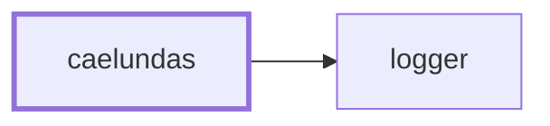
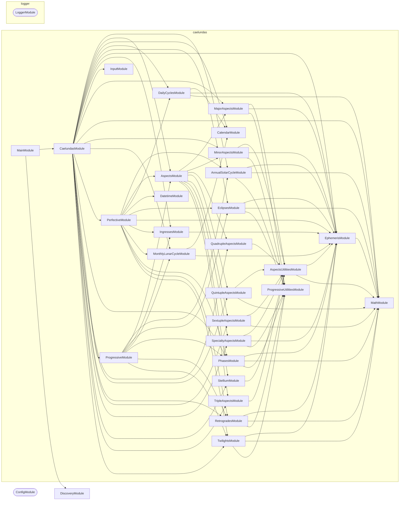

# 🛰️ Caelundas

**Turn the sky into a calendar.**

Caelundas computes planetary positions minute by minute over a date range,
detects the astronomical events in them — aspects, phases, eclipses,
retrogrades, ingresses, solstices, twilights — and writes an iCalendar file you
can subscribe to in Google Calendar, Apple Calendar, or anything else that
reads `.ics`.

## Quick Start

```bash
# 1. Download the Swiss Ephemeris data files (one-time, ~90 MB)
nx run caelundas:download-ephemeris

# 2. Configure your observer location and date range
cp applications/caelundas/.env.default applications/caelundas/.env

# 3. Generate the calendar
nx run caelundas:start
```

The result lands in `output/caelundas_<start>_<end>.ics`. Import it, or point a
calendar subscription at it.

## Configuration

All input comes from environment variables, validated on startup.

```bash
LATITUDE="39.949309"          # Observer latitude, -90 to 90
LONGITUDE="-75.17169"         # Observer longitude, -180 to 180
START_DATE="2026-07-01"       # YYYY-MM-DD
END_DATE="2026-07-31"         # YYYY-MM-DD
OUTPUT_DIRECTORY="./output"
```

Every field is optional. Location defaults to Philadelphia, and the date range
to a two-month window centered on today.

The **timezone is derived from your coordinates** rather than configured
separately — a calendar whose location and timezone could disagree is a
calendar with silently wrong sunrise times. Supported dates run from
`1900-01-01` to `2100-12-31`, the span of the ephemeris data.

## Ephemeris

Positions come from the [Swiss Ephemeris](https://www.astro.com/swisseph/)
(`sweph`), computed locally from JPL DE431 data files — no network calls, no
API keys, no rate limits. The data files are not committed; download them once
with `nx run caelundas:download-ephemeris` into `data/ephemeris/`.

## Events

Detection runs in two passes.

**Perfective** — the moment something is exact. Ephemerides are computed
day by day and scanned at minute resolution for the instant an aspect
perfects, a planet stations, or a body crosses a sign boundary.

**Progressive** — the span around it. The same domain services turn those exact
moments into the periods a reader actually wants on a calendar: the days an
aspect is in orb, the weeks a planet is retrograde.

| Category | Events |
| -------- | ------ |
| Aspects | Major and minor aspects, plus triple, quadruple, quintuple, and sextuple configurations and stelliums |
| Phases | New moon, first quarter, full moon, last quarter |
| Eclipses | Solar and lunar |
| Retrogrades | Stations and retrograde periods |
| Ingresses | Bodies entering a zodiac sign |
| Annual solar cycle | Solstices, equinoxes, cross-quarter points |
| Monthly lunar cycle | Apogee and perigee |
| Daily cycles | Sunrise, sunset, moonrise, moonset |
| Twilights | Civil, nautical, and astronomical |

## Structure

```text
src/
├── main.ts                  # CommandFactory bootstrap
├── constants.ts             # Environment schema (Zod)
└── modules/
    ├── caelundas/           # Root command — the pipeline
    ├── input/               # Coordinate and date validation, timezone lookup
    ├── ephemeris/           # Swiss Ephemeris access: positions, horizons, phenomena
    ├── perfective/          # Exact-moment detection across every event service
    ├── progressive/         # Spans derived from those moments
    ├── calendar/            # iCalendar rendering and output
    ├── datetime/, math/     # Time stepping and angular arithmetic
    └── aspects/, phases/, eclipses/, retrogrades/, ingresses/,
        annual-solar-cycle/, monthly-lunar-cycle/, daily-cycles/,
        twilights/, stellium/, …   # One service per event family
```

## Project Graph

Where this project sits in the Nx project graph: what it depends on, and what depends on it. Regenerated by `nx run synchronization:synchronize --configuration=write`.

<!-- nx-project-graph-start -->



<!-- nx-project-graph-end -->

## Module Graph

The modules this project defines and the imports between them, regenerated by `nx run synchronization:synchronize --configuration=write`.

<!-- nestjs-module-graph-start -->



_Rounded modules are global: every module can inject them, so their edges are left out._

<!-- nestjs-module-graph-end -->

## Start

Generate a calendar from the configured location and date range:

```bash
nx run caelundas:start
```

## Test

```bash
nx run caelundas:vitest
```

```bash
nx run caelundas:vitest:unit          # Fast tests only
nx run caelundas:vitest:end-to-end    # Full pipeline
```

## Development

```bash
nx run caelundas:repl                 # NestJS REPL against the graph
nx run caelundas:typecheck
nx run caelundas:lint-codebase --configuration=write
```

See [AGENTS.md](AGENTS.md) for the astronomical domain concepts, event
detection algorithms, and testing strategy.

## Etymology

**Caelundas** — a portmanteau of _caelum_ (Latin: sky, heavens) and _calendar_.

## License

MIT — see [LICENSE](../../LICENSE).
