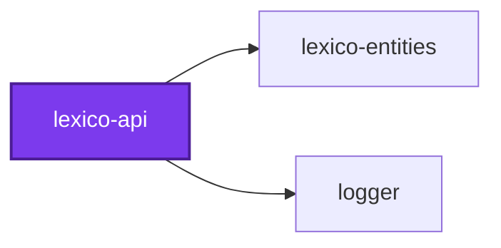

## Start

```bash
nx run lexico-api:start
```

## Test

```bash
nx run lexico-api:vitest
```

## 👔 Conformetry

This project was generated from the [nestjs-graphql-application](../../configuration/conformetry-templates/nestjs-graphql-application) conformetry template.

<!-- callidescope:start -->

## 🔭 Callidescope

Call stacks traced through `applications/lexico-api`, deepest first. Each frame shows what it takes, what it returns, and what its documentation says.

| Measure | Value |
| --- | --- |
| Callables | 76 |
| Files | 25 |
| Calls traced | 42 |
| Call stacks | 10 |
| Deepest stack | 7 |
| Stacks through recursion | 0 |
| Unfollowable calls | 7 |

### Limits

What this project is judged against, as declared in its own `callidescope.config.ts`.

| Limit | Value |
| --- | --- |
| `maximumDepth` | 17 |
| `maximumBreadth` | none |

### Call stacks (depth)

**1. `SearchResolver.searchLatin`** — depth ≥ 7 · decorated-method

```text
🚀 SearchResolver.searchLatin(…): Promise<Connection<LexemeSearchResult>> [applications/lexico-api/src/modules/search/search.resolver.ts:37]
   ↳ Searches Latin lemmas and inflected forms with enclitic parsing and fuzzy matching.
  └─> SearchService.searchLatin(…): Promise<Connection<LexemeSearchResult>> [applications/lexico-api/src/modules/search/search.service.ts:279]
     ↳ Performs tiered Latin dictionary search with enclitic parsing and fuzzy matching.
    └─> SearchService.findWordMatches(…): Promise<void> [applications/lexico-api/src/modules/search/search.service.ts:152]
       ↳ Queries exact inflected word forms and maps their morphological identifiers.
      └─> SearchService.map(…)(wf: WordForm): string | null [applications/lexico-api/src/modules/search/search.service.ts:174]
        └─> formatFormIdentifier(form: Form): null | string [applications/lexico-api/src/modules/search/search.utilities.ts:68]
           ↳ Formats grammatical and morphological description strings from a lexical Form.
          └─> formatDeclinedForm(form: Form): null | string [applications/lexico-api/src/modules/search/search.utilities.ts:120]
             ↳ Formats nominal, adjectival, and participial declined forms.
            └─> formatNonFiniteForm(form: Form): null | string [applications/lexico-api/src/modules/search/search.utilities.ts:136]
               ↳ Formats non-finite verb and uninflected forms like infinitives, gerunds, supines, and adverbs.
```

**2. `SearchResolver.searchEnglish`** — depth ≥ 6 · decorated-method

```text
🚀 SearchResolver.searchEnglish(…): Promise<Connection<LexemeSearchResult>> [applications/lexico-api/src/modules/search/search.resolver.ts:22]
   ↳ Searches English definitions and translations using full-text and substring matching.
  └─> SearchService.searchEnglish(…): Promise<Connection<LexemeSearchResult>> [applications/lexico-api/src/modules/search/search.service.ts:228]
     ↳ Searches English translations and definitions using full-text and substring matching.
    └─> SearchService.paginateSearchResults(…): Connection<LexemeSearchResult> [applications/lexico-api/src/modules/search/search.service.ts:194]
       ↳ Deterministically orders and paginates aggregated search result entries.
      └─> paginateArray(…): { edges: Edge<T>[]; hasNextPage: boolean; hasPreviousPage: boolean; } [applications/lexico-api/src/lexico-api.utilities.ts:130]
         ↳ Slices an array of items according to forward (first, after) and backward (last, before) Relay pagination parameters.
        └─> getPaginationBounds(…): { endIndex: number; startIndex: number; } [applications/lexico-api/src/lexico-api.utilities.ts:193]
           ↳ Computes start and end slice indices based on after and before cursors.
          └─> findIndex(…)(item: T): boolean [applications/lexico-api/src/lexico-api.utilities.ts:202]
```

**3. `decodeOffsetCursor`** — depth ≥ 3 · orphan-root

```text
🚀 decodeOffsetCursor(cursor?: null | string, defaultOffset?: number): number [applications/lexico-api/src/lexico-api.utilities.ts:71]
   ↳ Decodes an offset-based cursor, returning the specified default offset if missing or invalid.
  └─> fromCursorSafe<T = unknown>(cursor?: null | string, parse?: (value: unknown) => T): null | T [applications/lexico-api/src/lexico-api.utilities.ts:113]
     ↳ Safely decodes a cursor string, returning null if invalid, null, or undefined.
    └─> fromCursor<T = unknown>(cursor: string, parse?: (value: unknown) => T): T [applications/lexico-api/src/lexico-api.utilities.ts:99]
       ↳ Decodes an opaque Base64 cursor string into structured data.
```

<details>
<summary>7 more call stacks</summary>

**4. `Paginated`** — depth ≥ 3 · orphan-root

```text
🚀 Paginated<T>(classReference: ClassConstructor<T>): ClassConstructor<Connection<T>> [applications/lexico-api/src/lexico-api.utilities.ts:158]
   ↳ Mixin type factory producing a Relay Connection ObjectType for GraphQL schema generation.
  └─> createEdgeType<T>(classReference: ClassConstructor<T>): ClassConstructor<Edge<T>> [applications/lexico-api/src/lexico-api.utilities.ts:46]
     ↳ Mixin type factory producing a Relay Edge ObjectType for GraphQL schema generation.
    └─> Field(…)(): StringConstructor [applications/lexico-api/src/lexico-api.utilities.ts:56]
```

**5. `HealthResolver.health`** — depth 2 · decorated-method

```text
🚀 HealthResolver.health(): boolean [applications/lexico-api/src/modules/health/health.resolver.ts:18]
   ↳ Health check query.
  └─> HealthService.isHealthy(): boolean [applications/lexico-api/src/modules/health/health.service.ts:11]
     ↳ Returns true if the service is operational.
```

**6. `LexemesResolver.lexeme`** — depth 2 · decorated-method

```text
🚀 LexemesResolver.lexeme(id: string): Promise<Lexeme | null> [applications/lexico-api/src/modules/lexemes/lexemes.resolver.ts:20]
   ↳ Retrieves a single dictionary lexeme by ID.
  └─> LexemesService.findById(id: string): Promise<Lexeme | null> [applications/lexico-api/src/modules/lexemes/lexemes.service.ts:23]
     ↳ Finds a single lexeme by its unique identifier, with relations eagerly joined.
```

**7. `LexemesResolver.lexemes`** — depth 2 · decorated-method

```text
🚀 LexemesResolver.lexemes(ids: string[]): Promise<Lexeme[]> [applications/lexico-api/src/modules/lexemes/lexemes.resolver.ts:34]
   ↳ Retrieves multiple dictionary lexemes by ID.
  └─> LexemesService.findByIds(ids: string[]): Promise<Lexeme[]> [applications/lexico-api/src/modules/lexemes/lexemes.service.ts:39]
     ↳ Finds multiple lexemes by their unique identifiers, with relations eagerly joined.
```

**8. `encodeOffsetCursor`** — depth 2 · orphan-root

```text
🚀 encodeOffsetCursor(offset: number): string [applications/lexico-api/src/lexico-api.utilities.ts:92]
   ↳ Encodes an offset-based integer cursor.
  └─> toCursor(data: unknown): string [applications/lexico-api/src/lexico-api.utilities.ts:186]
     ↳ Encodes structured data into an opaque Base64 cursor string.
```

**9. `SearchService.getCursor`** — depth 2 · orphan-root

```text
🚀 SearchService.getCursor(item: LexemeSearchResult): string [applications/lexico-api/src/modules/search/search.service.ts:209]
  └─> toCursor(data: unknown): string [applications/lexico-api/src/lexico-api.utilities.ts:186]
     ↳ Encodes structured data into an opaque Base64 cursor string.
```

**10. `main`** — depth 2 · orphan-root

```text
🚀 main(): Promise<void> [applications/lexico-api/src/lexico-api.ts:15]
   ↳ Bootstraps the NestJS GraphQL API application.
  └─> registerShutdownHandler(…)(): Promise<void> [applications/lexico-api/src/lexico-api.ts:32]
```

</details>

### Breadth

| Callable | Breadth | Calls directly | Location |
| --- | --- | --- | --- |
| `SearchService.searchLatin` | 7 | `createConnection`, `decomposeEnclitic`, `SearchService.findExactLemmas`, `SearchService.findWordMatches`, `SearchService.findPrefixLemmas`, `SearchService.findFuzzyLemmas`, `SearchService.paginateSearchResults` | `applications/lexico-api/src/modules/search/search.service.ts:279` |
| `SearchService.searchEnglish` | 4 | `createConnection`, `calculateEnglishMatchScore`, `mergeSearchResult`, `SearchService.paginateSearchResults` | `applications/lexico-api/src/modules/search/search.service.ts:228` |
| `paginateArray` | 3 | `getPaginationBounds`, `sliceWithLimits`, `map(…)` | `applications/lexico-api/src/lexico-api.utilities.ts:130` |

<details>
<summary>22 more callables</summary>

| Callable | Breadth | Calls directly | Location |
| --- | --- | --- | --- |
| `SearchService.findWordMatches` | 3 | `SearchService.filter(…)`, `SearchService.map(…)`, `mergeSearchResult` | `applications/lexico-api/src/modules/search/search.service.ts:152` |
| `SearchService.paginateSearchResults` | 3 | `SearchService.toSorted(…)`, `paginateArray`, `createConnection` | `applications/lexico-api/src/modules/search/search.service.ts:194` |
| `createEdgeType` | 2 | `Field(…)`, `Field(…)` | `applications/lexico-api/src/lexico-api.utilities.ts:46` |
| `getPaginationBounds` | 2 | `findIndex(…)`, `findIndex(…)` | `applications/lexico-api/src/lexico-api.utilities.ts:193` |
| `HealthResolver.health` | 1 | `HealthService.isHealthy` | `applications/lexico-api/src/modules/health/health.resolver.ts:18` |
| `LexemesResolver.lexeme` | 1 | `LexemesService.findById` | `applications/lexico-api/src/modules/lexemes/lexemes.resolver.ts:20` |
| `LexemesResolver.lexemes` | 1 | `LexemesService.findByIds` | `applications/lexico-api/src/modules/lexemes/lexemes.resolver.ts:34` |
| `decodeOffsetCursor` | 1 | `fromCursorSafe` | `applications/lexico-api/src/lexico-api.utilities.ts:71` |
| `encodeOffsetCursor` | 1 | `toCursor` | `applications/lexico-api/src/lexico-api.utilities.ts:92` |
| `fromCursorSafe` | 1 | `fromCursor` | `applications/lexico-api/src/lexico-api.utilities.ts:113` |
| `map(…)` | 1 | `createEdge` | `applications/lexico-api/src/lexico-api.utilities.ts:149` |
| `Paginated` | 1 | `createEdgeType` | `applications/lexico-api/src/lexico-api.utilities.ts:158` |
| `formatFormIdentifier` | 1 | `formatDeclinedForm` | `applications/lexico-api/src/modules/search/search.utilities.ts:68` |
| `formatDeclinedForm` | 1 | `formatNonFiniteForm` | `applications/lexico-api/src/modules/search/search.utilities.ts:120` |
| `SearchService.findExactLemmas` | 1 | `mergeSearchResult` | `applications/lexico-api/src/modules/search/search.service.ts:57` |
| `SearchService.findFuzzyLemmas` | 1 | `mergeSearchResult` | `applications/lexico-api/src/modules/search/search.service.ts:88` |
| `SearchService.findPrefixLemmas` | 1 | `mergeSearchResult` | `applications/lexico-api/src/modules/search/search.service.ts:121` |
| `SearchService.map(…)` | 1 | `formatFormIdentifier` | `applications/lexico-api/src/modules/search/search.service.ts:174` |
| `SearchService.getCursor` | 1 | `toCursor` | `applications/lexico-api/src/modules/search/search.service.ts:209` |
| `SearchResolver.searchEnglish` | 1 | `SearchService.searchEnglish` | `applications/lexico-api/src/modules/search/search.resolver.ts:22` |
| `SearchResolver.searchLatin` | 1 | `SearchService.searchLatin` | `applications/lexico-api/src/modules/search/search.resolver.ts:37` |
| `main` | 1 | `registerShutdownHandler(…)` | `applications/lexico-api/src/lexico-api.ts:15` |

</details>
<!-- callidescope:end -->

## 🕸️ Codependix

Dependency graphs exported by [codependix](https://github.com/JimmyPaolini/codebase/tree/main/packages/ic-suite/codependix/codependix-cli), regenerated by `nx run codebase:codependix:write`.

### Nx Neighborhood

<!-- codependix:start name="codependix-nx-projects" -->

<!-- codependix:end name="codependix-nx-projects" -->

### File Imports

```mermaid
graph LR
  file_callidescope_config_ts["callidescope.config.ts"]
  file_codependix_config_ts["codependix.config.ts"]
  file_codometer_config_ts["codometer.config.ts"]
  file_eslint_config_ts["eslint.config.ts"]
  file_src_lexico_api_constants_ts["src/lexico-api.constants.ts"]
  file_src_lexico_api_end_to_end_test_ts["src/lexico-api.end-to-end.test.ts"]
  file_src_lexico_api_entities_ts["src/lexico-api.entities.ts"]
  file_src_lexico_api_module_ts["src/lexico-api.module.ts"]
  file_src_lexico_api_module_unit_test_ts["src/lexico-api.module.unit.test.ts"]
  file_src_lexico_api_ts["src/lexico-api.ts"]
  file_src_lexico_api_types_ts["src/lexico-api.types.ts"]
  file_src_lexico_api_unit_test_ts["src/lexico-api.unit.test.ts"]
  file_src_lexico_api_utilities_ts["src/lexico-api.utilities.ts"]
  file_src_lexico_api_utilities_unit_test_ts["src/lexico-api.utilities.unit.test.ts"]
  file_src_modules_health_health_module_ts["src/modules/health/health.module.ts"]
  file_src_modules_health_health_module_unit_test_ts["src/modules/health/health.module.unit.test.ts"]
  file_src_modules_health_health_resolver_ts["src/modules/health/health.resolver.ts"]
  file_src_modules_health_health_resolver_unit_test_ts["src/modules/health/health.resolver.unit.test.ts"]
  file_src_modules_health_health_service_ts["src/modules/health/health.service.ts"]
  file_src_modules_health_health_service_unit_test_ts["src/modules/health/health.service.unit.test.ts"]
  file_src_modules_lexemes_lexemes_module_ts["src/modules/lexemes/lexemes.module.ts"]
  file_src_modules_lexemes_lexemes_module_unit_test_ts["src/modules/lexemes/lexemes.module.unit.test.ts"]
  file_src_modules_lexemes_lexemes_resolver_ts["src/modules/lexemes/lexemes.resolver.ts"]
  file_src_modules_lexemes_lexemes_resolver_unit_test_ts["src/modules/lexemes/lexemes.resolver.unit.test.ts"]
  file_src_modules_lexemes_lexemes_service_integration_test_ts["src/modules/lexemes/lexemes.service.integration.test.ts"]
  file_src_modules_lexemes_lexemes_service_ts["src/modules/lexemes/lexemes.service.ts"]
  file_src_modules_lexemes_lexemes_service_unit_test_ts["src/modules/lexemes/lexemes.service.unit.test.ts"]
  file_src_modules_search_search_pagination_entities_ts["src/modules/search/search-pagination.entities.ts"]
  file_src_modules_search_search_constants_ts["src/modules/search/search.constants.ts"]
  file_src_modules_search_search_entities_ts["src/modules/search/search.entities.ts"]
  file_src_modules_search_search_entities_unit_test_ts["src/modules/search/search.entities.unit.test.ts"]
  file_src_modules_search_search_module_ts["src/modules/search/search.module.ts"]
  file_src_modules_search_search_module_unit_test_ts["src/modules/search/search.module.unit.test.ts"]
  file_src_modules_search_search_resolver_ts["src/modules/search/search.resolver.ts"]
  file_src_modules_search_search_resolver_unit_test_ts["src/modules/search/search.resolver.unit.test.ts"]
  file_src_modules_search_search_service_integration_test_ts["src/modules/search/search.service.integration.test.ts"]
  file_src_modules_search_search_service_ts["src/modules/search/search.service.ts"]
  file_src_modules_search_search_service_unit_test_ts["src/modules/search/search.service.unit.test.ts"]
  file_src_modules_search_search_types_ts["src/modules/search/search.types.ts"]
  file_src_modules_search_search_utilities_ts["src/modules/search/search.utilities.ts"]
  file_src_modules_search_search_utilities_unit_test_ts["src/modules/search/search.utilities.unit.test.ts"]
  file_testing_mocks_ts["testing/mocks.ts"]
  file_testing_setup_ts["testing/setup.ts"]
  file_vitest_config_ts["vitest.config.ts"]
  file_src_lexico_api_end_to_end_test_ts --> file_src_lexico_api_constants_ts
  file_src_lexico_api_module_ts --> file_src_lexico_api_constants_ts
  file_src_lexico_api_module_ts --> file_src_modules_health_health_module_ts
  file_src_lexico_api_module_ts --> file_src_modules_lexemes_lexemes_module_ts
  file_src_lexico_api_module_ts --> file_src_modules_search_search_module_ts
  file_src_lexico_api_module_unit_test_ts --> file_src_lexico_api_module_ts
  file_src_lexico_api_ts --> file_src_lexico_api_constants_ts
  file_src_lexico_api_ts --> file_src_lexico_api_module_ts
  file_src_lexico_api_types_ts --> file_src_lexico_api_entities_ts
  file_src_lexico_api_utilities_ts --> file_src_lexico_api_entities_ts
  file_src_lexico_api_utilities_ts --> file_src_lexico_api_types_ts
  file_src_lexico_api_utilities_unit_test_ts --> file_src_lexico_api_entities_ts
  file_src_lexico_api_utilities_unit_test_ts --> file_src_lexico_api_types_ts
  file_src_lexico_api_utilities_unit_test_ts --> file_src_lexico_api_utilities_ts
  file_src_modules_health_health_module_ts --> file_src_modules_health_health_resolver_ts
  file_src_modules_health_health_module_ts --> file_src_modules_health_health_service_ts
  file_src_modules_health_health_module_unit_test_ts --> file_src_modules_health_health_module_ts
  file_src_modules_health_health_resolver_ts --> file_src_modules_health_health_service_ts
  file_src_modules_health_health_resolver_unit_test_ts --> file_src_modules_health_health_resolver_ts
  file_src_modules_health_health_resolver_unit_test_ts --> file_src_modules_health_health_service_ts
  file_src_modules_health_health_service_unit_test_ts --> file_src_modules_health_health_service_ts
  file_src_modules_lexemes_lexemes_module_ts --> file_src_modules_lexemes_lexemes_resolver_ts
  file_src_modules_lexemes_lexemes_module_ts --> file_src_modules_lexemes_lexemes_service_ts
  file_src_modules_lexemes_lexemes_module_unit_test_ts --> file_src_modules_lexemes_lexemes_module_ts
  file_src_modules_lexemes_lexemes_resolver_ts --> file_src_modules_lexemes_lexemes_service_ts
  file_src_modules_lexemes_lexemes_resolver_unit_test_ts --> file_src_modules_lexemes_lexemes_resolver_ts
  file_src_modules_lexemes_lexemes_resolver_unit_test_ts --> file_src_modules_lexemes_lexemes_service_ts
  file_src_modules_lexemes_lexemes_service_integration_test_ts --> file_src_modules_lexemes_lexemes_service_ts
  file_src_modules_lexemes_lexemes_service_integration_test_ts --> file_testing_mocks_ts
  file_src_modules_lexemes_lexemes_service_unit_test_ts --> file_src_modules_lexemes_lexemes_service_ts
  file_src_modules_lexemes_lexemes_service_unit_test_ts --> file_testing_mocks_ts
  file_src_modules_search_search_entities_ts --> file_src_lexico_api_utilities_ts
  file_src_modules_search_search_entities_unit_test_ts --> file_src_modules_search_search_entities_ts
  file_src_modules_search_search_module_ts --> file_src_modules_search_search_resolver_ts
  file_src_modules_search_search_module_ts --> file_src_modules_search_search_service_ts
  file_src_modules_search_search_module_unit_test_ts --> file_src_modules_search_search_module_ts
  file_src_modules_search_search_resolver_ts --> file_src_lexico_api_types_ts
  file_src_modules_search_search_resolver_ts --> file_src_modules_search_search_pagination_entities_ts
  file_src_modules_search_search_resolver_ts --> file_src_modules_search_search_entities_ts
  file_src_modules_search_search_resolver_ts --> file_src_modules_search_search_service_ts
  file_src_modules_search_search_resolver_unit_test_ts --> file_src_lexico_api_utilities_ts
  file_src_modules_search_search_resolver_unit_test_ts --> file_src_modules_search_search_entities_ts
  file_src_modules_search_search_resolver_unit_test_ts --> file_src_modules_search_search_resolver_ts
  file_src_modules_search_search_resolver_unit_test_ts --> file_src_modules_search_search_service_ts
  file_src_modules_search_search_service_integration_test_ts --> file_src_modules_search_search_entities_ts
  file_src_modules_search_search_service_integration_test_ts --> file_src_modules_search_search_service_ts
  file_src_modules_search_search_service_integration_test_ts --> file_testing_mocks_ts
  file_src_modules_search_search_service_ts --> file_src_lexico_api_types_ts
  file_src_modules_search_search_service_ts --> file_src_lexico_api_utilities_ts
  file_src_modules_search_search_service_ts --> file_src_modules_search_search_constants_ts
  file_src_modules_search_search_service_ts --> file_src_modules_search_search_entities_ts
  file_src_modules_search_search_service_ts --> file_src_modules_search_search_types_ts
  file_src_modules_search_search_service_ts --> file_src_modules_search_search_utilities_ts
  file_src_modules_search_search_service_unit_test_ts --> file_src_modules_search_search_entities_ts
  file_src_modules_search_search_service_unit_test_ts --> file_src_modules_search_search_service_ts
  file_src_modules_search_search_service_unit_test_ts --> file_src_modules_search_search_utilities_ts
  file_src_modules_search_search_service_unit_test_ts --> file_testing_mocks_ts
  file_src_modules_search_search_utilities_ts --> file_src_modules_search_search_constants_ts
  file_src_modules_search_search_utilities_ts --> file_src_modules_search_search_entities_ts
  file_src_modules_search_search_utilities_ts --> file_src_modules_search_search_types_ts
  file_src_modules_search_search_utilities_unit_test_ts --> file_src_modules_search_search_constants_ts
  file_src_modules_search_search_utilities_unit_test_ts --> file_src_modules_search_search_entities_ts
  file_src_modules_search_search_utilities_unit_test_ts --> file_src_modules_search_search_utilities_ts
```

<!-- codependix:start name="codependix-file-imports" -->

<!-- codependix:end name="codependix-file-imports" -->

<!-- codometer:start -->

## ⏲️ Codometer

### Project


### TypeScript


### JavaScript


### Python


### JSON


### YAML


### TOML


### Shell


### SQL


### HCL


### CSS


### Conventions


### Jupyter


### Markdown


<!-- codometer:end -->
