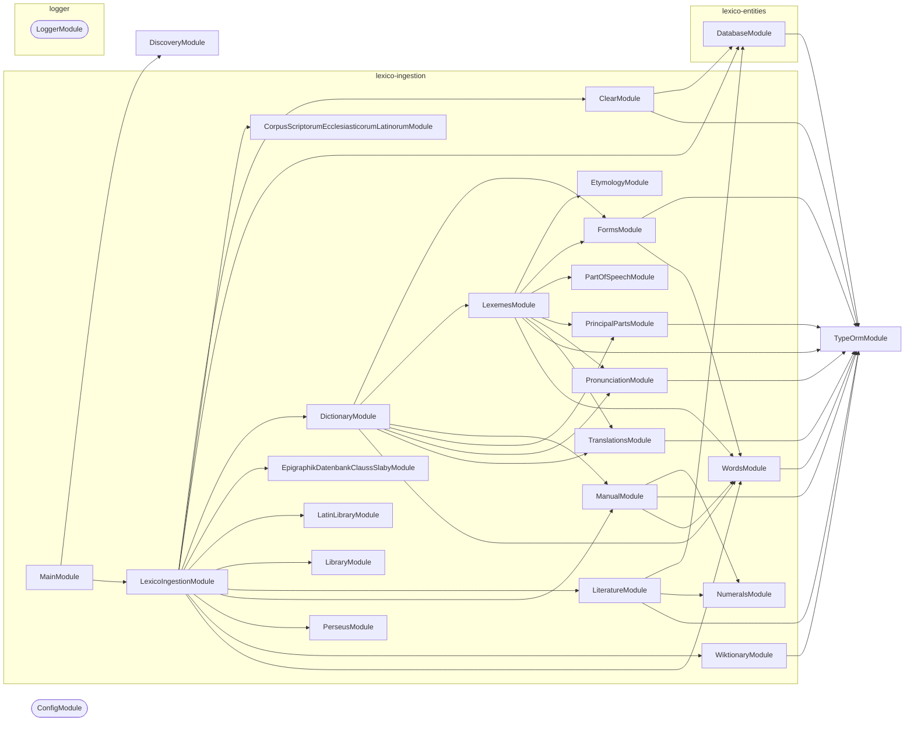

# LexicoIngestion: NestJS Command-Line Application

## Quick Start

**Type**: Node.js CLI application (NestJS + `nest-commander`)

**Purpose**: <!-- Briefly describe the specific purpose of this CLI application -->

Ingest Wiktionary Latin dictionary data into PostgreSQL, parsing HTML pages into structured `Lexeme`, `Translation`, `Form`, and `Word` records.

### Run Locally

```bash
cp .env.default .env  # Fill in required environment variables
nx run lexico-ingestion:start
```

## Architecture Overview

### Tech Stack

- **Framework**: NestJS (modules, dependency injection, providers)
- **CLI runner**: `nest-commander` (`CommandRunner` + `@Command()` decorator)
- **Database**: PostgreSQL via TypeORM (`@codebase/lexico-entities`)
- **Env validation**: `@nestjs/config` + `zod` (`environmentSchema` in `.constants.ts`)
- **Logging**: `@codebase/logger` — a `pino`-backed `LoggerService` (`Scope.TRANSIENT`)
- **Language**: Strict TypeScript

### Execution Flow

```text
src/main.ts
  └─ CommandFactory.run(MainModule)
       └─ domain command modules            ← add under src/modules/
```

**Project Implementation**:

```text
src/main.ts
  └─ CommandFactory.run(LexicoIngestionModule)
       └─ LexicoIngestionCommand.run()
            ├─ Step 1: ClearService.clearDictionary()
            ├─ Step 2: WiktionaryService.ingestWiktionary()
            ├─ Step 3: DictionaryService.ingestAll()
            └─ Step 4: ManualService.ingestManual()
```

Sub-commands: `wiktionary`, `dictionary`, `words`, `clear`

### Directory Layout

```text
src/
  main.ts                           # Bootstrap — do not modify
  main.module.ts                    # Root NestJS module (imports ConfigModule, LoggerModule)
  constants.ts                      # Zod environmentSchema for env validation
  modules/
    <domain>/                       # Add feature modules here
      <domain>.module.ts
      <domain>.command.ts
      <domain>.service.ts
      <domain>.types.ts
      <domain>.constants.ts
      <domain>.<tier>.test.ts
testing/                            # Shared test utilities
```

**Project Modules**:

```text
src/modules/
  clear/                                   # Truncates all dictionary tables
  dictionary/                              # Orchestrates full Wiktionary → Lexeme pipeline
  etymology/                               # Parses etymology sections
  forms/                                   # Parses inflection tables
  lexemes/                                 # Creates and saves Lexeme entities
  manual/                                  # Ingests manually curated entries
  part-of-speech/                          # Detects POS from Wiktionary HTML
  principal-parts/                         # Parses principal parts
  pronunciation/                           # Parses pronunciation data
  translations/                            # Parses and saves Translation entities
  wiktionary/                              # Downloads and stores raw Wiktionary pages
  words/                                   # Creates and saves Word entities
```

### Module Graph

The modules this project defines and the imports between them, published by `nx run synchronization:synchronize --configuration=publish`.

<!-- nestjs-module-graph-start -->



_Rounded modules are global: every module can inject them, so their edges are left out._

<!-- nestjs-module-graph-end -->

### Environment Variables

All validated via `environmentSchema` in `lexico-ingestion.constants.ts`:

| Variable | Default | Description |
| -------- | ------- | ----------- |
| `POSTGRES_HOST` | `localhost` | PostgreSQL host |
| `POSTGRES_PORT` | `5432` | PostgreSQL port |
| `POSTGRES_USER` | `postgres` | PostgreSQL username |
| `POSTGRES_PASSWORD` | `postgres` | PostgreSQL password |
| `POSTGRES_DB` | `postgres` | PostgreSQL database name |

## Development

### Adding Business Logic

1. **Implement the root command** — add logic to `lexico-ingestion.command.ts` `run()`, or delegate to injected services.
2. **Extend the pipeline** — add new steps to `LexicoIngestionCommand.run()`, or add sub-commands.
3. **Add domain command modules** — create `src/modules/<domain>/` with a NestJS module, command, service, types, and constants.
4. **Register in root module** — import the new module in `main.module.ts`.
5. **Validate env vars** — extend `environmentSchema` in `constants.ts` with all required environment variables.

### Logging

`LoggerService` and `LoggerModule` come from `@codebase/logger` — this project does not define its own logger. Add `"@codebase/logger": "workspace:*"` to `dependencies`, then import `LoggerModule` once in the root module; it is `@Global()`, so feature modules inject `LoggerService` without importing it.

`LoggerService` is `Scope.TRANSIENT` — each injecting class gets its own instance. Always call `setContext` in the constructor:

```ts
constructor(private readonly logger: LoggerService) {
  super();
  this.logger.setContext(MyService.name);
}
```

Outputs structured JSON in production (`NODE_ENV=production`) and pretty-printed logs in development.

### Key Commands

Always prefer running tasks through Nx rather than calling the underlying tools directly.

```bash
nx run lexico-ingestion:start           # Run the command-line application
nx run lexico-ingestion:lint-codebase   # Every static check, in one graph
nx run lexico-ingestion:typecheck       # tsc --noEmit
nx run lexico-ingestion:oxfmt           # Formatting
```

### Testing

Follow the codebase's strict three-tier testing strategy. Co-locate test files with the source they test.

```bash
nx run lexico-ingestion:vitest:unit          # Fast (<100ms) — pure logic, mocked DI
nx run lexico-ingestion:vitest:integration   # Moderate (1-2s) — real database/API I/O
nx run lexico-ingestion:vitest:end-to-end    # Slow (30-60s) — full CLI execution
```

| Tier | File pattern | What to test |
| ---- | ------------ | ------------ |
| Unit | `*.unit.test.ts` | Pure functions, service methods with mocked deps |
| Integration | `*.integration.test.ts` | Database queries, external API clients |
| End-to-end | `*.end-to-end.test.ts` | Full `CommandFactory.run()` execution |

Project-specific integration tests also cover Wiktionary HTML parsing.

See the [testing-strategy skill](../../.agents/skills/testing-strategy/SKILL.md) and [testing-mocks skill](../../.agents/skills/testing-mocks/SKILL.md) for patterns and mock conventions.

## Writing Modules

Use the generator to scaffold new domain modules, then implement the service:

```bash
nx g conformetry:nestjs-service-module --name=<domain>
```

This creates five files in `src/modules/<domain>/`:

| File | Purpose |
| ---- | ------- |
| `<domain>.module.ts` | Declares providers, imports, and exports |
| `<domain>.service.ts` | Business logic — the only place you write domain code |
| `<domain>.constants.ts` | Regex, enums, static config — never inline magic values |
| `<domain>.types.ts` | TypeScript types scoped to this module |
| `<domain>.service.unit.test.ts` | Unit tests bootstrapped with `Test.createTestingModule` |

### Module file

Register the service in both `providers` and `exports` so consumers can inject it:

```ts
@Module({
  controllers: [],
  exports: [MyDomainService],
  imports: [TypeOrmModule.forFeature([MyEntity]), LoggerModule],
  providers: [MyDomainService],
})
export class MyDomainModule {}
```

Add a JSDoc comment on the module class describing what domain it owns.

### Service file

Follow the section-comment layout from the template — it keeps large services scannable:

```ts
@Injectable()
export class MyDomainService {
  // 🏗 Dependency Injection
  constructor(
    @InjectRepository(MyEntity)
    private readonly repo: Repository<MyEntity>,
    private readonly logger: LoggerService,
  ) {
    this.logger.setContext(MyDomainService.name);
  }

  // 🔐 Private Fields

  // 🔑 Public Fields

  // 🔏 Private Methods

  // 🌎 Public Methods
}
```

Key rules:

- **Call `setContext` in every constructor** — always use `MyClass.name`, never a string literal.
- **Inject `LoggerService` as the last constructor parameter** (after repository/domain deps).
- **Private first** — keep internal helpers in the `🔏 Private Methods` section, expose only what callers need under `🌎 Public Methods`.
- **`readonly` everything in the constructor** — all injected deps must be `private readonly`.
- **One service per module** — if a service grows too large, extract a sub-domain into its own module.
- **Class-only top level** — keep NestJS class files to imports plus the class declaration only. Move helper interfaces/types to `<domain>.types.ts`, constants/init helpers to `<domain>.constants.ts` or class members, and do not re-export aliases or types from `*.service.ts`.

### Constants file

Move all inline values to `.constants.ts` to keep services readable:

```ts
// ♟️ Constants
export const MY_SKIP_REGEX = /(alternative)|(archaic)|(synonym)/i;
export const DEFAULT_PAGE_SIZE = 100;
```

### Types file

Put all module-local TypeScript types and interfaces in `.types.ts`:

```ts
// 🏷️ Types
export interface ParsedEntry {
  word: string;
  partOfSpeech: string;
}
```

Do not re-export types from `index.ts` unless they are part of the public API consumed by other modules.

### Registering in the root module

After generating a module, import it in main.module.ts:

```ts
@Module({
  imports: [
    ConfigModule.forRoot({ ... }),
    LoggerModule,
    MyDomainModule,   // ← add here
  ],
  providers: [],
})
export class MainModule {}
```

### Conformetry validation

Conformetry validation measures generated and existing module structures against the templates they came from. It runs for one project, or for every project at once.

```bash
pnpm nx run-many --targets=conformetry-validate
```

## Best Practices

- **Never** put business logic in `main.ts` — it bootstraps `CommandFactory` only.
- **One command per class** — split sub-commands into separate `CommandRunner` subclasses.
- **Validate at the boundary** — all env vars must be declared in `environmentSchema`; access via `ConfigService`, not `process.env`.
- **Type imports** — use `import { type Foo }` for type-only imports (enforced by ESLint).
- **No `any` types** — use `unknown` or proper typing; strict mode is enabled.

See the [write-typescript skill](../../.agents/skills/write-typescript/SKILL.md) for strict mode patterns.

## Troubleshooting

- **Command not found at runtime** — ensure the command class is listed in `providers` of its module and the module is imported by the root module.
- **Dependency injection failure** — verify the service is `@Injectable()`, exported from its module, and that module is imported by the consuming module.
- **Unrecognized CLI flag** — check that `@Option()` decorators in the command class exactly match the flag names passed.
- **Env var validation error on startup** — add the missing variable to environmentSchema in src/constants.ts and to .env.default.
- **TypeORM entity not found** — register the entity via `TypeOrmModule.forFeature([MyEntity])` in the module that uses it.

See the [triage-submission skill](../../.agents/skills/triage-submission/SKILL.md) for lint and git hook failures.

## Key Files

- [src/main.ts](src/main.ts): Application bootstrap
- [src/modules/lexico-ingestion/lexico-ingestion.command.ts](src/modules/lexico-ingestion/lexico-ingestion.command.ts): Root CLI command
- [src/main.module.ts](src/main.module.ts): Root NestJS module
- [src/constants.ts](src/constants.ts): environmentSchema (Zod)
- `@codebase/logger` (`packages/logger`): shared pino-backed `LoggerService` and `LoggerModule`
- [project.json](project.json): Nx targets (`develop`, `build`, `test`, `lint`, `typecheck`, `format`)
- [.env.default](.env.default): Environment variable template

**Project Files**:

- `lexico-ingestion.command.ts` includes pipeline orchestration
- `lexico-ingestion.constants.ts` includes `LEXICO_INGESTION_BY_ID`
