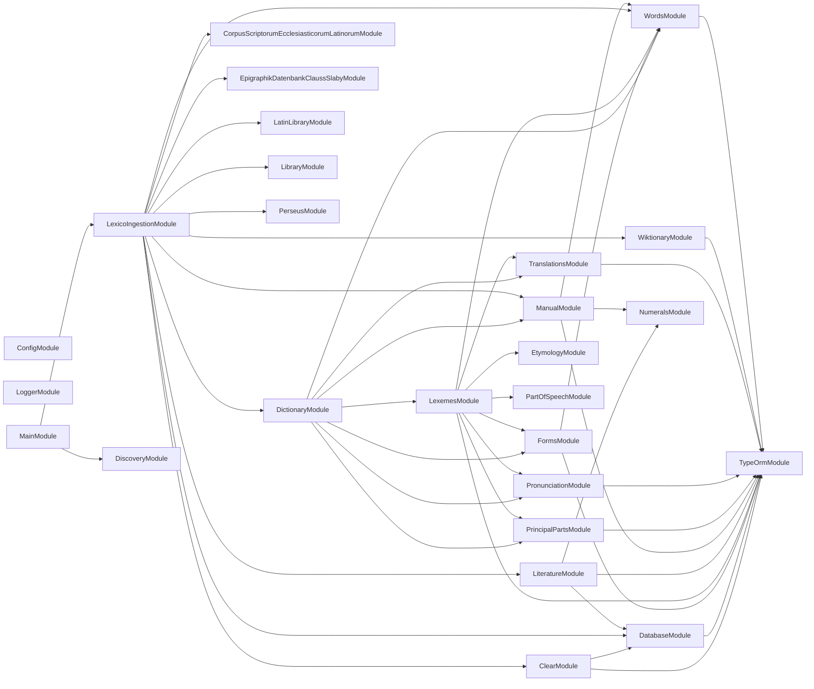

# 🚰 Lexico Ingestion

**Where the dictionary comes from.** A NestJS command-line application that
scrapes, parses, and loads the sources behind
[Lexico](../lexico/README.md) into the schema defined by
[lexico-entities](../../packages/lexico-entities/README.md).

## Quick Start

```bash
cp .env.default .env      # Database connection
nx run lexico-ingestion:start
```

The default command is the root pipeline, which prompts for any stage flags it
was not given and then runs the selected stages in order.

```bash
nx run lexico-ingestion:start -- --dictionary --literature
```

| Stage flag | Ingests |
| ---------- | ------- |
| `--dictionary` | Dictionary entries, forms, and inflections |
| `--library` | The library of works |
| `--library-sources` | The upstream sources each work came from |
| `--literature` | Lines and tokens of each text |
| `--wikipedia` | Wiktionary pages |

## Individual stages

Every stage is also its own command, addressable as a `start` configuration:

```bash
nx run lexico-ingestion:start:dictionary -- --startLemma=a --endLemma=c
nx run lexico-ingestion:start:wiktionary
nx run lexico-ingestion:start:clear
```

| Command | Source |
| ------- | ------ |
| `dictionary` | Dictionary entries, resumable with `--startLemma` / `--endLemma` |
| `wiktionary` | Wiktionary page dumps |
| `perseus` | The Perseus Digital Library |
| `latin-library` | The Latin Library |
| `corpus-scriptorum-ecclesiasticorum-latinorum` | CSEL, the ecclesiastical Latin corpus |
| `epigraphik-datenbank-clauss-slaby` | EDCS, the Latin inscription database |
| `library` | Library and work metadata |
| `literature` | Lines and tokens for loaded texts |
| `clear` | Empties ingested tables so a run can start clean |

The lemma range on `dictionary` is what makes a long scrape restartable: a run
that stops partway is resumed by pointing `--startLemma` at where it left off
rather than starting over.

## How it works

Each source has its own module under `src/modules/`, holding the fetcher, the
parser for that source's markup, and the mapping into entities. HTML is parsed
with [cheerio](https://cheerio.js.org) and wiki markup through mdast, so a
change to one site's layout is contained to one module.

Nothing here defines the schema. Entities and migrations come from
[`@codebase/lexico-entities`](../../packages/lexico-entities/README.md), so the
shape ingestion writes and the shape the application reads cannot drift.

## Module Graph

The modules this project defines and the imports between them, regenerated by `nx run synchronization:synchronize --configuration=write`.

<!-- nestjs-module-graph-start -->



<!-- nestjs-module-graph-end -->

## Start

```bash
nx run lexico-ingestion:start
```

## Test

```bash
nx run lexico-ingestion:vitest
```

## Development

```bash
nx run lexico-ingestion:typecheck
nx run lexico-ingestion:lint-codebase --configuration=write
```

Run migrations before a first ingestion:

```bash
nx run lexico-entities:migration:run
```

## Related

- 🐺 [lexico](../lexico/README.md) — the web application
- 📖 [lexico-entities](../../packages/lexico-entities/README.md) — the schema this writes to
- 🎨 [lexico-components](../../packages/lexico-components/README.md) — the interface

## License

MIT — see [LICENSE](../../LICENSE).
