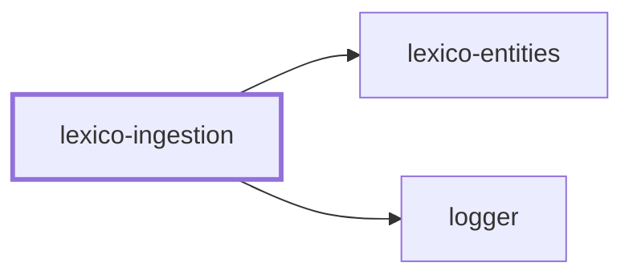

# 🚰 Lexico Ingestion

**Where the dictionary comes from.** A NestJS command-line application that
scrapes, parses, and loads the sources behind
[Lexico](../lexico/README.md) into the schema defined by
[lexico-entities](../../packages/lexico-entities/README.md).

## Quick Start

```bash
cp .env.default .env      # Database connection
nx run lexico-ingestion:start
```

The default command is the root pipeline, which prompts for any stage flags it
was not given and then runs the selected stages in order.

```bash
nx run lexico-ingestion:start -- --dictionary --literature
```

| Stage flag | Ingests |
| ---------- | ------- |
| `--dictionary` | Dictionary entries, forms, and inflections |
| `--library` | The library of works |
| `--library-sources` | The upstream sources each work came from |
| `--literature` | Lines and tokens of each text |
| `--wikipedia` | Wiktionary pages |

## Individual stages

Every stage is also its own command, addressable as a `start` configuration:

```bash
nx run lexico-ingestion:start:dictionary -- --startLemma=a --endLemma=c
nx run lexico-ingestion:start:wiktionary
nx run lexico-ingestion:start:clear
```

| Command | Source |
| ------- | ------ |
| `dictionary` | Dictionary entries, resumable with `--startLemma` / `--endLemma` |
| `wiktionary` | Wiktionary page dumps |
| `perseus` | The Perseus Digital Library |
| `latin-library` | The Latin Library |
| `corpus-scriptorum-ecclesiasticorum-latinorum` | CSEL, the ecclesiastical Latin corpus |
| `epigraphik-datenbank-clauss-slaby` | EDCS, the Latin inscription database |
| `library` | Library and work metadata |
| `literature` | Lines and tokens for loaded texts |
| `clear` | Empties ingested tables so a run can start clean |

The lemma range on `dictionary` is what makes a long scrape restartable: a run
that stops partway is resumed by pointing `--startLemma` at where it left off
rather than starting over.

## How it works

Each source has its own module under `src/modules/`, holding the fetcher, the
parser for that source's markup, and the mapping into entities. HTML is parsed
with [cheerio](https://cheerio.js.org) and wiki markup through mdast, so a
change to one site's layout is contained to one module.

Nothing here defines the schema. Entities and migrations come from
[`@codebase/lexico-entities`](../../packages/lexico-entities/README.md), so the
shape ingestion writes and the shape the application reads cannot drift.

## Project Graph

Where this project sits in the Nx project graph: what it depends on, and what depends on it. Regenerated by `nx run synchronization:nx-project-graphs:write`.

<!-- nx-project-graph-start -->



<!-- nx-project-graph-end -->

## Module Graph

The modules this project defines and the imports between them, published by `nx run synchronization:nestjs-module-graphs:write`.

<!-- nestjs-module-graph-start -->


_Rounded modules are global: every module can inject them, so their edges are left out._

<!-- nestjs-module-graph-end -->

## Start

```bash
nx run lexico-ingestion:start
```

## Test

```bash
nx run lexico-ingestion:vitest
```

## Development

```bash
nx run lexico-ingestion:typecheck
nx run lexico-ingestion:lint-codebase --configuration=write
```

Run migrations before a first ingestion:

```bash
nx run lexico-entities:migration:run
```

## Related

- 🐺 [lexico](../lexico/README.md) — the web application
- 📖 [lexico-entities](../../packages/lexico-entities/README.md) — the schema this writes to
- 🎨 [lexico-components](../../packages/lexico-components/README.md) — the interface

## License

MIT — see [LICENSE](../../LICENSE).

<!-- CALL_STACKS_START -->

## 🔭 Callidescope

Call stacks traced through `lexico-ingestion`, deepest first. Each frame shows what it takes, what it returns, and what its documentation says.

| Measure | Value |
| --- | --- |
| Callables | 576 |
| Files | 107 |
| Calls traced | 804 |
| Call stacks | 54 |
| Deepest stack | 19 |
| Stacks through recursion | 3 |
| Unfollowable calls | 103 |

### Call stacks (depth)

**1. `LexicoIngestionCommand.run`** — depth ≥ 19 · decorated-method

```text
🚀 LexicoIngestionCommand.run(…): Promise<void> [applications/lexico-ingestion/src/modules/lexico-ingestion/lexico-ingestion.command.ts:219]
   ↳ Executes the selected stage sequence after prompting for any unspecified toggles.
  └─> LexicoIngestionCommand.executeStages(options: LexicoIngestionCommandOptions): Promise<void> [applications/lexico-ingestion/src/modules/lexico-ingestion/lexico-ingestion.command.ts:54]
     ↳ Processes one workflow step for root ingestion pipeline execution.
    └─> DictionaryCommand.ingestAll(startLemma?: string, endLemma?: string): Promise<void> [applications/lexico-ingestion/src/modules/dictionary/dictionary.command.ts:319]
       ↳ Iterates cached `data/wiktionary/*.json` pages within an optional lemma range and ingests each file into persisted…
      └─> DictionaryCommand.processFile(file: string, current: number, total: number): Promise<void> [applications/lexico-ingestion/src/modules/dictionary/dictionary.command.ts:222]
         ↳ Processes one workflow step for dictionary ingestion.
        └─> DictionaryCommand.ingestLexeme(…): Promise<void> (cycle) [applications/lexico-ingestion/src/modules/dictionary/dictionary.command.ts:353]
           ↳ Ingests one lemma by parsing its Wiktionary HTML into lexemes, saving relations, and recursively resolving…
          └─> DictionaryCommand.processTranslationReferences(saved: Lexeme): Promise<void> (cycle) [applications/lexico-ingestion/src/modules/dictionary/dictionary.command.ts:282]
             ↳ Processes one workflow step for dictionary ingestion.
            └─> LexemesService.parseLexemes(wiktionaryPage: WiktionaryPage): Promise<Lexeme[]> [applications/lexico-ingestion/src/modules/lexemes/lexemes.service.ts:305]
               ↳ Parses one Wiktionary page into lexemes by iterating `p:has(strong.Latn.headword)` sections and enriching each accepted…
              └─> LexemesService.parseLexemeFromElement(…): Promise<Lexeme | null> [applications/lexico-ingestion/src/modules/lexemes/lexemes.service.ts:144]
                 ↳ Parses and normalizes inputs for lexeme parsing and persistence.
                └─> LexemesService.enrichLexeme(…): Promise<void> [applications/lexico-ingestion/src/modules/lexemes/lexemes.service.ts:71]
                   ↳ Handles an internal workflow step for lexeme parsing and persistence.
                  └─> FormsService.buildFormsForPartOfSpeech(pos: PartOfSpeech, rawForms: unknown, lexeme: Lexeme): Form[] [applications/lexico-ingestion/src/modules/forms/forms.service.ts:127]
                     ↳ Builds Form entities from the raw parsed forms object for a given POS.
                    └─> FormsBuilderOtherService.buildFormsForPartOfSpeech(pos: PartOfSpeech, rawForms: unknown, lexeme: Lexeme): Form[] [applications/lexico-ingestion/src/modules/forms/forms-builder-other.service.ts:482]
                       ↳ Builds Form entities for a given part-of-speech category.
                      └─> FormsBuilderOtherService.buildVerbFormsFromRaw(rawForms: unknown, lexeme: Lexeme): Form[] [applications/lexico-ingestion/src/modules/forms/forms-builder-other.service.ts:393]
                         ↳ Builds structured data used during form entity building.
                        └─> FormsBuilderOtherService.buildFiniteMoodForms(moodData: Record<string, unknown>, mood: FormMood, lexeme: Lexeme): Form[] [applications/lexico-ingestion/src/modules/forms/forms-builder-other.service.ts:160]
                           ↳ Builds structured data used during form entity building.
                          └─> FormsBuilderOtherService.buildFiniteTenseForms(…): Form[] [applications/lexico-ingestion/src/modules/forms/forms-builder-other.service.ts:237]
                             ↳ Builds structured data used during form entity building.
                            └─> FormsBuilderOtherService.buildFiniteNumberForms(…): Form[] [applications/lexico-ingestion/src/modules/forms/forms-builder-other.service.ts:186]
                               ↳ Builds structured data used during form entity building.
                              └─> FormsBuilderOtherService.buildFinitePersonForms(…): Form[] [applications/lexico-ingestion/src/modules/forms/forms-builder-other.service.ts:214]
                                 ↳ Builds structured data used during form entity building.
                                └─> FormsBuilderVerbService.buildFinitePersonForms(args: BuildFinitePersonFormsArguments): Form[] [applications/lexico-ingestion/src/modules/forms/forms-builder-verb.service.ts:121]
                                   ↳ Builds finite verb forms for specific persons based on the provided arguments, including lexeme, mood, number, tense,…
                                  └─> FormsBuilderVerbService.buildFiniteVerbForm(…): Form [applications/lexico-ingestion/src/modules/forms/forms-builder-verb.service.ts:55]
                                     ↳ Builds a finite verb form for a specific person based on the provided arguments, including lexeme, mood, number, tense,…
                                    └─> FormsTransientWordsService.setTransientWords(form: Form, words: string[]): void [applications/lexico-ingestion/src/modules/forms/forms-transient-words.service.ts:34]
                                       ↳ Associates a list of transient words with a given Form entity.
```

**2. `DictionaryCommand.run`** — depth ≥ 18 · decorated-method

```text
🚀 DictionaryCommand.run(_arguments: string[], options: DictionaryCommandOptions): Promise<void> [applications/lexico-ingestion/src/modules/dictionary/dictionary.command.ts:472]
   ↳ Runs full dictionary ingestion for the selected lemma range, then applies manual entries.
  └─> DictionaryCommand.ingestAll(startLemma?: string, endLemma?: string): Promise<void> [applications/lexico-ingestion/src/modules/dictionary/dictionary.command.ts:319]
     ↳ Iterates cached `data/wiktionary/*.json` pages within an optional lemma range and ingests each file into persisted…
    └─> DictionaryCommand.processFile(file: string, current: number, total: number): Promise<void> [applications/lexico-ingestion/src/modules/dictionary/dictionary.command.ts:222]
       ↳ Processes one workflow step for dictionary ingestion.
      └─> DictionaryCommand.ingestLexeme(…): Promise<void> (cycle) [applications/lexico-ingestion/src/modules/dictionary/dictionary.command.ts:353]
         ↳ Ingests one lemma by parsing its Wiktionary HTML into lexemes, saving relations, and recursively resolving…
        └─> DictionaryCommand.processTranslationReferences(saved: Lexeme): Promise<void> (cycle) [applications/lexico-ingestion/src/modules/dictionary/dictionary.command.ts:282]
           ↳ Processes one workflow step for dictionary ingestion.
          └─> LexemesService.parseLexemes(wiktionaryPage: WiktionaryPage): Promise<Lexeme[]> [applications/lexico-ingestion/src/modules/lexemes/lexemes.service.ts:305]
             ↳ Parses one Wiktionary page into lexemes by iterating `p:has(strong.Latn.headword)` sections and enriching each accepted…
            └─> LexemesService.parseLexemeFromElement(…): Promise<Lexeme | null> [applications/lexico-ingestion/src/modules/lexemes/lexemes.service.ts:144]
               ↳ Parses and normalizes inputs for lexeme parsing and persistence.
              └─> LexemesService.enrichLexeme(…): Promise<void> [applications/lexico-ingestion/src/modules/lexemes/lexemes.service.ts:71]
                 ↳ Handles an internal workflow step for lexeme parsing and persistence.
                └─> FormsService.buildFormsForPartOfSpeech(pos: PartOfSpeech, rawForms: unknown, lexeme: Lexeme): Form[] [applications/lexico-ingestion/src/modules/forms/forms.service.ts:127]
                   ↳ Builds Form entities from the raw parsed forms object for a given POS.
                  └─> FormsBuilderOtherService.buildFormsForPartOfSpeech(pos: PartOfSpeech, rawForms: unknown, lexeme: Lexeme): Form[] [applications/lexico-ingestion/src/modules/forms/forms-builder-other.service.ts:482]
                     ↳ Builds Form entities for a given part-of-speech category.
                    └─> FormsBuilderOtherService.buildVerbFormsFromRaw(rawForms: unknown, lexeme: Lexeme): Form[] [applications/lexico-ingestion/src/modules/forms/forms-builder-other.service.ts:393]
                       ↳ Builds structured data used during form entity building.
                      └─> FormsBuilderOtherService.buildFiniteMoodForms(moodData: Record<string, unknown>, mood: FormMood, lexeme: Lexeme): Form[] [applications/lexico-ingestion/src/modules/forms/forms-builder-other.service.ts:160]
                         ↳ Builds structured data used during form entity building.
                        └─> FormsBuilderOtherService.buildFiniteTenseForms(…): Form[] [applications/lexico-ingestion/src/modules/forms/forms-builder-other.service.ts:237]
                           ↳ Builds structured data used during form entity building.
                          └─> FormsBuilderOtherService.buildFiniteNumberForms(…): Form[] [applications/lexico-ingestion/src/modules/forms/forms-builder-other.service.ts:186]
                             ↳ Builds structured data used during form entity building.
                            └─> FormsBuilderOtherService.buildFinitePersonForms(…): Form[] [applications/lexico-ingestion/src/modules/forms/forms-builder-other.service.ts:214]
                               ↳ Builds structured data used during form entity building.
                              └─> FormsBuilderVerbService.buildFinitePersonForms(args: BuildFinitePersonFormsArguments): Form[] [applications/lexico-ingestion/src/modules/forms/forms-builder-verb.service.ts:121]
                                 ↳ Builds finite verb forms for specific persons based on the provided arguments, including lexeme, mood, number, tense,…
                                └─> FormsBuilderVerbService.buildFiniteVerbForm(…): Form [applications/lexico-ingestion/src/modules/forms/forms-builder-verb.service.ts:55]
                                   ↳ Builds a finite verb form for a specific person based on the provided arguments, including lexeme, mood, number, tense,…
                                  └─> FormsTransientWordsService.setTransientWords(form: Form, words: string[]): void [applications/lexico-ingestion/src/modules/forms/forms-transient-words.service.ts:34]
                                     ↳ Associates a list of transient words with a given Form entity.
```

**3. `LibraryCommand.run`** — depth ≥ 15 · decorated-method

```text
🚀 LibraryCommand.run(_arguments: string[], options: LibraryCommandOptions): Promise<void> [applications/lexico-ingestion/src/modules/library/library.command.ts:466]
   ↳ Orchestrates provider execution with optional author/text scoping and progress logging.
  └─> LibraryCommand.processProvider(…): Promise<void> [applications/lexico-ingestion/src/modules/library/library.command.ts:157]
     ↳ Processes one workflow step for library provider orchestration.
    └─> PerseusLibraryProvider.ingest(options?: { author?: string; text?: string; }): Promise<Author[]> [applications/lexico-ingestion/src/modules/library/providers/perseus-library.provider.ts:371]
       ↳ Fetch authors, works, and output markdown files to the data directory.
      └─> PerseusLibraryProvider.processPerseusFile(…): Promise<void> [applications/lexico-ingestion/src/modules/library/providers/perseus-library.provider.ts:175]
         ↳ Processes one workflow step for Perseus XML ingestion.
        └─> PerseusLibraryProvider.processSourceXmlFile(…): Promise<void> [applications/lexico-ingestion/src/modules/library/providers/perseus-library.provider.ts:219]
           ↳ Processes one workflow step for Perseus XML ingestion.
          └─> PerseusLibraryProvider.writeSourceTextForAuthor(…): Promise<void> [applications/lexico-ingestion/src/modules/library/providers/perseus-library.provider.ts:311]
             ↳ Persists generated output for Perseus XML ingestion.
            └─> PerseusLibraryProvider.writeSourceMarkdownFiles(…): Promise<void> [applications/lexico-ingestion/src/modules/library/providers/perseus-library.provider.ts:263]
               ↳ Persists generated output for Perseus XML ingestion.
              └─> PerseusLibraryTextExtractionProvider.extractTextNodes(…): void (cycle) [applications/lexico-ingestion/src/modules/library/providers/perseus-library-text-extraction.provider.ts:206]
                 ↳ Builds markdown file payloads from nested Perseus `textpart` elements.
                └─> PerseusLibraryTextExtractionProvider.processTextPartChildren(…): void (cycle) [applications/lexico-ingestion/src/modules/library/providers/perseus-library-text-extraction.provider.ts:150]
                   ↳ Recurses into child text parts and writes direct child paragraphs.
                  └─> PerseusLibraryTextExtractionProvider.extractChildTextParts(…): void (cycle) [applications/lexico-ingestion/src/modules/library/providers/perseus-library-text-extraction.provider.ts:57]
                     ↳ Visits nested Perseus `textpart` children and extracts eligible sections.
                    └─> PerseusLibraryTextExtractionProvider.each(…)(_index: number, child: AnyNode): void (cycle) [applications/lexico-ingestion/src/modules/library/providers/perseus-library-text-extraction.provider.ts:66]
                      └─> PerseusLibraryTextExtractionProvider.processLeafTextPart(…): void [applications/lexico-ingestion/src/modules/library/providers/perseus-library-text-extraction.provider.ts:110]
                         ↳ Handles leaf nodes that write one markdown text file.
                        └─> PerseusLibraryTextExtractionProvider.collectParagraphsFromElements(elements: cheerio.Cheerio<AnyNode>, $: cheerio.CheerioAPI): string[] [applications/lexico-ingestion/src/modules/library/providers/perseus-library-text-extraction.provider.ts:26]
                           ↳ Collects normalized paragraph text from Perseus XML elements.
                          └─> PerseusLibraryTextExtractionProvider.each(…)(_index: number, paragraphElement: AnyNode): void [applications/lexico-ingestion/src/modules/library/providers/perseus-library-text-extraction.provider.ts:32]
                            └─> formatLineNumber(line: string): string [applications/lexico-ingestion/src/modules/library/library.utilities.ts:18]
                               ↳ Format line numbers consistently.
```

<details>
<summary>51 more call stacks</summary>

**4. `WiktionaryCommand.run`** — depth ≥ 11 · decorated-method

```text
🚀 WiktionaryCommand.run(): Promise<void> [applications/lexico-ingestion/src/modules/wiktionary/wiktionary.command.ts:302]
   ↳ Runs the Wiktionary ingestion pipeline.
  └─> WiktionaryCommand.ingestWiktionary(): Promise<void> [applications/lexico-ingestion/src/modules/wiktionary/wiktionary.command.ts:287]
     ↳ Scrapes every configured Latin category from Wiktionary, stores each article's HTML as a JSON file under…
    └─> WiktionaryCommand.ingestCategory(category?: Category, startPath?: string): Promise<void> [applications/lexico-ingestion/src/modules/wiktionary/wiktionary.command.ts:139]
       ↳ Ingests category in the Wiktionary ingestion pipeline.
      └─> WiktionaryCommand.processWiktionaryCategoryLink(a: Element, $: cheerio.CheerioAPI, category: string): Promise<void> [applications/lexico-ingestion/src/modules/wiktionary/wiktionary.command.ts:233]
         ↳ Processes wiktionary category link during Wiktionary ingestion.
        └─> WiktionaryCommand.ingestWord(word: string, urlPath: string, category: string): Promise<void> [applications/lexico-ingestion/src/modules/wiktionary/wiktionary.command.ts:176]
           ↳ Ingests word in the Wiktionary ingestion pipeline.
          └─> WiktionaryCommand.parseLatinSection(…): Promise<{ $: CheerioAPI; section: Cheerio<AnyNode>; } | null> [applications/lexico-ingestion/src/modules/wiktionary/wiktionary.command.ts:212]
             ↳ Parses latin section during Wiktionary ingestion.
            └─> WiktionaryCommand.fetchWithRetry(url: string, retries?: number): Promise<Response> [applications/lexico-ingestion/src/modules/wiktionary/wiktionary.command.ts:82]
               ↳ Fetch with retry for Wiktionary ingestion.
              └─> LoggerService.warn(message: unknown, context?: string, data?: LogData): void [packages/logger/src/modules/logger/logger.service.ts:312]
                 ↳ Logs a warning message at the `warn` level.
                └─> LoggerService.buildBindings(…): Record<string, unknown> [packages/logger/src/modules/logger/logger.service.ts:140]
                   ↳ Assembles the object pino merges into the line.
                  └─> LoggerService.assertConventionalMessage(args: { context: string | undefined; parsed: ParsedLogMessage; }): void [packages/logger/src/modules/logger/logger.service.ts:107]
                     ↳ Fails a malformed message in development, and never in production.
                    └─> LoggerService.isConventionalVerb(word: string): boolean [packages/logger/src/modules/logger/logger.service.ts:165]
                       ↳ Whether a word is a verb in one of the two tenses the convention allows.
```

**5. `LatinLibraryCommand.run`** — depth ≥ 9 · decorated-method

```text
🚀 LatinLibraryCommand.run(): Promise<void> [applications/lexico-ingestion/src/modules/latin-library/latin-library.command.ts:381]
   ↳ Crawls The Latin Library and caches discovered HTML pages locally.
  └─> LatinLibraryCommand.getFinalAuthorUrls(host: string, authorUrls: string[]): Promise<string[]> [applications/lexico-ingestion/src/modules/latin-library/latin-library.command.ts:149]
     ↳ Resolves derived values needed by Latin Library source crawling.
    └─> LatinLibraryCommand.processCategoryHref(href: string, host: string, finalAuthorUrls: string[]): Promise<void> [applications/lexico-ingestion/src/modules/latin-library/latin-library.command.ts:290]
       ↳ Processes one workflow step for Latin Library source crawling.
      └─> LatinLibraryCommand.fetchAndCachePage(urlString: string, host: string): Promise<string> [applications/lexico-ingestion/src/modules/latin-library/latin-library.command.ts:86]
         ↳ Loads source data required by Latin Library source crawling.
        └─> LatinLibraryCommand.downloadAndSaveLatinLibraryFile(parsedUrl: URL, targetPath: string): Promise<string> [applications/lexico-ingestion/src/modules/latin-library/latin-library.command.ts:46]
           ↳ Handles an internal workflow step for Latin Library source crawling.
          └─> LoggerService.warn(message: unknown, context?: string, data?: LogData): void [packages/logger/src/modules/logger/logger.service.ts:312]
             ↳ Logs a warning message at the `warn` level.
            └─> LoggerService.buildBindings(…): Record<string, unknown> [packages/logger/src/modules/logger/logger.service.ts:140]
               ↳ Assembles the object pino merges into the line.
              └─> LoggerService.assertConventionalMessage(args: { context: string | undefined; parsed: ParsedLogMessage; }): void [packages/logger/src/modules/logger/logger.service.ts:107]
                 ↳ Fails a malformed message in development, and never in production.
                └─> LoggerService.isConventionalVerb(word: string): boolean [packages/logger/src/modules/logger/logger.service.ts:165]
                   ↳ Whether a word is a verb in one of the two tenses the convention allows.
```

**6. `LiteratureCommand.run`** — depth ≥ 9 · decorated-method

```text
🚀 LiteratureCommand.run(_arguments: string[], options: LiteratureCommandOptions): Promise<void> [applications/lexico-ingestion/src/modules/literature/literature.command.ts:257]
   ↳ Runs literature ingestion for the selected provider/author/text scope.
  └─> LiteratureCommand.parseProvider(provider?: string): Promise<string | undefined> [applications/lexico-ingestion/src/modules/literature/literature.command.ts:188]
     ↳ Resolves the optional `--provider` filter from CLI input or interactive selection.
    └─> LiteratureCommand.getProviderChoices(): Promise<{ title: string; value: string; }[]> [applications/lexico-ingestion/src/modules/literature/literature.command.ts:91]
       ↳ Gets provider choices used by literature ingestion.
      └─> LiteratureService.scanLibrary(): Promise<LibraryEntry[]> [applications/lexico-ingestion/src/modules/literature/literature.service.ts:507]
         ↳ Scans the local library directory and returns discovered text entries.
        └─> LiteratureLibraryScanService.scanLibrary(): Promise<LibraryEntry[]> [applications/lexico-ingestion/src/modules/literature/literature-library-scan.service.ts:84]
           ↳ Walks the library data directory and collects text file metadata.
          └─> LoggerService.warn(message: unknown, context?: string, data?: LogData): void [packages/logger/src/modules/logger/logger.service.ts:312]
             ↳ Logs a warning message at the `warn` level.
            └─> LoggerService.buildBindings(…): Record<string, unknown> [packages/logger/src/modules/logger/logger.service.ts:140]
               ↳ Assembles the object pino merges into the line.
              └─> LoggerService.assertConventionalMessage(args: { context: string | undefined; parsed: ParsedLogMessage; }): void [packages/logger/src/modules/logger/logger.service.ts:107]
                 ↳ Fails a malformed message in development, and never in production.
                └─> LoggerService.isConventionalVerb(word: string): boolean [packages/logger/src/modules/logger/logger.service.ts:165]
                   ↳ Whether a word is a verb in one of the two tenses the convention allows.
```

**7. `EpigraphikDatenbankClaussSlabyCommand.run`** — depth 8 · decorated-method

```text
🚀 EpigraphikDatenbankClaussSlabyCommand.run(): Promise<void> [applications/lexico-ingestion/src/modules/epigraphik-datenbank-clauss-slaby/epigraphik-datenbank-clauss-slaby.command.ts:137]
   ↳ Runs the ingestion of epigraphs by downloading chunks to the filesystem
  └─> EpigraphikDatenbankClaussSlabyCommand.downloadChunkIfMissing(start: number): Promise<boolean> [applications/lexico-ingestion/src/modules/epigraphik-datenbank-clauss-slaby/epigraphik-datenbank-clauss-slaby.command.ts:75]
     ↳ Handles an internal workflow step for EDCS chunk ingestion.
    └─> EpigraphikDatenbankClaussSlabyCommand.downloadChunkData(start: number, chunkFile: string): Promise<boolean> [applications/lexico-ingestion/src/modules/epigraphik-datenbank-clauss-slaby/epigraphik-datenbank-clauss-slaby.command.ts:50]
       ↳ Handles an internal workflow step for EDCS chunk ingestion.
      └─> EpigraphikDatenbankClaussSlabyCommand.saveChunkData(start: number, chunkFile: string): Promise<boolean> [applications/lexico-ingestion/src/modules/epigraphik-datenbank-clauss-slaby/epigraphik-datenbank-clauss-slaby.command.ts:97]
         ↳ Persists generated output for EDCS chunk ingestion.
        └─> LoggerService.warn(message: unknown, context?: string, data?: LogData): void [packages/logger/src/modules/logger/logger.service.ts:312]
           ↳ Logs a warning message at the `warn` level.
          └─> LoggerService.buildBindings(…): Record<string, unknown> [packages/logger/src/modules/logger/logger.service.ts:140]
             ↳ Assembles the object pino merges into the line.
            └─> LoggerService.assertConventionalMessage(args: { context: string | undefined; parsed: ParsedLogMessage; }): void [packages/logger/src/modules/logger/logger.service.ts:107]
               ↳ Fails a malformed message in development, and never in production.
              └─> LoggerService.isConventionalVerb(word: string): boolean [packages/logger/src/modules/logger/logger.service.ts:165]
                 ↳ Whether a word is a verb in one of the two tenses the convention allows.
```

**8. `LiteratureCommand.parseAuthor`** — depth 8 · decorated-method

```text
🚀 LiteratureCommand.parseAuthor(author?: string, provider?: string): Promise<string | undefined> [applications/lexico-ingestion/src/modules/literature/literature.command.ts:153]
   ↳ Resolves the optional `--author` filter from CLI input or interactive selection.
  └─> LiteratureCommand.getAuthorChoices(provider?: string): Promise<{ title: string; value: string; }[]> [applications/lexico-ingestion/src/modules/literature/literature.command.ts:75]
     ↳ Gets author choices used by literature ingestion.
    └─> LiteratureService.scanLibrary(): Promise<LibraryEntry[]> [applications/lexico-ingestion/src/modules/literature/literature.service.ts:507]
       ↳ Scans the local library directory and returns discovered text entries.
      └─> LiteratureLibraryScanService.scanLibrary(): Promise<LibraryEntry[]> [applications/lexico-ingestion/src/modules/literature/literature-library-scan.service.ts:84]
         ↳ Walks the library data directory and collects text file metadata.
        └─> LoggerService.warn(message: unknown, context?: string, data?: LogData): void [packages/logger/src/modules/logger/logger.service.ts:312]
           ↳ Logs a warning message at the `warn` level.
          └─> LoggerService.buildBindings(…): Record<string, unknown> [packages/logger/src/modules/logger/logger.service.ts:140]
             ↳ Assembles the object pino merges into the line.
            └─> LoggerService.assertConventionalMessage(args: { context: string | undefined; parsed: ParsedLogMessage; }): void [packages/logger/src/modules/logger/logger.service.ts:107]
               ↳ Fails a malformed message in development, and never in production.
              └─> LoggerService.isConventionalVerb(word: string): boolean [packages/logger/src/modules/logger/logger.service.ts:165]
                 ↳ Whether a word is a verb in one of the two tenses the convention allows.
```

**9. `LiteratureCommand.parseProvider`** — depth 8 · decorated-method

```text
🚀 LiteratureCommand.parseProvider(provider?: string): Promise<string | undefined> [applications/lexico-ingestion/src/modules/literature/literature.command.ts:188]
   ↳ Resolves the optional `--provider` filter from CLI input or interactive selection.
  └─> LiteratureCommand.getProviderChoices(): Promise<{ title: string; value: string; }[]> [applications/lexico-ingestion/src/modules/literature/literature.command.ts:91]
     ↳ Gets provider choices used by literature ingestion.
    └─> LiteratureService.scanLibrary(): Promise<LibraryEntry[]> [applications/lexico-ingestion/src/modules/literature/literature.service.ts:507]
       ↳ Scans the local library directory and returns discovered text entries.
      └─> LiteratureLibraryScanService.scanLibrary(): Promise<LibraryEntry[]> [applications/lexico-ingestion/src/modules/literature/literature-library-scan.service.ts:84]
         ↳ Walks the library data directory and collects text file metadata.
        └─> LoggerService.warn(message: unknown, context?: string, data?: LogData): void [packages/logger/src/modules/logger/logger.service.ts:312]
           ↳ Logs a warning message at the `warn` level.
          └─> LoggerService.buildBindings(…): Record<string, unknown> [packages/logger/src/modules/logger/logger.service.ts:140]
             ↳ Assembles the object pino merges into the line.
            └─> LoggerService.assertConventionalMessage(args: { context: string | undefined; parsed: ParsedLogMessage; }): void [packages/logger/src/modules/logger/logger.service.ts:107]
               ↳ Fails a malformed message in development, and never in production.
              └─> LoggerService.isConventionalVerb(word: string): boolean [packages/logger/src/modules/logger/logger.service.ts:165]
                 ↳ Whether a word is a verb in one of the two tenses the convention allows.
```

**10. `LiteratureCommand.parseText`** — depth 8 · decorated-method

```text
🚀 LiteratureCommand.parseText(…): Promise<string | undefined> [applications/lexico-ingestion/src/modules/literature/literature.command.ts:218]
   ↳ Resolves the optional `--text` filter from CLI input or interactive selection.
  └─> LiteratureCommand.getTextChoices(…): Promise<{ title: string; value: string; }[]> [applications/lexico-ingestion/src/modules/literature/literature.command.ts:104]
     ↳ Gets text choices used by literature ingestion.
    └─> LiteratureService.scanLibrary(): Promise<LibraryEntry[]> [applications/lexico-ingestion/src/modules/literature/literature.service.ts:507]
       ↳ Scans the local library directory and returns discovered text entries.
      └─> LiteratureLibraryScanService.scanLibrary(): Promise<LibraryEntry[]> [applications/lexico-ingestion/src/modules/literature/literature-library-scan.service.ts:84]
         ↳ Walks the library data directory and collects text file metadata.
        └─> LoggerService.warn(message: unknown, context?: string, data?: LogData): void [packages/logger/src/modules/logger/logger.service.ts:312]
           ↳ Logs a warning message at the `warn` level.
          └─> LoggerService.buildBindings(…): Record<string, unknown> [packages/logger/src/modules/logger/logger.service.ts:140]
             ↳ Assembles the object pino merges into the line.
            └─> LoggerService.assertConventionalMessage(args: { context: string | undefined; parsed: ParsedLogMessage; }): void [packages/logger/src/modules/logger/logger.service.ts:107]
               ↳ Fails a malformed message in development, and never in production.
              └─> LoggerService.isConventionalVerb(word: string): boolean [packages/logger/src/modules/logger/logger.service.ts:165]
                 ↳ Whether a word is a verb in one of the two tenses the convention allows.
```

**11. `LatinLibraryCommand.worker`** — depth ≥ 8 · orphan-root

```text
🚀 LatinLibraryCommand.worker(): Promise<void> [applications/lexico-ingestion/src/modules/latin-library/latin-library.command.ts:419]
  └─> LatinLibraryCommand.processQueueUrl(urlString: string, host: string, enqueue: (url: string) => void): Promise<void> [applications/lexico-ingestion/src/modules/latin-library/latin-library.command.ts:345]
     ↳ Processes one workflow step for Latin Library source crawling.
    └─> LatinLibraryCommand.fetchAndCachePage(urlString: string, host: string): Promise<string> [applications/lexico-ingestion/src/modules/latin-library/latin-library.command.ts:86]
       ↳ Loads source data required by Latin Library source crawling.
      └─> LatinLibraryCommand.downloadAndSaveLatinLibraryFile(parsedUrl: URL, targetPath: string): Promise<string> [applications/lexico-ingestion/src/modules/latin-library/latin-library.command.ts:46]
         ↳ Handles an internal workflow step for Latin Library source crawling.
        └─> LoggerService.warn(message: unknown, context?: string, data?: LogData): void [packages/logger/src/modules/logger/logger.service.ts:312]
           ↳ Logs a warning message at the `warn` level.
          └─> LoggerService.buildBindings(…): Record<string, unknown> [packages/logger/src/modules/logger/logger.service.ts:140]
             ↳ Assembles the object pino merges into the line.
            └─> LoggerService.assertConventionalMessage(args: { context: string | undefined; parsed: ParsedLogMessage; }): void [packages/logger/src/modules/logger/logger.service.ts:107]
               ↳ Fails a malformed message in development, and never in production.
              └─> LoggerService.isConventionalVerb(word: string): boolean [packages/logger/src/modules/logger/logger.service.ts:165]
                 ↳ Whether a word is a verb in one of the two tenses the convention allows.
```

**12. `ClearCommand.run`** — depth 7 · decorated-method

```text
🚀 ClearCommand.run(_passedParameters: string[], options: ClearCommandOptions): Promise<void> [applications/lexico-ingestion/src/modules/clear/clear.command.ts:138]
   ↳ Runs the clear pipeline for the options provided. If no options are specified, it prompts the user.
  └─> ClearCommand.clearLiterature(): Promise<void> [applications/lexico-ingestion/src/modules/clear/clear.command.ts:72]
     ↳ Deletes all literature data
    └─> LoggerService.log(message: unknown, context?: string, data?: LogData): void [packages/logger/src/modules/logger/logger.service.ts:292]
       ↳ Logs an informational message at the `info` level.
      └─> LoggerService.info(message: unknown, context?: string, data?: LogData): void [packages/logger/src/modules/logger/logger.service.ts:276]
         ↳ Logs an informational message at the `info` level.
        └─> LoggerService.buildBindings(…): Record<string, unknown> [packages/logger/src/modules/logger/logger.service.ts:140]
           ↳ Assembles the object pino merges into the line.
          └─> LoggerService.assertConventionalMessage(args: { context: string | undefined; parsed: ParsedLogMessage; }): void [packages/logger/src/modules/logger/logger.service.ts:107]
             ↳ Fails a malformed message in development, and never in production.
            └─> LoggerService.isConventionalVerb(word: string): boolean [packages/logger/src/modules/logger/logger.service.ts:165]
               ↳ Whether a word is a verb in one of the two tenses the convention allows.
```

**13. `CorpusScriptorumEcclesiasticorumLatinorumCommand.run`** — depth 7 · decorated-method

```text
🚀 CorpusScriptorumEcclesiasticorumLatinorumCommand.run(): Promise<void> [applications/lexico-ingestion/src/modules/corpus-scriptorum-ecclesiasticorum-latinorum/corpus-scriptorum-ecclesiasticorum-latinorum.command.ts:127]
   ↳ Downloads all eligible CSEL Latin XML source files into the local cache.
  └─> CorpusScriptorumEcclesiasticorumLatinorumCommand.downloadSourceXmlFileIfMissing(xmlPath: string): Promise<void> [applications/lexico-ingestion/src/modules/corpus-scriptorum-ecclesiasticorum-latinorum/corpus-scriptorum-ecclesiasticorum-latinorum.command.ts:47]
     ↳ Downloads one XML file unless it is already present in the local source cache.
    └─> CorpusScriptorumEcclesiasticorumLatinorumCommand.fetchAndWriteXmlFile(fileUrl: string, targetPath: string): Promise<void> [applications/lexico-ingestion/src/modules/corpus-scriptorum-ecclesiasticorum-latinorum/corpus-scriptorum-ecclesiasticorum-latinorum.command.ts:76]
       ↳ Loads source data required by CSEL source ingestion.
      └─> LoggerService.warn(message: unknown, context?: string, data?: LogData): void [packages/logger/src/modules/logger/logger.service.ts:312]
         ↳ Logs a warning message at the `warn` level.
        └─> LoggerService.buildBindings(…): Record<string, unknown> [packages/logger/src/modules/logger/logger.service.ts:140]
           ↳ Assembles the object pino merges into the line.
          └─> LoggerService.assertConventionalMessage(args: { context: string | undefined; parsed: ParsedLogMessage; }): void [packages/logger/src/modules/logger/logger.service.ts:107]
             ↳ Fails a malformed message in development, and never in production.
            └─> LoggerService.isConventionalVerb(word: string): boolean [packages/logger/src/modules/logger/logger.service.ts:165]
               ↳ Whether a word is a verb in one of the two tenses the convention allows.
```

**14. `LibraryCommand.parseAuthor`** — depth 7 · decorated-method

```text
🚀 LibraryCommand.parseAuthor(author?: string, provider?: string): Promise<string | undefined> [applications/lexico-ingestion/src/modules/library/library.command.ts:368]
   ↳ Resolves the optional `--author` filter from CLI input or interactive selection.
  └─> LibraryCommand.getAuthorChoices(provider?: string): Promise<{ title: string; value: string; }[]> [applications/lexico-ingestion/src/modules/library/library.command.ts:79]
     ↳ Resolves derived values needed by library provider orchestration.
    └─> LibraryCommand.scanLibrary(…): Promise<{ authorSlug: string; fullPath: string; pathParts: string[]; provider: string; textSlug: string; title: string; }[]> [applications/lexico-ingestion/src/modules/library/library.command.ts:227]
       ↳ Handles an internal workflow step for library provider orchestration.
      └─> LibraryCommand.scanLibraryProvider(…): Promise<void> [applications/lexico-ingestion/src/modules/library/library.command.ts:297]
         ↳ Handles an internal workflow step for library provider orchestration.
        └─> LibraryCommand.scanLibraryAuthor(…): Promise<void> [applications/lexico-ingestion/src/modules/library/library.command.ts:271]
           ↳ Handles an internal workflow step for library provider orchestration.
          └─> LibraryCommand.walkLibraryDirectory(…): Promise<void> [applications/lexico-ingestion/src/modules/library/library.command.ts:326]
             ↳ Processes one workflow step for library provider orchestration.
            └─> LibraryCommand.pushTextEntry(…): void [applications/lexico-ingestion/src/modules/library/library.command.ts:191]
               ↳ Handles an internal workflow step for library provider orchestration.
```

**15. `LibraryCommand.parseText`** — depth 7 · decorated-method

```text
🚀 LibraryCommand.parseText(…): Promise<string | undefined> [applications/lexico-ingestion/src/modules/library/library.command.ts:431]
   ↳ Resolves the optional `--text` filter from CLI input or interactive selection.
  └─> LibraryCommand.getTextChoices(…): Promise<{ title: string; value: string; }[]> [applications/lexico-ingestion/src/modules/library/library.command.ts:101]
     ↳ Resolves derived values needed by library provider orchestration.
    └─> LibraryCommand.scanLibrary(…): Promise<{ authorSlug: string; fullPath: string; pathParts: string[]; provider: string; textSlug: string; title: string; }[]> [applications/lexico-ingestion/src/modules/library/library.command.ts:227]
       ↳ Handles an internal workflow step for library provider orchestration.
      └─> LibraryCommand.scanLibraryProvider(…): Promise<void> [applications/lexico-ingestion/src/modules/library/library.command.ts:297]
         ↳ Handles an internal workflow step for library provider orchestration.
        └─> LibraryCommand.scanLibraryAuthor(…): Promise<void> [applications/lexico-ingestion/src/modules/library/library.command.ts:271]
           ↳ Handles an internal workflow step for library provider orchestration.
          └─> LibraryCommand.walkLibraryDirectory(…): Promise<void> [applications/lexico-ingestion/src/modules/library/library.command.ts:326]
             ↳ Processes one workflow step for library provider orchestration.
            └─> LibraryCommand.pushTextEntry(…): void [applications/lexico-ingestion/src/modules/library/library.command.ts:191]
               ↳ Handles an internal workflow step for library provider orchestration.
```

**16. `PerseusCommand.run`** — depth 7 · decorated-method

```text
🚀 PerseusCommand.run(): Promise<void> [applications/lexico-ingestion/src/modules/perseus/perseus.command.ts:133]
   ↳ Discovers eligible Perseus XML files and stores missing files in the local cache.
  └─> PerseusCommand.downloadSourceXmlFileIfMissing(xmlPath: string): Promise<void> [applications/lexico-ingestion/src/modules/perseus/perseus.command.ts:58]
     ↳ Download source xml file if missing for Perseus source ingestion.
    └─> PerseusCommand.fetchAndWriteXmlFile(fileUrl: string, targetPath: string): Promise<void> [applications/lexico-ingestion/src/modules/perseus/perseus.command.ts:81]
       ↳ Fetch and write xml file for Perseus source ingestion.
      └─> LoggerService.warn(message: unknown, context?: string, data?: LogData): void [packages/logger/src/modules/logger/logger.service.ts:312]
         ↳ Logs a warning message at the `warn` level.
        └─> LoggerService.buildBindings(…): Record<string, unknown> [packages/logger/src/modules/logger/logger.service.ts:140]
           ↳ Assembles the object pino merges into the line.
          └─> LoggerService.assertConventionalMessage(args: { context: string | undefined; parsed: ParsedLogMessage; }): void [packages/logger/src/modules/logger/logger.service.ts:107]
             ↳ Fails a malformed message in development, and never in production.
            └─> LoggerService.isConventionalVerb(word: string): boolean [packages/logger/src/modules/logger/logger.service.ts:165]
               ↳ Whether a word is a verb in one of the two tenses the convention allows.
```

**17. `LiteratureService.ingestText`** — depth 7 · orphan-root

```text
🚀 LiteratureService.ingestText(args: IngestTextArguments): Promise<void> [applications/lexico-ingestion/src/modules/literature/literature.service.ts:270]
   ↳ Ingests text in the literature ingestion pipeline.
  └─> LiteratureService.ingestLines(text: Text, ast: Root): Promise<void> [applications/lexico-ingestion/src/modules/literature/literature.service.ts:241]
     ↳ Ingests lines in the literature ingestion pipeline.
    └─> LiteratureService.getWordsCache(): Promise<Map<string, string>> [applications/lexico-ingestion/src/modules/literature/literature.service.ts:195]
       ↳ Gets words cache used by literature ingestion.
      └─> LoggerService.info(message: unknown, context?: string, data?: LogData): void [packages/logger/src/modules/logger/logger.service.ts:276]
         ↳ Logs an informational message at the `info` level.
        └─> LoggerService.buildBindings(…): Record<string, unknown> [packages/logger/src/modules/logger/logger.service.ts:140]
           ↳ Assembles the object pino merges into the line.
          └─> LoggerService.assertConventionalMessage(args: { context: string | undefined; parsed: ParsedLogMessage; }): void [packages/logger/src/modules/logger/logger.service.ts:107]
             ↳ Fails a malformed message in development, and never in production.
            └─> LoggerService.isConventionalVerb(word: string): boolean [packages/logger/src/modules/logger/logger.service.ts:165]
               ↳ Whether a word is a verb in one of the two tenses the convention allows.
```

**18. `PartOfSpeechFormsService.parseGenericForms`** — depth ≥ 5 · orphan-root

```text
🚀 PartOfSpeechFormsService.parseGenericForms(args: { $: cheerio.CheerioAPI; elt: AnyNode; lexeme: Lexeme; }): unknown [applications/lexico-ingestion/src/modules/part-of-speech/part-of-speech-forms.service.ts:358]
   ↳ Parses non-verb inflection table forms into nested identifiers.
  └─> PartOfSpeechFormsService.findGenericIdentifiers(…): string[] [applications/lexico-ingestion/src/modules/part-of-speech/part-of-speech-forms.service.ts:58]
     ↳ Finds generic identifiers for part-of-speech parsing workflows.
    └─> PartOfSpeechFormsService.collectTableIdentifiers(index: number, index_: number, table_: string[][]): Set<string> [applications/lexico-ingestion/src/modules/part-of-speech/part-of-speech-forms.service.ts:35]
       ↳ Collects table identifiers required by part-of-speech parsing.
      └─> PartOfSpeechFormsService.scanTableAxis(…): { finalIndex: number; identifiers: Set<string>; } [applications/lexico-ingestion/src/modules/part-of-speech/part-of-speech-forms.service.ts:299]
         ↳ Scans table axis for part-of-speech parsing context.
        └─> PartOfSpeechFormsService.isGenericFormCell(cell: string): boolean [applications/lexico-ingestion/src/modules/part-of-speech/part-of-speech-forms.service.ts:127]
           ↳ Checks whether generic form cell in part-of-speech parsing logic.
```

**19. `PartOfSpeechFormsService.parseVerbForms`** — depth ≥ 5 · orphan-root

```text
🚀 PartOfSpeechFormsService.parseVerbForms(args: { $: cheerio.CheerioAPI; elt: AnyNode; }): unknown [applications/lexico-ingestion/src/modules/part-of-speech/part-of-speech-forms.service.ts:404]
   ↳ Parses verb inflection table forms into nested identifiers.
  └─> PartOfSpeechFormsService.processVerbFormRow(…): void [applications/lexico-ingestion/src/modules/part-of-speech/part-of-speech-forms.service.ts:225]
     ↳ Processes verb form row during part-of-speech parsing.
    └─> PartOfSpeechFormsService.findVerbIdentifiers(index: number, index_: number, table_: string[][]): string[] [applications/lexico-ingestion/src/modules/part-of-speech/part-of-speech-forms.service.ts:83]
       ↳ Finds verb identifiers for part-of-speech parsing workflows.
      └─> PartOfSpeechFormsService.scanVerbHeader(…): { finalIndex: number; identifiers: Set<string>; } [applications/lexico-ingestion/src/modules/part-of-speech/part-of-speech-forms.service.ts:317]
         ↳ Scans verb header for part-of-speech parsing context.
        └─> PartOfSpeechFormsService.isVerbFormCell(cell: string): boolean [applications/lexico-ingestion/src/modules/part-of-speech/part-of-speech-forms.service.ts:146]
           ↳ Checks whether verb form cell in part-of-speech parsing logic.
```

**20. `PartOfSpeechService.ingestAdjectiveInflection`** — depth ≥ 4 · orphan-root

```text
🚀 PartOfSpeechService.ingestAdjectiveInflection($: cheerio.CheerioAPI, elt: AnyNode): Inflection [applications/lexico-ingestion/src/modules/part-of-speech/part-of-speech.service.ts:187]
   ↳ Ingests adjective inflection in the part-of-speech parsing pipeline.
  └─> PartOfSpeechService.buildAdjectiveInflection(declension: string): AdjectiveInflection [applications/lexico-ingestion/src/modules/part-of-speech/part-of-speech.service.ts:142]
     ↳ Builds adjective inflection for part-of-speech parsing.
    └─> PartOfSpeechService.findTypedValue(…): ValueType | undefined [applications/lexico-ingestion/src/modules/part-of-speech/part-of-speech.service.ts:129]
       ↳ Returns the first matching typed value from the provided candidate list.
      └─> PartOfSpeechService.find(…)(value: ValueType): value is ValueType [applications/lexico-ingestion/src/modules/part-of-speech/part-of-speech.service.ts:133]
```

**21. `PartOfSpeechService.ingestNounInflection`** — depth ≥ 4 · orphan-root

```text
🚀 PartOfSpeechService.ingestNounInflection($: cheerio.CheerioAPI, elt: AnyNode): Inflection [applications/lexico-ingestion/src/modules/part-of-speech/part-of-speech.service.ts:249]
   ↳ Ingests noun inflection in the part-of-speech parsing pipeline.
  └─> PartOfSpeechService.buildNounInflection(declension: string, gender: string): NounInflection [applications/lexico-ingestion/src/modules/part-of-speech/part-of-speech.service.ts:161]
     ↳ Builds noun inflection for part-of-speech parsing.
    └─> PartOfSpeechService.findTypedValue(…): ValueType | undefined [applications/lexico-ingestion/src/modules/part-of-speech/part-of-speech.service.ts:129]
       ↳ Returns the first matching typed value from the provided candidate list.
      └─> PartOfSpeechService.find(…)(value: ValueType): value is ValueType [applications/lexico-ingestion/src/modules/part-of-speech/part-of-speech.service.ts:133]
```

**22. `LiteratureService.buildLineEntityFromParagraph`** — depth 4 · orphan-root

```text
🚀 LiteratureService.buildLineEntityFromParagraph(paragraph: Paragraph, index: number, text: Text): QueryDeepPartialEntity<Line> [applications/lexico-ingestion/src/modules/literature/literature.service.ts:91]
   ↳ Builds line entity from paragraph for literature ingestion.
  └─> LiteratureService.parseLabelFromStrongNode(strongNode: Strong, lineNodes: PhrasingContent[]): ParsedLabelResult [applications/lexico-ingestion/src/modules/literature/literature.service.ts:355]
     ↳ Parses label from strong node during literature ingestion.
    └─> LiteratureService.parseStandardLabel(labelMatch: RegExpExecArray, lineNodes: PhrasingContent[]): ParsedLabelResult [applications/lexico-ingestion/src/modules/literature/literature.service.ts:391]
       ↳ Parses standard label during literature ingestion.
      └─> NumeralsService.toDecimal(roman: string): number [applications/lexico-ingestion/src/modules/numerals/numerals.service.ts:25]
         ↳ Parses a Roman numeral string into its decimal integer value.
```

**23. `DictionaryCommand.parseEndLemma`** — depth 3 · decorated-method

```text
🚀 DictionaryCommand.parseEndLemma(endLemma?: string, startLemma?: null | string): Promise<string | undefined> [applications/lexico-ingestion/src/modules/dictionary/dictionary.command.ts:399]
   ↳ Resolves the optional end-lemma boundary, validating it against available cache files.
  └─> DictionaryCommand.getLemmaChoices(): { title: string; value: string; }[] [applications/lexico-ingestion/src/modules/dictionary/dictionary.command.ts:75]
     ↳ Resolves derived values needed by dictionary ingestion.
    └─> DictionaryCommand.map(…)(file: string): { title: string; value: string; } [applications/lexico-ingestion/src/modules/dictionary/dictionary.command.ts:82]
```

**24. `DictionaryCommand.parseStartLemma`** — depth 3 · decorated-method

```text
🚀 DictionaryCommand.parseStartLemma(startLemma?: string): Promise<string | undefined> [applications/lexico-ingestion/src/modules/dictionary/dictionary.command.ts:437]
   ↳ Resolves the optional start-lemma boundary, validating it against available cache files.
  └─> DictionaryCommand.getLemmaChoices(): { title: string; value: string; }[] [applications/lexico-ingestion/src/modules/dictionary/dictionary.command.ts:75]
     ↳ Resolves derived values needed by dictionary ingestion.
    └─> DictionaryCommand.map(…)(file: string): { title: string; value: string; } [applications/lexico-ingestion/src/modules/dictionary/dictionary.command.ts:82]
```

**25. `LibraryCommand.parseProvider`** — depth 3 · decorated-method

```text
🚀 LibraryCommand.parseProvider(provider?: string): Promise<string | undefined> [applications/lexico-ingestion/src/modules/library/library.command.ts:401]
   ↳ Resolves the optional `--provider` filter from CLI input or interactive selection.
  └─> LibraryCommand.getProviderChoices(): { title: string; value: string; }[] [applications/lexico-ingestion/src/modules/library/library.command.ts:93]
     ↳ Resolves derived values needed by library provider orchestration.
    └─> LibraryCommand.map(…)(p: LibrarySourceProvider): string [applications/lexico-ingestion/src/modules/library/library.command.ts:94]
```

**26. `PartOfSpeechService.ingestPrepositionInflection`** — depth ≥ 3 · orphan-root

```text
🚀 PartOfSpeechService.ingestPrepositionInflection($: cheerio.CheerioAPI, elt: AnyNode): Inflection [applications/lexico-ingestion/src/modules/part-of-speech/part-of-speech.service.ts:293]
   ↳ Ingests preposition inflection in the part-of-speech parsing pipeline.
  └─> PartOfSpeechService.findTypedValue(…): ValueType | undefined [applications/lexico-ingestion/src/modules/part-of-speech/part-of-speech.service.ts:129]
     ↳ Returns the first matching typed value from the provided candidate list.
    └─> PartOfSpeechService.find(…)(value: ValueType): value is ValueType [applications/lexico-ingestion/src/modules/part-of-speech/part-of-speech.service.ts:133]
```

**27. `PartOfSpeechService.ingestPronounInflection`** — depth ≥ 3 · orphan-root

```text
🚀 PartOfSpeechService.ingestPronounInflection($: cheerio.CheerioAPI, elt: AnyNode): Inflection [applications/lexico-ingestion/src/modules/part-of-speech/part-of-speech.service.ts:318]
   ↳ Ingests pronoun inflection in the part-of-speech parsing pipeline.
  └─> PartOfSpeechService.findTypedValue(…): ValueType | undefined [applications/lexico-ingestion/src/modules/part-of-speech/part-of-speech.service.ts:129]
     ↳ Returns the first matching typed value from the provided candidate list.
    └─> PartOfSpeechService.find(…)(value: ValueType): value is ValueType [applications/lexico-ingestion/src/modules/part-of-speech/part-of-speech.service.ts:133]
```

**28. `PartOfSpeechService.ingestVerbInflection`** — depth ≥ 3 · orphan-root

```text
🚀 PartOfSpeechService.ingestVerbInflection($: cheerio.CheerioAPI, elt: AnyNode): Inflection [applications/lexico-ingestion/src/modules/part-of-speech/part-of-speech.service.ts:350]
   ↳ Ingests verb inflection in the part-of-speech parsing pipeline.
  └─> PartOfSpeechService.findTypedValue(…): ValueType | undefined [applications/lexico-ingestion/src/modules/part-of-speech/part-of-speech.service.ts:129]
     ↳ Returns the first matching typed value from the provided candidate list.
    └─> PartOfSpeechService.find(…)(value: ValueType): value is ValueType [applications/lexico-ingestion/src/modules/part-of-speech/part-of-speech.service.ts:133]
```

**29. `main`** — depth ≥ 2 · module-bootstrap

```text
🚀 main(): Promise<void> [applications/lexico-ingestion/src/main.ts:9]
   ↳ Bootstraps the NestJS CommandFactory with buffered logs routed through a pino `LoggerService`.
  └─> LoggerService.constructor(): LoggerService [packages/logger/src/modules/logger/logger.service.ts:38]
```

**30. `ClearCommand.constructor`** — depth ≥ 2 · orphan-root

```text
🚀 ClearCommand.constructor(…): ClearCommand [applications/lexico-ingestion/src/modules/clear/clear.command.ts:31]
  └─> LoggerService.setContext(context: string): void [packages/logger/src/modules/logger/logger.service.ts:297]
     ↳ Sets the context label included in every subsequent log line.
```

**31. `CorpusScriptorumEcclesiasticorumLatinorumCommand.constructor`** — depth ≥ 2 · orphan-root

```text
🚀 CorpusScriptorumEcclesiasticorumLatinorumCommand.constructor(logger: LoggerService): CorpusScriptorumEcclesiasticorumLatinorumCommand [applications/lexico-ingestion/src/modules/corpus-scriptorum-ecclesiasticorum-latinorum/corpus-scriptorum-ecclesiasticorum-latinorum.command.ts:24]
  └─> LoggerService.setContext(context: string): void [packages/logger/src/modules/logger/logger.service.ts:297]
     ↳ Sets the context label included in every subsequent log line.
```

**32. `WordsService.constructor`** — depth 2 · orphan-root

```text
🚀 WordsService.constructor(…): WordsService [applications/lexico-ingestion/src/modules/words/words.service.ts:23]
  └─> LoggerService.setContext(context: string): void [packages/logger/src/modules/logger/logger.service.ts:297]
     ↳ Sets the context label included in every subsequent log line.
```

**33. `WordsService.escapeCapitals`** — depth 2 · orphan-root

```text
🚀 WordsService.escapeCapitals(word: string): string [applications/lexico-ingestion/src/modules/words/words.service.ts:67]
   ↳ Escape capitals for word indexing.
  └─> WordsService.replaceAll(…)(character: string): string [applications/lexico-ingestion/src/modules/words/words.service.ts:70]
```

**34. `normalizeStringArray`** — depth 2 · orphan-root

```text
🚀 normalizeStringArray(…): string[] [applications/lexico-ingestion/src/modules/forms/forms.constants.ts:21]
  └─> isNormalizableStringArray(…): boolean [applications/lexico-ingestion/src/modules/forms/forms.constants.ts:17]
```

**35. `FormsService.setTransientWords`** — depth 2 · orphan-root

```text
🚀 FormsService.setTransientWords(form: Form, words: string[]): void [applications/lexico-ingestion/src/modules/forms/forms.service.ts:181]
   ↳ Sets transient word strings for a Form instance.
  └─> FormsTransientWordsService.setTransientWords(form: Form, words: string[]): void [applications/lexico-ingestion/src/modules/forms/forms-transient-words.service.ts:34]
     ↳ Associates a list of transient words with a given Form entity.
```

**36. `compactStringValues`** — depth 2 · orphan-root

```text
🚀 compactStringValues(…): string[] [applications/lexico-ingestion/src/modules/part-of-speech/part-of-speech.constants.ts:17]
  └─> isCompactStringArray(…): boolean [applications/lexico-ingestion/src/modules/part-of-speech/part-of-speech.constants.ts:13]
```

**37. `PartOfSpeechService.ingestAdverbForms`** — depth 2 · orphan-root

```text
🚀 PartOfSpeechService.ingestAdverbForms(principalParts: PrincipalPart[]): unknown [applications/lexico-ingestion/src/modules/part-of-speech/part-of-speech.service.ts:221]
   ↳ Ingests adverb forms in the part-of-speech parsing pipeline.
  └─> PartOfSpeechService.getTextOrEmpty(part: PrincipalPart | undefined): string[] [applications/lexico-ingestion/src/modules/part-of-speech/part-of-speech.service.ts:182]
     ↳ Gets text or empty used by part-of-speech parsing.
```

**38. `PrincipalPartsService.constructor`** — depth 2 · orphan-root

```text
🚀 PrincipalPartsService.constructor(…): PrincipalPartsService [applications/lexico-ingestion/src/modules/principal-parts/principal-parts.service.ts:19]
  └─> LoggerService.setContext(context: string): void [packages/logger/src/modules/logger/logger.service.ts:297]
     ↳ Sets the context label included in every subsequent log line.
```

**39. `PronunciationService.constructor`** — depth 2 · orphan-root

```text
🚀 PronunciationService.constructor(…): PronunciationService [applications/lexico-ingestion/src/modules/pronunciation/pronunciation.service.ts:26]
  └─> LoggerService.setContext(context: string): void [packages/logger/src/modules/logger/logger.service.ts:297]
     ↳ Sets the context label included in every subsequent log line.
```

**40. `TranslationsService.constructor`** — depth 2 · orphan-root

```text
🚀 TranslationsService.constructor(…): TranslationsService [applications/lexico-ingestion/src/modules/translations/translations.service.ts:23]
  └─> LoggerService.setContext(context: string): void [packages/logger/src/modules/logger/logger.service.ts:297]
     ↳ Sets the context label included in every subsequent log line.
```

**41. `LexemesService.constructor`** — depth 2 · orphan-root

```text
🚀 LexemesService.constructor(…): LexemesService [applications/lexico-ingestion/src/modules/lexemes/lexemes.service.ts:32]
  └─> LoggerService.setContext(context: string): void [packages/logger/src/modules/logger/logger.service.ts:297]
     ↳ Sets the context label included in every subsequent log line.
```

**42. `ManualService.constructor`** — depth 2 · orphan-root

```text
🚀 ManualService.constructor(…): ManualService [applications/lexico-ingestion/src/modules/manual/manual.service.ts:33]
  └─> LoggerService.setContext(context: string): void [packages/logger/src/modules/logger/logger.service.ts:297]
     ↳ Sets the context label included in every subsequent log line.
```

**43. `DictionaryCommand.constructor`** — depth ≥ 2 · orphan-root

```text
🚀 DictionaryCommand.constructor(…): DictionaryCommand [applications/lexico-ingestion/src/modules/dictionary/dictionary.command.ts:30]
  └─> LoggerService.setContext(context: string): void [packages/logger/src/modules/logger/logger.service.ts:297]
     ↳ Sets the context label included in every subsequent log line.
```

**44. `EpigraphikDatenbankClaussSlabyCommand.constructor`** — depth ≥ 2 · orphan-root

```text
🚀 EpigraphikDatenbankClaussSlabyCommand.constructor(logger: LoggerService): EpigraphikDatenbankClaussSlabyCommand [applications/lexico-ingestion/src/modules/epigraphik-datenbank-clauss-slaby/epigraphik-datenbank-clauss-slaby.command.ts:24]
  └─> LoggerService.setContext(context: string): void [packages/logger/src/modules/logger/logger.service.ts:297]
     ↳ Sets the context label included in every subsequent log line.
```

**45. `LatinLibraryCommand.constructor`** — depth ≥ 2 · orphan-root

```text
🚀 LatinLibraryCommand.constructor(logger: LoggerService): LatinLibraryCommand [applications/lexico-ingestion/src/modules/latin-library/latin-library.command.ts:22]
  └─> LoggerService.setContext(context: string): void [packages/logger/src/modules/logger/logger.service.ts:297]
     ↳ Sets the context label included in every subsequent log line.
```

**46. `LibraryCommand.constructor`** — depth ≥ 2 · orphan-root

```text
🚀 LibraryCommand.constructor(logger: LoggerService, providers: LibrarySourceProvider[]): LibraryCommand [applications/lexico-ingestion/src/modules/library/library.command.ts:31]
  └─> LoggerService.setContext(context: string): void [packages/logger/src/modules/logger/logger.service.ts:297]
     ↳ Sets the context label included in every subsequent log line.
```

**47. `LatinLibraryProvider.cleanupAuthorMetadata`** — depth 2 · orphan-root

```text
🚀 LatinLibraryProvider.cleanupAuthorMetadata(author: Author): void [applications/lexico-ingestion/src/modules/library/providers/latin-library.provider.ts:91]
   ↳ Handles an internal workflow step for Latin Library provider ingestion.
  └─> LatinLibraryProvider.forEach(…)(child: Text): void [applications/lexico-ingestion/src/modules/library/providers/latin-library.provider.ts:97]
```

**48. `LiteratureLibraryScanService.constructor`** — depth 2 · orphan-root

```text
🚀 LiteratureLibraryScanService.constructor(logger: LoggerService): LiteratureLibraryScanService [applications/lexico-ingestion/src/modules/literature/literature-library-scan.service.ts:18]
  └─> LoggerService.setContext(context: string): void [packages/logger/src/modules/logger/logger.service.ts:297]
     ↳ Sets the context label included in every subsequent log line.
```

**49. `LiteratureTextIngestionService.constructor`** — depth 2 · orphan-root

```text
🚀 LiteratureTextIngestionService.constructor(logger: LoggerService): LiteratureTextIngestionService [applications/lexico-ingestion/src/modules/literature/literature-text-ingestion.service.ts:15]
  └─> LoggerService.setContext(context: string): void [packages/logger/src/modules/logger/logger.service.ts:297]
     ↳ Sets the context label included in every subsequent log line.
```

**50. `LiteratureService.constructor`** — depth 2 · orphan-root

```text
🚀 LiteratureService.constructor(…): LiteratureService [applications/lexico-ingestion/src/modules/literature/literature.service.ts:48]
  └─> LoggerService.setContext(context: string): void [packages/logger/src/modules/logger/logger.service.ts:297]
     ↳ Sets the context label included in every subsequent log line.
```

**51. `LiteratureCommand.constructor`** — depth ≥ 2 · orphan-root

```text
🚀 LiteratureCommand.constructor(logger: LoggerService, helper: LiteratureService): LiteratureCommand [applications/lexico-ingestion/src/modules/literature/literature.command.ts:26]
  └─> LoggerService.setContext(context: string): void [packages/logger/src/modules/logger/logger.service.ts:297]
     ↳ Sets the context label included in every subsequent log line.
```

**52. `PerseusCommand.constructor`** — depth ≥ 2 · orphan-root

```text
🚀 PerseusCommand.constructor(logger: LoggerService): PerseusCommand [applications/lexico-ingestion/src/modules/perseus/perseus.command.ts:24]
  └─> LoggerService.setContext(context: string): void [packages/logger/src/modules/logger/logger.service.ts:297]
     ↳ Sets the context label included in every subsequent log line.
```

**53. `WiktionaryCommand.constructor`** — depth ≥ 2 · orphan-root

```text
🚀 WiktionaryCommand.constructor(logger: LoggerService): WiktionaryCommand [applications/lexico-ingestion/src/modules/wiktionary/wiktionary.command.ts:29]
  └─> LoggerService.setContext(context: string): void [packages/logger/src/modules/logger/logger.service.ts:297]
     ↳ Sets the context label included in every subsequent log line.
```

**54. `LexicoIngestionCommand.constructor`** — depth ≥ 2 · orphan-root

```text
🚀 LexicoIngestionCommand.constructor(…): LexicoIngestionCommand [applications/lexico-ingestion/src/modules/lexico-ingestion/lexico-ingestion.command.ts:30]
  └─> LoggerService.setContext(context: string): void [packages/logger/src/modules/logger/logger.service.ts:297]
     ↳ Sets the context label included in every subsequent log line.
```

</details>

### Module spread

| Callable | Spread | Calls directly | Location |
| --- | --- | --- | --- |
| `LexemesService.enrichLexeme` | 8 | `lexico-ingestion:modules/etymology`, `lexico-ingestion:modules/forms`, `lexico-ingestion:modules/part-of-speech`, `lexico-ingestion:modules/principal-parts`, `lexico-ingestion:modules/pronunciation`, `lexico-ingestion:modules/translations` | `applications/lexico-ingestion/src/modules/lexemes/lexemes.service.ts:71` |
| `LexemesService.saveLexemeRelations` | 7 | `lexico-ingestion:modules/forms`, `lexico-ingestion:modules/principal-parts`, `lexico-ingestion:modules/pronunciation`, `lexico-ingestion:modules/words` | `applications/lexico-ingestion/src/modules/lexemes/lexemes.service.ts:216` |
| `ManualService.ingestRomanNumerals` | 5 | `lexico-entities:modules/entities`, `lexico-ingestion:modules/numerals`, `logger:modules/logger` | `applications/lexico-ingestion/src/modules/manual/manual.service.ts:117` |

### Direct fan-out (breadth)

| Callable | Breadth | Calls directly | Location |
| --- | --- | --- | --- |
| `LatinLibraryProvider.ingest` | 9 | `LoggerService.info`, `LatinLibraryProvider.readSourceCacheFile`, `LatinLibraryProvider.buildRootAuthors`, `LatinLibraryProvider.expandCategoryAuthors`, `LatinLibraryProvider.sort(…)`, `LatinLibraryProvider.filter(…)`, `LatinLibraryProvider.processAuthorPage`, `LatinLibraryProvider.writeAuthorTexts`, `LatinLibraryProvider.forEach(…)` | `applications/lexico-ingestion/src/modules/library/providers/latin-library.provider.ts:407` |
| `PronunciationEcclesiasticalService.processEcclesiasticalCharacter` | 8 | `PronunciationEcclesiasticalService.classifyEcclesiasticalC`, `PronunciationEcclesiasticalService.classifyEcclesiasticalG`, `PronunciationEcclesiasticalService.classifyEcclesiasticalH`, `PronunciationEcclesiasticalService.classifyEcclesiasticalI`, `PronunciationEcclesiasticalService.classifyEcclesiasticalS`, `PronunciationEcclesiasticalService.classifyEcclesiasticalT`, `PronunciationEcclesiasticalService.classifyEcclesiasticalX`, `PronunciationEcclesiasticalService.lookupMultiCharacterPhoneme` | `applications/lexico-ingestion/src/modules/pronunciation/pronunciation-ecclesiastical.service.ts:305` |
| `ManualService.ingestManual` | 8 | `LoggerService.info`, `ManualService.deleteManual`, `ManualService.createManual`, `buildHicTemplate`, `buildIlleTemplate`, `buildOmnisTemplate`, `ManualService.ingestPraenomenAbbreviations`, `ManualService.ingestRomanNumerals` | `applications/lexico-ingestion/src/modules/manual/manual.service.ts:190` |

<details>
<summary>287 more callables</summary>

| Callable | Breadth | Calls directly | Location |
| --- | --- | --- | --- |
| `LiteratureService.ingestLines` | 8 | `LoggerService.info`, `LiteratureService.getWordsCache`, `LiteratureService.filter(…)`, `LoggerService.warn`, `LiteratureService.map(…)`, `LiteratureService.upsertAndFetchLines`, `LiteratureService.extractTokensFromLine`, `LiteratureService.upsertTokens` | `applications/lexico-ingestion/src/modules/literature/literature.service.ts:241` |
| `LiteratureCommand.run` | 8 | `LoggerService.info`, `LiteratureService.scanLibrary`, `LoggerService.warn`, `LiteratureCommand.parseProvider`, `LiteratureCommand.parseAuthor`, `LiteratureCommand.parseText`, `LiteratureCommand.selectTextsToIngest`, `LiteratureService.ingestAllAuthors` | `applications/lexico-ingestion/src/modules/literature/literature.command.ts:257` |
| `LexemesService.enrichLexeme` | 7 | `PrincipalPartsService.parsePrincipalParts`, `PartOfSpeechService.ingestInflection`, `TranslationsService.parseTranslations`, `EtymologyService.parse`, `PronunciationService.parse`, `PartOfSpeechService.parseForms`, `FormsService.buildFormsForPartOfSpeech` | `applications/lexico-ingestion/src/modules/lexemes/lexemes.service.ts:71` |
| `LibraryCommand.processProvider` | 7 | `LoggerService.info`, `CorpusScriptorumEcclesiasticorumLatinorumLibraryProvider.ingest`, `EpigraphikDatenbankClaussSlabyLibraryProvider.ingest`, `LatinLibraryProvider.ingest`, `PerseusLibraryProvider.ingest`, `LoggerService.buildErrorLogEntry`, `LoggerService.error` | `applications/lexico-ingestion/src/modules/library/library.command.ts:157` |
| `CorpusScriptorumEcclesiasticorumLatinorumLibraryProvider.processSourceXmlFile` | 7 | `LoggerService.info`, `CorpusScriptorumEcclesiasticorumLatinorumLibraryProvider.parseSourceXmlFile`, `CorpusScriptorumEcclesiasticorumLatinorumLibraryProvider.getOrCreateAuthor`, `CorpusScriptorumEcclesiasticorumLatinorumLibraryProvider.writeSourceTextForAuthor`, `LoggerService.warn`, `CorpusScriptorumEcclesiasticorumLatinorumLibraryProvider.anonymous`, `CorpusScriptorumEcclesiasticorumLatinorumLibraryProvider.logSourceProgress` | `applications/lexico-ingestion/src/modules/library/providers/corpus-scriptorum-ecclesiasticorum-latinorum-library.provider.ts:238` |
| `LatinLibraryProvider.writeWorkText` | 7 | `LatinLibraryProvider.getMetadataString`, `LoggerService.warn`, `LatinLibraryProvider.readSourceCacheFile`, `LatinLibraryBuilder.parseWorkParagraphs`, `hasValidTextContent`, `LatinLibraryBuilder.buildWorkMarkdownContent`, `LatinLibraryProvider.saveWorkTextMarkdown` | `applications/lexico-ingestion/src/modules/library/providers/latin-library.provider.ts:368` |
| `WordsService.ingestLexemeWords` | 6 | `LoggerService.info`, `WordsService.getLexemeWords`, `WordsService.filter(…)`, `WordsService.map(…)`, `WordsService.map(…)`, `WordsService.map(…)` | `applications/lexico-ingestion/src/modules/words/words.service.ts:127` |
| `FormsService.ingestLexemeForms` | 6 | `FormsService.findExistingFormsByLexemeId`, `FormsService.preserveMatchingExistingFormIdentity`, `FormsService.map(…)`, `FormsService.saveFormsForLexeme`, `FormsService.buildFormsByNormalizedWordMap`, `WordsService.upsertWordsAndJunctions` | `applications/lexico-ingestion/src/modules/forms/forms.service.ts:151` |
| `PronunciationClassicalService.processClassicalCharacter` | 6 | `PronunciationClassicalService.classifyClassicalH`, `PronunciationClassicalService.classifyClassicalI`, `PronunciationClassicalService.classifyClassicalJ`, `PronunciationClassicalService.classifyClassicalN`, `PronunciationClassicalService.lookupClassicalDevocalizeCharacter`, `PronunciationClassicalService.lookupMultiCharacterPhoneme` | `applications/lexico-ingestion/src/modules/pronunciation/pronunciation-classical.service.ts:140` |
| `LexemesService.parseLexemeFromElement` | 6 | `PartOfSpeechService.getPartOfSpeech`, `LoggerService.debug`, `PartOfSpeechService.getFirstPrincipalPartName`, `LexemesService.buildLexeme`, `LexemesService.enrichLexeme`, `LoggerService.warn` | `applications/lexico-ingestion/src/modules/lexemes/lexemes.service.ts:144` |
| `LexemesService.saveLexemeRelations` | 6 | `LexemesService.saveInflection`, `PrincipalPartsService.ingestLexemePrincipalParts`, `PronunciationService.ingestLexemePronunciations`, `LexemesService.saveTranslations`, `FormsService.ingestLexemeForms`, `WordsService.ingestLexemeWords` | `applications/lexico-ingestion/src/modules/lexemes/lexemes.service.ts:216` |
| `ManualService.ingestRomanNumerals` | 6 | `LoggerService.info`, `NumeralsService.toRoman`, `buildRomanNumeralTemplate`, `Translation.constructor`, `ManualService.createManual`, `LoggerService.debug` | `applications/lexico-ingestion/src/modules/manual/manual.service.ts:117` |
| `LatinLibraryCommand.processQueueUrl` | 6 | `LatinLibraryCommand.fetchAndCachePage`, `LatinLibraryCommand.isParsableHtmlExtension`, `LatinLibraryCommand.getBaseUrl`, `LatinLibraryCommand.parseHtmlForLinks`, `LoggerService.buildErrorLogEntry`, `LoggerService.error` | `applications/lexico-ingestion/src/modules/latin-library/latin-library.command.ts:345` |
| `LatinLibraryCommand.run` | 6 | `LoggerService.info`, `LatinLibraryCommand.fetchAndCachePage`, `LatinLibraryCommand.getAuthorUrls`, `LatinLibraryCommand.getFinalAuthorUrls`, `LatinLibraryCommand.enqueueAuthorUrls`, `LatinLibraryCommand.from(…)` | `applications/lexico-ingestion/src/modules/latin-library/latin-library.command.ts:381` |
| `LatinLibraryProvider.processAuthorPage` | 6 | `LatinLibraryProvider.getMetadataString`, `LoggerService.warn`, `LoggerService.info`, `LatinLibraryProvider.readSourceCacheFile`, `LatinLibraryBuilder.extractAuthorPageMetadata`, `LatinLibraryProvider.collectAuthorTexts` | `applications/lexico-ingestion/src/modules/library/providers/latin-library.provider.ts:180` |
| `LatinLibraryProvider.processTextLink` | 6 | `LatinLibraryBuilder.isSkippedHref`, `LatinLibraryBuilder.isTextFileHref`, `LatinLibraryBuilder.isExternalOrSelfLink`, `LatinLibraryBuilder.findRawBookHeading`, `LatinLibraryBuilder.buildTextEntityForLink`, `LatinLibraryProvider.addTextToBook` | `applications/lexico-ingestion/src/modules/library/providers/latin-library.provider.ts:211` |
| `PerseusLibraryProvider.processSourceXmlFile` | 6 | `PerseusLibraryProvider.loadSourceXmlFile`, `LoggerService.warn`, `PerseusLibraryProvider.isFilteredOut`, `PerseusLibraryProvider.extractPerseusMetadata`, `PerseusLibraryProvider.getOrCreatePerseusAuthor`, `PerseusLibraryProvider.writeSourceTextForAuthor` | `applications/lexico-ingestion/src/modules/library/providers/perseus-library.provider.ts:219` |
| `LexicoIngestionCommand.executeStages` | 6 | `LoggerService.info`, `WiktionaryCommand.run`, `DictionaryCommand.ingestAll`, `LexicoIngestionCommand.runLibrarySourcesStage`, `LibraryCommand.run`, `LiteratureCommand.run` | `applications/lexico-ingestion/src/modules/lexico-ingestion/lexico-ingestion.command.ts:54` |
| `CorpusScriptorumEcclesiasticorumLatinorumCommand.run` | 5 | `CorpusScriptorumEcclesiasticorumLatinorumCommand.fetchTree`, `CorpusScriptorumEcclesiasticorumLatinorumCommand.map(…)`, `CorpusScriptorumEcclesiasticorumLatinorumCommand.filter(…)`, `LoggerService.info`, `CorpusScriptorumEcclesiasticorumLatinorumCommand.downloadSourceXmlFileIfMissing` | `applications/lexico-ingestion/src/modules/corpus-scriptorum-ecclesiasticorum-latinorum/corpus-scriptorum-ecclesiasticorum-latinorum.command.ts:127` |
| `WordsService.upsertWordsAndJunctions` | 5 | `WordsService.map(…)`, `WordsService.map(…)`, `WordsService.map(…)`, `WordsService.insertWordFormChunks`, `WordsService.buildWordFormValues` | `applications/lexico-ingestion/src/modules/words/words.service.ts:175` |
| `FormsBuilderOtherService.buildVerbFormsFromRaw` | 5 | `FormsBuilderGuardsService.isRecord`, `FormsBuilderGuardsService.isFormMood`, `FormsBuilderOtherService.buildFiniteMoodForms`, `FormsBuilderOtherService.buildVerbNonFiniteForms`, `FormsBuilderOtherService.buildVerbNounForms` | `applications/lexico-ingestion/src/modules/forms/forms-builder-other.service.ts:393` |
| `DictionaryCommand.processTranslationMatch` | 5 | `LexemesService.findLexemesByLemmaWithTranslations`, `DictionaryCommand.normalize`, `DictionaryCommand.find(…)`, `LoggerService.warn`, `DictionaryCommand.map(…)` | `applications/lexico-ingestion/src/modules/dictionary/dictionary.command.ts:247` |
| `DictionaryCommand.processTranslationReferences` | 5 | `TranslationsService.extractTranslationReferences`, `LexemesService.existsByLemma`, `DictionaryCommand.ingestLexeme`, `TranslationsService.findTranslationsWithReferences`, `DictionaryCommand.ingestTranslationReference` | `applications/lexico-ingestion/src/modules/dictionary/dictionary.command.ts:282` |
| `DictionaryCommand.ingestAll` | 5 | `LoggerService.warn`, `DictionaryCommand.filter(…)`, `DictionaryCommand.getLemmaFileRange`, `LoggerService.info`, `DictionaryCommand.processFile` | `applications/lexico-ingestion/src/modules/dictionary/dictionary.command.ts:319` |
| `DictionaryCommand.ingestLexeme` | 5 | `DictionaryCommand.getPageForLexeme`, `LoggerService.info`, `LexemesService.parseLexemes`, `LexemesService.saveParsedLexeme`, `DictionaryCommand.processTranslationReferences` | `applications/lexico-ingestion/src/modules/dictionary/dictionary.command.ts:353` |
| `DictionaryCommand.run` | 5 | `LoggerService.info`, `DictionaryCommand.parseStartLemma`, `DictionaryCommand.parseEndLemma`, `DictionaryCommand.ingestAll`, `ManualService.ingestManual` | `applications/lexico-ingestion/src/modules/dictionary/dictionary.command.ts:472` |
| `LibraryCommand.getTextChoices` | 5 | `LibraryCommand.scanLibrary`, `LibraryCommand.filter(…)`, `LibraryCommand.filter(…)`, `LibraryCommand.map(…)`, `LibraryCommand.map(…)` | `applications/lexico-ingestion/src/modules/library/library.command.ts:101` |
| `EpigraphikDatenbankClaussSlabyLibraryProvider.ingest` | 5 | `LoggerService.info`, `EpigraphikDatenbankClaussSlabyLibraryProvider.createSourceAuthor`, `EpigraphikDatenbankClaussSlabyLibraryProvider.readSourceChunkFiles`, `EpigraphikDatenbankClaussSlabyLibraryProvider.processSourceChunkPhase`, `EpigraphikDatenbankClaussSlabyLibraryProvider.saveEdcsProvincePhase` | `applications/lexico-ingestion/src/modules/library/providers/epigraphik-datenbank-clauss-slaby-library.provider.ts:305` |
| `LiteratureTextIngestionService.ingestTextWithLogging` | 5 | `LiteratureTextIngestionService.resolveParentText`, `LiteratureTextIngestionService.buildHierarchyPrefix`, `LoggerService.info`, `LoggerService.buildErrorLogEntry`, `LoggerService.error` | `applications/lexico-ingestion/src/modules/literature/literature-text-ingestion.service.ts:57` |
| `LiteratureCommand.getTextChoices` | 5 | `LiteratureService.scanLibrary`, `LiteratureCommand.filter(…)`, `LiteratureCommand.filter(…)`, `LiteratureCommand.map(…)`, `LiteratureCommand.map(…)` | `applications/lexico-ingestion/src/modules/literature/literature.command.ts:104` |
| `ClearCommand.run` | 4 | `ClearCommand.parsePromptResponse`, `LoggerService.log`, `ClearCommand.clearLiterature`, `ClearCommand.clearDictionary` | `applications/lexico-ingestion/src/modules/clear/clear.command.ts:138` |
| `CorpusScriptorumEcclesiasticorumLatinorumCommand.downloadSourceXmlFileIfMissing` | 4 | `LoggerService.info`, `CorpusScriptorumEcclesiasticorumLatinorumCommand.fetchAndWriteXmlFile`, `LoggerService.buildErrorLogEntry`, `LoggerService.error` | `applications/lexico-ingestion/src/modules/corpus-scriptorum-ecclesiasticorum-latinorum/corpus-scriptorum-ecclesiasticorum-latinorum.command.ts:47` |
| `FormsBuilderOtherService.buildAdjectivalNumberForms` | 4 | `FormsBuilderGuardsService.isFormCase`, `FormsBuilderGuardsService.isFormNumber`, `FormsBuilderGuardsService.isStringArray`, `FormsBuilderOtherService.createAdjectivalForm` | `applications/lexico-ingestion/src/modules/forms/forms-builder-other.service.ts:110` |
| `FormsBuilderOtherService.buildFinitePersonForms` | 4 | `FormsBuilderGuardsService.isFormNumber`, `FormsBuilderGuardsService.isFormTense`, `FormsBuilderGuardsService.isFormVoice`, `FormsBuilderVerbService.buildFinitePersonForms` | `applications/lexico-ingestion/src/modules/forms/forms-builder-other.service.ts:214` |
| `FormsBuilderOtherService.buildNominalNumberForms` | 4 | `FormsBuilderGuardsService.isFormCase`, `FormsBuilderGuardsService.isFormNumber`, `FormsBuilderGuardsService.isStringArray`, `FormsTransientWordsService.setTransientWords` | `applications/lexico-ingestion/src/modules/forms/forms-builder-other.service.ts:329` |
| `FormsBuilderOtherService.buildFormsForPartOfSpeech` | 4 | `FormsBuilderOtherService.buildAdjectivalFormsFromRaw`, `FormsBuilderOtherService.buildAdverbFormsFromRaw`, `FormsBuilderOtherService.buildNominalFormsFromRaw`, `FormsBuilderOtherService.buildVerbFormsFromRaw` | `applications/lexico-ingestion/src/modules/forms/forms-builder-other.service.ts:482` |
| `PartOfSpeechFormsService.findGenericIdentifiers` | 4 | `PartOfSpeechFormsService.collectTableIdentifiers`, `PartOfSpeechFormsService.find(…)`, `PartOfSpeechFormsService.find(…)`, `PartOfSpeechFormsService.find(…)` | `applications/lexico-ingestion/src/modules/part-of-speech/part-of-speech-forms.service.ts:58` |
| `PartOfSpeechFormsService.findVerbIdentifiers` | 4 | `PartOfSpeechFormsService.scanVerbHeader(…)`, `PartOfSpeechFormsService.scanVerbHeader`, `PartOfSpeechFormsService.scanVerbHeader(…)`, `PartOfSpeechFormsService.map(…)` | `applications/lexico-ingestion/src/modules/part-of-speech/part-of-speech-forms.service.ts:83` |
| `PartOfSpeechFormsService.parseGenericForms` | 4 | `PartOfSpeechFormsService.parseFormTable`, `PartOfSpeechFormsService.map(…)`, `PartOfSpeechFormsService.findGenericIdentifiers`, `PartOfSpeechFormsService.sortIdentifiers` | `applications/lexico-ingestion/src/modules/part-of-speech/part-of-speech-forms.service.ts:358` |
| `PronunciationService.parse` | 4 | `PronunciationService.buildDefaultPronunciation`, `PronunciationService.getClassicalPhonemes`, `PronunciationService.getEcclesiasticalPronunciations`, `PronunciationClassifierService.applyWiktionaryPronunciations` | `applications/lexico-ingestion/src/modules/pronunciation/pronunciation.service.ts:181` |
| `TranslationsService.parseTranslations` | 4 | `TranslationsService.capitalizeFirstLetter`, `TranslationsService.map(…)`, `Translation.constructor`, `TranslationsService.filter(…)` | `applications/lexico-ingestion/src/modules/translations/translations.service.ts:96` |
| `LexemesService.saveParsedLexeme` | 4 | `LexemesService.upsertLexeme`, `LexemesService.fetchSavedLexeme`, `LexemesService.saveLexemeRelations`, `LoggerService.debug` | `applications/lexico-ingestion/src/modules/lexemes/lexemes.service.ts:333` |
| `DictionaryCommand.processFile` | 4 | `DictionaryCommand.readWiktionaryPageFromFile`, `DictionaryCommand.ingestLexeme`, `LoggerService.buildErrorLogEntry`, `LoggerService.error` | `applications/lexico-ingestion/src/modules/dictionary/dictionary.command.ts:222` |
| `EpigraphikDatenbankClaussSlabyCommand.downloadChunkData` | 4 | `LoggerService.info`, `EpigraphikDatenbankClaussSlabyCommand.saveChunkData`, `LoggerService.buildErrorLogEntry`, `LoggerService.error` | `applications/lexico-ingestion/src/modules/epigraphik-datenbank-clauss-slaby/epigraphik-datenbank-clauss-slaby.command.ts:50` |
| `LatinLibraryCommand.fetchAndCachePage` | 4 | `LatinLibraryCommand.getRelativePath`, `LoggerService.info`, `LatinLibraryCommand.downloadAndSaveLatinLibraryFile`, `LoggerService.error` | `applications/lexico-ingestion/src/modules/latin-library/latin-library.command.ts:86` |
| `LibraryCommand.getAuthorChoices` | 4 | `LibraryCommand.scanLibrary`, `LibraryCommand.filter(…)`, `LibraryCommand.map(…)`, `LibraryCommand.map(…)` | `applications/lexico-ingestion/src/modules/library/library.command.ts:79` |
| `LibraryCommand.run` | 4 | `LoggerService.info`, `LibraryCommand.parseIngestOptions`, `LibraryCommand.buildIngestParameters`, `LibraryCommand.processProvider` | `applications/lexico-ingestion/src/modules/library/library.command.ts:466` |
| `LatinLibraryProvider.processWork` | 4 | `LatinLibraryBuilder.getTextSlug`, `LoggerService.info`, `LatinLibraryProvider.writeWorkText`, `LoggerService.error` | `applications/lexico-ingestion/src/modules/library/providers/latin-library.provider.ts:248` |
| `PerseusLibraryProvider.collectSourceXmlPaths` | 4 | `PerseusLibraryProvider.map(…)`, `PerseusLibraryProvider.filter(…)`, `LoggerService.info`, `LoggerService.error` | `applications/lexico-ingestion/src/modules/library/providers/perseus-library.provider.ts:53` |
| `LiteratureService.ingestText` | 4 | `LiteratureService.parseFrontmatter`, `LiteratureService.getMetadataRecord`, `LiteratureService.saveTextToDatabase`, `LiteratureService.ingestLines` | `applications/lexico-ingestion/src/modules/literature/literature.service.ts:270` |
| `LiteratureCommand.getAuthorChoices` | 4 | `LiteratureService.scanLibrary`, `LiteratureCommand.filter(…)`, `LiteratureCommand.map(…)`, `LiteratureCommand.map(…)` | `applications/lexico-ingestion/src/modules/literature/literature.command.ts:75` |
| `LiteratureCommand.selectTextsToIngest` | 4 | `LiteratureCommand.filter(…)`, `LiteratureCommand.filter(…)`, `LiteratureCommand.filter(…)`, `LiteratureCommand.deduplicateByProvider` | `applications/lexico-ingestion/src/modules/literature/literature.command.ts:128` |
| `PerseusCommand.fetchSourceXmlPaths` | 4 | `LoggerService.info`, `LoggerService.error`, `PerseusCommand.map(…)`, `PerseusCommand.filter(…)` | `applications/lexico-ingestion/src/modules/perseus/perseus.command.ts:100` |
| `WiktionaryCommand.ingestCategory` | 4 | `LoggerService.info`, `WiktionaryCommand.fetchCategoryPage`, `WiktionaryCommand.processWiktionaryCategoryLink`, `WiktionaryCommand.handleCategoryError` | `applications/lexico-ingestion/src/modules/wiktionary/wiktionary.command.ts:139` |
| `WiktionaryCommand.ingestWord` | 4 | `LoggerService.info`, `LoggerService.warn`, `WiktionaryCommand.parseLatinSection`, `WiktionaryCommand.saveWiktionaryEntry` | `applications/lexico-ingestion/src/modules/wiktionary/wiktionary.command.ts:176` |
| `LexicoIngestionCommand.runLibrarySourcesStage` | 4 | `PerseusCommand.run`, `LatinLibraryCommand.run`, `CorpusScriptorumEcclesiasticorumLatinorumCommand.run`, `EpigraphikDatenbankClaussSlabyCommand.run` | `applications/lexico-ingestion/src/modules/lexico-ingestion/lexico-ingestion.command.ts:149` |
| `FormsBuilderVerbService.collectParticipleFormsForTense` | 3 | `FormsBuilderGuardsService.isFormNonFiniteTense`, `FormsBuilderGuardsService.isRecord`, `FormsBuilderGuardsService.isFormGender` | `applications/lexico-ingestion/src/modules/forms/forms-builder-verb.service.ts:77` |
| `FormsBuilderVerbService.buildFinitePersonForms` | 3 | `FormsBuilderGuardsService.isFormPerson`, `FormsBuilderGuardsService.isStringArray`, `FormsBuilderVerbService.buildFiniteVerbForm` | `applications/lexico-ingestion/src/modules/forms/forms-builder-verb.service.ts:121` |
| `FormsBuilderVerbService.buildParticipleFormsFromRaw` | 3 | `FormsBuilderGuardsService.isFormNonFiniteTense`, `FormsBuilderVerbService.collectParticipleFormsForTense`, `FormsBuilderVerbService.applyTenseToParticipleForms` | `applications/lexico-ingestion/src/modules/forms/forms-builder-verb.service.ts:149` |
| `FormsBuilderOtherService.buildAdjectivalCaseForms` | 3 | `FormsBuilderGuardsService.isFormCase`, `FormsBuilderGuardsService.isRecord`, `FormsBuilderOtherService.buildAdjectivalNumberForms` | `applications/lexico-ingestion/src/modules/forms/forms-builder-other.service.ts:60` |
| `FormsBuilderOtherService.buildAdjectivalFormsFromRaw` | 3 | `FormsBuilderGuardsService.isRecord`, `FormsBuilderGuardsService.isFormGender`, `FormsBuilderOtherService.buildAdjectivalCaseForms` | `applications/lexico-ingestion/src/modules/forms/forms-builder-other.service.ts:89` |
| `FormsBuilderOtherService.buildAdverbFormsFromRaw` | 3 | `FormsBuilderGuardsService.isRecord`, `FormsBuilderGuardsService.isStringArray`, `FormsTransientWordsService.setTransientWords` | `applications/lexico-ingestion/src/modules/forms/forms-builder-other.service.ts:144` |
| `FormsBuilderOtherService.buildFiniteMoodForms` | 3 | `FormsBuilderGuardsService.isFormVoice`, `FormsBuilderGuardsService.isRecord`, `FormsBuilderOtherService.buildFiniteTenseForms` | `applications/lexico-ingestion/src/modules/forms/forms-builder-other.service.ts:160` |
| `FormsBuilderOtherService.buildFiniteNumberForms` | 3 | `FormsBuilderGuardsService.isFormNumber`, `FormsBuilderGuardsService.isRecord`, `FormsBuilderOtherService.buildFinitePersonForms` | `applications/lexico-ingestion/src/modules/forms/forms-builder-other.service.ts:186` |
| `FormsBuilderOtherService.buildFiniteTenseForms` | 3 | `FormsBuilderGuardsService.isFormTense`, `FormsBuilderGuardsService.isRecord`, `FormsBuilderOtherService.buildFiniteNumberForms` | `applications/lexico-ingestion/src/modules/forms/forms-builder-other.service.ts:237` |
| `FormsBuilderOtherService.buildGerundForms` | 3 | `FormsBuilderGuardsService.isGerundCase`, `FormsBuilderGuardsService.isStringArray`, `FormsTransientWordsService.setTransientWords` | `applications/lexico-ingestion/src/modules/forms/forms-builder-other.service.ts:263` |
| `FormsBuilderOtherService.buildInfinitiveForms` | 3 | `FormsBuilderGuardsService.isFormNonFiniteTense`, `FormsBuilderGuardsService.isStringArray`, `FormsTransientWordsService.setTransientWords` | `applications/lexico-ingestion/src/modules/forms/forms-builder-other.service.ts:284` |
| `FormsBuilderOtherService.buildNominalFormsFromRaw` | 3 | `FormsBuilderGuardsService.isRecord`, `FormsBuilderGuardsService.isFormCase`, `FormsBuilderOtherService.buildNominalNumberForms` | `applications/lexico-ingestion/src/modules/forms/forms-builder-other.service.ts:306` |
| `FormsBuilderOtherService.buildSupineForms` | 3 | `FormsBuilderGuardsService.isSupineCase`, `FormsBuilderGuardsService.isStringArray`, `FormsTransientWordsService.setTransientWords` | `applications/lexico-ingestion/src/modules/forms/forms-builder-other.service.ts:372` |
| `FormsBuilderOtherService.buildVerbNonFiniteForms` | 3 | `FormsBuilderGuardsService.isRecord`, `FormsBuilderOtherService.buildInfinitiveForms`, `FormsBuilderOtherService.buildParticipleFormsFromRaw` | `applications/lexico-ingestion/src/modules/forms/forms-builder-other.service.ts:418` |
| `FormsBuilderOtherService.buildVerbNounForms` | 3 | `FormsBuilderGuardsService.isRecord`, `FormsBuilderOtherService.buildGerundForms`, `FormsBuilderOtherService.buildSupineForms` | `applications/lexico-ingestion/src/modules/forms/forms-builder-other.service.ts:438` |
| `PartOfSpeechFormsService.collectTableIdentifiers` | 3 | `PartOfSpeechFormsService.scanTableAxis(…)`, `PartOfSpeechFormsService.scanTableAxis`, `PartOfSpeechFormsService.scanTableAxis(…)` | `applications/lexico-ingestion/src/modules/part-of-speech/part-of-speech-forms.service.ts:35` |
| `PartOfSpeechFormsService.parseFormTable` | 3 | `PartOfSpeechFormsService.filter(…)`, `PartOfSpeechFormsService.map(…)`, `PartOfSpeechFormsService.map(…)` | `applications/lexico-ingestion/src/modules/part-of-speech/part-of-speech-forms.service.ts:169` |
| `PartOfSpeechFormsService.parseVerbForms` | 3 | `PartOfSpeechFormsService.parseFormTable`, `PartOfSpeechFormsService.processVerbFormRow`, `PartOfSpeechFormsService.sortIdentifiers` | `applications/lexico-ingestion/src/modules/part-of-speech/part-of-speech-forms.service.ts:404` |
| `LexemesService.parseLexemes` | 3 | `LexemesService.normalize`, `LoggerService.warn`, `LexemesService.parseLexemeFromElement` | `applications/lexico-ingestion/src/modules/lexemes/lexemes.service.ts:305` |
| `buildHicTemplate` | 3 | `buildGenderedPrincipalParts`, `Translation.constructor`, `buildAdjectivalForms` | `applications/lexico-ingestion/src/modules/manual/manual.utilities.ts:66` |
| `buildIlleTemplate` | 3 | `buildGenderedPrincipalParts`, `Translation.constructor`, `buildAdjectivalForms` | `applications/lexico-ingestion/src/modules/manual/manual.utilities.ts:116` |
| `buildOmnisTemplate` | 3 | `buildGenderedPrincipalParts`, `Translation.constructor`, `buildAdjectivalForms` | `applications/lexico-ingestion/src/modules/manual/manual.utilities.ts:169` |
| `ManualService.buildPraenomenLexeme` | 3 | `buildPraenomenAbbreviationTemplate`, `ManualService.buildPraenomenTranslations`, `ManualService.resolvePraenomenGender` | `applications/lexico-ingestion/src/modules/manual/manual.service.ts:52` |
| `ManualService.ingestPraenomenAbbreviations` | 3 | `LoggerService.info`, `ManualService.createManual`, `ManualService.buildPraenomenLexeme` | `applications/lexico-ingestion/src/modules/manual/manual.service.ts:102` |
| `ManualService.createManual` | 3 | `ManualService.deleteManual`, `LoggerService.info`, `WordsService.ingestLexemeWords` | `applications/lexico-ingestion/src/modules/manual/manual.service.ts:160` |
| `DictionaryCommand.ingestTranslationReference` | 3 | `LoggerService.warn`, `DictionaryCommand.processTranslationMatch`, `TranslationsService.saveTranslations` | `applications/lexico-ingestion/src/modules/dictionary/dictionary.command.ts:166` |
| `DictionaryCommand.loadWiktionaryPageForWord` | 3 | `DictionaryCommand.getWiktionaryFilePathForWord`, `LoggerService.warn`, `DictionaryCommand.readWiktionaryPageFromFile` | `applications/lexico-ingestion/src/modules/dictionary/dictionary.command.ts:194` |
| `DictionaryCommand.parseEndLemma` | 3 | `DictionaryCommand.filter(…)`, `DictionaryCommand.getLemmaChoices`, `DictionaryCommand.some(…)` | `applications/lexico-ingestion/src/modules/dictionary/dictionary.command.ts:399` |
| `EpigraphikDatenbankClaussSlabyCommand.saveChunkData` | 3 | `LoggerService.warn`, `LoggerService.info`, `EpigraphikDatenbankClaussSlabyCommand.anonymous` | `applications/lexico-ingestion/src/modules/epigraphik-datenbank-clauss-slaby/epigraphik-datenbank-clauss-slaby.command.ts:97` |
| `LatinLibraryCommand.shouldSkipLink` | 3 | `LatinLibraryCommand.isIgnoredLinkFileName`, `LatinLibraryCommand.isIgnoredProtocol`, `LatinLibraryCommand.isInvalidExtension` | `applications/lexico-ingestion/src/modules/latin-library/latin-library.command.ts:370` |
| `LibraryCommand.parseIngestOptions` | 3 | `LibraryCommand.parseProvider`, `LibraryCommand.parseAuthor`, `LibraryCommand.parseText` | `applications/lexico-ingestion/src/modules/library/library.command.ts:134` |
| `LibraryCommand.scanLibrary` | 3 | `LibraryCommand.scanLibraryProvider`, `LibraryCommand.isMissingDirectoryError`, `LoggerService.warn` | `applications/lexico-ingestion/src/modules/library/library.command.ts:227` |
| `CorpusScriptorumEcclesiasticorumLatinorumLibraryProvider.collectSourceXmlPaths` | 3 | `CorpusScriptorumEcclesiasticorumLatinorumLibraryProvider.map(…)`, `CorpusScriptorumEcclesiasticorumLatinorumLibraryProvider.filter(…)`, `LoggerService.error` | `applications/lexico-ingestion/src/modules/library/providers/corpus-scriptorum-ecclesiasticorum-latinorum-library.provider.ts:70` |
| `CorpusScriptorumEcclesiasticorumLatinorumLibraryProvider.writeSourceTextForAuthor` | 3 | `CorpusScriptorumEcclesiasticorumLatinorumLibraryProvider.createCselTextEntity`, `CorpusScriptorumEcclesiasticorumLatinorumLibraryProvider.extractParagraphs`, `CorpusScriptorumEcclesiasticorumLatinorumLibraryProvider.buildCselTextContent` | `applications/lexico-ingestion/src/modules/library/providers/corpus-scriptorum-ecclesiasticorum-latinorum-library.provider.ts:341` |
| `CorpusScriptorumEcclesiasticorumLatinorumLibraryProvider.ingest` | 3 | `LoggerService.info`, `CorpusScriptorumEcclesiasticorumLatinorumLibraryProvider.collectSourceXmlPaths`, `CorpusScriptorumEcclesiasticorumLatinorumLibraryProvider.processSourceXmlFile` | `applications/lexico-ingestion/src/modules/library/providers/corpus-scriptorum-ecclesiasticorum-latinorum-library.provider.ts:385` |
| `EpigraphikDatenbankClaussSlabyLibraryProvider.processSourceChunkFile` | 3 | `LoggerService.info`, `EpigraphikDatenbankClaussSlabyLibraryProvider.processEdcsRecord`, `LoggerService.warn` | `applications/lexico-ingestion/src/modules/library/providers/epigraphik-datenbank-clauss-slaby-library.provider.ts:100` |
| `EpigraphikDatenbankClaussSlabyLibraryProvider.saveEdcsProvince` | 3 | `LoggerService.info`, `EpigraphikDatenbankClaussSlabyLibraryProvider.getOrCreateBookText`, `EpigraphikDatenbankClaussSlabyLibraryProvider.saveEdcsChunkFile` | `applications/lexico-ingestion/src/modules/library/providers/epigraphik-datenbank-clauss-slaby-library.provider.ts:217` |
| `LatinLibraryBuilder.extractLinesFromParagraph` | 3 | `cleanBoilerplate`, `LatinLibraryBuilder.parseParagraphHtml`, `LatinLibraryBuilder.extractParagraphLines` | `applications/lexico-ingestion/src/modules/library/providers/latin-library.builder.ts:63` |
| `LatinLibraryBuilder.extractParagraphLines` | 3 | `cleanBoilerplate`, `isEnglishBoilerplate`, `formatLineNumber` | `applications/lexico-ingestion/src/modules/library/providers/latin-library.builder.ts:87` |
| `LatinLibraryProvider.expandCategoryAuthors` | 3 | `LatinLibraryProvider.getMetadataString`, `LatinLibraryProvider.readSourceCacheFile`, `LatinLibraryProvider.each(…)` | `applications/lexico-ingestion/src/modules/library/providers/latin-library.provider.ts:128` |
| `PerseusLibraryTextExtractionProvider.processLeafTextPart` | 3 | `PerseusLibraryTextExtractionProvider.collectParagraphsFromElements`, `formatLineNumber`, `hasValidTextContent` | `applications/lexico-ingestion/src/modules/library/providers/perseus-library-text-extraction.provider.ts:110` |
| `PerseusLibraryTextExtractionProvider.processTextPartChildren` | 3 | `PerseusLibraryTextExtractionProvider.extractChildTextParts`, `PerseusLibraryTextExtractionProvider.collectParagraphsFromElements`, `hasValidTextContent` | `applications/lexico-ingestion/src/modules/library/providers/perseus-library-text-extraction.provider.ts:150` |
| `PerseusLibraryProvider.processPerseusFile` | 3 | `LoggerService.info`, `PerseusLibraryProvider.processSourceXmlFile`, `LoggerService.warn` | `applications/lexico-ingestion/src/modules/library/providers/perseus-library.provider.ts:175` |
| `PerseusLibraryProvider.writeSourceMarkdownFiles` | 3 | `PerseusLibraryTextExtractionProvider.extractTextNodes`, `PerseusLibraryProvider.writeTextFiles`, `PerseusLibraryProvider.anonymous` | `applications/lexico-ingestion/src/modules/library/providers/perseus-library.provider.ts:263` |
| `PerseusLibraryProvider.ingest` | 3 | `LoggerService.info`, `PerseusLibraryProvider.collectSourceXmlPaths`, `PerseusLibraryProvider.processPerseusFile` | `applications/lexico-ingestion/src/modules/library/providers/perseus-library.provider.ts:371` |
| `LiteratureLibraryScanService.scanLibrary` | 3 | `LiteratureLibraryScanService.walkLibraryDirectory`, `LiteratureLibraryScanService.isMissingDirectoryError`, `LoggerService.warn` | `applications/lexico-ingestion/src/modules/literature/literature-library-scan.service.ts:84` |
| `LiteratureService.ingestAuthorGroup` | 3 | `LoggerService.info`, `LiteratureService.ensureParentTexts`, `LiteratureService.ingestTextChunks` | `applications/lexico-ingestion/src/modules/literature/literature.service.ts:211` |
| `LiteratureCommand.getProviderChoices` | 3 | `LiteratureService.scanLibrary`, `LiteratureCommand.map(…)`, `LiteratureCommand.map(…)` | `applications/lexico-ingestion/src/modules/literature/literature.command.ts:91` |
| `PerseusCommand.downloadSourceXmlFileIfMissing` | 3 | `LoggerService.info`, `PerseusCommand.fetchAndWriteXmlFile`, `PerseusCommand.appendSourceDownloadErrorLog` | `applications/lexico-ingestion/src/modules/perseus/perseus.command.ts:58` |
| `PerseusCommand.run` | 3 | `PerseusCommand.fetchSourceXmlPaths`, `LoggerService.info`, `PerseusCommand.downloadSourceXmlFileIfMissing` | `applications/lexico-ingestion/src/modules/perseus/perseus.command.ts:133` |
| `WiktionaryCommand.processWiktionaryCategoryLink` | 3 | `WiktionaryCommand.ingestWord`, `WiktionaryCommand.anonymous`, `LoggerService.error` | `applications/lexico-ingestion/src/modules/wiktionary/wiktionary.command.ts:233` |
| `WiktionaryCommand.ingestWiktionary` | 3 | `LoggerService.info`, `WiktionaryCommand.filter(…)`, `WiktionaryCommand.ingestCategory` | `applications/lexico-ingestion/src/modules/wiktionary/wiktionary.command.ts:287` |
| `LexicoIngestionCommand.run` | 3 | `LexicoIngestionCommand.promptForMissingOptions`, `LoggerService.info`, `LexicoIngestionCommand.executeStages` | `applications/lexico-ingestion/src/modules/lexico-ingestion/lexico-ingestion.command.ts:219` |
| `CorpusScriptorumEcclesiasticorumLatinorumCommand.constructor` | 2 | `LoggerService.setContext`, `LoggerService.createTimestampedOutputLogFilePath` | `applications/lexico-ingestion/src/modules/corpus-scriptorum-ecclesiasticorum-latinorum/corpus-scriptorum-ecclesiasticorum-latinorum.command.ts:24` |
| `CorpusScriptorumEcclesiasticorumLatinorumCommand.fetchAndWriteXmlFile` | 2 | `LoggerService.warn`, `CorpusScriptorumEcclesiasticorumLatinorumCommand.anonymous` | `applications/lexico-ingestion/src/modules/corpus-scriptorum-ecclesiasticorum-latinorum/corpus-scriptorum-ecclesiasticorum-latinorum.command.ts:76` |
| `CorpusScriptorumEcclesiasticorumLatinorumCommand.fetchTree` | 2 | `LoggerService.info`, `LoggerService.error` | `applications/lexico-ingestion/src/modules/corpus-scriptorum-ecclesiasticorum-latinorum/corpus-scriptorum-ecclesiasticorum-latinorum.command.ts:100` |
| `normalizeStringArray` | 2 | `isNormalizableStringArray`, `filter(…)` | `applications/lexico-ingestion/src/modules/forms/forms.constants.ts:21` |
| `FormsService.findIndex(…)` | 2 | `FormsService.filter(…)`, `FormsService.every(…)` | `applications/lexico-ingestion/src/modules/forms/forms.service.ts:86` |
| `EtymologyService.parse` | 2 | `EtymologyService.filter(…)`, `Translation.constructor` | `applications/lexico-ingestion/src/modules/etymology/etymology.service.ts:31` |
| `compactStringValues` | 2 | `isCompactStringArray`, `filter(…)` | `applications/lexico-ingestion/src/modules/part-of-speech/part-of-speech.constants.ts:17` |
| `PartOfSpeechFormsService.processVerbFormRow` | 2 | `PartOfSpeechFormsService.findVerbIdentifiers`, `PartOfSpeechFormsService.parseVerbWordCell` | `applications/lexico-ingestion/src/modules/part-of-speech/part-of-speech-forms.service.ts:225` |
| `PartOfSpeechFormsService.resolveVerbSumEntry` | 2 | `PartOfSpeechFormsService.lookupSumEsseFuiEntry`, `PartOfSpeechFormsService.map(…)` | `applications/lexico-ingestion/src/modules/part-of-speech/part-of-speech-forms.service.ts:251` |
| `PartOfSpeechService.ingestAdjectiveInflection` | 2 | `PartOfSpeechService.filter(…)`, `PartOfSpeechService.buildAdjectiveInflection` | `applications/lexico-ingestion/src/modules/part-of-speech/part-of-speech.service.ts:187` |
| `PartOfSpeechService.ingestNounInflection` | 2 | `PartOfSpeechService.filter(…)`, `PartOfSpeechService.buildNounInflection` | `applications/lexico-ingestion/src/modules/part-of-speech/part-of-speech.service.ts:249` |
| `PrincipalPartsService.parsePrincipalParts` | 2 | `PrincipalPartsService.map(…)`, `PrincipalPartsService.classifyPrincipalPart` | `applications/lexico-ingestion/src/modules/principal-parts/principal-parts.service.ts:84` |
| `PronunciationEcclesiasticalService.isEcclesiasticalVocalI` | 2 | `PronunciationEcclesiasticalService.isInitialVocalI`, `PronunciationEcclesiasticalService.isInterVocalicI` | `applications/lexico-ingestion/src/modules/pronunciation/pronunciation-ecclesiastical.service.ts:41` |
| `PronunciationEcclesiasticalService.classifyEcclesiasticalI` | 2 | `PronunciationEcclesiasticalService.isEcclesiasticalVocalI`, `PronunciationPhonemesService.getStringPhoneme` | `applications/lexico-ingestion/src/modules/pronunciation/pronunciation-ecclesiastical.service.ts:188` |
| `PronunciationEcclesiasticalService.classifyEcclesiasticalS` | 2 | `PronunciationEcclesiasticalService.isBetweenVowels`, `PronunciationEcclesiasticalService.isScConsonant` | `applications/lexico-ingestion/src/modules/pronunciation/pronunciation-ecclesiastical.service.ts:207` |
| `PronunciationEcclesiasticalService.classifyEcclesiasticalX` | 2 | `PronunciationEcclesiasticalService.isBetweenVowels`, `PronunciationEcclesiasticalService.isScConsonant` | `applications/lexico-ingestion/src/modules/pronunciation/pronunciation-ecclesiastical.service.ts:242` |
| `PronunciationClassifierService.applyWiktionaryPronunciations` | 2 | `PronunciationClassifierService.filter(…)`, `PronunciationClassifierService.updateVariantPronunciation` | `applications/lexico-ingestion/src/modules/pronunciation/pronunciation-classifier.service.ts:87` |
| `PronunciationService.getEcclesiasticalPronunciations` | 2 | `PronunciationService.buildPronunciations`, `PronunciationService.getEcclesiasticalPhonemes` | `applications/lexico-ingestion/src/modules/pronunciation/pronunciation.service.ts:150` |
| `DictionaryCommand.getLemmaChoices` | 2 | `DictionaryCommand.map(…)`, `DictionaryCommand.filter(…)` | `applications/lexico-ingestion/src/modules/dictionary/dictionary.command.ts:75` |
| `DictionaryCommand.getLemmaFileRange` | 2 | `DictionaryCommand.findIndex(…)`, `DictionaryCommand.findIndex(…)` | `applications/lexico-ingestion/src/modules/dictionary/dictionary.command.ts:91` |
| `DictionaryCommand.parseStartLemma` | 2 | `DictionaryCommand.getLemmaChoices`, `DictionaryCommand.some(…)` | `applications/lexico-ingestion/src/modules/dictionary/dictionary.command.ts:437` |
| `EpigraphikDatenbankClaussSlabyCommand.constructor` | 2 | `LoggerService.setContext`, `LoggerService.createTimestampedOutputLogFilePath` | `applications/lexico-ingestion/src/modules/epigraphik-datenbank-clauss-slaby/epigraphik-datenbank-clauss-slaby.command.ts:24` |
| `EpigraphikDatenbankClaussSlabyCommand.downloadChunkIfMissing` | 2 | `LoggerService.info`, `EpigraphikDatenbankClaussSlabyCommand.downloadChunkData` | `applications/lexico-ingestion/src/modules/epigraphik-datenbank-clauss-slaby/epigraphik-datenbank-clauss-slaby.command.ts:75` |
| `EpigraphikDatenbankClaussSlabyCommand.run` | 2 | `LoggerService.info`, `EpigraphikDatenbankClaussSlabyCommand.downloadChunkIfMissing` | `applications/lexico-ingestion/src/modules/epigraphik-datenbank-clauss-slaby/epigraphik-datenbank-clauss-slaby.command.ts:137` |
| `LatinLibraryCommand.constructor` | 2 | `LoggerService.setContext`, `LoggerService.createTimestampedOutputLogFilePath` | `applications/lexico-ingestion/src/modules/latin-library/latin-library.command.ts:22` |
| `LatinLibraryCommand.downloadAndSaveLatinLibraryFile` | 2 | `LoggerService.warn`, `LatinLibraryCommand.anonymous` | `applications/lexico-ingestion/src/modules/latin-library/latin-library.command.ts:46` |
| `LatinLibraryCommand.processCategoryHref` | 2 | `LatinLibraryCommand.fetchAndCachePage`, `LatinLibraryCommand.each(…)` | `applications/lexico-ingestion/src/modules/latin-library/latin-library.command.ts:290` |
| `LatinLibraryCommand.processLink` | 2 | `LatinLibraryCommand.shouldSkipLink`, `LatinLibraryCommand.isSkipPath` | `applications/lexico-ingestion/src/modules/latin-library/latin-library.command.ts:324` |
| `LibraryCommand.getProviderChoices` | 2 | `LibraryCommand.map(…)`, `LibraryCommand.map(…)` | `applications/lexico-ingestion/src/modules/library/library.command.ts:93` |
| `LibraryCommand.parseProvider` | 2 | `LibraryCommand.getProviderChoices`, `LibraryCommand.some(…)` | `applications/lexico-ingestion/src/modules/library/library.command.ts:401` |
| `CorpusScriptorumEcclesiasticorumLatinorumLibraryProvider.resolveSourceXmlMetadata` | 2 | `CorpusScriptorumEcclesiasticorumLatinorumLibraryProvider.getMetadata`, `CorpusScriptorumEcclesiasticorumLatinorumLibraryProvider.checkTextFilter` | `applications/lexico-ingestion/src/modules/library/providers/corpus-scriptorum-ecclesiasticorum-latinorum-library.provider.ts:301` |
| `EpigraphikDatenbankClaussSlabyLibraryProvider.readSourceChunkFiles` | 2 | `EpigraphikDatenbankClaussSlabyLibraryProvider.filter(…)`, `LoggerService.error` | `applications/lexico-ingestion/src/modules/library/providers/epigraphik-datenbank-clauss-slaby-library.provider.ts:155` |
| `EpigraphikDatenbankClaussSlabyLibraryProvider.saveEdcsProvincePhase` | 2 | `EpigraphikDatenbankClaussSlabyLibraryProvider.saveEdcsProvince`, `LoggerService.info` | `applications/lexico-ingestion/src/modules/library/providers/epigraphik-datenbank-clauss-slaby-library.provider.ts:268` |
| `LatinLibraryBuilder.buildCategoryAuthor` | 2 | `LatinLibraryBuilder.some(…)`, `LatinLibraryBuilder.makeAuthor` | `applications/lexico-ingestion/src/modules/library/providers/latin-library.builder.ts:152` |
| `LatinLibraryProvider.collectAuthorTexts` | 2 | `LatinLibraryProvider.processTextLink`, `LatinLibraryProvider.addFallbackText` | `applications/lexico-ingestion/src/modules/library/providers/latin-library.provider.ts:111` |
| `LatinLibraryProvider.writeAuthorTexts` | 2 | `LatinLibraryProvider.flatMap(…)`, `LatinLibraryProvider.processWork` | `applications/lexico-ingestion/src/modules/library/providers/latin-library.provider.ts:336` |
| `PerseusLibraryTextExtractionProvider.each(…)` | 2 | `PerseusLibraryTextExtractionProvider.getTextPartDescriptor`, `PerseusLibraryTextExtractionProvider.extractTextNodes` | `applications/lexico-ingestion/src/modules/library/providers/perseus-library-text-extraction.provider.ts:66` |
| `PerseusLibraryTextExtractionProvider.extractTextNodes` | 2 | `PerseusLibraryTextExtractionProvider.processTextPartChildren`, `PerseusLibraryTextExtractionProvider.processLeafTextPart` | `applications/lexico-ingestion/src/modules/library/providers/perseus-library-text-extraction.provider.ts:206` |
| `PerseusLibraryProvider.writeSourceTextForAuthor` | 2 | `PerseusLibraryProvider.addPerseusTextEntity`, `PerseusLibraryProvider.writeSourceMarkdownFiles` | `applications/lexico-ingestion/src/modules/library/providers/perseus-library.provider.ts:311` |
| `LiteratureService.map(…)` | 2 | `LiteratureWordNormalizationService.escapeCapitals`, `LiteratureWordNormalizationService.normalize` | `applications/lexico-ingestion/src/modules/literature/literature.service.ts:158` |
| `LiteratureService.getWordsCache` | 2 | `LoggerService.info`, `LiteratureService.map(…)` | `applications/lexico-ingestion/src/modules/literature/literature.service.ts:195` |
| `LiteratureService.parseFrontmatter` | 2 | `LiteratureService.find(…)`, `LiteratureService.isRecord` | `applications/lexico-ingestion/src/modules/literature/literature.service.ts:338` |
| `LiteratureService.parseLabelFromStrongNode` | 2 | `LiteratureService.parseStandardLabel`, `LiteratureService.parseNonStandardLabel` | `applications/lexico-ingestion/src/modules/literature/literature.service.ts:355` |
| `LiteratureService.upsertTokens` | 2 | `LoggerService.info`, `LiteratureService.map(…)` | `applications/lexico-ingestion/src/modules/literature/literature.service.ts:468` |
| `LiteratureService.ingestAllAuthors` | 2 | `LiteratureService.ingestAuthorGroup`, `LoggerService.info` | `applications/lexico-ingestion/src/modules/literature/literature.service.ts:489` |
| `LiteratureCommand.parseAuthor` | 2 | `LiteratureCommand.getAuthorChoices`, `LiteratureCommand.some(…)` | `applications/lexico-ingestion/src/modules/literature/literature.command.ts:153` |
| `LiteratureCommand.parseProvider` | 2 | `LiteratureCommand.getProviderChoices`, `LiteratureCommand.some(…)` | `applications/lexico-ingestion/src/modules/literature/literature.command.ts:188` |
| `LiteratureCommand.parseText` | 2 | `LiteratureCommand.getTextChoices`, `LiteratureCommand.some(…)` | `applications/lexico-ingestion/src/modules/literature/literature.command.ts:218` |
| `PerseusCommand.constructor` | 2 | `LoggerService.setContext`, `LoggerService.createTimestampedOutputLogFilePath` | `applications/lexico-ingestion/src/modules/perseus/perseus.command.ts:24` |
| `PerseusCommand.appendSourceDownloadErrorLog` | 2 | `LoggerService.buildErrorLogEntry`, `LoggerService.error` | `applications/lexico-ingestion/src/modules/perseus/perseus.command.ts:46` |
| `PerseusCommand.fetchAndWriteXmlFile` | 2 | `LoggerService.warn`, `PerseusCommand.anonymous` | `applications/lexico-ingestion/src/modules/perseus/perseus.command.ts:81` |
| `WiktionaryCommand.fetchWithRetry` | 2 | `LoggerService.warn`, `WiktionaryCommand.anonymous` | `applications/lexico-ingestion/src/modules/wiktionary/wiktionary.command.ts:82` |
| `WiktionaryCommand.saveWiktionaryEntry` | 2 | `WiktionaryCommand.escapeCapitals`, `LoggerService.info` | `applications/lexico-ingestion/src/modules/wiktionary/wiktionary.command.ts:265` |
| `main` | 2 | `LoggerService.constructor`, `LoggerService.setContext` | `applications/lexico-ingestion/src/main.ts:9` |
| `ClearCommand.constructor` | 1 | `LoggerService.setContext` | `applications/lexico-ingestion/src/modules/clear/clear.command.ts:31` |
| `ClearCommand.clearDictionary` | 1 | `LoggerService.log` | `applications/lexico-ingestion/src/modules/clear/clear.command.ts:60` |
| `ClearCommand.clearLiterature` | 1 | `LoggerService.log` | `applications/lexico-ingestion/src/modules/clear/clear.command.ts:72` |
| `WordsService.constructor` | 1 | `LoggerService.setContext` | `applications/lexico-ingestion/src/modules/words/words.service.ts:23` |
| `WordsService.escapeCapitals` | 1 | `WordsService.replaceAll(…)` | `applications/lexico-ingestion/src/modules/words/words.service.ts:67` |
| `WordsService.insertWordFormChunks` | 1 | `LoggerService.debug` | `applications/lexico-ingestion/src/modules/words/words.service.ts:77` |
| `WordsService.getLexemeWords` | 1 | `WordsService.forEach(…)` | `applications/lexico-ingestion/src/modules/words/words.service.ts:118` |
| `WordsService.map(…)` | 1 | `WordsService.normalize` | `applications/lexico-ingestion/src/modules/words/words.service.ts:136` |
| `FormsBuilderVerbService.buildFiniteVerbForm` | 1 | `FormsTransientWordsService.setTransientWords` | `applications/lexico-ingestion/src/modules/forms/forms-builder-verb.service.ts:55` |
| `FormsBuilderOtherService.buildParticipleFormsFromRaw` | 1 | `FormsBuilderVerbService.buildParticipleFormsFromRaw` | `applications/lexico-ingestion/src/modules/forms/forms-builder-other.service.ts:360` |
| `FormsBuilderOtherService.createAdjectivalForm` | 1 | `FormsTransientWordsService.setTransientWords` | `applications/lexico-ingestion/src/modules/forms/forms-builder-other.service.ts:458` |
| `FormsService.preserveMatchingExistingFormIdentity` | 1 | `FormsService.findIndex(…)` | `applications/lexico-ingestion/src/modules/forms/forms.service.ts:81` |
| `FormsService.buildFormsForPartOfSpeech` | 1 | `FormsBuilderOtherService.buildFormsForPartOfSpeech` | `applications/lexico-ingestion/src/modules/forms/forms.service.ts:127` |
| `FormsService.setTransientWords` | 1 | `FormsTransientWordsService.setTransientWords` | `applications/lexico-ingestion/src/modules/forms/forms.service.ts:181` |
| `PartOfSpeechFormsService.parseVerbWordCell` | 1 | `PartOfSpeechFormsService.resolveVerbSumEntry` | `applications/lexico-ingestion/src/modules/part-of-speech/part-of-speech-forms.service.ts:207` |
| `PartOfSpeechFormsService.scanTableAxis` | 1 | `PartOfSpeechFormsService.isGenericFormCell` | `applications/lexico-ingestion/src/modules/part-of-speech/part-of-speech-forms.service.ts:299` |
| `PartOfSpeechFormsService.scanVerbHeader` | 1 | `PartOfSpeechFormsService.isVerbFormCell` | `applications/lexico-ingestion/src/modules/part-of-speech/part-of-speech-forms.service.ts:317` |
| `PartOfSpeechFormsService.sortIdentifiers` | 1 | `PartOfSpeechFormsService.isRecord` | `applications/lexico-ingestion/src/modules/part-of-speech/part-of-speech-forms.service.ts:336` |
| `PartOfSpeechService.findTypedValue` | 1 | `PartOfSpeechService.find(…)` | `applications/lexico-ingestion/src/modules/part-of-speech/part-of-speech.service.ts:129` |
| `PartOfSpeechService.buildAdjectiveInflection` | 1 | `PartOfSpeechService.findTypedValue` | `applications/lexico-ingestion/src/modules/part-of-speech/part-of-speech.service.ts:142` |
| `PartOfSpeechService.buildNounInflection` | 1 | `PartOfSpeechService.findTypedValue` | `applications/lexico-ingestion/src/modules/part-of-speech/part-of-speech.service.ts:161` |
| `PartOfSpeechService.ingestAdverbForms` | 1 | `PartOfSpeechService.getTextOrEmpty` | `applications/lexico-ingestion/src/modules/part-of-speech/part-of-speech.service.ts:221` |
| `PartOfSpeechService.ingestPrepositionInflection` | 1 | `PartOfSpeechService.findTypedValue` | `applications/lexico-ingestion/src/modules/part-of-speech/part-of-speech.service.ts:293` |
| `PartOfSpeechService.ingestPronounInflection` | 1 | `PartOfSpeechService.findTypedValue` | `applications/lexico-ingestion/src/modules/part-of-speech/part-of-speech.service.ts:318` |
| `PartOfSpeechService.ingestVerbInflection` | 1 | `PartOfSpeechService.findTypedValue` | `applications/lexico-ingestion/src/modules/part-of-speech/part-of-speech.service.ts:350` |
| `PartOfSpeechService.getPartOfSpeech` | 1 | `PartOfSpeechService.isPartOfSpeech` | `applications/lexico-ingestion/src/modules/part-of-speech/part-of-speech.service.ts:393` |
| `PrincipalPartsService.constructor` | 1 | `LoggerService.setContext` | `applications/lexico-ingestion/src/modules/principal-parts/principal-parts.service.ts:19` |
| `PrincipalPartsService.ingestLexemePrincipalParts` | 1 | `PrincipalPartsService.find(…)` | `applications/lexico-ingestion/src/modules/principal-parts/principal-parts.service.ts:65` |
| `PronunciationEcclesiasticalService.classifyEcclesiasticalC` | 1 | `PronunciationEcclesiasticalService.isPalatalizedCConsonant` | `applications/lexico-ingestion/src/modules/pronunciation/pronunciation-ecclesiastical.service.ts:120` |
| `PronunciationEcclesiasticalService.classifyEcclesiasticalG` | 1 | `PronunciationEcclesiasticalService.isPalatalizedGConsonant` | `applications/lexico-ingestion/src/modules/pronunciation/pronunciation-ecclesiastical.service.ts:143` |
| `PronunciationEcclesiasticalService.lookupMultiCharacterPhoneme` | 1 | `PronunciationPhonemesService.getStringPhoneme` | `applications/lexico-ingestion/src/modules/pronunciation/pronunciation-ecclesiastical.service.ts:264` |
| `PronunciationClassifierService.updateVariantPronunciation` | 1 | `PronunciationClassifierService.parsePhonics` | `applications/lexico-ingestion/src/modules/pronunciation/pronunciation-classifier.service.ts:63` |
| `PronunciationClassifierService.processClassicalCharacter` | 1 | `PronunciationClassicalService.processClassicalCharacter` | `applications/lexico-ingestion/src/modules/pronunciation/pronunciation-classifier.service.ts:119` |
| `PronunciationClassifierService.processEcclesiasticalCharacter` | 1 | `PronunciationEcclesiasticalService.processEcclesiasticalCharacter` | `applications/lexico-ingestion/src/modules/pronunciation/pronunciation-classifier.service.ts:130` |
| `PronunciationService.constructor` | 1 | `LoggerService.setContext` | `applications/lexico-ingestion/src/modules/pronunciation/pronunciation.service.ts:26` |
| `PronunciationService.buildPronunciations` | 1 | `PronunciationService.build` | `applications/lexico-ingestion/src/modules/pronunciation/pronunciation.service.ts:59` |
| `PronunciationService.getClassicalPhonemes` | 1 | `PronunciationClassifierService.processClassicalCharacter` | `applications/lexico-ingestion/src/modules/pronunciation/pronunciation.service.ts:90` |
| `PronunciationService.getEcclesiasticalPhonemes` | 1 | `PronunciationClassifierService.processEcclesiasticalCharacter` | `applications/lexico-ingestion/src/modules/pronunciation/pronunciation.service.ts:124` |
| `PronunciationService.ingestLexemePronunciations` | 1 | `PronunciationService.find(…)` | `applications/lexico-ingestion/src/modules/pronunciation/pronunciation.service.ts:159` |
| `TranslationsService.constructor` | 1 | `LoggerService.setContext` | `applications/lexico-ingestion/src/modules/translations/translations.service.ts:23` |
| `TranslationsService.map(…)` | 1 | `TranslationsService.normalize` | `applications/lexico-ingestion/src/modules/translations/translations.service.ts:125` |
| `TranslationsService.prepareTranslationsForSave` | 1 | `TranslationsService.find(…)` | `applications/lexico-ingestion/src/modules/translations/translations.service.ts:140` |
| `LexemesService.constructor` | 1 | `LoggerService.setContext` | `applications/lexico-ingestion/src/modules/lexemes/lexemes.service.ts:32` |
| `LexemesService.buildLexeme` | 1 | `LexemesService.normalize` | `applications/lexico-ingestion/src/modules/lexemes/lexemes.service.ts:56` |
| `LexemesService.saveTranslations` | 1 | `TranslationsService.prepareTranslationsForSave` | `applications/lexico-ingestion/src/modules/lexemes/lexemes.service.ts:246` |
| `NumeralsService.toRoman` | 1 | `NumeralsService.convertDigit` | `applications/lexico-ingestion/src/modules/numerals/numerals.service.ts:44` |
| `buildAdjectivalForms` | 1 | `flatMap(…)` | `applications/lexico-ingestion/src/modules/manual/manual.utilities.ts:17` |
| `flatMap(…)` | 1 | `flatMap(…)` | `applications/lexico-ingestion/src/modules/manual/manual.utilities.ts:20` |
| `flatMap(…)` | 1 | `flatMap(…)` | `applications/lexico-ingestion/src/modules/manual/manual.utilities.ts:21` |
| `flatMap(…)` | 1 | `createAdjectivalForm` | `applications/lexico-ingestion/src/modules/manual/manual.utilities.ts:22` |
| `ManualService.constructor` | 1 | `LoggerService.setContext` | `applications/lexico-ingestion/src/modules/manual/manual.service.ts:33` |
| `ManualService.buildPraenomenTranslations` | 1 | `Translation.constructor` | `applications/lexico-ingestion/src/modules/manual/manual.service.ts:75` |
| `ManualService.deleteManual` | 1 | `LoggerService.info` | `applications/lexico-ingestion/src/modules/manual/manual.service.ts:175` |
| `DictionaryCommand.constructor` | 1 | `LoggerService.setContext` | `applications/lexico-ingestion/src/modules/dictionary/dictionary.command.ts:30` |
| `DictionaryCommand.escapeCapitals` | 1 | `DictionaryCommand.replaceAll(…)` | `applications/lexico-ingestion/src/modules/dictionary/dictionary.command.ts:65` |
| `DictionaryCommand.getPageForLexeme` | 1 | `DictionaryCommand.loadWiktionaryPageForWord` | `applications/lexico-ingestion/src/modules/dictionary/dictionary.command.ts:114` |
| `DictionaryCommand.getWiktionaryFilePathForWord` | 1 | `DictionaryCommand.escapeCapitals` | `applications/lexico-ingestion/src/modules/dictionary/dictionary.command.ts:130` |
| `LatinLibraryCommand.getAuthorUrls` | 1 | `LatinLibraryCommand.each(…)` | `applications/lexico-ingestion/src/modules/latin-library/latin-library.command.ts:114` |
| `LatinLibraryCommand.getFinalAuthorUrls` | 1 | `LatinLibraryCommand.processCategoryHref` | `applications/lexico-ingestion/src/modules/latin-library/latin-library.command.ts:149` |
| `LatinLibraryCommand.isIgnoredLinkFileName` | 1 | `LatinLibraryCommand.some(…)` | `applications/lexico-ingestion/src/modules/latin-library/latin-library.command.ts:190` |
| `LatinLibraryCommand.isInvalidExtension` | 1 | `LatinLibraryCommand.some(…)` | `applications/lexico-ingestion/src/modules/latin-library/latin-library.command.ts:219` |
| `LatinLibraryCommand.isSkipPath` | 1 | `LatinLibraryCommand.some(…)` | `applications/lexico-ingestion/src/modules/latin-library/latin-library.command.ts:247` |
| `LatinLibraryCommand.parseHtmlForLinks` | 1 | `LatinLibraryCommand.each(…)` | `applications/lexico-ingestion/src/modules/latin-library/latin-library.command.ts:272` |
| `LatinLibraryCommand.each(…)` | 1 | `LatinLibraryCommand.processLink` | `applications/lexico-ingestion/src/modules/latin-library/latin-library.command.ts:279` |
| `LatinLibraryCommand.worker` | 1 | `LatinLibraryCommand.processQueueUrl` | `applications/lexico-ingestion/src/modules/latin-library/latin-library.command.ts:419` |
| `LibraryCommand.constructor` | 1 | `LoggerService.setContext` | `applications/lexico-ingestion/src/modules/library/library.command.ts:31` |
| `LibraryCommand.buildIngestParameters` | 1 | `LibraryCommand.filter(…)` | `applications/lexico-ingestion/src/modules/library/library.command.ts:59` |
| `LibraryCommand.scanLibraryAuthor` | 1 | `LibraryCommand.walkLibraryDirectory` | `applications/lexico-ingestion/src/modules/library/library.command.ts:271` |
| `LibraryCommand.scanLibraryProvider` | 1 | `LibraryCommand.scanLibraryAuthor` | `applications/lexico-ingestion/src/modules/library/library.command.ts:297` |
| `LibraryCommand.walkLibraryDirectory` | 1 | `LibraryCommand.pushTextEntry` | `applications/lexico-ingestion/src/modules/library/library.command.ts:326` |
| `LibraryCommand.parseAuthor` | 1 | `LibraryCommand.getAuthorChoices` | `applications/lexico-ingestion/src/modules/library/library.command.ts:368` |
| `LibraryCommand.parseText` | 1 | `LibraryCommand.getTextChoices` | `applications/lexico-ingestion/src/modules/library/library.command.ts:431` |
| `CorpusScriptorumEcclesiasticorumLatinorumLibraryProvider.buildCselTextContent` | 1 | `hasValidTextContent` | `applications/lexico-ingestion/src/modules/library/providers/corpus-scriptorum-ecclesiasticorum-latinorum-library.provider.ts:26` |
| `CorpusScriptorumEcclesiasticorumLatinorumLibraryProvider.extractParagraphs` | 1 | `CorpusScriptorumEcclesiasticorumLatinorumLibraryProvider.each(…)` | `applications/lexico-ingestion/src/modules/library/providers/corpus-scriptorum-ecclesiasticorum-latinorum-library.provider.ts:110` |
| `CorpusScriptorumEcclesiasticorumLatinorumLibraryProvider.each(…)` | 1 | `formatLineNumber` | `applications/lexico-ingestion/src/modules/library/providers/corpus-scriptorum-ecclesiasticorum-latinorum-library.provider.ts:114` |
| `CorpusScriptorumEcclesiasticorumLatinorumLibraryProvider.getMetadata` | 1 | `CorpusScriptorumEcclesiasticorumLatinorumLibraryProvider.map(…)` | `applications/lexico-ingestion/src/modules/library/providers/corpus-scriptorum-ecclesiasticorum-latinorum-library.provider.ts:142` |
| `CorpusScriptorumEcclesiasticorumLatinorumLibraryProvider.logSourceProgress` | 1 | `LoggerService.info` | `applications/lexico-ingestion/src/modules/library/providers/corpus-scriptorum-ecclesiasticorum-latinorum-library.provider.ts:187` |
| `CorpusScriptorumEcclesiasticorumLatinorumLibraryProvider.parseSourceXmlFile` | 1 | `CorpusScriptorumEcclesiasticorumLatinorumLibraryProvider.resolveSourceXmlMetadata` | `applications/lexico-ingestion/src/modules/library/providers/corpus-scriptorum-ecclesiasticorum-latinorum-library.provider.ts:204` |
| `EpigraphikDatenbankClaussSlabyLibraryProvider.processSourceChunkPhase` | 1 | `EpigraphikDatenbankClaussSlabyLibraryProvider.processSourceChunkFile` | `applications/lexico-ingestion/src/modules/library/providers/epigraphik-datenbank-clauss-slaby-library.provider.ts:133` |
| `LatinLibraryBuilder.extractAuthorDates` | 1 | `LatinLibraryBuilder.computeYear` | `applications/lexico-ingestion/src/modules/library/providers/latin-library.builder.ts:42` |
| `LatinLibraryBuilder.parseParagraphHtml` | 1 | `LatinLibraryBuilder.each(…)` | `applications/lexico-ingestion/src/modules/library/providers/latin-library.builder.ts:126` |
| `LatinLibraryBuilder.buildRootAuthors` | 1 | `LatinLibraryBuilder.each(…)` | `applications/lexico-ingestion/src/modules/library/providers/latin-library.builder.ts:177` |
| `LatinLibraryBuilder.each(…)` | 1 | `LatinLibraryBuilder.makeAuthor` | `applications/lexico-ingestion/src/modules/library/providers/latin-library.builder.ts:183` |
| `LatinLibraryBuilder.buildWorkFrontmatter` | 1 | `LatinLibraryBuilder.getMetadataString` | `applications/lexico-ingestion/src/modules/library/providers/latin-library.builder.ts:220` |
| `LatinLibraryBuilder.buildWorkMarkdownContent` | 1 | `LatinLibraryBuilder.buildWorkFrontmatter` | `applications/lexico-ingestion/src/modules/library/providers/latin-library.builder.ts:245` |
| `LatinLibraryBuilder.extractAuthorPageMetadata` | 1 | `LatinLibraryBuilder.extractAuthorDates` | `applications/lexico-ingestion/src/modules/library/providers/latin-library.builder.ts:270` |
| `LatinLibraryBuilder.getTextSlug` | 1 | `LatinLibraryBuilder.getMetadataString` | `applications/lexico-ingestion/src/modules/library/providers/latin-library.builder.ts:320` |
| `LatinLibraryBuilder.isSkippedHref` | 1 | `LatinLibraryBuilder.some(…)` | `applications/lexico-ingestion/src/modules/library/providers/latin-library.builder.ts:342` |
| `LatinLibraryBuilder.parseWorkParagraphs` | 1 | `LatinLibraryBuilder.each(…)` | `applications/lexico-ingestion/src/modules/library/providers/latin-library.builder.ts:386` |
| `LatinLibraryBuilder.each(…)` | 1 | `LatinLibraryBuilder.extractLinesFromParagraph` | `applications/lexico-ingestion/src/modules/library/providers/latin-library.builder.ts:393` |
| `LatinLibraryProvider.addFallbackText` | 1 | `LatinLibraryProvider.getMetadataString` | `applications/lexico-ingestion/src/modules/library/providers/latin-library.provider.ts:35` |
| `LatinLibraryProvider.buildCategoryAuthor` | 1 | `LatinLibraryBuilder.buildCategoryAuthor` | `applications/lexico-ingestion/src/modules/library/providers/latin-library.provider.ts:74` |
| `LatinLibraryProvider.buildRootAuthors` | 1 | `LatinLibraryBuilder.buildRootAuthors` | `applications/lexico-ingestion/src/modules/library/providers/latin-library.provider.ts:84` |
| `LatinLibraryProvider.cleanupAuthorMetadata` | 1 | `LatinLibraryProvider.forEach(…)` | `applications/lexico-ingestion/src/modules/library/providers/latin-library.provider.ts:91` |
| `LatinLibraryProvider.each(…)` | 1 | `LatinLibraryProvider.buildCategoryAuthor` | `applications/lexico-ingestion/src/modules/library/providers/latin-library.provider.ts:156` |
| `LatinLibraryProvider.sort(…)` | 1 | `LatinLibraryProvider.getMetadataString` | `applications/lexico-ingestion/src/modules/library/providers/latin-library.provider.ts:416` |
| `PerseusLibraryTextExtractionProvider.collectParagraphsFromElements` | 1 | `PerseusLibraryTextExtractionProvider.each(…)` | `applications/lexico-ingestion/src/modules/library/providers/perseus-library-text-extraction.provider.ts:26` |
| `PerseusLibraryTextExtractionProvider.each(…)` | 1 | `formatLineNumber` | `applications/lexico-ingestion/src/modules/library/providers/perseus-library-text-extraction.provider.ts:32` |
| `PerseusLibraryTextExtractionProvider.extractChildTextParts` | 1 | `PerseusLibraryTextExtractionProvider.each(…)` | `applications/lexico-ingestion/src/modules/library/providers/perseus-library-text-extraction.provider.ts:57` |
| `PerseusLibraryTextExtractionProvider.getTextPartDescriptor` | 1 | `PerseusLibraryTextExtractionProvider.shouldSkipTextPart` | `applications/lexico-ingestion/src/modules/library/providers/perseus-library-text-extraction.provider.ts:86` |
| `PerseusLibraryTextExtractionProvider.shouldSkipTextPart` | 1 | `PerseusLibraryTextExtractionProvider.some(…)` | `applications/lexico-ingestion/src/modules/library/providers/perseus-library-text-extraction.provider.ts:186` |
| `PerseusLibraryProvider.extractPerseusMetadata` | 1 | `PerseusLibraryProvider.map(…)` | `applications/lexico-ingestion/src/modules/library/providers/perseus-library.provider.ts:81` |
| `PerseusLibraryProvider.loadSourceXmlFile` | 1 | `PerseusLibraryProvider.then(…)` | `applications/lexico-ingestion/src/modules/library/providers/perseus-library.provider.ts:158` |
| `LiteratureLibraryScanService.constructor` | 1 | `LoggerService.setContext` | `applications/lexico-ingestion/src/modules/literature/literature-library-scan.service.ts:18` |
| `LiteratureTextIngestionService.constructor` | 1 | `LoggerService.setContext` | `applications/lexico-ingestion/src/modules/literature/literature-text-ingestion.service.ts:15` |
| `LiteratureWordNormalizationService.escapeCapitals` | 1 | `LiteratureWordNormalizationService.replaceAll(…)` | `applications/lexico-ingestion/src/modules/literature/literature-word-normalization.service.ts:27` |
| `LiteratureService.constructor` | 1 | `LoggerService.setContext` | `applications/lexico-ingestion/src/modules/literature/literature.service.ts:48` |
| `LiteratureService.buildLineEntityFromParagraph` | 1 | `LiteratureService.parseLabelFromStrongNode` | `applications/lexico-ingestion/src/modules/literature/literature.service.ts:91` |
| `LiteratureService.extractTokensFromLine` | 1 | `LiteratureService.map(…)` | `applications/lexico-ingestion/src/modules/literature/literature.service.ts:152` |
| `LiteratureService.ingestTextChunks` | 1 | `LiteratureTextIngestionService.ingestTextWithLogging` | `applications/lexico-ingestion/src/modules/literature/literature.service.ts:298` |
| `LiteratureService.parseNonStandardLabel` | 1 | `NumeralsService.toDecimal` | `applications/lexico-ingestion/src/modules/literature/literature.service.ts:369` |
| `LiteratureService.parseStandardLabel` | 1 | `NumeralsService.toDecimal` | `applications/lexico-ingestion/src/modules/literature/literature.service.ts:391` |
| `LiteratureService.saveTextToDatabase` | 1 | `LiteratureService.isRecord` | `applications/lexico-ingestion/src/modules/literature/literature.service.ts:409` |
| `LiteratureService.upsertAndFetchLines` | 1 | `LiteratureService.map(…)` | `applications/lexico-ingestion/src/modules/literature/literature.service.ts:445` |
| `LiteratureService.scanLibrary` | 1 | `LiteratureLibraryScanService.scanLibrary` | `applications/lexico-ingestion/src/modules/literature/literature.service.ts:507` |
| `LiteratureCommand.constructor` | 1 | `LoggerService.setContext` | `applications/lexico-ingestion/src/modules/literature/literature.command.ts:26` |
| `WiktionaryCommand.constructor` | 1 | `LoggerService.setContext` | `applications/lexico-ingestion/src/modules/wiktionary/wiktionary.command.ts:29` |
| `WiktionaryCommand.escapeCapitals` | 1 | `WiktionaryCommand.replaceAll(…)` | `applications/lexico-ingestion/src/modules/wiktionary/wiktionary.command.ts:58` |
| `WiktionaryCommand.fetchCategoryPage` | 1 | `WiktionaryCommand.fetchWithRetry` | `applications/lexico-ingestion/src/modules/wiktionary/wiktionary.command.ts:67` |
| `WiktionaryCommand.handleCategoryError` | 1 | `LoggerService.error` | `applications/lexico-ingestion/src/modules/wiktionary/wiktionary.command.ts:119` |
| `WiktionaryCommand.parseLatinSection` | 1 | `WiktionaryCommand.fetchWithRetry` | `applications/lexico-ingestion/src/modules/wiktionary/wiktionary.command.ts:212` |
| `WiktionaryCommand.run` | 1 | `WiktionaryCommand.ingestWiktionary` | `applications/lexico-ingestion/src/modules/wiktionary/wiktionary.command.ts:302` |
| `LexicoIngestionCommand.constructor` | 1 | `LoggerService.setContext` | `applications/lexico-ingestion/src/modules/lexico-ingestion/lexico-ingestion.command.ts:30` |
| `LexicoIngestionCommand.promptForMissingOptions` | 1 | `LexicoIngestionCommand.promptOption` | `applications/lexico-ingestion/src/modules/lexico-ingestion/lexico-ingestion.command.ts:96` |

</details>

### Possibly misplaced

| Callable | Declared in | Called from | Callers |
| --- | --- | --- | --- |
| `NumeralsService.toDecimal` | `lexico-ingestion:modules/numerals` | `lexico-ingestion:modules/literature` | 2/2 |
<!-- CALL_STACKS_END -->

<!-- CODE_STATISTICS_START -->

## ⏲️ Codometer

### Project


### TypeScript


### JavaScript


### Python


### JSON


### YAML


### TOML


### Shell


### SQL


### HCL


### CSS


### Conventions


### Jupyter


### Markdown


<!-- CODE_STATISTICS_END -->
