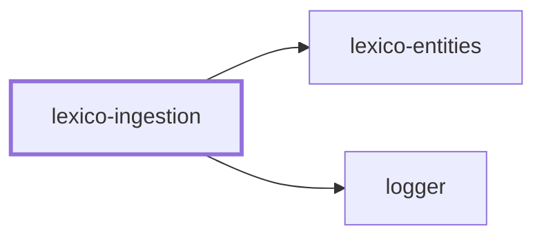
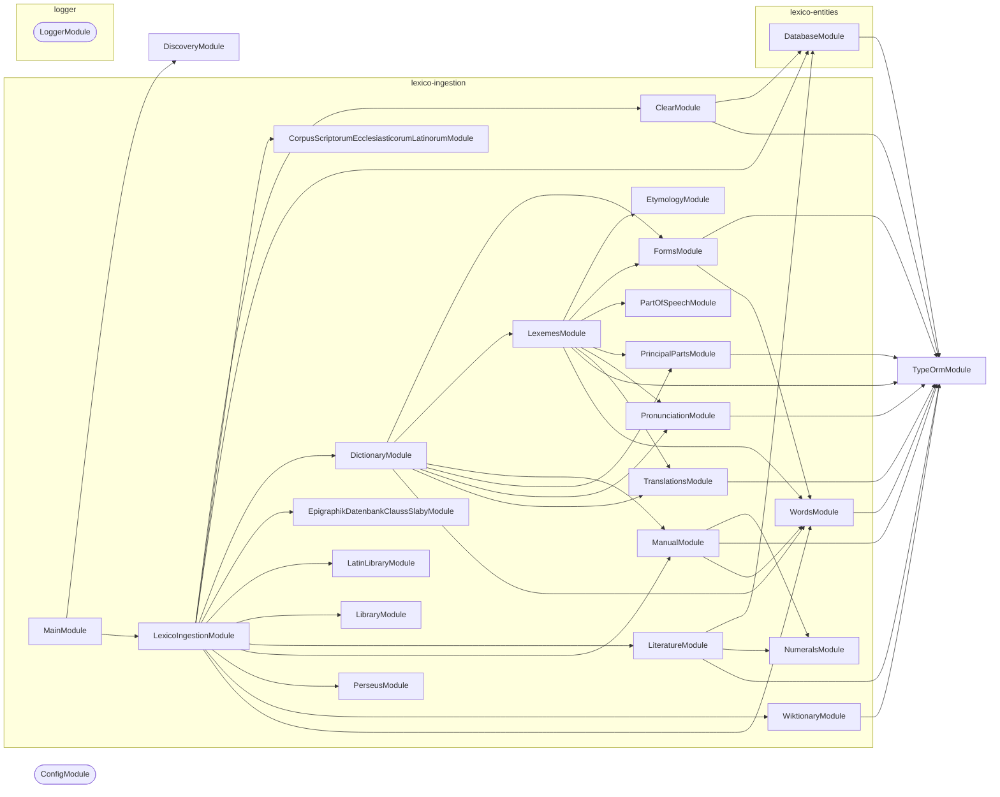

# 🚰 Lexico Ingestion

**Where the dictionary comes from.** A NestJS command-line application that
scrapes, parses, and loads the sources behind
[Lexico](../lexico/README.md) into the schema defined by
[lexico-entities](../../packages/lexico-entities/README.md).

## Quick Start

```bash
cp .env.default .env      # Database connection
nx run lexico-ingestion:start
```

The default command is the root pipeline, which prompts for any stage flags it
was not given and then runs the selected stages in order.

```bash
nx run lexico-ingestion:start -- --dictionary --literature
```

| Stage flag | Ingests |
| ---------- | ------- |
| `--dictionary` | Dictionary entries, forms, and inflections |
| `--library` | The library of works |
| `--library-sources` | The upstream sources each work came from |
| `--literature` | Lines and tokens of each text |
| `--wikipedia` | Wiktionary pages |

## Individual stages

Every stage is also its own command, addressable as a `start` configuration:

```bash
nx run lexico-ingestion:start:dictionary -- --startLemma=a --endLemma=c
nx run lexico-ingestion:start:wiktionary
nx run lexico-ingestion:start:clear
```

| Command | Source |
| ------- | ------ |
| `dictionary` | Dictionary entries, resumable with `--startLemma` / `--endLemma` |
| `wiktionary` | Wiktionary page dumps |
| `perseus` | The Perseus Digital Library |
| `latin-library` | The Latin Library |
| `corpus-scriptorum-ecclesiasticorum-latinorum` | CSEL, the ecclesiastical Latin corpus |
| `epigraphik-datenbank-clauss-slaby` | EDCS, the Latin inscription database |
| `library` | Library and work metadata |
| `literature` | Lines and tokens for loaded texts |
| `clear` | Empties ingested tables so a run can start clean |

The lemma range on `dictionary` is what makes a long scrape restartable: a run
that stops partway is resumed by pointing `--startLemma` at where it left off
rather than starting over.

## How it works

Each source has its own module under `src/modules/`, holding the fetcher, the
parser for that source's markup, and the mapping into entities. HTML is parsed
with [cheerio](https://cheerio.js.org) and wiki markup through mdast, so a
change to one site's layout is contained to one module.

Nothing here defines the schema. Entities and migrations come from
[`@codebase/lexico-entities`](../../packages/lexico-entities/README.md), so the
shape ingestion writes and the shape the application reads cannot drift.

## Project Graph

Where this project sits in the Nx project graph: what it depends on, and what depends on it. Regenerated by `nx run synchronization:synchronize --configuration=write`.

<!-- nx-project-graph-start -->



<!-- nx-project-graph-end -->

## Module Graph

The modules this project defines and the imports between them, published by `nx run synchronization:synchronize --configuration=publish`.

<!-- nestjs-module-graph-start -->



_Rounded modules are global: every module can inject them, so their edges are left out._

<!-- nestjs-module-graph-end -->

## Start

```bash
nx run lexico-ingestion:start
```

## Test

```bash
nx run lexico-ingestion:vitest
```

## Development

```bash
nx run lexico-ingestion:typecheck
nx run lexico-ingestion:lint-codebase --configuration=write
```

Run migrations before a first ingestion:

```bash
nx run lexico-entities:migration:run
```

## Related

- 🐺 [lexico](../lexico/README.md) — the web application
- 📖 [lexico-entities](../../packages/lexico-entities/README.md) — the schema this writes to
- 🎨 [lexico-components](../../packages/lexico-components/README.md) — the interface

## License

MIT — see [LICENSE](../../LICENSE).

<!-- CALL_STACKS_START -->

## 🔭 Callidescope

Call stacks traced through `lexico-ingestion`, deepest first. Each frame shows what it takes, what it returns, and what its documentation says.

| Measure | Value |
| --- | --- |
| Callables | 574 |
| Files | 107 |
| Calls traced | 781 |
| Call stacks | 51 |
| Deepest stack | 19 |
| Stacks through recursion | 3 |
| Unfollowable calls | 103 |

### Call stacks

**1. `LexicoIngestionCommand.run`** — depth ≥ 19 · decorated-method

```text
🚀 LexicoIngestionCommand.run(…): Promise<void> [applications/lexico-ingestion/src/modules/lexico-ingestion/lexico-ingestion.command.ts:219]
   ↳ Executes the selected stage sequence after prompting for any unspecified toggles.
  └─> LexicoIngestionCommand.executeStages(options: LexicoIngestionCommandOptions): Promise<void> [applications/lexico-ingestion/src/modules/lexico-ingestion/lexico-ingestion.command.ts:54]
     ↳ Processes one workflow step for root ingestion pipeline execution.
    └─> DictionaryCommand.ingestAll(startLemma?: string, endLemma?: string): Promise<void> [applications/lexico-ingestion/src/modules/dictionary/dictionary.command.ts:317]
       ↳ Iterates cached `data/wiktionary/*.json` pages within an optional lemma range and ingests each file into persisted…
      └─> DictionaryCommand.processFile(file: string, current: number, total: number): Promise<void> [applications/lexico-ingestion/src/modules/dictionary/dictionary.command.ts:222]
         ↳ Processes one workflow step for dictionary ingestion.
        └─> DictionaryCommand.ingestLexeme(…): Promise<void> (cycle) [applications/lexico-ingestion/src/modules/dictionary/dictionary.command.ts:350]
           ↳ Ingests one lemma by parsing its Wiktionary HTML into lexemes, saving relations, and recursively resolving…
          └─> DictionaryCommand.processTranslationReferences(saved: Lexeme): Promise<void> (cycle) [applications/lexico-ingestion/src/modules/dictionary/dictionary.command.ts:280]
             ↳ Processes one workflow step for dictionary ingestion.
            └─> LexemesService.parseLexemes(wiktionaryPage: WiktionaryPage): Promise<Lexeme[]> [applications/lexico-ingestion/src/modules/lexemes/lexemes.service.ts:306]
               ↳ Parses one Wiktionary page into lexemes by iterating `p:has(strong.Latn.headword)` sections and enriching each accepted…
              └─> LexemesService.parseLexemeFromElement(…): Promise<Lexeme | null> [applications/lexico-ingestion/src/modules/lexemes/lexemes.service.ts:144]
                 ↳ Parses and normalizes inputs for lexeme parsing and persistence.
                └─> LexemesService.enrichLexeme(…): Promise<void> [applications/lexico-ingestion/src/modules/lexemes/lexemes.service.ts:71]
                   ↳ Handles an internal workflow step for lexeme parsing and persistence.
                  └─> FormsService.buildFormsForPartOfSpeech(pos: PartOfSpeech, rawForms: unknown, lexeme: Lexeme): Form[] [applications/lexico-ingestion/src/modules/forms/forms.service.ts:127]
                     ↳ Builds Form entities from the raw parsed forms object for a given POS.
                    └─> FormsBuilderOtherService.buildFormsForPartOfSpeech(pos: PartOfSpeech, rawForms: unknown, lexeme: Lexeme): Form[] [applications/lexico-ingestion/src/modules/forms/forms-builder-other.service.ts:482]
                       ↳ Builds Form entities for a given part-of-speech category.
                      └─> FormsBuilderOtherService.buildVerbFormsFromRaw(rawForms: unknown, lexeme: Lexeme): Form[] [applications/lexico-ingestion/src/modules/forms/forms-builder-other.service.ts:393]
                         ↳ Builds structured data used during form entity building.
                        └─> FormsBuilderOtherService.buildFiniteMoodForms(moodData: Record<string, unknown>, mood: FormMood, lexeme: Lexeme): Form[] [applications/lexico-ingestion/src/modules/forms/forms-builder-other.service.ts:160]
                           ↳ Builds structured data used during form entity building.
                          └─> FormsBuilderOtherService.buildFiniteTenseForms(…): Form[] [applications/lexico-ingestion/src/modules/forms/forms-builder-other.service.ts:237]
                             ↳ Builds structured data used during form entity building.
                            └─> FormsBuilderOtherService.buildFiniteNumberForms(…): Form[] [applications/lexico-ingestion/src/modules/forms/forms-builder-other.service.ts:186]
                               ↳ Builds structured data used during form entity building.
                              └─> FormsBuilderOtherService.buildFinitePersonForms(…): Form[] [applications/lexico-ingestion/src/modules/forms/forms-builder-other.service.ts:214]
                                 ↳ Builds structured data used during form entity building.
                                └─> FormsBuilderVerbService.buildFinitePersonForms(args: BuildFinitePersonFormsArguments): Form[] [applications/lexico-ingestion/src/modules/forms/forms-builder-verb.service.ts:121]
                                   ↳ Builds finite verb forms for specific persons based on the provided arguments, including lexeme, mood, number, tense,…
                                  └─> FormsBuilderVerbService.buildFiniteVerbForm(…): Form [applications/lexico-ingestion/src/modules/forms/forms-builder-verb.service.ts:55]
                                     ↳ Builds a finite verb form for a specific person based on the provided arguments, including lexeme, mood, number, tense,…
                                    └─> FormsTransientWordsService.setTransientWords(form: Form, words: string[]): void [applications/lexico-ingestion/src/modules/forms/forms-transient-words.service.ts:34]
                                       ↳ Associates a list of transient words with a given Form entity.
```

**2. `DictionaryCommand.run`** — depth ≥ 18 · decorated-method

```text
🚀 DictionaryCommand.run(_arguments: string[], options: DictionaryCommandOptions): Promise<void> [applications/lexico-ingestion/src/modules/dictionary/dictionary.command.ts:457]
   ↳ Runs full dictionary ingestion for the selected lemma range, then applies manual entries.
  └─> DictionaryCommand.ingestAll(startLemma?: string, endLemma?: string): Promise<void> [applications/lexico-ingestion/src/modules/dictionary/dictionary.command.ts:317]
     ↳ Iterates cached `data/wiktionary/*.json` pages within an optional lemma range and ingests each file into persisted…
    └─> DictionaryCommand.processFile(file: string, current: number, total: number): Promise<void> [applications/lexico-ingestion/src/modules/dictionary/dictionary.command.ts:222]
       ↳ Processes one workflow step for dictionary ingestion.
      └─> DictionaryCommand.ingestLexeme(…): Promise<void> (cycle) [applications/lexico-ingestion/src/modules/dictionary/dictionary.command.ts:350]
         ↳ Ingests one lemma by parsing its Wiktionary HTML into lexemes, saving relations, and recursively resolving…
        └─> DictionaryCommand.processTranslationReferences(saved: Lexeme): Promise<void> (cycle) [applications/lexico-ingestion/src/modules/dictionary/dictionary.command.ts:280]
           ↳ Processes one workflow step for dictionary ingestion.
          └─> LexemesService.parseLexemes(wiktionaryPage: WiktionaryPage): Promise<Lexeme[]> [applications/lexico-ingestion/src/modules/lexemes/lexemes.service.ts:306]
             ↳ Parses one Wiktionary page into lexemes by iterating `p:has(strong.Latn.headword)` sections and enriching each accepted…
            └─> LexemesService.parseLexemeFromElement(…): Promise<Lexeme | null> [applications/lexico-ingestion/src/modules/lexemes/lexemes.service.ts:144]
               ↳ Parses and normalizes inputs for lexeme parsing and persistence.
              └─> LexemesService.enrichLexeme(…): Promise<void> [applications/lexico-ingestion/src/modules/lexemes/lexemes.service.ts:71]
                 ↳ Handles an internal workflow step for lexeme parsing and persistence.
                └─> FormsService.buildFormsForPartOfSpeech(pos: PartOfSpeech, rawForms: unknown, lexeme: Lexeme): Form[] [applications/lexico-ingestion/src/modules/forms/forms.service.ts:127]
                   ↳ Builds Form entities from the raw parsed forms object for a given POS.
                  └─> FormsBuilderOtherService.buildFormsForPartOfSpeech(pos: PartOfSpeech, rawForms: unknown, lexeme: Lexeme): Form[] [applications/lexico-ingestion/src/modules/forms/forms-builder-other.service.ts:482]
                     ↳ Builds Form entities for a given part-of-speech category.
                    └─> FormsBuilderOtherService.buildVerbFormsFromRaw(rawForms: unknown, lexeme: Lexeme): Form[] [applications/lexico-ingestion/src/modules/forms/forms-builder-other.service.ts:393]
                       ↳ Builds structured data used during form entity building.
                      └─> FormsBuilderOtherService.buildFiniteMoodForms(moodData: Record<string, unknown>, mood: FormMood, lexeme: Lexeme): Form[] [applications/lexico-ingestion/src/modules/forms/forms-builder-other.service.ts:160]
                         ↳ Builds structured data used during form entity building.
                        └─> FormsBuilderOtherService.buildFiniteTenseForms(…): Form[] [applications/lexico-ingestion/src/modules/forms/forms-builder-other.service.ts:237]
                           ↳ Builds structured data used during form entity building.
                          └─> FormsBuilderOtherService.buildFiniteNumberForms(…): Form[] [applications/lexico-ingestion/src/modules/forms/forms-builder-other.service.ts:186]
                             ↳ Builds structured data used during form entity building.
                            └─> FormsBuilderOtherService.buildFinitePersonForms(…): Form[] [applications/lexico-ingestion/src/modules/forms/forms-builder-other.service.ts:214]
                               ↳ Builds structured data used during form entity building.
                              └─> FormsBuilderVerbService.buildFinitePersonForms(args: BuildFinitePersonFormsArguments): Form[] [applications/lexico-ingestion/src/modules/forms/forms-builder-verb.service.ts:121]
                                 ↳ Builds finite verb forms for specific persons based on the provided arguments, including lexeme, mood, number, tense,…
                                └─> FormsBuilderVerbService.buildFiniteVerbForm(…): Form [applications/lexico-ingestion/src/modules/forms/forms-builder-verb.service.ts:55]
                                   ↳ Builds a finite verb form for a specific person based on the provided arguments, including lexeme, mood, number, tense,…
                                  └─> FormsTransientWordsService.setTransientWords(form: Form, words: string[]): void [applications/lexico-ingestion/src/modules/forms/forms-transient-words.service.ts:34]
                                     ↳ Associates a list of transient words with a given Form entity.
```

**3. `LibraryCommand.run`** — depth ≥ 15 · decorated-method

```text
🚀 LibraryCommand.run(_arguments: string[], options: LibraryCommandOptions): Promise<void> [applications/lexico-ingestion/src/modules/library/library.command.ts:446]
   ↳ Orchestrates provider execution with optional author/text scoping and progress logging.
  └─> LibraryCommand.processProvider(…): Promise<void> [applications/lexico-ingestion/src/modules/library/library.command.ts:147]
     ↳ Processes one workflow step for library provider orchestration.
    └─> PerseusLibraryProvider.ingest(options?: { author?: string; text?: string; }): Promise<Author[]> [applications/lexico-ingestion/src/modules/library/providers/perseus-library.provider.ts:364]
       ↳ Fetch authors, works, and output markdown files to the data directory.
      └─> PerseusLibraryProvider.processPerseusFile(…): Promise<void> [applications/lexico-ingestion/src/modules/library/providers/perseus-library.provider.ts:173]
         ↳ Processes one workflow step for Perseus XML ingestion.
        └─> PerseusLibraryProvider.processSourceXmlFile(…): Promise<void> [applications/lexico-ingestion/src/modules/library/providers/perseus-library.provider.ts:212]
           ↳ Processes one workflow step for Perseus XML ingestion.
          └─> PerseusLibraryProvider.writeSourceTextForAuthor(…): Promise<void> [applications/lexico-ingestion/src/modules/library/providers/perseus-library.provider.ts:304]
             ↳ Persists generated output for Perseus XML ingestion.
            └─> PerseusLibraryProvider.writeSourceMarkdownFiles(…): Promise<void> [applications/lexico-ingestion/src/modules/library/providers/perseus-library.provider.ts:256]
               ↳ Persists generated output for Perseus XML ingestion.
              └─> PerseusLibraryTextExtractionProvider.extractTextNodes(…): void (cycle) [applications/lexico-ingestion/src/modules/library/providers/perseus-library-text-extraction.provider.ts:206]
                 ↳ Builds markdown file payloads from nested Perseus `textpart` elements.
                └─> PerseusLibraryTextExtractionProvider.processTextPartChildren(…): void (cycle) [applications/lexico-ingestion/src/modules/library/providers/perseus-library-text-extraction.provider.ts:150]
                   ↳ Recurses into child text parts and writes direct child paragraphs.
                  └─> PerseusLibraryTextExtractionProvider.extractChildTextParts(…): void (cycle) [applications/lexico-ingestion/src/modules/library/providers/perseus-library-text-extraction.provider.ts:57]
                     ↳ Visits nested Perseus `textpart` children and extracts eligible sections.
                    └─> PerseusLibraryTextExtractionProvider.each(…)(_index: number, child: AnyNode): void (cycle) [applications/lexico-ingestion/src/modules/library/providers/perseus-library-text-extraction.provider.ts:66]
                      └─> PerseusLibraryTextExtractionProvider.processLeafTextPart(…): void [applications/lexico-ingestion/src/modules/library/providers/perseus-library-text-extraction.provider.ts:110]
                         ↳ Handles leaf nodes that write one markdown text file.
                        └─> PerseusLibraryTextExtractionProvider.collectParagraphsFromElements(elements: cheerio.Cheerio<AnyNode>, $: cheerio.CheerioAPI): string[] [applications/lexico-ingestion/src/modules/library/providers/perseus-library-text-extraction.provider.ts:26]
                           ↳ Collects normalized paragraph text from Perseus XML elements.
                          └─> PerseusLibraryTextExtractionProvider.each(…)(_index: number, paragraphElement: AnyNode): void [applications/lexico-ingestion/src/modules/library/providers/perseus-library-text-extraction.provider.ts:32]
                            └─> formatLineNumber(line: string): string [applications/lexico-ingestion/src/modules/library/library.utilities.ts:18]
                               ↳ Format line numbers consistently.
```

<details>
<summary>48 more call stacks</summary>

**4. `WiktionaryCommand.run`** — depth ≥ 11 · decorated-method

```text
🚀 WiktionaryCommand.run(): Promise<void> [applications/lexico-ingestion/src/modules/wiktionary/wiktionary.command.ts:291]
   ↳ Runs the Wiktionary ingestion pipeline.
  └─> WiktionaryCommand.ingestWiktionary(): Promise<void> [applications/lexico-ingestion/src/modules/wiktionary/wiktionary.command.ts:276]
     ↳ Scrapes every configured Latin category from Wiktionary, stores each article's HTML as a JSON file under…
    └─> WiktionaryCommand.ingestCategory(category?: Category, startPath?: string): Promise<void> [applications/lexico-ingestion/src/modules/wiktionary/wiktionary.command.ts:135]
       ↳ Ingests category in the Wiktionary ingestion pipeline.
      └─> WiktionaryCommand.processWiktionaryCategoryLink(a: Element, $: cheerio.CheerioAPI, category: string): Promise<void> [applications/lexico-ingestion/src/modules/wiktionary/wiktionary.command.ts:221]
         ↳ Processes wiktionary category link during Wiktionary ingestion.
        └─> WiktionaryCommand.ingestWord(word: string, urlPath: string, category: string): Promise<void> [applications/lexico-ingestion/src/modules/wiktionary/wiktionary.command.ts:168]
           ↳ Ingests word in the Wiktionary ingestion pipeline.
          └─> WiktionaryCommand.parseLatinSection(…): Promise<{ $: CheerioAPI; section: Cheerio<AnyNode>; } | null> [applications/lexico-ingestion/src/modules/wiktionary/wiktionary.command.ts:200]
             ↳ Parses latin section during Wiktionary ingestion.
            └─> WiktionaryCommand.fetchWithRetry(url: string, retries?: number): Promise<Response> [applications/lexico-ingestion/src/modules/wiktionary/wiktionary.command.ts:82]
               ↳ Fetch with retry for Wiktionary ingestion.
              └─> LoggerService.warn(message: unknown, context?: string, data?: LogData): void [packages/logger/src/modules/logger/logger.service.ts:250]
                 ↳ Logs a warning message at the `warn` level.
                └─> LoggerService.buildBindings(…): Record<string, unknown> [packages/logger/src/modules/logger/logger.service.ts:115]
                   ↳ Assembles the object pino merges into the line.
                  └─> LoggerService.assertConventionalMessage(args: { context: string | undefined; parsed: ParsedLogMessage; }): void [packages/logger/src/modules/logger/logger.service.ts:82]
                     ↳ Fails a malformed message in development, and never in production.
                    └─> LoggerService.isConventionalVerb(word: string): boolean [packages/logger/src/modules/logger/logger.service.ts:140]
                       ↳ Whether a word is a verb in one of the two tenses the convention allows.
```

**5. `LatinLibraryCommand.run`** — depth ≥ 9 · decorated-method

```text
🚀 LatinLibraryCommand.run(): Promise<void> [applications/lexico-ingestion/src/modules/latin-library/latin-library.command.ts:375]
   ↳ Crawls The Latin Library and caches discovered HTML pages locally.
  └─> LatinLibraryCommand.getFinalAuthorUrls(host: string, authorUrls: string[]): Promise<string[]> [applications/lexico-ingestion/src/modules/latin-library/latin-library.command.ts:145]
     ↳ Resolves derived values needed by Latin Library source crawling.
    └─> LatinLibraryCommand.processCategoryHref(href: string, host: string, finalAuthorUrls: string[]): Promise<void> [applications/lexico-ingestion/src/modules/latin-library/latin-library.command.ts:286]
       ↳ Processes one workflow step for Latin Library source crawling.
      └─> LatinLibraryCommand.fetchAndCachePage(urlString: string, host: string): Promise<string> [applications/lexico-ingestion/src/modules/latin-library/latin-library.command.ts:84]
         ↳ Loads source data required by Latin Library source crawling.
        └─> LatinLibraryCommand.downloadAndSaveLatinLibraryFile(parsedUrl: URL, targetPath: string): Promise<string> [applications/lexico-ingestion/src/modules/latin-library/latin-library.command.ts:46]
           ↳ Handles an internal workflow step for Latin Library source crawling.
          └─> LoggerService.warn(message: unknown, context?: string, data?: LogData): void [packages/logger/src/modules/logger/logger.service.ts:250]
             ↳ Logs a warning message at the `warn` level.
            └─> LoggerService.buildBindings(…): Record<string, unknown> [packages/logger/src/modules/logger/logger.service.ts:115]
               ↳ Assembles the object pino merges into the line.
              └─> LoggerService.assertConventionalMessage(args: { context: string | undefined; parsed: ParsedLogMessage; }): void [packages/logger/src/modules/logger/logger.service.ts:82]
                 ↳ Fails a malformed message in development, and never in production.
                └─> LoggerService.isConventionalVerb(word: string): boolean [packages/logger/src/modules/logger/logger.service.ts:140]
                   ↳ Whether a word is a verb in one of the two tenses the convention allows.
```

**6. `LiteratureCommand.run`** — depth ≥ 9 · decorated-method

```text
🚀 LiteratureCommand.run(_arguments: string[], options: LiteratureCommandOptions): Promise<void> [applications/lexico-ingestion/src/modules/literature/literature.command.ts:257]
   ↳ Runs literature ingestion for the selected provider/author/text scope.
  └─> LiteratureService.ingestAllAuthors(textsToIngest: LibraryEntry[]): Promise<void> [applications/lexico-ingestion/src/modules/literature/literature.service.ts:480]
     ↳ Ingests all selected texts grouped by author.
    └─> LiteratureService.ingestAuthorGroup(authorSlug: string, texts: LibraryEntry[]): Promise<void> [applications/lexico-ingestion/src/modules/literature/literature.service.ts:209]
       ↳ Ingests author group in the literature ingestion pipeline.
      └─> LiteratureService.ingestTextChunks(…): Promise<void> [applications/lexico-ingestion/src/modules/literature/literature.service.ts:290]
         ↳ Ingests text chunks in the literature ingestion pipeline.
        └─> LiteratureTextIngestionService.ingestTextWithLogging(…): Promise<void> [applications/lexico-ingestion/src/modules/literature/literature-text-ingestion.service.ts:57]
           ↳ Runs ingestion for one text entry with standardized start, error, and completion logs.
          └─> LoggerService.log(message: unknown, context?: string, data?: LogData): void [packages/logger/src/modules/logger/logger.service.ts:226]
             ↳ Logs an informational message at the `info` level.
            └─> LoggerService.buildBindings(…): Record<string, unknown> [packages/logger/src/modules/logger/logger.service.ts:115]
               ↳ Assembles the object pino merges into the line.
              └─> LoggerService.assertConventionalMessage(args: { context: string | undefined; parsed: ParsedLogMessage; }): void [packages/logger/src/modules/logger/logger.service.ts:82]
                 ↳ Fails a malformed message in development, and never in production.
                └─> LoggerService.isConventionalVerb(word: string): boolean [packages/logger/src/modules/logger/logger.service.ts:140]
                   ↳ Whether a word is a verb in one of the two tenses the convention allows.
```

**7. `EpigraphikDatenbankClaussSlabyCommand.run`** — depth 8 · decorated-method

```text
🚀 EpigraphikDatenbankClaussSlabyCommand.run(): Promise<void> [applications/lexico-ingestion/src/modules/epigraphik-datenbank-clauss-slaby/epigraphik-datenbank-clauss-slaby.command.ts:136]
   ↳ Runs the ingestion of epigraphs by downloading chunks to the filesystem
  └─> EpigraphikDatenbankClaussSlabyCommand.downloadChunkIfMissing(start: number): Promise<boolean> [applications/lexico-ingestion/src/modules/epigraphik-datenbank-clauss-slaby/epigraphik-datenbank-clauss-slaby.command.ts:74]
     ↳ Handles an internal workflow step for EDCS chunk ingestion.
    └─> EpigraphikDatenbankClaussSlabyCommand.downloadChunkData(start: number, chunkFile: string): Promise<boolean> [applications/lexico-ingestion/src/modules/epigraphik-datenbank-clauss-slaby/epigraphik-datenbank-clauss-slaby.command.ts:50]
       ↳ Handles an internal workflow step for EDCS chunk ingestion.
      └─> EpigraphikDatenbankClaussSlabyCommand.saveChunkData(start: number, chunkFile: string): Promise<boolean> [applications/lexico-ingestion/src/modules/epigraphik-datenbank-clauss-slaby/epigraphik-datenbank-clauss-slaby.command.ts:96]
         ↳ Persists generated output for EDCS chunk ingestion.
        └─> LoggerService.warn(message: unknown, context?: string, data?: LogData): void [packages/logger/src/modules/logger/logger.service.ts:250]
           ↳ Logs a warning message at the `warn` level.
          └─> LoggerService.buildBindings(…): Record<string, unknown> [packages/logger/src/modules/logger/logger.service.ts:115]
             ↳ Assembles the object pino merges into the line.
            └─> LoggerService.assertConventionalMessage(args: { context: string | undefined; parsed: ParsedLogMessage; }): void [packages/logger/src/modules/logger/logger.service.ts:82]
               ↳ Fails a malformed message in development, and never in production.
              └─> LoggerService.isConventionalVerb(word: string): boolean [packages/logger/src/modules/logger/logger.service.ts:140]
                 ↳ Whether a word is a verb in one of the two tenses the convention allows.
```

**8. `LatinLibraryCommand.worker`** — depth ≥ 8 · orphan-root

```text
🚀 LatinLibraryCommand.worker(): Promise<void> [applications/lexico-ingestion/src/modules/latin-library/latin-library.command.ts:409]
  └─> LatinLibraryCommand.processQueueUrl(urlString: string, host: string, enqueue: (url: string) => void): Promise<void> [applications/lexico-ingestion/src/modules/latin-library/latin-library.command.ts:341]
     ↳ Processes one workflow step for Latin Library source crawling.
    └─> LatinLibraryCommand.fetchAndCachePage(urlString: string, host: string): Promise<string> [applications/lexico-ingestion/src/modules/latin-library/latin-library.command.ts:84]
       ↳ Loads source data required by Latin Library source crawling.
      └─> LatinLibraryCommand.downloadAndSaveLatinLibraryFile(parsedUrl: URL, targetPath: string): Promise<string> [applications/lexico-ingestion/src/modules/latin-library/latin-library.command.ts:46]
         ↳ Handles an internal workflow step for Latin Library source crawling.
        └─> LoggerService.warn(message: unknown, context?: string, data?: LogData): void [packages/logger/src/modules/logger/logger.service.ts:250]
           ↳ Logs a warning message at the `warn` level.
          └─> LoggerService.buildBindings(…): Record<string, unknown> [packages/logger/src/modules/logger/logger.service.ts:115]
             ↳ Assembles the object pino merges into the line.
            └─> LoggerService.assertConventionalMessage(args: { context: string | undefined; parsed: ParsedLogMessage; }): void [packages/logger/src/modules/logger/logger.service.ts:82]
               ↳ Fails a malformed message in development, and never in production.
              └─> LoggerService.isConventionalVerb(word: string): boolean [packages/logger/src/modules/logger/logger.service.ts:140]
                 ↳ Whether a word is a verb in one of the two tenses the convention allows.
```

**9. `CorpusScriptorumEcclesiasticorumLatinorumCommand.run`** — depth 7 · decorated-method

```text
🚀 CorpusScriptorumEcclesiasticorumLatinorumCommand.run(): Promise<void> [applications/lexico-ingestion/src/modules/corpus-scriptorum-ecclesiasticorum-latinorum/corpus-scriptorum-ecclesiasticorum-latinorum.command.ts:125]
   ↳ Downloads all eligible CSEL Latin XML source files into the local cache.
  └─> CorpusScriptorumEcclesiasticorumLatinorumCommand.downloadSourceXmlFileIfMissing(xmlPath: string): Promise<void> [applications/lexico-ingestion/src/modules/corpus-scriptorum-ecclesiasticorum-latinorum/corpus-scriptorum-ecclesiasticorum-latinorum.command.ts:47]
     ↳ Downloads one XML file unless it is already present in the local source cache.
    └─> CorpusScriptorumEcclesiasticorumLatinorumCommand.fetchAndWriteXmlFile(fileUrl: string, targetPath: string): Promise<void> [applications/lexico-ingestion/src/modules/corpus-scriptorum-ecclesiasticorum-latinorum/corpus-scriptorum-ecclesiasticorum-latinorum.command.ts:74]
       ↳ Loads source data required by CSEL source ingestion.
      └─> LoggerService.warn(message: unknown, context?: string, data?: LogData): void [packages/logger/src/modules/logger/logger.service.ts:250]
         ↳ Logs a warning message at the `warn` level.
        └─> LoggerService.buildBindings(…): Record<string, unknown> [packages/logger/src/modules/logger/logger.service.ts:115]
           ↳ Assembles the object pino merges into the line.
          └─> LoggerService.assertConventionalMessage(args: { context: string | undefined; parsed: ParsedLogMessage; }): void [packages/logger/src/modules/logger/logger.service.ts:82]
             ↳ Fails a malformed message in development, and never in production.
            └─> LoggerService.isConventionalVerb(word: string): boolean [packages/logger/src/modules/logger/logger.service.ts:140]
               ↳ Whether a word is a verb in one of the two tenses the convention allows.
```

**10. `LibraryCommand.parseAuthor`** — depth 7 · decorated-method

```text
🚀 LibraryCommand.parseAuthor(author?: string, provider?: string): Promise<string | undefined> [applications/lexico-ingestion/src/modules/library/library.command.ts:348]
   ↳ Resolves the optional `--author` filter from CLI input or interactive selection.
  └─> LibraryCommand.getAuthorChoices(provider?: string): Promise<{ title: string; value: string; }[]> [applications/lexico-ingestion/src/modules/library/library.command.ts:79]
     ↳ Resolves derived values needed by library provider orchestration.
    └─> LibraryCommand.scanLibrary(…): Promise<{ authorSlug: string; fullPath: string; pathParts: string[]; provider: string; textSlug: string; title: string; }[]> [applications/lexico-ingestion/src/modules/library/library.command.ts:212]
       ↳ Handles an internal workflow step for library provider orchestration.
      └─> LibraryCommand.scanLibraryProvider(…): Promise<void> [applications/lexico-ingestion/src/modules/library/library.command.ts:277]
         ↳ Handles an internal workflow step for library provider orchestration.
        └─> LibraryCommand.scanLibraryAuthor(…): Promise<void> [applications/lexico-ingestion/src/modules/library/library.command.ts:251]
           ↳ Handles an internal workflow step for library provider orchestration.
          └─> LibraryCommand.walkLibraryDirectory(…): Promise<void> [applications/lexico-ingestion/src/modules/library/library.command.ts:306]
             ↳ Processes one workflow step for library provider orchestration.
            └─> LibraryCommand.pushTextEntry(…): void [applications/lexico-ingestion/src/modules/library/library.command.ts:176]
               ↳ Handles an internal workflow step for library provider orchestration.
```

**11. `LibraryCommand.parseText`** — depth 7 · decorated-method

```text
🚀 LibraryCommand.parseText(…): Promise<string | undefined> [applications/lexico-ingestion/src/modules/library/library.command.ts:411]
   ↳ Resolves the optional `--text` filter from CLI input or interactive selection.
  └─> LibraryCommand.getTextChoices(…): Promise<{ title: string; value: string; }[]> [applications/lexico-ingestion/src/modules/library/library.command.ts:101]
     ↳ Resolves derived values needed by library provider orchestration.
    └─> LibraryCommand.scanLibrary(…): Promise<{ authorSlug: string; fullPath: string; pathParts: string[]; provider: string; textSlug: string; title: string; }[]> [applications/lexico-ingestion/src/modules/library/library.command.ts:212]
       ↳ Handles an internal workflow step for library provider orchestration.
      └─> LibraryCommand.scanLibraryProvider(…): Promise<void> [applications/lexico-ingestion/src/modules/library/library.command.ts:277]
         ↳ Handles an internal workflow step for library provider orchestration.
        └─> LibraryCommand.scanLibraryAuthor(…): Promise<void> [applications/lexico-ingestion/src/modules/library/library.command.ts:251]
           ↳ Handles an internal workflow step for library provider orchestration.
          └─> LibraryCommand.walkLibraryDirectory(…): Promise<void> [applications/lexico-ingestion/src/modules/library/library.command.ts:306]
             ↳ Processes one workflow step for library provider orchestration.
            └─> LibraryCommand.pushTextEntry(…): void [applications/lexico-ingestion/src/modules/library/library.command.ts:176]
               ↳ Handles an internal workflow step for library provider orchestration.
```

**12. `PerseusCommand.run`** — depth 7 · decorated-method

```text
🚀 PerseusCommand.run(): Promise<void> [applications/lexico-ingestion/src/modules/perseus/perseus.command.ts:131]
   ↳ Discovers eligible Perseus XML files and stores missing files in the local cache.
  └─> PerseusCommand.downloadSourceXmlFileIfMissing(xmlPath: string): Promise<void> [applications/lexico-ingestion/src/modules/perseus/perseus.command.ts:58]
     ↳ Download source xml file if missing for Perseus source ingestion.
    └─> PerseusCommand.fetchAndWriteXmlFile(fileUrl: string, targetPath: string): Promise<void> [applications/lexico-ingestion/src/modules/perseus/perseus.command.ts:79]
       ↳ Fetch and write xml file for Perseus source ingestion.
      └─> LoggerService.warn(message: unknown, context?: string, data?: LogData): void [packages/logger/src/modules/logger/logger.service.ts:250]
         ↳ Logs a warning message at the `warn` level.
        └─> LoggerService.buildBindings(…): Record<string, unknown> [packages/logger/src/modules/logger/logger.service.ts:115]
           ↳ Assembles the object pino merges into the line.
          └─> LoggerService.assertConventionalMessage(args: { context: string | undefined; parsed: ParsedLogMessage; }): void [packages/logger/src/modules/logger/logger.service.ts:82]
             ↳ Fails a malformed message in development, and never in production.
            └─> LoggerService.isConventionalVerb(word: string): boolean [packages/logger/src/modules/logger/logger.service.ts:140]
               ↳ Whether a word is a verb in one of the two tenses the convention allows.
```

**13. `LiteratureService.ingestText`** — depth 7 · orphan-root

```text
🚀 LiteratureService.ingestText(args: IngestTextArguments): Promise<void> [applications/lexico-ingestion/src/modules/literature/literature.service.ts:262]
   ↳ Ingests text in the literature ingestion pipeline.
  └─> LiteratureService.ingestLines(text: Text, ast: Root): Promise<void> [applications/lexico-ingestion/src/modules/literature/literature.service.ts:239]
     ↳ Ingests lines in the literature ingestion pipeline.
    └─> LiteratureService.getWordsCache(): Promise<Map<string, string>> [applications/lexico-ingestion/src/modules/literature/literature.service.ts:195]
       ↳ Gets words cache used by literature ingestion.
      └─> LoggerService.log(message: unknown, context?: string, data?: LogData): void [packages/logger/src/modules/logger/logger.service.ts:226]
         ↳ Logs an informational message at the `info` level.
        └─> LoggerService.buildBindings(…): Record<string, unknown> [packages/logger/src/modules/logger/logger.service.ts:115]
           ↳ Assembles the object pino merges into the line.
          └─> LoggerService.assertConventionalMessage(args: { context: string | undefined; parsed: ParsedLogMessage; }): void [packages/logger/src/modules/logger/logger.service.ts:82]
             ↳ Fails a malformed message in development, and never in production.
            └─> LoggerService.isConventionalVerb(word: string): boolean [packages/logger/src/modules/logger/logger.service.ts:140]
               ↳ Whether a word is a verb in one of the two tenses the convention allows.
```

**14. `ClearCommand.run`** — depth 6 · decorated-method

```text
🚀 ClearCommand.run(_passedParameters: string[], options: ClearCommandOptions): Promise<void> [applications/lexico-ingestion/src/modules/clear/clear.command.ts:138]
   ↳ Runs the clear pipeline for the options provided. If no options are specified, it prompts the user.
  └─> ClearCommand.clearLiterature(): Promise<void> [applications/lexico-ingestion/src/modules/clear/clear.command.ts:72]
     ↳ Deletes all literature data
    └─> LoggerService.log(message: unknown, context?: string, data?: LogData): void [packages/logger/src/modules/logger/logger.service.ts:226]
       ↳ Logs an informational message at the `info` level.
      └─> LoggerService.buildBindings(…): Record<string, unknown> [packages/logger/src/modules/logger/logger.service.ts:115]
         ↳ Assembles the object pino merges into the line.
        └─> LoggerService.assertConventionalMessage(args: { context: string | undefined; parsed: ParsedLogMessage; }): void [packages/logger/src/modules/logger/logger.service.ts:82]
           ↳ Fails a malformed message in development, and never in production.
          └─> LoggerService.isConventionalVerb(word: string): boolean [packages/logger/src/modules/logger/logger.service.ts:140]
             ↳ Whether a word is a verb in one of the two tenses the convention allows.
```

**15. `LiteratureCommand.parseAuthor`** — depth 5 · decorated-method

```text
🚀 LiteratureCommand.parseAuthor(author?: string, provider?: string): Promise<string | undefined> [applications/lexico-ingestion/src/modules/literature/literature.command.ts:153]
   ↳ Resolves the optional `--author` filter from CLI input or interactive selection.
  └─> LiteratureCommand.getAuthorChoices(provider?: string): Promise<{ title: string; value: string; }[]> [applications/lexico-ingestion/src/modules/literature/literature.command.ts:75]
     ↳ Gets author choices used by literature ingestion.
    └─> LiteratureService.scanLibrary(): Promise<LibraryEntry[]> [applications/lexico-ingestion/src/modules/literature/literature.service.ts:494]
       ↳ Scans the local library directory and returns discovered text entries.
      └─> LiteratureLibraryScanService.scanLibrary(): Promise<LibraryEntry[]> [applications/lexico-ingestion/src/modules/literature/literature-library-scan.service.ts:70]
         ↳ Walks the library data directory and collects text file metadata.
        └─> LiteratureLibraryScanService.walkLibraryDirectory(…): Promise<void> [applications/lexico-ingestion/src/modules/literature/literature-library-scan.service.ts:27]
           ↳ Recursively walks one provider directory and collects markdown entries.
```

**16. `LiteratureCommand.parseProvider`** — depth 5 · decorated-method

```text
🚀 LiteratureCommand.parseProvider(provider?: string): Promise<string | undefined> [applications/lexico-ingestion/src/modules/literature/literature.command.ts:188]
   ↳ Resolves the optional `--provider` filter from CLI input or interactive selection.
  └─> LiteratureCommand.getProviderChoices(): Promise<{ title: string; value: string; }[]> [applications/lexico-ingestion/src/modules/literature/literature.command.ts:91]
     ↳ Gets provider choices used by literature ingestion.
    └─> LiteratureService.scanLibrary(): Promise<LibraryEntry[]> [applications/lexico-ingestion/src/modules/literature/literature.service.ts:494]
       ↳ Scans the local library directory and returns discovered text entries.
      └─> LiteratureLibraryScanService.scanLibrary(): Promise<LibraryEntry[]> [applications/lexico-ingestion/src/modules/literature/literature-library-scan.service.ts:70]
         ↳ Walks the library data directory and collects text file metadata.
        └─> LiteratureLibraryScanService.walkLibraryDirectory(…): Promise<void> [applications/lexico-ingestion/src/modules/literature/literature-library-scan.service.ts:27]
           ↳ Recursively walks one provider directory and collects markdown entries.
```

**17. `LiteratureCommand.parseText`** — depth 5 · decorated-method

```text
🚀 LiteratureCommand.parseText(…): Promise<string | undefined> [applications/lexico-ingestion/src/modules/literature/literature.command.ts:218]
   ↳ Resolves the optional `--text` filter from CLI input or interactive selection.
  └─> LiteratureCommand.getTextChoices(…): Promise<{ title: string; value: string; }[]> [applications/lexico-ingestion/src/modules/literature/literature.command.ts:104]
     ↳ Gets text choices used by literature ingestion.
    └─> LiteratureService.scanLibrary(): Promise<LibraryEntry[]> [applications/lexico-ingestion/src/modules/literature/literature.service.ts:494]
       ↳ Scans the local library directory and returns discovered text entries.
      └─> LiteratureLibraryScanService.scanLibrary(): Promise<LibraryEntry[]> [applications/lexico-ingestion/src/modules/literature/literature-library-scan.service.ts:70]
         ↳ Walks the library data directory and collects text file metadata.
        └─> LiteratureLibraryScanService.walkLibraryDirectory(…): Promise<void> [applications/lexico-ingestion/src/modules/literature/literature-library-scan.service.ts:27]
           ↳ Recursively walks one provider directory and collects markdown entries.
```

**18. `PartOfSpeechFormsService.parseGenericForms`** — depth ≥ 5 · orphan-root

```text
🚀 PartOfSpeechFormsService.parseGenericForms(args: { $: cheerio.CheerioAPI; elt: AnyNode; lexeme: Lexeme; }): unknown [applications/lexico-ingestion/src/modules/part-of-speech/part-of-speech-forms.service.ts:358]
   ↳ Parses non-verb inflection table forms into nested identifiers.
  └─> PartOfSpeechFormsService.findGenericIdentifiers(…): string[] [applications/lexico-ingestion/src/modules/part-of-speech/part-of-speech-forms.service.ts:58]
     ↳ Finds generic identifiers for part-of-speech parsing workflows.
    └─> PartOfSpeechFormsService.collectTableIdentifiers(index: number, index_: number, table_: string[][]): Set<string> [applications/lexico-ingestion/src/modules/part-of-speech/part-of-speech-forms.service.ts:35]
       ↳ Collects table identifiers required by part-of-speech parsing.
      └─> PartOfSpeechFormsService.scanTableAxis(…): { finalIndex: number; identifiers: Set<string>; } [applications/lexico-ingestion/src/modules/part-of-speech/part-of-speech-forms.service.ts:299]
         ↳ Scans table axis for part-of-speech parsing context.
        └─> PartOfSpeechFormsService.isGenericFormCell(cell: string): boolean [applications/lexico-ingestion/src/modules/part-of-speech/part-of-speech-forms.service.ts:127]
           ↳ Checks whether generic form cell in part-of-speech parsing logic.
```

**19. `PartOfSpeechFormsService.parseVerbForms`** — depth ≥ 5 · orphan-root

```text
🚀 PartOfSpeechFormsService.parseVerbForms(args: { $: cheerio.CheerioAPI; elt: AnyNode; }): unknown [applications/lexico-ingestion/src/modules/part-of-speech/part-of-speech-forms.service.ts:404]
   ↳ Parses verb inflection table forms into nested identifiers.
  └─> PartOfSpeechFormsService.processVerbFormRow(…): void [applications/lexico-ingestion/src/modules/part-of-speech/part-of-speech-forms.service.ts:225]
     ↳ Processes verb form row during part-of-speech parsing.
    └─> PartOfSpeechFormsService.findVerbIdentifiers(index: number, index_: number, table_: string[][]): string[] [applications/lexico-ingestion/src/modules/part-of-speech/part-of-speech-forms.service.ts:83]
       ↳ Finds verb identifiers for part-of-speech parsing workflows.
      └─> PartOfSpeechFormsService.scanVerbHeader(…): { finalIndex: number; identifiers: Set<string>; } [applications/lexico-ingestion/src/modules/part-of-speech/part-of-speech-forms.service.ts:317]
         ↳ Scans verb header for part-of-speech parsing context.
        └─> PartOfSpeechFormsService.isVerbFormCell(cell: string): boolean [applications/lexico-ingestion/src/modules/part-of-speech/part-of-speech-forms.service.ts:146]
           ↳ Checks whether verb form cell in part-of-speech parsing logic.
```

**20. `PartOfSpeechService.ingestAdjectiveInflection`** — depth ≥ 4 · orphan-root

```text
🚀 PartOfSpeechService.ingestAdjectiveInflection($: cheerio.CheerioAPI, elt: AnyNode): Inflection [applications/lexico-ingestion/src/modules/part-of-speech/part-of-speech.service.ts:187]
   ↳ Ingests adjective inflection in the part-of-speech parsing pipeline.
  └─> PartOfSpeechService.buildAdjectiveInflection(declension: string): AdjectiveInflection [applications/lexico-ingestion/src/modules/part-of-speech/part-of-speech.service.ts:142]
     ↳ Builds adjective inflection for part-of-speech parsing.
    └─> PartOfSpeechService.findTypedValue(…): ValueType | undefined [applications/lexico-ingestion/src/modules/part-of-speech/part-of-speech.service.ts:129]
       ↳ Returns the first matching typed value from the provided candidate list.
      └─> PartOfSpeechService.find(…)(value: ValueType): value is ValueType [applications/lexico-ingestion/src/modules/part-of-speech/part-of-speech.service.ts:133]
```

**21. `PartOfSpeechService.ingestNounInflection`** — depth ≥ 4 · orphan-root

```text
🚀 PartOfSpeechService.ingestNounInflection($: cheerio.CheerioAPI, elt: AnyNode): Inflection [applications/lexico-ingestion/src/modules/part-of-speech/part-of-speech.service.ts:249]
   ↳ Ingests noun inflection in the part-of-speech parsing pipeline.
  └─> PartOfSpeechService.buildNounInflection(declension: string, gender: string): NounInflection [applications/lexico-ingestion/src/modules/part-of-speech/part-of-speech.service.ts:161]
     ↳ Builds noun inflection for part-of-speech parsing.
    └─> PartOfSpeechService.findTypedValue(…): ValueType | undefined [applications/lexico-ingestion/src/modules/part-of-speech/part-of-speech.service.ts:129]
       ↳ Returns the first matching typed value from the provided candidate list.
      └─> PartOfSpeechService.find(…)(value: ValueType): value is ValueType [applications/lexico-ingestion/src/modules/part-of-speech/part-of-speech.service.ts:133]
```

**22. `LiteratureService.buildLineEntityFromParagraph`** — depth 4 · orphan-root

```text
🚀 LiteratureService.buildLineEntityFromParagraph(paragraph: Paragraph, index: number, text: Text): QueryDeepPartialEntity<Line> [applications/lexico-ingestion/src/modules/literature/literature.service.ts:91]
   ↳ Builds line entity from paragraph for literature ingestion.
  └─> LiteratureService.parseLabelFromStrongNode(strongNode: Strong, lineNodes: PhrasingContent[]): ParsedLabelResult [applications/lexico-ingestion/src/modules/literature/literature.service.ts:347]
     ↳ Parses label from strong node during literature ingestion.
    └─> LiteratureService.parseStandardLabel(labelMatch: RegExpExecArray, lineNodes: PhrasingContent[]): ParsedLabelResult [applications/lexico-ingestion/src/modules/literature/literature.service.ts:383]
       ↳ Parses standard label during literature ingestion.
      └─> NumeralsService.toDecimal(roman: string): number [applications/lexico-ingestion/src/modules/numerals/numerals.service.ts:25]
         ↳ Parses a Roman numeral string into its decimal integer value.
```

**23. `DictionaryCommand.parseEndLemma`** — depth 3 · decorated-method

```text
🚀 DictionaryCommand.parseEndLemma(endLemma?: string, startLemma?: null | string): Promise<string | undefined> [applications/lexico-ingestion/src/modules/dictionary/dictionary.command.ts:384]
   ↳ Resolves the optional end-lemma boundary, validating it against available cache files.
  └─> DictionaryCommand.getLemmaChoices(): { title: string; value: string; }[] [applications/lexico-ingestion/src/modules/dictionary/dictionary.command.ts:75]
     ↳ Resolves derived values needed by dictionary ingestion.
    └─> DictionaryCommand.map(…)(file: string): { title: string; value: string; } [applications/lexico-ingestion/src/modules/dictionary/dictionary.command.ts:82]
```

**24. `DictionaryCommand.parseStartLemma`** — depth 3 · decorated-method

```text
🚀 DictionaryCommand.parseStartLemma(startLemma?: string): Promise<string | undefined> [applications/lexico-ingestion/src/modules/dictionary/dictionary.command.ts:422]
   ↳ Resolves the optional start-lemma boundary, validating it against available cache files.
  └─> DictionaryCommand.getLemmaChoices(): { title: string; value: string; }[] [applications/lexico-ingestion/src/modules/dictionary/dictionary.command.ts:75]
     ↳ Resolves derived values needed by dictionary ingestion.
    └─> DictionaryCommand.map(…)(file: string): { title: string; value: string; } [applications/lexico-ingestion/src/modules/dictionary/dictionary.command.ts:82]
```

**25. `LibraryCommand.parseProvider`** — depth 3 · decorated-method

```text
🚀 LibraryCommand.parseProvider(provider?: string): Promise<string | undefined> [applications/lexico-ingestion/src/modules/library/library.command.ts:381]
   ↳ Resolves the optional `--provider` filter from CLI input or interactive selection.
  └─> LibraryCommand.getProviderChoices(): { title: string; value: string; }[] [applications/lexico-ingestion/src/modules/library/library.command.ts:93]
     ↳ Resolves derived values needed by library provider orchestration.
    └─> LibraryCommand.map(…)(p: LibrarySourceProvider): string [applications/lexico-ingestion/src/modules/library/library.command.ts:94]
```

**26. `PartOfSpeechService.ingestPrepositionInflection`** — depth ≥ 3 · orphan-root

```text
🚀 PartOfSpeechService.ingestPrepositionInflection($: cheerio.CheerioAPI, elt: AnyNode): Inflection [applications/lexico-ingestion/src/modules/part-of-speech/part-of-speech.service.ts:293]
   ↳ Ingests preposition inflection in the part-of-speech parsing pipeline.
  └─> PartOfSpeechService.findTypedValue(…): ValueType | undefined [applications/lexico-ingestion/src/modules/part-of-speech/part-of-speech.service.ts:129]
     ↳ Returns the first matching typed value from the provided candidate list.
    └─> PartOfSpeechService.find(…)(value: ValueType): value is ValueType [applications/lexico-ingestion/src/modules/part-of-speech/part-of-speech.service.ts:133]
```

**27. `PartOfSpeechService.ingestPronounInflection`** — depth ≥ 3 · orphan-root

```text
🚀 PartOfSpeechService.ingestPronounInflection($: cheerio.CheerioAPI, elt: AnyNode): Inflection [applications/lexico-ingestion/src/modules/part-of-speech/part-of-speech.service.ts:318]
   ↳ Ingests pronoun inflection in the part-of-speech parsing pipeline.
  └─> PartOfSpeechService.findTypedValue(…): ValueType | undefined [applications/lexico-ingestion/src/modules/part-of-speech/part-of-speech.service.ts:129]
     ↳ Returns the first matching typed value from the provided candidate list.
    └─> PartOfSpeechService.find(…)(value: ValueType): value is ValueType [applications/lexico-ingestion/src/modules/part-of-speech/part-of-speech.service.ts:133]
```

**28. `PartOfSpeechService.ingestVerbInflection`** — depth ≥ 3 · orphan-root

```text
🚀 PartOfSpeechService.ingestVerbInflection($: cheerio.CheerioAPI, elt: AnyNode): Inflection [applications/lexico-ingestion/src/modules/part-of-speech/part-of-speech.service.ts:350]
   ↳ Ingests verb inflection in the part-of-speech parsing pipeline.
  └─> PartOfSpeechService.findTypedValue(…): ValueType | undefined [applications/lexico-ingestion/src/modules/part-of-speech/part-of-speech.service.ts:129]
     ↳ Returns the first matching typed value from the provided candidate list.
    └─> PartOfSpeechService.find(…)(value: ValueType): value is ValueType [applications/lexico-ingestion/src/modules/part-of-speech/part-of-speech.service.ts:133]
```

**29. `main`** — depth ≥ 2 · module-bootstrap

```text
🚀 main(): Promise<void> [applications/lexico-ingestion/src/main.ts:9]
   ↳ Bootstraps the NestJS CommandFactory with buffered logs routed through a pino `LoggerService`.
  └─> LoggerService.constructor(): LoggerService [packages/logger/src/modules/logger/logger.service.ts:36]
```

**30. `ClearCommand.constructor`** — depth ≥ 2 · orphan-root

```text
🚀 ClearCommand.constructor(…): ClearCommand [applications/lexico-ingestion/src/modules/clear/clear.command.ts:31]
  └─> LoggerService.setContext(context: string): void [packages/logger/src/modules/logger/logger.service.ts:235]
     ↳ Sets the context label included in every subsequent log line.
```

**31. `CorpusScriptorumEcclesiasticorumLatinorumCommand.constructor`** — depth ≥ 2 · orphan-root

```text
🚀 CorpusScriptorumEcclesiasticorumLatinorumCommand.constructor(logger: LoggerService): CorpusScriptorumEcclesiasticorumLatinorumCommand [applications/lexico-ingestion/src/modules/corpus-scriptorum-ecclesiasticorum-latinorum/corpus-scriptorum-ecclesiasticorum-latinorum.command.ts:24]
  └─> LoggerService.setContext(context: string): void [packages/logger/src/modules/logger/logger.service.ts:235]
     ↳ Sets the context label included in every subsequent log line.
```

**32. `WordsService.escapeCapitals`** — depth 2 · orphan-root

```text
🚀 WordsService.escapeCapitals(word: string): string [applications/lexico-ingestion/src/modules/words/words.service.ts:65]
   ↳ Escape capitals for word indexing.
  └─> WordsService.replaceAll(…)(character: string): string [applications/lexico-ingestion/src/modules/words/words.service.ts:68]
```

**33. `normalizeStringArray`** — depth 2 · orphan-root

```text
🚀 normalizeStringArray(…): string[] [applications/lexico-ingestion/src/modules/forms/forms.constants.ts:21]
  └─> isNormalizableStringArray(…): boolean [applications/lexico-ingestion/src/modules/forms/forms.constants.ts:17]
```

**34. `FormsService.setTransientWords`** — depth 2 · orphan-root

```text
🚀 FormsService.setTransientWords(form: Form, words: string[]): void [applications/lexico-ingestion/src/modules/forms/forms.service.ts:181]
   ↳ Sets transient word strings for a Form instance.
  └─> FormsTransientWordsService.setTransientWords(form: Form, words: string[]): void [applications/lexico-ingestion/src/modules/forms/forms-transient-words.service.ts:34]
     ↳ Associates a list of transient words with a given Form entity.
```

**35. `compactStringValues`** — depth 2 · orphan-root

```text
🚀 compactStringValues(…): string[] [applications/lexico-ingestion/src/modules/part-of-speech/part-of-speech.constants.ts:17]
  └─> isCompactStringArray(…): boolean [applications/lexico-ingestion/src/modules/part-of-speech/part-of-speech.constants.ts:13]
```

**36. `PartOfSpeechService.ingestAdverbForms`** — depth 2 · orphan-root

```text
🚀 PartOfSpeechService.ingestAdverbForms(principalParts: PrincipalPart[]): unknown [applications/lexico-ingestion/src/modules/part-of-speech/part-of-speech.service.ts:221]
   ↳ Ingests adverb forms in the part-of-speech parsing pipeline.
  └─> PartOfSpeechService.getTextOrEmpty(part: PrincipalPart | undefined): string[] [applications/lexico-ingestion/src/modules/part-of-speech/part-of-speech.service.ts:182]
     ↳ Gets text or empty used by part-of-speech parsing.
```

**37. `PrincipalPartsService.constructor`** — depth 2 · orphan-root

```text
🚀 PrincipalPartsService.constructor(…): PrincipalPartsService [applications/lexico-ingestion/src/modules/principal-parts/principal-parts.service.ts:19]
  └─> LoggerService.setContext(context: string): void [packages/logger/src/modules/logger/logger.service.ts:235]
     ↳ Sets the context label included in every subsequent log line.
```

**38. `PronunciationService.constructor`** — depth 2 · orphan-root

```text
🚀 PronunciationService.constructor(…): PronunciationService [applications/lexico-ingestion/src/modules/pronunciation/pronunciation.service.ts:26]
  └─> LoggerService.setContext(context: string): void [packages/logger/src/modules/logger/logger.service.ts:235]
     ↳ Sets the context label included in every subsequent log line.
```

**39. `TranslationsService.constructor`** — depth 2 · orphan-root

```text
🚀 TranslationsService.constructor(…): TranslationsService [applications/lexico-ingestion/src/modules/translations/translations.service.ts:23]
  └─> LoggerService.setContext(context: string): void [packages/logger/src/modules/logger/logger.service.ts:235]
     ↳ Sets the context label included in every subsequent log line.
```

**40. `LexemesService.constructor`** — depth 2 · orphan-root

```text
🚀 LexemesService.constructor(…): LexemesService [applications/lexico-ingestion/src/modules/lexemes/lexemes.service.ts:32]
  └─> LoggerService.setContext(context: string): void [packages/logger/src/modules/logger/logger.service.ts:235]
     ↳ Sets the context label included in every subsequent log line.
```

**41. `DictionaryCommand.constructor`** — depth ≥ 2 · orphan-root

```text
🚀 DictionaryCommand.constructor(…): DictionaryCommand [applications/lexico-ingestion/src/modules/dictionary/dictionary.command.ts:30]
  └─> LoggerService.setContext(context: string): void [packages/logger/src/modules/logger/logger.service.ts:235]
     ↳ Sets the context label included in every subsequent log line.
```

**42. `EpigraphikDatenbankClaussSlabyCommand.constructor`** — depth ≥ 2 · orphan-root

```text
🚀 EpigraphikDatenbankClaussSlabyCommand.constructor(logger: LoggerService): EpigraphikDatenbankClaussSlabyCommand [applications/lexico-ingestion/src/modules/epigraphik-datenbank-clauss-slaby/epigraphik-datenbank-clauss-slaby.command.ts:24]
  └─> LoggerService.setContext(context: string): void [packages/logger/src/modules/logger/logger.service.ts:235]
     ↳ Sets the context label included in every subsequent log line.
```

**43. `LatinLibraryCommand.constructor`** — depth ≥ 2 · orphan-root

```text
🚀 LatinLibraryCommand.constructor(logger: LoggerService): LatinLibraryCommand [applications/lexico-ingestion/src/modules/latin-library/latin-library.command.ts:22]
  └─> LoggerService.setContext(context: string): void [packages/logger/src/modules/logger/logger.service.ts:235]
     ↳ Sets the context label included in every subsequent log line.
```

**44. `LibraryCommand.constructor`** — depth ≥ 2 · orphan-root

```text
🚀 LibraryCommand.constructor(logger: LoggerService, providers: LibrarySourceProvider[]): LibraryCommand [applications/lexico-ingestion/src/modules/library/library.command.ts:31]
  └─> LoggerService.setContext(context: string): void [packages/logger/src/modules/logger/logger.service.ts:235]
     ↳ Sets the context label included in every subsequent log line.
```

**45. `LatinLibraryProvider.cleanupAuthorMetadata`** — depth 2 · orphan-root

```text
🚀 LatinLibraryProvider.cleanupAuthorMetadata(author: Author): void [applications/lexico-ingestion/src/modules/library/providers/latin-library.provider.ts:91]
   ↳ Handles an internal workflow step for Latin Library provider ingestion.
  └─> LatinLibraryProvider.forEach(…)(child: Text): void [applications/lexico-ingestion/src/modules/library/providers/latin-library.provider.ts:97]
```

**46. `LiteratureTextIngestionService.constructor`** — depth 2 · orphan-root

```text
🚀 LiteratureTextIngestionService.constructor(logger: LoggerService): LiteratureTextIngestionService [applications/lexico-ingestion/src/modules/literature/literature-text-ingestion.service.ts:15]
  └─> LoggerService.setContext(context: string): void [packages/logger/src/modules/logger/logger.service.ts:235]
     ↳ Sets the context label included in every subsequent log line.
```

**47. `LiteratureService.constructor`** — depth 2 · orphan-root

```text
🚀 LiteratureService.constructor(…): LiteratureService [applications/lexico-ingestion/src/modules/literature/literature.service.ts:48]
  └─> LoggerService.setContext(context: string): void [packages/logger/src/modules/logger/logger.service.ts:235]
     ↳ Sets the context label included in every subsequent log line.
```

**48. `LiteratureCommand.constructor`** — depth ≥ 2 · orphan-root

```text
🚀 LiteratureCommand.constructor(logger: LoggerService, helper: LiteratureService): LiteratureCommand [applications/lexico-ingestion/src/modules/literature/literature.command.ts:26]
  └─> LoggerService.setContext(context: string): void [packages/logger/src/modules/logger/logger.service.ts:235]
     ↳ Sets the context label included in every subsequent log line.
```

**49. `PerseusCommand.constructor`** — depth ≥ 2 · orphan-root

```text
🚀 PerseusCommand.constructor(logger: LoggerService): PerseusCommand [applications/lexico-ingestion/src/modules/perseus/perseus.command.ts:24]
  └─> LoggerService.setContext(context: string): void [packages/logger/src/modules/logger/logger.service.ts:235]
     ↳ Sets the context label included in every subsequent log line.
```

**50. `WiktionaryCommand.constructor`** — depth ≥ 2 · orphan-root

```text
🚀 WiktionaryCommand.constructor(logger: LoggerService): WiktionaryCommand [applications/lexico-ingestion/src/modules/wiktionary/wiktionary.command.ts:29]
  └─> LoggerService.setContext(context: string): void [packages/logger/src/modules/logger/logger.service.ts:235]
     ↳ Sets the context label included in every subsequent log line.
```

**51. `LexicoIngestionCommand.constructor`** — depth ≥ 2 · orphan-root

```text
🚀 LexicoIngestionCommand.constructor(…): LexicoIngestionCommand [applications/lexico-ingestion/src/modules/lexico-ingestion/lexico-ingestion.command.ts:30]
  └─> LoggerService.setContext(context: string): void [packages/logger/src/modules/logger/logger.service.ts:235]
     ↳ Sets the context label included in every subsequent log line.
```

</details>

### Module spread

| Callable | Spread | Calls directly | Location |
| --- | --- | --- | --- |
| `LexemesService.enrichLexeme` | 8 | `lexico-ingestion:modules/etymology`, `lexico-ingestion:modules/forms`, `lexico-ingestion:modules/part-of-speech`, `lexico-ingestion:modules/principal-parts`, `lexico-ingestion:modules/pronunciation`, `lexico-ingestion:modules/translations` | `applications/lexico-ingestion/src/modules/lexemes/lexemes.service.ts:71` |
| `LexemesService.saveLexemeRelations` | 6 | `lexico-ingestion:modules/forms`, `lexico-ingestion:modules/principal-parts`, `lexico-ingestion:modules/pronunciation`, `lexico-ingestion:modules/words` | `applications/lexico-ingestion/src/modules/lexemes/lexemes.service.ts:217` |

### Possibly misplaced

| Callable | Declared in | Called from | Callers |
| --- | --- | --- | --- |
| `NumeralsService.toDecimal` | `lexico-ingestion:modules/numerals` | `lexico-ingestion:modules/literature` | 2/2 |
<!-- CALL_STACKS_END -->
