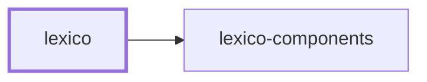

# 🐺 Lexico

**A Latin–English dictionary, rebuilt.**

> ⚠️ **Work in progress.** The application shell, routing, and component
> library are real; the data layer is not yet wired up. Server functions in
> `src/lib/` are typed stubs returning empty results, so the UI renders but the
> dictionary does not yet answer.

Lexico is a server-side rendered web application built with TanStack Start and
React 19. It is the front end of a small suite: the dictionary's shape lives in
[lexico-entities](../../packages/lexico-entities/README.md), the data that
fills it is gathered by
[lexico-ingestion](../lexico-ingestion/README.md), and the interface is built
from [lexico-components](../../packages/lexico-components/README.md).

## Project Graph

Where this project sits in the Nx project graph: what it depends on, and what depends on it. Regenerated by `nx run synchronization:synchronize --configuration=write`.

<!-- nx-project-graph-start -->



<!-- nx-project-graph-end -->

## Projects

| Project | Role |
| ------- | ---- |
| 🐺 [lexico](README.md) | The SSR web application — routes, server functions, pages |
| 🎨 [lexico-components](../../packages/lexico-components/README.md) | Shared React component library on shadcn/ui and Radix primitives |
| 📖 [lexico-entities](../../packages/lexico-entities/README.md) | TypeORM entities and migrations for the dictionary and literature schema |
| 🚰 [lexico-ingestion](../lexico-ingestion/README.md) | CLI that scrapes and loads dictionary, literature, and etymology sources |

## Quick Start

```bash
pnpm install
nx run lexico:develop     # http://localhost:3000
```

| Target | Does |
| ------ | ---- |
| `develop` | Vite dev server with hot reload |
| `build` | Production SSR bundle |
| `start` | Serve a built bundle |
| `preview` | Preview the production build locally |
| `bundlesize` | Check the bundle against its size budget |
| `vitest` | Tests — `:unit`, `:integration`, `:end-to-end` |
| `lint-codebase` | All static analysis; `--configuration=write` to auto-fix |

## Structure

```text
src/
├── routes/              # File-based routing (TanStack Router)
│   ├── __root.tsx       # Root layout
│   ├── index.tsx        # /
│   ├── search.tsx       # /search
│   ├── word.$id.tsx     # /word/:id
│   ├── bookmarks.tsx    # /bookmarks
│   ├── library.tsx      # /library
│   ├── settings.tsx     # /settings
│   └── tools.tsx        # /tools
├── lib/                 # Server functions and shared types
│   ├── auth.ts          # Current user, sign out
│   ├── search.ts        # Entry search and lookup
│   ├── bookmarks.ts     # Saved words
│   ├── library.ts       # Vocabulary tracking
│   ├── forms.ts         # Inflection tables
│   └── pronunciation.ts # Audio playback
├── components/          # Page-specific components
└── router.tsx           # Router construction
```

Routes are defined by file structure: `src/routes/search.tsx` serves `/search`,
and `src/routes/word.$id.tsx` serves `/word/:id`.

Data access goes through TanStack Start **server functions** — type-safe RPC
from client to server — declared in `src/lib/` and called from route loaders so
the first render is already populated. Wiring those handlers to a real
datastore is the outstanding work.

## Technology

- **React 19** with TanStack Router for file-based routing
- **TanStack Start** for SSR and server functions
- **Tailwind CSS** with shadcn/ui components from
  [lexico-components](../../packages/lexico-components/README.md)
- **Vite 7** with Nitro for the SSR bundle
- **TypeScript 5.9**, strict mode throughout

## Documentation

- [AGENTS.md](AGENTS.md) — architecture and development patterns
- [Codebase AGENTS.md](../../AGENTS.md) — workspace conventions and Nx workflows
- [TanStack Start](https://tanstack.com/router/latest/docs/framework/react/start/overview)

## License

MIT — see [LICENSE](../../LICENSE).

<!-- CALL_STACKS_START -->

## 🔭 Callidescope

Call stacks traced through `lexico`, deepest first. Each frame shows what it takes, what it returns, and what its documentation says.

| Measure | Value |
| --- | --- |
| Callables | 210 |
| Files | 34 |
| Calls traced | 114 |
| Call stacks | 30 |
| Deepest stack | 9 |
| Stacks through recursion | 0 |
| Unfollowable calls | 57 |

### Call stacks

**1. `SearchResultsList`** — depth 9 · orphan-root

```text
🚀 SearchResultsList(properties: SearchResultsListProperties): ReactNode [applications/lexico/src/routes/search.tsx:165]
   ↳ Search results list.
  └─> map(…)(entry: EntrySearchResult): JSX.Element [applications/lexico/src/routes/search.tsx:170]
    └─> transformForms(partOfSpeech: string, forms: Forms): TransformResult [applications/lexico/src/lib/forms.ts:100]
       ↳ Transform forms based on part of speech.
      └─> dispatchFormTransform(pos: string, forms: Forms): TransformResult [applications/lexico/src/lib/forms.ts:298]
         ↳ Dispatch form transformation by part-of-speech string, then fall back to type-guard auto-detection.
        └─> autoDetectFormTransform(forms: Forms): TransformResult [applications/lexico/src/lib/forms.ts:153]
           ↳ Auto-detect form type by structure inspection when part-of-speech does not match.
          └─> transformVerbForms(forms: VerbForms): VerbForm[] [applications/lexico/src/lib/forms.ts:140]
             ↳ Convert nested verb forms from database to flat array for VerbFormsTable.
            └─> transformIndicativeForms(forms: VerbForms): VerbForm[] [applications/lexico/src/lib/forms.ts:413]
               ↳ Extract indicative mood forms into flat VerbForm rows.
              └─> collectPersonNumberForms(…): void [applications/lexico/src/lib/forms.ts:244]
                 ↳ Collect finite verb forms from a number/person structure into result array.
                └─> personDisplay(person: string): string [applications/lexico/src/lib/forms.ts:365]
                   ↳ Helper to get person display string.
```

**2. `WordForms`** — depth 8 · orphan-root

```text
🚀 WordForms(properties: WordFormsProperties): ReactNode [applications/lexico/src/routes/word.$id.tsx:51]
   ↳ Word forms.
  └─> transformForms(partOfSpeech: string, forms: Forms): TransformResult [applications/lexico/src/lib/forms.ts:100]
     ↳ Transform forms based on part of speech.
    └─> dispatchFormTransform(pos: string, forms: Forms): TransformResult [applications/lexico/src/lib/forms.ts:298]
       ↳ Dispatch form transformation by part-of-speech string, then fall back to type-guard auto-detection.
      └─> autoDetectFormTransform(forms: Forms): TransformResult [applications/lexico/src/lib/forms.ts:153]
         ↳ Auto-detect form type by structure inspection when part-of-speech does not match.
        └─> transformVerbForms(forms: VerbForms): VerbForm[] [applications/lexico/src/lib/forms.ts:140]
           ↳ Convert nested verb forms from database to flat array for VerbFormsTable.
          └─> transformIndicativeForms(forms: VerbForms): VerbForm[] [applications/lexico/src/lib/forms.ts:413]
             ↳ Extract indicative mood forms into flat VerbForm rows.
            └─> collectPersonNumberForms(…): void [applications/lexico/src/lib/forms.ts:244]
               ↳ Collect finite verb forms from a number/person structure into result array.
              └─> personDisplay(person: string): string [applications/lexico/src/lib/forms.ts:365]
                 ↳ Helper to get person display string.
```

**3. `groupAdjectiveForms`** — depth 5 · orphan-root

```text
🚀 groupAdjectiveForms(forms: AdjectiveForm[]): AdjectiveFormGroup[] [applications/lexico/src/components/entry/adjective-forms-table.tsx:165]
   ↳ Group adjective forms by degree -\> gender for tabs.
  └─> buildDegreeGroupsFromForms(forms: AdjectiveForm[]): AdjectiveFormGroup[] [applications/lexico/src/components/entry/adjective-forms-table.tsx:140]
     ↳ Build degree groups when the forms include degree data.
    └─> groupByGender(forms: AdjectiveForm[]): AdjectiveFormGroup["genders"] [applications/lexico/src/components/entry/adjective-forms-table.tsx:175]
       ↳ Group forms by gender and restructure into cells.
      └─> restructureAdjectiveForms(forms: AdjectiveForm[]): FormCellProperties[] [applications/lexico/src/components/entry/adjective-forms-table.tsx:236]
         ↳ Restructure adjective forms for a specific gender into cells.
        └─> flatMap(…)(this: undefined, caseName: string): [FormCellProperties, FormCellProperties] [applications/lexico/src/components/entry/adjective-forms-table.tsx:252]
```

<details>
<summary>27 more call stacks</summary>

**4. `groupVerbForms`** — depth 4 · orphan-root

```text
🚀 groupVerbForms(forms: VerbForm[]): VerbFormGroup[] [applications/lexico/src/components/entry/verb-forms-table.tsx:165]
   ↳ Group verb forms by mood -\> tense -\> voice for nested tabs.
  └─> buildVerbFormTenses(moodGroup: Record<string, Record<string, VerbForm[]>>): VerbFormGroup["tenses"] [applications/lexico/src/components/entry/verb-forms-table.tsx:114]
     ↳ Convert a mood's nested tense/voice record into the ordered tenses array.
    └─> restructureVerbForms(forms: VerbForm[]): FormCellProperties[] [applications/lexico/src/components/entry/verb-forms-table.tsx:239]
       ↳ Restructure verb forms for a specific mood/tense/voice into cells.
      └─> some(…)(form: VerbForm): string | undefined [applications/lexico/src/components/entry/verb-forms-table.tsx:248]
```

**5. `SearchPage`** — depth ≥ 4 · orphan-root

```text
🚀 SearchPage(): ReactNode [applications/lexico/src/routes/search.tsx:68]
   ↳ Search page component that allows users to search for Latin entries.
  └─> useDebounce<T>(value: T, delay: number): T [applications/lexico/src/routes/search.tsx:203]
     ↳ Custom hook that debounces a value by the specified delay.
    └─> useEffect(…)(): () => void [applications/lexico/src/routes/search.tsx:206]
      └─> setTimeout(…)(): void [applications/lexico/src/routes/search.tsx:207]
```

**6. `FormCell`** — depth 3 · orphan-root

```text
🚀 FormCell(properties: FormCellProperties): React.ReactElement [applications/lexico/src/components/entry/form-cell.tsx:57]
   ↳ Render a single grid cell with optional corner identifiers.
  └─> computeBorderClasses(position: FormCellPosition | undefined): string [applications/lexico/src/components/entry/form-cell.tsx:43]
     ↳ Compute border classes for a form cell based on its grid position.
    └─> cn(...inputs: ClassValue[]): string [packages/lexico-components/src/lib/utils.ts:4]
```

**7. `AdjectiveFormsTable`** — depth 3 · orphan-root

```text
🚀 AdjectiveFormsTable(properties: AdjectiveFormsTableProperties): null | React.ReactElement [applications/lexico/src/components/entry/adjective-forms-table.tsx:73]
   ↳ Render adjective forms with degree and gender tab navigation.
  └─> renderAdjectiveGenderContent(…): ReactElement<unknown, string | JSXElementConstructor<any>> | null [applications/lexico/src/components/entry/adjective-forms-table.tsx:201]
     ↳ Render the gender tabs (and forms table) for the currently selected degree.
    └─> map(…)(gender: { cells: FormCellProperties[]; gender: string; }): string [applications/lexico/src/components/entry/adjective-forms-table.tsx:209]
```

**8. `PrincipalParts`** — depth 3 · orphan-root

```text
🚀 PrincipalParts(properties: PrincipalPartsProperties): ReactElement [applications/lexico/src/components/entry/principal-parts.tsx:125]
   ↳ Component that displays principal parts, part of speech, and inflection info.
  └─> getPrincipalPartsLabel(principalParts: PrincipalPart[] | Record<string, string | undefined>): string [applications/lexico/src/components/entry/principal-parts.tsx:194]
     ↳ Gets a formatted label from principal parts data.
    └─> map(…)(principalPart: PrincipalPart): string [applications/lexico/src/components/entry/principal-parts.tsx:199]
```

**9. `BookmarksPage`** — depth ≥ 3 · orphan-root

```text
🚀 BookmarksPage(): ReactNode [applications/lexico/src/routes/bookmarks.tsx:103]
   ↳ Bookmarks page component that displays user's bookmarked entries.
  └─> useCallback(…)(entryId: string): Promise<void> [applications/lexico/src/routes/bookmarks.tsx:127]
    └─> setBookmarks(…)(previous: BookmarkedEntry[]): BookmarkedEntry[] [applications/lexico/src/routes/bookmarks.tsx:131]
```

**10. `updateTextAsync`** — depth ≥ 3 · orphan-root

```text
🚀 updateTextAsync(…): Promise<void> [applications/lexico/src/routes/hooks/useLibraryPage.ts:265]
   ↳ Updates the currently edited text and synchronizes the local sorted collection.
  └─> setTexts(…)(previous: UserText[]): UserText[] [applications/lexico/src/routes/hooks/useLibraryPage.ts:292]
    └─> map(…)(t: UserText): UserText [applications/lexico/src/routes/hooks/useLibraryPage.ts:293]
```

**11. `LibraryPage`** — depth 3 · orphan-root

```text
🚀 LibraryPage(): ReactNode [applications/lexico/src/routes/library.tsx:270]
   ↳ Library page component that displays and manages user's saved texts.
  └─> useLibraryPage(): LibraryPageState [applications/lexico/src/routes/hooks/useLibraryPage.ts:67]
     ↳ Hook managing the library page state and operations. Handles text CRUD operations, form state, and UI dialogs.
    └─> useLibraryPageStateInitialization(): LibraryPageHookState [applications/lexico/src/routes/hooks/useLibraryPage.ts:315]
       ↳ Initializes all local state used by the library page hook.
```

**12. `PronunciationButton`** — depth ≥ 3 · orphan-root

```text
🚀 PronunciationButton(properties: PronunciationButtonProperties): ReactElement [applications/lexico/src/components/PronunciationButton.tsx:19]
  └─> useCallback(…)(): Promise<void> [applications/lexico/src/components/PronunciationButton.tsx:30]
    └─> addEventListener(…)(): void [applications/lexico/src/components/PronunciationButton.tsx:49]
```

**13. `Logo`** — depth 2 · orphan-root

```text
🚀 Logo(properties: LogoProperties): React.ReactElement [applications/lexico/src/components/layout/logo.tsx:18]
   ↳ Render the Lexico brand logo at a configurable width.
  └─> cn(...inputs: ClassValue[]): string [packages/lexico-components/src/lib/utils.ts:4]
```

**14. `ApplicationSidebar`** — depth 2 · orphan-root

```text
🚀 ApplicationSidebar(properties: Readonly<ApplicationSidebarProperties>): ReactNode [applications/lexico/src/routes/__root.tsx:112]
   ↳ Application sidebar component with navigation items.
  └─> useSidebar(): SidebarContextProperties [packages/lexico-components/src/components/ui/sidebar.tsx:46]
```

**15. `Identifier`** — depth 2 · orphan-root

```text
🚀 Identifier(properties: IdentifierProperties): ReactElement [applications/lexico/src/components/entry/identifier.tsx:171]
   ↳ Badge component that displays abbreviated identifiers with tooltips.
  └─> cn(...inputs: ClassValue[]): string [packages/lexico-components/src/lib/utils.ts:4]
```

**16. `FormTabs`** — depth 2 · orphan-root

```text
🚀 FormTabs(properties: FormTabsProperties): React.ReactElement [applications/lexico/src/components/entry/form-tabs.tsx:32]
   ↳ Render shared tab UI for selecting form groupings.
  └─> cn(...inputs: ClassValue[]): string [packages/lexico-components/src/lib/utils.ts:4]
```

**17. `FormsTable`** — depth 2 · orphan-root

```text
🚀 FormsTable(properties: FormsTableProperties): React.ReactElement [applications/lexico/src/components/entry/forms-table.tsx:27]
   ↳ Render two-column form cells with border-position metadata.
  └─> cn(...inputs: ClassValue[]): string [packages/lexico-components/src/lib/utils.ts:4]
```

**18. `NounFormsTable`** — depth 2 · orphan-root

```text
🚀 NounFormsTable(properties: NounFormsTableProperties): React.ReactElement [applications/lexico/src/components/entry/noun-forms-table.tsx:74]
   ↳ Render noun forms in a singular/plural table.
  └─> useMemo(…)(): FormCellProperties[] [applications/lexico/src/components/entry/noun-forms-table.tsx:78]
```

**19. `restructureNounForms`** — depth 2 · orphan-root

```text
🚀 restructureNounForms(forms: NounForm[]): FormCellProperties[] [applications/lexico/src/components/entry/noun-forms-table.tsx:94]
   ↳ Restructure noun forms into a 2-column grid (singular, plural) Each row is a case, columns are singular and plural.
  └─> flatMap(…)(this: undefined, caseName: string): [FormCellProperties, FormCellProperties] [applications/lexico/src/components/entry/noun-forms-table.tsx:108]
```

**20. `Translations`** — depth 2 · orphan-root

```text
🚀 Translations(properties: TranslationsProperties): ReactElement [applications/lexico/src/components/entry/translations.tsx:26]
   ↳ Renders translations inline, collapsing entries after the first two when expandable.
  └─> cn(...inputs: ClassValue[]): string [packages/lexico-components/src/lib/utils.ts:4]
```

**21. `VerbFormsTable`** — depth 2 · orphan-root

```text
🚀 VerbFormsTable(properties: VerbFormsTableProperties): null | React.ReactElement [applications/lexico/src/components/entry/verb-forms-table.tsx:261]
   ↳ Render verb forms with mood, tense, and voice tab navigation.
  └─> useMemo(…)(): VerbFormGroup[] [applications/lexico/src/components/entry/verb-forms-table.tsx:265]
```

**22. `EntryCard`** — depth 2 · orphan-root

```text
🚀 EntryCard(properties: EntryCardProperties): ReactElement [applications/lexico/src/components/entry/entry-card.tsx:104]
   ↳ Renders a lexical entry card and wires accordion state for detail sections.
  └─> cn(...inputs: ClassValue[]): string [packages/lexico-components/src/lib/utils.ts:4]
```

**23. `BookmarksList`** — depth 2 · orphan-root

```text
🚀 BookmarksList(properties: BookmarksListProperties): ReactNode [applications/lexico/src/routes/bookmarks.tsx:83]
   ↳ Bookmarks list.
  └─> map(…)(entry: BookmarkedEntry): JSX.Element [applications/lexico/src/routes/bookmarks.tsx:87]
```

**24. `createTextAsync`** — depth ≥ 2 · orphan-root

```text
🚀 createTextAsync(…): Promise<void> [applications/lexico/src/routes/hooks/useLibraryPage.ts:173]
   ↳ Creates a new user text and updates local state after a successful mutation.
  └─> setTexts(…)(previous: UserText[]): UserText[] [applications/lexico/src/routes/hooks/useLibraryPage.ts:198]
```

**25. `deleteTextAsync`** — depth ≥ 2 · orphan-root

```text
🚀 deleteTextAsync(…): Promise<void> [applications/lexico/src/routes/hooks/useLibraryPage.ts:218]
   ↳ Deletes a user text and clears selection when the deleted text was active.
  └─> setTexts(…)(previous: UserText[]): UserText[] [applications/lexico/src/routes/hooks/useLibraryPage.ts:228]
```

**26. `LibraryTextGrid`** — depth 2 · orphan-root

```text
🚀 LibraryTextGrid(…): ReactNode [applications/lexico/src/routes/library.tsx:438]
   ↳ Library text grid.
  └─> map(…)(text: UserText): JSX.Element [applications/lexico/src/routes/library.tsx:453]
```

**27. `anonymous`** — depth 2 · orphan-root

```text
🚀 anonymous(): undefined [applications/lexico/src/routes/settings.tsx:67]
  └─> handleSignIn(): Promise<void> [applications/lexico/src/routes/settings.tsx:24]
     ↳ Handle sign in.
```

**28. `anonymous`** — depth 2 · orphan-root

```text
🚀 anonymous(): undefined [applications/lexico/src/routes/settings.tsx:92]
  └─> handleSignOut(): Promise<void> [applications/lexico/src/routes/settings.tsx:41]
```

**29. `anonymous`** — depth 2 · orphan-root

```text
🚀 anonymous(): undefined [applications/lexico/src/routes/settings.tsx:129]
  └─> handleDeleteAccount(): Promise<void> [applications/lexico/src/routes/settings.tsx:46]
```

**30. `WordPage`** — depth ≥ 2 · orphan-root

```text
🚀 WordPage(): ReactNode [applications/lexico/src/routes/word.$id.tsx:78]
   ↳ Word detail page component that displays full entry information.
  └─> useEffect(…)(): void [applications/lexico/src/routes/word.$id.tsx:83]
```

</details>

### Module spread

None.

### Possibly misplaced

| Callable | Declared in | Called from | Callers |
| --- | --- | --- | --- |
| `transformForms` | `lexico:lib` | `lexico:routes` | 2/2 |
<!-- CALL_STACKS_END -->
