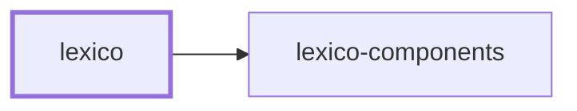

# 🐺 Lexico

**A Latin–English dictionary, rebuilt.**

> ⚠️ **Work in progress.** The application shell, routing, and component
> library are real; the data layer is not yet wired up. Server functions in
> `src/lib/` are typed stubs returning empty results, so the UI renders but the
> dictionary does not yet answer.

Lexico is a server-side rendered web application built with TanStack Start and
React 19. It is the front end of a small suite: the dictionary's shape lives in
[lexico-entities](../../packages/lexico-entities/README.md), the data that
fills it is gathered by
[lexico-ingestion](../lexico-ingestion/README.md), and the interface is built
from [lexico-components](../../packages/lexico-components/README.md).

## Project Graph

Where this project sits in the Nx project graph: what it depends on, and what depends on it. Regenerated by `nx run synchronization:synchronize --configuration=write`.

<!-- nx-project-graph-start -->



<!-- nx-project-graph-end -->

## Projects

| Project | Role |
| ------- | ---- |
| 🐺 [lexico](README.md) | The SSR web application — routes, server functions, pages |
| 🎨 [lexico-components](../../packages/lexico-components/README.md) | Shared React component library on shadcn/ui and Radix primitives |
| 📖 [lexico-entities](../../packages/lexico-entities/README.md) | TypeORM entities and migrations for the dictionary and literature schema |
| 🚰 [lexico-ingestion](../lexico-ingestion/README.md) | CLI that scrapes and loads dictionary, literature, and etymology sources |

## Quick Start

```bash
pnpm install
nx run lexico:develop     # http://localhost:3000
```

| Target | Does |
| ------ | ---- |
| `develop` | Vite dev server with hot reload |
| `build` | Production SSR bundle |
| `start` | Serve a built bundle |
| `preview` | Preview the production build locally |
| `bundlesize` | Check the entry, route, CSS, and server bundles against their size budgets |
| `vitest` | Tests — `:unit`, `:integration`, `:end-to-end` |
| `lint-codebase` | All static analysis; `--configuration=write` to auto-fix |

## Structure

```text
src/
├── routes/              # File-based routing (TanStack Router)
│   ├── __root.tsx       # Root layout
│   ├── index.tsx        # /
│   ├── search.tsx       # /search
│   ├── word.$id.tsx     # /word/:id
│   ├── bookmarks.tsx    # /bookmarks
│   ├── library.tsx      # /library
│   ├── settings.tsx     # /settings
│   └── tools.tsx        # /tools
├── lib/                 # Server functions and shared types
│   ├── auth.ts          # Current user, sign out
│   ├── search.ts        # Entry search and lookup
│   ├── bookmarks.ts     # Saved words
│   ├── library.ts       # Vocabulary tracking
│   ├── forms.ts         # Inflection tables
│   └── pronunciation.ts # Audio playback
├── components/          # Page-specific components
└── router.tsx           # Router construction
```

Routes are defined by file structure: `src/routes/search.tsx` serves `/search`,
and `src/routes/word.$id.tsx` serves `/word/:id`.

Data access goes through TanStack Start **server functions** — type-safe RPC
from client to server — declared in `src/lib/` and called from route loaders so
the first render is already populated. Wiring those handlers to a real
datastore is the outstanding work.

## Technology

- **React 19** with TanStack Router for file-based routing
- **TanStack Start** for SSR and server functions
- **Tailwind CSS** with shadcn/ui components from
  [lexico-components](../../packages/lexico-components/README.md)
- **Vite 7** with Nitro for the SSR bundle
- **TypeScript 5.9**, strict mode throughout

## Documentation

- [AGENTS.md](AGENTS.md) — architecture and development patterns
- [Codebase AGENTS.md](../../AGENTS.md) — workspace conventions and Nx workflows
- [TanStack Start](https://tanstack.com/router/latest/docs/framework/react/start/overview)

## License

MIT — see [LICENSE](../../LICENSE).
