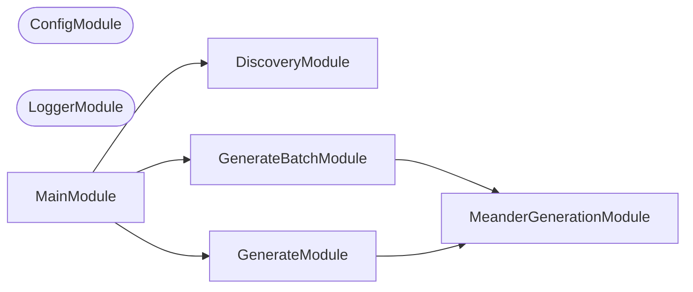

## Project Graph

Where this project sits in the Nx project graph: what it depends on, and what depends on it. Regenerated by `nx run synchronization:nx-project-graphs:write`.

<!-- nx-project-graph-start -->


<!-- nx-project-graph-end -->

## Module Graph

The modules this project defines and the imports between them, published by `nx run synchronization:nestjs-module-graphs:write`.

<!-- nestjs-module-graph-start -->


_Rounded modules are global: every module can inject them, so their edges are left out._

<!-- nestjs-module-graph-end -->

## Start

```bash
nx run meanderaw:start
```

## Test

```bash
nx run meanderaw:vitest
```

## 👔 Conformetry

This project was generated from the [nestjs-command-project](../../configuration/conformetry-templates/nestjs-command-project) conformetry template.

## 🕸️ Codependix

Dependency graphs exported by [codependix](https://github.com/JimmyPaolini/codebase/tree/main/packages/codependix-cli), regenerated by `nx run codebase:codependix:write`.

### Nx Neighborhood

<!-- codependix:start name="codependix-nx" -->

<!-- codependix:end name="codependix-nx" -->

### NestJS Module Graph

<!-- codependix:start name="codependix-nestjs" -->


_Rounded modules are global: every module can inject them, so their edges are left out._
<!-- codependix:end name="codependix-nestjs" -->

### File Imports

<!-- codependix:start name="codependix-imports" -->
```mermaid
graph LR
  file_eslint_config_ts["eslint.config.ts"]
  file_src_constants_ts["src/constants.ts"]
  file_src_main_end_to_end_test_ts["src/main.end-to-end.test.ts"]
  file_src_main_module_ts["src/main.module.ts"]
  file_src_main_ts["src/main.ts"]
  file_src_main_unit_test_ts["src/main.unit.test.ts"]
  file_src_modules_generate_batch_generate_batch_command_ts["src/modules/generate-batch/generate-batch.command.ts"]
  file_src_modules_generate_batch_generate_batch_command_unit_test_ts["src/modules/generate-batch/generate-batch.command.unit.test.ts"]
  file_src_modules_generate_batch_generate_batch_constants_ts["src/modules/generate-batch/generate-batch.constants.ts"]
  file_src_modules_generate_batch_generate_batch_module_ts["src/modules/generate-batch/generate-batch.module.ts"]
  file_src_modules_generate_batch_generate_batch_types_ts["src/modules/generate-batch/generate-batch.types.ts"]
  file_src_modules_generate_generate_command_ts["src/modules/generate/generate.command.ts"]
  file_src_modules_generate_generate_command_unit_test_ts["src/modules/generate/generate.command.unit.test.ts"]
  file_src_modules_generate_generate_constants_ts["src/modules/generate/generate.constants.ts"]
  file_src_modules_generate_generate_module_ts["src/modules/generate/generate.module.ts"]
  file_src_modules_generate_generate_types_ts["src/modules/generate/generate.types.ts"]
  file_src_modules_meander_generation_bars_motif_service_ts["src/modules/meander-generation/bars-motif.service.ts"]
  file_src_modules_meander_generation_bars_motif_service_unit_test_ts["src/modules/meander-generation/bars-motif.service.unit.test.ts"]
  file_src_modules_meander_generation_boxes_motif_service_ts["src/modules/meander-generation/boxes-motif.service.ts"]
  file_src_modules_meander_generation_boxes_motif_service_unit_test_ts["src/modules/meander-generation/boxes-motif.service.unit.test.ts"]
  file_src_modules_meander_generation_chain_motif_service_ts["src/modules/meander-generation/chain-motif.service.ts"]
  file_src_modules_meander_generation_chain_motif_service_unit_test_ts["src/modules/meander-generation/chain-motif.service.unit.test.ts"]
  file_src_modules_meander_generation_grid_geometry_service_ts["src/modules/meander-generation/grid-geometry.service.ts"]
  file_src_modules_meander_generation_grid_geometry_service_unit_test_ts["src/modules/meander-generation/grid-geometry.service.unit.test.ts"]
  file_src_modules_meander_generation_invalid_modifier_errors_ts["src/modules/meander-generation/invalid-modifier.errors.ts"]
  file_src_modules_meander_generation_invalid_modifier_errors_unit_test_ts["src/modules/meander-generation/invalid-modifier.errors.unit.test.ts"]
  file_src_modules_meander_generation_invalid_period_errors_ts["src/modules/meander-generation/invalid-period.errors.ts"]
  file_src_modules_meander_generation_invalid_period_errors_unit_test_ts["src/modules/meander-generation/invalid-period.errors.unit.test.ts"]
  file_src_modules_meander_generation_invalid_repeat_count_cycle_errors_ts["src/modules/meander-generation/invalid-repeat-count-cycle.errors.ts"]
  file_src_modules_meander_generation_invalid_repeat_count_errors_ts["src/modules/meander-generation/invalid-repeat-count.errors.ts"]
  file_src_modules_meander_generation_invalid_rows_errors_ts["src/modules/meander-generation/invalid-rows.errors.ts"]
  file_src_modules_meander_generation_meander_generation_constants_ts["src/modules/meander-generation/meander-generation.constants.ts"]
  file_src_modules_meander_generation_meander_generation_module_ts["src/modules/meander-generation/meander-generation.module.ts"]
  file_src_modules_meander_generation_meander_generation_service_ts["src/modules/meander-generation/meander-generation.service.ts"]
  file_src_modules_meander_generation_meander_generation_service_unit_test_ts["src/modules/meander-generation/meander-generation.service.unit.test.ts"]
  file_src_modules_meander_generation_meander_generation_types_ts["src/modules/meander-generation/meander-generation.types.ts"]
  file_src_modules_meander_generation_motif_transforms_service_ts["src/modules/meander-generation/motif-transforms.service.ts"]
  file_src_modules_meander_generation_motif_transforms_service_unit_test_ts["src/modules/meander-generation/motif-transforms.service.unit.test.ts"]
  file_src_modules_meander_generation_output_filename_service_ts["src/modules/meander-generation/output-filename.service.ts"]
  file_src_modules_meander_generation_output_filename_service_unit_test_ts["src/modules/meander-generation/output-filename.service.unit.test.ts"]
  file_src_modules_meander_generation_snake_motif_service_ts["src/modules/meander-generation/snake-motif.service.ts"]
  file_src_modules_meander_generation_snake_motif_service_unit_test_ts["src/modules/meander-generation/snake-motif.service.unit.test.ts"]
  file_src_modules_meander_generation_snake_sequence_service_ts["src/modules/meander-generation/snake-sequence.service.ts"]
  file_src_modules_meander_generation_snake_sequence_service_unit_test_ts["src/modules/meander-generation/snake-sequence.service.unit.test.ts"]
  file_src_modules_meander_generation_svg_rendering_service_ts["src/modules/meander-generation/svg-rendering.service.ts"]
  file_src_modules_meander_generation_svg_rendering_service_unit_test_ts["src/modules/meander-generation/svg-rendering.service.unit.test.ts"]
  file_src_modules_meander_generation_swirl_motif_service_ts["src/modules/meander-generation/swirl-motif.service.ts"]
  file_src_modules_meander_generation_swirl_motif_service_unit_test_ts["src/modules/meander-generation/swirl-motif.service.unit.test.ts"]
  file_src_modules_meander_generation_whirl_motif_service_ts["src/modules/meander-generation/whirl-motif.service.ts"]
  file_src_modules_meander_generation_whirl_motif_service_unit_test_ts["src/modules/meander-generation/whirl-motif.service.unit.test.ts"]
  file_src_repl_ts["src/repl.ts"]
  file_testing_mocks_ts["testing/mocks.ts"]
  file_testing_setup_ts["testing/setup.ts"]
  file_vitest_config_ts["vitest.config.ts"]
  file_src_main_end_to_end_test_ts --> file_src_constants_ts
  file_src_main_module_ts --> file_src_constants_ts
  file_src_main_module_ts --> file_src_modules_generate_batch_generate_batch_module_ts
  file_src_main_module_ts --> file_src_modules_generate_generate_module_ts
  file_src_main_ts --> file_src_main_module_ts
  file_src_main_unit_test_ts --> file_src_main_module_ts
  file_src_modules_generate_batch_generate_batch_command_ts --> file_src_modules_generate_batch_generate_batch_constants_ts
  file_src_modules_generate_batch_generate_batch_command_ts --> file_src_modules_generate_batch_generate_batch_types_ts
  file_src_modules_generate_batch_generate_batch_command_ts --> file_src_modules_meander_generation_meander_generation_constants_ts
  file_src_modules_generate_batch_generate_batch_command_ts --> file_src_modules_meander_generation_meander_generation_service_ts
  file_src_modules_generate_batch_generate_batch_command_ts --> file_src_modules_meander_generation_meander_generation_types_ts
  file_src_modules_generate_batch_generate_batch_command_ts --> file_src_modules_meander_generation_output_filename_service_ts
  file_src_modules_generate_batch_generate_batch_command_unit_test_ts --> file_src_modules_generate_batch_generate_batch_command_ts
  file_src_modules_generate_batch_generate_batch_command_unit_test_ts --> file_src_modules_meander_generation_meander_generation_module_ts
  file_src_modules_generate_batch_generate_batch_command_unit_test_ts --> file_src_modules_meander_generation_meander_generation_service_ts
  file_src_modules_generate_batch_generate_batch_command_unit_test_ts --> file_src_modules_meander_generation_output_filename_service_ts
  file_src_modules_generate_batch_generate_batch_constants_ts --> file_src_modules_meander_generation_meander_generation_types_ts
  file_src_modules_generate_batch_generate_batch_module_ts --> file_src_modules_generate_batch_generate_batch_command_ts
  file_src_modules_generate_batch_generate_batch_module_ts --> file_src_modules_meander_generation_meander_generation_module_ts
  file_src_modules_generate_generate_command_ts --> file_src_modules_generate_generate_types_ts
  file_src_modules_generate_generate_command_ts --> file_src_modules_meander_generation_meander_generation_constants_ts
  file_src_modules_generate_generate_command_ts --> file_src_modules_meander_generation_meander_generation_service_ts
  file_src_modules_generate_generate_command_ts --> file_src_modules_meander_generation_meander_generation_types_ts
  file_src_modules_generate_generate_command_ts --> file_src_modules_meander_generation_output_filename_service_ts
  file_src_modules_generate_generate_command_unit_test_ts --> file_src_modules_generate_generate_command_ts
  file_src_modules_generate_generate_command_unit_test_ts --> file_src_modules_meander_generation_meander_generation_service_ts
  file_src_modules_generate_generate_command_unit_test_ts --> file_src_modules_meander_generation_output_filename_service_ts
  file_src_modules_generate_generate_module_ts --> file_src_modules_generate_generate_command_ts
  file_src_modules_generate_generate_module_ts --> file_src_modules_meander_generation_meander_generation_module_ts
  file_src_modules_generate_generate_types_ts --> file_src_modules_meander_generation_meander_generation_types_ts
  file_src_modules_meander_generation_bars_motif_service_ts --> file_src_modules_meander_generation_grid_geometry_service_ts
  file_src_modules_meander_generation_bars_motif_service_ts --> file_src_modules_meander_generation_meander_generation_types_ts
  file_src_modules_meander_generation_bars_motif_service_ts --> file_src_modules_meander_generation_motif_transforms_service_ts
  file_src_modules_meander_generation_bars_motif_service_unit_test_ts --> file_src_modules_meander_generation_bars_motif_service_ts
  file_src_modules_meander_generation_bars_motif_service_unit_test_ts --> file_src_modules_meander_generation_grid_geometry_service_ts
  file_src_modules_meander_generation_bars_motif_service_unit_test_ts --> file_src_modules_meander_generation_motif_transforms_service_ts
  file_src_modules_meander_generation_boxes_motif_service_ts --> file_src_modules_meander_generation_grid_geometry_service_ts
  file_src_modules_meander_generation_boxes_motif_service_ts --> file_src_modules_meander_generation_meander_generation_constants_ts
  file_src_modules_meander_generation_boxes_motif_service_ts --> file_src_modules_meander_generation_meander_generation_types_ts
  file_src_modules_meander_generation_boxes_motif_service_ts --> file_src_modules_meander_generation_motif_transforms_service_ts
  file_src_modules_meander_generation_boxes_motif_service_unit_test_ts --> file_src_modules_meander_generation_boxes_motif_service_ts
  file_src_modules_meander_generation_boxes_motif_service_unit_test_ts --> file_src_modules_meander_generation_grid_geometry_service_ts
  file_src_modules_meander_generation_boxes_motif_service_unit_test_ts --> file_src_modules_meander_generation_motif_transforms_service_ts
  file_src_modules_meander_generation_chain_motif_service_ts --> file_src_modules_meander_generation_grid_geometry_service_ts
  file_src_modules_meander_generation_chain_motif_service_ts --> file_src_modules_meander_generation_meander_generation_constants_ts
  file_src_modules_meander_generation_chain_motif_service_ts --> file_src_modules_meander_generation_meander_generation_types_ts
  file_src_modules_meander_generation_chain_motif_service_ts --> file_src_modules_meander_generation_snake_motif_service_ts
  file_src_modules_meander_generation_chain_motif_service_ts --> file_src_modules_meander_generation_snake_sequence_service_ts
  file_src_modules_meander_generation_chain_motif_service_unit_test_ts --> file_src_modules_meander_generation_chain_motif_service_ts
  file_src_modules_meander_generation_chain_motif_service_unit_test_ts --> file_src_modules_meander_generation_grid_geometry_service_ts
  file_src_modules_meander_generation_chain_motif_service_unit_test_ts --> file_src_modules_meander_generation_motif_transforms_service_ts
  file_src_modules_meander_generation_chain_motif_service_unit_test_ts --> file_src_modules_meander_generation_snake_motif_service_ts
  file_src_modules_meander_generation_chain_motif_service_unit_test_ts --> file_src_modules_meander_generation_snake_sequence_service_ts
  file_src_modules_meander_generation_grid_geometry_service_ts --> file_src_modules_meander_generation_meander_generation_constants_ts
  file_src_modules_meander_generation_grid_geometry_service_ts --> file_src_modules_meander_generation_meander_generation_types_ts
  file_src_modules_meander_generation_grid_geometry_service_unit_test_ts --> file_src_modules_meander_generation_grid_geometry_service_ts
  file_src_modules_meander_generation_invalid_modifier_errors_unit_test_ts --> file_src_modules_meander_generation_invalid_modifier_errors_ts
  file_src_modules_meander_generation_invalid_period_errors_unit_test_ts --> file_src_modules_meander_generation_invalid_period_errors_ts
  file_src_modules_meander_generation_meander_generation_constants_ts --> file_src_modules_meander_generation_meander_generation_types_ts
  file_src_modules_meander_generation_meander_generation_module_ts --> file_src_modules_meander_generation_bars_motif_service_ts
  file_src_modules_meander_generation_meander_generation_module_ts --> file_src_modules_meander_generation_boxes_motif_service_ts
  file_src_modules_meander_generation_meander_generation_module_ts --> file_src_modules_meander_generation_chain_motif_service_ts
  file_src_modules_meander_generation_meander_generation_module_ts --> file_src_modules_meander_generation_grid_geometry_service_ts
  file_src_modules_meander_generation_meander_generation_module_ts --> file_src_modules_meander_generation_meander_generation_service_ts
  file_src_modules_meander_generation_meander_generation_module_ts --> file_src_modules_meander_generation_motif_transforms_service_ts
  file_src_modules_meander_generation_meander_generation_module_ts --> file_src_modules_meander_generation_output_filename_service_ts
  file_src_modules_meander_generation_meander_generation_module_ts --> file_src_modules_meander_generation_snake_motif_service_ts
  file_src_modules_meander_generation_meander_generation_module_ts --> file_src_modules_meander_generation_snake_sequence_service_ts
  file_src_modules_meander_generation_meander_generation_module_ts --> file_src_modules_meander_generation_svg_rendering_service_ts
  file_src_modules_meander_generation_meander_generation_module_ts --> file_src_modules_meander_generation_swirl_motif_service_ts
  file_src_modules_meander_generation_meander_generation_module_ts --> file_src_modules_meander_generation_whirl_motif_service_ts
  file_src_modules_meander_generation_meander_generation_service_ts --> file_src_modules_meander_generation_bars_motif_service_ts
  file_src_modules_meander_generation_meander_generation_service_ts --> file_src_modules_meander_generation_boxes_motif_service_ts
  file_src_modules_meander_generation_meander_generation_service_ts --> file_src_modules_meander_generation_chain_motif_service_ts
  file_src_modules_meander_generation_meander_generation_service_ts --> file_src_modules_meander_generation_grid_geometry_service_ts
  file_src_modules_meander_generation_meander_generation_service_ts --> file_src_modules_meander_generation_invalid_modifier_errors_ts
  file_src_modules_meander_generation_meander_generation_service_ts --> file_src_modules_meander_generation_invalid_period_errors_ts
  file_src_modules_meander_generation_meander_generation_service_ts --> file_src_modules_meander_generation_invalid_repeat_count_cycle_errors_ts
  file_src_modules_meander_generation_meander_generation_service_ts --> file_src_modules_meander_generation_invalid_repeat_count_errors_ts
  file_src_modules_meander_generation_meander_generation_service_ts --> file_src_modules_meander_generation_invalid_rows_errors_ts
  file_src_modules_meander_generation_meander_generation_service_ts --> file_src_modules_meander_generation_meander_generation_constants_ts
  file_src_modules_meander_generation_meander_generation_service_ts --> file_src_modules_meander_generation_meander_generation_types_ts
  file_src_modules_meander_generation_meander_generation_service_ts --> file_src_modules_meander_generation_snake_motif_service_ts
  file_src_modules_meander_generation_meander_generation_service_ts --> file_src_modules_meander_generation_svg_rendering_service_ts
  file_src_modules_meander_generation_meander_generation_service_ts --> file_src_modules_meander_generation_swirl_motif_service_ts
  file_src_modules_meander_generation_meander_generation_service_ts --> file_src_modules_meander_generation_whirl_motif_service_ts
  file_src_modules_meander_generation_meander_generation_service_unit_test_ts --> file_src_modules_meander_generation_bars_motif_service_ts
  file_src_modules_meander_generation_meander_generation_service_unit_test_ts --> file_src_modules_meander_generation_boxes_motif_service_ts
  file_src_modules_meander_generation_meander_generation_service_unit_test_ts --> file_src_modules_meander_generation_chain_motif_service_ts
  file_src_modules_meander_generation_meander_generation_service_unit_test_ts --> file_src_modules_meander_generation_grid_geometry_service_ts
  file_src_modules_meander_generation_meander_generation_service_unit_test_ts --> file_src_modules_meander_generation_invalid_period_errors_ts
  file_src_modules_meander_generation_meander_generation_service_unit_test_ts --> file_src_modules_meander_generation_invalid_repeat_count_cycle_errors_ts
  file_src_modules_meander_generation_meander_generation_service_unit_test_ts --> file_src_modules_meander_generation_invalid_repeat_count_errors_ts
  file_src_modules_meander_generation_meander_generation_service_unit_test_ts --> file_src_modules_meander_generation_invalid_rows_errors_ts
  file_src_modules_meander_generation_meander_generation_service_unit_test_ts --> file_src_modules_meander_generation_meander_generation_service_ts
  file_src_modules_meander_generation_meander_generation_service_unit_test_ts --> file_src_modules_meander_generation_motif_transforms_service_ts
  file_src_modules_meander_generation_meander_generation_service_unit_test_ts --> file_src_modules_meander_generation_snake_motif_service_ts
  file_src_modules_meander_generation_meander_generation_service_unit_test_ts --> file_src_modules_meander_generation_snake_sequence_service_ts
  file_src_modules_meander_generation_meander_generation_service_unit_test_ts --> file_src_modules_meander_generation_svg_rendering_service_ts
  file_src_modules_meander_generation_meander_generation_service_unit_test_ts --> file_src_modules_meander_generation_swirl_motif_service_ts
  file_src_modules_meander_generation_meander_generation_service_unit_test_ts --> file_src_modules_meander_generation_whirl_motif_service_ts
  file_src_modules_meander_generation_motif_transforms_service_ts --> file_src_modules_meander_generation_meander_generation_types_ts
  file_src_modules_meander_generation_motif_transforms_service_unit_test_ts --> file_src_modules_meander_generation_meander_generation_types_ts
  file_src_modules_meander_generation_motif_transforms_service_unit_test_ts --> file_src_modules_meander_generation_motif_transforms_service_ts
  file_src_modules_meander_generation_output_filename_service_ts --> file_src_modules_meander_generation_meander_generation_types_ts
  file_src_modules_meander_generation_output_filename_service_unit_test_ts --> file_src_modules_meander_generation_output_filename_service_ts
  file_src_modules_meander_generation_snake_motif_service_ts --> file_src_modules_meander_generation_grid_geometry_service_ts
  file_src_modules_meander_generation_snake_motif_service_ts --> file_src_modules_meander_generation_meander_generation_types_ts
  file_src_modules_meander_generation_snake_motif_service_ts --> file_src_modules_meander_generation_snake_sequence_service_ts
  file_src_modules_meander_generation_snake_motif_service_unit_test_ts --> file_src_modules_meander_generation_grid_geometry_service_ts
  file_src_modules_meander_generation_snake_motif_service_unit_test_ts --> file_src_modules_meander_generation_motif_transforms_service_ts
  file_src_modules_meander_generation_snake_motif_service_unit_test_ts --> file_src_modules_meander_generation_snake_motif_service_ts
  file_src_modules_meander_generation_snake_motif_service_unit_test_ts --> file_src_modules_meander_generation_snake_sequence_service_ts
  file_src_modules_meander_generation_snake_sequence_service_ts --> file_src_modules_meander_generation_meander_generation_constants_ts
  file_src_modules_meander_generation_snake_sequence_service_ts --> file_src_modules_meander_generation_meander_generation_types_ts
  file_src_modules_meander_generation_snake_sequence_service_ts --> file_src_modules_meander_generation_motif_transforms_service_ts
  file_src_modules_meander_generation_snake_sequence_service_unit_test_ts --> file_src_modules_meander_generation_motif_transforms_service_ts
  file_src_modules_meander_generation_snake_sequence_service_unit_test_ts --> file_src_modules_meander_generation_snake_sequence_service_ts
  file_src_modules_meander_generation_svg_rendering_service_ts --> file_src_modules_meander_generation_meander_generation_constants_ts
  file_src_modules_meander_generation_svg_rendering_service_ts --> file_src_modules_meander_generation_meander_generation_types_ts
  file_src_modules_meander_generation_svg_rendering_service_unit_test_ts --> file_src_modules_meander_generation_svg_rendering_service_ts
  file_src_modules_meander_generation_swirl_motif_service_ts --> file_src_modules_meander_generation_grid_geometry_service_ts
  file_src_modules_meander_generation_swirl_motif_service_ts --> file_src_modules_meander_generation_meander_generation_types_ts
  file_src_modules_meander_generation_swirl_motif_service_ts --> file_src_modules_meander_generation_motif_transforms_service_ts
  file_src_modules_meander_generation_swirl_motif_service_ts --> file_src_modules_meander_generation_snake_motif_service_ts
  file_src_modules_meander_generation_swirl_motif_service_unit_test_ts --> file_src_modules_meander_generation_grid_geometry_service_ts
  file_src_modules_meander_generation_swirl_motif_service_unit_test_ts --> file_src_modules_meander_generation_motif_transforms_service_ts
  file_src_modules_meander_generation_swirl_motif_service_unit_test_ts --> file_src_modules_meander_generation_snake_motif_service_ts
  file_src_modules_meander_generation_swirl_motif_service_unit_test_ts --> file_src_modules_meander_generation_snake_sequence_service_ts
  file_src_modules_meander_generation_swirl_motif_service_unit_test_ts --> file_src_modules_meander_generation_swirl_motif_service_ts
  file_src_modules_meander_generation_whirl_motif_service_ts --> file_src_modules_meander_generation_grid_geometry_service_ts
  file_src_modules_meander_generation_whirl_motif_service_ts --> file_src_modules_meander_generation_meander_generation_types_ts
  file_src_modules_meander_generation_whirl_motif_service_ts --> file_src_modules_meander_generation_motif_transforms_service_ts
  file_src_modules_meander_generation_whirl_motif_service_ts --> file_src_modules_meander_generation_snake_motif_service_ts
  file_src_modules_meander_generation_whirl_motif_service_unit_test_ts --> file_src_modules_meander_generation_grid_geometry_service_ts
  file_src_modules_meander_generation_whirl_motif_service_unit_test_ts --> file_src_modules_meander_generation_motif_transforms_service_ts
  file_src_modules_meander_generation_whirl_motif_service_unit_test_ts --> file_src_modules_meander_generation_snake_motif_service_ts
  file_src_modules_meander_generation_whirl_motif_service_unit_test_ts --> file_src_modules_meander_generation_snake_sequence_service_ts
  file_src_modules_meander_generation_whirl_motif_service_unit_test_ts --> file_src_modules_meander_generation_whirl_motif_service_ts
  file_src_repl_ts --> file_src_main_module_ts
```
<!-- codependix:end name="codependix-imports" -->
