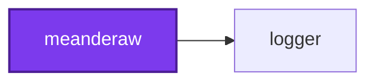
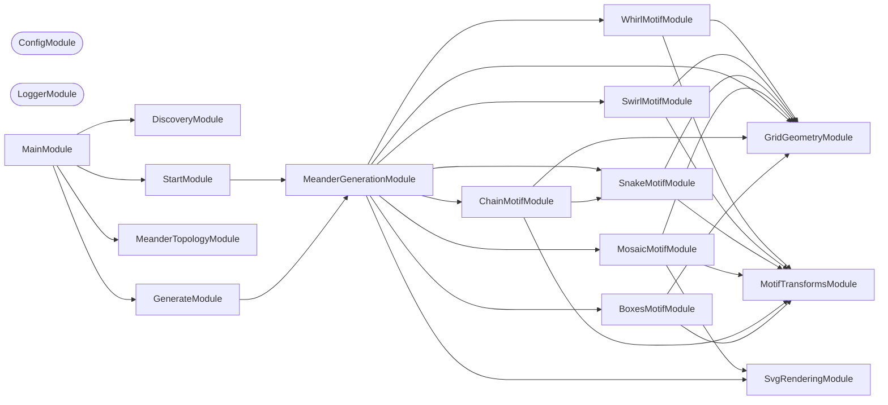

## Start

```bash
nx run meanderaw:start
```

## Test

```bash
nx run meanderaw:vitest
```

## 🏛️ Meander Charter

Ten families of meander are implemented, and they share a set of properties that are
load-bearing to how a meander looks. The invariants were extracted from the six families
that predate them, by measuring every committed SVG rather than by reading the code, and
each is marked fixed or negotiable. A new family that breaks a fixed invariant is not a
new family — it is a different kind of drawing. Three of the four that came after break a
negotiable one each, on purpose: `cross` crosses, and `negative` and `branch` both branch
— in different shapes, which "The Branching Family" below is about. The fourth, `parallel`,
breaks none of them, and that is the point of it.

| # | Invariant | Status |
| --- | --- | --- |
| 1 | **Orthogonal only** — horizontal and vertical movement, no diagonals | Fixed |
| 2 | **Space-filling** — every interior white channel is exactly one stroke width | Fixed |
| 3 | **No branching** — ink contains no T-junctions | Relaxed by `branch` and `negative` in every mode, and by `chain` and `snake` under `edge` and `edge-flip` |
| 4 | **No crossing** — ink contains no X-junctions | Relaxed by `cross`, except under `interrupted` |
| 5 | **Band, not field** — fixed canvas height, `rows` is density, tiling is horizontal | Fixed |
| 6 | **Flat path model** — unordered paths, no z-order, one stroke width per document | May be relaxed by ADR only |
| 7 | Invariants hold within a band, not at its termination | See [#338](https://github.com/JimmyPaolini/codebase/issues/338) |

What the measurements found. They were taken across the 114 named patterns and 3,179
enumerated `mosaic` tiles that existed before `cross`; every count below is restated
against the corpus as it now stands, 174 named patterns beside the same 3,179 tiles:

- **Every interior white channel is exactly one stroke width**, in all 3,353 files. The
  channel width equals the stroke width equals half a grid unit, and that single number
  is the same in every document the project has ever written — the stroke is `unit / 2`
  at every row count, in every family, at every ply of `parallel`. #340 and #413 both
  inferred from this that drawing `N` strands would mean `strokeWidth = unit / (2N)`;
  that inference is wrong and is discarded, for the reasons under "The Parallel Family"
  below.
- **Ink never crosses itself, except where a family was added to make it.** Zero
  X-junctions across all 3,293 files the six original families produce — a stronger
  statement than "non-self-intersecting", and the sharpest single characterization of what
  those six have in common. The `cross` family relaxes it deliberately: 12 X-junctions in
  each of the three solid documents it commits, and none anywhere else in the 3,353-file
  corpus. See "The Crossing Family" below.
- **Ink branches in three places, and only there.** 1,360 T-junctions across 59 of the 174
  named patterns. 200 of them, across 20 patterns, are `chain` and `snake` under `edge`
  and `edge-flip`, ten per document at every row count: the `edge` family widens the
  repeat unit past the zigzag it contains, so the zigzag's terminating vertical lands in
  the _interior_ of the band border rather than at its end, and the border runs on either
  side of it — five such junctions along the top border, five along the bottom. An earlier
  reading of this measurement reported zero everywhere; the reference assets are
  hand-verified ground truth for what these patterns should look like, so the geometry is
  right and the count was wrong. The other 1,160 are the point of two families rather than
  a side effect of anything: 852 across the `negative` family's 18 documents and 308
  across the `branch` family's 21 — see "The Negative Space Family" and "The Branching
  Family" below.
- **Ink was a forest everywhere until it was a tree in one place.** Read as a graph, a
  document's ink is lattice points joined by one-pitch steps. All 3,317 documents that
  predate `branch` are one of two things and neither is a tree: 3,286 are forests of many
  components — a disjoint union of simple arcs — and 31 carry loops, being `negative`'s
  18, `cross`'s 3 solid drawings, and 10 `snake` drawings under `edge`/`edge-flip`.
  `branch`'s 21 are the only trees in the corpus: one connected piece, `edges = nodes − 1`,
  no loop anywhere. See "The Branching Family" below.
- **The negative space branches and crosses freely.** It branches in every family, and in
  `mosaic split` and `mosaic alternated period-3` it genuinely crosses. Crossing patterns
  are already generated here; they have only ever been white, never ink.

Invariant 1 is not merely local convention. Fréart's rule for the classical meander is
that returns and intersections "do always fall into right angles", quoted in the
[ICAA's article on the complex Greek meander](https://www.classicist.org/articles/classical-comments-the-complex-greek-meander/).

Invariant 5 is fixed because the intended use is **borders**. Two-dimensional field
ornament is excluded for that reason, not because it is uninteresting.

Wider-than-one-stroke gaps occur only where a band terminates, which is
[#338](https://github.com/JimmyPaolini/codebase/issues/338) and is not a family
property.

## 🧬 Families, Sub-families, and Tiles

A **family** is a generator of repeat units — its **unit space**. A **modifier** is a
named constructor into that space; a **sub-family** is a named predicate over it. Both
are views on one underlying space, which is why `mosaic` is the only family with
sub-families today: [#365](https://github.com/JimmyPaolini/codebase/pull/365)
materialized its unit space as 3,179 enumerable tiles, so its regions —
`lines`, `dashes`, `dots`, `diamond` — became recognizable. The other nine families
have latent unit spaces and therefore only modifiers.

The glossary for these terms lives in the repository [CONTEXT.md](../../CONTEXT.md).
Note one deliberate divergence: the code says `MeanderType`, `SUPPORTED_TYPES`, and
`--type` where the glossary says **family**. Renaming the flag would be a breaking CLI
change and is not worth making for a vocabulary correction.

## 🔤 Naming a Mosaic Sub-family

<!-- cspell:ignore ddd lll hxhxhx vxvx ddddd — mosaic tile identifiers, one
letter per cell of the tile, from MOSAIC_MARK_LETTERS in
src/modules/mosaic-motif/mosaic-motif.constants.ts. -->

`mosaic`'s unit space is materialized, so a region of it can be **recognized** rather
than listed. Four regions have names, and all four are the same predicate over a tile's
own pieces: every mark in the tile is the same kind.

| Sub-family | Every mark is | Smallest tile | Reads as |
| --- | --- | --- | --- |
| `dots` | a dot | `ddd` | a field of square marks |
| `lines` | the single-column continuous rule | `lll` | unbroken horizontal rules |
| `dashes` | a horizontal dash | `hxhxhx` | broken horizontal rules |
| `diamond` | a vertical dash | `vxvx` | a dashed vertical bar |

Recognition lives in `MosaicSubFamilyService.classify`, which reads `MosaicTile.pieces`
and never the canonical identifier. That is deliberate: the names keep working at row
and column counts nobody has enumerated, and survive any change to the enumeration's
bounds. A tile that mixes mark kinds — which is nearly all of them — belongs to no
sub-family and is left **unnamed** rather than pushed into the nearest one.

Across the 3,179 tiles the sweep enumerates, at 4–8 rows and 1–2 columns:

| Sub-family | Tiles |
| --- | --- |
| `dashes` | 75 |
| `dots` | 10 |
| `lines` | 5 |
| `diamond` | 4 |
| unnamed | 3,085 |

A region holds every tile its predicate accepts, not only the one it is named after,
which is why `dashes` is much the largest: a horizontal dash may anchor in either column
of a two-column tile, so staggered arrangements are `dashes` too. `diamond` is the
smallest because its covers are forced rather than chosen — vertical dashes cover the
bar's interior levels in pairs, so there is one arrangement per column span where the
number of levels is even and none at all where it is odd. Asking for a `diamond` at an
even row count is refused rather than approximated.

Ask for a sub-family by name:

```bash
nx run meanderaw:generate --args="--type mosaic --sub-family dots --rows 6"
```

The name lands in the output filename — `mosaic-6-rows-6-repeats-dots.svg` — and in the
sweep's own, where a tile with a name carries it after its identifier
(`mosaic-6-rows-1-columns-ddddd-dots.svg`) and a tile without one carries the identifier
alone.

### `diamond` and `split` are one shape under two names

The hand-drawn reference set held a `diamond` and a `split` that were byte-identical, and
both names survive here because they play different roles — exactly the distinction the
[CONTEXT.md](../../CONTEXT.md) glossary draws:

- **`split` is a modifier**: a named _constructor_ into the unit space. `--modifier split`
  breaks the bar into dashes, and nothing about it, its compatibility entry, or its
  reference asset changes.
- **`diamond` is a sub-family**: a named _predicate_ over the unit space. It recognizes
  any tile built entirely of vertical dashes, whether or not `split` is what produced it.

Two routes to one shape, which is what the glossary means by "some sub-families arise by
applying a modifier, others by recognizing a structural property". The equality is tested
rather than asserted: the `diamond` sub-family at 5 rows and 12 repeats is byte-identical
to the committed `testing/assets/mosaic-5-rows-12-repeats-split.svg`.

Two names, two files. `--sub-family diamond` writes `mosaic-5-rows-12-repeats-diamond.svg`
and `--modifier split` still writes `mosaic-5-rows-12-repeats-split.svg`, so neither
overwrites the other. Asking for both at once is refused, since either one alone already
decides which repeat unit is drawn.

One name worth reading twice: the **`dot` modifier** (singular, carrying a `bounce` or
`up` shape) and the **`dots` sub-family** (plural) are different things one letter apart.

## 🕳️ Negative Space Survey

<!-- The tile identifiers below are canonical MosaicSymmetryService output (one letter per cell, see mosaic-symmetry.service.ts), not words. cspell:ignore dvvxxd dvvxxvvxxvvxxd dvvxxvdx dvvxxvvxxd dvvxxvvxxvdx hxxhhx hxxhhxxhhxxhhx hxxhhxxh hxxhhxxhhx hxxhhxxhhxxh dldldld dldl dldld dldldl -->

[#340](https://github.com/JimmyPaolini/codebase/issues/340) found genuine four-way
crossings in the negative space of `mosaic split` and `mosaic alternated period-3`, and
branching in every family's negative — but only across the 114 named patterns.
[#412](https://github.com/JimmyPaolini/codebase/issues/412) runs the same measurement
across all 3,179 tiles of the `mosaic` permutation set committed under
`output/permutations/` — the only family with an enumerated unit space, so the only one
this measurement can run over every tile rather than a handful of named modifiers.

### Method

Every `output/permutations/*.svg` file was read from disk — no generation, no motif
service, the same approach the charter test already uses to gate the corpus — and passed
to the existing
[`MeanderTopologyService.measure`](src/modules/meander-topology/meander-topology.service.ts).
A tile is classified from its own `negativeTJunctions`/`negativeXJunctions`:

- **Crosses**: `negativeXJunctions > 0`.
- **Branches only**: `negativeTJunctions > 0` and `negativeXJunctions === 0`.
- **Neither**: both zero.

This measurement adds no committed source: it ran as a temporary test beside
`meander-topology.service.integration.test.ts`, deleted before this section was
committed. It is nothing but a loop calling `measure` on each file and tallying the
result against the two thresholds above — reproducible in a few lines against the
already-committed service.

One further tally needed a small extension beyond what `measure` reports (see
"Is the negative itself space-filling?" below): for each cell of the same lattice graph
`MeanderLatticeService.build` already produces, how many of its corridor-eligible sides
carry no corridor — the same four-arm check `measure` uses to find negative T- and
X-junctions, just also recording degree 0.

### Per-class counts

| Class | Tiles | Share |
| --- | --- | --- |
| Crosses | 3,070 | 96.6% |
| Branches only | 104 | 3.3% |
| Neither | 5 | 0.2% |
| **Total** | **3,179** | 100% |

By row count:

| Rows | Tiles | Crosses | Branches only | Neither |
| --- | --- | --- | --- | --- |
| 4 | 23 | 16 | 6 | 1 |
| 5 | 68 | 58 | 9 | 1 |
| 6 | 199 | 182 | 16 | 1 |
| 7 | 660 | 633 | 26 | 1 |
| 8 | 2,229 | 2,181 | 47 | 1 |

Crossing is the overwhelming majority, and grows with both row count and column span:
2,794 of the 3,070 crossing tiles span 2 columns against 276 at 1 column. Issue #340
already observed that crossing "grows with row count"; this shows it holding far beyond
the two named tiles the spec measured — crossing negatives are the norm across this
family's unit space, not the exception the 114-file measurement suggested. The five
_neither_ tiles are exactly the `lines` sub-family at every swept row count (`lll`
through `lllllll`): a single vertical line's negative is two straight channels that
neither branch nor cross, the simplest case there is and the reason a "neither" class
exists at all.

Every one of the 3,179 tiles still has zero ink T-junctions, zero ink X-junctions, and
full channel-width compliance — unchanged from what the base branch's own disk-based gate
already reports for the whole 3,293-file corpus. This survey adds the negative-space
breakdown; it does not revisit the ink side.

### Is the negative itself space-filling?

Yes, for all 3,179 tiles, by the measurable criterion available: no cell's corridor
degree is 0. A degree-0 cell is a white cell sealed off from the corridor network on
every side that has a neighbor — the negative-space analogue of an un-inked lattice
point, and the specific failure `channelWidthCompliant` catches on the ink side. If a
tile's negative were drawn as ink by tracing a stroke along every corridor, a sealed cell
would receive no stroke at all.

Across all 3,179 tiles — 264,117 cells in total, at band termination and in the interior
alike — **zero have corridor degree 0**. Every white cell touches at least one neighbor
through a missing ink edge. Drawing any permutation tile's negative as ink would
therefore leave no region unreached, keeping invariant 2.

This is measured, not proven in general: it states that the corridor skeleton reaches
every cell, not that a specific rendered path through that skeleton stays exactly one
stroke width everywhere the family drawn from it eventually decides to run. #415 still
has to measure its own rendered output rather than assume this result transfers
unchanged.

### Shortlist

Three candidates scale cleanly across every row count the permutation sweep covers (4
through 8), which is what makes each "a family" rather than one lucky tile. All three
are _branches only_ — **verified `negativeXJunctions === 0` at every one of their five
row counts**, read from the same per-file measurement that produced the per-class counts
above, not asserted separately — so drawing them relaxes invariant 3 and nothing else,
exactly what issues #415 and #416 need. A fourth candidate was cut after review found it
crosses; see below.

1. **`dvvxxd` → `dvvxxvvxxvvxxd`** (`mosaic`, columns 2, rows 4–8: `dvvxxd`, `dvvxxvdx`,
   `dvvxxvvxxd`, `dvvxxvvxxvdx`, `dvvxxvvxxvvxxd`). Negative T-junctions
   38 / 48 / 58 / 68 / 78 (rows 4–8 respectively), X-junctions 0 / 0 / 0 / 0 / 0. The
   highest-branching non-crossing family found, at every row count.
2. **`hxxhhx` → `hxxhhxxhhxxhhx`** (`mosaic`, columns 2, rows 4–8: `hxxhhx`, `hxxhhxxh`,
   `hxxhhxxhhx`, `hxxhhxxhhxxh`, `hxxhhxxhhxxhhx`). T-junctions 30 / 40 / 50 / 60 / 70,
   X-junctions 0 / 0 / 0 / 0 / 0. Structurally the simplest of the three — built from
   one mark kind, the horizontal dash, repeated.
3. **`dld` → `dldldld`** (`mosaic`, columns 1, rows 4–8: `dld`, `dldl`, `dldld`,
   `dldldl`, `dldldld`). T-junctions 16 / 16 / 24 / 24 / 32, X-junctions
   0 / 0 / 0 / 0 / 0. One column of alternating dots and lines, and the
   highest-branching candidate at the cheaper-to-verify column 1 width — checked
   against every columns-1 branches-only tile in the corpus, not just this family.

**Cut after review, not shortlisted:** all-dots (`ddd`/`dddd`/`ddddd`/`dddddd`/`ddddddd`
at columns 1, `dddddd`/`dddddddd`/`dddddddddd`/`dddddddddddd`/`dddddddddddddd` at
columns 2) was drafted as a fourth, lowest-branching candidate on the mistaken belief
that only its columns-2 form crosses. Re-measured against the same data: it crosses **at
every row count and both column widths** — X-junctions 6 / 9 / 12 / 15 / 18 at columns 1
and 18 / 27 / 36 / 45 / 54 at columns 2 (rows 4–8), the columns-2, 8-row tile being the
single most-crossing tile in the whole corpus. All-dots belongs entirely to the
_crosses_ class, not _branches only_, at either width. It is recorded here because it is
still the cleanest-scaling crossing family found, in case whoever works on the crossing
family (#417) wants a starting point — neither #415 nor #416 should draw from it.

### A note for the branching family

Every one of the 104 _branches only_ tiles' corridor graphs contains at least one cycle
at the rendered scale (6 repeats): none is a literal tree. Checked directly — for each
tile, `edges ≠ vertices − components`, the condition for a forest — because the pattern
repeats periodically along the band and each repeat closes a loop through its neighbors.
Both scaling families above are single connected components with 20–40 cycles at 8 rows.
A bounded-tree family cannot adopt one of these corridor graphs unmodified: it would need
to deliberately omit some corridors — every other "rung", for instance — to break the
loops before the shape that inspired it can satisfy the tree test (`edges = vertices −
1`) a bounded-tree charter relaxation needs.

## 🔬 Unit Spaces Beyond Mosaic

`mosaic` is the only family with sub-families, and
[#414](https://github.com/JimmyPaolini/codebase/issues/414) asked whether that asymmetry
can be removed: is there, for `boxes`, `chain`, `snake`, `swirl`, and `whirl`, a generating
rule producing a finite enumerable unit space the way `mosaic`'s exact-cover rule does?

**A rule exists, it is the same rule for all five, and that is exactly the problem.** The
charter's own invariants already define one. It is family-agnostic, and at the pitch these
five families actually use it generates twelve million tiles at five rows and 3 × 10²² at
eight — of which each family contributes exactly one. Materializing it would not give
`boxes` a unit space; it would dissolve `boxes` into a single point of a space nobody can
look through. The recommendation is to **leave the asymmetry**, and this section records
the measurements behind that.

This was a spike. It changed no code, and everything below is measurement on the sweep
`nx run meanderaw:start` already writes.

The verdict per family, with the rest of the section as its evidence:

| Family | A rule of its own? | The shared charter rule? | Tiles it contributes | Tiles the shared rule generates at 5 rows |
| --- | --- | --- | --- | --- |
| `boxes` | none found | yes | 1 per row count and modifier | 12,082,896 |
| `chain` | none found | yes, except under `edge` and `edge-flip` | 1 per row count and modifier | 12,082,896 |
| `snake` | none found | yes, except under `edge` and `edge-flip` | 1 per row count and modifier | 12,082,896 |
| `swirl` | none found | yes | 1 per row count and modifier | 2.46 × 10¹² |
| `whirl` | none found | yes | 1 per row count and modifier | 710,761,599 |

The two exceptions are measured below: `edge` and `edge-flip` put two degree-3 points per
repeat unit on the border rule, so those tiles sit outside the maximum-degree-2 rule and
inside a charter with invariant 3 relaxed.

### The band as a lattice

One model carries every claim here. A meander's ink runs along the edges of a lattice:
`rows + 1` horizontal grid levels one grid unit apart, tiling horizontally at the family's
own **pitch**. A repeat tile is the wrapped `pitch` × `rows - 1` lattice of interior points,
with the two border rules at levels `0` and `rows` above and below it.

Three of the seven charter invariants are properties of that lattice, and restating them
this way is what makes them countable rather than merely checkable:

| Invariant | On the lattice |
| --- | --- |
| 2 — space-filling | every interior lattice point carries ink — as the end of an edge, or as a dot |
| 3 — no branching | no lattice point has ink degree 3 |
| 4 — no crossing | no lattice point has ink degree 4 |

Invariant 2 costs the enumeration nothing, because a lattice point lying on no edge **is**
an inked dot — exactly `mosaic`'s own `dot` piece, which is what keeps this model agreeing
with the family whose 3,179 tiles it reproduces below. So **a charter-legal repeat tile is
any subgraph of the tile's lattice with maximum degree 2**: every point either sits on an
edge or is drawn as a dot, and invariants 3 and 4 are the only constraints the count sees.
That sentence is the generating rule the ticket went looking for, and it is exactly what
every "all charter-legal tiles" figure below counts. It did not have to be invented; it was
already written down, as prose about pictures rather than as a rule about a graph.

### What the six families are, measured

Parsing all 78 non-`mosaic` documents the sweep writes back into that lattice — one
interior repeat unit each, wrapped at its own family's pitch, so band termination never
enters — gives one uniform result:

| Family | Modifier | Pitch | Bare points | Degree 3 | Degree 4 | The tile's ink is |
| --- | --- | --- | --- | --- | --- | --- |
| `boxes` | none, `spin`, `spin-flip` | `rows - 1` | 0 | 0 | 0 | one arc through every point |
| `chain` | none | `rows - 1` | 0 | 0 | 0 | one arc through every point |
| `chain` | `edge`, `edge-flip` | `rows` | 0 | 2 | 0 | two arcs, each meeting a border rule |
| `chain` | `flip` | `2(rows - 2)` | 0 | 0 | 0 | two arcs |
| `snake` | none | `rows - 1` | 0 | 0 | 0 | one closed loop through every point |
| `snake` | `edge`, `edge-flip` | `rows` | 0 | 2 | 0 | one arc, both ends meeting a border rule |
| `snake` | `flip` | `2(rows - 2)` | 0 | 0 | 0 | one closed loop |
| `swirl` | none | `2 rows - 3` | 0 | 0 | 0 | one arc through every point |
| `swirl` | `flip` | `2(2 rows - 3)` | 0 | 0 | 0 | two arcs |
| `whirl` | none | `rows` | 0 | 0 | 0 | one arc through every point |
| `whirl` | `flip` | `2 rows` | 0 | 0 | 0 | two arcs |

Every one of the 78, at every row count from each family's structural minimum through 8:
**no bare lattice point, and no degree-4 point anywhere** — stronger than the rule demands,
since none of the five ever draws a dot. The only degree-3 points in the
whole set are the two per repeat unit that `edge` and `edge-flip` create by joining the
zigzag to the border rule — the same ink T-junctions
[#410](https://github.com/JimmyPaolini/codebase/issues/410) reports, reached here
independently and from the other direction.

`mosaic` is the same model with one extra bound. A `mosaic` tile is an exact cover of its
cells by dots and one-unit dashes, and a cell **is** a lattice point: a dot is an isolated
point, a dash is a single lattice edge. So a `mosaic` tile is exactly a **matching** of the
tile's lattice, every unmatched point drawn as a dot. Re-deriving the enumeration from that
one-line description reproduces the committed sweep tile for tile — 8, 15, 18, 50, 40, 159,
93, 567, 216, and 2,013 per row count and column span, 3,179 in all — so the two
descriptions are the same description.

### The five sit at the far end of one axis

`mosaic` bounds every component of the tile to a single edge. The five make the tile one
component as long as it can be. Both are regions of the one space:

| Region | Rule | Who lives there |
| --- | --- | --- |
| matchings | every component has at most one edge | `mosaic` |
| simple traversals | at most one horizontal run per level and one vertical run per column | `boxes`, `chain`, `snake`, `whirl` |
| Hamiltonian cycles | one component, every point of degree 2 | `snake` |
| Hamiltonian paths | one component, two loose ends | `boxes`, `chain`, `swirl`, `whirl` |

The size of the whole space, counted exactly on the wrapped lattice each family's own pitch
defines:

| Lattice | Rows | Family | All charter-legal tiles |
| --- | --- | --- | --- |
| 3 × 3 | 4 | `boxes`, `chain`, `snake` | 7,231 |
| 4 × 4 | 5 | `boxes`, `chain`, `snake` | 12,082,896 |
| 5 × 5 | 6 | `boxes`, `chain`, `snake` | 1.83 × 10¹¹ |
| 6 × 6 | 7 | `boxes`, `chain`, `snake` | 2.58 × 10¹⁶ |
| 7 × 7 | 8 | `boxes`, `chain`, `snake` | 3.36 × 10²² |
| 4 × 3 | 4 | `whirl` | 141,421 |
| 5 × 4 | 5 | `whirl` | 710,761,599 |
| 6 × 5 | 6 | `whirl` | 3.29 × 10¹³ |
| 5 × 3 | 4 | `swirl` | 2,738,193 |
| 7 × 4 | 5 | `swirl` | 2.46 × 10¹² |
| 9 × 5 | 6 | `swirl` | 1.88 × 10²⁰ |

Counts are before folding by the tile's symmetry group (translations, horizontal mirror,
level flip), which divides by at most `4 × pitch` and never moves the order of magnitude:
the `mosaic` sweep's folded 2,013 tiles at 8 rows and 2 columns come from 11,275 unfolded,
a factor of 5.6.

The narrower regions are smaller and still far past looking through. On the same 4 × 4
lattice at 5 rows, `snake` is one of **82** Hamiltonian cycles and `boxes` one of **4,016**
Hamiltonian paths; at 6 rows the tightest of the four rules, simple traversals, still
admits **9,304,216** tiles. Those three regions were enumerated only at the smaller
lattices, which is why the table above reports the charter-legal count — exact at every
size — and why the recommendation rests on that column alone.

`swirl` is the family that escapes even the tightest of those rules. Its two arms put two
horizontal runs on its outer levels, so it is not a simple traversal, and no rule narrower
than "Hamiltonian path" covers all five.

### Why `mosaic`'s space is small, and the five cannot borrow it

Two independent bounds keep `mosaic` enumerable, and only one of them is the rule:

- **The rule caps a mark at one grid unit**, which is what turns a tile into a matching.
- **The enumeration caps the tile at `MOSAIC_TILE_MAXIMUM_COLUMNS`, which is 2.**

Both are load-bearing. `mosaic`'s own matching rule, applied at the pitch `boxes`, `chain`,
and `snake` use, gives 21,497 tiles at 5 rows and 4.10 × 10¹³ at 8 rows. The five have no
equivalent cap available: their pitch is not a free parameter, it is the width of their own
motif — `rows - 1`, `rows`, or `2 rows - 3` — and capping it below that deletes the family.

And a materialized space only earns sub-families when it holds more tiles than it has
names. Each of the five produces **exactly one tile per row count and modifier**: 78
documents for 78 combinations, with no free parameter anywhere in the five motif services
beyond `rows`. A predicate over a one-element set names nothing. That, rather than the
absence of a rule, is why they have no sub-families.

### The property `mosaic` has that the five lack

`mosaic`'s constraint is **local and decomposable**. A tile is an unordered set of
independent marks, each occupying one cell or two adjacent ones, and legality is settled
per cell — is it claimed exactly once? Nothing about one mark depends on a mark elsewhere.
That is what makes the backtracking enumeration possible, and what makes the space's
members similar enough to fall into classes worth naming.

The five have **no piece decomposition at all**. The tile is one traversal of the whole
lattice, and "is a spiral" or "is a zigzag" is a property of the traversal entire, not of
any cell: every segment of a spiral is fixed by every other segment. There is no alphabet
of local pieces whose exact cover is the set of spirals, so the only rules available are
the global ones above — which admit all five families at once, and a great deal else.

This is an argument, not a proof. No search can establish that a family-specific rule does
not exist; what it can establish is that the shape `mosaic` has is absent, and that every
rule constructible from the measured tiles is either satisfied by one tile (useless as a
space) or by all five and millions of strangers (useless as a family).

### Would the modifiers become recognizable regions?

Yes — each has a distinct structural signature on the lattice, so each is expressible as a
predicate rather than as a transform:

| Modifier | Measured effect on the tile | As a predicate |
| --- | --- | --- |
| `flip` | doubles the pitch, fusing a mirrored twin into one tile | the tile is mirror-symmetric about its own center |
| `spin`, `spin-flip` | leave the pitch alone, but the true repeat is `SPIN_CYCLE_LENGTH` units | over a tile four times as wide: the four quarters are one quarter-turn rotational orbit |
| `edge`, `edge-flip` | widen the pitch by one level and add exactly two degree-3 points | the tile's ink touches a border rule |

Two caveats. Each of these changes the pitch or the true repeat, so "the family's unit
space" would be one space per pitch rather than one space — which is the situation `mosaic`
is already in, with its 1- and 2-column tiles. And `edge` and `edge-flip` sit outside the
maximum-degree-2 rule entirely, since degree 3 is precisely what invariant 3 forbids.

### Recommendation: leave the asymmetry

Three findings, none of them close:

1. **No family-specific generating rule was found**, and the structural reason is named
   above.
2. **The family-agnostic rule generates a space too large to materialize** at these
   pitches — 12 million tiles at 5 rows against `mosaic`'s 3,179 for every row count and
   column span combined, and 3.36 × 10²² at 8 rows.
3. **Materializing it would produce no sub-families anyway**, because each family
   contributes one tile, and a predicate over one tile names nothing.

What is worth keeping from the spike is the lattice model itself rather than any code. It
makes space-filling a local, checkable property of a point rather than a global property of
a picture, and it is the frame in which relaxing invariants 3 and 4 has an exact meaning —
a branching family admits degree 3, a crossing family admits degree 4.

If the decision is ever revisited, a follow-up implementation ticket would have to:

- introduce a lattice tile type and a family-agnostic enumerator over it, plus whatever
  bound keeps the result small enough to be worth looking at — and the `mosaic` column cap
  has no counterpart here;
- re-express all six motif services as producers of a lattice tile, moving path emission to
  one shared renderer, while every one of them keeps producing byte-identical output —
  including border segments, the `isLastUnit` clipping, the `rightEdge` arithmetic, and
  `edge`'s deliberate degree-3 points;
- re-express the modifiers as constructors over lattice tiles, deriving `unitWidth` and
  `rightEdge` from the tile instead of from per-family arithmetic;
- give the space a canonical identifier and a symmetry folding, as
  `MosaicSymmetryService` already does for its own much smaller alphabet.

**It would be a wide refactor and would need expand–contract sequencing.** It touches
`MotifService`, all six motif services, `MeanderGenerationService`'s dispatch,
`COMPATIBLE_MODIFIERS`, `SUB_FAMILIES`, the command-line surface, and the output filename
scheme, and the only safety net is 23 byte-exact reference assets concentrated at 5 rows.
The expand phase would add the tile type and a tile-driven renderer alongside the existing
services and prove byte-equality family by family across the whole 114-file sweep; only
then could the contract phase delete the per-family path emission.

### Measured, and not measured

**Measured**: every pitch, degree histogram, bare-point count, and junction count in the
tables above, over all 78 non-`mosaic` documents; the `mosaic` tile counts, re-derived from
the matching description and checked against the committed sweep; every space size marked
with a number, computed exactly (the charter-legal counts by transfer matrix, cross-checked
against brute force at 3 × 3; the Hamiltonian and simple-traversal counts by enumeration,
cross-checked against brute force at 3 × 3, 4 × 3, and 4 × 4).

**Not measured**: the three narrower regions beyond the small lattices — their enumerations
were run only at the sizes quoted, while the charter-legal column is exact at every size in
the table; and the claim that no family-specific rule exists, which is an argument from the
absence of a piece decomposition rather than a result.

## ✚ The Crossing Family

`cross` is the seventh family and the only one whose **ink crosses**. It draws the form
Calder Loth calls the complex Greek meander — two strips of fillet crossing one another at
continuous intervals — and its four-armed `+` junctions are the first degree-4 ink this
project has ever drawn. Because movement is orthogonal, two crossing strands can only ever
meet as a `+`, never an `X`.

```bash
nx run meanderaw:generate --args="--type cross --rows 6 --repeat-count 6"
nx run meanderaw:generate --args="--type cross --rows 6 --repeat-count 6 --modifier interrupted"
```

### What it draws

Two strips, plus the band's own two borders:

- **The warp** — a crenellated fillet running the length of the band: a vertical bar in
  every interior column, spanning grid levels `1` through `rows - 1`, with consecutive
  bars linked alternately across the top and across the bottom so the whole run is one
  continuous meandering line.
- **The weft** — a straight fillet along the band's middle level, crossing every bar of
  the warp.

The shape is not a free choice, and its plainness is the constraint rather than a lack of
ambition. Space-filling puts ink at every interior lattice point; no branching means a
horizontal run and a vertical run may only cross outright or turn at each other's ends,
never meet in a T. Together those force a bar into every interior column, which leaves a
horizontal fillet nowhere to turn — so the weft runs the full width and only the warp
meanders. This was found by search rather than proved: overlaying each existing family on
a shifted or mirrored copy of itself, at every offset up to six columns and three rows,
produced a T-junction every time and a legal crossing never.

### Solid and interrupted

Both modes are one family, selected per render. The bare family is **solid**: the bar runs
straight through the rail, so four arms of ink meet and no white is added. The
`interrupted` modifier gives up the grid level either side of each junction instead, so
the rail reads as passing over the bar — path data only, no z-order, so the flat path
model survives.

One grid pitch is the smallest break this lattice admits, and it leaves a white gap of
**exactly one stroke width**, since a square line cap gives back a quarter unit at each
end. Invariant 2 is therefore not relaxed. The cost is stated in
[ADR 0004](../../docs/adr/0004-draw-crossings-as-a-one-pitch-interlace-break.md), and it
is not the cost the ticket anticipated: the gap is the same width as every other channel
in the band, so nothing about its size says "under" — and breaking the bar adjacent to the
junction takes the crossing out of the ink graph altogether.

Measured across the six committed documents, at 6 repeats and every swept row count:

| Mode | Ink X-junctions | Ink T-junctions | Space-filling | Negative T-junctions | Negative X-junctions |
| --- | --- | --- | --- | --- | --- |
| solid | 12 | 0 | ✅ | 11 | 0 |
| `interrupted` | 0 | 0 | ✅ | 33 | 0 |

The first three columns are asserted — by this family's own unit tests, by the charter
property test, and by the disk-based gate over every committed document. **The last two
are not.** They are a reading of the six committed files and nothing fails if they change:
invariants 3 and 4 constrain ink, and no family is failed for what its white space does.

### What it holds and what it relaxes

| Invariant | Solid | `interrupted` |
| --- | --- | --- |
| 1 Orthogonal only | Applies | Applies |
| 2 Space-filling | Applies | Applies |
| 3 No branching | Applies | Applies |
| 4 No crossing | **Relaxed** | Applies |
| 5 Band, not field | Applies | Applies |
| 6 Flat path model | Applies | Applies |

That declaration lives in `RELAXED_INVARIANTS` in
[the charter property test](src/modules/meander-topology/meander-topology.service.integration.test.ts),
which asserts a declared relaxation is _present_ as well as an undeclared one absent — so
neither mode can quietly stop doing what this table says it does.

### Provenance: derived, not attested

The complex Greek meander is real ornament, and Fréart's right-angle rule is why its
junctions are `+`. **This application's rendering of it was checked against nothing.** The
six older families were verified byte-exact against hand-drawn references; no such
reference exists for `cross`, so its committed output is its own baseline — a baseline for
what the code does, not evidence of fidelity to anything.

`cross` also cannot be drawn below **6 rows**, where a solid-only family could go down to
4. The crossing sits at `floor(rows / 2)` and the break gives up the level either side of
it, so below 6 rows the upper remnant has no whole grid level left and collapses to a
zero-length run — a square line cap and nothing else, a dot one stroke wide instead of a
length of strand. At 4 rows both remnants collapse.

That is a **legibility** floor, not a topology one, and nothing measures it: at 4 and 5
rows the drawing is still fully space-filling, so the charter would happily pass a
rendering in which `interrupted` means nothing. The constant is the only thing refusing
it, and the family's unit tests pin both the collapse and the fact that measurement misses
it.

## 🕳️ The Negative Space Family

`negative` is the eighth family and the only one whose **ink is another family's white
space**. The tool has been generating these patterns since the beginning without ever
drawing one; this family draws them.

Nothing here is invented. A `mosaic` drawing divides its band into cells, and the white
between two neighboring cells is a **corridor** wherever the ink wall that would separate
them is missing — which is exactly what `MeanderTopologyService` counts when it reports a
document's negative junctions. `negative` puts one lattice point on every cell and one
stroke along every corridor. The shapes were already produced, already orthogonal, and
already on this grid; what is new is treating white as black.

### The three it inverts

Three sources, taken from the shortlist in "Negative Space Survey" above and not chosen
here. Each is a `mosaic` tile that scales cleanly across every row count the permutation
sweep covers, and each is _branches only_ — its negative branches at every one of those
row counts and crosses at none, which is why drawing it relaxes invariant 3 and nothing
else.

| Mode | Source tile | Reads as |
| --- | --- | --- |
| `stair` (no modifier) | `dvvxxd` → `dvvxxvvxxvvxxd` | the shortlist's highest-branching entry: dots capping a staircase of vertical dashes |
| `brick` | `hxxhhx` → `hxxhhxxhhxxhhx` | the shortlist's simplest entry: horizontal dashes in running bond |
| `ruled` | `dld` → `dldldld` | the shortlist's columns-1 entry: dot levels alternating with the continuous rule |

A `negative` of `rows` rows inverts a source of `rows + 1`, and that offset is arithmetic
rather than taste: a source of `n` rows has `n` rows of cells, the negative puts a lattice
point on each of them, and `n` lattice lines bound `n - 1` rows. Inverting a source drawn
at the negative's own row count would leave the canvas's bottom lattice row with no ink on
it — invariant 2 broken for a bookkeeping reason rather than a drawn one. It is also why
the family's structural minimum is 3 where `MOSAIC_TILE_MINIMUM_ROWS` is 4.

One consequence of the offset: the sweep draws `negative` at 3 through 8 rows, so its
8-row drawings invert a 9-row source — one row past what the survey enumerated. Those
three drawings have no committed source to be compared against, and are gated by the
charter sweep like every other drawing instead.

### What it holds and what it relaxes

| Invariant | Holds? | How it is known |
| --- | --- | --- |
| 1 — orthogonal | Yes | every stroke is a one-pitch step along a lattice line; only `M`, `H`, and `V` are emitted, asserted per drawing |
| 2 — space-filling | Yes | measured, and more strongly than the charter asks — see below |
| 3 — no branching | **Relaxed** | declared in `RELAXED_INVARIANTS` with no modifier named, because every mode branches |
| 4 — no crossing | Yes | all three sources have zero negative X-junctions at every swept row count, so the ink inherits zero |
| 5 — band, not field | Yes | the canvas height is the shared geometry's, identical to a `mosaic` of the same rows; only width grows with `repeatCount` |

**Whether the output stays space-filling was measured, not assumed, and it does.** Every
lattice point of every one of the 18 committed drawings carries ink — including the band's
first and last lattice column, which invariant 7 would have excused. The family needs no
termination carve-out at all, where 2,120 of the 3,353 committed documents do have a
gap there. The reason is the survey's own finding that no cell of any of the 3,179
permutation tiles has corridor degree 0: a cell with at least one corridor becomes a
lattice point with at least one arm of ink.

The branching is the point, so it is counted rather than merely permitted. Ink T-junctions
per document, at 3 through 8 rows:

| Mode | 3 | 4 | 5 | 6 | 7 | 8 |
| --- | --- | --- | --- | --- | --- | --- |
| `stair` | 38 | 48 | 58 | 68 | 78 | 88 |
| `brick` | 30 | 40 | 50 | 60 | 70 | 80 |
| `ruled` | 16 | 16 | 24 | 24 | 32 | 32 |

Each of the fifteen numbers with a surveyed source is asserted, in
`meander-topology.service.integration.test.ts`, to equal the negative T-junction count of
the committed `output/permutations/` document it inverts — read off disk, from a file that
existed before this family did. That assertion is what makes "the candidates come from the
shortlist" a fact rather than a claim: if a drawing stopped being that document's
complement, it would fail.

Its own negative space, reported and not gated: zero T-junctions and zero X-junctions in
every mode at every row count. Inverting a negative twice gets nowhere interesting, which
is worth knowing before anyone tries.

### Provenance: no reference exists, by nature

The geometry is **derived**. The six oldest families have byte-exact reference SVGs in
`testing/assets/` that were checked against hand-drawn originals; `negative` has none, and
neither does `cross`. Its committed output in `output/` is its own baseline, pinned by
measurement rather than by likeness — every count above is asserted, and the drawings
themselves are compared to nothing.

## 🌿 The Branching Family

`branch` inks a **spanning tree** of the band's lattice. Every lattice point of the band
carries ink, and the one-pitch steps joining them number exactly one fewer than the points
themselves, over a single connected piece — which is the definition of a tree, so the ink
forks everywhere and closes a loop nowhere.

That is the first tree this repository has drawn, and the claim is a count rather than a
description. Read as a graph, all 3,317 documents that predate this family fall into two
groups: **3,286 are forests** of many components — a family's ink is a disjoint union of
simple arcs, so `edges = nodes − components` with the component count in the dozens — and
**31 carry loops**: `negative`'s eighteen, `cross`'s three solid drawings, and the ten
`snake` drawings whose `edge` pitch closes a loop against the band border. Not one is a
tree. All 21 of `branch`'s are, and
`meander-topology.service.integration.test.ts` reads every committed document off disk and
asserts both halves of that.

### What it draws

Three modes, each a different spanning tree of the same lattice. A repeat unit is two
lattice columns wide, so six repeats span twelve columns.

- **`comb`** (no modifier) — a rail along the band's top lattice row, with a full tooth
  hanging from every lattice column.
- **`stagger`** — the same teeth, with the rail changing side once per repeat unit: along
  the top for one unit, along the bottom for the next. The band reads as a crenellation
  rather than a fringe.
- **`rung`** — the construction turned on its side: one vertical stile per repeat unit, a
  horizontal rung off it at every lattice row, and a rail along the top joining each unit
  to the next. Each unit reads as an `E`.

At six repeats the figure has 12 × (`rows` + 1) lattice points and one fewer step joining
them, in every mode at every row count. Ink T-junctions, which is invariant 3's own count:

| Mode | 2 rows | 3 | 4 | 5 | 6 | 7 | 8 |
| --- | --- | --- | --- | --- | --- | --- | --- |
| `comb` | 10 | 10 | 10 | 10 | 10 | 10 | 10 |
| `stagger` | 5 | 5 | 5 | 5 | 5 | 5 | 5 |
| `rung` | 11 | 17 | 23 | 29 | 35 | 41 | 47 |

Every mode also leaves **free ends** — lattice points carrying a single arm of ink, where
a stroke stops rather than turning, forking, or closing. At six repeats `comb` leaves 12
and `stagger` 7 at every row count, and `rung` leaves `6 × rows + 1`, from 13 at 2 rows to
49 at 8. They matter to the write-up below: both unbounded constructions measured there
have none.

Two of those rows are flat because their forks sit on the rail rather than on the teeth,
and a rail's length does not depend on how tall the band is. `rung`'s forks sit on its
stiles, so its row climbs by one per unit per row added — which is also why the family's
minimum is 2 rows rather than 1: at one row a stile has no interior lattice point, the
rung-into-stile junction the mode is named for does not exist, and each unit degenerates
to a plain bracket. `branch-motif.service.unit.test.ts` measures that count at one row as
well as at the minimum, so the number and its reason cannot drift apart.

### What it holds and what it relaxes

- **Invariant 1, orthogonal** — every stroke is a run along a lattice line, so only `M`,
  `H`, and `V` are ever emitted. Asserted per mode per row count.
- **Invariant 2, space-filling** — every lattice point carries ink. This family's node
  count is asserted as an absolute number rather than as a boolean, which is stricter
  than `channelWidthCompliant`: that check exempts the band's first and last lattice
  column, and this family inks those too, so it has no band-termination gap at all — one
  of the few in the corpus that does not.
- **Invariant 3, no branching — relaxed, in every mode.** Declared in the charter property
  test's `RELAXED_INVARIANTS`, which asserts the relaxation is _present_ rather than
  merely permitted: a mode that stopped forking would fail.
- **Invariant 4, no crossing** — held. A rail meets a tooth at the tooth's end, never
  through its middle, so no lattice point in any mode carries four arms. Zero X-junctions
  at every row count in every mode.
- **Invariant 5, band** — held. The band is `CANVAS_HEIGHT` tall whatever the row count,
  and tiles horizontally; row count is density, not size.

Its own negative space is reported and not gated, per the ruling that invariants 3 and 4
constrain ink only.

### How it differs from the negative space family

Both relax the same invariant, and both trace back to the same shortlist in the negative
space survey above, so the difference is worth stating rather than assuming. It is the
loops.

`negative` inks a whole corridor graph, and a corridor graph closes a loop through each of
its own repeats: its eighteen committed drawings carry 10 to 45 cycles each, on one to
five components. `branch` inks a loop-free spanning subgraph of a lattice: 0 cycles, on
one component, always. Both ends of that range are asserted in
`meander-topology.service.integration.test.ts`, from the same loop that counts the trees —
the numbers were published in three places and computed in none until they were.
The survey anticipated exactly this — its "A note for the branching
family" found that every one of the 104 _branches only_ tiles has at least one cycle at
the rendered scale, and that a bounded-tree family would have to **omit corridors** to
break them. This family omits them by construction rather than by search: a spine and
teeth have `nodes − 1` steps by counting, so there is no room left for a cycle and none
has to be looked for.

Put plainly: `negative` is what the white space of an existing pattern already looks
like, and `branch` is what is left of a lattice once every loop has been cut out of it.
Same relaxation, opposite ends of the same measurement.

### Unbounded branching: explored, not implemented

Issue [#416](https://github.com/JimmyPaolini/codebase/issues/416) asks for unbounded
branching — forks plus loops — to be explored and written up rather than built, including
whether the output still reads as a meander. It was, on two constructions, both at six
repeats. **No code for either ships**; both are one added rail away from the shipped
`comb` and are described here precisely enough to rebuild.

| Construction | Cycles | T-junctions | X-junctions | Free ends | Space-filling |
| --- | --- | --- | --- | --- | --- |
| `comb`, as shipped | 0 | 10 | 0 | 12 | yes |
| Two rails — `comb` plus a second rail along the bottom row | 11 | 20 | 0 | 0 | yes |
| Full lattice — every lattice edge inked | 11 × (`rows` − 1) | 2 × `rows` + 18 | 10 × (`rows` − 1) | 0 | yes |

Three findings, in order of how much they cost:

1. **Unbounded branching is legal.** The two-rail figure holds invariants 1, 2, 4, and 5
   exactly as the tree does, and relaxes only invariant 3. Nothing in the charter forced
   the tree; the tree was chosen.
2. **It stops reading as a meander, and the reason is countable.** Closing the loops
   closes the ends: `comb` has twelve free ends — one lattice point per column with a
   single arm of ink — and both unbounded constructions have zero. A meander reads as a
   line that runs somewhere; a figure in which every stroke is enclosed and nothing
   terminates reads as a grille or a fence. The two-rail figure is a ladder: twelve
   identical rectangles, no rhythm, no direction, nothing the eye follows. This is a
   judgement, but it is a judgement about a number that was measured rather than about an
   impression.
3. **Pushed to its limit it collides with a different invariant.** #416's premise is that
   forks plus loops admit any orthogonal drawing. They do — but only once invariant 4 goes
   too: the full lattice acquires 10 X-junctions per interior row. Crossing is `cross`'s
   relaxation, not this family's, so "any orthogonal drawing" is not reachable from
   invariant 3 alone. Unbounded branching that keeps invariant 4 is a narrow band between
   the tree and the ladder, and the ladder end of it is where the meander reading fails.

The tree mode ships because it is the one that keeps free ends while forking.

### Provenance: derived, not attested

The geometry is **derived**. The six oldest families have byte-exact reference SVGs in
`testing/assets/` that were checked against hand-drawn originals; `branch` has none, and
neither does `negative` or `cross`. Its committed output in `output/` is its own baseline,
pinned by measurement rather than by likeness — every count in this section is the output
of an assertion, `comb`'s own row of the exploration table included. The only exceptions
are the two unbounded constructions' rows, which were measured during the spike and are
gated by nothing, because their code does not ship.

## 🧵 The Parallel Family

`parallel` draws meanders in which `N` strands run alongside one another, turning
together, one channel apart. It is the tenth family, and the only one of the four added
since the charter was written that relaxes no invariant at all — it is space-filling,
orthogonal, non-branching, non-crossing, and a single band, strictly, at every ply.

Its 15 committed drawings are five row counts, 4 through 8, crossed with its unmodified
two-strand default and the two plies `PLIED_SWEEP_STRAND_COUNTS` names, 3 and 4.

### What it draws

One repeat unit is a **bundle**: `strands` brackets nested inside one another, spanning
`2 × strands` lattice columns. Strand `i` runs down the unit's `i`-th lattice column from
the outside, crosses to the mirror column, and runs back — turning exactly one lattice row
inside strand `i − 1`'s turn, which is what makes the bundle read as strands moving
together rather than as unrelated arcs. Even units open upward and odd units downward, so
the band reads as ⊔⊓⊔⊓ at whatever ply is asked for.

Nested brackets are an **exact cover** of the rectangle they span, and every charter
property falls out of that rather than being checked for afterwards. Take any lattice point
of a unit: if it is at or above its own column's turn row it sits on that column's arm, and
if it is below, it is that far in from the unit's edge, so the crossbar of the strand whose
turn row it is reaches it. So every lattice point of the band carries ink — including the
first and last lattice column, which `channelWidthCompliant` exempts and which 2,120
documents in the corpus do leave a gap at. The brackets of a unit are pairwise disjoint and
no unit draws a run outside its own columns, so every lattice point carries one arm of ink
or two: never three, never four.

### What it holds and what it relaxes

It relaxes **nothing**. Among the four families added since the charter was written that
makes it the exception — `cross`, `negative`, and `branch` were each added to break one —
and its empty row in `RELAXED_INVARIANTS` is the point of the family rather than an
omission.

`parallel-motif.service.unit.test.ts` measures that at every swept ply and row count, as a
lattice point count rather than as a boolean — which is the stronger reading, since it
counts the first and last lattice column that `channelWidthCompliant` exempts — beside the
component count (`strands` per repeat unit), the free-end count (two per strand), and the
cycle count (zero). The charter sweep then measures the same fifteen drawings again through
`MeanderGenerationService.generate`, against that declaration, in both directions: an
invariant a family does not relax must hold, and one it does relax must actually break. So
the empty row is a claim that can fail, and declaring a relaxation this family does not have
fails exactly its own fifteen cases and nothing else.

### Nothing gets thinner

**The stroke is `unit / 2`, unchanged from every other family, at every ply.** #413 states
`strokeWidth = unit / (2N)` and #340's candidate table repeats it. That arithmetic is
**discarded**, and the reasoning that produced it is worth recording so it is not
re-derived:

- It assumes `N` strands must be squeezed into the footprint one strand occupied. They must
  not be. Invariant 2 fixes the ratio of ink to channel, not the number of strands a band
  may hold.
- Squeezing them is **redundant**. A uniform lattice at `unit / (2N)` is the lattice
  `--rows rows × N` already produces, so the thinner drawing is a row count under another
  name rather than a new pattern.
- Squeezing them is **unreachable** for a quarter of the space. Drawing at `unit / (2N)`
  is drawing at `rows × N` rows, so at this family's own ply of two every pattern is
  asked for at twice its row count. The space is the **32** family/rows pairs the sweep
  covers across the six original families — `boxes` and `mosaic` at 3 through 8 rows,
  `chain`, `snake`, `swirl` and `whirl` at 4 through 8, so 12 + 20 = 32. **8 of those 32
  cannot be drawn**: `chain` and `snake` share one zigzag sequence, and above eight
  effective rows it doubles back on itself, laying a second run of ink over one already
  drawn. Their swept rows 4 through 8 double to 8, 10, 12, 14 and 16, so only rows 4
  survives — four failures each, eight in total. That defect is
  [#507](https://github.com/JimmyPaolini/codebase/issues/507) and predates this family.

  **The count is 8, and the reason is degeneracy rather than a row-count ceiling** — the
  two are easy to conflate and this passage once did. Asking instead which doubled row
  counts simply exceed the shared maximum of 12 excludes a _different_ set of **12**
  pairs, the ones at 7 and 8 rows in every family. That is the weaker criterion and it is
  not what rules the proposal out: four of the eight that actually fail sit **inside** the
  maximum, at 10 and 12 effective rows, so a bound on the row count alone would have waved
  them through. `start-combinations.service.unit.test.ts` pins all three numbers against the
  real enumeration, and `meander-generation.service.unit.test.ts` measures the retracing
  itself off rendered path data rather than restating the row count.

What makes strands read as a bundle here is not their thickness but the fact that they
**turn together**. That is a property of the drawing, not of the stroke, and it costs the
charter nothing.

### A family, not a modifier

The spec in [#340](https://github.com/JimmyPaolini/codebase/issues/340) models `parallel`
as "a modifier compatible with every family", and reads that universal compatibility as
"the first concrete evidence for the universal abstraction this spec proposes". **That is
corrected here: `parallel` is a family.**

The reason is not organizational. A modifier is a named constructor into a family's own
unit space — it re-draws that family's repeat unit. `N` strands cannot trace the path one
strand traces: a bundle covers its rectangle by nesting, which is a different construction
from every existing family's, so there is no existing repeat unit for it to construct. Four
attempts at building it as a transform of finished path data all failed on the same wall.
Offsetting an existing family's stroke centres by one lattice pitch breaks invariant 3 in all
six original families and invariant 4 in two of them, because their features are one
lattice unit deep; widening the motif's logical grid repairs those, but is then
space-filling for no combination of scale and count, since coverage needs `count ≥ scale`
while non-degeneracy needs `count < scale / 2 + 1`.

So `parallel` cannot be an existing family redrawn with double lines: there is no existing
repeat unit for it to double. What is recorded here is that construction, not a claim about
novelty — nothing measures the corpus for a drawing that coincides with one of these, and
the section says so rather than asserting otherwise. Nothing lists `parallel` in
`COMPATIBLE_MODIFIERS`; the ply is chosen by `plied`, which is a modifier of this family and
of no other.

### The ply, and why `strands` is bounded by `rows`

`plied` carries `strands`, and the command line takes it as `--modifier plied --strands N`.
With no modifier the family draws its default ply of two, and `plied` naming two is
byte-identical to that — asserted, and the reason the sweep leaves it out rather than
committing the same drawing under a second filename.

`strands` is bounded above by the drawing's own `rows`, not by the shared maximum of 12,
because the bound is the geometry's: the innermost strand's arms are `rows − strands + 1`
lattice steps long, so one ply further collapses them onto its own crossbar and leaves a
bare segment running alongside nothing. `STRUCTURAL_MINIMUM_ROWS` cannot state that — it is
one number per family and this one moves with the modifier — so `InvalidStrandCountError`
does, and the family's minimum of 4 is its deepest swept ply's rather than its default's,
the same way `cross` takes the stricter of its two modes. The default two-strand ply draws
perfectly well at 2 and 3 rows, which its unit test measures below the minimum.

### Provenance: attested in ornament, derived in geometry

Double-lined key patterns are real Greek ornament, which is why #340 marks this candidate
`attested`. The drawings here are not one of them redrawn, for the reason above, so the
**geometry is derived**: there is no hand-drawn reference to check it against, and no
byte-exact reference asset exists for it as one does for the six oldest families. Its
committed output in `output/` is its own baseline, pinned by measurement rather than by
likeness. Every figure in this section is the expected value of an assertion.

## 👔 Conformetry

This project was generated from the [nestjs-command-project](../../configuration/conformetry-templates/nestjs-command-project) conformetry template.

<!-- CALL_STACKS_START -->

## 🔭 Callidescope

Call stacks traced through `applications/meanderaw`, deepest first. Each frame shows what it takes, what it returns, and what its documentation says.

| Measure | Value |
| --- | --- |
| Callables | 160 |
| Files | 34 |
| Calls traced | 185 |
| Call stacks | 14 |
| Deepest stack | 8 |
| Stacks through recursion | 0 |
| Unfollowable calls | 16 |

### Call stacks (depth)

**1. `GenerateBatchCommand.run`** — depth ≥ 8 · decorated-method

```text
🚀 GenerateBatchCommand.run(…): Promise<void> [applications/meanderaw/src/modules/generate-batch/generate-batch.command.ts:176]
   ↳ Generates every combination in the sweep and writes each one to disk.
  └─> GenerateBatchCommand.map(…)(parameters: GenerationParameters): { fileName: string; svg: string; } [applications/meanderaw/src/modules/generate-batch/generate-batch.command.ts:181]
    └─> MeanderGenerationService.generate(parameters: GenerationParameters): string [applications/meanderaw/src/modules/meander-generation/meander-generation.service.ts:208]
       ↳ Validates the parameters, then renders the finished SVG document.
      └─> ChainMotifService.rightEdge(geometry: GridGeometry, pattern: RepeatPatternOptions): number [applications/meanderaw/src/modules/meander-generation/chain-motif.service.ts:130]
         ↳ Delegates to {@link SnakeMotifService}: `chain` shares `snake`'s grid exactly.
        └─> SnakeMotifService.rightEdge(geometry: GridGeometry, pattern: RepeatPatternOptions): number [applications/meanderaw/src/modules/meander-generation/snake-motif.service.ts:124]
           ↳ The x-coordinate of the last unit's rightmost point, before the stroke-width margin.
          └─> SnakeMotifService.unitWidth(geometry: GridGeometry, rows: number, modifier?: Modifier): number [applications/meanderaw/src/modules/meander-generation/snake-motif.service.ts:137]
             ↳ How far each successive unit is translated horizontally: the zigzag spans every grid level up to `rows - 1`, widened to…
            └─> SnakeSequenceService.unitWidthLevels(rows: number, modifier: Modifier | undefined): number [applications/meanderaw/src/modules/meander-generation/snake-sequence.service.ts:208]
               ↳ How many grid levels one repeat unit spans: `rows` when the `edge` family widens the pitch to close flush against the…
              └─> SnakeSequenceService.flipPitchLevels(rows: number): number [applications/meanderaw/src/modules/meander-generation/snake-sequence.service.ts:124]
                 ↳ How many grid levels bare `flip`'s fused tile spans: twice the motif's own `rows - 2`, verified against `5 rows` (pitch…
```

**2. `GenerateCommand.run`** — depth ≥ 7 · decorated-method

```text
🚀 GenerateCommand.run(_passedParameters: string[], options: GenerateCommandOptions): Promise<void> [applications/meanderaw/src/modules/generate/generate.command.ts:186]
   ↳ Generates the SVG for the parsed options and writes it to disk.
  └─> MeanderGenerationService.generate(parameters: GenerationParameters): string [applications/meanderaw/src/modules/meander-generation/meander-generation.service.ts:208]
     ↳ Validates the parameters, then renders the finished SVG document.
    └─> ChainMotifService.rightEdge(geometry: GridGeometry, pattern: RepeatPatternOptions): number [applications/meanderaw/src/modules/meander-generation/chain-motif.service.ts:130]
       ↳ Delegates to {@link SnakeMotifService}: `chain` shares `snake`'s grid exactly.
      └─> SnakeMotifService.rightEdge(geometry: GridGeometry, pattern: RepeatPatternOptions): number [applications/meanderaw/src/modules/meander-generation/snake-motif.service.ts:124]
         ↳ The x-coordinate of the last unit's rightmost point, before the stroke-width margin.
        └─> SnakeMotifService.unitWidth(geometry: GridGeometry, rows: number, modifier?: Modifier): number [applications/meanderaw/src/modules/meander-generation/snake-motif.service.ts:137]
           ↳ How far each successive unit is translated horizontally: the zigzag spans every grid level up to `rows - 1`, widened to…
          └─> SnakeSequenceService.unitWidthLevels(rows: number, modifier: Modifier | undefined): number [applications/meanderaw/src/modules/meander-generation/snake-sequence.service.ts:208]
             ↳ How many grid levels one repeat unit spans: `rows` when the `edge` family widens the pitch to close flush against the…
            └─> SnakeSequenceService.flipPitchLevels(rows: number): number [applications/meanderaw/src/modules/meander-generation/snake-sequence.service.ts:124]
               ↳ How many grid levels bare `flip`'s fused tile spans: twice the motif's own `rows - 2`, verified against `5 rows` (pitch…
```

**3. `SnakeMotifService.path`** — depth ≥ 7 · orphan-root

```text
🚀 SnakeMotifService.path(geometry: GridGeometry, unit: MotifUnit): string [applications/meanderaw/src/modules/meander-generation/snake-motif.service.ts:59]
   ↳ Draws one repeat unit's zigzag plus its own border, as an SVG path attribute value.
  └─> SnakeSequenceService.unitPoints(…): readonly MotifLevelPoint[] [applications/meanderaw/src/modules/meander-generation/snake-sequence.service.ts:172]
     ↳ Applies the unit's modifier to the base zigzag, so `chain` and `snake` share one place that decides how a modifier…
    └─> SnakeSequenceService.fusedFlipPoints(rows: number): readonly MotifLevelPoint[] [applications/meanderaw/src/modules/meander-generation/snake-sequence.service.ts:51]
       ↳ Builds bare `flip`'s fused repeat tile: a normal-oriented arm followed by its mirror image, sharing the seam rather…
      └─> SnakeSequenceService.points(rows: number): readonly MotifLevelPoint[] [applications/meanderaw/src/modules/meander-generation/snake-sequence.service.ts:132]
         ↳ Traces the full zigzag for one unit, in grid levels. `rows - 1` is the highest grid level the sequence reaches in both…
        └─> SnakeSequenceService.forEach(…)(row: number, index: number): void [applications/meanderaw/src/modules/meander-generation/snake-sequence.service.ts:138]
          └─> SnakeSequenceService.rowSpan(row: number, maximumLevel: number): MotifLevelPoint [applications/meanderaw/src/modules/meander-generation/snake-sequence.service.ts:92]
             ↳ The `[left, right]` grid-level span of one row's horizontal segment.
            └─> SnakeSequenceService.rowSpanWidth(row: number, maximumLevel: number): number [applications/meanderaw/src/modules/meander-generation/snake-sequence.service.ts:110]
               ↳ How wide a row's horizontal segment is: shrinking by two grid levels per row moving inward from either edge, clamped to…
```

<details>
<summary>11 more call stacks</summary>

**4. `ChainMotifService.path`** — depth 7 · orphan-root

```text
🚀 ChainMotifService.path(geometry: GridGeometry, unit: MotifUnit): string [applications/meanderaw/src/modules/meander-generation/chain-motif.service.ts:85]
   ↳ Draws one repeat unit's subpaths plus its own border, as an SVG path attribute value.
  └─> SnakeSequenceService.unitPoints(…): readonly MotifLevelPoint[] [applications/meanderaw/src/modules/meander-generation/snake-sequence.service.ts:172]
     ↳ Applies the unit's modifier to the base zigzag, so `chain` and `snake` share one place that decides how a modifier…
    └─> SnakeSequenceService.fusedFlipPoints(rows: number): readonly MotifLevelPoint[] [applications/meanderaw/src/modules/meander-generation/snake-sequence.service.ts:51]
       ↳ Builds bare `flip`'s fused repeat tile: a normal-oriented arm followed by its mirror image, sharing the seam rather…
      └─> SnakeSequenceService.points(rows: number): readonly MotifLevelPoint[] [applications/meanderaw/src/modules/meander-generation/snake-sequence.service.ts:132]
         ↳ Traces the full zigzag for one unit, in grid levels. `rows - 1` is the highest grid level the sequence reaches in both…
        └─> SnakeSequenceService.forEach(…)(row: number, index: number): void [applications/meanderaw/src/modules/meander-generation/snake-sequence.service.ts:138]
          └─> SnakeSequenceService.rowSpan(row: number, maximumLevel: number): MotifLevelPoint [applications/meanderaw/src/modules/meander-generation/snake-sequence.service.ts:92]
             ↳ The `[left, right]` grid-level span of one row's horizontal segment.
            └─> SnakeSequenceService.rowSpanWidth(row: number, maximumLevel: number): number [applications/meanderaw/src/modules/meander-generation/snake-sequence.service.ts:110]
               ↳ How wide a row's horizontal segment is: shrinking by two grid levels per row moving inward from either edge, clamped to…
```

**5. `BarsMotifService.path`** — depth 5 · orphan-root

```text
🚀 BarsMotifService.path(geometry: GridGeometry, unit: MotifUnit): string [applications/meanderaw/src/modules/meander-generation/bars-motif.service.ts:233]
   ↳ Draws one repeat unit's bar and its two caps, as an SVG path attribute value.
  └─> BarsMotifService.alternatedPath(geometry: GridGeometry, unit: MotifUnit, period: number): string [applications/meanderaw/src/modules/meander-generation/bars-motif.service.ts:60]
     ↳ Draws the `alternated` modifier's zigzag. `period` controls the repeat tile's column span — `2 * period` real columns…
    └─> BarsMotifService.from(…)(_value: unknown, offset: number): string [applications/meanderaw/src/modules/meander-generation/bars-motif.service.ts:71]
      └─> BarsMotifService.map(…)(run: AlternateRun): string [applications/meanderaw/src/modules/meander-generation/bars-motif.service.ts:78]
        └─> BarsMotifService.format(value: number): string [applications/meanderaw/src/modules/meander-generation/bars-motif.service.ts:66]
```

**6. `SwirlMotifService.path`** — depth 5 · orphan-root

```text
🚀 SwirlMotifService.path(geometry: GridGeometry, unit: MotifUnit): string [applications/meanderaw/src/modules/meander-generation/swirl-motif.service.ts:138]
   ↳ Draws one repeat unit's spiral (and its mirrored twin when `flip` is set) plus its own border, as an SVG path attribute…
  └─> SwirlMotifService.flippedPoints(rows: number): readonly MotifLevelPoint[] [applications/meanderaw/src/modules/meander-generation/swirl-motif.service.ts:94]
     ↳ Mirrors the base spiral across the motif's own right edge, fusing a mirrored twin onto the un-flipped motif for the…
    └─> SwirlMotifService.basePoints(rows: number): readonly MotifLevelPoint[] [applications/meanderaw/src/modules/meander-generation/swirl-motif.service.ts:48]
       ↳ Traces the full two-armed spiral: the first arm, then its 180° rotation about the motif's own center, reversed so the…
      └─> MotifTransformsService.rotate(…): MotifLevelPoint[] [applications/meanderaw/src/modules/meander-generation/motif-transforms.service.ts:172]
         ↳ Rotates every point by `quarterTurns * 90°` counterclockwise around `center`, keeping point order unchanged.…
        └─> MotifTransformsService.map(…)([x, y]: MotifLevelPoint): MotifLevelPoint [applications/meanderaw/src/modules/meander-generation/motif-transforms.service.ts:185]
```

**7. `WhirlMotifService.path`** — depth 5 · orphan-root

```text
🚀 WhirlMotifService.path(geometry: GridGeometry, unit: MotifUnit): string [applications/meanderaw/src/modules/meander-generation/whirl-motif.service.ts:128]
   ↳ Draws one repeat unit's spiral (and its mirrored twin when `flip` is set) plus its own border, as an SVG path attribute…
  └─> WhirlMotifService.flippedPoints(rows: number): readonly MotifLevelPoint[] [applications/meanderaw/src/modules/meander-generation/whirl-motif.service.ts:83]
     ↳ Mirrors the base spiral across the motif's own right edge, fusing a mirrored twin onto the un-flipped motif for the…
    └─> WhirlMotifService.basePoints(rows: number): readonly MotifLevelPoint[] [applications/meanderaw/src/modules/meander-generation/whirl-motif.service.ts:68]
       ↳ Traces the full spiral: one arm, then its 180° rotation about the motif's own center, reversed so the two halves read…
      └─> WhirlMotifService.armPoints(rows: number): MotifLevelPoint[] [applications/meanderaw/src/modules/meander-generation/whirl-motif.service.ts:46]
         ↳ Traces the spiral's single arm: starting at `(0, rows - 1)` heading up, stepping by each length from `rows - 2` (twice)…
        └─> WhirlMotifService.from(…)(_value: unknown, index: number): number [applications/meanderaw/src/modules/meander-generation/whirl-motif.service.ts:49]
```

**8. `BoxesMotifService.path`** — depth ≥ 4 · orphan-root

```text
🚀 BoxesMotifService.path(geometry: GridGeometry, unit: MotifUnit): string [applications/meanderaw/src/modules/meander-generation/boxes-motif.service.ts:179]
   ↳ Draws one repeat unit's spiral as an SVG path attribute value, applying the unit's modifier (if any) first.
  └─> BoxesMotifService.unitPoints(…): readonly MotifLevelPoint[] [applications/meanderaw/src/modules/meander-generation/boxes-motif.service.ts:129]
     ↳ Applies the unit's modifier (spin's rotation, spin-flip's rotation plus mirror) to the base spiral points.
    └─> BoxesMotifService.spiralPoints(rows: number): MotifLevelPoint[] [applications/meanderaw/src/modules/meander-generation/boxes-motif.service.ts:111]
       ↳ Traces the full inward spiral for one unit, in grid levels.
      └─> BoxesMotifService.advanceSpiral(bounds: BoxesSpiralBounds, moveIndex: number): MotifLevelPoint [applications/meanderaw/src/modules/meander-generation/boxes-motif.service.ts:40]
         ↳ Computes the next spiral corner, mutating `bounds` to shrink the side it just used.
```

**9. `GenerateBatchCommand.combinationsForType`** — depth 3 · orphan-root

```text
🚀 GenerateBatchCommand.combinationsForType(type: MeanderType): GenerationParameters[] [applications/meanderaw/src/modules/generate-batch/generate-batch.command.ts:95]
   ↳ Enumerates every combination for a single type: every swept row count crossed with every swept modifier.
  └─> GenerateBatchCommand.rowsSweep(type: MeanderType): number[] [applications/meanderaw/src/modules/generate-batch/generate-batch.command.ts:156]
     ↳ Every `rows` value the sweep covers for `type`: its own structural minimum through `ROWS_SWEEP_MAXIMUM`.
    └─> GenerateBatchCommand.from(…)(_value: unknown, index: number): number [applications/meanderaw/src/modules/generate-batch/generate-batch.command.ts:160]
```

**10. `GenerateCommand.parseModifier`** — depth 2 · decorated-method

```text
🚀 GenerateCommand.parseModifier(value: string): Modifier["name"] [applications/meanderaw/src/modules/generate/generate.command.ts:100]
   ↳ Parses the `--modifier` flag, rejecting any name outside the supported set.
  └─> GenerateCommand.isSupportedModifierName(value: string): value is Modifier["name"] [applications/meanderaw/src/modules/generate/generate.command.ts:88]
     ↳ Narrows a raw string to a supported {@link Modifier} name without an unchecked assertion.
```

**11. `GenerateCommand.parseShape`** — depth 2 · decorated-method

```text
🚀 GenerateCommand.parseShape(value: string): DotShape [applications/meanderaw/src/modules/generate/generate.command.ts:155]
   ↳ Parses the `--shape` flag, rejecting any value outside the supported set. Used only for `--modifier dot`.
  └─> GenerateCommand.isSupportedDotShape(value: string): value is DotShape [applications/meanderaw/src/modules/generate/generate.command.ts:83]
     ↳ Narrows a raw string to a supported {@link DotShape} without an unchecked assertion.
```

**12. `GenerateCommand.parseType`** — depth 2 · decorated-method

```text
🚀 GenerateCommand.parseType(value: string): MeanderType [applications/meanderaw/src/modules/generate/generate.command.ts:170]
   ↳ Parses the `--type` flag, rejecting any value outside the supported set.
  └─> GenerateCommand.isSupportedType(value: string): value is MeanderType [applications/meanderaw/src/modules/generate/generate.command.ts:93]
     ↳ Narrows a raw string to a supported {@link MeanderType} without an unchecked assertion.
```

**13. `GenerateBatchCommand.map(…)`** — depth 2 · orphan-root

```text
🚀 GenerateBatchCommand.map(…)(…): { modifier?: Modifier; repeatCount: number; rows: number; type: MeanderType; } [applications/meanderaw/src/modules/generate-batch/generate-batch.command.ts:100]
  └─> GenerateBatchCommand.repeatCountFor(modifier: Modifier | undefined): number [applications/meanderaw/src/modules/generate-batch/generate-batch.command.ts:145]
     ↳ The `repeatCount` a combination uses: `DEFAULT_REPEAT_COUNT`, rounded up to the spin family's required cycle length…
```

**14. `GenerateBatchCommand.expandModifierName`** — depth 2 · orphan-root

```text
🚀 GenerateBatchCommand.expandModifierName(name: Modifier["name"]): Modifier[] [applications/meanderaw/src/modules/generate-batch/generate-batch.command.ts:110]
   ↳ Expands one modifier name into every representative {@link Modifier} value the sweep covers.
  └─> GenerateBatchCommand.map(…)(period: number): { name: "alternated"; period: number; } [applications/meanderaw/src/modules/generate-batch/generate-batch.command.ts:112]
```

</details>

### Module spread

None.

### Breadth

| Callable | Breadth | Calls directly | Location |
| --- | --- | --- | --- |
| `MeanderGenerationService.generate` | 16 | `MeanderGenerationService.validateRows`, `MeanderGenerationService.validateRepeatCount`, `MeanderGenerationService.validateModifier`, `MeanderGenerationService.validatePeriod`, `MeanderGenerationService.validateModifierCycle`, `GridGeometryService.compute`, `MeanderGenerationService.buildPaths`, `BarsMotifService.rightEdge`, `BoxesMotifService.rightEdge`, `SnakeMotifService.rightEdge`, `ChainMotifService.rightEdge`, `SwirlMotifService.rightEdge`, `WhirlMotifService.rightEdge`, `MeanderGenerationService.motifService`, `SvgRenderingService.render`, `MeanderGenerationService.format` | `applications/meanderaw/src/modules/meander-generation/meander-generation.service.ts:208` |
| `ChainMotifService.path` | 6 | `SnakeSequenceService.unitPoints`, `ChainMotifService.flipSubpaths`, `ChainMotifService.splitIndex`, `SnakeMotifService.unitWidth`, `ChainMotifService.map(…)`, `SnakeMotifService.borderSegment` | `applications/meanderaw/src/modules/meander-generation/chain-motif.service.ts:85` |
| `SwirlMotifService.path` | 5 | `SwirlMotifService.unitWidth`, `SwirlMotifService.basePoints`, `SwirlMotifService.flippedPoints`, `SwirlMotifService.map(…)`, `SwirlMotifService.borderSegment` | `applications/meanderaw/src/modules/meander-generation/swirl-motif.service.ts:138` |

<details>
<summary>63 more callables</summary>

| Callable | Breadth | Calls directly | Location |
| --- | --- | --- | --- |
| `WhirlMotifService.path` | 5 | `WhirlMotifService.unitWidth`, `WhirlMotifService.basePoints`, `WhirlMotifService.flippedPoints`, `WhirlMotifService.map(…)`, `WhirlMotifService.borderSegment` | `applications/meanderaw/src/modules/meander-generation/whirl-motif.service.ts:128` |
| `GenerateBatchCommand.run` | 5 | `GenerateBatchCommand.buildCombinations`, `GenerateBatchCommand.map(…)`, `GenerateBatchCommand.assertNoFileNameCollisions`, `GenerateBatchCommand.map(…)`, `GenerateBatchCommand.map(…)` | `applications/meanderaw/src/modules/generate-batch/generate-batch.command.ts:176` |
| `BarsMotifService.dotPath` | 4 | `MotifTransformsService.dotLevels`, `MotifTransformsService.alternate`, `BarsMotifService.map(…)`, `BarsMotifService.format` | `applications/meanderaw/src/modules/meander-generation/bars-motif.service.ts:131` |
| `BarsMotifService.splitPath` | 4 | `BarsMotifService.format`, `MotifTransformsService.alternate`, `BarsMotifService.map(…)`, `BarsMotifService.filter(…)` | `applications/meanderaw/src/modules/meander-generation/bars-motif.service.ts:204` |
| `BarsMotifService.path` | 4 | `BarsMotifService.alternatedPath`, `BarsMotifService.dotPath`, `BarsMotifService.splitPath`, `BarsMotifService.format` | `applications/meanderaw/src/modules/meander-generation/bars-motif.service.ts:233` |
| `SnakeSequenceService.unitPoints` | 4 | `SnakeSequenceService.fusedFlipPoints`, `SnakeSequenceService.points`, `MotifTransformsService.closeEdge`, `MotifTransformsService.mirror` | `applications/meanderaw/src/modules/meander-generation/snake-sequence.service.ts:172` |
| `SnakeMotifService.path` | 4 | `SnakeSequenceService.unitPoints`, `SnakeMotifService.unitWidth`, `SnakeMotifService.pointsToPathData`, `SnakeMotifService.borderSegment` | `applications/meanderaw/src/modules/meander-generation/snake-motif.service.ts:59` |
| `BarsMotifService.alternatedPath` | 3 | `MotifTransformsService.alternate`, `BarsMotifService.from(…)`, `BarsMotifService.format` | `applications/meanderaw/src/modules/meander-generation/bars-motif.service.ts:60` |
| `BarsMotifService.map(…)` | 3 | `BarsMotifService.format`, `BarsMotifService.map(…)`, `BarsMotifService.filter(…)` | `applications/meanderaw/src/modules/meander-generation/bars-motif.service.ts:145` |
| `BoxesMotifService.unitPoints` | 3 | `BoxesMotifService.spiralPoints`, `BoxesMotifService.centerPoint`, `MotifTransformsService.rotate` | `applications/meanderaw/src/modules/meander-generation/boxes-motif.service.ts:129` |
| `BoxesMotifService.path` | 3 | `BoxesMotifService.unitPoints`, `BoxesMotifService.unitWidth`, `BoxesMotifService.pointsToPathData` | `applications/meanderaw/src/modules/meander-generation/boxes-motif.service.ts:179` |
| `SnakeSequenceService.fusedFlipPoints` | 3 | `SnakeSequenceService.flipPitchLevels`, `SnakeSequenceService.points`, `MotifTransformsService.mirror` | `applications/meanderaw/src/modules/meander-generation/snake-sequence.service.ts:51` |
| `SwirlMotifService.basePoints` | 3 | `SwirlMotifService.firstArmPoints`, `MotifTransformsService.rotate`, `SwirlMotifService.centerPoint` | `applications/meanderaw/src/modules/meander-generation/swirl-motif.service.ts:48` |
| `SwirlMotifService.flippedPoints` | 3 | `SwirlMotifService.basePoints`, `SwirlMotifService.pitchLevels`, `MotifTransformsService.mirror` | `applications/meanderaw/src/modules/meander-generation/swirl-motif.service.ts:94` |
| `WhirlMotifService.basePoints` | 3 | `WhirlMotifService.armPoints`, `MotifTransformsService.rotate`, `WhirlMotifService.centerPoint` | `applications/meanderaw/src/modules/meander-generation/whirl-motif.service.ts:68` |
| `WhirlMotifService.flippedPoints` | 3 | `WhirlMotifService.basePoints`, `WhirlMotifService.pitchLevels`, `MotifTransformsService.mirror` | `applications/meanderaw/src/modules/meander-generation/whirl-motif.service.ts:83` |
| `MeanderGenerationService.buildPaths` | 3 | `MeanderGenerationService.motifService`, `MeanderGenerationService.from(…)`, `BoxesMotifService.border` | `applications/meanderaw/src/modules/meander-generation/meander-generation.service.ts:70` |
| `GenerateBatchCommand.combinationsForType` | 3 | `GenerateBatchCommand.rowsSweep`, `GenerateBatchCommand.modifiersForType`, `GenerateBatchCommand.flatMap(…)` | `applications/meanderaw/src/modules/generate-batch/generate-batch.command.ts:95` |
| `GenerateCommand.run` | 3 | `GenerateCommand.buildModifier`, `MeanderGenerationService.generate`, `OutputFilenameService.build` | `applications/meanderaw/src/modules/generate/generate.command.ts:186` |
| `BoxesMotifService.border` | 2 | `GridGeometryService.formatCoordinate`, `BoxesMotifService.rightEdge` | `applications/meanderaw/src/modules/meander-generation/boxes-motif.service.ts:165` |
| `SnakeSequenceService.points` | 2 | `SnakeSequenceService.rowOrder`, `SnakeSequenceService.forEach(…)` | `applications/meanderaw/src/modules/meander-generation/snake-sequence.service.ts:132` |
| `SnakeMotifService.borderSegment` | 2 | `GridGeometryService.formatCoordinate`, `SnakeMotifService.unitWidth` | `applications/meanderaw/src/modules/meander-generation/snake-motif.service.ts:42` |
| `SwirlMotifService.borderSegment` | 2 | `GridGeometryService.formatCoordinate`, `SwirlMotifService.unitWidth` | `applications/meanderaw/src/modules/meander-generation/swirl-motif.service.ts:121` |
| `WhirlMotifService.borderSegment` | 2 | `GridGeometryService.formatCoordinate`, `WhirlMotifService.unitWidth` | `applications/meanderaw/src/modules/meander-generation/whirl-motif.service.ts:111` |
| `GenerateBatchCommand.buildCombinations` | 2 | `GenerateBatchCommand.filter(…)`, `GenerateBatchCommand.flatMap(…)` | `applications/meanderaw/src/modules/generate-batch/generate-batch.command.ts:86` |
| `GenerateBatchCommand.expandModifierName` | 2 | `GenerateBatchCommand.map(…)`, `GenerateBatchCommand.map(…)` | `applications/meanderaw/src/modules/generate-batch/generate-batch.command.ts:110` |
| `GenerateBatchCommand.modifiersForType` | 2 | `GenerateBatchCommand.filter(…)`, `GenerateBatchCommand.flatMap(…)` | `applications/meanderaw/src/modules/generate-batch/generate-batch.command.ts:133` |
| `GenerateBatchCommand.map(…)` | 2 | `OutputFilenameService.build`, `MeanderGenerationService.generate` | `applications/meanderaw/src/modules/generate-batch/generate-batch.command.ts:181` |
| `MotifTransformsService.dotLevels` | 1 | `MotifTransformsService.from(…)` | `applications/meanderaw/src/modules/meander-generation/motif-transforms.service.ts:128` |
| `MotifTransformsService.mirror` | 1 | `MotifTransformsService.map(…)` | `applications/meanderaw/src/modules/meander-generation/motif-transforms.service.ts:152` |
| `MotifTransformsService.rotate` | 1 | `MotifTransformsService.map(…)` | `applications/meanderaw/src/modules/meander-generation/motif-transforms.service.ts:172` |
| `BarsMotifService.from(…)` | 1 | `BarsMotifService.map(…)` | `applications/meanderaw/src/modules/meander-generation/bars-motif.service.ts:71` |
| `BarsMotifService.map(…)` | 1 | `BarsMotifService.format` | `applications/meanderaw/src/modules/meander-generation/bars-motif.service.ts:78` |
| `BarsMotifService.map(…)` | 1 | `BarsMotifService.format` | `applications/meanderaw/src/modules/meander-generation/bars-motif.service.ts:156` |
| `BarsMotifService.map(…)` | 1 | `BarsMotifService.format` | `applications/meanderaw/src/modules/meander-generation/bars-motif.service.ts:213` |
| `BarsMotifService.rightEdge` | 1 | `MotifTransformsService.dotLevels` | `applications/meanderaw/src/modules/meander-generation/bars-motif.service.ts:281` |
| `BoxesMotifService.pointsToPathData` | 1 | `BoxesMotifService.reduce(…)` | `applications/meanderaw/src/modules/meander-generation/boxes-motif.service.ts:74` |
| `BoxesMotifService.spiralPoints` | 1 | `BoxesMotifService.advanceSpiral` | `applications/meanderaw/src/modules/meander-generation/boxes-motif.service.ts:111` |
| `BoxesMotifService.rightEdge` | 1 | `BoxesMotifService.unitWidth` | `applications/meanderaw/src/modules/meander-generation/boxes-motif.service.ts:196` |
| `SnakeSequenceService.rowOrder` | 1 | `SnakeSequenceService.from(…)` | `applications/meanderaw/src/modules/meander-generation/snake-sequence.service.ts:73` |
| `SnakeSequenceService.rowSpan` | 1 | `SnakeSequenceService.rowSpanWidth` | `applications/meanderaw/src/modules/meander-generation/snake-sequence.service.ts:92` |
| `SnakeSequenceService.forEach(…)` | 1 | `SnakeSequenceService.rowSpan` | `applications/meanderaw/src/modules/meander-generation/snake-sequence.service.ts:138` |
| `SnakeSequenceService.unitWidthLevels` | 1 | `SnakeSequenceService.flipPitchLevels` | `applications/meanderaw/src/modules/meander-generation/snake-sequence.service.ts:208` |
| `SnakeMotifService.pointsToPathData` | 1 | `SnakeMotifService.reduce(…)` | `applications/meanderaw/src/modules/meander-generation/snake-motif.service.ts:87` |
| `SnakeMotifService.rightEdge` | 1 | `SnakeMotifService.unitWidth` | `applications/meanderaw/src/modules/meander-generation/snake-motif.service.ts:124` |
| `SnakeMotifService.unitWidth` | 1 | `SnakeSequenceService.unitWidthLevels` | `applications/meanderaw/src/modules/meander-generation/snake-motif.service.ts:137` |
| `ChainMotifService.rightEdge` | 1 | `SnakeMotifService.rightEdge` | `applications/meanderaw/src/modules/meander-generation/chain-motif.service.ts:130` |
| `SvgRenderingService.render` | 1 | `SvgRenderingService.map(…)` | `applications/meanderaw/src/modules/meander-generation/svg-rendering.service.ts:27` |
| `SwirlMotifService.rightEdge` | 1 | `SwirlMotifService.unitWidth` | `applications/meanderaw/src/modules/meander-generation/swirl-motif.service.ts:174` |
| `SwirlMotifService.unitWidth` | 1 | `SwirlMotifService.pitchLevels` | `applications/meanderaw/src/modules/meander-generation/swirl-motif.service.ts:183` |
| `WhirlMotifService.armPoints` | 1 | `WhirlMotifService.from(…)` | `applications/meanderaw/src/modules/meander-generation/whirl-motif.service.ts:46` |
| `WhirlMotifService.rightEdge` | 1 | `WhirlMotifService.unitWidth` | `applications/meanderaw/src/modules/meander-generation/whirl-motif.service.ts:171` |
| `WhirlMotifService.unitWidth` | 1 | `WhirlMotifService.pitchLevels` | `applications/meanderaw/src/modules/meander-generation/whirl-motif.service.ts:180` |
| `MeanderGenerationService.validateModifier` | 1 | `InvalidModifierError.constructor` | `applications/meanderaw/src/modules/meander-generation/meander-generation.service.ts:114` |
| `MeanderGenerationService.validateModifierCycle` | 1 | `InvalidRepeatCountCycleError.constructor` | `applications/meanderaw/src/modules/meander-generation/meander-generation.service.ts:147` |
| `MeanderGenerationService.validatePeriod` | 1 | `InvalidPeriodError.constructor` | `applications/meanderaw/src/modules/meander-generation/meander-generation.service.ts:165` |
| `MeanderGenerationService.validateRepeatCount` | 1 | `InvalidRepeatCountError.constructor` | `applications/meanderaw/src/modules/meander-generation/meander-generation.service.ts:182` |
| `MeanderGenerationService.validateRows` | 1 | `InvalidRowsError.constructor` | `applications/meanderaw/src/modules/meander-generation/meander-generation.service.ts:197` |
| `GenerateBatchCommand.map(…)` | 1 | `GenerateBatchCommand.repeatCountFor` | `applications/meanderaw/src/modules/generate-batch/generate-batch.command.ts:100` |
| `GenerateBatchCommand.rowsSweep` | 1 | `GenerateBatchCommand.from(…)` | `applications/meanderaw/src/modules/generate-batch/generate-batch.command.ts:156` |
| `GenerateCommand.parseModifier` | 1 | `GenerateCommand.isSupportedModifierName` | `applications/meanderaw/src/modules/generate/generate.command.ts:100` |
| `GenerateCommand.parseShape` | 1 | `GenerateCommand.isSupportedDotShape` | `applications/meanderaw/src/modules/generate/generate.command.ts:155` |
| `GenerateCommand.parseType` | 1 | `GenerateCommand.isSupportedType` | `applications/meanderaw/src/modules/generate/generate.command.ts:170` |

</details>

### Possibly misplaced

None.
<!-- CALL_STACKS_END -->

## 🕸️ Codependix

Dependency graphs exported by [codependix](https://github.com/JimmyPaolini/codebase/tree/main/packages/codependix-cli), regenerated by `nx run codebase:codependix:write`.

### Nx Neighborhood

<!-- codependix:start name="codependix-nx" -->

<!-- codependix:end name="codependix-nx" -->

### NestJS Module Graph

<!-- codependix:start name="codependix-nestjs" -->


_Rounded modules are global: every module can inject them, so their edges are left out._
<!-- codependix:end name="codependix-nestjs" -->

### File Imports

<!-- codependix:start name="codependix-imports" -->
```mermaid
graph LR
  file_codometer_config_ts["codometer.config.ts"]
  file_eslint_config_ts["eslint.config.ts"]
  file_src_constants_ts["src/constants.ts"]
  file_src_main_end_to_end_test_ts["src/main.end-to-end.test.ts"]
  file_src_main_module_ts["src/main.module.ts"]
  file_src_main_ts["src/main.ts"]
  file_src_main_unit_test_ts["src/main.unit.test.ts"]
  file_src_modules_boxes_motif_boxes_motif_constants_ts["src/modules/boxes-motif/boxes-motif.constants.ts"]
  file_src_modules_boxes_motif_boxes_motif_module_ts["src/modules/boxes-motif/boxes-motif.module.ts"]
  file_src_modules_boxes_motif_boxes_motif_service_ts["src/modules/boxes-motif/boxes-motif.service.ts"]
  file_src_modules_boxes_motif_boxes_motif_service_unit_test_ts["src/modules/boxes-motif/boxes-motif.service.unit.test.ts"]
  file_src_modules_boxes_motif_boxes_motif_types_ts["src/modules/boxes-motif/boxes-motif.types.ts"]
  file_src_modules_chain_motif_chain_motif_constants_ts["src/modules/chain-motif/chain-motif.constants.ts"]
  file_src_modules_chain_motif_chain_motif_module_ts["src/modules/chain-motif/chain-motif.module.ts"]
  file_src_modules_chain_motif_chain_motif_service_ts["src/modules/chain-motif/chain-motif.service.ts"]
  file_src_modules_chain_motif_chain_motif_service_unit_test_ts["src/modules/chain-motif/chain-motif.service.unit.test.ts"]
  file_src_modules_chain_motif_chain_motif_types_ts["src/modules/chain-motif/chain-motif.types.ts"]
  file_src_modules_generate_generate_command_ts["src/modules/generate/generate.command.ts"]
  file_src_modules_generate_generate_command_unit_test_ts["src/modules/generate/generate.command.unit.test.ts"]
  file_src_modules_generate_generate_constants_ts["src/modules/generate/generate.constants.ts"]
  file_src_modules_generate_generate_module_ts["src/modules/generate/generate.module.ts"]
  file_src_modules_generate_generate_types_ts["src/modules/generate/generate.types.ts"]
  file_src_modules_grid_geometry_grid_geometry_constants_ts["src/modules/grid-geometry/grid-geometry.constants.ts"]
  file_src_modules_grid_geometry_grid_geometry_module_ts["src/modules/grid-geometry/grid-geometry.module.ts"]
  file_src_modules_grid_geometry_grid_geometry_service_ts["src/modules/grid-geometry/grid-geometry.service.ts"]
  file_src_modules_grid_geometry_grid_geometry_service_unit_test_ts["src/modules/grid-geometry/grid-geometry.service.unit.test.ts"]
  file_src_modules_grid_geometry_grid_geometry_types_ts["src/modules/grid-geometry/grid-geometry.types.ts"]
  file_src_modules_meander_generation_meander_generation_constants_ts["src/modules/meander-generation/meander-generation.constants.ts"]
  file_src_modules_meander_generation_meander_generation_constants_unit_test_ts["src/modules/meander-generation/meander-generation.constants.unit.test.ts"]
  file_src_modules_meander_generation_meander_generation_module_ts["src/modules/meander-generation/meander-generation.module.ts"]
  file_src_modules_meander_generation_meander_generation_service_ts["src/modules/meander-generation/meander-generation.service.ts"]
  file_src_modules_meander_generation_meander_generation_service_unit_test_ts["src/modules/meander-generation/meander-generation.service.unit.test.ts"]
  file_src_modules_meander_generation_meander_generation_types_ts["src/modules/meander-generation/meander-generation.types.ts"]
  file_src_modules_meander_topology_meander_lattice_service_ts["src/modules/meander-topology/meander-lattice.service.ts"]
  file_src_modules_meander_topology_meander_lattice_service_unit_test_ts["src/modules/meander-topology/meander-lattice.service.unit.test.ts"]
  file_src_modules_meander_topology_meander_topology_constants_ts["src/modules/meander-topology/meander-topology.constants.ts"]
  file_src_modules_meander_topology_meander_topology_module_ts["src/modules/meander-topology/meander-topology.module.ts"]
  file_src_modules_meander_topology_meander_topology_service_integration_test_ts["src/modules/meander-topology/meander-topology.service.integration.test.ts"]
  file_src_modules_meander_topology_meander_topology_service_ts["src/modules/meander-topology/meander-topology.service.ts"]
  file_src_modules_meander_topology_meander_topology_service_unit_test_ts["src/modules/meander-topology/meander-topology.service.unit.test.ts"]
  file_src_modules_meander_topology_meander_topology_types_ts["src/modules/meander-topology/meander-topology.types.ts"]
  file_src_modules_mosaic_motif_mosaic_motif_constants_ts["src/modules/mosaic-motif/mosaic-motif.constants.ts"]
  file_src_modules_mosaic_motif_mosaic_motif_module_ts["src/modules/mosaic-motif/mosaic-motif.module.ts"]
  file_src_modules_mosaic_motif_mosaic_motif_service_ts["src/modules/mosaic-motif/mosaic-motif.service.ts"]
  file_src_modules_mosaic_motif_mosaic_motif_service_unit_test_ts["src/modules/mosaic-motif/mosaic-motif.service.unit.test.ts"]
  file_src_modules_mosaic_motif_mosaic_motif_types_ts["src/modules/mosaic-motif/mosaic-motif.types.ts"]
  file_src_modules_mosaic_motif_mosaic_sub_family_service_ts["src/modules/mosaic-motif/mosaic-sub-family.service.ts"]
  file_src_modules_mosaic_motif_mosaic_sub_family_service_unit_test_ts["src/modules/mosaic-motif/mosaic-sub-family.service.unit.test.ts"]
  file_src_modules_mosaic_motif_mosaic_symmetry_service_ts["src/modules/mosaic-motif/mosaic-symmetry.service.ts"]
  file_src_modules_mosaic_motif_mosaic_symmetry_service_unit_test_ts["src/modules/mosaic-motif/mosaic-symmetry.service.unit.test.ts"]
  file_src_modules_mosaic_motif_mosaic_tile_generation_service_ts["src/modules/mosaic-motif/mosaic-tile-generation.service.ts"]
  file_src_modules_mosaic_motif_mosaic_tile_generation_service_unit_test_ts["src/modules/mosaic-motif/mosaic-tile-generation.service.unit.test.ts"]
  file_src_modules_mosaic_motif_mosaic_tile_motif_service_ts["src/modules/mosaic-motif/mosaic-tile-motif.service.ts"]
  file_src_modules_mosaic_motif_mosaic_tile_motif_service_unit_test_ts["src/modules/mosaic-motif/mosaic-tile-motif.service.unit.test.ts"]
  file_src_modules_mosaic_motif_mosaic_tiles_service_ts["src/modules/mosaic-motif/mosaic-tiles.service.ts"]
  file_src_modules_mosaic_motif_mosaic_tiles_service_unit_test_ts["src/modules/mosaic-motif/mosaic-tiles.service.unit.test.ts"]
  file_src_modules_motif_transforms_motif_transforms_constants_ts["src/modules/motif-transforms/motif-transforms.constants.ts"]
  file_src_modules_motif_transforms_motif_transforms_module_ts["src/modules/motif-transforms/motif-transforms.module.ts"]
  file_src_modules_motif_transforms_motif_transforms_service_ts["src/modules/motif-transforms/motif-transforms.service.ts"]
  file_src_modules_motif_transforms_motif_transforms_service_unit_test_ts["src/modules/motif-transforms/motif-transforms.service.unit.test.ts"]
  file_src_modules_motif_transforms_motif_transforms_types_ts["src/modules/motif-transforms/motif-transforms.types.ts"]
  file_src_modules_snake_motif_snake_motif_constants_ts["src/modules/snake-motif/snake-motif.constants.ts"]
  file_src_modules_snake_motif_snake_motif_module_ts["src/modules/snake-motif/snake-motif.module.ts"]
  file_src_modules_snake_motif_snake_motif_service_ts["src/modules/snake-motif/snake-motif.service.ts"]
  file_src_modules_snake_motif_snake_motif_service_unit_test_ts["src/modules/snake-motif/snake-motif.service.unit.test.ts"]
  file_src_modules_snake_motif_snake_motif_types_ts["src/modules/snake-motif/snake-motif.types.ts"]
  file_src_modules_snake_motif_snake_sequence_service_ts["src/modules/snake-motif/snake-sequence.service.ts"]
  file_src_modules_snake_motif_snake_sequence_service_unit_test_ts["src/modules/snake-motif/snake-sequence.service.unit.test.ts"]
  file_src_modules_start_start_combinations_service_ts["src/modules/start/start-combinations.service.ts"]
  file_src_modules_start_start_combinations_service_unit_test_ts["src/modules/start/start-combinations.service.unit.test.ts"]
  file_src_modules_start_start_contact_sheet_service_ts["src/modules/start/start-contact-sheet.service.ts"]
  file_src_modules_start_start_contact_sheet_service_unit_test_ts["src/modules/start/start-contact-sheet.service.unit.test.ts"]
  file_src_modules_start_start_permutations_service_ts["src/modules/start/start-permutations.service.ts"]
  file_src_modules_start_start_permutations_service_unit_test_ts["src/modules/start/start-permutations.service.unit.test.ts"]
  file_src_modules_start_start_command_ts["src/modules/start/start.command.ts"]
  file_src_modules_start_start_command_unit_test_ts["src/modules/start/start.command.unit.test.ts"]
  file_src_modules_start_start_constants_ts["src/modules/start/start.constants.ts"]
  file_src_modules_start_start_module_ts["src/modules/start/start.module.ts"]
  file_src_modules_start_start_types_ts["src/modules/start/start.types.ts"]
  file_src_modules_svg_rendering_output_filename_service_ts["src/modules/svg-rendering/output-filename.service.ts"]
  file_src_modules_svg_rendering_output_filename_service_unit_test_ts["src/modules/svg-rendering/output-filename.service.unit.test.ts"]
  file_src_modules_svg_rendering_svg_rendering_constants_ts["src/modules/svg-rendering/svg-rendering.constants.ts"]
  file_src_modules_svg_rendering_svg_rendering_module_ts["src/modules/svg-rendering/svg-rendering.module.ts"]
  file_src_modules_svg_rendering_svg_rendering_service_ts["src/modules/svg-rendering/svg-rendering.service.ts"]
  file_src_modules_svg_rendering_svg_rendering_service_unit_test_ts["src/modules/svg-rendering/svg-rendering.service.unit.test.ts"]
  file_src_modules_svg_rendering_svg_rendering_types_ts["src/modules/svg-rendering/svg-rendering.types.ts"]
  file_src_modules_swirl_motif_swirl_motif_constants_ts["src/modules/swirl-motif/swirl-motif.constants.ts"]
  file_src_modules_swirl_motif_swirl_motif_module_ts["src/modules/swirl-motif/swirl-motif.module.ts"]
  file_src_modules_swirl_motif_swirl_motif_service_ts["src/modules/swirl-motif/swirl-motif.service.ts"]
  file_src_modules_swirl_motif_swirl_motif_service_unit_test_ts["src/modules/swirl-motif/swirl-motif.service.unit.test.ts"]
  file_src_modules_swirl_motif_swirl_motif_types_ts["src/modules/swirl-motif/swirl-motif.types.ts"]
  file_src_modules_whirl_motif_whirl_motif_constants_ts["src/modules/whirl-motif/whirl-motif.constants.ts"]
  file_src_modules_whirl_motif_whirl_motif_module_ts["src/modules/whirl-motif/whirl-motif.module.ts"]
  file_src_modules_whirl_motif_whirl_motif_service_ts["src/modules/whirl-motif/whirl-motif.service.ts"]
  file_src_modules_whirl_motif_whirl_motif_service_unit_test_ts["src/modules/whirl-motif/whirl-motif.service.unit.test.ts"]
  file_src_modules_whirl_motif_whirl_motif_types_ts["src/modules/whirl-motif/whirl-motif.types.ts"]
  file_src_repl_ts["src/repl.ts"]
  file_testing_mocks_ts["testing/mocks.ts"]
  file_testing_path_data_ts["testing/path-data.ts"]
  file_testing_setup_ts["testing/setup.ts"]
  file_vitest_config_ts["vitest.config.ts"]
  file_src_main_end_to_end_test_ts --> file_src_constants_ts
  file_src_main_module_ts --> file_src_constants_ts
  file_src_main_module_ts --> file_src_modules_generate_generate_module_ts
  file_src_main_module_ts --> file_src_modules_meander_topology_meander_topology_module_ts
  file_src_main_module_ts --> file_src_modules_start_start_module_ts
  file_src_main_ts --> file_src_main_module_ts
  file_src_main_unit_test_ts --> file_src_main_module_ts
  file_src_modules_boxes_motif_boxes_motif_module_ts --> file_src_modules_boxes_motif_boxes_motif_service_ts
  file_src_modules_boxes_motif_boxes_motif_module_ts --> file_src_modules_grid_geometry_grid_geometry_module_ts
  file_src_modules_boxes_motif_boxes_motif_module_ts --> file_src_modules_motif_transforms_motif_transforms_module_ts
  file_src_modules_boxes_motif_boxes_motif_service_ts --> file_src_modules_boxes_motif_boxes_motif_types_ts
  file_src_modules_boxes_motif_boxes_motif_service_ts --> file_src_modules_grid_geometry_grid_geometry_service_ts
  file_src_modules_boxes_motif_boxes_motif_service_ts --> file_src_modules_grid_geometry_grid_geometry_types_ts
  file_src_modules_boxes_motif_boxes_motif_service_ts --> file_src_modules_meander_generation_meander_generation_constants_ts
  file_src_modules_boxes_motif_boxes_motif_service_ts --> file_src_modules_meander_generation_meander_generation_types_ts
  file_src_modules_boxes_motif_boxes_motif_service_ts --> file_src_modules_motif_transforms_motif_transforms_service_ts
  file_src_modules_boxes_motif_boxes_motif_service_ts --> file_src_modules_motif_transforms_motif_transforms_types_ts
  file_src_modules_boxes_motif_boxes_motif_service_unit_test_ts --> file_src_modules_boxes_motif_boxes_motif_service_ts
  file_src_modules_boxes_motif_boxes_motif_service_unit_test_ts --> file_src_modules_grid_geometry_grid_geometry_service_ts
  file_src_modules_boxes_motif_boxes_motif_service_unit_test_ts --> file_src_modules_motif_transforms_motif_transforms_service_ts
  file_src_modules_boxes_motif_boxes_motif_service_unit_test_ts --> file_testing_path_data_ts
  file_src_modules_chain_motif_chain_motif_module_ts --> file_src_modules_chain_motif_chain_motif_service_ts
  file_src_modules_chain_motif_chain_motif_module_ts --> file_src_modules_grid_geometry_grid_geometry_module_ts
  file_src_modules_chain_motif_chain_motif_module_ts --> file_src_modules_motif_transforms_motif_transforms_module_ts
  file_src_modules_chain_motif_chain_motif_module_ts --> file_src_modules_snake_motif_snake_motif_module_ts
  file_src_modules_chain_motif_chain_motif_service_ts --> file_src_modules_grid_geometry_grid_geometry_service_ts
  file_src_modules_chain_motif_chain_motif_service_ts --> file_src_modules_grid_geometry_grid_geometry_types_ts
  file_src_modules_chain_motif_chain_motif_service_ts --> file_src_modules_meander_generation_meander_generation_types_ts
  file_src_modules_chain_motif_chain_motif_service_ts --> file_src_modules_motif_transforms_motif_transforms_service_ts
  file_src_modules_chain_motif_chain_motif_service_ts --> file_src_modules_motif_transforms_motif_transforms_types_ts
  file_src_modules_chain_motif_chain_motif_service_ts --> file_src_modules_snake_motif_snake_motif_constants_ts
  file_src_modules_chain_motif_chain_motif_service_ts --> file_src_modules_snake_motif_snake_motif_service_ts
  file_src_modules_chain_motif_chain_motif_service_ts --> file_src_modules_snake_motif_snake_sequence_service_ts
  file_src_modules_chain_motif_chain_motif_service_unit_test_ts --> file_src_modules_chain_motif_chain_motif_service_ts
  file_src_modules_chain_motif_chain_motif_service_unit_test_ts --> file_src_modules_grid_geometry_grid_geometry_service_ts
  file_src_modules_chain_motif_chain_motif_service_unit_test_ts --> file_src_modules_motif_transforms_motif_transforms_service_ts
  file_src_modules_chain_motif_chain_motif_service_unit_test_ts --> file_src_modules_snake_motif_snake_motif_service_ts
  file_src_modules_chain_motif_chain_motif_service_unit_test_ts --> file_src_modules_snake_motif_snake_sequence_service_ts
  file_src_modules_chain_motif_chain_motif_service_unit_test_ts --> file_testing_path_data_ts
  file_src_modules_generate_generate_command_ts --> file_src_modules_generate_generate_types_ts
  file_src_modules_generate_generate_command_ts --> file_src_modules_meander_generation_meander_generation_constants_ts
  file_src_modules_generate_generate_command_ts --> file_src_modules_meander_generation_meander_generation_service_ts
  file_src_modules_generate_generate_command_ts --> file_src_modules_meander_generation_meander_generation_types_ts
  file_src_modules_generate_generate_command_ts --> file_src_modules_mosaic_motif_mosaic_motif_constants_ts
  file_src_modules_generate_generate_command_ts --> file_src_modules_mosaic_motif_mosaic_motif_types_ts
  file_src_modules_generate_generate_command_ts --> file_src_modules_svg_rendering_output_filename_service_ts
  file_src_modules_generate_generate_command_unit_test_ts --> file_src_modules_generate_generate_command_ts
  file_src_modules_generate_generate_command_unit_test_ts --> file_src_modules_meander_generation_meander_generation_service_ts
  file_src_modules_generate_generate_command_unit_test_ts --> file_src_modules_svg_rendering_output_filename_service_ts
  file_src_modules_generate_generate_module_ts --> file_src_modules_generate_generate_command_ts
  file_src_modules_generate_generate_module_ts --> file_src_modules_meander_generation_meander_generation_module_ts
  file_src_modules_generate_generate_types_ts --> file_src_modules_meander_generation_meander_generation_types_ts
  file_src_modules_generate_generate_types_ts --> file_src_modules_mosaic_motif_mosaic_motif_types_ts
  file_src_modules_grid_geometry_grid_geometry_module_ts --> file_src_modules_grid_geometry_grid_geometry_service_ts
  file_src_modules_grid_geometry_grid_geometry_service_ts --> file_src_modules_grid_geometry_grid_geometry_constants_ts
  file_src_modules_grid_geometry_grid_geometry_service_ts --> file_src_modules_grid_geometry_grid_geometry_types_ts
  file_src_modules_grid_geometry_grid_geometry_service_unit_test_ts --> file_src_modules_grid_geometry_grid_geometry_service_ts
  file_src_modules_meander_generation_meander_generation_constants_ts --> file_src_modules_meander_generation_meander_generation_types_ts
  file_src_modules_meander_generation_meander_generation_constants_ts --> file_src_modules_mosaic_motif_mosaic_motif_constants_ts
  file_src_modules_meander_generation_meander_generation_constants_unit_test_ts --> file_src_modules_meander_generation_meander_generation_constants_ts
  file_src_modules_meander_generation_meander_generation_module_ts --> file_src_modules_boxes_motif_boxes_motif_module_ts
  file_src_modules_meander_generation_meander_generation_module_ts --> file_src_modules_chain_motif_chain_motif_module_ts
  file_src_modules_meander_generation_meander_generation_module_ts --> file_src_modules_grid_geometry_grid_geometry_module_ts
  file_src_modules_meander_generation_meander_generation_module_ts --> file_src_modules_meander_generation_meander_generation_service_ts
  file_src_modules_meander_generation_meander_generation_module_ts --> file_src_modules_mosaic_motif_mosaic_motif_module_ts
  file_src_modules_meander_generation_meander_generation_module_ts --> file_src_modules_snake_motif_snake_motif_module_ts
  file_src_modules_meander_generation_meander_generation_module_ts --> file_src_modules_svg_rendering_svg_rendering_module_ts
  file_src_modules_meander_generation_meander_generation_module_ts --> file_src_modules_swirl_motif_swirl_motif_module_ts
  file_src_modules_meander_generation_meander_generation_module_ts --> file_src_modules_whirl_motif_whirl_motif_module_ts
  file_src_modules_meander_generation_meander_generation_service_ts --> file_src_modules_boxes_motif_boxes_motif_service_ts
  file_src_modules_meander_generation_meander_generation_service_ts --> file_src_modules_chain_motif_chain_motif_service_ts
  file_src_modules_meander_generation_meander_generation_service_ts --> file_src_modules_grid_geometry_grid_geometry_service_ts
  file_src_modules_meander_generation_meander_generation_service_ts --> file_src_modules_grid_geometry_grid_geometry_types_ts
  file_src_modules_meander_generation_meander_generation_service_ts --> file_src_modules_meander_generation_meander_generation_constants_ts
  file_src_modules_meander_generation_meander_generation_service_ts --> file_src_modules_meander_generation_meander_generation_types_ts
  file_src_modules_meander_generation_meander_generation_service_ts --> file_src_modules_mosaic_motif_mosaic_motif_service_ts
  file_src_modules_meander_generation_meander_generation_service_ts --> file_src_modules_mosaic_motif_mosaic_motif_types_ts
  file_src_modules_meander_generation_meander_generation_service_ts --> file_src_modules_mosaic_motif_mosaic_sub_family_service_ts
  file_src_modules_meander_generation_meander_generation_service_ts --> file_src_modules_mosaic_motif_mosaic_tile_generation_service_ts
  file_src_modules_meander_generation_meander_generation_service_ts --> file_src_modules_snake_motif_snake_motif_service_ts
  file_src_modules_meander_generation_meander_generation_service_ts --> file_src_modules_svg_rendering_svg_rendering_service_ts
  file_src_modules_meander_generation_meander_generation_service_ts --> file_src_modules_swirl_motif_swirl_motif_service_ts
  file_src_modules_meander_generation_meander_generation_service_ts --> file_src_modules_whirl_motif_whirl_motif_service_ts
  file_src_modules_meander_generation_meander_generation_service_unit_test_ts --> file_src_modules_boxes_motif_boxes_motif_service_ts
  file_src_modules_meander_generation_meander_generation_service_unit_test_ts --> file_src_modules_chain_motif_chain_motif_service_ts
  file_src_modules_meander_generation_meander_generation_service_unit_test_ts --> file_src_modules_grid_geometry_grid_geometry_service_ts
  file_src_modules_meander_generation_meander_generation_service_unit_test_ts --> file_src_modules_meander_generation_meander_generation_constants_ts
  file_src_modules_meander_generation_meander_generation_service_unit_test_ts --> file_src_modules_meander_generation_meander_generation_service_ts
  file_src_modules_meander_generation_meander_generation_service_unit_test_ts --> file_src_modules_meander_generation_meander_generation_types_ts
  file_src_modules_meander_generation_meander_generation_service_unit_test_ts --> file_src_modules_mosaic_motif_mosaic_motif_service_ts
  file_src_modules_meander_generation_meander_generation_service_unit_test_ts --> file_src_modules_mosaic_motif_mosaic_sub_family_service_ts
  file_src_modules_meander_generation_meander_generation_service_unit_test_ts --> file_src_modules_mosaic_motif_mosaic_tile_generation_service_ts
  file_src_modules_meander_generation_meander_generation_service_unit_test_ts --> file_src_modules_mosaic_motif_mosaic_tile_motif_service_ts
  file_src_modules_meander_generation_meander_generation_service_unit_test_ts --> file_src_modules_motif_transforms_motif_transforms_service_ts
  file_src_modules_meander_generation_meander_generation_service_unit_test_ts --> file_src_modules_snake_motif_snake_motif_service_ts
  file_src_modules_meander_generation_meander_generation_service_unit_test_ts --> file_src_modules_snake_motif_snake_sequence_service_ts
  file_src_modules_meander_generation_meander_generation_service_unit_test_ts --> file_src_modules_svg_rendering_svg_rendering_service_ts
  file_src_modules_meander_generation_meander_generation_service_unit_test_ts --> file_src_modules_swirl_motif_swirl_motif_service_ts
  file_src_modules_meander_generation_meander_generation_service_unit_test_ts --> file_src_modules_whirl_motif_whirl_motif_service_ts
  file_src_modules_meander_generation_meander_generation_service_unit_test_ts --> file_testing_path_data_ts
  file_src_modules_meander_generation_meander_generation_types_ts --> file_src_modules_grid_geometry_grid_geometry_types_ts
  file_src_modules_meander_generation_meander_generation_types_ts --> file_src_modules_mosaic_motif_mosaic_motif_types_ts
  file_src_modules_meander_topology_meander_lattice_service_ts --> file_src_modules_meander_topology_meander_topology_constants_ts
  file_src_modules_meander_topology_meander_lattice_service_ts --> file_src_modules_meander_topology_meander_topology_types_ts
  file_src_modules_meander_topology_meander_lattice_service_unit_test_ts --> file_src_modules_meander_topology_meander_lattice_service_ts
  file_src_modules_meander_topology_meander_lattice_service_unit_test_ts --> file_src_modules_meander_topology_meander_topology_constants_ts
  file_src_modules_meander_topology_meander_topology_module_ts --> file_src_modules_meander_topology_meander_lattice_service_ts
  file_src_modules_meander_topology_meander_topology_module_ts --> file_src_modules_meander_topology_meander_topology_service_ts
  file_src_modules_meander_topology_meander_topology_service_integration_test_ts --> file_src_modules_boxes_motif_boxes_motif_service_ts
  file_src_modules_meander_topology_meander_topology_service_integration_test_ts --> file_src_modules_chain_motif_chain_motif_service_ts
  file_src_modules_meander_topology_meander_topology_service_integration_test_ts --> file_src_modules_grid_geometry_grid_geometry_service_ts
  file_src_modules_meander_topology_meander_topology_service_integration_test_ts --> file_src_modules_meander_generation_meander_generation_service_ts
  file_src_modules_meander_topology_meander_topology_service_integration_test_ts --> file_src_modules_meander_generation_meander_generation_types_ts
  file_src_modules_meander_topology_meander_topology_service_integration_test_ts --> file_src_modules_meander_topology_meander_lattice_service_ts
  file_src_modules_meander_topology_meander_topology_service_integration_test_ts --> file_src_modules_meander_topology_meander_topology_service_ts
  file_src_modules_meander_topology_meander_topology_service_integration_test_ts --> file_src_modules_mosaic_motif_mosaic_motif_service_ts
  file_src_modules_meander_topology_meander_topology_service_integration_test_ts --> file_src_modules_mosaic_motif_mosaic_sub_family_service_ts
  file_src_modules_meander_topology_meander_topology_service_integration_test_ts --> file_src_modules_mosaic_motif_mosaic_tile_generation_service_ts
  file_src_modules_meander_topology_meander_topology_service_integration_test_ts --> file_src_modules_mosaic_motif_mosaic_tile_motif_service_ts
  file_src_modules_meander_topology_meander_topology_service_integration_test_ts --> file_src_modules_motif_transforms_motif_transforms_service_ts
  file_src_modules_meander_topology_meander_topology_service_integration_test_ts --> file_src_modules_snake_motif_snake_motif_service_ts
  file_src_modules_meander_topology_meander_topology_service_integration_test_ts --> file_src_modules_snake_motif_snake_sequence_service_ts
  file_src_modules_meander_topology_meander_topology_service_integration_test_ts --> file_src_modules_start_start_combinations_service_ts
  file_src_modules_meander_topology_meander_topology_service_integration_test_ts --> file_src_modules_svg_rendering_svg_rendering_service_ts
  file_src_modules_meander_topology_meander_topology_service_integration_test_ts --> file_src_modules_swirl_motif_swirl_motif_service_ts
  file_src_modules_meander_topology_meander_topology_service_integration_test_ts --> file_src_modules_whirl_motif_whirl_motif_service_ts
  file_src_modules_meander_topology_meander_topology_service_ts --> file_src_modules_meander_topology_meander_lattice_service_ts
  file_src_modules_meander_topology_meander_topology_service_ts --> file_src_modules_meander_topology_meander_topology_types_ts
  file_src_modules_meander_topology_meander_topology_service_unit_test_ts --> file_src_modules_meander_topology_meander_lattice_service_ts
  file_src_modules_meander_topology_meander_topology_service_unit_test_ts --> file_src_modules_meander_topology_meander_topology_service_ts
  file_src_modules_meander_topology_meander_topology_service_unit_test_ts --> file_src_modules_meander_topology_meander_topology_types_ts
  file_src_modules_mosaic_motif_mosaic_motif_constants_ts --> file_src_modules_mosaic_motif_mosaic_motif_types_ts
  file_src_modules_mosaic_motif_mosaic_motif_module_ts --> file_src_modules_grid_geometry_grid_geometry_module_ts
  file_src_modules_mosaic_motif_mosaic_motif_module_ts --> file_src_modules_mosaic_motif_mosaic_motif_service_ts
  file_src_modules_mosaic_motif_mosaic_motif_module_ts --> file_src_modules_mosaic_motif_mosaic_sub_family_service_ts
  file_src_modules_mosaic_motif_mosaic_motif_module_ts --> file_src_modules_mosaic_motif_mosaic_symmetry_service_ts
  file_src_modules_mosaic_motif_mosaic_motif_module_ts --> file_src_modules_mosaic_motif_mosaic_tile_generation_service_ts
  file_src_modules_mosaic_motif_mosaic_motif_module_ts --> file_src_modules_mosaic_motif_mosaic_tile_motif_service_ts
  file_src_modules_mosaic_motif_mosaic_motif_module_ts --> file_src_modules_mosaic_motif_mosaic_tiles_service_ts
  file_src_modules_mosaic_motif_mosaic_motif_module_ts --> file_src_modules_motif_transforms_motif_transforms_module_ts
  file_src_modules_mosaic_motif_mosaic_motif_module_ts --> file_src_modules_svg_rendering_svg_rendering_module_ts
  file_src_modules_mosaic_motif_mosaic_motif_service_ts --> file_src_modules_grid_geometry_grid_geometry_service_ts
  file_src_modules_mosaic_motif_mosaic_motif_service_ts --> file_src_modules_grid_geometry_grid_geometry_types_ts
  file_src_modules_mosaic_motif_mosaic_motif_service_ts --> file_src_modules_meander_generation_meander_generation_constants_ts
  file_src_modules_mosaic_motif_mosaic_motif_service_ts --> file_src_modules_meander_generation_meander_generation_types_ts
  file_src_modules_mosaic_motif_mosaic_motif_service_ts --> file_src_modules_motif_transforms_motif_transforms_service_ts
  file_src_modules_mosaic_motif_mosaic_motif_service_ts --> file_src_modules_motif_transforms_motif_transforms_types_ts
  file_src_modules_mosaic_motif_mosaic_motif_service_unit_test_ts --> file_src_modules_grid_geometry_grid_geometry_service_ts
  file_src_modules_mosaic_motif_mosaic_motif_service_unit_test_ts --> file_src_modules_meander_generation_meander_generation_types_ts
  file_src_modules_mosaic_motif_mosaic_motif_service_unit_test_ts --> file_src_modules_mosaic_motif_mosaic_motif_service_ts
  file_src_modules_mosaic_motif_mosaic_motif_service_unit_test_ts --> file_src_modules_motif_transforms_motif_transforms_service_ts
  file_src_modules_mosaic_motif_mosaic_motif_service_unit_test_ts --> file_testing_path_data_ts
  file_src_modules_mosaic_motif_mosaic_sub_family_service_ts --> file_src_modules_mosaic_motif_mosaic_motif_constants_ts
  file_src_modules_mosaic_motif_mosaic_sub_family_service_ts --> file_src_modules_mosaic_motif_mosaic_motif_types_ts
  file_src_modules_mosaic_motif_mosaic_sub_family_service_unit_test_ts --> file_src_modules_mosaic_motif_mosaic_motif_constants_ts
  file_src_modules_mosaic_motif_mosaic_sub_family_service_unit_test_ts --> file_src_modules_mosaic_motif_mosaic_motif_types_ts
  file_src_modules_mosaic_motif_mosaic_sub_family_service_unit_test_ts --> file_src_modules_mosaic_motif_mosaic_sub_family_service_ts
  file_src_modules_mosaic_motif_mosaic_sub_family_service_unit_test_ts --> file_src_modules_mosaic_motif_mosaic_symmetry_service_ts
  file_src_modules_mosaic_motif_mosaic_sub_family_service_unit_test_ts --> file_src_modules_mosaic_motif_mosaic_tiles_service_ts
  file_src_modules_mosaic_motif_mosaic_symmetry_service_ts --> file_src_modules_mosaic_motif_mosaic_motif_constants_ts
  file_src_modules_mosaic_motif_mosaic_symmetry_service_ts --> file_src_modules_mosaic_motif_mosaic_motif_types_ts
  file_src_modules_mosaic_motif_mosaic_symmetry_service_unit_test_ts --> file_src_modules_mosaic_motif_mosaic_motif_types_ts
  file_src_modules_mosaic_motif_mosaic_symmetry_service_unit_test_ts --> file_src_modules_mosaic_motif_mosaic_symmetry_service_ts
  file_src_modules_mosaic_motif_mosaic_tile_generation_service_ts --> file_src_modules_grid_geometry_grid_geometry_service_ts
  file_src_modules_mosaic_motif_mosaic_tile_generation_service_ts --> file_src_modules_meander_generation_meander_generation_constants_ts
  file_src_modules_mosaic_motif_mosaic_tile_generation_service_ts --> file_src_modules_mosaic_motif_mosaic_motif_constants_ts
  file_src_modules_mosaic_motif_mosaic_tile_generation_service_ts --> file_src_modules_mosaic_motif_mosaic_motif_types_ts
  file_src_modules_mosaic_motif_mosaic_tile_generation_service_ts --> file_src_modules_mosaic_motif_mosaic_tile_motif_service_ts
  file_src_modules_mosaic_motif_mosaic_tile_generation_service_ts --> file_src_modules_svg_rendering_svg_rendering_service_ts
  file_src_modules_mosaic_motif_mosaic_tile_generation_service_unit_test_ts --> file_src_modules_grid_geometry_grid_geometry_service_ts
  file_src_modules_mosaic_motif_mosaic_tile_generation_service_unit_test_ts --> file_src_modules_meander_generation_meander_generation_constants_ts
  file_src_modules_mosaic_motif_mosaic_tile_generation_service_unit_test_ts --> file_src_modules_mosaic_motif_mosaic_motif_types_ts
  file_src_modules_mosaic_motif_mosaic_tile_generation_service_unit_test_ts --> file_src_modules_mosaic_motif_mosaic_symmetry_service_ts
  file_src_modules_mosaic_motif_mosaic_tile_generation_service_unit_test_ts --> file_src_modules_mosaic_motif_mosaic_tile_generation_service_ts
  file_src_modules_mosaic_motif_mosaic_tile_generation_service_unit_test_ts --> file_src_modules_mosaic_motif_mosaic_tile_motif_service_ts
  file_src_modules_mosaic_motif_mosaic_tile_generation_service_unit_test_ts --> file_src_modules_mosaic_motif_mosaic_tiles_service_ts
  file_src_modules_mosaic_motif_mosaic_tile_generation_service_unit_test_ts --> file_src_modules_svg_rendering_svg_rendering_service_ts
  file_src_modules_mosaic_motif_mosaic_tile_motif_service_ts --> file_src_modules_grid_geometry_grid_geometry_service_ts
  file_src_modules_mosaic_motif_mosaic_tile_motif_service_ts --> file_src_modules_grid_geometry_grid_geometry_types_ts
  file_src_modules_mosaic_motif_mosaic_tile_motif_service_ts --> file_src_modules_mosaic_motif_mosaic_motif_types_ts
  file_src_modules_mosaic_motif_mosaic_tile_motif_service_unit_test_ts --> file_src_modules_grid_geometry_grid_geometry_service_ts
  file_src_modules_mosaic_motif_mosaic_tile_motif_service_unit_test_ts --> file_src_modules_mosaic_motif_mosaic_motif_types_ts
  file_src_modules_mosaic_motif_mosaic_tile_motif_service_unit_test_ts --> file_src_modules_mosaic_motif_mosaic_tile_motif_service_ts
  file_src_modules_mosaic_motif_mosaic_tile_motif_service_unit_test_ts --> file_testing_path_data_ts
  file_src_modules_mosaic_motif_mosaic_tiles_service_ts --> file_src_modules_mosaic_motif_mosaic_motif_types_ts
  file_src_modules_mosaic_motif_mosaic_tiles_service_ts --> file_src_modules_mosaic_motif_mosaic_symmetry_service_ts
  file_src_modules_mosaic_motif_mosaic_tiles_service_unit_test_ts --> file_src_modules_mosaic_motif_mosaic_motif_types_ts
  file_src_modules_mosaic_motif_mosaic_tiles_service_unit_test_ts --> file_src_modules_mosaic_motif_mosaic_symmetry_service_ts
  file_src_modules_mosaic_motif_mosaic_tiles_service_unit_test_ts --> file_src_modules_mosaic_motif_mosaic_tiles_service_ts
  file_src_modules_motif_transforms_motif_transforms_module_ts --> file_src_modules_motif_transforms_motif_transforms_service_ts
  file_src_modules_motif_transforms_motif_transforms_service_ts --> file_src_modules_meander_generation_meander_generation_types_ts
  file_src_modules_motif_transforms_motif_transforms_service_ts --> file_src_modules_motif_transforms_motif_transforms_types_ts
  file_src_modules_motif_transforms_motif_transforms_service_unit_test_ts --> file_src_modules_motif_transforms_motif_transforms_service_ts
  file_src_modules_motif_transforms_motif_transforms_service_unit_test_ts --> file_src_modules_motif_transforms_motif_transforms_types_ts
  file_src_modules_snake_motif_snake_motif_constants_ts --> file_src_modules_meander_generation_meander_generation_types_ts
  file_src_modules_snake_motif_snake_motif_module_ts --> file_src_modules_grid_geometry_grid_geometry_module_ts
  file_src_modules_snake_motif_snake_motif_module_ts --> file_src_modules_motif_transforms_motif_transforms_module_ts
  file_src_modules_snake_motif_snake_motif_module_ts --> file_src_modules_snake_motif_snake_motif_service_ts
  file_src_modules_snake_motif_snake_motif_module_ts --> file_src_modules_snake_motif_snake_sequence_service_ts
  file_src_modules_snake_motif_snake_motif_service_ts --> file_src_modules_grid_geometry_grid_geometry_service_ts
  file_src_modules_snake_motif_snake_motif_service_ts --> file_src_modules_grid_geometry_grid_geometry_types_ts
  file_src_modules_snake_motif_snake_motif_service_ts --> file_src_modules_meander_generation_meander_generation_types_ts
  file_src_modules_snake_motif_snake_motif_service_ts --> file_src_modules_motif_transforms_motif_transforms_service_ts
  file_src_modules_snake_motif_snake_motif_service_ts --> file_src_modules_snake_motif_snake_sequence_service_ts
  file_src_modules_snake_motif_snake_motif_service_unit_test_ts --> file_src_modules_grid_geometry_grid_geometry_service_ts
  file_src_modules_snake_motif_snake_motif_service_unit_test_ts --> file_src_modules_motif_transforms_motif_transforms_service_ts
  file_src_modules_snake_motif_snake_motif_service_unit_test_ts --> file_src_modules_snake_motif_snake_motif_service_ts
  file_src_modules_snake_motif_snake_motif_service_unit_test_ts --> file_src_modules_snake_motif_snake_sequence_service_ts
  file_src_modules_snake_motif_snake_motif_service_unit_test_ts --> file_testing_path_data_ts
  file_src_modules_snake_motif_snake_sequence_service_ts --> file_src_modules_meander_generation_meander_generation_types_ts
  file_src_modules_snake_motif_snake_sequence_service_ts --> file_src_modules_motif_transforms_motif_transforms_service_ts
  file_src_modules_snake_motif_snake_sequence_service_ts --> file_src_modules_motif_transforms_motif_transforms_types_ts
  file_src_modules_snake_motif_snake_sequence_service_ts --> file_src_modules_snake_motif_snake_motif_constants_ts
  file_src_modules_snake_motif_snake_sequence_service_unit_test_ts --> file_src_modules_motif_transforms_motif_transforms_service_ts
  file_src_modules_snake_motif_snake_sequence_service_unit_test_ts --> file_src_modules_snake_motif_snake_sequence_service_ts
  file_src_modules_start_start_combinations_service_ts --> file_src_modules_meander_generation_meander_generation_constants_ts
  file_src_modules_start_start_combinations_service_ts --> file_src_modules_meander_generation_meander_generation_types_ts
  file_src_modules_start_start_combinations_service_ts --> file_src_modules_start_start_constants_ts
  file_src_modules_start_start_combinations_service_unit_test_ts --> file_src_modules_meander_generation_meander_generation_types_ts
  file_src_modules_start_start_combinations_service_unit_test_ts --> file_src_modules_start_start_combinations_service_ts
  file_src_modules_start_start_contact_sheet_service_ts --> file_src_modules_start_start_types_ts
  file_src_modules_start_start_contact_sheet_service_unit_test_ts --> file_src_modules_start_start_contact_sheet_service_ts
  file_src_modules_start_start_contact_sheet_service_unit_test_ts --> file_src_modules_start_start_types_ts
  file_src_modules_start_start_permutations_service_ts --> file_src_modules_mosaic_motif_mosaic_motif_constants_ts
  file_src_modules_start_start_permutations_service_ts --> file_src_modules_mosaic_motif_mosaic_sub_family_service_ts
  file_src_modules_start_start_permutations_service_ts --> file_src_modules_mosaic_motif_mosaic_symmetry_service_ts
  file_src_modules_start_start_permutations_service_ts --> file_src_modules_mosaic_motif_mosaic_tile_generation_service_ts
  file_src_modules_start_start_permutations_service_ts --> file_src_modules_mosaic_motif_mosaic_tiles_service_ts
  file_src_modules_start_start_permutations_service_ts --> file_src_modules_start_start_contact_sheet_service_ts
  file_src_modules_start_start_permutations_service_ts --> file_src_modules_start_start_constants_ts
  file_src_modules_start_start_permutations_service_ts --> file_src_modules_start_start_types_ts
  file_src_modules_start_start_permutations_service_unit_test_ts --> file_src_modules_grid_geometry_grid_geometry_service_ts
  file_src_modules_start_start_permutations_service_unit_test_ts --> file_src_modules_mosaic_motif_mosaic_sub_family_service_ts
  file_src_modules_start_start_permutations_service_unit_test_ts --> file_src_modules_mosaic_motif_mosaic_symmetry_service_ts
  file_src_modules_start_start_permutations_service_unit_test_ts --> file_src_modules_mosaic_motif_mosaic_tile_generation_service_ts
  file_src_modules_start_start_permutations_service_unit_test_ts --> file_src_modules_mosaic_motif_mosaic_tile_motif_service_ts
  file_src_modules_start_start_permutations_service_unit_test_ts --> file_src_modules_mosaic_motif_mosaic_tiles_service_ts
  file_src_modules_start_start_permutations_service_unit_test_ts --> file_src_modules_start_start_contact_sheet_service_ts
  file_src_modules_start_start_permutations_service_unit_test_ts --> file_src_modules_start_start_permutations_service_ts
  file_src_modules_start_start_permutations_service_unit_test_ts --> file_src_modules_svg_rendering_svg_rendering_service_ts
  file_src_modules_start_start_command_ts --> file_src_modules_meander_generation_meander_generation_constants_ts
  file_src_modules_start_start_command_ts --> file_src_modules_meander_generation_meander_generation_service_ts
  file_src_modules_start_start_command_ts --> file_src_modules_start_start_combinations_service_ts
  file_src_modules_start_start_command_ts --> file_src_modules_start_start_permutations_service_ts
  file_src_modules_start_start_command_ts --> file_src_modules_start_start_types_ts
  file_src_modules_start_start_command_ts --> file_src_modules_svg_rendering_output_filename_service_ts
  file_src_modules_start_start_command_unit_test_ts --> file_src_modules_grid_geometry_grid_geometry_service_ts
  file_src_modules_start_start_command_unit_test_ts --> file_src_modules_meander_generation_meander_generation_module_ts
  file_src_modules_start_start_command_unit_test_ts --> file_src_modules_meander_generation_meander_generation_service_ts
  file_src_modules_start_start_command_unit_test_ts --> file_src_modules_mosaic_motif_mosaic_sub_family_service_ts
  file_src_modules_start_start_command_unit_test_ts --> file_src_modules_mosaic_motif_mosaic_symmetry_service_ts
  file_src_modules_start_start_command_unit_test_ts --> file_src_modules_mosaic_motif_mosaic_tile_generation_service_ts
  file_src_modules_start_start_command_unit_test_ts --> file_src_modules_mosaic_motif_mosaic_tile_motif_service_ts
  file_src_modules_start_start_command_unit_test_ts --> file_src_modules_mosaic_motif_mosaic_tiles_service_ts
  file_src_modules_start_start_command_unit_test_ts --> file_src_modules_start_start_combinations_service_ts
  file_src_modules_start_start_command_unit_test_ts --> file_src_modules_start_start_contact_sheet_service_ts
  file_src_modules_start_start_command_unit_test_ts --> file_src_modules_start_start_permutations_service_ts
  file_src_modules_start_start_command_unit_test_ts --> file_src_modules_start_start_command_ts
  file_src_modules_start_start_command_unit_test_ts --> file_src_modules_svg_rendering_output_filename_service_ts
  file_src_modules_start_start_command_unit_test_ts --> file_src_modules_svg_rendering_svg_rendering_service_ts
  file_src_modules_start_start_constants_ts --> file_src_modules_meander_generation_meander_generation_types_ts
  file_src_modules_start_start_module_ts --> file_src_modules_meander_generation_meander_generation_module_ts
  file_src_modules_start_start_module_ts --> file_src_modules_start_start_combinations_service_ts
  file_src_modules_start_start_module_ts --> file_src_modules_start_start_contact_sheet_service_ts
  file_src_modules_start_start_module_ts --> file_src_modules_start_start_permutations_service_ts
  file_src_modules_start_start_module_ts --> file_src_modules_start_start_command_ts
  file_src_modules_svg_rendering_output_filename_service_ts --> file_src_modules_meander_generation_meander_generation_types_ts
  file_src_modules_svg_rendering_output_filename_service_unit_test_ts --> file_src_modules_svg_rendering_output_filename_service_ts
  file_src_modules_svg_rendering_svg_rendering_module_ts --> file_src_modules_svg_rendering_output_filename_service_ts
  file_src_modules_svg_rendering_svg_rendering_module_ts --> file_src_modules_svg_rendering_svg_rendering_service_ts
  file_src_modules_svg_rendering_svg_rendering_service_ts --> file_src_modules_svg_rendering_svg_rendering_constants_ts
  file_src_modules_svg_rendering_svg_rendering_service_ts --> file_src_modules_svg_rendering_svg_rendering_types_ts
  file_src_modules_svg_rendering_svg_rendering_service_unit_test_ts --> file_src_modules_svg_rendering_svg_rendering_service_ts
  file_src_modules_swirl_motif_swirl_motif_module_ts --> file_src_modules_grid_geometry_grid_geometry_module_ts
  file_src_modules_swirl_motif_swirl_motif_module_ts --> file_src_modules_motif_transforms_motif_transforms_module_ts
  file_src_modules_swirl_motif_swirl_motif_module_ts --> file_src_modules_swirl_motif_swirl_motif_service_ts
  file_src_modules_swirl_motif_swirl_motif_service_ts --> file_src_modules_grid_geometry_grid_geometry_service_ts
  file_src_modules_swirl_motif_swirl_motif_service_ts --> file_src_modules_grid_geometry_grid_geometry_types_ts
  file_src_modules_swirl_motif_swirl_motif_service_ts --> file_src_modules_meander_generation_meander_generation_types_ts
  file_src_modules_swirl_motif_swirl_motif_service_ts --> file_src_modules_motif_transforms_motif_transforms_service_ts
  file_src_modules_swirl_motif_swirl_motif_service_ts --> file_src_modules_motif_transforms_motif_transforms_types_ts
  file_src_modules_swirl_motif_swirl_motif_service_unit_test_ts --> file_src_modules_grid_geometry_grid_geometry_service_ts
  file_src_modules_swirl_motif_swirl_motif_service_unit_test_ts --> file_src_modules_motif_transforms_motif_transforms_service_ts
  file_src_modules_swirl_motif_swirl_motif_service_unit_test_ts --> file_src_modules_snake_motif_snake_motif_service_ts
  file_src_modules_swirl_motif_swirl_motif_service_unit_test_ts --> file_src_modules_snake_motif_snake_sequence_service_ts
  file_src_modules_swirl_motif_swirl_motif_service_unit_test_ts --> file_src_modules_swirl_motif_swirl_motif_service_ts
  file_src_modules_swirl_motif_swirl_motif_service_unit_test_ts --> file_testing_path_data_ts
  file_src_modules_whirl_motif_whirl_motif_module_ts --> file_src_modules_grid_geometry_grid_geometry_module_ts
  file_src_modules_whirl_motif_whirl_motif_module_ts --> file_src_modules_motif_transforms_motif_transforms_module_ts
  file_src_modules_whirl_motif_whirl_motif_module_ts --> file_src_modules_whirl_motif_whirl_motif_service_ts
  file_src_modules_whirl_motif_whirl_motif_service_ts --> file_src_modules_grid_geometry_grid_geometry_service_ts
  file_src_modules_whirl_motif_whirl_motif_service_ts --> file_src_modules_grid_geometry_grid_geometry_types_ts
  file_src_modules_whirl_motif_whirl_motif_service_ts --> file_src_modules_meander_generation_meander_generation_types_ts
  file_src_modules_whirl_motif_whirl_motif_service_ts --> file_src_modules_motif_transforms_motif_transforms_service_ts
  file_src_modules_whirl_motif_whirl_motif_service_ts --> file_src_modules_motif_transforms_motif_transforms_types_ts
  file_src_modules_whirl_motif_whirl_motif_service_unit_test_ts --> file_src_modules_grid_geometry_grid_geometry_service_ts
  file_src_modules_whirl_motif_whirl_motif_service_unit_test_ts --> file_src_modules_motif_transforms_motif_transforms_service_ts
  file_src_modules_whirl_motif_whirl_motif_service_unit_test_ts --> file_src_modules_snake_motif_snake_motif_service_ts
  file_src_modules_whirl_motif_whirl_motif_service_unit_test_ts --> file_src_modules_snake_motif_snake_sequence_service_ts
  file_src_modules_whirl_motif_whirl_motif_service_unit_test_ts --> file_src_modules_whirl_motif_whirl_motif_service_ts
  file_src_modules_whirl_motif_whirl_motif_service_unit_test_ts --> file_testing_path_data_ts
  file_src_repl_ts --> file_src_main_module_ts
```
<!-- codependix:end name="codependix-imports" -->

<!-- CODE_STATISTICS_START -->

## ⏲️ Codometer

### Project


### Measured Targets


### TypeScript


### JavaScript


### Python


### JSON


### YAML


### TOML


### Shell


### SQL


### HCL


### CSS


### Conventions


### Jupyter


### Markdown


<!-- CODE_STATISTICS_END -->
