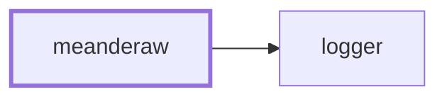
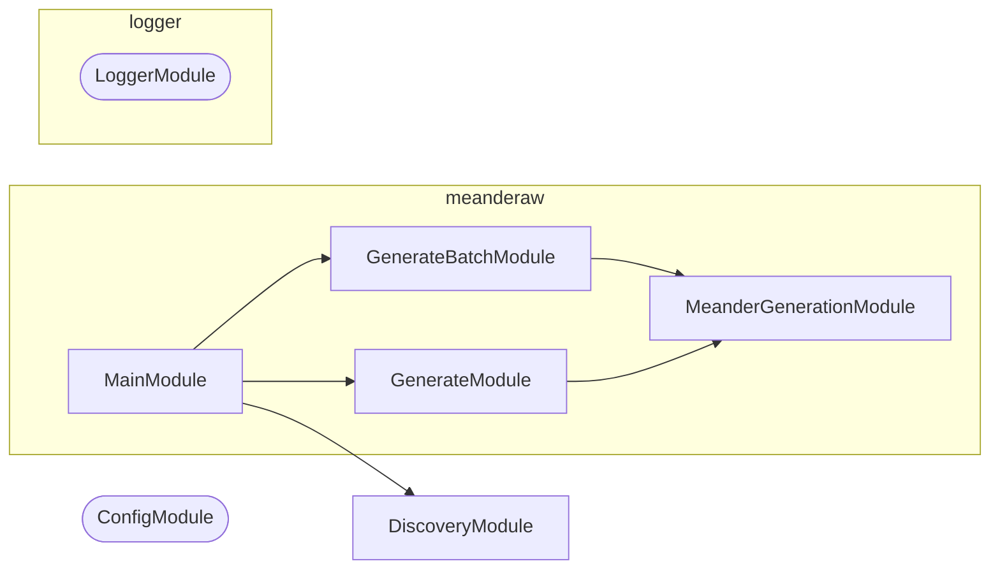

## Project Graph

Where this project sits in the Nx project graph: what it depends on, and what depends on it. Regenerated by `nx run synchronization:nx-project-graphs:write`.

<!-- nx-project-graph-start -->



<!-- nx-project-graph-end -->

## Module Graph

The modules this project defines and the imports between them, published by `nx run synchronization:nestjs-module-graphs:write`.

<!-- nestjs-module-graph-start -->



_Rounded modules are global: every module can inject them, so their edges are left out._

<!-- nestjs-module-graph-end -->

## Start

```bash
nx run meanderaw:start
```

## Test

```bash
nx run meanderaw:vitest
```

## 👔 Conformetry

This project was generated from the [nestjs-command-project](../../configuration/conformetry-templates/nestjs-command-project) conformetry template.
