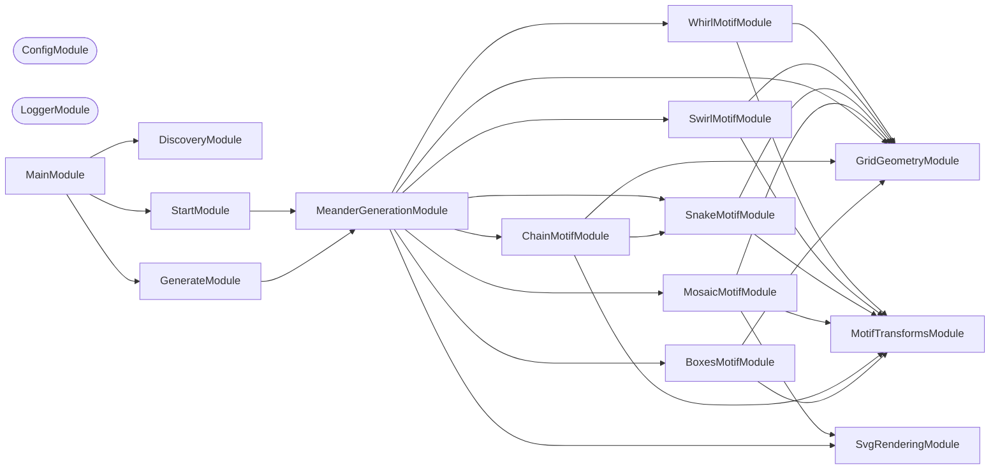

## Start

```bash
nx run meanderaw:start
```

## Test

```bash
nx run meanderaw:vitest
```

## 🏛️ Meander Charter

Six families of meander are implemented, and they share a set of properties that are
load-bearing to how a meander looks. They were extracted by measuring every committed
SVG rather than by reading the code, and each is marked fixed or negotiable. A new
family that breaks a fixed invariant is not a new family — it is a different kind of
drawing.

| # | Invariant | Status |
| --- | --- | --- |
| 1 | **Orthogonal only** — horizontal and vertical movement, no diagonals | Fixed |
| 2 | **Space-filling** — every interior white channel is exactly one stroke width | Fixed |
| 3 | **No branching** — ink contains no T-junctions | May be relaxed |
| 4 | **No crossing** — ink contains no X-junctions | May be relaxed |
| 5 | **Band, not field** — fixed canvas height, `rows` is density, tiling is horizontal | Fixed |
| 6 | **Flat path model** — unordered paths, no z-order, one stroke width per document | May be relaxed by ADR only |
| 7 | Invariants hold within a band, not at its termination | See [#338](https://github.com/JimmyPaolini/codebase/issues/338) |

What the measurements found, across 114 named patterns and 3,179 enumerated `mosaic`
tiles:

- **Every interior white channel is exactly one stroke width**, in all 3,293 files. The
  channel width equals the stroke width equals half a grid unit, which is why fitting
  `N` parallel strokes into one unit is exactly `strokeWidth = unit / (2N)`.
- **Ink is a disjoint union of simple arcs.** Zero T-junctions and zero X-junctions
  across every family — a stronger statement than "non-self-intersecting", and the
  sharpest single characterization of what the six families have in common.
- **The negative space is not.** It branches in every family, and in `mosaic split` and
  `mosaic alternated period-3` it genuinely crosses. Crossing patterns are already
  generated here; they have only ever been white, never ink.

Invariant 1 is not merely local convention. Fréart's rule for the classical meander is
that returns and intersections "do always fall into right angles", quoted in the
[ICAA's article on the complex Greek meander](https://www.classicist.org/articles/classical-comments-the-complex-greek-meander/).

Invariant 5 is fixed because the intended use is **borders**. Two-dimensional field
ornament is excluded for that reason, not because it is uninteresting.

Wider-than-one-stroke gaps occur only where a band terminates, which is
[#338](https://github.com/JimmyPaolini/codebase/issues/338) and is not a family
property.

## 🧬 Families, Sub-families, and Tiles

A **family** is a generator of repeat units — its **unit space**. A **modifier** is a
named constructor into that space; a **sub-family** is a named predicate over it. Both
are views on one underlying space, which is why `mosaic` is the only family with
sub-families today: [#365](https://github.com/JimmyPaolini/codebase/pull/365)
materialized its unit space as 3,179 enumerable tiles, so its regions —
`lines`, `dashes`, `dots`, `diamond` — became recognizable. The other five families
have latent unit spaces and therefore only modifiers.

The glossary for these terms lives in the repository [CONTEXT.md](../../CONTEXT.md).
Note one deliberate divergence: the code says `MeanderType`, `SUPPORTED_TYPES`, and
`--type` where the glossary says **family**. Renaming the flag would be a breaking CLI
change and is not worth making for a vocabulary correction.

## 👔 Conformetry

This project was generated from the [nestjs-command-project](../../configuration/conformetry-templates/nestjs-command-project) conformetry template.

<!-- CALL_STACKS_START -->

## 🔭 Callidescope

Call stacks traced through `applications/meanderaw`, deepest first. Each frame shows what it takes, what it returns, and what its documentation says.

| Measure | Value |
| --- | --- |
| Callables | 160 |
| Files | 34 |
| Calls traced | 185 |
| Call stacks | 14 |
| Deepest stack | 8 |
| Stacks through recursion | 0 |
| Unfollowable calls | 16 |

### Call stacks (depth)

**1. `GenerateBatchCommand.run`** — depth ≥ 8 · decorated-method

```text
🚀 GenerateBatchCommand.run(…): Promise<void> [applications/meanderaw/src/modules/generate-batch/generate-batch.command.ts:176]
   ↳ Generates every combination in the sweep and writes each one to disk.
  └─> GenerateBatchCommand.map(…)(parameters: GenerationParameters): { fileName: string; svg: string; } [applications/meanderaw/src/modules/generate-batch/generate-batch.command.ts:181]
    └─> MeanderGenerationService.generate(parameters: GenerationParameters): string [applications/meanderaw/src/modules/meander-generation/meander-generation.service.ts:208]
       ↳ Validates the parameters, then renders the finished SVG document.
      └─> ChainMotifService.rightEdge(geometry: GridGeometry, pattern: RepeatPatternOptions): number [applications/meanderaw/src/modules/meander-generation/chain-motif.service.ts:130]
         ↳ Delegates to {@link SnakeMotifService}: `chain` shares `snake`'s grid exactly.
        └─> SnakeMotifService.rightEdge(geometry: GridGeometry, pattern: RepeatPatternOptions): number [applications/meanderaw/src/modules/meander-generation/snake-motif.service.ts:124]
           ↳ The x-coordinate of the last unit's rightmost point, before the stroke-width margin.
          └─> SnakeMotifService.unitWidth(geometry: GridGeometry, rows: number, modifier?: Modifier): number [applications/meanderaw/src/modules/meander-generation/snake-motif.service.ts:137]
             ↳ How far each successive unit is translated horizontally: the zigzag spans every grid level up to `rows - 1`, widened to…
            └─> SnakeSequenceService.unitWidthLevels(rows: number, modifier: Modifier | undefined): number [applications/meanderaw/src/modules/meander-generation/snake-sequence.service.ts:208]
               ↳ How many grid levels one repeat unit spans: `rows` when the `edge` family widens the pitch to close flush against the…
              └─> SnakeSequenceService.flipPitchLevels(rows: number): number [applications/meanderaw/src/modules/meander-generation/snake-sequence.service.ts:124]
                 ↳ How many grid levels bare `flip`'s fused tile spans: twice the motif's own `rows - 2`, verified against `5 rows` (pitch…
```

**2. `GenerateCommand.run`** — depth ≥ 7 · decorated-method

```text
🚀 GenerateCommand.run(_passedParameters: string[], options: GenerateCommandOptions): Promise<void> [applications/meanderaw/src/modules/generate/generate.command.ts:186]
   ↳ Generates the SVG for the parsed options and writes it to disk.
  └─> MeanderGenerationService.generate(parameters: GenerationParameters): string [applications/meanderaw/src/modules/meander-generation/meander-generation.service.ts:208]
     ↳ Validates the parameters, then renders the finished SVG document.
    └─> ChainMotifService.rightEdge(geometry: GridGeometry, pattern: RepeatPatternOptions): number [applications/meanderaw/src/modules/meander-generation/chain-motif.service.ts:130]
       ↳ Delegates to {@link SnakeMotifService}: `chain` shares `snake`'s grid exactly.
      └─> SnakeMotifService.rightEdge(geometry: GridGeometry, pattern: RepeatPatternOptions): number [applications/meanderaw/src/modules/meander-generation/snake-motif.service.ts:124]
         ↳ The x-coordinate of the last unit's rightmost point, before the stroke-width margin.
        └─> SnakeMotifService.unitWidth(geometry: GridGeometry, rows: number, modifier?: Modifier): number [applications/meanderaw/src/modules/meander-generation/snake-motif.service.ts:137]
           ↳ How far each successive unit is translated horizontally: the zigzag spans every grid level up to `rows - 1`, widened to…
          └─> SnakeSequenceService.unitWidthLevels(rows: number, modifier: Modifier | undefined): number [applications/meanderaw/src/modules/meander-generation/snake-sequence.service.ts:208]
             ↳ How many grid levels one repeat unit spans: `rows` when the `edge` family widens the pitch to close flush against the…
            └─> SnakeSequenceService.flipPitchLevels(rows: number): number [applications/meanderaw/src/modules/meander-generation/snake-sequence.service.ts:124]
               ↳ How many grid levels bare `flip`'s fused tile spans: twice the motif's own `rows - 2`, verified against `5 rows` (pitch…
```

**3. `SnakeMotifService.path`** — depth ≥ 7 · orphan-root

```text
🚀 SnakeMotifService.path(geometry: GridGeometry, unit: MotifUnit): string [applications/meanderaw/src/modules/meander-generation/snake-motif.service.ts:59]
   ↳ Draws one repeat unit's zigzag plus its own border, as an SVG path attribute value.
  └─> SnakeSequenceService.unitPoints(…): readonly MotifLevelPoint[] [applications/meanderaw/src/modules/meander-generation/snake-sequence.service.ts:172]
     ↳ Applies the unit's modifier to the base zigzag, so `chain` and `snake` share one place that decides how a modifier…
    └─> SnakeSequenceService.fusedFlipPoints(rows: number): readonly MotifLevelPoint[] [applications/meanderaw/src/modules/meander-generation/snake-sequence.service.ts:51]
       ↳ Builds bare `flip`'s fused repeat tile: a normal-oriented arm followed by its mirror image, sharing the seam rather…
      └─> SnakeSequenceService.points(rows: number): readonly MotifLevelPoint[] [applications/meanderaw/src/modules/meander-generation/snake-sequence.service.ts:132]
         ↳ Traces the full zigzag for one unit, in grid levels. `rows - 1` is the highest grid level the sequence reaches in both…
        └─> SnakeSequenceService.forEach(…)(row: number, index: number): void [applications/meanderaw/src/modules/meander-generation/snake-sequence.service.ts:138]
          └─> SnakeSequenceService.rowSpan(row: number, maximumLevel: number): MotifLevelPoint [applications/meanderaw/src/modules/meander-generation/snake-sequence.service.ts:92]
             ↳ The `[left, right]` grid-level span of one row's horizontal segment.
            └─> SnakeSequenceService.rowSpanWidth(row: number, maximumLevel: number): number [applications/meanderaw/src/modules/meander-generation/snake-sequence.service.ts:110]
               ↳ How wide a row's horizontal segment is: shrinking by two grid levels per row moving inward from either edge, clamped to…
```

<details>
<summary>11 more call stacks</summary>

**4. `ChainMotifService.path`** — depth 7 · orphan-root

```text
🚀 ChainMotifService.path(geometry: GridGeometry, unit: MotifUnit): string [applications/meanderaw/src/modules/meander-generation/chain-motif.service.ts:85]
   ↳ Draws one repeat unit's subpaths plus its own border, as an SVG path attribute value.
  └─> SnakeSequenceService.unitPoints(…): readonly MotifLevelPoint[] [applications/meanderaw/src/modules/meander-generation/snake-sequence.service.ts:172]
     ↳ Applies the unit's modifier to the base zigzag, so `chain` and `snake` share one place that decides how a modifier…
    └─> SnakeSequenceService.fusedFlipPoints(rows: number): readonly MotifLevelPoint[] [applications/meanderaw/src/modules/meander-generation/snake-sequence.service.ts:51]
       ↳ Builds bare `flip`'s fused repeat tile: a normal-oriented arm followed by its mirror image, sharing the seam rather…
      └─> SnakeSequenceService.points(rows: number): readonly MotifLevelPoint[] [applications/meanderaw/src/modules/meander-generation/snake-sequence.service.ts:132]
         ↳ Traces the full zigzag for one unit, in grid levels. `rows - 1` is the highest grid level the sequence reaches in both…
        └─> SnakeSequenceService.forEach(…)(row: number, index: number): void [applications/meanderaw/src/modules/meander-generation/snake-sequence.service.ts:138]
          └─> SnakeSequenceService.rowSpan(row: number, maximumLevel: number): MotifLevelPoint [applications/meanderaw/src/modules/meander-generation/snake-sequence.service.ts:92]
             ↳ The `[left, right]` grid-level span of one row's horizontal segment.
            └─> SnakeSequenceService.rowSpanWidth(row: number, maximumLevel: number): number [applications/meanderaw/src/modules/meander-generation/snake-sequence.service.ts:110]
               ↳ How wide a row's horizontal segment is: shrinking by two grid levels per row moving inward from either edge, clamped to…
```

**5. `BarsMotifService.path`** — depth 5 · orphan-root

```text
🚀 BarsMotifService.path(geometry: GridGeometry, unit: MotifUnit): string [applications/meanderaw/src/modules/meander-generation/bars-motif.service.ts:233]
   ↳ Draws one repeat unit's bar and its two caps, as an SVG path attribute value.
  └─> BarsMotifService.alternatedPath(geometry: GridGeometry, unit: MotifUnit, period: number): string [applications/meanderaw/src/modules/meander-generation/bars-motif.service.ts:60]
     ↳ Draws the `alternated` modifier's zigzag. `period` controls the repeat tile's column span — `2 * period` real columns…
    └─> BarsMotifService.from(…)(_value: unknown, offset: number): string [applications/meanderaw/src/modules/meander-generation/bars-motif.service.ts:71]
      └─> BarsMotifService.map(…)(run: AlternateRun): string [applications/meanderaw/src/modules/meander-generation/bars-motif.service.ts:78]
        └─> BarsMotifService.format(value: number): string [applications/meanderaw/src/modules/meander-generation/bars-motif.service.ts:66]
```

**6. `SwirlMotifService.path`** — depth 5 · orphan-root

```text
🚀 SwirlMotifService.path(geometry: GridGeometry, unit: MotifUnit): string [applications/meanderaw/src/modules/meander-generation/swirl-motif.service.ts:138]
   ↳ Draws one repeat unit's spiral (and its mirrored twin when `flip` is set) plus its own border, as an SVG path attribute…
  └─> SwirlMotifService.flippedPoints(rows: number): readonly MotifLevelPoint[] [applications/meanderaw/src/modules/meander-generation/swirl-motif.service.ts:94]
     ↳ Mirrors the base spiral across the motif's own right edge, fusing a mirrored twin onto the un-flipped motif for the…
    └─> SwirlMotifService.basePoints(rows: number): readonly MotifLevelPoint[] [applications/meanderaw/src/modules/meander-generation/swirl-motif.service.ts:48]
       ↳ Traces the full two-armed spiral: the first arm, then its 180° rotation about the motif's own center, reversed so the…
      └─> MotifTransformsService.rotate(…): MotifLevelPoint[] [applications/meanderaw/src/modules/meander-generation/motif-transforms.service.ts:172]
         ↳ Rotates every point by `quarterTurns * 90°` counterclockwise around `center`, keeping point order unchanged.…
        └─> MotifTransformsService.map(…)([x, y]: MotifLevelPoint): MotifLevelPoint [applications/meanderaw/src/modules/meander-generation/motif-transforms.service.ts:185]
```

**7. `WhirlMotifService.path`** — depth 5 · orphan-root

```text
🚀 WhirlMotifService.path(geometry: GridGeometry, unit: MotifUnit): string [applications/meanderaw/src/modules/meander-generation/whirl-motif.service.ts:128]
   ↳ Draws one repeat unit's spiral (and its mirrored twin when `flip` is set) plus its own border, as an SVG path attribute…
  └─> WhirlMotifService.flippedPoints(rows: number): readonly MotifLevelPoint[] [applications/meanderaw/src/modules/meander-generation/whirl-motif.service.ts:83]
     ↳ Mirrors the base spiral across the motif's own right edge, fusing a mirrored twin onto the un-flipped motif for the…
    └─> WhirlMotifService.basePoints(rows: number): readonly MotifLevelPoint[] [applications/meanderaw/src/modules/meander-generation/whirl-motif.service.ts:68]
       ↳ Traces the full spiral: one arm, then its 180° rotation about the motif's own center, reversed so the two halves read…
      └─> WhirlMotifService.armPoints(rows: number): MotifLevelPoint[] [applications/meanderaw/src/modules/meander-generation/whirl-motif.service.ts:46]
         ↳ Traces the spiral's single arm: starting at `(0, rows - 1)` heading up, stepping by each length from `rows - 2` (twice)…
        └─> WhirlMotifService.from(…)(_value: unknown, index: number): number [applications/meanderaw/src/modules/meander-generation/whirl-motif.service.ts:49]
```

**8. `BoxesMotifService.path`** — depth ≥ 4 · orphan-root

```text
🚀 BoxesMotifService.path(geometry: GridGeometry, unit: MotifUnit): string [applications/meanderaw/src/modules/meander-generation/boxes-motif.service.ts:179]
   ↳ Draws one repeat unit's spiral as an SVG path attribute value, applying the unit's modifier (if any) first.
  └─> BoxesMotifService.unitPoints(…): readonly MotifLevelPoint[] [applications/meanderaw/src/modules/meander-generation/boxes-motif.service.ts:129]
     ↳ Applies the unit's modifier (spin's rotation, spin-flip's rotation plus mirror) to the base spiral points.
    └─> BoxesMotifService.spiralPoints(rows: number): MotifLevelPoint[] [applications/meanderaw/src/modules/meander-generation/boxes-motif.service.ts:111]
       ↳ Traces the full inward spiral for one unit, in grid levels.
      └─> BoxesMotifService.advanceSpiral(bounds: BoxesSpiralBounds, moveIndex: number): MotifLevelPoint [applications/meanderaw/src/modules/meander-generation/boxes-motif.service.ts:40]
         ↳ Computes the next spiral corner, mutating `bounds` to shrink the side it just used.
```

**9. `GenerateBatchCommand.combinationsForType`** — depth 3 · orphan-root

```text
🚀 GenerateBatchCommand.combinationsForType(type: MeanderType): GenerationParameters[] [applications/meanderaw/src/modules/generate-batch/generate-batch.command.ts:95]
   ↳ Enumerates every combination for a single type: every swept row count crossed with every swept modifier.
  └─> GenerateBatchCommand.rowsSweep(type: MeanderType): number[] [applications/meanderaw/src/modules/generate-batch/generate-batch.command.ts:156]
     ↳ Every `rows` value the sweep covers for `type`: its own structural minimum through `ROWS_SWEEP_MAXIMUM`.
    └─> GenerateBatchCommand.from(…)(_value: unknown, index: number): number [applications/meanderaw/src/modules/generate-batch/generate-batch.command.ts:160]
```

**10. `GenerateCommand.parseModifier`** — depth 2 · decorated-method

```text
🚀 GenerateCommand.parseModifier(value: string): Modifier["name"] [applications/meanderaw/src/modules/generate/generate.command.ts:100]
   ↳ Parses the `--modifier` flag, rejecting any name outside the supported set.
  └─> GenerateCommand.isSupportedModifierName(value: string): value is Modifier["name"] [applications/meanderaw/src/modules/generate/generate.command.ts:88]
     ↳ Narrows a raw string to a supported {@link Modifier} name without an unchecked assertion.
```

**11. `GenerateCommand.parseShape`** — depth 2 · decorated-method

```text
🚀 GenerateCommand.parseShape(value: string): DotShape [applications/meanderaw/src/modules/generate/generate.command.ts:155]
   ↳ Parses the `--shape` flag, rejecting any value outside the supported set. Used only for `--modifier dot`.
  └─> GenerateCommand.isSupportedDotShape(value: string): value is DotShape [applications/meanderaw/src/modules/generate/generate.command.ts:83]
     ↳ Narrows a raw string to a supported {@link DotShape} without an unchecked assertion.
```

**12. `GenerateCommand.parseType`** — depth 2 · decorated-method

```text
🚀 GenerateCommand.parseType(value: string): MeanderType [applications/meanderaw/src/modules/generate/generate.command.ts:170]
   ↳ Parses the `--type` flag, rejecting any value outside the supported set.
  └─> GenerateCommand.isSupportedType(value: string): value is MeanderType [applications/meanderaw/src/modules/generate/generate.command.ts:93]
     ↳ Narrows a raw string to a supported {@link MeanderType} without an unchecked assertion.
```

**13. `GenerateBatchCommand.map(…)`** — depth 2 · orphan-root

```text
🚀 GenerateBatchCommand.map(…)(…): { modifier?: Modifier; repeatCount: number; rows: number; type: MeanderType; } [applications/meanderaw/src/modules/generate-batch/generate-batch.command.ts:100]
  └─> GenerateBatchCommand.repeatCountFor(modifier: Modifier | undefined): number [applications/meanderaw/src/modules/generate-batch/generate-batch.command.ts:145]
     ↳ The `repeatCount` a combination uses: `DEFAULT_REPEAT_COUNT`, rounded up to the spin family's required cycle length…
```

**14. `GenerateBatchCommand.expandModifierName`** — depth 2 · orphan-root

```text
🚀 GenerateBatchCommand.expandModifierName(name: Modifier["name"]): Modifier[] [applications/meanderaw/src/modules/generate-batch/generate-batch.command.ts:110]
   ↳ Expands one modifier name into every representative {@link Modifier} value the sweep covers.
  └─> GenerateBatchCommand.map(…)(period: number): { name: "alternated"; period: number; } [applications/meanderaw/src/modules/generate-batch/generate-batch.command.ts:112]
```

</details>

### Module spread

None.

### Breadth

| Callable | Breadth | Calls directly | Location |
| --- | --- | --- | --- |
| `MeanderGenerationService.generate` | 16 | `MeanderGenerationService.validateRows`, `MeanderGenerationService.validateRepeatCount`, `MeanderGenerationService.validateModifier`, `MeanderGenerationService.validatePeriod`, `MeanderGenerationService.validateModifierCycle`, `GridGeometryService.compute`, `MeanderGenerationService.buildPaths`, `BarsMotifService.rightEdge`, `BoxesMotifService.rightEdge`, `SnakeMotifService.rightEdge`, `ChainMotifService.rightEdge`, `SwirlMotifService.rightEdge`, `WhirlMotifService.rightEdge`, `MeanderGenerationService.motifService`, `SvgRenderingService.render`, `MeanderGenerationService.format` | `applications/meanderaw/src/modules/meander-generation/meander-generation.service.ts:208` |
| `ChainMotifService.path` | 6 | `SnakeSequenceService.unitPoints`, `ChainMotifService.flipSubpaths`, `ChainMotifService.splitIndex`, `SnakeMotifService.unitWidth`, `ChainMotifService.map(…)`, `SnakeMotifService.borderSegment` | `applications/meanderaw/src/modules/meander-generation/chain-motif.service.ts:85` |
| `SwirlMotifService.path` | 5 | `SwirlMotifService.unitWidth`, `SwirlMotifService.basePoints`, `SwirlMotifService.flippedPoints`, `SwirlMotifService.map(…)`, `SwirlMotifService.borderSegment` | `applications/meanderaw/src/modules/meander-generation/swirl-motif.service.ts:138` |

<details>
<summary>63 more callables</summary>

| Callable | Breadth | Calls directly | Location |
| --- | --- | --- | --- |
| `WhirlMotifService.path` | 5 | `WhirlMotifService.unitWidth`, `WhirlMotifService.basePoints`, `WhirlMotifService.flippedPoints`, `WhirlMotifService.map(…)`, `WhirlMotifService.borderSegment` | `applications/meanderaw/src/modules/meander-generation/whirl-motif.service.ts:128` |
| `GenerateBatchCommand.run` | 5 | `GenerateBatchCommand.buildCombinations`, `GenerateBatchCommand.map(…)`, `GenerateBatchCommand.assertNoFileNameCollisions`, `GenerateBatchCommand.map(…)`, `GenerateBatchCommand.map(…)` | `applications/meanderaw/src/modules/generate-batch/generate-batch.command.ts:176` |
| `BarsMotifService.dotPath` | 4 | `MotifTransformsService.dotLevels`, `MotifTransformsService.alternate`, `BarsMotifService.map(…)`, `BarsMotifService.format` | `applications/meanderaw/src/modules/meander-generation/bars-motif.service.ts:131` |
| `BarsMotifService.splitPath` | 4 | `BarsMotifService.format`, `MotifTransformsService.alternate`, `BarsMotifService.map(…)`, `BarsMotifService.filter(…)` | `applications/meanderaw/src/modules/meander-generation/bars-motif.service.ts:204` |
| `BarsMotifService.path` | 4 | `BarsMotifService.alternatedPath`, `BarsMotifService.dotPath`, `BarsMotifService.splitPath`, `BarsMotifService.format` | `applications/meanderaw/src/modules/meander-generation/bars-motif.service.ts:233` |
| `SnakeSequenceService.unitPoints` | 4 | `SnakeSequenceService.fusedFlipPoints`, `SnakeSequenceService.points`, `MotifTransformsService.closeEdge`, `MotifTransformsService.mirror` | `applications/meanderaw/src/modules/meander-generation/snake-sequence.service.ts:172` |
| `SnakeMotifService.path` | 4 | `SnakeSequenceService.unitPoints`, `SnakeMotifService.unitWidth`, `SnakeMotifService.pointsToPathData`, `SnakeMotifService.borderSegment` | `applications/meanderaw/src/modules/meander-generation/snake-motif.service.ts:59` |
| `BarsMotifService.alternatedPath` | 3 | `MotifTransformsService.alternate`, `BarsMotifService.from(…)`, `BarsMotifService.format` | `applications/meanderaw/src/modules/meander-generation/bars-motif.service.ts:60` |
| `BarsMotifService.map(…)` | 3 | `BarsMotifService.format`, `BarsMotifService.map(…)`, `BarsMotifService.filter(…)` | `applications/meanderaw/src/modules/meander-generation/bars-motif.service.ts:145` |
| `BoxesMotifService.unitPoints` | 3 | `BoxesMotifService.spiralPoints`, `BoxesMotifService.centerPoint`, `MotifTransformsService.rotate` | `applications/meanderaw/src/modules/meander-generation/boxes-motif.service.ts:129` |
| `BoxesMotifService.path` | 3 | `BoxesMotifService.unitPoints`, `BoxesMotifService.unitWidth`, `BoxesMotifService.pointsToPathData` | `applications/meanderaw/src/modules/meander-generation/boxes-motif.service.ts:179` |
| `SnakeSequenceService.fusedFlipPoints` | 3 | `SnakeSequenceService.flipPitchLevels`, `SnakeSequenceService.points`, `MotifTransformsService.mirror` | `applications/meanderaw/src/modules/meander-generation/snake-sequence.service.ts:51` |
| `SwirlMotifService.basePoints` | 3 | `SwirlMotifService.firstArmPoints`, `MotifTransformsService.rotate`, `SwirlMotifService.centerPoint` | `applications/meanderaw/src/modules/meander-generation/swirl-motif.service.ts:48` |
| `SwirlMotifService.flippedPoints` | 3 | `SwirlMotifService.basePoints`, `SwirlMotifService.pitchLevels`, `MotifTransformsService.mirror` | `applications/meanderaw/src/modules/meander-generation/swirl-motif.service.ts:94` |
| `WhirlMotifService.basePoints` | 3 | `WhirlMotifService.armPoints`, `MotifTransformsService.rotate`, `WhirlMotifService.centerPoint` | `applications/meanderaw/src/modules/meander-generation/whirl-motif.service.ts:68` |
| `WhirlMotifService.flippedPoints` | 3 | `WhirlMotifService.basePoints`, `WhirlMotifService.pitchLevels`, `MotifTransformsService.mirror` | `applications/meanderaw/src/modules/meander-generation/whirl-motif.service.ts:83` |
| `MeanderGenerationService.buildPaths` | 3 | `MeanderGenerationService.motifService`, `MeanderGenerationService.from(…)`, `BoxesMotifService.border` | `applications/meanderaw/src/modules/meander-generation/meander-generation.service.ts:70` |
| `GenerateBatchCommand.combinationsForType` | 3 | `GenerateBatchCommand.rowsSweep`, `GenerateBatchCommand.modifiersForType`, `GenerateBatchCommand.flatMap(…)` | `applications/meanderaw/src/modules/generate-batch/generate-batch.command.ts:95` |
| `GenerateCommand.run` | 3 | `GenerateCommand.buildModifier`, `MeanderGenerationService.generate`, `OutputFilenameService.build` | `applications/meanderaw/src/modules/generate/generate.command.ts:186` |
| `BoxesMotifService.border` | 2 | `GridGeometryService.formatCoordinate`, `BoxesMotifService.rightEdge` | `applications/meanderaw/src/modules/meander-generation/boxes-motif.service.ts:165` |
| `SnakeSequenceService.points` | 2 | `SnakeSequenceService.rowOrder`, `SnakeSequenceService.forEach(…)` | `applications/meanderaw/src/modules/meander-generation/snake-sequence.service.ts:132` |
| `SnakeMotifService.borderSegment` | 2 | `GridGeometryService.formatCoordinate`, `SnakeMotifService.unitWidth` | `applications/meanderaw/src/modules/meander-generation/snake-motif.service.ts:42` |
| `SwirlMotifService.borderSegment` | 2 | `GridGeometryService.formatCoordinate`, `SwirlMotifService.unitWidth` | `applications/meanderaw/src/modules/meander-generation/swirl-motif.service.ts:121` |
| `WhirlMotifService.borderSegment` | 2 | `GridGeometryService.formatCoordinate`, `WhirlMotifService.unitWidth` | `applications/meanderaw/src/modules/meander-generation/whirl-motif.service.ts:111` |
| `GenerateBatchCommand.buildCombinations` | 2 | `GenerateBatchCommand.filter(…)`, `GenerateBatchCommand.flatMap(…)` | `applications/meanderaw/src/modules/generate-batch/generate-batch.command.ts:86` |
| `GenerateBatchCommand.expandModifierName` | 2 | `GenerateBatchCommand.map(…)`, `GenerateBatchCommand.map(…)` | `applications/meanderaw/src/modules/generate-batch/generate-batch.command.ts:110` |
| `GenerateBatchCommand.modifiersForType` | 2 | `GenerateBatchCommand.filter(…)`, `GenerateBatchCommand.flatMap(…)` | `applications/meanderaw/src/modules/generate-batch/generate-batch.command.ts:133` |
| `GenerateBatchCommand.map(…)` | 2 | `OutputFilenameService.build`, `MeanderGenerationService.generate` | `applications/meanderaw/src/modules/generate-batch/generate-batch.command.ts:181` |
| `MotifTransformsService.dotLevels` | 1 | `MotifTransformsService.from(…)` | `applications/meanderaw/src/modules/meander-generation/motif-transforms.service.ts:128` |
| `MotifTransformsService.mirror` | 1 | `MotifTransformsService.map(…)` | `applications/meanderaw/src/modules/meander-generation/motif-transforms.service.ts:152` |
| `MotifTransformsService.rotate` | 1 | `MotifTransformsService.map(…)` | `applications/meanderaw/src/modules/meander-generation/motif-transforms.service.ts:172` |
| `BarsMotifService.from(…)` | 1 | `BarsMotifService.map(…)` | `applications/meanderaw/src/modules/meander-generation/bars-motif.service.ts:71` |
| `BarsMotifService.map(…)` | 1 | `BarsMotifService.format` | `applications/meanderaw/src/modules/meander-generation/bars-motif.service.ts:78` |
| `BarsMotifService.map(…)` | 1 | `BarsMotifService.format` | `applications/meanderaw/src/modules/meander-generation/bars-motif.service.ts:156` |
| `BarsMotifService.map(…)` | 1 | `BarsMotifService.format` | `applications/meanderaw/src/modules/meander-generation/bars-motif.service.ts:213` |
| `BarsMotifService.rightEdge` | 1 | `MotifTransformsService.dotLevels` | `applications/meanderaw/src/modules/meander-generation/bars-motif.service.ts:281` |
| `BoxesMotifService.pointsToPathData` | 1 | `BoxesMotifService.reduce(…)` | `applications/meanderaw/src/modules/meander-generation/boxes-motif.service.ts:74` |
| `BoxesMotifService.spiralPoints` | 1 | `BoxesMotifService.advanceSpiral` | `applications/meanderaw/src/modules/meander-generation/boxes-motif.service.ts:111` |
| `BoxesMotifService.rightEdge` | 1 | `BoxesMotifService.unitWidth` | `applications/meanderaw/src/modules/meander-generation/boxes-motif.service.ts:196` |
| `SnakeSequenceService.rowOrder` | 1 | `SnakeSequenceService.from(…)` | `applications/meanderaw/src/modules/meander-generation/snake-sequence.service.ts:73` |
| `SnakeSequenceService.rowSpan` | 1 | `SnakeSequenceService.rowSpanWidth` | `applications/meanderaw/src/modules/meander-generation/snake-sequence.service.ts:92` |
| `SnakeSequenceService.forEach(…)` | 1 | `SnakeSequenceService.rowSpan` | `applications/meanderaw/src/modules/meander-generation/snake-sequence.service.ts:138` |
| `SnakeSequenceService.unitWidthLevels` | 1 | `SnakeSequenceService.flipPitchLevels` | `applications/meanderaw/src/modules/meander-generation/snake-sequence.service.ts:208` |
| `SnakeMotifService.pointsToPathData` | 1 | `SnakeMotifService.reduce(…)` | `applications/meanderaw/src/modules/meander-generation/snake-motif.service.ts:87` |
| `SnakeMotifService.rightEdge` | 1 | `SnakeMotifService.unitWidth` | `applications/meanderaw/src/modules/meander-generation/snake-motif.service.ts:124` |
| `SnakeMotifService.unitWidth` | 1 | `SnakeSequenceService.unitWidthLevels` | `applications/meanderaw/src/modules/meander-generation/snake-motif.service.ts:137` |
| `ChainMotifService.rightEdge` | 1 | `SnakeMotifService.rightEdge` | `applications/meanderaw/src/modules/meander-generation/chain-motif.service.ts:130` |
| `SvgRenderingService.render` | 1 | `SvgRenderingService.map(…)` | `applications/meanderaw/src/modules/meander-generation/svg-rendering.service.ts:27` |
| `SwirlMotifService.rightEdge` | 1 | `SwirlMotifService.unitWidth` | `applications/meanderaw/src/modules/meander-generation/swirl-motif.service.ts:174` |
| `SwirlMotifService.unitWidth` | 1 | `SwirlMotifService.pitchLevels` | `applications/meanderaw/src/modules/meander-generation/swirl-motif.service.ts:183` |
| `WhirlMotifService.armPoints` | 1 | `WhirlMotifService.from(…)` | `applications/meanderaw/src/modules/meander-generation/whirl-motif.service.ts:46` |
| `WhirlMotifService.rightEdge` | 1 | `WhirlMotifService.unitWidth` | `applications/meanderaw/src/modules/meander-generation/whirl-motif.service.ts:171` |
| `WhirlMotifService.unitWidth` | 1 | `WhirlMotifService.pitchLevels` | `applications/meanderaw/src/modules/meander-generation/whirl-motif.service.ts:180` |
| `MeanderGenerationService.validateModifier` | 1 | `InvalidModifierError.constructor` | `applications/meanderaw/src/modules/meander-generation/meander-generation.service.ts:114` |
| `MeanderGenerationService.validateModifierCycle` | 1 | `InvalidRepeatCountCycleError.constructor` | `applications/meanderaw/src/modules/meander-generation/meander-generation.service.ts:147` |
| `MeanderGenerationService.validatePeriod` | 1 | `InvalidPeriodError.constructor` | `applications/meanderaw/src/modules/meander-generation/meander-generation.service.ts:165` |
| `MeanderGenerationService.validateRepeatCount` | 1 | `InvalidRepeatCountError.constructor` | `applications/meanderaw/src/modules/meander-generation/meander-generation.service.ts:182` |
| `MeanderGenerationService.validateRows` | 1 | `InvalidRowsError.constructor` | `applications/meanderaw/src/modules/meander-generation/meander-generation.service.ts:197` |
| `GenerateBatchCommand.map(…)` | 1 | `GenerateBatchCommand.repeatCountFor` | `applications/meanderaw/src/modules/generate-batch/generate-batch.command.ts:100` |
| `GenerateBatchCommand.rowsSweep` | 1 | `GenerateBatchCommand.from(…)` | `applications/meanderaw/src/modules/generate-batch/generate-batch.command.ts:156` |
| `GenerateCommand.parseModifier` | 1 | `GenerateCommand.isSupportedModifierName` | `applications/meanderaw/src/modules/generate/generate.command.ts:100` |
| `GenerateCommand.parseShape` | 1 | `GenerateCommand.isSupportedDotShape` | `applications/meanderaw/src/modules/generate/generate.command.ts:155` |
| `GenerateCommand.parseType` | 1 | `GenerateCommand.isSupportedType` | `applications/meanderaw/src/modules/generate/generate.command.ts:170` |

</details>

### Possibly misplaced

None.
<!-- CALL_STACKS_END -->

## 🕸️ Codependix

Dependency graphs exported by [codependix](https://github.com/JimmyPaolini/codebase/tree/main/packages/codependix-cli), regenerated by `nx run codebase:codependix:write`.

### Nx Neighborhood

<!-- codependix:start name="codependix-nx" -->

<!-- codependix:end name="codependix-nx" -->

### NestJS Module Graph

<!-- codependix:start name="codependix-nestjs" -->


_Rounded modules are global: every module can inject them, so their edges are left out._
<!-- codependix:end name="codependix-nestjs" -->

### File Imports

<!-- codependix:start name="codependix-imports" -->
```mermaid
graph LR
  file_codometer_config_ts["codometer.config.ts"]
  file_eslint_config_ts["eslint.config.ts"]
  file_src_constants_ts["src/constants.ts"]
  file_src_main_end_to_end_test_ts["src/main.end-to-end.test.ts"]
  file_src_main_module_ts["src/main.module.ts"]
  file_src_main_ts["src/main.ts"]
  file_src_main_unit_test_ts["src/main.unit.test.ts"]
  file_src_modules_boxes_motif_boxes_motif_constants_ts["src/modules/boxes-motif/boxes-motif.constants.ts"]
  file_src_modules_boxes_motif_boxes_motif_module_ts["src/modules/boxes-motif/boxes-motif.module.ts"]
  file_src_modules_boxes_motif_boxes_motif_service_ts["src/modules/boxes-motif/boxes-motif.service.ts"]
  file_src_modules_boxes_motif_boxes_motif_service_unit_test_ts["src/modules/boxes-motif/boxes-motif.service.unit.test.ts"]
  file_src_modules_boxes_motif_boxes_motif_types_ts["src/modules/boxes-motif/boxes-motif.types.ts"]
  file_src_modules_chain_motif_chain_motif_constants_ts["src/modules/chain-motif/chain-motif.constants.ts"]
  file_src_modules_chain_motif_chain_motif_module_ts["src/modules/chain-motif/chain-motif.module.ts"]
  file_src_modules_chain_motif_chain_motif_service_ts["src/modules/chain-motif/chain-motif.service.ts"]
  file_src_modules_chain_motif_chain_motif_service_unit_test_ts["src/modules/chain-motif/chain-motif.service.unit.test.ts"]
  file_src_modules_chain_motif_chain_motif_types_ts["src/modules/chain-motif/chain-motif.types.ts"]
  file_src_modules_generate_generate_command_ts["src/modules/generate/generate.command.ts"]
  file_src_modules_generate_generate_command_unit_test_ts["src/modules/generate/generate.command.unit.test.ts"]
  file_src_modules_generate_generate_constants_ts["src/modules/generate/generate.constants.ts"]
  file_src_modules_generate_generate_module_ts["src/modules/generate/generate.module.ts"]
  file_src_modules_generate_generate_types_ts["src/modules/generate/generate.types.ts"]
  file_src_modules_grid_geometry_grid_geometry_constants_ts["src/modules/grid-geometry/grid-geometry.constants.ts"]
  file_src_modules_grid_geometry_grid_geometry_module_ts["src/modules/grid-geometry/grid-geometry.module.ts"]
  file_src_modules_grid_geometry_grid_geometry_service_ts["src/modules/grid-geometry/grid-geometry.service.ts"]
  file_src_modules_grid_geometry_grid_geometry_service_unit_test_ts["src/modules/grid-geometry/grid-geometry.service.unit.test.ts"]
  file_src_modules_grid_geometry_grid_geometry_types_ts["src/modules/grid-geometry/grid-geometry.types.ts"]
  file_src_modules_meander_generation_meander_generation_constants_ts["src/modules/meander-generation/meander-generation.constants.ts"]
  file_src_modules_meander_generation_meander_generation_constants_unit_test_ts["src/modules/meander-generation/meander-generation.constants.unit.test.ts"]
  file_src_modules_meander_generation_meander_generation_module_ts["src/modules/meander-generation/meander-generation.module.ts"]
  file_src_modules_meander_generation_meander_generation_service_ts["src/modules/meander-generation/meander-generation.service.ts"]
  file_src_modules_meander_generation_meander_generation_service_unit_test_ts["src/modules/meander-generation/meander-generation.service.unit.test.ts"]
  file_src_modules_meander_generation_meander_generation_types_ts["src/modules/meander-generation/meander-generation.types.ts"]
  file_src_modules_mosaic_motif_mosaic_motif_constants_ts["src/modules/mosaic-motif/mosaic-motif.constants.ts"]
  file_src_modules_mosaic_motif_mosaic_motif_module_ts["src/modules/mosaic-motif/mosaic-motif.module.ts"]
  file_src_modules_mosaic_motif_mosaic_motif_service_ts["src/modules/mosaic-motif/mosaic-motif.service.ts"]
  file_src_modules_mosaic_motif_mosaic_motif_service_unit_test_ts["src/modules/mosaic-motif/mosaic-motif.service.unit.test.ts"]
  file_src_modules_mosaic_motif_mosaic_motif_types_ts["src/modules/mosaic-motif/mosaic-motif.types.ts"]
  file_src_modules_mosaic_motif_mosaic_symmetry_service_ts["src/modules/mosaic-motif/mosaic-symmetry.service.ts"]
  file_src_modules_mosaic_motif_mosaic_symmetry_service_unit_test_ts["src/modules/mosaic-motif/mosaic-symmetry.service.unit.test.ts"]
  file_src_modules_mosaic_motif_mosaic_tile_generation_service_ts["src/modules/mosaic-motif/mosaic-tile-generation.service.ts"]
  file_src_modules_mosaic_motif_mosaic_tile_generation_service_unit_test_ts["src/modules/mosaic-motif/mosaic-tile-generation.service.unit.test.ts"]
  file_src_modules_mosaic_motif_mosaic_tile_motif_service_ts["src/modules/mosaic-motif/mosaic-tile-motif.service.ts"]
  file_src_modules_mosaic_motif_mosaic_tile_motif_service_unit_test_ts["src/modules/mosaic-motif/mosaic-tile-motif.service.unit.test.ts"]
  file_src_modules_mosaic_motif_mosaic_tiles_service_ts["src/modules/mosaic-motif/mosaic-tiles.service.ts"]
  file_src_modules_mosaic_motif_mosaic_tiles_service_unit_test_ts["src/modules/mosaic-motif/mosaic-tiles.service.unit.test.ts"]
  file_src_modules_motif_transforms_motif_transforms_constants_ts["src/modules/motif-transforms/motif-transforms.constants.ts"]
  file_src_modules_motif_transforms_motif_transforms_module_ts["src/modules/motif-transforms/motif-transforms.module.ts"]
  file_src_modules_motif_transforms_motif_transforms_service_ts["src/modules/motif-transforms/motif-transforms.service.ts"]
  file_src_modules_motif_transforms_motif_transforms_service_unit_test_ts["src/modules/motif-transforms/motif-transforms.service.unit.test.ts"]
  file_src_modules_motif_transforms_motif_transforms_types_ts["src/modules/motif-transforms/motif-transforms.types.ts"]
  file_src_modules_snake_motif_snake_motif_constants_ts["src/modules/snake-motif/snake-motif.constants.ts"]
  file_src_modules_snake_motif_snake_motif_module_ts["src/modules/snake-motif/snake-motif.module.ts"]
  file_src_modules_snake_motif_snake_motif_service_ts["src/modules/snake-motif/snake-motif.service.ts"]
  file_src_modules_snake_motif_snake_motif_service_unit_test_ts["src/modules/snake-motif/snake-motif.service.unit.test.ts"]
  file_src_modules_snake_motif_snake_motif_types_ts["src/modules/snake-motif/snake-motif.types.ts"]
  file_src_modules_snake_motif_snake_sequence_service_ts["src/modules/snake-motif/snake-sequence.service.ts"]
  file_src_modules_snake_motif_snake_sequence_service_unit_test_ts["src/modules/snake-motif/snake-sequence.service.unit.test.ts"]
  file_src_modules_start_start_contact_sheet_service_ts["src/modules/start/start-contact-sheet.service.ts"]
  file_src_modules_start_start_contact_sheet_service_unit_test_ts["src/modules/start/start-contact-sheet.service.unit.test.ts"]
  file_src_modules_start_start_permutations_service_ts["src/modules/start/start-permutations.service.ts"]
  file_src_modules_start_start_permutations_service_unit_test_ts["src/modules/start/start-permutations.service.unit.test.ts"]
  file_src_modules_start_start_command_ts["src/modules/start/start.command.ts"]
  file_src_modules_start_start_command_unit_test_ts["src/modules/start/start.command.unit.test.ts"]
  file_src_modules_start_start_constants_ts["src/modules/start/start.constants.ts"]
  file_src_modules_start_start_module_ts["src/modules/start/start.module.ts"]
  file_src_modules_start_start_types_ts["src/modules/start/start.types.ts"]
  file_src_modules_svg_rendering_output_filename_service_ts["src/modules/svg-rendering/output-filename.service.ts"]
  file_src_modules_svg_rendering_output_filename_service_unit_test_ts["src/modules/svg-rendering/output-filename.service.unit.test.ts"]
  file_src_modules_svg_rendering_svg_rendering_constants_ts["src/modules/svg-rendering/svg-rendering.constants.ts"]
  file_src_modules_svg_rendering_svg_rendering_module_ts["src/modules/svg-rendering/svg-rendering.module.ts"]
  file_src_modules_svg_rendering_svg_rendering_service_ts["src/modules/svg-rendering/svg-rendering.service.ts"]
  file_src_modules_svg_rendering_svg_rendering_service_unit_test_ts["src/modules/svg-rendering/svg-rendering.service.unit.test.ts"]
  file_src_modules_svg_rendering_svg_rendering_types_ts["src/modules/svg-rendering/svg-rendering.types.ts"]
  file_src_modules_swirl_motif_swirl_motif_constants_ts["src/modules/swirl-motif/swirl-motif.constants.ts"]
  file_src_modules_swirl_motif_swirl_motif_module_ts["src/modules/swirl-motif/swirl-motif.module.ts"]
  file_src_modules_swirl_motif_swirl_motif_service_ts["src/modules/swirl-motif/swirl-motif.service.ts"]
  file_src_modules_swirl_motif_swirl_motif_service_unit_test_ts["src/modules/swirl-motif/swirl-motif.service.unit.test.ts"]
  file_src_modules_swirl_motif_swirl_motif_types_ts["src/modules/swirl-motif/swirl-motif.types.ts"]
  file_src_modules_whirl_motif_whirl_motif_constants_ts["src/modules/whirl-motif/whirl-motif.constants.ts"]
  file_src_modules_whirl_motif_whirl_motif_module_ts["src/modules/whirl-motif/whirl-motif.module.ts"]
  file_src_modules_whirl_motif_whirl_motif_service_ts["src/modules/whirl-motif/whirl-motif.service.ts"]
  file_src_modules_whirl_motif_whirl_motif_service_unit_test_ts["src/modules/whirl-motif/whirl-motif.service.unit.test.ts"]
  file_src_modules_whirl_motif_whirl_motif_types_ts["src/modules/whirl-motif/whirl-motif.types.ts"]
  file_src_repl_ts["src/repl.ts"]
  file_testing_mocks_ts["testing/mocks.ts"]
  file_testing_path_data_ts["testing/path-data.ts"]
  file_testing_setup_ts["testing/setup.ts"]
  file_vitest_config_ts["vitest.config.ts"]
  file_src_main_end_to_end_test_ts --> file_src_constants_ts
  file_src_main_module_ts --> file_src_constants_ts
  file_src_main_module_ts --> file_src_modules_generate_generate_module_ts
  file_src_main_module_ts --> file_src_modules_start_start_module_ts
  file_src_main_ts --> file_src_main_module_ts
  file_src_main_unit_test_ts --> file_src_main_module_ts
  file_src_modules_boxes_motif_boxes_motif_module_ts --> file_src_modules_boxes_motif_boxes_motif_service_ts
  file_src_modules_boxes_motif_boxes_motif_module_ts --> file_src_modules_grid_geometry_grid_geometry_module_ts
  file_src_modules_boxes_motif_boxes_motif_module_ts --> file_src_modules_motif_transforms_motif_transforms_module_ts
  file_src_modules_boxes_motif_boxes_motif_service_ts --> file_src_modules_boxes_motif_boxes_motif_types_ts
  file_src_modules_boxes_motif_boxes_motif_service_ts --> file_src_modules_grid_geometry_grid_geometry_service_ts
  file_src_modules_boxes_motif_boxes_motif_service_ts --> file_src_modules_grid_geometry_grid_geometry_types_ts
  file_src_modules_boxes_motif_boxes_motif_service_ts --> file_src_modules_meander_generation_meander_generation_constants_ts
  file_src_modules_boxes_motif_boxes_motif_service_ts --> file_src_modules_meander_generation_meander_generation_types_ts
  file_src_modules_boxes_motif_boxes_motif_service_ts --> file_src_modules_motif_transforms_motif_transforms_service_ts
  file_src_modules_boxes_motif_boxes_motif_service_ts --> file_src_modules_motif_transforms_motif_transforms_types_ts
  file_src_modules_boxes_motif_boxes_motif_service_unit_test_ts --> file_src_modules_boxes_motif_boxes_motif_service_ts
  file_src_modules_boxes_motif_boxes_motif_service_unit_test_ts --> file_src_modules_grid_geometry_grid_geometry_service_ts
  file_src_modules_boxes_motif_boxes_motif_service_unit_test_ts --> file_src_modules_motif_transforms_motif_transforms_service_ts
  file_src_modules_boxes_motif_boxes_motif_service_unit_test_ts --> file_testing_path_data_ts
  file_src_modules_chain_motif_chain_motif_module_ts --> file_src_modules_chain_motif_chain_motif_service_ts
  file_src_modules_chain_motif_chain_motif_module_ts --> file_src_modules_grid_geometry_grid_geometry_module_ts
  file_src_modules_chain_motif_chain_motif_module_ts --> file_src_modules_motif_transforms_motif_transforms_module_ts
  file_src_modules_chain_motif_chain_motif_module_ts --> file_src_modules_snake_motif_snake_motif_module_ts
  file_src_modules_chain_motif_chain_motif_service_ts --> file_src_modules_grid_geometry_grid_geometry_service_ts
  file_src_modules_chain_motif_chain_motif_service_ts --> file_src_modules_grid_geometry_grid_geometry_types_ts
  file_src_modules_chain_motif_chain_motif_service_ts --> file_src_modules_meander_generation_meander_generation_types_ts
  file_src_modules_chain_motif_chain_motif_service_ts --> file_src_modules_motif_transforms_motif_transforms_service_ts
  file_src_modules_chain_motif_chain_motif_service_ts --> file_src_modules_motif_transforms_motif_transforms_types_ts
  file_src_modules_chain_motif_chain_motif_service_ts --> file_src_modules_snake_motif_snake_motif_constants_ts
  file_src_modules_chain_motif_chain_motif_service_ts --> file_src_modules_snake_motif_snake_motif_service_ts
  file_src_modules_chain_motif_chain_motif_service_ts --> file_src_modules_snake_motif_snake_sequence_service_ts
  file_src_modules_chain_motif_chain_motif_service_unit_test_ts --> file_src_modules_chain_motif_chain_motif_service_ts
  file_src_modules_chain_motif_chain_motif_service_unit_test_ts --> file_src_modules_grid_geometry_grid_geometry_service_ts
  file_src_modules_chain_motif_chain_motif_service_unit_test_ts --> file_src_modules_motif_transforms_motif_transforms_service_ts
  file_src_modules_chain_motif_chain_motif_service_unit_test_ts --> file_src_modules_snake_motif_snake_motif_service_ts
  file_src_modules_chain_motif_chain_motif_service_unit_test_ts --> file_src_modules_snake_motif_snake_sequence_service_ts
  file_src_modules_chain_motif_chain_motif_service_unit_test_ts --> file_testing_path_data_ts
  file_src_modules_generate_generate_command_ts --> file_src_modules_generate_generate_types_ts
  file_src_modules_generate_generate_command_ts --> file_src_modules_meander_generation_meander_generation_constants_ts
  file_src_modules_generate_generate_command_ts --> file_src_modules_meander_generation_meander_generation_service_ts
  file_src_modules_generate_generate_command_ts --> file_src_modules_meander_generation_meander_generation_types_ts
  file_src_modules_generate_generate_command_ts --> file_src_modules_svg_rendering_output_filename_service_ts
  file_src_modules_generate_generate_command_unit_test_ts --> file_src_modules_generate_generate_command_ts
  file_src_modules_generate_generate_command_unit_test_ts --> file_src_modules_meander_generation_meander_generation_service_ts
  file_src_modules_generate_generate_command_unit_test_ts --> file_src_modules_svg_rendering_output_filename_service_ts
  file_src_modules_generate_generate_module_ts --> file_src_modules_generate_generate_command_ts
  file_src_modules_generate_generate_module_ts --> file_src_modules_meander_generation_meander_generation_module_ts
  file_src_modules_generate_generate_types_ts --> file_src_modules_meander_generation_meander_generation_types_ts
  file_src_modules_grid_geometry_grid_geometry_module_ts --> file_src_modules_grid_geometry_grid_geometry_service_ts
  file_src_modules_grid_geometry_grid_geometry_service_ts --> file_src_modules_grid_geometry_grid_geometry_constants_ts
  file_src_modules_grid_geometry_grid_geometry_service_ts --> file_src_modules_grid_geometry_grid_geometry_types_ts
  file_src_modules_grid_geometry_grid_geometry_service_unit_test_ts --> file_src_modules_grid_geometry_grid_geometry_service_ts
  file_src_modules_meander_generation_meander_generation_constants_ts --> file_src_modules_meander_generation_meander_generation_types_ts
  file_src_modules_meander_generation_meander_generation_constants_unit_test_ts --> file_src_modules_meander_generation_meander_generation_constants_ts
  file_src_modules_meander_generation_meander_generation_module_ts --> file_src_modules_boxes_motif_boxes_motif_module_ts
  file_src_modules_meander_generation_meander_generation_module_ts --> file_src_modules_chain_motif_chain_motif_module_ts
  file_src_modules_meander_generation_meander_generation_module_ts --> file_src_modules_grid_geometry_grid_geometry_module_ts
  file_src_modules_meander_generation_meander_generation_module_ts --> file_src_modules_meander_generation_meander_generation_service_ts
  file_src_modules_meander_generation_meander_generation_module_ts --> file_src_modules_mosaic_motif_mosaic_motif_module_ts
  file_src_modules_meander_generation_meander_generation_module_ts --> file_src_modules_snake_motif_snake_motif_module_ts
  file_src_modules_meander_generation_meander_generation_module_ts --> file_src_modules_svg_rendering_svg_rendering_module_ts
  file_src_modules_meander_generation_meander_generation_module_ts --> file_src_modules_swirl_motif_swirl_motif_module_ts
  file_src_modules_meander_generation_meander_generation_module_ts --> file_src_modules_whirl_motif_whirl_motif_module_ts
  file_src_modules_meander_generation_meander_generation_service_ts --> file_src_modules_boxes_motif_boxes_motif_service_ts
  file_src_modules_meander_generation_meander_generation_service_ts --> file_src_modules_chain_motif_chain_motif_service_ts
  file_src_modules_meander_generation_meander_generation_service_ts --> file_src_modules_grid_geometry_grid_geometry_service_ts
  file_src_modules_meander_generation_meander_generation_service_ts --> file_src_modules_grid_geometry_grid_geometry_types_ts
  file_src_modules_meander_generation_meander_generation_service_ts --> file_src_modules_meander_generation_meander_generation_constants_ts
  file_src_modules_meander_generation_meander_generation_service_ts --> file_src_modules_meander_generation_meander_generation_types_ts
  file_src_modules_meander_generation_meander_generation_service_ts --> file_src_modules_mosaic_motif_mosaic_motif_service_ts
  file_src_modules_meander_generation_meander_generation_service_ts --> file_src_modules_snake_motif_snake_motif_service_ts
  file_src_modules_meander_generation_meander_generation_service_ts --> file_src_modules_svg_rendering_svg_rendering_service_ts
  file_src_modules_meander_generation_meander_generation_service_ts --> file_src_modules_swirl_motif_swirl_motif_service_ts
  file_src_modules_meander_generation_meander_generation_service_ts --> file_src_modules_whirl_motif_whirl_motif_service_ts
  file_src_modules_meander_generation_meander_generation_service_unit_test_ts --> file_src_modules_boxes_motif_boxes_motif_service_ts
  file_src_modules_meander_generation_meander_generation_service_unit_test_ts --> file_src_modules_chain_motif_chain_motif_service_ts
  file_src_modules_meander_generation_meander_generation_service_unit_test_ts --> file_src_modules_grid_geometry_grid_geometry_service_ts
  file_src_modules_meander_generation_meander_generation_service_unit_test_ts --> file_src_modules_meander_generation_meander_generation_constants_ts
  file_src_modules_meander_generation_meander_generation_service_unit_test_ts --> file_src_modules_meander_generation_meander_generation_service_ts
  file_src_modules_meander_generation_meander_generation_service_unit_test_ts --> file_src_modules_meander_generation_meander_generation_types_ts
  file_src_modules_meander_generation_meander_generation_service_unit_test_ts --> file_src_modules_mosaic_motif_mosaic_motif_service_ts
  file_src_modules_meander_generation_meander_generation_service_unit_test_ts --> file_src_modules_motif_transforms_motif_transforms_service_ts
  file_src_modules_meander_generation_meander_generation_service_unit_test_ts --> file_src_modules_snake_motif_snake_motif_service_ts
  file_src_modules_meander_generation_meander_generation_service_unit_test_ts --> file_src_modules_snake_motif_snake_sequence_service_ts
  file_src_modules_meander_generation_meander_generation_service_unit_test_ts --> file_src_modules_svg_rendering_svg_rendering_service_ts
  file_src_modules_meander_generation_meander_generation_service_unit_test_ts --> file_src_modules_swirl_motif_swirl_motif_service_ts
  file_src_modules_meander_generation_meander_generation_service_unit_test_ts --> file_src_modules_whirl_motif_whirl_motif_service_ts
  file_src_modules_meander_generation_meander_generation_service_unit_test_ts --> file_testing_path_data_ts
  file_src_modules_meander_generation_meander_generation_types_ts --> file_src_modules_grid_geometry_grid_geometry_types_ts
  file_src_modules_mosaic_motif_mosaic_motif_constants_ts --> file_src_modules_mosaic_motif_mosaic_motif_types_ts
  file_src_modules_mosaic_motif_mosaic_motif_module_ts --> file_src_modules_grid_geometry_grid_geometry_module_ts
  file_src_modules_mosaic_motif_mosaic_motif_module_ts --> file_src_modules_mosaic_motif_mosaic_motif_service_ts
  file_src_modules_mosaic_motif_mosaic_motif_module_ts --> file_src_modules_mosaic_motif_mosaic_symmetry_service_ts
  file_src_modules_mosaic_motif_mosaic_motif_module_ts --> file_src_modules_mosaic_motif_mosaic_tile_generation_service_ts
  file_src_modules_mosaic_motif_mosaic_motif_module_ts --> file_src_modules_mosaic_motif_mosaic_tile_motif_service_ts
  file_src_modules_mosaic_motif_mosaic_motif_module_ts --> file_src_modules_mosaic_motif_mosaic_tiles_service_ts
  file_src_modules_mosaic_motif_mosaic_motif_module_ts --> file_src_modules_motif_transforms_motif_transforms_module_ts
  file_src_modules_mosaic_motif_mosaic_motif_module_ts --> file_src_modules_svg_rendering_svg_rendering_module_ts
  file_src_modules_mosaic_motif_mosaic_motif_service_ts --> file_src_modules_grid_geometry_grid_geometry_service_ts
  file_src_modules_mosaic_motif_mosaic_motif_service_ts --> file_src_modules_grid_geometry_grid_geometry_types_ts
  file_src_modules_mosaic_motif_mosaic_motif_service_ts --> file_src_modules_meander_generation_meander_generation_constants_ts
  file_src_modules_mosaic_motif_mosaic_motif_service_ts --> file_src_modules_meander_generation_meander_generation_types_ts
  file_src_modules_mosaic_motif_mosaic_motif_service_ts --> file_src_modules_motif_transforms_motif_transforms_service_ts
  file_src_modules_mosaic_motif_mosaic_motif_service_ts --> file_src_modules_motif_transforms_motif_transforms_types_ts
  file_src_modules_mosaic_motif_mosaic_motif_service_unit_test_ts --> file_src_modules_grid_geometry_grid_geometry_service_ts
  file_src_modules_mosaic_motif_mosaic_motif_service_unit_test_ts --> file_src_modules_meander_generation_meander_generation_types_ts
  file_src_modules_mosaic_motif_mosaic_motif_service_unit_test_ts --> file_src_modules_mosaic_motif_mosaic_motif_service_ts
  file_src_modules_mosaic_motif_mosaic_motif_service_unit_test_ts --> file_src_modules_motif_transforms_motif_transforms_service_ts
  file_src_modules_mosaic_motif_mosaic_motif_service_unit_test_ts --> file_testing_path_data_ts
  file_src_modules_mosaic_motif_mosaic_symmetry_service_ts --> file_src_modules_mosaic_motif_mosaic_motif_constants_ts
  file_src_modules_mosaic_motif_mosaic_symmetry_service_ts --> file_src_modules_mosaic_motif_mosaic_motif_types_ts
  file_src_modules_mosaic_motif_mosaic_symmetry_service_unit_test_ts --> file_src_modules_mosaic_motif_mosaic_motif_types_ts
  file_src_modules_mosaic_motif_mosaic_symmetry_service_unit_test_ts --> file_src_modules_mosaic_motif_mosaic_symmetry_service_ts
  file_src_modules_mosaic_motif_mosaic_tile_generation_service_ts --> file_src_modules_grid_geometry_grid_geometry_service_ts
  file_src_modules_mosaic_motif_mosaic_tile_generation_service_ts --> file_src_modules_meander_generation_meander_generation_constants_ts
  file_src_modules_mosaic_motif_mosaic_tile_generation_service_ts --> file_src_modules_mosaic_motif_mosaic_motif_constants_ts
  file_src_modules_mosaic_motif_mosaic_tile_generation_service_ts --> file_src_modules_mosaic_motif_mosaic_motif_types_ts
  file_src_modules_mosaic_motif_mosaic_tile_generation_service_ts --> file_src_modules_mosaic_motif_mosaic_tile_motif_service_ts
  file_src_modules_mosaic_motif_mosaic_tile_generation_service_ts --> file_src_modules_svg_rendering_svg_rendering_service_ts
  file_src_modules_mosaic_motif_mosaic_tile_generation_service_unit_test_ts --> file_src_modules_grid_geometry_grid_geometry_service_ts
  file_src_modules_mosaic_motif_mosaic_tile_generation_service_unit_test_ts --> file_src_modules_meander_generation_meander_generation_constants_ts
  file_src_modules_mosaic_motif_mosaic_tile_generation_service_unit_test_ts --> file_src_modules_mosaic_motif_mosaic_motif_types_ts
  file_src_modules_mosaic_motif_mosaic_tile_generation_service_unit_test_ts --> file_src_modules_mosaic_motif_mosaic_symmetry_service_ts
  file_src_modules_mosaic_motif_mosaic_tile_generation_service_unit_test_ts --> file_src_modules_mosaic_motif_mosaic_tile_generation_service_ts
  file_src_modules_mosaic_motif_mosaic_tile_generation_service_unit_test_ts --> file_src_modules_mosaic_motif_mosaic_tile_motif_service_ts
  file_src_modules_mosaic_motif_mosaic_tile_generation_service_unit_test_ts --> file_src_modules_mosaic_motif_mosaic_tiles_service_ts
  file_src_modules_mosaic_motif_mosaic_tile_generation_service_unit_test_ts --> file_src_modules_svg_rendering_svg_rendering_service_ts
  file_src_modules_mosaic_motif_mosaic_tile_motif_service_ts --> file_src_modules_grid_geometry_grid_geometry_service_ts
  file_src_modules_mosaic_motif_mosaic_tile_motif_service_ts --> file_src_modules_grid_geometry_grid_geometry_types_ts
  file_src_modules_mosaic_motif_mosaic_tile_motif_service_ts --> file_src_modules_mosaic_motif_mosaic_motif_types_ts
  file_src_modules_mosaic_motif_mosaic_tile_motif_service_unit_test_ts --> file_src_modules_grid_geometry_grid_geometry_service_ts
  file_src_modules_mosaic_motif_mosaic_tile_motif_service_unit_test_ts --> file_src_modules_mosaic_motif_mosaic_motif_types_ts
  file_src_modules_mosaic_motif_mosaic_tile_motif_service_unit_test_ts --> file_src_modules_mosaic_motif_mosaic_tile_motif_service_ts
  file_src_modules_mosaic_motif_mosaic_tile_motif_service_unit_test_ts --> file_testing_path_data_ts
  file_src_modules_mosaic_motif_mosaic_tiles_service_ts --> file_src_modules_mosaic_motif_mosaic_motif_types_ts
  file_src_modules_mosaic_motif_mosaic_tiles_service_ts --> file_src_modules_mosaic_motif_mosaic_symmetry_service_ts
  file_src_modules_mosaic_motif_mosaic_tiles_service_unit_test_ts --> file_src_modules_mosaic_motif_mosaic_motif_types_ts
  file_src_modules_mosaic_motif_mosaic_tiles_service_unit_test_ts --> file_src_modules_mosaic_motif_mosaic_symmetry_service_ts
  file_src_modules_mosaic_motif_mosaic_tiles_service_unit_test_ts --> file_src_modules_mosaic_motif_mosaic_tiles_service_ts
  file_src_modules_motif_transforms_motif_transforms_module_ts --> file_src_modules_motif_transforms_motif_transforms_service_ts
  file_src_modules_motif_transforms_motif_transforms_service_ts --> file_src_modules_meander_generation_meander_generation_types_ts
  file_src_modules_motif_transforms_motif_transforms_service_ts --> file_src_modules_motif_transforms_motif_transforms_types_ts
  file_src_modules_motif_transforms_motif_transforms_service_unit_test_ts --> file_src_modules_motif_transforms_motif_transforms_service_ts
  file_src_modules_motif_transforms_motif_transforms_service_unit_test_ts --> file_src_modules_motif_transforms_motif_transforms_types_ts
  file_src_modules_snake_motif_snake_motif_constants_ts --> file_src_modules_meander_generation_meander_generation_types_ts
  file_src_modules_snake_motif_snake_motif_module_ts --> file_src_modules_grid_geometry_grid_geometry_module_ts
  file_src_modules_snake_motif_snake_motif_module_ts --> file_src_modules_motif_transforms_motif_transforms_module_ts
  file_src_modules_snake_motif_snake_motif_module_ts --> file_src_modules_snake_motif_snake_motif_service_ts
  file_src_modules_snake_motif_snake_motif_module_ts --> file_src_modules_snake_motif_snake_sequence_service_ts
  file_src_modules_snake_motif_snake_motif_service_ts --> file_src_modules_grid_geometry_grid_geometry_service_ts
  file_src_modules_snake_motif_snake_motif_service_ts --> file_src_modules_grid_geometry_grid_geometry_types_ts
  file_src_modules_snake_motif_snake_motif_service_ts --> file_src_modules_meander_generation_meander_generation_types_ts
  file_src_modules_snake_motif_snake_motif_service_ts --> file_src_modules_motif_transforms_motif_transforms_service_ts
  file_src_modules_snake_motif_snake_motif_service_ts --> file_src_modules_snake_motif_snake_sequence_service_ts
  file_src_modules_snake_motif_snake_motif_service_unit_test_ts --> file_src_modules_grid_geometry_grid_geometry_service_ts
  file_src_modules_snake_motif_snake_motif_service_unit_test_ts --> file_src_modules_motif_transforms_motif_transforms_service_ts
  file_src_modules_snake_motif_snake_motif_service_unit_test_ts --> file_src_modules_snake_motif_snake_motif_service_ts
  file_src_modules_snake_motif_snake_motif_service_unit_test_ts --> file_src_modules_snake_motif_snake_sequence_service_ts
  file_src_modules_snake_motif_snake_motif_service_unit_test_ts --> file_testing_path_data_ts
  file_src_modules_snake_motif_snake_sequence_service_ts --> file_src_modules_meander_generation_meander_generation_types_ts
  file_src_modules_snake_motif_snake_sequence_service_ts --> file_src_modules_motif_transforms_motif_transforms_service_ts
  file_src_modules_snake_motif_snake_sequence_service_ts --> file_src_modules_motif_transforms_motif_transforms_types_ts
  file_src_modules_snake_motif_snake_sequence_service_ts --> file_src_modules_snake_motif_snake_motif_constants_ts
  file_src_modules_snake_motif_snake_sequence_service_unit_test_ts --> file_src_modules_motif_transforms_motif_transforms_service_ts
  file_src_modules_snake_motif_snake_sequence_service_unit_test_ts --> file_src_modules_snake_motif_snake_sequence_service_ts
  file_src_modules_start_start_contact_sheet_service_ts --> file_src_modules_start_start_types_ts
  file_src_modules_start_start_contact_sheet_service_unit_test_ts --> file_src_modules_start_start_contact_sheet_service_ts
  file_src_modules_start_start_contact_sheet_service_unit_test_ts --> file_src_modules_start_start_types_ts
  file_src_modules_start_start_permutations_service_ts --> file_src_modules_mosaic_motif_mosaic_motif_constants_ts
  file_src_modules_start_start_permutations_service_ts --> file_src_modules_mosaic_motif_mosaic_symmetry_service_ts
  file_src_modules_start_start_permutations_service_ts --> file_src_modules_mosaic_motif_mosaic_tile_generation_service_ts
  file_src_modules_start_start_permutations_service_ts --> file_src_modules_mosaic_motif_mosaic_tiles_service_ts
  file_src_modules_start_start_permutations_service_ts --> file_src_modules_start_start_contact_sheet_service_ts
  file_src_modules_start_start_permutations_service_ts --> file_src_modules_start_start_constants_ts
  file_src_modules_start_start_permutations_service_ts --> file_src_modules_start_start_types_ts
  file_src_modules_start_start_permutations_service_unit_test_ts --> file_src_modules_grid_geometry_grid_geometry_service_ts
  file_src_modules_start_start_permutations_service_unit_test_ts --> file_src_modules_mosaic_motif_mosaic_symmetry_service_ts
  file_src_modules_start_start_permutations_service_unit_test_ts --> file_src_modules_mosaic_motif_mosaic_tile_generation_service_ts
  file_src_modules_start_start_permutations_service_unit_test_ts --> file_src_modules_mosaic_motif_mosaic_tile_motif_service_ts
  file_src_modules_start_start_permutations_service_unit_test_ts --> file_src_modules_mosaic_motif_mosaic_tiles_service_ts
  file_src_modules_start_start_permutations_service_unit_test_ts --> file_src_modules_start_start_contact_sheet_service_ts
  file_src_modules_start_start_permutations_service_unit_test_ts --> file_src_modules_start_start_permutations_service_ts
  file_src_modules_start_start_permutations_service_unit_test_ts --> file_src_modules_svg_rendering_svg_rendering_service_ts
  file_src_modules_start_start_command_ts --> file_src_modules_meander_generation_meander_generation_constants_ts
  file_src_modules_start_start_command_ts --> file_src_modules_meander_generation_meander_generation_service_ts
  file_src_modules_start_start_command_ts --> file_src_modules_meander_generation_meander_generation_types_ts
  file_src_modules_start_start_command_ts --> file_src_modules_start_start_permutations_service_ts
  file_src_modules_start_start_command_ts --> file_src_modules_start_start_constants_ts
  file_src_modules_start_start_command_ts --> file_src_modules_start_start_types_ts
  file_src_modules_start_start_command_ts --> file_src_modules_svg_rendering_output_filename_service_ts
  file_src_modules_start_start_command_unit_test_ts --> file_src_modules_grid_geometry_grid_geometry_service_ts
  file_src_modules_start_start_command_unit_test_ts --> file_src_modules_meander_generation_meander_generation_module_ts
  file_src_modules_start_start_command_unit_test_ts --> file_src_modules_meander_generation_meander_generation_service_ts
  file_src_modules_start_start_command_unit_test_ts --> file_src_modules_mosaic_motif_mosaic_symmetry_service_ts
  file_src_modules_start_start_command_unit_test_ts --> file_src_modules_mosaic_motif_mosaic_tile_generation_service_ts
  file_src_modules_start_start_command_unit_test_ts --> file_src_modules_mosaic_motif_mosaic_tile_motif_service_ts
  file_src_modules_start_start_command_unit_test_ts --> file_src_modules_mosaic_motif_mosaic_tiles_service_ts
  file_src_modules_start_start_command_unit_test_ts --> file_src_modules_start_start_contact_sheet_service_ts
  file_src_modules_start_start_command_unit_test_ts --> file_src_modules_start_start_permutations_service_ts
  file_src_modules_start_start_command_unit_test_ts --> file_src_modules_start_start_command_ts
  file_src_modules_start_start_command_unit_test_ts --> file_src_modules_svg_rendering_output_filename_service_ts
  file_src_modules_start_start_command_unit_test_ts --> file_src_modules_svg_rendering_svg_rendering_service_ts
  file_src_modules_start_start_constants_ts --> file_src_modules_meander_generation_meander_generation_types_ts
  file_src_modules_start_start_module_ts --> file_src_modules_meander_generation_meander_generation_module_ts
  file_src_modules_start_start_module_ts --> file_src_modules_start_start_contact_sheet_service_ts
  file_src_modules_start_start_module_ts --> file_src_modules_start_start_permutations_service_ts
  file_src_modules_start_start_module_ts --> file_src_modules_start_start_command_ts
  file_src_modules_svg_rendering_output_filename_service_ts --> file_src_modules_meander_generation_meander_generation_types_ts
  file_src_modules_svg_rendering_output_filename_service_unit_test_ts --> file_src_modules_svg_rendering_output_filename_service_ts
  file_src_modules_svg_rendering_svg_rendering_module_ts --> file_src_modules_svg_rendering_output_filename_service_ts
  file_src_modules_svg_rendering_svg_rendering_module_ts --> file_src_modules_svg_rendering_svg_rendering_service_ts
  file_src_modules_svg_rendering_svg_rendering_service_ts --> file_src_modules_svg_rendering_svg_rendering_constants_ts
  file_src_modules_svg_rendering_svg_rendering_service_ts --> file_src_modules_svg_rendering_svg_rendering_types_ts
  file_src_modules_svg_rendering_svg_rendering_service_unit_test_ts --> file_src_modules_svg_rendering_svg_rendering_service_ts
  file_src_modules_swirl_motif_swirl_motif_module_ts --> file_src_modules_grid_geometry_grid_geometry_module_ts
  file_src_modules_swirl_motif_swirl_motif_module_ts --> file_src_modules_motif_transforms_motif_transforms_module_ts
  file_src_modules_swirl_motif_swirl_motif_module_ts --> file_src_modules_swirl_motif_swirl_motif_service_ts
  file_src_modules_swirl_motif_swirl_motif_service_ts --> file_src_modules_grid_geometry_grid_geometry_service_ts
  file_src_modules_swirl_motif_swirl_motif_service_ts --> file_src_modules_grid_geometry_grid_geometry_types_ts
  file_src_modules_swirl_motif_swirl_motif_service_ts --> file_src_modules_meander_generation_meander_generation_types_ts
  file_src_modules_swirl_motif_swirl_motif_service_ts --> file_src_modules_motif_transforms_motif_transforms_service_ts
  file_src_modules_swirl_motif_swirl_motif_service_ts --> file_src_modules_motif_transforms_motif_transforms_types_ts
  file_src_modules_swirl_motif_swirl_motif_service_unit_test_ts --> file_src_modules_grid_geometry_grid_geometry_service_ts
  file_src_modules_swirl_motif_swirl_motif_service_unit_test_ts --> file_src_modules_motif_transforms_motif_transforms_service_ts
  file_src_modules_swirl_motif_swirl_motif_service_unit_test_ts --> file_src_modules_snake_motif_snake_motif_service_ts
  file_src_modules_swirl_motif_swirl_motif_service_unit_test_ts --> file_src_modules_snake_motif_snake_sequence_service_ts
  file_src_modules_swirl_motif_swirl_motif_service_unit_test_ts --> file_src_modules_swirl_motif_swirl_motif_service_ts
  file_src_modules_swirl_motif_swirl_motif_service_unit_test_ts --> file_testing_path_data_ts
  file_src_modules_whirl_motif_whirl_motif_module_ts --> file_src_modules_grid_geometry_grid_geometry_module_ts
  file_src_modules_whirl_motif_whirl_motif_module_ts --> file_src_modules_motif_transforms_motif_transforms_module_ts
  file_src_modules_whirl_motif_whirl_motif_module_ts --> file_src_modules_whirl_motif_whirl_motif_service_ts
  file_src_modules_whirl_motif_whirl_motif_service_ts --> file_src_modules_grid_geometry_grid_geometry_service_ts
  file_src_modules_whirl_motif_whirl_motif_service_ts --> file_src_modules_grid_geometry_grid_geometry_types_ts
  file_src_modules_whirl_motif_whirl_motif_service_ts --> file_src_modules_meander_generation_meander_generation_types_ts
  file_src_modules_whirl_motif_whirl_motif_service_ts --> file_src_modules_motif_transforms_motif_transforms_service_ts
  file_src_modules_whirl_motif_whirl_motif_service_ts --> file_src_modules_motif_transforms_motif_transforms_types_ts
  file_src_modules_whirl_motif_whirl_motif_service_unit_test_ts --> file_src_modules_grid_geometry_grid_geometry_service_ts
  file_src_modules_whirl_motif_whirl_motif_service_unit_test_ts --> file_src_modules_motif_transforms_motif_transforms_service_ts
  file_src_modules_whirl_motif_whirl_motif_service_unit_test_ts --> file_src_modules_snake_motif_snake_motif_service_ts
  file_src_modules_whirl_motif_whirl_motif_service_unit_test_ts --> file_src_modules_snake_motif_snake_sequence_service_ts
  file_src_modules_whirl_motif_whirl_motif_service_unit_test_ts --> file_src_modules_whirl_motif_whirl_motif_service_ts
  file_src_modules_whirl_motif_whirl_motif_service_unit_test_ts --> file_testing_path_data_ts
  file_src_repl_ts --> file_src_main_module_ts
```
<!-- codependix:end name="codependix-imports" -->

<!-- CODE_STATISTICS_START -->

## ⏲️ Codometer

### Project


### Measured Targets


### TypeScript


### JavaScript


### Python


### JSON


### YAML


### TOML


### Shell


### SQL


### HCL


### CSS


### Conventions


### Jupyter


### Markdown


<!-- CODE_STATISTICS_END -->
