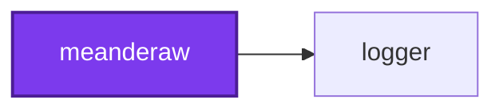
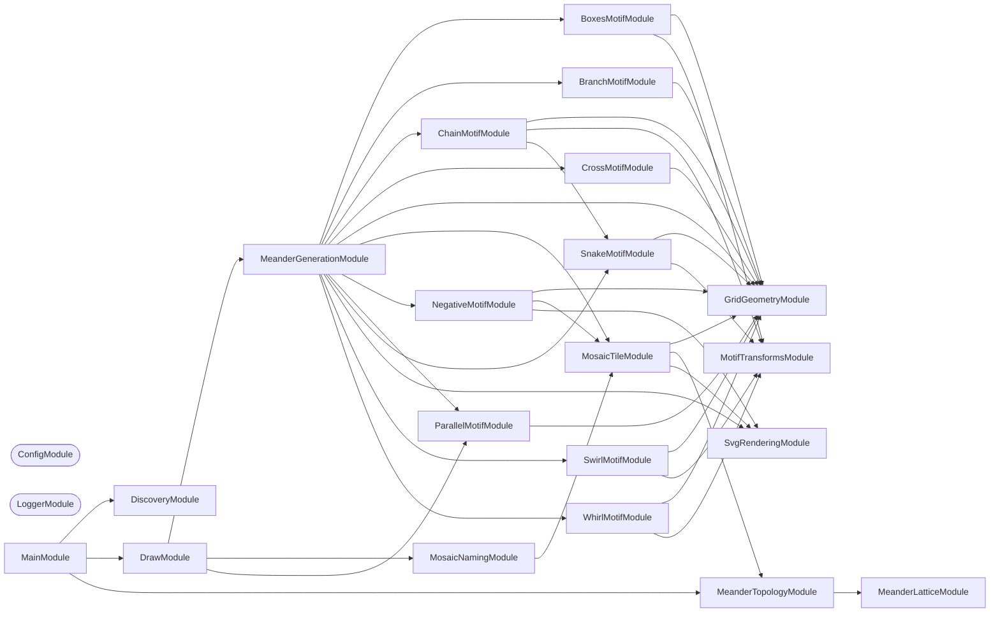

## Start

```bash
nx run meanderaw:start
```

## 🖌️ One Command

Meanderaw has one command, `draw`, and it is the default — so the target above runs it
with no arguments. What it draws is decided by whether a drawing was named, not by which
sub-command was picked:

| Invocation | What it draws |
| ---------- | ------------- |
| `nx run meanderaw:start` | Every meander the application can draw, beneath an index page listing them all |
| `nx run meanderaw:start --args="--type <family> --rows <n>"` | That one, into the same tree |

`--type` and `--rows` go together: one without the other is refused rather than treated
as a sweep, since neither flag can be declared `required` when passing neither is how the
sweep is asked for. Every other flag — `--modifier` and the parameters it carries
(`--strands`, `--branches`, `--direction`, and `serpentine`'s optional `--flip` and
`--offset`),
`--sub-family`, `--repeat-count`, `--output-directory` — narrows the one drawing. A modifier
that requires a parameter is refused without it, rather than defaulted; `--direction` is
exempt, because the direction it names is the one every `rung` drawing carried before the
other three were reachable, so leaving it off draws that one rather than nothing.

`--sub-family` is the one flag that narrows a drawing without adjusting a repeat unit: it
names a member of a family's own unit space. For `mosaic` it is **required**, because that
family draws no repeat unit of its own — `--type mosaic --rows 5` alone is refused, with
the sub-families to choose from named in the message. See "The mosaic family draws no
motif" below.

This used to be two commands, `start` and `generate`. They are one because the option set
is one: every flag either names a drawing or says where drawings go, and the sub-command
boundary between them only decided which half of that set was legal.

## Test

```bash
nx run meanderaw:vitest
```

## 🗂️ Output Layout

`nx run meanderaw:start` runs the one command this application has — `draw` — which
with no arguments writes every drawing it can under `output/`, beneath one `index.html`
listing them all.

Every attribute a drawing was generated from is a directory, and only what is left
over is its filename:

```text
output/
  index.html                                        every drawing, linked and captioned
  lattice-addresses.md                              every drawing's lattice address
  <family>/
    <rows>-rows/
      <variant>-<repeatCount>-repeats-<address>.svg `plain` where there is no modifier
      <columns>-columns/                            `mosaic`'s tiles, all it draws

        <identifier>[-<name>].svg
      permutations/                                 `negative` only
        <columns>-columns/
          <identifier>[-<name>].svg
```

So `output/chain/7-rows/edge-flip-6-repeats-7r14c.svg`,
`output/mosaic/6-rows/1-columns/00000-dots.svg`, and
`output/negative/6-rows/permutations/1-columns/030303-ruled.svg`.

**That trailing `<address>` is where the drawing sits on the lattice**, read off the
finished ink rather than off the parameters, so a drawing that changed shape cannot keep
the name it had. It comes in two spellings, and which one a family uses is declared once
per family by `FILENAME_ADDRESS_CONVENTION` rather than chosen per drawing:

- **The full address** — the row-and-span shape, then one hexadecimal character per
  addressed lattice point: `7r3c-444cccccccccccc888`. `branch`, `cross`, and `negative`
  carry it, and so a filename alone says everything about which pattern was drawn.
- **The shape alone** — `7r14c`, and no identifier. `boxes`, `chain`, `parallel`,
  `snake`, `swirl`, and `whirl` carry this, because their widest repeat spans enough
  lattice points that a full address would put the filename past the 255-byte limit
  filesystems impose on one path component: 566 bytes for `parallel` at twelve strands,
  515 for `boxes` at twelve rows, 295 for `chain`. Two drawings of one family at one row
  count and one span can therefore share a filename shape, and the 🗺️ Lattice
  Addresses table below is where the identifier that separates them is written down.

`mosaic` is spelled by neither rule. Every drawing it files is one enumerated tile, so its
filename is that tile's identifier from the start — `00000-dots.svg` — with no variant or
repeat count in front of it to append anything to.

`mosaic` has no `permutations/` level, and nothing beside those `<columns>-columns/`
directories either. That level separated an enumerated half from a named one, and for
this family there is no named half left to separate from: see "The mosaic family draws no
motif" below. `negative` keeps its own, because there the two halves really are
different: its named half draws ten sources built by rule, and its
enumerated half inverts `mosaic` tiles. A modifier carrying a

parameter puts it in the variant too, or two of its own drawings would collide on one
path: `output/branch/7-rows/stagger-branches-4-6-repeats-7r3c-444cccccccccccc888.svg`
and
`output/branch/7-rows/stagger-branches-5-6-repeats-7r4c-4444cccccccccccccccc8888.svg`.
A directory listing is
then the parameter space it enumerates, and the 8,759 enumerated tiles — which would be
unreadable as one flat directory — sit under the row count and column span that produced
them, named by nothing but the hexadecimal string that distinguishes them, with the handful whose
structure earns a name carrying that name after it.

**Two families have a permutation half, and they enumerate different things.**
`mosaic`'s is its whole unit space at every column span its edge budget admits, 8,551
tiles across 3 through 6 rows. `negative`'s is its **one-column source space** — the
`ruled` domain, since a one-column source has no southward edge for a second column to
stagger against — 208 sources across 3 through 6 rows, the corner-and-run part of that
space rather than all of it, since a source carrying a junction can wall a cell on every
side and leave the negative with nothing to ink. Both stop at the same 6, which is the whole `mosaic`
family's ceiling and the only row range in this repository that is not the command
line's: see "Neither permutation half followed" below. The absent
`negative/<rows>-rows/permutations/2-columns/` is a statement too — the two-column source
space is a different shape of pattern rather than a deeper cut of this one, and the three
members of it this repository draws are named in the sweep's other half.

Naming one drawing writes into the same tree, through the same `OutputPathService`, so a
single drawing lands beside its siblings rather than loose at the top:

```bash
nx run meanderaw:start --args="--type chain --rows 7 --modifier edge-flip"
```

The SVGs are committed, and so is `output/index.html`. It lays the families out in the
order `SUPPORTED_TYPES` declares them — a reading order rather than an alphabetical one,
running from the single-line motifs through the four that break a negotiable invariant
and ending at `mosaic`, whose enumerated tiles outnumber every other family together. It
links each drawing rather than inlining it, so it duplicates nothing, and it sits at the
root of the tree it indexes rather than beside it — every link it writes is a path down
from its own directory, and the two move together. Committed, it opens straight from a
checkout with nothing run first, and a regeneration that changes the drawings shows the
index changing with them. `.gitattributes` marks the whole of `output/` as generated, so
neither the drawings nor the index page counts toward this repository's language bar, and
`.codometerignore`, `.prettierignore`, and `cspell` all leave the directory alone.

## 🏛️ Meander Charter

Ten families of meander are implemented, and they share a set of properties that are
load-bearing to how a meander looks. The invariants were extracted from the six families
that predate them, by measuring every committed SVG rather than by reading the code, and
each is marked fixed or negotiable. A new family that breaks a fixed invariant is not a
new family — it is a different kind of drawing. All four of the families that came after
break a negotiable one: `cross` crosses, and `negative`, `branch`, and `parallel` all
branch — in different shapes, which "The Branching Family" and "The Parallel Family" below
are about. `negative` breaks the other one too, in three of its ten modes, and that is not
a second family creeping in: the survey below found that 3,070 of the 3,179 `mosaic` tiles
it measured have a crossing negative, so a `negative` family that crossed nowhere was
drawing the 3.3% minority of its own source space.

`parallel` was the exception until this corpus was drawn, and its row of
`RELAXED_INVARIANTS` was empty on purpose. **That is reversed.** Ruling both borders of
its band — the same closing `branch` takes, though there the rules stand a lattice row
clear of the ink — meets each strand's
rising end with west, east, and south ink at one lattice point, so 642 of its 786 drawings
fork. The row is not blanket: the other 144 are the `serpentine` drawings whose first and
last strips are each one lattice row deep, where the flat ribbon on such a strip _is_ the
rule and nothing rises to meet it. So the relaxation carries a **structural condition**
rather than a list of modifier names, which is the only such row in the declaration. See
`docs/adr/0006-close-both-band-borders-in-branch-and-parallel.md` for why both borders were
closed and what it cost.

`mosaic` breaks both, and it is the only family that breaks them in its **enumerated half
alone** — which is now the whole of it. Its unit space is every assignment of direction
bits over a lattice, and most of that space branches and crosses; the four named modes it
once had, `plain`, `split`, `alternated`, and `dot`, did neither, and they are gone. The
declaration in `meander-topology.service.integration.test.ts` says so
with a `permutations` flag, and the assertion that a declared relaxation is really
_present_ is taken from committed output rather than from a generated drawing.

| # | Invariant | Status |
| --- | --- | --- |
| 1 | **Orthogonal only** — horizontal and vertical movement, no diagonals | Fixed |
| 2 | **Space-filling** — every interior white channel is exactly one stroke width | Fixed |
| 3 | **No branching** — ink contains no T-junctions | Relaxed by `branch` in every mode, by `negative` in every mode but `ruled-closed`, by `parallel` wherever a border strip has depth, by `mosaic` across its enumerated half, and by `chain` and `snake` under `edge` and `edge-flip` |
| 4 | **No crossing** — ink contains no X-junctions | Relaxed by `cross` except under `interrupted`, by `mosaic` across its enumerated half, and by `negative` under `brick-straight`, `brick-upright`, and `grid` |
| 5 | **Band, not field** — fixed canvas height, `rows` is density, tiling is horizontal | Fixed |
| 6 | **Flat path model** — unordered paths, no z-order, one stroke width per document | May be relaxed by ADR only |
| 7 | Invariants hold within a band, not at its termination | See [#338](https://github.com/JimmyPaolini/codebase/issues/338) |

What the measurements found. They were taken across the 114 named patterns and 3,179
enumerated `mosaic` tiles that existed before `cross`; every count below is restated
against the corpus as it now stands, 1,118 named patterns beside 8,759 enumerated tiles.
The named half was 174 until the sweep's row range was raised to the command line's own,
and it has moved with every family that gained a mode or a parameter since — and, when
closing both band borders left four names drawing what another name already drew, with the
four that were deleted, and again with `branch`'s six two-row drawings, which insetting
that family's figure from its own rules put below its structural minimum; the enumerated
half was 3,554 until `mosaic` was capped at 6 rows, 449 after that, and 8,759 once that
family's matching rule was replaced by an edge budget over a lattice. Most of these counts
have moved several times for those reasons alone — see the note under "Meander Charter"
above:

- **Every interior white channel is exactly one stroke width**, in all 9,877 files. The
  channel width equals the stroke width equals half a grid unit, and that single number
  is the same in every document the project has ever written — the stroke is `unit / 2`
  at every row count, in every family, at every ply of `parallel`. #340 and #413 both
  inferred from this that drawing `N` strands would mean `strokeWidth = unit / (2N)`;
  that inference is wrong and is discarded, for the reasons under "The Parallel Family"
  below.
- **Ink never crosses itself, except where a family was added to make it.** Zero
  X-junctions across all 138 named drawings the six original families produce — a stronger
  statement than "non-self-intersecting", and the sharpest single characterization of what
  those six have in common. The `cross` family relaxes it deliberately: 12 X-junctions in
  each of the seven solid documents it commits. `negative` relaxes it too, in three of its
  ten modes and 30 of its 100 documents — `brick-straight` is stack bond, whose mortar runs
  unbroken both ways where running bond's does not, `grid` inverts the `dots` sub-family,
  and `brick-upright` inverts `diamond` — for 705 X-junctions between them. Its permutation
  half crosses in 136 of its 208 drawings, which is the same finding at the scale of a
  whole space rather than of three named modes. Nowhere else in the 9,877-file corpus.
  `cross` carries twelve at every one of its row counts, 6 through 12, so its count is a
  property of the repeat count rather than of `rows`. See "The Crossing Family" and "The
  Negative Space Family" below.
- **Ink branches in four places, and only there.** 22,918 T-junctions across 848 of the
  1,118 named patterns. 360 of them, across 36 patterns, are `chain` and `snake` under
  `edge` and `edge-flip`, ten per document at every row count: the `edge` family widens the
  repeat unit past the zigzag it contains, so the zigzag's terminating vertical lands in
  the _interior_ of the band border rather than at its end, and the border runs on either
  side of it — five such junctions along the top border, five along the bottom. An earlier
  reading of this measurement reported zero everywhere; the reference assets are
  hand-verified ground truth for what these patterns should look like, so the geometry is
  right and the count was wrong. The other 22,558 are the point of three families rather
  than a side effect of anything: 3,054 across the `negative` family's 90 branching
  documents, 2,130 across all 80 of `branch`'s, and 17,374 across 642 of `parallel`'s 786
  — see "The Negative Space Family", "The Branching Family", and "The Parallel Family"
  below.
- **The corpus was a forest with a few trees in it, and now it has none.** Read as a
  graph, a document's ink is lattice points joined by one-pitch steps, and a **tree** is
  the case where those points form one connected piece with `edges = nodes − 1`. Until
  both border rules were closed the corpus held 110 of them — `branch`'s 88, which were
  spanning trees of the band's lattice, and the 22 one-strand `serpentine` drawings, each
  a single ribbon that simply did not end before the band did. Both routes ran through an
  open border, and ruling both borders closed both — but not the same way, which is the
  part worth keeping. A ribbon that meets a rule at each end closes a loop, so it leaves
  the tree set by gaining an edge. `branch` briefly left it that way too, and now leaves
  it by falling apart instead: its figure is inset by a lattice row from every rule beside
  it, so each rule is a piece of its own and the drawing is a forest of two or three. By
  either route, **not one of the 9,877 committed documents is a tree**. 5,817 of the
  9,877 are forests of many components and 4,060 carry a loop, where before the two halves
  stood at 6,390 and 3,418. What was measured is still the
  interesting thing — a corpus this large containing exactly two shapes of ink graph — and
  the trees turn out to have been an artifact of two families having a border left open.
  See "The Branching Family" and "The Parallel Family" below.
- **The negative space branches and crosses freely.** It branches in every family, and it
  genuinely crosses in 203 of the 1,118 named drawings — every one of them `parallel`
  under `serpentine` — and in the `diamond` sub-family, which is the shape the `mosaic
  split` modifier drew before that family stopped drawing motifs. Crossing patterns
  are already generated here; they have only ever been white, never ink.

Invariant 1 is not merely local convention. Fréart's rule for the classical meander is
that returns and intersections "do always fall into right angles", quoted in the
[ICAA's article on the complex Greek meander](https://www.classicist.org/articles/classical-comments-the-complex-greek-meander/).

Invariant 5 is fixed because the intended use is **borders**. Two-dimensional field
ornament is excluded for that reason, not because it is uninteresting.

Wider-than-one-stroke gaps occur only where a band terminates, which is
[#338](https://github.com/JimmyPaolini/codebase/issues/338) and is not a family
property.

**The named half of the sweep runs to each family's own `FAMILY_MAXIMUM_ROWS`**, which is
the same record the command line validates against — so every drawing the command line can
be asked for is also a drawing this repository commits and the charter gates: 1,118
combinations, each family from its own structural minimum through its own ceiling. That
ceiling is the shared `MAXIMUM_VALUE` of 12 for nine of the ten families, and 6 for
`mosaic`, whose reasons are below.

It stopped at 8 until [#507](https://github.com/JimmyPaolini/codebase/issues/507), and that
issue lived in the four row counts between — `chain` and `snake` drew self-retracing ink at
9 through 12 rows, reachable from the command line by anybody and covered by nothing,
because the corpus stopped at 8 and the charter swept the corpus. Raising the sweep's range
to the command line's own closed the gap for both at once, which is why neither has a
maximum of its own any more. Most of the counts below moved by that change and nothing else.

**Neither permutation half followed, and `mosaic` as a whole did not either.** Both halves
stop at 6 rows, at 8,551 tiles and 208 sources. They enumerate their spaces exhaustively
rather than sampling them, and `mosaic`'s count grows about 3.4× per row — 23, 68 and 199
at rows 4 through 6, then 660, 2,229, 7,977, 29,002, 108,089 and 406,934 — so following the
other nine families to 12 would mean committing 554,891 more files. `negative`'s own growth
is about 2.4× per row — 8, 18, 40 and 93, then 216, 513, 1,218, 2,920, 7,000 and 16,850.

That cap is why the `mosaic` family stops at 6 rows everywhere rather than only in its
permutation half. A budget that applied to the enumeration alone would leave `mosaic` at 7
through 12 rows reachable from the command line and committed nowhere — which is exactly
the shape of #507. So the cap is `FAMILY_MAXIMUM_ROWS.mosaic`, the named half reads it, and
`--type mosaic --rows 7` is refused rather than drawn outside the corpus the charter gates.
`negative` keeps its ceiling of 12 as a named family; only its enumerated half stops at 6,
and its deepest row count there inverts a seven-row source that is enumerable but no longer
committed — so the corridor-identity gate covers rows 3 through 5 of that half and the
charter sweep covers the rest, exactly as it already does for the named `negative` drawings
above 6 rows.

## 🧬 Families, Sub-families, and Tiles

A **family** is a generator of repeat units — its **unit space**. A **modifier** is a
named constructor into that space; a **sub-family** is a named predicate over it. Both
are views on one underlying space, which is why `mosaic` is the only family whose
sub-families can be **asked for**: [#365](https://github.com/JimmyPaolini/codebase/pull/365)
materialized its unit space as enumerable tiles, so its regions — `lines`, `dashes`,
`dots`, `diamond` — became nameable at the command line. The other nine families have
latent unit spaces and therefore only modifiers. Evaluating a predicate needs no
enumeration, though, so a drawing from any of those nine can still **earn** a sub-family
name from the tile it draws — 85 of the 1,118 swept combinations do, and the
[lattice address table](output/lattice-addresses.md) reports which.

### The mosaic family draws no motif

`mosaic` is the one family with **only** sub-families, and the reason is the sentence
above read the other way round. A modifier constructs a member of a family's unit space;
every member of this family's space is already enumerated and committed; so a modifier
here constructs something the corpus already holds under another name.

That was measured rather than argued. The family had three modifiers — `alternated`,
`dot`, and `split` — producing 24 named drawings across 3 through 6 rows. Decoded back
into tiles and matched against the enumeration up to the symmetry it folds by, **19 of
the 24 were tiles the enumeration already commits**:

| Modifier | 3 rows | 4 rows | 5 rows | 6 rows |
| --- | --- | --- | --- | --- |
| none (`plain`) | `48-bars` | `4c8-bars` | `4cc8-bars` | `4ccc8-bars` |
| `split` | `48-bars` | `4c8-bars` | `4848-diamond` | `4c848-diamond` |
| `dot up` | `48-bars` | `044880` | `044cc880` | 3 columns, past the budget |
| `dot bounce` | `48-bars` | `044880` | `044cc880` | 4 columns, past the budget |
| `alternated period 1` | `48-bars` | `4c8-bars` | 2-column `diamond` | 2 columns, past the budget |
| `alternated period 3` | `48-bars` | `4c8-bars` | 6 columns, past the budget | 6 columns, past the budget |

Read the rows and the redundancy is not marginal. `plain` is the `bars` sub-family under
a name that says nothing about what it draws. `split` is `diamond`. At 3 rows all four of
`plain`, `split`, `dot up`, and `dot bounce` are **byte-identical** to each other, and
`alternated` degenerates to a plain bar at 3 and 4 rows at every period — a modifier
varying a parameter that changes nothing.

The five that were not in the enumeration were not in it for one reason: their column
span is past `MOSAIC_TILE_EDGE_BUDGET`. Two columns at six rows is 18 edges against a
budget of 16, and six columns is 54. Raising the budget to reach them is not an option —
it would admit `2 ** 54` tiles at that shape — so those five drawings are the cost of the
removal, stated rather than glossed: a staircase at 5 and 6 rows and two dot ladders at 6
rows are no longer drawn.

What replaces them at the command line is `--sub-family`. `--type mosaic --rows 5` alone
is refused by `MissingSubFamilyError` rather than defaulting to the bar, and the message
names the eight sub-families to choose from. `MotifRegistryService` holds no entry for the
family at all, which `MotifDrawnType` makes a type error rather than a lookup answering
`undefined`, and `DrawCombinationsService` leaves it out of the named-type sweep entirely
— so the named half is 1,118 rather than 1,142, and every one of this family's 8,551
drawings comes from one enumeration.

### A `mosaic` tile is a lattice of four-direction points

A repeat tile is a `columns` by `rows - 1` grid of **lattice points**, each carrying four
bits: whether ink leaves it north, south, east, or west. `0000` is a dot, `1100` a corner,
`1110` a T-junction, `1111` a crossing. The two border rules at grid levels `0` and `rows`
are the cap ticks rather than tile points, so a point on the first level carries no `north`
and one on the last carries no `south`.

Three things follow, and they are why the family is a family rather than a soup.

**A tile is space-filling for free.** A point on no edge _is_ an inked dot — the same dot
the family has always drawn — so charter invariant 2 holds by construction at every degree
and needs no predicate.

**The bits are twice-redundant, and the redundancy is a checked invariant.** `east` at one
point is `west` at the point to its right, wrapping from the last column into the next
repeat, and `south` is `north` at the point below. `MosaicTileService.assertWellFormed`
refuses a grid that disagrees. That agreement is what makes a tile's bits denote exactly
one drawing — no two assignments draw the same pattern, and no assignment draws none — and
the east–west wrap at the last column **is** what makes a tile join up with its own next
repeat, stated once rather than handled wherever a mark used to reach past the tile's edge.

The alternative reading — each bit draws a half-unit arm, so disagreeing neighbors leave a
stub ending between lattice lines — is rejected. `MeanderLatticeService` refuses a
coordinate that is not on a lattice line, so half-arms would break the whole measurement
stack, and a stub ending in mid-air is not obviously legal under invariant 2 either.

**One budget bounds the space.** A tile's edges are its only degrees of freedom — one
eastward and one southward per point, minus the last level's southward ones, which have
nowhere to reach — so a shape holds exactly `2 ** (columns * (2 * rows - 3))` tiles and
rows and columns are not independent knobs. Capping each alone caps neither: six rows is
fine, six columns is fine, and a six-by-six tile is `2 ** 54` of them. `MOSAIC_TILE_EDGE_BUDGET`
caps the edge count at **16**, which admits eleven shapes and 8,551 distinct tiles after
symmetry folding — a corpus a person can look through. Twenty would admit about 116,000.

| rows × columns | edges | tiles |
| --- | --- | --- |
| 3 × 1 | 3 | 6 |
| 3 × 2 | 6 | 21 |
| 3 × 3 | 9 | 74 |
| 3 × 4 | 12 | 354 |
| 3 × 5 | 15 | 1,884 |
| 4 × 1 | 5 | 20 |
| 4 × 2 | 10 | 204 |
| 4 × 3 | 15 | 3,100 |
| 5 × 1 | 7 | 72 |
| 5 × 2 | 14 | 2,544 |
| 6 × 1 | 9 | 272 |
| **Total** | | **8,551** |

Counts are folded over the tile's symmetry group — horizontal translations, times a
horizontal mirror, times a level flip, order `4 * columns`. Enumeration is a walk over
every subset of the edges, so it is counting in binary rather than searching, and a shape
past the budget is refused rather than enumerated slowly: the walk is `2 ** edges` wide,
so one shape too many is not a long run but an unfinished one.

**The row cap is separate and still 6.** The budget alone admits a one-column tile out to
nine rows, but a family that ran deeper at one column than at any other would describe its
own ceiling with two numbers that disagree.

The glossary for these terms lives in the repository [CONTEXT.md](../../CONTEXT.md).
Note one deliberate divergence: the code says `MeanderType`, `SUPPORTED_TYPES`, and
`--type` where the glossary says **family**. Renaming the flag would be a breaking CLI
change and is not worth making for a vocabulary correction.

### A tile's ink is a graph, read one repeat at a time

The charter reports a **rendered document**'s ink as a graph — nodes, edges, components,
free ends — and two predicates follow from those counts by arithmetic and nothing else: a
**forest** is exactly `edges = nodes − components`, and a **tree** is exactly
`components = 1 && edges = nodes − 1`. `MosaicConnectivityService` asks the same two
questions of a **tile**, and answers them without drawing it.

| Question | Over the 8,551 tiles |
| --- | --- |
| Ink carries no loop (a forest) | **3,352** |
| Ink is one connected figure | **1,947** |
| Both at once (a tree) | **370** |

Nothing is filtered by this. The enumeration is still 8,551 tiles and the corpus is
unchanged; these are three counts over that space, the way the junction counts are counts
over the corpus.

**A tile is read as its own repeating band, divided by the repeat.** A tile's eastward edge
at its last column reaches the first column of the _same_ tile — the wrap above, which is
what makes a tile join up with its own next repeat. So its points and edges already
describe an infinite band, and the graph read here is that band modulo one repeat: nodes
are the tile's points, eastward and westward steps wrap around the column span, and
northward and southward ones do not, because grid levels `0` and `rows` are cap ticks
rather than tile points. Every number above is therefore a property of the tile at no
repeat count at all.

**Why not measure a drawing instead.** Because the answer would be about the drawing.
`bars` at four rows is one unbroken vertical stroke per repeat, so a document of it holds
`repeats + 2` components — one stroke each, plus the band's two cap-tick rules — and a
document of ten repeats reports ten where a document of three reports three. The tile did
not change between those two drawings. Its own count is **one**, because there is one
stroke per repeat, which is the only reading that is about the tile.

**The two readings are the same reading, in this precise sense.** A document of `N` repeats
is the tile's band unrolled `N` times, plus those two cap ticks. So every loop a drawing
carries closes inside some run of repeats, and that run maps back onto the band carrying
the loop with it — therefore **a tile with no loop renders to a drawing with no loop, at
every repeat count**. `bars` is the worked case in both directions: the tile is a tree, one
component and no loop; the drawing is a forest of `repeats + 2` components and no loop.
Both say loop-free, and they differ on the component count by exactly the factor the
drawing chose.

**The converse fails, in one exactly-known way, and the way is the point.** A cycle that
closes _only_ by wrapping is a loop within one repeat and no loop once unrolled: it becomes
a run that leaves at one side and never comes back. `lines` is the smallest case — at one
column every level's eastward edge leaves its own point and arrives back at it from the
west, so the repeat holds one self-loop per level while the drawing is three straight
rules. So the tile-level reading calls some tiles cyclic that every drawing of them shows
loop-free, and that is the honest answer for a repeat unit rather than a defect: within one
repeat the ink really does close on itself, and the distinction it draws — ink that
terminates inside the repeat against ink that runs on through the repeats forever — is one
the drawing cannot state.

Both halves are asserted rather than argued.
`mosaic-connectivity.service.integration.test.ts` renders every tile of three shapes at two
repeat counts, measures each document the way any committed document is measured, and
checks that the implication has no exception and that the set of tiles the two readings
disagree about is the same set once enough repeats are drawn for a wrapping run to show
itself rather than close by coincidence within a narrow drawing — 1,631 tiles disagree at
one repeat and 1,039 at two, against 1,033 from three repeats on, which is where the set
settles into a property of the tile rather than of how much of it was drawn.

The walk that counts the pieces is `MeanderTopologyService.components` and the arithmetic
is its `isAcyclic` and `isOneComponent`, shared with the document-level reading through an
`InkAdjacency` — nodes, neighbors, and an identity for a node. That is the whole of what a
component count needs, and it is the only thing the two readings can share: one lives on a
bounded lattice of `"column,row"` points and the other on a wrapping repeat of
`[level][column]` points, so neither coordinate system is a special case of the other. The
dependency runs mosaic onto topology, which leaves the topology service free of any
knowledge that a `mosaic` exists.

**A component count is not a substitute for looking at the drawing**, and the `zigzag` /
`square` split below is where that bites: two tiles can be the same graph on the quotient
band and still draw as unrelated patterns, because the count cannot see _which_ edge is the
one that wraps. So these numbers answer what they say they answer — how many pieces the
ink falls into, and whether it loops — and no more.

## 🔤 Naming a Mosaic Sub-family

`mosaic`'s unit space is materialized, so a region of it can be **recognized** rather
than listed. Eight regions have names, and they come in four pairs.

| Sub-family | Every point | Smallest tile | Reads as |
| --- | --- | --- | --- |
| `dots` | is on no edge at all | `00` | a field of square marks |
| `mesh` | is on every edge there is | `7b` | the full lattice |
| `lines` | is on a run across the band, unbroken | `33` | unbroken horizontal rules |
| `dashes` | is on a run across the band, broken somewhere | `2121` | broken horizontal rules |
| `bars` | is on a run down the band, unbroken | `4c8` | unbroken vertical rules |
| `diamond` | is on a run down the band, broken somewhere | `4848` | a dashed vertical bar |
| `zigzag` | turns a corner, stepping out of the repeat | `56a9` | a staircase |
| `square` | turns a corner, closing inside the repeat | `65a9` | separated square loops |

**Unbroken or broken is the question**, and it is asked of the edges rather than of the
points. A point in the middle of a rule and a point at the end of a dash both carry ink
running across the band; only the edge that would join it to its neighbor says which it
is. Asking only "is every point reached the same way" cannot tell them apart, which is
how a solid bar came to be called a `diamond` — a `diamond` being a _dashed_ bar — and a
two-column tile of unbroken rules came to be called `dashes`.

`dots` and `mesh` are the ends of the space: the tile with no edge and the tile with every
edge, one of each per shape.

`zigzag` and `square` are the one pair about a point's own **shape** rather than about which
directions a tile uses, and both are empty at a single column, where a point's eastward
edge wraps onto itself and gives it two horizontal bits rather than one. They were **one
name until the drawings were looked at**, and the section below works through what
separates them and why the ink's own component count cannot.

A tile is identified by its **hexadecimal string**: one character per point in reading
order, worth `8` for `north`, `4` for `south`, `2` for `east` and `1` for `west`. So `0`
is a dot, `3` a point on a horizontal run, `c` one on a vertical run, `6` a corner
turning south and east, `e` a T-junction, and `f` a crossing — and a filename can be
decoded point by point without a table.

It names a tile completely, because the points determine every edge: each one owns its
`east` and its `south`. It is deliberately redundant, writing every edge twice — once at
each end — which is the same redundancy `MosaicTileService.assertWellFormed` checks, and
paying it buys a filename whose characters are the tile's own points rather than a packed
edge list nobody can read. The directory a drawing is filed under carries the shape, so
two tiles of different shapes may share a string.

Recognition lives in the `mosaic-naming` module, which is a list of **rules**: a name,
and a predicate over the tile's own direction bits that a tile must satisfy to be called
it. Adding a name to the family is adding one of these, not writing a motif service.

Three consequences, and each is asserted rather than assumed:

- **A name keeps working outside the enumeration.** No rule consults a list of known
  identifiers, so a tile at a row or column count nobody has swept is named exactly as one
  inside it would be.
- **A tile matching no rule keeps its identifier** rather than being forced into the
  nearest name. Most tiles are like this, and that is the point: a name everything has
  says nothing.
- **A tile matching two rules is a defect in the rule set**, not a tie to break. The rules
  are exclusive by construction — each requires the _absence_ of the directions the others
  are about — and `mosaic-naming.service.unit.test.ts` asserts it over the whole
  enumerated space. `zigzag` and `square` are the one pair that cannot separate that way,
  since every point turns a corner in both; they split on a reading whose two halves are
  false together rather than true together whenever a tile is neither.

Across the 8,551 tiles the enumeration admits — every shape the edge budget allows, which
is exactly what the sweep commits:

| Sub-family | Tiles |
| --- | --- |
| `dashes` | 69 |
| `bars` | 11 |
| `dots` | 11 |
| `lines` | 11 |
| `mesh` | 11 |
| `diamond` | 4 |
| `square` | 4 |
| `zigzag` | 4 |
| unnamed | 8,426 |

`bars`, `dots`, `lines` and `mesh` name exactly one tile per shape, which is what makes
them the eleven shapes' landmarks rather than regions: no edge, every edge, every eastward
edge, every southward edge. A region proper holds every tile its predicate accepts, not
only the one it is named after, which is why `dashes` is much the largest — an eastward
edge may be anchored at any column, so every staggered arrangement of them is `dashes`
too.

`diamond` is the smallest because its arrangements are forced rather than chosen:
southward edges cover the bar's interior levels in pairs, so there is one per column span
where the number of levels is even and none at all where it is odd. Asking for a
`diamond` at an even row count is refused rather than approximated.

**A tile carrying a junction earns no name at all**, which is the rule set working rather
than a coincidence: every rule requires the _absence_ of the directions the others are
about, so nothing that branches or crosses satisfies one.

### A corner tile is a staircase or a row of loops, and the split is geometric

`zigzag` and `square` were one name — every point turning a corner — and one look at the
ten drawings it committed shows two unrelated patterns. `56a9` at three rows and two
columns is a continuous staircase marching sideways through every repeat. `65a9`, the only
other tile of that shape, is a **closed square with a gap between it and the next
repeat's** — a row of separated loops, and not a staircase in any reading.

Where each loop closes is the whole of it, and it is forced by two constraints:

- **The southward edges pair the levels up from the top.** A point's `north` is the edge
  above it and its `south` the edge below, so exactly one vertical bit per point makes the
  edges down a column run on, off, on, off; the first level has no `north`, so the run
  starts on. Levels therefore pair `(0, 1)`, `(2, 3)`, … and **no southward edge ever joins
  one pair to another**. Each pair is an independent **lane**.
- **Each level's horizontal runs alternate columns**, and the only freedom is which columns
  they start on. So one lane is two such choices, and there are only two cases.

A lane whose lower level **repeats** the upper level's choice turns the ink back on itself:
it closes into squares inside the repeat, one per pair of columns, with a gap to the
next repeat's. A lane that **offsets** it makes each level's run start where the one above
it ended, so the ink turns the opposite way at every level and walks out of the repeat and
into the next, never closing. `zigzag` is every lane offset; `square` is every lane
repeated.

**A tile can mix them**, closing in one lane and stepping in another, and two of the ten do.
Those earn neither name and keep their bit string — the same answer a tile mixing
horizontal and vertical ink already got, rather than the nearer of the two.

**The ink's own component count cannot make this split**, which is worth stating because it
is the obvious thing to reach for. At two columns a closed square and a step that leaves
the repeat are the **same four-cycle**: four points, four edges, one component. They differ
only in _which_ of those edges is the one that wraps, which is a fact about how the graph
sits in the band and not about the graph. So `65a9` — a proven row of loops — has
`components === 1` exactly as the staircase `56a9` does, and a component count would name it
`zigzag`. It fails the other way too: at five rows and two columns every corner tile has two
lanes and therefore two components, including the two that are a pair of **parallel
staircases**, which a component count would have to call loops — and it has no way to leave a
mixed tile unnamed, since every corner tile has some component count or other. Several of the
ten committed tiles come out wrong by it, in both directions. Comparing the lanes' horizontal
rows is asked of the rows instead, and it is exact.

### Every name is a constructor as well as a predicate

A name is a rule, so recognizing a region costs nothing; building its aligned
representative is the separate job `MosaicSubFamilyService` does, and for a while only
five of the names had one. `mesh` and `zigzag` did not, because the shape table
could say one thing — one direction's edges, anchored in the first column, every
`levelStep` levels — and neither of those two is that. `mesh` uses both directions at
once. `zigzag` needs its eastward edges to start a column further along at every level,
which no single anchor expresses. `square` then cost nothing at all: it is `zigzag`'s two
rules with the phase off, which is the only difference between the two names.

Each sub-family's tile is now **two rules, one per edge grid**, each an edge every
`levelStep` levels and every `columnStep` columns, optionally _phased_ so the column
offset advances by one per level. The family's pairings then fall out one number apart:
`bars` and `diamond` are the same southward rule at `levelStep` 1 and 2, `lines` and
`dashes` the same eastward rule at `columnStep` 1 and 2, `dots` no rule at all, and
`mesh` both rules at every step of one.

`zigzag` and `square` are the only two needing a phase between them, and **the phase is the
entire difference between those two names** — one boolean, which is why it is a field on
the rule rather than a special case wherever the staircase is built. Every point turning a
corner means exactly one horizontal bit and one vertical bit **at every point**, and that
pins both rules down for both names:

- **The southward edges have to alternate level by level.** A point's `north` is the
  edge above it and its `south` the edge below, so a point can have exactly one of them
  only if the edges down a column are on, off, on, off. The first level has no `north`,
  so the run starts on — and the last level has no `south`, so it must end on the level
  above. That happens only when the interior's level count is **even**, which is
  `diamond`'s constraint arriving for a different reason: `zigzag` and `square` exist at
  3, 5, 7 … rows and nowhere else, and are refused rather than approximated at 4 and 6.
- **The eastward edges have to alternate column by column**, since a point's `east` and
  `west` are the edges either side of it. Alternating has to survive the wrap from the
  last column into the next repeat, so the column span must be **even** — two, which is
  why both are empty at a single column rather than merely unaligned there.
- **Whether the alternation shifts by one at every level is the name.** Hold the phase
  fixed and each level's eastward edge sits directly above the next level's, the ink turns
  back on itself, and the tile is a stack of closed squares — every point still a
  corner, but not a staircase. That is `square`. Advance it and each level's horizontal run
  starts where the one above it ended, so the ink turns the other way at every level and
  walks sideways through the repeats. That is `zigzag`.

The smallest of each is two columns and two interior levels: `56a9` for `zigzag` and
`65a9` for `square`, the only two tiles of that shape whose every point turns a corner. The
smallest `mesh` is `7b`, a single column with every edge it has.

**Advancing the phase keeps every lane stepping, at every row count**, which is what makes
one boolean enough rather than a rule that only reads right at the shallowest tile. The
phase is the level index, so consecutive levels always disagree by one, so every lane is
offset — and `mosaic-naming.service.unit.test.ts` names both constructors' tiles back at
every row count each exists at, from 5 through 11, rather than only at the smallest.

Ask for a sub-family by name:

```bash
nx run meanderaw:start --args="--type mosaic --sub-family dots --rows 6"
```

The name lands in the output path — `output/mosaic/6-rows/dots-6-repeats.svg` — and in
the sweep's own, where a tile with a name carries it after its identifier
(`output/mosaic/6-rows/1-columns/00000-dots.svg`) and a tile without one
carries the identifier alone.

### `diamond` outlived `split`, which was the same shape under a modifier's name

The hand-drawn reference set held a `diamond` and a `split` that were byte-identical, and
both names survived for a while because they played different roles — the distinction the
[CONTEXT.md](../../CONTEXT.md) glossary draws:

- **`split` was a modifier**: a named _constructor_ into the unit space. `--modifier
  split` broke the bar into dashes.
- **`diamond` is a sub-family**: a named _predicate_ over the unit space. It recognizes
  any tile every one of whose points is reached by a southward edge and by nothing running
  across the band, whether or not a modifier is what produced it.

The two drew the same bytes, which is what settled it: a constructor into a space whose
every member is already enumerated constructs nothing the predicate cannot name. `split`
is gone with the rest of this family's modifiers — see "The mosaic family draws no motif"
below — and the golden fixture it was verified against is now
`testing/assets/mosaic-5-rows-12-repeats-diamond.svg`, generated through the sub-family
and byte-identical to what the modifier used to write.

The glossary's "some sub-families arise by applying a modifier, others by recognizing a
structural property" still holds; it is just that for `mosaic` no sub-family arises the
first way any more.

One name worth reading twice: the **`dots` sub-family** (plural) and the `dot` modifier
(singular, carrying a `bounce` or `up` shape) were different things one letter apart. The
modifier is gone; the sub-family is not, and `--sub-family dot` is still refused.

## 🕳️ Negative Space Survey

[#340](https://github.com/JimmyPaolini/codebase/issues/340) found genuine four-way
crossings in the negative space of `mosaic split` and `mosaic alternated period-3`, and
branching in every family's negative — but only across the 114 named patterns. Those two
drawings are no longer committed under those names, and the finding is not lost with them:
`split` drew the `diamond` sub-family's shape, whose negative still carries its nine
crossings in `testing/assets/mosaic-5-rows-12-repeats-diamond.svg`, measured off disk by
the charter suite.

[#412](https://github.com/JimmyPaolini/codebase/issues/412) runs the same measurement
across all 3,179 tiles of the `mosaic` permutation set at 4 through 8 rows, which the
sweep committed under `output/mosaic/<rows>-rows/permutations/` at the time, before that
level was removed — the only
family with an enumerated unit space, so the only one this measurement can run over every
tile rather than a handful of named modifiers. The space it measured is not the space
the family enumerates today — the matching rule it was taken under has since been
replaced by an edge budget over a lattice of four-direction points — so the figures below
are a record of that survey rather than a description of what is on disk. The `negative`
family still inverts the region that survey measured, and now says so: a source carrying a
junction can wall a cell on every side, and a cell with no corridor leaves the negative
with a lattice point nothing paints, so `NEGATIVE_SOURCE_MAXIMUM_DEGREE` stops its sources
at a corner.

### Method

Every `output/mosaic/<rows>-rows/<columns>-columns/*.svg` file was read from disk — no generation, no motif
service, the same approach the charter test already uses to gate the corpus — and passed
to the existing
[`MeanderTopologyService.measure`](src/modules/meander-topology/meander-topology.service.ts).
A tile is classified from its own `negativeTJunctions`/`negativeXJunctions`:

- **Crosses**: `negativeXJunctions > 0`.
- **Branches only**: `negativeTJunctions > 0` and `negativeXJunctions === 0`.
- **Neither**: both zero.

This measurement adds no committed source: it ran as a temporary test beside
`meander-topology.service.integration.test.ts`, deleted before this section was
committed. It is nothing but a loop calling `measure` on each file and tallying the
result against the two thresholds above — reproducible in a few lines against the
already-committed service.

One further tally needed a small extension beyond what `measure` reports (see
"Is the negative itself space-filling?" below): for each cell of the same lattice graph
`MeanderLatticeService.build` already produces, how many of its corridor-eligible sides
carry no corridor — the same four-arm check `measure` uses to find negative T- and
X-junctions, just also recording degree 0.

### Per-class counts

| Class | Tiles | Share |
| --- | --- | --- |
| Crosses | 3,070 | 96.6% |
| Branches only | 104 | 3.3% |
| Neither | 5 | 0.2% |
| **Total** | **3,179** | 100% |

By row count:

| Rows | Tiles | Crosses | Branches only | Neither |
| --- | --- | --- | --- | --- |
| 4 | 23 | 16 | 6 | 1 |
| 5 | 68 | 58 | 9 | 1 |
| 6 | 199 | 182 | 16 | 1 |
| 7 | 660 | 633 | 26 | 1 |
| 8 | 2,229 | 2,181 | 47 | 1 |

Crossing is the overwhelming majority, and grows with both row count and column span:
2,794 of the 3,070 crossing tiles span 2 columns against 276 at 1 column. Issue #340
already observed that crossing "grows with row count"; this shows it holding far beyond
the two named tiles the spec measured — crossing negatives are the norm across this
family's unit space, not the exception the 114-file measurement suggested. The five
_neither_ tiles are exactly the `lines` sub-family at every swept row count (`lll`
through `lllllll`): a single vertical line's negative is two straight channels that
neither branch nor cross, the simplest case there is and the reason a "neither" class
exists at all.

Every one of the 3,179 tiles still has zero ink T-junctions, zero ink X-junctions, and
full channel-width compliance — unchanged from what the base branch's own disk-based gate
already reports for the whole corpus of the six original families, now 138 named
drawings. This

survey adds the negative-space
breakdown; it does not revisit the ink side.

### Is the negative itself space-filling?

Yes, for all 3,179 tiles, by the measurable criterion available: no cell's corridor
degree is 0. A degree-0 cell is a white cell sealed off from the corridor network on
every side that has a neighbor — the negative-space analogue of an un-inked lattice
point, and the specific failure `channelWidthCompliant` catches on the ink side. If a
tile's negative were drawn as ink by tracing a stroke along every corridor, a sealed cell
would receive no stroke at all.

Across all 3,179 tiles — 264,117 cells in total, at band termination and in the interior
alike — **zero have corridor degree 0**. Every white cell touches at least one neighbor
through a missing ink edge. Drawing any permutation tile's negative as ink would
therefore leave no region unreached, keeping invariant 2.

This is measured, not proven in general: it states that the corridor skeleton reaches
every cell, not that a specific rendered path through that skeleton stays exactly one
stroke width everywhere the family drawn from it eventually decides to run. #415 still
has to measure its own rendered output rather than assume this result transfers
unchanged.

### Shortlist

Three candidates scale cleanly across every row count the permutation sweep covered when
the survey ran (4 through 8; it stops at 6 now), which is what makes each "a family"
rather than one lucky tile. All three
are _branches only_ — **verified `negativeXJunctions === 0` at every one of their five
row counts**, read from the same per-file measurement that produced the per-class counts
above, not asserted separately — so drawing them relaxes invariant 3 and nothing else,
exactly what issues #415 and #416 need. A fourth candidate was cut after review found it
crosses; see below.

1. **The stair** (`mosaic`, columns 2, rows 4–8: `044880`, `04488408`,
   `0448844880`, `044884488408`, `04488448844880`). Negative T-junctions
   38 / 48 / 58 / 68 / 78 (rows 4–8 respectively), X-junctions 0 / 0 / 0 / 0 / 0. The
   highest-branching non-crossing family found, at every row count.
2. **The running bond** (`mosaic`, columns 2, rows 4–8: `211221`, `21122112`,
   `2112211221`, `211221122112`, `21122112211221`). T-junctions 30 / 40 / 50 / 60 / 70,
   X-junctions 0 / 0 / 0 / 0 / 0. Structurally the simplest of the three — one
   eastward edge per level, its column alternating.
3. **The ruled band** (`mosaic`, columns 1, rows 4–8: `030`, `0303`, `03030`,
   `030303`, `0303030`). T-junctions 16 / 16 / 24 / 24 / 32,
   X-junctions 0 / 0 / 0 / 0 / 0. One column alternating bare points with the
   wrapped rule, and the
   highest-branching candidate at the cheaper-to-verify column 1 width — checked
   against every columns-1 branches-only tile in the corpus, not just this family.

**Cut after review, not shortlisted:** all-dots — every point bare, so every bit `0` at
either column width — was drafted as a fourth, lowest-branching candidate on the mistaken belief
that only its columns-2 form crosses. Re-measured against the same data: it crosses **at
every row count and both column widths** — X-junctions 6 / 9 / 12 / 15 / 18 at columns 1
and 18 / 27 / 36 / 45 / 54 at columns 2 (rows 4–8), the columns-2, 8-row tile being the
single most-crossing tile in the whole corpus. All-dots belongs entirely to the
_crosses_ class, not _branches only_, at either width. It is recorded here because it is
still the cleanest-scaling crossing family found, in case whoever works on the crossing
family (#417) wants a starting point — neither #415 nor #416 should draw from it.

### A note for the branching family

Every one of the 104 _branches only_ tiles' corridor graphs contains at least one cycle
at the rendered scale (6 repeats): none is a literal tree. Checked directly — for each
tile, `edges ≠ vertices − components`, the condition for a forest — because the pattern
repeats periodically along the band and each repeat closes a loop through its neighbors.
Both scaling families above are single connected components with 20–40 cycles at 8 rows.
A bounded-tree family cannot adopt one of these corridor graphs unmodified: it would need
to deliberately omit some corridors — every other "rung", for instance — to break the
loops before the shape that inspired it can satisfy the tree test (`edges = vertices −
1`) a bounded-tree charter relaxation needs.

## 🔬 Unit Spaces Beyond Mosaic

`mosaic` is the only family whose unit space is materialized and enumerable, and
[#414](https://github.com/JimmyPaolini/codebase/issues/414) asked whether that asymmetry
can be removed: is there, for `boxes`, `chain`, `snake`, `swirl`, and `whirl`, a generating
rule producing a finite enumerable unit space the way `mosaic`'s exact-cover rule does?
Only `mosaic` had sub-families when this was measured, and the ticket read that as the
visible half of the same asymmetry; the second blockquote below records why it is no
longer, and why nothing measured here moved when it stopped being.

**A rule exists, it is the same rule for all five, and that is exactly the problem.** The
charter's own invariants already define one. It is family-agnostic, and at the pitch these
five families actually use it generates twelve million tiles at five rows and 3 × 10²² at
eight — of which each family contributes exactly one. Materializing it would not give
`boxes` a unit space; it would dissolve `boxes` into a single point of a space nobody can
look through. The recommendation is to **leave the asymmetry**, and this section records
the measurements behind that.

This was a spike. It changed no code, and everything below is measurement on the sweep
`nx run meanderaw:start` already writes.

> **What changed since, and what did not.** `mosaic` has since moved onto that shared
> degree-bounded lattice rule — its tiles are four direction bits per point, junctions
> included, which is the rule this section measured. The finding **stands**: the rule
> really does generate far too much to be useful, and it is precisely why `mosaic` carries
> an edge budget. The difference is that `mosaic` can clamp the lattice hard enough to stay
> small enough to look through, because its pitch is a free parameter — `columns` — while the five families
> here have no such knob: their pitch is the width of their own motif, and capping it below
> that deletes the family. Adopting the rule at _their_ pitch is what this section rejects,
> and nothing about `mosaic`'s lattice reopens that. The recommendation to leave the
> asymmetry is unchanged.

The verdict per family, with the rest of the section as its evidence:

| Family | A rule of its own? | The shared charter rule? | Tiles it contributes | Tiles the shared rule generates at 5 rows |
| --- | --- | --- | --- | --- |
| `boxes` | none found | yes | 1 per row count and modifier | 12,082,896 |
| `chain` | none found | yes, except under `edge` and `edge-flip` | 1 per row count and modifier | 12,082,896 |
| `snake` | none found | yes, except under `edge` and `edge-flip` | 1 per row count and modifier | 12,082,896 |
| `swirl` | none found | yes | 1 per row count and modifier | 2.46 × 10¹² |
| `whirl` | none found | yes | 1 per row count and modifier | 710,761,599 |

The two exceptions are measured below: `edge` and `edge-flip` put two degree-3 points per
repeat unit on the border rule, so those tiles sit outside the maximum-degree-2 rule and
inside a charter with invariant 3 relaxed.

### The band as a lattice

One model carries every claim here. A meander's ink runs along the edges of a lattice:
`rows + 1` horizontal grid levels one grid unit apart, tiling horizontally at the family's
own **pitch**. A repeat tile is the wrapped `pitch` × `rows - 1` lattice of interior points,
with the two border rules at levels `0` and `rows` above and below it.

Three of the seven charter invariants are properties of that lattice, and restating them
this way is what makes them countable rather than merely checkable:

| Invariant | On the lattice |
| --- | --- |
| 2 — space-filling | every interior lattice point carries ink — as the end of an edge, or as a dot |
| 3 — no branching | no lattice point has ink degree 3 |
| 4 — no crossing | no lattice point has ink degree 4 |

Invariant 2 costs the enumeration nothing, because a lattice point lying on no edge **is**
an inked dot — exactly `mosaic`'s own `dot` piece, which is what keeps this model agreeing
with the family whose 3,179 tiles it reproduces below. So **a charter-legal repeat tile is
any subgraph of the tile's lattice with maximum degree 2**: every point either sits on an
edge or is drawn as a dot, and invariants 3 and 4 are the only constraints the count sees.
That sentence is the generating rule the ticket went looking for, and it is exactly what
every "all charter-legal tiles" figure below counts. It did not have to be invented; it was
already written down, as prose about pictures rather than as a rule about a graph.

### What the six families are, measured

Parsing all 78 non-`mosaic` documents the sweep writes back into that lattice — one
interior repeat unit each, wrapped at its own family's pitch, so band termination never
enters — gives one uniform result:

| Family | Modifier | Pitch | Bare points | Degree 3 | Degree 4 | The tile's ink is |
| --- | --- | --- | --- | --- | --- | --- |
| `boxes` | none, `spin`, `spin-flip` | `rows - 1` | 0 | 0 | 0 | one arc through every point |
| `chain` | none | `rows - 1` | 0 | 0 | 0 | one arc through every point |
| `chain` | `edge`, `edge-flip` | `rows` | 0 | 2 | 0 | two arcs, each meeting a border rule |
| `chain` | `flip` | `2(rows - 2)` | 0 | 0 | 0 | two arcs |
| `snake` | none | `rows - 1` | 0 | 0 | 0 | one closed loop through every point |
| `snake` | `edge`, `edge-flip` | `rows` | 0 | 2 | 0 | one arc, both ends meeting a border rule |
| `snake` | `flip` | `2(rows - 2)` | 0 | 0 | 0 | one closed loop |
| `swirl` | none | `2 rows - 3` | 0 | 0 | 0 | one arc through every point |
| `swirl` | `flip` | `2(2 rows - 3)` | 0 | 0 | 0 | two arcs |
| `whirl` | none | `rows` | 0 | 0 | 0 | one arc through every point |
| `whirl` | `flip` | `2 rows` | 0 | 0 | 0 | two arcs |

Every one of the 78, at every row count from each family's structural minimum through 8:
**no bare lattice point, and no degree-4 point anywhere** — stronger than the rule demands,
since none of the five ever draws a dot. The only degree-3 points in the
whole set are the two per repeat unit that `edge` and `edge-flip` create by joining the
zigzag to the border rule — the same ink T-junctions
[#410](https://github.com/JimmyPaolini/codebase/issues/410) reports, reached here
independently and from the other direction.

`mosaic` was the same model with one extra bound, and this is where that bound came off.
A `mosaic` tile used to be an exact cover of its cells by dots and one-unit dashes, and a
cell **is** a lattice point: a dot is an isolated point, a dash is a single lattice edge.
So such a tile is exactly a **matching** of the tile's lattice, every unmatched point drawn
as a dot. Re-deriving that enumeration from the one-line description reproduced the sweep
as it then stood tile for tile — 8, 15, 18, 50, 40, 159, 93, 567, 216, and 2,013 per row
count and column span, 3,179 in all — so the two descriptions were the same description.

Recognizing that is what made the matching rule droppable. `mosaic` is now the _whole_
lattice under an edge budget rather than one region of it, and the matching region is still
recoverable exactly: `MosaicTilesService.isMatching` filters the enumeration back down to
it, and `mosaic-tiles.service.unit.test.ts` asserts the result shape by shape. That is what
says the widening is a widening and not a replacement.

### The five sit at the far end of one axis

`mosaic` used to bound every component of the tile to a single edge. The five make the
tile one component as long as it can be. Both were regions of the one space — and `mosaic`
now occupies the whole of it at the shapes its budget admits, which is the far end of the
axis in the other direction rather than a point on it:

| Region | Rule | Who lives there |
| --- | --- | --- |
| matchings | every component has at most one edge | `mosaic`, until its degree ceiling came off |
| simple traversals | at most one horizontal run per level and one vertical run per column | `boxes`, `chain`, `snake`, `whirl` |
| Hamiltonian cycles | one component, every point of degree 2 | `snake` |
| Hamiltonian paths | one component, two loose ends | `boxes`, `chain`, `swirl`, `whirl` |

The size of the whole space, counted exactly on the wrapped lattice each family's own pitch
defines:

| Lattice | Rows | Family | All charter-legal tiles |
| --- | --- | --- | --- |
| 3 × 3 | 4 | `boxes`, `chain`, `snake` | 7,231 |
| 4 × 4 | 5 | `boxes`, `chain`, `snake` | 12,082,896 |
| 5 × 5 | 6 | `boxes`, `chain`, `snake` | 1.83 × 10¹¹ |
| 6 × 6 | 7 | `boxes`, `chain`, `snake` | 2.58 × 10¹⁶ |
| 7 × 7 | 8 | `boxes`, `chain`, `snake` | 3.36 × 10²² |
| 4 × 3 | 4 | `whirl` | 141,421 |
| 5 × 4 | 5 | `whirl` | 710,761,599 |
| 6 × 5 | 6 | `whirl` | 3.29 × 10¹³ |
| 5 × 3 | 4 | `swirl` | 2,738,193 |
| 7 × 4 | 5 | `swirl` | 2.46 × 10¹² |
| 9 × 5 | 6 | `swirl` | 1.88 × 10²⁰ |

Counts are before folding by the tile's symmetry group (translations, horizontal mirror,
level flip), which divides by at most `4 × pitch` and never moves the order of magnitude:
the `mosaic` sweep's folded 2,013 tiles at 8 rows and 2 columns come from 11,275 unfolded,
a factor of 5.6.

The narrower regions are smaller and still far past looking through. On the same 4 × 4
lattice at 5 rows, `snake` is one of **82** Hamiltonian cycles and `boxes` one of **4,016**
Hamiltonian paths; at 6 rows the tightest of the four rules, simple traversals, still
admits **9,304,216** tiles. Those three regions were enumerated only at the smaller
lattices, which is why the table above reports the charter-legal count — exact at every
size — and why the recommendation rests on that column alone.

`swirl` is the family that escapes even the tightest of those rules. Its two arms put two
horizontal runs on its outer levels, so it is not a simple traversal, and no rule narrower
than "Hamiltonian path" covers all five.

### Why `mosaic`'s space is small, and the five cannot borrow it

When this was measured, two independent bounds kept `mosaic` enumerable, and only one of
them was the rule:

- **The rule capped a mark at one grid unit**, which is what turned a tile into a matching.
- **The enumeration capped the tile's column span at 2.**

Both were load-bearing. `mosaic`'s own matching rule, applied at the pitch `boxes`,
`chain`, and `snake` use, gives 21,497 tiles at 5 rows and 4.10 × 10¹³ at 8 rows. The five
have no equivalent cap available: their pitch is not a free parameter, it is the width of
their own motif — `rows - 1`, `rows`, or `2 rows - 3` — and capping it below that deletes
the family.

The first of those two bounds is gone now and the second has become an edge budget, which
does not change the argument — it sharpens it. What kept `mosaic` enumerable was never the
matching rule on its own; it is that the family has a free pitch to clamp. Dropping the
matching rule while keeping the clamp gives 8,551 tiles. Keeping the matching rule at a
pitch that cannot be clamped gives 4.10 × 10¹³.

And a materialized space only earns sub-families when it holds more tiles than it has
names. Each of the five produces **exactly one tile per row count and modifier**: 78
documents for 78 combinations, with no free parameter anywhere in the five motif services
beyond `rows`. A predicate over a one-element set names nothing. That, rather than the
absence of a rule, is why they have no sub-families.

### The property `mosaic` has that the five lack

`mosaic`'s constraint is **local and decomposable**. A tile is an assignment of direction
bits to independent lattice points, and legality is settled per point — do its bits agree
with its neighbors'? Nothing about one point's own two edges depends on a point elsewhere.
That is what makes the enumeration a walk over subsets rather than a search, and what makes
the space's members similar enough to fall into classes worth naming. It was true of the
matching rule this was measured under and it is true of the lattice that replaced it; what
changed is only how much of the space the rule admits.

The five have **no piece decomposition at all**. The tile is one traversal of the whole
lattice, and "is a spiral" or "is a zigzag" is a property of the traversal entire, not of
any cell: every segment of a spiral is fixed by every other segment. There is no alphabet
of local pieces whose exact cover is the set of spirals, so the only rules available are
the global ones above — which admit all five families at once, and a great deal else.

This is an argument, not a proof. No search can establish that a family-specific rule does
not exist; what it can establish is that the shape `mosaic` has is absent, and that every
rule constructible from the measured tiles is either satisfied by one tile (useless as a
space) or by all five and millions of strangers (useless as a family).

### Would the modifiers become recognizable regions?

Yes — each has a distinct structural signature on the lattice, so each is expressible as a
predicate rather than as a transform:

| Modifier | Measured effect on the tile | As a predicate |
| --- | --- | --- |
| `flip` | doubles the pitch, fusing a mirrored twin into one tile | the tile is mirror-symmetric about its own center |
| `spin`, `spin-flip` | leave the pitch alone, but the true repeat is `SPIN_CYCLE_LENGTH` units | over a tile four times as wide: the four quarters are one quarter-turn rotational orbit |
| `edge`, `edge-flip` | widen the pitch by one level and add exactly two degree-3 points | the tile's ink touches a border rule |

Two caveats. Each of these changes the pitch or the true repeat, so "the family's unit
space" would be one space per pitch rather than one space — which is the situation `mosaic`
is already in, with its 1- and 2-column tiles. And `edge` and `edge-flip` sit outside the
maximum-degree-2 rule entirely, since degree 3 is precisely what invariant 3 forbids.

### Recommendation: leave the asymmetry

Three findings, none of them close:

1. **No family-specific generating rule was found**, and the structural reason is named
   above.
2. **The family-agnostic rule generates a space too large to materialize** at these
   pitches — 12 million tiles at 5 rows against `mosaic`'s 3,179 for every row count and
   column span combined, and 3.36 × 10²² at 8 rows.
3. **Materializing it would produce no sub-families anyway**, because each family
   contributes one tile, and a predicate over one tile names nothing.

What is worth keeping from the spike is the lattice model itself rather than any code. It
makes space-filling a local, checkable property of a point rather than a global property of
a picture, and it is the frame in which relaxing invariants 3 and 4 has an exact meaning —
a branching family admits degree 3, a crossing family admits degree 4.

If the decision is ever revisited, a follow-up implementation ticket would have to:

- introduce a lattice tile type and a family-agnostic enumerator over it, plus whatever
  bound keeps the result small enough to be worth looking at — and the `mosaic` column cap
  has no counterpart here;
- re-express all six motif services as producers of a lattice tile, moving path emission to
  one shared renderer, while every one of them keeps producing byte-identical output —
  including border segments, the `isLastUnit` clipping, the `rightEdge` arithmetic, and
  `edge`'s deliberate degree-3 points;
- re-express the modifiers as constructors over lattice tiles, deriving `unitWidth` and
  `rightEdge` from the tile instead of from per-family arithmetic;
- give the space a canonical identifier and a symmetry folding, as
  `MosaicSymmetryService` already does for its own much smaller alphabet.

**It would be a wide refactor and would need expand–contract sequencing.** It touches
`MotifService`, all six motif services, `MeanderGenerationService`'s dispatch,
`COMPATIBLE_MODIFIERS`, `SUB_FAMILIES`, the command-line surface, and the output filename
scheme, and the only safety net is 23 byte-exact reference assets concentrated at 5 rows.
The expand phase would add the tile type and a tile-driven renderer alongside the existing
services and prove byte-equality family by family across the whole 114-file sweep; only
then could the contract phase delete the per-family path emission.

> **What has since been implemented, and what has not.** The fourth bullet is done, and
> only the fourth. Every drawing in every family now carries a **lattice address** —
> `<rows>r<span>c-` and one hexadecimal character per interior lattice point — with its
> canonical symmetry class beside it, spelled and folded by
> `LatticeIdentificationService` in `src/modules/lattice-identification/` and tabulated
> for all 9,877 committed drawings in [`output/lattice-addresses.md`](output/lattice-addresses.md). The
> other three bullets are untouched: there is no family-agnostic lattice enumerator, the
> motif services still emit their own path data rather than producing a lattice tile for
> one shared renderer, and the modifiers are still per-family arithmetic rather than
> constructors over tiles. **The recommendation to leave the asymmetry stands, for the
> reason it was given.** That verdict was about _materializing_ a space of 12,082,896
> tiles at five rows and 3.36 × 10²² at eight, and addressing one point of a space
> requires no materialization: identification reads a finished document and names the one
> tile it found there. Nothing about the verdict is reopened. One leg of it reads
> differently now — finding 3 above says a predicate over one tile names nothing, and a
> predicate over one tile does name that tile: 85 of the 1,118 swept combinations earn a
> structural sub-family name, `branch`, `negative`, and `parallel` between them. What the
> five families here lack is not the naming but a space whose regions a name would
> partition, and every one of them still earns no name at any swept row count and
> modifier.

### Measured, and not measured

**Measured**: every pitch, degree histogram, bare-point count, and junction count in the
tables above, over all 78 non-`mosaic` documents; the `mosaic` tile counts, re-derived from
the matching description and checked against the committed sweep as it stood then; every space size marked
with a number, computed exactly (the charter-legal counts by transfer matrix, cross-checked
against brute force at 3 × 3; the Hamiltonian and simple-traversal counts by enumeration,
cross-checked against brute force at 3 × 3, 4 × 3, and 4 × 4).

**Not measured**: the three narrower regions beyond the small lattices — their enumerations
were run only at the sizes quoted, while the charter-legal column is exact at every size in
the table; and the claim that no family-specific rule exists, which is an argument from the
absence of a piece decomposition rather than a result.

## ✚ The Crossing Family

`cross` is the seventh family and the only one whose **ink crosses**. It draws the form
Calder Loth calls the complex Greek meander — two strips of fillet crossing one another at
continuous intervals — and its four-armed `+` junctions are the first degree-4 ink this
project has ever drawn. Because movement is orthogonal, two crossing strands can only ever
meet as a `+`, never an `X`.

```bash
nx run meanderaw:start --args="--type cross --rows 6 --repeat-count 6"
nx run meanderaw:start --args="--type cross --rows 6 --repeat-count 6 --modifier interrupted"
```

### What it draws

Two strips, plus the band's own two borders:

- **The warp** — a crenellated fillet running the length of the band: a vertical bar in
  every interior column, spanning grid levels `1` through `rows - 1`, with consecutive
  bars linked alternately across the top and across the bottom so the whole run is one
  continuous meandering line.
- **The weft** — a straight fillet along the band's middle level, crossing every bar of
  the warp.

The shape is not a free choice, and its plainness is the constraint rather than a lack of
ambition. Space-filling puts ink at every interior lattice point; no branching means a
horizontal run and a vertical run may only cross outright or turn at each other's ends,
never meet in a T. Together those force a bar into every interior column, which leaves a
horizontal fillet nowhere to turn — so the weft runs the full width and only the warp
meanders. This was found by search rather than proved: overlaying each existing family on
a shifted or mirrored copy of itself, at every offset up to six columns and three rows,
produced a T-junction every time and a legal crossing never.

### Solid and interrupted

Both modes are one family, selected per render. The bare family is **solid**: the bar runs
straight through the rail, so four arms of ink meet and no white is added. The
`interrupted` modifier gives up the grid level either side of each junction instead, so
the rail reads as passing over the bar — path data only, no z-order, so the flat path
model survives.

One grid pitch is the smallest break this lattice admits, and it leaves a white gap of
**exactly one stroke width**, since a square line cap gives back a quarter unit at each
end. Invariant 2 is therefore not relaxed. The cost is stated in
[ADR 0004](../../docs/adr/0004-draw-crossings-as-a-one-pitch-interlace-break.md), and it
is not the cost the ticket anticipated: the gap is the same width as every other channel
in the band, so nothing about its size says "under" — and breaking the bar adjacent to the
junction takes the crossing out of the ink graph altogether.

Measured across the fourteen committed documents, at 6 repeats and every swept row count:

| Mode | Ink X-junctions | Ink T-junctions | Space-filling | Negative T-junctions | Negative X-junctions |
| --- | --- | --- | --- | --- | --- |
| solid | 12 | 0 | ✅ | 11 | 0 |
| `interrupted` | 0 | 0 | ✅ | 33 | 0 |

The first three columns are asserted — by this family's own unit tests, by the charter
property test, and by the disk-based gate over every committed document. **The last two
are not.** They are a reading of the fourteen committed files and nothing fails if they
change:
invariants 3 and 4 constrain ink, and no family is failed for what its white space does.

### What it holds and what it relaxes

| Invariant | Solid | `interrupted` |
| --- | --- | --- |
| 1 Orthogonal only | Applies | Applies |
| 2 Space-filling | Applies | Applies |
| 3 No branching | Applies | Applies |
| 4 No crossing | **Relaxed** | Applies |
| 5 Band, not field | Applies | Applies |
| 6 Flat path model | Applies | Applies |

That declaration lives in `RELAXED_INVARIANTS` in
[the charter property test](src/modules/meander-topology/meander-topology.service.integration.test.ts),
which asserts a declared relaxation is _present_ as well as an undeclared one absent — so
neither mode can quietly stop doing what this table says it does.

### Provenance: derived, not attested

The complex Greek meander is real ornament, and Fréart's right-angle rule is why its
junctions are `+`. **This application's rendering of it was checked against nothing.** The
six older families were verified byte-exact against hand-drawn references; no such
reference exists for `cross`, so its committed output is its own baseline — a baseline for
what the code does, not evidence of fidelity to anything.

`cross` also cannot be drawn below **6 rows**, where a solid-only family could go down to
4. The crossing sits at `floor(rows / 2)` and the break gives up the level either side of
it, so below 6 rows the upper remnant has no whole grid level left and collapses to a
zero-length run — a square line cap and nothing else, a dot one stroke wide instead of a
length of strand. At 4 rows both remnants collapse.

That is a **legibility** floor, not a topology one, and nothing measures it: at 4 and 5
rows the drawing is still fully space-filling, so the charter would happily pass a
rendering in which `interrupted` means nothing. The constant is the only thing refusing
it, and the family's unit tests pin both the collapse and the fact that measurement misses
it.

## 🕳️ The Negative Space Family

`negative` is the eighth family and the only one whose **ink is another family's white
space**. The tool has been generating these patterns since the beginning without ever
drawing one; this family draws them.

Nothing here is invented. A `mosaic` drawing divides its band into cells, and the white
between two neighboring cells is a **corridor** wherever the ink wall that would separate
them is missing — which is exactly what `MeanderTopologyService` counts when it reports a
document's negative junctions. `negative` puts one lattice point on every cell and one
stroke along every corridor. The shapes were already produced, already orthogonal, and
already on this grid; what is new is treating white as black.

### The ten it inverts

Ten sources, in three groups. Three come from the shortlist in "Negative Space Survey"
above and are not chosen here. Four invert a named `mosaic` **sub-family**'s own aligned
tile, so the regions the `mosaic` family already recognizes are drawable as negatives
rather than only as mosaics. Three more are further members of `ruled`'s own motif space,
which the next section is about.

| Mode | Source tile | Reads as | Relaxes |
| --- | --- | --- | --- |
| `stair` (no modifier) | the shortlist's stair | the shortlist's highest-branching entry: dots capping a staircase of vertical dashes | 3 |
| `brick-staggered` | the shortlist's running bond | the shortlist's simplest entry: horizontal dashes in running bond | 3 |
| `brick-straight` | the `dashes` sub-family | the same wall in stack bond, every course anchored in one column | 3, 4 |
| `brick-upright` | the `diamond` sub-family | that wall turned upright, bricks set on end | 3, 4 |
| `grid` | the `dots` sub-family | every corridor open at once: the full lattice | 3, 4 |
| `ruled` | the shortlist's ruled band | the shortlist's columns-1 entry: dot levels alternating with the continuous rule | 3 |
| `ruled-raised` | the same band, rule raised | the same, with the rule raised one level | 3 |
| `ruled-spaced` | a wider band of rule | openings every third level, over a wider band of rule | 3 |
| `ruled-tall` | two-level openings | two-level openings: tall windows between the rules | 3 |
| `ruled-closed` | the `lines` sub-family | no opening at all: the band's own rules and nothing between them | none |

`brick-staggered` was called `brick` until the straight bond joined it, and the rename is
the point of the pair: which bond a wall is laid in is the whole difference between a
mortar that branches and one that crosses.

`brick-upright` is the one source that cannot always be a sub-family's tile. `diamond`'s
vertical dashes cover the interior in pairs, so it names no tile over an odd number of
levels; this family closes the stack with a one-level dot there instead, exactly as the
stair caps its own. Where `diamond` exists the two tiles are identical, which
`negative-source.service.unit.test.ts` asserts against `MosaicSubFamilyService.tile`
rather than against an identifier.

A `negative` of `rows` rows inverts a source of `rows + 1`, and that offset is arithmetic
rather than taste: a source of `n` rows has `n` rows of cells, the negative puts a lattice
point on each of them, and `n` lattice lines bound `n - 1` rows. Inverting a source drawn
at the negative's own row count would leave the canvas's bottom lattice row with no ink on
it — invariant 2 broken for a bookkeeping reason rather than a drawn one. It is also why
the family's structural minimum is 3 where `MOSAIC_TILE_MINIMUM_ROWS` is 4.

One consequence of the offset: the sweep draws `negative` at 3 through 12 rows, so
everything from its 8-row drawings up inverts a source of 9 rows or more — past what the
survey enumerated, and past where the `mosaic` permutation half stops committing tiles.
Those fifty drawings have no committed source to be compared against, and are gated by the
charter sweep like every other drawing instead.

### The one-column motif space

Six of the ten sources are a single column of marks repeated down the interior, and they
are one family rather than six patterns. The alphabet has two letters. An **opening**
leaves a corridor for the negative to ink — a `dot` opening one lattice level, a `vertical`
dash opening two — and a **closed rule** walls a level off. `NEGATIVE_COLUMN_MOTIFS` is
that alphabet written down: `ruled` is opening-rule, `ruled-raised` the same pair in the
opposite phase, `ruled-spaced` widens the rule between openings, `ruled-tall` trades a
one-level opening for a two-level one, and the two degenerate members sit at either end —
`ruled-closed` has no opening at all and `grid` nothing else.

**Where the openings fall decides whether the drawing crosses, and the rule is exact.** Two
adjacent openings stack two corridors in one lattice column, and a lattice point with a
corridor above it and below it as well as a rule either side of it has four arms of ink.
So a motif that separates every opening by at least one rule branches without crossing, and
one that does not cannot avoid crossing. `grid` is nothing but openings; `brick-upright`'s
two-level openings are adjacent by construction. Those two cross, and the other four do
not.

The same rule is what limits horizontal staggering to one arrangement. Across a tile of `C`
columns a horizontal dash walls only the column it is anchored on, so at most `C / 2` of
the columns can be walled at any level and at least half are open. For no column to carry
two openings in a row, consecutive levels must open complementary halves — which is running
bond and nothing else. Marching an anchor across three, four or five columns draws
handsome brickwork and every one of those arrangements crosses. That is not a claim about
taste: the survey's own tally of the 3,179 tiles it measured finds exactly two _branches
only_ tiles spanning two columns, and they are `stair` and `brick-staggered`. Every other
non-crossing tile in that space is one column wide.

`ruled-raised` and `ruled` differ in a way worth knowing at the command line. At an even
row count the interior holds a whole number of opening-rule periods, so raising the rule
only re-phases the same symmetry class — the drawing differs, the class does not. At an odd
one the two carry different numbers of openings outright, and their branching counts
diverge. Both halves of that are asserted rather than described.

### The domain, enumerated

Six names is a sample of that space, not the space. **It is enumerated in full** under
`output/negative/<rows>-rows/permutations/1-columns/`, one drawing per symmetry class, the
same way `mosaic` enumerates its own tiles — because it is the same enumeration:
`MosaicTilesService.enumerate(rows + 1, 1)` is every one-column tile there is, and every
one of them is a source this family can invert.

| Negative rows | Sources | Branches only | Crosses | Neither |
| --- | --- | --- | --- | --- |
| 3 | 8 | 4 | 3 | 1 |
| 4 | 18 | 7 | 10 | 1 |
| 5 | 40 | 14 | 25 | 1 |
| 6 | 93 | 24 | 68 | 1 |
| **Total** | **159** | **49** | **106** | **4** |

Three things that table says, none of which the six named modes could have.

- **Crossing is the norm here too.** 106 of 159, which is the same finding the negative
  space survey made across the whole `mosaic` unit space at a different scale. Naming more
  modes by hand would not have turned up many more non-crossing ones to name.
- **The _neither_ column is 1 at every row count, and it is always the same source.** All
  rules and no opening — the `lines` sub-family, which `ruled-closed` draws by name. It is
  the floor of the family, and the survey's own "neither" class is exactly it.
- **49 of them branch without crossing**, against the six this repository names. That is
  the number worth knowing before naming a seventh: they are there to be found by looking
  at the directory rather than by reasoning about motifs.

A source the family has a name for carries that name after its identifier, so
`030303-ruled.svg` sits among the anonymous ones — the same courtesy `mosaic` extends to a
tile belonging to a sub-family. A name marks a **symmetry class**, and one class carries
two names: at an even row count `ruled` and `ruled-raised` is the same class re-phased,
so those drawings are filed under `ruled`. That is the only collision at any swept row
count, and it is asserted rather than trusted.

The half stops at 6 rows, which is where `mosaic`'s stops too. It used to stop at 7, one
row below `mosaic`'s cap of 8, because a negative is one row shorter than the source it
inverts and that was the exact condition under which every drawing here inverted a tile
the repository had already committed. It no longer is: the deepest row count here inverts
a seven-row source that is enumerable but not on disk, so the corridor-identity gate below
covers rows 3 through 5 of this half and the charter sweep covers the rest — the same way
it already covers the named modes above 6 rows, which have never had a committed source.

### What it holds and what it relaxes

| Invariant | Holds? | How it is known |
| --- | --- | --- |
| 1 — orthogonal | Yes | every stroke is a one-pitch step along a lattice line; only `M`, `H`, and `V` are emitted, asserted per drawing |
| 2 — space-filling | Yes | measured, and more strongly than the charter asks — see below |
| 3 — no branching | **Relaxed** | in every mode but `ruled-closed`, which is declared as the one exception rather than forgiven by a blanket entry |
| 4 — no crossing | **Relaxed** | under `brick-straight`, `brick-upright`, and `grid`, named in `RELAXED_INVARIANTS` and measured in both directions |
| 5 — band, not field | Yes | the canvas height is the shared geometry's, identical to a `mosaic` of the same rows; only width grows with `repeatCount` |

**Whether the output stays space-filling was measured, not assumed, and it does.** Every
lattice point of every one of the 308 committed drawings carries ink — the 100 named and
the 208 enumerated alike — including the band's first and last lattice column, which
invariant 7 would have excused. The family needs no termination carve-out at all, where
6,005 of the 9,877 committed documents do have a gap there. The reason is the survey's own
finding that no cell of any of the 3,179
permutation tiles has corridor degree 0: a cell with at least one corridor becomes a
lattice point with at least one arm of ink.

The branching is the point, so it is counted rather than merely permitted. Ink T-junctions
per document, at 3 through 12 rows:

| Mode | 3 | 4 | 5 | 6 | 7 | 8 | 9 | 10 | 11 | 12 |
| --- | --- | --- | --- | --- | --- | --- | --- | --- | --- | --- |
| `stair` | 38 | 48 | 58 | 68 | 78 | 88 | 98 | 108 | 118 | 128 |
| `brick-staggered` | 30 | 40 | 50 | 60 | 70 | 80 | 90 | 100 | 110 | 120 |
| `brick-straight` | 10 | 10 | 10 | 10 | 10 | 10 | 10 | 10 | 10 | 10 |
| `brick-upright` | 10 | 10 | 12 | 12 | 14 | 14 | 16 | 16 | 18 | 18 |
| `grid` | 12 | 14 | 16 | 18 | 20 | 22 | 24 | 26 | 28 | 30 |
| `ruled` | 16 | 16 | 24 | 24 | 32 | 32 | 40 | 40 | 48 | 48 |
| `ruled-raised` | 8 | 16 | 16 | 24 | 24 | 32 | 32 | 40 | 40 | 48 |
| `ruled-spaced` | 8 | 16 | 16 | 16 | 24 | 24 | 24 | 32 | 32 | 32 |
| `ruled-tall` | 8 | 8 | 16 | 16 | 16 | 24 | 24 | 24 | 32 | 32 |
| `ruled-closed` | 0 | 0 | 0 | 0 | 0 | 0 | 0 | 0 | 0 | 0 |

Ten per row for `stair` and `brick-staggered`, a constant ten for `brick-straight` however
deep the band gets, and eight every second or third row for the rest — 3,054 T-junctions
over the hundred documents, across 90 of them.

And the crossing, counted the same way, for the three modes that do it:

| Mode | 3 | 4 | 5 | 6 | 7 | 8 | 9 | 10 | 11 | 12 |
| --- | --- | --- | --- | --- | --- | --- | --- | --- | --- | --- |
| `brick-straight` | 10 | 15 | 20 | 25 | 30 | 35 | 40 | 45 | 50 | 55 |
| `brick-upright` | 4 | 4 | 8 | 8 | 12 | 12 | 16 | 16 | 20 | 20 |
| `grid` | 8 | 12 | 16 | 20 | 24 | 28 | 32 | 36 | 40 | 44 |

705 X-junctions over thirty documents, beside `cross`'s 84 over seven, and none anywhere
else in the corpus.

Thirty of those two hundred numbers have a committed source: the ones at 3 through 5 rows,
whose `mosaic` sources are among the committed permutation tiles. Each of the thirty is
asserted, in `meander-topology.service.integration.test.ts`, to equal the negative T- and
X-junction counts of the committed `output/mosaic/<rows>-rows/<columns>-columns/` document it
inverts — read off disk, from a file that existed before this family did. That assertion is
what makes "the candidates come from the mosaic space" a fact rather than a claim: if a
drawing stopped being that document's complement, it would fail. It was fifty until
`mosaic` was capped at 6 rows and its sources at 7 and 8 stopped being committed; the
twenty it no longer covers are gated by the charter sweep like every other drawing.

Two of the fifty rows compare against a source drawn at five repeats rather than six, and
the reason is invariant 7 rather than a fudge. A `mosaic` canvas ends at its rightmost
mark, so a tile whose marks are all dots or all vertical dashes in one column — which is
what `grid` and `brick-upright` are — declares a canvas one lattice column narrower than a
tile ending in a dash or a rule. The two families agree on the band and disagree on where
it stops. The same edge case is why `NegativeMotifService.reach` has a floor of one:
without it the last repeat unit of those two modes draws nothing at all while the unit
before it has already run its lattice row one column past the canvas.

Its own negative space, reported and not gated: zero T-junctions and zero X-junctions in
every mode at every row count. Inverting a negative twice gets nowhere interesting, which
is worth knowing before anyone tries.

### Provenance: no reference exists, by nature

The geometry is **derived**. The six oldest families have byte-exact reference SVGs in
`testing/assets/` that were checked against hand-drawn originals; `negative` has none, and
neither does `cross`. Its committed output in `output/` is its own baseline, pinned by
measurement rather than by likeness — every count above is asserted, and the drawings
themselves are compared to nothing.

## 🌿 The Branching Family

`branch` inks a **rail-and-tooth figure** over the band's lattice, **inset by one lattice
row from the rules that close the band**. Every lattice point of the band carries ink, and
the ink forks wherever a rail meets a tooth — which is the family's whole point and the
invariant it was added to relax.

**It closes a loop nowhere, and it is not a tree either.** While one of the two borders
was left empty the family's 88 documents were the only trees this repository had drawn: one
connected piece, `edges = nodes − 1`, no loop anywhere. Ruling both borders unconditionally
took that away twice over — it closed a rectangle between every adjacent pair of teeth, and
because a rule then ran along the very row each rail sat on, it swallowed the crenellation
whole and every `stagger` drawing rendered as the plain comb. Insetting the figure one
lattice row from each rule beside it undid both: no rule touches the ink, so nothing is
swallowed and nothing closes. Each of its 80 documents is a **forest** — `edges = nodes −
components`, no loop in any piece — of **two or three components**, the figure and the one
or two rules standing clear of it. Nothing failed when either of those changed; the loop
count was measured and published here, never gated by anything. See
`docs/adr/0006-close-both-band-borders-in-branch-and-parallel.md`.

What the ruling did buy is identifiability, and that is what the inset preserved: with one
border open, `plain`, `comb-upward`, and `stagger-branches-3` drew one pattern under three
names at each of eleven row counts, and the empty border was the only ink telling them
apart. The corpus that resulted has no tree in it at all — `parallel`'s one-strand
`serpentine`, the other route to one, closed against its own new rules at the same time,
and its names were then dropped as duplicates for a separate reason. What is left is the
two-way split the tree was the exception to: 5,817 of the 9,877 committed documents are
forests of many components — `branch`'s 80 among them — and 4,060 carry a loop.
`meander-topology.service.integration.test.ts` reads every committed document off disk and
asserts that.

### What it draws

Three modes over the same lattice, and two of the three carry a parameter of their own.
`rung`'s is a compass direction and reflects the drawing without changing a single count;
`stagger`'s decides how wide the repeat unit is.

- **No modifier at all** — a rail along row `0`, a tooth hanging off it in every lattice
  column down to row `rows − 1`, and **one** rule along row `rows`, a clear lattice row
  below the teeth's free ends. A repeat unit is two lattice columns wide, so six repeats
  span twelve columns. It is committed as `plain-…svg`, and the code names the mode `comb`,
  after the fringe it draws. **`--modifier comb` and its `--upward` direction are gone**,
  and they were removed while both borders were ruled end to end, when neither could change
  a single lattice edge. With the figure inset, an upward comb would put its rail on the
  bottom row and its teeth a row clear of the top, so it would be a drawing of its own
  again; restoring it is a decision about which drawings the corpus commits rather than a
  correction of anything.
- **`stagger --branches <n>`** — the same teeth over a wider repeat unit, and the one mode
  inset from **both** rules. `--branches` is how many teeth one rail run joins before it
  changes side, so the unit is `branches − 1` lattice columns wide. Its teeth span rows `1`
  to `rows − 1` and its rail alternates between those two rows, so both rules — row `0` and
  row `rows` — stand a clear row away and the crenellation the parameter names is drawn
  rather than swallowed. The unit width is what `--branches` varies, over
  `6 × (branches − 1)` columns rather than twelve. Four is the minimum: three makes the
  unit exactly two columns wide, which is the width no modifier already draws at. That
  width coincidence is all that is left of the bound's reason — the collapse it was set
  against is gone, and a three-branch crenel now draws a figure of its own — so the floor
  is retained rather than derived. See `MINIMUM_STAGGER_BRANCHES` and
  [#682](https://github.com/JimmyPaolini/codebase/issues/682).
- **`rung --direction <northeast|northwest|southeast|southwest>`** — the construction
  turned on its side, and the one mode whose interior is a different figure rather than a
  different width: one vertical stile per repeat unit, a horizontal rung off it at every
  row the stile spans, and a rail along one of the band's two borders carrying on to the
  next unit's stile. It takes one rule, along the other border, a clear lattice row beyond
  the stiles' and rungs' free ends. Each unit reads as an `E`, or as a `Ǝ` mirrored, or as
  either of those turned upside down.

  The direction names both axes at once: **the border the rail runs along**, then **the
  way the rungs face** — where a rung's free end travels, which is the way the stile is
  not. `northeast` is what a bare `--modifier rung` draws, and it is the one drawing the
  mode made before the other three were reachable.

  | Direction | Rail row | Stile column | Rungs reach | Figure rows | Rule row |
  | --- | --- | --- | --- | --- | --- |
  | `northeast` | `0` | the unit's first | east | `0` to `rows − 1` | `rows` |
  | `northwest` | `0` | the unit's last | west | `0` to `rows − 1` | `rows` |
  | `southeast` | `rows` | the unit's first | east | `1` to `rows` | `0` |
  | `southwest` | `rows` | the unit's last | west | `1` to `rows` | `0` |

  Each is one of the others reflected, so the stile moves to the unit's other column or the
  whole figure turns over, and the unit whose rungs run the full two columns moves to the
  other end of the band. Every count below is identical across all four, which is why the
  mirrors themselves are what is asserted.

  Two of the four are also the one place a filename says more than an address can. A
  north-railed drawing and its southern mirror differ in exactly two vertical lattice
  edges, both of them leaving a border row, and a lattice address spells out only the
  interior levels — so `rung-northeast-6-repeats-8r2c-61e1e1e1e1e1a1.svg` and
  `rung-southeast-…` share their address and are declared collisions in
  `EXPECTED_ADDRESS_COLLISIONS`. They are four different drawings all the same, separated
  on the full lattice and on the ink.

At six repeats the figure has `columns × (rows + 1)` lattice points and one step fewer
joining them than that for every piece it falls into — `edges = nodes − components`, which
is exactly a **forest** — in every mode at every row count. Twelve lattice columns
everywhere but `stagger`, whose unit width is its own parameter's. Measured at six repeats,
flat across all ten row counts except where the row says otherwise:

| Mode | Lattice columns | Ink T-junctions | Free ends | Pieces | Cycles |
| --- | --- | --- | --- | --- | --- |
| no modifier | 12 | 10 | 14 | 2 | 0 |
| `stagger`, 4 branches | 18 | 11 | 17 | 3 | 0 |
| `stagger`, 5 branches | 24 | 17 | 23 | 3 | 0 |
| `stagger`, 6 branches | 30 | 23 | 29 | 3 | 0 |
| `rung`, any of the four directions | 12 | `6 × rows − 7` | `6 × rows − 3` | 2 | 0 |

The **pieces** column is what insetting the figure from its rules shows. A rule a clear
lattice row away from the ink touches none of it, so it is a component of its own: `comb`
and `rung` take one rule and fall into two pieces, `stagger` takes both and falls into
three. That is also why the cycle column is zero everywhere — nothing joins a rule to the
figure, so no rectangle closes between a pair of teeth.

Each mode's fork count reads off its own width and nothing else. `comb` has one rail, and
it forks once per interior lattice column, `columns − 2` times, leaving one free end at
every tooth's far end plus one at each end of its rule. `stagger`'s rail changes side once
per crenel, so it forks `branches − 2` times per repeat unit and one fewer where the last
run reaches the band's edge — `(branches − 2) × repeats − 1`, with free ends six more than
that. Those two arithmetics are what "the parameter varies a width" means when it is stated
as a count, and `branch-motif.service.unit.test.ts` measures the three-branch crenel the
floor excludes against them too. `rung`'s stiles stand only every second column, and every
one of its forks sits in a stile's own column — against the rail at the stile's head, and
against a rung at every row strictly inside the stile's span — which is why that row is the
only one that climbs. That suite also asserts the `rung` mirrors themselves, since no count
here could tell the four directions apart.

The family's minimum is **3 rows, and it is `stagger`'s** rather than the lattice's. `comb`
and `rung` are inset at one end only, keeping their rail on a border row where a reader
already sees the band close, so both still draw at two rows — `comb` at the ten forks it holds at
every row count, `rung` at the first step of its own climb, five. `stagger` is inset at
both ends, because its rail moves between the two rows its teeth end at and neither of
those may be a ruled one, so it needs two free rows between the rules. A two-row band gives
it one: every tooth collapses to zero length, no vertical ink is drawn at all, and the
drawing is three parallel rules with not one fork in it. `branch-motif.service.unit.test.ts`
renders all three modes below the minimum and measures every claim in this paragraph, so
the number and its reason cannot drift apart.

**Free ends** — lattice points carrying a single arm of ink, where a stroke stops rather
than turning, forking, or closing — are back in every mode, and they are the other thing
the inset restored. Ruling a border along the row a tooth ended on closed every one of
them; a rule a row clear of that end closes none, so a tooth stops short of the rule below
it and terminates. `rung` also leaves one per rung that stops short of the next stile.
They matter to the write-up below, which judged a figure with none of them not to read as
a meander.

### What it holds and what it relaxes

- **Invariant 1, orthogonal** — every stroke is a run along a lattice line, so only `M`,
  `H`, and `V` are ever emitted. Asserted per mode per row count.
- **Invariant 2, space-filling** — every lattice point carries ink. This family's node
  count is asserted as an absolute number rather than as a boolean, which is stricter
  than `channelWidthCompliant`: that check exempts the band's first and last lattice
  column, and this family inks those too, so it has no band-termination gap at all — one
  of the few in the corpus that does not.
- **Invariant 3, no branching — relaxed, in every mode.** Declared in the charter property
  test's `RELAXED_INVARIANTS`, which asserts the relaxation is _present_ rather than
  merely permitted: a mode that stopped forking would fail. The fewest forks any of the
  family's 80 documents leaves is 10, so the permission is exercised rather than merely
  held — and the row count at which one of its modes stopped forking is exactly what sets
  the family's structural minimum.
- **Invariant 4, no crossing** — held, and the inset is what makes it trivial: a rule
  stands a clear lattice row from the figure and meets no tooth at all, so no lattice
  point in any mode carries four arms. Zero X-junctions at every row count in every mode.
- **Invariant 5, band** — held. The band is `CANVAS_HEIGHT` tall whatever the row count,
  and tiles horizontally; row count is density, not size.

**Closing no loop is not on this list, and never was.** No charter invariant is about a
loop, so the family closing 5 to 29 of them for one commit, and none of them before or
since, is a measurement that moved twice rather than a permission that had to be granted or
taken back. It is measured and published, here and in the charter test; nothing gates it.
The same goes for the component count: falling into two or three pieces is not a
compliance question either.

Its own negative space is reported and not gated, per the ruling that invariants 3 and 4
constrain ink only.

### How it differs from the negative space family

Both relax no-branching, and both trace back to the same shortlist in the negative space
survey above, so the difference is worth stating rather than assuming. **It is the loops
again, and it briefly was not.** `branch` closed none while one of its borders was open;
ruling both put a rectangle between every adjacent pair of teeth and moved it inside the
range `negative` already occupied; insetting the figure from its rules took every one of
those loops back out. So the difference is what it always was — `branch` is acyclic in
every mode at every row count and `negative` is not — with the crossing beside it:
`branch` relaxes invariant 3 and nothing else, where `negative` relaxes invariant 4 as well
in three of its ten modes.

What the loop counts say is about shape rather than about permission. `negative` inks a
whole corridor graph, which closes a loop through each of its own repeats: ninety of its
hundred committed drawings carry up to 65 cycles each, spread over one to thirteen
components. `branch` inks a lattice cut down to a rail, a set of verticals, and one or two
rules standing clear of them, so each of its 80 drawings is a forest of two or three
pieces with no cycle in any of them. The ten `negative` drawings that carry no cycle are
`ruled-closed`'s, whose ink is the band's own rules and nothing joining them: a forest of
one component per lattice row, which is the corner of that family shaped the way this one
now is throughout. Both ends of `negative`'s range are asserted in
`meander-topology.service.integration.test.ts` rather than merely published here.

The survey anticipated the loop-free figure — its "A note for the branching family" found that
every one of the 104 _branches only_ tiles has at least one cycle at the rendered scale,
and that a bounded-tree family would have to **omit corridors** to break them. This family
does omit them, and by construction rather than by search: a rail and teeth reaching for a
rule they never touch have `nodes − components` steps by counting. Ruling both borders put
every one of those loops back for one commit, and the note described this family for
exactly that long.

Put plainly: `negative` is what the white space of an existing pattern already looks
like, and `branch` is a lattice cut down to the least ink that still fills it. Same
relaxation, opposite ends of the same measurement, and one commit in which they were not.

### Unbounded branching: explored, not implemented

Issue [#416](https://github.com/JimmyPaolini/codebase/issues/416) asks for unbounded
branching — forks plus loops — to be explored and written up rather than built, including
whether the output still reads as a meander. It was, on two constructions, both at six
repeats. **Neither of the two ships**, and for one commit one of them did — which is what
this write-up has to be read against. The two-rail construction it describes is exactly
what every mode drew while a rule ran along the row each rail sat on, measured at 11
cycles, 20 T-junctions, no X-junctions, and no free ends. What the family draws now is the
one-rail figure again, its teeth a lattice row shorter and a rule standing clear below
them: 0 cycles, 10 T-junctions, no X-junctions, 14 free ends, and two components rather
than one. The full-lattice construction still ships nowhere and is described here precisely
enough to rebuild.

| Construction | Cycles | T-junctions | X-junctions | Free ends | Space-filling |
| --- | --- | --- | --- | --- | --- |
| One rail — the family as it was drawn before either border was ruled | 0 | 10 | 0 | 12 | yes |
| Two rails — a rule along both borders, touching the figure, which is what every mode drew for one commit | 11 | 20 | 0 | 0 | yes |
| Inset rail and rule — the one-rail figure with a rule a clear row below it, which is what no modifier draws now | 0 | 10 | 0 | 14 | yes |
| Full lattice — every lattice edge inked | 11 × (`rows` − 1) | 2 × `rows` + 18 | 10 × (`rows` − 1) | 0 | yes |

Three findings, and the middle one was overruled and then reinstated:

1. **Unbounded branching is legal.** The two-rail figure holds invariants 1, 2, 4, and 5
   exactly as the tree did, and relaxes only invariant 3. Nothing in the charter forced the
   tree; the tree was chosen, and has since been unchosen — the family is a forest of two
   or three pieces rather than one connected piece with `nodes − 1` steps.
2. **It reads less as a meander, and the reason is countable — and this is the finding the
   fix was made to honour.** Closing the loops closes the ends: the one-rail figure has
   twelve free ends, one lattice point per column with a single arm of ink, and the
   two-rail figure has none. A meander reads as a line that runs somewhere; a figure in
   which every stroke is enclosed and nothing terminates reads more like a grille. That
   judgement was overruled by a measurement — with one border open, three of this family's
   names drew one pattern, and a family identifiable only by which border it carries is
   worse than a family that reads as a ladder — and then it turned out not to be a choice
   between the two. A rule inset by one lattice row identifies the band without touching
   the ink, so every mode has free ends again while every name stays distinct: 14 with no
   modifier, 17 to 29 under `stagger`, and `6 × rows − 3` under `rung`.
3. **Pushed to its limit it collides with a different invariant.** #416's premise is that
   forks plus loops admit any orthogonal drawing. They do — but only once invariant 4 goes
   too: the full lattice acquires 10 X-junctions per interior row. Crossing is `cross`'s
   relaxation, not this family's, so "any orthogonal drawing" is not reachable from
   invariant 3 alone. Unbounded branching that keeps invariant 4 is a narrow band between
   the tree and the ladder, and this family sits at the tree end of it: it forks freely,
   closes nothing, and keeps its free ends.

### Provenance: derived, not attested

The geometry is **derived**. The six oldest families have byte-exact reference SVGs in
`testing/assets/` that were checked against hand-drawn originals; `branch` has none, and
neither does `negative` or `cross`. Its committed output in `output/` is its own baseline,
pinned by measurement rather than by likeness — every count in this section is the output
of an assertion, the inset row of the exploration table included, since that row is what no
modifier now draws. Three rows there are not: the one-rail figure and the two-rail one,
neither of which anything draws any more, and the full lattice, which nothing ever did. All
three were measured when they were drawn and are gated by nothing.

## 🧵 The Parallel Family

`parallel` draws meanders in which `N` strands run alongside one another, turning
together, one channel apart, between a rule along each of the band's two borders. It is the
tenth family, and it **used to relax no invariant at all**. Closing both of those borders
ended that: a rule meets a strand's rising end with west, east, and south ink at one
lattice point, so 642 of its 786 drawings fork and the family relaxes invariant 3. It is
still space-filling, orthogonal, non-crossing, and a single band, strictly, at every ply.

Its 786 committed drawings are eleven row counts, 2 through 12, crossed with its three
ply-carrying modifiers — `plied`, `aligned`, and `serpentine` — each swept over its whole
range at each row count. That range is the row count itself: a bundle of `N` strands needs
`N` rows, so twelve rows admit a twelve-ply bundle and two rows admit a two-ply one. Its
floor is the modifier's rather than the family's — only `aligned` sweeps a ply of one, for
the reason under "The ply" below.

**The family commits no unmodified drawing, and that is deliberate.** Drawn with no
modifier it is a two-strand `plied` bundle, so the sweep used to write those same bytes as
`plain-…svg` while every sibling was named for its ply — one filename in the family that
could not be read as a ply. `TYPES_WITH_MODIFIER_NAMED_DEFAULT` drops the unmodified entry
for this type and lets `plied` carry the drawing under `plied-strands-2-…svg` instead.
Nothing left the corpus by it; the two documents were always identical, and the command
line still accepts `--type parallel` with no modifier.

### The three shapes

The family has one axis — how many strands run alongside one another — and three shapes
those strands can trace. All three take `--strands`.

| Modifier | Nests | The band reads |
| -------- | ----- | -------------- |
| none, and `plied` | brackets, across the band | ⊔⊓⊔⊓ — units alternate which way they open |
| `aligned` | brackets, across the band | ⊔⊔⊔⊔ — every unit opens the same way |
| `serpentine` | ribbons, down the band | continuous square waves, one per strand |

`serpentine` carries two further axes of its own, `--flip` and `--offset`, described under
"Turning a ribbon over, and moving the flat one" below.

`aligned` is the bundle with the alternation taken away, and nothing else. A bundle's
exact cover is an argument about the inside of one repeat unit, so it holds whichever way
round the unit is drawn — which is why `aligned` costs the charter nothing and changes only
what the eye does with the band.

`serpentine` is the one that stops being brackets. A bracket turns once and stops, so a
`plied` band is a row of ⊔ and ⊓ pieces, each ending where a border rule now catches it —
which is what makes the whole band one connected piece with no free end anywhere. A serpentine
ribbon never stops: it runs down a column, along the bottom of its own strip, up the next
column, along the top, and on — so every two columns it completes one ⊔⊓ pair _joined at
both turns_, which is a square-cornered S lying on its side. The charter admits no curves
(invariant 1 takes `M`, `H`, and `V` and nothing else), so the S has square corners, which
is what every Greek key has anyway.

It also nests on the other axis, and that is the deeper difference. `plied` and `aligned`
nest brackets _across_ the band, so a bundle of `N` is `2N` lattice columns wide and asking
for more strands widens every repeat unit. `serpentine` stacks its strands _down_ the band:
the repeat unit is two columns wide at every ply, and a deeper ply cuts the same band into
more, shallower ribbons. Its `rows + 1` lattice rows are cut into `strands` strips by floor
division, so no two strips differ in depth by more than a single row, and a ribbon puts a
full-height vertical run in every column of its own strip — which is what makes the stack an
exact cover for the same reason a bundle is one.

### Turning a ribbon over, and moving the flat one

Two things about a stack of ribbons were fixed and are now swept, and neither can cost the
family invariant 2 or 4 — a ribbon's exact cover is an argument about its own strip, and
both of these change only the order it visits that strip in, or which strip it is. They do
decide invariant 3, though, and that is the one thing about them worth knowing twice: how
deep the first and last strips end up is exactly what says whether a drawing forks, so
these two axes are what the family's relaxation is conditional on.

**`--flip` turns ribbons upside down.** Every ribbon used to wave in phase, all turning at
the bottom out of an even column. `alternating` flips every other one, so the stack
interlocks; `one` flips only the deepest however many there are. The two agree at one and
two strands and part company at three, which is why both are swept rather than one standing
in for the other.

**`--offset` rotates the strip depths.** Floor division puts the deeper strips last, so the
shallow ones — including any strip with no room to wave at all, which draws as a straight
rule — were pinned to the top of every drawing. Rotating that sequence unpins them: at the
row and strand counts where exactly one strip is flat, the `strands` rotations are exactly
the `strands` positions that rule can sit at.

Rotation rather than an arbitrary rearrangement of the depths, because the depths are a
cyclic sequence and their rotations are a bounded family — `strands` of them. Every
arrangement of the multiset would be a combinatorial explosion: a ten-strand bundle over
twelve rows has 120 of them against ten rotations, and the corpus would have run to five
figures for this one shape.

**The two axes are not a cross product, and `ParallelSerpentineService.variants` is what
says so.** Three collapses hide in `strands × 3`, no two in the same place: rotating a
partition whose depths are all equal changes nothing; `alternating` and `one` name the same
ribbon below three strands; and flipping a flat strip is a no-op, since it turns at the top
and the bottom of the same row. So the sweep asks the geometry which variants are distinct
rather than enumerating the product and committing the same drawing several times over —
`786` across the whole family rather than the `1,199` a naive cross product would have
written, with the difference being duplicates rather than drawings.

### What a bundle draws

One repeat unit is a **bundle**: `strands` brackets nested inside one another, spanning
`2 × strands` lattice columns. Strand `i` runs down the unit's `i`-th lattice column from
the outside, crosses to the mirror column, and runs back — turning exactly one lattice row
inside strand `i − 1`'s turn, which is what makes the bundle read as strands moving
together rather than as unrelated arcs. Even units open upward and odd units downward, so
the band reads as ⊔⊓⊔⊓ at whatever ply is asked for.

Nested brackets are an **exact cover** of the rectangle they span, and every charter
property falls out of that rather than being checked for afterwards. Take any lattice point
of a unit: if it is at or above its own column's turn row it sits on that column's arm, and
if it is below, it is that far in from the unit's edge, so the crossbar of the strand whose
turn row it is reaches it. So every lattice point of the band carries ink — including the
first and last lattice column, which `channelWidthCompliant` exempts and which 6,005
documents in the corpus do leave a gap at. The brackets of a unit are pairwise disjoint and
no unit draws a run outside its own columns, so a point inside a unit carries one arm of
ink or two: never three, never four.

**The border rules are where the third arm comes from.** A rule runs the full width of
each border, and every bracket has an end rising to meet one — so at that end the point
carries the rule reaching west, the rule reaching east, and the bracket's own arm. That is
a T-junction, and it is why this family relaxes invariant 3. It is never a fourth arm: a
border row has no ink beyond it, so nothing can reach the point from outside the band.

A serpentine stack gets there by a different route with the same ending. Its strips are
row-disjoint, so its ribbons are node-disjoint, and a ribbon covers every lattice point of
its own strip; the strips are the whole band, so the stack is. Inside a strip a lattice
point carries the two arms of the run it sits inside, or one arm and one connector at a
turn, and never a third — because the two connectors touching any one column sit at
opposite ends of it, the bottom of the strip from an even column and the top from an odd
one. The rules add the third arm here too, and this is the shape where they sometimes do
not: a strip one lattice row deep has no vertical run of its own, so the flat ribbon on it
_is_ the rule beside it and nothing rises to meet anything. A stack whose first and last
strips are both that shallow therefore forks nowhere.

### What it holds and what it relaxes

**It relaxes invariant 3, and it did not always.** This paragraph used to say the row in
`RELAXED_INVARIANTS` was empty and that the emptiness was the point of the family rather
than an omission. That is reversed. Ruling both borders of the band put a T-junction
wherever a strand rises to meet one, so the family joins `cross`, `negative`, and `branch`
in breaking a negotiable invariant, and no family added since the charter was written
relaxes nothing.

**The row is conditional, and it is the only one that is.** 642 of the 786 drawings fork;
the other 144 are `serpentine` stacks whose first and last strips are each one lattice row
deep, where the flat ribbon _is_ the rule and nothing rises to meet it. No set of modifier
names says that — the same `serpentine` both does and does not fork depending on its ply
and its rotation — so the relaxation carries a `CharterCondition`,
`border-strip-has-depth`, answered from the same `ParallelSerpentineService.strips` the
drawing is cut by. `parallel serpentine-strands-3-offset-1` at three rows is one of the 144,
and the repeat unit it draws is the `mosaic` `zigzag` tile `56a9` — the same lattice edges,
under two families' names. A blanket claim that this family branches would have contradicted
a drawing it commits.

**The loops came with the forks.** The 642 that fork are exactly the 642 that close a loop,
and the 144 that do not are exactly the 144 that stay acyclic. `plied` and `aligned` are
now one connected piece with no free end at all, carrying 11 to 77 cycles; `serpentine`
stays 2 to 12 pieces with 0 to 12. The `serpentine` ply of one that used to be the corpus's
only path — a single ribbon running the whole band without stopping — is gone with the
other one-strand duplicates, so nothing here is a tree any more either.

`parallel-motif.service.unit.test.ts` measures the covering at every swept ply and row
count, as a lattice point count rather than as a boolean — which is the stronger reading,
since it counts the first and last lattice column that `channelWidthCompliant` exempts. The
charter sweep then measures the same 786 drawings again through
`MeanderGenerationService.generate`, against the declaration, in both directions: an
invariant a family does not relax must hold, and one it does relax must actually break. So
the conditional row is a claim that can fail from either side — dropping the condition fails
on those 144, and dropping the row fails on the other 642.

### Nothing gets thinner

**The stroke is `unit / 2`, unchanged from every other family, at every ply.** #413 states
`strokeWidth = unit / (2N)` and #340's candidate table repeats it. That arithmetic is
**discarded**, and the reasoning that produced it is worth recording so it is not
re-derived:

- It assumes `N` strands must be squeezed into the footprint one strand occupied. They must
  not be. Invariant 2 fixes the ratio of ink to channel, not the number of strands a band
  may hold.
- Squeezing them is **redundant**. A uniform lattice at `unit / (2N)` is the lattice
  `--rows rows × N` already produces, so the thinner drawing is a row count under another
  name rather than a new pattern.
- Squeezing them is **unreachable** for most of the space. Drawing at `unit / (2N)` is
  drawing at `rows × N` rows, so at this family's own ply of two every pattern is asked
  for at twice its row count. The space is the **56** family/rows pairs the sweep covers
  across the six original families — `boxes` and `mosaic` at 3 through 12 rows, `chain`,
  `snake`, `swirl` and `whirl` at 4 through 12, so 20 + 36 = 56. **36 of those 56 cannot
  be drawn**: their doubled row count runs past the shared `MAXIMUM_VALUE` of 12, which is
  every pair from 7 rows up in all six families.

  **The space and the count have been 32-and-8, then 32-and-12, and are now 56-and-36, and
  the history is worth keeping**, because the two criteria are easy to conflate and this
  passage once did. The stricter one was degeneracy: `chain` and `snake` share one zigzag
  sequence, and it used to double back on itself above eight effective rows, laying a
  second run of ink over one already drawn. Under the old 32-pair space, eight pairs
  doubled into that range and four of the eight sat **inside** the row-count maximum — so
  degeneracy ruled the proposal out where the ceiling alone would not have. That defect
  was [#507](https://github.com/JimmyPaolini/codebase/issues/507), and it is **fixed**:
  the zigzag turns at every step at every row count the command line accepts.
  `meander-generation.service.unit.test.ts` measures that off rendered path data, across
  every family rather than the six this passage counts, so the claim fails rather than
  goes stale. What is left is the ceiling on its own — and fixing #507 also took the sweep
  out to 12 rows, which is why the space is 56 rather than 32.
  `draw-combinations.service.unit.test.ts` pins both 56 and 36 against the real
  enumeration.

What makes strands read as a bundle here is not their thickness but the fact that they
**turn together**. That is a property of the drawing, not of the stroke, and it costs the
charter nothing.

### A family, not a modifier

The spec in [#340](https://github.com/JimmyPaolini/codebase/issues/340) models `parallel`
as "a modifier compatible with every family", and reads that universal compatibility as
"the first concrete evidence for the universal abstraction this spec proposes". **That is
corrected here: `parallel` is a family.**

The reason is not organizational. A modifier is a named constructor into a family's own
unit space — it re-draws that family's repeat unit. `N` strands cannot trace the path one
strand traces: a bundle covers its rectangle by nesting, which is a different construction
from every existing family's, so there is no existing repeat unit for it to construct. Four
attempts at building it as a transform of finished path data all failed on the same wall.
Offsetting an existing family's stroke centres by one lattice pitch breaks invariant 3 in all
six original families and invariant 4 in two of them, because their features are one
lattice unit deep; widening the motif's logical grid repairs those, but is then
space-filling for no combination of scale and count, since coverage needs `count ≥ scale`
while non-degeneracy needs `count < scale / 2 + 1`. That this family now relaxes invariant 3
itself does not revive the offset: the drawing it would break belongs to whichever family
was offset, and those six hold invariant 3 everywhere but `chain`'s and `snake`'s two
`edge` modes. The crossing and the covering rule it out regardless.

So `parallel` cannot be an existing family redrawn with double lines: there is no existing
repeat unit for it to double. What is recorded here is that construction, not a claim about
novelty — nothing measures the corpus for a drawing that coincides with one of these, and
the section says so rather than asserting otherwise. Nothing lists `parallel` in
`COMPATIBLE_MODIFIERS`; the ply is chosen by `plied`, which is a modifier of this family and
of no other.

### The ply, and why `strands` is bounded by `rows`

All three of this family's modifiers carry `strands`, and the command line takes any of them
as `--modifier <name> --strands N`. With no modifier the family draws a `plied` bundle at
its default ply of two, and `plied` naming two is byte-identical to that — asserted, and the
reason the sweep leaves the unmodified entry out rather than committing the same drawing
under a second filename. `aligned` has nothing to collide with at either end, so its range
is swept whole.

`strands` is bounded above by the drawing's own `rows`, not by the shared maximum of 12,
because the bound is the geometry's: the innermost strand's arms are `rows − strands + 1`
lattice steps long, so one ply further collapses them onto its own crossbar and leaves a
bare segment running alongside nothing. `STRUCTURAL_MINIMUM_ROWS` cannot state that — it is
one number per family and this one moves with the modifier — so `InvalidStrandCountError`
does.

Below, it is bounded by **one**, not two, and exactly one modifier reaches that floor. Two
was the original floor, on the argument that a family named for strands running alongside
one another needs two of them to have one. That is an argument about the family's name
rather than about its geometry: a single-strand ply is one bracket per repeat unit, two
lattice columns wide, and it covers both its columns to the full height of the band exactly
as every deeper ply covers its own. It is the shallow end of the same axis, and a range with
no bottom step is one the sweep cannot show the shape of.

**At one strand there is nothing left to ply or serpentine, so only one name survives
there.** `aligned-strands-1`, `plied-strands-1`, `serpentine-strands-1`, and
`serpentine-strands-1-flip-one` used to be four filenames over one drawing at each of eleven
row counts — alternation needs a second unit to alternate against, a stack of one strip is
the whole band, and a flip of one flat ribbon turns it into itself. Their interiors were
already one drawing; what told the four apart was which border each carried, so closing both
made them one drawing outright — the same lattice points and the same lattice edges, drawn
by path data that still differs in direction and grouping and so is not byte-identical. The
three redundant names are no longer swept, and
`NAMES_WITHOUT_A_ONE_STRAND_DRAWING` names the two modifiers whose range starts at two.
`aligned-strands-1` is the survivor: at one strand every unit
opens the same way by having no other unit to differ from, which is the one description of
that drawing that stays true.

The family's structural minimum is **2 rows**, and what sets it is the family's own axis
rather than any one drawing's geometry. It used to be 4: the sweep applied one flat list of
plies to every row count alike, so the list's deepest entry had to be shallow enough for the
shallowest row count to accept, and that entry was 4. The sweep asks per row now, so a ply
deeper than the band is never enumerated and there is no longer a number for the minimum to
agree with.

Two is where the family stops having anything to say. `strands` is bounded above by `rows`,
so a one-row band admits a single ply and nothing else — the ply axis collapses to one
value, and a family whose whole claim is `N` strands running alongside one another has no
room to put a second strand beside the first. A one-row band is still a perfectly good
drawing: its unit test renders one through the motif service and measures it holding every
charter invariant, below the minimum, the same way `branch` measures its own modes below
theirs. The floor is on the family, not on the drawing.

### Provenance: attested in ornament, derived in geometry

Double-lined key patterns are real Greek ornament, which is why #340 marks this candidate
`attested`. The drawings here are not one of them redrawn, for the reason above, so the
**geometry is derived**: there is no hand-drawn reference to check it against, and no
byte-exact reference asset exists for it as one does for the six oldest families. Its
committed output in `output/` is its own baseline, pinned by measurement rather than by
likeness. Every figure in this section is the expected value of an assertion.

## 🗺️ Lattice Addresses

Every one of the 9,877 committed drawings is addressed on the lattice every family is
drawn on, and the whole table is generated into
[`output/lattice-addresses.md`](output/lattice-addresses.md). It is filed beside the
corpus it describes rather than spliced in here: nine thousand rows take a README to
about a megabyte, and parsing a markdown file that size is most of what
`nx run meanderaw:markdown-lint` would then spend its time on.

**Family** is the directory a drawing is filed under and **Modifier** the variant within
it — the modifier's slug for a family drawn from a motif, and the tile's own name in the
two enumerated halves, all of `mosaic` and `negative`'s `permutations/` subtree, whose
drawings have no modifier at all. **Rows** is the band's depth and **Span** the column
span of the true repeat the address is read over. **Address** is the name;
**Canonical class** is the one string a whole symmetry class shares, and is never
substituted for it; **Sub-family** is the name the ink earns where it earns one.

A class shared across two families is the discovery rather than a collision: `parallel`'s
`serpentine-strands-3-offset-1` at three rows is the `mosaic` `zigzag` tile `56a9`, and
its four-strand, two-offset sibling is `56a933`.

```bash
nx run meanderaw:address-table         # compare the committed table against a fresh sweep
nx run meanderaw:address-table:write   # rewrite it
```

A `check` fails for one of two reasons. The table is **stale** — a drawing changed shape
without the table following — and a `write` fixes it. Or drawings of one family **share an
address** at a multiplicity `EXPECTED_ADDRESS_COLLISIONS` does not declare, which is
duplicate art or an address too coarse to separate the two, and no rewrite fixes it.

## 👔 Conformetry

This project was generated from the [nestjs-command-project](../../configuration/conformetry-templates/nestjs-command-project) conformetry template.

<!-- CALL_STACKS_START -->

## 🔭 Callidescope

Call stacks traced through `applications/meanderaw`, deepest first. Each frame shows what it takes, what it returns, and what its documentation says.

| Measure | Value |
| --- | --- |
| Callables | 501 |
| Files | 103 |
| Calls traced | 674 |
| Call stacks | 50 |
| Deepest stack | 16 |
| Stacks through recursion | 0 |
| Unfollowable calls | 46 |

### Limits

What this project is judged against. `declared` is the number in this project's own `callidescope.config.ts`; `inherited` is the one the run supplies for every project that names none.

| Limit | Value | Origin |
| --- | --- | --- |
| `maximumDepth` | 16 | declared |
| `maximumBreadth` | none | — |

### Call stacks (depth)

**1. `DrawCommand.run`** — depth ≥ 16 · decorated-method

```text
🚀 DrawCommand.run(_passedParameters: string[], options: DrawCommandOptions): Promise<void> [applications/meanderaw/src/modules/draw/draw.command.ts:331]
   ↳ Sweeps every meander, or draws the one `--type` and `--rows` name.
  └─> DrawCommand.sweep(outputDirectory: string): Promise<void> [applications/meanderaw/src/modules/draw/draw.command.ts:152]
     ↳ Draws every meander the application can draw, and indexes them all in one page.
    └─> DrawCommand.renderCombinations(): RenderedDocument[] [applications/meanderaw/src/modules/draw/draw.command.ts:134]
       ↳ Renders the named-family half of the sweep.
      └─> DrawCommand.map(…)(parameters: GenerationParameters): RenderedDocument [applications/meanderaw/src/modules/draw/draw.command.ts:137]
        └─> DrawCommand.renderParameters(parameters: GenerationParameters): RenderedDocument [applications/meanderaw/src/modules/draw/draw.command.ts:141]
           ↳ Renders one set of generation parameters, beside the path those parameters name.
          └─> MeanderGenerationService.generate(parameters: GenerationParameters): string [applications/meanderaw/src/modules/meander-generation/meander-generation.service.ts:365]
             ↳ Validates the parameters, then renders the finished SVG document.
            └─> MeanderGenerationService.generateSubFamily(parameters: GenerationParameters, subFamily: MosaicBuildableSubFamily): string [applications/meanderaw/src/modules/meander-generation/meander-generation.service.ts:122]
               ↳ Renders the tile a sub-family names, rather than a motif service's own repeat unit.
              └─> MosaicTileGenerationService.generate(tile: MosaicTile, repeatCount: number): string [applications/meanderaw/src/modules/mosaic-tile/mosaic-tile-generation.service.ts:59]
                 ↳ Validates the tile's row count and the repeat count, then renders the finished SVG document.
                └─> MosaicTileGenerationService.from(…)(_value: unknown, unitIndex: number): string [applications/meanderaw/src/modules/mosaic-tile/mosaic-tile-generation.service.ts:85]
                  └─> MosaicTileMotifService.path(geometry: GridGeometry, tile: MosaicTile, unit: MosaicTileUnit): string [applications/meanderaw/src/modules/mosaic-tile/mosaic-tile-motif.service.ts:140]
                     ↳ Draws one repeat unit's ink and its two cap ticks, as an SVG path attribute value.
                    └─> MosaicTileMotifService.unitSegments(geometry: GridGeometry, tile: MosaicTile, tileStartColumn: number): string [applications/meanderaw/src/modules/mosaic-tile/mosaic-tile-motif.service.ts:74]
                       ↳ The path data every point of one repeat unit draws, in reading order.
                      └─> MosaicTileMotifService.flatMap(…)(this: undefined, row: readonly MosaicDirections[], level: number): string[] [applications/meanderaw/src/modules/mosaic-tile/mosaic-tile-motif.service.ts:80]
                        └─> MosaicTileMotifService.map(…)(directions: MosaicDirections, column: number): string [applications/meanderaw/src/modules/mosaic-tile/mosaic-tile-motif.service.ts:81]
                          └─> MosaicTileMotifService.pointSegments(…): string [applications/meanderaw/src/modules/mosaic-tile/mosaic-tile-motif.service.ts:51]
                             ↳ The path data one point draws: the edges it owns, or a dot where it owns none and is reached by none.
                            └─> MosaicTileMotifService.format(value: number): string [applications/meanderaw/src/modules/mosaic-tile/mosaic-tile-motif.service.ts:46]
                               ↳ Rounds and trims one pixel coordinate for interpolation into path data.
                              └─> GridGeometryService.formatCoordinate(value: number): string [applications/meanderaw/src/modules/grid-geometry/grid-geometry.service.ts:63]
                                 ↳ Rounds a coordinate to five decimal places and trims any trailing zeros.
```

**2. `LatticeIdentificationService.identifyDocument`** — depth ≥ 9 · orphan-root

```text
🚀 LatticeIdentificationService.identifyDocument(document: string, unit: LatticeUnit): LatticeAddress [applications/meanderaw/src/modules/lattice-identification/lattice-identification.service.ts:197]
   ↳ What a rendered document is, on the lattice: its band's row count, the column span its true repeat was read at, the…
  └─> LatticeIdentificationService.canonicalIdentifier(tile: MosaicTile): string [applications/meanderaw/src/modules/lattice-identification/lattice-identification.service.ts:131]
     ↳ The identifier every tile in a symmetry class shares: {@link identify} of the one member…
    └─> MosaicSymmetryService.canonicalTile(tile: MosaicTile): MosaicTile [applications/meanderaw/src/modules/mosaic-tile/mosaic-symmetry.service.ts:185]
       ↳ The one tile of a symmetry class the corpus draws.
      └─> MosaicSymmetryService.orbit(tile: MosaicTile): MosaicTile[] [applications/meanderaw/src/modules/mosaic-tile/mosaic-symmetry.service.ts:69]
         ↳ Every tile the symmetry group maps `tile` to, itself included, with duplicates left in.
        └─> MosaicSymmetryService.transform(tile: MosaicTile, options: MosaicTransformChoice): MosaicTile [applications/meanderaw/src/modules/mosaic-tile/mosaic-symmetry.service.ts:150]
           ↳ The tile one group element maps `tile` to.
          └─> MosaicTileService.blankEdges(shape: MosaicTileShape): MosaicEdgesDraft [applications/meanderaw/src/modules/mosaic-tile/mosaic-tile.service.ts:151]
             ↳ A tile's worth of unset edges, ready to be marked one at a time and handed to {@link build}.
            └─> MosaicTileService.grid(levels: number): boolean[][] [applications/meanderaw/src/modules/mosaic-tile/mosaic-tile.service.ts:153]
              └─> MosaicTileService.from(…)(): boolean[] [applications/meanderaw/src/modules/mosaic-tile/mosaic-tile.service.ts:154]
                └─> MosaicTileService.from(…)(): boolean [applications/meanderaw/src/modules/mosaic-tile/mosaic-tile.service.ts:155]
```

**3. `SnakeMotifService.path`** — depth ≥ 9 · orphan-root

```text
🚀 SnakeMotifService.path(geometry: GridGeometry, unit: MotifUnit): string [applications/meanderaw/src/modules/snake-motif/snake-motif.service.ts:79]
   ↳ Draws one repeat unit's zigzag plus its own border, as an SVG path attribute value.
  └─> SnakeMotifService.borderSegment(geometry: GridGeometry, unit: UnitBorderOptions): string [applications/meanderaw/src/modules/snake-motif/snake-motif.service.ts:58]
     ↳ Draws one unit's own top/bottom border segment, spanning just that unit's width.
    └─> SnakeSequenceService.unitTraceRightLevel(rows: number, modifier: Modifier | undefined): number [applications/meanderaw/src/modules/snake-motif/snake-sequence.service.ts:234]
       ↳ The rightmost grid level the zigzag itself reaches, as opposed to the pitch its border spans: the `edge` family widens…
      └─> SnakeSequenceService.unitPoints(…): readonly MotifLevelPoint[] [applications/meanderaw/src/modules/snake-motif/snake-sequence.service.ts:192]
         ↳ Applies the unit's modifier to the base zigzag, so `chain` and `snake` share one place that decides how a modifier…
        └─> SnakeSequenceService.fusedFlipPoints(rows: number): readonly MotifLevelPoint[] [applications/meanderaw/src/modules/snake-motif/snake-sequence.service.ts:53]
           ↳ Builds bare `flip`'s fused repeat tile: a normal-oriented arm followed by its mirror image, sharing the seam rather…
          └─> SnakeSequenceService.points(rows: number): readonly MotifLevelPoint[] [applications/meanderaw/src/modules/snake-motif/snake-sequence.service.ts:152]
             ↳ Traces the full zigzag for one unit, in grid levels. `rows - 1` is the highest grid level the sequence reaches in both…
            └─> SnakeSequenceService.forEach(…)(row: number, index: number): void [applications/meanderaw/src/modules/snake-motif/snake-sequence.service.ts:158]
              └─> SnakeSequenceService.rowSpan(row: number, maximumLevel: number): MotifLevelPoint [applications/meanderaw/src/modules/snake-motif/snake-sequence.service.ts:112]
                 ↳ The `[left, right]` grid-level span of one row's horizontal segment.
                └─> SnakeSequenceService.rowSpanWidth(row: number, maximumLevel: number): number [applications/meanderaw/src/modules/snake-motif/snake-sequence.service.ts:130]
                   ↳ How wide a row's horizontal segment is: shrinking by two grid levels per row moving inward from either edge, clamped to…
```

<details>
<summary>47 more call stacks</summary>

**4. `ChainMotifService.path`** — depth ≥ 9 · orphan-root

```text
🚀 ChainMotifService.path(geometry: GridGeometry, unit: MotifUnit): string [applications/meanderaw/src/modules/chain-motif/chain-motif.service.ts:88]
   ↳ Draws one repeat unit's subpaths plus its own border, as an SVG path attribute value.
  └─> SnakeMotifService.borderSegment(geometry: GridGeometry, unit: UnitBorderOptions): string [applications/meanderaw/src/modules/snake-motif/snake-motif.service.ts:58]
     ↳ Draws one unit's own top/bottom border segment, spanning just that unit's width.
    └─> SnakeSequenceService.unitTraceRightLevel(rows: number, modifier: Modifier | undefined): number [applications/meanderaw/src/modules/snake-motif/snake-sequence.service.ts:234]
       ↳ The rightmost grid level the zigzag itself reaches, as opposed to the pitch its border spans: the `edge` family widens…
      └─> SnakeSequenceService.unitPoints(…): readonly MotifLevelPoint[] [applications/meanderaw/src/modules/snake-motif/snake-sequence.service.ts:192]
         ↳ Applies the unit's modifier to the base zigzag, so `chain` and `snake` share one place that decides how a modifier…
        └─> SnakeSequenceService.fusedFlipPoints(rows: number): readonly MotifLevelPoint[] [applications/meanderaw/src/modules/snake-motif/snake-sequence.service.ts:53]
           ↳ Builds bare `flip`'s fused repeat tile: a normal-oriented arm followed by its mirror image, sharing the seam rather…
          └─> SnakeSequenceService.points(rows: number): readonly MotifLevelPoint[] [applications/meanderaw/src/modules/snake-motif/snake-sequence.service.ts:152]
             ↳ Traces the full zigzag for one unit, in grid levels. `rows - 1` is the highest grid level the sequence reaches in both…
            └─> SnakeSequenceService.forEach(…)(row: number, index: number): void [applications/meanderaw/src/modules/snake-motif/snake-sequence.service.ts:158]
              └─> SnakeSequenceService.rowSpan(row: number, maximumLevel: number): MotifLevelPoint [applications/meanderaw/src/modules/snake-motif/snake-sequence.service.ts:112]
                 ↳ The `[left, right]` grid-level span of one row's horizontal segment.
                └─> SnakeSequenceService.rowSpanWidth(row: number, maximumLevel: number): number [applications/meanderaw/src/modules/snake-motif/snake-sequence.service.ts:130]
                   ↳ How wide a row's horizontal segment is: shrinking by two grid levels per row moving inward from either edge, clamped to…
```

**5. `NegativeMotifService.path`** — depth ≥ 8 · orphan-root

```text
🚀 NegativeMotifService.path(geometry: GridGeometry, unit: MotifUnit): string [applications/meanderaw/src/modules/negative-motif/negative-motif.service.ts:265]
   ↳ Draws one repeat unit's corridors for a drawing named by type, rows, and modifier — the `MotifService` contract every…
  └─> NegativeMotifService.tilePath(geometry: GridGeometry, tile: MosaicTile, unit: NegativeTileUnit): string [applications/meanderaw/src/modules/negative-motif/negative-motif.service.ts:304]
     ↳ Draws one repeat unit's corridors: every vertical corridor down the lattice columns this unit owns, and every…
    └─> NegativeMotifService.map(…)(column: number): string [applications/meanderaw/src/modules/negative-motif/negative-motif.service.ts:318]
      └─> NegativeMotifService.columnPath(geometry: GridGeometry, tile: MosaicTile, column: number): string [applications/meanderaw/src/modules/negative-motif/negative-motif.service.ts:86]
         ↳ One lattice column's corridors, as vertical path data.
        └─> NegativeMotifService.mergeRuns(…)(from: number, to: number): string [applications/meanderaw/src/modules/negative-motif/negative-motif.service.ts:96]
          └─> NegativeMotifService.verticalRun(geometry: GridGeometry, column: number, rows: NegativeSpan): string [applications/meanderaw/src/modules/negative-motif/negative-motif.service.ts:246]
             ↳ One vertical run's path data, down `column` across the given lattice row span.
            └─> NegativeMotifService.coordinate(geometry: GridGeometry, level: number): string [applications/meanderaw/src/modules/negative-motif/negative-motif.service.ts:102]
               ↳ One grid level as a formatted pixel coordinate; the grid is square, so a row and a column convert the same way.
              └─> GridGeometryService.formatCoordinate(value: number): string [applications/meanderaw/src/modules/grid-geometry/grid-geometry.service.ts:63]
                 ↳ Rounds a coordinate to five decimal places and trims any trailing zeros.
```

**6. `NegativeMotifService.rightEdge`** — depth ≥ 8 · orphan-root

```text
🚀 NegativeMotifService.rightEdge(geometry: GridGeometry, pattern: RepeatPatternOptions): number [applications/meanderaw/src/modules/negative-motif/negative-motif.service.ts:277]
   ↳ The x-coordinate of the drawing's last lattice column, before the stroke-width margin.
  └─> NegativeSourceService.tile(source: NegativeSource, rows: number): MosaicTile [applications/meanderaw/src/modules/negative-motif/negative-source.service.ts:232]
     ↳ The source tile a `negative` drawing of `rows` rows inverts, built at `rows + NEGATIVE_SOURCE_ROW_OFFSET` rows — see…
    └─> NegativeSourceService.tileSource(source: NegativeTileSource, rows: number): MosaicTile [applications/meanderaw/src/modules/negative-motif/negative-source.service.ts:187]
       ↳ The two-column tile a source names, built at the source's own row count.
      └─> NegativeSourceService.brickEdges(rows: number, staggered: boolean): MosaicEdgesDraft [applications/meanderaw/src/modules/negative-motif/negative-source.service.ts:78]
         ↳ A `brick` source's edges: one eastward edge per interior level, each reaching the point to its right and wrapping into…
        └─> MosaicTileService.blankEdges(shape: MosaicTileShape): MosaicEdgesDraft [applications/meanderaw/src/modules/mosaic-tile/mosaic-tile.service.ts:151]
           ↳ A tile's worth of unset edges, ready to be marked one at a time and handed to {@link build}.
          └─> MosaicTileService.grid(levels: number): boolean[][] [applications/meanderaw/src/modules/mosaic-tile/mosaic-tile.service.ts:153]
            └─> MosaicTileService.from(…)(): boolean[] [applications/meanderaw/src/modules/mosaic-tile/mosaic-tile.service.ts:154]
              └─> MosaicTileService.from(…)(): boolean [applications/meanderaw/src/modules/mosaic-tile/mosaic-tile.service.ts:155]
```

**7. `MosaicSymmetryService.variants`** — depth 7 · orphan-root

```text
🚀 MosaicSymmetryService.variants(tile: MosaicTile): MosaicTile[] [applications/meanderaw/src/modules/mosaic-tile/mosaic-symmetry.service.ts:230]
   ↳ Every distinct tile that draws the same pattern as `tile`, itself included — its symmetry class, as tiles rather than…
  └─> MosaicSymmetryService.orbit(tile: MosaicTile): MosaicTile[] [applications/meanderaw/src/modules/mosaic-tile/mosaic-symmetry.service.ts:69]
     ↳ Every tile the symmetry group maps `tile` to, itself included, with duplicates left in.
    └─> MosaicSymmetryService.transform(tile: MosaicTile, options: MosaicTransformChoice): MosaicTile [applications/meanderaw/src/modules/mosaic-tile/mosaic-symmetry.service.ts:150]
       ↳ The tile one group element maps `tile` to.
      └─> MosaicTileService.blankEdges(shape: MosaicTileShape): MosaicEdgesDraft [applications/meanderaw/src/modules/mosaic-tile/mosaic-tile.service.ts:151]
         ↳ A tile's worth of unset edges, ready to be marked one at a time and handed to {@link build}.
        └─> MosaicTileService.grid(levels: number): boolean[][] [applications/meanderaw/src/modules/mosaic-tile/mosaic-tile.service.ts:153]
          └─> MosaicTileService.from(…)(): boolean[] [applications/meanderaw/src/modules/mosaic-tile/mosaic-tile.service.ts:154]
            └─> MosaicTileService.from(…)(): boolean [applications/meanderaw/src/modules/mosaic-tile/mosaic-tile.service.ts:155]
```

**8. `ParallelMotifService.path`** — depth ≥ 7 · orphan-root

```text
🚀 ParallelMotifService.path(geometry: GridGeometry, unit: MotifUnit): string [applications/meanderaw/src/modules/parallel-motif/parallel-motif.service.ts:204]
   ↳ Draws one repeat unit: a bundle of nested brackets under `plied` and `aligned`, and a slice of every stacked ribbon…
  └─> ParallelSerpentineService.path(geometry: GridGeometry, unit: MotifUnit, strands: number): string [applications/meanderaw/src/modules/parallel-motif/parallel-serpentine.service.ts:230]
     ↳ Draws one repeat unit of every ribbon in the stack.
    └─> ParallelSerpentineService.map(…)(strip: SerpentineStrip, index: number): string [applications/meanderaw/src/modules/parallel-motif/parallel-serpentine.service.ts:242]
      └─> ParallelSerpentineService.ribbonPath(…): string [applications/meanderaw/src/modules/parallel-motif/parallel-serpentine.service.ts:160]
         ↳ One strand's run through one repeat unit: a full-height vertical in each of the unit's columns, joined by the connector…
        └─> ParallelSerpentineService.from(…)(_value: unknown, offset: number): string [applications/meanderaw/src/modules/parallel-motif/parallel-serpentine.service.ts:170]
          └─> ParallelSerpentineService.coordinate(geometry: GridGeometry, level: number): string [applications/meanderaw/src/modules/parallel-motif/parallel-serpentine.service.ts:118]
             ↳ One grid level as a formatted pixel coordinate; the grid is square, so a row and a column convert the same way.
            └─> GridGeometryService.formatCoordinate(value: number): string [applications/meanderaw/src/modules/grid-geometry/grid-geometry.service.ts:63]
               ↳ Rounds a coordinate to five decimal places and trims any trailing zeros.
```

**9. `SwirlMotifService.path`** — depth ≥ 7 · orphan-root

```text
🚀 SwirlMotifService.path(geometry: GridGeometry, unit: MotifUnit): string [applications/meanderaw/src/modules/swirl-motif/swirl-motif.service.ts:157]
   ↳ Draws one repeat unit's spiral (and its mirrored twin when `flip` is set) plus its own border, as an SVG path attribute…
  └─> SwirlMotifService.borderSegment(geometry: GridGeometry, unit: UnitBorderOptions): string [applications/meanderaw/src/modules/swirl-motif/swirl-motif.service.ts:135]
     ↳ Draws one unit's own top/bottom border segment, spanning just that unit's width.
    └─> SwirlMotifService.subpaths(rows: number, modifier?: Modifier): readonly (readonly MotifLevelPoint[])[] [applications/meanderaw/src/modules/swirl-motif/swirl-motif.service.ts:107]
       ↳ Every point sequence one repeat unit traces: the base spiral, plus `flip`'s mirrored twin fused onto it.
      └─> SwirlMotifService.flippedPoints(rows: number): readonly MotifLevelPoint[] [applications/meanderaw/src/modules/swirl-motif/swirl-motif.service.ts:91]
         ↳ Mirrors the base spiral across the motif's own right edge, fusing a mirrored twin onto the un-flipped motif for the…
        └─> SwirlMotifService.basePoints(rows: number): readonly MotifLevelPoint[] [applications/meanderaw/src/modules/swirl-motif/swirl-motif.service.ts:45]
           ↳ Traces the full two-armed spiral: the first arm, then its 180° rotation about the motif's own center, reversed so the…
          └─> MotifTransformsService.rotate(…): MotifLevelPoint[] [applications/meanderaw/src/modules/motif-transforms/motif-transforms.service.ts:145]
             ↳ Rotates every point by `quarterTurns * 90°` counterclockwise around `center`, keeping point order unchanged.…
            └─> MotifTransformsService.map(…)([x, y]: MotifLevelPoint): MotifLevelPoint [applications/meanderaw/src/modules/motif-transforms/motif-transforms.service.ts:158]
```

**10. `WhirlMotifService.path`** — depth ≥ 7 · orphan-root

```text
🚀 WhirlMotifService.path(geometry: GridGeometry, unit: MotifUnit): string [applications/meanderaw/src/modules/whirl-motif/whirl-motif.service.ts:148]
   ↳ Draws one repeat unit's spiral (and its mirrored twin when `flip` is set) plus its own border, as an SVG path attribute…
  └─> WhirlMotifService.borderSegment(geometry: GridGeometry, unit: UnitBorderOptions): string [applications/meanderaw/src/modules/whirl-motif/whirl-motif.service.ts:126]
     ↳ Draws one unit's own top/bottom border segment, spanning just that unit's width.
    └─> WhirlMotifService.subpaths(rows: number, modifier?: Modifier): readonly (readonly MotifLevelPoint[])[] [applications/meanderaw/src/modules/whirl-motif/whirl-motif.service.ts:96]
       ↳ Every point sequence one repeat unit traces: the base spiral, plus `flip`'s mirrored twin fused onto it.
      └─> WhirlMotifService.flippedPoints(rows: number): readonly MotifLevelPoint[] [applications/meanderaw/src/modules/whirl-motif/whirl-motif.service.ts:80]
         ↳ Mirrors the base spiral across the motif's own right edge, fusing a mirrored twin onto the un-flipped motif for the…
        └─> WhirlMotifService.basePoints(rows: number): readonly MotifLevelPoint[] [applications/meanderaw/src/modules/whirl-motif/whirl-motif.service.ts:65]
           ↳ Traces the full spiral: one arm, then its 180° rotation about the motif's own center, reversed so the two halves read…
          └─> WhirlMotifService.armPoints(rows: number): MotifLevelPoint[] [applications/meanderaw/src/modules/whirl-motif/whirl-motif.service.ts:43]
             ↳ Traces the spiral's single arm: starting at `(0, rows - 1)` heading up, stepping by each length from `rows - 2` (twice)…
            └─> WhirlMotifService.from(…)(_value: unknown, index: number): number [applications/meanderaw/src/modules/whirl-motif/whirl-motif.service.ts:46]
```

**11. `MeanderTopologyService.connectivity`** — depth ≥ 6 · orphan-root

```text
🚀 MeanderTopologyService.connectivity(document: string): InkConnectivity [applications/meanderaw/src/modules/meander-topology/meander-topology.service.ts:284]
   ↳ Counts one rendered meander's ink as a graph: its painted lattice points, the one-pitch steps joining them, and how…
  └─> MeanderLatticeService.build(document: string): LatticeGraph [applications/meanderaw/src/modules/meander-lattice/meander-lattice.service.ts:233]
     ↳ Reduces a rendered meander to the lattice steps and points its ink paints.
    └─> MeanderLatticeService.commands(pathData: string): PathCommand[] [applications/meanderaw/src/modules/meander-lattice/meander-lattice.service.ts:120]
       ↳ Every command one path's `d` attribute draws, in order.
      └─> MeanderLatticeService.map(…)(group: PathCommandGroup): PathCommand [applications/meanderaw/src/modules/meander-lattice/meander-lattice.service.ts:121]
        └─> MeanderLatticeService.command(group: PathCommandGroup): PathCommand [applications/meanderaw/src/modules/meander-lattice/meander-lattice.service.ts:91]
           ↳ Turns one command letter and the coordinates that followed it into a {@link PathCommand}, refusing any other coordinate…
          └─> UnmeasurableDocumentError.constructor(reason: string): UnmeasurableDocumentError [applications/meanderaw/src/modules/meander-lattice/meander-lattice.constants.ts:61]
```

**12. `MeanderTopologyService.measure`** — depth ≥ 6 · orphan-root

```text
🚀 MeanderTopologyService.measure(document: string): MeanderTopology [applications/meanderaw/src/modules/meander-topology/meander-topology.service.ts:318]
   ↳ Measures one rendered meander's channel widths and its ink and negative junction counts.
  └─> MeanderLatticeService.build(document: string): LatticeGraph [applications/meanderaw/src/modules/meander-lattice/meander-lattice.service.ts:233]
     ↳ Reduces a rendered meander to the lattice steps and points its ink paints.
    └─> MeanderLatticeService.commands(pathData: string): PathCommand[] [applications/meanderaw/src/modules/meander-lattice/meander-lattice.service.ts:120]
       ↳ Every command one path's `d` attribute draws, in order.
      └─> MeanderLatticeService.map(…)(group: PathCommandGroup): PathCommand [applications/meanderaw/src/modules/meander-lattice/meander-lattice.service.ts:121]
        └─> MeanderLatticeService.command(group: PathCommandGroup): PathCommand [applications/meanderaw/src/modules/meander-lattice/meander-lattice.service.ts:91]
           ↳ Turns one command letter and the coordinates that followed it into a {@link PathCommand}, refusing any other coordinate…
          └─> UnmeasurableDocumentError.constructor(reason: string): UnmeasurableDocumentError [applications/meanderaw/src/modules/meander-lattice/meander-lattice.constants.ts:61]
```

**13. `MosaicConnectivityService.isAcyclic`** — depth ≥ 6 · orphan-root

```text
🚀 MosaicConnectivityService.isAcyclic(tile: MosaicTile): boolean [applications/meanderaw/src/modules/mosaic-tile/mosaic-connectivity.service.ts:189]
   ↳ Whether a tile's ink carries no loop, counting a run that closes only by wrapping into the next repeat as the loop it…
  └─> MosaicConnectivityService.connectivity(tile: MosaicTile): InkConnectivity [applications/meanderaw/src/modules/mosaic-tile/mosaic-connectivity.service.ts:177]
     ↳ One tile's ink counted as a graph — its points, the edges joining them, how many connected pieces those edges leave,…
    └─> MosaicConnectivityService.edgeCount(tile: MosaicTile): number [applications/meanderaw/src/modules/mosaic-tile/mosaic-connectivity.service.ts:91]
       ↳ How many edges a tile holds, counted once each at the point that owns them rather than twice from the direction bits.
      └─> MosaicTileService.edges(tile: MosaicTile): MosaicEdges [applications/meanderaw/src/modules/mosaic-tile/mosaic-tile.service.ts:206]
         ↳ A tile's edges, each held once, at the point that owns it.
        └─> MosaicTileService.map(…)(row: readonly MosaicDirections[]): boolean[] [applications/meanderaw/src/modules/mosaic-tile/mosaic-tile.service.ts:208]
          └─> MosaicTileService.map(…)({ east }: MosaicDirections): boolean [applications/meanderaw/src/modules/mosaic-tile/mosaic-tile.service.ts:208]
```

**14. `MosaicConnectivityService.isOneComponent`** — depth ≥ 6 · orphan-root

```text
🚀 MosaicConnectivityService.isOneComponent(tile: MosaicTile): boolean [applications/meanderaw/src/modules/mosaic-tile/mosaic-connectivity.service.ts:194]
   ↳ Whether a tile's ink is a single connected figure, which for a repeating band means connected up to the repeat rather…
  └─> MosaicConnectivityService.connectivity(tile: MosaicTile): InkConnectivity [applications/meanderaw/src/modules/mosaic-tile/mosaic-connectivity.service.ts:177]
     ↳ One tile's ink counted as a graph — its points, the edges joining them, how many connected pieces those edges leave,…
    └─> MosaicConnectivityService.edgeCount(tile: MosaicTile): number [applications/meanderaw/src/modules/mosaic-tile/mosaic-connectivity.service.ts:91]
       ↳ How many edges a tile holds, counted once each at the point that owns them rather than twice from the direction bits.
      └─> MosaicTileService.edges(tile: MosaicTile): MosaicEdges [applications/meanderaw/src/modules/mosaic-tile/mosaic-tile.service.ts:206]
         ↳ A tile's edges, each held once, at the point that owns it.
        └─> MosaicTileService.map(…)(row: readonly MosaicDirections[]): boolean[] [applications/meanderaw/src/modules/mosaic-tile/mosaic-tile.service.ts:208]
          └─> MosaicTileService.map(…)({ east }: MosaicDirections): boolean [applications/meanderaw/src/modules/mosaic-tile/mosaic-tile.service.ts:208]
```

**15. `BranchMotifService.path`** — depth ≥ 6 · orphan-root

```text
🚀 BranchMotifService.path(geometry: GridGeometry, unit: MotifUnit): string [applications/meanderaw/src/modules/branch-motif/branch-motif.service.ts:376]
   ↳ Draws one repeat unit of whichever spine-and-teeth figure the modifier selects; {@link border} rules the two borders it…
  └─> BranchMotifService.rungUnit(…): string [applications/meanderaw/src/modules/branch-motif/branch-motif.service.ts:192]
     ↳ One `rung` repeat unit: a stile down one of the unit's two lattice columns, a rung reaching across to the other at…
    └─> BranchMotifService.from(…)(_value: unknown, row: number): string [applications/meanderaw/src/modules/branch-motif/branch-motif.service.ts:199]
      └─> BranchMotifService.horizontalRun(geometry: GridGeometry, row: number, columns: BranchSpan): string [applications/meanderaw/src/modules/branch-motif/branch-motif.service.ts:106]
         ↳ One horizontal run's path data, along `row` across the given lattice column span.
        └─> BranchMotifService.coordinate(geometry: GridGeometry, level: number): string [applications/meanderaw/src/modules/branch-motif/branch-motif.service.ts:99]
           ↳ One grid level as a formatted pixel coordinate; the grid is square, so a row and a column convert the same way.
          └─> GridGeometryService.formatCoordinate(value: number): string [applications/meanderaw/src/modules/grid-geometry/grid-geometry.service.ts:63]
             ↳ Rounds a coordinate to five decimal places and trims any trailing zeros.
```

**16. `CrossMotifService.path`** — depth ≥ 6 · orphan-root

```text
🚀 CrossMotifService.path(geometry: GridGeometry, unit: MotifUnit): string [applications/meanderaw/src/modules/cross-motif/cross-motif.service.ts:199]
   ↳ Draws one repeat unit of the warp: two bars, the connector linking them across the top, and the connector linking the…
  └─> CrossMotifService.bar(geometry: GridGeometry, columnLevel: number, unit: MotifUnit): string [applications/meanderaw/src/modules/cross-motif/cross-motif.service.ts:68]
     ↳ One warp bar's path data, drawn down `columnLevel` as one run or, under `interrupted`, as two.
    └─> CrossMotifService.map(…)(span: CrossLevelSpan): string [applications/meanderaw/src/modules/cross-motif/cross-motif.service.ts:74]
      └─> CrossMotifService.verticalRun(geometry: GridGeometry, columnLevel: number, levels: CrossLevelSpan): string [applications/meanderaw/src/modules/cross-motif/cross-motif.service.ts:165]
         ↳ One vertical run's path data, down `columnLevel` across the given row span.
        └─> CrossMotifService.coordinate(geometry: GridGeometry, level: number): string [applications/meanderaw/src/modules/cross-motif/cross-motif.service.ts:117]
           ↳ One grid level as a formatted pixel coordinate; the grid is square, so a row and a column convert the same way.
          └─> GridGeometryService.formatCoordinate(value: number): string [applications/meanderaw/src/modules/grid-geometry/grid-geometry.service.ts:63]
             ↳ Rounds a coordinate to five decimal places and trims any trailing zeros.
```

**17. `MosaicNamingService.matches`** — depth ≥ 5 · orphan-root

```text
🚀 MosaicNamingService.matches(tile: MosaicTile): boolean [applications/meanderaw/src/modules/mosaic-naming/mosaic-naming.service.ts:227]
  └─> MosaicNamingService.bare(tile: MosaicTile): boolean [applications/meanderaw/src/modules/mosaic-naming/mosaic-naming.service.ts:217]
    └─> MosaicNamingService.everyPoint(…)(point: MosaicDirections): boolean [applications/meanderaw/src/modules/mosaic-naming/mosaic-naming.service.ts:218]
      └─> MosaicTileService.isBare(directions: MosaicDirections): boolean [applications/meanderaw/src/modules/mosaic-tile/mosaic-tile.service.ts:239]
         ↳ Every point of a tile that carries no ink at all, and so draws a dot.
        └─> MosaicTileService.degree(directions: MosaicDirections): number [applications/meanderaw/src/modules/mosaic-tile/mosaic-tile.service.ts:196]
           ↳ How many of a point's four direction bits are set — the point's degree as the drawing shows it.
```

**18. `MosaicNamingService.matches`** — depth ≥ 5 · orphan-root

```text
🚀 MosaicNamingService.matches(tile: MosaicTile): boolean [applications/meanderaw/src/modules/mosaic-naming/mosaic-naming.service.ts:229]
  └─> MosaicNamingService.horizontal(tile: MosaicTile): boolean [applications/meanderaw/src/modules/mosaic-naming/mosaic-naming.service.ts:221]
    └─> MosaicNamingService.everyPoint(…): boolean [applications/meanderaw/src/modules/mosaic-naming/mosaic-naming.service.ts:102]
       ↳ Whether every point of a tile satisfies `predicate`.
      └─> MosaicNamingService.every(…)(row: readonly MosaicDirections[]): boolean [applications/meanderaw/src/modules/mosaic-naming/mosaic-naming.service.ts:106]
        └─> MosaicNamingService.every(…)(point: MosaicDirections): boolean [applications/meanderaw/src/modules/mosaic-naming/mosaic-naming.service.ts:106]
```

**19. `MosaicNamingService.matches`** — depth ≥ 5 · orphan-root

```text
🚀 MosaicNamingService.matches(tile: MosaicTile): boolean [applications/meanderaw/src/modules/mosaic-naming/mosaic-naming.service.ts:233]
  └─> MosaicNamingService.horizontal(tile: MosaicTile): boolean [applications/meanderaw/src/modules/mosaic-naming/mosaic-naming.service.ts:221]
    └─> MosaicNamingService.everyPoint(…): boolean [applications/meanderaw/src/modules/mosaic-naming/mosaic-naming.service.ts:102]
       ↳ Whether every point of a tile satisfies `predicate`.
      └─> MosaicNamingService.every(…)(row: readonly MosaicDirections[]): boolean [applications/meanderaw/src/modules/mosaic-naming/mosaic-naming.service.ts:106]
        └─> MosaicNamingService.every(…)(point: MosaicDirections): boolean [applications/meanderaw/src/modules/mosaic-naming/mosaic-naming.service.ts:106]
```

**20. `MosaicNamingService.matches`** — depth ≥ 5 · orphan-root

```text
🚀 MosaicNamingService.matches(tile: MosaicTile): boolean [applications/meanderaw/src/modules/mosaic-naming/mosaic-naming.service.ts:237]
  └─> MosaicNamingService.vertical(tile: MosaicTile): boolean [applications/meanderaw/src/modules/mosaic-naming/mosaic-naming.service.ts:223]
    └─> MosaicNamingService.everyPoint(…): boolean [applications/meanderaw/src/modules/mosaic-naming/mosaic-naming.service.ts:102]
       ↳ Whether every point of a tile satisfies `predicate`.
      └─> MosaicNamingService.every(…)(row: readonly MosaicDirections[]): boolean [applications/meanderaw/src/modules/mosaic-naming/mosaic-naming.service.ts:106]
        └─> MosaicNamingService.every(…)(point: MosaicDirections): boolean [applications/meanderaw/src/modules/mosaic-naming/mosaic-naming.service.ts:106]
```

**21. `MosaicNamingService.matches`** — depth ≥ 5 · orphan-root

```text
🚀 MosaicNamingService.matches(tile: MosaicTile): boolean [applications/meanderaw/src/modules/mosaic-naming/mosaic-naming.service.ts:241]
  └─> MosaicNamingService.vertical(tile: MosaicTile): boolean [applications/meanderaw/src/modules/mosaic-naming/mosaic-naming.service.ts:223]
    └─> MosaicNamingService.everyPoint(…): boolean [applications/meanderaw/src/modules/mosaic-naming/mosaic-naming.service.ts:102]
       ↳ Whether every point of a tile satisfies `predicate`.
      └─> MosaicNamingService.every(…)(row: readonly MosaicDirections[]): boolean [applications/meanderaw/src/modules/mosaic-naming/mosaic-naming.service.ts:106]
        └─> MosaicNamingService.every(…)(point: MosaicDirections): boolean [applications/meanderaw/src/modules/mosaic-naming/mosaic-naming.service.ts:106]
```

**22. `MosaicNamingService.matches`** — depth 5 · orphan-root

```text
🚀 MosaicNamingService.matches(tile: MosaicTile): boolean [applications/meanderaw/src/modules/mosaic-naming/mosaic-naming.service.ts:245]
  └─> MosaicNamingService.isUnbroken(tile: MosaicTile): MosaicUnbrokenRuns [applications/meanderaw/src/modules/mosaic-naming/mosaic-naming.service.ts:142]
     ↳ Whether a tile's runs are unbroken in each direction: `across` when every eastward edge is drawn, so each level is one…
    └─> MosaicTileService.edges(tile: MosaicTile): MosaicEdges [applications/meanderaw/src/modules/mosaic-tile/mosaic-tile.service.ts:206]
       ↳ A tile's edges, each held once, at the point that owns it.
      └─> MosaicTileService.map(…)(row: readonly MosaicDirections[]): boolean[] [applications/meanderaw/src/modules/mosaic-tile/mosaic-tile.service.ts:208]
        └─> MosaicTileService.map(…)({ east }: MosaicDirections): boolean [applications/meanderaw/src/modules/mosaic-tile/mosaic-tile.service.ts:208]
```

**23. `MosaicNamingService.matches`** — depth ≥ 5 · orphan-root

```text
🚀 MosaicNamingService.matches(tile: MosaicTile): boolean [applications/meanderaw/src/modules/mosaic-naming/mosaic-naming.service.ts:253]
  └─> MosaicNamingService.corner(tile: MosaicTile): boolean [applications/meanderaw/src/modules/mosaic-naming/mosaic-naming.service.ts:219]
    └─> MosaicNamingService.everyPoint(…)(point: MosaicDirections): boolean [applications/meanderaw/src/modules/mosaic-naming/mosaic-naming.service.ts:220]
      └─> MosaicNamingService.isCorner(directions: MosaicDirections): boolean [applications/meanderaw/src/modules/mosaic-naming/mosaic-naming.service.ts:110]
         ↳ Whether a point turns a corner: two bits, one of them running across the band and one down it.
        └─> MosaicTileService.degree(directions: MosaicDirections): number [applications/meanderaw/src/modules/mosaic-tile/mosaic-tile.service.ts:196]
           ↳ How many of a point's four direction bits are set — the point's degree as the drawing shows it.
```

**24. `MosaicNamingService.matches`** — depth ≥ 5 · orphan-root

```text
🚀 MosaicNamingService.matches(tile: MosaicTile): boolean [applications/meanderaw/src/modules/mosaic-naming/mosaic-naming.service.ts:257]
  └─> MosaicNamingService.corner(tile: MosaicTile): boolean [applications/meanderaw/src/modules/mosaic-naming/mosaic-naming.service.ts:219]
    └─> MosaicNamingService.everyPoint(…)(point: MosaicDirections): boolean [applications/meanderaw/src/modules/mosaic-naming/mosaic-naming.service.ts:220]
      └─> MosaicNamingService.isCorner(directions: MosaicDirections): boolean [applications/meanderaw/src/modules/mosaic-naming/mosaic-naming.service.ts:110]
         ↳ Whether a point turns a corner: two bits, one of them running across the band and one down it.
        └─> MosaicTileService.degree(directions: MosaicDirections): number [applications/meanderaw/src/modules/mosaic-tile/mosaic-tile.service.ts:196]
           ↳ How many of a point's four direction bits are set — the point's degree as the drawing shows it.
```

**25. `ChainMotifService.rightEdge`** — depth 5 · orphan-root

```text
🚀 ChainMotifService.rightEdge(geometry: GridGeometry, pattern: RepeatPatternOptions): number [applications/meanderaw/src/modules/chain-motif/chain-motif.service.ts:134]
   ↳ Delegates to {@link SnakeMotifService}: `chain` shares `snake`'s grid exactly.
  └─> SnakeMotifService.rightEdge(geometry: GridGeometry, pattern: RepeatPatternOptions): number [applications/meanderaw/src/modules/snake-motif/snake-motif.service.ts:112]
     ↳ The x-coordinate of the last unit's rightmost point, before the stroke-width margin.
    └─> SnakeMotifService.unitWidth(geometry: GridGeometry, rows: number, modifier?: Modifier): number [applications/meanderaw/src/modules/snake-motif/snake-motif.service.ts:125]
       ↳ How far each successive unit is translated horizontally: the zigzag spans every grid level up to `rows - 1`, widened to…
      └─> SnakeSequenceService.unitWidthLevels(rows: number, modifier: Modifier | undefined): number [applications/meanderaw/src/modules/snake-motif/snake-sequence.service.ts:246]
         ↳ How many grid levels one repeat unit spans: `rows` when the `edge` family widens the pitch to close flush against the…
        └─> SnakeSequenceService.flipPitchLevels(rows: number): number [applications/meanderaw/src/modules/snake-motif/snake-sequence.service.ts:144]
           ↳ How many grid levels bare `flip`'s fused tile spans: twice the motif's own `rows - 2`, verified against `5 rows` (pitch…
```

**26. `MosaicTileService.assertWellFormed`** — depth ≥ 4 · orphan-root

```text
🚀 MosaicTileService.assertWellFormed(tile: MosaicTile): void [applications/meanderaw/src/modules/mosaic-tile/mosaic-tile.service.ts:128]
   ↳ Refuses a grid of direction bits that is not a tile, naming what is wrong with it.
  └─> MosaicTileService.assertPointAgrees(tile: MosaicTile, level: number, column: number): void [applications/meanderaw/src/modules/mosaic-tile/mosaic-tile.service.ts:50]
     ↳ Refuses one point whose bits disagree with its neighbors'.
    └─> MosaicTileService.assertPointJoinsBelow(…): void [applications/meanderaw/src/modules/mosaic-tile/mosaic-tile.service.ts:76]
       ↳ Refuses one point whose southward bit the point below does not answer, or whose north is claimed where the cap tick…
      └─> MalformedMosaicTileError.constructor(reason: string): MalformedMosaicTileError [applications/meanderaw/src/modules/mosaic-tile/mosaic-tile.constants.ts:173]
```

**27. `BoxesMotifService.path`** — depth ≥ 4 · orphan-root

```text
🚀 BoxesMotifService.path(geometry: GridGeometry, unit: MotifUnit): string [applications/meanderaw/src/modules/boxes-motif/boxes-motif.service.ts:173]
   ↳ Draws one repeat unit's spiral as an SVG path attribute value, applying the unit's modifier (if any) first.
  └─> BoxesMotifService.unitPoints(…): readonly MotifLevelPoint[] [applications/meanderaw/src/modules/boxes-motif/boxes-motif.service.ts:129]
     ↳ Applies the unit's modifier (spin's rotation, spin-flip's rotation plus mirror) to the base spiral points.
    └─> BoxesMotifService.spiralPoints(rows: number): MotifLevelPoint[] [applications/meanderaw/src/modules/boxes-motif/boxes-motif.service.ts:111]
       ↳ Traces the full inward spiral for one unit, in grid levels.
      └─> BoxesMotifService.advanceSpiral(bounds: BoxesSpiralBounds, moveIndex: number): MotifLevelPoint [applications/meanderaw/src/modules/boxes-motif/boxes-motif.service.ts:40]
         ↳ Computes the next spiral corner, mutating `bounds` to shrink the side it just used.
```

**28. `DrawCommand.parseFlip`** — depth ≥ 3 · decorated-method

```text
🚀 DrawCommand.parseFlip(value: string): SerpentineFlip [applications/meanderaw/src/modules/draw/draw.command.ts:231]
   ↳ Parses `--flip`, rejecting any value outside the supported set. Used only with `--modifier serpentine`.
  └─> DrawParametersService.serpentineFlip(value: string): SerpentineFlip [applications/meanderaw/src/modules/draw/draw-parameters.service.ts:204]
     ↳ Narrows `--flip`, rejecting any value outside the supported set. Used only with `--modifier serpentine`.
    └─> DrawParametersService.isSerpentineFlip(value: string): value is SerpentineFlip [applications/meanderaw/src/modules/draw/draw-parameters.service.ts:75]
       ↳ Narrows a raw string to a {@link SerpentineFlip} without an unchecked assertion.
```

**29. `DrawCommand.parseModifier`** — depth ≥ 3 · decorated-method

```text
🚀 DrawCommand.parseModifier(value: string): Modifier["name"] [applications/meanderaw/src/modules/draw/draw.command.ts:254]
   ↳ Parses `--modifier`, rejecting any name outside the supported set. Omitted entirely when no modifier is requested.
  └─> DrawParametersService.modifierName(value: string): Modifier["name"] [applications/meanderaw/src/modules/draw/draw-parameters.service.ts:191]
     ↳ Narrows `--modifier` to a supported {@link Modifier} name, rejecting anything outside the supported set.
    └─> DrawParametersService.isModifierName(value: string): value is Modifier["name"] [applications/meanderaw/src/modules/draw/draw-parameters.service.ts:65]
       ↳ Narrows a raw string to a supported {@link Modifier} name, so the option parser can reject an unknown one by name.
```

**30. `DrawCommand.parseSubFamily`** — depth ≥ 3 · decorated-method

```text
🚀 DrawCommand.parseSubFamily(value: string): MosaicSubFamily [applications/meanderaw/src/modules/draw/draw.command.ts:313]
   ↳ Parses `--sub-family`, rejecting any name outside the set of recognized sub-families.
  └─> DrawParametersService.subFamily(value: string): MosaicBuildableSubFamily [applications/meanderaw/src/modules/draw/draw-parameters.service.ts:248]
     ↳ Narrows `--sub-family` to a {@link MosaicBuildableSubFamily}, which for `mosaic` is the only way to name a drawing: the…
    └─> DrawParametersService.isSubFamily(value: string): value is MosaicBuildableSubFamily [applications/meanderaw/src/modules/draw/draw-parameters.service.ts:80]
       ↳ Narrows a raw string to a {@link MosaicBuildableSubFamily} without an unchecked assertion.
```

**31. `DrawCommand.parseType`** — depth ≥ 3 · decorated-method

```text
🚀 DrawCommand.parseType(value: string): MeanderType [applications/meanderaw/src/modules/draw/draw.command.ts:322]
   ↳ Parses `--type`, rejecting any value outside the supported set. Optional, since a sweep names no family.
  └─> DrawParametersService.type(value: string): MeanderType [applications/meanderaw/src/modules/draw/draw-parameters.service.ts:261]
     ↳ Narrows `--type` to a supported {@link MeanderType}, rejecting anything outside the supported set.
    └─> DrawParametersService.isMeanderType(value: string): value is MeanderType [applications/meanderaw/src/modules/draw/draw-parameters.service.ts:60]
       ↳ Narrows a raw string to a supported {@link MeanderType} without an unchecked assertion.
```

**32. `MeanderTopologyService.neighbors`** — depth 3 · orphan-root

```text
🚀 MeanderTopologyService.neighbors(point: LatticePoint): LatticePoint[] [applications/meanderaw/src/modules/meander-topology/meander-topology.service.ts:82]
  └─> MeanderTopologyService.neighbors(graph: LatticeGraph, point: LatticePoint): LatticePoint[] [applications/meanderaw/src/modules/meander-topology/meander-topology.service.ts:165]
     ↳ The painted lattice points one step of ink away from `point`.
    └─> MeanderTopologyService.key(column: number, row: number): string [applications/meanderaw/src/modules/meander-topology/meander-topology.service.ts:135]
       ↳ The `"column,row"` key {@link MeanderLatticeService} records lattice points and one-pitch steps under.
```

**33. `MosaicConnectivityService.neighbors`** — depth 3 · orphan-root

```text
🚀 MosaicConnectivityService.neighbors(point: MosaicTilePoint): MosaicTilePoint[] [applications/meanderaw/src/modules/mosaic-tile/mosaic-connectivity.service.ts:73]
  └─> MosaicConnectivityService.neighbors(tile: MosaicTile, point: MosaicTilePoint): MosaicTilePoint[] [applications/meanderaw/src/modules/mosaic-tile/mosaic-connectivity.service.ts:134]
     ↳ The points one step of ink away from `point`, wrapping east and west around the tile's own column span and stopping at…
    └─> MosaicConnectivityService.map(…)(…): { column: number; level: number; } [applications/meanderaw/src/modules/mosaic-tile/mosaic-connectivity.service.ts:159]
```

**34. `MosaicTilesService.isMatching`** — depth 3 · orphan-root

```text
🚀 MosaicTilesService.isMatching(tile: MosaicTile): boolean [applications/meanderaw/src/modules/mosaic-tile/mosaic-tiles.service.ts:236]
   ↳ Whether every point of a tile is touched by at most one edge — the family's original exact-cover rule, restated over…
  └─> MosaicTileService.incidentEdges(tile: MosaicTile, level: number, column: number): number [applications/meanderaw/src/modules/mosaic-tile/mosaic-tile.service.ts:226]
     ↳ How many distinct edges touch a point, which differs from {@link degree} at one column and nowhere else: there a set…
    └─> MosaicTileService.degree(directions: MosaicDirections): number [applications/meanderaw/src/modules/mosaic-tile/mosaic-tile.service.ts:196]
       ↳ How many of a point's four direction bits are set — the point's degree as the drawing shows it.
```

**35. `BoxesMotifService.anonymous`** — depth 3 · orphan-root

```text
🚀 BoxesMotifService.anonymous(): MotifLevelPoint[] [applications/meanderaw/src/modules/boxes-motif/boxes-motif.service.ts:155]
  └─> MotifTransformsService.mirror(…): MotifLevelPoint[] [applications/meanderaw/src/modules/motif-transforms/motif-transforms.service.ts:66]
     ↳ Reflects every point across a line through `center`, keeping point order unchanged. `"horizontal"` reflects over a…
    └─> MotifTransformsService.map(…)([x, y]: MotifLevelPoint): MotifLevelPoint [applications/meanderaw/src/modules/motif-transforms/motif-transforms.service.ts:73]
```

**36. `SwirlMotifService.rightEdge`** — depth 3 · orphan-root

```text
🚀 SwirlMotifService.rightEdge(geometry: GridGeometry, pattern: RepeatPatternOptions): number [applications/meanderaw/src/modules/swirl-motif/swirl-motif.service.ts:190]
   ↳ The x-coordinate of the last unit's rightmost point, before the stroke-width margin.
  └─> SwirlMotifService.unitWidth(geometry: GridGeometry, rows: number, modifier?: Modifier): number [applications/meanderaw/src/modules/swirl-motif/swirl-motif.service.ts:199]
     ↳ How far each successive unit is translated horizontally: doubled by the `flip` modifier's fused mirrored twin.
    └─> SwirlMotifService.pitchLevels(rows: number): number [applications/meanderaw/src/modules/swirl-motif/swirl-motif.service.ts:102]
       ↳ How many grid levels the motif's own two-armed spiral spans before the `flip` modifier's mirrored twin is fused on.
```

**37. `WhirlMotifService.rightEdge`** — depth 3 · orphan-root

```text
🚀 WhirlMotifService.rightEdge(geometry: GridGeometry, pattern: RepeatPatternOptions): number [applications/meanderaw/src/modules/whirl-motif/whirl-motif.service.ts:188]
   ↳ The x-coordinate of the last unit's rightmost point, before the stroke-width margin.
  └─> WhirlMotifService.unitWidth(geometry: GridGeometry, rows: number, modifier?: Modifier): number [applications/meanderaw/src/modules/whirl-motif/whirl-motif.service.ts:197]
     ↳ How far each successive unit is translated horizontally: doubled by the `flip` modifier's fused mirrored twin.
    └─> WhirlMotifService.pitchLevels(rows: number): number [applications/meanderaw/src/modules/whirl-motif/whirl-motif.service.ts:91]
       ↳ How many grid levels the motif's own single-arm spiral spans before the `flip` modifier's mirrored twin is fused on.
```

**38. `MotifPitchService.columnSpan`** — depth ≥ 3 · orphan-root

```text
🚀 MotifPitchService.columnSpan(options: MotifPitchOptions): number [applications/meanderaw/src/modules/meander-generation/motif-pitch.service.ts:97]
   ↳ The column span of one **true** repeat: the distance between two units of the drawing that are identical, which is a…
  └─> MotifPitchService.columnPitch(options: MotifPitchOptions): number [applications/meanderaw/src/modules/meander-generation/motif-pitch.service.ts:69]
     ↳ The pitch: the lattice columns the drawing's right edge advances by when one repeat unit is added.
    └─> GridGeometryService.compute(rows: number): GridGeometry [applications/meanderaw/src/modules/grid-geometry/grid-geometry.service.ts:51]
       ↳ Derives grid unit, offset, and stroke width from a row count and the fixed canvas height.
```

**39. `MeanderTopologyService.key`** — depth 2 · orphan-root

```text
🚀 MeanderTopologyService.key({ column, row }: LatticePoint): string [applications/meanderaw/src/modules/meander-topology/meander-topology.service.ts:81]
  └─> MeanderTopologyService.key(column: number, row: number): string [applications/meanderaw/src/modules/meander-topology/meander-topology.service.ts:135]
     ↳ The `"column,row"` key {@link MeanderLatticeService} records lattice points and one-pitch steps under.
```

**40. `BoxesMotifService.toXCoordinate`** — depth 2 · orphan-root

```text
🚀 BoxesMotifService.toXCoordinate(level: number): string [applications/meanderaw/src/modules/boxes-motif/boxes-motif.service.ts:177]
  └─> GridGeometryService.formatCoordinate(value: number): string [applications/meanderaw/src/modules/grid-geometry/grid-geometry.service.ts:63]
     ↳ Rounds a coordinate to five decimal places and trims any trailing zeros.
```

**41. `BoxesMotifService.toYCoordinate`** — depth 2 · orphan-root

```text
🚀 BoxesMotifService.toYCoordinate(level: number): string [applications/meanderaw/src/modules/boxes-motif/boxes-motif.service.ts:181]
  └─> GridGeometryService.formatCoordinate(value: number): string [applications/meanderaw/src/modules/grid-geometry/grid-geometry.service.ts:63]
     ↳ Rounds a coordinate to five decimal places and trims any trailing zeros.
```

**42. `SnakeMotifService.toXCoordinate`** — depth 2 · orphan-root

```text
🚀 SnakeMotifService.toXCoordinate(level: number): string [applications/meanderaw/src/modules/snake-motif/snake-motif.service.ts:87]
  └─> GridGeometryService.formatCoordinate(value: number): string [applications/meanderaw/src/modules/grid-geometry/grid-geometry.service.ts:63]
     ↳ Rounds a coordinate to five decimal places and trims any trailing zeros.
```

**43. `SnakeMotifService.toYCoordinate`** — depth 2 · orphan-root

```text
🚀 SnakeMotifService.toYCoordinate(level: number): string [applications/meanderaw/src/modules/snake-motif/snake-motif.service.ts:91]
  └─> GridGeometryService.formatCoordinate(value: number): string [applications/meanderaw/src/modules/grid-geometry/grid-geometry.service.ts:63]
     ↳ Rounds a coordinate to five decimal places and trims any trailing zeros.
```

**44. `ChainMotifService.toXCoordinate`** — depth 2 · orphan-root

```text
🚀 ChainMotifService.toXCoordinate(level: number): string [applications/meanderaw/src/modules/chain-motif/chain-motif.service.ts:104]
  └─> GridGeometryService.formatCoordinate(value: number): string [applications/meanderaw/src/modules/grid-geometry/grid-geometry.service.ts:63]
     ↳ Rounds a coordinate to five decimal places and trims any trailing zeros.
```

**45. `ChainMotifService.toYCoordinate`** — depth 2 · orphan-root

```text
🚀 ChainMotifService.toYCoordinate(level: number): string [applications/meanderaw/src/modules/chain-motif/chain-motif.service.ts:108]
  └─> GridGeometryService.formatCoordinate(value: number): string [applications/meanderaw/src/modules/grid-geometry/grid-geometry.service.ts:63]
     ↳ Rounds a coordinate to five decimal places and trims any trailing zeros.
```

**46. `CrossMotifService.rightEdge`** — depth 2 · orphan-root

```text
🚀 CrossMotifService.rightEdge(geometry: GridGeometry, pattern: RepeatPatternOptions): number [applications/meanderaw/src/modules/cross-motif/cross-motif.service.ts:222]
   ↳ The x-coordinate of the rail's right end, before the stroke-width margin.
  └─> CrossMotifService.rightEdgeLevels(repeatCount: number): number [applications/meanderaw/src/modules/cross-motif/cross-motif.service.ts:160]
     ↳ How many grid levels the whole pattern spans: two per repeat unit, plus one.
```

**47. `SwirlMotifService.toXCoordinate`** — depth 2 · orphan-root

```text
🚀 SwirlMotifService.toXCoordinate(level: number): string [applications/meanderaw/src/modules/swirl-motif/swirl-motif.service.ts:160]
  └─> GridGeometryService.formatCoordinate(value: number): string [applications/meanderaw/src/modules/grid-geometry/grid-geometry.service.ts:63]
     ↳ Rounds a coordinate to five decimal places and trims any trailing zeros.
```

**48. `SwirlMotifService.toYCoordinate`** — depth 2 · orphan-root

```text
🚀 SwirlMotifService.toYCoordinate(level: number): string [applications/meanderaw/src/modules/swirl-motif/swirl-motif.service.ts:164]
  └─> GridGeometryService.formatCoordinate(value: number): string [applications/meanderaw/src/modules/grid-geometry/grid-geometry.service.ts:63]
     ↳ Rounds a coordinate to five decimal places and trims any trailing zeros.
```

**49. `WhirlMotifService.toXCoordinate`** — depth 2 · orphan-root

```text
🚀 WhirlMotifService.toXCoordinate(level: number): string [applications/meanderaw/src/modules/whirl-motif/whirl-motif.service.ts:151]
  └─> GridGeometryService.formatCoordinate(value: number): string [applications/meanderaw/src/modules/grid-geometry/grid-geometry.service.ts:63]
     ↳ Rounds a coordinate to five decimal places and trims any trailing zeros.
```

**50. `WhirlMotifService.toYCoordinate`** — depth 2 · orphan-root

```text
🚀 WhirlMotifService.toYCoordinate(level: number): string [applications/meanderaw/src/modules/whirl-motif/whirl-motif.service.ts:155]
  └─> GridGeometryService.formatCoordinate(value: number): string [applications/meanderaw/src/modules/grid-geometry/grid-geometry.service.ts:63]
     ↳ Rounds a coordinate to five decimal places and trims any trailing zeros.
```

</details>

### Module spread

| Callable | Spread | Calls directly | Location |
| --- | --- | --- | --- |
| `DrawPermutationsService.render` | 7 | `applications/meanderaw:modules/lattice-identification`, `applications/meanderaw:modules/mosaic-naming`, `applications/meanderaw:modules/mosaic-tile`, `applications/meanderaw:modules/svg-rendering` | `applications/meanderaw/src/modules/draw/draw-permutations.service.ts:80` |
| `MeanderGenerationService.buildPaths` | 6 | `applications/meanderaw:modules/boxes-motif`, `applications/meanderaw:modules/branch-motif`, `applications/meanderaw:modules/cross-motif`, `applications/meanderaw:modules/parallel-motif` | `applications/meanderaw/src/modules/meander-generation/meander-generation.service.ts:78` |

### Breadth

| Callable | Breadth | Calls directly | Location |
| --- | --- | --- | --- |
| `MeanderGenerationService.generate` | 14 | `MeanderGenerationService.generateSubFamily`, `MeanderGenerationService.validateRows`, `MeanderGenerationService.validateRepeatCount`, `MeanderGenerationService.validateModifier`, `MeanderGenerationService.validateModifierCycle`, `MeanderGenerationService.validateStaggerBranches`, `MeanderGenerationService.validateStrands`, `MeanderGenerationService.validateOffset`, `MotifRegistryService.resolve`, `MeanderGenerationService.motifDrawnType`, `GridGeometryService.compute`, `MeanderGenerationService.buildPaths`, `SvgRenderingService.render`, `MeanderGenerationService.format` | `applications/meanderaw/src/modules/meander-generation/meander-generation.service.ts:365` |
| `MosaicTileGenerationService.generate` | 8 | `InvalidRowsError.constructor`, `InvalidRepeatCountError.constructor`, `GridGeometryService.compute`, `MosaicTileGenerationService.from(…)`, `MosaicTileMotifService.leadingOverhang`, `MosaicTileMotifService.rightEdge`, `SvgRenderingService.render`, `MosaicTileGenerationService.format` | `applications/meanderaw/src/modules/mosaic-tile/mosaic-tile-generation.service.ts:59` |
| `DrawCommand.sweep` | 8 | `DrawCommand.renderCombinations`, `DrawCommand.assertNoPathCollisions`, `DrawCommand.writeDocuments`, `DrawPermutationsService.rowsSweep`, `DrawPermutationsService.render`, `DrawNegativePermutationsService.rowsSweep`, `DrawNegativePermutationsService.render`, `DrawIndexService.render` | `applications/meanderaw/src/modules/draw/draw.command.ts:152` |

<details>
<summary>304 more callables</summary>

| Callable | Breadth | Calls directly | Location |
| --- | --- | --- | --- |
| `MosaicTilesService.enumerate` | 7 | `MosaicTilesService.isAdmitted`, `OversizedMosaicTileError.constructor`, `MosaicTilesService.edges`, `MosaicTileService.blankEdges`, `MosaicTilesService.assign`, `MosaicTilesService.map(…)`, `MosaicTilesService.toSorted(…)` | `applications/meanderaw/src/modules/mosaic-tile/mosaic-tiles.service.ts:185` |
| `MeanderLatticeService.build` | 6 | `MeanderLatticeService.strokeWidth`, `MeanderLatticeService.pathData`, `MeanderLatticeService.trace`, `MeanderLatticeService.commands`, `MeanderLatticeService.snap`, `MeanderLatticeService.dimension` | `applications/meanderaw/src/modules/meander-lattice/meander-lattice.service.ts:233` |
| `LatticeIdentificationService.identifyDocument` | 6 | `MeanderLatticeService.build`, `LatticeIdentificationService.assertAddressable`, `LatticeIdentificationService.readTile`, `LatticeIdentificationService.identify`, `MosaicNamingService.name`, `LatticeIdentificationService.canonicalIdentifier` | `applications/meanderaw/src/modules/lattice-identification/lattice-identification.service.ts:197` |
| `ChainMotifService.path` | 6 | `SnakeSequenceService.unitPoints`, `ChainMotifService.flipSubpaths`, `ChainMotifService.splitIndex`, `SnakeMotifService.unitWidth`, `ChainMotifService.map(…)`, `SnakeMotifService.borderSegment` | `applications/meanderaw/src/modules/chain-motif/chain-motif.service.ts:88` |
| `NegativeTileGenerationService.generate` | 6 | `NegativeTileGenerationService.validate`, `GridGeometryService.compute`, `NegativeTileGenerationService.from(…)`, `SvgRenderingService.render`, `NegativeTileGenerationService.format`, `NegativeMotifService.tileRightEdge` | `applications/meanderaw/src/modules/negative-motif/negative-tile-generation.service.ts:77` |
| `DrawCombinationsService.expandModifierName` | 6 | `DrawCombinationsService.flatMap(…)`, `DrawCombinationsService.strandCounts`, `DrawCombinationsService.isPlyModifierName`, `DrawCombinationsService.map(…)`, `DrawCombinationsService.map(…)`, `DrawCombinationsService.map(…)` | `applications/meanderaw/src/modules/draw/draw-combinations.service.ts:100` |
| `DrawPermutationsService.render` | 6 | `OutputPathService.familyDirectory`, `MosaicTilesService.maximumColumns`, `MosaicTilesService.enumerate`, `LatticeIdentificationService.canonicalIdentifier`, `MosaicNamingService.name`, `MosaicTileGenerationService.generate` | `applications/meanderaw/src/modules/draw/draw-permutations.service.ts:80` |
| `MeanderTopologyService.measure` | 5 | `MeanderLatticeService.build`, `MeanderTopologyService.tally`, `MeanderTopologyService.inkDegree`, `MeanderTopologyService.negativeDegree`, `MeanderTopologyService.isChannelWidthCompliant` | `applications/meanderaw/src/modules/meander-topology/meander-topology.service.ts:318` |
| `BranchMotifService.path` | 5 | `BranchMotifService.mode`, `BranchMotifService.unitColumns`, `BranchMotifService.rungUnit`, `BranchMotifService.isLeftward`, `BranchMotifService.spineUnit` | `applications/meanderaw/src/modules/branch-motif/branch-motif.service.ts:376` |
| `NegativeMotifService.tilePath` | 5 | `NegativeMotifService.reach`, `NegativeMotifService.from(…)`, `NegativeMotifService.from(…)`, `NegativeMotifService.map(…)`, `NegativeMotifService.map(…)` | `applications/meanderaw/src/modules/negative-motif/negative-motif.service.ts:304` |
| `MeanderGenerationService.buildPaths` | 5 | `MeanderGenerationService.from(…)`, `BoxesMotifService.border`, `BranchMotifService.border`, `CrossMotifService.border`, `ParallelMotifService.border` | `applications/meanderaw/src/modules/meander-generation/meander-generation.service.ts:78` |
| `MeanderGenerationService.generateSubFamily` | 5 | `InvalidSubFamilyError.constructor`, `ConflictingSubFamilyError.constructor`, `MosaicSubFamilyService.tile`, `UnavailableSubFamilyError.constructor`, `MosaicTileGenerationService.generate` | `applications/meanderaw/src/modules/meander-generation/meander-generation.service.ts:122` |
| `MeanderTopologyService.connectivity` | 4 | `MeanderLatticeService.build`, `MeanderTopologyService.components`, `MeanderTopologyService.adjacency`, `MeanderTopologyService.freeEnds` | `applications/meanderaw/src/modules/meander-topology/meander-topology.service.ts:284` |
| `MosaicConnectivityService.connectivity` | 4 | `MosaicConnectivityService.adjacency`, `MeanderTopologyService.components`, `MosaicConnectivityService.edgeCount`, `MosaicConnectivityService.freeEnds` | `applications/meanderaw/src/modules/mosaic-tile/mosaic-connectivity.service.ts:177` |
| `MosaicSymmetryService.transform` | 4 | `MosaicTileService.edges`, `MosaicTileService.blankEdges`, `MosaicSymmetryService.place`, `MosaicTileService.build` | `applications/meanderaw/src/modules/mosaic-tile/mosaic-symmetry.service.ts:150` |
| `MosaicTilesService.assign` | 4 | `MosaicTilesService.edges`, `MosaicTilesService.record`, `MosaicTilesService.set`, `MosaicTilesService.clear` | `applications/meanderaw/src/modules/mosaic-tile/mosaic-tiles.service.ts:106` |
| `BranchMotifService.rungUnit` | 4 | `BranchMotifService.rungRail`, `BranchMotifService.from(…)`, `BranchMotifService.verticalRun`, `BranchMotifService.stileColumn` | `applications/meanderaw/src/modules/branch-motif/branch-motif.service.ts:192` |
| `SnakeSequenceService.unitPoints` | 4 | `SnakeSequenceService.fusedFlipPoints`, `SnakeSequenceService.points`, `MotifTransformsService.closeEdge`, `MotifTransformsService.mirror` | `applications/meanderaw/src/modules/snake-motif/snake-sequence.service.ts:192` |
| `SnakeMotifService.path` | 4 | `SnakeSequenceService.unitPoints`, `SnakeMotifService.unitWidth`, `MotifTransformsService.pointsToPathData`, `SnakeMotifService.borderSegment` | `applications/meanderaw/src/modules/snake-motif/snake-motif.service.ts:79` |
| `NegativeSourceService.tile` | 4 | `NegativeSourceService.isColumnSource`, `MosaicTileService.build`, `NegativeSourceService.columnEdges`, `NegativeSourceService.tileSource` | `applications/meanderaw/src/modules/negative-motif/negative-source.service.ts:232` |
| `ParallelMotifService.path` | 4 | `ParallelMotifService.strandCount`, `ParallelSerpentineService.path`, `ParallelMotifService.opensUp`, `ParallelMotifService.from(…)` | `applications/meanderaw/src/modules/parallel-motif/parallel-motif.service.ts:204` |
| `SwirlMotifService.borderSegment` | 4 | `MotifTransformsService.rightmostLevel`, `SwirlMotifService.subpaths`, `SwirlMotifService.unitWidth`, `GridGeometryService.formatCoordinate` | `applications/meanderaw/src/modules/swirl-motif/swirl-motif.service.ts:135` |
| `SwirlMotifService.path` | 4 | `SwirlMotifService.unitWidth`, `SwirlMotifService.map(…)`, `SwirlMotifService.subpaths`, `SwirlMotifService.borderSegment` | `applications/meanderaw/src/modules/swirl-motif/swirl-motif.service.ts:157` |
| `WhirlMotifService.borderSegment` | 4 | `MotifTransformsService.rightmostLevel`, `WhirlMotifService.subpaths`, `WhirlMotifService.unitWidth`, `GridGeometryService.formatCoordinate` | `applications/meanderaw/src/modules/whirl-motif/whirl-motif.service.ts:126` |
| `WhirlMotifService.path` | 4 | `WhirlMotifService.unitWidth`, `WhirlMotifService.map(…)`, `WhirlMotifService.subpaths`, `WhirlMotifService.borderSegment` | `applications/meanderaw/src/modules/whirl-motif/whirl-motif.service.ts:148` |
| `DrawNegativePermutationsService.render` | 4 | `OutputPathService.familyDirectory`, `DrawNegativePermutationsService.map(…)`, `DrawNegativePermutationsService.filter(…)`, `MosaicTilesService.enumerate` | `applications/meanderaw/src/modules/draw/draw-negative-permutations.service.ts:141` |
| `DrawParametersService.modifier` | 4 | `DrawParametersService.isPlyModifierName`, `DrawParametersService.plyModifier`, `DrawParametersService.rungModifier`, `DrawParametersService.staggerModifier` | `applications/meanderaw/src/modules/draw/draw-parameters.service.ts:168` |
| `DrawCommand.writeDocuments` | 4 | `DrawCommand.map(…)`, `DrawCommand.map(…)`, `DrawCommand.map(…)`, `DrawCommand.map(…)` | `applications/meanderaw/src/modules/draw/draw.command.ts:190` |
| `MeanderLatticeService.trace` | 3 | `MeanderLatticeService.snap`, `MeanderLatticeService.addHorizontal`, `MeanderLatticeService.addVertical` | `applications/meanderaw/src/modules/meander-lattice/meander-lattice.service.ts:204` |
| `MeanderTopologyService.neighbors` | 3 | `MeanderTopologyService.key`, `MeanderTopologyService.map(…)`, `MeanderTopologyService.filter(…)` | `applications/meanderaw/src/modules/meander-topology/meander-topology.service.ts:165` |
| `MosaicSubFamilyService.tile` | 3 | `MosaicSubFamilyService.closes`, `MosaicTileService.build`, `MosaicSubFamilyService.grid` | `applications/meanderaw/src/modules/mosaic-tile/mosaic-sub-family.service.ts:118` |
| `MosaicTileMotifService.path` | 3 | `MosaicTileMotifService.unitSegments`, `MosaicTileMotifService.format`, `MosaicTileMotifService.rightEdge` | `applications/meanderaw/src/modules/mosaic-tile/mosaic-tile-motif.service.ts:140` |
| `MosaicTilesService.record` | 3 | `MosaicTileService.build`, `MosaicSymmetryService.canonicalTile`, `MosaicSymmetryService.edgeKey` | `applications/meanderaw/src/modules/mosaic-tile/mosaic-tiles.service.ts:145` |
| `MosaicNamingService.matching` | 3 | `MosaicNamingService.map(…)`, `MosaicNamingService.filter(…)`, `MosaicNamingService.rules` | `applications/meanderaw/src/modules/mosaic-naming/mosaic-naming.service.ts:168` |
| `LatticeIdentificationService.readTile` | 3 | `MosaicTileService.blankEdges`, `MosaicTileService.mark`, `MosaicTileService.build` | `applications/meanderaw/src/modules/lattice-identification/lattice-identification.service.ts:237` |
| `BoxesMotifService.unitPoints` | 3 | `BoxesMotifService.spiralPoints`, `BoxesMotifService.centerPoint`, `MotifTransformsService.rotate` | `applications/meanderaw/src/modules/boxes-motif/boxes-motif.service.ts:129` |
| `BoxesMotifService.path` | 3 | `BoxesMotifService.unitPoints`, `BoxesMotifService.unitWidth`, `BoxesMotifService.pointsToPathData` | `applications/meanderaw/src/modules/boxes-motif/boxes-motif.service.ts:173` |
| `BranchMotifService.spineUnit` | 3 | `BranchMotifService.from(…)`, `BranchMotifService.horizontalRun`, `BranchMotifService.spineRow` | `applications/meanderaw/src/modules/branch-motif/branch-motif.service.ts:257` |
| `SnakeSequenceService.fusedFlipPoints` | 3 | `SnakeSequenceService.flipPitchLevels`, `SnakeSequenceService.points`, `MotifTransformsService.mirror` | `applications/meanderaw/src/modules/snake-motif/snake-sequence.service.ts:53` |
| `SnakeMotifService.borderSegment` | 3 | `SnakeSequenceService.unitTraceRightLevel`, `SnakeMotifService.unitWidth`, `GridGeometryService.formatCoordinate` | `applications/meanderaw/src/modules/snake-motif/snake-motif.service.ts:58` |
| `CrossMotifService.border` | 3 | `CrossMotifService.rightEdgeLevels`, `CrossMotifService.horizontalRun`, `CrossMotifService.crossingLevel` | `applications/meanderaw/src/modules/cross-motif/cross-motif.service.ts:179` |
| `NegativeSourceService.tileSource` | 3 | `NegativeSourceService.brickEdges`, `NegativeSourceService.stairEdges`, `MosaicTileService.build` | `applications/meanderaw/src/modules/negative-motif/negative-source.service.ts:187` |
| `NegativeMotifService.columnPath` | 3 | `NegativeMotifService.from(…)`, `NegativeMotifService.mergeRuns(…)`, `NegativeMotifService.mergeRuns` | `applications/meanderaw/src/modules/negative-motif/negative-motif.service.ts:86` |
| `NegativeMotifService.rowPath` | 3 | `NegativeMotifService.from(…)`, `NegativeMotifService.mergeRuns(…)`, `NegativeMotifService.mergeRuns` | `applications/meanderaw/src/modules/negative-motif/negative-motif.service.ts:226` |
| `NegativeMotifService.path` | 3 | `NegativeMotifService.tilePath`, `NegativeSourceService.tile`, `NegativeSourceService.source` | `applications/meanderaw/src/modules/negative-motif/negative-motif.service.ts:265` |
| `NegativeMotifService.rightEdge` | 3 | `NegativeMotifService.tileRightEdge`, `NegativeSourceService.tile`, `NegativeSourceService.source` | `applications/meanderaw/src/modules/negative-motif/negative-motif.service.ts:277` |
| `ParallelSerpentineService.variants` | 3 | `ParallelSerpentineService.from(…)`, `ParallelSerpentineService.strips`, `ParallelSerpentineService.map(…)` | `applications/meanderaw/src/modules/parallel-motif/parallel-serpentine.service.ts:310` |
| `SwirlMotifService.basePoints` | 3 | `SwirlMotifService.firstArmPoints`, `MotifTransformsService.rotate`, `SwirlMotifService.centerPoint` | `applications/meanderaw/src/modules/swirl-motif/swirl-motif.service.ts:45` |
| `SwirlMotifService.flippedPoints` | 3 | `SwirlMotifService.basePoints`, `SwirlMotifService.pitchLevels`, `MotifTransformsService.mirror` | `applications/meanderaw/src/modules/swirl-motif/swirl-motif.service.ts:91` |
| `WhirlMotifService.basePoints` | 3 | `WhirlMotifService.armPoints`, `MotifTransformsService.rotate`, `WhirlMotifService.centerPoint` | `applications/meanderaw/src/modules/whirl-motif/whirl-motif.service.ts:65` |
| `WhirlMotifService.flippedPoints` | 3 | `WhirlMotifService.basePoints`, `WhirlMotifService.pitchLevels`, `MotifTransformsService.mirror` | `applications/meanderaw/src/modules/whirl-motif/whirl-motif.service.ts:80` |
| `MotifPitchService.columnPitch` | 3 | `GridGeometryService.compute`, `MotifRegistryService.resolve`, `MotifPitchService.rightEdge` | `applications/meanderaw/src/modules/meander-generation/motif-pitch.service.ts:69` |
| `DrawIndexService.renderSection` | 3 | `DrawIndexService.map(…)`, `DrawIndexService.escape`, `DrawIndexService.slug` | `applications/meanderaw/src/modules/draw/draw-index.service.ts:111` |
| `DrawIndexService.render` | 3 | `DrawIndexService.groupByDirectory`, `DrawIndexService.map(…)`, `DrawIndexService.renderContents` | `applications/meanderaw/src/modules/draw/draw-index.service.ts:148` |
| `DrawNegativePermutationsService.map(…)` | 3 | `LatticeIdentificationService.canonicalIdentifier`, `DrawNegativePermutationsService.classify`, `NegativeTileGenerationService.generate` | `applications/meanderaw/src/modules/draw/draw-negative-permutations.service.ts:155` |
| `MeanderLatticeService.commands` | 2 | `MeanderLatticeService.map(…)`, `MeanderLatticeService.groups` | `applications/meanderaw/src/modules/meander-lattice/meander-lattice.service.ts:120` |
| `MeanderLatticeService.groups` | 2 | `UnsupportedPathCommandError.constructor`, `UnmeasurableDocumentError.constructor` | `applications/meanderaw/src/modules/meander-lattice/meander-lattice.service.ts:138` |
| `MeanderLatticeService.strokeWidth` | 2 | `MeanderLatticeService.map(…)`, `UnmeasurableDocumentError.constructor` | `applications/meanderaw/src/modules/meander-lattice/meander-lattice.service.ts:186` |
| `OutputPathService.build` | 2 | `OutputPathService.familyDirectory`, `OutputPathService.fileName` | `applications/meanderaw/src/modules/svg-rendering/output-path.service.ts:122` |
| `MosaicTileService.assertPointAgrees` | 2 | `MalformedMosaicTileError.constructor`, `MosaicTileService.assertPointJoinsBelow` | `applications/meanderaw/src/modules/mosaic-tile/mosaic-tile.service.ts:50` |
| `MosaicTileService.assertWellFormed` | 2 | `MalformedMosaicTileError.constructor`, `MosaicTileService.assertPointAgrees` | `applications/meanderaw/src/modules/mosaic-tile/mosaic-tile.service.ts:128` |
| `MosaicTileService.from(…)` | 2 | `MosaicTileService.horizontal`, `MosaicTileService.vertical` | `applications/meanderaw/src/modules/mosaic-tile/mosaic-tile.service.ts:176` |
| `MosaicTileService.edges` | 2 | `MosaicTileService.map(…)`, `MosaicTileService.map(…)` | `applications/meanderaw/src/modules/mosaic-tile/mosaic-tile.service.ts:206` |
| `MosaicConnectivityService.edgeCount` | 2 | `MosaicTileService.edges`, `MosaicConnectivityService.markedEdges` | `applications/meanderaw/src/modules/mosaic-tile/mosaic-connectivity.service.ts:91` |
| `MosaicConnectivityService.neighbors` | 2 | `MosaicConnectivityService.map(…)`, `MosaicConnectivityService.filter(…)` | `applications/meanderaw/src/modules/mosaic-tile/mosaic-connectivity.service.ts:134` |
| `MosaicConnectivityService.isAcyclic` | 2 | `MeanderTopologyService.isAcyclic`, `MosaicConnectivityService.connectivity` | `applications/meanderaw/src/modules/mosaic-tile/mosaic-connectivity.service.ts:189` |
| `MosaicConnectivityService.isOneComponent` | 2 | `MeanderTopologyService.isOneComponent`, `MosaicConnectivityService.connectivity` | `applications/meanderaw/src/modules/mosaic-tile/mosaic-connectivity.service.ts:194` |
| `MosaicSymmetryService.place` | 2 | `MosaicTileService.mark`, `MosaicSymmetryService.mapColumn` | `applications/meanderaw/src/modules/mosaic-tile/mosaic-symmetry.service.ts:91` |
| `MosaicSymmetryService.signature` | 2 | `MosaicSymmetryService.flatMap(…)`, `MosaicSymmetryService.edgeKey` | `applications/meanderaw/src/modules/mosaic-tile/mosaic-symmetry.service.ts:141` |
| `MosaicSymmetryService.canonicalTile` | 2 | `MosaicSymmetryService.signature`, `MosaicSymmetryService.orbit` | `applications/meanderaw/src/modules/mosaic-tile/mosaic-symmetry.service.ts:185` |
| `MosaicSymmetryService.edgeKey` | 2 | `MosaicTileService.edges`, `MosaicSymmetryService.flatMap(…)` | `applications/meanderaw/src/modules/mosaic-tile/mosaic-symmetry.service.ts:213` |
| `MosaicSymmetryService.variants` | 2 | `MosaicSymmetryService.orbit`, `MosaicSymmetryService.edgeKey` | `applications/meanderaw/src/modules/mosaic-tile/mosaic-symmetry.service.ts:230` |
| `MosaicTileMotifService.pointSegments` | 2 | `MosaicTileMotifService.format`, `MosaicTileService.isBare` | `applications/meanderaw/src/modules/mosaic-tile/mosaic-tile-motif.service.ts:51` |
| `MosaicTilesService.set` | 2 | `MosaicTilesService.address`, `MosaicTileService.mark` | `applications/meanderaw/src/modules/mosaic-tile/mosaic-tiles.service.ts:157` |
| `MosaicNamingService.cornerLanes` | 2 | `MosaicTileService.edges`, `MosaicNamingService.from(…)` | `applications/meanderaw/src/modules/mosaic-naming/mosaic-naming.service.ts:83` |
| `MosaicNamingService.isUnbroken` | 2 | `MosaicTileService.edges`, `MosaicNamingService.isEveryEdgeDrawn` | `applications/meanderaw/src/modules/mosaic-naming/mosaic-naming.service.ts:142` |
| `MosaicNamingService.bare` | 2 | `MosaicNamingService.everyPoint(…)`, `MosaicNamingService.everyPoint` | `applications/meanderaw/src/modules/mosaic-naming/mosaic-naming.service.ts:217` |
| `MosaicNamingService.corner` | 2 | `MosaicNamingService.everyPoint(…)`, `MosaicNamingService.everyPoint` | `applications/meanderaw/src/modules/mosaic-naming/mosaic-naming.service.ts:219` |
| `MosaicNamingService.horizontal` | 2 | `MosaicNamingService.everyPoint(…)`, `MosaicNamingService.everyPoint` | `applications/meanderaw/src/modules/mosaic-naming/mosaic-naming.service.ts:221` |
| `MosaicNamingService.vertical` | 2 | `MosaicNamingService.everyPoint(…)`, `MosaicNamingService.everyPoint` | `applications/meanderaw/src/modules/mosaic-naming/mosaic-naming.service.ts:223` |
| `MosaicNamingService.matches` | 2 | `MosaicNamingService.horizontal`, `MosaicNamingService.isUnbroken` | `applications/meanderaw/src/modules/mosaic-naming/mosaic-naming.service.ts:229` |
| `MosaicNamingService.matches` | 2 | `MosaicNamingService.horizontal`, `MosaicNamingService.isUnbroken` | `applications/meanderaw/src/modules/mosaic-naming/mosaic-naming.service.ts:233` |
| `MosaicNamingService.matches` | 2 | `MosaicNamingService.vertical`, `MosaicNamingService.isUnbroken` | `applications/meanderaw/src/modules/mosaic-naming/mosaic-naming.service.ts:237` |
| `MosaicNamingService.matches` | 2 | `MosaicNamingService.vertical`, `MosaicNamingService.isUnbroken` | `applications/meanderaw/src/modules/mosaic-naming/mosaic-naming.service.ts:241` |
| `MosaicNamingService.matches` | 2 | `MosaicNamingService.corner`, `MosaicNamingService.cornerLanes` | `applications/meanderaw/src/modules/mosaic-naming/mosaic-naming.service.ts:253` |
| `MosaicNamingService.matches` | 2 | `MosaicNamingService.corner`, `MosaicNamingService.cornerLanes` | `applications/meanderaw/src/modules/mosaic-naming/mosaic-naming.service.ts:257` |
| `LatticeIdentificationService.canonicalIdentifier` | 2 | `LatticeIdentificationService.identify`, `MosaicSymmetryService.canonicalTile` | `applications/meanderaw/src/modules/lattice-identification/lattice-identification.service.ts:131` |
| `BoxesMotifService.border` | 2 | `GridGeometryService.borderPath`, `BoxesMotifService.rightEdge` | `applications/meanderaw/src/modules/boxes-motif/boxes-motif.service.ts:165` |
| `BranchMotifService.border` | 2 | `GridGeometryService.borderPath`, `BranchMotifService.rightEdge` | `applications/meanderaw/src/modules/branch-motif/branch-motif.service.ts:343` |
| `BranchMotifService.mode` | 2 | `BranchMotifService.isBranchModifierName`, `UnknownBranchModeError.constructor` | `applications/meanderaw/src/modules/branch-motif/branch-motif.service.ts:363` |
| `SnakeSequenceService.rowOrder` | 2 | `SnakeSequenceService.from(…)`, `SnakeSequenceService.map(…)` | `applications/meanderaw/src/modules/snake-motif/snake-sequence.service.ts:93` |
| `SnakeSequenceService.points` | 2 | `SnakeSequenceService.rowOrder`, `SnakeSequenceService.forEach(…)` | `applications/meanderaw/src/modules/snake-motif/snake-sequence.service.ts:152` |
| `SnakeSequenceService.unitTraceRightLevel` | 2 | `MotifTransformsService.rightmostLevel`, `SnakeSequenceService.unitPoints` | `applications/meanderaw/src/modules/snake-motif/snake-sequence.service.ts:234` |
| `CrossMotifService.bar` | 2 | `CrossMotifService.map(…)`, `CrossMotifService.barSpans` | `applications/meanderaw/src/modules/cross-motif/cross-motif.service.ts:68` |
| `CrossMotifService.barSpans` | 2 | `UnknownCrossModifierError.constructor`, `CrossMotifService.crossingLevel` | `applications/meanderaw/src/modules/cross-motif/cross-motif.service.ts:97` |
| `CrossMotifService.path` | 2 | `CrossMotifService.horizontalRun`, `CrossMotifService.bar` | `applications/meanderaw/src/modules/cross-motif/cross-motif.service.ts:199` |
| `NegativeSourceService.brickEdges` | 2 | `MosaicTileService.blankEdges`, `MosaicTileService.mark` | `applications/meanderaw/src/modules/negative-motif/negative-source.service.ts:78` |
| `NegativeSourceService.columnEdges` | 2 | `MosaicTileService.blankEdges`, `NegativeSourceService.markColumn` | `applications/meanderaw/src/modules/negative-motif/negative-source.service.ts:108` |
| `NegativeSourceService.stairEdges` | 2 | `MosaicTileService.blankEdges`, `MosaicTileService.mark` | `applications/meanderaw/src/modules/negative-motif/negative-source.service.ts:170` |
| `NegativeSourceService.source` | 2 | `NegativeSourceService.isNegativeModifierName`, `UnknownNegativeSourceError.constructor` | `applications/meanderaw/src/modules/negative-motif/negative-source.service.ts:215` |
| `NegativeTileGenerationService.validate` | 2 | `InvalidRowsError.constructor`, `InvalidRepeatCountError.constructor` | `applications/meanderaw/src/modules/negative-motif/negative-tile-generation.service.ts:54` |
| `ParallelSerpentineService.from(…)` | 2 | `ParallelSerpentineService.connectorRow`, `ParallelSerpentineService.coordinate` | `applications/meanderaw/src/modules/parallel-motif/parallel-serpentine.service.ts:170` |
| `ParallelSerpentineService.path` | 2 | `ParallelSerpentineService.map(…)`, `ParallelSerpentineService.strips` | `applications/meanderaw/src/modules/parallel-motif/parallel-serpentine.service.ts:230` |
| `ParallelSerpentineService.map(…)` | 2 | `ParallelSerpentineService.ribbonPath`, `ParallelSerpentineService.isFlipped` | `applications/meanderaw/src/modules/parallel-motif/parallel-serpentine.service.ts:242` |
| `ParallelMotifService.border` | 2 | `GridGeometryService.borderPath`, `ParallelMotifService.rightEdge` | `applications/meanderaw/src/modules/parallel-motif/parallel-motif.service.ts:188` |
| `ParallelMotifService.rightEdge` | 2 | `ParallelMotifService.lastColumn`, `ParallelMotifService.strandCount` | `applications/meanderaw/src/modules/parallel-motif/parallel-motif.service.ts:232` |
| `SwirlMotifService.subpaths` | 2 | `SwirlMotifService.basePoints`, `SwirlMotifService.flippedPoints` | `applications/meanderaw/src/modules/swirl-motif/swirl-motif.service.ts:107` |
| `WhirlMotifService.subpaths` | 2 | `WhirlMotifService.basePoints`, `WhirlMotifService.flippedPoints` | `applications/meanderaw/src/modules/whirl-motif/whirl-motif.service.ts:96` |
| `MeanderGenerationService.motifDrawnType` | 2 | `MeanderGenerationService.isTileDrawnType`, `MissingSubFamilyError.constructor` | `applications/meanderaw/src/modules/meander-generation/meander-generation.service.ts:176` |
| `DrawCombinationsService.combinationsForType` | 2 | `DrawCombinationsService.flatMap(…)`, `DrawCombinationsService.rowsSweep` | `applications/meanderaw/src/modules/draw/draw-combinations.service.ts:79` |
| `DrawCombinationsService.flatMap(…)` | 2 | `DrawCombinationsService.map(…)`, `DrawCombinationsService.modifiersForType` | `applications/meanderaw/src/modules/draw/draw-combinations.service.ts:80` |
| `DrawCombinationsService.flatMap(…)` | 2 | `DrawCombinationsService.map(…)`, `ParallelSerpentineService.variants` | `applications/meanderaw/src/modules/draw/draw-combinations.service.ts:105` |
| `DrawCombinationsService.modifiersForType` | 2 | `DrawCombinationsService.filter(…)`, `DrawCombinationsService.flatMap(…)` | `applications/meanderaw/src/modules/draw/draw-combinations.service.ts:152` |
| `DrawCombinationsService.enumerate` | 2 | `DrawCombinationsService.filter(…)`, `DrawCombinationsService.flatMap(…)` | `applications/meanderaw/src/modules/draw/draw-combinations.service.ts:252` |
| `DrawIndexService.groupByDirectory` | 2 | `DrawIndexService.toSorted(…)`, `DrawIndexService.map(…)` | `applications/meanderaw/src/modules/draw/draw-index.service.ts:74` |
| `DrawIndexService.map(…)` | 2 | `DrawIndexService.escape`, `DrawIndexService.slug` | `applications/meanderaw/src/modules/draw/draw-index.service.ts:102` |
| `DrawNegativePermutationsService.classify` | 2 | `LatticeIdentificationService.canonicalIdentifier`, `DrawNegativePermutationsService.find(…)` | `applications/meanderaw/src/modules/draw/draw-negative-permutations.service.ts:112` |
| `DrawNegativePermutationsService.find(…)` | 2 | `LatticeIdentificationService.canonicalIdentifier`, `NegativeSourceService.tile` | `applications/meanderaw/src/modules/draw/draw-negative-permutations.service.ts:117` |
| `DrawParametersService.plyModifier` | 2 | `MissingModifierParameterError.constructor`, `DrawParametersService.serpentineModifier` | `applications/meanderaw/src/modules/draw/draw-parameters.service.ts:94` |
| `DrawParametersService.modifierName` | 2 | `DrawParametersService.isModifierName`, `UnsupportedOptionError.constructor` | `applications/meanderaw/src/modules/draw/draw-parameters.service.ts:191` |
| `DrawParametersService.serpentineFlip` | 2 | `DrawParametersService.isSerpentineFlip`, `UnsupportedOptionError.constructor` | `applications/meanderaw/src/modules/draw/draw-parameters.service.ts:204` |
| `DrawParametersService.single` | 2 | `IncompleteDrawingError.constructor`, `DrawParametersService.modifier` | `applications/meanderaw/src/modules/draw/draw-parameters.service.ts:224` |
| `DrawParametersService.subFamily` | 2 | `DrawParametersService.isSubFamily`, `UnsupportedOptionError.constructor` | `applications/meanderaw/src/modules/draw/draw-parameters.service.ts:248` |
| `DrawParametersService.type` | 2 | `DrawParametersService.isMeanderType`, `UnsupportedOptionError.constructor` | `applications/meanderaw/src/modules/draw/draw-parameters.service.ts:261` |
| `DrawCommand.assertNoPathCollisions` | 2 | `DrawCommand.map(…)`, `CollidingPathsError.constructor` | `applications/meanderaw/src/modules/draw/draw.command.ts:118` |
| `DrawCommand.render` | 2 | `DrawCommand.renderParameters`, `DrawParametersService.single` | `applications/meanderaw/src/modules/draw/draw.command.ts:129` |
| `DrawCommand.renderCombinations` | 2 | `DrawCommand.map(…)`, `DrawCombinationsService.enumerate` | `applications/meanderaw/src/modules/draw/draw.command.ts:134` |
| `DrawCommand.renderParameters` | 2 | `OutputPathService.build`, `MeanderGenerationService.generate` | `applications/meanderaw/src/modules/draw/draw.command.ts:141` |
| `DrawCommand.run` | 2 | `DrawCommand.sweep`, `DrawCommand.render` | `applications/meanderaw/src/modules/draw/draw.command.ts:331` |
| `MeanderLatticeService.addHorizontal` | 1 | `MeanderLatticeService.key` | `applications/meanderaw/src/modules/meander-lattice/meander-lattice.service.ts:55` |
| `MeanderLatticeService.addVertical` | 1 | `MeanderLatticeService.key` | `applications/meanderaw/src/modules/meander-lattice/meander-lattice.service.ts:73` |
| `MeanderLatticeService.command` | 1 | `UnmeasurableDocumentError.constructor` | `applications/meanderaw/src/modules/meander-lattice/meander-lattice.service.ts:91` |
| `MeanderLatticeService.map(…)` | 1 | `MeanderLatticeService.command` | `applications/meanderaw/src/modules/meander-lattice/meander-lattice.service.ts:121` |
| `MeanderLatticeService.dimension` | 1 | `UnmeasurableDocumentError.constructor` | `applications/meanderaw/src/modules/meander-lattice/meander-lattice.service.ts:125` |
| `MeanderLatticeService.pathData` | 1 | `MeanderLatticeService.map(…)` | `applications/meanderaw/src/modules/meander-lattice/meander-lattice.service.ts:170` |
| `MeanderLatticeService.snap` | 1 | `OffLatticeCoordinateError.constructor` | `applications/meanderaw/src/modules/meander-lattice/meander-lattice.service.ts:175` |
| `GridGeometryService.borderPath` | 1 | `GridGeometryService.formatCoordinate` | `applications/meanderaw/src/modules/grid-geometry/grid-geometry.service.ts:41` |
| `MeanderTopologyService.adjacency` | 1 | `MeanderTopologyService.key` | `applications/meanderaw/src/modules/meander-topology/meander-topology.service.ts:69` |
| `MeanderTopologyService.key` | 1 | `MeanderTopologyService.key` | `applications/meanderaw/src/modules/meander-topology/meander-topology.service.ts:81` |
| `MeanderTopologyService.neighbors` | 1 | `MeanderTopologyService.neighbors` | `applications/meanderaw/src/modules/meander-topology/meander-topology.service.ts:82` |
| `MeanderTopologyService.freeEnds` | 1 | `MeanderTopologyService.inkDegree` | `applications/meanderaw/src/modules/meander-topology/meander-topology.service.ts:88` |
| `MeanderTopologyService.inkDegree` | 1 | `MeanderTopologyService.key` | `applications/meanderaw/src/modules/meander-topology/meander-topology.service.ts:101` |
| `MeanderTopologyService.isChannelWidthCompliant` | 1 | `MeanderTopologyService.key` | `applications/meanderaw/src/modules/meander-topology/meander-topology.service.ts:122` |
| `MeanderTopologyService.negativeDegree` | 1 | `MeanderTopologyService.key` | `applications/meanderaw/src/modules/meander-topology/meander-topology.service.ts:147` |
| `MeanderTopologyService.components` | 1 | `MeanderTopologyService.walk` | `applications/meanderaw/src/modules/meander-topology/meander-topology.service.ts:253` |
| `OutputPathService.fileName` | 1 | `OutputPathService.modifierSlug` | `applications/meanderaw/src/modules/svg-rendering/output-path.service.ts:52` |
| `OutputPathService.modifierSlug` | 1 | `OutputPathService.plySlug` | `applications/meanderaw/src/modules/svg-rendering/output-path.service.ts:82` |
| `SvgRenderingService.render` | 1 | `SvgRenderingService.map(…)` | `applications/meanderaw/src/modules/svg-rendering/svg-rendering.service.ts:27` |
| `MosaicTileService.assertPointJoinsBelow` | 1 | `MalformedMosaicTileError.constructor` | `applications/meanderaw/src/modules/mosaic-tile/mosaic-tile.service.ts:76` |
| `MosaicTileService.blankEdges` | 1 | `MosaicTileService.grid` | `applications/meanderaw/src/modules/mosaic-tile/mosaic-tile.service.ts:151` |
| `MosaicTileService.grid` | 1 | `MosaicTileService.from(…)` | `applications/meanderaw/src/modules/mosaic-tile/mosaic-tile.service.ts:153` |
| `MosaicTileService.from(…)` | 1 | `MosaicTileService.from(…)` | `applications/meanderaw/src/modules/mosaic-tile/mosaic-tile.service.ts:154` |
| `MosaicTileService.build` | 1 | `MosaicTileService.from(…)` | `applications/meanderaw/src/modules/mosaic-tile/mosaic-tile.service.ts:170` |
| `MosaicTileService.from(…)` | 1 | `MosaicTileService.from(…)` | `applications/meanderaw/src/modules/mosaic-tile/mosaic-tile.service.ts:175` |
| `MosaicTileService.map(…)` | 1 | `MosaicTileService.map(…)` | `applications/meanderaw/src/modules/mosaic-tile/mosaic-tile.service.ts:208` |
| `MosaicTileService.map(…)` | 1 | `MosaicTileService.map(…)` | `applications/meanderaw/src/modules/mosaic-tile/mosaic-tile.service.ts:211` |
| `MosaicTileService.incidentEdges` | 1 | `MosaicTileService.degree` | `applications/meanderaw/src/modules/mosaic-tile/mosaic-tile.service.ts:226` |
| `MosaicTileService.isBare` | 1 | `MosaicTileService.degree` | `applications/meanderaw/src/modules/mosaic-tile/mosaic-tile.service.ts:239` |
| `MosaicTileService.maximumDegree` | 1 | `MosaicTileService.flatMap(…)` | `applications/meanderaw/src/modules/mosaic-tile/mosaic-tile.service.ts:253` |
| `MosaicTileService.flatMap(…)` | 1 | `MosaicTileService.map(…)` | `applications/meanderaw/src/modules/mosaic-tile/mosaic-tile.service.ts:256` |
| `MosaicTileService.map(…)` | 1 | `MosaicTileService.degree` | `applications/meanderaw/src/modules/mosaic-tile/mosaic-tile.service.ts:256` |
| `MosaicConnectivityService.adjacency` | 1 | `MosaicConnectivityService.flatMap(…)` | `applications/meanderaw/src/modules/mosaic-tile/mosaic-connectivity.service.ts:70` |
| `MosaicConnectivityService.neighbors` | 1 | `MosaicConnectivityService.neighbors` | `applications/meanderaw/src/modules/mosaic-tile/mosaic-connectivity.service.ts:73` |
| `MosaicConnectivityService.flatMap(…)` | 1 | `MosaicConnectivityService.map(…)` | `applications/meanderaw/src/modules/mosaic-tile/mosaic-connectivity.service.ts:74` |
| `MosaicConnectivityService.freeEnds` | 1 | `MosaicConnectivityService.filter(…)` | `applications/meanderaw/src/modules/mosaic-tile/mosaic-connectivity.service.ts:106` |
| `MosaicConnectivityService.filter(…)` | 1 | `MosaicTileService.degree` | `applications/meanderaw/src/modules/mosaic-tile/mosaic-connectivity.service.ts:109` |
| `MosaicConnectivityService.markedEdges` | 1 | `MosaicConnectivityService.reduce(…)` | `applications/meanderaw/src/modules/mosaic-tile/mosaic-connectivity.service.ts:114` |
| `MosaicSubFamilyService.grid` | 1 | `MosaicSubFamilyService.from(…)` | `applications/meanderaw/src/modules/mosaic-tile/mosaic-sub-family.service.ts:66` |
| `MosaicSubFamilyService.from(…)` | 1 | `MosaicSubFamilyService.from(…)` | `applications/meanderaw/src/modules/mosaic-tile/mosaic-sub-family.service.ts:71` |
| `MosaicSubFamilyService.from(…)` | 1 | `MosaicSubFamilyService.marks` | `applications/meanderaw/src/modules/mosaic-tile/mosaic-sub-family.service.ts:72` |
| `MosaicSymmetryService.orbit` | 1 | `MosaicSymmetryService.transform` | `applications/meanderaw/src/modules/mosaic-tile/mosaic-symmetry.service.ts:69` |
| `MosaicSymmetryService.flatMap(…)` | 1 | `MosaicSymmetryService.map(…)` | `applications/meanderaw/src/modules/mosaic-tile/mosaic-symmetry.service.ts:143` |
| `MosaicSymmetryService.map(…)` | 1 | `MosaicSymmetryService.rank` | `applications/meanderaw/src/modules/mosaic-tile/mosaic-symmetry.service.ts:143` |
| `MosaicSymmetryService.flatMap(…)` | 1 | `MosaicSymmetryService.map(…)` | `applications/meanderaw/src/modules/mosaic-tile/mosaic-symmetry.service.ts:217` |
| `MosaicTileMotifService.format` | 1 | `GridGeometryService.formatCoordinate` | `applications/meanderaw/src/modules/mosaic-tile/mosaic-tile-motif.service.ts:46` |
| `MosaicTileMotifService.unitSegments` | 1 | `MosaicTileMotifService.flatMap(…)` | `applications/meanderaw/src/modules/mosaic-tile/mosaic-tile-motif.service.ts:74` |
| `MosaicTileMotifService.flatMap(…)` | 1 | `MosaicTileMotifService.map(…)` | `applications/meanderaw/src/modules/mosaic-tile/mosaic-tile-motif.service.ts:80` |
| `MosaicTileMotifService.map(…)` | 1 | `MosaicTileMotifService.pointSegments` | `applications/meanderaw/src/modules/mosaic-tile/mosaic-tile-motif.service.ts:81` |
| `MosaicTileMotifService.leadingOverhang` | 1 | `MosaicTileMotifService.flatMap(…)` | `applications/meanderaw/src/modules/mosaic-tile/mosaic-tile-motif.service.ts:109` |
| `MosaicTileMotifService.flatMap(…)` | 1 | `MosaicTileMotifService.flatMap(…)` | `applications/meanderaw/src/modules/mosaic-tile/mosaic-tile-motif.service.ts:117` |
| `MosaicTileMotifService.flatMap(…)` | 1 | `MosaicTileMotifService.format` | `applications/meanderaw/src/modules/mosaic-tile/mosaic-tile-motif.service.ts:118` |
| `MosaicTileMotifService.rightEdge` | 1 | `MosaicTileMotifService.flatMap(…)` | `applications/meanderaw/src/modules/mosaic-tile/mosaic-tile-motif.service.ts:167` |
| `MosaicTileMotifService.flatMap(…)` | 1 | `MosaicTileMotifService.map(…)` | `applications/meanderaw/src/modules/mosaic-tile/mosaic-tile-motif.service.ts:173` |
| `MosaicTileGenerationService.from(…)` | 1 | `MosaicTileMotifService.path` | `applications/meanderaw/src/modules/mosaic-tile/mosaic-tile-generation.service.ts:85` |
| `MosaicTileGenerationService.format` | 1 | `GridGeometryService.formatCoordinate` | `applications/meanderaw/src/modules/mosaic-tile/mosaic-tile-generation.service.ts:98` |
| `MosaicTilesService.clear` | 1 | `MosaicTilesService.address` | `applications/meanderaw/src/modules/mosaic-tile/mosaic-tiles.service.ts:122` |
| `MosaicTilesService.isAdmitted` | 1 | `MosaicTilesService.edges` | `applications/meanderaw/src/modules/mosaic-tile/mosaic-tiles.service.ts:216` |
| `MosaicTilesService.isMatching` | 1 | `MosaicTileService.incidentEdges` | `applications/meanderaw/src/modules/mosaic-tile/mosaic-tiles.service.ts:236` |
| `MosaicNamingService.from(…)` | 1 | `MosaicNamingService.every(…)` | `applications/meanderaw/src/modules/mosaic-naming/mosaic-naming.service.ts:87` |
| `MosaicNamingService.everyPoint` | 1 | `MosaicNamingService.every(…)` | `applications/meanderaw/src/modules/mosaic-naming/mosaic-naming.service.ts:102` |
| `MosaicNamingService.every(…)` | 1 | `MosaicNamingService.every(…)` | `applications/meanderaw/src/modules/mosaic-naming/mosaic-naming.service.ts:106` |
| `MosaicNamingService.isCorner` | 1 | `MosaicTileService.degree` | `applications/meanderaw/src/modules/mosaic-naming/mosaic-naming.service.ts:110` |
| `MosaicNamingService.isEveryEdgeDrawn` | 1 | `MosaicNamingService.every(…)` | `applications/meanderaw/src/modules/mosaic-naming/mosaic-naming.service.ts:119` |
| `MosaicNamingService.name` | 1 | `MosaicNamingService.matching` | `applications/meanderaw/src/modules/mosaic-naming/mosaic-naming.service.ts:175` |
| `MosaicNamingService.everyPoint(…)` | 1 | `MosaicTileService.isBare` | `applications/meanderaw/src/modules/mosaic-naming/mosaic-naming.service.ts:218` |
| `MosaicNamingService.everyPoint(…)` | 1 | `MosaicNamingService.isCorner` | `applications/meanderaw/src/modules/mosaic-naming/mosaic-naming.service.ts:220` |
| `MosaicNamingService.everyPoint(…)` | 1 | `MosaicNamingService.isHorizontal` | `applications/meanderaw/src/modules/mosaic-naming/mosaic-naming.service.ts:222` |
| `MosaicNamingService.everyPoint(…)` | 1 | `MosaicNamingService.isVertical` | `applications/meanderaw/src/modules/mosaic-naming/mosaic-naming.service.ts:224` |
| `MosaicNamingService.matches` | 1 | `MosaicNamingService.bare` | `applications/meanderaw/src/modules/mosaic-naming/mosaic-naming.service.ts:227` |
| `MosaicNamingService.matches` | 1 | `MosaicNamingService.isUnbroken` | `applications/meanderaw/src/modules/mosaic-naming/mosaic-naming.service.ts:245` |
| `LatticeIdentificationService.assertAddressable` | 1 | `InvalidSpanError.constructor` | `applications/meanderaw/src/modules/lattice-identification/lattice-identification.service.ts:84` |
| `LatticeIdentificationService.identify` | 1 | `LatticeIdentificationService.flatMap(…)` | `applications/meanderaw/src/modules/lattice-identification/lattice-identification.service.ts:159` |
| `LatticeIdentificationService.flatMap(…)` | 1 | `LatticeIdentificationService.map(…)` | `applications/meanderaw/src/modules/lattice-identification/lattice-identification.service.ts:161` |
| `MotifTransformsService.mirror` | 1 | `MotifTransformsService.map(…)` | `applications/meanderaw/src/modules/motif-transforms/motif-transforms.service.ts:66` |
| `MotifTransformsService.pointsToPathData` | 1 | `MotifTransformsService.reduce(…)` | `applications/meanderaw/src/modules/motif-transforms/motif-transforms.service.ts:87` |
| `MotifTransformsService.rightmostLevel` | 1 | `MotifTransformsService.flatMap(…)` | `applications/meanderaw/src/modules/motif-transforms/motif-transforms.service.ts:132` |
| `MotifTransformsService.flatMap(…)` | 1 | `MotifTransformsService.map(…)` | `applications/meanderaw/src/modules/motif-transforms/motif-transforms.service.ts:133` |
| `MotifTransformsService.rotate` | 1 | `MotifTransformsService.map(…)` | `applications/meanderaw/src/modules/motif-transforms/motif-transforms.service.ts:145` |
| `BoxesMotifService.pointsToPathData` | 1 | `BoxesMotifService.reduce(…)` | `applications/meanderaw/src/modules/boxes-motif/boxes-motif.service.ts:74` |
| `BoxesMotifService.spiralPoints` | 1 | `BoxesMotifService.advanceSpiral` | `applications/meanderaw/src/modules/boxes-motif/boxes-motif.service.ts:111` |
| `BoxesMotifService.anonymous` | 1 | `MotifTransformsService.mirror` | `applications/meanderaw/src/modules/boxes-motif/boxes-motif.service.ts:155` |
| `BoxesMotifService.toXCoordinate` | 1 | `GridGeometryService.formatCoordinate` | `applications/meanderaw/src/modules/boxes-motif/boxes-motif.service.ts:177` |
| `BoxesMotifService.toYCoordinate` | 1 | `GridGeometryService.formatCoordinate` | `applications/meanderaw/src/modules/boxes-motif/boxes-motif.service.ts:181` |
| `BoxesMotifService.rightEdge` | 1 | `BoxesMotifService.unitWidth` | `applications/meanderaw/src/modules/boxes-motif/boxes-motif.service.ts:190` |
| `BranchMotifService.coordinate` | 1 | `GridGeometryService.formatCoordinate` | `applications/meanderaw/src/modules/branch-motif/branch-motif.service.ts:99` |
| `BranchMotifService.horizontalRun` | 1 | `BranchMotifService.coordinate` | `applications/meanderaw/src/modules/branch-motif/branch-motif.service.ts:106` |
| `BranchMotifService.lastColumn` | 1 | `BranchMotifService.unitColumns` | `applications/meanderaw/src/modules/branch-motif/branch-motif.service.ts:140` |
| `BranchMotifService.rungRail` | 1 | `BranchMotifService.stileColumn` | `applications/meanderaw/src/modules/branch-motif/branch-motif.service.ts:157` |
| `BranchMotifService.from(…)` | 1 | `BranchMotifService.horizontalRun` | `applications/meanderaw/src/modules/branch-motif/branch-motif.service.ts:199` |
| `BranchMotifService.from(…)` | 1 | `BranchMotifService.verticalRun` | `applications/meanderaw/src/modules/branch-motif/branch-motif.service.ts:264` |
| `BranchMotifService.verticalRun` | 1 | `BranchMotifService.coordinate` | `applications/meanderaw/src/modules/branch-motif/branch-motif.service.ts:313` |
| `BranchMotifService.rightEdge` | 1 | `BranchMotifService.lastColumn` | `applications/meanderaw/src/modules/branch-motif/branch-motif.service.ts:393` |
| `SnakeSequenceService.rowSpan` | 1 | `SnakeSequenceService.rowSpanWidth` | `applications/meanderaw/src/modules/snake-motif/snake-sequence.service.ts:112` |
| `SnakeSequenceService.forEach(…)` | 1 | `SnakeSequenceService.rowSpan` | `applications/meanderaw/src/modules/snake-motif/snake-sequence.service.ts:158` |
| `SnakeSequenceService.unitWidthLevels` | 1 | `SnakeSequenceService.flipPitchLevels` | `applications/meanderaw/src/modules/snake-motif/snake-sequence.service.ts:246` |
| `SnakeMotifService.toXCoordinate` | 1 | `GridGeometryService.formatCoordinate` | `applications/meanderaw/src/modules/snake-motif/snake-motif.service.ts:87` |
| `SnakeMotifService.toYCoordinate` | 1 | `GridGeometryService.formatCoordinate` | `applications/meanderaw/src/modules/snake-motif/snake-motif.service.ts:91` |
| `SnakeMotifService.rightEdge` | 1 | `SnakeMotifService.unitWidth` | `applications/meanderaw/src/modules/snake-motif/snake-motif.service.ts:112` |
| `SnakeMotifService.unitWidth` | 1 | `SnakeSequenceService.unitWidthLevels` | `applications/meanderaw/src/modules/snake-motif/snake-motif.service.ts:125` |
| `ChainMotifService.toXCoordinate` | 1 | `GridGeometryService.formatCoordinate` | `applications/meanderaw/src/modules/chain-motif/chain-motif.service.ts:104` |
| `ChainMotifService.toYCoordinate` | 1 | `GridGeometryService.formatCoordinate` | `applications/meanderaw/src/modules/chain-motif/chain-motif.service.ts:108` |
| `ChainMotifService.map(…)` | 1 | `MotifTransformsService.pointsToPathData` | `applications/meanderaw/src/modules/chain-motif/chain-motif.service.ts:113` |
| `ChainMotifService.rightEdge` | 1 | `SnakeMotifService.rightEdge` | `applications/meanderaw/src/modules/chain-motif/chain-motif.service.ts:134` |
| `CrossMotifService.map(…)` | 1 | `CrossMotifService.verticalRun` | `applications/meanderaw/src/modules/cross-motif/cross-motif.service.ts:74` |
| `CrossMotifService.coordinate` | 1 | `GridGeometryService.formatCoordinate` | `applications/meanderaw/src/modules/cross-motif/cross-motif.service.ts:117` |
| `CrossMotifService.horizontalRun` | 1 | `CrossMotifService.coordinate` | `applications/meanderaw/src/modules/cross-motif/cross-motif.service.ts:144` |
| `CrossMotifService.verticalRun` | 1 | `CrossMotifService.coordinate` | `applications/meanderaw/src/modules/cross-motif/cross-motif.service.ts:165` |
| `CrossMotifService.rightEdge` | 1 | `CrossMotifService.rightEdgeLevels` | `applications/meanderaw/src/modules/cross-motif/cross-motif.service.ts:222` |
| `NegativeSourceService.markColumn` | 1 | `MosaicTileService.mark` | `applications/meanderaw/src/modules/negative-motif/negative-source.service.ts:148` |
| `NegativeMotifService.from(…)` | 1 | `NegativeMotifService.hasMark` | `applications/meanderaw/src/modules/negative-motif/negative-motif.service.ts:93` |
| `NegativeMotifService.mergeRuns(…)` | 1 | `NegativeMotifService.verticalRun` | `applications/meanderaw/src/modules/negative-motif/negative-motif.service.ts:96` |
| `NegativeMotifService.coordinate` | 1 | `GridGeometryService.formatCoordinate` | `applications/meanderaw/src/modules/negative-motif/negative-motif.service.ts:102` |
| `NegativeMotifService.horizontalRun` | 1 | `NegativeMotifService.coordinate` | `applications/meanderaw/src/modules/negative-motif/negative-motif.service.ts:130` |
| `NegativeMotifService.lastColumn` | 1 | `NegativeMotifService.reach` | `applications/meanderaw/src/modules/negative-motif/negative-motif.service.ts:146` |
| `NegativeMotifService.reach` | 1 | `NegativeMotifService.flatMap(…)` | `applications/meanderaw/src/modules/negative-motif/negative-motif.service.ts:199` |
| `NegativeMotifService.flatMap(…)` | 1 | `NegativeMotifService.map(…)` | `applications/meanderaw/src/modules/negative-motif/negative-motif.service.ts:202` |
| `NegativeMotifService.from(…)` | 1 | `NegativeMotifService.hasMark` | `applications/meanderaw/src/modules/negative-motif/negative-motif.service.ts:233` |
| `NegativeMotifService.mergeRuns(…)` | 1 | `NegativeMotifService.horizontalRun` | `applications/meanderaw/src/modules/negative-motif/negative-motif.service.ts:240` |
| `NegativeMotifService.verticalRun` | 1 | `NegativeMotifService.coordinate` | `applications/meanderaw/src/modules/negative-motif/negative-motif.service.ts:246` |
| `NegativeMotifService.map(…)` | 1 | `NegativeMotifService.columnPath` | `applications/meanderaw/src/modules/negative-motif/negative-motif.service.ts:318` |
| `NegativeMotifService.map(…)` | 1 | `NegativeMotifService.rowPath` | `applications/meanderaw/src/modules/negative-motif/negative-motif.service.ts:319` |
| `NegativeMotifService.tileRightEdge` | 1 | `NegativeMotifService.lastColumn` | `applications/meanderaw/src/modules/negative-motif/negative-motif.service.ts:330` |
| `NegativeTileGenerationService.from(…)` | 1 | `NegativeMotifService.tilePath` | `applications/meanderaw/src/modules/negative-motif/negative-tile-generation.service.ts:83` |
| `NegativeTileGenerationService.format` | 1 | `GridGeometryService.formatCoordinate` | `applications/meanderaw/src/modules/negative-motif/negative-tile-generation.service.ts:89` |
| `ParallelSerpentineService.coordinate` | 1 | `GridGeometryService.formatCoordinate` | `applications/meanderaw/src/modules/parallel-motif/parallel-serpentine.service.ts:118` |
| `ParallelSerpentineService.ribbonPath` | 1 | `ParallelSerpentineService.from(…)` | `applications/meanderaw/src/modules/parallel-motif/parallel-serpentine.service.ts:160` |
| `ParallelSerpentineService.stripDepths` | 1 | `ParallelSerpentineService.from(…)` | `applications/meanderaw/src/modules/parallel-motif/parallel-serpentine.service.ts:209` |
| `ParallelSerpentineService.strips` | 1 | `ParallelSerpentineService.stripDepths` | `applications/meanderaw/src/modules/parallel-motif/parallel-serpentine.service.ts:269` |
| `ParallelSerpentineService.map(…)` | 1 | `ParallelSerpentineService.isFlipped` | `applications/meanderaw/src/modules/parallel-motif/parallel-serpentine.service.ts:321` |
| `ParallelMotifService.coordinate` | 1 | `GridGeometryService.formatCoordinate` | `applications/meanderaw/src/modules/parallel-motif/parallel-motif.service.ts:103` |
| `ParallelMotifService.strandPath` | 1 | `ParallelMotifService.coordinate` | `applications/meanderaw/src/modules/parallel-motif/parallel-motif.service.ts:147` |
| `ParallelMotifService.from(…)` | 1 | `ParallelMotifService.strandPath` | `applications/meanderaw/src/modules/parallel-motif/parallel-motif.service.ts:218` |
| `ParallelMotifService.strandCount` | 1 | `UnknownParallelModifierError.constructor` | `applications/meanderaw/src/modules/parallel-motif/parallel-motif.service.ts:257` |
| `SwirlMotifService.toXCoordinate` | 1 | `GridGeometryService.formatCoordinate` | `applications/meanderaw/src/modules/swirl-motif/swirl-motif.service.ts:160` |
| `SwirlMotifService.toYCoordinate` | 1 | `GridGeometryService.formatCoordinate` | `applications/meanderaw/src/modules/swirl-motif/swirl-motif.service.ts:164` |
| `SwirlMotifService.map(…)` | 1 | `MotifTransformsService.pointsToPathData` | `applications/meanderaw/src/modules/swirl-motif/swirl-motif.service.ts:169` |
| `SwirlMotifService.rightEdge` | 1 | `SwirlMotifService.unitWidth` | `applications/meanderaw/src/modules/swirl-motif/swirl-motif.service.ts:190` |
| `SwirlMotifService.unitWidth` | 1 | `SwirlMotifService.pitchLevels` | `applications/meanderaw/src/modules/swirl-motif/swirl-motif.service.ts:199` |
| `WhirlMotifService.armPoints` | 1 | `WhirlMotifService.from(…)` | `applications/meanderaw/src/modules/whirl-motif/whirl-motif.service.ts:43` |
| `WhirlMotifService.toXCoordinate` | 1 | `GridGeometryService.formatCoordinate` | `applications/meanderaw/src/modules/whirl-motif/whirl-motif.service.ts:151` |
| `WhirlMotifService.toYCoordinate` | 1 | `GridGeometryService.formatCoordinate` | `applications/meanderaw/src/modules/whirl-motif/whirl-motif.service.ts:155` |
| `WhirlMotifService.map(…)` | 1 | `MotifTransformsService.pointsToPathData` | `applications/meanderaw/src/modules/whirl-motif/whirl-motif.service.ts:160` |
| `WhirlMotifService.rightEdge` | 1 | `WhirlMotifService.unitWidth` | `applications/meanderaw/src/modules/whirl-motif/whirl-motif.service.ts:188` |
| `WhirlMotifService.unitWidth` | 1 | `WhirlMotifService.pitchLevels` | `applications/meanderaw/src/modules/whirl-motif/whirl-motif.service.ts:197` |
| `MeanderGenerationService.validateModifier` | 1 | `InvalidModifierError.constructor` | `applications/meanderaw/src/modules/meander-generation/meander-generation.service.ts:185` |
| `MeanderGenerationService.validateModifierCycle` | 1 | `InvalidRepeatCountCycleError.constructor` | `applications/meanderaw/src/modules/meander-generation/meander-generation.service.ts:216` |
| `MeanderGenerationService.validateOffset` | 1 | `InvalidOffsetError.constructor` | `applications/meanderaw/src/modules/meander-generation/meander-generation.service.ts:243` |
| `MeanderGenerationService.validateRepeatCount` | 1 | `InvalidRepeatCountError.constructor` | `applications/meanderaw/src/modules/meander-generation/meander-generation.service.ts:256` |
| `MeanderGenerationService.validateRows` | 1 | `InvalidRowsError.constructor` | `applications/meanderaw/src/modules/meander-generation/meander-generation.service.ts:282` |
| `MeanderGenerationService.validateStaggerBranches` | 1 | `InvalidStaggerBranchCountError.constructor` | `applications/meanderaw/src/modules/meander-generation/meander-generation.service.ts:304` |
| `MeanderGenerationService.validateStrands` | 1 | `InvalidStrandCountError.constructor` | `applications/meanderaw/src/modules/meander-generation/meander-generation.service.ts:336` |
| `MeanderGenerationService.format` | 1 | `GridGeometryService.formatCoordinate` | `applications/meanderaw/src/modules/meander-generation/meander-generation.service.ts:390` |
| `MotifPitchService.columnSpan` | 1 | `MotifPitchService.columnPitch` | `applications/meanderaw/src/modules/meander-generation/motif-pitch.service.ts:97` |
| `DrawCombinationsService.map(…)` | 1 | `DrawCombinationsService.repeatCountFor` | `applications/meanderaw/src/modules/draw/draw-combinations.service.ts:81` |
| `DrawCombinationsService.filter(…)` | 1 | `DrawCombinationsService.isModifierName` | `applications/meanderaw/src/modules/draw/draw-combinations.service.ts:157` |
| `DrawCombinationsService.flatMap(…)` | 1 | `DrawCombinationsService.expandModifierName` | `applications/meanderaw/src/modules/draw/draw-combinations.service.ts:160` |
| `DrawCombinationsService.rowsSweep` | 1 | `DrawCombinationsService.from(…)` | `applications/meanderaw/src/modules/draw/draw-combinations.service.ts:183` |
| `DrawCombinationsService.strandCounts` | 1 | `DrawCombinationsService.from(…)` | `applications/meanderaw/src/modules/draw/draw-combinations.service.ts:219` |
| `DrawCombinationsService.filter(…)` | 1 | `DrawCombinationsService.isMeanderType` | `applications/meanderaw/src/modules/draw/draw-combinations.service.ts:254` |
| `DrawCombinationsService.flatMap(…)` | 1 | `DrawCombinationsService.combinationsForType` | `applications/meanderaw/src/modules/draw/draw-combinations.service.ts:258` |
| `DrawIndexService.map(…)` | 1 | `DrawIndexService.toSorted(…)` | `applications/meanderaw/src/modules/draw/draw-index.service.ts:87` |
| `DrawIndexService.toSorted(…)` | 1 | `DrawIndexService.familyRank` | `applications/meanderaw/src/modules/draw/draw-index.service.ts:92` |
| `DrawIndexService.renderContents` | 1 | `DrawIndexService.map(…)` | `applications/meanderaw/src/modules/draw/draw-index.service.ts:99` |
| `DrawIndexService.map(…)` | 1 | `DrawIndexService.escape` | `applications/meanderaw/src/modules/draw/draw-index.service.ts:116` |
| `DrawIndexService.map(…)` | 1 | `DrawIndexService.renderSection` | `applications/meanderaw/src/modules/draw/draw-index.service.ts:151` |
| `DrawNegativePermutationsService.filter(…)` | 1 | `MosaicTileService.maximumDegree` | `applications/meanderaw/src/modules/draw/draw-negative-permutations.service.ts:151` |
| `DrawNegativePermutationsService.rowsSweep` | 1 | `DrawNegativePermutationsService.from(…)` | `applications/meanderaw/src/modules/draw/draw-negative-permutations.service.ts:172` |
| `DrawParametersService.staggerModifier` | 1 | `MissingModifierParameterError.constructor` | `applications/meanderaw/src/modules/draw/draw-parameters.service.ts:149` |
| `DrawPermutationsService.rowsSweep` | 1 | `DrawPermutationsService.from(…)` | `applications/meanderaw/src/modules/draw/draw-permutations.service.ts:113` |
| `DrawCommand.map(…)` | 1 | `DrawCommand.renderParameters` | `applications/meanderaw/src/modules/draw/draw.command.ts:137` |
| `DrawCommand.parseFlip` | 1 | `DrawParametersService.serpentineFlip` | `applications/meanderaw/src/modules/draw/draw.command.ts:231` |
| `DrawCommand.parseModifier` | 1 | `DrawParametersService.modifierName` | `applications/meanderaw/src/modules/draw/draw.command.ts:254` |
| `DrawCommand.parseSubFamily` | 1 | `DrawParametersService.subFamily` | `applications/meanderaw/src/modules/draw/draw.command.ts:313` |
| `DrawCommand.parseType` | 1 | `DrawParametersService.type` | `applications/meanderaw/src/modules/draw/draw.command.ts:322` |

</details>

### Possibly misplaced

| Callable | Declared in | Called from | Callers |
| --- | --- | --- | --- |
| `LatticeIdentificationService.canonicalIdentifier` | `applications/meanderaw:modules/lattice-identification` | `applications/meanderaw:modules/draw` | 4/5 |
| `MosaicTilesService.enumerate` | `applications/meanderaw:modules/mosaic-tile` | `applications/meanderaw:modules/draw` | 2/2 |
<!-- CALL_STACKS_END -->

## 🕸️ Codependix

Dependency graphs exported by [codependix](https://github.com/JimmyPaolini/codebase/tree/main/packages/codependix-cli), regenerated by `nx run codebase:codependix:write`.

### Nx Neighborhood

<!-- codependix:start name="codependix-nx" -->

<!-- codependix:end name="codependix-nx" -->

### NestJS Module Graph

<!-- codependix:start name="codependix-nestjs" -->


_Rounded modules are global: every module can inject them, so their edges are left out._
<!-- codependix:end name="codependix-nestjs" -->

### File Imports

<!-- codependix:start name="codependix-imports" -->
```mermaid
graph LR
  file_callidescope_config_ts["callidescope.config.ts"]
  file_codometer_config_ts["codometer.config.ts"]
  file_eslint_config_ts["eslint.config.ts"]
  file_src_constants_ts["src/constants.ts"]
  file_src_main_end_to_end_test_ts["src/main.end-to-end.test.ts"]
  file_src_main_module_ts["src/main.module.ts"]
  file_src_main_ts["src/main.ts"]
  file_src_main_unit_test_ts["src/main.unit.test.ts"]
  file_src_modules_boxes_motif_boxes_motif_constants_ts["src/modules/boxes-motif/boxes-motif.constants.ts"]
  file_src_modules_boxes_motif_boxes_motif_module_ts["src/modules/boxes-motif/boxes-motif.module.ts"]
  file_src_modules_boxes_motif_boxes_motif_service_ts["src/modules/boxes-motif/boxes-motif.service.ts"]
  file_src_modules_boxes_motif_boxes_motif_service_unit_test_ts["src/modules/boxes-motif/boxes-motif.service.unit.test.ts"]
  file_src_modules_boxes_motif_boxes_motif_types_ts["src/modules/boxes-motif/boxes-motif.types.ts"]
  file_src_modules_branch_motif_branch_motif_constants_ts["src/modules/branch-motif/branch-motif.constants.ts"]
  file_src_modules_branch_motif_branch_motif_module_ts["src/modules/branch-motif/branch-motif.module.ts"]
  file_src_modules_branch_motif_branch_motif_service_ts["src/modules/branch-motif/branch-motif.service.ts"]
  file_src_modules_branch_motif_branch_motif_service_unit_test_ts["src/modules/branch-motif/branch-motif.service.unit.test.ts"]
  file_src_modules_branch_motif_branch_motif_types_ts["src/modules/branch-motif/branch-motif.types.ts"]
  file_src_modules_chain_motif_chain_motif_constants_ts["src/modules/chain-motif/chain-motif.constants.ts"]
  file_src_modules_chain_motif_chain_motif_module_ts["src/modules/chain-motif/chain-motif.module.ts"]
  file_src_modules_chain_motif_chain_motif_service_ts["src/modules/chain-motif/chain-motif.service.ts"]
  file_src_modules_chain_motif_chain_motif_service_unit_test_ts["src/modules/chain-motif/chain-motif.service.unit.test.ts"]
  file_src_modules_chain_motif_chain_motif_types_ts["src/modules/chain-motif/chain-motif.types.ts"]
  file_src_modules_cross_motif_cross_motif_constants_ts["src/modules/cross-motif/cross-motif.constants.ts"]
  file_src_modules_cross_motif_cross_motif_module_ts["src/modules/cross-motif/cross-motif.module.ts"]
  file_src_modules_cross_motif_cross_motif_service_ts["src/modules/cross-motif/cross-motif.service.ts"]
  file_src_modules_cross_motif_cross_motif_service_unit_test_ts["src/modules/cross-motif/cross-motif.service.unit.test.ts"]
  file_src_modules_cross_motif_cross_motif_types_ts["src/modules/cross-motif/cross-motif.types.ts"]
  file_src_modules_draw_draw_combinations_service_ts["src/modules/draw/draw-combinations.service.ts"]
  file_src_modules_draw_draw_combinations_service_unit_test_ts["src/modules/draw/draw-combinations.service.unit.test.ts"]
  file_src_modules_draw_draw_index_service_ts["src/modules/draw/draw-index.service.ts"]
  file_src_modules_draw_draw_index_service_unit_test_ts["src/modules/draw/draw-index.service.unit.test.ts"]
  file_src_modules_draw_draw_negative_permutations_service_ts["src/modules/draw/draw-negative-permutations.service.ts"]
  file_src_modules_draw_draw_negative_permutations_service_unit_test_ts["src/modules/draw/draw-negative-permutations.service.unit.test.ts"]
  file_src_modules_draw_draw_parameters_service_ts["src/modules/draw/draw-parameters.service.ts"]
  file_src_modules_draw_draw_parameters_service_unit_test_ts["src/modules/draw/draw-parameters.service.unit.test.ts"]
  file_src_modules_draw_draw_permutations_service_ts["src/modules/draw/draw-permutations.service.ts"]
  file_src_modules_draw_draw_permutations_service_unit_test_ts["src/modules/draw/draw-permutations.service.unit.test.ts"]
  file_src_modules_draw_draw_command_ts["src/modules/draw/draw.command.ts"]
  file_src_modules_draw_draw_command_unit_test_ts["src/modules/draw/draw.command.unit.test.ts"]
  file_src_modules_draw_draw_constants_ts["src/modules/draw/draw.constants.ts"]
  file_src_modules_draw_draw_module_ts["src/modules/draw/draw.module.ts"]
  file_src_modules_draw_draw_types_ts["src/modules/draw/draw.types.ts"]
  file_src_modules_grid_geometry_grid_geometry_constants_ts["src/modules/grid-geometry/grid-geometry.constants.ts"]
  file_src_modules_grid_geometry_grid_geometry_module_ts["src/modules/grid-geometry/grid-geometry.module.ts"]
  file_src_modules_grid_geometry_grid_geometry_service_ts["src/modules/grid-geometry/grid-geometry.service.ts"]
  file_src_modules_grid_geometry_grid_geometry_service_unit_test_ts["src/modules/grid-geometry/grid-geometry.service.unit.test.ts"]
  file_src_modules_grid_geometry_grid_geometry_types_ts["src/modules/grid-geometry/grid-geometry.types.ts"]
  file_src_modules_meander_generation_meander_generation_constants_ts["src/modules/meander-generation/meander-generation.constants.ts"]
  file_src_modules_meander_generation_meander_generation_constants_unit_test_ts["src/modules/meander-generation/meander-generation.constants.unit.test.ts"]
  file_src_modules_meander_generation_meander_generation_module_ts["src/modules/meander-generation/meander-generation.module.ts"]
  file_src_modules_meander_generation_meander_generation_service_ts["src/modules/meander-generation/meander-generation.service.ts"]
  file_src_modules_meander_generation_meander_generation_service_unit_test_ts["src/modules/meander-generation/meander-generation.service.unit.test.ts"]
  file_src_modules_meander_generation_meander_generation_types_ts["src/modules/meander-generation/meander-generation.types.ts"]
  file_src_modules_meander_generation_motif_registry_service_ts["src/modules/meander-generation/motif-registry.service.ts"]
  file_src_modules_meander_generation_motif_registry_service_unit_test_ts["src/modules/meander-generation/motif-registry.service.unit.test.ts"]
  file_src_modules_meander_generation_sub_family_constants_ts["src/modules/meander-generation/sub-family.constants.ts"]
  file_src_modules_meander_lattice_meander_lattice_constants_ts["src/modules/meander-lattice/meander-lattice.constants.ts"]
  file_src_modules_meander_lattice_meander_lattice_module_ts["src/modules/meander-lattice/meander-lattice.module.ts"]
  file_src_modules_meander_lattice_meander_lattice_service_integration_test_ts["src/modules/meander-lattice/meander-lattice.service.integration.test.ts"]
  file_src_modules_meander_lattice_meander_lattice_service_ts["src/modules/meander-lattice/meander-lattice.service.ts"]
  file_src_modules_meander_lattice_meander_lattice_service_unit_test_ts["src/modules/meander-lattice/meander-lattice.service.unit.test.ts"]
  file_src_modules_meander_lattice_meander_lattice_types_ts["src/modules/meander-lattice/meander-lattice.types.ts"]
  file_src_modules_meander_topology_meander_topology_constants_ts["src/modules/meander-topology/meander-topology.constants.ts"]
  file_src_modules_meander_topology_meander_topology_module_ts["src/modules/meander-topology/meander-topology.module.ts"]
  file_src_modules_meander_topology_meander_topology_service_integration_test_ts["src/modules/meander-topology/meander-topology.service.integration.test.ts"]
  file_src_modules_meander_topology_meander_topology_service_ts["src/modules/meander-topology/meander-topology.service.ts"]
  file_src_modules_meander_topology_meander_topology_service_unit_test_ts["src/modules/meander-topology/meander-topology.service.unit.test.ts"]
  file_src_modules_meander_topology_meander_topology_types_ts["src/modules/meander-topology/meander-topology.types.ts"]
  file_src_modules_mosaic_naming_mosaic_naming_constants_ts["src/modules/mosaic-naming/mosaic-naming.constants.ts"]
  file_src_modules_mosaic_naming_mosaic_naming_module_ts["src/modules/mosaic-naming/mosaic-naming.module.ts"]
  file_src_modules_mosaic_naming_mosaic_naming_service_ts["src/modules/mosaic-naming/mosaic-naming.service.ts"]
  file_src_modules_mosaic_naming_mosaic_naming_service_unit_test_ts["src/modules/mosaic-naming/mosaic-naming.service.unit.test.ts"]
  file_src_modules_mosaic_naming_mosaic_naming_types_ts["src/modules/mosaic-naming/mosaic-naming.types.ts"]
  file_src_modules_mosaic_tile_mosaic_connectivity_service_integration_test_ts["src/modules/mosaic-tile/mosaic-connectivity.service.integration.test.ts"]
  file_src_modules_mosaic_tile_mosaic_connectivity_service_ts["src/modules/mosaic-tile/mosaic-connectivity.service.ts"]
  file_src_modules_mosaic_tile_mosaic_connectivity_service_unit_test_ts["src/modules/mosaic-tile/mosaic-connectivity.service.unit.test.ts"]
  file_src_modules_mosaic_tile_mosaic_sub_family_service_ts["src/modules/mosaic-tile/mosaic-sub-family.service.ts"]
  file_src_modules_mosaic_tile_mosaic_sub_family_service_unit_test_ts["src/modules/mosaic-tile/mosaic-sub-family.service.unit.test.ts"]
  file_src_modules_mosaic_tile_mosaic_symmetry_service_ts["src/modules/mosaic-tile/mosaic-symmetry.service.ts"]
  file_src_modules_mosaic_tile_mosaic_symmetry_service_unit_test_ts["src/modules/mosaic-tile/mosaic-symmetry.service.unit.test.ts"]
  file_src_modules_mosaic_tile_mosaic_tile_generation_service_ts["src/modules/mosaic-tile/mosaic-tile-generation.service.ts"]
  file_src_modules_mosaic_tile_mosaic_tile_generation_service_unit_test_ts["src/modules/mosaic-tile/mosaic-tile-generation.service.unit.test.ts"]
  file_src_modules_mosaic_tile_mosaic_tile_motif_service_ts["src/modules/mosaic-tile/mosaic-tile-motif.service.ts"]
  file_src_modules_mosaic_tile_mosaic_tile_motif_service_unit_test_ts["src/modules/mosaic-tile/mosaic-tile-motif.service.unit.test.ts"]
  file_src_modules_mosaic_tile_mosaic_tile_constants_ts["src/modules/mosaic-tile/mosaic-tile.constants.ts"]
  file_src_modules_mosaic_tile_mosaic_tile_module_ts["src/modules/mosaic-tile/mosaic-tile.module.ts"]
  file_src_modules_mosaic_tile_mosaic_tile_service_ts["src/modules/mosaic-tile/mosaic-tile.service.ts"]
  file_src_modules_mosaic_tile_mosaic_tile_service_unit_test_ts["src/modules/mosaic-tile/mosaic-tile.service.unit.test.ts"]
  file_src_modules_mosaic_tile_mosaic_tile_types_ts["src/modules/mosaic-tile/mosaic-tile.types.ts"]
  file_src_modules_mosaic_tile_mosaic_tiles_service_ts["src/modules/mosaic-tile/mosaic-tiles.service.ts"]
  file_src_modules_mosaic_tile_mosaic_tiles_service_unit_test_ts["src/modules/mosaic-tile/mosaic-tiles.service.unit.test.ts"]
  file_src_modules_motif_transforms_motif_transforms_constants_ts["src/modules/motif-transforms/motif-transforms.constants.ts"]
  file_src_modules_motif_transforms_motif_transforms_module_ts["src/modules/motif-transforms/motif-transforms.module.ts"]
  file_src_modules_motif_transforms_motif_transforms_service_ts["src/modules/motif-transforms/motif-transforms.service.ts"]
  file_src_modules_motif_transforms_motif_transforms_service_unit_test_ts["src/modules/motif-transforms/motif-transforms.service.unit.test.ts"]
  file_src_modules_motif_transforms_motif_transforms_types_ts["src/modules/motif-transforms/motif-transforms.types.ts"]
  file_src_modules_negative_motif_negative_motif_constants_ts["src/modules/negative-motif/negative-motif.constants.ts"]
  file_src_modules_negative_motif_negative_motif_module_ts["src/modules/negative-motif/negative-motif.module.ts"]
  file_src_modules_negative_motif_negative_motif_service_ts["src/modules/negative-motif/negative-motif.service.ts"]
  file_src_modules_negative_motif_negative_motif_service_unit_test_ts["src/modules/negative-motif/negative-motif.service.unit.test.ts"]
  file_src_modules_negative_motif_negative_motif_types_ts["src/modules/negative-motif/negative-motif.types.ts"]
  file_src_modules_negative_motif_negative_source_service_ts["src/modules/negative-motif/negative-source.service.ts"]
  file_src_modules_negative_motif_negative_source_service_unit_test_ts["src/modules/negative-motif/negative-source.service.unit.test.ts"]
  file_src_modules_negative_motif_negative_tile_generation_service_ts["src/modules/negative-motif/negative-tile-generation.service.ts"]
  file_src_modules_negative_motif_negative_tile_generation_service_unit_test_ts["src/modules/negative-motif/negative-tile-generation.service.unit.test.ts"]
  file_src_modules_parallel_motif_parallel_motif_constants_ts["src/modules/parallel-motif/parallel-motif.constants.ts"]
  file_src_modules_parallel_motif_parallel_motif_module_ts["src/modules/parallel-motif/parallel-motif.module.ts"]
  file_src_modules_parallel_motif_parallel_motif_service_ts["src/modules/parallel-motif/parallel-motif.service.ts"]
  file_src_modules_parallel_motif_parallel_motif_service_unit_test_ts["src/modules/parallel-motif/parallel-motif.service.unit.test.ts"]
  file_src_modules_parallel_motif_parallel_motif_types_ts["src/modules/parallel-motif/parallel-motif.types.ts"]
  file_src_modules_parallel_motif_parallel_serpentine_service_ts["src/modules/parallel-motif/parallel-serpentine.service.ts"]
  file_src_modules_parallel_motif_parallel_serpentine_service_unit_test_ts["src/modules/parallel-motif/parallel-serpentine.service.unit.test.ts"]
  file_src_modules_snake_motif_snake_motif_constants_ts["src/modules/snake-motif/snake-motif.constants.ts"]
  file_src_modules_snake_motif_snake_motif_module_ts["src/modules/snake-motif/snake-motif.module.ts"]
  file_src_modules_snake_motif_snake_motif_service_ts["src/modules/snake-motif/snake-motif.service.ts"]
  file_src_modules_snake_motif_snake_motif_service_unit_test_ts["src/modules/snake-motif/snake-motif.service.unit.test.ts"]
  file_src_modules_snake_motif_snake_motif_types_ts["src/modules/snake-motif/snake-motif.types.ts"]
  file_src_modules_snake_motif_snake_sequence_service_ts["src/modules/snake-motif/snake-sequence.service.ts"]
  file_src_modules_snake_motif_snake_sequence_service_unit_test_ts["src/modules/snake-motif/snake-sequence.service.unit.test.ts"]
  file_src_modules_svg_rendering_output_path_service_ts["src/modules/svg-rendering/output-path.service.ts"]
  file_src_modules_svg_rendering_output_path_service_unit_test_ts["src/modules/svg-rendering/output-path.service.unit.test.ts"]
  file_src_modules_svg_rendering_svg_rendering_constants_ts["src/modules/svg-rendering/svg-rendering.constants.ts"]
  file_src_modules_svg_rendering_svg_rendering_module_ts["src/modules/svg-rendering/svg-rendering.module.ts"]
  file_src_modules_svg_rendering_svg_rendering_service_ts["src/modules/svg-rendering/svg-rendering.service.ts"]
  file_src_modules_svg_rendering_svg_rendering_service_unit_test_ts["src/modules/svg-rendering/svg-rendering.service.unit.test.ts"]
  file_src_modules_svg_rendering_svg_rendering_types_ts["src/modules/svg-rendering/svg-rendering.types.ts"]
  file_src_modules_swirl_motif_swirl_motif_constants_ts["src/modules/swirl-motif/swirl-motif.constants.ts"]
  file_src_modules_swirl_motif_swirl_motif_module_ts["src/modules/swirl-motif/swirl-motif.module.ts"]
  file_src_modules_swirl_motif_swirl_motif_service_ts["src/modules/swirl-motif/swirl-motif.service.ts"]
  file_src_modules_swirl_motif_swirl_motif_service_unit_test_ts["src/modules/swirl-motif/swirl-motif.service.unit.test.ts"]
  file_src_modules_swirl_motif_swirl_motif_types_ts["src/modules/swirl-motif/swirl-motif.types.ts"]
  file_src_modules_whirl_motif_whirl_motif_constants_ts["src/modules/whirl-motif/whirl-motif.constants.ts"]
  file_src_modules_whirl_motif_whirl_motif_module_ts["src/modules/whirl-motif/whirl-motif.module.ts"]
  file_src_modules_whirl_motif_whirl_motif_service_ts["src/modules/whirl-motif/whirl-motif.service.ts"]
  file_src_modules_whirl_motif_whirl_motif_service_unit_test_ts["src/modules/whirl-motif/whirl-motif.service.unit.test.ts"]
  file_src_modules_whirl_motif_whirl_motif_types_ts["src/modules/whirl-motif/whirl-motif.types.ts"]
  file_src_repl_ts["src/repl.ts"]
  file_testing_mocks_ts["testing/mocks.ts"]
  file_testing_mosaic_tiles_ts["testing/mosaic-tiles.ts"]
  file_testing_path_data_ts["testing/path-data.ts"]
  file_testing_setup_ts["testing/setup.ts"]
  file_vitest_config_ts["vitest.config.ts"]
  file_src_main_end_to_end_test_ts --> file_src_constants_ts
  file_src_main_module_ts --> file_src_constants_ts
  file_src_main_module_ts --> file_src_modules_draw_draw_module_ts
  file_src_main_module_ts --> file_src_modules_meander_topology_meander_topology_module_ts
  file_src_main_ts --> file_src_main_module_ts
  file_src_main_unit_test_ts --> file_src_main_module_ts
  file_src_modules_boxes_motif_boxes_motif_module_ts --> file_src_modules_boxes_motif_boxes_motif_service_ts
  file_src_modules_boxes_motif_boxes_motif_module_ts --> file_src_modules_grid_geometry_grid_geometry_module_ts
  file_src_modules_boxes_motif_boxes_motif_module_ts --> file_src_modules_motif_transforms_motif_transforms_module_ts
  file_src_modules_boxes_motif_boxes_motif_service_ts --> file_src_modules_boxes_motif_boxes_motif_types_ts
  file_src_modules_boxes_motif_boxes_motif_service_ts --> file_src_modules_grid_geometry_grid_geometry_service_ts
  file_src_modules_boxes_motif_boxes_motif_service_ts --> file_src_modules_grid_geometry_grid_geometry_types_ts
  file_src_modules_boxes_motif_boxes_motif_service_ts --> file_src_modules_meander_generation_meander_generation_constants_ts
  file_src_modules_boxes_motif_boxes_motif_service_ts --> file_src_modules_meander_generation_meander_generation_types_ts
  file_src_modules_boxes_motif_boxes_motif_service_ts --> file_src_modules_motif_transforms_motif_transforms_service_ts
  file_src_modules_boxes_motif_boxes_motif_service_ts --> file_src_modules_motif_transforms_motif_transforms_types_ts
  file_src_modules_boxes_motif_boxes_motif_service_unit_test_ts --> file_src_modules_boxes_motif_boxes_motif_service_ts
  file_src_modules_boxes_motif_boxes_motif_service_unit_test_ts --> file_src_modules_grid_geometry_grid_geometry_service_ts
  file_src_modules_boxes_motif_boxes_motif_service_unit_test_ts --> file_src_modules_motif_transforms_motif_transforms_service_ts
  file_src_modules_boxes_motif_boxes_motif_service_unit_test_ts --> file_testing_path_data_ts
  file_src_modules_branch_motif_branch_motif_constants_ts --> file_src_modules_branch_motif_branch_motif_types_ts
  file_src_modules_branch_motif_branch_motif_module_ts --> file_src_modules_branch_motif_branch_motif_service_ts
  file_src_modules_branch_motif_branch_motif_module_ts --> file_src_modules_grid_geometry_grid_geometry_module_ts
  file_src_modules_branch_motif_branch_motif_service_ts --> file_src_modules_branch_motif_branch_motif_constants_ts
  file_src_modules_branch_motif_branch_motif_service_ts --> file_src_modules_branch_motif_branch_motif_types_ts
  file_src_modules_branch_motif_branch_motif_service_ts --> file_src_modules_grid_geometry_grid_geometry_service_ts
  file_src_modules_branch_motif_branch_motif_service_ts --> file_src_modules_grid_geometry_grid_geometry_types_ts
  file_src_modules_branch_motif_branch_motif_service_ts --> file_src_modules_meander_generation_meander_generation_types_ts
  file_src_modules_branch_motif_branch_motif_service_unit_test_ts --> file_src_modules_boxes_motif_boxes_motif_service_ts
  file_src_modules_branch_motif_branch_motif_service_unit_test_ts --> file_src_modules_branch_motif_branch_motif_constants_ts
  file_src_modules_branch_motif_branch_motif_service_unit_test_ts --> file_src_modules_branch_motif_branch_motif_service_ts
  file_src_modules_branch_motif_branch_motif_service_unit_test_ts --> file_src_modules_chain_motif_chain_motif_service_ts
  file_src_modules_branch_motif_branch_motif_service_unit_test_ts --> file_src_modules_cross_motif_cross_motif_service_ts
  file_src_modules_branch_motif_branch_motif_service_unit_test_ts --> file_src_modules_grid_geometry_grid_geometry_constants_ts
  file_src_modules_branch_motif_branch_motif_service_unit_test_ts --> file_src_modules_grid_geometry_grid_geometry_service_ts
  file_src_modules_branch_motif_branch_motif_service_unit_test_ts --> file_src_modules_meander_generation_meander_generation_constants_ts
  file_src_modules_branch_motif_branch_motif_service_unit_test_ts --> file_src_modules_meander_generation_meander_generation_service_ts
  file_src_modules_branch_motif_branch_motif_service_unit_test_ts --> file_src_modules_meander_generation_meander_generation_types_ts
  file_src_modules_branch_motif_branch_motif_service_unit_test_ts --> file_src_modules_meander_generation_motif_registry_service_ts
  file_src_modules_branch_motif_branch_motif_service_unit_test_ts --> file_src_modules_meander_lattice_meander_lattice_service_ts
  file_src_modules_branch_motif_branch_motif_service_unit_test_ts --> file_src_modules_meander_topology_meander_topology_service_ts
  file_src_modules_branch_motif_branch_motif_service_unit_test_ts --> file_src_modules_mosaic_tile_mosaic_sub_family_service_ts
  file_src_modules_branch_motif_branch_motif_service_unit_test_ts --> file_src_modules_mosaic_tile_mosaic_tile_generation_service_ts
  file_src_modules_branch_motif_branch_motif_service_unit_test_ts --> file_src_modules_mosaic_tile_mosaic_tile_motif_service_ts
  file_src_modules_branch_motif_branch_motif_service_unit_test_ts --> file_src_modules_mosaic_tile_mosaic_tile_service_ts
  file_src_modules_branch_motif_branch_motif_service_unit_test_ts --> file_src_modules_motif_transforms_motif_transforms_service_ts
  file_src_modules_branch_motif_branch_motif_service_unit_test_ts --> file_src_modules_negative_motif_negative_motif_service_ts
  file_src_modules_branch_motif_branch_motif_service_unit_test_ts --> file_src_modules_negative_motif_negative_source_service_ts
  file_src_modules_branch_motif_branch_motif_service_unit_test_ts --> file_src_modules_parallel_motif_parallel_motif_service_ts
  file_src_modules_branch_motif_branch_motif_service_unit_test_ts --> file_src_modules_parallel_motif_parallel_serpentine_service_ts
  file_src_modules_branch_motif_branch_motif_service_unit_test_ts --> file_src_modules_snake_motif_snake_motif_service_ts
  file_src_modules_branch_motif_branch_motif_service_unit_test_ts --> file_src_modules_snake_motif_snake_sequence_service_ts
  file_src_modules_branch_motif_branch_motif_service_unit_test_ts --> file_src_modules_svg_rendering_svg_rendering_service_ts
  file_src_modules_branch_motif_branch_motif_service_unit_test_ts --> file_src_modules_swirl_motif_swirl_motif_service_ts
  file_src_modules_branch_motif_branch_motif_service_unit_test_ts --> file_src_modules_whirl_motif_whirl_motif_service_ts
  file_src_modules_chain_motif_chain_motif_module_ts --> file_src_modules_chain_motif_chain_motif_service_ts
  file_src_modules_chain_motif_chain_motif_module_ts --> file_src_modules_grid_geometry_grid_geometry_module_ts
  file_src_modules_chain_motif_chain_motif_module_ts --> file_src_modules_motif_transforms_motif_transforms_module_ts
  file_src_modules_chain_motif_chain_motif_module_ts --> file_src_modules_snake_motif_snake_motif_module_ts
  file_src_modules_chain_motif_chain_motif_service_ts --> file_src_modules_grid_geometry_grid_geometry_service_ts
  file_src_modules_chain_motif_chain_motif_service_ts --> file_src_modules_grid_geometry_grid_geometry_types_ts
  file_src_modules_chain_motif_chain_motif_service_ts --> file_src_modules_meander_generation_meander_generation_types_ts
  file_src_modules_chain_motif_chain_motif_service_ts --> file_src_modules_motif_transforms_motif_transforms_service_ts
  file_src_modules_chain_motif_chain_motif_service_ts --> file_src_modules_motif_transforms_motif_transforms_types_ts
  file_src_modules_chain_motif_chain_motif_service_ts --> file_src_modules_snake_motif_snake_motif_constants_ts
  file_src_modules_chain_motif_chain_motif_service_ts --> file_src_modules_snake_motif_snake_motif_service_ts
  file_src_modules_chain_motif_chain_motif_service_ts --> file_src_modules_snake_motif_snake_sequence_service_ts
  file_src_modules_chain_motif_chain_motif_service_unit_test_ts --> file_src_modules_chain_motif_chain_motif_service_ts
  file_src_modules_chain_motif_chain_motif_service_unit_test_ts --> file_src_modules_grid_geometry_grid_geometry_service_ts
  file_src_modules_chain_motif_chain_motif_service_unit_test_ts --> file_src_modules_motif_transforms_motif_transforms_service_ts
  file_src_modules_chain_motif_chain_motif_service_unit_test_ts --> file_src_modules_snake_motif_snake_motif_service_ts
  file_src_modules_chain_motif_chain_motif_service_unit_test_ts --> file_src_modules_snake_motif_snake_sequence_service_ts
  file_src_modules_chain_motif_chain_motif_service_unit_test_ts --> file_testing_path_data_ts
  file_src_modules_cross_motif_cross_motif_module_ts --> file_src_modules_cross_motif_cross_motif_service_ts
  file_src_modules_cross_motif_cross_motif_module_ts --> file_src_modules_grid_geometry_grid_geometry_module_ts
  file_src_modules_cross_motif_cross_motif_service_ts --> file_src_modules_cross_motif_cross_motif_constants_ts
  file_src_modules_cross_motif_cross_motif_service_ts --> file_src_modules_cross_motif_cross_motif_types_ts
  file_src_modules_cross_motif_cross_motif_service_ts --> file_src_modules_grid_geometry_grid_geometry_service_ts
  file_src_modules_cross_motif_cross_motif_service_ts --> file_src_modules_grid_geometry_grid_geometry_types_ts
  file_src_modules_cross_motif_cross_motif_service_ts --> file_src_modules_meander_generation_meander_generation_types_ts
  file_src_modules_cross_motif_cross_motif_service_unit_test_ts --> file_src_modules_boxes_motif_boxes_motif_service_ts
  file_src_modules_cross_motif_cross_motif_service_unit_test_ts --> file_src_modules_branch_motif_branch_motif_service_ts
  file_src_modules_cross_motif_cross_motif_service_unit_test_ts --> file_src_modules_chain_motif_chain_motif_service_ts
  file_src_modules_cross_motif_cross_motif_service_unit_test_ts --> file_src_modules_cross_motif_cross_motif_constants_ts
  file_src_modules_cross_motif_cross_motif_service_unit_test_ts --> file_src_modules_cross_motif_cross_motif_service_ts
  file_src_modules_cross_motif_cross_motif_service_unit_test_ts --> file_src_modules_grid_geometry_grid_geometry_service_ts
  file_src_modules_cross_motif_cross_motif_service_unit_test_ts --> file_src_modules_meander_generation_meander_generation_service_ts
  file_src_modules_cross_motif_cross_motif_service_unit_test_ts --> file_src_modules_meander_generation_meander_generation_types_ts
  file_src_modules_cross_motif_cross_motif_service_unit_test_ts --> file_src_modules_meander_generation_motif_registry_service_ts
  file_src_modules_cross_motif_cross_motif_service_unit_test_ts --> file_src_modules_meander_lattice_meander_lattice_service_ts
  file_src_modules_cross_motif_cross_motif_service_unit_test_ts --> file_src_modules_meander_topology_meander_topology_service_ts
  file_src_modules_cross_motif_cross_motif_service_unit_test_ts --> file_src_modules_mosaic_tile_mosaic_sub_family_service_ts
  file_src_modules_cross_motif_cross_motif_service_unit_test_ts --> file_src_modules_mosaic_tile_mosaic_tile_generation_service_ts
  file_src_modules_cross_motif_cross_motif_service_unit_test_ts --> file_src_modules_mosaic_tile_mosaic_tile_motif_service_ts
  file_src_modules_cross_motif_cross_motif_service_unit_test_ts --> file_src_modules_mosaic_tile_mosaic_tile_service_ts
  file_src_modules_cross_motif_cross_motif_service_unit_test_ts --> file_src_modules_motif_transforms_motif_transforms_service_ts
  file_src_modules_cross_motif_cross_motif_service_unit_test_ts --> file_src_modules_negative_motif_negative_motif_service_ts
  file_src_modules_cross_motif_cross_motif_service_unit_test_ts --> file_src_modules_negative_motif_negative_source_service_ts
  file_src_modules_cross_motif_cross_motif_service_unit_test_ts --> file_src_modules_parallel_motif_parallel_motif_service_ts
  file_src_modules_cross_motif_cross_motif_service_unit_test_ts --> file_src_modules_parallel_motif_parallel_serpentine_service_ts
  file_src_modules_cross_motif_cross_motif_service_unit_test_ts --> file_src_modules_snake_motif_snake_motif_service_ts
  file_src_modules_cross_motif_cross_motif_service_unit_test_ts --> file_src_modules_snake_motif_snake_sequence_service_ts
  file_src_modules_cross_motif_cross_motif_service_unit_test_ts --> file_src_modules_svg_rendering_svg_rendering_service_ts
  file_src_modules_cross_motif_cross_motif_service_unit_test_ts --> file_src_modules_swirl_motif_swirl_motif_service_ts
  file_src_modules_cross_motif_cross_motif_service_unit_test_ts --> file_src_modules_whirl_motif_whirl_motif_service_ts
  file_src_modules_draw_draw_combinations_service_ts --> file_src_modules_draw_draw_constants_ts
  file_src_modules_draw_draw_combinations_service_ts --> file_src_modules_meander_generation_meander_generation_constants_ts
  file_src_modules_draw_draw_combinations_service_ts --> file_src_modules_meander_generation_meander_generation_types_ts
  file_src_modules_draw_draw_combinations_service_ts --> file_src_modules_parallel_motif_parallel_serpentine_service_ts
  file_src_modules_draw_draw_combinations_service_unit_test_ts --> file_src_modules_draw_draw_combinations_service_ts
  file_src_modules_draw_draw_combinations_service_unit_test_ts --> file_src_modules_grid_geometry_grid_geometry_service_ts
  file_src_modules_draw_draw_combinations_service_unit_test_ts --> file_src_modules_meander_generation_meander_generation_constants_ts
  file_src_modules_draw_draw_combinations_service_unit_test_ts --> file_src_modules_meander_generation_meander_generation_types_ts
  file_src_modules_draw_draw_combinations_service_unit_test_ts --> file_src_modules_parallel_motif_parallel_motif_constants_ts
  file_src_modules_draw_draw_combinations_service_unit_test_ts --> file_src_modules_parallel_motif_parallel_serpentine_service_ts
  file_src_modules_draw_draw_index_service_ts --> file_src_modules_draw_draw_types_ts
  file_src_modules_draw_draw_index_service_ts --> file_src_modules_meander_generation_meander_generation_constants_ts
  file_src_modules_draw_draw_index_service_unit_test_ts --> file_src_modules_draw_draw_index_service_ts
  file_src_modules_draw_draw_index_service_unit_test_ts --> file_src_modules_draw_draw_types_ts
  file_src_modules_draw_draw_negative_permutations_service_ts --> file_src_modules_draw_draw_constants_ts
  file_src_modules_draw_draw_negative_permutations_service_ts --> file_src_modules_draw_draw_types_ts
  file_src_modules_draw_draw_negative_permutations_service_ts --> file_src_modules_meander_generation_meander_generation_constants_ts
  file_src_modules_draw_draw_negative_permutations_service_ts --> file_src_modules_mosaic_tile_mosaic_symmetry_service_ts
  file_src_modules_draw_draw_negative_permutations_service_ts --> file_src_modules_mosaic_tile_mosaic_tile_constants_ts
  file_src_modules_draw_draw_negative_permutations_service_ts --> file_src_modules_mosaic_tile_mosaic_tile_service_ts
  file_src_modules_draw_draw_negative_permutations_service_ts --> file_src_modules_mosaic_tile_mosaic_tile_types_ts
  file_src_modules_draw_draw_negative_permutations_service_ts --> file_src_modules_mosaic_tile_mosaic_tiles_service_ts
  file_src_modules_draw_draw_negative_permutations_service_ts --> file_src_modules_negative_motif_negative_motif_constants_ts
  file_src_modules_draw_draw_negative_permutations_service_ts --> file_src_modules_negative_motif_negative_motif_types_ts
  file_src_modules_draw_draw_negative_permutations_service_ts --> file_src_modules_negative_motif_negative_source_service_ts
  file_src_modules_draw_draw_negative_permutations_service_ts --> file_src_modules_negative_motif_negative_tile_generation_service_ts
  file_src_modules_draw_draw_negative_permutations_service_ts --> file_src_modules_svg_rendering_output_path_service_ts
  file_src_modules_draw_draw_negative_permutations_service_unit_test_ts --> file_src_modules_draw_draw_negative_permutations_service_ts
  file_src_modules_draw_draw_negative_permutations_service_unit_test_ts --> file_src_modules_grid_geometry_grid_geometry_service_ts
  file_src_modules_draw_draw_negative_permutations_service_unit_test_ts --> file_src_modules_mosaic_tile_mosaic_symmetry_service_ts
  file_src_modules_draw_draw_negative_permutations_service_unit_test_ts --> file_src_modules_mosaic_tile_mosaic_tile_service_ts
  file_src_modules_draw_draw_negative_permutations_service_unit_test_ts --> file_src_modules_mosaic_tile_mosaic_tiles_service_ts
  file_src_modules_draw_draw_negative_permutations_service_unit_test_ts --> file_src_modules_negative_motif_negative_motif_service_ts
  file_src_modules_draw_draw_negative_permutations_service_unit_test_ts --> file_src_modules_negative_motif_negative_source_service_ts
  file_src_modules_draw_draw_negative_permutations_service_unit_test_ts --> file_src_modules_negative_motif_negative_tile_generation_service_ts
  file_src_modules_draw_draw_negative_permutations_service_unit_test_ts --> file_src_modules_svg_rendering_output_path_service_ts
  file_src_modules_draw_draw_negative_permutations_service_unit_test_ts --> file_src_modules_svg_rendering_svg_rendering_service_ts
  file_src_modules_draw_draw_parameters_service_ts --> file_src_modules_branch_motif_branch_motif_constants_ts
  file_src_modules_draw_draw_parameters_service_ts --> file_src_modules_draw_draw_constants_ts
  file_src_modules_draw_draw_parameters_service_ts --> file_src_modules_draw_draw_types_ts
  file_src_modules_draw_draw_parameters_service_ts --> file_src_modules_meander_generation_meander_generation_constants_ts
  file_src_modules_draw_draw_parameters_service_ts --> file_src_modules_meander_generation_meander_generation_types_ts
  file_src_modules_draw_draw_parameters_service_ts --> file_src_modules_mosaic_tile_mosaic_tile_constants_ts
  file_src_modules_draw_draw_parameters_service_ts --> file_src_modules_mosaic_tile_mosaic_tile_types_ts
  file_src_modules_draw_draw_parameters_service_ts --> file_src_modules_parallel_motif_parallel_motif_constants_ts
  file_src_modules_draw_draw_parameters_service_unit_test_ts --> file_src_modules_branch_motif_branch_motif_constants_ts
  file_src_modules_draw_draw_parameters_service_unit_test_ts --> file_src_modules_draw_draw_parameters_service_ts
  file_src_modules_draw_draw_parameters_service_unit_test_ts --> file_src_modules_draw_draw_types_ts
  file_src_modules_draw_draw_permutations_service_ts --> file_src_modules_draw_draw_constants_ts
  file_src_modules_draw_draw_permutations_service_ts --> file_src_modules_draw_draw_types_ts
  file_src_modules_draw_draw_permutations_service_ts --> file_src_modules_mosaic_naming_mosaic_naming_service_ts
  file_src_modules_draw_draw_permutations_service_ts --> file_src_modules_mosaic_tile_mosaic_symmetry_service_ts
  file_src_modules_draw_draw_permutations_service_ts --> file_src_modules_mosaic_tile_mosaic_tile_generation_service_ts
  file_src_modules_draw_draw_permutations_service_ts --> file_src_modules_mosaic_tile_mosaic_tile_constants_ts
  file_src_modules_draw_draw_permutations_service_ts --> file_src_modules_mosaic_tile_mosaic_tiles_service_ts
  file_src_modules_draw_draw_permutations_service_ts --> file_src_modules_svg_rendering_output_path_service_ts
  file_src_modules_draw_draw_permutations_service_unit_test_ts --> file_src_modules_draw_draw_permutations_service_ts
  file_src_modules_draw_draw_permutations_service_unit_test_ts --> file_src_modules_grid_geometry_grid_geometry_service_ts
  file_src_modules_draw_draw_permutations_service_unit_test_ts --> file_src_modules_mosaic_naming_mosaic_naming_service_ts
  file_src_modules_draw_draw_permutations_service_unit_test_ts --> file_src_modules_mosaic_tile_mosaic_symmetry_service_ts
  file_src_modules_draw_draw_permutations_service_unit_test_ts --> file_src_modules_mosaic_tile_mosaic_tile_generation_service_ts
  file_src_modules_draw_draw_permutations_service_unit_test_ts --> file_src_modules_mosaic_tile_mosaic_tile_motif_service_ts
  file_src_modules_draw_draw_permutations_service_unit_test_ts --> file_src_modules_mosaic_tile_mosaic_tile_service_ts
  file_src_modules_draw_draw_permutations_service_unit_test_ts --> file_src_modules_mosaic_tile_mosaic_tiles_service_ts
  file_src_modules_draw_draw_permutations_service_unit_test_ts --> file_src_modules_svg_rendering_output_path_service_ts
  file_src_modules_draw_draw_permutations_service_unit_test_ts --> file_src_modules_svg_rendering_svg_rendering_service_ts
  file_src_modules_draw_draw_command_ts --> file_src_modules_draw_draw_combinations_service_ts
  file_src_modules_draw_draw_command_ts --> file_src_modules_draw_draw_index_service_ts
  file_src_modules_draw_draw_command_ts --> file_src_modules_draw_draw_negative_permutations_service_ts
  file_src_modules_draw_draw_command_ts --> file_src_modules_draw_draw_parameters_service_ts
  file_src_modules_draw_draw_command_ts --> file_src_modules_draw_draw_permutations_service_ts
  file_src_modules_draw_draw_command_ts --> file_src_modules_draw_draw_constants_ts
  file_src_modules_draw_draw_command_ts --> file_src_modules_draw_draw_types_ts
  file_src_modules_draw_draw_command_ts --> file_src_modules_meander_generation_meander_generation_constants_ts
  file_src_modules_draw_draw_command_ts --> file_src_modules_meander_generation_meander_generation_service_ts
  file_src_modules_draw_draw_command_ts --> file_src_modules_meander_generation_meander_generation_types_ts
  file_src_modules_draw_draw_command_ts --> file_src_modules_mosaic_tile_mosaic_tile_constants_ts
  file_src_modules_draw_draw_command_ts --> file_src_modules_mosaic_tile_mosaic_tile_types_ts
  file_src_modules_draw_draw_command_ts --> file_src_modules_parallel_motif_parallel_motif_constants_ts
  file_src_modules_draw_draw_command_ts --> file_src_modules_svg_rendering_output_path_service_ts
  file_src_modules_draw_draw_command_unit_test_ts --> file_src_modules_draw_draw_combinations_service_ts
  file_src_modules_draw_draw_command_unit_test_ts --> file_src_modules_draw_draw_index_service_ts
  file_src_modules_draw_draw_command_unit_test_ts --> file_src_modules_draw_draw_negative_permutations_service_ts
  file_src_modules_draw_draw_command_unit_test_ts --> file_src_modules_draw_draw_parameters_service_ts
  file_src_modules_draw_draw_command_unit_test_ts --> file_src_modules_draw_draw_permutations_service_ts
  file_src_modules_draw_draw_command_unit_test_ts --> file_src_modules_draw_draw_command_ts
  file_src_modules_draw_draw_command_unit_test_ts --> file_src_modules_draw_draw_constants_ts
  file_src_modules_draw_draw_command_unit_test_ts --> file_src_modules_grid_geometry_grid_geometry_service_ts
  file_src_modules_draw_draw_command_unit_test_ts --> file_src_modules_meander_generation_meander_generation_module_ts
  file_src_modules_draw_draw_command_unit_test_ts --> file_src_modules_meander_generation_meander_generation_service_ts
  file_src_modules_draw_draw_command_unit_test_ts --> file_src_modules_mosaic_naming_mosaic_naming_module_ts
  file_src_modules_draw_draw_command_unit_test_ts --> file_src_modules_mosaic_naming_mosaic_naming_service_ts
  file_src_modules_draw_draw_command_unit_test_ts --> file_src_modules_mosaic_tile_mosaic_symmetry_service_ts
  file_src_modules_draw_draw_command_unit_test_ts --> file_src_modules_mosaic_tile_mosaic_tile_generation_service_ts
  file_src_modules_draw_draw_command_unit_test_ts --> file_src_modules_mosaic_tile_mosaic_tile_motif_service_ts
  file_src_modules_draw_draw_command_unit_test_ts --> file_src_modules_mosaic_tile_mosaic_tile_service_ts
  file_src_modules_draw_draw_command_unit_test_ts --> file_src_modules_mosaic_tile_mosaic_tiles_service_ts
  file_src_modules_draw_draw_command_unit_test_ts --> file_src_modules_negative_motif_negative_motif_service_ts
  file_src_modules_draw_draw_command_unit_test_ts --> file_src_modules_negative_motif_negative_source_service_ts
  file_src_modules_draw_draw_command_unit_test_ts --> file_src_modules_negative_motif_negative_tile_generation_service_ts
  file_src_modules_draw_draw_command_unit_test_ts --> file_src_modules_parallel_motif_parallel_serpentine_service_ts
  file_src_modules_draw_draw_command_unit_test_ts --> file_src_modules_svg_rendering_output_path_service_ts
  file_src_modules_draw_draw_command_unit_test_ts --> file_src_modules_svg_rendering_svg_rendering_service_ts
  file_src_modules_draw_draw_module_ts --> file_src_modules_draw_draw_combinations_service_ts
  file_src_modules_draw_draw_module_ts --> file_src_modules_draw_draw_index_service_ts
  file_src_modules_draw_draw_module_ts --> file_src_modules_draw_draw_negative_permutations_service_ts
  file_src_modules_draw_draw_module_ts --> file_src_modules_draw_draw_parameters_service_ts
  file_src_modules_draw_draw_module_ts --> file_src_modules_draw_draw_permutations_service_ts
  file_src_modules_draw_draw_module_ts --> file_src_modules_draw_draw_command_ts
  file_src_modules_draw_draw_module_ts --> file_src_modules_meander_generation_meander_generation_module_ts
  file_src_modules_draw_draw_module_ts --> file_src_modules_mosaic_naming_mosaic_naming_module_ts
  file_src_modules_draw_draw_module_ts --> file_src_modules_parallel_motif_parallel_motif_module_ts
  file_src_modules_draw_draw_types_ts --> file_src_modules_meander_generation_meander_generation_types_ts
  file_src_modules_draw_draw_types_ts --> file_src_modules_mosaic_tile_mosaic_tile_types_ts
  file_src_modules_grid_geometry_grid_geometry_module_ts --> file_src_modules_grid_geometry_grid_geometry_service_ts
  file_src_modules_grid_geometry_grid_geometry_service_ts --> file_src_modules_grid_geometry_grid_geometry_constants_ts
  file_src_modules_grid_geometry_grid_geometry_service_ts --> file_src_modules_grid_geometry_grid_geometry_types_ts
  file_src_modules_grid_geometry_grid_geometry_service_unit_test_ts --> file_src_modules_grid_geometry_grid_geometry_service_ts
  file_src_modules_meander_generation_meander_generation_constants_ts --> file_src_modules_meander_generation_meander_generation_types_ts
  file_src_modules_meander_generation_meander_generation_constants_ts --> file_src_modules_mosaic_tile_mosaic_tile_constants_ts
  file_src_modules_meander_generation_meander_generation_constants_unit_test_ts --> file_src_modules_meander_generation_meander_generation_constants_ts
  file_src_modules_meander_generation_meander_generation_constants_unit_test_ts --> file_src_modules_meander_generation_sub_family_constants_ts
  file_src_modules_meander_generation_meander_generation_module_ts --> file_src_modules_boxes_motif_boxes_motif_module_ts
  file_src_modules_meander_generation_meander_generation_module_ts --> file_src_modules_branch_motif_branch_motif_module_ts
  file_src_modules_meander_generation_meander_generation_module_ts --> file_src_modules_chain_motif_chain_motif_module_ts
  file_src_modules_meander_generation_meander_generation_module_ts --> file_src_modules_cross_motif_cross_motif_module_ts
  file_src_modules_meander_generation_meander_generation_module_ts --> file_src_modules_grid_geometry_grid_geometry_module_ts
  file_src_modules_meander_generation_meander_generation_module_ts --> file_src_modules_meander_generation_meander_generation_service_ts
  file_src_modules_meander_generation_meander_generation_module_ts --> file_src_modules_meander_generation_motif_registry_service_ts
  file_src_modules_meander_generation_meander_generation_module_ts --> file_src_modules_mosaic_tile_mosaic_tile_module_ts
  file_src_modules_meander_generation_meander_generation_module_ts --> file_src_modules_negative_motif_negative_motif_module_ts
  file_src_modules_meander_generation_meander_generation_module_ts --> file_src_modules_parallel_motif_parallel_motif_module_ts
  file_src_modules_meander_generation_meander_generation_module_ts --> file_src_modules_snake_motif_snake_motif_module_ts
  file_src_modules_meander_generation_meander_generation_module_ts --> file_src_modules_svg_rendering_svg_rendering_module_ts
  file_src_modules_meander_generation_meander_generation_module_ts --> file_src_modules_swirl_motif_swirl_motif_module_ts
  file_src_modules_meander_generation_meander_generation_module_ts --> file_src_modules_whirl_motif_whirl_motif_module_ts
  file_src_modules_meander_generation_meander_generation_service_ts --> file_src_modules_branch_motif_branch_motif_constants_ts
  file_src_modules_meander_generation_meander_generation_service_ts --> file_src_modules_grid_geometry_grid_geometry_service_ts
  file_src_modules_meander_generation_meander_generation_service_ts --> file_src_modules_grid_geometry_grid_geometry_types_ts
  file_src_modules_meander_generation_meander_generation_service_ts --> file_src_modules_meander_generation_meander_generation_constants_ts
  file_src_modules_meander_generation_meander_generation_service_ts --> file_src_modules_meander_generation_meander_generation_types_ts
  file_src_modules_meander_generation_meander_generation_service_ts --> file_src_modules_meander_generation_motif_registry_service_ts
  file_src_modules_meander_generation_meander_generation_service_ts --> file_src_modules_meander_generation_sub_family_constants_ts
  file_src_modules_meander_generation_meander_generation_service_ts --> file_src_modules_mosaic_tile_mosaic_sub_family_service_ts
  file_src_modules_meander_generation_meander_generation_service_ts --> file_src_modules_mosaic_tile_mosaic_tile_generation_service_ts
  file_src_modules_meander_generation_meander_generation_service_ts --> file_src_modules_mosaic_tile_mosaic_tile_types_ts
  file_src_modules_meander_generation_meander_generation_service_ts --> file_src_modules_svg_rendering_svg_rendering_service_ts
  file_src_modules_meander_generation_meander_generation_service_unit_test_ts --> file_src_modules_boxes_motif_boxes_motif_service_ts
  file_src_modules_meander_generation_meander_generation_service_unit_test_ts --> file_src_modules_branch_motif_branch_motif_service_ts
  file_src_modules_meander_generation_meander_generation_service_unit_test_ts --> file_src_modules_chain_motif_chain_motif_service_ts
  file_src_modules_meander_generation_meander_generation_service_unit_test_ts --> file_src_modules_cross_motif_cross_motif_service_ts
  file_src_modules_meander_generation_meander_generation_service_unit_test_ts --> file_src_modules_draw_draw_constants_ts
  file_src_modules_meander_generation_meander_generation_service_unit_test_ts --> file_src_modules_grid_geometry_grid_geometry_service_ts
  file_src_modules_meander_generation_meander_generation_service_unit_test_ts --> file_src_modules_meander_generation_meander_generation_constants_ts
  file_src_modules_meander_generation_meander_generation_service_unit_test_ts --> file_src_modules_meander_generation_meander_generation_service_ts
  file_src_modules_meander_generation_meander_generation_service_unit_test_ts --> file_src_modules_meander_generation_meander_generation_types_ts
  file_src_modules_meander_generation_meander_generation_service_unit_test_ts --> file_src_modules_meander_generation_motif_registry_service_ts
  file_src_modules_meander_generation_meander_generation_service_unit_test_ts --> file_src_modules_meander_generation_sub_family_constants_ts
  file_src_modules_meander_generation_meander_generation_service_unit_test_ts --> file_src_modules_mosaic_tile_mosaic_sub_family_service_ts
  file_src_modules_meander_generation_meander_generation_service_unit_test_ts --> file_src_modules_mosaic_tile_mosaic_tile_generation_service_ts
  file_src_modules_meander_generation_meander_generation_service_unit_test_ts --> file_src_modules_mosaic_tile_mosaic_tile_motif_service_ts
  file_src_modules_meander_generation_meander_generation_service_unit_test_ts --> file_src_modules_mosaic_tile_mosaic_tile_service_ts
  file_src_modules_meander_generation_meander_generation_service_unit_test_ts --> file_src_modules_mosaic_tile_mosaic_tile_types_ts
  file_src_modules_meander_generation_meander_generation_service_unit_test_ts --> file_src_modules_motif_transforms_motif_transforms_service_ts
  file_src_modules_meander_generation_meander_generation_service_unit_test_ts --> file_src_modules_negative_motif_negative_motif_service_ts
  file_src_modules_meander_generation_meander_generation_service_unit_test_ts --> file_src_modules_negative_motif_negative_source_service_ts
  file_src_modules_meander_generation_meander_generation_service_unit_test_ts --> file_src_modules_parallel_motif_parallel_motif_service_ts
  file_src_modules_meander_generation_meander_generation_service_unit_test_ts --> file_src_modules_parallel_motif_parallel_serpentine_service_ts
  file_src_modules_meander_generation_meander_generation_service_unit_test_ts --> file_src_modules_snake_motif_snake_motif_service_ts
  file_src_modules_meander_generation_meander_generation_service_unit_test_ts --> file_src_modules_snake_motif_snake_sequence_service_ts
  file_src_modules_meander_generation_meander_generation_service_unit_test_ts --> file_src_modules_svg_rendering_svg_rendering_service_ts
  file_src_modules_meander_generation_meander_generation_service_unit_test_ts --> file_src_modules_swirl_motif_swirl_motif_service_ts
  file_src_modules_meander_generation_meander_generation_service_unit_test_ts --> file_src_modules_whirl_motif_whirl_motif_service_ts
  file_src_modules_meander_generation_meander_generation_service_unit_test_ts --> file_testing_path_data_ts
  file_src_modules_meander_generation_meander_generation_types_ts --> file_src_modules_grid_geometry_grid_geometry_types_ts
  file_src_modules_meander_generation_meander_generation_types_ts --> file_src_modules_mosaic_tile_mosaic_tile_types_ts
  file_src_modules_meander_generation_motif_registry_service_ts --> file_src_modules_boxes_motif_boxes_motif_service_ts
  file_src_modules_meander_generation_motif_registry_service_ts --> file_src_modules_branch_motif_branch_motif_service_ts
  file_src_modules_meander_generation_motif_registry_service_ts --> file_src_modules_chain_motif_chain_motif_service_ts
  file_src_modules_meander_generation_motif_registry_service_ts --> file_src_modules_cross_motif_cross_motif_service_ts
  file_src_modules_meander_generation_motif_registry_service_ts --> file_src_modules_meander_generation_meander_generation_types_ts
  file_src_modules_meander_generation_motif_registry_service_ts --> file_src_modules_negative_motif_negative_motif_service_ts
  file_src_modules_meander_generation_motif_registry_service_ts --> file_src_modules_parallel_motif_parallel_motif_service_ts
  file_src_modules_meander_generation_motif_registry_service_ts --> file_src_modules_snake_motif_snake_motif_service_ts
  file_src_modules_meander_generation_motif_registry_service_ts --> file_src_modules_swirl_motif_swirl_motif_service_ts
  file_src_modules_meander_generation_motif_registry_service_ts --> file_src_modules_whirl_motif_whirl_motif_service_ts
  file_src_modules_meander_generation_motif_registry_service_unit_test_ts --> file_src_modules_boxes_motif_boxes_motif_service_ts
  file_src_modules_meander_generation_motif_registry_service_unit_test_ts --> file_src_modules_branch_motif_branch_motif_service_ts
  file_src_modules_meander_generation_motif_registry_service_unit_test_ts --> file_src_modules_chain_motif_chain_motif_service_ts
  file_src_modules_meander_generation_motif_registry_service_unit_test_ts --> file_src_modules_cross_motif_cross_motif_service_ts
  file_src_modules_meander_generation_motif_registry_service_unit_test_ts --> file_src_modules_grid_geometry_grid_geometry_service_ts
  file_src_modules_meander_generation_motif_registry_service_unit_test_ts --> file_src_modules_meander_generation_meander_generation_constants_ts
  file_src_modules_meander_generation_motif_registry_service_unit_test_ts --> file_src_modules_meander_generation_meander_generation_types_ts
  file_src_modules_meander_generation_motif_registry_service_unit_test_ts --> file_src_modules_meander_generation_motif_registry_service_ts
  file_src_modules_meander_generation_motif_registry_service_unit_test_ts --> file_src_modules_mosaic_tile_mosaic_tile_motif_service_ts
  file_src_modules_meander_generation_motif_registry_service_unit_test_ts --> file_src_modules_mosaic_tile_mosaic_tile_service_ts
  file_src_modules_meander_generation_motif_registry_service_unit_test_ts --> file_src_modules_motif_transforms_motif_transforms_service_ts
  file_src_modules_meander_generation_motif_registry_service_unit_test_ts --> file_src_modules_negative_motif_negative_motif_service_ts
  file_src_modules_meander_generation_motif_registry_service_unit_test_ts --> file_src_modules_negative_motif_negative_source_service_ts
  file_src_modules_meander_generation_motif_registry_service_unit_test_ts --> file_src_modules_parallel_motif_parallel_motif_service_ts
  file_src_modules_meander_generation_motif_registry_service_unit_test_ts --> file_src_modules_parallel_motif_parallel_serpentine_service_ts
  file_src_modules_meander_generation_motif_registry_service_unit_test_ts --> file_src_modules_snake_motif_snake_motif_service_ts
  file_src_modules_meander_generation_motif_registry_service_unit_test_ts --> file_src_modules_snake_motif_snake_sequence_service_ts
  file_src_modules_meander_generation_motif_registry_service_unit_test_ts --> file_src_modules_swirl_motif_swirl_motif_service_ts
  file_src_modules_meander_generation_motif_registry_service_unit_test_ts --> file_src_modules_whirl_motif_whirl_motif_service_ts
  file_src_modules_meander_generation_sub_family_constants_ts --> file_src_modules_meander_generation_meander_generation_types_ts
  file_src_modules_meander_generation_sub_family_constants_ts --> file_src_modules_mosaic_tile_mosaic_tile_constants_ts
  file_src_modules_meander_lattice_meander_lattice_module_ts --> file_src_modules_meander_lattice_meander_lattice_service_ts
  file_src_modules_meander_lattice_meander_lattice_service_integration_test_ts --> file_src_modules_grid_geometry_grid_geometry_service_ts
  file_src_modules_meander_lattice_meander_lattice_service_integration_test_ts --> file_src_modules_meander_lattice_meander_lattice_service_ts
  file_src_modules_meander_lattice_meander_lattice_service_integration_test_ts --> file_src_modules_meander_lattice_meander_lattice_types_ts
  file_src_modules_meander_lattice_meander_lattice_service_integration_test_ts --> file_src_modules_mosaic_tile_mosaic_symmetry_service_ts
  file_src_modules_meander_lattice_meander_lattice_service_integration_test_ts --> file_src_modules_mosaic_tile_mosaic_tile_generation_service_ts
  file_src_modules_meander_lattice_meander_lattice_service_integration_test_ts --> file_src_modules_mosaic_tile_mosaic_tile_motif_service_ts
  file_src_modules_meander_lattice_meander_lattice_service_integration_test_ts --> file_src_modules_mosaic_tile_mosaic_tile_constants_ts
  file_src_modules_meander_lattice_meander_lattice_service_integration_test_ts --> file_src_modules_mosaic_tile_mosaic_tile_service_ts
  file_src_modules_meander_lattice_meander_lattice_service_integration_test_ts --> file_src_modules_mosaic_tile_mosaic_tile_types_ts
  file_src_modules_meander_lattice_meander_lattice_service_integration_test_ts --> file_src_modules_mosaic_tile_mosaic_tiles_service_ts
  file_src_modules_meander_lattice_meander_lattice_service_integration_test_ts --> file_src_modules_svg_rendering_svg_rendering_service_ts
  file_src_modules_meander_lattice_meander_lattice_service_ts --> file_src_modules_meander_lattice_meander_lattice_constants_ts
  file_src_modules_meander_lattice_meander_lattice_service_ts --> file_src_modules_meander_lattice_meander_lattice_types_ts
  file_src_modules_meander_lattice_meander_lattice_service_unit_test_ts --> file_src_modules_meander_lattice_meander_lattice_constants_ts
  file_src_modules_meander_lattice_meander_lattice_service_unit_test_ts --> file_src_modules_meander_lattice_meander_lattice_service_ts
  file_src_modules_meander_topology_meander_topology_module_ts --> file_src_modules_meander_lattice_meander_lattice_module_ts
  file_src_modules_meander_topology_meander_topology_module_ts --> file_src_modules_meander_topology_meander_topology_service_ts
  file_src_modules_meander_topology_meander_topology_service_integration_test_ts --> file_src_modules_boxes_motif_boxes_motif_service_ts
  file_src_modules_meander_topology_meander_topology_service_integration_test_ts --> file_src_modules_branch_motif_branch_motif_service_ts
  file_src_modules_meander_topology_meander_topology_service_integration_test_ts --> file_src_modules_chain_motif_chain_motif_service_ts
  file_src_modules_meander_topology_meander_topology_service_integration_test_ts --> file_src_modules_cross_motif_cross_motif_service_ts
  file_src_modules_meander_topology_meander_topology_service_integration_test_ts --> file_src_modules_draw_draw_combinations_service_ts
  file_src_modules_meander_topology_meander_topology_service_integration_test_ts --> file_src_modules_draw_draw_constants_ts
  file_src_modules_meander_topology_meander_topology_service_integration_test_ts --> file_src_modules_grid_geometry_grid_geometry_service_ts
  file_src_modules_meander_topology_meander_topology_service_integration_test_ts --> file_src_modules_meander_generation_meander_generation_constants_ts
  file_src_modules_meander_topology_meander_topology_service_integration_test_ts --> file_src_modules_meander_generation_meander_generation_service_ts
  file_src_modules_meander_topology_meander_topology_service_integration_test_ts --> file_src_modules_meander_generation_meander_generation_types_ts
  file_src_modules_meander_topology_meander_topology_service_integration_test_ts --> file_src_modules_meander_generation_motif_registry_service_ts
  file_src_modules_meander_topology_meander_topology_service_integration_test_ts --> file_src_modules_meander_lattice_meander_lattice_service_ts
  file_src_modules_meander_topology_meander_topology_service_integration_test_ts --> file_src_modules_meander_lattice_meander_lattice_types_ts
  file_src_modules_meander_topology_meander_topology_service_integration_test_ts --> file_src_modules_meander_topology_meander_topology_service_ts
  file_src_modules_meander_topology_meander_topology_service_integration_test_ts --> file_src_modules_mosaic_naming_mosaic_naming_service_ts
  file_src_modules_meander_topology_meander_topology_service_integration_test_ts --> file_src_modules_mosaic_tile_mosaic_sub_family_service_ts
  file_src_modules_meander_topology_meander_topology_service_integration_test_ts --> file_src_modules_mosaic_tile_mosaic_symmetry_service_ts
  file_src_modules_meander_topology_meander_topology_service_integration_test_ts --> file_src_modules_mosaic_tile_mosaic_tile_generation_service_ts
  file_src_modules_meander_topology_meander_topology_service_integration_test_ts --> file_src_modules_mosaic_tile_mosaic_tile_motif_service_ts
  file_src_modules_meander_topology_meander_topology_service_integration_test_ts --> file_src_modules_mosaic_tile_mosaic_tile_service_ts
  file_src_modules_meander_topology_meander_topology_service_integration_test_ts --> file_src_modules_mosaic_tile_mosaic_tiles_service_ts
  file_src_modules_meander_topology_meander_topology_service_integration_test_ts --> file_src_modules_motif_transforms_motif_transforms_service_ts
  file_src_modules_meander_topology_meander_topology_service_integration_test_ts --> file_src_modules_negative_motif_negative_motif_service_ts
  file_src_modules_meander_topology_meander_topology_service_integration_test_ts --> file_src_modules_negative_motif_negative_source_service_ts
  file_src_modules_meander_topology_meander_topology_service_integration_test_ts --> file_src_modules_parallel_motif_parallel_motif_service_ts
  file_src_modules_meander_topology_meander_topology_service_integration_test_ts --> file_src_modules_parallel_motif_parallel_serpentine_service_ts
  file_src_modules_meander_topology_meander_topology_service_integration_test_ts --> file_src_modules_snake_motif_snake_motif_service_ts
  file_src_modules_meander_topology_meander_topology_service_integration_test_ts --> file_src_modules_snake_motif_snake_sequence_service_ts
  file_src_modules_meander_topology_meander_topology_service_integration_test_ts --> file_src_modules_svg_rendering_svg_rendering_service_ts
  file_src_modules_meander_topology_meander_topology_service_integration_test_ts --> file_src_modules_swirl_motif_swirl_motif_service_ts
  file_src_modules_meander_topology_meander_topology_service_integration_test_ts --> file_src_modules_whirl_motif_whirl_motif_service_ts
  file_src_modules_meander_topology_meander_topology_service_ts --> file_src_modules_meander_lattice_meander_lattice_service_ts
  file_src_modules_meander_topology_meander_topology_service_ts --> file_src_modules_meander_lattice_meander_lattice_types_ts
  file_src_modules_meander_topology_meander_topology_service_ts --> file_src_modules_meander_topology_meander_topology_types_ts
  file_src_modules_meander_topology_meander_topology_service_unit_test_ts --> file_src_modules_meander_lattice_meander_lattice_service_ts
  file_src_modules_meander_topology_meander_topology_service_unit_test_ts --> file_src_modules_meander_topology_meander_topology_service_ts
  file_src_modules_meander_topology_meander_topology_service_unit_test_ts --> file_src_modules_meander_topology_meander_topology_types_ts
  file_src_modules_mosaic_naming_mosaic_naming_module_ts --> file_src_modules_mosaic_naming_mosaic_naming_service_ts
  file_src_modules_mosaic_naming_mosaic_naming_module_ts --> file_src_modules_mosaic_tile_mosaic_tile_module_ts
  file_src_modules_mosaic_naming_mosaic_naming_service_ts --> file_src_modules_mosaic_naming_mosaic_naming_types_ts
  file_src_modules_mosaic_naming_mosaic_naming_service_ts --> file_src_modules_mosaic_tile_mosaic_tile_service_ts
  file_src_modules_mosaic_naming_mosaic_naming_service_ts --> file_src_modules_mosaic_tile_mosaic_tile_types_ts
  file_src_modules_mosaic_naming_mosaic_naming_service_unit_test_ts --> file_src_modules_meander_lattice_meander_lattice_service_ts
  file_src_modules_mosaic_naming_mosaic_naming_service_unit_test_ts --> file_src_modules_meander_topology_meander_topology_service_ts
  file_src_modules_mosaic_naming_mosaic_naming_service_unit_test_ts --> file_src_modules_mosaic_naming_mosaic_naming_service_ts
  file_src_modules_mosaic_naming_mosaic_naming_service_unit_test_ts --> file_src_modules_mosaic_tile_mosaic_connectivity_service_ts
  file_src_modules_mosaic_naming_mosaic_naming_service_unit_test_ts --> file_src_modules_mosaic_tile_mosaic_sub_family_service_ts
  file_src_modules_mosaic_naming_mosaic_naming_service_unit_test_ts --> file_src_modules_mosaic_tile_mosaic_symmetry_service_ts
  file_src_modules_mosaic_naming_mosaic_naming_service_unit_test_ts --> file_src_modules_mosaic_tile_mosaic_tile_service_ts
  file_src_modules_mosaic_naming_mosaic_naming_service_unit_test_ts --> file_src_modules_mosaic_tile_mosaic_tile_types_ts
  file_src_modules_mosaic_naming_mosaic_naming_service_unit_test_ts --> file_src_modules_mosaic_tile_mosaic_tiles_service_ts
  file_src_modules_mosaic_naming_mosaic_naming_service_unit_test_ts --> file_testing_mosaic_tiles_ts
  file_src_modules_mosaic_naming_mosaic_naming_types_ts --> file_src_modules_mosaic_tile_mosaic_tile_types_ts
  file_src_modules_mosaic_tile_mosaic_connectivity_service_integration_test_ts --> file_src_modules_grid_geometry_grid_geometry_service_ts
  file_src_modules_mosaic_tile_mosaic_connectivity_service_integration_test_ts --> file_src_modules_meander_lattice_meander_lattice_service_ts
  file_src_modules_mosaic_tile_mosaic_connectivity_service_integration_test_ts --> file_src_modules_meander_topology_meander_topology_service_ts
  file_src_modules_mosaic_tile_mosaic_connectivity_service_integration_test_ts --> file_src_modules_mosaic_tile_mosaic_connectivity_service_ts
  file_src_modules_mosaic_tile_mosaic_connectivity_service_integration_test_ts --> file_src_modules_mosaic_tile_mosaic_sub_family_service_ts
  file_src_modules_mosaic_tile_mosaic_connectivity_service_integration_test_ts --> file_src_modules_mosaic_tile_mosaic_symmetry_service_ts
  file_src_modules_mosaic_tile_mosaic_connectivity_service_integration_test_ts --> file_src_modules_mosaic_tile_mosaic_tile_generation_service_ts
  file_src_modules_mosaic_tile_mosaic_connectivity_service_integration_test_ts --> file_src_modules_mosaic_tile_mosaic_tile_motif_service_ts
  file_src_modules_mosaic_tile_mosaic_connectivity_service_integration_test_ts --> file_src_modules_mosaic_tile_mosaic_tile_service_ts
  file_src_modules_mosaic_tile_mosaic_connectivity_service_integration_test_ts --> file_src_modules_mosaic_tile_mosaic_tile_types_ts
  file_src_modules_mosaic_tile_mosaic_connectivity_service_integration_test_ts --> file_src_modules_mosaic_tile_mosaic_tiles_service_ts
  file_src_modules_mosaic_tile_mosaic_connectivity_service_integration_test_ts --> file_src_modules_svg_rendering_svg_rendering_service_ts
  file_src_modules_mosaic_tile_mosaic_connectivity_service_ts --> file_src_modules_meander_topology_meander_topology_service_ts
  file_src_modules_mosaic_tile_mosaic_connectivity_service_ts --> file_src_modules_meander_topology_meander_topology_types_ts
  file_src_modules_mosaic_tile_mosaic_connectivity_service_ts --> file_src_modules_mosaic_tile_mosaic_tile_service_ts
  file_src_modules_mosaic_tile_mosaic_connectivity_service_ts --> file_src_modules_mosaic_tile_mosaic_tile_types_ts
  file_src_modules_mosaic_tile_mosaic_connectivity_service_unit_test_ts --> file_src_modules_meander_lattice_meander_lattice_service_ts
  file_src_modules_mosaic_tile_mosaic_connectivity_service_unit_test_ts --> file_src_modules_meander_topology_meander_topology_service_ts
  file_src_modules_mosaic_tile_mosaic_connectivity_service_unit_test_ts --> file_src_modules_mosaic_tile_mosaic_connectivity_service_ts
  file_src_modules_mosaic_tile_mosaic_connectivity_service_unit_test_ts --> file_src_modules_mosaic_tile_mosaic_sub_family_service_ts
  file_src_modules_mosaic_tile_mosaic_connectivity_service_unit_test_ts --> file_src_modules_mosaic_tile_mosaic_symmetry_service_ts
  file_src_modules_mosaic_tile_mosaic_connectivity_service_unit_test_ts --> file_src_modules_mosaic_tile_mosaic_tile_service_ts
  file_src_modules_mosaic_tile_mosaic_connectivity_service_unit_test_ts --> file_src_modules_mosaic_tile_mosaic_tile_types_ts
  file_src_modules_mosaic_tile_mosaic_connectivity_service_unit_test_ts --> file_src_modules_mosaic_tile_mosaic_tiles_service_ts
  file_src_modules_mosaic_tile_mosaic_sub_family_service_ts --> file_src_modules_mosaic_tile_mosaic_tile_constants_ts
  file_src_modules_mosaic_tile_mosaic_sub_family_service_ts --> file_src_modules_mosaic_tile_mosaic_tile_service_ts
  file_src_modules_mosaic_tile_mosaic_sub_family_service_ts --> file_src_modules_mosaic_tile_mosaic_tile_types_ts
  file_src_modules_mosaic_tile_mosaic_sub_family_service_unit_test_ts --> file_src_modules_mosaic_tile_mosaic_sub_family_service_ts
  file_src_modules_mosaic_tile_mosaic_sub_family_service_unit_test_ts --> file_src_modules_mosaic_tile_mosaic_symmetry_service_ts
  file_src_modules_mosaic_tile_mosaic_sub_family_service_unit_test_ts --> file_src_modules_mosaic_tile_mosaic_tile_constants_ts
  file_src_modules_mosaic_tile_mosaic_sub_family_service_unit_test_ts --> file_src_modules_mosaic_tile_mosaic_tile_service_ts
  file_src_modules_mosaic_tile_mosaic_sub_family_service_unit_test_ts --> file_src_modules_mosaic_tile_mosaic_tile_types_ts
  file_src_modules_mosaic_tile_mosaic_sub_family_service_unit_test_ts --> file_src_modules_mosaic_tile_mosaic_tiles_service_ts
  file_src_modules_mosaic_tile_mosaic_symmetry_service_ts --> file_src_modules_mosaic_tile_mosaic_tile_service_ts
  file_src_modules_mosaic_tile_mosaic_symmetry_service_ts --> file_src_modules_mosaic_tile_mosaic_tile_types_ts
  file_src_modules_mosaic_tile_mosaic_symmetry_service_unit_test_ts --> file_src_modules_mosaic_tile_mosaic_symmetry_service_ts
  file_src_modules_mosaic_tile_mosaic_symmetry_service_unit_test_ts --> file_src_modules_mosaic_tile_mosaic_tile_service_ts
  file_src_modules_mosaic_tile_mosaic_symmetry_service_unit_test_ts --> file_testing_mosaic_tiles_ts
  file_src_modules_mosaic_tile_mosaic_tile_generation_service_ts --> file_src_modules_grid_geometry_grid_geometry_service_ts
  file_src_modules_mosaic_tile_mosaic_tile_generation_service_ts --> file_src_modules_meander_generation_meander_generation_constants_ts
  file_src_modules_mosaic_tile_mosaic_tile_generation_service_ts --> file_src_modules_mosaic_tile_mosaic_tile_motif_service_ts
  file_src_modules_mosaic_tile_mosaic_tile_generation_service_ts --> file_src_modules_mosaic_tile_mosaic_tile_constants_ts
  file_src_modules_mosaic_tile_mosaic_tile_generation_service_ts --> file_src_modules_mosaic_tile_mosaic_tile_types_ts
  file_src_modules_mosaic_tile_mosaic_tile_generation_service_ts --> file_src_modules_svg_rendering_svg_rendering_service_ts
  file_src_modules_mosaic_tile_mosaic_tile_generation_service_unit_test_ts --> file_src_modules_grid_geometry_grid_geometry_service_ts
  file_src_modules_mosaic_tile_mosaic_tile_generation_service_unit_test_ts --> file_src_modules_meander_generation_meander_generation_constants_ts
  file_src_modules_mosaic_tile_mosaic_tile_generation_service_unit_test_ts --> file_src_modules_mosaic_tile_mosaic_symmetry_service_ts
  file_src_modules_mosaic_tile_mosaic_tile_generation_service_unit_test_ts --> file_src_modules_mosaic_tile_mosaic_tile_generation_service_ts
  file_src_modules_mosaic_tile_mosaic_tile_generation_service_unit_test_ts --> file_src_modules_mosaic_tile_mosaic_tile_motif_service_ts
  file_src_modules_mosaic_tile_mosaic_tile_generation_service_unit_test_ts --> file_src_modules_mosaic_tile_mosaic_tile_constants_ts
  file_src_modules_mosaic_tile_mosaic_tile_generation_service_unit_test_ts --> file_src_modules_mosaic_tile_mosaic_tile_service_ts
  file_src_modules_mosaic_tile_mosaic_tile_generation_service_unit_test_ts --> file_src_modules_mosaic_tile_mosaic_tiles_service_ts
  file_src_modules_mosaic_tile_mosaic_tile_generation_service_unit_test_ts --> file_src_modules_svg_rendering_svg_rendering_service_ts
  file_src_modules_mosaic_tile_mosaic_tile_generation_service_unit_test_ts --> file_testing_mosaic_tiles_ts
  file_src_modules_mosaic_tile_mosaic_tile_motif_service_ts --> file_src_modules_grid_geometry_grid_geometry_service_ts
  file_src_modules_mosaic_tile_mosaic_tile_motif_service_ts --> file_src_modules_grid_geometry_grid_geometry_types_ts
  file_src_modules_mosaic_tile_mosaic_tile_motif_service_ts --> file_src_modules_mosaic_tile_mosaic_tile_service_ts
  file_src_modules_mosaic_tile_mosaic_tile_motif_service_ts --> file_src_modules_mosaic_tile_mosaic_tile_types_ts
  file_src_modules_mosaic_tile_mosaic_tile_motif_service_unit_test_ts --> file_src_modules_grid_geometry_grid_geometry_service_ts
  file_src_modules_mosaic_tile_mosaic_tile_motif_service_unit_test_ts --> file_src_modules_mosaic_tile_mosaic_tile_motif_service_ts
  file_src_modules_mosaic_tile_mosaic_tile_motif_service_unit_test_ts --> file_src_modules_mosaic_tile_mosaic_tile_service_ts
  file_src_modules_mosaic_tile_mosaic_tile_motif_service_unit_test_ts --> file_src_modules_mosaic_tile_mosaic_tile_types_ts
  file_src_modules_mosaic_tile_mosaic_tile_motif_service_unit_test_ts --> file_testing_mosaic_tiles_ts
  file_src_modules_mosaic_tile_mosaic_tile_motif_service_unit_test_ts --> file_testing_path_data_ts
  file_src_modules_mosaic_tile_mosaic_tile_constants_ts --> file_src_modules_mosaic_tile_mosaic_tile_types_ts
  file_src_modules_mosaic_tile_mosaic_tile_module_ts --> file_src_modules_grid_geometry_grid_geometry_module_ts
  file_src_modules_mosaic_tile_mosaic_tile_module_ts --> file_src_modules_meander_topology_meander_topology_module_ts
  file_src_modules_mosaic_tile_mosaic_tile_module_ts --> file_src_modules_mosaic_tile_mosaic_connectivity_service_ts
  file_src_modules_mosaic_tile_mosaic_tile_module_ts --> file_src_modules_mosaic_tile_mosaic_sub_family_service_ts
  file_src_modules_mosaic_tile_mosaic_tile_module_ts --> file_src_modules_mosaic_tile_mosaic_symmetry_service_ts
  file_src_modules_mosaic_tile_mosaic_tile_module_ts --> file_src_modules_mosaic_tile_mosaic_tile_generation_service_ts
  file_src_modules_mosaic_tile_mosaic_tile_module_ts --> file_src_modules_mosaic_tile_mosaic_tile_motif_service_ts
  file_src_modules_mosaic_tile_mosaic_tile_module_ts --> file_src_modules_mosaic_tile_mosaic_tile_service_ts
  file_src_modules_mosaic_tile_mosaic_tile_module_ts --> file_src_modules_mosaic_tile_mosaic_tiles_service_ts
  file_src_modules_mosaic_tile_mosaic_tile_module_ts --> file_src_modules_svg_rendering_svg_rendering_module_ts
  file_src_modules_mosaic_tile_mosaic_tile_service_ts --> file_src_modules_mosaic_tile_mosaic_tile_constants_ts
  file_src_modules_mosaic_tile_mosaic_tile_service_ts --> file_src_modules_mosaic_tile_mosaic_tile_types_ts
  file_src_modules_mosaic_tile_mosaic_tile_service_unit_test_ts --> file_src_modules_mosaic_tile_mosaic_tile_constants_ts
  file_src_modules_mosaic_tile_mosaic_tile_service_unit_test_ts --> file_src_modules_mosaic_tile_mosaic_tile_service_ts
  file_src_modules_mosaic_tile_mosaic_tile_service_unit_test_ts --> file_src_modules_mosaic_tile_mosaic_tile_types_ts
  file_src_modules_mosaic_tile_mosaic_tile_service_unit_test_ts --> file_testing_mosaic_tiles_ts
  file_src_modules_mosaic_tile_mosaic_tiles_service_ts --> file_src_modules_mosaic_tile_mosaic_symmetry_service_ts
  file_src_modules_mosaic_tile_mosaic_tiles_service_ts --> file_src_modules_mosaic_tile_mosaic_tile_constants_ts
  file_src_modules_mosaic_tile_mosaic_tiles_service_ts --> file_src_modules_mosaic_tile_mosaic_tile_service_ts
  file_src_modules_mosaic_tile_mosaic_tiles_service_ts --> file_src_modules_mosaic_tile_mosaic_tile_types_ts
  file_src_modules_mosaic_tile_mosaic_tiles_service_unit_test_ts --> file_src_modules_mosaic_tile_mosaic_symmetry_service_ts
  file_src_modules_mosaic_tile_mosaic_tiles_service_unit_test_ts --> file_src_modules_mosaic_tile_mosaic_tile_constants_ts
  file_src_modules_mosaic_tile_mosaic_tiles_service_unit_test_ts --> file_src_modules_mosaic_tile_mosaic_tile_service_ts
  file_src_modules_mosaic_tile_mosaic_tiles_service_unit_test_ts --> file_src_modules_mosaic_tile_mosaic_tiles_service_ts
  file_src_modules_motif_transforms_motif_transforms_module_ts --> file_src_modules_motif_transforms_motif_transforms_service_ts
  file_src_modules_motif_transforms_motif_transforms_service_ts --> file_src_modules_motif_transforms_motif_transforms_types_ts
  file_src_modules_motif_transforms_motif_transforms_service_unit_test_ts --> file_src_modules_motif_transforms_motif_transforms_service_ts
  file_src_modules_motif_transforms_motif_transforms_service_unit_test_ts --> file_src_modules_motif_transforms_motif_transforms_types_ts
  file_src_modules_negative_motif_negative_motif_constants_ts --> file_src_modules_negative_motif_negative_motif_types_ts
  file_src_modules_negative_motif_negative_motif_module_ts --> file_src_modules_grid_geometry_grid_geometry_module_ts
  file_src_modules_negative_motif_negative_motif_module_ts --> file_src_modules_mosaic_tile_mosaic_tile_module_ts
  file_src_modules_negative_motif_negative_motif_module_ts --> file_src_modules_negative_motif_negative_motif_service_ts
  file_src_modules_negative_motif_negative_motif_module_ts --> file_src_modules_negative_motif_negative_source_service_ts
  file_src_modules_negative_motif_negative_motif_module_ts --> file_src_modules_negative_motif_negative_tile_generation_service_ts
  file_src_modules_negative_motif_negative_motif_module_ts --> file_src_modules_svg_rendering_svg_rendering_module_ts
  file_src_modules_negative_motif_negative_motif_service_ts --> file_src_modules_grid_geometry_grid_geometry_service_ts
  file_src_modules_negative_motif_negative_motif_service_ts --> file_src_modules_grid_geometry_grid_geometry_types_ts
  file_src_modules_negative_motif_negative_motif_service_ts --> file_src_modules_meander_generation_meander_generation_types_ts
  file_src_modules_negative_motif_negative_motif_service_ts --> file_src_modules_mosaic_tile_mosaic_tile_types_ts
  file_src_modules_negative_motif_negative_motif_service_ts --> file_src_modules_negative_motif_negative_motif_types_ts
  file_src_modules_negative_motif_negative_motif_service_ts --> file_src_modules_negative_motif_negative_source_service_ts
  file_src_modules_negative_motif_negative_motif_service_unit_test_ts --> file_src_modules_boxes_motif_boxes_motif_service_ts
  file_src_modules_negative_motif_negative_motif_service_unit_test_ts --> file_src_modules_branch_motif_branch_motif_service_ts
  file_src_modules_negative_motif_negative_motif_service_unit_test_ts --> file_src_modules_chain_motif_chain_motif_service_ts
  file_src_modules_negative_motif_negative_motif_service_unit_test_ts --> file_src_modules_cross_motif_cross_motif_service_ts
  file_src_modules_negative_motif_negative_motif_service_unit_test_ts --> file_src_modules_grid_geometry_grid_geometry_constants_ts
  file_src_modules_negative_motif_negative_motif_service_unit_test_ts --> file_src_modules_grid_geometry_grid_geometry_service_ts
  file_src_modules_negative_motif_negative_motif_service_unit_test_ts --> file_src_modules_meander_generation_meander_generation_constants_ts
  file_src_modules_negative_motif_negative_motif_service_unit_test_ts --> file_src_modules_meander_generation_meander_generation_service_ts
  file_src_modules_negative_motif_negative_motif_service_unit_test_ts --> file_src_modules_meander_generation_meander_generation_types_ts
  file_src_modules_negative_motif_negative_motif_service_unit_test_ts --> file_src_modules_meander_generation_motif_registry_service_ts
  file_src_modules_negative_motif_negative_motif_service_unit_test_ts --> file_src_modules_meander_lattice_meander_lattice_service_ts
  file_src_modules_negative_motif_negative_motif_service_unit_test_ts --> file_src_modules_meander_topology_meander_topology_service_ts
  file_src_modules_negative_motif_negative_motif_service_unit_test_ts --> file_src_modules_mosaic_tile_mosaic_sub_family_service_ts
  file_src_modules_negative_motif_negative_motif_service_unit_test_ts --> file_src_modules_mosaic_tile_mosaic_tile_generation_service_ts
  file_src_modules_negative_motif_negative_motif_service_unit_test_ts --> file_src_modules_mosaic_tile_mosaic_tile_motif_service_ts
  file_src_modules_negative_motif_negative_motif_service_unit_test_ts --> file_src_modules_mosaic_tile_mosaic_tile_service_ts
  file_src_modules_negative_motif_negative_motif_service_unit_test_ts --> file_src_modules_motif_transforms_motif_transforms_service_ts
  file_src_modules_negative_motif_negative_motif_service_unit_test_ts --> file_src_modules_negative_motif_negative_motif_service_ts
  file_src_modules_negative_motif_negative_motif_service_unit_test_ts --> file_src_modules_negative_motif_negative_source_service_ts
  file_src_modules_negative_motif_negative_motif_service_unit_test_ts --> file_src_modules_parallel_motif_parallel_motif_service_ts
  file_src_modules_negative_motif_negative_motif_service_unit_test_ts --> file_src_modules_parallel_motif_parallel_serpentine_service_ts
  file_src_modules_negative_motif_negative_motif_service_unit_test_ts --> file_src_modules_snake_motif_snake_motif_service_ts
  file_src_modules_negative_motif_negative_motif_service_unit_test_ts --> file_src_modules_snake_motif_snake_sequence_service_ts
  file_src_modules_negative_motif_negative_motif_service_unit_test_ts --> file_src_modules_svg_rendering_svg_rendering_service_ts
  file_src_modules_negative_motif_negative_motif_service_unit_test_ts --> file_src_modules_swirl_motif_swirl_motif_service_ts
  file_src_modules_negative_motif_negative_motif_service_unit_test_ts --> file_src_modules_whirl_motif_whirl_motif_service_ts
  file_src_modules_negative_motif_negative_source_service_ts --> file_src_modules_meander_generation_meander_generation_types_ts
  file_src_modules_negative_motif_negative_source_service_ts --> file_src_modules_mosaic_tile_mosaic_tile_service_ts
  file_src_modules_negative_motif_negative_source_service_ts --> file_src_modules_mosaic_tile_mosaic_tile_types_ts
  file_src_modules_negative_motif_negative_source_service_ts --> file_src_modules_negative_motif_negative_motif_constants_ts
  file_src_modules_negative_motif_negative_source_service_ts --> file_src_modules_negative_motif_negative_motif_types_ts
  file_src_modules_negative_motif_negative_source_service_unit_test_ts --> file_src_modules_meander_generation_meander_generation_constants_ts
  file_src_modules_negative_motif_negative_source_service_unit_test_ts --> file_src_modules_mosaic_tile_mosaic_sub_family_service_ts
  file_src_modules_negative_motif_negative_source_service_unit_test_ts --> file_src_modules_mosaic_tile_mosaic_symmetry_service_ts
  file_src_modules_negative_motif_negative_source_service_unit_test_ts --> file_src_modules_mosaic_tile_mosaic_tile_service_ts
  file_src_modules_negative_motif_negative_source_service_unit_test_ts --> file_src_modules_mosaic_tile_mosaic_tile_types_ts
  file_src_modules_negative_motif_negative_source_service_unit_test_ts --> file_src_modules_negative_motif_negative_motif_constants_ts
  file_src_modules_negative_motif_negative_source_service_unit_test_ts --> file_src_modules_negative_motif_negative_motif_types_ts
  file_src_modules_negative_motif_negative_source_service_unit_test_ts --> file_src_modules_negative_motif_negative_source_service_ts
  file_src_modules_negative_motif_negative_tile_generation_service_ts --> file_src_modules_grid_geometry_grid_geometry_service_ts
  file_src_modules_negative_motif_negative_tile_generation_service_ts --> file_src_modules_meander_generation_meander_generation_constants_ts
  file_src_modules_negative_motif_negative_tile_generation_service_ts --> file_src_modules_mosaic_tile_mosaic_tile_types_ts
  file_src_modules_negative_motif_negative_tile_generation_service_ts --> file_src_modules_negative_motif_negative_motif_constants_ts
  file_src_modules_negative_motif_negative_tile_generation_service_ts --> file_src_modules_negative_motif_negative_motif_service_ts
  file_src_modules_negative_motif_negative_tile_generation_service_ts --> file_src_modules_svg_rendering_svg_rendering_service_ts
  file_src_modules_negative_motif_negative_tile_generation_service_unit_test_ts --> file_src_modules_grid_geometry_grid_geometry_service_ts
  file_src_modules_negative_motif_negative_tile_generation_service_unit_test_ts --> file_src_modules_meander_generation_meander_generation_constants_ts
  file_src_modules_negative_motif_negative_tile_generation_service_unit_test_ts --> file_src_modules_mosaic_tile_mosaic_tile_service_ts
  file_src_modules_negative_motif_negative_tile_generation_service_unit_test_ts --> file_src_modules_mosaic_tile_mosaic_tile_types_ts
  file_src_modules_negative_motif_negative_tile_generation_service_unit_test_ts --> file_src_modules_negative_motif_negative_motif_constants_ts
  file_src_modules_negative_motif_negative_tile_generation_service_unit_test_ts --> file_src_modules_negative_motif_negative_motif_service_ts
  file_src_modules_negative_motif_negative_tile_generation_service_unit_test_ts --> file_src_modules_negative_motif_negative_source_service_ts
  file_src_modules_negative_motif_negative_tile_generation_service_unit_test_ts --> file_src_modules_negative_motif_negative_tile_generation_service_ts
  file_src_modules_negative_motif_negative_tile_generation_service_unit_test_ts --> file_src_modules_svg_rendering_svg_rendering_service_ts
  file_src_modules_negative_motif_negative_tile_generation_service_unit_test_ts --> file_testing_mosaic_tiles_ts
  file_src_modules_parallel_motif_parallel_motif_constants_ts --> file_src_modules_meander_generation_meander_generation_types_ts
  file_src_modules_parallel_motif_parallel_motif_module_ts --> file_src_modules_grid_geometry_grid_geometry_module_ts
  file_src_modules_parallel_motif_parallel_motif_module_ts --> file_src_modules_parallel_motif_parallel_motif_service_ts
  file_src_modules_parallel_motif_parallel_motif_module_ts --> file_src_modules_parallel_motif_parallel_serpentine_service_ts
  file_src_modules_parallel_motif_parallel_motif_service_ts --> file_src_modules_grid_geometry_grid_geometry_service_ts
  file_src_modules_parallel_motif_parallel_motif_service_ts --> file_src_modules_grid_geometry_grid_geometry_types_ts
  file_src_modules_parallel_motif_parallel_motif_service_ts --> file_src_modules_meander_generation_meander_generation_types_ts
  file_src_modules_parallel_motif_parallel_motif_service_ts --> file_src_modules_parallel_motif_parallel_motif_constants_ts
  file_src_modules_parallel_motif_parallel_motif_service_ts --> file_src_modules_parallel_motif_parallel_motif_types_ts
  file_src_modules_parallel_motif_parallel_motif_service_ts --> file_src_modules_parallel_motif_parallel_serpentine_service_ts
  file_src_modules_parallel_motif_parallel_motif_service_unit_test_ts --> file_src_modules_boxes_motif_boxes_motif_service_ts
  file_src_modules_parallel_motif_parallel_motif_service_unit_test_ts --> file_src_modules_branch_motif_branch_motif_service_ts
  file_src_modules_parallel_motif_parallel_motif_service_unit_test_ts --> file_src_modules_chain_motif_chain_motif_service_ts
  file_src_modules_parallel_motif_parallel_motif_service_unit_test_ts --> file_src_modules_cross_motif_cross_motif_service_ts
  file_src_modules_parallel_motif_parallel_motif_service_unit_test_ts --> file_src_modules_grid_geometry_grid_geometry_service_ts
  file_src_modules_parallel_motif_parallel_motif_service_unit_test_ts --> file_src_modules_meander_generation_meander_generation_constants_ts
  file_src_modules_parallel_motif_parallel_motif_service_unit_test_ts --> file_src_modules_meander_generation_meander_generation_service_ts
  file_src_modules_parallel_motif_parallel_motif_service_unit_test_ts --> file_src_modules_meander_generation_meander_generation_types_ts
  file_src_modules_parallel_motif_parallel_motif_service_unit_test_ts --> file_src_modules_meander_generation_motif_registry_service_ts
  file_src_modules_parallel_motif_parallel_motif_service_unit_test_ts --> file_src_modules_meander_lattice_meander_lattice_service_ts
  file_src_modules_parallel_motif_parallel_motif_service_unit_test_ts --> file_src_modules_meander_topology_meander_topology_service_ts
  file_src_modules_parallel_motif_parallel_motif_service_unit_test_ts --> file_src_modules_mosaic_tile_mosaic_sub_family_service_ts
  file_src_modules_parallel_motif_parallel_motif_service_unit_test_ts --> file_src_modules_mosaic_tile_mosaic_tile_generation_service_ts
  file_src_modules_parallel_motif_parallel_motif_service_unit_test_ts --> file_src_modules_mosaic_tile_mosaic_tile_motif_service_ts
  file_src_modules_parallel_motif_parallel_motif_service_unit_test_ts --> file_src_modules_mosaic_tile_mosaic_tile_service_ts
  file_src_modules_parallel_motif_parallel_motif_service_unit_test_ts --> file_src_modules_motif_transforms_motif_transforms_service_ts
  file_src_modules_parallel_motif_parallel_motif_service_unit_test_ts --> file_src_modules_negative_motif_negative_motif_service_ts
  file_src_modules_parallel_motif_parallel_motif_service_unit_test_ts --> file_src_modules_negative_motif_negative_source_service_ts
  file_src_modules_parallel_motif_parallel_motif_service_unit_test_ts --> file_src_modules_parallel_motif_parallel_motif_constants_ts
  file_src_modules_parallel_motif_parallel_motif_service_unit_test_ts --> file_src_modules_parallel_motif_parallel_motif_service_ts
  file_src_modules_parallel_motif_parallel_motif_service_unit_test_ts --> file_src_modules_parallel_motif_parallel_serpentine_service_ts
  file_src_modules_parallel_motif_parallel_motif_service_unit_test_ts --> file_src_modules_snake_motif_snake_motif_service_ts
  file_src_modules_parallel_motif_parallel_motif_service_unit_test_ts --> file_src_modules_snake_motif_snake_sequence_service_ts
  file_src_modules_parallel_motif_parallel_motif_service_unit_test_ts --> file_src_modules_svg_rendering_svg_rendering_service_ts
  file_src_modules_parallel_motif_parallel_motif_service_unit_test_ts --> file_src_modules_swirl_motif_swirl_motif_service_ts
  file_src_modules_parallel_motif_parallel_motif_service_unit_test_ts --> file_src_modules_whirl_motif_whirl_motif_service_ts
  file_src_modules_parallel_motif_parallel_motif_types_ts --> file_src_modules_meander_generation_meander_generation_types_ts
  file_src_modules_parallel_motif_parallel_serpentine_service_ts --> file_src_modules_grid_geometry_grid_geometry_service_ts
  file_src_modules_parallel_motif_parallel_serpentine_service_ts --> file_src_modules_grid_geometry_grid_geometry_types_ts
  file_src_modules_parallel_motif_parallel_serpentine_service_ts --> file_src_modules_meander_generation_meander_generation_types_ts
  file_src_modules_parallel_motif_parallel_serpentine_service_ts --> file_src_modules_parallel_motif_parallel_motif_constants_ts
  file_src_modules_parallel_motif_parallel_serpentine_service_ts --> file_src_modules_parallel_motif_parallel_motif_types_ts
  file_src_modules_parallel_motif_parallel_serpentine_service_unit_test_ts --> file_src_modules_grid_geometry_grid_geometry_service_ts
  file_src_modules_parallel_motif_parallel_serpentine_service_unit_test_ts --> file_src_modules_parallel_motif_parallel_motif_constants_ts
  file_src_modules_parallel_motif_parallel_serpentine_service_unit_test_ts --> file_src_modules_parallel_motif_parallel_serpentine_service_ts
  file_src_modules_snake_motif_snake_motif_constants_ts --> file_src_modules_meander_generation_meander_generation_types_ts
  file_src_modules_snake_motif_snake_motif_module_ts --> file_src_modules_grid_geometry_grid_geometry_module_ts
  file_src_modules_snake_motif_snake_motif_module_ts --> file_src_modules_motif_transforms_motif_transforms_module_ts
  file_src_modules_snake_motif_snake_motif_module_ts --> file_src_modules_snake_motif_snake_motif_service_ts
  file_src_modules_snake_motif_snake_motif_module_ts --> file_src_modules_snake_motif_snake_sequence_service_ts
  file_src_modules_snake_motif_snake_motif_service_ts --> file_src_modules_grid_geometry_grid_geometry_service_ts
  file_src_modules_snake_motif_snake_motif_service_ts --> file_src_modules_grid_geometry_grid_geometry_types_ts
  file_src_modules_snake_motif_snake_motif_service_ts --> file_src_modules_meander_generation_meander_generation_types_ts
  file_src_modules_snake_motif_snake_motif_service_ts --> file_src_modules_motif_transforms_motif_transforms_service_ts
  file_src_modules_snake_motif_snake_motif_service_ts --> file_src_modules_snake_motif_snake_sequence_service_ts
  file_src_modules_snake_motif_snake_motif_service_unit_test_ts --> file_src_modules_grid_geometry_grid_geometry_service_ts
  file_src_modules_snake_motif_snake_motif_service_unit_test_ts --> file_src_modules_motif_transforms_motif_transforms_service_ts
  file_src_modules_snake_motif_snake_motif_service_unit_test_ts --> file_src_modules_snake_motif_snake_motif_service_ts
  file_src_modules_snake_motif_snake_motif_service_unit_test_ts --> file_src_modules_snake_motif_snake_sequence_service_ts
  file_src_modules_snake_motif_snake_motif_service_unit_test_ts --> file_testing_path_data_ts
  file_src_modules_snake_motif_snake_sequence_service_ts --> file_src_modules_meander_generation_meander_generation_types_ts
  file_src_modules_snake_motif_snake_sequence_service_ts --> file_src_modules_motif_transforms_motif_transforms_service_ts
  file_src_modules_snake_motif_snake_sequence_service_ts --> file_src_modules_motif_transforms_motif_transforms_types_ts
  file_src_modules_snake_motif_snake_sequence_service_ts --> file_src_modules_snake_motif_snake_motif_constants_ts
  file_src_modules_snake_motif_snake_sequence_service_unit_test_ts --> file_src_modules_meander_generation_meander_generation_constants_ts
  file_src_modules_snake_motif_snake_sequence_service_unit_test_ts --> file_src_modules_motif_transforms_motif_transforms_service_ts
  file_src_modules_snake_motif_snake_sequence_service_unit_test_ts --> file_src_modules_snake_motif_snake_sequence_service_ts
  file_src_modules_svg_rendering_output_path_service_ts --> file_src_modules_meander_generation_meander_generation_types_ts
  file_src_modules_svg_rendering_output_path_service_ts --> file_src_modules_svg_rendering_svg_rendering_constants_ts
  file_src_modules_svg_rendering_output_path_service_unit_test_ts --> file_src_modules_svg_rendering_output_path_service_ts
  file_src_modules_svg_rendering_svg_rendering_module_ts --> file_src_modules_svg_rendering_output_path_service_ts
  file_src_modules_svg_rendering_svg_rendering_module_ts --> file_src_modules_svg_rendering_svg_rendering_service_ts
  file_src_modules_svg_rendering_svg_rendering_service_ts --> file_src_modules_svg_rendering_svg_rendering_constants_ts
  file_src_modules_svg_rendering_svg_rendering_service_ts --> file_src_modules_svg_rendering_svg_rendering_types_ts
  file_src_modules_svg_rendering_svg_rendering_service_unit_test_ts --> file_src_modules_svg_rendering_svg_rendering_service_ts
  file_src_modules_swirl_motif_swirl_motif_module_ts --> file_src_modules_grid_geometry_grid_geometry_module_ts
  file_src_modules_swirl_motif_swirl_motif_module_ts --> file_src_modules_motif_transforms_motif_transforms_module_ts
  file_src_modules_swirl_motif_swirl_motif_module_ts --> file_src_modules_swirl_motif_swirl_motif_service_ts
  file_src_modules_swirl_motif_swirl_motif_service_ts --> file_src_modules_grid_geometry_grid_geometry_service_ts
  file_src_modules_swirl_motif_swirl_motif_service_ts --> file_src_modules_grid_geometry_grid_geometry_types_ts
  file_src_modules_swirl_motif_swirl_motif_service_ts --> file_src_modules_meander_generation_meander_generation_types_ts
  file_src_modules_swirl_motif_swirl_motif_service_ts --> file_src_modules_motif_transforms_motif_transforms_service_ts
  file_src_modules_swirl_motif_swirl_motif_service_ts --> file_src_modules_motif_transforms_motif_transforms_types_ts
  file_src_modules_swirl_motif_swirl_motif_service_unit_test_ts --> file_src_modules_grid_geometry_grid_geometry_service_ts
  file_src_modules_swirl_motif_swirl_motif_service_unit_test_ts --> file_src_modules_motif_transforms_motif_transforms_service_ts
  file_src_modules_swirl_motif_swirl_motif_service_unit_test_ts --> file_src_modules_snake_motif_snake_motif_service_ts
  file_src_modules_swirl_motif_swirl_motif_service_unit_test_ts --> file_src_modules_snake_motif_snake_sequence_service_ts
  file_src_modules_swirl_motif_swirl_motif_service_unit_test_ts --> file_src_modules_swirl_motif_swirl_motif_service_ts
  file_src_modules_swirl_motif_swirl_motif_service_unit_test_ts --> file_testing_path_data_ts
  file_src_modules_whirl_motif_whirl_motif_module_ts --> file_src_modules_grid_geometry_grid_geometry_module_ts
  file_src_modules_whirl_motif_whirl_motif_module_ts --> file_src_modules_motif_transforms_motif_transforms_module_ts
  file_src_modules_whirl_motif_whirl_motif_module_ts --> file_src_modules_whirl_motif_whirl_motif_service_ts
  file_src_modules_whirl_motif_whirl_motif_service_ts --> file_src_modules_grid_geometry_grid_geometry_service_ts
  file_src_modules_whirl_motif_whirl_motif_service_ts --> file_src_modules_grid_geometry_grid_geometry_types_ts
  file_src_modules_whirl_motif_whirl_motif_service_ts --> file_src_modules_meander_generation_meander_generation_types_ts
  file_src_modules_whirl_motif_whirl_motif_service_ts --> file_src_modules_motif_transforms_motif_transforms_service_ts
  file_src_modules_whirl_motif_whirl_motif_service_ts --> file_src_modules_motif_transforms_motif_transforms_types_ts
  file_src_modules_whirl_motif_whirl_motif_service_unit_test_ts --> file_src_modules_grid_geometry_grid_geometry_service_ts
  file_src_modules_whirl_motif_whirl_motif_service_unit_test_ts --> file_src_modules_motif_transforms_motif_transforms_service_ts
  file_src_modules_whirl_motif_whirl_motif_service_unit_test_ts --> file_src_modules_snake_motif_snake_motif_service_ts
  file_src_modules_whirl_motif_whirl_motif_service_unit_test_ts --> file_src_modules_snake_motif_snake_sequence_service_ts
  file_src_modules_whirl_motif_whirl_motif_service_unit_test_ts --> file_src_modules_whirl_motif_whirl_motif_service_ts
  file_src_modules_whirl_motif_whirl_motif_service_unit_test_ts --> file_testing_path_data_ts
  file_src_repl_ts --> file_src_main_module_ts
  file_testing_mosaic_tiles_ts --> file_src_modules_mosaic_tile_mosaic_tile_service_ts
  file_testing_mosaic_tiles_ts --> file_src_modules_mosaic_tile_mosaic_tile_types_ts
```
<!-- codependix:end name="codependix-imports" -->

<!-- CODE_STATISTICS_START -->

## ⏲️ Codometer

### Project


### Measured Targets


### TypeScript


### JavaScript


### Python


### JSON


### YAML


### TOML


### Shell


### SQL


### HCL


### CSS


### Conventions


### Jupyter


### Markdown


<!-- CODE_STATISTICS_END -->
