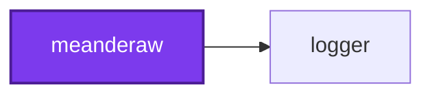
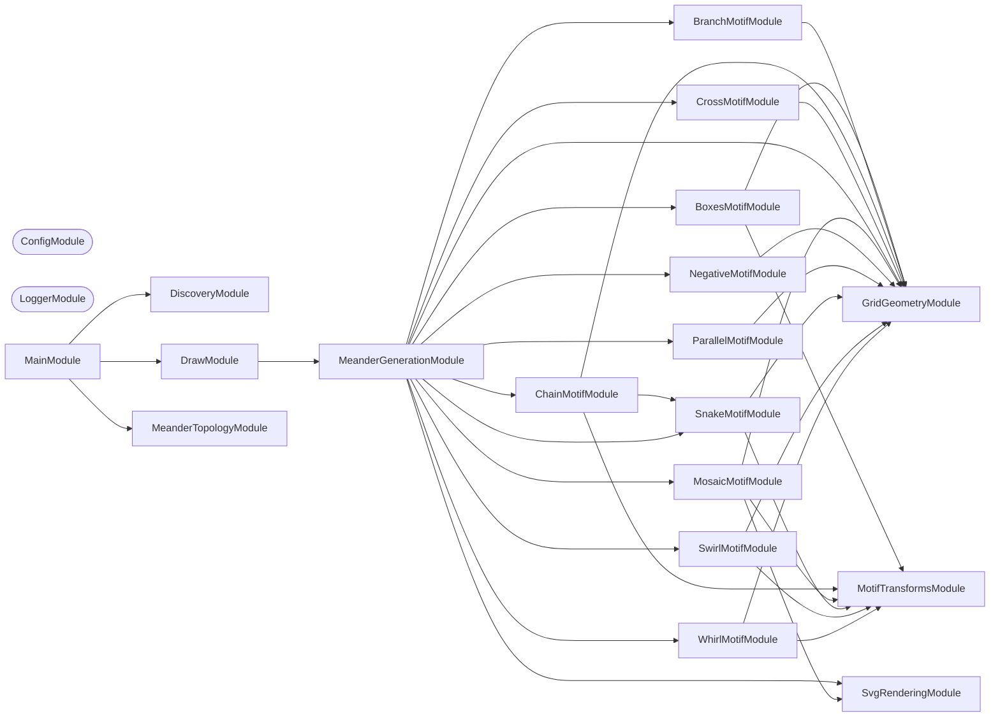

## Start

```bash
nx run meanderaw:start
```

## 🖌️ One Command

Meanderaw has one command, `draw`, and it is the default — so the target above runs it
with no arguments. What it draws is decided by whether a drawing was named, not by which
sub-command was picked:

| Invocation | What it draws |
| ---------- | ------------- |
| `nx run meanderaw:start` | Every meander the application can draw, beneath an index page listing them all |
| `nx run meanderaw:start --args="--type <family> --rows <n>"` | That one, into the same tree |

`--type` and `--rows` go together: one without the other is refused rather than treated
as a sweep, since neither flag can be declared `required` when passing neither is how the
sweep is asked for. Every other flag — `--modifier` and the parameter it needs
(`--period`, `--shape`, `--strands`, `--branches`, `--leftward`, `--upward`),
`--sub-family`, `--repeat-count`, `--output-directory` — narrows the one drawing. A modifier
that takes a parameter is refused without it, rather than defaulted; the two boolean
directions are exempt, because a boolean flag left off and one passed `false` reach the
command identically.

This used to be two commands, `start` and `generate`. They are one because the option set
is one: every flag either names a drawing or says where drawings go, and the sub-command
boundary between them only decided which half of that set was legal.

## Test

```bash
nx run meanderaw:vitest
```

## 🗂️ Output Layout

`nx run meanderaw:start` runs the one command this application has — `draw` — which
with no arguments writes every drawing it can under `output/`, beneath one `index.html`
listing them all.

Every attribute a drawing was generated from is a directory, and only what is left
over is its filename:

```text
output/
  index.html                                        every drawing, linked and captioned
  <family>/
    <rows>-rows/
      <variant>-<repeatCount>-repeats.svg           `plain` where there is no modifier
      permutations/                                 `mosaic` and `negative` only
        <columns>-columns/
          <identifier>[-<name>].svg
```

So `output/chain/7-rows/edge-flip-6-repeats.svg`,
`output/mosaic/6-rows/permutations/1-columns/ddddd-dots.svg`, and
`output/negative/6-rows/permutations/1-columns/dldldl-ruled.svg`. A modifier carrying a
parameter puts it in the variant too, or two of its own drawings would collide on one
path: `output/branch/7-rows/stagger-branches-4-6-repeats.svg` and
`output/branch/7-rows/comb-upward-6-repeats.svg`. A directory listing is
then the parameter space it enumerates, and the 3,554 enumerated tiles — which would be
unreadable as one flat directory — sit a few hundred at a time under the row count and
column span that produced them, named by nothing but what distinguishes them, with the
handful that a family already has a word for carrying that word after the identifier.

**Two families have a permutation half, and they enumerate different things.**
`mosaic`'s is its whole unit space at one and two columns, 3,179 tiles across 4 through 8
rows. `negative`'s is its **one-column source space** — the `ruled` domain, since a
one-column source has no vertical mark for a second column to stagger against — 375
sources across 3 through 7 rows. That range is derived rather than chosen: it stops one
row below `mosaic`'s because a negative is one row shorter than the source it inverts, so
every drawing in it inverts a tile the other half has already committed. The absent
`negative/<rows>-rows/permutations/2-columns/` is a statement too — the two-column source
space is a different shape of pattern rather than a deeper cut of this one, and the three
members of it this repository draws are named in the sweep's other half.

Naming one drawing writes into the same tree, through the same `OutputPathService`, so a
single drawing lands beside its siblings rather than loose at the top:

```bash
nx run meanderaw:start --args="--type chain --rows 7 --modifier edge-flip"
```

The SVGs are committed, and so is `output/index.html`. It lays the families out in the
order `SUPPORTED_TYPES` declares them — a reading order rather than an alphabetical one,
running from the single-line motifs through the four that break a negotiable invariant
and ending at `mosaic`, whose enumerated tiles outnumber every other family together. It
links each drawing rather than inlining it, so it duplicates nothing, and it sits at the
root of the tree it indexes rather than beside it — every link it writes is a path down
from its own directory, and the two move together. Committed, it opens straight from a
checkout with nothing run first, and a regeneration that changes the drawings shows the
index changing with them. `.gitattributes` marks the whole of `output/` as generated, so
neither the drawings nor the index page counts toward this repository's language bar, and
`.codometerignore`, `.prettierignore`, and `cspell` all leave the directory alone.

## 🏛️ Meander Charter

Ten families of meander are implemented, and they share a set of properties that are
load-bearing to how a meander looks. The invariants were extracted from the six families
that predate them, by measuring every committed SVG rather than by reading the code, and
each is marked fixed or negotiable. A new family that breaks a fixed invariant is not a
new family — it is a different kind of drawing. Three of the four that came after break a
negotiable one each, on purpose: `cross` crosses, and `negative` and `branch` both branch
— in different shapes, which "The Branching Family" below is about. `negative` breaks the
other one too, in three of its ten modes, and that is not a second family creeping in: the
survey below found that 3,070 of the 3,179 `mosaic` tiles have a crossing negative, so a
`negative` family that crossed nowhere was drawing the 3.3% minority of its own source
space. The fourth of the four, `parallel`, breaks none of them, and that is the point of
it.

| # | Invariant | Status |
| --- | --- | --- |
| 1 | **Orthogonal only** — horizontal and vertical movement, no diagonals | Fixed |
| 2 | **Space-filling** — every interior white channel is exactly one stroke width | Fixed |
| 3 | **No branching** — ink contains no T-junctions | Relaxed by `branch` in every mode, by `negative` in every mode but `ruled-closed`, and by `chain` and `snake` under `edge` and `edge-flip` |
| 4 | **No crossing** — ink contains no X-junctions | Relaxed by `cross` except under `interrupted`, and by `negative` under `brick-straight`, `brick-upright`, and `grid` |
| 5 | **Band, not field** — fixed canvas height, `rows` is density, tiling is horizontal | Fixed |
| 6 | **Flat path model** — unordered paths, no z-order, one stroke width per document | May be relaxed by ADR only |
| 7 | Invariants hold within a band, not at its termination | See [#338](https://github.com/JimmyPaolini/codebase/issues/338) |

What the measurements found. They were taken across the 114 named patterns and 3,179
enumerated `mosaic` tiles that existed before `cross`; every count below is restated
against the corpus as it now stands, 427 named patterns beside 3,554 enumerated tiles. The
named half was 174 until the sweep's row range was raised to `MAXIMUM_VALUE`, 302 until
every `branch` mode took a parameter of its own, and 357 until `negative` grew from three
sources to ten, so most of these counts have moved three times for those reasons alone —
see the note under "Meander Charter" above:

- **Every interior white channel is exactly one stroke width**, in all 3,981 files. The
  channel width equals the stroke width equals half a grid unit, and that single number
  is the same in every document the project has ever written — the stroke is `unit / 2`
  at every row count, in every family, at every ply of `parallel`. #340 and #413 both
  inferred from this that drawing `N` strands would mean `strokeWidth = unit / (2N)`;
  that inference is wrong and is discarded, for the reasons under "The Parallel Family"
  below.
- **Ink never crosses itself, except where a family was added to make it.** Zero
  X-junctions across all 3,377 files the six original families produce — a stronger
  statement than "non-self-intersecting", and the sharpest single characterization of what
  those six have in common. The `cross` family relaxes it deliberately: 12 X-junctions in
  each of the seven solid documents it commits. `negative` relaxes it too, in three of its
  ten modes and 30 of its 100 documents — `brick-straight` is stack bond, whose mortar runs
  unbroken both ways where running bond's does not, `grid` inverts the `dots` sub-family,
  and `brick-upright` inverts `diamond` — for 705 X-junctions between them. Its permutation
  half crosses in 276 of its 375 drawings, which is the same finding at the scale of a
  whole space rather than of three named modes. Nowhere else in the 3,981-file corpus.
  `cross` carries twelve at every one of its row counts, 6 through 12, so its count is a
  property of the repeat count rather than of `rows`. See "The Crossing Family" and "The
  Negative Space Family" below.
- **Ink branches in three places, and only there.** 5,152 T-junctions across 214 of the 427
  named patterns. 360 of them, across 36 patterns, are `chain` and `snake` under `edge`
  and `edge-flip`, ten per document at every row count: the `edge` family widens the
  repeat unit past the zigzag it contains, so the zigzag's terminating vertical lands in
  the _interior_ of the band border rather than at its end, and the border runs on either
  side of it — five such junctions along the top border, five along the bottom. An earlier
  reading of this measurement reported zero everywhere; the reference assets are
  hand-verified ground truth for what these patterns should look like, so the geometry is
  right and the count was wrong. The other 3,638 are the point of two families rather than
  a side effect of anything: 1,900 across the `negative` family's 30 documents and 1,738
  across the `branch` family's 88 — see "The Negative Space Family" and "The Branching
  Family" below.
- **Ink was a forest everywhere until it was a tree in one place.** Read as a graph, a
  document's ink is lattice points joined by one-pitch steps. All 3,421 documents that
  predate `branch` are one of two things and neither is a tree: 3,366 are forests of many
  components — a disjoint union of simple arcs — and 55 carry loops, being `negative`'s
  30, `cross`'s 7 solid drawings, and 18 `snake` drawings under `edge`/`edge-flip`.
  `branch`'s 88 are the only trees in the corpus: one connected piece, `edges = nodes − 1`,
  no loop anywhere. See "The Branching Family" below.
- **The negative space branches and crosses freely.** It branches in every family, and in
  `mosaic split` and `mosaic alternated period-3` it genuinely crosses. Crossing patterns
  are already generated here; they have only ever been white, never ink.

Invariant 1 is not merely local convention. Fréart's rule for the classical meander is
that returns and intersections "do always fall into right angles", quoted in the
[ICAA's article on the complex Greek meander](https://www.classicist.org/articles/classical-comments-the-complex-greek-meander/).

Invariant 5 is fixed because the intended use is **borders**. Two-dimensional field
ornament is excluded for that reason, not because it is uninteresting.

Wider-than-one-stroke gaps occur only where a band terminates, which is
[#338](https://github.com/JimmyPaolini/codebase/issues/338) and is not a family
property.

**The named half of the sweep runs to `MAXIMUM_VALUE`**, so every drawing the command line
can be asked for is also a drawing this repository commits and the charter gates: 372
combinations, each family from its own structural minimum through 12 rows.

It stopped at 8 until [#507](https://github.com/JimmyPaolini/codebase/issues/507), and that
issue lived in the four row counts between — `chain` and `snake` drew self-retracing ink at
9 through 12 rows, reachable from the command line by anybody and covered by nothing,
because the corpus stopped at 8 and the charter swept the corpus. Raising the sweep's range
to the command line's own closed the gap for both at once, which is why neither has a
maximum of its own any more. Most of the counts below moved by that change and nothing else.

**Neither permutation half followed.** `mosaic`'s kept its cap of 8, at 3,179 tiles. It
enumerates its space exhaustively rather than sampling it, and the count grows about 3.4×
per row — 23, 68, 199, 660 and 2,229 at rows 4 through 8, then 7,977, 29,002, 108,089 and
406,934 — so following the named half would mean committing 552,002 more files.

`negative`'s stops one row earlier still, at 375 one-column sources across 3 through 7
rows, and that bound is derived rather than budgeted: a negative is one row shorter than
the source it inverts, so stopping one below `mosaic`'s cap is exactly the condition that
every drawing in it has a committed tile to be compared against. Its own growth is about
2.4× per row — 8, 18, 40, 93 and 216, then 513, 1,218, 2,920, 7,000 and 16,850 — so
carrying it to 12 would add 28,501 files for drawings nothing could check.

The row counts the two caps leave uncovered are not a charter blind spot, which is the one
thing that would make them a liability: those tiles were never in the property sweep at
all, being reachable only through a motif service and gated from disk instead, while both
families as named families with their modifiers sit in the half that does reach 12.

## 🧬 Families, Sub-families, and Tiles

A **family** is a generator of repeat units — its **unit space**. A **modifier** is a
named constructor into that space; a **sub-family** is a named predicate over it. Both
are views on one underlying space, which is why `mosaic` is the only family with
sub-families today: [#365](https://github.com/JimmyPaolini/codebase/pull/365)
materialized its unit space as 3,179 enumerable tiles, so its regions —
`lines`, `dashes`, `dots`, `diamond` — became recognizable. The other nine families
have latent unit spaces and therefore only modifiers.

The glossary for these terms lives in the repository [CONTEXT.md](../../CONTEXT.md).
Note one deliberate divergence: the code says `MeanderType`, `SUPPORTED_TYPES`, and
`--type` where the glossary says **family**. Renaming the flag would be a breaking CLI
change and is not worth making for a vocabulary correction.

## 🔤 Naming a Mosaic Sub-family

<!-- cspell:ignore ddd lll hxhxhx vxvx ddddd — mosaic tile identifiers, one
letter per cell of the tile, from MOSAIC_MARK_LETTERS in
src/modules/mosaic-motif/mosaic-motif.constants.ts. -->

`mosaic`'s unit space is materialized, so a region of it can be **recognized** rather
than listed. Four regions have names, and all four are the same predicate over a tile's
own pieces: every mark in the tile is the same kind.

| Sub-family | Every mark is | Smallest tile | Reads as |
| --- | --- | --- | --- |
| `dots` | a dot | `ddd` | a field of square marks |
| `lines` | the single-column continuous rule | `lll` | unbroken horizontal rules |
| `dashes` | a horizontal dash | `hxhxhx` | broken horizontal rules |
| `diamond` | a vertical dash | `vxvx` | a dashed vertical bar |

Recognition lives in `MosaicSubFamilyService.classify`, which reads `MosaicTile.pieces`
and never the canonical identifier. That is deliberate: the names keep working at row
and column counts nobody has enumerated, and survive any change to the enumeration's
bounds. A tile that mixes mark kinds — which is nearly all of them — belongs to no
sub-family and is left **unnamed** rather than pushed into the nearest one.

Across the 3,179 tiles the sweep enumerates, at 4–8 rows and 1–2 columns:

| Sub-family | Tiles |
| --- | --- |
| `dashes` | 75 |
| `dots` | 10 |
| `lines` | 5 |
| `diamond` | 4 |
| unnamed | 3,085 |

A region holds every tile its predicate accepts, not only the one it is named after,
which is why `dashes` is much the largest: a horizontal dash may anchor in either column
of a two-column tile, so staggered arrangements are `dashes` too. `diamond` is the
smallest because its covers are forced rather than chosen — vertical dashes cover the
bar's interior levels in pairs, so there is one arrangement per column span where the
number of levels is even and none at all where it is odd. Asking for a `diamond` at an
even row count is refused rather than approximated.

Ask for a sub-family by name:

```bash
nx run meanderaw:start --args="--type mosaic --sub-family dots --rows 6"
```

The name lands in the output path — `output/mosaic/6-rows/dots-6-repeats.svg` — and in
the sweep's own, where a tile with a name carries it after its identifier
(`output/mosaic/6-rows/permutations/1-columns/ddddd-dots.svg`) and a tile without one
carries the identifier alone.

### `diamond` and `split` are one shape under two names

The hand-drawn reference set held a `diamond` and a `split` that were byte-identical, and
both names survive here because they play different roles — exactly the distinction the
[CONTEXT.md](../../CONTEXT.md) glossary draws:

- **`split` is a modifier**: a named _constructor_ into the unit space. `--modifier split`
  breaks the bar into dashes, and nothing about it, its compatibility entry, or its
  reference asset changes.
- **`diamond` is a sub-family**: a named _predicate_ over the unit space. It recognizes
  any tile built entirely of vertical dashes, whether or not `split` is what produced it.

Two routes to one shape, which is what the glossary means by "some sub-families arise by
applying a modifier, others by recognizing a structural property". The equality is tested
rather than asserted: the `diamond` sub-family at 5 rows and 12 repeats is byte-identical
to the committed `testing/assets/mosaic-5-rows-12-repeats-split.svg`.

Two names, two files. `--sub-family diamond` writes `mosaic/5-rows/diamond-12-repeats.svg`
and `--modifier split` still writes `mosaic/5-rows/split-12-repeats.svg`, so neither
overwrites the other. Asking for both at once is refused, since either one alone already
decides which repeat unit is drawn.

One name worth reading twice: the **`dot` modifier** (singular, carrying a `bounce` or
`up` shape) and the **`dots` sub-family** (plural) are different things one letter apart.

## 🕳️ Negative Space Survey

<!-- The tile identifiers below are canonical MosaicSymmetryService output (one letter per cell, see mosaic-symmetry.service.ts), not words. cspell:ignore dvvxxd dvvxxvvxxvvxxd dvvxxvdx dvvxxvvxxd dvvxxvvxxvdx hxxhhx hxxhhxxhhxxhhx hxxhhxxh hxxhhxxhhx hxxhhxxhhxxh dldldld dldl dldld dldldl -->

[#340](https://github.com/JimmyPaolini/codebase/issues/340) found genuine four-way
crossings in the negative space of `mosaic split` and `mosaic alternated period-3`, and
branching in every family's negative — but only across the 114 named patterns.
[#412](https://github.com/JimmyPaolini/codebase/issues/412) runs the same measurement
across all 3,179 tiles of the `mosaic` permutation set committed under
`output/mosaic/<rows>-rows/permutations/` — the only family with an enumerated unit
space, so the only one this measurement can run over every tile rather than a handful of
named modifiers.

### Method

Every `output/mosaic/<rows>-rows/permutations/<columns>-columns/*.svg` file was read from disk — no generation, no motif
service, the same approach the charter test already uses to gate the corpus — and passed
to the existing
[`MeanderTopologyService.measure`](src/modules/meander-topology/meander-topology.service.ts).
A tile is classified from its own `negativeTJunctions`/`negativeXJunctions`:

- **Crosses**: `negativeXJunctions > 0`.
- **Branches only**: `negativeTJunctions > 0` and `negativeXJunctions === 0`.
- **Neither**: both zero.

This measurement adds no committed source: it ran as a temporary test beside
`meander-topology.service.integration.test.ts`, deleted before this section was
committed. It is nothing but a loop calling `measure` on each file and tallying the
result against the two thresholds above — reproducible in a few lines against the
already-committed service.

One further tally needed a small extension beyond what `measure` reports (see
"Is the negative itself space-filling?" below): for each cell of the same lattice graph
`MeanderLatticeService.build` already produces, how many of its corridor-eligible sides
carry no corridor — the same four-arm check `measure` uses to find negative T- and
X-junctions, just also recording degree 0.

### Per-class counts

| Class | Tiles | Share |
| --- | --- | --- |
| Crosses | 3,070 | 96.6% |
| Branches only | 104 | 3.3% |
| Neither | 5 | 0.2% |
| **Total** | **3,179** | 100% |

By row count:

| Rows | Tiles | Crosses | Branches only | Neither |
| --- | --- | --- | --- | --- |
| 4 | 23 | 16 | 6 | 1 |
| 5 | 68 | 58 | 9 | 1 |
| 6 | 199 | 182 | 16 | 1 |
| 7 | 660 | 633 | 26 | 1 |
| 8 | 2,229 | 2,181 | 47 | 1 |

Crossing is the overwhelming majority, and grows with both row count and column span:
2,794 of the 3,070 crossing tiles span 2 columns against 276 at 1 column. Issue #340
already observed that crossing "grows with row count"; this shows it holding far beyond
the two named tiles the spec measured — crossing negatives are the norm across this
family's unit space, not the exception the 114-file measurement suggested. The five
_neither_ tiles are exactly the `lines` sub-family at every swept row count (`lll`
through `lllllll`): a single vertical line's negative is two straight channels that
neither branch nor cross, the simplest case there is and the reason a "neither" class
exists at all.

Every one of the 3,179 tiles still has zero ink T-junctions, zero ink X-junctions, and
full channel-width compliance — unchanged from what the base branch's own disk-based gate
already reports for the whole corpus of the six original families, now 3,377 files. This
survey adds the negative-space
breakdown; it does not revisit the ink side.

### Is the negative itself space-filling?

Yes, for all 3,179 tiles, by the measurable criterion available: no cell's corridor
degree is 0. A degree-0 cell is a white cell sealed off from the corridor network on
every side that has a neighbor — the negative-space analogue of an un-inked lattice
point, and the specific failure `channelWidthCompliant` catches on the ink side. If a
tile's negative were drawn as ink by tracing a stroke along every corridor, a sealed cell
would receive no stroke at all.

Across all 3,179 tiles — 264,117 cells in total, at band termination and in the interior
alike — **zero have corridor degree 0**. Every white cell touches at least one neighbor
through a missing ink edge. Drawing any permutation tile's negative as ink would
therefore leave no region unreached, keeping invariant 2.

This is measured, not proven in general: it states that the corridor skeleton reaches
every cell, not that a specific rendered path through that skeleton stays exactly one
stroke width everywhere the family drawn from it eventually decides to run. #415 still
has to measure its own rendered output rather than assume this result transfers
unchanged.

### Shortlist

Three candidates scale cleanly across every row count the permutation sweep covers (4
through 8), which is what makes each "a family" rather than one lucky tile. All three
are _branches only_ — **verified `negativeXJunctions === 0` at every one of their five
row counts**, read from the same per-file measurement that produced the per-class counts
above, not asserted separately — so drawing them relaxes invariant 3 and nothing else,
exactly what issues #415 and #416 need. A fourth candidate was cut after review found it
crosses; see below.

1. **`dvvxxd` → `dvvxxvvxxvvxxd`** (`mosaic`, columns 2, rows 4–8: `dvvxxd`, `dvvxxvdx`,
   `dvvxxvvxxd`, `dvvxxvvxxvdx`, `dvvxxvvxxvvxxd`). Negative T-junctions
   38 / 48 / 58 / 68 / 78 (rows 4–8 respectively), X-junctions 0 / 0 / 0 / 0 / 0. The
   highest-branching non-crossing family found, at every row count.
2. **`hxxhhx` → `hxxhhxxhhxxhhx`** (`mosaic`, columns 2, rows 4–8: `hxxhhx`, `hxxhhxxh`,
   `hxxhhxxhhx`, `hxxhhxxhhxxh`, `hxxhhxxhhxxhhx`). T-junctions 30 / 40 / 50 / 60 / 70,
   X-junctions 0 / 0 / 0 / 0 / 0. Structurally the simplest of the three — built from
   one mark kind, the horizontal dash, repeated.
3. **`dld` → `dldldld`** (`mosaic`, columns 1, rows 4–8: `dld`, `dldl`, `dldld`,
   `dldldl`, `dldldld`). T-junctions 16 / 16 / 24 / 24 / 32, X-junctions
   0 / 0 / 0 / 0 / 0. One column of alternating dots and lines, and the
   highest-branching candidate at the cheaper-to-verify column 1 width — checked
   against every columns-1 branches-only tile in the corpus, not just this family.

**Cut after review, not shortlisted:** all-dots (`ddd`/`dddd`/`ddddd`/`dddddd`/`ddddddd`
at columns 1, `dddddd`/`dddddddd`/`dddddddddd`/`dddddddddddd`/`dddddddddddddd` at
columns 2) was drafted as a fourth, lowest-branching candidate on the mistaken belief
that only its columns-2 form crosses. Re-measured against the same data: it crosses **at
every row count and both column widths** — X-junctions 6 / 9 / 12 / 15 / 18 at columns 1
and 18 / 27 / 36 / 45 / 54 at columns 2 (rows 4–8), the columns-2, 8-row tile being the
single most-crossing tile in the whole corpus. All-dots belongs entirely to the
_crosses_ class, not _branches only_, at either width. It is recorded here because it is
still the cleanest-scaling crossing family found, in case whoever works on the crossing
family (#417) wants a starting point — neither #415 nor #416 should draw from it.

### A note for the branching family

Every one of the 104 _branches only_ tiles' corridor graphs contains at least one cycle
at the rendered scale (6 repeats): none is a literal tree. Checked directly — for each
tile, `edges ≠ vertices − components`, the condition for a forest — because the pattern
repeats periodically along the band and each repeat closes a loop through its neighbors.
Both scaling families above are single connected components with 20–40 cycles at 8 rows.
A bounded-tree family cannot adopt one of these corridor graphs unmodified: it would need
to deliberately omit some corridors — every other "rung", for instance — to break the
loops before the shape that inspired it can satisfy the tree test (`edges = vertices −
1`) a bounded-tree charter relaxation needs.

## 🔬 Unit Spaces Beyond Mosaic

`mosaic` is the only family with sub-families, and
[#414](https://github.com/JimmyPaolini/codebase/issues/414) asked whether that asymmetry
can be removed: is there, for `boxes`, `chain`, `snake`, `swirl`, and `whirl`, a generating
rule producing a finite enumerable unit space the way `mosaic`'s exact-cover rule does?

**A rule exists, it is the same rule for all five, and that is exactly the problem.** The
charter's own invariants already define one. It is family-agnostic, and at the pitch these
five families actually use it generates twelve million tiles at five rows and 3 × 10²² at
eight — of which each family contributes exactly one. Materializing it would not give
`boxes` a unit space; it would dissolve `boxes` into a single point of a space nobody can
look through. The recommendation is to **leave the asymmetry**, and this section records
the measurements behind that.

This was a spike. It changed no code, and everything below is measurement on the sweep
`nx run meanderaw:start` already writes.

The verdict per family, with the rest of the section as its evidence:

| Family | A rule of its own? | The shared charter rule? | Tiles it contributes | Tiles the shared rule generates at 5 rows |
| --- | --- | --- | --- | --- |
| `boxes` | none found | yes | 1 per row count and modifier | 12,082,896 |
| `chain` | none found | yes, except under `edge` and `edge-flip` | 1 per row count and modifier | 12,082,896 |
| `snake` | none found | yes, except under `edge` and `edge-flip` | 1 per row count and modifier | 12,082,896 |
| `swirl` | none found | yes | 1 per row count and modifier | 2.46 × 10¹² |
| `whirl` | none found | yes | 1 per row count and modifier | 710,761,599 |

The two exceptions are measured below: `edge` and `edge-flip` put two degree-3 points per
repeat unit on the border rule, so those tiles sit outside the maximum-degree-2 rule and
inside a charter with invariant 3 relaxed.

### The band as a lattice

One model carries every claim here. A meander's ink runs along the edges of a lattice:
`rows + 1` horizontal grid levels one grid unit apart, tiling horizontally at the family's
own **pitch**. A repeat tile is the wrapped `pitch` × `rows - 1` lattice of interior points,
with the two border rules at levels `0` and `rows` above and below it.

Three of the seven charter invariants are properties of that lattice, and restating them
this way is what makes them countable rather than merely checkable:

| Invariant | On the lattice |
| --- | --- |
| 2 — space-filling | every interior lattice point carries ink — as the end of an edge, or as a dot |
| 3 — no branching | no lattice point has ink degree 3 |
| 4 — no crossing | no lattice point has ink degree 4 |

Invariant 2 costs the enumeration nothing, because a lattice point lying on no edge **is**
an inked dot — exactly `mosaic`'s own `dot` piece, which is what keeps this model agreeing
with the family whose 3,179 tiles it reproduces below. So **a charter-legal repeat tile is
any subgraph of the tile's lattice with maximum degree 2**: every point either sits on an
edge or is drawn as a dot, and invariants 3 and 4 are the only constraints the count sees.
That sentence is the generating rule the ticket went looking for, and it is exactly what
every "all charter-legal tiles" figure below counts. It did not have to be invented; it was
already written down, as prose about pictures rather than as a rule about a graph.

### What the six families are, measured

Parsing all 78 non-`mosaic` documents the sweep writes back into that lattice — one
interior repeat unit each, wrapped at its own family's pitch, so band termination never
enters — gives one uniform result:

| Family | Modifier | Pitch | Bare points | Degree 3 | Degree 4 | The tile's ink is |
| --- | --- | --- | --- | --- | --- | --- |
| `boxes` | none, `spin`, `spin-flip` | `rows - 1` | 0 | 0 | 0 | one arc through every point |
| `chain` | none | `rows - 1` | 0 | 0 | 0 | one arc through every point |
| `chain` | `edge`, `edge-flip` | `rows` | 0 | 2 | 0 | two arcs, each meeting a border rule |
| `chain` | `flip` | `2(rows - 2)` | 0 | 0 | 0 | two arcs |
| `snake` | none | `rows - 1` | 0 | 0 | 0 | one closed loop through every point |
| `snake` | `edge`, `edge-flip` | `rows` | 0 | 2 | 0 | one arc, both ends meeting a border rule |
| `snake` | `flip` | `2(rows - 2)` | 0 | 0 | 0 | one closed loop |
| `swirl` | none | `2 rows - 3` | 0 | 0 | 0 | one arc through every point |
| `swirl` | `flip` | `2(2 rows - 3)` | 0 | 0 | 0 | two arcs |
| `whirl` | none | `rows` | 0 | 0 | 0 | one arc through every point |
| `whirl` | `flip` | `2 rows` | 0 | 0 | 0 | two arcs |

Every one of the 78, at every row count from each family's structural minimum through 8:
**no bare lattice point, and no degree-4 point anywhere** — stronger than the rule demands,
since none of the five ever draws a dot. The only degree-3 points in the
whole set are the two per repeat unit that `edge` and `edge-flip` create by joining the
zigzag to the border rule — the same ink T-junctions
[#410](https://github.com/JimmyPaolini/codebase/issues/410) reports, reached here
independently and from the other direction.

`mosaic` is the same model with one extra bound. A `mosaic` tile is an exact cover of its
cells by dots and one-unit dashes, and a cell **is** a lattice point: a dot is an isolated
point, a dash is a single lattice edge. So a `mosaic` tile is exactly a **matching** of the
tile's lattice, every unmatched point drawn as a dot. Re-deriving the enumeration from that
one-line description reproduces the committed sweep tile for tile — 8, 15, 18, 50, 40, 159,
93, 567, 216, and 2,013 per row count and column span, 3,179 in all — so the two
descriptions are the same description.

### The five sit at the far end of one axis

`mosaic` bounds every component of the tile to a single edge. The five make the tile one
component as long as it can be. Both are regions of the one space:

| Region | Rule | Who lives there |
| --- | --- | --- |
| matchings | every component has at most one edge | `mosaic` |
| simple traversals | at most one horizontal run per level and one vertical run per column | `boxes`, `chain`, `snake`, `whirl` |
| Hamiltonian cycles | one component, every point of degree 2 | `snake` |
| Hamiltonian paths | one component, two loose ends | `boxes`, `chain`, `swirl`, `whirl` |

The size of the whole space, counted exactly on the wrapped lattice each family's own pitch
defines:

| Lattice | Rows | Family | All charter-legal tiles |
| --- | --- | --- | --- |
| 3 × 3 | 4 | `boxes`, `chain`, `snake` | 7,231 |
| 4 × 4 | 5 | `boxes`, `chain`, `snake` | 12,082,896 |
| 5 × 5 | 6 | `boxes`, `chain`, `snake` | 1.83 × 10¹¹ |
| 6 × 6 | 7 | `boxes`, `chain`, `snake` | 2.58 × 10¹⁶ |
| 7 × 7 | 8 | `boxes`, `chain`, `snake` | 3.36 × 10²² |
| 4 × 3 | 4 | `whirl` | 141,421 |
| 5 × 4 | 5 | `whirl` | 710,761,599 |
| 6 × 5 | 6 | `whirl` | 3.29 × 10¹³ |
| 5 × 3 | 4 | `swirl` | 2,738,193 |
| 7 × 4 | 5 | `swirl` | 2.46 × 10¹² |
| 9 × 5 | 6 | `swirl` | 1.88 × 10²⁰ |

Counts are before folding by the tile's symmetry group (translations, horizontal mirror,
level flip), which divides by at most `4 × pitch` and never moves the order of magnitude:
the `mosaic` sweep's folded 2,013 tiles at 8 rows and 2 columns come from 11,275 unfolded,
a factor of 5.6.

The narrower regions are smaller and still far past looking through. On the same 4 × 4
lattice at 5 rows, `snake` is one of **82** Hamiltonian cycles and `boxes` one of **4,016**
Hamiltonian paths; at 6 rows the tightest of the four rules, simple traversals, still
admits **9,304,216** tiles. Those three regions were enumerated only at the smaller
lattices, which is why the table above reports the charter-legal count — exact at every
size — and why the recommendation rests on that column alone.

`swirl` is the family that escapes even the tightest of those rules. Its two arms put two
horizontal runs on its outer levels, so it is not a simple traversal, and no rule narrower
than "Hamiltonian path" covers all five.

### Why `mosaic`'s space is small, and the five cannot borrow it

Two independent bounds keep `mosaic` enumerable, and only one of them is the rule:

- **The rule caps a mark at one grid unit**, which is what turns a tile into a matching.
- **The enumeration caps the tile at `MOSAIC_TILE_MAXIMUM_COLUMNS`, which is 2.**

Both are load-bearing. `mosaic`'s own matching rule, applied at the pitch `boxes`, `chain`,
and `snake` use, gives 21,497 tiles at 5 rows and 4.10 × 10¹³ at 8 rows. The five have no
equivalent cap available: their pitch is not a free parameter, it is the width of their own
motif — `rows - 1`, `rows`, or `2 rows - 3` — and capping it below that deletes the family.

And a materialized space only earns sub-families when it holds more tiles than it has
names. Each of the five produces **exactly one tile per row count and modifier**: 78
documents for 78 combinations, with no free parameter anywhere in the five motif services
beyond `rows`. A predicate over a one-element set names nothing. That, rather than the
absence of a rule, is why they have no sub-families.

### The property `mosaic` has that the five lack

`mosaic`'s constraint is **local and decomposable**. A tile is an unordered set of
independent marks, each occupying one cell or two adjacent ones, and legality is settled
per cell — is it claimed exactly once? Nothing about one mark depends on a mark elsewhere.
That is what makes the backtracking enumeration possible, and what makes the space's
members similar enough to fall into classes worth naming.

The five have **no piece decomposition at all**. The tile is one traversal of the whole
lattice, and "is a spiral" or "is a zigzag" is a property of the traversal entire, not of
any cell: every segment of a spiral is fixed by every other segment. There is no alphabet
of local pieces whose exact cover is the set of spirals, so the only rules available are
the global ones above — which admit all five families at once, and a great deal else.

This is an argument, not a proof. No search can establish that a family-specific rule does
not exist; what it can establish is that the shape `mosaic` has is absent, and that every
rule constructible from the measured tiles is either satisfied by one tile (useless as a
space) or by all five and millions of strangers (useless as a family).

### Would the modifiers become recognizable regions?

Yes — each has a distinct structural signature on the lattice, so each is expressible as a
predicate rather than as a transform:

| Modifier | Measured effect on the tile | As a predicate |
| --- | --- | --- |
| `flip` | doubles the pitch, fusing a mirrored twin into one tile | the tile is mirror-symmetric about its own center |
| `spin`, `spin-flip` | leave the pitch alone, but the true repeat is `SPIN_CYCLE_LENGTH` units | over a tile four times as wide: the four quarters are one quarter-turn rotational orbit |
| `edge`, `edge-flip` | widen the pitch by one level and add exactly two degree-3 points | the tile's ink touches a border rule |

Two caveats. Each of these changes the pitch or the true repeat, so "the family's unit
space" would be one space per pitch rather than one space — which is the situation `mosaic`
is already in, with its 1- and 2-column tiles. And `edge` and `edge-flip` sit outside the
maximum-degree-2 rule entirely, since degree 3 is precisely what invariant 3 forbids.

### Recommendation: leave the asymmetry

Three findings, none of them close:

1. **No family-specific generating rule was found**, and the structural reason is named
   above.
2. **The family-agnostic rule generates a space too large to materialize** at these
   pitches — 12 million tiles at 5 rows against `mosaic`'s 3,179 for every row count and
   column span combined, and 3.36 × 10²² at 8 rows.
3. **Materializing it would produce no sub-families anyway**, because each family
   contributes one tile, and a predicate over one tile names nothing.

What is worth keeping from the spike is the lattice model itself rather than any code. It
makes space-filling a local, checkable property of a point rather than a global property of
a picture, and it is the frame in which relaxing invariants 3 and 4 has an exact meaning —
a branching family admits degree 3, a crossing family admits degree 4.

If the decision is ever revisited, a follow-up implementation ticket would have to:

- introduce a lattice tile type and a family-agnostic enumerator over it, plus whatever
  bound keeps the result small enough to be worth looking at — and the `mosaic` column cap
  has no counterpart here;
- re-express all six motif services as producers of a lattice tile, moving path emission to
  one shared renderer, while every one of them keeps producing byte-identical output —
  including border segments, the `isLastUnit` clipping, the `rightEdge` arithmetic, and
  `edge`'s deliberate degree-3 points;
- re-express the modifiers as constructors over lattice tiles, deriving `unitWidth` and
  `rightEdge` from the tile instead of from per-family arithmetic;
- give the space a canonical identifier and a symmetry folding, as
  `MosaicSymmetryService` already does for its own much smaller alphabet.

**It would be a wide refactor and would need expand–contract sequencing.** It touches
`MotifService`, all six motif services, `MeanderGenerationService`'s dispatch,
`COMPATIBLE_MODIFIERS`, `SUB_FAMILIES`, the command-line surface, and the output filename
scheme, and the only safety net is 23 byte-exact reference assets concentrated at 5 rows.
The expand phase would add the tile type and a tile-driven renderer alongside the existing
services and prove byte-equality family by family across the whole 114-file sweep; only
then could the contract phase delete the per-family path emission.

### Measured, and not measured

**Measured**: every pitch, degree histogram, bare-point count, and junction count in the
tables above, over all 78 non-`mosaic` documents; the `mosaic` tile counts, re-derived from
the matching description and checked against the committed sweep; every space size marked
with a number, computed exactly (the charter-legal counts by transfer matrix, cross-checked
against brute force at 3 × 3; the Hamiltonian and simple-traversal counts by enumeration,
cross-checked against brute force at 3 × 3, 4 × 3, and 4 × 4).

**Not measured**: the three narrower regions beyond the small lattices — their enumerations
were run only at the sizes quoted, while the charter-legal column is exact at every size in
the table; and the claim that no family-specific rule exists, which is an argument from the
absence of a piece decomposition rather than a result.

## ✚ The Crossing Family

`cross` is the seventh family and the only one whose **ink crosses**. It draws the form
Calder Loth calls the complex Greek meander — two strips of fillet crossing one another at
continuous intervals — and its four-armed `+` junctions are the first degree-4 ink this
project has ever drawn. Because movement is orthogonal, two crossing strands can only ever
meet as a `+`, never an `X`.

```bash
nx run meanderaw:start --args="--type cross --rows 6 --repeat-count 6"
nx run meanderaw:start --args="--type cross --rows 6 --repeat-count 6 --modifier interrupted"
```

### What it draws

Two strips, plus the band's own two borders:

- **The warp** — a crenellated fillet running the length of the band: a vertical bar in
  every interior column, spanning grid levels `1` through `rows - 1`, with consecutive
  bars linked alternately across the top and across the bottom so the whole run is one
  continuous meandering line.
- **The weft** — a straight fillet along the band's middle level, crossing every bar of
  the warp.

The shape is not a free choice, and its plainness is the constraint rather than a lack of
ambition. Space-filling puts ink at every interior lattice point; no branching means a
horizontal run and a vertical run may only cross outright or turn at each other's ends,
never meet in a T. Together those force a bar into every interior column, which leaves a
horizontal fillet nowhere to turn — so the weft runs the full width and only the warp
meanders. This was found by search rather than proved: overlaying each existing family on
a shifted or mirrored copy of itself, at every offset up to six columns and three rows,
produced a T-junction every time and a legal crossing never.

### Solid and interrupted

Both modes are one family, selected per render. The bare family is **solid**: the bar runs
straight through the rail, so four arms of ink meet and no white is added. The
`interrupted` modifier gives up the grid level either side of each junction instead, so
the rail reads as passing over the bar — path data only, no z-order, so the flat path
model survives.

One grid pitch is the smallest break this lattice admits, and it leaves a white gap of
**exactly one stroke width**, since a square line cap gives back a quarter unit at each
end. Invariant 2 is therefore not relaxed. The cost is stated in
[ADR 0004](../../docs/adr/0004-draw-crossings-as-a-one-pitch-interlace-break.md), and it
is not the cost the ticket anticipated: the gap is the same width as every other channel
in the band, so nothing about its size says "under" — and breaking the bar adjacent to the
junction takes the crossing out of the ink graph altogether.

Measured across the fourteen committed documents, at 6 repeats and every swept row count:

| Mode | Ink X-junctions | Ink T-junctions | Space-filling | Negative T-junctions | Negative X-junctions |
| --- | --- | --- | --- | --- | --- |
| solid | 12 | 0 | ✅ | 11 | 0 |
| `interrupted` | 0 | 0 | ✅ | 33 | 0 |

The first three columns are asserted — by this family's own unit tests, by the charter
property test, and by the disk-based gate over every committed document. **The last two
are not.** They are a reading of the fourteen committed files and nothing fails if they
change:
invariants 3 and 4 constrain ink, and no family is failed for what its white space does.

### What it holds and what it relaxes

| Invariant | Solid | `interrupted` |
| --- | --- | --- |
| 1 Orthogonal only | Applies | Applies |
| 2 Space-filling | Applies | Applies |
| 3 No branching | Applies | Applies |
| 4 No crossing | **Relaxed** | Applies |
| 5 Band, not field | Applies | Applies |
| 6 Flat path model | Applies | Applies |

That declaration lives in `RELAXED_INVARIANTS` in
[the charter property test](src/modules/meander-topology/meander-topology.service.integration.test.ts),
which asserts a declared relaxation is _present_ as well as an undeclared one absent — so
neither mode can quietly stop doing what this table says it does.

### Provenance: derived, not attested

The complex Greek meander is real ornament, and Fréart's right-angle rule is why its
junctions are `+`. **This application's rendering of it was checked against nothing.** The
six older families were verified byte-exact against hand-drawn references; no such
reference exists for `cross`, so its committed output is its own baseline — a baseline for
what the code does, not evidence of fidelity to anything.

`cross` also cannot be drawn below **6 rows**, where a solid-only family could go down to
4. The crossing sits at `floor(rows / 2)` and the break gives up the level either side of
it, so below 6 rows the upper remnant has no whole grid level left and collapses to a
zero-length run — a square line cap and nothing else, a dot one stroke wide instead of a
length of strand. At 4 rows both remnants collapse.

That is a **legibility** floor, not a topology one, and nothing measures it: at 4 and 5
rows the drawing is still fully space-filling, so the charter would happily pass a
rendering in which `interrupted` means nothing. The constant is the only thing refusing
it, and the family's unit tests pin both the collapse and the fact that measurement misses
it.

## 🕳️ The Negative Space Family

`negative` is the eighth family and the only one whose **ink is another family's white
space**. The tool has been generating these patterns since the beginning without ever
drawing one; this family draws them.

Nothing here is invented. A `mosaic` drawing divides its band into cells, and the white
between two neighboring cells is a **corridor** wherever the ink wall that would separate
them is missing — which is exactly what `MeanderTopologyService` counts when it reports a
document's negative junctions. `negative` puts one lattice point on every cell and one
stroke along every corridor. The shapes were already produced, already orthogonal, and
already on this grid; what is new is treating white as black.

<!-- The source tile identifiers below are canonical MosaicSymmetryService
output (one letter per cell, see mosaic-symmetry.service.ts), not words.
cspell:ignore ldldldl dlldlld lvxlvxl -->

### The ten it inverts

Ten sources, in three groups. Three come from the shortlist in "Negative Space Survey"
above and are not chosen here. Four invert a named `mosaic` **sub-family**'s own aligned
tile, so the regions the `mosaic` family already recognizes are drawable as negatives
rather than only as mosaics. Three more are further members of `ruled`'s own motif space,
which the next section is about.

| Mode | Source tile | Reads as | Relaxes |
| --- | --- | --- | --- |
| `stair` (no modifier) | `dvvxxd` → `dvvxxvvxxvvxxd` | the shortlist's highest-branching entry: dots capping a staircase of vertical dashes | 3 |
| `brick-staggered` | `hxxhhx` → `hxxhhxxhhxxhhx` | the shortlist's simplest entry: horizontal dashes in running bond | 3 |
| `brick-straight` | the `dashes` sub-family | the same wall in stack bond, every course anchored in one column | 3, 4 |
| `brick-upright` | the `diamond` sub-family | that wall turned upright, bricks set on end | 3, 4 |
| `grid` | the `dots` sub-family | every corridor open at once: the full lattice | 3, 4 |
| `ruled` | `dld` → `dldldld` | the shortlist's columns-1 entry: dot levels alternating with the continuous rule | 3 |
| `ruled-raised` | `ldl` → `ldldldl` | the same, with the rule raised one level | 3 |
| `ruled-spaced` | `dll` → `dlldlld` | openings every third level, over a wider band of rule | 3 |
| `ruled-tall` | `lvx` → `lvxlvxl` | two-level openings: tall windows between the rules | 3 |
| `ruled-closed` | the `lines` sub-family | no opening at all: the band's own rules and nothing between them | none |

`brick-staggered` was called `brick` until the straight bond joined it, and the rename is
the point of the pair: which bond a wall is laid in is the whole difference between a
mortar that branches and one that crosses.

`brick-upright` is the one source that cannot always be a sub-family's tile. `diamond`'s
vertical dashes cover the interior in pairs, so it names no tile over an odd number of
levels; this family closes the stack with a one-level dot there instead, exactly as the
stair caps its own. Where `diamond` exists the two tiles are identical, which
`negative-source.service.unit.test.ts` asserts against `MosaicSubFamilyService.tile`
rather than against an identifier.

A `negative` of `rows` rows inverts a source of `rows + 1`, and that offset is arithmetic
rather than taste: a source of `n` rows has `n` rows of cells, the negative puts a lattice
point on each of them, and `n` lattice lines bound `n - 1` rows. Inverting a source drawn
at the negative's own row count would leave the canvas's bottom lattice row with no ink on
it — invariant 2 broken for a bookkeeping reason rather than a drawn one. It is also why
the family's structural minimum is 3 where `MOSAIC_TILE_MINIMUM_ROWS` is 4.

One consequence of the offset: the sweep draws `negative` at 3 through 12 rows, so
everything from its 8-row drawings up inverts a source of 9 rows or more — past what the
survey enumerated, and past where the `mosaic` permutation half stops committing tiles.
Those fifty drawings have no committed source to be compared against, and are gated by the
charter sweep like every other drawing instead.

### The one-column motif space

Six of the ten sources are a single column of marks repeated down the interior, and they
are one family rather than six patterns. The alphabet has two letters. An **opening**
leaves a corridor for the negative to ink — a `dot` opening one lattice level, a `vertical`
dash opening two — and a **closed rule** walls a level off. `NEGATIVE_COLUMN_MOTIFS` is
that alphabet written down: `ruled` is opening-rule, `ruled-raised` the same pair in the
opposite phase, `ruled-spaced` widens the rule between openings, `ruled-tall` trades a
one-level opening for a two-level one, and the two degenerate members sit at either end —
`ruled-closed` has no opening at all and `grid` nothing else.

**Where the openings fall decides whether the drawing crosses, and the rule is exact.** Two
adjacent openings stack two corridors in one lattice column, and a lattice point with a
corridor above it and below it as well as a rule either side of it has four arms of ink.
So a motif that separates every opening by at least one rule branches without crossing, and
one that does not cannot avoid crossing. `grid` is nothing but openings; `brick-upright`'s
two-level openings are adjacent by construction. Those two cross, and the other four do
not.

The same rule is what limits horizontal staggering to one arrangement. Across a tile of `C`
columns a horizontal dash walls only the column it is anchored on, so at most `C / 2` of
the columns can be walled at any level and at least half are open. For no column to carry
two openings in a row, consecutive levels must open complementary halves — which is running
bond and nothing else. Marching an anchor across three, four or five columns draws
handsome brickwork and every one of those arrangements crosses. That is not a claim about
taste: the survey's own tally of the 3,179 committed tiles finds exactly two _branches
only_ tiles spanning two columns, and they are `stair` and `brick-staggered`. Every other
non-crossing tile in the corpus is one column wide.

`ruled-raised` and `ruled` differ in a way worth knowing at the command line. At an even
row count the interior holds a whole number of opening-rule periods, so raising the rule
only re-phases the same symmetry class — the drawing differs, the class does not. At an odd
one the two carry different numbers of openings outright, and their branching counts
diverge. Both halves of that are asserted rather than described.

### The domain, enumerated

Six names is a sample of that space, not the space. **It is enumerated in full** under
`output/negative/<rows>-rows/permutations/1-columns/`, one drawing per symmetry class, the
same way `mosaic` enumerates its own tiles — because it is the same enumeration:
`MosaicTilesService.enumerate(rows + 1, 1)` is every one-column tile there is, and every
one of them is a source this family can invert.

| Negative rows | Sources | Branches only | Crosses | Neither |
| --- | --- | --- | --- | --- |
| 3 | 8 | 4 | 3 | 1 |
| 4 | 18 | 7 | 10 | 1 |
| 5 | 40 | 14 | 25 | 1 |
| 6 | 93 | 24 | 68 | 1 |
| 7 | 216 | 45 | 170 | 1 |
| **Total** | **375** | **94** | **276** | **5** |

Three things that table says, none of which the six named modes could have.

- **Crossing is the norm here too.** 276 of 375, which is the same finding the negative
  space survey made across the whole `mosaic` unit space at a different scale. Naming more
  modes by hand would not have turned up many more non-crossing ones to name.
- **The _neither_ column is 1 at every row count, and it is always the same source.** All
  rules and no opening — the `lines` sub-family, which `ruled-closed` draws by name. It is
  the floor of the family, and the survey's own "neither" class is exactly it.
- **94 of them branch without crossing**, against the six this repository names. That is
  the number worth knowing before naming a seventh: they are there to be found by looking
  at the directory rather than by reasoning about motifs.

A source the family has a name for carries that name after its identifier, so
`dldldl-ruled.svg` sits among the anonymous ones — the same courtesy `mosaic` extends to a
tile belonging to a sub-family. A name marks a **symmetry class**, and one class carries
two names: at an even row count `ruled` and `ruled-raised` is the same class re-phased,
so those drawings are filed under `ruled`. That is the only collision at any swept row
count, and it is asserted rather than trusted.

The half stops at 7 rows because `mosaic`'s stops at 8, and a negative is one row shorter
than the source it inverts. That is not a budget copied across: it is the exact condition
under which every drawing here inverts a tile the repository has already committed, which
is what makes the corridor-identity gate below cover this half completely rather than
sample it.

### What it holds and what it relaxes

| Invariant | Holds? | How it is known |
| --- | --- | --- |
| 1 — orthogonal | Yes | every stroke is a one-pitch step along a lattice line; only `M`, `H`, and `V` are emitted, asserted per drawing |
| 2 — space-filling | Yes | measured, and more strongly than the charter asks — see below |
| 3 — no branching | **Relaxed** | in every mode but `ruled-closed`, which is declared as the one exception rather than forgiven by a blanket entry |
| 4 — no crossing | **Relaxed** | under `brick-straight`, `brick-upright`, and `grid`, named in `RELAXED_INVARIANTS` and measured in both directions |
| 5 — band, not field | Yes | the canvas height is the shared geometry's, identical to a `mosaic` of the same rows; only width grows with `repeatCount` |

**Whether the output stays space-filling was measured, not assumed, and it does.** Every
lattice point of every one of the 475 committed drawings carries ink — the 100 named and
the 375 enumerated alike — including the band's first and last lattice column, which
invariant 7 would have excused. The family needs no termination carve-out at all, where
2,176 of the 3,981 committed documents do have a gap there. The reason is the survey's own
finding that no cell of any of the 3,179
permutation tiles has corridor degree 0: a cell with at least one corridor becomes a
lattice point with at least one arm of ink.

The branching is the point, so it is counted rather than merely permitted. Ink T-junctions
per document, at 3 through 12 rows:

| Mode | 3 | 4 | 5 | 6 | 7 | 8 | 9 | 10 | 11 | 12 |
| --- | --- | --- | --- | --- | --- | --- | --- | --- | --- | --- |
| `stair` | 38 | 48 | 58 | 68 | 78 | 88 | 98 | 108 | 118 | 128 |
| `brick-staggered` | 30 | 40 | 50 | 60 | 70 | 80 | 90 | 100 | 110 | 120 |
| `brick-straight` | 10 | 10 | 10 | 10 | 10 | 10 | 10 | 10 | 10 | 10 |
| `brick-upright` | 10 | 10 | 12 | 12 | 14 | 14 | 16 | 16 | 18 | 18 |
| `grid` | 12 | 14 | 16 | 18 | 20 | 22 | 24 | 26 | 28 | 30 |
| `ruled` | 16 | 16 | 24 | 24 | 32 | 32 | 40 | 40 | 48 | 48 |
| `ruled-raised` | 8 | 16 | 16 | 24 | 24 | 32 | 32 | 40 | 40 | 48 |
| `ruled-spaced` | 8 | 16 | 16 | 16 | 24 | 24 | 24 | 32 | 32 | 32 |
| `ruled-tall` | 8 | 8 | 16 | 16 | 16 | 24 | 24 | 24 | 32 | 32 |
| `ruled-closed` | 0 | 0 | 0 | 0 | 0 | 0 | 0 | 0 | 0 | 0 |

Ten per row for `stair` and `brick-staggered`, a constant ten for `brick-straight` however
deep the band gets, and eight every second or third row for the rest — 3,054 T-junctions
over the hundred documents, across 90 of them.

And the crossing, counted the same way, for the three modes that do it:

| Mode | 3 | 4 | 5 | 6 | 7 | 8 | 9 | 10 | 11 | 12 |
| --- | --- | --- | --- | --- | --- | --- | --- | --- | --- | --- |
| `brick-straight` | 10 | 15 | 20 | 25 | 30 | 35 | 40 | 45 | 50 | 55 |
| `brick-upright` | 4 | 4 | 8 | 8 | 12 | 12 | 16 | 16 | 20 | 20 |
| `grid` | 8 | 12 | 16 | 20 | 24 | 28 | 32 | 36 | 40 | 44 |

705 X-junctions over thirty documents, beside `cross`'s 84 over seven, and none anywhere
else in the corpus.

Fifty of those two hundred numbers have a surveyed source: the ones at 3 through 7 rows,
whose `mosaic` sources are among the committed permutation tiles. Each of the fifty is
asserted, in `meander-topology.service.integration.test.ts`, to equal the negative T- and
X-junction counts of the committed `output/mosaic/<rows>-rows/permutations/` document it
inverts — read off disk, from a file that existed before this family did. That assertion is
what makes "the candidates come from the mosaic space" a fact rather than a claim: if a
drawing stopped being that document's complement, it would fail. The permutation half is
the same claim taken over a whole space rather than ten modes, and it is why that half's
row range is derived from `mosaic`'s rather than chosen.

Two of the fifty rows compare against a source drawn at five repeats rather than six, and
the reason is invariant 7 rather than a fudge. A `mosaic` canvas ends at its rightmost
mark, so a tile whose marks are all dots or all vertical dashes in one column — which is
what `grid` and `brick-upright` are — declares a canvas one lattice column narrower than a
tile ending in a dash or a rule. The two families agree on the band and disagree on where
it stops. The same edge case is why `NegativeMotifService.reach` has a floor of one:
without it the last repeat unit of those two modes draws nothing at all while the unit
before it has already run its lattice row one column past the canvas.

Its own negative space, reported and not gated: zero T-junctions and zero X-junctions in
every mode at every row count. Inverting a negative twice gets nowhere interesting, which
is worth knowing before anyone tries.

### Provenance: no reference exists, by nature

The geometry is **derived**. The six oldest families have byte-exact reference SVGs in
`testing/assets/` that were checked against hand-drawn originals; `negative` has none, and
neither does `cross`. Its committed output in `output/` is its own baseline, pinned by
measurement rather than by likeness — every count above is asserted, and the drawings
themselves are compared to nothing.

## 🌿 The Branching Family

`branch` inks a **spanning tree** of the band's lattice. Every lattice point of the band
carries ink, and the one-pitch steps joining them number exactly one fewer than the points
themselves, over a single connected piece — which is the definition of a tree, so the ink
forks everywhere and closes a loop nowhere.

That is the first tree this repository has drawn, and the claim is a count rather than a
description. Read as a graph, all 3,421 documents that predate this family fall into two
groups: **3,366 are forests** of many components — a family's ink is a disjoint union of
simple arcs, so `edges = nodes − components` with the component count in the dozens — and
**55 carry loops**: `negative`'s thirty at the time, `cross`'s seven solid drawings, and
the eighteen `snake` drawings whose `edge` pitch closes a loop against the band border.
Across the corpus as it now stands 485 carry loops, the extra 430 being the `negative`
modes and enumerated sources added since. Not one is a tree. All 88 of `branch`'s are, and
`meander-topology.service.integration.test.ts` reads every committed document off disk and
asserts both halves of that.

### What it draws

Three modes, each a different spanning tree of the same lattice, and each of the three
modifiers carries a parameter of its own. `comb`'s and `rung`'s are directions and reflect
the drawing without changing a single count; `stagger`'s is the one that changes its shape.

- **`comb [--upward]`** (also what no modifier draws) — a rail along one of the band's
  border rows, with a full tooth reaching from it into every lattice column. A repeat unit
  is two lattice columns wide, so six repeats span twelve columns. `--upward` puts the rail
  along the bottom and stands the teeth up, which turns the drawing upside down and changes
  nothing else — every tooth already spans the whole band, so the rail's own row is all a
  direction has left to move. `--modifier comb` with no direction is byte-identical to no
  modifier at all, which is why the sweep commits only the upward one: the downward comb is
  already on disk as `plain`.
- **`stagger --branches <n>`** — the same teeth, with the rail changing side once per
  repeat unit: along the top for one run of branches, along the bottom for the next. The
  band reads as a crenellation rather than a fringe. `--branches` is how many teeth one
  rail joins before it changes side, so the repeat unit is `branches − 1` columns wide and
  the crenel's wavelength is the parameter. Three is the minimum and the shape every
  `stagger` was drawn at before the flag existed; below it a run has no tooth strictly
  inside it, the mode stops forking altogether, and the figure degenerates from a tree
  into a simple path — see `MINIMUM_STAGGER_BRANCHES`.
- **`rung [--leftward]`** — the construction turned on its side: one vertical stile per
  repeat unit, a horizontal rung off it at every lattice row, and a rail along the top
  joining each unit to the next. Each unit reads as an `E`, or as a `Ǝ` under
  `--leftward`, which reflects the whole drawing rather than changing it: the stile moves
  to the unit's other column, the rungs reach the other way, and the one stile with no
  rail beyond it moves to the other end of the band. Every count below is identical across
  the two directions, which is why the mirror itself is what is asserted.

At six repeats the figure has `columns × (rows + 1)` lattice points and one fewer step
joining them, in every mode at every row count — twelve columns everywhere but `stagger`,
whose unit width is its own crenel's. Ink T-junctions, which is invariant 3's own count:

| Mode | 2 rows | 3 | 4 | 5 | 6 | 7 | 8 |
| --- | --- | --- | --- | --- | --- | --- | --- |
| `comb`, either direction | 10 | 10 | 10 | 10 | 10 | 10 | 10 |
| `stagger`, 3 branches | 5 | 5 | 5 | 5 | 5 | 5 | 5 |
| `stagger`, 4 branches | 11 | 11 | 11 | 11 | 11 | 11 | 11 |
| `stagger`, 5 branches | 17 | 17 | 17 | 17 | 17 | 17 | 17 |
| `stagger`, 6 branches | 23 | 23 | 23 | 23 | 23 | 23 | 23 |
| `rung`, either direction | 11 | 17 | 23 | 29 | 35 | 41 | 47 |

`stagger`'s rows are `repeatCount × (branches − 2) − 1`: a run of `branches` teeth forks at
the `branches − 2` strictly inside it, and the run at the band's own end is one tooth
short. `rung`'s is `6 × rows − 1`.

Every mode also leaves **free ends** — lattice points carrying a single arm of ink, where
a stroke stops rather than turning, forking, or closing. Each mode leaves exactly two more
of them than it has forks, so at six repeats `comb` leaves 12 and `stagger` 7, 13, 19, and
25 at every row count, while `rung` leaves `6 × rows + 1`, from 13 at 2 rows to 49 at 8.
They matter to the write-up below: both unbounded constructions measured there have none.

Every row but `rung`'s is flat because those forks sit on the rail rather than on the
teeth, and a rail's length does not depend on how tall the band is. Two of the rows cover
a reflected pair each — a `comb` turned upside down and a `rung` pointing the other way
draw a mirror image and measure identically — so the reflection itself is what
`branch-motif.service.unit.test.ts` asserts, since no count here could tell the pair apart. `rung`'s forks sit on
its stiles, so its row climbs by one per unit per row added — which is also why the
family's minimum is 2 rows rather than 1: at one row a stile has no interior lattice point,
the rung-into-stile junction the mode is named for does not exist, and each unit
degenerates to a plain bracket. `branch-motif.service.unit.test.ts` measures that count at
one row as well as at the minimum, so the number and its reason cannot drift apart.

### What it holds and what it relaxes

- **Invariant 1, orthogonal** — every stroke is a run along a lattice line, so only `M`,
  `H`, and `V` are ever emitted. Asserted per mode per row count.
- **Invariant 2, space-filling** — every lattice point carries ink. This family's node
  count is asserted as an absolute number rather than as a boolean, which is stricter
  than `channelWidthCompliant`: that check exempts the band's first and last lattice
  column, and this family inks those too, so it has no band-termination gap at all — one
  of the few in the corpus that does not.
- **Invariant 3, no branching — relaxed, in every mode.** Declared in the charter property
  test's `RELAXED_INVARIANTS`, which asserts the relaxation is _present_ rather than
  merely permitted: a mode that stopped forking would fail.
- **Invariant 4, no crossing** — held. A rail meets a tooth at the tooth's end, never
  through its middle, so no lattice point in any mode carries four arms. Zero X-junctions
  at every row count in every mode.
- **Invariant 5, band** — held. The band is `CANVAS_HEIGHT` tall whatever the row count,
  and tiles horizontally; row count is density, not size.

Its own negative space is reported and not gated, per the ruling that invariants 3 and 4
constrain ink only.

### How it differs from the negative space family

Both relax no-branching, and both trace back to the same shortlist in the negative space
survey above, so the difference is worth stating rather than assuming. It is the loops —
and, since `negative` grew to ten modes, the crossing: `branch` relaxes invariant 3 and
nothing else, where `negative` relaxes invariant 4 as well in three of its modes.

`negative` inks a whole corridor graph, and a corridor graph closes a loop through each of
its own repeats: ninety of its hundred committed drawings carry up to 65 cycles each, on
one to thirteen components. `branch` inks a loop-free spanning subgraph of a lattice: 0
cycles, on one component, always. The ten `negative` drawings that carry no cycle are
`ruled-closed`'s, whose ink is the band's own rules and nothing joining them — a forest of
one component per lattice row, and still not a tree. Both ends of that range are asserted in
`meander-topology.service.integration.test.ts`, from the same loop that counts the trees —
the numbers were published in three places and computed in none until they were.
The survey anticipated exactly this — its "A note for the branching
family" found that every one of the 104 _branches only_ tiles has at least one cycle at
the rendered scale, and that a bounded-tree family would have to **omit corridors** to
break them. This family omits them by construction rather than by search: a spine and
teeth have `nodes − 1` steps by counting, so there is no room left for a cycle and none
has to be looked for.

Put plainly: `negative` is what the white space of an existing pattern already looks
like, and `branch` is what is left of a lattice once every loop has been cut out of it.
Same relaxation, opposite ends of the same measurement.

### Unbounded branching: explored, not implemented

Issue [#416](https://github.com/JimmyPaolini/codebase/issues/416) asks for unbounded
branching — forks plus loops — to be explored and written up rather than built, including
whether the output still reads as a meander. It was, on two constructions, both at six
repeats. **No code for either ships**; both are one added rail away from the shipped
`comb` and are described here precisely enough to rebuild.

| Construction | Cycles | T-junctions | X-junctions | Free ends | Space-filling |
| --- | --- | --- | --- | --- | --- |
| `comb`, as shipped | 0 | 10 | 0 | 12 | yes |
| Two rails — `comb` plus a second rail along the bottom row | 11 | 20 | 0 | 0 | yes |
| Full lattice — every lattice edge inked | 11 × (`rows` − 1) | 2 × `rows` + 18 | 10 × (`rows` − 1) | 0 | yes |

Three findings, in order of how much they cost:

1. **Unbounded branching is legal.** The two-rail figure holds invariants 1, 2, 4, and 5
   exactly as the tree does, and relaxes only invariant 3. Nothing in the charter forced
   the tree; the tree was chosen.
2. **It stops reading as a meander, and the reason is countable.** Closing the loops
   closes the ends: `comb` has twelve free ends — one lattice point per column with a
   single arm of ink — and both unbounded constructions have zero. A meander reads as a
   line that runs somewhere; a figure in which every stroke is enclosed and nothing
   terminates reads as a grille or a fence. The two-rail figure is a ladder: twelve
   identical rectangles, no rhythm, no direction, nothing the eye follows. This is a
   judgement, but it is a judgement about a number that was measured rather than about an
   impression.
3. **Pushed to its limit it collides with a different invariant.** #416's premise is that
   forks plus loops admit any orthogonal drawing. They do — but only once invariant 4 goes
   too: the full lattice acquires 10 X-junctions per interior row. Crossing is `cross`'s
   relaxation, not this family's, so "any orthogonal drawing" is not reachable from
   invariant 3 alone. Unbounded branching that keeps invariant 4 is a narrow band between
   the tree and the ladder, and the ladder end of it is where the meander reading fails.

The tree mode ships because it is the one that keeps free ends while forking.

### Provenance: derived, not attested

The geometry is **derived**. The six oldest families have byte-exact reference SVGs in
`testing/assets/` that were checked against hand-drawn originals; `branch` has none, and
neither does `negative` or `cross`. Its committed output in `output/` is its own baseline,
pinned by measurement rather than by likeness — every count in this section is the output
of an assertion, `comb`'s own row of the exploration table included. The only exceptions
are the two unbounded constructions' rows, which were measured during the spike and are
gated by nothing, because their code does not ship.

## 🧵 The Parallel Family

`parallel` draws meanders in which `N` strands run alongside one another, turning
together, one channel apart. It is the tenth family, and the only one of the four added
since the charter was written that relaxes no invariant at all — it is space-filling,
orthogonal, non-branching, non-crossing, and a single band, strictly, at every ply.

Its 15 committed drawings are five row counts, 4 through 8, crossed with its unmodified
two-strand default and the two plies `PLIED_SWEEP_STRAND_COUNTS` names, 3 and 4.

### What it draws

One repeat unit is a **bundle**: `strands` brackets nested inside one another, spanning
`2 × strands` lattice columns. Strand `i` runs down the unit's `i`-th lattice column from
the outside, crosses to the mirror column, and runs back — turning exactly one lattice row
inside strand `i − 1`'s turn, which is what makes the bundle read as strands moving
together rather than as unrelated arcs. Even units open upward and odd units downward, so
the band reads as ⊔⊓⊔⊓ at whatever ply is asked for.

Nested brackets are an **exact cover** of the rectangle they span, and every charter
property falls out of that rather than being checked for afterwards. Take any lattice point
of a unit: if it is at or above its own column's turn row it sits on that column's arm, and
if it is below, it is that far in from the unit's edge, so the crossbar of the strand whose
turn row it is reaches it. So every lattice point of the band carries ink — including the
first and last lattice column, which `channelWidthCompliant` exempts and which 2,176
documents in the corpus do leave a gap at. The brackets of a unit are pairwise disjoint and
no unit draws a run outside its own columns, so every lattice point carries one arm of ink
or two: never three, never four.

### What it holds and what it relaxes

It relaxes **nothing**. Among the four families added since the charter was written that
makes it the exception — `cross`, `negative`, and `branch` were each added to break one —
and its empty row in `RELAXED_INVARIANTS` is the point of the family rather than an
omission.

`parallel-motif.service.unit.test.ts` measures that at every swept ply and row count, as a
lattice point count rather than as a boolean — which is the stronger reading, since it
counts the first and last lattice column that `channelWidthCompliant` exempts — beside the
component count (`strands` per repeat unit), the free-end count (two per strand), and the
cycle count (zero). The charter sweep then measures the same twenty-seven drawings again
through
`MeanderGenerationService.generate`, against that declaration, in both directions: an
invariant a family does not relax must hold, and one it does relax must actually break. So
the empty row is a claim that can fail, and declaring a relaxation this family does not have
fails exactly its own twenty-seven cases and nothing else.

### Nothing gets thinner

**The stroke is `unit / 2`, unchanged from every other family, at every ply.** #413 states
`strokeWidth = unit / (2N)` and #340's candidate table repeats it. That arithmetic is
**discarded**, and the reasoning that produced it is worth recording so it is not
re-derived:

- It assumes `N` strands must be squeezed into the footprint one strand occupied. They must
  not be. Invariant 2 fixes the ratio of ink to channel, not the number of strands a band
  may hold.
- Squeezing them is **redundant**. A uniform lattice at `unit / (2N)` is the lattice
  `--rows rows × N` already produces, so the thinner drawing is a row count under another
  name rather than a new pattern.
- Squeezing them is **unreachable** for most of the space. Drawing at `unit / (2N)` is
  drawing at `rows × N` rows, so at this family's own ply of two every pattern is asked
  for at twice its row count. The space is the **56** family/rows pairs the sweep covers
  across the six original families — `boxes` and `mosaic` at 3 through 12 rows, `chain`,
  `snake`, `swirl` and `whirl` at 4 through 12, so 20 + 36 = 56. **36 of those 56 cannot
  be drawn**: their doubled row count runs past the shared `MAXIMUM_VALUE` of 12, which is
  every pair from 7 rows up in all six families.

  **The space and the count have been 32-and-8, then 32-and-12, and are now 56-and-36, and
  the history is worth keeping**, because the two criteria are easy to conflate and this
  passage once did. The stricter one was degeneracy: `chain` and `snake` share one zigzag
  sequence, and it used to double back on itself above eight effective rows, laying a
  second run of ink over one already drawn. Under the old 32-pair space, eight pairs
  doubled into that range and four of the eight sat **inside** the row-count maximum — so
  degeneracy ruled the proposal out where the ceiling alone would not have. That defect
  was [#507](https://github.com/JimmyPaolini/codebase/issues/507), and it is **fixed**:
  the zigzag turns at every step at every row count the command line accepts.
  `meander-generation.service.unit.test.ts` measures that off rendered path data, across
  every family rather than the six this passage counts, so the claim fails rather than
  goes stale. What is left is the ceiling on its own — and fixing #507 also took the sweep
  out to 12 rows, which is why the space is 56 rather than 32.
  `draw-combinations.service.unit.test.ts` pins both 56 and 36 against the real
  enumeration.

What makes strands read as a bundle here is not their thickness but the fact that they
**turn together**. That is a property of the drawing, not of the stroke, and it costs the
charter nothing.

### A family, not a modifier

The spec in [#340](https://github.com/JimmyPaolini/codebase/issues/340) models `parallel`
as "a modifier compatible with every family", and reads that universal compatibility as
"the first concrete evidence for the universal abstraction this spec proposes". **That is
corrected here: `parallel` is a family.**

The reason is not organizational. A modifier is a named constructor into a family's own
unit space — it re-draws that family's repeat unit. `N` strands cannot trace the path one
strand traces: a bundle covers its rectangle by nesting, which is a different construction
from every existing family's, so there is no existing repeat unit for it to construct. Four
attempts at building it as a transform of finished path data all failed on the same wall.
Offsetting an existing family's stroke centres by one lattice pitch breaks invariant 3 in all
six original families and invariant 4 in two of them, because their features are one
lattice unit deep; widening the motif's logical grid repairs those, but is then
space-filling for no combination of scale and count, since coverage needs `count ≥ scale`
while non-degeneracy needs `count < scale / 2 + 1`.

So `parallel` cannot be an existing family redrawn with double lines: there is no existing
repeat unit for it to double. What is recorded here is that construction, not a claim about
novelty — nothing measures the corpus for a drawing that coincides with one of these, and
the section says so rather than asserting otherwise. Nothing lists `parallel` in
`COMPATIBLE_MODIFIERS`; the ply is chosen by `plied`, which is a modifier of this family and
of no other.

### The ply, and why `strands` is bounded by `rows`

`plied` carries `strands`, and the command line takes it as `--modifier plied --strands N`.
With no modifier the family draws its default ply of two, and `plied` naming two is
byte-identical to that — asserted, and the reason the sweep leaves it out rather than
committing the same drawing under a second filename.

`strands` is bounded above by the drawing's own `rows`, not by the shared maximum of 12,
because the bound is the geometry's: the innermost strand's arms are `rows − strands + 1`
lattice steps long, so one ply further collapses them onto its own crossbar and leaves a
bare segment running alongside nothing. `STRUCTURAL_MINIMUM_ROWS` cannot state that — it is
one number per family and this one moves with the modifier — so `InvalidStrandCountError`
does, and the family's minimum of 4 is its deepest swept ply's rather than its default's,
the same way `cross` takes the stricter of its two modes. The default two-strand ply draws
perfectly well at 2 and 3 rows, which its unit test measures below the minimum.

### Provenance: attested in ornament, derived in geometry

Double-lined key patterns are real Greek ornament, which is why #340 marks this candidate
`attested`. The drawings here are not one of them redrawn, for the reason above, so the
**geometry is derived**: there is no hand-drawn reference to check it against, and no
byte-exact reference asset exists for it as one does for the six oldest families. Its
committed output in `output/` is its own baseline, pinned by measurement rather than by
likeness. Every figure in this section is the expected value of an assertion.

## 👔 Conformetry

This project was generated from the [nestjs-command-project](../../configuration/conformetry-templates/nestjs-command-project) conformetry template.

<!-- CALL_STACKS_START -->

## 🔭 Callidescope

Call stacks traced through `applications/meanderaw`, deepest first. Each frame shows what it takes, what it returns, and what its documentation says.

| Measure | Value |
| --- | --- |
| Callables | 357 |
| Files | 85 |
| Calls traced | 498 |
| Call stacks | 36 |
| Deepest stack | 14 |
| Stacks through recursion | 0 |
| Unfollowable calls | 34 |

### Call stacks (depth)

**1. `DrawCommand.run`** — depth ≥ 14 · decorated-method

```text
🚀 DrawCommand.run(_passedParameters: string[], options: DrawCommandOptions): Promise<void> [applications/meanderaw/src/modules/draw/draw.command.ts:280]
   ↳ Sweeps every meander, or draws the one `--type` and `--rows` name.
  └─> DrawCommand.sweep(outputDirectory: string): Promise<void> [applications/meanderaw/src/modules/draw/draw.command.ts:136]
     ↳ Draws every meander the application can draw, and indexes them all in one page.
    └─> DrawCommand.renderCombinations(): RenderedDocument[] [applications/meanderaw/src/modules/draw/draw.command.ts:118]
       ↳ Renders the named-family half of the sweep.
      └─> DrawCommand.map(…)(parameters: GenerationParameters): RenderedDocument [applications/meanderaw/src/modules/draw/draw.command.ts:121]
        └─> DrawCommand.renderParameters(parameters: GenerationParameters): RenderedDocument [applications/meanderaw/src/modules/draw/draw.command.ts:125]
           ↳ Renders one set of generation parameters, beside the path those parameters name.
          └─> MeanderGenerationService.generate(parameters: GenerationParameters): string [applications/meanderaw/src/modules/meander-generation/meander-generation.service.ts:270]
             ↳ Validates the parameters, then renders the finished SVG document.
            └─> MeanderGenerationService.generateSubFamily(parameters: GenerationParameters, subFamily: MosaicSubFamily): string [applications/meanderaw/src/modules/meander-generation/meander-generation.service.ts:112]
               ↳ Renders the tile a sub-family names, rather than a motif service's own repeat unit.
              └─> MosaicTileGenerationService.generate(tile: MosaicTile, repeatCount: number): string [applications/meanderaw/src/modules/mosaic-motif/mosaic-tile-generation.service.ts:46]
                 ↳ Validates the tile's row count and the repeat count, then renders the finished SVG document.
                └─> MosaicTileGenerationService.from(…)(_value: unknown, unitIndex: number): string [applications/meanderaw/src/modules/mosaic-motif/mosaic-tile-generation.service.ts:72]
                  └─> MosaicTileMotifService.path(geometry: GridGeometry, tile: MosaicTile, unit: MosaicTileUnit): string [applications/meanderaw/src/modules/mosaic-motif/mosaic-tile-motif.service.ts:96]
                     ↳ Draws one repeat unit's marks and its two cap ticks, as an SVG path attribute value.
                    └─> MosaicTileMotifService.map(…)(piece: MosaicPiece): string [applications/meanderaw/src/modules/mosaic-motif/mosaic-tile-motif.service.ts:100]
                      └─> MosaicTileMotifService.markSegment(geometry: GridGeometry, piece: MosaicPiece, tileStartColumn: number): string [applications/meanderaw/src/modules/mosaic-motif/mosaic-tile-motif.service.ts:39]
                         ↳ The path data for one mark, anchored at its own cell's pixel position.
                        └─> MosaicTileMotifService.format(value: number): string [applications/meanderaw/src/modules/mosaic-motif/mosaic-tile-motif.service.ts:34]
                           ↳ Rounds and trims one pixel coordinate for interpolation into path data.
                          └─> GridGeometryService.formatCoordinate(value: number): string [applications/meanderaw/src/modules/grid-geometry/grid-geometry.service.ts:39]
                             ↳ Rounds a coordinate to five decimal places and trims any trailing zeros.
```

**2. `SnakeMotifService.path`** — depth ≥ 9 · orphan-root

```text
🚀 SnakeMotifService.path(geometry: GridGeometry, unit: MotifUnit): string [applications/meanderaw/src/modules/snake-motif/snake-motif.service.ts:79]
   ↳ Draws one repeat unit's zigzag plus its own border, as an SVG path attribute value.
  └─> SnakeMotifService.borderSegment(geometry: GridGeometry, unit: UnitBorderOptions): string [applications/meanderaw/src/modules/snake-motif/snake-motif.service.ts:58]
     ↳ Draws one unit's own top/bottom border segment, spanning just that unit's width.
    └─> SnakeSequenceService.unitTraceRightLevel(rows: number, modifier: Modifier | undefined): number [applications/meanderaw/src/modules/snake-motif/snake-sequence.service.ts:234]
       ↳ The rightmost grid level the zigzag itself reaches, as opposed to the pitch its border spans: the `edge` family widens…
      └─> SnakeSequenceService.unitPoints(…): readonly MotifLevelPoint[] [applications/meanderaw/src/modules/snake-motif/snake-sequence.service.ts:192]
         ↳ Applies the unit's modifier to the base zigzag, so `chain` and `snake` share one place that decides how a modifier…
        └─> SnakeSequenceService.fusedFlipPoints(rows: number): readonly MotifLevelPoint[] [applications/meanderaw/src/modules/snake-motif/snake-sequence.service.ts:53]
           ↳ Builds bare `flip`'s fused repeat tile: a normal-oriented arm followed by its mirror image, sharing the seam rather…
          └─> SnakeSequenceService.points(rows: number): readonly MotifLevelPoint[] [applications/meanderaw/src/modules/snake-motif/snake-sequence.service.ts:152]
             ↳ Traces the full zigzag for one unit, in grid levels. `rows - 1` is the highest grid level the sequence reaches in both…
            └─> SnakeSequenceService.forEach(…)(row: number, index: number): void [applications/meanderaw/src/modules/snake-motif/snake-sequence.service.ts:158]
              └─> SnakeSequenceService.rowSpan(row: number, maximumLevel: number): MotifLevelPoint [applications/meanderaw/src/modules/snake-motif/snake-sequence.service.ts:112]
                 ↳ The `[left, right]` grid-level span of one row's horizontal segment.
                └─> SnakeSequenceService.rowSpanWidth(row: number, maximumLevel: number): number [applications/meanderaw/src/modules/snake-motif/snake-sequence.service.ts:130]
                   ↳ How wide a row's horizontal segment is: shrinking by two grid levels per row moving inward from either edge, clamped to…
```

**3. `ChainMotifService.path`** — depth ≥ 9 · orphan-root

```text
🚀 ChainMotifService.path(geometry: GridGeometry, unit: MotifUnit): string [applications/meanderaw/src/modules/chain-motif/chain-motif.service.ts:88]
   ↳ Draws one repeat unit's subpaths plus its own border, as an SVG path attribute value.
  └─> SnakeMotifService.borderSegment(geometry: GridGeometry, unit: UnitBorderOptions): string [applications/meanderaw/src/modules/snake-motif/snake-motif.service.ts:58]
     ↳ Draws one unit's own top/bottom border segment, spanning just that unit's width.
    └─> SnakeSequenceService.unitTraceRightLevel(rows: number, modifier: Modifier | undefined): number [applications/meanderaw/src/modules/snake-motif/snake-sequence.service.ts:234]
       ↳ The rightmost grid level the zigzag itself reaches, as opposed to the pitch its border spans: the `edge` family widens…
      └─> SnakeSequenceService.unitPoints(…): readonly MotifLevelPoint[] [applications/meanderaw/src/modules/snake-motif/snake-sequence.service.ts:192]
         ↳ Applies the unit's modifier to the base zigzag, so `chain` and `snake` share one place that decides how a modifier…
        └─> SnakeSequenceService.fusedFlipPoints(rows: number): readonly MotifLevelPoint[] [applications/meanderaw/src/modules/snake-motif/snake-sequence.service.ts:53]
           ↳ Builds bare `flip`'s fused repeat tile: a normal-oriented arm followed by its mirror image, sharing the seam rather…
          └─> SnakeSequenceService.points(rows: number): readonly MotifLevelPoint[] [applications/meanderaw/src/modules/snake-motif/snake-sequence.service.ts:152]
             ↳ Traces the full zigzag for one unit, in grid levels. `rows - 1` is the highest grid level the sequence reaches in both…
            └─> SnakeSequenceService.forEach(…)(row: number, index: number): void [applications/meanderaw/src/modules/snake-motif/snake-sequence.service.ts:158]
              └─> SnakeSequenceService.rowSpan(row: number, maximumLevel: number): MotifLevelPoint [applications/meanderaw/src/modules/snake-motif/snake-sequence.service.ts:112]
                 ↳ The `[left, right]` grid-level span of one row's horizontal segment.
                └─> SnakeSequenceService.rowSpanWidth(row: number, maximumLevel: number): number [applications/meanderaw/src/modules/snake-motif/snake-sequence.service.ts:130]
                   ↳ How wide a row's horizontal segment is: shrinking by two grid levels per row moving inward from either edge, clamped to…
```

<details>
<summary>33 more call stacks</summary>

**4. `MosaicMotifService.path`** — depth 8 · orphan-root

```text
🚀 MosaicMotifService.path(geometry: GridGeometry, unit: MotifUnit): string [applications/meanderaw/src/modules/mosaic-motif/mosaic-motif.service.ts:279]
   ↳ Draws one repeat unit's bar and its two caps, as an SVG path attribute value. `dot` below {@link DOT_MINIMUM_ROWS} rows…
  └─> MosaicMotifService.alternatedPath(geometry: GridGeometry, unit: MotifUnit, period: number): string [applications/meanderaw/src/modules/mosaic-motif/mosaic-motif.service.ts:69]
     ↳ Draws the `alternated` modifier's zigzag. `period` controls the repeat tile's column span — `2 * period` real columns…
    └─> MosaicMotifService.from(…)(_value: unknown, offset: number): string [applications/meanderaw/src/modules/mosaic-motif/mosaic-motif.service.ts:81]
      └─> MosaicMotifService.spanSegments(…): string [applications/meanderaw/src/modules/mosaic-motif/mosaic-motif.service.ts:203]
         ↳ Serializes one column's already-chosen level spans into path data, as one `M`-then-`V` vertical segment per span.
        └─> MosaicMotifService.map(…)(span: MotifLevelSpan): string [applications/meanderaw/src/modules/mosaic-motif/mosaic-motif.service.ts:211]
          └─> MosaicMotifService.format(value: number): string [applications/meanderaw/src/modules/mosaic-motif/mosaic-motif.service.ts:208]
            └─> MosaicMotifService.format(value: number): string [applications/meanderaw/src/modules/mosaic-motif/mosaic-motif.service.ts:195]
               ↳ Rounds and trims one pixel coordinate for interpolation into path data.
              └─> GridGeometryService.formatCoordinate(value: number): string [applications/meanderaw/src/modules/grid-geometry/grid-geometry.service.ts:39]
                 ↳ Rounds a coordinate to five decimal places and trims any trailing zeros.
```

**5. `NegativeMotifService.path`** — depth ≥ 7 · orphan-root

```text
🚀 NegativeMotifService.path(geometry: GridGeometry, unit: MotifUnit): string [applications/meanderaw/src/modules/negative-motif/negative-motif.service.ts:254]
   ↳ Draws one repeat unit's corridors: every vertical corridor down the lattice columns this unit owns, and every…
  └─> NegativeMotifService.map(…)(column: number): string [applications/meanderaw/src/modules/negative-motif/negative-motif.service.ts:268]
    └─> NegativeMotifService.columnPath(geometry: GridGeometry, tile: MosaicTile, column: number): string [applications/meanderaw/src/modules/negative-motif/negative-motif.service.ts:80]
       ↳ One lattice column's corridors, as vertical path data.
      └─> NegativeMotifService.mergeRuns(…)(from: number, to: number): string [applications/meanderaw/src/modules/negative-motif/negative-motif.service.ts:90]
        └─> NegativeMotifService.verticalRun(geometry: GridGeometry, column: number, rows: NegativeSpan): string [applications/meanderaw/src/modules/negative-motif/negative-motif.service.ts:231]
           ↳ One vertical run's path data, down `column` across the given lattice row span.
          └─> NegativeMotifService.coordinate(geometry: GridGeometry, level: number): string [applications/meanderaw/src/modules/negative-motif/negative-motif.service.ts:96]
             ↳ One grid level as a formatted pixel coordinate; the grid is square, so a row and a column convert the same way.
            └─> GridGeometryService.formatCoordinate(value: number): string [applications/meanderaw/src/modules/grid-geometry/grid-geometry.service.ts:39]
               ↳ Rounds a coordinate to five decimal places and trims any trailing zeros.
```

**6. `SwirlMotifService.path`** — depth ≥ 7 · orphan-root

```text
🚀 SwirlMotifService.path(geometry: GridGeometry, unit: MotifUnit): string [applications/meanderaw/src/modules/swirl-motif/swirl-motif.service.ts:157]
   ↳ Draws one repeat unit's spiral (and its mirrored twin when `flip` is set) plus its own border, as an SVG path attribute…
  └─> SwirlMotifService.borderSegment(geometry: GridGeometry, unit: UnitBorderOptions): string [applications/meanderaw/src/modules/swirl-motif/swirl-motif.service.ts:135]
     ↳ Draws one unit's own top/bottom border segment, spanning just that unit's width.
    └─> SwirlMotifService.subpaths(rows: number, modifier?: Modifier): readonly (readonly MotifLevelPoint[])[] [applications/meanderaw/src/modules/swirl-motif/swirl-motif.service.ts:107]
       ↳ Every point sequence one repeat unit traces: the base spiral, plus `flip`'s mirrored twin fused onto it.
      └─> SwirlMotifService.flippedPoints(rows: number): readonly MotifLevelPoint[] [applications/meanderaw/src/modules/swirl-motif/swirl-motif.service.ts:91]
         ↳ Mirrors the base spiral across the motif's own right edge, fusing a mirrored twin onto the un-flipped motif for the…
        └─> SwirlMotifService.basePoints(rows: number): readonly MotifLevelPoint[] [applications/meanderaw/src/modules/swirl-motif/swirl-motif.service.ts:45]
           ↳ Traces the full two-armed spiral: the first arm, then its 180° rotation about the motif's own center, reversed so the…
          └─> MotifTransformsService.rotate(…): MotifLevelPoint[] [applications/meanderaw/src/modules/motif-transforms/motif-transforms.service.ts:269]
             ↳ Rotates every point by `quarterTurns * 90°` counterclockwise around `center`, keeping point order unchanged.…
            └─> MotifTransformsService.map(…)([x, y]: MotifLevelPoint): MotifLevelPoint [applications/meanderaw/src/modules/motif-transforms/motif-transforms.service.ts:282]
```

**7. `WhirlMotifService.path`** — depth ≥ 7 · orphan-root

```text
🚀 WhirlMotifService.path(geometry: GridGeometry, unit: MotifUnit): string [applications/meanderaw/src/modules/whirl-motif/whirl-motif.service.ts:148]
   ↳ Draws one repeat unit's spiral (and its mirrored twin when `flip` is set) plus its own border, as an SVG path attribute…
  └─> WhirlMotifService.borderSegment(geometry: GridGeometry, unit: UnitBorderOptions): string [applications/meanderaw/src/modules/whirl-motif/whirl-motif.service.ts:126]
     ↳ Draws one unit's own top/bottom border segment, spanning just that unit's width.
    └─> WhirlMotifService.subpaths(rows: number, modifier?: Modifier): readonly (readonly MotifLevelPoint[])[] [applications/meanderaw/src/modules/whirl-motif/whirl-motif.service.ts:96]
       ↳ Every point sequence one repeat unit traces: the base spiral, plus `flip`'s mirrored twin fused onto it.
      └─> WhirlMotifService.flippedPoints(rows: number): readonly MotifLevelPoint[] [applications/meanderaw/src/modules/whirl-motif/whirl-motif.service.ts:80]
         ↳ Mirrors the base spiral across the motif's own right edge, fusing a mirrored twin onto the un-flipped motif for the…
        └─> WhirlMotifService.basePoints(rows: number): readonly MotifLevelPoint[] [applications/meanderaw/src/modules/whirl-motif/whirl-motif.service.ts:65]
           ↳ Traces the full spiral: one arm, then its 180° rotation about the motif's own center, reversed so the two halves read…
          └─> WhirlMotifService.armPoints(rows: number): MotifLevelPoint[] [applications/meanderaw/src/modules/whirl-motif/whirl-motif.service.ts:43]
             ↳ Traces the spiral's single arm: starting at `(0, rows - 1)` heading up, stepping by each length from `rows - 2` (twice)…
            └─> WhirlMotifService.from(…)(_value: unknown, index: number): number [applications/meanderaw/src/modules/whirl-motif/whirl-motif.service.ts:46]
```

**8. `BranchMotifService.path`** — depth ≥ 6 · orphan-root

```text
🚀 BranchMotifService.path(geometry: GridGeometry, unit: MotifUnit): string [applications/meanderaw/src/modules/branch-motif/branch-motif.service.ts:236]
   ↳ Draws one repeat unit of whichever spanning tree the modifier selects.
  └─> BranchMotifService.rungUnit(geometry: GridGeometry, placement: BranchUnitPlacement): string [applications/meanderaw/src/modules/branch-motif/branch-motif.service.ts:131]
     ↳ One `rung` repeat unit: a stile down the unit's first lattice column, a rung reaching from it to the unit's second…
    └─> BranchMotifService.from(…)(_value: unknown, row: number): string [applications/meanderaw/src/modules/branch-motif/branch-motif.service.ts:137]
      └─> BranchMotifService.horizontalRun(geometry: GridGeometry, row: number, columns: BranchSpan): string [applications/meanderaw/src/modules/branch-motif/branch-motif.service.ts:93]
         ↳ One horizontal run's path data, along `row` across the given lattice column span.
        └─> BranchMotifService.coordinate(geometry: GridGeometry, level: number): string [applications/meanderaw/src/modules/branch-motif/branch-motif.service.ts:86]
           ↳ One grid level as a formatted pixel coordinate; the grid is square, so a row and a column convert the same way.
          └─> GridGeometryService.formatCoordinate(value: number): string [applications/meanderaw/src/modules/grid-geometry/grid-geometry.service.ts:39]
             ↳ Rounds a coordinate to five decimal places and trims any trailing zeros.
```

**9. `CrossMotifService.path`** — depth ≥ 6 · orphan-root

```text
🚀 CrossMotifService.path(geometry: GridGeometry, unit: MotifUnit): string [applications/meanderaw/src/modules/cross-motif/cross-motif.service.ts:199]
   ↳ Draws one repeat unit of the warp: two bars, the connector linking them across the top, and the connector linking the…
  └─> CrossMotifService.bar(geometry: GridGeometry, columnLevel: number, unit: MotifUnit): string [applications/meanderaw/src/modules/cross-motif/cross-motif.service.ts:68]
     ↳ One warp bar's path data, drawn down `columnLevel` as one run or, under `interrupted`, as two.
    └─> CrossMotifService.map(…)(span: CrossLevelSpan): string [applications/meanderaw/src/modules/cross-motif/cross-motif.service.ts:74]
      └─> CrossMotifService.verticalRun(geometry: GridGeometry, columnLevel: number, levels: CrossLevelSpan): string [applications/meanderaw/src/modules/cross-motif/cross-motif.service.ts:165]
         ↳ One vertical run's path data, down `columnLevel` across the given row span.
        └─> CrossMotifService.coordinate(geometry: GridGeometry, level: number): string [applications/meanderaw/src/modules/cross-motif/cross-motif.service.ts:117]
           ↳ One grid level as a formatted pixel coordinate; the grid is square, so a row and a column convert the same way.
          └─> GridGeometryService.formatCoordinate(value: number): string [applications/meanderaw/src/modules/grid-geometry/grid-geometry.service.ts:39]
             ↳ Rounds a coordinate to five decimal places and trims any trailing zeros.
```

**10. `MeanderTopologyService.connectivity`** — depth ≥ 6 · orphan-root

```text
🚀 MeanderTopologyService.connectivity(document: string): InkConnectivity [applications/meanderaw/src/modules/meander-topology/meander-topology.service.ts:211]
   ↳ Counts one rendered meander's ink as a graph: its painted lattice points, the one-pitch steps joining them, and how…
  └─> MeanderLatticeService.build(document: string): LatticeGraph [applications/meanderaw/src/modules/meander-topology/meander-lattice.service.ts:233]
     ↳ Reduces a rendered meander to the lattice steps and points its ink paints.
    └─> MeanderLatticeService.commands(pathData: string): PathCommand[] [applications/meanderaw/src/modules/meander-topology/meander-lattice.service.ts:120]
       ↳ Every command one path's `d` attribute draws, in order.
      └─> MeanderLatticeService.map(…)(group: PathCommandGroup): PathCommand [applications/meanderaw/src/modules/meander-topology/meander-lattice.service.ts:121]
        └─> MeanderLatticeService.command(group: PathCommandGroup): PathCommand [applications/meanderaw/src/modules/meander-topology/meander-lattice.service.ts:91]
           ↳ Turns one command letter and the coordinates that followed it into a {@link PathCommand}, refusing any other coordinate…
          └─> UnmeasurableDocumentError.constructor(reason: string): UnmeasurableDocumentError [applications/meanderaw/src/modules/meander-topology/meander-topology.constants.ts:61]
```

**11. `MeanderTopologyService.measure`** — depth ≥ 6 · orphan-root

```text
🚀 MeanderTopologyService.measure(document: string): MeanderTopology [applications/meanderaw/src/modules/meander-topology/meander-topology.service.ts:239]
   ↳ Measures one rendered meander's channel widths and its ink and negative junction counts.
  └─> MeanderLatticeService.build(document: string): LatticeGraph [applications/meanderaw/src/modules/meander-topology/meander-lattice.service.ts:233]
     ↳ Reduces a rendered meander to the lattice steps and points its ink paints.
    └─> MeanderLatticeService.commands(pathData: string): PathCommand[] [applications/meanderaw/src/modules/meander-topology/meander-lattice.service.ts:120]
       ↳ Every command one path's `d` attribute draws, in order.
      └─> MeanderLatticeService.map(…)(group: PathCommandGroup): PathCommand [applications/meanderaw/src/modules/meander-topology/meander-lattice.service.ts:121]
        └─> MeanderLatticeService.command(group: PathCommandGroup): PathCommand [applications/meanderaw/src/modules/meander-topology/meander-lattice.service.ts:91]
           ↳ Turns one command letter and the coordinates that followed it into a {@link PathCommand}, refusing any other coordinate…
          └─> UnmeasurableDocumentError.constructor(reason: string): UnmeasurableDocumentError [applications/meanderaw/src/modules/meander-topology/meander-topology.constants.ts:61]
```

**12. `ChainMotifService.rightEdge`** — depth 5 · orphan-root

```text
🚀 ChainMotifService.rightEdge(geometry: GridGeometry, pattern: RepeatPatternOptions): number [applications/meanderaw/src/modules/chain-motif/chain-motif.service.ts:134]
   ↳ Delegates to {@link SnakeMotifService}: `chain` shares `snake`'s grid exactly.
  └─> SnakeMotifService.rightEdge(geometry: GridGeometry, pattern: RepeatPatternOptions): number [applications/meanderaw/src/modules/snake-motif/snake-motif.service.ts:112]
     ↳ The x-coordinate of the last unit's rightmost point, before the stroke-width margin.
    └─> SnakeMotifService.unitWidth(geometry: GridGeometry, rows: number, modifier?: Modifier): number [applications/meanderaw/src/modules/snake-motif/snake-motif.service.ts:125]
       ↳ How far each successive unit is translated horizontally: the zigzag spans every grid level up to `rows - 1`, widened to…
      └─> SnakeSequenceService.unitWidthLevels(rows: number, modifier: Modifier | undefined): number [applications/meanderaw/src/modules/snake-motif/snake-sequence.service.ts:246]
         ↳ How many grid levels one repeat unit spans: `rows` when the `edge` family widens the pitch to close flush against the…
        └─> SnakeSequenceService.flipPitchLevels(rows: number): number [applications/meanderaw/src/modules/snake-motif/snake-sequence.service.ts:144]
           ↳ How many grid levels bare `flip`'s fused tile spans: twice the motif's own `rows - 2`, verified against `5 rows` (pitch…
```

**13. `ParallelMotifService.path`** — depth ≥ 5 · orphan-root

```text
🚀 ParallelMotifService.path(geometry: GridGeometry, unit: MotifUnit): string [applications/meanderaw/src/modules/parallel-motif/parallel-motif.service.ts:135]
   ↳ Draws one repeat unit: a bundle of nested brackets, opening upward in an even unit and downward in an odd one.
  └─> ParallelMotifService.from(…)(_value: unknown, index: number): string [applications/meanderaw/src/modules/parallel-motif/parallel-motif.service.ts:144]
    └─> ParallelMotifService.strandPath(…): string [applications/meanderaw/src/modules/parallel-motif/parallel-motif.service.ts:112]
       ↳ One strand of a bundle: down one arm, across the crossbar, and back up the other, drawn as a single run so the strand…
      └─> ParallelMotifService.coordinate(geometry: GridGeometry, level: number): string [applications/meanderaw/src/modules/parallel-motif/parallel-motif.service.ts:91]
         ↳ One grid level as a formatted pixel coordinate; the grid is square, so a row and a column convert the same way.
        └─> GridGeometryService.formatCoordinate(value: number): string [applications/meanderaw/src/modules/grid-geometry/grid-geometry.service.ts:39]
           ↳ Rounds a coordinate to five decimal places and trims any trailing zeros.
```

**14. `BoxesMotifService.path`** — depth ≥ 4 · orphan-root

```text
🚀 BoxesMotifService.path(geometry: GridGeometry, unit: MotifUnit): string [applications/meanderaw/src/modules/boxes-motif/boxes-motif.service.ts:179]
   ↳ Draws one repeat unit's spiral as an SVG path attribute value, applying the unit's modifier (if any) first.
  └─> BoxesMotifService.unitPoints(…): readonly MotifLevelPoint[] [applications/meanderaw/src/modules/boxes-motif/boxes-motif.service.ts:129]
     ↳ Applies the unit's modifier (spin's rotation, spin-flip's rotation plus mirror) to the base spiral points.
    └─> BoxesMotifService.spiralPoints(rows: number): MotifLevelPoint[] [applications/meanderaw/src/modules/boxes-motif/boxes-motif.service.ts:111]
       ↳ Traces the full inward spiral for one unit, in grid levels.
      └─> BoxesMotifService.advanceSpiral(bounds: BoxesSpiralBounds, moveIndex: number): MotifLevelPoint [applications/meanderaw/src/modules/boxes-motif/boxes-motif.service.ts:40]
         ↳ Computes the next spiral corner, mutating `bounds` to shrink the side it just used.
```

**15. `NegativeMotifService.rightEdge`** — depth ≥ 4 · orphan-root

```text
🚀 NegativeMotifService.rightEdge(geometry: GridGeometry, pattern: RepeatPatternOptions): number [applications/meanderaw/src/modules/negative-motif/negative-motif.service.ts:280]
   ↳ The x-coordinate of the drawing's last lattice column, before the stroke-width margin.
  └─> NegativeSourceService.tile(source: NegativeSource, rows: number): MosaicTile [applications/meanderaw/src/modules/negative-motif/negative-source.service.ts:148]
     ↳ The source tile a `negative` drawing of `rows` rows inverts, built at `rows + NEGATIVE_SOURCE_ROW_OFFSET` rows — see…
    └─> NegativeSourceService.brickPieces(rows: number): MosaicPiece[] [applications/meanderaw/src/modules/negative-motif/negative-source.service.ts:59]
       ↳ `hxxhhx`'s marks: one horizontal dash per interior level, alternating which of the tile's two columns anchors it.
      └─> NegativeSourceService.from(…)(…): { column: number; kind: "horizontal"; level: number; } [applications/meanderaw/src/modules/negative-motif/negative-source.service.ts:60]
```

**16. `DrawCommand.parseModifier`** — depth ≥ 3 · decorated-method

```text
🚀 DrawCommand.parseModifier(value: string): Modifier["name"] [applications/meanderaw/src/modules/draw/draw.command.ts:196]
   ↳ Parses `--modifier`, rejecting any name outside the supported set. Omitted entirely when no modifier is requested.
  └─> DrawParametersService.modifierName(value: string): Modifier["name"] [applications/meanderaw/src/modules/draw/draw-parameters.service.ts:123]
     ↳ Narrows `--modifier` to a supported {@link Modifier} name, rejecting anything outside the supported set.
    └─> DrawParametersService.isModifierName(value: string): value is Modifier["name"] [applications/meanderaw/src/modules/draw/draw-parameters.service.ts:61]
       ↳ Narrows a raw string to a supported {@link Modifier} name without an unchecked assertion.
```

**17. `DrawCommand.parseShape`** — depth ≥ 3 · decorated-method

```text
🚀 DrawCommand.parseShape(value: string): DotShape [applications/meanderaw/src/modules/draw/draw.command.ts:244]
   ↳ Parses `--shape`, rejecting any value outside the supported set. Used only with `--modifier dot`.
  └─> DrawParametersService.dotShape(value: string): DotShape [applications/meanderaw/src/modules/draw/draw-parameters.service.ts:73]
     ↳ Narrows `--shape` to a {@link DotShape}, rejecting anything outside the supported set.
    └─> DrawParametersService.isDotShape(value: string): value is DotShape [applications/meanderaw/src/modules/draw/draw-parameters.service.ts:51]
       ↳ Narrows a raw string to a supported {@link DotShape} without an unchecked assertion.
```

**18. `DrawCommand.parseSubFamily`** — depth ≥ 3 · decorated-method

```text
🚀 DrawCommand.parseSubFamily(value: string): MosaicSubFamily [applications/meanderaw/src/modules/draw/draw.command.ts:262]
   ↳ Parses `--sub-family`, rejecting any name outside the set of recognized sub-families.
  └─> DrawParametersService.subFamily(value: string): MosaicSubFamily [applications/meanderaw/src/modules/draw/draw-parameters.service.ts:166]
     ↳ Narrows `--sub-family` to a {@link MosaicSubFamily}.
    └─> DrawParametersService.isSubFamily(value: string): value is MosaicSubFamily [applications/meanderaw/src/modules/draw/draw-parameters.service.ts:66]
       ↳ Narrows a raw string to a {@link MosaicSubFamily} without an unchecked assertion.
```

**19. `DrawCommand.parseType`** — depth ≥ 3 · decorated-method

```text
🚀 DrawCommand.parseType(value: string): MeanderType [applications/meanderaw/src/modules/draw/draw.command.ts:271]
   ↳ Parses `--type`, rejecting any value outside the supported set. Optional, since a sweep names no family.
  └─> DrawParametersService.type(value: string): MeanderType [applications/meanderaw/src/modules/draw/draw-parameters.service.ts:179]
     ↳ Narrows `--type` to a supported {@link MeanderType}, rejecting anything outside the supported set.
    └─> DrawParametersService.isMeanderType(value: string): value is MeanderType [applications/meanderaw/src/modules/draw/draw-parameters.service.ts:56]
       ↳ Narrows a raw string to a supported {@link MeanderType} without an unchecked assertion.
```

**20. `BoxesMotifService.anonymous`** — depth 3 · orphan-root

```text
🚀 BoxesMotifService.anonymous(): MotifLevelPoint[] [applications/meanderaw/src/modules/boxes-motif/boxes-motif.service.ts:155]
  └─> MotifTransformsService.mirror(…): MotifLevelPoint[] [applications/meanderaw/src/modules/motif-transforms/motif-transforms.service.ts:190]
     ↳ Reflects every point across a line through `center`, keeping point order unchanged. `"horizontal"` reflects over a…
    └─> MotifTransformsService.map(…)([x, y]: MotifLevelPoint): MotifLevelPoint [applications/meanderaw/src/modules/motif-transforms/motif-transforms.service.ts:197]
```

**21. `MosaicMotifService.rightEdge`** — depth 3 · orphan-root

```text
🚀 MosaicMotifService.rightEdge(geometry: GridGeometry, pattern: RepeatPatternOptions): number [applications/meanderaw/src/modules/mosaic-motif/mosaic-motif.service.ts:328]
   ↳ The x-coordinate of the last unit's own column, before the stroke-width margin — one full grid unit short of where an…
  └─> MotifTransformsService.dotLevels(rows: number, shape: DotShape): number[] [applications/meanderaw/src/modules/motif-transforms/motif-transforms.service.ts:163]
     ↳ Computes one full period's dot levels for `mosaic`'s `dot` modifier: the grid level each phase in the repeat tile marks…
    └─> MotifTransformsService.from(…)(_value: unknown, index: number): number [applications/meanderaw/src/modules/motif-transforms/motif-transforms.service.ts:169]
```

**22. `ParallelMotifService.rightEdge`** — depth ≥ 3 · orphan-root

```text
🚀 ParallelMotifService.rightEdge(geometry: GridGeometry, pattern: RepeatPatternOptions): number [applications/meanderaw/src/modules/parallel-motif/parallel-motif.service.ts:150]
   ↳ The x-coordinate of the drawing's last lattice column, before the stroke-width margin.
  └─> ParallelMotifService.strandCount(modifier: Modifier | undefined): number [applications/meanderaw/src/modules/parallel-motif/parallel-motif.service.ts:170]
     ↳ How many strands a drawing's modifier asks for; no modifier draws {@link DEFAULT_PARALLEL_STRANDS}.
    └─> UnknownParallelModifierError.constructor(modifierName: string): UnknownParallelModifierError [applications/meanderaw/src/modules/parallel-motif/parallel-motif.constants.ts:28]
```

**23. `SwirlMotifService.rightEdge`** — depth 3 · orphan-root

```text
🚀 SwirlMotifService.rightEdge(geometry: GridGeometry, pattern: RepeatPatternOptions): number [applications/meanderaw/src/modules/swirl-motif/swirl-motif.service.ts:190]
   ↳ The x-coordinate of the last unit's rightmost point, before the stroke-width margin.
  └─> SwirlMotifService.unitWidth(geometry: GridGeometry, rows: number, modifier?: Modifier): number [applications/meanderaw/src/modules/swirl-motif/swirl-motif.service.ts:199]
     ↳ How far each successive unit is translated horizontally: doubled by the `flip` modifier's fused mirrored twin.
    └─> SwirlMotifService.pitchLevels(rows: number): number [applications/meanderaw/src/modules/swirl-motif/swirl-motif.service.ts:102]
       ↳ How many grid levels the motif's own two-armed spiral spans before the `flip` modifier's mirrored twin is fused on.
```

**24. `WhirlMotifService.rightEdge`** — depth 3 · orphan-root

```text
🚀 WhirlMotifService.rightEdge(geometry: GridGeometry, pattern: RepeatPatternOptions): number [applications/meanderaw/src/modules/whirl-motif/whirl-motif.service.ts:188]
   ↳ The x-coordinate of the last unit's rightmost point, before the stroke-width margin.
  └─> WhirlMotifService.unitWidth(geometry: GridGeometry, rows: number, modifier?: Modifier): number [applications/meanderaw/src/modules/whirl-motif/whirl-motif.service.ts:197]
     ↳ How far each successive unit is translated horizontally: doubled by the `flip` modifier's fused mirrored twin.
    └─> WhirlMotifService.pitchLevels(rows: number): number [applications/meanderaw/src/modules/whirl-motif/whirl-motif.service.ts:91]
       ↳ How many grid levels the motif's own single-arm spiral spans before the `flip` modifier's mirrored twin is fused on.
```

**25. `BoxesMotifService.toXCoordinate`** — depth 2 · orphan-root

```text
🚀 BoxesMotifService.toXCoordinate(level: number): string [applications/meanderaw/src/modules/boxes-motif/boxes-motif.service.ts:183]
  └─> GridGeometryService.formatCoordinate(value: number): string [applications/meanderaw/src/modules/grid-geometry/grid-geometry.service.ts:39]
     ↳ Rounds a coordinate to five decimal places and trims any trailing zeros.
```

**26. `BoxesMotifService.toYCoordinate`** — depth 2 · orphan-root

```text
🚀 BoxesMotifService.toYCoordinate(level: number): string [applications/meanderaw/src/modules/boxes-motif/boxes-motif.service.ts:187]
  └─> GridGeometryService.formatCoordinate(value: number): string [applications/meanderaw/src/modules/grid-geometry/grid-geometry.service.ts:39]
     ↳ Rounds a coordinate to five decimal places and trims any trailing zeros.
```

**27. `BranchMotifService.rightEdge`** — depth 2 · orphan-root

```text
🚀 BranchMotifService.rightEdge(geometry: GridGeometry, pattern: RepeatPatternOptions): number [applications/meanderaw/src/modules/branch-motif/branch-motif.service.ts:251]
   ↳ The x-coordinate of the drawing's last lattice column, before the stroke-width margin.
  └─> BranchMotifService.lastColumn(repeatCount: number): number [applications/meanderaw/src/modules/branch-motif/branch-motif.service.ts:112]
     ↳ The lattice column the drawing ends at: one short of the columns its repeat units span, since the units count lattice…
```

**28. `SnakeMotifService.toXCoordinate`** — depth 2 · orphan-root

```text
🚀 SnakeMotifService.toXCoordinate(level: number): string [applications/meanderaw/src/modules/snake-motif/snake-motif.service.ts:87]
  └─> GridGeometryService.formatCoordinate(value: number): string [applications/meanderaw/src/modules/grid-geometry/grid-geometry.service.ts:39]
     ↳ Rounds a coordinate to five decimal places and trims any trailing zeros.
```

**29. `SnakeMotifService.toYCoordinate`** — depth 2 · orphan-root

```text
🚀 SnakeMotifService.toYCoordinate(level: number): string [applications/meanderaw/src/modules/snake-motif/snake-motif.service.ts:91]
  └─> GridGeometryService.formatCoordinate(value: number): string [applications/meanderaw/src/modules/grid-geometry/grid-geometry.service.ts:39]
     ↳ Rounds a coordinate to five decimal places and trims any trailing zeros.
```

**30. `ChainMotifService.toXCoordinate`** — depth 2 · orphan-root

```text
🚀 ChainMotifService.toXCoordinate(level: number): string [applications/meanderaw/src/modules/chain-motif/chain-motif.service.ts:104]
  └─> GridGeometryService.formatCoordinate(value: number): string [applications/meanderaw/src/modules/grid-geometry/grid-geometry.service.ts:39]
     ↳ Rounds a coordinate to five decimal places and trims any trailing zeros.
```

**31. `ChainMotifService.toYCoordinate`** — depth 2 · orphan-root

```text
🚀 ChainMotifService.toYCoordinate(level: number): string [applications/meanderaw/src/modules/chain-motif/chain-motif.service.ts:108]
  └─> GridGeometryService.formatCoordinate(value: number): string [applications/meanderaw/src/modules/grid-geometry/grid-geometry.service.ts:39]
     ↳ Rounds a coordinate to five decimal places and trims any trailing zeros.
```

**32. `CrossMotifService.rightEdge`** — depth 2 · orphan-root

```text
🚀 CrossMotifService.rightEdge(geometry: GridGeometry, pattern: RepeatPatternOptions): number [applications/meanderaw/src/modules/cross-motif/cross-motif.service.ts:222]
   ↳ The x-coordinate of the rail's right end, before the stroke-width margin.
  └─> CrossMotifService.rightEdgeLevels(repeatCount: number): number [applications/meanderaw/src/modules/cross-motif/cross-motif.service.ts:160]
     ↳ How many grid levels the whole pattern spans: two per repeat unit, plus one.
```

**33. `SwirlMotifService.toXCoordinate`** — depth 2 · orphan-root

```text
🚀 SwirlMotifService.toXCoordinate(level: number): string [applications/meanderaw/src/modules/swirl-motif/swirl-motif.service.ts:160]
  └─> GridGeometryService.formatCoordinate(value: number): string [applications/meanderaw/src/modules/grid-geometry/grid-geometry.service.ts:39]
     ↳ Rounds a coordinate to five decimal places and trims any trailing zeros.
```

**34. `SwirlMotifService.toYCoordinate`** — depth 2 · orphan-root

```text
🚀 SwirlMotifService.toYCoordinate(level: number): string [applications/meanderaw/src/modules/swirl-motif/swirl-motif.service.ts:164]
  └─> GridGeometryService.formatCoordinate(value: number): string [applications/meanderaw/src/modules/grid-geometry/grid-geometry.service.ts:39]
     ↳ Rounds a coordinate to five decimal places and trims any trailing zeros.
```

**35. `WhirlMotifService.toXCoordinate`** — depth 2 · orphan-root

```text
🚀 WhirlMotifService.toXCoordinate(level: number): string [applications/meanderaw/src/modules/whirl-motif/whirl-motif.service.ts:151]
  └─> GridGeometryService.formatCoordinate(value: number): string [applications/meanderaw/src/modules/grid-geometry/grid-geometry.service.ts:39]
     ↳ Rounds a coordinate to five decimal places and trims any trailing zeros.
```

**36. `WhirlMotifService.toYCoordinate`** — depth 2 · orphan-root

```text
🚀 WhirlMotifService.toYCoordinate(level: number): string [applications/meanderaw/src/modules/whirl-motif/whirl-motif.service.ts:155]
  └─> GridGeometryService.formatCoordinate(value: number): string [applications/meanderaw/src/modules/grid-geometry/grid-geometry.service.ts:39]
     ↳ Rounds a coordinate to five decimal places and trims any trailing zeros.
```

</details>

### Module spread

None.

### Breadth

| Callable | Breadth | Calls directly | Location |
| --- | --- | --- | --- |
| `MeanderGenerationService.generate` | 12 | `MeanderGenerationService.generateSubFamily`, `MeanderGenerationService.validateRows`, `MeanderGenerationService.validateRepeatCount`, `MeanderGenerationService.validateModifier`, `MeanderGenerationService.validatePeriod`, `MeanderGenerationService.validateModifierCycle`, `MeanderGenerationService.validateStrands`, `GridGeometryService.compute`, `MeanderGenerationService.buildPaths`, `MotifRegistryService.resolve`, `SvgRenderingService.render`, `MeanderGenerationService.format` | `applications/meanderaw/src/modules/meander-generation/meander-generation.service.ts:270` |
| `MosaicTileGenerationService.generate` | 8 | `InvalidRowsError.constructor`, `InvalidRepeatCountError.constructor`, `GridGeometryService.compute`, `MosaicTileGenerationService.from(…)`, `MosaicTileMotifService.leadingOverhang`, `MosaicTileMotifService.rightEdge`, `SvgRenderingService.render`, `MosaicTileGenerationService.format` | `applications/meanderaw/src/modules/mosaic-motif/mosaic-tile-generation.service.ts:46` |
| `NegativeMotifService.path` | 7 | `NegativeSourceService.tile`, `NegativeSourceService.source`, `NegativeMotifService.reach`, `NegativeMotifService.from(…)`, `NegativeMotifService.from(…)`, `NegativeMotifService.map(…)`, `NegativeMotifService.map(…)` | `applications/meanderaw/src/modules/negative-motif/negative-motif.service.ts:254` |

<details>
<summary>203 more callables</summary>

| Callable | Breadth | Calls directly | Location |
| --- | --- | --- | --- |
| `ChainMotifService.path` | 6 | `SnakeSequenceService.unitPoints`, `ChainMotifService.flipSubpaths`, `ChainMotifService.splitIndex`, `SnakeMotifService.unitWidth`, `ChainMotifService.map(…)`, `SnakeMotifService.borderSegment` | `applications/meanderaw/src/modules/chain-motif/chain-motif.service.ts:88` |
| `DrawCommand.sweep` | 6 | `DrawCommand.renderCombinations`, `DrawCommand.assertNoPathCollisions`, `DrawCommand.writeDocuments`, `DrawPermutationsService.rowsSweep`, `DrawPermutationsService.render`, `DrawIndexService.render` | `applications/meanderaw/src/modules/draw/draw.command.ts:136` |
| `MeanderLatticeService.build` | 6 | `MeanderLatticeService.strokeWidth`, `MeanderLatticeService.pathData`, `MeanderLatticeService.trace`, `MeanderLatticeService.commands`, `MeanderLatticeService.snap`, `MeanderLatticeService.dimension` | `applications/meanderaw/src/modules/meander-topology/meander-lattice.service.ts:233` |
| `MosaicMotifService.alternatedPath` | 5 | `MotifTransformsService.alternate`, `MotifTransformsService.columnSpans`, `MosaicMotifService.from(…)`, `MosaicMotifService.format`, `MosaicMotifService.capColumns` | `applications/meanderaw/src/modules/mosaic-motif/mosaic-motif.service.ts:69` |
| `MosaicMotifService.splitPath` | 5 | `MotifTransformsService.alternate`, `MosaicMotifService.spanSegments`, `MotifTransformsService.columnSpans`, `MosaicMotifService.format`, `MosaicMotifService.capColumns` | `applications/meanderaw/src/modules/mosaic-motif/mosaic-motif.service.ts:248` |
| `MosaicMotifService.path` | 5 | `MosaicMotifService.alternatedPath`, `MosaicMotifService.dotPath`, `MosaicMotifService.splitPath`, `MosaicMotifService.format`, `MosaicMotifService.capColumns` | `applications/meanderaw/src/modules/mosaic-motif/mosaic-motif.service.ts:279` |
| `MosaicTilesService.coverFrom` | 5 | `MosaicTilesService.recordTile`, `MosaicTilesService.candidatePieces`, `MosaicSymmetryService.coveredCells`, `MosaicTilesService.some(…)`, `MosaicTilesService.setClaimed` | `applications/meanderaw/src/modules/mosaic-motif/mosaic-tiles.service.ts:80` |
| `MeanderGenerationService.generateSubFamily` | 5 | `InvalidSubFamilyError.constructor`, `ConflictingSubFamilyError.constructor`, `MosaicSubFamilyService.tile`, `UnavailableSubFamilyError.constructor`, `MosaicTileGenerationService.generate` | `applications/meanderaw/src/modules/meander-generation/meander-generation.service.ts:112` |
| `DrawPermutationsService.render` | 5 | `OutputPathService.familyDirectory`, `MosaicTilesService.enumerate`, `MosaicSymmetryService.canonicalIdentifier`, `MosaicSubFamilyService.classify`, `MosaicTileGenerationService.generate` | `applications/meanderaw/src/modules/draw/draw-permutations.service.ts:75` |
| `MeanderTopologyService.measure` | 5 | `MeanderLatticeService.build`, `MeanderTopologyService.tally`, `MeanderTopologyService.inkDegree`, `MeanderTopologyService.negativeDegree`, `MeanderTopologyService.isChannelWidthCompliant` | `applications/meanderaw/src/modules/meander-topology/meander-topology.service.ts:239` |
| `SnakeSequenceService.unitPoints` | 4 | `SnakeSequenceService.fusedFlipPoints`, `SnakeSequenceService.points`, `MotifTransformsService.closeEdge`, `MotifTransformsService.mirror` | `applications/meanderaw/src/modules/snake-motif/snake-sequence.service.ts:192` |
| `SnakeMotifService.path` | 4 | `SnakeSequenceService.unitPoints`, `SnakeMotifService.unitWidth`, `MotifTransformsService.pointsToPathData`, `SnakeMotifService.borderSegment` | `applications/meanderaw/src/modules/snake-motif/snake-motif.service.ts:79` |
| `MosaicMotifService.dotPath` | 4 | `MotifTransformsService.dotLevels`, `MosaicMotifService.map(…)`, `MosaicMotifService.format`, `MosaicMotifService.capColumns` | `applications/meanderaw/src/modules/mosaic-motif/mosaic-motif.service.ts:151` |
| `MosaicSymmetryService.canonicalIdentifier` | 4 | `MosaicSymmetryService.rotateColumns`, `MosaicSymmetryService.reverseColumns`, `MosaicSymmetryService.identify`, `MosaicSymmetryService.flipLevels` | `applications/meanderaw/src/modules/mosaic-motif/mosaic-symmetry.service.ts:90` |
| `MosaicTilesService.enumerate` | 4 | `MosaicTilesService.from(…)`, `MosaicTilesService.coverFrom`, `MosaicTilesService.map(…)`, `MosaicTilesService.toSorted(…)` | `applications/meanderaw/src/modules/mosaic-motif/mosaic-tiles.service.ts:142` |
| `SwirlMotifService.borderSegment` | 4 | `MotifTransformsService.rightmostLevel`, `SwirlMotifService.subpaths`, `SwirlMotifService.unitWidth`, `GridGeometryService.formatCoordinate` | `applications/meanderaw/src/modules/swirl-motif/swirl-motif.service.ts:135` |
| `SwirlMotifService.path` | 4 | `SwirlMotifService.unitWidth`, `SwirlMotifService.map(…)`, `SwirlMotifService.subpaths`, `SwirlMotifService.borderSegment` | `applications/meanderaw/src/modules/swirl-motif/swirl-motif.service.ts:157` |
| `WhirlMotifService.borderSegment` | 4 | `MotifTransformsService.rightmostLevel`, `WhirlMotifService.subpaths`, `WhirlMotifService.unitWidth`, `GridGeometryService.formatCoordinate` | `applications/meanderaw/src/modules/whirl-motif/whirl-motif.service.ts:126` |
| `WhirlMotifService.path` | 4 | `WhirlMotifService.unitWidth`, `WhirlMotifService.map(…)`, `WhirlMotifService.subpaths`, `WhirlMotifService.borderSegment` | `applications/meanderaw/src/modules/whirl-motif/whirl-motif.service.ts:148` |
| `MeanderGenerationService.buildPaths` | 4 | `MotifRegistryService.resolve`, `MeanderGenerationService.from(…)`, `BoxesMotifService.border`, `CrossMotifService.border` | `applications/meanderaw/src/modules/meander-generation/meander-generation.service.ts:68` |
| `DrawCommand.writeDocuments` | 4 | `DrawCommand.map(…)`, `DrawCommand.map(…)`, `DrawCommand.map(…)`, `DrawCommand.map(…)` | `applications/meanderaw/src/modules/draw/draw.command.ts:165` |
| `MeanderTopologyService.connectivity` | 4 | `MeanderLatticeService.build`, `MeanderTopologyService.key`, `MeanderTopologyService.inkDegree`, `MeanderTopologyService.walk` | `applications/meanderaw/src/modules/meander-topology/meander-topology.service.ts:211` |
| `BoxesMotifService.unitPoints` | 3 | `BoxesMotifService.spiralPoints`, `BoxesMotifService.centerPoint`, `MotifTransformsService.rotate` | `applications/meanderaw/src/modules/boxes-motif/boxes-motif.service.ts:129` |
| `BoxesMotifService.path` | 3 | `BoxesMotifService.unitPoints`, `BoxesMotifService.unitWidth`, `BoxesMotifService.pointsToPathData` | `applications/meanderaw/src/modules/boxes-motif/boxes-motif.service.ts:179` |
| `BranchMotifService.spineUnit` | 3 | `BranchMotifService.from(…)`, `BranchMotifService.horizontalRun`, `BranchMotifService.spineRow` | `applications/meanderaw/src/modules/branch-motif/branch-motif.service.ts:176` |
| `BranchMotifService.path` | 3 | `BranchMotifService.mode`, `BranchMotifService.rungUnit`, `BranchMotifService.spineUnit` | `applications/meanderaw/src/modules/branch-motif/branch-motif.service.ts:236` |
| `SnakeSequenceService.fusedFlipPoints` | 3 | `SnakeSequenceService.flipPitchLevels`, `SnakeSequenceService.points`, `MotifTransformsService.mirror` | `applications/meanderaw/src/modules/snake-motif/snake-sequence.service.ts:53` |
| `SnakeMotifService.borderSegment` | 3 | `SnakeSequenceService.unitTraceRightLevel`, `SnakeMotifService.unitWidth`, `GridGeometryService.formatCoordinate` | `applications/meanderaw/src/modules/snake-motif/snake-motif.service.ts:58` |
| `CrossMotifService.border` | 3 | `CrossMotifService.rightEdgeLevels`, `CrossMotifService.horizontalRun`, `CrossMotifService.crossingLevel` | `applications/meanderaw/src/modules/cross-motif/cross-motif.service.ts:179` |
| `MosaicMotifService.map(…)` | 3 | `MosaicMotifService.format`, `MosaicMotifService.filter(…)`, `MosaicMotifService.spanSegments` | `applications/meanderaw/src/modules/mosaic-motif/mosaic-motif.service.ts:163` |
| `MosaicTileMotifService.path` | 3 | `MosaicTileMotifService.map(…)`, `MosaicTileMotifService.format`, `MosaicTileMotifService.rightEdge` | `applications/meanderaw/src/modules/mosaic-motif/mosaic-tile-motif.service.ts:96` |
| `NegativeSourceService.tile` | 3 | `NegativeSourceService.brickPieces`, `NegativeSourceService.ruledPieces`, `NegativeSourceService.stairPieces` | `applications/meanderaw/src/modules/negative-motif/negative-source.service.ts:148` |
| `NegativeMotifService.columnPath` | 3 | `NegativeMotifService.from(…)`, `NegativeMotifService.mergeRuns(…)`, `NegativeMotifService.mergeRuns` | `applications/meanderaw/src/modules/negative-motif/negative-motif.service.ts:80` |
| `NegativeMotifService.rowPath` | 3 | `NegativeMotifService.from(…)`, `NegativeMotifService.mergeRuns(…)`, `NegativeMotifService.mergeRuns` | `applications/meanderaw/src/modules/negative-motif/negative-motif.service.ts:211` |
| `NegativeMotifService.rightEdge` | 3 | `NegativeSourceService.tile`, `NegativeSourceService.source`, `NegativeMotifService.lastColumn` | `applications/meanderaw/src/modules/negative-motif/negative-motif.service.ts:280` |
| `SwirlMotifService.basePoints` | 3 | `SwirlMotifService.firstArmPoints`, `MotifTransformsService.rotate`, `SwirlMotifService.centerPoint` | `applications/meanderaw/src/modules/swirl-motif/swirl-motif.service.ts:45` |
| `SwirlMotifService.flippedPoints` | 3 | `SwirlMotifService.basePoints`, `SwirlMotifService.pitchLevels`, `MotifTransformsService.mirror` | `applications/meanderaw/src/modules/swirl-motif/swirl-motif.service.ts:91` |
| `WhirlMotifService.basePoints` | 3 | `WhirlMotifService.armPoints`, `MotifTransformsService.rotate`, `WhirlMotifService.centerPoint` | `applications/meanderaw/src/modules/whirl-motif/whirl-motif.service.ts:65` |
| `WhirlMotifService.flippedPoints` | 3 | `WhirlMotifService.basePoints`, `WhirlMotifService.pitchLevels`, `MotifTransformsService.mirror` | `applications/meanderaw/src/modules/whirl-motif/whirl-motif.service.ts:80` |
| `DrawCombinationsService.combinationsForType` | 3 | `DrawCombinationsService.rowsSweep`, `DrawCombinationsService.modifiersForType`, `DrawCombinationsService.flatMap(…)` | `applications/meanderaw/src/modules/draw/draw-combinations.service.ts:62` |
| `DrawCombinationsService.expandModifierName` | 3 | `DrawCombinationsService.map(…)`, `DrawCombinationsService.map(…)`, `DrawCombinationsService.map(…)` | `applications/meanderaw/src/modules/draw/draw-combinations.service.ts:77` |
| `DrawIndexService.renderSection` | 3 | `DrawIndexService.map(…)`, `DrawIndexService.escape`, `DrawIndexService.slug` | `applications/meanderaw/src/modules/draw/draw-index.service.ts:111` |
| `DrawIndexService.render` | 3 | `DrawIndexService.groupByDirectory`, `DrawIndexService.map(…)`, `DrawIndexService.renderContents` | `applications/meanderaw/src/modules/draw/draw-index.service.ts:148` |
| `MeanderLatticeService.trace` | 3 | `MeanderLatticeService.snap`, `MeanderLatticeService.addHorizontal`, `MeanderLatticeService.addVertical` | `applications/meanderaw/src/modules/meander-topology/meander-lattice.service.ts:204` |
| `MeanderTopologyService.neighbors` | 3 | `MeanderTopologyService.key`, `MeanderTopologyService.map(…)`, `MeanderTopologyService.filter(…)` | `applications/meanderaw/src/modules/meander-topology/meander-topology.service.ts:121` |
| `BoxesMotifService.border` | 2 | `GridGeometryService.formatCoordinate`, `BoxesMotifService.rightEdge` | `applications/meanderaw/src/modules/boxes-motif/boxes-motif.service.ts:165` |
| `BranchMotifService.rungUnit` | 2 | `BranchMotifService.from(…)`, `BranchMotifService.verticalRun` | `applications/meanderaw/src/modules/branch-motif/branch-motif.service.ts:131` |
| `BranchMotifService.mode` | 2 | `BranchMotifService.isBranchModifierName`, `UnknownBranchModeError.constructor` | `applications/meanderaw/src/modules/branch-motif/branch-motif.service.ts:223` |
| `SnakeSequenceService.rowOrder` | 2 | `SnakeSequenceService.from(…)`, `SnakeSequenceService.map(…)` | `applications/meanderaw/src/modules/snake-motif/snake-sequence.service.ts:93` |
| `SnakeSequenceService.points` | 2 | `SnakeSequenceService.rowOrder`, `SnakeSequenceService.forEach(…)` | `applications/meanderaw/src/modules/snake-motif/snake-sequence.service.ts:152` |
| `SnakeSequenceService.unitTraceRightLevel` | 2 | `MotifTransformsService.rightmostLevel`, `SnakeSequenceService.unitPoints` | `applications/meanderaw/src/modules/snake-motif/snake-sequence.service.ts:234` |
| `CrossMotifService.bar` | 2 | `CrossMotifService.map(…)`, `CrossMotifService.barSpans` | `applications/meanderaw/src/modules/cross-motif/cross-motif.service.ts:68` |
| `CrossMotifService.barSpans` | 2 | `UnknownCrossModifierError.constructor`, `CrossMotifService.crossingLevel` | `applications/meanderaw/src/modules/cross-motif/cross-motif.service.ts:97` |
| `CrossMotifService.path` | 2 | `CrossMotifService.horizontalRun`, `CrossMotifService.bar` | `applications/meanderaw/src/modules/cross-motif/cross-motif.service.ts:199` |
| `OutputPathService.build` | 2 | `OutputPathService.familyDirectory`, `OutputPathService.fileName` | `applications/meanderaw/src/modules/svg-rendering/output-path.service.ts:81` |
| `MosaicTileMotifService.leadingOverhang` | 2 | `MosaicTileMotifService.map(…)`, `MosaicTileMotifService.filter(…)` | `applications/meanderaw/src/modules/mosaic-motif/mosaic-tile-motif.service.ts:75` |
| `NegativeSourceService.source` | 2 | `NegativeSourceService.isNegativeModifierName`, `UnknownNegativeSourceError.constructor` | `applications/meanderaw/src/modules/negative-motif/negative-source.service.ts:131` |
| `ParallelMotifService.path` | 2 | `ParallelMotifService.strandCount`, `ParallelMotifService.from(…)` | `applications/meanderaw/src/modules/parallel-motif/parallel-motif.service.ts:135` |
| `ParallelMotifService.rightEdge` | 2 | `ParallelMotifService.lastColumn`, `ParallelMotifService.strandCount` | `applications/meanderaw/src/modules/parallel-motif/parallel-motif.service.ts:150` |
| `SwirlMotifService.subpaths` | 2 | `SwirlMotifService.basePoints`, `SwirlMotifService.flippedPoints` | `applications/meanderaw/src/modules/swirl-motif/swirl-motif.service.ts:107` |
| `WhirlMotifService.subpaths` | 2 | `WhirlMotifService.basePoints`, `WhirlMotifService.flippedPoints` | `applications/meanderaw/src/modules/whirl-motif/whirl-motif.service.ts:96` |
| `DrawCombinationsService.modifiersForType` | 2 | `DrawCombinationsService.filter(…)`, `DrawCombinationsService.flatMap(…)` | `applications/meanderaw/src/modules/draw/draw-combinations.service.ts:104` |
| `DrawCombinationsService.enumerate` | 2 | `DrawCombinationsService.filter(…)`, `DrawCombinationsService.flatMap(…)` | `applications/meanderaw/src/modules/draw/draw-combinations.service.ts:155` |
| `DrawIndexService.groupByDirectory` | 2 | `DrawIndexService.toSorted(…)`, `DrawIndexService.map(…)` | `applications/meanderaw/src/modules/draw/draw-index.service.ts:74` |
| `DrawIndexService.map(…)` | 2 | `DrawIndexService.escape`, `DrawIndexService.slug` | `applications/meanderaw/src/modules/draw/draw-index.service.ts:102` |
| `DrawParametersService.dotShape` | 2 | `DrawParametersService.isDotShape`, `UnsupportedOptionError.constructor` | `applications/meanderaw/src/modules/draw/draw-parameters.service.ts:73` |
| `DrawParametersService.modifierName` | 2 | `DrawParametersService.isModifierName`, `UnsupportedOptionError.constructor` | `applications/meanderaw/src/modules/draw/draw-parameters.service.ts:123` |
| `DrawParametersService.single` | 2 | `IncompleteDrawingError.constructor`, `DrawParametersService.modifier` | `applications/meanderaw/src/modules/draw/draw-parameters.service.ts:143` |
| `DrawParametersService.subFamily` | 2 | `DrawParametersService.isSubFamily`, `UnsupportedOptionError.constructor` | `applications/meanderaw/src/modules/draw/draw-parameters.service.ts:166` |
| `DrawParametersService.type` | 2 | `DrawParametersService.isMeanderType`, `UnsupportedOptionError.constructor` | `applications/meanderaw/src/modules/draw/draw-parameters.service.ts:179` |
| `DrawCommand.assertNoPathCollisions` | 2 | `DrawCommand.map(…)`, `CollidingPathsError.constructor` | `applications/meanderaw/src/modules/draw/draw.command.ts:102` |
| `DrawCommand.render` | 2 | `DrawCommand.renderParameters`, `DrawParametersService.single` | `applications/meanderaw/src/modules/draw/draw.command.ts:113` |
| `DrawCommand.renderCombinations` | 2 | `DrawCommand.map(…)`, `DrawCombinationsService.enumerate` | `applications/meanderaw/src/modules/draw/draw.command.ts:118` |
| `DrawCommand.renderParameters` | 2 | `OutputPathService.build`, `MeanderGenerationService.generate` | `applications/meanderaw/src/modules/draw/draw.command.ts:125` |
| `DrawCommand.run` | 2 | `DrawCommand.sweep`, `DrawCommand.render` | `applications/meanderaw/src/modules/draw/draw.command.ts:280` |
| `MeanderLatticeService.commands` | 2 | `MeanderLatticeService.map(…)`, `MeanderLatticeService.groups` | `applications/meanderaw/src/modules/meander-topology/meander-lattice.service.ts:120` |
| `MeanderLatticeService.groups` | 2 | `UnsupportedPathCommandError.constructor`, `UnmeasurableDocumentError.constructor` | `applications/meanderaw/src/modules/meander-topology/meander-lattice.service.ts:138` |
| `MeanderLatticeService.strokeWidth` | 2 | `MeanderLatticeService.map(…)`, `UnmeasurableDocumentError.constructor` | `applications/meanderaw/src/modules/meander-topology/meander-lattice.service.ts:186` |
| `MeanderTopologyService.walk` | 2 | `MeanderTopologyService.key`, `MeanderTopologyService.neighbors` | `applications/meanderaw/src/modules/meander-topology/meander-topology.service.ts:166` |
| `MotifTransformsService.dotLevels` | 1 | `MotifTransformsService.from(…)` | `applications/meanderaw/src/modules/motif-transforms/motif-transforms.service.ts:163` |
| `MotifTransformsService.mirror` | 1 | `MotifTransformsService.map(…)` | `applications/meanderaw/src/modules/motif-transforms/motif-transforms.service.ts:190` |
| `MotifTransformsService.pointsToPathData` | 1 | `MotifTransformsService.reduce(…)` | `applications/meanderaw/src/modules/motif-transforms/motif-transforms.service.ts:211` |
| `MotifTransformsService.rightmostLevel` | 1 | `MotifTransformsService.flatMap(…)` | `applications/meanderaw/src/modules/motif-transforms/motif-transforms.service.ts:256` |
| `MotifTransformsService.flatMap(…)` | 1 | `MotifTransformsService.map(…)` | `applications/meanderaw/src/modules/motif-transforms/motif-transforms.service.ts:257` |
| `MotifTransformsService.rotate` | 1 | `MotifTransformsService.map(…)` | `applications/meanderaw/src/modules/motif-transforms/motif-transforms.service.ts:269` |
| `BoxesMotifService.pointsToPathData` | 1 | `BoxesMotifService.reduce(…)` | `applications/meanderaw/src/modules/boxes-motif/boxes-motif.service.ts:74` |
| `BoxesMotifService.spiralPoints` | 1 | `BoxesMotifService.advanceSpiral` | `applications/meanderaw/src/modules/boxes-motif/boxes-motif.service.ts:111` |
| `BoxesMotifService.anonymous` | 1 | `MotifTransformsService.mirror` | `applications/meanderaw/src/modules/boxes-motif/boxes-motif.service.ts:155` |
| `BoxesMotifService.toXCoordinate` | 1 | `GridGeometryService.formatCoordinate` | `applications/meanderaw/src/modules/boxes-motif/boxes-motif.service.ts:183` |
| `BoxesMotifService.toYCoordinate` | 1 | `GridGeometryService.formatCoordinate` | `applications/meanderaw/src/modules/boxes-motif/boxes-motif.service.ts:187` |
| `BoxesMotifService.rightEdge` | 1 | `BoxesMotifService.unitWidth` | `applications/meanderaw/src/modules/boxes-motif/boxes-motif.service.ts:196` |
| `BranchMotifService.coordinate` | 1 | `GridGeometryService.formatCoordinate` | `applications/meanderaw/src/modules/branch-motif/branch-motif.service.ts:86` |
| `BranchMotifService.horizontalRun` | 1 | `BranchMotifService.coordinate` | `applications/meanderaw/src/modules/branch-motif/branch-motif.service.ts:93` |
| `BranchMotifService.from(…)` | 1 | `BranchMotifService.horizontalRun` | `applications/meanderaw/src/modules/branch-motif/branch-motif.service.ts:137` |
| `BranchMotifService.from(…)` | 1 | `BranchMotifService.verticalRun` | `applications/meanderaw/src/modules/branch-motif/branch-motif.service.ts:183` |
| `BranchMotifService.verticalRun` | 1 | `BranchMotifService.coordinate` | `applications/meanderaw/src/modules/branch-motif/branch-motif.service.ts:197` |
| `BranchMotifService.rightEdge` | 1 | `BranchMotifService.lastColumn` | `applications/meanderaw/src/modules/branch-motif/branch-motif.service.ts:251` |
| `SnakeSequenceService.rowSpan` | 1 | `SnakeSequenceService.rowSpanWidth` | `applications/meanderaw/src/modules/snake-motif/snake-sequence.service.ts:112` |
| `SnakeSequenceService.forEach(…)` | 1 | `SnakeSequenceService.rowSpan` | `applications/meanderaw/src/modules/snake-motif/snake-sequence.service.ts:158` |
| `SnakeSequenceService.unitWidthLevels` | 1 | `SnakeSequenceService.flipPitchLevels` | `applications/meanderaw/src/modules/snake-motif/snake-sequence.service.ts:246` |
| `SnakeMotifService.toXCoordinate` | 1 | `GridGeometryService.formatCoordinate` | `applications/meanderaw/src/modules/snake-motif/snake-motif.service.ts:87` |
| `SnakeMotifService.toYCoordinate` | 1 | `GridGeometryService.formatCoordinate` | `applications/meanderaw/src/modules/snake-motif/snake-motif.service.ts:91` |
| `SnakeMotifService.rightEdge` | 1 | `SnakeMotifService.unitWidth` | `applications/meanderaw/src/modules/snake-motif/snake-motif.service.ts:112` |
| `SnakeMotifService.unitWidth` | 1 | `SnakeSequenceService.unitWidthLevels` | `applications/meanderaw/src/modules/snake-motif/snake-motif.service.ts:125` |
| `ChainMotifService.toXCoordinate` | 1 | `GridGeometryService.formatCoordinate` | `applications/meanderaw/src/modules/chain-motif/chain-motif.service.ts:104` |
| `ChainMotifService.toYCoordinate` | 1 | `GridGeometryService.formatCoordinate` | `applications/meanderaw/src/modules/chain-motif/chain-motif.service.ts:108` |
| `ChainMotifService.map(…)` | 1 | `MotifTransformsService.pointsToPathData` | `applications/meanderaw/src/modules/chain-motif/chain-motif.service.ts:113` |
| `ChainMotifService.rightEdge` | 1 | `SnakeMotifService.rightEdge` | `applications/meanderaw/src/modules/chain-motif/chain-motif.service.ts:134` |
| `CrossMotifService.map(…)` | 1 | `CrossMotifService.verticalRun` | `applications/meanderaw/src/modules/cross-motif/cross-motif.service.ts:74` |
| `CrossMotifService.coordinate` | 1 | `GridGeometryService.formatCoordinate` | `applications/meanderaw/src/modules/cross-motif/cross-motif.service.ts:117` |
| `CrossMotifService.horizontalRun` | 1 | `CrossMotifService.coordinate` | `applications/meanderaw/src/modules/cross-motif/cross-motif.service.ts:144` |
| `CrossMotifService.verticalRun` | 1 | `CrossMotifService.coordinate` | `applications/meanderaw/src/modules/cross-motif/cross-motif.service.ts:165` |
| `CrossMotifService.rightEdge` | 1 | `CrossMotifService.rightEdgeLevels` | `applications/meanderaw/src/modules/cross-motif/cross-motif.service.ts:222` |
| `SvgRenderingService.render` | 1 | `SvgRenderingService.map(…)` | `applications/meanderaw/src/modules/svg-rendering/svg-rendering.service.ts:27` |
| `MosaicMotifService.format` | 1 | `MosaicMotifService.format` | `applications/meanderaw/src/modules/mosaic-motif/mosaic-motif.service.ts:75` |
| `MosaicMotifService.from(…)` | 1 | `MosaicMotifService.spanSegments` | `applications/meanderaw/src/modules/mosaic-motif/mosaic-motif.service.ts:81` |
| `MosaicMotifService.format` | 1 | `MosaicMotifService.format` | `applications/meanderaw/src/modules/mosaic-motif/mosaic-motif.service.ts:157` |
| `MosaicMotifService.format` | 1 | `GridGeometryService.formatCoordinate` | `applications/meanderaw/src/modules/mosaic-motif/mosaic-motif.service.ts:195` |
| `MosaicMotifService.spanSegments` | 1 | `MosaicMotifService.map(…)` | `applications/meanderaw/src/modules/mosaic-motif/mosaic-motif.service.ts:203` |
| `MosaicMotifService.format` | 1 | `MosaicMotifService.format` | `applications/meanderaw/src/modules/mosaic-motif/mosaic-motif.service.ts:208` |
| `MosaicMotifService.map(…)` | 1 | `MosaicMotifService.format` | `applications/meanderaw/src/modules/mosaic-motif/mosaic-motif.service.ts:211` |
| `MosaicMotifService.format` | 1 | `MosaicMotifService.format` | `applications/meanderaw/src/modules/mosaic-motif/mosaic-motif.service.ts:250` |
| `MosaicMotifService.format` | 1 | `MosaicMotifService.format` | `applications/meanderaw/src/modules/mosaic-motif/mosaic-motif.service.ts:281` |
| `MosaicMotifService.rightEdge` | 1 | `MotifTransformsService.dotLevels` | `applications/meanderaw/src/modules/mosaic-motif/mosaic-motif.service.ts:328` |
| `MosaicSubFamilyService.classify` | 1 | `MosaicSubFamilyService.some(…)` | `applications/meanderaw/src/modules/mosaic-motif/mosaic-sub-family.service.ts:49` |
| `MosaicSubFamilyService.tile` | 1 | `MosaicSubFamilyService.from(…)` | `applications/meanderaw/src/modules/mosaic-motif/mosaic-sub-family.service.ts:74` |
| `MosaicSymmetryService.flipLevels` | 1 | `MosaicSymmetryService.map(…)` | `applications/meanderaw/src/modules/mosaic-motif/mosaic-symmetry.service.ts:36` |
| `MosaicSymmetryService.reverseColumns` | 1 | `MosaicSymmetryService.map(…)` | `applications/meanderaw/src/modules/mosaic-motif/mosaic-symmetry.service.ts:56` |
| `MosaicSymmetryService.rotateColumns` | 1 | `MosaicSymmetryService.map(…)` | `applications/meanderaw/src/modules/mosaic-motif/mosaic-symmetry.service.ts:72` |
| `MosaicSymmetryService.identify` | 1 | `MosaicSymmetryService.from(…)` | `applications/meanderaw/src/modules/mosaic-motif/mosaic-symmetry.service.ts:133` |
| `MosaicTileMotifService.format` | 1 | `GridGeometryService.formatCoordinate` | `applications/meanderaw/src/modules/mosaic-motif/mosaic-tile-motif.service.ts:34` |
| `MosaicTileMotifService.markSegment` | 1 | `MosaicTileMotifService.format` | `applications/meanderaw/src/modules/mosaic-motif/mosaic-tile-motif.service.ts:39` |
| `MosaicTileMotifService.map(…)` | 1 | `MosaicTileMotifService.markSegment` | `applications/meanderaw/src/modules/mosaic-motif/mosaic-tile-motif.service.ts:81` |
| `MosaicTileMotifService.map(…)` | 1 | `MosaicTileMotifService.markSegment` | `applications/meanderaw/src/modules/mosaic-motif/mosaic-tile-motif.service.ts:100` |
| `MosaicTileMotifService.rightEdge` | 1 | `MosaicTileMotifService.map(…)` | `applications/meanderaw/src/modules/mosaic-motif/mosaic-tile-motif.service.ts:127` |
| `MosaicTileGenerationService.from(…)` | 1 | `MosaicTileMotifService.path` | `applications/meanderaw/src/modules/mosaic-motif/mosaic-tile-generation.service.ts:72` |
| `MosaicTileGenerationService.format` | 1 | `GridGeometryService.formatCoordinate` | `applications/meanderaw/src/modules/mosaic-motif/mosaic-tile-generation.service.ts:85` |
| `MosaicTilesService.recordTile` | 1 | `MosaicSymmetryService.canonicalIdentifier` | `applications/meanderaw/src/modules/mosaic-motif/mosaic-tiles.service.ts:112` |
| `NegativeSourceService.brickPieces` | 1 | `NegativeSourceService.from(…)` | `applications/meanderaw/src/modules/negative-motif/negative-source.service.ts:59` |
| `NegativeSourceService.ruledPieces` | 1 | `NegativeSourceService.from(…)` | `applications/meanderaw/src/modules/negative-motif/negative-source.service.ts:80` |
| `NegativeMotifService.from(…)` | 1 | `NegativeMotifService.hasMark` | `applications/meanderaw/src/modules/negative-motif/negative-motif.service.ts:87` |
| `NegativeMotifService.mergeRuns(…)` | 1 | `NegativeMotifService.verticalRun` | `applications/meanderaw/src/modules/negative-motif/negative-motif.service.ts:90` |
| `NegativeMotifService.coordinate` | 1 | `GridGeometryService.formatCoordinate` | `applications/meanderaw/src/modules/negative-motif/negative-motif.service.ts:96` |
| `NegativeMotifService.hasMark` | 1 | `NegativeMotifService.some(…)` | `applications/meanderaw/src/modules/negative-motif/negative-motif.service.ts:108` |
| `NegativeMotifService.horizontalRun` | 1 | `NegativeMotifService.coordinate` | `applications/meanderaw/src/modules/negative-motif/negative-motif.service.ts:126` |
| `NegativeMotifService.lastColumn` | 1 | `NegativeMotifService.reach` | `applications/meanderaw/src/modules/negative-motif/negative-motif.service.ts:142` |
| `NegativeMotifService.reach` | 1 | `NegativeMotifService.map(…)` | `applications/meanderaw/src/modules/negative-motif/negative-motif.service.ts:183` |
| `NegativeMotifService.from(…)` | 1 | `NegativeMotifService.hasMark` | `applications/meanderaw/src/modules/negative-motif/negative-motif.service.ts:218` |
| `NegativeMotifService.mergeRuns(…)` | 1 | `NegativeMotifService.horizontalRun` | `applications/meanderaw/src/modules/negative-motif/negative-motif.service.ts:225` |
| `NegativeMotifService.verticalRun` | 1 | `NegativeMotifService.coordinate` | `applications/meanderaw/src/modules/negative-motif/negative-motif.service.ts:231` |
| `NegativeMotifService.map(…)` | 1 | `NegativeMotifService.columnPath` | `applications/meanderaw/src/modules/negative-motif/negative-motif.service.ts:268` |
| `NegativeMotifService.map(…)` | 1 | `NegativeMotifService.rowPath` | `applications/meanderaw/src/modules/negative-motif/negative-motif.service.ts:269` |
| `ParallelMotifService.coordinate` | 1 | `GridGeometryService.formatCoordinate` | `applications/meanderaw/src/modules/parallel-motif/parallel-motif.service.ts:91` |
| `ParallelMotifService.strandPath` | 1 | `ParallelMotifService.coordinate` | `applications/meanderaw/src/modules/parallel-motif/parallel-motif.service.ts:112` |
| `ParallelMotifService.from(…)` | 1 | `ParallelMotifService.strandPath` | `applications/meanderaw/src/modules/parallel-motif/parallel-motif.service.ts:144` |
| `ParallelMotifService.strandCount` | 1 | `UnknownParallelModifierError.constructor` | `applications/meanderaw/src/modules/parallel-motif/parallel-motif.service.ts:170` |
| `SwirlMotifService.toXCoordinate` | 1 | `GridGeometryService.formatCoordinate` | `applications/meanderaw/src/modules/swirl-motif/swirl-motif.service.ts:160` |
| `SwirlMotifService.toYCoordinate` | 1 | `GridGeometryService.formatCoordinate` | `applications/meanderaw/src/modules/swirl-motif/swirl-motif.service.ts:164` |
| `SwirlMotifService.map(…)` | 1 | `MotifTransformsService.pointsToPathData` | `applications/meanderaw/src/modules/swirl-motif/swirl-motif.service.ts:169` |
| `SwirlMotifService.rightEdge` | 1 | `SwirlMotifService.unitWidth` | `applications/meanderaw/src/modules/swirl-motif/swirl-motif.service.ts:190` |
| `SwirlMotifService.unitWidth` | 1 | `SwirlMotifService.pitchLevels` | `applications/meanderaw/src/modules/swirl-motif/swirl-motif.service.ts:199` |
| `WhirlMotifService.armPoints` | 1 | `WhirlMotifService.from(…)` | `applications/meanderaw/src/modules/whirl-motif/whirl-motif.service.ts:43` |
| `WhirlMotifService.toXCoordinate` | 1 | `GridGeometryService.formatCoordinate` | `applications/meanderaw/src/modules/whirl-motif/whirl-motif.service.ts:151` |
| `WhirlMotifService.toYCoordinate` | 1 | `GridGeometryService.formatCoordinate` | `applications/meanderaw/src/modules/whirl-motif/whirl-motif.service.ts:155` |
| `WhirlMotifService.map(…)` | 1 | `MotifTransformsService.pointsToPathData` | `applications/meanderaw/src/modules/whirl-motif/whirl-motif.service.ts:160` |
| `WhirlMotifService.rightEdge` | 1 | `WhirlMotifService.unitWidth` | `applications/meanderaw/src/modules/whirl-motif/whirl-motif.service.ts:188` |
| `WhirlMotifService.unitWidth` | 1 | `WhirlMotifService.pitchLevels` | `applications/meanderaw/src/modules/whirl-motif/whirl-motif.service.ts:197` |
| `MeanderGenerationService.validateModifier` | 1 | `InvalidModifierError.constructor` | `applications/meanderaw/src/modules/meander-generation/meander-generation.service.ts:143` |
| `MeanderGenerationService.validateModifierCycle` | 1 | `InvalidRepeatCountCycleError.constructor` | `applications/meanderaw/src/modules/meander-generation/meander-generation.service.ts:176` |
| `MeanderGenerationService.validatePeriod` | 1 | `InvalidPeriodError.constructor` | `applications/meanderaw/src/modules/meander-generation/meander-generation.service.ts:194` |
| `MeanderGenerationService.validateRepeatCount` | 1 | `InvalidRepeatCountError.constructor` | `applications/meanderaw/src/modules/meander-generation/meander-generation.service.ts:211` |
| `MeanderGenerationService.validateRows` | 1 | `InvalidRowsError.constructor` | `applications/meanderaw/src/modules/meander-generation/meander-generation.service.ts:226` |
| `MeanderGenerationService.validateStrands` | 1 | `InvalidStrandCountError.constructor` | `applications/meanderaw/src/modules/meander-generation/meander-generation.service.ts:246` |
| `MeanderGenerationService.format` | 1 | `GridGeometryService.formatCoordinate` | `applications/meanderaw/src/modules/meander-generation/meander-generation.service.ts:291` |
| `DrawCombinationsService.flatMap(…)` | 1 | `DrawCombinationsService.map(…)` | `applications/meanderaw/src/modules/draw/draw-combinations.service.ts:66` |
| `DrawCombinationsService.map(…)` | 1 | `DrawCombinationsService.repeatCountFor` | `applications/meanderaw/src/modules/draw/draw-combinations.service.ts:67` |
| `DrawCombinationsService.filter(…)` | 1 | `DrawCombinationsService.isModifierName` | `applications/meanderaw/src/modules/draw/draw-combinations.service.ts:106` |
| `DrawCombinationsService.flatMap(…)` | 1 | `DrawCombinationsService.expandModifierName` | `applications/meanderaw/src/modules/draw/draw-combinations.service.ts:111` |
| `DrawCombinationsService.rowsSweep` | 1 | `DrawCombinationsService.from(…)` | `applications/meanderaw/src/modules/draw/draw-combinations.service.ts:127` |
| `DrawCombinationsService.filter(…)` | 1 | `DrawCombinationsService.isMeanderType` | `applications/meanderaw/src/modules/draw/draw-combinations.service.ts:156` |
| `DrawCombinationsService.flatMap(…)` | 1 | `DrawCombinationsService.combinationsForType` | `applications/meanderaw/src/modules/draw/draw-combinations.service.ts:160` |
| `DrawIndexService.map(…)` | 1 | `DrawIndexService.toSorted(…)` | `applications/meanderaw/src/modules/draw/draw-index.service.ts:87` |
| `DrawIndexService.toSorted(…)` | 1 | `DrawIndexService.familyRank` | `applications/meanderaw/src/modules/draw/draw-index.service.ts:92` |
| `DrawIndexService.renderContents` | 1 | `DrawIndexService.map(…)` | `applications/meanderaw/src/modules/draw/draw-index.service.ts:99` |
| `DrawIndexService.map(…)` | 1 | `DrawIndexService.escape` | `applications/meanderaw/src/modules/draw/draw-index.service.ts:116` |
| `DrawIndexService.map(…)` | 1 | `DrawIndexService.renderSection` | `applications/meanderaw/src/modules/draw/draw-index.service.ts:151` |
| `DrawParametersService.modifier` | 1 | `MissingModifierParameterError.constructor` | `applications/meanderaw/src/modules/draw/draw-parameters.service.ts:88` |
| `DrawPermutationsService.rowsSweep` | 1 | `DrawPermutationsService.from(…)` | `applications/meanderaw/src/modules/draw/draw-permutations.service.ts:107` |
| `DrawCommand.map(…)` | 1 | `DrawCommand.renderParameters` | `applications/meanderaw/src/modules/draw/draw.command.ts:121` |
| `DrawCommand.parseModifier` | 1 | `DrawParametersService.modifierName` | `applications/meanderaw/src/modules/draw/draw.command.ts:196` |
| `DrawCommand.parseShape` | 1 | `DrawParametersService.dotShape` | `applications/meanderaw/src/modules/draw/draw.command.ts:244` |
| `DrawCommand.parseSubFamily` | 1 | `DrawParametersService.subFamily` | `applications/meanderaw/src/modules/draw/draw.command.ts:262` |
| `DrawCommand.parseType` | 1 | `DrawParametersService.type` | `applications/meanderaw/src/modules/draw/draw.command.ts:271` |
| `MeanderLatticeService.addHorizontal` | 1 | `MeanderLatticeService.key` | `applications/meanderaw/src/modules/meander-topology/meander-lattice.service.ts:55` |
| `MeanderLatticeService.addVertical` | 1 | `MeanderLatticeService.key` | `applications/meanderaw/src/modules/meander-topology/meander-lattice.service.ts:73` |
| `MeanderLatticeService.command` | 1 | `UnmeasurableDocumentError.constructor` | `applications/meanderaw/src/modules/meander-topology/meander-lattice.service.ts:91` |
| `MeanderLatticeService.map(…)` | 1 | `MeanderLatticeService.command` | `applications/meanderaw/src/modules/meander-topology/meander-lattice.service.ts:121` |
| `MeanderLatticeService.dimension` | 1 | `UnmeasurableDocumentError.constructor` | `applications/meanderaw/src/modules/meander-topology/meander-lattice.service.ts:125` |
| `MeanderLatticeService.pathData` | 1 | `MeanderLatticeService.map(…)` | `applications/meanderaw/src/modules/meander-topology/meander-lattice.service.ts:170` |
| `MeanderLatticeService.snap` | 1 | `OffLatticeCoordinateError.constructor` | `applications/meanderaw/src/modules/meander-topology/meander-lattice.service.ts:175` |
| `MeanderTopologyService.inkDegree` | 1 | `MeanderTopologyService.key` | `applications/meanderaw/src/modules/meander-topology/meander-topology.service.ts:57` |
| `MeanderTopologyService.isChannelWidthCompliant` | 1 | `MeanderTopologyService.key` | `applications/meanderaw/src/modules/meander-topology/meander-topology.service.ts:78` |
| `MeanderTopologyService.negativeDegree` | 1 | `MeanderTopologyService.key` | `applications/meanderaw/src/modules/meander-topology/meander-topology.service.ts:103` |

</details>

### Possibly misplaced

| Callable | Declared in | Called from | Callers |
| --- | --- | --- | --- |
| `MotifTransformsService.alternate` | `applications/meanderaw:modules/motif-transforms` | `applications/meanderaw:modules/mosaic-motif` | 2/2 |
| `MotifTransformsService.columnSpans` | `applications/meanderaw:modules/motif-transforms` | `applications/meanderaw:modules/mosaic-motif` | 2/2 |
| `MotifTransformsService.dotLevels` | `applications/meanderaw:modules/motif-transforms` | `applications/meanderaw:modules/mosaic-motif` | 2/2 |
<!-- CALL_STACKS_END -->

## 🕸️ Codependix

Dependency graphs exported by [codependix](https://github.com/JimmyPaolini/codebase/tree/main/packages/codependix-cli), regenerated by `nx run codebase:codependix:write`.

### Nx Neighborhood

<!-- codependix:start name="codependix-nx" -->

<!-- codependix:end name="codependix-nx" -->

### NestJS Module Graph

<!-- codependix:start name="codependix-nestjs" -->


_Rounded modules are global: every module can inject them, so their edges are left out._
<!-- codependix:end name="codependix-nestjs" -->

### File Imports

<!-- codependix:start name="codependix-imports" -->
```mermaid
graph LR
  file_codometer_config_ts["codometer.config.ts"]
  file_eslint_config_ts["eslint.config.ts"]
  file_src_constants_ts["src/constants.ts"]
  file_src_main_end_to_end_test_ts["src/main.end-to-end.test.ts"]
  file_src_main_module_ts["src/main.module.ts"]
  file_src_main_ts["src/main.ts"]
  file_src_main_unit_test_ts["src/main.unit.test.ts"]
  file_src_modules_boxes_motif_boxes_motif_constants_ts["src/modules/boxes-motif/boxes-motif.constants.ts"]
  file_src_modules_boxes_motif_boxes_motif_module_ts["src/modules/boxes-motif/boxes-motif.module.ts"]
  file_src_modules_boxes_motif_boxes_motif_service_ts["src/modules/boxes-motif/boxes-motif.service.ts"]
  file_src_modules_boxes_motif_boxes_motif_service_unit_test_ts["src/modules/boxes-motif/boxes-motif.service.unit.test.ts"]
  file_src_modules_boxes_motif_boxes_motif_types_ts["src/modules/boxes-motif/boxes-motif.types.ts"]
  file_src_modules_branch_motif_branch_motif_constants_ts["src/modules/branch-motif/branch-motif.constants.ts"]
  file_src_modules_branch_motif_branch_motif_module_ts["src/modules/branch-motif/branch-motif.module.ts"]
  file_src_modules_branch_motif_branch_motif_service_ts["src/modules/branch-motif/branch-motif.service.ts"]
  file_src_modules_branch_motif_branch_motif_service_unit_test_ts["src/modules/branch-motif/branch-motif.service.unit.test.ts"]
  file_src_modules_branch_motif_branch_motif_types_ts["src/modules/branch-motif/branch-motif.types.ts"]
  file_src_modules_chain_motif_chain_motif_constants_ts["src/modules/chain-motif/chain-motif.constants.ts"]
  file_src_modules_chain_motif_chain_motif_module_ts["src/modules/chain-motif/chain-motif.module.ts"]
  file_src_modules_chain_motif_chain_motif_service_ts["src/modules/chain-motif/chain-motif.service.ts"]
  file_src_modules_chain_motif_chain_motif_service_unit_test_ts["src/modules/chain-motif/chain-motif.service.unit.test.ts"]
  file_src_modules_chain_motif_chain_motif_types_ts["src/modules/chain-motif/chain-motif.types.ts"]
  file_src_modules_cross_motif_cross_motif_constants_ts["src/modules/cross-motif/cross-motif.constants.ts"]
  file_src_modules_cross_motif_cross_motif_module_ts["src/modules/cross-motif/cross-motif.module.ts"]
  file_src_modules_cross_motif_cross_motif_service_ts["src/modules/cross-motif/cross-motif.service.ts"]
  file_src_modules_cross_motif_cross_motif_service_unit_test_ts["src/modules/cross-motif/cross-motif.service.unit.test.ts"]
  file_src_modules_cross_motif_cross_motif_types_ts["src/modules/cross-motif/cross-motif.types.ts"]
  file_src_modules_draw_draw_combinations_service_ts["src/modules/draw/draw-combinations.service.ts"]
  file_src_modules_draw_draw_combinations_service_unit_test_ts["src/modules/draw/draw-combinations.service.unit.test.ts"]
  file_src_modules_draw_draw_index_service_ts["src/modules/draw/draw-index.service.ts"]
  file_src_modules_draw_draw_index_service_unit_test_ts["src/modules/draw/draw-index.service.unit.test.ts"]
  file_src_modules_draw_draw_parameters_service_ts["src/modules/draw/draw-parameters.service.ts"]
  file_src_modules_draw_draw_parameters_service_unit_test_ts["src/modules/draw/draw-parameters.service.unit.test.ts"]
  file_src_modules_draw_draw_permutations_service_ts["src/modules/draw/draw-permutations.service.ts"]
  file_src_modules_draw_draw_permutations_service_unit_test_ts["src/modules/draw/draw-permutations.service.unit.test.ts"]
  file_src_modules_draw_draw_command_ts["src/modules/draw/draw.command.ts"]
  file_src_modules_draw_draw_command_unit_test_ts["src/modules/draw/draw.command.unit.test.ts"]
  file_src_modules_draw_draw_constants_ts["src/modules/draw/draw.constants.ts"]
  file_src_modules_draw_draw_module_ts["src/modules/draw/draw.module.ts"]
  file_src_modules_draw_draw_types_ts["src/modules/draw/draw.types.ts"]
  file_src_modules_grid_geometry_grid_geometry_constants_ts["src/modules/grid-geometry/grid-geometry.constants.ts"]
  file_src_modules_grid_geometry_grid_geometry_module_ts["src/modules/grid-geometry/grid-geometry.module.ts"]
  file_src_modules_grid_geometry_grid_geometry_service_ts["src/modules/grid-geometry/grid-geometry.service.ts"]
  file_src_modules_grid_geometry_grid_geometry_service_unit_test_ts["src/modules/grid-geometry/grid-geometry.service.unit.test.ts"]
  file_src_modules_grid_geometry_grid_geometry_types_ts["src/modules/grid-geometry/grid-geometry.types.ts"]
  file_src_modules_meander_generation_meander_generation_constants_ts["src/modules/meander-generation/meander-generation.constants.ts"]
  file_src_modules_meander_generation_meander_generation_constants_unit_test_ts["src/modules/meander-generation/meander-generation.constants.unit.test.ts"]
  file_src_modules_meander_generation_meander_generation_module_ts["src/modules/meander-generation/meander-generation.module.ts"]
  file_src_modules_meander_generation_meander_generation_service_ts["src/modules/meander-generation/meander-generation.service.ts"]
  file_src_modules_meander_generation_meander_generation_service_unit_test_ts["src/modules/meander-generation/meander-generation.service.unit.test.ts"]
  file_src_modules_meander_generation_meander_generation_types_ts["src/modules/meander-generation/meander-generation.types.ts"]
  file_src_modules_meander_generation_motif_registry_service_ts["src/modules/meander-generation/motif-registry.service.ts"]
  file_src_modules_meander_generation_motif_registry_service_unit_test_ts["src/modules/meander-generation/motif-registry.service.unit.test.ts"]
  file_src_modules_meander_topology_meander_lattice_service_ts["src/modules/meander-topology/meander-lattice.service.ts"]
  file_src_modules_meander_topology_meander_lattice_service_unit_test_ts["src/modules/meander-topology/meander-lattice.service.unit.test.ts"]
  file_src_modules_meander_topology_meander_topology_constants_ts["src/modules/meander-topology/meander-topology.constants.ts"]
  file_src_modules_meander_topology_meander_topology_module_ts["src/modules/meander-topology/meander-topology.module.ts"]
  file_src_modules_meander_topology_meander_topology_service_integration_test_ts["src/modules/meander-topology/meander-topology.service.integration.test.ts"]
  file_src_modules_meander_topology_meander_topology_service_ts["src/modules/meander-topology/meander-topology.service.ts"]
  file_src_modules_meander_topology_meander_topology_service_unit_test_ts["src/modules/meander-topology/meander-topology.service.unit.test.ts"]
  file_src_modules_meander_topology_meander_topology_types_ts["src/modules/meander-topology/meander-topology.types.ts"]
  file_src_modules_mosaic_motif_mosaic_motif_constants_ts["src/modules/mosaic-motif/mosaic-motif.constants.ts"]
  file_src_modules_mosaic_motif_mosaic_motif_module_ts["src/modules/mosaic-motif/mosaic-motif.module.ts"]
  file_src_modules_mosaic_motif_mosaic_motif_service_ts["src/modules/mosaic-motif/mosaic-motif.service.ts"]
  file_src_modules_mosaic_motif_mosaic_motif_service_unit_test_ts["src/modules/mosaic-motif/mosaic-motif.service.unit.test.ts"]
  file_src_modules_mosaic_motif_mosaic_motif_types_ts["src/modules/mosaic-motif/mosaic-motif.types.ts"]
  file_src_modules_mosaic_motif_mosaic_sub_family_service_ts["src/modules/mosaic-motif/mosaic-sub-family.service.ts"]
  file_src_modules_mosaic_motif_mosaic_sub_family_service_unit_test_ts["src/modules/mosaic-motif/mosaic-sub-family.service.unit.test.ts"]
  file_src_modules_mosaic_motif_mosaic_symmetry_service_ts["src/modules/mosaic-motif/mosaic-symmetry.service.ts"]
  file_src_modules_mosaic_motif_mosaic_symmetry_service_unit_test_ts["src/modules/mosaic-motif/mosaic-symmetry.service.unit.test.ts"]
  file_src_modules_mosaic_motif_mosaic_tile_generation_service_ts["src/modules/mosaic-motif/mosaic-tile-generation.service.ts"]
  file_src_modules_mosaic_motif_mosaic_tile_generation_service_unit_test_ts["src/modules/mosaic-motif/mosaic-tile-generation.service.unit.test.ts"]
  file_src_modules_mosaic_motif_mosaic_tile_motif_service_ts["src/modules/mosaic-motif/mosaic-tile-motif.service.ts"]
  file_src_modules_mosaic_motif_mosaic_tile_motif_service_unit_test_ts["src/modules/mosaic-motif/mosaic-tile-motif.service.unit.test.ts"]
  file_src_modules_mosaic_motif_mosaic_tiles_service_ts["src/modules/mosaic-motif/mosaic-tiles.service.ts"]
  file_src_modules_mosaic_motif_mosaic_tiles_service_unit_test_ts["src/modules/mosaic-motif/mosaic-tiles.service.unit.test.ts"]
  file_src_modules_motif_transforms_motif_transforms_constants_ts["src/modules/motif-transforms/motif-transforms.constants.ts"]
  file_src_modules_motif_transforms_motif_transforms_module_ts["src/modules/motif-transforms/motif-transforms.module.ts"]
  file_src_modules_motif_transforms_motif_transforms_service_ts["src/modules/motif-transforms/motif-transforms.service.ts"]
  file_src_modules_motif_transforms_motif_transforms_service_unit_test_ts["src/modules/motif-transforms/motif-transforms.service.unit.test.ts"]
  file_src_modules_motif_transforms_motif_transforms_types_ts["src/modules/motif-transforms/motif-transforms.types.ts"]
  file_src_modules_negative_motif_negative_motif_constants_ts["src/modules/negative-motif/negative-motif.constants.ts"]
  file_src_modules_negative_motif_negative_motif_module_ts["src/modules/negative-motif/negative-motif.module.ts"]
  file_src_modules_negative_motif_negative_motif_service_ts["src/modules/negative-motif/negative-motif.service.ts"]
  file_src_modules_negative_motif_negative_motif_service_unit_test_ts["src/modules/negative-motif/negative-motif.service.unit.test.ts"]
  file_src_modules_negative_motif_negative_motif_types_ts["src/modules/negative-motif/negative-motif.types.ts"]
  file_src_modules_negative_motif_negative_source_service_ts["src/modules/negative-motif/negative-source.service.ts"]
  file_src_modules_negative_motif_negative_source_service_unit_test_ts["src/modules/negative-motif/negative-source.service.unit.test.ts"]
  file_src_modules_parallel_motif_parallel_motif_constants_ts["src/modules/parallel-motif/parallel-motif.constants.ts"]
  file_src_modules_parallel_motif_parallel_motif_module_ts["src/modules/parallel-motif/parallel-motif.module.ts"]
  file_src_modules_parallel_motif_parallel_motif_service_ts["src/modules/parallel-motif/parallel-motif.service.ts"]
  file_src_modules_parallel_motif_parallel_motif_service_unit_test_ts["src/modules/parallel-motif/parallel-motif.service.unit.test.ts"]
  file_src_modules_parallel_motif_parallel_motif_types_ts["src/modules/parallel-motif/parallel-motif.types.ts"]
  file_src_modules_snake_motif_snake_motif_constants_ts["src/modules/snake-motif/snake-motif.constants.ts"]
  file_src_modules_snake_motif_snake_motif_module_ts["src/modules/snake-motif/snake-motif.module.ts"]
  file_src_modules_snake_motif_snake_motif_service_ts["src/modules/snake-motif/snake-motif.service.ts"]
  file_src_modules_snake_motif_snake_motif_service_unit_test_ts["src/modules/snake-motif/snake-motif.service.unit.test.ts"]
  file_src_modules_snake_motif_snake_motif_types_ts["src/modules/snake-motif/snake-motif.types.ts"]
  file_src_modules_snake_motif_snake_sequence_service_ts["src/modules/snake-motif/snake-sequence.service.ts"]
  file_src_modules_snake_motif_snake_sequence_service_unit_test_ts["src/modules/snake-motif/snake-sequence.service.unit.test.ts"]
  file_src_modules_svg_rendering_output_path_service_ts["src/modules/svg-rendering/output-path.service.ts"]
  file_src_modules_svg_rendering_output_path_service_unit_test_ts["src/modules/svg-rendering/output-path.service.unit.test.ts"]
  file_src_modules_svg_rendering_svg_rendering_constants_ts["src/modules/svg-rendering/svg-rendering.constants.ts"]
  file_src_modules_svg_rendering_svg_rendering_module_ts["src/modules/svg-rendering/svg-rendering.module.ts"]
  file_src_modules_svg_rendering_svg_rendering_service_ts["src/modules/svg-rendering/svg-rendering.service.ts"]
  file_src_modules_svg_rendering_svg_rendering_service_unit_test_ts["src/modules/svg-rendering/svg-rendering.service.unit.test.ts"]
  file_src_modules_svg_rendering_svg_rendering_types_ts["src/modules/svg-rendering/svg-rendering.types.ts"]
  file_src_modules_swirl_motif_swirl_motif_constants_ts["src/modules/swirl-motif/swirl-motif.constants.ts"]
  file_src_modules_swirl_motif_swirl_motif_module_ts["src/modules/swirl-motif/swirl-motif.module.ts"]
  file_src_modules_swirl_motif_swirl_motif_service_ts["src/modules/swirl-motif/swirl-motif.service.ts"]
  file_src_modules_swirl_motif_swirl_motif_service_unit_test_ts["src/modules/swirl-motif/swirl-motif.service.unit.test.ts"]
  file_src_modules_swirl_motif_swirl_motif_types_ts["src/modules/swirl-motif/swirl-motif.types.ts"]
  file_src_modules_whirl_motif_whirl_motif_constants_ts["src/modules/whirl-motif/whirl-motif.constants.ts"]
  file_src_modules_whirl_motif_whirl_motif_module_ts["src/modules/whirl-motif/whirl-motif.module.ts"]
  file_src_modules_whirl_motif_whirl_motif_service_ts["src/modules/whirl-motif/whirl-motif.service.ts"]
  file_src_modules_whirl_motif_whirl_motif_service_unit_test_ts["src/modules/whirl-motif/whirl-motif.service.unit.test.ts"]
  file_src_modules_whirl_motif_whirl_motif_types_ts["src/modules/whirl-motif/whirl-motif.types.ts"]
  file_src_repl_ts["src/repl.ts"]
  file_testing_mocks_ts["testing/mocks.ts"]
  file_testing_path_data_ts["testing/path-data.ts"]
  file_testing_setup_ts["testing/setup.ts"]
  file_vitest_config_ts["vitest.config.ts"]
  file_src_main_end_to_end_test_ts --> file_src_constants_ts
  file_src_main_module_ts --> file_src_constants_ts
  file_src_main_module_ts --> file_src_modules_draw_draw_module_ts
  file_src_main_module_ts --> file_src_modules_meander_topology_meander_topology_module_ts
  file_src_main_ts --> file_src_main_module_ts
  file_src_main_unit_test_ts --> file_src_main_module_ts
  file_src_modules_boxes_motif_boxes_motif_module_ts --> file_src_modules_boxes_motif_boxes_motif_service_ts
  file_src_modules_boxes_motif_boxes_motif_module_ts --> file_src_modules_grid_geometry_grid_geometry_module_ts
  file_src_modules_boxes_motif_boxes_motif_module_ts --> file_src_modules_motif_transforms_motif_transforms_module_ts
  file_src_modules_boxes_motif_boxes_motif_service_ts --> file_src_modules_boxes_motif_boxes_motif_types_ts
  file_src_modules_boxes_motif_boxes_motif_service_ts --> file_src_modules_grid_geometry_grid_geometry_service_ts
  file_src_modules_boxes_motif_boxes_motif_service_ts --> file_src_modules_grid_geometry_grid_geometry_types_ts
  file_src_modules_boxes_motif_boxes_motif_service_ts --> file_src_modules_meander_generation_meander_generation_constants_ts
  file_src_modules_boxes_motif_boxes_motif_service_ts --> file_src_modules_meander_generation_meander_generation_types_ts
  file_src_modules_boxes_motif_boxes_motif_service_ts --> file_src_modules_motif_transforms_motif_transforms_service_ts
  file_src_modules_boxes_motif_boxes_motif_service_ts --> file_src_modules_motif_transforms_motif_transforms_types_ts
  file_src_modules_boxes_motif_boxes_motif_service_unit_test_ts --> file_src_modules_boxes_motif_boxes_motif_service_ts
  file_src_modules_boxes_motif_boxes_motif_service_unit_test_ts --> file_src_modules_grid_geometry_grid_geometry_service_ts
  file_src_modules_boxes_motif_boxes_motif_service_unit_test_ts --> file_src_modules_motif_transforms_motif_transforms_service_ts
  file_src_modules_boxes_motif_boxes_motif_service_unit_test_ts --> file_testing_path_data_ts
  file_src_modules_branch_motif_branch_motif_constants_ts --> file_src_modules_branch_motif_branch_motif_types_ts
  file_src_modules_branch_motif_branch_motif_module_ts --> file_src_modules_branch_motif_branch_motif_service_ts
  file_src_modules_branch_motif_branch_motif_module_ts --> file_src_modules_grid_geometry_grid_geometry_module_ts
  file_src_modules_branch_motif_branch_motif_service_ts --> file_src_modules_branch_motif_branch_motif_constants_ts
  file_src_modules_branch_motif_branch_motif_service_ts --> file_src_modules_branch_motif_branch_motif_types_ts
  file_src_modules_branch_motif_branch_motif_service_ts --> file_src_modules_grid_geometry_grid_geometry_service_ts
  file_src_modules_branch_motif_branch_motif_service_ts --> file_src_modules_grid_geometry_grid_geometry_types_ts
  file_src_modules_branch_motif_branch_motif_service_ts --> file_src_modules_meander_generation_meander_generation_types_ts
  file_src_modules_branch_motif_branch_motif_service_unit_test_ts --> file_src_modules_boxes_motif_boxes_motif_service_ts
  file_src_modules_branch_motif_branch_motif_service_unit_test_ts --> file_src_modules_branch_motif_branch_motif_constants_ts
  file_src_modules_branch_motif_branch_motif_service_unit_test_ts --> file_src_modules_branch_motif_branch_motif_service_ts
  file_src_modules_branch_motif_branch_motif_service_unit_test_ts --> file_src_modules_chain_motif_chain_motif_service_ts
  file_src_modules_branch_motif_branch_motif_service_unit_test_ts --> file_src_modules_cross_motif_cross_motif_service_ts
  file_src_modules_branch_motif_branch_motif_service_unit_test_ts --> file_src_modules_grid_geometry_grid_geometry_constants_ts
  file_src_modules_branch_motif_branch_motif_service_unit_test_ts --> file_src_modules_grid_geometry_grid_geometry_service_ts
  file_src_modules_branch_motif_branch_motif_service_unit_test_ts --> file_src_modules_meander_generation_meander_generation_constants_ts
  file_src_modules_branch_motif_branch_motif_service_unit_test_ts --> file_src_modules_meander_generation_meander_generation_service_ts
  file_src_modules_branch_motif_branch_motif_service_unit_test_ts --> file_src_modules_meander_generation_meander_generation_types_ts
  file_src_modules_branch_motif_branch_motif_service_unit_test_ts --> file_src_modules_meander_generation_motif_registry_service_ts
  file_src_modules_branch_motif_branch_motif_service_unit_test_ts --> file_src_modules_meander_topology_meander_lattice_service_ts
  file_src_modules_branch_motif_branch_motif_service_unit_test_ts --> file_src_modules_meander_topology_meander_topology_service_ts
  file_src_modules_branch_motif_branch_motif_service_unit_test_ts --> file_src_modules_mosaic_motif_mosaic_motif_service_ts
  file_src_modules_branch_motif_branch_motif_service_unit_test_ts --> file_src_modules_mosaic_motif_mosaic_sub_family_service_ts
  file_src_modules_branch_motif_branch_motif_service_unit_test_ts --> file_src_modules_mosaic_motif_mosaic_tile_generation_service_ts
  file_src_modules_branch_motif_branch_motif_service_unit_test_ts --> file_src_modules_mosaic_motif_mosaic_tile_motif_service_ts
  file_src_modules_branch_motif_branch_motif_service_unit_test_ts --> file_src_modules_motif_transforms_motif_transforms_service_ts
  file_src_modules_branch_motif_branch_motif_service_unit_test_ts --> file_src_modules_negative_motif_negative_motif_service_ts
  file_src_modules_branch_motif_branch_motif_service_unit_test_ts --> file_src_modules_negative_motif_negative_source_service_ts
  file_src_modules_branch_motif_branch_motif_service_unit_test_ts --> file_src_modules_parallel_motif_parallel_motif_service_ts
  file_src_modules_branch_motif_branch_motif_service_unit_test_ts --> file_src_modules_snake_motif_snake_motif_service_ts
  file_src_modules_branch_motif_branch_motif_service_unit_test_ts --> file_src_modules_snake_motif_snake_sequence_service_ts
  file_src_modules_branch_motif_branch_motif_service_unit_test_ts --> file_src_modules_svg_rendering_svg_rendering_service_ts
  file_src_modules_branch_motif_branch_motif_service_unit_test_ts --> file_src_modules_swirl_motif_swirl_motif_service_ts
  file_src_modules_branch_motif_branch_motif_service_unit_test_ts --> file_src_modules_whirl_motif_whirl_motif_service_ts
  file_src_modules_chain_motif_chain_motif_module_ts --> file_src_modules_chain_motif_chain_motif_service_ts
  file_src_modules_chain_motif_chain_motif_module_ts --> file_src_modules_grid_geometry_grid_geometry_module_ts
  file_src_modules_chain_motif_chain_motif_module_ts --> file_src_modules_motif_transforms_motif_transforms_module_ts
  file_src_modules_chain_motif_chain_motif_module_ts --> file_src_modules_snake_motif_snake_motif_module_ts
  file_src_modules_chain_motif_chain_motif_service_ts --> file_src_modules_grid_geometry_grid_geometry_service_ts
  file_src_modules_chain_motif_chain_motif_service_ts --> file_src_modules_grid_geometry_grid_geometry_types_ts
  file_src_modules_chain_motif_chain_motif_service_ts --> file_src_modules_meander_generation_meander_generation_types_ts
  file_src_modules_chain_motif_chain_motif_service_ts --> file_src_modules_motif_transforms_motif_transforms_service_ts
  file_src_modules_chain_motif_chain_motif_service_ts --> file_src_modules_motif_transforms_motif_transforms_types_ts
  file_src_modules_chain_motif_chain_motif_service_ts --> file_src_modules_snake_motif_snake_motif_constants_ts
  file_src_modules_chain_motif_chain_motif_service_ts --> file_src_modules_snake_motif_snake_motif_service_ts
  file_src_modules_chain_motif_chain_motif_service_ts --> file_src_modules_snake_motif_snake_sequence_service_ts
  file_src_modules_chain_motif_chain_motif_service_unit_test_ts --> file_src_modules_chain_motif_chain_motif_service_ts
  file_src_modules_chain_motif_chain_motif_service_unit_test_ts --> file_src_modules_grid_geometry_grid_geometry_service_ts
  file_src_modules_chain_motif_chain_motif_service_unit_test_ts --> file_src_modules_motif_transforms_motif_transforms_service_ts
  file_src_modules_chain_motif_chain_motif_service_unit_test_ts --> file_src_modules_snake_motif_snake_motif_service_ts
  file_src_modules_chain_motif_chain_motif_service_unit_test_ts --> file_src_modules_snake_motif_snake_sequence_service_ts
  file_src_modules_chain_motif_chain_motif_service_unit_test_ts --> file_testing_path_data_ts
  file_src_modules_cross_motif_cross_motif_module_ts --> file_src_modules_cross_motif_cross_motif_service_ts
  file_src_modules_cross_motif_cross_motif_module_ts --> file_src_modules_grid_geometry_grid_geometry_module_ts
  file_src_modules_cross_motif_cross_motif_service_ts --> file_src_modules_cross_motif_cross_motif_constants_ts
  file_src_modules_cross_motif_cross_motif_service_ts --> file_src_modules_cross_motif_cross_motif_types_ts
  file_src_modules_cross_motif_cross_motif_service_ts --> file_src_modules_grid_geometry_grid_geometry_service_ts
  file_src_modules_cross_motif_cross_motif_service_ts --> file_src_modules_grid_geometry_grid_geometry_types_ts
  file_src_modules_cross_motif_cross_motif_service_ts --> file_src_modules_meander_generation_meander_generation_types_ts
  file_src_modules_cross_motif_cross_motif_service_unit_test_ts --> file_src_modules_boxes_motif_boxes_motif_service_ts
  file_src_modules_cross_motif_cross_motif_service_unit_test_ts --> file_src_modules_branch_motif_branch_motif_service_ts
  file_src_modules_cross_motif_cross_motif_service_unit_test_ts --> file_src_modules_chain_motif_chain_motif_service_ts
  file_src_modules_cross_motif_cross_motif_service_unit_test_ts --> file_src_modules_cross_motif_cross_motif_constants_ts
  file_src_modules_cross_motif_cross_motif_service_unit_test_ts --> file_src_modules_cross_motif_cross_motif_service_ts
  file_src_modules_cross_motif_cross_motif_service_unit_test_ts --> file_src_modules_grid_geometry_grid_geometry_service_ts
  file_src_modules_cross_motif_cross_motif_service_unit_test_ts --> file_src_modules_meander_generation_meander_generation_service_ts
  file_src_modules_cross_motif_cross_motif_service_unit_test_ts --> file_src_modules_meander_generation_meander_generation_types_ts
  file_src_modules_cross_motif_cross_motif_service_unit_test_ts --> file_src_modules_meander_generation_motif_registry_service_ts
  file_src_modules_cross_motif_cross_motif_service_unit_test_ts --> file_src_modules_meander_topology_meander_lattice_service_ts
  file_src_modules_cross_motif_cross_motif_service_unit_test_ts --> file_src_modules_meander_topology_meander_topology_service_ts
  file_src_modules_cross_motif_cross_motif_service_unit_test_ts --> file_src_modules_mosaic_motif_mosaic_motif_service_ts
  file_src_modules_cross_motif_cross_motif_service_unit_test_ts --> file_src_modules_mosaic_motif_mosaic_sub_family_service_ts
  file_src_modules_cross_motif_cross_motif_service_unit_test_ts --> file_src_modules_mosaic_motif_mosaic_tile_generation_service_ts
  file_src_modules_cross_motif_cross_motif_service_unit_test_ts --> file_src_modules_mosaic_motif_mosaic_tile_motif_service_ts
  file_src_modules_cross_motif_cross_motif_service_unit_test_ts --> file_src_modules_motif_transforms_motif_transforms_service_ts
  file_src_modules_cross_motif_cross_motif_service_unit_test_ts --> file_src_modules_negative_motif_negative_motif_service_ts
  file_src_modules_cross_motif_cross_motif_service_unit_test_ts --> file_src_modules_negative_motif_negative_source_service_ts
  file_src_modules_cross_motif_cross_motif_service_unit_test_ts --> file_src_modules_parallel_motif_parallel_motif_service_ts
  file_src_modules_cross_motif_cross_motif_service_unit_test_ts --> file_src_modules_snake_motif_snake_motif_service_ts
  file_src_modules_cross_motif_cross_motif_service_unit_test_ts --> file_src_modules_snake_motif_snake_sequence_service_ts
  file_src_modules_cross_motif_cross_motif_service_unit_test_ts --> file_src_modules_svg_rendering_svg_rendering_service_ts
  file_src_modules_cross_motif_cross_motif_service_unit_test_ts --> file_src_modules_swirl_motif_swirl_motif_service_ts
  file_src_modules_cross_motif_cross_motif_service_unit_test_ts --> file_src_modules_whirl_motif_whirl_motif_service_ts
  file_src_modules_draw_draw_combinations_service_ts --> file_src_modules_draw_draw_constants_ts
  file_src_modules_draw_draw_combinations_service_ts --> file_src_modules_meander_generation_meander_generation_constants_ts
  file_src_modules_draw_draw_combinations_service_ts --> file_src_modules_meander_generation_meander_generation_types_ts
  file_src_modules_draw_draw_combinations_service_unit_test_ts --> file_src_modules_draw_draw_combinations_service_ts
  file_src_modules_draw_draw_combinations_service_unit_test_ts --> file_src_modules_draw_draw_constants_ts
  file_src_modules_draw_draw_combinations_service_unit_test_ts --> file_src_modules_meander_generation_meander_generation_constants_ts
  file_src_modules_draw_draw_combinations_service_unit_test_ts --> file_src_modules_meander_generation_meander_generation_types_ts
  file_src_modules_draw_draw_index_service_ts --> file_src_modules_draw_draw_types_ts
  file_src_modules_draw_draw_index_service_ts --> file_src_modules_meander_generation_meander_generation_constants_ts
  file_src_modules_draw_draw_index_service_unit_test_ts --> file_src_modules_draw_draw_index_service_ts
  file_src_modules_draw_draw_index_service_unit_test_ts --> file_src_modules_draw_draw_types_ts
  file_src_modules_draw_draw_parameters_service_ts --> file_src_modules_draw_draw_constants_ts
  file_src_modules_draw_draw_parameters_service_ts --> file_src_modules_draw_draw_types_ts
  file_src_modules_draw_draw_parameters_service_ts --> file_src_modules_meander_generation_meander_generation_constants_ts
  file_src_modules_draw_draw_parameters_service_ts --> file_src_modules_meander_generation_meander_generation_types_ts
  file_src_modules_draw_draw_parameters_service_ts --> file_src_modules_mosaic_motif_mosaic_motif_constants_ts
  file_src_modules_draw_draw_parameters_service_ts --> file_src_modules_mosaic_motif_mosaic_motif_types_ts
  file_src_modules_draw_draw_parameters_service_unit_test_ts --> file_src_modules_draw_draw_parameters_service_ts
  file_src_modules_draw_draw_parameters_service_unit_test_ts --> file_src_modules_draw_draw_types_ts
  file_src_modules_draw_draw_permutations_service_ts --> file_src_modules_draw_draw_constants_ts
  file_src_modules_draw_draw_permutations_service_ts --> file_src_modules_draw_draw_types_ts
  file_src_modules_draw_draw_permutations_service_ts --> file_src_modules_mosaic_motif_mosaic_motif_constants_ts
  file_src_modules_draw_draw_permutations_service_ts --> file_src_modules_mosaic_motif_mosaic_sub_family_service_ts
  file_src_modules_draw_draw_permutations_service_ts --> file_src_modules_mosaic_motif_mosaic_symmetry_service_ts
  file_src_modules_draw_draw_permutations_service_ts --> file_src_modules_mosaic_motif_mosaic_tile_generation_service_ts
  file_src_modules_draw_draw_permutations_service_ts --> file_src_modules_mosaic_motif_mosaic_tiles_service_ts
  file_src_modules_draw_draw_permutations_service_ts --> file_src_modules_svg_rendering_output_path_service_ts
  file_src_modules_draw_draw_permutations_service_unit_test_ts --> file_src_modules_draw_draw_permutations_service_ts
  file_src_modules_draw_draw_permutations_service_unit_test_ts --> file_src_modules_grid_geometry_grid_geometry_service_ts
  file_src_modules_draw_draw_permutations_service_unit_test_ts --> file_src_modules_mosaic_motif_mosaic_sub_family_service_ts
  file_src_modules_draw_draw_permutations_service_unit_test_ts --> file_src_modules_mosaic_motif_mosaic_symmetry_service_ts
  file_src_modules_draw_draw_permutations_service_unit_test_ts --> file_src_modules_mosaic_motif_mosaic_tile_generation_service_ts
  file_src_modules_draw_draw_permutations_service_unit_test_ts --> file_src_modules_mosaic_motif_mosaic_tile_motif_service_ts
  file_src_modules_draw_draw_permutations_service_unit_test_ts --> file_src_modules_mosaic_motif_mosaic_tiles_service_ts
  file_src_modules_draw_draw_permutations_service_unit_test_ts --> file_src_modules_svg_rendering_output_path_service_ts
  file_src_modules_draw_draw_permutations_service_unit_test_ts --> file_src_modules_svg_rendering_svg_rendering_service_ts
  file_src_modules_draw_draw_command_ts --> file_src_modules_draw_draw_combinations_service_ts
  file_src_modules_draw_draw_command_ts --> file_src_modules_draw_draw_index_service_ts
  file_src_modules_draw_draw_command_ts --> file_src_modules_draw_draw_parameters_service_ts
  file_src_modules_draw_draw_command_ts --> file_src_modules_draw_draw_permutations_service_ts
  file_src_modules_draw_draw_command_ts --> file_src_modules_draw_draw_constants_ts
  file_src_modules_draw_draw_command_ts --> file_src_modules_draw_draw_types_ts
  file_src_modules_draw_draw_command_ts --> file_src_modules_meander_generation_meander_generation_constants_ts
  file_src_modules_draw_draw_command_ts --> file_src_modules_meander_generation_meander_generation_service_ts
  file_src_modules_draw_draw_command_ts --> file_src_modules_meander_generation_meander_generation_types_ts
  file_src_modules_draw_draw_command_ts --> file_src_modules_mosaic_motif_mosaic_motif_constants_ts
  file_src_modules_draw_draw_command_ts --> file_src_modules_mosaic_motif_mosaic_motif_types_ts
  file_src_modules_draw_draw_command_ts --> file_src_modules_svg_rendering_output_path_service_ts
  file_src_modules_draw_draw_command_unit_test_ts --> file_src_modules_draw_draw_combinations_service_ts
  file_src_modules_draw_draw_command_unit_test_ts --> file_src_modules_draw_draw_index_service_ts
  file_src_modules_draw_draw_command_unit_test_ts --> file_src_modules_draw_draw_parameters_service_ts
  file_src_modules_draw_draw_command_unit_test_ts --> file_src_modules_draw_draw_permutations_service_ts
  file_src_modules_draw_draw_command_unit_test_ts --> file_src_modules_draw_draw_command_ts
  file_src_modules_draw_draw_command_unit_test_ts --> file_src_modules_grid_geometry_grid_geometry_service_ts
  file_src_modules_draw_draw_command_unit_test_ts --> file_src_modules_meander_generation_meander_generation_module_ts
  file_src_modules_draw_draw_command_unit_test_ts --> file_src_modules_meander_generation_meander_generation_service_ts
  file_src_modules_draw_draw_command_unit_test_ts --> file_src_modules_mosaic_motif_mosaic_sub_family_service_ts
  file_src_modules_draw_draw_command_unit_test_ts --> file_src_modules_mosaic_motif_mosaic_symmetry_service_ts
  file_src_modules_draw_draw_command_unit_test_ts --> file_src_modules_mosaic_motif_mosaic_tile_generation_service_ts
  file_src_modules_draw_draw_command_unit_test_ts --> file_src_modules_mosaic_motif_mosaic_tile_motif_service_ts
  file_src_modules_draw_draw_command_unit_test_ts --> file_src_modules_mosaic_motif_mosaic_tiles_service_ts
  file_src_modules_draw_draw_command_unit_test_ts --> file_src_modules_svg_rendering_output_path_service_ts
  file_src_modules_draw_draw_command_unit_test_ts --> file_src_modules_svg_rendering_svg_rendering_service_ts
  file_src_modules_draw_draw_constants_ts --> file_src_modules_meander_generation_meander_generation_types_ts
  file_src_modules_draw_draw_module_ts --> file_src_modules_draw_draw_combinations_service_ts
  file_src_modules_draw_draw_module_ts --> file_src_modules_draw_draw_index_service_ts
  file_src_modules_draw_draw_module_ts --> file_src_modules_draw_draw_parameters_service_ts
  file_src_modules_draw_draw_module_ts --> file_src_modules_draw_draw_permutations_service_ts
  file_src_modules_draw_draw_module_ts --> file_src_modules_draw_draw_command_ts
  file_src_modules_draw_draw_module_ts --> file_src_modules_meander_generation_meander_generation_module_ts
  file_src_modules_draw_draw_types_ts --> file_src_modules_meander_generation_meander_generation_types_ts
  file_src_modules_draw_draw_types_ts --> file_src_modules_mosaic_motif_mosaic_motif_types_ts
  file_src_modules_grid_geometry_grid_geometry_module_ts --> file_src_modules_grid_geometry_grid_geometry_service_ts
  file_src_modules_grid_geometry_grid_geometry_service_ts --> file_src_modules_grid_geometry_grid_geometry_constants_ts
  file_src_modules_grid_geometry_grid_geometry_service_ts --> file_src_modules_grid_geometry_grid_geometry_types_ts
  file_src_modules_grid_geometry_grid_geometry_service_unit_test_ts --> file_src_modules_grid_geometry_grid_geometry_service_ts
  file_src_modules_meander_generation_meander_generation_constants_ts --> file_src_modules_meander_generation_meander_generation_types_ts
  file_src_modules_meander_generation_meander_generation_constants_ts --> file_src_modules_mosaic_motif_mosaic_motif_constants_ts
  file_src_modules_meander_generation_meander_generation_constants_ts --> file_src_modules_negative_motif_negative_motif_constants_ts
  file_src_modules_meander_generation_meander_generation_constants_unit_test_ts --> file_src_modules_meander_generation_meander_generation_constants_ts
  file_src_modules_meander_generation_meander_generation_module_ts --> file_src_modules_boxes_motif_boxes_motif_module_ts
  file_src_modules_meander_generation_meander_generation_module_ts --> file_src_modules_branch_motif_branch_motif_module_ts
  file_src_modules_meander_generation_meander_generation_module_ts --> file_src_modules_chain_motif_chain_motif_module_ts
  file_src_modules_meander_generation_meander_generation_module_ts --> file_src_modules_cross_motif_cross_motif_module_ts
  file_src_modules_meander_generation_meander_generation_module_ts --> file_src_modules_grid_geometry_grid_geometry_module_ts
  file_src_modules_meander_generation_meander_generation_module_ts --> file_src_modules_meander_generation_meander_generation_service_ts
  file_src_modules_meander_generation_meander_generation_module_ts --> file_src_modules_meander_generation_motif_registry_service_ts
  file_src_modules_meander_generation_meander_generation_module_ts --> file_src_modules_mosaic_motif_mosaic_motif_module_ts
  file_src_modules_meander_generation_meander_generation_module_ts --> file_src_modules_negative_motif_negative_motif_module_ts
  file_src_modules_meander_generation_meander_generation_module_ts --> file_src_modules_parallel_motif_parallel_motif_module_ts
  file_src_modules_meander_generation_meander_generation_module_ts --> file_src_modules_snake_motif_snake_motif_module_ts
  file_src_modules_meander_generation_meander_generation_module_ts --> file_src_modules_svg_rendering_svg_rendering_module_ts
  file_src_modules_meander_generation_meander_generation_module_ts --> file_src_modules_swirl_motif_swirl_motif_module_ts
  file_src_modules_meander_generation_meander_generation_module_ts --> file_src_modules_whirl_motif_whirl_motif_module_ts
  file_src_modules_meander_generation_meander_generation_service_ts --> file_src_modules_grid_geometry_grid_geometry_service_ts
  file_src_modules_meander_generation_meander_generation_service_ts --> file_src_modules_grid_geometry_grid_geometry_types_ts
  file_src_modules_meander_generation_meander_generation_service_ts --> file_src_modules_meander_generation_meander_generation_constants_ts
  file_src_modules_meander_generation_meander_generation_service_ts --> file_src_modules_meander_generation_meander_generation_types_ts
  file_src_modules_meander_generation_meander_generation_service_ts --> file_src_modules_meander_generation_motif_registry_service_ts
  file_src_modules_meander_generation_meander_generation_service_ts --> file_src_modules_mosaic_motif_mosaic_motif_types_ts
  file_src_modules_meander_generation_meander_generation_service_ts --> file_src_modules_mosaic_motif_mosaic_sub_family_service_ts
  file_src_modules_meander_generation_meander_generation_service_ts --> file_src_modules_mosaic_motif_mosaic_tile_generation_service_ts
  file_src_modules_meander_generation_meander_generation_service_ts --> file_src_modules_svg_rendering_svg_rendering_service_ts
  file_src_modules_meander_generation_meander_generation_service_unit_test_ts --> file_src_modules_boxes_motif_boxes_motif_service_ts
  file_src_modules_meander_generation_meander_generation_service_unit_test_ts --> file_src_modules_branch_motif_branch_motif_service_ts
  file_src_modules_meander_generation_meander_generation_service_unit_test_ts --> file_src_modules_chain_motif_chain_motif_service_ts
  file_src_modules_meander_generation_meander_generation_service_unit_test_ts --> file_src_modules_cross_motif_cross_motif_service_ts
  file_src_modules_meander_generation_meander_generation_service_unit_test_ts --> file_src_modules_draw_draw_constants_ts
  file_src_modules_meander_generation_meander_generation_service_unit_test_ts --> file_src_modules_grid_geometry_grid_geometry_service_ts
  file_src_modules_meander_generation_meander_generation_service_unit_test_ts --> file_src_modules_meander_generation_meander_generation_constants_ts
  file_src_modules_meander_generation_meander_generation_service_unit_test_ts --> file_src_modules_meander_generation_meander_generation_service_ts
  file_src_modules_meander_generation_meander_generation_service_unit_test_ts --> file_src_modules_meander_generation_meander_generation_types_ts
  file_src_modules_meander_generation_meander_generation_service_unit_test_ts --> file_src_modules_meander_generation_motif_registry_service_ts
  file_src_modules_meander_generation_meander_generation_service_unit_test_ts --> file_src_modules_mosaic_motif_mosaic_motif_service_ts
  file_src_modules_meander_generation_meander_generation_service_unit_test_ts --> file_src_modules_mosaic_motif_mosaic_sub_family_service_ts
  file_src_modules_meander_generation_meander_generation_service_unit_test_ts --> file_src_modules_mosaic_motif_mosaic_tile_generation_service_ts
  file_src_modules_meander_generation_meander_generation_service_unit_test_ts --> file_src_modules_mosaic_motif_mosaic_tile_motif_service_ts
  file_src_modules_meander_generation_meander_generation_service_unit_test_ts --> file_src_modules_motif_transforms_motif_transforms_service_ts
  file_src_modules_meander_generation_meander_generation_service_unit_test_ts --> file_src_modules_negative_motif_negative_motif_service_ts
  file_src_modules_meander_generation_meander_generation_service_unit_test_ts --> file_src_modules_negative_motif_negative_source_service_ts
  file_src_modules_meander_generation_meander_generation_service_unit_test_ts --> file_src_modules_parallel_motif_parallel_motif_service_ts
  file_src_modules_meander_generation_meander_generation_service_unit_test_ts --> file_src_modules_snake_motif_snake_motif_service_ts
  file_src_modules_meander_generation_meander_generation_service_unit_test_ts --> file_src_modules_snake_motif_snake_sequence_service_ts
  file_src_modules_meander_generation_meander_generation_service_unit_test_ts --> file_src_modules_svg_rendering_svg_rendering_service_ts
  file_src_modules_meander_generation_meander_generation_service_unit_test_ts --> file_src_modules_swirl_motif_swirl_motif_service_ts
  file_src_modules_meander_generation_meander_generation_service_unit_test_ts --> file_src_modules_whirl_motif_whirl_motif_service_ts
  file_src_modules_meander_generation_meander_generation_service_unit_test_ts --> file_testing_path_data_ts
  file_src_modules_meander_generation_meander_generation_types_ts --> file_src_modules_grid_geometry_grid_geometry_types_ts
  file_src_modules_meander_generation_meander_generation_types_ts --> file_src_modules_mosaic_motif_mosaic_motif_types_ts
  file_src_modules_meander_generation_motif_registry_service_ts --> file_src_modules_boxes_motif_boxes_motif_service_ts
  file_src_modules_meander_generation_motif_registry_service_ts --> file_src_modules_branch_motif_branch_motif_service_ts
  file_src_modules_meander_generation_motif_registry_service_ts --> file_src_modules_chain_motif_chain_motif_service_ts
  file_src_modules_meander_generation_motif_registry_service_ts --> file_src_modules_cross_motif_cross_motif_service_ts
  file_src_modules_meander_generation_motif_registry_service_ts --> file_src_modules_meander_generation_meander_generation_types_ts
  file_src_modules_meander_generation_motif_registry_service_ts --> file_src_modules_mosaic_motif_mosaic_motif_service_ts
  file_src_modules_meander_generation_motif_registry_service_ts --> file_src_modules_negative_motif_negative_motif_service_ts
  file_src_modules_meander_generation_motif_registry_service_ts --> file_src_modules_parallel_motif_parallel_motif_service_ts
  file_src_modules_meander_generation_motif_registry_service_ts --> file_src_modules_snake_motif_snake_motif_service_ts
  file_src_modules_meander_generation_motif_registry_service_ts --> file_src_modules_swirl_motif_swirl_motif_service_ts
  file_src_modules_meander_generation_motif_registry_service_ts --> file_src_modules_whirl_motif_whirl_motif_service_ts
  file_src_modules_meander_generation_motif_registry_service_unit_test_ts --> file_src_modules_boxes_motif_boxes_motif_service_ts
  file_src_modules_meander_generation_motif_registry_service_unit_test_ts --> file_src_modules_branch_motif_branch_motif_service_ts
  file_src_modules_meander_generation_motif_registry_service_unit_test_ts --> file_src_modules_chain_motif_chain_motif_service_ts
  file_src_modules_meander_generation_motif_registry_service_unit_test_ts --> file_src_modules_cross_motif_cross_motif_service_ts
  file_src_modules_meander_generation_motif_registry_service_unit_test_ts --> file_src_modules_grid_geometry_grid_geometry_service_ts
  file_src_modules_meander_generation_motif_registry_service_unit_test_ts --> file_src_modules_meander_generation_meander_generation_constants_ts
  file_src_modules_meander_generation_motif_registry_service_unit_test_ts --> file_src_modules_meander_generation_meander_generation_types_ts
  file_src_modules_meander_generation_motif_registry_service_unit_test_ts --> file_src_modules_meander_generation_motif_registry_service_ts
  file_src_modules_meander_generation_motif_registry_service_unit_test_ts --> file_src_modules_mosaic_motif_mosaic_motif_service_ts
  file_src_modules_meander_generation_motif_registry_service_unit_test_ts --> file_src_modules_mosaic_motif_mosaic_tile_motif_service_ts
  file_src_modules_meander_generation_motif_registry_service_unit_test_ts --> file_src_modules_motif_transforms_motif_transforms_service_ts
  file_src_modules_meander_generation_motif_registry_service_unit_test_ts --> file_src_modules_negative_motif_negative_motif_service_ts
  file_src_modules_meander_generation_motif_registry_service_unit_test_ts --> file_src_modules_negative_motif_negative_source_service_ts
  file_src_modules_meander_generation_motif_registry_service_unit_test_ts --> file_src_modules_parallel_motif_parallel_motif_service_ts
  file_src_modules_meander_generation_motif_registry_service_unit_test_ts --> file_src_modules_snake_motif_snake_motif_service_ts
  file_src_modules_meander_generation_motif_registry_service_unit_test_ts --> file_src_modules_snake_motif_snake_sequence_service_ts
  file_src_modules_meander_generation_motif_registry_service_unit_test_ts --> file_src_modules_swirl_motif_swirl_motif_service_ts
  file_src_modules_meander_generation_motif_registry_service_unit_test_ts --> file_src_modules_whirl_motif_whirl_motif_service_ts
  file_src_modules_meander_topology_meander_lattice_service_ts --> file_src_modules_meander_topology_meander_topology_constants_ts
  file_src_modules_meander_topology_meander_lattice_service_ts --> file_src_modules_meander_topology_meander_topology_types_ts
  file_src_modules_meander_topology_meander_lattice_service_unit_test_ts --> file_src_modules_meander_topology_meander_lattice_service_ts
  file_src_modules_meander_topology_meander_lattice_service_unit_test_ts --> file_src_modules_meander_topology_meander_topology_constants_ts
  file_src_modules_meander_topology_meander_topology_module_ts --> file_src_modules_meander_topology_meander_lattice_service_ts
  file_src_modules_meander_topology_meander_topology_module_ts --> file_src_modules_meander_topology_meander_topology_service_ts
  file_src_modules_meander_topology_meander_topology_service_integration_test_ts --> file_src_modules_boxes_motif_boxes_motif_service_ts
  file_src_modules_meander_topology_meander_topology_service_integration_test_ts --> file_src_modules_branch_motif_branch_motif_service_ts
  file_src_modules_meander_topology_meander_topology_service_integration_test_ts --> file_src_modules_chain_motif_chain_motif_service_ts
  file_src_modules_meander_topology_meander_topology_service_integration_test_ts --> file_src_modules_cross_motif_cross_motif_service_ts
  file_src_modules_meander_topology_meander_topology_service_integration_test_ts --> file_src_modules_draw_draw_combinations_service_ts
  file_src_modules_meander_topology_meander_topology_service_integration_test_ts --> file_src_modules_draw_draw_constants_ts
  file_src_modules_meander_topology_meander_topology_service_integration_test_ts --> file_src_modules_grid_geometry_grid_geometry_service_ts
  file_src_modules_meander_topology_meander_topology_service_integration_test_ts --> file_src_modules_meander_generation_meander_generation_service_ts
  file_src_modules_meander_topology_meander_topology_service_integration_test_ts --> file_src_modules_meander_generation_meander_generation_types_ts
  file_src_modules_meander_topology_meander_topology_service_integration_test_ts --> file_src_modules_meander_generation_motif_registry_service_ts
  file_src_modules_meander_topology_meander_topology_service_integration_test_ts --> file_src_modules_meander_topology_meander_lattice_service_ts
  file_src_modules_meander_topology_meander_topology_service_integration_test_ts --> file_src_modules_meander_topology_meander_topology_service_ts
  file_src_modules_meander_topology_meander_topology_service_integration_test_ts --> file_src_modules_meander_topology_meander_topology_types_ts
  file_src_modules_meander_topology_meander_topology_service_integration_test_ts --> file_src_modules_mosaic_motif_mosaic_motif_service_ts
  file_src_modules_meander_topology_meander_topology_service_integration_test_ts --> file_src_modules_mosaic_motif_mosaic_sub_family_service_ts
  file_src_modules_meander_topology_meander_topology_service_integration_test_ts --> file_src_modules_mosaic_motif_mosaic_tile_generation_service_ts
  file_src_modules_meander_topology_meander_topology_service_integration_test_ts --> file_src_modules_mosaic_motif_mosaic_tile_motif_service_ts
  file_src_modules_meander_topology_meander_topology_service_integration_test_ts --> file_src_modules_motif_transforms_motif_transforms_service_ts
  file_src_modules_meander_topology_meander_topology_service_integration_test_ts --> file_src_modules_negative_motif_negative_motif_service_ts
  file_src_modules_meander_topology_meander_topology_service_integration_test_ts --> file_src_modules_negative_motif_negative_source_service_ts
  file_src_modules_meander_topology_meander_topology_service_integration_test_ts --> file_src_modules_parallel_motif_parallel_motif_service_ts
  file_src_modules_meander_topology_meander_topology_service_integration_test_ts --> file_src_modules_snake_motif_snake_motif_service_ts
  file_src_modules_meander_topology_meander_topology_service_integration_test_ts --> file_src_modules_snake_motif_snake_sequence_service_ts
  file_src_modules_meander_topology_meander_topology_service_integration_test_ts --> file_src_modules_svg_rendering_svg_rendering_service_ts
  file_src_modules_meander_topology_meander_topology_service_integration_test_ts --> file_src_modules_swirl_motif_swirl_motif_service_ts
  file_src_modules_meander_topology_meander_topology_service_integration_test_ts --> file_src_modules_whirl_motif_whirl_motif_service_ts
  file_src_modules_meander_topology_meander_topology_service_ts --> file_src_modules_meander_topology_meander_lattice_service_ts
  file_src_modules_meander_topology_meander_topology_service_ts --> file_src_modules_meander_topology_meander_topology_types_ts
  file_src_modules_meander_topology_meander_topology_service_unit_test_ts --> file_src_modules_meander_topology_meander_lattice_service_ts
  file_src_modules_meander_topology_meander_topology_service_unit_test_ts --> file_src_modules_meander_topology_meander_topology_service_ts
  file_src_modules_meander_topology_meander_topology_service_unit_test_ts --> file_src_modules_meander_topology_meander_topology_types_ts
  file_src_modules_mosaic_motif_mosaic_motif_constants_ts --> file_src_modules_mosaic_motif_mosaic_motif_types_ts
  file_src_modules_mosaic_motif_mosaic_motif_module_ts --> file_src_modules_grid_geometry_grid_geometry_module_ts
  file_src_modules_mosaic_motif_mosaic_motif_module_ts --> file_src_modules_mosaic_motif_mosaic_motif_service_ts
  file_src_modules_mosaic_motif_mosaic_motif_module_ts --> file_src_modules_mosaic_motif_mosaic_sub_family_service_ts
  file_src_modules_mosaic_motif_mosaic_motif_module_ts --> file_src_modules_mosaic_motif_mosaic_symmetry_service_ts
  file_src_modules_mosaic_motif_mosaic_motif_module_ts --> file_src_modules_mosaic_motif_mosaic_tile_generation_service_ts
  file_src_modules_mosaic_motif_mosaic_motif_module_ts --> file_src_modules_mosaic_motif_mosaic_tile_motif_service_ts
  file_src_modules_mosaic_motif_mosaic_motif_module_ts --> file_src_modules_mosaic_motif_mosaic_tiles_service_ts
  file_src_modules_mosaic_motif_mosaic_motif_module_ts --> file_src_modules_motif_transforms_motif_transforms_module_ts
  file_src_modules_mosaic_motif_mosaic_motif_module_ts --> file_src_modules_svg_rendering_svg_rendering_module_ts
  file_src_modules_mosaic_motif_mosaic_motif_service_ts --> file_src_modules_grid_geometry_grid_geometry_service_ts
  file_src_modules_mosaic_motif_mosaic_motif_service_ts --> file_src_modules_grid_geometry_grid_geometry_types_ts
  file_src_modules_mosaic_motif_mosaic_motif_service_ts --> file_src_modules_meander_generation_meander_generation_constants_ts
  file_src_modules_mosaic_motif_mosaic_motif_service_ts --> file_src_modules_meander_generation_meander_generation_types_ts
  file_src_modules_mosaic_motif_mosaic_motif_service_ts --> file_src_modules_motif_transforms_motif_transforms_service_ts
  file_src_modules_mosaic_motif_mosaic_motif_service_ts --> file_src_modules_motif_transforms_motif_transforms_types_ts
  file_src_modules_mosaic_motif_mosaic_motif_service_unit_test_ts --> file_src_modules_grid_geometry_grid_geometry_service_ts
  file_src_modules_mosaic_motif_mosaic_motif_service_unit_test_ts --> file_src_modules_meander_generation_meander_generation_types_ts
  file_src_modules_mosaic_motif_mosaic_motif_service_unit_test_ts --> file_src_modules_mosaic_motif_mosaic_motif_service_ts
  file_src_modules_mosaic_motif_mosaic_motif_service_unit_test_ts --> file_src_modules_motif_transforms_motif_transforms_service_ts
  file_src_modules_mosaic_motif_mosaic_motif_service_unit_test_ts --> file_testing_path_data_ts
  file_src_modules_mosaic_motif_mosaic_sub_family_service_ts --> file_src_modules_mosaic_motif_mosaic_motif_constants_ts
  file_src_modules_mosaic_motif_mosaic_sub_family_service_ts --> file_src_modules_mosaic_motif_mosaic_motif_types_ts
  file_src_modules_mosaic_motif_mosaic_sub_family_service_unit_test_ts --> file_src_modules_mosaic_motif_mosaic_motif_constants_ts
  file_src_modules_mosaic_motif_mosaic_sub_family_service_unit_test_ts --> file_src_modules_mosaic_motif_mosaic_motif_types_ts
  file_src_modules_mosaic_motif_mosaic_sub_family_service_unit_test_ts --> file_src_modules_mosaic_motif_mosaic_sub_family_service_ts
  file_src_modules_mosaic_motif_mosaic_sub_family_service_unit_test_ts --> file_src_modules_mosaic_motif_mosaic_symmetry_service_ts
  file_src_modules_mosaic_motif_mosaic_sub_family_service_unit_test_ts --> file_src_modules_mosaic_motif_mosaic_tiles_service_ts
  file_src_modules_mosaic_motif_mosaic_symmetry_service_ts --> file_src_modules_mosaic_motif_mosaic_motif_constants_ts
  file_src_modules_mosaic_motif_mosaic_symmetry_service_ts --> file_src_modules_mosaic_motif_mosaic_motif_types_ts
  file_src_modules_mosaic_motif_mosaic_symmetry_service_unit_test_ts --> file_src_modules_mosaic_motif_mosaic_motif_types_ts
  file_src_modules_mosaic_motif_mosaic_symmetry_service_unit_test_ts --> file_src_modules_mosaic_motif_mosaic_symmetry_service_ts
  file_src_modules_mosaic_motif_mosaic_tile_generation_service_ts --> file_src_modules_grid_geometry_grid_geometry_service_ts
  file_src_modules_mosaic_motif_mosaic_tile_generation_service_ts --> file_src_modules_meander_generation_meander_generation_constants_ts
  file_src_modules_mosaic_motif_mosaic_tile_generation_service_ts --> file_src_modules_mosaic_motif_mosaic_motif_constants_ts
  file_src_modules_mosaic_motif_mosaic_tile_generation_service_ts --> file_src_modules_mosaic_motif_mosaic_motif_types_ts
  file_src_modules_mosaic_motif_mosaic_tile_generation_service_ts --> file_src_modules_mosaic_motif_mosaic_tile_motif_service_ts
  file_src_modules_mosaic_motif_mosaic_tile_generation_service_ts --> file_src_modules_svg_rendering_svg_rendering_service_ts
  file_src_modules_mosaic_motif_mosaic_tile_generation_service_unit_test_ts --> file_src_modules_grid_geometry_grid_geometry_service_ts
  file_src_modules_mosaic_motif_mosaic_tile_generation_service_unit_test_ts --> file_src_modules_meander_generation_meander_generation_constants_ts
  file_src_modules_mosaic_motif_mosaic_tile_generation_service_unit_test_ts --> file_src_modules_mosaic_motif_mosaic_motif_types_ts
  file_src_modules_mosaic_motif_mosaic_tile_generation_service_unit_test_ts --> file_src_modules_mosaic_motif_mosaic_symmetry_service_ts
  file_src_modules_mosaic_motif_mosaic_tile_generation_service_unit_test_ts --> file_src_modules_mosaic_motif_mosaic_tile_generation_service_ts
  file_src_modules_mosaic_motif_mosaic_tile_generation_service_unit_test_ts --> file_src_modules_mosaic_motif_mosaic_tile_motif_service_ts
  file_src_modules_mosaic_motif_mosaic_tile_generation_service_unit_test_ts --> file_src_modules_mosaic_motif_mosaic_tiles_service_ts
  file_src_modules_mosaic_motif_mosaic_tile_generation_service_unit_test_ts --> file_src_modules_svg_rendering_svg_rendering_service_ts
  file_src_modules_mosaic_motif_mosaic_tile_motif_service_ts --> file_src_modules_grid_geometry_grid_geometry_service_ts
  file_src_modules_mosaic_motif_mosaic_tile_motif_service_ts --> file_src_modules_grid_geometry_grid_geometry_types_ts
  file_src_modules_mosaic_motif_mosaic_tile_motif_service_ts --> file_src_modules_mosaic_motif_mosaic_motif_types_ts
  file_src_modules_mosaic_motif_mosaic_tile_motif_service_unit_test_ts --> file_src_modules_grid_geometry_grid_geometry_service_ts
  file_src_modules_mosaic_motif_mosaic_tile_motif_service_unit_test_ts --> file_src_modules_mosaic_motif_mosaic_motif_types_ts
  file_src_modules_mosaic_motif_mosaic_tile_motif_service_unit_test_ts --> file_src_modules_mosaic_motif_mosaic_tile_motif_service_ts
  file_src_modules_mosaic_motif_mosaic_tile_motif_service_unit_test_ts --> file_testing_path_data_ts
  file_src_modules_mosaic_motif_mosaic_tiles_service_ts --> file_src_modules_mosaic_motif_mosaic_motif_types_ts
  file_src_modules_mosaic_motif_mosaic_tiles_service_ts --> file_src_modules_mosaic_motif_mosaic_symmetry_service_ts
  file_src_modules_mosaic_motif_mosaic_tiles_service_unit_test_ts --> file_src_modules_mosaic_motif_mosaic_motif_types_ts
  file_src_modules_mosaic_motif_mosaic_tiles_service_unit_test_ts --> file_src_modules_mosaic_motif_mosaic_symmetry_service_ts
  file_src_modules_mosaic_motif_mosaic_tiles_service_unit_test_ts --> file_src_modules_mosaic_motif_mosaic_tiles_service_ts
  file_src_modules_motif_transforms_motif_transforms_module_ts --> file_src_modules_motif_transforms_motif_transforms_service_ts
  file_src_modules_motif_transforms_motif_transforms_service_ts --> file_src_modules_meander_generation_meander_generation_types_ts
  file_src_modules_motif_transforms_motif_transforms_service_ts --> file_src_modules_motif_transforms_motif_transforms_types_ts
  file_src_modules_motif_transforms_motif_transforms_service_unit_test_ts --> file_src_modules_motif_transforms_motif_transforms_service_ts
  file_src_modules_motif_transforms_motif_transforms_service_unit_test_ts --> file_src_modules_motif_transforms_motif_transforms_types_ts
  file_src_modules_negative_motif_negative_motif_constants_ts --> file_src_modules_negative_motif_negative_motif_types_ts
  file_src_modules_negative_motif_negative_motif_module_ts --> file_src_modules_grid_geometry_grid_geometry_module_ts
  file_src_modules_negative_motif_negative_motif_module_ts --> file_src_modules_negative_motif_negative_motif_service_ts
  file_src_modules_negative_motif_negative_motif_module_ts --> file_src_modules_negative_motif_negative_source_service_ts
  file_src_modules_negative_motif_negative_motif_service_ts --> file_src_modules_grid_geometry_grid_geometry_service_ts
  file_src_modules_negative_motif_negative_motif_service_ts --> file_src_modules_grid_geometry_grid_geometry_types_ts
  file_src_modules_negative_motif_negative_motif_service_ts --> file_src_modules_meander_generation_meander_generation_types_ts
  file_src_modules_negative_motif_negative_motif_service_ts --> file_src_modules_mosaic_motif_mosaic_motif_types_ts
  file_src_modules_negative_motif_negative_motif_service_ts --> file_src_modules_negative_motif_negative_motif_types_ts
  file_src_modules_negative_motif_negative_motif_service_ts --> file_src_modules_negative_motif_negative_source_service_ts
  file_src_modules_negative_motif_negative_motif_service_unit_test_ts --> file_src_modules_boxes_motif_boxes_motif_service_ts
  file_src_modules_negative_motif_negative_motif_service_unit_test_ts --> file_src_modules_branch_motif_branch_motif_service_ts
  file_src_modules_negative_motif_negative_motif_service_unit_test_ts --> file_src_modules_chain_motif_chain_motif_service_ts
  file_src_modules_negative_motif_negative_motif_service_unit_test_ts --> file_src_modules_cross_motif_cross_motif_service_ts
  file_src_modules_negative_motif_negative_motif_service_unit_test_ts --> file_src_modules_grid_geometry_grid_geometry_constants_ts
  file_src_modules_negative_motif_negative_motif_service_unit_test_ts --> file_src_modules_grid_geometry_grid_geometry_service_ts
  file_src_modules_negative_motif_negative_motif_service_unit_test_ts --> file_src_modules_meander_generation_meander_generation_service_ts
  file_src_modules_negative_motif_negative_motif_service_unit_test_ts --> file_src_modules_meander_generation_meander_generation_types_ts
  file_src_modules_negative_motif_negative_motif_service_unit_test_ts --> file_src_modules_meander_generation_motif_registry_service_ts
  file_src_modules_negative_motif_negative_motif_service_unit_test_ts --> file_src_modules_meander_topology_meander_lattice_service_ts
  file_src_modules_negative_motif_negative_motif_service_unit_test_ts --> file_src_modules_meander_topology_meander_topology_service_ts
  file_src_modules_negative_motif_negative_motif_service_unit_test_ts --> file_src_modules_mosaic_motif_mosaic_motif_service_ts
  file_src_modules_negative_motif_negative_motif_service_unit_test_ts --> file_src_modules_mosaic_motif_mosaic_sub_family_service_ts
  file_src_modules_negative_motif_negative_motif_service_unit_test_ts --> file_src_modules_mosaic_motif_mosaic_tile_generation_service_ts
  file_src_modules_negative_motif_negative_motif_service_unit_test_ts --> file_src_modules_mosaic_motif_mosaic_tile_motif_service_ts
  file_src_modules_negative_motif_negative_motif_service_unit_test_ts --> file_src_modules_motif_transforms_motif_transforms_service_ts
  file_src_modules_negative_motif_negative_motif_service_unit_test_ts --> file_src_modules_negative_motif_negative_motif_service_ts
  file_src_modules_negative_motif_negative_motif_service_unit_test_ts --> file_src_modules_negative_motif_negative_source_service_ts
  file_src_modules_negative_motif_negative_motif_service_unit_test_ts --> file_src_modules_parallel_motif_parallel_motif_service_ts
  file_src_modules_negative_motif_negative_motif_service_unit_test_ts --> file_src_modules_snake_motif_snake_motif_service_ts
  file_src_modules_negative_motif_negative_motif_service_unit_test_ts --> file_src_modules_snake_motif_snake_sequence_service_ts
  file_src_modules_negative_motif_negative_motif_service_unit_test_ts --> file_src_modules_svg_rendering_svg_rendering_service_ts
  file_src_modules_negative_motif_negative_motif_service_unit_test_ts --> file_src_modules_swirl_motif_swirl_motif_service_ts
  file_src_modules_negative_motif_negative_motif_service_unit_test_ts --> file_src_modules_whirl_motif_whirl_motif_service_ts
  file_src_modules_negative_motif_negative_source_service_ts --> file_src_modules_meander_generation_meander_generation_types_ts
  file_src_modules_negative_motif_negative_source_service_ts --> file_src_modules_mosaic_motif_mosaic_motif_types_ts
  file_src_modules_negative_motif_negative_source_service_ts --> file_src_modules_negative_motif_negative_motif_constants_ts
  file_src_modules_negative_motif_negative_source_service_ts --> file_src_modules_negative_motif_negative_motif_types_ts
  file_src_modules_negative_motif_negative_source_service_unit_test_ts --> file_src_modules_meander_generation_meander_generation_constants_ts
  file_src_modules_negative_motif_negative_source_service_unit_test_ts --> file_src_modules_mosaic_motif_mosaic_symmetry_service_ts
  file_src_modules_negative_motif_negative_source_service_unit_test_ts --> file_src_modules_negative_motif_negative_motif_constants_ts
  file_src_modules_negative_motif_negative_source_service_unit_test_ts --> file_src_modules_negative_motif_negative_motif_types_ts
  file_src_modules_negative_motif_negative_source_service_unit_test_ts --> file_src_modules_negative_motif_negative_source_service_ts
  file_src_modules_parallel_motif_parallel_motif_module_ts --> file_src_modules_grid_geometry_grid_geometry_module_ts
  file_src_modules_parallel_motif_parallel_motif_module_ts --> file_src_modules_parallel_motif_parallel_motif_service_ts
  file_src_modules_parallel_motif_parallel_motif_service_ts --> file_src_modules_grid_geometry_grid_geometry_service_ts
  file_src_modules_parallel_motif_parallel_motif_service_ts --> file_src_modules_grid_geometry_grid_geometry_types_ts
  file_src_modules_parallel_motif_parallel_motif_service_ts --> file_src_modules_meander_generation_meander_generation_types_ts
  file_src_modules_parallel_motif_parallel_motif_service_ts --> file_src_modules_parallel_motif_parallel_motif_constants_ts
  file_src_modules_parallel_motif_parallel_motif_service_ts --> file_src_modules_parallel_motif_parallel_motif_types_ts
  file_src_modules_parallel_motif_parallel_motif_service_unit_test_ts --> file_src_modules_boxes_motif_boxes_motif_service_ts
  file_src_modules_parallel_motif_parallel_motif_service_unit_test_ts --> file_src_modules_branch_motif_branch_motif_service_ts
  file_src_modules_parallel_motif_parallel_motif_service_unit_test_ts --> file_src_modules_chain_motif_chain_motif_service_ts
  file_src_modules_parallel_motif_parallel_motif_service_unit_test_ts --> file_src_modules_cross_motif_cross_motif_service_ts
  file_src_modules_parallel_motif_parallel_motif_service_unit_test_ts --> file_src_modules_grid_geometry_grid_geometry_service_ts
  file_src_modules_parallel_motif_parallel_motif_service_unit_test_ts --> file_src_modules_meander_generation_meander_generation_service_ts
  file_src_modules_parallel_motif_parallel_motif_service_unit_test_ts --> file_src_modules_meander_generation_meander_generation_types_ts
  file_src_modules_parallel_motif_parallel_motif_service_unit_test_ts --> file_src_modules_meander_generation_motif_registry_service_ts
  file_src_modules_parallel_motif_parallel_motif_service_unit_test_ts --> file_src_modules_meander_topology_meander_lattice_service_ts
  file_src_modules_parallel_motif_parallel_motif_service_unit_test_ts --> file_src_modules_meander_topology_meander_topology_service_ts
  file_src_modules_parallel_motif_parallel_motif_service_unit_test_ts --> file_src_modules_mosaic_motif_mosaic_motif_service_ts
  file_src_modules_parallel_motif_parallel_motif_service_unit_test_ts --> file_src_modules_mosaic_motif_mosaic_sub_family_service_ts
  file_src_modules_parallel_motif_parallel_motif_service_unit_test_ts --> file_src_modules_mosaic_motif_mosaic_tile_generation_service_ts
  file_src_modules_parallel_motif_parallel_motif_service_unit_test_ts --> file_src_modules_mosaic_motif_mosaic_tile_motif_service_ts
  file_src_modules_parallel_motif_parallel_motif_service_unit_test_ts --> file_src_modules_motif_transforms_motif_transforms_service_ts
  file_src_modules_parallel_motif_parallel_motif_service_unit_test_ts --> file_src_modules_negative_motif_negative_motif_service_ts
  file_src_modules_parallel_motif_parallel_motif_service_unit_test_ts --> file_src_modules_negative_motif_negative_source_service_ts
  file_src_modules_parallel_motif_parallel_motif_service_unit_test_ts --> file_src_modules_parallel_motif_parallel_motif_constants_ts
  file_src_modules_parallel_motif_parallel_motif_service_unit_test_ts --> file_src_modules_parallel_motif_parallel_motif_service_ts
  file_src_modules_parallel_motif_parallel_motif_service_unit_test_ts --> file_src_modules_snake_motif_snake_motif_service_ts
  file_src_modules_parallel_motif_parallel_motif_service_unit_test_ts --> file_src_modules_snake_motif_snake_sequence_service_ts
  file_src_modules_parallel_motif_parallel_motif_service_unit_test_ts --> file_src_modules_svg_rendering_svg_rendering_service_ts
  file_src_modules_parallel_motif_parallel_motif_service_unit_test_ts --> file_src_modules_swirl_motif_swirl_motif_service_ts
  file_src_modules_parallel_motif_parallel_motif_service_unit_test_ts --> file_src_modules_whirl_motif_whirl_motif_service_ts
  file_src_modules_snake_motif_snake_motif_constants_ts --> file_src_modules_meander_generation_meander_generation_types_ts
  file_src_modules_snake_motif_snake_motif_module_ts --> file_src_modules_grid_geometry_grid_geometry_module_ts
  file_src_modules_snake_motif_snake_motif_module_ts --> file_src_modules_motif_transforms_motif_transforms_module_ts
  file_src_modules_snake_motif_snake_motif_module_ts --> file_src_modules_snake_motif_snake_motif_service_ts
  file_src_modules_snake_motif_snake_motif_module_ts --> file_src_modules_snake_motif_snake_sequence_service_ts
  file_src_modules_snake_motif_snake_motif_service_ts --> file_src_modules_grid_geometry_grid_geometry_service_ts
  file_src_modules_snake_motif_snake_motif_service_ts --> file_src_modules_grid_geometry_grid_geometry_types_ts
  file_src_modules_snake_motif_snake_motif_service_ts --> file_src_modules_meander_generation_meander_generation_types_ts
  file_src_modules_snake_motif_snake_motif_service_ts --> file_src_modules_motif_transforms_motif_transforms_service_ts
  file_src_modules_snake_motif_snake_motif_service_ts --> file_src_modules_snake_motif_snake_sequence_service_ts
  file_src_modules_snake_motif_snake_motif_service_unit_test_ts --> file_src_modules_grid_geometry_grid_geometry_service_ts
  file_src_modules_snake_motif_snake_motif_service_unit_test_ts --> file_src_modules_motif_transforms_motif_transforms_service_ts
  file_src_modules_snake_motif_snake_motif_service_unit_test_ts --> file_src_modules_snake_motif_snake_motif_service_ts
  file_src_modules_snake_motif_snake_motif_service_unit_test_ts --> file_src_modules_snake_motif_snake_sequence_service_ts
  file_src_modules_snake_motif_snake_motif_service_unit_test_ts --> file_testing_path_data_ts
  file_src_modules_snake_motif_snake_sequence_service_ts --> file_src_modules_meander_generation_meander_generation_types_ts
  file_src_modules_snake_motif_snake_sequence_service_ts --> file_src_modules_motif_transforms_motif_transforms_service_ts
  file_src_modules_snake_motif_snake_sequence_service_ts --> file_src_modules_motif_transforms_motif_transforms_types_ts
  file_src_modules_snake_motif_snake_sequence_service_ts --> file_src_modules_snake_motif_snake_motif_constants_ts
  file_src_modules_snake_motif_snake_sequence_service_unit_test_ts --> file_src_modules_meander_generation_meander_generation_constants_ts
  file_src_modules_snake_motif_snake_sequence_service_unit_test_ts --> file_src_modules_motif_transforms_motif_transforms_service_ts
  file_src_modules_snake_motif_snake_sequence_service_unit_test_ts --> file_src_modules_snake_motif_snake_sequence_service_ts
  file_src_modules_svg_rendering_output_path_service_ts --> file_src_modules_meander_generation_meander_generation_types_ts
  file_src_modules_svg_rendering_output_path_service_ts --> file_src_modules_svg_rendering_svg_rendering_constants_ts
  file_src_modules_svg_rendering_output_path_service_unit_test_ts --> file_src_modules_svg_rendering_output_path_service_ts
  file_src_modules_svg_rendering_svg_rendering_module_ts --> file_src_modules_svg_rendering_output_path_service_ts
  file_src_modules_svg_rendering_svg_rendering_module_ts --> file_src_modules_svg_rendering_svg_rendering_service_ts
  file_src_modules_svg_rendering_svg_rendering_service_ts --> file_src_modules_svg_rendering_svg_rendering_constants_ts
  file_src_modules_svg_rendering_svg_rendering_service_ts --> file_src_modules_svg_rendering_svg_rendering_types_ts
  file_src_modules_svg_rendering_svg_rendering_service_unit_test_ts --> file_src_modules_svg_rendering_svg_rendering_service_ts
  file_src_modules_swirl_motif_swirl_motif_module_ts --> file_src_modules_grid_geometry_grid_geometry_module_ts
  file_src_modules_swirl_motif_swirl_motif_module_ts --> file_src_modules_motif_transforms_motif_transforms_module_ts
  file_src_modules_swirl_motif_swirl_motif_module_ts --> file_src_modules_swirl_motif_swirl_motif_service_ts
  file_src_modules_swirl_motif_swirl_motif_service_ts --> file_src_modules_grid_geometry_grid_geometry_service_ts
  file_src_modules_swirl_motif_swirl_motif_service_ts --> file_src_modules_grid_geometry_grid_geometry_types_ts
  file_src_modules_swirl_motif_swirl_motif_service_ts --> file_src_modules_meander_generation_meander_generation_types_ts
  file_src_modules_swirl_motif_swirl_motif_service_ts --> file_src_modules_motif_transforms_motif_transforms_service_ts
  file_src_modules_swirl_motif_swirl_motif_service_ts --> file_src_modules_motif_transforms_motif_transforms_types_ts
  file_src_modules_swirl_motif_swirl_motif_service_unit_test_ts --> file_src_modules_grid_geometry_grid_geometry_service_ts
  file_src_modules_swirl_motif_swirl_motif_service_unit_test_ts --> file_src_modules_motif_transforms_motif_transforms_service_ts
  file_src_modules_swirl_motif_swirl_motif_service_unit_test_ts --> file_src_modules_snake_motif_snake_motif_service_ts
  file_src_modules_swirl_motif_swirl_motif_service_unit_test_ts --> file_src_modules_snake_motif_snake_sequence_service_ts
  file_src_modules_swirl_motif_swirl_motif_service_unit_test_ts --> file_src_modules_swirl_motif_swirl_motif_service_ts
  file_src_modules_swirl_motif_swirl_motif_service_unit_test_ts --> file_testing_path_data_ts
  file_src_modules_whirl_motif_whirl_motif_module_ts --> file_src_modules_grid_geometry_grid_geometry_module_ts
  file_src_modules_whirl_motif_whirl_motif_module_ts --> file_src_modules_motif_transforms_motif_transforms_module_ts
  file_src_modules_whirl_motif_whirl_motif_module_ts --> file_src_modules_whirl_motif_whirl_motif_service_ts
  file_src_modules_whirl_motif_whirl_motif_service_ts --> file_src_modules_grid_geometry_grid_geometry_service_ts
  file_src_modules_whirl_motif_whirl_motif_service_ts --> file_src_modules_grid_geometry_grid_geometry_types_ts
  file_src_modules_whirl_motif_whirl_motif_service_ts --> file_src_modules_meander_generation_meander_generation_types_ts
  file_src_modules_whirl_motif_whirl_motif_service_ts --> file_src_modules_motif_transforms_motif_transforms_service_ts
  file_src_modules_whirl_motif_whirl_motif_service_ts --> file_src_modules_motif_transforms_motif_transforms_types_ts
  file_src_modules_whirl_motif_whirl_motif_service_unit_test_ts --> file_src_modules_grid_geometry_grid_geometry_service_ts
  file_src_modules_whirl_motif_whirl_motif_service_unit_test_ts --> file_src_modules_motif_transforms_motif_transforms_service_ts
  file_src_modules_whirl_motif_whirl_motif_service_unit_test_ts --> file_src_modules_snake_motif_snake_motif_service_ts
  file_src_modules_whirl_motif_whirl_motif_service_unit_test_ts --> file_src_modules_snake_motif_snake_sequence_service_ts
  file_src_modules_whirl_motif_whirl_motif_service_unit_test_ts --> file_src_modules_whirl_motif_whirl_motif_service_ts
  file_src_modules_whirl_motif_whirl_motif_service_unit_test_ts --> file_testing_path_data_ts
  file_src_repl_ts --> file_src_main_module_ts
```
<!-- codependix:end name="codependix-imports" -->

<!-- CODE_STATISTICS_START -->

## ⏲️ Codometer

### Project


### Measured Targets


### TypeScript


### JavaScript


### Python


### JSON


### YAML


### TOML


### Shell


### SQL


### HCL


### CSS


### Conventions


### Jupyter


### Markdown


<!-- CODE_STATISTICS_END -->
