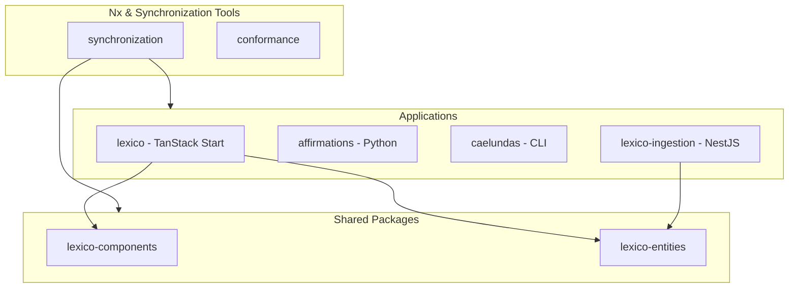

# Architecture Overview

## System Structure

The codebase uses `pnpm` workspaces and `Nx` to coordinate builds, tests, and linting across TypeScript and Python workloads.

- **Frontend & Web**: [`lexico`](applications/lexico) depends on shared packages like [`lexico-components`](packages/lexico-components) and [`lexico-entities`](packages/lexico-entities).
- **Backend & Data**: [`lexico-ingestion`](applications/lexico-ingestion) manages data persistence using TypeORM and PostgreSQL.
- **Python Workloads**: [`affirmations`](applications/affirmations) integrates LangChain, Ollama, and LangGraph.

Related documentation:
- See [Codebase Projects & Workflows](/openwiki/domain/projects.md) for detailed task execution and tool integrations.
- Return to [Codebase Quickstart](/openwiki/quickstart.md) for the main navigation hub.
