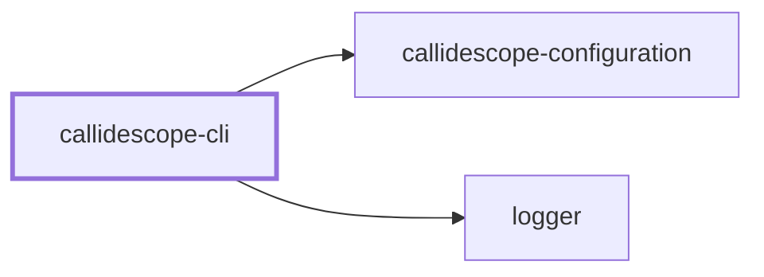
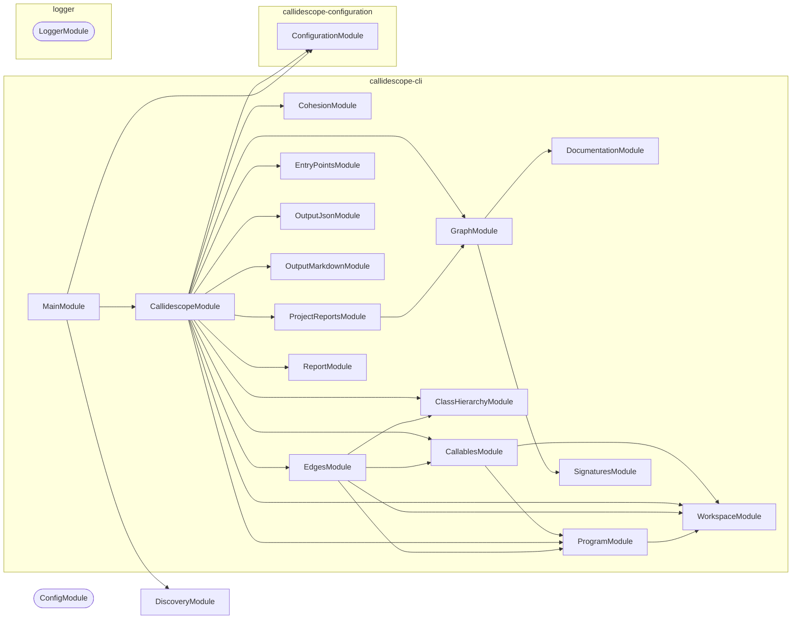

# 🔭 Callidescope

**Traces call stacks across a TypeScript monorepo and flags the ones that got too deep.**

Callidescope builds one call graph for the whole workspace, measures how deep a
stack can get below each entry point, and reports the paths that exceed a limit
you set — with every frame's file and line, so the next step is opening one.

It follows calls through **NestJS injected dependencies**. When a command calls
`this.someService.load()`, the hop into `SomeService.load` is the whole point:
that edge is invisible to anything reading one file at a time, and it is where
most of this kind of codebase's control flow actually lives.

```bash
npm install --save-dev @callidescope/cli
```

```bash
callidescope --directory . --config configuration/callidescope.config.ts
```

```text
Stack #1 | 🚨 [DEPTH ≥ 10 > 6] (decorated-method)
🚀 CodometerCommand.run(_passedParameters: string[], options: CodometerCommandOptions): Promise<void> [.../codometer.command.ts:220]
   ↳ Measure the repository and write every configured output.
  └─> CodometerService.measure(args: MeasureArguments): CodeStatisticsResult [.../codometer.service.ts:115]
     ↳ Measure aggregated repository statistics for the provided directory.
    └─> LanguagesService.analyze(args: AnalyzeLanguagesArguments): LanguageResults [.../languages.service.ts:54]
       ↳ Analyze every language present in the discovered files.
      └─> JsonService.countArrayNode(node: unknown[], stats: JsonResult, depth: number): void (cycle) [.../json.service.ts:89]
         ↳ Count array nodes and their child values.
```

## Why

A deep call stack is not automatically wrong, but it is always worth looking at.
Ten frames between a command and the work it does usually means a layer that
exists only to forward arguments, and the tools that would tell you are the ones
that read a file at a time — so they see the forwarding and never the depth.

Two questions this answers that reading code does not:

- **How deep does this actually get?** Following an injected dependency by hand
  means opening the module, finding the provider, and opening that — for every
  hop. The tool does it with the type checker, which is what makes it exact.
- **Is this function in the right place?** A function whose callers all live in
  another module is usually in the wrong file, and nothing about reading it
  would tell you so.

## Usage

| Flag | Meaning |
| ---- | ------- |
| `-d, --directory` | Workspace root to trace. Defaults to the working directory |
| `--config` | Path to a `callidescope.config.ts`. Searched for when omitted |
| `-p, --projects` | Comma-separated Nx project names. Every project when omitted |
| `-f, --format` | `markdown`, `mermaid`, or `json`, for what it prints. Markdown by default |
| `--json` | Path to write the machine-readable report to |
| `-m, --markdown` | Path to splice the markdown block into |
| `--check` | Fail on a comma-separated set drawn from `depth` and `reports` |
| `--write` | Write every configured destination |

### Two findings, two flags

A stack that runs deeper than the configured limit and a report that no longer
matches the code are separate findings, and `--check` names them separately.
`depth` is callidescope's own word for the magnitude it measures — `limit`
belongs to codometer, and blurring the two makes the messages unreadable.

| `--check` value | What fails the run |
| --------------- | ------------------ |
| `depth` | A call stack deeper than `limits.maximumDepth` |
| `reports` | A configured destination no longer holding what a fresh run would write |

`--check` refuses a value it does not recognize, and refuses a flag carrying no
value at all. A set with nothing in it looks exactly like the flag having been
left off, so it is a mistake rather than a shorthand: read as "gate nothing" it
would be a gate that cannot fail.

The two are separate because they belong on opposite sides of a pull request.
Depth is the gate — a stack got longer in this change, and this change is what
fixes it:

```bash
nx run codebase:callidescope:check
```

Staleness is not, because a report goes stale whenever the call graph moves
anywhere, which is nearly every change. The report is published on the default
branch instead, where nothing else is competing to rewrite the same block:

```bash
nx run codebase:callidescope:write
```

Nothing writes unless it is asked to. A run given neither `--write` nor
`--check reports` reads no destination and rewrites none, so `--check depth` on
a pull request leaves every committed report exactly as it found it.
`--write --check reports` is refused outright: a report cannot be stale in the
run that just wrote it.

Those two configurations are the whole target — there is no third one for the
release, because nothing forwards a configuration to it. `lint-codebase` does
not depend on `callidescope`: Nx forwards an explicit configuration down
`dependsOn`, so if it did, `lint-codebase --configuration=write` would publish
the report from a branch. `codebase:codometer` sits outside that list for the
same reason. The depth gate is therefore named directly, alongside
`lint-codebase` and inside the same `nx affected` invocation, in both places
that gate: the
[🧑‍💻 Lint Codebase](../../.github/workflows/lint-codebase.yml) workflow, so it
runs on every pull request, and
[`configuration/lint-staged.config.ts`](../../configuration/lint-staged.config.ts),
so it runs on every commit. Depth reads source and needs no build, which is
what keeps it in the commit path where codometer's limits — read from compiled
output — cannot go.

### Where the report goes

Printing and writing are separate. `--format` decides what reaches the terminal;
the destinations under `output` in the config decide what reaches a file, and
both can be on at once.

Markdown is the console default because it is the one rendering that reads in a
terminal, pastes into an issue, and is already what the files hold. `--format
json` is for a machine reading standard output, and `--format mermaid` prints
diagram source to paste somewhere that draws it.

Four destinations, each independent:

| `output` key | What it writes |
| ------------ | -------------- |
| `json` | The whole run as JSON, at one path |
| `markdown` | The whole run, spliced between anchors in one file |
| `mermaid` | The same report with its stacks drawn instead of printed |
| `projectReadmes` | One section per traced project, in that project's own `README.md` |

### The diagram

`mermaid` is its own destination rather than a mode on `markdown`, so a
repository can publish both. They answer different questions: the tree says
what each frame takes, returns, and documents; the diagram says what shape they
make together.

All the stacks are drawn as **one** flowchart, not one apiece. A single stack is
a straight line, and a straight line is a list with extra steps. Drawn together
the shared tails converge — every command reaching the same repository, every
resolver ending in the same service — and that convergence is the thing a
picture shows and an indented tree cannot. On this workspace the run's 48 deep
stacks collapse to 276 callables with 14 of them called from more than one
place.

Entry points are drawn as stadiums and everything below them as boxes. Shape
rather than color, because the diagram is read in whichever theme the reader
has and only one of those is the one it was authored in. Labels carry the
callable's name alone: a diagram trying to also carry signatures is unreadable
at any size, and the tree already has room for them.

A diagram stops at 300 callables — GitHub refuses a mermaid block past 50,000
characters, and the widest project here draws 263. Whole stacks are dropped
rather than trimmed, so the diagram never contains an edge into something it
did not draw, and it says how many it left out.

`projectReadmes` is what puts a `## 🔭 Callidescope` section at the bottom of
every package in this repository. Each section carries that project's stacks and
findings rather than the workspace's, the first three stacks openly and the rest
behind a disclosure. Setting it to `{}` accepts every default:

```ts
output: { projectReadmes: {} }
```

Under `--check reports` a stale section fails and names every file that drifted,
rather than stopping at the first. This repository does not run that on a pull
request: `nx run codebase:callidescope:write` writes the sections on the
default branch, and the release commits them.

Narrowing with `--projects` is the difference between a whole-workspace analysis
and a one-second check, because each project needs its own TypeScript program.

## What it reports

**Deep call stacks.** The single deepest path below each entry point, when it
exceeds `maximumDepth`. Only one path per entry point is ever built — the deepest —
so a wide graph costs no more than a narrow one.

**Module spread.** A callable whose callees reach many unrelated modules, _and_
which calls several of them directly. Both conditions matter: transitive reach
alone flags every entry point, because an entry point legitimately reaches the
whole program.

**Possibly misplaced callables.** A callable whose callers nearly all sit in one
other module of the same project. The output is a concrete move.

A depth printed as `≥ 10` is a floor rather than a measurement: something on
that path could not be followed — a callback invoked through a parameter, a
computed member name — and the run says so rather than quietly under-reporting.

## What a frame carries

Every frame is annotated from the type checker, because a stack of bare names
is a list of places to go look rather than something you can read:

- **The signature** — parameter names and types, and the return type. On the
  repository this covers 100% of reported frames.
- **The documentation summary** — the JSDoc prose, collapsed to one line.
  Around 90% of reported frames have one.
- **Tags**, including `@deprecated`, which marks the frame inline.

Both come from the checker rather than the comment trivia, which is what makes
them right on the shapes this repository writes. An overload's documentation
lives on the signature rather than the implementation the graph points at; an
arrow-typed property's lives on the property rather than the arrow; a
destructured parameter has no name at all in the syntax. The checker resolves
all three.

A signature longer than 80 characters collapses to `(…): ReturnType`. That is
almost always a NestJS constructor taking a dozen injected services — which
services those are is noise at the point where you are reading a stack, and a
440-character line destroys the indentation that makes the stack legible.

A summary longer than 120 characters prints only its opening sentence. Comments
here state what a callable does and then explain why, and the first half is the
half that orients someone reading a stack. It prints unmarked, because a whole
sentence is a complete thought rather than an elision and the frame's
`file:line` already points at the rest. Only a single sentence with no boundary
to find is cut on a word and marked `…`, which across this repository is 30 of
905 printed summaries.

**Shortening applies to the printed tree only.** The JSON report carries every
comment in full, because a machine reading it has no line width to respect —
the longest in the workspace runs 288 characters.

Annotations are read only for the frames a report actually prints, not for all
3,264 callables. Rendering a type is the one genuinely costly thing the checker
does, and reports touch a few hundred frames.

## How it follows a call

The TypeScript type checker resolves each call site. A call on a
constructor-injected property needs no special handling: the parameter property
carries the service's type, and the checker follows it.

| Written as | Resolved by |
| ---------- | ----------- |
| `helper()` | The symbol at the callee, unwrapped through import aliases |
| `this.service.load()` | The symbol at the member name — the injected-dependency case |
| `provider.ingest()` | Every class structurally satisfying the interface, capped by `maximumImplementationFanOut` |
| `super.run()` | The base declaration the checker resolves to |
| `new Thing()` | The constructor, when it has a body |
| `list.map(callback)` | The callback, as its own frame — `map` itself is external |
| `target[key]()` | Nothing. Recorded as unfollowable rather than guessed |

Calls into dependencies are leaves. Whether `Array.prototype.map` is deeply
implemented says nothing about whether _your_ layering is too deep, and counting
it would make every number move on an unrelated upgrade.

Structural matching is not optional: classes here routinely satisfy an interface
without writing `implements`, and its members are usually arrow-typed properties
rather than method signatures. A nominal-only index finds none of them.

## Recursion

Cycles are collapsed before depth is measured, so a mutually recursive cluster
of three contributes three frames once — an honest floor on a stack that has no
ceiling. The alternative, detecting a repeat visit mid-walk, makes the answer
depend on which path arrived first, so the same function reports different
depths from different entry points and between runs. A linter whose numbers move
on their own is not usable as a gate.

## Entry points

Depth is only meaningful relative to a root, and most code here is called by a
framework rather than by the repository. Roots are therefore configurable:
decorated methods, lifecycle hooks, `main.ts` bootstraps, and every `src/index.ts`
export.

Anything left with no caller is promoted to an **orphan root**. That is the
safety net: without it, a missing rule silently removes a whole subtree from
every measurement instead of showing up.

## Non-goals

**Control flow graphs.** Intra-procedural branching is already capped by this
repository's ESLint rules (`complexity`, `max-depth`, `max-statements`), and a
CFG is not what call-stack depth needs. Building one would duplicate ESLint at
much higher cost.

**Clone detection.** Repeated call-stack shapes are not a useful signal in a
dependency-injected codebase — the shared suffix _is_ the service layer, so
every resolver ends the same way. `jscpd` already covers real duplication.

## Project Graph

Where this project sits in the Nx project graph: what it depends on, and what depends on it. Regenerated by `nx run synchronization:nx-project-graphs:write`.

<!-- nx-project-graph-start -->



<!-- nx-project-graph-end -->

## Module Graph

The modules this project defines and the imports between them, published by `nx run synchronization:nestjs-module-graphs:write`.

<!-- nestjs-module-graph-start -->



_Rounded modules are global: every module can inject them, so their edges are left out._

<!-- nestjs-module-graph-end -->

## Packages

| Package | Role |
| ------- | ---- |
| [`@callidescope/cli`](.) | Builds the graph, measures it, and reports |
| [`@callidescope/configuration`](../callidescope-configuration/README.md) | Reads `callidescope.config.ts` and resolves the limits |

## Start

```bash
nx run callidescope-cli:start
```

## Test

```bash
nx run callidescope-cli:vitest
```

## Contributing

```bash
nx run callidescope-cli:lint-codebase --configuration=check
```

## License

MIT — see [LICENSE](../../LICENSE).

<!-- CALL_STACKS_START -->

## 🔭 Callidescope

Call stacks traced through `callidescope-cli`, deepest first. Each frame shows what it takes, what it returns, and what its documentation says.

| Measure | Value |
| --- | --- |
| Callables | 281 |
| Files | 87 |
| Calls traced | 278 |
| Call stacks | 20 |
| Deepest stack | 13 |
| Stacks through recursion | 0 |
| Unfollowable calls | 4 |

### Call stacks

**1. `CallidescopeCommand.run`** — depth ≥ 13 · decorated-method

```text
🚀 CallidescopeCommand.run(…): Promise<void> [packages/callidescope-cli/src/modules/callidescope/callidescope.command.ts:383]
   ↳ Traces the workspace, reports, and sets the exit code.
  └─> CallidescopeService.trace(args: TraceArguments): TraceOutcome [packages/callidescope-cli/src/modules/callidescope/callidescope.service.ts:154]
     ↳ Traces a workspace and returns everything the run found.
    └─> CallidescopeService.analyze(…): CallGraphResult [packages/callidescope-cli/src/modules/callidescope/callidescope.service.ts:66]
       ↳ Derives every finding from the collected callables.
      └─> GraphAssemblyService.assemble(args: AssembleGraphArguments): AssembledGraph [packages/callidescope-cli/src/modules/callidescope/graph-assembly.service.ts:42]
         ↳ Builds the call graph and everything derived from it.
        └─> EdgesService.build(args: BuildEdgesArguments): EdgeCollection [packages/callidescope-cli/src/modules/edges/edges.service.ts:221]
           ↳ Builds every edge in the graph, and records the calls it could not.
          └─> EdgesService.buildSiteEdges(…): { edges: CallEdge[]; unresolved: UnresolvedCall[]; } [packages/callidescope-cli/src/modules/edges/edges.service.ts:59]
             ↳ Turns one call site into the edges and non-resolutions it produced.
            └─> EdgesService.resolveSite(…): ResolvedCallSite | undefined [packages/callidescope-cli/src/modules/edges/edges.service.ts:196]
               ↳ Resolves one call site, choosing the right strategy for its shape.
              └─> SymbolResolutionService.resolve(…): ResolvedCallSite [packages/callidescope-cli/src/modules/edges/symbol-resolution.service.ts:267]
                 ↳ Resolves a call expression to every declaration it can reach.
                └─> SymbolResolutionService.resolveSymbol(…): ResolvedCallSite [packages/callidescope-cli/src/modules/edges/symbol-resolution.service.ts:165]
                   ↳ Resolves an already-identified callee symbol to its declarations.
                  └─> SymbolResolutionService.resolveThroughHierarchy(…): ResolvedCallSite [packages/callidescope-cli/src/modules/edges/symbol-resolution.service.ts:217]
                     ↳ Expands an interface or abstract member to its implementations.
                    └─> ClassHierarchyService.resolveImplementations(…): ImplementationLookup [packages/callidescope-cli/src/modules/class-hierarchy/class-hierarchy.service.ts:207]
                       ↳ Finds the concrete declarations one interface member resolves to.
                      └─> ClassHierarchyService.filterAssignable(…): ClassDeclaration[] [packages/callidescope-cli/src/modules/class-hierarchy/class-hierarchy.service.ts:87]
                         ↳ Keeps only classes whose instance type satisfies the declaring type.
                        └─> ClassHierarchyService.filter(…)(candidate: ts.ClassDeclaration): boolean [packages/callidescope-cli/src/modules/class-hierarchy/class-hierarchy.service.ts:94]
```

**2. `CallablesService.visit`** — depth 5 · orphan-root

```text
🚀 CallablesService.visit(node: ts.Node): void [packages/callidescope-cli/src/modules/callables/callables.service.ts:49]
  └─> CallablesService.describe(args: DescribeCallableArguments): DiscoveredCallable [packages/callidescope-cli/src/modules/callables/callables.service.ts:116]
     ↳ Turns one declaration into a fully described node.
    └─> CallableIdentityService.readDisplayName(declaration: CallableDeclaration): string [packages/callidescope-cli/src/modules/callables/callable-identity.service.ts:117]
       ↳ Builds the qualified name a report prints for a callable.
      └─> CallableIdentityService.readMemberName(declaration: CallableDeclaration): string [packages/callidescope-cli/src/modules/callables/callable-identity.service.ts:179]
         ↳ Reads the member name, falling back to the shape it was written in.
        └─> CallableIdentityService.readBindingName(node: ts.Node): string | undefined [packages/callidescope-cli/src/modules/callables/callable-identity.service.ts:50]
           ↳ Reads the name a property, variable, or parameter declaration binds.
```

**3. `EdgesService.readDisplayName`** — depth 4 · orphan-root

```text
🚀 EdgesService.readDisplayName(callable: DiscoveredCallable): string [packages/callidescope-cli/src/modules/edges/edges.service.ts:248]
   ↳ Exposed for the report, which prints a frame for each edge target.
  └─> CallableIdentityService.readDisplayName(declaration: CallableDeclaration): string [packages/callidescope-cli/src/modules/callables/callable-identity.service.ts:117]
     ↳ Builds the qualified name a report prints for a callable.
    └─> CallableIdentityService.readMemberName(declaration: CallableDeclaration): string [packages/callidescope-cli/src/modules/callables/callable-identity.service.ts:179]
       ↳ Reads the member name, falling back to the shape it was written in.
      └─> CallableIdentityService.readBindingName(node: ts.Node): string | undefined [packages/callidescope-cli/src/modules/callables/callable-identity.service.ts:50]
         ↳ Reads the name a property, variable, or parameter declaration binds.
```

<details>
<summary>17 more call stacks</summary>

**4. `CallSitesService.visit`** — depth 3 · orphan-root

```text
🚀 CallSitesService.visit(node: ts.Node): void [packages/callidescope-cli/src/modules/edges/call-sites.service.ts:62]
  └─> CallSitesService.readFunctionArguments(expression: ts.CallExpression | ts.NewExpression): ts.SignatureDeclaration[] [packages/callidescope-cli/src/modules/edges/call-sites.service.ts:42]
     ↳ Collects the function literals passed as arguments to one call.
    └─> CallSitesService.filter(…)(argument: ts.Expression): argument is ts.Expression & ts.SignatureDeclaration [packages/callidescope-cli/src/modules/edges/call-sites.service.ts:46]
```

**5. `ReportService.renderFrame`** — depth 3 · orphan-root

```text
🚀 ReportService.renderFrame(args: { depth: number; frame: StackFrame; }): string [packages/callidescope-cli/src/modules/report/report.service.ts:44]
   ↳ Renders one frame at its indentation, with whatever it says about itself.
  └─> ReportService.shortenSummary(summary: string): string [packages/callidescope-cli/src/modules/report/report.service.ts:102]
     ↳ Shortens a summary to what fits under an indented frame.
    └─> ReportService.readFirstSentence(summary: string): string | undefined [packages/callidescope-cli/src/modules/report/report.service.ts:37]
       ↳ Reads a summary's opening sentence, when it has more than one.
```

**6. `MarkdownReportService.renderStack`** — depth 3 · orphan-root

```text
🚀 MarkdownReportService.renderStack(args: { index: number; stack: CallStack; }): string [packages/callidescope-cli/src/modules/report/markdown-report.service.ts:72]
   ↳ Renders one stack: a labelled heading line and its tree in a fence.
  └─> ReportService.renderStackTree(stack: CallStack): string [packages/callidescope-cli/src/modules/report/report.service.ts:123]
     ↳ Renders every frame of a stack, the entry point first.
    └─> ReportService.map(…)(frame: StackFrame, depth: number): string [packages/callidescope-cli/src/modules/report/report.service.ts:125]
```

**7. `CallidescopeCommand.parseProjects`** — depth 2 · decorated-method

```text
🚀 CallidescopeCommand.parseProjects(value: string | undefined): string[] [packages/callidescope-cli/src/modules/callidescope/callidescope.command.ts:346]
   ↳ Parses `--projects`, a comma-separated list of Nx project names.
  └─> CallidescopeCommand.map(…)(name: string): string [packages/callidescope-cli/src/modules/callidescope/callidescope.command.ts:355]
```

**8. `main`** — depth ≥ 2 · module-bootstrap

```text
🚀 main(): Promise<void> [packages/callidescope-cli/src/main.ts:11]
   ↳ Bootstraps the callidescope CLI command application.
  └─> LoggerService.constructor(): LoggerService [packages/logger/src/modules/logger/logger.service.ts:38]
```

**9. `WorkspaceService.constructor`** — depth 2 · orphan-root

```text
🚀 WorkspaceService.constructor(logger: LoggerService): WorkspaceService [packages/callidescope-cli/src/modules/workspace/workspace.service.ts:36]
  └─> LoggerService.setContext(context: string): void [packages/logger/src/modules/logger/logger.service.ts:297]
     ↳ Sets the context label included in every subsequent log line.
```

**10. `WorkspaceService.isExcluded`** — depth 2 · orphan-root

```text
🚀 WorkspaceService.isExcluded(workspaceRelativePath: string): boolean [packages/callidescope-cli/src/modules/workspace/workspace.service.ts:157]
  └─> WorkspaceService.some(…)(glob: string): boolean [packages/callidescope-cli/src/modules/workspace/workspace.service.ts:159]
```

**11. `ProgramService.constructor`** — depth 2 · orphan-root

```text
🚀 ProgramService.constructor(…): ProgramService [packages/callidescope-cli/src/modules/program/program.service.ts:32]
  └─> LoggerService.setContext(context: string): void [packages/logger/src/modules/logger/logger.service.ts:297]
     ↳ Sets the context label included in every subsequent log line.
```

**12. `CallablesService.toWorkspaceRelative`** — depth 2 · orphan-root

```text
🚀 CallablesService.toWorkspaceRelative(args: { sourceFile: ts.SourceFile; workspaceRoot: string; }): string [packages/callidescope-cli/src/modules/callables/callables.service.ts:214]
   ↳ Resolves the workspace-relative path of a source file.
  └─> WorkspaceService.toWorkspaceRelative(args: { absolutePath: string; workspaceRoot: string; }): string [packages/callidescope-cli/src/modules/workspace/workspace.service.ts:248]
     ↳ Rewrites an absolute path as workspace-relative with POSIX separators.
```

**13. `ClassHierarchyService.readMemberDeclarations`** — depth 2 · orphan-root

```text
🚀 ClassHierarchyService.readMemberDeclarations(…): Declaration[] [packages/callidescope-cli/src/modules/class-hierarchy/class-hierarchy.service.ts:149]
   ↳ Reads one member's concrete declarations off a candidate class.
  └─> ClassHierarchyService.filter(…)(member: ts.PropertyDeclaration | ts.MethodDeclaration): boolean [packages/callidescope-cli/src/modules/class-hierarchy/class-hierarchy.service.ts:163]
```

**14. `EdgesService.constructor`** — depth 2 · orphan-root

```text
🚀 EdgesService.constructor(…): EdgesService [packages/callidescope-cli/src/modules/edges/edges.service.ts:40]
  └─> LoggerService.setContext(context: string): void [packages/logger/src/modules/logger/logger.service.ts:297]
     ↳ Sets the context label included in every subsequent log line.
```

**15. `EdgesService.resolveCallableId`** — depth 2 · orphan-root

```text
🚀 EdgesService.resolveCallableId(…): string | undefined [packages/callidescope-cli/src/modules/edges/edges.service.ts:172]
   ↳ Maps a resolved declaration to the callable it belongs to.
  └─> WorkspaceService.toWorkspaceRelative(args: { absolutePath: string; workspaceRoot: string; }): string [packages/callidescope-cli/src/modules/workspace/workspace.service.ts:248]
     ↳ Rewrites an absolute path as workspace-relative with POSIX separators.
```

**16. `EntryPointsService.constructor`** — depth 2 · orphan-root

```text
🚀 EntryPointsService.constructor(logger: LoggerService): EntryPointsService [packages/callidescope-cli/src/modules/entry-points/entry-points.service.ts:38]
  └─> LoggerService.setContext(context: string): void [packages/logger/src/modules/logger/logger.service.ts:297]
     ↳ Sets the context label included in every subsequent log line.
```

**17. `OutputJsonService.constructor`** — depth 2 · orphan-root

```text
🚀 OutputJsonService.constructor(logger: LoggerService): OutputJsonService [packages/callidescope-cli/src/modules/output-json/output-json.service.ts:24]
  └─> LoggerService.setContext(context: string): void [packages/logger/src/modules/logger/logger.service.ts:297]
     ↳ Sets the context label included in every subsequent log line.
```

**18. `OutputMarkdownService.constructor`** — depth 2 · orphan-root

```text
🚀 OutputMarkdownService.constructor(logger: LoggerService): OutputMarkdownService [packages/callidescope-cli/src/modules/output-markdown/output-markdown.service.ts:30]
  └─> LoggerService.setContext(context: string): void [packages/logger/src/modules/logger/logger.service.ts:297]
     ↳ Sets the context label included in every subsequent log line.
```

**19. `CallidescopeService.constructor`** — depth 2 · orphan-root

```text
🚀 CallidescopeService.constructor(…): CallidescopeService [packages/callidescope-cli/src/modules/callidescope/callidescope.service.ts:34]
  └─> LoggerService.setContext(context: string): void [packages/logger/src/modules/logger/logger.service.ts:297]
     ↳ Sets the context label included in every subsequent log line.
```

**20. `CallidescopeCommand.constructor`** — depth ≥ 2 · orphan-root

```text
🚀 CallidescopeCommand.constructor(…): CallidescopeCommand [packages/callidescope-cli/src/modules/callidescope/callidescope.command.ts:47]
  └─> LoggerService.setContext(context: string): void [packages/logger/src/modules/logger/logger.service.ts:297]
     ↳ Sets the context label included in every subsequent log line.
```

</details>

### Module spread

| Callable | Spread | Calls directly | Location |
| --- | --- | --- | --- |
| `CallidescopeService.trace` | 13 | `callidescope-cli:modules/callables`, `callidescope-cli:modules/class-hierarchy`, `callidescope-cli:modules/program`, `callidescope-cli:modules/workspace`, `logger:modules/logger` | `packages/callidescope-cli/src/modules/callidescope/callidescope.service.ts:154` |
| `CallidescopeService.analyze` | 12 | `callidescope-cli:modules/cohesion`, `callidescope-cli:modules/entry-points`, `callidescope-cli:modules/project-reports`, `logger:modules/logger` | `packages/callidescope-cli/src/modules/callidescope/callidescope.service.ts:66` |

### Possibly misplaced

| Callable | Declared in | Called from | Callers |
| --- | --- | --- | --- |
| `MarkdownReportService.renderRun` | `callidescope-cli:modules/report` | `callidescope-cli:modules/callidescope` | 2/2 |
<!-- CALL_STACKS_END -->

<!-- CODE_STATISTICS_START -->

## ⏲️ Codometer

### Project


### TypeScript


### JavaScript


### Python


### JSON


### YAML


### TOML


### Shell


### SQL


### HCL


### CSS


### Conventions


### Jupyter


### Markdown


<!-- CODE_STATISTICS_END -->
