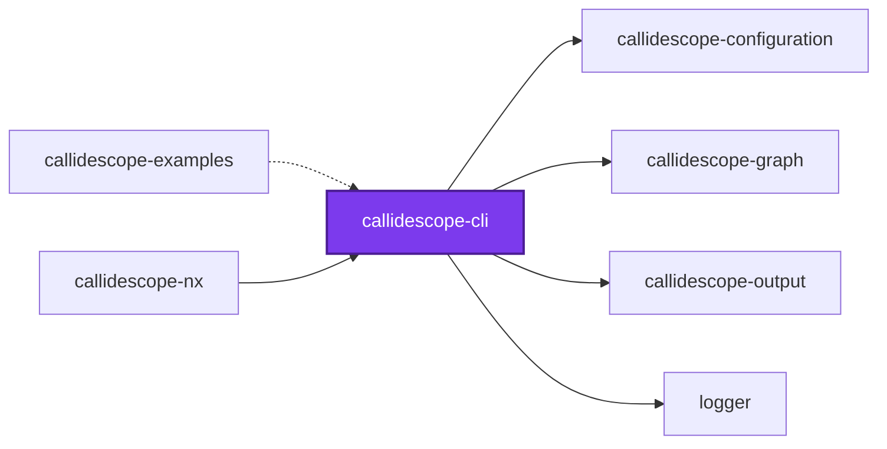
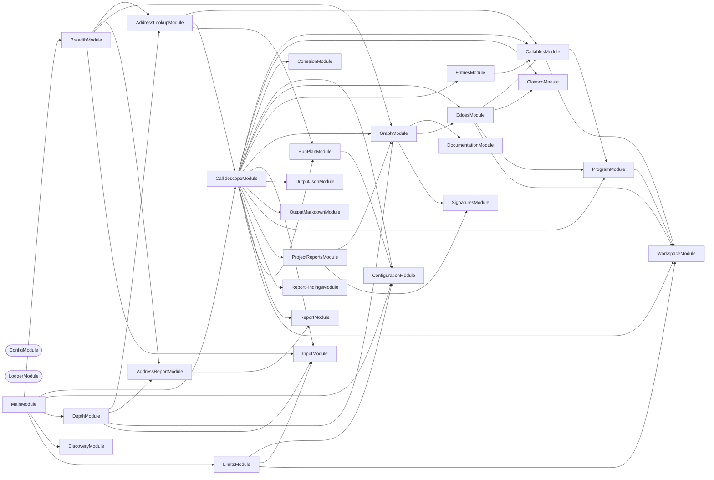

# 🔭 Callidescope

**Traces call stacks across a TypeScript monorepo and flags the ones that got too deep.**

Callidescope builds one call graph for the whole workspace, measures how deep a
stack can get below each entry point, and reports the paths that exceed a limit
you set — with every frame's file and line, so the next step is opening one.

It follows calls through **NestJS injected dependencies**. When a command calls
`this.someService.load()`, the hop into `SomeService.load` is the whole point:
that edge is invisible to anything reading one file at a time, and it is where
most of this kind of codebase's control flow actually lives.

```bash
npm install --save-dev @callidescope/cli
```

```bash
callidescope --config configuration/callidescope.config.ts
```

```text
Stack #1 | 🚨 [DEPTH ≥ 10 > 6] (decorated-method)
🚀 CodometerCommand.run(_passedParameters: string[], options: CodometerCommandOptions): Promise<void> [.../codometer.command.ts:220]
   ↳ Measure the repository and write every configured output.
  └─> CodometerService.measure(args: MeasureArguments): CodeStatisticsResult [.../codometer.service.ts:115]
     ↳ Measure aggregated repository statistics for the provided directory.
    └─> LanguagesService.analyze(args: AnalyzeLanguagesArguments): LanguageResults [.../languages.service.ts:54]
       ↳ Analyze every language present in the discovered files.
      └─> JsonService.countArrayNode(node: unknown[], stats: JsonResult, depth: number): void (cycle) [.../json.service.ts:89]
         ↳ Count array nodes and their child values.
```

## Why

A deep call stack is not automatically wrong, but it is always worth looking at.
Ten frames between a command and the work it does usually means a layer that
exists only to forward arguments, and the tools that would tell you are the ones
that read a file at a time — so they see the forwarding and never the depth.

Two questions this answers that reading code does not:

- **How deep does this actually get?** Following an injected dependency by hand
  means opening the module, finding the provider, and opening that — for every
  hop. The tool does it with the type checker, which is what makes it exact.
- **Is this function in the right place?** A function whose callers all live in
  another module is usually in the wrong file, and nothing about reading it
  would tell you so.

## Usage

Tracing the workspace is the **default command**, so the flags below sit
directly on `callidescope`:

```bash
npx callidescope --check depth
```

`callidescope callidescope --check depth` is the same run written out, which is
what a task runner that always names a command spells. `depth`, `breadth`, and
`limits` are matched by name before anything falls through to the default, so
they are unaffected — and a word that names none of them is refused rather than
quietly traced.

| Flag | Meaning |
| ---- | ------- |
| `--config` | Path to a `callidescope.config.ts`. Searched for when omitted |
| `-d, --directories` | Comma-separated project directories to trace, each holding its own `tsconfig.json`. The projects their imports reach are traced too. Every such directory under the working directory when omitted |
| `-f, --format` | `markdown`, `mermaid`, or `json`, for what it prints. Markdown by default |
| `--json` | Path to write the machine-readable report to |
| `-m, --markdown` | Path to splice the markdown block into |
| `--check` | Fail on a comma-separated set drawn from `breadth`, `depth`, and `reports` |
| `--write` | Write every configured destination |

### Three findings, named separately

A stack that runs deeper than the configured limit, a callable that calls more
others directly than its project allows, and a report that no longer matches the
code are separate findings, and `--check` names them separately. `depth` is
callidescope's own word for the magnitude it measures — `limit` belongs to
codometer, and blurring the two makes the messages unreadable.

| `--check` value | What fails the run |
| --------------- | ------------------ |
| `breadth` | A callable calling more callables directly than `limits.maximumBreadth` |
| `depth` | A call stack deeper than `limits.maximumDepth` |
| `reports` | A configured destination no longer holding what a fresh run would write |

`--check` refuses a value it does not recognize, and refuses a flag carrying no
value at all. A set with nothing in it looks exactly like the flag having been
left off, so it is a mistake rather than a shorthand: read as "gate nothing" it
would be a gate that cannot fail. `--check breadth` is refused too when no
project in scope declares `limits.maximumBreadth`: breadth is the one limit with
no default, so falling back to an unbounded one would look exactly like passing.
A workspace-declared number does not satisfy it — every project inherits that
one, and inheriting is not declaring. That refusal comes after the trace, since
which projects were in scope is something only the trace knows.

`depth` and `reports` are separate because they belong on opposite sides of a
pull request. Depth is the gate — a stack got longer in this change, and this
change is what fixes it. In this workspace neither flag is invoked directly
for that: the callidescope Nx plugin infers a `gate` target onto every project
it does not exclude, judging depth always and breadth wherever a project
declares `limits.maximumBreadth` — the same rules `--check depth` and
`--check breadth` apply, reached through the plugin's own executor rather than
a subprocess — scoped to just the projects a change touched:

```bash
nx affected --target=gate
```

Staleness is not, because a report goes stale whenever the call graph moves
anywhere, which is nearly every change. The report is published on the default
branch instead, where nothing else is competing to rewrite the same block:

```bash
nx run codebase:callidescope:write
```

Nothing writes unless it is asked to. A run given neither `--write` nor
`--check reports` reads no destination and rewrites none, so a gate on a pull
request leaves every committed report exactly as it found it.
`--write --check reports` is refused outright: a report cannot be stale in the
run that just wrote it.

Those two configurations are the whole target — there is no third one for the
release, because nothing forwards a configuration to it. `lint-codebase` does
not depend on `callidescope`: Nx forwards an explicit configuration down
`dependsOn`, so if it did, `lint-codebase --configuration=write` would publish
the report from a branch. `codebase:codometer` sits outside that list for the
same reason. The depth gate is therefore named directly, alongside
`lint-codebase` and inside the same `nx affected` invocation, in both places
that gate: the
[🧑‍💻 Lint Codebase](../../.github/workflows/lint-codebase.yml) workflow, so it
runs on every pull request, and
[`configuration/lint-staged.config.ts`](../../configuration/lint-staged.config.ts),
so it runs on every commit. Depth reads source and needs no build, which is
what keeps it in the commit path where codometer's limits — read from compiled
output — cannot go.

### Two failures no flag turns off

`--check` chooses which findings about the code fail the run. Two failures are
not findings about the code at all, and neither waits to be asked:

| Failure | What it means |
| ------- | ------------- |
| `🔭 Rejected a project it could not read` | A project's `tsconfig.json` could not be parsed, or a named directory holds none |
| `🔭 Traced nothing` | The run collected no callables at all |

Both exist because the alternative is a green gate over a workspace nobody
looked at. A run reports what it found, so a run that found nothing reports
nothing — which reads exactly like a clean workspace.

A `tsconfig.json` that will not parse **ends the run where it happens**, before
anything is printed and before any destination is touched. It is tempting to
step over the project and trace the rest, and that is wrong here: destinations
are written before findings are weighed, so a partial graph would publish
depths measured through a workspace that was missing a project, and only then
fail. On the default branch that means committing wrong numbers into every
project README, which exiting non-zero afterwards does not take back. Ending
the trace leaves the checkout exactly as the run found it.

A directory named on `--directories` that holds no `tsconfig.json` at all ends
the run the same way, and for the same reason. Naming a directory is the caller
saying it should be traced, so quietly tracing one fewer project than was asked
for reports depths for a workspace nobody described — and a typo in the list
passes every gate for having looked at less. The whole-workspace walk cannot
reach this, since it only ever yields directories a `tsconfig.json` was found
in.

A project that should not be read at all is a different question, and
exclusions answer it. They are applied to the `tsconfig.json` itself, before it
is opened — excluding a project's _files_ is too late, because opening its
configuration is the step that fails. This repository's own
[`.callidescopeignore`](../../configuration/.callidescopeignore) names one such
project: a fixture in `codependix-examples` written not to parse.

### Where the report goes

Printing and writing are separate. `--format` decides what reaches the terminal;
the destinations under `output` in the config decide what reaches a file, and
both can be on at once.

Markdown is the console default because it is the one rendering that reads in a
terminal, pastes into an issue, and is already what the files hold. `--format
json` is for a machine reading standard output, and `--format mermaid` prints
diagram source to paste somewhere that draws it.

Four destinations, each independent:

| `output` key | What it writes |
| ------------ | -------------- |
| `json` | The whole run as JSON, at one path |
| `markdown` | The whole run, spliced between anchors in one file |
| `mermaid` | The same report with its stacks drawn instead of printed |
| `projectReadmes` | One section per project the run was scoped to, in that project's own `README.md` |

### The diagram

`mermaid` is its own destination rather than a mode on `markdown`, so a
repository can publish both. They answer different questions: the tree says
what each frame takes, returns, and documents; the diagram says what shape they
make together.

Both anchored destinations render the same report, so a diagram draws exactly
what the markdown one prints: the run's call stacks over the depth limit. The
committed example of one is
[`packages/callidescope-examples/output/diagram.md`](../callidescope-examples/output/diagram.md),
where five stacks over that package's limit are drawn as 38 callables and 34
arrows. This repository publishes no diagram at all — its deepest stack sits
exactly at the limit, so there is nothing over it to draw, and a `--format
mermaid` run here prints `None.` under that heading.

All the stacks are drawn as **one** flowchart, not one apiece. A single stack is
a straight line, and a straight line is a list with extra steps. Drawn together
the shared tails converge — every command reaching the same repository, every
resolver ending in the same service — and that convergence is the thing a
picture shows and an indented tree cannot.

Entry points are drawn as stadiums and everything below them as boxes. Shape
rather than color, because the diagram is read in whichever theme the reader
has and only one of those is the one it was authored in. Labels carry the
callable's name alone: a diagram trying to also carry signatures is unreadable
at any size, and the tree already has room for them.

A diagram stops at 300 callables — GitHub refuses a mermaid block past 50,000
characters. Whole stacks are dropped rather than trimmed, so the diagram never
contains an edge into something it did not draw, and it says how many it left
out. The cap is generous against one project's worth of stacks and tight against
a workspace's: this repository's widest project, `caelundas`, has 96 call stacks
spanning 263 distinct callables, 27 of them called from more than one place, so
a set that size fits whole; the 554 stacks its 53 projects hold between them
would reach the 300 and leave 451 out. Neither set is drawn here — nothing in
this workspace is over the depth limit — but they are the scale the cap is set
against.

`projectReadmes` is what puts a `## 🔭 Callidescope` section at the bottom of
every package in this repository — every package, because the run that writes
them names no directory, so every project is one the run was scoped to. Each
section carries that project's stacks and findings rather than the workspace's,
the first three stacks openly and the rest behind a disclosure. Setting it to
`{}` accepts every default:

```ts
output: { projectReadmes: {} }
```

Under `--check reports` a stale section fails and names every file that drifted,
rather than stopping at the first. This repository does not run that on a pull
request: `nx run codebase:callidescope:write` writes the sections on the
default branch, and the release commits them.

Narrowing with `--directories` is the difference between a whole-workspace
analysis and a check that finishes in seconds, because each project needs its
own TypeScript program. What such a run measures — and what it deliberately
leaves out — is [its own section below](#what-a-scoped-run-measures).

## Depth and breadth for named callables

`callidescope` reports the whole workspace; `depth` and `breadth` answer a
narrower question about callables you name, addressed the way a Python
traceback or an ESLint rule id points at a symbol — the file path and the
qualified name callidescope already prints in every stack, joined by `#`:

```bash
callidescope depth --addresses src/foo.service.ts#FooService.bar
callidescope breadth --addresses src/foo.service.ts#FooService.bar
```

`--addresses` is comma-separated, so one run can report on several callables —
which is what a rename spanning a handful of them actually needs:

```bash
callidescope depth --addresses src/foo.service.ts#FooService.bar,src/bar.service.ts#BarService.baz
```

**Every address has to resolve, or the run prints nothing.** A report covering
the addresses that were understood, under an exit code claiming success, is
worse than no report; a run naming an address it cannot match reports each
failure and exits non-zero.

A file holding more than one declaration under the same qualified name — two
overloads, two callbacks bound to the same property — is disambiguated with a
trailing `:<line>`, and both commands print every candidate's line when they
cannot tell which one was meant.

**`--addresses` is prompted for when omitted.** At a terminal, both commands
offer every callable the trace found as an autocompleting multiselect, so the
flag is something to skip rather than something to look up. With no terminal
there is nobody to ask, so the run is refused by name and exits non-zero
rather than drawing a menu nothing can answer.

Both accept the same workspace-scoping flags as `callidescope` itself —
`--directories`, `--config`, and `--format` — since resolving an address still
means tracing the workspace first. Neither takes `--check`,
`--write`, `--json`, or `--markdown`: a lookup only ever prints, to whichever
format `--format` names.

Under `--format json` both print **an array**, whatever the address count, so
one run is one document `JSON.parse` accepts without first counting how many
addresses were asked about.

**`depth`** prints every path above the callable and every path below it —
every caller chain up to a root, every callee chain down to a leaf — rather
than folding each direction into the single deepest one `callidescope`'s own
report keeps. A callable reached from a dozen places, or reaching a dozen
leaves, is exactly the shape this is asked to show in full, capped at 200
paths per direction so a widely-called utility cannot make the walk run away;
a capped run says so.

**`breadth`** prints the callable's direct callees and direct callers side by
side — what it calls, and what calls it — the two questions a refactor or a
rename needs answered together before either one is safe.

## What a scoped run measures

`--directories` narrows a run to the project directories it names. The trace
still follows calls out of them: a scoped run builds a TypeScript program for
each named project **and for every project those projects' imports transitively
reach** — the named projects' **dependency closure**.

That closure is what makes a scoped depth a measurement rather than an
approximation. A project's own `tsconfig.json` never lists the packages it
imports, so without it a call leaving the named directory landed in code no
traced project owned — and a call into unowned code is treated as external, a
leaf, exactly like a call into an installed package. The stack ended at the
package boundary and reported a plain number, with nothing in the report saying
it had stopped early.

Scoped to `packages/codometer-changes`, this repository traces 3 projects, 33
files, and 102 callables, in about 1.7 seconds. The same command before the
closure traced 1 project, 8 files, and 31 callables.

A closure is derived from what the compiler really read — every file in a
project's program — rather than from the dependency list a `package.json`
declares. A manifest says what a package may import; the program says what it
did. So a type-only import widens a closure, and a declared dependency nothing
imports does not.

### What a closure does not reach

**Dependents, deliberately.** The walk runs downward only: a project that
imports a scoped one is not built, and its stacks do not appear. A call stack
runs downward too, so a dependent contributes no frames below anything the run
measures — and leaving it out is what stops an edit in a dependent from moving
the scoped project's numbers.

**A project root holding no `package.json`.** A manifest is what makes a
directory something another project can depend _on_. A root holding only a
`tsconfig.json` is where a repository keeps shared settings, and shared settings
are read by every project rather than depended on by any. Without this rule one
such directory drags the whole workspace in: each package's `tsconfig.json`
includes its own tooling configuration files, each of those imports out of the
shared directory, and that directory's program then reaches every toolchain the
repository configures.

**The workspace root.** A project whose root contains every other project cannot
be a meaningful dependency of any of them, whatever else it holds.

Both rules refuse a _destination_ only. Naming a directory is the caller saying
it should be traced, and a run naming no directory names every project — so
either kind is still traced in full when asked for directly, and a
whole-workspace run's findings are exactly what they were. What the rules cost
is that a call into a refused directory resolves to no frame, the way every call
out of a package did before closures existed.

### Numbers that do not move with the scope

A file is owned by the **deepest project root containing it**, whichever program
pulled it in — not by whichever program happened to read it first. That is what
makes two runs agree: the same callable sits in the same module and measures the
same depth whether the run was scoped to its own project, scoped to something
that depends on it, or scoped to nothing at all — provided each of those runs
builds the project declaring it, which a refused destination's is not.

Both cross-project findings survive a downward-only scope, which is worth saying
because it is not obvious:

- **Module spread** folds over a callable's transitive **callees**, which run
  downward — precisely what a closure holds in full.
- **Possibly misplaced** compares a callable's callers **within its own
  project**, which a run always has whole whatever its scope.

Neither needs the dependents a scoped run leaves out.

**Publishing does not widen with measurement.** `projectReadmes` writes a
section only for the projects a run was scoped to, so a scoped run never
rewrites a section in a dependency it merely measured — and a whole-workspace
run still publishes every project's, because a run naming no directory has every
project as a scoped one.

[`dependency-closure`](../callidescope-examples/examples/dependency-closure/README.md)
works all of this through on a real call that leaves its package, with the
projects it reaches and why listed one by one.

## Scoping by Nx project name

`--directories` takes paths, because callidescope has no idea what workspace
tool you use — a directory holding a `tsconfig.json` is the whole contract, and
it holds in a monorepo, a single package, or neither.

An Nx workspace can hand the selecting to Nx instead, through
[`@callidescope/nx`](../callidescope-nx/README.md) — a plugin that infers a
trace target onto every project:

```bash
nx run-many -t trace --projects=tag:type:package
nx affected -t trace
nx run callidescope-graph:depth --addresses="src/foo.service.ts#FooService.bar"
```

It infers a `trace`, a `depth`, and a `breadth` target onto every project, so
`callidescope`, `depth`, and `breadth` all become tasks — with Nx's own project
selection, caching, and affected-detection for free, none of which a flag here
could offer. It also resolves each project's **Nx dependencies** into
directories of their own, which makes them projects the run is _scoped_ to
rather than ones it merely measures — so their sections are published too, and
the selection comes from the declared graph rather than from whatever the
compiler happened to read. A stack is not truncated at a package boundary either
way: the dependency closure above is what stops that, and it needs no Nx graph.

It is a separate package rather than a flag here on purpose: this CLI depends
on nothing Nx-shaped, and a flag that only worked when an optional package
happened to be installed would advertise in `--help` something that silently
did nothing without it.

## What it reports

**Deep call stacks.** The single deepest path below each entry point, when it
exceeds `maximumDepth`. Only one path per entry point is ever built — the deepest —
so a wide graph costs no more than a narrow one.

**Module spread.** A callable whose callees reach many unrelated modules, _and_
which calls several of them directly. Both conditions matter: transitive reach
alone flags every entry point, because an entry point legitimately reaches the
whole program.

**Possibly misplaced callables.** A callable whose callers nearly all sit in one
other module of the same project. The output is a concrete move.

A depth printed as `≥ 10` is a floor rather than a measurement: something on
that path could not be followed — a callback invoked through a parameter, a
computed member name — and the run says so rather than quietly under-reporting.
Narrowing a run is never what causes one: a scoped run builds its dependencies'
programs too, so a stack leaving the named package keeps going and reports a
plain number like any other.

## What a frame carries

Every frame is annotated from the type checker, because a stack of bare names
is a list of places to go look rather than something you can read:

- **The signature** — parameter names and types, and the return type. On this
  repository that is all 1,338 reported frames.
- **The documentation summary** — the JSDoc prose, collapsed to one line. 801
  of those 1,338 have one.
- **Tags**, including `@deprecated`, which marks the frame inline.

Both come from the checker rather than the comment trivia, which is what makes
them right on the shapes this repository writes. An overload's documentation
lives on the signature rather than the implementation the graph points at; an
arrow-typed property's lives on the property rather than the arrow; a
destructured parameter has no name at all in the syntax. The checker resolves
all three.

A signature longer than 80 characters collapses to `(…): ReturnType`. That is
almost always a NestJS constructor taking a dozen injected services — which
services those are is noise at the point where you are reading a stack, and a
440-character line destroys the indentation that makes the stack legible.

A summary longer than 120 characters prints only its opening sentence. Comments
here state what a callable does and then explain why, and the first half is the
half that orients someone reading a stack. It prints unmarked, because a whole
sentence is a complete thought rather than an elision and the frame's
`file:line` already points at the rest. Only a single sentence with no boundary
to find is cut on a word and marked `…`, which across this repository is 51 of
those 801 summaries.

**Shortening applies to the printed tree only.** The JSON report carries every
comment in full, because a machine reading it has no line width to respect —
the longest in the workspace runs 1,507 characters.

Annotations are read only for the frames a report actually prints, not for all
4,727 callables. Rendering a type is the one genuinely costly thing the checker
does, and reports touch a few hundred frames.

## How it follows a call

The TypeScript type checker resolves each call site. A call on a
constructor-injected property needs no special handling: the parameter property
carries the service's type, and the checker follows it.

| Written as | Resolved by |
| ---------- | ----------- |
| `helper()` | The symbol at the callee, unwrapped through import aliases |
| `this.service.load()` | The symbol at the member name — the injected-dependency case |
| `provider.ingest()` | Every class structurally satisfying the interface, capped by `maximumImplementationCandidates` |
| `super.run()` | The base declaration the checker resolves to |
| `new Thing()` | The constructor, when it has a body |
| `list.map(callback)` | The callback, as its own frame — `map` itself is external |
| `target[key]()` | Nothing. Recorded as unfollowable rather than guessed |

Calls into **installed** dependencies are leaves. Whether `Array.prototype.map`
is deeply implemented says nothing about whether _your_ layering is too deep,
and counting it would make every number move on an unrelated upgrade. A call
into another project of the same workspace is not one of these: it resolves to a
real frame, because a scoped run builds that project's program too — see
[what a scoped run measures](#what-a-scoped-run-measures).

Structural matching is not optional: classes here routinely satisfy an interface
without writing `implements`, and its members are usually arrow-typed properties
rather than method signatures. A nominal-only index finds none of them.

## Recursion

Cycles are collapsed before depth is measured, so a mutually recursive cluster
of three contributes three frames once — an honest floor on a stack that has no
ceiling. The alternative, detecting a repeat visit mid-walk, makes the answer
depend on which path arrived first, so the same function reports different
depths from different entry points and between runs. A linter whose numbers move
on their own is not usable as a gate.

## Entry points

Depth is only meaningful relative to a root, and most code here is called by a
framework rather than by the repository. Roots are therefore configurable:
decorated methods, lifecycle hooks, `main.ts` bootstraps, and every `src/index.ts`
export.

Anything left with no caller is promoted to an **orphan root**. That is the
safety net: without it, a missing rule silently removes a whole subtree from
every measurement instead of showing up.

## Examples

Every rule, finding, and output on this page has a worked example in
[`@callidescope/examples`](../callidescope-examples/README.md) — a small
codebase written to be traced, with its rendered reports committed. Its
[`AGENTS.md`](../callidescope-examples/AGENTS.md) is a "callidescope reported X
→ open this example" table, so a failing `gate` has somewhere to go.

## Non-goals

**Control flow graphs.** Intra-procedural branching is already capped by this
repository's ESLint rules (`complexity`, `max-depth`, `max-statements`), and a
CFG is not what call-stack depth needs. Building one would duplicate ESLint at
much higher cost.

**Clone detection.** Repeated call-stack shapes are not a useful signal in a
dependency-injected codebase — the shared suffix _is_ the service layer, so
every resolver ends the same way. `jscpd` already covers real duplication.

## Packages

| Package | Role |
| ------- | ---- |
| [`@callidescope/cli`](.) | Orchestrates a run: traces the workspace, plans what to check, and reports |
| [`@callidescope/configuration`](../callidescope-configuration/README.md) | Reads `callidescope.config.ts` and resolves the limits |
| [`@callidescope/graph`](../callidescope-graph/README.md) | Builds the call graph from traced source and measures depth, breadth, and cohesion |
| [`@callidescope/nx`](../callidescope-nx/README.md) | Nx plugin: per-project `trace`/`depth`/`breadth` targets, scoped through the Nx dependency graph |
| [`@callidescope/output`](../callidescope-output/README.md) | Renders findings into markdown, mermaid, and JSON |
| [`@callidescope/examples`](../callidescope-examples/README.md) | A traced fixture codebase carrying one worked example of everything above |

## Start

```bash
nx run callidescope-cli:start
```

## Test

```bash
nx run callidescope-cli:vitest
```

## Contributing

```bash
nx run callidescope-cli:lint-codebase --configuration=check
```

## License

MIT — see [LICENSE](../../LICENSE).

## 👔 Conformetry

This project was generated from the [nestjs-command-project](../../configuration/conformetry-templates/nestjs-command-project) conformetry template.

<!-- CALL_STACKS_START -->

## 🔭 Callidescope

Call stacks traced through `packages/callidescope-cli`, deepest first. Each frame shows what it takes, what it returns, and what its documentation says.

| Measure | Value |
| --- | --- |
| Callables | 136 |
| Files | 43 |
| Calls traced | 190 |
| Call stacks | 18 |
| Deepest stack | 15 |
| Stacks through recursion | 0 |
| Unfollowable calls | 5 |

### Call stacks (depth)

**1. `CallidescopeCommand.run`** — depth ≥ 15 · decorated-method

```text
🚀 CallidescopeCommand.run(passedParameters: string[], options: CallidescopeCommandOptions): Promise<void> [packages/callidescope-cli/src/modules/callidescope/callidescope.command.ts:462]
   ↳ Traces the workspace, reports, and sets the exit code.
  └─> CallidescopeCommand.traceWorkspace(options: CallidescopeCommandOptions): Promise<void> [packages/callidescope-cli/src/modules/callidescope/callidescope.command.ts:285]
     ↳ Traces the workspace, reports, and sets the exit code.
    └─> CallidescopeService.trace(args: TraceArguments): Promise<TraceOutcome> [packages/callidescope-cli/src/modules/callidescope/callidescope.service.ts:413]
       ↳ Traces a workspace and returns everything the run found.
      └─> CallidescopeService.analyze(…): AnalyzeOutcome [packages/callidescope-cli/src/modules/callidescope/callidescope.service.ts:284]
         ↳ Derives every finding from the collected callables.
        └─> GraphAssemblyService.assemble(args: AssembleGraphArguments): AssembledGraph [packages/callidescope-graph/src/modules/graph/graph-assembly.service.ts:44]
           ↳ Builds the call graph and everything derived from it.
          └─> EdgesService.build(args: BuildEdgesArguments): EdgeCollection [packages/callidescope-graph/src/modules/edges/edges.service.ts:251]
             ↳ Builds every edge in the graph, and records the calls it could not.
            └─> EdgesService.buildSiteEdges(…): { edges: CallEdge[]; unresolved: UnresolvedCall[]; } [packages/callidescope-graph/src/modules/edges/edges.service.ts:59]
               ↳ Turns one call site into the edges and non-resolutions it produced.
              └─> EdgesService.resolveSite(…): ResolvedCallSite | undefined [packages/callidescope-graph/src/modules/edges/edges.service.ts:226]
                 ↳ Resolves one call site, choosing the right strategy for its shape.
                └─> SymbolResolutionService.resolve(…): ResolvedCallSite [packages/callidescope-graph/src/modules/edges/symbol-resolution.service.ts:267]
                   ↳ Resolves a call expression to every declaration it can reach.
                  └─> SymbolResolutionService.resolveSymbol(…): ResolvedCallSite [packages/callidescope-graph/src/modules/edges/symbol-resolution.service.ts:165]
                     ↳ Resolves an already-identified callee symbol to its declarations.
                    └─> SymbolResolutionService.resolveThroughHierarchy(…): ResolvedCallSite [packages/callidescope-graph/src/modules/edges/symbol-resolution.service.ts:217]
                       ↳ Expands an interface or abstract member to its implementations.
                      └─> ClassesService.resolveImplementations(…): ImplementationLookup [packages/callidescope-graph/src/modules/classes/classes.service.ts:207]
                         ↳ Finds the concrete declarations one interface member resolves to.
                        └─> ClassesService.flatMap(…)(this: undefined, candidate: ts.ClassDeclaration): ts.Declaration[] [packages/callidescope-graph/src/modules/classes/classes.service.ts:235]
                          └─> ClassesService.readMemberDeclarations(…): Declaration[] [packages/callidescope-graph/src/modules/classes/classes.service.ts:149]
                             ↳ Reads one member's concrete declarations off a candidate class.
                            └─> ClassesService.filter(…)(member: ts.PropertyDeclaration | ts.MethodDeclaration): boolean [packages/callidescope-graph/src/modules/classes/classes.service.ts:163]
```

**2. `BreadthCommand.run`** — depth ≥ 15 · decorated-method

```text
🚀 BreadthCommand.run(_passedParameters: string[], options: AddressCommandOptions): Promise<void> [packages/callidescope-cli/src/modules/breadth/breadth.command.ts:242]
   ↳ Prints each named callable's direct callers and callees.
  └─> BreadthCommand.printBreadth(options: AddressCommandOptions): Promise<void> [packages/callidescope-cli/src/modules/breadth/breadth.command.ts:130]
     ↳ Resolves the addresses and prints their direct callers and callees.
    └─> AddressLookupService.locate(options: AddressCommandOptions): Promise<LocatedWorkspace> [packages/callidescope-cli/src/modules/address-lookup/address-lookup.service.ts:87]
       ↳ Loads the configuration and traces the workspace, matching nothing yet.
      └─> CallidescopeService.locate(args: TraceArguments): Promise<LocateOutcome> [packages/callidescope-cli/src/modules/callidescope/callidescope.service.ts:399]
         ↳ Collects every callable and assembles the graph over them, without running the analysis a full trace does.
        └─> GraphAssemblyService.assemble(args: AssembleGraphArguments): AssembledGraph [packages/callidescope-graph/src/modules/graph/graph-assembly.service.ts:44]
           ↳ Builds the call graph and everything derived from it.
          └─> EdgesService.build(args: BuildEdgesArguments): EdgeCollection [packages/callidescope-graph/src/modules/edges/edges.service.ts:251]
             ↳ Builds every edge in the graph, and records the calls it could not.
            └─> EdgesService.buildSiteEdges(…): { edges: CallEdge[]; unresolved: UnresolvedCall[]; } [packages/callidescope-graph/src/modules/edges/edges.service.ts:59]
               ↳ Turns one call site into the edges and non-resolutions it produced.
              └─> EdgesService.resolveSite(…): ResolvedCallSite | undefined [packages/callidescope-graph/src/modules/edges/edges.service.ts:226]
                 ↳ Resolves one call site, choosing the right strategy for its shape.
                └─> SymbolResolutionService.resolve(…): ResolvedCallSite [packages/callidescope-graph/src/modules/edges/symbol-resolution.service.ts:267]
                   ↳ Resolves a call expression to every declaration it can reach.
                  └─> SymbolResolutionService.resolveSymbol(…): ResolvedCallSite [packages/callidescope-graph/src/modules/edges/symbol-resolution.service.ts:165]
                     ↳ Resolves an already-identified callee symbol to its declarations.
                    └─> SymbolResolutionService.resolveThroughHierarchy(…): ResolvedCallSite [packages/callidescope-graph/src/modules/edges/symbol-resolution.service.ts:217]
                       ↳ Expands an interface or abstract member to its implementations.
                      └─> ClassesService.resolveImplementations(…): ImplementationLookup [packages/callidescope-graph/src/modules/classes/classes.service.ts:207]
                         ↳ Finds the concrete declarations one interface member resolves to.
                        └─> ClassesService.flatMap(…)(this: undefined, candidate: ts.ClassDeclaration): ts.Declaration[] [packages/callidescope-graph/src/modules/classes/classes.service.ts:235]
                          └─> ClassesService.readMemberDeclarations(…): Declaration[] [packages/callidescope-graph/src/modules/classes/classes.service.ts:149]
                             ↳ Reads one member's concrete declarations off a candidate class.
                            └─> ClassesService.filter(…)(member: ts.PropertyDeclaration | ts.MethodDeclaration): boolean [packages/callidescope-graph/src/modules/classes/classes.service.ts:163]
```

**3. `DepthCommand.run`** — depth ≥ 15 · decorated-method

```text
🚀 DepthCommand.run(_passedParameters: string[], options: AddressCommandOptions): Promise<void> [packages/callidescope-cli/src/modules/depth/depth.command.ts:219]
   ↳ Resolves the addresses, traces every path above and below each, and prints them.
  └─> DepthCommand.printDepth(options: AddressCommandOptions): Promise<void> [packages/callidescope-cli/src/modules/depth/depth.command.ts:94]
     ↳ Traces every path above and below each resolved address, and prints them.
    └─> AddressLookupService.locate(options: AddressCommandOptions): Promise<LocatedWorkspace> [packages/callidescope-cli/src/modules/address-lookup/address-lookup.service.ts:87]
       ↳ Loads the configuration and traces the workspace, matching nothing yet.
      └─> CallidescopeService.locate(args: TraceArguments): Promise<LocateOutcome> [packages/callidescope-cli/src/modules/callidescope/callidescope.service.ts:399]
         ↳ Collects every callable and assembles the graph over them, without running the analysis a full trace does.
        └─> GraphAssemblyService.assemble(args: AssembleGraphArguments): AssembledGraph [packages/callidescope-graph/src/modules/graph/graph-assembly.service.ts:44]
           ↳ Builds the call graph and everything derived from it.
          └─> EdgesService.build(args: BuildEdgesArguments): EdgeCollection [packages/callidescope-graph/src/modules/edges/edges.service.ts:251]
             ↳ Builds every edge in the graph, and records the calls it could not.
            └─> EdgesService.buildSiteEdges(…): { edges: CallEdge[]; unresolved: UnresolvedCall[]; } [packages/callidescope-graph/src/modules/edges/edges.service.ts:59]
               ↳ Turns one call site into the edges and non-resolutions it produced.
              └─> EdgesService.resolveSite(…): ResolvedCallSite | undefined [packages/callidescope-graph/src/modules/edges/edges.service.ts:226]
                 ↳ Resolves one call site, choosing the right strategy for its shape.
                └─> SymbolResolutionService.resolve(…): ResolvedCallSite [packages/callidescope-graph/src/modules/edges/symbol-resolution.service.ts:267]
                   ↳ Resolves a call expression to every declaration it can reach.
                  └─> SymbolResolutionService.resolveSymbol(…): ResolvedCallSite [packages/callidescope-graph/src/modules/edges/symbol-resolution.service.ts:165]
                     ↳ Resolves an already-identified callee symbol to its declarations.
                    └─> SymbolResolutionService.resolveThroughHierarchy(…): ResolvedCallSite [packages/callidescope-graph/src/modules/edges/symbol-resolution.service.ts:217]
                       ↳ Expands an interface or abstract member to its implementations.
                      └─> ClassesService.resolveImplementations(…): ImplementationLookup [packages/callidescope-graph/src/modules/classes/classes.service.ts:207]
                         ↳ Finds the concrete declarations one interface member resolves to.
                        └─> ClassesService.flatMap(…)(this: undefined, candidate: ts.ClassDeclaration): ts.Declaration[] [packages/callidescope-graph/src/modules/classes/classes.service.ts:235]
                          └─> ClassesService.readMemberDeclarations(…): Declaration[] [packages/callidescope-graph/src/modules/classes/classes.service.ts:149]
                             ↳ Reads one member's concrete declarations off a candidate class.
                            └─> ClassesService.filter(…)(member: ts.PropertyDeclaration | ts.MethodDeclaration): boolean [packages/callidescope-graph/src/modules/classes/classes.service.ts:163]
```

<details>
<summary>15 more call stacks</summary>

**4. `LimitsCommand.run`** — depth ≥ 8 · decorated-method

```text
🚀 LimitsCommand.run(_passedParameters: string[], options?: LimitsCommandOptions): Promise<void> [packages/callidescope-cli/src/modules/limits/limits.command.ts:85]
   ↳ Prints every project's resolved limits.
  └─> LimitsService.list(options: LimitsCommandOptions): Promise<ProjectLimitRow[]> [packages/callidescope-cli/src/modules/limits/limits.service.ts:209]
     ↳ Resolves every project's limits, workspace default first.
    └─> ProjectConfigurationService.loadProjectConfigurations(…): Promise<LoadedProjectConfiguration[]> [packages/callidescope-configuration/src/modules/configuration/project-configuration.service.ts:273]
       ↳ Resolves the configuration file sitting at each project's own root — the directory holding the `tsconfig.json` that…
      └─> ProjectConfigurationService.loadProjectConfiguration(…): Promise<LoadedProjectConfiguration> [packages/callidescope-configuration/src/modules/configuration/project-configuration.service.ts:193]
         ↳ Reads one project's configuration file.
        └─> ConfigurationService.loadConfigurationFile(args?: LoadConfigurationArguments): Promise<LoadedCallidescopeConfiguration> [packages/callidescope-configuration/src/modules/configuration/configuration.service.ts:390]
           ↳ Loads a configuration, and says what the file itself declared and which file answered.
          └─> ConfigurationService.resolveConfigurationPath(configurationPath: string): string [packages/callidescope-configuration/src/modules/configuration/configuration.service.ts:178]
             ↳ Resolves a configuration path against the cwd, then the repository root.
            └─> ConfigurationService.findRepositoryRoot(): string | undefined [packages/callidescope-configuration/src/modules/configuration/configuration.service.ts:110]
               ↳ Walks upward from the process cwd looking for the repository root.
              └─> ConfigurationService.some(…)(marker: ".git" | "pnpm-workspace.yaml"): boolean [packages/callidescope-configuration/src/modules/configuration/configuration.service.ts:115]
```

**5. `CallidescopeCommand.parseDirectories`** — depth 3 · decorated-method

```text
🚀 CallidescopeCommand.parseDirectories(value: string | undefined): string[] [packages/callidescope-cli/src/modules/callidescope/callidescope.command.ts:397]
   ↳ Parses `--directories`, a comma-separated list of project directories.
  └─> InputService.parseCommaDelimitedOption(value: string | undefined): string[] [packages/callidescope-configuration/src/modules/input/input.service.ts:96]
     ↳ Splits `--directories`, a comma-separated list of project directories.
    └─> InputService.map(…)(entry: string): string [packages/callidescope-configuration/src/modules/input/input.service.ts:101]
```

**6. `BreadthCommand.parseAddresses`** — depth 3 · decorated-method

```text
🚀 BreadthCommand.parseAddresses(value: string | undefined): string[] [packages/callidescope-cli/src/modules/breadth/breadth.command.ts:197]
   ↳ Parses `--addresses`, a comma-separated list of callable addresses.
  └─> InputService.parseCommaDelimitedOption(value: string | undefined): string[] [packages/callidescope-configuration/src/modules/input/input.service.ts:96]
     ↳ Splits `--directories`, a comma-separated list of project directories.
    └─> InputService.map(…)(entry: string): string [packages/callidescope-configuration/src/modules/input/input.service.ts:101]
```

**7. `BreadthCommand.parseDirectories`** — depth 3 · decorated-method

```text
🚀 BreadthCommand.parseDirectories(value: string | undefined): string[] [packages/callidescope-cli/src/modules/breadth/breadth.command.ts:216]
   ↳ Parses `--directories`, a comma-separated list of project directories.
  └─> InputService.parseCommaDelimitedOption(value: string | undefined): string[] [packages/callidescope-configuration/src/modules/input/input.service.ts:96]
     ↳ Splits `--directories`, a comma-separated list of project directories.
    └─> InputService.map(…)(entry: string): string [packages/callidescope-configuration/src/modules/input/input.service.ts:101]
```

**8. `DepthCommand.parseAddresses`** — depth 3 · decorated-method

```text
🚀 DepthCommand.parseAddresses(value: string | undefined): string[] [packages/callidescope-cli/src/modules/depth/depth.command.ts:173]
   ↳ Parses `--addresses`, a comma-separated list of callable addresses.
  └─> InputService.parseCommaDelimitedOption(value: string | undefined): string[] [packages/callidescope-configuration/src/modules/input/input.service.ts:96]
     ↳ Splits `--directories`, a comma-separated list of project directories.
    └─> InputService.map(…)(entry: string): string [packages/callidescope-configuration/src/modules/input/input.service.ts:101]
```

**9. `DepthCommand.parseDirectories`** — depth 3 · decorated-method

```text
🚀 DepthCommand.parseDirectories(value: string | undefined): string[] [packages/callidescope-cli/src/modules/depth/depth.command.ts:192]
   ↳ Parses `--directories`, a comma-separated list of project directories.
  └─> InputService.parseCommaDelimitedOption(value: string | undefined): string[] [packages/callidescope-configuration/src/modules/input/input.service.ts:96]
     ↳ Splits `--directories`, a comma-separated list of project directories.
    └─> InputService.map(…)(entry: string): string [packages/callidescope-configuration/src/modules/input/input.service.ts:101]
```

**10. `CallidescopeCommand.parseConfig`** — depth 2 · decorated-method

```text
🚀 CallidescopeCommand.parseConfig(value: string | undefined): string | undefined [packages/callidescope-cli/src/modules/callidescope/callidescope.command.ts:388]
   ↳ Parses `--config`.
  └─> InputService.parseOptionalOption(value: string | undefined): string | undefined [packages/callidescope-configuration/src/modules/input/input.service.ts:121]
     ↳ Trims an optional string option, treating blank as absent.
```

**11. `CallidescopeCommand.parseFormat`** — depth 2 · decorated-method

```text
🚀 CallidescopeCommand.parseFormat(value: string | undefined): CallidescopeOutputFormat [packages/callidescope-cli/src/modules/callidescope/callidescope.command.ts:406]
   ↳ Parses `--format`, which decides what the run prints.
  └─> InputService.parseFormat(value: string | undefined): CallidescopeOutputFormat [packages/callidescope-configuration/src/modules/input/input.service.ts:112]
     ↳ Parses `--format`, which decides what a run prints.
```

**12. `CallidescopeCommand.parseJson`** — depth 2 · decorated-method

```text
🚀 CallidescopeCommand.parseJson(value: string | undefined): string | undefined [packages/callidescope-cli/src/modules/callidescope/callidescope.command.ts:415]
   ↳ Parses `--json`.
  └─> InputService.parseOptionalOption(value: string | undefined): string | undefined [packages/callidescope-configuration/src/modules/input/input.service.ts:121]
     ↳ Trims an optional string option, treating blank as absent.
```

**13. `CallidescopeCommand.parseMarkdown`** — depth 2 · decorated-method

```text
🚀 CallidescopeCommand.parseMarkdown(value: string | undefined): string | undefined [packages/callidescope-cli/src/modules/callidescope/callidescope.command.ts:424]
   ↳ Parses `--markdown`.
  └─> InputService.parseOptionalOption(value: string | undefined): string | undefined [packages/callidescope-configuration/src/modules/input/input.service.ts:121]
     ↳ Trims an optional string option, treating blank as absent.
```

**14. `BreadthCommand.parseConfig`** — depth 2 · decorated-method

```text
🚀 BreadthCommand.parseConfig(value: string | undefined): string | undefined [packages/callidescope-cli/src/modules/breadth/breadth.command.ts:207]
   ↳ Parses `--config`.
  └─> InputService.parseOptionalOption(value: string | undefined): string | undefined [packages/callidescope-configuration/src/modules/input/input.service.ts:121]
     ↳ Trims an optional string option, treating blank as absent.
```

**15. `BreadthCommand.parseFormat`** — depth 2 · decorated-method

```text
🚀 BreadthCommand.parseFormat(value: string | undefined): CallidescopeOutputFormat [packages/callidescope-cli/src/modules/breadth/breadth.command.ts:225]
   ↳ Parses `--format`.
  └─> InputService.parseFormat(value: string | undefined): CallidescopeOutputFormat [packages/callidescope-configuration/src/modules/input/input.service.ts:112]
     ↳ Parses `--format`, which decides what a run prints.
```

**16. `DepthCommand.parseConfig`** — depth 2 · decorated-method

```text
🚀 DepthCommand.parseConfig(value: string | undefined): string | undefined [packages/callidescope-cli/src/modules/depth/depth.command.ts:183]
   ↳ Parses `--config`.
  └─> InputService.parseOptionalOption(value: string | undefined): string | undefined [packages/callidescope-configuration/src/modules/input/input.service.ts:121]
     ↳ Trims an optional string option, treating blank as absent.
```

**17. `DepthCommand.parseFormat`** — depth 2 · decorated-method

```text
🚀 DepthCommand.parseFormat(value: string | undefined): CallidescopeOutputFormat [packages/callidescope-cli/src/modules/depth/depth.command.ts:201]
   ↳ Parses `--format`.
  └─> InputService.parseFormat(value: string | undefined): CallidescopeOutputFormat [packages/callidescope-configuration/src/modules/input/input.service.ts:112]
     ↳ Parses `--format`, which decides what a run prints.
```

**18. `LimitsCommand.parseConfig`** — depth 2 · decorated-method

```text
🚀 LimitsCommand.parseConfig(value: string | undefined): string | undefined [packages/callidescope-cli/src/modules/limits/limits.command.ts:70]
   ↳ Parses `--config`.
  └─> InputService.parseOptionalOption(value: string | undefined): string | undefined [packages/callidescope-configuration/src/modules/input/input.service.ts:121]
     ↳ Trims an optional string option, treating blank as absent.
```

</details>

### Module spread

| Callable | Spread | Calls directly | Location |
| --- | --- | --- | --- |
| `CallidescopeService.analyze` | 12 | `packages/callidescope-graph:modules/cohesion`, `packages/callidescope-graph:modules/entries`, `packages/callidescope-graph:modules/graph`, `packages/callidescope-output:modules/project-reports` | `packages/callidescope-cli/src/modules/callidescope/callidescope.service.ts:284` |
| `CallidescopeService.discoverCallables` | 6 | `packages/callidescope-graph:modules/callables`, `packages/callidescope-graph:modules/classes`, `packages/callidescope-graph:modules/workspace` | `packages/callidescope-cli/src/modules/callidescope/callidescope.service.ts:85` |

### Breadth

| Callable | Breadth | Calls directly | Location |
| --- | --- | --- | --- |
| `CallidescopeCommand.traceWorkspace` | 11 | `InputService.resolveFormatOption`, `RunPlanService.prepareRun`, `CallidescopeService.trace`, `RunPlanService.validateProjectLimits`, `CallidescopeCommand.reject`, `UnresolvedEntryPointAddressError.constructor`, `CallidescopeCommand.map(…)`, `CallidescopeCommand.report`, `RunPlanService.touchesFiles`, `CallidescopeCommand.syncDestinations`, `ReportFindingsService.reportFindings` | `packages/callidescope-cli/src/modules/callidescope/callidescope.command.ts:285` |
| `CallidescopeService.analyze` | 10 | `GraphAssemblyService.assemble`, `EntriesService.resolve`, `CohesionService.findMisplacedCallables`, `CohesionService.findModuleSpreads`, `CohesionService.summarizeTypeDepths`, `ProjectReportsService.build`, `CallidescopeService.filter(…)`, `CallidescopeService.readMaximumDepth`, `ProjectReportsService.findDeepStacks`, `ProjectReportsService.findWideCallables` | `packages/callidescope-cli/src/modules/callidescope/callidescope.service.ts:284` |
| `CallidescopeService.discoverCallables` | 9 | `CallidescopeService.discoverPrograms`, `CallidescopeService.map(…)`, `CallidescopeService.loadProjectDeclarations`, `ExternalService.configure`, `ClassesService.build`, `CallablesService.collect`, `FileFilterService.buildProjectFileFilter`, `CallidescopeService.map(…)`, `CallidescopeService.map(…)` | `packages/callidescope-cli/src/modules/callidescope/callidescope.service.ts:85` |

<details>
<summary>77 more callables</summary>

| Callable | Breadth | Calls directly | Location |
| --- | --- | --- | --- |
| `CallidescopeCommand.syncDestinations` | 6 | `OutputJsonService.sync`, `OutputMarkdownService.sync`, `MarkdownReportService.renderRun`, `CallidescopeCommand.readPreviewCount`, `OutputMarkdownService.syncProjectReadmes`, `CallidescopeCommand.buildProjectSections` | `packages/callidescope-cli/src/modules/callidescope/callidescope.command.ts:224` |
| `DepthCommand.printDepth` | 6 | `InputService.resolveFormatOption`, `AddressLookupService.locate`, `DepthCommand.resolveAddresses`, `DepthCommand.identifyAddresses`, `AddressReportService.renderDepthReports`, `DepthCommand.map(…)` | `packages/callidescope-cli/src/modules/depth/depth.command.ts:94` |
| `LimitsService.list` | 6 | `ConfigurationService.loadConfigurationFile`, `LimitsService.discoverProjects`, `ProjectConfigurationService.loadProjectConfigurations`, `ProjectConfigurationService.resolveLimits`, `LimitsService.toWorkspaceRows`, `LimitsService.flatMap(…)` | `packages/callidescope-cli/src/modules/limits/limits.service.ts:209` |
| `CallidescopeService.discoverPrograms` | 5 | `WorkspaceService.configure`, `FileFilterService.buildFileFilter`, `WorkspaceService.discoverProjects`, `ProgramService.buildPrograms`, `CallidescopeService.map(…)` | `packages/callidescope-cli/src/modules/callidescope/callidescope.service.ts:155` |
| `CallidescopeService.loadProjectDeclarations` | 5 | `ProjectConfigurationService.loadProjectConfigurations`, `CallidescopeService.map(…)`, `CallidescopeService.map(…)`, `CallidescopeService.filter(…)`, `ProjectConfigurationService.resolveLimits` | `packages/callidescope-cli/src/modules/callidescope/callidescope.service.ts:231` |
| `BreadthCommand.printBreadth` | 5 | `InputService.resolveFormatOption`, `AddressLookupService.locate`, `BreadthCommand.resolveAddresses`, `BreadthCommand.buildReports`, `AddressReportService.renderBreadthReports` | `packages/callidescope-cli/src/modules/breadth/breadth.command.ts:130` |
| `ReportFindingsService.reportFindings` | 4 | `ReportFindingsService.reportStaleness`, `ReportFindingsService.reportDeepStacks`, `ReportFindingsService.reportWideCallables`, `ReportFindingsService.reportEmptyTrace` | `packages/callidescope-cli/src/modules/report-findings/report-findings.service.ts:127` |
| `RunPlanService.readCheckNames` | 4 | `RunPlanService.describeAcceptedCheckNames`, `RunPlanService.filter(…)`, `RunPlanService.map(…)`, `RunPlanService.validateCheckNames` | `packages/callidescope-cli/src/modules/run-plan/run-plan.service.ts:62` |
| `CallidescopeCommand.run` | 4 | `CallidescopeCommand.reject`, `buildUnknownCommandMessage`, `CallidescopeCommand.traceWorkspace`, `readRefusalHeadline` | `packages/callidescope-cli/src/modules/callidescope/callidescope.command.ts:462` |
| `AddressReportService.renderBreadthDiagram` | 4 | `AddressReportService.toFrame`, `AddressReportService.map(…)`, `AddressReportService.map(…)`, `MermaidReportService.renderStacks` | `packages/callidescope-cli/src/modules/address-report/address-report.service.ts:59` |
| `LimitsCommand.run` | 4 | `LimitsService.list`, `RenderLimitsService.render`, `readRefusalHeadline`, `LimitsCommand.reject` | `packages/callidescope-cli/src/modules/limits/limits.command.ts:85` |
| `RunPlanService.prepareRun` | 3 | `RunPlanService.selectMode`, `ConfigurationService.loadConfigurationFile`, `RunPlanService.resolveMarkdownDestination` | `packages/callidescope-cli/src/modules/run-plan/run-plan.service.ts:185` |
| `CallidescopeCommand.report` | 3 | `OutputJsonService.buildReport`, `MarkdownReportService.renderRun`, `CallidescopeCommand.readPreviewCount` | `packages/callidescope-cli/src/modules/callidescope/callidescope.command.ts:188` |
| `AddressReportService.renderBreadth` | 3 | `AddressReportService.buildBreadthPayload`, `AddressReportService.renderBreadthDiagram`, `AddressReportService.renderReferenceTable` | `packages/callidescope-cli/src/modules/address-report/address-report.service.ts:151` |
| `AddressReportService.renderDepth` | 3 | `AddressReportService.buildDepthPayload`, `MermaidReportService.renderStacks`, `AddressReportService.renderDepthStacks` | `packages/callidescope-cli/src/modules/address-report/address-report.service.ts:206` |
| `BreadthCommand.describeAddress` | 3 | `AddressLookupService.resolve`, `AddressLookupService.describeProblem`, `BreadthService.describeDirectCalls` | `packages/callidescope-cli/src/modules/breadth/breadth.command.ts:94` |
| `BreadthCommand.run` | 3 | `BreadthCommand.printBreadth`, `readRefusalHeadline`, `BreadthCommand.reject` | `packages/callidescope-cli/src/modules/breadth/breadth.command.ts:242` |
| `DepthCommand.identifyAddresses` | 3 | `AddressLookupService.resolve`, `AddressLookupService.describeProblem`, `DepthCommand.reject` | `packages/callidescope-cli/src/modules/depth/depth.command.ts:60` |
| `DepthCommand.run` | 3 | `DepthCommand.printDepth`, `readRefusalHeadline`, `DepthCommand.reject` | `packages/callidescope-cli/src/modules/depth/depth.command.ts:219` |
| `LimitsService.discoverProjects` | 3 | `FileFilterService.buildFileFilter`, `LimitsService.map(…)`, `WorkspaceService.discoverProjects` | `packages/callidescope-cli/src/modules/limits/limits.service.ts:74` |
| `RenderLimitsService.renderTable` | 3 | `RenderLimitsService.renderRow`, `RenderLimitsService.map(…)`, `RenderLimitsService.map(…)` | `packages/callidescope-cli/src/modules/limits/render-limits.service.ts:57` |
| `ReportFindingsService.reportDeepStacks` | 2 | `ReportFindingsService.map(…)`, `ReportFindingsService.map(…)` | `packages/callidescope-cli/src/modules/report-findings/report-findings.service.ts:35` |
| `ReportFindingsService.reportWideCallables` | 2 | `ReportFindingsService.map(…)`, `ReportFindingsService.map(…)` | `packages/callidescope-cli/src/modules/report-findings/report-findings.service.ts:92` |
| `CallidescopeService.locate` | 2 | `CallidescopeService.discoverCallables`, `GraphAssemblyService.assemble` | `packages/callidescope-cli/src/modules/callidescope/callidescope.service.ts:399` |
| `CallidescopeService.trace` | 2 | `CallidescopeService.discoverCallables`, `CallidescopeService.analyze` | `packages/callidescope-cli/src/modules/callidescope/callidescope.service.ts:413` |
| `AddressLookupService.locate` | 2 | `RunPlanService.prepareLookup`, `CallidescopeService.locate` | `packages/callidescope-cli/src/modules/address-lookup/address-lookup.service.ts:87` |
| `AddressReportService.renderBreadthReports` | 2 | `AddressReportService.map(…)`, `AddressReportService.map(…)` | `packages/callidescope-cli/src/modules/address-report/address-report.service.ts:191` |
| `AddressReportService.renderDepthReports` | 2 | `AddressReportService.map(…)`, `AddressReportService.map(…)` | `packages/callidescope-cli/src/modules/address-report/address-report.service.ts:254` |
| `BreadthCommand.buildReports` | 2 | `BreadthCommand.describeAddress`, `BreadthCommand.reject` | `packages/callidescope-cli/src/modules/breadth/breadth.command.ts:58` |
| `BreadthCommand.resolveAddresses` | 2 | `InputService.promptForAutocompleteMultiselect`, `AddressLookupService.listAddresses` | `packages/callidescope-cli/src/modules/breadth/breadth.command.ts:176` |
| `DepthCommand.map(…)` | 2 | `AddressDepthService.buildDownwardStacks`, `AddressDepthService.buildUpwardStacks` | `packages/callidescope-cli/src/modules/depth/depth.command.ts:114` |
| `DepthCommand.resolveAddresses` | 2 | `InputService.promptForAutocompleteMultiselect`, `AddressLookupService.listAddresses` | `packages/callidescope-cli/src/modules/depth/depth.command.ts:152` |
| `RenderLimitsService.map(…)` | 2 | `RenderLimitsService.renderRow`, `RenderLimitsService.renderProject` | `packages/callidescope-cli/src/modules/limits/render-limits.service.ts:61` |
| `RunPlanService.describeAcceptedCheckNames` | 1 | `RunPlanService.map(…)` | `packages/callidescope-cli/src/modules/run-plan/run-plan.service.ts:50` |
| `RunPlanService.resolveMarkdownDestination` | 1 | `ConfigurationService.resolveConfiguration` | `packages/callidescope-cli/src/modules/run-plan/run-plan.service.ts:94` |
| `RunPlanService.validateCheckNames` | 1 | `RunPlanService.describeAcceptedCheckNames` | `packages/callidescope-cli/src/modules/run-plan/run-plan.service.ts:110` |
| `RunPlanService.prepareLookup` | 1 | `ConfigurationService.loadConfigurationFile` | `packages/callidescope-cli/src/modules/run-plan/run-plan.service.ts:138` |
| `RunPlanService.selectMode` | 1 | `RunPlanService.readCheckNames` | `packages/callidescope-cli/src/modules/run-plan/run-plan.service.ts:249` |
| `RunPlanService.validateProjectLimits` | 1 | `RunPlanService.some(…)` | `packages/callidescope-cli/src/modules/run-plan/run-plan.service.ts:300` |
| `readRefusalHeadline` | 1 | `isRefusedProjectConfiguration` | `packages/callidescope-cli/src/modules/callidescope/callidescope.constants.ts:71` |
| `UnresolvedEntryPointAddressError.constructor` | 1 | `UnresolvedEntryPointAddressError.joinDescriptions` | `packages/callidescope-cli/src/modules/callidescope/callidescope.constants.ts:106` |
| `UnresolvedEntryPointAddressError.joinDescriptions` | 1 | `UnresolvedEntryPointAddressError.map(…)` | `packages/callidescope-cli/src/modules/callidescope/callidescope.constants.ts:120` |
| `CallidescopeService.readMaximumDepth` | 1 | `CallidescopeService.reduce(…)` | `packages/callidescope-cli/src/modules/callidescope/callidescope.service.ts:274` |
| `CallidescopeCommand.buildProjectSections` | 1 | `CallidescopeCommand.flatMap(…)` | `packages/callidescope-cli/src/modules/callidescope/callidescope.command.ts:99` |
| `CallidescopeCommand.flatMap(…)` | 1 | `MarkdownReportService.renderProjectSection` | `packages/callidescope-cli/src/modules/callidescope/callidescope.command.ts:104` |
| `CallidescopeCommand.describeUnresolvedAddress` | 1 | `AddressService.describeCandidates` | `packages/callidescope-cli/src/modules/callidescope/callidescope.command.ts:136` |
| `CallidescopeCommand.map(…)` | 1 | `CallidescopeCommand.describeUnresolvedAddress` | `packages/callidescope-cli/src/modules/callidescope/callidescope.command.ts:332` |
| `CallidescopeCommand.parseConfig` | 1 | `InputService.parseOptionalOption` | `packages/callidescope-cli/src/modules/callidescope/callidescope.command.ts:388` |
| `CallidescopeCommand.parseDirectories` | 1 | `InputService.parseCommaDelimitedOption` | `packages/callidescope-cli/src/modules/callidescope/callidescope.command.ts:397` |
| `CallidescopeCommand.parseFormat` | 1 | `InputService.parseFormat` | `packages/callidescope-cli/src/modules/callidescope/callidescope.command.ts:406` |
| `CallidescopeCommand.parseJson` | 1 | `InputService.parseOptionalOption` | `packages/callidescope-cli/src/modules/callidescope/callidescope.command.ts:415` |
| `CallidescopeCommand.parseMarkdown` | 1 | `InputService.parseOptionalOption` | `packages/callidescope-cli/src/modules/callidescope/callidescope.command.ts:424` |
| `AddressLookupService.describeProblem` | 1 | `AddressService.describeCandidates` | `packages/callidescope-cli/src/modules/address-lookup/address-lookup.service.ts:53` |
| `AddressLookupService.listAddresses` | 1 | `AddressService.listAddresses` | `packages/callidescope-cli/src/modules/address-lookup/address-lookup.service.ts:82` |
| `AddressLookupService.resolve` | 1 | `AddressService.resolve` | `packages/callidescope-cli/src/modules/address-lookup/address-lookup.service.ts:104` |
| `AddressReportService.map(…)` | 1 | `AddressReportService.toFrame` | `packages/callidescope-cli/src/modules/address-report/address-report.service.ts:70` |
| `AddressReportService.map(…)` | 1 | `AddressReportService.toFrame` | `packages/callidescope-cli/src/modules/address-report/address-report.service.ts:73` |
| `AddressReportService.renderDepthStacks` | 1 | `AddressReportService.map(…)` | `packages/callidescope-cli/src/modules/address-report/address-report.service.ts:82` |
| `AddressReportService.map(…)` | 1 | `ReportService.renderStackTree` | `packages/callidescope-cli/src/modules/address-report/address-report.service.ts:93` |
| `AddressReportService.renderReferenceTable` | 1 | `AddressReportService.map(…)` | `packages/callidescope-cli/src/modules/address-report/address-report.service.ts:114` |
| `AddressReportService.map(…)` | 1 | `AddressReportService.buildBreadthPayload` | `packages/callidescope-cli/src/modules/address-report/address-report.service.ts:194` |
| `AddressReportService.map(…)` | 1 | `AddressReportService.renderBreadth` | `packages/callidescope-cli/src/modules/address-report/address-report.service.ts:201` |
| `AddressReportService.map(…)` | 1 | `AddressReportService.buildDepthPayload` | `packages/callidescope-cli/src/modules/address-report/address-report.service.ts:257` |
| `AddressReportService.map(…)` | 1 | `AddressReportService.renderDepth` | `packages/callidescope-cli/src/modules/address-report/address-report.service.ts:264` |
| `BreadthCommand.parseAddresses` | 1 | `InputService.parseCommaDelimitedOption` | `packages/callidescope-cli/src/modules/breadth/breadth.command.ts:197` |
| `BreadthCommand.parseConfig` | 1 | `InputService.parseOptionalOption` | `packages/callidescope-cli/src/modules/breadth/breadth.command.ts:207` |
| `BreadthCommand.parseDirectories` | 1 | `InputService.parseCommaDelimitedOption` | `packages/callidescope-cli/src/modules/breadth/breadth.command.ts:216` |
| `BreadthCommand.parseFormat` | 1 | `InputService.parseFormat` | `packages/callidescope-cli/src/modules/breadth/breadth.command.ts:225` |
| `DepthCommand.parseAddresses` | 1 | `InputService.parseCommaDelimitedOption` | `packages/callidescope-cli/src/modules/depth/depth.command.ts:173` |
| `DepthCommand.parseConfig` | 1 | `InputService.parseOptionalOption` | `packages/callidescope-cli/src/modules/depth/depth.command.ts:183` |
| `DepthCommand.parseDirectories` | 1 | `InputService.parseCommaDelimitedOption` | `packages/callidescope-cli/src/modules/depth/depth.command.ts:192` |
| `DepthCommand.parseFormat` | 1 | `InputService.parseFormat` | `packages/callidescope-cli/src/modules/depth/depth.command.ts:201` |
| `LimitsService.toProjectRows` | 1 | `LimitsService.toRow` | `packages/callidescope-cli/src/modules/limits/limits.service.ts:94` |
| `LimitsService.toWorkspaceRows` | 1 | `LimitsService.toWorkspaceRow` | `packages/callidescope-cli/src/modules/limits/limits.service.ts:177` |
| `LimitsService.flatMap(…)` | 1 | `LimitsService.toProjectRows` | `packages/callidescope-cli/src/modules/limits/limits.service.ts:246` |
| `RenderLimitsService.render` | 1 | `RenderLimitsService.renderTable` | `packages/callidescope-cli/src/modules/limits/render-limits.service.ts:76` |
| `LimitsCommand.parseConfig` | 1 | `InputService.parseOptionalOption` | `packages/callidescope-cli/src/modules/limits/limits.command.ts:70` |

</details>

### Possibly misplaced

None.
<!-- CALL_STACKS_END -->

## 🕸️ Codependix

Dependency graphs exported by [codependix](https://github.com/JimmyPaolini/codebase/tree/main/packages/codependix-cli), regenerated by `nx run codebase:codependix:write`.

### Nx Neighborhood

<!-- codependix:start name="codependix-nx" -->


_Dashed edges are dependencies Nx inferred from configuration rather than from code._
<!-- codependix:end name="codependix-nx" -->

### NestJS Module Graph

<!-- codependix:start name="codependix-nestjs" -->


_Rounded modules are global: every module can inject them, so their edges are left out._
<!-- codependix:end name="codependix-nestjs" -->

### File Imports

<!-- codependix:start name="codependix-imports" -->
```mermaid
graph LR
  file_codometer_config_ts["codometer.config.ts"]
  file_eslint_config_ts["eslint.config.ts"]
  file_src_constants_ts["src/constants.ts"]
  file_src_index_ts["src/index.ts"]
  file_src_main_end_to_end_test_ts["src/main.end-to-end.test.ts"]
  file_src_main_module_ts["src/main.module.ts"]
  file_src_main_ts["src/main.ts"]
  file_src_modules_address_lookup_address_lookup_constants_ts["src/modules/address-lookup/address-lookup.constants.ts"]
  file_src_modules_address_lookup_address_lookup_constants_unit_test_ts["src/modules/address-lookup/address-lookup.constants.unit.test.ts"]
  file_src_modules_address_lookup_address_lookup_module_ts["src/modules/address-lookup/address-lookup.module.ts"]
  file_src_modules_address_lookup_address_lookup_service_ts["src/modules/address-lookup/address-lookup.service.ts"]
  file_src_modules_address_lookup_address_lookup_service_unit_test_ts["src/modules/address-lookup/address-lookup.service.unit.test.ts"]
  file_src_modules_address_lookup_address_lookup_types_ts["src/modules/address-lookup/address-lookup.types.ts"]
  file_src_modules_address_report_address_report_constants_ts["src/modules/address-report/address-report.constants.ts"]
  file_src_modules_address_report_address_report_module_ts["src/modules/address-report/address-report.module.ts"]
  file_src_modules_address_report_address_report_service_ts["src/modules/address-report/address-report.service.ts"]
  file_src_modules_address_report_address_report_service_unit_test_ts["src/modules/address-report/address-report.service.unit.test.ts"]
  file_src_modules_address_report_address_report_types_ts["src/modules/address-report/address-report.types.ts"]
  file_src_modules_breadth_breadth_command_ts["src/modules/breadth/breadth.command.ts"]
  file_src_modules_breadth_breadth_command_unit_test_ts["src/modules/breadth/breadth.command.unit.test.ts"]
  file_src_modules_breadth_breadth_constants_ts["src/modules/breadth/breadth.constants.ts"]
  file_src_modules_breadth_breadth_module_ts["src/modules/breadth/breadth.module.ts"]
  file_src_modules_breadth_breadth_types_ts["src/modules/breadth/breadth.types.ts"]
  file_src_modules_callidescope_callidescope_command_ts["src/modules/callidescope/callidescope.command.ts"]
  file_src_modules_callidescope_callidescope_command_unit_test_ts["src/modules/callidescope/callidescope.command.unit.test.ts"]
  file_src_modules_callidescope_callidescope_constants_ts["src/modules/callidescope/callidescope.constants.ts"]
  file_src_modules_callidescope_callidescope_module_ts["src/modules/callidescope/callidescope.module.ts"]
  file_src_modules_callidescope_callidescope_service_integration_test_ts["src/modules/callidescope/callidescope.service.integration.test.ts"]
  file_src_modules_callidescope_callidescope_service_ts["src/modules/callidescope/callidescope.service.ts"]
  file_src_modules_callidescope_callidescope_service_unit_test_ts["src/modules/callidescope/callidescope.service.unit.test.ts"]
  file_src_modules_callidescope_callidescope_types_ts["src/modules/callidescope/callidescope.types.ts"]
  file_src_modules_depth_depth_command_ts["src/modules/depth/depth.command.ts"]
  file_src_modules_depth_depth_command_unit_test_ts["src/modules/depth/depth.command.unit.test.ts"]
  file_src_modules_depth_depth_constants_ts["src/modules/depth/depth.constants.ts"]
  file_src_modules_depth_depth_module_ts["src/modules/depth/depth.module.ts"]
  file_src_modules_depth_depth_types_ts["src/modules/depth/depth.types.ts"]
  file_src_modules_limits_limits_command_ts["src/modules/limits/limits.command.ts"]
  file_src_modules_limits_limits_command_unit_test_ts["src/modules/limits/limits.command.unit.test.ts"]
  file_src_modules_limits_limits_constants_ts["src/modules/limits/limits.constants.ts"]
  file_src_modules_limits_limits_module_ts["src/modules/limits/limits.module.ts"]
  file_src_modules_limits_limits_service_ts["src/modules/limits/limits.service.ts"]
  file_src_modules_limits_limits_service_unit_test_ts["src/modules/limits/limits.service.unit.test.ts"]
  file_src_modules_limits_limits_types_ts["src/modules/limits/limits.types.ts"]
  file_src_modules_limits_render_limits_service_ts["src/modules/limits/render-limits.service.ts"]
  file_src_modules_limits_render_limits_service_unit_test_ts["src/modules/limits/render-limits.service.unit.test.ts"]
  file_src_modules_report_findings_report_findings_constants_ts["src/modules/report-findings/report-findings.constants.ts"]
  file_src_modules_report_findings_report_findings_module_ts["src/modules/report-findings/report-findings.module.ts"]
  file_src_modules_report_findings_report_findings_service_ts["src/modules/report-findings/report-findings.service.ts"]
  file_src_modules_report_findings_report_findings_service_unit_test_ts["src/modules/report-findings/report-findings.service.unit.test.ts"]
  file_src_modules_report_findings_report_findings_types_ts["src/modules/report-findings/report-findings.types.ts"]
  file_src_modules_run_plan_run_plan_constants_ts["src/modules/run-plan/run-plan.constants.ts"]
  file_src_modules_run_plan_run_plan_module_ts["src/modules/run-plan/run-plan.module.ts"]
  file_src_modules_run_plan_run_plan_service_ts["src/modules/run-plan/run-plan.service.ts"]
  file_src_modules_run_plan_run_plan_service_unit_test_ts["src/modules/run-plan/run-plan.service.unit.test.ts"]
  file_src_modules_run_plan_run_plan_types_ts["src/modules/run-plan/run-plan.types.ts"]
  file_src_repl_ts["src/repl.ts"]
  file_src_repl_unit_test_ts["src/repl.unit.test.ts"]
  file_testing_mocks_ts["testing/mocks.ts"]
  file_testing_modules_ts["testing/modules.ts"]
  file_testing_programs_ts["testing/programs.ts"]
  file_testing_setup_ts["testing/setup.ts"]
  file_testing_workspace_limits_integration_test_ts["testing/workspace-limits.integration.test.ts"]
  file_vitest_config_ts["vitest.config.ts"]
  file_src_main_end_to_end_test_ts --> file_src_constants_ts
  file_src_main_module_ts --> file_src_constants_ts
  file_src_main_module_ts --> file_src_modules_breadth_breadth_module_ts
  file_src_main_module_ts --> file_src_modules_callidescope_callidescope_module_ts
  file_src_main_module_ts --> file_src_modules_depth_depth_module_ts
  file_src_main_module_ts --> file_src_modules_limits_limits_module_ts
  file_src_main_ts --> file_src_main_module_ts
  file_src_modules_address_lookup_address_lookup_constants_unit_test_ts --> file_src_modules_address_lookup_address_lookup_constants_ts
  file_src_modules_address_lookup_address_lookup_module_ts --> file_src_modules_address_lookup_address_lookup_service_ts
  file_src_modules_address_lookup_address_lookup_module_ts --> file_src_modules_callidescope_callidescope_module_ts
  file_src_modules_address_lookup_address_lookup_module_ts --> file_src_modules_run_plan_run_plan_module_ts
  file_src_modules_address_lookup_address_lookup_service_ts --> file_src_modules_address_lookup_address_lookup_constants_ts
  file_src_modules_address_lookup_address_lookup_service_ts --> file_src_modules_address_lookup_address_lookup_types_ts
  file_src_modules_address_lookup_address_lookup_service_ts --> file_src_modules_callidescope_callidescope_service_ts
  file_src_modules_address_lookup_address_lookup_service_ts --> file_src_modules_run_plan_run_plan_service_ts
  file_src_modules_address_lookup_address_lookup_service_unit_test_ts --> file_src_modules_address_lookup_address_lookup_service_ts
  file_src_modules_address_lookup_address_lookup_service_unit_test_ts --> file_src_modules_callidescope_callidescope_service_ts
  file_src_modules_address_lookup_address_lookup_service_unit_test_ts --> file_src_modules_callidescope_callidescope_types_ts
  file_src_modules_address_lookup_address_lookup_service_unit_test_ts --> file_src_modules_run_plan_run_plan_service_ts
  file_src_modules_address_lookup_address_lookup_types_ts --> file_src_modules_callidescope_callidescope_types_ts
  file_src_modules_address_report_address_report_module_ts --> file_src_modules_address_report_address_report_service_ts
  file_src_modules_address_report_address_report_service_ts --> file_src_modules_address_report_address_report_types_ts
  file_src_modules_address_report_address_report_service_unit_test_ts --> file_src_modules_address_report_address_report_service_ts
  file_src_modules_address_report_address_report_service_unit_test_ts --> file_testing_mocks_ts
  file_src_modules_breadth_breadth_command_ts --> file_src_modules_address_lookup_address_lookup_constants_ts
  file_src_modules_breadth_breadth_command_ts --> file_src_modules_address_lookup_address_lookup_service_ts
  file_src_modules_breadth_breadth_command_ts --> file_src_modules_address_lookup_address_lookup_types_ts
  file_src_modules_breadth_breadth_command_ts --> file_src_modules_address_report_address_report_service_ts
  file_src_modules_breadth_breadth_command_ts --> file_src_modules_address_report_address_report_types_ts
  file_src_modules_breadth_breadth_command_ts --> file_src_modules_callidescope_callidescope_constants_ts
  file_src_modules_breadth_breadth_command_unit_test_ts --> file_src_modules_address_lookup_address_lookup_service_ts
  file_src_modules_breadth_breadth_command_unit_test_ts --> file_src_modules_address_lookup_address_lookup_types_ts
  file_src_modules_breadth_breadth_command_unit_test_ts --> file_src_modules_address_report_address_report_service_ts
  file_src_modules_breadth_breadth_command_unit_test_ts --> file_src_modules_breadth_breadth_command_ts
  file_src_modules_breadth_breadth_command_unit_test_ts --> file_testing_mocks_ts
  file_src_modules_breadth_breadth_module_ts --> file_src_modules_address_lookup_address_lookup_module_ts
  file_src_modules_breadth_breadth_module_ts --> file_src_modules_address_report_address_report_module_ts
  file_src_modules_breadth_breadth_module_ts --> file_src_modules_breadth_breadth_command_ts
  file_src_modules_callidescope_callidescope_command_ts --> file_src_modules_address_lookup_address_lookup_constants_ts
  file_src_modules_callidescope_callidescope_command_ts --> file_src_modules_callidescope_callidescope_constants_ts
  file_src_modules_callidescope_callidescope_command_ts --> file_src_modules_callidescope_callidescope_service_ts
  file_src_modules_callidescope_callidescope_command_ts --> file_src_modules_callidescope_callidescope_types_ts
  file_src_modules_callidescope_callidescope_command_ts --> file_src_modules_report_findings_report_findings_service_ts
  file_src_modules_callidescope_callidescope_command_ts --> file_src_modules_run_plan_run_plan_constants_ts
  file_src_modules_callidescope_callidescope_command_ts --> file_src_modules_run_plan_run_plan_service_ts
  file_src_modules_callidescope_callidescope_command_unit_test_ts --> file_src_modules_callidescope_callidescope_command_ts
  file_src_modules_callidescope_callidescope_command_unit_test_ts --> file_src_modules_callidescope_callidescope_constants_ts
  file_src_modules_callidescope_callidescope_command_unit_test_ts --> file_src_modules_callidescope_callidescope_service_ts
  file_src_modules_callidescope_callidescope_command_unit_test_ts --> file_src_modules_report_findings_report_findings_service_ts
  file_src_modules_callidescope_callidescope_command_unit_test_ts --> file_src_modules_run_plan_run_plan_service_ts
  file_src_modules_callidescope_callidescope_command_unit_test_ts --> file_testing_mocks_ts
  file_src_modules_callidescope_callidescope_constants_ts --> file_src_modules_address_lookup_address_lookup_constants_ts
  file_src_modules_callidescope_callidescope_module_ts --> file_src_modules_callidescope_callidescope_command_ts
  file_src_modules_callidescope_callidescope_module_ts --> file_src_modules_callidescope_callidescope_service_ts
  file_src_modules_callidescope_callidescope_module_ts --> file_src_modules_report_findings_report_findings_module_ts
  file_src_modules_callidescope_callidescope_module_ts --> file_src_modules_run_plan_run_plan_module_ts
  file_src_modules_callidescope_callidescope_service_integration_test_ts --> file_src_modules_callidescope_callidescope_service_ts
  file_src_modules_callidescope_callidescope_service_integration_test_ts --> file_testing_modules_ts
  file_src_modules_callidescope_callidescope_service_ts --> file_src_modules_callidescope_callidescope_constants_ts
  file_src_modules_callidescope_callidescope_service_ts --> file_src_modules_callidescope_callidescope_types_ts
  file_src_modules_callidescope_callidescope_service_unit_test_ts --> file_src_modules_callidescope_callidescope_service_ts
  file_src_modules_callidescope_callidescope_service_unit_test_ts --> file_testing_modules_ts
  file_src_modules_callidescope_callidescope_service_unit_test_ts --> file_testing_programs_ts
  file_src_modules_depth_depth_command_ts --> file_src_modules_address_lookup_address_lookup_constants_ts
  file_src_modules_depth_depth_command_ts --> file_src_modules_address_lookup_address_lookup_service_ts
  file_src_modules_depth_depth_command_ts --> file_src_modules_address_lookup_address_lookup_types_ts
  file_src_modules_depth_depth_command_ts --> file_src_modules_address_report_address_report_service_ts
  file_src_modules_depth_depth_command_ts --> file_src_modules_callidescope_callidescope_constants_ts
  file_src_modules_depth_depth_command_unit_test_ts --> file_src_modules_address_lookup_address_lookup_service_ts
  file_src_modules_depth_depth_command_unit_test_ts --> file_src_modules_address_lookup_address_lookup_types_ts
  file_src_modules_depth_depth_command_unit_test_ts --> file_src_modules_address_report_address_report_service_ts
  file_src_modules_depth_depth_command_unit_test_ts --> file_src_modules_callidescope_callidescope_types_ts
  file_src_modules_depth_depth_command_unit_test_ts --> file_src_modules_depth_depth_command_ts
  file_src_modules_depth_depth_module_ts --> file_src_modules_address_lookup_address_lookup_module_ts
  file_src_modules_depth_depth_module_ts --> file_src_modules_address_report_address_report_module_ts
  file_src_modules_depth_depth_module_ts --> file_src_modules_depth_depth_command_ts
  file_src_modules_limits_limits_command_ts --> file_src_modules_callidescope_callidescope_constants_ts
  file_src_modules_limits_limits_command_ts --> file_src_modules_limits_limits_service_ts
  file_src_modules_limits_limits_command_ts --> file_src_modules_limits_limits_types_ts
  file_src_modules_limits_limits_command_ts --> file_src_modules_limits_render_limits_service_ts
  file_src_modules_limits_limits_command_unit_test_ts --> file_src_modules_limits_limits_command_ts
  file_src_modules_limits_limits_command_unit_test_ts --> file_src_modules_limits_limits_service_ts
  file_src_modules_limits_limits_command_unit_test_ts --> file_src_modules_limits_render_limits_service_ts
  file_src_modules_limits_limits_module_ts --> file_src_modules_limits_limits_command_ts
  file_src_modules_limits_limits_module_ts --> file_src_modules_limits_limits_service_ts
  file_src_modules_limits_limits_module_ts --> file_src_modules_limits_render_limits_service_ts
  file_src_modules_limits_limits_service_ts --> file_src_modules_limits_limits_types_ts
  file_src_modules_limits_limits_service_unit_test_ts --> file_src_modules_limits_limits_service_ts
  file_src_modules_limits_render_limits_service_ts --> file_src_modules_limits_limits_constants_ts
  file_src_modules_limits_render_limits_service_ts --> file_src_modules_limits_limits_types_ts
  file_src_modules_limits_render_limits_service_unit_test_ts --> file_src_modules_limits_limits_types_ts
  file_src_modules_limits_render_limits_service_unit_test_ts --> file_src_modules_limits_render_limits_service_ts
  file_src_modules_report_findings_report_findings_module_ts --> file_src_modules_report_findings_report_findings_service_ts
  file_src_modules_report_findings_report_findings_service_ts --> file_src_modules_report_findings_report_findings_types_ts
  file_src_modules_report_findings_report_findings_service_unit_test_ts --> file_src_modules_report_findings_report_findings_service_ts
  file_src_modules_report_findings_report_findings_service_unit_test_ts --> file_src_modules_report_findings_report_findings_types_ts
  file_src_modules_report_findings_report_findings_service_unit_test_ts --> file_testing_mocks_ts
  file_src_modules_report_findings_report_findings_types_ts --> file_src_modules_run_plan_run_plan_types_ts
  file_src_modules_run_plan_run_plan_module_ts --> file_src_modules_run_plan_run_plan_service_ts
  file_src_modules_run_plan_run_plan_service_ts --> file_src_modules_address_lookup_address_lookup_types_ts
  file_src_modules_run_plan_run_plan_service_ts --> file_src_modules_callidescope_callidescope_types_ts
  file_src_modules_run_plan_run_plan_service_ts --> file_src_modules_run_plan_run_plan_constants_ts
  file_src_modules_run_plan_run_plan_service_ts --> file_src_modules_run_plan_run_plan_types_ts
  file_src_modules_run_plan_run_plan_service_unit_test_ts --> file_src_modules_run_plan_run_plan_service_ts
  file_src_modules_run_plan_run_plan_service_unit_test_ts --> file_src_modules_run_plan_run_plan_types_ts
  file_src_repl_ts --> file_src_main_module_ts
```
<!-- codependix:end name="codependix-imports" -->

<!-- CODE_STATISTICS_START -->

## ⏲️ Codometer

### Project


### Measured Targets


### TypeScript


### JavaScript


### Python


### JSON


### YAML


### TOML


### Shell


### SQL


### HCL


### CSS


### Conventions


### Jupyter


### Markdown


<!-- CODE_STATISTICS_END -->
