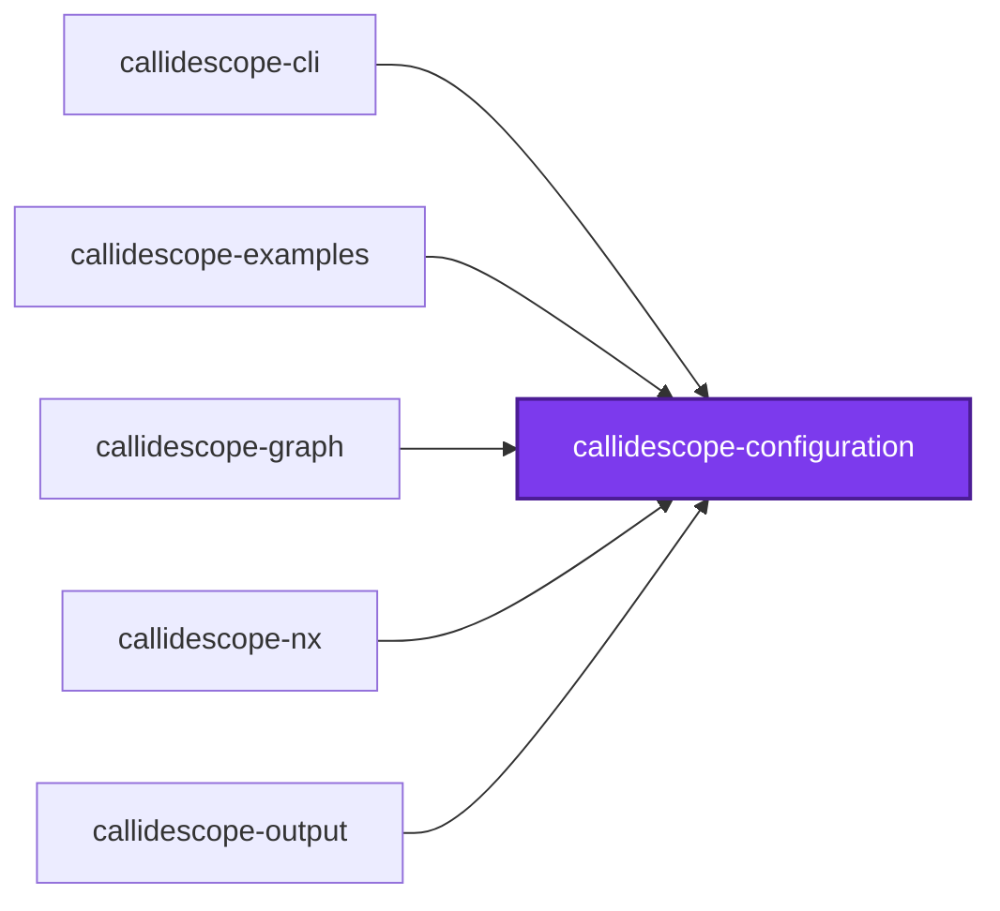
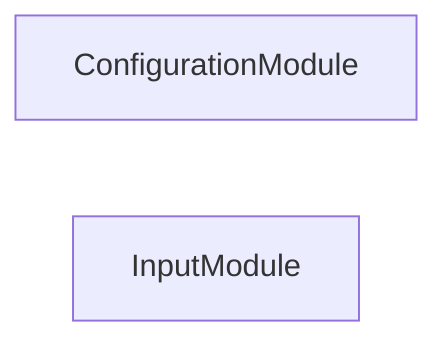

# 🔭 Callidescope Configuration

**Reads `callidescope.config.ts` and resolves the limits callidescope enforces.**

This package is the configuration reader for
[`@callidescope/cli`](../callidescope-cli/README.md). It finds a configuration
file, validates it, and fills in every field the file left out, so that no
analyzer has to know which options are optional.

It knows nothing about call graphs. What a threshold means, which decorator
marks a stack root, how a module identifier is derived — all of that lives in
the CLI. This package only answers "what did the repository ask for".

```bash
npm install --save-dev @callidescope/configuration
```

## Configuration File

Any of `callidescope.config.{ts,mts,cts,js,mjs,cjs,json,jsonc}`, searched for
upward from the working directory. TypeScript is tried first, because that is
the form that gets type checking. A repository with no configuration file is
traced with the defaults rather than told to write one.

```ts
import { type CallidescopeConfiguration } from "@callidescope/configuration";

const callidescopeConfiguration: CallidescopeConfiguration = {
  excludeFrom: ["configuration/.callidescopeignore"],
  limits: { maximumDepth: 6, spreadThreshold: 4 },
};

export default callidescopeConfiguration;
```

That file is the **workspace** configuration, and every section below describes
it. A project may also configure itself, from a much smaller surface —
see [Project Configuration](#project-configuration).

## Limits

Every threshold but one has a default, so a configuration file names only what
it wants to change.

| Limit | Default | Meaning |
| ----- | ------- | ------- |
| `maximumDepth` | `6` | Frames a call stack may hold, entry point inclusive |
| `maximumBreadth` | **none** | Callables one callable may call directly |
| `spreadThreshold` | `4` | Distinct modules a callable's transitive callees may touch |
| `directSpreadThreshold` | `3` | Modules a callable must call _directly_ before spread is reported |
| `maximumImplementationCandidates` | `8` | Implementations one interface member may resolve to |
| `minimumCallers` | `2` | Callers a callable needs before its placement is judged |
| `callerMajorityRatio` | `0.8` | Share of callers in one foreign module that marks a callable misplaced |

`maximumBreadth` is the one limit with no default. Until something declares a
number nothing can exceed it, so breadth is measured and reported without being
gated — and a run given `--check breadth` is refused rather than passing over a
limit nobody chose. It is also the one limit a workspace cannot usefully pick
alone: see [Project Configuration](#project-configuration).

`directSpreadThreshold` exists because transitive spread on its own flags every
entry point — an entry point legitimately reaches the whole program. Requiring
direct breadth as well is what isolates the callable personally orchestrating
unrelated concerns.

`maximumImplementationCandidates` is the primary noise control. A structurally matched
interface member named `run` or `sync` otherwise resolves to dozens of unrelated
classes and manufactures a call stack no execution ever takes.

## Entry Points

A depth measurement is only as meaningful as its roots, so which callables count
as roots is configurable.

| Option | Default | Meaning |
| ------ | ------- | ------- |
| `addresses` | none | Callables named outright as roots, each `<file>#<qualified-name>` |
| `decorators` | 13 framework decorators | Decorators whose methods a framework invokes |
| `includeExportedFunctions` | `true` | Treat every `src/index.ts` export as a root |
| `includeOrphans` | `true` | Promote callables nothing in the repository calls |
| `includeTests` | `false` | Trace test files too |

`addresses` takes the same `<file>#<qualified-name>` form the `depth` and
`breadth` commands accept and every stack frame prints, so an address can be
copied out of a report straight into a configuration. A trailing `:<line>`
disambiguates a file holding two declarations under one qualified name.
Declared addresses are **additive**: the rules below keep running, orphan
promotion still catches whatever nobody named, and an address landing on a
callable a rule already rooted is one root rather than two. An address that
resolves to nothing, to more than one declaration, or to nothing parseable
fails the run — see [Refusals](#refusals).

`includeOrphans` is a safety net rather than a feature. Without it, a missing
entry-point rule silently removes whole subtrees from every measurement; with
it, they surface as orphan roots — which is itself worth knowing, since an
orphan is either dead code or a rule that needs adding.

## Exclusions

`exclude` globs are **additive** to the built-in defaults (`node_modules`,
`dist`, `coverage`, `output`, `.nx`, `.conformetry`), so a configuration naming
its own noise does not have to restate them.

`excludeFrom` names gitignore-syntax files, which is how a long exclusion list
stays out of the configuration file itself.

### An exclusion drops the callables, not the file

`exclude` decides what is **collected**, and nothing else. The file is still in
the `ts.Program`, so it is still compiled and still type-checked — what changes
is that its callables are never collected, and a call reaching into it becomes
an unfollowable call rather than disappearing. A stack therefore stops at the
excluded boundary instead of routing around it.

Two consequences worth knowing before reaching for `exclude`:

- **It cannot un-project a directory.** A project is the directory holding a
  `tsconfig.json`, and discovery has already happened by the time collection is
  filtered — so a project cannot exclude its own `tsconfig.json`, and excluding
  every file it holds leaves it a project that traced nothing rather than no
  project at all.
- **A `tsconfig.json` that will not parse still ends the run**, because it is
  opened before any of this. Use the run's `exclude` to drop such a project,
  which is settled early enough to keep discovery from opening it at all.

## Output

Every destination is optional, and unconfigured is the normal case: a run that
names no destination reports to the console and exits non-zero on violations, so
nothing it writes can go stale.

| Destination | Purpose |
| ----------- | ------- |
| `output.json` | A machine-readable report at `path`, indented by `indentation` |
| `output.markdown` | A marker-delimited block spliced into `path` |
| `output.mermaid` | The same block with its call stacks drawn as one mermaid flowchart |
| `output.projectReadmes` | One section per traced project, in that project's own `README.md` |

`output.mermaid` takes the same keys as `output.markdown` — they differ in what
goes between the anchors, not in how a block is placed or overridden — and is a
separate destination so a repository can publish the printed trees and the
diagram from one run.

`output.format` is separate from all four: it decides what the run prints,
`markdown`, `mermaid`, or `json`, and defaults to `markdown`. Writing to a file
and printing to a terminal are independent, so both can be on at once.

`output.markdown` and `output.mermaid` each take a `description`, placed under
the heading, and a `heading`, which defaults to `# 🔭 Callidescope`. Set it
whenever the block is spliced into a file that already has a title: a second
first-level heading is something most markdown linters reject. The block's
subsections follow the level down on their own, so an `##` heading writes
`###` subsections.

`output.projectReadmes` takes `heading` (`## 🔭 Callidescope` by default),
`previewCount` (how many stacks are shown before the rest go behind a
disclosure, three by default), and the same `startMarker`/`endMarker` pair the
markdown destination uses. `{}` accepts all four defaults.

One thing `projectReadmes` does is worth knowing before turning it on: it
writes a section for **every** traced project, creating a `README.md` where a
project has none. A workspace whose root holds a `tsconfig.json` is itself such
a project, and the section it gets describes whatever that config's `include`
catches and no other project claims — rarely anything anybody means by "the
workspace". Exclude the root's own `tsconfig.json` and point `output.markdown`
at the root readme instead, which is the block that really is about the
workspace: it carries the summary counts, one row per project against that
project's own depth limit, and a scoreboard of how many sit over, on, or clear
of theirs.

A markdown destination may supply `render` to replace the built-in tables, or
`write` to place the block itself. A `write` function is handed
`syncAnchoredBlock` and `wrapInAnchors`, so a custom writer reuses the same
splice rather than reimplementing it. Returning `false` reports the destination
as stale; anything else, `undefined` included, counts as current.

## Project Configuration

Everything above describes the file a run is pointed at — the **workspace**
configuration. A second `callidescope.config.ts` may also sit at any traced
project's own root, the directory holding the `tsconfig.json` that makes it a
project. It is found by name in that directory alone, with no upward walk, and
may use any of the same eight extensions.

A project with no file of its own is configured entirely by the run. That is
what every project did before per-project configuration existed and what most
projects keep doing.

One file, one role per run: the file a run was pointed at is never also read as
a project's. A package whose task names its own configuration and then traces
itself would otherwise have that file judged as a project's — a refusal for the
workspace-only fields it legitimately sets.

### What a project may set

| Field | What it does |
| ----- | ------------ |
| `entryPoints` | Which of that project's callables root a stack, `addresses` included |
| `limits.maximumDepth` | The depth every stack rooted in that project is judged against |
| `limits.maximumBreadth` | The breadth every callable that project declares is judged against |
| `exclude` | Globs naming that project's own files to leave untraced |

**A project's `exclude` globs are anchored to that project's root**, never to
the workspace: `exclude: ["src/generated/**"]` in `packages/thing`'s own file
names `packages/thing/src/generated/**`, and there is no spelling of it that
reaches a sibling. Write the path as the project sees it — a workspace-relative
glob here matches nothing, and the files it meant to drop stay traced.

The run's own `exclude` keeps its workspace-relative meaning and is layered
underneath, so a project can leave more out and can never put back what the run
left out. Noise spanning several projects still belongs in the workspace file.

It also filters **collection** and nothing else, exactly as the run's own does —
see [An exclusion drops the callables, not the file](#an-exclusion-drops-the-callables-not-the-file).
A project cannot exclude its own `tsconfig.json`, and a call into a file it
excluded becomes an unfollowable call rather than vanishing.

Every other field is refused by name before anything is traced.

### Write the override, never a spread

```ts
import { type CallidescopeConfiguration } from "@callidescope/configuration";

const projectConfiguration: CallidescopeConfiguration = {
  limits: { maximumDepth: 10 },
};

export default projectConfiguration;
```

**Do not spread a workspace limits object into a project's `limits`.** Such an
object carries `spreadThreshold` and the rest of the graph-shaping limits, every
one of which only a workspace may set, so a project file holding one is rejected
before anything is traced.

Nothing is lost by writing the override alone, because **a project inherits per
limit rather than per object**. Each limit falls back to the workspace's number
on its own, so a project naming `maximumDepth` still inherits `maximumBreadth`,
and a project naming neither is handed the workspace's object itself. A spread
would have nothing left to contribute either: depth and breadth are the only two
limits a project may set, so it would supply exactly the field being overridden
plus the one that gets the file rejected.

The workspace number is a **default rather than a ceiling**. A project declaring
a higher limit than the workspace keeps its own — a workspace number pinned by
the single worst stack anywhere in it gates nothing for the projects nowhere
near it, which is the whole reason a project gets to say.

`entryPoints` does not work that way: a project declaring any entry-point rule
replaces the rule set for its own callables outright, and the fields it leaves
out fall back to this package's defaults rather than to the workspace file's.
A project that declares `addresses` and wants a decorator list the workspace
customized has to restate that list too.

`includeTests` is the one field in that set that decides which of a project's
files are **collected** rather than which of its callables root a stack, so it
takes effect at the same layer `exclude` does: a project that asks for its test
files gets them walked in a run that left every other project's out, and a
project that refuses them keeps them out of a run that asked for everyone's.

### Why the other limits cannot vary per project

`maximumDepth` and `maximumBreadth` **judge** a call graph: the graph is built
once, and each project asks a different question of the same edges. Two answers
are two opinions about one artifact, which is coherent.

Every other limit **shapes what the graph is**. `spreadThreshold` and
`directSpreadThreshold` decide which callables become findings,
`maximumImplementationCandidates` decides which structural matches become edges
at all, and `minimumCallers` with `callerMajorityRatio` decides what counts as a
misplacement. Two projects disagreeing about any of them would each be
describing a different graph over the same shared code — and a run measures one
graph, so there is one set of those. The same reasoning puts `ignoreCallees`,
`allowSpreadFor`, `directories`, `excludeFrom`, `output`, and
`workspaceStructure` in the workspace file: they name what a run reads, what it
writes, or how it partitions the workspace, and a project cannot answer those
differently from the run tracing it.

### Reading the resolved set

A ratchet written one file per project is no longer reviewable in the single
file it used to live in. `@callidescope/cli`'s `limits` command is where it is
reviewable as a set instead — every project in scope, the number it is judged
against, and the file that number is written in, with an `Origin` column saying
`declared` for the project's own and `inherited` for the workspace default it
fell back to. It resolves configuration and measures nothing, so it costs
milliseconds rather than a trace.

It is also the answer to a limit that seems not to have taken effect. The schema
strips keys it does not recognize rather than refusing them, so a misspelled
`limits.maxDepth` loads cleanly and changes nothing — and an `Origin` of
`inherited` where `declared` was expected is what says so.

### Refusals

Each of these ends the run before anything is printed or written, so a checkout
is left exactly as the run found it. `<project>` is the workspace-relative
project root; the workspace configuration's own declared addresses are labelled
`the workspace configuration` instead.

Six of them. Each is shown under the headline it is logged with — five of the
six share one — and quoted as the tool writes it.

**`🔭 Rejected a project configuration` — the file could not be read.**

```text
Failed to read the callidescope configuration for <project> at <path>: <reason>
```

The read failed or the shape did not pass the schema. `<reason>` is the
underlying failure, which is also kept as the error's `cause`. Fix the named
file; nothing else was traced.

**`🔭 Rejected a project configuration` — a workspace-only field.**

```text
<project> sets <field>, which only the workspace configuration may set. A project configuration may set entryPoints, exclude, limits.maximumBreadth, and limits.maximumDepth.
```

Move that field to the workspace file. `<field>` is printed as
`limits.spreadThreshold` for a limit and as a bare name for a top-level field,
so the message says which of the two is wrong. Spreading the workspace limits
into a project is the usual way this happens.

**`🔭 Rejected a project configuration` — a declared address resolved to
nothing.**

```text
<project> declares an entryPoints.addresses entry that resolves to nothing: "<address>". Check the file path and the qualified name callidescope prints for it in a stack.
```

The callable was renamed, moved, or excluded from the run. Correct the address
or drop it. This refusal is the point of the field rather than an
inconvenience: a rename that silently dropped a declared root would lower the
project's measured depth with nothing in the output to say so, and loosen a gate
in the one commit nobody would think to check it in.

**`🔭 Rejected a project configuration` — a declared address was ambiguous.**

```text
<project> declares an entryPoints.addresses entry that matches more than one declaration: "<address>". Candidates: <address>:<line>, <address>:<line>. Add ":<line>" to the address to pick one.
```

Every candidate is rendered as an address that would have picked it, so the fix
is a copy rather than a file location to translate back. Two declarations on one
line are the case no address can separate; those name their column instead and
the advice changes to `Two declarations on one line cannot be told apart by
":<line>" — rename one, or name a different callable.`

**`🔭 Rejected a project configuration` — a declared address was malformed.**

```text
<project> declares an invalid entryPoints.addresses entry. "<address>" is not a callable address. It needs a file path and a qualified name joined by "#", as in "src/foo.service.ts#FooService.bar", optionally followed by ":<line>" to disambiguate.
```

**`🔭 Rejected the configuration` — `--check breadth` with nothing to gate on.**

```text
--check breadth requires at least one project in scope to declare limits.maximumBreadth. Add `limits: { maximumBreadth: <number> }` to that project's callidescope.config.ts before running --check breadth.
```

A **project's own** file has to declare it. A workspace-declared
`maximumBreadth` is inherited rather than declared, so it reports breadth
findings without satisfying this. The check runs after the trace rather than
before it, because which projects were in scope is something only the trace
knows.

A run collects **every** unresolved address before it refuses, so several
mistakes are fixed from one message rather than one refusal at a time. More
than one arrives numbered, behind
`<count> declared entry points did not resolve.`

The headlines belong to the command rather than to the message. The first two
reach the `limits` command as well, where they are printed under
`🔭 Rejected a configuration`; a listing that quietly skipped the one project
whose configuration is wrong would be at its least trustworthy exactly when it
is most wanted. The three address refusals need a resolved call graph and the
breadth refusal needs to know which projects were in scope, so only a trace
raises those four.

### Worked examples

Four runnable examples in
[`@callidescope/examples`](../callidescope-examples/README.md) demonstrate the
whole of this, each against real traced code:

| Example | What it shows |
| ------- | ------------- |
| [`declared-entry-points`](../callidescope-examples/examples/declared-entry-points/README.md) | `entryPoints.addresses`, what declaring adds, and the refusals |
| [`project-depth-limit`](../callidescope-examples/examples/project-depth-limit/README.md) | One run, two depth limits, and why the two files at that package's root are separate |
| [`inherited-limits`](../callidescope-examples/examples/inherited-limits/README.md) | A project with no file at all, and per-limit inheritance |
| [`gated-leaf`](../callidescope-examples/examples/gated-leaf/README.md) | A leaf gated at three, and both halves of the `--check breadth` rule side by side |

## Call Graph Types

The result types define the JSON report's shape, so a consumer types against
this package rather than reverse-engineering the output. Each reported
`StackFrame` carries a `CallableSignature` (parameter names, types, optional and
rest flags, return type, and the one-line rendering) and a
`CallableDocumentation` (the whole comment as its summary, tag names, and a
deprecation flag — shortening belongs to whatever renders it). Both are
`undefined` when the callable has neither — and `undefined` fields are absent
from the JSON entirely rather than present and null.

## Exports

`ConfigurationModule` and `ConfigurationService` for NestJS consumers, the zod
schema and every default constant, and the type surface — both the configuration
types and the `CallGraphResult` types that define the JSON report's shape.

`loadConfiguration` does the file I/O; `resolveConfiguration` is pure
defaulting. They are split so that a host embedding callidescope can hand over a
configuration object it assembled itself and get the same resolved shape a file
produces, without touching the disk.

`ProjectConfigurationService` is the second service, and the only place a
per-project refusal is raised: `loadProjectConfigurations` reads the file beside
each traced project and rejects the ones setting a workspace-only field, and
`resolveLimits` says what every project is judged against, each number carrying
the file it was written in. One resolver rather than one per reader — a gate and
a listing that each worked the inheritance out for themselves could disagree
about the same number, and a limit two answers can be given for is worse than
no limit.

## Test

```bash
nx run callidescope-configuration:vitest
```

## License

MIT — see [LICENSE](../../LICENSE).

## 👔 Conformetry

This project was generated from the [nestjs-service-project](../../configuration/conformetry-templates/nestjs-service-project) conformetry template.

<!-- CALL_STACKS_START -->

## 🔭 Callidescope

Call stacks traced through `packages/callidescope-configuration`, deepest first. Each frame shows what it takes, what it returns, and what its documentation says.

| Measure | Value |
| --- | --- |
| Callables | 64 |
| Files | 15 |
| Calls traced | 57 |
| Call stacks | 3 |
| Deepest stack | 5 |
| Stacks through recursion | 0 |
| Unfollowable calls | 5 |

### Limits

What this project is judged against. `declared` is the number in this project's own `callidescope.config.ts`; `inherited` is the one the run supplies for every project that names none.

| Limit | Value | Origin |
| --- | --- | --- |
| `maximumDepth` | 6 | declared |
| `maximumBreadth` | 8 | declared |

### Call stacks (depth)

**1. `ConfigurationService.loadConfiguration`** — depth ≥ 5 · orphan-root

```text
🚀 ConfigurationService.loadConfiguration(args?: LoadConfigurationArguments): Promise<ResolvedCallidescopeConfiguration> [packages/callidescope-configuration/src/modules/configuration/configuration.service.ts:362]
   ↳ Loads and validates a callidescope configuration file.
  └─> ConfigurationService.loadConfigurationFile(args?: LoadConfigurationArguments): Promise<LoadedCallidescopeConfiguration> [packages/callidescope-configuration/src/modules/configuration/configuration.service.ts:390]
     ↳ Loads a configuration, and says what the file itself declared and which file answered.
    └─> ConfigurationService.resolveConfigurationPath(configurationPath: string): string [packages/callidescope-configuration/src/modules/configuration/configuration.service.ts:178]
       ↳ Resolves a configuration path against the cwd, then the repository root.
      └─> ConfigurationService.findRepositoryRoot(): string | undefined [packages/callidescope-configuration/src/modules/configuration/configuration.service.ts:110]
         ↳ Walks upward from the process cwd looking for the repository root.
        └─> ConfigurationService.some(…)(marker: ".git" | "pnpm-workspace.yaml"): boolean [packages/callidescope-configuration/src/modules/configuration/configuration.service.ts:115]
```

**2. `InputService.suggest`** — depth 3 · orphan-root

```text
🚀 InputService.suggest(input: string): Promise<{ title: string; value: string; }[]> [packages/callidescope-configuration/src/modules/input/input.service.ts:150]
  └─> InputService.completeSuggestions(args: { input: string; suggestions: readonly string[]; }): string[] [packages/callidescope-configuration/src/modules/input/input.service.ts:73]
     ↳ Narrows a suggestion list to what has been typed so far.
    └─> InputService.filter(…)(suggestion: string): boolean [packages/callidescope-configuration/src/modules/input/input.service.ts:78]
```

**3. `callbackSchema`** — depth 2 · orphan-root

```text
🚀 callbackSchema<TCallback>(): z.ZodType<TCallback> [packages/callidescope-configuration/src/modules/configuration/configuration.constants.ts:287]
   ↳ Accepts a function-valued option without inspecting its signature.
  └─> custom(…)(value: unknown): value is Function [packages/callidescope-configuration/src/modules/configuration/configuration.constants.ts:288]
```

### Module spread

None.

### Breadth

| Callable | Breadth | Calls directly | Location |
| --- | --- | --- | --- |
| `ConfigurationService.resolveConfiguration` | 8 | `ConfigurationService.resolveAllowSpreadFor`, `ConfigurationService.resolveEntryPoints`, `ConfigurationService.resolveExclude`, `ConfigurationService.resolveLimits`, `ConfigurationService.resolveJsonOutput`, `ConfigurationService.resolveMarkdownDestination`, `ConfigurationService.resolveProjectReadmes`, `ConfigurationService.resolveWorkspaceStructure` | `packages/callidescope-configuration/src/modules/configuration/configuration.service.ts:433` |
| `ConfigurationService.loadConfigurationFile` | 5 | `ConfigurationService.findConfigurationFile`, `ConfigurationService.resolveConfigurationPath`, `ConfigurationService.resolveConfiguration`, `UnknownConfigurationFileTypeError.constructor`, `ConfigurationService.loadConfigurationModule` | `packages/callidescope-configuration/src/modules/configuration/configuration.service.ts:390` |
| `InputService.promptForAutocompleteMultiselect` | 4 | `InputService.assertCanPrompt`, `InputService.map(…)`, `promptCancelledError`, `InputService.filter(…)` | `packages/callidescope-configuration/src/modules/input/input.service.ts:139` |

<details>
<summary>21 more callables</summary>

| Callable | Breadth | Calls directly | Location |
| --- | --- | --- | --- |
| `InputService.promptForSelect` | 4 | `InputService.assertCanPrompt`, `InputService.map(…)`, `promptCancelledError`, `InputService.find(…)` | `packages/callidescope-configuration/src/modules/input/input.service.ts:188` |
| `ProjectConfigurationService.loadProjectConfigurations` | 3 | `ConfigurationService.findConfigurationFileAt`, `ProjectConfigurationService.loadProjectConfiguration`, `ProjectConfigurationService.assertNoForbiddenFields` | `packages/callidescope-configuration/src/modules/configuration/project-configuration.service.ts:273` |
| `ProjectConfigurationService.resolveLimits` | 3 | `ProjectConfigurationService.buildWorkspaceLimits`, `ProjectConfigurationService.map(…)`, `ProjectConfigurationService.map(…)` | `packages/callidescope-configuration/src/modules/configuration/project-configuration.service.ts:320` |
| `ConfigurationService.resolveConfigurationPath` | 2 | `ConfigurationService.findRepositoryRoot`, `ConfigurationFileNotFoundError.constructor` | `packages/callidescope-configuration/src/modules/configuration/configuration.service.ts:178` |
| `ProjectConfigurationService.assertNoForbiddenFields` | 2 | `ProjectConfigurationService.findForbiddenField`, `ProjectConfigurationFieldNotPermittedError.constructor` | `packages/callidescope-configuration/src/modules/configuration/project-configuration.service.ts:48` |
| `ProjectConfigurationService.loadProjectConfiguration` | 2 | `ConfigurationService.loadConfigurationFile`, `ProjectConfigurationError.constructor` | `packages/callidescope-configuration/src/modules/configuration/project-configuration.service.ts:193` |
| `InputService.assertCanPrompt` | 2 | `InputService.isAtTerminal`, `missingInputError` | `packages/callidescope-configuration/src/modules/input/input.service.ts:41` |
| `InputService.suggest` | 2 | `InputService.map(…)`, `InputService.completeSuggestions` | `packages/callidescope-configuration/src/modules/input/input.service.ts:150` |
| `InputService.resolveFormatOption` | 2 | `InputService.isAtTerminal`, `InputService.promptForSelect` | `packages/callidescope-configuration/src/modules/input/input.service.ts:231` |
| `callbackSchema` | 1 | `custom(…)` | `packages/callidescope-configuration/src/modules/configuration/configuration.constants.ts:287` |
| `ConfigurationService.findConfigurationFile` | 1 | `ConfigurationService.findConfigurationFileAt` | `packages/callidescope-configuration/src/modules/configuration/configuration.service.ts:83` |
| `ConfigurationService.findRepositoryRoot` | 1 | `ConfigurationService.some(…)` | `packages/callidescope-configuration/src/modules/configuration/configuration.service.ts:110` |
| `ConfigurationService.loadConfigurationModule` | 1 | `ConfigurationService.loadJsonConfiguration` | `packages/callidescope-configuration/src/modules/configuration/configuration.service.ts:134` |
| `ConfigurationService.loadConfiguration` | 1 | `ConfigurationService.loadConfigurationFile` | `packages/callidescope-configuration/src/modules/configuration/configuration.service.ts:362` |
| `ProjectConfigurationService.buildProjectLimits` | 1 | `ProjectConfigurationService.readDeclaredLimit` | `packages/callidescope-configuration/src/modules/configuration/project-configuration.service.ts:69` |
| `ProjectConfigurationService.buildWorkspaceLimits` | 1 | `ProjectConfigurationService.readDeclaringPath` | `packages/callidescope-configuration/src/modules/configuration/project-configuration.service.ts:111` |
| `ProjectConfigurationService.map(…)` | 1 | `ProjectConfigurationService.buildProjectLimits` | `packages/callidescope-configuration/src/modules/configuration/project-configuration.service.ts:333` |
| `missingInputError` | 1 | `InputError.constructor` | `packages/callidescope-configuration/src/modules/input/input.constants.ts:27` |
| `promptCancelledError` | 1 | `InputError.constructor` | `packages/callidescope-configuration/src/modules/input/input.constants.ts:39` |
| `InputService.completeSuggestions` | 1 | `InputService.filter(…)` | `packages/callidescope-configuration/src/modules/input/input.service.ts:73` |
| `InputService.parseCommaDelimitedOption` | 1 | `InputService.map(…)` | `packages/callidescope-configuration/src/modules/input/input.service.ts:96` |

</details>

### Possibly misplaced

None.
<!-- CALL_STACKS_END -->

## 🕸️ Codependix

Dependency graphs exported by [codependix](https://github.com/JimmyPaolini/codebase/tree/main/packages/codependix-cli), regenerated by `nx run codebase:codependix:write`.

### Nx Neighborhood

<!-- codependix:start name="codependix-nx" -->

<!-- codependix:end name="codependix-nx" -->

### NestJS Module Graph

<!-- codependix:start name="codependix-nestjs" -->

<!-- codependix:end name="codependix-nestjs" -->

### File Imports

```mermaid
graph LR
  file_callidescope_config_ts["callidescope.config.ts"]
  file_codometer_config_ts["codometer.config.ts"]
  file_eslint_config_ts["eslint.config.ts"]
  file_src_index_ts["src/index.ts"]
  file_src_index_unit_test_ts["src/index.unit.test.ts"]
  file_src_modules_configuration_call_graph_types_ts["src/modules/configuration/call-graph.types.ts"]
  file_src_modules_configuration_configuration_constants_ts["src/modules/configuration/configuration.constants.ts"]
  file_src_modules_configuration_configuration_module_ts["src/modules/configuration/configuration.module.ts"]
  file_src_modules_configuration_configuration_module_unit_test_ts["src/modules/configuration/configuration.module.unit.test.ts"]
  file_src_modules_configuration_configuration_service_ts["src/modules/configuration/configuration.service.ts"]
  file_src_modules_configuration_configuration_service_unit_test_ts["src/modules/configuration/configuration.service.unit.test.ts"]
  file_src_modules_configuration_configuration_types_ts["src/modules/configuration/configuration.types.ts"]
  file_src_modules_configuration_project_configuration_service_ts["src/modules/configuration/project-configuration.service.ts"]
  file_src_modules_configuration_project_configuration_service_unit_test_ts["src/modules/configuration/project-configuration.service.unit.test.ts"]
  file_src_modules_input_input_constants_ts["src/modules/input/input.constants.ts"]
  file_src_modules_input_input_module_ts["src/modules/input/input.module.ts"]
  file_src_modules_input_input_service_ts["src/modules/input/input.service.ts"]
  file_src_modules_input_input_service_unit_test_ts["src/modules/input/input.service.unit.test.ts"]
  file_src_modules_input_input_types_ts["src/modules/input/input.types.ts"]
  file_testing_mocks_ts["testing/mocks.ts"]
  file_testing_setup_ts["testing/setup.ts"]
  file_vitest_config_ts["vitest.config.ts"]
  file_src_index_unit_test_ts --> file_src_index_ts
  file_src_modules_configuration_configuration_constants_ts --> file_src_modules_configuration_configuration_types_ts
  file_src_modules_configuration_configuration_module_ts --> file_src_modules_configuration_configuration_service_ts
  file_src_modules_configuration_configuration_module_ts --> file_src_modules_configuration_project_configuration_service_ts
  file_src_modules_configuration_configuration_module_unit_test_ts --> file_src_modules_configuration_configuration_module_ts
  file_src_modules_configuration_configuration_module_unit_test_ts --> file_src_modules_configuration_configuration_service_ts
  file_src_modules_configuration_configuration_module_unit_test_ts --> file_src_modules_configuration_project_configuration_service_ts
  file_src_modules_configuration_configuration_service_ts --> file_src_modules_configuration_configuration_constants_ts
  file_src_modules_configuration_configuration_service_ts --> file_src_modules_configuration_configuration_types_ts
  file_src_modules_configuration_configuration_service_unit_test_ts --> file_src_modules_configuration_configuration_constants_ts
  file_src_modules_configuration_configuration_service_unit_test_ts --> file_src_modules_configuration_configuration_service_ts
  file_src_modules_configuration_configuration_types_ts --> file_src_modules_configuration_call_graph_types_ts
  file_src_modules_configuration_project_configuration_service_ts --> file_src_modules_configuration_configuration_constants_ts
  file_src_modules_configuration_project_configuration_service_ts --> file_src_modules_configuration_configuration_service_ts
  file_src_modules_configuration_project_configuration_service_ts --> file_src_modules_configuration_configuration_types_ts
  file_src_modules_configuration_project_configuration_service_unit_test_ts --> file_src_modules_configuration_configuration_constants_ts
  file_src_modules_configuration_project_configuration_service_unit_test_ts --> file_src_modules_configuration_configuration_service_ts
  file_src_modules_configuration_project_configuration_service_unit_test_ts --> file_src_modules_configuration_configuration_types_ts
  file_src_modules_configuration_project_configuration_service_unit_test_ts --> file_src_modules_configuration_project_configuration_service_ts
  file_src_modules_input_input_module_ts --> file_src_modules_input_input_service_ts
  file_src_modules_input_input_service_ts --> file_src_modules_configuration_configuration_constants_ts
  file_src_modules_input_input_service_ts --> file_src_modules_configuration_configuration_types_ts
  file_src_modules_input_input_service_ts --> file_src_modules_input_input_constants_ts
  file_src_modules_input_input_service_ts --> file_src_modules_input_input_types_ts
  file_src_modules_input_input_service_unit_test_ts --> file_src_modules_input_input_service_ts
  file_src_modules_input_input_service_unit_test_ts --> file_src_modules_input_input_types_ts
  file_src_modules_input_input_types_ts --> file_src_modules_configuration_configuration_types_ts
```

<!-- codependix:start name="codependix-imports" -->

<!-- codependix:end name="codependix-imports" -->

<!-- CODE_STATISTICS_START -->

## ⏲️ Codometer

### Project


### Measured Targets


### TypeScript


### JavaScript


### Python


### JSON


### YAML


### TOML


### Shell


### SQL


### HCL


### CSS


### Conventions


### Jupyter


### Markdown


<!-- CODE_STATISTICS_END -->
