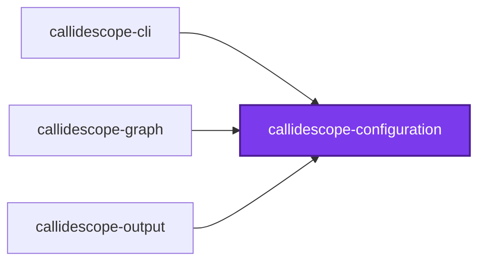

# 🔭 Callidescope Configuration

**Reads `callidescope.config.ts` and resolves the limits callidescope enforces.**

This package is the configuration reader for
[`@callidescope/cli`](../callidescope-cli/README.md). It finds a configuration
file, validates it, and fills in every field the file left out, so that no
analyzer has to know which options are optional.

It knows nothing about call graphs. What a threshold means, which decorator
marks a stack root, how a module identifier is derived — all of that lives in
the CLI. This package only answers "what did the repository ask for".

```bash
npm install --save-dev @callidescope/configuration
```

## Configuration File

Any of `callidescope.config.{ts,mts,cts,js,mjs,cjs,json,jsonc}`, searched for
upward from the working directory. TypeScript is tried first, because that is
the form that gets type checking. A repository with no configuration file is
traced with the defaults rather than told to write one.

```ts
import { type CallidescopeConfiguration } from "@callidescope/configuration";

const callidescopeConfiguration: CallidescopeConfiguration = {
  excludeFrom: ["configuration/.callidescopeignore"],
  limits: { maximumDepth: 6, spreadThreshold: 4 },
};

export default callidescopeConfiguration;
```

## Limits

Every threshold has a default, so a configuration file names only what it wants
to change.

| Limit | Default | Meaning |
| ----- | ------- | ------- |
| `maximumDepth` | `6` | Frames a call stack may hold, entry point inclusive |
| `spreadThreshold` | `4` | Distinct modules a callable's transitive callees may touch |
| `directSpreadThreshold` | `3` | Modules a callable must call _directly_ before spread is reported |
| `maximumImplementationCandidates` | `8` | Implementations one interface member may resolve to |
| `minimumCallers` | `2` | Callers a callable needs before its placement is judged |
| `callerMajorityRatio` | `0.8` | Share of callers in one foreign module that marks a callable misplaced |

`directSpreadThreshold` exists because transitive spread on its own flags every
entry point — an entry point legitimately reaches the whole program. Requiring
direct breadth as well is what isolates the callable personally orchestrating
unrelated concerns.

`maximumImplementationCandidates` is the primary noise control. A structurally matched
interface member named `run` or `sync` otherwise resolves to dozens of unrelated
classes and manufactures a call stack no execution ever takes.

## Entry Points

A depth measurement is only as meaningful as its roots, so which callables count
as roots is configurable.

| Option | Default | Meaning |
| ------ | ------- | ------- |
| `decorators` | 13 framework decorators | Decorators whose methods a framework invokes |
| `includeExportedFunctions` | `true` | Treat every `src/index.ts` export as a root |
| `includeOrphans` | `true` | Promote callables nothing in the repository calls |
| `includeTests` | `false` | Trace test files too |

`includeOrphans` is a safety net rather than a feature. Without it, a missing
entry-point rule silently removes whole subtrees from every measurement; with
it, they surface as orphan roots — which is itself worth knowing, since an
orphan is either dead code or a rule that needs adding.

## Exclusions

`exclude` globs are **additive** to the built-in defaults (`node_modules`,
`dist`, `coverage`, `output`, `.nx`, `.conformetry`), so a configuration naming
its own noise does not have to restate them.

`excludeFrom` names gitignore-syntax files, which is how a long exclusion list
stays out of the configuration file itself.

## Output

Every destination is optional, and unconfigured is the normal case: a run that
names no destination reports to the console and exits non-zero on violations, so
nothing it writes can go stale.

| Destination | Purpose |
| ----------- | ------- |
| `output.json` | A machine-readable report at `path`, indented by `indentation` |
| `output.markdown` | A marker-delimited block spliced into `path` |
| `output.mermaid` | The same block with its call stacks drawn as one mermaid flowchart |
| `output.projectReadmes` | One section per traced project, in that project's own `README.md` |

`output.mermaid` takes the same keys as `output.markdown` — they differ in what
goes between the anchors, not in how a block is placed or overridden — and is a
separate destination so a repository can publish the printed trees and the
diagram from one run.

`output.format` is separate from all four: it decides what the run prints,
`markdown`, `mermaid`, or `json`, and defaults to `markdown`. Writing to a file
and printing to a terminal are independent, so both can be on at once.

`output.projectReadmes` takes `heading` (`## 🔭 Callidescope` by default),
`previewCount` (how many stacks are shown before the rest go behind a
disclosure, three by default), and the same `startMarker`/`endMarker` pair the
markdown destination uses. `{}` accepts all four defaults.

A markdown destination may supply `render` to replace the built-in tables, or
`write` to place the block itself. A `write` function is handed
`syncAnchoredBlock` and `wrapInAnchors`, so a custom writer reuses the same
splice rather than reimplementing it. Returning `false` reports the destination
as stale; anything else, `undefined` included, counts as current.

## Call Graph Types

The result types define the JSON report's shape, so a consumer types against
this package rather than reverse-engineering the output. Each reported
`StackFrame` carries a `CallableSignature` (parameter names, types, optional and
rest flags, return type, and the one-line rendering) and a
`CallableDocumentation` (the whole comment as its summary, tag names, and a
deprecation flag — shortening belongs to whatever renders it). Both are
`undefined` when the callable has neither — and `undefined` fields are absent
from the JSON entirely rather than present and null.

## Exports

`ConfigurationModule` and `ConfigurationService` for NestJS consumers, the zod
schema and every default constant, and the type surface — both the configuration
types and the `CallGraphResult` types that define the JSON report's shape.

`loadConfiguration` does the file I/O; `resolveConfiguration` is pure
defaulting. They are split so that a host embedding callidescope can hand over a
configuration object it assembled itself and get the same resolved shape a file
produces, without touching the disk.

## Test

```bash
nx run callidescope-configuration:vitest
```

## License

MIT — see [LICENSE](../../LICENSE).

<!-- CALL_STACKS_START -->

## 🔭 Callidescope

Call stacks traced through `callidescope-configuration`, deepest first. Each frame shows what it takes, what it returns, and what its documentation says.

| Measure | Value |
| --- | --- |
| Callables | 19 |
| Files | 9 |
| Calls traced | 18 |
| Call stacks | 0 |
| Deepest stack | 0 |
| Stacks through recursion | 0 |
| Unfollowable calls | 2 |

### Call stacks (depth)

None.

### Module spread

None.

### Breadth

| Callable | Breadth | Calls directly | Location |
| --- | --- | --- | --- |
| `ConfigurationService.resolveConfiguration` | 6 | `ConfigurationService.resolveEntryPoints`, `ConfigurationService.resolveLimits`, `ConfigurationService.resolveJsonOutput`, `ConfigurationService.resolveMarkdownDestination`, `ConfigurationService.resolveProjectReadmes`, `ConfigurationService.resolveWorkspaceStructure` | `packages/callidescope-configuration/src/modules/configuration/configuration.service.ts:360` |
| `ConfigurationService.loadConfiguration` | 5 | `ConfigurationService.findConfigurationFile`, `ConfigurationService.resolveConfigurationPath`, `ConfigurationService.resolveConfiguration`, `UnknownConfigurationFileTypeError.constructor`, `ConfigurationService.loadConfigurationModule` | `packages/callidescope-configuration/src/modules/configuration/configuration.service.ts:325` |
| `ConfigurationService.resolveConfigurationPath` | 2 | `ConfigurationService.findRepositoryRoot`, `ConfigurationFileNotFoundError.constructor` | `packages/callidescope-configuration/src/modules/configuration/configuration.service.ts:171` |

<details>
<summary>2 more callables</summary>

| Callable | Breadth | Calls directly | Location |
| --- | --- | --- | --- |
| `ConfigurationService.findRepositoryRoot` | 1 | `ConfigurationService.some(…)` | `packages/callidescope-configuration/src/modules/configuration/configuration.service.ts:110` |
| `ConfigurationService.loadConfigurationModule` | 1 | `ConfigurationService.loadJsonConfiguration` | `packages/callidescope-configuration/src/modules/configuration/configuration.service.ts:134` |

</details>

### Possibly misplaced

None.
<!-- CALL_STACKS_END -->

<!-- CODE_STATISTICS_START -->

## ⏲️ Codometer

### Project


### Measured Targets


### TypeScript


### JavaScript


### Python


### JSON


### YAML


### TOML


### Shell


### SQL


### HCL


### CSS


### Conventions


### Jupyter


### Markdown


<!-- CODE_STATISTICS_END -->

## 🕸️ Codependix

Dependency graphs exported by [codependix](https://github.com/JimmyPaolini/codebase/tree/main/packages/codependix-cli), regenerated by `nx run codebase:codependix:write`.

### Nx Neighborhood

<!-- codependix:start name="codependix-nx" -->

<!-- codependix:end name="codependix-nx" -->

### NestJS Module Graph

<!-- codependix:start name="codependix-nestjs" -->

<!-- codependix:end name="codependix-nestjs" -->

### File Imports

```mermaid
graph LR
  file_eslint_config_ts["eslint.config.ts"]
  file_src_index_ts["src/index.ts"]
  file_src_index_unit_test_ts["src/index.unit.test.ts"]
  file_src_modules_configuration_call_graph_types_ts["src/modules/configuration/call-graph.types.ts"]
  file_src_modules_configuration_configuration_constants_ts["src/modules/configuration/configuration.constants.ts"]
  file_src_modules_configuration_configuration_errors_ts["src/modules/configuration/configuration.errors.ts"]
  file_src_modules_configuration_configuration_module_ts["src/modules/configuration/configuration.module.ts"]
  file_src_modules_configuration_configuration_module_unit_test_ts["src/modules/configuration/configuration.module.unit.test.ts"]
  file_src_modules_configuration_configuration_service_ts["src/modules/configuration/configuration.service.ts"]
  file_src_modules_configuration_configuration_service_unit_test_ts["src/modules/configuration/configuration.service.unit.test.ts"]
  file_src_modules_configuration_configuration_types_ts["src/modules/configuration/configuration.types.ts"]
  file_testing_mocks_ts["testing/mocks.ts"]
  file_testing_setup_ts["testing/setup.ts"]
  file_vitest_config_ts["vitest.config.ts"]
  file_src_index_unit_test_ts --> file_src_index_ts
  file_src_modules_configuration_configuration_constants_ts --> file_src_modules_configuration_configuration_types_ts
  file_src_modules_configuration_configuration_module_ts --> file_src_modules_configuration_configuration_service_ts
  file_src_modules_configuration_configuration_module_unit_test_ts --> file_src_modules_configuration_configuration_module_ts
  file_src_modules_configuration_configuration_module_unit_test_ts --> file_src_modules_configuration_configuration_service_ts
  file_src_modules_configuration_configuration_service_ts --> file_src_modules_configuration_configuration_constants_ts
  file_src_modules_configuration_configuration_service_ts --> file_src_modules_configuration_configuration_errors_ts
  file_src_modules_configuration_configuration_service_ts --> file_src_modules_configuration_configuration_types_ts
  file_src_modules_configuration_configuration_service_unit_test_ts --> file_src_modules_configuration_configuration_constants_ts
  file_src_modules_configuration_configuration_service_unit_test_ts --> file_src_modules_configuration_configuration_errors_ts
  file_src_modules_configuration_configuration_service_unit_test_ts --> file_src_modules_configuration_configuration_service_ts
  file_src_modules_configuration_configuration_types_ts --> file_src_modules_configuration_call_graph_types_ts
```

<!-- codependix:start name="codependix-imports" -->

<!-- codependix:end name="codependix-imports" -->
