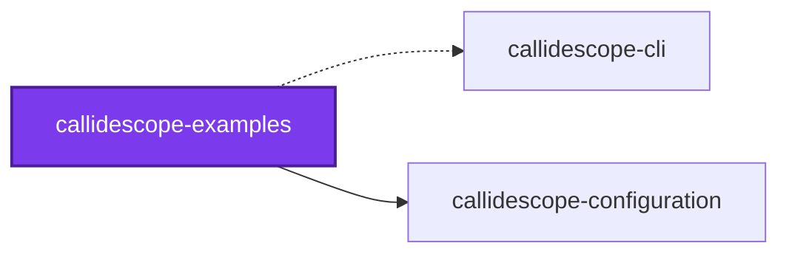
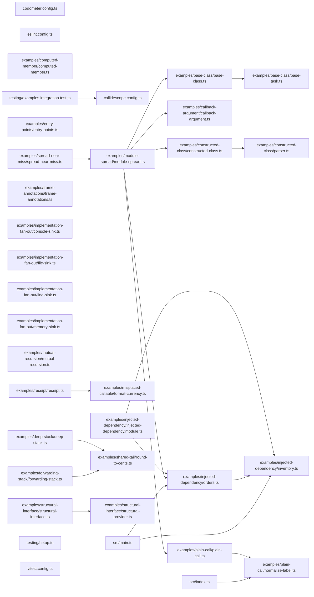

# 🔭 Callidescope Examples

**A small codebase built to be traced, so every finding callidescope reports has
somewhere to point.**

Callidescope's claim is that it follows calls no file-at-a-time tool can see:
`this.someService.load()` through an injected dependency, a structurally
satisfied interface with no `implements`, a callback handed to `map`. The
evidence for that used to be the tool's output on this repository, where the
interesting edges sit among some four thousand callables. This package is the
other kind of evidence — here is the code, here is exactly what callidescope makes of it, and
here is why.

Nothing here is meant to be good code. Every callable exists to make one rule,
one finding, or one annotation visible, and several of them are deliberately
bad. The reports under [`output/`](output) and the
[section at the bottom of this file](#-callidescope) are committed, so a reader
sees the shape without running anything.

```bash
nx run callidescope-examples:examples          # check the committed reports
nx run callidescope-examples:examples:write    # regenerate them
nx run callidescope-examples:vitest            # assert every finding below
```

Agents arriving from a callidescope finding should start at [AGENTS.md](AGENTS.md),
which maps "callidescope reported X" to the example that explains X.

## How to read a stack

```text
🚀 DeepStackService.quote(amount: number): number [.../deep-stack.service.ts:50]
   ↳ Quotes one order, priced through every stage below.
  └─> DeepStackService.validate(amount: number): number [.../deep-stack.service.ts:43]
     ↳ Rejects a negative amount before anything else reads it.
```

| Part | What it is |
| ---- | ---------- |
| 🚀 | The entry point — the root depth is measured from |
| `└─>` | One hop down, indented once per frame |
| `(…): number` | The signature, from the type checker. Collapsed past 80 characters |
| `↳` | The JSDoc summary, collapsed to one line |
| `⚠ deprecated` | The frame carries a `@deprecated` tag |
| `[path:line]` | Where to open. This is the point of the whole line |
| `depth ≥ 8` | A **floor**, not a measurement — something on this path could not be followed |
| `· orphan-root` | Which rule made the first frame a root |

## The examples

Each directory under [`examples/`](examples) is one example, carries its own
`README.md`, and is readable on its own. Each is also one **module** in
callidescope's sense, which is the unit module spread and misplacement are
measured against.

**The package is traced as one unit, together with its dependency closure.** An
example directory carries no `tsconfig.json` of its own, so it cannot be traced
alone — which is why every example's `## Run it` names the same command and then
says where in the committed output to look. The run reaches beyond this package
in the other direction, though: a project's own `tsconfig.json` never lists the
packages it imports, so a scoped run also traces every project its imports
transitively reach — otherwise a call leaving the package would land in code no
traced project owned. Four projects are traced here, and
[dependency-closure](examples/dependency-closure/README.md) is where that is
worked through. Read them in the order below for a walkthrough:
[plain-call](examples/plain-call/README.md) →
[injected-dependency](examples/injected-dependency/README.md) →
[structural-interface](examples/structural-interface/README.md) →
[base-class](examples/base-class/README.md) →
[constructed-class](examples/constructed-class/README.md) →
[callback-argument](examples/callback-argument/README.md) →
[dependency-closure](examples/dependency-closure/README.md) →
[computed-member](examples/computed-member/README.md) →
[implementation-fan-out](examples/implementation-fan-out/README.md) →
[mutual-recursion](examples/mutual-recursion/README.md) →
[entry-points](examples/entry-points/README.md) →
[deep-stack](examples/deep-stack/README.md) →
[forwarding-stack](examples/forwarding-stack/README.md) →
[shared-tail](examples/shared-tail/README.md) →
[module-spread](examples/module-spread/README.md) →
[spread-near-miss](examples/spread-near-miss/README.md) →
[misplaced-callable](examples/misplaced-callable/README.md) →
[receipt](examples/receipt/README.md) →
[frame-annotations](examples/frame-annotations/README.md).

### The resolution table, made executable

One fixture per row of the "How it follows a call" table in
[the callidescope README](../callidescope-cli/README.md).

| Fixture | Written as | Resolved to |
| ------- | ---------- | ----------- |
| [`plain-call`](examples/plain-call) | `normalize(label)` | `normalizeLabel` — the declaration, unwrapped through the import alias |
| [`injected-dependency`](examples/injected-dependency) | `this.inventoryService.reserve(…)` | `InventoryService.reserve`, through the constructor parameter's type |
| [`structural-interface`](examples/structural-interface) | `provider.ingest(document)` | `FilesystemProviderService.ingest` — no `implements`, an arrow-typed property |
| [`base-class`](examples/base-class) | `super.run()` | `BaseTaskService.run`, the base declaration |
| [`constructed-class`](examples/constructed-class) | `new ParserService(source)` | `ParserService.constructor`, which has a body |
| [`callback-argument`](examples/callback-argument) | `entries.map(entry => …)` | The arrow, as its own frame. `map` itself is external |
| [`computed-member`](examples/computed-member) | `REPORT_HANDLERS[format]()` | Nothing. Recorded as unfollowable rather than guessed |

The last row is why this package's deepest stack prints as `depth ≥ 8` rather
than `depth 8`. Eight frames of ordinary forwarding end at a member name that is
a value rather than a name in the syntax, so the real depth is whatever the
selected handler adds — unknowable from the source. A floor is the honest
answer: reporting `8` would claim a ceiling that does not exist, and reporting
nothing would hide a stack that is already too deep at the point it goes dark.

Every row above resolves inside one package. A workspace adds one more case — a
call that leaves the package it was written in — which is the next section.

### The dependency closure

[`dependency-closure`](examples/dependency-closure) makes the same injected hop
as `injected-dependency` and lands in a different package —
`ConfigurationService.resolveConfiguration`, declared in
`@callidescope/configuration`. It resolves because a run scoped to one directory
traces the projects that directory's imports transitively reach, rather than the
directory alone.

Pointed at this package, the run builds a program for four projects:

| Project | Reached because |
| ------- | --------------- |
| `packages/callidescope-examples` | The directory the run was pointed at |
| `packages/callidescope-configuration` | Imported by the fixture, and by [`callidescope.config.ts`](callidescope.config.ts) |
| `packages/codometer-configuration` | Reached through the shared configuration [`codometer.config.ts`](codometer.config.ts) spreads |
| `packages/logger` | Reached through the shared `configuration/eslint.config.ts` |

That is what the closure buys, and it is measurable: the fixture's stack is
depth 4 as traced, and depth 2 when the same fixtures are traced again with
`packages/callidescope-configuration` excluded. Two rules keep the set from
growing past those four — a project root holding no `package.json` is not a
destination, and neither is the workspace root — and the example's guide works
through both, including the shared
[`configuration/`](../../configuration) directory this package's program really
reads and the closure deliberately refuses.

### The cap on structural matching

[`implementation-fan-out`](examples/implementation-fan-out) declares three
classes satisfying one interface, against a
`maximumImplementationCandidates` of two. The whole expansion is dropped and
recorded as unfollowable — not narrowed to a favorite, which would invent a
call stack no execution ever takes. A member named `emit`, `run`, or `sync`
matches dozens of unrelated classes in a real workspace, and that is the noise
the cap exists to stop.

This package's own fixtures account for exactly two unfollowable calls: the
computed member name, and this dropped expansion. The run's total is higher,
because the closure's real dependency code contributes its own — the per-project
report for `packages/callidescope-examples` in
[`output/report.json`](output/report.json) is where the two are counted apart
from the rest.

### Recursion

[`mutual-recursion`](examples/mutual-recursion) is a cycle of three. The
three collapse into one component before depth is measured, so they contribute
three frames once.

The rejected alternative is detecting a repeat visit part-way through the walk.
It makes the answer depend on which path arrived first, so the same method
reports a different depth from a different entry point, and between runs. A
linter whose numbers move on their own cannot gate a pull request — a red build
nobody caused is a red build everyone learns to ignore.

`traverse` sits above the cycle rather than in it, and it has to. Every member
of a cycle has a caller _inside_ the cycle, so none of the three is ever
promoted as an orphan root — a cluster nothing outside it calls is reachable
from no root at all, and would contribute a cyclic component to the run summary
while appearing in no stack. Real recursive code is always called from
somewhere, and `traverse` is that somewhere.

### Entry points

Depth is only meaningful relative to a root, and most code in a repository like
this one is called by a framework rather than by the repository. Every root kind
has a fixture:

| Kind | Fixture |
| ---- | ------- |
| `decorated-method` | `EntryPointsService.readReport`, carrying `@Get()` |
| `lifecycle` | `EntryPointsService.onModuleInit` |
| `module-bootstrap` | `bootstrap` in [`src/main.ts`](src/main.ts) |
| `exported-function` | `normalizeExampleLabel` in [`src/index.ts`](src/index.ts) |
| `orphan-root` | [`summarizeOrphanedWork`](examples/entry-points/entry-points.ts), which nothing calls |

The bootstrap and barrel rules key on the literal paths `src/main.ts` and
`src/index.ts`, so those two fixtures are the only files in this package outside
`examples/`.

Orphan promotion is the safety net rather than a feature. Without it a missing
entry-point rule removes a whole subtree from every measurement in silence;
with it, the subtree surfaces under a root that says "nothing claimed this" —
which is itself worth knowing, since an orphan is either dead code or a rule
that needs adding. Most stack heads in _this_ package are orphan roots, because
fixtures have no framework to call them.

`dependency-cruiser` says the same thing from the other direction: it reports
`no-orphans` against
[`orphan-root.utilities.ts`](examples/entry-points/entry-points.ts)
as a warning on every run of this project. Two tools independently noticing the
same file is the example working, not a lint failure to chase.

### Output

All four destinations are configured in
[`callidescope.config.ts`](callidescope.config.ts) and all four results are
committed:

| Destination | Result |
| ----------- | ------ |
| `json` | [`output/report.json`](output/report.json) — the whole run, machine-readable |
| `markdown` | [`output/report.md`](output/report.md) — the printed trees, between anchors |
| `mermaid` | [`output/diagram.md`](output/diagram.md) — the same stacks, drawn |
| `projectReadmes` | [The section at the bottom of this file](#-callidescope), and nothing else |

`projectReadmes` writes one section per **scoped** project — the projects a run
was pointed at, not the ones its closure reached. This run is scoped to this
package alone, so the only section it writes is the one at the bottom of this
file, even though it measures four projects. That is the rule the closure is
read against: **measurement reaches into a package's dependencies, publishing
does not.** A scoped run that also published would rewrite the section in three
sibling packages that never asked for it, and fight
`nx run codebase:callidescope:write` — which sets different limits and ignores
`LoggerService.*` — over the same three anchor blocks forever. The
whole-workspace run still publishes every project's section, because a run that
names no directory has every project as a scoped one.

`--format` is separate from all four: it decides what reaches the terminal
rather than a file. All three of its values are committed here too, because each
one prints the body of one of the files above:

| `--format` | Prints | Committed as |
| ---------- | ------ | ------------ |
| `markdown` | The printed trees and finding tables | [`output/report.md`](output/report.md), between its anchors |
| `mermaid` | The same report with its stacks drawn | [`output/diagram.md`](output/diagram.md), between its anchors |
| `json` | The machine-readable report | [`output/report.json`](output/report.json), byte for byte |

So a console rendering is never a fourth artifact to keep in step — reading the
file is reading what the terminal would have shown, minus the anchor comments
the splice needs.

The diagram is worth drawing only when stacks share tails, so two of these
fixtures share one:
[`roundToCents`](examples/shared-tail/round-to-cents.ts) is the last
frame of both `DeepStackService.quote` and `ForwardingStackService.handle`, and
the flowchart shows them converging on it. A single stack drawn alone is a
straight line, and a straight line is a list with extra steps.

### The two flags

`--check depth` and `--check reports` name two different findings, and they sit
on opposite sides of a pull request. This package is the clearest place to see
why, because it uses the opposite one from the workspace around it:

| Run | Flag | Why |
| --- | ---- | --- |
| `nx run codebase:callidescope` | `--check depth` | A stack got longer in this change, and this change is what fixes it |
| `nx run callidescope-examples:examples` | `--check reports` | The fixtures are frozen, so a stale report means a fixture, a dependency, or the resolver moved |

The workspace cannot check its own report on a branch: the call graph moves on
nearly every change, so freshness would fail pull requests for being behind
`main` rather than for anything they did. It publishes on `main` instead. Here
the opposite mostly holds — the fixtures move only on a deliberate edit — so
freshness is the right gate, and depth is not gated at all, because these
fixtures are _meant_ to breach it.

The closure qualifies that "mostly". Three dependency packages are traced
alongside the fixtures now, and they are ordinary code that changes for ordinary
reasons, so a change to one of them makes this report stale too. That is the
gate working rather than misfiring — the report really did change — but it means
the fix is `nx run callidescope-examples:examples:write` in whichever change
moved the dependency, and the `examples` target names those packages' sources in
its `inputs` so a cached run is never replayed over them. Their READMEs are not
named there, because this run does not write into them.

`{workspaceRoot}/configuration/*.config.ts` is in those `inputs` too, and it is
not redundant with `shared-globals` — which holds `configuration/tsconfig.json`
and nothing else. Two of the three dependency packages are in the closure only
because this package's own `eslint.config.ts` and `codometer.config.ts` spread
the root ones, and the root ones import `@codebase/logger/eslint` and
`@codometer/configuration`. Delete an import there and these reports lose a
whole project, with nothing else in `inputs` changed — a cached green replayed
over exactly the drift this gate exists to catch.

Two command lines are refused outright:

```bash
callidescope --write --check reports   # a report cannot be stale in the run that just wrote it
callidescope --check lint              # not a finding this tool has
callidescope --check                   # a gate that cannot fail is a mistake, not a shorthand
```

## Acting on a finding

### A depth finding

Depth is a question, not a verdict. Two fixtures are eight frames deep and the
right answer differs completely:

- [`deep-stack`](examples/deep-stack) — every layer transforms the amount it
  was handed. Nothing here is removable one layer at a time; the question is
  whether pricing needs this many stages at all.
- [`forwarding-stack`](examples/forwarding-stack) — six of the eight frames
  are `return this.next(amount)`. Read one file at a time each is the least
  objectionable code there is; read as a stack they are pure overhead, and
  collapsing them costs nothing.

So: open the deepest frame's `file:line`, and read the summaries down the tree.
If a run of frames all say the same thing, they are the forwarding case. If each
says something different, the layering is real and the finding is about the
design rather than the code.

The one thing not to do is raise `maximumDepth` to make it pass. This
repository's limit is a ratchet set to today's worst stack, so raising it
converts a gate into a record of a decision nobody made.

### A module-spread finding

[`module-spread`](examples/module-spread) reports
`ModuleSpreadService.orchestrate`: its callees reach six modules, and it calls
five of them _directly_. Both halves matter, which is what
[`spread-near-miss`](examples/spread-near-miss) is for — it reaches
everything the orchestrator reaches, but calls one module directly, and is
correctly not reported. Transitive reach alone would flag every entry point in
the repository, because an entry point legitimately reaches the whole program.

The fix is to look at the five direct calls and ask which of them belong to one
another. A method joining unrelated concerns is usually a dispatcher under a
name that promises a domain operation, and the remedy is to give each concern
its own caller — not to inline anything.

### A misplaced-callable finding

[`misplaced-callable`](examples/misplaced-callable) declares
`formatCurrency`; both of its callers live in
[`receipt`](examples/receipt). The report names the move:

```text
formatCurrency | declared in …:modules/misplaced-callable | called from …:modules/receipt | 2/2
```

Move the file, or fold the helper into its one caller. The finding needs at
least `minimumCallers` callers before it will judge placement at all, and at
least `callerMajorityRatio` of them in a single foreign module — so it stays
quiet about a genuinely shared utility, which is the shape it would otherwise
be wrong about most often.

### Frame annotations

[`frame-annotations`](examples/frame-annotations) is seven frames, one per
shape a comment-trivia reader gets wrong or a renderer has to shorten. The stack
is deep on purpose: annotations are read only for the frames a report actually
prints, so a shape has to be inside a reported stack to be demonstrated at all.

| Frame | Shape |
| ----- | ----- |
| `render` | An **overload** — its documentation sits on the signature, not on the implementation the graph points at |
| `summarize` | An **arrow-typed property** — its documentation sits on the property, not on the arrow |
| `describe` | A **destructured parameter**, printed `{ count, name }: DescribeArguments`, which has no name at all in the syntax |
| `collapseThisSignatureBecauseItRunsLong` | A signature past 80 characters, collapsed to `(…): string` |
| `finish` | A summary past 120 characters, printed as its opening sentence alone |

`legacyRender` carries the `@deprecated` tag and heads a shorter stack of its
own, marked `⚠ deprecated` on its `🚀` line. It cannot sit inside the first
stack: calling a deprecated member is an ESLint error in this repository, so the
only honest way to give the tag a frame is to make the deprecated callable a
root — which is what a callable on its way out would be anyway.

Shortening applies to the printed tree only.
[`output/report.json`](output/report.json) carries every comment in full,
because a machine reading it has no line width to respect.

## Configuring your own workspace

Start from [`callidescope.config.ts`](callidescope.config.ts) here, which is
short on purpose, and read
[the configuration reference](../callidescope-configuration/README.md) for every
field.

Three decisions are worth making deliberately:

1. **`limits.maximumDepth`.** Set it to your deepest stack today, not to the
   number you want. A limit that fails on arrival is a backlog rather than a
   gate. Lower it as the outliers come down.
2. **`entryPoints.decorators`.** Add whatever your framework calls. Anything you
   miss still appears — as an orphan root — so the cost of getting this wrong is
   a wrong-looking label rather than a missing subtree.
3. **`excludeFrom`.** Point it at a gitignore-syntax file rather than growing
   the configuration. This repository's
   [`.callidescopeignore`](../../configuration/.callidescopeignore) excludes
   generated code, template sources, and — the reason it matters here — this
   package, whose fixtures exist to breach the limits the workspace gate
   enforces.

## Why this package is shaped the way it is

Every cross-cutting check in this repository had to be answered for a package
whose entire content is deliberately-shaped fixture code. The answers:

| Check | Answer |
| ----- | ------ |
| Workspace depth gate | The package is in [`.callidescopeignore`](../../configuration/.callidescopeignore) and traced by its own configuration instead |
| `projectReadmes` | Yes — a section reporting the deliberately-bad fixtures is the best example in the package, not noise |
| Test coverage | Nothing is instrumented. Fixture code exists to be read by the type checker, not executed; what is verified is what callidescope makes of it |
| `knip` and `fallow` | Every fixture is declared an entry point rather than ignored, so both keep checking dependencies while the orphan-root fixture stops being a finding |
| `jscpd` | Scoped for this project. The resolution-table fixtures are near-identical by design |
| `codometer` | No declared size limit: the package is private and never built, so there is no bundle to gate |
| Nx tags | `type:package`, `framework:nestjs`, `language:typescript`, `name:callidescope-examples`. The NestJS dependency is real — `injected-dependency` is the headline case |
| Project layout | An `examples/` directory rather than `src/modules/`, matching the other `*-examples` packages. `configuration/codebase-structure.json` declares it; `workspaceStructure.rootModuleSegment` in this package's config is what keeps each directory a distinct module |
| `conformetry` | Not an instance of any template, and nothing had to be suppressed to keep it that way — see below |

The layout is what keeps this package out of conformance, and it is worth
saying why, because the alternative was worse. Conformetry selects the instances
of `nestjs-service-module`, `nestjs-service-file`, and three more by pattern:
`src/modules/*` and `src/modules/*/*.service.ts`, on any project tagged
`framework:nestjs`. Under the original `src/modules/` layout, carrying that tag
made every fixture directory a conformance instance owing a unit test and the
template's full file set — so the fixtures would have been shaped by a generator
template rather than by what they demonstrate.

Moving to `examples/` dissolved that without suppressing anything. There is no
`src/modules/` for those patterns to match, so the tag is free to be accurate
about a dependency that is genuinely real.

## Layout

```text
callidescope-examples/
├── callidescope.config.ts             what traces this package, and every limit it sets
├── examples/
│   └── <name>/
│       ├── README.md                  the guide for this example
│       └── *.ts                       the fixture callables
├── output/
│   ├── report.json                    the whole run, machine-readable
│   ├── report.md                      the printed trees, between anchors
│   └── diagram.md                     the same stacks, drawn
├── src/
│   ├── index.ts                       the barrel — an `exported-function` root
│   └── main.ts                        the bootstrap — a `module-bootstrap` root
└── testing/
    └── examples.integration.test.ts   every finding this guide documents
```

`src/` is the one thing this package has that its three sibling `*-examples`
packages do not, and it is a requirement rather than a leftover: the
`module-bootstrap` and `exported-function` entry-point rules key on the
**literal paths** `src/main.ts` and `src/index.ts`, so those two fixtures cannot
live under `examples/` with the rest. They are the only files in this package
outside `examples/`.

## Test

```bash
nx run callidescope-examples:vitest
```

[`testing/examples.integration.test.ts`](testing/examples.integration.test.ts)
traces the fixtures and asserts every finding this guide documents — the stack
depths, the floor, the spread and misplacement findings, the unfollowable
frames, the entry-point kinds. A fixture whose meaning silently changed when the
resolver changed would be worse than no fixture, and these assertions double as
regression tests for the resolver itself.

## License

MIT — see [LICENSE](../../LICENSE).

<!-- CALL_STACKS_START -->

## 🔭 Callidescope

Call stacks traced through `packages/callidescope-examples`, deepest first. Each frame shows what it takes, what it returns, and what its documentation says.

| Measure | Value |
| --- | --- |
| Callables | 72 |
| Files | 34 |
| Calls traced | 55 |
| Call stacks | 15 |
| Deepest stack | 8 |
| Stacks through recursion | 1 |
| Unfollowable calls | 2 |

### Call stacks (depth)

**1. `ComputedMemberService.dispatch`** — depth ≥ 8 · orphan-root

```text
🚀 ComputedMemberService.dispatch(format: string): string [packages/callidescope-examples/examples/computed-member/computed-member.ts:60]
   ↳ Dispatches a report request to a handler named at runtime.
  └─> ComputedMemberService.read(format: string): string [packages/callidescope-examples/examples/computed-member/computed-member.ts:43]
     ↳ Reads the request's format and passes it on.
    └─> ComputedMemberService.normalize(format: string): string [packages/callidescope-examples/examples/computed-member/computed-member.ts:33]
       ↳ Normalizes the requested format before anything routes on it.
      └─> ComputedMemberService.route(format: string): string [packages/callidescope-examples/examples/computed-member/computed-member.ts:48]
         ↳ Routes the request one layer further down.
        └─> ComputedMemberService.select(format: string): string [packages/callidescope-examples/examples/computed-member/computed-member.ts:53]
           ↳ Selects the branch that prepares the format.
          └─> ComputedMemberService.prepare(format: string): string [packages/callidescope-examples/examples/computed-member/computed-member.ts:38]
             ↳ Prepares the format string the handler table is keyed by.
            └─> ComputedMemberService.choose(format: string): string [packages/callidescope-examples/examples/computed-member/computed-member.ts:28]
               ↳ Chooses a handler by name.
              └─> ComputedMemberService.apply(format: string): string [packages/callidescope-examples/examples/computed-member/computed-member.ts:23]
                 ↳ Applies the selected handler, whichever one that turns out to be.
```

**2. `DeepStackService.quote`** — depth 8 · orphan-root

```text
🚀 DeepStackService.quote(amount: number): number [packages/callidescope-examples/examples/deep-stack/deep-stack.ts:50]
   ↳ Quotes one order, priced through every stage below.
  └─> DeepStackService.validate(amount: number): number [packages/callidescope-examples/examples/deep-stack/deep-stack.ts:43]
     ↳ Rejects a negative amount before anything else reads it.
    └─> DeepStackService.removeDiscount(amount: number): number [packages/callidescope-examples/examples/deep-stack/deep-stack.ts:33]
       ↳ Removes the tier discount from the validated amount.
      └─> DeepStackService.resolveTier(amount: number): number [packages/callidescope-examples/examples/deep-stack/deep-stack.ts:38]
         ↳ Picks the pricing tier the discounted amount falls into.
        └─> DeepStackService.loadRate(amount: number, tier: number): number [packages/callidescope-examples/examples/deep-stack/deep-stack.ts:28]
           ↳ Looks up the tax rate the resolved tier pays.
          └─> DeepStackService.applyTax(amount: number, rate: number): number [packages/callidescope-examples/examples/deep-stack/deep-stack.ts:18]
             ↳ Adds tax at the resolved rate.
            └─> DeepStackService.convertCurrency(amount: number): number [packages/callidescope-examples/examples/deep-stack/deep-stack.ts:23]
               ↳ Converts to the reporting currency and rounds through the shared tail.
              └─> roundToCents(amount: number): number [packages/callidescope-examples/examples/shared-tail/round-to-cents.ts:8]
                 ↳ The tail two of this package's deep stacks share.
```

**3. `ForwardingStackService.handle`** — depth 8 · orphan-root

```text
🚀 ForwardingStackService.handle(amount: number): number [packages/callidescope-examples/examples/forwarding-stack/forwarding-stack.ts:53]
   ↳ Handles one amount, through six layers that do nothing to it.
  └─> ForwardingStackService.process(amount: number): number [packages/callidescope-examples/examples/forwarding-stack/forwarding-stack.ts:41]
     ↳ Forwards, unchanged.
    └─> ForwardingStackService.execute(amount: number): number [packages/callidescope-examples/examples/forwarding-stack/forwarding-stack.ts:21]
       ↳ Forwards, unchanged.
      └─> ForwardingStackService.forward(amount: number): number [packages/callidescope-examples/examples/forwarding-stack/forwarding-stack.ts:31]
         ↳ Forwards, unchanged.
        └─> ForwardingStackService.perform(amount: number): number [packages/callidescope-examples/examples/forwarding-stack/forwarding-stack.ts:36]
           ↳ Forwards, unchanged.
          └─> ForwardingStackService.relay(amount: number): number [packages/callidescope-examples/examples/forwarding-stack/forwarding-stack.ts:46]
             ↳ Forwards, unchanged.
            └─> ForwardingStackService.finish(amount: number): number [packages/callidescope-examples/examples/forwarding-stack/forwarding-stack.ts:26]
               ↳ Rounds the amount, which is the only work on this path.
              └─> roundToCents(amount: number): number [packages/callidescope-examples/examples/shared-tail/round-to-cents.ts:8]
                 ↳ The tail two of this package's deep stacks share.
```

<details>
<summary>12 more call stacks</summary>

**4. `FrameAnnotationsService.trace`** — depth 7 · orphan-root

```text
🚀 FrameAnnotationsService.trace(value: string): string [packages/callidescope-examples/examples/frame-annotations/frame-annotations.ts:95]
   ↳ Traces one value through every annotation shape below.
  └─> FrameAnnotationsService.render(value: number | string): string | string[] [packages/callidescope-examples/examples/frame-annotations/frame-annotations.ts:88]
     ↳ Renders one value for display, in the form its type calls for.
    └─> FrameAnnotationsService.summarize(rendered: string): string [packages/callidescope-examples/examples/frame-annotations/frame-annotations.ts:27]
       ↳ Collapses a rendered value to something a description can quote.
      └─> FrameAnnotationsService.describe({ count, name }: DescribeArguments): string [packages/callidescope-examples/examples/frame-annotations/frame-annotations.ts:64]
         ↳ Describes a value from a parameter with no name at all in the syntax.
        └─> FrameAnnotationsService.compose(description: string): string [packages/callidescope-examples/examples/frame-annotations/frame-annotations.ts:33]
           ↳ Joins the parts a description was built from.
          └─> FrameAnnotationsService.collapseThisSignatureBecauseItRunsLong(…): string [packages/callidescope-examples/examples/frame-annotations/frame-annotations.ts:53]
             ↳ Takes three parameters whose rendered signature runs past eighty characters, so the printed frame collapses it to `(…):…
            └─> FrameAnnotationsService.finish(description: string): string [packages/callidescope-examples/examples/frame-annotations/frame-annotations.ts:43]
               ↳ Finishes the chain and hands back what the layers above it built.
```

**5. `SpreadNearMissService.review`** — depth 5 · orphan-root

```text
🚀 SpreadNearMissService.review(label: string): string [packages/callidescope-examples/examples/spread-near-miss/spread-near-miss.ts:23]
   ↳ Delegates the whole job to the one module it knows about.
  └─> ModuleSpreadService.orchestrate(label: string): string [packages/callidescope-examples/examples/module-spread/module-spread.ts:32]
     ↳ Touches five modules in one method, which is the finding.
    └─> CallbackArgumentService.shoutAll(entries: readonly string[]): string[] [packages/callidescope-examples/examples/callback-argument/callback-argument.ts:22]
       ↳ Shouts every entry, through a callback `map` invokes.
      └─> CallbackArgumentService.map(…)(entry: string): string [packages/callidescope-examples/examples/callback-argument/callback-argument.ts:23]
        └─> CallbackArgumentService.shout(entry: string): string [packages/callidescope-examples/examples/callback-argument/callback-argument.ts:15]
           ↳ Upper-cases one entry.
```

**6. `DependencyClosureService.allowsDepth`** — depth 4 · orphan-root

```text
🚀 DependencyClosureService.allowsDepth(args: { configuration: CallidescopeConfiguration; depth: number; }): boolean [packages/callidescope-examples/examples/dependency-closure/dependency-closure.ts:32]
   ↳ Whether a configuration allows a stack as deep as the one asked about.
  └─> DependencyClosureService.readDepthLimit(configuration: CallidescopeConfiguration): number [packages/callidescope-examples/examples/dependency-closure/dependency-closure.ts:24]
     ↳ Reads the depth limit the dependency's own defaulting settles on.
    └─> ConfigurationService.resolveConfiguration(configuration: CallidescopeConfiguration): ResolvedCallidescopeConfiguration [packages/callidescope-configuration/src/modules/configuration/configuration.service.ts:375]
       ↳ Fills in every field a configuration file may leave out.
      └─> ConfigurationService.resolveAllowSpreadFor(allowSpreadFor: string[] | undefined): string[] [packages/callidescope-configuration/src/modules/configuration/configuration.service.ts:170]
         ↳ Applies the default globs exempt from the module-spread finding.
```

**7. `FrameAnnotationsService.legacyRender`** — depth 4 · orphan-root

```text
🚀 FrameAnnotationsService.legacyRender(value: string): string ⚠ deprecated [packages/callidescope-examples/examples/frame-annotations/frame-annotations.ts:74]
   ↳ Renders a value the way this package used to.
  └─> FrameAnnotationsService.compose(description: string): string [packages/callidescope-examples/examples/frame-annotations/frame-annotations.ts:33]
     ↳ Joins the parts a description was built from.
    └─> FrameAnnotationsService.collapseThisSignatureBecauseItRunsLong(…): string [packages/callidescope-examples/examples/frame-annotations/frame-annotations.ts:53]
       ↳ Takes three parameters whose rendered signature runs past eighty characters, so the printed frame collapses it to `(…):…
      └─> FrameAnnotationsService.finish(description: string): string [packages/callidescope-examples/examples/frame-annotations/frame-annotations.ts:43]
         ↳ Finishes the chain and hands back what the layers above it built.
```

**8. `MutualRecursionService.traverse`** — depth 4 · orphan-root

```text
🚀 MutualRecursionService.traverse(remaining: number): number [packages/callidescope-examples/examples/mutual-recursion/mutual-recursion.ts:45]
   ↳ Enters the cycle from outside it, so the cluster has a root above it.
  └─> MutualRecursionService.branch(remaining: number): number (cycle) [packages/callidescope-examples/examples/mutual-recursion/mutual-recursion.ts:28]
     ↳ Second of the three, one hop from the leaf.
    └─> MutualRecursionService.leaf(remaining: number): number (cycle) [packages/callidescope-examples/examples/mutual-recursion/mutual-recursion.ts:38]
       ↳ Third of the three, which calls back to the first.
      └─> MutualRecursionService.descend(remaining: number): number (cycle) [packages/callidescope-examples/examples/mutual-recursion/mutual-recursion.ts:33]
         ↳ First of the three, and the way into the cycle.
```

**9. `bootstrap`** — depth 3 · module-bootstrap

```text
🚀 bootstrap(): number [packages/callidescope-examples/src/main.ts:14]
   ↳ The `module-bootstrap` entry-point kind.
  └─> OrdersService.place(available: number): number [packages/callidescope-examples/examples/injected-dependency/orders.ts:21]
     ↳ Places one order against the injected inventory.
    └─> InventoryService.reserve(available: number): number [packages/callidescope-examples/examples/injected-dependency/inventory.ts:9]
       ↳ Reserves one unit and reports the count left behind.
```

**10. `EntryPointsService.onModuleInit`** — depth 2 · lifecycle

```text
🚀 EntryPointsService.onModuleInit(): string [packages/callidescope-examples/examples/entry-points/entry-points.ts:29]
   ↳ A lifecycle hook a framework calls — the `lifecycle` kind.
  └─> EntryPointsService.prepareCache(): string [packages/callidescope-examples/examples/entry-points/entry-points.ts:22]
     ↳ Does the work a lifecycle hook is called to do.
```

**11. `EntryPointsService.readReport`** — depth 2 · decorated-method

```text
🚀 EntryPointsService.readReport(): string [packages/callidescope-examples/examples/entry-points/entry-points.ts:34]
   ↳ A decorated method — the `decorated-method` kind.
  └─> EntryPointsService.buildReport(): string [packages/callidescope-examples/examples/entry-points/entry-points.ts:17]
     ↳ Builds the body a decorated request handler answers with.
```

**12. `normalizeExampleLabel`** — depth 2 · exported-function

```text
🚀 normalizeExampleLabel(label: string): string [packages/callidescope-examples/src/index.ts:15]
   ↳ The `exported-function` entry-point kind.
  └─> normalizeLabel(label: string): string [packages/callidescope-examples/examples/plain-call/normalize-label.ts:2]
     ↳ Trims a label and collapses the whitespace inside it.
```

**13. `ReceiptService.renderLine`** — depth 2 · orphan-root

```text
🚀 ReceiptService.renderLine(amount: number): string [packages/callidescope-examples/examples/receipt/receipt.ts:16]
   ↳ Renders one line of a receipt.
  └─> formatCurrency(amount: number): string [packages/callidescope-examples/examples/misplaced-callable/format-currency.ts:9]
     ↳ A helper filed in the wrong module, and the report says where it belongs.
```

**14. `ReceiptService.renderTotal`** — depth 2 · orphan-root

```text
🚀 ReceiptService.renderTotal(amount: number): string [packages/callidescope-examples/examples/receipt/receipt.ts:21]
   ↳ Renders the total line of a receipt.
  └─> formatCurrency(amount: number): string [packages/callidescope-examples/examples/misplaced-callable/format-currency.ts:9]
     ↳ A helper filed in the wrong module, and the report says where it belongs.
```

**15. `StructuralInterfaceService.ingestDocument`** — depth 2 · orphan-root

```text
🚀 StructuralInterfaceService.ingestDocument(provider: StructuralProvider, document: string): number [packages/callidescope-examples/examples/structural-interface/structural-interface.ts:17]
   ↳ Ingests one document through whatever satisfies the interface.
  └─> FilesystemProviderService.ingest(document: string): number [packages/callidescope-examples/examples/structural-interface/structural-provider.ts:25]
     ↳ Counts the words one document contributes.
```

</details>

### Module spread

| Callable | Spread | Calls directly | Location |
| --- | --- | --- | --- |
| `ModuleSpreadService.orchestrate` | 6 | `packages/callidescope-examples:base-class`, `packages/callidescope-examples:callback-argument`, `packages/callidescope-examples:constructed-class`, `packages/callidescope-examples:injected-dependency`, `packages/callidescope-examples:plain-call` | `packages/callidescope-examples/examples/module-spread/module-spread.ts:32` |

### Breadth

| Callable | Breadth | Calls directly | Location |
| --- | --- | --- | --- |
| `ModuleSpreadService.orchestrate` | 5 | `PlainCallService.render`, `OrdersService.place`, `ConstructedClassService.count`, `BaseClassService.run`, `CallbackArgumentService.shoutAll` | `packages/callidescope-examples/examples/module-spread/module-spread.ts:32` |
| `bootstrap` | 2 | `OrdersService.place`, `OrdersService.constructor` | `packages/callidescope-examples/src/main.ts:14` |
| `BaseClassService.run` | 1 | `BaseTaskService.run` | `packages/callidescope-examples/examples/base-class/base-class.ts:16` |

<details>
<summary>46 more callables</summary>

| Callable | Breadth | Calls directly | Location |
| --- | --- | --- | --- |
| `CallbackArgumentService.shoutAll` | 1 | `CallbackArgumentService.map(…)` | `packages/callidescope-examples/examples/callback-argument/callback-argument.ts:22` |
| `CallbackArgumentService.map(…)` | 1 | `CallbackArgumentService.shout` | `packages/callidescope-examples/examples/callback-argument/callback-argument.ts:23` |
| `ComputedMemberService.choose` | 1 | `ComputedMemberService.apply` | `packages/callidescope-examples/examples/computed-member/computed-member.ts:28` |
| `ComputedMemberService.normalize` | 1 | `ComputedMemberService.route` | `packages/callidescope-examples/examples/computed-member/computed-member.ts:33` |
| `ComputedMemberService.prepare` | 1 | `ComputedMemberService.choose` | `packages/callidescope-examples/examples/computed-member/computed-member.ts:38` |
| `ComputedMemberService.read` | 1 | `ComputedMemberService.normalize` | `packages/callidescope-examples/examples/computed-member/computed-member.ts:43` |
| `ComputedMemberService.route` | 1 | `ComputedMemberService.select` | `packages/callidescope-examples/examples/computed-member/computed-member.ts:48` |
| `ComputedMemberService.select` | 1 | `ComputedMemberService.prepare` | `packages/callidescope-examples/examples/computed-member/computed-member.ts:53` |
| `ComputedMemberService.dispatch` | 1 | `ComputedMemberService.read` | `packages/callidescope-examples/examples/computed-member/computed-member.ts:60` |
| `ConstructedClassService.count` | 1 | `ParserService.constructor` | `packages/callidescope-examples/examples/constructed-class/constructed-class.ts:17` |
| `DeepStackService.applyTax` | 1 | `DeepStackService.convertCurrency` | `packages/callidescope-examples/examples/deep-stack/deep-stack.ts:18` |
| `DeepStackService.convertCurrency` | 1 | `roundToCents` | `packages/callidescope-examples/examples/deep-stack/deep-stack.ts:23` |
| `DeepStackService.loadRate` | 1 | `DeepStackService.applyTax` | `packages/callidescope-examples/examples/deep-stack/deep-stack.ts:28` |
| `DeepStackService.removeDiscount` | 1 | `DeepStackService.resolveTier` | `packages/callidescope-examples/examples/deep-stack/deep-stack.ts:33` |
| `DeepStackService.resolveTier` | 1 | `DeepStackService.loadRate` | `packages/callidescope-examples/examples/deep-stack/deep-stack.ts:38` |
| `DeepStackService.validate` | 1 | `DeepStackService.removeDiscount` | `packages/callidescope-examples/examples/deep-stack/deep-stack.ts:43` |
| `DeepStackService.quote` | 1 | `DeepStackService.validate` | `packages/callidescope-examples/examples/deep-stack/deep-stack.ts:50` |
| `DependencyClosureService.readDepthLimit` | 1 | `ConfigurationService.resolveConfiguration` | `packages/callidescope-examples/examples/dependency-closure/dependency-closure.ts:24` |
| `DependencyClosureService.allowsDepth` | 1 | `DependencyClosureService.readDepthLimit` | `packages/callidescope-examples/examples/dependency-closure/dependency-closure.ts:32` |
| `EntryPointsService.onModuleInit` | 1 | `EntryPointsService.prepareCache` | `packages/callidescope-examples/examples/entry-points/entry-points.ts:29` |
| `EntryPointsService.readReport` | 1 | `EntryPointsService.buildReport` | `packages/callidescope-examples/examples/entry-points/entry-points.ts:34` |
| `ForwardingStackService.execute` | 1 | `ForwardingStackService.forward` | `packages/callidescope-examples/examples/forwarding-stack/forwarding-stack.ts:21` |
| `ForwardingStackService.finish` | 1 | `roundToCents` | `packages/callidescope-examples/examples/forwarding-stack/forwarding-stack.ts:26` |
| `ForwardingStackService.forward` | 1 | `ForwardingStackService.perform` | `packages/callidescope-examples/examples/forwarding-stack/forwarding-stack.ts:31` |
| `ForwardingStackService.perform` | 1 | `ForwardingStackService.relay` | `packages/callidescope-examples/examples/forwarding-stack/forwarding-stack.ts:36` |
| `ForwardingStackService.process` | 1 | `ForwardingStackService.execute` | `packages/callidescope-examples/examples/forwarding-stack/forwarding-stack.ts:41` |
| `ForwardingStackService.relay` | 1 | `ForwardingStackService.finish` | `packages/callidescope-examples/examples/forwarding-stack/forwarding-stack.ts:46` |
| `ForwardingStackService.handle` | 1 | `ForwardingStackService.process` | `packages/callidescope-examples/examples/forwarding-stack/forwarding-stack.ts:53` |
| `FrameAnnotationsService.summarize` | 1 | `FrameAnnotationsService.describe` | `packages/callidescope-examples/examples/frame-annotations/frame-annotations.ts:27` |
| `FrameAnnotationsService.compose` | 1 | `FrameAnnotationsService.collapseThisSignatureBecauseItRunsLong` | `packages/callidescope-examples/examples/frame-annotations/frame-annotations.ts:33` |
| `FrameAnnotationsService.collapseThisSignatureBecauseItRunsLong` | 1 | `FrameAnnotationsService.finish` | `packages/callidescope-examples/examples/frame-annotations/frame-annotations.ts:53` |
| `FrameAnnotationsService.describe` | 1 | `FrameAnnotationsService.compose` | `packages/callidescope-examples/examples/frame-annotations/frame-annotations.ts:64` |
| `FrameAnnotationsService.legacyRender` | 1 | `FrameAnnotationsService.compose` | `packages/callidescope-examples/examples/frame-annotations/frame-annotations.ts:74` |
| `FrameAnnotationsService.render` | 1 | `FrameAnnotationsService.summarize` | `packages/callidescope-examples/examples/frame-annotations/frame-annotations.ts:88` |
| `FrameAnnotationsService.trace` | 1 | `FrameAnnotationsService.render` | `packages/callidescope-examples/examples/frame-annotations/frame-annotations.ts:95` |
| `OrdersService.place` | 1 | `InventoryService.reserve` | `packages/callidescope-examples/examples/injected-dependency/orders.ts:21` |
| `PlainCallService.render` | 1 | `normalizeLabel` | `packages/callidescope-examples/examples/plain-call/plain-call.ts:17` |
| `MutualRecursionService.branch` | 1 | `MutualRecursionService.leaf` | `packages/callidescope-examples/examples/mutual-recursion/mutual-recursion.ts:28` |
| `MutualRecursionService.descend` | 1 | `MutualRecursionService.branch` | `packages/callidescope-examples/examples/mutual-recursion/mutual-recursion.ts:33` |
| `MutualRecursionService.leaf` | 1 | `MutualRecursionService.descend` | `packages/callidescope-examples/examples/mutual-recursion/mutual-recursion.ts:38` |
| `MutualRecursionService.traverse` | 1 | `MutualRecursionService.descend` | `packages/callidescope-examples/examples/mutual-recursion/mutual-recursion.ts:45` |
| `ReceiptService.renderLine` | 1 | `formatCurrency` | `packages/callidescope-examples/examples/receipt/receipt.ts:16` |
| `ReceiptService.renderTotal` | 1 | `formatCurrency` | `packages/callidescope-examples/examples/receipt/receipt.ts:21` |
| `SpreadNearMissService.review` | 1 | `ModuleSpreadService.orchestrate` | `packages/callidescope-examples/examples/spread-near-miss/spread-near-miss.ts:23` |
| `StructuralInterfaceService.ingestDocument` | 1 | `FilesystemProviderService.ingest` | `packages/callidescope-examples/examples/structural-interface/structural-interface.ts:17` |
| `normalizeExampleLabel` | 1 | `normalizeLabel` | `packages/callidescope-examples/src/index.ts:15` |

</details>

### Possibly misplaced

| Callable | Declared in | Called from | Callers |
| --- | --- | --- | --- |
| `formatCurrency` | `packages/callidescope-examples:misplaced-callable` | `packages/callidescope-examples:receipt` | 2/2 |
<!-- CALL_STACKS_END -->

## 🕸️ Codependix

Dependency graphs exported by [codependix](https://github.com/JimmyPaolini/codebase/tree/main/packages/codependix-cli), regenerated by `nx run codebase:codependix:write`.

### Nx Neighborhood

<!-- codependix:start name="codependix-nx" -->


_Dashed edges are dependencies Nx inferred from configuration rather than from code._
<!-- codependix:end name="codependix-nx" -->

### NestJS Module Graph

<!-- codependix:start name="codependix-nestjs" -->
_This project defines no NestJS modules to graph._
<!-- codependix:end name="codependix-nestjs" -->

### File Imports

<!-- codependix:start name="codependix-imports" -->

<!-- codependix:end name="codependix-imports" -->

<!-- CODE_STATISTICS_START -->

## ⏲️ Codometer

### Project


### TypeScript


### JavaScript


### Python


### JSON


### YAML


### TOML


### Shell


### SQL


### HCL


### CSS


### Conventions


### Jupyter


### Markdown


<!-- CODE_STATISTICS_END -->
