<!-- CALL_STACKS_START -->

# 🔭 Callidescope

| Measure | Value |
| --- | --- |
| Callables | 69 |
| Files | 37 |
| Calls traced | 53 |
| Call stacks | 23 |
| Deepest stack | 8 |
| Stacks through recursion | 1 |
| Unfollowable calls | 2 |

## Call stacks over the depth limit (4)

```mermaid
flowchart LR
  n0(["ComputedMemberService.dispatch"])
  n1["ComputedMemberService.read"]
  n2["ComputedMemberService.normalize"]
  n3["ComputedMemberService.route"]
  n4["ComputedMemberService.select"]
  n5["ComputedMemberService.prepare"]
  n6["ComputedMemberService.choose"]
  n7["ComputedMemberService.apply"]
  n8(["DeepStackService.quote"])
  n9["DeepStackService.validate"]
  n10["DeepStackService.removeDiscount"]
  n11["DeepStackService.resolveTier"]
  n12["DeepStackService.loadRate"]
  n13["DeepStackService.applyTax"]
  n14["DeepStackService.convertCurrency"]
  n15["roundToCents"]
  n16(["ForwardingStackService.handle"])
  n17["ForwardingStackService.process"]
  n18["ForwardingStackService.execute"]
  n19["ForwardingStackService.forward"]
  n20["ForwardingStackService.perform"]
  n21["ForwardingStackService.relay"]
  n22["ForwardingStackService.finish"]
  n23(["FrameAnnotationsService.trace"])
  n24["FrameAnnotationsService.render"]
  n25["FrameAnnotationsService.summarize"]
  n26["FrameAnnotationsService.describe"]
  n27["FrameAnnotationsService.compose"]
  n28["FrameAnnotationsService.collapseThisSignatureBecauseItRunsLong"]
  n29["FrameAnnotationsService.finish"]
  n0 --> n1
  n1 --> n2
  n2 --> n3
  n3 --> n4
  n4 --> n5
  n5 --> n6
  n6 --> n7
  n8 --> n9
  n9 --> n10
  n10 --> n11
  n11 --> n12
  n12 --> n13
  n13 --> n14
  n14 --> n15
  n16 --> n17
  n17 --> n18
  n18 --> n19
  n19 --> n20
  n20 --> n21
  n21 --> n22
  n22 --> n15
  n23 --> n24
  n24 --> n25
  n25 --> n26
  n26 --> n27
  n27 --> n28
  n28 --> n29
```

## Module spread

| Callable | Spread | Calls directly | Location |
| --- | --- | --- | --- |
| `ModuleSpreadService.orchestrate` | 6 | `packages/callidescope-examples:modules/base-class`, `packages/callidescope-examples:modules/callback-argument`, `packages/callidescope-examples:modules/constructed-class`, `packages/callidescope-examples:modules/injected-dependency`, `packages/callidescope-examples:modules/plain-call` | `packages/callidescope-examples/src/modules/module-spread/module-spread.service.ts:32` |

## Callables over the breadth limit (0)

None.

## Possibly misplaced

| Callable | Declared in | Called from | Callers |
| --- | --- | --- | --- |
| `formatCurrency` | `packages/callidescope-examples:modules/misplaced-callable` | `packages/callidescope-examples:modules/receipt` | 2/2 |

<!-- CALL_STACKS_END -->
