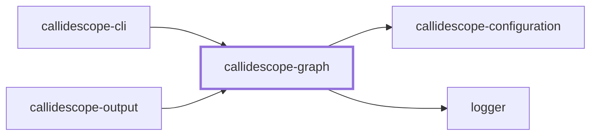

# 🔭 Callidescope Graph

**Builds the call graph from traced TypeScript source and measures its depth, breadth, and cohesion.**

This package is the leaf of the
[`@callidescope/cli`](../callidescope-cli/README.md) package graph: it depends
only on [`@callidescope/configuration`](../callidescope-configuration/README.md)
and `@codebase/logger`, and nothing here reaches into
[`@callidescope/output`](../callidescope-output/README.md).

```bash
npm install --save-dev @callidescope/graph
```

## What This Package Owns

- **`program`** — compiles the traced TypeScript projects
- **`workspace`** — resolves which projects and files are in scope
- **`callables`** — discovers the callable declarations
- **`entry-points`** — resolves configured entry points
- **`class-hierarchy`** — resolves interface members to concrete implementations
- **`signatures`** — reads callable signatures
- **`documentation`** — reads a callable's documentation comment
- **`edges`** — resolves call sites to callee declarations
- **`graph`** — assembles the above into `CallGraph`/`CondensedGraph` and measures depth and breadth over it
- **`cohesion`** — misplaced-callable and module-spread detection, since both are graph-analysis over an already-built graph rather than rendering concerns

## Project Graph

Where this project sits in the Nx project graph: what it depends on, and what depends on it. Regenerated by `nx run synchronization:nx-project-graphs:write`.

<!-- nx-project-graph-start -->



<!-- nx-project-graph-end -->

## Module Graph

The modules this project defines and the imports between them, published by `nx run synchronization:nestjs-module-graphs:write`.

<!-- nestjs-module-graph-start -->


_Rounded modules are global: every module can inject them, so their edges are left out._

_Reached only for their types, and so declaring no module here: callidescope-configuration._

<!-- nestjs-module-graph-end -->

## Test

```bash
nx run callidescope-graph:vitest
```
