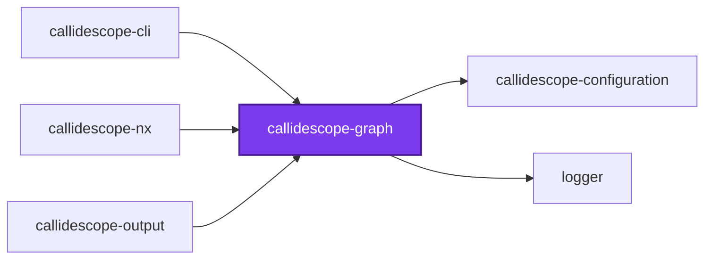
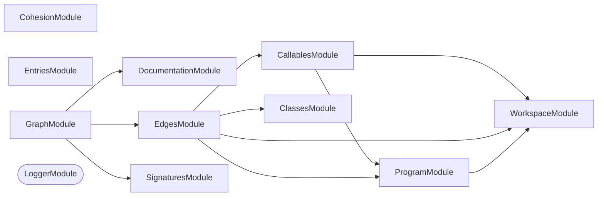

# 🔭 Callidescope Graph

**Builds the call graph from traced TypeScript source and measures its depth, breadth, and cohesion.**

This package is the leaf of the
[`@callidescope/cli`](../callidescope-cli/README.md) package graph: it depends
only on [`@callidescope/configuration`](../callidescope-configuration/README.md)
and `@codebase/logger`, and nothing here reaches into
[`@callidescope/output`](../callidescope-output/README.md).

```bash
npm install --save-dev @callidescope/graph
```

## What This Package Owns

- **`program`** — compiles the traced TypeScript projects
- **`workspace`** — resolves which projects and files are in scope
- **`callables`** — discovers the callable declarations
- **`entry-points`** — resolves configured entry points
- **`class-hierarchy`** — resolves interface members to concrete implementations
- **`signatures`** — reads callable signatures
- **`documentation`** — reads a callable's documentation comment
- **`edges`** — resolves call sites to callee declarations
- **`graph`** — assembles the above into `CallGraph`/`CondensedGraph` and measures depth and breadth over it
- **`cohesion`** — misplaced-callable and module-spread detection, since both are graph-analysis over an already-built graph rather than rendering concerns

## Test

```bash
nx run callidescope-graph:vitest
```

## 👔 Conformetry

This project was generated from the [nestjs-service-project](../../configuration/conformetry-templates/nestjs-service-project) conformetry template.

<!-- CALL_STACKS_START -->

## 🔭 Callidescope

Call stacks traced through `packages/callidescope-graph`, deepest first. Each frame shows what it takes, what it returns, and what its documentation says.

| Measure | Value |
| --- | --- |
| Callables | 192 |
| Files | 63 |
| Calls traced | 160 |
| Call stacks | 6 |
| Deepest stack | 5 |
| Stacks through recursion | 0 |
| Unfollowable calls | 2 |

### Call stacks (depth)

**1. `CallablesService.visit`** — depth 5 · orphan-root

```text
🚀 CallablesService.visit(node: ts.Node): void [packages/callidescope-graph/src/modules/callables/callables.service.ts:49]
  └─> CallablesService.describe(args: DescribeCallableArguments): DiscoveredCallable [packages/callidescope-graph/src/modules/callables/callables.service.ts:116]
     ↳ Turns one declaration into a fully described node.
    └─> CallableIdentityService.readDisplayName(declaration: CallableDeclaration): string [packages/callidescope-graph/src/modules/callables/callable-identity.service.ts:117]
       ↳ Builds the qualified name a report prints for a callable.
      └─> CallableIdentityService.readMemberName(declaration: CallableDeclaration): string [packages/callidescope-graph/src/modules/callables/callable-identity.service.ts:179]
         ↳ Reads the member name, falling back to the shape it was written in.
        └─> CallableIdentityService.readBindingName(node: ts.Node): string | undefined [packages/callidescope-graph/src/modules/callables/callable-identity.service.ts:50]
           ↳ Reads the name a property, variable, or parameter declaration binds.
```

**2. `AddressDepthService.toStack`** — depth 4 · orphan-root

```text
🚀 AddressDepthService.toStack(…): CallAddressStack [packages/callidescope-graph/src/modules/graph/address-depth.service.ts:105]
   ↳ Turns one raw id path into the frames a report can print.
  └─> PathsService.buildFrame(args: { callable: DiscoveredCallable; isCycle: boolean; }): StackFrame [packages/callidescope-graph/src/modules/graph/paths.service.ts:103]
     ↳ Turns one callable into a frame a report can print.
    └─> DocumentationService.read(args: ReadDocumentationArguments): CallableDocumentation | undefined [packages/callidescope-graph/src/modules/documentation/documentation.service.ts:78]
       ↳ Reads the documentation comment, if the callable has one.
      └─> DocumentationService.readSymbol(args: ReadDocumentationArguments): ts.Symbol | undefined [packages/callidescope-graph/src/modules/documentation/documentation.service.ts:51]
         ↳ Resolves the symbol a declaration's documentation hangs off.
```

**3. `CallSitesService.visit`** — depth 3 · orphan-root

```text
🚀 CallSitesService.visit(node: ts.Node): void [packages/callidescope-graph/src/modules/edges/call-sites.service.ts:62]
  └─> CallSitesService.readFunctionArguments(expression: ts.CallExpression | ts.NewExpression): ts.SignatureDeclaration[] [packages/callidescope-graph/src/modules/edges/call-sites.service.ts:42]
     ↳ Collects the function literals passed as arguments to one call.
    └─> CallSitesService.filter(…)(argument: ts.Expression): argument is ts.Expression & ts.SignatureDeclaration [packages/callidescope-graph/src/modules/edges/call-sites.service.ts:46]
```

<details>
<summary>3 more call stacks</summary>

**4. `WorkspaceService.isExcluded`** — depth 2 · orphan-root

```text
🚀 WorkspaceService.isExcluded(workspaceRelativePath: string): boolean [packages/callidescope-graph/src/modules/workspace/workspace.service.ts:187]
  └─> WorkspaceService.some(…)(glob: string): boolean [packages/callidescope-graph/src/modules/workspace/workspace.service.ts:189]
```

**5. `ClassesService.readMemberDeclarations`** — depth 2 · orphan-root

```text
🚀 ClassesService.readMemberDeclarations(…): Declaration[] [packages/callidescope-graph/src/modules/classes/classes.service.ts:149]
   ↳ Reads one member's concrete declarations off a candidate class.
  └─> ClassesService.filter(…)(member: ts.PropertyDeclaration | ts.MethodDeclaration): boolean [packages/callidescope-graph/src/modules/classes/classes.service.ts:163]
```

**6. `EdgesService.resolveCallableId`** — depth 2 · orphan-root

```text
🚀 EdgesService.resolveCallableId(…): string | undefined [packages/callidescope-graph/src/modules/edges/edges.service.ts:202]
   ↳ Maps a resolved declaration to the callable it belongs to.
  └─> WorkspaceService.toWorkspaceRelative(args: { absolutePath: string; workspaceRoot: string; }): string [packages/callidescope-graph/src/modules/workspace/workspace.service.ts:294]
     ↳ Rewrites an absolute path as workspace-relative with POSIX separators.
```

</details>

### Module spread

None.

### Breadth

| Callable | Breadth | Calls directly | Location |
| --- | --- | --- | --- |
| `CallablesService.describe` | 9 | `CallableIdentityService.readDisplayName`, `CallableIdentityService.readEnclosingTypeName`, `CallableIdentityService.buildId`, `CallableIdentityService.isExported`, `CallableIdentityService.readKind`, `CallableIdentityService.readLocation`, `CallableIdentityService.readMemberName`, `WorkspaceService.resolveModuleId`, `CallableIdentityService.countStatements` | `packages/callidescope-graph/src/modules/callables/callables.service.ts:116` |
| `EdgesService.buildSiteEdges` | 7 | `EdgesService.collectCallbackEdges`, `EdgesService.resolveSite`, `EdgesService.filter(…)`, `EdgesService.filter(…)`, `EdgesService.map(…)`, `EdgesService.filter(…)`, `EdgesService.readLocation` | `packages/callidescope-graph/src/modules/edges/edges.service.ts:59` |
| `SymbolResolutionService.resolveSymbol` | 6 | `SymbolResolutionService.unwrapAlias`, `SymbolResolutionService.every(…)`, `SymbolResolutionService.readBodied`, `SymbolResolutionService.readResolution`, `SymbolResolutionService.find(…)`, `SymbolResolutionService.resolveThroughHierarchy` | `packages/callidescope-graph/src/modules/edges/symbol-resolution.service.ts:165` |

<details>
<summary>72 more callables</summary>

| Callable | Breadth | Calls directly | Location |
| --- | --- | --- | --- |
| `GraphAssemblyService.assemble` | 6 | `GraphService.assemble`, `EdgesService.build`, `ComponentsService.condense`, `GraphAssemblyService.map(…)`, `BreadthService.measure`, `GraphDepthService.measure` | `packages/callidescope-graph/src/modules/graph/graph-assembly.service.ts:44` |
| `AddressService.resolve` | 4 | `AddressService.parseAddress`, `AddressService.describeInvalidAddress`, `AddressService.findMatches`, `AddressService.toCandidates` | `packages/callidescope-graph/src/modules/callables/address.service.ts:138` |
| `ClassesService.resolveImplementations` | 4 | `ClassesService.collectDerived`, `ClassesService.filter(…)`, `ClassesService.filterAssignable`, `ClassesService.flatMap(…)` | `packages/callidescope-graph/src/modules/classes/classes.service.ts:207` |
| `CohesionService.findModuleSpreads` | 4 | `CohesionService.isSpreadAllowed`, `CohesionService.readDepth`, `CohesionService.readDirectModuleIds`, `CohesionService.toSorted(…)` | `packages/callidescope-graph/src/modules/cohesion/cohesion.service.ts:202` |
| `DocumentationService.read` | 4 | `DocumentationService.readSymbol`, `DocumentationService.readSummary`, `DocumentationService.filter(…)`, `DocumentationService.map(…)` | `packages/callidescope-graph/src/modules/documentation/documentation.service.ts:78` |
| `WorkspaceService.discoverProjects` | 3 | `WorkspaceService.map(…)`, `WorkspaceService.findAllProjectDirectories`, `WorkspaceService.toSorted(…)` | `packages/callidescope-graph/src/modules/workspace/workspace.service.ts:214` |
| `ProgramService.buildProgram` | 3 | `ProgramService.parseConfiguration`, `CompilerHostService.createHost`, `ProgramService.map(…)` | `packages/callidescope-graph/src/modules/program/program.service.ts:70` |
| `ProgramService.parseConfiguration` | 3 | `ProgramService.readJsonConfigFile(…)`, `ProgramConfigurationError.constructor`, `ProgramService.map(…)` | `packages/callidescope-graph/src/modules/program/program.service.ts:102` |
| `CallablesService.collectFromProgram` | 3 | `CallablesService.readOwnedPath`, `WorkspaceService.isTestFile`, `CallablesService.collectFromFile` | `packages/callidescope-graph/src/modules/callables/callables.service.ts:77` |
| `ClassesService.indexProgram` | 3 | `ExternalService.isExternal`, `ClassesService.indexMembers`, `ClassesService.indexHeritage` | `packages/callidescope-graph/src/modules/classes/classes.service.ts:181` |
| `CohesionService.summarizeTypeDepths` | 3 | `CohesionService.readDepth`, `CohesionService.extendTypeSummary`, `CohesionService.toSorted(…)` | `packages/callidescope-graph/src/modules/cohesion/cohesion.service.ts:256` |
| `EdgesService.collectCallbackEdges` | 3 | `EdgesService.map(…)`, `EdgesService.filter(…)`, `EdgesService.map(…)` | `packages/callidescope-graph/src/modules/edges/edges.service.ts:127` |
| `EntriesService.classify` | 3 | `EntriesService.hasConfiguredDecorator`, `EntriesService.isCommandRunnerMethod`, `EntriesService.isBootstrapFunction` | `packages/callidescope-graph/src/modules/entries/entries.service.ts:49` |
| `ComponentsService.condense` | 3 | `ComponentsService.openNode`, `ComponentsService.step`, `ComponentsService.buildSuccessors` | `packages/callidescope-graph/src/modules/graph/components.service.ts:183` |
| `GraphDepthService.measure` | 3 | `GraphDepthService.combine`, `GraphDepthService.readOwnModules`, `GraphDepthService.hasUnresolved` | `packages/callidescope-graph/src/modules/graph/graph-depth.service.ts:132` |
| `AddressService.parseAddress` | 2 | `AddressService.parseSymbolPath`, `AddressService.toWorkspaceRelative` | `packages/callidescope-graph/src/modules/callables/address.service.ts:70` |
| `CallableIdentityService.readDisplayName` | 2 | `CallableIdentityService.readMemberName`, `CallableIdentityService.readEnclosingTypeName` | `packages/callidescope-graph/src/modules/callables/callable-identity.service.ts:117` |
| `CallableIdentityService.readMemberName` | 2 | `CallableIdentityService.readBindingName`, `CallableIdentityService.describeCallbackArgument` | `packages/callidescope-graph/src/modules/callables/callable-identity.service.ts:179` |
| `WorkspaceService.findProjectDirectories` | 2 | `WorkspaceService.toWorkspaceRelative`, `WorkspaceService.isExcludedFromScan` | `packages/callidescope-graph/src/modules/workspace/workspace.service.ts:76` |
| `ProgramService.buildPrograms` | 2 | `ProgramService.buildProgram`, `ProgramService.assignOwnership` | `packages/callidescope-graph/src/modules/program/program.service.ts:138` |
| `CallablesService.visit` | 2 | `CallablesService.isCallableDeclaration`, `CallablesService.describe` | `packages/callidescope-graph/src/modules/callables/callables.service.ts:49` |
| `CallablesService.readOwnedPath` | 2 | `ProgramService.toRealPath`, `WorkspaceService.toWorkspaceRelative` | `packages/callidescope-graph/src/modules/callables/callables.service.ts:162` |
| `ClassesService.readMemberDeclarations` | 2 | `ClassesService.filter(…)`, `ClassesService.filter(…)` | `packages/callidescope-graph/src/modules/classes/classes.service.ts:149` |
| `CohesionService.findMisplacedCallables` | 2 | `CohesionService.readCallerDistribution`, `CohesionService.toSorted(…)` | `packages/callidescope-graph/src/modules/cohesion/cohesion.service.ts:161` |
| `CallSitesService.visit` | 2 | `CallSitesService.isNestedBody`, `CallSitesService.readFunctionArguments` | `packages/callidescope-graph/src/modules/edges/call-sites.service.ts:62` |
| `SymbolResolutionService.resolveThroughHierarchy` | 2 | `SymbolResolutionService.readOwner`, `ClassesService.resolveImplementations` | `packages/callidescope-graph/src/modules/edges/symbol-resolution.service.ts:217` |
| `SymbolResolutionService.resolve` | 2 | `SymbolResolutionService.readCalleeName`, `SymbolResolutionService.resolveSymbol` | `packages/callidescope-graph/src/modules/edges/symbol-resolution.service.ts:267` |
| `EdgesService.readLocation` | 2 | `WorkspaceService.toWorkspaceRelative`, `ProgramService.toRealPath` | `packages/callidescope-graph/src/modules/edges/edges.service.ts:176` |
| `EdgesService.resolveCallableId` | 2 | `WorkspaceService.toWorkspaceRelative`, `ProgramService.toRealPath` | `packages/callidescope-graph/src/modules/edges/edges.service.ts:202` |
| `EdgesService.resolveSite` | 2 | `SymbolResolutionService.resolveConstructor`, `SymbolResolutionService.resolve` | `packages/callidescope-graph/src/modules/edges/edges.service.ts:226` |
| `EdgesService.build` | 2 | `CallSitesService.collect`, `EdgesService.buildSiteEdges` | `packages/callidescope-graph/src/modules/edges/edges.service.ts:251` |
| `EntriesService.hasConfiguredDecorator` | 2 | `EntriesService.some(…)`, `EntriesService.readDecoratorNames` | `packages/callidescope-graph/src/modules/entries/entries.service.ts:85` |
| `PathsService.buildDeepestPath` | 2 | `PathsService.orderMembers`, `PathsService.buildFrame` | `packages/callidescope-graph/src/modules/graph/paths.service.ts:59` |
| `PathsService.buildFrame` | 2 | `DocumentationService.read`, `SignaturesService.read` | `packages/callidescope-graph/src/modules/graph/paths.service.ts:103` |
| `AddressDepthService.toStack` | 2 | `PathsService.buildFrame`, `AddressDepthService.isLowerBound` | `packages/callidescope-graph/src/modules/graph/address-depth.service.ts:105` |
| `AddressDepthService.buildDownwardStacks` | 2 | `AddressDepthService.traverse`, `AddressDepthService.map(…)` | `packages/callidescope-graph/src/modules/graph/address-depth.service.ts:172` |
| `AddressDepthService.buildUpwardStacks` | 2 | `AddressDepthService.traverse`, `AddressDepthService.map(…)` | `packages/callidescope-graph/src/modules/graph/address-depth.service.ts:195` |
| `ComponentsService.finishFrame` | 2 | `ComponentsService.closeNode`, `ComponentsService.liftLowLink` | `packages/callidescope-graph/src/modules/graph/components.service.ts:72` |
| `ComponentsService.step` | 2 | `ComponentsService.finishFrame`, `ComponentsService.visitSuccessor` | `packages/callidescope-graph/src/modules/graph/components.service.ts:116` |
| `ComponentsService.visitSuccessor` | 2 | `ComponentsService.openNode`, `ComponentsService.liftLowLink` | `packages/callidescope-graph/src/modules/graph/components.service.ts:139` |
| `GraphService.assemble` | 2 | `GraphService.append`, `GraphService.map(…)` | `packages/callidescope-graph/src/modules/graph/graph.service.ts:44` |
| `AddressService.toCandidates` | 1 | `AddressService.map(…)` | `packages/callidescope-graph/src/modules/callables/address.service.ts:113` |
| `CallableIdentityService.readEnclosingTypeName` | 1 | `CallableIdentityService.findAncestor(…)` | `packages/callidescope-graph/src/modules/callables/callable-identity.service.ts:125` |
| `CallableIdentityService.readKind` | 1 | `CallableIdentityService.readBoundKind` | `packages/callidescope-graph/src/modules/callables/callable-identity.service.ts:138` |
| `WorkspaceService.findAllProjectDirectories` | 1 | `WorkspaceService.findProjectDirectories` | `packages/callidescope-graph/src/modules/workspace/workspace.service.ts:54` |
| `WorkspaceService.buildFileFilter` | 1 | `WorkspaceService.listIgnoredFiles` | `packages/callidescope-graph/src/modules/workspace/workspace.service.ts:163` |
| `WorkspaceService.isExcluded` | 1 | `WorkspaceService.some(…)` | `packages/callidescope-graph/src/modules/workspace/workspace.service.ts:187` |
| `CompilerHostService.resolveModuleCache` | 1 | `CompilerHostService.createModuleResolutionCache(…)` | `packages/callidescope-graph/src/modules/program/compiler-host.service.ts:40` |
| `CompilerHostService.createHost` | 1 | `CompilerHostService.resolveModuleCache` | `packages/callidescope-graph/src/modules/program/compiler-host.service.ts:76` |
| `CallablesService.collect` | 1 | `CallablesService.collectFromProgram` | `packages/callidescope-graph/src/modules/callables/callables.service.ts:189` |
| `ExternalService.isExternal` | 1 | `ExternalService.computeVerdict` | `packages/callidescope-graph/src/modules/classes/external.service.ts:64` |
| `ClassesService.filterAssignable` | 1 | `ClassesService.filter(…)` | `packages/callidescope-graph/src/modules/classes/classes.service.ts:87` |
| `ClassesService.build` | 1 | `ClassesService.indexProgram` | `packages/callidescope-graph/src/modules/classes/classes.service.ts:172` |
| `CohesionService.isSpreadAllowed` | 1 | `CohesionService.some(…)` | `packages/callidescope-graph/src/modules/cohesion/cohesion.service.ts:64` |
| `CallSitesService.readFunctionArguments` | 1 | `CallSitesService.filter(…)` | `packages/callidescope-graph/src/modules/edges/call-sites.service.ts:42` |
| `SymbolResolutionService.readBodied` | 1 | `SymbolResolutionService.filter(…)` | `packages/callidescope-graph/src/modules/edges/symbol-resolution.service.ts:88` |
| `SymbolResolutionService.filter(…)` | 1 | `SymbolResolutionService.isBodyCarrying` | `packages/callidescope-graph/src/modules/edges/symbol-resolution.service.ts:91` |
| `EdgesService.filter(…)` | 1 | `ExternalService.isExternal` | `packages/callidescope-graph/src/modules/edges/edges.service.ts:77` |
| `EdgesService.filter(…)` | 1 | `EdgesService.isIgnoredCallee` | `packages/callidescope-graph/src/modules/edges/edges.service.ts:89` |
| `EdgesService.map(…)` | 1 | `EdgesService.readLocation` | `packages/callidescope-graph/src/modules/edges/edges.service.ts:142` |
| `EdgesService.isIgnoredCallee` | 1 | `EdgesService.some(…)` | `packages/callidescope-graph/src/modules/edges/edges.service.ts:162` |
| `EntriesService.isCommandRunnerMethod` | 1 | `EntriesService.hasConfiguredDecorator` | `packages/callidescope-graph/src/modules/entries/entries.service.ts:103` |
| `EntriesService.readDecoratorNames` | 1 | `EntriesService.map(…)` | `packages/callidescope-graph/src/modules/entries/entries.service.ts:121` |
| `EntriesService.resolve` | 1 | `EntriesService.classify` | `packages/callidescope-graph/src/modules/entries/entries.service.ts:139` |
| `SignaturesService.read` | 1 | `SignaturesService.map(…)` | `packages/callidescope-graph/src/modules/signatures/signatures.service.ts:65` |
| `AddressDepthService.isLowerBound` | 1 | `AddressDepthService.some(…)` | `packages/callidescope-graph/src/modules/graph/address-depth.service.ts:71` |
| `AddressDepthService.step` | 1 | `AddressDepthService.follow` | `packages/callidescope-graph/src/modules/graph/address-depth.service.ts:79` |
| `AddressDepthService.traverse` | 1 | `AddressDepthService.step` | `packages/callidescope-graph/src/modules/graph/address-depth.service.ts:143` |
| `BreadthService.describeDirectCalls` | 1 | `BreadthService.toReferences` | `packages/callidescope-graph/src/modules/graph/breadth.service.ts:59` |
| `ComponentsService.buildSuccessors` | 1 | `ComponentsService.map(…)` | `packages/callidescope-graph/src/modules/graph/components.service.ts:160` |
| `GraphDepthService.combine` | 1 | `GraphDepthService.foldSuccessors` | `packages/callidescope-graph/src/modules/graph/graph-depth.service.ts:34` |
| `GraphDepthService.hasUnresolved` | 1 | `GraphDepthService.some(…)` | `packages/callidescope-graph/src/modules/graph/graph-depth.service.ts:102` |

</details>

### Possibly misplaced

None.
<!-- CALL_STACKS_END -->

## 🕸️ Codependix

Dependency graphs exported by [codependix](https://github.com/JimmyPaolini/codebase/tree/main/packages/codependix-cli), regenerated by `nx run codebase:codependix:write`.

### Nx Neighborhood

<!-- codependix:start name="codependix-nx" -->

<!-- codependix:end name="codependix-nx" -->

### NestJS Module Graph

<!-- codependix:start name="codependix-nestjs" -->


_Rounded modules are global: every module can inject them, so their edges are left out._
<!-- codependix:end name="codependix-nestjs" -->

### File Imports

<!-- codependix:start name="codependix-imports" -->
```mermaid
graph LR
  file_codometer_config_ts["codometer.config.ts"]
  file_eslint_config_ts["eslint.config.ts"]
  file_src_index_ts["src/index.ts"]
  file_src_modules_callables_address_constants_ts["src/modules/callables/address.constants.ts"]
  file_src_modules_callables_address_service_ts["src/modules/callables/address.service.ts"]
  file_src_modules_callables_address_service_unit_test_ts["src/modules/callables/address.service.unit.test.ts"]
  file_src_modules_callables_address_types_ts["src/modules/callables/address.types.ts"]
  file_src_modules_callables_callable_identity_service_ts["src/modules/callables/callable-identity.service.ts"]
  file_src_modules_callables_callable_identity_service_unit_test_ts["src/modules/callables/callable-identity.service.unit.test.ts"]
  file_src_modules_callables_callables_constants_ts["src/modules/callables/callables.constants.ts"]
  file_src_modules_callables_callables_module_ts["src/modules/callables/callables.module.ts"]
  file_src_modules_callables_callables_service_ts["src/modules/callables/callables.service.ts"]
  file_src_modules_callables_callables_service_unit_test_ts["src/modules/callables/callables.service.unit.test.ts"]
  file_src_modules_callables_callables_types_ts["src/modules/callables/callables.types.ts"]
  file_src_modules_classes_classes_constants_ts["src/modules/classes/classes.constants.ts"]
  file_src_modules_classes_classes_module_ts["src/modules/classes/classes.module.ts"]
  file_src_modules_classes_classes_service_ts["src/modules/classes/classes.service.ts"]
  file_src_modules_classes_classes_service_unit_test_ts["src/modules/classes/classes.service.unit.test.ts"]
  file_src_modules_classes_classes_types_ts["src/modules/classes/classes.types.ts"]
  file_src_modules_classes_external_service_ts["src/modules/classes/external.service.ts"]
  file_src_modules_classes_external_service_unit_test_ts["src/modules/classes/external.service.unit.test.ts"]
  file_src_modules_cohesion_cohesion_constants_ts["src/modules/cohesion/cohesion.constants.ts"]
  file_src_modules_cohesion_cohesion_module_ts["src/modules/cohesion/cohesion.module.ts"]
  file_src_modules_cohesion_cohesion_service_ts["src/modules/cohesion/cohesion.service.ts"]
  file_src_modules_cohesion_cohesion_service_unit_test_ts["src/modules/cohesion/cohesion.service.unit.test.ts"]
  file_src_modules_cohesion_cohesion_types_ts["src/modules/cohesion/cohesion.types.ts"]
  file_src_modules_documentation_documentation_constants_ts["src/modules/documentation/documentation.constants.ts"]
  file_src_modules_documentation_documentation_module_ts["src/modules/documentation/documentation.module.ts"]
  file_src_modules_documentation_documentation_service_ts["src/modules/documentation/documentation.service.ts"]
  file_src_modules_documentation_documentation_service_unit_test_ts["src/modules/documentation/documentation.service.unit.test.ts"]
  file_src_modules_documentation_documentation_types_ts["src/modules/documentation/documentation.types.ts"]
  file_src_modules_edges_call_sites_service_ts["src/modules/edges/call-sites.service.ts"]
  file_src_modules_edges_call_sites_service_unit_test_ts["src/modules/edges/call-sites.service.unit.test.ts"]
  file_src_modules_edges_edges_constants_ts["src/modules/edges/edges.constants.ts"]
  file_src_modules_edges_edges_module_ts["src/modules/edges/edges.module.ts"]
  file_src_modules_edges_edges_service_ts["src/modules/edges/edges.service.ts"]
  file_src_modules_edges_edges_service_unit_test_ts["src/modules/edges/edges.service.unit.test.ts"]
  file_src_modules_edges_edges_types_ts["src/modules/edges/edges.types.ts"]
  file_src_modules_edges_symbol_resolution_service_ts["src/modules/edges/symbol-resolution.service.ts"]
  file_src_modules_edges_symbol_resolution_service_unit_test_ts["src/modules/edges/symbol-resolution.service.unit.test.ts"]
  file_src_modules_entries_entries_constants_ts["src/modules/entries/entries.constants.ts"]
  file_src_modules_entries_entries_module_ts["src/modules/entries/entries.module.ts"]
  file_src_modules_entries_entries_service_ts["src/modules/entries/entries.service.ts"]
  file_src_modules_entries_entries_service_unit_test_ts["src/modules/entries/entries.service.unit.test.ts"]
  file_src_modules_entries_entries_types_ts["src/modules/entries/entries.types.ts"]
  file_src_modules_graph_address_depth_constants_ts["src/modules/graph/address-depth.constants.ts"]
  file_src_modules_graph_address_depth_service_ts["src/modules/graph/address-depth.service.ts"]
  file_src_modules_graph_address_depth_service_unit_test_ts["src/modules/graph/address-depth.service.unit.test.ts"]
  file_src_modules_graph_address_depth_types_ts["src/modules/graph/address-depth.types.ts"]
  file_src_modules_graph_breadth_service_ts["src/modules/graph/breadth.service.ts"]
  file_src_modules_graph_breadth_service_unit_test_ts["src/modules/graph/breadth.service.unit.test.ts"]
  file_src_modules_graph_components_constants_ts["src/modules/graph/components.constants.ts"]
  file_src_modules_graph_components_service_ts["src/modules/graph/components.service.ts"]
  file_src_modules_graph_components_service_unit_test_ts["src/modules/graph/components.service.unit.test.ts"]
  file_src_modules_graph_components_types_ts["src/modules/graph/components.types.ts"]
  file_src_modules_graph_graph_assembly_service_ts["src/modules/graph/graph-assembly.service.ts"]
  file_src_modules_graph_graph_assembly_service_unit_test_ts["src/modules/graph/graph-assembly.service.unit.test.ts"]
  file_src_modules_graph_graph_assembly_types_ts["src/modules/graph/graph-assembly.types.ts"]
  file_src_modules_graph_graph_depth_service_ts["src/modules/graph/graph-depth.service.ts"]
  file_src_modules_graph_graph_depth_service_unit_test_ts["src/modules/graph/graph-depth.service.unit.test.ts"]
  file_src_modules_graph_graph_constants_ts["src/modules/graph/graph.constants.ts"]
  file_src_modules_graph_graph_module_ts["src/modules/graph/graph.module.ts"]
  file_src_modules_graph_graph_service_ts["src/modules/graph/graph.service.ts"]
  file_src_modules_graph_graph_service_unit_test_ts["src/modules/graph/graph.service.unit.test.ts"]
  file_src_modules_graph_graph_types_ts["src/modules/graph/graph.types.ts"]
  file_src_modules_graph_paths_service_ts["src/modules/graph/paths.service.ts"]
  file_src_modules_graph_paths_service_unit_test_ts["src/modules/graph/paths.service.unit.test.ts"]
  file_src_modules_program_compiler_host_service_ts["src/modules/program/compiler-host.service.ts"]
  file_src_modules_program_compiler_host_service_unit_test_ts["src/modules/program/compiler-host.service.unit.test.ts"]
  file_src_modules_program_program_constants_ts["src/modules/program/program.constants.ts"]
  file_src_modules_program_program_errors_ts["src/modules/program/program.errors.ts"]
  file_src_modules_program_program_module_ts["src/modules/program/program.module.ts"]
  file_src_modules_program_program_service_ts["src/modules/program/program.service.ts"]
  file_src_modules_program_program_service_unit_test_ts["src/modules/program/program.service.unit.test.ts"]
  file_src_modules_program_program_types_ts["src/modules/program/program.types.ts"]
  file_src_modules_signatures_signatures_constants_ts["src/modules/signatures/signatures.constants.ts"]
  file_src_modules_signatures_signatures_module_ts["src/modules/signatures/signatures.module.ts"]
  file_src_modules_signatures_signatures_service_ts["src/modules/signatures/signatures.service.ts"]
  file_src_modules_signatures_signatures_service_unit_test_ts["src/modules/signatures/signatures.service.unit.test.ts"]
  file_src_modules_signatures_signatures_types_ts["src/modules/signatures/signatures.types.ts"]
  file_src_modules_workspace_workspace_constants_ts["src/modules/workspace/workspace.constants.ts"]
  file_src_modules_workspace_workspace_module_ts["src/modules/workspace/workspace.module.ts"]
  file_src_modules_workspace_workspace_service_ts["src/modules/workspace/workspace.service.ts"]
  file_src_modules_workspace_workspace_service_unit_test_ts["src/modules/workspace/workspace.service.unit.test.ts"]
  file_src_modules_workspace_workspace_types_ts["src/modules/workspace/workspace.types.ts"]
  file_testing_mocks_ts["testing/mocks.ts"]
  file_testing_modules_ts["testing/modules.ts"]
  file_testing_programs_ts["testing/programs.ts"]
  file_testing_setup_ts["testing/setup.ts"]
  file_vitest_config_ts["vitest.config.ts"]
  file_src_modules_callables_address_service_ts --> file_src_modules_callables_address_constants_ts
  file_src_modules_callables_address_service_ts --> file_src_modules_callables_address_types_ts
  file_src_modules_callables_address_service_ts --> file_src_modules_callables_callables_types_ts
  file_src_modules_callables_address_service_unit_test_ts --> file_src_modules_callables_address_service_ts
  file_src_modules_callables_address_service_unit_test_ts --> file_src_modules_callables_callables_types_ts
  file_src_modules_callables_address_service_unit_test_ts --> file_testing_mocks_ts
  file_src_modules_callables_address_service_unit_test_ts --> file_testing_modules_ts
  file_src_modules_callables_address_types_ts --> file_src_modules_callables_callables_types_ts
  file_src_modules_callables_callable_identity_service_ts --> file_src_modules_callables_callables_constants_ts
  file_src_modules_callables_callable_identity_service_ts --> file_src_modules_callables_callables_types_ts
  file_src_modules_callables_callable_identity_service_unit_test_ts --> file_src_modules_callables_callable_identity_service_ts
  file_src_modules_callables_callable_identity_service_unit_test_ts --> file_testing_modules_ts
  file_src_modules_callables_callable_identity_service_unit_test_ts --> file_testing_programs_ts
  file_src_modules_callables_callables_module_ts --> file_src_modules_callables_address_service_ts
  file_src_modules_callables_callables_module_ts --> file_src_modules_callables_callable_identity_service_ts
  file_src_modules_callables_callables_module_ts --> file_src_modules_callables_callables_service_ts
  file_src_modules_callables_callables_module_ts --> file_src_modules_program_program_module_ts
  file_src_modules_callables_callables_module_ts --> file_src_modules_workspace_workspace_module_ts
  file_src_modules_callables_callables_service_ts --> file_src_modules_callables_callable_identity_service_ts
  file_src_modules_callables_callables_service_ts --> file_src_modules_callables_callables_types_ts
  file_src_modules_callables_callables_service_ts --> file_src_modules_program_program_service_ts
  file_src_modules_callables_callables_service_ts --> file_src_modules_program_program_types_ts
  file_src_modules_callables_callables_service_ts --> file_src_modules_workspace_workspace_service_ts
  file_src_modules_callables_callables_service_unit_test_ts --> file_src_modules_callables_callables_service_ts
  file_src_modules_callables_callables_service_unit_test_ts --> file_src_modules_callables_callables_types_ts
  file_src_modules_callables_callables_service_unit_test_ts --> file_testing_modules_ts
  file_src_modules_callables_callables_service_unit_test_ts --> file_testing_programs_ts
  file_src_modules_callables_callables_types_ts --> file_src_modules_program_program_types_ts
  file_src_modules_callables_callables_types_ts --> file_src_modules_workspace_workspace_types_ts
  file_src_modules_classes_classes_module_ts --> file_src_modules_classes_classes_service_ts
  file_src_modules_classes_classes_module_ts --> file_src_modules_classes_external_service_ts
  file_src_modules_classes_classes_service_ts --> file_src_modules_classes_classes_types_ts
  file_src_modules_classes_classes_service_ts --> file_src_modules_classes_external_service_ts
  file_src_modules_classes_classes_service_ts --> file_src_modules_program_program_types_ts
  file_src_modules_classes_classes_service_unit_test_ts --> file_src_modules_classes_classes_service_ts
  file_src_modules_classes_classes_service_unit_test_ts --> file_src_modules_classes_classes_types_ts
  file_src_modules_classes_classes_service_unit_test_ts --> file_src_modules_classes_external_service_ts
  file_src_modules_classes_classes_service_unit_test_ts --> file_testing_modules_ts
  file_src_modules_classes_classes_service_unit_test_ts --> file_testing_programs_ts
  file_src_modules_classes_classes_types_ts --> file_src_modules_program_program_types_ts
  file_src_modules_classes_external_service_unit_test_ts --> file_src_modules_classes_external_service_ts
  file_src_modules_classes_external_service_unit_test_ts --> file_testing_modules_ts
  file_src_modules_cohesion_cohesion_module_ts --> file_src_modules_cohesion_cohesion_service_ts
  file_src_modules_cohesion_cohesion_service_ts --> file_src_modules_callables_callables_types_ts
  file_src_modules_cohesion_cohesion_service_ts --> file_src_modules_cohesion_cohesion_types_ts
  file_src_modules_cohesion_cohesion_service_unit_test_ts --> file_src_modules_callables_callables_types_ts
  file_src_modules_cohesion_cohesion_service_unit_test_ts --> file_src_modules_cohesion_cohesion_service_ts
  file_src_modules_cohesion_cohesion_service_unit_test_ts --> file_src_modules_cohesion_cohesion_types_ts
  file_src_modules_cohesion_cohesion_service_unit_test_ts --> file_src_modules_graph_components_service_ts
  file_src_modules_cohesion_cohesion_service_unit_test_ts --> file_src_modules_graph_graph_depth_service_ts
  file_src_modules_cohesion_cohesion_service_unit_test_ts --> file_src_modules_graph_graph_service_ts
  file_src_modules_cohesion_cohesion_service_unit_test_ts --> file_testing_mocks_ts
  file_src_modules_cohesion_cohesion_service_unit_test_ts --> file_testing_modules_ts
  file_src_modules_cohesion_cohesion_types_ts --> file_src_modules_callables_callables_types_ts
  file_src_modules_cohesion_cohesion_types_ts --> file_src_modules_graph_graph_types_ts
  file_src_modules_documentation_documentation_module_ts --> file_src_modules_documentation_documentation_service_ts
  file_src_modules_documentation_documentation_service_ts --> file_src_modules_documentation_documentation_constants_ts
  file_src_modules_documentation_documentation_service_ts --> file_src_modules_documentation_documentation_types_ts
  file_src_modules_documentation_documentation_service_unit_test_ts --> file_src_modules_documentation_documentation_service_ts
  file_src_modules_documentation_documentation_service_unit_test_ts --> file_src_modules_documentation_documentation_types_ts
  file_src_modules_documentation_documentation_service_unit_test_ts --> file_testing_modules_ts
  file_src_modules_documentation_documentation_service_unit_test_ts --> file_testing_programs_ts
  file_src_modules_documentation_documentation_types_ts --> file_src_modules_callables_callables_types_ts
  file_src_modules_edges_call_sites_service_ts --> file_src_modules_callables_callables_types_ts
  file_src_modules_edges_call_sites_service_ts --> file_src_modules_edges_edges_types_ts
  file_src_modules_edges_call_sites_service_unit_test_ts --> file_src_modules_edges_call_sites_service_ts
  file_src_modules_edges_call_sites_service_unit_test_ts --> file_testing_modules_ts
  file_src_modules_edges_call_sites_service_unit_test_ts --> file_testing_programs_ts
  file_src_modules_edges_edges_constants_ts --> file_src_modules_edges_edges_types_ts
  file_src_modules_edges_edges_module_ts --> file_src_modules_callables_callables_module_ts
  file_src_modules_edges_edges_module_ts --> file_src_modules_classes_classes_module_ts
  file_src_modules_edges_edges_module_ts --> file_src_modules_edges_call_sites_service_ts
  file_src_modules_edges_edges_module_ts --> file_src_modules_edges_edges_service_ts
  file_src_modules_edges_edges_module_ts --> file_src_modules_edges_symbol_resolution_service_ts
  file_src_modules_edges_edges_module_ts --> file_src_modules_program_program_module_ts
  file_src_modules_edges_edges_module_ts --> file_src_modules_workspace_workspace_module_ts
  file_src_modules_edges_edges_service_ts --> file_src_modules_callables_callables_types_ts
  file_src_modules_edges_edges_service_ts --> file_src_modules_classes_external_service_ts
  file_src_modules_edges_edges_service_ts --> file_src_modules_edges_call_sites_service_ts
  file_src_modules_edges_edges_service_ts --> file_src_modules_edges_edges_types_ts
  file_src_modules_edges_edges_service_ts --> file_src_modules_edges_symbol_resolution_service_ts
  file_src_modules_edges_edges_service_ts --> file_src_modules_program_program_service_ts
  file_src_modules_edges_edges_service_ts --> file_src_modules_workspace_workspace_service_ts
  file_src_modules_edges_edges_service_unit_test_ts --> file_src_modules_edges_call_sites_service_ts
  file_src_modules_edges_edges_service_unit_test_ts --> file_src_modules_edges_edges_service_ts
  file_src_modules_edges_edges_service_unit_test_ts --> file_src_modules_edges_symbol_resolution_service_ts
  file_src_modules_edges_edges_service_unit_test_ts --> file_testing_modules_ts
  file_src_modules_edges_edges_service_unit_test_ts --> file_testing_programs_ts
  file_src_modules_edges_edges_types_ts --> file_src_modules_callables_callables_types_ts
  file_src_modules_edges_symbol_resolution_service_ts --> file_src_modules_classes_classes_service_ts
  file_src_modules_edges_symbol_resolution_service_ts --> file_src_modules_classes_external_service_ts
  file_src_modules_edges_symbol_resolution_service_ts --> file_src_modules_edges_edges_constants_ts
  file_src_modules_edges_symbol_resolution_service_ts --> file_src_modules_edges_edges_types_ts
  file_src_modules_edges_symbol_resolution_service_unit_test_ts --> file_src_modules_classes_classes_service_ts
  file_src_modules_edges_symbol_resolution_service_unit_test_ts --> file_src_modules_classes_external_service_ts
  file_src_modules_edges_symbol_resolution_service_unit_test_ts --> file_src_modules_edges_edges_constants_ts
  file_src_modules_edges_symbol_resolution_service_unit_test_ts --> file_src_modules_edges_edges_types_ts
  file_src_modules_edges_symbol_resolution_service_unit_test_ts --> file_src_modules_edges_symbol_resolution_service_ts
  file_src_modules_edges_symbol_resolution_service_unit_test_ts --> file_testing_modules_ts
  file_src_modules_edges_symbol_resolution_service_unit_test_ts --> file_testing_programs_ts
  file_src_modules_entries_entries_module_ts --> file_src_modules_entries_entries_service_ts
  file_src_modules_entries_entries_service_ts --> file_src_modules_callables_callables_types_ts
  file_src_modules_entries_entries_service_ts --> file_src_modules_entries_entries_constants_ts
  file_src_modules_entries_entries_service_ts --> file_src_modules_entries_entries_types_ts
  file_src_modules_entries_entries_service_unit_test_ts --> file_src_modules_entries_entries_service_ts
  file_src_modules_entries_entries_service_unit_test_ts --> file_src_modules_graph_graph_service_ts
  file_src_modules_entries_entries_service_unit_test_ts --> file_src_modules_graph_graph_types_ts
  file_src_modules_entries_entries_service_unit_test_ts --> file_testing_modules_ts
  file_src_modules_entries_entries_service_unit_test_ts --> file_testing_programs_ts
  file_src_modules_entries_entries_types_ts --> file_src_modules_callables_callables_types_ts
  file_src_modules_entries_entries_types_ts --> file_src_modules_graph_graph_types_ts
  file_src_modules_graph_address_depth_service_ts --> file_src_modules_callables_callables_types_ts
  file_src_modules_graph_address_depth_service_ts --> file_src_modules_graph_address_depth_constants_ts
  file_src_modules_graph_address_depth_service_ts --> file_src_modules_graph_address_depth_types_ts
  file_src_modules_graph_address_depth_service_ts --> file_src_modules_graph_paths_service_ts
  file_src_modules_graph_address_depth_service_unit_test_ts --> file_src_modules_callables_callables_types_ts
  file_src_modules_graph_address_depth_service_unit_test_ts --> file_src_modules_documentation_documentation_service_ts
  file_src_modules_graph_address_depth_service_unit_test_ts --> file_src_modules_graph_address_depth_service_ts
  file_src_modules_graph_address_depth_service_unit_test_ts --> file_src_modules_graph_graph_service_ts
  file_src_modules_graph_address_depth_service_unit_test_ts --> file_src_modules_graph_paths_service_ts
  file_src_modules_graph_address_depth_service_unit_test_ts --> file_src_modules_signatures_signatures_service_ts
  file_src_modules_graph_address_depth_service_unit_test_ts --> file_testing_mocks_ts
  file_src_modules_graph_address_depth_service_unit_test_ts --> file_testing_modules_ts
  file_src_modules_graph_address_depth_types_ts --> file_src_modules_callables_callables_types_ts
  file_src_modules_graph_address_depth_types_ts --> file_src_modules_graph_graph_types_ts
  file_src_modules_graph_breadth_service_ts --> file_src_modules_callables_callables_types_ts
  file_src_modules_graph_breadth_service_ts --> file_src_modules_graph_graph_types_ts
  file_src_modules_graph_breadth_service_unit_test_ts --> file_src_modules_graph_breadth_service_ts
  file_src_modules_graph_breadth_service_unit_test_ts --> file_src_modules_graph_graph_service_ts
  file_src_modules_graph_breadth_service_unit_test_ts --> file_src_modules_graph_graph_types_ts
  file_src_modules_graph_breadth_service_unit_test_ts --> file_testing_mocks_ts
  file_src_modules_graph_breadth_service_unit_test_ts --> file_testing_modules_ts
  file_src_modules_graph_components_service_ts --> file_src_modules_graph_components_constants_ts
  file_src_modules_graph_components_service_ts --> file_src_modules_graph_components_types_ts
  file_src_modules_graph_components_service_ts --> file_src_modules_graph_graph_types_ts
  file_src_modules_graph_components_service_unit_test_ts --> file_src_modules_graph_components_service_ts
  file_src_modules_graph_components_service_unit_test_ts --> file_src_modules_graph_graph_service_ts
  file_src_modules_graph_components_service_unit_test_ts --> file_src_modules_graph_graph_types_ts
  file_src_modules_graph_components_service_unit_test_ts --> file_testing_modules_ts
  file_src_modules_graph_graph_assembly_service_ts --> file_src_modules_edges_edges_service_ts
  file_src_modules_graph_graph_assembly_service_ts --> file_src_modules_graph_breadth_service_ts
  file_src_modules_graph_graph_assembly_service_ts --> file_src_modules_graph_components_service_ts
  file_src_modules_graph_graph_assembly_service_ts --> file_src_modules_graph_graph_assembly_types_ts
  file_src_modules_graph_graph_assembly_service_ts --> file_src_modules_graph_graph_depth_service_ts
  file_src_modules_graph_graph_assembly_service_ts --> file_src_modules_graph_graph_service_ts
  file_src_modules_graph_graph_assembly_service_unit_test_ts --> file_src_modules_graph_breadth_service_ts
  file_src_modules_graph_graph_assembly_service_unit_test_ts --> file_src_modules_graph_components_service_ts
  file_src_modules_graph_graph_assembly_service_unit_test_ts --> file_src_modules_graph_graph_assembly_service_ts
  file_src_modules_graph_graph_assembly_service_unit_test_ts --> file_src_modules_graph_graph_assembly_types_ts
  file_src_modules_graph_graph_assembly_service_unit_test_ts --> file_src_modules_graph_graph_depth_service_ts
  file_src_modules_graph_graph_assembly_service_unit_test_ts --> file_src_modules_graph_graph_service_ts
  file_src_modules_graph_graph_assembly_service_unit_test_ts --> file_testing_modules_ts
  file_src_modules_graph_graph_assembly_service_unit_test_ts --> file_testing_programs_ts
  file_src_modules_graph_graph_assembly_types_ts --> file_src_modules_callables_callables_types_ts
  file_src_modules_graph_graph_assembly_types_ts --> file_src_modules_graph_graph_types_ts
  file_src_modules_graph_graph_depth_service_ts --> file_src_modules_graph_graph_types_ts
  file_src_modules_graph_graph_depth_service_unit_test_ts --> file_src_modules_graph_components_service_ts
  file_src_modules_graph_graph_depth_service_unit_test_ts --> file_src_modules_graph_graph_depth_service_ts
  file_src_modules_graph_graph_depth_service_unit_test_ts --> file_src_modules_graph_graph_service_ts
  file_src_modules_graph_graph_depth_service_unit_test_ts --> file_src_modules_graph_graph_types_ts
  file_src_modules_graph_graph_depth_service_unit_test_ts --> file_testing_modules_ts
  file_src_modules_graph_graph_module_ts --> file_src_modules_documentation_documentation_module_ts
  file_src_modules_graph_graph_module_ts --> file_src_modules_edges_edges_module_ts
  file_src_modules_graph_graph_module_ts --> file_src_modules_graph_address_depth_service_ts
  file_src_modules_graph_graph_module_ts --> file_src_modules_graph_breadth_service_ts
  file_src_modules_graph_graph_module_ts --> file_src_modules_graph_components_service_ts
  file_src_modules_graph_graph_module_ts --> file_src_modules_graph_graph_assembly_service_ts
  file_src_modules_graph_graph_module_ts --> file_src_modules_graph_graph_depth_service_ts
  file_src_modules_graph_graph_module_ts --> file_src_modules_graph_graph_service_ts
  file_src_modules_graph_graph_module_ts --> file_src_modules_graph_paths_service_ts
  file_src_modules_graph_graph_module_ts --> file_src_modules_signatures_signatures_module_ts
  file_src_modules_graph_graph_service_ts --> file_src_modules_edges_edges_types_ts
  file_src_modules_graph_graph_service_ts --> file_src_modules_graph_graph_types_ts
  file_src_modules_graph_graph_service_unit_test_ts --> file_src_modules_graph_graph_service_ts
  file_src_modules_graph_graph_service_unit_test_ts --> file_testing_modules_ts
  file_src_modules_graph_paths_service_ts --> file_src_modules_callables_callables_types_ts
  file_src_modules_graph_paths_service_ts --> file_src_modules_documentation_documentation_service_ts
  file_src_modules_graph_paths_service_ts --> file_src_modules_graph_graph_types_ts
  file_src_modules_graph_paths_service_ts --> file_src_modules_signatures_signatures_service_ts
  file_src_modules_graph_paths_service_unit_test_ts --> file_src_modules_callables_callables_types_ts
  file_src_modules_graph_paths_service_unit_test_ts --> file_src_modules_documentation_documentation_service_ts
  file_src_modules_graph_paths_service_unit_test_ts --> file_src_modules_graph_components_service_ts
  file_src_modules_graph_paths_service_unit_test_ts --> file_src_modules_graph_graph_depth_service_ts
  file_src_modules_graph_paths_service_unit_test_ts --> file_src_modules_graph_graph_service_ts
  file_src_modules_graph_paths_service_unit_test_ts --> file_src_modules_graph_paths_service_ts
  file_src_modules_graph_paths_service_unit_test_ts --> file_src_modules_signatures_signatures_service_ts
  file_src_modules_graph_paths_service_unit_test_ts --> file_testing_mocks_ts
  file_src_modules_graph_paths_service_unit_test_ts --> file_testing_modules_ts
  file_src_modules_program_compiler_host_service_unit_test_ts --> file_src_modules_program_compiler_host_service_ts
  file_src_modules_program_compiler_host_service_unit_test_ts --> file_testing_modules_ts
  file_src_modules_program_program_module_ts --> file_src_modules_program_compiler_host_service_ts
  file_src_modules_program_program_module_ts --> file_src_modules_program_program_service_ts
  file_src_modules_program_program_module_ts --> file_src_modules_workspace_workspace_module_ts
  file_src_modules_program_program_service_ts --> file_src_modules_program_compiler_host_service_ts
  file_src_modules_program_program_service_ts --> file_src_modules_program_program_errors_ts
  file_src_modules_program_program_service_ts --> file_src_modules_program_program_types_ts
  file_src_modules_program_program_service_ts --> file_src_modules_workspace_workspace_types_ts
  file_src_modules_program_program_service_unit_test_ts --> file_src_modules_program_compiler_host_service_ts
  file_src_modules_program_program_service_unit_test_ts --> file_src_modules_program_program_errors_ts
  file_src_modules_program_program_service_unit_test_ts --> file_src_modules_program_program_service_ts
  file_src_modules_program_program_service_unit_test_ts --> file_src_modules_workspace_workspace_types_ts
  file_src_modules_program_program_service_unit_test_ts --> file_testing_modules_ts
  file_src_modules_program_program_types_ts --> file_src_modules_workspace_workspace_types_ts
  file_src_modules_signatures_signatures_module_ts --> file_src_modules_signatures_signatures_service_ts
  file_src_modules_signatures_signatures_service_ts --> file_src_modules_callables_callables_types_ts
  file_src_modules_signatures_signatures_service_ts --> file_src_modules_signatures_signatures_constants_ts
  file_src_modules_signatures_signatures_service_ts --> file_src_modules_signatures_signatures_types_ts
  file_src_modules_signatures_signatures_service_unit_test_ts --> file_src_modules_signatures_signatures_service_ts
  file_src_modules_signatures_signatures_service_unit_test_ts --> file_src_modules_signatures_signatures_types_ts
  file_src_modules_signatures_signatures_service_unit_test_ts --> file_testing_modules_ts
  file_src_modules_signatures_signatures_service_unit_test_ts --> file_testing_programs_ts
  file_src_modules_signatures_signatures_types_ts --> file_src_modules_callables_callables_types_ts
  file_src_modules_workspace_workspace_module_ts --> file_src_modules_workspace_workspace_service_ts
  file_src_modules_workspace_workspace_service_ts --> file_src_modules_workspace_workspace_constants_ts
  file_src_modules_workspace_workspace_service_ts --> file_src_modules_workspace_workspace_types_ts
  file_src_modules_workspace_workspace_service_unit_test_ts --> file_src_modules_workspace_workspace_service_ts
  file_src_modules_workspace_workspace_service_unit_test_ts --> file_src_modules_workspace_workspace_types_ts
  file_src_modules_workspace_workspace_service_unit_test_ts --> file_testing_modules_ts
  file_testing_mocks_ts --> file_src_modules_callables_callables_types_ts
  file_testing_modules_ts --> file_src_modules_callables_callables_module_ts
  file_testing_modules_ts --> file_src_modules_classes_classes_module_ts
  file_testing_modules_ts --> file_src_modules_cohesion_cohesion_module_ts
  file_testing_modules_ts --> file_src_modules_documentation_documentation_module_ts
  file_testing_modules_ts --> file_src_modules_edges_edges_module_ts
  file_testing_modules_ts --> file_src_modules_entries_entries_module_ts
  file_testing_modules_ts --> file_src_modules_graph_graph_module_ts
  file_testing_modules_ts --> file_src_modules_program_program_module_ts
  file_testing_modules_ts --> file_src_modules_signatures_signatures_module_ts
  file_testing_modules_ts --> file_src_modules_workspace_workspace_module_ts
  file_testing_programs_ts --> file_src_modules_callables_callable_identity_service_ts
  file_testing_programs_ts --> file_src_modules_callables_callables_service_ts
  file_testing_programs_ts --> file_src_modules_classes_classes_service_ts
  file_testing_programs_ts --> file_src_modules_classes_external_service_ts
  file_testing_programs_ts --> file_src_modules_edges_call_sites_service_ts
  file_testing_programs_ts --> file_src_modules_edges_edges_service_ts
  file_testing_programs_ts --> file_src_modules_edges_symbol_resolution_service_ts
  file_testing_programs_ts --> file_src_modules_program_compiler_host_service_ts
  file_testing_programs_ts --> file_src_modules_program_program_service_ts
  file_testing_programs_ts --> file_src_modules_program_program_types_ts
  file_testing_programs_ts --> file_src_modules_workspace_workspace_service_ts
```
<!-- codependix:end name="codependix-imports" -->

<!-- CODE_STATISTICS_START -->

## ⏲️ Codometer

### Project


### Measured Targets


### TypeScript


### JavaScript


### Python


### JSON


### YAML


### TOML


### Shell


### SQL


### HCL


### CSS


### Conventions


### Jupyter


### Markdown


<!-- CODE_STATISTICS_END -->
