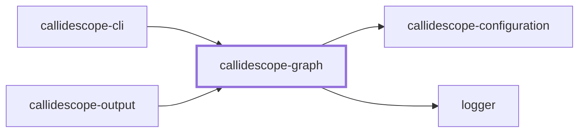
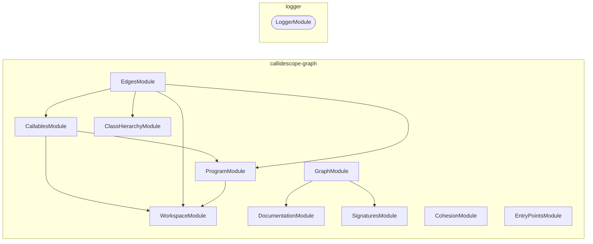

# 🔭 Callidescope Graph

**Builds the call graph from traced TypeScript source and measures its depth, breadth, and cohesion.**

This package is the leaf of the
[`@callidescope/cli`](../callidescope-cli/README.md) package graph: it depends
only on [`@callidescope/configuration`](../callidescope-configuration/README.md)
and `@codebase/logger`, and nothing here reaches into
[`@callidescope/output`](../callidescope-output/README.md).

```bash
npm install --save-dev @callidescope/graph
```

## What This Package Owns

- **`program`** — compiles the traced TypeScript projects
- **`workspace`** — resolves which projects and files are in scope
- **`callables`** — discovers the callable declarations
- **`entry-points`** — resolves configured entry points
- **`class-hierarchy`** — resolves interface members to concrete implementations
- **`signatures`** — reads callable signatures
- **`documentation`** — reads a callable's documentation comment
- **`edges`** — resolves call sites to callee declarations
- **`graph`** — assembles the above into `CallGraph`/`CondensedGraph` and measures depth and breadth over it
- **`cohesion`** — misplaced-callable and module-spread detection, since both are graph-analysis over an already-built graph rather than rendering concerns

## Project Graph

Where this project sits in the Nx project graph: what it depends on, and what depends on it. Regenerated by `nx run synchronization:nx-project-graphs:write`.

<!-- nx-project-graph-start -->



<!-- nx-project-graph-end -->

## Module Graph

The modules this project defines and the imports between them, published by `nx run synchronization:nestjs-module-graphs:write`.

<!-- nestjs-module-graph-start -->



_Rounded modules are global: every module can inject them, so their edges are left out._

_Reached only for their types, and so declaring no module here: callidescope-configuration._

<!-- nestjs-module-graph-end -->

## Test

```bash
nx run callidescope-graph:vitest
```

<!-- CALL_STACKS_START -->

## 🔭 Callidescope

Call stacks traced through `callidescope-graph`, deepest first. Each frame shows what it takes, what it returns, and what its documentation says.

| Measure | Value |
| --- | --- |
| Callables | 167 |
| Files | 55 |
| Calls traced | 135 |
| Call stacks | 5 |
| Deepest stack | 5 |
| Stacks through recursion | 0 |
| Unfollowable calls | 2 |

### Call stacks (depth)

**1. `CallablesService.visit`** — depth 5 · orphan-root

```text
🚀 CallablesService.visit(node: ts.Node): void [packages/callidescope-graph/src/modules/callables/callables.service.ts:49]
  └─> CallablesService.describe(args: DescribeCallableArguments): DiscoveredCallable [packages/callidescope-graph/src/modules/callables/callables.service.ts:116]
     ↳ Turns one declaration into a fully described node.
    └─> CallableIdentityService.readDisplayName(declaration: CallableDeclaration): string [packages/callidescope-graph/src/modules/callables/callable-identity.service.ts:117]
       ↳ Builds the qualified name a report prints for a callable.
      └─> CallableIdentityService.readMemberName(declaration: CallableDeclaration): string [packages/callidescope-graph/src/modules/callables/callable-identity.service.ts:179]
         ↳ Reads the member name, falling back to the shape it was written in.
        └─> CallableIdentityService.readBindingName(node: ts.Node): string | undefined [packages/callidescope-graph/src/modules/callables/callable-identity.service.ts:50]
           ↳ Reads the name a property, variable, or parameter declaration binds.
```

**2. `CallSitesService.visit`** — depth 3 · orphan-root

```text
🚀 CallSitesService.visit(node: ts.Node): void [packages/callidescope-graph/src/modules/edges/call-sites.service.ts:62]
  └─> CallSitesService.readFunctionArguments(expression: ts.CallExpression | ts.NewExpression): ts.SignatureDeclaration[] [packages/callidescope-graph/src/modules/edges/call-sites.service.ts:42]
     ↳ Collects the function literals passed as arguments to one call.
    └─> CallSitesService.filter(…)(argument: ts.Expression): argument is ts.Expression & ts.SignatureDeclaration [packages/callidescope-graph/src/modules/edges/call-sites.service.ts:46]
```

**3. `WorkspaceService.isExcluded`** — depth 2 · orphan-root

```text
🚀 WorkspaceService.isExcluded(workspaceRelativePath: string): boolean [packages/callidescope-graph/src/modules/workspace/workspace.service.ts:157]
  └─> WorkspaceService.some(…)(glob: string): boolean [packages/callidescope-graph/src/modules/workspace/workspace.service.ts:159]
```

<details>
<summary>2 more call stacks</summary>

**4. `ClassHierarchyService.readMemberDeclarations`** — depth 2 · orphan-root

```text
🚀 ClassHierarchyService.readMemberDeclarations(…): Declaration[] [packages/callidescope-graph/src/modules/class-hierarchy/class-hierarchy.service.ts:149]
   ↳ Reads one member's concrete declarations off a candidate class.
  └─> ClassHierarchyService.filter(…)(member: ts.PropertyDeclaration | ts.MethodDeclaration): boolean [packages/callidescope-graph/src/modules/class-hierarchy/class-hierarchy.service.ts:163]
```

**5. `EdgesService.resolveCallableId`** — depth 2 · orphan-root

```text
🚀 EdgesService.resolveCallableId(…): string | undefined [packages/callidescope-graph/src/modules/edges/edges.service.ts:202]
   ↳ Maps a resolved declaration to the callable it belongs to.
  └─> WorkspaceService.toWorkspaceRelative(args: { absolutePath: string; workspaceRoot: string; }): string [packages/callidescope-graph/src/modules/workspace/workspace.service.ts:248]
     ↳ Rewrites an absolute path as workspace-relative with POSIX separators.
```

</details>

### Module spread

None.

### Breadth

| Callable | Breadth | Calls directly | Location |
| --- | --- | --- | --- |
| `CallablesService.describe` | 9 | `CallableIdentityService.readDisplayName`, `CallableIdentityService.readEnclosingTypeName`, `CallableIdentityService.buildId`, `CallableIdentityService.isExported`, `CallableIdentityService.readKind`, `CallableIdentityService.readLocation`, `CallableIdentityService.readMemberName`, `WorkspaceService.resolveModuleId`, `CallableIdentityService.countStatements` | `packages/callidescope-graph/src/modules/callables/callables.service.ts:116` |
| `EdgesService.buildSiteEdges` | 7 | `EdgesService.collectCallbackEdges`, `EdgesService.resolveSite`, `EdgesService.filter(…)`, `EdgesService.filter(…)`, `EdgesService.map(…)`, `EdgesService.filter(…)`, `EdgesService.readLocation` | `packages/callidescope-graph/src/modules/edges/edges.service.ts:59` |
| `SymbolResolutionService.resolveSymbol` | 6 | `SymbolResolutionService.unwrapAlias`, `SymbolResolutionService.every(…)`, `SymbolResolutionService.readBodied`, `SymbolResolutionService.readResolution`, `SymbolResolutionService.find(…)`, `SymbolResolutionService.resolveThroughHierarchy` | `packages/callidescope-graph/src/modules/edges/symbol-resolution.service.ts:165` |

<details>
<summary>60 more callables</summary>

| Callable | Breadth | Calls directly | Location |
| --- | --- | --- | --- |
| `ClassHierarchyService.resolveImplementations` | 4 | `ClassHierarchyService.collectDerived`, `ClassHierarchyService.filter(…)`, `ClassHierarchyService.filterAssignable`, `ClassHierarchyService.flatMap(…)` | `packages/callidescope-graph/src/modules/class-hierarchy/class-hierarchy.service.ts:207` |
| `CohesionService.findModuleSpreads` | 4 | `CohesionService.isSpreadAllowed`, `CohesionService.readDepth`, `CohesionService.readDirectModuleIds`, `CohesionService.toSorted(…)` | `packages/callidescope-graph/src/modules/cohesion/cohesion.service.ts:202` |
| `DocumentationService.read` | 4 | `DocumentationService.readSymbol`, `DocumentationService.readSummary`, `DocumentationService.filter(…)`, `DocumentationService.map(…)` | `packages/callidescope-graph/src/modules/documentation/documentation.service.ts:78` |
| `WorkspaceService.listProjectRoots` | 3 | `WorkspaceService.filter(…)`, `WorkspaceService.map(…)`, `WorkspaceService.filter(…)` | `packages/callidescope-graph/src/modules/workspace/workspace.service.ts:81` |
| `WorkspaceService.discoverProjects` | 3 | `WorkspaceService.listProjectRoots`, `WorkspaceService.readProjectName`, `WorkspaceService.toSorted(…)` | `packages/callidescope-graph/src/modules/workspace/workspace.service.ts:169` |
| `ProgramService.buildProgram` | 3 | `ProgramService.parseConfiguration`, `CompilerHostService.createHost`, `ProgramService.map(…)` | `packages/callidescope-graph/src/modules/program/program.service.ts:70` |
| `ProgramService.parseConfiguration` | 3 | `ProgramService.readJsonConfigFile(…)`, `ProgramConfigurationError.constructor`, `ProgramService.map(…)` | `packages/callidescope-graph/src/modules/program/program.service.ts:102` |
| `CallablesService.collectFromProgram` | 3 | `CallablesService.readOwnedPath`, `WorkspaceService.isTestFile`, `CallablesService.collectFromFile` | `packages/callidescope-graph/src/modules/callables/callables.service.ts:77` |
| `ClassHierarchyService.indexProgram` | 3 | `ExternalService.isExternal`, `ClassHierarchyService.indexMembers`, `ClassHierarchyService.indexHeritage` | `packages/callidescope-graph/src/modules/class-hierarchy/class-hierarchy.service.ts:181` |
| `CohesionService.summarizeTypeDepths` | 3 | `CohesionService.readDepth`, `CohesionService.extendTypeSummary`, `CohesionService.toSorted(…)` | `packages/callidescope-graph/src/modules/cohesion/cohesion.service.ts:256` |
| `EdgesService.collectCallbackEdges` | 3 | `EdgesService.map(…)`, `EdgesService.filter(…)`, `EdgesService.map(…)` | `packages/callidescope-graph/src/modules/edges/edges.service.ts:127` |
| `EntryPointsService.classify` | 3 | `EntryPointsService.hasConfiguredDecorator`, `EntryPointsService.isCommandRunnerMethod`, `EntryPointsService.isBootstrapFunction` | `packages/callidescope-graph/src/modules/entry-points/entry-points.service.ts:49` |
| `ComponentsService.condense` | 3 | `ComponentsService.openNode`, `ComponentsService.step`, `ComponentsService.buildSuccessors` | `packages/callidescope-graph/src/modules/graph/components.service.ts:183` |
| `DepthService.measure` | 3 | `DepthService.combine`, `DepthService.readOwnModules`, `DepthService.hasUnresolved` | `packages/callidescope-graph/src/modules/graph/depth.service.ts:132` |
| `CallableIdentityService.readDisplayName` | 2 | `CallableIdentityService.readMemberName`, `CallableIdentityService.readEnclosingTypeName` | `packages/callidescope-graph/src/modules/callables/callable-identity.service.ts:117` |
| `CallableIdentityService.readMemberName` | 2 | `CallableIdentityService.readBindingName`, `CallableIdentityService.describeCallbackArgument` | `packages/callidescope-graph/src/modules/callables/callable-identity.service.ts:179` |
| `ProgramService.buildPrograms` | 2 | `ProgramService.buildProgram`, `ProgramService.assignOwnership` | `packages/callidescope-graph/src/modules/program/program.service.ts:138` |
| `CallablesService.visit` | 2 | `CallablesService.isCallableDeclaration`, `CallablesService.describe` | `packages/callidescope-graph/src/modules/callables/callables.service.ts:49` |
| `CallablesService.readOwnedPath` | 2 | `ProgramService.toRealPath`, `WorkspaceService.toWorkspaceRelative` | `packages/callidescope-graph/src/modules/callables/callables.service.ts:162` |
| `ClassHierarchyService.readMemberDeclarations` | 2 | `ClassHierarchyService.filter(…)`, `ClassHierarchyService.filter(…)` | `packages/callidescope-graph/src/modules/class-hierarchy/class-hierarchy.service.ts:149` |
| `CohesionService.findMisplacedCallables` | 2 | `CohesionService.readCallerDistribution`, `CohesionService.toSorted(…)` | `packages/callidescope-graph/src/modules/cohesion/cohesion.service.ts:161` |
| `CallSitesService.visit` | 2 | `CallSitesService.isNestedBody`, `CallSitesService.readFunctionArguments` | `packages/callidescope-graph/src/modules/edges/call-sites.service.ts:62` |
| `SymbolResolutionService.resolveThroughHierarchy` | 2 | `SymbolResolutionService.readOwner`, `ClassHierarchyService.resolveImplementations` | `packages/callidescope-graph/src/modules/edges/symbol-resolution.service.ts:217` |
| `SymbolResolutionService.resolve` | 2 | `SymbolResolutionService.readCalleeName`, `SymbolResolutionService.resolveSymbol` | `packages/callidescope-graph/src/modules/edges/symbol-resolution.service.ts:267` |
| `EdgesService.readLocation` | 2 | `WorkspaceService.toWorkspaceRelative`, `ProgramService.toRealPath` | `packages/callidescope-graph/src/modules/edges/edges.service.ts:176` |
| `EdgesService.resolveCallableId` | 2 | `WorkspaceService.toWorkspaceRelative`, `ProgramService.toRealPath` | `packages/callidescope-graph/src/modules/edges/edges.service.ts:202` |
| `EdgesService.resolveSite` | 2 | `SymbolResolutionService.resolveConstructor`, `SymbolResolutionService.resolve` | `packages/callidescope-graph/src/modules/edges/edges.service.ts:226` |
| `EdgesService.build` | 2 | `CallSitesService.collect`, `EdgesService.buildSiteEdges` | `packages/callidescope-graph/src/modules/edges/edges.service.ts:251` |
| `EntryPointsService.hasConfiguredDecorator` | 2 | `EntryPointsService.some(…)`, `EntryPointsService.readDecoratorNames` | `packages/callidescope-graph/src/modules/entry-points/entry-points.service.ts:85` |
| `ComponentsService.finishFrame` | 2 | `ComponentsService.closeNode`, `ComponentsService.liftLowLink` | `packages/callidescope-graph/src/modules/graph/components.service.ts:72` |
| `ComponentsService.step` | 2 | `ComponentsService.finishFrame`, `ComponentsService.visitSuccessor` | `packages/callidescope-graph/src/modules/graph/components.service.ts:116` |
| `ComponentsService.visitSuccessor` | 2 | `ComponentsService.openNode`, `ComponentsService.liftLowLink` | `packages/callidescope-graph/src/modules/graph/components.service.ts:139` |
| `GraphService.assemble` | 2 | `GraphService.append`, `GraphService.map(…)` | `packages/callidescope-graph/src/modules/graph/graph.service.ts:44` |
| `PathsService.toFrame` | 2 | `DocumentationService.read`, `SignaturesService.read` | `packages/callidescope-graph/src/modules/graph/paths.service.ts:57` |
| `PathsService.buildDeepestPath` | 2 | `PathsService.orderMembers`, `PathsService.toFrame` | `packages/callidescope-graph/src/modules/graph/paths.service.ts:82` |
| `CallableIdentityService.readEnclosingTypeName` | 1 | `CallableIdentityService.findAncestor(…)` | `packages/callidescope-graph/src/modules/callables/callable-identity.service.ts:125` |
| `CallableIdentityService.readKind` | 1 | `CallableIdentityService.readBoundKind` | `packages/callidescope-graph/src/modules/callables/callable-identity.service.ts:138` |
| `WorkspaceService.buildFileFilter` | 1 | `WorkspaceService.listIgnoredFiles` | `packages/callidescope-graph/src/modules/workspace/workspace.service.ts:133` |
| `WorkspaceService.isExcluded` | 1 | `WorkspaceService.some(…)` | `packages/callidescope-graph/src/modules/workspace/workspace.service.ts:157` |
| `CompilerHostService.resolveModuleCache` | 1 | `CompilerHostService.createModuleResolutionCache(…)` | `packages/callidescope-graph/src/modules/program/compiler-host.service.ts:40` |
| `CompilerHostService.createHost` | 1 | `CompilerHostService.resolveModuleCache` | `packages/callidescope-graph/src/modules/program/compiler-host.service.ts:76` |
| `CallablesService.collect` | 1 | `CallablesService.collectFromProgram` | `packages/callidescope-graph/src/modules/callables/callables.service.ts:189` |
| `ExternalService.isExternal` | 1 | `ExternalService.computeVerdict` | `packages/callidescope-graph/src/modules/class-hierarchy/external.service.ts:64` |
| `ClassHierarchyService.filterAssignable` | 1 | `ClassHierarchyService.filter(…)` | `packages/callidescope-graph/src/modules/class-hierarchy/class-hierarchy.service.ts:87` |
| `ClassHierarchyService.build` | 1 | `ClassHierarchyService.indexProgram` | `packages/callidescope-graph/src/modules/class-hierarchy/class-hierarchy.service.ts:172` |
| `CohesionService.isSpreadAllowed` | 1 | `CohesionService.some(…)` | `packages/callidescope-graph/src/modules/cohesion/cohesion.service.ts:64` |
| `CallSitesService.readFunctionArguments` | 1 | `CallSitesService.filter(…)` | `packages/callidescope-graph/src/modules/edges/call-sites.service.ts:42` |
| `SymbolResolutionService.readBodied` | 1 | `SymbolResolutionService.filter(…)` | `packages/callidescope-graph/src/modules/edges/symbol-resolution.service.ts:88` |
| `SymbolResolutionService.filter(…)` | 1 | `SymbolResolutionService.isBodyCarrying` | `packages/callidescope-graph/src/modules/edges/symbol-resolution.service.ts:91` |
| `EdgesService.filter(…)` | 1 | `ExternalService.isExternal` | `packages/callidescope-graph/src/modules/edges/edges.service.ts:77` |
| `EdgesService.filter(…)` | 1 | `EdgesService.isIgnoredCallee` | `packages/callidescope-graph/src/modules/edges/edges.service.ts:89` |
| `EdgesService.map(…)` | 1 | `EdgesService.readLocation` | `packages/callidescope-graph/src/modules/edges/edges.service.ts:142` |
| `EdgesService.isIgnoredCallee` | 1 | `EdgesService.some(…)` | `packages/callidescope-graph/src/modules/edges/edges.service.ts:162` |
| `EntryPointsService.isCommandRunnerMethod` | 1 | `EntryPointsService.hasConfiguredDecorator` | `packages/callidescope-graph/src/modules/entry-points/entry-points.service.ts:103` |
| `EntryPointsService.readDecoratorNames` | 1 | `EntryPointsService.map(…)` | `packages/callidescope-graph/src/modules/entry-points/entry-points.service.ts:121` |
| `EntryPointsService.resolve` | 1 | `EntryPointsService.classify` | `packages/callidescope-graph/src/modules/entry-points/entry-points.service.ts:139` |
| `ComponentsService.buildSuccessors` | 1 | `ComponentsService.map(…)` | `packages/callidescope-graph/src/modules/graph/components.service.ts:160` |
| `DepthService.combine` | 1 | `DepthService.foldSuccessors` | `packages/callidescope-graph/src/modules/graph/depth.service.ts:34` |
| `DepthService.hasUnresolved` | 1 | `DepthService.some(…)` | `packages/callidescope-graph/src/modules/graph/depth.service.ts:102` |
| `SignaturesService.read` | 1 | `SignaturesService.map(…)` | `packages/callidescope-graph/src/modules/signatures/signatures.service.ts:65` |

</details>

### Possibly misplaced

None.
<!-- CALL_STACKS_END -->
