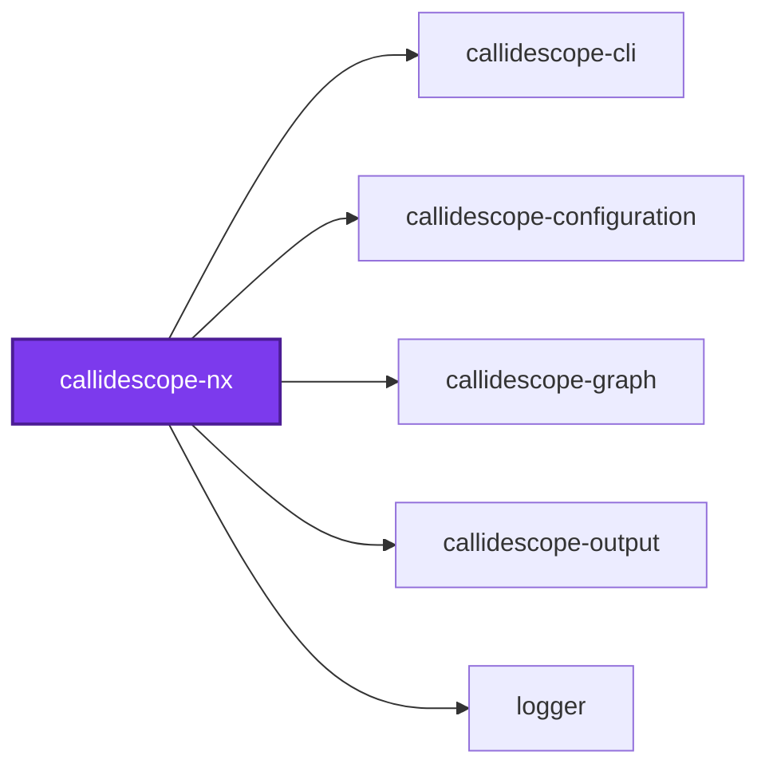
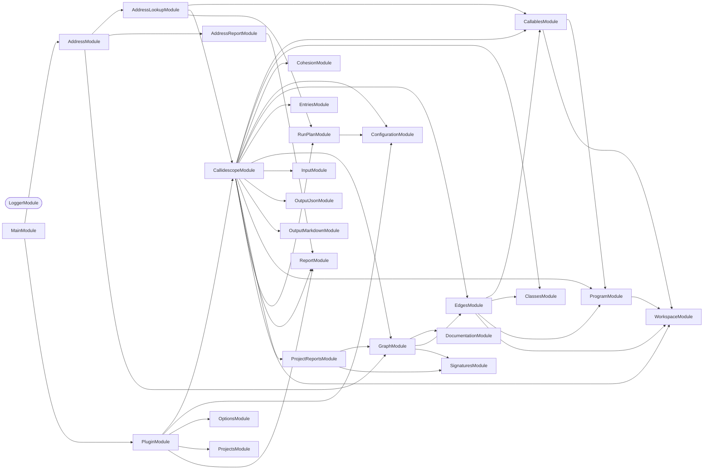

# 🔭🧬 Callidescope Nx

**An Nx plugin that traces call stacks per project, following the Nx dependency graph.**

[`@callidescope/cli`](../callidescope-cli/README.md) is Nx-free on purpose: it
takes `--directories`, each one a path holding its own `tsconfig.json`, so it
works in any TypeScript workspace whether or not Nx is anywhere near it. This
package is the one place in the toolchain that knows Nx exists, and the only
one that depends on `@nx/devkit`.

It adds two things the core CLI cannot know about:

- **A target on every project**, so the workspace's task runner does the
  selecting — `nx affected`, `--projects=tag:…`, caching, and all.
- **Dependency-aware scope**, so tracing one project does not truncate its call
  stacks at the first package boundary.

## Install

```bash
npm install --save-dev @callidescope/nx
```

Register it in `nx.json`:

```json
{
  "plugins": [
    {
      "plugin": "@callidescope/nx",
      "options": {
        "configurationPath": "configuration/callidescope.config.ts"
      }
    }
  ]
}
```

| Option | Meaning |
| ------ | ------- |
| `configurationPath` | Where the callidescope configuration lives. The conventional root filenames are searched when omitted |
| `traceTargetName` | Name of the inferred trace target. `trace` when omitted |
| `depthTargetName` | Name of the inferred depth target. `depth` when omitted |
| `breadthTargetName` | Name of the inferred breadth target. `breadth` when omitted |

The target names are short because they read better on the command line than
repeating the tool's name on both sides of the colon. Rename any of them from
the registration if a workspace already uses one.

## Usage

Three targets are inferred onto every project holding a `tsconfig.json`, so
selection is Nx's job rather than a flag of this package's own:

```bash
nx run callidescope-nx:trace                      # one project, with its dependencies
nx run-many -t trace                              # the workspace
nx run-many -t trace --projects=tag:type:package  # a category
nx affected -t trace                              # only what changed
```

```bash
nx run callidescope-nx:depth --addresses="packages/callidescope-nx/src/modules/projects/projects.service.ts#ProjectsService.resolveDependencyClosure"
nx run callidescope-nx:breadth --addresses="src/foo.service.ts#FooService.bar"

# Several at once, which is what a rename spanning a handful of them needs
nx run callidescope-nx:depth --addresses="src/a.service.ts#A.b,src/c.service.ts#C.d"
```

| Target | Answers |
| ------ | ------- |
| `trace` | Every call stack in the project, and which ones broke a limit |
| `depth` | Every stack above and below each callable — callers up to a root, callees down to a leaf |
| `breadth` | Each callable's direct callers and callees, side by side |

`depth` and `breadth` take the same `<file>#<qualified-name>` addresses the
`callidescope` command does — the form every printed stack already uses — and
the same comma-separated `--addresses` flag it takes them through. Through the
plugin they resolve against the project and its dependencies rather than the
whole workspace, which is both faster and the set the addresses belong to.

**Every address must resolve, or the task prints nothing.** A report covering
only the addresses that were understood, under a task Nx recorded as
successful, is worse than a failed one; each unmatched address is named and
the task fails. Under `--format=json` the report is always an array, whatever
the address count, matching what the command line prints.

Unlike the command line, a missing `--addresses` is **refused rather than
prompted for**: a task runner has nobody to ask.

Two projects are deliberately skipped: the **workspace-root project**, whose
targets would trace everything under one uncacheable task, and any project with
**no `tsconfig.json`**, whose targets would be permanently empty.

### Why the trace follows dependencies

`nx run callidescope-cli:trace` traces `callidescope-cli` **and
everything it depends on**, resolved transitively from the Nx project graph.

That is the whole point of the plugin. A call stack runs downward — a command
calls into the service it was injected with, which lives in a package it
depends on — so tracing a project alone truncates every stack at the first
package boundary, which is the one measurement callidescope exists to take.
Tracing `callidescope-nx` on its own finds 17 callables; tracing it with its
dependencies finds 469.

Dependencies, never dependents: a project's dependents call _into_ it and add
no frames below it.

Pass `--withDependencies=false` for the narrow reading.

### Executor options

```bash
nx run logger:trace --tags=type:package
nx run logger:depth --addresses="a.ts#A.b" --projects=callidescope-cli
```

All three executors take the same scoping options.

| Option | Meaning |
| ------ | ------- |
| `addresses` | `depth` and `breadth` only, and required: the callables to look up, comma-separated |
| `projects` | Nx project names to resolve against, replacing the target's own project |
| `tags` | Nx project tags, selecting every project carrying **any** of them |
| `withDependencies` | Widen along the Nx dependency graph. `true` by default |
| `format` | `markdown`, `mermaid`, or `json` |
| `configurationPath` | Overrides the registered configuration path |

`--projects` and `--tags` union rather than intersect, and a project reached
both ways is still traced once. `--tags` matches **any** of the tags given,
because Nx tag families are mutually exclusive on a single project — nothing is
both `type:application` and `type:package`, so requiring all of them would
select nothing.

Prefer Nx's own `--projects=tag:…` on `run-many` for ordinary selection; these
options exist for a target that wants to declare a fixed scope in its
`project.json`.

### Nothing resolves silently to less

A project name the workspace does not have, or a tag no project carries, fails
the task and names the workspace's actual vocabulary. Narrowing the run instead
would let it pass while measuring less than it was asked to — and a report of
what a run did cover cannot show you what it did not.

## As a library

The Nx-graph reading is a NestJS provider, for a host that would rather import
it than run a task:

```ts
import { resolveProjectsService } from "@callidescope/nx";

const projectsService = await resolveProjectsService();
const graph = await projectsService.readProjectGraph();
const names = projectsService.resolveDependencyClosure({
  graph,
  projectNames: ["callidescope-cli"],
});
const directories = projectsService.toDirectories({ graph, projectNames: names });
```

`readProjectGraph` is the only method that touches Nx at run time; every
resolution rule takes the graph as an argument, so it can be exercised without
a workspace to build one from.

## Packages

| Package | Role |
| ------- | ---- |
| [`@callidescope/nx`](.) | Nx plugin: per-project trace targets, resolved through the Nx graph |
| [`@callidescope/cli`](../callidescope-cli/README.md) | Orchestrates a run: traces the workspace, plans what to check, and reports |
| [`@callidescope/configuration`](../callidescope-configuration/README.md) | Reads `callidescope.config.ts` and resolves the limits |
| [`@callidescope/graph`](../callidescope-graph/README.md) | Builds the call graph from traced source and measures depth, breadth, and cohesion |
| [`@callidescope/output`](../callidescope-output/README.md) | Renders findings into markdown, mermaid, and JSON |

## Test

```bash
nx run callidescope-nx:vitest
```

## Contributing

```bash
nx run callidescope-nx:lint-codebase --configuration=check
```

## License

MIT — see [LICENSE](../../LICENSE).

## 👔 Conformetry

This project was generated from the [nestjs-service-project](../../configuration/conformetry-templates/nestjs-service-project) conformetry template.

## 🕸️ Codependix

Dependency graphs exported by [codependix](https://github.com/JimmyPaolini/codebase/tree/main/packages/codependix-cli), regenerated by `nx run codebase:codependix:write`.

### Nx Neighborhood

<!-- codependix:start name="codependix-nx" -->

<!-- codependix:end name="codependix-nx" -->

### NestJS Module Graph

<!-- codependix:start name="codependix-nestjs" -->


_Rounded modules are global: every module can inject them, so their edges are left out._
<!-- codependix:end name="codependix-nestjs" -->

### File Imports

```mermaid
graph LR
  file_codometer_config_ts["codometer.config.ts"]
  file_eslint_config_ts["eslint.config.ts"]
  file_src_executors_address_types_ts["src/executors/address.types.ts"]
  file_src_executors_breadth_executor_ts["src/executors/breadth/executor.ts"]
  file_src_executors_breadth_executor_unit_test_ts["src/executors/breadth/executor.unit.test.ts"]
  file_src_executors_depth_executor_ts["src/executors/depth/executor.ts"]
  file_src_executors_depth_executor_unit_test_ts["src/executors/depth/executor.unit.test.ts"]
  file_src_executors_trace_executor_ts["src/executors/trace/executor.ts"]
  file_src_executors_trace_executor_types_ts["src/executors/trace/executor.types.ts"]
  file_src_executors_trace_executor_unit_test_ts["src/executors/trace/executor.unit.test.ts"]
  file_src_index_ts["src/index.ts"]
  file_src_index_unit_test_ts["src/index.unit.test.ts"]
  file_src_main_module_ts["src/main.module.ts"]
  file_src_modules_address_address_constants_ts["src/modules/address/address.constants.ts"]
  file_src_modules_address_address_module_ts["src/modules/address/address.module.ts"]
  file_src_modules_address_address_service_ts["src/modules/address/address.service.ts"]
  file_src_modules_address_address_service_unit_test_ts["src/modules/address/address.service.unit.test.ts"]
  file_src_modules_address_address_types_ts["src/modules/address/address.types.ts"]
  file_src_modules_address_address_utilities_ts["src/modules/address/address.utilities.ts"]
  file_src_modules_address_address_utilities_unit_test_ts["src/modules/address/address.utilities.unit.test.ts"]
  file_src_modules_options_options_constants_ts["src/modules/options/options.constants.ts"]
  file_src_modules_options_options_module_ts["src/modules/options/options.module.ts"]
  file_src_modules_options_options_service_ts["src/modules/options/options.service.ts"]
  file_src_modules_options_options_service_unit_test_ts["src/modules/options/options.service.unit.test.ts"]
  file_src_modules_options_options_types_ts["src/modules/options/options.types.ts"]
  file_src_modules_plugin_plugin_constants_ts["src/modules/plugin/plugin.constants.ts"]
  file_src_modules_plugin_plugin_module_ts["src/modules/plugin/plugin.module.ts"]
  file_src_modules_plugin_plugin_service_ts["src/modules/plugin/plugin.service.ts"]
  file_src_modules_plugin_plugin_service_unit_test_ts["src/modules/plugin/plugin.service.unit.test.ts"]
  file_src_modules_plugin_plugin_types_ts["src/modules/plugin/plugin.types.ts"]
  file_src_modules_plugin_plugin_utilities_ts["src/modules/plugin/plugin.utilities.ts"]
  file_src_modules_projects_projects_constants_ts["src/modules/projects/projects.constants.ts"]
  file_src_modules_projects_projects_module_ts["src/modules/projects/projects.module.ts"]
  file_src_modules_projects_projects_service_ts["src/modules/projects/projects.service.ts"]
  file_src_modules_projects_projects_service_unit_test_ts["src/modules/projects/projects.service.unit.test.ts"]
  file_src_modules_projects_projects_types_ts["src/modules/projects/projects.types.ts"]
  file_src_plugin_context_utilities_ts["src/plugin-context.utilities.ts"]
  file_src_plugin_context_utilities_unit_test_ts["src/plugin-context.utilities.unit.test.ts"]
  file_testing_mocks_ts["testing/mocks.ts"]
  file_testing_setup_ts["testing/setup.ts"]
  file_vitest_config_ts["vitest.config.ts"]
  file_src_executors_breadth_executor_ts --> file_src_executors_address_types_ts
  file_src_executors_breadth_executor_ts --> file_src_modules_address_address_utilities_ts
  file_src_executors_breadth_executor_unit_test_ts --> file_src_executors_breadth_executor_ts
  file_src_executors_breadth_executor_unit_test_ts --> file_src_modules_address_address_utilities_ts
  file_src_executors_depth_executor_ts --> file_src_executors_address_types_ts
  file_src_executors_depth_executor_ts --> file_src_modules_address_address_utilities_ts
  file_src_executors_depth_executor_unit_test_ts --> file_src_executors_depth_executor_ts
  file_src_executors_depth_executor_unit_test_ts --> file_src_modules_address_address_utilities_ts
  file_src_executors_trace_executor_ts --> file_src_executors_trace_executor_types_ts
  file_src_executors_trace_executor_ts --> file_src_modules_plugin_plugin_utilities_ts
  file_src_executors_trace_executor_ts --> file_src_plugin_context_utilities_ts
  file_src_executors_trace_executor_unit_test_ts --> file_src_executors_trace_executor_ts
  file_src_executors_trace_executor_unit_test_ts --> file_src_modules_options_options_service_ts
  file_src_executors_trace_executor_unit_test_ts --> file_src_modules_plugin_plugin_service_ts
  file_src_executors_trace_executor_unit_test_ts --> file_src_modules_plugin_plugin_types_ts
  file_src_index_ts --> file_src_modules_plugin_plugin_constants_ts
  file_src_index_ts --> file_src_plugin_context_utilities_ts
  file_src_index_unit_test_ts --> file_src_index_ts
  file_src_index_unit_test_ts --> file_src_modules_plugin_plugin_service_ts
  file_src_index_unit_test_ts --> file_src_modules_plugin_plugin_types_ts
  file_src_main_module_ts --> file_src_modules_address_address_module_ts
  file_src_main_module_ts --> file_src_modules_plugin_plugin_module_ts
  file_src_modules_address_address_module_ts --> file_src_modules_address_address_service_ts
  file_src_modules_address_address_service_ts --> file_src_modules_address_address_types_ts
  file_src_modules_address_address_service_unit_test_ts --> file_src_modules_address_address_service_ts
  file_src_modules_address_address_utilities_ts --> file_src_executors_address_types_ts
  file_src_modules_address_address_utilities_ts --> file_src_modules_plugin_plugin_utilities_ts
  file_src_modules_address_address_utilities_ts --> file_src_plugin_context_utilities_ts
  file_src_modules_address_address_utilities_unit_test_ts --> file_src_modules_address_address_service_ts
  file_src_modules_address_address_utilities_unit_test_ts --> file_src_modules_address_address_utilities_ts
  file_src_modules_address_address_utilities_unit_test_ts --> file_src_modules_options_options_service_ts
  file_src_modules_address_address_utilities_unit_test_ts --> file_src_modules_plugin_plugin_service_ts
  file_src_modules_address_address_utilities_unit_test_ts --> file_src_modules_plugin_plugin_types_ts
  file_src_modules_options_options_module_ts --> file_src_modules_options_options_service_ts
  file_src_modules_options_options_service_ts --> file_src_modules_options_options_constants_ts
  file_src_modules_options_options_service_ts --> file_src_modules_options_options_types_ts
  file_src_modules_options_options_service_unit_test_ts --> file_src_modules_options_options_service_ts
  file_src_modules_plugin_plugin_module_ts --> file_src_modules_options_options_module_ts
  file_src_modules_plugin_plugin_module_ts --> file_src_modules_plugin_plugin_service_ts
  file_src_modules_plugin_plugin_module_ts --> file_src_modules_projects_projects_module_ts
  file_src_modules_plugin_plugin_service_ts --> file_src_modules_options_options_constants_ts
  file_src_modules_plugin_plugin_service_ts --> file_src_modules_options_options_service_ts
  file_src_modules_plugin_plugin_service_ts --> file_src_modules_plugin_plugin_constants_ts
  file_src_modules_plugin_plugin_service_ts --> file_src_modules_plugin_plugin_types_ts
  file_src_modules_plugin_plugin_service_ts --> file_src_modules_projects_projects_service_ts
  file_src_modules_plugin_plugin_service_unit_test_ts --> file_src_modules_options_options_service_ts
  file_src_modules_plugin_plugin_service_unit_test_ts --> file_src_modules_plugin_plugin_service_ts
  file_src_modules_plugin_plugin_service_unit_test_ts --> file_src_modules_plugin_plugin_types_ts
  file_src_modules_plugin_plugin_service_unit_test_ts --> file_src_modules_projects_projects_service_ts
  file_src_modules_plugin_plugin_types_ts --> file_src_modules_plugin_plugin_constants_ts
  file_src_modules_plugin_plugin_utilities_ts --> file_src_modules_plugin_plugin_types_ts
  file_src_modules_plugin_plugin_utilities_ts --> file_src_plugin_context_utilities_ts
  file_src_modules_projects_projects_module_ts --> file_src_modules_projects_projects_service_ts
  file_src_modules_projects_projects_service_ts --> file_src_modules_projects_projects_types_ts
  file_src_modules_projects_projects_service_unit_test_ts --> file_src_modules_projects_projects_service_ts
  file_src_plugin_context_utilities_ts --> file_src_main_module_ts
  file_src_plugin_context_utilities_ts --> file_src_modules_address_address_service_ts
  file_src_plugin_context_utilities_ts --> file_src_modules_options_options_service_ts
  file_src_plugin_context_utilities_ts --> file_src_modules_plugin_plugin_constants_ts
  file_src_plugin_context_utilities_ts --> file_src_modules_plugin_plugin_service_ts
  file_src_plugin_context_utilities_ts --> file_src_modules_plugin_plugin_types_ts
  file_src_plugin_context_utilities_ts --> file_src_modules_projects_projects_service_ts
  file_src_plugin_context_utilities_unit_test_ts --> file_src_modules_address_address_service_ts
  file_src_plugin_context_utilities_unit_test_ts --> file_src_modules_options_options_service_ts
  file_src_plugin_context_utilities_unit_test_ts --> file_src_modules_plugin_plugin_service_ts
  file_src_plugin_context_utilities_unit_test_ts --> file_src_modules_projects_projects_service_ts
  file_src_plugin_context_utilities_unit_test_ts --> file_src_plugin_context_utilities_ts
```

<!-- codependix:start name="codependix-imports" -->

<!-- codependix:end name="codependix-imports" -->

<!-- CODE_STATISTICS_START -->

## ⏲️ Codometer

### Project


### Measured Targets


### TypeScript


### JavaScript


### Python


### JSON


### YAML


### TOML


### Shell


### SQL


### HCL


### CSS


### Conventions


### Jupyter


### Markdown


<!-- CODE_STATISTICS_END -->
