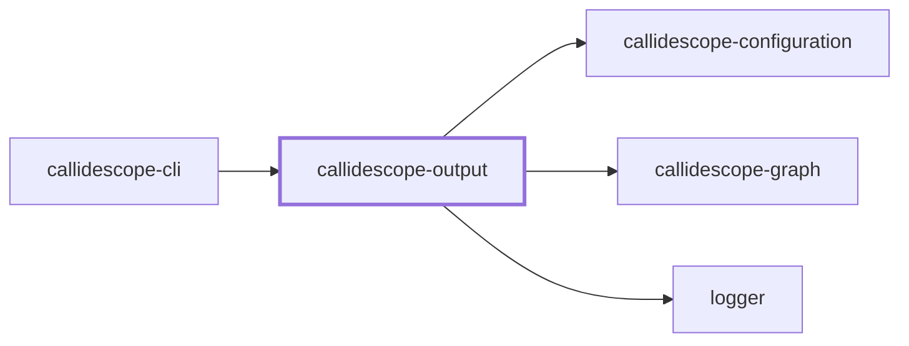
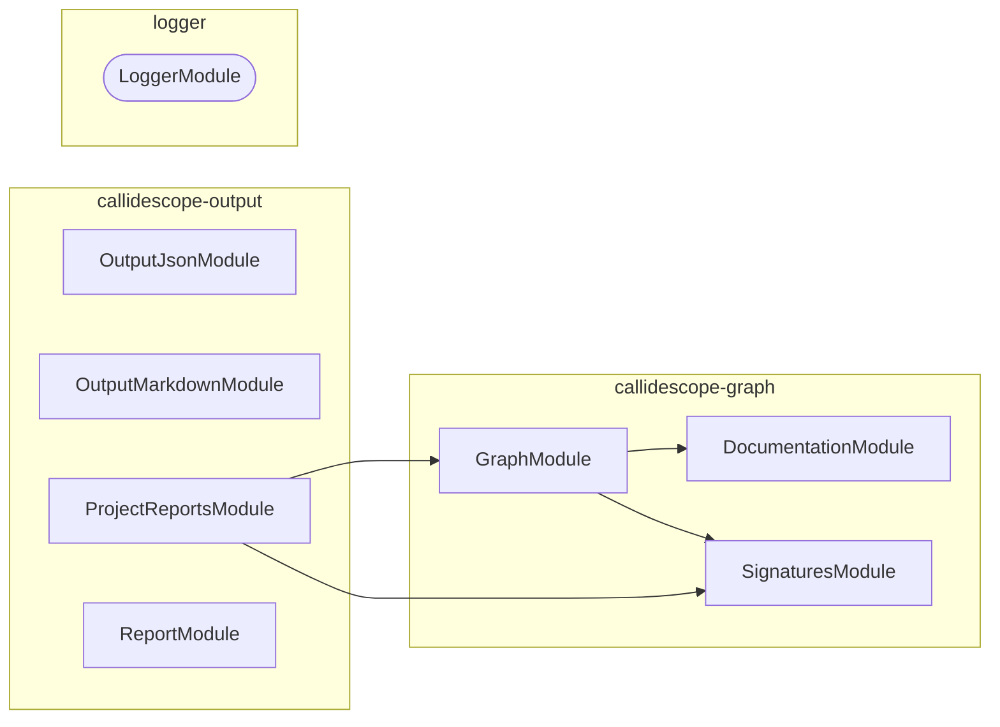

# 🔭 Callidescope Output

**Renders call-graph findings into markdown, mermaid, and JSON output formats.**

This package sits between
[`@callidescope/graph`](../callidescope-graph/README.md), which it depends on
for the shapes it renders, and
[`@callidescope/cli`](../callidescope-cli/README.md), which orchestrates a run
and hands this package the findings.

```bash
npm install --save-dev @callidescope/output
```

## What This Package Owns

- **`output-markdown`** — anchored-block splicing into markdown files
- **`output-json`** — JSON file output
- **`report`** — assembles findings, as markdown or a mermaid diagram, into the reportable shape
- **`project-reports`** — per-project report sections, scoping a run's findings to the project each one came from

## Project Graph

Where this project sits in the Nx project graph: what it depends on, and what depends on it. Regenerated by `nx run synchronization:nx-project-graphs:write`.

<!-- nx-project-graph-start -->



<!-- nx-project-graph-end -->

## Module Graph

The modules this project defines and the imports between them, published by `nx run synchronization:nestjs-module-graphs:write`.

<!-- nestjs-module-graph-start -->



_Rounded modules are global: every module can inject them, so their edges are left out._

_Reached only for their types, and so declaring no module here: callidescope-configuration._

<!-- nestjs-module-graph-end -->

## Test

```bash
nx run callidescope-output:vitest
```
