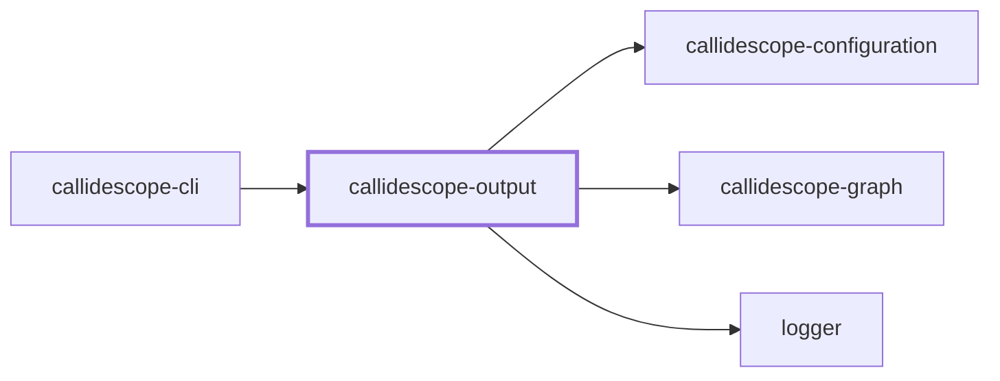

# 🔭 Callidescope Output

**Renders call-graph findings into markdown, mermaid, and JSON output formats.**

This package sits between
[`@callidescope/graph`](../callidescope-graph/README.md), which it depends on
for the shapes it renders, and
[`@callidescope/cli`](../callidescope-cli/README.md), which orchestrates a run
and hands this package the findings.

```bash
npm install --save-dev @callidescope/output
```

## What This Package Owns

- **`output-markdown`** — anchored-block splicing into markdown files
- **`output-json`** — JSON file output
- **`report`** — assembles findings, as markdown or a mermaid diagram, into the reportable shape
- **`project-reports`** — per-project report sections, scoping a run's findings to the project each one came from

## Project Graph

Where this project sits in the Nx project graph: what it depends on, and what depends on it. Regenerated by `nx run synchronization:nx-project-graphs:write`.

<!-- nx-project-graph-start -->



<!-- nx-project-graph-end -->

## Module Graph

The modules this project defines and the imports between them, published by `nx run synchronization:nestjs-module-graphs:write`.

<!-- nestjs-module-graph-start -->


_Rounded modules are global: every module can inject them, so their edges are left out._

_Reached only for their types, and so declaring no module here: callidescope-configuration._

<!-- nestjs-module-graph-end -->

## Test

```bash
nx run callidescope-output:vitest
```

<!-- CALL_STACKS_START -->

## 🔭 Callidescope

Call stacks traced through `callidescope-output`, deepest first. Each frame shows what it takes, what it returns, and what its documentation says.

| Measure | Value |
| --- | --- |
| Callables | 85 |
| Files | 22 |
| Calls traced | 76 |
| Call stacks | 3 |
| Deepest stack | 3 |
| Stacks through recursion | 0 |
| Unfollowable calls | 1 |

### Call stacks (depth)

**1. `ReportService.renderFrame`** — depth 3 · orphan-root

```text
🚀 ReportService.renderFrame(args: { depth: number; frame: StackFrame; }): string [packages/callidescope-output/src/modules/report/report.service.ts:44]
   ↳ Renders one frame at its indentation, with whatever it says about itself.
  └─> ReportService.shortenSummary(summary: string): string [packages/callidescope-output/src/modules/report/report.service.ts:102]
     ↳ Shortens a summary to what fits under an indented frame.
    └─> ReportService.readFirstSentence(summary: string): string | undefined [packages/callidescope-output/src/modules/report/report.service.ts:37]
       ↳ Reads a summary's opening sentence, when it has more than one.
```

**2. `MarkdownReportService.renderStack`** — depth 3 · orphan-root

```text
🚀 MarkdownReportService.renderStack(args: { index: number; stack: CallStack; }): string [packages/callidescope-output/src/modules/report/markdown-report.service.ts:119]
   ↳ Renders one stack: a labelled heading line and its tree in a fence.
  └─> ReportService.renderStackTree(stack: CallStack): string [packages/callidescope-output/src/modules/report/report.service.ts:123]
     ↳ Renders every frame of a stack, the entry point first.
    └─> ReportService.map(…)(frame: StackFrame, depth: number): string [packages/callidescope-output/src/modules/report/report.service.ts:125]
```

**3. `MarkdownReportService.toRow`** — depth 2 · orphan-root

```text
🚀 MarkdownReportService.toRow(report: CallableBreadthReport): string [packages/callidescope-output/src/modules/report/markdown-report.service.ts:66]
  └─> MarkdownReportService.map(…)(callee: WideCallableCallee): string [packages/callidescope-output/src/modules/report/markdown-report.service.ts:67]
```

### Module spread

None.

### Breadth

| Callable | Breadth | Calls directly | Location |
| --- | --- | --- | --- |
| `ProjectReportsService.map(…)` | 6 | `ProjectReportsService.toSorted(…)`, `ProjectReportsService.toSorted(…)`, `ProjectReportsService.filter(…)`, `ProjectReportsService.filter(…)`, `ProjectReportsService.buildSummary`, `ProjectReportsService.filter(…)` | `packages/callidescope-output/src/modules/project-reports/project-reports.service.ts:191` |
| `OutputMarkdownService.syncAnchoredBlock` | 5 | `MissingMarkdownPathError.constructor`, `OutputMarkdownService.readExisting`, `OutputMarkdownService.wrapInAnchors`, `OutputMarkdownService.buildBlockPattern`, `OutputMarkdownService.spliceBlock` | `packages/callidescope-output/src/modules/output-markdown/output-markdown.service.ts:205` |
| `MarkdownReportService.renderProjectSection` | 5 | `MarkdownReportService.renderSummaryTable`, `MarkdownReportService.renderStacksAs`, `MarkdownReportService.renderSpreads`, `MarkdownReportService.renderCallableBreadths`, `MarkdownReportService.renderMisplaced` | `packages/callidescope-output/src/modules/report/markdown-report.service.ts:176` |

<details>
<summary>27 more callables</summary>

| Callable | Breadth | Calls directly | Location |
| --- | --- | --- | --- |
| `MarkdownReportService.renderRun` | 5 | `MarkdownReportService.renderSummaryTable`, `MarkdownReportService.renderStacksAs`, `MarkdownReportService.renderSpreads`, `MarkdownReportService.renderCallableBreadths`, `MarkdownReportService.renderMisplaced` | `packages/callidescope-output/src/modules/report/markdown-report.service.ts:212` |
| `ProjectReportsService.buildSummary` | 4 | `ProjectReportsService.filter(…)`, `ProjectReportsService.filter(…)`, `ProjectReportsService.reduce(…)`, `ProjectReportsService.filter(…)` | `packages/callidescope-output/src/modules/project-reports/project-reports.service.ts:125` |
| `ProjectReportsService.findDeepStacks` | 4 | `ProjectReportsService.toSorted(…)`, `ProjectReportsService.map(…)`, `ProjectReportsService.filter(…)`, `ProjectReportsService.flatMap(…)` | `packages/callidescope-output/src/modules/project-reports/project-reports.service.ts:233` |
| `ProjectReportsService.findWideCallables` | 4 | `ProjectReportsService.toSorted(…)`, `ProjectReportsService.map(…)`, `ProjectReportsService.filter(…)`, `ProjectReportsService.flatMap(…)` | `packages/callidescope-output/src/modules/project-reports/project-reports.service.ts:251` |
| `OutputMarkdownService.spliceBlock` | 3 | `OutputMarkdownService.replace(…)`, `OutputMarkdownService.appendBlock`, `OutputMarkdownService.replaceOrphanedBlock` | `packages/callidescope-output/src/modules/output-markdown/output-markdown.service.ts:122` |
| `ProjectReportsService.build` | 3 | `ProjectReportsService.buildStacks`, `ProjectReportsService.buildCallableBreadths`, `ProjectReportsService.map(…)` | `packages/callidescope-output/src/modules/project-reports/project-reports.service.ts:187` |
| `MermaidReportService.renderStacks` | 3 | `MermaidReportService.countNewCallables`, `MermaidReportService.addStack`, `MermaidReportService.renderDiagram` | `packages/callidescope-output/src/modules/report/mermaid-report.service.ts:136` |
| `ReportService.renderFrame` | 3 | `ReportService.renderSignature`, `ReportService.renderMarkers`, `ReportService.shortenSummary` | `packages/callidescope-output/src/modules/report/report.service.ts:44` |
| `MarkdownReportService.renderCallableBreadths` | 3 | `MarkdownReportService.renderTable`, `MarkdownReportService.map(…)`, `MarkdownReportService.map(…)` | `packages/callidescope-output/src/modules/report/markdown-report.service.ts:62` |
| `OutputJsonService.sync` | 2 | `OutputJsonService.buildReport`, `OutputJsonService.readExisting` | `packages/callidescope-output/src/modules/output-json/output-json.service.ts:63` |
| `OutputMarkdownService.sync` | 2 | `OutputMarkdownService.syncAnchoredBlock`, `OutputMarkdownService.buildHelpers` | `packages/callidescope-output/src/modules/output-markdown/output-markdown.service.ts:176` |
| `ProjectReportsService.buildCallableBreadths` | 2 | `ProjectReportsService.flatMap(…)`, `SignaturesService.read` | `packages/callidescope-output/src/modules/project-reports/project-reports.service.ts:39` |
| `ProjectReportsService.buildStacks` | 2 | `ProjectReportsService.readDepth`, `PathsService.buildDeepestPath` | `packages/callidescope-output/src/modules/project-reports/project-reports.service.ts:79` |
| `MermaidReportService.countNewCallables` | 2 | `MermaidReportService.filter(…)`, `MermaidReportService.map(…)` | `packages/callidescope-output/src/modules/report/mermaid-report.service.ts:87` |
| `MarkdownReportService.renderMisplaced` | 2 | `MarkdownReportService.renderTable`, `MarkdownReportService.map(…)` | `packages/callidescope-output/src/modules/report/markdown-report.service.ts:95` |
| `MarkdownReportService.renderSpreads` | 2 | `MarkdownReportService.renderTable`, `MarkdownReportService.map(…)` | `packages/callidescope-output/src/modules/report/markdown-report.service.ts:108` |
| `MarkdownReportService.renderStacksAs` | 2 | `MermaidReportService.renderStacks`, `MarkdownReportService.renderStacks` | `packages/callidescope-output/src/modules/report/markdown-report.service.ts:136` |
| `OutputMarkdownService.buildBlockPattern` | 1 | `OutputMarkdownService.escapePattern` | `packages/callidescope-output/src/modules/output-markdown/output-markdown.service.ts:53` |
| `OutputMarkdownService.syncProjectReadmes` | 1 | `OutputMarkdownService.syncAnchoredBlock` | `packages/callidescope-output/src/modules/output-markdown/output-markdown.service.ts:240` |
| `MermaidReportService.addFrame` | 1 | `MermaidReportService.renderLabel` | `packages/callidescope-output/src/modules/report/mermaid-report.service.ts:39` |
| `MermaidReportService.addStack` | 1 | `MermaidReportService.addFrame` | `packages/callidescope-output/src/modules/report/mermaid-report.service.ts:67` |
| `ReportService.shortenSummary` | 1 | `ReportService.readFirstSentence` | `packages/callidescope-output/src/modules/report/report.service.ts:102` |
| `ReportService.renderStackTree` | 1 | `ReportService.map(…)` | `packages/callidescope-output/src/modules/report/report.service.ts:123` |
| `MarkdownReportService.toRow` | 1 | `MarkdownReportService.map(…)` | `packages/callidescope-output/src/modules/report/markdown-report.service.ts:66` |
| `MarkdownReportService.map(…)` | 1 | `MarkdownReportService.map(…)` | `packages/callidescope-output/src/modules/report/markdown-report.service.ts:112` |
| `MarkdownReportService.renderStack` | 1 | `ReportService.renderStackTree` | `packages/callidescope-output/src/modules/report/markdown-report.service.ts:119` |
| `MarkdownReportService.renderStacks` | 1 | `MarkdownReportService.map(…)` | `packages/callidescope-output/src/modules/report/markdown-report.service.ts:253` |

</details>

### Possibly misplaced

None.
<!-- CALL_STACKS_END -->
