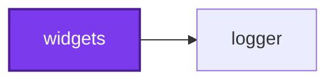

# Running a codependix export

Codependix reads what each project in an Nx workspace depends on and renders it
four ways — the Nx project graph, a NestJS project's module graph, a TypeScript
project's file-level import graph, and a Python project's — then delivers each
one to whichever destinations the configuration names for that project: a JSON
file, a Markdown anchor block spliced into an existing file, or both.

## The configuration decides everything

**There is no flag that selects a graph type, and no per-graph-type
subcommand.** Which graphs run, for which projects, and where each export
lands is entirely a function of `codependix.config.ts`. Looking for
`--nestjs`, `--imports`, or `--only nx` is looking for something that does not
exist.

The corollary is the failure mode worth learning first:

> **A workspace with no configuration file resolves every graph type for every
> project to `target: "none"` and produces nothing.** The run succeeds, exits
> 0, logs that every configured export is current, and writes no files —
> because nothing was configured. That is correct behavior, not a bug.

So a `--write` that wrote nothing is a configuration question, never a
debugging one. Before looking for a defect, confirm in this order:

1. A configuration file was actually found — an absent one is legal and
   silent, while a `--config` path that was named explicitly and does not
   exist fails loudly.
2. The graph types you expected carry a `target` other than `"none"`, which is
   what every unset target defaults to.
3. The projects you expected match the configured `include` globs and no
   `exclude` glob. `include` defaults to nothing, so a configuration that
   never names one selects no project at all — the run warns, and still
   exits zero.

The `codependix-configure` skill covers all three.

## One `--write`, and two things `--check` can gate

`--check` takes a **comma-separated set**, and naming the set is what selects
which finding fails the run.

| Mode | Meaning |
| ---- | ------- |
| `--check boundaries` | Fails on an edge or a cycle breaking a declared rule. Reads no destination and writes nothing |
| `--check reports` | Fails on a configured destination no longer holding what a fresh run would write |
| `--write` | Writes every configured export |

The two `--check` names exist because the findings belong on opposite sides of
a pull request. A broken boundary is caused by the branch and fixed by the
branch, so it gates every branch. A stale export moves with the workspace it
describes, so gating it on a branch fails every branch that changed a project
graph rather than anything the branch did. `reports` is deliberately spelled
the same as callidescope's and codometer's, because it is the same finding.

Combinations:

- `--write --check boundaries` is legal — a boundary has no destination to be
  stale.
- `--write --check reports` is refused — an export cannot be stale in the run
  that just wrote it.
- **A bare `--check`, or one whose value is only commas, is refused.** Read as
  "gate nothing" it would be a gate that cannot fail. If a run is rejected
  with `--check needs a value`, the fix is to name the set, not to drop the
  flag.
- Naming neither `--check` nor `--write` is _asked_ which was meant, as a
  three-item menu. No mode is ever inferred and no default write happens.

**An agent should always name the mode explicitly.** There is no flag that
suppresses the prompt, because an agent's run has no terminal to draw it on:
that run fails immediately, naming the flag it wanted. Reading that failure as
a broken tool is the mistake to avoid — it is a missing flag, and the fix is
to add `--check <set>` or `--write`.

Two options qualify whichever mode was picked:

| Option | Meaning |
| ------ | ------- |
| `--config [config]` | Path to a `codependix.config.ts`. Searched for upward from the directory when omitted |
| `-d, --directory [directory]` | Workspace root whose Nx project graph this run reads. Defaults to the working directory |

```bash
codependix map --write
codependix map --check boundaries --directory . --config configuration/codependix.config.ts
codependix map --check reports --directory . --config configuration/codependix.config.ts
```

## Codependix reads the Nx project graph

This is the trait that separates it from measurement tools that walk a
directory. Nx resolves the project graph itself, from the process working
directory — no flag points at it. What `--directory` names is the **workspace
root every project's path is resolved against**, and the directory the
configuration search starts from.

So `--directory` is not a subtree to scan, and pointing it at a single project's
folder does not export that project alone. It makes every project's root
resolve underneath that folder, and the exports land in the wrong place — or
fail on a readme that is not there — while the graph itself is unaffected.

Run codependix from the workspace root, pass `--directory .`, and select
projects through the configuration's `include`/`exclude` globs, or through
`--projects`/`--tags`, rather than through the directory.

### Graphing a workspace the process is not standing in

A configuration may name a **`projectGraph`** file to read instead of resolving
one:

```ts
{ projectGraph: "artifacts/graph.json" }
```

It is a path, relative to the workspace root, to the JSON that
`nx graph --file=graph.json` emits. That is the only way to graph a workspace
the process is not inside — a job that checked out one repository and graphs
another, or a run with no Nx workspace under it at all. The path resolves
against the same root every export path does, and a supplied graph's node roots
are workspace-relative and resolve underneath it too.

It is a configuration field rather than a flag: what graph a run reads is a
property of the workspace being described, and pinning it once is what a job
graphing a fixed checkout wants.

**A supplied graph is trusted, not validated.** Nx wrote it, so its contents
are taken as given; only a file that is not a project graph at all is refused,
by name, rather than crashing later with nothing pointing at the file. A stale
or hand-edited graph will produce a diagram that is wrong rather than one that
fails.

Two things still need real files on disk regardless, so a supplied graph does
not make a whole run workspace-free: the `nestjs` level boots each container,
and the `imports` level builds a real `ts.Program`. The `nx` level reads only
the graph.

## Four graph types, plus the workspace

Each is keyed by name in the configuration:

| Key | What it exports | Which projects appear |
| --- | --------------- | --------------------- |
| `nx` | A project's one-hop Neighborhood — what it depends on, and what depends on it | Every project the Nx graph knows, except the workspace root itself |
| `nestjs` | A project's NestJS module import graph | Only projects tagged `framework:nestjs` |
| `imports` | A project's own file-level TypeScript import graph | Every project carrying its own `tsconfig.json` |
| `pythonImports` | The Python equivalent, parsed from `import` / `from ... import` statements | Only projects tagged `language:python` |

The whole-workspace Nx graph is configured separately, under `workspace.nx`.
It is exported **once for the repository** rather than once per project, has no
per-project override, and is unaffected by `include`/`exclude`. Its node set is
what `--projects`/`--tags` narrow — see below.

**Participation is per graph type and is not one rule.** A project a given
graph type does not apply to simply never appears in that type's results, which
is why configuring a graph type for every project costs nothing: a project with
no NestJS container is absent from the NestJS pass rather than failing it.

## `--projects` and `--tags` select projects from the command line

Both take a **comma-separated** list, and both do two things at once:

```bash
codependix map --write --projects widgets,tools/reporting
codependix map --write --tags framework:nestjs,language:python
```

**They widen what gets exported.** A project participates when _anything_
claims it — an `include` glob, a `--projects` glob, or a `--tags` tag. The
flags add to what the configuration already selected rather than replacing it,
so `--projects widgets` on a workspace whose `include` is `["**"]` exports
exactly what it did before. `exclude` still wins over all three: a flag that
could resurrect an excluded project would make `exclude` advisory.

`--projects` matches the way `include` does, as a glob against a project's
**name or its workspace-relative root**, so `--projects packages/*` and
`--projects codependix-*` both work and mean what they look like. `--tags`
matches a project's own Nx tags exactly.

**They narrow what gets drawn and judged.** Naming a selection also narrows the
whole-workspace graph's node set and every level `--check boundaries` judges to
the selected projects. Naming neither selects everything, which is why the
default behavior of both is unchanged.

> ⚠️ **A narrowed gate sees fewer edges.** `--check boundaries` is the branch
> gate, so a CI job that passes `--projects` or `--tags` is asking for a
> smaller check than a whole-workspace run, and a green result means less. Use
> them to narrow a _local_ run; leave them off in CI unless narrowing is the
> point.

`include`/`exclude` never do this — they decide which projects have exports
written for them, and have never reached the workspace graph or the gate. That
difference is the whole reason the flags exist as flags rather than as
configuration fields.

Two flags rather than Nx's own `--projects=tag:foo` spelling, deliberately:
each shows up in `--help` under its own name. Do not "fix" the divergence.

## What the run reports

Every pass is attempted regardless of whether an earlier one failed, and one
project's failure is isolated to that project — a missing README, or a NestJS
project that fails to boot its container, is collected as a failure while every
other project still runs. `--write` either fully succeeds or names exactly
which projects failed.

Three findings are reported separately, and any one of them fails the run:

- **Failures** — projects that raised before their exports could be resolved,
  or whose graph could not be built to judge.
- **Stale exports** — under `--check reports`, configured exports that
  disagree with a freshly built graph.
- **Boundary violations** — under `--check boundaries`, edges and cycles
  breaking a declared rule. Each names its level, its scope, the rule, both
  endpoints, and whatever the rule says about why it exists. They go to the
  console and the exit code and nowhere else: a list of things currently
  wrong is not a document worth publishing.

A project resolving to `target: "none"` is left out of the results **entirely**
rather than reported as up to date, so an exit code depends only on exports
codependix was actually configured to produce. A `--check` run reporting `0`
projects is telling you it was configured to produce nothing.

## Reading an export

A Markdown destination writes a Mermaid diagram. In anchor mode the diagram is
spliced between two HTML comment markers naming the anchor:

````markdown
<!-- codependix:start name="codependix-nx" -->

<!-- codependix:end name="codependix-nx" -->
````

The highlighted `subject` node is the project the Neighborhood is centered on.
Node identifiers are sanitized from names and paths, so read the quoted label
rather than the identifier.

A JSON destination writes the graph's own shape — an Nx Neighborhood carries
`dependencies`, `dependents`, `edges`, and `projectName`; an import graph
carries `fileNames`, `edges`, `isolatedFileNames`, and `projectName`; a NestJS
module graph adds `ambientModuleNames` for the global modules whose edges were
deliberately left out of the diagram.

For using a committed graph to answer a question about the codebase — what
depends on this, what a rename would touch, whether an import cycle is real —
reach for the `codependix-navigate` skill.

## Never hand-edit inside the markers

The next `--write` replaces an anchor block wholesale. A diagram edited by hand
is a diff that silently disappears on the following run, and reviewers see a
change that reverts itself for no visible reason.

**Re-running `--write` is the entire fix for a stale `--check reports`.** It
is never the fix for a `--check boundaries` failure — that is a real edge in
real code, and writing an export does not remove it. Reach for the
`codependix-triage` skill for either one, and for `codependix-configure` to
read or change the rules themselves.
