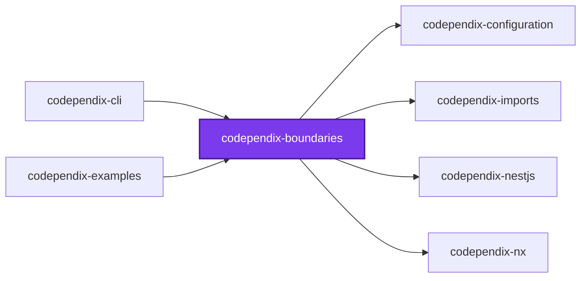
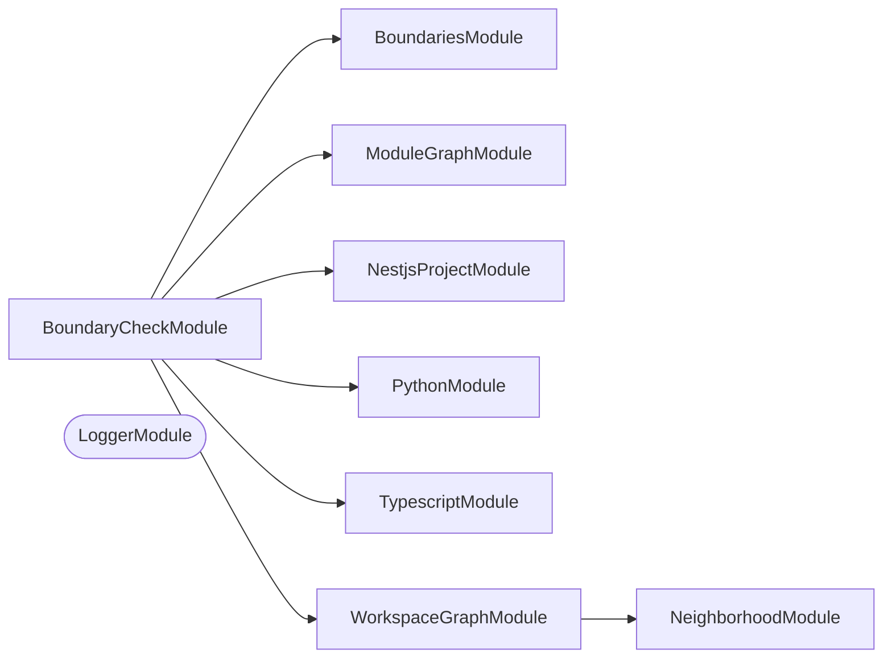

# 🚧 Codependix Boundaries

**Evaluates declared rules against a graph codependix already built, and reports the edges and cycles that break them.**

Codependix draws four graphs and says nothing about whether their shape is
allowed. This turns it from a documentation tool into a gate, at all four
levels — Nx project edges, NestJS module edges, and file-level TypeScript and
Python import edges.

```bash
codependix map --check boundaries
```

## Why not an ESLint rule

`@nx/enforce-module-boundaries` reads import statements, one file at a time.
Three facts it structurally cannot see:

1. **Implicit edges.** An Nx `implicitDependencies` entry creates a
   project-graph edge with no import statement to flag. `NeighborhoodEdge`
   already carries `implicit`, so codependix holds a fact the lint rule has no
   way to reach.
2. **A NestJS module edge is a container fact, not a source fact.**
   `SpelunkerModule.explore` reports what the container resolved, so a dynamic
   module, a `forRootAsync`, or a conditionally composed import produces an
   edge no `import` statement expresses.
3. **A rule can be about the graph rather than the edge.** A cycle, or a
   project's dependents, is a statement about a shape, and a rule that sees
   one file at a time cannot make one.

What this deliberately does **not** replace: the layered `depConstraints`
graph in
[`configuration/eslint.config.ts`](../../configuration/eslint.config.ts), which
reports at the import site with a line number, and `dependency-cruiser`'s
`no-circular`, which is already this repository's file-cycle gate.

The two were checked against each other rather than assumed equivalent. All 32
of this repository's `depConstraints` translate mechanically —
`onlyDependOnLibsWithTags` is an `allow` rule, `notDependOnLibsWithTags` is a
`forbid` rule, and an empty `onlyDependOnLibsWithTags` is a `forbid` reaching
everything — and with `edges: { implicit: false }` all 32 pass, exactly as
ESLint reports them. Without that narrowing one more edge is reported:
`conformetry-examples → conformetry-cli`, declared by an `implicitDependencies`
entry with no import statement behind it. Its own `depConstraint` comment says
that dependency should not exist, and ESLint has nothing to flag. Whether that
is a finding or a false positive is the question `edges` exists to let a rule
answer.

## The rule model

Rules are declared in `codependix.config.ts`, keyed by the graph level that
judges them — `imports`, `nestjs`, `nx`, `pythonImports` — the same keys the
export configuration already uses. A level declaring no rule is never built at
all, which is what keeps the gate affordable: judging the NestJS level means
booting every container in preview mode.

Two shapes and three kinds — an access rule, written as `from`/`to` with the
verdict running one way or the other, and an `acyclic` rule scoped by `nodes`:

| Kind | Reports |
| ---- | ------- |
| `forbid` | An edge whose source matches `from` and whose target matches `to` |
| `allow` | An edge leaving `from` for anywhere `to` does not claim |
| `acyclic` | A cycle among the nodes `nodes` selects, defaulting to every node |

An access rule may also narrow **which edges** it judges, rather than which
nodes it selects:

| `edges` | Judges |
| ------- | ------ |
| unset | every edge — the stricter reading, and the right default for a rule about what a project may _depend on_ |
| `{ implicit: false }` | only edges backed by an import statement — exactly what an `@nx/enforce-module-boundaries` `depConstraint` sees |
| `{ implicit: true }` | only edges an `implicitDependencies` entry declares and no import backs |

Only the Nx level draws an implicit edge; every other level's edges are read as
explicit.

Each rule carries a `name` and, optionally, a `message` saying why it exists.
The message is **appended** to the generated sentence rather than replacing
it, so no wording a configuration chooses can cost a report the rule that
fired and both ends of what it fired on.

## Selectors

One node shape covers three vocabularies, and every field is a list of globs
matched with `path.matchesGlob`:

| Field | Matches | Available at |
| ----- | ------- | ------------ |
| `id` | The node's identifier — a project name, a file path, or a module class name | every level |
| `path` | A workspace-relative project root, or a project-relative file path | `nx`, `imports`, `pythonImports` |
| `project` | The Nx project a node belongs to | `nx`, `imports`, `pythonImports` |
| `tags` | The node's Nx tags; one tag matching is enough | `nx` |

Every field a selector states must match — the fields narrow each other.
Within one field, one glob matching is enough. A selector naming a field its
level does not carry matches **nothing** rather than everything: a `path` rule
evaluated against a NestJS module graph, which carries no file paths, selects
no module instead of silently selecting all of them. A selector stating no
field at all is refused by the configuration schema, since it reads exactly
like a typo.

## The two halves, and the one seam between them

`src/modules/boundaries/` evaluates rules and knows nothing about workspaces: a
`BoundaryGraph` and a list of rules go in, and violations come out.
`src/modules/boundary-check/` is what turns a real workspace into those graphs
— one adapter per level, plus the orchestration around them.

`BoundaryGraph` is the seam, and it is deliberately not any of the four real
graph types. Each adapter flattens a `Neighborhood`, a `NestjsModuleGraph`, or
an import graph into it, so rule evaluation never sees `@nx/devkit`,
`nestjs-spelunker`, or `typescript` and could be lifted out again without
touching a rule.

`BoundaryCheckService.run` walks the four levels in `BOUNDARY_LEVEL_ORDER` —
cheapest first — and **skips any level with no declared rules before building
anything**. That is what keeps the gate affordable: judging the NestJS level
means booting every container in preview mode, and judging the TypeScript level
means building a `ts.Program` per project. A workspace declaring only Nx rules
pays for neither. Each level also isolates one project's failure to that
project, so a container that will not boot is collected as a
`BoundaryCheckFailure` while every other project is still judged.

Nothing here depends on `@codependix/cli` — the host calls in, never the
reverse — and a rule in `configuration/codependix.config.ts` says so, so the
two cannot close a cycle.

## Test

```bash
nx run codependix-boundaries:vitest
```

## 👔 Conformetry

This project was generated from the [nestjs-service-project](../../configuration/conformetry-templates/nestjs-service-project) conformetry template.

## 🕸️ Codependix

Dependency graphs exported by [codependix](https://github.com/JimmyPaolini/codebase/tree/main/packages/codependix-cli), regenerated by `nx run codebase:codependix:write`.

### Nx Neighborhood

<!-- codependix:start name="codependix-nx" -->

<!-- codependix:end name="codependix-nx" -->

### NestJS Module Graph

<!-- codependix:start name="codependix-nestjs" -->


_Rounded modules are global: every module can inject them, so their edges are left out._
<!-- codependix:end name="codependix-nestjs" -->

### File Imports

```mermaid
graph LR
  file_codometer_config_ts["codometer.config.ts"]
  file_eslint_config_ts["eslint.config.ts"]
  file_src_index_ts["src/index.ts"]
  file_src_modules_boundaries_boundaries_constants_ts["src/modules/boundaries/boundaries.constants.ts"]
  file_src_modules_boundaries_boundaries_module_ts["src/modules/boundaries/boundaries.module.ts"]
  file_src_modules_boundaries_boundaries_module_unit_test_ts["src/modules/boundaries/boundaries.module.unit.test.ts"]
  file_src_modules_boundaries_boundaries_service_ts["src/modules/boundaries/boundaries.service.ts"]
  file_src_modules_boundaries_boundaries_service_unit_test_ts["src/modules/boundaries/boundaries.service.unit.test.ts"]
  file_src_modules_boundaries_boundaries_types_ts["src/modules/boundaries/boundaries.types.ts"]
  file_src_modules_boundaries_boundary_cycles_service_ts["src/modules/boundaries/boundary-cycles.service.ts"]
  file_src_modules_boundaries_boundary_cycles_service_unit_test_ts["src/modules/boundaries/boundary-cycles.service.unit.test.ts"]
  file_src_modules_boundaries_boundary_report_service_ts["src/modules/boundaries/boundary-report.service.ts"]
  file_src_modules_boundaries_boundary_report_service_unit_test_ts["src/modules/boundaries/boundary-report.service.unit.test.ts"]
  file_src_modules_boundaries_boundary_selector_service_ts["src/modules/boundaries/boundary-selector.service.ts"]
  file_src_modules_boundaries_boundary_selector_service_unit_test_ts["src/modules/boundaries/boundary-selector.service.unit.test.ts"]
  file_src_modules_boundary_check_boundary_check_constants_ts["src/modules/boundary-check/boundary-check.constants.ts"]
  file_src_modules_boundary_check_boundary_check_module_ts["src/modules/boundary-check/boundary-check.module.ts"]
  file_src_modules_boundary_check_boundary_check_module_unit_test_ts["src/modules/boundary-check/boundary-check.module.unit.test.ts"]
  file_src_modules_boundary_check_boundary_check_service_ts["src/modules/boundary-check/boundary-check.service.ts"]
  file_src_modules_boundary_check_boundary_check_service_unit_test_ts["src/modules/boundary-check/boundary-check.service.unit.test.ts"]
  file_src_modules_boundary_check_boundary_check_types_ts["src/modules/boundary-check/boundary-check.types.ts"]
  file_src_modules_boundary_check_boundary_graph_service_ts["src/modules/boundary-check/boundary-graph.service.ts"]
  file_src_modules_boundary_check_boundary_graph_service_unit_test_ts["src/modules/boundary-check/boundary-graph.service.unit.test.ts"]
  file_testing_mocks_ts["testing/mocks.ts"]
  file_testing_setup_ts["testing/setup.ts"]
  file_vitest_config_ts["vitest.config.ts"]
  file_src_modules_boundaries_boundaries_module_ts --> file_src_modules_boundaries_boundaries_service_ts
  file_src_modules_boundaries_boundaries_module_ts --> file_src_modules_boundaries_boundary_cycles_service_ts
  file_src_modules_boundaries_boundaries_module_ts --> file_src_modules_boundaries_boundary_report_service_ts
  file_src_modules_boundaries_boundaries_module_ts --> file_src_modules_boundaries_boundary_selector_service_ts
  file_src_modules_boundaries_boundaries_module_unit_test_ts --> file_src_modules_boundaries_boundaries_module_ts
  file_src_modules_boundaries_boundaries_module_unit_test_ts --> file_src_modules_boundaries_boundaries_service_ts
  file_src_modules_boundaries_boundaries_module_unit_test_ts --> file_src_modules_boundaries_boundary_cycles_service_ts
  file_src_modules_boundaries_boundaries_module_unit_test_ts --> file_src_modules_boundaries_boundary_report_service_ts
  file_src_modules_boundaries_boundaries_module_unit_test_ts --> file_src_modules_boundaries_boundary_selector_service_ts
  file_src_modules_boundaries_boundaries_service_ts --> file_src_modules_boundaries_boundaries_constants_ts
  file_src_modules_boundaries_boundaries_service_ts --> file_src_modules_boundaries_boundaries_types_ts
  file_src_modules_boundaries_boundaries_service_ts --> file_src_modules_boundaries_boundary_cycles_service_ts
  file_src_modules_boundaries_boundaries_service_ts --> file_src_modules_boundaries_boundary_selector_service_ts
  file_src_modules_boundaries_boundaries_service_unit_test_ts --> file_src_modules_boundaries_boundaries_service_ts
  file_src_modules_boundaries_boundaries_service_unit_test_ts --> file_src_modules_boundaries_boundaries_types_ts
  file_src_modules_boundaries_boundaries_service_unit_test_ts --> file_src_modules_boundaries_boundary_cycles_service_ts
  file_src_modules_boundaries_boundaries_service_unit_test_ts --> file_src_modules_boundaries_boundary_selector_service_ts
  file_src_modules_boundaries_boundary_cycles_service_ts --> file_src_modules_boundaries_boundaries_types_ts
  file_src_modules_boundaries_boundary_cycles_service_unit_test_ts --> file_src_modules_boundaries_boundaries_types_ts
  file_src_modules_boundaries_boundary_cycles_service_unit_test_ts --> file_src_modules_boundaries_boundary_cycles_service_ts
  file_src_modules_boundaries_boundary_report_service_ts --> file_src_modules_boundaries_boundaries_types_ts
  file_src_modules_boundaries_boundary_report_service_unit_test_ts --> file_src_modules_boundaries_boundaries_types_ts
  file_src_modules_boundaries_boundary_report_service_unit_test_ts --> file_src_modules_boundaries_boundary_report_service_ts
  file_src_modules_boundaries_boundary_selector_service_ts --> file_src_modules_boundaries_boundaries_types_ts
  file_src_modules_boundaries_boundary_selector_service_unit_test_ts --> file_src_modules_boundaries_boundaries_types_ts
  file_src_modules_boundaries_boundary_selector_service_unit_test_ts --> file_src_modules_boundaries_boundary_selector_service_ts
  file_src_modules_boundary_check_boundary_check_module_ts --> file_src_modules_boundaries_boundaries_module_ts
  file_src_modules_boundary_check_boundary_check_module_ts --> file_src_modules_boundary_check_boundary_check_service_ts
  file_src_modules_boundary_check_boundary_check_module_ts --> file_src_modules_boundary_check_boundary_graph_service_ts
  file_src_modules_boundary_check_boundary_check_module_unit_test_ts --> file_src_modules_boundary_check_boundary_check_module_ts
  file_src_modules_boundary_check_boundary_check_module_unit_test_ts --> file_src_modules_boundary_check_boundary_check_service_ts
  file_src_modules_boundary_check_boundary_check_module_unit_test_ts --> file_src_modules_boundary_check_boundary_graph_service_ts
  file_src_modules_boundary_check_boundary_check_service_ts --> file_src_modules_boundaries_boundaries_service_ts
  file_src_modules_boundary_check_boundary_check_service_ts --> file_src_modules_boundaries_boundaries_types_ts
  file_src_modules_boundary_check_boundary_check_service_ts --> file_src_modules_boundary_check_boundary_check_constants_ts
  file_src_modules_boundary_check_boundary_check_service_ts --> file_src_modules_boundary_check_boundary_check_types_ts
  file_src_modules_boundary_check_boundary_check_service_ts --> file_src_modules_boundary_check_boundary_graph_service_ts
  file_src_modules_boundary_check_boundary_check_service_unit_test_ts --> file_src_modules_boundaries_boundaries_service_ts
  file_src_modules_boundary_check_boundary_check_service_unit_test_ts --> file_src_modules_boundaries_boundaries_types_ts
  file_src_modules_boundary_check_boundary_check_service_unit_test_ts --> file_src_modules_boundary_check_boundary_check_service_ts
  file_src_modules_boundary_check_boundary_check_service_unit_test_ts --> file_src_modules_boundary_check_boundary_check_types_ts
  file_src_modules_boundary_check_boundary_check_service_unit_test_ts --> file_src_modules_boundary_check_boundary_graph_service_ts
  file_src_modules_boundary_check_boundary_check_types_ts --> file_src_modules_boundaries_boundaries_types_ts
  file_src_modules_boundary_check_boundary_graph_service_ts --> file_src_modules_boundaries_boundaries_types_ts
  file_src_modules_boundary_check_boundary_graph_service_unit_test_ts --> file_src_modules_boundary_check_boundary_graph_service_ts
```

<!-- codependix:start name="codependix-imports" -->

<!-- codependix:end name="codependix-imports" -->

<!-- CODE_STATISTICS_START -->

## ⏲️ Codometer

### Project


### Measured Targets


### TypeScript


### JavaScript


### Python


### JSON


### YAML


### TOML


### Shell


### SQL


### HCL


### CSS


### Conventions


### Jupyter


### Markdown


<!-- CODE_STATISTICS_END -->

<!-- CALL_STACKS_START -->

## 🔭 Callidescope

Call stacks traced through `packages/codependix-boundaries`, deepest first. Each frame shows what it takes, what it returns, and what its documentation says.

| Measure | Value |
| --- | --- |
| Callables | 66 |
| Files | 16 |
| Calls traced | 69 |
| Call stacks | 7 |
| Deepest stack | 12 |
| Stacks through recursion | 0 |
| Unfollowable calls | 2 |

### Call stacks (depth)

**1. `BoundaryCheckService.imports`** — depth ≥ 12 · orphan-root

```text
🚀 BoundaryCheckService.imports(levelArguments: LevelCheckArguments): Promise<BoundaryCheckOutcome> [packages/codependix-boundaries/src/modules/boundary-check/boundary-check.service.ts:90]
  └─> BoundaryCheckService.runTypescriptImportsLevel(args: LevelCheckArguments): Promise<BoundaryCheckOutcome> [packages/codependix-boundaries/src/modules/boundary-check/boundary-check.service.ts:197]
     ↳ Judges every TypeScript project's file-level import graph.
    └─> BoundaryCheckService.runProjectLevel(…): Promise<BoundaryCheckOutcome> [packages/codependix-boundaries/src/modules/boundary-check/boundary-check.service.ts:157]
       ↳ Judges every project at one level, isolating each project's failure.
      └─> BoundariesService.evaluate(args: EvaluateBoundariesArguments): BoundaryViolation[] [packages/codependix-boundaries/src/modules/boundaries/boundaries.service.ts:222]
         ↳ Every violation one graph's rules report, in the order the rules were declared.
        └─> BoundariesService.flatMap(…)(this: undefined, rule: CodependixBoundaryRule): BoundaryViolation[] [packages/codependix-boundaries/src/modules/boundaries/boundaries.service.ts:223]
          └─> BoundariesService.evaluateAcyclicRule(…): BoundaryViolation[] [packages/codependix-boundaries/src/modules/boundaries/boundaries.service.ts:140]
             ↳ Reports every cycle an `acyclic` rule's selected nodes still form.
            └─> BoundarySelectorService.selectIds(…): Set<string> [packages/codependix-boundaries/src/modules/boundaries/boundary-selector.service.ts:106]
               ↳ The ids of every node a selector claims.
              └─> BoundarySelectorService.filter(…)(node: BoundaryNode): boolean [packages/codependix-boundaries/src/modules/boundaries/boundary-selector.service.ts:116]
                └─> BoundarySelectorService.matches(node: BoundaryNode, selector: CodependixBoundarySelector): boolean [packages/codependix-boundaries/src/modules/boundaries/boundary-selector.service.ts:86]
                   ↳ Whether a selector claims a node.
                  └─> BoundarySelectorService.matchesTags(…): boolean [packages/codependix-boundaries/src/modules/boundaries/boundary-selector.service.ts:59]
                     ↳ Whether a node carries a tag matching one of a list of globs.
                    └─> BoundarySelectorService.some(…)(glob: string): boolean [packages/codependix-boundaries/src/modules/boundaries/boundary-selector.service.ts:71]
                      └─> BoundarySelectorService.some(…)(tag: string): boolean [packages/codependix-boundaries/src/modules/boundaries/boundary-selector.service.ts:72]
```

**2. `BoundaryCheckService.nestjs`** — depth ≥ 12 · orphan-root

```text
🚀 BoundaryCheckService.nestjs(levelArguments: LevelCheckArguments): Promise<BoundaryCheckOutcome> [packages/codependix-boundaries/src/modules/boundary-check/boundary-check.service.ts:92]
  └─> BoundaryCheckService.runNestjsLevel(args: LevelCheckArguments): Promise<BoundaryCheckOutcome> [packages/codependix-boundaries/src/modules/boundary-check/boundary-check.service.ts:102]
     ↳ Judges every `framework:nestjs` project's module graph.
    └─> BoundaryCheckService.runProjectLevel(…): Promise<BoundaryCheckOutcome> [packages/codependix-boundaries/src/modules/boundary-check/boundary-check.service.ts:157]
       ↳ Judges every project at one level, isolating each project's failure.
      └─> BoundariesService.evaluate(args: EvaluateBoundariesArguments): BoundaryViolation[] [packages/codependix-boundaries/src/modules/boundaries/boundaries.service.ts:222]
         ↳ Every violation one graph's rules report, in the order the rules were declared.
        └─> BoundariesService.flatMap(…)(this: undefined, rule: CodependixBoundaryRule): BoundaryViolation[] [packages/codependix-boundaries/src/modules/boundaries/boundaries.service.ts:223]
          └─> BoundariesService.evaluateAcyclicRule(…): BoundaryViolation[] [packages/codependix-boundaries/src/modules/boundaries/boundaries.service.ts:140]
             ↳ Reports every cycle an `acyclic` rule's selected nodes still form.
            └─> BoundarySelectorService.selectIds(…): Set<string> [packages/codependix-boundaries/src/modules/boundaries/boundary-selector.service.ts:106]
               ↳ The ids of every node a selector claims.
              └─> BoundarySelectorService.filter(…)(node: BoundaryNode): boolean [packages/codependix-boundaries/src/modules/boundaries/boundary-selector.service.ts:116]
                └─> BoundarySelectorService.matches(node: BoundaryNode, selector: CodependixBoundarySelector): boolean [packages/codependix-boundaries/src/modules/boundaries/boundary-selector.service.ts:86]
                   ↳ Whether a selector claims a node.
                  └─> BoundarySelectorService.matchesTags(…): boolean [packages/codependix-boundaries/src/modules/boundaries/boundary-selector.service.ts:59]
                     ↳ Whether a node carries a tag matching one of a list of globs.
                    └─> BoundarySelectorService.some(…)(glob: string): boolean [packages/codependix-boundaries/src/modules/boundaries/boundary-selector.service.ts:71]
                      └─> BoundarySelectorService.some(…)(tag: string): boolean [packages/codependix-boundaries/src/modules/boundaries/boundary-selector.service.ts:72]
```

**3. `BoundaryCheckService.pythonImports`** — depth ≥ 12 · orphan-root

```text
🚀 BoundaryCheckService.pythonImports(levelArguments: LevelCheckArguments): Promise<BoundaryCheckOutcome> [packages/codependix-boundaries/src/modules/boundary-check/boundary-check.service.ts:94]
  └─> BoundaryCheckService.runPythonImportsLevel(args: LevelCheckArguments): Promise<BoundaryCheckOutcome> [packages/codependix-boundaries/src/modules/boundary-check/boundary-check.service.ts:181]
     ↳ Judges every `language:python` project's file-level import graph.
    └─> BoundaryCheckService.runProjectLevel(…): Promise<BoundaryCheckOutcome> [packages/codependix-boundaries/src/modules/boundary-check/boundary-check.service.ts:157]
       ↳ Judges every project at one level, isolating each project's failure.
      └─> BoundariesService.evaluate(args: EvaluateBoundariesArguments): BoundaryViolation[] [packages/codependix-boundaries/src/modules/boundaries/boundaries.service.ts:222]
         ↳ Every violation one graph's rules report, in the order the rules were declared.
        └─> BoundariesService.flatMap(…)(this: undefined, rule: CodependixBoundaryRule): BoundaryViolation[] [packages/codependix-boundaries/src/modules/boundaries/boundaries.service.ts:223]
          └─> BoundariesService.evaluateAcyclicRule(…): BoundaryViolation[] [packages/codependix-boundaries/src/modules/boundaries/boundaries.service.ts:140]
             ↳ Reports every cycle an `acyclic` rule's selected nodes still form.
            └─> BoundarySelectorService.selectIds(…): Set<string> [packages/codependix-boundaries/src/modules/boundaries/boundary-selector.service.ts:106]
               ↳ The ids of every node a selector claims.
              └─> BoundarySelectorService.filter(…)(node: BoundaryNode): boolean [packages/codependix-boundaries/src/modules/boundaries/boundary-selector.service.ts:116]
                └─> BoundarySelectorService.matches(node: BoundaryNode, selector: CodependixBoundarySelector): boolean [packages/codependix-boundaries/src/modules/boundaries/boundary-selector.service.ts:86]
                   ↳ Whether a selector claims a node.
                  └─> BoundarySelectorService.matchesTags(…): boolean [packages/codependix-boundaries/src/modules/boundaries/boundary-selector.service.ts:59]
                     ↳ Whether a node carries a tag matching one of a list of globs.
                    └─> BoundarySelectorService.some(…)(glob: string): boolean [packages/codependix-boundaries/src/modules/boundaries/boundary-selector.service.ts:71]
                      └─> BoundarySelectorService.some(…)(tag: string): boolean [packages/codependix-boundaries/src/modules/boundaries/boundary-selector.service.ts:72]
```

<details>
<summary>4 more call stacks</summary>

**4. `BoundaryCheckService.nx`** — depth 11 · orphan-root

```text
🚀 BoundaryCheckService.nx(levelArguments: LevelCheckArguments): BoundaryCheckOutcome [packages/codependix-boundaries/src/modules/boundary-check/boundary-check.service.ts:93]
  └─> BoundaryCheckService.runNxLevel(args: LevelCheckArguments): BoundaryCheckOutcome [packages/codependix-boundaries/src/modules/boundary-check/boundary-check.service.ts:121]
     ↳ Judges the whole-workspace Nx project graph.
    └─> BoundariesService.evaluate(args: EvaluateBoundariesArguments): BoundaryViolation[] [packages/codependix-boundaries/src/modules/boundaries/boundaries.service.ts:222]
       ↳ Every violation one graph's rules report, in the order the rules were declared.
      └─> BoundariesService.flatMap(…)(this: undefined, rule: CodependixBoundaryRule): BoundaryViolation[] [packages/codependix-boundaries/src/modules/boundaries/boundaries.service.ts:223]
        └─> BoundariesService.evaluateAcyclicRule(…): BoundaryViolation[] [packages/codependix-boundaries/src/modules/boundaries/boundaries.service.ts:140]
           ↳ Reports every cycle an `acyclic` rule's selected nodes still form.
          └─> BoundarySelectorService.selectIds(…): Set<string> [packages/codependix-boundaries/src/modules/boundaries/boundary-selector.service.ts:106]
             ↳ The ids of every node a selector claims.
            └─> BoundarySelectorService.filter(…)(node: BoundaryNode): boolean [packages/codependix-boundaries/src/modules/boundaries/boundary-selector.service.ts:116]
              └─> BoundarySelectorService.matches(node: BoundaryNode, selector: CodependixBoundarySelector): boolean [packages/codependix-boundaries/src/modules/boundaries/boundary-selector.service.ts:86]
                 ↳ Whether a selector claims a node.
                └─> BoundarySelectorService.matchesTags(…): boolean [packages/codependix-boundaries/src/modules/boundaries/boundary-selector.service.ts:59]
                   ↳ Whether a node carries a tag matching one of a list of globs.
                  └─> BoundarySelectorService.some(…)(glob: string): boolean [packages/codependix-boundaries/src/modules/boundaries/boundary-selector.service.ts:71]
                    └─> BoundarySelectorService.some(…)(tag: string): boolean [packages/codependix-boundaries/src/modules/boundaries/boundary-selector.service.ts:72]
```

**5. `BoundaryCheckService.buildGraph`** — depth 9 · orphan-root

```text
🚀 BoundaryCheckService.buildGraph(project: PythonProject): BoundaryGraph [packages/codependix-boundaries/src/modules/boundary-check/boundary-check.service.ts:185]
  └─> PythonService.buildGraph(project: PythonProject): PythonImportGraph [packages/codependix-imports/src/modules/python/python.service.ts:39]
     ↳ Builds a Python project's internal file-level import Graph.
    └─> PythonImportGraphService.buildGraph(project: PythonProject): PythonImportGraph [packages/codependix-imports/src/modules/python/python-import-graph.service.ts:180]
       ↳ Builds a Python project's internal file-level import Graph.
      └─> PythonImportGraphService.flatMap(…)(this: undefined, sourceFileName: string): PythonImportGraphEdge[] [packages/codependix-imports/src/modules/python/python-import-graph.service.ts:185]
        └─> PythonImportGraphService.collectEdgesForFile(…): PythonImportGraphEdge[] [packages/codependix-imports/src/modules/python/python-import-graph.service.ts:64]
           ↳ Collects every internal import edge one source file declares.
          └─> PythonImportParserService.parseImportSpecifiers(source: string): PythonImportSpecifier[] [packages/codependix-imports/src/modules/python/python-import-parser.service.ts:158]
             ↳ Parses every module-level import statement in a Python source file.
            └─> PythonImportParserService.parseStatement(statement: string): PythonImportSpecifier[] [packages/codependix-imports/src/modules/python/python-import-parser.service.ts:126]
               ↳ Parses one joined statement into the module(s) it names.
              └─> PythonImportParserService.parseImportStatement(statement: string): PythonImportSpecifier[] [packages/codependix-imports/src/modules/python/python-import-parser.service.ts:105]
                 ↳ Parses a joined `import <specifiers>` statement.
                └─> PythonImportParserService.map(…)(modulePath: string): { level: number; modulePath: string; } [packages/codependix-imports/src/modules/python/python-import-parser.service.ts:122]
```

**6. `BoundaryCheckService.buildGraph`** — depth ≥ 7 · orphan-root

```text
🚀 BoundaryCheckService.buildGraph(project: TypescriptProject): BoundaryGraph [packages/codependix-boundaries/src/modules/boundary-check/boundary-check.service.ts:201]
  └─> TypescriptService.buildGraph(projectProgram: TypescriptProjectProgram): TypescriptImportGraph [packages/codependix-imports/src/modules/typescript/typescript.service.ts:44]
     ↳ Builds a project's internal file-level import Graph from its program.
    └─> TypescriptImportGraphService.buildGraph(projectProgram: TypescriptProjectProgram): TypescriptImportGraph [packages/codependix-imports/src/modules/typescript/typescript-import-graph.service.ts:185]
       ↳ Builds a project's internal file-level import Graph from its program.
      └─> TypescriptImportGraphService.listOwnedSourceFileNames(projectProgram: TypescriptProjectProgram): string[] [packages/codependix-imports/src/modules/typescript/typescript-import-graph.service.ts:122]
         ↳ Lists a program's own source files, excluding declaration files. `program.getRootFileNames()` is the same file list…
        └─> TypescriptImportGraphService.resolveOwnedFileNames(projectProgram: TypescriptProjectProgram): Set<string> [packages/codependix-imports/src/modules/typescript/typescript-import-graph.service.ts:156]
           ↳ Resolves the real, absolute file names a program owns.
          └─> TypescriptImportGraphService.map(…)(fileName: string): string [packages/codependix-imports/src/modules/typescript/typescript-import-graph.service.ts:162]
            └─> TypescriptProjectService.toRealPath(filePath: string): string [packages/codependix-imports/src/modules/typescript/typescript-project.service.ts:122]
               ↳ Resolves a path through symlinks, which is how pnpm workspaces link.
```

**7. `BoundaryCheckService.buildGraph`** — depth ≥ 6 · orphan-root

```text
🚀 BoundaryCheckService.buildGraph(project: NestjsProject): Promise<BoundaryGraph> [packages/codependix-boundaries/src/modules/boundary-check/boundary-check.service.ts:106]
  └─> NestjsProjectService.exploreProject(project: NestjsProject): Promise<SpelunkedTree[]> [packages/codependix-nestjs/src/modules/nestjs-project/nestjs-project.service.ts:153]
     ↳ Explores a project's container in preview mode and returns its tree.
    └─> NestjsProjectService.buildSyntheticRootModule(project: NestjsProject): Promise<DynamicModule> [packages/codependix-nestjs/src/modules/nestjs-project/nestjs-project.service.ts:54]
       ↳ Roots a package that bootstraps nothing in every module it defines.
      └─> NestjsProjectService.map(…)(file: string): Promise<Type<unknown>[]> [packages/codependix-nestjs/src/modules/nestjs-project/nestjs-project.service.ts:61]
        └─> NestjsProjectService.loadModuleClasses(file: string): Promise<Type<unknown>[]> [packages/codependix-nestjs/src/modules/nestjs-project/nestjs-project.service.ts:87]
           ↳ Imports a module file and returns every module class it exports.
          └─> NestjsProjectService.map(…)([, moduleClass]: [string, Type<unknown>]): Type<unknown> [packages/codependix-nestjs/src/modules/nestjs-project/nestjs-project.service.ts:98]
```

</details>

### Module spread

None.

### Breadth

| Callable | Breadth | Calls directly | Location |
| --- | --- | --- | --- |
| `BoundariesService.evaluateAccessRule` | 5 | `BoundariesService.indexNodes`, `BoundariesService.judgesEdge`, `BoundariesService.resolveNode`, `BoundarySelectorService.matches`, `BoundariesService.buildAccessViolation` | `packages/codependix-boundaries/src/modules/boundaries/boundaries.service.ts:107` |
| `BoundaryCheckService.runNxLevel` | 4 | `BoundaryGraphService.buildNxGraph`, `WorkspaceGraphService.buildWorkspaceGraph`, `BoundariesService.evaluate`, `BoundaryCheckService.collectProjectFailure` | `packages/codependix-boundaries/src/modules/boundary-check/boundary-check.service.ts:121` |
| `BoundarySelectorService.selectIds` | 3 | `BoundarySelectorService.map(…)`, `BoundarySelectorService.map(…)`, `BoundarySelectorService.filter(…)` | `packages/codependix-boundaries/src/modules/boundaries/boundary-selector.service.ts:106` |

<details>
<summary>34 more callables</summary>

| Callable | Breadth | Calls directly | Location |
| --- | --- | --- | --- |
| `BoundariesService.evaluateAcyclicRule` | 3 | `BoundarySelectorService.selectIds`, `BoundaryCyclesService.findCycles`, `BoundariesService.map(…)` | `packages/codependix-boundaries/src/modules/boundaries/boundaries.service.ts:140` |
| `BoundaryCheckService.buildGraph` | 3 | `BoundaryGraphService.buildNestjsGraph`, `ModuleGraphService.buildGraph`, `NestjsProjectService.exploreProject` | `packages/codependix-boundaries/src/modules/boundary-check/boundary-check.service.ts:106` |
| `BoundaryCheckService.buildGraph` | 3 | `BoundaryGraphService.buildTypescriptImportGraph`, `TypescriptService.buildGraph`, `TypescriptService.buildProgram` | `packages/codependix-boundaries/src/modules/boundary-check/boundary-check.service.ts:201` |
| `BoundaryCheckService.run` | 3 | `BoundaryCheckService.runLevel`, `BoundaryCheckService.flatMap(…)`, `BoundaryCheckService.flatMap(…)` | `packages/codependix-boundaries/src/modules/boundary-check/boundary-check.service.ts:225` |
| `BoundaryCyclesService.findCycles` | 2 | `BoundaryCyclesService.buildAdjacency`, `BoundaryCyclesService.walk` | `packages/codependix-boundaries/src/modules/boundaries/boundary-cycles.service.ts:127` |
| `BoundarySelectorService.matches` | 2 | `BoundarySelectorService.matchesGlobs`, `BoundarySelectorService.matchesTags` | `packages/codependix-boundaries/src/modules/boundaries/boundary-selector.service.ts:86` |
| `BoundariesService.map(…)` | 2 | `BoundariesService.buildMessage`, `describeCycle` | `packages/codependix-boundaries/src/modules/boundaries/boundaries.service.ts:151` |
| `BoundariesService.flatMap(…)` | 2 | `BoundariesService.evaluateAcyclicRule`, `BoundariesService.evaluateAccessRule` | `packages/codependix-boundaries/src/modules/boundaries/boundaries.service.ts:223` |
| `BoundaryGraphService.buildNxGraph` | 2 | `BoundaryGraphService.map(…)`, `BoundaryGraphService.map(…)` | `packages/codependix-boundaries/src/modules/boundary-check/boundary-graph.service.ts:100` |
| `BoundaryCheckService.runNestjsLevel` | 2 | `BoundaryCheckService.runProjectLevel`, `NestjsProjectService.discoverProjects` | `packages/codependix-boundaries/src/modules/boundary-check/boundary-check.service.ts:102` |
| `BoundaryCheckService.runProjectLevel` | 2 | `BoundariesService.evaluate`, `BoundaryCheckService.collectProjectFailure` | `packages/codependix-boundaries/src/modules/boundary-check/boundary-check.service.ts:157` |
| `BoundaryCheckService.runPythonImportsLevel` | 2 | `BoundaryCheckService.runProjectLevel`, `PythonService.discoverProjects` | `packages/codependix-boundaries/src/modules/boundary-check/boundary-check.service.ts:181` |
| `BoundaryCheckService.buildGraph` | 2 | `BoundaryGraphService.buildPythonImportGraph`, `PythonService.buildGraph` | `packages/codependix-boundaries/src/modules/boundary-check/boundary-check.service.ts:185` |
| `BoundaryCheckService.runTypescriptImportsLevel` | 2 | `BoundaryCheckService.runProjectLevel`, `TypescriptService.discoverProjects` | `packages/codependix-boundaries/src/modules/boundary-check/boundary-check.service.ts:197` |
| `BoundaryCyclesService.recordCycle` | 1 | `BoundaryCyclesService.buildCycleKey` | `packages/codependix-boundaries/src/modules/boundaries/boundary-cycles.service.ts:73` |
| `BoundaryCyclesService.walk` | 1 | `BoundaryCyclesService.recordCycle` | `packages/codependix-boundaries/src/modules/boundaries/boundary-cycles.service.ts:91` |
| `BoundarySelectorService.matchesGlobs` | 1 | `BoundarySelectorService.some(…)` | `packages/codependix-boundaries/src/modules/boundaries/boundary-selector.service.ts:37` |
| `BoundarySelectorService.matchesTags` | 1 | `BoundarySelectorService.some(…)` | `packages/codependix-boundaries/src/modules/boundaries/boundary-selector.service.ts:59` |
| `BoundarySelectorService.some(…)` | 1 | `BoundarySelectorService.some(…)` | `packages/codependix-boundaries/src/modules/boundaries/boundary-selector.service.ts:71` |
| `BoundarySelectorService.filter(…)` | 1 | `BoundarySelectorService.matches` | `packages/codependix-boundaries/src/modules/boundaries/boundary-selector.service.ts:116` |
| `BoundariesService.buildAccessViolation` | 1 | `BoundariesService.buildMessage` | `packages/codependix-boundaries/src/modules/boundaries/boundaries.service.ts:54` |
| `BoundariesService.indexNodes` | 1 | `BoundariesService.map(…)` | `packages/codependix-boundaries/src/modules/boundaries/boundaries.service.ts:166` |
| `BoundariesService.evaluate` | 1 | `BoundariesService.flatMap(…)` | `packages/codependix-boundaries/src/modules/boundaries/boundaries.service.ts:222` |
| `BoundaryReportService.renderSummary` | 1 | `BoundaryReportService.map(…)` | `packages/codependix-boundaries/src/modules/boundaries/boundary-report.service.ts:36` |
| `BoundaryReportService.renderViolations` | 1 | `BoundaryReportService.map(…)` | `packages/codependix-boundaries/src/modules/boundaries/boundary-report.service.ts:56` |
| `BoundaryGraphService.buildFileNodes` | 1 | `BoundaryGraphService.map(…)` | `packages/codependix-boundaries/src/modules/boundary-check/boundary-graph.service.ts:45` |
| `BoundaryGraphService.buildNestjsGraph` | 1 | `BoundaryGraphService.map(…)` | `packages/codependix-boundaries/src/modules/boundary-check/boundary-graph.service.ts:80` |
| `BoundaryGraphService.map(…)` | 1 | `BoundaryGraphService.resolveProjectRoot` | `packages/codependix-boundaries/src/modules/boundary-check/boundary-graph.service.ts:113` |
| `BoundaryGraphService.buildPythonImportGraph` | 1 | `BoundaryGraphService.buildFileNodes` | `packages/codependix-boundaries/src/modules/boundary-check/boundary-graph.service.ts:127` |
| `BoundaryGraphService.buildTypescriptImportGraph` | 1 | `BoundaryGraphService.buildFileNodes` | `packages/codependix-boundaries/src/modules/boundary-check/boundary-graph.service.ts:140` |
| `BoundaryCheckService.imports` | 1 | `BoundaryCheckService.runTypescriptImportsLevel` | `packages/codependix-boundaries/src/modules/boundary-check/boundary-check.service.ts:90` |
| `BoundaryCheckService.nestjs` | 1 | `BoundaryCheckService.runNestjsLevel` | `packages/codependix-boundaries/src/modules/boundary-check/boundary-check.service.ts:92` |
| `BoundaryCheckService.nx` | 1 | `BoundaryCheckService.runNxLevel` | `packages/codependix-boundaries/src/modules/boundary-check/boundary-check.service.ts:93` |
| `BoundaryCheckService.pythonImports` | 1 | `BoundaryCheckService.runPythonImportsLevel` | `packages/codependix-boundaries/src/modules/boundary-check/boundary-check.service.ts:94` |

</details>

### Possibly misplaced

| Callable | Declared in | Called from | Callers |
| --- | --- | --- | --- |
| `BoundariesService.evaluate` | `packages/codependix-boundaries:modules/boundaries` | `packages/codependix-boundaries:modules/boundary-check` | 2/2 |
<!-- CALL_STACKS_END -->
