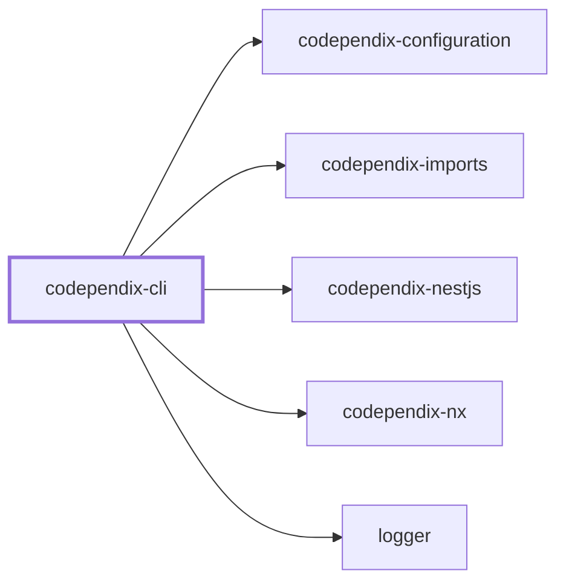
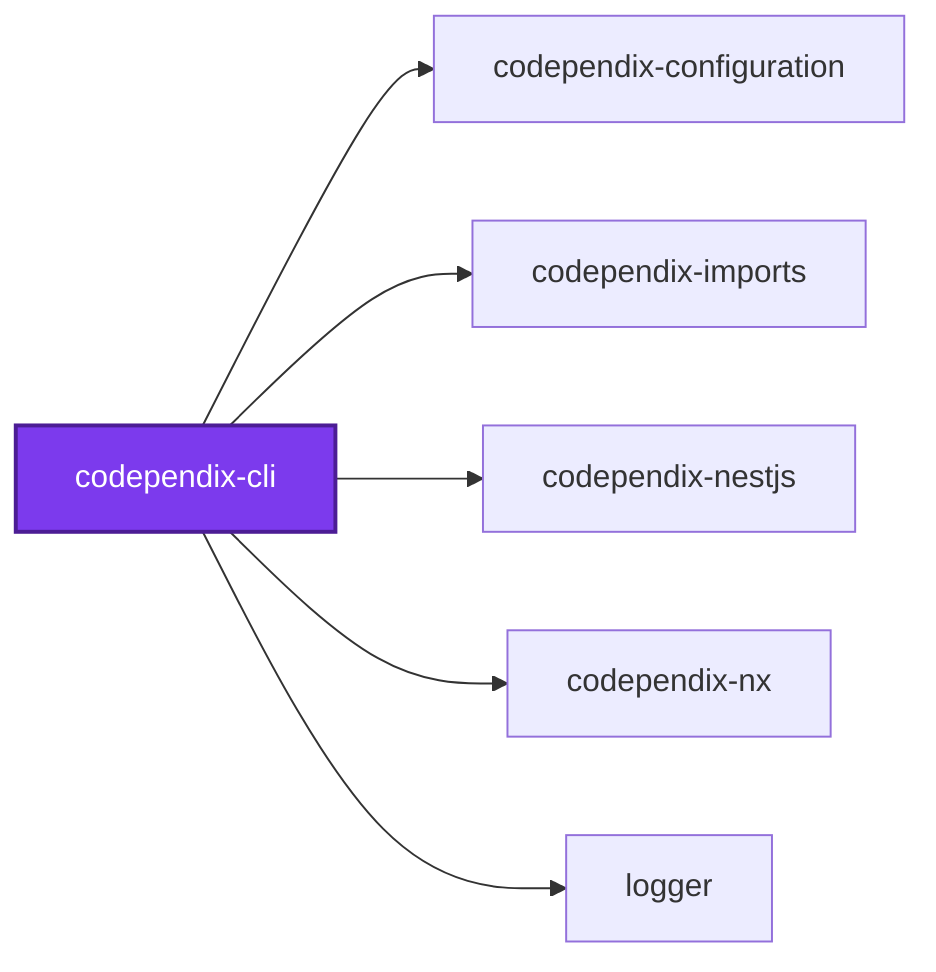
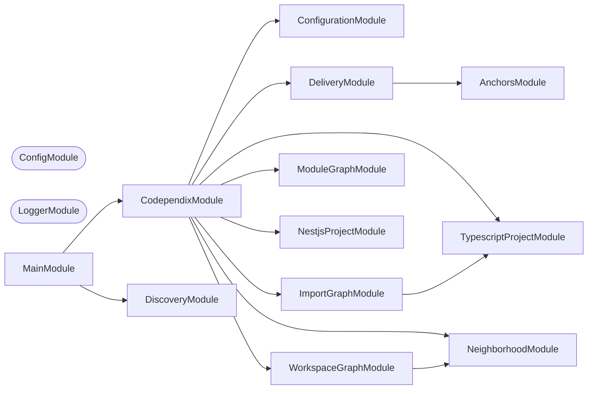

## Project Graph

Where this project sits in the Nx project graph: what it depends on, and what depends on it. Regenerated by `nx run synchronization:nx-project-graphs:write`.

<!-- nx-project-graph-start -->



<!-- nx-project-graph-end -->

## Module Graph

The modules this project defines and the imports between them, published by `nx run synchronization:nestjs-module-graphs:write`.

<!-- nestjs-module-graph-start -->

<!-- nestjs-module-graph-end -->

## Start

```bash
nx run codependix-cli:start
```

## Test

```bash
nx run codependix-cli:vitest
```

## 🕸️ Codependix

Dependency graphs exported by [codependix](https://github.com/JimmyPaolini/codebase/tree/main/packages/codependix-cli), regenerated by `nx run codebase:codependix:write`.

### Nx Neighborhood

<!-- codependix:start name="codependix-nx" -->

<!-- codependix:end name="codependix-nx" -->

### NestJS Module Graph

<!-- codependix:start name="codependix-nestjs" -->


_Rounded modules are global: every module can inject them, so their edges are left out._
<!-- codependix:end name="codependix-nestjs" -->

### File Imports

```mermaid
graph LR
  file_eslint_config_ts["eslint.config.ts"]
  file_src_constants_ts["src/constants.ts"]
  file_src_index_ts["src/index.ts"]
  file_src_index_unit_test_ts["src/index.unit.test.ts"]
  file_src_main_end_to_end_test_ts["src/main.end-to-end.test.ts"]
  file_src_main_module_ts["src/main.module.ts"]
  file_src_main_ts["src/main.ts"]
  file_src_modules_anchors_anchors_constants_ts["src/modules/anchors/anchors.constants.ts"]
  file_src_modules_anchors_anchors_errors_ts["src/modules/anchors/anchors.errors.ts"]
  file_src_modules_anchors_anchors_module_ts["src/modules/anchors/anchors.module.ts"]
  file_src_modules_anchors_anchors_module_unit_test_ts["src/modules/anchors/anchors.module.unit.test.ts"]
  file_src_modules_anchors_anchors_service_ts["src/modules/anchors/anchors.service.ts"]
  file_src_modules_anchors_anchors_service_unit_test_ts["src/modules/anchors/anchors.service.unit.test.ts"]
  file_src_modules_anchors_anchors_types_ts["src/modules/anchors/anchors.types.ts"]
  file_src_modules_codependix_codependix_command_ts["src/modules/codependix/codependix.command.ts"]
  file_src_modules_codependix_codependix_command_unit_test_ts["src/modules/codependix/codependix.command.unit.test.ts"]
  file_src_modules_codependix_codependix_constants_ts["src/modules/codependix/codependix.constants.ts"]
  file_src_modules_codependix_codependix_module_ts["src/modules/codependix/codependix.module.ts"]
  file_src_modules_codependix_codependix_module_unit_test_ts["src/modules/codependix/codependix.module.unit.test.ts"]
  file_src_modules_codependix_codependix_service_ts["src/modules/codependix/codependix.service.ts"]
  file_src_modules_codependix_codependix_service_unit_test_ts["src/modules/codependix/codependix.service.unit.test.ts"]
  file_src_modules_codependix_codependix_types_ts["src/modules/codependix/codependix.types.ts"]
  file_src_modules_delivery_delivery_constants_ts["src/modules/delivery/delivery.constants.ts"]
  file_src_modules_delivery_delivery_module_ts["src/modules/delivery/delivery.module.ts"]
  file_src_modules_delivery_delivery_module_unit_test_ts["src/modules/delivery/delivery.module.unit.test.ts"]
  file_src_modules_delivery_delivery_service_ts["src/modules/delivery/delivery.service.ts"]
  file_src_modules_delivery_delivery_service_unit_test_ts["src/modules/delivery/delivery.service.unit.test.ts"]
  file_src_modules_delivery_delivery_types_ts["src/modules/delivery/delivery.types.ts"]
  file_src_repl_ts["src/repl.ts"]
  file_src_repl_unit_test_ts["src/repl.unit.test.ts"]
  file_testing_mocks_ts["testing/mocks.ts"]
  file_testing_setup_ts["testing/setup.ts"]
  file_vitest_config_ts["vitest.config.ts"]
  file_src_index_unit_test_ts --> file_src_index_ts
  file_src_main_end_to_end_test_ts --> file_src_constants_ts
  file_src_main_module_ts --> file_src_constants_ts
  file_src_main_module_ts --> file_src_modules_codependix_codependix_module_ts
  file_src_main_ts --> file_src_main_module_ts
  file_src_modules_anchors_anchors_module_ts --> file_src_modules_anchors_anchors_service_ts
  file_src_modules_anchors_anchors_module_unit_test_ts --> file_src_modules_anchors_anchors_module_ts
  file_src_modules_anchors_anchors_module_unit_test_ts --> file_src_modules_anchors_anchors_service_ts
  file_src_modules_anchors_anchors_service_ts --> file_src_modules_anchors_anchors_constants_ts
  file_src_modules_anchors_anchors_service_ts --> file_src_modules_anchors_anchors_errors_ts
  file_src_modules_anchors_anchors_service_ts --> file_src_modules_anchors_anchors_types_ts
  file_src_modules_anchors_anchors_service_unit_test_ts --> file_src_modules_anchors_anchors_errors_ts
  file_src_modules_anchors_anchors_service_unit_test_ts --> file_src_modules_anchors_anchors_service_ts
  file_src_modules_codependix_codependix_command_ts --> file_src_modules_codependix_codependix_constants_ts
  file_src_modules_codependix_codependix_command_ts --> file_src_modules_codependix_codependix_service_ts
  file_src_modules_codependix_codependix_command_ts --> file_src_modules_codependix_codependix_types_ts
  file_src_modules_codependix_codependix_command_unit_test_ts --> file_src_modules_codependix_codependix_command_ts
  file_src_modules_codependix_codependix_command_unit_test_ts --> file_src_modules_codependix_codependix_service_ts
  file_src_modules_codependix_codependix_command_unit_test_ts --> file_src_modules_codependix_codependix_types_ts
  file_src_modules_codependix_codependix_command_unit_test_ts --> file_src_modules_delivery_delivery_types_ts
  file_src_modules_codependix_codependix_module_ts --> file_src_modules_codependix_codependix_command_ts
  file_src_modules_codependix_codependix_module_ts --> file_src_modules_codependix_codependix_service_ts
  file_src_modules_codependix_codependix_module_ts --> file_src_modules_delivery_delivery_module_ts
  file_src_modules_codependix_codependix_module_unit_test_ts --> file_src_modules_codependix_codependix_command_ts
  file_src_modules_codependix_codependix_module_unit_test_ts --> file_src_modules_codependix_codependix_module_ts
  file_src_modules_codependix_codependix_module_unit_test_ts --> file_src_modules_codependix_codependix_service_ts
  file_src_modules_codependix_codependix_service_ts --> file_src_modules_codependix_codependix_constants_ts
  file_src_modules_codependix_codependix_service_ts --> file_src_modules_codependix_codependix_types_ts
  file_src_modules_codependix_codependix_service_ts --> file_src_modules_delivery_delivery_service_ts
  file_src_modules_codependix_codependix_service_ts --> file_src_modules_delivery_delivery_types_ts
  file_src_modules_codependix_codependix_service_unit_test_ts --> file_src_modules_anchors_anchors_errors_ts
  file_src_modules_codependix_codependix_service_unit_test_ts --> file_src_modules_anchors_anchors_service_ts
  file_src_modules_codependix_codependix_service_unit_test_ts --> file_src_modules_codependix_codependix_service_ts
  file_src_modules_codependix_codependix_service_unit_test_ts --> file_src_modules_delivery_delivery_service_ts
  file_src_modules_delivery_delivery_module_ts --> file_src_modules_anchors_anchors_module_ts
  file_src_modules_delivery_delivery_module_ts --> file_src_modules_delivery_delivery_service_ts
  file_src_modules_delivery_delivery_module_unit_test_ts --> file_src_modules_delivery_delivery_module_ts
  file_src_modules_delivery_delivery_module_unit_test_ts --> file_src_modules_delivery_delivery_service_ts
  file_src_modules_delivery_delivery_service_ts --> file_src_modules_anchors_anchors_errors_ts
  file_src_modules_delivery_delivery_service_ts --> file_src_modules_anchors_anchors_service_ts
  file_src_modules_delivery_delivery_service_ts --> file_src_modules_delivery_delivery_constants_ts
  file_src_modules_delivery_delivery_service_ts --> file_src_modules_delivery_delivery_types_ts
  file_src_modules_delivery_delivery_service_unit_test_ts --> file_src_modules_anchors_anchors_errors_ts
  file_src_modules_delivery_delivery_service_unit_test_ts --> file_src_modules_anchors_anchors_service_ts
  file_src_modules_delivery_delivery_service_unit_test_ts --> file_src_modules_delivery_delivery_service_ts
  file_src_repl_ts --> file_src_main_module_ts
```

<!-- codependix:start name="codependix-imports" -->

<!-- codependix:end name="codependix-imports" -->
