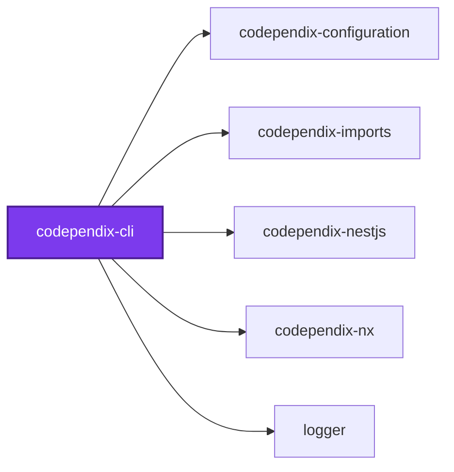

# 🕸️ Codependix CLI

**Exports a project's dependency graphs — Nx, NestJS, and file-level imports — as JSON and Markdown diagrams.**

Codependix reads what each project depends on and renders it three ways: the
Nx project graph, a NestJS project's module graph, and a TypeScript project's
own file-level import graph. Each graph is delivered to whichever destinations
`codependix.config.ts` names for that project — a JSON file, a Markdown anchor
block spliced into an existing file such as a `README.md`, or both.

```bash
pnpm add --filter <project> --save-dev @codependix/cli
```

```bash
codependix --write
```

## Usage

Exactly two run modes, `--check` and `--write` — no per-graph-type
subcommand. Which graphs run for a project, and where its export lands, is
entirely a function of the configuration file; see
[`configuration/codependix.config.ts`](../../configuration/codependix.config.ts)
for this repository's own.

| Flag | Meaning |
| ---- | ------- |
| `--check` | Verifies every configured export is current, without writing |
| `--write` | Writes every configured export |
| `--config [config]` | Path to a `codependix.config.ts`. Searched for upward from `--directory` when omitted |
| `-d, --directory [directory]` | Workspace root whose Nx project graph this run reads. Defaults to the working directory |

`--check` and `--write` are mutually exclusive, and one of them is required —
a command line naming neither or both is rejected outright, the same rule
`codometer`'s `--check`/`--write` split follows.

```bash
nx run codebase:codependix:check
nx run codebase:codependix:write
```

One project failing — a missing anchor, or a NestJS project that fails to
boot its container — is reported and does not stop the rest: `--write` either
fully succeeds or names exactly which projects failed while still completing
every other one.

## Packages

| Package | Role |
| ------- | ---- |
| [`@codependix/cli`](.) | Orchestrates the three graph builders and delivers their exports |
| [`@codependix/configuration`](../codependix-configuration/README.md) | Reads `codependix.config.ts` and resolves per-project export destinations |
| [`@codependix/nx`](../codependix-nx/README.md) | Builds a project's Nx Neighborhood and the whole-workspace Workspace Graph |
| [`@codependix/nestjs`](../codependix-nestjs/README.md) | Explores a NestJS project's container and builds its module graph |
| [`@codependix/imports`](../codependix-imports/README.md) | Builds a project's file-level import graph from its own `ts.Program` |

## Start

```bash
nx run codependix-cli:start
```

## Test

```bash
nx run codependix-cli:vitest
```

## 🕸️ Codependix

Dependency graphs exported by [codependix](https://github.com/JimmyPaolini/codebase/tree/main/packages/codependix-cli), regenerated by `nx run codebase:codependix:write`.

### Nx Neighborhood

<!-- codependix:start name="codependix-nx" -->

<!-- codependix:end name="codependix-nx" -->

### NestJS Module Graph

<!-- codependix:start name="codependix-nestjs" -->


_Rounded modules are global: every module can inject them, so their edges are left out._
<!-- codependix:end name="codependix-nestjs" -->

### File Imports

```mermaid
graph LR
  file_eslint_config_ts["eslint.config.ts"]
  file_src_constants_ts["src/constants.ts"]
  file_src_index_ts["src/index.ts"]
  file_src_index_unit_test_ts["src/index.unit.test.ts"]
  file_src_main_end_to_end_test_ts["src/main.end-to-end.test.ts"]
  file_src_main_module_ts["src/main.module.ts"]
  file_src_main_ts["src/main.ts"]
  file_src_modules_anchors_anchors_constants_ts["src/modules/anchors/anchors.constants.ts"]
  file_src_modules_anchors_anchors_errors_ts["src/modules/anchors/anchors.errors.ts"]
  file_src_modules_anchors_anchors_module_ts["src/modules/anchors/anchors.module.ts"]
  file_src_modules_anchors_anchors_module_unit_test_ts["src/modules/anchors/anchors.module.unit.test.ts"]
  file_src_modules_anchors_anchors_service_ts["src/modules/anchors/anchors.service.ts"]
  file_src_modules_anchors_anchors_service_unit_test_ts["src/modules/anchors/anchors.service.unit.test.ts"]
  file_src_modules_anchors_anchors_types_ts["src/modules/anchors/anchors.types.ts"]
  file_src_modules_codependix_codependix_command_ts["src/modules/codependix/codependix.command.ts"]
  file_src_modules_codependix_codependix_command_unit_test_ts["src/modules/codependix/codependix.command.unit.test.ts"]
  file_src_modules_codependix_codependix_constants_ts["src/modules/codependix/codependix.constants.ts"]
  file_src_modules_codependix_codependix_module_ts["src/modules/codependix/codependix.module.ts"]
  file_src_modules_codependix_codependix_module_unit_test_ts["src/modules/codependix/codependix.module.unit.test.ts"]
  file_src_modules_codependix_codependix_service_ts["src/modules/codependix/codependix.service.ts"]
  file_src_modules_codependix_codependix_service_unit_test_ts["src/modules/codependix/codependix.service.unit.test.ts"]
  file_src_modules_codependix_codependix_types_ts["src/modules/codependix/codependix.types.ts"]
  file_src_modules_delivery_delivery_constants_ts["src/modules/delivery/delivery.constants.ts"]
  file_src_modules_delivery_delivery_module_ts["src/modules/delivery/delivery.module.ts"]
  file_src_modules_delivery_delivery_module_unit_test_ts["src/modules/delivery/delivery.module.unit.test.ts"]
  file_src_modules_delivery_delivery_service_ts["src/modules/delivery/delivery.service.ts"]
  file_src_modules_delivery_delivery_service_unit_test_ts["src/modules/delivery/delivery.service.unit.test.ts"]
  file_src_modules_delivery_delivery_types_ts["src/modules/delivery/delivery.types.ts"]
  file_src_repl_ts["src/repl.ts"]
  file_src_repl_unit_test_ts["src/repl.unit.test.ts"]
  file_testing_mocks_ts["testing/mocks.ts"]
  file_testing_setup_ts["testing/setup.ts"]
  file_vitest_config_ts["vitest.config.ts"]
  file_src_index_unit_test_ts --> file_src_index_ts
  file_src_main_end_to_end_test_ts --> file_src_constants_ts
  file_src_main_module_ts --> file_src_constants_ts
  file_src_main_module_ts --> file_src_modules_codependix_codependix_module_ts
  file_src_main_ts --> file_src_main_module_ts
  file_src_modules_anchors_anchors_module_ts --> file_src_modules_anchors_anchors_service_ts
  file_src_modules_anchors_anchors_module_unit_test_ts --> file_src_modules_anchors_anchors_module_ts
  file_src_modules_anchors_anchors_module_unit_test_ts --> file_src_modules_anchors_anchors_service_ts
  file_src_modules_anchors_anchors_service_ts --> file_src_modules_anchors_anchors_constants_ts
  file_src_modules_anchors_anchors_service_ts --> file_src_modules_anchors_anchors_errors_ts
  file_src_modules_anchors_anchors_service_ts --> file_src_modules_anchors_anchors_types_ts
  file_src_modules_anchors_anchors_service_unit_test_ts --> file_src_modules_anchors_anchors_errors_ts
  file_src_modules_anchors_anchors_service_unit_test_ts --> file_src_modules_anchors_anchors_service_ts
  file_src_modules_codependix_codependix_command_ts --> file_src_modules_codependix_codependix_constants_ts
  file_src_modules_codependix_codependix_command_ts --> file_src_modules_codependix_codependix_service_ts
  file_src_modules_codependix_codependix_command_ts --> file_src_modules_codependix_codependix_types_ts
  file_src_modules_codependix_codependix_command_ts --> file_src_modules_delivery_delivery_types_ts
  file_src_modules_codependix_codependix_command_unit_test_ts --> file_src_modules_codependix_codependix_command_ts
  file_src_modules_codependix_codependix_command_unit_test_ts --> file_src_modules_codependix_codependix_service_ts
  file_src_modules_codependix_codependix_command_unit_test_ts --> file_src_modules_codependix_codependix_types_ts
  file_src_modules_codependix_codependix_command_unit_test_ts --> file_src_modules_delivery_delivery_types_ts
  file_src_modules_codependix_codependix_module_ts --> file_src_modules_codependix_codependix_command_ts
  file_src_modules_codependix_codependix_module_ts --> file_src_modules_codependix_codependix_service_ts
  file_src_modules_codependix_codependix_module_ts --> file_src_modules_delivery_delivery_module_ts
  file_src_modules_codependix_codependix_module_unit_test_ts --> file_src_modules_codependix_codependix_command_ts
  file_src_modules_codependix_codependix_module_unit_test_ts --> file_src_modules_codependix_codependix_module_ts
  file_src_modules_codependix_codependix_module_unit_test_ts --> file_src_modules_codependix_codependix_service_ts
  file_src_modules_codependix_codependix_service_ts --> file_src_modules_codependix_codependix_constants_ts
  file_src_modules_codependix_codependix_service_ts --> file_src_modules_codependix_codependix_types_ts
  file_src_modules_codependix_codependix_service_ts --> file_src_modules_delivery_delivery_service_ts
  file_src_modules_codependix_codependix_service_ts --> file_src_modules_delivery_delivery_types_ts
  file_src_modules_codependix_codependix_service_unit_test_ts --> file_src_modules_anchors_anchors_service_ts
  file_src_modules_codependix_codependix_service_unit_test_ts --> file_src_modules_codependix_codependix_service_ts
  file_src_modules_codependix_codependix_service_unit_test_ts --> file_src_modules_codependix_codependix_types_ts
  file_src_modules_codependix_codependix_service_unit_test_ts --> file_src_modules_delivery_delivery_service_ts
  file_src_modules_codependix_codependix_service_unit_test_ts --> file_src_modules_delivery_delivery_types_ts
  file_src_modules_codependix_codependix_types_ts --> file_src_modules_delivery_delivery_types_ts
  file_src_modules_delivery_delivery_module_ts --> file_src_modules_anchors_anchors_module_ts
  file_src_modules_delivery_delivery_module_ts --> file_src_modules_delivery_delivery_service_ts
  file_src_modules_delivery_delivery_module_unit_test_ts --> file_src_modules_delivery_delivery_module_ts
  file_src_modules_delivery_delivery_module_unit_test_ts --> file_src_modules_delivery_delivery_service_ts
  file_src_modules_delivery_delivery_service_ts --> file_src_modules_anchors_anchors_errors_ts
  file_src_modules_delivery_delivery_service_ts --> file_src_modules_anchors_anchors_service_ts
  file_src_modules_delivery_delivery_service_ts --> file_src_modules_delivery_delivery_constants_ts
  file_src_modules_delivery_delivery_service_ts --> file_src_modules_delivery_delivery_types_ts
  file_src_modules_delivery_delivery_service_unit_test_ts --> file_src_modules_anchors_anchors_errors_ts
  file_src_modules_delivery_delivery_service_unit_test_ts --> file_src_modules_anchors_anchors_service_ts
  file_src_modules_delivery_delivery_service_unit_test_ts --> file_src_modules_delivery_delivery_service_ts
  file_src_repl_ts --> file_src_main_module_ts
```

<!-- codependix:start name="codependix-imports" -->

<!-- codependix:end name="codependix-imports" -->
