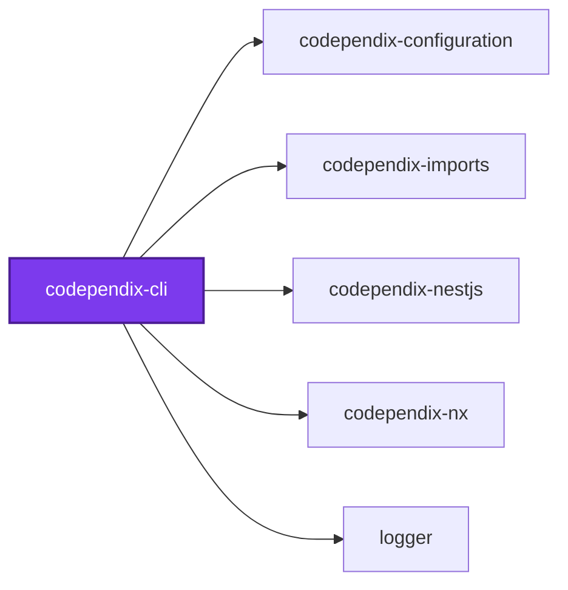

# 🕸️ Codependix CLI

**Exports a project's dependency graphs — Nx, NestJS, and file-level imports — as JSON and Markdown diagrams.**

Codependix reads what each project depends on and renders it three ways: the
Nx project graph, a NestJS project's module graph, and a TypeScript project's
own file-level import graph. Each graph is delivered to whichever destinations
`codependix.config.ts` names for that project — a JSON file, a Markdown anchor
block spliced into an existing file such as a `README.md`, or both.

```bash
pnpm add --filter <project> --save-dev @codependix/cli
```

```bash
codependix --write
```

## Usage

Exactly two run modes, `--check` and `--write` — no per-graph-type
subcommand. Which graphs run for a project, and where its export lands, is
entirely a function of the configuration file; see
[`configuration/codependix.config.ts`](../../configuration/codependix.config.ts)
for this repository's own.

| Flag | Meaning |
| ---- | ------- |
| `--check` | Verifies every configured export is current, without writing |
| `--write` | Writes every configured export |
| `--config [config]` | Path to a `codependix.config.ts`. Searched for upward from `--directory` when omitted |
| `-d, --directory [directory]` | Workspace root whose Nx project graph this run reads. Defaults to the working directory |

`--check` and `--write` are mutually exclusive, and one of them is required —
a command line naming neither or both is rejected outright, the same rule
`codometer`'s `--check`/`--write` split follows.

```bash
nx run codebase:codependix:check
nx run codebase:codependix:write
```

One project failing — a missing anchor, or a NestJS project that fails to
boot its container — is reported and does not stop the rest: `--write` either
fully succeeds or names exactly which projects failed while still completing
every other one.

## Packages

| Package | Role |
| ------- | ---- |
| [`@codependix/cli`](.) | Orchestrates the three graph builders and delivers their exports |
| [`@codependix/configuration`](../codependix-configuration/README.md) | Reads `codependix.config.ts` and resolves per-project export destinations |
| [`@codependix/nx`](../codependix-nx/README.md) | Builds a project's Nx Neighborhood and the whole-workspace Workspace Graph |
| [`@codependix/nestjs`](../codependix-nestjs/README.md) | Explores a NestJS project's container and builds its module graph |
| [`@codependix/imports`](../codependix-imports/README.md) | Builds a project's file-level import graph from its own `ts.Program` |

## Start

```bash
nx run codependix-cli:start
```

## Test

```bash
nx run codependix-cli:vitest
```

## 👔 Conformetry

This project was generated from the [nestjs-command-project](../../configuration/conformetry-templates/nestjs-command-project) conformetry template.

## 🕸️ Codependix

Dependency graphs exported by [codependix](https://github.com/JimmyPaolini/codebase/tree/main/packages/codependix-cli), regenerated by `nx run codebase:codependix:write`.

### Nx Neighborhood

<!-- codependix:start name="codependix-nx" -->

<!-- codependix:end name="codependix-nx" -->

### NestJS Module Graph

```mermaid
flowchart LR
  AnchorsModule
  CodependixModule
  ConfigModule([ConfigModule])
  ConfigurationModule
  DeliveryModule
  DiscoveryModule
  ImportGraphModule
  LoggerModule([LoggerModule])
  MainModule
  ModuleGraphModule
  NeighborhoodModule
  NestjsProjectModule
  TypescriptProjectModule
  WorkspaceGraphModule
  CodependixModule --> ConfigurationModule
  CodependixModule --> DeliveryModule
  CodependixModule --> ImportGraphModule
  CodependixModule --> ModuleGraphModule
  CodependixModule --> NeighborhoodModule
  CodependixModule --> NestjsProjectModule
  CodependixModule --> TypescriptProjectModule
  CodependixModule --> WorkspaceGraphModule
  DeliveryModule --> AnchorsModule
  ImportGraphModule --> TypescriptProjectModule
  MainModule --> CodependixModule
  MainModule --> DiscoveryModule
  WorkspaceGraphModule --> NeighborhoodModule
```

<!-- codependix:start name="codependix-nestjs" -->


_Rounded modules are global: every module can inject them, so their edges are left out._
<!-- codependix:end name="codependix-nestjs" -->

### File Imports

```mermaid
graph LR
  file_eslint_config_ts["eslint.config.ts"]
  file_src_constants_ts["src/constants.ts"]
  file_src_index_ts["src/index.ts"]
  file_src_index_unit_test_ts["src/index.unit.test.ts"]
  file_src_main_end_to_end_test_ts["src/main.end-to-end.test.ts"]
  file_src_main_module_ts["src/main.module.ts"]
  file_src_main_ts["src/main.ts"]
  file_src_modules_anchors_anchors_constants_ts["src/modules/anchors/anchors.constants.ts"]
  file_src_modules_anchors_anchors_errors_ts["src/modules/anchors/anchors.errors.ts"]
  file_src_modules_anchors_anchors_module_ts["src/modules/anchors/anchors.module.ts"]
  file_src_modules_anchors_anchors_module_unit_test_ts["src/modules/anchors/anchors.module.unit.test.ts"]
  file_src_modules_anchors_anchors_service_ts["src/modules/anchors/anchors.service.ts"]
  file_src_modules_anchors_anchors_service_unit_test_ts["src/modules/anchors/anchors.service.unit.test.ts"]
  file_src_modules_anchors_anchors_types_ts["src/modules/anchors/anchors.types.ts"]
  file_src_modules_codependix_codependix_command_ts["src/modules/codependix/codependix.command.ts"]
  file_src_modules_codependix_codependix_command_unit_test_ts["src/modules/codependix/codependix.command.unit.test.ts"]
  file_src_modules_codependix_codependix_constants_ts["src/modules/codependix/codependix.constants.ts"]
  file_src_modules_codependix_codependix_module_ts["src/modules/codependix/codependix.module.ts"]
  file_src_modules_codependix_codependix_module_unit_test_ts["src/modules/codependix/codependix.module.unit.test.ts"]
  file_src_modules_codependix_codependix_service_ts["src/modules/codependix/codependix.service.ts"]
  file_src_modules_codependix_codependix_service_unit_test_ts["src/modules/codependix/codependix.service.unit.test.ts"]
  file_src_modules_codependix_codependix_types_ts["src/modules/codependix/codependix.types.ts"]
  file_src_modules_delivery_delivery_constants_ts["src/modules/delivery/delivery.constants.ts"]
  file_src_modules_delivery_delivery_module_ts["src/modules/delivery/delivery.module.ts"]
  file_src_modules_delivery_delivery_module_unit_test_ts["src/modules/delivery/delivery.module.unit.test.ts"]
  file_src_modules_delivery_delivery_service_ts["src/modules/delivery/delivery.service.ts"]
  file_src_modules_delivery_delivery_service_unit_test_ts["src/modules/delivery/delivery.service.unit.test.ts"]
  file_src_modules_delivery_delivery_types_ts["src/modules/delivery/delivery.types.ts"]
  file_src_repl_ts["src/repl.ts"]
  file_src_repl_unit_test_ts["src/repl.unit.test.ts"]
  file_testing_mocks_ts["testing/mocks.ts"]
  file_testing_setup_ts["testing/setup.ts"]
  file_vitest_config_ts["vitest.config.ts"]
  file_src_index_unit_test_ts --> file_src_index_ts
  file_src_main_end_to_end_test_ts --> file_src_constants_ts
  file_src_main_module_ts --> file_src_constants_ts
  file_src_main_module_ts --> file_src_modules_codependix_codependix_module_ts
  file_src_main_ts --> file_src_main_module_ts
  file_src_modules_anchors_anchors_module_ts --> file_src_modules_anchors_anchors_service_ts
  file_src_modules_anchors_anchors_module_unit_test_ts --> file_src_modules_anchors_anchors_module_ts
  file_src_modules_anchors_anchors_module_unit_test_ts --> file_src_modules_anchors_anchors_service_ts
  file_src_modules_anchors_anchors_service_ts --> file_src_modules_anchors_anchors_constants_ts
  file_src_modules_anchors_anchors_service_ts --> file_src_modules_anchors_anchors_errors_ts
  file_src_modules_anchors_anchors_service_ts --> file_src_modules_anchors_anchors_types_ts
  file_src_modules_anchors_anchors_service_unit_test_ts --> file_src_modules_anchors_anchors_errors_ts
  file_src_modules_anchors_anchors_service_unit_test_ts --> file_src_modules_anchors_anchors_service_ts
  file_src_modules_codependix_codependix_command_ts --> file_src_modules_codependix_codependix_constants_ts
  file_src_modules_codependix_codependix_command_ts --> file_src_modules_codependix_codependix_service_ts
  file_src_modules_codependix_codependix_command_ts --> file_src_modules_codependix_codependix_types_ts
  file_src_modules_codependix_codependix_command_ts --> file_src_modules_delivery_delivery_types_ts
  file_src_modules_codependix_codependix_command_unit_test_ts --> file_src_modules_codependix_codependix_command_ts
  file_src_modules_codependix_codependix_command_unit_test_ts --> file_src_modules_codependix_codependix_service_ts
  file_src_modules_codependix_codependix_command_unit_test_ts --> file_src_modules_codependix_codependix_types_ts
  file_src_modules_codependix_codependix_command_unit_test_ts --> file_src_modules_delivery_delivery_types_ts
  file_src_modules_codependix_codependix_module_ts --> file_src_modules_codependix_codependix_command_ts
  file_src_modules_codependix_codependix_module_ts --> file_src_modules_codependix_codependix_service_ts
  file_src_modules_codependix_codependix_module_ts --> file_src_modules_delivery_delivery_module_ts
  file_src_modules_codependix_codependix_module_unit_test_ts --> file_src_modules_codependix_codependix_command_ts
  file_src_modules_codependix_codependix_module_unit_test_ts --> file_src_modules_codependix_codependix_module_ts
  file_src_modules_codependix_codependix_module_unit_test_ts --> file_src_modules_codependix_codependix_service_ts
  file_src_modules_codependix_codependix_service_ts --> file_src_modules_codependix_codependix_constants_ts
  file_src_modules_codependix_codependix_service_ts --> file_src_modules_codependix_codependix_types_ts
  file_src_modules_codependix_codependix_service_ts --> file_src_modules_delivery_delivery_service_ts
  file_src_modules_codependix_codependix_service_ts --> file_src_modules_delivery_delivery_types_ts
  file_src_modules_codependix_codependix_service_unit_test_ts --> file_src_modules_anchors_anchors_service_ts
  file_src_modules_codependix_codependix_service_unit_test_ts --> file_src_modules_codependix_codependix_service_ts
  file_src_modules_codependix_codependix_service_unit_test_ts --> file_src_modules_codependix_codependix_types_ts
  file_src_modules_codependix_codependix_service_unit_test_ts --> file_src_modules_delivery_delivery_service_ts
  file_src_modules_codependix_codependix_service_unit_test_ts --> file_src_modules_delivery_delivery_types_ts
  file_src_modules_codependix_codependix_types_ts --> file_src_modules_delivery_delivery_types_ts
  file_src_modules_delivery_delivery_module_ts --> file_src_modules_anchors_anchors_module_ts
  file_src_modules_delivery_delivery_module_ts --> file_src_modules_delivery_delivery_service_ts
  file_src_modules_delivery_delivery_module_unit_test_ts --> file_src_modules_delivery_delivery_module_ts
  file_src_modules_delivery_delivery_module_unit_test_ts --> file_src_modules_delivery_delivery_service_ts
  file_src_modules_delivery_delivery_service_ts --> file_src_modules_anchors_anchors_errors_ts
  file_src_modules_delivery_delivery_service_ts --> file_src_modules_anchors_anchors_service_ts
  file_src_modules_delivery_delivery_service_ts --> file_src_modules_delivery_delivery_constants_ts
  file_src_modules_delivery_delivery_service_ts --> file_src_modules_delivery_delivery_types_ts
  file_src_modules_delivery_delivery_service_unit_test_ts --> file_src_modules_anchors_anchors_errors_ts
  file_src_modules_delivery_delivery_service_unit_test_ts --> file_src_modules_anchors_anchors_service_ts
  file_src_modules_delivery_delivery_service_unit_test_ts --> file_src_modules_delivery_delivery_service_ts
  file_src_repl_ts --> file_src_main_module_ts
```

<!-- codependix:start name="codependix-imports" -->

<!-- codependix:end name="codependix-imports" -->

<!-- CALL_STACKS_START -->

## 🔭 Callidescope

Call stacks traced through `codependix-cli`, deepest first. Each frame shows what it takes, what it returns, and what its documentation says.

| Measure | Value |
| --- | --- |
| Callables | 54 |
| Files | 21 |
| Calls traced | 86 |
| Call stacks | 1 |
| Deepest stack | 12 |
| Stacks through recursion | 0 |
| Unfollowable calls | 2 |

### Call stacks (depth)

**1. `CodependixCommand.run`** — depth ≥ 12 · decorated-method

```text
🚀 CodependixCommand.run(_passedParameters: string[], options?: CodependixCommandOptions): Promise<void> [packages/codependix-cli/src/modules/codependix/codependix.command.ts:142]
   ↳ Runs every configured graph export in check or write mode.
  └─> CodependixService.run(…): Promise<GraphRunOutcome> [packages/codependix-cli/src/modules/codependix/codependix.service.ts:326]
     ↳ Runs every configured graph export, resolving the shared `GraphRunContext` exactly once.
    └─> CodependixService.runNxGraphs(context: GraphRunContext): GraphRunOutcome [packages/codependix-cli/src/modules/codependix/codependix.service.ts:467]
       ↳ Builds and delivers every configured Nx graph export — each included project's Neighborhood, and the whole-workspace…
      └─> CodependixService.runNxProjects(…): GraphRunOutcome [packages/codependix-cli/src/modules/codependix/codependix.service.ts:242]
         ↳ Renders and delivers every included project's Nx Neighborhood, isolating one project's failure from the rest — see…
        └─> CodependixService.runNxProject(…): ProjectRunResult [packages/codependix-cli/src/modules/codependix/codependix.service.ts:212]
           ↳ Renders and delivers one project's Nx Neighborhood.
          └─> DeliveryService.deliverGraphOutput(args: DeliverGraphOutputArguments): ProjectRunResult [packages/codependix-cli/src/modules/delivery/delivery.service.ts:271]
             ↳ Delivers whichever destinations a resolved graph output names. `jsonContent`/`markdownContent` are read only when the…
            └─> DeliveryService.deliverMarkdown(…): void [packages/codependix-cli/src/modules/delivery/delivery.service.ts:143]
               ↳ Delivers a Markdown destination, recording it as stale if needed.
              └─> DeliveryService.deliverAnchoredMarkdown(…): boolean [packages/codependix-cli/src/modules/delivery/delivery.service.ts:52]
                 ↳ Splices content into a named anchor block, or checks it is current.
                └─> AnchorsService.checkAnchor(args: AnchorLocationArguments & { freshContent: string; }): AnchorCheckResult [packages/codependix-cli/src/modules/anchors/anchors.service.ts:103]
                   ↳ Compares a Markdown file's anchor against a freshly computed export. `--check` reads this and reports drift without…
                  └─> AnchorsService.extractAnchorContent(args: AnchorLocationArguments): string | undefined [packages/codependix-cli/src/modules/anchors/anchors.service.ts:120]
                     ↳ Reads a named anchor's current content, or `undefined` when it is absent.
                    └─> AnchorsService.buildAnchorPattern(anchorName: string): RegExp [packages/codependix-cli/src/modules/anchors/anchors.service.ts:59]
                       ↳ Builds the pattern matching a named anchor block and its inner content.
                      └─> AnchorsService.escapeForPattern(value: string): string [packages/codependix-cli/src/modules/anchors/anchors.service.ts:67]
                         ↳ Escapes a string so it can be embedded literally in a regular expression.
```

### Module spread

| Callable | Spread | Calls directly | Location |
| --- | --- | --- | --- |
| `CodependixService.runWorkspaceGraph` | 6 | `codependix-cli:modules/delivery`, `codependix-configuration:modules/configuration`, `codependix-nx:modules/workspace-graph` | `packages/codependix-cli/src/modules/codependix/codependix.service.ts:281` |
| `CodependixService.runImportProject` | 5 | `codependix-cli:modules/delivery`, `codependix-imports:modules/import-graph`, `codependix-imports:modules/typescript-project` | `packages/codependix-cli/src/modules/codependix/codependix.service.ts:158` |
| `CodependixService.runNestjsProject` | 5 | `codependix-cli:modules/delivery`, `codependix-nestjs:modules/module-graph`, `codependix-nestjs:modules/nestjs-project` | `packages/codependix-cli/src/modules/codependix/codependix.service.ts:185` |

### Breadth

| Callable | Breadth | Calls directly | Location |
| --- | --- | --- | --- |
| `CodependixService.run` | 7 | `ConfigurationService.loadConfiguration`, `NeighborhoodService.readProjectGraph`, `NeighborhoodService.readProjects`, `CodependixService.resolveMode`, `CodependixService.runNxGraphs`, `CodependixService.runNestjsGraphs`, `CodependixService.runImportGraphs` | `packages/codependix-cli/src/modules/codependix/codependix.service.ts:326` |
| `AnchorsService.replaceAnchorContent` | 6 | `AnchorsService.hasAnchor`, `AnchorNotFoundError.constructor`, `buildStartMarker`, `buildEndMarker`, `AnchorsService.replace(…)`, `AnchorsService.buildAnchorPattern` | `packages/codependix-cli/src/modules/anchors/anchors.service.ts:178` |
| `CodependixService.runImportProject` | 6 | `TypescriptProjectService.buildProgram`, `ImportGraphService.buildGraph`, `DeliveryService.deliverGraphOutput`, `DeliveryService.renderJson`, `ImportGraphService.renderMermaid`, `CodependixService.buildMarkdownSection` | `packages/codependix-cli/src/modules/codependix/codependix.service.ts:158` |

<details>
<summary>22 more callables</summary>

| Callable | Breadth | Calls directly | Location |
| --- | --- | --- | --- |
| `CodependixService.runNestjsProject` | 6 | `NestjsProjectService.exploreProject`, `ModuleGraphService.buildGraph`, `DeliveryService.deliverGraphOutput`, `DeliveryService.renderJson`, `ModuleGraphService.renderMermaid`, `CodependixService.buildMarkdownSection` | `packages/codependix-cli/src/modules/codependix/codependix.service.ts:185` |
| `CodependixService.runWorkspaceGraph` | 6 | `ConfigurationService.resolveForWorkspace`, `WorkspaceGraphService.buildWorkspaceGraph`, `DeliveryService.deliverGraphOutput`, `DeliveryService.renderJson`, `WorkspaceGraphService.renderMermaid`, `CodependixService.buildMarkdownSection` | `packages/codependix-cli/src/modules/codependix/codependix.service.ts:281` |
| `DeliveryService.deliverAnchoredMarkdown` | 5 | `AnchorNotFoundError.constructor`, `AnchorsService.hasAnchor`, `AnchorsService.checkAnchor`, `DeliveryService.writeAutoCreatedAnchorSection`, `AnchorsService.replaceAnchorContent` | `packages/codependix-cli/src/modules/delivery/delivery.service.ts:52` |
| `CodependixService.runNxProject` | 5 | `DeliveryService.deliverGraphOutput`, `DeliveryService.renderJson`, `CodependixService.buildNeighborhoodJsonExport`, `NeighborhoodService.renderMermaid`, `CodependixService.buildMarkdownSection` | `packages/codependix-cli/src/modules/codependix/codependix.service.ts:212` |
| `AnchorsService.insertAnchorSection` | 4 | `AnchorsService.wrapInAnchors`, `AnchorsService.escapeForPattern`, `AnchorsService.appendCodependixSection`, `AnchorsService.insertIntoCodependixSection` | `packages/codependix-cli/src/modules/anchors/anchors.service.ts:144` |
| `DeliveryService.deliverGraphOutput` | 4 | `DeliveryService.resolveJsonDelivery`, `DeliveryService.resolveMarkdownDelivery`, `DeliveryService.deliverJson`, `DeliveryService.deliverMarkdown` | `packages/codependix-cli/src/modules/delivery/delivery.service.ts:271` |
| `CodependixService.runImportGraphs` | 4 | `TypescriptProjectService.discoverProjects`, `CodependixService.resolveProjectOutput`, `CodependixService.runImportProject`, `CodependixService.collectProjectFailure` | `packages/codependix-cli/src/modules/codependix/codependix.service.ts:375` |
| `CodependixService.runNestjsGraphs` | 4 | `NestjsProjectService.discoverProjects`, `CodependixService.resolveProjectOutput`, `CodependixService.runNestjsProject`, `CodependixService.collectProjectFailure` | `packages/codependix-cli/src/modules/codependix/codependix.service.ts:418` |
| `CodependixService.runNxGraphs` | 4 | `NeighborhoodService.buildNeighborhoods`, `CodependixService.runNxProjects`, `CodependixService.runWorkspaceGraph`, `CodependixService.collectProjectFailure` | `packages/codependix-cli/src/modules/codependix/codependix.service.ts:467` |
| `AnchorsService.buildAnchorPattern` | 3 | `AnchorsService.escapeForPattern`, `buildStartMarker`, `buildEndMarker` | `packages/codependix-cli/src/modules/anchors/anchors.service.ts:59` |
| `CodependixService.runNxProjects` | 3 | `CodependixService.resolveProjectOutput`, `CodependixService.runNxProject`, `CodependixService.collectProjectFailure` | `packages/codependix-cli/src/modules/codependix/codependix.service.ts:242` |
| `CodependixCommand.run` | 3 | `CodependixCommand.selectMode`, `CodependixService.run`, `CodependixCommand.reportOutcome` | `packages/codependix-cli/src/modules/codependix/codependix.command.ts:142` |
| `AnchorsService.checkAnchor` | 2 | `AnchorsService.extractAnchorContent`, `AnchorNotFoundError.constructor` | `packages/codependix-cli/src/modules/anchors/anchors.service.ts:103` |
| `AnchorsService.wrapInAnchors` | 2 | `buildStartMarker`, `buildEndMarker` | `packages/codependix-cli/src/modules/anchors/anchors.service.ts:196` |
| `DeliveryService.deliverMarkdown` | 2 | `DeliveryService.deliverFile`, `DeliveryService.deliverAnchoredMarkdown` | `packages/codependix-cli/src/modules/delivery/delivery.service.ts:143` |
| `DeliveryService.writeAutoCreatedAnchorSection` | 2 | `AnchorNotFoundError.constructor`, `AnchorsService.insertAnchorSection` | `packages/codependix-cli/src/modules/delivery/delivery.service.ts:238` |
| `CodependixCommand.reportOutcome` | 2 | `CodependixCommand.filter(…)`, `CodependixCommand.map(…)` | `packages/codependix-cli/src/modules/codependix/codependix.command.ts:51` |
| `AnchorsService.extractAnchorContent` | 1 | `AnchorsService.buildAnchorPattern` | `packages/codependix-cli/src/modules/anchors/anchors.service.ts:120` |
| `AnchorsService.hasAnchor` | 1 | `AnchorsService.buildAnchorPattern` | `packages/codependix-cli/src/modules/anchors/anchors.service.ts:125` |
| `DeliveryService.deliverFile` | 1 | `DeliveryService.readFileOrEmpty` | `packages/codependix-cli/src/modules/delivery/delivery.service.ts:109` |
| `DeliveryService.deliverJson` | 1 | `DeliveryService.deliverFile` | `packages/codependix-cli/src/modules/delivery/delivery.service.ts:123` |
| `CodependixService.resolveProjectOutput` | 1 | `ConfigurationService.resolveForProject` | `packages/codependix-cli/src/modules/codependix/codependix.service.ts:141` |

</details>

### Possibly misplaced

| Callable | Declared in | Called from | Callers |
| --- | --- | --- | --- |
| `DeliveryService.deliverGraphOutput` | `codependix-cli:modules/delivery` | `codependix-cli:modules/codependix` | 4/4 |
| `DeliveryService.renderJson` | `codependix-cli:modules/delivery` | `codependix-cli:modules/codependix` | 4/4 |
<!-- CALL_STACKS_END -->
