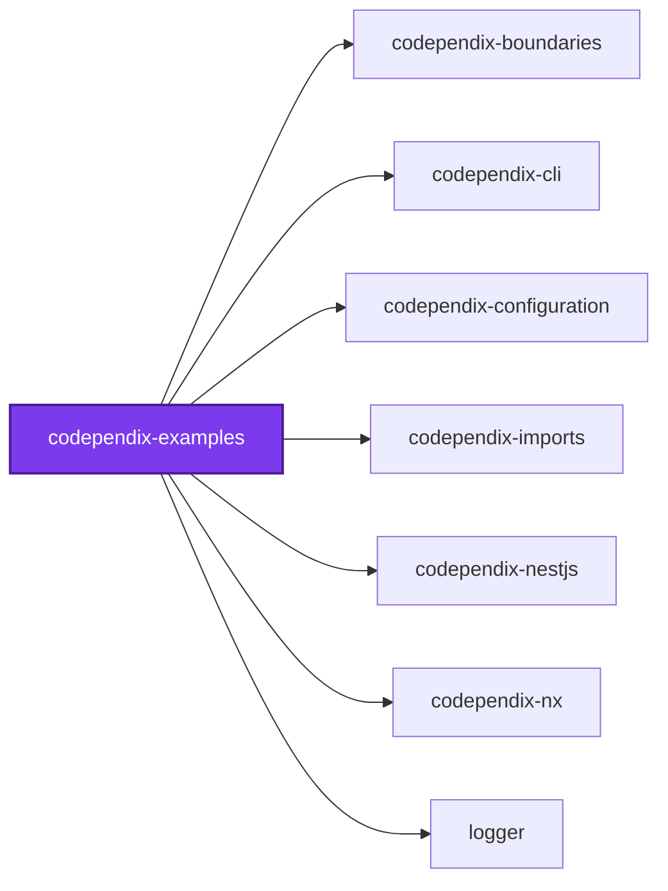

# 🕸️ Codependix Examples

**Sixteen small subjects built to be graphed, so every graph codependix draws
has somewhere to point.**

Codependix draws dependency graphs at four levels — the Nx Neighborhood, the
whole-workspace Workspace Graph, a NestJS container's module graph, and a
project's own TypeScript and Python file-level import graphs. Almost none of
that has ever been written down: everything a reader needs to know about
`include`/`exclude` matching a project's root as well as its name, about a
per-project override _replacing_ rather than merging with `defaults`, about the
`@Global()` heuristic that redraws a NestJS graph, or about why `--write`
auto-creates a section it once refused to, lived only in a JSDoc comment on the
type that implements it.

This package is where all of it is stated. Nothing here is meant to be good
code: every subject exists to make one rule, one refusal, or one graph visible,
and several are deliberately broken. Each example's `README.md` is **rendered by
the real graph builders** from the subject beside it, so a reader sees the shape
without running anything — and a claim that stops being true fails a check
rather than misleading somebody.

```bash
nx run codependix-examples:examples          # check the committed guides
nx run codependix-examples:examples:write    # regenerate them
nx run codependix-examples:vitest            # assert every claim below
```

Agents arriving from a codependix export should start at [AGENTS.md](AGENTS.md),
which maps "codependix said X" to the example that explains X.

## The examples

Each directory under [`examples/`](examples) is one example, carries its own
`README.md`, and is readable on its own. The subject it graphs sits in that same
directory.

Every guide is **rendered**, so each one opens with the same `## Run it` command
and closes with a `## Next` link — the reading order below is the same list the
renderer chains them with, declared once in
[`testing/render/reading-order.ts`](testing/render/reading-order.ts).

### The four levels

| Example | What it settles |
| ------- | --------------- |
| [`graph-levels`](examples/graph-levels) | One project graphed at all four levels, so a reader sees what each does and does not say about the same code |
| [`neighborhood-scope`](examples/neighborhood-scope) | A Neighborhood is one hop each way — plus implicit edges, self-edges, external packages, the root project, the subject highlight |
| [`ambient-modules`](examples/ambient-modules) | Why a `@Global()` module is drawn without edges, and the two places the rule stops firing |
| [`preview-mode`](examples/preview-mode) | A `forRootAsync` options factory graphed without ever running |
| [`container-rooting`](examples/container-rooting) | A real root module, a synthetic one, and one that refuses to load |
| [`typescript-resolution`](examples/typescript-resolution) | NodeNext specifiers, path aliases, `extends` chains — and the four statements that draw nothing |
| [`python-scanner`](examples/python-scanner) | Every case the hand-rolled scanner handles, and every case it deliberately refuses |

### Configuring and exporting

| Example | What it settles |
| ------- | --------------- |
| [`configuration-resolution`](examples/configuration-resolution) | `defaults` versus an override, the glob lists, file precedence, the upward search |
| [`export-targets`](examples/export-targets) | Why `both` is a named target rather than something inferred |
| [`markdown-modes`](examples/markdown-modes) | An anchored splice, and a standalone file |
| [`auto-created-sections`](examples/auto-created-sections) | Exactly where a missing `## 🕸️ Codependix` section lands, in every branch |
| [`check-and-write`](examples/check-and-write) | What each `--check` name gates, what drift is reported as, and the four command lines refused outright |
| [`boundary-rules`](examples/boundary-rules) | The three rule kinds, judged by the real evaluator — including the implicit edge no lint rule can see |
| [`refusals`](examples/refusals) | Every refusal, with the reproduction that produces it |
| [`json-exports`](examples/json-exports) | Every graph's JSON shape, and the two workspace rules switched off for these files |
| [`workspace-drift`](examples/workspace-drift) | Why this repository gates no pull request on `codependix map --check` |

## Configuring your first export

Nothing is exported until a `codependix.config.ts` says where. A workspace that
never wrote one resolves every graph to `target: "none"` and produces nothing —
it is never told to write one.

```ts
import { type CodependixConfiguration } from "@codependix/configuration";

const codependixConfiguration: CodependixConfiguration = {
  defaults: {
    nx: { markdown: { anchor: "codependix-nx" }, target: "markdown" },
  },
};

export default codependixConfiguration;
```

Three things about that shape catch people out, and
[`configuration-resolution`](examples/configuration-resolution) shows each one
resolving:

- **A per-project override replaces the default outright.** Naming
  `projects["atlas-core"].nx` does not merge into `defaults.nx` — a project that
  turns its Markdown export off by omitting `markdown` should not have the
  default's destination resurface underneath it.
- **`include` and `exclude` match a project's name _and_ its root.** `packages/*`
  and `codependix-*` are both valid ways to name overlapping sets.
- **The field is `defaults`, not `default`.** The loader unwraps a module's
  default export by name, and a field of that name would collide with the
  unwrapping.

## Adopting codependix where no anchors exist

Markdown used to be the opt-in exception, because a missing anchor block was an
error — placing one was something a person did once, by hand, rather than
codependix guessing where in a document it belonged. That could not scale to
every project in a workspace nobody had hand-placed anchors in.

`--write` now auto-creates the `## 🕸️ Codependix` section, and takes that risk
in exactly two well-defined places: the end of the file, or the end of a section
that already exists. [`auto-created-sections`](examples/auto-created-sections)
renders every branch, including a heading a person wrote by hand being reused
rather than duplicated. Only a project with no `README.md` at all still fails
outright, and a `--check` against a project that has never had codependix output
simply reports it as stale.

So adopting it is one command:

```bash
nx run codebase:codependix:write
```

## Why the guides are rendered rather than written

`nx run codependix-examples:examples` is the regression gate for every
documented behavior, and it is stricter than the tests: it compares the
committed Markdown byte for byte. That matters most for the cases in
[`typescript-resolution`](examples/typescript-resolution) and
[`python-scanner`](examples/python-scanner) that exist to _not_ be walked — a
re-export, a dynamic `import()`, a `require`, an import indented inside a
function. Each is a claim a resolver or scanner change could silently reverse,
and a guide quoting a diagram the tool no longer renders is worse than no guide.

This is the one place this package differs from its siblings, which run their
own tool over their own subjects through an Nx target. Codependix does not:
`NeighborhoodService.readProjectGraph` resolves the Nx workspace from the
**process working directory** unless a configuration names a `projectGraph`
file to read instead — `--directory` supplies only the root that export paths
are resolved against. So the graph builders are called directly, with a project
graph they are handed, and `testing/render-examples.ts` is what calls them —
beside the tests that assert what it produced, the same place
`codometer-examples` keeps the harness that drives its own tool.

A `projectGraph` file would let some of these examples run the real command
line instead. That is a separate decision and deliberately not taken here:
rendering the guides from the real graph builders is what makes a claim that
stops being true fail a check, and is recorded in `AGENTS.md` as a virtue
rather than as drift.

That is also what keeps the subjects out of everything else. They carry no
`project.json`, so none of them joins this workspace's Nx project graph, the
root README's Workspace Graph, `nx affected`, or `sherif`. The Python subjects
are never tagged `language:python`, so `ruff`, `pyright`, `ty`, and `vulture`
never run over input that exists precisely to look malformed.

## Layout

```text
examples/<example>/README.md         # The rendered guide, and any JSON export it commits
examples/<example>/<subject>         # The code being graphed — nested, and scoped out of the linters
testing/render-examples.ts           # The `examples` target: regenerates or checks every guide above
testing/render/                      # One module per example, plus the reading order and emoji
testing/examples.integration.test.ts # Asserts every claim those guides make
testing/graphs.integration.test.ts   # Asserts the graphs the guides are rendered from
```

The nesting is the rule the tooling reads: one level under `examples/` is the
rendered guide and its JSON exports, which every linter still checks, and two
levels down is the subject, which is scoped out. That is why the committed
`codependix-*graph.json` files keep inheriting the two carve-outs
[`json-exports`](examples/json-exports) describes, while a deliberately broken
`tsconfig.json` two levels down is nobody's lint failure.

This package declares no `codometer` size limit, because it builds nothing:
there is no `build` target and therefore no compiled bundle to measure.

## Test

```bash
nx run codependix-examples:vitest
```

## License

MIT — see [LICENSE](../../LICENSE).

## 🕸️ Codependix

Dependency graphs exported by [codependix](https://github.com/JimmyPaolini/codebase/tree/main/packages/codependix-cli), regenerated by `nx run codebase:codependix:write`.

### Nx Neighborhood

<!-- codependix:start name="codependix-nx" -->

<!-- codependix:end name="codependix-nx" -->

### File Imports

```mermaid
graph LR
  file_codometer_config_ts["codometer.config.ts"]
  file_eslint_config_ts["eslint.config.ts"]
  file_testing_examples_integration_test_ts["testing/examples.integration.test.ts"]
  file_testing_graphs_integration_test_ts["testing/graphs.integration.test.ts"]
  file_testing_render_examples_ts["testing/render-examples.ts"]
  file_testing_render_anchor_placement_ts["testing/render/anchor-placement.ts"]
  file_testing_render_boundary_rules_ts["testing/render/boundary-rules.ts"]
  file_testing_render_builders_ts["testing/render/builders.ts"]
  file_testing_render_catalog_ts["testing/render/catalog.ts"]
  file_testing_render_configuration_ts["testing/render/configuration.ts"]
  file_testing_render_document_ts["testing/render/document.ts"]
  file_testing_render_export_delivery_ts["testing/render/export-delivery.ts"]
  file_testing_render_graph_levels_ts["testing/render/graph-levels.ts"]
  file_testing_render_nestjs_graphs_ts["testing/render/nestjs-graphs.ts"]
  file_testing_render_nx_graphs_ts["testing/render/nx-graphs.ts"]
  file_testing_render_paths_ts["testing/render/paths.ts"]
  file_testing_render_python_imports_ts["testing/render/python-imports.ts"]
  file_testing_render_reading_order_ts["testing/render/reading-order.ts"]
  file_testing_render_run_ts["testing/render/run.ts"]
  file_testing_render_types_ts["testing/render/types.ts"]
  file_testing_render_typescript_imports_ts["testing/render/typescript-imports.ts"]
  file_testing_setup_ts["testing/setup.ts"]
  file_vitest_config_ts["vitest.config.ts"]
  file_testing_examples_integration_test_ts --> file_testing_render_anchor_placement_ts
  file_testing_examples_integration_test_ts --> file_testing_render_catalog_ts
  file_testing_examples_integration_test_ts --> file_testing_render_configuration_ts
  file_testing_examples_integration_test_ts --> file_testing_render_document_ts
  file_testing_examples_integration_test_ts --> file_testing_render_export_delivery_ts
  file_testing_examples_integration_test_ts --> file_testing_render_paths_ts
  file_testing_examples_integration_test_ts --> file_testing_render_reading_order_ts
  file_testing_examples_integration_test_ts --> file_testing_render_run_ts
  file_testing_graphs_integration_test_ts --> file_testing_render_nestjs_graphs_ts
  file_testing_graphs_integration_test_ts --> file_testing_render_nx_graphs_ts
  file_testing_graphs_integration_test_ts --> file_testing_render_paths_ts
  file_testing_graphs_integration_test_ts --> file_testing_render_python_imports_ts
  file_testing_graphs_integration_test_ts --> file_testing_render_typescript_imports_ts
  file_testing_render_examples_ts --> file_testing_render_run_ts
  file_testing_render_anchor_placement_ts --> file_testing_render_builders_ts
  file_testing_render_anchor_placement_ts --> file_testing_render_document_ts
  file_testing_render_anchor_placement_ts --> file_testing_render_export_delivery_ts
  file_testing_render_anchor_placement_ts --> file_testing_render_paths_ts
  file_testing_render_anchor_placement_ts --> file_testing_render_types_ts
  file_testing_render_boundary_rules_ts --> file_testing_render_builders_ts
  file_testing_render_boundary_rules_ts --> file_testing_render_document_ts
  file_testing_render_boundary_rules_ts --> file_testing_render_types_ts
  file_testing_render_catalog_ts --> file_testing_render_anchor_placement_ts
  file_testing_render_catalog_ts --> file_testing_render_boundary_rules_ts
  file_testing_render_catalog_ts --> file_testing_render_configuration_ts
  file_testing_render_catalog_ts --> file_testing_render_export_delivery_ts
  file_testing_render_catalog_ts --> file_testing_render_graph_levels_ts
  file_testing_render_catalog_ts --> file_testing_render_nestjs_graphs_ts
  file_testing_render_catalog_ts --> file_testing_render_nx_graphs_ts
  file_testing_render_catalog_ts --> file_testing_render_python_imports_ts
  file_testing_render_catalog_ts --> file_testing_render_reading_order_ts
  file_testing_render_catalog_ts --> file_testing_render_types_ts
  file_testing_render_catalog_ts --> file_testing_render_typescript_imports_ts
  file_testing_render_configuration_ts --> file_testing_render_builders_ts
  file_testing_render_configuration_ts --> file_testing_render_document_ts
  file_testing_render_configuration_ts --> file_testing_render_paths_ts
  file_testing_render_configuration_ts --> file_testing_render_types_ts
  file_testing_render_document_ts --> file_testing_render_reading_order_ts
  file_testing_render_document_ts --> file_testing_render_types_ts
  file_testing_render_export_delivery_ts --> file_testing_render_builders_ts
  file_testing_render_export_delivery_ts --> file_testing_render_document_ts
  file_testing_render_export_delivery_ts --> file_testing_render_graph_levels_ts
  file_testing_render_export_delivery_ts --> file_testing_render_paths_ts
  file_testing_render_export_delivery_ts --> file_testing_render_types_ts
  file_testing_render_graph_levels_ts --> file_testing_render_builders_ts
  file_testing_render_graph_levels_ts --> file_testing_render_nestjs_graphs_ts
  file_testing_render_graph_levels_ts --> file_testing_render_nx_graphs_ts
  file_testing_render_graph_levels_ts --> file_testing_render_paths_ts
  file_testing_render_graph_levels_ts --> file_testing_render_python_imports_ts
  file_testing_render_graph_levels_ts --> file_testing_render_types_ts
  file_testing_render_graph_levels_ts --> file_testing_render_typescript_imports_ts
  file_testing_render_nestjs_graphs_ts --> file_testing_render_builders_ts
  file_testing_render_nestjs_graphs_ts --> file_testing_render_document_ts
  file_testing_render_nestjs_graphs_ts --> file_testing_render_paths_ts
  file_testing_render_nestjs_graphs_ts --> file_testing_render_types_ts
  file_testing_render_nx_graphs_ts --> file_testing_render_builders_ts
  file_testing_render_nx_graphs_ts --> file_testing_render_document_ts
  file_testing_render_nx_graphs_ts --> file_testing_render_types_ts
  file_testing_render_python_imports_ts --> file_testing_render_builders_ts
  file_testing_render_python_imports_ts --> file_testing_render_document_ts
  file_testing_render_python_imports_ts --> file_testing_render_paths_ts
  file_testing_render_python_imports_ts --> file_testing_render_types_ts
  file_testing_render_run_ts --> file_testing_render_catalog_ts
  file_testing_render_run_ts --> file_testing_render_document_ts
  file_testing_render_run_ts --> file_testing_render_paths_ts
  file_testing_render_run_ts --> file_testing_render_types_ts
  file_testing_render_typescript_imports_ts --> file_testing_render_builders_ts
  file_testing_render_typescript_imports_ts --> file_testing_render_document_ts
  file_testing_render_typescript_imports_ts --> file_testing_render_paths_ts
  file_testing_render_typescript_imports_ts --> file_testing_render_types_ts
```

<!-- codependix:start name="codependix-imports" -->

<!-- codependix:end name="codependix-imports" -->

<!-- CODE_STATISTICS_START -->

## ⏲️ Codometer

### Project


### TypeScript


### JavaScript


### Python


### JSON


### YAML


### TOML


### Shell


### SQL


### HCL


### CSS


### Conventions


### Jupyter


### Markdown


<!-- CODE_STATISTICS_END -->

<!-- CALL_STACKS_START -->

## 🔭 Callidescope

Call stacks traced through `packages/codependix-examples`, deepest first. Each frame shows what it takes, what it returns, and what its documentation says.

| Measure | Value |
| --- | --- |
| Callables | 0 |
| Files | 3 |
| Calls traced | 0 |
| Call stacks | 0 |
| Deepest stack | 0 |
| Stacks through recursion | 0 |
| Unfollowable calls | 0 |

### Call stacks (depth)

None.

### Module spread

None.

### Breadth

None.

### Possibly misplaced

None.
<!-- CALL_STACKS_END -->
