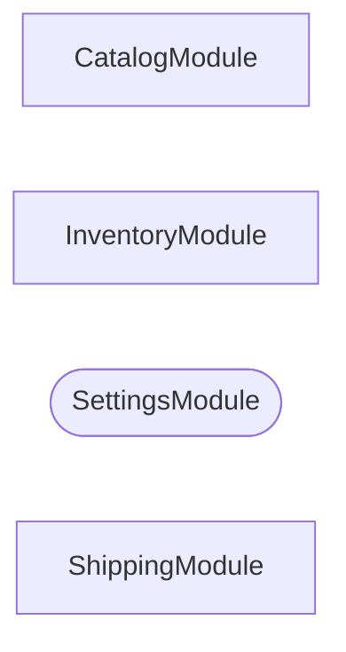
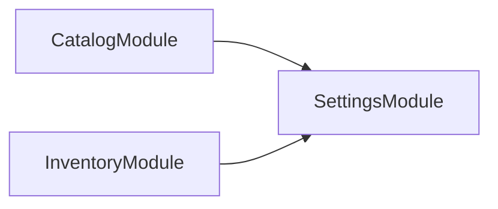
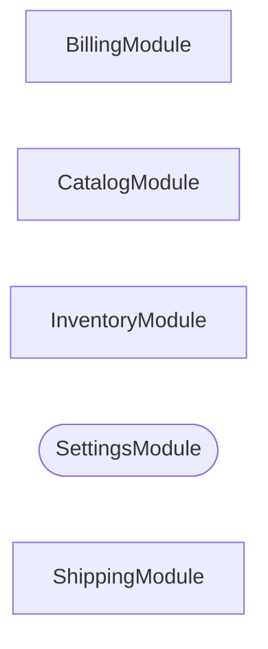

# The ambient-module heuristic

`SpelunkerModule.explore` reports the container's view rather than the decorators', so a `@Global()` module arrives as an import of every other module. Drawn literally it would bury the structure worth reading, so its edges are left out and it is drawn as a rounded node.

## A container with a global module

`SettingsModule` is `@Global()`, so NestJS registers it into all three other modules. Four modules meets `MODULE_GRAPH_AMBIENT_MINIMUM_MODULES`, so it is drawn as a rounded node with its edges left out, and `MODULE_GRAPH_AMBIENT_LEGEND` is appended.

_Rounded modules are global: every module can inject them, so their edges are left out._

## The same global module in a three-module container

`MODULE_GRAPH_AMBIENT_MINIMUM_MODULES` is 4, and this container has three modules — below that, a module imported by everything else is just a small graph, so the edges are drawn.

## A plain module imported by every other module

`SettingsModule` here carries no `@Global()` decorator at all. The rule counts inbound edges rather than reading decorators, so four inbound edges in a five-module container reaches the same threshold — the heuristic at its boundary.

_Rounded modules are global: every module can inject them, so their edges are left out._

## A project defining no modules

`MODULE_GRAPH_UNCONNECTED` is rendered in place of a diagram.

_This project defines no NestJS modules to graph._
