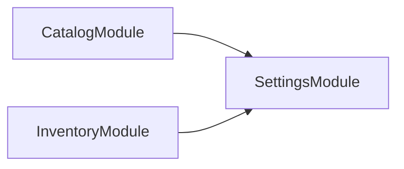

# Rooting a container, including one that bootstraps nothing

How a container is rooted when a project bootstraps one, when it bootstraps nothing, and when it refuses to load at all.

## A project that bootstraps a root module

`src/main.module.ts` exists, so its `MainModule` export is the root and the container is explored outward from it. `OrphanModule` is defined in the same directory and never imported, so it is absent.


## A package that bootstraps nothing

No `src/main.module.ts`, so every `*.module.ts` under `src/` is loaded and rooted under a synthetic module. That synthetic root, and the global `ConfigModule` it supplies so a module reading configuration in a `useFactory` can be scanned at all, are both kept out of the graph.



## One project failing stops no other

`failing-container` throws the moment its module file is imported. It is collected as a failure and the other two projects still complete — the guarantee `codependix --write` makes: either it fully succeeds, or it names exactly which projects failed.

```text
explored rooted-application — 3 module(s)
explored library-package — 3 module(s)
failed   failing-container: Error: This project's container cannot be loaded.
```
