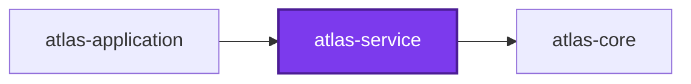
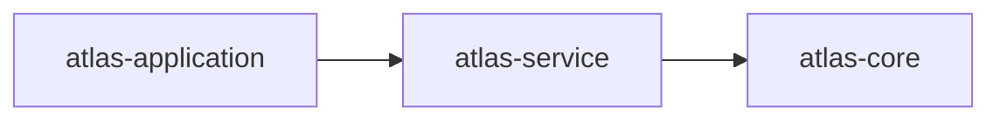
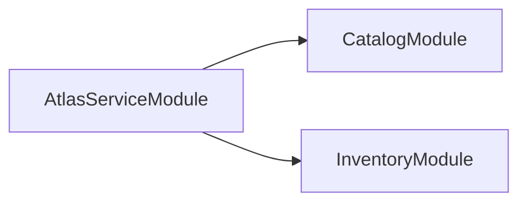
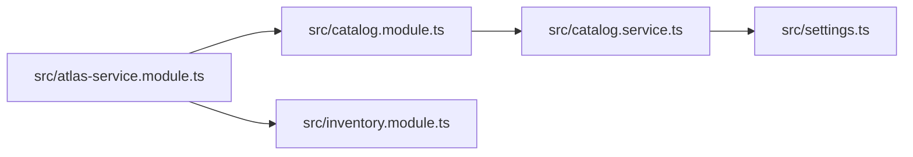
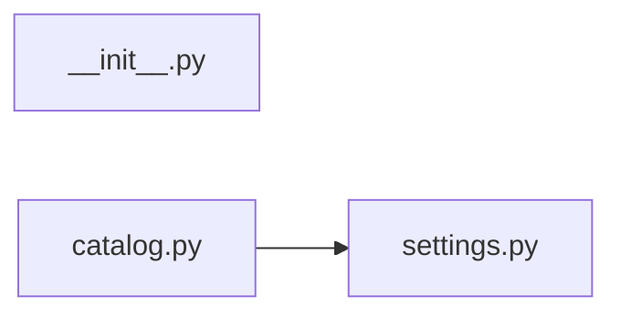

# The four graph levels, side by side

One example project, `atlas-service`, graphed at all four levels codependix builds — so a reader sees what each level does and does not say about the same code.

## Nx Neighborhood

Which workspace projects `atlas-service` sits between. It says nothing about what is inside the project.

## Nx Workspace Graph

The same edges, drawn once for the whole repository rather than once per project, with no project highlighted.

## NestJS module graph

How the project's own NestJS container is wired. Only modules are nodes — `CatalogService` is a provider and never appears.

## TypeScript file imports

Which of the project's own TypeScript files import which. `settings.ts` is invisible to the module graph above and central here.

## Python file imports

The same question asked of the project's Python package, answered by a statement scanner rather than by a compiler.

