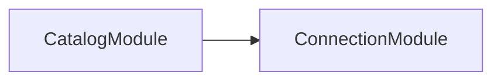

# Preview mode, and why exploration is safe

Preview mode is what makes exploring an unfamiliar container safe: a module whose options factory would contact something is graphed without that factory ever running.

## A container whose options factory would reach outside the process

`CatalogModule` imports `ConnectionModule.forRootAsync({ useFactory })`, and that factory throws if it is ever called. This diagram exists, so it never was.

## Why the factory never ran

This is the question anyone deciding whether to point codependix at their own application is actually asking.

`NestjsProjectService.exploreProject` calls `NestFactory.createApplicationContext(rootModule, { abortOnError: false, logger: false, preview: true })`. Preview mode registers every module and provider and instantiates none of them, so a `TypeOrmModule.forRootAsync` options factory never has a database contacted — from a workstation or from a CI runner alike.
