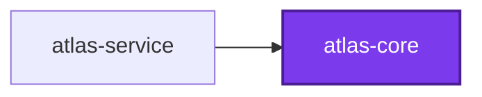
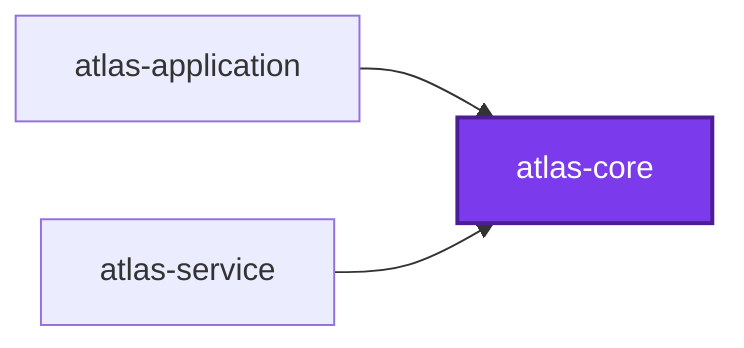

# An export moves with the workspace, not with the project

Why this repository runs `codependix map --write` on the default branch and gates no pull request on `codependix map --check`.

## Before the change

`atlas-core` sits at the bottom of the chain, with one dependent.

## After an edge is added elsewhere

`atlas-application` gained a direct dependency on `atlas-core`. Nothing inside `atlas-core` changed, and its Neighborhood did.

## Why no pull request gates on this

The failure above is real drift, and it is drift no reviewer of that branch can act on.

An export moves with the workspace it describes, not with the project it is written into. A `--check` run on a branch that changed any project graph therefore fails for projects the branch never touched — which is why `codebase:codependix` runs `write` on the default branch only, after `callidescope` and the module-graph synchronization, so every project's `## 🕸️ Codependix` anchor reflects one commit.
