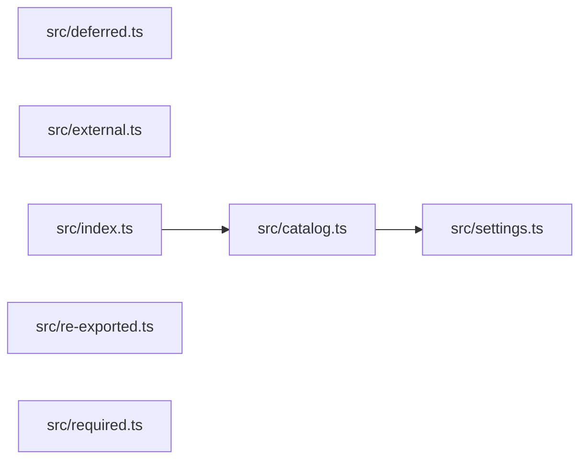

# 6. Imports resolve through the compiler

TypeScript imports resolve through the compiler, not through a heuristic — and only an import declaration with a string-literal specifier counts.

## The resolved graph

`src/index.ts` reaches `src/catalog.ts` through a NodeNext `.js` specifier, and `src/catalog.ts` reaches `src/settings.ts` through the `@atlas/*` path alias declared in a `tsconfig.json` that extends a shared base config.



## Every file the graph knows

`src/ambient.d.ts` is a root file of the program and never a node: declaration files are filtered out before the graph is built.

```text
src/catalog.ts
src/deferred.ts
src/external.ts
src/index.ts
src/re-exported.ts
src/required.ts
src/settings.ts
```

## The statements that deliberately draw no edge

Every one of these is a choice rather than a gap, and every one is a claim a resolver change could silently reverse.

| File | Statement | Why no edge |
| ---- | --------- | ----------- |
| `src/re-exported.ts` | `export * from "./settings.js"` | an ExportDeclaration, not an ImportDeclaration |
| `src/deferred.ts` | `import("./settings.js")` | a call expression, not a declaration |
| `src/required.ts` | `require("./settings.js")` | a call expression, not a declaration |
| `src/external.ts` | `import ts from "typescript"` | resolves outside the project |

## A project whose `tsconfig.json` cannot be parsed

`TypescriptProjectConfigurationError` carries the compiler's own diagnostics. Parsing failures are fatal rather than skipped, because a project silently dropped makes `--check` unable to tell a genuinely empty graph from one it never built.

```text
TypescriptProjectConfigurationError: Could not read <examples>/typescript/broken/tsconfig.json: Argument for '--target' option must be: 'es6', 'es2015', 'es2016', 'es2017', 'es2018', 'es2019', 'es2020', 'es2021', 'es2022', 'es2023', 'es2024', 'es2025', 'esnext'.
```
