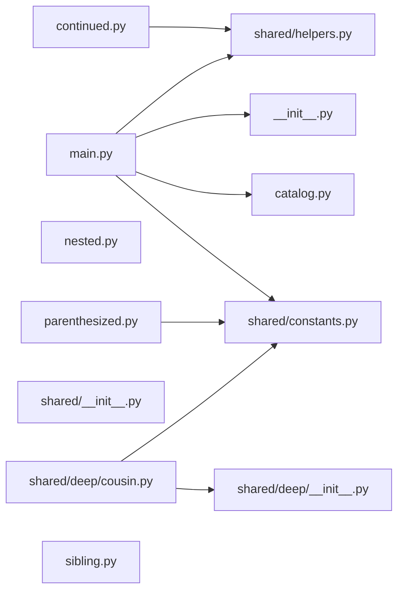

# 7. The whole surface of the Python statement scanner

Python imports are scanned, not compiled — so every case the scanner handles, and every case it deliberately refuses, has a fixture.

## The scanned graph

Every edge here came out of the hand-rolled statement scanner, resolved against the filesystem the way `ts.resolveModuleName` resolves against a compiler host.



## Every case the scanner handles

Each one is a real file in `fixtures/python/scanner/`, and each one contributes an edge to the diagram above.

| File | Case |
| ---- | ---- |
| `catalog.py` | A `#` inside a string literal, and a quote inside a comment |
| `parenthesized.py` | A parenthesized `from ... import (first, second)` over several lines |
| `continued.py` | A backslash continuation |
| `main.py` | A comma-separated `import package.first, package.second` |
| `main.py` | `from . import sibling` — only the module imported _from_ is kept, so this resolves the package's own `__init__.py` and never `sibling.py` |
| `shared/deep/cousin.py` | `from ..constants import FIRST` — one level further up |
| `shared/__init__.py` | A directory made importable by `__init__.py` |

## The statements deliberately not walked

Choices rather than gaps. Only statements starting at column zero are considered, and an edge is kept only when it resolves to a file the project owns.

| File | Case |
| ---- | ---- |
| `nested.py` | An import indented inside a function |
| `nested.py` | An import inside an `if TYPE_CHECKING:` block |
| `main.py` | `from third_party_package import Missing` — resolves to no file this project owns |

## Files left with no edge in either direction

`nested.py` is here precisely because its two imports are not walked, which is the claim made visible rather than asserted.

```text
nested.py
shared/__init__.py
sibling.py
```

## Directories the walk never enters

`PYTHON_PROJECT_EXCLUDED_DIRECTORY_NAMES` names them.

`.git`, `.mypy_cache`, `.pytest_cache`, `.ruff_cache`, `.venv`, `__pycache__`, and `node_modules` are walked past rather than into. None of them can be committed here — this repository's `.gitignore` claims every one — so the exclusion is proved by a unit test that creates a `__pycache__` directory at run time and checks it never reaches the graph.
