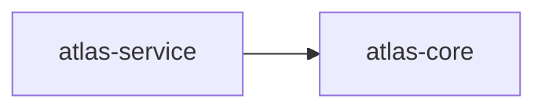

# 10. Both Markdown modes

An anchored splice into a named block inside a file somebody else is authoring, and a standalone file whose entire contents are the export.

## Anchored: spliced into a named block in an existing file

Naming an `anchor` places the export inside that block in the file at `path`, which defaults to `README.md` — the rest of the document is left exactly as it was.

````markdown
# Atlas Service

An example project.

## 🕸️ Codependix

Dependency graphs exported by [codependix](https://github.com/JimmyPaolini/codebase/tree/main/packages/codependix-cli), regenerated by `nx run codebase:codependix:write`.

### Nx Neighborhood

<!-- codependix:start name="example-nx" -->

<!-- codependix:end name="example-nx" -->
````

## Standalone: the whole contents of its own file

Leaving `anchor` unset writes the export as the entire file. `path` must then be given explicitly, since there is no default worth guessing for a file codependix is creating outright.

````markdown

````

## The four shapes a Markdown destination can take

The last one names nowhere for the export to go, and is refused by the schema — see example 13.

```ts
markdown: { anchor: "codependix-nx" }                       // → README.md
markdown: { anchor: "codependix-nx", path: "docs/graphs.md" } // → docs/graphs.md
markdown: { path: "docs/atlas-service-graph.md" }            // → a standalone file
markdown: {}                                                 // → refused
```
