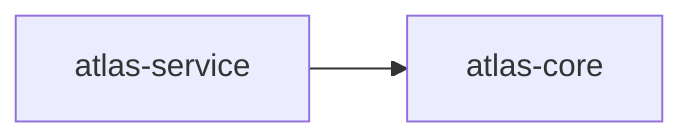

# 11. Auto-creating the `## 🕸️ Codependix` section

A missing anchor used to be an error. It is now auto-created on `--write` — at the end of the file, or at the end of an existing section, and nowhere else.

## A file with no such section

The heading, the intro line, the `### <subheading>`, and the anchor block are appended to the end of the file. Nothing above them is touched.

````markdown
# Atlas Service

An example project.

## 🕸️ Codependix

Dependency graphs exported by [codependix](https://github.com/JimmyPaolini/codebase/tree/main/packages/codependix-cli), regenerated by `nx run codebase:codependix:write`.

### Nx Neighborhood

<!-- codependix:start name="example-nx" -->

<!-- codependix:end name="example-nx" -->
````

## A second graph type, under a section that already exists

The heading is not duplicated: the new `### <subheading>` and its anchor go at the end of the existing section. Two named anchors in one file never collide, which is the reason anchors are named at all.

````markdown
# Atlas Service

An example project.

## 🕸️ Codependix

Dependency graphs exported by [codependix](https://github.com/JimmyPaolini/codebase/tree/main/packages/codependix-cli), regenerated by `nx run codebase:codependix:write`.

### Nx Neighborhood

<!-- codependix:start name="example-nx" -->

<!-- codependix:end name="example-nx" -->

### NestJS Module Graph

<!-- codependix:start name="example-nestjs" -->

<!-- codependix:end name="example-nestjs" -->
````

## A heading a human wrote by hand

`CODEPENDIX_SECTION_HEADING` is matched literally against a whole line, so a heading a person placed with that exact text is reused rather than duplicated — and the `## License` section after it stays where it was.

````markdown
# Atlas Service

An example project.

## 🕸️ Codependix

A heading a person placed here, with this exact text.

### Nx Neighborhood

<!-- codependix:start name="example-nx" -->

<!-- codependix:end name="example-nx" -->

## License

MIT.
````

## The workspace README, which has no subheading

The Workspace Graph's anchor sits directly under the heading: the root README carries no other graph type's section to disambiguate from.

````markdown
# Atlas Service

An example project.

## 🕸️ Codependix

Dependency graphs exported by [codependix](https://github.com/JimmyPaolini/codebase/tree/main/packages/codependix-cli), regenerated by `nx run codebase:codependix:write`.

<!-- codependix:start name="example-workspace" -->

<!-- codependix:end name="example-workspace" -->
````

## A project with no `README.md`, on `--write`

Fails outright, in either mode. The file itself not existing is a more serious problem than a missing anchor — there is nothing to splice into and nothing safe to create.

```text
AnchorNotFoundError: Anchor "example-nx" not found in <project>/README.md
```

## A `README.md` with no anchor, on `--check`

Reported as stale rather than raising, consistent with every other kind of drift this tool reports. A project that has never had codependix output simply shows up as needing a write.

```text
isCurrent: false
stalePaths: README.md
```
