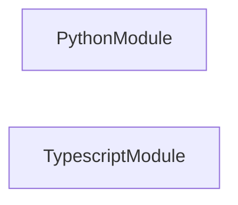

## Test

```bash
nx run codependix-imports:vitest
```

## 🕸️ Codependix

Dependency graphs exported by [codependix](https://github.com/JimmyPaolini/codebase/tree/main/packages/codependix-cli), regenerated by `nx run codebase:codependix:write`.

### Nx Neighborhood

<!-- codependix:start name="codependix-nx" -->

<!-- codependix:end name="codependix-nx" -->

### NestJS Module Graph

<!-- codependix:start name="codependix-nestjs" -->

<!-- codependix:end name="codependix-nestjs" -->

### File Imports

```mermaid
graph LR
  file_eslint_config_ts["eslint.config.ts"]
  file_src_index_ts["src/index.ts"]
  file_src_modules_python_python_import_graph_service_ts["src/modules/python/python-import-graph.service.ts"]
  file_src_modules_python_python_import_graph_service_unit_test_ts["src/modules/python/python-import-graph.service.unit.test.ts"]
  file_src_modules_python_python_import_parser_constants_ts["src/modules/python/python-import-parser.constants.ts"]
  file_src_modules_python_python_import_parser_service_ts["src/modules/python/python-import-parser.service.ts"]
  file_src_modules_python_python_import_parser_service_unit_test_ts["src/modules/python/python-import-parser.service.unit.test.ts"]
  file_src_modules_python_python_import_parser_types_ts["src/modules/python/python-import-parser.types.ts"]
  file_src_modules_python_python_project_service_ts["src/modules/python/python-project.service.ts"]
  file_src_modules_python_python_project_service_unit_test_ts["src/modules/python/python-project.service.unit.test.ts"]
  file_src_modules_python_python_constants_ts["src/modules/python/python.constants.ts"]
  file_src_modules_python_python_module_ts["src/modules/python/python.module.ts"]
  file_src_modules_python_python_module_unit_test_ts["src/modules/python/python.module.unit.test.ts"]
  file_src_modules_python_python_service_ts["src/modules/python/python.service.ts"]
  file_src_modules_python_python_service_unit_test_ts["src/modules/python/python.service.unit.test.ts"]
  file_src_modules_python_python_types_ts["src/modules/python/python.types.ts"]
  file_src_modules_typescript_typescript_import_graph_service_ts["src/modules/typescript/typescript-import-graph.service.ts"]
  file_src_modules_typescript_typescript_import_graph_service_unit_test_ts["src/modules/typescript/typescript-import-graph.service.unit.test.ts"]
  file_src_modules_typescript_typescript_project_errors_ts["src/modules/typescript/typescript-project.errors.ts"]
  file_src_modules_typescript_typescript_project_service_ts["src/modules/typescript/typescript-project.service.ts"]
  file_src_modules_typescript_typescript_project_service_unit_test_ts["src/modules/typescript/typescript-project.service.unit.test.ts"]
  file_src_modules_typescript_typescript_constants_ts["src/modules/typescript/typescript.constants.ts"]
  file_src_modules_typescript_typescript_module_ts["src/modules/typescript/typescript.module.ts"]
  file_src_modules_typescript_typescript_module_unit_test_ts["src/modules/typescript/typescript.module.unit.test.ts"]
  file_src_modules_typescript_typescript_service_ts["src/modules/typescript/typescript.service.ts"]
  file_src_modules_typescript_typescript_service_unit_test_ts["src/modules/typescript/typescript.service.unit.test.ts"]
  file_src_modules_typescript_typescript_types_ts["src/modules/typescript/typescript.types.ts"]
  file_testing_mocks_ts["testing/mocks.ts"]
  file_testing_programs_ts["testing/programs.ts"]
  file_testing_setup_ts["testing/setup.ts"]
  file_vitest_config_ts["vitest.config.ts"]
  file_src_modules_python_python_import_graph_service_ts --> file_src_modules_python_python_import_parser_service_ts
  file_src_modules_python_python_import_graph_service_ts --> file_src_modules_python_python_import_parser_types_ts
  file_src_modules_python_python_import_graph_service_ts --> file_src_modules_python_python_project_service_ts
  file_src_modules_python_python_import_graph_service_ts --> file_src_modules_python_python_constants_ts
  file_src_modules_python_python_import_graph_service_ts --> file_src_modules_python_python_types_ts
  file_src_modules_python_python_import_graph_service_unit_test_ts --> file_src_modules_python_python_import_graph_service_ts
  file_src_modules_python_python_import_graph_service_unit_test_ts --> file_src_modules_python_python_import_parser_service_ts
  file_src_modules_python_python_import_graph_service_unit_test_ts --> file_src_modules_python_python_project_service_ts
  file_src_modules_python_python_import_graph_service_unit_test_ts --> file_src_modules_python_python_constants_ts
  file_src_modules_python_python_import_graph_service_unit_test_ts --> file_src_modules_python_python_types_ts
  file_src_modules_python_python_import_parser_service_ts --> file_src_modules_python_python_import_parser_constants_ts
  file_src_modules_python_python_import_parser_service_ts --> file_src_modules_python_python_import_parser_types_ts
  file_src_modules_python_python_import_parser_service_unit_test_ts --> file_src_modules_python_python_import_parser_service_ts
  file_src_modules_python_python_project_service_ts --> file_src_modules_python_python_constants_ts
  file_src_modules_python_python_project_service_ts --> file_src_modules_python_python_types_ts
  file_src_modules_python_python_project_service_unit_test_ts --> file_src_modules_python_python_project_service_ts
  file_src_modules_python_python_module_ts --> file_src_modules_python_python_import_graph_service_ts
  file_src_modules_python_python_module_ts --> file_src_modules_python_python_import_parser_service_ts
  file_src_modules_python_python_module_ts --> file_src_modules_python_python_project_service_ts
  file_src_modules_python_python_module_ts --> file_src_modules_python_python_service_ts
  file_src_modules_python_python_module_unit_test_ts --> file_src_modules_python_python_module_ts
  file_src_modules_python_python_module_unit_test_ts --> file_src_modules_python_python_service_ts
  file_src_modules_python_python_service_ts --> file_src_modules_python_python_import_graph_service_ts
  file_src_modules_python_python_service_ts --> file_src_modules_python_python_project_service_ts
  file_src_modules_python_python_service_ts --> file_src_modules_python_python_types_ts
  file_src_modules_python_python_service_unit_test_ts --> file_src_modules_python_python_import_graph_service_ts
  file_src_modules_python_python_service_unit_test_ts --> file_src_modules_python_python_project_service_ts
  file_src_modules_python_python_service_unit_test_ts --> file_src_modules_python_python_service_ts
  file_src_modules_python_python_service_unit_test_ts --> file_src_modules_python_python_types_ts
  file_src_modules_typescript_typescript_import_graph_service_ts --> file_src_modules_typescript_typescript_project_service_ts
  file_src_modules_typescript_typescript_import_graph_service_ts --> file_src_modules_typescript_typescript_constants_ts
  file_src_modules_typescript_typescript_import_graph_service_ts --> file_src_modules_typescript_typescript_types_ts
  file_src_modules_typescript_typescript_import_graph_service_unit_test_ts --> file_src_modules_typescript_typescript_import_graph_service_ts
  file_src_modules_typescript_typescript_import_graph_service_unit_test_ts --> file_src_modules_typescript_typescript_project_service_ts
  file_src_modules_typescript_typescript_import_graph_service_unit_test_ts --> file_src_modules_typescript_typescript_constants_ts
  file_src_modules_typescript_typescript_import_graph_service_unit_test_ts --> file_testing_programs_ts
  file_src_modules_typescript_typescript_project_service_ts --> file_src_modules_typescript_typescript_project_errors_ts
  file_src_modules_typescript_typescript_project_service_ts --> file_src_modules_typescript_typescript_constants_ts
  file_src_modules_typescript_typescript_project_service_ts --> file_src_modules_typescript_typescript_types_ts
  file_src_modules_typescript_typescript_project_service_unit_test_ts --> file_src_modules_typescript_typescript_project_errors_ts
  file_src_modules_typescript_typescript_project_service_unit_test_ts --> file_src_modules_typescript_typescript_project_service_ts
  file_src_modules_typescript_typescript_project_service_unit_test_ts --> file_src_modules_typescript_typescript_types_ts
  file_src_modules_typescript_typescript_module_ts --> file_src_modules_typescript_typescript_import_graph_service_ts
  file_src_modules_typescript_typescript_module_ts --> file_src_modules_typescript_typescript_project_service_ts
  file_src_modules_typescript_typescript_module_ts --> file_src_modules_typescript_typescript_service_ts
  file_src_modules_typescript_typescript_module_unit_test_ts --> file_src_modules_typescript_typescript_module_ts
  file_src_modules_typescript_typescript_module_unit_test_ts --> file_src_modules_typescript_typescript_service_ts
  file_src_modules_typescript_typescript_service_ts --> file_src_modules_typescript_typescript_import_graph_service_ts
  file_src_modules_typescript_typescript_service_ts --> file_src_modules_typescript_typescript_project_service_ts
  file_src_modules_typescript_typescript_service_ts --> file_src_modules_typescript_typescript_types_ts
  file_src_modules_typescript_typescript_service_unit_test_ts --> file_src_modules_typescript_typescript_import_graph_service_ts
  file_src_modules_typescript_typescript_service_unit_test_ts --> file_src_modules_typescript_typescript_project_service_ts
  file_src_modules_typescript_typescript_service_unit_test_ts --> file_src_modules_typescript_typescript_service_ts
  file_src_modules_typescript_typescript_service_unit_test_ts --> file_src_modules_typescript_typescript_types_ts
  file_testing_programs_ts --> file_src_modules_typescript_typescript_types_ts
```

<!-- codependix:start name="codependix-imports" -->

<!-- codependix:end name="codependix-imports" -->

<!-- CALL_STACKS_START -->

## 🔭 Callidescope

Call stacks traced through `packages/codependix-imports`, deepest first. Each frame shows what it takes, what it returns, and what its documentation says.

| Measure | Value |
| --- | --- |
| Callables | 84 |
| Files | 19 |
| Calls traced | 71 |
| Call stacks | 4 |
| Deepest stack | 5 |
| Stacks through recursion | 0 |
| Unfollowable calls | 1 |

### Call stacks (depth)

**1. `PythonImportGraphService.collectEdgesForFile`** — depth 5 · orphan-root

```text
🚀 PythonImportGraphService.collectEdgesForFile(…): PythonImportGraphEdge[] [packages/codependix-imports/src/modules/python/python-import-graph.service.ts:64]
   ↳ Collects every internal import edge one source file declares.
  └─> PythonImportParserService.parseImportSpecifiers(source: string): PythonImportSpecifier[] [packages/codependix-imports/src/modules/python/python-import-parser.service.ts:158]
     ↳ Parses every module-level import statement in a Python source file.
    └─> PythonImportParserService.parseStatement(statement: string): PythonImportSpecifier[] [packages/codependix-imports/src/modules/python/python-import-parser.service.ts:126]
       ↳ Parses one joined statement into the module(s) it names.
      └─> PythonImportParserService.parseImportStatement(statement: string): PythonImportSpecifier[] [packages/codependix-imports/src/modules/python/python-import-parser.service.ts:105]
         ↳ Parses a joined `import <specifiers>` statement.
        └─> PythonImportParserService.map(…)(modulePath: string): { level: number; modulePath: string; } [packages/codependix-imports/src/modules/python/python-import-parser.service.ts:122]
```

**2. `TypescriptImportGraphService.collectEdgesForFile`** — depth 3 · orphan-root

```text
🚀 TypescriptImportGraphService.collectEdgesForFile(…): TypescriptImportGraphEdge[] [packages/codependix-imports/src/modules/typescript/typescript-import-graph.service.ts:49]
   ↳ Collects every internal import edge one source file declares.
  └─> TypescriptImportGraphService.resolveImportTarget(…): string | undefined [packages/codependix-imports/src/modules/typescript/typescript-import-graph.service.ts:136]
     ↳ Resolves an import specifier to a real, absolute file path.
    └─> TypescriptProjectService.toRealPath(filePath: string): string [packages/codependix-imports/src/modules/typescript/typescript-project.service.ts:120]
       ↳ Resolves a path through symlinks, which is how pnpm workspaces link.
```

**3. `PythonImportGraphService.renderNode`** — depth 2 · orphan-root

```text
🚀 PythonImportGraphService.renderNode(fileName: string): string [packages/codependix-imports/src/modules/python/python-import-graph.service.ts:120]
   ↳ Renders one file as a mermaid node, labelled with its relative path.
  └─> PythonImportGraphService.toNodeIdentifier(fileName: string): string [packages/codependix-imports/src/modules/python/python-import-graph.service.ts:162]
     ↳ Turns a relative file path into an identifier mermaid accepts.
```

<details>
<summary>1 more call stacks</summary>

**4. `TypescriptImportGraphService.renderNode`** — depth 2 · orphan-root

```text
🚀 TypescriptImportGraphService.renderNode(fileName: string): string [packages/codependix-imports/src/modules/typescript/typescript-import-graph.service.ts:131]
   ↳ Renders one file as a mermaid node, labelled with its relative path.
  └─> TypescriptImportGraphService.toNodeIdentifier(fileName: string): string [packages/codependix-imports/src/modules/typescript/typescript-import-graph.service.ts:167]
     ↳ Turns a relative file path into an identifier mermaid accepts.
```

</details>

### Module spread

None.

### Breadth

| Callable | Breadth | Calls directly | Location |
| --- | --- | --- | --- |
| `TypescriptImportGraphService.buildGraph` | 8 | `TypescriptImportGraphService.resolveOwnedFileNames`, `TypescriptImportGraphService.listOwnedSourceFileNames`, `TypescriptImportGraphService.dedupeEdges`, `TypescriptImportGraphService.flatMap(…)`, `TypescriptImportGraphService.flatMap(…)`, `TypescriptImportGraphService.toSorted(…)`, `TypescriptImportGraphService.map(…)`, `TypescriptImportGraphService.filter(…)` | `packages/codependix-imports/src/modules/typescript/typescript-import-graph.service.ts:185` |
| `PythonImportGraphService.buildGraph` | 7 | `PythonProjectService.listSourceFileNames`, `PythonImportGraphService.dedupeEdges`, `PythonImportGraphService.flatMap(…)`, `PythonImportGraphService.flatMap(…)`, `PythonImportGraphService.toSorted(…)`, `PythonImportGraphService.map(…)`, `PythonImportGraphService.filter(…)` | `packages/codependix-imports/src/modules/python/python-import-graph.service.ts:180` |
| `PythonImportParserService.parseImportStatement` | 3 | `PythonImportParserService.map(…)`, `PythonImportParserService.filter(…)`, `PythonImportParserService.map(…)` | `packages/codependix-imports/src/modules/python/python-import-parser.service.ts:105` |

<details>
<summary>30 more callables</summary>

| Callable | Breadth | Calls directly | Location |
| --- | --- | --- | --- |
| `PythonImportParserService.parseImportSpecifiers` | 3 | `PythonImportParserService.isTopLevelImportStart`, `PythonImportParserService.collectStatement`, `PythonImportParserService.parseStatement` | `packages/codependix-imports/src/modules/python/python-import-parser.service.ts:158` |
| `PythonImportGraphService.collectEdgesForFile` | 3 | `PythonImportParserService.parseImportSpecifiers`, `PythonImportGraphService.resolveSpecifierPath`, `PythonImportGraphService.toRelativePath` | `packages/codependix-imports/src/modules/python/python-import-graph.service.ts:64` |
| `TypescriptProjectService.parseConfiguration` | 3 | `TypescriptProjectService.readJsonConfigFile(…)`, `TypescriptProjectConfigurationError.constructor`, `TypescriptProjectService.map(…)` | `packages/codependix-imports/src/modules/typescript/typescript-project.service.ts:49` |
| `TypescriptImportGraphService.listOwnedSourceFileNames` | 3 | `TypescriptImportGraphService.toSorted(…)`, `TypescriptImportGraphService.filter(…)`, `TypescriptImportGraphService.resolveOwnedFileNames` | `packages/codependix-imports/src/modules/typescript/typescript-import-graph.service.ts:122` |
| `PythonImportParserService.collectStatement` | 2 | `PythonImportParserService.stripComment`, `PythonImportParserService.countCharacter` | `packages/codependix-imports/src/modules/python/python-import-parser.service.ts:42` |
| `PythonImportParserService.isTopLevelImportStart` | 2 | `PythonImportParserService.measureIndent`, `PythonImportParserService.stripComment` | `packages/codependix-imports/src/modules/python/python-import-parser.service.ts:79` |
| `PythonImportParserService.parseStatement` | 2 | `PythonImportParserService.parseFromStatement`, `PythonImportParserService.parseImportStatement` | `packages/codependix-imports/src/modules/python/python-import-parser.service.ts:126` |
| `PythonProjectService.discoverProjects` | 2 | `PythonProjectService.map(…)`, `PythonProjectService.filter(…)` | `packages/codependix-imports/src/modules/python/python-project.service.ts:70` |
| `PythonProjectService.listSourceFileNames` | 2 | `PythonProjectService.toSorted(…)`, `PythonProjectService.listSourceFilesInDirectory` | `packages/codependix-imports/src/modules/python/python-project.service.ts:89` |
| `PythonImportGraphService.renderMermaid` | 2 | `PythonImportGraphService.map(…)`, `PythonImportGraphService.map(…)` | `packages/codependix-imports/src/modules/python/python-import-graph.service.ts:207` |
| `TypescriptProjectService.discoverProjects` | 2 | `TypescriptProjectService.map(…)`, `TypescriptProjectService.filter(…)` | `packages/codependix-imports/src/modules/typescript/typescript-project.service.ts:105` |
| `TypescriptImportGraphService.collectEdgesForFile` | 2 | `TypescriptImportGraphService.resolveImportTarget`, `TypescriptImportGraphService.toRelativePath` | `packages/codependix-imports/src/modules/typescript/typescript-import-graph.service.ts:49` |
| `TypescriptImportGraphService.renderMermaid` | 2 | `TypescriptImportGraphService.map(…)`, `TypescriptImportGraphService.map(…)` | `packages/codependix-imports/src/modules/typescript/typescript-import-graph.service.ts:215` |
| `PythonImportGraphService.dedupeEdges` | 1 | `PythonImportGraphService.toSorted(…)` | `packages/codependix-imports/src/modules/python/python-import-graph.service.ts:107` |
| `PythonImportGraphService.renderNode` | 1 | `PythonImportGraphService.toNodeIdentifier` | `packages/codependix-imports/src/modules/python/python-import-graph.service.ts:120` |
| `PythonImportGraphService.resolveSpecifierPath` | 1 | `PythonImportGraphService.ascendDirectories` | `packages/codependix-imports/src/modules/python/python-import-graph.service.ts:133` |
| `PythonImportGraphService.map(…)` | 1 | `PythonImportGraphService.toNodeIdentifier` | `packages/codependix-imports/src/modules/python/python-import-graph.service.ts:217` |
| `PythonService.buildGraph` | 1 | `PythonImportGraphService.buildGraph` | `packages/codependix-imports/src/modules/python/python.service.ts:40` |
| `PythonService.discoverProjects` | 1 | `PythonProjectService.discoverProjects` | `packages/codependix-imports/src/modules/python/python.service.ts:48` |
| `PythonService.renderMermaid` | 1 | `PythonImportGraphService.renderMermaid` | `packages/codependix-imports/src/modules/python/python.service.ts:56` |
| `TypescriptProjectService.buildProgram` | 1 | `TypescriptProjectService.parseConfiguration` | `packages/codependix-imports/src/modules/typescript/typescript-project.service.ts:76` |
| `TypescriptImportGraphService.dedupeEdges` | 1 | `TypescriptImportGraphService.toSorted(…)` | `packages/codependix-imports/src/modules/typescript/typescript-import-graph.service.ts:100` |
| `TypescriptImportGraphService.renderNode` | 1 | `TypescriptImportGraphService.toNodeIdentifier` | `packages/codependix-imports/src/modules/typescript/typescript-import-graph.service.ts:131` |
| `TypescriptImportGraphService.resolveImportTarget` | 1 | `TypescriptProjectService.toRealPath` | `packages/codependix-imports/src/modules/typescript/typescript-import-graph.service.ts:136` |
| `TypescriptImportGraphService.resolveOwnedFileNames` | 1 | `TypescriptImportGraphService.map(…)` | `packages/codependix-imports/src/modules/typescript/typescript-import-graph.service.ts:156` |
| `TypescriptImportGraphService.map(…)` | 1 | `TypescriptImportGraphService.toNodeIdentifier` | `packages/codependix-imports/src/modules/typescript/typescript-import-graph.service.ts:225` |
| `TypescriptService.buildGraph` | 1 | `TypescriptImportGraphService.buildGraph` | `packages/codependix-imports/src/modules/typescript/typescript.service.ts:44` |
| `TypescriptService.buildProgram` | 1 | `TypescriptProjectService.buildProgram` | `packages/codependix-imports/src/modules/typescript/typescript.service.ts:49` |
| `TypescriptService.discoverProjects` | 1 | `TypescriptProjectService.discoverProjects` | `packages/codependix-imports/src/modules/typescript/typescript.service.ts:57` |
| `TypescriptService.renderMermaid` | 1 | `TypescriptImportGraphService.renderMermaid` | `packages/codependix-imports/src/modules/typescript/typescript.service.ts:64` |

</details>

### Possibly misplaced

None.
<!-- CALL_STACKS_END -->

<!-- CODE_STATISTICS_START -->

## ⏲️ Codometer

### Project


### Measured Targets


### TypeScript


### JavaScript


### Python


### JSON


### YAML


### TOML


### Shell


### SQL


### HCL


### CSS


### Conventions


### Jupyter


### Markdown


<!-- CODE_STATISTICS_END -->
